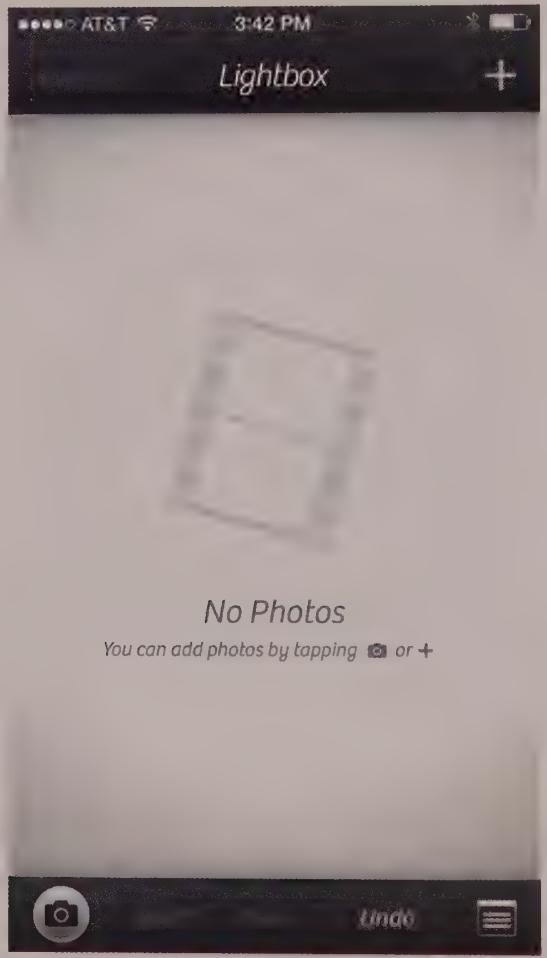
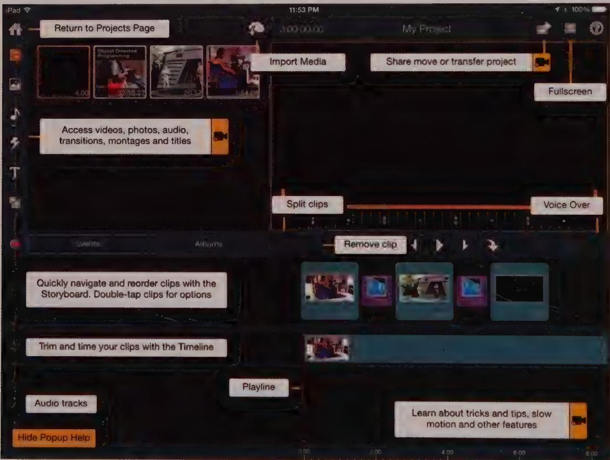

# DESIGN PRINCIPLE

Offer users a gallery of ready-to-use templates.

Some applications already offer galleries of predesigned templates (Microsoft's Office and Apple's iWork suites, for example), but more should do the same. Blank slates intimidate most people, and users shouldn't have to deal with one if they don't want to. A gallery of basic document types is a fine solution.

# Input and content area hints

A common but subtle form of contextual help is known as *hints*: small and often grayed-back text that provides brief directions or examples of use in input fields. This text can live below the input field (usually at a small point size) but is frequently inside the field

before it gets input focus. Once the field gets a cursor in it, the input hint text is cleared, and the field is ready for input. An expansion of this idea has become popular in apps that have a larger or central content area that is initially empty. Rather than sit there emptily without lifting a finger to help the user figure out how to get started, clever apps use this empty space to provide a more verbose description of what to do. Or they even provide one-time configuration controls as part of a content area hint, as shown in Figure 16-7.

  
Figure 16-7: Camera+ is an iOS photo app that uses the otherwise empty photo content area at initial launch to provide some verbose hinting and configuration controls.

# Pros and cons of wizards

Wizards are an idiom invented by Microsoft that rapidly gained popularity among developers and user-interface designers. A wizard attempts to guarantee success in using a feature by stepping users through a series of steps. These ease the user through a complex

process, typically for configuring a feature of the application, operating system, or connected hardware device.

Each of the wizard's dialogs asks users a question or two in sequence, and in the end the application performs whatever configuration task was requested. Although they are well meaning, the barrage of questions a wizard asks can feel like an interrogation to users, and it violates the design principle of Provide choices rather than ask questions (see Chapter 11).

Wizards have other problems, too. Most are written as rigid step-by-step procedures, rather than as intelligent conversations between the user and the application. These sorts of wizards rapidly devolve into exercises in confirmation messaging. The user learns that he merely needs to click the Next button on each screen, without critically analyzing why. Poorly designed wizards also tend to ask obscure questions. A user who doesn't know what an IP address is in a normal dialog will be equally mystified by it in a wizard.

Wizards are appropriate in a few cases. One is during the initial configuration of a hardware device, where registration, activation, or other handshaking between devices and services is required. iPhones and iPads start with a short wizard to select a language and activate various services before releasing the user to the home screen. Similarly, Sonos smart speakers use a wizard to identify a new device added to a whole-home audio network, which requires the controller to detect a button press.

A second appropriate use of the wizard format is for online survey interfaces. Since surveys are a set of questions, a wizard can appropriately break a survey into unintimidating chunks, while providing encouragement using a progress bar.

For most other contexts, a better way to create a wizard is to make a simple, automatic function that asks no questions of users. It just does the job, making reasonable assumptions (based on past behavior, or using well-researched defaults) about proper attributes and organization. The user then can change the output as he or she sees fit using standard tools. In other words, the best wizard is really more like a smart version of a gallery or template.

Wizards were purportedly designed to improve user interfaces. But in many cases they are having the opposite effect. They give developers and designers license to put raw implementation model interfaces on complex features with the bland assurance that "We'll make it easy with a wizard." This is all too reminiscent of the standard abdication of responsibility to users and usability: "We'll be sure to document it in the manual."

# ToolTips and ToolTip overlays

**ToolTips** (see Chapter 18) are an example of modeless interactive help, and they are very effective for desktop or stylus applications. If you were to ask the user to explain how to

perform an interface task, he would likely point to objects on the screen to augment his explanation. This is the essence of how ToolTips work, so the interaction is quite natural.

Unfortunately for mobile interfaces, touchscreens cannot yet support a finger hover state. But most mobile apps don't have enough real estate to permit modeless explanations onscreen while primary interactions are occurring anyway. The mobile solution to this conundrum is a hybrid of desktop-style ToolTip and mobile overlay concepts—Tool-Tip overlays.

ToolTip overlays are usually triggered by tapping a help button. Brief, ToolTip-like labels or notes for the primary functions on the current screen are displayed, each in proximity and pointing to its associated control (see Figure 16-8). The difference is that they are all turned on at once and presented modally, often with a close box that must be tapped to dismiss them.

  
Figure 16-8: Pinnacle Studio has a Tooltip overlay facility, which they call pop-up help. It is launched from the app's help menu. Their implementation is interesting because you can continue to use the app while the pop-up help is activated (not that you'd typically want to); it is dismissed by tapping the yellow button in the lower left corner.

While this approach can be overwhelming, it can be appropriate for complex authoring apps if used as a kind of "cheat sheet" for helping users remember controls and functions. As such, this idiom is best not used as a welcome screen.

# Traditional online help

It's important to have guided tours, overlays, or other "quick start" help for beginners. But the more verbose traditional online help should be focused on people who are already successfully using the product and who want to expand their horizons: the perpetual intermediates.

A complex application with many features and functions should come with a reference document: a place where users who want to expand their horizons can find definitive answers. Many users will turn to a general internet search engine to find an answer, and you need to make sure your answer is out there as the definitive one. Printed user manuals can be comfortable to use when users are studying application functionality as a whole, but they are cumbersome for getting quick answers to specific questions. This is the area where online help, with its indexed and full-text search capability, can shine.

