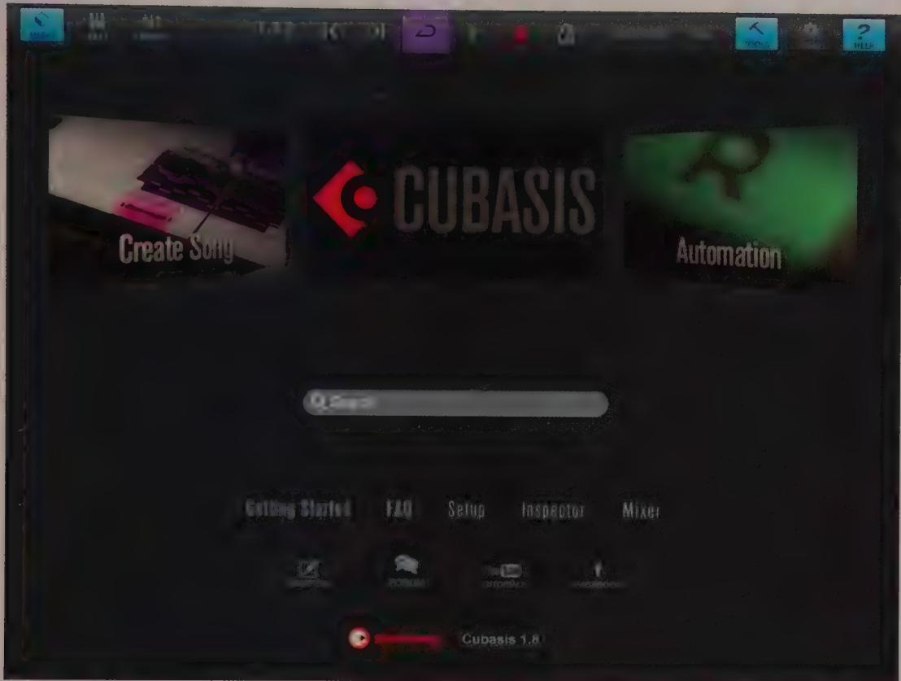

# Full-text search versus indexing

Although it might be tempting to forgo the extensive work involved in indexing because of the existence of a full-text search capability, there are good reasons to reconsider this decision. Full-text search is only as complete as the wording of the help text itself, and this might not encompass language that reflects users' mental models.

A user who needs to solve a problem might be thinking "How do I turn this cell black?", rather than "How can I set the shading of this cell to 100 percent?" If the help text or its index does not capture a user's way of phrasing or thinking, the help system will fail. It is usually easier to create these kinds of synonym mappings in an index, rather than in the help text itself. This index needs to be generated by examining the app and all its features, not simply by examining the help text itself. This is not always easy, because it demands that a highly skilled Indexer also be intimately familiar with each of the application's features and functions.

The set of index entries is arguably as important as the help text itself. The user will forgive a poorly written help entry more easily than he will forgive what he believes to be a missing help entry. The more goal-directed the thinking in creating the text and

the index, the better they will map to what might occur to the user when he searches for an answer.

A great example of a useful index can be found in The Joy of Cooking by Irma S. Rombauer and Marion Rombauer Becker (Scribner, 2006). Its index is one of the most complete and robust of any the authors have used.

It may sometimes be easier to rework the interface to improve its learnability than it is to create a really good index. While good online help is very useful and often critical, it should never be a crutch for a poorly designed product. Good design should greatly reduce users' reliance on any help system.

# Overview descriptions

The other missing ingredient from most online help systems is the overview. For example, if users want to know how the Enter Macro command works, and the help system explains uselessly that it is the facility that lets you enter macros into the system. What we need to know is scope, effect, power, upside, downside, general process, and why we might want to use this facility both in absolute terms and in comparison to similar products from other vendors. Be sure and lead your sections with overviews to explain these fundamental concepts.

# In-app user guides

Software applications are increasingly delivered online, without printed manuals, but the need for reference documentation still exists. User guides typically shouldn't be necessary for a well-designed mobile app or a simple desktop application. But for tablet-based authoring tools of particular complexity, such as digital audio workstation and other pro-level media editing apps, or for desktop productivity software of almost any sort, it's useful to provide an integrated user guide that's always accessible from the help menu (see Figure 16-9).

In-app guides should not be the first line of help; that task should be handled by guided tours or overlays. Instead, in-app guides should be a reference for detailed information on using complex functions. If your app is a complex pro tool, your users will appreciate the inclusion of the guide in-app so that they don't have to go looking for it on your website, and even more so if the guide's table of contents is hyperlinked, and the guide itself is full-text searchable, well-indexed, and printable.

  
Figure 16-9: Steinberg's Cubasis app has a sophisticated help system that includes a searchable in-app user guide, as well as links to user forums and video tutorials.

# Customizability

Interaction designers often face the conundrum of whether to make their products user-customizable. It is easy to be torn between some users' need to have things done their way and the clear problem this creates when the app's navigation suffers due to familiar elements being moved or hidden. The solution is to cast the problem in a different light.

# Personalization

People like to change things around to suit themselves. Even beginners, not to mention perpetual intermediates, like to put their own personal stamp on a frequently used application, changing it so that it looks or acts the way they prefer, uniquely suitsing their tastes. People will do this for the same reason they fill their identical cubicles with pictures of their spouses and kids, plants, favorite paintings, quotes, and cartoons.

Decorating the persistent objects—the walls—gives them individuality without major structural changes. It also allows you to recognize a hallway as being different from dozens of identical hallways because it is the one with the M. C. Escher poster hanging in it. The term personalization describes the decoration or embellishment of persistent objects.

Changing the color of objects on the screen is a personalization task. Windows has always been very accommodating in this respect, allowing users to independently change the color of each component of the Windows interface, including the color and pattern of the desktop itself. Windows gives users a practical ability to change the system font, too. Personalization is idiosyncratically modal (discussed a bit later in this chapter): People either love it, or they don't. You must accommodate both categories of users.

Tools for personalizing must be simple and easy to use, giving users a visual preview of their selections. Above all, they must be easy to undo. A dialog box that lets users change colors should offer a function that returns everything to the factory settings.

Personalization makes the places in which we work more likable and familiar. It makes them more human and pleasant to be in. The same is true of software. Giving users the ability to decorate their personal applications is both fun and potentially useful as a navigational aid.

On the other hand, moving the persistent objects themselves can hamper navigation. If the facilities people come into your office over the weekend and rearrange all the cubicles, finding your office again on Monday morning will be tough. (Persistent objects and their importance to navigation are discussed in Chapter 12.)

Is this an apparent contradiction? Not really. Adding decoration to persistent objects helps navigation, whereas moving persistent objects hinders navigation. The term configuration describes moving, adding, or deleting persistent objects.

# Configuration

Configuration is desirable for more experienced users. Perpetual intermediates, after they have established a working set of functions, will want to configure the interface to make those functions easier to find and use. They will also want to tune the application itself for speed and ease, but in all cases, the level of custom configuration will be light to moderate.

Configuration is a necessity for expert users. They are already beyond the need for more traditional navigation aids because they are so familiar with the product. Experts may use the application for several hours every day; in fact, it may be the main application for accomplishing the bulk of their job.

Moving controls around on toolbars is a form of personalization. However, the three left-most toolbar controls on many desktop apps, which correspond to File New, File Open, and File Save, are now so common that they can be considered persistent objects. A user who moves these around is configuring his application as much as he is personalizing it. Thus, there is a gray area between configuration and personalization.

Most intermediate users won't squawk if they can't configure their app, as long as it does its job well. Some expert users may feel slighted, but they will still use and appreciate the application if it works how they expect. In some cases, however, flexibility is critical. If you're designing for a rapidly evolving workflow, it's of utmost importance that the software used to support the workflow can evolve as quickly as the state of the art.

Also, corporate IT managers value configuration. It allows them to subtly coerce corporate users into practicing common methods or adhere to standards. They appreciate the ability to add macros and commands to menus and toolbars that make the off-the-shelf software work more intimately with established company processes, tools, and software. Many IT managers base their buying decisions on how easily an application can be configured for their enterprise environment. If they are buying 10 or 20 thousand copies of an app, they rightly feel that they should be able to adapt it to their particular style of work. Thus, it is not by accident that Microsoft Office applications are among the most configurable shrink-wrapped software titles available.

# Idiosyncratically modal behavior

Often usability testing may show that the user population is split almost equally on the effectiveness of a user interface idiom. Half of the users clearly prefer one idiom, and the other half prefer another. This sort of clear division of a population's preferences into two or more large groups indicates that their preferences are idiosyncratically modal.

Development organizations can become similarly emotionally split on issues like this. One group becomes the menu-item camp, and the rest of the developers are in the toolbar camp. As they wrangle and argue over the relative merits of the two methods, the answer is staring them in the face: Use both!

When the user population splits on preferred idioms, the software designers must offer both idioms. Both groups should be satisfied. It is no good to satisfy one-half of the population while angering the other half, regardless of which group you or your developers align yourselves with.

Windows offers an excellent example of how to cater to idiosyncratically modal desires in its menu implementation. Some people like menus that work how they did on the original Apple Macintosh. You click a menu bar item to make the menu appear; then—while

still holding down the button--you drag down the menu and release the mouse button on your choice. Other people find this process difficult and prefer to accomplish it without having to hold down the mouse button while they drag. Windows satisfies this preference by letting users click and release on the menu bar item to make the menu appear. Then users can move the mouse--button released--to the menu item of choice. Another click and release selects the item and closes the menu. The user can also still click and drag to select a menu item. The brilliance of these idioms is that they coexist peacefully with each other. Any user can mix the two idioms or stick with one or the other. No preferences or options need to be set; it just works.

Starting in Windows 95, Microsoft added a third idiosyncratically modal idiom to standard menu behavior: The user clicks and releases as before, but now he can drag the mouse along the menu bar, and the other menus are triggered automatically in turn (they did not carry this behavior over to their Ribbon UI, however). The Mac now supports each of these idioms on its menus; amazingly, all three are accommodated seamlessly.

# Localization and Globalization

Localization refers to translating an application for a particular language and culture. Globalization refers to making an application as universal as possible across many languages and cultures. Designing applications for use in different languages and cultures presents some special challenges to designers. Here again, consideration of command modalities can provide guidance.

Immediate interfaces such as direct manipulation and toolbar icon buttons are idiomatic (see Chapter 13) and visual rather than textual. Therefore, they can be globalized with considerable ease. Of course, it is important for designers to do their homework to ensure that colors or symbols chosen for these idioms do not have particular meanings in different cultures that the designer does not intend. (In Japan, for example, an X in a check box would likely be interpreted as deselection rather than selection.) However, in general, nonmetaphorical idioms should be fairly safe for globalized interfaces.

Pedagogic interfaces such as menu items, field labels, ToolTips, and instructional hints are language-dependent and thus must be the subject of localization via translation into appropriate languages. Here are some issues to bear in mind when creating interfaces that must be localized:

- The words and phrases in some languages tend to be longer than in others. German words, for example, on average can be significantly longer than those in English, and Spanish sentences tend to be some of the longest. Plan button and other text label layouts accordingly, especially on space-constrained mobile devices.

- Words in some languages, Asian languages in particular, can be difficult to sort alphabetically.   
- Ordering of day-month-year and the use of 12- or 24-hour notation for time vary from country to country.   
- Decimal points in numbers and currency are represented differently. Some countries use periods and commas the opposite of how they are used in the U.S.   
- Some countries use week numbers (for example, week 50 is in mid-December), and some countries use calendars other than the Gregorian calendar.

Menu items and dialogs, when they are translated, need to be considered holistically. It is important to make sure that translated interfaces remain coherent as a whole. Items and labels that translate straightforwardly in a vacuum may become confusing when grouped with other independently translated items. Semantics of the interface need to be preserved at the higher level as well as at the detail level.

# Accessibility

Designing for accessibility means designing your app so that it can be effectively used by people with cognitive, sensory, or motor impairments due to age, accident, or illness—as well as those without such impairments.

The World Health Organization estimates that 750 million people worldwide have some kind of disability. Nevertheless, accessibility is an area within interaction design—and user experience in general—that is frequently overlooked. Disabled users are often underserved by technology products.

While it is true that not every application may require an accessibility strategy or design, it's safe to say that most enterprise and consumer applications have users for whom accessible interfaces are necessary. This is particularly true for any application targeted at seniors, or at patients suffering from serious or debilitating illnesses.

# Goals of accessibility

For a product or service to be considered accessible, it should meet the following conditions for both unimpaired and impaired users:

- Users can perceive and understand all instructions, information, and feedback.   
- Users can perceive, understand, and easily manipulate any controls and inputs.   
- Users can navigate easily, and always be aware of where there are in an interface and navigational structure.

It's not necessary that these conditions (especially the first two) be accomplished within a single presentation of an interface for all users. A typical accessibility strategy is to design a separate accessibility mode or set of accessibility options. These options alter screen contrast and colors, change the size and weight of text, or turn on a screen reader and audible navigation system.

# Accessibility personas

During the research and modeling phase of your design, as part of your accessibility strategy, you might want to consider creating an accessibility persona to add to your persona set. Naturally, the ideal method of creating this persona would be to interview users or potential users of your product who have disabilities that would affect their use of the product. If this isn't possible, you can still create a provisional persona to help focus on accessibility issues in a somewhat less targeted way. Typically, an accessibility persona would be considered a secondary persona—someone with needs similar to your primary personas, but with some special needs that must be addressed without compromising their experience. Sometimes, though, selecting an accessibility persona as a primary can result in breakthrough products, as OXO and Smart Design did with their Good Grips product—it turns out that kitchen tools that are optimized for people with arthritis are more satisfying for everyone.

# Accessibility guidelines

The following 10 guidelines are not a replacement for exploring the specific needs of disabled users regarding your product and the design trade-offs involved. But they do provide a reasonable starting point for approaching accessible application design. More details about each appear below.

- Leverage OS accessibility tools and guidelines.   
- Don't override user-selected system settings.   
- Enable standard keyboard access methods.   
- Incorporate display options for those with limited vision.   
- Provide visual-only and audible-only output.   
- Don't flash, flicker, or blink visual elements.   
Use simple, clear, brief language.   
- Use response times that support all users.   
- Keep layouts and task flows consistent.   
- Provide text equivalents for visual elements.

# Leverage OS accessibility tools and guidelines

Some operating systems offer accessibility support such as screen readers and audible navigation aids for the vision-impaired, such as VoiceOver for iOS and TalkBack for Android. Your application should be structured to support the use of these OS-level tools and should conform to user interface guidelines for designing and implementing accessibility functionality. Keep in mind the following points:

- Your application shouldn't use keystrokes or gestures that are already committed to enabling OS-level accessibility features for application functions.   
- Your application should work properly when accessibility features are turned on.   
- Your application should use standard application programming interfaces (APIs) for input and output when possible to ensure compatibility with OS and third-party assistive technologies, such as screen readers.

# Don't override user-selected system settings

The application should not override system-level settings that support accessibility options for interface attributes such as color schemes, font sizes, and typefaces. This need not be true in the default application settings, but some accessibility options should revert to OS-level hints for visual style. Similarly, your application should accommodate any system-level accessibility settings for input methods and devices.

# Enable standard keyboard access methods

For desktop applications, keyboard accelerators and mnemonics should be employed (see Chapter 18), as well as a rational tab navigation scheme. The user should be able to traverse the entire set of user interface controls and content areas using the Tab key. Arrow keys should let the user traverse list, table, and menu contents. The Enter key should activate buttons and toggles.

# Incorporate display options for those with limited vision

Application settings should support a range of options for users with vision problems:

A high-contrast (minimum 80 percent) display option, using predominantly black text on white backgrounds   
- Options for enlarging the typeface and increasing its weight (ideally, these are independent settings)   
An option for color-blind-friendly information display, if applicable

- An option for minimizing motion and animation in UI elements, if these are used in the default interface

Furthermore, your application should not rely on color alone as the sole method of conveying the meaning of data or functionality. It should use other attributes, such as size, position, brightness, shape, and/or textual labeling, to make meaning clear.

# Provide visual-only and audible-only output

Support for vision-impaired users should be available in the form of audible interfaces, such as those provided by screen readers and OS-level accessibility services.. Applications should also support redundant visual and audio feedback for hearing-impaired users. Typically, the UI for vision-impaired users is realized as a separate application mode. Support for the hearing-impaired usually can be managed within the standard UI through careful design of the standard user feedback mechanisms to include both audible and visual elements.

# Don't flash, flicker, scroll, or blink visual elements

This suggestion is pretty self-explanatory. Flashing and other blinking at speeds greater than twice a second (2 Hz) can be confusing to the vision-impaired. They also can cause seizures in individuals with epilepsy and other brain disorders. Plus, it's usually annoying for everyone else as well. Automatically scrolling text and other animations can be confusing and difficult for those with visual impairments to perceive.

# Use simple, clear, brief language

This is another straightforward suggestion that needs little explanation. This is something you should be doing anyway. The shorter and simpler the text labels and instructional text in your interface (as long as they are still appropriately descriptive), the easier they will be to learn and use.

# Use response times that support all users

Allow users to elect for longer response times. A good rule of thumb for the longer duration is 10 times the average response times currently in your application. This includes the length of time that transitory notifiers are left visible after they launch. It also should apply to any timers on actions. In general, unless there is a really good reason to time out on an action (such as security), you should ideally avoid doing so, or if you must, make the time-out period user-adjustable.

# Keep layouts and task flows consistent

Again, this advice is good for all users. People with cognitive, motor, or vision impairments are best served if they need to remember and execute only a single navigation and action paradigm, rather than several different or incompatible ones. Consider how navigating your interface using a keyboard is likely to work on your screens, and try to make it as consistent as possible across all views and panes.

# Provide text equivalents for visual elements

Finally, make sure that any purely visual elements or controls in your desktop application or website are marked with text, so that screen readers can enunciate them. Microsoft Windows, for example, allows invisible ToolTips that can be enunciated by screen readers. They don't appear for users of the default application.

Similarly, it's important for web interfaces to assign tags to visual elements. This allows them to be understood by people using text-based browsers, browser-based voice readers, and other web-based accessibility tools.

Notes

1. World Health Organization, 2003

