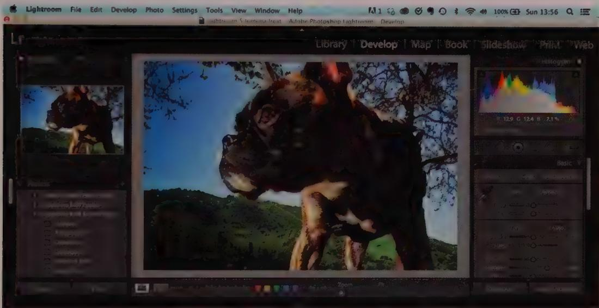
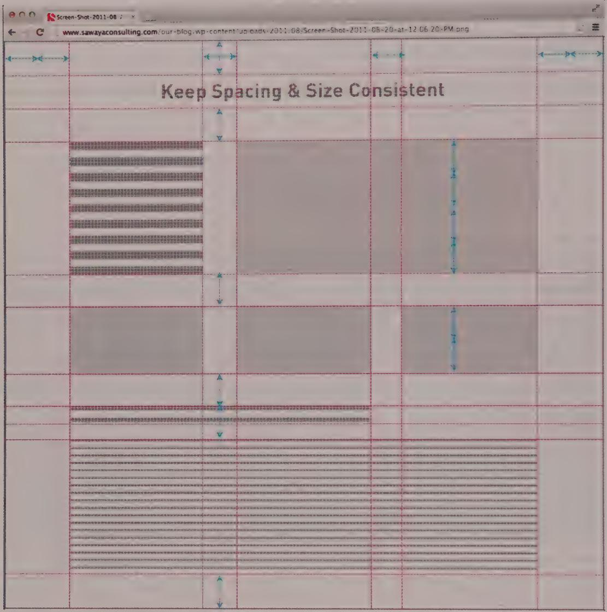
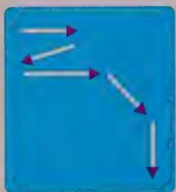
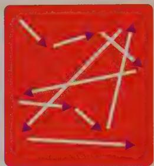
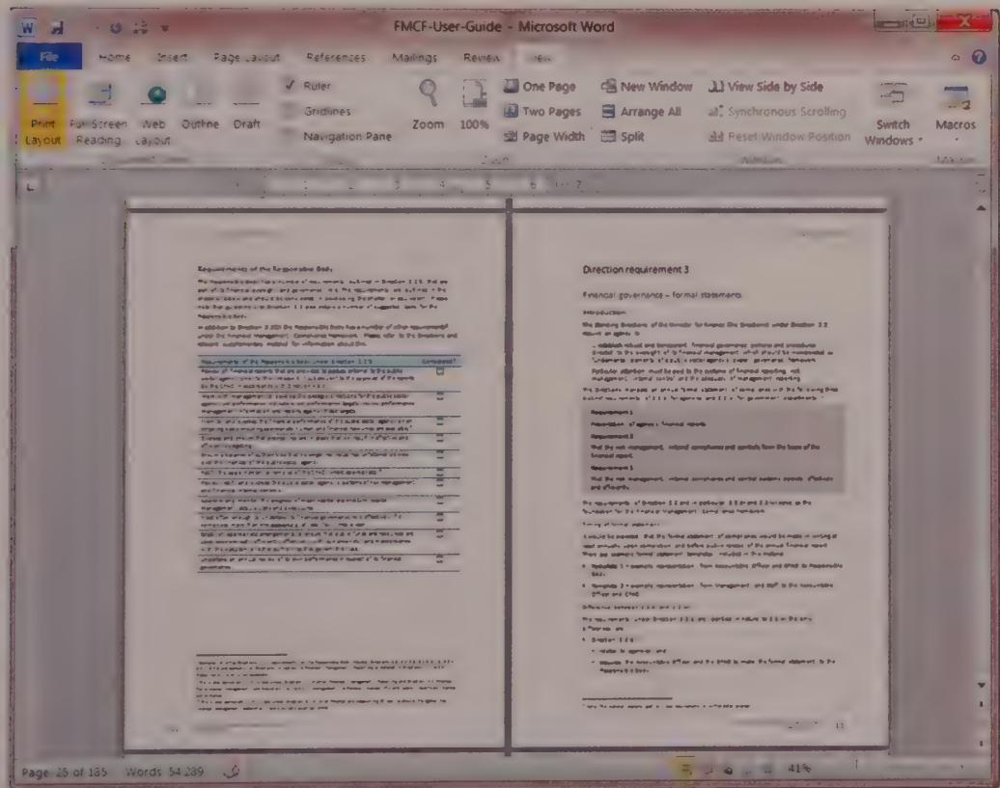

# INTEGRATING VISUAL DESIGN

As an interaction designer, you put a lot of effort into understanding your product's users. You also spend time crafting the interface's behaviors and the presentation of the content that helps users achieve their goals. However, these efforts will fall short unless you also dedicate significant work to clearly communicating to your users both what content is available and how they can interact with it. With interactive products this communication almost always happens visually, via a display. (With custom hardware, you can also communicate some product behavior through physical properties.)

In this chapter, we'll talk about effective, goal-directed visual interface design strategies. In Part III, we will provide more details about specific interaction and interface idioms.

# Visual Art and Visual Design

Practitioners of fine art and practitioners of visual design share a visual medium. However, while both must be skilled in and knowledgeable about that medium, their work serves different ends. Art is a means of self-expression on topics of emotional or intellectual concern to the artist and, sometimes, to society at large. Few constraints are imposed on the artist, and the more singular and unique the product of the artist's exertions, the more highly it is valued.

Designers, on the other hand, typically aim to create artifacts with specific utility for the people who use them. Whereas the concern of contemporary artists is primarily self-expression, visual designers are concerned with clear communication. As Kevin Mullet and Darrell Sano note in their book Designing Visual Interfaces (Prentice Hall, 1994), "design is concerned with finding the representation best suited to the communication of some specific information." In keeping with a Goal-Directed approach, visual designers should endeavor to present behavior and information in such a way that it is understandable and useful, supporting the organization's branding objectives as well as the personas' goals.

To be clear, this approach does not exclude aesthetic concerns, but rather places such concerns within a goal-directed framework. Although visual communication always involves some subjective judgment, we endeavor to minimize questions of taste. We've found that the clear articulation of user experience goals and business objectives is an invaluable foundation to designing the aspects of an interface in support of brand identity, user experience, and emotional response. (See Chapter 3 for more about visceral processing.)

# The Elements of Visual Interface Design

At its root, visual interface design is concerned with the treatment and arrangement of visual elements to communicate behavior and information. Every element in a visual composition has a number of properties, such as shape and color, that work together to create meaning. The ways in which these properties are applied to each element (and how they change over time and with interaction) allow users to make sense of content and the graphical interface. For example, when two interface objects share the same color, users assume they are related or similar. When two objects have contrasting colors, users assume the objects have some categorical difference. Visual interface design capitalizes on the human ability to differentiate between objects by distinct visual appearance, and in so doing creates meaning that is richer than the use of words alone.

When crafting a visual interface, keep in mind the following considerations.

# Context, context, context

Every single visual design guideline is subject to the context in which it is used. Are your users doing information work on large-screened desktop computers with overhead lighting? Are they standing in a dark room scanning the screen for the tiniest of biological details? Are they walking across a city holding your design in the glare of the sun? Are they cuddled up on a couch just playing around? Similar to conveying the brand (see below), the context of use must be taken as part of the givens that constrain the visual design.

# Shape

Is it round, square, or amoeba-like? Shape is the primary way we recognize what an object is. We tend to recognize objects by their outlines; a silhouette of a pineapple that's been textured with blue fur still reads as a pineapple. However, distinguishing among different shapes takes a higher level of attention than distinguishing some other properties, such as color or size. This means it's not the best property to contrast when your purpose is to capture the user's attention. The weakness of shape as a factor in object recognition is apparent to anyone who's glanced at Apple's OS X dock and mistakenly selected the round iTunes icon instead of the round iDVD icon, or latched on to the photo in iWeb and mistook it for iPhoto. These icons have different shapes, but they are of similar size, color, and texture.

# Size

How big or small is it in relation to other items on the screen? Larger items draw our attention more, particularly when they're much larger than similar things around them. Size is also an ordered and quantitative variable, which means that people automatically sequence objects in terms of their size and tend to assign relative quantities to those differences. If we have four sizes of text, for example, we assume that relative importance increases with size, and that bolded content is more important than regular. This makes size a useful property in conveying information hierarchies (more on them in a minute). Sufficient distinction in size is also enough to draw our attention quickly. Be aware that using size can have a cost. In his classic *The Semiology of Graphics* (University of Wisconsin Press, 1983), Jacques Bertin describes size as a dissociative property, which means that when something is very small or very large, it can be difficult to decipher other variables, such as shape.

# Color

Though most people speak of color loosely, designers must be very precise and deliberate when considering colors in an interface. Any choices should first take into account the users' goals, environment, the content, and the brand. After that, it's most useful to think of interface color in terms of value, hue, and saturation.

# Value

How light or dark is it? Of course, the idea of lightness or darkness is meaningful primarily in the context of an object compared to the background. On a dark background, dark type is faint, whereas on a light background, dark type is pronounced. Like size, value can be dissociative. If a photo is too dark or too light, for example, you can no longer perceive other details about it. People perceive contrasts in value quickly and easily, so

value can be a good tool for drawing attention to elements that need to stand out. Value is also an ordered variable. For example, lower-value (darker) colors on a map are easy to interpret as deeper water or denser population.

# Hue

Is it yellow, red, or orange? Great differences in hue draw our attention quickly, but users often have multilayered associations with hue. In some professions, hue has specific meaning we can take advantage of. For example, an accountant sees red as negative and black as positive, and (at least in the Western systems we're familiar with) a securities trader sees blue as "buy" and red as "sell." Colors also take on meaning from the social contexts in which we've grown up. To Westerners who've grown up with traffic signals, red means "stop" and sometimes even "danger," whereas in China, red is the color of good luck. Similarly, white is associated with purity and peace in the West, but with funerals and death in Asia. Unlike size or value, though, hue is not intrinsically ordered or quantitative, so it's less ideal for conveying that sort of data.

Color is best used judiciously to convey important meaning in an interface. To create an effective visual system that allows users to keep track of implied meanings, you should use a limited number of hues. The "carnival effect" of having a crowded color palette overwhelms users and limits your ability to communicate. Hue is also where an interface's branding and communication needs can collide; it can take a talented visual designer (and skilled diplomat) to navigate these waters. Hue is also tricky since color blindness is common among the general population, and there are many types of color blindness.

# Saturation

Is the hue brilliant, like springtime flowers, or dull, like a gray stone? Saturation draws attention similar to the way that hue and value do, that is, when there is a strong contrast at play. The sapphire object will stand out amidst an array of moss green objects. Saturation is quantitative, in that greater saturation ties tightly to higher values. Though saturated colors can imply excitement and dynamism, it can also read as loud and cacophonous. The "carnival effect" mentioned above can be exacerbated with too much saturation across the palette, and can compete with actual content.

# HSV in combination

Hue, saturation, and value are three variables that together can describe any color in an interface, in a model sensibly named HSV. (Another common system, RGB, lets designers specify the red, green, and blue values for a given color.) Designers should be judicious in how they use contrasts within these variables as well as how they relate across the entire palette.

# Orientation

Is it pointing up, down, or sideways? This is a useful variable to employ when you have directional information to convey (up or down, backward or forward). Orientation can be difficult to perceive with some shapes or at small sizes, though, so it's best used as a secondary communication vector. For example, if you want to show that the stock market is going down in a single graphic, you might want to use a downward-pointing arrow that's also red.

# Texture

Is it rough or smooth, regular or uneven? Of course, elements on a screen don't have real texture, but they can have the appearance of it. Texture is seldom useful for conveying differences or calling attention, since it requires a lot of attention to distinguish. Texture also takes a fair number of pixels and higher color resolutions to convey. However, it can be an important affordance cue; when we see a textured rubber area on a physical device, we assume that's where we're meant to grab it. Ridges or bumps on a user interface (UI) element generally indicate that it's draggable, and a bevel or drop shadow on a button makes it seem more clickable.

The current fashion for "flat" or non-skeumorphic design has brought about a diminished use of texture or simulated materiality. But we have found that even in a highly minimalist design, a small amount of texture applied appropriately can greatly improve the learnability of a user interface.

# Position

Where is it relative to other elements? Like size, position is both an ordered and quantitative variable, which means it's useful for conveying information about hierarchy.

We can leverage a screen's reading order to locate elements sequentially. For Western readers, this puts the most important or first-used element in the top left. Position can also be used to create spatial relationships between objects on the screen and objects in the physical world, as often happens with medical and piloting interfaces.

Spatial relationships can in turn be used to allude to conceptual relationships: Items that are grouped together on the screen are interpreted to be similar. The use of spatial positioning to express logical relationships can be further enhanced with motion. In the Mail app on iOS, the horizontal animation that transitions from the inbox to an individual e-mail helps reinforce the logical hierarchy that is used to organize the application.

# Text and Typography

Text is a critical component of almost all user interfaces. Written language can convey dense and nuanced information, but you must be careful to use text appropriately, because it also has great potential to confuse and complicate. Good and effective typography is its own field of study, but the following are good rules of thumb.

People recognize words primarily by their shapes. The more distinct the shape, the easier the word is to recognize, which is why WORDS TYPED IN ALL CAPITAL LETTERS ARE HARDER TO READ than a mixture of upper and lowercase. They also seem to be shouting. The familiar pattern-matching hints of word shape are absent in capitalized words, so we must pay much closer attention to decipher what is written. Avoid using all caps in your interfaces.

Recognizing words is also different from reading, in which we scan the lines of text and interpret the meaning of words in context. This is fine for content of course, but less so for interfaces. Interfaces should try to minimize the amount of text that must be read in order to use it successfully.

DESIGN PRINCIPLE

Visually show what; textually tell which.

When text must be read in interfaces, the following guidelines apply:

- Use high-contrast text—Make sure that the text contrasts with its background, and do not use complementary colors that may affect readability. We aim for 80 percent contrast as a general rule.   
- Choose an appropriate typeface and size—In general, a crisp sans-serif font such as Verdana or Tahoma is your best bet for readability. Serif typefaces such as Times and Georgia can appear "hairy" onscreen, but this can be mitigated with very high-resolution displays, using a large-enough size, and sub-pixel font smoothing technologies. Type sizes of less than 10 pixels are difficult to read in most situations. If you must use small type, it's usually best to go with an aliased sans-serif typeface.   
- Phrase your text succinctly—Make your text understandable by using the fewest words necessary to clearly convey meaning. Also, try to avoid abbreviations. If you must abbreviate, try to use standard abbreviations.

# Information hierarchy

When users are presented with a visual interface, they go through an unconscious process of evaluating the most important object or information there, and what the relationships

are between it and the other visible content and controls. To make this decoding process as quick and easy as possible for users, visual designers create an information hierarchy, using differences in visual attributes (large vs. small, light vs. dark, top vs. bottom, etc.) to stratify the interface. For transient applications, the information hierarchy should be very apparent, with strong contrasts between the "levels" of importance in a given layout. With sovereign applications, the information hierarchy can be more subtle.

# Motion and change over time

Any of the elements mentioned in this section can change over time to convey information, relationship between parts, command attention, ease transitions between modes, and confirm the effects of commands. In iOS for desktop, for example, elements rarely simply appear and disappear. After clicking an application icon in the dock, it will bounce to confirm that the command was received and the application is loading. Minimizing a window doesn't just make it vanish: The "genie" animation shrinks and deforms it, sliding it into a thumbnail position on the dock. The animation confirms that the minimize command was received and tells the user exactly where the window waits, minimized, until the user summons it again. Mastery of how building blocks change over time, and especially motion, is a vital skill for the visual interface designer.

# Visual Interface Design Principles

The human brain is a powerful pattern-recognition computer, making sense of the dense quantities of visual information that bombard us everywhere we look. Our brains manage the overwhelming amount of data flowing into our eyes by discerning visual patterns and establishing priorities to the things we see. This in turn allows us to make sense of the visual world. Pattern recognition is what allows us to process visual information so quickly. For example, imagine manually calculating the trajectory of a thrown baseball to predict where it lands. With a pen and paper you'd need a formula and measurements of its path, speed, weight, wind. But our eyes and brains together do it in a split second, without conscious effort on our part. To most effectively convey the behavior of an application to users, visual interface designers should be taking advantage of users' innate visual processing ability.

One chapter is not nearly enough to do justice to the topic of visual interface design. However, some important principles can help make your visual interface more compelling and easier to use. As mentioned earlier in the chapter, Mullet and Sano provide an accessible and detailed analysis of these fundamental principles; we will summarize some of the most important visual interface design concepts here to get you up and running.

Visual interfaces should do the following:

- Convey a tone / communicate the brand   
- Lead users through the visual hierarchy   
- Provide visual structure and flow at each level of organization   
- Signal what users can do on a given screen   
- Respond to commands   
Draw attention to important events   
- Build a cohesive visual system to ensure consistency across the experience   
- Minimize the amount of visual work   
- Keep it simple

We discuss each of these principles in more detail in the following sections.

# Convey a tone/communicate the brand

More and more, interactive systems are the main way through which customers experience brands. So while the brand considerations should never override users' goals, an effective interface should embody the brand promise of its product line and organization. Photoshop feels similar to the Creative Suite and fits in with the Adobe brand. Outlook feels similar to the rest of the Office Suite, and helps distinguish Microsoft from competitor's products.

It's therefore necessary for you to understand what that brand promise is before undertaking the design of an interface. This can be tricky if the company doesn't have it well articulated. It's rarely if ever communicated explicitly in marketing and advertising materials, and younger or smaller companies may not have had the chance to identify what it is. Larger and public companies almost always have a marketing or design department able to provide it or are willing to work with interaction designers to build one out.

Cooper works with its clients to help identify experience attributes, a collection of a handful of adjectives that together describe how any interaction through the product or service should feel (see Chapter 5 for a discussion of how these are created). These attributes are often presented as a "word cloud" that includes smaller words that help inflect or disambiguate the attributes themselves. Once determined, the attributes act as a set of guidelines for the interface design. Most often this directly affects the visual design, but can also be used to guide interaction designers when deciding between functionally similar designs.

The attributes sometimes express tension between its words. "Secure" and "nimble" might be in the same cloud, for example. These are useful tensions, as early style studies

can optimize for one or two of the experience attributes. This makes them in turn easier to distinguish and discuss with stakeholders, and shows how each relates to the brand.

# Lead users through the visual hierarchy

In looking at any set of visual elements, users unconsciously ask themselves "What's important here?" followed almost immediately by "How are these things related?" We need to make sure our user interfaces provide answers to both of these questions by creating hierarchy and establishing relationships.

Based on scenarios, determine which controls and bits of data users need to understand instantly, which are secondary, and which are needed only by exception. This ranking informs the visual hierarchy.

Next use the basic visual elements (position, color, size, etc.) to distinguish levels of hierarchy. The most important elements could be larger; have greater contrast in hue, saturation, and/or value in relation to the background; and be positioned above and indented or outdented in relation to other items. Less important elements could be less saturated, have less value and hue contrast against the background, and should be smaller than and placed in consistent alignment with other items.

Of course, you should adjust these properties with restraint, since the most important element doesn't need to be huge, red, and outdated. Often, varying just one of these properties does the trick. If you find that two items of different importance are competing for attention, it's often a good approach to "turn down" the less important one, rather than "turn up" the more important. This will leave you with more "headroom" to emphasize critical elements. Think about it this way: If every word on a page is red and bold, do any of them stand out?

Establishing a clear visual hierarchy is one of the harder tasks in visual interface design. It takes skill and talent to keep an overall style, optimize information density, and respect the needs of the particular screen. Though users almost never notice good visual hierarchy, a bad one will jump out for its confusion and difficulty.

# Establish relationships

To convey which elements are related, return to your scenarios to determine not only which elements have similar functions but also which elements are used together most often. Elements that tend to be used together generally should be grouped spatially and perhaps sequentially to reinforce conceptual relationships and to minimize mouse movement. Elements that aren't necessarily used together but have similar functions may be grouped visually even if they are not grouped spatially.

Items in proximity to one another generally are related. In many interfaces, this grouping is done in a heavy-handed fashion, with bounding boxes everywhere you look, sometimes even around just one or two elements. In many cases, you can accomplish the same thing more effectively with differences in proximity. For example, on a toolbar, perhaps there are 4 pixels between buttons. To group the File commands, such as Open, New, and Save, you could simply leave 8 pixels between the File command buttons and other groups of buttons.

So group items that are not adjacent by giving them common visual properties, forming a pattern that eventually takes on meaning for users. The standard blue links in HTML, for example, make it easy for a user to parse a screen for content-related navigation options.

After you have decided what the groups are and how best to communicate them visually, consider how distinguishable they need to be, and how prominent the group needs to appear in the display.

# Occasionally, squint at it

A good way to help ensure that a visual interface design employs hierarchy and relationships effectively is to use what graphic designers call the squint test. Close one eye and squint at the screen with the other eye to see which elements pop out, which are fuzzy, and which seem to be grouped. Changing your perspective can often uncover previously undetected issues in layout and composition.

# Provide visual structure and flow at each level of organization

It's useful to think of user interfaces as being composed of visual and behavioral elements, which are used in groups, which are then grouped into panes, which then may, in turn, be grouped into screens, views, or pages. These groupings, as discussed earlier, can be accomplished through spacing or shared visual properties. A sovereign application may have many such levels of structure. Therefore, it is critical that you maintain a clear visual structure so that the user can easily navigate from one part of your interface to another, as his workflow requires. The rest of this section describes several important attributes that help define a crisp visual structure.

# Align to a grid

Aligning visual elements is one of the key ways that designers can help users experience a product in an organized, systematic way. Grouped elements should be aligned both horizontally and vertically, as shown in Figure 17-1. In general, every element on the screen should be aligned with as many other elements as possible. The decision not to align

elements or groups of elements should be made judiciously, and always to achieve a specific differentiating effect. In particular, designers should take care to do the following:

- Align labels—Labels for controls stacked vertically should be aligned with each other; unless labels differ widely in length, left justification is easier for users to scan than right justification.   
- Align within a set of controls—A related group of check boxes, radio buttons, or text fields should be aligned according to a regular grid.   
- Align across control groups and panes—Groups of controls and other screen elements should all follow the same grid wherever possible.

  
Figure 17-1: Adobe Lightroom makes very effective use of alignment to a layout grid. Text, controls, and control groups are all tightly aligned, with a consistent atomic spacing grid. It should be noted that the right alignment of controls and control group labels may compromise scanability.

A grid system is one of the most powerful tools available to the visual designer. Popularized by Swiss typographers in the years after World War II, a grid provides a uniform and consistent structure to layout, which is particularly important when you're designing an interface with several levels of visual or functional complexity. After interaction designers have defined the overall framework for the application and its user interface elements (as discussed in Chapter 5), visual interface designers should help regularize the layout into a grid structure. It should emphasize top-level elements and structures and provide room for lower-level or less-important controls.

Typically, the grid divides the screen into several large horizontal and vertical regions, as shown in Figure 17-2. A well-designed grid employs an atomic grid unit that represents the smallest spacing between elements. For example, if your atomic unit is 4 pixels, spacing between screen elements and groups will all be in multiples of 4 pixels.

  
Figure 17-2: This sample layout grid prescribes the size and position of the various screen areas employed by a website. This grid ensures regularity across different screens. It also reduces the amount of work that a designer must do to lay out the screens and the work that the user must do to read and understand the screens.

Ideally, a grid should also have consistent relationships between different-sized screen areas. These relationships typically are expressed as ratios. Here are three commonly used ratios:

The celebrated "golden section," or phi (approximately 1.6l), is found frequently in nature and is thought to be particularly pleasing to the human eye.

- The square root of 2 (approximately 1:1.14) is the basis of the international paper size standard (the A4 sheet).   
4:3 is the aspect ratio of most computer displays.

Of course, you must strike a balance between idealized geometric relationships and the specific spatial needs of the functions and information that must be presented onscreen. A perfect implementation of the golden section will do nothing to improve the readability of a screen where things are jammed together with insufficient spacing.

A good layout grid is modular, which means that it should be flexible enough to handle necessary variation while maintaining consistency wherever possible. And, as with most things in design, simplicity and consistency are desirable. If two areas of the screen require approximately the same amount of space, make them exactly the same size. If two areas have different requirements, make them substantially different. If the atomic grid unit is too small, the grid will become unrecognizable in its complexity. Slight differences can feel unstable to users (although they are unlikely to know the source of these feelings) and ultimately fail to capitalize on the potential strength of a strong grid system.

The key is to be decisive in your layout. Almost a square is no good. Almost a double square is also no good. Almost a golden rectangle is no good. If your layout is close to a simple fraction of the screen, such as a half, third, or fifth, adjust the layout so that it is exactly a half, third, or fifth. Make your proportions bold, crisp, and exact.

Using a grid system in visual interface design provides several benefits:

- Usability—Because grids attempt to regularize positioning of elements, users can quickly learn where to find key interface elements. If a screen header is always in precisely the same location, the user doesn't have to think or scan to find it. Consistent spacing and positioning support people's innate visual-processing mechanisms. A well-designed grid greatly improves the screen's readability.   
- Aesthetic appeal—If you carefully apply an atomic grid and choose the appropriate relationships between the various areas of the screen, your design can create a sense of order that feels comfortable to users.   
- Efficiency—Standardizing your layouts will reduce the amount of labor required to produce high-quality visual interfaces. We find that defining and implementing a grid early in design refinement results in less iteration and "tweaking" of interface designs. A well-defined and communicated grid system results in designs that can be modified and extended, allowing developers to make appropriate layout decisions should alterations prove necessary.

# Create a logical path

In addition to precisely following a grid, the layout must properly structure an efficient logical path for users to follow through the interface, as shown in Figure 17-3. It must take into account the fact that (for Western users who read this way) the eye moves from top to bottom and left to right.

Logical path

Eye movements match the path through the interface

No logical path

Everything is all over the place

  
Figure 17-3: Eye movement across an interface should form a logical path that enables users to efficiently and effectively accomplish goals and tasks.

# Balance the interface elements

Perfectly symmetrical interfaces lack a sense of hierarchy that encourages the user's eye to flow through the screen. Balanced asymmetry provides visual entry points to the screen and major screen areas. Experienced visual designers are adept at achieving asymmetrical balance by controlling the visual weight of individual elements much as you might balance people of different weights on a seesaw. Asymmetrical design is difficult to achieve in the context of user interfaces because of the high premium placed on white space by screen real-estate constraints. The squint test is again useful for seeing whether a display looks lopsided.

# Signal what users can do on a given screen

A user encountering a screen or a function for the first time looks to the visual design to help him determine what he can do on the screen. This is the principle of affordance, discussed in Chapter 13. Affordance breaks down to design of controls and content categories with layout (of course), icons, visual symbols, and by pre-visualizing results when possible.

# Use icons

In addition to their functional value, icons can play a significant role in conveying the desired brand attributes. Bold, cartoonish icons may be great if you're designing a

website for kids, whereas precise, conservatively rendered icons may be more appropriate for a productivity application. Whatever the style, it should be consistent. If some of your icons use bold black lines and rounded corners, and others use thin, angular lines, the visual style won't hold together.

Icon design and rendering is a craft in and of itself; rendering understandable images at low resolution takes considerable time and practice and is better left to trained visual designers. Icons are a complicated topic from a cognitive standpoint, so we will highlight only a few key points here. If you want to understand more about what makes usable icons, we highly recommend William Horton's The Icon Book (Wiley, 1994). You may find the examples dated, but the principles still hold true.

# Convey a sense of the function

Designing icons to represent functions or operations performed on objects leads to interesting challenges. The most significant challenge is to represent an abstract concept in iconic, visual language. In these cases, it is best to rely on idioms rather than to force a concrete representation where none makes sense. You also should consider adding Tool-Tips (see Chapter 18) or text labels.

For more obviously concrete functions, some guidelines apply:

- Represent both the action and an object acted on to improve comprehension. Nouns and verbs are easier to comprehend together than verbs alone. (For example, a Cut command represented by a document with an X through it may be more readily understood than a more metaphorical image of a pair of scissors.)   
- Beware of metaphors and representations that may not have the intended meanings for your target audience. For example, although the thumbs-up gesture means "OK" in Western cultures and might strike you as an appropriate way to communicate approval, it is offensive in Middle Eastern (and other) cultures and should be avoided in any internationalized application.   
- Group related functions to provide context, either spatially or, if this is not appropriate, using color or other common visual themes.   
- Keep icons simple; avoid excessive visual detail.   
- Reuse elements when possible so that users need to learn them only once.

# Associate visual symbols with objects

Most applications will need visual symbols to represent objects in the user's workflow. For example, in a photo management app, each image file is represented by a thumbnail. When these symbols can't be representational or metaphoric, they can idiomatic. (See

Chapter 13 for more information on the strengths of idioms.) You could represent these objects with text alone, such as with a filename, but a unique visual helps an intermediate user locate it onscreen quickly. To establish the connection between symbol and object, try to use the symbol whenever the object is represented onscreen.

Designers must also take care to visually differentiate symbols representing different object types. Discerning a particular icon within a screen full of similar icons is as difficult as discerning a particular word within a screen full of words. It's particularly important to visually differentiate objects that exhibit different behaviors, such as buttons, sliders, and check boxes.

DESIGN PRINCIPLE

Visually distinguish elements that behave differently.

# Render icons and visual symbols simply

The graphics capabilities of color screens is now commonly at a very high resolution, so it is tempting to render icons and visuals with ever-increasing detail, producing an almost photographic quality. However, this trend ultimately does not serve user goals, especially in productivity applications. Icons should remain simple and schematic, minimizing the number of colors and shades and retaining a modest size.

Although fully-rendered icons may look great, they tend to fail for a number of reasons. They draw undue attention to themselves. They render poorly at small sizes, meaning that they must take up extra real estate to be legible. They encourage a lack of visual cohesion in the interface, because only a small number of functions (mostly those related to hardware) can be adequately represented with such concrete photorealistic images.

# Pre-visualize results when possible

Instead of using words alone to describe the results of interface functions (or, worse, not giving any description), use visual elements to convey users what the results will be. Don't confuse this with using icons on control affordances. Rather, in addition to using text to communicate a setting or state, render an illustrative picture or diagram that communicates the behavior. Although visualization often consumes more space, its capability to clearly communicate is well worth the pixels. In recent years, Microsoft has discovered this fact, and the dialogs in Microsoft Word, for example, have begun to bristle with visualizations of their meaning in addition to the textual controls. Photoshop and other image-manipulation applications have long shown thumbnail previews of the results of visual-processing operations.

<!-- Chunk 9 End -->

<!-- Chunk 10 Start -->

Microsoft Word's Print Preview view, shown in Figure 17-4, shows what a printed document will look like with the current paper size and margin settings. Many users have trouble visualizing what a 1.2-inch left margin looks like; the Preview control shows them. Microsoft could go one better by allowing direct input on the Preview control in addition to output, allowing users to drag the picture's left margin and watch the numeric value in the corresponding spinner ratchet up and down. The associated text field is still important—you can't just replace it with the visual one. The text shows the precise values of the settings, whereas the visual control accurately portrays the look of the resulting page.

  
Figure 17-4: Microsoft Word Print Preview is a good example of a visual expression of application functionality. Rather than requiring users to visualize what a 1.2-inch margin might look like, this function allows the user to easily understand the ramifications of different settings.

# Respond to commands

After executing a command from a swipe, tap, or click, the user needs to see some response, to know that the system has "heard" them. In some cases, the output is instant and immediate. The user selected a new typeface for some selected text, and that text changes to display in the new one. This response does not need extra visual design beyond that of the tools itself.

If the response takes longer than a tenth of a second but less than a second, you will need to provide one subtle visual cue that the command was received, and another when the activity is complete.

If the response takes longer than that up to ten seconds, you'll need to let the user know about the small delay and provide some visual cue that the process is running, most commonly with a looping animation of some sort along with an estimate of the time it will take. A common example is the single-pixel progress bars at the top of web pages expected to load quickly.

If a process will take longer than ten seconds, its usually best to design an alert explaining the delay, another for a running status update that lets them know the process is continuing in the background, followed by a respectful cue when the process is complete so they can return to the task.

# Draw attention to important events

Older software was conceived as a tool, with users needing to look around to find important system events. But better, more goal-oriented software offers that information to users proactively. Badges are an example on many smartphones that embody this principle. At a glance, the user is aware that he has two games where his opponents have completed their moves, a few text messages, and some social media mentions to check on.

The tools to draw attention involve the fundamentals of human perception and are all based on contrast: Contrast of size, color, motion, etc. Make the thing you want to get attention different, and it will command attention. This sounds simple, but there are two challenges.

The first is that the attention-getting mechanisms are not under our conscious control. That makes sense when you consider that they evolved to alert us to sudden changes in the environment. So present them with a large contrast on screen, and you draw them away from their current task. This can be perceived as rude if it's misapplied. (See Chapter 8 for more about this principle.) The deservedly vilified blink tag from early days of the web is a prime example. Blinking objects command our attention so strongly that it's difficult to pay attention to anything else.

The second challenge is that it can be difficult to keep the attention signal effective but in line with the experience keywords. If your app is meant to be serene, yes, a klaxon will get the users attention, but will also break the promise that the app has made.

# Minimize the amount of visual work

Visual noise within an interface is caused by superfluous visual elements that detract from the primary objectives of communicating affordances and information. The same is true for user interfaces. Visual noise can take many forms:

- Ornate embellishment   
3D rendering that doesn't add information   
- Rule boxes and other visually "heavy" elements to separate controls   
Crowding of elements   
- Intense colors, textures, and contrast   
Using too many colors   
Weak visual hierarchy

Cluttered interfaces attempt to provide an excess of functionality in a constrained space, resulting in controls that visually interfere with each other. Visually baroque, disorderly, or crowded screens increase the user's cognitive load.

# Keep it simple

In general, visual interfaces should strive to be minimal, such as simple geometric forms or a restricted color palette composed primarily of less-saturated or neutral colors balanced with a few high-contrast accent colors that emphasize important information. Typography should not vary widely in an interface: Typically one or two typefaces, specified to just a few sizes, is sufficient for most applications.

Unnecessary variation is the enemy of a coherent, usable design. If the spacing between two sets of elements is nearly the same, make that spacing exactly the same. If two typefaces are nearly the same size, adjust them to be the same size. Every visual element and every difference in color, size, or other visual property should be there for a reason. If you can't articulate a good reason why it's there, get rid of it.

Good visual interfaces, like any good visual design, are visually efficient. They make the best use of the minimal set of visual and functional elements. A popular technique used

by both graphic designers and industrial designers is to experiment with removing individual elements to test their contribution to the clarity of the intended message.

