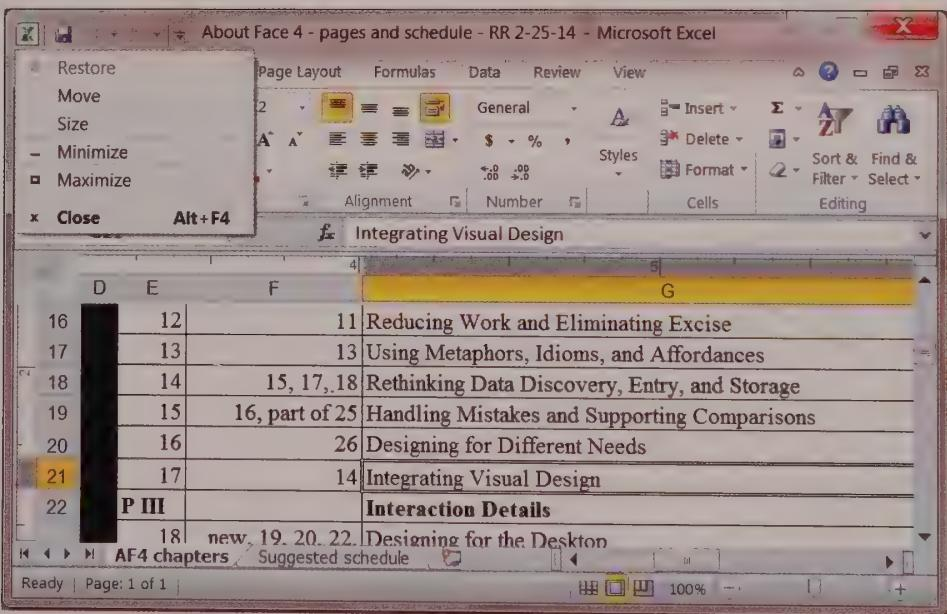
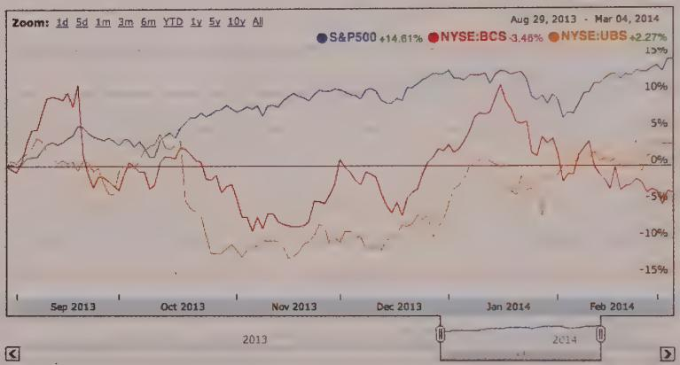
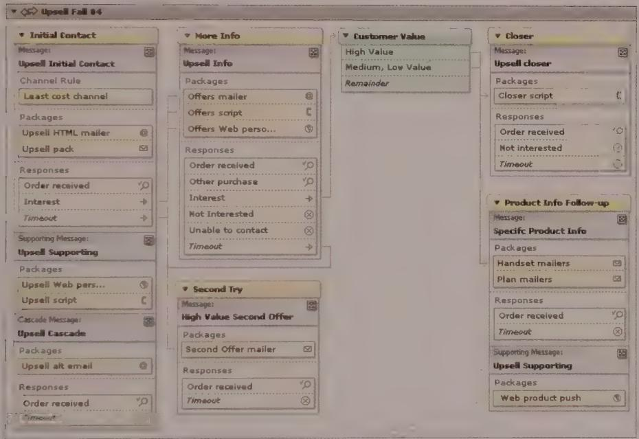
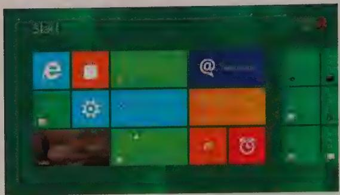

# DESIGN PRINCIPLE

Take things away until the design breaks, and then put that last thing back in.

As pilot and poet Antoine de Saint-Exupéry famously said, "Perfection is attained not when there is no longer anything to add, but when there is no longer anything to take away." As you create your interfaces, you should constantly be looking to simplify, visually. The more useful work a visual element can accomplish while still retaining clarity, the better.

Related to the drive for simplicity is the concept of leverage, which is where a single interface element is used for several related purposes. For example, in Microsoft Windows 8, an icon appears next to the window's title, as shown in Figure 17-5. This icon visually communicates the window's contents (for example, whether it is an Explorer window or a Word document) and provides access to window configuration commands such as Minimize, Maximize, and Close.

  
Figure 17-5: The icon in the title bar of windows in Windows 8 is a good example of leverage. It communicates the window's contents and provides access to window configuration commands.

# Visual Information Design Principles

Like visual interface design, visual information design has many principles that the designer can use to her advantage. Information design guru Edward Tufte asserts that good visual design is "clear thinking made visible" and that good visual design is achieved through an understanding of the viewer's "cognitive task" and a set of design principles.

Tufte claims that information design has two important problems:

- It is difficult to display multidimensional information (information with more than two variables) on a two-dimensional surface.   
- The resolution of the display surface often is not high enough to display dense information. Computers present a particular challenge. Although they can add motion and interactivity, computer displays have a lower information density compared to paper. (The retina displays sold by Apple with some of their products have a much higher pixel density, but are not standard, and risky to presume for all users.)

Although both points are certainly true, the visual interface designer can leverage one capability not available to the print information designer: interactivity. Unlike a print display, which must convey all the data at once, electronic displays can progressively reveal information as users need more detail. This helps make up, at least in part, for the resolution limitations.

Even with the differences between print and digital media, some universal information design principles—indifference to language, culture, and time—help maximize the effectiveness of any information display.

In his beautifully executed volume, The Visual Display of Quantitative Information (Graphics Press, 2001), Tufte introduces seven "Grand Principles," which we briefly discuss in the following sections as they relate specifically to digital interfaces and content.

According to Tufte, visually displayed information should do the following:

Enforce visual comparisons   
Show causality   
Show multiple variables   
- Integrate text, graphics, and data in one display   
- Ensure the content's quality, relevance, and integrity   
Show things adjacent in space, not stacked in time   
- Don't dequantify quantifiable data

We will briefly discuss each of these principles as they apply to the information design of software-enabled media.

# Enforce visual comparisons

You should provide a means for users to compare related variables and trends or to compare before-and-after scenarios. Comparison provides a context that makes the information more valuable and comprehensible to users (see Figure 17-6). Adobe Photoshop, along with many other graphics tools, makes frequent use of previews, which allow users to easily do before-and-after comparisons interactively.

  
Figure 17-6: This graph from Google finance compares the performance of two stocks with the S&P 500 over a period of time. The visual patterns allow a viewer to see that Barclays Bank (BCS) and UBS are closely correlated to each other and only loosely correlate to the S&P 500.

# Show causality

Within information graphics, clarify cause and effect. In his books, Tufte relates the classic example of the space shuttle Challenger disaster. Tufte believes the tragedy could have been avoided if charts prepared by NASA scientists had been organized to more clearly present the relationship between air temperature at launch and severity of O-ring failure. In interactive interfaces, you should employ rich visual modeless feedback (see Chapter 15) to inform users of the potential consequences of their actions or to provide hints on how to perform actions.

# Show multiple variables

Data displays that provide information on multiple related variables should be able to display them all simultaneously without sacrificing clarity. In an interactive display, the user should be able to selectively turn off and on the variables to make comparisons

easier and correlations (causality) clearer. Investors are often interested in the correlations between different securities, indexes, and indicators. Graphing multiple variables over time helps uncover these correlations, as shown in Figure 17-6.

# Integrate text, graphics, and data in one display

Diagrams that require separate keys or legends to decode require additional cognitive processing by users and are less effective than diagrams with integrated legends and labels. Reading and deciphering diagram legends is yet another form of navigation-related excise. Users must move their focus between diagram and legend and then reconcile the two in their minds. Figure 17-7 shows an interactive example that integrates text, graphics, and data, as well as input and output—a highly efficient combination for users.

  
Figure 17-7: This "Communication Plan" is an interface element from a tool for managing outbound marketing campaigns that was designed by Cooper. It gives textual information a visual structure, which in turn is augmented by iconic representations of different object types. Not only does this tool provide output of the current structure of the Communication Plan, but it also allows the user to modify that structure directly through drag-and-drop interactions.

# Ensure the content's quality, relevance, and integrity

Don't show information simply because it's technically possible to do so. Make sure that any information you display will help your users achieve particular goals that are relevant to their context. Unreliable or otherwise poor-quality information will damage the trust you must build with users through your product's content, behavior, and visual brand.

# Show things adjacent in space, not stacked in time

If you are showing changes over time, it's much easier for users to understand the changes if they are shown adjacent in space, rather than superimposed. When information is stacked in time, you are relying on their short term memory to make the comparison, which is not as reliable or fast as a side-by-side comparison. Cartoon strips are a good example of showing flow and change over time arranged adjacent in space.

Of course, this advice applies to static information displays. In software, animation can be used even more effectively to show change over time, as long as technical issues (such as memory constraints and connection speed over the Internet) don't come into play.

# Don't dequantify quantifiable data

Although you may want to use graphs and charts to make trends and other quantitative information easy to grasp, you should not abandon the display of the numbers themselves. For example, in the Windows Disk Properties dialog, a pie chart is displayed to give users a rough idea of their free disk space, but the numbers of gigabytes free and used are also displayed in numeric form.

# Consistency and Standards

Many in-house usability organizations view themselves as, among other things, the gatekeepers of consistency in digital product design. Consistency implies a similar look, feel, and behavior across the various modules of a software product, and this is sometimes extended to apply across all the products a vendor sells. For large software vendors, such as Adobe and Google, which regularly acquire new software titles from smaller vendors, the branding concerns of consistency take on particular urgency. It is obviously in their best interests to make acquired software look as though it belongs, as a first-class offering, alongside products developed in-house. Beyond this, both Apple and Microsoft have an interest in encouraging their own and third-party developers to create applications that have the look and feel of the OS platform on which the application is being run. This way, the user perceives their respective platforms as providing a seamless and comfortable user experience.

# Benefits of interface standards

User interface standards provide benefits that address these issues when executed appropriately, although they come at a price. According to Jakob Nielsen, relying on a single interface standard improves users' ability to quickly learn interfaces and enhances their productivity by raising throughput and reducing errors. These benefits accrue because

users can more easily predict application behavior based on past experience with other parts of the interface or with other applications following similar standards.

At the same time, interface standards also benefit software vendors. Customer training and technical support costs are reduced because the consistency that standards bring improves ease of use and learning. Development time and effort are also reduced because formal interface standards provide ready-made decisions on the rendering of the interface that development teams would otherwise be forced to debate during project meetings. Finally, good standards can lead to reduced maintenance costs and improved reuse of design and code.

# Risks of interface standards

The primary risk of any standard is that the product that follows it is only as good as the standard itself. Great care must be taken in developing the standard to ensure, as Nielsen says, that it specifies a truly usable interface and that it can be used by the developers who must build the interface according to the standard's specifications.

It is also risky to see interface standards as a panacea for good interfaces. Assuming that a standard is the solution to interface design problems is like saying the Chicago Manual of Style is all it takes to write a good novel. Most interface standards emphasize the interface's syntax—its look and feel—but say little about the interface's deeper behaviors or its higher-level logical and organizational structure. There is a good reason for this: A general interface standard has no knowledge of context incorporated into its formalizations. It takes into account no specific user behaviors and usage patterns within a context. Instead, it focuses on general issues of human perception and cognition and, sometimes, visual branding as well. These concerns are important, but they are presentation details, not the interaction framework on which such rules hang.

# Standards, guidelines, and rules of thumb

Although standards are unarguably useful, they need to evolve as technology and our understanding of users and their goals evolve. Some practitioners and developers invoke Apple's or Microsoft's user interface standards as if they were delivered from Mt. Sinai on a tablet. Both companies publish user interface standards, but both companies also freely and frequently violate them and update the guidelines after the fact. When Microsoft proposes an interface standard, it has no qualms about changing it for something better in the next version. This is only natural. Interface design is still coming into maturity, and it is wrong to think that there is benefit in standards that stifle innovation.

The original Macintosh was a spectacular achievement precisely because it transcended all of Apple's previous platforms and standards. Conversely, much of the strength of the

Mac came from the fact that vendors followed Apple's lead and made their interfaces look, work, and act alike. Similarly, many successful Windows applications are unabashedly modeled after Word, Excel, and Outlook.

Interface standards thus are most appropriately treated as detailed guidelines or rules of thumb. Following interface guidelines too rigidly or without carefully considering user needs in context can result in force-fitting an application's interface into an inappropriate interaction model.

# When to violate guidelines

So, what should we make of interface guidelines? Instead of asking if we should follow standards, it is more useful to ask when we should violate standards? The answer is when we have a very good reason.

Obey standards unless there is a truly superior alternative.

But what constitutes a very good reason? Is it when a new idiom is measurably better? Usually this sort of measurement can be elusive, because it can rarely be reduced to a quantifiable factor alone. The best answer is that when an idiom is clearly seen to be significantly better by most people in the target user audience (your personas) who try it, there's a good reason to keep it in the interface. This is how the toolbar came into existence, along with outline views, tabs, and many other idioms. Researchers may have examined these artifacts in the lab, but it was their useful presence in real-world software that confirmed their success.

Your reasons for diverging from guidelines ultimately may not prove to be good enough, and your product may suffer, but you and other designers will learn from the mistake. This is what Berkeley professor Christopher Alexander calls the "unselfconscious process"—an indigenous and unexamined process of slow and tiny forward increments as individuals attempt to improve solutions. New idioms (as well as new uses for old idioms) pose a risk. This is why careful, goal-directed design and appropriate testing with real users in real working conditions are so important.

# Consistency and standards across applications

Using standards or guidelines can involve special challenges when a company that sells multiple software titles decides that all its various products must be completely consistent from a user-interface perspective.

From the perspective of visual branding, as discussed earlier, this makes a great deal of sense, although there are some intricacies. Suppose an analysis of personas and markets indicates that there is little overlap between the users of two distinct products and that their goals and needs also are distinct. You might question whether it makes more sense to develop two visual brands that speak specifically to these different customers, rather than using a single, less-targeted look. When it comes to the software's behavior, these issues become even more urgent. A single standard might be important if customers will be using the products together as a suite. But even in this case, should a graphics-oriented presentation application like PowerPoint share an interface structure with a text processor like Word? Microsoft's intentions were good, but it went a little too far in enforcing global style guides. PowerPoint doesn't gain much from having a menu structure similar to that of Excel and Word. It also loses quite a bit in ease of use by conforming to an alien structure that diverges from the user's mental models. On the other hand, the designers did draw the line somewhere. PowerPoint has a slide-sorter display—an interface unique to that application.

Designers, then, should bear in mind that consistency doesn't imply rigidity, especially where it isn't appropriate. Interface and interaction style guidelines need to grow and evolve like the software they help describe. Sometimes you must bend the rules to best serve your users and their goals (and sometimes even your company's goals). When this has to happen, try to make changes and additions that are compatible with standards. The spirit of the law, not the letter of the law, should be your guide.

DESIGN PRINCIPLE

Consistency doesn't imply rigidity.

# The design language

One of the visual interface designer's most important tools is the idea of a "design language." Think of this design language as a "vocabulary" of design elements such as shape, color, typography, and how these elements are composed and combined. They create the appropriate emotional tone and establish patterns that a person can recognize, understand, and, ideally, use to create positive associations with the brand of the product or service being created.

A good example is Microsoft's Metro design language, the foundation of Windows 8, Windows Phone, and Xbox user interfaces. By using a common set of visual elements such as content tiles, Microsoft has created a variety of interfaces and experiences that are clearly recognizable (see Figure 17-8).

  
Figure 17-8: Cross-platform examples of Microsoft's Metro design language.

In some cases, this language emerges as a vernacular. But in our experience, it is best arrived at through an explicit process that evaluates a variety of potential visual and interaction languages in terms of brand appropriateness and fitness for purpose. The best design languages evolve through the product design process in a user-centric way. Every design decision is rationalized against other decisions, and variation is reduced to just what is required to create meaning, utility, and the right emotional tone for users.

Design languages are often communicated through standards and style guides, but it's important to note that the two are not synonymous. Just because you have a style guide doesn't mean you have a well-developed design language, and vice versa. It is possible to have a useful design language without having a style guide or standards manual. (However, it should be said that compiling a style guide can help designers rationalize and simplify a design language.)

# INTERACTION DETAILS

CH 18 Designing for the Desktop

CH 19 Designing for Mobile and Other Devices

CH 20 Designing for the Web

CH 21 Design Details: Controls and Dialogs

$\therefore m = \frac{3}{11}$

