# Index panes

Index panes provide navigation and access to documents or objects that ultimately appear in the content view(s) for editing or configuration. Sometimes selecting an object in an index view displays it in the content area (such as in an e-mail app, where selecting an e-mail in the index pane displays its contents in the content pane). In other cases, objects dragged from an index pane to a content pane are added to the pane, leaving its existing contents intact. This behavior is typical in authoring tools, where index panes are often used to house asset libraries or metadata.

# Tool palettes

Although they have many visual similarities to toolbars, tool palettes serve a unique purpose. They allow the user to rapidly switch between the application's modes of operation by selecting one tool from a set of tools. Each tool assigns a different set of operations to actions, such as clicking or dragging. This mode change typically is hinted at by a change in the cursor's visual design to match the semantics of the currently selected mode or tool.

Tool palettes typically are vertically oriented and are typically positioned (at least by default) on the left edge of the primary window. We discuss tool palettes in detail later in this chapter.

# Sidebars

Sidebars are a relatively recent but popular interaction idiom. They most often allow object or document properties to be manipulated without the need to resort to modal or modeless dialogs. This streamlines the workflow in complex authoring applications. Typically sidebars are positioned on either the right or left side of the primary window. But they can be in both places, and even positioned along the bottom of the window, or in place of a toolbar. We discuss sidebars in detail later in this chapter.

# Windows on the Desktop

A WIMP fundamental that emerged from PARC is the idea of rectangular windows containing application controls and documents. The rectangular theme of modern GUIs is so dominating and omnipresent that it is often seen as vital to the success of visual interaction.

There are good reasons to display data in rectangular panes. Probably the least important is that rectangular panes are a good match for our display technology: CRTs and LCDs have an easier time with rectangles than with other shapes. More important is the fact that most data output used by humans is in a rectangular format: We have viewed text on rectangular sheets since Gutenberg, and most other forms, such as photographs, film, and video also conform to a rectangular grid. Rectangular graphs and diagrams are also the easiest for us to make sense of. Rectangles are also quite space-efficient. So they just seem to work, cognitively and efficiently.

# Overlapping windows

Application windows on the PARC systems, as well as on the Lisa and the Mac, were rendered as overlapping shapes on the metaphorical desktop. They could be dragged over one another (obscuring windows underneath), stacked, and independently resized.

Overlapping windows demonstrated clearly that there are better ways to transfer control between concurrently running applications other than typing obscure commands. The visual metaphor of overlapping shapes seems to work well initially. Your physical desk, if it is like ours, is covered with papers. When you want to read or edit one, you pull it out of the pile, lay it on top, and get to work. The virtual desktop mimics this real-world interaction reasonably well.

The problem is that, just like in the real world, this metaphor doesn't scale, especially if your desk is covered with papers and, like your laptop's screen, is only 15 inches across diagonally. The overlapping window concept is good, but its execution is somewhat impractical without the addition of other idioms to aid navigation between multiple applications and documents.

Overlapping windows create other problems, too. A user who mis-clicks the mouse a few pixels in the wrong direction can find that his application has apparently disappeared, replaced by another one that was lurking beneath it. User testing at Microsoft showed that a typical user might launch the same word processor several times in the mistaken belief that he had somehow "lost" the application and needed to start over. Problems like these prompted Microsoft to introduce the taskbar. In OS X, Apple decided to address this problem with Expose. Even though it provides an innovative idiom for keeping track

of open windows, Expose suffers from a curious lack of integration with applications minimized to Apple's taskbar-like Dock.

A final point of confusion regarding overlapping windows is the multitude of other desktop idioms that are also represented by overlapping shapes. The familiar dialog box is one, as are menus and floating tool palettes. Such overlapping within a single application is natural and a well-formed idiom. It even has a faint trace of metaphor: that of someone handing you an important note. The problem arises when you scale up to using many open applications. The sheer number of overlapping layers can lead to visual noise and clutter, as well as obscuring which layers belong to which application.

# Tiled windows

After the commercial success of the Macintosh, Bill Gates and his engineering team at Microsoft created a response to the Apple/Xerox GUI paradigm.

The first version of Windows diverged somewhat from the pattern established by Xerox and Apple. Instead of using overlapping rectangular windows to represent the overlapping sheets of paper on one's desktop, Windows 1.0 relied on what was called tiling to allow users to have more than one application onscreen at a time (Xerox PARC's CEDAR, however, predated Windows as the first tiling window manager).

Tiling meant that applications divided the screen into uniform rectangular tiles, evenly parceling out the available space to each running application. Tiling was invented as an idealistic means to solve the orientation and navigation problems caused by overlapping windows. Navigation between tiled windows is much easier than between overlapped windows, but the cost in pixel real estate for each tiled app is horrendous.

Windows 1.0, however, didn't rigidly enforce tiling like CEDAR did, so as soon as the user moved any of the neatly tiled windows, he was thrust right back into the excise of window manipulation. Tiling window managers failed as a mainstream idiom, although remnants can still be found. Try right-clicking the current Windows taskbar, and choose "Show windows side by side." The new Start screen on Windows 8, with its mosaic of dynamically updating app content tiles, harks back to the tiled windows concept as well, but in a more appropriate and useful incarnation.

# Virtual desktop spaces

Overlapping windows don't make it easy to navigate between multiple running applications, so vendors continue to search for new ways to achieve this. The virtual desktop or session managers on some platforms extend the desktop to many times the size of the physical display by, in essence, adding a set of virtual screens. (Apple calls this feature Spaces in OS X.) The virtual desktop UI typically shows thumbnail images of all the

desktop spaces, each of which can display different sets of apps and open windows, the state of which can be preserved across login sessions. You switch between these virtual desktops by clicking the one you want to make active (or pressing a key command to move between them). In some versions, you can even drag tiny window thumbnails from one desktop to another. This kind of metamanagement of apps and windows can be useful to power users who keep many apps they work with open simultaneously.

# Full-screen applications

While virtual desktops are a reasonably elegant solution to a complex problem for power users, the basic problem of working with windows seemed to have been lost in the shuffle: How can a more typical user easily navigate between applications?

Multiple windows sharing a small screen—whether overlapping or tiled—is not a good general solution (although it has important occasional uses). However, with recent OS releases from both Apple and Microsoft, we are moving toward a world of full-screen applications. Each application occupies the entire screen when it is "up at bat." Tools like the taskbar borrow the minimum quantity of pixels from the running application to provide a visual method of changing the lineup. (This concept is actually quite similar to the early days of the Mac with its Switcher facility, which transitioned the Mac display between one full-screen application and another.) This solution is much more pixel-friendly, less confusing to users, and highly appropriate when an application is being used for an extended period of time. In OS X and Windows 8, users can make their applications full-screen or overlapping. With growing influence from tablet (and even phone) experiences, the bias is increasingly toward full-screen experiences.

# Multipaned applications

It turns out that a powerful idiom takes the best elements of tiled windows and provides them within a sovereign, full-screen application—the idiom of multipaned windows. Multipaned windows consist of independent views or panes that share a single window. Adjacent panes are separated by fixed or movable dividers or splitters. The classic example of a multipaned application is Microsoft Outlook. Separate panes are used to display the list of mailboxes, contents of the selected mailbox, a selected message, and upcoming appointments and tasks, all on one screen (see Figure 18-1).

The advantage of multipaned applications is that independent but related information can be easily displayed in a single, sovereign posture screen in a manner that reduces both navigation and window management excise to almost nil. For a sovereign application of any complexity, multipane design is practically a requirement. Specifically, designs that provide navigation and/or building blocks in one pane and allow viewing or construction of data in an adjacent pane are an effective pattern that bears consideration.

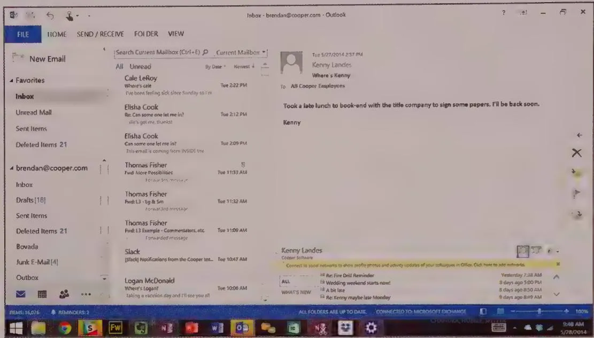  
Figure 18-1: Microsoft Outlook is a classic example of a multipaned application. The far-left pane contains a list of mailboxes. It also lets you switch between views such as Mail and Calendar. The top-center pane shows all the messages in the selected mailbox, and the pane below it shows the contents of the selected message. The pane on the right shows the next three appointments and upcoming tasks.

Another form of multiple panes is stacked panes or tabs. These are common to preferences, settings, and other complex dialogs; they are also sometimes useful in sovereign windows. Most modern web browsers let users have many sites open at a time, accessible through tabs at the top. Another good example is Microsoft Excel, which allows related spreadsheets to be accessible via inverted tabs at the bottom of the screen. Excel makes use of stacked panes with its Sheets.

# Window states

With the ability to expand to full screen, an application's primary window can be in one of three states: minimized, maximized, or pluralized.

Minimized windows get collapsed into icons on the desktop (on older OSs) or into the taskbar (Windows) or the Dock (OS X). Maximized windows fill the entire screen, covering whatever is beneath them.

Microsoft and Apple both somehow manage to avoid referring directly to the third state. The only hint of a name is on the Microsoft system menu (click the application icon in the upper-left corner of the window to see it) where the Restore command describes how to

get to it. This function switches a maximized primary window to that other state—the pluralized or restored state.

The pluralized state is that in-between condition where the window is neither an icon nor maximized to cover the entire screen. When a window is pluralized, it shares the screen with icons and other pluralized windows. Pluralized windows can be either tiled or overlapping (but are usually the latter).

The normal state for a sovereign application is maximized. There is little reason for such an application to be pluralized, other than to support switching between applications or dragging and dropping data between applications or documents Transient-posture applications, such as Windows Explorer, the Finder, the calculator, or the many IM and other social media applications in popular use today, are appropriately displayed in a pluralized window.

# Windows and documents: MDI vs SDI

If you want to copy a cell from one spreadsheet and paste it to another, opening and closing both spreadsheets in turn is tedious. It's much easier to have two spreadsheets open simultaneously. There are two ways to accomplish this. You can have one spreadsheet application that can contain two or more spreadsheet instances. Or you can have multiple instances of the entire spreadsheet application, each one containing a single instance of a spreadsheet.

In the early days of Windows, Microsoft chose the first option for the simple, practical reason of resource frugality, and called it the multiple document interface, or MDI. One application with multiple spreadsheets (documents) conserved more bytes and CPU cycles than multiple instances of the same application, and performance was a serious issue then. Eventually, as technology improved, Microsoft abandoned MDI and embraced the other approach, the single document interface, or SDI.

MDI is actually reasonable enough in certain contexts. In particular, it is useful when users need to work on multiple related views of information in a single environment (for example, a set of related screen mockups in Photoshop).

DESIGN PRINCIPLE

The utility of any interaction idiom is context-dependent.

SDI generally works well, and seems simpler for users, but it's not a global panacea. While it's reasonably convenient to switch between instances of Word to go back and forth between different documents, you wouldn't want a purchasing agent to have to

switch between multiple instances of his massive enterprise planning system to look at an invoice and the vendor's billing history.

MDI, due to its window-in-a-window nature, can be abused. Navigation becomes oppressive if document views require full window management within the MDI container (as some early versions of MDI did). Everything described in our earlier discussion of excise introduced by minimizing, maximizing, and pluralizing windows goes double for document windows inside an MDI application—a truly heinous example of window management excise. In most cases it is far superior to transition cleanly from one fully open document to the next—or allow tiling or tabbing of open documents, as Photoshop does.

# Making use of windows

As described above, desktop applications are constructed of two kinds of windows: primary and secondary (dialog boxes). Determining how to use windows in an application is an important aspect of defining the application's Design Framework (see Chapter 5).

# Unnecessary rooms

If we imagine our application as a house, each application window is a separate room. The house itself is represented by the application's primary window, and each room is a pane, document window, or dialog box. We don't add a room to our house unless it has a purpose that cannot be served by other rooms. Similarly, we shouldn't add windows to our application unless they have a purpose that can't or shouldn't be served by existing windows.

It's important to think through this question of purpose by considering prospective users' goals and mental models. The way we think about it, saying that a room has a purpose implies that using it is associated with a goal, but not necessarily with a particular task or function.

DESIGN PRINCIPLE

A dialog box is another room; have a good reason to go there.

Even today, a preponderance of secondary windows is a problem that haunts desktop software. Developers often work by breaking the application into discrete functions, and the user interface is then constructed in close parallel. Combine this with the incredible ease with which developers can implement a dialog box, and the obvious (and unfortunate) result is one dialog box per function or feature. The developer who wants to create a better user interface often must build his own without much help from GUI tool vendors.

The result, then, when expediency trumps concern for user experience, is too many unnecessary rooms—those secondary windows containing functions that should really be integrated into panes or other surfaces within the primary window.

For example, in Adobe Photoshop, if you want to make a simple change to a photo's brightness and contrast (without worrying about adjustment layers), you must go to the Image menu, select the Adjustments submenu, and then select the Brightness/Contrast command. This triggers a dialog box where you can make your adjustments, as shown in Figure 18-2. This sequence is so common that it is completely unremarkable, and yet it is undeniably poor design. Adjusting the image is the primary task in a photo editing application. The image is in the main window, so that's also where the tools that affect it should be. Changing the brightness and contrast isn't a tangential task; it is integral to the application's purpose.

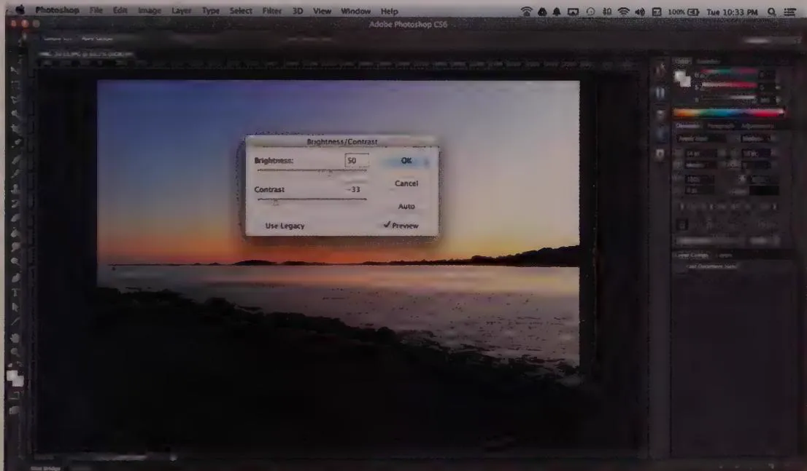  
Figure 18-2: One of Adobe Photoshop's many rooms: Brightness/Contrast. We're all used to the fact that we have to invoke a dialog to perform a basic function, so we hardly notice it. But this creates unnecessary work for users, and of course the dialog obscures the most important thing on the screen—the image. Recent versions of Photoshop have begun to move controls like these into modeless sidebars.

Putting functions in a dialog box emphasizes their separateness from the main task. Putting the brightness and contrast adjustment in a dialog box works just fine, but it creates an awkward interaction. From a developer's point of view, adjusting brightness and contrast is a single function, independent of many other functions, so it seems natural to segregate it into its own container. From the user's point of view, however, it is integral to the job at hand and should be obvious in the main window.

The image editing UI is considerably improved in Adobe Lighthroom. The application is divided into views or "rooms," each concerned with a specific purpose: Library, Develop, Slideshow, Print, and Web. In the Develop view, brightness and contrast adjustment are presented in a pane on the right side of the main window, along with every other imaginable way of adjusting an image, as shown in Figure 18-3.

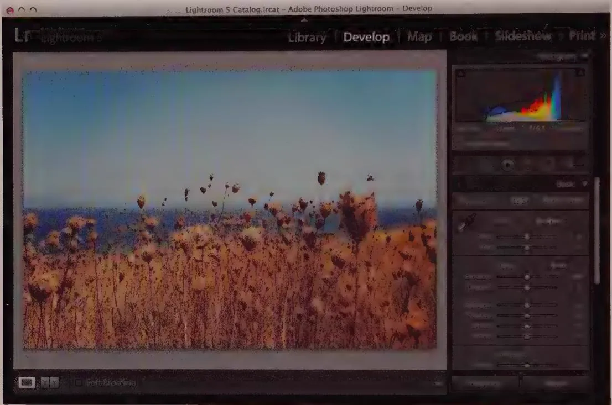  
Figure 18-3: Adobe Lightroom shows vast improvements over Photoshop. Critical tools are grouped by purpose and presented directly in the main window, adjacent to the image being adjusted.

DESIGN PRINCIPLE

Provide functions in the window where they are used.

Needless to say, a preponderance of secondary windows leads to navigational and window management excise for the user. Try to avoid this kind of window pollution in your apps.

# Necessary rooms

Sometimes, however, separate rooms for certain functions are appropriate or even necessary. When you want to go swimming, it would be odd if you were offered a living room

full of people as a place to change your clothes. Decorum and modesty are excellent reasons for you to want a separate room in which to change. It is entirely appropriate to provide a separate room when one is needed.

When users perform a function outside their normal sequence of events, it's usually desirable to provide a special place in which to perform it. For example, purging a database is not a normal activity. It involves setting up and using features and facilities that are not part of the normal operation of the database application. The more prosaic parts of the application support daily tasks like entering and examining records, but erasing records en masse is not an everyday occurrence. The purge facility correctly belongs in a separate dialog box. It is entirely appropriate for the application to lead the user into a separate room—a window or dialog—to handle that function.

Using goal-directed thinking, we can examine each function to good effect. If someone is using a graphics application to develop a drawing, his goal is to create an appealing and effective image. All the drawing tools are directly related to this goal, but the pencils, paintbrushes, and erasers are the most tightly connected functions. These tools should be intimately integrated into the workspace itself in the same way that the conventional artist arranges his tools on his drawing board, close at hand. They are ready for immediate use without his having to reach far, let alone having to get up and walk into the next room. In the application, drawing tools should be arrayed on the edges of the drawing space, available with a single click of the mouse. Users shouldn't have to go to the menu or to dialog boxes to access these tools.

For example, Corel Painter arranges artists' tools in trays and lets you move the things that you use frequently to the front of the tray. Although you can hide the various trays and palettes if you want, they appear as the default and are part of the main drawing window. They can be positioned anywhere on the window as well. And if you create a brush that is, for example, thin charcoal in a particular shade of red that you'll need again, you simply "tear it off" the palette and place it wherever you want on your workspace. This is just like laying that charcoal in the tray on your easel. This tool selection design closely mimics how we manipulate tools while drawing.

On the other hand, if you decide to import a piece of clip art, although the function is related to the goal of producing a good drawing, the tools used are not immediately related to drawing. The clip art directory is incongruent with the user's goal of drawing—it is only a means to an end. The conventional artist probably does not keep a book of clip art right on his drawing board. But you can expect that it is close by, probably on a bookshelf immediately adjacent to the drawing board and available without his even getting up. In the drawing application, the clip art facility should be easy to access. But because it involves a whole suite of tools that normally are unneeded, it should be placed in a separate facility: a dialog box.

When you're done creating the artwork, you've achieved your initial goal of creating an effective image. At this point, your goals change. Your new goal is to preserve the picture, protect it, and communicate through it. The need for pens and pencils is over. The need for clip art is over. Leaving these tools behind now is no hardship. The conventional artist would now unpin the drawing from his board, take it into the hall and spray it with fixative, and then roll it up and put it in a mailing tube. He purposely leaves behind his drawing tools. He doesn't want them affected by fixative overspray and doesn't want accidents with paint or charcoal to mar the finished work. He uses mailing tubes infrequently, and they are sufficiently unrelated to the drawing process, so he stores them in a closet. In the software equivalent of this process, you end the drawing application, put away your drawing tools, find an appropriate place on the hard drive to store the image, and send it to someone via e-mail. These functions are clearly separated from the drawing process by goals and motivations.

By examining users' goals, we are naturally guided to an appropriate form for the application. Instead of merely putting every function in a dialog box, we can see that some functions shouldn't be enclosed in a dialog. Others should be put in a dialog that is integral to the interface's main body, and still other functions should be removed from the application.

# Menu

Menu are perhaps the oldest idiom in the GUI pantheon. Many concepts and technologies had to come together to make them possible: the mouse, memory-mapped video, powerful (for the time) processors, and pop-up windows. A pop-up window is a rectangle on the screen that appears, overlapping and obscuring the main part of the screen, until it has completed its work, whereupon it disappears, leaving the original screen behind, untouched. The pop-up window is the mechanism used to implement drop-down menus (also called pull-down menus), as well as dialog boxes.

In modern GUIs, menus are visible across the top row of a screen or window in a menu bar. The user points at and clicks one of a set of menu titles on the menu bar, and a list of options (the menu itself) appears in a small window that opens just below it. Menu titles in Windows have a visual rollover effect to indicate pliancy (interactivity). A variant of the drop-down menu is a menu that "pops up" when you click—or, more frequently, right-click—an object, even though it has no menu title. This is a pop-up menu.

After the menu is open, the user makes a single choice by clicking once or by dragging and releasing. The selection the user makes on the menu either takes immediate effect or launches a dialog box of further options or settings, after which the menu collapses back into its menu title.

# Menu as a pedagogic vector

As discussed briefly in Chapter 16, menus represent a pedagogic vector. Contrary to user-interface paradigms of 25 years ago, menus and dialog boxes aren't the main methods by which normal users perform everyday functions. So when a user looks at an application for the first time, it is often difficult to size up what that application is capable of. An excellent way to get an impression of an application's power and purpose is to glance at the set of available functions by way of its menus and the dialogs they open. We do this in the same way we look at a restaurant's menu posted at its entrance to get an idea of the type of food, the presentation, the setting, and the price.

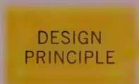

Use menus to provide a pedagogic vector.

Understanding the scope of what an application can and can't do is one of the fundamental aspects of creating an atmosphere conducive to learning to use a piece of software. Many otherwise easy-to-use applications put off users because there is no simple, nonthreatening way for them to find out just what the application can do.

Toolbars and direct-manipulation idioms can be too inscrutable for a first-time user to understand, but the textual nature of the menus explains the functions. Reading the words "Format Gallery" (see Figure 18-4) is more enlightening to the new user than trying to interpret an icon button that looks like the one shown in the figure (although ToolTips obviously help).

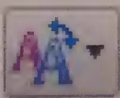  
Figure 18-4: A menu item reading "Format Gallery" is likely to be more enlightening to new users than an icon button like this one. But after new users become intermediates, it's a different story.

For an infrequent user who is somewhat familiar with an application, the menu's main task is as an index to known tools: a place to look when he knows there is a function but he can't remember where it is or what it's called. He doesn't have to keep such trivia in his head. He can depend on the menu to keep it for him, available when he needs it.

For a frequent user, menus provide a stable physical location at which to access one of hundreds of possible commands, or a quick reminder about keyboard shortcuts.

If the main purpose of menus were to execute commands, terseness would be a virtue. But because the main justification of their existence is to teach us about what is available, how to get it, and what shortcuts are available, terseness is really the exact opposite of what we need. Our menus have to explain what a given function does, not just where to invoke it. Therefore, it behooves us to be a little more verbose in our menu item text. Menus shouldn't say "Open," but rather "Open Report"; not "Auto-arrange," but rather "Auto-arrange icons." We should stay away from jargon, because our menu's users won't yet be acquainted with it. A scan of the menus should make clear the scope of the application and the depth and breadth of its various facilities. For this reason, most every function available to the user should be available in menus, so that they are available to be learned.

Another teaching purpose is served by providing hints in the menu to related controls for the same command. Having button icons next to menu commands and including hints that describe keyboard equivalents teaches users about quicker command methods that are available (we discuss this later in the chapter). When you put this information right in the menu, the user may register it subconsciously. It won't intrude upon her conscious thoughts until she is ready to learn it, and then she will find it readily available and already familiar.

Finally, for people to best learn how to use an application, they should be able to examine and experiment without fear of commitment or causing irreparable harm. A global Undo function and the Cancel buttons on dialogs that launch from menu items support this ability well.

# Disabled menu items

An important menu convention is to disable (make nonfunctional) menu items when they are unavailable in a given state or are irrelevant to the selected data object or item. The disabled state typically is indicated by lightening or "graying out" the text for the item in the menu. This is a useful and expected idiom. It helps the menu become an even better teaching tool, because users can better understand the context in which certain commands are applicable.

# Check mark menu items

Check marks next to menu items are usually used to enable and disable aspects of the application's interface (such as turning toolbars on and off) or adjusting the display of data objects (such as wireframe versus fully rendered images). Users can easily grasp this idiom. It is effective because not only does it provide a functional control, but it also indicates the control's state.

This idiom is probably best used in applications with fairly simple menu structures. If there are lots of possible toggles in the application it can clog up the menu, making it difficult to find more important commands. Opening and scrolling through a menu to find the right item may become laborious. If the attributes in question are frequently toggled, they should also be accessible from a toolbar. If they are infrequently accessed and menu space is at a premium, all similar attributes could be gathered in a dialog box that would provide more instruction and context (as is commonly required for infrequently used functionality).

A check mark menu item is vastly preferable to a flip-flop menu item that alternates between two states, always showing the one currently not chosen. The problem with the flip-flop menu is the same issue we identified with flip-flop buttons in Chapter 21—namely, that users can't tell if the menu is offering a choice or describing a state. If it says Display Toolbar, does that mean tools are now being displayed, or does it mean that by selecting the option you can begin displaying tools? By using a single check mark menu item instead (the Status bar is either checked or unchecked), you can make the meaning clear.

# Icons on menus

Visual symbols next to text items help users recognize them without having to read, so they can be identified faster. They also provide a helpful visual connection to other controls that do the same task. To create a strong visual language, a menu item should show the same icon as its corresponding toolbar icon button.

With its adoption of the ribbon control, Microsoft has combined menus and toolbars into a single entity in its Office Suite, but for applications continuing to provide standard menus, making a visual link between menu and toolbar remains a powerful means of improving learnability.

# Accelerators

Accelerators or keyboard shortcuts provide an easy way to invoke functions from the keyboard. These are commonly function keys (such as F9) or combinations involving modifier keys (Ctrl, Alt, Option, and Command). By convention, they are shown to the right of drop-down menu items—or in ToolTips for applications using the ribbon control—to allow users to learn them as they access menus. Inclusion of these annotations, while called for in style guides, is up to the individual designer, and too often forgotten.

Three tips help you successfully create good accelerators:

- Follow standards.   
Provide for the daily use of accelerators.   
Show how to access accelerators.

Where standard accelerators exist, use them. In particular, this refers to the standard editing set as shown on the Edit menu of most applications. Users quickly learn how much easier it is to press Ctrl+C and Ctrl+V (or the Mac clover-key equivalents) than it is to pull down the Edit menu, select Copy, pull down the Edit menu again, and select Paste. Don't disappoint users when they use your application. Don't forget standards like Ctrl+P for print and Ctrl+S for save.

Identifying the set of commands that will be needed for daily use is the tricky part. You must select the functions that are likely to be used frequently and ensure that those menu items are given accelerators. The good news is that this set won't be large. The bad news is that it can vary significantly from user to user.

The best approach is to perform a triage operation on the available functions. Divide them into three groups: those that are definitely part of everyone's daily use, those that are definitely not part of anyone's daily use, and everything else. The first group must have accelerators, and the second group must not. The final group will be the toughest to configure, and it will inevitably be the largest. You can perform a subsequent triage on this group and assign the best accelerators, like F2, F3, F4, and so on, to the winners. More obscure accelerators, like Alt+7, should go to those least likely to be part of someone's everyday commands.

Don't forget to show the accelerator in the menu. An accelerator won't do anyone any good if he has to go to the manual or online help to find it. Put it to the right of the corresponding menu item, where it belongs. Users won't notice it at first, but eventually they will find it, and they will be happy to make the discovery as perpetual intermediates (see Chapter 11). It will give them a sense of accomplishment and a feeling of being an insider. These feelings are well worth encouraging in your customers.

When assigning the key to be paired with the modifier key, try to use the first letter of the command name, such as Ctrl+C for "copy" and Ctrl+P for "paste." This makes the accelerator memorable and easier to learn.

Some applications offer user-configurable accelerators. Often this is a good idea, even a necessity, especially for expert users. Allowing users to customize accelerators on the sovereign applications they use most of the time really lets them adapt the software to their own style of working. Be sure to include a Return to Defaults control along with any customization tools.

# Access keys

Access keys or mnemonics are another Windows standard (they are also seen in some UNIX GUIs) for adding keystroke commands in parallel to the direct manipulation of menus and dialogs.

The Microsoft style guide covers access keys and accelerators in detail, so we will simply stress that they should not be overlooked. Mnemonics are accessed using the Alt key, arrow keys, and the underlined letter in a menu item or title. Pressing the Alt key places the application in mnemonic mode, and the arrow keys can be used to navigate to the appropriate menu. After the menu opens, pressing the appropriate letter key executes the function. The main purpose of mnemonics is to provide a keyboard equivalent for each menu command. For this reason, mnemonics should be complete, particularly for text-oriented applications. Don't think of them as a convenience so much as a pipeline to the keyboard. Keep in mind that your most experienced users will rely heavily on their keyboards, so to keep them loyal, ensure that the mnemonics are consistent and thoroughly thought out. Mnemonics are not optional.

# Cascading menus versus monocline groupings

A variant of the standard drop-down menu provides a secondary menu when the user selects certain items in the primary menu that are marked with a right arrow to the right of the menu item. This mechanism, called a cascading menu (see Figure 18-5), is notoriously difficult to use. Cascading menus not only make it much more difficult for users to locate items, but also require precise mouse movements in two dimensions to

navigate them smoothly. (If you trace the path required to select an item in a multilevel cascading menu—such as the Windows Start menu—you will notice that it looks like a path through a maze.)

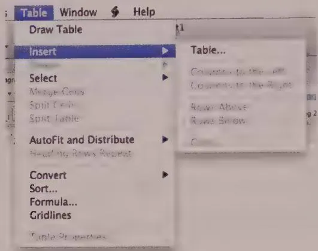  
Figure 18-5: An example of a cascading menu from Microsoft Word. Cascading menus make it difficult for users to find and browse the command set, but they do allow menus to usefully contain much larger command sets.

Cascading or hierarchical menus were prevalent in the early days of graphical user interfaces. Menus in modern GUIs have flattened considerably, until most are now only one level deep—a monoline grouping, or flat hierarchy. In many cases, especially when optimizing interactions for novice users, flattening the organization of user choices (whether they be commands or objects) can greatly improve the discoverability and learnability of application user interfaces.

The dialog box (which we'll discuss at length later in this chapter) was the mechanism that allowed this simplification of the menu. Dialog boxes enabled software designers to encapsulate all the subchoices of any menu item within a single interactive container.

With the rise of modern high-resolution displays, enough choices can be displayed on a menu bar to organize all an application's functions into about a half-dozen meaningful groups, each group represented by a one-word menu title. The menu for each group also was roomy enough to include all its related functions. The need to go to additional levels of menus is today almost superfluous.

If they must be used at all, cascading menus should be employed only in sophisticated sovereign applications, for rarely used functions. If you implement cascading menus, be sure to allow for a wide threshold in mouse movement so that the submenu doesn't disappear if the mouse cursor deviates slightly from it.

# Toolbars, Palettes, and Sidebars

The ubiquitous toolbar is a relatively recent GUI development. Microsoft was the first to introduce the toolbar to mainstream user interfaces. The invention of the toolbar addressed the shortcomings of the modal pull-down menu: slow discoverability and extra physical work to execute functions. Toolbar functions are modeless: always plainly visible, which users can trigger with a single mouse movement and click.

The typical toolbar is a collection of icon buttons in a slab attached to the top (when horizontal) or side (when vertical) of the main window, as shown in Figure 18-6. Essentially, a toolbar consists of one or sometimes two rows (or columns) of visible, immediate, graphically labeled functions.

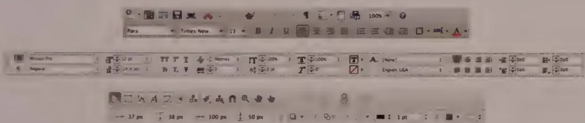  
Figure 18-6: Toolbars for Word (top), InDesign (center), and Omnigraffle (bottom) on the Mac. Notice how the Word and InDesign toolbars use icon buttons that show a button outline only on mouseover or selection. This saves space and improves readability.

# Toolbars and menus

Toolbars work together with menus to satisfy user needs as they mature: Whereas menus are complete toolsets with the main purpose of teaching inexperienced users and organizing seldom-used advanced functions, toolbars are for frequently used commands and cater to perpetual intermediates. They complement each other perfectly, addressing different user needs at different times.

DESIGN PRINCIPLE

Toolbars give experienced users fast access to frequently used functions.

It's thus a mistake to think of toolbars as simply a speedy version of menus. Think of them rather as receptacles for the essential functions that most users will use the most.

# Toolbars versus modeless dialogs

Above, we discussed how the modality of menus make them problematic. Traditionally, two modeless tool idioms have been commonly used to get around some of the problems

that reliance on menus introduce. The modeless dialog box (which we'll discuss at length in Chapter 21) is the older of the two idioms. The more recent idiom is the toolbar. Is one better than the other?

Toolbars are modeless, but they don't introduce the conundrums that modeless dialogs do. They also possess two useful characteristics that modeless dialog boxes don't: First, they are visually different from modal dialog boxes, and second, there is no need to worry about dismissing them, because they are always available. They solve other problems, too. Toolbars are incredibly efficient in screen space, especially compared to dialog boxes, and they don't cover what they are operating on.

Users also really seem to understand that the toolbar state reflects what is selected and that interactions with the widgets in a toolbar have a direct and immediate impact on the selection or application, which helps overall learnability.

Modeless dialogs, by contrast, are conventional free-floating windows; users can position them on the screen wherever they like. However, this results in window management excise. While this is certainly a chore, it can also sometimes be handy to have your toolset right next to what you are working on.

Docking toolbars are a good solution to this conundrum. If you click and drag a docking toolbar and pull it away from the edge of the application, it instantly forms its own small window, frequently with a more compact rectangular layout. You can move it to where you need it, and drag it back to any edge of the application's main window when you are done with it—where it reverts to a toolbar and becomes docked against the edge, either vertically or horizontally.

# ToolBar buttons

The toolbar gave birth to the toolbar button, or icon button, a happy marriage between a button and an icon. Icon buttons are an excellent visual mnemonic for a function. They can be hard for newcomers to interpret, but then, they're not for newcomers.

Because toolbars are primarily for providing quick access to frequently used tools, their identifiers must elicit quick recognition from experienced users. The pictorial imagery of symbols suits that role better than text does. Icon buttons have the pliancy of buttons, along with the fast-recognition capability of images. They pack a lot of power into a very small space, but their great strength is also their great weakness: the icon.

Some designers think that they must invent visual metaphors for icon buttons that adequately convey meaning to first-time users. This is a quixotic quest that reflects not only a misunderstanding of the purpose of toolbars but also a futile hope in the magical power of metaphors. As we discussed in Chapter 13, metaphors don't really exist.

The image on the icon button doesn't need to teach users its purpose; it merely needs to be easy to distinguish from the other icons in the set. Users should have help learning its purpose through other means. One of the most effective (as discussed earlier) is including the toolbar icons on the corresponding menu items. In this way, the pedagogy of the menus is extended to an understanding of the toolbar's controls.

# ToolTips

It might seem like a good idea to label toolbar buttons with both text and images. This argument has not only logic but also precedent. The original icons on the Macintosh desktop had text subtitles, as did the icon controls on some older web browsers. Icons are useful for allowing quick classification, but beyond that, we need text to tell us exactly what the object is for.

The problem is that using both text and images can be very expensive in terms of pixels. Screen space is often too much at a premium to permit verbose labeling of every toolbar or panel icon. Designers who choose to label their icons are trying to satisfy two groups of users with different needs. One wants to learn in a gentle, forgiving environment, and the other knows where frequently used items are but sometimes needs a brief reminder about less-used functions. ToolTips provide an effective way to bridge the gap between these two classes of users.

ToolTips are a clever and effective user interface idiom that adds a pedagogical vector to icon buttons without any of the drawbacks of text labeling (see Figure 18-7). In essence, ToolTips provide a text label on a tiny, transient pop-up window. The real genius of ToolTips is that they have a well-timed lag that displays the helpful information only after the user has hovered the mouse cursor on the item for a second or so. This is just enough of a delay for the user to be able point to and select the function without getting the ToolTip if she doesn't need it. This ensures that users aren't barraged by little pop-ups as they move the mouse across the toolbar. It also means that if the user forgets what a rarely used icon button is for, she needs to invest only a half-second to find out.

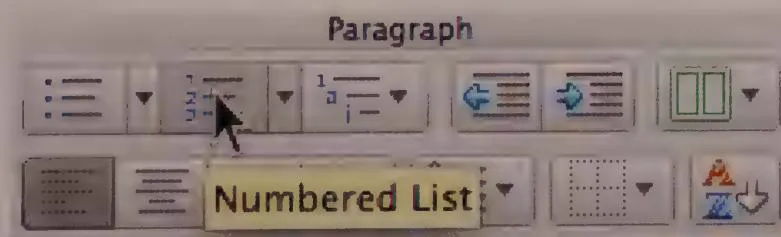  
Figure 18-7: This ToolTip from Microsoft Word helps users who have forgotten the icon's meaning without using much real estate on text labels.

ToolTips initially contained a single word or very short phrase that described the hovered-upon icon button. As of Microsoft Office 2007 on Windows, ToolTips now integrate lightweight help content into the ToolTip. By taking advantage of the inherent context sensitivity of ToolTips, better integration with other help mechanisms reduces the excise involved in learning an application.

DESIGN PRINCIPLE

Use ToolTips with all toolbar and iconic controls.

ToolTips make the controls on the toolbar much more accessible for intermediate users. As a result, toolbars took the lead as the primary idiom for issuing commands to sovereign applications. This has allowed the menu to recede into the background as a tool for beginners and for invoking advanced or seldom-used functions. The natural order of icon buttons as the primary idiom, with menus as a backup, makes sovereign applications much easier to use. In fact, this trajectory continued into Microsoft Office 2007 with its ribbon control, which replaced menus with visually and textually expressive tabbed toolbars. We discuss the ribbon later in this chapter.

# Disabling toolbar controls

Toolbar controls should become disabled if they are not applicable to the current selection. They must not offer a pliant response: The icon button must not depress, for example, and controls should also gray themselves out to make matters absolutely clear.

Some applications make disabled toolbar controls disappear. This can have undesirable effects, especially if the positions of other controls change as well. Users remember toolbar layouts by position. If icon buttons disappear, the trusted toolbar becomes a skittish, tentative idiom that scares new users and disorients the more experienced.

# Toolbar control proliferation

After people started to regard the toolbar as something more than just an accelerator for the menu, its growth potential became more apparent. Designers soon realized that there was no reason to restrict the controls on toolbars to icon buttons, and they began inventing new idioms expressly for the toolbar. With the advent of these new constructions, the toolbar truly came into its own as a primary control surface.

After the icon button, the next control to find a home on the toolbar was the combo box, as can be seen in many applications' font style, typeface, and size controls. It is perfectly natural that these selectors be on a toolbar. They offer the same functionality as those

on the drop-down menu, but they also show the current style, font, and font size as a property of the current selection. The idiom delivers more information in return for less effort by users.

After combo boxes were admitted onto the toolbar, the precedent was set, and all kinds of idioms appeared. Some of these toolbar idioms are shown in Figure 18-6.

This variety of controls contributed to a broadening use of the toolbar. When it first appeared, the toolbar was merely a place for fast access to frequently used functions. As it developed, controls on the toolbar began to reflect the state of the application's data. Instead of an icon button that simply changed a word from plain to italic text, the icon button now began to indicate—by its state—whether the currently selected text was already italicized. The icon button not only controlled the application of the style but also represented the status of the selection with respect to the style.

It was only a matter of time before toolbars began sporting their own menus. The Word toolbar shown in Figure 18-8 shows the Undo drop-down menu. Such sophisticated and powerful idioms continue to push the old-fashioned menu bar further into the background as a purely pedagogic tool.

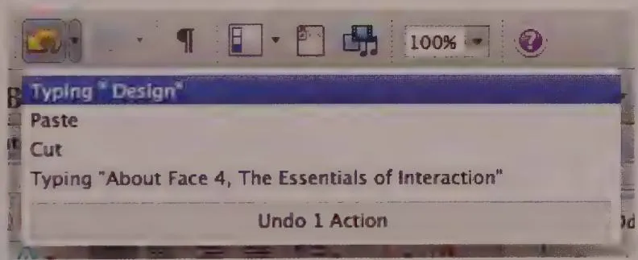  
Figure 18-8: Toolbars now contain drop-down menus such as the Undo menu shown here. This provides a compact way to provide powerful functionality.

# Movable toolbars

Some applications, such as Adobe's Creative Suite, support movable and detachable toolbars or palettes. Pre-2007, the Microsoft Office suite had a battery of toolbars that users could choose to make visible or invisible. If they were visible, they could be dynamically positioned in one of five locations. They also could be attached—or docked—to any of the four sides of the application's main window. If the user dragged the toolbar away from the edge, it configured itself as a floating toolbar, complete with a mini title bar, as shown in Figure 18-9.

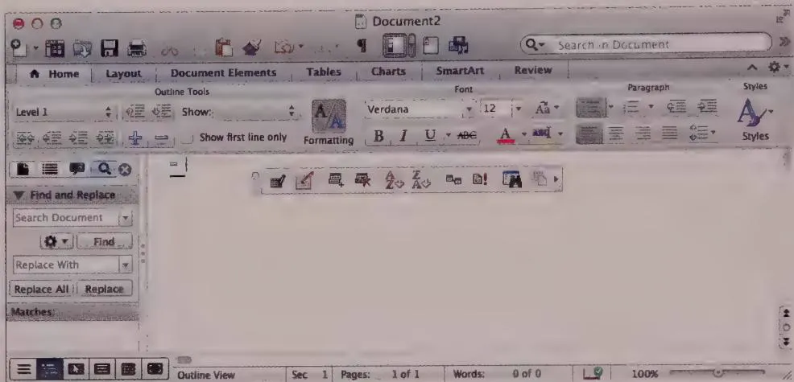  
Figure 18-9: Toolbars can be docked horizontally (top), vertically (left), and dragged off the toolbar to form free-floating palettes.

Allowing users to move toolbars around so flexibly also provided the possibility for users to obscure parts of toolbars with other toolbars. Microsoft addressed that problem with an expansion icon button and drop-down menu that appeared only when a toolbar was partly obscured. It provided access to hidden items via a drop-down menu, as shown in Figure 18-10.

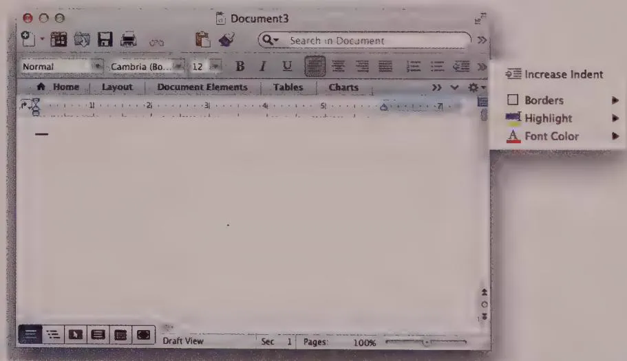  
Figure 18-10: Microsoft's clever way of allowing users to overlap toolbars (or fit them in smaller sizes) but still get at all their functions.

Since 2007, Microsoft has moved away from the ultimate flexibility of toolbars to the more predictable and inviting ribbon control (discussed later in the chapter) and single quick-access toolbar. However, they still make use of the same menu idiom for accessing hidden ribbon and toolbar items.

# Customizable toolbars

A dilemma arises from the fact that toolbars represent the frequently used functions for all users: At least a few of those functions are different for each type of user. Microsoft arrived at a solution for this conundrum years ago: Ship the application with the best guess at what typical users' daily-use controls are, and let users with more exacting needs customize. (In Office 2007 and later, the ribbon, discussed later, is similarly customizable.)

This solution, while reasonable, gets diluted by the addition of non-daily-use functions to the default toolbars. For example, Word's default toolbar button suite contained functions that were not frequently used, such as the cryptic Insert Autotext. Items like this were perhaps part of a feature checklist or the result of concessions to product management. Although they may have been useful at times, most users did not use them frequently. Personas and scenarios are useful tools for helping to sort out which items belong on default toolbar configurations (see Chapters 3 and 4).

Word allows advanced users to customize and configure its ribbon control to their hearts' content. There is a certain danger in providing this level of customizability to the toolbars, because it is possible for a reckless user to make it unrecognizable and unusable. However, it takes some effort to totally wreck things. People generally won't invest much effort in creating something that is ugly and hard to use. More likely, they will make just a few custom changes and enter them one at a time over the course of months or years.

# Contextual (pop-up) toolbars

A useful evolution of the toolbar idiom is the contextual toolbar. Similar to a right-click contextual pop-up menu, it provides a small group of icon buttons adjacent to the mouse cursor. In some implementations, the specific icon buttons presented are dependent on the object selected. If text is selected, the buttons provide text-formating options; if a drawing object is selected, the buttons enable users to change object properties. A variation of this idiom was also popularized with Microsoft Office 2007, where it was called the Mini Toolbar. However, similar idioms have been used in several applications. These include Adobe Photoshop (where the toolbar is docked but changes based on context) and Apple's Logic music production environment (where the toolbar is a modal cursor palette).

# The ribbon control

As we discussed earlier in this chapter, Microsoft introduced a new GUI idiom with Office 2007: the ribbon control (see Figure 18-11). In essence, it is an oversized, horizontal, tabbed toolbar with textual labels for groups of functions, as well as a heterogeneous

presentation of icon buttons and textual commands. The tabs provide groupings similar to those used in menus (such as File, Home, Insert, Design, Transitions, Animations, Slide Show, Review, and View in PowerPoint 2010).

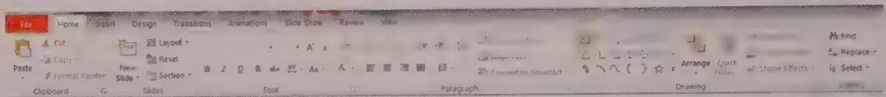  
Figure 18-11: The ribbon in PowerPoint replaces the menu system and classic toolbars with what is essentially a tabbed, hybrid menu/toolbar.

# Tool palettes

The tool palette predates the toolbar as an interaction idiom; the original MacPaint is perhaps the first application to use it. It has been a staple of graphics applications and authoring environments of all kinds ever since.

Tool palettes differ from toolbars in an important way. As already discussed, toolbars are a collection of immediate-access commands that typically act on the current selection, often by changing the values of selected object properties. Tool palettes, on the other hand, contain a set of mutually exclusive controls (meaning that only one may be active at a time), each of which represents an operating mode of the application, including:

object creation modes   
object selection modes   
- object manipulation modes

Tool palettes also, mostly for historical reasons dating back to MacPaint, tend to be vertically oriented and usually consist of two columns of icon buttons or combo icon buttons. Combo icon buttons can be clicked to reveal other, similar tools. In Adobe Illustrator, for example, clicking and holding on the Eraser gives access to the Scissors and Knife tools as well.

Palettes typically dock and float, mimicking the functionality from the toolbar. Palettes are, as we mentioned, popular in graphics applications, where modeless access to tools is useful—or even critical—for users to maintain a productive flow. Adobe Fireworks (RIP) and other applications originally developed by Macromedia were among the first to provide a more robust docking structure to minimize screen management excise. Recent versions of Photoshop and Illustrator have taken up the idiom, as shown in Figure 18-12.

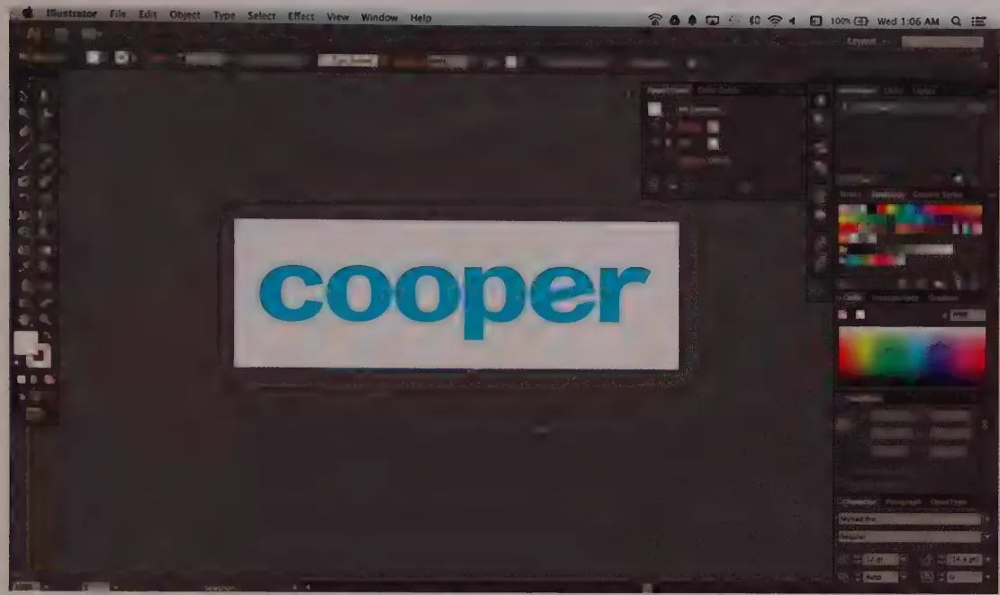  
Figure 18-12: The docked palettes in Adobe Illustrator provide interactivity similar to that of modeless dialog boxes, but they don't require users to spend as much effort and attention invoking, moving, and dismissing dialogs. It doesn't take a lot of imagination to see that these are really quite similar to toolbars in the sense that they use standard controls and widgets to provide application functionality directly, visibly, and persistently in the user interface.

# Sidebars, task panes, and drawers

The final step in the evolution of workflow-friendly modeless command idioms was the introduction of the sidebar or task pane—a pane in the application window dedicated to providing the kind of functions that were formerly delivered through dialog boxes. One of the first applications to do this was Autodesk's 3ds Max, a 3D modeling application that lets you adjust object parameters modelessly through a sidebar. Mainstream applications that feature sidebars include Microsoft Windows Explorer and Internet Explorer with their Explorer Bars, Mozilla Firefox with its Side Bar, Apple's iLife applications with their Inspectors, and Microsoft Office through its Task Pane. Adobe Lighthroom has adopted this approach wholeheartedly: Almost all the application's functionality is provided modelessly via sidebars, as shown in Figure 18-13. Recent versions of Adobe Creative Suite applications have begun to adopt similar approaches, with robust tabbed task panes replacing most modal access to functions.

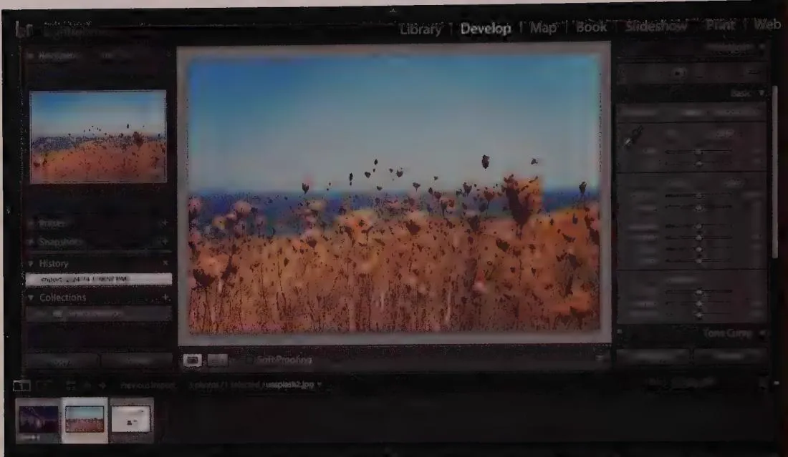  
Figure 18-13: Sidebars in Adobe Lightroom replace the need for dozens of dialog boxes. This approach is similar to the palette approach shown in Figure 18-12. But unlike palettes, the sidebar doesn't require users to position it on the screen and doesn't allow users to undock or dismiss it individually (although the entire sidebar may be hidden). This further reduces screen management excise and represents a significant improvement over using dialog boxes to present application functions.

Sidebars hold a lot of promise as an interaction idiom—and they also need not be limited to the sides of the screen. A commonly employed pattern is the dedicated properties area below a document pane or "work space." It lets you modify a selected object while minimizing confusion and screen management excise, as shown in Figure 18-14. Sidebars can contain either persistent controls or contextual controls that change based on the current selection.

Drawers represent a final variant of task panes. The pane can, for purposes of conserving screen real estate for the primary content area, be stowed mostly or completely offscreen in a pop-open drawer. While this can be handy on smaller desktop screens, it also brings back some of the screen management excise that task panes so neatly removed. An alternative to this, supported by many Adobe products, is the ability to hide (and restore) all secondary panes and palettes with a keystroke. This allows power users to temporarily remove the clutter of tools to better focus on the content they are authoring.

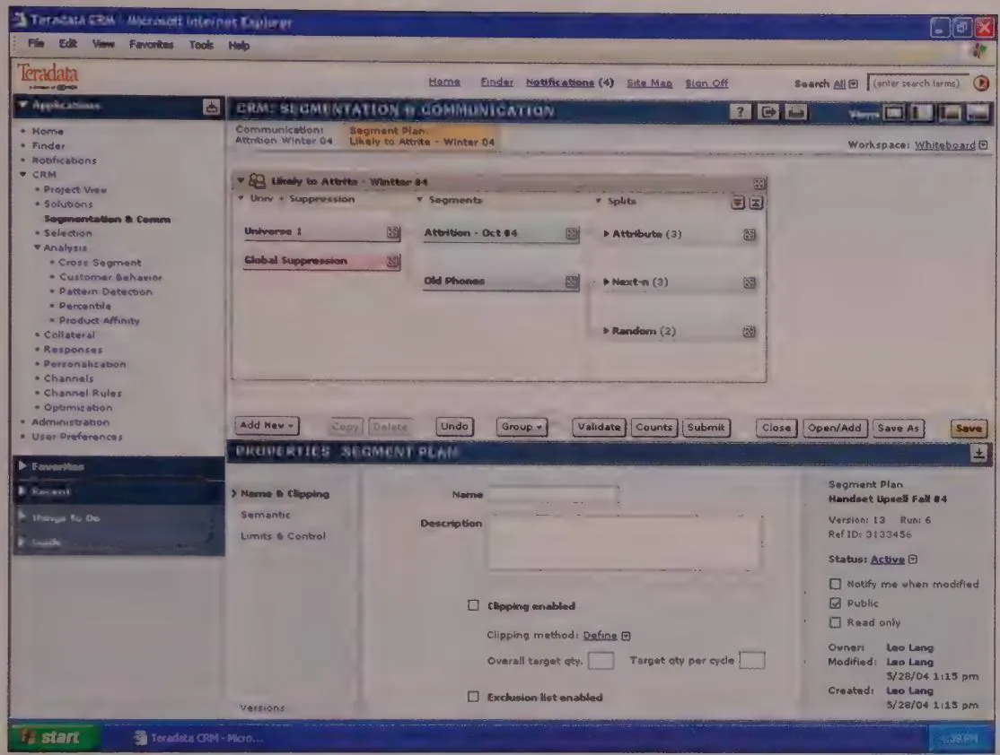  
Figure 18-14: This design by Cooper for a customer relationship management (CRM) application features dedicated properties. When the user selects an object in the work space (the top half of the screen, on the left), its properties are displayed below. This retains the user's context and minimizes screen management excise.

# Pointing, Selection, and Direct Manipulation

Objects on a screen can be manipulated directly through the use of a pointing device. When you think about it, the best way to point to something is with your fingers. They're always handy; you probably have several nearby right now. Their only real drawbacks are that their ends are too blunt for precisely pointing at tiny objects on high-resolution desktop screens, and that most desktop screens still can't recognize being pointed at. (Eyes are also great for pointing, but we usually need them for other things). Because of these limitations, we use a variety of other pointing devices, the most popular—and arguably the most effective—of which is the mouse.

A designer may also take into consideration several other common options for pointers, including trackballs, trackpads, and digitizing tablets. It's worth considering that while the first two behave much like mice (with different ergonomic factors), tablets—as well as their touchscreen cousins—are a bit different.

The mouse is a "relative" pointing device: Moving the mouse moves the cursor based on the current cursor position. Tablets and slates are usually "absolute" pointing devices: Each location on the tablet maps directly to a specific location on the screen. If you pick up the pen from the top-left corner and put it down in the bottom-right corner, the cursor immediately jumps from the top-left to the bottom-right of the screen.

Touchscreens, when they are implemented on desktop or laptop computers, tend, rather unfortunately as of this writing, to carry over the idea of a pointer, or cursor, even though this is unnecessary and confusing once you can actually point at things using your fingers. Attempting to wed direct touchscreen interactions to relative pointing idioms is simply confusing.

Desktop touchscreen devices—if they must exist—should take a cue from mobile touchscreen UIs, such as iOS, and eliminate the cursor—and everything else that it entails. At the same time, these devices should support horizontal orientation for touch input, since nobody wants to hold his or her arm aloft, interacting with a vertical screen, for hours on end.

The remainder of this section focuses on the more common mouse-based and other relative, pointer-based desktop interactions.

# Mouse ergonomics

When you mouse around on the screen, there is a distinct dividing line between near motions and far motions. Either your destination is near enough that you can keep the heel of your hand stationary on your desktop, or you must pick up your hand. When the heel of your hand is down and you move the cursor from place to place, you use the fine motor skills of the muscles in your fingers. When you lift the heel of your hand from the desktop to make a larger move, you use the gross motor skills of the muscles in your arm. Transitioning between gross and fine motor skills is challenging. It involves coordinating two muscle groups that require dexterity to use together, which typically requires time and practice for computer users to master. (It's actually similar to drawing, another skill that requires practice to do well.) Touch typists dislike anything that forces them to move their hands from the home position on the keyboard, because doing so requires a transition between their muscle groups. Similarly, moving the mouse cursor across the screen to manipulate a control forces a change from fine to gross and back to fine motor skills. Don't force users to do this continually.

Clicking a mouse button also requires fine motor control. Without it, the mouse and cursor move inadvertently, botching the intended action. The user must learn to plant the heel of his hand and go into fine motor control mode to position the cursor in the desired location. Then he must maintain that position when he clicks. Furthermore, if the cursor starts far away from the desired control, the user must first use gross motor control to move the cursor near the control before shifting to fine motor control to finish the job. Some controls, such as scrollbars, compound the problem by forcing users to switch between fine and gross motor skills several times to complete an interaction, as shown in Figure 18-15.

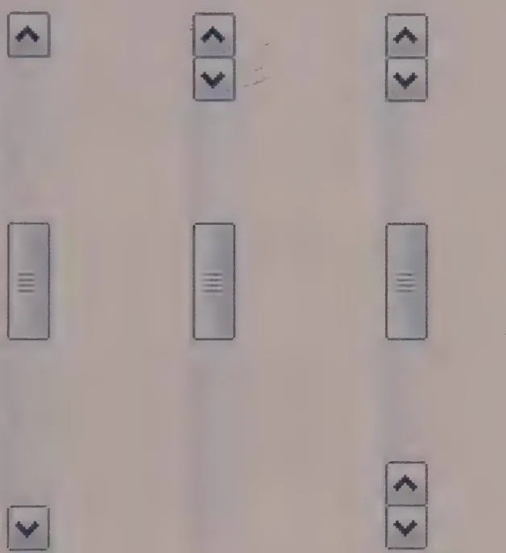  
Figure 18-15: The familiar scrollbar, shown on the left, is one of the more difficult-to-use GUI controls. To switch between scrolling up and scrolling down, the user must transition from the fine motor control required for clicking the up button to the gross motor control needed to move her hand to the bottom of the bar. Then she must return to fine motor control to accurately position the mouse and click the down button. If the scrollbar were modified only slightly, as in the center, so that the two buttons were adjacent, the problem would go away. (Macintosh scrollbars can be similarly configured to place both arrow buttons at the bottom.) The scrollbar on the right is a bit visually cluttered, but it has the most flexible interaction. Scroll wheels and capacitive gesture sensors on the input device are also a great solution to the problem.

It's important that designers pay significant attention to users' aptitudes, skills, and usage contexts and make a conscious decision about how much complex motor work using an interface should require. This is a delicate balancing act between reducing complexity and user effort and providing useful and powerful tools. It's almost always a good idea for things that are used together to be placed together.

Not only do less manually-dexterous users find the mouse problematic, but many experienced computer users, particularly touch typists, find the mouse difficult at times. For many data-intensive tasks, the keyboard is superior to the mouse. With minimum movement, a proficient keyboardist has access to around 1600 discrete commands at any one time. The mouse, decidedly less so. It is frustrating to have to pull your hands away from the keyboard to reposition the cursor with the mouse, only to have to return to the keyboard. In the early days of personal computing, it was the keyboard or nothing, and today, it is sometimes the mouse or nothing. Applications should fully support both the mouse and the keyboard for all navigation and selection tasks.

