# DESIGN PRINCIPLE

Support both mouse and keyboard use for navigation and selection tasks.

A significant portion of computer users have some trouble using the mouse, so if we want to be successful, we must design our software in sympathy with them as well as with expert mouse users. This means that each mouse idiom should have at least one nonmouse alternative. Of course, this may not always be possible. It would be ridiculous to try to support drawing interactions without a mouse. However, most enterprise and productivity software lends itself pretty well to keyboard commands.

# Mouse buttons and controls

The inventors of the mouse tried to decide how many buttons to put on it, and they couldn't agree. Some believed one button would be sufficient, whereas others swore by two or three buttons. Still others advocated a mouse with several buttons that could be clicked separately or together. Five buttons could yield up to 32 distinct combinations. Ultimately, though, Microsoft chose two for its PC, Apple settled on one button for its Macintosh, and the UNIX workstation community went with three. Apple's extensive user testing determined that the optimum number of buttons for beginners was one, thereby enshrining the single-button mouse in personal computing history. This was unfortunate, because the right mouse button and the context menus typically mapped to it usually come into play soon after someone graduates from beginner status and becomes a perpetual intermediate. A single button sacrifices power for the majority of computer users in exchange for simplicity for beginners. Eventually Apple added a

second (hidden) mouse button, and for a brief time it even added a third beneath a hardware scroll ball. But today's Apple mouse eliminates the affordance for both buttons and gestural swipes with a nearly featureless mouse surface, leaving users to figure out their existence and purpose on their own. Microsoft, on the other hand, seems content to carry on with its familiar two mouse buttons and scroll wheel.

# Left mouse button

In general, the left mouse button is used for all the primary direct-manipulation functions, such as triggering controls, making selections, drawing, and so on. The most common meaning of the left mouse button is activation or selection. For standard controls, such as buttons or check boxes, clicking the left mouse button means pushing the button or checking the box. If you are clicking in data, the left mouse button generally means selecting. We'll discuss selection idioms later in the chapter.

# Right mouse button

The right mouse button was long treated as nonexistent by Microsoft and many others. Only a few brave developers connected actions to the right mouse button, and those actions were considered to be extra, optional, or advanced functions. When Borland International used the right mouse button as a tool for accessing a dialog box that showed an object's properties, the industry seemed ambivalent toward this action even though it was, as they say, critically acclaimed. This changed with Windows 95, when Microsoft finally followed Borland's lead. Apple reluctantly followed Microsoft's lead as well, and today the right mouse button serves an important and extremely useful role. It enables direct access to properties and other context-specific actions on objects and functions via the ubiquitous context menu.

# Scroll wheels and scroll balls

One of the most useful innovations in pointing devices is the scroll wheel. It has several variations, but it is typically a small wheel embedded in the mouse under the user's middle finger. Rolling the wheel forward scrolls the window up, and rolling it backwards scrolls the window down. Pressing it acts like a third mouse button, but few apps actually make good use of this feature. This is fine, because pressing a scroll wheel is rather difficult to do without accidentally scrolling it a bit.

The best thing about the scroll wheel is that it allows users to avoid dealing with the challenges of interacting with scrollbars (see Figure 18-15). Some incarnations of the scroll wheel allow for horizontal as well as vertical scroll control. Some mice, such as the Apple Magic Mouse, have replaced a physical wheel or ball with a capacitive gesture sensor.

# Modifier keys

Using modifier keys in conjunction with the mouse can extend direct-manipulation idioms. Metakeys include Ctrl, Alt, Command (on Apple computers), and Shift.

Commonly, these keys are used to modify commands. For example, pressing the C key usually inserts a "c" into a text field, but hold the Ctrl key and that same button press means "Copy the selection." In Windows Explorer, holding down the Ctrl key while dragging and dropping a file turns the function from a Move into a Copy. These keys are also commonly used to adjust mouse behavior. Holding down Shift while dragging often constrains cursor movement to a single direction (either up/down or right/left). We'll discuss these conventions more later in the chapter.

Apple has a history of well-articulated standards for the use of modifier keys in combination with the mouse, and there tends to be a fair amount of consistency in their usage. In the Windows world, no single source championed modifier key standards in the same way, but some conventions (often rather similar to Apple's) have emerged.

Using cursor hinting to dynamically show the meanings of modifier keys for non text-related functions is a good idea. While the modifier key is pressed, the cursor should change to reflect the idiom's new function.

DESIGN PRINCIPLE

Use cursor hinting to show the meanings of modifier keys.

# Pointing

This simple operation is a cornerstone of the graphical user interface and is the basis of nearly every mouse operation. The user moves the mouse until the onscreen cursor is pointing to, or placed over, the desired object. Objects in the interface can know when they are being pointed at, even when they are not clicked. Objects that can be directly manipulated often change their appearance subtly to indicate this attribute when the mouse cursor moves over them. This property is called pliancy and is discussed in detail later in this chapter.

# Clicking

While the user holds the cursor over a target, he clicks and releases the mouse button. In general, this action is defined to trigger a state change in a control or selecting an

<!-- Chunk 10 End -->

<!-- Chunk 11 Start -->

object. In a matrix of text or cells, the click means "Bring the selection point over here." For a pushbutton control, a state change means that while the mouse button is down and directly over the control, the button enters and remains in the pushed state. When the mouse button is released, the button is triggered, and its associated action occurs.

Single-clicking selects data or an object or changes the control state.

However, if the user moves the cursor off the control while still holding down the mouse button, the pushbutton control returns to its unpushed state (but the input focus remains on the control until the mouse button is released). When the user releases the mouse button, input focus is severed, and nothing happens. This provides a convenient escape route if the user changes his mind or inadvertently clicks the wrong button. The mechanics of mouse-down and mouse-up events in clicking are discussed in more detail later in this chapter.

# Point-and-click combinations

You can perform two basic operations with the mouse: You can move it to point at different things, and you can click the buttons. Most mouse actions beyond pointing and clicking are a combination of these actions. The following list summarizes the complete set of common mouse actions that can be accomplished without using modifier keys. For the sake of discussion, we have assigned a short name to each of the actions (shown in parentheses):

- Point (point)   
- Point, click left button, release (click)   
- Point, click right button, release (right click)   
- Point, click and hold down left button, drag, release (click and drag)   
- Point, click left button, release, quickly again click left button, release (double click)   
- Point, click left button and right button simultaneously, release both buttons (chord click)   
- Point, double-click without releasing the mouse button, drag, release (double drag)

An expert mouse user may perform all seven actions, but most users will not perform the last two.

# Clicking and dragging

This versatile operation has many common uses, including selecting, reshaping, repositioning, drawing, and dragging and dropping. We'll discuss all of these in this chapter and the rest of the book.

As with clicking, it's often important to have an escape hatch for users who become disoriented or have made an error. The Windows scrollbar provides a good example of this: It allows users to scroll successfully without having the mouse directly over the scrollbar, as long as it was first clicked within the scrollbar. (Imagine how hard it would be to use if it behaved like a button.) However, if the user drags too far from the scrollbar, it resets itself to the position it was in before being clicked. This behavior makes sense, since scrolling over long distances requires gross motor movements that make it difficult to stay within the bounds of the narrow scrollbar control. If the drag is too far off base, the scrollbar makes the reasonable assumption that the user didn't mean to scroll. Some applications set this limit too close, resulting in frustratingly temperamental scroll behavior.

Clicking and dragging on a trackpad, while possible, is hardly ideal, especially in the scenarios just described. Drag actions on capacitive surfaces aren't as robust as mouse dragging, and the relatively small surface area of most track pads doesn't help. Apple has gradually enlarged its trackpads while supporting more touch gestures, probably for this very reason.

# Double-clicking

If double-clicking is composed of single-clicking twice, it seems logical that the first thing double-clicking should do is the same thing that a single click does. This is indeed its meaning when the mouse is pointing at data. Single-clicking selects something; double-clicking selects something and then takes action on it.

DESIGN PRINCIPLE

Double-clicking means single-clicking plus action.

This fundamental interpretation comes from the Xerox Alto/Star by way of the Macintosh, and it remains a standard in contemporary GUI applications. The fact that double-clicking is difficult for less-dexterous users—painful for some and impossible for a few—was largely ignored. The solution to this accessibility problem is to include double-click idioms but ensure that their functions have equivalent single-click idioms.

Although double-clicking file and application icons is well defined, double-clicking most controls has no meaning, and the extra click is discarded. Or, more often, it is interpreted as a second, independent click. Depending on the control, this can be benign or problematic. If the control is a toggle button, you may find that you've just returned it to the state it started in (rapidly turning it on and then off). If the control is one that goes away after the first click, like the OK button in a dialog box, for example, the results can be unpredictable. Whatever was directly below the pushbutton gets the second button-down message. There are also no affordances that indicate if an object is double-clickable. Generally speaking, double-clicking should be avoided where a single click would suffice.

# Chord-clicking

Chord-clicking means clicking two buttons simultaneously, although they don't really have to be clicked or released at precisely the same time. To qualify as a chord click, the second mouse button must be clicked before the first mouse button is released.

Chord-clicking can be done in two ways. The first is the simplest: The user merely points to something and clicks both buttons at the same time. This idiom is clumsy and has not found much currency in existing software, although some creative and desperate developers have implemented it as a substitute for the Shift key on selection.

The second method is using chord-clicking to cancel a drag. The drag begins as a simple, one-button drag, and then the user adds the second button. Although this technique sounds more obscure than the first, it actually has found wider acceptance in the industry.

# Double-clicking and dragging

This is another expert-only idiom. Faultlessly executing a double-click-and-drag gesture can be like patting your head while rubbing your stomach. Like triple-clicking, it is useful only in specialized sovereign applications. Use it as a variant of selection extension. In Microsoft Word, for example, you can double-click text to select an entire word; so, expanding that function, you can extend the selection word by word by double-dragging.

In a big sovereign application that has many permutations of selection, idioms like this one are appropriate. But for most products, we recommend that you stick with more basic mouse actions.

# Mouse-up and mouse-down events

Each time the user clicks a mouse button (or taps a trackpad), the application must deal with two discrete events: the mouse-down event and the mouse-up event. How these events are interpreted varies from platform to platform and product to product. Within a given product (and ideally a platform), these actions should be made rigidly consistent.

When an object is selected, the selection should always take place on mouse-down. The button click may be the first step in a dragging sequence, and you can't drag something without first selecting it.

DESIGN PRINCIPLE

Mouse-down over an object or data should select the object or data.

On the other hand, if the cursor is positioned over a control rather than selectable data, the action on the mouse-down event is to tentatively activate the control's state transition. When the control finally sees the button-up event, it then commits to the state transition, as shown in Figure 18-16.

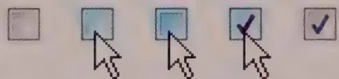  
Figure 18-16: These images depict feedback and state change of a check box in Windows 8. The first image shows an unselected check box. The second is the mouseover state (or hover). The third shows the feedback to the click (or mouse-down). The fourth shows what happens when the button is released (mouse-up) but with a hover. The final image shows the selected state of the check box without a hover. Notice that although the click has visual feedback, the check box control doesn't register a state change until the mouse-up or release.

DESIGN PRINCIPLE

Mouse-down over controls means proposing an action; mouse-up means committing to an action.

This mechanism allows users to gracefully bow out of an inadvertent click. After clicking a button, for example, the user can just move the mouse outside of the button and release the mouse button. For a check box, the meaning is similar: On mouse-down the check box shows that it has been activated, but the check doesn't actually appear until

the mouse-up transition. This idiom is called pliant response hinting and is further described in Chapter 13.

# Trackpads, trackballs, and gesture sensors

Almost anybody who has used a laptop has used a trackpad. Many people eschew their mouse when they take their laptop with them to meetings, coffee shops, kitchen tables, and bed. Keep in mind that trackpads are a bit more prone to glitchy behavior than mice, since they rely on finger contact on their capacitive surface, and that drag and drop or fine positioning control are difficult. This shouldn't affect your design of typical desktop apps much, but it's something to consider if you know your users will be making heavy or exclusive use of trackpads.

Windows trackpads typically include distinct left and right buttons in addition to the trackpad. Recent Apple trackpads have cleverly and invisibly built these buttons into the trackpad itself. Pressing the Apple trackpad yields a satisfying button click and activates either a left or right mouse button action. A one-finger tap equals a left-click, and a two-finger tap equals a right-click.

Trackballs are uncommon but are still used for specialized applications where fine movement control is desirable and space is at a premium, or where the ball's rotational movement maps well to the manipulation of objects onscreen (3D modeling applications). Click-and-drag operations are somewhat awkward using trackballs, so any dedicated application using a trackball as input probably should be designed to minimize the need for such interactions.

Mice (and trackpads) with multi-touch gesture sensors are becoming more and more common and are the standard for Apple's computers. The operating system typically reserves supported gestures for its own use. But in the event that gestures are made available for use by your application, think carefully about their implementation. Such gestures shouldn't interfere with OS gestures without excellent reason, and they shouldn't be the primary method of accessing functionality or performing navigation. Because gestures lack affordance, they should be considered power-user features, rather like keyboard accelerators and other command shortcuts.

# Cursors

Pointing and selection on the desktop are achieved via the cursor, the visible representation of the mouse's position onscreen. By convention, it is normally a small arrow pointing diagonally up and left, but under application control it can change to any shape as long as it stays relatively small ( $32 \times 32$ pixels in Windows 8). Because the cursor frequently must resolve to a single pixel to point at small things, there must be some way for

the cursor to indicate precisely which pixel is the one pointed to. This is accomplished by designating a single pixel of any cursor as the actual locus of pointing, called the hotspot. For the standard arrow, the hotspot is, logically, the tip of the arrow. Regardless of which shape the cursor assumes, it always has a single hotspot pixel.

As discussed, the key to successful direct manipulation is rich visual feedback. It should be obvious to users which aspects of the interface can be manipulated, which are informational, and which are décor. Especially important for creating effective interaction idioms is attention to mouse cursor hinting, as discussed in Chapter 13.

# Selection

The act of choosing an object or control is called selection. This is a simple idiom, typically accomplished by pointing to and clicking the item in question (although there are other keyboard- and button-actuated ways to do this). Selection is often the basis for more-complex interactions. After the user chooses something, she is in the appropriate context to perform an action on that thing. The sequence of events implied by such an idiom is called object verb ordering.

# Command ordering and selection

At the foundation of every user interface is the way in which the user can express commands. Almost every command has a verb that describes the action and an object that describes what will be acted on.

If you think about it, you can express a command in two ways: with the verb first, followed by the object, or with the object first, followed by the verb. ("Throw me that ball" vs. "That ball, throw it to me.") These are commonly called verb-object and object-verb orders, respectively. Modern user interfaces use both orders.

Verb-object ordering is consistent with how commands are formed in English. As a result, it was only logical that command-line systems mimic this structure in their syntax. (For example, to remove a file in UNIX, you type rmfilename.txt.)

When graphical user interfaces first emerged, it became clear that verb-object ordering created a problem. Without the rigid, formal structures of command-line idioms, graphical user interfaces must use the construct of state to tie together different interactions in a command. If the user chooses a verb, the system must then enter a state—a mode—to indicate that it is waiting for the user to select an object to act on. In the simple case, the user then chooses a single object, and all is well. However, if the user wants to act on more than one object, the system can know this only if the user tells it in advance how many operands he will enter, or if the user enters a second command indicating that he has completed his object list. These are both clumsy interactions and require users to

express themselves in an unnatural manner that is difficult to learn. What works just fine in a highly structured linguistic environment falls apart in the looser universe of the graphical user interface.

With an object-verb command order, we don't need to worry about termination. Users select which objects will be operated on and then indicate which verb to execute on them. The application then executes the indicated function on the selected data. A benefit of this is that users can easily execute a series of verbs on the same complex selection. A second benefit is that when the user chooses an object, the application can show only appropriate commands. This potentially reduces the user's cognitive load and reduces the amount of visual work required to find the command. (In a visual interface, all commands should be represented visually.)

Notice that a new concept has crept into the equation—one that doesn't exist and that isn't needed in a verb-object world. That new concept is called selection. Because the identification of the objects and the verb are not part of the same interaction, we need a mechanism to indicate which operands are selected.

The object-verb model can be difficult to understand in the abstract, but selection is an idiom that is easy to grasp and, once shown, is rarely forgotten. (Clicking an e-mail in Outlook and deleting it, for example, quickly becomes second nature.) Explained through the linguistic context of the English language, it doesn't sound too useful that we must choose an object first. On the other hand, we use this model frequently in our nonlinguistic actions. We pick up a can and then use a can opener on it.

In interfaces that don't employ direct manipulation, such as some modal dialog boxes, the concept of selection isn't always needed. Dialog boxes naturally come with one of those object-list-completion commands: the OK button. Here, users may choose a function first and one or more objects second.

While object-verb orderings are more consistent with the notion of direct manipulation, there are certainly cases where the verb-object command order is more useful or usable. These are cases where it isn't possible or reasonable to define the objects up front without the context of the command. An example is mapping software, where the user probably can't always select the address he wants to map from a list (although we should allow this for his address book). Instead, it is most useful for him to say "I want to see a map for the following address....".

# Discrete and contiguous selection

Selection is a pretty simple concept, but a couple of basic variants are worth discussing. Because selection typically is concerned with objects, these variants are driven by two broad categories of selectable data.

In some cases, data is represented by distinct visual objects that can be manipulated independently of other objects. Icons on the desktop and vector objects in drawing applications are examples. These objects are also commonly selected independently of their spatial relationships with each other. We refer to these as discrete data and to their selection as discrete selection. Discrete data is not necessarily homogeneous, and discrete selection is not necessarily contiguous.

Conversely, some applications represent data as a matrix of many small, contiguous pieces of data. The text in a word processor or the cells in a spreadsheet are made up of hundreds or thousands of similar little objects that together form a coherent whole. These objects are often selected in contiguous groups, so we call them contiguous data and selection within them contiguous selection.

Both contiguous selection and discrete selection support single-click selection and click-and-drag selection. Single-clicking typically selects the smallest useful discrete amount, and clicking and dragging selects a larger quantity, but there are other significant differences.

There is a natural order to the text in a word processor's document—it consists of contiguous data. Scrambling the order of the letters destroys the document's sense. The characters flow from the beginning to the end in a meaningful continuum, and selecting a word or paragraph makes sense in the context of the data. Random, disconnected selections generally are meaningless. Theoretically it is possible to allow a discrete, discontinuous selection, such as several disconnected paragraphs. However, the user's task of visualizing the selections and avoiding inadvertent, unwanted operations on them is more trouble than it's worth.

Discrete data, on the other hand, has no inherent order. Many meaningful orders can be imposed on discrete objects, such as sorting a list of files by their modification dates. However, the lack of a single inherent relationship means that users are likely to want to make discrete selections, such as Ctrl+clicking multiple files that are not listed adjacently. Of course, users may also want to make contiguous selections based on some organizing principle (such as the old files at the bottom of that chronologically ordered list). The utility of both approaches is evident in a vector drawing application (such as Illustrator or PowerPoint). In some cases, the user will want to perform a contiguous selection on objects that are close together, and in other cases, she will want to select a single object.

# Mutual exclusion

Typically, when a selection is made, any previous selection is unmade. This behavior is called mutual exclusion, because the selection of one excludes the selection of the other.

Typically, the user clicks an object and it becomes selected. That object remains selected until the user selects something else. Mutual exclusion is the rule in both discrete and contiguous selection.

Some applications allow users to deselect a selected object by clicking it a second time. This can lead to a curious condition in which nothing is selected, and there is no insertion point. You must decide whether this condition is appropriate for your product.

# Additive selection

Mutual exclusion is often appropriate for contiguous selection because users cannot see or know what effect their actions will have if selections can readily be scrolled off the screen. Selecting several independent paragraphs of text in a long document might be useful, but it isn't easily controllable. It's also easy for users to get into situations where they cause unintended changes because they cannot see all the data they are acting on. Scrolling—not contiguous selection—creates the problem, but most applications that manage contiguous data are scrollable.

However, if there is no mutual exclusion for interactions involving discrete selection, the user can select many independent objects by clicking them sequentially, in what is called additive selection. A list box, for example, can allow users to make as many selections as desired and to deselect them by clicking them a second time.

Most discrete-selection systems implement mutual exclusion by default and allow additive selection only by using a modifier key. In Windows, the Shift key is used most frequently for this task in contiguous selection; the Ctrl key is frequently used for discrete selection. In a drawing application, for example, after you've clicked to select a graphical object, typically you can add another one to your selection by Shift-clicking.

Interfaces employing contiguous selection should not, generally speaking, allow additive selection (at least not without an overview mechanism to make additive selections manageable). However, contiguous-selection interfaces do need to allow selection to be extended. Again, modifier keys should be used. In Word, the Shift key causes everything between the initial selection and the Shift+click to be selected.

Some list boxes, as well as the file views in Windows (both examples of discrete data), do something a bit strange with additive selection. They use the Ctrl key to implement "normal" discrete additive selection, but then they use the Shift key to extend the selection, as if it were contiguous, not discrete data. In most cases this mapping adds confusion, because it conflicts with the common idiom for discrete additive selection.

# Group selection

The click-and-drag operation is also the basis for group selection. For contiguous data, it means "extend the selection" from the mouse-down point to the mouse-up point. This can also be modified with modifier keys. In Word, for example, Ctrl+click selects a complete sentence, so Ctrl+drag extends the selection sentence by sentence. Sovereign applications should rightly enrich their interaction with these sorts of variants as appropriate. Experienced users will eventually come to memorize and use them, as long as the variants are manually simple.

In a collection of discrete objects, the click-and-drag operation generally begins a drag-and-drop move. If the mouse button is clicked in an area between objects, rather than on any specific object, it has a special meaning. It creates a drag rectangle, as shown in Figure 18-17.

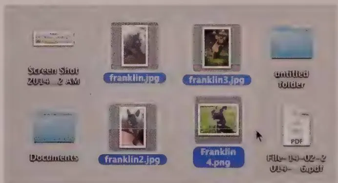  
Figure 18-17: When the cursor is not on any particular object at mouse-down time, the click-and-drag operation normally creates a drag rectangle that selects any object wholly enclosed by it when the mouse button is released. This is a familiar idiom to users of drawing applications and many word processors. This example is taken from Windows Explorer. The rectangle has been dragged from the upper left to the lower right.

A drag rectangle is a dynamically sizable rectangle whose upper-left corner is the mouse-down point and whose lower-right corner is the mouse-up point. When the mouse button is released, any and all objects enclosed within the drag rectangle are selected as a group.

# Visual indication of selection

Selected objects must be clearly, boldly indicated as such to users. The selected state must be easy to spot on a crowded screen, must be unambiguous, and must not obscure normally visible details of the object.

You must ensure that, in particular, users can easily tell which items are selected and which are not. It's not good enough just to be able to see that the items are different. Keep in mind that a significant portion of the population is color-blind, so color alone is insufficient to distinguish between selections.

Historically, inversion has been used to indicate selection (such as making white pixels black and black pixels white). Although this is visually bold, it is not necessarily very readable, especially when it comes to full-color interfaces. Other approaches include colored backgrounds, outlines, pseudo-3D depression, handles, and animated marqueees.

In drawing, painting, animation, and presentation applications, where users deal with visually rich objects, it's easy for selections to get lost. The best solution here is to add selection indicators to the object, rather than merely indicating selection by changing any of the selected object's visual properties. Most drawing applications take this approach, with handles: little boxes that surround the selected object, providing points of control.

With irregularly shaped selections (such as those in an image-manipulation application like Adobe Photoshop), handles can be confusing and get lost in the clutter. However, there is one way to ensure that the selection will always be visible, regardless of the colors used: Indicate the selection by movement.

One of the first applications on the Macintosh, MacPaint, had a wonderful idiom in which a selected object was outlined with a simple dashed line, and the dashes all moved in synchrony around the object. The dashes looked like ants in a row; thus, this effect earned the colorful sobriquet marching ants. Today, this is commonly called a marquee, after the flashing lights on old cinema signs that exhibited similar behavior.

Adobe Photoshop uses this idiom to show selected regions of photographs, and it works extremely well. (Expert users can toggle it off and on with a keystroke so that they can see their work without visual distraction.) The animation is not hard to do, although it takes some care to get it right, and it works regardless of the color mix and intensity of the background.

# Insertion and replacement

As we've established, selection indicates on which object subsequent actions will operate. If that action involves creating or pasting new data or objects (via keystrokes or

a Paste command), they are somehow added to the selected object. In discrete selection, one or more discrete objects are selected, and the incoming data is handed to the selected discrete objects, which process the data in their own ways. This may cause a replacement action, in which the incoming data replaces the selected object. Alternatively, the selected object may treat the incoming data in some predetermined way. In PowerPoint, for example, when a shape is selected, incoming keystrokes result in a text annotation of the selected shape.

In contiguous selection, however, the incoming data always replaces the currently selected data. When you type in a word processor or text-entry box, you replace what is selected with what you are typing. Contiguous selection exhibits a unique quirk: The selection can simply indicate a location between two elements of contiguous data, rather than any particular element of the data. This in-between place is called the insertion point.

In a word processor, the caret (usually a blinking vertical line that indicates where the next character will go) indicates a position between two characters in the text, without actually selecting either one. By pointing and clicking anywhere else, you can easily move the caret, but if you drag to extend the selection, the caret disappears and is replaced by the contiguous selection of text.

Spreadsheets also use contiguous selection but implement it somewhat differently than word processors do. The selection is contiguous because the cells form a contiguous matrix of data, but there is no concept of selecting the space between two cells. In the spreadsheet, a single click selects exactly one whole cell. There is currently no concept of an insertion point in a spreadsheet, although the design possibilities are intriguing. (That is, select the line between the top and bottom of two vertically adjacent cells and start typing to insert a row and fill a new cell in a single action.)

A blend of these two idioms is possible as well. In PowerPoint's slide-sorter view, insertion-point selection is allowed, but single slides can be selected too. If you click a slide, that slide is selected, but if you click in between two slides, a blinking insertion-point caret is placed there.

If an application allows an insertion point, contiguous objects must be selected by either clicking and dragging, or if they are part of the same logical group, by double- or triple-clicking. Most people select text by dragging the mouse across it. This means that the user will be doing quite a bit of clicking and dragging in the normal course of using the application, with the side effect that any drag-and-drop idiom will be more difficult to express. You can see this in Word, where dragging and dropping text involves first a click-and-drag operation to make the selection, and then another mouse move back into the selection to click and drag again for the actual move. To do the same thing, Excel makes you find a special pliant zone (only a pixel or two wide) on the border of

the selected cell. To move a discrete selection, the user must click and drag the object in a single motion. To relieve the click-and-drag burden of selection in word processors, other direct-manipulation shortcuts are also implemented, like double-clicking to select a word.

# Drag and drop

Of all the direct-manipulation idioms, nothing distinguishes a WIMP interface more than the drag-and-drop operation: clicking and holding the button while moving an object across the screen and releasing it in a meaningful location. Surprisingly, drag and drop isn't used as widely as we'd like to think, and it certainly hasn't lived up to its full potential.

In particular, the popularity of the web and the myth that web-like behavior is synonymous with superior ease of use have set back the development of drag and drop on the desktop. Developers have mistakenly emulated the crippled interactions of web browsers in other, far less appropriate contexts. Luckily, as web technology has been refined, developers have been able to provide rich drag-and-drop behavior in the browser. Although this task is still somewhat challenging, it seems that there has been a resurgence in rich, expressive command idioms for all platforms.

We might define drag and drop as "clicking an object and moving it to a new location," although that definition is somewhat narrow in scope for such a broad idiom. A more accurate description of drag and drop is "clicking an object and moving it to imply a transformation."

The Macintosh was the first successful system to offer drag and drop. It raised a lot of expectations with the idiom that were never fully realized for two simple reasons. First, drag and drop wasn't a systemwide facility, but rather an artifact of the Finder, a single application. Second, because the Mac was at the time a single-tasking computer, the concept of drag and drop between applications didn't surface as an issue for many years.

To Apple's credit, it described drag and drop in its first user-interface standards guide. On the other side of the fence, Microsoft not only failed to put drag-and-drop aids in its early releases of Windows but also didn't even describe the procedure in its developer documentation. However, Microsoft eventually caught up and even pioneered some novel uses of the idiom, such as movable toolbars and dockable palettes.

Generally we use the term "direct manipulation" to refer to all kinds of GUI interaction idioms, but drag and drop has two levels of directness. First, with true direct-manipulation idioms, dragging and dropping represents putting the object somewhere. Examples include moving a file between two directories, opening a file in a specific

application (by dropping a file icon onto an application icon), or arranging objects on a canvas in drawing applications.

The second type of drag-and-drop idiom is a little more indirect: The user drags the object to a specific area or onto another object to perform a function. These idioms are less popular but can be very useful. A good example of this can be found in the OS X Automator, as shown in Figure 18-18.

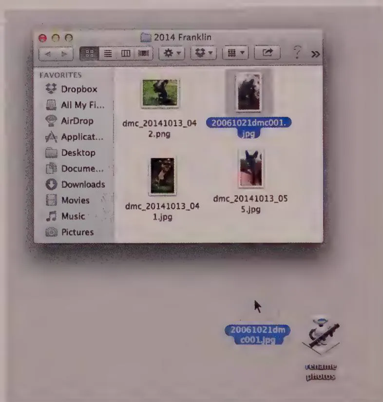  
Figure 18-18: Apple's Automator tool in OS X allows users to set up common workflows, such as renaming an image, that are then represented as an icon. Users can then drag and drop files or folders onto the workflow icon to perform the function. While strictly speaking this isn't direct manipulation, it does provide a reasonably direct way to invoke a command.

# Visual feedback for drag and drop

As we've discussed, an interface should visually hint at its pliancy—either statically, in how it is drawn, or actively, by becoming animated as the cursor passes over it. The idea that an object can be dragged is easily learned idiomatically. It is difficult for the user to forget that an icon, selected text, or other distinct object can be directly manipulated

after he learns the behavior. However, he may forget the details of the action, so feedback is very important after the user clicks the object and starts dragging. The first-timer or very infrequent user will probably also require some additional help to get started (such as textual hints built into the interface). Forging interactions and Undo encourage users to try direct manipulation without trepidation.

As soon as the user clicks the mouse button with the cursor on an object, that object becomes the source object for the duration of the drag and drop. As the user moves the mouse around with the button held down, the cursor passes over a variety of objects. It should be obvious which of these objects are meaningful drop targets. Until the button is released, these are called drop candidates. A drag can have only one source and one target, but there may be many drop candidates.

The only task of each drop candidate is to visually indicate that the hotspot of the captive cursor is over it. This means that it will accept the drop—or at least comprehend it—if the user releases the mouse button. Such an indication is, by its nature, active visual hinting.

DESIGN PRINCIPLE

Drop candidates must visually indicate their receptivity.

The weakest way to offer the visual indication of receptivity to being dropped upon is by changing the cursor. It is the cursor's primary job to represent what is being dragged. It is best to leave indication of drop candidacy to the drop candidate itself.

DESIGN PRINCIPLE

The drag cursor must visually identify the source object.

It is important that these two visual functions not be confused. Unfortunately, Microsoft seems to have done so in Windows, with its use of cursor hinting to indicate that something is not a drop target. This decision was likely made more for the ease of coding than for any design considerations. It is much easier to change the cursor than it is to highlight drop candidates to show their drop receptivity. The cursor's role is to represent the master—the dragged object. It should not be used to represent the drop candidate.

As if that wasn't bad enough, Microsoft performs this cursor hinting using the detestable circle with a bar—the universal icon for Not Permitted. This symbol is an unpleasant idiom, because it tells users what they can't do. It is negative feedback. The user can easily construe its meaning to be "Don't let go of the mouse now, or you'll do irreversible

damage" instead of "Go ahead and let go now; nothing will happen." Adding the Not Permitted symbol to cursor hinting is an unfortunate combination of two weak idioms and should be avoided, regardless of what the Microsoft style guide says.

After the user finally releases the mouse button, the current drop candidate becomes the target. If the user releases the mouse button in the interstice between valid drop candidates, or over an invalid drop candidate, there is no target, and the drag-and-drop operation ends with no action. Silence, or visual inactivity, is a good way to indicate this termination. It isn't a cancelation, exactly, so there is no need to show a cancel indicator.

# Indicating drag pliancy

Active cursor hinting to indicate drag pliancy is problematic. In an increasingly object-oriented world, more things can be dragged than not. A cursor flicking and changing rapidly can be more visual distraction than help. One solution is to just assume that things can be dragged and let users experiment. This method is reasonably successful in the Windows Explorer and Macintosh Finder windows. Without cursor hinting, drag pliancy can be a hard-to-discover idiom, so you might consider building some other indication into the interface, such as a textual hint or ToolTip-style pop-up.

After the source object is picked up and the drag operation begins, there must be some visual indication of this. The most visually rich method is to fully animate the drag operation, showing the entire source object moving in real time.

One problem is that a drag-and-drop operation can require a pretty precise pointer. For example, the source object may be 6-centimeters square, but it must be dropped on a target that is 1-centimeter square. The source object must not obscure the target, and because the source object is big enough to span multiple drop candidates, we need to use a cursor hotspot to precisely indicate which candidate it will be dropped on. This means that dragging a transparent outline or thumbnail of the object may be much better than actually dragging an exact image of the source object or data. It also means that the dragged object can't obscure the normal arrow cursor. The tip of the arrow is needed to indicate the exact hotspot.

Dragging an outline also is appropriate for most repositioning, because the outline can be moved relative to the source object, still visible in its original position.

# Indicating drop candidacy

As the cursor traverses the screen, carrying with it an outline of the source object, it passes over one drop candidate after another. These drop candidates must visually

indicate that they are aware of being considered as potential drop targets. By visually changing, the drop candidate alerts users that they can do something constructive with the dropped object. (Of course, this requires that the software be smart enough to identify meaningful source-target combinations.)

A point so obvious that it is difficult to see is that the only objects that can be drop candidates are ones that are currently visible. A running application doesn't have to worry about visually indicating its readiness to be a target if it isn't visible. Usually, the number of objects occupying screen real estate is very small—a couple dozen at most. This means that the implementation burden should not be overwhelming.

# Insertion targets

In some applications, the source object can be dropped into the spaces between other objects. Dragging text in Word is such an operation, as are most reordering operations in lists or arrays. In these cases, a special type of visual hinting is drawn on the background "behind" the GUI objects of the application or in its contiguous data. This is an insertion target.

Rearranging slides in PowerPoint's slide-sorter view is a good example of this type of drag and drop. The user can pick up a slide and drag it into a different place in the presentation. As the user drags, the insertion target (a vertical black bar that looks like a big text edit caret) appears between slides. Word, too, shows an insertion target when you drag text. Not only is the loaded cursor apparent, but you also see a vertical dotted-line bar showing the precise location, between characters, where the dropped text will land.

Whenever something can be dragged and dropped on the space between other objects, the application must show an insertion target. Like a drop candidate in source-target drag and drop, the application must visually indicate where the dragged object can be dropped.

# Visual feedback at completion

If the source object is dropped onto a valid drop candidate, the appropriate operation then takes place. A vital step at this point is visual feedback that the operation has occurred. For example, if you're dragging a file from one directory to another, the source object must disappear from its source and reappear in the target. If the target represents a function rather than a container (such as a print icon), the icon must visually hint that it received the drop and is now printing. It can do this with animation or by otherwise changing its visual state.

# Auto-Scrolling

What action should the application take when the selected object is dragged beyond the border of the enclosing application? Of course, the object is being dragged to a new position, but is that new position inside or outside of the enclosing application?

Take Microsoft Word, for example. When a piece of selected text is dragged outside the visible text window, is the user saying "I want to put this piece of text into another application" or is he saying "I want to put this piece of text somewhere else in this same document, but that place is currently scrolled off the screen"? If it's the former, we proceed as already discussed. But if the user desires the latter, the application must automatically scroll (autoScroll) in the direction of the drag to reposition the selection at a distant, not currently visible location in the same document.

Auto-Scroll is a very important adjunct to drag and drop. Wherever the drop target can possibly be scrolled offscreen, the application needs to auto-Scroll.

DESIGN PRINCIPLE

Any scrollable drag-and-drop target must autoScroll.

In early implementations, auto-Scrolling worked if you dragged outside the application's window. This had two fatal flaws. First, if the application filled the screen, how could you get the cursor outside the app? Second, if you wanted to drag the object to another application, how could the app tell the difference between that and the desire to auto-Scroll?

Microsoft developed an intelligent solution to this problem. Basically, it begins autoscrolling just inside the application's border instead of outside the border. As the drag cursor approaches the borders of the scrollable window—but is still inside it—a scroll in the direction of the drag is initiated. If the drag cursor comes within about 30 pixels of the bottom of the text area, Word begins to scroll the window's contents upward. If the drag cursor comes equally close to the top edge of the text area, Word scrolls down.

Thankfully, in recent times developers have commonly implemented a variable autoScroll rate, as shown in Figure 18-19. The automatic scrolling increases in speed as the cursor gets closer to the window edge. For example, when the cursor is 30 pixels from the upper edge, the text scrolls down at one line per second. At 15 pixels, the text scrolls at two lines per second, and so on. This gives the user sufficient control over the autoScroll to make it useful in a variety of situations.

Another important detail required by auto-Scrolling is a time delay. If auto-Scrolling begins as soon as the cursor enters the sensitive zone around the edges, it is too easy for a slow-moving user to inadvertently auto-Scroll. To cure this, auto-Scrolling should

begin only after the drag cursor has been in the auto-Scroll zone for a reasonable amount of time—about a half-second.

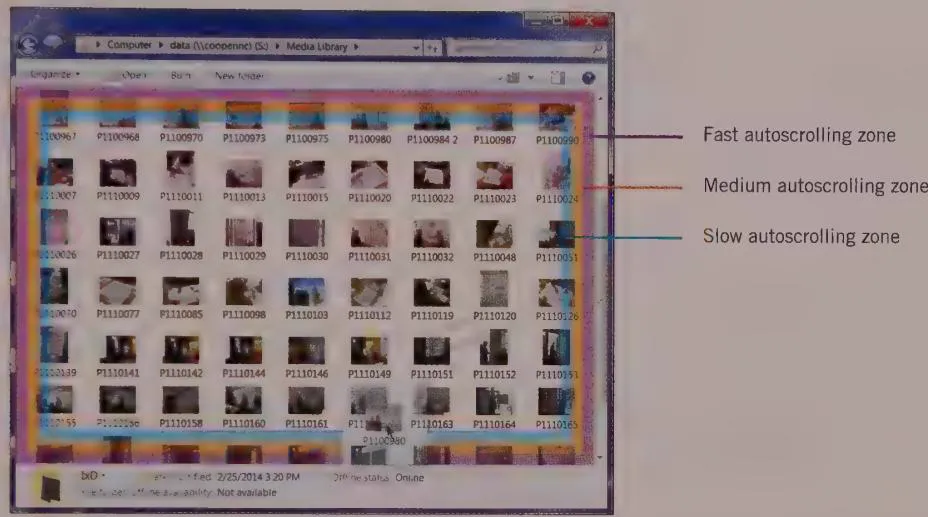  
Figure 18-19: This image expresses the concept of variable-speed autoScroll, as it could be applied to Windows Explorer. Unfortunately, autoScroll moves at a single speed that is impossible to control. It would be better if the autoScroll went faster the closer the cursor gets to the window's edge. (But it's also important to have a speed limit. AutoScroll doesn't help anyone if it goes too fast.) To its credit, Microsoft's idea of autoScrolling as the cursor approaches the inside edges of the enclosing scrollbox, rather than the outside, is clever indeed.

If the user drags the cursor completely outside Word's scrollable text window, no auto-Scrolling occurs. Instead, the repositioning operation terminates in an application other than Word. For example, if the drag cursor goes outside Word and is positioned over PowerPoint, when the user releases the mouse button, the selection is pasted into the PowerPoint slide at the position indicated by the mouse. Furthermore, if the drag cursor moves within 3 or 4 millimeters of any of the borders of the PowerPoint Edit window, PowerPoint begins auto-Scrolling in the appropriate direction. This is a convenient feature, because the confines of contemporary screens mean that we often find ourselves with a loaded drag cursor and no place to drop its contents.

# Avoiding drag-and-drop twitchiness

When an object can be either selected or dragged, it is vital that the mouse be biased toward the selection operation. Because it is so difficult to click something without inadvertently moving the cursor a pixel or two, the frequent act of selecting something must not accidentally cause the application to misinterpret the action as the beginning of a drag-and-drop operation. Users rarely want to drag an object only one or two pixels. (And even in cases where they do, such as in drawing applications, it's useful to require a little extra effort to do so, to prevent frequent accidental repositioning.)

In the hardware world, controls like pushbuttons that have mechanical contacts can exhibit what engineers call bounce. This means that the switch's tiny metal contacts literally bounce when someone presses them. For electrical circuits like doorbells, the milliseconds the bounce takes aren't meaningful, but in modern electronics, those extra clicks can be significant. The circuitry backing up such switches has special logic to ignore extra transitions if they occur within a few milliseconds of the first one. This keeps your stereo from turning back off a thousandth of a second after you turned it on. This situation is analogous to the oversensitive mouse problem. The solution is to copy switch makers and debounce the mouse.

To avoid inadvertent repositioning, applications should establish a drag threshold. All mouse-movement messages that arrive after the mouse-down event are ignored unless the movement exceeds a small threshold amount, such as 3 pixels. This provides some protection against initiating an inadvertent drag operation. If the user can keep the mouse button within 3 pixels of the mouse-down point, the entire click action is interpreted as a selection command, and all tiny, spurious moves are ignored. As soon as the mouse moves beyond the 3-pixel threshold, the application can confidently change the operation into a drag, as shown in Figure 18-20. Whenever an object can be selected and dragged, the drag operation should be debounced.

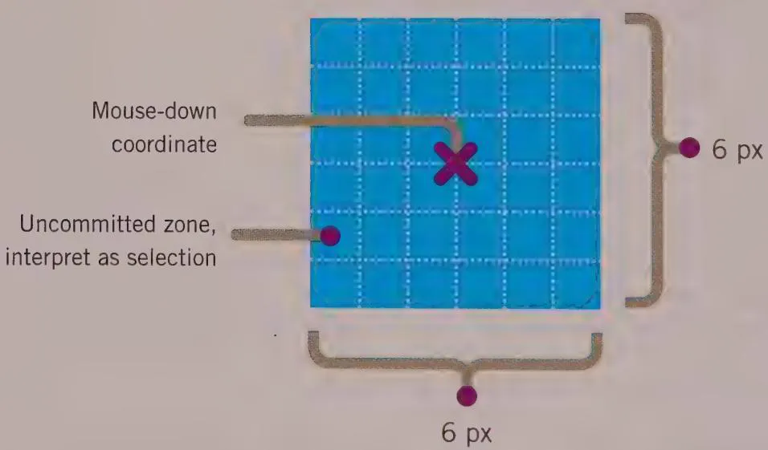  
Figure 18-20: Any object that can be both selected and dragged must be debounced. When the user clicks the object, the action must be interpreted as a selection rather than a drag, even if the user accidentally moves the mouse a pixel or two between the click and the release. The application must ignore any mouse movement as long as it stays within the uncommitted zone, which extends 3 pixels in each direction. After the cursor moves more than 3 pixels from the mouse-down coordinate, the action changes to a drag, and the object is considered "in play." This is called a drag threshold.

Some applications may require more-complex drag thresholds. Three-dimensional applications often require drag thresholds that enable movement in three projected axes on the screen. Another such example arose in the design of a report generator for one of our clients. The user could reposition columns on the report by dragging them horizontally. For example, he could put the First Name column to the left of the Last Name column by dragging it into position from anywhere in the column. This was by far the most frequently used drag-and-drop idiom. However, another infrequently used drag operation allowed the values in one column to be interspersed vertically with the values of another column—for example, an address field and a state field (see Figure 18-21).

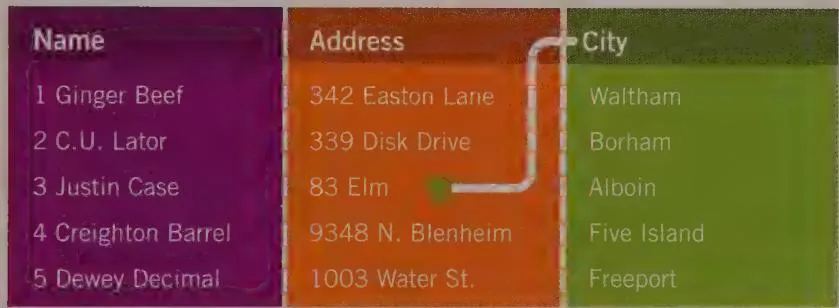

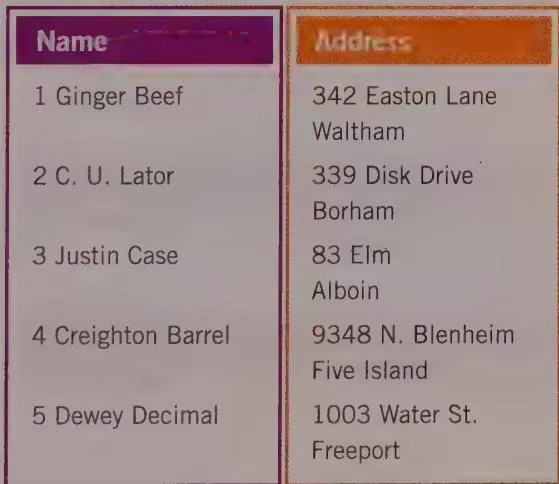  
Figure 18-21: This report-generator application offered an interesting feature that enabled the contents of one column to be interspersed with the contents of another by dragging and dropping it. This direct-manipulation action conflicted with the more-frequent drag-and-drop action of reordering the columns (like moving City to the left of Address). We used a special two-axis drag threshold to accomplish this.

We wanted to follow the persona's mental model and enable him to drag the values of one column on top of the values of another to perform this stacking operation. However, this conflicted with the simple horizontal reordering of columns. We solved the problem by differentiating between horizontal drags and vertical drags. If the user dragged the column left or right, it meant that he was repositioning the column as a unit. If the user dragged the column up or down, it meant that he was interspersing the values of one column with the values of another.

Because the horizontal drag was the predominant user action, and vertical drags were rare, we biased the drag threshold toward the horizontal axis. Instead of a square uncommitted zone, we created the spool-shaped zone shown in Figure 18-22. Because the horizontal-motion threshold was set to 4 pixels, it didn't take a big movement to commit users to the normal horizontal move while still insulating users from an inadvertent vertical move. To commit to the far less frequent vertical move, the user had to move the cursor 8 pixels on the vertical axis without deviating more than 4 pixels left or right. That motion is quite natural and easily learned.

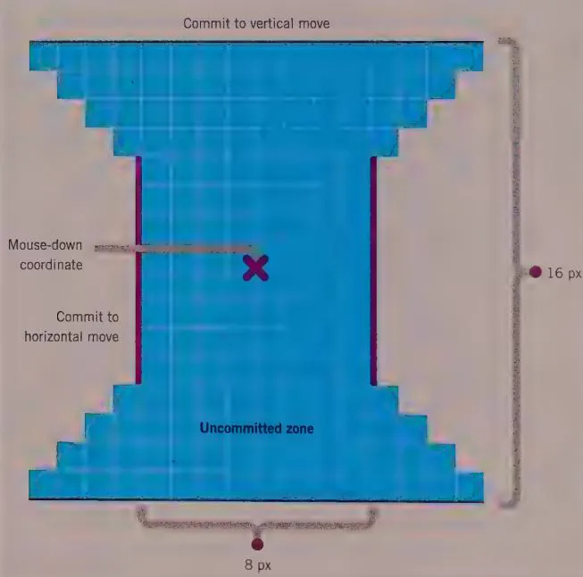  
Figure 18-22: This spool-shaped drag threshold allowed a bias toward horizontal dragging in a client's application. Horizontal dragging was by far the most frequently used type of drag in this application. This drag threshold made it difficult for the user to inadvertently begin a vertical drag. However, if the user really wanted to drag vertically, a bold move either up or down would cause the application to commit to the vertical mode with a minimum of excise.

This axially asymmetric threshold can be used in other ways, too. Visio implements a similar idiom to differentiate between drawing a straight line and a curved line.

# Fine scrolling

The weakness of the mouse as a precision pointing tool is readily apparent, particularly when dragging objects around in drawing applications. It is hard to drag something to the exact desired spot, especially when the screen resolution is 72 pixels per inch (or sometimes much more) and the mouse is running at a 6-to-1 ratio to the screen. To move the cursor 1 pixel, you must move the mouse about $1/500$ th of an inch.

This is solved by adding a fine scrolling function, whereby users can quickly shift into a mode that allows much finer resolution for mouse-based manipulation of objects. During a drag, if the user decides that he needs more-precise maneuvering, he can change the ratio of the mouse's movement to the object's movement on the screen. Any application that might demand precise alignment must offer a fine scrolling facility. This includes, at a minimum, all drawing and painting, presentation, and image-manipulation applications. This idiom has several variants. Commonly, using a modifier key while dragging puts the mouse into vernier mode, in which every 10 pixels of mouse movement are interpreted as a single pixel of object movement.

DESIGN PRINCIPLE

Any program application that demands precise alignment must offer a vernier.

Another effective method is to make the arrow keys active during a drag operation. While holding down the mouse button, the user can manipulate the arrow keys to move the selection up, down, left, or right—1 pixel at a time. The drag operation is still terminated by releasing the mouse button. Many pixel-pushing applications like Adobe Photoshop let users move selections by single pixels with the arrow keys, and by 10x the standard amount when modified with a Shift key.

The problem with a vernier is that the simple act of releasing the mouse button can often cause the user's hand to shift a pixel or two. This causes the perfectly placed object to slip out of alignment just at the moment of acceptance. The solution is, upon receipt of the first vernier keystroke, to desensitize the mouse. You do so by making the mouse ignore all subsequent movements under some reasonable threshold, such as 5 pixels. This means that the user can make the initial gross movements with the mouse; and then make a final, precise placement with the arrow keys; and then release the mouse button without disturbing the placement. If the user wants to make additional gross movements after beginning the vernier, he simply moves the mouse beyond the threshold, and the system shifts back out of vernier mode.

If the arrow keys are not otherwise spoken for in the interface, as in a drawing application, they can be used to control vernier movement of the selected object. This means that the user does not have to hold down the mouse button. Adobe Illustrator and Photoshop

do this, as does PowerPoint. In PowerPoint, the arrow keys move the selected object one step on the grid—about 2 millimeters using the default grid settings. If you hold down the Alt key while using the arrow keys, the movement is 1 pixel per arrow keystroke.

# Control manipulation

Controls are the fundamental building blocks of the modern graphical user interface. While we discuss the topic in detail in Chapter 21, in our current discussion of direct manipulation it is worth addressing the mouse interactions required by several controls.

Many controls, particularly menus, require the moderately difficult motion of a click and drag rather than a mere click. This direct-manipulation operation demands more of users because of its juxtaposition of fine motions with gross motions to click, drag, and then release the mouse button. Although menus are not used as frequently as toolbar controls, they are still used often, particularly by new and infrequent users. Thus, we find one of the more intractable conundrums of GUI design: The menu is the primary control for beginners, yet it is one of the more difficult controls to operate.

There is no solution to this problem other than to provide additional idioms to accomplish the same task. If a function is available from the menu, and it is one that will be used more than just rarely, be sure to provide idioms for invoking the function that don't require a click-and-drag operation, such as a toolbar button.

One nice feature in Windows, which Mac OS has also adopted, is the ability to work its menus with a series of single clicks rather than clicking and dragging. You click the menu, and it drops. You point to the desired item, click to select it, and close the menu. Microsoft further extended this idea by putting applications into a sort of menu mode as soon as you click any menu. In this mode, all the top-level menus in the application and all the items on those menus are active, just as though you were clicking and dragging. As you move the mouse around, each menu, in turn, drops without your having to click the mouse.

# Modal tools and palettes

With modal tools, the user selects a tool from a tool palette, as discussed earlier in this chapter. The application's display area is then completely in that tool's mode: It does only that one tool's job. The cursor usually changes to indicate the active tool.

When the user clicks and drags with the tool on the drawing area, the tool does its thing. If the active tool is a spray can, for example, the application enters Spray Can mode, and it can only spray. The tool can be used repeatedly, spraying as much ink as the user wants until he clicks a different tool. If the user wants to use some other tool on the graphic, like an eraser, he must return to the toolbox and select the eraser tool. The application

then enters Eraser mode, and on the canvas, the cursor erases things only until the user chooses another tool. There is usually a selection-cursor tool on the palette to let the user return the cursor to a selection-oriented pointer, as in Adobe Photoshop, for example.

Modal tools work for tools that perform actions on drawings, such as an eraser, or for shapes that can be drawn, such as ellipses. The cursor can become an eraser tool and erase anything previously entered, or it can become an ellipse tool and draw any number of new ellipses. The mouse-down event anchors a corner or center of the shape (or its bounding box), the user drags to stretch the shape to the desired size and aspect, and the mouse-up event confirms the draw.

Modal tools are not bothersome in an application like Paint, where the number of drawing tools is very small. In a more advanced drawing application, such as Adobe Photoshop, however, the modality is disruptive. As users get more agile with the cursor and tools, the percentage of time and motion devoted to selecting and deselecting tools—the excise—increases dramatically. Modal tools are excellent idioms for introducing users to the range of features of such an application, but they usually don't scale well for intermediate users of more sophisticated applications. Luckily, Photoshop makes extensive use of keyboard commands for power users.

The difficulty of managing a modal tool application isn't caused by the modality as much as it is by the sheer quantity of tools. More precisely, the efficiencies break down when the quantity of tools in the user's working set gets too large. A working set of more than a handful of modal tools tends to become hard to manage. If the number of necessary tools in Adobe Illustrator could be reduced from 24 to eight, for example, its user interface problems might diminish below the threshold of user pain.

To compensate for the profusion of modal tools, products like Adobe Illustrator use modifier keys to modify the various modes. The Shift key is commonly used for constrained drags, but Illustrator adds many nonstandard modifier keys and uses them in nonstandard ways. For example, holding down the Alt key while dragging an object drags away a copy of that object, but the Alt key is also used to promote the selector tool from single-vertex selection to object selection. The distinction between these uses is subtle: If you click something and then hold down the Alt key, you drag away a copy of it. Alternatively, if you hold down the Alt key and then click something, you select all of it, rather than a single vertex of it. But then, to further confuse matters, you must release the Alt key, or you will drag away a copy of the entire object. To do something as simple as selecting an entire object and dragging it to a new position, you must hold down the Alt key, point to the object, click and hold down the mouse button without moving the mouse, release the Alt key, and then drag the object to the desired position! What were these people thinking?

Admittedly, the possible combinations are powerful, but they are hard to learn, hard to remember, and hard to use. If you are a graphic arts professional working with Illustrator

for eight hours a day, you can turn these shortcomings into benefits in the same way that a race car driver can turn the cantankerous behavior of a finely tuned automobile into an asset on the track. The casual user of Illustrator, however, is like an average driver behind the wheel of an IndyCar: way out of his league with a temperamental and unsuitable tool.

# Charged cursor tools

With charged cursor tools, users again select a tool or shape from a palette. But this time, rather than switching permanently (until the user switches again) to the selected tool, the cursor becomes loaded—or charged—with a single instance of the selected object.

When the user clicks in the drawing area, an instance of the object is created on the screen at the mouse-up point. The charged cursor doesn't work too well for functions (even though Microsoft uses it ubiquitously for its Format Painter function), but it is nicely suited for graphic objects. PowerPoint, for example, uses it extensively. The user selects a rectangle from the graphics palette, and the cursor then becomes a modal rectangle tool charged with exactly one rectangle.

In many charged cursor applications like PowerPoint, the user cannot always deposit the object with a simple click. Instead, she must drag a bounding rectangle to determine the size of the deposited object. Some applications, like Visual Basic, allow either method. A single click of a charged cursor creates a single instance of the object in a default size. The new object is created in a state of selection, surrounded by handles (which we'll discuss in the section "Resizing and Reshaping") and ready for immediate precision reshaping and resizing. This dual mode, allowing either a single click for a default-sized object or dragging a rectangle for a custom-sized object, is certainly the most flexible and discoverable method that will satisfy the most users.

Sometimes charged-cursor applications forget to change the cursor's appearance. For example, although Visual Basic changes the cursor to crosshairs when it's charged, Delphi doesn't change it at all. If the cursor has assumed a modal behavior—if clicking it somewhere will create something—it is important that it visually indicate this state. A charged cursor also demands good cancel idioms. Otherwise, how do you harmlessly discharge the cursor? Pressing the Esc key is one widely used and effective discharge idiom.

# 2D object manipulation

Like controls, data objects on the screen, particularly 2D graphical objects in drawing and modeling applications, can be manipulated by clicking and dragging. Objects (other than icons, which were discussed earlier in this chapter) depend on click-and-drag motions for four main operations: repositioning, resizing, reshaping, and connecting.

# Repositioning

Repositioning is the simple act of clicking an object and dragging it to a new location. The most significant design issue regarding repositioning is that it usurps the place of other direct-manipulation idioms. The repositioning function demands the click-and-drag action, making it unavailable for other purposes. This is not an issue for content in an application, since the direct manipulation is a likely intention of a drag and drop, but it can mean problems for objects in the interface.

The most common solution to this conflict is to dedicate a specific physical area of the object to the repositioning function. For example, you can reposition a window in Windows or on the Macintosh by clicking and dragging its title bar. The rest of the window is not pliant for repositioning, so the click-and-drag idiom is available for functions within the window, as you would expect. The only hints that the window can be dragged are its color and the slight dimensionality of the title bar, a subtle visual hint that is purely idiomatic. (Thankfully, the idiom is very effective.)

In general, however, you should provide more explicit visual hinting about an area's pliancy. For a title bar, you could use cursor hinting or a griable texture as a pliancy hint.

Before you move an object, you must select it. This is why selection must take place on the mouse-down transition: The user can drag without having to first click and release an object to select it, and then click and drag it to reposition it. It feels so much more natural to simply click it and then drag it to where you want it in one easy motion.

This creates a problem for moving contiguous data. In Word, for example, Microsoft uses this clumsy click-wait-click operation to drag chunks of text. You must click and drag to select a section of text, wait a second or so and click, and then drag to move it. This is unfortunate, but there is no good alternative for contiguous selection. If Microsoft were willing to dispense with its modifier key idioms for extending the selection, those same modifier keys could be used to select a sentence and drag it in a single movement. But this still wouldn't solve the problem of selecting and moving arbitrary chunks of text.

When you do repositioning, a modifier key (such as Shift) is often used to constrain the drag to a single dimension (either horizontal or vertical). This type of drag is called a constrained drag. Constrained drags are extremely helpful in drawing applications, particularly when you draw neatly organized diagrams. The predominant motion of the first 5 or 10 pixels of the drag determines the angle of the drag. If the user begins dragging on a predominantly horizontal axis, for example, the drag henceforth is constrained to the horizontal axis. Some applications interpret constraints differently, letting users shift angles in mid-drag by dragging the mouse across a threshold.

Another way to assist users as they move objects around onscreen is by providing guides. In the most common implementations (such as in Adobe Illustrator), they are special lines that the user may place as references to be used when positioning objects. Commonly, the user may tell the application to "snap" to the guides. This means that if an object is dragged within a certain distance of the guide, the application will assume that it should be aligned directly with the guide. Typically this can be overridden with a keyboard nudge.

A novel and useful variation on this concept is OmniGraffle's Smart Guides. They provide dynamic visual feedback on and assistance with positioning objects. This is based on the (very reasonable) assumption that users are likely to want to align objects to each other and to create evenly spaced rows and columns of these aligned objects. Google's SketchUp (described in greater detail later in the chapter) provides similar help with three-dimensional sketches.

# Resizing and reshaping

When it comes to windows in a GUI, there isn't really any functional difference between resizing and reshaping. The user can adjust a window's size and aspect ratio at the same time by dragging a control on a window's lower-right corner. It is also possible to drag any window edge. These interactions typically are supported by clear cursor hinting.

Such idioms are appropriate for resizing windows. But when the object to be resized is a graphical element (as in a drawing or modeling application), it is important to communicate clearly which object is selected and where the user must click to resize or reshape the object. A resizing idiom for graphical objects must be visually bold to differentiate itself from parts of the drawing, especially the object it controls. It also must not obscure the user's view of the object and the area around it. The resizing also must not obscure the resizing action.

A popular set of idioms accomplishes these goals; Shown in Figure 18-23, they are called resize handles (or, simply, handles). Handles serve double-duty because they can also indicate selection. This is a naturally symbiotic relationship, because an object usually must be selected to be resizing.

The handle centered on each side moves only that side, while the other sides remain motionless. The handles on the corners simultaneously move both the sides they touch, an interaction that is quite visually intuitive.

Handles tend to obscure the object they represent, so they don't make very good permanent controls. This is why we don't see them on top-level resizeable windows. For that situation, frame or corner resize are better idioms. If the selected object is larger than

the screen, the handles may not be visible. If they are hidden offscreen, not only are they unavailable for direct manipulation, but they are also useless as selection indicators.

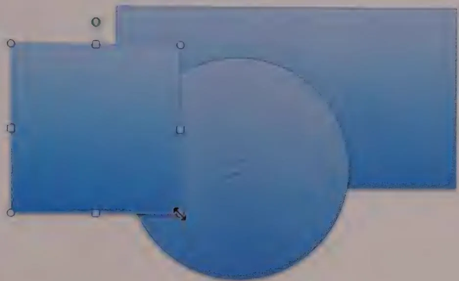  
Figure 18-23: The selected object has eight handles, one at each corner and one centered on each side. The handles indicate selection and are a convenient idiom for resizing and reshaping the object. Handles are sometimes implemented with pixel inversion, but in a multicolor universe they can get lost in the clutter. These handles from Microsoft PowerPoint 2010 feature a small amount of dimensional rendering to help them stand out on the slide. Non-rectangular objects display their drag handles in a rectangular bounding box around the object.

As with dragging, a modifier key is often used to constrain the direction of a resize interaction. Another example of a constrained drag idiom, Shift is again used to force the resize to maintain the object's original aspect ratio. This can be quite useful. In some cases, it's also useful to constrain the resize to either a vertical, horizontal, or locked aspect ratio.

Notice that the assumption in this discussion of handles is that the object in question is rectangular or can be easily bounded by a rectangle. If the user is creating an organization chart, this may be fine, but what about reshaping more complex objects? A very powerful and useful variant of the resize handle is a vertex handle.

Many applications draw objects on the screen with polylines. A polyline is a graphics developer's term for a multisegment line defined by an array of vertices. If the last segment connects back to the first vertex, it is a closed form, and the polyline forms a polygon. When the object is selected, the application, rather than placing eight handles as

it does on a rectangle, places one handle on top of every vertex of the polyline. The user can then drag any vertex of the polyline independently and actually change one small aspect of the object's internal shape rather than affecting it as a whole. This is shown in Figure 18-24.

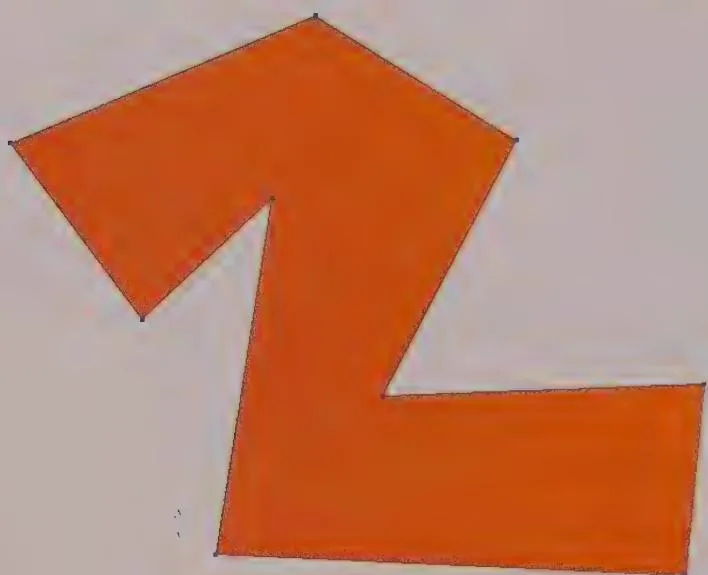  
Figure 18-24: These are vertex handles, so named because each vertex of the polygon has one handle. The user can click and drag any handle to reshape the polygon, one segment at a time. This idiom is primarily useful for drawing applications.

Freeform objects in PowerPoint are rendered with polylines. If you click a freeform object, it is given a bounding rectangle with the standard eight handles. If you right-click the freeform object and choose Edit Points from the context menu, the bounding rectangle disappears, and vertex handles appear instead. It is important that both these idioms are available. The former is necessary to scale the image in proportion, and the latter is necessary to fine-tune the shape:

If the object in question is curved, rather than a collection of straight lines, the best mechanism to allow for reshaping is the Bézier handle. Like a vertex of a polyline, it expresses a point on the object, but it also expresses the shape of the curve at the point. Bézier curves require a good deal of skill to operate effectively and are probably best reserved for specialized drawing and modeling applications.

# Connecting

A direct-manipulation idiom that can be very powerful in some applications is connection. The user clicks and drags from one object to another. But instead of dragging the first

object onto the second, a connecting line or arrow is drawn from the first object to the second.

If you use project management or organization chart applications, you are undoubtedly familiar with this idiom. For example, to connect one task box in a project manager's network diagram (often called a PERT chart) with another, you click and drag an arrow between them. In this case the direction of the connection is significant: The task where the mouse button went down is the from task, and the task where the mouse button is released is the to task.

As a connection is dragged between objects, it provides visual feedback in the form of rubber-banding: The arrow forms a line that extends from the first object to the current cursor position. The line is animated, following the movement of the cursor with one end while remaining anchored at its other end. As the user moves the cursor over connection candidates, cursor hinting should suggest that the two objects may be connected. After the user releases the mouse button over a valid target, the application draws a more permanent line or arrow between the two objects. In some applications, it also links the objects logically. As with drag and drop, it's vital to provide a convenient means of canceling the action, such as the Esc key or chord-clicking.

Connections can also be full-fledged objects themselves, with reshape handles and editable properties. This sort of implementation would mean connections could be independently selected, moved, and deleted as well. For applications where connections between objects need to contain information (such as in a project-planning application), it makes sense for connections to be first-class citizens.

Connection doesn't require as much cursor hinting as other idioms do because the rubber-banding effect is so clearly visible. However, it would be a big help in applications where objects are adjacent and connected logically, to show which currently pointed-to objects are valid targets for the arrow. In other words, if the user drags an arrow until it points to some icon or widget on the screen, how can he tell if that icon or widget can be connected to? The answer is to have the potential drop target visually hint at its pliancy. This hinting for potential targets can be quite subtle, or even eschewed completely when all objects in the application are equally valid targets for any connection. Target objects should always highlight, however, when a connection is dragged over them, to indicate willingness to accept the connection.

# 3D object manipulation

Working with precision on three-dimensional objects presents considerable interaction challenges for users equipped with 2D input devices and displays. Some of the most interesting research in UI design involves trying to develop better paradigms for 3D input

and control. So far, however, there seem to be no real revolutions—merely evolutions of 2D idioms extended into the world of 3D.

Most 3D applications are concerned with either precision drafting (for example, architectural CAD) or 3D animation. When models are being created, animation presents problems similar to those of drafting. An additional layer of complexity is added, however, in making these models move and change over time. Often, animators create models in specialized applications and then load these models into different animation tools.

There is such a depth of information about 3D-manipulation idioms that an entire chapter or even an entire book could be written about them. We will thus only briefly address some of the broader issues of 3D object manipulation.

# Display issues and idioms

Perhaps the most significant issue in 3D interaction on a 2D screen is the lack of parallax, the binocular ability to perceive depth. Without resorting to expensive, esoteric goggle peripherals, designers are left with a small bag of tricks with which to conquer this problem. Another important issue is one of occlusion: near objects obscuring far objects. These navigational issues, along with some of the input issues discussed later, are probably a large part of the reason virtual reality hasn't yet become the GUI of the future.

# Multiple viewpoints

Use of multiple viewpoints is perhaps the oldest method of dealing with both of these issues, but it is, in many ways, the least effective from an interaction standpoint. Nonetheless, most 3D modeling applications present multiple views on the screen, each displaying the same object or scene from a different angle. Typically, there is a top view, a front view, and a side view, each aligned on an absolute axis, which can be zoomed in or out. There is also usually a fourth view—an orthographic or perspective projection of the scene, the precise parameters of which the user can adjust. When these views are provided in completely separate windows, each with its own frame and controls, this idiom becomes quite cumbersome: Windows invariably overlaps each other, getting in each others' way, and valuable screen real estate is squandered with repetitive controls and window frames. A better approach is to use a multipane window that permits one-, two-, three-, and four-pane configurations (the three-pane configuration has one big pane and two smaller panes). Configuration of these views should be as close to single-click actions as possible, using a toolbar or keyboard shortcut.

The shortcoming of multiple viewpoint displays is that they require users to look in several places at the same time to figure out an object's position. Forcing the user to locate something in a complex scene by looking at it from the top, side, and front, and then expecting him to triangulate in his head in real time, is a bit much to expect, even from

modeling whizzes. Nonetheless, multiple viewpoints are helpful for precisely aligning objects along a particular axis.

# Baseline grids, depthcuing, shadows, and poles

Baseline grids, depth cueing, shadows, and poles are idioms that help get around some of the problems created by multiple viewpoints. The idea behind these idioms is to allow users to successfully perceive the location and movement of objects in a 3D scene projected in an orthographic or perspective view.

Baseline grids provide virtual floors and walls to a scene, one for each axis, which orient users. This is especially useful when (as is usually the case) the camera viewpoint can be freely rotated.

Depth cueing is a means by which objects deeper in the field of view appear dimmer. This effect typically is continuous, so even a single object's surface will exhibit depth cueing, giving useful clues about its size, shape, and extent. Depth cueing, when used on grids, helps disambiguate the orientation of the grid in the view.

One method used by some 3D applications to position objects is the idea of shadows—outlines of selected objects projected onto the grids as if a light is shining perpendicular to each grid. As the user moves the object in 3D space, she can track, by virtue of these shadows or silhouettes, how she is moving (or sizing) the object in each dimension.

Shadows work pretty well, but all those grids and shadows can get in the way visually. An alternative is the use of a single floor grid and a pole. Poles work in conjunction with a horizontally oriented grid. When the user selects an object, a vertical line extends from the center of the object to the grid. As she moves the object, the pole moves with it, but the pole remains vertical. The user can see where in 3D space she is moving the object by watching where the base of the pole moves on the surface of the grid (x- and y-axes) and also by watching the length and orientation of the pole in relation to the grid (z-axis).

# Guidelines and other rich visual hints

The idioms described in the previous section are all examples of rich visual modeless feedback, which we will discuss in detail in Chapter 15. However, for some applications, lots of grids and poles may be overkill. For example, Google's SketchUp is an architectural sketching application that lets users lay down their own drafting lines using a tape measure and protractor. As they draw their sketches, they get color-coded hinting that keeps them oriented to the right axes. Users can also turn on a blue-gradient sky and a ground color to help keep them oriented. Because the application is focused on architectural sketching, not general-purpose 3D modeling or animation, the designers were able to pull off a spare, powerful, and simple interface that is easy to both learn and use (see Figure 18-25).

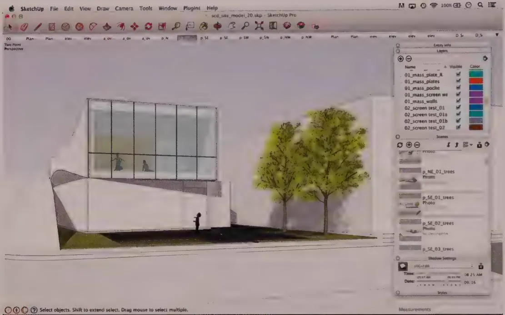  
Figure 18-25: SketchUp is a gem of an application that combines powerful 3D architectural sketching capability with smooth interaction, rich feedback, and a manageable set of design tools. Users can set sky color and real-world shadows according to location, orientation, and time of day and year. These help not only in presentation but also in orienting users. Users also can lay down 3D grid and measurement guides just as in a 2D sketching application. Camera rotate and zoom functions are cleverly mapped to the mouse scroll wheel, allowing fluid access while using other tools. ToolTips provide textual hints that help users draw lines and align objects.

# Wireframes and bounding boxes

Wireframes and bounding boxes solve problems of object visibility. In the days of slower processors, all objects needed to be represented as wireframes, because computers weren't fast enough to render solid surfaces in real time. It is fairly common these days for modeling applications to render a rough surface for selected objects while leaving unselected objects as wireframes. Transparency would also work, but it can be very processor-intensive. In highly complex scenes, it is sometimes necessary or desirable, but not ideal, to render only the bounding boxes of unselected objects.

# Input issues and idioms

3D applications use many idioms such as drag handles and vertex handles that have been adapted from 2D to 3D. However, some special issues surround 3D input.

# Drag thresholds

One of the fundamental problems with direct manipulation in a 2D projection of a 3D scene is the problem of translating 2D cursor motions in the plane of the screen into a more meaningful movement in the virtual 3D space.

In a 3D projection, a different kind of drag threshold is required to differentiate between movement along three, not just two, axes. Typically, up and down mouse movements translate into movement along one axis, whereas 45-degree-angle drags are used for each of the other two axes. SketchUp provides color-coded hinting in the form of dotted lines when the user drags parallel to a particular axis, and it also hints with ToolTips. In a 3D environment, rich feedback in the form of a cursor and other types of hinting becomes a necessity.

# The picking problem

The other significant problem in 3D manipulation is known as the picking problem. Because objects need to be in wireframe or need to be otherwise transparent when assembling scenes, it becomes difficult to know which of many overlapping items the user wants to select when she mouses over it. Locate highlighting can help but is insufficient because the object may be completely occluded by others. Group selection is even trickier.

Many 3D applications resort to less-direct techniques, such as an object list or object hierarchy that users can select from outside of the 3D view. Although this kind of interaction has its uses, there are more direct approaches.

One obvious approach is to let users type in or speak the name of the object they wish to select. If there's only one cube in the scene, it's easy for the system to distinguish. Another might be by attribute. "Select the green shape." If the user has bothered to name objects in the interface, their unique ID could also be used. Since most 3D manipulations are performed with the mouse, though, this forces a bit of mode-shifting that is less than ideal. There are more mouse-centric ways to handle it.

For example, hovering over part of a scene could open a ToolTip-like menu that lets users select one or more overlapping objects. (This menu would be unnecessary in the simple case of one unambiguous object.) If individual facets, vertices, or edges can be selected, each should hint at its pliancy as the mouse rolls over it.

Although it doesn't address the issue directly, a smooth and simple way to navigate around a scene can also ameliorate the picking problem. SketchUp has mapped both zoom and orbit functions to the mouse scroll wheel. Spin the wheel to zoom in toward or away from the central zero point in 3D space. Press and hold the wheel to switch from

whatever tool you are using to orbit mode, which allows the camera to circle around the central axes in any direction. This fluid navigation makes manipulating an architectural model almost as easy as rotating it in your hand.

# Object rotation, camera movement, rotation, and zoom

One more issue specific to 3D applications is the number of spatial manipulation functions that can be performed. Objects can be repositioned, resized, and reshaped in three axes. They also can be rotated in three axes. Beyond this, the camera viewpoint can be rotated in place or revolved around a focal point, also in three axes. Finally, the camera's field of view can be zoomed in and out.

Not only does this mean that assignment of modifier keys and keyboard shortcuts is critical in 3D applications, but another problem also occurs: It can be difficult to tell the difference between camera transformations and object transformations by looking at a camera viewpoint, even though the actual difference between the two can be quite significant. One way around this problem is to include a thumbnail, absolute view of the scene in a corner of the screen. It could be enlarged or reduced as needed and could provide a reality check and global navigation method in case the user gets lost in space. (Note that this kind of thumbnail view is useful for navigating large 2D diagrams as well.)

