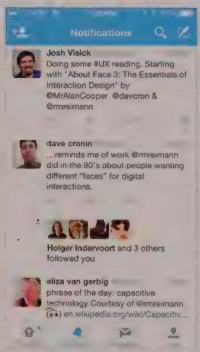
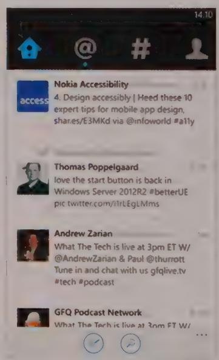
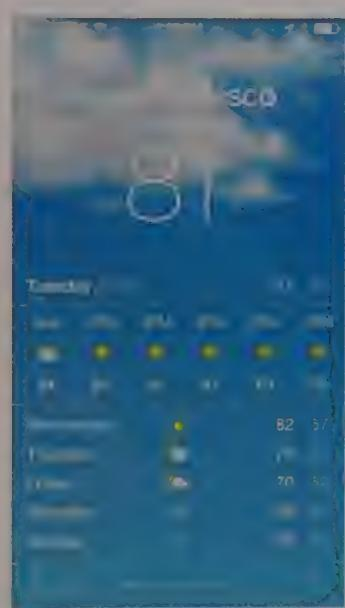
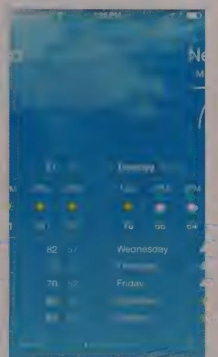
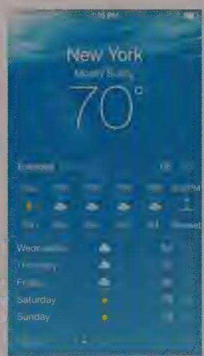
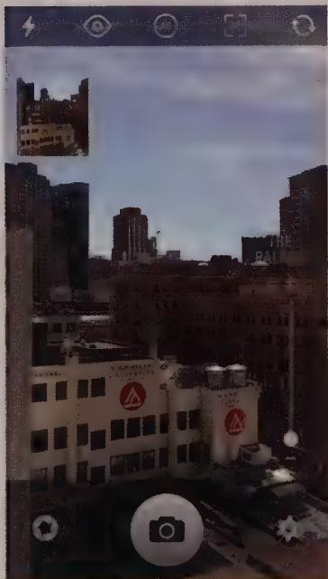

# DESIGNING FOR MOBILE AND OTHER DEVICES

The mobile device user experience changed forever in June of 2007, when Apple introduced the iPhone. Almost overnight, the definition of what it meant to be a mobile information device experienced a radical reboot. Before the iPhone's introduction, the mobile user experience meant tiny hardware keyboards on the device surface or hidden within a sliding drawer. It also meant small, clumsy, resistive mono-touchscreens that more often than not required a stylus to operate effectively without resorting to a miniature five-way D-pad that was equally cumbersome to use.

The iPhone replaced this mess of a user experience with the following:

- A giant, high-resolution, multi-touchscreen, an OS that specified on-screen controls big enough for fingers to use successfully   
A set of now-iconic gestural idioms that were relatively easy to discover and learn   
- A set of sensors delivering contextual information about orientation, location, ambient light, and movement that added an extraordinary level of intelligence to a new generation of mobile apps

Scarcely more than a year later, Google introduced its own multi-touch mobile operating system, Android, borrowing many of its gestural and navigational idioms from its iOS competitor. Although it took Google several years of iteration to begin matching iOS from an aesthetic and user experience refinement perspective, it has become

the Windows of the mobile world, taking the majority share of the smartphone market. (Windows Phone OS, ironically, was quite late to the game; it lags severely in market share.) As of this writing, the basic mobile user experience is remarkably uniform across "smart" mobile platforms. More than 90 percent of these devices sport large, gestural, multi-touchscreens with similar idioms, similar sensor-laden hardware, and even (as of iOS 7) converging "flat" visual styles.

Almost exactly the same story can be told regarding the release of the iPad. This device rewrote the story on tablet devices, a market that Microsoft and many others had repeatedly tried and abandoned. However, the success of the iPhone practically ensured that the iPad (despite early naysaying from the desktop computing world) would be an instant success.

Today, iPad, Android, and Microsoft multi-touch tablet sales are seriously eroding the sales of low-end laptop computers, and this trend will most likely continue. For most people, a computing device that turns on instantly, saves its state automatically on shutdown, manages its own software updates in the background, installs from the cloud, eliminates window management excise, and allows direct interaction with fingertips is a rather dramatic improvement over the complexities of desktop software and pointer-based input. It isn't difficult to imagine what this means for the future of desktop and even laptop computers.

The majority of this chapter describes some of the most important design concerns and design patterns for phone and tablet format mobile devices. We'll also briefly discuss other device platform interfaces at the end of the chapter, including public kiosk, device, and automotive interfaces.

# Anatomy of a Mobile App

While the posture of desktop applications is most often sovereign (see Chapter 9), mobile apps, by contrast, are by their very nature transient. The on-the-go and highly context-driven nature of the majority of mobile apps (games perhaps being the exception, but the interaction design of games in general is a unique topic in itself) dictates a transient stance, especially on handheld mobile devices. The fact that these transient apps take up their host device's entire screen makes them no less transient. Transience here is dictated by the character of the user's interaction with the app: brief, intermittent, and focused on particular tasks.

DESIGN PRINCIPLE

Most mobile apps have transient posture.

The other major factor that contributes to the transient nature of mobile apps is the physical form factor of the host device. Phone-sized screens that support multi-touch interactions require onscreen objects to be large enough that they can be activated easily with fingers, without the user accidentally triggering other interactions while doing so. Tablet-sized screens have a bit more breathing room but still need finger-scale controls.

These two factors lead to an information and control density on mobile screens similar to the information and control density of dialogs on the desktop. While high-resolution display technology does help allow for detailed information graphics and crisp text on mobile devices, the number and spacing of individual objects on the screen remain fairly limited if usability and readability are to be maintained. The alternative solution of zooming (see Chapter 12), while technically possible, would only add a layer of complexity and confusion, since logical zoom—itself a bit problematic already—is the typical (if awkward) method of navigating between apps on many mobile platforms.

# Mobile form factors

While it's safe to say that mobile apps are almost always transient, the form factor of the mobile device has a significant effect on the navigation, the layout, and even the behavioral strategies and patterns employed.

Modern multi-touch mobile devices fall primarily into three form factor categories:

- Handhelds consist of phones and media devices like the iPod Touch. They are characterized by tall, narrow (typically 16:9 aspect ratio) screens that are 4 to 6 inches diagonally and are used most frequently in portrait orientation.   
- Tablets consist of devices sporting 9-to-10-inch diagonal screens. (Apple's tablets are 4:3; Google and Microsoft's are 16:9.) Android and Windows tablets seem biased toward landscape use in their design, while Apple tablets seem to be used more frequently in both orientations.   
- Mini-tablets consist of devices sporting screens that are 7 to 8 inches diagonally. Like their larger cousins, they have either a 4:3 aspect ratio (Apple) or 16:9 aspect ratio (Google, Microsoft).

The next section focuses on the basic structural patterns for each of these form factors, the building blocks of which we'll discuss later in this chapter, as well as in Chapter 21.

# Handheld format apps

Mobile touchscreen operating systems thankfully eschew the complexities of window management, opting instead for full-screen applications that make much better use of the limited available real estate. This decision dates back to the earliest handheld

touchscreen devices, including Apple's Newton and Palm's very popular PalmPilot. It continues to make sense even though modern mobile displays are many times the resolution of those now crude-looking screens.

Modern handheld-format devices also continue to use some of the same basic layout patterns employed in these early systems—vertical stacks of UI elements, including lists, grids, bars, and drawers. Newer structural patterns made possible by high-performance, high-resolution graphics and multi-touch screens—such as motorcycles, swimlanes, and cards—are now widely recognized mobile idioms.

# Stacks

Stacks are perhaps the primary pattern used by most non-game mobile apps—especially on handheld devices. The tall and narrow form factor of smartphones and other handheld mobile devices dictates a list-like display for most types of content or control. The main exception is icons and thumbnails; more about these below. Stacks are vertically organized structures with a content area, usually arranged in a list or grid, with a top and/or bottom bar for navigating content and accessing functions. Most iOS, Android, and Windows Phone apps follow this top-level pattern, as shown in Figure 19-1.

  
Figure 19-1: Typical mobile apps use a stack layout pattern including content, control, and navigation elements.

# Screenrousels

Screen wallpapers are an alternative top-level pattern that is most appropriate for a dashboard-like display that has multiple instances or variants between which the user can quickly navigate via a swipe gesture to the left or right. The classic example of this pattern is the iOS Weather app, shown in Figure 19-2. The user swipes between identically laid-out cards or screens that, in the case of the Weather app, represent different locations. The few interactions on a wallpaper screen occur in place on the card; there usually is no drill-down navigation, as you typically see in the Stacks pattern. Carpels may or may not have top or bottom bars associated with them, but they usually do have a page marker widget that shows the user's place in the wallpaper content. Carpels often don't provide circular flow, but rather disallow further swiping at the far left and right. In most cases, there's no reason not to make it circular, which makes navigating between screens much easier.

  
Figure 19-2: The iOS Weather app is the classic example of a screen carousel pattern, where you can navigate between several instances of self-contained dashboard-like screens by swiping left or right. A place marker widget in the bottom bar shows the user his current position in the sequence of screens. This implementation of the pattern doesn't wrap around from the end to the beginning of the carousel, making navigation across the set harder than it needs to be.

# Orientation and layout

Most modern mobile devices can detect their screen orientation (portrait or landscape), which means that the app can dynamically rearrange its layout to better suit the current orientation. The majority of apps, however, stick with portrait orientation even when rotated. For list- and grid-based content browsing (more on these topics in the section

"Browse Controls"), assuming portrait orientation is a good bet because users usually operate the phone one-handed in portrait orientation.

However, for applications such as photo or video capture and editing, it makes sense to allow rotation to landscape orientation, since the medium itself can be in that orientation. For these sorts of apps, iconic controls make the most sense, since they can simply be rotated right along with the screen and thus minimize user disorientation (see Figure 19-3). However, this means that extra care must be taken to ensure that users can easily figure out what the controls mean.

  
Figure 19-3: The Slow Shutter app on iOS does a great job of making a smooth transition from portrait to landscape. iOS's native Camera app also allows this sort of transition. But since it uses a scrolling selection bar containing text labels, the result is difficult-to-read, rotated text when the app is in landscape orientation.

# Tablet format apps

Tablet format apps have considerably more breathing room than handheld-format apps as far as screen real estate is concerned. The iPad's 4:3 aspect ratio and large screen size ensures plenty of room for navigational and functional controls, but Windows and Android tablets also manage quite serviceably with the movie-like 16:9 aspect ratios.

