# Stacks and index panes

Like handheld format mobile apps, tablet format apps also rely on the stack pattern, vertically stacking a primary area and one or more tab, navigation, and action bars. However, the extra real estate available on a tablet also allows the addition of one or more supporting panes, should the app require it. Typically the additional pane is an index pane (see Chapter 18) that lists content items, such as your e-mail inbox or search results, the current selection of which is displayed in detail in the main content pane. This is a good use of display real estate, because it eliminates one level of drill down and allows users to quickly navigate and inspect a long list of content.

These additional index panes can themselves have navigation and functions associated with them, which are housed in bars at the top or bottom of the pane. Frequently, the list of objects in the index pane can come from several sources such as e-mail (see Figure 19-4). This requires either tabbed or drill-down approaches to navigation. We discuss these in more detail later in the chapter. Search and filter widgets are also common controls in tablet index panes.

In portrait mode, index panes typically are launched from a button and overlap the main content area. Unless the content of your app's index pane is particularly narrow, you will probably want to opt for this approach (see Figure 19-4). Non-overlapping panes provide a superior interaction, even in portrait, if they are narrow enough to fit.

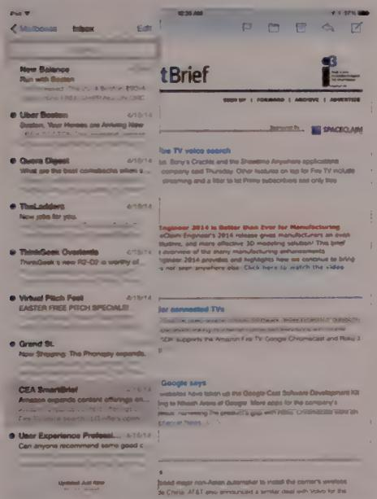

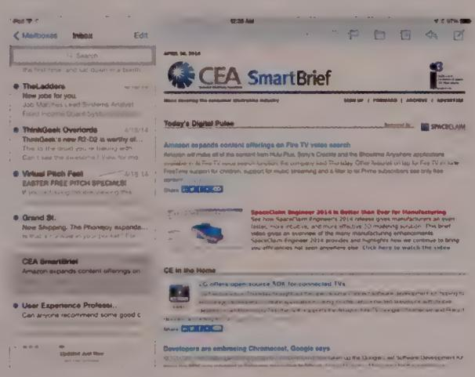  
Figure 19-4: iOS's iPad Mail app presents a navigable index pane containing mail folders and their contents. In portrait mode, the pane is launched from a button on the left of the app's nav bar and overlaps the rest of the screen until it is dismissed. In landscape mode, the pane is permanently placed adjacent to the detailed content pane.

When rotated to landscape, the standard pattern calls for the overlapping pane to become a permanent adjacent pane.

# Pop-up control panels

Tablet screens are large enough to support pop-up panels that don't overlay the entire screen and that can replace navigation to a full-screen control panel screen, as is usually required in handheld format apps. These pop-ups, when used judiciously, can improve task flow by retaining the context of the background screen and not feel as much to the user like going to a different room (see Chapter 18).

Pop-up panels are different from dialogs, in that they are attached to a particular control or content object and are used to make changes to parameters associated with that object. This association typically is shown via a speech balloon caret that extends from the pop-up canvas to the control it is associated with, as shown in Figure 19-5.

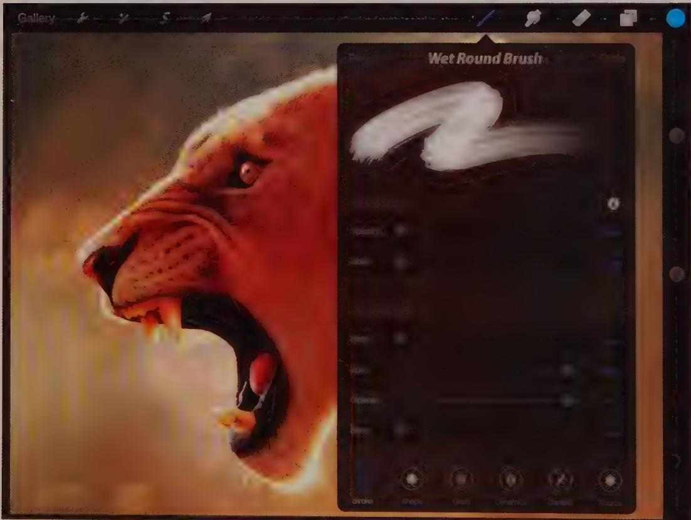  
Figure 19-5: The Procreate digital painting app on iOS makes extensive use of pop-up control panels as a means of configuring the drawing tools in the app's tool bar. These pop-up panels show their connection to the tool via a speech-balloon-like caret that emerges from the otherwise rectangular panel.

# Orientation-based layout

More so than on handheld format apps, tablet apps need to be concerned about orientation. On tablet apps, rotating controls in place usually is an insufficient or undesirable approach. Instead, tabs, navigation, and tool bars need to reorient themselves on the screen in a sensible way by relocating to the top or sides of the screen as appropriate. Overlapping panes that were available from a button need to be laid out adjacent to the main content pane (see Figure 19-4). This approach makes sense for simple apps. But more complex apps, or those dedicated to activities that have a heavy bias toward one orientation—such as a streaming video app (landscape), e-reader (portrait), or any authoring tool that relies on a fixed layout of complex controls—may select to support only one orientation. The next two sections elaborate on two of these cases.

# Mobile versus desktop-like layout

The high-resolution displays on modern touchscreen tablets rival those of many laptop and even desktop displays, shrunk to fit a 10-inch diagonal screen. It might be tempting to treat your tablet app like a shrunken, touch-enabled version of your desktop app. In most cases, however, this isn't a good idea. For media browsing and other search, browse, and view/purchase types of apps, the approaches outlined in this chapter are appropriate.

However, due to the complexity of productivity and creative authoring apps that seek to replace similar desktop apps, there is more of a case for adopting more desktop-like tool bars and panes. Audio and video production apps in particular seem well-suited to a more desktop-like approach, as shown in Figure 19-6. Here relatively dense control layouts, multiple panes, complex tool bars and control panels, large pop-up panels or drawers, and drag-and-drop idioms make sense.

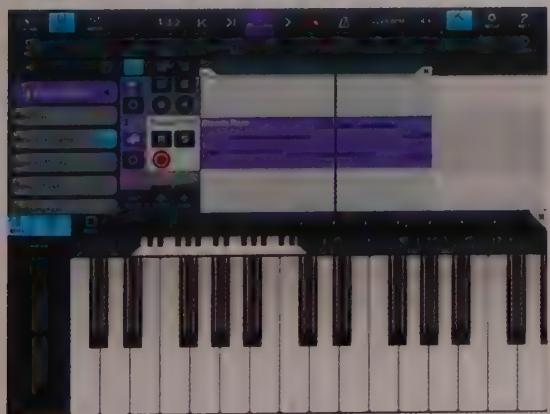

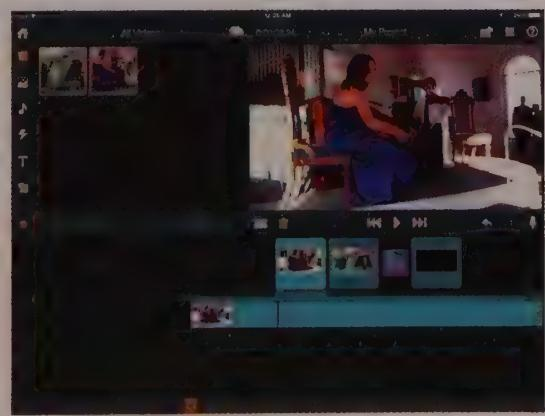  
Figure 19-6: Steinberg's Cubasis and Corel's Pinnacle Studio are examples of media production apps that are well suited to a more complex layout that more closely resembles desktop apps.

If your app is in this category, keep the following principles in mind:

- Make sure that tool bar, control panel, and menu items have areas that register taps (known as hit areas) and inter-item spacing properly scaled for finger use.   
- Drag and drop is prone to accidental drops on a touchscreen, so either avoid it or be forgiving of them.   
- Pop-up panels should point to where they came from when possible and have clearly labeled headers.   
- Pay close attention to function hierarchy so as to keep workflow as linear as possible. Put the user on a single path to accomplish a task whenever possible.   
- Apps with complex layouts should in most cases choose an orientation and stick to it, rather than trying to support both portrait and landscape. Consider the alternate orientation an opportunity for a completely different display.

# Hardware-like control layout

For certain apps, especially those in the domain of music production, interfaces that resemble hardware-based control surfaces appeal to users in that domain. While such interfaces can be quite awkward on the desktop due to the necessity of operating faux-hardware controls with a mouse or trackpad, the introduction of a multi-touch input surface on the display changes this equation substantially. Designers should still take into account fingertip use for hit areas and spacing. They should allow horizontal or vertical drag gestures (and be consistent about their use) to operate rotary controls in addition to circular drag gestures. Also remember not to let your key interactions be artificially limited by hardware metaphors. A knob or slider might make sense for setting volume or mixing tracks, but using direct manipulation for activities such as shaping and scrubbing audio waveforms can provide a whole new level of richness to the creative process, as shown in Figure 19-7.

# Mini-tablet format apps

Mini-tablets such as Google's Nexus 7 and the Kindle Fire are popular, inexpensive mobile devices that handily fit into a large purse or pocket, making them popular with consumers. From a user experience perspective, however, their combination of a narrow 16:9 aspect ratio, support for both screen orientations, and a small size represent challenges for a designer of touch-based experience. There simply isn't as much room for finger-sized controls as on a full-sized tablet. But at the same time, there's a bit too much room for apps designed for phones to look aesthetically well proportioned, especially using standard OS widgetry.

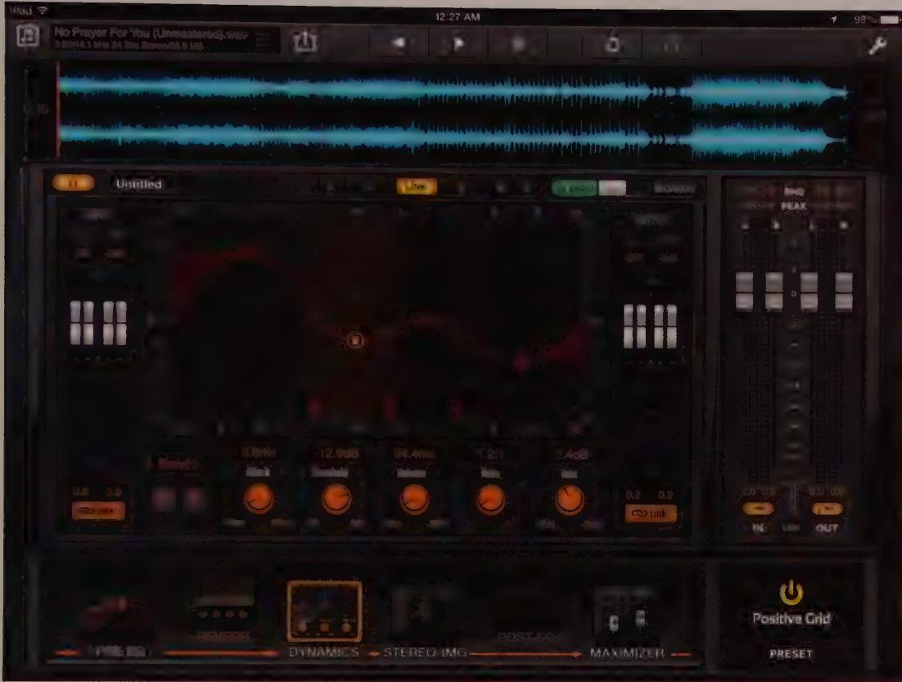  
Figure 19-7: Positive Grid's Final Touch app provides pro-quality audio mastering on the iPad. While making extensive use of hardware control metaphors, its smart layout and workflow, along with judicious use of direct-manipulation idioms in combination with the hardware-like controls, make it both extremely powerful and easy to use.

Navigation and layout strategies employed by handheld and tablet format apps will work for mini-tablets, with some caveats:

- Adjacent panes—Generally not a good idea on full-sized tablets in portrait orientation, adjacent panes are usually far too cramped to consider on mini-tablets. In landscape, at most two adjacent panes (and perhaps a vertical tab bar) can be supported. In portrait in particular, overlapping pop-up panes and drawers make more sense. Drawers are discussed in the next section.   
- Tool bars—In portrait view, these can feel distant from the action due to the tall, narrow form factor and increased screen size over handhelds. In landscape orientation, tool bars stacked with navigation bars leave little vertical space for content. Vertical tool bars may sometimes make more sense on mini-tablets. Tool bars are discussed in the next section.   
- Lists—Single-column lists tend to look out of proportion on mini-tablets, even in portrait orientation. Grid, swimlane, and card approaches tend to work better for the

user's sense of flow in both orientations. If your content is truly list-based, consider using vertical tabs or tool bars in portrait and adjacent index and detail panes in landscape. Each of these idioms is discussed in more detail in the next section.

- Pop-up versus full-screen dialogs—Mini-tables are big enough that using phone-style full-screen idioms for menus and dialogs won't work; these should be implemented as pop-up dialogs as on full-size tablets. Pop-up control panels for tool bar tools will also work, but these may take up the majority of the screen when open.

# Mobile Navigation, Content, and Control Idioms

Mobile applications share many controls with desktop and web applications, as discussed at length in Chapter 21. However, due to the unique form factor and multi-touch input technology employed by the majority of modern mobile devices, they have evolved a unique set of idioms especially suited to mobile app use.

We'll enumerate the most common and important of these in this section.

# Browse controls

Most mobile apps are optimized for browsing. Whether it's music, videos, social networking updates, restaurant reviews, e-mail, shopping, or search results, we do an awful lot of casual surveying in our mobile apps. Due to the limitations of the form factor and input options, it is much easier on mobile devices to browse and select content than to input data. Given this situation, it's unsurprising that mobile apps have developed a rich set of patterns around browsing through content.

# Lists

Lists are the most frequently used pattern for organizing content on handheld format touchscreen devices. List content often includes line items or blocks of text, controls (such as check boxes or buttons) and their labels, and image or video thumbnails.

Tapping a content item in a list typically drills down a level in the hierarchy, revealing either the content or the next level of grouping. Sometimes tapping a list item may also launch a modal pop-up or screen that provides a set of options for controlling the item, or it may navigate to a detailed view of the item itself.

As we'll discuss in a minute, list views often work in conjunction with tab bars to provide access to multiple screens of content, each in its separately maintained list. Apple's Music app is a good example of this, with lists of albums, artists, and songs available on different tabs, each with its own (slightly different, but related) drill-down hierarchies (see Figure 19-8).

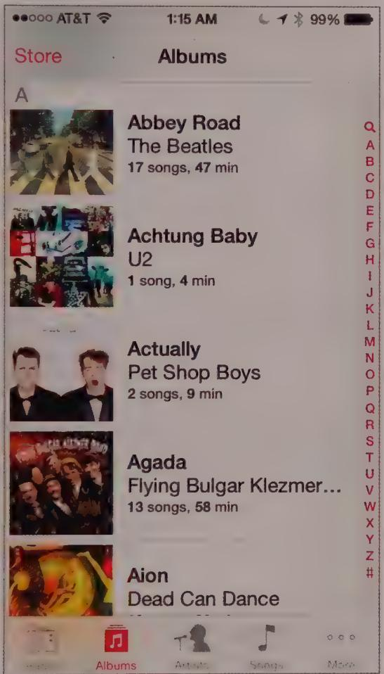  
Figure 19-8: The iOS Music app has tabbed lists of albums, artists, and songs, among others. Navigating between lists is accomplished via a bottom tab bar.

Lists can either be finite in length or allow infinite scrolling. This kind of scrolling presents an initial subset of items from a very large set (such as web search results) and then presents an additional block of results each time the user reaches the bottom of the list. While infinite scrolling is a necessary compromise due to limited computing resources, it is a reasonably elegant solution, as long as the incremental load time can be kept under a second or so.

# Grids

Grids are used to organize content such as apps, thumbnails, and function icons into regular rows and columns. The most obvious example of this is the home screen of the iPhone, with its editable grid of app icons. Android supports a similar interface. Microsoft has taken the idea of the app icon grid and transformed it into the more innovative Start screen grid. It mixes apps and notifications in an aesthetically pleasing and useful way, as shown in Figure 19-9.

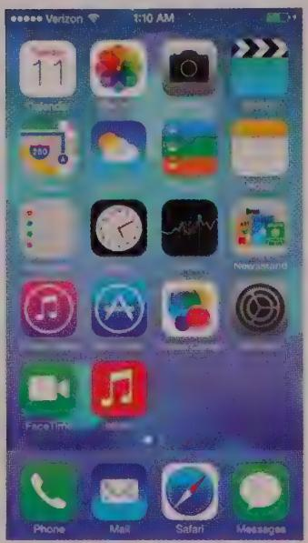

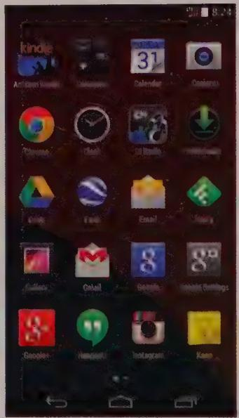

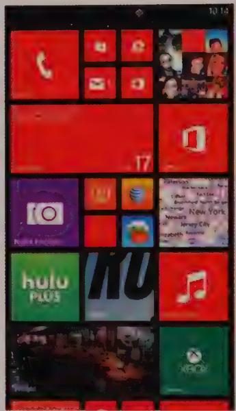  
Figure 19-9: iOS and Android home screens use a similar app grid, both of which are derived from the original Palm Pilot. Microsoft, on the other hand, evolved its Zune interface into the Metro UI, with its unique Start screen grid that seamlessly—and beautifully—combines apps and notifications.

Within an app, grid views (also called gallery views) often are used to present media objects. These include photos, videos, and music albums (with cover art), or small, encapsulated cards (more on this later) containing image, text, and sometimes button or link elements. One challenge with presenting grids of content objects is making sure users understand how to navigate them. The iPhone's home screen uses horizontal swipes to navigate between grid "pages." Most apps that use grids as a primary navigation and selection mechanism, such as Rdio (see Figure 19-10), use pageless, and sometimes infinite, vertical scrolling to expose more grid objects (albums in this case). The direction of scrolling is nicely disambiguated by sizing the album art so that the bottom-most visible row is partly cut off. This provides the necessary visual hint that a vertical swipe up will reveal more choices.

<!-- Chunk 11 End -->

<!-- Chunk 12 Start -->

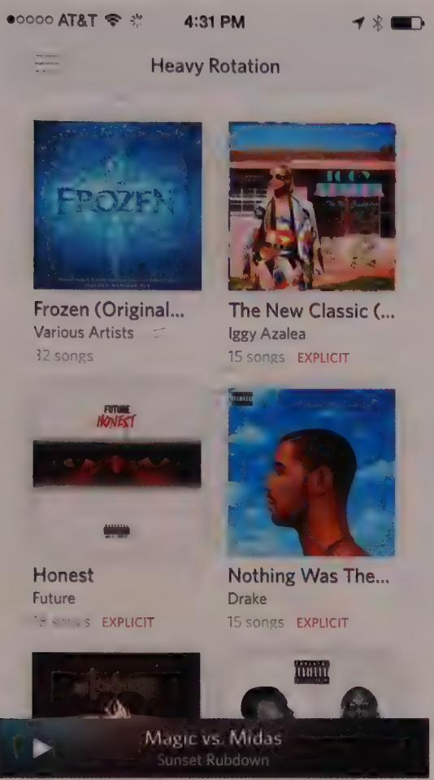  
Figure 19-10: The Rdio streaming music app using a two-column scrolling grid to display album choices. The bottom-most visible row is cut off, which hints that scrolling is vertical.

Apple's Photos app, shown in Figure 19-11, uses a much tighter four-column grid for the Camera Roll, which also scrolls vertically.

Grids also can scroll horizontally, as in Apple's Music app when the iPhone is rotated to landscape orientation, as shown in Figure 19-12.

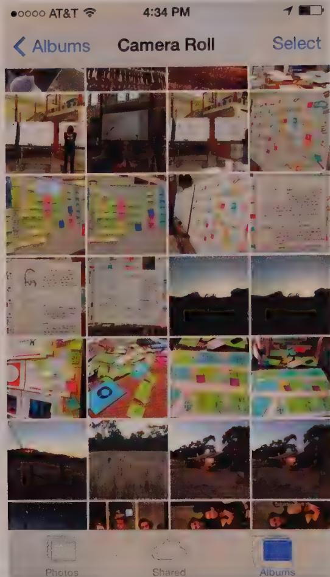  
Figure 19-11: The Camera Roll in Apple's Photos app uses a tighter grid with four vertically scrolling columns on the iPhone.

It might be tempting to allow zooming in and out on the grid via a pinch gesture, but generally this is not a good idea, especially in the narrow portrait orientation of the handheld form factor. Issues quickly arise concerning the legibility and hit area of the icons or thumbnails, as well as column width of text labels and metadata.

As with lists, tapping a content item in a grid typically drills down into a hierarchy, revealing either another grid or list of content items or controls. Or it launches a modal pop-up that provides a set of options for controlling the item. Or it opens a detailed view of the item itself, as shown in Figure 19-12.

Like lists, grids can be either finite or infinitely scrolling, where rows or columns of additional items are added incrementally when the end of the grid is reached.

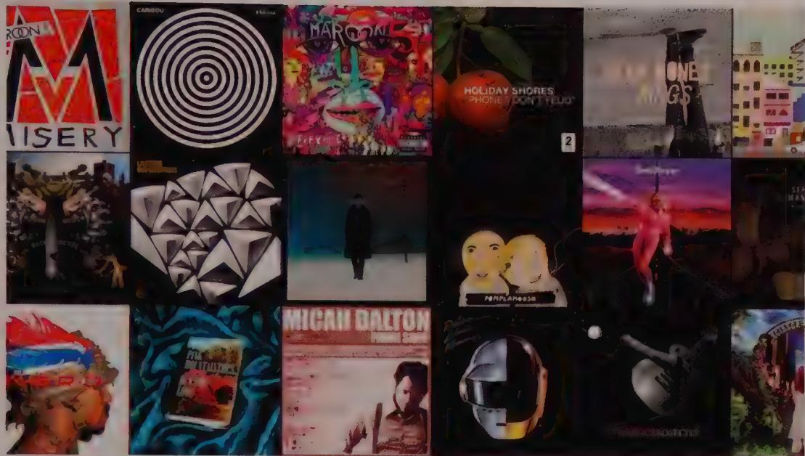  
Figure 19-12: When rotated to landscape view on an iPhone, Apple's Music app displays a horizontally scrolling grid of album art. Tapping the art drills down to a view of the album that includes the album art, vertically scrolling track list, and transport controls.

# Contentrousels

Screen carousel use a horizontal swipe gesture to navigate between similar full-screen layouts containing different data. Content carousel live within a single screen layout but use the same type of gesture to allow navigation between different content objects that are presented within that screen. Often they are media thumbnails (or larger images), but they also can be textual or cards containing both media and formatted text.

Content carousel present a row of content items carefully sized and spaced so that they bleed off the edge of the screen. Or they fill the screen from the left to right edge and use either arrows near the left and right screen edges or a page marker widget. Some carousel, such as the one at the top of the iPad's App Store app, make use of a 3D layering effect that puts the focus item in the carousel in front of the others.

Properly designed carousel should wrap circularly from end to beginning, rather than making the user swipe all the way back to the start. They also make it visually clear when the last item in the carousel has been reached.

Typically, content carousel are used to present a relatively small set of objects that the app is meant to feature or highlight. As such, only one carousel should be employed on a screen, and it should take the most prominent position in the layout. An excellent

example of this is the Crackle app on iPhone, shown in Figure 19-13. The app has a large carousel at the top of its Featured tab. It wraps and includes a page marker widget so that users know when they've returned to the beginning. (This trick works only with carousel containing a short list of items.) It also auto-advances the carousel every few seconds—a common variation of the idiom. This helps users understand the behavior, as well as helping the app feel more dynamic and ensuring that users are exposed to the featured items. Care must be taken not to auto-advance a carousel so fast that users have trouble reading or focusing on the content. This animation should also pause while the user is interacting with other elements on the screen to avoid disorienting transitions.

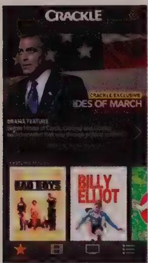

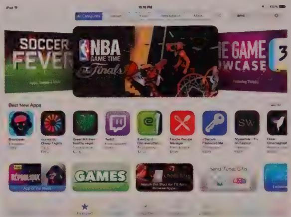

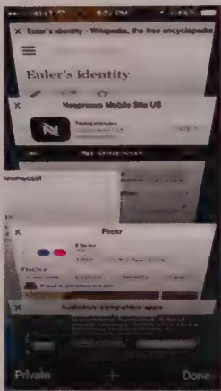  
Figure 19-13: The Crackle app on the iPhone (left) offers a good example of a content carousel on its Featured tab. It works well. But the arrow that indicates a drilldown to the details of each carousel item is sized and positioned such that it looks more like a way to navigate to the next carousel item. Safari on the iPhone (right) offers an example of a vertical carousel in place of browser tabs. The iPad App Store app (center) makes use of a 3D layered effect.

Much less common is a vertically oriented carousel. Apple employs one in Safari for the iPhone in iOS 7 in place of browser tabs. The user swipes up and down to browse, taps to select, and swipes left to delete a tab (see Figure 19-13).

# Swimlanes

Swimlanes are a clever mash-up of the carousel concept with a grid. They combine the carousel's natural browsability with the data density that only a grid can permit.

Simply put, swimlanes are a vertical stack of carousels, each of which can be scrolled horizontally, independent of the others. Navigating to other swimlanes is a simple matter of vertical scrolling. Swimlanes thus are a clever way to allow the user to browse multiple categories of content with minimal navigation. Swipe through one category, and the next is waiting pristinely below it. This is a big advantage over using a fixed grid that moves columns of content objects all at once.

The Netflix app makes great use of swimlanes for category-based content. Users scroll vertically through the categories and horizontally to browse a category. It works well even though the screen's portrait orientation makes for a narrow viewpoint on the content, as shown in Figure 19-14. The Apple App Store uses both a carousel and a set of swimlanes on its Featured tab. This combination works well, because the navigational gestures are identical for all elements on the screen.

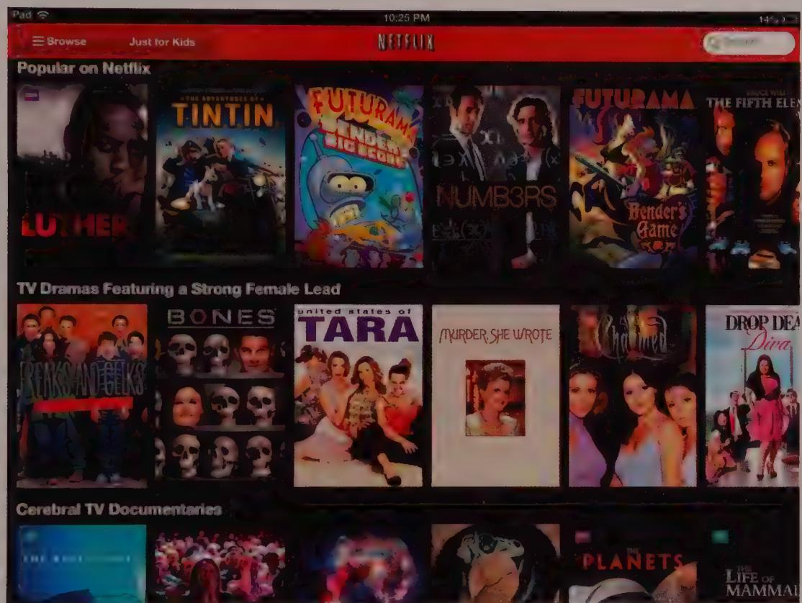  
Figure 19-14: The Netflix app uses swimlanes as its primary browse paradigm. Apple's App Store combines the use of a carousel and a set of swimlanes for items highlighted on its Featured tab.

The authors have seldom seen swimlanes that auto-wrap back to the beginning of the list. But they probably should, with a marker of some kind between the end and beginning object so that users receive visual feedback that indicates when they have returned to the starting point in the list. While swimlanes typically are used for finite lists of featured items, you can imagine them being used with infinitely scrolling lists as well. (Imagine categorized search results, for example.) However, swimlanes—unlike carousel—should never auto-advance.

# Cards

Cards are a relatively new idiom for mobile that can perhaps in some ways trace their roots to the original HyperCard on the Mac. Back then, Macs had low resolution (much lower than current mobile devices). Therefore, it seemed to make sense to be able to combine text and visual media into nicely formatted chunks of information suited to the display's limitations. HyperCard was meant to be an authoring environment for the masses, but it ended up being a way for developers to easily create rich-media, content-centric interactions.

Fast-forward to modern mobile applications, and the same need arises: How do you present meaningful chunks of rich-media content for easy consumption on a constrained display? Add to this the social and contextual nature of most mobile interactions, and you have what exemplifies the modern card-based UI—a self-contained interactive object combining media, text, web links, and social actions such as commenting, sharing, tagging, and adding media. Facebook and LinkedIn both use cards as a central idiom in their handheld apps, as shown in Figure 19-15.

  
Figure 19-15: Facebook and LinkedIn's apps both use cards as a central idiom.

The Google Search app's Google Now feature has a different approach to cards. It is more focused on contextual information (time, location, and information pulled from

the usage of other Google apps) than it is on social interaction. Google's cards are small encapsulations of data pulled from other Google services, such as weather, maps, stocks, restaurant reviews, and notifications pulled from calendar and e-mail data. Tapping their content takes the user to the full app or web interface from which they originated, providing an avenue for deeper interaction if desired (see Figure 19-16). Google's cards also have individual settings that can be accessed by tapping an icon in the upper-right corner. Doing so flips over the card, revealing access to a configuration interface.

Stocks today 5/2014, 4:30 PM EDT

TSLA 206.90 2.91 1.43%

GOOG 553.90 9.24 1.70%

.DJI 16836.11 98.58 0.59%

AAPL 647.35 2.53 0.39%

MRK 58.10 0.17 0.29%

Disclaimer

Indian MasterpiecesTo Be Featured AtBonhams New York

Bonhamas Auctioners PressReleases - 20 hours , 36 min .

Update to website you recently visited

Male Celebs Become Terrifying When Given

Zooey Deschanel's Baby Blues

People Magazine - 22 hours, 39 minutes ago.

Mad Men Season 7

Lightning to USB Cable (1 m)

Shipped - Tuesday, May 27, 4:11 PM

1 item from: Apple

Estimated arrival:

Track all packages

View email

Logitech Ultrathin for iPad Air (2014)

Table PC Review - 17 hours. 51 minutes ago.

IPad

43 minutes to work

Heavy traffic on 1-90 E and Memorial Dr

10 minutes to new place

Walnut St

  
Figure 19-16: The Google Search app uses cards that return encapsulated snippets of useful information based on the user's current context, including location, time, and relevant related information pulled from other Google services.

Cards are most often displayed in a scrolling vertical list, but they also lend themselves to grid, carousel, and swimlane layouts. Facebook's Paper app provides a good example of the use of cards in a nonstandard layout: The top half of the screen is a category card that cycles through individual posts. If it is tapped, the post is expanded on a full-screen card, as shown in Figure 19-17. Under the category card is an infinitely scrolling swimlane of posts fitting the category. Swiping up on these expands the swimlane to full-screen height, making more detailed content visible. (Swiping down returns them to the bottom of the screen.) Tapping any shared content inside the expanded card takes the user to the content's original source.

  
Figure 19-17: Facebook's Paper app is a good example of cards used in a nonlist layout. Content navigation in the app is achieved via a card carousel of content categories (each of which automatically cycles through recent content) and an infinite card swimlane that the user can browse through.

# Navigation and tool bars

Bars are the primary mechanism for navigating to the different functional and content areas of handheld mobile apps. Like lists and grids, they date back to the earliest days of mobile touchscreens. Bars are narrow horizontal regions at the top or bottom of the screen that consist of tab-like or button-like controls with either icons or text labels (and sometimes both, as in many iOS apps). The affordance of these controls used to be more prominent. However, probably to their detriment, the major mobile operating systems have gravitated toward a flat visual style. Although this significantly reduces visual clutter, it also has the unfortunate side effect of requiring more cognitive work for users to identify active controls. At this point, most users have been trained to assume that any text or icon living within a bar is a navigational control of some kind.

# Tab bars

Tab bars contain a set of text and/or icon buttons. (iOS tab buttons frequently sport an icon with a text label beneath it.) Tapping a tab button switches to a different list or grid view in the main content area, as you'd expect a tab to do. Each tab in a tab bar maintains its own content hierarchy of associated lists and grids and typically preserves the state of that hierarchy while the app is running. Tab bars are frequently found at the bottom of iOS screens and, more frequently, at or near the top of Android and Windows Phone screens, as shown in Figure 19-18.

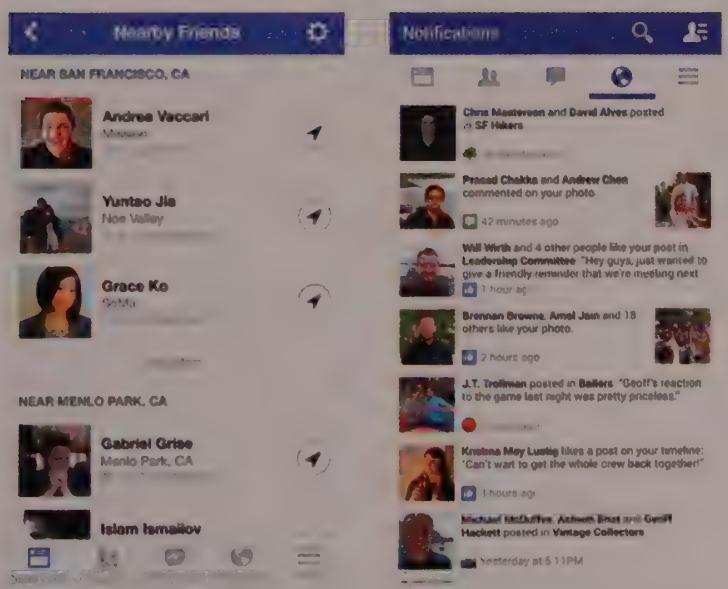

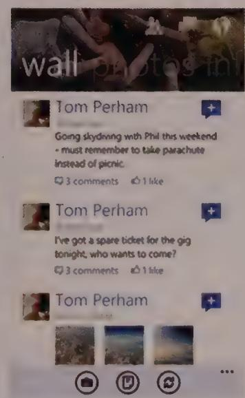  
Figure 19-18: Use of tab bars in iOS, Android, and Windows Phone. iOS tab bars typically are at the bottom of the screen, and Android tab bars generally form a secondary navigation beneath a nav bar (or action bar, in Android terms). Windows Phone uses a tab bar that is purely textual, without rendering a bar rectangle.

Some tablet apps use vertical tab bars aligned to the left edge of the screen. Spotify and Twitter currently use this tab bar variant in their iOS tablet apps, as shown in Figure 19-19.

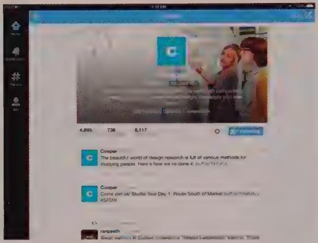

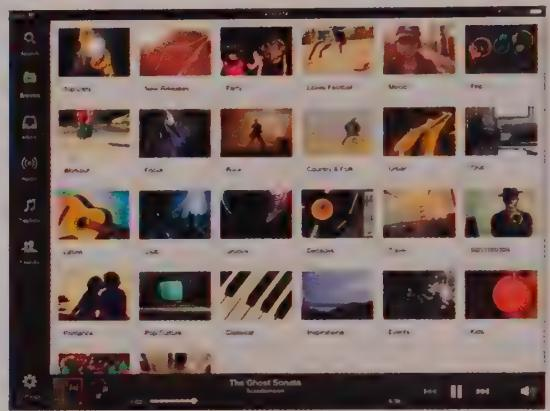  
Figure 19-19: Twitter and Spotify use vertical tab bars in their tablet apps. They use buttons containing both icons and text for clarity, which works well given the large amount of vertical space available.

# More... controls

The narrow aspect ratio of most handheld screens, as well as the need to provide fingertip-sized hit areas, limits the practical number of controls that can live in a bar to no more than about five. Both iOS and Android deal with this limitation using two strategies.

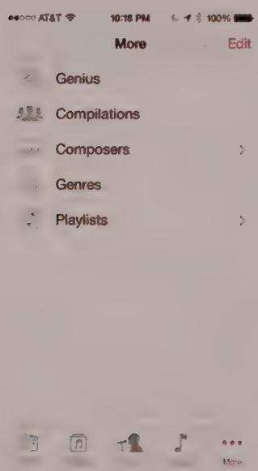

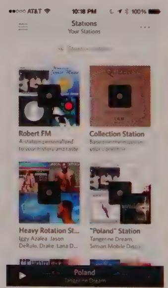

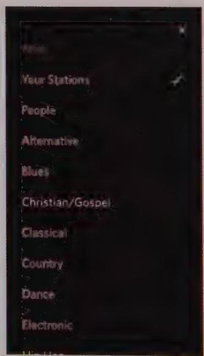  
Figure 19-20: More... controls in iOS's Music app (left), and Rdio (right). Rdio's More... control launches a modal pop-up that allows genre selection of radio stations.

The More... control, shown in Figure 19-20, is a tab bar or action bar control that gets around the limited screen real estate of mobile apps. In iOS this is usually a tab that shows a screen of additional navigation options. It often has an edit mode that allows the user to drag an option from that screen onto the bar, which swaps the dragged option with the one occupying the slot in the bar that the new option was dropped on. In Android, a More... control lives on the right side of the action menu (see the section on nav and action bars later in this chapter) and opens a pop-up menu of additional navigation options or (more typically) functions. Some iOS apps, such as the Rdio streaming music app for iPhone, use a similar idiom in the upper right of the screen as a way to select additional options via a full-screen modal pop-up.

# Tabrousels

A different approach to the same problem that the More... control addresses is the tab carousel, which elegantly marries the concept of tabs with that of horizontally swipable carousel. Tabs are shown in the tab bar as usual but extend off the edges of the screen. The selected tab is centered or otherwise highlighted in the tab bar. Tapping another tab selects it. Swiping the tab bar (and, in some cases, the view it controls) selects the adjacent tab on the left or right and slides the contents into view, as shown in Figure 19-21.

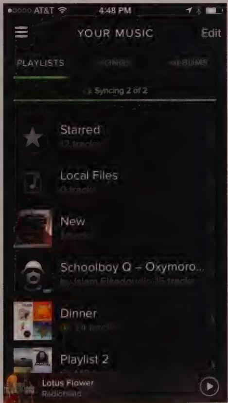  
Figure 19-21: Spotify's iPhone app uses a tab carousel in its Your Music section, which is accessed via its main navigation drawer.

As with other carousel views, it is important that at least one tab label is initially shown extending off the edge of the screen, to provide the hint of scrollability in the tab bar. Windows Phone uses a variant of the tab carousel as a primary navigation mechanism in its apps. The tab bar is not rendered, but purely textual tabs are employed (see Figure 19-18).

# Nav bars and action bars

Nav bars, located at the top of the screen, provide a way to navigate a list or grid hierarchy, as shown in Figure 19-22. Typically they contain at the very least a back button on the left and the title of the current list, grid, or other type of content screen in the center. Android calls this set of controls an action bar. Frequently, function menus or buttons are included on the right.

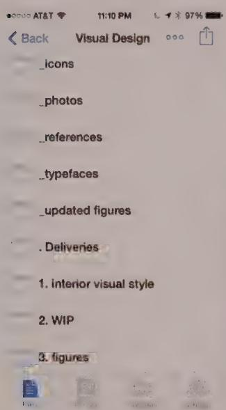

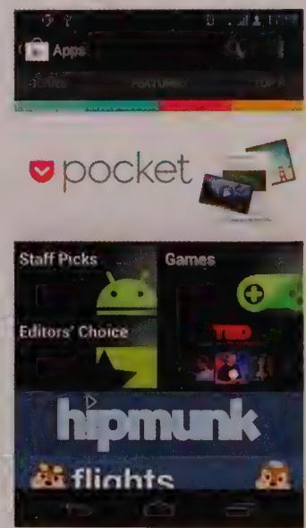

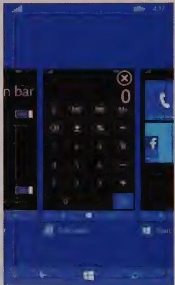  
Figure 19-22: Use of nav bars in iOS (left), Android (center), and Windows phone (right). Android encourages an action bar at the top of the screen, which incorporates navigation and access to functions. Android and Windows Phone also makes use of a system-level nav bar at the bottom of the screen. Windows Phone's Metro design language discourages use of top nav bars.

Most versions of Android (and Windows Phone, as of 8.1) have a system-level navigation bar at the bottom. It contains a back control (which takes the user to the previously viewed screen, regardless of app or hierarchy), a home control, and a "recents" control (Windows Phone also includes search). The presence of a ubiquitous bar at the bottom means that Android apps typically place most of their app navigation at the top of the screen.

# Tool bars and palettes

Tool bars contain buttons that execute functions on the current or selected app content. Windows Phone permits four action buttons in its action bar (called an app bar), which typically is placed at the bottom of the screen.

iOS apps often place an action button or two on the right side of their nav bar, but apps designed to let you author or edit media rather than simply viewing or sharing it often replace the standard bottom-of-screen tab bar with a tool bar.

Google encourages the use of its top-of-screen action bar, which combines back navigation with action buttons. It recommends adding a tab bar under this if the user needs to navigate multiple views. Google's action bar even supports view switching via a dropdown on the action bar itself if the stacked action and tab bars take up too much space.

Most audio playback apps place a transport bar or control pane containing playback-related controls at the bottom of their "now playing" screen.

Tool palettes, a variant of tool bars similar to their desktop brethren (see Chapter 18), use iconic buttons as a way to access tools that operate on a document. (Drawing and painting tools are the most obvious example.) Tool palettes on tablet apps make heavy use of pop-up control panels to allow the selection and configuration of tools.

# Vertical tool bars and palettes

On tablets, more-complex tool bars supporting pop-up control panels and palettes are used at both the top and bottom of the screen. Vertical tool bars run along the left or right edge of the screen (and sometimes both). Art Studio, shown in Figure 19-23, is a good example of an app that makes heavy use of rich, complex tool bars.

# Tool carousels

Just as carousel have crossbred with tab bars, they have also combined with tool bars, allowing more functions than can comfortably fit across the screen to be accessible with a horizontal swipe. Tool carousel seem particularly popular with image processing apps such as Google's Snapseed, shown in Figure 19-24. Each item in the tool carousel is a labeled thumbnail that both describes and shows a small example of the filter or effect applied to an image. (In an ideal world, the image would be the one you were actually editing at the time, but scale can become an issue.)

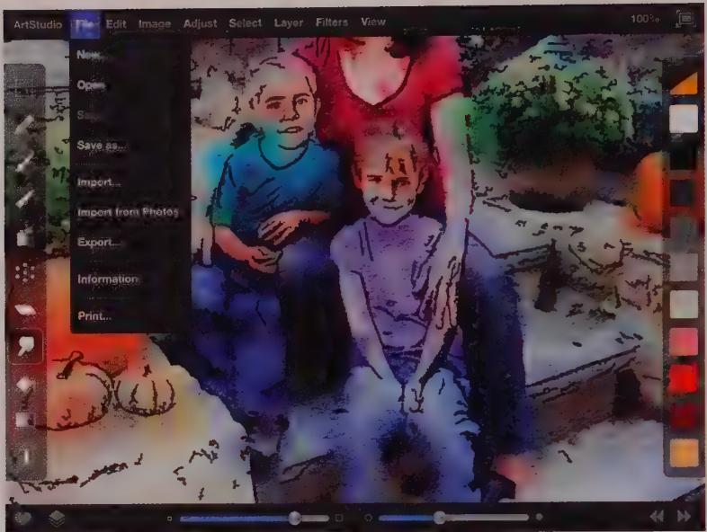  
Figure 19-23: The Art Studio app uses vertical tool bars as well as a desktop-like menu bar and sliders embedded in its bottom tool bar. Authoring tools like this begin to rival the complexity of desktop applications. The tablet screen becomes quite cluttered with this many controls, so Art Studio lets you hide them while working, similar to desktop design tools such as Adobe Photoshop.

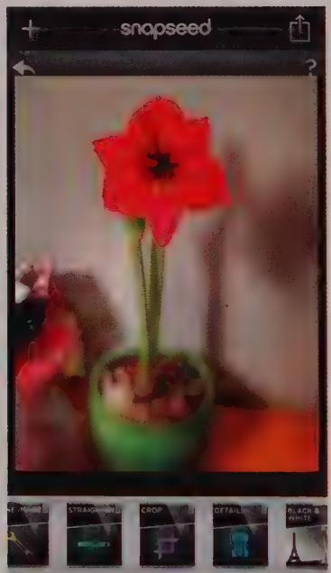

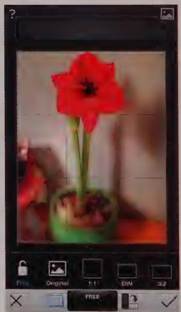  
Figure 19-24: Google's Snapseed app uses a carousel to let you select the tool. After it is selected, the appropriate controls for the tool are shown, in some cases including a secondary tool carousel for choosing a specific setting.

By stacking two bars, you can build a rather complex set of features in a way that tames the complexity. A tool bar lets you select the category of tool (effects, filters, adjustments), and a tool carousel contains items for each specific tool or variant in a category.

# Menu bars: an idiom to avoid in mobile

As complex authoring tools make their way onto tablets, more of the trappings of desktop applications are also making their way to tablet user interfaces. Apps like Art Studio (see Figure 19-23) and Cubasis (see Figure 19-6) for iOS use complex, desktop-like control layouts. Art Studio takes this a step too far by implementing a desktop-like menu bar.

This isn't a good idea for a couple reasons. First, a row of text labels in a bar typically means a tab bar, and a desktop-style menu bar interaction is unexpected on a tablet. Second, most of the functionality remains hidden in the menus. Once it is exposed, it still isn't clear from the menu label what the functions will do. An approach that uses both a tool bar and a tool carousel (as described in the preceding section) can accomplish most of what a menu bar can do, but in a less visually dense and more visually explanatory way.

# Drawers

Drawers are a clever idiom that provides access to a vertical list of navigational elements similar to tabs. They use minimal screen real estate by hiding in a panel that lives in a layer under the main content area. The drawer icon is also called the hamburger menu icon due to its shape: three short, stacked lines. Tapping this icon—or, sometimes, swiping across the main content area—slides the content area horizontally to reveal the drawer under it. As with tabs, the current selection is highlighted. Tapping a drawer item simultaneously swaps what is displayed in the content area and snaps the drawer back shut. Items in the drawer are usually textual, but may have icons and other adornments. Additional controls may also live in the drawer. Google's Gmail app on the iPhone, shown in Figure 19-25, illustrates a typical use of the drawer idiom.

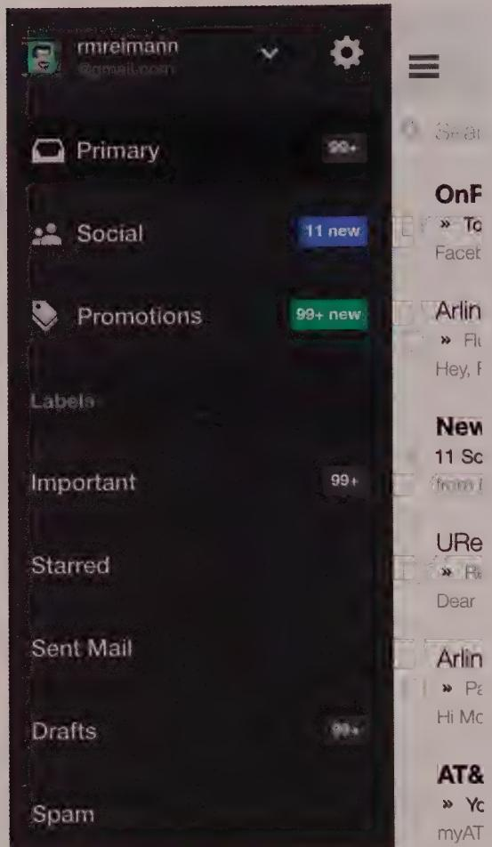  
Figure 19-25: The Gmail app on the iPhone uses a drawer with additional navigation elements inside it. It's a little disconcerting that the account management UI slides down from the top while the settings UI slides up from the bottom (and takes up the full screen), even though both controls are next to each other in the drawer.

# Secondary-action drawers

Drawers can be used to replace a navigational tab bar or can be used to interact with a secondary set of objects in the app. Drawers usually slide open from the left, but not always. Some secondary actions are put in a drawer that deploys from the right. The current version of the Facebook app for the iPhone uses a set of fairly standard bottom tabs (including a More... tab) for its main navigation. It also offers a right-hand drawer that gives you access to a list of online friends for chatting, as shown in Figure 19-26.

  
Figure 19-26: The Facebook app on the iPhone uses a right-hand drawer to let you access online friends for chatting.

# Double drawers

Path, an intriguing timeline-based social networking app on iOS, has successfully opted to minimize its use of tab and tool bars in favor of idioms that take up less main screen real estate. The Path design, as shown in Figure 19-27, uses two drawers—a standard left-hand drawer for primary navigation between views, and a Facebook-like right-hand drawer for messaging friends. Path also uses a nonstandard but interesting tool menu control that fans open from the lower-left corner of the main content area when activated. Although it adds a tap to access these functions, the interaction is both clear and pleasing in its execution, and it allows the content area to shine.

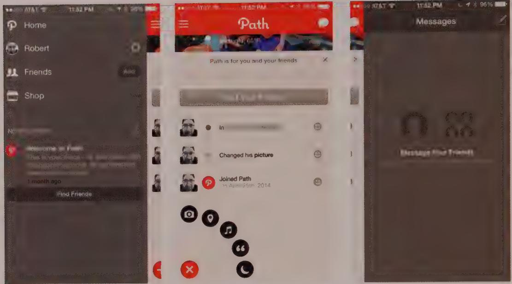  
Figure 19-27: The Path app on the iPhone uses both a standard left-hand drawer for primary navigation and a right-hand drawer for messaging friends. In addition, Path uses a nonstandard pop-up action menu that fans out from the lower-left corner of the main content area when tapped.

# Item-level drawers

Some handheld format apps have taken the concept of a slide-to-reveal drawer and applied it to individual items in a list. Sliding an item to the left or right (depending on the app) reveals a tool bar under the item, whose functions perform an action on that item. This avoids the need for a tool bar at the top or bottom of the content area. Although this approach may seem clever, it actually has a number of drawbacks:

- It is difficult for users to discover unless some sort of visual cue is added to the list item. But then it needs to be added to all items, wasting horizontal space. Desktop applications have the benefit of the hover state to reveal such controls without cluttering the interface, but mobile apps do not.   
- The swiped item can be obscured when the drawer is open, so the user would need to remember what it is, adding to mnemonic (memory) work.   
- The per-item swipe gesture means that other, more standard horizontal gestures, such as those for deleting an item or opening a global navigational drawer, may become either confusing or impossible.

The Slacker streaming music app on iPhone, shown in Figure 19-28, provides a workable example of item-level drawers for both list and grid items. Swiping to the left on grid items for artists, stations, or albums, and swiping list items for tracks, reveals a drawer

containing an info button. Tapping it takes the user to a detailed metadata screen. While this idea reduces UI clutter, its discoverability is low, because swiping individual grid items is a nonstandard interaction. Therefore, this type of interaction requires some explanation in a welcome or help UI, and even then it's questionable whether most users will find it.

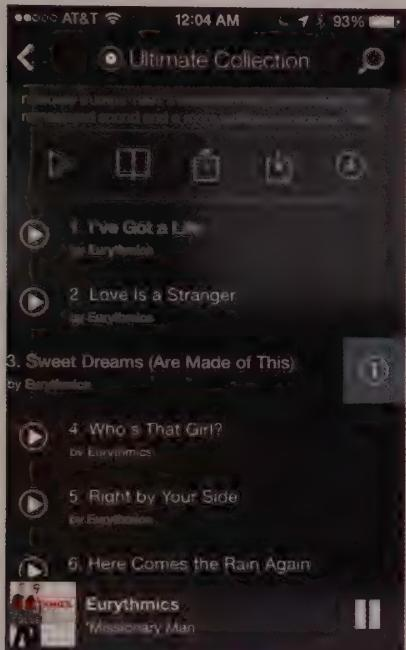

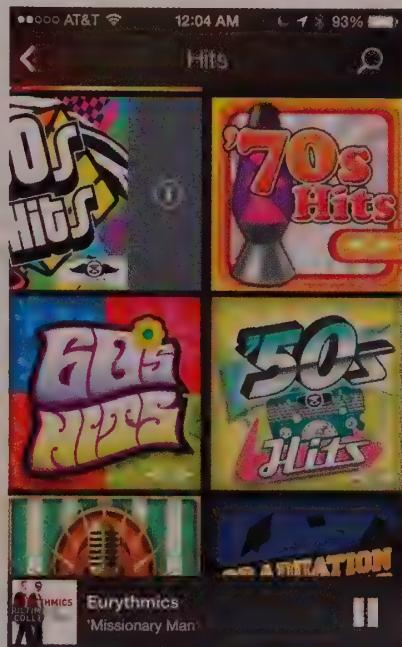  
Figure 19-28: Slacker's streaming music app uses item-level drawers in both grid and list views to give access to an info button that takes users to a detailed metadata screen for the selected item. Although it is elegant in terms of avoiding clutter, its discoverability is low.

# Drawer behaviors to avoid

The Gmail app's drawer implementation, shown in Figure 19-25, also presents an object lesson on the need to carefully consider the overloading of animated transitions for accessing options.

The Gmail app's main drawer opens as expected, with the content pane sliding off to the right when the drawer icon is tapped or when the content pane is swiped to the right. Within it, the navigational choices (e-mail folders) scroll up and down as expected.

From there, things get complicated. The account management UI is a toggle control in the action bar at the top of the drawer. Activating it slides down a pane that covers the drawer's contents until either an account is chosen or the pane is dismissed. And, next to the account management toggle is a settings button, which launches yet another sliding

pane that slides up from the bottom of the screen, covering both the open drawer and what is visible of the main content area. Sound confusing? Well, it is.

This overloading of popping and sliding panes—each moving in a different direction and affecting different layers of the UI—can be both disconcerting and confusing for users.

DESIGN PRINCIPLE

Limit the number of animated screen transitions.

Unlike Google's Gmail app, the Google+ app for iOS, shown in Figure 19-29, breaks drawer convention. It slides the drawer open on top of the main content area, rather than having the content area slide over to reveal the drawer underneath. This type of behavior usually is seen on tablets when an index pane of content is opened in portrait mode. It's puzzling why Google didn't stick with the more appropriate drawer idiom it was already using for its Gmail app.

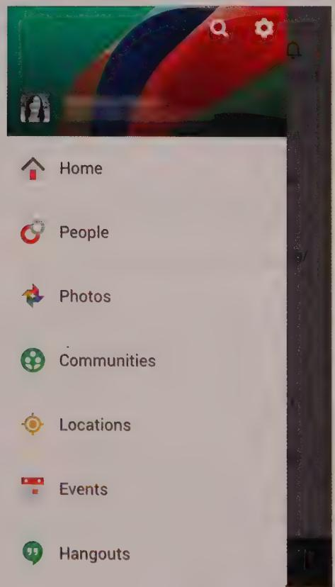  
Figure 19-29: The Google+ app breaks the drawer pattern by sliding it over the content area—more like a content index pane—instead of sliding away the content area to reveal the drawer's contents.

# The drawer controversy

Drawers using the hamburger menu have come under fire, the claim being that use of drawers hampers user engagement by hiding functionality. Some in the community have fiercely advocated for drawers to be abandoned entirely. We believe that this is throwing the baby out with the bathwater.

Certainly there is some truth in these claims: Hiding an entire nav hierarchy behind a single icon button does have its problems, but these can also be remedied via use of a text button (e.g., Menu) instead of—or in addition to—the hamburger icon, having the initial use state of the drawer be open, or making use of an initial help overlay (see the sections on welcome and help screens later in this chapter). In some cases the style of the hamburger might be the biggest problem—if the user doesn't register it as a control, then the failure is in visual communication.

Benefits of drawers include a cleaner main interface with more room for content, and a means of making almost any function a swipe (and possibly a scroll) and a tap away. For an app with a complex feature set, this can be a godsend.

For apps where you expect users to be constantly using many functions, drawers may also work well. And apps that have many infrequently used but occasionally necessary functions might benefit from a drawer approach. On the other hand, apps that are only casually used may best use tabs (or one of their variants) for navigation, since users will not be using the app with enough frequency or dedication to recall the existence of features hidden within a drawer.

# Tap-to-reveal and direct manipulation

One of the main differentiators of touchscreen mobile apps from desktop apps is the ability to use your fingers to manipulate onscreen objects. Navigational constructs such as lists, carousel, and drawers allow users to navigate in a more immersive way, and the same principle can be applied to creating and editing content.

# Tap-to-reveal controls

The iDraw app, shown in Figure 19-30, provides a good example tap-to-reveal: Tap an object, and the manipulation tools are revealed.

Similarly, streaming video apps use the tap-to-reveal idiom for controls that normally are hidden during playback. Tapping anywhere on the video playback area of the YouTube app (see Figure 19-31) launches transport, volume, and other controls.

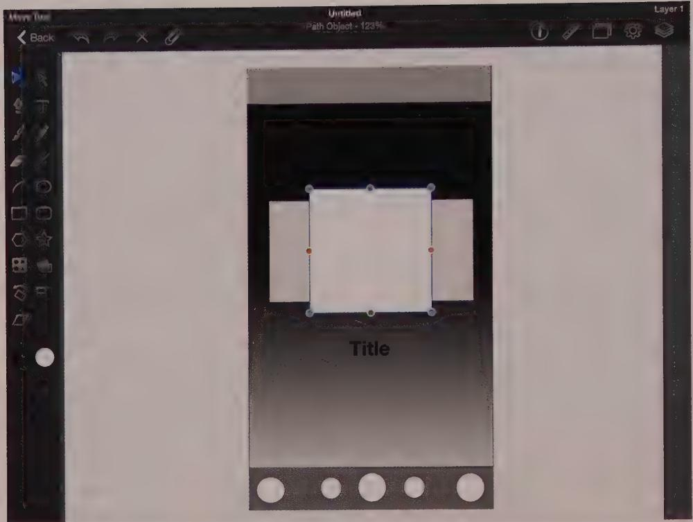  
Figure 19-30: The iDraw app uses traditional desktop-style drag handles that appear when an object is tapped. An additive selection mode allows successive taps to select additional objects as a group.

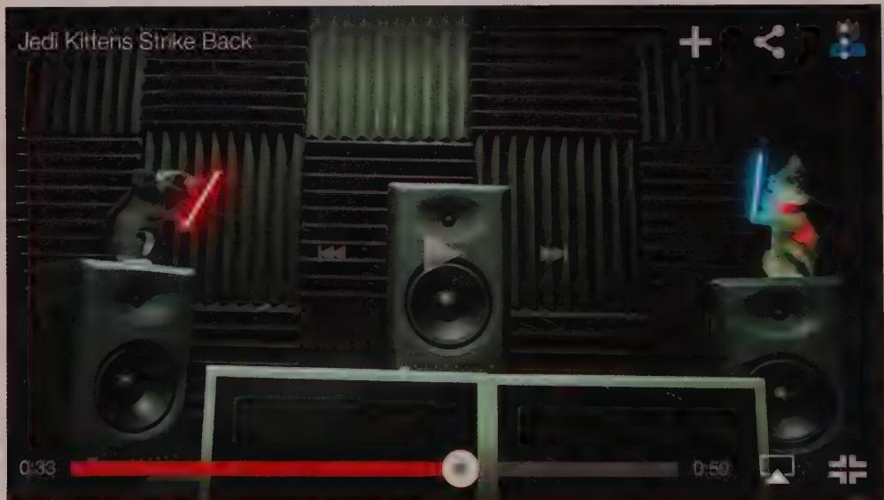  
Figure 19-31: YouTube makes its transport, volume, and other controls temporarily available as icons superimposed on the video display area when it is tapped. This design method helps eliminate clutter, but it must be discovered. Luckily, most mobile video apps use this idiom, and tapping the playback area isn't that much of a stretch discovery-wise.

# Direct manipulation controls

Some apps go to the next step of direct manipulation that touch-based screens permit—replacing cumbersome indirect-manipulation idioms such as sliders with gestures on the object being edited. The best of these, such as Google's Snapseed image editor, provide dynamic feedback hints that show roughly how the gestures will affect the object being edited. For instance, when you use the tilt-shift effect, tapping the image displays a center adjustment point, as well as sets of double lines indicating the effect's angle and transition interval (see Figure 19-32). The user can move the effect's center point, swipe horizontally to widen or narrow the transition area (also tracked by a thermometer-like display below), and twist his or her thumb and forefinger on the screen to change the angle of the effect. Although some discovery and learning are involved, it quickly becomes second nature and provides a tremendously immersive way of editing and correcting photos.

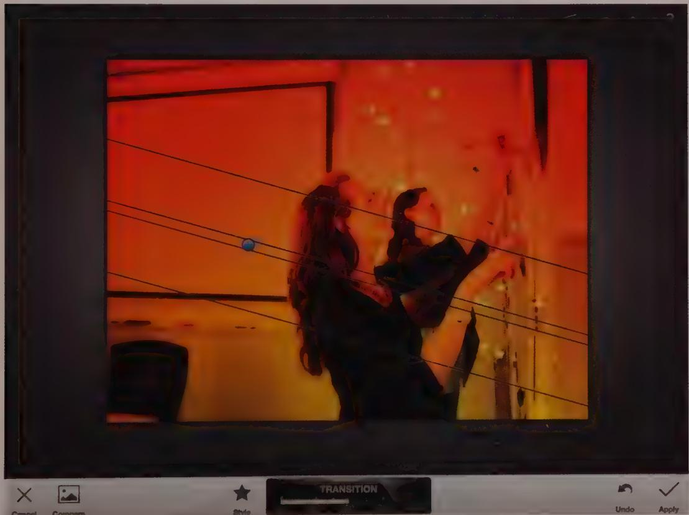  
Figure 19-32: Snapseed provides innovative and highly immersive direct-manipulation tools for editing images, eliminating the need for the traditional banks of knobs and sliders that such interfaces usually entail. The price of this approach is a steeper discovery curve, but this disadvantage can be offset as Snapseed does—with one-time welcome/help screens for each tool.

# Searching, sorting, and filtering

Searching is a key user activity on mobile apps. In fact, it is arguably the most important mobile activity besides making a phone call. People use mobile apps to find something, whether it's a recent e-mail, a song or video, something to buy, or something in the real world that's in their vicinity.

As mentioned above, complex data entry is not easy or practical in the on-the-go world of mobile apps. Luckily, you have a variety of helpful ways to minimize the effort in search, as well as contextual information that mobile apps can provide.

# Implicit sorting versus explicit searching

As discussed earlier, mobile apps are, by and large, optimized for browsing. We can utilize that browsing behavior to help pre-empt a user's need to build search queries. A smart app might keep track of the kinds of things the user has viewed, liked, or purchased in the past. Then it could serve up those items (more on this first option below) items that share similar properties or are liked by people with tastes similar to those of the user. Netflix has based its mobile app on this principle (see Figure 19-14), providing swimlane categories of TV shows and movies gleaned from the user's watching habits. Search is still available but is not the focus of the interface.

# Building search queries

Of course, even with the best possible browse options, the user's need to search for something specific is almost inevitable. The challenge in a mobile app context is to allow sufficient expression of search terms, but with a minimum of data entry for the user. Here are a few of the most useful approaches:

- Voice search—The three major mobile platforms support in-app voice search, and you should certainly make this an option in your app. Voice search can certainly ease entry for simple searches in supported domains. However, we're a long way off from completely reliable general searches, so the need to enter and modify search terms manually still remains.   
- Auto-complete—As the user types, displaying a list of popular options matching the entered letters can dramatically decrease keyboard time and user frustration.   
- Tap-ahead—This is a refinement on top of auto-complete. Tap-ahead allows users to take any auto-completed term option the app provides as the result of auto-suggest, load it into the search box, and run a new auto-complete query. This might be overkill for some searches, but it is certainly useful for web searches and in more technical domains where precision of search terms might be important. The Google Search app uses tap-ahead, as shown in Figure 19-33.

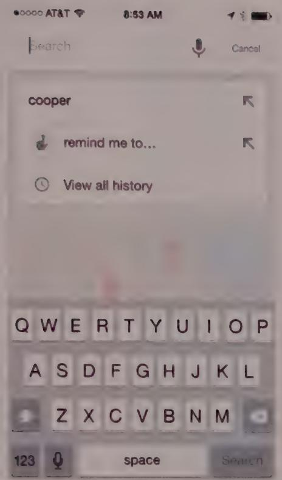

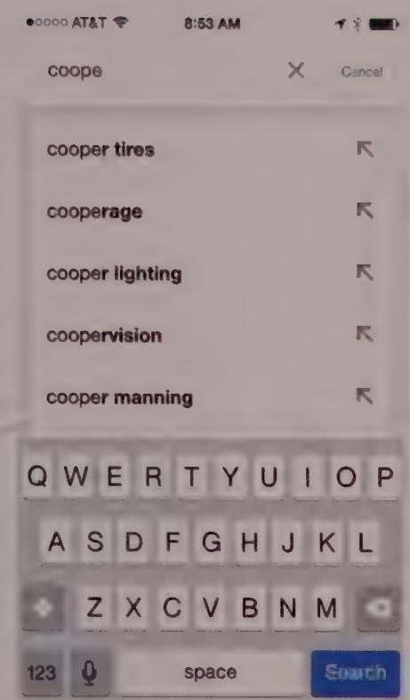  
Figure 19-33: Google's Search app uses voice search and recent/frequent search suggestions (left), auto-complete (right), and tap-ahead (both).

- Recent/frequent searches—Humans are creatures of habit who typically search for the same things repeatedly. Any search functionality should remember past searches and present them as soon as the user taps the search box. Ideally these results should be organized in order of most frequent and most recent. They also should support tap-ahead so that they can be used to start a related search if desired, as the Google Search app does.   
- Auto-suggest—A more sophisticated improvement on strict auto-complete, autosuggest uses fuzzy matching techniques to provide spell-corrected, controlled-vocabulary, and synonym options in its option list. Typically, auto-suggest options include a small set of strict auto-complete options at the top, with a larger set of suggested results beneath.   
- Categorized suggestions—Building on auto-suggest, an app that needs to search across several types of data can provide suggested options in each category. iOS's Spotlight search, shown in Figure 19-34, does this well. It provides instantaneous categorized suggestions (with thumbnail images where appropriate) pulled from apps, contacts, music, videos, mail, messages, calendar, notes, reminders, and more.

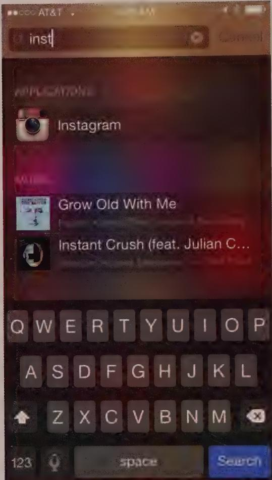  
Figure 19-34: iOS's Spotlight search uses voice search, auto-suggest, and categorized suggestions.

# Sorting and filtering

On mobile devices, sorting and filtering often amount to the same thing. This is because the combination of limited screen real estate and the limited amount of time users typically have in an on-the-go mobile context limits the number of search results users will want to scroll through to a few screens at most. Thus, sorting effectively results in filtering out items at the bottom of the sort. Add to this the fact that users don't always understand the difference between sorting and filtering, and you can anticipate the appropriate strategy for these functions on mobile: Merge them into a single set of controls. Unfortunately, many high-profile apps don't get this quite right.

Amazon's iPhone app, shown in Figure 19-35, has a straightforward search that remembers recent searches. It also has a clear Refine button in the nav bar of the search results;

this is good so far. But the refine UI infuriatingly forces you to choose a department before you can even see a sort by option (or any other filter options) and takes you back to the results page before you can choose it! The consequence is that users may not even realize that additional sort and filter options are available.

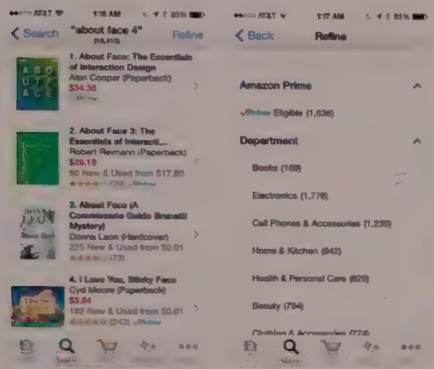

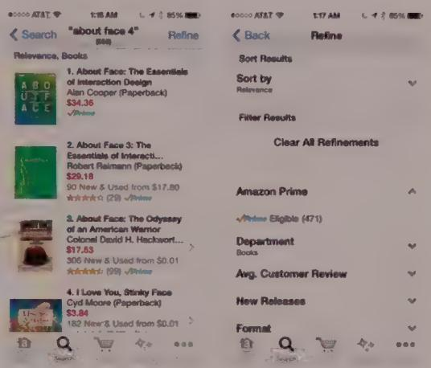  
Figure 19-35: Amazon's iPhone app fails users by allowing them to choose only one refinement option at a time and by hiding most refinement options until a department filter is selected. Undoubtedly this is due to a database integration issue on Amazon's back end, but it is Amazon's customers who suffer.

The OpenTable app, shown in Figure 19-36, takes a better approach for users. The search portion of the interface has appropriate filters for a restaurant reservation app built in: time and location, as well as the expected keyword search for restaurants. Both time and location are also sensibly prepopulated. Search refinement options are clear and simple, with the most important at the top, and more fussy criteria collapsed at the bottom. The only faux pas OpenTable makes is placing its filter control behind a somewhat obscure icon in the lower right of the screen, where people are almost sure to miss it.

Yelp takes a no-nonsense approach to refinement in its app, with a prominent Refine button to the left of the search box on the results screen (see Figure 19-37). Tapping the button opens a full-screen dialog that mixes filter and sort controls, each of which is clearly labeled and appropriately prioritized from top to bottom.

Yelp and Amazon both get another detail right: Filtered results are indicated by a narrow filter bar anchored to the top of the results view. This bar contains a terse textual summary of all current filters on the results. A nice addition to this interface would be the ability to swipe horizontally to see a full list of active filters (the list is truncated in the Yelp interface). Another advantage would be the ability to tap to toggle the filters on and off without needing to return to the refine screen.

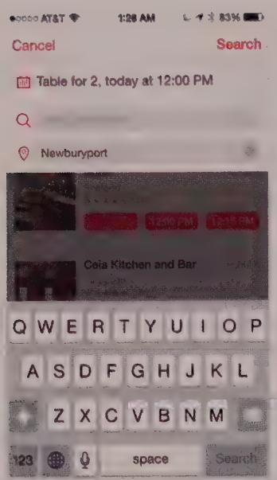

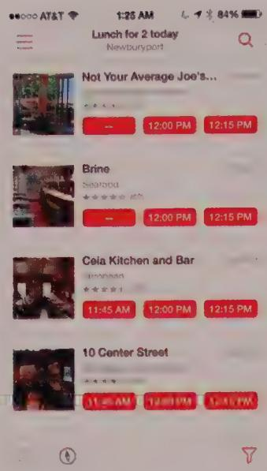

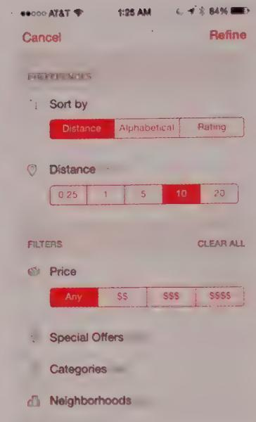  
Figure 19-36: OpenTable's app does a great job searching (left) and filtering (right), except for the filter control placement (center). It's almost invisible in the lower right of the screen, especially since it disappears entirely when you scroll down (though it does come back when you scroll up).

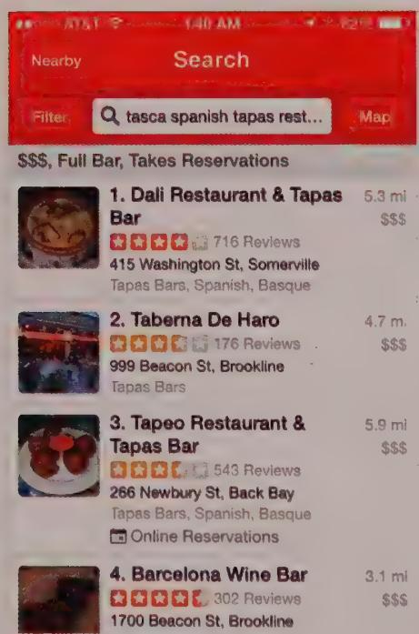

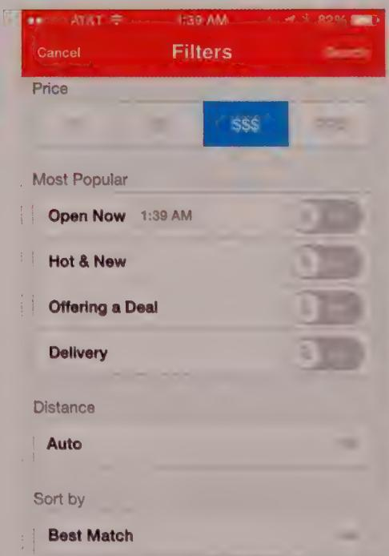  
Figure 19-37: The Yelp app gets searching and filtering right. A clearly labeled Filter button is at the top left of the results screen (left), and a full-screen modal pop-up appropriately mixes filter and sort criteria (right). The results screen also shows a narrow filter bar identifying which filters have been set (left).

# Welcome and help screens

While many mobile interfaces are quite easy to learn, some forces unique to mobile design act in opposition to ease of learnability:

- Limited screen real estate effectively limits the amount of textual labeling or instructive text that can be on the screen at any given time.   
- Multi-touch interfaces center on the use of gestures to accomplish actions, which have no visible affordance until fingers touch or move across the screen.   
- Unlike mouse-driven desktop interfaces, there is no hover state to afford tooltips and other contextual hints.

While some other alternatives exist, the simplest and most effective way to help users learn a mobile interface is through welcome and help screens.

Welcome and help interfaces are most often two sides of the same coin in mobile apps. On a user's first-time entry into an app after purchase and login, welcome screens provide guidance on what the important activities are in the app and how to perform them. Help in a mobile context provides much the same—and often identical—information, but on demand when the user requests it. Most mobile apps aren't complex enough to require separate welcome and help screens for different tabs or other views, but this might make sense for a more sophisticated authoring tool with many controls, options, and actions.

This section describes several popular welcome and help idioms that help users learn an app's primary gestures and interactions. For more detail on these mechanisms, see Chapter 16.

# Guided tours

Guided tours usually consist of a carousel of cards, each of which contains text and images or video that describes the use of a particular function or set of related app functions. Guided tours are employed at first use and after a major release to highlight new functions, and secondarily, as help. Many apps allow users to relaunch the tour from an in-app settings dialog or, less frequently, from a help button or menu placed in a top or bottom navigation bar. Guided tours should allow users to exit the tour from any card or screen.

DESIGN PRINCIPLE

Use guided tours to orient first-time users.

# Overlays

Overlays are another simple way to help the user get started. An overlay covers the entire screen with a semitransparent layer on which instructions—often rendered to look hand-drawn, and employing arrows to indicate gestures or highlight controls—are displayed. Tapping anywhere on the screen dismisses the overlay. (This is sometimes also accomplished with a close box.) As with guided tours, overlays can be activated again from a help button or settings dialog.

DESIGN PRINCIPLE

Use overlays to explicate gestures.

# ToolTip overlays

ToolTip overlays are an overlay variation that attempts to provide a ToolTip-like display of all primary functions on a single overlay screen, and is often used in the context of more complex authoring apps. As such, this idiom is best not used as a welcome screen, but rather as a help screen.

# Multi-Touch Gestures

Gestures are at the heart of the mobile experience. Although the kind of experience afforded by gestures is quite rich and immersive, the actual number of core gestures is fairly small—and this is for the best. Users don't need a huge vocabulary of gestures to satisfy their needs; keeping gestures simple and straightforward makes them easy to discover and learn.

This section describes the primary uses of the most frequently used multi-touch gestures.

# Tap to select, activate, or toggle

The tap is used to select objects and toggle the activation state of controls. Tapped items should get an appropriate selection highlight or activation/deactivation state or animation.

# Tap-and-hold

Tap-and-hold is a gestural idiom that is falling out of favor, and probably rightfully so. It is typically used to open a contextual pop-up menu on an object, similar to the desktop

right-click idiom. However, this gesture isn't very discoverable, and few users are familiar with it. Therefore, this gesture isn't recommended.

Instead, a visible menu control should be placed on the object. Or a tap-to-select model, combined with an action menu, should be used.

# Drag to scroll

Drag to scroll can work horizontally or vertically, and is a fundamental direct manipulation gesture.

Vertical dragging can be used to scroll lists or, in conjunction with drag handles, reorder objects in a list. Dragging downward on a list can initiate a refresh when the list has already been scrolled to the top. A drag upward can initiate an incremental addition of items after the last displayed item in a list.

The top and bottom drawers supported by some mobile OS's also can be accessed via vertical dragging.

Horizontal dragging can scroll a carousel or swimlane, or open a left-hand or right-hand drawer.

# Drag to move

Dragging also can be used to move or copy an object from one list, pane, or container to another, or to move an object arbitrarily within a canvas or grid.

# Drag to control

Dragging also can be used to control knobs, switches, sliders, virtual x-y control pads, and contextual touch controls, and to operate palette tools (such as brushes in a painting app) on a canvas.

# Swipe up/down

Swiping up usually is synonymous with dragging up, although iOS uses a swipe up gesture in desktop edit mode to close a running app. Swiping a list or grid upward causes it to continue scrolling for a while with simulated momentum.

Swiping down usually is synonymous with dragging down. Swiping a list or grid downward causes it to continue scrolling for a while with simulated momentum.

# Swipe left

Swiping left usually is synonymous with dragging left. Swiping a carousel or swimlane to the left causes it to continue scrolling for a while with simulated momentum.

Swiping left also can open a right-hand drawer or close a left-hand drawer.

Apple's Safari browser uses a swipe left to navigate like the forward button. Google's Chrome browser uses a swipe left to delete browser tabs when in tab edit mode.

# Swipe right

Swiping right usually is synonymous with dragging right. Swiping a carousel or swimlane to the right causes it to continue scrolling for a while with simulated momentum.

Swiping right also can open a left-hand drawer or close a right-hand drawer.

Apple's Safari browser uses a swipe right to navigate like the back button. Google's Chrome browser uses a swipe right to delete browser tabs when in tab edit mode.

# Pinch in/out

The pinch-in gesture is used to shrink or zoom out on objects physically (such as on a map view). Or you can perform a semantic zoom—zoom out or up one level in the hierarchy in a set of physically or conceptually nested structures.

The pinch-out gesture is used to expand or zoom in on objects physically (such as on a map view). Or you can perform a semantic zoom—zooming in or down one level in the hierarchy in a set of physically or conceptually nested structures.

# Rotate

Rotate is a gesture employing the thumb and forefinger twisted clockwise or counterclockwise together on the touchscreen surface. This gesture can be used to actuate knob controls. But knobs probably should also support a horizontal or vertical drag action that starts on the knob as an alternative and more discoverable gesture. It can also be used to rotate objects, like a selection of pixels in an image editing app.

This gesture is somewhat awkward to carry out, given the anatomy of the human wrist. FiftyThree Inc.'s iOS app, Paper, uses this gesture to control Undo/Redo. Although this is

In a novel approach, it seems inferior to the more standard Undo/Redo arrow icons from any usability standpoint.

# Multifinger swipes

The various mobile OS's use various multifinger swipe gestures. For example, iOS supports an option that permits four-finger left/right swipes to switch between running apps.

On the whole, multifinger gestures are not very discoverable and when used in apps may interfere with OS-level gestures. They are best left unused, or reserved for specific needs.

# Inter-App Integration

Modern smartphones, with their standalone app approach, have created a marvelous ecosystem in which users can easily add amazing functionality to their devices through an app store. This approach does have one Achilles heel: Standalone apps tend not to foster the useful integration of functionality and data between them. For example, the iPhone has a phone app, a contacts app, a calendar app, a messaging app, a memo app, and a reminders app. However, these apps are almost completely standalone and do not communicate with each other except in the most rudimentary ways.

The iPhone and other modern smartphones currently do a reasonable job of integrating the phone and contacts apps. When a call arrives, you can see the full name from the address book and, by tapping a button in the address book, you can dial it. However, this integration could be taken a step further. Clicking a name in an address book could give you a reverse chronological list (or set of lists) of all documents that are associated with that person: appointments, e-mails, phone calls from the log, memos including the caller's name, websites associated with the person, and so on.

Similarly, when an incoming call arrives, the phone could check your location (such as a cinema) or see if you are currently in a meeting that's on your calendar. It could automatically silence the ringer (and perhaps even send an "I'm busy and will call you back later" text message to the person calling you) unless the call is from someone on your VIP list of callers.

It's unfortunate that phone manufacturers haven't yet applied this kind of integration to the core suite of phone apps. However, some clever apps like IFTTT (If This Then That) do allow apps that participate in their service to be wired together with customizable rules that allow for some level of app integration (see Figure 19-38).

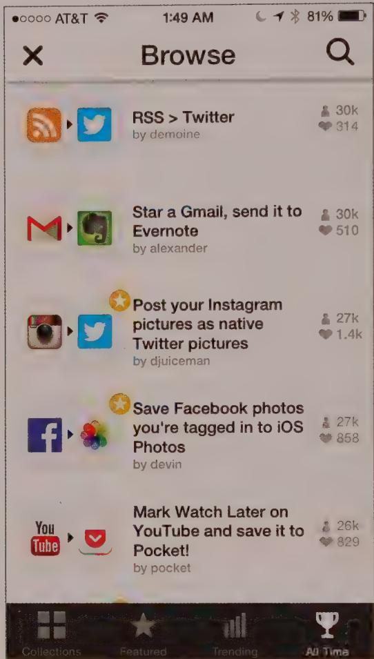  
Figure 19-38: The IFTTT app lets users wire together apps by allowing them to specify output and input triggers, effectively allowing simple app integration.

For music production, Audiobus (see Figure 19-39) is an integration-oriented iOS app that allows other compatible iOS audio applications to route multiple input audio streams to multiple audio outputs. This effectively allows an entire virtual recording studio to exist within an iPhone or iPad.

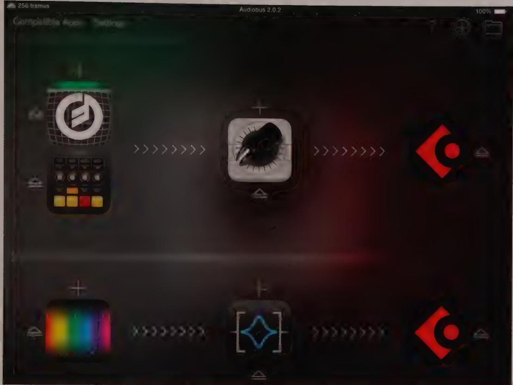  
Figure 19-39: The Audiobus app allows users to chain together the audio streams from compatible running apps. Doing so supports input, output, and effects, allowing an entire virtual recording studio to exist within an iPad.

