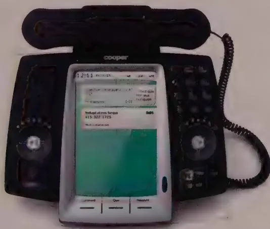
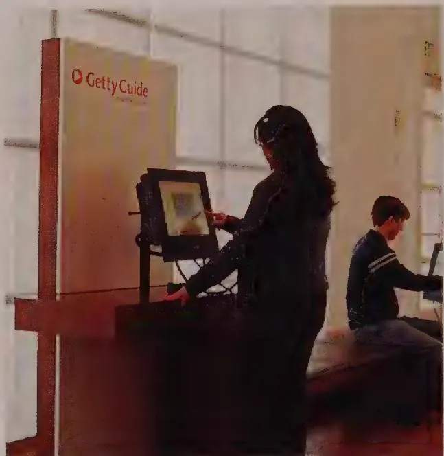
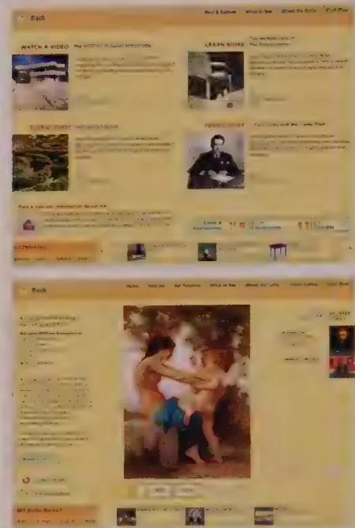

# Other Devices

Unlike software running on a desktop computer or high resolution mobile device, interaction design for device-embedded interfaces requires special attention to creating an experience that coexists with the noise and activity of the real world happening around the product, combined with the typically limited screen and computational resources needed to render it. Kiosks and other embedded systems, such as TVs, microwave ovens, automobile dashboards, cameras, bank machines, and laboratory equipment, are unique platforms with their own opportunities and limitations.

# General design principles

Embedded systems (physical devices with integrated software systems) involve some unique challenges that differentiate them from desktop systems, despite the fact that

they may include typical software interactions. Examples include smart appliances and medical informatics devices. When designing any embedded system, whether it is a smart appliance, kiosk system, or handheld device, keep these basic principles in mind:

- Don't think of your product as a computer.   
- Integrate your hardware and software design.   
- Let context drive the design.   
Use modes judiciously, if at all.   
- Limit the scope.   
Balance navigation with display density.   
- Minimize input complexity.

The following sections discuss each of these principles in more detail.

# Don't think of your product as a computer

Perhaps the most critical principle to follow while designing an embedded system is that what you are designing is not a computer, even though its interface might be dominated by a computer-like bitmap display. Your users will approach your product with specific expectations about what the product can do (if it is an appliance or familiar handheld device) or with very few expectations (if you are designing a public kiosk). The last thing you want to do is bring all the baggage—the idioms and terminology—of the desktop computer world with you to a "simple" device like a camera or microwave oven. Similarly, users of scientific and other technical equipment expect quick and direct access to data and controls within their domain, without having to wade through a computer operating system or file system to find what they need.

Designers, especially those who have designed for desktop platforms, can easily forget that even though they are designing software, they are not always designing it for computers in the usual sense: devices with large color screens, lots of power and memory, full-size keyboards, and mouse pointing devices. Few, if any, of these assumptions are valid for most embedded devices. And, most importantly, these products are used in much different contexts than desktop computers. Idioms that have become accepted on a PC are inappropriate on an embedded device. "Cancel" is not an appropriate label for a button to turn off an oven, and requiring people to enter a "settings" mode to change the temperature on a thermostat is preposterous. Much better than trying to squeeze a computer interface into the form factor of a small-screen device is to see it for what it is and then figure out how digital technology can be applied to enhance the experience for its users.

# Integrate your hardware and software design

Embedded systems often benefit from custom hardware. Desktop computers are meant to be all-purpose, but embedded systems are usually intended to help accomplish a very specific task. Due to cost, power, and form factor constraints, hardware-based navigation and input controls must often take the place of onscreen equivalents.

It is therefore critical to design the hardware and software elements of the system's interface—and the interactions between them—simultaneously, and from a goal-directed, ergonomic, and aesthetic perspective. Many of the best, most innovative digital devices of the last several decades, such as the TiVo and the original iPod, were designed from such a holistic perspective. Hardware and software combine seamlessly to create a compelling and effective experience for users, as shown in Figure 19-40. This doesn't occur often enough in the standard development process. Hardware engineering teams regularly hand off completed mechanical and industrial designs to the software teams, who must then accommodate them, regardless of what is best from the user's perspective.

  
Figure 19-40: A Cooper design for a smart desktop phone, exhibiting strong integration of hardware and software controls. Users can easily adjust volume/speakerphone, dial new numbers, and control playback of voicemail messages with hardware controls. They also can manage known contacts/numbers, incoming calls, call logs, voicemail, and conferencing features using the touchscreen and thumbwheel. Rather than attempting to load too much functionality into the system, the design focuses on making the most frequent and important phone features much easier to use. Note the finger-sized regions devoted to touchable areas on the screen and the use of text hints to reinforce the interactions.

# Let context drive the design

Another distinct difference between embedded systems and desktop applications is the importance of environmental context. Although desktop applications sometimes can introduce contextual concerns, designers generally can assume that most software running on the desktop will be used on a computer that is stationary and located in a relatively quiet and private location. Although this is becoming less true as laptops gain both wireless capabilities and the power of desktop systems, it remains true that users will, by necessity of the form factor, be stationary and out of the hubbub even when using laptops.

Exactly the opposite is true for many embedded systems, which either are designed for on-the-go use (handhelds), in an active workspace (like an operating theater), or are stationary but in a location at the center of public activity (kiosks). Even embedded systems that are mostly stationary and secluded (like household appliances) have a strong contextual element. For example, a host juggling plates of hot food at a dinner party is distracted, not in a focused state of mind to navigate a cumbersome set of controls for a smart oven. Navigation systems built into a car's dashboard cannot safely use "soft keys" that change their meaning in different contexts, because the driver would be forced to take her eyes off the road to read each function label. Similarly, a technician on a manufacturing floor should not be required to focus on difficult-to-decipher equipment controls, because that kind of distraction could be life-threatening in some circumstances.

Thus, the design of embedded systems must match very closely the context of use. For handhelds, this context concerns how and where the device is physically handled. How is it held? Is it a one-handed or two-handed device? Where is it kept when not in immediate use? What other activities are users engaged in while using the device? In what environments is it used? Is it loud, bright, or dark there? How does the user feel about being seen and heard using the device if he is in public? We'll discuss some of these issues in detail a bit later.

For kiosks, the contextual concerns focus more on the environment in which the kiosk is being placed and also on social concerns. What role does the kiosk play in the environment? Is the kiosk in the main flow of public traffic? Does it provide ancillary information, or is it the main attraction itself? Does the architecture of the environment guide people to the kiosks when appropriate? How many people are likely to use the kiosk at a time? Are there sufficient numbers of kiosks to satisfy demand without a long wait? Is there sufficient room for the kiosk and kiosk traffic without impeding other user traffic? We touch on these and other questions shortly.

# Use modes judiciously, if at all

Desktop computer applications are often rich in modes: The software can be in many different states in which input and other controls are mapped to different behaviors.

Tool palettes (such as those in Photoshop) are a good example. When you choose a tool, mouse and keyboard actions are mapped to a set of functions defined by that particular tool. When you choose a new tool, the behavior resulting from similar input changes.

Unfortunately, users are easily confounded by modal behavior. Because devices typically have smaller displays and limited input mechanisms, it is very difficult to convey what mode the product is in. Significant navigational work is often required to change modes. Take, for example, pre-smarhtphone mobile telephones. They often required navigation of seemingly countless modes organized into hierarchical menus. Most of these old-school mobile phone users only mastered the dialing and address book functionality but quickly got lost when they tried to access other functions. Even an important function such as silencing the ringer was often a daunting task.

When designing for embedded systems, it's important to limit the number of modes. Ideally, mode switches should result naturally from situational changes in context. For example, it makes sense for a smartphone to shift into telephone mode when an incoming call is received and to shift back to its previous mode when the call is terminated. If modes are truly necessary, they should be clearly accessible in the interface, and the exit path should also be immediately clear.

# Limit the scope

Most embedded systems are used in specific contexts and for specific purposes. Avoid the temptation to turn these systems into general-purpose computers. Users will be better served by devices that enable them to do a limited set of tasks more effectively, than by devices that attempt to address too many disparate tasks in one place.

Many devices like smart phones and slate computers share information with desktop systems. It makes sense to approach the design of such systems as satellites of the desktop: The device is an extension, or satellite, of the desktop, providing key information and functions in contexts where the desktop system is unavailable. Scenarios can help you determine what functions are truly useful for such satellite systems.

# Balance navigation with display density

Many devices are constrained by limited display real estate. Whether the underlying reasons are hardware cost, form factor, portability, or power requirements, designers must make the best use of the display technology available while meeting users' information needs. Every pixel, segment, and square millimeter of display is significant in the design of display-constrained embedded systems. Such limitations in display real estate almost always result in a trade-off between clarity of information displayed and complexity of navigation. By appropriately limiting the scope of functions, you can ameliorate this

situation somewhat, but the tension between display and navigation almost always exists to some degree.

Certainly it's best to completely flatten the information hierarchy if possible. But if not, you must carefully map out embedded systems' displays, and develop a simple and understandable hierarchy of information. Determine the most important information to get across, and make it the most prominent. Then, look to see what ancillary information can still fit on the screen. Try to avoid flashing between different sets of information by blinking the screen. For example, an oven with a digital control might display both the temperature you set it to reach and how close it is to reaching that temperature by flashing between the two numeric values. However, this solution easily leads to confusion about which number is which. A better solution is to display the temperature that the oven has been set to reach and, next to that, show a small bar graph that registers how close to the desired temperature the oven currently is. You must also leave room in the display to show the state of associated hardware controls or, better yet, use controls that can display their own state, such as hardware buttons with lamps or hardware that maintains a physical state (such as toggles, switches, sliders, and knobs).

# Minimize input complexity

Almost all embedded systems have simplified inputs, not general-purpose keyboards or a desktop-style pointing device. This means that any input to the system—especially text input—is awkward, slow, and difficult for users. Even the most sophisticated of these input systems, such as touchscreens, voice recognition, handwriting recognition, and thumb-boards, are cumbersome in comparison to full-sized keyboards and mice. So it's important that input be limited and simplified as much as possible.

Kiosks, even though their screens are usually larger, should nonetheless avoid complex text input whenever possible. Public kiosks run an unfortunate risk of being a disease vector, so your first pass should try for noncontact inputs like voice, proximity switches, or non-contact gestural inputs. If more is needed, touchscreens can display soft keyboards if they are large enough; each virtual key should be large enough to make it difficult for the user to accidentally mistype. Touchscreens should also avoid idioms that involve dragging; single-tap idioms are easier to control and more obvious (when given proper affordance) to novice users on such a transient application.

# Designing for single-purpose handheld devices

For single-purpose handheld devices (ones for which you are designing both the hardware and the software form factors and interfaces), you should keep in mind some additional considerations:

- Think about how the device will be held and carried. Physical models are essential to understanding how a device will be manipulated. The models should at least reflect the device's size, shape, and articulation (flip covers and so on). They are more effective when weight is also taken into account. These models should be employed by designers in context and key path scenarios to validate proposed form factors. Labels on buttons have very different contextual needs, depending on where and when they will be used. For example, the labels on a package-delivery tracking tool don't need to be backlit like those on a cell phone or TV remote control.   
- Determine early on whether the device or application will support one-handed or two-handed (or even no-handed) operations. Again, scenarios should make it clear which modes are acceptable to users in various contexts. It's okay for a device that is intended primarily for one-handed use to support some advanced functions that require two-handed use, as long as they are needed infrequently.   
- Avoid use of pluralized and pop-up windows. Floating windows typically have no place on small, low-resolution screens. In this regard, interfaces should resemble sovereign-posture applications, using the full screen real estate. Modeless dialogs should always be avoided. Modal dialogs and errors should, whenever possible, be replaced using the techniques discussed in Chapter 15.

# Designing for kiosks

On the surface, kiosks may appear to have much in common with desktop interfaces: large, colorful screens and reasonably beefy processors behind them. But as far as user interactions are concerned, the similarity ends there. Kiosk users, in comparison with sovereign desktop application users, are at best infrequent users of kiosks and, most typically, use any given kiosk only once. Furthermore, kiosk users will have either a specific goal in mind when approaching a kiosk or no readily definable goal at all. Kiosk users typically don't have access to keyboards or pointing devices, and often they would be unable to use either effectively even if they did. Finally, kiosk users typically are in a public environment, full of noise and distractions, and may be accompanied by others who will be using the kiosk in tandem with them. Each of these environmental issues has a bearing on kiosk design (see Figure 19-41).

# Transaction versus exploration

Kiosks generally fall into two categories: transactional and explorational. Transactional kiosks provide a tightly scoped transaction or service. These include bank machines (ATMs) and ticketing machines such as those used in airports, train and bus depots, and some movie theaters. Even gasoline pumps and vending machines can be considered a simple type of transactional kiosk. Users of transactional kiosks have specific goals in mind: to get cash, a ticket, a Tootsie Roll, or a specific piece of information. These users have no interest in anything but accomplishing their goals as quickly and painlessly as possible.

  
Figure 19-41: The GettyGuide, a system of informational kiosks at the J. Getty Center and Villa in Los Angeles, designed by Cooper in collaboration with the Getty and Triplecode

Explorational kiosks are most often found in museums or as an information display in a mall. Educational and entertainment-oriented kiosks typically are not a main attraction, but provide additional information and a richer experience for users who have come to see the main exhibits. (A few museums, such as science museums and the Experience Music Project in Seattle, have interactive kiosks that can be exhibits.) Explorational kiosks are somewhat different from transactional kiosks in that users typically have open-ended expectations when approaching them. They may be curious, or want to be entertained or enlightened, but they may not have any specific end goals in mind. (On the other hand, they may also be interested in finding the café or the nearest restroom, which are goals that can be supported alongside the more open-ended experience goals.) For explorational kiosks, the act of exploring must engage the user. Therefore, not only must the kiosk's interface be clear and easy to navigate, but it also must be aesthetically pleasing and visually (and possibly audibly) exciting to users. Each screen must be interesting in itself and also should encourage users to further explore other content in the system.

# Interaction in a public environment

Transactional kiosks, as a rule, require no special enticements to attract users. However, they do need to be placed in an optimal location to be obviously visible and to handle the flow of user traffic they will generate. Use wayfinding and sign systems in conjunction

with these kiosks for maximum effectiveness. Some transactional kiosks, especially ATMs, need to take into account security issues: If their location seems insecure, users will avoid them or consider them risky. Architectural planning for transactional kiosks should occur at the same time as the interaction and industrial design planning.

As with transactional kiosks, place explorational kiosks carefully, and use wayfinding systems in conjunction with them. They must not obstruct any main attractions and yet must be close enough to the attractions to be perceived as connected to them. There must be adequate room for people to gather, because exploration kiosks are more likely to be used by groups (such as families). A particular challenge lies in choosing the right number of kiosks to install at a location. Companies employing transactional kiosks often engage in user flow research at a site to determine optimum numbers. People don't linger long at transactional kiosks, and they are usually more willing to wait in line because they have a definite end goal in mind. Explorational kiosks, on the other hand, encourage lingering, which makes them unattractive to onlookers. Because potential users have few expectations of the contents of an explorational kiosk, it becomes difficult for them to justify waiting in line to use one. It is safe to assume that most people will approach an explorational kiosk only when it is vacant.

When designing kiosk interfaces, carefully consider the use of sound. Explorational kiosks seem like a natural for the use of rich audible feedback and content, but volume levels should not encroach on the experience of the main attraction such kiosks often support. Audible feedback should be used sparingly in transactional kiosks, but it can be useful, for example, to help remind users to take back their bank card or the change from their purchases.

Also, because kiosks are in public spaces, designing to account for the needs of differently abled users is especially important. For more about designing for accessibility, see Chapter 16.

Lastly, as mentioned above, public objects can get dirty and become vectors for disease. Efforts should be taken to see if the kiosk can be made non-contact and still assist users with their goals.

# Managing input

Most kiosks use either touchscreens or hardware buttons and keypads that are mapped to objects and functions on the screen. In the case of touchscreens, the same principles apply as for other touchscreen interfaces:

- Make sure that your click targets are large enough. Touchable objects should be large enough to be manipulated with a finger, high contrast, colorful, and well separated on the screen to avoid accidental selection. A $20\mathrm{mm}$ click target is a typical minimum if

users will be close to the screen and not in a hurry. This size should be increased for use at arm's length or when in a rush. A good low-tech trick to make sure that your click targets are large enough is to print the screens at actual size, ink your fingertip with an ink pad, and run through your scenarios at a realistic speed. If your fingerprints overlap the edges of your click targets, you probably should increase their size. It's messy, but incontrovertible.

Use soft-keyboard input sparingly. It may be tempting to use an onscreen keyboard to enter data on touchscreen kiosks. However, this input mechanism should be used only to enter very small amounts of text. Not only is it awkward for the user, but it also typically results in a thick coating of fingerprints on the display.   
- Avoid drag and drop. This gesture can be difficult for users to master on a touchscreen, making it inappropriate for kiosk users who will never spend the necessary time to master demanding interaction idioms. Scrolling of any kind should also be avoided on kiosks except when absolutely necessary.

Some kiosks use hardware buttons mapped to onscreen functions in lieu of touchscreens. As in handheld systems, the key concern is that these mappings remain consistent, with similar functions mapped to the same buttons from screen to screen. These buttons also should not be placed so far from the screen or arranged spatially so that the mapping becomes unclear. (See Chapter 12 for a more detailed discussion of mapping issues.) In general, if a touchscreen is feasible, you should strongly consider it in favor of mapped hardware buttons.

# Designing for 10-foot interfaces

Television-based interfaces (also called 10-foot interfaces) such as TiVo and most cable and satellite set-top boxes rely on user interaction through a remote control. Users typically operate it when they are sitting across the room from the television. Most remote controls use inexpensive infrared light to communicate, so unless the remote control uses more expensive radio-frequency technology, this also means that the user needs to point the remote at the TV and set-top boxes. All of this makes for challenges and limitations in designing effective information display controls for system navigation and operation.

It turns out that lists, grids, motorcycles, and swimlanes all map reasonably well to 10-foot interfaces, because D-pad navigation consists of up-down and left-right movements. This is good news for designers of services like Netflix, which live on both mobile devices and set-top boxes. Such interfaces can often be adapted across these platforms with only minor adjustments. As discussed in Chapter 17, Microsoft's Metro design language successfully spans desktop, mobile, and set-top platforms.

Here are some additional considerations to keep in mind for 10-foot user interfaces:

- Use a screen layout and visual design that can be easily read from across the room. Even if you think you can rely on high-definition television (HDTV) screen resolutions, your users will not be as close to the TV screen as they would be to, say, a computer monitor. This means that text and other navigable content needs to be displayed in a larger size, which in turn dictates how screens of information are organized.   
- Keep onscreen navigation simple. People don't think about their TV like they do a computer, and the navigation mechanisms provided by remotes are limited. Therefore, the best approach is one that can be mapped easily to a five-way (up, down, left, right, and select) controller. There may be room to innovate with scroll wheels and other input mechanisms for content navigation. But these will likely need to be compatible with other set-top devices in addition to yours (see the next point), so take care in your design choices. In addition, visual wayfinding techniques are important for ensuring ease of use. These include color-coding screens by functional area and providing visual or textual hints about what navigational and command options are available on each screen. TiVo does a particularly good job of this.   
- Keep control integration in mind. Most people hate the fact that they need multiple remotes to control all the home entertainment devices connected to their TV. By enabling control of commonly used functions on other home entertainment devices besides the one you are designing for (ideally with minimal configuration), you will be meeting a significant user need. This means that your product's remote control or console needs to broadcast commands for other equipment and may need to keep track of some of the operational state of that equipment as well. Logitech's line of Harmony universal remote controls does both of these things, and the remotes are configured via a web application when connected to a computer via USB.   
- Keep remote controls as simple as possible. Many users find complex remote controls daunting, and most functions available from typical home entertainment remotes remain little used. Especially when remote controls take on universal functionality, the tendency is to cram them with buttons. It's not unusual to see 40, 50, or even 60 buttons on a universal remote.

One way to mitigate this is to add a display to the remote. This can allow controls to appear in context, provide additional information to the user, so fewer buttons are needed at any one time. These controls can be accessed via a touchscreen or via soft-labeled physical buttons that lie adjacent to the screen. Each of these approaches has drawbacks. The vast majority of touchscreens do not provide tactile feedback, so the user is forced to look away from his or her TV to actuate a touchscreen control. Soft-labeled buttons address this problem but add back more buttons to the remote's surface. The addition of a display on your remote may also tempt you to allow navigation to multiple "pages" of content or controls on the display. This may be warranted sometimes, but any design choice that divides the user's attention between two displays (the TV and the remote) runs the risk of creating user confusion and annoyance.

Focus on user goals and activities, not on product functions. Most home entertainment systems require users to understand the topology and system states to use it effectively. For example, to watch a movie, the user may need to know how to turn on the TV, how to turn on the DVD player, how to switch input on the TV to the one that the DVD player is connected to, how to turn on surround sound, and how to set the TV to widescreen mode. Doing this may require three separate remote controls, or half a dozen button presses on a function-oriented universal remote. Remote controls like Logitech's Harmony take a different approach: organizing the control around user activities (such as "watch a movie") and building a detailed understanding of the user's entertainment setup through a very usable setup wizard. While this is much more complex to develop, it is a clear win for the user if implemented well.

# Designing for automotive interfaces

Automotive interfaces, especially those that offer sophisticated navigation and entertainment functionality, (called "telematics" in the field itself) have the particular challenge of driver safety. Even mildly complex, confusing, or distracting interactions can risk lives. Such systems require significant design effort and usability validation to avoid such issues. Add to the risk factor the spatial limitations of the automobile dashboard, center console, and steering wheel, and you have a very particular challenge.

- Minimize the amount of time hands are off the wheel. Commonly used navigation controls such as play/pause, mute, and skip/scan should be available on the steering wheel (driver use) as well as on the center console (passenger use).   
- Enforce consistent layout from screen to screen. If you maintain a consistent layout, the driver will be able to keep his bearings between context shifts.   
- Use direct control mappings when possible. Controls with labels on them are better than soft-labeled controls. Touchscreen buttons with tactile feedback are also preferable to soft labels with adjacent hard buttons, because again this requires fewer cognitive cycles from the driver operating the system to make the mapping.   
- Choose input mechanisms carefully. It's much easier for drivers to select content from knobs than from a set of buttons. There are fewer controls to clutter the interface, knobs protrude and therefore are easier to reach, and (when properly designed) they afford both rough and fine controls in an elegant and intuitive way.   
- Differentiate the physical design of different controls clearly so that they can be managed as much as possible by touch.   
- Use very strong contrasts in the visual design of displays and a very shallow visual hierarchy to enable quick glances for information.   
- Keep mode/context switching simple and predictable. With its reviled iDrive system, BMW mapped most of the car's entertainment, climate control, and navigation into

a single control that was a combination knob/Joystick. The idea was to make things simple. But by overloading the control so extensively, BMW created a danger for users by requiring them to navigate an interface in order to switch contexts and modes. Modes (such as switching from CD to FM or from climate control to navigation) should be directly accessible with a single touch or button press. And the location of these mode buttons should be fixed and consistent across the interface.

- Provide audible feedback. Audible confirmations of commands help reduce the need for the driver to take his eyes off the road. However, you should ensure that this feedback is itself not too loud or distracting. For in-car navigation systems, verbal feedback highlighting driving directions can be helpful. This is true as long as the verbal help (such as turning instructions and street names) is delivered early enough for the driver to react to it in time. Speech input is another possibility, using spoken commands to operate the interface. However, the automobile environment is noisy. It is unclear whether verbalizing a command, especially if it needs to be repeated or corrected for, is any less cognitively demanding than pressing a button. While this kind of feature makes for great marketing, we think the jury is still out on whether it makes for a better or safer user experience in the automobile.

# Designing for audible interfaces

Audible interfaces, such as those found in voice message systems and automated call centers, involve some special challenges. Navigation is the most critical issue, because it is easy to get lost in a tree of functionality with no means of visualizing where you are in the hierarchy. Also, bad phone tree interactions are a common way to erode an otherwise strong brand identity. (Almost all voice interfaces are based on a tree, even if the options are hidden behind voice recognition, which introduces a whole other set of problems.)

The following are some simple principles for designing usable audible interfaces:

- Organize and name functions according to user mental models. This is important in any design but is doubly important when functions are described only verbally and only in the context of the current function. Be sure to examine context scenarios to determine what the most important functions are, and make them the most easily reachable. This means listing the most common options first.   
- Always signpost the currently available functions. After every user action, the system should restate the currently available activities and how to invoke them.   
- Always provide a way to go back one step and to return to the top level. After every action, the system should tell the user how to go back one step in the function structure (usually up one node in the tree) and how to get to the top level of the function tree.

- Always provide a means to speak with a human. If appropriate, the interface should give the user instructions on how to switch to a human assistant after every action, especially if the user seems to be having trouble. Some more sophisticated systems are trained to hear user stress and anger (Parsing for curse words is common) and automatically responding by connecting to a human.   
- Give the user enough time to respond. Systems usually require verbal or telephone keypad entry of information. Testing should be done to determine an appropriate amount of time to wait. Keep in mind that phone keyboards can be awkward and very slow for entering textual information.

