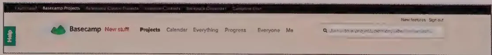
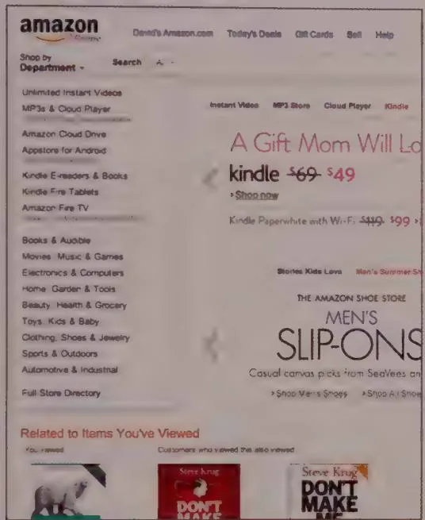
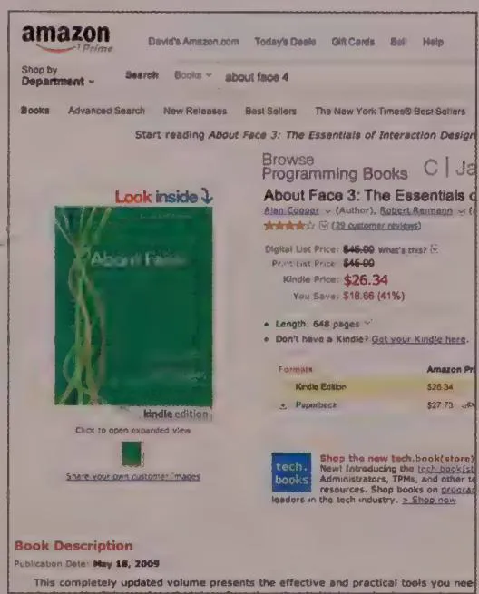
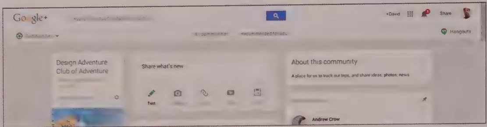
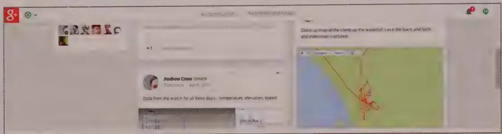
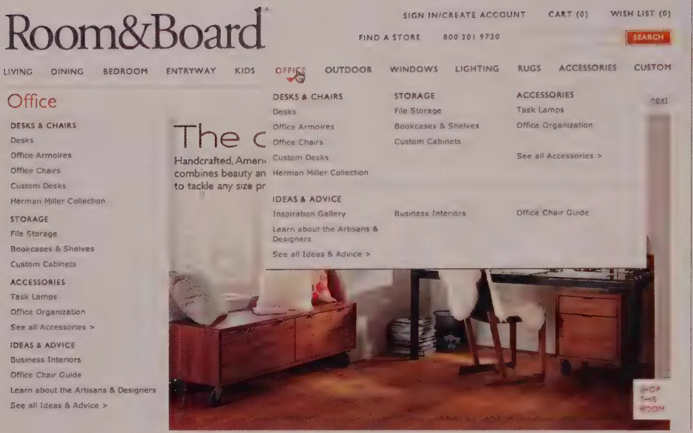
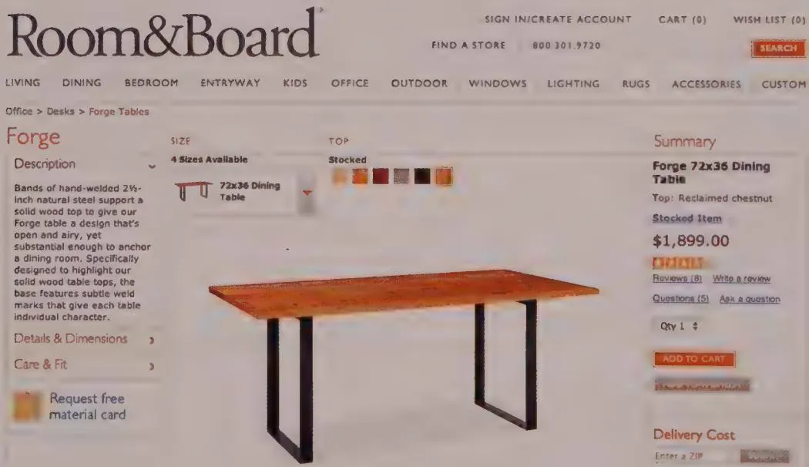
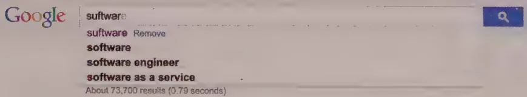

# DESIGNING FOR THE WEB

The advent of the World Wide Web was initially both a boon and a curse for interaction designers. For perhaps the first time since the invention of graphical user interfaces, corporate decision makers began to understand and adopt the language of user-centered design, and the term "user experience" came into vogue among business executives far and wide. On the other hand, the limitations and challenges of web interactivity, which are a result of its historical evolution, set back interaction design by nearly a decade.

When the first edition of this book was published in August 1995, the web was just beginning to emerge from its roots in academic and scientific computing. At that time, the web was really only good for publishing and reading text documents that had a few links and inline images (form elements were introduced in HTML 2.0 a few months later). When the second edition of this book was published in 2003, the consumer and enterprise web, including corporate intranets, had come into being (and had survived a major industry implosion a few years earlier) but was still highly limited in terms of interactivity. There were strong conventions for navigation and basic data entry, but doing anything more sophisticated was a miracle.

Even following the dotcom bust, the promise of the web was apparent to everyone. The industry was flooded with fresh design school graduates, traditional graphic designers, and young enthusiasts who saw the web as an exciting and lucrative opportunity to create compelling communication (and commerce) through new forms of interactive visual expression. The biggest challenges involved working around the severe limitations of the medium. Creating a user experience with even a rudimentary level of interactivity, as well as visual and logical organization, was a real challenge for early web designers.

But by the time the third edition of About Face came out in 2007, more powerful web technologies had come into common use. Things such as HTML5, CSS3, and AJAX had enabled the rise of rich Internet applications (RIAs). These featured much more sophisticated UI capabilities, including drag and drop, the ability to stream data into UI elements, and much more robust screen structuring capabilities. Browser-based user interfaces were starting to approach parity with many native desktop capabilities. But in many areas of the industry, Microsoft .NET native Windows applications were still the dominant paradigm for software creation and delivery.

As we publish this fourth edition of About Face in 2014, the landscape has largely changed. With the rise of GitHub, the open source movement has created an impressive body of highly sophisticated HTML5 user-interface components that are highly capable and largely interoperable (such as the Bootstrap and jQuery ecosystems). Thanks to investment by companies such as Google and Apple, web browsers' ability to quickly render and process HTML and JavaScript has become very effective, and the deeper plumbing of the web stack has also become highly capable.

Deploying software-based experiences over the web has many advantages. It allows for continuous deployment, and therefore continuous improvement. Network-based applications can be much better suited to the social and collaborative way we live and work. And we can accommodate much more transient, grazing usage. Installing software (and keeping it up to date) is a commitment we don't always want people to have to make in order to interact with our product or service.

All of this adds up to a situation where there are very few experiences that a designer can dream up that can't be built to perform in a modern-day web browser. It is increasingly becoming the case that we are building native applications only to support sophisticated authoring tools (for example, graphic design, 3D modeling, video editing, presentation, and code editors). Furthermore, the web has become the most important and popular channel that people use to communicate and that companies use to interact with their customers.

This means that the quality of web experiences is incredibly important, and the increased ability to deliver complex behavior in a browser demands application-quality interaction design. The visual designer's focus on look and feel and the information architect's focus on content structure are insufficient to create effective and engaging user experiences with this new generation of the web.

It is now easy to browse GitHub for ready-coded UI components that include many interaction-design-friendly features (such as rich visual modeless feedback). But even with all these rich capabilities, we are still left with the important questions of exactly what will suit the needs and desires of people interacting with a product or service, and how to create a coherent, useful experience from these building blocks.

<!-- Chunk 12 End -->

<!-- Chunk 13 Start -->

In many ways, it's difficult to generalize about designing for the web, because it has become a huge place. In different tabs in the same browser window, you might be looking at mass media, enterprise software, e-commerce, and social networking sites.

Even though people clearly have different expectations for different kinds of web experiences, they must rely on convention to orient themselves to each website or application they arrive at, especially those they may be seeing for the first time or may visit only occasionally. While these conventions are constantly evolving, they are also largely tied to the nature of the medium. They are important for the interaction designer to consider when creating a browser-based experience.

This chapter looks at the most important of these considerations. We should also say that because web design is an area of rich thought, there is a sizeable body of work worth engaging with. In particular, Steve Krug's Don't Make Me Think, Revisited (New Riders, 2014) and Louis Rosenfeld and Peter Morville's Information Architecture for the World Wide Web (O'Reilly, 2006) cover the essential elements of web design in a clear and straightforward manner. The website called A List Apart is also a great resource, even if it often has a more technical focus.

# Page-Based Interactions

The fundamental character of the medium that is the web is shaped in a huge way by the concept of the page. From its inception, the whole technology stack has been formed around pages. Developments like AJAX and MVC frameworks for the web allow us to get pretty fancy with how a page is structured and how pages are related to each other. Many of the most important conventions and considerations for designing web experiences are tied to the concept of the page.

It's important for designers who work in both native application software (either desktop or mobile) and browser-based software to be aware of and intentional about the medium they're designing for. Native applications are usually constructed in terms of screens or views. Although they are analogous to the page, there are some meaningful and important differences between the two ways of structuring an experience, which we'll discuss in this chapter.

# Navigation and wayfinding

First and foremost, while some navigation between views may occur in a native application, this is usually nothing compared to the amount of navigation in a typical web application. One way of thinking about it is that a native application usually has a limited number of spaces or modes that the user can be in, and different pieces of content

can populate each of those spaces or modes. On the other hand, on the web, each piece of content typically has its own place (or, rather, URL), and the trick is figuring out how to help people get to the content they want.

This leads us to the field of information architecture. In the early days of the commercial web, people designing and building websites recognized that a new design issue resulted from supporting numerous hyperlinked pages: the challenge of organizing and structuring content across pages in a meaningful way. A new breed of designer, the information architect, built a discipline and practice to address the nonvisual design problems of logical structure and flow of content.

It's beyond the scope of this book to deeply address the topic of information architecture. But this phenomenon—that web experiences typically are constructed of numerous diverse pages with some sort of logical organization—also has given interaction designers the challenge of creating meaningful interactions related to navigation.

# Primary navigation

Since the early days of the commercial web, the term primary navigation has signified how the user gets to the major areas or sections of a website or application. For some time, almost every website and application has included persistent links along the top or left side.

Top navigation is a superior approach in most cases (see Figure 20-1). Side navigation makes the page crowded and occupies the page's visual entry point, forcing the user to scan past it to read content. The biggest limitation of top navigation—that it can accommodate only a few items of limited length—may actually be one of its greatest benefits. Forcing designers to reduce the number of major areas of a website or application—and to keep the titles short and punchy—usually has a better chance of resulting in something that is comprehensible and useful to users.

  
Figure 20-1: Basecamp illustrates the common practice of placing primary navigation on the top of the page. The topmost black bar allows the user to switch between different applications, the navigation adjacent to the Basecamp logo provides access to the major areas of Basecamp itself.

As with most rules of thumb, there are exceptions. If you have a large heterogeneous content space, reducing to items that can fit on a horizontal bar can result in navigation terms that are meaninglessly abstract to your users. The biggest advantages of left-side navigation are that items can be longer, there can be more of them, and they are easier

for users to scan because they are left-aligned. Amazon, which is well known for using analytics to optimize its page designs, and which sells almost everything known to man, currently uses left-hand navigation for product categorization on some pages. But on every page except the home page, this navigation is hidden until the user mouses over Show by Department to reveal it (see Figure 20-2).

  
Figures 20-2: Amazon uses an approach to side-navigation where it is displayed to the user on the home page, but requires a mouseover to access on all other pages.

This brings us to another important topic in web design: dynamically hiding and showing navigation controls that depend on the user's location in the system, and even where he or she is on a page. An increasingly popular and successful pattern is to keep this top navigation bar locked to the top of the browser window when the user scrolls. Branding and other elements are minimized so that the bar takes up less screen real estate and visual attention as the user engages with content lower down the page (see Figure 20-3).

When considering the best approach for primary navigation, it's important to consider people using mobile web browsers. If this is a vital platform for you (and, in this day and age, in most cases, it should be), make sure you think through how well your navigation works on smaller screens. One common and utilitarian approach is not to show the navigation persistently and to reveal it only when the user clicks a menu or "hamburger icon" control (three stacked horizontal lines).

  
Figure 20-3: The header of Google+ is persistent, but makes itself smaller when the user scrolls down the page

A healthy debate is currently under way about whether most users understand the hamburger icon. At least one statistically significant study has shown that, for at least some users, the word "menu" performs better than the hamburger icon. Figure 20-13, in the later section on the mobile web, shows how the Boston Globe employs a responsive approach to a top navigation, reducing the number of navigation items for smaller browser windows, ultimately shrinking to a single "sections" menu for smartphone-sized screens.

# Secondary navigation and beyond

Often the entire information space of an application (or suite of applications) cannot be meaningfully navigated to from a handful of top-level links. Even though users will almost certainly search past this point, the content may bear secondary levels of persistent navigation, and perhaps additional levels beyond that. Expert users of sovereign applications may be able to memorize navigation paths three or more layers deep. But in our experience, most intermediate or novice users struggle to find information if it's buried in a three-level hierarchy. While a good search mechanism may mitigate this

problem, it's best to try to keep your navigation space as flat and compact as possible to make it easier for users to create a useful mental model of how your application is organized.

There are several basic yet effective mechanisms for secondary and additional levels of navigation. You can add a left-hand menu or a second stripe of horizontal navigation links (if you're using this approach for your primary navigation; see Figure 20-4).

# Room&Board

SIGN IN/CREATE ACCOUNT

CART (0)

WISH LIST (0)

FIND A STORE

8003019720

SEARCH

LIVING • DINING • BEDROOM • ENTRYWAY • KIDS • OFFICE • OUTDOOR • WINDOWS • LIGHTING • RUGS • ACCESSORIES • CUSTOM

# Office

DESKS & CHAIRS

Des

Office Armoires

Office Chairs

Custom Desks

Herman Miller Collection

STORAGE

File Storage

Bookcases & Shelves

Custom Cabinets

ACCESSIONS

Task Lamps

Office Organization

See all Accessories >

IDEAS & ADVICE

Business Interiors

Office Chair Guide

Learn about the Artisans & Designers

See all Ideas & Advice >

# The corner office

Handcrafted, American-made furniture combines beauty and functionality to tackle any size project.

SHARE THIS ROOM:

previous | next

  
Figure 20-5: Hovering over Room & Board's primary navigation provides easily accessible links to sub-pages, without requiring the user to navigate to the office section page first.

  
Figure 20-6: When you're looking at the page for a desk on the Room & Board website, you can see where you are in the site and navigate back up using the breadcrumbs.

On some sites, clicking each breadcrumb "step" opens a pop-up menu of lateral links, enabling users to navigate more easily to different parts of the site hierarchy without as many clicks—a feature borrowed from recent Windows OS file browser interfaces.

DESIGN PRINCIPLE

Bread crumbs with lateral links help speed navigation.

# Content navigation

Another important type of navigation is the navigation of content such as photos and articles. These items often are numerous and subject to change, and the relationships between them often are associative, rather than strictly linear or hierarchical. These facts create a number of navigation challenges and patterns.

Most commonly, items are presented in listings of some sort—sequences of headlines and blurbs for articles, and galleries for photographs. Contemporary designs for these listings are often inspired by the "feed" format, popularized by blogs and social media like Twitter and Facebook.

Because some items may be newer, more important, or more likely to be interesting to the audience, it's also useful to highlight featured content. This can be done by using more prominent typography, by changing the size and position on the page, or by using a carousel that cycles through features in a more visual format.

It is common for content to be organized in multiple ways (such as by topic, author, or date published) and for users to want to use one or more of those organization schemes to find content they're looking for. In these cases, it can be desirable to expose multiple navigation schemes to browse content, or make use of the faceted search techniques discussed in the next section.

# Searching

One of the most important navigation methods on the web is searching. From our observations and a number of studies, it's clear that although search algorithms continue to improve, most people are not very good at forming queries to find what they're looking for. The idea that Google has somehow trained people to search instead of using navigation is largely untrue.[2]

What this means is that an effective search pattern for your website or application should help users go from their initial search term to a page that contains what they're

looking for. There are a number of good strategies for doing this. Sometimes using several of them in succession helps your audience find what they're looking for. Chapter 19 discusses these strategies and their variants in the context of mobile apps, but these concepts apply equally well on the web, as we'll see here.

One of the most successful innovations in searching has been auto-complete, also known as type ahead. When the user types in his or her search terms, a number of choices for complete search terms are presented. These can be based on previous searches (as Google does) or actual results (the Spotlight search function in Apple OS X). Auto-complete greatly increases the chances that the user will enter a search term that is likely to have a meaningful result set (see Figure 20-7).

  
Figure 20-7: Google Search's auto-complete provides a list of expanded search terms based on what the user has already typed into the search field.

Disambiguation, or auto-suggest is another tool Google has normalized as part of searching. As you can see in Figure 20-8, if the searcher types a word that is spelled similarly to a more commonly searched word (or, more often, mistypes or misspell the word they really meant to search for), Google displays a list of suggestions along with the results. It also provides a link to the top suggestion as part of the results.

  
Figure 20-8: Google Search also supports auto-suggest, which provides a list of search terms based on fuzzy matching based on what the user has typed, in essence allowing the search box to auto-correct spelling errors.

Did you mean: software

# Software Solutions L.L.C

www.sfuTware.com

Software Solutions L.L.C. is a Phoenix based consulting firm focusing on web development and IBM based software solutions. Using IBM Rational tools we help ...

free download genuine window software for laptop - Microsoft...

answers.microsoft.com/..software.../c2210485-b252-44ef-b1f9-598775...

Mar 1, 2013 - There is no source for a legitimate download of Windows, never has been, never will be. Windows XP has been out of circulation for many ...

Ads ①

# Microsoft Software Sale

www.calibex.com/Microsoft-Software

Great Deals on Microsoft Software.

Get Vista, XP, Office and More.

# Download Software Select

www.nchsoftware.com/download

Over 100 of the best programs

Download Free for PC and Mac.

# Computer Software

www.shop411.com/Computer+Software

That said, even if the user forms his search terms in a productive way, he still may have a large number of items to look through. This is where faceted search — which allows users to specify the attributes of the item they are looking for—can be really useful (see Figure 20-9).

