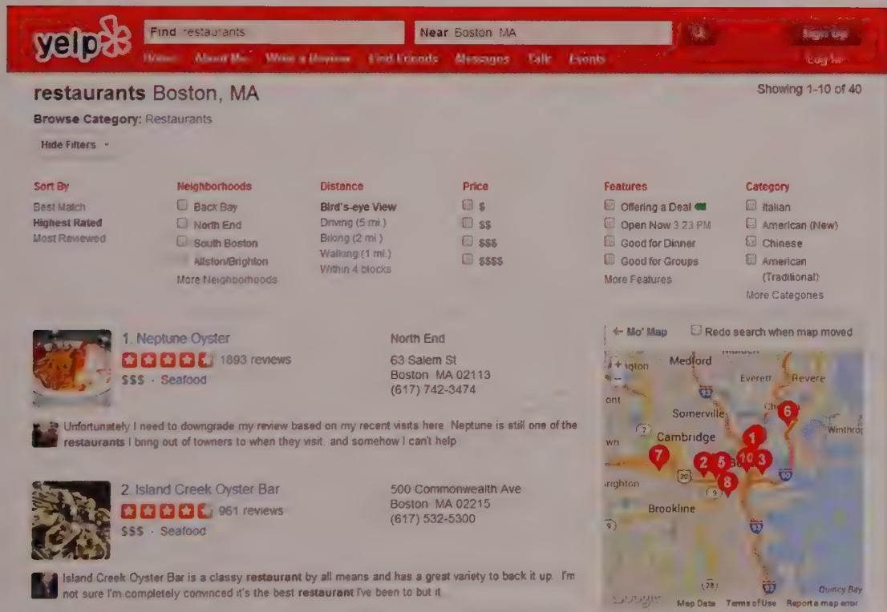
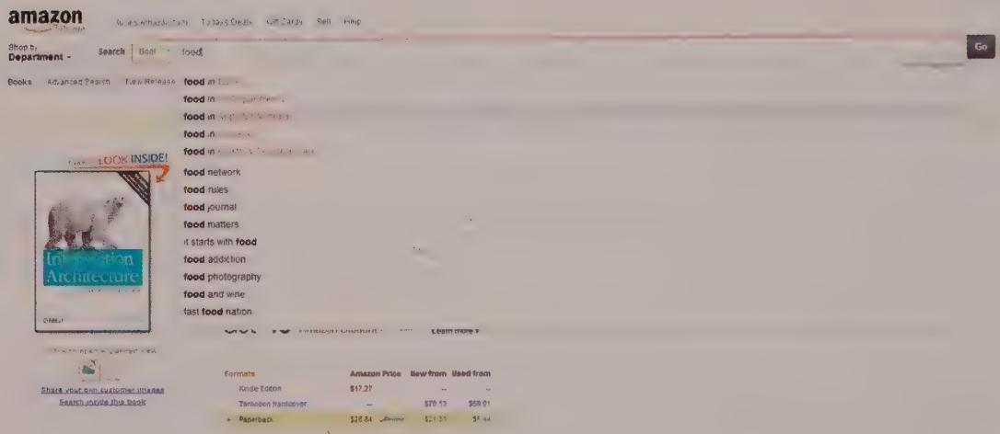
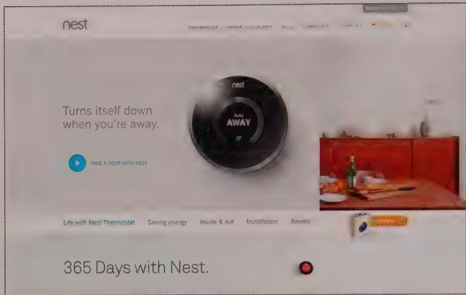
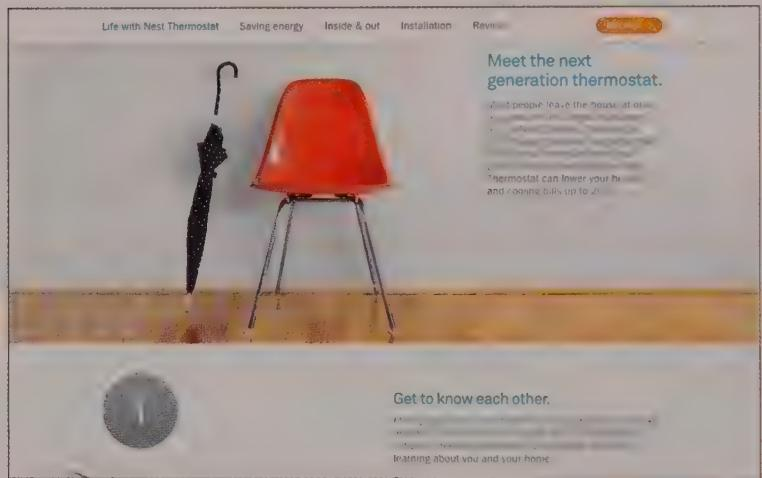
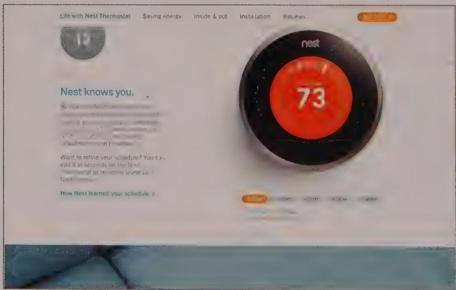
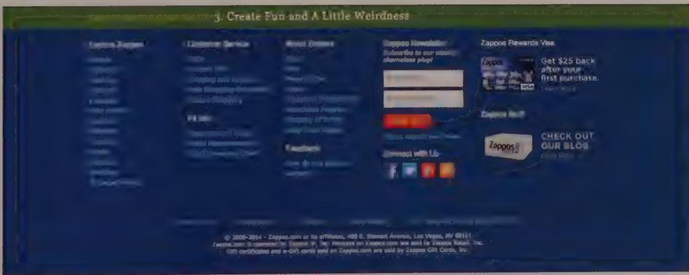
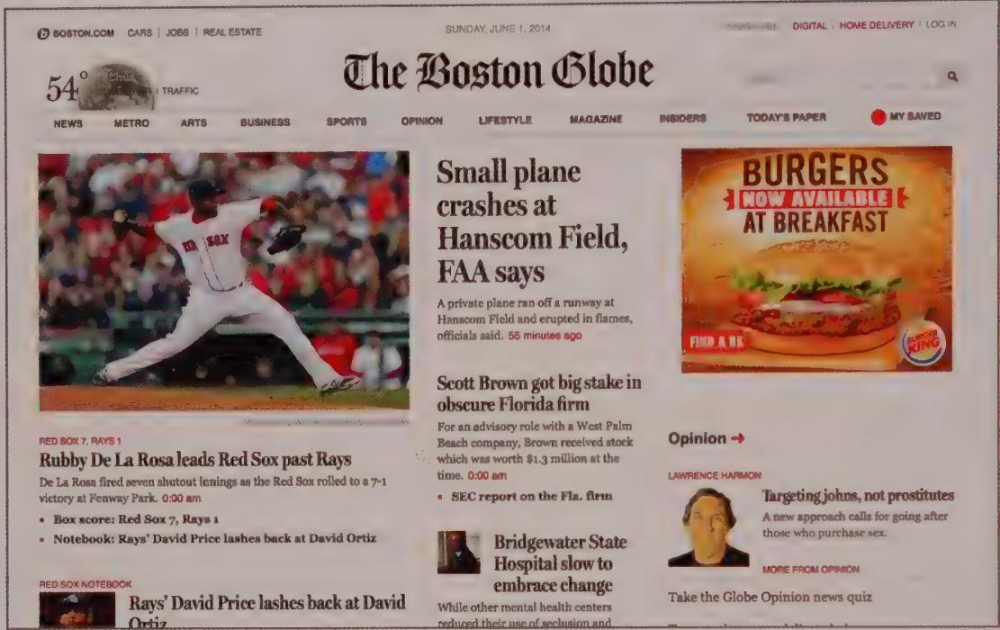
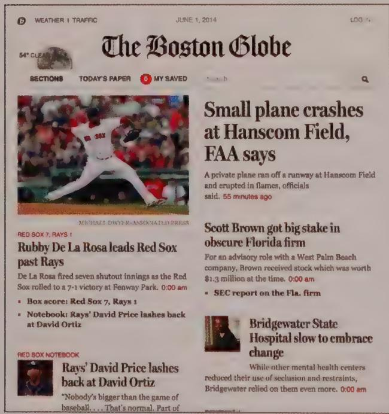
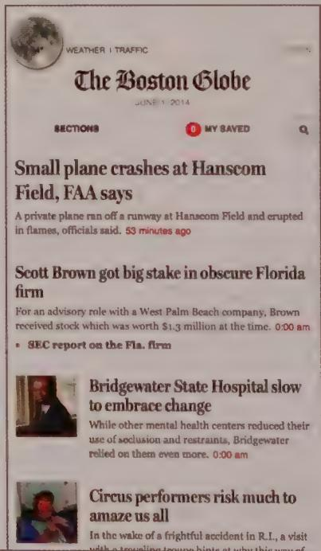
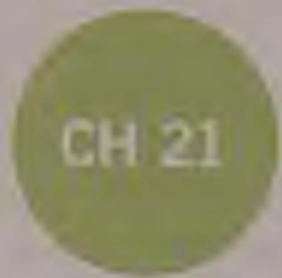

# DESIGN PRINCIPLE

Auto-complete, auto-suggest, and faceted search help users find things faster.

Allowing users to narrow their search in a structured way helps them form a query that specifies precisely what they're looking for. An effective faceted search mechanism should provide users some visibility into the characteristics of the set of items they're searching, as well as give them ideas about how to make the result set small enough to efficiently find the desired item. Chapter 14 discusses some related approaches for attribute based sorting and filtering.

  
Figure 20-9: Yelp provides effective faceted search mechanisms, allowing users to quickly fine-tune a search

Categorized suggestions is yet another method of speeding the user to relevant results when a search term is applicable across many different categories or domains. This is achieved by the system offering a list of suggestions, each of which scopes the search to a particular category. Amazon, with its dozens of retail departments, makes good use of categorized suggestions (see Figure 20-10).

  
Figure 20-10: Amazon makes good use of categorized suggestions in its main search box, which allows both explicit scoping via a dropdown to the left of the search field, and categorized suggestions once you start typing.

# Scrolling

One of the most obvious yet significant features of the page-based web experience is the prevalence of scrolling. Screen/view-based native experiences often have a fixed screen layout with multiple panes. Although each of them may have scrolling content, it is almost always good design in a native application to have key functions persistently available. Even though people are used to seeing a document they're editing scroll, they'd most likely be surprised and dismayed if the toolbar scrolled along with it.

With web experiences, on the other hand, critical information and functions often must be accessed through scrolling. Web designers have long been concerned about the "fold"—the vertical position on the page below which content isn't visible upon page load. However, the rapid rise in the number of touchscreen interactions and things like Apple's Magic Trackpad have made scrolling much more natural and expected than it used to be with fiddly scrollbars.

Furthermore, the growth in using mobile devices to access web content has given rise to the importance of responsive design, in which a web page is designed to format itself appropriately for the size of the user's screen (more on this in the next section). Because this responsiveness narrows content areas on smaller screens, it's much more challenging to try to control what fits on the screen or goes above the fold.

The result of all this is that one of the most important aspects of successful web design is to engage the user to progress through content or functionality as he or she scrolls down a page. This doesn't apply only to editorial-type content, but also to more highly interactive capabilities. One example is the popular "parallax" effect, in which different onscreen elements respond to the user's scrolling at different speeds.

Much of enterprise software is catching up with the era of touch interaction. Nevertheless, there's a real opportunity to create more seamless engaging interactions by bringing together content and interactive elements that traditionally have been broken into numerous pages and put them into a longer, scrollable page.

DESIGN PRINCIPLE

Make scrolling an engaging experience.

One method is to create an effective visual rhythm through the use of white space and a strong typography system. You also should be generous with font and control sizes to improve usability for touch users and to improve scanability when the user scrolls. It's also important to help users stay oriented as to where they are on the long page. The Nest website (Figure 20-11) is structured as a number of long scrolling pages. For example, the "Life with Nest" page is a timeline of how Nest programs itself over time, and as the user scrolls down, the primary navigation docks to the top of the page and there are visual cues as to what day the user is looking at.

Even though it makes sense to let a single "unit" of content scroll on a single long page, some sites still divide it across several pages. The reasons for this most often seem not to be about minimizing either vertical scrolling or page load size, but rather maximizing ad revenue from the multiple loads. If the content is finite, paging it like this makes finding, saving, and using the content a more convoluted task even with print functions. Paging makes sense only for very long lists of similar elements, such as search results or news articles.

  
Figures 20-11: The Nest website consists of a number of long scrolling pages.

# The header and footer

An obvious and hugely important characteristic of the scrolling page is that the top and bottom of the page are special places with unique opportunities to improve user flow. The top, often called the header, can be the first thing the user sees when he arrives on a page. But in many cases, we intentionally bring the most important content below the header to the forefront, allowing the header to recede into the background a bit. The header almost always includes a brand element like a logotype, and some persistent navigation items, including the primary navigation (discussed earlier). The header is also commonly the place where a website or application tells the user whether he or she is signed in. Finally, the search function often resides in the header.

The bottom of the page, or footer, is where, if you're lucky and wise, the user ends up, because he's viewed all the content that came before it on the page. This makes it a great place to suggest where the user should go next—often to related content. You can see this pattern used to good effect on many media websites. Another effective use of the footer is for persistent access to more rarely visited areas of your site or application, like legal notices, or for a complete fat navigation that includes all top-level and second-level pages (see Figure 20-12). These can certainly be effective approaches. But it's important to consider the circumstances under which your users might need access to these links and whether you imagine they'll be web-savvy enough to scroll to the bottom of the page to look for them.

  
Figures 20-12: The fat footer on Zappos.com contains a condensed sitemap as well as other social and promotional content and links.

# Paging versus infinite scrolling

One important scrolling-related pattern in things like social media streams and search results is commonly called infinite scrolling. As the user scrolls down the page, the page populates more results into the bottom. Assuming you can keep latency down, this can be a useful and natural-feeling interaction.

This is in contrast to the paging of results, in which a predefined number of results are shown on a page, and navigational links are supplied so that the user can advance to the next or previous page, as well as (typically) the beginning or end of the results, or to an arbitrary page of results.

DESIGN PRINCIPLE

Infinite scroll and site footers are mutually exclusive idioms.

It's important to remember that if you implement infinite scrolling, your users will never get to the bottom of the page and therefore will never see the page footer. Infinite scrolling and page footers are mutually exclusive navigation idioms.

Furthermore, infinite scrolling can introduce other potential usability challenges, so it should be used judiciously:

- Keyboard and screen-reader navigation typically does not work well (if at all) with infinite scrolling, leading to accessibility issues.   
- Unless carefully designed and implemented, infinite scrolling may not retain its place in the list after use of the browser back button (and subsequent use of the forward button to return). This can take users off guard, and can lead to a laborious and frustrating experience of re-scrolling to find a lost item.

The inability to page directly and predictably to items far down in the list makes infinite scrolling most appropriate for contexts such as news feeds, where information far down in the list quickly loses its relevancy, and browsing recent items is the primary activity.

Infinite scrolling should never be employed for interfaces in which users need to get to the end of the list quickly, or need to return to a particular list item after navigating elsewhere.

# The Mobile Web

Since the web's early days, design has had to contend with users who have different-sized screens, using different browsers, on different operating systems. The huge rise of people interacting with websites and applications on tablets and phones has made it critical that designs render gracefully and properly on a wide variety of screen sizes.

The contemporary approach for handling these different screen sizes is commonly called responsive design. It's a deep topic, handled well by several books and articles that have more time to discuss it than we do here. We recommend Ethan Marcotte's Responsive Web Design (A Book Apart, 2011).

This method involves creating a modular layout grid in which content areas flexibly resize up to a point. At key screen widths, called breakpoints, this grid may make more substantial changes. For example, for screens greater than 1024 pixels wide, we might choose to show three data visualizations side by side on a page. But when the screen is less than 1024 pixels wide, the data visualizations stack on top of each other. The Boston Globe's website is a good example of a site that makes use of responsive techniques (see Figure 20-13).

DESIGN PRINCIPLE

If you have only one version of your site, make it responsive.

The basic idea with responsive design is not to have multiple versions of a website or application for different screen sizes, but a single version that dynamically adapts to the screen on which it's being viewed. This approach has both pros and cons. The advantage is that a team works within a single conceptual framework. The disadvantage is that this single UI can be complex for developers to build, and every breakpoint means another layout to design.

An alternative (and, sometimes, more effective) approach is to create a separate mobile version of the site or application. One of the biggest reasons for this is that screen size is only one consideration on the mobile web. It's also critical to think about how your designs accommodate touch interaction and other sensors, as well as how they perform in sunlight and other challenging lighting conditions. Because of these usage considerations, it is sometimes a better choice to create a separate version of your web application or site for mobile users.

  
Figure 20-13: The Boston Globe's website has several different breakpoint screen widths that change how the content is flowed and accessed on a desktop, tablet, or phone.

# The Future

As web technologies become more robust, and browsers continue on their trajectory toward providing richer interaction patterns, the browser will continue to be one of the most important UI platforms. More-sophisticated visualizations and interactions will be possible in HTML5. Browsers are likely to improve their local data caches, breaking down one of the last remaining differences between locally installed native applications and applications that run in a browser window.

As the web and "traditional" media, like TV and print, continue to converge, we see many possibilities for new content models, new ways of telling stories, and new ways for people to interact with media. Looking at stellar examples like Medium, a website that allows collaborative content creation, and the beautiful "Snow Fall" multimedia journalistic piece in the New York Times, it's clear that the web is one of the most important places to watch for software and media to truly converge.

# Notes

1. http://exisweb.net/menu-eats-hamburger   
2. http://www.nngroup.com/articles/incompetent-search-skills/

$\therefore \overrightarrow{PB} \cdot  \left( {\overrightarrow{PA} - \overrightarrow{PC}}\right)  = 0$

__________

$\therefore m - 1 \neq  0$ ; $\therefore$ 当 $m < \frac{3}{2}$ 且 $m \neq  1$ 时方程有两个不等实数根

