# Controls

Controls are self-contained screen objects through which people interact with digital products. Controls (also known as widgets, gadgets, and gizmos) are the primary building blocks for creating a typical graphical user interface.

Examined in light of users' goals, controls come in four basic types:

- Imperative controls, used to initiate a function   
Selection controls, used to select options or data

- Entry controls, used to enter data   
- Display controls, used to manipulate the how and where the application displays itself and its data

Some controls span more than one of these categories.

# Imperative controls

The interaction between humans and computers involves a language of nouns (sometimes called objects), verbs, adjectives, and adverbs. When we issue a command, we are specifying the verb—the statement's action. When we describe what or whom the action will affect, we are specifying the sentence's noun. Sometimes we choose a noun from an existing list, and sometimes we enter a new one. We can modify both the noun and the verb with adjectives and adverbs, respectively.

A control that corresponds to a verb is called an imperative control because it commands action, most often immediately. Menu bar items (discussed in Chapter 18) are also imperative idioms. In the world of controls, the quintessential imperative idiom is the button. Click the button, and the associated action—the verb—executes immediately.

# Buttons

Buttons were once identified by their simulated-3D raised aspect. However, the trend of flattening affordances, started in the mobile world, removes the 3D cues and threatens to degrade these controls' learnability, as shown in Figure 21-1. Generally, if the control is rectangular (with rounded edges on some platforms), it has the visual affordance of an imperative. It executes as soon as the user either taps it or clicks and releases it using the mouse. In dialogs (discussed later in this chapter), a default button is often highlighted to indicate the most common action for the user to take.

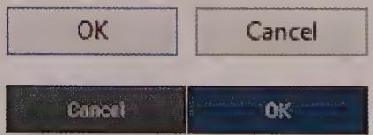

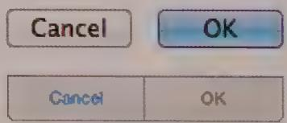  
Figure 21-1: Standard buttons from Microsoft Windows (top left) Apple OS X (top right), Android (bottom left), and iOS (bottom right). Although pushbuttons were once given a 3D raised affordance indicating pressability, a flatter look appears to be the growing trend.

The button is arguably the most easily discoverable idiom in the designer's toolkit. It isn't surprising that it has evolved with such diversity across the user interface. The manipulation affordances of faux three-dimensional buttons prompted their widespread use.

Part of a button's affordance is its visual pliancy, which indicates its pressability. When the user points to it and clicks the mouse button—or taps the button with a finger or stylus—the button control visually changes from raised to indented, indicating that it has been activated. This is an example of dynamic visual hinting, discussed in Chapter 13. Poorly designed applications and many websites contain buttons that don't animate when clicked or tapped. This is disconcerting for users, because it generates a mental question: "Did that actually do something?" Users expect to see the button change—the plant response—and you must satisfy that expectation.

Though flat design does away with this pliancy, it can only afford to do so because of the decades of training and experience users have with the rounded-rectangle shape.

# Icon buttons

The toolbar (discussed at length in Chapter 18) has grown into a de facto standard as familiar as the menu bar. To populate the toolbar, buttons were adapted from their traditional home on the dialog.

When buttons moved to the toolbar, they changed from rectangular to square, and their text labels were replaced with iconic ones. Thus was born the icon button: half button, half icon (see Figure 21-2).

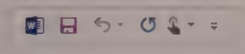

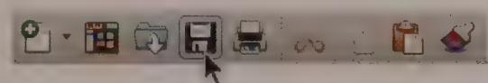  
Figure 21-2: Icon buttons from Microsoft Office. On the left are examples in Office for Windows, and on the right are the same examples in Office for OS X. Icon buttons aren't rendered with a button affordance until the mouse cursor passes over them.

In Windows 98, the icon button (aka the toolbar button) continued to evolve, losing its raised affordance except when used. This move reduced visual clutter in response to the overcrowding of toolbars. Unfortunately, this made it more difficult for newcomers to understand the idiom. Starting with Windows 2000, desktop icon buttons revealed their affordance only when pointed at by the mouse cursor.

Icon buttons are, in theory, easy to use: They are always visible and don't demand as much time or dexterity as a drop-down menu. Because they are constantly visible, they are easy to memorize, particularly in sovereign applications. The advantages of the icon button are hard to separate from the advantages of the toolbar; the two are inextricably linked.

The downside of the icon button derives not from its button part but from its icon part. Most users have no problem understanding the visual affordance. The problem is that the image on the face of the icon button is seldom that clear for a first-time user.

Most icons are difficult to decipher with certainty at first glance, but ToolTips can help with this. A good icon will be learned and remembered when users return to that function frequently. This is the type of behavior we typically see from intermediate and advanced users.

However, even the best icon designers will be hard pressed to devise an icon system that will be usable by novice users without resorting to text labels. ToolTips will help them, but it is awkward to move the mouse cursor and then wait for the ToolTip for every icon button in your interface. In these cases, menus with verbose textual labels are a better approach. Microsoft's ribbon control (also discussed in Chapter 18) takes a hybrid approach that combines text and icons, trading some screen real estate for greater clarity and ease for novice users or infrequently-used commands.

# Hyperlinks

Hyperlinks, or links, are a web convention that has found their way into all sorts of different applications. Typically taking the form of blue underlined text (CSS styling can play havoc with this standard in all sorts of ways, such as changing their default and traversed colors, or providing a focus highlight color on mouseover), a link is an imperative control used for navigation. This direct and useful interaction idiom has grown beyond its simple beginnings in taking users to a web page that provides more details about a hyperlinked word or phrase—the original concept behind hypertext. Links now form the navigational infrastructure of complex transactional websites such as Amazon.com (see Figure 21-3), and, somewhat amazingly, they remain up to the task.

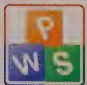  
Kingsoft Office for Android (Free)  
Kingsoft Office Corporation  
★★★☆ (472)  
$0.00

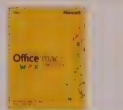  
Office Mac Home and Student
2011...
Microsoft
★★★☆ (732)
$489.99 $112.22

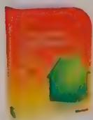  
Microsoft Office Home & Student 2010...
Windows
★★★★☆ (1.520)
$220.00   
Figure 21-3: Complex transactional websites such as Amazon.com rely on the simple hyperlink for much of their navigational infrastructure, which for the most part works remarkably well.

Images can also be used as links. However, the lack of affordance, especially on mobile browsers where there is no possibility of highlight on mouseover to indicate pliancy, can be problematic.

Unfortunately, the idiom's success and utility have given many designers the wrong idea: They believe that replacing more common imperative controls such as buttons or icon buttons with hyperlinks will automatically result in a more usable and successful user interface. Usually this is not the case. Because most users have learned that links are a navigational idiom, they will be confused and disoriented if clicking a link results in the execution of an action (such as the launching of a dialog). In general, you should use links for navigation through content, and buttons or icon buttons for other actions and functions.

A common web tactic for dialog boxes is to present options using a combination of a button for the "default" choice and an adjacent hyperlink for the other option. This is effective because a button has a greater visual weight and real estate for easier selection. Unfortunately, it has been used too often to trick users into not noticing the link, and, thinking they only have one option, making an expensive choice. Because of this, the tactic can be seen as manipulative, potentially reducing the user's trust in the site and the brand.

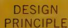

Use links for navigation and buttons for action.

# Selection controls

Because imperative controls represent commands—verbs—they need objects—nouns—on which to operate. Selection and entry controls are the two controls used to define nouns (in addition to various custom direct manipulation idioms). A selection control allows the user to choose this noun from a group of valid choices. Selection controls are also used to configure actions. The nouns may be defined by direct-manipulation idioms, with selection controls then used to define an adjective or adverb modifying the object or action on it. Common examples of selection controls include check boxes, list boxes, and drop-down or pop-up lists.

Traditionally, selection controls did not directly result in actions—they required an imperative control to activate. This is no longer always the case. In some situations, such as the use of a drop-down or pop-up list as a navigation control on a web page, this can be disorienting to users. In other cases, such as using a drop-down list to adjust type size in a word processor, this can seem quite natural.

As with many things in interaction design, both approaches have advantages and disadvantages. In cases where it is desirable to allow the user to make a series of selections before committing to the action, there should be an explicit imperative control (a button). In cases where users would benefit from seeing the immediate impact of their actions, and those actions are easy to undo, it is completely reasonable for the selection control to double as an imperative control.

# Check boxes

The check box was one of the earliest visual control idioms. It has been a favorite for presenting a single, binary choice or for selecting from among several choices in a short list (see Figure 21-4). The check box has a strong visual affordance for clicking; it appears as a pliant area because of a mouseover highlight or a 3D "recessed" visual treatment. (The flattening trend in mobile visual design threatens learnability here as well.) After the user selects it and sees the checkmark appear, he has learned all he needs to know to make it work at will: Click to check; click again to uncheck. The check box is simple, visual, and elegant.

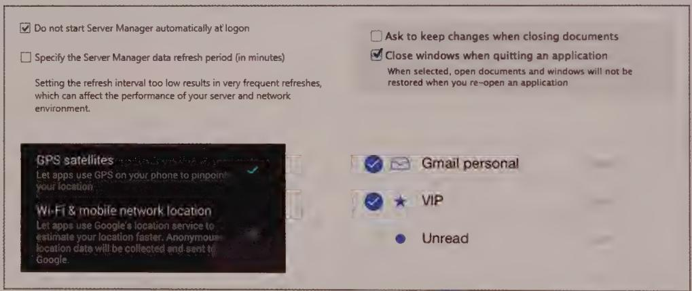  
Figure 21-4: Standard check boxes from Microsoft Windows (top left), Apple OS X (top right), Android (bottom left), and iOS (bottom right). Again, the trend towards flatness decreases learnability. iOS also breaks the standard check box idiom by using a circular control rather than a square.

The check box is, however, primarily a text-based control. The check box is a familiar, effective idiom, but it has the same strengths and weaknesses as menus. Well-written text can make check boxes unambiguous. However, this exacting text forces users to slow down to read it, and it takes up a considerable amount of real estate.

Traditionally, check boxes are square. Users recognize visual objects by their shape, and the square check box is an important standard. Nothing is inherently good or bad about squareness; it just happens to have been the shape originally chosen, and many users

have learned to recognize this shape. There is no good reason to deviate from this pattern. Don't make check boxes diamond-shaped, and especially not round (which confuses them with the visual idiom employed by radio buttons), regardless of what your marketing department or visual designers say.

# Toggle buttons

Check boxes work well to allow binary state changes, but this idiom isn't well-suited for toolbars. It is, however, possible to implement a more graphical approach to the unitary check box by modifying the icon button idiom. By allowing an icon button to stay in the pushed-in state when clicked, and then returning to the nondepressed state when it is clicked again, you create a toggle button (see Figure 21-5). The pushed-in state is no longer momentary, but rather locks in place until clicked again. The button's toggle behavior has changed its character sufficiently to move it into an entirely different category of control: from imperative to selection.

  
Figure 21-5: These images depict toggle buttons in their flat, mouseover, clicked, and selected states.

The toggle button is superseding the check box as a single-selection idiom. It is especially appropriate in modeless interactions that do not require interrupting the user's flow to make a decision. Toggle buttons are more space-efficient than check boxes. They are smaller because they can rely on visual recognition instead of text labels to indicate their purpose. Of course, this means that they exhibit the same problem as imperative icon buttons: the icon's inscrutability. We are saved once again by ToolTips. Those tiny pop-up windows give us just enough text to disambiguate the icon button without permanently consuming too many pixels.

# State-switching buttons: an idiom to avoid

State-switching buttons are an all-too-common control variant used to save interface real estate. Unfortunately, this savings comes at the cost of considerable user confusion. A classic example is collapsing play and pause onto the same button on an audio player. In the paused state, the button contains the universal play triangle icon. Then, when you click it, it switches to the play state and displays the universal pause icon—two vertical bars—without indenting the button as a regular toggle button would.

The control suggests that you can click it, so when it displays the play icon, it intends to mean that when you click it, music will start. The button then changes to display the pause icon to indicate that clicking it again will pause playback. The problem with this

approach is that the control could be interpreted as indicating the player's state—paused or playing. This means that there are two very reasonable and contradictory interpretations of the icons on the button. The control can serve as either a state indicator or a state-switching selection control, but not both (see Figure 21-6). Of course there's music playing to confirm your selection in a music player, but there are plenty of interfaces where such explicit confirmation is not available.

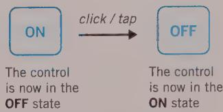  
Figure 21-6: State-switching button controls are very efficient. They save space by controlling two mutually exclusive options with a single control. The problem with these controls is that they fail to fulfill the second duty of every control—to inform users of their current state. If the button says ON when the state is off, it is unclear what the setting is. If it says OFF when the state is off, however, where is the ON button? Using switch controls makes much more sense in this instance.

The solution is to either spell out the verb—Play or Pause—in text on the button or, better yet, to use some other technique altogether. For example, you could replace the button with two buttons or, as some audio players do, with icons for both states. Doing so would make the toggle's state-switching nature more explicit. If this last approach also included highlighting the icon representing the active state, it would work almost perfectly. Unfortunately, however, almost every audio player app now uses the broken state-switching idiom, toggling between the play and pause icon, and most users have now become accustomed to it, for better or worse.

# Radio buttons

Similar in appearance to the check box is the radio button, shown in Figure 21-7. When radios were first put in automobiles, people discovered that tuning the radio by rotating a knob while driving was unsafe. So, automotive radios were offered with a panel consisting of a half-dozen chrome-plated buttons. When pressed, each one would mechanically dial the tuner to a preset station. Now you could tune to your favorite station—without taking your eyes off the road—just by pushing a button.

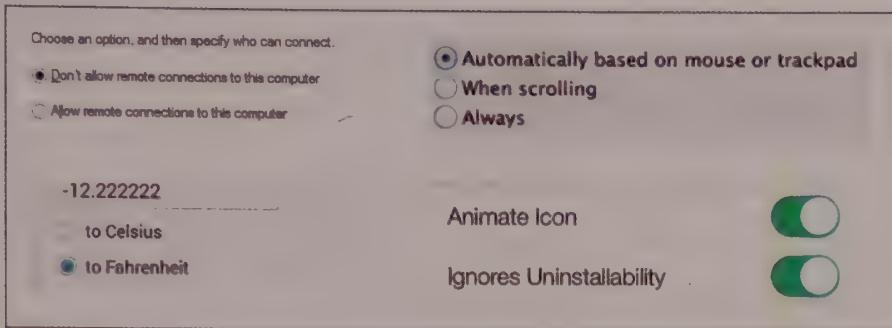  
Figure 21-7: Standard radio buttons from Microsoft Windows (top left), Apple OS X (top right), Android (bottom left). iOS (bottom right) doesn't have a radio button idiom, but makes use of the switch control for some instances where a radio button might be used on other platforms.

The behavior of GUI radio buttons, like their mechanical forebears, is mutually exclusive: When one option is selected, the previously selected option automatically deselects. Only one button can be selected at a time. Consequently, radio buttons always come in groups of two or more, and one radio button in each group must always be selected. Presenting a single radio button doesn't make sense for the user—you should use a check box or similar selection control in that instance.

Radio buttons use the same amount of space on-screen as check boxes—more, even, since radio buttons are meaningful only in groups. Radio buttons are well suited to a pedagogical role, which means that they can be justified in infrequently used dialogs. But drop-down lists are often a better choice on the surface of a sovereign application that must cater to daily users.

For the same reason that check boxes are traditionally square, i.e., that's how we've always done it, radio buttons are almost always round.

Icon buttons have reimagined the radio button in the same way they have the check box: If two or more latching (toggle) icon buttons are grouped and are programmed so that only one of them at a time can be activated, they form a bank of radio icon buttons. This more modern construct ends up looking and behaving more like its mechanical ancestors than the traditional circular radio buttons.

The alignment controls on Word's toolbar are an excellent example of radio icon buttons, as shown in Figure 21-8.

Just as with all icon button idioms, these are efficient consumers of space, letting experienced users rely on spatial memory and pattern recognition to identify them and letting infrequent users rely on ToolTips to remind users of their purpose. First-time users

either will be clever enough to learn from the ToolTips or will learn more slowly, but just as reliably, from other, parallel, pedagogic command vectors.

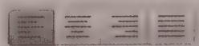  
Figure 21-8: Word's alignment controls are a bank of radio icon buttons, which act like traditional radio buttons. One is always selected, and when another is clicked, the first one returns to its unselected state. This variant is a space-conservative idiom that is well suited for frequently used options.

# Switches

The switch control is a more compact version of two radio buttons used together. (It is also a more understandable version of a single check box, since both states are labeled explicitly.) It has two states, typically on and off, which are labeled on either side of the switch, as shown in Figure 21-9. Clicking either side of the switch or, on mobile, swiping in the appropriate direction slides the switch's 3D affordance to the on or off position. These are handy in Settings screens on mobile apps, where many app functions often can be selectively turned on and off. They are less common, and somewhat more awkward to use, in desktop and web apps.

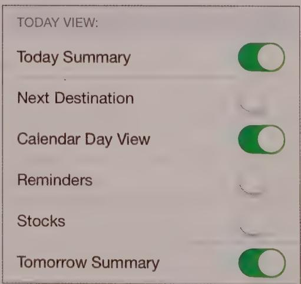  
Figure 21-9: Switch controls are prevalent in mobile apps (such as in iOS, shown here), especially on Settings screens, which contain product features that can be turned on and off.

# Combo icon buttons

A variant of the radio icon button replaces the bank of icon buttons with a drop-down list of icons. Because of its similarity to the combo box control (see the later section "Combo Boxes"), we call this a combo icon button (see Figure 21-10). Normally in Windows it looks like a single icon button with a small down arrow to its right. If you click the arrow, it drops down a menu of several icon buttons from which users may choose. The selected icon button then appears on the toolbar next to the arrow. Clicking the icon button itself actuates the imperative indicated by the selected state. Like menus, icon buttons also should activate if the user clicks and holds the arrow, drags, and then releases over the desired selection.

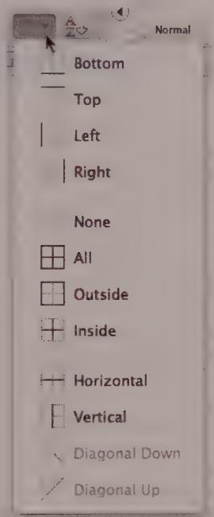  
Figure 21-10: This combo icon button from Microsoft Office is a group of icon buttons that behave like a combo box.

Variations on combo icon buttons include drawing a small downward- or right-pointing triangle in the lower-right corner of the combo icon button icon in place of the separate down arrow that is seen in Microsoft toolbars. Adobe products use this variant in their palette controls. The user must click and hold the icon button itself to bring up the menu (which, in Adobe palette controls, unfolds to the right rather than down, as shown in Figure 21-11). You can vary this idiom quite a bit. Creative software designers are doing just that in the never-ending bid to cram more functions onto screens that are always too small.

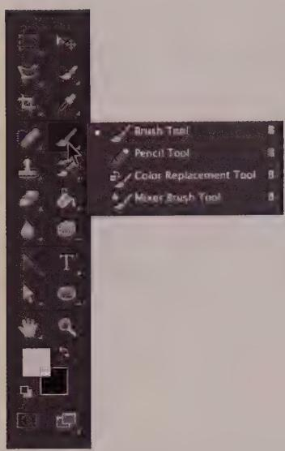

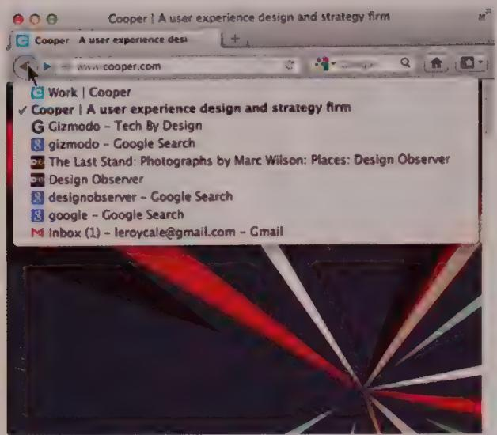  
Figure 21-11: These combo icon buttons taken from Adobe Photoshop (left) and Mozilla Firefox (right) show the diversity of idiom applications. In Photoshop, the combo icon button is used to switch between various modal cursor tools, whereas in Firefox it is used to select a previously visited web page to return to. In the first example, it is used to configure the user interface, whereas in the second it is used to perform an action.

You can see a Microsoft variant in Word, where the icon button for specifying the colors of highlights and text show combo icon button menus that look more like little palettes than stacks of icon buttons. As you can see from Figure 21-11, these menus can pack a lot of power and information into a compact control. This facility is definitely for frequent users, particularly mouse-heavy users, and less for first-timers. However, for users who have at least basic familiarity with the available tools, the idiom is instantly clear after it is discovered or demonstrated. This is an excellent control idiom for sovereign-posture applications with which users interact for long hours. Working a menu with relatively small targets demands sufficient manual dexterity. But this is much faster than going to the menu bar, pulling down a menu, selecting an item, watching the dialog deploy, selecting a color on the dialog, and then clicking the OK button.

With the introduction of the ribbon control idiom, Microsoft moved away from traditional combo icon buttons and instead offered yet another variant of this idea: an icon button attached to a more standard menu. Clicking the icon button fires off an imperative command. Clicking the arrow to the right of or below the button launches a menu with related but less frequently accessed functions (see Figure 21-12).

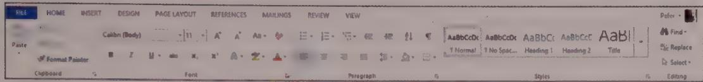  
Figure 21-12: Microsoft Office's ribbon control contains a new variant of combo button icons. Clicking the button launches an imperative, and clicking the arrow opens a more traditional menu of related functions.

# List controls

List controls allow users to select from a finite set of text strings, each representing a command, object, or attribute. These controls are also known as list boxes or listviews, depending on which platform and control variant you are talking about. Like radio buttons, list controls are powerful tools for simplifying interaction, because they eliminate the possibility of making an invalid selection.

List controls are small text areas with a vertical scrollbar on the right edge, as shown in Figure 21-13. The application displays objects as discrete lines of text in the box, and the scrollbar moves them up or down. The user can select a single line of text at a time by clicking it. A list control variant allows multiple selection, in which the user can select more than one item at a time, usually by Shift-clicking for continuous or Ctrl-clicking for discontinuous items.

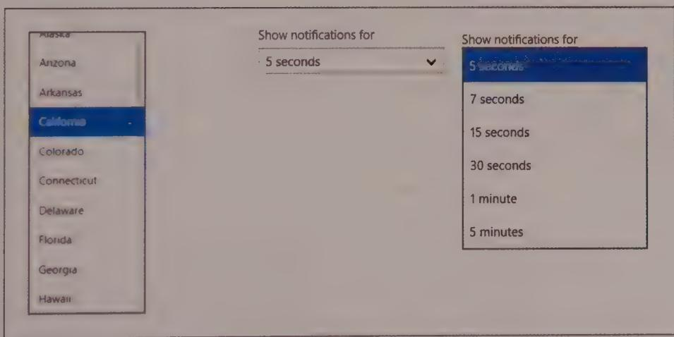  
Figure 21-13: On the left is a list control from Windows. The images on the right show a Windows drop-down menu in its closed and open states.

The drop-down menu, discussed previously, can also be considered a variant of the list control. These ubiquitous controls show only the selected item in a single row, until the control is clicked or tapped. Doing so reveals other available choices (also shown in Figure 21-13).

Apple's iOS operating system has introduced a gestured-based variant of the list control sometimes called the "barrel control." In it, the list of text items are rendered to appear as though they are wrapped around a cylinder that you rotate by swiping until the desired item is centered in the control. The interesting twist on this control, besides its barrel-shaped rendering, is that it can contain independently scrolling columns. This makes it ideal for purposes such as selecting dates and times. This clever approach merges several related list controls into a single widget, as shown in Figure 21-14.

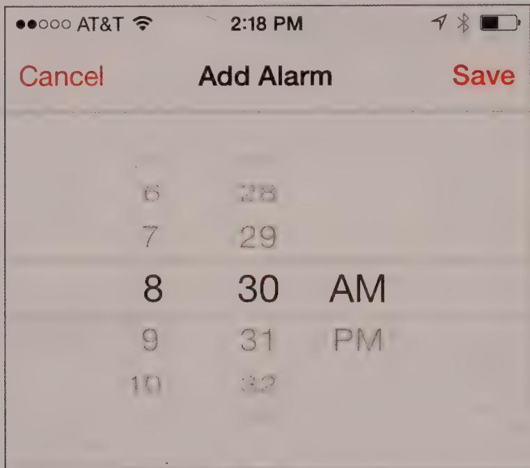  
Figure 21-14: iOS supports a gesture-based "barrel control" ListView variant that also supports multiple independently swappable scrolling columns. The barrel control thus can merge several related list controls into a single widget.

Early list controls handled only text. Unfortunately, that decision often affects their behavior to this day. A list control filled with line after line of text unrelieved by visual symbols is a dry desert indeed. However, starting with Windows 95, Microsoft has allowed each line of text in a ListView control to be preceded with an icon (without the need for custom coding). This can be useful. In many situations, users benefit from seeing a graphical identifier next to important text entries (see Figure 21-15). A newer convention is to use the list items in a drop-down or other ListView control as a preview

facility. This is commonly used in cases where the control functions as both a selection control and an imperative control, such as when you select a style in Microsoft Word.

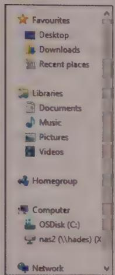

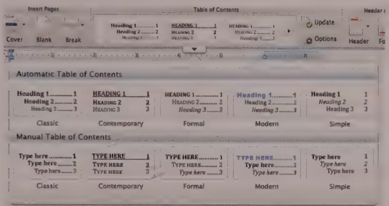  
Figure 21-15: On the left is a list control with icons from Windows that allows users to visually identify the application they are looking for. On the right is the style drop-down list from Office 2010. Here, the items in the list provide a preview of the effects of their selection.

