# DESIGN PRINCIPLE

Distinguish important text items in lists with graphic icons.

Listviews are, true to their name, good for displaying lists of items and allowing users to select one or more of them. They are also a good idiom for providing a source of draggable items (though not with the drop-down variant). If the items are draggable within the ListView itself, this makes a fine tool for enabling the user to put items in a specific order. (See the "Ordering Lists" section later in this chapter.)

# Earmarking

Generally speaking, users select items in a list control as input to some function, such as selecting the name of a desired font from a list of several available fonts. Selection in a list control is conventional, with a selected item shown using the highlight color.

Occasionally, however, list controls are used to select multiple items, and this can introduce complications. The selection idiom in list controls is well suited for single selection but is much weaker for multiple selection. In general, the selection of multiple discrete objects works adequately if the entire playing field is visible at once, like the icons on a desktop. If two or more icons are selected at the same time, you can clearly see this, because all the icons are visible at the same time.

But if the pool of available discrete items is too large to fit in a single view, and some of it must be scrolled offscreen, the selection idiom immediately becomes unwieldy. This is the normal state of affairs for list controls. Their standard mode of selection is mutual exclusion, so when you select one thing, the previous selected thing is deselected. Thus, it is far too easy, in the case of multiple selection, for users to select an item, scroll it into invisibility, and then select a second item, forgetting that they have now deselected the first item because they can no longer see it.

The alternative is equally unpalatable: The list control is programmed to disable the mutual-exclusion behavior of a standard list control in its selection algorithm. This allows users to click as many items as they like, with all remaining selected. Things now work perfectly (sort of): The user selects one item after another, and each one stays selected. The fly in the ointment is that there is no visual indication that selection is behaving differently from the norm. It is just as likely that the user will select an item, scroll it into invisibility, and then spot a more desirable second item and select it, expecting the first—unseen—item to automatically be deselected because the control is mutually exclusive. You get to choose between offending the first half of your users or the second half.

When objects can scroll off the screen, multiple selection requires a better, more distinct idiom. A possible approach is to use an idiom different from simple selection—one that is visually distinct. But what is it?

It just so happens that we already have another well-established idiom to indicate that something is selected—the check box. Check boxes communicate their purposes and settings quite clearly, and, like all good idioms, they are easy to learn. Check boxes are also clearly disassociated from any hint of mutual exclusion. Suppose we added a check box to every item in our problematic list control. Not only would the user clearly see which items were selected and which were not, but he also would clearly see that the items were not mutually exclusive. This would solve both of our problems in one stroke. This check box alternative to multiple selection is called earmarking, an example of which is shown in Figure 21-16.

# Dragging and dropping from lists

List controls can be treated as palettes of goodies to use in a direct-manipulation idiom. If the list were part of a report-writing application, for example, you could click an entry and drag it to the surface of the report to add a column representing that field. It's not selection in the usual sense, because it is a completely captive operation. Without a doubt, many applications would benefit if they used list controls that supported dragging and dropping.

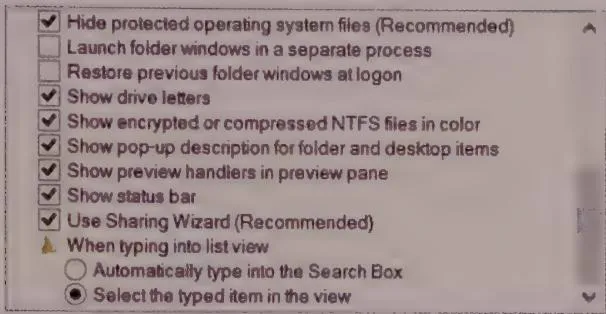  
Figure 21-16: Selection normally is a mutually exclusive operation. When the need arises to discard mutual exclusivity to provide multiple selection, things can become confusing if some of the items can be scrolled out of sight. Earmarking is a solution. Put check boxes next to each text item, and use them instead of selection to indicate the user's choices. Check boxes are a clearly non-mutually exclusive idiom and a familiar GUI idiom. Users grasp the workings of this idiom right away.

Such draggable items can help users gather items into a set. Providing two adjacent list controls, one showing available items and the other showing chosen items, is a common GUI idiom. One or sometimes a bidirectional pair of arrow buttons placed between them allows items to be selected and transferred from one box to the other (see Figure 21-17). It is so much more pleasant when the idiom is buttressed with the ability to just click and drag the desired item from one box to another, without having to go through the intermediate steps of selection and function invocation.

# Ordering lists

Sometimes the need arises to drag an item from a list control to another position in the same list control. This need arises more often than most interaction designers seem to think.

Many applications offer automatic sort facilities for important lists. Windows Explorer, for example, lets you sort files by name, modification date, type, and size. That's nice, but wouldn't it be even better if users could order them by importance? Algorithmically, the application could order them by frequency of user access, but that wouldn't always get the right results. Also adding a factor of how recently a file was accessed would get closer but still wouldn't be exactly right.

Why not let users move what's important to them to a region at the top, and sort those things separately (in alphabetical or whatever order), in addition to sorting the full directory below? For example, you might want to rearrange a list of the people in your department in descending order by where they sit. No automatic function will do this; you just have to drag them until it's right. This is the kind of customizing that an experienced

user wants to do after long hours of familiarization with an application. It takes a lot of effort to fine-tune a directory like this, and the application must remember the exact settings from session to session. Otherwise, the ability to reorder things is worthless.

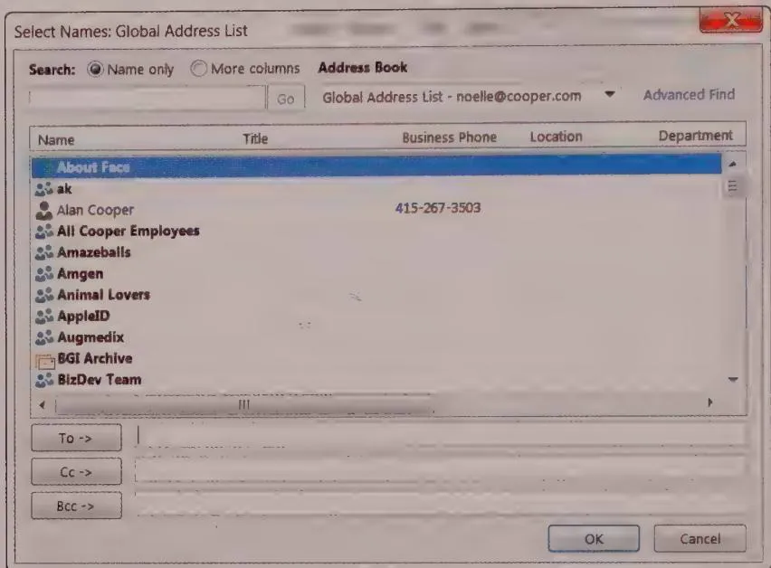  
Figure 21-17: This dialog from Microsoft Outlook Express would benefit from the ability to drag a contact from the list on the left into the To, Cc, and Bcc lists. The arrow button functionality is a bit less clear since the lists that the contacts are copied to are below the list being copied from, rather than adjacent to it. Note also the unfortunate use of a horizontal scrollbar—but luckily, the dialog can be expanded by dragging the lower left corner.

Being able to drag items from one place to another in a list control is powerful, but it demands that autoscrolling be implemented (see Chapter 18). If you pick up an item in the list but the place you need to drop it is currently scrolled out of view, you must be able to scroll the ListView without putting down the dragged object.

# Horizontal scrolling in lists

List controls normally have a vertical scrollbar for moving up and down through the list. List controls can also be made to scroll horizontally. This feature allows the developer to put extra-long text into the list controls with a minimum of effort. However, it is a huge pain for users.

Text should only be scrolled horizontally in large tables such as spreadsheets, where a locked row and column headers can provide context for each column. When a text list is scrolled horizontally, it hides from view one or more of the first letters of every single

line of text showing. This makes none of the lines readable, and the text's continuity is destroyed.

Avoid scrolling text horizontally.

If you find a situation that seems to call for horizontal scrolling of text, search for alternative solutions. Begin by asking yourself why the text in your list is so long. Can you shorten the entries? Can you wrap the text to the next line to avoid that horizontal length? Can you allow the user to enter aliases for the longer entries? Can you use graphical entries instead? Can you use ToolTips? Ideally, you also should consider whether you can widen the control. Can you rearrange things on the window or dialog to expand horizontally?

Absent the ability to widen the control, there are two possible approaches: Wrap the text to the next line, indenting it so that it is visually different from other entries, or truncate with an ellipsis, and provide the full text with a ToolTip. The former means that you now have a list control with items of variable height. The latter might be problematic if the list entries start with similar text. But either is still better than horizontal scrolling.

Remember, we're just talking about text. For graphics or large tables, there is nothing wrong with horizontal scrollbars or horizontally scrollable windows in general. But providing a text-based list with a required horizontal scrollbar is like providing a computer with a required hand-crank electrical generator—bad news.

# Entering data into a list

Modern list and tree controls (discussed later in this chapter) offer an edit-in-place facility. Windows Explorer uses both of these controls; you can see how they work by renaming a file or directory. To rename a file in OS X or Windows, you click the desired name twice—but not too quickly, lest this action be interpreted as a double click and open the object in question. You then enter whatever changes you want. Items that can be edited in other circumstances should, when displayed in list controls, be editable there as well.

The edge case that makes edit-in-place a real problem is adding a new entry to the list. Most designers use other idioms to add list items. Click a button or select a menu item, and a new, blank entry is added to the list. The user can then edit its name in place. It would be more sensible if you could, say, double-click in the space between existing entries to create a new, blank entry right there, or at least have a perpetual open space at the beginning or end of the list with a Click to Add Entry label on it to make it

discoverable. Another solution to this problem is the combo box, which we'll talk about in a moment.

# Drop-down and pop-up lists

Drop-down lists (also called pop-up lists) take the place of a stack of radio buttons. This gives users a compact way to make a single selection from a list (see Figure 21-13). The current selection is shown when the pop-up list closes. Generally speaking, pop-up lists, unlike their command-oriented cousins in the menu bars of desktop applications, focus on selecting objects rather than executing commands. However, they can sometimes immediately affect the display of information if, for example, they are used as part of a live search filter, or as the mechanism for navigating to a page on a website.

# Combo boxes

The combo box is—as its name suggests—a combination of a list box and an edit field (see Figure 21-18). It provides an unambiguous method of data entry into a list control. As with normal list boxes, a drop-down variant has a reduced impact on screen real estate.

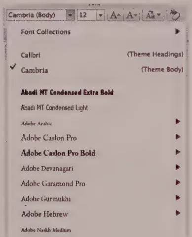  
Figure 21-18: The Word font selection drop-down combo box allows users to select a font from the drop-down list or simply type the name of the desired font into the text field.

Combo boxes clearly differentiate between the text-entry part and the list-selection part, minimizing user confusion. For single selection, the combo box is a superb control. You can use the edit field to enter new items, and it also shows the current selection in the list. When the current selection is showing in the edit field, the user can edit it there—sort of a poor man's edit-in-place.

Because the edit field of the combo box shows the current selection, the combo box is by nature a single-selection control. There is no such thing as a multiple-selection combo box. Single-selection implies mutual exclusion, which is one of the reasons why the combo box has replaced groups of radio buttons for selection from among mutually exclusive options. Other reasons include space efficiency and the ability to add items dynamically, something that radio buttons cannot do.

When drop-down variants of the combo box are used, the control shows the current selection without consuming space to show the list of choices. Essentially, it becomes a list-on-demand, much like a menu provides a list of immediate commands on demand. A combo box is a pop-up list control.

The screen efficiency of the drop-down combo box allows it to do something remarkable for a control of such complexity: It can reasonably reside permanently on an application's main screen. It can even fit comfortably on a toolbar. It is an effective control for deployment on a sovereign-posture application. Using combo boxes on the toolbar is more effective than putting the equivalent functions on menus. Combo boxes display their current selection without requiring any action on the user's part, such as pulling down a menu to see the current status.

If drag-and-drop is implemented in list controls, it should also be implemented in combo boxes. For example, being able to open a combo box, scroll to a choice, and then drag the choice onto a document under construction is a powerful idiom (the appearance of a drag handle on mouseover could provide pliancy). Drag-and-drop functionality should be a standard part of combo boxes.

# Tree controls

Tree controls (sometimes called "treeviews") are listviews that can present hierarchical data. They display a sideways "tree" of visually-connected branches of items, often with icons for each entry. The entries can be expanded or collapsed the way that many outlining applications work. Developers tend to like this control, because it often matches the way they think about complex functions and data, and because it is easy to build. It is often used as a file system navigator and is a highly effective way to present hierarchical information.

Unfortunately, hierarchical trees are one of the most inappropriately used controls in the toolbox. They can be problematic for users because many people have difficulty thinking in terms of hierarchical data structures. We have seen countless interfaces where developers have forced nonhierarchical data into a tree control with the rationale that trees are "intuitive." While they may be intuitive to developers, they neither allow users to capitalize on other, more interesting relationships between objects, nor respect the often messy real-world relationships between things.

It only makes sense to use a tree control (no matter how tempting it may be) in the case where what is being represented is "naturally" thought of as a hierarchy (such as a family tree). Using a tree control to represent objects that are arbitrarily related is asking for big trouble when it comes to usability.

# Entry controls

Entry controls enable users to supply information to or set a value in an application.

The most basic entry control is a text edit field. Like selection controls, entry controls represent nouns to the application. Because a combo box contains an edit field, some combo box variants qualify as entry controls too. Also, any control that lets users enter a numeric value is an entry control. Because they allow users to set numeric values, controls such as spinners, gauges, sliders, and knobs fit in this category.

# Bounded and unbounded entry controls

Any control that restricts the available set of values that the user can enter is a bounded entry control. A slider that moves from 1 to 100, for example, is bounded. Regardless of the user's actions, no number outside those specified by the application can be entered with a bounded control. This prevents users from entering an invalid value.

Conversely, a simple text field can accept any keyboard character the user types into it. This open-ended entry idiom is an example of an unbounded entry control. With an unbounded entry control, it can be easy for users to enter values that are invalid for the application. The application may subsequently reject the value, of course, but users can still enter it.

Simply put, bounded controls should be used wherever bounded values are needed. If the application needs a number between 7 and 35, presenting users with a control that accepts any numeric value from $-1,000,000$ to $+1,000,000$ doesn't do anyone any favors. People would much rather be presented with a control that embodies 7 as its bottom limit and 35 as its upper limit. (Clearly indicating these limits is also useful.) Users are smart, and they will immediately comprehend and work within the limits of their sandbox.

It is important to understand that we are talking about the quality of the entry control, not the quality of the data. To be a bounded control, it needs to clearly communicate, preferably visually, the acceptable data boundaries to the user. A text field that rejects the user's input after he enters it is not a bounded control. It is a rude control.

DESIGN PRINCIPLE

Use bounded controls for bounded input.

Most quantitative values needed by software are bounded, yet many applications still permit unbounded entry within numeric fields. The poor user types 17 into a field, and this innocent entry is rewarded with an error dialog saying, "You can enter only values between 4 and 8." This is poor user-interface design. A much better scheme is to use a bounded control that automatically limits the input to 4, 5, 6, 7, or 8. If the bounded set of choices is composed of text rather than numbers, you can still use a bounded slider (sometimes called a trackbar), combo box, or list box.

Figure 21-19 shows a vertical trackbar used by Microsoft in the Windows Display Settings dialog. It works like a slider or scrollbar, but has several discrete positions that represent distinct resolution settings. Microsoft could easily have used a simple drop-down list in its place. In many cases, a slider is a nice choice because it displays the range of valid entries. A drop-down menu isn't much smaller, but it keeps its options hidden until clicked—a less friendly stance. It's unclear why Microsoft chose to put a slider inside a drop-down menu.

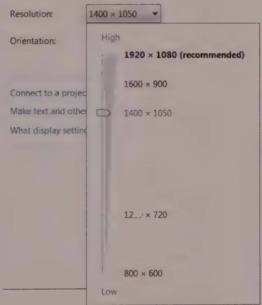  
Figure 21-19: A bounded control lets users enter only valid values. It does not let them enter invalid values, only to reject them when they try to move on. This figure shows a bounded slider control from the Display Settings dialog in Windows. The slider (which, oddly, is deployed inside a drop-down menu) has several discrete positions. As you drag the slider, the legend beside it reflects different allowable screen resolutions, with recommended resolutions shown even when the trackbar thumb is not on the detent.

# Spinners

Spinner controls are a common form of numeric entry control that permit data entry using the mouse, keyboard, or finger. Spinners on the desktop contain a small edit field with two half-height buttons attached, as shown in Figure 21-20. On iOS they're called steppers and have plus or minus buttons side-by-side, making them much easier to actuate with fingers.

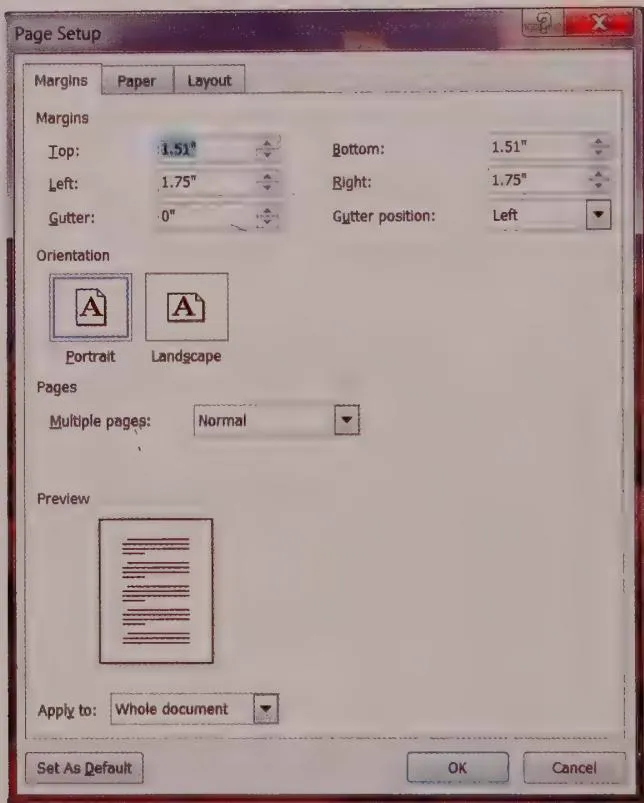  
Figure 21-20: The Page Setup dialog from Microsoft Word makes heavy use of the spinner control. By clicking either of the small, arrowed buttons, the user may increase or decrease the specific numeric value in small, discrete steps. If the user wants to make a large change in one action or enter a precise setting, he can use the edit field portion for direct text entry. The arrow button portion of the control embodies bounding, whereas the edit field portion does not.

Spinners blur the difference between bounded and unbounded controls. Using either of the two small arrow buttons enables the user to change the value in the edit field in small, discrete steps. These steps are bounded, meaning that the value doesn't go above the upper limit set by the application or below the lower limit. If the user wants to make a large change in one action or enter a specific number, he can do so by clicking in the edit field portion and typing in it, just like entering text into any other edit field. Unfortunately, the edit field portion of this control is unbounded, leaving users free to enter

values that are out of bounds or even unintelligible. In the Page Setup dialog shown in Figure 21-20, if the user enters an invalid value, the application behaves like most other rude applications: It issues an error dialog explaining the upper and lower boundaries (sometimes) and requiring the user to click the OK button to continue.

Overall, the spinner is an excellent idiom and can be used in place of plain edit fields for most bounded numeric entries.

# Dials and sliders

Dials and sliders are idioms borrowed directly from Mechanical-Age metaphors of rotating knobs and sliding levers. Dials are very space-efficient. Both can do a nice job of providing visual feedback about settings, as shown in Figure 21-21.

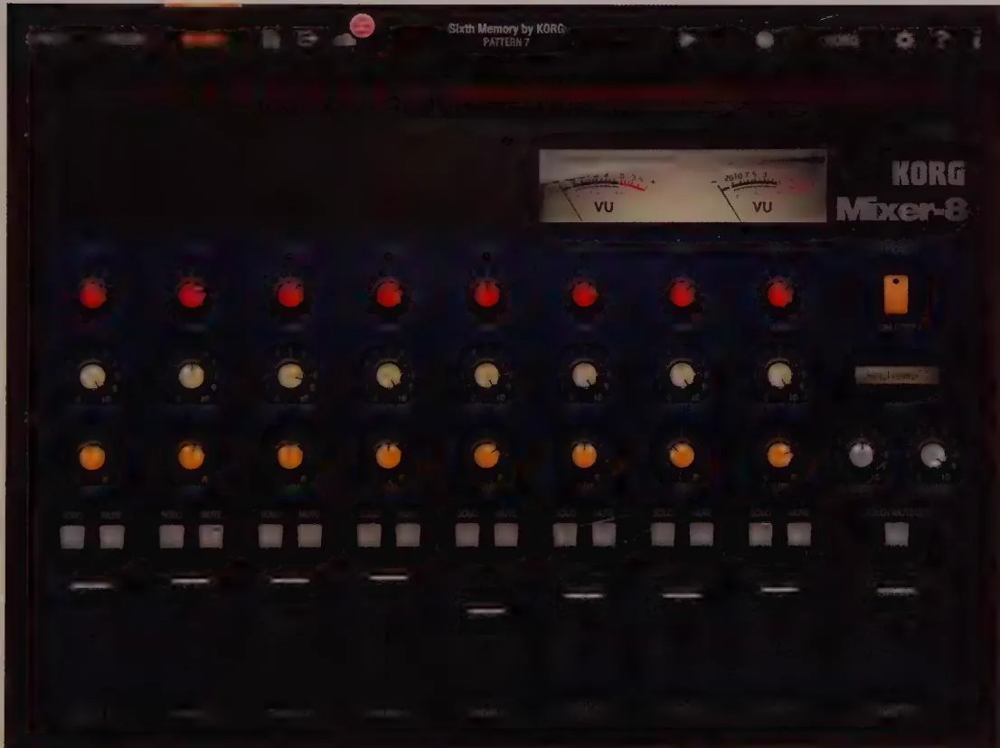  
Figure 21-21: Korg's iPolysix app, a software synthesizer, makes heavy use of dials and sliders. These are effective interface elements because musicians and producers are familiar with them from hardware. More importantly, they provide users with more visual and easy-to-comprehend feedback about parameter settings than a long list of numbers, which aren't that exciting to look at while making music. iPolysix dials make users move their finger in an arc, rather than up-down or left-right swipes, which would be easier to control.

Improperly implemented, dials can be extremely difficult to manipulate. Sliders are often a better option where space isn't at a premium, because they visually suggest the fact that movement is along just one axis.

Sometimes developers force users to trace an arc with their mouse or finger, with mouse or finger distance from the control therefore controlling the granularity of rotation. Proper implementation of a dial should allow linear input in two dimensions: Clicking (or tapping) the dial and moving up or right should increase the dial's value, and moving down or left should decrease the value. Velocity can control granularity of adjustment. Of course, users must learn this idiom, or they try to move in an arc anyway.

Dials are best suited for specialized, sovereign applications where users become accustomed to the idiom. Because of their compact size and visual qualities (not to mention heritage), they are popular in audio software.

Although sliders and dials are both used primarily as bounded entry controls, they are sometimes used (and misused) as controls for changing the display of data. For most purposes, scrollbars do a better job of moving data in a display, because they can easily indicate the magnitude of the scrolling data, which sliders can't do as well. However, sliders are an excellent choice for zooming interactions on the desktop, such as adjusting the scale of a map or the size of photo thumbnails. Direct manipulation interfaces are better off sticking to the pinch in/pinch out conventions of touch technology.

# Thumbwheels

The thumbwheel is a variant of the dial, but it is much easier to use. Onscreen thumbwheels look rather like the scroll wheel on a mouse, and they behave in much the same way. They are popular with some 3D applications because they are a compact unbounded control, which is perfect for certain kinds of panning and zooming. Unlike a scrollbar, they need not provide any proportional feedback, because the control's range is infinite. It makes sense to map a control like this to unbounded movement in some direction (like zoom) or movement within data that loops back on itself.

# Other bounded entry controls

Breaking free from the heritage of traditional GUI controls and the baggage of mechanical analogs, a new generation of more experimental user interfaces is establishing new visual and gestural idioms. These range from a simple two-dimensional box where a click at any point defines the values for two input mechanisms (the vertical and horizontal coordinates each drive a parameter's value) to more complex direct manipulation interfaces (see Figure 21-22). These controls typically are bounded, because their implementation requires careful thought about the relationship between gesture and

function. Such control surfaces often provide a mechanism for visual feedback. These controls are also most appropriate for situations where users attempt to express themselves in regards to a number of variables and are willing to spend some effort developing proficiency with a challenging idiom.

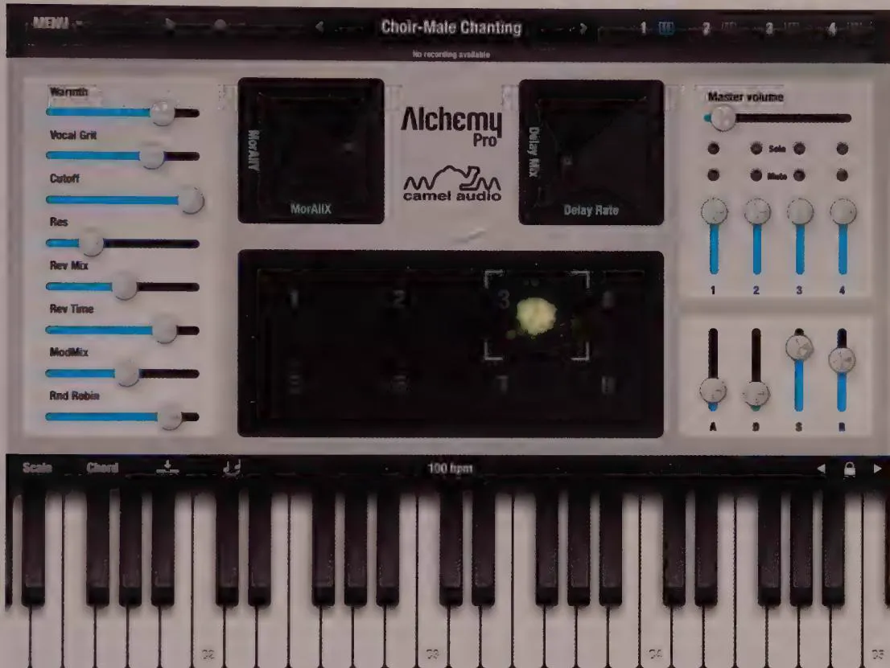  
Figure 21-22: Camel Audio's Alchemy Pro app employs a variety of two-dimensional bounded input controls. These provide good visual feedback, allow users to adjust multiple parameters from a single control, and support more expressive gestural user interactions. Their bounded nature also provides users with context about how the current settings fit within the allowable ranges and eliminates the chance that the user will make an invalid entry. No musician wants to be stopped by an error dialog!

# Unbounded entry: text edit controls

The primary unbounded entry control is the text edit control. This simple control allows users to key in any alphanumeric text value. Edit fields often are small areas where the user can enter a word or two of data, but they can also be fairly sophisticated text editors. Users can edit text within them using the standard tools of contiguous selection (as discussed in Chapter 18) with either the mouse or keyboard.

Text edit controls are often used either as data-entry fields in database applications (including websites connected to databases), as option entry fields in dialogs, or as the entry field in a combo box. In all these roles, they are frequently called on to do the work of a bounded entry control. However, if the desired values are finite, the text edit control should not be used. If the acceptable values are numeric, use a bounded numeric entry control such as a slider instead. If the list of acceptable values is composed of text strings, a list control should be used so that users are not forced to type.

Sometimes the set of acceptable values is finite but too big to be practical for a list control. For example, an application may require a string of any 30 alphabetic characters excluding spaces, tabs, and punctuation marks. In this case, a text edit control is probably unavoidable even though its use is bounded. If these are the only restrictions, however, the text edit control can be designed to reject nonalphabetic characters and similarly disallow more than 30 characters to be entered into the field. However, this brings up interaction issues surrounding validation.

# Validated entry controls

In cases where an unbounded text-entry field is provided, but the field accepts only entries of a certain form, it may be necessary to help users construct a "valid" entry. Typically you do this by evaluating the user's entry after she finishes entering it and displaying an error message if it is invalid. Obviously, this can be irritating for users and ultimately can undermine their effectiveness. Although bounded controls can often eliminate the need for validated entry, when the number of valid entries is large—credit card numbers, for example—validated entry becomes necessary.

Validation controls are a type of unbounded text-entry control with built-in validation and feedback for the user. These controls can validate many formats, such as dates, phone numbers, postal codes, and Social Security numbers.

Although the validated entry control is a widespread idiom, most such controls can be improved. The key to successfully designing a validated entry control is to give users generous feedback, as close to real-time as possible, so they can catch an error immediately, understand why the input was an error, and know how to remedy it.

Another improvement is based on the design principle of visually distinguishing elements that behave differently (see Chapter 17). Make validated entry controls visually distinct from nonvalidated controls, whether through the typeface used in the text edit field, the border color, or the background color for the field itself.

Note that password and other security inputs can't adhere strictly to usability concerns (lest they make it usable for hackers and scammers). These kinds of inputs have their own considerations.

# Active and passive validation

Some controls reject users' keystrokes as they are entered. When a control actively rejects keystrokes during the entry process, this is an example of active validation. A text-only entry control, for example, may accept only alphabetic characters and refuse to allow numbers to be entered. Some controls reject any keystrokes other than numeric. Other controls reject spaces, tabs, hyphens, and other punctuation in real time. Some variants can get pretty intelligent and reject certain numbers based on live calculations. For example, numbers might need to pass a checksum algorithm.

When an active validated entry control rejects a keystroke, it must tell the user it has done so. It also should tell the user why the rejection occurred. If an explanation is offered, users will be less inclined to assume that the rejection is arbitrary (or the product of a defective keyboard). They also will be in a better position to give the application what it wants.

Sometimes the range of possible data is such that the application cannot validate it until the user has completed his entry (rather than at each individual keystroke). The validation then takes place only when the data reaches some threshold—like a set number of characters—or the control loses focus—that is, when the user is done with the field and moves on to the next one. The validation step also must take place if the user closes the dialog—or invokes another function if the control is not in a dialog (such as clicking Place Order on a web page). If the control waits until the user finishes entering data before it edits the value, this is passive validation.

The control may wait until an address is fully entered, such as interrogating a database to check if an address is valid. In such cases each character may be valid by itself, yet the whole may not pass muster. Besides, while the application would know at any given instant whether the address was valid, the user could still legitimately turn to some other task in the form while the name was in an invalid state, intending to return to it later.

A way to address this is by maintaining a countdown timer in parallel with the input and reset it with each keystroke. If the countdown timer ever hits 0, do your validation processing. The timer should be set to approximately half a second. The effect is that as long as the user enters a keystroke faster than once every half-second, the system is extremely responsive. If the user pauses for more than half a second, the application reasonably assumes that he has paused to think, so it goes ahead and analyzes the input so far.

To provide rich visual feedback, the entry field could change colors or reveal an icon to reflect its estimate of the validity of the entered data. For example, the field could show in shades of pink until the application judged the data valid, when it would change to white or green.

# Hints

Another good solution to the validation control problem is the hint. This little pop-up text looks and behaves much like a ToolTip: It explains the range of acceptable data for a validation control. Whereas a ToolTip appears when the cursor sits for a moment on a control, a hint appears as soon as the control detects an invalid character. (It also can appear, just like a ToolTip, if the cursor sits unmoving on the field for a second or so.) For example, if the user enters a nonnumeric character in a numeric-only field, the application would show the hint near the point of the offending entry, yet without obscuring it. It would say, for example, ZIP codes can only contain numeric characters, 0-9. Yes, the user is rejected, but he is not ignored. The hint also works for passive validation, as shown in Figure 21-23.

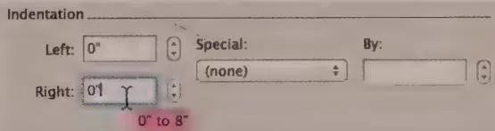  
Figure 21-23: The ToolTip idiom is so effective that it could easily be extended to other uses. Instead of yellow ToolTips offering flyover labels for icon buttons, we could have pink ones offering flyover hints for unbounded edit fields. These hints can help eliminate traditional error messages. In this example, if the user enters a value lower than is allowed, the application would replace the entered value with the lowest allowable value and modelessly display a hint that explains the reason for the substitution. The user can enter a new value or accept the minimum without being stopped by an error dialog.

# Handling out-of-bounds data

Typically, an edit field is used to enter a numeric value the application needs, such as a font's point size. The user can enter anything he wants, from 5.5 to 500, and the field will accept it and return the value to the owning application. If the user enters garbage, the control must make a decision. In Microsoft Word, for example, if you enter asdf as a font point size, the application issues an error dialog informing you "This is not a valid number." It then reverts the size to its previous value. The error dialog is rather silly, but the summary rejection of your meaningless input is perfectly appropriate. But what if you type the value nine? The application rejects it with the same curt error message. If instead the control were programmed to think of itself as a numeric entry control, it could perhaps behave better. It doesn't bother us if the application refuses to accept nonnumeric characters (especially if pop-up hints are also employed), but it is incorrect when it says that nine is an invalid number.

# Units and measurements

It's nice when a text edit control is smart enough to recognize appropriate units. For example, if an application requests a measurement, and the user enters 5", 5i, 5in, 5 inches, not only should the control report the result as five, but it also should report inches. If the user enters 5mm, the control should report it as 5 millimeters. SketchUp, an elegant architectural sketching application, supports this type of feedback. Similarly, well-designed financial analytics applications should know that "5mm" means 5 million.

Say that the field is requesting a column width. The user can enter either a number or a number and an indicator of the measurement system, as just described. Users also could be allowed to enter the word default, and the application would set the column width to its default value. The user could alternatively enter best fit, and the application would measure all the entries in the column and choose the most appropriate width for the circumstances. This scenario has a problem, however, because the words "default" and "best fit" must be in the user's head rather than in the application somewhere. This is easy to solve, though. All we need to do is provide the same functionality through a combo box. The user can drop down the box and find a few standard widths and the words "default" and "best fit." Microsoft uses this idea in Word, as shown in Figure 21-24.

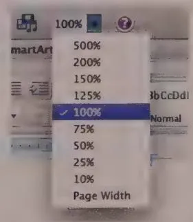  
Figure 21-24: The drop-down combo box makes an excellent tool for bounded entry fields because it can accommodate entry values other than numbers. The user doesn't have to remember or type words like "page width" or "whole page," because they are there to be chosen from the drop-down list. The application interprets the words as the appropriate number, and everyone is satisfied.

The user can pull down the combo box, see items like Page Width and Whole Page, and choose the appropriate one. With this idiom, the information has migrated from the user's head into the application, where it is visible and choosable.

# Avoid text edit controls for output

The text edit control, with its familiar system font and visually articulated white box, encourages data entry. Yet software developers frequently use the text edit control for read-only output fields. The edit control certainly works as an output field, but using this control for output only is like pulling a bait and switch on your user, and he will not be amused. If you have text data to output, use a text display control, not a text edit control. If you want to show the amount of free space on disk, for example, don't use a text edit field, because novice users are likely to think that they can get more free space by entering a bigger number. At least, that is what the control is telling them with its equivalent of body language.

If you want to output editable information, go ahead and output it in a fully editable text control, and wire it up internally so that it works exactly as it will appear. If not, stick to display controls, described in the next section.

DESIGN PRINCIPLE

Use noneditorable (display) controls for output-only text.

# Display controls

Display controls are used to display and manage the visual presentation of information onscreen. Typical examples include scrollbars and screen splitters. Controls that manage how objects are displayed visually onscreen fall into this category, as do those that display static, read-only information. These include pagination, rulers, guidelines, grids, group boxes, and those 3D lines called dips and bumps. Rather than discuss all these at length, we will focus on a few of the more problematic controls.

# Text controls

Probably the simplest display control is the text control, which displays a written message at some location onscreen. The management job it performs is pretty prosaic, serving only to label other controls and to output data that users cannot or should not change.

The only significant problem with text controls is that they are often used where edit controls should be (and vice versa). Users can change most information stored in a computer. Why not allow them to change it at the same point the software displays it? Why

<!-- Chunk 13 End -->

<!-- Chunk 14 Start -->

should the mechanism to input a value be different from the mechanism to output that value? In many cases, it makes no sense for the application to separate these related functions. In almost all cases where the application displays a value that could be changed, it should do so in an editable field so that a user can click it and change it directly. Special edit modes are almost always examples of excise.

For years, Adobe Photoshop insisted on opening a dialog to create formatted text in an image. Thus, users could not see exactly how the text would look in the image, forcing them to repeat the procedure several times to get things right. Finally Adobe fixed the problem, letting users edit formatted text directly into an image layer, in full WYSIWYG fashion—as it should be.

# Scrollbars

Scrollbars serve a critical need in the modern GUI: They enable smallish rectangles (windows or panes) to meaningfully contain large amounts of information. Unfortunately, they are also typically quite frustrating, difficult to manipulate, and wasteful of pixels. The scrollbar is, without a doubt, both overused and underexamined. In its role as a window content and document navigator—a display control—its application is appropriate.

The singular advantage of the scrollbar—aside from its near-universal availability—is that it provides useful context about where you are in the window. The scrollbar's thumb is the small, dragable box that indicates the current position and, often, the scale of the "territory" that can be scrolled.

Many scrollbars are quite parsimonious in doling out information to users. The best scrollbars use thumbs that are proportionally sized to show the percentage of the document that is currently visible.

While scrollbars are useful for nearly all types of content, scrollbars for pages of text should also show the following:

The total pages   
The page number (record number, graphic) as we scroll   
A thumbnail of the page as we scroll

Additionally, many scrollbar implementations are stingy with functions. To better help us manage navigation within documents, they should give us powerful tools for going where we want to go quickly and easily:

- Buttons for skipping ahead by pages/chapters/sections/keywords   
- Buttons for jumping to the beginning and end of the document

- Tools for setting bookmarks that we can quickly return to   
- Annotated scrollbars that visually show the position of searched-for items on the background of the toolbar itself (The thumb of the toolbar must be partly transparent for this to work well.)

Recent versions of Microsoft Word use scrollbars that exhibit many of these features.

Shortcomings in contextual information aside, one of the biggest problems with scrollbars in a WIMP OS is that they demand a high degree of precision with the mouse. You must position the mouse cursor with great care, taking your attention away from the data you are scrolling. Some scrollbars put both up and down nudge arrows at each end of the scrollbar. For windows that will likely stretch across most of the screen, this can be helpful. For smaller windows, such replication of controls is probably overkill and simply adds to screen clutter. (See Chapter 18 for more discussion of this idiom.)

The ubiquity of scrollbars has resulted in some unfortunate misuse. Most significant here is their shortcomings in navigating time. Without getting too philosophical or theological, we can all hopefully agree that time has no meaningful beginning or end (at least within the perception of the human mind). What, then, is the meaning of dragging the thumb to one end of a calendar scrollbar? (See Figure 21-25.)

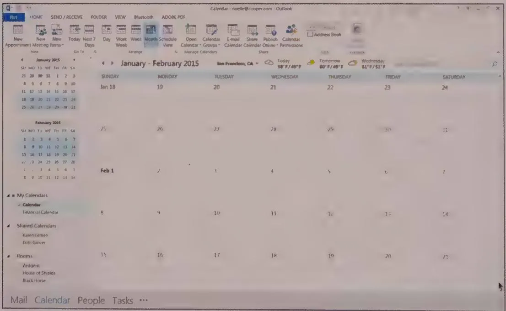  
Figure 21-25: This image shows a limitation of using a scrollbar for navigating the endless stream of time. Dragging the thumb all the way to the end of the scrollbar takes the user one year into the future. This seems a bit arbitrary and limiting.

On mobile platforms, and now even in some desktop apps, scrollbars appear only when scrolling takes place. This makes more sense on mobile, where scrolling is performed via gesture—although it also means that a user has to scroll when they don't really want to, in order to discover where in a document they are.

On the desktop, trackpad gestures or mouse wheels (and their capacitive equivalents) also allow scrollbars to be hidden on some platforms, like OS X. They are used primarily to indicate the content's position in its viewport pane rather than for actual scrolling. However, hiding scrollbars on the desktop has some usability gotchas:

- It may not be clear to users that panes are scrollable. This can be fixed by ensuring that some items are partially obscured at the edges of the pane, which is a strong visual cue that scrolling is possible.   
- Fine control of scrolling becomes much more difficult. If scrollbars disappear when not in use, it becomes difficult to tweak positioning, because movement is required to activate the fine controls. It's therefore not a wise idea to use hideable scrollbars for any application where fine-tuning scrolling is a necessity.   
- With large screens, it's entirely possible that toolbars become hidden by the time the user is able to move her mouse to them, requiring her to scroll just to summon them again.

There are some viable alternatives to scrollbars. One of the best is the document navigator, which uses a thumbnail of the entire document space to provide direct navigation to portions of the document, as shown in Figure 21-26. Many image-editing applications (such as Photoshop) utilize these for navigating around a document when zoomed in. These also can be useful when you navigate time-based documents, such as video and audio. Critical to the success of such idioms is that it is possible to meaningfully represent the big picture of the document in visual form. For this reason, they aren't necessarily appropriate for long text documents. In these cases, the document's structure (in outline form) can provide a useful alternative to scrollbars. A basic example can be seen in Microsoft Word's Document Map.

# Splitters

Splitters are useful tools for dividing a sovereign application into multiple related panes in which information can be viewed, manipulated, or transferred. Movable splitters should always advertise their pliancy with cursor hinting. Although it is easy and tempting to make all splitters movable, you should exercise care in choosing which ones to make movable. In general, a splitter should be unable to be moved in such a way that makes a pane's contents unusable. In cases where panes need to collapse, a drawer may be a better idiom.

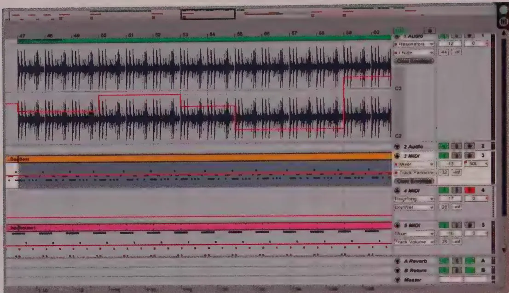  
Figure 21-26: Ableton Live features a document navigator on the top of the arrangement screen that provides an overview of the entire song. The black rectangle denotes which part of the song the work area below is zoomed in on. The navigator provides context in a potentially confusing situation and simultaneously provides a direct navigation idiom where the user may move the rectangle to focus on a different part of the song.

# Drawers and levers

Drawers are panes in a sovereign application that can be opened and closed with a single action. They can be used in conjunction with splitters if the user can configure the amount by which the drawer opens. You usually open a drawer by clicking a control in the vicinity of the drawer. This control needs to be visible at all times and should be either a latching button/icon button or a lever. A lever behaves similarly but typically swivels to indicate an open or closed state.

Drawers are a great place to put controls and functions that are less frequently used but are most useful in the context of the application's main work area. Drawers have the benefit of not covering the main work area the way a dialog does. Property details, searchable lists of objects or components, and histories are good candidates for putting in drawers.

On mobile devices, horizontally sliding drawers with levers have been employed ubiquitously and successfully to stow primary navigation panes. They take users to different functional screens (using the "hamburger" icon and drawer idiom first popularized and then largely abandoned by Facebook), to content picked from an ordered list as is typical

of many mobile mail applications, or to a UI that provides interactions with the selected drawer item, such as the right-hand chat drawer in the iOS Facebook app.

