# DESIGN PRINCIPLE

Dialogs are appropriate for organizing controls and information about a single domain object or application function.

Similar to menus, dialogs can be effective for users who are still learning an application. Because dialogs can be more verbose and structured, they can provide an alternative, more pedagogic interface for functions that are also accessible through direct manipulation in the main application window. However, this sort of interface also can be more effectively placed in expandable, modeless control panes or contextual toolbars in modern desktop apps.

Dialogs serve two masters: the frequent user who is familiar with the application and uses dialogs to control its more advanced or dangerous facilities, and the infrequent user who is unfamiliar with the scope and use of the application and who uses dialogs to learn the basics. This dual nature means that dialogs must be compact and powerful, speedy and smooth, yet clear and self-explanatory. These two goals may seem contradictory, but they can actually be useful complements. A dialog's speedy and powerful nature can contribute directly to its power of self-explanation.

# Basic dialog interactions

Most dialogs contain a combination of informative text, interactive controls, and associated text labels. Although some rudimentary conventions apply, the idiom's diverse applications mean that there are few hard and fast rules. It is important to create dialogs in accordance with good visual interface design practices and ensure that they use GUI controls appropriately. In particular, a dialog should exhibit a strong visual hierarchy, visual groupings based on similarities in subject, and a layout based on the conventional reading order (left to right and top to bottom for Western writing systems). For more details about these visual interface design practices, see Chapter 17.

When instantiated, a dialog should appear on the topmost visual layer so that it is obvious to the user. Subsequent user interactions may obscure the dialog with another dialog or application, but it should always be obvious how to restore the dialog to prominence.

A dialog should have a title that clearly identifies its purpose. If the dialog is a function dialog, the title bar should contain the function's action—the verb, if you will.

DESIGN PRINCIPLE

Use verbs in function dialog title bars.

If the dialog is used to define an object's properties, the title bar should contain that object's name or description. The properties dialogs in Windows work this way. When you request the Properties dialog for a directory named Backup, the title bar says Backup Properties. Similarly, if a dialog is operating on a selection, it can be useful to reflect a truncated version of the selection in the title to keep users oriented.

DESIGN PRINCIPLE

Use object names in property dialog title bars.

Most conventional dialogs have at least one terminating command—a control that, when activated, causes the dialog to shut down and go away (and most often some other function that was the point of the dialog). Most modal dialogs offer at least two pushbuttons as terminating commands, OK and Cancel, although the Close box in the upper-right corner is also a terminating command idiom.

It is technically possible for dialogs not to have terminating commands. Some dialogs are unilaterally launched and dismissed by the application—for reporting on the progress of a time-consuming function, for example—so their designers may have omitted terminating commands. This is poor design for a variety of reasons, as we will see.

# Modal and modeless dialogs

Dialogs come in two flavors: modal and modeless. Modal dialogs are by far the more common variety. After a modal dialog opens, the owner application cannot continue until the dialog is closed. It stops all proceedings in their tracks. Clicking any other window belonging to the application only gets the user a rude beep for his trouble. All the controls and objects on the surface of the owner application are deactivated for the duration of the modal dialog. Of course, the user can activate other applications while a

modal dialog is up, but the dialog stays there indefinitely. When the user goes back to the application, the modal dialog is still there waiting.

In general, modal dialogs are easier for users (and designers) to understand. The operation of a modal dialog is quite clear, saying to users, "Stop what you're doing and deal with me now. When you're done, you can return to what you were doing." The rigidly defined behavior of the modal dialog means that, although it may be abused, it is rarely misunderstood. There may be too many modal dialogs, and they may be weak or stupid, but their purpose and scope usually are clear to users.

Some modal dialogs operate on the entire application or the entire active document. Others operate on the current selection, in which case the user can't change the selection after summoning the dialog. This is the most important difference between modal and modeless dialogs.

Because modal dialogs stop only their owning applications, they are more precisely described as application-modal. It is also possible to create a system-modal dialog that brings every application in the system to a halt. In most cases, applications should never have one of these. Their only purpose is to forestall or report catastrophic occurrences (such as the hard disk melting) that affect either the entire system or a real-world process.

Modeless dialogs are less common than their modal siblings. When a modeless dialog opens, the parent application continues without interruption. It does not stop the proceedings, and the application does not freeze. The various facilities and controls, menus, and toolbars of the main window remain active and functional. Modeless dialogs have terminating commands, too, although their conventions are far weaker and more confusing than for modal dialogs.

A modeless dialog is a much more difficult beast to use and understand, mostly because the scope of its operation is unclear. It appears when you summon it, but you can go back to operating the main window while it stays around. This means that you can change the selection while the modeless dialog is still visible. If the dialog acts on the current selection, you can select, change, select, change, select, and change all you want. For example, Microsoft Word's Find and Replace dialog allows you to find a word in text (which is automatically selected), make edits to that word, and then pop back to the dialog, which has remained open during the edit.

In some cases, you can also drag objects between the main window and a modeless dialog. This characteristic makes them effective as tool or object palettes.

# Differentiating modal and modeless dialogs

If you have limited time and resources to deal with interaction design issues, we recommend leaving modeless dialogs pretty much the way they are, while adopting the following guiding principles and applying them consistently.

DESIGN PRINCIPLE

Differentiate modeless dialogs from modal dialogs.

First, modal dialogs must include one or more terminating commands, usually in the form of large pushbuttons at the bottom of the dialog.

Second, modeless dialogs should not use terminating command buttons. Instead, they should use the Close control in its window title bar.

DESIGN PRINCIPLE

Do not use terminating button commands for modeless dialogs.

Third, modal dialogs should not use Close controls in their title bars, not only to help differentiate them from their modeless brethren, but because the function executed by the close control may be unclear to users. (Does clicking it cancel, or confirm what's been entered in the dialog?)

# Issues with modal dialogs

One particular modal dialog variation to avoid is the use of terminating buttons that change from Cancel to Apply, or from Cancel to Close, depending on whether the user has taken an action. This dynamic change is disconcerting, hard to interpret and, at worst, frightening and inscrutable. These labels should never change. If the user hasn't selected a valid option but clicks OK anyway, the dialog should assume the user means "Dismiss the box without taking any action," for the simple reason that this is what the user actually did.

DESIGN PRINCIPLE

Don't dynamically change the labels of terminating buttons.

The cognitive strength of modal dialogs is their rigidly consistent OK and Cancel buttons. In modal dialogs, the OK button means "Accept my input and close the dialog." In modal dialogs, the Cancel button means "Abandon my input and close the dialog."

# Issues with modeless dialogs

Many modeless dialogs are implemented awkwardly. Their behavior is inconsistent and confusing. They are visually very similar to modal dialogs, but they are functionally very different. They have few established behavioral conventions, particularly with respect to terminating commands.

Much of the confusion arises because users are so familiar with the behavior of modal dialogs. A modal dialog can adjust itself for the current selection at the instant it was summoned. It can do this with assurance that the current selection won't change during its lifetime. Conversely, the current selection can easily change during the lifetime of a modeless dialog. What should the dialog do then? For example, if a modeless dialog modifies text, what should it do if we now select a nontext object in the main window? Should the controls in the dialog become disabled, change, or disappear? Questions such as this require careful analysis, as well as close examination of persona needs, goals, and mental models. Consequently, modeless dialogs can be much more challenging to design and implement than modal dialogs, which avoid these issues by freezing the application state.

Modeless dialogs frequently have several buttons that immediately invoke various functions. The dialog should not close when one of these function buttons is clicked. It is modeless because it stays around for repetitive use and should close only when the window close control is clicked.

Modeless dialogs must also be incredibly conservative of pixels. They will be staying around on the screen, occupying the front and center location, so they must be extra careful not to waste pixels on anything unnecessary.

# Modeless dialogs and Undo

Because the controls on a modeless dialog are always live, the equivalent concept is clouded in confusion. The user doesn't conditionally configure changes in anticipation of a terminal Execute command as he does with a modal dialog.

The changes made from a modeless dialog are immediate, occurring as soon as any entry or control in the dialog is changed. There is no concept of "Cancel all my actions." Dozens of separate actions may have been performed on a number of selections. The proper

idiom for this is the Undo function, which is active application-wide for all modeless dialogs. This all fits together logically, because the Undo function is unavailable if a modal dialog is up, but it is still usable with modeless ones.

The only consistent terminating action for modeless dialogs is Close, which should be accessed from the window close control on the title bar. Furthermore, if the Close button actuates a function in addition to shutting the dialog, you have created a modal dialog that should follow the conventions for the modal idiom instead.

# Modeless dialogs and sidebars

Any modeless dialog that is intended to provide persistent support to activities in the main window is a good candidate for recasting as a sidebar control pane (see Chapter 18). These have all the advantages of modeless dialogs without forcing users to manage the set of controls within a separate floating window that must be moved out of the way of the job at hand. As screen resolutions have increased, there is less and less reason for banks of controls intended for frequent use in the construction of a document to be placed anywhere but in toolbars or sidebar panes.

# Five purposes of dialogs

The concepts of modal and modeless dialogs are derived from developer terms. They affect our design, but we should also examine dialogs from a more goal-directed point of view. In that light, five fundamental types of information are useful to convey with a dialog: property, function, process, notification, and bulletin.

# Property dialogs

Property dialogs allow users to view and change settings or attributes. A properties dialog generally modifies the current selection, but it also can be used to set application global properties. (Figure 21-31, shown later in this chapter, is a somewhat over-the-top example.) You can think of property dialogs as control panels containing configuration controls for the selected object.

Property dialogs typically are modeless. When you modify the properties of a selection, these dialogs often are more useful when they are implemented as a task pane or sidebar (see Chapter 18), rather than as a standard dialog—especially a modal one. This is true unless they are being used for set-once-and-forget-it or other infrequently accessed properties.

# Function dialogs

Function dialogs are usually launched from a menu. They are most frequently modal dialogs, and they control a single function such as printing, modifying large numbers of database records, inserting objects, or spell checking.

Not only do function dialogs allow users to initiate an action, but they also often allow users to configure the details of the action's behavior. In many applications, for example, when the user wants to print, she uses the Print dialog to specify which pages to print, the number of copies to print, which printer to output to, and other settings directly relating to the print function. The terminating OK button on the dialog not only confirms the settings and closes the dialog but also executes the print operation.

This common technique combines two functions: Configuring the function and invoking it. Just because a function can be configured, however, doesn't necessarily mean that the user will want to configure it before every invocation. It's often better to make these two functions separately accessible (although they should also be seamlessly linked).

Many functions available from modern software are quite flexible and have a number of options. If you don't segregate configuration and actuation, users can be forced to confront considerable complexity, even if they want to perform a routine task in a simple manner.

# Process dialogs

Process dialogs are launched at an application's discretion rather than at the user's request. They indicate that the application is busy with some internal function and that performance in other areas is likely to degrade.

When an application begins a process that will take perceptible quantities of time (anything over a second), it must make clear that it is busy, but that everything is otherwise normal. If the application does not indicate this, the user interprets this as rudeness at best; at worst, he assumes that the application has crashed and that he must take drastic action.

DESIGN PRINCIPLE

Inform the user when the application is unresponsive.

Many applications currently rely on active wait-cursor hinting, turning the cursor into something like a spinning beach ball or hourglass, and disabling further clicks until the process is complete. A better, more informative solution is a process dialog.

Each process dialog should make clear to users:

- That a time-consuming process is happening   
- That things are completely normal   
How much more time the process will take   
How many more objects or items need to be operated on (when applicable)   
- How they can cancel the operation and regain control of the application

The mere presence of the process dialog satisfies the first requirement, alerting users to the fact that a process is occurring. Satisfying the third requirement can be accomplished with a progress meter of some sort, showing the relative percentage of work performed and how much is yet to go. Satisfying the second requirement is the tough one. The application can crash (or lose connection with a server) and leave the dialog up, lying mutely to the user about the operation's status. The process dialog must continually show, via time-related movement, that things are progressing normally. The meter should show the progress relative to the total time the process will consume rather than the total size of the process. Fifty percent of one process may be radically different in time from 50 percent of the next process.

The user's mental model of the computer executing a time-consuming process will quite reasonably be that of a machine cranking along. A static dialog that merely announces that the computer is Reading Disk may tell users that a time-consuming process is happening, but it doesn't show that this is true. The best way to show the process is by using animation in the dialog. Users get the sense that the computer is really doing something: The sensation that things are working normally is visceral rather than cerebral, and users—even expert users—are reassured.

The user may have second thoughts about how long the operation will take and decide to postpone it. However, if the user realizes he issued the wrong command and wants to cancel the operation, not only will he want the operation to stop, but he also will want already executed portions of the operation to be undone.

A good approach would be to have two buttons on the dialog—one labeled Cancel and the other labeled Pause. Users could then choose the one they really want.

You should think about something else when considering the need for process reporting. Because a dialog is a separate room, designers should question whether a process reported by a dialog is really a function separate from what is happening in the main window. If the function is an integral part of what is shown in the main window, the status of that function should be shown in the main window. For example, Windows uses a Copy dialog, but isn't copying a file fundamental to what the Explorer does? A more subtle animation could have been built right into the main Explorer window.

Process dialogs are, of course, much easier to develop than building animation right into the main window of an application. They also provide a convenient place for the Cancel button, so it is a reasonable compromise to fling up a process dialog for the duration of a time-consuming task. But don't lose sight of the fact that, by doing this, we are still going to another room for a this-room function. It is an easy solution, but not the correct one. Web browsers such as Google Chrome and Microsoft Internet Explorer provide a much more elegant solution. Because loading web pages is so intrinsic to their operation, the progress indicator (an animated circle) is displayed on the currently loading browser tab, as shown in Figure 21-27.

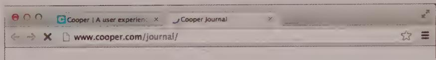  
Figure 21-27: Web browsers such as Google Chrome don't launch a process dialog every time they load a page. Rather, a progress indicator is displayed in the tab for the currently loading page. Other browsers place this indicator in the URL field or in a status bar at the bottom of the window. This allows users to easily understand what's going on without obscuring their view of the partially loaded web page in front of them.

# Notification dialogs

Notification dialogs report important messages that are either the result of triggered events or the result of communications from other users. Alarms, appointments, and e-mail or IM notifications are good examples. These are in contrast to system-generated alerts (discussed in the previous section) that are launched unbidden by the app purely to communicate its own internal problems or successes.

Mobile products support heavy use of notifications, which include both communications and other on-the-go information based on changes in time and location. Some of these idioms have become more prevalent on the desktop and in web apps, since communication apps span these platforms as well.

Mobile platforms have done a good job of collecting notifications into notification centers, which permit viewing of notifications after the fact: Users might be unable to address a message or triggered alarm until they have stopped driving, taken a seat on the bus they were catching, or finished a phone call they were in.

Notifications frequently appear as small pop-up windows or drawers in the periphery of the screen, with a subtle animation to call attention to themselves. They can linger modestly or can close after a short delay, leaving behind a marker or badge in the notification center to alert the user that something still needs his or her attention. Notifications work

well in this manner as long as they are also collected for review in a top-level notification center and the arrival of new, unread notifications is clearly, noticeably, and persistently marked in the interface.

# Bulletin dialogs

Bulletin dialogs, like process dialogs, are launched, unrequested, by the application. The three types of bulletin dialogs are errors, alerts, and confirmations. Each of these reports on, or requires a user decision about, the application's internal state. Each also suffers from frequent misuse. Together they represent some of the worst product interactions, if only by virtue of their vapidity and omnipresence.

The ubiquitous error dialog best characterizes the bulletin dialog. Normally, the application's name is shown in the caption bar, and a brief text description of the problem is displayed in the body. A graphic icon that indicates the problem's class or severity, along with an OK button, usually completes the ensemble. Sometimes a button to summon online help is added. An example from Word is shown in Figure 21-28.

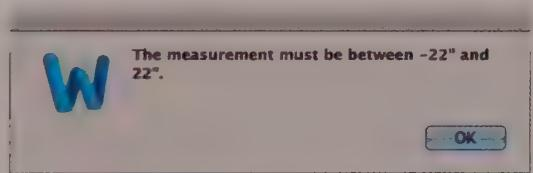  
Figure 21-28: Here's a typical bulletin dialog. It is never requested by the user but is always issued unilaterally by the application when the application fails to do its job or when it just wants to brag about having survived the procedure. This dialog in effect blames the user, rather than helping solve the problem. Users interpret this as saying "The measurement must be between -22 inches and 22 inches, and you are a buffoon for not knowing that fundamental fact. You are so stupid that I won't even try to correct it for you!"

Bulletin dialogs normally are application-modal: They stop all further progress of the application until the user issues a terminating command—like tapping the OK button. This type of bulletin is blocking because the application cannot continue until the user responds.

It is also possible for an application to launch a bulletin dialog and then unilaterally dismiss it after a short delay. This type of bulletin is transitory because the dialog disappears and the application continues without user intervention.

Transitory bulletins are sometimes used for error reporting. An application that launches an error dialog to report a problem may correct the problem itself or may detect that the problem has disappeared via some other agency. Some developers issue an error or alert merely as a warning—Your disk is getting full—and dismiss it after, say, 10 seconds. This type of behavior is fraught with usability issues.

Errors, alerts, and confirmations should pause the application or, at the very least, maintain their presence until the user takes notice. If they don't, the user may be unable to read the bulletin fully, or, if he is looking away, he may not see it—or, worse yet, see only a fleeting glimpse. He will be justifiably suspicious that he has missed something important, something that will come back to haunt him, and not know how to get the message back. He will begin to worry about what he missed. Was it an important bit of intelligence that he will regret not knowing? Is something terribly wrong? This is true even if the problem goes away by itself.

If something is worth saying with a dialog, it's worth ensuring that the user definitely gets the message. Because a transitory notification can't make that guarantee, it should never be used in the role of error reporting or confirmation gathering. Error, alert, and confirmation bulletins should almost always be blocking.

DESIGN PRINCIPLE

Never use transitory dialogs as error messages, alerts, or confirmations.

Property, function, and even notification dialogs are intentionally requested by users—they serve users. The application, however, issues bulletin dialogs—they serve the application, most often at the user's expense. As we shall see, most of these annoying and often useless dialogs should simply be eliminated in favor of more helpful and supportive interaction patterns. We'll discuss this in detail at the end of the chapter.

# Managing property and function dialogs

Even if you are conscientious about the use and organization of property and function dialogs, they can easily become quite crowded with controls, options, and the like. There are several common strategies for managing this crowding so that these dialogs maintain their usefulness.

# Tabbed dialogs

In the 1990s, tabbed dialogs became an established standard in the world of commercial software. The idiom, while useful, became an unfortunately convenient way for developers to cram piles of only vaguely related functions into a single dialog.

On a more positive note, this idiom also allows application objects with numerous properties to have correspondingly rich property dialogs without making those boxes excessively large and crowded with controls (see Figure 21-29). Many function dialogs that were previously jam-packed with controls now make better use of their space. Before tabbed dialogs, this problem was more clumsily solved with expanding and cascading dialogs, which we'll discuss shortly.

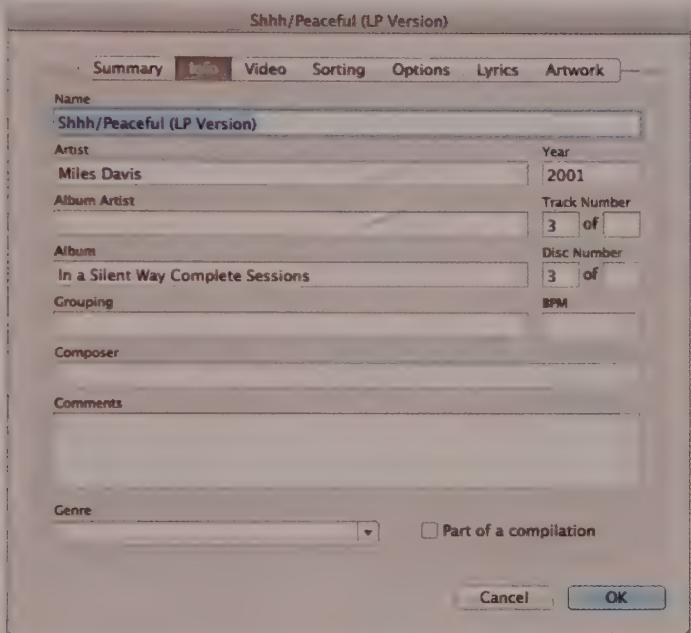  
Figure 21-29: This is a tabbed dialog from iTunes. Combining the different properties of a song in one dialog is effective for users because they have a single place to go to find such things. Note that the terminating controls are correctly placed outside the tabbed pane, in the lower right.

More controls won't necessarily mean that users will find the interface easier to use or more powerful. The contents of the various tabs must have a meaningful rationale for being together. Otherwise, this ability is just another way to build a product according to what is easy for developers, rather than what is good for users.

The tabs in a dialog should be organized to provide either increased depth or increased breadth on a well-defined topic. To organize for breadth, each tab should cover parallel, alternative aspects of the primary topic, the way song properties from iTunes, shown in Figure 21-29, address a variety of properties and settings for the song that would be unwieldy in a single pane. In the case of organizing for more depth, each tab should probe the same aspect of one topic in greater depth. The commonly employed Advanced tab is an example of this strategy.

Tabs are successful because the idiom follows many users' mental model of how things are normally stored. The various controls are grouped in several parallel panes, one level deep. But this idiom can also be abused.

Because it's easy to cram so many controls into a tabbed dialog, the temptation is great to add more and more tabs to a dialog. The now-defunct Options dialog from Microsoft Word, shown in Figure 21-30, illustrates this problem. The 10 tabs are far too numerous to show in a single line, so they are stacked two deep. The problem with this idiom, called stacked tabs, is that the user has to do a significant amount of work to find the single option she wants to change. While the labels of the tabs may give her some help, she is still forced to scan the contents of several tabs while switching between them. And as if that isn't enough, when she clicks a tab in the back row, the entire row of tabs moves forward, pushing the other two rows to the back. Few users are happy with this, because it's disconcerting to click a tab and then have it move out from under the mouse. It's no wonder that Microsoft has largely abandoned this idiom.

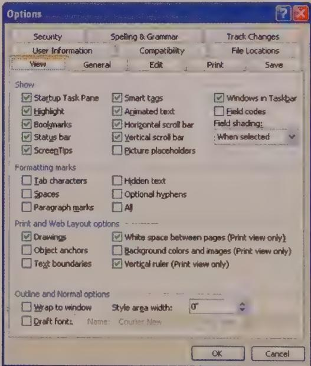  
Figure 21-30: The now-defunct Options properties dialog from Word was an abuse of the tabbed dialog idiom. The problem was that users had to do a lot of work to find the option they were looking for.

Stacked tabs illustrate the following axiom of user-interface design: All idioms, regardless of their merits, have practical limits. A group of five radio buttons may be excellent, but a group of 50 is ridiculous. Five or six tabs in a row is fine, but adding enough tabs to require stacking greatly reduces the idiom's usefulness.

A better alternative would be to use several separate dialogs with fewer tabs on each. In Figure 21-30, Options is just too broad a category, and lumping all this functionality in one place doesn't do users any favors. There is little connection among the 12 panes, so there is little need to move among them. This solution may lack a certain programming elegance, but it is much better for users.

DESIGN PRINCIPLE

Don't stack tabs.

# Expanding dialogs

Expanding dialogs unfold to expose more controls. The dialog shows a button marked More, or uses a down-pointing arrow icon button that toggles to point up when the dialog has been expanded. When the user clicks it, the dialog grows to occupy more screen space. The newly added portion of the dialog contains added functionality, usually for advanced users or more-complex, but related, operations. The Find and Replace dialog in Microsoft Word, shown in Figure 21-31, is a familiar example of this idiom.

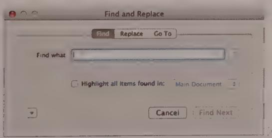

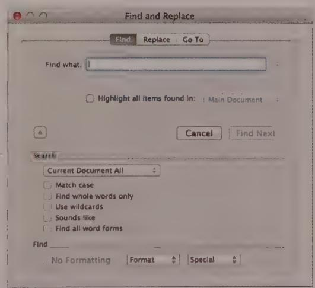  
Figure 21-31: The Microsoft Word Find and Replace dialog is an example of an expanding dialog. The image on the left shows it in its original state; the one on the right is what happens after the arrow toggle button is clicked.

Expanding dialogs give infrequent or first-time users the luxury of not having to confront the complex facilities that more frequent users don't find confusing or overwhelming. Think of the dialog as being in either beginner or advanced mode. However, these types of dialogs must be designed with care. When an application has one dialog for beginners and another for experts, it all too often simultaneously insults the beginners and hassles the experts. It's usually a good idea for the dialog to remember what mode it was used in the last time it was invoked. Of course, this means you should always remember to include a Less command to return the dialog to simple beginner mode.

# Cascading dialogs

Cascading dialogs are a diabolical idiom whereby controls, usually pushbuttons, in one dialog summon another dialog in a hierarchical pile. The second dialog usually covers the first one either partially or completely. Sometimes the second dialog can summon yet a third one. What a mess! Thankfully, cascading dialogs have fallen from grace and are hard to find anymore. Figure 21-32 shows an example taken from Windows Vista.

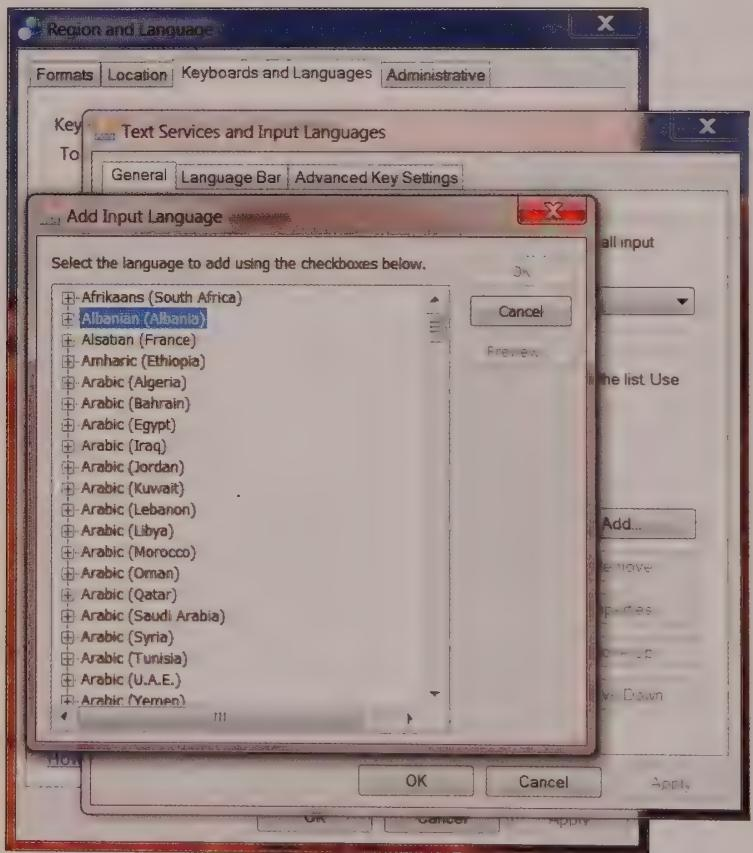  
Figure 21-32: You can still find a few (terrible) cascading dialogs in Windows. Each dialog offers a set of terminating buttons. The resulting excise and ambiguity are not helpful.

It is, simply put, hard to understand what is going on with cascading dialogs. Part of the problem is that the second dialog covers at least part of the first. That isn't the big issue. After all, combo boxes and pop-up menus do that, and some dialogs can be moved. The real confusion comes from the presence of a second set of terminating buttons. What is the scope of each Cancel? What are we OKing?

If you find your application requiring cascading dialogs for anything other than really obscure stuff that your users generally won't need, you should take another look at your interaction framework. It may have structural problems that could be remedied using tabbed dialogs, sidebars, or even toolbars (from which a dialog could be launched).

Dialogs can become useful assistants that help your users accomplish their goals, instead of dreaded roadblocks that confound them at every step. By keeping your dialogs manageable, and invoking them only when their functions are truly those that belong in another room, you will go far toward maintaining your users' flow and ensuring their success and gratitude.

# Eliminating Errors, Alerts, and Confirmations

As we've already discussed, bulletin dialogs—errors, alerts, and confirmations—represent some of the most problematic digital product interactions, enough so that websites and blogs chronicle the worst examples of these idioms. In most cases, bulletin dialogs can be replaced with interactions that better serve user goals and needs. We'll discuss why and how in this section.

# Error dialogs

Probably no user interface idiom is more annoying—or more historically misused—than the error dialog. They are often poorly written, unhelpful, rude, and, worst of all, don't even help prevent the error. Although they are on the wane, it's important to be vigilant to root them out of your application whenever and wherever possible.

# What's wrong with error dialogs?

Users don't need to be told they've made an error. Rather, they need help in avoiding errors and their consequences. We believe that applications have a responsibility to try to make things right for users, rather than summarily rejecting their input.

Since the early days of computing, developers have largely left unexamined the notion that the proper way for software to interact with humans was to demand input and to complain when the human failed to meet the application's expectations. Examples of this unfortunate tradition exist wherever software insists that users do things its way rather than adapting machine behavior to the needs of humans. Nowhere has this been more prevalent than in the use of error messages.

Humans have emotions and feelings; applications don't. When one module of code rejects the input of another, the rejected module doesn't care; it doesn't scowl, get hurt, or seek counseling. Humans, on the other hand, get angry when they are flatly told they did something stupid. Make no mistake: When the user sees an error message, it is as if someone has told her she is stupid (see Figure 21-33). Unsurprisingly, users hate this. Despite this inevitable reaction, some developers use error messages anyway. They don't know how else to create reliable software.

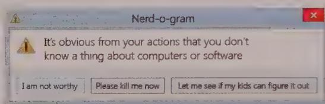  
Figure 21-33: No matter how nicely your error messages are phrased, this is how they will be interpreted.

The assumption that users need to be told when they are wrong is false in most circumstances. How important is it for you to know that you requested an invalid type size? Most of the time, applications can and should make reasonable substitutions rather than scolding users.

We consider it impolite to tell people when they have committed a social faux pas. Telling someone he has a bit of lettuce stuck to his tooth or that his fly is unzipped is equally embarrassing for both parties. Sensitive people look for ways to bring the problem to the victim's attention without letting others notice. Yet the default tool for broaching such a topic with the user is a big, bold box in the middle of the screen that stops all the action and emits a scornful beep. Does that really seem appropriate?

Many designers and developers imagine that their error messages alert users to serious problems. This is a widespread misconception. Most error messages inform users of the application's inability to work flexibly and are an admission of stupidity on the application's part. In other words, to most users, error messages are seen not just as the application stopping the proceedings, but as stopping the proceedings with idiocy. We can significantly improve the quality of our interfaces by eliminating error dialogs.

# Whose mistake is it, anyway?

Conventional wisdom says that error messages tell users when they have made a mistake. Actually, most error messages simply report when the application gets confused. Users make far fewer substantive mistakes than imagined. Typical "errors" consist of issues such as the user's inadvertently entering an out-of-range number, or entering an alphabetic character where a number was expected.

When the user enters something unintelligible by the application's standards, whose fault is it? Is it the user's fault for not knowing how to use the application properly, or is it the fault of the application for not making choices and their effects more clear to users?

Information that is entered in an unfamiliar sequence is often considered an error by software, but people don't have this difficulty with unfamiliar sequences. Humans know how to wait, to bide their time until the story is complete. Software usually jumps to the erroneous conclusion that out-of-sequence input means wrong input, so it issues an error message.

For example, when a user creates an invoice for a customer without an ID number, most applications reject the entry. They stop the proceedings with the idiocy that the user must enter a valid customer number right now. Alternatively, the application could accept the transaction with the expectation that a customer number will eventually be entered, or that the user may even be trying to create a new customer. The application could provide rich modeless visual feedback (as discussed at length in Chapter 15) showing that the customer ID hasn't been entered yet. Then it could watch to make sure that the user enters the necessary information to make that ID valid before the end of the session, or even at the end of the month's book closing.

If a person forgets to fully explain things to the application, it can, after some reasonable delay, provide more insistent signals to the user. At the end of a session, the application can make sure that any irreconcilable transactions are apparent. The application doesn't have to bring the proceedings to a halt with an error message. After all, the application will remember the transactions, so they can be tracked down and fixed. As long as users remain well-informed throughout, there shouldn't be a problem. The trick is to inform without stopping the proceedings. We'll discuss this idea a bit later in this chapter.

# Error messages don't work

Error messages have a final irony: They don't actually prevent users from making errors. We imagine that users are staying out of trouble because our trusty error messages keep them straight, but this is a delusion. What error messages really do is prevent the application from getting into trouble. In most software, the error messages stand like sentries where the application is most sensitive, not where users are most vulnerable, setting in concrete the idea that the application is more important than users. Users get into plenty of trouble with our software regardless of the quantity or quality of its error messages. All an error dialog can do is keep me from entering letters in a numeric field. It does nothing to protect me from entering the wrong numbers, which is a much more difficult design task.

# How to eliminate error messages

We can't eliminate error messages by simply discarding the code that shows the actual error bulletin dialog and letting the application crash if a problem arises. Instead, we need to redesign applications so that they are no longer susceptible to the problem. We must replace the error dialog with more robust software that prevents error conditions from arising, rather than having the application merely complain when things don't go precisely the way it wants. Like vaccinating it against a disease, we make the application immune to the problem, and then we can toss the message that reports it. To eliminate the error message, we must first reduce the possibility of users making errors. Instead of assuming error messages are normal, we need to think of them as abnormal solutions to rare problems—as surgery instead of aspirin. We need to treat them as an idiom of last resort.

The software designer must reevaluate the entire concept of invalid data. When it comes from a human, the software should assume that the input is correct, simply because the human is more important than the code. Instead of software rejecting input, it must work harder to understand and reconcile confusing input. An application may understand the state of things inside the computer, but only the user understands the state of things in the real world. Remember, the real world is more relevant and important than what the application thinks.

# Making errors impossible

Making it impossible for users to make errors is the best way to eliminate error messages. By using bounded widgets (such as spinners and drop-down list boxes) for data entry, we can prevent users from entering invalid values. Instead of forcing the user to key in his selection, present him with a list of possible selections from which to choose. Instead of making the user type in a zip code, for example, look it up from the entered address. In other words, make it impossible for the user to enter an erroneous state.

Another excellent way to eliminate error messages is to make the application smart enough that it no longer needs to make unnecessary demands. Many error messages say things like "Invalid input. User must type xyz." Why can't the application, if it knows what the user must type, just enter xyz by itself and save the user the tongue-lashing? Instead of demanding that the user find a file on a disk, introducing the chance that the user will select the wrong file, the application should remember which files it has accessed in the past and allow the user to select from that list. ("Recent file" lists under the "File" menu accomplish this nicely.) Another example is designing a system that gets the date from the internal or an Internet clock instead of asking for input from users.

Undoubtedly, these solutions cause more work for developers. However, it is the developer's job to satisfy users, not vice versa. If the developer thinks of the user as just another input device, it is easy to forget the pecking order in the world of software design.

Users are unsympathetic to the difficulties developers face. They don't see the technical rationale behind an error message. All they see is the application's unwillingness to deal with things in a human way. They see all error messages as some variant of the one shown in Figure 21-34.

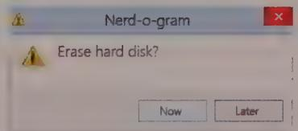  
Figure 21-34: This is how most users perceive error bulletin dialogs. They see them as Kafkaesque interrogations, with each successive choice leading to a blacker pit of retribution and regret.

One of the problems with error messages is that they are usually ex post facto reports of failure. They say, "Bad things just happened, and all you can do is acknowledge the catastrophe." Such reports are not helpful. And these dialogs almost always come with an OK button, requiring the user to be an accessory to the crime. These error messages are reminiscent of the scene in old war movies where an ill-fated soldier steps on a landmine while advancing across the battlefield. He and his buddies clearly hear the click of the mine's triggering mechanism. The soldier realizes that although he's safe now, as soon as he removes his foot from the mine, it will explode, taking some large and useful part of his body with it. This is likely the feeling users will get when they see your app's ill-considered error messages.

# Positive feedback

One of the reasons why software is hard to learn is that it so rarely gives positive feedback. People learn better from positive feedback than from negative feedback. People want to use their software correctly and effectively, and they are motivated to learn how to make the software work for them. They don't need to be slapped on the wrist when they fail. They do need to be rewarded, or at least acknowledged, when they succeed. They will feel better about themselves if they get approval, and that good feeling will be reflected to the product.

Advocates of negative feedback can cite numerous examples of its effectiveness in guiding people's behavior. This evidence is true, but almost universally, the context of effective punitive feedback is getting people to refrain from doing things they want to do but shouldn't: things like not driving over 55 mph, not cheating on their spouses, and not fudging their income taxes. But when it comes to helping people do what they want to do, positive feedback is best. If you've ever learned to ski, you know that a ski instructor who yells at you doesn't help the situation.

DESIGN PRINCIPLE

Users get humiliated when software tells them they failed.

Keep in mind that we are talking about the drawbacks of negative feedback from a software application. Negative feedback from another person, although unpleasant, can be justified in certain circumstances. You could say that a mean coach helps your mental toughness for competition, and the imperious professor at least prepares you for the vicissitudes of the real world. But being given negative feedback by a machine is an insult. The drill sergeant and professor are at least human and have bona fide experience and merit. But to be told by software that you have failed is humiliating and degrading. Nothing that takes place inside a computer is helped by humiliating or degrading a human user.

# Aren't there exceptions?

Are there exceptions to the rule of eliminating error messages? Not many. As our technological powers have grown, the portability and flexibility of our digital systems have grown too. Modern computers and smart devices can be connected to and disconnected from networks and peripherals without having to first power down. This means that it is now normal for digital hardware to appear and disappear on an ad hoc basis. Printers, speakers, and file servers can come and go like the tides. With the development of Wi-Fi and Bluetooth wireless protocols, our devices can frequently connect to and disconnect from each other. Is it an error that the computer crashed and restarted without the user's selecting "shut down"? Is it an error if you print a document, only to find that no printers

If you are connected? Is it an error if the file you are editing normally resides on a drive that is no longer reachable?

None of these occurrences should be considered errors from the user perspective. If you open a file on the server and begin editing it, and then you go out to a restaurant for lunch, taking your notebook with you, the application should see that the file's normal home is no longer available and do something intelligent. It could use a wireless network and VPN to log on to the server remotely. Or it could just save any changes you make locally, synchronizing with the version on the server when you return to the office from lunch. In any case, it is normal behavior, not an error, and you shouldn't have to tell the application what it should do every time it encounters this situation.

Almost all error messages can be eliminated. If you take the correct point of view—that error messages must be eliminated and that your app's design is subject to change in search of this objective—you will be surprised by how little really needs to be changed to achieve this. In those rare cases where the rest of the application must be altered dramatically, that is the time to compromise with the real world and go ahead and use an error message. But you need to start thinking of this compromise as an admission of failure—as a solution of last resort.

This said, there are always a few critical situations where users must be notified in an obtrusive, attention-demanding manner. For example, suppose that, during market hours, an investment manager sets up some trades to be executed by the end of the day, but she sends them to the trading desk after market close. She should be interrupted from whatever else she's working on to be warned that the trades can't be executed until the market opens tomorrow. At that point she may no longer want to make the trades.

# Improving error messages: the last resort

When it is truly infeasible to redesign your application to eliminate the need for error dialogs, we offer here some ways to improve the quality of error messages. Use these recommendations only as a last resort, when you run out of other reasonable options for actually eliminating the error.

An error dialog should be polite, illuminating, and helpful. Never forget that an error dialog is the application's way of reporting on its failure to do its job, and that it interrupts the user to do this. The error dialog must be unfailingly polite. It must never even hint that the user caused this problem, because that is simply not true from the user's perspective.

The error dialog must illuminate the problem for the user. This means that it must give him the information he needs to make an appropriate plan to solve the application's problem. It needs to make clear the scope of the problem, what the alternatives are, what the application will do as a default, and what information was lost, if any.

It is wrong for the application to dump the problem in the user's lap and wash its hands of the matter. It should offer to implement at least one suggested solution right there within the error message. It should offer buttons that will take care of the problem in various ways. If a printer is missing, the message should offer options for deferring the printout or selecting another printer. If the database is hopelessly trashed and useless, the application should offer to rebuild it to a working state, including telling the user how long that process will take and what side effects it will cause.

Figure 21-35 shows an example of a reasonable error message. Notice that it is polite, illuminating, and helpful. It doesn't suggest that the user's behavior is anything but impeccable.

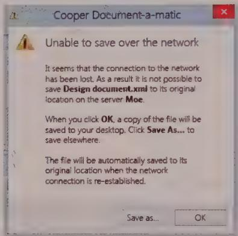  
Figure 21-35: If you must use an error dialog, it should look something like this. It politely and clearly illuminates the problem and proposes a good solution. The action buttons and resulting effects are also clearly described.

# Alerts and confirmations

Like error dialogs, alerts and confirmations stop the proceedings, often with idiocy. Alerts and confirmations do not report malfunctions. An alert notifies the user of the application's action, whereas a confirmation also gives the user the authority to override that action. These dialogs pop up like weeds in most applications. They should, like error dialogs, be eliminated in favor of more useful idioms, such as those discussed in Chapter 15.

# Alerts: announcing the obvious

Alerts usually violate one of the basic design principles from Chapter 18: A dialog is another room, and you should have a good reason to go there. Even if the user must be informed about an action taken by the application, why go into another room to do it?

When it comes down to it, an application should either have the courage of its convictions or should not take action without the user's direct instruction. For example, if the application saves the user's file to disk automatically, it should have the confidence to know that it is doing the right thing. It should provide a means for users to find out what it did, but it doesn't have to stop the proceedings to do so. If the application is unsure whether it should save the file, it shouldn't do so but should leave that operation up to the user.

Conversely, if the user directs the application to do something—dragging a file to the trash can, for example—it doesn't need to stop the proceedings with idiocy to announce that the user just dragged a file to the trash can. The application should ensure that there is adequate visual feedback regarding the action. If the user has made the gesture in error, the application should unobtrusively offer him a robust Undo facility so that he can backtrack.

The rationale for alerts is to keep users informed. This is a great objective, but it need not come at the expense of smooth interaction flow. The alert shown in Figure 21-36 is an example of how alerts are more trouble than help. The Find dialog (the one underneath) already forces the user to click Cancel when the search is completed, but the superimposed alert box adds another flow-breaking button. To return to his work, the user first must click the OK button in the alert and then the Cancel button in the Find dialog. If the information provided by the alert were built into the main Find dialog, the user's burden would be reduced by half.

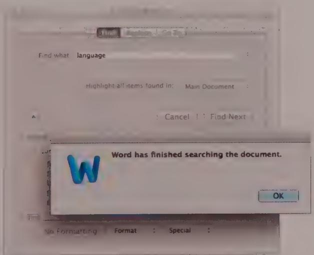  
Figure 21-36: A typical alert dialog. It is unnecessary and inappropriate and stops the proceedings with idiocy. Word has finished searching the document. Should reporting that fact be a different facility than the search mechanism itself? If not, why does it use a different dialog?

# How to eliminate alerts

Alerts are so numerous because they are so easy to create. Most programming languages offer some form of message facility in a single line of code. Conversely, building an animated status display into the face of an application might require a thousand or more lines of code. Developers cannot be expected to make the right choice in this situation. They have a conflict of interest, so designers must be sure to specify precisely where information is reported on the surface of an application. The designers must then follow up to be sure that the design wasn't compromised for the sake of rapid coding. Imagine if the contractor on a building site decided unilaterally not to add a bathroom because it was just too much trouble to deal with the plumbing. There would be consequences.

Of course, software must keep users informed of its actions. It should have visual indicators built into its main screens to make such status information immediately available to users, should they desire it. Launching an alert to announce an unrequested action is bad enough. Launching one to announce a requested action is pathological.

Software should be flexible and forgiving, but it doesn't need to be fawning and obsequious. The dialog shown in Figure 21-37 is a classic example of an alert that should be put out of its misery. It announces that the application successfully completed a synchronization—its sole reason for existence. This occurs a few seconds after we told it to synchronize. It stops the proceedings to announce the obvious. It's as though the application wants approval for how hard it worked. If a person interacted with us like this, we'd be uncomfortable and find him overbearing. Of course, some feedback is appropriate, but is another dialog that must be dismissed really necessary?

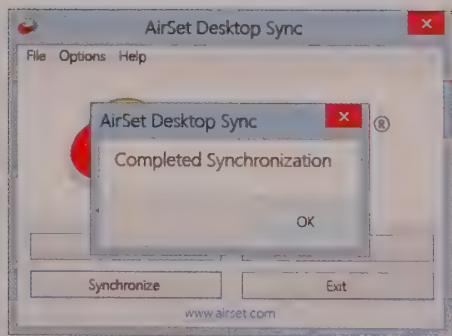  
Figure 21-37: This dialog, from AirSet Desktop Sync, is unnecessarily obsequious. We tell it to synchronize and are promptly stopped in our tracks by this important message. Do we really need the application to waste our time demanding recognition that it managed to do its job?

# Confirmations: the dialog that cried wolf

When an application feels unconfident about its actions, it often asks the user for approval with a dialog, like the one shown in Figure 21-38. This is called a confirmation. Sometimes a confirmation is offered because the application second-guesses one of the user's actions. Sometimes the application feels that it is not competent to make a decision it faces, and it uses a confirmation to give the user the choice instead.

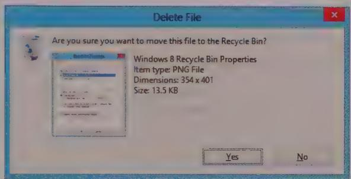  
Figure 21-38: Every time we delete a file in Windows, we get this confirmation dialog asking if we're sure. Yes, we're sure. We're always sure. And if we're wrong, we expect Windows to be able to recover the file for us. Windows lives up to that expectation with its Recycle Bin. So, why does it still issue the confirmation message? When a confirmation box is issued routinely, users get used to approving it routinely. So, when it eventually reports an impending disaster to the user, he goes ahead and approves it anyway, because it is routine. Do your users a favor and never create another confirmation dialog.

Confirmations get written into software when a developer arrives at an impasse in her coding. Typically, she realizes that she is about to direct the application to take some bold action, and she feels unsure about taking responsibility for it. Sometimes the bold action is based on some condition the application detects, but more often it is based on a command the user issues. Typically, the confirmation will be launched after the user issues a command that is irrecoverable or whose results might cause undue alarm.

Confirmations pass the buck to users. Users trust the application to do its job, and the application should both do its job and ensure that it does its job right. The proper solution is to make the action easily reversible and provide enough modeless feedback so that users are not caught off-guard.

Confirmations also illustrate an interesting quirk of human behavior: They work only when they are unexpected. That doesn't sound remarkable until you examine it in context. If confirmations are offered in routine places, users quickly become inured to them and routinely dismiss them without a glance. Dismissing confirmations thus becomes as routine as issuing them. If at some point a truly unexpected and dangerous situation

arises—one that should be brought to the user's attention—he will, by rote, dismiss the confirmation, exactly because it has become routine. Like the fable of the boy who cried wolf, the confirmation box won't work if it cries too many times when there is no danger.

For confirmation dialogs to work, they must appear only when the user will almost definitely click the No or Cancel button. They should never appear when the user is likely to click the Yes or OK button. Seen from this perspective, they look rather pointless, don't they?

# How to eliminate confirmations

Three design principles provide a way to eliminate confirmation dialogs. The best way is to obey this simple dictum: Do, don't ask. When you design your software, go ahead and give it the force of its convictions (backed up, of course, by user research, as discussed in Chapter 2). Users will respect its brevity and confidence.

DESIGN PRINCIPLE

Do; don't ask.

Of course, if an application confidently does something that the user doesn't like, it must be able to reverse the operation. Every aspect of the application's action must be undoable. Instead of asking in advance with a confirmation dialog, on those rare occasions when the application's actions were out of turn, let the user issue the Stop-and-Undo command.

Most situations that we currently consider unprotectable by Undo actually can be protected fairly well. Deleting or overwriting a file is a good example. The file can be moved to a directory where it is kept for a month or so before it is physically deleted. The Windows Recycle Bin uses this strategy, except for the part about automatically erasing files after a month: Users still have to take out the garbage.

DESIGN PRINCIPLE

Make all actions reversible.

Even better than acting in haste and forcing users to rescue the application with Undo, you can make sure that applications offer users adequate information so that they never issue a command (or omit a command) that leads to an undesirable result. Applications should use rich visual feedback so that users are constantly kept informed, the same way that dashboard instruments keep us informed of the state of our car.

Occasionally, a situation arises that really can't be protected by Undo. Is this a legitimate case for a confirmation dialog? Not necessarily. A better approach is to provide users with protection the way we give them protection on the freeway: with consistent and clear markings. You can often build excellent, modeless warnings right into the interface. For instance, look at the dialog from Adobe Photoshop shown in Figure 21-39, telling us that our document is larger than the available print area. Why has the application waited until now to inform us of this fact? What if guides showing the actual printable region were visible on the page at all times (unless the user hid them)? What if the parts of the picture outside the printable area were highlighted when the user moved the cursor over the Print button in the toolbar? Clear, rich modeless feedback (as discussed in Chapter 15) is the best way to address these problems.

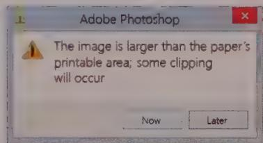  
Figure 21-39: This dialog provides too little help too late. What if the application could display the printable region right in the main interface as dotted guides? There's no reason for users to be subjected to dialogs like these.

Provide modeless feedback to help users avoid mistakes.

Much more common than honestly irreversible actions are actions that are easily reversible but still uselessly protected by routine confirmation boxes. The confirmation shown in Figure 21-38 is an excellent specimen of this species. There is no reason to ask for confirmation of a move to the Recycle Bin. The sole reason the Recycle Bin exists is to implement an Undo facility for deleted files.

# The Devil Is in the Details

Although the big-picture principles discussed throughout this book can provide enormous leverage in creating products that will please and satisfy users, it's always important to remember that the devil is in the details.

Frustrating controls and misplaced dialogs can lead to constant low-level annoyance, even if the overall product concept is excellent. Be sure to dot your i's and cross your t's, and ensure that the detailed interactions of your product support your user in his goals, tasks, and aspirations.

If you stick to the concepts behind Goal-Directed Design and use that thinking throughout your framework down to the most minute design details, you will create products that will surpass the competition, make devoted fans of your users, and—perhaps—make the world a better place, one pixel at a time.

