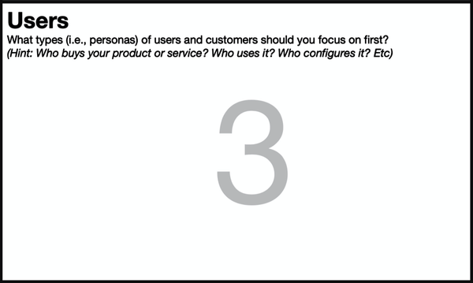
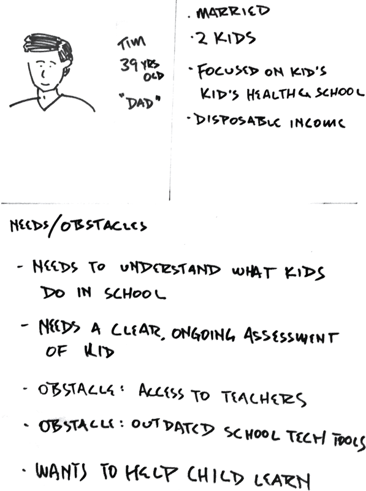
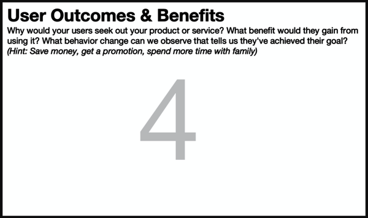
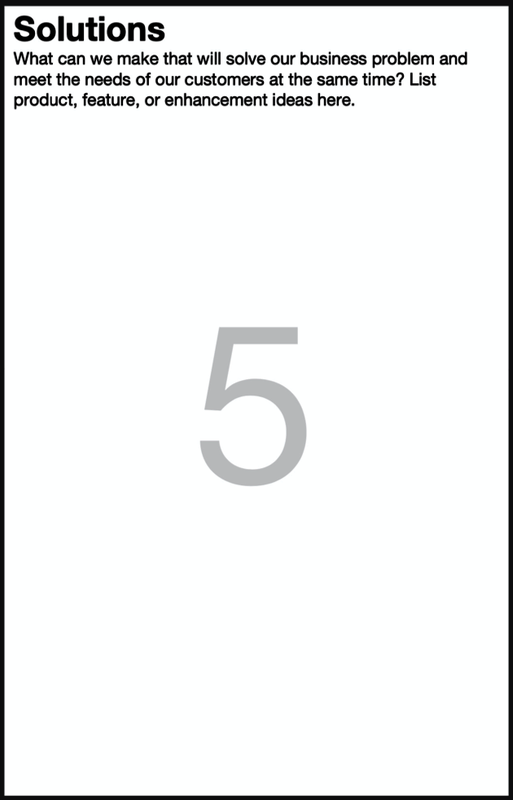

# Part II: Process

## The Lean UX Canvas in the Enterprise

Recently we heard from a product and design leader at a large enterprise
software company in Silicon Valley. This company develops a cloud
computing platform to help companies manage digital workflows for
enterprise operations. They got in touch because they wanted to tell us
how they’d been using the Lean UX canvas to kick off projects and new
initiatives. We thought it was a great story to share.

A team at this company was working on the second release of a product
that had received good feedback from customers. The product had a novel
way of displaying data—a display that was really beautiful, that tested
well, and that generated really positive feedback from customers. The
product used an unusual UI element: a custom-built map that helped users
visualize work processes and spot opportunities for process
improvements.

In addition to generating positive feedback from customers, this UI
showed really well internally. Stakeholders loved it and supported the
idea of enhancing it. So it seemed like a natural choice to build on the
success of this feature in the next version, and, in fact, that’s what
the team planned to do: they were going to really lean into this feature
for the second release.

Still, they had recently come across the Lean UX Canvas as a tool and
liked the way that it spurred methodical thinking about the work they
needed to do. They decided to work through a Lean UX Canvas for this
initiative. When they did, an interesting thing happened. When they came
to [Chapter 8](#ch08.html_box_four_user_outcomes_and_benefits), they had
a breakthrough.

In order to complete Box 4, the team had to turn back to the feedback
data that they had already collected from customers. This often happens
when you work on a Lean UX Canvas: you have to find the information that
you need to complete a section. Sometimes that means you need to do
additional research, and sometimes it simply means you have to review
the research you’ve already done.

In this case, as the team reviewed their data, they noticed an important
pattern in the user feedback they’d overlooked: customers were telling
them they loved the map, but they wanted more from the product than
simply data display. They wanted the product to be more proactive. They
were saying essentially, “The display is really beautiful, but we want
you to highlight where we should be paying attention.”

The process of completing a Lean UX Canvas forced the team to stop and
methodically examine the data they had collected. One team member told
me, “We actually had the feedback. We just weren’t listening to it!” He
continued: “When we used the canvas to go through the data about what
was materially important to our customers, we realized that we had
simply been ignoring the data!”

So the team spent time interpreting this feedback. They really dug in
and worked out what they thought the feedback meant and what it meant
about the outcomes customers were seeking. When they went back to the
customers to validate these ideas, customers responded positively.

After that, the team made an easy decision: they needed to change their
priorities. One team member told us that the conversation on the team
was clear. “When the voting came down, it wasn’t ‘make the map better’;
it was ‘let’s do what our customers really find valuable.’”

In the pilot for the second release, “we got really high marks from our
customers.” Those high marks helped the team get to broad release even
faster. “We probably got there six months sooner because of this
feedback.”

---

## Validately: Validating Your Product with Customer Interviews and a Two-Day Prototype

Serial entrepreneur Steven Cohn got the idea to launch Validately
because of the challenges he faced as an entrepreneur doing his own user
research. When he surveyed the landscape, he discovered that other user
researchers had similar challenges. User researchers were typically
using free tools like Skype and Google Docs to conduct their studies. He
knew that these tools weren’t designed for user research and made the
process inefficient. Some teams supplemented these tools with the
best-known service provider in the space,
[usertesting.com](http://usertesting.com). He knew that there was an
opportunity here.

Steven and his team used customer interviews to discover this user’s
needs and goals (Box 4 of the Lean UX Canvas). In these conversations,
they discovered where they should focus when they asked researchers what
they do with the results their studies generated. “That’s where the bulk
of my work is,” they told him. In fact, he learned that the bulk of
researchers’ work began once the actual research was over.

The Validately team learned that, following a round of customer
interviews or usability tests, researchers had to go back to a lengthy
and disorganized Google Doc of notes and connect those notes to
timestamps in the video of the study. They would use these timestamps
(and some kind of video editing tool) to create video clips, assemble
these clips into a highlight reel, and finally share that reel with
their teams, clients, and stakeholders. All this just to share what they
learned during the study.

The team conducted dozens of interviews to validate this problem. They
learned that this work—creating reports and video highlights—was
frequently more than 50% of the total effort devoted to each study. He
knew he’d found a problem worth solving.

The next step was to work on the solution. (Box 5 of the Lean UX
Canvas.) Steven and team created a prototype in InVision that
hypothesized what a streamlined tool that combined note taking, time
tracking, and report and highlight reel creation could look like. They
spent two days creating this prototype before showing it to customers.

The prototype almost single-handedly answered the question “How are you
better than [usertesting.com](http://usertesting.com)?” Once potential
customers saw the value of the streamlined tool Validately wanted to
build, they were immediately interested. At this point, Steven and team
asked for one more type of “feedback.” They asked people to commit on
the spot—to purchasing a product not in the future but right now, even
though it wasn’t ready for delivery. The contract offered a cancelation
clause if delivery didn’t happen, but otherwise, Steven used the
prototype as a selling tool for a service that did not yet exist. The
pitch worked, which helped Validately validate that their solution was
the right one. They converted enough customers to build a thriving
business in the gaps between free tools like Google Docs and Skype.
Validately went on to be a huge success, ultimately selling to UserZoom
in 2019.

The MVPs they used here—customer conversation followed by a two-day
prototype—helped Steven and team gather three levels of validation:

Time  
Will people give us 30 minutes of their time to discuss this problem? If
not, the problem we’re solving is not important enough to them and
likely not a space we want to play in.

Social  
Will the people we speak with take it to their boss, team, infosec,
procurement, and others in the organization? Will they socialize it and
endorse it internally? To understand this, they always asked, “Will you
introduce me to others in the organization who might be interested in
this tool?” Again, if this resulted in no introductions, that was also a
signal.

Money  
If the prospective customer gave their time and their reputation, they’d
be asked to purchase. This is the ultimate validation as it actually
resulted in a sale.

---

## Kaplan Test Prep: Using Lean UX to Launch a New Business

Kaplan Test Prep has been helping students in the US prepare for
standardized tests like college and medical school entrance exams since
1938. Now, with education transforming on a nearly annual basis, Kaplan
has to continuously reinvent how it delivers value to its customers. Lee
Weiss, currently a senior vice president at the company, has helped
Kaplan do exactly this for more than 20 years. Most recently, in the
fall of 2018, Lee started thinking about a new idea to reinvent Kaplan’s
university partnerships business. He wanted to make it possible for
universities to create online courses for high school students on the
topics of college and career readiness.

Their idea was to create a safe way for high school students to learn
about various career paths and try out different universities at the
same time. Lee and his colleagues spent a few weeks sketching out some
ideas of how this could work and put their thoughts down in a PowerPoint
deck. This deck became their first experiment—their MVP—to help them
test their first hypothesis: that leadership would be interested in
their plans.

In early 2019, they met with the leadership team to test their idea.
Kaplan’s leaders were excited about this new idea and gave Lee and his
colleague Liz Laub the green light to focus solely on this new idea.
Kaplan’s leadership team told Lee and Liz, “Take the next 90 days and
see if you can get this concept off the ground.”

Lee and Liz started by asking themselves the first key question of Lean
UX: What’s the most important thing we need to learn first? (Box 7 on
the Lean UX Canvas.)

They realized they wouldn’t have a business at all if they couldn’t get
any universities interested. With their biggest risk identified, they
were able to move on to the second key Lean UX question: What’s the
least amount of work we need to do to learn it? (Box 8 on the Lean UX
Canvas.)

They started talking to universities to see if they’d be interested in
partnering with them on this initiative—even though the initiative
itself did not yet exist. Within 90 days, the team had spoken to 20
different universities and ended up with 2 of the biggest universities
in the US interested in the idea—all through simple, and at times
serendipitous, conversation. This was great news, as it would give Lee
and Liz enough information to make a more detailed request from
leadership. A request for budget to bring a product to market.

Before they could do that, though, there were other questions they’d
need to answer: like what would students and parents want? What would
their solution look like? (These are the kinds of questions you capture
in Box 7 of the canvas.)

This is where the obstacles started to appear: their assumptions about
their product offering ([Chapter 9](#ch09.html_box_five_solutions))
started getting smashed on the rocks of reality. Initially, they’d hoped
to build a product that allowed teachers and students to interact
together in real time. Unfortunately, time zones got in the way of that,
something they learned quickly through early and continuous
conversations with students. So they pivoted to asynchronous courses and
quickly faced a new challenge: how to build an engaging and high-value
course.

They assumed that the best way to do this would be to build cohort-based
communities. They tested their assumptions by starting to create early
versions of this offering. While this received strong positive feedback
from the students who were involved in the tests, there was still demand
from both parents and students for live mentoring and support. They
addressed this by hiring former students from these universities as
mentors. These pieces were the foundations of a product that met both
synchronous and asynchronous needs.

There was one last piece of the puzzle they had to explore in their
initial 90-day period, though: their hypotheses about the kind of
organization they would need to build and support this business. It
wouldn’t do them any good to solve this need in the market with a
compelling product if they couldn’t create a viable, sustainable
business. (These service-design considerations should be part of your
solution definition in Box 5.)

Here again the team made a series of assumptions about who they’d need
to hire, how they should price the product, how much it would cost to
run it, and, of course, what shape the product should take. Lee notes
that nearly all of these assumptions were wrong in hindsight, but they
now had enough information to go back to leadership with a more detailed
request: a request for budget—\$700,000 to be exact—to get the product
built and to market. The request was approved, with one caveat: you have
one year to break even.

The team got started. Using nothing more than conversations with
students, teachers, and administrators at their two (now signed)
customers, the team created an initial curriculum of three courses. The
goal was to make the highest quality courses they could as quickly as
possible.

With the curriculum in place, the team needed operational systems to
support the work—CRM, learning management systems, content management
systems, etc. They sought systems with the mandate to use whatever got
them up and running the fastest. They stitched together a lightweight
experience using SaaS products—all outside the Kaplan tech ecosystem,
which would have slowed down their ability to run quick tests. (This is
a great use of the No-Code MVP technique.)

The first two-week course had eight students in it, all of whom got the
course for free. All eight finished the course and gave strong positive
feedback about the product quality and overall experience. Now it was
time to acquire the first paid cohort. There wasn’t a lot of interest at
first. Lee, Liz, and the team were starting to worry. Their application
was long, the cost was high, and the \$50 application fee they’d seen
elsewhere and copied into their product all seemed to be keeping
potential customers from submitting their applications.

The next experiments were clear to the team—remove the application fee,
shorten the application process, and lower the price. They were able to
do this for two reasons. First, because they were an internal innovation
team, they had decision-making authority to explore pricing. So they cut
their prices in half. The second reason that they could experiment like
this? They were working in one-week sprints. So even if a decision was
catastrophic, the longest they had to live with it was one week.

The team didn’t have to wait long, though. The day they made the
changes, they got more applications than the prior two weeks combined.
Sales revenue quintupled. As the product saw stronger traction, the team
began to worry about maintaining product quality as they scaled. They
defined a set of outcome-based metrics to guide their decision making
and keep quality high: they wanted to make sure that every student
logged in within 48 hours of any course starting, they wanted to see an
80% course completion rate, and they wanted to maintain a Net Promoter
Score (NPS) of 50.

By using outcomes as their north stars, evidence-based decision making
as their engine, and short cycles to keep themselves on track, the team
has managed to build a business unit that now employs more than 30. They
proved that following data and instinct and slowly scaling up decisions
allows you to make the best course corrections along the way. When you
couple this data with an autonomous team and a clear, outcome-based
mandate, the results speak for themselves.

---

## Part II. Process

---

## About Part II

In the previous part, we looked at the ideas behind Lean UX—the
principles that drive the work. In this section, we’ll get very
practical and describe in detail the process of doing Lean UX.

We’ve organized this section around a new tool that we’ve been using for
the last few years: the Lean UX Canvas. The Lean UX Canvas is a way to
orchestrate your Lean UX process. It offers a single-page “at-a-glance”
way of framing your work on a feature, an epic or initiative, or even an
entire product.

This single-page tool collects all of the key tools, methods, processes,
and techniques of Lean UX into a single document with a unified
structure. It’s a tool that you can use to get from the earliest part of
the design process—your initial problem framing—through design,
prototyping, and research.

Although you don’t *have* to use the canvas to do Lean UX, we’ve found
that the canvas is a great way to explain the process, so we’ve chosen
to present the Lean UX process to you by using the canvas.

---

## The Lean UX Canvas

[Chapter 4, “The Lean UX Canvas”](#ch04.html_the_lean_ux_canvas),
provides an overview of the Lean UX Canvas. You’ll learn why Lean UX is
skeptical of requirements, why it embraces assumptions instead, and how
the Lean UX Canvas is a vehicle that you can use to capture and test
your assumptions. This chapter also introduces some ideas about
facilitating the process of working with the canvas.

[Chapter 5, “Box 1: Business
Problem”](#ch05.html_box_one_business_problem), covers the technique
you’ll use to define the problem you and your team are trying to solve
from the business’s POV.

[Chapter 6, “Box 2: Business
Outcomes”](#ch06.html_box_two_business_outcomes), covers how you define
success for your project. This box is all about understanding what
outcomes you’re trying to achieve for your business, organization, or
clients.

[Chapter 7, “Box 3: Users”](#ch07.html_box_three_users), covers the
section of the canvas that defines your users (and customers). This
section describes the proto-persona technique and how to use it.

[Chapter 8, “Box 4: User Outcomes and
Benefits”](#ch08.html_box_four_user_outcomes_and_benefits), is all about
user goals. What are your users (and customers) trying to do? What will
define success for them?

[Chapter 9, “Box 5: Solutions”](#ch09.html_box_five_solutions), is where
we begin to define what we’ll be making (or doing) in order to solve the
problems we’ve defined.

[Chapter 10, “Box 6: Hypotheses”](#ch10.html_box_six_hypotheses),
[Chapter 11, “Box 7: What’s the Most Important Thing We Need to Learn
First?”](#ch11.html_box_seven_whatapostrophes_the_most_impo), and
[Chapter 12, “Box 8: MVPs and
Experiments”](#ch12.html_box_eight_mvps_and_experiments), cover the
bottom third of the canvas, which drives the conversation to find out if
we’re right about everything else in the canvas.

Let’s dig into each box and see exactly how each part of this
conversation plays out, how to facilitate it successfully, and what to
watch out for in each box as you go through the exercises and declare
your assumptions.

---

## Chapter 4. The Lean UX Canvas

---

## Assumptions Are the New Requirements

If you work in an industry where things are relatively predictable,
where there is low risk and high certainty in what the company is
making, what it takes to make your product, what it looks like when it’s
done, and what your customers will do with it once they have it, you can
comfortably work with a set of rigid, predetermined requirements. In a
world with this manufacturing-era mentality, big design up front is the
norm, and any variability in the production of your product is seen not
as an agile response to a changing marketplace but rather as an
expensive deviation from the plan. This way of thinking about
requirements was adopted in the early days of the software industry, was
the dominant model for decades, and continues to permeate many teams’
ways of working even to this day.

Requirements assume we know exactly what we need to build. Ideally, they
come from engineering rigor. But in software, they usually don’t have
the rigor behind them. Still, they are taken at face value based on
their author’s credibility or organizational title. In many cases, that
blind faith is augmented with the phrase “well, it worked before.”
Individuals or teams who question the absoluteness of the requirements
they’ve received are perceived as troublemakers and treated as
scapegoats when projects end up missing deadlines, exceeding scope, or
both. In organizations still leaning heavily on them as a way to tell
teams what to do, requirements often simply mean, as our friend Jeff
Patton likes to say, “Shut up.”

But today’s software-based businesses operate in a reality devoid of
consistency, predictability, stability, and certainty. Saying with
authority that a specific combination of code, copy, and design will
achieve a desired business outcome and will be delivered completely by
an explicit deadline is not just risky; in most cases it’s a lie.
Software development is complex and unpredictable. The pace of change is
incredibly fast. Not only can companies ship features to production
continuously at unprecedented speeds, but consumer behaviors are
changing just as quickly. As soon as you’ve settled on a feature set,
design approach, and specific user experience, your audience begins to
evolve into new mental models based on their experiences with other
online services.

The good news is that we don’t have to rely on requirements. The
industry has developed new ways to work that allow us to move away from
rigid requirements. When we wrote the first edition of this book, Amazon
was shipping code to production every 11.6 seconds. Today they’ve
decreased their time to market to one second.^([1](#ch04.html_ch01fn8))
That’s right: every second some Amazon customer somewhere in their
ecosystem experiences a change to the way the product works. Sixty times
per minute, Amazon has an opportunity to learn how well they’re meeting
the needs of their customers. Sixty times per minute, they have an
opportunity to respond to what they’re learning. Sixty times per minute,
they have an opportunity to make their user experience better. With this
capability, the very idea of a rigid requirement is, at best,
anachronistic. At worst, it’s an impediment that prevents teams from
doing their best work. We’ll grant that Amazon is at the extreme end of
this, but they serve as inspiration and a clear target for what is
possible. If we can ship, sense, and respond to this quickly, then
assuming that we know exactly how to best deliver value is a level of
arrogance and risk your organization cannot afford.

There are other reasons to avoid requirements. Software is hard. Even
seasoned software engineers will tell you that just because something
*seems* simple to build doesn’t mean it actually will *be* simple to
build. Oftentimes, as we set out to deliver a specific user experience,
we learn that in order to do so we’ll need to develop more code than we
anticipated. The code we thought would be simple turns out to have
complex dependencies or has legacy constraints or runs into unplanned
obstacles, and we end up having to spend extra time figuring out how to
work around these problems. This, too, flies in the face of rigid,
deadline-based requirements.

And, of course, it’s not just code that is complex and unpredictable.
Humans are complex and unpredictable too. Their innate motivations,
personalities, expectations, cultural norms, and habits all fly in the
face of what we believe will be an ideal software service for them to
use. We put so much faith in what we think will be “easy to use” or
“intuitive,” only to find that our target audience goes out of their way
to avoid the simplifications we believe we made for them. Why do they do
this? Any variety of factors (which we could learn about through
customer interviews and research) could lead to these unexpected
behaviors, but they all have the same net result: they prove our
requirements wrong.

So what should we do? We need to recognize that most requirements are
simply *assumptions* expressed with authority. If we remove the
authority, overconfidence, and arrogance from the conversation, we’re
left with someone’s best guess about how to best achieve a user goal or
solve a business problem. We are makers of digital products, so humbly
admitting that these are indeed our best guesses or assumptions
immediately and explicitly creates the space for product discovery and
Lean UX to take place. If we understand as a team that the work we’re
undertaking is risky *exactly because* we can’t predict human behavior,
we know that part of our work will have to include experimentation,
research, and rework. We reduce our attachment to the ideas and create a
team culture that is more willing to adjust course—even to stop working
on an idea that continues to prove unviable.

So how do we build a conversation that encourages ideas from the whole
team but qualifies those ideas as a series of assumptions? In earlier
versions of this book we shared a series of assumptions declaration
exercises. These processes have helped readers and practitioners express
their ideas in a new way, as *testable assumptions.* Over the years,
we’ve consolidated these assumptions declaration exercises, as well as
the steps you’ll need to test your assumptions, into one comprehensive
facilitation tool we call the Lean UX Canvas.

---

## The Lean UX Canvas

The Lean UX Canvas ([Figure 4-1](#ch04.html_the_lean_ux_canvas-id00041))
brings together a series of exercises that allow teams to declare their
assumptions about an initiative. It’s designed to facilitate
conversations within the team but also with stakeholders, clients, and
other colleagues. Remember that in Lean UX we’re trying to build shared
understanding, and to do that (especially when we’re trying to move away
from requirements), we need a consistent shared vocabulary that allows
stakeholders and individual contributors alike to share their ideas and
create clarity.

If you’ve done some Lean UX work in the past, you’ll recognize most of
these activities. If you’ve done design work before, you’ll recognize
the importance of all of the topics on the canvas and how important it
is to have conversations about these topics at the start of a project.
Our experience using this canvas is that the structure of the canvas
helps ensure all these conversations take place, that the conversations
include a diverse set of viewpoints, and that, when you’re done, the
extended team has built shared understanding and the path forward is
clear.

###### Figure 4-1. The [Lean UX Canvas](https://www.jeffgothelf.com/blog/leanuxcanvas-v2)

The canvas was designed to guide the conversation from the current state
of your product or system—or what Mike Rother called *the current
condition* (“NOW” in
[Figure 4-2](#ch04.html_the_key_areas_of_the_lean_ux_canvas)) in his
book *The Toyota Kata*^([2](#ch04.html_ch01fn9))—to its desired future
state or *target condition* (“LATER” in
[Figure 4-2](#ch04.html_the_key_areas_of_the_lean_ux_canvas)).

###### Figure 4-2. The key areas of the Lean UX Canvas

<aside data-type="sidebar" epub:type="sidebar">

##### Another Canvas?

Another canvas? Fair question. Ever since Alex Osterwalder and the team
at Strategyzer gifted the world the Business Model Canvas, we’ve been
enamored and ultimately inundated with canvases. If you don’t publish a
canvas, are you really even a thought leader? Again, fair question. But
canvases are useful and can serve as the centerpiece of a balanced,
inclusive team collaboration. If used correctly, canvases:

- Consolidate a series of activities into a sequential process designed
  to drive a narrative.

- Help in complex environments. They help us create a single visual
  model to represent key elements of that complexity.

- Serve as an easy-to-follow facilitation tool for teams interested in
  having a specific kind of conversation.

- Level the playing field for team members less apt to offer their ideas
  in a standard brainstorming session.

- Create a shared language for the team to use.

- Successfully frame the job to be done by the team.

- Communicate the challenge or work the team is undertaking broadly
  beyond the team.

</aside>

---

## Using the Canvas

In the coming chapters, we’ll describe each section of the canvas in
detail. Before we do that, however, we want to answer some general
questions that come up whenever we teach teams about the canvas.

---

## So When Should We Use the Lean UX Canvas?

We think that the canvas is a great way to start an initiative. Whether
you’re working on a new feature, a major initiative, or a new product,
the canvas is a great structure to use for your kickoff meeting. As you
get comfortable with the tool, you’ll start to develop a sense of when a
piece of work is too small for the canvas. Generally, we think it’s a
good idea to use it any time you’re planning a big chunk of work.

---

## Is the Lean UX Canvas Best Suited for Early-Stage Ideas or for Sustaining Innovation?

The canvas actually works well for both types of work. The key question
is this: are you facing important unknowns, uncertainty, or complexity?
That’s where the Lean UX Canvas—and, really, Lean UX in general—can
help. In early-stage work, the unknowns tend to be existential in
nature: is there a need for this product or service? Will people use our
solution? Can we build a business by solving this problem? In sustaining
innovation, the questions tend to be smaller, but that doesn’t mean that
the answers are any clearer. In both of these situations, the Lean UX
Canvas can help.

---

## Who Should Work on the Canvas?

One of the values of the canvas is the way that working through it
creates shared understanding on your team. It encourages the team and
stakeholders to do the product discovery work that makes for successful
products. So we believe that all team members should participate in the
work on the canvas. We also think that stakeholders and clients should
participate as much as possible, especially during the parts of the work
to elaborate the business problem statement and business goals.

---

## How Long Should We Expect to Spend on a Lean UX Canvas?

It’s hard to get through the whole thing in less than a half-day
session. Because the canvas makes a great kickoff activity, think about
how much time you normally spend kicking off projects. Is that a two-day
exercise? A full week? Some teams will work through the canvas that way,
especially if you can all be together in the same room. Other teams will
choose to hold a series of meetings over the course of a couple of
weeks. In general, the bigger and more important the project, the longer
it will take. Don’t get stuck in analysis paralysis. When you don’t know
something, put it in the parking lot and move on. After all, the *whole
point* of the canvas is to collect the things that you don’t know so
that you can start learning about them quickly.

---

## Do We Have to Use the Canvas to Do Lean UX?

Absolutely not. Each part of the canvas contains a useful part of the
Lean UX process. As you’re working on any initiative, you’re going to
want to think about and answer the questions implied by each of the
boxes on the canvas. That said, you can absolutely use each box on the
canvas as a standalone technique. Are you unclear about your users? Go
to Box 3, read about proto-personas, and use these ideas with your team
to get clarity. Are you unclear about the best solution to a problem?
Flip to the section of this book on Box 5 and take your team through
that process.

If you decide to use the canvas as a whole, remember that it’s a
flexible tool. Use the exercises that work best for you, taking into
account your context and the ways that work for your team. Expand the
number of activities as your team grows more comfortable with the nature
of this work. Ultimately, we want to ensure the customer is front and
center in all of your conversations. The Lean UX Canvas is a strong
starting point for ensuring that happens.

---

## Facilitating Each Section

In the chapters to come, we’ll share instructions for exercises that we
like to use to complete the canvas. Here, we’d like to note some general
patterns.

### Be inclusive

We want the whole team to participate in completing the
canvas.^([3](#ch04.html_ch01fn10)) This means that your facilitation
needs to account for different participation styles, as well as the
different levels of power and authority in the room.

To address that, we like to use a variant of the *1-2-4-All*
pattern.^([4](#ch04.html_ch01fn11)) This is a structured way of
eliciting participation from a group. Here’s how it works:

- You start by asking people to work individually (the “1”), usually
  silently, either by writing ideas or drawing something by themselves.
  You generally want to set an aggressive time limit on this period
  (usually five minutes) to force people to get their ideas out and to
  avoid spending a lot of time editing and refining. After this period
  of solo work, ask folks to share back with their table or their
  subgroup. If people have been working with Post-its, it can make sense
  to ask people to bring them to a wall and post them there. Optionally,
  you can offer discussion during this period. You can also ask people
  to do some affinity mapping at this point.

- Then, you ask people to work in pairs (the “2”) to elaborate or
  develop an idea. Paired work takes more time than solo work, so give
  the pairs more time than you allowed for solo work. Again, following
  this period of paired work, you have the pairs present their work to
  their table or subgroup room, and you may have more discussion at this
  point.

- Next, you ask each table or subgroup to develop their work into a
  single presentation. (This is the “4” portion of the pattern.)

- Finally (if you’re trying to produce one final idea), you ask the
  whole group to develop a single idea. (This is the “All” portion of
  the pattern.)

1-2-4-All is effective because it solicits input from everyone in the
room, allows for both solo and collaborative working styles, and,
finally, allows the group to come together. You’ll want to adapt this
pattern to the specific exercise but keep it in mind as you plan group
work.

### Remote versus in-person

All of these exercises can be done as in-person workshops or remotely,
with videoconferencing software and shared whiteboard tools. If you’re
working remotely, remember to break up your sessions to allow people to
stand up and avoid Zoom fatigue. Also, remember that not everyone is
familiar with online whiteboard tools, so allow some time to bring less
experienced participants up to speed. (Sometimes you can use an
icebreaker exercise that helps people learn the tool.) We’ve created
[Lean UX Canvas templates](http://www.leanuxbook.com/links) that you can
use.

---

## Wrapping Up

In the coming chapters in this section, we’ll describe each section of
the canvas in detail.

^([1](#ch04.html_ch01fn8-marker)) Vogels, “The Story of Apollo -
Amazon’s Deployment Engine.”

^([2](#ch04.html_ch01fn9-marker)) Mike Rother, *The Toyota Kata:
Managing People for Improvement, Adaptiveness, and Superior Results*
(McGraw-Hill Education, 2009).

^([3](#ch04.html_ch01fn10-marker)) The idea of “the whole team” will
vary based on your context, so feel free to adapt this advice based on
the size of your group and the roles of the people in the room.

^([4](#ch04.html_ch01fn11-marker)) This is one of the patterns in the
very useful Liberating Structures collection. See “1-2-4-All,”
Liberating Structures, accessed June 16, 2021,
[*https://oreil.ly/12vgk*](https://oreil.ly/12vgk).

---

## Chapter 5. Box 1: Business Problem

###### Figure 5-1. Box 1 of the Lean UX Canvas: Business Problem

For Lean UX to be successful, teams must be given problems to solve, not
solutions to build. Often, these “solutions” are expressed as
requirements or feature specifications. But if requirements are the
wrong way to go, what’s the right way? The right way is to understand
and express the problem that stakeholders or clients are trying to
solve. This is what *business problem statements* do. Business problem
statements reframe the work in a way that explicitly demands that
product discovery work take place.

While there is some flexibility in what a business problem statement can
look like, at the very least it should:

- Provide a specific challenge for the team to solve rather than a set
  of features to implement.

- Anchor the team in a customer-centric perspective so that customer
  success is a baked-in part of the end goal.

- Focus the team’s effort by specifying guidelines and constraints that
  make it clear to the team what is in scope and what is out of scope.

- Provide clear measures of success expressed as key performance
  indicators of the business (desired impacts) or specific outcomes the
  company wants to see in its target audience.

- Not define a solution (this is surprisingly harder than it sounds).

Foundationally, business problem statements contain three parts:

1.  **The current goals of the product or the system the team is working
    on.** In other words, why was it created in the first place? What
    problem was it originally designed to solve? What value was it
    intended to deliver?

2.  **What’s changed in the world and how that has negatively affected
    the product?** In other words, where are the goals we set for this
    product not being met now?

3.  **An explicit request to improve the product** that stays away from
    specifying a solution and that quantifies “improvement” in terms of
    outcomes.

When you are creating business problem statements, remember that your
initial efforts are likely to be filled with assumptions. You’ll
discover that this is going to be true for every part of the Lean UX
Canvas. This is OK; in fact, it’s inevitable. Just keep in mind that, as
you start to work on the problem—that is, as you start to do the
discovery work—you may uncover evidence that you’re working on the wrong
problem or targeting the wrong audience or measuring success in the
wrong way. That’s fine. That’s why you do discovery! Just make sure you
bring this learning back to the team and to stakeholders as soon as you
can so that you ensure you’re not wasting time and effort on an invalid
problem statement.

---

## Facilitating the Exercise

To create a business problem statement, you can certainly sit down
informally with stakeholders and product owners to draft one together.
That said, we like to do this as part of a workshop setting with the
whole team. If you’re doing that, we recommend using the following
process.

*Provide context and background for the team.* This often falls on the
product manager and is critical to framing the work correctly. Questions
that the product manager should answer for the team prior to writing a
business problem statement include:

- What have we observed and measured that leads us to believe there’s an
  issue?

- Who are we targeting with this work?

- How does this piece of work fit into the broader program of work the
  company is undertaking?

- What is the impact of fixing (and not fixing) this problem on company
  health?

If you have a large group, divide into pairs or trios and write the
first draft of the business problem statement in small groups. Small
groups can do this together. Spend no more than 30 minutes on this first
draft.

Here is the template we use for writing good business problem statements
for *existing products*:

> **\[Our service/product\]** was designed to achieve **\[these
> business/customer goals and deliver this value\]**. We have observed
> **\[in these ways\]** that the product/service isn’t meeting these
> goals, which is causing **\[this adverse effect/problem\]** to our
> business.
>
> How might we improve service/product so that our customers are more
> successful as determined by **\[these measurable changes in their
> behavior\]**?

If you’re working on *brand new initiatives*, the template looks like
this:

> The current state of **\[the domain we are working in\]** has focused
> mainly on **\[these customer segments, these pain points, these
> workflows, etc.\]**.
>
> What existing products/services fail to address is **\[this gap or
> change in the marketplace\]**.
>
> Our product/service will address this gap by **\[this product strategy
> or approach\]**.
>
> Our initial focus will be **\[this audience segment\]**.
>
> We’ll know we are successful when we see **\[these measurable
> behaviors in our target audience\]**.

Once the pairs or trios complete their first draft, come back together
as a team and read your drafts to each other. Provide critique and
feedback, and ask clarifying questions about each draft. Remember that
critique isn’t a direct attack on the work but rather a clarifying probe
to better understand what the authors meant.

Once everyone has shared their draft, combine into larger groups of four
to five team members and consolidate into one statement draft. After 30
minutes of subgroup consolidation, share back the reworked drafts with
the broader team. Finally, spend 30 more minutes bringing the drafts
together into one pan-team business problem statement. Remember that
this is an assumptions declaration exercise. Inevitably, some of these
assumptions will be wrong, so the goal of Box 1 isn’t writing the
perfect problem statement. The goal is to begin to build alignment
within the team about where you’re headed on this initiative and how
you’ll know you’ve achieved the goal.

Remember that business problem statements are ultimately about the
project charter, so if stakeholders haven’t been involved, you’ll need
to bring them in at this point to get their commitment.

Add your completed problem statement draft to your canvas.

---

## Some Examples of Problem Statements

Here is an example of what a good business problem statement looks like:

> When we launched our small and medium-sized (SMB) digital lending
> solutions, the market consisted of antiquated products sold by legacy
> banking institutions. In that world, our digital-first lending
> solutions stood apart and attracted SMB customers searching for new
> ways to work with their bank. With traditional banks functioning
> increasingly as “fintech” companies, our market has become crowded and
> highly competitive. This is causing our customer acquisition costs to
> go up, market share to stagnate, and customer support costs to rise.
>
> How might we redesign our SMB product line so that our customers
> believe we are purposefully designed to support their modern
> businesses, in turn driving our acquisition costs down and market
> share up?

This example is relatively high-level. It is designed to address a
problem at the business unit level. It is important that the team that
works on this problem has the jurisdiction and influence to affect work
at this level. Writing business problem statements that teams cannot
actually solve because they lack the required level of influence is
setting that team up to fail.

Here is an example of a more tactical business problem statement that
can be assigned to a feature-level team:

> The password retrieval functionality was implemented to help customers
> quickly get back into the product in the event of a lost or expired
> password. In addition, this added self-service would reduce the
> numbers of calls to the customer service center, reducing our overall
> annual support calls since password reset calls make up at least 35%
> of inbound calls.
>
> We’ve noticed through analytics reports and consistent usability study
> feedback that our customers struggle to find the password retrieval
> function and, even when they do, fail to complete the reset process on
> their own at least 42% of the time due to its complexity. This is
> causing an increase in call center support costs by 12% while
> exacerbating customer dissatisfaction with our product, potentially
> leading to a 0.7% increase in churn rate.
>
> How might we redesign the password retrieval experience so that our
> users are more successful as determined by 90% process completion
> rates and 50% reduction in calls to customer support about password
> reset?

---

## What to Watch Out For

*Don’t specify the solution.* the exercise being called a business
*problem* statement, we often see teams inserting solutions into the
statement. This often shows up in the “how might we” part of the
statement with phrases such as “How might we implement a mobile app that
solves for this…” Solutions should not be in this exercise at all. We
reserve that conversation for Box 5.

*Get the level right.* We mentioned “leveling” the problem statement
correctly earlier, but it’s worth repeating that whether you are writing
your own problem statements together as a team or someone is writing
them for you, your team should only sign up for a problem statement they
are capable of solving. If the problem is framed at too high a level,
the team will not be able to solve the problem on its own. This will
lead to frustration—not only with and within the team but with the
overall Lean UX process itself.

*Be specific.* Another common antipattern is a lack of specificity in
the statement. On occasion, teams will leave explicit metrics or
evidence out of the problem statement. Specifics are important for
framing the importance of the problem as well as setting clear,
business-level success criteria for the team. When in doubt, always push
for specificity in the statement.

Finally, specificity is important not just to the metrics but for the
product area being addressed. Teams will use phrases like “intuitive UI”
or “great user experience” to describe work that was done or that is
expected to be done. In all cases, phrases like these describe features
(albeit in the abstract) that in general should be left out of problem
statements.

Here are two examples of phrases like these in business problem
statements and how to correct them:

> When we set out to improve our shopping experience, we implemented an
> intuitive UI for increasing average order value.

In this example, it’s not clear what was implemented, so therefore the
team doesn’t really know what portions of the UI to potentially target
for improvement.

In this next example, the ambiguous phrase ends up in the “how might we”
portion that seems benign enough but already focuses the team on a
specific solution before any discovery work has been done:

> How might we create a more intuitive UI so that customers add more
> items to their shopping cart during every visit?

You can see here that the framing of the work tells the team to only go
after UI enhancements rather than looking for the root cause of
dwindling average order values.

And for what it’s worth, everyone sets out to ship intuitive UIs. No one
ever says, “We’re going to ship a crappy user interface for the
ecommerce platform.”

---

## Chapter 6. Box 2: Business Outcomes

###### Figure 6-1. Box 2 of the Lean UX Canvas: Business Outcomes

We covered the concept of outcomes in [Chapter 3](#ch03.html_outcomes).
Box 2 is where they make their first appearance on the Lean UX Canvas.
Once you’ve got a business problem statement, you want to dig deeper
into the core behavior changes you’re seeking as part of the initiative.
Typically, the success criteria in a problem statement are high-level.
Success criteria there tend to be key performance indicators or impact
metrics—the things that are found on executive dashboards. These could
be metrics like revenue, profit, cost of goods sold, and customer
satisfaction. These are helpful at measuring the health of the business,
but feature-level teams need to work at a lower level.

In this exercise we work together to uncover the leading indicators of
those impact metrics. The question we’re trying to answer is *what will
people be doing differently if our solutions work?* If we choose the
right combination of code, copy, and design, what do we expect to
happen? The answers to these questions are what we’re looking for in
this assumption declaration exercise.

Every option in this brainstorm should start with a verb, and each
answer should be something valuable that customers do in the system
already, something that’s not valuable that we’d like them to do less
of, or something new that we think will be valuable and that we’d like
them to start doing. In essence, we’re thinking through and highlighting
user journeys.

---

## Using the User Journey

The goal of this exercise is to find the valuable customer behaviors
that we want to focus on. In order to do that, it’s helpful to start
with a model of customer behavior—what are people doing today? What are
they trying to do that’s difficult? What are they doing today that’s not
productive for them or for us? What new, valuable behaviors can we
unlock? To answer this question, we can use the idea of user journeys.

User journey mapping can be very simple. We can use a template, like
Pirate Metrics or Metrics Mountain (both described below). Or we can use
tools that we borrow from Service Design to create a user journey map.
Regardless of the framework we choose, the idea is to gather the team
and stakeholders around the map and generate a shared understanding of
the journey of how people move through our system and which parts of
that journey should be the focus of our work.

Depending on your circumstances, here are some models to get you
started.

---

## User Journey Type: Pirate Metrics

One way of coming up with your outcome metrics is using Pirate Metrics.
Conceived at startup incubator 500 Startups, the Pirate Metrics funnel
has become a standard way to think about the user journey through our
products. We can use it here to help us determine which portions of that
journey are relevant to the problem we’re addressing.

Pirate Metrics are made up of five types of customer behaviors:

Acquisition  
These are the activities that get customers to the product in the first
place. Viable options here include number of downloads, visits to the
registration page, number of sign-ups, etc.

Activation  
Once a customer has been acquired, we can start to measure whether or
not they are actually using the product. Activation metrics include
things like number of accounts created, number of people followed,
percentage of new sign-ups that made a purchase, etc. These metrics
should reflect the core functionality of the product.

Retention  
If we can get customers to try the product, the next challenge is to get
them to continue using it on a regular basis. “Regular basis” in this
case will be contextual to your product. (For a product like Netflix,
you would measure daily viewing habits, but if you make a smart
“learning” thermostat, you’d likely measure how few interactions the
user had with the device.) If we’re retaining customers, generally
speaking, they’re coming back frequently to use the product, they’re
doing more in the product, and they’re spending time too.

Revenue  
If we got them to the product, convinced them to try it, and now they’re
using it regularly, are they paying us? That’s the next level of
commitment we look for in our customers. Our goal is to see where and
how we’re converting customers into paid users and how those patterns
evolve over time. Metrics to consider here include percentage of paid
versus free users, average lifetime value of each customer, etc.

Referral  
The final step in the Pirate Metrics funnel is assessing whether our
customers are referring others to the product. If they truly love it,
feel like they’re getting value from it, and can’t live without it,
they’ll tell their friends or the internet through reviews. This is the
best kind of marketing you can get. Metrics to track here include
percentage of new users who came through referral, percentage of current
users who refer others, and cost of acquisition per new user.

At this point you’ve probably noticed that the acronym for this method
spells AARRR, which is, apparently, how pirates talk, hence the name
Pirate Metrics. We can confidently say that neither of us has ever met a
pirate, and therefore we cannot confirm that this is indeed
pirate-speak.

---

## User Journey Type: Metrics Mountain

One of the things that’s bothered us for a while about Pirate Metrics is
its visualization as a funnel. In the real world, everything you put
into a funnel comes out of that funnel. It takes a bit longer, but the
idea that some of the liquid (for example) that you pour at the top of
the funnel won’t make it out the bottom is ridiculous. Of course it
will. There’s a hole at the other end! There had to be a better
metaphor.

Instead of a funnel, we present Metrics Mountain
([Figure 6-2](#ch06.html_metrics_mountaindot_concept_by_jeff_pat)).

###### Figure 6-2. Metrics Mountain. Concept by Jeff Patton and Jeff Gothelf.

The idea of a mountain to visualize the customer life cycle makes
perfect sense because our goal is to get as many of our customers to the
top of the mountain. Realistically, though, we’re going to lose people
along the way. They’ll get tired. They’ll get bored. They’ll get
distracted. They’ll defect to a competitor. Not every one of them will
make it through (i.e., where the funnel metaphor breaks).

As your customers make their way up Metrics Mountain, they are asked to
do more and more with your product or service (the climb gets harder).
Your goal is to make that as easy a process as possible and to motivate
them to keep going. Some of them will do that—especially if you have a
compelling value proposition, user experience, and business model. But
increasingly, as your customers make their way up the mountain, they
will drop off. Our goal should be to build the kinds of experiences that
get the highest percentage of people to the top of the mountain.

---

## Facilitating Your Business Outcomes Conversation with Metrics Mountain

You can use the mountain metaphor to facilitate the conversation with
your team and stakeholders about the behaviors you believe your users
should be progressing through as they use your product. Here’s how to do
that:

1.  Start at the base and identify the first thing a user has to do to
    begin using your product. How do you acquire them? How do they find
    the new feature you’re working on?

2.  Define a “plateau” on the mountain for each subsequent step of your
    customer journey and determine the user behavior it takes to get
    there.

3.  What percentage of users moving their way up the mountain would your
    team consider successful for each step? Add those numbers to the
    mountain diagram.

    - For example, of the 100% of your daily visitors, you would like to
      see at least 75% discover the new feature you’re building, and 50%
      of those folks give it a try. From there, you’d like to see at
      least 25% of those who tried to continue using the feature on a
      weekly basis, with 10% of them ultimately paying you for this new
      capability.

4.  If you’re not sure about your exact customer journey, start with
    Pirate Metrics as the five “ledges” of the mountain. This is a good
    way to kick off this exercise.

---

## User Journey Type: Service Journeys and User Story Maps

Sometimes, visualizing the user journey as a funnel or a mountain
doesn’t make sense. You know your product well, and these models may not
apply to you. Don’t force it. Instead, you can build a Service Journey
Map or User Story Map that more closely maps the way a user moves
through your product or service. The form isn’t really important here:
use the method that makes sense for you and your product. The goal is to
be able to visualize the flow through the product in a way that you can
all see and understand, then use that model to zoom in on the most
important parts of the journey, identify the specific behaviors crucial
to the success of your initiative, and determine the outcome metrics
that would indicate success for that journey.

---

## Outcome-to-Impact Mapping

*Outcome-to-impact mapping* is another technique to visualize the
connection between the impact metrics in your business problem statement
and the tactical outcomes you hope to see in your customers. It works
well with your feature-level team and is also a powerful exercise to do
together with your stakeholders.

This exercise also visualizes the concept of leading and lagging
indicators. You’ll find that impact metrics are more often lagging
indicators—backward-looking measures of what’s already taken place. As
this exercise progresses, you’ll find many of the lower-level metrics,
the outcomes, to be leading indicators. These behaviors are often the
things that need to take place before we can achieve the impact metric.
For example, a customer must first download our app before they can
spend money on our service. The former is a leading indicator of the
latter. What teams often find is there are many leading indicators for
one or two impact metrics. This exercise helps shed light on that fact
and forces a (hopefully) productive conversation about prioritization.

Here’s how it works:

1.  Gather the team and the product leads into a meeting room.

2.  On a whiteboard, ask the highest paid person in the room to write
    down the current strategic goal for the year at the top on a series
    of Post-it notes.

3.  Below that, ask that same person (or another executive) to list out
    the measures of success for that strategy (hint: these should be
    impact metrics and are often lagging indicators).

4.  Below each impact metric, start to draw lines protruding away from
    each one (like you’re building an org chart).

5.  Ask the room to fill out the line below the impact metrics with
    customer behaviors that drive those metrics (leading indicators).
    Use Post-its and have everyone work individually on an initial
    brainstorm.

6.  Now have the team do another row below the last one showing the
    customer behaviors that drive the initial set of outcomes.

At this point, your whiteboard should start to look like the map shown
in [Figure 6-3](#ch06.html_outcome_to_impact_mapping):

###### Figure 6-3. Outcome-to-impact mapping

Once everyone’s contributed, you should have dozens of Post-its on the
board indicating a variety of customer behaviors (outcomes) that will
help your company hit its strategic goal and impact targets. Also at
this point, your team may be overwhelmed. Most times we’ve run this
exercise, it never occurs to the team that there are so many ways to
potentially drive positive change.

Now, the tough part. Through a round of dot voting (or other facilitated
selection exercise), ask the team to pick the 10 outcomes they think
they should focus on first.

What you’ve done here is create a direct connection between outcomes
(customer behaviors) and impact metrics (the thing executives care
about) and forced them to choose where you should focus for the next
cycle. The last step is to create a baseline for each of these outcomes
(i.e., where they are today) and a goal (i.e., where we’d like them to
be at the end of the cycle) and assign them to the team as goals for
their next cycle.

Now, each time a team reports progress on their specific outcome, their
stakeholder will have a clear sense of *why* the team is working on that
and *how* it affects the impact metrics they care most about.

---

## What to Watch Out For

Not every number or percentage is an outcome metric. Jeff was working
with a huge German retail conglomerate on this specific exercise. Their
impact-level goal was to increase same store sales year over year. As we
worked through the outcome-to-impact mapping exercise, a few team
members added items to the outcome rows that read “percentage of
products on the shelf that are our brand.” Now, technically, this is a
metric, but it is not a measure of customer behavior. It is a product
strategy decision that you hope will drive some customer behavior. A
similar issue came up once with another client building an automation
tool. A person on the team listed “percentage of manual tasks now
automated by the system.” Again, this is not a measure of customer
behavior. It’s a facet of the system being built, a product decision.
The ultimate goal was to reduce the amount of time staff spent on
repetitive tasks—which *is* a good outcome metric.

The other thing we’ve seen often is that these charts get messy. It’s
easy to make them look neat in a book or PowerPoint slide. In reality,
our businesses aren’t this linear, and these charts can get a bit
unwieldy
([Figure 6-4](#ch06.html_real_world_example_of_an_outcome_to_imp)).
Teams will often find that one outcome drives multiple impact metrics
(this is perfectly reasonable) and has to be duplicated across the
chart. Build the chart that works for your business and your team. Just
don’t compromise the content of the exercise.

###### Figure 6-4. Real world example of an outcome to impact map, courtesy of Delphine Sassi and the team at King

---

## Chapter 7. Box 3: Users

###### Figure 7-1. Box 3 of the Lean UX Canvas: Users

Designers have long been advocates for the end user. Lean UX doesn’t
change that. As we make assumptions about our business and the outcomes
we’d like to achieve, we still need to keep the user front and center in
our thinking. Box 3 of the canvas begins a deeper conversation into our
target audience.

Most of us learned to think about a persona as a tool to represent what
we learned in our research. And it was often the case that we created
personas as the output of lengthy, expensive research studies. There are
a few problems with personas that are created this way.

First, we tend to regard them as untouchable because of all of the work
that went into creating them. In addition, it’s often the case that
these personas were created by a research team or third-party vendor.
This creates a risky knowledge gap between the people who conducted the
research and those who are using the personas.

In Lean UX, we change the order of operations in the persona process. We
also change persona creation from a one-time activity to an ongoing
process—one that takes place whenever we learn something new about our
users.

When creating personas in this approach, we start with assumptions and
then do research to validate our assumption. Instead of spending months
in the field interviewing people, we spend a few hours creating
proto-personas. Proto-personas are our best guess as to who is using (or
will use) our product and why. We sketch them on paper with the entire
team contributing—we want to capture everyone’s assumptions. Then, as we
conduct ongoing research, we quickly find out how accurate our initial
guesses are, and we adjust our personas in response.

Besides putting the customer front and center for a diverse product
development team, proto-personas serve two more key purposes.

Shared understanding  
Imagine your team sitting around a table and someone says the word
“dog.” What image comes to your mind? Is it the same image that comes to
your colleagues’ minds
([Figure 7-2](#ch07.html_dogsdot_we_are_indebted_to_our_learned))? How
do you know?

###### Figure 7-2. Dogs. We are indebted to our learned colleague Adrian Howard for this concept.

The same thing happens when someone says, “the user.” The proto-persona
approach ensures that everyone has the same image in their head when
“the user” is invoked.

Remembering we are not the user  
It is often easy to assume our users are like us—especially if we
consume the products we make. The reality is that we have a level of
understanding and tolerance for the technology that our customers rarely
share. Going through a proto-persona exercise puts the focus on external
users, pushing the team further away from their personal preferences for
the product.

<aside data-type="sidebar" epub:type="sidebar">

##### Using Proto-Personas

A team we were working with in New York was building an app that
improved the Community Supported Agriculture (CSA) experience for New
York City residents. CSA is a program that allows city residents to pool
their money and purchase an entire season’s worth of produce from a
local farmer. The farmer then delivers crops weekly to the members of
the CSA. Many subscribers to the CSA are people in their late 20s and
early 30s who need to juggle a busy work life, an active social life,
and a desire to participate in the CSA.

The team assumed that most CSA consumers were women who liked to cook.
They spent about an hour creating a persona named Susan. But when they
went out into the field to do research with young professionals in their
20s, they quickly learned that the overwhelming majority of cooks, and
hence potential users of their app, were young men. They returned to the
office and revised their persona to create Anthony.

Anthony proved to be a far more accurate target user. The team had not
wasted any more time refining ideas for the wrong audience. They were
now focused on an audience that, while still not perfect, was far more
correct than their initial assumptions.

</aside>

---

## The Proto-Persona Template

We like to sketch proto-personas on paper using three hand-drawn
sections ([Figure 7-3](#ch07.html_a_completed_proto_persona_template)).
The upper-left quadrant holds a rough sketch of the persona along with a
name and role. The upper-right box holds basic demographic,
psychographic, and behavioral information. One antipattern for personas
that we see is an overemphasis on demographics. For product design, we
care less about demographics and more about needs, goals, and behaviors.
So when you’re thinking about demographics, try to focus on information
that predicts a specific type of behavior—behavior relevant to our
product or service. For example, there might be cases for which the
persona’s age is totally irrelevant, whereas their access to a specific
device, like an iPhone, will completely change the way they interact
with your product. We only want to write down the “differences that make
a difference.”

###### Figure 7-3. A completed proto-persona template

The bottom half of the proto-persona is where we put the most important
details. Here we capture the goals, needs, desired outcomes, and
obstacles that keep them from achieving these needs. Remember that users
rarely need “features.” What they need is to attain some kind of goal.
(It’s not always a concrete goal: sometimes it’s an emotional goal, an
unarticulated desire, etc.) It is our job to decide how best to get them
to their goals.

---

## Facilitating the Exercise

Once again, we like to start the persona creation process with a
brainstorm:

1.  Team members start by offering up their opinions on who the project
    should be targeting and how that would affect their use of the
    product.

2.  The team creates a list of persona types.

    For example, this list could contain target segments like “college
    students,” “streaming enthusiasts,” “front-line medical workers,”
    etc.

3.  Narrow down the ideas to an initial set of three to four personas
    the team believes are most likely to be their target audience.

4.  Try to differentiate the personas around needs and roles rather than
    by demographic information.

5.  After you’ve narrowed down the list of potential users, have the
    team complete a proto-persona template for each one.

    You can break into small groups and have each group focus on one
    persona, then bring these back to the group to review.

6.  Revise each persona based on feedback.

Once you have a set of personas that you agree on, share with your
colleagues beyond the team for their input.

---

## Early Validation

At this point in the process, you can begin to validate some of your
early assumptions. In fact, before you get too much further declaring
assumptions, this is a good spot to start testing some of those
assumptions. Use your personas as recruiting targets to begin your
research.

Immediately, there are three things you can determine based on your
proto-personas:

Does the customer exist?  
By recruiting for the personas you created, you can quickly determine
how realistic your team’s assumptions are. If you can’t find the people
you sketched, they probably don’t exist. Learn from that and edit your
personas.

Do they have the needs and obstacles you think they do?  
In other words, are we solving real problems? You can gauge this simply
by observing and speaking with the individuals you recruit. If these
conversations and observations don’t confirm the problem, then you’re
building solutions for problems that don’t exist—and that rarely ends
well.

Would they value a solution to this problem?  
Just because a customer is real and has the pain points you’re solving
for, it doesn’t actually mean they’ll value a new way to solve that
problem. In other words, just because they eat bananas on their cereal
every day and they don’t like slicing bananas, it doesn’t mean that
they’ll buy your banana slicer
([Figure 7-4](#ch07.html_the_banana_slicerdot_who_buys_theseques)). It’s
important to understand how your customers are currently solving these
needs and how likely your idea is to displace the incumbent solution. If
you’re trying to displace long-held tools like email or spreadsheets,
you might be in for a tough fight. It’s good to get that information
sooner rather than later.

###### Figure 7-4. The banana slicer. Who buys these?

We once worked with a startup that serviced the needs of angel investors
by creating an online repository for all things related to their
investments. It was a robust product that promised to streamline and
simplify the lives of these users. Upon joining the project, we worked
with the team to build proto-personas, and we set out to find the target
audience. Turns out, this wasn’t a challenge at all. In the United
States, at least, there are many folks who qualify as angel investors
(i.e., they have an extra \$50–100K sitting around to invest). The
persona exists!

Next, we started speaking with these people to understand if we were
solving a real problem for them. Turns out that, yes indeed, tracking
pitch decks, term sheets, cap tables, and follow-on round information
was tedious for this audience. The problem exists! This was getting
exciting.

Finally, the team began to pick up on a trend when the conversation
turned to digital solutions to this problem. The overwhelming majority
of our target audience—something close to 95%—invested once or twice a
year, maximum. For one or two investments per year, email and Microsoft
Excel worked just fine. Our audience was intimately familiar with these
tools, and no amount of robustness, complexity, or even ease of use of
our online investment management tool was going to move our audience off
email and Excel in favor of our product. The tool we were building was
for the 5% of investors for whom this was a profession—a population far
too small to justify the effort being put into the product being built.
That was a tough conversation to have back at the office, as you can
imagine. Just because the persona exists and you’re solving a real
problem for them doesn’t always mean they’ll value the solution you’re
building. Better to find that out now, at Box 3 in the Lean UX Canvas,
than once you’ve started shipping code to production.

---

## What to Watch Out For

Many teams we’ve worked with and heard from over the years run this
proto-persona exercise; however, far fewer of them actually go back and
adjust their thinking after the initial creation exercise. It is
important that you consider proto-personas to be living documents. Each
time you conduct customer conversations or usability studies, ask
yourself how many of the team’s current beliefs about their target
audience are still true. As new information is revealed, bring it up for
discussion and adjust the personas so that future research efforts can
be more targeted and more successful.

---

## Chapter 8. Box 4: User Outcomes and Benefits

###### Figure 8-1. Box 4 of the Lean UX Canvas: User Outcomes and Benefits

Despite the proliferation of Agile techniques like user stories, the
user and their goals often become lost in the lengthy debates over
features, designs, and technical implementations. Empathy is at the
heart of great products and services. Designers often have been
responsible for advocating for the user from an empathetic point of
view. As we now know, this is not uniquely a designer’s responsibility.
To achieve broader shared understanding of users and a deeper sense of
empathy for what they are trying to achieve, we ask our teams to declare
their assumptions about what users are trying to do, in the form of user
outcomes and benefits.

Before starting Box 4, you may be asking yourself, what’s the difference
between business outcomes, customer outcomes, and user outcomes? Good
question. Let’s take a look at an example in which you work for a
company that makes corporate expense tracking software.

The business outcome the company is trying to achieve is to acquire more
customers, retain the ones they already have, and increase monthly
software subscription revenue.

The *customers* of this company—other companies who buy the expense
tracking software for their employees—are trying to improve the
efficiency of their accounting teams, reduce payment of expenses that
are not reimbursable, and drive down overall operational costs.

The *users* of the software are the employees at these customer
companies. Their desired goal is to get their expenses reimbursed as
quickly as possible and reduce the time it takes them to input those
expenses correctly.

All of these are still behavior-based outcomes, but each has its own
point of view. In other words, they refer to the different goals being
pursued by the different groups of people.

In addition to behavior change, there are emotional goals at both the
customer and user levels. The *buyers* of this software want to feel
like they are helping the company be more successful and profitable.
They want to look good to their bosses and want to be able to point to
their specific contributions to the success of the company. This would
motivate them to seek out a brand of expense tracking software that
allows them to do this easily.

The *users* of the software want to get reimbursed quickly and feel
confident their expenses will be fully reimbursed without a myriad of
red tape and corporate hassle. This would motivate these users to be
more diligent and deliberate in the use of this software rather than
having it be yet another corporate IT tool that goes unused or worked
around.

It’s worth noting that all of these outcomes are important and should be
called out specifically as business, customer, or user outcomes.
However, not all of these are quantifiable. Meeting users’ emotional
goals is hard—particularly if the team tends to focus on metrics,
because you measure these emotional factors in different ways. That
said, just because it’s hard, doesn’t mean you shouldn’t pay attention
to this type of goal. These emotional goals are critical: they’re the
ones that help teams understand what kind of experience they’re trying
to deliver and ultimately, if you get it right, will lead to better
performance on the quantifiable metrics.

---

## Facilitating the Exercise

Once your proto-personas have been created, you can use the material in
the bottom portion of the proto-persona as the basis for this
discussion. Working individually, in small groups, or as a whole team,
work your way through each proto-persona. Use the following questions as
your prompts:

What is the user trying to accomplish?  
Example answer: I want to buy a new phone.

How does the user want to feel during and after this process?  
Example answer: I want to feel like I got the phone that I need at a
good price and that I’m keeping up with my peers (i.e., I want to feel
cool).

How does our product or service get the user closer to a life goal or dream?  
Example answer: I want to feel tech-savvy and respected for it.

Why would your user seek out your product?  
Example answer: I want to fit in with my friends at school.

What behavior change can we observe that tells they’ve achieved their goal?  
Example answer: They bring their new phone to school every day.

Note that not every user outcome exists at all levels. But thinking
about outcomes in these terms can help you to find important dimensions
of your solution to work on, from the functional, task-oriented outcomes
to the more emotional experience-oriented outcomes.

This section of the canvas is where the team digs into the emotional
side of the conversation. We’re not talking about features, pixels, or
code here. We want to understand what would drive our personas to look
for our product and, when they find it, what they might do. When the
time comes to begin testing, marketing, or advertising the product, the
work we do in this section becomes a gold mine for content,
calls-to-action, and helpful instructional text.

---

## What to Watch Out For

Sometimes teams get so feature-focused that this exercise becomes a bit
of a recursive exercise. We’ve seen teams write down features in this
section because they assume that’s what motivates their customers.
Writing down a user benefit as “calendar integration” misses the point
of this exercise. The goal here is to understand the user’s latent
needs. “Never be late to another meeting” is far more important and
compelling for the user than the specifics of the feature that will help
them do that. Apple is always very good at differentiating the iPhone
this way against Samsung and other competitors. While the competition is
touting features like “12-megapixel camera,” Apple advertises, “Show
grandma the baby from across the country.”

---

## Chapter 9. Box 5: Solutions

###### Figure 9-1. Box 5 of the Lean UX Canvas: Solutions

Finally we’ve arrived at the point in the Lean UX process when we get to
talk about solutions. This is by design. While we certainly could have
started our work discussing the solutions or features we’d like to build
(and, most often, that’s where projects start: with required
solutions!), our work is better when we step back and put some
constraints in place. In our case, we’ve set constraints with our
business problem statement, business outcomes, the persona work we’ve
done, and our discussion of user outcomes and benefits. Without those
constraints, solutions will either solve the wrong problem for the wrong
people or end up scattered and unfocused. Each set of assumptions we’ve
declared so far has constrained the space in which we can create
solutions, and creativity thrives in constraints.

We’re still not getting into detailed design work here. That comes once
we complete the canvas. However, we do start getting specific on what we
believe will get us and our customers from their current condition to
the target condition.

---

## Facilitating the Exercise

As with most of these assumptions declaration exercises, there are
multiple ways to facilitate them. We’ve listed several approaches below
to help you get started, but feel free to add your favorite design
brainstorming techniques to help you and your team complete Box 5.

---

## Affinity Mapping

Affinity mapping is the simplest and easiest way to get the team working
together in Box 5. Have each person work individually to brainstorm
solution ideas that would solve the business problem and achieve the
desired business and user outcomes for your target persona. Each person
should generate as many ideas as they can come up with, putting one idea
per Post-it note. As with any brainstorming activity, it’s only as good
as the framing question used to solicit responses. In this case, the
question to pose to your team is:

> What solutions can we design and build that will serve our personas
> and create their desired outcomes?

Each person can write words or create small sketches on the Post-it
notes for five minutes. The team then shares their ideas with each
other, sorting similar ideas into groups before dot voting which
approaches they believe stand the greatest chance for success.

While affinity mapping will get you through the process the fastest,
taking your time here can yield additional benefits beyond just
identifying high-level solution ideas.

---

