# Part I: Introduction and Principles

## Chapter 13. Bringing It All Together

In this section, we’ve laid out all of the major techniques in Lean UX,
from framing your work as a business problem statement to defining
success in terms of outcomes for both the business and the user. We’ve
shown you how to capture the essence of what you know about your users
as proto-personas. We’ve talked about how to get started figuring out
your solutions. And we’ve shared ways to write and test your hypotheses.
The Lean UX Canvas gives you a concise, single-page way to organize your
work as you apply these techniques in the real world.

That said, the real world is a messy place, and every project you work
on will be messy in its own way. (That’s one of the reasons to use the
canvas in the first place!) To wrap up this section, we thought we’d
share some stories of teams using Lean UX in this very messy real world.
You’ll see how well Lean UX works—in fact, how well-suited it is to
addressing the messiness of the real world.

In these stories, you’ll see that some of these teams used the canvas.
Others just used some of the Lean UX techniques that are embedded in the
canvas, without using the canvas itself to organize their work. As we’ve
said before, this is fine. Take these tools and make them your own. We
hope these stories will give you some ideas and inspiration for how to
do just that.

---

## Chapter 15. Feedback and Research

> Research is formalized curiosity. It is poking and prying with a
> purpose.
>
> Zora Neale Hurston

Research with users is at the heart of UX design. Too often, though,
teams outsource research work to specialized research teams. And too
often, research activities take place on rare occasions—either at the
beginning of a project or at the end. Lean UX solves these problems by
making research both *continuous* and *collaborative*. Let’s dig in to
see how to do that.

In this chapter, we cover the following:

- Collaborative research techniques that you can use to build shared
  understanding with your team

- Continuous research techniques to build small, informal, qualitative
  research studies into every iteration

- How to use small units of regular research to build longitudinal
  research studies

- How to reconcile contradictory feedback from multiple sources

- What artifacts to test and what results you can expect from each of
  these tests

- How to incorporate the voice of the customer throughout the Lean UX
  cycle

---

## Continuous and Collaborative Research

Lean UX takes basic UX research techniques and overlays two important
ideas. First, Lean UX research is continuous. This means you build
research activities into every sprint. Instead of being a costly and
disruptive “big bang” process, we make it bite-sized so that we can fit
it into our ongoing process. Second, Lean UX research is collaborative.
This means that you don’t rely on the work of specialized researchers to
deliver learning to your team. Instead, research activities and
responsibilities are distributed and shared across the entire team. By
eliminating the handoff between researchers and team members, we
increase the quality of our learning. Our goal in all of this is to
create a rich *shared understanding* across the team.

---

## Collaborative Discovery

Collaborative discovery is the process of working together as a team to
test ideas in the market. It is one of the two main cross-functional
techniques that create shared understanding on a Lean UX team.
(Collaborative design, covered in
[Chapter 14](#ch14.html_collaborative_desig), is the other.)
Collaborative discovery is an approach to research that gets the entire
team out of the building—literally and figuratively—to meet with and
learn from customers and users. It gives everyone on the team a chance
to see how the hypotheses are tested and, most important, multiplies the
number of perspectives the team can use to gather customer insight.

It’s essential that you and your team conduct research together; that’s
why we call it *collaborative discovery*. Outsourcing research
dramatically reduces its value: it wastes time, it limits team building,
and it filters the information through deliverables, handoffs, and
interpretation. Don’t do it.

Researchers sometimes feel uneasy about this approach. As trained
professionals, they are right to point out that they have special
knowledge that is important to the research process. We agree. That’s
why you should include a researcher on your team if you can. Just don’t
outsource the work to that person. Instead, use the researcher as an
expert guide to help your team plan their work and to lead the team
through their research activities. In the same way that Lean UX
encourages designers to take a more facilitative approach, Lean UX asks
the same of researchers. Researchers should use their expertise to help
the team plan good research, ask good questions, and select the right
methods for the job. Just don’t do all the research for them.

### Collaborative discovery in the field

Collaborative discovery is simply a way to get out into the field with
your team. Here’s how you do it:

1.  As a team, review your questions, assumptions, hypotheses, and MVPs.
    Decide as a team what you need to learn. (Box 7 on the Lean UX
    Canvas.)

2.  Working as a team, decide on your research method. (Box 8 on the
    Lean UX Canvas.) If you are planning to work directly with customers
    and users, decide who you’ll need to speak to and observe to address
    your learning goals.

3.  Create an interview guide (see the sidebar “The Interview Guide”)
    that you can all use to guide your conversations.

4.  Break your team into research pairs, mixing up the various roles and
    disciplines within each pair (i.e., try not to have designers paired
    with designers). If you are doing this research over a number of
    days, try to mix up the interview pairs each day so that people have
    a chance to share experiences with various team members.

5.  Arm each pair with a version of your MVP, prototype, or other
    materials you want to show to the research participants.

6.  Send each team out to meet with customers/users.

7.  One team member interviews while the other takes notes.

8.  Begin with questions, conversations, and observations.

9.  Demonstrate the MVP later in the session and allow the customer to
    interact with it.

10. Collect notes as the customer provides feedback.

11. When the lead interviewer is done, switch roles to give the
    notetaker a chance to ask follow-up questions.

12. At the end of the interview, ask the customer for referrals to other
    people who might also provide useful feedback.

<aside class="pagebreak-before less_space" data-type="sidebar" epub:type="sidebar">

##### The Interview Guide

To prepare for fieldwork, create a small cheat sheet that will fit into
your notebook. On your cheat sheet, write the questions and topics that
you’ve decided to cover. This way you’ll always be prepared to move the
interview along.

When planning your questions, think about a sequential funnel:

- First, try to identify if the customer is in your target audience.

- Then, try to confirm any problem hypotheses you have for this segment.

Finally, if you have a prototype or mock-up with you, show this last to
avoid limiting the conversation to your vision of the solution.

</aside>

### A collaborative discovery example

A team we worked with at PayPal set out with a clickable prototype to
conduct a collaborative discovery session. The team was made up of two
designers, a UX researcher, four developers, and a product manager; they
split into teams of two and three. They paired each developer with a
nondeveloper. Before setting out, they brainstormed what they’d like to
learn from their prototype and used these ideas to write brief interview
guides. Their product was targeted at a broad consumer market, so they
decided to just head out to the local shopping malls scattered around
their office. Each pair targeted a different mall. They spent two hours
in the field, stopping strangers, asking them questions, and
demonstrating their prototypes. To build up their individual skill sets,
they changed roles (from lead to notetaker) an hour into their research.

When they reconvened, each pair read their notes to the rest of the
team. Almost immediately they began to see patterns emerge, confirming
some of their assumptions and rejecting others. Using this new
information, they adjusted the design of their prototype and headed out
again later that afternoon. After a full day of field research, it was
clear which parts of their idea worked well and which parts would need
adjusting. When they began the next sprint the following day, every
member of the team was working from the same baseline of clarity, having
built a shared understanding by means of collaborative discovery the day
before.

---

## Continuous Learning

Designers and researchers face a lot of pressure to force their work
into a sprint framework. The problem is that some work just takes a long
time, especially some kinds of research. This long-cycle work has the
potential to create conflict on Agile teams. Researchers are used to
planning multiweek research projects, for example. And when they try to
do this on an Agile team and put their eight-week research project into
the backlog, they end up having to explain at the end of every sprint
why their work isn’t “done.” It makes everyone unhappy.

### Going back to principles

When faced with a conflict like this, it’s helpful to go back to
principles. Remember this principle from
[Chapter 2](#ch02.html_principles)? *Don’t do the same thing faster.*
And this one? *Beware of phases.* These principles tell us that we
shouldn’t try to fit an eight-week research study into a two-week
sprint. Instead, we should rethink the way we plan our research and the
way we think about “done” for research work.

To do that, let’s consider why the Scrum framework is so insistent on
the notion of *done*. Scrum says that any work you do during a sprint
should be done by the end of that sprint. This is a powerful forcing
function: it forces everyone to show their work. And it makes the
assumption that finished work is valuable. (That’s not always true, but
that’s the goal.)

For us then, the goal of *done* is really: “Be transparent and deliver
value every sprint.”

How can we use that idea when we’re planning research? Well, instead of
thinking about completing our eight-week study in two weeks, we can ask,
“How can we be transparent and deliver value every two weeks, even as
we’re working on an eight-week study?” We might deliver an experience
report at sprint demo meetings. We might present some early conclusions
after completing half of our interviews. We might present and discuss
the new questions that have come up as we’ve started to learn new
things. Those things are all valuable to the team. They make the work
transparent. They maintain the spirit of Agile while also keeping the
integrity of the research work high.

### Continuous research: Research is never done

A high-functioning Agile team should be doing research continuously. A
critical best practice in Lean UX is building a regular cadence of
customer involvement. Regularly scheduled conversations with customers
let you minimize the time between hypothesis creation, experiment
design, and user feedback—giving you the opportunity to validate your
hypotheses quickly.

In other words, research should inform the decisions the product team is
making. Since you’re making decisions constantly, you want to make sure
you have the latest research data at hand at all times. (And conversely,
the research agenda should sometimes drive development priorities
because sometimes you need to make stuff specifically support the needs
of your researchers. It’s a two-way conversation.)

In general, knowing you’re never more than a few days away from getting
customer feedback has a powerful effect on teams. It takes the pressure
off of your decision making because you know that you will soon have an
opportunity to get meaningful data from the market—and course correct
quickly if needed.

So stop thinking in terms of research studies and research phases, and
instead think of research as a continuous part of your team’s operating
rhythm. Share your work. Deliver value each week. Be honest about what
you do and don’t know. Help your team learn. The rest of this chapter
will show you how.

### Continuous learning in the lab: Three users every Thursday

Although you can create a standing schedule of fieldwork based on the
aforementioned ideas, it’s much easier (especially for companies that
work with consumers) to bring customers into the building—you just need
to be a little creative to get the entire team involved.

We like to use a weekly rhythm to schedule research, as demonstrated in
[Figure 15-1](#ch15.html_the_threecomma_twelvecomma_one_activity). We
call this “Three, twelve, one” because it’s based on the following
guidelines: three users; by twelve noon; once a week.

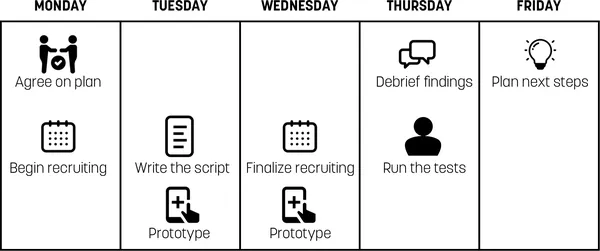

###### Figure 15-1. The three, twelve, one activity calendar

Here’s how the team’s activities break down:

Monday: Recruiting and planning  
Decide, as a team, what will be tested this week. Decide who you need to
recruit for tests and start the recruiting process. Outsource this job
if at all possible: it’s very time-consuming (see the sidebar [“A Word
About Recruiting
Participants”](#ch15.html_a_word_about_recruiting_participants)).

Tuesday: Refine the components of the test  
Based on what stage your MVP is in, begin refining the design, the
prototype, or the product to a point that will allow you to tell at
least one complete story when your customers see it.

Wednesday: Continue refining, write the script, and finalize recruiting  
Put the final touches on your MVP. Write the test script that your
moderator will follow with each participant. (Your moderator should be
someone on the team if at all possible.) Finalize the recruiting and
schedule for Thursday’s tests.

Thursday: Test!  
Spend the morning testing your MVP with customers. Spend no more than an
hour with each customer. Everyone on the team should take notes. The
team should plan to watch from a separate location. Review the findings
with the entire project team immediately after the last participant is
done.

Friday: Plan  
Use your new insight to decide whether your hypotheses were validated
and what you need to do next.

### Simplify your test environment

Many firms have established usability labs in-house—and it used to be
you needed one. These days, you don’t need a lab—all you need is a quiet
place in your office and a computer with a network connection and a
webcam. It used to be necessary to use specialized usability testing
products to record sessions and connect remote observers. These days,
you don’t even need that. We routinely run tests with remote observers
using nothing more exotic than Zoom.

The ability to connect remote observers is a key element. It makes it
possible for you to bring the test sessions to team members and
stakeholders who can’t be present. This has an enormous impact on
collaboration because it spreads understanding of your customers deep
into your organization. It’s hard to overstate how powerful this is.

### Who should watch?

The short answer is your entire team. Like almost every other aspect of
Lean UX, usability testing should be a group activity. With the entire
team watching the tests, absorbing the feedback, and reacting in real
time, you’ll find the need for subsequent debriefings reduced. The team
will learn firsthand where their efforts are succeeding and failing.
Nothing is more humbling (and motivating) than seeing a user struggle
with the software you just built.

<aside class="pagebreak-before less_space" data-type="sidebar" epub:type="sidebar">

##### A Word About Recruiting Participants

Recruiting, scheduling, and confirming participants is time intensive.
Save your team from this additional overhead by offloading the work to a
dedicated recruiter. Some companies have hired internal recruiters to do
this work as part of their DesignOps or ResearchOps team, while others
outsource the work to a third party. In either case, the cost is worth
it. The recruiter does the work and gets paid for each participant they
bring in. In addition, your recruiter takes care of the screening,
scheduling, and replacement of no-shows on testing day. Third-party
recruiters typically charge for each participant they recruit. You’ll
also have to budget for whatever compensation you offer to the
participants themselves.

</aside>

### Continuous research: Some examples

Companies operationalize continuous research in many different ways. For
example, the team at ABN AMRO, a bank in the Netherlands, runs what they
call a Customer Validation Carousel once a week. This weekly user
research event is structured like speed dating. Each week, five
customers come into the company’s offices. Each customer is set up at
their own research station. Then a group of interviewers come into the
room and spread out, each sitting with one customer. (At ABN AMRO, many
of the interviewers are “people who do research”—in other words,
designers and product people rather than trained researchers. Because of
this, the trained researchers on staff work with them before the event
to help them create their research plan and discussion guides.
Interviews are often conducted by a pair of interviewers who work
together and take turns interviewing and taking notes.)

The interviewers conduct 15-minute interviews with each participant.
When the 15 minutes are up, each interviewer or pair gets up and moves
to the next participant—kind of like musical chairs. In this way, each
interviewer gets to speak to each participant. After everyone has spoken
with everyone else, the customers leave and the interviewers convene to
debrief. Normally, each interviewer is assigned to a single topic, but
even though they may not be working on the same set of questions, the
debrief is valuable, helping them better understand the customers and
helping them to interpret the data that they’ve just collected. They
capture learnings from this event on a single-page insight template and
then add these documents to the company’s shared insights database.
Researcher Ike Breed, who helped set up this process, told us that this
sharing step really democratized research. “People thought the insights
database was a really formal thing. They asked, ‘you mean I can put
something in there?’” By opening the process up to contribution from a
wider group, it helped the product and design teams feel more ownership
of the customer insights process and the data that was collected as part
of that process.

### Testing Tuesdays

Another researcher we spoke to told us about how he started a practice
called “Testing Tuesdays” at his company, a financial services firm
building consumer-facing technology. Andrew Bourne was hired there as a
usability researcher. When he arrived, he discovered a long backlog of
work waiting for him. As he worked through the backlog, he started
reporting on the research results at every Sprint Demo, which, at his
company, took place every Tuesday. Because he had such a large backlog
of work, there was always something new to report. To help make sure
that his reports got heard by everyone who was interested, he started
publicizing the contents of his briefing in advance using email
announcements. He’d announce, “This week, I’ll be reporting on X.” This
had two really positive effects. First, it got people to show up for his
briefings—often many more people were interested in the results than
he’d anticipated. Additionally, product people started coming to him
asking for his partnership in the research that *they* wanted to do. In
other words, it grew the demand for research. And not just usability
studies. The folks coming to him were asking for all kinds of
research—including early-stage formative studies.

<aside data-type="sidebar" epub:type="sidebar">

##### Continuous Research at Sperientia Labs

Sperientia Labs is a user experience research agency of about 30 people
based in Puebla, Mexico. Sperientia delivers research to clients in a
unique format: they use a series of one-week research sprints. “We use
an approach in which the Agile framework is always in mind,” says
founder Victor M. González.

This approach has several benefits. First, González says that most of
their clients are already working in an Agile rhythm. This allows
Sperientia to synchronize their timeline with the timeline of the
clients.

Another benefit is the rapid way that these cycles deliver results.
Sperientia delivers discovery interviews and usability tests over the
course of a highly structured week. They plan and recruit on Friday,
continue recruiting and prepping on Monday, then run tests with between
three and six participants on Tuesday and Wednesday morning. By
Wednesday afternoon, they hold a debrief session with their clients. “In
many cases, this debrief is all the clients need, and they can get to
work immediately on what they’ve learned,” González says. Still,
Sperientia uses Thursdays to capture the results and recommendations in
a report, and then meets with the clients on Friday morning to review
the findings in detail. After lunch on Friday, they’re ready to begin
planning their next cycle.

Now, not all research objectives can be met in a week, and a typical
Sperientia research program is 3 to 12 months long. So even though they
use one-week research cycles throughout all of their programs, they are
not limited to answering only questions that can be answered in a single
week. Instead, they use continuous one-week cycles to address a much
broader range of questions.

The agency works with a variety of client research objectives: they help
clients understand and develop value propositions, understand users’
jobs to be done, and evaluate the usability and design of their
offerings.

By using a program of multiple one-week cycles, Sperientia can run
research programs that grow and evolve as they learn. They can run
research programs that keep pace with the development of a product. They
can run programs that are longitudinal in nature. And though their
approach is fundamentally qualitative (based on one-on-one sessions with
users and customers), they can build programs that gather quantitative
data by asking the same questions week over week.

Recently, Sperientia began experimenting with a new two-week research
sprint format. They use this format when they have to answer questions
that involve some kind of prototype. In these cases, they will extend
the cycle to include a week of prototype development, followed by their
typical research week. To accomplish this, they augment the research
team to include designers who can help them create prototypes for
testing.

So working with these short one-week cycles helps the agency match their
client’s pace, helps them deliver rapid and continuous results, and has
one bonus benefit. González describes it this way: “We get to have our
weekends with the peace of mind that we are done!”

</aside>

---

## Making Sense of the Research: A Team Activity

Whether your team does fieldwork or labwork, research generates a lot of
raw data. Making sense of this can be time-consuming and frustrating—so
the process is often handed over to specialists who are asked to
synthesize research findings. You shouldn’t do this. Instead, work as
hard as you can to make sense of the data as a team.

As soon as possible after the research sessions are over—preferably the
same day, if not then the following day—gather the team together for a
review session. When the team has reassembled, ask everyone to read
their findings to one another. One really efficient way to do this is to
transcribe the notes people read out loud onto index cards or sticky
notes and then sort the notes into themes. This process of reading,
grouping, and discussing gets everyone’s input out on the table and
builds the shared understanding that you seek. With themes identified,
you and your team can then determine the next steps for your MVP.

### Confusion, contradiction, and (lack of) clarity

As you and your team collect feedback from various sources and try to
synthesize your findings, you will inevitably come across situations in
which your data presents you with contradictions. How do you make sense
of it all? Here are a couple of ways to maintain your momentum and
ensure that you’re maximizing your learning.

Look for patterns  
As you review the research, keep an eye out for patterns in the data.
These patterns reveal multiple instances of user opinion that represent
elements to explore. If something doesn’t fall into a pattern, it is
likely an outlier.

Place your outliers in a “parking lot”  
Tempting as it is to ignore outliers (or try to serve them in your
solution), don’t do it. Instead, create a parking lot or backlog. As
your research progresses over time (remember: you’re doing this every
week), you might discover other outliers that match the pattern. Be
patient.

Verify with other sources  
If you’re not convinced the feedback you’re seeing through one channel
is valid, look for it in other channels. Are the customer support emails
reflecting the same concerns as your usability studies? Is the value of
your prototype echoed with customers inside and outside your office? If
not, your sample might have been disproportionately skewed.

---

## Identifying Patterns over Time

Typical UX research programs are structured to get a conclusive answer:
you will plan to do enough research to conclusively answer a question or
set of questions. Lean UX research takes a different approach. It puts a
priority on being continuous—which means that you are structuring your
research activities very differently. Instead of running big studies,
you are seeing a small number of users every week. This means that some
questions might remain open over a couple of weeks. One big benefit,
though, is that interesting patterns can reveal themselves over time.

For example, over the course of regular test sessions from 2008 to 2011,
the team at TheLadders watched an interesting change in their customers’
attitudes over time. In 2008, when they first began meeting with job
seekers on a regular basis, they would discuss various ways to
communicate with employers. One of the options they proposed was SMS. In
2008, the audience, made up of high-income earners in their late 40s and
early 50s, showed a strong disdain for SMS as a legitimate communication
method. To them, it was something their kids did (and that perhaps they
did with their kids), but it was certainly not a “proper” way to conduct
a job search.

By 2011, though, SMS messages had taken off in the United States. As
text messaging gained acceptance in business culture, audience attitudes
began to soften. Week after week, as they sat with job seekers, they
began to see opinions about SMS change. The team saw job seekers become
far more likely to use SMS in a midcareer job search than they would
have just a few years earlier.

The team at TheLadders would never have recognized this as an
audience-wide trend were it not for two things. First, they were
speaking with a sample of their audience, week in and week out.
Additionally, though, the team took a systematic approach to
investigating long-term trends. As part of their regular interaction
with customers, they always asked a regular set of level-setting
questions to capture the “vital signs” of the job seeker’s search—no
matter what other questions, features, or products they were testing. By
doing this, the team was able to establish a baseline and address bigger
trends over time. The findings about SMS would not have changed the
team’s understanding of their audience if they’d represented just a few
anecdotal data points. But aggregated over time, these data points
became part of a very powerful dataset.

When planning your research, it’s important to consider not just the
urgent questions—the things you want to learn over the next few weeks.
You should also consider the big questions. You still need to plan big
standalone studies to get at some of these questions. But with some
planning, you should be able to work a lot of long-term learning into
your weekly studies.

### Test what you’ve got

To maintain a regular cadence of user testing, your team must adopt a
“test-what-you-got” policy. Whatever is ready on testing day is what
goes in front of the users. This policy liberates your team from rushing
toward testing day deadlines—or, worse, delaying research activities in
pursuit of some elusive “perfect” moment. Instead, when you adopt a
“test-what-you-got” approach, you’ll find yourself taking advantage of
your weekly test sessions to get insight on whatever is ready, and this
will create insight for you at every stage of design and development.
You must, however, set expectations properly for the type of feedback
you’ll be able to generate with each type of artifact.

#### Sketches

Feedback collected on sketches helps you validate the value of your
concept (see
[Figure 15-2](#ch15.html_example_of_a_sketch_that_can_be_used_wi)).
They’re great conversation prompts to support interviews, and they help
to make abstract concepts concrete, which helps generate shared
understanding. What you won’t get from sketches is detailed,
step-by-step feedback on the process, insight about specific design
elements, or even meaningful feedback on copy choices. You *won’t* be
able to learn much (if anything) about the usability of your concept.

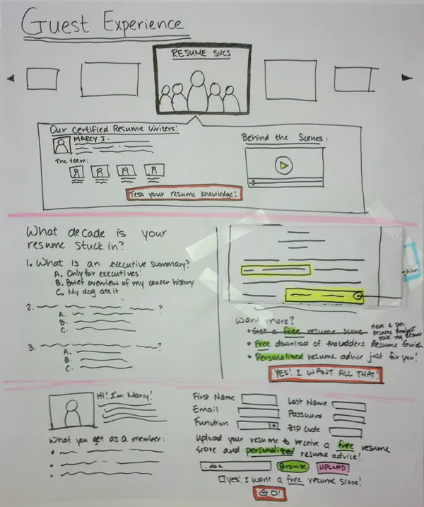

###### Figure 15-2. Example of a sketch that can be used with customers

#### Static wireframes

Showing test participants wireframes
([Figure 15-3](#ch15.html_example_of_a_wireframe)) lets you assess the
information hierarchy and layout of your experience. In addition, you’ll
get feedback on taxonomy, navigation, and information architecture.

You’ll receive the first trickles of workflow feedback, but at this
point your test participants are focused primarily on the words on the
page and the selections they’re making. Wireframes provide a good
opportunity to begin testing copy choices.

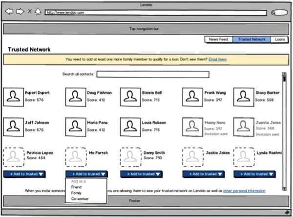

###### Figure 15-3. Example of a wireframe

#### High-fidelity visual mock-ups (not clickable)

Moving into high-fidelity visual-design assets, you receive much more
detailed feedback. Test participants will be able to respond to
branding, aesthetics, and visual hierarchy, as well as aspects of
figure/ground relationships, grouping of elements, and the clarity of
your calls to action. Your test participants will also (almost
certainly) weigh in on the effectiveness of your color palette. (See
[Figure 15-4](#ch15.html_example_of_mock_up_from_skype_in_the_cl).)

Nonclickable mock-ups still don’t let your customers interact naturally
with the design or experience the workflow of your solution. Instead of
watching your users click, tap, and swipe, you need to ask them what
they would expect and then validate those responses against your planned
experience.

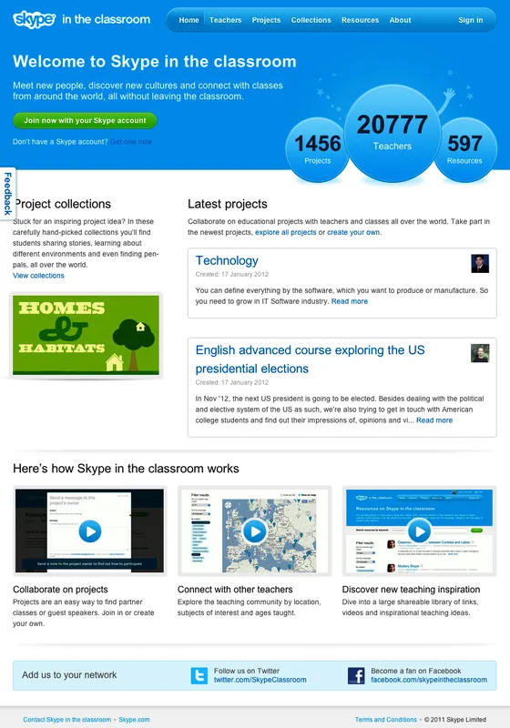

###### Figure 15-4. Example of mock-up from Skype in the Classroom (design by Made By Many)

#### Clickable mock-ups

Clickable mock-ups, like that shown in
[Figure 15-4](#ch15.html_example_of_mock_up_from_skype_in_the_cl),
increase the fidelity of the interaction by linking together a set of
static assets into a simulation of the product experience. These days,
most design tools make it easy to link together a number of static
screens to produce these types of mock-ups. Visually, they can be high,
medium, or even low fidelity. The value here is not so much the visual
polish but rather the ability to simulate workflow and to observe how
users interact with your designs.

Designers used to have limited tool choices for creating clickable
mock-ups, but in recent years, we’ve seen a huge proliferation of tools.
Some tools are optimized for making mobile mock-ups, others are for the
web, and still others are platform neutral. Most have no ability to work
with data, but with some (like Axure), you can create basic data-driven
or conditional logic-driven simulations. Additionally, design tools such
as Figma, Sketch, InVision, and Adobe XD include “mirror” features with
which you can see your design work in real time on mobile devices and
link screens together to create prototypes without special prototyping
tools.

#### Coded prototypes

Coded prototypes are useful because they have the best ability to
deliver high fidelity in terms of *functionality*. This makes for the
closest-to-real simulation that you can put in front of your users. It
replicates the design, behavior, and workflow of your product. You can
test with real data. You can integrate with other systems. All of this
makes coded prototypes very powerful; it also makes them the most
complex to produce. But because the feedback you gain is based on such a
close simulation, you can treat that feedback as more authoritative than
the feedback you gain from other simulations.

---

## Who Is Lean UX For?

This book is, first, for product designers who know they can contribute
more and be more effective with their teams. That said, we believe that
“user experience” is the sum total of all of the interactions that a
user has with your product and service. It’s created by all of the
decisions that you and your team make about that product or service.
It’s not just user interface or functionality. It’s also about pricing,
purchasing experience, onboarding, support, etc. In other words, user
experience is created by the whole team. For that reason, this book is
also for product managers who need better ways to define their products
with their teams and to validate them with their customers. It’s also
for Scrum masters and developers who understand that a collaborative,
agile team environment leads to better code and more meaningful work.
And, finally, it’s for managers—managers of UX teams, project teams,
business lines, departments, and companies—who understand the difference
a great UX can make.

---

## Monitoring Techniques for Continuous and Collaborative Discovery

In the preceding discussions, we looked at ways to use qualitative
research on a regular basis to evaluate your hypotheses. However, as
soon as you launch your product or feature, your customers will begin
giving you constant feedback—and not only on your product. They will
tell you about themselves, about the market, about the competition. This
insight is invaluable—and it comes into your organization from every
corner. Seek out these treasure troves of customer intelligence within
your organization and harness them to drive your ongoing product design
and research, as depicted in
[Figure 15-5](#ch15.html_customers_can_provide_feedback_through).

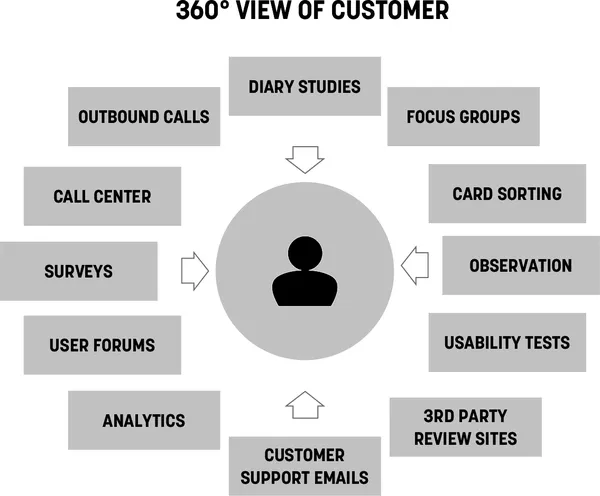

###### Figure 15-5. Customers can provide feedback through many channels

### Customer service

Customer support agents talk to more customers on a daily basis than you
will talk to over the course of an entire project. There are multiple
ways to harness their knowledge:

- Reach out to them and ask them what they’re hearing from customers
  about the sections of the product on which you’re working.

- Hold regular monthly meetings with them to understand the trends. What
  do customers love this month? What do they hate?

- Tap into their deep product knowledge to learn how they would solve
  the challenges your team is working on. Include them in design
  sessions and design reviews.

- Incorporate your hypotheses into their call scripts. One of the
  cheapest ways to test your ideas is to suggest it as a fix to
  customers calling in with relevant complaints.

In the mid-2000s, Jeff ran the UX team at a midsized tech company in
Portland, Oregon. One of the ways that team prioritized the work they
did was by regularly checking the pulse of the customer base. The team
did this with a standing monthly meeting with customer service
representatives. Each month, Customer Service would provide the UX team
with the top 10 things customers were complaining about. The UX team
then used this information to focus their efforts and to subsequently
measure the efficacy of their work. At the end of the month, the next
conversation with Customer Service gave the team a clear indication of
whether or not their efforts were bearing fruit. If the issue was not
receding in the top-10 list, the solutions had not worked.

This approach generated an additional benefit. The Customer Service team
realized there was someone listening to their insights and began
proactively sharing customer feedback above and beyond the monthly
meeting. The dialogue that was created provided the UX team with a
continuous feedback loop to inform and test product hypotheses.

### On-site feedback surveys

Set up a feedback mechanism in your product with which customers can
send you their thoughts regularly. Here are a few options:

- Simple email forms

- Customer support forums

- Third-party community sites

You can repurpose these tools for research by doing things like the
following:

- Counting how many inbound emails you’re getting from a particular
  section of the site

- Participating in online discussions and testing some of your
  hypotheses

- Exploring community sites to discover and recruit hard-to-find types
  of users

These inbound customer feedback channels provide feedback from the point
of view of your most active and engaged customers. Here are a few
tactics for getting other points of view.

#### Search logs

Search terms are clear indicators of what customers are seeking on your
site. Search patterns indicate what they’re finding and what they’re not
finding. Repeated queries with slight variations show a user’s challenge
in finding certain information.

One way to use search logs for MVP validation is to launch a test page
for the feature you’re planning. Following the search, logs will inform
you as to whether the test content (or feature) on that page is meeting
the user’s needs. If users continue to search on variations of that
content, your experiment has failed.

#### Site usage analytics

Site usage logs and analytics packages—especially funnel analyses—show
how customers are using the site, where they’re dropping off, and how
they try to manipulate the product to do the things they need or expect
it to do. Understanding these reports provides real-world context for
the decisions the team needs to make.

In addition, use analytics tools to determine the success of experiments
that have launched publicly. How has the experiment shifted usage of the
product? Are your efforts achieving the outcome you defined? These tools
provide an unbiased answer.

If you’re just starting to build a product, *build usage analytics into
it from day one.* Third-party metrics products like Kissmetrics and
MixPanel make it easy and inexpensive to implement this functionality,
and provide invaluable information to support continuous learning.

#### A/B testing

A/B testing is a technique, originally developed by marketers, to gauge
which of two (or more) relatively similar concepts achieve the defined
goal more effectively. When applied in the Lean UX framework, A/B
testing becomes a powerful tool to determine the validity of your
hypotheses. Applying A/B testing is relatively straightforward after
your ideas evolve into working code. Here’s how it works:

- Take the proposed solution and release it to your audience. However,
  instead of letting every customer see it, release it only to a small
  subset of users.

- Measure the performance of your solution for that audience. Compare it
  to the other group (your control cohort) and note the differences.

- Did your new idea move the needle in the right direction? If it did,
  you’ve got a winning idea.

- If not, you’ve got an audience of customers that might make good
  targets for further research. What did they think of the new
  experience? Would it make sense to reach out to them for some
  qualitative research?

The tools for A/B testing are widely available and can be inexpensive.
There are third-party commercial tools like Optimizely. There also are
open source A/B testing frameworks available for every major platform.
Regardless of the tools you choose, the trick is to make sure the
changes you’re making are small enough and the population you select is
large enough that any change in behavior can be attributed with
confidence to the change you’ve made. If you change too many things, any
behavioral change cannot be directly attributed to your exact
hypothesis.

---

## Wrapping Up

In this chapter, we covered many ways to validate your hypotheses. We
looked at collaborative discovery and continuous learning techniques. We
discussed how to build a weekly Lean testing process and covered what
you should test and what to expect from those tests. We looked at ways
to monitor your customer experience in a Lean UX context, and we touched
on the power of A/B testing.

These techniques, used in conjunction with the processes outlined in
[Chapter 4](#ch04.html_the_lean_ux_canvas) and
[Chapter 5](#ch05.html_box_one_business_problem), make up the full Lean
UX process loop. Your goal is to get through this loop as often as
possible, refining your thinking with each iteration.

In the next section, we move away from process and take a look at how to
integrate Lean UX into your organization. We’ll cover the organizational
shifts you’ll need to make to support the Lean UX approach, whether
you’re a startup, large company, or a digital agency.

---

## Chapter 16. Integrating Lean UX and Agile

Ask anyone at any organization what the default way of working is for
them, and the answer will invariably be “We’re doing Agile!” Follow that
question with “And how’s that working out for you?” and in most cases
they’ll raise their hand and shake it from side to side in the “meh,
it’s just OK” gesture.

Agile was born of developers, 17 of them in fact, representing emerging
ways of working that had emerged from their frustration with older
engineering processes and the unpredictability of software development.
At a weekend gathering in Utah in 2001, these software developers put
together a series of principles they called the Agile
Manifesto.^([1](#ch16.html_ch01fn16)) If you haven’t read it (you
should, it’s short), you’d be surprised to find there isn’t much
prescribed “process” in the Agile Manifesto. There’s nothing in there
that says, “You shall stand up every day at 9:15 with your team” or “You
will work in two-week cycles called sprints.” Those are techniques taken
from specific Agile methods, like Scrum and Extreme Programming (XP),
methods that were invented by many of the folks who came together to
create the Agile Manifesto itself. Instead of capturing specific
practices, the authors of the Manifesto listed values and principles for
highly collaborative, customer-centered software development. The most
compelling line in the entire manifesto—and in our opinion the basis for
true agility—is “\[We value\] responding to change over following a
plan.”

That’s the heart of it, really. If you work in a way that invites
learning, embrace that learning in a humble manner, and change your plan
based on what you’ve learned, you are being agile.

In the 20 years since the Manifesto was created, this approach to doing
work has become the default way of working in most organizations (or at
least, the default aspiration). These Agile ideas reached well beyond
software development teams and are now being applied to everything from
strategic planning and leadership to human resources, finance,
marketing, and, of course, design.

The most well-known form of Agile is Scrum, a lightweight framework
invented primarily by Jeff Sutherland and Ken Schwaber in the mid-1990s.
(Yes, Scrum has been around longer than the Agile Manifesto.) And yet
for all its popularity, Scrum itself has only recently begun to think
about how design fits into the process. Until as recently as November
2020, [*The Scrum Guide*](http://www.scrumguides.org)—the official
documentation of Scrum—had never mentioned user experience or design in
any way. As great design and customer-centricity become increasingly
important success factors in technology products, designers and Agile
practitioners alike have struggled to figure out exactly how to
integrate themselves into Agile processes. While the rest of Lean UX
describes an Agile way of working, this chapter will help answer some
questions about how Lean UX fits into the mechanics of Agile methods,
and, in particular, we’ll focus on design within the context of Scrum.

---

## Make the Agile Process Your Own

We often get asked how newly formed Agile teams should work. Should they
use Scrum? Should they work in two-week sprints? What level of formality
should they implement in order to be successful? With so many stories of
frustration with Agile transformations, teams and leaders want to get it
right as quickly as possible and minimize pain, frustration, and
decreased productivity. You could spend the next 10 years reading all of
the books on Scrum best practices, but when you boil it down to the
core, you’re left with the following components, which make a great
starting point for any team:

- Work in short cycles.

- Deliver value at the end of each cycle.

- Hold a brief daily planning meeting (or Daily Scrum).

- Hold a retrospective after every cycle.

You can spend a lot of time debating all of the other components of
Scrum (as well as the things people *think* are part of Scrum but are
never mentioned in *The Scrum Guide*), but these four basic elements
provide all you need to increase the agility of your team. A team with a
dedicated lineup will work together to figure out what they can get done
in each cycle. They will meet daily to determine what the next most
important set of things is to do, and, critically, they will review the
efficacy of their process after every cycle.

In fact, it’s no exaggeration to say that retrospectives, when used
properly, are the key to building a cohesive, cross-functional Agile
team. Scrum doesn’t tell you how to fit designers or design work into a
sprint or how to handle design work in the backlog, but if your team
tries one way to build design into the Scrum process, runs that for a
sprint or two, and then retrospects to determine how well that worked,
you’ve begun the process of owning your Agile process. If you remove the
prescriptive ethos of Scrum from the process and instead apply the
philosophical lens of the Agile Manifesto, then you are, indeed,
responding to change over following a plan. In this case, the plan is
the rigid prescription of Agile process; the change you are responding
to is your understanding of how well that prescription worked for you
and your team. If it works well, fantastic! Keep doing it. But if it
failed to achieve what you hoped for, change course. Now you’re *being*
Agile rather than just *doing* it.

This is why retrospectives are so powerful and why they’re the one Scrum
event we recommend more than any other. Honest, blameless retrospectives
give a team a regular opportunity to adjust how they work. A
retrospective looks back at the last cycle or two and asks, *What has
been working well? What hasn’t been working so well? What are we going
to change moving forward?* The best part of approaching a process this
way is that the risk of changing your process is minimal. The longest
you’ll have to live with a change is the length of your sprint. While
this chapter will give you many ways to build an integrated Lean UX and
Scrum process, whatever you do, make sure that you use retrospectives to
examine what you do. If the techniques that we recommend don’t work for
your team, change them, mix and match them, or throw them out. Your
version of Agile (or Scrum) will be different than any other team’s.
This is OK. In fact, we’d argue that’s the whole point of being agile.

---

## Redefining “Done”

When is software done? We wrote about this in
[Chapter 3](#ch03.html_outcomes). When you’re working to create an
outcome, you need to ship software (the output) and then see if it
creates the outcome you want. You can’t ship software until you’re
“done.” But you’re not really *finished* until you’ve “validated” that
software.

In Scrum, nothing can go live to a user until it is “done.” This makes
perfect sense. You need to make sure that the software you’re releasing
meets certain shared quality standards (what Scrum calls “the definition
of done”) and that it delivers the functionality that you and your team
have planned (what Scrum calls the “acceptance criteria”). The
definition of done is created by the team, and the acceptance criteria
are usually set by the product manager or product owner. Together, these
standards ensure that each piece of work is complete, works as designed,
and is bug-free and stable enough to go to production. For most Scrum
teams, though, this is the end of their involvement with that piece of
software. This end point, though, completely fails to take
responsibility for outcomes and reflects a much older idea of the nature
of software.

When we started our careers, software came in a box. If that sounds
weird to you, it might be even weirder to know that when Jeff was a kid,
his dad would bring home the punch cards on which software came in the
1970s. In both of those cases, more than 20 years apart, software was
static. It had an end state. We could package it in boxes or on paper
cards. Fast-forward another 20 years, and these concepts seem ridiculous
now. Software doesn’t come in a box and is no longer static. Today we
build systems that are updated continually and can be optimized
indefinitely. It’s easy, today, to argue that software is *never* done.
This makes the question “When are we done?” a difficult one to answer.
But we need to answer it because it helps answer other, even more
important questions. Do we move on to the next feature or not? Does the
team get rewarded or chastised? Does the stakeholder get their bonus?

Scrum, with its concepts of “acceptance criteria” and “definition of
done,” has given teams a clear set of targets to hit. But those targets
only go so far. As we’ve said, they ensure that the software “works as
designed.” But “works as designed” only tells us that the software
consistently does what we told it to do. Unfortunately, that’s not
enough. We also need to know if the software created value. *Did anyone
find the feature we just shipped? Did they try it? Were they successful
using it? Did they come back and use it again? Did they pay us for it?*
In other words, we need to know if it created an outcome.

So how do our teams know when the work is finished? When do they know
when to move on to the next initiative? We need to add a concept here:
the concept of “validated.” And getting to validated starts with our
customers.

We validate our work after it’s “done.” After it’s “accepted.” After
it’s in the hands of our customers. We do this by measuring their
behavior. We do this by listening to their needs and assessing if our
features meet those needs, and then iterating until we meet those needs.
Over and over again. It turns out designers are very good at doing this
work.

By expanding our idea of done from “works as designed” to “validated
with customers,” we shift what Scrum teams are working toward. Instead
of focusing on shipping features, they are focused on making customers
successful. Design is an integral part of this, because design provides
many of the tools needed to understand customers and refine solutions to
better meet their needs. If a feature’s definition of done is reframed
as an outcome, the team has no choice but to test early versions of
their idea, interact with customers to understand how things can be
improved, and design optimized versions of the feature to meet those
ever-changing needs.

Here’s an example. Traditionally expressed acceptance criteria for a
password authentication flow:

- Requires password entry

- Password meets basic requirement guidelines

- Password is entered correctly and user is verified into the system

- Password recovery link is active

- Error message displays when password is entered incorrectly

- After three failed attempts, access is blocked

Reframed criteria for the same feature:

- Percentage of users successfully authenticating on first try is 99% or
  higher

- Number of password recovery attempts is reduced by 90%

- Percentage of calls to the call center asking for password reset
  reduced by 75%

In the traditional example, the team builds and releases a set of
features that work as designed. With the second definition, the team is
not done until the customer is demonstrably more successful than they
are today. This method reflects the modern nature of software and
requires the intervention and inclusion of research, discovery, and
design in the Scrum process. This recalibration of the team’s goal does
not negate the value of traditional acceptance criteria. We still want
to ship stable, high-quality, high-performance, secure code to
production. However, that’s not enough. Those attributes are table
stakes. None of that matters if it doesn’t make the customer more
successful.

---

## We’re Still Doing Staggered Sprints. Why?

In May 2007, Desiree Sy published “Adapting Usability Investigations for
Agile User-Centered Design” in the *Journal of Usability
Studies*.^([2](#ch16.html_ch01fn18)) Sy is one of the first people to
try to combine Agile and UX, and many of us were excited by the
solutions she was proposing. In the 2007 article, Sy describes in detail
her idea of a productive integration of Agile and user-centered design.
She called it cycle 0 (though it has come to be referred to popularly as
either “sprint zero” or sometimes “staggered sprints”).

In short, Sy, along with Lynn Miller, described a process in which
design activity takes place one sprint ahead of development. Work is
designed and validated during the “design sprint” and then passed off
into the development stream to be implemented during the development
sprint, as is illustrated in
[Figure 16-1](#ch16.html_sy_and_millerapostrophes_quotation_mark).

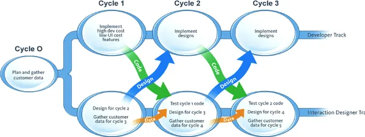

###### Figure 16-1. Sy and Miller’s “Staggered Sprints” model

Many teams have misinterpreted this model, though. Sy always advocated
strong collaboration between designers and developers during *both* the
design *and* development sprints. Many teams have missed this critical
point and instead have created workflows in which designers and
developers communicate by handoff—creating a kind of mini-waterfall
process.

For teams transitioning from waterfall to Agile, there’s a benefit to
working this way. It teaches you to work in shorter cycles and to divide
your work into sequential pieces. However, this model works best as a
transition. It is not where you want your team to end up.

Here’s why: it becomes very easy to create a situation in which the
entire team is never working on the same thing at the same time. You
never realize the benefits of cross-functional collaboration because the
different disciplines are focused on different things. Without that
collaboration, you don’t build shared understanding, so you end up
relying heavily on documentation and handoffs for communication.

There’s another reason this process is less than ideal: it can create
unnecessary waste. You waste time creating documentation to describe
what happened during the design sprints. And if developers haven’t
participated in the design sprint, they haven’t had a chance to assess
the work for feasibility or scope. That conversation doesn’t happen
until handoff. Can they actually build the specified designs in the next
two weeks? If not, the work that went into designing those elements is
wasted.

Despite these drawbacks, many teams still work in staggered sprints
today. In our experience, there are several potential root causes for
this:

Design team is not integrated into the “dev” process  
In many companies, design is still a shared service operating as an
internal agency. Designers aren’t assigned to a specific Scrum team.
They are seen as a dependency for the software development work to
start. By having designers work a sprint ahead, the design work can
“feed the machine” of software development.

Software development is outsourced  
Some organizations still outsource their software development. In a
world where software is the engine of business and growth, this is a
staggeringly risky Achilles’ heel. Nevertheless, if the coding is being
done by a third-party provider, they will want to see “final” designs
before they estimate and start the work. Staggered sprints make that
possible for teams that work with outsourced partners.

Cargo cult Agile  
Some organizations have brought in Agile processes to increase the
efficiency and productivity of software development, not for the ability
to change course based on new learnings and insights. In this case, the
organization operates as a software factory, churning out features as
fast as possible. While the work may be chunked up into sprints and
Agile vocabulary used throughout the organization, the priority is still
to simply ship features. These organizations typically focus on
deadlines and rarely take the time to iterate and improve features
through feedback and validation. Staggered sprints provide the feature
factory with fodder for production. Collaboration between designers and
developers is minimal, as handoffs and deliverables still form the
foundation for conversation between them.

Staggered sprints are a symptom of an organization that hasn’t fully
embraced agility. Their use is a stepping-stone in the right direction
but a clear indication that the team hasn’t arrived yet. Your goal
should be to build greater collaboration and transparency between
designers and developers while reducing the waste of document handoffs,
lengthy design reviews, and feature negotiations.

---

## Dual-Track Agile

Dual-track Agile is a model that integrates product discovery and
delivery work into one process for the same team. This is the most
successful model we’ve seen to date for bringing Lean UX work
successfully into the Agile process. In many ways, dual-track Agile is
what Sy and Miller were trying to convey with their staggered-sprint
model. However, for dual-track Agile to work, one team must do both
kinds of work—discovery (Lean UX) and delivery.

Some teams interpret dual-track Agile as two types of work for two
separate groups of people.

We don’t like this model primarily because it divides the product
development team into smaller (or, worse, separate) squads who then
inevitably have to come back together to build a shared understanding.
In practice, we’ve seen teams run into the following problems:

*Separate discovery and delivery teams:* One antipattern we’ve witnessed
several times is teams splitting up who does the discovery and who does
the delivery on their team. Often the UX designer and/or the product
manager take on the bulk of the discovery work. The engineers are
delegated early delivery work. This effectively recreates the
mini-waterfalls of staggered sprints, as described earlier. The shared
understanding breaks down, slowing the pace of decision-making and
reducing the team’s cohesion, productivity, and learning.

*Limited knowledge of how to do discovery:* Building a dual-track Agile
process assumes that your team knows how to do discovery. There are many
tools that you can use to build feedback loops into a discovery backlog.
Without a broader knowledge of these tools, teams resort to the ones
they’re most familiar with and often pick suboptimal tactics for
learning. If you have access to researchers, try to add them to your
team. At the very least, seek out their input as new discovery
initiatives begin. Seasoned practitioners can teach your team the best
method for your needs and can help you plan your discovery work.

*Not feeding back evidence from the delivery work to the discovery
backlog:* This challenge is symptomatic of an organization that is still
thinking incrementally. After a feature makes it from discovery to
delivery, the team will implement it as designed and ship it. The great
thing about this is that, as soon as it’s live, this new feature begins
to provide a new set of data about how well it’s working and where to
focus your next discovery activities. You just have to pay attention—and
get the team to pay attention. Make sure that your team is continuing to
collect feedback on shipped features and using that information to
regularly assess the prioritization of their discovery work.

### Dual-track works when it’s one team

The best way to think of dual-track is that it’s two types of
work—product discovery and product delivery—performed by *one team*
([Figure 16-2](#ch16.html_dual_rack_agile_works_when_itapostrophe)).
Discovery work consists of active learning through design and research
activities, as well as passive learning through inbound analytics of
features and products already in the market. In order to build shared
understanding, we strive to have as many team members participate in
each activity as possible. The quantity of discovery and delivery work
will fluctuate from sprint to sprint. This is normal, and you can
anticipate this as you make plans.

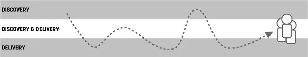

###### Figure 16-2. Dual-rack Agile works when it’s one team. Image concept: Gary Pedretti and Pawel Mysliwiec

If you’re doing discovery work right, you’re changing and potentially
killing a lot of ideas. We don’t do discovery work simply to validate
every feature we have in our backlog. Instead, we’re testing and
learning, and sometimes that means we kill features before we ship them.
Again, this is *being agile* and it’s exactly the reason Agile was
conceived in the first place. Without discovery work, Agile ends up just
being the engine of the software factory.

### Planning dual-track work

Over years of practice, we’ve tried many different ways of accounting
for both types of work in the Scrum process. We’ve tried to carve out a
specific amount of time in each sprint for discovery work to take place,
but that was unsatisfying, because in some sprints there was none to be
done, while in others it was the bulk of the work. We’ve tried Marty
Cagan’s approach of dividing the work between disciplines (design and
PMs do the discovery, engineers do the delivery), but the overhead of
handoffs, negotiations, and debates reduced the team’s ability to
respond to change. Overall, we’ve found that ensuring the entire team
shifts its workload depending on the current sprint’s needs is the best
option. In fact, it is the most agile option. It allows the team to
adjust its activities based on what it’s learning, thereby ensuring that
the most important work happens next. Sometimes that work is discovery,
and other times it’s delivery.

To make dual-track Agile successful and to bring Lean UX into the daily
workflow of your Scrum team, there are some structural elements that are
critical to that integration delivering the results your team seeks.

*A dedicated designer on every team:* There is no compromise here.
Without a dedicated designer on the Scrum team, what you have is a
software engineering team. While that team will absolutely deliver a
user experience, it will not be of the same level of quality without a
designer’s input. What’s more, that team will be lacking the skills to
do good discovery work: they will focus exclusively on writing code. As
we mentioned before, the production of code is no longer the goal for
great digital product development—it’s the means to an end. The goal is
to produce meaningful changes in the behaviors of our customers. Without
a deep understanding of the customer and how to best serve those needs,
your product will fail. Designers bring that to the team.

*Design and discovery work is a first-class citizen of the backlog:* The
short of it is this: one backlog. Development work, QA work, design
work, research work, you name it — it all goes on one backlog,
prioritized together with the same team doing all of that work. As soon
as the work is divided between more than one backlog, the team will look
to one of them as the “primary” one and the other(s) will go neglected.
You can and should have both tracks of the work managed in the same
backlog. You can certainly differentiate the different types of work in
your backlog (see experiment stories, below), but it all must end up in
the same project management tool, no matter whether you use a physical
Scrum board or JIRA or something else.

Using one backlog and treating all work in the same way ensures the team
understands that all of these components are necessary for the success
of your product. It visualizes the Lean UX work in a way that puts it on
the same level as software development work (which is always weighted
the highest in our experience). It also highlights the trade-offs that
will need to be made in order for the discovery work to take place.

Often this will bring up questions of velocity. “Won’t we reduce our
velocity if we do all this discovery work?” If you’re only measuring the
velocity of delivery, then the answer is yes. Mature dual-track teams
measure both the velocity of delivery as well as the velocity of
discovery (or learning). These teams realize that, as the quantity of
learning work increases, it will inevitably reduce the quantity of
delivery. This is because the same group of people is doing both types
of work. This is also OK, because at the end of the day, we’re trying to
maximize how effective the team is, and we do that by tracking outcomes,
not by tracking how many stories it completes or how much software it
builds.

There are a couple of ways to represent Lean UX work in your backlog.
(See [Figure 16-3](#ch16.html_common_patterns_to_manage_ux_work_in_th).)
You can represent it as a standalone story. (*The Scrum Guide* calls
stories Product Backlog Items or PBIs.) Or you can integrate the work
into the story itself, ensuring that no feature gets shipped without
discovery and design work taking place.

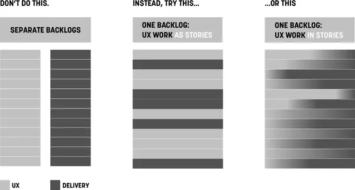

###### Figure 16-3. Common patterns to manage UX work in the backlog

*Cross-functional participation in learning activities:* Lean UX brings
with it many types of learning activities. These activities may be led
by designers or researchers or even product managers, but they should be
practiced and attended by the entire team. The more the team can learn
together, the less time is spent sharing and debating the learning and
more time can be spent deciding what to do about the things we’ve
learned. This latter is a far more productive conversation and use of
the team’s time. We’re not saying that every team member needs to take
part in every research activity. We do think that everyone should
participate to some degree, and that participation should be a regular
part of their work activity—not a special event.

Make participating in the discovery process the path of least
resistance. Broadcast your customer conversations internally so others
can watch from their desks. If a colleague is uncomfortable speaking
with a customer, bring them along and make them the notetaker. Measure
what Jared Spool refers to as “exposure
hours.”^([3](#ch16.html_ch01fn19)) Exposure hours is a measure of the
amount of time each member of your team is *directly* exposed to users.
Make sure each member of your team spends at least a two-hour block of
time every six weeks in direct contact with customers. This could be two
hours in the call center taking or listening to calls. It could be two
hours in the store or on the factory floor watching customers and users.
Or it could be doing face-to-face sales of your product in public
settings. These activities build empathy, and that in turn drives
curiosity. The more curiosity the entire team has about whether or not
they are truly meeting customer needs, the greater the likelihood of
Lean UX activities ending up on your backlog.

---

## Exploiting the Rhythms of Scrum to Build a Lean UX Practice

Over the years, we’ve found some useful ways to integrate Lean UX
approaches with the rhythms of Scrum. Let’s take a look at how you can
use Scrum’s meeting cadence and Lean UX to build an efficient process.

One approach we put together was to ask teams to map Lean UX activities
over a diagram of the Scrum framework to help them bring the integration
of the practices into greater focus. We share a typical attempt in
[Figure 16-4](#ch16.html_mapping_lean_ux_activities_to_the_scrum). We
think this is a pretty good attempt, but we’d encourage you to try this
with your team. As you review it, remember the following caveats:

- This is by no means a comprehensive listing of design activities.
  There aren’t enough Post-its (digital or otherwise) in the world to
  cover that.

- We use the word Design (often with a capital D) to serve as an
  umbrella term for all activities that designers of all kinds normally
  do or take part in.

As with every recommendation in this book, this is a starting point. It
shows you how to layer existing activities on top of Scrum. Try it. See
what works for you and your team and then adjust based on what you
decide during your retrospectives.

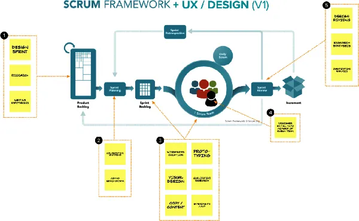

###### Figure 16-4. Mapping Lean UX activities to the Scrum framework

---

## Sprint Goals, Product Goals, and Multi-Sprint Themes

Let’s assume your organization has decided on a specific strategic focus
for the next two quarters. Your team decides to use a risky hypothesis
as the first attempt to achieve the strategy. You can use that
hypothesis to create a multi-sprint theme that guides the work you’ll do
over the next set of sprints. Scrum calls these themes “Product Goals.”
(Think of a Product Goal as a multi-sprint theme that you use to connect
a sequence of sprints.) Your measures of success for your theme are
outcomes, as demonstrated in
[Figure 16-5](#ch16.html_sprints_tied_together_with_a_theme_or_p).

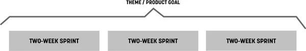

###### Figure 16-5. Sprints tied together with a theme or product goal

### Kick off the theme with a collaborative design

Start work on each theme by using the Lean UX Canvas and perhaps a
Design Studio exercise.^([4](#ch16.html_ch01fn20)) (See
[Figure 16-6](#ch16.html_the_lean_ux_canvas_can_capture_your_spr).)
Depending on the scope of the hypothesis, the collaborative design
session can be as short as an afternoon or as long as a week. You can do
them with your immediate team, but you should include a broader group if
it’s a larger-scale effort. The point of this kickoff is to get the
entire team sketching, ideating, and speaking to customers together,
creating a backlog of ideas from which to test and learn. In addition,
this activity will help define the scope of your theme a bit
better—assuming that you’ve built in some customer feedback loops.

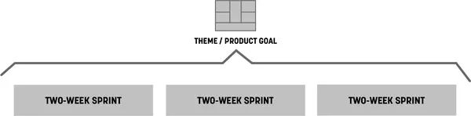

###### Figure 16-6. The Lean UX Canvas can capture your sprint theme

After you’ve started your regular sprints, you will be testing and
validating your ideas: new insights will come in, and you’ll need to
decide what to do with them. You make these decisions by running
subsequent shorter brainstorming sessions and collaborative discovery
activities as each new sprint begins
([Figure 16-7](#ch16.html_timing_and_scope_of_sketching_and_ideat)).
This allows the team to use the latest insight to create the backlog for
the next sprint.

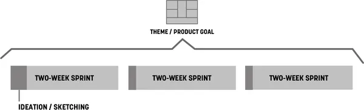

###### Figure 16-7. Timing and scope of sketching and ideation sessions

### Sprint planning meeting

Bring your Lean UX Canvas to the sprint planning meeting. Bring the
output of your design sprint too. Your mess of sticky notes, sketches,
wireframes, paper prototypes, and any other artifacts might seem useless
to outside observers but will be meaningful to your team. You made these
artifacts together, and because of that you have the shared
understanding necessary to extract stories from them. Use them in your
planning meeting to write user stories together, and then estimate and
prioritize the stories. (See
[Figure 16-8](#ch16.html_hold_sprint_planning_meetings_immediate).)

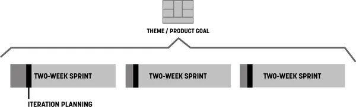

###### Figure 16-8. Hold sprint planning meetings immediately after brainstorming sessions

### Experiment stories

As you plan your iteration, there might be additional discovery work
that needs to be done during the iteration that wasn’t covered in the
design sprint or collaborative discovery activities. To accommodate this
in your sprint cadence and capture all the work in the same backlog, use
experiment stories. Captured by using the same method as your user
stories, experiment stories have two distinct benefits:

They visualize discovery work  
Discovery work is not inherently tangible as delivery work can be.
Experiment stories solve that by leveling the playing field. Everything
your team works on—discovery or delivery—goes on the backlog as a story.

They force its prioritization against delivery work:  
After those stories are in the backlog, you need to put them in priority
order. This forces conversations around *when* to run the experiment
and, equally as important, what we *won’t* be working on during that
same time.

Experiment stories look just like user stories, as illustrated in
[Figure 16-9](#ch16.html_experiment_stories).

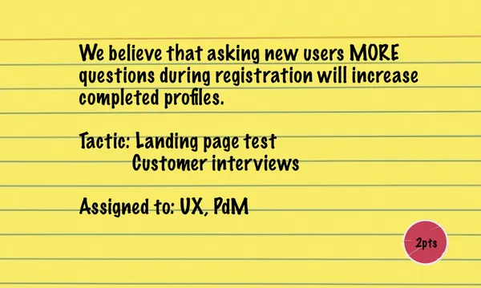

###### Figure 16-9. Experiment stories

Experiment stories contain the following elements:

- The hypothesis you’re testing or the thing you’re trying to learn

- Tactic(s) for learning (e.g., customer interviews, A/B tests, and
  prototypes)

- Who will do the work

- A level of effort estimate (if you do estimations) for how much work
  you expect this to be

After they are written, experiment stories go into your backlog. When
their time comes up in the sprint, that’s the assigned person’s main
focus. When the experiment is over, bring the findings to the team
immediately and discuss them to determine the impact of these findings.
Your team should be ready to change course, even within the current
sprint, if the outcome of the experiment stories reveals insights that
invalidate your current prioritization.

Pro tip: sometimes we know there will be discovery work to do, but its
exact shape or format is unclear at the beginning of a sprint. To ensure
the team will have bandwidth for this work during the sprint, place a
blank experiment story into your backlog. As the discovery work reveals
itself during the sprint, fill it out with details and prioritize
appropriately. If it ends up going unused, that’s a bit more breathing
room your team has during that sprint. Everyone wins.

### User validation schedule

Finally, to ensure that you have a constant stream of customer feedback
to use for your experiments, plan user research sessions every single
week. (See
[Figure 16-10](#ch16.html_conversations_with_users_happen_during).) This
way your team is never more than five business days away from customer
feedback and has ample time to react prior to the end of the sprint.
This weekly research cadence provides a good rhythm for your experiment
stories and a natural learning point in the sprint.

Use the artifacts you created in the ideation sessions as the base
material for your user tests. Remember that when the ideas are raw, you
are testing for value. (That is, do people *want to use my product*
rather than *can people use my product?*) After you have established
that there is a desire for your product, subsequent tests with
higher-fidelity artifacts will reveal whether your solution is usable.

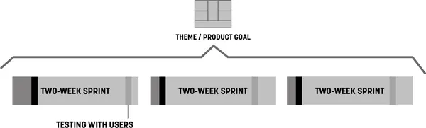

###### Figure 16-10. Conversations with users happen during every sprint

---

## Designers Must Participate in Planning

Agile methods can create a lot of time pressure on designers. Some work
fits easily into the context of a user story. Other work needs more time
to get it right. Two-week cycles of concurrent development and design
offer few opportunities for designers to ruminate on big problems. And
although some Agile methods take a more flexible approach to time than
Scrum does (for example, Kanban does away with the notion of a two-week
batch of work and places the emphasis on continuous flow), most
designers feel pressure to fit their work into the time box of the
sprint. For this reason, designers need to participate in the sprint
planning process.

The major reason designers feel pressure in Agile processes is that they
don’t (for whatever reason) fully participate in the process. This is
typically not their fault: when Agile is understood as simply a way to
build software, there doesn’t appear to be any reason to include
nontechnologists in the process. However, without designer
participation, their concerns and needs are not taken into account in
project plans. As a result, many Agile teams don’t make plans that allow
designers to do their best work.

For Lean UX to work, the entire team must participate in all
activities—stand-ups, retrospectives, planning meetings, brainstorming
sessions—as a normal rule, they all require everyone’s attendance to be
successful. Besides negotiating the complexity of certain features,
cross-functional participation allows designers and developers to create
effective backlog prioritization.

For example, imagine at the beginning of a sprint that the first story a
team prioritizes has a heavy design component to it. Imagine that the
designer was not there to voice their concern. That team will fail as
soon as they meet for their stand-up the next day. The designer will
call out that the story has not been designed. The designer will say
that it will take at least two to three days to complete the design
before the story is ready for development. Imagine instead that the
designer had participated in the prioritization of the backlog. Their
concern would have been raised at planning time. The team could have
selected a story card that needed less design preparation to work on
first—which would have bought the designer the time they needed to
complete the work.

The other casualty of sparse participation is shared understanding.
Teams make decisions in meetings. Those decisions are based on
discussions. Even if 90% of a meeting is not relevant to your immediate
need, the 10% that is relevant will save hours of time downstream.
Participation gives you the ability to negotiate for the time you need
to do your work. This is true for UX designers as much as it is for
everyone else on the team.

---

## What’s in It for You?

The book is set up in four sections.

[Part I, “Introduction and
Principles”](#part01.html_introduction_and_principles), provides an
overview and introduction to Lean UX and its founding principles. We lay
out the reasons the evolution of the UX design process is so critical
and describe Lean UX. We also discuss the underlying principles that
you’ll need to understand to make Lean UX successful in your Agile work
environments.

[Part II, “Process”](#part02.html_process-id00033), introduces the Lean
UX canvas and walk through each of its eight steps. We also share
examples of how we and others have done these things in the past.

[Part III, “Collaboration”](#part03.html_collaboration), takes a deep
look at collaboration between designers and other disciplines, and
introduces tools and case studies to bring together several popular ways
of working, like design sprints, design systems, and collaborative
research with Lean UX. Finally, we share some considerations for better
integrating Lean UX into the rhythms of an Agile process.

[Part IV, “Lean UX in Your
Organization”](#part04.html_lean_ux_in_your_organization), tackles the
integration of Lean UX practices into your organization. We discuss the
organizational shifts that need to take place at the corporate level,
team level, and individual contributor level for these ideas to truly
take hold.

Our hope is that this book will continue to serve as a way forward for
UX designers, their colleagues, and product teams in all organizations
still waiting for “phase two.” Although the book is filled with tactics
and techniques to help develop your processes, we’d like you to remember
that Lean UX is, at its core, a mindset.

**—Jeff and Josh**

---

## Stakeholders and the Risks Dashboard

Management check-ins are one of the biggest obstacles to maintaining
team momentum. Designers are used to doing design reviews, but
unfortunately, check-ins don’t end there. Product owners, stakeholders,
CEOs, and clients all want to know how things are going. They all want
to bless the project plan going forward. The challenge for
outcome-focused teams is that their project plans are dependent on what
they are learning. They are responsive, so their typical plan lays out
only small batches of work at a time. At most, these teams plan an
iteration or two ahead. This perceived “short-sightedness” tends not to
satisfy most high-level managers, which can lead to micromanagement. How
then do you keep the check-ins under control while maintaining the pace
of your Lean UX and Scrum processes?

Two words: *proactive communication.*

Jeff once managed a team that radically altered the workflow for an
existing product that had thousands of paying customers. The team was so
excited by the changes they’d made that they went ahead with the launch
without alerting anyone else in the organization. Within an hour of the
new product going live, the vice president of customer service was at
Jeff’s desk, fuming and demanding to know why she wasn’t told of this
change. The issue was this: when customers have problems with the
product, they call in for help. Call center representatives use scripts
to troubleshoot customer problems and to offer solutions—except they
didn’t have a script for this new product. Because they didn’t know it
was going to change.

This healthy slice of humble pie served as a valuable lesson. If you
want your stakeholders—both those managing you and those dependent on
you—to stay out of your way, make sure that they are aware of your plans
and your progress. While working together at our agency Neo, our
colleague Nicole Rufuku came up with a remarkably simple and powerful
tool for doing just this: the Risks Dashboard
([Figure 16-11](#ch16.html_the_risks_dashboard)).

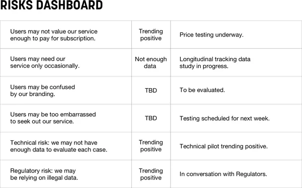

###### Figure 16-11. The Risks Dashboard

The Risks Dashboard is nothing more than a three-column chart you can
create in PowerPoint, Excel, or Google Docs.

- The first column lists the major outstanding risks associated with
  your current initiative. These are things that are critical to the
  success of the product.

- The middle column has a scale of how severe this risk might be and a
  color-coded display of how that risk is trending. Is it something that
  might require a small fix? Or is it existential to the success of the
  product? Is our discovery work telling us that this is increasingly
  possible or not as bad as we thought?

- The third column tells what we’re doing about that risk.

This dashboard is a living document that you use to communicate with
your stakeholders and clients about the status of your project. Use this
dashboard in your planning meetings with your team. Use it in your
sprint demos with your stakeholders to help drive important decisions.
In doing so, you are informing your stakeholders about:

- How the work is progressing

- What you have learned so far

- What risk you’ll focus on next

- Outcomes (how you’re trending toward your goal) not feature sets

- Dependent departments (customer service, marketing, operations, etc.)
  and their need to be aware of upcoming changes that can affect them

Often there will be a risk in the dashboard where the third column is
empty. A stakeholder will then ask why we’re not doing anything about
this risk. Sometimes this is simply a matter of prioritization. But
sometimes you may be blocked on progress. So a stakeholder question
gives you a perfect opportunity to bring up any challenges you may have
in doing discovery work, prioritizing it, or getting budget or approval
to do it. With the Risks Dashboard, you are effectively contextualizing
the discovery with business impact. Business impact tends to resonate
powerfully with stakeholders, which makes this an effective tool to
drive a better integration of your Lean UX work with your Agile delivery
process.

---

## Outcome-Based Road Maps

One of the biggest challenges in Agile is planning the work in a linear,
visual way. Sure, we’ve had “road maps” for a long time, but they don’t
do a great job of representing the true nature of software development.
Digital product development is not linear. It is iterative. We build
some things. We ship them. We see how they impact customer behavior. We
iterate them and ship again.

The traditional linear road map model—one where there is a starting
point and a clear, feature-specific end point (almost always with a
fixed date)—is outdated. It reflects an output-focused mode of operating
a digital business. Instead, as we’ve discussed throughout this book,
successful product-led organizations focus on outcomes. How then do we
build product road maps in a world of continuous improvement, learning,
and agility? And how can this type of visualization ensure that Lean UX
takes place in our Agile process? We use outcome-based road maps.

Here is what an Agile product road map should look like
([Figure 16-12](#ch16.html_an_agile_product_road_map)).

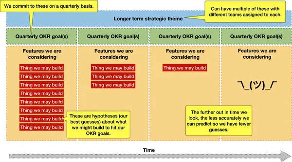

###### Figure 16-12. An Agile product road map

You’ll notice a few key components in this diagram:

Strategic themes  
These are the organizational product strategies set by executive leaders
that point teams in a specific direction. These can be things like
“Expand our market share in Europe” or “Leverage the under-utilized time
our fleet isn’t ferrying passengers to deliver other goods and food.”
There can be multiple themes running in parallel for a larger
organization.

Quarterly OKR goals  
OKRs, when done well, use customer behavior as the metrics in the “key
results” part of the equation. These quarterly outcome goals are where
each team is going to focus in an effort to help achieve the strategic
theme. This is the goal teams strive to achieve. It is their definition
of success and their *real* definition of done. Teams should work
together with leadership to ensure these are aligned and properly
levelled.

Feature/product hypotheses  
These are each team’s best guesses as to how they will achieve this
quarter’s OKR goals. Looking one quarter in advance, a team can make
strong, well-educated guesses about what product or feature ideas they
think will achieve their quarterly goals. Looking out two quarters
ahead, those guesses become less confident, so teams will make fewer
guesses and fewer commitments. Looking three and four quarters out, the
teams really have no idea what they’ll be working on, so these guesses
become fewer and fewer. This is exactly the way it should be. Teams will
learn in the next quarter or two how well their ideas worked, what moves
the needles forward, and what their next guesses should be. The boxes
for Q3 and Q4 will fill up as learning from Q1 and Q2 gets synthesized
and acted on.

Visualizing work this way immediately puts the uncertainty of software
development front and center in the conversation. When stakeholders ask,
“How will we determine whether these are the right hypotheses to work on
now and in the future?” the answer is Lean UX. Your team will work to
build learning into every sprint to ensure you’re always working toward
the strategic theme and not wasting time on initiatives that don’t bring
you closer. Couple that with the Agile cadences described above, and you
have a powerful recipe for delivering valuable experiences to your
customers.

---

## Frequency of Review

Each team should present this type of outcome-based road map for review
at the beginning of an annual cycle. It should align with the strategic
goals leadership has set and ensure their OKRs use metrics that ladder
up to these goals.

While it’s incumbent on the team to continually expose what they are
doing, learning, and deciding, official check-ins should happen on a
quarterly basis. Teams meet with leaders to determine how well they’ve
tracked toward their outcome goals, what they’ve learned during the last
quarter, and what they plan on doing in the next quarter. This is a
perfect opportunity to reaffirm the validity of the team’s goals going
forward and to make any adjustments based on new learnings, market
conditions, or any other factor that may have affected the direction of
the company.

---

## Measuring Progress

It should be clear by now that progress on this type of road map is not
measured in how many features have been delivered or whether they’ve
been delivered on time. Instead, progress is measured in terms of how
well we’ve changed customer behavior for the better. If our ideas didn’t
drive customer success, we kill those ideas and move on to new ones. The
learning drives ideas for future quarterly backlogs. It also drives our
agility as a team and as a business.

These road maps are living documents. We don’t fix these at the
beginning of an annual cycle and leave them as if they were etched in
stone. There is too much uncertainty and complexity in delivering
digital products and services. Product-led organizations — those focused
on customer success with empowered teams — work to make sure that
they’re always pointed in the right direction. This means adjusting road
maps as the reality on the ground changes. Outcome-based road maps
ensure that leaders and teams are being transparent with each other,
realistic about their goals, and most importantly realistic about how
they measure success.

---

## Lean UX and Agile in the Enterprise

Many of the tactics covered in this book are focused on one team. But in
the real world, large organizations have multiple product development
teams working in parallel. How does Lean UX scale when the number of
teams grows to tens or even hundreds of concurrent workstreams?

This is one version of the scaling question—which is itself an ongoing
question in the Agile community. As Lean and Agile methods have become
the default ways of working, many people have become focused on this
question. Large organizations have a legitimate need to coordinate the
activity of multiple teams, and processes that embrace uncertainty and
embrace *learning-your-way-forward* present a challenge to most
traditional project management methods.

Let’s address the elephant in the room—the Scaled Agile Framework or
SAFe. As of this writing, SAFe has been around for 10 years, and for
many large organizations, it’s the first choice for implementing a
whole-organization approach to agility. If you’re not familiar with it,
SAFe is a comprehensive, detailed, hierarchical set of processes,
diagrams, and vocabulary that are all designed to increase the agility
of large organizations. It works in a top-down way to divide and
delegate the work to “Agile Release Trains” who follow a rigid release
schedule. Unfortunately, these processes are largely devoid of user
feedback or learning.

You might have been as surprised, as we were, to learn that version 4.5
of the SAFe framework included Lean UX. Because of this, we get many
questions about how to do Lean UX in a company that has implemented
SAFe. The short answer is this: you can’t. SAFe is designed for
production, not for discovery. It is optimized to ensure a continuous
flow of output and minimize change requirements on executives. It
creates a rigidity within the software development process that results
in something that can’t, in any real way, be described as agile.

<aside data-type="sidebar" epub:type="sidebar">

##### SAFe Is Not Agile

Ever since the Scaled Agile Framework (SAFe for short) adopted Lean UX
in version 4.5, we’ve received a steady stream of inbound questions
about how, exactly, these two methods are supposed to work well
together.

The short answer is, we have no idea.

The slightly longer answer is that all the principles we’ve built into
Lean UX don’t seem to exist in SAFe.

Continuous learning and improvement, customer centricity, humility,
cross-functional collaboration, evidence-based decision making,
experimentation, design, and course correction—to name a few—are visibly
absent from the SAFe conversation. Instead, organizations adopting this
way of working focus on rigid team structures, strict rituals and
events, and an uneven distribution of behavior change requirements
depending on how high up one sits in the organization.

In short, SAFe is not agile.

Given the heavy training regimen teams have to go through to become
“SAFe certified,” it’s no wonder they resist change. They’ve been
trained to work in a very specific way—a way focused solely on
predictable delivery, not learning, not course correction, and certainly
not agility. The activities that make teams truly agile require
flexibility in planning. They require alignment on customer success, not
a predetermined set of features. They require a continuous discovery
process that inevitably leads to unplanned course corrections. These
corrections would “derail” a Release Train in no time.

Large organizations seeking agility realize the uncertainty that comes
with it and cling to the familiarity of waterfall processes. SAFe gives
the illusion of “adopting agile” while allowing familiar management
processes to remain intact. In a world of rapid continuous change,
evolving consumer consumption patterns, geopolitical instability, and
exponential technological advancements, this way of working is
unsustainable.

If you work in a large organization that has adopted or is in the
process of implementing SAFe, ask yourself what’s changed during this
transition. Are you closer to your customers? How long does it take to
learn whether you’ve delivered something of value? Even better, how are
you measuring “value”? Ask yourself how easy it would be to pivot an
initiative based on a new discovery? Then compare those answers to how
things were before you started using terms like “big room planning,”
“PI,” and “release train engineer.”

Scaling any way of working in a large organization is tricky and uneven.
Attempting to apply one blanket process to the entire company—a process
that is focused strictly on delivery rather than continuous discovery
and course correction—only hardens traditional ways of working. SAFe is
compelling because it seems to offer a one-size-fits-all recipe for
agility at scale. In reality, it rewards predictability, conformity, and
compliance while providing executives with cover for the question “How
do we become more agile?”

</aside>

A full discussion of how to create a truly Agile and Lean organization
is beyond the scope of this book.^([5](#ch16.html_ch01fn21)) And
honestly, it’s a hard problem with few easy answers. It requires
leadership to radically rethink the way it sets strategy, assembles
teams, and plans and assigns work. In essence, organizations need to
reduce the amount of scaffolding they put in place and allow teams to
organically find ways to use the basic values, principles, and methods
of small-team Agile to build a productive working cadence and then scale
those organization-specific approaches in small increments.

That said, there are a few techniques that can help Lean UX scale in
enterprise Agile environments and even take advantage of that scale.
Here are just a few issues that typically arise and ways to manage for
them.

*Issue:* projects grow bigger, more teams are assigned to them. How do
you ensure that all teams are aligned to the same vision and not
optimizing locally?

*Solution approach:* The concept of managing with outcomes applies to a
set of teams as much as it does to individual ones. To ensure that all
the teams working on the same project have a shared vision, assign them
all the same success metric, expressed as an outcome. Working together,
they can define the leading indicators that drive that metric and divide
those leading metrics between the teams on the project. But teams must
not be allowed to focus on leading metrics to the exclusion of the
larger outcome: the entire set of teams succeeds only if they hit the
overarching outcome together.

Working together this way reduces the risk of local optimization with
disregard for follow-on impacts of that optimization. For example, if
the marketing team is working to hit their acquisition outcomes goals
but overutilize email to achieve that goal, it may hurt the product
team’s retention goal. If both of these teams had the same outcome
goals—a mix of acquisition and retention—they would work together to
learn how to balance their efforts and outputs to be successful.

*Issue:* How do you ensure that teams are sharing what they’re learning
and minimizing duplicate effort to learn the same things?

*Solution approach:* Although there’s no silver bullet to solve for this
issue, the successful practices we’ve seen include a central knowledge
management tool (like a wiki), regular team leadership meetings (like a
Scrum of Scrums), and open-communication tools that focus on research
(like a dedicated channel on Slack or your internal chat tool). Elements
from studio culture, like regular cross-team critique sessions, can help
too.

**Issue:** Cross-team dependencies can keep progress at a crawl. How do
you maintain a regular pace of learning and delivery in a multiteam
environment?

**Solution approach:** Create self-sufficient “full-stack” teams.
Full-stack teams have every capability needed for them to do their work
on the team. This doesn’t mean that they need a person from each
department—just that there is someone on the team who can do one or more
of the things the team might need. The specific disciplines on the
team—designers, content people, frontend developers, backend developers,
product managers—coordinate with one another at discipline-specific
meetings to ensure that they are up to date on their practice, but the
work takes place locally.

---

## Wrapping Up

This chapter took a detailed look at how Lean UX fits into an Agile
process. In addition, we looked at how cross-functional collaboration
allows a team to move forward at a brisk pace, and how to handle
stakeholders and managers who always want to know what’s going on. We
discussed why having everyone participate in all activities is critical
and how the staggered-sprint model, once considered the path to true
agility, formed the roots of dual-track Agile, which is now the new
target model for most teams. We also covered, in detail, how scrum
artifacts and events work to your advantage in building up your velocity
of learning.

^([1](#ch16.html_ch01fn16-marker)) “Manifesto for Agile Software
Development,” accessed June 18, 2021,
[*http://agilemanifesto.org*](http://agilemanifesto.org).

^([2](#ch16.html_ch01fn18-marker)) Desirée Sy, “Adapting Usability
Investigations for Agile User-Centered Design,” *Journal of Usability
Studies* 2, no. 3 (May 2007): 112–132,
[*https://oreil.ly/Bhxq1*](https://oreil.ly/Bhxq1).

^([3](#ch16.html_ch01fn19-marker)) Jared M. Spool, “Fast Path to a Great
UX – Increased Exposure Hours,” Center Centre UIE, March 30, 2011,
[*https://oreil.ly/cvfcF*](https://oreil.ly/cvfcF).

^([4](#ch16.html_ch01fn20-marker)) You could even use a Google-style
“design sprint” here—a confusing name in this context. In this case,
we’re not advocating for spending a whole sprint doing design. Instead,
we’re advocating for the process named “design sprint,” which we
describe in [Chapter 14](#ch14.html_collaborative_desig).

^([5](#ch16.html_ch01fn21-marker)) We’ve written a high-level overview
of this subject in our book *Sense & Respond* (Harvard Business Review
Press, 2017). (See
[*https://senseandrespond.co*](https://senseandrespond.co).)

---

## Chapter 18. Lean UX in an Agency

Much of the focus of this book has been explicitly about making Lean UX
work inside a product company or within a product group inside a larger
business or organization. While the majority of that advice can be
applied in any setting, it’s worth calling out explicitly the
differences needed to make Lean UX work at an agency.

For the sake of this discussion, when we say “agency,” we mean any
organization that sells services to a client. This could be a small
four-person design studio in Portland, Oregon, or a thousand-person
marketing agency in London. What makes Lean UX uniquely challenging in
this environment is, in a word, clients. It’s difficult for agencies to
bring new ways of working to clients that find these ways of working
foreign to their culture. Now, in some cases, this will be the exact
reason your agency was hired. In others, it will be a foreign approach
continuously threatened by corporate antibodies resistant to different
ways of working. Either way, it will be difficult.

In this chapter, we’ll cover five key elements to consider as you
attempt to bring modern ways of working to your company.

---

## What Business Do You Want to Be In?

Agencies are almost always in the deliverables business. They get paid
to deliver a design, a prototype, some research, or a working piece of
software. This business model conflicts with Lean UX and its focus on
outcomes.

The traditional agency business model is simple: clients pay for
deliverables—designs, specs, code, PowerPoint decks—not outcomes. The
other part of an agency’s business model is utilization: you need to
keep your people billing. The need to keep utilization high can lead to
processes that encourage functional silos. These, in turn, lead to
“project phases” that encourage deliverable-centric work. Selling
cross-functional teams is great as long as everyone on the team is
billable at all times.

If you’re going to transition your agency’s ways of working to Lean UX,
you have to consider both of these challenges. First and foremost, you
can no longer exclusively be in the deliverables business. Will you
deliver wireframes, prototypes, research, and working software? Of
course you will. But these cannot be the measures of your success. They
cannot be the criteria that determine whether or not you get paid.
Instead, consider transforming the business into a time-and-materials
model. You are not selling “an app” or “a design,” but instead you are
collaborating with your client to find a solution to a customer and
business problem the client is having. What is that solution? The
truthful answer is, you don’t know. Instead, you’re going to work
together with the client to discover what that solution should be. Lean
UX is the perfect process for this discovery and continuous delivery of
a solution for your clients.

In order to ensure utilization stays high, sell small teams for finite
periods of time with clear renewal clauses. At the agency we ran for
four years together, we would propose a four-person team made up of a
product manager, a designer, and two developers as an initial team for
nearly every project. That team had a fixed cost per week, and we would
normally sell a three-month engagement renewable in three-month blocks.
This helped us reinforce the mantra of short cycles because the client
had an out or a renewal option every quarter. It reduced our risk as
well by giving us the option to fire a client who ended up being a bad
fit for the way we wanted to work. Also, having a fixed rate for “the
team” rather than each individual on that team allowed us to adjust the
staffing on that team as the project warranted without having to go to
the client for approval.

Determining your business model in advance of an all-in shift to a Lean
UX style of working is important because it will also affect your
current staff as well as prospective hires. The only asset an agency has
is its people. Designers, product managers, software developers, etc.,
come to work for you because you promise a certain way of working for
specific types of clients. If you promise a Lean UX way of working and
end up signing clients who won’t work this way, your staff will
eventually walk away.

---

## Selling Lean UX to Clients Is All About Setting Expectations

Your clients have been hiring agencies for years. Many clients expect to
“throw it over the wall” to the agency and then see the results when
they’re ready. Collaboration between client and agency in this case can
be limited to uninformed and unproductive critique that is based on
personal bias, politics, and ass-covering. Given the highly
collaborative nature of Lean UX, this is obviously not an acceptable
relationship. What can you do to get around this?

Every touchpoint you have with existing and prospective clients is an
opportunity to set expectations about how working with you is different.
It starts with your brand, your marketing, your positioning, and, most
tangibly, your website. Design and write it in such a way that there can
be no doubt that you work in a way that sets you apart from traditional
agencies. Compound those expectations with a consistent output of
content on blogs, in publications, and on social media. Ensure people
know your agency as “the Lean UX folks.” The first time you speak with
your client in person, go over how you work with them. If you get lucky
enough to pitch them, your ways of working should be clear and up front
in the pitch deck.

If you progress into planning engagements, be clear about how you’ll
work together and why that’s so critical to building a customer-centered
way of working. If questions come up from the client that indicate they
haven’t fully digested that your agency isn’t going to be an outsourcing
partner for them, pause the process and go over your process again. It’s
so critical to get this across early and often, because once the
contract is signed, any radical shift of expectations could come across
poorly to your client.

---

## Nobody Wants to Buy Experiments

As you set expectations about what it will be like to work with you,
remember this important statement: *nobody wants to buy experiments.*
Your clients want apps. They want software. They want design. What they
definitely don’t want to buy from you is an experiment. Experiments are
risky and tend to fail. They’re certainly not the market-grade
production software that will help your client increase market share or
their profitability. At least that’s how they see it.

When we first launched our agency, we led with the idea of experiments
in our sales process. A client would say, “I have \$100,000 for you to
build a mobile app for my business.” And we’d respond, “Great! We’re
going to take \$10,000 of that and run experiments to figure out exactly
how to spend the other \$90,000.” Without fail, each client who got this
pitch would say, “No. Just use the whole budget to build the app. I know
my business and my customers. We don’t need to experiment.”

This was a clear sign that we hadn’t properly differentiated ourselves
in the market, hadn’t set the right expectations with prospects, and
were leading with a tactic rather than desired end result.

Experiments are a part of Lean UX, but they’re just a tactic. They’re
part of a process that’s designed to create learning, good decision
making, and positive outcomes. Leading our sales pitch with the outcome
(e.g., “Our process ensures we make the best decisions to help solve
your mobile commerce challenge”) proved to be a far more successful way
of working.

---

## You Made the Sale! Now Navigate Procurement

Sometimes you’ll do all the right things. Your website will tell your
story. Your sales pitch will resonate. The client will nod their head.
We have ourselves a deal! You pat yourself on the back and start dealing
with closing the contract, only to hear that phrase that all service
providers dread: “OK, let me get our procurement folks on to this.”

If you’ve ever had to deal with the in-house (or, worse, third-party)
procurement department of a large organization, then you know how this
feels. All the convincing you did with the client doesn’t mean anything
to the folks who have to approve the contract and the purchase. Without
fail, the conversation flips back instantly to “OK, so we’re giving you
\$100,000. What are the specific deliverables we will get in return? And
on what date?”

This is another part of the expectation-setting that needs to happen
with clients ahead of time. As you start to close the contract, the goal
is to move away from fixed-scope and deliverable-based contracts.
Instead, create contracts for engagements that are based on simple
time-and-materials agreements or, more radically, toward outcome-based
contracts. Outcome-based contracts, or value-based pricing contracts,
are rare. They list payment as variable based on how much of the outcome
the agency can generate. This is often too much risk for a client (and
agencies) to take on without an upper limit to the contract.

Whether you choose time-and-materials or outcomes-based contracts, the
agency team will become freer to spend its time iterating toward a
specific goal. Clients give up the illusion of certainty that a
deliverables-based contract offers but gain a freedom to pursue
meaningful and high-quality solutions that are defined in terms of
outcomes, not feature lists, and that stand a better chance of making
their customers more successful.

---

## You’re Not an Outsourcing Partner Anymore

Building a Lean UX process with your clients means that you are not
their outsourcing agency anymore. You are their collaboration partner,
working toward solving a business problem. Your role is not to augment
the client’s staff or take on a share of work that they cannot pursue
in-house. Your role is to make the client an active partner of your
team. Your client needs to understand this too. They will come to
stand-ups. They will be involved in decision making on a regular basis.
They will take part in product discovery efforts. In our agency, we made
very few of the product backlog prioritization decisions. This was the
client’s explicit responsibility. The only way they could do this
effectively was to be present at daily stand-ups, participate with the
team in their learning activities, and be present at status updates and
decision-making meetings. We took it further and insisted that the
client set up shop in our studio for the duration of the engagement.
Why? To remove them from daily distractions, put them in a more creative
space, and remind them that we’re working together as a team.

These relationship expectations need to be in your contract. Your client
must commit to this high level of engagement if Lean UX is going to
work. Remember that your goal is to build shared understanding. If the
client isn’t present for the discovery work, the synthesis, and the
decision making, then you have to start documenting everything for them,
sending it over for approvals, and waiting for that feedback before
moving forward. This would bring us back to the traditional agency style
of working.

We once had a financial services client agree to all of our terms for
working together. They signed the contract and promptly set up shop in
our office. They brought in their Windows machines (hey, we were a Mac
shop) and from the get-go attempted to re-create their culture inside
our studio. They created every obstacle possible to keep us from meeting
with their customers. They limited our access to deployment servers and
essentially kept us from being able to do the work we’d agreed to in the
contract. Eight weeks in, we raised our hands to pause the process. We
met with the client and raised concerns that the ways of working we had
agreed to were being met with stiff resistance. The client told us there
was nothing they could do about it. We wrapped things up neatly in the
next two weeks and fired that client. It wasn’t that we couldn’t
continue working in the ways they wanted. It was just that if we did, we
risked losing our team due to the client’s behavior. That was
unacceptable to us.

---

## A Quick Note About Development Partners and Third-Party Vendors

In agency relationships, software development teams (either at the
agency, at the client, or working as a third party) are often treated as
outsiders and often brought in at the end of a design phase. It’s
imperative that you change this: development partners must participate
through the life of the project—and not simply as passive observers.
Instead, you should seek to have software development begin as early as
possible. Again, you are looking to create a deep and meaningful
collaboration with the entire project team—and to do that, you must
actually be working side by side with the developers.

Third-party software development vendors pose a big challenge to Lean UX
methods. If a portion of your work is outsourced to a third-party
vendor—regardless of the location of the vendor—the Lean UX process is
more likely to break down. This is because the contractual relationship
with these vendors can make the flexibility that Lean UX requires
difficult to achieve.

When working with third-party vendors, try to create projects based on
time and materials. This will make it possible for you to create a
flexible relationship with your development partner. You will need this
in order to respond to the changes that are part of the Lean UX process.
Remember, you are building software to learn, and that learning will
cause your plans to change. Plan for that change and structure your
vendor relationships around it.

When selecting partners, remember that many outsourced development shops
are oriented toward production work and see rework as a problem rather
than a learning opportunity. When seeking partners for Lean UX work,
look for teams willing to embrace experimentation and iteration and who
clearly understand the difference between prototyping-to-learn and
developing-for-production.

---

## How to Contact Us

Please address comments and questions concerning this book to the
publisher:

- O’Reilly Media, Inc.
- 1005 Gravenstein Highway North
- Sebastopol, CA 95472
- 800-998-9938 (in the United States or Canada)
- 707-829-0515 (international or local)
- 707-829-0104 (fax)

We have a web page for this book, where we list errata, examples, and
any additional information. You can access this page at
[*https://oreil.ly/lean-UX-3e*](https://oreil.ly/lean-UX-3e).

Email [*bookquestions@oreilly.com*](mailto:bookquestions@oreilly.com) to
comment or ask technical questions about this book.

Visit [*http://oreilly.com*](http://oreilly.com) for news and
information about our books and courses.

Find us on Facebook:
[*http://facebook.com/oreilly*](http://facebook.com/oreilly)

Follow us on Twitter:
[*http://twitter.com/oreillymedia*](http://twitter.com/oreillymedia)

Watch us on YouTube:
[*http://youtube.com/oreillymedia*](http://youtube.com/oreillymedia)

---

## Wrapping Up

Working as a service provider creates different challenges for
implementing Lean UX. Remember that this is as much of a cultural shift
for your agency as it is a business model shift. It will change not only
how you sell but how and who you hire. It’s imperative to set
expectations with your clients that your ways of working will challenge
their notion of working with an agency. A little creativity and a dash
of trust can make the contract and procurement process more successful.
Finally, a bad client is a bad client regardless of how you’re working
together. Ensuring the integrity of your team is your topmost priority.

---

## Chapter 19. A Last Word

After the first edition of *Lean UX* was released, we were pleased to
start getting feedback from readers. After all, Lean UX is all about
listening to your users—so we wanted to understand what the “users” of
the book had to say. Readers had *lots* to say (thank you!), but one
theme emerged from all the others and has stayed persistent over the
years. This theme has to do with the need to grow organizations and
processes that can really embrace this way of working.

We know that working with Lean UX requires changes. What we didn’t
understand clearly until we heard from readers is that the changes fall
into two categories: changes readers could make for themselves, and
changes that required leaders to get involved—leaders who might not want
to change, for whatever reasons.

Our readers told us: *Look, we can make certain kinds of changes
ourselves, but for other changes, we need to rely on shifting our
leader’s attitudes. We need to change things beyond ourselves—we need to
change the way our organization itself works.*

Now, changing an organization, even a small one, is a big challenge.
It’s a challenge that most designers and product people have little
training or experience trying to enact. Even people seasoned in the
field of organizational development know that changing organizations is
hard. So it can feel overwhelming. And that’s what we heard from our
readers. They wanted to know how to change, and they didn’t know where
to start. They wanted help.

Kind of a bummer, huh?

Well listen: the point of this chapter is not to make you feel hopeless.
We firmly believe that people, teams, and companies can change. What’s
more, we believe that you can use Lean UX to help you make these
changes! In addition to helping teams learn Lean UX, we’ve spent the
years since the first edition came out working on these kinds of
transformation problems, and we’ve seen firsthand that change is
possible.

Now, the whys and hows and wheres of organizational transformation are
beyond the scope of this book, but we want to offer you a starting
point.

---

## The Product that Makes the Product

In the words of our friend Barry O’Reilly, a product development
organization is “the product that makes the product.” In other words,
you can approach organizational development using many of the same tools
you use for product development. And we firmly believe that you can use
the methods of Lean UX in the service of organizational development.

What change do you want to make in your organization? Can you describe
the change in terms of the outcome you seek? Maybe you want to make
research more collaborative. Your outcome might be: *on future research
projects, ensure every team member participates in at least one direct
customer interview session.* Or maybe you want to change the way work is
assigned to your team. Your outcome might be: *in the next quarter, half
of the epics we work on will be defined by a user outcome rather than a
feature list.*

Guess what: you’re using Lean UX! Now, how are you going to make these
changes? Well, you’re going to want to try a number of experiments until
you find the right way to achieve your outcome. Think of these
experiments as *minimum viable process.*

So, while you may not have authority to completely change the way your
organization works, there’s nothing that’s stopping you from enlisting a
small group of willing collaborators and using the tools of Lean UX to
start creating the organization that you want. You will have to start
designing new things (like work processes) for new people (stakeholders,
peers, collaborators), but you can do that, right? Yes, you can do that.

We’ve been so pleased to see so many teams adopting these methods over
the years, and we’re positive that you can do it too. And, as always,
we’re excited to hear from you. Good luck on your Lean UX journey, and
let us know how it’s going!

As we said at the start of this book: please keep in touch and share
your thoughts. Reach out to us at <jeff@jeffgothelf.com> and
<josh@joshuaseiden.com>. We always look forward to hearing from you.

---

## Index

### Symbols

- 1-2-4-All pattern for participation, [Be
  inclusive](#ch04.html_idm45135162155872)

### A

- A/B testing
  - feedback captured via, [A/B testing](#ch15.html_idm45135160047728)
  - hardcoded prototypes, [Coded and Live-Data
    Prototypes](#ch12.html_idm45135161096368)
- acquisition metrics, [User Journey Type: Pirate
  Metrics](#ch06.html_idm45135161992128), [Facilitating Your Business
  Outcomes Conversation with Metrics
  Mountain](#ch06.html_idm45135161961568)
- activation metrics, [User Journey Type: Pirate
  Metrics](#ch06.html_idm45135161990080), [Facilitating Your Business
  Outcomes Conversation with Metrics
  Mountain](#ch06.html_idm45135161960768)
- aesthetics second, speed first, [Shift: Embrace speed first,
  aesthetics second](#ch17.html_idm45135159239072)
- affinity mapping, [Affinity Mapping](#ch09.html_idm45135161684288)
- agency culture
  - about agencies, [Lean UX in an Agency](#ch18.html_idm45135159173968)
  - development partners involved, [Shift: Evolve agency
    culture](#ch17.html_idm45135159347360), [Shift: Build flexibility
    into third-party vendor
    relationships](#ch17.html_idm45135159285136), [A Quick Note About
    Development Partners and Third-Party
    Vendors](#ch18.html_idm45135159117280)
  - Lean UX in
    - challenges of implementation, [Shift: Evolve agency
      culture](#ch17.html_idm45135159355664)
    - client as active partner, [You’re Not an Outsourcing Partner
      Anymore](#ch18.html_idm45135159147104)
    - continuous delivery of solutions, [What Business Do You Want to Be
      In?](#ch18.html_idm45135159182576)
    - nobody buys experiments, [Nobody Wants to Buy
      Experiments](#ch18.html_idm45135159149280)
    - procurement navigation, [You Made the Sale! Now Navigate
      Procurement](#ch18.html_idm45135159156880)
    - setting expectations, [Selling Lean UX to Clients Is All About
      Setting Expectations](#ch18.html_idm45135159171216)
- Agile development
  - about, [The Foundations of Lean UX](#ch02.html_idm45135162708432),
    [Integrating Lean UX and Agile](#ch16.html_idm45135160037040)
    - change over following plan, [Integrating Lean UX and
      Agile](#ch16.html_idm45135160016160)
  - about Lean UX, [What Is Lean
    UX?](#preface01.html_idm45135162895216), [Design Is Always
    Evolving](#ch01.html_idm45135162771312), [The Foundations of Lean
    UX](#ch02.html_idm45135162711456)
  - Agile Manifesto, [Collaborative Design: The Informal
    Approach](#ch14.html_idm45135160818320), [Integrating Lean UX and
    Agile](#ch16.html_idm45135160029968)
  - core values in Lean UX, [The Foundations of Lean
    UX](#ch02.html_idm45135162705392), [Collaborative Design: The
    Informal Approach](#ch14.html_idm45135160827440)
    - Agile first combined with UX, [We’re Still Doing Staggered
      Sprints. Why?](#ch16.html_idm45135159920496)
  - hypotheses versus user stories, [Facilitating the
    Exercise](#ch10.html_idm45135161454848)
  - integrating Lean UX and Agile
    - Agile Manifesto, [Integrating Lean UX and
      Agile](#ch16.html_idm45135160037456)
    - designers involved in planning, [Designers Must Participate in
      Planning](#ch16.html_idm45135159705536)
    - “done” redefined, [Redefining
      “Done”](#ch16.html_ch16-dun2)-[Redefining
      “Done”](#ch16.html_idm45135159941760)
    - dual-track Agile, [Dual-Track
      Agile](#ch16.html_ch16-dua)-[Planning dual-track
      work](#ch16.html_idm45135159816224)
    - enterprise Agile and Lean UX, [Lean UX and Agile in the
      Enterprise](#ch16.html_ch16-ent4)-[Lean UX and Agile in the
      Enterprise](#ch16.html_idm45135159554704)
    - exposure hours, [Planning dual-track
      work](#ch16.html_idm45135159843440)
    - how, [Make the Agile Process Your
      Own](#ch16.html_ch16-core)-[Planning dual-track
      work](#ch16.html_idm45135159817936)
    - Lean UX in backlog, [Planning dual-track
      work](#ch16.html_idm45135159836208)
    - outcome-based road maps, [Outcome-Based Road
      Maps](#ch16.html_ch16-roa)-[Measuring
      Progress](#ch16.html_idm45135159609728)
    - retrospectives as key, [Making Collaboration
      Work](#ch14.html_idm45135160609312), [Make the Agile Process Your
      Own](#ch16.html_idm45135159974064)
    - Scrum components, [Make the Agile Process Your
      Own](#ch16.html_idm45135159994736)
    - staggered sprints, [We’re Still Doing Staggered Sprints.
      Why?](#ch16.html_ch16-stag2)-[We’re Still Doing Staggered Sprints.
      Why?](#ch16.html_idm45135159890288)
    - UX challenges at TheLadders, [Lean UX in Your
      Organization](#part04.html_idm45135159534608)
  - iterative process, [Principle: iteration is the key to
    agility](#ch02.html_idm45135162477776)
    - (see also iterative nature of process)
  - logic model, [Unpacking the Story: Output, Outcomes,
    Impact](#ch03.html_idm45135162352176)
  - phases, [Principle: beware of phases](#ch02.html_idm45135162482224)
  - retrospectives for collaboration, [Making Collaboration
    Work](#ch14.html_idm45135160605424), [Make the Agile Process Your
    Own](#ch16.html_idm45135159983440)
  - same things faster, [Principle: don’t do the same thing
    faster](#ch02.html_idm45135162488720)
  - Scaled Agile Framework, [Lean UX and Agile in the
    Enterprise](#ch16.html_idm45135159584720)
    - not Agile, [Lean UX and Agile in the
      Enterprise](#ch16.html_idm45135159578176)
  - team working agreements, [Making Collaboration
    Work](#ch14.html_idm45135160590272)
- Agilefall, [Shift: Beware of BDUF sneaking into Agile
  environments](#ch17.html_idm45135159260768)
- Amazon
  - code to market speeds, [Assumptions Are the New
    Requirements](#ch04.html_idm45135162264928)
  - Echo Wizard of Oz, [Wizard of Oz](#ch12.html_idm45135161212448)
  - iterative processes, [Design Is Always
    Evolving](#ch01.html_idm45135162793536)
- angel investor proto-persona, [Early
  Validation](#ch07.html_idm45135161787296)
- Apple Human Interface Guidelines, [Design Systems: What’s in a
  Name?](#ch14.html_idm45135160732928)
- asset libraries, [Design Systems: What’s in a
  Name?](#ch14.html_idm45135160729808)
- assumptions
  - business outcomes, [Box 2: Business
    Outcomes](#ch06.html_idm45135162015904)
  - business problem statements, [Box 1: Business
    Problem](#ch05.html_idm45135162103536), [Facilitating the
    Exercise](#ch05.html_idm45135162068736)
  - definition, [Box 6: Hypotheses](#ch10.html_idm45135161501520)
  - design sprints, [Using Design Sprints in a Lean UX
    Process](#ch14.html_idm45135160777216)
  - hypothesis from, [Box 6: Hypotheses](#ch10.html_idm45135161502912)
    - prioritizing hypotheses, [Prioritizing
      Hypotheses](#ch10.html_idm45135161439136)
    - template for, [Box 6: Hypotheses](#ch10.html_idm45135161499248)
  - Kaplan–university partnerships, [Kaplan Test Prep: Using Lean UX to
    Launch a New Business](#ch13.html_idm45135160937424)
  - persona creation, [Box 3: Users](#ch07.html_idm45135161871280)
  - requirements as, [Assumptions Are the New
    Requirements](#ch04.html_idm45135162246064)
    - Lean UX Canvas testing, [Assumptions Are the New
      Requirements](#ch04.html_idm45135162234448)
  - user outcomes and benefits, [Box 4: User Outcomes and
    Benefits](#ch08.html_idm45135161751024)

### B

- batches of work small, [Principle: work in small batches to mitigate
  risk](#ch02.html_idm45135162464144)
- BDUF (Big Design Up Front), [Making Organizational
  Shifts](#ch17.html_idm45135159491376), [Shift: Beware of BDUF sneaking
  into Agile environments](#ch17.html_idm45135159262720)
  - Agilefall, [Shift: Beware of BDUF sneaking into Agile
    environments](#ch17.html_idm45135159251216)
- behavior (see customer behavior)
- Berra, Yogi, [Making Organizational
  Shifts](#ch17.html_idm45135159523088)
- Bezos, Jeff, [Shift: Create small teams](#ch17.html_idm45135159313872)
- Big Design Up Front (BDUF), [Making Organizational
  Shifts](#ch17.html_idm45135159506496), [Shift: Beware of BDUF sneaking
  into Agile environments](#ch17.html_idm45135159256640)
  - Agilefall, [Shift: Beware of BDUF sneaking into Agile
    environments](#ch17.html_idm45135159254624)
- Blank, Steve, [Principle: get out of the
  building](#ch02.html_idm45135162444464)
- Bootstrap framework, [Case study: GE design
  system](#ch14.html_idm45135160665680)
- Bourne, Andrew, [Testing Tuesdays](#ch15.html_idm45135160269776)
- brand guidelines, [Design Systems: What’s in a
  Name?](#ch14.html_idm45135160747120)
- Brown, Tim, [The Foundations of Lean UX](#ch02.html_idm45135162723616)
- build-measure-learn feedback loop, [The Foundations of Lean
  UX](#ch02.html_idm45135162666432)
- Business Model Canvas (Strategyzer), [The Lean UX
  Canvas](#ch04.html_idm45135162202896)
- business outcomes, [Box 2: Business
  Outcomes](#ch06.html_idm45135162020656)
  - customer and user outcomes versus, [Box 4: User Outcomes and
    Benefits](#ch08.html_idm45135161743184)
  - hypotheses, [Facilitating the
    Exercise](#ch10.html_idm45135161450624)
  - outcome-to-impact mapping, [Outcome-to-Impact
    Mapping](#ch06.html_idm45135161938800)
    - what to watch out for, [What to Watch Out
      For](#ch06.html_idm45135161900656)
  - user journey mapping, [Using the User
    Journey](#ch06.html_idm45135162009648)
    - Metrics Mountain, [User Journey Type: Metrics
      Mountain](#ch06.html_idm45135161972800)
    - other mappings, [User Journey Type: Service Journeys and User
      Story Maps](#ch06.html_idm45135161948528)
    - Pirate Metrics, [User Journey Type: Pirate
      Metrics](#ch06.html_idm45135162001968)
    - UX debt, [Shift: Tackle UX debt](#ch17.html_idm45135159219056)
- business problem statements, [Box 1: Business
  Problem](#ch05.html_idm45135162119232)
  - assumptions in, [Box 1: Business
    Problem](#ch05.html_idm45135162101888), [Facilitating the
    Exercise](#ch05.html_idm45135162073344)
  - examples of, [Some Examples of Problem
    Statements](#ch05.html_idm45135162056912)
  - facilitating the Canvas exercise, [Facilitating the
    Exercise](#ch05.html_ch05-fac12)-[Facilitating the
    Exercise](#ch05.html_idm45135162061840)
    - what to watch out for, [What to Watch Out
      For](#ch05.html_idm45135162062384)
  - templates for writing, [Facilitating the
    Exercise](#ch05.html_idm45135162085952)

### C

- Cagan, Marty, [Planning dual-track work](#ch16.html_idm45135159853872)
- coded prototypes, [Coded and Live-Data
  Prototypes](#ch12.html_idm45135161099136)
  - hardcoded versus live data, [Coded and Live-Data
    Prototypes](#ch12.html_idm45135161094912)
- Cohn, Steven, [Validately: Validating Your Product with Customer
  Interviews and a Two-Day Prototype](#ch13.html_idm45135161012768)
- collaboration
  - about Lean UX, [What Is Lean
    UX?](#preface01.html_idm45135162890992), [Design Is Always
    Evolving](#ch01.html_idm45135162778048), [The Foundations of Lean
    UX](#ch02.html_idm45135162699360)
  - collaborative design, [Collaborative
    Design](#ch14.html_idm45135160880064)
    - (see also collaborative design)
  - collaborative research, [Continuous and Collaborative
    Research](#ch15.html_idm45135160516112)
    - (see also collaborative research)
  - cross-functional teams, [Principle:
    Cross-functional](#ch02.html_idm45135162619248)
    - (see also cross-functional teams)
  - distributed teams, [Collaborating with Distributed
    Teams](#ch14.html_idm45135160617840)
  - diversity increasing innovation, [What Is Lean
    UX?](#preface01.html_idm45135162860960), [The Foundations of Lean
    UX](#ch02.html_idm45135162697536), [Principle:
    Cross-functional](#ch02.html_idm45135162617600), [Shift: Create
    cross-functional teams](#ch17.html_idm45135159326192)
  - feedback given well, [Presentation and Critique (3 Minutes per
    Person)](#ch09.html_idm45135161584000)
    - (see also feedback)
  - geographically distributed teams, [Collaborating with Geographically
    Distributed Teams](#ch14.html_idm45135160627008)
  - participation
    - 1-2-4-All pattern, [Be inclusive](#ch04.html_idm45135162151280)
    - challenge of, [What to Watch Out
      For](#ch09.html_idm45135161522480)
  - psychological safety, [Making Collaboration
    Work](#ch14.html_idm45135160558176)
  - shared understandings
    - about, [Principle: Shared
      understanding](#ch02.html_idm45135162542784)
    - agency client as active partner, [You’re Not an Outsourcing
      Partner Anymore](#ch18.html_idm45135159141056)
    - business problem statements, [Facilitating the
      Exercise](#ch05.html_idm45135162070656)
    - collaborative design, [Collaborative
      Design](#ch14.html_idm45135160864048)
    - collaborative discovery, [Collaborative
      Discovery](#ch15.html_idm45135160500096)
    - collaborative research, [Continuous and Collaborative
      Research](#ch15.html_idm45135160512560)
    - continuous discovery, [Principle: embrace continuous
      discovery](#ch02.html_idm45135162455312)
    - continuous engagement for, [Design Is Always
      Evolving](#ch01.html_idm45135162765184)
    - customers as well as teammates, [The Foundations of Lean
      UX](#ch02.html_idm45135162690688)
    - designers involved in planning, [Designers Must Participate in
      Planning](#ch16.html_idm45135159692224)
    - documentation need lessened, [The Foundations of Lean
      UX](#ch02.html_idm45135162686160), [Collaborative
      Design](#ch14.html_idm45135160862400)
    - Lean UX Canvas facilitating, [The Lean UX
      Canvas](#ch04.html_idm45135162225168), [Who Should Work on the
      Canvas?](#ch04.html_idm45135162178640), [Facilitating the
      Exercise](#ch05.html_idm45135162067776)
    - proto-personas providing, [Box 3:
      Users](#ch07.html_idm45135161860352)
    - staggered sprints versus, [We’re Still Doing Staggered Sprints.
      Why?](#ch16.html_idm45135159903536)
    - user outcomes and benefits, [Box 4: User Outcomes and
      Benefits](#ch08.html_idm45135161747584)
  - tools for improving, [Making Collaboration
    Work](#ch14.html_idm45135160608768)
    - open workspaces, [Shift: Create open, collaborative
      workspaces](#ch17.html_idm45135159416976)
    - retrospectives, [Making Collaboration
      Work](#ch14.html_idm45135160593584), [Make the Agile Process Your
      Own](#ch16.html_idm45135159980976)
    - team working agreements, [Making Collaboration
      Work](#ch14.html_idm45135160579424)
  - user experience design as, [Collaborative
    Design](#ch14.html_idm45135160878736)
- collaborative design
  - about, [Collaborative Design](#ch14.html_idm45135160867344)
  - about team nature, [Collaborative
    Design](#ch14.html_idm45135160881472), [Shift: Embrace new
    skills](#ch17.html_idm45135159424672)
    - designer-led, [Collaborative
      Design](#ch14.html_idm45135160847600), [Shift: Embrace new
      skills](#ch17.html_idm45135159432016)
    - fat pen approach, [Design Systems](#ch14.html_idm45135160764352),
      [Don’t Skip the Fat Markers](#ch14.html_idm45135160691344)
    - GE Digital Predix design system, [Case study: GE design
      system](#ch14.html_idm45135160641136)
    - hero-based design, [Collaborative
      Design](#ch14.html_idm45135160861200), [Shift: No
      heroes](#ch17.html_idm45135159388080)
  - conversation power, [Collaborative Design: The Informal
    Approach](#ch14.html_idm45135160830560)
    - colocation, [Shift: Create open, collaborative
      workspaces](#ch17.html_idm45135159408544)
  - Design Sprints, [Lean UX and Design
    Sprints](#ch14.html_idm45135160815344), [Using Design Sprints in a
    Lean UX Process](#ch14.html_idm45135160778784)
    - fat pen of collaborative design, [Design
      Systems](#ch14.html_idm45135160761328)
    - Jake Knapp on, [Lean UX and Design
      Sprints](#ch14.html_idm45135160791872)
  - Design Studio method, [Collaborative Design: A More Structured
    Approach](#ch09.html_ch09-ds3)-[Team Idea Generation (45
    Minutes)](#ch09.html_idm45135161554992)
    - about, [Collaborative Design: A More Structured
      Approach](#ch09.html_idm45135161665168)
    - individual idea generation, [Individual Idea Generation (10
      Minutes)](#ch09.html_idm45135161605696)
    - iterating and refining, [Pair Up to Iterate and Refine (10
      Minutes)](#ch09.html_idm45135161575520)
    - output from, [Using the Output](#ch09.html_idm45135161542592),
      [Collaborative Design](#ch14.html_idm45135160841376)
    - output photographed, [Using the
      Output](#ch09.html_idm45135161533552),
      [Collaboration](#part03.html_idm45135160906384)
    - parking lot for good ideas, [Team Idea Generation (45
      Minutes)](#ch09.html_idm45135161560384)
    - presentation and critique, [Presentation and Critique (3 Minutes
      per Person)](#ch09.html_idm45135161591568)
    - problem definition, [Problem Definition and Constraints (15
      Minutes)](#ch09.html_idm45135161610496)
    - process overview, [Process](#ch09.html_idm45135161634400)
    - running a Design Studio, [Running a Design
      Studio](#ch09.html_idm45135161652112)
    - setting for a Design Studio,
      [Setting](#ch09.html_idm45135161646976)
    - supplies, [Supplies](#ch09.html_idm45135161623504)
    - team idea generation, [Team Idea Generation (45
      Minutes)](#ch09.html_idm45135161565184)
    - team involved, [The Team](#ch09.html_idm45135161641344)
    - what to watch out for, [What to Watch Out
      For](#ch09.html_idm45135161527632)
  - design systems, [Design Systems](#ch14.html_idm45135160758592)
    - about terminology, [Design Systems: What’s in a
      Name?](#ch14.html_idm45135160749088)
    - adoption for success, [Design Systems Teams Are Product
      Teams](#ch14.html_idm45135160702512)
    - case study at GE Software, [Case study: GE design
      system](#ch14.html_ch14-ge2)-[Case study: GE design
      system](#ch14.html_idm45135160637600)
    - fat pen stage importance, [Don’t Skip the Fat
      Markers](#ch14.html_idm45135160693824)
    - value of, [The Value of Design
      Systems](#ch14.html_idm45135160719792)
  - distributed teams, [Collaborating with Distributed
    Teams](#ch14.html_idm45135160619632)
  - example of team in action,
    [Collaboration](#part03.html_idm45135160915440)
  - geographically distributed teams, [Collaborating with Geographically
    Distributed Teams](#ch14.html_idm45135160628544)
  - informal approach, [Collaborative Design: The Informal
    Approach](#ch14.html_idm45135160838656)
  - output from, [Collaborative Design](#ch14.html_idm45135160844064)
  - psychological safety, [Making Collaboration
    Work](#ch14.html_idm45135160559552)
  - Scrum and Lean UX integrated, [Kick off the theme with a
    collaborative design](#ch16.html_idm45135159776352)
  - tools for improving collaboration, [Making Collaboration
    Work](#ch14.html_idm45135160598496)
    - open workspaces, [Shift: Create open, collaborative
      workspaces](#ch17.html_idm45135159423040)
    - retrospectives, [Making Collaboration
      Work](#ch14.html_idm45135160591936), [Make the Agile Process Your
      Own](#ch16.html_idm45135159979328)
    - team working agreements, [Making Collaboration
      Work](#ch14.html_idm45135160581088)
- collaborative research
  - about, [Continuous and Collaborative
    Research](#ch15.html_idm45135160513648)
  - collaborative discovery, [Collaborative
    Discovery](#ch15.html_idm45135160503248)
    - example, [A collaborative discovery
      example](#ch15.html_idm45135160435888)
    - in the field, [Collaborative discovery in the
      field](#ch15.html_idm45135160481632)
  - making sense of research, [Making Sense of the Research: A Team
    Activity](#ch15.html_ch15-res)-[Coded
    prototypes](#ch15.html_idm45135160136448)
  - researcher leading team, [Collaborative
    Discovery](#ch15.html_idm45135160485984), [Continuous research: Some
    examples](#ch15.html_idm45135160283952)
- colocation of team, [Principle: Small, dedicated,
  colocated](#ch02.html_idm45135162609360), [Shift: Create open,
  collaborative workspaces](#ch17.html_idm45135159415520)
  - remote work and, [Principle: Small, dedicated,
    colocated](#ch02.html_idm45135162601808)
    - Lean UX Canvas conversations, [Remote versus
      in-person](#ch04.html_idm45135162141632)
- communication
  - collaborative design, [Collaborative
    Design](#ch14.html_idm45135160852336)
  - conversations
    - collaborative design, [Collaborative Design: The Informal
      Approach](#ch14.html_idm45135160825552)
    - colocation, [Shift: Create open, collaborative
      workspaces](#ch17.html_idm45135159410192)
    - continuous with customers, [Design Is Always
      Evolving](#ch01.html_idm45135162788192), [Kaplan Test Prep: Using
      Lean UX to Launch a New Business](#ch13.html_idm45135160942624),
      [Continuous research: Research is never
      done](#ch15.html_idm45135160391312)
    - conversation prompts, [Sketches](#ch15.html_ch15-pro)-[Coded
      prototypes](#ch15.html_idm45135160127504)
    - customers in the lab, [Continuous learning in the lab: Three users
      every Thursday](#ch15.html_ch15-cust7)-[Who should
      watch?](#ch15.html_idm45135160298768)
    - examples of continuous research, [Continuous research: Some
      examples](#ch15.html_ch15-exam6)-[Testing
      Tuesdays](#ch15.html_idm45135160245776)
    - exposure hours with customers, [Planning dual-track
      work](#ch16.html_idm45135159831520)
    - Kaplan partnerships, [Kaplan Test Prep: Using Lean UX to Launch a
      New Business](#ch13.html_idm45135160948768)
    - Lean UX, [Design Is Always Evolving](#ch01.html_idm45135162761792)
    - recruiting participants, [Continuous learning in the lab: Three
      users every Thursday](#ch15.html_idm45135160351376), [Who should
      watch?](#ch15.html_idm45135160313440)
  - feedback given well, [Presentation and Critique (3 Minutes per
    Person)](#ch09.html_idm45135161585456)
    - (see also feedback)
  - interviewing customers, [Validately: Validating Your Product with
    Customer Interviews and a Two-Day
    Prototype](#ch13.html_idm45135160996848), [Collaborative discovery
    in the field](#ch15.html_idm45135160469520)
    - interview guide, [Collaborative discovery in the
      field](#ch15.html_idm45135160461920)
  - Lean UX Canvas conversations, [The Lean UX
    Canvas](#ch04.html_idm45135162228048)
    - canvas benefits, [The Lean UX
      Canvas](#ch04.html_idm45135162200176)
    - hypothesis risks, [Facilitating the
      Exercise](#ch11.html_idm45135161397504)
    - participation via 1-2-4-All, [Be
      inclusive](#ch04.html_idm45135162152736)
  - outcome-based road map, [Shift: Manage up and
    out](#ch17.html_idm45135159187760)
  - proactive with management, [Stakeholders and the Risks
    Dashboard](#ch16.html_idm45135159688032)
    - Risks Dashboard, [Stakeholders and the Risks
      Dashboard](#ch16.html_idm45135159674512)
  - questions instead of opinions, [Presentation and Critique (3 Minutes
    per Person)](#ch09.html_idm45135161582000)
  - retrospectives for collaboration, [Making Collaboration
    Work](#ch14.html_idm45135160587904), [Make the Agile Process Your
    Own](#ch16.html_idm45135159970832)
    - team working agreements, [Making Collaboration
      Work](#ch14.html_idm45135160575936)
  - shared understandings, [The Foundations of Lean
    UX](#ch02.html_idm45135162683104)
    - (see also shared understandings)
  - small teams for, [Principle: Small, dedicated,
    colocated](#ch02.html_idm45135162606688)
  - SMS for, [Identifying Patterns over
    Time](#ch15.html_idm45135160214704)
  - team working agreements, [Making Collaboration
    Work](#ch14.html_idm45135160584288)
- Community Supported Agriculture persona, [Box 3:
  Users](#ch07.html_idm45135161845840)
- continuous improvement
  - implementing Lean UX, [Shift: Tackle UX
    debt](#ch17.html_idm45135159232704)
  - iteration importance, [Principle: Permission to
    fail](#ch02.html_idm45135162513280)
  - phases versus, [Principle: beware of
    phases](#ch02.html_idm45135162480336)
- continuous learning
  - Agile development, [What Is Lean
    UX?](#preface01.html_idm45135162887024), [The Foundations of Lean
    UX](#ch02.html_idm45135162707056)
  - customers in the lab, [Continuous learning in the lab: Three users
    every Thursday](#ch15.html_ch15-cust3)-[Who should
    watch?](#ch15.html_idm45135160304960)
    - recruiting participants, [Continuous learning in the lab: Three
      users every Thursday](#ch15.html_idm45135160355232), [Who should
      watch?](#ch15.html_idm45135160318448)
    - simplifying test environment, [Simplify your test
      environment](#ch15.html_idm45135160339184)
    - who should watch, [Who should
      watch?](#ch15.html_idm45135160328800)
  - examples of continuous research, [Continuous research: Some
    examples](#ch15.html_ch15-exam3)-[Testing
    Tuesdays](#ch15.html_idm45135160248656)
  - Lean UX, [So, What Is the Definition of Lean
    UX?](#ch02.html_idm45135162644416)
  - made to work, [Continuous Learning](#ch15.html_idm45135160407536),
    [Testing Tuesdays](#ch15.html_idm45135160262416)
- continuous research
  - about, [Continuous and Collaborative
    Research](#ch15.html_idm45135160517648)
  - continuous learning made to work, [Continuous
    Learning](#ch15.html_idm45135160406320), [Testing
    Tuesdays](#ch15.html_idm45135160263840)
  - conversations with customers, [Continuous research: Research is
    never done](#ch15.html_idm45135160389696)
    - customers in the lab, [Continuous learning in the lab: Three users
      every Thursday](#ch15.html_ch15-cust2)-[Who should
      watch?](#ch15.html_idm45135160306336)
    - recruiting participants, [Continuous learning in the lab: Three
      users every Thursday](#ch15.html_idm45135160354080), [Who should
      watch?](#ch15.html_idm45135160316800)
    - simplifying test environment, [Simplify your test
      environment](#ch15.html_idm45135160334144)
    - who should watch, [Who should
      watch?](#ch15.html_idm45135160326704)
  - customer feedback captured, [Monitoring Techniques for Continuous
    and Collaborative Discovery](#ch15.html_idm45135160121264)
    - A/B testing, [A/B testing](#ch15.html_idm45135160052688)
    - customer service, [Customer service](#ch15.html_idm45135160109728)
    - on-site surveys, [On-site feedback
      surveys](#ch15.html_idm45135160093520)
    - search logs, [Search logs](#ch15.html_idm45135160076880)
    - site usage analytics, [Site usage
      analytics](#ch15.html_idm45135160064384)
  - examples, [Continuous research: Some
    examples](#ch15.html_ch15-exam2)-[Testing
    Tuesdays](#ch15.html_idm45135160241808)
    - Sperientia Labs, [Testing Tuesdays](#ch15.html_idm45135160254128)
    - Testing Tuesdays, [Testing Tuesdays](#ch15.html_idm45135160271904)
  - patterns over time, [Identifying Patterns over
    Time](#ch15.html_idm45135160222256)
  - test what you’ve got, [Test what you’ve
    got](#ch15.html_idm45135160208784)
- conversations (see communication)
- cross-functional teams, [Principle:
  Cross-functional](#ch02.html_idm45135162620880), [Shift: Create
  cross-functional teams](#ch17.html_idm45135159319488)
  - colocation cross-functional groupings, [Shift: Create open,
    collaborative workspaces](#ch17.html_idm45135159405264)
  - competencies over roles, [Shift: Think competencies over
    roles](#ch17.html_idm45135159332912)
  - conversation power, [Collaborative Design: The Informal
    Approach](#ch14.html_idm45135160821344)
    - colocation, [Shift: Create open, collaborative
      workspaces](#ch17.html_idm45135159413328)
    - customers in the lab, [Continuous learning in the lab: Three users
      every Thursday](#ch15.html_ch15-cust4)-[Who should
      watch?](#ch15.html_idm45135160303584)
  - Design Studio, [Collaborative Design: A More Structured
    Approach](#ch09.html_ch09-cf2)-[Team Idea Generation (45
    Minutes)](#ch09.html_idm45135161549536)
  - design systems, [The Value of Design
    Systems](#ch14.html_idm45135160718000)
    - (see also design systems)
    - GE Digital Predix design system, [Case study: GE design
      system](#ch14.html_idm45135160643344)
  - example of team in action,
    [Collaboration](#part03.html_idm45135160909520)
  - learning about hypothesis risk, [Box 7: What’s the Most Important
    Thing We Need to Learn First?](#ch11.html_idm45135161402224)
- crowdfunding landing page MVPs, [Landing Page
  Test](#ch12.html_idm45135161248256)
- culture
  - principles guiding, [Principles to Guide
    Culture](#ch02.html_ch02-cult3)-[Principle: Permission to
    fail](#ch02.html_idm45135162501296)
  - process and culture, [Principles to Guide
    Culture](#ch02.html_idm45135162582848)
- customer behavior
  - interviewing customers, [Validately: Validating Your Product with
    Customer Interviews and a Two-Day
    Prototype](#ch13.html_idm45135160991920), [Collaborative discovery
    in the field](#ch15.html_idm45135160468144)
    - interview guide, [Collaborative discovery in the
      field](#ch15.html_idm45135160463920)
  - measuring with MVPs, [Creating an MVP to Understand
    Value](#ch12.html_idm45135161311520)
  - OKRs on outcome-based road map, [Outcome-Based Road
    Maps](#ch16.html_idm45135159641216)
  - outcomes definition, [Principle: Outcomes over
    output](#ch02.html_idm45135162559696), [Unpacking the Story: Output,
    Outcomes, Impact](#ch03.html_idm45135162366656)
    - business versus customer versus user, [Box 4: User Outcomes and
      Benefits](#ch08.html_idm45135161739072)
    - hypothesis outcome, [Box 6:
      Hypotheses](#ch10.html_idm45135161484656)
    - outcome-to-impact mapping, [Outcome-to-Impact
      Mapping](#ch06.html_idm45135161928320), [What to Watch Out
      For](#ch06.html_idm45135161892512)
    - website example outcome, [A deeper look at an
      outcome](#ch03.html_idm45135162339008)
  - research patterns over time, [Identifying Patterns over
    Time](#ch15.html_idm45135160213328)
  - user journey mapping, [Using the User
    Journey](#ch06.html_idm45135162006912)
    - Metrics Mountain, [User Journey Type: Metrics
      Mountain](#ch06.html_idm45135161976176)
    - other mappings, [User Journey Type: Service Journeys and User
      Story Maps](#ch06.html_idm45135161945456)
    - Pirate Metrics, [User Journey Type: Pirate
      Metrics](#ch06.html_idm45135161996256)
    - UX debt, [Shift: Tackle UX debt](#ch17.html_idm45135159214416)
- customer feedback
  - build-measure-learn feedback loop, [The Foundations of Lean
    UX](#ch02.html_idm45135162653808)
  - capturing, [Monitoring Techniques for Continuous and Collaborative
    Discovery](#ch15.html_idm45135160119888)
    - A/B testing, [A/B testing](#ch15.html_idm45135160051024)
    - customer service, [Customer service](#ch15.html_idm45135160108080)
    - on-site surveys, [On-site feedback
      surveys](#ch15.html_idm45135160091408)
    - search logs, [Search logs](#ch15.html_idm45135160075264)
    - site usage analytics, [Site usage
      analytics](#ch15.html_idm45135160062768)
  - conversation prompts
    - coded prototypes, [Coded prototypes](#ch15.html_idm45135160132144)
    - high-fidelity clickable mockups, [Clickable
      mock-ups](#ch15.html_idm45135160154448)
    - high-fidelity nonclickable mockups, [High-fidelity visual mock-ups
      (not clickable)](#ch15.html_idm45135160161712)
    - sketches, [Sketches](#ch15.html_idm45135160195968)
    - static wireframes, [Static
      wireframes](#ch15.html_idm45135160176064)
  - dual-track Agile, [Dual-Track Agile](#ch16.html_idm45135159873856)
  - examples of continuous research, [Continuous research: Some
    examples](#ch15.html_ch15-exam4)-[Testing
    Tuesdays](#ch15.html_idm45135160243952)
  - exposure hours, [Planning dual-track
    work](#ch16.html_idm45135159825360)
  - insight from Lean UX Canvas, [The Lean UX Canvas in the
    Enterprise](#ch13.html_idm45135161030800)
  - interviewing customers, [Validately: Validating Your Product with
    Customer Interviews and a Two-Day
    Prototype](#ch13.html_idm45135160989488), [Collaborative discovery
    in the field](#ch15.html_idm45135160465664)
    - customers in the lab, [Continuous learning in the lab: Three users
      every Thursday](#ch15.html_ch15-cust6)-[Who should
      watch?](#ch15.html_idm45135160300832)
    - interview guide, [Collaborative discovery in the
      field](#ch15.html_idm45135160458800)
    - recruiting participants, [Continuous learning in the lab: Three
      users every Thursday](#ch15.html_idm45135160349728), [Who should
      watch?](#ch15.html_idm45135160311920)
  - Kaplan product design, [Kaplan Test Prep: Using Lean UX to Launch a
    New Business](#ch13.html_idm45135160946704)
  - prototype built from, [Validately: Validating Your Product with
    Customer Interviews and a Two-Day
    Prototype](#ch13.html_idm45135161006000)
    - purchase commitment via, [Validately: Validating Your Product with
      Customer Interviews and a Two-Day
      Prototype](#ch13.html_idm45135160986976)
  - prototype for, [Example: Using a Prototype
    MVP](#ch12.html_idm45135161043184)
  - Scrum integrated with Lean UX, [User validation
    schedule](#ch16.html_idm45135159722304)
  - test what you’ve got, [Test what you’ve
    got](#ch15.html_idm45135160205312)
- customer outcomes versus business and user, [Box 4: User Outcomes and
  Benefits](#ch08.html_idm45135161741536)
- customer service for feedback, [Customer
  service](#ch15.html_idm45135160104784)
  - proactive communication with, [Stakeholders and the Risks
    Dashboard](#ch16.html_idm45135159680160)

### D

- Dailey, Robert, [Shift: Create cross-functional
  teams](#ch17.html_idm45135159317968)
- deliverables versus outcomes, [Principle: Outcomes over
  output](#ch02.html_idm45135162562912), [Principle: get out of the
  deliverables business](#ch02.html_idm45135162419824), [What Business
  Are We In?](#ch03.html_idm45135162406400)
- demo day, [Demos and Previews](#ch12.html_idm45135161061264)
- Design Sprints, [Lean UX and Design
  Sprints](#ch14.html_idm45135160811248)
  - fat pen of collaborative design, [Design
    Systems](#ch14.html_idm45135160762768)
  - Jake Knapp on, [Lean UX and Design
    Sprints](#ch14.html_idm45135160796672)
  - Lean UX process with, [Using Design Sprints in a Lean UX
    Process](#ch14.html_idm45135160780544)
  - Scrum and Lean UX integrated, [Kick off the theme with a
    collaborative design](#ch16.html_idm45135159773664)
    - sprint planning meeting, [Sprint planning
      meeting](#ch16.html_idm45135159757184)
  - strong points, [Lean UX and Design
    Sprints](#ch14.html_idm45135160788336)
  - weak points, [Lean UX and Design
    Sprints](#ch14.html_idm45135160785120)
- Design Studio, [Collaborative Design: A More Structured
  Approach](#ch09.html_ch09-ds4)-[Team Idea Generation (45
  Minutes)](#ch09.html_idm45135161551968)
  - about, [Collaborative Design: A More Structured
    Approach](#ch09.html_idm45135161666544)
  - individual idea generation, [Individual Idea Generation (10
    Minutes)](#ch09.html_idm45135161607328)
  - iterating and refining, [Pair Up to Iterate and Refine (10
    Minutes)](#ch09.html_idm45135161579280)
  - output from, [Using the Output](#ch09.html_idm45135161545696),
    [Collaborative Design](#ch14.html_idm45135160845440)
    - photographic archive, [Using the
      Output](#ch09.html_idm45135161534880),
      [Collaboration](#part03.html_idm45135160900832)
  - parking lot for good ideas, [Team Idea Generation (45
    Minutes)](#ch09.html_idm45135161562144)
  - presentation and critique, [Presentation and Critique (3 Minutes per
    Person)](#ch09.html_idm45135161593328)
  - problem definition, [Problem Definition and Constraints (15
    Minutes)](#ch09.html_idm45135161613424)
  - process overview, [Process](#ch09.html_idm45135161633232)
  - running a Design Studio, [Running a Design
    Studio](#ch09.html_idm45135161655744)
    - what to watch out for, [What to Watch Out
      For](#ch09.html_idm45135161525504)
  - Scrum and Lean UX integrated, [Kick off the theme with a
    collaborative design](#ch16.html_idm45135159775008)
    - sprint planning meeting, [Sprint planning
      meeting](#ch16.html_idm45135159755568)
  - setting for, [Setting](#ch09.html_idm45135161648800)
  - supplies, [Supplies](#ch09.html_idm45135161624720)
  - team idea generation, [Team Idea Generation (45
    Minutes)](#ch09.html_idm45135161567136)
  - team involved, [The Team](#ch09.html_idm45135161643136)
- design systems
  - about, [Design Systems](#ch14.html_idm45135160756768)
    - terminology, [Design Systems: What’s in a
      Name?](#ch14.html_idm45135160752000)
  - adoption for success, [Design Systems Teams Are Product
    Teams](#ch14.html_idm45135160704048)
  - case study at GE Software, [Case study: GE design
    system](#ch14.html_ch14-ge)-[Case study: GE design
    system](#ch14.html_idm45135160639024)
    - Industrial Internet Design System, [Case study: GE design
      system](#ch14.html_idm45135160663968)
    - Predix design system, [Case study: GE design
      system](#ch14.html_idm45135160652800)
  - fat pen stage importance, [Don’t Skip the Fat
    Markers](#ch14.html_idm45135160697408)
  - value of, [The Value of Design
    Systems](#ch14.html_idm45135160719248)
- design thinking
  - about, [The Foundations of Lean UX](#ch02.html_idm45135162727680),
    [Making Organizational Shifts](#ch17.html_idm45135159502960)
  - about Lean UX, [What Is Lean
    UX?](#preface01.html_idm45135162896896), [Design Is Always
    Evolving](#ch01.html_idm45135162779424), [The Foundations of Lean
    UX](#ch02.html_idm45135162719216), [Making Organizational
    Shifts](#ch17.html_idm45135159498096)
  - Big Design Up Front, [Making Organizational
    Shifts](#ch17.html_idm45135159489152), [Shift: Beware of BDUF
    sneaking into Agile environments](#ch17.html_idm45135159265872)
  - collaborative design, [Collaborative
    Design](#ch14.html_idm45135160876144)
    - (see also collaborative design)
  - customer feedback informing, [The Foundations of Lean
    UX](#ch02.html_idm45135162655152)
  - design always evolving, [Design Is Always
    Evolving](#ch01.html_ch01-ev)-[Design Is Always
    Evolving](#ch01.html_idm45135162752800)
    - new skills embraced, [Shift: Embrace new
      skills](#ch17.html_idm45135159436480)
  - design process
    - about principles of Lean UX,
      [Principles](#ch02.html_idm45135162757632)
    - opening up, [Shift: Embrace new
      skills](#ch17.html_idm45135159434832)
    - principles guiding, [Principles to Guide
      Process](#ch02.html_ch02-proc)-[Principle: get out of the
      deliverables business](#ch02.html_idm45135162424304)
  - design systems, [Design Systems](#ch14.html_idm45135160755120)
    - (see also design systems)
  - DesignOps, [Making Organizational
    Shifts](#ch17.html_idm45135159505968)
  - empathy for user, [Box 4: User Outcomes and
    Benefits](#ch08.html_idm45135161755600)
  - hero-based design, [Shift: No heroes](#ch17.html_idm45135159389456)
  - Lean UX Canvas conversations, [The Lean UX
    Canvas](#ch04.html_idm45135162219808)
  - outcomes
    - unfinished feeling, [What Is Lean
      UX?](#preface01.html_idm45135162869968), [Shift: Fall in love with
      the problem, not the solution](#ch17.html_idm45135159370960)
    - value created more than features, [What Business Are We
      In?](#ch03.html_idm45135162402208), [Shift: Fall in love with the
      problem, not the solution](#ch17.html_idm45135159375984), [Shift:
      Plan work using outcomes, not
      output](#ch17.html_idm45135159274336)
  - planning includes designers, [Designers Must Participate in
    Planning](#ch16.html_idm45135159706880)
  - waste removal and, [Principle: Removing
    waste](#ch02.html_idm45135162546528)
- DesignOps, [Making Organizational
  Shifts](#ch17.html_idm45135159495600)
- development partners, [Shift: Evolve agency
  culture](#ch17.html_idm45135159349744), [Shift: Build flexibility into
  third-party vendor relationships](#ch17.html_idm45135159289376), [A
  Quick Note About Development Partners and Third-Party
  Vendors](#ch18.html_idm45135159133088)
- digital design systems (see design systems)
- distributed teams collaborating, [Collaborating with Distributed
  Teams](#ch14.html_idm45135160615088), [Shift: Create open,
  collaborative workspaces](#ch17.html_idm45135159403632), [Shift: Work
  with distributed teams](#ch17.html_idm45135159297088)
- documentation
  - collaboration lessening need for, [The Foundations of Lean
    UX](#ch02.html_idm45135162687760), [Collaborative
    Design](#ch14.html_idm45135160856304)
  - outcomes over artifacts, [Principle: get out of the deliverables
    business](#ch02.html_idm45135162421200)
  - rethinking, [Shift: Rethink documentation
    practices](#ch17.html_idm45135159202208)
  - Scrum Guide, [Integrating Lean UX and
    Agile](#ch16.html_idm45135160006624)
  - working software instead, [The Foundations of Lean
    UX](#ch02.html_idm45135162702192)
- “done” redefined
  - continuous learning fitting in, [Continuous
    Learning](#ch15.html_idm45135160404976), [Testing
    Tuesdays](#ch15.html_idm45135160258560)
  - how to know when you’re done, [Outcomes, Iteration, and
    Validation](#ch03.html_idm45135162307040)
  - outcome-based road maps, [Outcome-Based Road
    Maps](#ch16.html_ch16-roa6)-[Measuring
    Progress](#ch16.html_idm45135159601024)
    - measuring progress, [Measuring
      Progress](#ch16.html_idm45135159611904)
  - problem-focused teams, [Principle:
    Problem-focused](#ch02.html_idm45135162585152)
  - redefining done, [Redefining
    “Done”](#ch16.html_ch16-dun)-[Redefining
    “Done”](#ch16.html_idm45135159941184)
  - unfinished feeling, [What Is Lean
    UX?](#preface01.html_idm45135162883520), [The Foundations of Lean
    UX](#ch02.html_idm45135162662752), [Shift: Fall in love with the
    problem, not the solution](#ch17.html_idm45135159377632)
- Dreyfuss, Henry, [The Foundations of Lean
  UX](#ch02.html_idm45135162733184)
- dual-track Agile
  - about, [Dual-Track Agile](#ch16.html_idm45135159882288)
  - exposure hours, [Planning dual-track
    work](#ch16.html_idm45135159829904)
  - one team doing two jobs, [Dual-track works when it’s one
    team](#ch16.html_idm45135159860736)
  - planning the work, [Planning dual-track
    work](#ch16.html_ch16-pla)-[Planning dual-track
    work](#ch16.html_idm45135159813472)
    - Lean UX in backlog, [Planning dual-track
      work](#ch16.html_idm45135159847824)

### E

- emotional goals of users, [Box 4: User Outcomes and
  Benefits](#ch08.html_idm45135161728720), [Facilitating the
  Exercise](#ch08.html_idm45135161709200)
- enterprise Agile and Lean UX, [Lean UX and Agile in the
  Enterprise](#ch16.html_ch16-ent3)-[Lean UX and Agile in the
  Enterprise](#ch16.html_idm45135159544608)
  - (see also organizational level)
- enterprise Lean UX Canvas, [The Lean UX Canvas in the
  Enterprise](#ch13.html_idm45135161031872)
- exercises (see Lean UX Canvas)
- experiment stories, [Experiment stories](#ch16.html_idm45135159743488)
  - blank story into backlog, [Experiment
    stories](#ch16.html_idm45135159727856)
- experimentation
  - about, [Box 8: MVPs and Experiments](#ch12.html_idm45135161377520)
  - Agile Manifesto, [Integrating Lean UX and
    Agile](#ch16.html_idm45135160020832)
  - build-measure-learn feedback loop, [The Foundations of Lean
    UX](#ch02.html_idm45135162659760)
  - collaborative discovery, [Collaborative discovery in the
    field](#ch15.html_idm45135160470992)
    - example, [A collaborative discovery
      example](#ch15.html_idm45135160433184)
  - Design Sprints, [Lean UX and Design
    Sprints](#ch14.html_idm45135160789184)
  - examples
    - Amazon Echo, [Wizard of Oz](#ch12.html_idm45135161209456)
    - fake features, [Feature Fake (aka the Button to
      Nowhere)](#ch12.html_idm45135161235936)
    - Kaplan–university partnerships, [Kaplan Test Prep: Using Lean UX
      to Launch a New Business](#ch13.html_ch13-kap3)-[Kaplan Test Prep:
      Using Lean UX to Launch a New
      Business](#ch13.html_idm45135160923792)
    - landing page, [Landing Page Test](#ch12.html_idm45135161254336)
    - newsletter, [Example: Should We Launch a
      Newsletter?](#ch12.html_idm45135161342448)
    - Taproot Foundation online, [Example: Wizard of Oz MVP for Taproot
      Plus](#ch12.html_idm45135161194768)
  - experiment stories, [Experiment
    stories](#ch16.html_idm45135159742384)
    - blank story into backlog, [Experiment
      stories](#ch16.html_idm45135159725648)
  - MVPs, [Box 8: MVPs and Experiments](#ch12.html_idm45135161373840)
    - creating, [Creating an MVP](#ch12.html_ch12-cre)-[The Truth
      Curve](#ch12.html_idm45135161267408)
    - customer interviews, [Collaborative discovery in the
      field](#ch15.html_idm45135160454400)
    - demos and previews, [Demos and
      Previews](#ch12.html_idm45135161065088), [Collaborative discovery
      in the field](#ch15.html_idm45135160444784)
    - learning via, [What Is an MVP
      Anyway?](#ch12.html_idm45135161351584)
    - prototyping, [Prototyping](#ch12.html_ch12-pro2)-[What Should Go
      into My Prototype?](#ch12.html_idm45135161072496)
    - Truth Curve, [The Truth Curve](#ch12.html_idm45135161276832)
    - Wizard of Oz for mechanics, [Wizard of
      Oz](#ch12.html_idm45135161214640)
    - Wizard of Oz online example, [Example: Wizard of Oz MVP for
      Taproot Plus](#ch12.html_idm45135161193104)
  - nobody buys experiments, [Nobody Wants to Buy
    Experiments](#ch18.html_idm45135159159072)
- exposure hours, [Planning dual-track
  work](#ch16.html_idm45135159826464)

### F

- Facebook example on outcomes, [A deeper look at an
  outcome](#ch03.html_idm45135162327968)
- failure allowed, [Principle: Permission to
  fail](#ch02.html_idm45135162525792), [Making Collaboration
  Work](#ch14.html_idm45135160549664), [Shift: Be
  humble](#ch17.html_idm45135159440176)
  - need to fail, [Principle: Permission to
    fail](#ch02.html_idm45135162515472)
- feedback
  - book, [A Last Word](#ch19.html_idm45135159126608)
  - build-measure-learn feedback loop, [The Foundations of Lean
    UX](#ch02.html_idm45135162667648)
  - capturing, [Monitoring Techniques for Continuous and Collaborative
    Discovery](#ch15.html_idm45135160118512)
    - A/B testing, [A/B testing](#ch15.html_idm45135160049376)
    - customer service, [Customer service](#ch15.html_idm45135160106432)
    - on-site surveys, [On-site feedback
      surveys](#ch15.html_idm45135160089760)
    - search logs, [Search logs](#ch15.html_idm45135160073616)
    - site usage analytics, [Site usage
      analytics](#ch15.html_idm45135160061120)
  - continuous discovery, [Principle: embrace continuous
    discovery](#ch02.html_idm45135162458480)
  - conversation prompts
    - coded prototypes, [Coded prototypes](#ch15.html_idm45135160141680)
    - high-fidelity clickable mockups, [Clickable
      mock-ups](#ch15.html_idm45135160146944)
    - high-fidelity nonclickable mockups, [High-fidelity visual mock-ups
      (not clickable)](#ch15.html_idm45135160160032)
    - sketches, [Sketches](#ch15.html_idm45135160198512)
    - static wireframes, [Static
      wireframes](#ch15.html_idm45135160174416)
  - dual-track Agile, [Dual-Track Agile](#ch16.html_idm45135159875264)
  - engagement required for, [Principle: Self-sufficient and
    empowered](#ch02.html_idm45135162596416), [Principle: get out of the
    building](#ch02.html_idm45135162441632)
  - examples of continuous research, [Continuous research: Some
    examples](#ch15.html_ch15-exam5)-[Testing
    Tuesdays](#ch15.html_idm45135160247152)
  - exposure hours, [Planning dual-track
    work](#ch16.html_idm45135159823984)
  - get out of your head, [Principle: externalize your
    work](#ch02.html_idm45135162435856)
  - giving good feedback, [Presentation and Critique (3 Minutes per
    Person)](#ch09.html_idm45135161587472)
  - insight from Lean UX Canvas, [The Lean UX Canvas in the
    Enterprise](#ch13.html_idm45135161029456)
  - interviewing customers, [Validately: Validating Your Product with
    Customer Interviews and a Two-Day
    Prototype](#ch13.html_idm45135160990704)
    - customers in the lab, [Continuous learning in the lab: Three users
      every Thursday](#ch15.html_ch15-cust8)-[Who should
      watch?](#ch15.html_idm45135160297552)
    - recruiting participants, [Continuous learning in the lab: Three
      users every Thursday](#ch15.html_idm45135160348080), [Who should
      watch?](#ch15.html_idm45135160310272)
  - iterative nature of process, [The Foundations of Lean
    UX](#ch02.html_idm45135162676720)
    - Amazon code to market, [Design Is Always
      Evolving](#ch01.html_idm45135162791760), [Assumptions Are the New
      Requirements](#ch04.html_idm45135162254560)
  - Kaplan product design, [Kaplan Test Prep: Using Lean UX to Launch a
    New Business](#ch13.html_idm45135160944032)
  - making rather than analyzing, [Principle: make over
    analysis](#ch02.html_idm45135162429296)
  - prototype built from, [Validately: Validating Your Product with
    Customer Interviews and a Two-Day
    Prototype](#ch13.html_idm45135161004784)
    - purchase commitment via, [Validately: Validating Your Product with
      Customer Interviews and a Two-Day
      Prototype](#ch13.html_idm45135160982384)
  - prototype for, [Example: Using a Prototype
    MVP](#ch12.html_idm45135161048944)
  - Scrum integrated with Lean UX, [User validation
    schedule](#ch16.html_idm45135159720912)
  - test what you’ve got, [Test what you’ve
    got](#ch15.html_idm45135160201136)
- finish line for work (see “done” redefined)
- Flickr fake feature offer, [Feature Fake (aka the Button to
  Nowhere)](#ch12.html_idm45135161234256)
- foundations of Lean UX, [The Foundations of Lean
  UX](#ch02.html_idm45135162738240)
  - Agile software development, [The Foundations of Lean
    UX](#ch02.html_idm45135162714368)
  - Lean Startup, [The Foundations of Lean
    UX](#ch02.html_idm45135162673120)
  - user experience design, [The Foundations of Lean
    UX](#ch02.html_idm45135162742832)
- Fried, Jason, [Shift: Embrace speed first, aesthetics
  second](#ch17.html_idm45135159237424)
- Frog Design company, [Case study: GE design
  system](#ch14.html_idm45135160668928)

### G

- GE Software design systems, [Case study: GE design
  system](#ch14.html_ch14-ge3)-[Case study: GE design
  system](#ch14.html_idm45135160636224)
  - GE Digital from GE Software, [Case study: GE design
    system](#ch14.html_idm45135160651776)
  - Industrial Internet Design System, [Case study: GE design
    system](#ch14.html_idm45135160670240)
  - Predix design system, [Case study: GE design
    system](#ch14.html_idm45135160661376)
- geographically distributed teams, [Collaborating with Geographically
  Distributed Teams](#ch14.html_idm45135160624288)
  - test sessions to remote team members, [Simplify your test
    environment](#ch15.html_idm45135160330240)
- get out of the building, [Principle: get out of the
  building](#ch02.html_idm45135162445856)
  - collaborative discovery for, [Collaborative
    Discovery](#ch15.html_idm45135160498448)
    - example, [A collaborative discovery
      example](#ch15.html_idm45135160429856)
- get out of your head, [Principle: externalize your
  work](#ch02.html_idm45135162434032)
- Goldstone, Lane, [Shift: Rethink documentation
  practices](#ch17.html_idm45135159199904)
- González, Victor M., [Testing Tuesdays](#ch15.html_idm45135160266080)
- Gothelf, Jeff, [Lean UX and Agile in the
  Enterprise](#ch16.html_idm45135159561888)
- greenfield projects, [What Is Lean
  UX?](#preface01.html_idm45135162873424)

### H

- hardcoded prototypes, [Coded and Live-Data
  Prototypes](#ch12.html_idm45135161097536)
- hero-based design, [Shift: No heroes](#ch17.html_idm45135159392048)
- human behavior (see customer behavior)
- Human Interface Guidelines (Apple), [Design Systems: What’s in a
  Name?](#ch14.html_idm45135160731536)
- Hurston, Zora Neale, [Feedback and
  Research](#ch15.html_idm45135160535664)
- hypotheses
  - about, [Box 6: Hypotheses](#ch10.html_idm45135161511200)
    - compelling hypotheses, [Box 6:
      Hypotheses](#ch10.html_idm45135161482352)
  - Agile user stories versus, [Facilitating the
    Exercise](#ch10.html_idm45135161458432)
  - design sprints, [Using Design Sprints in a Lean UX
    Process](#ch14.html_idm45135160770016)
  - Design Studio output, [Using the
    Output](#ch09.html_idm45135161543968)
  - facilitating the Canvas exercise, [Facilitating the
    Exercise](#ch10.html_ch10-fac2)-[Facilitating the
    Exercise](#ch10.html_idm45135161463328)
    - what to watch out for, [What to Watch Out
      For](#ch10.html_idm45135161416192)
  - Kaplan–university partnerships, [Kaplan Test Prep: Using Lean UX to
    Launch a New Business](#ch13.html_idm45135160936768)
  - learning about risks of, [Box 7: What’s the Most Important Thing We
    Need to Learn First?](#ch11.html_idm45135161405520)
  - newsletter example MVP, [Example: Should We Launch a
    Newsletter?](#ch12.html_idm45135161337520)
  - outcome-based road maps, [Outcome-Based Road
    Maps](#ch16.html_idm45135159628048)
  - prioritizing, [Prioritizing
    Hypotheses](#ch10.html_idm45135161442944)
  - subscription service prototype MVP, [Example: Using a Prototype
    MVP](#ch12.html_idm45135161050672)
  - template for, [Box 6: Hypotheses](#ch10.html_idm45135161501936)
  - validating quickly via conversations, [Continuous research: Research
    is never done](#ch15.html_idm45135160386672)
- Hypothesis Prioritization Canvas (HPC), [Prioritizing
  Hypotheses](#ch10.html_idm45135161433344)

### I

- IDEO design firm, [The Foundations of Lean
  UX](#ch02.html_idm45135162722640)
- IIDS (Industrial Internet Design System), [Case study: GE design
  system](#ch14.html_idm45135160667824)
- impacts as key performance indicators
  - business outcomes, [Box 2: Business
    Outcomes](#ch06.html_idm45135162023344)
  - business problem statements, [Box 1: Business
    Problem](#ch05.html_idm45135162117216)
  - impact metrics, [Outcome-to-Impact
    Mapping](#ch06.html_idm45135161931280)
  - outcome-to-impact mapping, [Outcome-to-Impact
    Mapping](#ch06.html_idm45135161933968)
    - what to watch out for, [What to Watch Out
      For](#ch06.html_idm45135161894192)
  - website meeting example, [Unpacking the Story: Output, Outcomes,
    Impact](#ch03.html_idm45135162373104)
- implementing Lean UX
  - about, [Making Organizational Shifts](#ch17.html_idm45135159509024)
  - adjustments
    - agency culture, [Shift: Evolve agency
      culture](#ch17.html_idm45135159359840)
    - Big Design Up Front, [Making Organizational
      Shifts](#ch17.html_idm45135159487280), [Shift: Beware of BDUF
      sneaking into Agile environments](#ch17.html_idm45135159264256)
    - competencies over roles, [Shift: Think competencies over
      roles](#ch17.html_idm45135159334976)
    - development partners, [Shift: Evolve agency
      culture](#ch17.html_idm45135159348640), [Shift: Build flexibility
      into third-party vendor
      relationships](#ch17.html_idm45135159281936), [A Quick Note About
      Development Partners and Third-Party
      Vendors](#ch18.html_idm45135159129248)
    - distributed teams, [Shift: Work with distributed
      teams](#ch17.html_idm45135159300976)
    - documentation practices, [Shift: Rethink documentation
      practices](#ch17.html_idm45135159207952)
    - “done” redefined, [Shift: Fall in love with the problem, not the
      solution](#ch17.html_idm45135159381456)
    - hero-based design, [Collaborative
      Design](#ch14.html_idm45135160860304), [Shift: No
      heroes](#ch17.html_idm45135159391072)
    - humility embraced, [Shift: Be
      humble](#ch17.html_idm45135159452096)
    - managers implementing change, [Shift: Be realistic about your
      environment](#ch17.html_idm45135159342416)
    - managing up and out, [Shift: Manage up and
      out](#ch17.html_idm45135159197824)
    - new skills embraced, [Shift: Embrace new
      skills](#ch17.html_idm45135159438544)
    - outcomes, not output, [Shift: Plan work using outcomes, not
      output](#ch17.html_idm45135159277632)
    - small teams, [Shift: Create small
      teams](#ch17.html_idm45135159311520)
    - speed first, aesthetics second, [Shift: Embrace speed first,
      aesthetics second](#ch17.html_idm45135159241824)
    - tackling UX debt, [Shift: Tackle UX
      debt](#ch17.html_idm45135159222224)
    - third-party vendors, [Shift: Build flexibility into third-party
      vendor relationships](#ch17.html_idm45135159283536)
    - workspaces open and collaborative, [Shift: Create open,
      collaborative workspaces](#ch17.html_idm45135159419792)
  - culture adjustments, [Changing
    Culture](#ch17.html_idm45135159481760)
  - leaders’ attitudes shifted, [A Last
    Word](#ch19.html_idm45135159110448)
  - process adjustments, [Shifting
    Process](#ch17.html_idm45135159460864)
  - team organization adjustments, [Shifting Team
    Organization](#ch17.html_idm45135159471168)
- incremental approaches of Agile, [Principle: iteration is the key to
  agility](#ch02.html_idm45135162471072)
- Industrial Internet Design System (IIDS), [Case study: GE design
  system](#ch14.html_idm45135160666752)
- interviewing customers, [Validately: Validating Your Product with
  Customer Interviews and a Two-Day
  Prototype](#ch13.html_idm45135160988272), [Collaborative discovery in
  the field](#ch15.html_idm45135160466768)
  - customers in the lab, [Continuous learning in the lab: Three users
    every Thursday](#ch15.html_ch15-cust9)-[Who should
    watch?](#ch15.html_idm45135160296336)
  - interview guide, [Collaborative discovery in the
    field](#ch15.html_idm45135160460176)
  - recruiting participants, [Continuous learning in the lab: Three
    users every Thursday](#ch15.html_idm45135160360336), [Who should
    watch?](#ch15.html_idm45135160321376)
- inventory of designs minimized, [Principle: work in small batches to
  mitigate risk](#ch02.html_idm45135162459584)
- iterative nature of process
  - about Lean UX, [What Is Lean UX?](#preface01.html_idm45135162861648)
  - collaborative discovery, [A collaborative discovery
    example](#ch15.html_idm45135160435616)
  - continuous improvement, [Principle: Permission to
    fail](#ch02.html_idm45135162512064)
  - efficiency of shared understanding, [The Foundations of Lean
    UX](#ch02.html_idm45135162689072)
  - feedback responded to, [The Foundations of Lean
    UX](#ch02.html_idm45135162679792)
    - Amazon code to market, [Design Is Always
      Evolving](#ch01.html_idm45135162801216), [Assumptions Are the New
      Requirements](#ch04.html_idm45135162263024)
  - mistakes allowed, [Principle: Permission to
    fail](#ch02.html_idm45135162530272), [Making Collaboration
    Work](#ch14.html_idm45135160543648), [Shift: Be
    humble](#ch17.html_idm45135159446992)
    - need to fail, [Principle: Permission to
      fail](#ch02.html_idm45135162520384)
  - outcome-based road maps, [Outcome-Based Road
    Maps](#ch16.html_ch16-roa5)-[Measuring
    Progress](#ch16.html_idm45135159602864)
  - Scrum integrated with Lean UX, [Experiment
    stories](#ch16.html_idm45135159744848)
  - validating output, [Outcomes, Iteration, and
    Validation](#ch03.html_idm45135162301024)

### K

- Kaplan Test Prep using Lean UX Canvas, [Kaplan Test Prep: Using Lean
  UX to Launch a New Business](#ch13.html_ch13-kap2)-[Kaplan Test Prep:
  Using Lean UX to Launch a New Business](#ch13.html_idm45135160920000)
- key performance indicators
  - business outcomes, [Box 2: Business
    Outcomes](#ch06.html_idm45135162022000)
  - impacts as
    - business outcomes, [Box 2: Business
      Outcomes](#ch06.html_idm45135162024896)
    - business problem statements, [Box 1: Business
      Problem](#ch05.html_idm45135162111552)
    - impact metrics, [Outcome-to-Impact
      Mapping](#ch06.html_idm45135161929936)
    - outcome-to-impact mapping, [Outcome-to-Impact
      Mapping](#ch06.html_idm45135161935456)
    - website meeting example, [Unpacking the Story: Output, Outcomes,
      Impact](#ch03.html_idm45135162371600)
    - what to watch out for, [What to Watch Out
      For](#ch06.html_idm45135161895680)
- Kickstarter landing page MVPs, [Landing Page
  Test](#ch12.html_idm45135161260400)
- Knapp, Jake, [Lean UX and Design
  Sprints](#ch14.html_idm45135160812352)
- Kowitz, Braden, [Lean UX and Design
  Sprints](#ch14.html_idm45135160804736)

### L

- TheLadders
  - integrating UX with Agile, [Lean UX in Your
    Organization](#part04.html_idm45135159536528)
  - research pattern over time, [Identifying Patterns over
    Time](#ch15.html_idm45135160216320)
- landing page MVP, [Landing Page Test](#ch12.html_idm45135161250736)
- Laub, Liz, [Kaplan Test Prep: Using Lean UX to Launch a New
  Business](#ch13.html_idm45135160957856)
- leading and lagging indicators, [Outcome-to-Impact
  Mapping](#ch06.html_idm45135161925968)
  - outcomes as leading indicators, [Outcome-to-Impact
    Mapping](#ch06.html_idm45135161918432)
- Lean Startup
  - about, [Preface](#preface01.html_idm45135162914320), [The
    Foundations of Lean UX](#ch02.html_idm45135162668864)
  - about Lean UX, [What Is Lean
    UX?](#preface01.html_idm45135162899328), [The Foundations of Lean
    UX](#ch02.html_idm45135162671744)
  - build-measure-learn, [The Foundations of Lean
    UX](#ch02.html_idm45135162665456)
- The Lean Startup (Ries), [Preface](#preface01.html_idm45135162906448),
  [Box 6: Hypotheses](#ch10.html_idm45135161508528), [Box 8: MVPs and
  Experiments](#ch12.html_idm45135161364960)
- Lean UX
  - about, [Preface](#preface01.html_pref-ab)-[What Is Lean
    UX?](#preface01.html_idm45135162858624), [Making Organizational
    Shifts](#ch17.html_idm45135159512048)
    - Agile development, [What Is Lean
      UX?](#preface01.html_idm45135162886704), [Design Is Always
      Evolving](#ch01.html_idm45135162772832), [The Foundations of Lean
      UX](#ch02.html_idm45135162710080), [Collaborative Design: The
      Informal Approach](#ch14.html_idm45135160822800)
    - collaboration, [What Is Lean
      UX?](#preface01.html_idm45135162898112), [Design Is Always
      Evolving](#ch01.html_idm45135162776672)
    - design thinking, [What Is Lean
      UX?](#preface01.html_idm45135162888352), [Design Is Always
      Evolving](#ch01.html_idm45135162774288), [The Foundations of Lean
      UX](#ch02.html_idm45135162717456)
    - least amount of work, [Box 8: MVPs and
      Experiments](#ch12.html_idm45135161373136), [The Truth
      Curve](#ch12.html_idm45135161278480)
    - work “unfinished”, [What Is Lean
      UX?](#preface01.html_idm45135162868544), [The Foundations of Lean
      UX](#ch02.html_idm45135162664240), [Shift: Fall in love with the
      problem, not the solution](#ch17.html_idm45135159383536)
  - Canvas and, [Do We Have to Use the Canvas to Do Lean
    UX?](#ch04.html_idm45135162172112)
  - definition, [So, What Is the Definition of Lean
    UX?](#ch02.html_idm45135162645680)
  - example of team in action,
    [Collaboration](#part03.html_idm45135160907600)
  - implementing in organization (see implementing Lean UX)
  - principles of, [Principles](#ch02.html_idm45135162754032)
    - (see also principles)
- Lean UX Canvas
  - about, [Process](#part02.html_idm45135162292336), [The Lean UX
    Canvas](#ch04.html_idm45135162231200)
    - activities of, [The Lean UX Canvas](#ch04.html_idm45135162221344)
    - assumption testing, [Assumptions Are the New
      Requirements](#ch04.html_idm45135162237872)
    - canvas benefits, [The Lean UX
      Canvas](#ch04.html_idm45135162201824)
  - all together overview, [Bringing It All
    Together](#ch13.html_idm45135161037968)
  - Box 1: Business Problem
    - business problem statements, [Box 1: Business
      Problem](#ch05.html_idm45135162120384)
    - example statements, [Some Examples of Problem
      Statements](#ch05.html_idm45135162055600)
    - facilitating the exercise, [Facilitating the
      Exercise](#ch05.html_ch05-fac1)-[Facilitating the
      Exercise](#ch05.html_idm45135162063664)
    - templates for writing, [Facilitating the
      Exercise](#ch05.html_idm45135162088480)
    - what to watch out for, [What to Watch Out
      For](#ch05.html_idm45135162045392)
  - Box 2: Business Outcomes
    - impact metrics, [Box 2: Business
      Outcomes](#ch06.html_idm45135162026352)
    - other mappings, [User Journey Type: Service Journeys and User
      Story Maps](#ch06.html_idm45135161947072)
    - outcome-to-impact mapping, [Outcome-to-Impact
      Mapping](#ch06.html_idm45135161941280)
    - user journey mapping, [Using the User
      Journey](#ch06.html_ch06-us)-[User Journey Type: Service Journeys
      and User Story Maps](#ch06.html_idm45135161944128), [Shift: Tackle
      UX debt](#ch17.html_idm45135159217408)
    - what to watch out for, [What to Watch Out
      For](#ch06.html_idm45135161902272)
  - Box 3: Users
    - about personas, [Box 3: Users](#ch07.html_idm45135161880192)
    - about proto-personas, [Box 3: Users](#ch07.html_idm45135161865808)
    - facilitating the exercise, [Facilitating the
      Exercise](#ch07.html_ch07-fac)-[Early
      Validation](#ch07.html_idm45135161780112)
    - proto-persona examples, [Box 3:
      Users](#ch07.html_idm45135161850848), [Early
      Validation](#ch07.html_idm45135161795552)
    - proto-persona template, [The Proto-Persona
      Template](#ch07.html_idm45135161839936)
    - validating proto-personas, [Early
      Validation](#ch07.html_ch07-val)-[Early
      Validation](#ch07.html_idm45135161783840)
    - what to watch out for, [What to Watch Out
      For](#ch07.html_idm45135161769168)
  - Box 4: User Outcomes and Benefits
    - about user outcomes, [Box 4: User Outcomes and
      Benefits](#ch08.html_idm45135161759392)
    - customer interviews for prototyping, [Validately: Validating Your
      Product with Customer Interviews and a Two-Day
      Prototype](#ch13.html_idm45135160999776)
    - emotional goals of users, [Box 4: User Outcomes and
      Benefits](#ch08.html_idm45135161727600)
    - facilitating the exercise, [Facilitating the
      Exercise](#ch08.html_idm45135161724640)
    - what to watch out for, [What to Watch Out
      For](#ch08.html_idm45135161706112)
  - Box 5: Solutions
    - about solutions, [Box 5: Solutions](#ch09.html_idm45135161697968)
    - affinity mapping, [Affinity Mapping](#ch09.html_idm45135161681232)
    - Design Studio method, [Collaborative Design: A More Structured
      Approach](#ch09.html_ch09-ds)-[Team Idea Generation (45
      Minutes)](#ch09.html_idm45135161558048)
    - Design Studio output, [Using the
      Output](#ch09.html_idm45135161539328)
    - facilitating the exercise, [Facilitating the
      Exercise](#ch09.html_ch09-fac)-[Using the
      Output](#ch09.html_idm45135161535648)
    - Kaplan–university partnerships, [Kaplan Test Prep: Using Lean UX
      to Launch a New Business](#ch13.html_idm45135160939248)
    - prototype from interviews, [Validately: Validating Your Product
      with Customer Interviews and a Two-Day
      Prototype](#ch13.html_idm45135160985696)
    - what to watch out for, [What to Watch Out
      For](#ch09.html_idm45135161520832)
  - Box 6: Hypotheses
    - about hypotheses, [Box 6:
      Hypotheses](#ch10.html_idm45135161513296)
    - Agile user stories versus, [Facilitating the
      Exercise](#ch10.html_idm45135161456512)
    - compelling hypotheses, [Box 6:
      Hypotheses](#ch10.html_idm45135161480704)
    - facilitating the exercise, [Facilitating the
      Exercise](#ch10.html_ch10-fac)-[Facilitating the
      Exercise](#ch10.html_idm45135161467632)
    - Kaplan–university partnerships, [Kaplan Test Prep: Using Lean UX
      to Launch a New Business](#ch13.html_idm45135160933424)
    - newsletter example MVP, [Example: Should We Launch a
      Newsletter?](#ch12.html_idm45135161336240)
    - prioritizing hypotheses, [Prioritizing
      Hypotheses](#ch10.html_idm45135161445072)
    - template for, [Box 6: Hypotheses](#ch10.html_idm45135161500144)
    - what to watch out for, [What to Watch Out
      For](#ch10.html_idm45135161419568)
  - Box 7: Learning
    - about learning, [Box 7: What’s the Most Important Thing We Need to
      Learn First?](#ch11.html_idm45135161408848)
    - Agile Manifesto, [Integrating Lean UX and
      Agile](#ch16.html_idm45135160019456)
    - collaborative discovery, [Collaborative discovery in the
      field](#ch15.html_idm45135160475968)
    - facilitating the exercise, [Facilitating the
      Exercise](#ch11.html_idm45135161395376)
    - Kaplan–university partnerships, [Kaplan Test Prep: Using Lean UX
      to Launch a New Business](#ch13.html_idm45135160956928)
    - MVPs for, [What Is an MVP Anyway?](#ch12.html_idm45135161347936)
    - newsletter example MVP, [Example: Should We Launch a
      Newsletter?](#ch12.html_idm45135161333216)
    - Truth Curve, [The Truth Curve](#ch12.html_idm45135161271888)
    - what to watch out for, [What to Watch Out
      For](#ch11.html_idm45135161387536)
  - Box 8: Experimentation
    - about experimentation, [Box 8: MVPs and
      Experiments](#ch12.html_idm45135161379616)
    - about MVPs, [Box 8: MVPs and
      Experiments](#ch12.html_idm45135161368336)
    - Agile Manifesto, [Integrating Lean UX and
      Agile](#ch16.html_idm45135160017808)
    - build-measure-learn feedback loop, [The Foundations of Lean
      UX](#ch02.html_idm45135162658416)
    - collaborative discovery, [Collaborative discovery in the
      field](#ch15.html_idm45135160472656)
    - collaborative discovery example, [A collaborative discovery
      example](#ch15.html_idm45135160431472)
    - demos and previews, [Demos and
      Previews](#ch12.html_idm45135161063440), [Collaborative discovery
      in the field](#ch15.html_idm45135160442128)
    - experiment stories, [Experiment
      stories](#ch16.html_idm45135159741008)
    - learning via MVPs, [What Is an MVP
      Anyway?](#ch12.html_idm45135161349584)
    - MVP creation, [Creating an MVP](#ch12.html_ch12-cre2)-[The Truth
      Curve](#ch12.html_idm45135161265376)
    - MVP examples, [Example: Should We Launch a
      Newsletter?](#ch12.html_idm45135161345024), [Landing Page
      Test](#ch12.html_ch12-mvp)-[Example: Wizard of Oz MVP for Taproot
      Plus](#ch12.html_idm45135161231872)
    - nobody buys experiments, [Nobody Wants to Buy
      Experiments](#ch18.html_idm45135159150928)
    - prototyping, [Prototyping](#ch12.html_ch12-pro4)-[What Should Go
      into My Prototype?](#ch12.html_idm45135161071344)
    - Truth Curve of MVPs, [The Truth
      Curve](#ch12.html_idm45135161275184)
  - examples of use
    - customer feedback insight, [The Lean UX Canvas in the
      Enterprise](#ch13.html_idm45135161033968)
    - customer interviews for prototype, [Validately: Validating Your
      Product with Customer Interviews and a Two-Day
      Prototype](#ch13.html_idm45135161014864)
    - Kaplan Test Prep, [Kaplan Test Prep: Using Lean UX to Launch a New
      Business](#ch13.html_ch13-kap)-[Kaplan Test Prep: Using Lean UX to
      Launch a New Business](#ch13.html_idm45135160912480)
  - facilitating use of, [Facilitating Each
    Section](#ch04.html_idm45135162165664)
    - 1-2-4-All pattern, [Be inclusive](#ch04.html_idm45135162154224)
    - remote versus in-person, [Remote versus
      in-person](#ch04.html_idm45135162133392)
  - Lean UX and, [Do We Have to Use the Canvas to Do Lean
    UX?](#ch04.html_idm45135162167872)
  - Scrum and Lean UX integrated, [Kick off the theme with a
    collaborative design](#ch16.html_idm45135159772272)
    - sprint planning meeting, [Sprint planning
      meeting](#ch16.html_idm45135159761536)
  - templates online, [Remote versus
    in-person](#ch04.html_idm45135162138256)
  - using
    - how long an exercise, [How Long Should We Expect to Spend on a
      Lean UX Canvas?](#ch04.html_idm45135162175040)
    - when to use, [So When Should We Use the Lean UX
      Canvas?](#ch04.html_idm45135162188416)
    - who should work on, [Who Should Work on the
      Canvas?](#ch04.html_idm45135162182320), [Be
      inclusive](#ch04.html_idm45135162160032)
- learning
  - about, [Box 7: What’s the Most Important Thing We Need to Learn
    First?](#ch11.html_idm45135161406896)
  - Agile Manifesto, [Integrating Lean UX and
    Agile](#ch16.html_idm45135160022208)
  - collaborative discovery, [Collaborative discovery in the
    field](#ch15.html_idm45135160476368)
    - example, [A collaborative discovery
      example](#ch15.html_idm45135160428240)
  - continuous learning, [Continuous
    Learning](#ch15.html_idm45135160414368)
    - Agile development, [What Is Lean
      UX?](#preface01.html_idm45135162878848), [The Foundations of Lean
      UX](#ch02.html_idm45135162705104)
    - Lean UX, [So, What Is the Definition of Lean
      UX?](#ch02.html_idm45135162638128)
  - facilitating the Canvas exercise, [Facilitating the
    Exercise](#ch11.html_idm45135161393760)
    - what to watch out for, [What to Watch Out
      For](#ch11.html_idm45135161385248)
  - Kaplan–university partnerships, [Kaplan Test Prep: Using Lean UX to
    Launch a New Business](#ch13.html_idm45135160954464)
  - MVPs for, [What Is an MVP Anyway?](#ch12.html_idm45135161352960)
    - Truth Curve, [The Truth Curve](#ch12.html_idm45135161273536)
  - newsletter example MVP, [Example: Should We Launch a
    Newsletter?](#ch12.html_idm45135161334592)
  - Wizard of Oz approach example, [Example: Wizard of Oz MVP for
    Taproot Plus](#ch12.html_idm45135161199024)
- Liberating Structures collection, [Be
  inclusive](#ch04.html_idm45135162149824)
- live data prototypes, [Coded and Live-Data
  Prototypes](#ch12.html_idm45135161096016)
- logic model, [Unpacking the Story: Output, Outcomes,
  Impact](#ch03.html_idm45135162354400)

### M

- managers implementing change, [Shift: Be realistic about your
  environment](#ch17.html_idm45135159338768)
  - managing up and out, [Shift: Manage up and
    out](#ch17.html_idm45135159192128)
- MapMyRun fake feature, [Feature Fake (aka the Button to
  Nowhere)](#ch12.html_idm45135161223280)
- metrics
  - impact metrics, [Outcome-to-Impact
    Mapping](#ch06.html_idm45135161932656)
  - leading and lagging indicators, [Outcome-to-Impact
    Mapping](#ch06.html_idm45135161924640)
    - outcomes as leading indicators, [Outcome-to-Impact
      Mapping](#ch06.html_idm45135161923168)
  - Metrics Mountain, [User Journey Type: Metrics
    Mountain](#ch06.html_idm45135161978800)
  - outcomes (see outcomes)
  - Pirate Metrics, [User Journey Type: Pirate
    Metrics](#ch06.html_idm45135162003344)
- Metrics Mountain user journey mapping, [User Journey Type: Metrics
  Mountain](#ch06.html_idm45135161979872)
- minimum viable products (see MVPs)
- mistakes allowed, [Principle: Permission to
  fail](#ch02.html_idm45135162524688), [Making Collaboration
  Work](#ch14.html_idm45135160553248), [Shift: Be
  humble](#ch17.html_idm45135159445232)
  - need to fail, [Principle: Permission to
    fail](#ch02.html_idm45135162522128)
- multi-sprint themes, [Sprint Goals, Product Goals, and Multi-Sprint
  Themes](#ch16.html_idm45135159790960)
- MVPs (minimum viable products)
  - about, [Box 8: MVPs and Experiments](#ch12.html_idm45135161369680)
  - about experimentation, [Box 8: MVPs and
    Experiments](#ch12.html_idm45135161376144)
  - build-measure-learn, [The Foundations of Lean
    UX](#ch02.html_idm45135162661104)
  - conversation prompts
    - coded prototypes, [Coded prototypes](#ch15.html_idm45135160140032)
    - high-fidelity clickable mockups, [Clickable
      mock-ups](#ch15.html_idm45135160145328)
    - high-fidelity nonclickable mockups, [High-fidelity visual mock-ups
      (not clickable)](#ch15.html_idm45135160158416)
    - sketches, [Sketches](#ch15.html_idm45135160186432)
    - static wireframes, [Static
      wireframes](#ch15.html_idm45135160172768)
  - creating, [Creating an MVP](#ch12.html_idm45135161319936)
    - final guidelines for, [Some Final Guidelines for Creating
      MVPs](#ch12.html_idm45135161295712)
    - No-Code MVPs, [No-Code MVP](#ch12.html_idm45135161114496), [Kaplan
      Test Prep: Using Lean UX to Launch a New
      Business](#ch13.html_idm45135160926848)
    - prototype creation, [What Should Go into My
      Prototype?](#ch12.html_idm45135161077696), [Validately: Validating
      Your Product with Customer Interviews and a Two-Day
      Prototype](#ch13.html_idm45135160995472)
    - prototype MVP in use, [Example: Using a Prototype
      MVP](#ch12.html_idm45135161053104)
    - prototyping, [Prototyping](#ch12.html_ch12-pro)-[What Should Go
      into My Prototype?](#ch12.html_idm45135161079600)
    - to understand implementation, [Creating an MVP to Understand
      Implementation](#ch12.html_idm45135161304400), [Some Final
      Guidelines for Creating MVPs](#ch12.html_idm45135161288720),
      [Validately: Validating Your Product with Customer Interviews and
      a Two-Day Prototype](#ch13.html_idm45135161002352)
    - to understand value, [Creating an MVP to Understand
      Value](#ch12.html_idm45135161324192), [Some Final Guidelines for
      Creating MVPs](#ch12.html_idm45135161290352), [Validately:
      Validating Your Product with Customer Interviews and a Two-Day
      Prototype](#ch13.html_idm45135160993376)
    - Wizard of Oz for mechanics, [Wizard of
      Oz](#ch12.html_idm45135161217280)
    - Wizard of Oz online example, [Example: Wizard of Oz MVP for
      Taproot Plus](#ch12.html_idm45135161205984)
  - customer interviews, [Collaborative discovery in the
    field](#ch15.html_idm45135160456160)
  - demos and previews, [Demos and
    Previews](#ch12.html_idm45135161068128)
    - collaborative discovery, [A collaborative discovery
      example](#ch15.html_idm45135160422496)
    - end of show, [Collaborative discovery in the
      field](#ch15.html_idm45135160440432)
  - examples
    - Amazon Echo, [Wizard of Oz](#ch12.html_idm45135161211072)
    - fake features, [Feature Fake (aka the Button to
      Nowhere)](#ch12.html_idm45135161237552)
    - Kaplan–university partnerships, [Kaplan Test Prep: Using Lean UX
      to Launch a New Business](#ch13.html_idm45135160930880)
    - landing page, [Landing Page Test](#ch12.html_idm45135161255984)
    - newsletter, [Example: Should We Launch a
      Newsletter?](#ch12.html_idm45135161340800)
    - prototype MVP, [Example: Using a Prototype
      MVP](#ch12.html_idm45135161056512)
    - Taproot Foundation online, [Example: Wizard of Oz MVP for Taproot
      Plus](#ch12.html_idm45135161196448)
  - GE Digital Predix design system, [Case study: GE design
    system](#ch14.html_idm45135160645088)
  - learning via MVPs, [What Is an MVP
    Anyway?](#ch12.html_idm45135161354496)
  - Truth Curve, [The Truth Curve](#ch12.html_idm45135161283536)

### N

- NASA Graphics Standards Manual, [Design Systems: What’s in a
  Name?](#ch14.html_idm45135160741232)
- newsletter example MVP, [Example: Should We Launch a
  Newsletter?](#ch12.html_idm45135161339184)
- No-Code MVPs, [No-Code MVP](#ch12.html_idm45135161113552)
  - Kaplan–university partnerships, [Kaplan Test Prep: Using Lean UX to
    Launch a New Business](#ch13.html_idm45135160924720)
- Norman, Don, [The Foundations of Lean
  UX](#ch02.html_idm45135162732048)

### O

- OKRs on outcome-based road map, [Outcome-Based Road
  Maps](#ch16.html_idm45135159630512)
- on-screen prototypes, [Low-Fidelity On-Screen
  Mock-Ups](#ch12.html_idm45135161139248)
- online resources (see resources online)
- organizational level
  - designers involved in planning, [Designers Must Participate in
    Planning](#ch16.html_idm45135159708480)
  - enterprise Agile and Lean UX, [Lean UX and Agile in the
    Enterprise](#ch16.html_ch16-ent)-[Lean UX and Agile in the
    Enterprise](#ch16.html_idm45135159565680)
  - enterprise Lean UX Canvas, [The Lean UX Canvas in the
    Enterprise](#ch13.html_idm45135161025360)
  - implementing Lean UX
    - about, [Making Organizational
      Shifts](#ch17.html_idm45135159510672)
    - adjustments required, [Shift: Be
      humble](#ch17.html_ch17-adj)-[Shift: Manage up and
      out](#ch17.html_idm45135159185408)
    - adjustments to culture, [Changing
      Culture](#ch17.html_idm45135159484320)
    - adjustments to process, [Shifting
      Process](#ch17.html_idm45135159459392)
    - adjustments to team organization, [Shifting Team
      Organization](#ch17.html_idm45135159469952)
    - DesignOps, [Making Organizational
      Shifts](#ch17.html_idm45135159494496)
    - leaders’ attitudes shifted, [A Last
      Word](#ch19.html_idm45135159112064)
    - managers implementing change, [Shift: Be realistic about your
      environment](#ch17.html_idm45135159340384)
    - managing up and out, [Shift: Manage up and
      out](#ch17.html_idm45135159195728)
  - integrating Agile with Lean UX
    - about, [Integrating Lean UX and
      Agile](#ch16.html_idm45135160035216)
    - “done” redefined, [Redefining
      “Done”](#ch16.html_ch16-dun5)-[Redefining
      “Done”](#ch16.html_idm45135159930048)
    - dual-track Agile, [Dual-Track
      Agile](#ch16.html_ch16-dua3)-[Planning dual-track
      work](#ch16.html_idm45135159812096)
    - enterprise Agile and Lean UX, [Lean UX and Agile in the
      Enterprise](#ch16.html_ch16-ent2)-[Lean UX and Agile in the
      Enterprise](#ch16.html_idm45135159549952)
    - exposure hours, [Planning dual-track
      work](#ch16.html_idm45135159822608)
    - how, [Make the Agile Process Your
      Own](#ch16.html_ch16-core2)-[Planning dual-track
      work](#ch16.html_idm45135159810720)
    - Lean UX in backlog, [Planning dual-track
      work](#ch16.html_idm45135159834592)
    - outcome-based road maps, [Outcome-Based Road
      Maps](#ch16.html_ch16-roa2)-[Measuring
      Progress](#ch16.html_idm45135159607872)
    - retrospectives as key, [Making Collaboration
      Work](#ch14.html_idm45135160607040), [Make the Agile Process Your
      Own](#ch16.html_idm45135159972448)
    - Scrum components, [Make the Agile Process Your
      Own](#ch16.html_idm45135159992288)
    - staggered sprints, [We’re Still Doing Staggered Sprints.
      Why?](#ch16.html_ch16-stag3)-[We’re Still Doing Staggered Sprints.
      Why?](#ch16.html_idm45135159893856)
    - UX challenges at TheLadders, [Lean UX in Your
      Organization](#part04.html_idm45135159533360)
  - integrating Scrum with Lean UX
    - collaborative design, [Kick off the theme with a collaborative
      design](#ch16.html_idm45135159780720)
    - designers involved in planning, [Designers Must Participate in
      Planning](#ch16.html_idm45135159702240)
    - experiment stories, [Experiment
      stories](#ch16.html_idm45135159746944)
    - mapping Lean UX to Scrum, [Exploiting the Rhythms of Scrum to
      Build a Lean UX Practice](#ch16.html_idm45135159805456)
    - multi-sprint themes, [Sprint Goals, Product Goals, and
      Multi-Sprint Themes](#ch16.html_idm45135159794128)
    - user validation schedule, [User validation
      schedule](#ch16.html_idm45135159723872)
  - outcome-based road maps, [Outcome-Based Road
    Maps](#ch16.html_ch16-roa7)-[Measuring
    Progress](#ch16.html_idm45135159599648)
    - frequency of review, [Frequency of
      Review](#ch16.html_idm45135159623600)
    - implementing Lean UX, [Shift: Manage up and
      out](#ch17.html_idm45135159190784)
    - measuring progress, [Measuring
      Progress](#ch16.html_idm45135159614352)
  - Scaled Agile Framework, [Lean UX and Agile in the
    Enterprise](#ch16.html_idm45135159582640)
    - not Agile, [Lean UX and Agile in the
      Enterprise](#ch16.html_idm45135159573104)
  - stakeholders
    - leaders’ attitudes shifted, [A Last
      Word](#ch19.html_idm45135159122624)
    - management check-ins, [Stakeholders and the Risks
      Dashboard](#ch16.html_idm45135159687632)
    - outcome-based road maps, [Outcome-Based Road
      Maps](#ch16.html_idm45135159626432)
    - proactive communication, [Stakeholders and the Risks
      Dashboard](#ch16.html_idm45135159696480)
    - Risks Dashboard, [Stakeholders and the Risks
      Dashboard](#ch16.html_idm45135159677152)
- Osterwalder, Alex, [The Lean UX Canvas](#ch04.html_idm45135162205680)
- outcome-based road maps, [Outcome-Based Road
  Maps](#ch16.html_ch16-roa3)-[Measuring
  Progress](#ch16.html_idm45135159605616)
  - frequency of review, [Frequency of
    Review](#ch16.html_idm45135159619760)
  - implementing Lean UX, [Shift: Manage up and
    out](#ch17.html_idm45135159189136)
  - measuring progress, [Measuring
    Progress](#ch16.html_idm45135159616688)
- outcomes
  - about strategic context, [Outcomes](#ch03.html_idm45135162410400)
  - business outcomes, [Box 2: Business
    Outcomes](#ch06.html_idm45135162019552)
    - (see also business outcomes)
  - business problem statements, [Box 1: Business
    Problem](#ch05.html_idm45135162109936)
  - business versus customer versus user, [Box 4: User Outcomes and
    Benefits](#ch08.html_idm45135161744944)
  - definition, [Principle: Outcomes over
    output](#ch02.html_idm45135162561392), [Unpacking the Story: Output,
    Outcomes, Impact](#ch03.html_idm45135162368928)
    - website example outcome, [A deeper look at an
      outcome](#ch03.html_idm45135162341728)
  - “done” redefined, [Redefining
    “Done”](#ch16.html_ch16-dun3)-[Redefining
    “Done”](#ch16.html_idm45135159932800)
  - hypotheses versus user stories, [Facilitating the
    Exercise](#ch10.html_idm45135161453456)
  - implementing Lean UX, [The Product that Makes the
    Product](#ch19.html_idm45135159095248)
  - interrelated outcome reality, [A deeper look at an
    outcome](#ch03.html_idm45135162315488)
  - iteration to achieve, [Principle: iteration is the key to
    agility](#ch02.html_idm45135162469536)
  - leading indicators, [Outcome-to-Impact
    Mapping](#ch06.html_idm45135161922080)
  - logic model, [Unpacking the Story: Output, Outcomes,
    Impact](#ch03.html_idm45135162356224)
  - outcome-to-impact mapping, [Outcome-to-Impact
    Mapping](#ch06.html_idm45135161937456)
    - what to watch out for, [What to Watch Out
      For](#ch06.html_idm45135161904928)
  - outputs versus, [Principle: Outcomes over
    output](#ch02.html_idm45135162564240), [Principle: get out of the
    deliverables business](#ch02.html_idm45135162424800), [What Business
    Are We In?](#ch03.html_idm45135162407824)
    - hero-based design, [Shift: No
      heroes](#ch17.html_idm45135159386432)
    - implementing Lean UX, [Shift: Plan work using outcomes, not
      output](#ch17.html_idm45135159275984)
    - validating outcomes, [Outcomes, Iteration, and
      Validation](#ch03.html_idm45135162310320)
  - user outcomes, [Box 4: User Outcomes and
    Benefits](#ch08.html_idm45135161753840)
    - (see also user outcomes)
  - value created more than features, [What Business Are We
    In?](#ch03.html_idm45135162405328), [A deeper look at an
    outcome](#ch03.html_idm45135162336240), [Shift: Fall in love with
    the problem, not the solution](#ch17.html_idm45135159369312),
    [Shift: Plan work using outcomes, not
    output](#ch17.html_idm45135159268608)
    - aligned outcomes, [A deeper look at an
      outcome](#ch03.html_idm45135162322208)
    - Facebook example, [A deeper look at an
      outcome](#ch03.html_idm45135162323680)
    - who is getting value, [A deeper look at an
      outcome](#ch03.html_idm45135162333488)
  - website meeting example, [A Story About
    Outcomes](#ch03.html_idm45135162396688)
    - impact for big targets, [Unpacking the Story: Output, Outcomes,
      Impact](#ch03.html_idm45135162375040)
    - outcome, [Unpacking the Story: Output, Outcomes,
      Impact](#ch03.html_idm45135162377808), [A deeper look at an
      outcome](#ch03.html_idm45135162343824)
    - requirements as outputs, [Unpacking the Story: Output, Outcomes,
      Impact](#ch03.html_idm45135162386048)
- Outcomes over Outputs (Seiden), [Unpacking the Story: Output,
  Outcomes, Impact](#ch03.html_idm45135162363040)
- outsourcing
  - Lean UX challenge, [Shift: Build flexibility into third-party vendor
    relationships](#ch17.html_idm45135159290752)
  - recruiting participants, [Continuous learning in the lab: Three
    users every Thursday](#ch15.html_idm45135160346432), [Who should
    watch?](#ch15.html_idm45135160308624)
  - research work, [Feedback and
    Research](#ch15.html_idm45135160530848), [Collaborative
    Discovery](#ch15.html_idm45135160493408)
- O’Brien, James, [Shift: Tackle UX debt](#ch17.html_idm45135159222944)
- O’Reilly, Barry, [The Product that Makes the
  Product](#ch19.html_idm45135159101312)

### P

- paper prototypes, [Paper Prototypes](#ch12.html_idm45135161156624)
  - conversation prompts, [Sketches](#ch15.html_idm45135160188416)
  - response to, [Don’t Skip the Fat
    Markers](#ch14.html_idm45135160689248)
- participation
  - 1-2-4-All pattern, [Be inclusive](#ch04.html_idm45135162154608)
  - collaborative design challenge, [What to Watch Out
    For](#ch09.html_idm45135161523824)
- Patton, Jeff, [More Important Now than Ever
  Before](#ch01.html_idm45135162812672), [Shift: Tackle UX
  debt](#ch17.html_idm45135159233808)
- PayPal collaborative discovery, [A collaborative discovery
  example](#ch15.html_idm45135160424944)
- permission to fail, [Principle: Permission to
  fail](#ch02.html_idm45135162526832), [Making Collaboration
  Work](#ch14.html_idm45135160550768), [Shift: Be
  humble](#ch17.html_idm45135159441280)
  - need to fail, [Principle: Permission to
    fail](#ch02.html_idm45135162520864)
- personas
  - about, [Box 3: Users](#ch07.html_idm45135161877264)
  - about proto-personas, [Box 3: Users](#ch07.html_idm45135161873440)
  - facilitating the Canvas exercise, [Facilitating the
    Exercise](#ch07.html_ch07-fac3)-[Early
    Validation](#ch07.html_idm45135161777120)
    - validating proto-personas, [Early
      Validation](#ch07.html_ch07-val3)-[Early
      Validation](#ch07.html_idm45135161781088)
    - what to watch out for, [What to Watch Out
      For](#ch07.html_idm45135161764544)
  - proto-persona examples, [Box 3:
    Users](#ch07.html_idm45135161847440), [Early
    Validation](#ch07.html_idm45135161788512)
  - proto-persona template, [The Proto-Persona
    Template](#ch07.html_idm45135161843104)
  - proto-personas for user outcomes, [Facilitating the
    Exercise](#ch08.html_idm45135161719968)
- phases
  - beware of, [Principle: beware of
    phases](#ch02.html_idm45135162483696)
  - MVP as phase one, [What Is an MVP
    Anyway?](#ch12.html_idm45135161356224)
  - phase two as biggest lie,
    [Preface](#preface01.html_idm45135163018672)
- photographic archive, [Using the
  Output](#ch09.html_idm45135161536752),
  [Collaboration](#part03.html_idm45135160904304)
- Pirate Metrics user journey mapping, [User Journey Type: Pirate
  Metrics](#ch06.html_idm45135161998096)
- Poehler, Amy, [Collaborative Design](#ch14.html_idm45135160887168)
- Polymer framework, [Case study: GE design
  system](#ch14.html_idm45135160649344)
- principles of Lean UX
  - about, [Principles](#ch02.html_idm45135162755408),
    [Principles](#ch02.html_idm45135162633984)
  - foundations of Lean UX, [The Foundations of Lean
    UX](#ch02.html_idm45135162745008)
    - Agile software development, [The Foundations of Lean
      UX](#ch02.html_idm45135162713072)
    - Lean Startup, [The Foundations of Lean
      UX](#ch02.html_idm45135162680240)
    - user experience design, [The Foundations of Lean
      UX](#ch02.html_idm45135162741392)
  - guiding process, [Principles to Guide
    Process](#ch02.html_ch02-proc2)-[Principle: get out of the
    deliverables business](#ch02.html_idm45135162413008)
  - guiding team culture, [Principles to Guide
    Culture](#ch02.html_ch02-cult2)-[Principle: Permission to
    fail](#ch02.html_idm45135162502736)
  - guiding team organization, [Principles to Guide Team
    Organization](#ch02.html_idm45135162629296)
- proactive communication, [Stakeholders and the Risks
  Dashboard](#ch16.html_idm45135159694832)
- problem-focused teams, [Principle:
  Problem-focused](#ch02.html_idm45135162589264)
- Product Goals, [Sprint Goals, Product Goals, and Multi-Sprint
  Themes](#ch16.html_idm45135159789856)
- proto-personas
  - about, [Box 3: Users](#ch07.html_idm45135161868960)
  - about personas, [Box 3: Users](#ch07.html_idm45135161875888)
  - facilitating the Canvas exercise, [Facilitating the
    Exercise](#ch07.html_ch07-fac4)-[Early
    Validation](#ch07.html_idm45135161774192)
    - validating proto-personas, [Early
      Validation](#ch07.html_ch07-val5)-[Early
      Validation](#ch07.html_idm45135161772816)
    - what to watch out for, [What to Watch Out
      For](#ch07.html_idm45135161763088)
  - proto-persona examples, [Box 3:
    Users](#ch07.html_idm45135161844864), [Early
    Validation](#ch07.html_idm45135161786320)
  - proto-persona template, [The Proto-Persona
    Template](#ch07.html_idm45135161834592)
  - user outcomes discussion, [Facilitating the
    Exercise](#ch08.html_idm45135161721360)
- prototypes
  - coded prototypes, [Coded and Live-Data
    Prototypes](#ch12.html_idm45135161100352)
  - collaborative discovery, [A collaborative discovery
    example](#ch15.html_idm45135160423872)
  - conversation prompts
    - coded prototypes, [Coded prototypes](#ch15.html_idm45135160138416)
    - high-fidelity clickable mockups, [Clickable
      mock-ups](#ch15.html_idm45135160143744)
    - high-fidelity nonclickable mockups, [High-fidelity visual mock-ups
      (not clickable)](#ch15.html_idm45135160156832)
    - sketches, [Sketches](#ch15.html_idm45135160184976)
    - static wireframes, [Static
      wireframes](#ch15.html_idm45135160171152)
  - creating, [What Should Go into My
    Prototype?](#ch12.html_idm45135161079040)
    - customer interviews for, [Validately: Validating Your Product with
      Customer Interviews and a Two-Day
      Prototype](#ch13.html_idm45135161007456)
  - demos and previews, [Demos and
    Previews](#ch12.html_idm45135161066464)
    - collaborative discovery, [A collaborative discovery
      example](#ch15.html_idm45135160420880)
    - end of show, [Collaborative discovery in the
      field](#ch15.html_idm45135160438976)
  - Design Sprints, [Lean UX and Design
    Sprints](#ch14.html_idm45135160803760)
  - GE Digital Predix design system, [Case study: GE design
    system](#ch14.html_idm45135160647952)
  - MVPs, [Prototyping](#ch12.html_ch12-pro3)-[What Should Go into My
    Prototype?](#ch12.html_idm45135161074832)
    - about, [The Foundations of Lean UX](#ch02.html_idm45135162656800)
    - example of using, [Example: Using a Prototype
      MVP](#ch12.html_idm45135161058160)
  - No-Code MVPs, [No-Code MVP](#ch12.html_idm45135161112576)
  - on-screen, higher fidelity, [Middle- and High-Fidelity On-Screen
    Prototypes](#ch12.html_idm45135161127664)
    - conversation prompts, [High-fidelity visual mock-ups (not
      clickable)](#ch15.html_idm45135160163520)
    - response to, [Don’t Skip the Fat
      Markers](#ch14.html_idm45135160699728)
  - on-screen, low-fidelity, [Low-Fidelity On-Screen
    Mock-Ups](#ch12.html_idm45135161141632)
    - conversation prompts, [Static
      wireframes](#ch15.html_idm45135160178128)
    - response to, [Don’t Skip the Fat
      Markers](#ch14.html_idm45135160685168)
  - paper prototypes, [Paper Prototypes](#ch12.html_idm45135161158896)
    - conversation prompts, [Sketches](#ch15.html_idm45135160190064)
    - response to, [Don’t Skip the Fat
      Markers](#ch14.html_idm45135160687200)
  - purchase commitment based on, [Validately: Validating Your Product
    with Customer Interviews and a Two-Day
    Prototype](#ch13.html_idm45135160976976)
- psychological safety, [Making Collaboration
  Work](#ch14.html_idm45135160555424)

### Q

- quarterly OKR goals, [Outcome-Based Road
  Maps](#ch16.html_idm45135159631744)

### R

- referral metrics, [User Journey Type: Pirate
  Metrics](#ch06.html_idm45135161983008)
- remote work
  - colocation of team, [Principle: Small, dedicated,
    colocated](#ch02.html_idm45135162600256), [Shift: Create open,
    collaborative workspaces](#ch17.html_idm45135159398016)
    - Lean UX Canvas conversations, [Remote versus
      in-person](#ch04.html_idm45135162139584)
  - Design Studio, [The Team](#ch09.html_idm45135161638432)
    - supplies, [Supplies](#ch09.html_idm45135161616224)
  - distributed teams collaborating, [Collaborating with Distributed
    Teams](#ch14.html_idm45135160614016), [Shift: Create open,
    collaborative workspaces](#ch17.html_idm45135159399360), [Shift:
    Work with distributed teams](#ch17.html_idm45135159296112)
  - geographically distributed teams, [Collaborating with Geographically
    Distributed Teams](#ch14.html_idm45135160623216)
  - test sessions to remote team members, [Simplify your test
    environment](#ch15.html_idm45135160332032)
- requirements
  - about rigidity of, [Assumptions Are the New
    Requirements](#ch04.html_idm45135162266784)
    - Amazon code to market, [Assumptions Are the New
      Requirements](#ch04.html_idm45135162261872)
    - complexity arising from, [Assumptions Are the New
      Requirements](#ch04.html_idm45135162250384)
  - as assumptions, [Assumptions Are the New
    Requirements](#ch04.html_idm45135162242704)
    - Lean UX Canvas testing, [Assumptions Are the New
      Requirements](#ch04.html_idm45135162236272)
  - as outputs, [Unpacking the Story: Output, Outcomes,
    Impact](#ch03.html_idm45135162379616)
  - solutions, [Box 5: Solutions](#ch09.html_idm45135161694560)
- research
  - about, [Feedback and Research](#ch15.html_idm45135160532896)
  - about Lean UX research, [Continuous and Collaborative
    Research](#ch15.html_idm45135160525472)
  - collaborative research, [Continuous and Collaborative
    Research](#ch15.html_idm45135160519376)
    - collaborative discovery, [Collaborative
      Discovery](#ch15.html_ch15-cold)-[A collaborative discovery
      example](#ch15.html_idm45135160410592)
    - making sense of research, [Making Sense of the Research: A Team
      Activity](#ch15.html_ch15-res2)-[Coded
      prototypes](#ch15.html_idm45135160134928)
    - researcher leading team, [Collaborative
      Discovery](#ch15.html_idm45135160489744), [Continuous research:
      Some examples](#ch15.html_idm45135160280832)
  - continuous research, [Continuous and Collaborative
    Research](#ch15.html_idm45135160519056)
    - continuous learning made to work, [Continuous
      Learning](#ch15.html_idm45135160416320), [Testing
      Tuesdays](#ch15.html_idm45135160260176)
    - conversations with customers, [Continuous research: Research is
      never done](#ch15.html_idm45135160396272)
    - customers in the lab, [Continuous learning in the lab: Three users
      every Thursday](#ch15.html_ch15-cust)-[Who should
      watch?](#ch15.html_idm45135160310592)
    - examples, [Continuous research: Some
      examples](#ch15.html_ch15-exam)-[Testing
      Tuesdays](#ch15.html_idm45135160244432)
    - patterns over time, [Identifying Patterns over
      Time](#ch15.html_idm45135160218928)
    - recruiting participants, [Continuous learning in the lab: Three
      users every Thursday](#ch15.html_idm45135160353024), [Who should
      watch?](#ch15.html_idm45135160314896)
    - simplifying test environment, [Simplify your test
      environment](#ch15.html_idm45135160335760)
    - Sperientia Labs example, [Testing
      Tuesdays](#ch15.html_idm45135160252032)
    - test what you’ve got, [Test what you’ve
      got](#ch15.html_idm45135160206960)
    - Testing Tuesdays, [Testing Tuesdays](#ch15.html_idm45135160274192)
  - customer feedback captured, [Monitoring Techniques for Continuous
    and Collaborative Discovery](#ch15.html_idm45135160124848)
    - A/B testing, [A/B testing](#ch15.html_idm45135160056448)
    - customer service, [Customer service](#ch15.html_idm45135160111952)
    - on-site surveys, [On-site feedback
      surveys](#ch15.html_idm45135160095488)
    - search logs, [Search logs](#ch15.html_idm45135160078832)
    - site usage analytics, [Site usage
      analytics](#ch15.html_idm45135160066704)
  - outsourcing, [Feedback and Research](#ch15.html_idm45135160529408),
    [Collaborative Discovery](#ch15.html_idm45135160491328)
- resources online
  - Lean UX Canvas templates, [Remote versus
    in-person](#ch04.html_idm45135162136368)
  - Scrum Guide, [Integrating Lean UX and
    Agile](#ch16.html_idm45135160004704)
- retention metrics, [User Journey Type: Pirate
  Metrics](#ch06.html_idm45135161987360), [Facilitating Your Business
  Outcomes Conversation with Metrics
  Mountain](#ch06.html_idm45135161957568)
- retrospectives for collaboration, [Making Collaboration
  Work](#ch14.html_idm45135160604080)
  - Scrum component, [Make the Agile Process Your
    Own](#ch16.html_idm45135159989952)
    - importance of, [Make the Agile Process Your
      Own](#ch16.html_idm45135159977712)
  - team working agreements, [Making Collaboration
    Work](#ch14.html_idm45135160577280)
- revenue metrics, [User Journey Type: Pirate
  Metrics](#ch06.html_idm45135161985280), [Facilitating Your Business
  Outcomes Conversation with Metrics
  Mountain](#ch06.html_idm45135161957952)
- revision
  - about Lean UX, [What Is Lean UX?](#preface01.html_idm45135162871344)
  - Agile Manifesto, [Integrating Lean UX and
    Agile](#ch16.html_idm45135160025264)
  - feedback responded to, [The Foundations of Lean
    UX](#ch02.html_idm45135162678096)
    - Amazon code to market, [Design Is Always
      Evolving](#ch01.html_idm45135162803024), [Assumptions Are the New
      Requirements](#ch04.html_idm45135162263488)
  - iteration until right, [Principle: iteration is the key to
    agility](#ch02.html_idm45135162467280)
    - (see also iterative nature of process)
- Ries, Eric, [Preface](#preface01.html_idm45135162904784), [The
  Foundations of Lean UX](#ch02.html_idm45135162670368), [Box 6:
  Hypotheses](#ch10.html_idm45135161507216), [Box 8: MVPs and
  Experiments](#ch12.html_idm45135161363264)
- risk
  - Hypothesis Prioritization Canvas, [Prioritizing
    Hypotheses](#ch10.html_idm45135161435952)
  - Kaplan–university partnerships, [Kaplan Test Prep: Using Lean UX to
    Launch a New Business](#ch13.html_idm45135160951488)
  - learning about hypotheses, [Box 7: What’s the Most Important Thing
    We Need to Learn First?](#ch11.html_idm45135161410448)
  - Risks Dashboard, [Stakeholders and the Risks
    Dashboard](#ch16.html_idm45135159676352)
- road maps based on outcome, [Outcome-Based Road
  Maps](#ch16.html_ch16-roa4)-[Measuring
  Progress](#ch16.html_idm45135159604240)
- Rufuku, Nicole, [Stakeholders and the Risks
  Dashboard](#ch16.html_idm45135159681456)

### S

- safe environment for collaboration, [Making Collaboration
  Work](#ch14.html_idm45135160554320)
- Scaled Agile Framework (SAFe), [Lean UX and Agile in the
  Enterprise](#ch16.html_idm45135159585712)
  - not Agile, [Lean UX and Agile in the
    Enterprise](#ch16.html_idm45135159571216)
- Schwaber, Ken, [Integrating Lean UX and
  Agile](#ch16.html_idm45135160009216)
- Scrum
  - about, [Integrating Lean UX and Agile](#ch16.html_idm45135160010992)
  - components of, [Make the Agile Process Your
    Own](#ch16.html_idm45135160000704)
    - Product Goals, [Sprint Goals, Product Goals, and Multi-Sprint
      Themes](#ch16.html_idm45135159787648)
    - retrospectives as key, [Make the Agile Process Your
      Own](#ch16.html_idm45135159986208), [Make the Agile Process Your
      Own](#ch16.html_idm45135159975712)
  - “done” redefined, [Redefining
    “Done”](#ch16.html_ch16-dun4)-[Redefining
    “Done”](#ch16.html_idm45135159931424)
  - dual-track Agile, [Dual-Track Agile](#ch16.html_ch16-dua2)-[Planning
    dual-track work](#ch16.html_idm45135159814848)
    - exposure hours, [Planning dual-track
      work](#ch16.html_idm45135159828112)
    - Lean UX in backlog, [Planning dual-track
      work](#ch16.html_idm45135159840912)
  - Lean UX integrated with
    - collaborative design, [Kick off the theme with a collaborative
      design](#ch16.html_idm45135159778000)
    - designers involved in planning, [Designers Must Participate in
      Planning](#ch16.html_idm45135159703904)
    - experiment stories, [Experiment
      stories](#ch16.html_idm45135159748976)
    - mapping Lean UX to Scrum, [Exploiting the Rhythms of Scrum to
      Build a Lean UX Practice](#ch16.html_idm45135159807504)
    - Product Goals, [Sprint Goals, Product Goals, and Multi-Sprint
      Themes](#ch16.html_idm45135159792608)
    - user validation schedule, [User validation
      schedule](#ch16.html_idm45135159718784)
  - Scrum Guide, [Integrating Lean UX and
    Agile](#ch16.html_idm45135160012544)
- search logs to capture feedback, [Search
  logs](#ch15.html_idm45135160071968)
- Seiden, Josh, [Unpacking the Story: Output, Outcomes,
  Impact](#ch03.html_idm45135162367600), [Lean UX and Agile in the
  Enterprise](#ch16.html_idm45135159561248)
- Sense & Respond (Gothelf and Seiden), [Lean UX and Agile in the
  Enterprise](#ch16.html_idm45135159557952)
- shared understandings
  - about, [Principle: Shared
    understanding](#ch02.html_idm45135162549216)
  - agency client as active partner, [You’re Not an Outsourcing Partner
    Anymore](#ch18.html_idm45135159138816)
  - business problem statements, [Facilitating the
    Exercise](#ch05.html_idm45135162072000)
  - collaborative design, [Collaborative
    Design](#ch14.html_idm45135160859408)
  - collaborative research, [Continuous and Collaborative
    Research](#ch15.html_idm45135160510112)
    - collaborative discovery, [Collaborative
      Discovery](#ch15.html_idm45135160501744)
  - continuous discovery, [Principle: embrace continuous
    discovery](#ch02.html_idm45135162456688)
  - continuous engagement for, [Design Is Always
    Evolving](#ch01.html_idm45135162763136)
  - customers as well as teammates, [The Foundations of Lean
    UX](#ch02.html_idm45135162693264)
  - designers involved in planning, [Designers Must Participate in
    Planning](#ch16.html_idm45135159691168)
  - documentation need lessened, [The Foundations of Lean
    UX](#ch02.html_idm45135162684448), [Collaborative
    Design](#ch14.html_idm45135160854960)
  - Lean UX Canvas facilitating, [The Lean UX
    Canvas](#ch04.html_idm45135162229952), [Who Should Work on the
    Canvas?](#ch04.html_idm45135162180016), [Facilitating the
    Exercise](#ch05.html_idm45135162066432)
  - proto-personas providing, [Box 3:
    Users](#ch07.html_idm45135161862112)
  - staggered sprints versus, [We’re Still Doing Staggered Sprints.
    Why?](#ch16.html_idm45135159910704)
  - user outcomes and benefits, [Box 4: User Outcomes and
    Benefits](#ch08.html_idm45135161749008)
- site usage analytics for feedback, [Site usage
  analytics](#ch15.html_idm45135160059472)
- Sivers, Derek, [Principle: Permission to
  fail](#ch02.html_idm45135162514256)
- sketches (see paper prototypes)
- social connections for distributed teams, [Collaborating with
  Distributed Teams](#ch14.html_idm45135160612224), [Shift: Work with
  distributed teams](#ch17.html_idm45135159294448)
- solutions
  - about, [Box 5: Solutions](#ch09.html_idm45135161695936)
  - facilitating the Canvas exercise, [Facilitating the
    Exercise](#ch09.html_ch09-fac2)-[Using the
    Output](#ch09.html_idm45135161531280)
    - affinity mapping, [Affinity Mapping](#ch09.html_idm45135161683184)
    - Design Studio method, [Collaborative Design: A More Structured
      Approach](#ch09.html_ch09-ds2)-[Team Idea Generation (45
      Minutes)](#ch09.html_idm45135161556368)
    - output from, [Using the Output](#ch09.html_idm45135161540944)
    - what to watch out for, [What to Watch Out
      For](#ch09.html_idm45135161519184)
  - Kaplan–university partnerships, [Kaplan Test Prep: Using Lean UX to
    Launch a New Business](#ch13.html_idm45135160934768)
  - prototype from interviews, [Validately: Validating Your Product with
    Customer Interviews and a Two-Day
    Prototype](#ch13.html_idm45135160978816)
- speed first, aesthetics second, [Shift: Embrace speed first,
  aesthetics second](#ch17.html_idm45135159236320)
- Sperientia Labs continuous research, [Testing
  Tuesdays](#ch15.html_idm45135160267152)
- Spool, Jared, [Planning dual-track work](#ch16.html_idm45135159845696)
- Sprint (Knapp, Zeratsky, and Kowitz), [Lean UX and Design
  Sprints](#ch14.html_idm45135160813424)
- sprint goals, [Sprint Goals, Product Goals, and Multi-Sprint
  Themes](#ch16.html_idm45135159788752)
- staggered sprints, [We’re Still Doing Staggered Sprints.
  Why?](#ch16.html_ch16-stag)-[We’re Still Doing Staggered Sprints.
  Why?](#ch16.html_idm45135159891120)
  - dual-track Agile instead, [Dual-Track
    Agile](#ch16.html_idm45135159885360)
- stakeholder proactive communication, [Stakeholders and the Risks
  Dashboard](#ch16.html_idm45135159685008)
  - Risks Dashboard, [Stakeholders and the Risks
    Dashboard](#ch16.html_idm45135159672624)
- strategic themes, [Outcome-Based Road
  Maps](#ch16.html_idm45135159642800)
- Strategyzer Business Model Canvas, [The Lean UX
  Canvas](#ch04.html_idm45135162204000)
- style guides, [Design Systems: What’s in a
  Name?](#ch14.html_idm45135160745520)
- subscription service prototype MVP, [Example: Using a Prototype
  MVP](#ch12.html_idm45135161051648)
- surveys to capture feedback, [On-site feedback
  surveys](#ch15.html_idm45135160088112)
- Sutherland, Jeff, [Integrating Lean UX and
  Agile](#ch16.html_idm45135160011776)
- Sy, Desiree, [We’re Still Doing Staggered Sprints.
  Why?](#ch16.html_idm45135159922688)

### T

- Taproot Foundation Wizard of Oz, [Example: Wizard of Oz MVP for
  Taproot Plus](#ch12.html_idm45135161202896)
- team culture
  - about Lean UX, [Design Is Always
    Evolving](#ch01.html_idm45135162781424)
    - (see also collaboration)
  - collaborative discovery, [Collaborative
    Discovery](#ch15.html_idm45135160494976)
    - example, [A collaborative discovery
      example](#ch15.html_idm45135160426592)
    - researcher leading team, [Collaborative
      Discovery](#ch15.html_idm45135160484768), [Continuous research:
      Some examples](#ch15.html_idm45135160279184)
  - competencies over roles, [Shift: Think competencies over
    roles](#ch17.html_idm45135159331536)
  - continuous learning, [Continuous
    Learning](#ch15.html_idm45135160408752)
  - development partners, [Shift: Evolve agency
    culture](#ch17.html_idm45135159362576), [Shift: Build flexibility
    into third-party vendor
    relationships](#ch17.html_idm45135159288272), [A Quick Note About
    Development Partners and Third-Party
    Vendors](#ch18.html_idm45135159119104)
  - environment open and safe, [Making Collaboration
    Work](#ch14.html_idm45135160562144), [Shift: Create open,
    collaborative workspaces](#ch17.html_idm45135159414544)
  - logic model, [Unpacking the Story: Output, Outcomes,
    Impact](#ch03.html_idm45135162350800)
  - mistakes allowed, [Principle: Permission to
    fail](#ch02.html_idm45135162528480), [Making Collaboration
    Work](#ch14.html_idm45135160552144), [Shift: Be
    humble](#ch17.html_idm45135159444128)
  - no rock stars, [Principle: No rock stars, gurus, or
    ninjas](#ch02.html_idm45135162535984), [Shift: No
    heroes](#ch17.html_idm45135159396272)
  - principles guiding, [Principles](#ch02.html_idm45135162748880),
    [Principles to Guide Culture](#ch02.html_ch02-cult)-[Principle:
    Permission to fail](#ch02.html_idm45135162498704)
  - psychological safety, [Making Collaboration
    Work](#ch14.html_idm45135160556800)
  - retrospectives, [Making Collaboration
    Work](#ch14.html_idm45135160586560)
  - social connections for distributed teams, [Collaborating with
    Distributed Teams](#ch14.html_idm45135160603184), [Shift: Work with
    distributed teams](#ch17.html_idm45135159292896)
  - team working agreements, [Making Collaboration
    Work](#ch14.html_idm45135160582464)
- team organization
  - cross-functional groupings in colocation, [Shift: Create open,
    collaborative workspaces](#ch17.html_idm45135159406896)
  - cross-functional teams, [Principle:
    Cross-functional](#ch02.html_idm45135162616256), [Shift: Create
    cross-functional teams](#ch17.html_idm45135159327568)
    - competencies over roles, [Shift: Think competencies over
      roles](#ch17.html_idm45135159330160)
    - conversation power, [Collaborative Design: The Informal
      Approach](#ch14.html_idm45135160819968), [Shift: Create open,
      collaborative workspaces](#ch17.html_idm45135159411840)
    - customers in the lab, [Continuous learning in the lab: Three users
      every Thursday](#ch15.html_ch15-cust5)-[Who should
      watch?](#ch15.html_idm45135160302208)
    - Design Studio, [Collaborative Design: A More Structured
      Approach](#ch09.html_ch09-cf)-[Team Idea Generation (45
      Minutes)](#ch09.html_idm45135161550752)
    - design systems, [The Value of Design
      Systems](#ch14.html_idm45135160716224)
      - (see also design systems)
    - example of team in action,
      [Collaboration](#part03.html_idm45135160917056)
    - GE Digital Predix design system, [Case study: GE design
      system](#ch14.html_idm45135160645568)
    - learning about hypothesis risk, [Box 7: What’s the Most Important
      Thing We Need to Learn First?](#ch11.html_idm45135161400688)
  - distributed teams, [Collaborating with Distributed
    Teams](#ch14.html_idm45135160616464), [Shift: Create open,
    collaborative workspaces](#ch17.html_idm45135159402112), [Shift:
    Work with distributed teams](#ch17.html_idm45135159298880)
  - dual-track Agile, [Dual-Track Agile](#ch16.html_idm45135159880160),
    [Dual-track works when it’s one team](#ch16.html_idm45135159871184)
  - enterprise Agile and Lean UX, [Lean UX and Agile in the
    Enterprise](#ch16.html_ch16-ent5)-[Lean UX and Agile in the
    Enterprise](#ch16.html_idm45135159553328)
  - geographically distributed teams, [Collaborating with Geographically
    Distributed Teams](#ch14.html_idm45135160625632)
  - implementing Lean UX, [Shifting Team
    Organization](#ch17.html_idm45135159468400)
  - principles guiding, [Principles](#ch02.html_idm45135162747664),
    [Principles to Guide Team
    Organization](#ch02.html_idm45135162627296)
  - problem-focused teams, [Principle:
    Problem-focused](#ch02.html_idm45135162595408)
  - self-sufficiency and empowerment, [Principle: Self-sufficient and
    empowered](#ch02.html_idm45135162597904)
  - small teams, [Principle: Small, dedicated,
    colocated](#ch02.html_idm45135162612576), [Shift: Create small
    teams](#ch17.html_idm45135159307872)
  - two-pizza teams, [Shift: Create small
    teams](#ch17.html_idm45135159305568)
- TheLadders
  - integrating UX with Agile, [Lean UX in Your
    Organization](#part04.html_idm45135159537872)
  - research pattern over time, [Identifying Patterns over
    Time](#ch15.html_idm45135160224864)
- third-party development vendors, [Shift: Evolve agency
  culture](#ch17.html_idm45135159351488), [Shift: Build flexibility into
  third-party vendor relationships](#ch17.html_idm45135159280480), [A
  Quick Note About Development Partners and Third-Party
  Vendors](#ch18.html_idm45135159131984)
- Truth Curve for MVPs, [The Truth Curve](#ch12.html_idm45135161279584)

### U

- user experience (see UX)
- user journey mapping, [Using the User
  Journey](#ch06.html_idm45135162008272)
  - Metrics Mountain, [User Journey Type: Metrics
    Mountain](#ch06.html_idm45135161971344)
  - other mappings, [User Journey Type: Service Journeys and User Story
    Maps](#ch06.html_idm45135161950672)
  - Pirate Metrics, [User Journey Type: Pirate
    Metrics](#ch06.html_idm45135162004720)
  - UX debt, [Shift: Tackle UX debt](#ch17.html_idm45135159215792)
- user outcomes
  - about, [Box 4: User Outcomes and
    Benefits](#ch08.html_idm45135161755216)
  - Agile user stories, [Facilitating the
    Exercise](#ch10.html_idm45135161450240)
  - business and customer outcomes versus, [Box 4: User Outcomes and
    Benefits](#ch08.html_idm45135161740464)
  - customer interviews for prototyping, [Validately: Validating Your
    Product with Customer Interviews and a Two-Day
    Prototype](#ch13.html_idm45135160998192)
  - emotional goals of users, [Box 4: User Outcomes and
    Benefits](#ch08.html_idm45135161726960)
  - facilitating the Canvas exercise, [Facilitating the
    Exercise](#ch08.html_idm45135161722704)
    - what to watch out for, [What to Watch Out
      For](#ch08.html_idm45135161703760)
- user research product Validately, [Validately: Validating Your Product
  with Customer Interviews and a Two-Day
  Prototype](#ch13.html_idm45135161008432)
- users
  - about personas, [Box 3: Users](#ch07.html_idm45135161878640)
  - about proto-personas, [Box 3: Users](#ch07.html_idm45135161867152)
  - facilitating the Canvas exercise, [Facilitating the
    Exercise](#ch07.html_ch07-fac2)-[Early
    Validation](#ch07.html_idm45135161778496)
    - validating proto-personas, [Early
      Validation](#ch07.html_ch07-val2)-[Early
      Validation](#ch07.html_idm45135161782464)
    - what to watch out for, [What to Watch Out
      For](#ch07.html_idm45135161767104)
  - proto-persona examples, [Box 3:
    Users](#ch07.html_idm45135161848816), [Early
    Validation](#ch07.html_idm45135161789728)
  - proto-persona template, [The Proto-Persona
    Template](#ch07.html_idm45135161841312)
  - proto-personas for user outcomes, [Facilitating the
    Exercise](#ch08.html_idm45135161718576)
- UX (user experience design)
  - about Lean UX, [Preface](#preface01.html_idm45135162911712),
    [Collaborative Design](#ch14.html_idm45135160874176)
  - about user experience design, [The Foundations of Lean
    UX](#ch02.html_idm45135162734400), [Collaborative
    Design](#ch14.html_idm45135160882944)
  - Agile first combined with, [We’re Still Doing Staggered Sprints.
    Why?](#ch16.html_idm45135159921712)
  - Agile integration at TheLadders, [Lean UX in Your
    Organization](#part04.html_idm45135159535472)
  - customer service informing, [Customer
    service](#ch15.html_idm45135160101920)
    - (see also customer feedback)
  - definition, [Who Is Lean UX For?](#preface01.html_idm45135162864192)
  - GE Software User Experience Team, [Case study: GE design
    system](#ch14.html_ch14-ge4)-[Case study: GE design
    system](#ch14.html_idm45135160634848)
  - get out of the building, [Principle: get out of the
    building](#ch02.html_idm45135162443360)
    - collaborative discovery for, [Collaborative
      Discovery](#ch15.html_idm45135160496688)
  - Hypothesis Prioritization Canvas, [Prioritizing
    Hypotheses](#ch10.html_idm45135161437360)
  - UX debt, [Shift: Tackle UX debt](#ch17.html_idm45135159224624)

### V

- Validately prototype, [Validately: Validating Your Product with
  Customer Interviews and a Two-Day
  Prototype](#ch13.html_idm45135161009408)
- validation
  - iterative nature, [Outcomes, Iteration, and
    Validation](#ch03.html_idm45135162296224)
  - outcomes, [Outcomes, Iteration, and
    Validation](#ch03.html_idm45135162310960)
  - proto-personas, [Early Validation](#ch07.html_ch07-val4)-[Early
    Validation](#ch07.html_idm45135161775568)
  - prototype validating product, [Validately: Validating Your Product
    with Customer Interviews and a Two-Day
    Prototype](#ch13.html_idm45135161010624)
  - quick hypothesis validation via conversations, [Continuous research:
    Research is never done](#ch15.html_idm45135160389984)
- vendors of software development, [Shift: Evolve agency
  culture](#ch17.html_idm45135159345104), [Shift: Build flexibility into
  third-party vendor relationships](#ch17.html_idm45135159279504), [A
  Quick Note About Development Partners and Third-Party
  Vendors](#ch18.html_idm45135159130912)

### W

- W. K. Kellogg Foundation, [Unpacking the Story: Output, Outcomes,
  Impact](#ch03.html_idm45135162353152)
- waste removed, [Principle: Removing
  waste](#ch02.html_idm45135162552176)
- website MVP examples
  - collaborative design informal approach, [Collaborative Design: The
    Informal Approach](#ch14.html_idm45135160836832)
  - fake features, [Feature Fake (aka the Button to
    Nowhere)](#ch12.html_idm45135161238992)
  - Kaplan–university partnerships, [Kaplan Test Prep: Using Lean UX to
    Launch a New Business](#ch13.html_idm45135160960384)
  - landing page, [Landing Page Test](#ch12.html_idm45135161249632)
  - newsletter offer, [Example: Should We Launch a
    Newsletter?](#ch12.html_idm45135161331568)
  - search logs to capture feedback, [Search
    logs](#ch15.html_idm45135160070608)
  - Taproot Foundation online, [Example: Wizard of Oz MVP for Taproot
    Plus](#ch12.html_idm45135161201776)
- Weinberg, Alla, [Making Collaboration
  Work](#ch14.html_idm45135160561792)
- Weiss, Lee, [Kaplan Test Prep: Using Lean UX to Launch a New
  Business](#ch13.html_idm45135160965680)
- Wizard of Oz for MVP mechanics, [Wizard of
  Oz](#ch12.html_idm45135161215712)
  - Amazon Echo example, [Wizard of Oz](#ch12.html_idm45135161227664)
  - Taproot Foundation example, [Example: Wizard of Oz MVP for Taproot
    Plus](#ch12.html_idm45135161204304)

### Z

- Zeratsky, John, [Lean UX and Design
  Sprints](#ch14.html_idm45135160810144)

---

## About the Authors

**Jeff Gothelf** helps organizations build better products and
executives build the cultures that build better products. He is coauthor
of the award-winning book *Lean UX* and the Harvard Business Review
Press book *Sense & Respond* as well as the self-published *Lean Vs.
Agile Vs. Design Thinking* (S&R Press) and *Forever Employable* (Gothelf
Corp.). Starting off as a software designer, Jeff now works as a coach,
consultant and keynote speaker helping companies bridge the gaps between
business agility, digital transformation, product management and
human-centred design. Most recently Jeff cofounded Sense & Respond
Press, a publishing house for practical business books for busy
executives.

**Josh Seiden** is a designer, author, and coach who works with teams to
create great products and services. He helps teams solve real problems
for customers and create value for businesses. He also works as a coach
to help teams improve the way they work, build more effective
collaborations, and enjoy the journey of product development. He helps
companies create the culture, processes and practices to do great work.
He’s a cofounder of Sense & Respond Press, a micro-publisher that
creates short, beautiful books on innovation, digital transformation,
and product management. In addition to *Lean UX*, he’s the author of
*Outcomes Over Output* (S&R Press) and coauthor of *Sense & Respond*
(Harvard Business Review Press).

---

## Part I. Introduction and Principles

---

## About Part I

In this first part, we provide an introduction to Lean UX and its
founding principles. We discuss why the evolution of the product design
and development process is so critical, and we describe what Lean UX is.
We also discuss the underlying principles you’ll need to understand to
make Lean UX work in your organization.

[Chapter 1, “More Important Now than Ever
Before”](#ch01.html_more_important_now_than_ever_before), provides a
brief history of product design and development and why it’s time for
that process to evolve.

In [Chapter 2, “Principles”](#ch02.html_principles), we present a
detailed look at the key principles that drive the Lean UX process.
These principles offer a framework for a leaner product design and
discovery process, and also provide basic management guidelines for
these teams. They are critical to the success of Lean UX and, if
incorporated into your organization, will have a profound impact on your
culture and on the productivity and success of your teams.

[Chapter 3, “Outcomes”](#ch03.html_outcomes), is focused on the idea of
outcomes, which have always been an important concept in Lean UX, but
over the years, we’ve developed new ways of thinking about and working
with them. Because outcomes are so critical to Lean UX, we’ve expanded
our discussion of this concept. This chapter shares with you our current
understanding of the idea.

---

## Chapter 1. More Important Now than Ever Before

> It’s not iteration if you do it only once.
>
> Jeff Patton

---

## Design Is Always Evolving

When designers first brought their craft to software in the ’80s and
’90s, they approached the work in the same way they approached the
earlier materials they worked with. In industrial design, print design,
fashion design, or any field involving physical outputs, the
manufacturing step is a critical constraint. When designing for physical
materials, designers need to figure out what they’re making *before*
they begin production, because production is expensive. It’s expensive
to set up a factory floor to produce hard goods or garments. It’s
expensive to set up a printing press for a print run.

Working in software, designers faced new challenges. They had to figure
out the grammar of this new medium, and as they did, they saw new
specialties like interaction design and information architecture emerge.
But the *process* by which designers practiced remained mostly
unquestioned. Designers still designed products in great detail in
advance, because they still had to deal with a “manufacturing” process:
the work had to be duplicated onto floppy disks and CDs, which were then
distributed to market in exactly the same way that physical goods were
distributed. The cost of getting it wrong remained high. Paradoxically,
though, this way of working didn’t really prevent anyone from getting it
wrong. Too often, designers worked in isolation—siloed—before passing
their work to developers, who in turn worked in a silo before passing
the work on to QA, and so on. And everyone was working with limited
market feedback.

Today, we face a new reality. Software production has become continuous.
The internet has changed the way we distribute software. The
proliferation of mobile devices, wearables, and the Internet of Things
has changed the way we consume it. We are no longer limited by a
physical manufacturing process, and we are able to get our digital
products and services into customers’ hands at a pace unheard of just a
few years ago.

This changes everything.

Teams now are facing intense pressure from competitors who are using
techniques like Agile software development, continuous integration, and
continuous deployment to radically reduce their cycle times. Take Amazon
as an example. *The ecommerce giant pushes new code live to their
customers every single second of every
minute*.^([1](#ch01.html_ch01fn1)) And they are using these short cycles
as a competitive advantage—releasing early and often, gaining market
feedback, and iterating based on what they learn to create a continuous
conversation with customers. In essence, they are *discovering* their
product at the same time they are *delivering* it. This has many
results, but these are perhaps the two most important ones:

- The ability to learn, continuously and quickly, how well their
  products are meeting customer needs

- Raising customer expectations in terms of product quality and company
  response times to their concerns and feedback

What’s more, this new way of working is not based on expensive
technologies. The platforms and services that make this possible are
available for free or nearly free to just about every startup team. This
exposes incumbent businesses to a threat they haven’t known before.
Specifically, the barriers to entry—in almost every domain—have never
been lower. Without the need to “manufacture” a physical product, anyone
with access to the web can design, code, and deploy services to anyone
else. Faced with these new threats, traditional “get it all figured out
first” approaches are simply not workable. So what should product teams
do?

It’s time for a change.

Lean UX is the evolution of product design and team collaboration. It
takes the best parts of the designer’s toolkit, combines that with Agile
software development and Lean Startup thinking, and makes all of this
available to the entire product team. It allows teams to exploit this
new reality to maximize learning, continuously discover the best path
forward, and amplify the voice of the customer.

Lean UX is deeply collaborative and cross-functional because designers,
product managers, and software engineers no longer have the luxury of
working in isolation from each other. The days of the waterfall process
are over. Work is continuous. We can’t afford to wait on the work of
others, nor can we keep others waiting on our work. Instead, we need
daily, continuous engagement with our colleagues if we are going to be
successful. This continuous engagement allows us to strip away heavy
deliverables (and the time required to create them) in favor of
techniques that build *shared understanding* with our teammates. Shared
understanding allows our teams to make decisions faster and empowers us
to engage in more strategic conversations. Yes, we still have the
responsibility of getting the details right: crafting beautiful
interface elements and elegant workflows, and thinking about all the
little things that make a product design work, from accessibility to
page load times, and from button labels to error messages. But by
eliminating communication overhead, we have more time to focus on more
fundamental activities like gathering insight that can affect strategic
choices for our product.

Lean UX also lets us change the way we talk about design. Instead of
talking about features and documents, we can talk about *what works*—the
*outcomes* that we are trying to create. In this new reality, we have
more access to market feedback than ever before. This allows us to
reframe design conversations in terms of objective business, customer,
and user goals. We can measure what works, learn, and adjust.

Lean UX is three things. It begins as a process change for designers and
product teams. But it’s much more than that. It’s a culture change that
lets us approach our work with humility; we acknowledge that our initial
solutions will probably be wrong and use many sources of insight to
continuously improve our thinking. Finally, it implies a set of
organizational changes to the way we organize and manage software design
and development teams to be more inclusive, collaborative, and
transparent. We’ll dig deeply into each of these aspects of Lean UX in
the rest of the book.

Perhaps the best way to sum up this introduction, though, is this: *Lean
UX is the way we need to work now*.

^([1](#ch01.html_ch01fn1-marker)) Jon Jenkins, “Velocity 2011: Jon
Jenkins, ‘Velocity Culture,’” O’Reilly, June 20, 2011, YouTube video,
15:13, [*https://oreil.ly/Yh7Co*](https://oreil.ly/Yh7Co); Joe
McKendrick, “How Amazon Handles a New Software Deployment Every Second,”
ZDNet, March 24, 2105,
[*https://oreil.ly/zXFoo*](https://oreil.ly/zXFoo); Werner Vogels, “The
Story of Apollo - Amazon’s Deployment Engine,” All Things Distributed,
November 12, 2014, [*https://oreil.ly/HrMRs*](https://oreil.ly/HrMRs).

---

## Chapter 2. Principles

> Go that way. Really fast. If something gets in your way, turn!
>
> Better Off Dead (1985)

At the heart of Lean UX, you’ll find a core set of principles that
govern the *design process*, *team culture*, and *team organization*.
Treat these principles as a framework. Start with them to get your teams
pointed in the right direction, and keep them in mind as you begin to
implement the Lean UX processes we describe later in this book. It’s
really important to understand that Lean UX is *not* a set of rules.
Instead, it’s an approach that you adopt. Given the infinite variety of
contexts that product teams work within and the different industries,
companies, cultures, regulations, customers, and missions that designers
serve, it’s inevitable that you will need to adjust the processes we
describe to make them work in your organization. The principles in this
chapter will provide guidance to help you make those adjustments.

Ultimately, if you’re able to apply principles, you’ll find that you
will change your team’s culture. Some principles will have more impact
than others, and some will be more difficult to act on. Regardless, each
principle described here will help you to build a product design
organization that is more collaborative, more cross-functional, and a
better fit for today’s agile reality.

---

## The Foundations of Lean UX

Lean UX stands on a number of important foundations: it’s a combination
of a few different schools of thought. Understanding where it comes from
will help you to apply the methods and find resources when you get
stuck.

The first foundation of Lean UX is *user experience design*. Lean UX is,
at its heart, a way of practicing user experience design. Drawing on
roots in the fields of human factors and ergonomics as well as the
human-centered design ideas that emerged in the 1950s with the work of
industrial designers like Henry Dreyfuss, these methods and mindsets are
known today as *user experience design* (or just UX), a term credited to
Don Norman.^([1](#ch02.html_ch01fn2)) UX embraces a number of design
fields, including interaction design, information architecture, graphic
design, and many others. But the heart of UX practice is that it begins
by identifying human needs—the needs of the users of the system.

In the past decade, we’ve seen the rise in popularity of *design
thinking*. Design thinking emerged in the academy in the 1970s and 1980s
and was popularized by the design firm IDEO in the early 2000s. It is a
way of applying human-centered design methods to a wide range of
problems. Tim Brown, CEO and president of IDEO, described design
thinking as “innovation powered by...direct observation of what people
want and need in their lives and what they like or dislike about the way
particular products are made, packaged, marketed, sold, and
supported.”^([2](#ch02.html_ch01fn3))

Brown continued: “\[it’s\] a discipline that uses the designer’s
sensibility and methods to match people’s needs with what is
technologically feasible and what a viable business strategy can convert
into customer value and market opportunity.”

Design thinking is important for Lean UX because it takes the explicit
position that every aspect of a business (or any other system) can be
approached with design methods. It gives designers permission to work
beyond their typical boundaries. It also encourages nondesigners to use
design methods to solve the problems they face in their roles. So UX and
its cousin, design thinking, form the critical first foundation that
encourages teams to consider human needs, collaborate with nondesign
roles, and approach product design from a holistic perspective.

The next foundation of Lean UX is *Agile software development*. Software
developers have been using Agile methods for years to reduce their cycle
times, build a cadence of continuous learning, and deliver customer
value regularly. Although Agile methods can pose process challenges for
designers (which we’ll show you how to solve in Parts II and III), the
core values of Agile are perfectly aligned with Lean UX. Lean UX applies
the four core values of Agile development to product design:

1.  Individuals and interactions over processes and tools.

    Lean UX favors collaboration and conversation over deliverables and
    rigid process. It engages the entire team to generate ideas from
    diverse points of view. It encourages the free and frequent exchange
    of ideas to allow the team to debate, decide, and move forward
    quickly.

2.  Working software over comprehensive documentation.

    Every business problem has endless solutions, and each member of a
    team will have an opinion on which is best. The challenge is
    figuring out which solution is most viable. Sometimes, it’s
    difficult or impossible to predict in advance which solution will
    work. By getting our ideas into the hands of customers (often
    through working software) sooner, the team can quickly assess
    solutions for market fit and viability.

3.  Customer collaboration over contract negotiation.

    Collaborating with your teammates and customers builds a shared
    understanding of the problem space and the proposed solutions. It
    creates consensus behind decisions. The result? Faster iterations,
    real involvement in product making, and team investment in validated
    learning. It also lessens dependency on heavy documentation because
    everyone on the team has already participated in making the
    decisions. Collaboration creates alignment more effectively than
    written communication, argument, and elaborate defense.

4.  Responding to change over following a plan.

    The assumption in Lean UX is that your initial product designs will
    be at least partially wrong, so the team’s goal should be to find
    out what they got wrong as soon as possible. As soon as the team
    discovers what’s working and what’s not, they adjust their proposals
    and test again. This input from the market keeps teams agile,
    constantly nudging them in a “more right” direction.

The final foundation of Lean UX is Eric Ries’s *Lean Startup* method.
Lean Startup uses a feedback loop called “build-measure-learn” to
minimize project risk and get teams building and learning quickly. Teams
build *minimum viable products* (MVPs) and ship them quickly to begin
the process of learning as early as possible.

As Eric puts it, “Lean Startup initially advocates the creation of rapid
prototypes designed to test market assumptions and uses customer
feedback to evolve them much faster than via more traditional software
engineering practices.”^([3](#ch02.html_ch01fn4))

He continues: “Lean Startup processes reduce waste by increasing the
frequency of contact with real customers, therefore testing and avoiding
incorrect market assumptions as early as possible.”

Lean UX is a direct application of this philosophy to the practice of
product design.

Each design is a proposed business solution—a hypothesis. Your goal is
to validate the proposed solution as efficiently as possible by using
customer feedback. The smallest thing you can build to test each
hypothesis is your MVP. The MVP doesn’t need to be made of code: it can
be an approximation of the end experience—it might not even be a
product! You collect what you learn from your MVP and develop your
ideas. Then you do it again.

---

## So, What Is the Definition of Lean UX?

Here’s how we define Lean UX:

- Lean UX is a design approach that brings the true nature of a product
  to light faster, in a collaborative, cross-functional, and
  user-centered way.

- Lean UX methods build a shared understanding of the user, their needs,
  our proposed solutions, and our definition of success.

- Lean UX prioritizes continuous learning to build evidence for team
  decisions and ensure ever-improving delivery of products, services,
  and value.

---

## Principles

In the rest of this chapter, we’ll lay out the principles behind Lean
UX. As you explore this approach, keep these principles in mind. Think
of your experience with Lean UX as a learning journey. Use these
principles to keep yourself and your team on course.

We’ve organized these principles into three groups: principles to guide
*team organization*, principles to guide *culture*, and principles to
guide *process*.

---

## Principles to Guide Team Organization

Let’s begin by taking a look at the Lean UX principles related to team
organization:

- Cross-functional

- Small, dedicated, colocated

- Self-sufficient and empowered

- Problem-focused

### Principle: Cross-functional

*What is it?* Cross-functional teams are made up of the various
disciplines involved in creating your product. Software engineering,
product management, interaction design, visual design, content strategy,
marketing, quality assurance—these all make up a part of Lean UX teams.
Lean UX demands a high level of collaboration among these disciplines.
Their involvement must be continuous from day one of the project until
the end of the engagement.

*Why do it?* Diverse teams create better solutions because each problem
is seen from many different points of view. Creating diverse teams
limits the need for gated, handoff-based (“waterfall”) processes.
Instead, teams can share information informally, which creates
collaboration earlier in the process and drives greater team efficiency.

### Principle: Small, dedicated, colocated

*What is it?* Keep your teams small—no more than 10 total core people.
Dedicate them to one project and staff it all out of the same location.

*Why do it?* The benefit of small teams comes down to three words:
communication, focus, and camaraderie. Smaller teams are easier to keep
current on project status, changes, and new learning. Dedicating your
team to one project keeps team members focused on the same priorities
all the time and eliminates dependencies on other teams. Having the team
all in one place allows relationships to grow between colleagues.

<aside class="pagebreak-before less_space" data-type="sidebar" epub:type="sidebar">

##### A Note About Colocation

In 2020, due to the COVID-19 pandemic, our industry was forced to learn
a great deal about remote work. We’ll talk about remote work in more
depth later in the book, but for now, we want to comment on this
principle and why we still advocate colocation. “Colocation” is about
getting people together in the same physical space. We’ve learned in the
last year that we can gather teams in a shared virtual space and create
similar experiences. There are some benefits to this way of working
(pajamas, cats, and less commuting time) and some drawbacks (pajamas,
cats, and awkward digital collaboration tools). Overall, though, we
believe that the core of what makes colocation powerful is the way it
fosters shared understanding. It encourages teams to have casual,
unplanned conversations and makes high-bandwidth multiperson
collaborations so much easier. So though we’ve learned much about remote
working, and though we’ve learned to make it work, we believe you lose
something when you’re not in a room together. So if you’re working
remotely, for whatever reason, try to do it in a way that limits
handoffs, encourages informal collaboration, and seeks out the other
subtle benefits of sitting in the same room with your colleagues.

</aside>

### Principle: Self-sufficient and empowered

*What is it?* Give your teams all the capabilities they need to operate
without external dependencies. Ensure that they have the tools they need
to create and release software. Give them permission to figure out how
to solve the problems they face and to engage with users and customers
through firsthand contact.

*Why do it?* Teams without external dependencies are free to optimize
their process for maximum efficiency. They neither want for outside
resources, nor do they want for external expertise. Teams that can
create and release software themselves can move at a rapid pace and can
maximize their learning. Finally, teams cannot learn from the market if
they are not allowed to engage with the market. Teams must be able to
interact with customers directly in order to get the feedback they need
to create effective solutions.

### Principle: Problem-focused

*What is it?* A problem-focused team is one that has been given a
business or user problem to solve as opposed to a set of features to
implement. In other words, this is a team that has been organized around
an outcome.

*Why do it?* Assigning teams problems to solve shows trust in those
teams. It allows them to come up with their own solutions and drives a
deeper sense of pride and ownership in the solutions the team
implements. It also changes what “done” looks like—instead of simply
shipping a feature, teams that have the room to really solve problems
will typically have to iterate until the problem is really solved.

---

## Principles to Guide Culture

Culture and process are inextricable. Adopting Lean UX means adopting a
culture of learning and curiosity. Here are the Lean UX principles that
can help guide your culture toward that end state:

- Moving from doubt to certainty

- Outcomes, not output

- Removing waste

- Shared understanding

- No rock stars, gurus, or ninjas

- Permission to fail

### Principle: Moving from doubt to certainty

*What is it?* Software development is complex and unpredictable. Because
of this, Lean UX begins with the idea that everything is an assumption
until we prove otherwise. As we work, we gain clarity. Thus, we are
always moving from a position of doubt to one of certainty.

*Why do it?* Every project begins with a set of assumptions. Sometimes,
these assumptions are easy to spot; sometimes we don’t see them until
it’s too late. To eliminate the risk of investing a lot of time and
effort in work that’s based on bad assumptions, we begin by validating
our assumptions. We adopt a mindset of *enthusiastic skepticism*. This
means that we begin with doubt and proceed to validate what we know, as
systematically and rigorously as we possibly can. In the process, our
learning lets us become more certain about our positions as we pursue
ongoing improvements to our work.

### Principle: Outcomes over output

*What is it?* Features and services are *outputs*. The goals they are
meant to achieve are *outcomes*. In Lean UX, teams are trying above all
to create an outcome: *a measurable change in human behavior that
creates value.* Lean UX measures progress in terms of explicitly defined
outcomes.

*Why do it?* When we attempt to predict which features will achieve
specific outcomes, we are mostly engaging in speculation. Although it’s
easier to manage the launch of specific feature sets, we often can’t
predict if a feature will be effective until it’s in the market. By
managing outcomes (and the progress made toward them), we gain insight
into the efficacy of the features we are building. If a feature is not
performing well, we can make an objective decision as to whether it
should be kept, changed, or replaced.

### Principle: Removing waste

*What is it?* One of the core tenets in Lean manufacturing is the
removal of anything that doesn’t lead to the ultimate goal. In Lean UX,
the ultimate goal is improved outcomes; hence, anything that doesn’t
contribute to that is considered waste and should be removed from the
team’s process.

*Why do it?* Team resources are limited. The more a team can eliminate
waste, the faster they can move. Teams want to work on the right
challenges. They want to be effective. Thinking in terms of value
creation and waste removal can help teams keep their laser focus where
it belongs. Thinking about waste—and specifically *removing
waste*—allows us to think critically about our design process. It
encourages us to think about continuous improvement in the way that we
work. But it’s not just about the process. What’s the ultimate waste?
Making stuff that people don’t want. Don’t do that. Focus on the user
and use your energy to deliver things that are valuable.

### Principle: Shared understanding

*What is it?* Shared understanding is the collective knowledge that
builds up over time as the team works together. It’s a rich
understanding of the space, the product, and the customers.

*Why do it?* Shared understanding is the currency of Lean UX. The more a
team collectively understands what they’re doing and why, the less they
need to debate *what* happened and can quickly move to *how* to solve
for the new learning. In addition, it reduces the team’s dependencies on
secondhand reports and detailed documents to continue its work. The more
you can create a shared understanding of what users need, the more you
are able to cut through ego, power plays, and self-referential design
decisions.

### Principle: No rock stars, gurus, or ninjas

*What is it?* Lean UX advocates a team-based mentality. Rock stars,
gurus, ninjas—we use these labels to describe individual stars. Rather
than focus on star performers, Lean UX seeks team cohesion and
collaboration.

*Why do it?* Rock stars don’t share—neither their ideas nor the
spotlight. Team cohesion breaks down when you add individuals with large
egos who are determined to stand out and be stars. When collaboration
breaks down, you lose the environment you need to create the shared
understanding required to move forward effectively.

### Principle: Permission to fail

*What is it?* To find the best solution to business problems, Lean UX
teams need to experiment with ideas. Most of these ideas will fail.
*Permission to fail* means that the team has a safe environment in which
to experiment. That applies to both the technical environment (they can
push out ideas in a technically safe way) and the cultural environment
(they won’t be penalized for trying ideas that don’t succeed).

*Why do it?* Permission to fail is the platform on which you build a
culture of experimentation. Experimentation breeds creativity.
Creativity, in turn, yields innovative solutions. When teams don’t fear
for their jobs if they get something wrong, they’re more apt to take
risks. It is from those risks that big ideas ultimately come.

<aside data-type="sidebar" epub:type="sidebar">

##### The Virtues of Continuous Improvement

In a video called “Why You Need to Fail,” CD Baby founder Derek Sivers
describes the surprising results of a ceramics
class.^([4](#ch02.html_ch01fn5))

On the first day, the instructor announced to his class that the
students would be divided into two groups. Half of the students would
only need to make one clay pot each during the semester. Their grades
would depend on the perfection of that solitary pot. The other half of
the class would be graded simply by the weight of the pots they made
during the semester. If they made 50 pounds of pots or more, they’d get
an A. Forty pounds would earn a B; 30 pounds, a C; and so on. What they
actually made was irrelevant. The instructor said he wouldn’t even look
at their pots. He would simply bring his bathroom scale to the final day
of class and weigh the students’ work.

At the end of the semester, an interesting thing had occurred. Outside
observers of the class noted that the highest-quality pots had been made
by the “quantity group.” They had spent the entire semester working as
quickly as they could to make pots. Sometimes they succeeded, and
sometimes they failed. With each iteration, each experiment, they
learned. From that learning, they became better able to achieve the end
goal: making high-quality clay pots.

By contrast, the group that made one object didn’t have the benefit of
those failed iterations and didn’t learn quickly enough to perform at
the same level as the “quantity group.” They had spent their semester
theorizing about what would make a “grade-A” clay pot but didn’t have
the experience to execute that grandiose vision.

</aside>

---

## Principles to Guide Process

Now that we have a sense of the broader organizational and cultural
principles, let’s take a tactical look at how teams need to change the
way they’re working:

- Don’t do the same thing faster.

- Beware of phases.

- Iteration is the key to agility.

- Work in small batches to mitigate risk.

- Embrace continuous discovery.

- Get out of the building.

- Externalize your work.

- Make over analysis.

- Get out of the deliverables business.

### Principle: don’t do the same thing faster

*What is it?* When teams adopt Agile, the first attempts often involve
doing the same things they’ve always done, just faster. This never works
out well. You can’t do eight weeks of research in two weeks. Don’t even
try. Instead, you need to behave in a new way. You need to
reconceptualize the work.

*Why do it?* The goal of Agile isn’t to work fast. It’s not to work in
two-week sprints. The goal isn’t to follow all the rules. The goal is to
work in a way that’s appropriate to the medium of software and, in doing
so, to make better products and services that deliver more value. So
Agile methods give us an opportunity to rethink the way we work, the way
we collaborate, the way we deliver value. Sometimes, we can simply fit
old processes into Agile rhythms. Sometimes, we can’t. When that
happens, don’t force the methods—rethink them!

### Principle: beware of phases

*What is it?* Any time you have a research phase, a design phase, a
development phase, a testing phase, a (God forbid) hardening phase,
really, an *anything-phase*, it should serve as a warning sign that
something’s wrong. Agile teams should be doing all of these things
continuously, in every sprint. You should be researching continuously.
Designing continuously. Building continuously. Testing.…You get the
point.

*Why do we do it?* Agile work is based on a fundamental idea: inspect
and adapt. You want to have finished work that you can inspect on a
frequent, regular basis. Phases—whether they’re research phases, design
phases, build phases, whatever—don’t result in finished work. They
result in finished *process steps*. To get to finished work, you need to
move from phased work to continuous work.

### Principle: iteration is the key to agility

*What is it?* When you’re breaking work into small batches, don’t settle
for incremental slices. Instead, take an iterative approach. Expect to
design and test your work—often the same work—multiple times until you
get it right.

*Why do it?* Many Agile teams mix up incremental approaches (slicing a
big feature into small parts and delivering it over several sprints)
with iterative approaches (working on a feature over and over in order
to improve it). In part, this is because we value working in small
batches, and both approaches are indeed small-batch approaches.
Iteration, though, is a commitment to redoing your work until you get it
right, until it solves the problem you’re trying to solve, until it
meets user needs (not simply meets the functional spec), until it
delivers the *outcome* that you’re trying to create. Iteration is also
the key to ending one of the most common frustrations that UX designers
experience in the Agile world: the feeling that *we never get enough
time to get it right.* By working on a feature until it’s right, teams
have a chance to deliver great work that they are proud of, that
satisfies the user, and that solves the problem the business sets out to
solve.

### Principle: work in small batches to mitigate risk

*What is it?* Another fundamental from Lean manufacturing is the
practice of dividing work into small units or *batches*. Lean
manufacturing uses this notion to keep inventory low and quality high.
Translated to Lean UX, this means creating only the design that is
necessary to move the team forward and avoiding a big “inventory” of
untested and unimplemented design ideas.

*Why do it?* Every project begins with assumptions. Large-batch design
begins with those untested assumptions and creates a lot of design work
on top of them. This means that if we find out that a foundational
assumption is wrong, we must throw away a lot of work. By working in
smaller batches, we can design and validate our decisions as we go,
which reduces the risk of wasted work.

### Principle: embrace continuous discovery

*What is it?* Continuous discovery is the ongoing process of engaging
the customer during the design and development process. This is done
through regularly scheduled activities, using both quantitative and
qualitative methods. The goal is to understand both *what* the user is
doing with your products and *why* they are doing it. So you do research
on a frequent basis and a regular rhythm. Research involves the entire
team.

*Why do it?* Regular customer conversations provide frequent
opportunities for validating new product ideas. Bringing the entire team
into the research cycle develops empathy for users and the problems they
face. You create shared understanding. Finally, as the team learns
together, you reduce the need for future debrief conversations and
documentation.

### Principle: get out of the building

*What is it?* This phrase, made popular by Steve Blank, Stanford
professor, entrepreneur, and author, refers to the practice of what UX
people know simply as “user research.” In the Lean manufacturing world,
you’ll hear a similar idea expressed as “go and see.”

What all of these communities have codiscovered is the idea that you
won’t find the truth about your users in a conference room. You have to
go to where they are, observe what they’re doing, and actually engage
with them in order to understand what they’re doing, what they’re trying
to do, and *why* they’re trying to do it.

Lean UX aligns with this prescription: give potential customers a chance
to provide feedback on your ideas sooner than you would have in the
past. Much sooner. Test your ideas with a strong dose of reality while
they’re still young. Better to find out that your ideas are missing the
mark before you’ve spent time and resources building a product that no
one wants.

*Why do it?* Ultimately, the success or failure of your product isn’t
the team’s decision—it’s the customer’s. They will need to click that
“Buy Now” button you designed. The sooner you give them a voice, the
sooner you’ll learn whether you’ve got an idea that works.

### Principle: externalize your work

*What is it?* Externalizing means getting your work out of your head and
out of your computer and into public view. Teams use whiteboards,
virtual shared spaces, foam-core boards, artifact walls, printouts, and
sticky notes to expose their work in progress to their teammates,
colleagues, and customers.

*Why do it?* Externalizing work allows everyone to see where the team
stands. It creates a passive, ambient flow of information across the
team. It inspires new ideas that build off the ones that have already
been shared. It allows all the members of the team—even the quiet
ones—to participate in information-sharing activities. Their sticky
notes or whiteboard sketches are equally as loud as the most prominent
person on the team.

### Principle: make over analysis

*What is it?* Lean UX values making over analysis. There is more value
in creating the first version of an idea than spending half a day
debating its merits in a conference room.

*Why do it?* The answer to most difficult questions the team will face
will not be answered in a conference room; it’s the customers in the
field who will answer them. To get those answers, you need to make the
ideas concrete—you need to make something for people to respond to.
Debating ideas without market-based data is waste. Instead of analyzing
potential scenarios, make something and get out of the building with it.

### Principle: get out of the deliverables business

*What is it?* Lean UX shifts the focus of the design process away from
the documents the team is creating. Instead, it focuses on the outcomes
the team is achieving. With increased cross-functional collaboration,
stakeholder conversation becomes less about what artifact is being
created and more about which outcome is being achieved.

*Why do it?* Documents don’t solve customer problems—good products do.
The team’s focus should be on learning which features have the biggest
impact on its customers. The artifacts the team uses to gain and
communicate that knowledge are irrelevant. All that matters is the
quality of the product, as measured by the market’s reaction to it.

---

## Wrapping Up

This chapter put forward a set of foundational principles for Lean UX.
These are the core attributes that any Lean UX team should strive to
embody. As you begin to form your practice, we encourage you to use
these principles to define your team’s makeup, location, goals, and
practices.

^([1](#ch02.html_ch01fn2-marker)) Don Norman and Jakob Nielsen, “The
Definition of User Experience,” Nielsen Norman Group, accessed June 15,
2021, [*https://oreil.ly/NxTKY*](https://oreil.ly/NxTKY).

^([2](#ch02.html_ch01fn3-marker)) Tim Brown, “Design Thinking,” *Harvard
Business Review*, June 2008,
[*https://oreil.ly/zl9mr*](https://oreil.ly/zl9mr).

^([3](#ch02.html_ch01fn4-marker)) Josh Seiden and Jeff Gothelf, “The 3
Foundations of Lean UX,” O’Reilly Media, October 25, 2017,
[*https://oreil.ly/AFDOW*](https://oreil.ly/AFDOW).

^([4](#ch02.html_ch01fn5-marker)) Derek Sivers, “Why You Need to Fail -
by Derek Sivers,” February 15, 2011, YouTube video, 14:54,
[*https://oreil.ly/oZHQe*](https://oreil.ly/oZHQe).

---

## Chapter 3. Outcomes

Traditionally, software projects are framed by requirements and
deliverables. Teams are given requirements and are expected to create
deliverables. These deliverables will describe systems, features, and
technology that will satisfy those requirements. In many cases,
requirements arrive without strategic context. Why are we doing this?
For whom? What does success look like?

Lean UX radically shifts the way we frame our work by introducing back
the strategic context for our feature and design choices and, more
important, how we—the entire team, not just the design department—define
success. Our goal is not to create a deliverable or a feature: it’s to
positively affect customer behavior or change in the world—to create an
outcome.

---

## What Business Are We In?

Lean UX means *getting out of the deliverables business.* We’re in the
business of creating outcomes. We must focus less on the stuff we
make—the documentation and mock-ups and prototypes, the features and
pages and buttons—and more on generating results. To do that, we focus
on only making things that generate the outcomes that we want.

Why focus on outcomes instead of features and deliverables? It’s because
we’ve learned that it’s hard—and in many cases impossible—to predict
whether the features we design and build will create the value we want
to create. *Will this button encourage people to purchase? Will this
feature create more engagement? Will people use this feature in ways we
didn’t predict? Will we successfully shift the way people interact with
our service?* So, rather than focus on the features, it’s better to
focus on the value we’re trying to create and keep testing solutions
until we find one that delivers the value—the outcome—that we desire.

This shift in emphasis applies both to the things that designers make as
part of their process—documents, mock-ups, wireframes, specifications,
prototypes—and to the way we frame our work. What is the result that our
clients or stakeholders want? Sure, they may be asking us to create a
website or an app. They may be asking for a new page, a new flow, some
new copy. But they’re asking that for a reason—and part of our job is to
understand and articulate that reason. We’ll dig into *how* to do that
in the next part of the book. For now, though, we want to equip you with
a little bit of language to help you reframe your work away from
deliverables and toward results—in other words, to move from *outputs*
to *outcomes*.

---

## A Story About Outcomes

Imagine a small team working at an agency. Jono, Nicole, Alex, and
Amanda are meeting with a new client for the first time. The client has
hired the agency to design, build, and launch a new website that they
are committed to launching later in the year.

The client team has prepared for this first meeting. They’ve prepared
and sent a detailed list of requirements that the website must meet. The
feature list is ambitious and, for the agency team, more than a little
scary. The agency team has done their homework too. They’ve reviewed the
requirements list, and they have a set of questions ready for the
client.

After some introductions and pleasantries, Nicole cuts to the chase. She
says, “So we’ve had a chance to review the requirements list, and
there’s a lot here. One thing that would help us would be to step away
from the requirements for a moment and just talk about the purpose of
the site and service. Can you tell us why this service is important for
your business?”

“Sure,” says Cecily, the CEO of the small company that has hired the
agency. “We currently operate a very high-end adventure-travel and
event-planning service for perhaps 50 clients a year. It’s a very
high-touch service. We’d like to launch an online version of our service
so that we can serve thousands of clients each year. We know the demand
is there, but the economics require a lower-touch approach, and that’s
what this website will provide.”

“That’s great,” says Nicole. Jono goes to the whiteboard and writes
*Impact: a successful low-touch service that allows us to serve
thousands of clients each year.*

Nicole continues: “And when this service is live, what will customers be
able to do that they can’t do today?”

“Well,” says Cecily, pausing for a moment. “That’s a good question. Our
current service is a specialized event-planning service for bespoke
events in exotic locations. We do all of the planning ourselves. In our
new service, we’d like event hosts who don’t require our travel
expertise to be able to find event planners to work with that fit their
budgets and their needs.”

“Awesome,” says Jono, who writes on the board *Outcome: event hosts will
meet qualified event planners for domestic and local events.*

Cecily looks at the board, a bit puzzled. She says, “That’s all obvious
stuff. Why does this help you?”

Nicole explains, “Well, the feature list in your requirements document
is very ambitious.” This is Nicole’s polite way of explaining that the
list is unreasonably long and veers frequently into speculation. She
continues: “Since your deadline is pretty short, we’re going to need to
filter the list and decide what to build first and what features can
wait until later. Understanding the outcome our users want will help us
prioritize the feature list so that we can focus on things that help
customers meet each other, find projects, and bid on them together.
Anything that doesn’t create that outcome will get deprioritized.”

---

## Unpacking the Story: Output, Outcomes, Impact

Now, the story above is fiction, but it’s based on countless real
kickoff meetings, and it illustrates one of the key ideas in Lean UX:
Lean UX is about focusing on outcomes.

Let’s look at the story in a little more detail and talk a bit about the
framework behind Nicole and Jono’s process.

First, the client arrived with a long list of requirements—these
requirements described the website and the features of the site that
they wanted the agency to design and build. These are the things that
they wanted the agency to make: *the output.*

The agency team knew that the list of features was too long—it would
take a long time to build everything in the requirements document—and,
worse, they suspected that many of the features in that list wouldn’t be
useful to end users *or* to the client. So the agency team was looking
to get beyond the feature list.

When Nicole asked about the *impact* that the client was seeking, she
was going to the big picture. If the CEO wanted to keep her job, what
would she need to deliver to the board? We use the word “impact” to
describe the highest-level targets that a business sets. These tend to
be things like revenue, profit, customer loyalty. But they can also be
big, strategic objectives, like Cecily’s goal to grow from a boutique
provider of services into an organization with broader reach.

The problem with big targets—impact-level targets—is that there are so
many ways to pursue them, and so many factors that contribute to them,
that it can be difficult to know how to break down the work and how to
measure progress toward that target. To address that, we use an
intermediate target, called an “outcome.” In this case, the team
captured the most important intermediate target they would be working
toward, which was the outcome: *To allow qualified professionals to meet
one another and create collaborative project bids.*

So, while outputs are things we make, like websites and features,
outcomes are things that people do. In fact, that’s the key to our
definition of outcomes. We define an outcome as *“a change in human
behavior that creates value.”*^([1](#ch03.html_ch01fn6)) When we use
this definition of outcome, we are using an inherently human-centered
idea to define success. When we move away from outputs—the stuff we
make—and toward outcomes, we’re choosing to put humans and their needs
at the center of what we do.

<aside data-type="sidebar" epub:type="sidebar">

##### The Logic Model

We’ve drawn our language (outputs, outcomes, impact) from a model called
the logic model, first described in 2004 by the W. K. Kellogg
Foundation. This model has proven popular in the nonprofit world. The
goal of the model was to help people running complex projects evaluate
the efficacy of those programs. When granters give money for a program,
they typically have an impact in mind. How can they evaluate whether
their grant money is being well spent? The logic model framework was
developed to help program evaluators answer this question. The model is
usually visualized as shown in
[Figure 3-1](#ch03.html_the_logic_model-id00045).

###### Figure 3-1. The logic model

In our work with teams, we’ve discovered that this model can be really
useful to Agile teams. We’ve adapted it a bit for our more limited
context. But if you’re interested in learning more, we encourage you to
go to the source and read more about program evaluation at the Kellogg
Foundation site.

</aside>

### A deeper look at an outcome

Let’s take a closer look at the outcome in our story. First, we said
that an outcome is *a change in behavior*. What do we mean by that? In
our story, our outcome was: *meet qualified professionals and create
collaborative project bids.* This project—if it’s successful—will
encourage a behavior: professionals will meet one another online in
order to create project bids together. This might be a new
behavior—something that these professionals can’t do today—or it might
simply be a better way to do something that they do today. Either way,
we consider that a *behavior change.*

And what about the *creates value* part of our definition? Well, if our
work is successful, these professionals will be able to do this new
thing, and they’ll get value from being able to do it. So, then, we’ve
satisfied both parts of our definition. Professionals will be able to
*do this new thing*, and *they’ll get value from doing it.*

Now, what’s interesting here is that this new behavior also creates
value for the organization. They benefit from this new customer
behavior, because when they satisfy their customer, the customer pays
them for the service, is more likely to pay them again in the future,
and is also more likely to recommend the service to others. If you’re
reading closely, you’ll notice that these are also customer
behaviors—customers pay for service, they return for more service, they
recommend the service. All of these are outcomes, too, but these
outcomes don’t necessarily benefit the user. Instead, these outcomes
benefit the organization.

That’s an important thing to pay attention to when we work with
outcomes: *who is getting value from the behavior in question?* When a
professional can do business more easily, they are getting that value.
When the customer pays for this outcome, the organization is getting the
value. In other words, value depends on your point of view. We’ll talk
about this in more detail in
[Chapter 8](#ch08.html_box_four_user_outcomes_and_benefits). For now,
just remember that every outcome comes with a point of view baked in,
and it’s important to understand whose point of view we’re thinking
about. (See [Figure 3-2](#ch03.html_aligned_value).)

Let’s look at a system like Facebook for an example of point of view.
When an end user logs on to Facebook, they get value from reading and
posting to the timeline. Advertisers get value when timeline users see
and interact with ads. And Facebook gets value when users spend more
time on the site and advertisers pay them for access to these people. If
you want your system to work, you need to create a set of aligned
outcomes—you need to understand the ways that different users get value
and then deliver that value to them in a way that *also* creates value
for your organization.

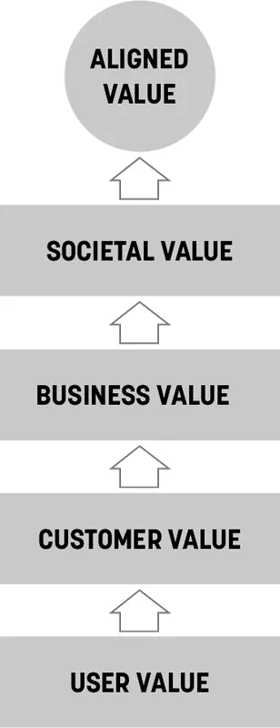

###### Figure 3-2. Aligned value

The Facebook example brings up another point of view here, which relates
to the value the system creates for people who don’t directly use the
system. Facebook’s impact on society is—well, let’s call it
*controversial*. In terms of our model, they have created a way to
deliver value to users, advertisers, and themselves, but at what cost to
society? A robust and ethical framework for aligning value has to take
into account the needs of a broad range of stakeholders—both those who
directly interact with the system and those who are indirectly
impacted.^([2](#ch03.html_ch01fn7))

This brings us to a final point here: none of the systems that we work
on can be described with a single outcome statement. They are all
systems of interrelated outcomes. What’s more, all of these related
outcomes combine to create the high-level impact (or impacts) that we
seek. This can make working with outcomes tricky—a typical system is
composed of many people performing many behaviors. It’s easy to quickly
get overwhelmed. What behaviors are important? Which ones should we
focus on? In coming chapters, we’ll share some techniques for
discovering, understanding, and mapping these related outcomes and for
navigating through this complexity to find the key outcomes to focus on.

---

## Outcomes, Iteration, and Validation

When you shift the focus of your work from outputs to outcomes, it
creates huge changes in the way you organize your work. One of the big
things that changes is the finish line: how do you know when you’re
done?

In the software world, we typically use requirements, specifications,
and acceptance criteria to tell us when work is done. Is the software
running? Does it meet the specs? Comply with requirements? Meet the
acceptance criteria? Does it meet what Scrum calls the “definition of
done”? These methods are good in that they can define the finish line
very precisely, but they almost always ask us to evaluate the *output*
of our work. What if we don’t want to stop there? What if we want to
measure the *outcomes* that we’ve created?

It turns out that, in this case, we can’t stop working on a thing when
we’ve finished making it. To measure outcomes, we actually need to put
that thing in the world and observe how (or if) it changes people’s
behaviors. In other words, while we have to complete the output, that’s
not enough. We have to *validate it*.

The process of validating our output is inherently iterative. Most of
the time, teams don’t get everything right on their first attempt.
Typically, our first attempt may get some of the outcome we seek but
usually not all of it. When we focus on outcomes, we see the opportunity
for improvement, and we keep working on that thing until it delivers the
outcomes that we set out to deliver. This is the process that Lean
Startup calls the *build-measure-learn loop* and what the Agile
community calls *inspect and adapt.* Whatever you call these loops, they
describe an iterative approach. An approach that means the end of
one-and-done. An approach that means we iterate until we achieve the
outcome.

^([1](#ch03.html_ch01fn6-marker)) To learn more about outcomes, see
Josh’s book *Outcomes Over Output: Why Customer Behavior Is the Key
Metric for Business Success* (Sense & Respond Press, 2019),
[*https://oreil.ly/7O2xZ*](https://oreil.ly/7O2xZ).

^([2](#ch03.html_ch01fn7-marker)) For a good summary of the issues here,
see Oz Lubling’s article “The Blurry Line between Empowerment and
Exploitation in UX,” Culture Clash, February 4, 2021,
[*https://oreil.ly/BDi2z*](https://oreil.ly/BDi2z).

---

## Chapter 10. Box 6: Hypotheses

###### Figure 10-1. Box 6 of the Lean UX Canvas: Hypotheses

When the team arrives at Box 6, it has all the raw material it needs to
start writing tactical, testable hypotheses. Before we do that, though,
let’s talk about hypotheses in general.

Hypothesis has become a popular word in product development recently, in
no small part because of *The Lean Startup*, in which Eric Ries
describes a method of product development inspired by the scientific
method. He advocates testing your hypotheses early and often. So what is
a hypothesis anyway? According to *The Oxford Dictionary of Difficult
Words*, it’s “a supposition or proposed explanation made on the basis of
limited evidence as a starting point for further
investigation.”^([1](#ch10.html_ch01fn12))

That’s what we’re about to create: we’re going to take all of our
assumptions (assumptions are statements based on “limited evidence”),
and we’re going to gather them into a unified statement (our “proposed
explanation” of our problem and solution) so that we can begin our
research and testing process (our “further investigation”).

OK, with that out of the way, let’s get started writing hypotheses. This
is the template we recommend:

> We believe we will achieve **\[this business outcome\]**
>
> If **\[these personas\]**
>
> Attain **\[this benefit/user outcome\]**
>
> With **\[this feature or solution\]**

The template starts with the words “we believe.” This is explicit
because we don’t know. We’re making assumptions. And then we complete
the hypothesis template based on the material we’ve created in every
canvas box before this one. We pull business outcomes from Box 2,
personas from Box 3, benefits from Box 4, and solutions from Box 5. In
some ways, this part of the process is just *fill-in-the-blanks.*

But we need to do a little more than that. Our goal here is to write
hypotheses that make sense and that we believe. These hypotheses are, in
essence, very short stories designed to build support for pursuing a
particular design direction. Writing a good hypothesis that makes sense
and that you and your team believe is actually the first way to test the
validity of your solution brainstorms. If you can’t put together a
compelling hypothesis statement for one of the solution ideas in Box 5,
then that idea shouldn’t graduate to the next part of the process. And,
just to be extra clear, a compelling hypothesis is one where the feature
has a clear user, the user gets an obvious benefit from the feature, and
the subsequent user behavior change helps solve the business problem we
articulated in Box 1.

---

## Facilitating the Exercise

We like to create a table like the one in
[Figure 10-2](#ch10.html_a_hypothesis_table) and then complete it by
using the material we’ve filled in the earlier parts of the canvas. We
physically move our Post-it notes into the appropriate boxes to make
rows of related ideas. Each column is directly related to a specific box
of the canvas, from Box 2 on the left to Box 5 on the right.

###### Figure 10-2. A hypothesis table

You’ll often find during this exercise that there are gaps in your
initial brainstorms. Some business outcomes might have no features
created for them, whereas some features might not drive any value for
the customer or the business. That’s part of the point of this exercise:
to organize and make sense of your initial round of thinking. After
you’ve identified the gaps in your brainstorms, fill them in with new
sticky notes ([Figure 10-3](#ch10.html_working_on_the_hypothesis_chart))
or—even better—leave the less relevant ideas off the chart. This will
help make sense of the undoubtedly large number of ideas your team
generates.

With distributed teams using a virtual whiteboard tool, this exercise
becomes even easier. Copy and paste your notes from other parts of the
canvas into Box 6 and move them around as necessary to complete the
chart.

###### Figure 10-3. Working on the hypothesis chart

After you’ve completed the chart—7 to 10 rows are a good initial
target—begin extracting feature hypotheses from it. Use the hypothesis
template to ensure you’re including all the relevant components of the
hypothesis statement. Here’s that template again:

> We believe we will achieve **\[this business outcome\]**
>
> If **\[these personas\]**
>
> Attain **\[this benefit/user outcome\]**
>
> With **\[this feature or solution\]**

As you write your hypotheses, consider which persona(s) you’re serving
with your proposed solutions. It’s not unusual to find solutions that
serve more than one persona at a time. It’s also not unusual to create a
hypothesis in which multiple features drive similar outcomes. When you
see that happening, refine the hypothesis to focus on just one feature.
Hypotheses with multiple features are not easy to test. The important
thing to remember in this entire process is to keep your ideas specific
enough so that you can create meaningful tests to see if your ideas hold
water.

<aside class="pagebreak-before less_space" data-type="sidebar" epub:type="sidebar">

##### What’s the Difference Between Hypotheses and Agile User Stories?

We’re often asked to differentiate between hypothesis statements and
classic Agile user stories. The difference is subtle but powerful. One
of the more popular formats for Agile user stories look like this:

As a \<type of user\>,

I want \<some goal\>

so that \<some reason\>.

You’ll notice that the user and user outcome are present in this story.
That said, most teams we’ve worked with replace “some goal” with “this
feature.” After the user story is written, most teams discard the pieces
around “some goal” and begin implementing the feature. The user is
quickly forgotten as the team works diligently to drive up their
velocity and deliver the feature. The team’s acceptance criteria (i.e.,
their definition of success) is that the system allows the user to
complete a task. There is no discussion as to whether the solution is
usable or desirable, much less delightful. There’s no discussion of
whether the feature creates an outcome. The only testing being done is
whether the system “works as designed.”

Hypotheses have behavior change (business outcomes) as their definition
of success. Shipping a working feature is table stakes. It’s the
beginning of the conversation. Our team’s success is not measured by how
fast they can get features launched. Instead, we measure success by how
well our customers can achieve “some goal” initially and continuously.

This is the key difference between user stories and hypotheses. They
refocus the team on what’s really important—making the customer
successful and thus achieving a business goal—as opposed to measuring
team productivity as success.

That said, you still need a way to talk about output and features—the
things that the team is building. If your user stories are
feature-centric, that’s fine. In fact, it’s often the case that a given
hypothesis results in many user stories. However you decide to track the
work is fine. Just make sure that some part of your process connects the
work you’re doing on the feature level to the higher-level user and
business outcomes that you’re trying to create.

</aside>

---

## Prioritizing Hypotheses

Lean UX is an exercise in ruthless prioritization. It’s rare to have a
project budget focused strictly on learning. In most cases, we need to
ship product too. The reason we declare our assumptions at the outset of
our work is so that we can identify project risks and prioritize. What’s
risky and needs testing? What’s not risky and thus easy to start?

After we string our assumptions together into hypotheses, we create a
backlog of potential work. Next, we need to figure out which ones are
the riskiest ones—so that we can work on them first. Understanding that
you can’t test every assumption, how do you decide which one to test
first?

There are lots of ways that you can prioritize, but we’ve found that it
can often be helpful to do this collaboratively and to have a framework
to use for this work. That’s why we created the Hypothesis
Prioritization Canvas shown in
[Figure 10-4](#ch10.html_the_hypothesis_prioritization_canvas). (Yes,
another canvas.) The HPC is a two-by-two matrix with the x-axis
measuring risk, and the y-axis measuring perceived value. We use
“perceived” value because this is a big assumption. We believe that an
idea has high perceived value if its implementation will meaningfully
impact the user experience and therefore the business. When it comes to
risk, we evaluate each hypothesis on its own merit. Some hypotheses are
going to be technically risky. Some will pose risk to the brand. Others
will challenge our design capabilities. In this case, we don’t normalize
for a specific type of risk so we can consider all aspects of risk for
each hypothesis.

###### Figure 10-4. The Hypothesis Prioritization Canvas

Map your hypotheses on the canvas as a team.

- The hypotheses that land in *quadrant 1* are the hypotheses we are
  going to test. They graduate to Boxes 7 and 8 in the Lean UX Canvas.

- If a hypothesis lands in *quadrant 2* of the HPC—high value, low
  risk—we’re going to build it. Write the user stories, put them on the
  backlog, and ship them. But don’t forget to measure that feature once
  it’s live. If it doesn’t live up to your expectations—aka the business
  outcomes defined in the hypothesis as success—you need to revisit this
  idea.

- Any hypothesis that falls below the risk axis into the low perceived
  value area doesn’t get tested. If it lands in *quadrant 4* of the
  HPC—high risk, low value—we throw it away. No need to build it either.

- Hypotheses that end up in *quadrant 3* of the HPC—low risk, low
  value—don’t get tested and in most cases don’t get built. However,
  there will be some hypotheses that end up here that, while not
  particularly valuable or risky, still need to get built so you can
  operate your business. For example, you will have to implement a
  payment system if you’re building an ecommerce service, but that won’t
  differentiate you in the marketplace. In this case, we build the basic
  use cases knowing that our innovative and delightful features—the
  riskier features—are going to be tested and validated before
  implementation.

---

## What to Watch Out For

Hypothesis writing, like most new techniques, gets better with practice.
Teams will often write hypotheses that are too big to test early in
their Lean UX journey. If you find yourself in this situation, rethink
the scope of your hypothesis. How can you make it smaller? How can you
size the hypothesis to a point where your team can have total ownership
over its scope?

Hypothesis writing, like business problem statement writing, also
benefits from specificity. Use specific numbers in your business
outcomes. Be clear about the feature you’d like to build. This is
another area where phrases like “better user experience” and “intuitive
UI” don’t make sense. If you’re asked to test that “intuitive UI” (and,
to be clear, you will be in the next step of the canvas,) what will you
test? Consider replacing ambiguous phrases like that with more specific
ones like “one-click checkout” or “face recognition authentication.”

^([1](#ch10.html_ch01fn12-marker)) Archie Hobson (ed.), *The Oxford
Dictionary of Difficult Words* (New York: Oxford University Press,
2004), s.v. “hypothesis.”

---

## Chapter 11. Box 7: What’s the Most Important Thing We Need to Learn First?

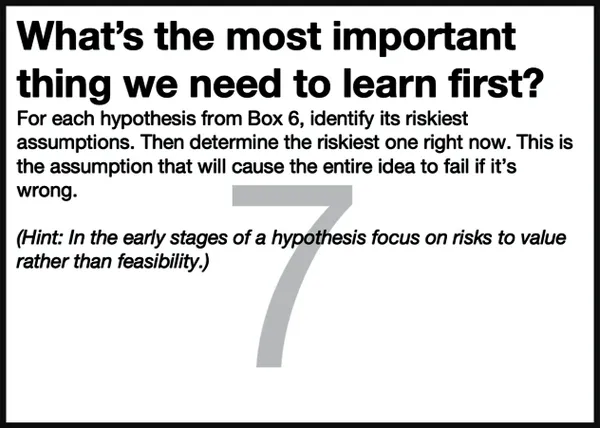

###### Figure 11-1. Box 7 of the Lean UX Canvas: Learning

Once you’ve prioritized your hypotheses and identified which hypotheses
you’re going to test, the next step in the process is highlighting the
major risks in each hypothesis. To do this, we ask the first of the two
key Lean UX questions: *What’s the most important thing we need to learn
first about this hypothesis?*

When we ask about learning, we’re really having a conversation about
risk. We want to uncover all the things that might break our hypothesis.
If you’re doing this with a cross-functional team, as we’ve advised
throughout the book, you’re going to get at least as many answers to
this question as there are disciplines in the room. The software
engineers will discuss the complexities of developing the feature. The
designers will bring up workflow issues and usability concerns. Product
managers will challenge whether it will deliver the business benefits we
anticipate. All of these risks are valid, but the ones we want to focus
on now are the ones that will render the hypothesis invalid and allow us
to move on quickly if we’re wrong.

In the early stages of the hypothesis’s life cycle, the biggest risk is
usually related to the value of the solution. Do people need a solution?
Will they look for it? Will they try it? Will they use it? Will they
find value in it? These are the things that matter early on. If the
answer to these questions is “no,” then there’s no need to worry about
how we’re going to design or build it. If we’re dealing with a more
mature hypothesis, one where the value has been validated and we’ve
moved on to the technical implementation, then thinking through things
like technical challenges, usability, and scalability become the next
logical risks to explore.

---

## Facilitating the Exercise

Generally speaking, this is a conversation. The team sits down to review
the hypothesis prioritization and determines which ones it wants to test
first. Then ask the question *what’s the most important thing we need to
learn first about this hypothesis?* If the conversation gets stuck, you
might choose to brainstorm here, then do some affinity mapping and dot
voting. Or you might defer to some member of the team who holds a strong
opinion. Generally, this step doesn’t need a lot of process. The point
here is to identify the top one to three risks related to this
hypothesis, then move on to planning your experiment, which you’ll do in
Box 8.

---

## What to Watch Out For

Consensus is nice but not always attainable. If you find that team
discussion not reaching a consensus, it’s a clear indication the team
needs more information to make that decision. The only way to do that is
to make a decision and move forward to Box 8 to create an experiment. In
most cases, the product manager can make this call. When you do this,
remember that we’re not abandoning these hypotheses, assumptions, and
risks forever. We’re simply moving forward with one and, if proven
false, will come back to the backlog of hypotheses to do the process
again.

---

## Chapter 12. Box 8: MVPs and Experiments

###### Figure 12-1. Box 8 of the Lean UX Canvas: MVPs and Experiments

The final step in the Lean UX Canvas is focused on experimentation. The
second key question of the canvas we have to answer is *What’s the least
amount of work we need to do to learn the next most important thing?*
The answer to this question is the experiment you’re going to run to
test your hypothesis.

Doing the least amount of work isn’t lazy. It’s lean. Remember, we’re
trying to eliminate waste, and extra work spent testing your idea is
waste. In fact, the faster you find out if your idea is something you
should continue working on, the less you invest in it. This makes
changing course much easier, which increases the agility of the team.

The experiments you come up with in Box 8 are your minimum viable
products or MVP. In fact, this is the exact definition of MVP from Eric
Ries’s *The Lean Startup*.

---

## What Is an MVP Anyway?

If you ask a room full of technology professionals the question “What is
an MVP?” you’re likely to hear a lengthy and diverse list that includes
such gems as the ones that follow:

> “It’s the fastest thing we can get out the door that still works.”
>
> “It’s an ugly release that’s full of compromises and makes everyone
> unhappy.”
>
> “It’s whatever the client says it is.”
>
> “It’s the minimum set of features that allows us to say, ‘it works.’”
>
> “It’s phase 1.” (And we all know about the likelihood of phase 2.)

The phrase MVP has caused a lot of confusion in its short life. The
problem is that it gets used in at least two different ways. Sometimes
the term is used to mean “a small and fast release.” That’s the meaning
that the quotes above refer to. That’s not how we use the phrase.

When we say MVP, we are talking about a small and fast way of learning
something. Sometimes, this is a software release. Sometimes, it’s not—it
can be a drawing, a landing page, or a prototype. Your primary concern
is not to create value but to create learning. Now, these two ideas are
not mutually exclusive. After all, one of the key things you’re trying
to learn is what the market finds valuable. Oftentimes, a good MVP will
create both value and learning. For us, though, the point of an MVP is
that it’s focused on learning.

---

## Example: Should We Launch a Newsletter?

Let’s take for example a medium-sized company we consulted with a few
years ago. They were exploring new marketing tactics and wanted to
launch a monthly newsletter. Creating a successful newsletter is no
small task. You need to prepare a content strategy, editorial calendar,
layout and design, as well as an ongoing marketing and distribution
strategy. You need writers and editors to work on it. All in all, it was
a big expenditure for the company to undertake. The team decided to
treat this newsletter idea as a hypothesis.

The team asked themselves: *What’s the most important thing we need to
learn first?* The answer: Was there enough customer demand for a
newsletter to justify the effort? The MVP the company used to test the
idea was a sign-up form on their current website. The sign-up form
promoted the newsletter and asked for a customer’s email address. This
approach wouldn’t deliver any value to the customer—yet. Instead, the
goal was to measure demand and build insight on what value proposition
and language drove sign-ups. The team felt that these tests would give
them enough information to make a good decision about whether to
proceed.

The team spent half a day designing and coding the form and was able to
launch it that same afternoon. The team knew that their site received a
significant amount of traffic each day: they would be able to learn very
quickly if there was interest in the newsletter.

At this point, the team made no effort to design or build the actual
newsletter. They would do that only after they’d gathered enough data
from their first experiment, and only if the data showed that its
customers wanted the newsletter. If the data was positive, the team
would move on to their next MVP, one that would begin to deliver value
and create deeper learning around the type of content, presentation
format, frequency, social distribution, and the other things they would
need to learn to create a good newsletter. The team planned to continue
experimenting with MVP versions of the newsletter—each one improving on
its predecessor—that would provide more and different types of content
and design, and ultimately deliver the business benefit they were
seeking.

---

## Creating an MVP

When it comes to creating an MVP, the first question is always *what is
the most important thing we need to learn next?* In most cases, the
answer to that will either be a question of value or a question of
implementation. In either case, you’ll want to design an experiment that
provides you with enough evidence to answer your question and help you
decide whether or not to continue with the idea.

---

## Creating an MVP to Understand Value

Here are some guidelines to follow if you’re trying to understand the
value of your idea:

Get to the point  
Regardless of the MVP method you choose to use, focus your time
distilling your idea to its core value proposition and present that to
your customers. The things that surround your idea (things like
navigation, logins, and password retrieval flows) will be irrelevant if
your idea itself has no value to your target audience. Leave that stuff
for later.

Use a clear call to action  
You will know people value your solution when they demonstrate intent to
use it or (gasp!) pay for it. Giving people a way to opt in to or sign
up for a service is a great way to know if they’re interested and
whether they’d actually give you money for it.

Measure behavior  
Build MVPs with which you can observe and measure what people do. This
lets you bypass what people say they (will) do in favor of what they
actually do. In digital product design, behavior trumps opinion.

Talk to your users  
Measuring behavior tells you what people did with your MVP. Without
knowing why they behaved that way, iterating your MVP is an act of
random design. Try to capture conversations from both those who
converted as well as those who didn’t.

Prioritize ruthlessly  
Ideas are cheap and plentiful. Let the best ones prove themselves, so
don’t hold on to invalidated ideas just because you like them. As
designers ourselves, we know that this one is particularly difficult to
practice. Designers tend to be optimists, and often we believe our
solutions, whether we worked on them for five minutes or five months,
are well-crafted and properly thought out. Remember, if the results of
your experiment disagree with your hypothesis, you’re wrong.

Stay agile  
Learnings will come in quickly; make sure you’re working in a medium or
tool that allows you to make updates easily.

Don’t reinvent the wheel  
Many of the tools, systems, and mechanisms that you need to test your
ideas already exist. Consider how you could use email, SMS, chat apps,
Facebook Groups, Shopify storefronts, no-code tools, discussion forums,
and other existing tools to get the learning you’re seeking.

---

## Creating an MVP to Understand Implementation

Here are some guidelines to follow if you’re trying to understand the
implementation you’re considering launching to your customers:

Be functional  
Some level of integration with the rest of your application must be in
place to create a realistic usage scenario. Creating your new workflow
in the context of the existing functionality is important here.

Integrate with existing analytics  
Measuring the performance of your MVP must be done within the context of
existing product workflows. This will help you to understand the numbers
you’re seeing.

Be consistent with the rest of the application  
To minimize any biases toward the new functionality, design your MVP to
fit with your current look, feel, and brand.

---

## Some Final Guidelines for Creating MVPs

MVPs might seem simple but in practice can prove challenging. Like most
skills, the more you practice, the better you become at doing it. In the
meantime, here are some guidelines to building valuable MVPs.

It’s not easy to be pure  
You’ll find that it’s not always possible to test only one thing at a
time: you’re often trying to learn whether your idea has value and
determine implementation details at the same time. Although it’s better
to separate these processes, keeping the aforementioned guidelines in
mind as you plan your MVPs will help you to navigate the trade-offs and
compromises you’re going to have to make.

Be clear about your learning goals  
Make sure that you know what you’re trying to learn, and make sure you
are clear about what data you need to collect to learn. It’s a bad
feeling to launch an experiment only to discover you haven’t
instrumented correctly and are failing to capture some important data.

Start small  
Regardless of your desired outcome, build the smallest MVP possible.
Remember that it is a tool for learning. You will be iterating. You will
be modifying it. You might very well be throwing it away entirely. It’ll
be much easier to throw it away if you didn’t spend a lot of time
building it.

You don’t necessarily need code  
In many cases, your MVP won’t involve any code at all. Instead, you will
rely on many of the UX designer’s existing tools: sketching,
prototyping, copywriting, and visual design.

---

## The Truth Curve

The amount of effort you put into your MVP should be proportional to the
amount of evidence you have that your idea is a good one. That’s the
point of the chart
([Figure 12-2](#ch12.html_our_adapted_version_of_the_truth_curve))
created by Giff Constable.^([1](#ch12.html_ch01fn13)) The x-axis shows
the level of investment you should put into your MVP. The y-axis shows
the amount of market-based evidence you have about your idea. The more
evidence you have, the higher the fidelity and complexity of your MVP
can be. (You’ll need the extra effort, because what you need to learn
becomes more complex.) The less evidence you have, the less effort you
want to put into your MVP. Remember the second key question: *What’s the
smallest thing that you can do to learn the next most important thing?*
Anything more than that is waste.

###### Figure 12-2. Our adapted version of the Truth Curve is a useful reminder that learning is continuous, and increased investment is only warranted when the facts dictate it

---

## Examples of MVPs

Let’s take a look at a few different types of MVPs that are in common
use.

---

