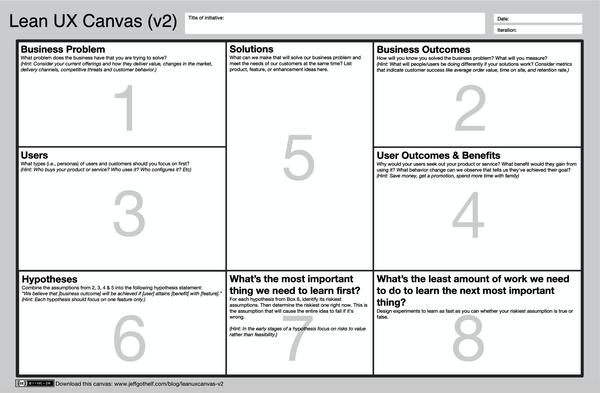
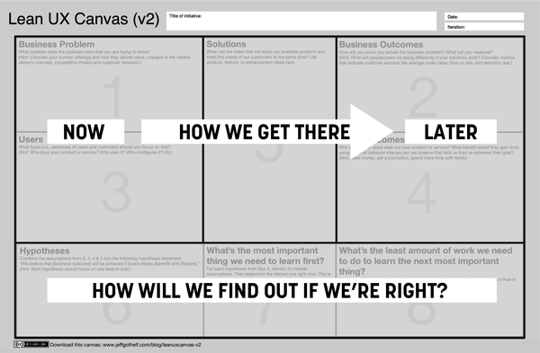

# Chapter 4. The Lean UX Canvas

# Assumptions Are the New Requirements

If you work in an industry where things are relatively predictable,
where there is low risk and high certainty in what the company is
making, what it takes to make your product, what it looks like when it’s
done, and what your customers will do with it once they have it, you can
comfortably work with a set of rigid, predetermined requirements. In a
world with this manufacturing-era mentality, big design up front is the
norm, and any variability in the production of your product is seen not
as an agile response to a changing marketplace but rather as an
expensive deviation from the plan. This way of thinking about
requirements was adopted in the early days of the software industry, was
the dominant model for decades, and continues to permeate many teams’
ways of working even to this day.

Requirements assume we know exactly what we need to build. Ideally, they
come from engineering rigor. But in software, they usually don’t have
the rigor behind them. Still, they are taken at face value based on
their author’s credibility or organizational title. In many cases, that
blind faith is augmented with the phrase “well, it worked before.”
Individuals or teams who question the absoluteness of the requirements
they’ve received are perceived as troublemakers and treated as
scapegoats when projects end up missing deadlines, exceeding scope, or
both. In organizations still leaning heavily on them as a way to tell
teams what to do, requirements often simply mean, as our friend Jeff
Patton likes to say, “Shut up.”

But today’s software-based businesses operate in a reality devoid of
consistency, predictability, stability, and certainty. Saying with
authority that a specific combination of code, copy, and design will
achieve a desired business outcome and will be delivered completely by
an explicit deadline is not just risky; in most cases it’s a lie.
Software development is complex and unpredictable. The pace of change is
incredibly fast. Not only can companies ship features to production
continuously at unprecedented speeds, but consumer behaviors are
changing just as quickly. As soon as you’ve settled on a feature set,
design approach, and specific user experience, your audience begins to
evolve into new mental models based on their experiences with other
online services.

The good news is that we don’t have to rely on requirements. The
industry has developed new ways to work that allow us to move away from
rigid requirements. When we wrote the first edition of this book, Amazon
was shipping code to production every 11.6 seconds. Today they’ve
decreased their time to market to one second.^([1](#ch04.html_ch01fn8))
That’s right: every second some Amazon customer somewhere in their
ecosystem experiences a change to the way the product works. Sixty times
per minute, Amazon has an opportunity to learn how well they’re meeting
the needs of their customers. Sixty times per minute, they have an
opportunity to respond to what they’re learning. Sixty times per minute,
they have an opportunity to make their user experience better. With this
capability, the very idea of a rigid requirement is, at best,
anachronistic. At worst, it’s an impediment that prevents teams from
doing their best work. We’ll grant that Amazon is at the extreme end of
this, but they serve as inspiration and a clear target for what is
possible. If we can ship, sense, and respond to this quickly, then
assuming that we know exactly how to best deliver value is a level of
arrogance and risk your organization cannot afford.

There are other reasons to avoid requirements. Software is hard. Even
seasoned software engineers will tell you that just because something
*seems* simple to build doesn’t mean it actually will *be* simple to
build. Oftentimes, as we set out to deliver a specific user experience,
we learn that in order to do so we’ll need to develop more code than we
anticipated. The code we thought would be simple turns out to have
complex dependencies or has legacy constraints or runs into unplanned
obstacles, and we end up having to spend extra time figuring out how to
work around these problems. This, too, flies in the face of rigid,
deadline-based requirements.

And, of course, it’s not just code that is complex and unpredictable.
Humans are complex and unpredictable too. Their innate motivations,
personalities, expectations, cultural norms, and habits all fly in the
face of what we believe will be an ideal software service for them to
use. We put so much faith in what we think will be “easy to use” or
“intuitive,” only to find that our target audience goes out of their way
to avoid the simplifications we believe we made for them. Why do they do
this? Any variety of factors (which we could learn about through
customer interviews and research) could lead to these unexpected
behaviors, but they all have the same net result: they prove our
requirements wrong.

So what should we do? We need to recognize that most requirements are
simply *assumptions* expressed with authority. If we remove the
authority, overconfidence, and arrogance from the conversation, we’re
left with someone’s best guess about how to best achieve a user goal or
solve a business problem. We are makers of digital products, so humbly
admitting that these are indeed our best guesses or assumptions
immediately and explicitly creates the space for product discovery and
Lean UX to take place. If we understand as a team that the work we’re
undertaking is risky *exactly because* we can’t predict human behavior,
we know that part of our work will have to include experimentation,
research, and rework. We reduce our attachment to the ideas and create a
team culture that is more willing to adjust course—even to stop working
on an idea that continues to prove unviable.

So how do we build a conversation that encourages ideas from the whole
team but qualifies those ideas as a series of assumptions? In earlier
versions of this book we shared a series of assumptions declaration
exercises. These processes have helped readers and practitioners express
their ideas in a new way, as *testable assumptions.* Over the years,
we’ve consolidated these assumptions declaration exercises, as well as
the steps you’ll need to test your assumptions, into one comprehensive
facilitation tool we call the Lean UX Canvas.

# The Lean UX Canvas

The Lean UX Canvas ([Figure 4-1](#ch04.html_the_lean_ux_canvas-id00041))
brings together a series of exercises that allow teams to declare their
assumptions about an initiative. It’s designed to facilitate
conversations within the team but also with stakeholders, clients, and
other colleagues. Remember that in Lean UX we’re trying to build shared
understanding, and to do that (especially when we’re trying to move away
from requirements), we need a consistent shared vocabulary that allows
stakeholders and individual contributors alike to share their ideas and
create clarity.

If you’ve done some Lean UX work in the past, you’ll recognize most of
these activities. If you’ve done design work before, you’ll recognize
the importance of all of the topics on the canvas and how important it
is to have conversations about these topics at the start of a project.
Our experience using this canvas is that the structure of the canvas
helps ensure all these conversations take place, that the conversations
include a diverse set of viewpoints, and that, when you’re done, the
extended team has built shared understanding and the path forward is
clear.

###### Figure 4-1. The [Lean UX Canvas](https://www.jeffgothelf.com/blog/leanuxcanvas-v2)

The canvas was designed to guide the conversation from the current state
of your product or system—or what Mike Rother called *the current
condition* (“NOW” in
[Figure 4-2](#ch04.html_the_key_areas_of_the_lean_ux_canvas)) in his
book *The Toyota Kata*^([2](#ch04.html_ch01fn9))—to its desired future
state or *target condition* (“LATER” in
[Figure 4-2](#ch04.html_the_key_areas_of_the_lean_ux_canvas)).

###### Figure 4-2. The key areas of the Lean UX Canvas

<aside data-type="sidebar" epub:type="sidebar">

##### Another Canvas?

Another canvas? Fair question. Ever since Alex Osterwalder and the team
at Strategyzer gifted the world the Business Model Canvas, we’ve been
enamored and ultimately inundated with canvases. If you don’t publish a
canvas, are you really even a thought leader? Again, fair question. But
canvases are useful and can serve as the centerpiece of a balanced,
inclusive team collaboration. If used correctly, canvases:

- Consolidate a series of activities into a sequential process designed
  to drive a narrative.

- Help in complex environments. They help us create a single visual
  model to represent key elements of that complexity.

- Serve as an easy-to-follow facilitation tool for teams interested in
  having a specific kind of conversation.

- Level the playing field for team members less apt to offer their ideas
  in a standard brainstorming session.

- Create a shared language for the team to use.

- Successfully frame the job to be done by the team.

- Communicate the challenge or work the team is undertaking broadly
  beyond the team.

</aside>

# Using the Canvas

In the coming chapters, we’ll describe each section of the canvas in
detail. Before we do that, however, we want to answer some general
questions that come up whenever we teach teams about the canvas.

## So When Should We Use the Lean UX Canvas?

We think that the canvas is a great way to start an initiative. Whether
you’re working on a new feature, a major initiative, or a new product,
the canvas is a great structure to use for your kickoff meeting. As you
get comfortable with the tool, you’ll start to develop a sense of when a
piece of work is too small for the canvas. Generally, we think it’s a
good idea to use it any time you’re planning a big chunk of work.

## Is the Lean UX Canvas Best Suited for Early-Stage Ideas or for Sustaining Innovation?

The canvas actually works well for both types of work. The key question
is this: are you facing important unknowns, uncertainty, or complexity?
That’s where the Lean UX Canvas—and, really, Lean UX in general—can
help. In early-stage work, the unknowns tend to be existential in
nature: is there a need for this product or service? Will people use our
solution? Can we build a business by solving this problem? In sustaining
innovation, the questions tend to be smaller, but that doesn’t mean that
the answers are any clearer. In both of these situations, the Lean UX
Canvas can help.

## Who Should Work on the Canvas?

One of the values of the canvas is the way that working through it
creates shared understanding on your team. It encourages the team and
stakeholders to do the product discovery work that makes for successful
products. So we believe that all team members should participate in the
work on the canvas. We also think that stakeholders and clients should
participate as much as possible, especially during the parts of the work
to elaborate the business problem statement and business goals.

## How Long Should We Expect to Spend on a Lean UX Canvas?

It’s hard to get through the whole thing in less than a half-day
session. Because the canvas makes a great kickoff activity, think about
how much time you normally spend kicking off projects. Is that a two-day
exercise? A full week? Some teams will work through the canvas that way,
especially if you can all be together in the same room. Other teams will
choose to hold a series of meetings over the course of a couple of
weeks. In general, the bigger and more important the project, the longer
it will take. Don’t get stuck in analysis paralysis. When you don’t know
something, put it in the parking lot and move on. After all, the *whole
point* of the canvas is to collect the things that you don’t know so
that you can start learning about them quickly.

## Do We Have to Use the Canvas to Do Lean UX?

Absolutely not. Each part of the canvas contains a useful part of the
Lean UX process. As you’re working on any initiative, you’re going to
want to think about and answer the questions implied by each of the
boxes on the canvas. That said, you can absolutely use each box on the
canvas as a standalone technique. Are you unclear about your users? Go
to Box 3, read about proto-personas, and use these ideas with your team
to get clarity. Are you unclear about the best solution to a problem?
Flip to the section of this book on Box 5 and take your team through
that process.

If you decide to use the canvas as a whole, remember that it’s a
flexible tool. Use the exercises that work best for you, taking into
account your context and the ways that work for your team. Expand the
number of activities as your team grows more comfortable with the nature
of this work. Ultimately, we want to ensure the customer is front and
center in all of your conversations. The Lean UX Canvas is a strong
starting point for ensuring that happens.

## Facilitating Each Section

In the chapters to come, we’ll share instructions for exercises that we
like to use to complete the canvas. Here, we’d like to note some general
patterns.

### Be inclusive

We want the whole team to participate in completing the
canvas.^([3](#ch04.html_ch01fn10)) This means that your facilitation
needs to account for different participation styles, as well as the
different levels of power and authority in the room.

To address that, we like to use a variant of the *1-2-4-All*
pattern.^([4](#ch04.html_ch01fn11)) This is a structured way of
eliciting participation from a group. Here’s how it works:

- You start by asking people to work individually (the “1”), usually
  silently, either by writing ideas or drawing something by themselves.
  You generally want to set an aggressive time limit on this period
  (usually five minutes) to force people to get their ideas out and to
  avoid spending a lot of time editing and refining. After this period
  of solo work, ask folks to share back with their table or their
  subgroup. If people have been working with Post-its, it can make sense
  to ask people to bring them to a wall and post them there. Optionally,
  you can offer discussion during this period. You can also ask people
  to do some affinity mapping at this point.

- Then, you ask people to work in pairs (the “2”) to elaborate or
  develop an idea. Paired work takes more time than solo work, so give
  the pairs more time than you allowed for solo work. Again, following
  this period of paired work, you have the pairs present their work to
  their table or subgroup room, and you may have more discussion at this
  point.

- Next, you ask each table or subgroup to develop their work into a
  single presentation. (This is the “4” portion of the pattern.)

- Finally (if you’re trying to produce one final idea), you ask the
  whole group to develop a single idea. (This is the “All” portion of
  the pattern.)

1-2-4-All is effective because it solicits input from everyone in the
room, allows for both solo and collaborative working styles, and,
finally, allows the group to come together. You’ll want to adapt this
pattern to the specific exercise but keep it in mind as you plan group
work.

### Remote versus in-person

All of these exercises can be done as in-person workshops or remotely,
with videoconferencing software and shared whiteboard tools. If you’re
working remotely, remember to break up your sessions to allow people to
stand up and avoid Zoom fatigue. Also, remember that not everyone is
familiar with online whiteboard tools, so allow some time to bring less
experienced participants up to speed. (Sometimes you can use an
icebreaker exercise that helps people learn the tool.) We’ve created
[Lean UX Canvas templates](http://www.leanuxbook.com/links) that you can
use.

# Wrapping Up

In the coming chapters in this section, we’ll describe each section of
the canvas in detail.

^([1](#ch04.html_ch01fn8-marker)) Vogels, “The Story of Apollo -
Amazon’s Deployment Engine.”

^([2](#ch04.html_ch01fn9-marker)) Mike Rother, *The Toyota Kata:
Managing People for Improvement, Adaptiveness, and Superior Results*
(McGraw-Hill Education, 2009).

^([3](#ch04.html_ch01fn10-marker)) The idea of “the whole team” will
vary based on your context, so feel free to adapt this advice based on
the size of your group and the roles of the people in the room.

^([4](#ch04.html_ch01fn11-marker)) This is one of the patterns in the
very useful Liberating Structures collection. See “1-2-4-All,”
Liberating Structures, accessed June 16, 2021,
[*https://oreil.ly/12vgk*](https://oreil.ly/12vgk).

