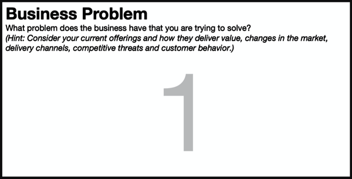

# Chapter 5. Box 1: Business Problem

###### Figure 5-1. Box 1 of the Lean UX Canvas: Business Problem

For Lean UX to be successful, teams must be given problems to solve, not
solutions to build. Often, these “solutions” are expressed as
requirements or feature specifications. But if requirements are the
wrong way to go, what’s the right way? The right way is to understand
and express the problem that stakeholders or clients are trying to
solve. This is what *business problem statements* do. Business problem
statements reframe the work in a way that explicitly demands that
product discovery work take place.

While there is some flexibility in what a business problem statement can
look like, at the very least it should:

- Provide a specific challenge for the team to solve rather than a set
  of features to implement.

- Anchor the team in a customer-centric perspective so that customer
  success is a baked-in part of the end goal.

- Focus the team’s effort by specifying guidelines and constraints that
  make it clear to the team what is in scope and what is out of scope.

- Provide clear measures of success expressed as key performance
  indicators of the business (desired impacts) or specific outcomes the
  company wants to see in its target audience.

- Not define a solution (this is surprisingly harder than it sounds).

Foundationally, business problem statements contain three parts:

1.  **The current goals of the product or the system the team is working
    on.** In other words, why was it created in the first place? What
    problem was it originally designed to solve? What value was it
    intended to deliver?

2.  **What’s changed in the world and how that has negatively affected
    the product?** In other words, where are the goals we set for this
    product not being met now?

3.  **An explicit request to improve the product** that stays away from
    specifying a solution and that quantifies “improvement” in terms of
    outcomes.

When you are creating business problem statements, remember that your
initial efforts are likely to be filled with assumptions. You’ll
discover that this is going to be true for every part of the Lean UX
Canvas. This is OK; in fact, it’s inevitable. Just keep in mind that, as
you start to work on the problem—that is, as you start to do the
discovery work—you may uncover evidence that you’re working on the wrong
problem or targeting the wrong audience or measuring success in the
wrong way. That’s fine. That’s why you do discovery! Just make sure you
bring this learning back to the team and to stakeholders as soon as you
can so that you ensure you’re not wasting time and effort on an invalid
problem statement.

# Facilitating the Exercise

To create a business problem statement, you can certainly sit down
informally with stakeholders and product owners to draft one together.
That said, we like to do this as part of a workshop setting with the
whole team. If you’re doing that, we recommend using the following
process.

*Provide context and background for the team.* This often falls on the
product manager and is critical to framing the work correctly. Questions
that the product manager should answer for the team prior to writing a
business problem statement include:

- What have we observed and measured that leads us to believe there’s an
  issue?

- Who are we targeting with this work?

- How does this piece of work fit into the broader program of work the
  company is undertaking?

- What is the impact of fixing (and not fixing) this problem on company
  health?

If you have a large group, divide into pairs or trios and write the
first draft of the business problem statement in small groups. Small
groups can do this together. Spend no more than 30 minutes on this first
draft.

Here is the template we use for writing good business problem statements
for *existing products*:

> **\[Our service/product\]** was designed to achieve **\[these
> business/customer goals and deliver this value\]**. We have observed
> **\[in these ways\]** that the product/service isn’t meeting these
> goals, which is causing **\[this adverse effect/problem\]** to our
> business.
>
> How might we improve service/product so that our customers are more
> successful as determined by **\[these measurable changes in their
> behavior\]**?

If you’re working on *brand new initiatives*, the template looks like
this:

> The current state of **\[the domain we are working in\]** has focused
> mainly on **\[these customer segments, these pain points, these
> workflows, etc.\]**.
>
> What existing products/services fail to address is **\[this gap or
> change in the marketplace\]**.
>
> Our product/service will address this gap by **\[this product strategy
> or approach\]**.
>
> Our initial focus will be **\[this audience segment\]**.
>
> We’ll know we are successful when we see **\[these measurable
> behaviors in our target audience\]**.

Once the pairs or trios complete their first draft, come back together
as a team and read your drafts to each other. Provide critique and
feedback, and ask clarifying questions about each draft. Remember that
critique isn’t a direct attack on the work but rather a clarifying probe
to better understand what the authors meant.

Once everyone has shared their draft, combine into larger groups of four
to five team members and consolidate into one statement draft. After 30
minutes of subgroup consolidation, share back the reworked drafts with
the broader team. Finally, spend 30 more minutes bringing the drafts
together into one pan-team business problem statement. Remember that
this is an assumptions declaration exercise. Inevitably, some of these
assumptions will be wrong, so the goal of Box 1 isn’t writing the
perfect problem statement. The goal is to begin to build alignment
within the team about where you’re headed on this initiative and how
you’ll know you’ve achieved the goal.

Remember that business problem statements are ultimately about the
project charter, so if stakeholders haven’t been involved, you’ll need
to bring them in at this point to get their commitment.

Add your completed problem statement draft to your canvas.

# Some Examples of Problem Statements

Here is an example of what a good business problem statement looks like:

> When we launched our small and medium-sized (SMB) digital lending
> solutions, the market consisted of antiquated products sold by legacy
> banking institutions. In that world, our digital-first lending
> solutions stood apart and attracted SMB customers searching for new
> ways to work with their bank. With traditional banks functioning
> increasingly as “fintech” companies, our market has become crowded and
> highly competitive. This is causing our customer acquisition costs to
> go up, market share to stagnate, and customer support costs to rise.
>
> How might we redesign our SMB product line so that our customers
> believe we are purposefully designed to support their modern
> businesses, in turn driving our acquisition costs down and market
> share up?

This example is relatively high-level. It is designed to address a
problem at the business unit level. It is important that the team that
works on this problem has the jurisdiction and influence to affect work
at this level. Writing business problem statements that teams cannot
actually solve because they lack the required level of influence is
setting that team up to fail.

Here is an example of a more tactical business problem statement that
can be assigned to a feature-level team:

> The password retrieval functionality was implemented to help customers
> quickly get back into the product in the event of a lost or expired
> password. In addition, this added self-service would reduce the
> numbers of calls to the customer service center, reducing our overall
> annual support calls since password reset calls make up at least 35%
> of inbound calls.
>
> We’ve noticed through analytics reports and consistent usability study
> feedback that our customers struggle to find the password retrieval
> function and, even when they do, fail to complete the reset process on
> their own at least 42% of the time due to its complexity. This is
> causing an increase in call center support costs by 12% while
> exacerbating customer dissatisfaction with our product, potentially
> leading to a 0.7% increase in churn rate.
>
> How might we redesign the password retrieval experience so that our
> users are more successful as determined by 90% process completion
> rates and 50% reduction in calls to customer support about password
> reset?

# What to Watch Out For

*Don’t specify the solution.* the exercise being called a business
*problem* statement, we often see teams inserting solutions into the
statement. This often shows up in the “how might we” part of the
statement with phrases such as “How might we implement a mobile app that
solves for this…” Solutions should not be in this exercise at all. We
reserve that conversation for Box 5.

*Get the level right.* We mentioned “leveling” the problem statement
correctly earlier, but it’s worth repeating that whether you are writing
your own problem statements together as a team or someone is writing
them for you, your team should only sign up for a problem statement they
are capable of solving. If the problem is framed at too high a level,
the team will not be able to solve the problem on its own. This will
lead to frustration—not only with and within the team but with the
overall Lean UX process itself.

*Be specific.* Another common antipattern is a lack of specificity in
the statement. On occasion, teams will leave explicit metrics or
evidence out of the problem statement. Specifics are important for
framing the importance of the problem as well as setting clear,
business-level success criteria for the team. When in doubt, always push
for specificity in the statement.

Finally, specificity is important not just to the metrics but for the
product area being addressed. Teams will use phrases like “intuitive UI”
or “great user experience” to describe work that was done or that is
expected to be done. In all cases, phrases like these describe features
(albeit in the abstract) that in general should be left out of problem
statements.

Here are two examples of phrases like these in business problem
statements and how to correct them:

> When we set out to improve our shopping experience, we implemented an
> intuitive UI for increasing average order value.

In this example, it’s not clear what was implemented, so therefore the
team doesn’t really know what portions of the UI to potentially target
for improvement.

In this next example, the ambiguous phrase ends up in the “how might we”
portion that seems benign enough but already focuses the team on a
specific solution before any discovery work has been done:

> How might we create a more intuitive UI so that customers add more
> items to their shopping cart during every visit?

You can see here that the framing of the work tells the team to only go
after UI enhancements rather than looking for the root cause of
dwindling average order values.

And for what it’s worth, everyone sets out to ship intuitive UIs. No one
ever says, “We’re going to ship a crappy user interface for the
ecommerce platform.”

