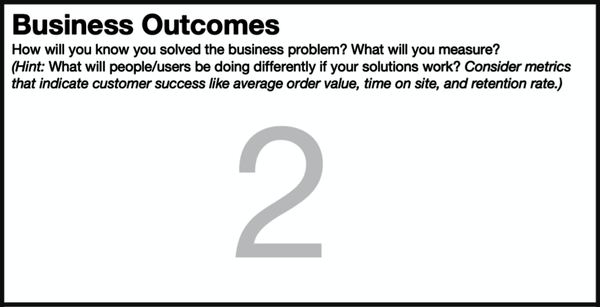
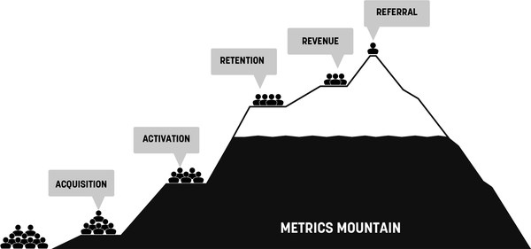
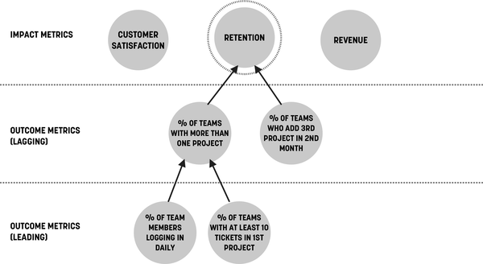
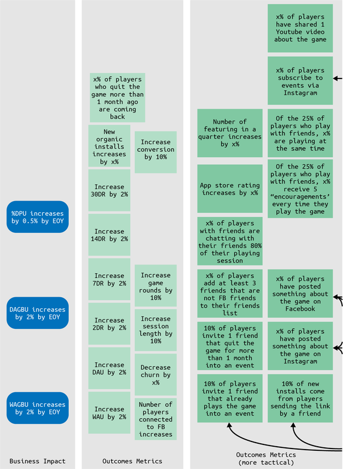

# Chapter 6. Box 2: Business Outcomes

###### Figure 6-1. Box 2 of the Lean UX Canvas: Business Outcomes

We covered the concept of outcomes in [Chapter 3](#ch03.html_outcomes).
Box 2 is where they make their first appearance on the Lean UX Canvas.
Once you’ve got a business problem statement, you want to dig deeper
into the core behavior changes you’re seeking as part of the initiative.
Typically, the success criteria in a problem statement are high-level.
Success criteria there tend to be key performance indicators or impact
metrics—the things that are found on executive dashboards. These could
be metrics like revenue, profit, cost of goods sold, and customer
satisfaction. These are helpful at measuring the health of the business,
but feature-level teams need to work at a lower level.

In this exercise we work together to uncover the leading indicators of
those impact metrics. The question we’re trying to answer is *what will
people be doing differently if our solutions work?* If we choose the
right combination of code, copy, and design, what do we expect to
happen? The answers to these questions are what we’re looking for in
this assumption declaration exercise.

Every option in this brainstorm should start with a verb, and each
answer should be something valuable that customers do in the system
already, something that’s not valuable that we’d like them to do less
of, or something new that we think will be valuable and that we’d like
them to start doing. In essence, we’re thinking through and highlighting
user journeys.

# Using the User Journey

The goal of this exercise is to find the valuable customer behaviors
that we want to focus on. In order to do that, it’s helpful to start
with a model of customer behavior—what are people doing today? What are
they trying to do that’s difficult? What are they doing today that’s not
productive for them or for us? What new, valuable behaviors can we
unlock? To answer this question, we can use the idea of user journeys.

User journey mapping can be very simple. We can use a template, like
Pirate Metrics or Metrics Mountain (both described below). Or we can use
tools that we borrow from Service Design to create a user journey map.
Regardless of the framework we choose, the idea is to gather the team
and stakeholders around the map and generate a shared understanding of
the journey of how people move through our system and which parts of
that journey should be the focus of our work.

Depending on your circumstances, here are some models to get you
started.

## User Journey Type: Pirate Metrics

One way of coming up with your outcome metrics is using Pirate Metrics.
Conceived at startup incubator 500 Startups, the Pirate Metrics funnel
has become a standard way to think about the user journey through our
products. We can use it here to help us determine which portions of that
journey are relevant to the problem we’re addressing.

Pirate Metrics are made up of five types of customer behaviors:

Acquisition  
These are the activities that get customers to the product in the first
place. Viable options here include number of downloads, visits to the
registration page, number of sign-ups, etc.

Activation  
Once a customer has been acquired, we can start to measure whether or
not they are actually using the product. Activation metrics include
things like number of accounts created, number of people followed,
percentage of new sign-ups that made a purchase, etc. These metrics
should reflect the core functionality of the product.

Retention  
If we can get customers to try the product, the next challenge is to get
them to continue using it on a regular basis. “Regular basis” in this
case will be contextual to your product. (For a product like Netflix,
you would measure daily viewing habits, but if you make a smart
“learning” thermostat, you’d likely measure how few interactions the
user had with the device.) If we’re retaining customers, generally
speaking, they’re coming back frequently to use the product, they’re
doing more in the product, and they’re spending time too.

Revenue  
If we got them to the product, convinced them to try it, and now they’re
using it regularly, are they paying us? That’s the next level of
commitment we look for in our customers. Our goal is to see where and
how we’re converting customers into paid users and how those patterns
evolve over time. Metrics to consider here include percentage of paid
versus free users, average lifetime value of each customer, etc.

Referral  
The final step in the Pirate Metrics funnel is assessing whether our
customers are referring others to the product. If they truly love it,
feel like they’re getting value from it, and can’t live without it,
they’ll tell their friends or the internet through reviews. This is the
best kind of marketing you can get. Metrics to track here include
percentage of new users who came through referral, percentage of current
users who refer others, and cost of acquisition per new user.

At this point you’ve probably noticed that the acronym for this method
spells AARRR, which is, apparently, how pirates talk, hence the name
Pirate Metrics. We can confidently say that neither of us has ever met a
pirate, and therefore we cannot confirm that this is indeed
pirate-speak.

## User Journey Type: Metrics Mountain

One of the things that’s bothered us for a while about Pirate Metrics is
its visualization as a funnel. In the real world, everything you put
into a funnel comes out of that funnel. It takes a bit longer, but the
idea that some of the liquid (for example) that you pour at the top of
the funnel won’t make it out the bottom is ridiculous. Of course it
will. There’s a hole at the other end! There had to be a better
metaphor.

Instead of a funnel, we present Metrics Mountain
([Figure 6-2](#ch06.html_metrics_mountaindot_concept_by_jeff_pat)).

###### Figure 6-2. Metrics Mountain. Concept by Jeff Patton and Jeff Gothelf.

The idea of a mountain to visualize the customer life cycle makes
perfect sense because our goal is to get as many of our customers to the
top of the mountain. Realistically, though, we’re going to lose people
along the way. They’ll get tired. They’ll get bored. They’ll get
distracted. They’ll defect to a competitor. Not every one of them will
make it through (i.e., where the funnel metaphor breaks).

As your customers make their way up Metrics Mountain, they are asked to
do more and more with your product or service (the climb gets harder).
Your goal is to make that as easy a process as possible and to motivate
them to keep going. Some of them will do that—especially if you have a
compelling value proposition, user experience, and business model. But
increasingly, as your customers make their way up the mountain, they
will drop off. Our goal should be to build the kinds of experiences that
get the highest percentage of people to the top of the mountain.

## Facilitating Your Business Outcomes Conversation with Metrics Mountain

You can use the mountain metaphor to facilitate the conversation with
your team and stakeholders about the behaviors you believe your users
should be progressing through as they use your product. Here’s how to do
that:

1.  Start at the base and identify the first thing a user has to do to
    begin using your product. How do you acquire them? How do they find
    the new feature you’re working on?

2.  Define a “plateau” on the mountain for each subsequent step of your
    customer journey and determine the user behavior it takes to get
    there.

3.  What percentage of users moving their way up the mountain would your
    team consider successful for each step? Add those numbers to the
    mountain diagram.

    - For example, of the 100% of your daily visitors, you would like to
      see at least 75% discover the new feature you’re building, and 50%
      of those folks give it a try. From there, you’d like to see at
      least 25% of those who tried to continue using the feature on a
      weekly basis, with 10% of them ultimately paying you for this new
      capability.

4.  If you’re not sure about your exact customer journey, start with
    Pirate Metrics as the five “ledges” of the mountain. This is a good
    way to kick off this exercise.

## User Journey Type: Service Journeys and User Story Maps

Sometimes, visualizing the user journey as a funnel or a mountain
doesn’t make sense. You know your product well, and these models may not
apply to you. Don’t force it. Instead, you can build a Service Journey
Map or User Story Map that more closely maps the way a user moves
through your product or service. The form isn’t really important here:
use the method that makes sense for you and your product. The goal is to
be able to visualize the flow through the product in a way that you can
all see and understand, then use that model to zoom in on the most
important parts of the journey, identify the specific behaviors crucial
to the success of your initiative, and determine the outcome metrics
that would indicate success for that journey.

# Outcome-to-Impact Mapping

*Outcome-to-impact mapping* is another technique to visualize the
connection between the impact metrics in your business problem statement
and the tactical outcomes you hope to see in your customers. It works
well with your feature-level team and is also a powerful exercise to do
together with your stakeholders.

This exercise also visualizes the concept of leading and lagging
indicators. You’ll find that impact metrics are more often lagging
indicators—backward-looking measures of what’s already taken place. As
this exercise progresses, you’ll find many of the lower-level metrics,
the outcomes, to be leading indicators. These behaviors are often the
things that need to take place before we can achieve the impact metric.
For example, a customer must first download our app before they can
spend money on our service. The former is a leading indicator of the
latter. What teams often find is there are many leading indicators for
one or two impact metrics. This exercise helps shed light on that fact
and forces a (hopefully) productive conversation about prioritization.

Here’s how it works:

1.  Gather the team and the product leads into a meeting room.

2.  On a whiteboard, ask the highest paid person in the room to write
    down the current strategic goal for the year at the top on a series
    of Post-it notes.

3.  Below that, ask that same person (or another executive) to list out
    the measures of success for that strategy (hint: these should be
    impact metrics and are often lagging indicators).

4.  Below each impact metric, start to draw lines protruding away from
    each one (like you’re building an org chart).

5.  Ask the room to fill out the line below the impact metrics with
    customer behaviors that drive those metrics (leading indicators).
    Use Post-its and have everyone work individually on an initial
    brainstorm.

6.  Now have the team do another row below the last one showing the
    customer behaviors that drive the initial set of outcomes.

At this point, your whiteboard should start to look like the map shown
in [Figure 6-3](#ch06.html_outcome_to_impact_mapping):

###### Figure 6-3. Outcome-to-impact mapping

Once everyone’s contributed, you should have dozens of Post-its on the
board indicating a variety of customer behaviors (outcomes) that will
help your company hit its strategic goal and impact targets. Also at
this point, your team may be overwhelmed. Most times we’ve run this
exercise, it never occurs to the team that there are so many ways to
potentially drive positive change.

Now, the tough part. Through a round of dot voting (or other facilitated
selection exercise), ask the team to pick the 10 outcomes they think
they should focus on first.

What you’ve done here is create a direct connection between outcomes
(customer behaviors) and impact metrics (the thing executives care
about) and forced them to choose where you should focus for the next
cycle. The last step is to create a baseline for each of these outcomes
(i.e., where they are today) and a goal (i.e., where we’d like them to
be at the end of the cycle) and assign them to the team as goals for
their next cycle.

Now, each time a team reports progress on their specific outcome, their
stakeholder will have a clear sense of *why* the team is working on that
and *how* it affects the impact metrics they care most about.

# What to Watch Out For

Not every number or percentage is an outcome metric. Jeff was working
with a huge German retail conglomerate on this specific exercise. Their
impact-level goal was to increase same store sales year over year. As we
worked through the outcome-to-impact mapping exercise, a few team
members added items to the outcome rows that read “percentage of
products on the shelf that are our brand.” Now, technically, this is a
metric, but it is not a measure of customer behavior. It is a product
strategy decision that you hope will drive some customer behavior. A
similar issue came up once with another client building an automation
tool. A person on the team listed “percentage of manual tasks now
automated by the system.” Again, this is not a measure of customer
behavior. It’s a facet of the system being built, a product decision.
The ultimate goal was to reduce the amount of time staff spent on
repetitive tasks—which *is* a good outcome metric.

The other thing we’ve seen often is that these charts get messy. It’s
easy to make them look neat in a book or PowerPoint slide. In reality,
our businesses aren’t this linear, and these charts can get a bit
unwieldy
([Figure 6-4](#ch06.html_real_world_example_of_an_outcome_to_imp)).
Teams will often find that one outcome drives multiple impact metrics
(this is perfectly reasonable) and has to be duplicated across the
chart. Build the chart that works for your business and your team. Just
don’t compromise the content of the exercise.

###### Figure 6-4. Real world example of an outcome to impact map, courtesy of Delphine Sassi and the team at King

