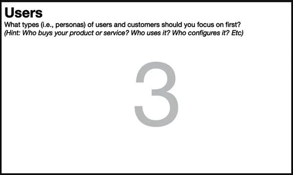
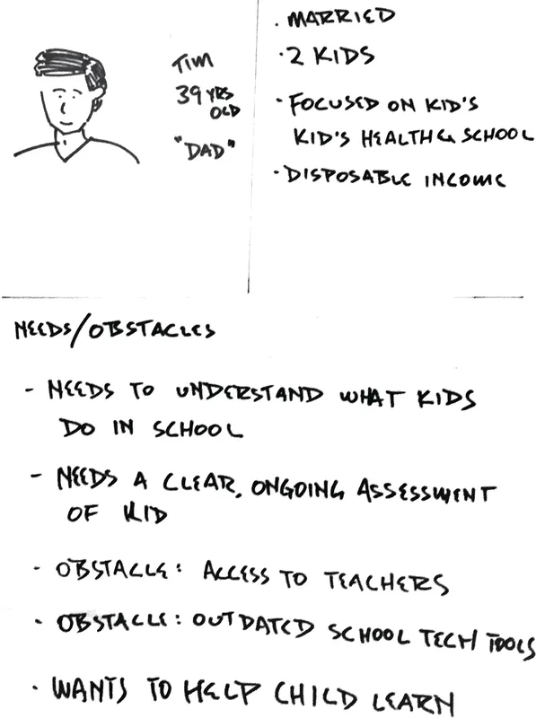

# Chapter 7. Box 3: Users

###### Figure 7-1. Box 3 of the Lean UX Canvas: Users

Designers have long been advocates for the end user. Lean UX doesn’t
change that. As we make assumptions about our business and the outcomes
we’d like to achieve, we still need to keep the user front and center in
our thinking. Box 3 of the canvas begins a deeper conversation into our
target audience.

Most of us learned to think about a persona as a tool to represent what
we learned in our research. And it was often the case that we created
personas as the output of lengthy, expensive research studies. There are
a few problems with personas that are created this way.

First, we tend to regard them as untouchable because of all of the work
that went into creating them. In addition, it’s often the case that
these personas were created by a research team or third-party vendor.
This creates a risky knowledge gap between the people who conducted the
research and those who are using the personas.

In Lean UX, we change the order of operations in the persona process. We
also change persona creation from a one-time activity to an ongoing
process—one that takes place whenever we learn something new about our
users.

When creating personas in this approach, we start with assumptions and
then do research to validate our assumption. Instead of spending months
in the field interviewing people, we spend a few hours creating
proto-personas. Proto-personas are our best guess as to who is using (or
will use) our product and why. We sketch them on paper with the entire
team contributing—we want to capture everyone’s assumptions. Then, as we
conduct ongoing research, we quickly find out how accurate our initial
guesses are, and we adjust our personas in response.

Besides putting the customer front and center for a diverse product
development team, proto-personas serve two more key purposes.

Shared understanding  
Imagine your team sitting around a table and someone says the word
“dog.” What image comes to your mind? Is it the same image that comes to
your colleagues’ minds
([Figure 7-2](#ch07.html_dogsdot_we_are_indebted_to_our_learned))? How
do you know?

###### Figure 7-2. Dogs. We are indebted to our learned colleague Adrian Howard for this concept.

The same thing happens when someone says, “the user.” The proto-persona
approach ensures that everyone has the same image in their head when
“the user” is invoked.

Remembering we are not the user  
It is often easy to assume our users are like us—especially if we
consume the products we make. The reality is that we have a level of
understanding and tolerance for the technology that our customers rarely
share. Going through a proto-persona exercise puts the focus on external
users, pushing the team further away from their personal preferences for
the product.

<aside data-type="sidebar" epub:type="sidebar">

##### Using Proto-Personas

A team we were working with in New York was building an app that
improved the Community Supported Agriculture (CSA) experience for New
York City residents. CSA is a program that allows city residents to pool
their money and purchase an entire season’s worth of produce from a
local farmer. The farmer then delivers crops weekly to the members of
the CSA. Many subscribers to the CSA are people in their late 20s and
early 30s who need to juggle a busy work life, an active social life,
and a desire to participate in the CSA.

The team assumed that most CSA consumers were women who liked to cook.
They spent about an hour creating a persona named Susan. But when they
went out into the field to do research with young professionals in their
20s, they quickly learned that the overwhelming majority of cooks, and
hence potential users of their app, were young men. They returned to the
office and revised their persona to create Anthony.

Anthony proved to be a far more accurate target user. The team had not
wasted any more time refining ideas for the wrong audience. They were
now focused on an audience that, while still not perfect, was far more
correct than their initial assumptions.

</aside>

# The Proto-Persona Template

We like to sketch proto-personas on paper using three hand-drawn
sections ([Figure 7-3](#ch07.html_a_completed_proto_persona_template)).
The upper-left quadrant holds a rough sketch of the persona along with a
name and role. The upper-right box holds basic demographic,
psychographic, and behavioral information. One antipattern for personas
that we see is an overemphasis on demographics. For product design, we
care less about demographics and more about needs, goals, and behaviors.
So when you’re thinking about demographics, try to focus on information
that predicts a specific type of behavior—behavior relevant to our
product or service. For example, there might be cases for which the
persona’s age is totally irrelevant, whereas their access to a specific
device, like an iPhone, will completely change the way they interact
with your product. We only want to write down the “differences that make
a difference.”

###### Figure 7-3. A completed proto-persona template

The bottom half of the proto-persona is where we put the most important
details. Here we capture the goals, needs, desired outcomes, and
obstacles that keep them from achieving these needs. Remember that users
rarely need “features.” What they need is to attain some kind of goal.
(It’s not always a concrete goal: sometimes it’s an emotional goal, an
unarticulated desire, etc.) It is our job to decide how best to get them
to their goals.

# Facilitating the Exercise

Once again, we like to start the persona creation process with a
brainstorm:

1.  Team members start by offering up their opinions on who the project
    should be targeting and how that would affect their use of the
    product.

2.  The team creates a list of persona types.

    For example, this list could contain target segments like “college
    students,” “streaming enthusiasts,” “front-line medical workers,”
    etc.

3.  Narrow down the ideas to an initial set of three to four personas
    the team believes are most likely to be their target audience.

4.  Try to differentiate the personas around needs and roles rather than
    by demographic information.

5.  After you’ve narrowed down the list of potential users, have the
    team complete a proto-persona template for each one.

    You can break into small groups and have each group focus on one
    persona, then bring these back to the group to review.

6.  Revise each persona based on feedback.

Once you have a set of personas that you agree on, share with your
colleagues beyond the team for their input.

## Early Validation

At this point in the process, you can begin to validate some of your
early assumptions. In fact, before you get too much further declaring
assumptions, this is a good spot to start testing some of those
assumptions. Use your personas as recruiting targets to begin your
research.

Immediately, there are three things you can determine based on your
proto-personas:

Does the customer exist?  
By recruiting for the personas you created, you can quickly determine
how realistic your team’s assumptions are. If you can’t find the people
you sketched, they probably don’t exist. Learn from that and edit your
personas.

Do they have the needs and obstacles you think they do?  
In other words, are we solving real problems? You can gauge this simply
by observing and speaking with the individuals you recruit. If these
conversations and observations don’t confirm the problem, then you’re
building solutions for problems that don’t exist—and that rarely ends
well.

Would they value a solution to this problem?  
Just because a customer is real and has the pain points you’re solving
for, it doesn’t actually mean they’ll value a new way to solve that
problem. In other words, just because they eat bananas on their cereal
every day and they don’t like slicing bananas, it doesn’t mean that
they’ll buy your banana slicer
([Figure 7-4](#ch07.html_the_banana_slicerdot_who_buys_theseques)). It’s
important to understand how your customers are currently solving these
needs and how likely your idea is to displace the incumbent solution. If
you’re trying to displace long-held tools like email or spreadsheets,
you might be in for a tough fight. It’s good to get that information
sooner rather than later.

###### Figure 7-4. The banana slicer. Who buys these?

We once worked with a startup that serviced the needs of angel investors
by creating an online repository for all things related to their
investments. It was a robust product that promised to streamline and
simplify the lives of these users. Upon joining the project, we worked
with the team to build proto-personas, and we set out to find the target
audience. Turns out, this wasn’t a challenge at all. In the United
States, at least, there are many folks who qualify as angel investors
(i.e., they have an extra \$50–100K sitting around to invest). The
persona exists!

Next, we started speaking with these people to understand if we were
solving a real problem for them. Turns out that, yes indeed, tracking
pitch decks, term sheets, cap tables, and follow-on round information
was tedious for this audience. The problem exists! This was getting
exciting.

Finally, the team began to pick up on a trend when the conversation
turned to digital solutions to this problem. The overwhelming majority
of our target audience—something close to 95%—invested once or twice a
year, maximum. For one or two investments per year, email and Microsoft
Excel worked just fine. Our audience was intimately familiar with these
tools, and no amount of robustness, complexity, or even ease of use of
our online investment management tool was going to move our audience off
email and Excel in favor of our product. The tool we were building was
for the 5% of investors for whom this was a profession—a population far
too small to justify the effort being put into the product being built.
That was a tough conversation to have back at the office, as you can
imagine. Just because the persona exists and you’re solving a real
problem for them doesn’t always mean they’ll value the solution you’re
building. Better to find that out now, at Box 3 in the Lean UX Canvas,
than once you’ve started shipping code to production.

# What to Watch Out For

Many teams we’ve worked with and heard from over the years run this
proto-persona exercise; however, far fewer of them actually go back and
adjust their thinking after the initial creation exercise. It is
important that you consider proto-personas to be living documents. Each
time you conduct customer conversations or usability studies, ask
yourself how many of the team’s current beliefs about their target
audience are still true. As new information is revealed, bring it up for
discussion and adjust the personas so that future research efforts can
be more targeted and more successful.

