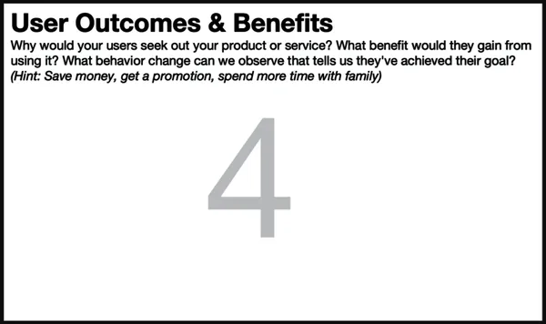

# Chapter 8. Box 4: User Outcomes and Benefits

###### Figure 8-1. Box 4 of the Lean UX Canvas: User Outcomes and Benefits

Despite the proliferation of Agile techniques like user stories, the
user and their goals often become lost in the lengthy debates over
features, designs, and technical implementations. Empathy is at the
heart of great products and services. Designers often have been
responsible for advocating for the user from an empathetic point of
view. As we now know, this is not uniquely a designer’s responsibility.
To achieve broader shared understanding of users and a deeper sense of
empathy for what they are trying to achieve, we ask our teams to declare
their assumptions about what users are trying to do, in the form of user
outcomes and benefits.

Before starting Box 4, you may be asking yourself, what’s the difference
between business outcomes, customer outcomes, and user outcomes? Good
question. Let’s take a look at an example in which you work for a
company that makes corporate expense tracking software.

The business outcome the company is trying to achieve is to acquire more
customers, retain the ones they already have, and increase monthly
software subscription revenue.

The *customers* of this company—other companies who buy the expense
tracking software for their employees—are trying to improve the
efficiency of their accounting teams, reduce payment of expenses that
are not reimbursable, and drive down overall operational costs.

The *users* of the software are the employees at these customer
companies. Their desired goal is to get their expenses reimbursed as
quickly as possible and reduce the time it takes them to input those
expenses correctly.

All of these are still behavior-based outcomes, but each has its own
point of view. In other words, they refer to the different goals being
pursued by the different groups of people.

In addition to behavior change, there are emotional goals at both the
customer and user levels. The *buyers* of this software want to feel
like they are helping the company be more successful and profitable.
They want to look good to their bosses and want to be able to point to
their specific contributions to the success of the company. This would
motivate them to seek out a brand of expense tracking software that
allows them to do this easily.

The *users* of the software want to get reimbursed quickly and feel
confident their expenses will be fully reimbursed without a myriad of
red tape and corporate hassle. This would motivate these users to be
more diligent and deliberate in the use of this software rather than
having it be yet another corporate IT tool that goes unused or worked
around.

It’s worth noting that all of these outcomes are important and should be
called out specifically as business, customer, or user outcomes.
However, not all of these are quantifiable. Meeting users’ emotional
goals is hard—particularly if the team tends to focus on metrics,
because you measure these emotional factors in different ways. That
said, just because it’s hard, doesn’t mean you shouldn’t pay attention
to this type of goal. These emotional goals are critical: they’re the
ones that help teams understand what kind of experience they’re trying
to deliver and ultimately, if you get it right, will lead to better
performance on the quantifiable metrics.

# Facilitating the Exercise

Once your proto-personas have been created, you can use the material in
the bottom portion of the proto-persona as the basis for this
discussion. Working individually, in small groups, or as a whole team,
work your way through each proto-persona. Use the following questions as
your prompts:

What is the user trying to accomplish?  
Example answer: I want to buy a new phone.

How does the user want to feel during and after this process?  
Example answer: I want to feel like I got the phone that I need at a
good price and that I’m keeping up with my peers (i.e., I want to feel
cool).

How does our product or service get the user closer to a life goal or dream?  
Example answer: I want to feel tech-savvy and respected for it.

Why would your user seek out your product?  
Example answer: I want to fit in with my friends at school.

What behavior change can we observe that tells they’ve achieved their goal?  
Example answer: They bring their new phone to school every day.

Note that not every user outcome exists at all levels. But thinking
about outcomes in these terms can help you to find important dimensions
of your solution to work on, from the functional, task-oriented outcomes
to the more emotional experience-oriented outcomes.

This section of the canvas is where the team digs into the emotional
side of the conversation. We’re not talking about features, pixels, or
code here. We want to understand what would drive our personas to look
for our product and, when they find it, what they might do. When the
time comes to begin testing, marketing, or advertising the product, the
work we do in this section becomes a gold mine for content,
calls-to-action, and helpful instructional text.

# What to Watch Out For

Sometimes teams get so feature-focused that this exercise becomes a bit
of a recursive exercise. We’ve seen teams write down features in this
section because they assume that’s what motivates their customers.
Writing down a user benefit as “calendar integration” misses the point
of this exercise. The goal here is to understand the user’s latent
needs. “Never be late to another meeting” is far more important and
compelling for the user than the specifics of the feature that will help
them do that. Apple is always very good at differentiating the iPhone
this way against Samsung and other competitors. While the competition is
touting features like “12-megapixel camera,” Apple advertises, “Show
grandma the baby from across the country.”

