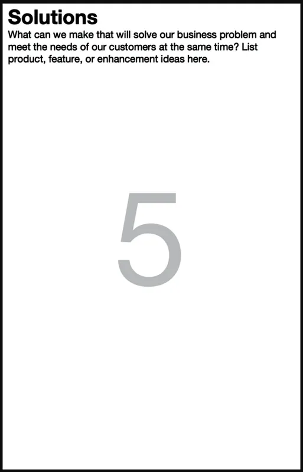
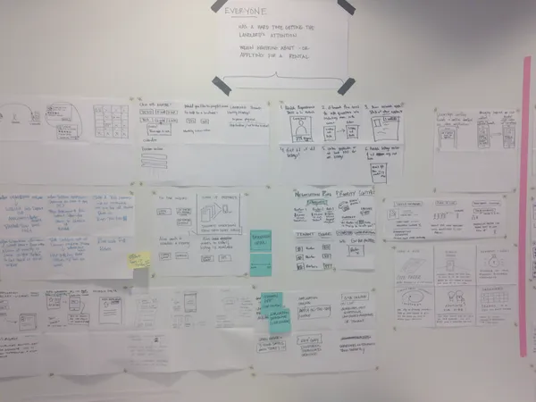
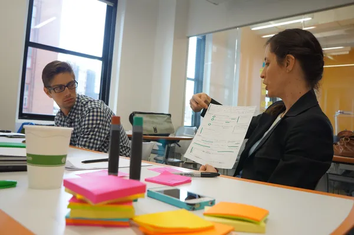
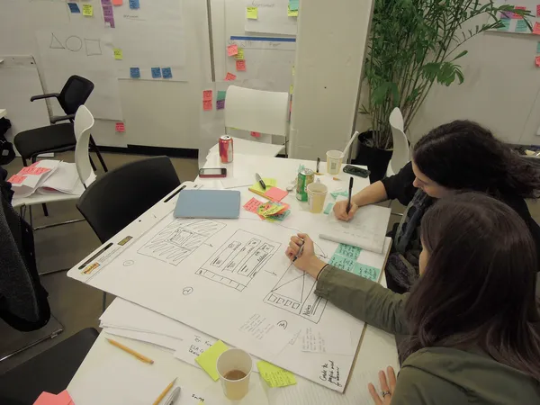

# Chapter 9. Box 5: Solutions

###### Figure 9-1. Box 5 of the Lean UX Canvas: Solutions

Finally we’ve arrived at the point in the Lean UX process when we get to
talk about solutions. This is by design. While we certainly could have
started our work discussing the solutions or features we’d like to build
(and, most often, that’s where projects start: with required
solutions!), our work is better when we step back and put some
constraints in place. In our case, we’ve set constraints with our
business problem statement, business outcomes, the persona work we’ve
done, and our discussion of user outcomes and benefits. Without those
constraints, solutions will either solve the wrong problem for the wrong
people or end up scattered and unfocused. Each set of assumptions we’ve
declared so far has constrained the space in which we can create
solutions, and creativity thrives in constraints.

We’re still not getting into detailed design work here. That comes once
we complete the canvas. However, we do start getting specific on what we
believe will get us and our customers from their current condition to
the target condition.

# Facilitating the Exercise

As with most of these assumptions declaration exercises, there are
multiple ways to facilitate them. We’ve listed several approaches below
to help you get started, but feel free to add your favorite design
brainstorming techniques to help you and your team complete Box 5.

## Affinity Mapping

Affinity mapping is the simplest and easiest way to get the team working
together in Box 5. Have each person work individually to brainstorm
solution ideas that would solve the business problem and achieve the
desired business and user outcomes for your target persona. Each person
should generate as many ideas as they can come up with, putting one idea
per Post-it note. As with any brainstorming activity, it’s only as good
as the framing question used to solicit responses. In this case, the
question to pose to your team is:

> What solutions can we design and build that will serve our personas
> and create their desired outcomes?

Each person can write words or create small sketches on the Post-it
notes for five minutes. The team then shares their ideas with each
other, sorting similar ideas into groups before dot voting which
approaches they believe stand the greatest chance for success.

While affinity mapping will get you through the process the fastest,
taking your time here can yield additional benefits beyond just
identifying high-level solution ideas.

## Collaborative Design: A More Structured Approach

A more deliberate way to develop solutions ideas is a collaborative
design method that we call Design Studio. (We write more about
collaborative design methods, including Design Sprints, in
[Chapter 14](#ch14.html_collaborative_desig).) When you need to gather
everyone for a formal working session, Design Studio is a popular way to
do this.

This method, born in the architecture world where it was called Design
Charrette, is a way to bring a cross-functional team together to
visualize potential solutions to a design problem. It breaks down
organizational silos and creates a forum for your fellow teammates’
points of view.

By putting designers, developers, subject-matter experts, product
managers, business analysts, and other competencies together in the same
space, focused on the same challenge, you create an outcome far greater
than working in silos allows. It has another benefit. It begins to build
the trust your team will need to move from these formal sessions to more
frequent and informal collaborations.

# Running a Design Studio

The technique described in the sections that follow is very specific;
however, you should feel comfortable to run less or more formal Design
Studios as your situation and timing warrants. The specifics of the
ritual are not the point as much as the activity of solving problems
with your colleagues and clients. Regardless of which approach you
choose, remember that the goal is to come up with solution ideas that
solve your business problem.

## Setting

To run a Design Studio session, you’ll want to find a dedicated block of
time within which you can bring the team together. You should plan on at
least a three-hour block. You’ll want a room with tables that folks can
gather around. The room should have good wall space, so you can post the
work in progress to the walls as you go.

If you’re working in a remote session, use a good team whiteboard tool
like Mural or Miro. Remember to spend some time making sure that
everyone is comfortable with the tool you choose—you may have to spend
some time at the start of the meeting to bring everyone up to speed on
the tools.

## The Team

This process works best for a team of five to eight people. If you have
more people, you can create more teams and have the teams compare output
at the end of the process. (Larger groups take a long time to get
through the critique and feedback steps, so it’s important to split
groups larger than about eight people into smaller teams, which can each
go through the following process in parallel, converging at the end.)

With remote sessions, this is where a videoconferencing “breakout room”
feature comes into play. Since we don’t have physical space to divide
up, video breakout rooms give each team the privacy and focus it needs
to do its own work.

## Process

Design Studio works within the following flow:

- Problem definition and constraints

- Individual idea generation (diverge)

- Presentation and critique

- Iterate and refine in pairs (emerge)

- Team idea generation (converge)

## Supplies

For in-person session, here are the supplies you’ll need:

- Pencils

- Pens

- Felt-tip markers or similar (multiple colors/thickness)

- Highlighters (multiple colors)

- Sketching templates (you can use preprinted one-up and six-up
  templates, or you can use blank sheets of 11” x 17” \[A3\] paper
  divided into six boxes)

- 25” x 30.5” (A1) self-stick easel pads

- Drafting dots (or any kind of small stickers)

With distributed teams, all of these tools become moot in favor of the
online collaboration tool you’ve chosen to use. That said, we’ve seen
some remote facilitators still challenge folks to use paper and pen for
initial sketches, photograph those sketches, and share them in the
online whiteboard tool after creating it locally.

## Problem Definition and Constraints (15 Minutes)

The first step in Design Studio is to ensure that everyone is aware of
the assumptions you’ve declared so far: the business problem you are
trying to solve, the outcomes that define success for the effort, the
users you are serving, and the benefits they are trying to achieve. In
most cases, the team is already aware of this since they’ve worked on
the canvas together up until this point. If you haven’t done this work
together, plan some extra time for briefing the team and answering their
questions.

## Individual Idea Generation (10 Minutes)

You’ll be working individually in this step. Give each member of the
team a six-up template, which is a sheet of paper with six empty boxes
on it, as depicted in
[Figure 9-2](#ch09.html_a_blank_quotation_marksix_upquotation_m). You
can make one by folding a blank sheet of 11” x 17” (A3) paper, or make a
preprinted template to hand to participants. (If you’re using an online
tool, don’t force people to draw in that tool—that tends to be hard and
slow. Instead, ask people to work on paper then share a photo or scan.)

###### Figure 9-2. A blank “six-up” template

Sometimes, people find they have a hard time facing a blank page. If
that’s the case, try this optional step. Ask everyone to label each box
on their sheets with one of your personas and the specific pain point or
problem they will be addressing for that persona. Write the persona’s
name and pain point at the top of each of the six boxes. You can write
the same persona/pain point pair as many times as you have solutions for
that problem, or you can write a different persona/pain point
combination for each box. Any combination works. Spend five minutes
doing this.

Next, with your six-up sheets in front of you, give everyone five
minutes to generate six low-fidelity sketches of solutions (see
[Figure 9-3](#ch09.html_a_wall_full_of_completed_six_up_drawing)) for
each persona/problem pair on their six-up sheet. These should be visual
articulations (UI sketches, workflows, diagrams, etc.) and not written
words. Encourage your team by revealing the dirty little secret of
interaction design: if you can draw a circle, square, and a triangle,
you can draw every interface. We’re confident everyone on your team can
draw those shapes, and this seemingly silly idea can help level the
playing field.

###### Figure 9-3. A wall full of completed six-up drawings

## Presentation and Critique (3 Minutes per Person)

When time is up, share and critique what you’ve done so far. Going
around the room, give the participants three minutes to share their
sketches and present them to the team
([Figure 9-4](#ch09.html_a_team_presenting_and_critiquing_drawin)).
Presenters should explicitly state who they were solving a problem for
(in other words, what persona) and which pain point they were
addressing, and then explain the sketch.

Each member of the team should provide critique and feedback to the
presenter. Team members should focus their feedback on clarifying the
presenter’s intentions.

Help your team understand that giving good feedback is an art. Remind
them that, in general, it’s better to ask questions than to share
opinions. Questions help the team talk about what they’re doing and help
individuals think through their work. Opinions, on the other hand, can
stop the conversation, inhibit collaboration, and put people on the
defensive. So when you’re providing critique, try to use questions like
“How does this feature address the persona’s specific problem?” or “I
don’t understand that part of the drawing. Can you elaborate?” Questions
like these are very helpful. Comments such as “I don’t like that
concept” provide little value and don’t give the presenter concrete
ideas to use for iterating.

###### Figure 9-4. A team presenting and critiquing drawings during a Design Studio

## Pair Up to Iterate and Refine (10 Minutes)

Now ask everyone to pair up for the next round. (If two people in the
session had similar ideas, it’s a good idea to ask them to work
together.) For remote sessions, each pair should work in their own
breakout room.

Each pair will be working to revise their design ideas
([Figure 9-5](#ch09.html_a_team_working_together_in_a_design_stu)). The
goal here is to have each pair pick the ideas that have the most merit
and develop a more evolved, more integrated version of those ideas. Each
pair will have to make some decisions about what to keep, what to
change, and what to throw away. Expect that this will be hard and that
each pair will disagree about some things. Resist the temptation here to
create quick agreement by getting more general or abstract. Instead, ask
each pair to make some decisions and get more specific. Have each pair
produce a single drawing on an 11” × 17” (A3) six-up sheet. Give each
team 10 minutes for this step.

When the time is up, bring everyone together and go through the
present-and-critique process again.

###### Figure 9-5. A team working together in a Design Studio exercise

## Team Idea Generation (45 Minutes)

Now that all team members have feedback on their individual ideas and
people have paired up to develop ideas further, the team must converge
on one idea. In this step, the team is trying to select the ideas they
feel have the best chance for success. This set of ideas will serve as
the basis for the next step in the Lean UX process: creating hypotheses
and, eventually, designing and running experiments.

Ask the team to use a large sheet of self-stick easel pad paper or a
whiteboard to sketch the components and workflow for their idea. There
will be a lot of compromise and wrangling at this stage, and to get to
consensus, the team will need to prioritize and pare back features.

Encourage the team to create a “parking lot” for good ideas that don’t
make the cut. This will make it easier to let go of ideas. Again, it’s
important to make decisions here: resist the temptation to get consensus
by generalizing or deferring decisions.

If you have split a large group into multiple teams in the Design
Studio, ask each team to present their final idea to the room when they
are finished for one final round of critique and feedback and, if
desired, convergence.

## Using the Output

The work you do in a Design Studio will feed into the creation of
hypotheses and ultimately experiment design. This doesn’t mean that
every single idea will make it into final consideration, but the ideas
the team has converged on will all be put to the test starting with Box
6, hypothesis creation.

To keep the output visible, post it on a design wall or another
prominent place so that the team can refer back to it. Decide on what
(if any) intermediate drawings people want to keep and display these
alongside the final drawing, again so that team members can refer back
to the ideas. Regardless of what you keep posted on the wall, it’s
generally a good idea to photograph everything and keep it in an archive
folder of some sort. You never know when you’ll want to go back to find
something. It’s also a good idea to put a single person in charge of
creating this archive. Creating some accountability will tend to ensure
that the team keeps good records.

# What to Watch Out For

The toughest part of collaborative design is ensuring even
participation. If you keep the exercise simple, most folks will feel
like they can participate quite easily. (Everyone can write on a Post-it
note.) If you decide to use more involved techniques like Design Studio,
you’ll need to ensure that facilitation is top notch. (And remember that
this will all be more difficult in remote sessions.) If members of your
team tune out during this part because they feel like these exercises
were too advanced for them, they’re likely to put up a much bigger
resistance to some of the feature and design choices the team makes
downstream. In this instance, as much as anywhere else, design
facilitation becomes a core skill set for the designers on your team.

