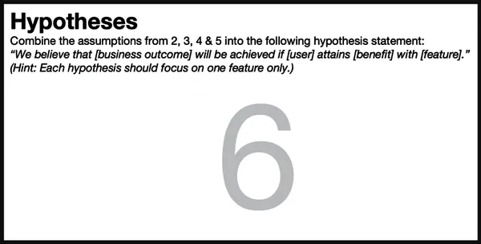
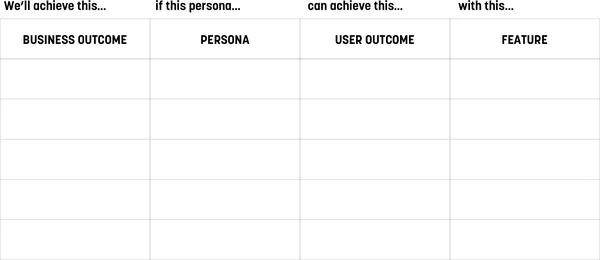
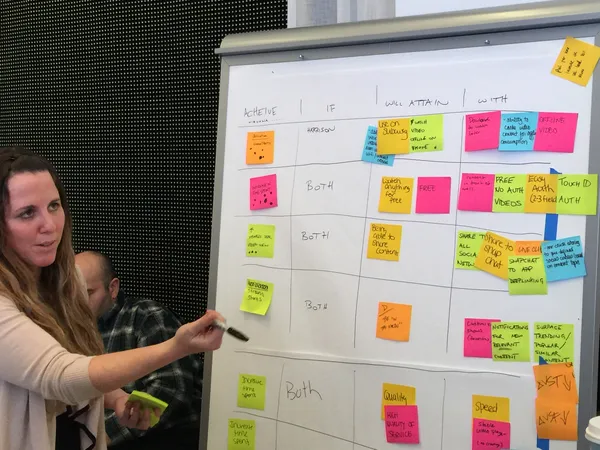
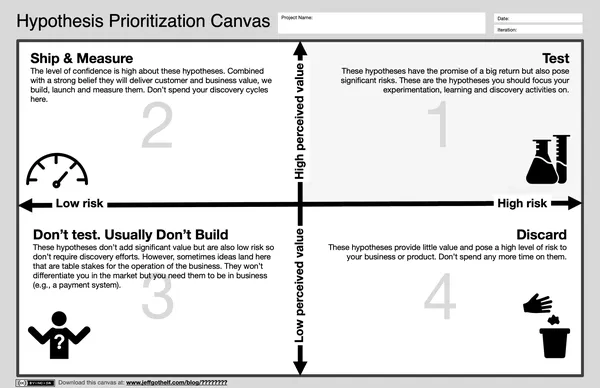

# Chapter 10. Box 6: Hypotheses

###### Figure 10-1. Box 6 of the Lean UX Canvas: Hypotheses

When the team arrives at Box 6, it has all the raw material it needs to
start writing tactical, testable hypotheses. Before we do that, though,
let’s talk about hypotheses in general.

Hypothesis has become a popular word in product development recently, in
no small part because of *The Lean Startup*, in which Eric Ries
describes a method of product development inspired by the scientific
method. He advocates testing your hypotheses early and often. So what is
a hypothesis anyway? According to *The Oxford Dictionary of Difficult
Words*, it’s “a supposition or proposed explanation made on the basis of
limited evidence as a starting point for further
investigation.”^([1](#ch10.html_ch01fn12))

That’s what we’re about to create: we’re going to take all of our
assumptions (assumptions are statements based on “limited evidence”),
and we’re going to gather them into a unified statement (our “proposed
explanation” of our problem and solution) so that we can begin our
research and testing process (our “further investigation”).

OK, with that out of the way, let’s get started writing hypotheses. This
is the template we recommend:

> We believe we will achieve **\[this business outcome\]**
>
> If **\[these personas\]**
>
> Attain **\[this benefit/user outcome\]**
>
> With **\[this feature or solution\]**

The template starts with the words “we believe.” This is explicit
because we don’t know. We’re making assumptions. And then we complete
the hypothesis template based on the material we’ve created in every
canvas box before this one. We pull business outcomes from Box 2,
personas from Box 3, benefits from Box 4, and solutions from Box 5. In
some ways, this part of the process is just *fill-in-the-blanks.*

But we need to do a little more than that. Our goal here is to write
hypotheses that make sense and that we believe. These hypotheses are, in
essence, very short stories designed to build support for pursuing a
particular design direction. Writing a good hypothesis that makes sense
and that you and your team believe is actually the first way to test the
validity of your solution brainstorms. If you can’t put together a
compelling hypothesis statement for one of the solution ideas in Box 5,
then that idea shouldn’t graduate to the next part of the process. And,
just to be extra clear, a compelling hypothesis is one where the feature
has a clear user, the user gets an obvious benefit from the feature, and
the subsequent user behavior change helps solve the business problem we
articulated in Box 1.

# Facilitating the Exercise

We like to create a table like the one in
[Figure 10-2](#ch10.html_a_hypothesis_table) and then complete it by
using the material we’ve filled in the earlier parts of the canvas. We
physically move our Post-it notes into the appropriate boxes to make
rows of related ideas. Each column is directly related to a specific box
of the canvas, from Box 2 on the left to Box 5 on the right.

###### Figure 10-2. A hypothesis table

You’ll often find during this exercise that there are gaps in your
initial brainstorms. Some business outcomes might have no features
created for them, whereas some features might not drive any value for
the customer or the business. That’s part of the point of this exercise:
to organize and make sense of your initial round of thinking. After
you’ve identified the gaps in your brainstorms, fill them in with new
sticky notes ([Figure 10-3](#ch10.html_working_on_the_hypothesis_chart))
or—even better—leave the less relevant ideas off the chart. This will
help make sense of the undoubtedly large number of ideas your team
generates.

With distributed teams using a virtual whiteboard tool, this exercise
becomes even easier. Copy and paste your notes from other parts of the
canvas into Box 6 and move them around as necessary to complete the
chart.

###### Figure 10-3. Working on the hypothesis chart

After you’ve completed the chart—7 to 10 rows are a good initial
target—begin extracting feature hypotheses from it. Use the hypothesis
template to ensure you’re including all the relevant components of the
hypothesis statement. Here’s that template again:

> We believe we will achieve **\[this business outcome\]**
>
> If **\[these personas\]**
>
> Attain **\[this benefit/user outcome\]**
>
> With **\[this feature or solution\]**

As you write your hypotheses, consider which persona(s) you’re serving
with your proposed solutions. It’s not unusual to find solutions that
serve more than one persona at a time. It’s also not unusual to create a
hypothesis in which multiple features drive similar outcomes. When you
see that happening, refine the hypothesis to focus on just one feature.
Hypotheses with multiple features are not easy to test. The important
thing to remember in this entire process is to keep your ideas specific
enough so that you can create meaningful tests to see if your ideas hold
water.

<aside class="pagebreak-before less_space" data-type="sidebar" epub:type="sidebar">

##### What’s the Difference Between Hypotheses and Agile User Stories?

We’re often asked to differentiate between hypothesis statements and
classic Agile user stories. The difference is subtle but powerful. One
of the more popular formats for Agile user stories look like this:

As a \<type of user\>,

I want \<some goal\>

so that \<some reason\>.

You’ll notice that the user and user outcome are present in this story.
That said, most teams we’ve worked with replace “some goal” with “this
feature.” After the user story is written, most teams discard the pieces
around “some goal” and begin implementing the feature. The user is
quickly forgotten as the team works diligently to drive up their
velocity and deliver the feature. The team’s acceptance criteria (i.e.,
their definition of success) is that the system allows the user to
complete a task. There is no discussion as to whether the solution is
usable or desirable, much less delightful. There’s no discussion of
whether the feature creates an outcome. The only testing being done is
whether the system “works as designed.”

Hypotheses have behavior change (business outcomes) as their definition
of success. Shipping a working feature is table stakes. It’s the
beginning of the conversation. Our team’s success is not measured by how
fast they can get features launched. Instead, we measure success by how
well our customers can achieve “some goal” initially and continuously.

This is the key difference between user stories and hypotheses. They
refocus the team on what’s really important—making the customer
successful and thus achieving a business goal—as opposed to measuring
team productivity as success.

That said, you still need a way to talk about output and features—the
things that the team is building. If your user stories are
feature-centric, that’s fine. In fact, it’s often the case that a given
hypothesis results in many user stories. However you decide to track the
work is fine. Just make sure that some part of your process connects the
work you’re doing on the feature level to the higher-level user and
business outcomes that you’re trying to create.

</aside>

# Prioritizing Hypotheses

Lean UX is an exercise in ruthless prioritization. It’s rare to have a
project budget focused strictly on learning. In most cases, we need to
ship product too. The reason we declare our assumptions at the outset of
our work is so that we can identify project risks and prioritize. What’s
risky and needs testing? What’s not risky and thus easy to start?

After we string our assumptions together into hypotheses, we create a
backlog of potential work. Next, we need to figure out which ones are
the riskiest ones—so that we can work on them first. Understanding that
you can’t test every assumption, how do you decide which one to test
first?

There are lots of ways that you can prioritize, but we’ve found that it
can often be helpful to do this collaboratively and to have a framework
to use for this work. That’s why we created the Hypothesis
Prioritization Canvas shown in
[Figure 10-4](#ch10.html_the_hypothesis_prioritization_canvas). (Yes,
another canvas.) The HPC is a two-by-two matrix with the x-axis
measuring risk, and the y-axis measuring perceived value. We use
“perceived” value because this is a big assumption. We believe that an
idea has high perceived value if its implementation will meaningfully
impact the user experience and therefore the business. When it comes to
risk, we evaluate each hypothesis on its own merit. Some hypotheses are
going to be technically risky. Some will pose risk to the brand. Others
will challenge our design capabilities. In this case, we don’t normalize
for a specific type of risk so we can consider all aspects of risk for
each hypothesis.

###### Figure 10-4. The Hypothesis Prioritization Canvas

Map your hypotheses on the canvas as a team.

- The hypotheses that land in *quadrant 1* are the hypotheses we are
  going to test. They graduate to Boxes 7 and 8 in the Lean UX Canvas.

- If a hypothesis lands in *quadrant 2* of the HPC—high value, low
  risk—we’re going to build it. Write the user stories, put them on the
  backlog, and ship them. But don’t forget to measure that feature once
  it’s live. If it doesn’t live up to your expectations—aka the business
  outcomes defined in the hypothesis as success—you need to revisit this
  idea.

- Any hypothesis that falls below the risk axis into the low perceived
  value area doesn’t get tested. If it lands in *quadrant 4* of the
  HPC—high risk, low value—we throw it away. No need to build it either.

- Hypotheses that end up in *quadrant 3* of the HPC—low risk, low
  value—don’t get tested and in most cases don’t get built. However,
  there will be some hypotheses that end up here that, while not
  particularly valuable or risky, still need to get built so you can
  operate your business. For example, you will have to implement a
  payment system if you’re building an ecommerce service, but that won’t
  differentiate you in the marketplace. In this case, we build the basic
  use cases knowing that our innovative and delightful features—the
  riskier features—are going to be tested and validated before
  implementation.

# What to Watch Out For

Hypothesis writing, like most new techniques, gets better with practice.
Teams will often write hypotheses that are too big to test early in
their Lean UX journey. If you find yourself in this situation, rethink
the scope of your hypothesis. How can you make it smaller? How can you
size the hypothesis to a point where your team can have total ownership
over its scope?

Hypothesis writing, like business problem statement writing, also
benefits from specificity. Use specific numbers in your business
outcomes. Be clear about the feature you’d like to build. This is
another area where phrases like “better user experience” and “intuitive
UI” don’t make sense. If you’re asked to test that “intuitive UI” (and,
to be clear, you will be in the next step of the canvas,) what will you
test? Consider replacing ambiguous phrases like that with more specific
ones like “one-click checkout” or “face recognition authentication.”

^([1](#ch10.html_ch01fn12-marker)) Archie Hobson (ed.), *The Oxford
Dictionary of Difficult Words* (New York: Oxford University Press,
2004), s.v. “hypothesis.”

