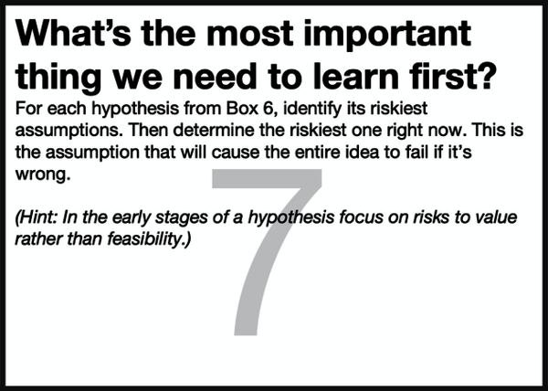

# Chapter 11. Box 7: What’s the Most Important Thing We Need to Learn First?

###### Figure 11-1. Box 7 of the Lean UX Canvas: Learning

Once you’ve prioritized your hypotheses and identified which hypotheses
you’re going to test, the next step in the process is highlighting the
major risks in each hypothesis. To do this, we ask the first of the two
key Lean UX questions: *What’s the most important thing we need to learn
first about this hypothesis?*

When we ask about learning, we’re really having a conversation about
risk. We want to uncover all the things that might break our hypothesis.
If you’re doing this with a cross-functional team, as we’ve advised
throughout the book, you’re going to get at least as many answers to
this question as there are disciplines in the room. The software
engineers will discuss the complexities of developing the feature. The
designers will bring up workflow issues and usability concerns. Product
managers will challenge whether it will deliver the business benefits we
anticipate. All of these risks are valid, but the ones we want to focus
on now are the ones that will render the hypothesis invalid and allow us
to move on quickly if we’re wrong.

In the early stages of the hypothesis’s life cycle, the biggest risk is
usually related to the value of the solution. Do people need a solution?
Will they look for it? Will they try it? Will they use it? Will they
find value in it? These are the things that matter early on. If the
answer to these questions is “no,” then there’s no need to worry about
how we’re going to design or build it. If we’re dealing with a more
mature hypothesis, one where the value has been validated and we’ve
moved on to the technical implementation, then thinking through things
like technical challenges, usability, and scalability become the next
logical risks to explore.

# Facilitating the Exercise

Generally speaking, this is a conversation. The team sits down to review
the hypothesis prioritization and determines which ones it wants to test
first. Then ask the question *what’s the most important thing we need to
learn first about this hypothesis?* If the conversation gets stuck, you
might choose to brainstorm here, then do some affinity mapping and dot
voting. Or you might defer to some member of the team who holds a strong
opinion. Generally, this step doesn’t need a lot of process. The point
here is to identify the top one to three risks related to this
hypothesis, then move on to planning your experiment, which you’ll do in
Box 8.

# What to Watch Out For

Consensus is nice but not always attainable. If you find that team
discussion not reaching a consensus, it’s a clear indication the team
needs more information to make that decision. The only way to do that is
to make a decision and move forward to Box 8 to create an experiment. In
most cases, the product manager can make this call. When you do this,
remember that we’re not abandoning these hypotheses, assumptions, and
risks forever. We’re simply moving forward with one and, if proven
false, will come back to the backlog of hypotheses to do the process
again.

