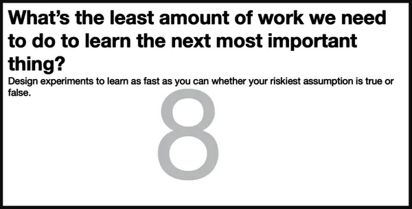
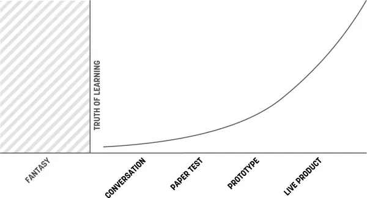
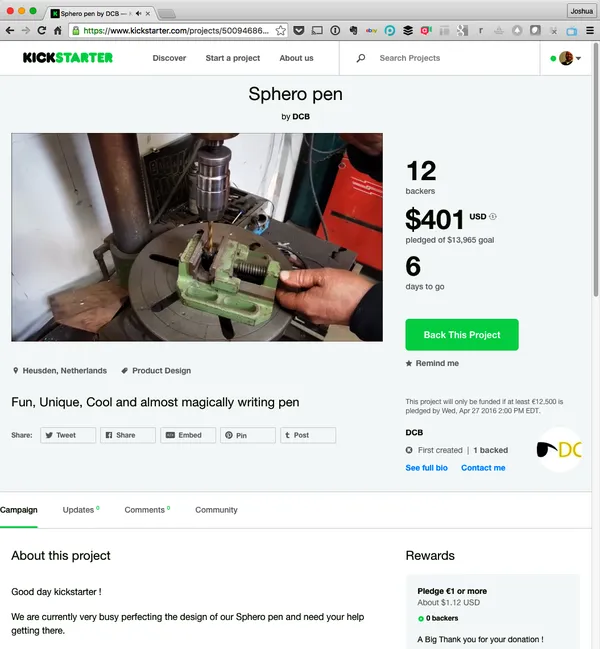
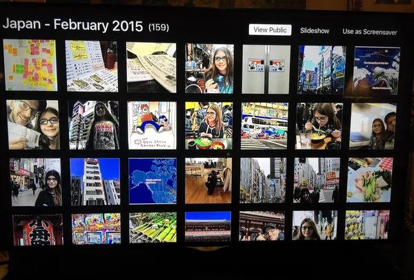
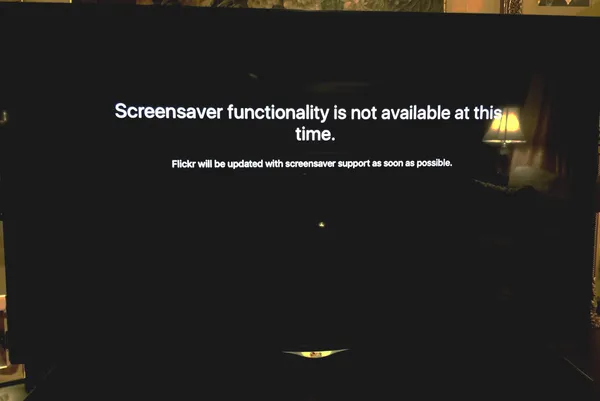
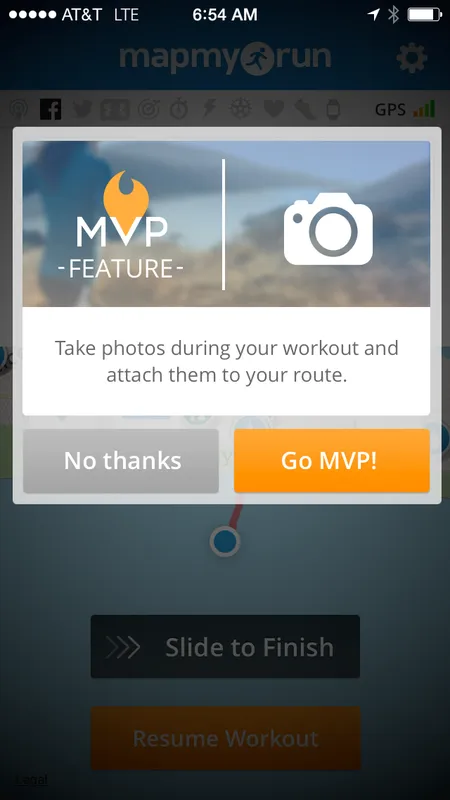
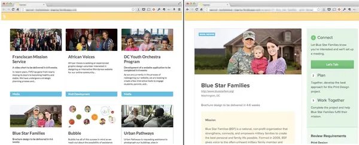
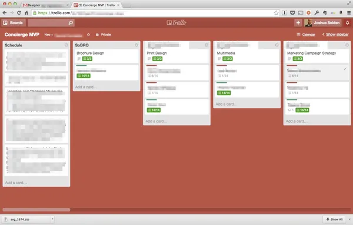
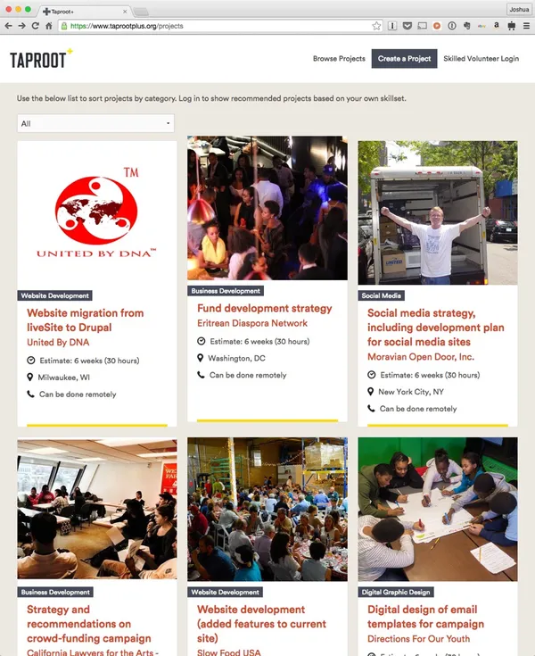

# Chapter 12. Box 8: MVPs and Experiments

###### Figure 12-1. Box 8 of the Lean UX Canvas: MVPs and Experiments

The final step in the Lean UX Canvas is focused on experimentation. The
second key question of the canvas we have to answer is *What’s the least
amount of work we need to do to learn the next most important thing?*
The answer to this question is the experiment you’re going to run to
test your hypothesis.

Doing the least amount of work isn’t lazy. It’s lean. Remember, we’re
trying to eliminate waste, and extra work spent testing your idea is
waste. In fact, the faster you find out if your idea is something you
should continue working on, the less you invest in it. This makes
changing course much easier, which increases the agility of the team.

The experiments you come up with in Box 8 are your minimum viable
products or MVP. In fact, this is the exact definition of MVP from Eric
Ries’s *The Lean Startup*.

# What Is an MVP Anyway?

If you ask a room full of technology professionals the question “What is
an MVP?” you’re likely to hear a lengthy and diverse list that includes
such gems as the ones that follow:

> “It’s the fastest thing we can get out the door that still works.”
>
> “It’s an ugly release that’s full of compromises and makes everyone
> unhappy.”
>
> “It’s whatever the client says it is.”
>
> “It’s the minimum set of features that allows us to say, ‘it works.’”
>
> “It’s phase 1.” (And we all know about the likelihood of phase 2.)

The phrase MVP has caused a lot of confusion in its short life. The
problem is that it gets used in at least two different ways. Sometimes
the term is used to mean “a small and fast release.” That’s the meaning
that the quotes above refer to. That’s not how we use the phrase.

When we say MVP, we are talking about a small and fast way of learning
something. Sometimes, this is a software release. Sometimes, it’s not—it
can be a drawing, a landing page, or a prototype. Your primary concern
is not to create value but to create learning. Now, these two ideas are
not mutually exclusive. After all, one of the key things you’re trying
to learn is what the market finds valuable. Oftentimes, a good MVP will
create both value and learning. For us, though, the point of an MVP is
that it’s focused on learning.

## Example: Should We Launch a Newsletter?

Let’s take for example a medium-sized company we consulted with a few
years ago. They were exploring new marketing tactics and wanted to
launch a monthly newsletter. Creating a successful newsletter is no
small task. You need to prepare a content strategy, editorial calendar,
layout and design, as well as an ongoing marketing and distribution
strategy. You need writers and editors to work on it. All in all, it was
a big expenditure for the company to undertake. The team decided to
treat this newsletter idea as a hypothesis.

The team asked themselves: *What’s the most important thing we need to
learn first?* The answer: Was there enough customer demand for a
newsletter to justify the effort? The MVP the company used to test the
idea was a sign-up form on their current website. The sign-up form
promoted the newsletter and asked for a customer’s email address. This
approach wouldn’t deliver any value to the customer—yet. Instead, the
goal was to measure demand and build insight on what value proposition
and language drove sign-ups. The team felt that these tests would give
them enough information to make a good decision about whether to
proceed.

The team spent half a day designing and coding the form and was able to
launch it that same afternoon. The team knew that their site received a
significant amount of traffic each day: they would be able to learn very
quickly if there was interest in the newsletter.

At this point, the team made no effort to design or build the actual
newsletter. They would do that only after they’d gathered enough data
from their first experiment, and only if the data showed that its
customers wanted the newsletter. If the data was positive, the team
would move on to their next MVP, one that would begin to deliver value
and create deeper learning around the type of content, presentation
format, frequency, social distribution, and the other things they would
need to learn to create a good newsletter. The team planned to continue
experimenting with MVP versions of the newsletter—each one improving on
its predecessor—that would provide more and different types of content
and design, and ultimately deliver the business benefit they were
seeking.

# Creating an MVP

When it comes to creating an MVP, the first question is always *what is
the most important thing we need to learn next?* In most cases, the
answer to that will either be a question of value or a question of
implementation. In either case, you’ll want to design an experiment that
provides you with enough evidence to answer your question and help you
decide whether or not to continue with the idea.

## Creating an MVP to Understand Value

Here are some guidelines to follow if you’re trying to understand the
value of your idea:

Get to the point  
Regardless of the MVP method you choose to use, focus your time
distilling your idea to its core value proposition and present that to
your customers. The things that surround your idea (things like
navigation, logins, and password retrieval flows) will be irrelevant if
your idea itself has no value to your target audience. Leave that stuff
for later.

Use a clear call to action  
You will know people value your solution when they demonstrate intent to
use it or (gasp!) pay for it. Giving people a way to opt in to or sign
up for a service is a great way to know if they’re interested and
whether they’d actually give you money for it.

Measure behavior  
Build MVPs with which you can observe and measure what people do. This
lets you bypass what people say they (will) do in favor of what they
actually do. In digital product design, behavior trumps opinion.

Talk to your users  
Measuring behavior tells you what people did with your MVP. Without
knowing why they behaved that way, iterating your MVP is an act of
random design. Try to capture conversations from both those who
converted as well as those who didn’t.

Prioritize ruthlessly  
Ideas are cheap and plentiful. Let the best ones prove themselves, so
don’t hold on to invalidated ideas just because you like them. As
designers ourselves, we know that this one is particularly difficult to
practice. Designers tend to be optimists, and often we believe our
solutions, whether we worked on them for five minutes or five months,
are well-crafted and properly thought out. Remember, if the results of
your experiment disagree with your hypothesis, you’re wrong.

Stay agile  
Learnings will come in quickly; make sure you’re working in a medium or
tool that allows you to make updates easily.

Don’t reinvent the wheel  
Many of the tools, systems, and mechanisms that you need to test your
ideas already exist. Consider how you could use email, SMS, chat apps,
Facebook Groups, Shopify storefronts, no-code tools, discussion forums,
and other existing tools to get the learning you’re seeking.

## Creating an MVP to Understand Implementation

Here are some guidelines to follow if you’re trying to understand the
implementation you’re considering launching to your customers:

Be functional  
Some level of integration with the rest of your application must be in
place to create a realistic usage scenario. Creating your new workflow
in the context of the existing functionality is important here.

Integrate with existing analytics  
Measuring the performance of your MVP must be done within the context of
existing product workflows. This will help you to understand the numbers
you’re seeing.

Be consistent with the rest of the application  
To minimize any biases toward the new functionality, design your MVP to
fit with your current look, feel, and brand.

## Some Final Guidelines for Creating MVPs

MVPs might seem simple but in practice can prove challenging. Like most
skills, the more you practice, the better you become at doing it. In the
meantime, here are some guidelines to building valuable MVPs.

It’s not easy to be pure  
You’ll find that it’s not always possible to test only one thing at a
time: you’re often trying to learn whether your idea has value and
determine implementation details at the same time. Although it’s better
to separate these processes, keeping the aforementioned guidelines in
mind as you plan your MVPs will help you to navigate the trade-offs and
compromises you’re going to have to make.

Be clear about your learning goals  
Make sure that you know what you’re trying to learn, and make sure you
are clear about what data you need to collect to learn. It’s a bad
feeling to launch an experiment only to discover you haven’t
instrumented correctly and are failing to capture some important data.

Start small  
Regardless of your desired outcome, build the smallest MVP possible.
Remember that it is a tool for learning. You will be iterating. You will
be modifying it. You might very well be throwing it away entirely. It’ll
be much easier to throw it away if you didn’t spend a lot of time
building it.

You don’t necessarily need code  
In many cases, your MVP won’t involve any code at all. Instead, you will
rely on many of the UX designer’s existing tools: sketching,
prototyping, copywriting, and visual design.

## The Truth Curve

The amount of effort you put into your MVP should be proportional to the
amount of evidence you have that your idea is a good one. That’s the
point of the chart
([Figure 12-2](#ch12.html_our_adapted_version_of_the_truth_curve))
created by Giff Constable.^([1](#ch12.html_ch01fn13)) The x-axis shows
the level of investment you should put into your MVP. The y-axis shows
the amount of market-based evidence you have about your idea. The more
evidence you have, the higher the fidelity and complexity of your MVP
can be. (You’ll need the extra effort, because what you need to learn
becomes more complex.) The less evidence you have, the less effort you
want to put into your MVP. Remember the second key question: *What’s the
smallest thing that you can do to learn the next most important thing?*
Anything more than that is waste.

###### Figure 12-2. Our adapted version of the Truth Curve is a useful reminder that learning is continuous, and increased investment is only warranted when the facts dictate it

# Examples of MVPs

Let’s take a look at a few different types of MVPs that are in common
use.

## Landing Page Test

This type of MVP helps a team determine demand for their product. It
involves creating a marketing page with a clear value proposition, a
call to action, and a way to measure conversion. Teams must drive
relevant traffic to this landing page to get a large enough sample size
for the results to be useful. They can do this either by diverting
traffic from existing workflows or utilizing online advertising.

Positive results from landing page tests are clear, but negative results
can be difficult to interpret. If no one “converts,” it doesn’t
necessarily mean your idea has no value. It could just mean that you’re
not telling a compelling story. The good news is that landing page tests
are cheap and can be iterated very quickly. If you think about it,
Kickstarter (and other crowdfunding sites) are full of landing page
MVPs, as demonstrated in
[Figure 12-3](#ch12.html_an_example_of_a_kickstarter_page). The people
who list products on those sites are looking for validation (in the form
of financial backing) that they should invest in actually building their
proposed ideas. Landing page tests don’t have to be pages. They can be
advertisements or other online messages that have the components listed
above.

###### Figure 12-3. An example of a Kickstarter page

## Feature Fake (aka the Button to Nowhere)

Sometimes, the cost of implementing a feature is very high. In these
cases, it is cheaper and faster to create the appearance of the feature
where none actually exists. HTML buttons, calls to action, and other
prompts and links provide the illusion to your customer that a feature
exists. Upon clicking or tapping the link, the user is notified that the
feature is “coming soon” and that they will be alerted when this has
happened. Feature fakes are like mini-landing pages in that they exist
to measure interest. They should be used sparingly and taken down as
soon as a success threshold has been reached. If you feel they might
negatively affect your relationship with your customer, you can make it
right by offering a gift card or some other kind of compensation to
those who found your mousetrap.

[Figure 12-4](#ch12.html_an_example_of_a_feature_fake_found_in_f) shows
a feature fake that Flickr used. In this case, they offered a button
labeled “Use as screensaver” that was ostensibly meant for the user to
specify a photo album as the screensaver for their device.

###### Figure 12-4. An example of a feature fake found in Flickr’s Apple TV app

When users clicked the button, though, they were greeted by the screen
shown in
[Figure 12-5](#ch12.html_the_screen_that_appears_after_clicking). Flickr
used this to gather evidence that a customer would like this feature. By
measuring click rates, they could assess demand for this feature before
they built it.

###### Figure 12-5. The screen that appears after clicking the feature-fake button

[Figure 12-6](#ch12.html_another_example_of_a_feature_fakecomma)
presents another feature-fake example. Here, MapMyRun offered the
opportunity to take and upload photos while jogging using two modal
overlays. No feature existed until they got an indication that a) people
wanted this feature and b) how much they’d be willing to pay for it.

###### Figure 12-6. Another example of a feature fake, this one on the MapMyRun website

## Wizard of Oz

After you’ve proven demand for your idea, a Wizard of Oz MVP can help
you to figure out the mechanics of your product. This type of MVP looks
to the user like a fully functioning digital service. Behind the scenes,
though, the data and communication with the initial set of users is
handled manually by humans. For example, the team at Amazon behind the
Echo ran a Wizard of Oz MVP as part of their initial testing to
understand the types of queries people would ask and how quickly they
would expect a response. In one room, a user would ask “Alexa”
questions, and in another room, a human typed queries into Google, got
answers, and replied back. The test users were not aware that they were
not using software. The rest of the team was able to observe users and
understand how they would use this new product—before significant
engineering effort had been invested.

## Example: Wizard of Oz MVP for Taproot Plus

In 2014, our company worked with an organization called Taproot
Foundation to create an online marketplace for pro bono volunteers.
(*Pro bono* is when a professional donates his skills to help a worthy
cause. Unlike the unskilled volunteer services many of us participate in
on the weekend, pro bono service involves using your professional
talents in a volunteer context.)

Our client, Taproot Foundation, had been helping pro bono volunteers and
nonprofit organizations find each other for years, but they had always
delivered this matching service “by hand,” through phone calls, emails,
and in-person meetings. Now they wanted to bring that process online:
they wanted to create a website that would act as a two-sided
marketplace for pro bono volunteers and the organizations that could
benefit from their services.

As we started the project, we faced a big set of questions: how should
the matching process work? Should the volunteers advertise their
services? Should the organizations advertise their projects? What would
work better? And after the parties found each other on the website, how
should they get started with the project? How should the organizations
communicate their needs? How should the volunteers scope the work? Even
little details were big questions: how should the parties schedule their
first phone call?

We decided this was a perfect time to create a Wizard of Oz MVP. We
built a simple website, hand coding just the few static pages that we
needed to make it look like we were open for business. We began with
about a dozen pages in all: one index page, and then a page for each of
the 12 pilot projects we had lined up. Behind the scenes, we had a
community manager assemble a list of potential volunteers, and we
emailed them, sending them a call to action and a link to our new site.
To maintain the illusion that we had a running system, we made sure the
email looked like it came from our new system, not from the community
manager.

When volunteers clicked the link in the email, they saw our Wizard of Oz
site
([Figure 12-7](#ch12.html_the_wizard_of_oz_site_for_taproot_found)).
When they used the site to apply for a volunteer opportunity, it looked
to them like they were interacting with the system, but behind the
scenes, it simply emailed the community manager and team. We tracked all
of our interactions in a simple Trello board
([Figure 12-8](#ch12.html_our_quotation_markdatabasequotation_mar)),
which served as our “database.”

###### Figure 12-7. The Wizard of Oz site for Taproot Foundation

###### Figure 12-8. Our “database” was simply a Trello board

We operated the system this way for a few months, gradually learning
from our interactions, updating our business processes, and adding
automation and other updates to the website as we learned. Eventually,
we added a real functional backend, eliminating much of the “man behind
the curtain” aspect of the site. We also updated the visual style,
applying some mature graphic design polish
([Figure 12-9](#ch12.html_the_taproot_plus_site_with_more_polishe))—after
we had learned enough to understand how to communicate our brand.

###### Figure 12-9. The Taproot Plus site with more polished graphic design

By using a Wizard of Oz approach, we were able to pilot the high-risk
parts of the design—the design of the business processes—learn as we
went along, and eliminate the risk of spending lots of time and money
designing and building the wrong thing.

# Prototyping

One of the most effective ways to create MVPs is by prototyping the
experience. A prototype is an approximation of an experience that allows
you to simulate what it is like to use the product or service in
question. It needs to be usable on a variety of target devices. At the
same time, your goal should be to spend as little effort as possible in
creating the prototype. This makes your choice of prototyping technique
important.

Choosing which technique to use for your prototype depends on several
factors:

- Who will be interacting with it

- What you hope to learn

- What you already know to be true

- How much time you have to create it

It’s critical to define the intended audience for your prototype. This
allows you to create the smallest possible prototype that will generate
meaningful feedback from this audience. For example, if you’re using the
prototype primarily to demo ideas to software engineers on your team,
you can largely omit primary areas of the product that aren’t being
affected by the new experience—the global navigation, for example. Your
developers know those items are there and that they’re not changing, so
you don’t need to illustrate these items for them.

Stakeholders, often less familiar with their own product than they’ll
ever admit to, will likely need a greater level of fidelity in the
prototype to truly grasp the concept. To meet the various needs of these
disparate audiences, your prototyping toolkit should be fairly broad.
Let’s take a look at the different prototyping techniques and consider
when to use each.

## Paper Prototypes

Made of the most accessible components—paper, pens, and tape—paper
prototypes give you the ability to simulate experiences in a quick,
crafty, fun way. No digital investment is necessary. Using tactics like
flaps to show and hide different states on a page or even creating a
“window” for a slideshow of images to move through, you can begin to
give the team a sense of how the product should function. You’ll be able
to get an immediate sense of what is available in the experience and
what is missing. Paper prototyping can give you a sense of how the
workflow is starting to coalesce around the interface elements you’ve
assembled. This method is especially helpful with touch interfaces that
require the user to manipulate elements on a screen.

### Pros

- Can be created in an hour

- Easily arranged and rearranged

- Cheap and easy to throw away if you’re wrong

- Can be assembled with materials already found in the office

- Fun activity that many people enjoy

### Cons

- Rapid iteration and duplication of the prototype can become
  time-consuming and tedious.

- The simulation is very artificial, because you’re not using the actual
  input mechanisms (mouse, trackpad, keyboard, touch screen, etc.).

- Feedback is limited to the high-level structure, information
  architecture, and flow of the product.

- It is only useful with a limited audience.

## Low-Fidelity On-Screen Mock-Ups

Creating a low-fidelity clickable on-screen experience—clickable
wireframes, for example—lets you take a prototype to the next level of
fidelity. Your investment in pixels provides a bit more realistic feel
to the workflow. Test participants and team members use digital input
mechanisms to interact with the prototype. This lets you get better
insight and feedback about the way they will interact with the product
at the level of the click, tap, or gesture.

### Pros

- Provide a good sense of the length of workflow

- Reveal major obstacles to primary task completion

- Allow assessment of findability of core elements

- Can be used to quickly wire up “something clickable” to get your team
  learning from your existing assets instead of forcing the creation of
  new ones

### Cons

- Most people who will interact with these assets are savvy enough to
  recognize an unfinished product.

- More attention than normal is paid to labeling and copy.

## Middle- and High-Fidelity On-Screen Prototypes

Middle- and high-fidelity prototypes have significantly more detail than
wireframe-based prototypes. You’ll use these to demonstrate and test
designs that are fleshed out with a level of interaction, visual design,
and content that is similar to (or indistinguishable from) the final
product experience. The level of interactivity that you can create at
this level varies from tool to tool; however, most tools in this
category will allow you to represent pixel-perfect simulations of the
final experience. You will be able to create interface elements like
form fields and drop-down menus that work, and form buttons that
simulate submit actions. Some tools allow logical branching and basic
data operations. Many allow some types of minor animations, transitions,
and state changes.

### Pros

- Produce prototypes that are high quality and realistic

- Visual design and brand elements can be tested

- Workflow and user interface interactions can be assessed

### Cons

- Interactivity is still more limited than fully native prototypes.

- Users typically can’t interact with real data, so there is a limit to
  the types of product interactions you can simulate.

- Depending on the tool, it can be time-consuming to create and maintain
  these prototypes. It often creates duplicate effort to maintain a
  high-fidelity prototype and keep it in sync with the actual product.

## No-Code MVP

It’s possible to produce a prototype of your product or service that is
functional and yet bears no visual resemblance to the final product you
have in mind. You do this by making what’s come to be called a No-Code
MVP. No-Code MVPs rely on the vast array of tools like Airtable, Zapier,
and Webflow that require no software development, but still allow you to
wire together a service that delivers functionality and, hopefully, some
value to customers and end users.

### Pros

- Provides a rapid way to test functionality before writing custom
  software

- Helps you focus on the unique and differentiating parts of your
  service, without wasting time on building lots of infrastructure

- Requires little to no software development skills

### Cons

- Hard to represent brand, graphic design, and other finer points of the
  presentation

- Hard to maintain over time

- Cheap to get started but expensive to scale

## Coded and Live-Data Prototypes

Coded prototypes offer up the highest level of fidelity for simulated
experiences. For all intents and purposes, people interacting with this
type of prototype should not be able to distinguish it from the final
product unless they bump up against the limits of its scope (i.e., they
click a link to a page that was not prototyped). Coded prototypes
typically exist in the native environment (the browser, the OS, on the
device, etc.) and make use of all of the expected interactive elements.
Buttons, drop-down menus, and form fields all function as the user would
expect. They take input from the mouse, keyboard, and screen. They
create as natural an interaction pattern as possible for the prototype’s
evaluators.

In terms of prototyping with data, there are two levels of fidelity
here: hardcoded (or static data) and live data. The hardcoded prototypes
look and function like the end product but don’t handle real data input,
processing, or output. They are still just simulations and typically
illustrate a few predefined scenarios. The live-data prototypes will
connect with real data, process user input, and show appropriate data
outputs. These are often deployed to real customers and offer a level of
realism to customers and insight into the customers’ use of the
prototype that are not available from hardcoded prototypes. You also can
use them when A/B testing (that is, comparing two versions of a feature
to see which performs better) certain features or changes to the current
workflow.

### Pros

- Potential to reuse code for production

- The most realistic simulation to create

- Can be generated from existing code assets

### Cons

- The team can become bogged down in debating the finer points of the
  prototype.

- It’s time-consuming to create working code that delivers the desired
  experience.

- It’s tempting to perfect the code before releasing to customers.

- Updating and iterating can take a lot of time.

## What Should Go into My Prototype?

You’ve picked the tool to create your MVP and are ready to begin. There
is no need to prototype the entire product experience. Focus on the core
workflows that let you test the biggest risks in your hypothesis.

Focusing on the primary workflows when you create your MVP gives the
team a sense of temporary tunnel vision (in a good way!), allowing them
to focus on a specific portion of the experience and assess its validity
and efficacy.

## Demos and Previews

You might have developed your MVP with a focus on just one kind of user
or just one segment of your customer base, but you can learn a lot by
sharing your work with your colleagues. Test your prototyped MVP with
your teammates, stakeholders, and members of other teams. Take it to the
lunch area and share it with some colleagues who work on different
projects. Ensure that, internally, people are providing the team with
insights into how well it works, how they’ll use it, and whether or not
it’s worth investing in further. Let stakeholders click through it and
give you their insights and thoughts.

If your team has a demo day (and if they don’t, they should), bring the
prototype there to show progress on the project. The more exposure the
MVP receives, the more insight you’ll have as to its validity. Next,
take your prototype to customers and potential customers. Let them click
through the experience and collect their feedback.

## Example: Using a Prototype MVP

Let’s see how one team we recently worked with used a prototype MVP. In
this case study, the team was considering making a significant change to
their offering. We used a prototype MVP to support the research and
decision-making process.

This established startup was struggling with their current product—an
exclusive subscription-based community for group collaboration. It had
been in market for a few years and had some initial traction, but
adoption had reached a plateau—new users were not signing up. What’s
more, the product was facing growing competition. Realizing that a
radical change was in order, the team considered revamping their
business model and opening up the product to a significantly broader
market segment. Their concern was two-fold:

1.  Would current users accept this change, given that it would alter
    the exclusive nature of the community?

2.  Would the new market segment even be interested in this type of
    product?

The team was worried that they could take a double hit. They feared that
existing users would abandon the product and that there wouldn’t be
enough new users coming on board to make up for the shortfall.

We worked with the team to define our plan as a hypothesis. We laid out
the new market segment and defined the core set of functionality that we
wanted to offer to them. This was a subset of the ultimate vision, but
it could be demonstrated in five wireframes.

We spent a week creating the wireframes to ensure that our developers,
marketers, and executives were committed to the new direction. We showed
the wireframes to current customers, getting two rounds of customer
feedback over the course of these five days, and we ended up with a
clickable prototype—our MVP.

The timing for our experiment was fortuitous: there was a conference
full of potential customers scheduled for the following week in Texas.
The team went to the conference and walked the halls of the convention
center with the prototype on our iPads.

The mock-ups worked great on the iPads: customers tapped, swiped, and
chatted with us about the new offering. Three days later, we returned to
New York City with feedback written on every sticky note and scrap of
paper we could find.

We sorted the notes into groups, and some clear themes emerged. Customer
feedback let us conclude that although there was merit to this new
business plan, we would need further differentiation from existing
products in the marketplace if we were going to succeed.

All told, we spent eight business days developing our hypotheses,
creating our MVP, and getting market feedback. This put us in a great
position to pivot our position and refine the product to fit our market
segment more effectively.

^([1](#ch12.html_ch01fn13-marker)) Giff Constable, “The Truth Curve,”
June 18, 2013, [*https://oreil.ly/vAXJ5*](https://oreil.ly/vAXJ5).

