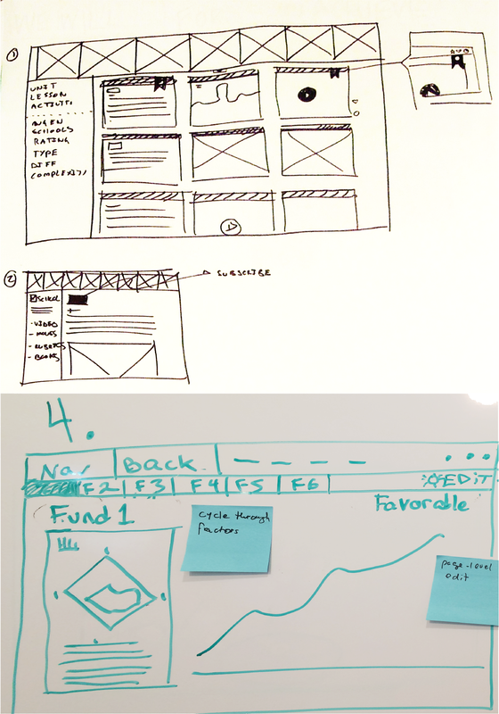
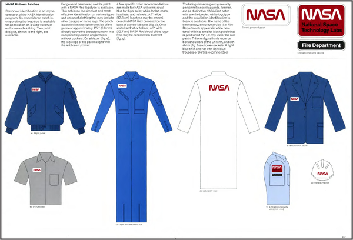
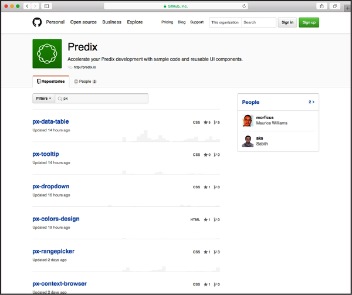
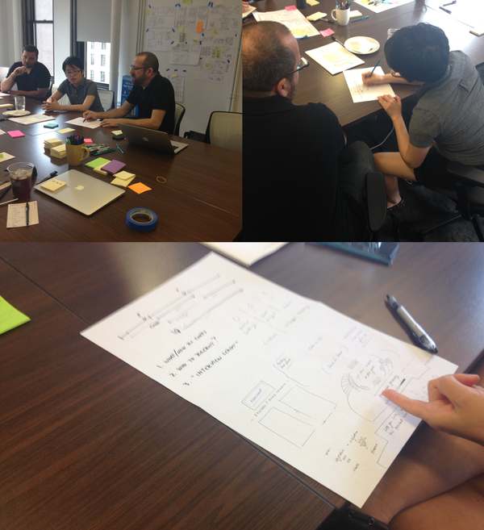

# Chapter 14. Collaborative Design

> Be open to collaboration. Other people and other people’s ideas are
> often better than your own. Find a group of people who challenge and
> inspire you, spend a lot of time with them, and it will change your
> life.
>
> Amy Poehler

What is a “user experience”? It’s the sum total of all of the
interactions a user has with your product and service. It’s created by
all of the decisions that you and your team make about your product or
service: the way you price it, the way you package and sell it, the way
you onboard users, the way you support it and maintain it and upgrade
it, and so on and so on. In other words, it’s created by a team, not an
individual designer. For this reason, Lean UX begins with the idea that
user experience design should be a collaborative process.

Lean UX brings designers and nondesigners together in cocreation. It
yields ideas that are bigger and better than their individual
contributors. To be clear, though, we’re not advocating “design by
committee,” a phrase that implies a process filled with bad compromises
and uninformed decision making. Instead, Lean UX processes are
orchestrated and facilitated by designers and executed by discipline
specialists working from a common playbook. Lean UX increases your
team’s ownership over the work by providing an opportunity for
individual points of view to be shared early and continuously through
the process. Ultimately, it’s about using the diverse expertise of your
team to create designs that *work*.

In this chapter we’ll explore the many benefits that come from this
close, cross-functional collaboration.

Let’s dig in...

# Collaborative Design

In [Chapter 10](#ch10.html_box_six_hypotheses), you learned about
hypotheses. To test your hypotheses, you sometimes simply conduct
research (described in
[Chapter 12](#ch12.html_box_eight_mvps_and_experiments)). But other
times, you need to design and build something that will help you to test
these hypotheses. For example, if you’re in the early stage of a
project, you might test demand by creating a landing page that will
measure how many customers sign up for your service. Or if you’re later
in the product life cycle, you might be working at the feature
level—adding some new functionality that will make users more
productive, for example. Navigating the many possible design options for
these features can be difficult for teams. How often have you
experienced team conflict over design choices?

The most effective way we’ve found to rally a team around a design
direction is through collaboration. Over the long haul, collaboration
yields better results than hero-based design (the practice of calling in
a designer or design team to drop in, come up with something beautiful,
and take off to rescue the next project). Teams rarely learn or get
better from working with heroes. Instead, in the same way that creating
hypotheses together increases the product IQ of the team, designing
together increases the design IQ of the team. It allows all of the
members of the team to articulate their ideas. It gives designers a much
broader set of ideas to draw upon as they refine the design. This, in
turn, increases the entire team’s feelings of ownership in the work.
Finally, collaborative design builds team-wide shared understanding. It
is this shared understanding that is the currency of Lean UX. The more
the team collectively understands, the less it has to document in order
to move forward.

Collaborative design is an approach that allows a team to design
together. It helps teams build a shared understanding of both the design
problem and the solution. It provides the means for them to work
together to decide which functionality and interface elements best
implement the feature they want to create.

Collaborative design is still a designer-led activity. It’s the
designer’s responsibility to not only call collaborative design meetings
but facilitate them as well. Sometimes, you’ll have informal chats and
sketching sessions. Sometimes, more structured one-on-one sessions with
a developer at a whiteboard. Other times, you will gather the entire
team for a Design Studio exercise or even a Design Sprint. The key is to
collaborate with a diverse group of team members.

In a typical collaborative design session, teams sketch together,
critique the work as it emerges, and ultimately converge on a solution
they feel has the greatest chance of success. The designer, while still
producing designs, takes on the additional role of facilitator to lead
the team through a series of exercises.

The output of these sessions typically consists of low-fidelity sketches
and wireframes. This level of fidelity is important. First, it makes it
possible for everyone to contribute, even team members with less
sophisticated drawing skills. Second, it’s critical to maintaining the
malleability of the work. This gives the team the ability to pivot
quickly if their tests reveal that the approach isn’t working. It’s much
easier to pivot from a failed approach if you haven’t spent too much
time laboriously drawing, documenting, and detailing that approach.

## Collaborative Design: The Informal Approach

A few years ago, Jeff was designing a dashboard for a web app targeted
at TheLadders’ recruiter and employer audience. There was a lot of
information to fit on one screen, and he was struggling to make it all
work. Instead of burning too much time at his desk pushing pixels, he
grabbed a whiteboard and asked Greg, the lead developer, to join him.
Jeff sketched his original idea about how to lay out all of the content
and functionality for this dashboard (see
[Figure 14-1](#ch14.html_examples_of_whiteboard_sketches)). The two of
them then discussed the idea, and eventually Jeff handed Greg the
marker. He sketched his ideas on the same whiteboard. They went back and
forth, ultimately converging on a layout and flow they felt was both
usable and feasible, given that they needed to deliver a solution within
the current two-week sprint. At the end of that two-hour session, they
returned to their desks and began working. Jeff refined the sketch into
a more formal wireframe and workflow, while Greg began to write the
infrastructure code necessary to get the data they needed to the
presentation layer.

###### Figure 14-1. Examples of whiteboard sketches

They had built a shared understanding through their collaborative design
session. They both knew what they were going to build and what the
feature needed to do. They didn’t need to wait to document it. This
allowed them to get the first version of this idea built within a
two-week time frame.

<aside data-type="sidebar" epub:type="sidebar">

##### Conversation: Your Most Powerful Tool

Lean UX promotes conversation as the primary means of communication
among team members. In this way, it is very much in line with the Agile
Manifesto, which promotes “individuals and interactions over processes
and tools.” Conversation unites a team around a shared vision. It also
brings insights from different disciplines to the project much earlier
than a traditional design cycle would allow. As new ideas are formed or
changes are made to the design, a team member’s insight can quickly
challenge those changes in a way the designer alone wouldn’t have
recognized.

By having these conversations early and often, the team is aware of
everyone’s ideas and can get started on their own work earlier. If they
know that the proposed solution requires a certain backend
infrastructure, for example, the team’s engineers can get started on
that work while the design is refined and finalized. Parallel paths for
software development and design are the fastest route to reach an actual
experience.

These conversations might seem awkward at first; after all, you’re
breaking down time-tested walls between disciplines. As the conversation
evolves, however, designers provide developers with input on the
implementation of certain features, ensuring the proper evolution of
their vision. These conversations promote transparency of process and
progress. This transparency builds a common language and deeper bonds
between team members. Teammates who trust one another are more motivated
to work together to produce higher-quality work.

Find ways to have more conversations with your teammates, both
work-related and not. Time spent cultivating social ties with your
team—eating meals together, for example—can make work-related
conversations easier, more honest, and more productive.

</aside>

## Lean UX and Design Sprints

In [Chapter 9](#ch09.html_box_five_solutions), we wrote about an
exercise called “Design Studio.” This is a great way to gather a team
for a structured design session. In recent years, a similar approach
called “Design Sprint” has become popular. Described in the book
*Sprint* by Jake Knapp, John Zeratsky, and Braden Kowitz (Simon and
Schuster), a design sprint is a five-day process that gathers a team,
defines a question, develops ideas, builds a prototype, and tests it—all
in a single week. Design Sprints are like a Design Studio on steroids.
Or like a mini-cycle of Lean UX work. Having now facilitated a few of
our own, we’ve seen how powerful this process can be. If you’re looking
to kick-start a team, a project, or an initiative, a Design Sprint is a
great way to go.^([1](#ch14.html_ch01fn14))

That said, there are some perhaps contradictory parts of the methods.
Lean UX has a particular way to frame problems, for example. Design
Sprints frame problems on day one using a different method. Lean UX
recommends hypotheses, experiments, and MVPs to test your ideas. Design
Sprints take teams through prototyping and testing during the final days
of the sprint in a way that doesn’t use hypotheses or the word MVP. So
sometimes it feels like the methods are in conflict.

Our perspective is that the methods are deeply compatible in spirit, if
not in exact practice. If you can embrace the spirit of the methods,
Design Sprints fit really well into a Lean UX approach.

That said, we wanted to learn a little more, so we reached out to Jake
Knapp to talk through some of our questions.

<aside data-type="sidebar" epub:type="sidebar">

##### Lean UX and Design Sprints: A Conversation with Jeff, Josh, and Jake Knapp

Q: Lots of people have questions about how Lean UX and Design Sprints
work together. Do you have POV on this question?

Jake Knapp: To me, Lean UX is like a cookbook you can use across your
entire product cycle and throughout your entire organization. Design
Sprints are a single recipe—something very specific for a specific
moment with a specific part of your team. The philosophies are totally
compatible. Anyone who is familiar with Lean UX should check out Design
Sprints, and vice versa.

Q: How much flexibility is there in the Design Sprint recipe? Can we
adjust the recipe?

JK: Yes…but don’t adjust the recipe until you’ve tried the original. The
steps are in there for a reason, and they work, but if you’ve run Design
Sprints by the book a few times and you think you need an adjustment,
try it\!

Q: That’s great to hear—because that’s how we recommend people think
about Lean UX. It’s always a matter of trying things, learning, and
adjusting based on what you’ve learned.

JK: That’s right. Observe what happens and take notes. Treat it like an
experiment within the experiment. And if you find an improvement, please
let me know.

Q: What are Design Sprints really great at? What are they not great for?

JK: Design Sprints are great for teams who want to build something new
or shake things up. They’re ideal for starting big projects and
improving your hunch about product/market fit. They’re great for
building momentum and alignment on a team…in other words, a Design
Sprint gets everybody rowing in the same direction with a real purpose.
They’re also great at resetting team culture and encouraging the best
kind of risk-taking and decision making. They can bring people a better
understanding of and focus on their customers, and they can bring people
closer to their colleagues. They can bring a renewed sense of joy in
work, because you finally get to cut through all the baloney and just do
what matters most.

Q: OK, now the other side of that question: What are they NOT great for?

JK: Design Sprints are NOT meant for designing every detail of your
product or planning out your entire development schedule. They don’t
replace your MVP, and they don’t offer you a path from zero to launch.
They’re really good at this one specific moment—in fact, I can
confidently say they are the best way I know of to start a new project.
Before and after that moment…well, refer to the rest of the book you’re
holding. :)

Q: There seems to be a lot of overlap between the methods. Which one
should we do?

JK: Both!

</aside>

## Using Design Sprints in a Lean UX Process

So, as you can see from our conversation with Jake, we all believe the
methods work well together. So, then, what is the best way to use Lean
UX to set up a successful Design Sprint? And how can you use Lean UX
after you’ve run a Design Sprint?

Here’s what we recommend:

- Remember that Lean UX encourages you to reframe your work as a problem
  to solve rather than a “thing to build.” Don’t go into a sprint
  thinking, “What can we build?” Instead, use your sprint to figure out
  “How can we solve our problem?”

- Lean UX encourages you to articulate your assumptions about the
  problem, the target audience, potential solutions, and what success
  looks like. This allows you to frame hypotheses, which can be a great
  way to frame a design sprint.

- Use your hypothesis(es) as input to your Design Sprint.

- Use the work you do in the sprint to start to tear apart these
  assumptions, test them, and come out the other end with a better set
  of hypotheses and a clear set of next steps.

- This next set of hypotheses can be used as input to your next cycle of
  Lean UX work.

# Design Systems

As the story of Jeff and Greg at the whiteboard makes clear,
collaborative design is most effective when you’re working with what we
think of as a fat pen. Design Sprints are another technique that
embraces this fat-pen way of working. You’re sketching together, making
high-level decisions about concept, structure, flow, and functionality.
This is the level of resolution and detail that is most appropriate for
collaborative design. Collaborative design almost never means that teams
are sitting together at a workstation moving pixels around. In fact,
this kind of group hovering at the pixel level is what most designers
would consider their worst nightmare. (To be clear: *don’t do this.*)

And yet, design isn’t done when the sketch is done. It’s not completed
on the whiteboard. Instead, it’s usually just getting started. So how do
we get design to the pixel level? How do we get to finished visual
design?

Increasingly, we’re seeing teams turn to design systems. Design systems
are like style guides on steroids. When we wrote the first edition of
this book, design systems were a new thing. In fact, as an industry, we
hadn’t really decided yet what to call them. Back then, we were excited
about design systems because they promised to unlock collaboration
between designers and developers, and to solve once many of the
repetitive and rote problems that designers faced, which meant that
designers could move on to the tougher challenges that added more value.

By the time we wrote the second edition of this book, four years later,
design systems had gone mainstream. Forward-thinking large organizations
had built or were building their enterprise-scale systems. Startups were
putting them in place from day one. Consulting organizations that
specialized in design systems had sprung up. Conferences were bringing
practitioners together. We had many more examples that we could feature
in the second edition of the book, and we’ve left them in place for your
reference.

Fast-forward to today. Design systems are now a well-established part of
the way design gets done in our industry. They continue to deliver on
the promise of the early days—including the benefits we were so excited
about when we first encountered them: they continue to allow product
teams to work in collaborative and highly agile ways. Before we get into
some of the ways that design systems help teams be more agile, let’s
take a look at what they are.

## Design Systems: What’s in a Name?

Style guides. Pattern libraries. Brand guidelines. Asset libraries.
Design systems. There’s not a lot of common language in this part of the
design world, so let’s take a moment to clarify our terms.

For years, large organizations created brand guidelines
([Figure 14-2](#ch14.html_example_of_brand_standards_guidelinesco))—comprehensive
documents of brand design and usage rules for those companies. In
predigital days, these guidelines were documents, sometimes a few pages,
but frequently large, comprehensive bound volumes. As the world moved
online, these books sometimes moved onto the web as PDF documents, web
pages, or even wikis.

###### Figure 14-2. Example of brand standards guidelines, this one from NASA^([2](#ch14.html_ch01fn15))

At the same time, publishers and publications often maintained style
guides that covered rules of writing and content presentation. College
students in the United States are familiar with the comforting
strictness of *The Chicago Manual of Style*, *The MLA Style Manual and
Guide to Scholarly Publishing*, and others.

The computing world’s version of a style guide is exemplified by Apple’s
famous Human Interface Guidelines (HIG). The HIG is a comprehensive
document that explains every component in Apple’s operating system,
provides rules for using the components, and contains examples that
demonstrate proper use of the components.

Finally, developers are familiar with *asset libraries*. These
collections of reusable code elements are intended to make the
developer’s job easier by providing tested, reusable code that’s easy to
download from an always current *code repository*.

As with many ideas in the digital world, digital design systems (which
we’ll call design systems for the sake of brevity) are a kind of mash-up
of all of these ideas. A good design system contains comprehensive
documentation of the elements of a design, rules and examples that
govern the use of these elements, and, crucially, *the code and other
assets that actually implement the design*.

In practice, a design system functions as a single source of truth for
the presentation layer of a product. Teams can sketch at the whiteboard
and then quickly use the elements found in the design system to assemble
a prototype or production-ready frontend.

## The Value of Design Systems

Design systems are a powerful enabler of Lean UX. They allow the visual
and microinteraction details of a design to be developed and maintained
in parallel with the other decisions a team makes. So decisions like
screen structure, process flow, information hierarchy—things that can be
worked out at the whiteboard—can be handled by the right group of
teammates, whereas things like color, type, and spacing can be handled
by another (very likely overlapping) group of folks.

This has a couple of big benefits for teams:

Design faster  
The team isn’t reinventing the wheel every time they design a screen.

Prototype faster  
Frontend developers are working from a kit of parts—they don’t need to
recreate the elements of a solution each time; they can just go get the
appropriate pieces out of the design system.

It also has some big benefits for organizations:

Increased consistency  
A good design system is easy for developers to use. So they are more
likely to use parts that they find in the design system and less likely
to “roll their own.” This means a greater likelihood that their work
will adhere to brand standards.

Increased quality  
By centralizing the design and creation of user-facing elements, you can
take advantage of the work of a few highly trained and highly
specialized designers and UI developers. Their high-quality work can be
implemented by other less-specialized developers in the organization to
produce top-notch results.

Lower costs  
A good design system is not free. It requires investment to build it and
staff to maintain it. But over time, it pays for itself by providing
tools and frameworks that make the users of the system—the other
developers in the organization—more efficient and more productive. It
allows new designers to come up to speed more quickly, for example,
because it documents all of the frontend conventions used in an app.
Similarly, it allows new developers to come up to speed more quickly,
because the basic building blocks of their work are available in an
easy-to-use framework.

## Design Systems Teams Are Product Teams

Make no mistake: a design systems team is a product team. Though this
team is working on a product that will be used (in most cases) by
internal users, this team is nevertheless a product team. It will have
many of the same concerns that any product team will have: first and
foremost, it needs to make a product that its users find valuable. As
with any internal product, your measure of success is not sales; it’s
*adoption*. So understanding the needs of your users and serving them
will be key to rapid adoption of your work and, ultimately, key to your
success.

Design systems teams can approach this challenge using Lean UX methods.
Some methods, like certain kinds of experimentation, can be difficult or
impossible for design systems teams: because design systems are platform
products, they will be used by teams in a variety of contexts and must
integrate into a wide range of environments. So compatibility and
stability concerns can limit the kinds of experiments you run.

That said, because the users of design systems are internal, you should
have an easy time getting access to them. This means that design systems
teams can lean into the techniques of collaborative design, using
workshops, sprints, and shared whiteboard sessions to build
collaboration and shared understanding between design systems developers
and users.

## Don’t Skip the Fat Markers

One surprising concern that we’ve seen as design systems become more
ubiquitous is that design systems can be so good and so easy to use that
designers can be tempted to skip right past the “fat marker” stage of
design and go right to high-fidelity work. When this happens, artifacts
that represent early-stage thinking—the concept development stage of the
work—can sometimes be misunderstood by stakeholders, colleagues, and
even the designers themselves. It’s human nature to respond to
high-fidelity mock-ups in a different way than you respond to
low-fidelity mock-ups. When you show people, especially nondesigners, a
high-fidelity mock-up, you tend to get feedback on the details. The
fonts, colors, and content. But when you show people a paper-and-pencil
sketch, there *are no details* to comment on. Instead, people read these
drawings as concept drawings, and they respond to that.

So, for designers, it’s important not to get seduced by how easy it is
to just whip out Figma, grab the components in your design system, and
produce a credible mock-up. Don’t do it. Start with your fat markers.

For design systems teams, though, there’s an opportunity to help users
choose the right tool for the job. When we wrote the first edition of
this book, designers had an array of digital wireframing tools that were
optimized for making sketch-fidelity drawings. We’re just starting to
see design systems teams consider adding sketch-fidelity elements into
their toolkits. This is a fascinating trend and one we’ll be following
to see where it develops.

Now, let’s take a look at how one large organization uses design
systems...

### Case study: GE design system

In 2012, GE opened GE Software in San Ramon, California. This new
“Center of Excellence” (CoE) was designed to help GE improve its
software game. A few years earlier, a strategic review helped the
company to see just how central software had become to their business:
measured in lines of code, GE was something like the 17th largest
software company in the world. And yet they felt they were not treating
software development with the focus it deserved.

San Ramon included a new team at GE: the GE Software User Experience
Team. This small team at the heart of a giant company created their
first design system in 2013 in order to scale the impact they could
have. Indeed, with fewer than 50 designers to collaborate with more than
14,000 developers (inside an organization of more than 300,000 people),
there was no way that this startup design team could grow quickly enough
to have a meaningful effect at GE.

The team’s first design system, called IIDS, for the Industrial Internet
Design System, was designed by a group of internal designers with the
help of a small team from Frog Design, one of the leading design firms
in the world. The team built the system on top of Bootstrap, the
HTML/CSS framework created by Twitter. It proved incredibly successful.
Within a few years, it had been downloaded by internal developers more
than 11,000 times and had been used to create hundreds of applications.
It helped software teams across the company produce better looking, more
consistent applications. And, perhaps just as important, it created a
huge amount of visibility for the software team and the UX team at San
Ramon.

With that success came some problems. To be sure, simply having a good
UI kit doesn’t mean that a team can produce a well-designed product.
Design systems don’t solve every design problem. And Bootstrap was
showing its limits as a platform choice. It had helped the team achieve
their first objectives: get something out quickly, provide broad
coverage of UI elements, and create wide adoption by being easier to use
than “roll-your-own” solutions. But Bootstrap was hard to maintain and
update and was just too big for most needs.

In 2015, GE Software, having had great success as an internal service
bureau, morphed into GE Digital, a revenue-generating business in its
own right. Their first product was called Predix
([Figure 14-3](#ch14.html_the_ge_predix_design_system)), a platform on
top of which developers inside and outside of GE can build software for
industrial applications. And with this change of strategy, the team
realized they needed to rethink their design system. Whereas earlier the
goal had been to provide broad coverage and broad adoption, the new
design system would be driven by new needs: it needed to enable great
Predix applications, which was a more focused problem than before. It
needed to *limit* the number of UI choices rather than supporting every
possible UI widget. It still needed to be easy to adopt and use—it was
now intended for use by GE customers—but now it was imperative that it
be easy to maintain as well.

The design system team had by this time grown to about 15 people and
included design technologists (frontend developers who are passionate
about both design and code), interaction designers, graphic designers, a
technical writer, and a product owner.

###### Figure 14-3. The GE Predix design system

The team chose to move the design system to a new technology platform
([Figure 14-4](#ch14.html_the_ge_predix_design_system_on_github)). No
longer based on Bootstrap, the system has instead been created with
Polymer, a JavaScript framework that allows the team to implement Web
Components. Web Components has emerged in the last few years as a way to
enable more mature frontend development practices.

To create the new design system, the team spent nearly six months
prototyping. Significantly, the team did not work in isolation. Instead,
they paired with one of the application teams and thus were designing
components to meet the needs of their users—in this case, the designers
and developers working on the application teams. This point is really
important. Collaborative design takes many forms. Sometimes it means
designing with your cross-functional team. Sometimes it means designing
with your end users. In this instance, it was a hybrid: designing with a
cross-functional team of designers and developers *who actually are*
your users.

###### Figure 14-4. The GE Predix design system on GitHub

# Collaborating with Geographically Distributed Teams

Physical distance is one of the biggest challenges to strong
collaboration. Some of the methods we’ve discussed in this book become
more difficult when a team isn’t all in the same location. That said—as
we all learned in 2020, thanks to the COVID-19 crisis—you can still find
ways to collaborate when you and your team are separated by distance.
Tools such as Zoom, Skype, Google Meet, and Slack can provide teams with
the means to collaborate in real time. Google Docs and similar systems
allow people to collaborate on documents at the same time. Team
collaboration tools like Mural and Miro serve as a space for creative
collaboration. Trello and wikis make it possible for teams to track
information together. Design tools like Figma are built from the ground
up with collaboration in mind. And a phone with a camera can make it
easy to quickly share photos in an ad hoc way. All these tools can make
cross-time-zone collaboration more effective and can help teams to feel
virtually connected for long periods of time during the day.

## Collaborating with Distributed Teams

When we talk about distributed teams, we’re actually talking about a
variety of different scenarios. Sometimes we mean that we’re in an
office in NYC with part of our team, and we need to work with other
teammates who are working in the London office. Other times it means
that we are on 2020-style lockdown, working from home with our pets and
our kids and our partners in the same room. Sometimes we’re talking
about a hybrid situation—most of us are in the office, but a few folks
are calling in to a meeting. What works in one of these contexts might
not work in others, but there are some important ideas that you can use
to make collaboration easier in any context.

*Level the playing field.* Have you ever called in to a meeting where
you were the only person on the phone, and everyone else was sitting
around the table? It’s tough. Now imagine a room full of people working
on sticky notes or drawing on the whiteboard, while you’re sitting in
your kitchen listening on the phone. It’s going to be difficult—perhaps
impossible—for you to make a meaningful contribution. One fix for this
is to insist that your meeting-room tools be chosen so that everyone can
participate. Instead of using the conference-room whiteboard, your team
can open a shared document or use an online whiteboard tool like Mural
or Miro. This means that everyone in the conference room will need their
own laptop or tablet, but it will also ensure that everyone can
collaborate as peers.

*Create social connections.* It can be tempting to treat online meetings
in a very regimented way. Gather the team, hit the agenda hard, end on
time, boom. Remote meetings start and end more abruptly than physical
meetings. Think about it—when we meet in a conference room, we chat for
a few minutes in the hallway before the meeting. We gossip as we take
our chairs. We walk out of the room together and get a coffee together
to debrief. These moments may seem incidental to the work that we do,
but they are actually a crucial component of work—they give us time to
build the social bonds that allow work to happen. Make the effort to
create social connections across remote collaborations. Build in extra
time for slow openings to your meetings. Schedule team social calls
across the distance. Create social/nonwork channels in your team Slack
workspaces. If you can travel to see your remote teammates, make sure to
build team social events into your travel agendas.

## Making Collaboration Work

Not every team will find that collaboration comes easily. Most of us
begin our careers by developing our individual technical skills as
designers, developers, and so on. And in many organizations,
collaboration across disciplines is rare. (It’s rarely taught in school
as well, either as an explicit topic or in the way our educational
systems are set up.) So it’s no wonder that it can feel challenging.

One of the most powerful tools for improving collaboration is the Agile
technique of the *retrospective* and the related practice of creating
*team working agreements*. Retrospectives are regularly scheduled
meetings, usually held at the end of every sprint, in which the team
takes an honest look back at the past sprint. They examine what went
well, what went poorly, and what the team wants to improve. Usually, the
team will select a few things to work on for the next sprint. We can
think of no more powerful tool for improving collaboration than the
regular practice of effective retrospectives.

A team working agreement is a document that serves as a partner to the
retrospective. It keeps track of how the team has chosen to work
together. It’s a self-created, continuously updated rule book that the
team agrees to follow. At each retrospective, the team should check in
with their working agreement to see if they’re still following it and if
they need to update it to include new agreements or remove old ones that
no longer make sense.

Here’s an outline for what you should consider covering in your team
working agreements:

Process overview  
What kind of process are we using? Agile? If so, what flavor? How long
are our iterations?

Ceremonies  
What rituals will the team observe? For example, when is stand-up each
day? When do we hold planning meetings and demos?

Communication/Tools  
What systems will we use to communicate and document our work? What is
our project management tool? Where do we keep our assets?

Culture/Safety/Conflict resolution  
What kind of team culture do we want? What do we need as individuals to
feel safe with our teammates? What will we do when (not if!) there’s
conflict? How will we resolve disagreements?

Working hours  
Who works where? When are folks in the office? If we’re in different
locations, what accommodations will we make for time-zone differences?

Requirements and design  
How do we handle requirements definition, story writing, and
prioritization? When is a story ready for design? When is a design ready
to be broken into stories?

Development  
What practices have we settled on? Do we use pair programming? What
testing style will we use? What methods will we use for source control?

Work-in-progress limits  
What is our backlog and icebox size? What WIP limits exist in various
stages of our process?

Deployment  
What is our release cadence? How do we do story acceptance?

And any additional agreements.

<aside data-type="sidebar" epub:type="sidebar">

##### Psychological Safety

Collaborative design is a creative activity. To be effective, people
need to feel safe. This means physical, emotional, and psychological
safety. We often hear this idea expressed in superficial ways, like
“there are no bad ideas in brainstorming” or “there’s no such thing as a
stupid question.” And while those things are true, they are certainly
not sufficient. Psychological safety is more than that. Author Alla
Weinberg defines psychological safety as “the shared belief that no one
on the team will embarrass or punish anyone else for admitting a
mistake, asking a question, or offering a new idea.”

Lean UX is all about the idea that design is an iterative process. You
need to try, learn, and iterate. In other words, you need to make
mistakes in order to make progress. You can’t do this if you and your
team don’t feel safe.

If you find yourself or your team stuck in a rut, experiencing high
degrees of conflict, or generally acting scared, take a step back and
ask, Do I feel safe on this team? Do I think my team members feel safe?
If you’re not sure, consider taking a step back and looking at the work
of writers like Weinberg and Amy Edmondson to help you and your team
address these concerns.

</aside>

## Wrapping Up

Collaborative design
([Figure 14-5](#ch14.html_a_team_using_collaborative_design_techn)) is
an evolution of the UX design process. In this chapter, we discussed how
opening up the design process brings the entire team deeper into the
project. We showed you practical techniques you can use to create shared
understanding—the fundamental currency of Lean UX. Using tools like
design systems, style guides, collaborative design sessions, Design
Studio, and simple conversation, your team can build a shared
understanding that allows them to move forward at a much faster pace
than in traditional environments.

###### Figure 14-5. A team using collaborative design techniques

^([1](#ch14.html_ch01fn14-marker)) The word “sprint” can be confusing
here. In this context, we’re not talking about an Agile-style sprint,
what Scrum would call an “iteration.” When we use the phrase “Design
Sprint,” we’ll use capital letters to indicate that we’re talking about
the specific process described in the book *Sprint*.

^([2](#ch14.html_ch01fn15-marker)) NASA, “NASA Graphics Standards
Manual,” September 8, 2015,
[*https://oreil.ly/nCc4H*](https://oreil.ly/nCc4H).

