# Chapter 16. Integrating Lean UX and Agile

Ask anyone at any organization what the default way of working is for
them, and the answer will invariably be “We’re doing Agile!” Follow that
question with “And how’s that working out for you?” and in most cases
they’ll raise their hand and shake it from side to side in the “meh,
it’s just OK” gesture.

Agile was born of developers, 17 of them in fact, representing emerging
ways of working that had emerged from their frustration with older
engineering processes and the unpredictability of software development.
At a weekend gathering in Utah in 2001, these software developers put
together a series of principles they called the Agile
Manifesto.^([1](#ch16.html_ch01fn16)) If you haven’t read it (you
should, it’s short), you’d be surprised to find there isn’t much
prescribed “process” in the Agile Manifesto. There’s nothing in there
that says, “You shall stand up every day at 9:15 with your team” or “You
will work in two-week cycles called sprints.” Those are techniques taken
from specific Agile methods, like Scrum and Extreme Programming (XP),
methods that were invented by many of the folks who came together to
create the Agile Manifesto itself. Instead of capturing specific
practices, the authors of the Manifesto listed values and principles for
highly collaborative, customer-centered software development. The most
compelling line in the entire manifesto—and in our opinion the basis for
true agility—is “\[We value\] responding to change over following a
plan.”

That’s the heart of it, really. If you work in a way that invites
learning, embrace that learning in a humble manner, and change your plan
based on what you’ve learned, you are being agile.

In the 20 years since the Manifesto was created, this approach to doing
work has become the default way of working in most organizations (or at
least, the default aspiration). These Agile ideas reached well beyond
software development teams and are now being applied to everything from
strategic planning and leadership to human resources, finance,
marketing, and, of course, design.

The most well-known form of Agile is Scrum, a lightweight framework
invented primarily by Jeff Sutherland and Ken Schwaber in the mid-1990s.
(Yes, Scrum has been around longer than the Agile Manifesto.) And yet
for all its popularity, Scrum itself has only recently begun to think
about how design fits into the process. Until as recently as November
2020, [*The Scrum Guide*](http://www.scrumguides.org)—the official
documentation of Scrum—had never mentioned user experience or design in
any way. As great design and customer-centricity become increasingly
important success factors in technology products, designers and Agile
practitioners alike have struggled to figure out exactly how to
integrate themselves into Agile processes. While the rest of Lean UX
describes an Agile way of working, this chapter will help answer some
questions about how Lean UX fits into the mechanics of Agile methods,
and, in particular, we’ll focus on design within the context of Scrum.

# Make the Agile Process Your Own

We often get asked how newly formed Agile teams should work. Should they
use Scrum? Should they work in two-week sprints? What level of formality
should they implement in order to be successful? With so many stories of
frustration with Agile transformations, teams and leaders want to get it
right as quickly as possible and minimize pain, frustration, and
decreased productivity. You could spend the next 10 years reading all of
the books on Scrum best practices, but when you boil it down to the
core, you’re left with the following components, which make a great
starting point for any team:

- Work in short cycles.

- Deliver value at the end of each cycle.

- Hold a brief daily planning meeting (or Daily Scrum).

- Hold a retrospective after every cycle.

You can spend a lot of time debating all of the other components of
Scrum (as well as the things people *think* are part of Scrum but are
never mentioned in *The Scrum Guide*), but these four basic elements
provide all you need to increase the agility of your team. A team with a
dedicated lineup will work together to figure out what they can get done
in each cycle. They will meet daily to determine what the next most
important set of things is to do, and, critically, they will review the
efficacy of their process after every cycle.

In fact, it’s no exaggeration to say that retrospectives, when used
properly, are the key to building a cohesive, cross-functional Agile
team. Scrum doesn’t tell you how to fit designers or design work into a
sprint or how to handle design work in the backlog, but if your team
tries one way to build design into the Scrum process, runs that for a
sprint or two, and then retrospects to determine how well that worked,
you’ve begun the process of owning your Agile process. If you remove the
prescriptive ethos of Scrum from the process and instead apply the
philosophical lens of the Agile Manifesto, then you are, indeed,
responding to change over following a plan. In this case, the plan is
the rigid prescription of Agile process; the change you are responding
to is your understanding of how well that prescription worked for you
and your team. If it works well, fantastic! Keep doing it. But if it
failed to achieve what you hoped for, change course. Now you’re *being*
Agile rather than just *doing* it.

This is why retrospectives are so powerful and why they’re the one Scrum
event we recommend more than any other. Honest, blameless retrospectives
give a team a regular opportunity to adjust how they work. A
retrospective looks back at the last cycle or two and asks, *What has
been working well? What hasn’t been working so well? What are we going
to change moving forward?* The best part of approaching a process this
way is that the risk of changing your process is minimal. The longest
you’ll have to live with a change is the length of your sprint. While
this chapter will give you many ways to build an integrated Lean UX and
Scrum process, whatever you do, make sure that you use retrospectives to
examine what you do. If the techniques that we recommend don’t work for
your team, change them, mix and match them, or throw them out. Your
version of Agile (or Scrum) will be different than any other team’s.
This is OK. In fact, we’d argue that’s the whole point of being agile.

## Redefining “Done”

When is software done? We wrote about this in
[Chapter 3](#ch03.html_outcomes). When you’re working to create an
outcome, you need to ship software (the output) and then see if it
creates the outcome you want. You can’t ship software until you’re
“done.” But you’re not really *finished* until you’ve “validated” that
software.

In Scrum, nothing can go live to a user until it is “done.” This makes
perfect sense. You need to make sure that the software you’re releasing
meets certain shared quality standards (what Scrum calls “the definition
of done”) and that it delivers the functionality that you and your team
have planned (what Scrum calls the “acceptance criteria”). The
definition of done is created by the team, and the acceptance criteria
are usually set by the product manager or product owner. Together, these
standards ensure that each piece of work is complete, works as designed,
and is bug-free and stable enough to go to production. For most Scrum
teams, though, this is the end of their involvement with that piece of
software. This end point, though, completely fails to take
responsibility for outcomes and reflects a much older idea of the nature
of software.

When we started our careers, software came in a box. If that sounds
weird to you, it might be even weirder to know that when Jeff was a kid,
his dad would bring home the punch cards on which software came in the
1970s. In both of those cases, more than 20 years apart, software was
static. It had an end state. We could package it in boxes or on paper
cards. Fast-forward another 20 years, and these concepts seem ridiculous
now. Software doesn’t come in a box and is no longer static. Today we
build systems that are updated continually and can be optimized
indefinitely. It’s easy, today, to argue that software is *never* done.
This makes the question “When are we done?” a difficult one to answer.
But we need to answer it because it helps answer other, even more
important questions. Do we move on to the next feature or not? Does the
team get rewarded or chastised? Does the stakeholder get their bonus?

Scrum, with its concepts of “acceptance criteria” and “definition of
done,” has given teams a clear set of targets to hit. But those targets
only go so far. As we’ve said, they ensure that the software “works as
designed.” But “works as designed” only tells us that the software
consistently does what we told it to do. Unfortunately, that’s not
enough. We also need to know if the software created value. *Did anyone
find the feature we just shipped? Did they try it? Were they successful
using it? Did they come back and use it again? Did they pay us for it?*
In other words, we need to know if it created an outcome.

So how do our teams know when the work is finished? When do they know
when to move on to the next initiative? We need to add a concept here:
the concept of “validated.” And getting to validated starts with our
customers.

We validate our work after it’s “done.” After it’s “accepted.” After
it’s in the hands of our customers. We do this by measuring their
behavior. We do this by listening to their needs and assessing if our
features meet those needs, and then iterating until we meet those needs.
Over and over again. It turns out designers are very good at doing this
work.

By expanding our idea of done from “works as designed” to “validated
with customers,” we shift what Scrum teams are working toward. Instead
of focusing on shipping features, they are focused on making customers
successful. Design is an integral part of this, because design provides
many of the tools needed to understand customers and refine solutions to
better meet their needs. If a feature’s definition of done is reframed
as an outcome, the team has no choice but to test early versions of
their idea, interact with customers to understand how things can be
improved, and design optimized versions of the feature to meet those
ever-changing needs.

Here’s an example. Traditionally expressed acceptance criteria for a
password authentication flow:

- Requires password entry

- Password meets basic requirement guidelines

- Password is entered correctly and user is verified into the system

- Password recovery link is active

- Error message displays when password is entered incorrectly

- After three failed attempts, access is blocked

Reframed criteria for the same feature:

- Percentage of users successfully authenticating on first try is 99% or
  higher

- Number of password recovery attempts is reduced by 90%

- Percentage of calls to the call center asking for password reset
  reduced by 75%

In the traditional example, the team builds and releases a set of
features that work as designed. With the second definition, the team is
not done until the customer is demonstrably more successful than they
are today. This method reflects the modern nature of software and
requires the intervention and inclusion of research, discovery, and
design in the Scrum process. This recalibration of the team’s goal does
not negate the value of traditional acceptance criteria. We still want
to ship stable, high-quality, high-performance, secure code to
production. However, that’s not enough. Those attributes are table
stakes. None of that matters if it doesn’t make the customer more
successful.

## We’re Still Doing Staggered Sprints. Why?

In May 2007, Desiree Sy published “Adapting Usability Investigations for
Agile User-Centered Design” in the *Journal of Usability
Studies*.^([2](#ch16.html_ch01fn18)) Sy is one of the first people to
try to combine Agile and UX, and many of us were excited by the
solutions she was proposing. In the 2007 article, Sy describes in detail
her idea of a productive integration of Agile and user-centered design.
She called it cycle 0 (though it has come to be referred to popularly as
either “sprint zero” or sometimes “staggered sprints”).

In short, Sy, along with Lynn Miller, described a process in which
design activity takes place one sprint ahead of development. Work is
designed and validated during the “design sprint” and then passed off
into the development stream to be implemented during the development
sprint, as is illustrated in
[Figure 16-1](#ch16.html_sy_and_millerapostrophes_quotation_mark).

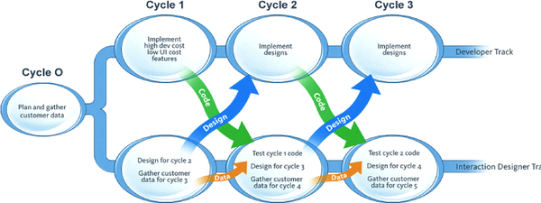

###### Figure 16-1. Sy and Miller’s “Staggered Sprints” model

Many teams have misinterpreted this model, though. Sy always advocated
strong collaboration between designers and developers during *both* the
design *and* development sprints. Many teams have missed this critical
point and instead have created workflows in which designers and
developers communicate by handoff—creating a kind of mini-waterfall
process.

For teams transitioning from waterfall to Agile, there’s a benefit to
working this way. It teaches you to work in shorter cycles and to divide
your work into sequential pieces. However, this model works best as a
transition. It is not where you want your team to end up.

Here’s why: it becomes very easy to create a situation in which the
entire team is never working on the same thing at the same time. You
never realize the benefits of cross-functional collaboration because the
different disciplines are focused on different things. Without that
collaboration, you don’t build shared understanding, so you end up
relying heavily on documentation and handoffs for communication.

There’s another reason this process is less than ideal: it can create
unnecessary waste. You waste time creating documentation to describe
what happened during the design sprints. And if developers haven’t
participated in the design sprint, they haven’t had a chance to assess
the work for feasibility or scope. That conversation doesn’t happen
until handoff. Can they actually build the specified designs in the next
two weeks? If not, the work that went into designing those elements is
wasted.

Despite these drawbacks, many teams still work in staggered sprints
today. In our experience, there are several potential root causes for
this:

Design team is not integrated into the “dev” process  
In many companies, design is still a shared service operating as an
internal agency. Designers aren’t assigned to a specific Scrum team.
They are seen as a dependency for the software development work to
start. By having designers work a sprint ahead, the design work can
“feed the machine” of software development.

Software development is outsourced  
Some organizations still outsource their software development. In a
world where software is the engine of business and growth, this is a
staggeringly risky Achilles’ heel. Nevertheless, if the coding is being
done by a third-party provider, they will want to see “final” designs
before they estimate and start the work. Staggered sprints make that
possible for teams that work with outsourced partners.

Cargo cult Agile  
Some organizations have brought in Agile processes to increase the
efficiency and productivity of software development, not for the ability
to change course based on new learnings and insights. In this case, the
organization operates as a software factory, churning out features as
fast as possible. While the work may be chunked up into sprints and
Agile vocabulary used throughout the organization, the priority is still
to simply ship features. These organizations typically focus on
deadlines and rarely take the time to iterate and improve features
through feedback and validation. Staggered sprints provide the feature
factory with fodder for production. Collaboration between designers and
developers is minimal, as handoffs and deliverables still form the
foundation for conversation between them.

Staggered sprints are a symptom of an organization that hasn’t fully
embraced agility. Their use is a stepping-stone in the right direction
but a clear indication that the team hasn’t arrived yet. Your goal
should be to build greater collaboration and transparency between
designers and developers while reducing the waste of document handoffs,
lengthy design reviews, and feature negotiations.

## Dual-Track Agile

Dual-track Agile is a model that integrates product discovery and
delivery work into one process for the same team. This is the most
successful model we’ve seen to date for bringing Lean UX work
successfully into the Agile process. In many ways, dual-track Agile is
what Sy and Miller were trying to convey with their staggered-sprint
model. However, for dual-track Agile to work, one team must do both
kinds of work—discovery (Lean UX) and delivery.

Some teams interpret dual-track Agile as two types of work for two
separate groups of people.

We don’t like this model primarily because it divides the product
development team into smaller (or, worse, separate) squads who then
inevitably have to come back together to build a shared understanding.
In practice, we’ve seen teams run into the following problems:

*Separate discovery and delivery teams:* One antipattern we’ve witnessed
several times is teams splitting up who does the discovery and who does
the delivery on their team. Often the UX designer and/or the product
manager take on the bulk of the discovery work. The engineers are
delegated early delivery work. This effectively recreates the
mini-waterfalls of staggered sprints, as described earlier. The shared
understanding breaks down, slowing the pace of decision-making and
reducing the team’s cohesion, productivity, and learning.

*Limited knowledge of how to do discovery:* Building a dual-track Agile
process assumes that your team knows how to do discovery. There are many
tools that you can use to build feedback loops into a discovery backlog.
Without a broader knowledge of these tools, teams resort to the ones
they’re most familiar with and often pick suboptimal tactics for
learning. If you have access to researchers, try to add them to your
team. At the very least, seek out their input as new discovery
initiatives begin. Seasoned practitioners can teach your team the best
method for your needs and can help you plan your discovery work.

*Not feeding back evidence from the delivery work to the discovery
backlog:* This challenge is symptomatic of an organization that is still
thinking incrementally. After a feature makes it from discovery to
delivery, the team will implement it as designed and ship it. The great
thing about this is that, as soon as it’s live, this new feature begins
to provide a new set of data about how well it’s working and where to
focus your next discovery activities. You just have to pay attention—and
get the team to pay attention. Make sure that your team is continuing to
collect feedback on shipped features and using that information to
regularly assess the prioritization of their discovery work.

### Dual-track works when it’s one team

The best way to think of dual-track is that it’s two types of
work—product discovery and product delivery—performed by *one team*
([Figure 16-2](#ch16.html_dual_rack_agile_works_when_itapostrophe)).
Discovery work consists of active learning through design and research
activities, as well as passive learning through inbound analytics of
features and products already in the market. In order to build shared
understanding, we strive to have as many team members participate in
each activity as possible. The quantity of discovery and delivery work
will fluctuate from sprint to sprint. This is normal, and you can
anticipate this as you make plans.

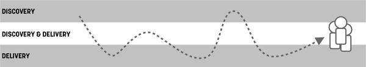

###### Figure 16-2. Dual-rack Agile works when it’s one team. Image concept: Gary Pedretti and Pawel Mysliwiec

If you’re doing discovery work right, you’re changing and potentially
killing a lot of ideas. We don’t do discovery work simply to validate
every feature we have in our backlog. Instead, we’re testing and
learning, and sometimes that means we kill features before we ship them.
Again, this is *being agile* and it’s exactly the reason Agile was
conceived in the first place. Without discovery work, Agile ends up just
being the engine of the software factory.

### Planning dual-track work

Over years of practice, we’ve tried many different ways of accounting
for both types of work in the Scrum process. We’ve tried to carve out a
specific amount of time in each sprint for discovery work to take place,
but that was unsatisfying, because in some sprints there was none to be
done, while in others it was the bulk of the work. We’ve tried Marty
Cagan’s approach of dividing the work between disciplines (design and
PMs do the discovery, engineers do the delivery), but the overhead of
handoffs, negotiations, and debates reduced the team’s ability to
respond to change. Overall, we’ve found that ensuring the entire team
shifts its workload depending on the current sprint’s needs is the best
option. In fact, it is the most agile option. It allows the team to
adjust its activities based on what it’s learning, thereby ensuring that
the most important work happens next. Sometimes that work is discovery,
and other times it’s delivery.

To make dual-track Agile successful and to bring Lean UX into the daily
workflow of your Scrum team, there are some structural elements that are
critical to that integration delivering the results your team seeks.

*A dedicated designer on every team:* There is no compromise here.
Without a dedicated designer on the Scrum team, what you have is a
software engineering team. While that team will absolutely deliver a
user experience, it will not be of the same level of quality without a
designer’s input. What’s more, that team will be lacking the skills to
do good discovery work: they will focus exclusively on writing code. As
we mentioned before, the production of code is no longer the goal for
great digital product development—it’s the means to an end. The goal is
to produce meaningful changes in the behaviors of our customers. Without
a deep understanding of the customer and how to best serve those needs,
your product will fail. Designers bring that to the team.

*Design and discovery work is a first-class citizen of the backlog:* The
short of it is this: one backlog. Development work, QA work, design
work, research work, you name it — it all goes on one backlog,
prioritized together with the same team doing all of that work. As soon
as the work is divided between more than one backlog, the team will look
to one of them as the “primary” one and the other(s) will go neglected.
You can and should have both tracks of the work managed in the same
backlog. You can certainly differentiate the different types of work in
your backlog (see experiment stories, below), but it all must end up in
the same project management tool, no matter whether you use a physical
Scrum board or JIRA or something else.

Using one backlog and treating all work in the same way ensures the team
understands that all of these components are necessary for the success
of your product. It visualizes the Lean UX work in a way that puts it on
the same level as software development work (which is always weighted
the highest in our experience). It also highlights the trade-offs that
will need to be made in order for the discovery work to take place.

Often this will bring up questions of velocity. “Won’t we reduce our
velocity if we do all this discovery work?” If you’re only measuring the
velocity of delivery, then the answer is yes. Mature dual-track teams
measure both the velocity of delivery as well as the velocity of
discovery (or learning). These teams realize that, as the quantity of
learning work increases, it will inevitably reduce the quantity of
delivery. This is because the same group of people is doing both types
of work. This is also OK, because at the end of the day, we’re trying to
maximize how effective the team is, and we do that by tracking outcomes,
not by tracking how many stories it completes or how much software it
builds.

There are a couple of ways to represent Lean UX work in your backlog.
(See [Figure 16-3](#ch16.html_common_patterns_to_manage_ux_work_in_th).)
You can represent it as a standalone story. (*The Scrum Guide* calls
stories Product Backlog Items or PBIs.) Or you can integrate the work
into the story itself, ensuring that no feature gets shipped without
discovery and design work taking place.

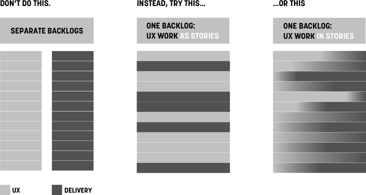

###### Figure 16-3. Common patterns to manage UX work in the backlog

*Cross-functional participation in learning activities:* Lean UX brings
with it many types of learning activities. These activities may be led
by designers or researchers or even product managers, but they should be
practiced and attended by the entire team. The more the team can learn
together, the less time is spent sharing and debating the learning and
more time can be spent deciding what to do about the things we’ve
learned. This latter is a far more productive conversation and use of
the team’s time. We’re not saying that every team member needs to take
part in every research activity. We do think that everyone should
participate to some degree, and that participation should be a regular
part of their work activity—not a special event.

Make participating in the discovery process the path of least
resistance. Broadcast your customer conversations internally so others
can watch from their desks. If a colleague is uncomfortable speaking
with a customer, bring them along and make them the notetaker. Measure
what Jared Spool refers to as “exposure
hours.”^([3](#ch16.html_ch01fn19)) Exposure hours is a measure of the
amount of time each member of your team is *directly* exposed to users.
Make sure each member of your team spends at least a two-hour block of
time every six weeks in direct contact with customers. This could be two
hours in the call center taking or listening to calls. It could be two
hours in the store or on the factory floor watching customers and users.
Or it could be doing face-to-face sales of your product in public
settings. These activities build empathy, and that in turn drives
curiosity. The more curiosity the entire team has about whether or not
they are truly meeting customer needs, the greater the likelihood of
Lean UX activities ending up on your backlog.

# Exploiting the Rhythms of Scrum to Build a Lean UX Practice

Over the years, we’ve found some useful ways to integrate Lean UX
approaches with the rhythms of Scrum. Let’s take a look at how you can
use Scrum’s meeting cadence and Lean UX to build an efficient process.

One approach we put together was to ask teams to map Lean UX activities
over a diagram of the Scrum framework to help them bring the integration
of the practices into greater focus. We share a typical attempt in
[Figure 16-4](#ch16.html_mapping_lean_ux_activities_to_the_scrum). We
think this is a pretty good attempt, but we’d encourage you to try this
with your team. As you review it, remember the following caveats:

- This is by no means a comprehensive listing of design activities.
  There aren’t enough Post-its (digital or otherwise) in the world to
  cover that.

- We use the word Design (often with a capital D) to serve as an
  umbrella term for all activities that designers of all kinds normally
  do or take part in.

As with every recommendation in this book, this is a starting point. It
shows you how to layer existing activities on top of Scrum. Try it. See
what works for you and your team and then adjust based on what you
decide during your retrospectives.

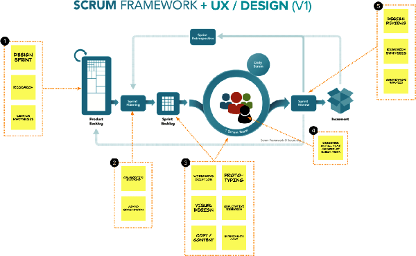

###### Figure 16-4. Mapping Lean UX activities to the Scrum framework

## Sprint Goals, Product Goals, and Multi-Sprint Themes

Let’s assume your organization has decided on a specific strategic focus
for the next two quarters. Your team decides to use a risky hypothesis
as the first attempt to achieve the strategy. You can use that
hypothesis to create a multi-sprint theme that guides the work you’ll do
over the next set of sprints. Scrum calls these themes “Product Goals.”
(Think of a Product Goal as a multi-sprint theme that you use to connect
a sequence of sprints.) Your measures of success for your theme are
outcomes, as demonstrated in
[Figure 16-5](#ch16.html_sprints_tied_together_with_a_theme_or_p).

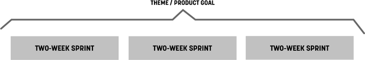

###### Figure 16-5. Sprints tied together with a theme or product goal

### Kick off the theme with a collaborative design

Start work on each theme by using the Lean UX Canvas and perhaps a
Design Studio exercise.^([4](#ch16.html_ch01fn20)) (See
[Figure 16-6](#ch16.html_the_lean_ux_canvas_can_capture_your_spr).)
Depending on the scope of the hypothesis, the collaborative design
session can be as short as an afternoon or as long as a week. You can do
them with your immediate team, but you should include a broader group if
it’s a larger-scale effort. The point of this kickoff is to get the
entire team sketching, ideating, and speaking to customers together,
creating a backlog of ideas from which to test and learn. In addition,
this activity will help define the scope of your theme a bit
better—assuming that you’ve built in some customer feedback loops.

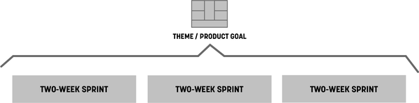

###### Figure 16-6. The Lean UX Canvas can capture your sprint theme

After you’ve started your regular sprints, you will be testing and
validating your ideas: new insights will come in, and you’ll need to
decide what to do with them. You make these decisions by running
subsequent shorter brainstorming sessions and collaborative discovery
activities as each new sprint begins
([Figure 16-7](#ch16.html_timing_and_scope_of_sketching_and_ideat)).
This allows the team to use the latest insight to create the backlog for
the next sprint.

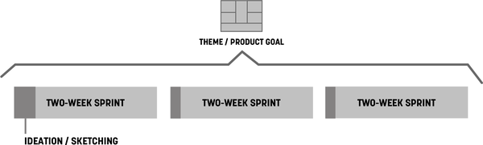

###### Figure 16-7. Timing and scope of sketching and ideation sessions

### Sprint planning meeting

Bring your Lean UX Canvas to the sprint planning meeting. Bring the
output of your design sprint too. Your mess of sticky notes, sketches,
wireframes, paper prototypes, and any other artifacts might seem useless
to outside observers but will be meaningful to your team. You made these
artifacts together, and because of that you have the shared
understanding necessary to extract stories from them. Use them in your
planning meeting to write user stories together, and then estimate and
prioritize the stories. (See
[Figure 16-8](#ch16.html_hold_sprint_planning_meetings_immediate).)

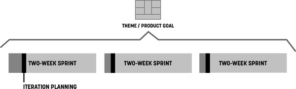

###### Figure 16-8. Hold sprint planning meetings immediately after brainstorming sessions

### Experiment stories

As you plan your iteration, there might be additional discovery work
that needs to be done during the iteration that wasn’t covered in the
design sprint or collaborative discovery activities. To accommodate this
in your sprint cadence and capture all the work in the same backlog, use
experiment stories. Captured by using the same method as your user
stories, experiment stories have two distinct benefits:

They visualize discovery work  
Discovery work is not inherently tangible as delivery work can be.
Experiment stories solve that by leveling the playing field. Everything
your team works on—discovery or delivery—goes on the backlog as a story.

They force its prioritization against delivery work:  
After those stories are in the backlog, you need to put them in priority
order. This forces conversations around *when* to run the experiment
and, equally as important, what we *won’t* be working on during that
same time.

Experiment stories look just like user stories, as illustrated in
[Figure 16-9](#ch16.html_experiment_stories).

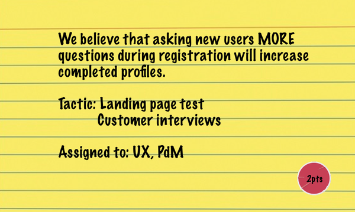

###### Figure 16-9. Experiment stories

Experiment stories contain the following elements:

- The hypothesis you’re testing or the thing you’re trying to learn

- Tactic(s) for learning (e.g., customer interviews, A/B tests, and
  prototypes)

- Who will do the work

- A level of effort estimate (if you do estimations) for how much work
  you expect this to be

After they are written, experiment stories go into your backlog. When
their time comes up in the sprint, that’s the assigned person’s main
focus. When the experiment is over, bring the findings to the team
immediately and discuss them to determine the impact of these findings.
Your team should be ready to change course, even within the current
sprint, if the outcome of the experiment stories reveals insights that
invalidate your current prioritization.

Pro tip: sometimes we know there will be discovery work to do, but its
exact shape or format is unclear at the beginning of a sprint. To ensure
the team will have bandwidth for this work during the sprint, place a
blank experiment story into your backlog. As the discovery work reveals
itself during the sprint, fill it out with details and prioritize
appropriately. If it ends up going unused, that’s a bit more breathing
room your team has during that sprint. Everyone wins.

### User validation schedule

Finally, to ensure that you have a constant stream of customer feedback
to use for your experiments, plan user research sessions every single
week. (See
[Figure 16-10](#ch16.html_conversations_with_users_happen_during).) This
way your team is never more than five business days away from customer
feedback and has ample time to react prior to the end of the sprint.
This weekly research cadence provides a good rhythm for your experiment
stories and a natural learning point in the sprint.

Use the artifacts you created in the ideation sessions as the base
material for your user tests. Remember that when the ideas are raw, you
are testing for value. (That is, do people *want to use my product*
rather than *can people use my product?*) After you have established
that there is a desire for your product, subsequent tests with
higher-fidelity artifacts will reveal whether your solution is usable.

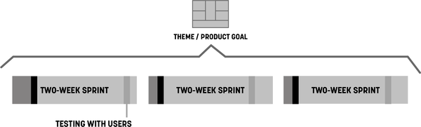

###### Figure 16-10. Conversations with users happen during every sprint

## Designers Must Participate in Planning

Agile methods can create a lot of time pressure on designers. Some work
fits easily into the context of a user story. Other work needs more time
to get it right. Two-week cycles of concurrent development and design
offer few opportunities for designers to ruminate on big problems. And
although some Agile methods take a more flexible approach to time than
Scrum does (for example, Kanban does away with the notion of a two-week
batch of work and places the emphasis on continuous flow), most
designers feel pressure to fit their work into the time box of the
sprint. For this reason, designers need to participate in the sprint
planning process.

The major reason designers feel pressure in Agile processes is that they
don’t (for whatever reason) fully participate in the process. This is
typically not their fault: when Agile is understood as simply a way to
build software, there doesn’t appear to be any reason to include
nontechnologists in the process. However, without designer
participation, their concerns and needs are not taken into account in
project plans. As a result, many Agile teams don’t make plans that allow
designers to do their best work.

For Lean UX to work, the entire team must participate in all
activities—stand-ups, retrospectives, planning meetings, brainstorming
sessions—as a normal rule, they all require everyone’s attendance to be
successful. Besides negotiating the complexity of certain features,
cross-functional participation allows designers and developers to create
effective backlog prioritization.

For example, imagine at the beginning of a sprint that the first story a
team prioritizes has a heavy design component to it. Imagine that the
designer was not there to voice their concern. That team will fail as
soon as they meet for their stand-up the next day. The designer will
call out that the story has not been designed. The designer will say
that it will take at least two to three days to complete the design
before the story is ready for development. Imagine instead that the
designer had participated in the prioritization of the backlog. Their
concern would have been raised at planning time. The team could have
selected a story card that needed less design preparation to work on
first—which would have bought the designer the time they needed to
complete the work.

The other casualty of sparse participation is shared understanding.
Teams make decisions in meetings. Those decisions are based on
discussions. Even if 90% of a meeting is not relevant to your immediate
need, the 10% that is relevant will save hours of time downstream.
Participation gives you the ability to negotiate for the time you need
to do your work. This is true for UX designers as much as it is for
everyone else on the team.

# Stakeholders and the Risks Dashboard

Management check-ins are one of the biggest obstacles to maintaining
team momentum. Designers are used to doing design reviews, but
unfortunately, check-ins don’t end there. Product owners, stakeholders,
CEOs, and clients all want to know how things are going. They all want
to bless the project plan going forward. The challenge for
outcome-focused teams is that their project plans are dependent on what
they are learning. They are responsive, so their typical plan lays out
only small batches of work at a time. At most, these teams plan an
iteration or two ahead. This perceived “short-sightedness” tends not to
satisfy most high-level managers, which can lead to micromanagement. How
then do you keep the check-ins under control while maintaining the pace
of your Lean UX and Scrum processes?

Two words: *proactive communication.*

Jeff once managed a team that radically altered the workflow for an
existing product that had thousands of paying customers. The team was so
excited by the changes they’d made that they went ahead with the launch
without alerting anyone else in the organization. Within an hour of the
new product going live, the vice president of customer service was at
Jeff’s desk, fuming and demanding to know why she wasn’t told of this
change. The issue was this: when customers have problems with the
product, they call in for help. Call center representatives use scripts
to troubleshoot customer problems and to offer solutions—except they
didn’t have a script for this new product. Because they didn’t know it
was going to change.

This healthy slice of humble pie served as a valuable lesson. If you
want your stakeholders—both those managing you and those dependent on
you—to stay out of your way, make sure that they are aware of your plans
and your progress. While working together at our agency Neo, our
colleague Nicole Rufuku came up with a remarkably simple and powerful
tool for doing just this: the Risks Dashboard
([Figure 16-11](#ch16.html_the_risks_dashboard)).

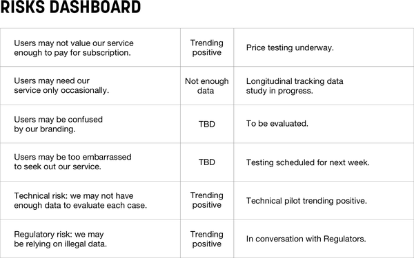

###### Figure 16-11. The Risks Dashboard

The Risks Dashboard is nothing more than a three-column chart you can
create in PowerPoint, Excel, or Google Docs.

- The first column lists the major outstanding risks associated with
  your current initiative. These are things that are critical to the
  success of the product.

- The middle column has a scale of how severe this risk might be and a
  color-coded display of how that risk is trending. Is it something that
  might require a small fix? Or is it existential to the success of the
  product? Is our discovery work telling us that this is increasingly
  possible or not as bad as we thought?

- The third column tells what we’re doing about that risk.

This dashboard is a living document that you use to communicate with
your stakeholders and clients about the status of your project. Use this
dashboard in your planning meetings with your team. Use it in your
sprint demos with your stakeholders to help drive important decisions.
In doing so, you are informing your stakeholders about:

- How the work is progressing

- What you have learned so far

- What risk you’ll focus on next

- Outcomes (how you’re trending toward your goal) not feature sets

- Dependent departments (customer service, marketing, operations, etc.)
  and their need to be aware of upcoming changes that can affect them

Often there will be a risk in the dashboard where the third column is
empty. A stakeholder will then ask why we’re not doing anything about
this risk. Sometimes this is simply a matter of prioritization. But
sometimes you may be blocked on progress. So a stakeholder question
gives you a perfect opportunity to bring up any challenges you may have
in doing discovery work, prioritizing it, or getting budget or approval
to do it. With the Risks Dashboard, you are effectively contextualizing
the discovery with business impact. Business impact tends to resonate
powerfully with stakeholders, which makes this an effective tool to
drive a better integration of your Lean UX work with your Agile delivery
process.

# Outcome-Based Road Maps

One of the biggest challenges in Agile is planning the work in a linear,
visual way. Sure, we’ve had “road maps” for a long time, but they don’t
do a great job of representing the true nature of software development.
Digital product development is not linear. It is iterative. We build
some things. We ship them. We see how they impact customer behavior. We
iterate them and ship again.

The traditional linear road map model—one where there is a starting
point and a clear, feature-specific end point (almost always with a
fixed date)—is outdated. It reflects an output-focused mode of operating
a digital business. Instead, as we’ve discussed throughout this book,
successful product-led organizations focus on outcomes. How then do we
build product road maps in a world of continuous improvement, learning,
and agility? And how can this type of visualization ensure that Lean UX
takes place in our Agile process? We use outcome-based road maps.

Here is what an Agile product road map should look like
([Figure 16-12](#ch16.html_an_agile_product_road_map)).

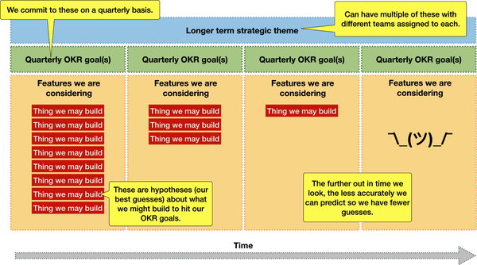

###### Figure 16-12. An Agile product road map

You’ll notice a few key components in this diagram:

Strategic themes  
These are the organizational product strategies set by executive leaders
that point teams in a specific direction. These can be things like
“Expand our market share in Europe” or “Leverage the under-utilized time
our fleet isn’t ferrying passengers to deliver other goods and food.”
There can be multiple themes running in parallel for a larger
organization.

Quarterly OKR goals  
OKRs, when done well, use customer behavior as the metrics in the “key
results” part of the equation. These quarterly outcome goals are where
each team is going to focus in an effort to help achieve the strategic
theme. This is the goal teams strive to achieve. It is their definition
of success and their *real* definition of done. Teams should work
together with leadership to ensure these are aligned and properly
levelled.

Feature/product hypotheses  
These are each team’s best guesses as to how they will achieve this
quarter’s OKR goals. Looking one quarter in advance, a team can make
strong, well-educated guesses about what product or feature ideas they
think will achieve their quarterly goals. Looking out two quarters
ahead, those guesses become less confident, so teams will make fewer
guesses and fewer commitments. Looking three and four quarters out, the
teams really have no idea what they’ll be working on, so these guesses
become fewer and fewer. This is exactly the way it should be. Teams will
learn in the next quarter or two how well their ideas worked, what moves
the needles forward, and what their next guesses should be. The boxes
for Q3 and Q4 will fill up as learning from Q1 and Q2 gets synthesized
and acted on.

Visualizing work this way immediately puts the uncertainty of software
development front and center in the conversation. When stakeholders ask,
“How will we determine whether these are the right hypotheses to work on
now and in the future?” the answer is Lean UX. Your team will work to
build learning into every sprint to ensure you’re always working toward
the strategic theme and not wasting time on initiatives that don’t bring
you closer. Couple that with the Agile cadences described above, and you
have a powerful recipe for delivering valuable experiences to your
customers.

## Frequency of Review

Each team should present this type of outcome-based road map for review
at the beginning of an annual cycle. It should align with the strategic
goals leadership has set and ensure their OKRs use metrics that ladder
up to these goals.

While it’s incumbent on the team to continually expose what they are
doing, learning, and deciding, official check-ins should happen on a
quarterly basis. Teams meet with leaders to determine how well they’ve
tracked toward their outcome goals, what they’ve learned during the last
quarter, and what they plan on doing in the next quarter. This is a
perfect opportunity to reaffirm the validity of the team’s goals going
forward and to make any adjustments based on new learnings, market
conditions, or any other factor that may have affected the direction of
the company.

## Measuring Progress

It should be clear by now that progress on this type of road map is not
measured in how many features have been delivered or whether they’ve
been delivered on time. Instead, progress is measured in terms of how
well we’ve changed customer behavior for the better. If our ideas didn’t
drive customer success, we kill those ideas and move on to new ones. The
learning drives ideas for future quarterly backlogs. It also drives our
agility as a team and as a business.

These road maps are living documents. We don’t fix these at the
beginning of an annual cycle and leave them as if they were etched in
stone. There is too much uncertainty and complexity in delivering
digital products and services. Product-led organizations — those focused
on customer success with empowered teams — work to make sure that
they’re always pointed in the right direction. This means adjusting road
maps as the reality on the ground changes. Outcome-based road maps
ensure that leaders and teams are being transparent with each other,
realistic about their goals, and most importantly realistic about how
they measure success.

# Lean UX and Agile in the Enterprise

Many of the tactics covered in this book are focused on one team. But in
the real world, large organizations have multiple product development
teams working in parallel. How does Lean UX scale when the number of
teams grows to tens or even hundreds of concurrent workstreams?

This is one version of the scaling question—which is itself an ongoing
question in the Agile community. As Lean and Agile methods have become
the default ways of working, many people have become focused on this
question. Large organizations have a legitimate need to coordinate the
activity of multiple teams, and processes that embrace uncertainty and
embrace *learning-your-way-forward* present a challenge to most
traditional project management methods.

Let’s address the elephant in the room—the Scaled Agile Framework or
SAFe. As of this writing, SAFe has been around for 10 years, and for
many large organizations, it’s the first choice for implementing a
whole-organization approach to agility. If you’re not familiar with it,
SAFe is a comprehensive, detailed, hierarchical set of processes,
diagrams, and vocabulary that are all designed to increase the agility
of large organizations. It works in a top-down way to divide and
delegate the work to “Agile Release Trains” who follow a rigid release
schedule. Unfortunately, these processes are largely devoid of user
feedback or learning.

You might have been as surprised, as we were, to learn that version 4.5
of the SAFe framework included Lean UX. Because of this, we get many
questions about how to do Lean UX in a company that has implemented
SAFe. The short answer is this: you can’t. SAFe is designed for
production, not for discovery. It is optimized to ensure a continuous
flow of output and minimize change requirements on executives. It
creates a rigidity within the software development process that results
in something that can’t, in any real way, be described as agile.

<aside data-type="sidebar" epub:type="sidebar">

##### SAFe Is Not Agile

Ever since the Scaled Agile Framework (SAFe for short) adopted Lean UX
in version 4.5, we’ve received a steady stream of inbound questions
about how, exactly, these two methods are supposed to work well
together.

The short answer is, we have no idea.

The slightly longer answer is that all the principles we’ve built into
Lean UX don’t seem to exist in SAFe.

Continuous learning and improvement, customer centricity, humility,
cross-functional collaboration, evidence-based decision making,
experimentation, design, and course correction—to name a few—are visibly
absent from the SAFe conversation. Instead, organizations adopting this
way of working focus on rigid team structures, strict rituals and
events, and an uneven distribution of behavior change requirements
depending on how high up one sits in the organization.

In short, SAFe is not agile.

Given the heavy training regimen teams have to go through to become
“SAFe certified,” it’s no wonder they resist change. They’ve been
trained to work in a very specific way—a way focused solely on
predictable delivery, not learning, not course correction, and certainly
not agility. The activities that make teams truly agile require
flexibility in planning. They require alignment on customer success, not
a predetermined set of features. They require a continuous discovery
process that inevitably leads to unplanned course corrections. These
corrections would “derail” a Release Train in no time.

Large organizations seeking agility realize the uncertainty that comes
with it and cling to the familiarity of waterfall processes. SAFe gives
the illusion of “adopting agile” while allowing familiar management
processes to remain intact. In a world of rapid continuous change,
evolving consumer consumption patterns, geopolitical instability, and
exponential technological advancements, this way of working is
unsustainable.

If you work in a large organization that has adopted or is in the
process of implementing SAFe, ask yourself what’s changed during this
transition. Are you closer to your customers? How long does it take to
learn whether you’ve delivered something of value? Even better, how are
you measuring “value”? Ask yourself how easy it would be to pivot an
initiative based on a new discovery? Then compare those answers to how
things were before you started using terms like “big room planning,”
“PI,” and “release train engineer.”

Scaling any way of working in a large organization is tricky and uneven.
Attempting to apply one blanket process to the entire company—a process
that is focused strictly on delivery rather than continuous discovery
and course correction—only hardens traditional ways of working. SAFe is
compelling because it seems to offer a one-size-fits-all recipe for
agility at scale. In reality, it rewards predictability, conformity, and
compliance while providing executives with cover for the question “How
do we become more agile?”

</aside>

A full discussion of how to create a truly Agile and Lean organization
is beyond the scope of this book.^([5](#ch16.html_ch01fn21)) And
honestly, it’s a hard problem with few easy answers. It requires
leadership to radically rethink the way it sets strategy, assembles
teams, and plans and assigns work. In essence, organizations need to
reduce the amount of scaffolding they put in place and allow teams to
organically find ways to use the basic values, principles, and methods
of small-team Agile to build a productive working cadence and then scale
those organization-specific approaches in small increments.

That said, there are a few techniques that can help Lean UX scale in
enterprise Agile environments and even take advantage of that scale.
Here are just a few issues that typically arise and ways to manage for
them.

*Issue:* projects grow bigger, more teams are assigned to them. How do
you ensure that all teams are aligned to the same vision and not
optimizing locally?

*Solution approach:* The concept of managing with outcomes applies to a
set of teams as much as it does to individual ones. To ensure that all
the teams working on the same project have a shared vision, assign them
all the same success metric, expressed as an outcome. Working together,
they can define the leading indicators that drive that metric and divide
those leading metrics between the teams on the project. But teams must
not be allowed to focus on leading metrics to the exclusion of the
larger outcome: the entire set of teams succeeds only if they hit the
overarching outcome together.

Working together this way reduces the risk of local optimization with
disregard for follow-on impacts of that optimization. For example, if
the marketing team is working to hit their acquisition outcomes goals
but overutilize email to achieve that goal, it may hurt the product
team’s retention goal. If both of these teams had the same outcome
goals—a mix of acquisition and retention—they would work together to
learn how to balance their efforts and outputs to be successful.

*Issue:* How do you ensure that teams are sharing what they’re learning
and minimizing duplicate effort to learn the same things?

*Solution approach:* Although there’s no silver bullet to solve for this
issue, the successful practices we’ve seen include a central knowledge
management tool (like a wiki), regular team leadership meetings (like a
Scrum of Scrums), and open-communication tools that focus on research
(like a dedicated channel on Slack or your internal chat tool). Elements
from studio culture, like regular cross-team critique sessions, can help
too.

**Issue:** Cross-team dependencies can keep progress at a crawl. How do
you maintain a regular pace of learning and delivery in a multiteam
environment?

**Solution approach:** Create self-sufficient “full-stack” teams.
Full-stack teams have every capability needed for them to do their work
on the team. This doesn’t mean that they need a person from each
department—just that there is someone on the team who can do one or more
of the things the team might need. The specific disciplines on the
team—designers, content people, frontend developers, backend developers,
product managers—coordinate with one another at discipline-specific
meetings to ensure that they are up to date on their practice, but the
work takes place locally.

# Wrapping Up

This chapter took a detailed look at how Lean UX fits into an Agile
process. In addition, we looked at how cross-functional collaboration
allows a team to move forward at a brisk pace, and how to handle
stakeholders and managers who always want to know what’s going on. We
discussed why having everyone participate in all activities is critical
and how the staggered-sprint model, once considered the path to true
agility, formed the roots of dual-track Agile, which is now the new
target model for most teams. We also covered, in detail, how scrum
artifacts and events work to your advantage in building up your velocity
of learning.

^([1](#ch16.html_ch01fn16-marker)) “Manifesto for Agile Software
Development,” accessed June 18, 2021,
[*http://agilemanifesto.org*](http://agilemanifesto.org).

^([2](#ch16.html_ch01fn18-marker)) Desirée Sy, “Adapting Usability
Investigations for Agile User-Centered Design,” *Journal of Usability
Studies* 2, no. 3 (May 2007): 112–132,
[*https://oreil.ly/Bhxq1*](https://oreil.ly/Bhxq1).

^([3](#ch16.html_ch01fn19-marker)) Jared M. Spool, “Fast Path to a Great
UX – Increased Exposure Hours,” Center Centre UIE, March 30, 2011,
[*https://oreil.ly/cvfcF*](https://oreil.ly/cvfcF).

^([4](#ch16.html_ch01fn20-marker)) You could even use a Google-style
“design sprint” here—a confusing name in this context. In this case,
we’re not advocating for spending a whole sprint doing design. Instead,
we’re advocating for the process named “design sprint,” which we
describe in [Chapter 14](#ch14.html_collaborative_desig).

^([5](#ch16.html_ch01fn21-marker)) We’ve written a high-level overview
of this subject in our book *Sense & Respond* (Harvard Business Review
Press, 2017). (See
[*https://senseandrespond.co*](https://senseandrespond.co).)

