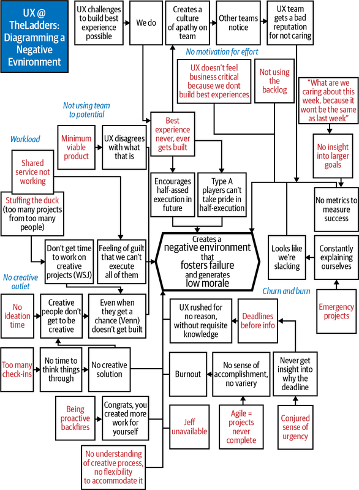

# Part IV. Lean UX in Your Organization

# About Part IV

Integrating design into Agile is never easy. Sometimes it causes a lot
of pain and heartache. Jeff learned that firsthand when he was at
TheLadders. After spending some time trying to integrate UX work with an
Agile process, Jeff was feeling pretty good—until one morning his UX
team delivered the diagram below
([Figure IV-1](#part04.html_the_ux_team_at_theladders_expressed_the)).
This diagram visualized all of the challenges the team was facing as
they tried to integrate their practice into Agile. It served initially
as a large slice of humble pie. Ultimately, though, it provided the
beginning of conversations that helped Jeff, his UX team, and the rest
of TheLadders’ product development staff build an integrated,
collaborative practice.

###### Figure IV-1. The UX team at TheLadders expressed their feelings about our Agile/UX integration efforts

In the years since this diagram was created, we’ve been fortunate to
work with lots of companies on this challenge. We’ve worked with
companies that spanned a broad range of industries, company sizes, and
cultures. We’ve helped media organizations figure out new ways to
deliver and monetize their content. We’ve built new, mobile-first sales
tools for a commercial furniture manufacturer. We’ve consulted with
fashion retailers, automotive services companies, and large banks to
help them build Lean UX practices. We’ve worked with nonprofits to
create new service offerings. And we’ve trained countless teams.

Each of these projects provided us a bit more insight into how Lean UX
works in that environment. We used that insight to make each subsequent
project that much more successful. We’ve built up a body of knowledge
over the past five years that has given us a clear sense of what needs
to happen—at the team and at the organization level—for Lean UX to
succeed. That is the focus of Section IV.

In [Chapter 17, “Making Organizational
Shifts”](#ch17.html_making_organizational_shifts), we’ll dig into the
specific organizational changes that need to be made to support this way
of working. It’s not just software developers and designers who need to
find a way to work together. Your whole product development engine is
going to need to change if you want to create a truly Agile
organization.

In [Chapter 18, “Lean UX in an
Agency”](#ch18.html_lean_ux_in_an_agency), we’ll discuss the issues that
are unique to implementing Lean UX in an agency context. Having lived
this challenge ourselves, and worked to train any number of design and
product-development firms, we’ve come to understand some of the
challenges here. We’ll share some of the key things you’ll need to
consider to make Lean UX successful in this kind of business.

