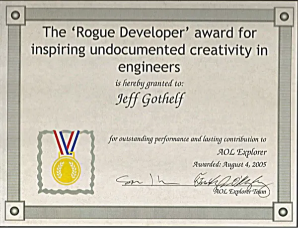

# Chapter 17. Making Organizational Shifts

> In baseball, you don’t know nothing.
>
> Yogi Berra

In [Part I](#part01.html_introduction_and_principles) of this book, we
discussed the principles behind Lean UX. We hope you understand from
that section that Lean UX is a mindset. In
[Part II](#part02.html_process-id00033), we discussed some of the key
methods of Lean UX, because Lean UX is also a process. As we’ve worked
with clients and taught these methods to teams, it’s become clear that
Lean UX is also an operational and management method. For this reason,
you’ll need to make some changes in your organization to get the most
benefit from working this way.

Organizational shifts aren’t easy, but they’re not optional. The world
has changed: our organizations must change with it. Any business of
scale (or any business that seeks to scale) is, like it or not, in the
software business. Regardless of the industry in which your company
operates, software has become central to delivering your product or
service.

This is both empowering and threatening. The ability to reach global
markets, scale operations to meet increased demand, and create a
continuous conversation with your customers has never been easier. This
power is also a double-edged sword: it offers these same opportunities
to smaller competitors who would never have been able to compete before
the broad adoption of software. This makes the need to adopt Lean UX all
the more urgent.

Many organizations have come to this conclusion and, in response, have
sought to scale their product development teams. As they’ve done so,
many have used the core rhythms of Agile software development techniques
to operationalize software product development. Unfortunately, many of
these approaches are agile in name only. They fail to adopt the key
values of Agile, which include collaboration, transparency, and
continuous learning. These operational approaches maximize delivery
velocity but force software teams—including the designers on these
teams—into production mode. As a result, much of the value of design
gets lost.

Lean UX is a way to break out of design-as-production and realize the
full value of design on cross-functional teams. It makes it possible for
you to use the power of software to create a continuous improvement loop
that allows your company to stay ahead of its competitors. It’s this
loop that drives real organizational agility and allows your company to
react to changes in the market at speeds never before possible.

<aside data-type="sidebar" epub:type="sidebar">

##### DesignOps and Lean UX

As large organizations have embraced design in the operational context
of product development teams, we’ve seen the rise of a movement called
DesignOps. DesignOps has as its goal simply the operationalizing of
design at scale. It’s a way of thinking about and managing the
operations of design inside large organizations. This means that the
DesignOps team in your organization must become key players in any
effort to adopt Lean UX.

One important callout here: DesignOps can be a force for embracing new
ways of working, but it can also be a force for embracing legacy ways of
working. Many of the traditional ways of working that the design
community has developed are wonderful, full of wisdom, and need to be
honored. But some ways of working are very specific to the design work
we did with older technologies and older business models. BDUF (Big
Design Up Front) and deliverable-based work are just two examples of
traditional time-honored design methods that no longer serve the best
interests of designers who are seeking maximum impact on Agile teams. As
you work to forge a DesignOps-led movement in your organization, beware
of “designers have always done it this way” solutions, which do not
embrace the true spirit of Agile and Lean UX.

</aside>

# The Shifts

When we train teams, they sometimes ask, “How can we put these methods
into practice here?” And on this point, we’re always a little hesitant.
Although we’re confident that most organizations can solve these
problems, we’re also aware that every organization is different. Finding
the right solution requires a lot of close work and collaboration with
your colleagues and your executives.

To prepare you for that work, we’re going to use this chapter to share
some of the shifts that organizations need to make in order to embrace
Lean UX. We’re not going to tell you *how* to make those shifts; that’s
your job. But we hope this discussion will help you survey the landscape
to find the areas you’re going to want to address.

## Changing Culture

As you implement Lean UX, consider these dimensions of culture:

- Be humble.

- Embrace new skills.

- Create open, collaborative workspaces.

- No heroes.

- Fall in love with the problem, not the solution.

- Evolve agency culture.

- Be realistic about your environment.

## Shifting Team Organization

To implement Lean UX, you’ll also need to rethink the way you organize
teams:

- Think competencies over roles.

- Create cross-functional teams.

- Create small teams.

- Work with distributed teams.

- Build flexibility into third-party vendor relationships.

## Shifting Process

Finally, your product development processes will change as well:

- Plan work using outcomes, not output.

- Beware of BDUF sneaking into Agile environments.

- Embrace speed first, aesthetics second,

- Tackle UX debt.

- Rethink documentation practices.

- Manage up and out.

### Shift: Be humble

Imagine for a moment that you work on an assembly line that makes cars.
The end state of your product is well-defined in advance. The cost of
producing that product is clear. The process to create it has been
optimized, and the ways customers will use that car—based on more than
one hundred years of observation—is also clear. In situations like this,
the focus is on quality, efficiency, and cost control.

We’re not building cars.

Our medium is software, and our products and services are complex and
unpredictable. They don’t have an end state. We can continue to design,
build, operate, and optimize our digital products as long as it makes
economic sense to do so. Most perplexing is that our customers might use
our digital services in ways we never imagined. In many cases, the best
features of a system emerge over time as people use the system.
(Twitter’s hashtag is a great example of this: users invented this
feature, and then Twitter added support for it after the fact.) With so
many unknowns, there is only so much confidence we can have in the
scope, road map, implementation, and success of our product. The good
news is that through the rise of the Agile and DevOps movements, we can
move away from the assembly-line methods of past generations and adopt
continuous production methods. When we pair that capability with Lean
UX, we get the ability to learn very quickly how valid or invalid our
ideas are.

To fully take advantage of these new capabilities, your organization
must embrace humility. Your organization must accept that, in the face
of all this complexity and uncertainty, we just can’t predict the exact
shape our service will have to take to be successful. This is not an
abdication of vision.

Instead, it requires a strong opinion about the shape the system should
take, coupled with the willingness to change course if evidence from the
market reveals that initial vision was wrong. Adopting this mindset
makes it safe for teams to experiment, fail, and learn. It is only
through this trial-and-error process that Lean UX can thrive. If the
organization doesn’t make room for course correction, the continuous
learning that Lean UX promotes will be seen, at best, as a distraction
and, at worst, as a waste of time.

### Shift: Embrace new skills

Many companies turn to designers for the most tactical and traditional
capabilities: wireframing, specification, UI design, etc. They limit
their participation in a project to the “design phase” of whatever
process the company happens to be using. Plugging designers into these
existing workflows limits their effectiveness by limiting the scope of
their work, which has a side effect of reinforcing a siloed team model.

The success of a collaborative team demands more. Although teams still
need core UX skills, designers must add facilitation as one of their
core competencies. This requires two significant shifts to the way we’ve
worked to date:

Designers must open up the design process  
The team—not the individual—needs to own the product design. Instead of
hiding behind a monitor for days at a time, designers need to bring
their teams into the design process, seek their input, and build that
insight into the design. Doing so will begin to break down silos and
promote a more cross-functional conversation to take place. To do this,
designers must employ a broad range of collaborative tactics and must be
both creative and deeply practical—seeking tactics that meet the team’s
needs, advance the conversation, and respect the realities of team
capacity and project timeline.

Designers must take a leadership role on their team  
Your colleagues are used to giving you critique on your design work.
What they’re not used to doing is cocreating that design with you.
Design leadership and facilitation in group brainstorming activities
like Design Studio can create safe forums for the entire team to
conceptualize your product and showcase the synthesizing capabilities of
the design team.

### Shift: Create open, collaborative workspaces

Break down the physical barriers that prevent collaboration. Colocate
your teams and create workspaces for them that keep everyone visible and
accessible. Make space for your team to put their work up on walls and
other work surfaces. Nothing is more effective than walking over to a
colleague, showing some work, discussing, sketching, exchanging ideas,
understanding facial expressions and body language, and reaching a
resolution on a thorny topic.

When you colocate people, create cross-functional groupings. That means
removing them from the comforts of their discipline’s “hideout.” It’s
amazing how even one cubicle wall can hinder conversation between
colleagues.

Open workspaces make it possible for team members to see each other and
to easily reach out when questions arise. Some teams have gone as far as
putting their desks on wheels so that they can relocate closer to the
team members they’re collaborating with on that particular day. Augment
these open spaces with breakout rooms where the teams can brainstorm.
Wall-sized whiteboards or simply painting the walls with whiteboard
paint provides many square feet of discussion space. In short, remove
the physical obstacles between your team members. Your space planners
might not like it at first, but your stakeholders will thank you.

As distributed teams and “hybrid” work situations become more common,
remember to carry over these qualities to these situations as well.
Ensure that collaboration and sharing are easy and that your teams have
the tools that make them most successful rather than the ones IT has
chosen for them.

### Shift: No heroes

As we’ve continued to work with a wider variety of teams, there are
still many designers who resist Lean UX. One reason? Many designers want
to be heroes.

In an environment in which designers create beautiful deliverables, they
can maintain a heroic aura. Requirements go in one end of the design
machine, and gorgeous artwork makes its way out. People “ooh” and “aah”
when the design is unveiled. Designers have thrived on these reactions
(both informal and formalized as awards) for many years.

We’re not suggesting that all of these designs are superficial.
Schooling, formal training, experience, and a healthy dose of
inspiration go into every photoshop document that designers create—and
often the results are smart, well considered, and valuable. However,
those glossy deliverables can drive bad corporate decisions—they can
bias judgment specifically because their beauty is so persuasive. Awards
can be based on the aesthetics of the designs (rather than the outcome
the design creates). Hiring decisions are made on the sharpness of
wireframes, and compensation can depend on the brand names attached to
each of the portfolio pieces.

The result of this is that the creators of these documents are heralded
as thought leaders and elevated to the top of the experience design
field. They are recognized as the “go-to” people when the problem has to
get solved quickly. But can a single design hero be responsible for the
success of the user experience, the business, and the team? Should one
person be heralded as the sole reason for an initiative’s success?

In short, no.

For Lean UX to succeed in your organization, all types of
contributors—designers and nondesigners—need to collaborate broadly.
This can be a hard shift for some, especially for visual designers with
a background in interactive agencies. In those contexts, the creative
director is untouchable. In Lean UX, the only thing that’s untouchable
is customer insight.

Lean UX literally has no time for heroes. The entire concept of design
as hypothesis immediately dethrones notions of heroism; as a designer,
you must expect that many of your ideas will fail in testing. Heroes
don’t admit failure. But Lean UX designers embrace it as part of the
process.

### Shift: Fall in love with the problem, not the solution

Lean UX makes us ask hard questions about the nature of quality in our
design work.

If you’re a designer reading this, you’ve probably asked yourself a
question that often comes up when speed trumps aesthetic perfection:

> If my job is now to put out concepts and ideas instead of finished
> work, everything I produce will feel half-assed. I feel like I’m
> “going for the bronze.” Nothing I produce will ever be finished.
> Nothing is indicative of the kind of products I am capable of
> designing. How can I feel pride and ownership for designs that are
> simply not done?

For some designers, Lean UX threatens what they value in their work and
puts their portfolio at risk. It might even feel as though it threatens
their future employability. These emotions are based on what many hiring
managers have valued to date—sexy deliverables (i.e., solutions). Rough
sketches, “version one” of a project, and other low-fidelity artifacts
are not the making of a “killer portfolio.” With the realization that
software solutions continue to evolve over time, all of that is now
changing.

Although your organization must continue to value aesthetics, polish,
and attention to detail, other dimensions of design are equally
important. The ability to understand the context of a business problem,
think fast, and build shared understanding needs to get a promotion.
Designers can demonstrate their problem-solving skills by illustrating
the paths they took to get from idea to validated learning to
experience. In doing so, they’ll demonstrate their deep worth as
designers. Organizations that seek out and reward problem-solvers will
attract—and be attracted to—these designers.

### Shift: Evolve agency culture

Applying Lean UX in a digital agency is no small challenge. Most
agencies have a business model that conflicts with Lean UX. The
traditional agency business model is simple: clients pay for
deliverables—designs, specs, code, PowerPoint decks—not outcomes. But
agency culture is also a huge obstacle. The culture of hero design is
strong in places that elevate individuals to positions like executive
creative director. Cross-disciplinary collaboration can also be
difficult in big agencies, where the need to keep utilization high has
led to processes that encourage functional silos. These, in turn, lead
to “project phases” that encourage deliverable-centric work.

Perhaps the most challenging obstacle is the client’s expectation to
“throw it over the wall” to the agency and then see the results when
they’re ready. Collaboration between client and agency in these
situations can be limited to uninformed and unproductive critique that
is based on personal bias, politics, and ass-covering.

To make Lean UX work in an agency, everyone involved in an engagement
must focus on maximizing two factors: increasing collaboration between
client and agency, and working to change the focus from outputs to
outcomes.

Some agencies are attempting to focus on outcomes by experimenting with
a move away from fixed-scope and deliverable-based contracts. Instead,
their engagements are based on simple time-and-materials agreements or,
more radically, on outcome-based contracts. In either case, teams become
freer to spend their time iterating toward a goal. Clients give up the
illusion of control that a deliverables-based contract offers but gain a
freedom to pursue meaningful and high-quality solutions that are defined
in terms of outcomes, not feature lists.

To increase collaboration, agencies can try to break down the walls that
separate them from their clients. Clients can be pulled into the process
earlier and more frequently. Check-ins can be constructed around less
formal milestones. And collaborative work sessions can be arranged so
that both agency and client benefit from the additional insight,
feedback, and collaboration with each other.

These are not easy transformations—either for the agency or the client
who hires them—but it is the model under which the best products are
built.

*A quick note about development partners.* In agency relationships,
software development teams (either at the agency, at the client, or
working as a third party) are often treated as outsiders and often
brought in at the end of a design phase. It’s imperative that you change
this: development partners must participate through the life of the
project—and not simply as passive observers. Instead, you should seek to
have software development begin as early as possible. Again, you are
looking to create a deep and meaningful collaboration with the entire
project team—and to do that, you must actually be working side by side
with the developers.

### Shift: Be realistic about your environment

Change is scary. The Lean UX approach brings with it a lot of change.
This can be especially disconcerting for managers who have been in their
positions for a while and are comfortable in their current roles. Some
managers can be threatened by proposals to work in a new way—which could
end up having negative consequences for you. In these situations, try
asking for forgiveness rather than permission. Try out some ideas and
prove their value with quantifiable success. Whether you saved time and
money on the project or put out a more successful update than ever
before, these achievements can help make your case. If your manager
still doesn’t see the value in working this way and you believe your
organization is progressing down a path of continued “blind design,”
perhaps it’s time to consider alternative employment.

### Shift: Think competencies over roles

In most companies, the work you do is determined by your job title. That
job title comes with a job description. Too often, people in
organizations discourage others from working outside the confines of
their job descriptions (e.g., “You’re not a developer, what can you
possibly know about JavaScript?”). This approach is deeply
anticollaborative and leaves people’s full set of skills, talents, and
competencies unused.

Discouraging cross-functional input encourages organizational silos. The
more discrete a person’s job is, the easier it becomes to retreat to the
safe confines of that discipline. As a result, conversation across
disciplines wanes, and mistrust, finger-pointing, and CYA (“cover your
ass”) behavior grows.

Silos are the death of collaborative teams.

For Lean UX to succeed, your organization needs to adopt a mantra of
“competencies over roles.” Every team member possesses a core
competency—design, software development, research, and so on—and must
deliver on that skill set. However, members might also possess secondary
competencies that make the team work more efficiently.

Allow your colleagues to contribute to any disciplines in which they
have expertise and interest. You’ll find it creates a more engaged team
that can complete tasks more efficiently. You’ll also find it builds
camaraderie across job titles as people with different disciplines show
interest in what their colleagues are doing. Teams that enjoy working
together produce better work.

### Shift: Create cross-functional teams

For many teams, collaboration is a single-discipline activity.
Developers solve problems with other developers while designers go sit
on bean bags, fire up the lava lamps, and “ideate” with their
black-turtlenecked brethren. (We kid.) (Well...only a little. We love
designers.)

The ideas born of single-discipline collaborations are single faceted.
They don’t reflect the broader perspective of the team, which can
illuminate a wider range of needs, opportunities, risks, and solutions.
Worse, working this way requires discipline-based teams to explain their
work. Too often, the result is a heavy reliance on detailed
documentation and a slowdown in the broader team’s learning pace.

Lean UX requires cross-functional collaboration. By creating interaction
among product managers, developers, QA engineers, designers, and
marketers, you put everyone on the same page. Equally important: you put
everyone on the same level. No single discipline dictates to the other.
All are working toward a common goal. Allow your designers to attend
“developer meetings” and vice versa. In fact, just have team meetings.

We’ve known how important cross-functional collaboration is for a long
time. Robert Dailey’s study from the late ’70s called “The Role of Team
and Task Characteristics in R&D Team Collaborative Problem Solving and
Productivity” found a link between a team’s problem-solving productivity
and what he called “four predictors,” which included “task certainty,
task interdependence, team size, and team
cohesiveness.”^([1](#ch17.html_ch01fn22))

Keep your team cohesive by breaking down the discipline-based
boundaries.

### Shift: Create small teams

Larger groups of people are less efficient than smaller ones. This makes
intuitive sense. But less obvious is this: a smaller team must work on
smaller problems. This small size makes it easier to maintain the
discipline needed to produce minimum viable products (MVPs). Break your
big teams into what Amazon founder Jeff Bezos famously called “two-pizza
teams.” If the team needs more than two pizzas to make a meal, it’s too
big.

If the task is large, break it down into related pieces of work that
several small teams can handle simultaneously. Align those teams with a
single outcome to achieve. This way, all of them are working toward the
same goal. This forces these small teams to self-organize and
communicate efficiently while reducing the risk of each team optimizing
locally.

### Shift: Work with distributed teams

As the COVID-19 pandemic has shown us, colocation is not always an
option. When setting up distributed teams, give them the tools they need
to communicate and collaborate. These include things like
videoconferencing software (e.g., Zoom), real-time communication
services (e.g., Slack), online whiteboard tools (e.g., Mural and Miro),
simple file-sharing software (e.g., Dropbox, Google Docs),
remote-pairing software (e.g., Screenhero), and anything else that might
make their collaboration easier and more productive.

When it’s possible to travel, don’t forget that occasionally plane
tickets to meet each other in the flesh go a long way toward maintaining
long-distance collaboration. Perhaps the most important thing to
remember if you’re trying to implement Lean UX with distributed teams is
this: the members of these teams must be awake at the same time. The
overlap doesn’t need to cover an entire workday, but there must be some
block of time every day during which colleagues can have conversations
and participate in collaborative exercises.

### Shift: Build flexibility into third-party vendor relationships

Third-party software development vendors pose a big challenge to Lean UX
methods. If a portion of your work is outsourced to a third-party
vendor—regardless of the location of the vendor—the Lean UX process is
more likely to break down. This is because the contractual relationship
with these vendors can make the flexibility that Lean UX requires
difficult to achieve.

When working with third-party vendors, try to create projects based on
time and materials. This will make it possible for you to create a
flexible relationship with your development partner. You will need this
in order to respond to the changes that are part of the Lean UX process.
Remember, you are building software to learn, and that learning will
cause your plans to change. Plan for that change and structure your
vendor relationships around it.

When selecting partners, remember that many outsourced development shops
are oriented toward production work and see rework as a problem rather
than a learning opportunity. When seeking partners for Lean UX work,
look for teams willing to embrace experimentation and iteration and who
clearly understand the difference between prototyping-to-learn and
developing-for-production.

### Shift: Plan work using outcomes, not output

[Chapter 3](#ch03.html_outcomes) discusses the role of outcomes in Lean
UX. Lean UX teams measure their success not in terms of completed
features but in terms of progress toward specific outcomes. Determining
outcomes is a leadership activity; it’s one that many organizations are
not good at or don’t do at all. Too often, leadership directs the
product team through a feature-centric product road map—a set of outputs
and features that they require the product team to produce by a specific
date.

Teams using Lean UX must be empowered to decide for themselves which
features will create the outcomes their organizations require. To do
this, teams must shift their conversation with leadership from one based
on features to one centered on outcomes. This conversational shift is a
radical one. Product managers must determine which business metrics
require the most attention. What effect are they trying to create? Are
they trying to influence customer behavior? If so, how? Are they trying
to increase performance? If so, by what measure? These metrics must be
linked to a larger business impact.

Leadership must set this direction. If not, teams must demand this shift
of them. Teams must ask, “Why are we working on this project?” and “How
will we know we’ve done a good job?” Managers need to be retrained to
give their teams the answers to these questions. They must be given the
freedom to work with their teams to determine which features best
achieve these goals. Teams must move from feature road maps to backlogs
of hypotheses to test. Work should be prioritized based on risk,
feasibility, and potential success.

### Shift: Beware of BDUF sneaking into Agile environments

In the Agile community, you sometimes hear people talk about Big Design
Up Front or BDUF. We’ve been advocating moving away from BDUF for years.
But it wasn’t always that way.

In the early 2000s, Jeff was a UI designer at AOL, working on a new
browser. The team was working on coming up with ways to innovate on
existing browser feature sets. But they always had to wait to implement
anything until Jeff created the appropriate mock-ups, specifications,
and flow diagrams that described these new ideas.

One developer got tired of waiting and started implementing some of
these ideas before the documents were complete. Jeff was furious! How
could he have gone ahead without design direction? How could he possibly
know what to build? What if it was wrong or didn’t work? He’d have to
rewrite all the code!

Turns out, the work he did allowed the team to see some of these ideas
much sooner than before. It gave team members a glimpse into the actual
product experience and allowed them to quickly iterate their designs to
be more usable and feasible. From that moment on, they relaxed the BDUF
requirements, especially as the team pushed into features that required
animations and new UI patterns.

The irony of the team’s document dependency and the “inspiration” it
triggered in that one developer was not lost. In fact, at the end of the
project, Jeff was given a mock award
([Figure 17-1](#ch17.html_jeffapostrophes_quotation_markawardquot)) for
inspiring “undocumented creativity” in a teammate.

Even though most Agile teams these days say that they shun the concept
of BDUF, we’ve seen a resurgence in this practice in supposedly Agile
environments. This new, sneaky version of BDUF is sometimes called
*Agilefall*. (Or Agile-Scrum-Fall, Water-Scrum-Fall, or Wagile. You get
the idea.) Agilefall is the combination of an up-front design phase that
results in work that is handed off, waterfall style, to an engineering
team to then break up into stories and develop in an “agile” way. The
argument for this way of working centers on the engineering team’s
desire to stay the course during implementation and to be able to
predict when the work will ship with some degree of confidence. This is
done in the name of predictability and efficiency.

###### Figure 17-1. Jeff’s “award” for inspiring undocumented creativity in engineers

The problem, of course, is that Agilefall removes the collaboration
between design and engineering that Lean UX requires to succeed. It ends
up forcing teams to create big documentation to communicate design,
followed by even lengthier negotiations between designers and
developers. Sound familiar? It’s BDUF in a new disguise. The waste
created with Agilefall is a symptom of a broader management issue that
continues to push teams toward fixed scope and fixed deadlines.
Engineers rightly feel the only way they can make scope and deadline
commitments is if they have a crystal-clear understanding of what needs
to be developed, along with a promise that nothing will change. (Never
mind that Agile is about embracing change!) Of course, as we know by
now, software is complex and unpredictable, and, even with a locked-down
design, the ability to predict exactly what will ship and when it will
ship is closer to fortune-telling than it is to project management.

If Agilefall is the way your team works, consider amplifying the
conversation about managing to outcomes with your stakeholders. By
moving the conversation away from fixed time and scope and steering
toward customer behavior as a measure of success, the demands to do all
the design work up front should begin to disappear.

### Shift: Embrace speed first, aesthetics second

Jason Fried, CEO of Basecamp, once said, “Speed first, aesthetics
second.”

He wasn’t talking about compromising quality. He was talking about
editing his ideas and process down to the core. In Lean UX, working
quickly means generating many artifacts. Don’t waste time debating which
type of artifact to create, and don’t waste time polishing them to
perfection. Instead, ask yourself the following:

- Who do I need to communicate with?

- What do I need to get across to them immediately?

- What’s the least amount of work I need to do to communicate that to
  them?

If you’re working with a developer who is sitting next to you, a
whiteboard sketch might suffice. If an executive is asking detailed
product questions, you might need to create a visual mock-up. Customers
might require prototypes. Whatever the scenario, create the artifact
that will take the least amount of time. Remember, these artifacts are a
transient part of the project—like a conversation. Get it done. Get it
out there. Discuss. Move on.

Aesthetics—in the visual design sense—are an essential part of a
finished product and experience. The fit and finish of these elements
make a critical contribution to brand, emotional experience, and
professionalism. At the visual design refinement stage of the process,
putting the effort to obsess over this layer of presentation makes a lot
of sense. However, putting in this level of polish and effort into the
early-stage artifacts—wireframes, site maps, workflow diagrams—is
(usually) a waste of time.

By sacrificing the perfection of intermediate design artifacts, your
team will get to market faster and learn more quickly which elements of
the whole experience (design, workflow, copy, content, performance,
value propositions, etc.) are working for the users and which aren’t.
And you’ll be more willing to change and rework your ideas if you’ve put
less effort into presenting them.

### Shift: Tackle UX debt

It’s often the case that teams working in Agile processes do not
actually go back to improve the UI of the software. But, as our friend
Jeff Patton likes to say, “It’s not iteration if you do it only once.”
Teams need to make a commitment to continuous improvement, and that
means not simply refactoring code and addressing technical debt but also
reworking and improving UIs. Teams need to embrace the concept of UX
debt and make a commitment to continuous improvement of the user
experience.

James O’Brien, an interaction designer working in London, describes what
happened when his team began tracking UX debt in the same manner that
the team used to track technical debt. “The effect was dramatic. Once we
presented *rework* as *debt*, all opposition fell away. Not only was
there no question of the debt not being paid down, but it was
consistently prioritized.”^([2](#ch17.html_ch01fn23))

To begin tracking UX debt, you can just create a category of stories in
your backlog called UX debt. Sometimes, though, experience problems are
not something that a single team can solve—solving bigger problems can
require the coordinated effort of many teams. For these larger
efforts—experience problems that span large user journeys—try this:

- Create a customer journey map of the current experience.

- Work together with your team to create a second journey map that shows
  the ideal experience.

- Make these two artifacts clearly visible (on a wall) next to each
  other.

- Identify teams responsible for portions of that customer journey and
  invite them to the wall to review the gap between current and desired
  states.

- Work with these teams to write UX debt stories to go on their
  backlogs.

- Clearly identify on the journey maps when the current experience has
  been improved and who is working on other improvements.

### Shift: Rethink documentation practices

Depending on the domain you work in, your organization might impose
strict documentation standards that meet both internal and regulatory
compliance. These documents might not add much or any value for the
project while it’s in flight, yet the team still has to create them.
Many teams struggle to move their projects forward when faced with these
regulations. They wait until the documents are complete before beginning
the design and implementation of the work, slowing down progress and
team learning. Then, when the documents are complete, any adjustment of
the work described within them is discouraged because of the
documentation overhead that change will drive.

This situation is exactly where, as designer and coach Lane Goldstone
put it, you “lead with conversation, and trail with documentation.” The
basic philosophies and concepts of Lean UX can be executed within these
environments—conversation, collaborative problem-solving, sketching,
experimentation, and so on—during the early parts of the project life
cycle. As hypotheses are proven and design directions solidify,
transition from informal documentation practices back to the
documentation standard your company requires. Use this documentation for
the exact reason your company demands: to capture decision history and
inform future teams working on this product. Don’t let it hold you up
from making the right product decisions.

### Shift: Manage up and out

Lean UX gives teams a lot of freedom to pursue effective solutions. It
does this by stepping away from a feature road map approach and instead
empowers teams to discover the features they think will best serve the
business. But abandoning the feature road map has a cost: it removes a
key tool that the business uses to coordinate the activity of teams. So
with the freedom to pursue your agenda comes a responsibility to
communicate that agenda.

You must constantly reach out to members of your organization who are
not currently involved in your work to make them aware of what’s coming
down the pike. This communication will also make you aware of what
others are planning and help you to coordinate. Customer service
managers, marketers, parallel business units, and sales teams all
benefit from knowing what the product organization is up to. By reaching
out to them proactively, you allow them to do their jobs better. In
turn, they will be far less resistant to the change your product designs
are making.

Here are two valuable lessons to ensure smoother validation cycles:

- There are always other departments that are affected by your work.
  Ignore them at your peril.

- Ensure customers are aware of any significant upcoming changes and
  provide them the option to opt out (at least temporarily).

^([1](#ch17.html_ch01fn22-marker)) Robert C. Daley, “The Role of Team
and Task Characteristics in R&D Team Collaborative Problem Solving and
Productivity,” *Management Science* 24, no. 15 (November 1, 1978):
1557–1676, [*https://oreil.ly/hnN7a*](https://oreil.ly/hnN7a).

^([2](#ch17.html_ch01fn23-marker)) James O’Brien, interview with Joshua
Seiden and Jeff Gothelf, 2012.

