# Processed Document


<!-- Chunk 1 Start -->

# INTERACTION DESIGN


beyond human-computer interaction

6th Edition

# Praise for Interaction Design

Having used the previous editions of Interaction Design for research and teaching, given the breadth and depth of its coverage of the related topics, my expectation for this new edition was very high. And it has been fully met! The content is timely, up-to-date, and enlightening with lucid explanations of complex theories and methods of IxD, which are vividly illustrated with contemporary and relevant examples. The writing style is conversational, eloquent, and highly accessible. This entices particularly newcomers of the field, who are enabled to grasp fundamental IxD frameworks with ease, efficiency, and pleasure. Apart from the core descriptions, the extras given, including activities, in-depth activities, and links to external videos, can be very useful for readers to dive deeper into the topics with hands-on practices. Particularly thought-provoking are the materials delineated in “Dilemma.” Amplifying the accolades for its predecessors, this sixth edition will continue enjoying the high prestige it well deserves.

Effie Lai-Chong Law, PhD, Professor, Department of Computer Science,

Durham University, UK

Interaction Design by Preece, Sharp, and Rogers has been the standard textbook for interaction design and HCI for many years. This sixth edition once again brilliantly balances theory with practice, essential tools with complexity, and academic rigor with readability. For students, practitioners, and academics, this book is the best starting point for a reflective, critical, and complete introduction to interaction design. Due to the online resources, many real-world examples, and references to academic literature and innovations in industry, this textbook continues to be the reference for the discipline of interaction design.

Steven Houben, Assistant Professor in HCI, Eindhoven

University of Technology (TU/e), The Netherlands

This is the perfect textbook for a wide range of user interface/user experience design courses. For an undergraduate, it provides a variety of compelling examples that illustrate best practice in interaction design. For a graduate student, it provides a foundational overview of advanced topics. This book is also essential for the professional who wants to know the state of the art in interaction design. I use this textbook and recommend it widely.

Rosa I. Arriaga, PhD, School of Interactive Computing,

Georgia Institute of Technology, USA

Interaction Design is an excellent textbook for general HCI courses that covers topics from the essential theoretical and methodological knowledge to the state-of-the-art practical knowledge in HCI and interaction design. This book provides a comprehensive understanding of interaction design, which goes beyond the traditional perspective of HCI through in-depth recognition of people and society. The sixth edition again maintains this book’s position as a must-have book for all HCI and interaction design students with much more updated topics and examples.

Youn-kyung Lim, Department of Industrial Design, Korea Advanced

Institute of Science and Technology, South Korea

Human-computer interaction (HCI) is a new field that has emerged and become increasingly common in Chinese universities in the last 20 years. Interaction Design: Beyond Human-Computer Interaction has been well-known and translated into Chinese for many years. It has been used as a major textbook or reference book for HCIrelated courses for undergraduate and postgraduate students in computer science, design, communication, and industrial engineering in Chinese universities. I especially appreciate its focus on HCI design, instead of just focusing on the technological aspects of HCI. The students have benefited a lot from the body of knowledge and skill set of a user-centered design approach for developing products/services with good user experience in an industry context. The timely six revisions of the book in the past years have kept it always well updated to the newest developments in technology and application scenarios.

Zhengjie Liu, Professor, School of Information Science & Technology, Dalian

Maritime University, China

Interaction design is a practice that spans many domains. The authors acknowledge this by providing a tremendous amount of information across a wide spectrum of disciplines. This book has evolved from a simple textbook for HCI students to an encyclopedia of design practices, examples, discussions of related topics, suggestions for further reading, exercises, interviews with practitioners, and even a bit of interesting history here and there. I see it as one of the few sources effectively bridging the gulf between theory and practice. A copy has persistently occupied my desk since the first edition, and I regularly find myself revisiting various sections for inspiration on how to communicate the reasoning behind my own decisions to colleagues and peers.

William R. Hazlewood, Principal Design Technologist,

Workday, Inc, USA

Interaction Design has been one of the textbooks of reference at the University of Castilla – La Mancha (Spain) for several years. It covers the main topics in human-computer interaction offering a comprehensive equilibrium between theoretical and practical approaches to the discipline. The new chapter called “Interaction Design in Practice” and the remarkable updates in some chapters, with new case studies and examples, allow the user to explore the book from different perspectives and facilitate its use as a textbook in different subjects.

Manuel Ortega, Professor, Computer Human Interaction

and Collaboration (CHICO) Group, University of Castilla –

La Mancha, Spain

My students like this book a lot! It provides comprehensive coverage of the essential aspects of HCI/UX, which is key to the success of any software application. I also like many aspects of the book, particularly the examples and videos (some of which are provided as hyperlinks), because they not only help to illustrate the HCI/UX concepts and principles but also relate very well to readers. I highly recommend this book to anyone who wants to learn more about HCI/UX.

Fiona Fui-Hoon Nah, Professor, Missouri University of Science

and Technology, USA

While Interaction Design is my first recommendation for newcomers to the field of HCI, it is also my primary reference source for content preparation or study planning. The book addresses the topic from different perspectives, making reading a pleasure. This book brings current examples, which makes the knowledge more tangible, as well as links to videos and interviews with practitioners, thus taking the reader to practice in the real world. Very well grounded theoretically and with its hands-on approach to teaching practical techniques, Interaction Design is, for sure, the primary reference and textbook for practitioners and academics—students, researchers, or professors— whether new or experienced in the area. Always an up-to-date source, this is definitely my favorite textbook in the field!

Tiago Silva da Silva, Professor Dr, Institute of Science

and Technology (ICT), Federal University of São Paulo

(UNIFESP), São José dos Campos – SP, Brazil

Interaction Design continues to be the standard textbook in the field, and the newest edition is only more thorough. Seasoned practitioners will find it useful when they need a reference to best practices or to explain a concept to a colleague. Students can turn to Interaction Design for an easy-to-understand description of the basics or in-depth how-tos. From personas and disabilities to the design of UX organizations and working in Agile, if you’re going to pick one book to bring into the office, it should be this one.

JoFish Kaye, Senior Director, Interaction Design & User Experience,

Elevance Health, USA

Interaction Design continues to be my favorite textbook on HCI. I once even named an undergraduate and postgraduate program after it. In its sixth edition, it continues to capture the cumulative body of knowledge on human-centered computing and be the most updated and accessible work available. As always, it serves as a clear pointer to emerging trends in human-computer interaction and interactive technology design and use.

Jesper Kjeldskov, Professor and Head of Department of Human-Centred Computing,

Monash University, Australia

The latest edition of Interaction Design continues to be a valuable resource for both undergraduate and graduate educators looking for a comprehensive and designerly introduction to the field. I especially value the authors’ introduction to data at scale, which is clear and thorough, including a timely discussion of ethical considerations. A great resource for shaping future practitioners who can go on to iterate practical and humane technology for our daily lives.

Katherine Isbister, Professor, Department of Computational Media at the University of California, Santa Cruz, USA

With the sixth edition of their Interaction Design book, Preece, Sharp, and Rogers have managed to capture a field that is changing fast—covering not only traditional desktop interfaces but also recent topics such as brain, smart, robotic, wearable, shareable, augmented reality, and somatic and multimodal interfaces. It is a tremendous achievement to cover the richness of the field while simultaneously delivering a pleasurable and informative reading experience with rich examples, design insights, and methods.

Kia Höök, Professor in Interaction Design, The Royal Institute of Technology, KTH, Sweden

I have been using Interaction Design as a textbook since its first edition for both my undergraduate and graduate introductory UX and HCI courses. This is a must-read, seminal book that provides a thorough coverage of the discipline of HCI and the practice of user-centered design. The sixth edition builds on the success and updates of the fifth edition and includes up-to-date content in a field that is rapidly changing and has gained importance in many industries and academic disciplines. This book will teach readers how thoughtful interaction design is the differentiating factor to building optimal designs and experiences. I always recommend Interaction Design to students and practitioners who want to gain a comprehensive overview of the fields of HCI and UX.

Olivier St-Cyr, Associate Professor, University of Toronto, Canada

The Interaction Design book helps me not only for teaching activities at my Interaction System class but also for HCI-related theses supervision. I really appreciate the authors regarding their efforts in maintaining the relevance and up-to-dateness of the book. For example, they put data at scale and ethical concerns in the new edition. A well-crafted “Activity” section in each chapter in the book is also available to support active and student-centered learning. Really love the book!

Harry Santoso, PhD, Faculty of Computer Science, University of Indonesia, Indonesia

Computers are ubiquitous and embedded in virtually every new device and system, ranging from the omnipresent cellphone to the complex web of sociotechnical systems that envelop most every sphere of personal and professional life. They connect our activities to ever-expanding information resources with previously unimaginable computational power. To ensure interface design respects human needs and augments our abilities is an intellectual challenge of singular importance. It not only involves complex theoretical and methodological issues of how to design effective representations and mechanisms of interaction but also confronts complex social, cultural, and political issues such as those of privacy, control of attention, and ownership of information. The sixth edition of Interaction Design continues to be the introductory book I recommend to my students and to anyone interested in this crucially important area.

Jim Hollan, Distinguished Professor of Cognitive Science, University of California, San Diego, USA

Get ready for an engaging and enlightening journey through the world of interaction design with Interaction Design by Preece, Sharp, and Rogers! This updated sixth edition is jam-packed with all the essential information you need to succeed in the field of interaction design, human-computer interaction, information design, web design, or ubiquitous computing. It’s the ultimate guide for navigating the digital age, and it’s always kept up-to-date with the latest developments in the field. Plus, the accompanying online resources are a lifesaver for both instructors and students. But don’t just take my word for it—grab a copy of Interaction Design and see for yourself! And remember, good design is like a good joke: if you have to explain it, it’s not that good. (But don’t worry, this book does a great job of explaining it all!)

Johannes Schöning, Professor for Human-Computer Interaction at the University of St. Gallen, Switzerland

This sixth edition commands space on one’s bookshelf as one of the must-have classics on interaction design. It offers an expansive view of the fields of interaction design and HCI, on topics ranging from design research to Agile development. This is an essential book for those new to and experienced in interaction design.

Jodi Forlizzi, Herbert A. Simon Professor in Computer

Science and HCII, Human-Computer Interaction Institute, The School of Computer Science, CMU, USA

This book illuminates the interaction design field like no other. Interaction design is such a vast, multidisciplinary field that you might think it would be impossible to synthesize the most relevant knowledge in one book. This book does not only that but goes even further: it eloquently brings contemporary examples and diverse voices to make the knowledge concrete and actionable, so it is useful for students, researchers, and practitioners alike. This new edition includes invaluable discussions about the current challenges we now face with data at scale, embracing the ethical design concerns our society needs so much in this era.

Simone D.J. Barbosa, Professor of Computer Science, PUC-Rio, Brazil

Digital technology, mobile devices, and the Internet of Things continue to reach every crevice of human existence from space exploration of faraway planets to health applications such as wearable trackers and medical injectables. The ubiquity of this technology has advanced interaction design to a premier field of study bringing together contributions from computer science, behavioral psychology, science and technology studies, engineering, communication studies, and urban informatics. Guided by the wisdom and experience of these three longstanding thought leaders, this sixth edition offers students, researchers, developers, and design practitioners alike an accessible and comprehensive entry portal into interaction design scholarship and praxis with a thorough coverage of theoretical concepts, applied methods, and empirical cases.

Marcus Foth, PhD, Professor of Urban Informatics, School of Design, Queensland University of Technology Brisbane, Australia

Throughout my teaching of user experience and interaction design, the book by Rogers, Preece, and Sharp has been a cornerstone textbook for students. The authors bring together a wealth of knowledge of academic HCI with a deep understanding of industry practice to provide what must be the most comprehensive introduction to the key areas of interaction design and user experience work, now an established field of practice. As a UX teacher, I always put this book in the “essential reading” section for students. As an interaction design practitioner, I use many of the methods it describes.

Simon Attfield, Principal Human Factors Scientist, Trimetis and Visiting Associate Professor, Middlesex University, UK

Because of the many examples and explanations, this is of course the ideal book for all practitioners, but do not be deceived, because fundamental theory is also presented so that I quote the book very often in my scientific articles. So it is hardly surprising that I have been recommending this book to my students for many years, because it offers a sound theoretical basis as well as countless practical examples, making it an ideal textbook and reference work. It is unbelievable that the authors have managed to keep updating this comprehensive book for 20 years. For me personally, it is the only textbook on my UX top-five books list that I would take to a desert island.

Jörg Thomaschewski, Professor Dr, Faculty of Technology, University of Applied Sciences Emden/Leer, Germany

I got to learn about the field of HCI and interaction design when I came across the first edition of this book at the library in my junior year of college. As an HCI researcher and educator, I have been having the pleasure of introducing the subject to undergraduates and professional master’s students using the previous editions. I thank the authors for their studious efforts to update and add new contents that are relevant for students, academics, and professionals to help them learn this ever-evolving field of HCI and interaction design in a delightful manner.

Eun Young Choi, Professor of Human-Computer Interaction, College of Information Studies, University of Maryland, USA

The Interaction Design book and its interactive website remain our number-one reference in capacitating generations of HCI students in Namibia. The release of the new edition once more demonstrates its versatile use, accounting for diverse readers. The conscientiously curated content of global and local case studies, accounting for newest trends, technologies, and critical perspectives, continues to encourage our students in the creation of meaningful and sustainable designs, while becoming reflective interaction designers upholding fundamental values of fairness, justice, and care.

Heike Winschiers-Theophilus, Professor, Faculty of Computing and Informatics, Polytechnic of Namibia, Africa

In its sixth edition, Interaction Design presents the cutting edge of human-computer interaction research and UX design, showcasing some of the rich history of the field that has produced the “modern classics” of interface design. Importantly, it does not shy away from current challenges such as the safeguarding of personal data in research, or the dilemmas of controversial topics such as activity tracking. The book’s pedagogical style invites critical thinking and considering the consequences of design choices, an important skill to develop for designers and researchers alike.

Joel E. Fischer, Professor of Human-Computer Interaction,

Nottingham University, UK

Nearly 20 years have passed since the release of the first edition of Interaction Design, with massive changes to technology and thus the science and practice of interaction design. The new edition combines the brilliance of the first book with the wisdom of the lessons learned in the meantime, and the excitement of new technological frontiers. Complex concepts are elegantly and beautifully explained, and the reader is left with little doubt as to how to put them into practice. The book is an excellent resource for those new to interaction design or as a guidebook or reference to practitioners.

Dana McKay, RMIT, Australia

This newest edition is, without competition and with its new additions, the most comprehensive and authoritative source in the field when it comes to modern interaction design. It is highly accessible, and it is a pleasure to read. The authors of this book have once again delivered what the field needs!

Erik Stolterman, Professor of Human Computer Interaction,

Senior Executive Associate Dean, Indiana University, USA

A sixth edition! It’s a huge achievement to keep a textbook like this current, and I commend the authors for the work they put in to updating it regularly. Interaction Design has been my textbook of choice for generalist and introductory HCI courses ever since the first edition. It is well written, with great use of examples and supplementary resources. It is authoritative and has excellent coverage. Importantly, it is also an engaging read.

Ann Blandford, Professor of Human-Computer Interaction, UCLIC,

University College London, UK

This is the book that both a seasoned expert and an interaction design student want on their bookshelves. The substantially updated and streamlined sixth edition, with its interactive website, makes it a compelling textbook. The conversational writing style with anecdotes, cartoons, and examples make it very engaging. Given the pitfalls of AI, Chapter 10, which is focused on privacy and other ethical design concerns with AI, is a welcome addition to the Responsible AI literature.

Shalini R. Urs, Professor, Founder and Chairperson,

MYRA School of Business, India

The beauty of this books is that it helps both educator and student learn about what is new in interaction design, as well as provide easy access to the methods and knowledge that support good design practice. Bringing together design, technology, and people, it is perfect for guiding design students—who come with an aesthetic sensitivity and an understanding of visual communication—on practical techniques for crafting usable user-centered digital products and experiences. As the world opens up again, I eagerly anticipate this latest edition, to see where we have been and to think about where we might go.

Jeni Paay, Professor of Interaction Design, Director

of Centre for Design Innovation, School of Design $^ +$

Architecture, Swinburne University of Technology, Australia

This book is always my primary recommendation for newcomers to human-computer interaction. It addresses the subject from several perspectives: understanding of human behavior in context, the practices of interaction design and evaluation, and the implications of new technology. The new edition again shows dedication to keeping the content up-to-date, in particular with a newly revised chapter on opportunities and challenges of data at large scale.

Robert Biddle, Professor of Human-Computer Interaction,

Carleton University, Ottawa, Canada

The Interaction Design book has been helping different generations of graduate and undergraduate students discover the complexity and the beauty of designing digital technologies. Over two decades, the authors have been updating the content brilliantly, facing the challenge of including new concepts, approaches, and theories. Valuable pedagogic support, in the book and its website, as well as insightful interviews with experts, covering an immense interdisciplinary territory, deserve special praise, and so do the chapters dedicated to discussing ethics, privacy, and data collection.

Clarisse Sieckenius de Souza, Professora Emérita, Departamento de Informática, PUC-Rio, Brazil

I have been a fan of the Interaction Design book since taking my first Human-Computer Interaction module during my undergraduate degree, and I now use it as a preferred resource for supporting teaching. The book expertly weaves together a thorough overview of the interaction design process and its foundational concepts, with compelling case studies of state-of-the art research and practice. In this way, the authors have created a resource that is clear and comprehensive, as well as a truly engaging and inspiring read.

Susan Lechelt, Lecturer in Design Informatics, University of Edinburgh, UK

When I started my career and decided that I wanted to work with the human side of technology, this textbook enlightened me to understand deeply what I had chosen, from the concepts to the ways of working, which brought me here to the tech world. Nowadays, in a developed market with great companies and challenges, we need even more people willing to develop a career with the same goal: improve human life through innovative technology. Therefore, I think this book’s new edition is more than necessary, and I highly recommend it, in a professional or academic way, as the most complete textbook for designing human interaction, with contemporary cases and solid ground, theoretical and technical content, and important topics to reflect on, such as ethics and inclusion, but also as an inspiration to follow this path as I did.

Karla Cruz, International UX Research Sr Manager, DiDi, Brazil

This is at the top of my recommended reading list for undergraduate and master’s students as well as professionals looking to change career paths. Core issues to interaction design are brought to life through compelling vignettes and contemporary case examples from leading experts. What has long been a comprehensive resource for interaction design now incorporates timely topics in computing, such as data at scale, artificial intelligence, and ethics, making it essential reading for anyone entering the field of interaction design.

Anne Marie Piper, Professor, University California, Dept. of Informatics, Irvine, USA

Designing quality human-computer interactions is crucial for all modern technological systems. As digital devices become smaller, faster, and smarter, the interaction challenges become ever more complex. Vast quantities of data are often accessed on handheld screens, or no screens at all through voice commands; and AI systems have interfaces that “bite back” with sophisticated dialogue structures. What are the best interaction metaphors for these technologies? What are the best tools for creating interfaces that are enjoyable and universally accessible? How do we ensure emerging technologies remain relevant and respectful of human values? In this book, you’ll find detailed analysis of these questions and much more. It is a valuable resource for both the mature student and the reflective professional.

Frank Vetere, Professor of Interaction Design, University of Melbourne, Australia

Interaction design is the craft of pleasing users by making technology do what they want in ways that make sense to them. The explosion of digital tech has been—not surprisingly—accompanied by an explosion in the need for trained professionals who can perform this craft. This book satisfies that need. It’s a comprehensive study of the practice of interaction design, covering everything from understanding users to providing solutions that delight them. If this is your chosen field, you will refer to this book many times over during your career, and it will help you be a well-tempered practitioner.

Alan Cooper, Author of About Face, “Father of Visual Basic,” inventor of design personas

The milieu of digital life surrounds us. However, how we choose to design and create our experiences and interactions with these emerging technologies remains a significant challenge. This book provides both a roadmap of essential skills and methodologies to tackle these designs confidently as well as the critical deeper history, literature, and poetry of interaction design. You will return to this book throughout your career to operationalize, ground and inspire your creative practice of interaction design.

Eric Paulos, Professor, University of Berkeley, California, USA

# INTERACTION DESIGN

# INTERACTION DESIGN

# beyond human-computer interaction

Sixth Edition


WILEY

Copyright © 2023 by John Wiley & Sons, Inc. All rights reserved.

Published by John Wiley & Sons, Inc., Hoboken, New Jersey. Published simultaneously in Canada and the United Kingdom.

ISBN: 978-1-119-90109-9

ISBN: 978-1-119-90110-5 (ebk)

ISBN: 978-1-119-90111-2 (ebk)

No part of this publication may be reproduced, stored in a retrieval system, or transmitted in any form or by any means, electronic, mechanical, photocopying, recording, scanning, or otherwise, except as permitted under Section 107 or 108 of the 1976 United States Copyright Act, without either the prior written permission of the Publisher, or authorization through payment of the appropriate per-copy fee to the Copyright Clearance Center, Inc., 222 Rosewood Drive, Danvers, MA 01923, (978) 750-8400, fax (978) 750-4470, or on the web at www.copyright.com. Requests to the Publisher for permission should be addressed to the Permissions Department, John Wiley & Sons, Inc., 111 River Street, Hoboken, NJ 07030, (201) 748-6011, fax (201) 748-6008, or online at www.wiley.com/ go/permission.

Trademarks: WILEY and the Wiley logo are trademarks or registered trademarks of John Wiley & Sons, Inc. and/or its affiliates, in the United States and other countries, and may not be used without written permission. All other trademarks are the property of their respective owners. John Wiley & Sons, Inc. is not associated with any product or vendor mentioned in this book.

Limit of Liability/Disclaimer of Warranty: While the publisher and authors have used their best efforts in preparing this book, they make no representations or warranties with respect to the accuracy or completeness of the contents of this book and specifically disclaim any implied warranties of merchantability or fitness for a particular purpose. No warranty may be created or extended by sales representatives or written sales materials. The advice and strategies contained herein may not be suitable for your situation. You should consult with a professional where appropriate. Further, readers should be aware that websites listed in this work may have changed or disappeared between when this work was written and when it is read. Neither the publisher nor authors shall be liable for any loss of profit or any other commercial damages, including but not limited to special, incidental, consequential, or other damages.

For general information on our other products and services or for technical support, please contact our Customer Care Department within the United States at (800) 762-2974, outside the United States at (317) 572-3993 or fax (317) 572-4002.

If you believe you’ve found a mistake in this book, please bring it to our attention by emailing our Reader Support team at wileysupport@wiley.com with the subject line “Possible Book Errata Submission.”

Wiley also publishes its books in a variety of electronic formats. Some content that appears in print may not be available in electronic formats. For more information about Wiley products, visit our web site at www.wiley.com.

Library of Congress Control Number: 2023932629

Cover image: Michael John March

Cover design: Wiley

# About the Authors

The authors are senior academics with a background in teaching, researching, and consulting in the United Kingdom, United States, Canada, India, Australia, South Africa, and Europe. Having worked together on five previous editions of this book, as well as an earlier textbook on human-computer interaction, they bring considerable experience in curriculum development using a variety of media for online learning as well as face-to-face teaching. They have expertise  in creating  learning texts  and  websites  that  motivate  and support  learning for  a range  of students  and collaborating  with professionals. All three  authors are  specialists  in interaction design and human-computer interaction (HCI). In addition, they bring skills from other disciplines; for instance, Yvonne Rogers started off as a cognitive scientist, Helen Sharp is a software engineer, and Jenny Preece works in information systems. Their complementary knowledge and skills enable them to cover the breadth of concepts in interaction design and HCI to produce an interdisciplinary text and website that will motivate readers.

Yvonne Rogers  is  the Director  of  the Interaction  Centre  at  University  College  London,  a Professor of Interaction Design, and a Deputy Head of the Department for Computer Science. She is internationally renowned for her work in HCI and ubiquitous computing and, in particular, for her pioneering approach to innovation and ubiquitous learning. Yvonne is widely published, and she is the author of two books: Research in the Wild (2017, co-authored with Paul  Marshall, Morgan  &  Claypool)  and  The  Secrets  of  Creative  People (2014, Belmont Press). She is also a regular keynote speaker at computing and HCI conferences worldwide. Former positions include the Open University (2006–2011), the School of Informatics and Computing at Indiana University (2003–2006), and Sussex University (1992–2003). She has also  been  a  visiting  professor  at  UCSC,  University  of  Cape  Town,  Melbourne  University, Stanford, Apple, Queensland University, and UCSD. She has been elected as a Fellow of the Royal  Society, the ACM, the British Computer Society, and the ACM’s  CHI Academy. She was  awarded  the Royal  Society  Robin  Milner  Medal  in 2022  for “outstanding  European computer scientist,” and an MRC  Suffrage and Science Award in 2020 for being one of the leading women in “mathematics and computing.” In 2022 she was awarded the ACM SIGCHI Lifetime Achievement Research Award, “presented to individuals  for outstanding contributions to the study of human-computer interaction.”

Helen  Sharp is  a Professor  of  Software Engineering  in the Faculty  of Science, Technology, Engineering, and Mathematics at the Open University. Originally trained as a software engineer, it was watching the frustration of users and the clever “work-arounds” they developed that  inspired her  to investigate HCI, user-centered design, and the  other related disciplines that now underpin the field of interaction design. She has been developing distance courses in interaction design, software engineering, and business agility since the 1980s. Her research focuses  on the study  of professional  software practice  and the effect  of human  and social aspects on software, the software development process, and software teams. In recent years,

Helen has led research projects in the areas of sociocultural factors in design, agile transformation, motivation and security, and socio-technical resilience, working closely with practitioners to support practical impact. She is  active in both the software engineering and CHI communities, and she has had a long association with practitioner-related conferences. Helen is on the editorial board of several software engineering journals, and she is a regular invited speaker at academic and practitioner venues.

Jennifer  Preece  is  Professor  and  Dean  Emerita  in  the  College  of  Information  Studies— “Maryland’s iSchool”—at the University of Maryland. Jenny’s research focuses on the intersection  of  information,  community, and  technology.  She  is  interested  in  community participation  online and  offline. She has  researched  ways  to support  empathy, patterns of online participation, reasons for not participating, and interaction in technology-supported communities.  She  was  author  of  one  of  the  first  books  on  online  communities— Online Communities: Designing Usability, Supporting Sociability (2000) published by John Wiley & Sons Ltd. Currently, Jenny focuses on how technology can be used in citizen science projects. Jenny’s particular interest is in technology design for data collection about the world’s flora and fauna at a time when many species are in rapid decline due to habitat loss, pollution, and climate change. Jenny is a member of the ACM’s CHI Academy, and she is Editor-in-Chief of the online, open-access journal Citizen Science: Theory and Practice. She is also on the Board of Directors of Vancouver’s Stanley Park Ecology Society.

# Acknowledgments

Many people have helped us over the years in writing the six editions of this book. We have benefited from the advice and support of our many professional colleagues across the world and from our students, friends, and families. We would like to thank  everyone who generously contributed their ideas and time to help make all of the editions of this book successful.

These  include  our  colleagues  and  students  at  the  College  of  Information  Studies— “Maryland’s  iSchool”—at  University  of  Maryland,  the  Human-Computer  Interaction Laboratory (HCIL), the Open University, and University  College  London. We would  especially like  to thank  (in  alphabetical first  name order)  all  of the  following  individuals  who have helped us over the years:

Alex  Quinn,  Alice  Robbin,  Alice  Siempelkamp,  Alina  Goldman,  Allison  Druin, Ana Javornik,  Anijo  Mathew,  Ann  Blandford,  Ann  Jones,  Anne  Adams,  Ben  Bederson,  Ben Shneiderman, Blaine Price, Carol Boston, Cathy Holloway, Clara Mancini, Clarisse Sieckenius de Souza, Connie Golsteijn, Dan Green, Dana Rotman, danah boyd, Debbie Stone, Derek Hansen, Duncan Brown, Edwin Blake, Eva Hornecker, Faith Young, Fiona Nah, Gill Clough, Godwin Egbeyi, Harry  Brignull, Janet van der  Linden, Jeff Rick, Jennifer Ferreira, Jennifer Golbeck, Jeremy  Mayes,  Joh  Hunt,  Johannes  Schöning, Jon  Bird, Jonathan  Lazar, Judith Segal, Julia  Galliers, Kent Norman,  Laura  Plonka, Leeann  Brumby,  Leon  Reicherts, Mark Woodroffe, Michael Wood, Nadia  Pantidi,  Nick  Dalton,  Nicolai Marquardt,  Paul  Cairns, Paul  Marshall,  Philip  “Fei” Wu,  Rachael  Bradley, Rafael  Cronin,  Richard  Morris,  Richie Hazlewood, Rob Jacob, Rose Johnson, Stefan Kreitmayer, Stephanie Wilson, Steve Hodges, Tamara Clegg, Tamara Lopez, Tammy Toscos, Tina Fuchs, Tom Hume, Tom Ventsias, Toni Robertson, and Youn-Kyung Lim.

In addition, we thank the many students, instructors, researchers, and practitioners who have contacted  us  over the  years  with  stimulating  comments,  positive  feedback, and  provocative questions.

We are particularly grateful  to Vikram Mehta, Nadia Pantidi, and Mara Balestrini for filming, editing, and compiling a series of on-the-spot “sound bites” videos, where they posed probing questions to the diverse set of attendees at CHI’11, CHI’14, and CHI’18, including a variety of CHI members from  across the globe. The questions  included asking about the future of interaction design and whether HCI has gone too wild. There are about 75 of these videos, which can be viewed on our website at www.id-book.com. We hope to add more in the  coming  years.  We are  also  indebted  to  danah  boyd,  Harry  Brignull,  Leah  Beuchley, Albrecht Schmidt, Jon  Froehlich  and  Luciana Zaina  for  generously contributing  in-depth, text-based interviews in the book, and also those who were interviewed in previous editions. We would like to thank Leon Reicherts, for being our webmaster for the fifth edition, and we welcome David Harper from Curious Fish as our new web designer for the sixth edition.

We thank the technical editor, Peter Stahl, for thoughtful critiques and suggestions on all the chapters in the sixth edition. Finally, we would like to thank our editor and the production team at Wiley who have been very supportive and encouraging throughout the process of developing this sixth edition: especially Vanessa Davies, Jim Minatel and Pete Gaughan, as well as all the others from Wiley who have helped with the editing and production process.

# Contents

# What’s Inside xix

# 1 WHAT IS INTERACTION DESIGN? 1

1.1  Introduction 1   
1.2  Good and Poor Design 3  
1.3  Switching to Digital 6   
1.4  What to Design 8   
1.5  What Is Interaction Design? 10   
1.6  People-Centered Design 14   
1.7  Understanding People 16   
1.8  Accessibility and Inclusiveness 17   
1.9  Usability and User Experience Goals 20

Further Reading 32

Interview with Harry Brignull 34

# 2  THE PROCESS OF INTERACTION DESIGN 37

2.1  Introduction 37   
2.2  What Is Involved in Interaction Design? 38   
2.3  Some Practical Issues 55   
Further Reading 66

# 3 CONCEPTUALIZING INTERACTION 69

3.1  Introduction 69   
3.2  Conceptualizing Interaction 72   
3.3  Conceptual Models 75   
3.4  Interface Metaphors 79   
3.5  Interaction Types 81   
3.6  Paradigms, Visions, Challenges, Theories, Models, and Frameworks 89

Further Reading 96

Interview with Albrecht Schmidt 97

# 4 COGNITIVE ASPECTS 101

4.1  Introduction 101   
4.2  What Is Cognition? 102   
4.3  Cognitive Frameworks 124

Further Reading 134

# 5 SOCIAL INTERACTION 135

5.1  Introduction 135   
5.2  Being Social 136   
5.3  Face-to-Face Conversations 141   
5.4  Remote Collaboration and Communication 147   
5.5  Co-Presence 159   
5.6  Social Games 165

Further Reading 169

# 6 EMOTIONAL INTERACTION 171

6.1  Introduction 171   
6.2  Emotions and Behavior 172   
6.3  Expressive Interfaces: Aesthetic or Annoying? 180   
6.4  Affective Computing and Emotional AI 184   
6.5  Persuasive Technologies and Behavioral Change 189   
6.6  Anthropomorphism 192

Further Reading 196

# 7 INTERFACES 199

7.1  Introduction 199  
7.2  Interface Types 200   
7.3  Natural User Interfaces and Beyond 266   
7.4  Which Interface? 267

Further Reading 269

Interview with Leah Buechley 271

# 8 DATA GATHERING 273

8.1  Introduction 273   
8.2  Six Key Issues 274   
8.3  Capturing Data 281   
8.4  Interviews 284   
8.5  Questionnaires 294   
8.6  Observation 302   
8.7  Putting the Techniques to Work 315

Further Reading 322

# 9 DATA ANALYSIS, INTERPRETATION, AND PRESENTATION 325

9.1  Introduction 325   
9.2  Quantitative and Qualitative 327   
9.3  Basic Quantitative Analysis 330

9.4  Basic Qualitative Analysis 340   
9.5  Analytical Frameworks 350   
9.6  Tools to Support Data Analysis 362   
9.7  Interpreting and Presenting the Findings 362

Further Reading 368

# 10  DATA AT SCALE AND ETHICAL CONCERNS 371

10.1  Introduction 371   
10.2  Approaches for Collecting and Analyzing Data 373   
10.3  Visualizing and Exploring Data 388   
10.4  Ethical Design Concerns 398

Further Reading 405

# 11  DISCOVERING REQUIREMENTS 407

11.1  Introduction 407   
11.2  What, How, and Why? 408   
11.3  What Are Requirements? 409   
11.4  Data Gathering for Requirements 418   
115.  Bringing Requirements to Life: Personas and Scenarios 426   
11.6  Capturing Interaction with Use Cases 436

Further Reading 440

# 12  DESIGN, PROTOTYPING, AND CONSTRUCTION 441

12.1  Introduction 441   
12.2  Prototyping 443   
12.3  Conceptual Design 456   
12.4  Concrete Design 467   
12.5  Generating Prototypes 470   
12.6  Construction 480

Further Reading 486

Interview with Jon Froehlich 487

# 13  INTERACTION DESIGN IN PRACTICE 491

13.1  Introduction 491   
13.2  AgileUX 494   
13.3  Design Patterns 504   
13.4  Open Source Resources 510   
13.5  Tools for Interaction Design 512

Further Reading 514

Interview with Luciana Zaina 515

# 14  INTRODUCING EVALUATION 519

14.1  Introduction 519   
14.2  The Why, What, Where, and When of Evaluation 520   
14.3  Types of Evaluation 524   
14.4  Evaluation Case Studies 533   
14.5  What Did We Learn from the Case Studies? 541   
14.6  Other Issues to Consider When Doing Evaluation 543

Further Reading 547

# 15  EVALUATION STUDIES: FROM CONTROLLED TO NATURAL SETTINGS 549

15.1  Introduction 549   
15.2  Usability Testing 550   
15.3  Conducting Experiments 564   
15.4  In-the-Wild Studies 567

Further Reading 576

Interview with danah boyd 577

# 16  EVALUATION: INSPECTIONS, ANALYTICS, AND MODELS 583

16.1  Introduction 583   
16.2  Inspections: Heuristic Evaluation and Walk-Throughs 584   
16.3  Analytics and A/B Testing 601   
16.4  Predictive Models 610

Further Reading 614

# Epilogue 615

# References 619

# Index 675

# What’s Inside?

Welcome  to the sixth edition of Interaction Design:  Beyond Human-Computer Interaction and  our  interactive website  at www.id-book.com.  Building  on  the success  of the previous editions, we have substantially  updated and streamlined the material in all the chapters  to provide  a  comprehensive  introduction  to  the  fast-growing  and  multidisciplinary  field  of interaction  design. We have also  added an  epilogue  where we  discuss  our  views of future directions  for the field. Rather than  let  the book expand, however, we have again made  a conscious effort to keep it the same length.

Our textbook is  aimed at undergraduate and graduate students from a range of backgrounds  studying  introductory  classes  in  human-computer  interaction, interaction  design, information  and  communications  technology,  web  design,  software  engineering,  digital media,  information  systems,  and  information  studies.  It  will  also  appeal  to  practitioners, designers, and researchers who want to discover what is new in the field or to learn about a specific design approach, method, interface, or topic. It is written in an accessible way and so will appeal to a general audience interested in design and technology.

It  is  called  Interaction  Design: Beyond  Human-Computer  Interaction because interaction design is concerned with a broader scope of issues, topics, and methods than was originally  the  scope  of  human-computer  interaction  (HCI)—although  nowadays,  the  two increasingly align in scope and coverage of topics. Throughout the book, we have balanced coverage and discussion of foundational concepts with current, state-of-the-art research that builds on them. We include research in the field and beyond, both current and classic studies, sometimes dating back to when HCI emerged in the 1970s and ’80s.

We define interaction design as follows:

Designing interactive products to support the way people communicate and interact in their everyday and working lives.

Interaction design requires an understanding of the capabilities and desires of people and the kinds of technology that are available. Interaction designers  use this knowledge to discover  requirements  and  to develop  and  manage  them  to  produce  a design.  Our  textbook provides  an introduction to all of these areas. It teaches practical techniques to support all stages of design and development as well as discussing possible technologies and design alternatives.

The number of different types of interface and applications available to today’s interaction designers continues to increase steadily, so our textbook, likewise, has been expanded to cover these new technologies. For example, we discuss and provide examples of brain, smart, robotic, wearable, shareable, augmented reality, and multimodal interfaces, as well as more traditional desktop, multimedia, and web-based interfaces. Interaction design in practice is changing fast, so we cover a range of processes, issues, and examples throughout the book.

The book has 16 chapters, and it includes discussion of the different design approaches in common use; how cognitive, social, and affective issues apply to interaction design; and

how to gather, analyze, and present data for interaction design. A central theme is that design and evaluation are interwoven, highly iterative processes, with some roots in theory but that rely strongly on good practice to create usable products. The book has a hands-on orientation and explains how to carry out a variety of techniques used to design and evaluate the wide range of new applications coming onto the market. It has a strong pedagogical design and includes many activities (with detailed comments) and more complex, in-depth activities that can form  the basis for student projects. There  are also “Dilemmas,” which  encourage readers to weigh  the  pros  and cons of controversial  issues. Each chapter  contains  links  to videos and recommends additional readings for those who want to go further into a particular topic.

# TASTERS

We address topics and questions about the what, why, and how of interaction design. These include the following:

•  Why some interfaces are good and others are poor   
•  Whether people can really multitask   
•  How technology is transforming the way people communicate with one another   
•  How we can design products that support people’s lives   
•  How interfaces can be designed to change people’s behavior   
How to choose between the many different kinds of interactions that are now available (for example, talking, touching, and wearing)   
•  What it means to design accessible and inclusive interfaces   
•  Why carry out studies in the lab versus in the wild   
•  When to use qualitative and quantitative methods   
•  How to construct informed consent forms   
•  How the type of interview questions posed affects the conclusions that can be drawn from the answers given   
•  How to move from a set of scenarios and personas to initial low-fidelity prototypes   
•  What is design thinking and what is its relationship with interaction design   
•  How to visualize the results of data analysis effectively   
•  How to collect, analyze, and interpret data at scale   
•  Why do people do something different from what they say   
•  How to ensure the monitoring and recording of people’s activities is ethical   
•  What are Agile UX and Lean UX and how do they relate to interaction design   
•  How to collect and interpret analytics to compare different design

The style of writing throughout the book is intended to be accessible to a range of readers. It  is  largely  conversational  in  nature and  includes anecdotes, cartoons,  and examples. Many of the illustrations are intended to relate to readers’ own experiences. The book and the associated website are also intended to encourage readers to be active when reading and

to think about seminal issues. The goal is for readers to understand that much of interaction design requires consideration of the issues and that it is important to learn to weigh the pros and  cons  and  be  prepared  to  make  trade-offs.  There  is  rarely  a  right  or  wrong  answer, although there is a world of difference between a good design and a poor design.

This book is accompanied by a website (www.id-book.com), which provides a variety of resources,  including  slides  for  each  chapter, comments  on  chapter  activities,  and  other resources written by researchers and designers. There are video interviews with a wide range of experts from the field, including professional interaction designers and university professors. We selected people to interview who cover different topics, and we deliberately selected a range of people, from gurus in the field to newly established researchers and professionals. Pointers to respected blogs, online tutorials, YouTube videos, and other useful materials are also provided.

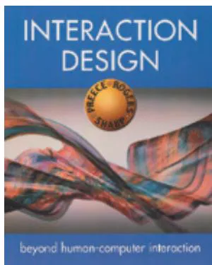

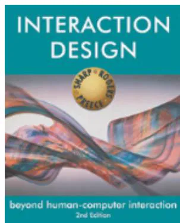

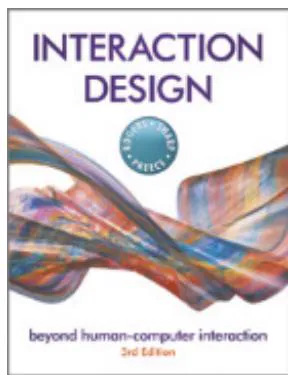

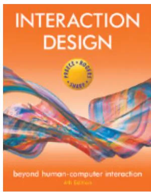

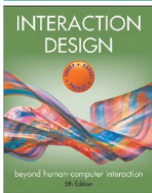

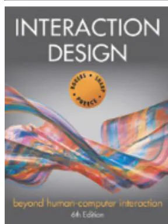

# INTERACTION DESIGN

# Chapter 1

# W H A T  I S  I N T E R A C T I O N  D E S I G N ?

1.1  Introduction   
1.2  Good and Poor Design  
1.3  Switching to Digital   
1.4  What to Design   
1.5  What Is Interaction Design?   
1.6  People-Centered Design   
1.7  Understanding People   
1.8  Accessibility and Inclusiveness   
1.9  Usability and User Experience Goals

# Objectives

The main goals of this chapter are to accomplish the following:

•  Explain the difference between good and poor interaction design.   
•  Consider the pros and cons of transforming activities to become digital.   
•  Describe what interaction design is and how it relates to human-computer interaction and other fields.   
•  Explain the relationship between the user experience and usability.   
Introduce  what  is  meant  by  accessibility  and  inclusiveness  in  relation  to  humancomputer interaction.   
•  Describe what and who is involved in the process of interaction design.   
•  Outline the different forms of guidance used in interaction design.   
Enable you to evaluate an interactive product and explain what is good and bad about it in terms of the goals and core principles of interaction design.

# 1.1 Introduction

How many interactive products are there in everyday use? Think for a minute about what you use in a typical day: a smartphone, tablet, smartwatch, laptop, remote control, coffee machine, printer, smoothie maker, e-reader, smart TV, alarm clock, electric toothbrush, radio, bathroom

scales, fitness tracker, game console. Then think of which apps and social media you use…the list is endless. Now think for a minute about how usable they are. How many are actually easy, effortless, and enjoyable to use? Some, like a tablet, are a joy to use, where tapping an app and flicking through photos is simple, smooth, and enjoyable. Others, like buying a train ticket from a ticket machine that does not recognize your credit card after completing a number of steps and then makes you start again from scratch, can be very frustrating. Why is there a difference?

Many products that require users to interact with them, such as smartphones and fitness trackers, have been designed primarily with users’ needs in mind. They are generally easy and enjoyable to use. Others have not necessarily been designed with the person in mind; rather, they have been engineered primarily as software systems to perform set functions. An example is setting the time of day on a stove, such as when setting it up or after a power failure, that requires a combination of button presses that are not obvious as to which ones to press together or separately. While they may work effectively, it can be at the expense of how easily they will be learned and remembered and therefore used in a real-world context.

Alan Cooper (2018), a well-known user experience guru, bemoans the fact that much of today’s software suffers from the same interaction errors that were around 25 years ago. Why is this still the case, given that interaction design has been in existence for more than 30 years and given that there are far more designers now in industry than ever before? He points out how many interfaces of new products do not adhere to the interaction design principles validated in the 1990s. For example, he notes that many apps do not follow even the most basic of user experience design principles, such as offering an “undo” option. He exclaims that it is “inexplicable and unforgivable that these violations continue to resurface in new products today.”

How can we rectify this situation so that the norm is that all new products are designed to provide good user experiences? To achieve this, we need to be able to understand how to reduce the negative aspects (such as frustration and annoyance) while enhancing the positive ones (for example, enjoyment and efficacy). This entails developing interactive products that are easy to learn, effective, and pleasurable to use from a user’s perspective.

In this chapter, we begin by examining the basics of interaction design. We look at the difference between good and poor design, highlighting how products can differ radically in how usable and enjoyable they are. We consider what is gained and lost from transforming activities to be digital when previously they were done  through using physical artifacts. We then describe what and who is involved in the process of interaction design. The user experience, which is a central concern of interaction design, is then introduced. Finally, we outline how to characterize this in terms of usability goals, user experience  goals, and design principles. An in-depth activity is presented at the end of the chapter in which you have the opportunity to put into practice what you have read by evaluating the design of an interactive product.

# BOX 1.1

What’s in a name? User, people, human, or customer?

Several terms have been used to emphasize different aspects of what is being designed, including user interface design (UI), software design, user-centered design, human-centered design, people-centered  design, product design, web design, user experience (UX) design, customer

experience (CX) design,  and  interactive  system design.  Interaction  design (IxD)  is generally used as the  overarching term to describe the  field, including its methods, theories, and approaches. Since about 2010, UX design has been the most widely used term in industry to refer to the profession. However, the terms have been used interchangeably. Also, it depends on each company’s ethos and brand.

As the field has matured, Don Norman (2018) has argued for using the more encompassing term people-centered design and referring to people instead of users where it seems more appropriate. Sometimes, continuing to use the term user makes sense, however, if it is specifically about how a technology is to be used for or by someone. Likewise, continuing to refer to user’s needs and the user experience can be preferable when considering how to design a specific product. More generally, however, much of what interaction design is about is understanding and augmenting people. In this context, using the term people is better, because it is broader, being able to refer to a single person, a group of people, or even whole societies, which is appropriate when describing large social media systems. Here, in the new edition of our textbook, we have changed primarily to using people-centered design but have continued to use the term user-centered when referring specifically to using an interface.

Customer experience (CX), on the other hand, refers to all of the interactions someone has with a company’s offering, including the overall experience, the probability they will continue to use it, and the likelihood they will recommend it to others. In this sense, the UX is part of the wider CX, but the CX covers other aspects that the UX has traditionally not covered (Lowden, 2014).

Video Don Norman explains why adopting a people-centered approach is the way forward: interaction-design.org/literature/topics/people-centered-design.

# 1.2  Good and Poor Design

A central concern of interaction design is to develop interactive products that are usable. By this we mean products that are generally easy to learn, effective to use, and provide an enjoyable experience for the intended people. A good place to start thinking about how to design usable  interactive  products  is  to  compare  examples  of  well-designed  and  poorly  designed ones. Through identifying the specific weaknesses and strengths of different interactive products, we can begin to understand what it means for something to be usable or not. Here, we describe  an  example  of  a  poorly  designed  product  that has  persisted  over  the  years—the ubiquitous  remote  control—and  contrast  this  with  a  well-designed  example  of  the  same product that performs the same function.

Every  home  entertainment  system,  be  it  the  smart  TV,  streaming  video  player,  home theater  system,  and so  forth, comes  with  its  own  remote control.  Each  one  is  different  in

terms of how it looks and works. Many have been designed with a dizzying array of small, multicolored, and double-labeled buttons (one on the button and one above or below it) that often seem arbitrarily positioned in relation to one another. Many viewers, especially when sitting in their living rooms, find it difficult to locate the right buttons, even for the simplest of tasks, such as pausing or finding the main menu. It can be especially frustrating for those who need to put on their reading glasses each time to read the buttons. The remote control appears to have been put together very much as an afterthought.

In contrast, much effort and thought went into the design of the classic TiVo remote control with the viewer in mind (see Figure 1.1). TiVo is a digital video recorder that was originally developed to enable the viewer to record TV shows. The remote control was designed with  large buttons  that  were clearly labeled  and  logically  arranged,  making  them  easy  to locate and  use in  conjunction with  the menu interface that appeared  on the TV  screen. In terms of its physical form, the remote device was designed to fit into the palm of a hand, having a peanut shape. It also has a playful look and feel about it: Colorful buttons and cartoon icons are used that are distinctive, making it easy to identify them.

Figure 1.1  The TiVo remote control   
  
Source: business.tivo.com

How was it possible to create such a usable and appealing remote device where so many others have failed? The answer is simple: TiVo invested the time and effort to follow a peoplecentered design process. Specifically, TiVo’s director of product design at the time involved

potential users  in the design process, getting  their feedback on everything  from the feel  of the device in the hand to where best to place the batteries, making them easy to replace but not  prone  to  falling out.  He  and  his  design team  also  resisted  the  trap  of “buttonitis” to which so many other remote controls have fallen victim; that is one where buttons breed like rabbits—a button for every new function. They did this by restricting the number of control buttons embedded in the device to the essential ones. Other functions were then represented as part of the menu options and dialog boxes displayed on the TV screen, which could then be selected via the core set of physical control buttons. The result was a highly usable and pleasing device that has received much praise and numerous design awards.

# DILEMMA

What Is the Best Way to Interact with a Smart TV?

A challenge facing smart TV providers is how to enable people to interact with online content. Viewers can select a whole range of content via their TV screens, but it involves scrolling through lots of menus and screens. In many ways, the TV interface, which once consisted of simply choosing from among a few channels, has become more like a computer interface. This raises the question of whether the remote control is the best input device to use for someone who sits on a sofa or chair that is some distance from the TV screen. Smart TV developers have addressed this challenge in a number of ways.

An early approach was to provide an on-screen keyboard and numeric keypad that presented a grid of alphanumeric characters (see Figure 1.2a), which were selected by pressing a button repeatedly on a remote control. However, entering the name of a movie or an email address and password using this method can be painstakingly slow; it is also easy to overshoot and select the wrong letter or number when holding a button down on the remote to reach a target character. Other systems have tried alternatives, such as different arrangements of the alphanumeric characters on-screen; using the numeral keys with their telephone-style associated letters; and sliding a small, physical keyboard from the underside of the remote control. None of these has proven perfect.

More recent remote controls, such as those provided by Apple TV, incorporate a touchpad to enable swiping akin to the control commonly found on laptops. While this form of touch control expedites skipping through a set of letters displayed on a TV screen, it does not make it any easier to type in an email address and password. Each letter, number, or special character still  has to be selected. Swiping  is also prone  to overshooting when aiming for a target letter, number, or character. Instead of providing a grid, the Apple TV interface displays two single lines of letters, numbers, and special characters to swipe across (see Figure 1.2b). While this can make it quicker for someone to reach a character, it is still tedious to select a sequence of characters in this way. For example, if you select a Y and the next letter is an A, you have to swipe all the way back to the beginning of the alphabet.

(Continued)


(b)   
Figure 1.2  Typing on a TV screen (a) by selecting  letters  and  numbers  from a square matrix and (b) by swiping along a single line of letters and numbers   
  
Source: (b) support.apple.com/en-us/HT200107

Might there be a better way to interact with a smart TV while sitting on the sofa? Firestick TV has pared down the number of buttons on its remote controllers  to a core set of basic navigation ones (e.g., up, down) needed to interact with its streaming media players. An alternative is to use voice control. Most remote controls have a speech button that when pressed allows viewers to ask for movies by name or more generally by category, for instance, “What are the best sci-fi movies on Netflix?” Smart speakers, such as Amazon Echo, can also be connected to a smart TV via an HDMI port, and, similarly, a person can ask for something general or more specific, for example, “Alexa, play Big Bang Theory, Season 6, Episode 5, on the TV.” On recognizing the  command, the Echo will switch on the TV,  switch to the right HDMI channel, open Netflix, and begin streaming the specific episode. A recent survey found voice input is becoming ever more popular; one in five TV users now use voice input to find movies, shows, or videos; change the channels; change the volume; or turn the TV on or off (Roettgers, 2019). Some TV content, however, requires the viewer to say that they are older than a certain age by checking a box on the TV display. If the TV could ask the viewer and check that they are 18 or older, then that would be really smart! Also, if the TV needs the viewer to provide a password to access on-demand content, they won’t want to say it aloud, character by character, especially in front of others who might also be in the room with them. The use of biometrics, then, may be the answer.

# 1.3  Switching to Digital

Many activities that used to be done via a physical artifact have gone digital. Instead of walking up to a machine and buying a ticket or an ATM to withdraw cash, many of us now do such transactions digitally using an app on our smartphone or tablet. Mostly, this has made the tasks easier, quicker, and more convenient. An example is being able to pay for parking via a mobile phone app. Twentieth-century parking meters required drivers to insert coins to rent a parking

space, which meant drivers who didn’t have the correct coins couldn’t legally park. Now, instead of fumbling around trying to find the right change for the time wanted and slotting this into a physical meter, we can fill in an online form in advance with our details and then pay each time we want to park using a credit card or digital pay app. Our details can then be stored ready for the next time we need to pay for parking, meaning even fewer steps to complete subsequently (see Figure 1.3). It just needs us to type in the parking location number where we plan to park, and the rest is filled in for us by the app. Some apps will even notify us on our phone when the time we have paid for is nearly up, asking if we would like to add time. All we need to do is press a button from our phone. Not only does this form of digital prompting prevent us from risking a fine if we exceed the time limit, but it also provides more revenue for the parking company!

  
Figure 1.3  The  form used for a parking app in the United Kingdom. It takes five seconds to complete and can be done while sitting in the car.

Many  previous  physical  transactions  have  been  digitalized  like  this.  Other  examples include buying tickets from an entertainment site (e.g., a movie, a concert, a play) or booking a ticket to go somewhere (e.g., a train, a bus, an airline). An added benefit is not having to wait in line before being able to buy a physical ticket. The customer can also check various

preferences for which kind of ticket they want, which can all be stored and accessed again at a later date. Furthermore, a QR or barcode is usually part of the digital ticket, making it easy to gain entrance through the ticket barrier by swiping their smartphone or watch across it. Another  advantage of booking tickets online is  having the option of choosing where to sit  and, in some situations, ordering  food or  drinks in advance. Digital tickets  can  also  be stored in digital wallets, which keep a record of all the digital tickets someone has bought.

There are, however, disadvantages of switching over to digital. First, it requires a person to possess a smartphone that is capable of downloading and storing the digital tickets. Second, some people still prefer to use older phones, which the apps won’t work on, while others prefer to have paper-based tickets. Third, it can also be stressful and cumbersome to some people— especially if they do not have much battery power left on their phone or they need to fumble around trying to find their glasses to see the apps on their phone. There is of course the option of printing out a digital ticket onto paper, but that assumes someone has access to a printer. A further problem is if the person is entitled to a discount (e.g., student, senior, disabled), it may require them to show a card in person to the ticket collector, which can mean having to switch between apps, which can be cumbersome. People who are disabled using certain assistive technologies might be unable to use a digital ticket, which could lead to legal and ethical issues as well as emotional distress. Another disadvantage is that some people don’t like to divulge their personal details online and would prefer to buy a ticket anonymously and pay by cash.

# 1.4 What to Design

Designing interactive products requires considering who is going to be using them, how they are going to be used, and when and where they are going to be used. Another key concern is to understand the kind of activities people are doing when interacting with these products. The appropriateness of different kinds of interfaces and arrangements of input and output devices depends on what kinds of activities are to be supported. For example, if the activity is to enable people to bank online, then an interface that is secure, trustworthy, and easy to navigate is essential. In addition, an interface that allows a customer to find out information about new services offered by their bank without it being intrusive would be useful.

There are many types of interfaces and interactive devices available now, including multitouch displays, speech-based systems, mobile devices, and wearables. There are also many ways  of designing  how  people can  interact with  them, for instance, via the use  of  menus, commands, forms, icons,  gestures, and so  on. Ever  more innovative  everyday artifacts are being created using novel materials, such as e-textiles. Wearable glasses that look like fashionable shades have also started to appear, such as Snap Spectacles, that let the wearer experience augmented reality (see Figure 1.4).

The interfaces for everyday consumer items, such as cameras, microwave ovens, toasters, and washing machines, have become  predominantly digitally-based.  Self-checkouts at  grocery stores and libraries have become the norm, where customers check out their own goods or books  themselves, and at airports,  where passengers check  in their own  luggage. More recently, smart supermarkets have appeared that do not require the shopper to even have to check out the goods they want to purchase. A sophisticated network of AI-enabled cameras in the  ceiling, together with  shelves  embedded with  weight  sensors, can determine what  a customer picks up and puts in their bag/pocket, billing them as soon as they leave the store.

The smarts are in how the computer vision, sensor fusion, and deep learning are combined to track customers and what they took from or replaced on a shelf. Amazon Go pioneered this type of store, with other supermarkets now testing their own versions.


Figure 1.4  The digital world overlaying the physical experienced when wearing Snap AR Spectacles   
  
Source: www.techeblog.com/new-snapchat-spectacles-augmented-reality

The advent of the Internet of Things (IoT), where data is collected from sensors and travels via the Internet to other devices, has been embedded into several of our household products. For example, a popular household IoT-enabled product is home security, where people can keep an eye on their home from the data relayed to their smartphone via a combination of sensors placed in their home. These include motion detectors, glass breaking detectors, and smart object detectors. A video camera can be attached to someone’s doorbell  and relayed to a smartphone app so the owner can check up on who has rung it—even though they may be  on vacation.  Some  home-based security  cameras  also use  machine  learning that  recognizes whether an intruder is trying to break into the house through using facial recognition. Machine learning is also being used in a range of other home-based products, such as automated thermostats  like the Nest, which optimizes the temperature settings for a household where the algorithms analyze its energy consumption over time.

A key question for interaction design is this: “How do you optimize a person’s interactions with a system, environment, or product so that they support their activities in effective, useful, usable, and pleasurable ways?” Another question that is of growing concern to interaction design is how safe and private is the data being collected? Many decisions need to be made based on an understanding of people including the following:

Considering what people are good and bad at   
. Considering what might help people with the way they currently do things   
. Thinking through what might provide quality experiences

• Considering a person’s privacy concerns if data is being collected about them   
Listening to what people want and getting them involved in the design   
Using people-centered techniques during the design process

The  aim  of this  book  is  to  cover  these  aspects  with the  goal  of showing  you how  to carry out interaction design. In particular, it focuses on how to identify a user’s needs and the context of their activities. From this understanding, we move on to consider how to design usable, useful, safe, and pleasurable interactive products.

# 1.5 What Is Interaction Design?

By interaction design, we mean the following: designing interactive products to support the way people communicate and interact in their everyday and working lives. Put another way, it is about creating experiences that enhance and augment the way people work, communicate, and interact. More generally, Terry Winograd originally described it as “designing spaces for human communication and interaction” (1997, p. 160).

# BOX 1.2

Is Interaction Design Beyond HCI?

We see the main difference between interaction design (ID) and human-computer interaction as one of scope. Historically, HCI had a narrow focus on the design and usability of computing systems, while  ID was  seen as being broader, concerned  with the theory, research, and practice of designing user experiences for all manner of technologies, systems, and products. That is one of the reasons why we chose to call our book Interaction Design: Beyond Human-Computer Interaction, to reflect this wider range.

# 1.5.1  The Components of Interaction Design

We view interaction design as fundamental to many disciplines, fields, and approaches that are concerned with researching and designing computer-based systems for people. Figure 1.5 presents  the  core  ones  along  with  interdisciplinary  fields  that  comprise  one  or  more  of these, such as cognitive ergonomics. It can be confusing to try to work out the differences between them as  many overlap. The main differences between interaction design and the other approaches  referred to in the figure come largely down to which methods, philosophies, and lenses they use to study, analyze, and design products. Another way they vary is in terms of the scope and problems they address. For example, information systems is concerned with the application of computing technology in domains such as business, health, and education, whereas ubiquitous computing is concerned with the design, development, and  deployment  of  pervasive  computing  technologies  (for  example,  IoT)  and  how they facilitate social interactions and human experiences.

  
Figure 1.5  Relationship among contributing academic disciplines, design practices, and interdisciplinary fields concerned with interaction design (double-headed arrows mean overlapping)

# ACTIVITY 1.1

Since we first  created Figure 1.5, many other  computer-related fields have emerged where the user is considered central. These  include cybersecurity, digital  humanities, data science, and digital healthcare. For some fields, there has also been a shift toward being more peopleoriented, for example, human-centered AI. Would it make sense to add these, and, if so, how?

# Comment

We could add a further  section that identifies where interaction  design has informed other fields, for example, those where software tools have been developed for scientists/researchers/ clinicians to use as part of their methodology. These include the built environment, bioinformatics, medicine, marketing, computational biology, and computational design. We could also try to add a number of other fields and practices that have begun to inform interaction design, including behavioral economics, ethics, accessibility, and AI. Feminism, critical theory, queer theory, post-colonial and political activism have also come to the fore providing alternative lenses by which to examine and explore  societal challenges within the scope of interaction design. However, rather than try to add all of these to the diagram—which would make it unwieldy—we have decided to keep it as is, comprising the  core disciplines, practices, and overlapping fields.

# 1.5.2  Who Is Involved in Interaction Design?

Figure 1.5 also shows that many people are involved in performing interaction design, ranging from  social scientists to movie-makers. This is not surprising given that  technology has become  such  a  pervasive  part  of  our  lives.  But  it  can  all  seem  rather  bewildering  to  the onlooker. How does the mix of players work together?

Designers need to know many different things about people, technologies, and the interactions among them to create effective experiences. At the least, they need to understand how people act and react to events and how they communicate and interact with each other. To be able to create engaging experiences, they also need to understand how emotions work, what is meant by aesthetics, desirability, and the role of narrative in human experience. They also need to understand the business side, technical side, manufacturing side, and marketing side. Recently, there has been more emphasis on understanding  the ethical aspects, especially for technologies that are collecting ever-increasing  amounts  of personal data, such as smart speakers and personal healthcare devices. Questions raised include how do we ensure the new technology or product is safe, secure, perceived to be trustworthy and valued, and understandable by the general public?

Clearly, it is difficult for one person to be well versed in all of these diverse areas and also know how to apply the different forms  of knowledge to the process of interaction design. Interaction  design is  ideally  carried  out  by  multidisciplinary  teams,  where the  skill  sets of engineers,  designers,  programmers,  psychologists,  anthropologists,  sociologists,  marketing people, artists,  toy  makers, product  managers, and others  are  drawn  upon. It  is  rarely the case, however, that  a design  team  would have  all  of these  professionals  working  together. Who to include in a team will depend on a number of factors, including a company’s design philosophy, size, purpose, and product line.

One of the benefits of bringing together people with different backgrounds and training is the potential of many more ideas being generated, new methods developed, and more creative and original designs being produced. However, the downside is the costs involved. The more people there are with different backgrounds in a design team, the more difficult it can be to communicate and make progress with the designs being generated. Why? People with different backgrounds have different perspectives and ways of seeing and talking about the world. What one person values as important others may not even see (Kim, 1990). Similarly, a computer scientist’s understanding of the term representation  is often very different from that of a graphic designer, media specialist, or psychologist.

What  this means  in practice  is  that confusion, misunderstanding, and communication breakdowns  can  surface  in  a  team. The  various  team  members  may  have  different  ways of talking about  design and may use  the same terms to mean quite different  things. Other problems can arise when a group of people who have not previously worked as a team  are thrown together. For example, Aruna Balakrishnan et al. (2011) found that integration across different disciplines and expertise is  difficult in many  projects, especially  when it comes to agreeing on and sharing tasks. The more disparate  the team members—in terms of culture, background, and organizational structures—the more complex this is likely to be.

# ACTIVITY 1.2

In practice, the  makeup of a given  design team depends on the kind of interactive product being built. Who do you think should be involved in developing:

•  A public kiosk providing information about the exhibits available in a science museum?   
•  An interactive educational website to accompany a TV series?

# Comment

Ideally, each team will have a number of different people with different skill sets. For example, the first interactive product would include the following individuals:

•  Graphic and interaction designers, museum curators, educational advisers, software engineers, software designers, and ergonomists   
The second project would include these types of individuals:   
•  TV producers, graphic and interaction designers, teachers, screenwriters, information architects, UX researchers, video experts, software engineers, and software designers   
In addition, as both systems are being developed for use by the general public, representative users, such as school children and parents, should be involved.

In practice, design teams often end up being quite large, especially if they are working on a big project to meet a fixed deadline. For example, it is common to find teams of 15 or more people working on a new product like a health app. This means that a number of people from each area of expertise are likely to be working as part of the project team.

# 1.5.3  Interaction Design Consultancies

Interaction  design  is now  widespread  in product  and services  development. In  particular, UX  consultants  and  the  computing  industries  have  realized  its  pivotal  role  in  successful interactive products. But it is not just IT companies that are realizing the benefits of having interaction designers. Financial services, retail, governments, marketing, video and film producers, and the public sector have realized its value, too. The presence or absence of good interaction design can make or break a company. Getting noticed in the highly competitive field of smartphone apps requires standing out. Being able to demonstrate that your product is easy, effective, and engaging to use is seen as central to this. Marketing departments focus on how the branding, the number of engagements, the customer return rate, and customer satisfaction are greatly affected by the usability of a website. Many now have their own toolkits for testing the different aspects of a website, for example, using A/B testing to determine  the  effect  of  different  UI  designs  on  metrics  such  as  sales  or  the  number  of repeat visitors.

There  are  many interaction design  consultancies  now. These  include established  companies, such as Nielsen  Norman Group and IDEO, and more recent ones that specialize in

a  particular area,  such  as  job  board  software  (for  example,  Madgex), digital  media  (e.g., Cogapp), or mobile design (such as CXpartners). Smaller  consultancies, such as Bunnyfoot and  Dovetailed,  promote  diversity, interdisciplinarity,  and  scientific  research,  having  psychologists,  researchers,  interaction  designers,  usability, and  customer  experience  specialists on board.

Many  consultancies have impressive websites, providing case  studies, tools, and blogs. For example, Holition publishes highly engaging case studies and tantalizing videos of their in-house research, intended for the wider community, with a focus on  the implications for commercial and cultural aspects. This sharing of knowledge enables them to contribute to the discussion about the role of technology in human experience.

# 1.6  People-Centered Design

People-centered design  involves understanding  how  people feel  about  a product  and their pleasure and satisfaction when using it, looking at it, holding it, and opening or closing it. It includes their overall impression  of how  good it  is to use, right  down  to the sensual effect small details have on them, such as how smoothly a switch rotates or the sound of a click and the touch of a button when pressing it. An important aspect is the quality of the experience someone has, be it a quick one, such as taking a photo; a leisurely one, such as playing with an interactive toy; or an integrated one, such as visiting a museum (Law et al., 2009). As Don Norman (2004) stressed earlier, “It is not enough that we build products that function, that are understandable and usable, we also need to build joy and excitement, pleasure and fun, and yes, beauty to people’s lives.”

# ACTIVITY 1.3

# The Classic iPod Phenomenon

Apple’s classic (and subsequent) generations of portable music players, called iPods, including the iPod Touch, Nano, and Shuffle, released during the early 2000s were a phenomenal success. They were very popular at the time. Then the smartphone came into being in 2007, which enabled music to be played on it. Playing music via a smartphone became the norm, superseding the need for a separate device. Apple stopped production of their last remaining iPod—the iPod Touch—in 2022. Why do you think the iPod was such a huge success when it came into being? What other products have since been received with so much acclaim?

# Comment

Apple realized early on that successful interaction design involves creating interactive products that provide not just usable but also enjoyable experiences. The sleek appearance of the iPod music player (see Figure 1.6), its simplicity of use, its elegance in style, its distinct family of rainbow colors, a novel interaction style that many people discovered was a sheer pleasure

to learn  and use, and the  catchy naming of its product and content  (iTunes, iPod), among many other design features, led to it becoming one of the  greatest products of its kind and a must-have  fashion item for teenagers, students, and adults alike. While there were many competing players on the market at the time—some with more powerful functionality, others that were cheaper and easier to use, or still others with bigger screens, more memory, and so forth—the quality of the overall experience paled in comparison to that provided by the iPod. In addition, Apple provided a whole ecosystem to accompany the iPod, including the iTunes store app where millions of licensed music tracks could be bought for less than a dollar each.

Figure 1.6  The iPod Nano   
  
Source: Paul Sakuma / AP Photo

Apple has continued to design products that are both beautiful and usable, most notable are the iPad and the range of iPhones. It even designed what was at the time a completely new customer experience for buying technology in the form of the Apple Store, from how it draws people in and what they do when browsing, discovering, and purchasing goods in the store. There  are  no checkouts to pay  for goods—just roaming Apple  employees  holding  mobile devices that they interact with to make an order for a customer, take payment, and email them a receipt. Apple now has a new kind of retail space, akin to being more like a town square, where everyone is welcome, and various community activities take place weekly, like learning to code.

There are many aspects of the user experience that can be considered and many ways of taking them into account when designing interactive products. Of central importance are the usability, functionality, aesthetics, content, look and feel, and emotional appeal. In addition, Jack Carroll (2004) stresses other wide-reaching aspects, including fun, health, social capital (the social resources that develop and are maintained through social networks, shared values,

goals, and norms), and cultural identity, such as age, ethnicity, race, disability, family status, occupation, and education.

Several researchers have attempted to describe the experiential aspect of people-centered design. Kasper Hornbæk  and  Morten Hertzum  (2017) note how  the  user experience is often  described in terms of the way that people perceive a product, such as whether a smartwatch is seen as sleek, cool, or chunky, and their emotional reaction to it, such as whether people have a positive experience when using  it. Marc Hassenzahl, Michael Burmester, and Frank Keller (2021) reflect on the  way the user experience has evolved over the last 20 years, noting how there has been a growing interest in designing for hedonic aspects in relation to well-being. By hedonic, it is meant how evocative and stimulating the interaction is to them. In addition to a person’s perceptions of a product, John McCarthy and Peter Wright (2004) discuss the importance of someone’s expectations and the way they make sense of their experiences when using technology. Their Technology as Experience framework accounts for the experience largely in terms of how it feels to someone. Kia Höök (2018) has extended the idea of the felt experience even further, proposing Soma Design, which considers how technology can make people more aware of the experience of their felt bodily sensations and movements.

How does one go about designing quality experiences for people? There is no secret sauce or magical formula that can be readily applied by interaction designers. However, there are numerous conceptual frameworks, tried and tested design methods, guidelines, and relevant research findings, which are described throughout the book.

# 1.7 Understanding People

A main reason for  having a better understanding of people  in the contexts in  which they live, work,  and  learn  is that  it  can  help  designers  understand  how  to  design  interactive products that augment humans and match their needs at the time and place of use. A collaborative  planning  tool  for  a  space  mission,  intended  to  be  used  by  teams  of  scientists working in different parts of the world, will have quite different needs from one targeted at customer and sales agents, to be used in a furniture store to draw up kitchen layout plans. Understanding individual differences can also help designers appreciate that one size does not  fit all;  what works  for one group of people may  be totally inappropriate for another. For example, children have different expectations than adults about how they want to learn or  play.  They  may  find  having  interactive  quizzes  and  cartoon  characters helping  them along to  be highly motivating, whereas most adults find  them annoying. Teenagers  enjoy short videos such as the ones they watch and upload to TikTok and YouTube. Conversely, adults often like podcast discussions about topics, which children and teenagers may find boring. Just as everyday objects like clothes, food, and games are designed differently for children, teenagers, and adults, so too should interactive products be designed for different kinds of people.

Learning  more  about  people  and what  they  do  can  also  reveal  incorrect assumptions that designers may have about particular groups and what they need. For example, it is often assumed that because of deteriorating vision  and dexterity, older people want things  to be big—be it text or graphical elements appearing on a screen or the physical controls, like dials and switches, used to control devices. This  may be true for some  older people, but  studies have shown that many people in their 70s, 80s, and older are perfectly capable of interacting with standard-size information and even small interfaces, for example, smartphones, just as well as those in their teens and 20s, even though, initially, some might think they will find it

difficult (Siek et al., 2005). It is increasingly the case that as people get older, they do not like to consider themselves as getting older, associated with lacking in cognitive and manual skills. Being aware of people’s sensitivities, such as aging, is as important as knowing how to design for their capabilities (Johnson and Finn, 2017). In particular, while many older adults now feel comfortable with and use a range of technologies (for instance, email, online shopping, online  games, or social media), they  may resist  adopting new  technologies (Knowles et al, 2021). This is not because they don’t perceive them as being useful to their lives but because they  don’t  want  to  waste  their  time  getting  caught  up  by  the  distractions  that  digital  life brings (Knowles and Hanson, 2018), for example, not wanting to be “glued to one’s mobile phone” like younger generations.

Being aware of cultural differences is also an important concern for interaction design, particularly  for  products  intended  for a  diverse  range  of groups  from  different  countries. A  seemingly trivial  but  important  example  of  a  cultural  difference  is  the  dates  and  times used in different countries. In the  United States, for example, the date  is written as month, day, year (05/21/23), whereas in other countries, it is written in the sequence of day, month, year  (21/05/23).  This  can  cause  problems  for  designers  when  deciding  on  the  format  of online forms, especially if intended for global use. It is also a concern for products that have time  as a function, such as  operating systems,  digital clocks, or car  dashboards. To which cultural group do they give preference? How do they alert someone to the format that is set as default? This  raises the question of how  easily an interface  designed for one  group can be used and accepted by another. Why is it that certain products, like a fitness tracker, are universally accepted  by  people from all  parts  of the world, whereas  websites are designed differently and reacted to differently by people from different cultures? How does the design and  use  of  social  media  platforms  differ across  cultures,  such as Weibo  and Twitter? The former  is  used  primarily  in  China by  more  than  500  million  people, whereas the  latter  is used worldwide by more than 200 million people. A number of cross-cultural studies have been conducted showing significant differences in the microblogging behaviors across these two platforms. For example, a recent analysis by Shi Chen et al. (2021) during the COVID-19  pandemic  found  that  Weibo  users  were  more  likely  to focus  on  the  disease  itself  and other  health  aspects,  whereas  Twitter  users  talked  more  about  policy, politics,  and  other societal issues.

To understand more about people, we have included three chapters (Chapters 4–6) that explain in detail how people act and interact with one another, with information, and with various  technologies, together  with describing  their  abilities, emotions, needs, desires,  and what  causes them  to get annoyed,  frustrated, lose patience, and get bored. We draw upon relevant psychological theory and social science research. Such knowledge enables designers to determine which solutions to choose from the many design alternatives available and how to develop and test these further.

# 1.8  Accessibility and Inclusiveness

Accessibility  refers  to  the  extent to  which  an  interactive product  is  accessible by  as  many people as possible. Companies like Google and Apple  provide tools for their developers to promote this. The focus is on people with disabilities. For example, Android OS provides a range  of tools  for those  with  disabilities, such  as  hearing  aid  compatibility  and a  built-in screen reader, while Apple VoiceOver lets the person know what’s happening on its devices

so they can  easily navigate and even know who  is in a selfie  just taken by  listening to the phone. Inclusiveness  means being  fair, open, and  equal to  everyone. Inclusive design  is  an overarching approach where designers strive to make their products and services accommodate  the widest  possible  number  of people. An example  is  ensuring  that smartphones  are being designed for all and made available to everyone—regardless of their disability, education, age, or income.

The  degree to  which  a  person  is  considered  to be  disabled can  change  over  time, for example  decreasing as  recovery  from  an  accident progresses. In addition, the severity  and impact  of an  impairment can  vary  over the course  of a  day or in  different  environmental conditions.  Inability  to  use  a  product  can  result  because  technologies  are  often  designed in such a way  as to necessitate a certain type of interaction that is  impossible for someone with a disability. Such an inability is viewed as the result of poor interaction design between a  person  and  the technology,  not  the  impairment alone. Accessibility, on  the  other  hand, opens up experiences so that they are accessible to all. Technologies that are now mainstream once started out as solutions to accessibility challenges. For example, SMS was designed for hearing-impaired people before it became a mainstream technology. Furthermore, designing for accessibility inherently results in inclusive design for all.

Accessibility can be achieved in two ways: first, through the inclusive design of technology, and second, through the design of assistive technology. When designing for accessibility, it is essential to understand the types of impairments that can lead to disability as they come in many forms. They are often classified by the type of impairment, for example:

Sensory impairment (such as loss of vision or hearing)   
Physical impairment (having loss of functions to one or more parts of the body, for example, after a stroke or spinal cord injury)   
Cognitive (for instance, learning impairment or loss of memory/cognitive function due to a condition such as Alzheimer’s disease)

Within  each type  is  a  complex  mix of  people and capabilities.  For  example, a  person might have only peripheral vision, be color blind, or have no light perception (and be registered blind). All are forms of visual impairment, and all require different design approaches. Color  blindness  can  be  overcome  by  an  inclusive  design  approach.  Designers  can  choose colors  that  will  appear  as separate  colors  to everyone. However, peripheral  vision  loss or complete blindness will often need an assistive technology to be designed.

Impairment can also be categorized as follows:

. Permanent (for example, long-term wheelchair user)   
. Temporary (such as after an accident or illness)   
Situational (for instance, a noisy environment means a person can’t hear)

The number of people living with permanent disability increases with age. Fewer than 20 percent of people are born with a disability, whereas 80 percent of people will have a disability once they reach 85. As people age, their functional abilities diminish. For example, as people get older, they find it more difficult to hear conversations in rooms with hard surfaces and lots of background noise.

People  with  permanent  disabilities  often  use  assistive  technology  in  their  everyday life, which  they  consider to  be life-essential  and an  extension of their  self (Holloway and Dawes, 2016). Examples include wheelchairs (people now refer to “wearing their wheels,” rather  than  “using  a  wheelchair”)  and  augmented  and  alternative  communication  aids. Much  current  HCI  research  into  disability explores  how  new  technologies,  such  as  IoT, wearables, and virtual reality, can be used to improve upon existing assistive technologies. A  recent  approach  is  to  consider  disability  interactions  (DIX)  that  combines  crossdisciplinary methods from HCI and disability studies to co-create new technologies, experiences, and ways of working with disabled people (Holloway and Barbareschi, 2022). There has also been a push toward designing accessible technology in the developing world (Stein and Lazar, 2022).

Aimee Mullens is an athlete, actor, and fashion model who has shown how prosthetics can be designed to move beyond being purely functional (and often ugly) to being desirable and highly fashionable. She became a bilateral amputee when her legs were amputated below the knee as a one-year-old. She has  done much to blur the boundary between disabled and nondisabled people, and she uses fashion as a tool to achieve this. Several prosthetic companies now incorporate fashion design into their products, including striking leg covers that are affordable by all (see Figure 1.7).

Figure 1.7  Fashionable leg cover designed by Alleles Design Studio   
  
Source: alleles.ca. Used courtesy of Alison Andersen

# 1.9 Usability and User Experience Goals

Part  of  the  process  of understanding  people  is  to  be  clear  about  the  primary  objective of developing an interactive product for them. Is it to design an efficient system that will allow them to be highly productive in their work? Is it to design a learning tool that will be challenging and motivating? Or, is it something else? To help identify the objectives, we suggest classifying them in terms of usability and user experience goals. Traditionally, usability goals are concerned with meeting specific usability criteria, such as efficiency, whereas user experience goals are concerned with explicating the nature of the user experience, for instance, to be  aesthetically pleasing. It  is important  to note, however, that  the  distinction between  the two types of goals is not clear-cut since  usability is often fundamental to the quality of the user experience and, conversely, aspects of the user experience, such as how it feels and looks, are inextricably linked with how usable the product is. We distinguish between them here to help clarify their roles but stress the importance of considering them together when designing for an  experience. Also, historically HCI was  concerned primarily with usability, but it  has since become concerned with understanding, designing for, and evaluating a wider range of user experience aspects.

# 1.9.1  Usability Goals

Usability refers to ensuring that interactive products are  easy to learn, effective  to use, and enjoyable from the person’s perspective. It involves optimizing the interactions people have with interactive products to enable them to carry out their activities at work, at school, and in their everyday lives. More specifically, usability is broken down into the following goals:

Effective to use (effectiveness)   
Efficient to use (efficiency)   
Safe to use (safety)   
. Having good utility (utility)   
Easy to learn (learnability)   
Easy to remember how to use (memorability)   
Enjoyable to use (satisfaction)

Usability goals are typically stated as questions. The purpose is to provide the interaction designer with a concrete means of assessing various aspects of an interactive product and the user experience. Through answering the questions, designers can be alerted very early on in the design process to potential design problems and conflicts that they might not have considered. However, simply asking “Is the system easy to learn?” is not going to be very helpful. Asking about  the usability  of a product in a more detailed  way—for example, “How long will it take someone to figure out how to use the most basic functions for a new smartwatch; how much can they capitalize on  from their prior experience; and how long would it take them to learn the whole set of functions?”—will elicit far more useful information.

The following are descriptions of the usability goals and a question for each one:

(1) Effectiveness is a general goal, and it refers to how good a product is at doing what it is supposed to do.

Question: Is the product capable of allowing people to carry out their work efficiently, access the information that they need, or buy the goods that they want?

(2)  Efficiency refers  to the  way  a product supports  people  in carrying  out their tasks. The example mentioned earlier of buying tickets online using stored personal details on the app is considered efficient. Once people have entered all of the necessary personal details in an online form to make a purchase, they can let the website/app save all of their personal details. Then, if they want to make another purchase at that site, they don’t have to re-enter all of their personal details. A highly successful mechanism patented by Amazon is  the one-click option, which  requires people  to click only  a  single button  when they want to make another purchase.

Question: How many steps does it take to complete a task? How does storing a person’s personal details make it more efficient?

(3)  Safety involves protecting a person from dangerous conditions and undesirable situations. In relation to the first ergonomic aspect, it refers to the external conditions where people work. For example, where there are hazardous conditions—such as X-ray  machines or toxic chemicals—operators should  be able to interact with and control computer-based systems  remotely. The second  aspect  refers to  helping anyone in  any  kind of  situation to avoid the dangers of carrying out unwanted actions accidentally. It also refers to the perceived fears that someone might have of the consequences of making errors and how this affects their behavior. Making interactive products safer in this sense involves (1) preventing the user from making serious errors by reducing the risk of wrong keys/buttons being mistakenly activated (an  example  is  not placing  the quit or delete-file command right next to the save command on a menu), and (2) providing people with various means of recovery should they make errors, such as an undo function. Safe interactive systems should engender confidence and give people the opportunity to explore the interface to try  new  operations  (see  Figure  1.8a).  Another  safety  mechanism  is  confirming  dialog boxes that give users another chance to consider their intentions (a well-known example is the appearance of a dialog box after issuing the command to delete everything in the trash, saying: “Are you sure you want to remove the items in the Trash permanently?”) (see Figure 1.8b).

Question:  What  is  the  range  of  errors  that  are  possible  using  the  product,  and  what measures are there to permit someone to recover easily from them?

(4) Utility refers to the extent to which the product provides the right kind of functionality so that users can do what they need or want to do. An example of a product with high utility is an accounting software package that provides a powerful computational tool that accountants can use to work out tax returns. An example of a product with low utility is a software drawing tool that does not allow users  to draw freehand but forces them to use a mouse to create their drawings, using only polygon shapes.

Question: Does the product provide an appropriate set of functions that will enable them to carry out all of their tasks in the way they want to do them?

(5)  Learnability refers to  how  easy a  product  is to  learn  to  use. Generally, people  want to get  started right away and become competent  at carrying  out basic  tasks without too much effort. This is true for  both interactive products intended for everyday use (for  example,  social  media)  and  those  used  only  infrequently  (for  instance,  online tax forms). Learning may continue over  the lifetime  of someone’s interaction  with a product so that basic use eventually becomes mastery. To a certain extent, people are prepared to spend a longer time learning more complex systems that provide a wider range of functionality, such as web authoring tools. In these situations, pop-up tutorials

can help by providing contextualized step-by-step material with hands-on exercises. A key concern is determining how much time someone is prepared to spend learning a product. Question: Is it possible for someone to work out basic use of the  product by exploring the interface and trying certain actions? How hard will it be to master the product in this way? Are additional learning tools needed?


  
(a)

  
(b)   
Figure 1.8  (a)  A  safe and  unsafe menu.  Which  is which  and  why? (b)  A  warning  dialog box on macOS

(6) Memorability  refers  to  how  easy  a  product is  to remember  how  to use,  once  learned. This is especially important for tasks and interactive products that are used infrequently. If someone hasn’t used an operation for a few months or longer, they should be able to remember  or  at least  rapidly be  reminded how  to  use  it. They  shouldn’t have  to keep relearning  how to carry out tasks. Unfortunately, this tends to happen when the operations required to be learned are obscure, illogical, or poorly sequenced. People need to be helped to remember how to do tasks. There are many ways of designing the interaction to support this. For example, users can be helped to remember the sequence of operations at different stages of a task through contextualized icons, meaningful command names, and menu options. Also, structuring options and icons so that they are placed in relevant categories of options—for example, placing all of the drawing tools in the same place on

the screen—can help a user remember where to look to find a particular tool at a given stage of a task.

Question: What types of interface support have been provided to help someone remember how to carry out tasks, especially for ones they use infrequently?

(7)  Satisfaction generally refers  to how acceptable a product is when being used. It is most often  used  to  measure  a  customer’s experience. Various  satisfaction  scales  have  been developed for this  purpose, for example, asking customers  to give a score from  1–5 to indicate how satisfied they are after using a product. The most well-known one is called the Customer Satisfaction Score (CSAT).

Question: What are the mean, median, and mode values on the CSAT scale? What proportion of users say they are highly satisfied with the product? How many people are still satisfied after using the product for six months?

In addition to couching usability goals in terms of specific questions, they are turned into usability criteria. These are specific objectives that enable the usability of a product to be assessed in terms of how it can improve (or not improve) human performance. Examples of commonly used usability criteria are time to complete a task (efficiency), time to learn a task (learnability), and the number of errors made when carrying out a given task over time (memorability). These can provide quantitative indicators of the extent to which productivity has increased, or how work, training, or learning have been improved. They can be compared with target values to determine whether a product  under development is usable enough to be released. However, they do not address the overall quality of the user experience, which is where user experience goals come into play.

# 1.9.2  User Experience Goals

A diversity of user experience goals have been articulated in interaction design, which covers a range of emotions and felt experiences. These include desirable and undesirable aspects, as shown in Table 1.1.

Table 1.1  Desirable and undesirable aspects of the user experience   

<table><tr><td colspan="3">Desirable aspects</td></tr><tr><td>Satisfying</td><td>Helpful</td><td>Fun</td></tr><tr><td>Enjoyable</td><td>Motivating</td><td>Provocative</td></tr><tr><td>Engaging</td><td>Challenging</td><td>Surprising</td></tr><tr><td>Pleasurable</td><td>Enhancing sociability</td><td>Rewarding</td></tr><tr><td>Exciting</td><td>Supporting creativity</td><td>Emotionally fulfilling</td></tr><tr><td>Entertaining</td><td>Cognitively stimulating</td><td>Experiencing flow</td></tr><tr><td colspan="3">Undesirable aspects</td></tr><tr><td>Boring</td><td>Unpleasant</td><td>Creepy</td></tr><tr><td>Frustrating</td><td>Patronizing</td><td>Intrusive</td></tr><tr><td>Making one feel guilty</td><td>Making one feel stupid</td><td>Invasive</td></tr><tr><td>Annoying</td><td>Cutesy</td><td>Deceptive</td></tr><tr><td>Childish</td><td>Gimmicky</td><td>Annoying</td></tr></table>

Many  of these  are  subjective  qualities  and  are  concerned  with  how  a  system  feels  to someone. They differ from the more objective usability goals in that they are concerned with how people experience an interactive product from  their perspective, rather than assessing how useful  or productive a system  is from  its  own perspective. Whereas  the terms  used to describe usability goals comprise  a small distinct set, many more terms are used to describe the multifaceted nature of the user experience. They also overlap with what they  are referring to. In so doing, they offer subtly different options for expressing the way an experience varies for the same activity over time, technology, and place. For example, we may describe listening to music  in the shower as highly pleasurable but  consider it  more apt to describe listening to music in the car as enjoyable. Similarly, listening to music on a high-end powerful music system may invoke exciting and emotionally fulfilling feelings, while listening to it on a smartphone that has a shuffle mode may be serendipitously enjoyable, especially not knowing what tune is next. The process of selecting terms that best convey a person’s feelings, state of being, emotions, sensations, and so forth when using or interacting with a product at a given time and place can help designers understand the multifaceted and changing nature of the user experience.

The  concepts  can  be  further  defined  in  terms  of  elements  that  contribute  to  making a  user experience  pleasurable, fun, exciting, and  so on. They include  attention, pace, play,  interactivity,  conscious  and  unconscious  control,  style  of  narrative,  and  flow.  The concept  of  flow (Csikszentmihalyi,  1997)  continues  to  be  popular  in  interaction  design for informing the design of user experiences for websites, video games, and other interactive products. It refers  to a state of intense emotional involvement  that comes from being completely  involved  in  an  activity,  like  playing  music,  and  where  time  flies.  Instead  of designing websites to cater to visitors who know what they want, they can be designed to induce  a state of  flow, leading  the visitor to  some unexpected  place, where  they become completely absorbed.

The quality of the user  experience may  also be affected by single actions performed at an interface. For example, people  can get much pleasure from  turning a knob  that has  the perfect level of gliding resistance; they may enjoy flicking their finger from the  bottom of a smartphone screen to reveal a new menu, with the effect that it appears by magic, or enjoy the sound of trash being emptied from the trashcan on a screen. These one-off actions can be performed  infrequently  or several  times  a day—which  the  person  never tires  of  doing. Dan Saffer (2014) has  described these as microinteractions and argues that designing these moments of interaction at the interface—despite being small—can have a big impact on the user experience.

# ACTIVITY 1.4

There are many aspects of the user experience listed in Table 1.1. Should you consider all of these when designing a product? What other ones might you include?

# Comment

The two lists we have come up with are not meant to be exhaustive. There  are likely to be more—both desirable and undesirable—as new products surface.

<!-- Chunk 1 End -->


<!-- Chunk 2 Start -->

Not all usability and user experience goals will be relevant to the design and evaluation of an interactive product being developed. Some combinations will also be incompatible. For example, it may not be possible or desirable to design a process  control system that is both safe and fun. Recognizing and understanding the nature of the relationship between usability and user experience goals is central to interaction design. It enables designers to become aware of the consequences of pursuing different combinations when designing products and highlighting potential trade-offs and conflicts. As suggested by Jack Carroll (2004), articulating the interactions of the various components of the user experience can lead to a deeper and more significant interpretation of the role of each component.

# BOX 1.3

# Beyond Usability: Designing to Persuade

Eric Schaffer (2009) argued that we should be focusing more on the user experience and less on usability. He pointed out how many websites are designed to persuade or influence rather than enable people to perform their tasks in an efficient manner. For example, many online shopping sites are in the business of selling services and products, where a core strategy is to entice people to buy what they might not have thought they needed. Online shopping experiences are  increasingly about  persuading people to buy rather than being designed to make shopping easy. This involves designing for persuasion, emotion, and trust, which may or may not be compatible with usability goals.

This entails determining what customers will do, whether it is to buy a product or renew a membership, and it involves encouraging, suggesting, or reminding them of things that they might like or need. Many online travel sites try to lure visitors to purchase additional items (such as hotels, insurance, car rental, car parking, or day trips) besides the flight they originally wanted to book, and they will add a list full of tempting graphics to the visitor’s booking form, which then has to be scrolled through  before being able to complete the transaction. These opportunities need to be designed to be eye-catching and enjoyable, in the same way that an array of products are attractively laid out in the aisles of a grocery store that one is required to walk past before reaching one’s desired product.

Some online sites, however, have gone too far, for example, adding items to the customer’s shopping basket (for example, insurance, special delivery,  and care and  handling) that the shopper has to deselect if not desired or start all over again. This sneaky add-on approach can often result in a negative experience. More generally, this deceptive approach is known as dark patterns, a term first coined by Harry Brignull (see darkpatterns.org). Shoppers often become annoyed if they notice decisions that add cost to their purchase have been made on their behalf without even being  asked. For example, on clicking the  unsubscribe button on the website of a car rental company, as indicated in Figure 1.9, the user is taken to another page where they have to uncheck additional boxes and then Update. They are then taken to

(Continued)

yet another  page where  they are  asked for their reason. The  next screen says “Your email preferences have been updated. Do you need to hire a vehicle?” without letting the user know whether they have been unsubscribed from that mailing list.

# Email preferences

区 y.rogers@ucl.ac.uk

Uncheck the emails you do not want to receive

□ Newsletters UK

□ NiftyCars Partners offers

□ About your rental

* required fields

Update

# Email preferences

We’d love to get some feedback on why you’re unsubscribing.

Emails were too frequent   
Emails were not relevant   
I am no longer interested in this content   
I never signed up for newsletters from NiftyCars

Update

Figure 1.9  Dark pattern for a car rental company

Nudging people can be an acceptable mechanism to use at the interface if it is transparent and users are able to understand and feel comfortable with it. An example is encouraging people to exercise more through using emoji nudges, like badges and hands cheering. However, the use of nudging at the interface can also be insidious. Natasha Loma (2018) points out how it can take on the form of a dark pattern, encompassing “deception and dishonesty by design.” She mentions how many kinds of dark patterns are now used to deceive people. A well-known example that most of us have experienced is unsubscribing from a marketing

mailing list. Many sites go to great lengths to make it difficult for you to leave; you think you have unsubscribed, but then you discover that you need to type in your email address  and click several more buttons to reaffirm that you really want to quit. Then, just when you think you are safe, they post a survey asking you to answer a few questions about why you want to leave. Similar to Harry Brignull, she argues that companies should adopt fair and ethical design where people have to opt in to any actions that benefit the company at the expense of their interests.

Another technique that is often used is asking users to rate products by clicking Like or 1–5 stars and  adding comments about  the  product. These can then nudge others to buy  a particular product. How many times have you chosen a product over another one, based on it having been mainly rated with five stars versus having more one-to-three star ratings? Do you think this practice is OK?

Video Watch Alita Joyce explain the difference between dark patterns and persuasive techniques: nngroup.com/videos/what-makes-a-dark-ui-pattern.

# 1.9.3  Design Principles

Design principles are used by interaction designers to aid their thinking when designing for the user experience. These are generalizable abstractions intended to orient designers toward thinking about different aspects of their designs. A well-known example is feedback: Products should be designed to provide adequate feedback about what has already been done so that users  know  what  to  do  next in  the  interface. Another  one  that  is  important  is  findability (Morville, 2005). This refers to the degree to which a particular object is easy to discover or locate—be it navigating a website, moving through a  building, or finding the delete image option on a digital camera. Related to this is the principle of navigability: Is it obvious what to do and where to go in an interface; are the menus structured in a way that allows a user to move smoothly through them to reach the option they want?

Design  principles are derived from  a  mix of theory-based  knowledge, experience, and common  sense.  They  tend  to  be written  in  a  prescriptive  manner, suggesting  to  designers what to provide and what to avoid at the interface—if you like, the dos and don’ts of interaction design. More specifically, they are intended to help designers explain and improve their designs (Thimbleby, 1990). However, they are not intended to specify how to design an actual interface, for instance, telling the designer how to design a particular icon or how to structure a web portal, but to act more like triggers for designers, ensuring that they provide certain features in an interface.

Several design principles have been promoted. The best known are concerned with how to determine what  people should  see and do when carrying out  their tasks  using an  interactive  product.  Here  we  briefly describe the  most  common ones:  visibility, feedback,  constraints, consistency, and affordance.

# Visibility

Visibility refers to how an interface is designed to show what someone needs to do next to progress with their task. Don Norman (1988) describes the controls of a car to emphasize this point. The controls for different operations are clearly visible, such as indicators, headlights, horn, and hazard warning lights, indicating what can be done. The relationship between the way the controls have been positioned in the car and what they do made it easy for the driver to find the appropriate control for the task at hand. Newer electric cars, however, have been designed so that the controls are activated from a touchscreen next to the steering wheel.While easier to design and update from an engineering perspective, it can make it harder for the driver to know where to find them.

In  contrast, when  functions are  out  of sight, it  makes them  more  difficult to find  and to know how to use. For example, devices and environments that have become automated through the use of sensor technology (usually for hygiene and energy-saving reasons)—like faucets, elevators, and lights—can sometimes be more difficult for people to know how to control, especially how to activate or deactivate them. This can result in people getting caught short and  frustrated. Figure 1.10  shows a sign that explains how to use  the automatically controlled  faucet for what  is normally  an  everyday and well-learned  activity. It  also states that the faucets cannot be operated if wearing black clothing. It does not explain, however, what to do if you are wearing black clothing! Increasingly, highly visible controlling devices, such as knobs, buttons, and switches, which are intuitive to use, have been replaced by invisible and ambiguous activating zones where people have to guess where to move their hands, bodies, or feet—on, into, or in front of—to make them work.

Figure 1.10 A sign in the restrooms at the Cincinnati airport   
  
Source: Yvonne Rogers

# Feedback

Related to the concept of visibility is feedback. This is best illustrated by an analogy to what everyday  life  would be  like without  it. Imagine trying  to play  a guitar,  slice bread  using  a knife, or write  using a pen  if none  of the  actions  produced any  effect for several  seconds. There would be an unbearable delay before the music was produced, the bread was cut, or the words  appeared  on  the paper, making  it almost  impossible for the person  to  continue with the next strum, cut, or stroke.

Feedback involves sending back information about what action has been done and what has  been accomplished, allowing  the person to continue with the activity. Various  kinds of feedback are available for interaction design—audio, tactile, verbal, visual, and combinations of these. Deciding which  combinations are appropriate for different types  of activities and interactivities is central. Using feedback in the right way can also provide the necessary visibility for user interaction.

# Constraints

The design concept of constraining refers to determining ways of restricting the kinds of user interaction that can take place at a given moment. There  are various ways that this can be achieved. A common design practice in graphical user interfaces is to deactivate certain menu options by shading them gray, thereby restricting which actions are permissible at that stage of the activity (see Figure 1.11). One of the advantages of this form of constraining is that it prevents incorrect options being selected and thereby reduces the chance of making a mistake.

  
Figure 1.11 A menu showing restricted availability of options as an example of logical constraining. Gray text indicates deactivated options.

# Source: Yvonne Rogers

The  use  of  different  kinds  of  graphical  representations  can  also  constrain  a  person’s interpretation  of a problem or information space. For example, flow  chart diagrams  show

which objects are related to which, thereby  constraining the way that the information can be perceived. The physical design of a device can also constrain how it is used; for example, most door locks are designed to allow keys to be inserted one way only.

# Consistency

This refers to designing interfaces to have similar operations and use similar elements for achieving similar tasks. In particular, a consistent interface is one that follows rules, such as using the same operation to select all objects. For example, a consistent operation is using the same input action to highlight any graphical object on the interface, such as always clicking the left mouse button. Inconsistent interfaces, on the other  hand, allow exceptions to a rule. An example is where certain graphical objects (for example, email messages presented in a table) can be highlighted only by using the right mouse button, while all other operations are highlighted using the left mouse button. The problem with this kind of inconsistency is that it is quite arbitrary, making it difficult for users to remember and making its use more prone to mistakes.

One  of the benefits of consistent interfaces, therefore, is that they are easier to learn  and use, requiring learning about a single mode of operation that is applicable to all objects. This principle works well for simple interfaces with limited operations, such as a portable radio with a small number of operations mapped onto separate buttons. Here, all that is needed is to learn what each button represents and  select accordingly. However, it can be more problematic to apply the concept of consistency to more complex interfaces, especially when many different operations need to be designed. For example, consider how to design an interface for an application that offers hundreds of operations, such as a word-processing application. There is simply not enough space for a thousand buttons, each of which maps to an individual operation. Even if there were, it would be extremely difficult and time-consuming for someone to search through all of them to find the desired operation. A much more effective design solution is to create categories of commands that can be mapped into subsets of operations that can be displayed at the interface, for instance, via menus. This solution is both consistent and highly learnable.

# Affordance

This is a term used to refer to an attribute of an object that allows people to know how to use it. For example,a mouse button invites pushing (in so doing,activating clicking) by the way it is physically constrained in its plastic shell. At a simple level, to afford means “to give a clue”’ (Norman, 1988). When the affordances of a physical object are perceptually obvious, it is easy to know how to interact with it. For example, a door handle affords pulling, a cup handle affords grasping, and a mouse button affords pushing. The term has since been much popularized in interaction design, being used to describe how interfaces should make it obvious as to what can be done when using them. For example, graphical elements like buttons, icons, links, and scrollbars are discussed with respect to how to make it appear obvious how they should be used: Icons should be designed to afford clicking, scrollbars to afford moving up and down, and buttons to afford pushing.

Don Norman (1999) suggests that there are two kinds of affordance: perceived and real. Physical objects are said to have real affordances, like grasping, that are perceptually obvious and do not have  to be learned. In contrast, user interfaces  that are  screen-based are  virtual and do not have these kinds of real affordances. Using this distinction, he argues that it does not make sense to try to design for real affordances at the interface, except when designing physical devices, like control consoles, where affordances like pulling and pressing are helpful in guiding the user to know what to do. Alternatively, screen-based interfaces  are better conceptualized as perceived affordances, which are essentially learned conventions. However,

watching a one-year-old swiping smartphone screens, zooming in and out on images with their finger and thumb, and touching menu options suggests that kind of learning comes naturally.

# ACTIVITY 1.5

One of the main design principles for website design is simplicity. Jakob Nielsen (1999) originally proposed that designers go through all of their design elements and remove them one by one. If a design works just as well without an element, then remove it. Do you think this is a good design principle these days? If you have your own website, try doing this and seeing what happens. At what point does the interaction break down?

# Comment

Simplicity is certainly an important design principle. Many designers try to cram too much into a screenful of space, making it unwieldy for people to find the information in which they are interested. Removing design elements to see what can be discarded without affecting the overall function of the website can be a salutary lesson. Unnecessary icons, buttons, boxes, lines, graphics,  shading, and  text can  be stripped, leaving  a  cleaner, crisper, and  easier-tonavigate website. However, graphics, shading, coloring, branding and formatting can make a site aesthetically pleasing and enjoyable to use. Good interaction design involves getting the right balance between aesthetic appeal and the optimal amount and kind of information.

# In-Depth Activity

This activity is intended for you to put into practice what you have studied in this chapter. Specifically, the objective is to enable you to define usability and user experience goals and to transform these and other design principles into specific questions to help evaluate an interactive product.

Find an everyday handheld device, for example, a  remote control or smartwatch,  and examine how it has been designed, paying particular attention to how a user is meant to interact with it.

1. From your first  impressions, write  down what is good and  bad  about  the  way  the device works.   
2. Give a description of the user experience resulting from interacting with it.   
3. Outline some of the core microinteractions that are supported by it. Are they pleasurable, easy, and obvious?   
4. Based on your reading of this chapter and any other material you have comeacross about interaction design, compile a set of usability and user experience goals that you think will be most relevant in evaluating the device. Decide which are the most important ones and explain why.   
5. Translate each of your sets of usability and user experience goals into two or three specific questions. Then use them to assess how well your device fares.   
6. Repeat steps (3) and (4), but this time use the design principles outlined in the chapter.   
7. Finally, discuss possible improvements to the interface  based on the  answers obtained in steps (4) and (5).

# Summary

In this chapter, we have looked at what interaction design is and its importance when developing apps, products, services, and systems. To begin, good and bad designs were contrasted for a device to illustrate how interaction design can make a difference. The pros and cons of transforming everyday activities into being digital was discussed. We described who and what is involved in interaction design and the need to understand accessibility and inclusiveness. We noted how there has been a shift toward embracing people-centered design in place of user-centered design and referring to people as a term of reference rather than the user where it seems more appropriate.We explained in detail what usability and user experience are, how they have been characterized, and how to operationalize them to assess the quality of a user experience resulting from interacting  with an interactive product. A number of core design principles were also introduced that provide guidance for helping to inform the interaction design process.

# Key Points

•  Interaction  design is concerned  with designing  interactive  products to support the  way people communicate and interact in their everyday and working lives.   
•  Interaction design is multidisciplinary, involving many inputs from wide-ranging disciplines and fields.   
•  There  is a  growing  shift  toward replacing  the  term user-centered  design with peoplecentered design.   
•  Optimizing the interaction between people and interactive products requires consideration of a  number of interdependent factors, including context of use, types of activity, design goals, accessibility, cultural differences, and user groups.   
•  Identifying and specifying relevant usability and user experience goals can help lead to the design of good interactive products.   
•  Design principles, such as feedback and simplicity, are useful heuristics for informing, analyzing, and evaluating aspects of an interactive product.

# Further Reading

Here we recommend a few seminal readings on interaction design and the user experience (in alphabetical order).

COOPER, A., REIMANN, R., CRONIN, D. AND NOESSEL, C. (2014) About Face: The Essentials  of Interaction  Design  (4th  ed.).  John  Wiley  &  Sons  Inc. This  fourth edition  of About Face provides an overview of what is involved in interaction design, and it is written in a personable style that appeals to practitioners and students alike.

GARRETT,  J. J. (2010)  The  Elements of User  Experience: User- Centered Design for  the Web  and  Beyond (2nd  ed.). New  Riders Press. Even  though this  second  edition  is more than 10 years old, it is still highly relevant to the challenges facing interaction design today. It  focuses on how to  ask the  right  questions when  designing  for a  human experience. It emphasizes the  importance  of understanding how products work on the  outside, that is, when a person comes into contact with those products and tries to work with them. It also considers a business perspective.

HOLLOWAY,  C. AND BARBARESCHI, G. (2022) Disability Interactions: Creating Inclusive  Innovations. Morgan &  Claypool  Publishers. This  lecture  series book  outlines  a new approach to co-creating new technologies, experiences, and ways of working with disabled people, illustrated with many illuminating case studies written by those who have conducted the research.

LIDWELL, W., HOLDEN, K. AND BUTLER, J. (2010) Revised and Updated: 125 Ways to Enhance Usability, Influence Perception, Increase Appeal, Make Better Design Decisions  and Teach Through Design. Rockport  Publishers, Inc. This book presents classic design  principles  such  as  consistency,  accessibility,  and  visibility  in  addition  to  some lesser-known ones, such as constancy, chunking, and symmetry. They are alphabetically ordered  (for  easy  reference)  with  a  diversity of  examples  to  illustrate  how  they work and can be used.

NORMAN, D.A. (2013) The Design of Everyday Things: Revised  and Expanded Edition. MIT Press. This book  was first published  in 1988 and became  an international  best seller, introducing the world  of technology  to the importance of design and psychology. It covers the design of everyday things, such as refrigerators and thermostats, providing much food for thought in relation to how to design interfaces. This latest edition is comprehensively revised showing  how principles from  psychology apply to a diversity of old and new technologies. The book is highly accessible with many illustrative examples.

SAFFER, D. (2014)  Microinteractions: Designing with Details. O’Reilly. This highly accessible book provides many examples of the small things in interaction design that make a big difference between a pleasant experience and a nightmare one. Dan Saffer describes how to design them to be efficient, understandable, and enjoyable user actions. He goes into detail about their structure and the different kinds, including many  examples with lots of illustrations. The book is a joy to dip into and enables you to understand right away why and how it is important to get the microinteractions right.

STEIN, M.A., and LAZAR, J. (2022) Accessible Technology and the Developing World. Oxford University Press. This book is concerned with accessible technology in the developing  world. It sits at  the  intersection of  human-computer interaction,  policy, law, and development, and is concerned primarily with the accessibility innovations taking place in the Global South and the need to ensure that technology  and legal  infrastructures in the  Global South  that  are currently  being  built  do  not  present barriers to  people  with disabilities.

  
Source: Harry Brignull

# INTERVIEW with Harry Brignull

Harry  Brignull is  a design  director  and  a user  experience  expert. He  has  a  PhD  in cognitive  science,  and  his  work involves helping  companies  deliver  better  experiences  for  users  by blending  research  and interaction design. In his work, Harry has consulted for companies including Spotify, Smart Pension, The Telegraph, British Airways,  Vodafone,  and  many  others.  In  his spare  time,  Harry  runs  darkpatterns.org and  is  an  expert  witness—campaigning against  deceptive  design  and  working  on class action lawsuits and other legal cases to help stamp it out.

# What are  the  characteristics of a good interaction designer?

I think  of  interaction design,  user experience  design,  service  design,  and  user  research as a combined group of disciplines that are tricky to tease apart. Every company  has  slightly  different  terminology, processes, and approaches. I’ll let you into a secret, though. They’re all making it up as they go along. When you see a company portraying  its  design  and  research  publicly, they’re  showing  you  a  fictionalized

view of  it  for recruitment  and marketing purposes. The reality  of  the  work  is  usually  very  different.  Research  and  design are naturally messy. There’s a lot of waste, false  assumptions,  and  blind  alleys  you have  to  go  down  before  you  can  define and understand a problem well enough to solve it. Accepting that is a key part of being good at your job. Don’t be reluctant to change your mind or throw things away.

A  good  interaction  designer  has  skills that work like expanding foam. You  need to  fill  the  gaps  and  glue  together  all  the work  from  your  team  members.  If  you don’t  have  a  writer  present,  you  need  to be able to step up and do it yourself. If you don’t have a researcher, you’ll need to step up  and do  that  too  sometimes. The same goes  for  developing  prototypes,  planning the user  journeys, and  so on. You’ll soon learn  to become  used  to working  outside of your  comfort  zone  and  relish  the  new challenges that each project brings. A lot of your work also involves helping people understand  your  perspective  regarding  user needs, problem definition, and the strategy you’re trying to use  to solve the  problem.

You  can’t  expect all  of  your stakeholders to  understand  the  basics  of  interaction design—you’ll  need  to  teach them  on  the job.

# How has interaction design changed in the past few years?

If I think back to the early days of my career around 2000–2005, there was a lot of techno-optimism with the  rise of the  web, smartphones,  and  social  media.  They  all seemed  such  wonderful  enabling  things. Most of us  didn’t realize  that there would be downsides too, nor that it would become our jobs to fight against those downsides.

If  we  think  specifically  about  interaction  design  practice  in  industry,  what’s changed  most  is  how  much  employers now  understand  the relationship  between design  decisions  and  profit.  If  you  make the sign-up journey easier, revenue goes up. Great—everyone’s happy! But what about hiding  pricing  information  until  the  last step? Everyone hates that—apart from the business  owners  and  shareholders,  who like the extra revenue it delivers.

Don’t  believe  me?  In  2020,  some researchers  worked  with  a  large-ticket sales website to look at the effect of hidden fees  versus  upfront  fees  (“Price  Salience and Product Choice” by Blake et al., 2020). The  experiment  included  several  million users.  It’s the  largest  test  of dark patterns that’s ever been published.

The users who weren’t shown the ticket fees up front spent about 21 percent more money and were 14 percent more likely to complete  a  purchase. That  is  a  huge  impact.  Imagine  if  you  ran  a  business,  and you could press  a button to get your customers  to  spend  21  percent  more.  This is  what  we’re  up  against  as  interaction designers.  In  some  companies,  it  will  be seen as your job to enable cold, hard profit

seeking at any  cost. Be  careful  where you end  up  working—over  the  years  it  will change who you are.

# What projects are you working on now?

I’m  currently  head  of  UX  at  a  fintech startup  called  Smart  Pension  in  London. Pensions  pose  a  really  fascinating  usercentered  design  challenge.  Consumers hate  thinking  about  pensions,  but  they desperately  need  them.  In  a  recent  research  session,  one  of  the  participants said something that really stuck with  me: “Planning  your  pension  is  like  planning for your own funeral.” Humans are pretty terrible at long-term  planning over multiple decades. Nobody likes to  think about their  own  mortality.  But  this  is  exactly what you need to do if you want to have a happy retirement.

I  really like working in finance because it’s a regulated environment. This is something  that  most  people  moan  about,  but hear  me out—a  lot  of the  regulations  are about  protecting  end  users  from  unscrupulous  service  providers.  Our  regulatory compliance  officers  spend  their  time thinking  about  user  needs  and  stopping misleading or confusing design. That’s like an  interaction  designer,  but  with  added clout because if the  business doesn’t listen to  them,  they’re  at  risk  of  getting  fined! Take my  advice,  make  friends  with  your compliance team if you have one. They’re on your side.

“Master  Trust” pension  schemes  also have a board of trustees. They have a number of responsibilities, but part of their job is to  make  sure  the scheme  members  (i.e., the  end  users)  get  looked  after  properly. Lots  of  the  things  that  my  team  designs have to get approved by the trustees and the compliance  officers  before  they  go  live.  It slows things down a bit, but in finance you

(Continued)

really don’t want to “move fast and break things.” It’s a bit like healthcare. These are people’s lives we’re  talking  about. I sometimes  wonder  if we  should  have  similar structures in tech and social media.

What would you  say are the biggest challenges  facing  you  and  other  consultants doing interaction design these days?

A  career  in  interaction  design  is  one  of continual education and training. The biggest challenge  is to keep  this going.  Even if you feel that you’re at the peak of your skills,  the  technology  landscape  will  be shifting under your feet, and you need  to keep an eye on what’s coming next so you don’t get left behind. In fact, things move so quickly in interaction design that by the time you read this interview, it will already be dated.

If you ever find yourself in a “comfortable” role doing the same thing every day, then beware—you’re doing yourself a disservice.  Get  out  there,  stretch  yourself,

and make sure you spend some time every week outside your comfort zone.

If you’re asked to evaluate a prototype service or product and you discover it is really bad, how do you break the news?

It depends what your goal is. If you want to just deliver the bad news and leave, then by  all  means  be  totally  brutal  and  don’t pull any punches. But if you want to build a relationship with the client, you’re going to  need  to  help  them  work  out  how  to move forward.

Remember, when you deliver bad news to a  client, you’re  basically  explaining  to them  that  they’re  in  a  bad  place  and  it’s their  fault.  It  can  be  quite  embarrassing and  depressing.  It  can  drive  stakeholders apart when really you need to bring them together and give them a shared vision  to work toward. Discovering bad design is an opportunity for improvement. Always pair the bad  news  with  a  recommendation  of what to do next.

# NOTE

We use the term interactive products generically to refer to all classes of interactive systems, technologies, environments, tools, applications, services, and devices.

# Chapter 2

# T H E  P R O C E S S O F  I N T E R A C T I O N  D E S I G N

# 2.1  Introduction

2.2  What Is Involved in Interaction Design?   
2.3  Some Practical Issues

# Objectives

The main goals of this chapter are to accomplish the following:

•  Reflect on what interaction design involves.   
Explain some of the advantages of involving a range of people as participants in the interaction design process.   
•  Explain the main principles of a people-centered approach.   
•  Introduce the four basic activities of interaction design and how they are related in a simple lifecycle model.   
•  Consider some practical questions about the interaction design process.   
Consider how  interaction design activities may be integrated  into other development lifecycles.

# 2.1 Introduction

Imagine that you have been asked to design a cloud-based service to enable people to share and curate their photos, movies, music, chats, documents, and so on, in an efficient, safe, and enjoyable way. What would you do? How would you start? Would you begin by sketching how the interface might look, work out how the system architecture should be structured, or just start coding? Or, would you start by asking people about their current experiences with sharing files and examine  the existing tools, for example, Dropbox and Google Drive, and based  on this  begin thinking  about  how  you were  going to design  the new  service? What would you do next? This chapter discusses the process of interaction design, that is, how to design an interactive product.

Interaction  design includes  specific  activities focused on  discovering requirements  for the product, designing something to fulfill those requirements, and producing prototypes for evaluation. It aims to develop interactive products to support the way people communicate

and  interact, and  so  identifying, understanding,  and  engaging  a  range  of  stakeholders  in product development is fundamental. This means that product development is directed  by people-centered  concerns rather  than  just  technical  concerns.  But  what  kind  of  products are needed, and  how  do  we  know? What  is a “stakeholder,” how  can  they be identified, and how can they be involved in development? Will they know what they want or need if we just  ask them?  From  where  do  interaction  designers get  their ideas, and  how  do  they generate designs?

Interaction design is a design activity and so is about trade-offs—about balancing conflicting requirements. For example, one common form of trade-off when developing an interactive system  is deciding  how much choice is given  to the user  and how much direction is offered by the system. But how do you make that choice? Generating alternatives is  also a key principle in interaction design. Generating lots of ideas is not necessarily hard, but how do you choose which of them to pursue?

In this chapter, we consider these kinds of questions, discuss people-centered design, and explore the four basic activities of the interaction design process. We also introduce a lifecycle model of interaction design that captures these activities and the relationships among them.

# 2.2  What Is Involved in Interaction Design?

There  are  many  fields  of  design,  such  as  graphic  design,  architectural  design,  industrial design, and software design. Each discipline has its own approach to design, but there are commonalities. The  Design Council  of the  United  Kingdom captures  these  in  the double diamond of design, shown in Figure 2.1. This process has four phases divided into two parts. The  left  side  of  each  diamond  represents  divergent  thinking  (considering  the  problem widely), and the right side  represents convergent thinking  (focusing down on  a particular response).

Discover: Designers understand  the problem  rather than  make assumptions about it, by talking to people who are affected by it.   
• Define:  Based  on  the  insights  gained  through  the  Discover  phase,  designers  define  the design challenge in a different way.   
Develop:  Different  responses  to  the  design  challenge  are  created,  seeking  inspiration from a range of sources including designs of competing products, insights from the Discover  and  Define  stages,  and  brainstorming.  Responses  are  co-designed  with a  range of people.   
Deliver:  Different  solutions  are  tested  at small  scale  and either  rejected  or  evolved  into better solutions.

As indicated  by the arrows in Figure 2.1, the process is  not linear, and the phases may be iterated several times to progress from the Challenge to the Outcome, but as pointed out by  the Design  Council, “in  an  ever-changing and  digital world, no idea  is  ever ‘finished.’” In the framework  for innovation, the core double diamond process is supported  by design principles, a  method  bank, and two  characteristics  of organizational  culture  (engagement and leadership). The four design principles that support the double diamond focus on people,

  
Figure 2.1  The  Design Council’s  framework  for  innovation with the  double diamond  of design at its heart

Source: 2019,  Design Council  www.designcouncil.org.uk/news-opinion/what-framework-innovation-designcouncils-evolved-double-diamond last accessed by 20 May 2022

communication, collaboration, and iteration. These are concepts that resonate very well with the ethos of interaction design, and many of the techniques in the methods bank underpinning the double diamond appear in this book. Engaging different stakeholders in design and creating the conditions for innovation are also goals of a people-centered approach to design. Note that the double diamond is equally applicable to the evolution of an existing product and to totally new problem areas.

To find out more about the double diamond of design, visit www.designcouncil.org.uk/news-opinion/what-framework-innovationdesign-councils-evolved-double-diamond.

# ACTIVITY 2.1

This activity asks you to produce the  design for an innovative interactive product for your own use, using the double diamond of design as a guide.

Imagine that you want to design a product that helps you organize a trip. This might be for a business or vacation trip, to visit relatives halfway around the world, or for a bike ride on the weekend—whatever kind of trip you like. In addition to planning the route or booking tickets, the product may help to check visa and medical requirements, arrange guided tours, investigate the facilities at a location, and so on.

1. Using the  phases of the  double diamond of design as a guide, produce  an initial  design using a sketch or two, showing its main functionality and its general look and feel. Remember  that the  first phase  of each diamond represents divergent  thinking, and  the  second represents convergent thinking.   
2. Now reflect on how the double diamond supported your design process. Did it help, or was it constraining? What was your instinct to do first? Did you base your design on any particular artifacts or experiences?

# Comment

1. The first phase focuses on understanding the problem, by talking to people affected by it. As well as the main user, you, who else is affected? Family and friends maybe, but what about  the  various travel resources  you may draw upon:  agents, travel advisor websites, health and  vaccination guides, and  travel companies, for example? While you  probably can’t talk to all of these, thinking about the product from these perspectives may prompt different insights. A key insight from my own reflection is that although those who provide travel information and advice want to be helpful, I just find it overwhelming! This is especially true of business trips when I am usually alone.

The second phase is about defining the design challenge from different perspectives. In response to these insights, the experience of travel would be improved if the  product could collate and tailor advice from the many possible sources of information. In addition, supporting a lone traveler during the trip itself would be very welcome. This results in two scenarios of use—during the initial planning stage and once on the move.

The third phase focuses on developing solutions, which in this case is a design sketch or two. Figure 2.2  shows my initial design, which has two versions of the product—one to display on a large screen and one as an app for a handheld device. The idea underlying these two is that I would normally plan the details of the trip at my desk, but while traveling I would want updates and local information on my smartphone. The mobile app has a simple interaction style that is easy to use on the go, while the larger-screen version is more sophisticated and shows a lot of information and the various choices available.

The  final phase of the  double diamond involves evaluating the  sketches produced. Later chapters will explore different  approaches to this, but for now one approach is to step through a recent experience of organizing a trip.

2. Thinking about  the  problem from different  perspectives helped me to understand why a new product in this space may be beneficial, especially for complex business trips and when I am traveling alone. Starting by thinking through the problem space may not seem

intuitive, but it is a very valuable step. The second phase guided me toward thinking about reducing the complexity of information sources through customization to my own preferences and  circumstances, and to think  about the  support I would appreciate during the trip itself.

Developing solutions (the third phase) led me to consider how to interact with the product—seeing detail on a large screen would be useful, and a summary to carry with me on a  mobile device would support my travel. The  type of support  also depends  on where the meeting is being held. Planning a trip abroad requires both a high-level view to check visas, vaccinations, and travel advice, as well as a detailed view about the proximity of accommodation to the meeting venue and specific flight times. Planning a local trip is much less complicated. In terms of testing the design, I  found myself thinking about  the design as I went along, modifying it in response to my assessment. If the product was to be used for others, then I would not rely solely on my own assessment but would involve others too.

  
(a)

  
(b)   
Figure 2.2  Initial sketches of the trip organizer showing (a) a large screen covering the entire journey from home to Beerwah in Australia and (b) the smartphone screen available for the leg of the journey at Paris (Charles de Gaulle) airport

Activity 2.1 illustrated a simple use of the double diamond approach to guide the design of an interactive product. It also illustrated the  process  of generating and  making choices between  alternatives, exploring requirements in detail, and refining ideas about what the product will do. The exact steps taken  to create a  product will vary from designer to designer, from product  to product, and  from organization to organization (see Box 2.1).  Capturing  concrete ideas, through  sketches or written descriptions, helps to focus the mind on what is being designed, the context of the design, and what user experience is to be expected. The sketches can capture only some elements of the design, however, and other formats are needed to capture everything intended.

# BOX 2.1

# Four Approaches to Interaction Design

Dan Saffer (2010) suggests four main approaches to interaction design, each of which is based on a distinct underlying philosophy: user-centered  design, activity-centered design, systems design, and genius design.

Saffer acknowledges that the purest form of any  of these approaches is unlikely to be realized, and he takes an extreme view of each in order to distinguish among them. In usercentered design, the user knows best and is the guide to the designer; the designer’s role is to translate the users’ needs and goals into a design solution.

Activity-centered design focuses on the behavior surrounding particular tasks. Users still play a significant role, but it is their behavior rather than their goals and needs that is important. Systems design is a structured, rigorous, and holistic design approach that focuses on context  and  is particularly appropriate  for  complex  problems. In systems  design,  it is the system (that is, the people, computers, objects, devices, and so on) at the center of attention, while the users’ role is to set the goals of the system.

Finally, genius design is different from the other three approaches because it relies largely on the experience and creative flair  of a designer. Jim Leftwich, an experienced interaction designer interviewed by Dan Saffer (2010, pp. 44–45), prefers the term rapid expert design. In this approach, the users’ role is to validate ideas generated by the designer, and users are not involved during the design process itself.

Different design problems lend themselves more easily to different approaches, and different designers will tend to gravitate toward using the approach that suits them best. Although an individual designer may prefer a particular approach, it is important that the approach for any one design problem is chosen with that design problem in mind.

# 2.2.1  Who to Involve in the Design Process

There is a surprisingly wide collection of people who have a stake in the development of a successful product. These people are called stakeholders. They  are the individuals or groups who can influence or be influenced by the success or failure of an endeavor such as a project, organization, or product. Stakeholder analysis has been studied for many years (Freeman, 1984). The involvement of stakeholders in interaction design has received increasing attention more recently. For example, Maarten Houben et al. (2020) ran workshops for stakeholders to explore requirements for an interactive sound cushion to be used in a dementia care home. Although some of their stakeholders were also potential users of the cushion, others were not. Their stakeholders included a care manager, professional caregiver, policymaker, and activity supervisor.

The group of stakeholders for a particular product will be larger than the group of users. It will include customers who pay for it; users who interact directly with it; developers who design, build, and maintain it; executives responsible for any income derived from it; legislators who impose rules on the development and operation of it; and people whose lives may be affected by its introduction. The net can be very wide (Sharp et al., 1999). Asking who is interested in the project, who has influence or control over it, and who will be affected by its introduction is a good way to start identifying stakeholders.

# ACTIVITY 2.2

Self-driving delivery trucks are  increasingly being  deployed across the  globe. These  trucks still  require  human  drivers  to monitor their  behavior, and  some include  the  capability for software upgrades “over the air” as well as optimizing fuel use. Who are the stakeholders for these vehicles?

# Comment

First, there are the truck drivers who will be driving the vehicles. Their stake in its success and usability is fairly clear and direct, both positively in terms of increased safety and comfort but also negatively in case fewer drivers or less skilled drivers are needed in future. Truck drivers want to make sure that their role is clear and that controls for the autonomous vehicle are straightforward. Family members of the  truck  drivers are  also stakeholders, wanting  their loved  ones to be safe and satisfied  with their jobs. Then there  are the people who design and build the software and physical components. They make sure that the driving capability is installed correctly and that it continues to work effectively. Installers and maintainers want the software and hardware to be straightforward to install and to be robust and reliable. Outside of these groups are the companies whose goods may be delivered using these trucks, who want to provide an effective and efficient service that is competitive. They also don’t want to lose customers and money because the trucks run late or end up in the wrong place. Other people who will be affected by the introduction of these trucks include vehicle manufacturers who don’t have an autonomous capability, other road users and pedestrians, anyone interested in reducing carbon emissions (as the autonomous trucks are designed to be fuel efficient), and  government departments  that set  regulations  for drivers’ hours  and work time.

It may not be necessary or practical to actively involve all stakeholders in design as participants, but generating a list of stakeholders helps to decide who to involve and to what degree. Potential users and those affected by the product’s introduction are primary candidates for close involvement. Identifying these may seem like a straightforward activity, but it can be more complicated than you think. For example, Sha Zhao et al. (2016) found a more diverse set of users for smartphones than most manufacturers recognize. Based on an analysis of one month’s smartphone app usage, they discovered 382 distinct types of users, including Screen Checkers and Young Parents.

Some products (such  as a system to schedule work shifts)  have defined  user communities, for example, a  specific role (shop  assistant) within a  particular industrial sector (retail).  In this case, although there is a range of users with different roles who relate to the product in different ways, the list is constrained. Apart from direct users (shop assistant and scheduler), indirect users include those who manage direct users, those who receive outputs from the system, and those who test the system. Those affected by the product include the customers of the shop, who want the right level of service, and family members of the staff.

Having identified and consulted the list of stakeholders, engaging the right groups may still prove to be difficult. Katie Seaborn et al. (2020) discuss a number of challenges in engaging the user community in a large urban food waste recycling project, despite partnering with a range of stakeholders.

Having tried a number of tactics to involve residents including word of mouth, residents’ association meetings, cold calling, and sticking up posters, the researchers chose the unusual approach of observing the contents of the existing bins to build up a picture of food waste habits.

# 2.2.2  The Importance of Involving Users

Chapter 1, “What Is Interaction Design?” stressed the importance of understanding people and their activities when designing interactive products. This involves considering users or potential users in  the design process, not just to understand  them and their  activities but also  to  test  and  evaluate  candidate  designs  in  their  context.  Both  aspects  are  necessary because  it is the  best  way to  ensure that  the end  product  is usable  and  provides a good experience so that it will be used.

In commercial projects, a role called the product owner is common. The product owner’s job is to filter user and customer input to the development cycle and to prioritize requirements or features. This person is usually someone with business and technical knowledge and is often called upon to assess designs. Although they have close engagement with the product and customer needs, they are only able to represent a limited view of the product’s use and cannot predict how customers will respond to a given design at any useful level of detail. The best way to ensure that the product is usable is to involve potential users across all stages of development.

Two other aspects are equally important if the product is to be usable and used: expectation management and ownership.

Expectation  management  is  the  process  of  making  sure  that expectations  of  the  new product are realistic. Its purpose is to ensure that there are no surprises when the product is released. If  people feel the product has  been misrepresented, then this will cause resistance and even rejection, although avoiding disappointment in design may be particularly difficult to achieve with a large and complex system (Nevo and Wade, 2007).

Involving  potential users  and  those impacted  by the  new product  at  different stages during development helps with expectation management because they can see the product’s capabilities from an early stage. They will also understand better how it will support their activities, how it will affect their jobs and lives, and why the features are designed that way. Adequate and timely training is another technique for managing expectations. Having the chance to see a prerelease video, or work with a hands-on prototype or early version, will create a better understanding of what to expect when the final product is available.

A  feeling of ownership is  another reason for involving  potential users. Those who  are involved and feel that they have contributed to a product’s development are more likely to feel a sense of ownership toward it and support its use (Bano et al., 2017). When developing tools to support Wikipedia contributors, Angelika Muhlbauer and Kai Nissen (2013) found that early involvement of members of the Wikipedia community led to higher acceptance of their innovations.

How to involve potential users, in what roles, and for how long, needs planning, as discussed in the next “Dilemma” box.

Video To see a practical example of changing the ATM experience by focusing on people who use it, go to www.youtube.com/watch?v=x-DLQp9xb20.

# DILEMMA

# Too Much of a Good Thing?

Involving potential users in development is a good thing, but what evidence is there that it is productive? How much should users be involved and in what role(s)? Is it appropriate for users to lead a technical development project, or is it more beneficial for them to focus  on evaluating prototypes?

Uli Abelein et al. (2013) performed a detailed review of the literature in this area and concluded that, overall, the evidence indicates that user involvement has a positive effect on user satisfaction and system use. However, they also found that even though the data clearly indicates this positive effect, some links have a large variation, suggesting that there is still no clear way to measure the effects consistently. In addition, they found that most studies with negative correlations involving users and system success were published more than 10 years previously.

The kind of product being developed, the kind of user involvement possible, the activities in which they are involved, and the application domain all have an impact on the effectiveness of user input  (Bano and  Zowghi, 2015). Peter Richard et al.  (2014) investigated the  effect of user involvement  in transport  design projects. They found  that involving  users  at later stages of development mainly resulted in suggestions for service improvement, whereas users involved at earlier stages of innovation suggested more creative ideas.

Recent moves  toward an agile way  of working  (see Chapter  13, “Interaction Design in Practice”) has emphasized the need for feedback from customers and users, but this also has its challenges. Kurt Schmitz et al. (2018) suggests that in tailoring their methods, teams consider the distinction between frequent participation in activities and effective engagement.

Björn Fischer et al. (2020) reviewed the literature on involving older people during technology design and asked whether it matters in design practice, and if so in what ways? They identified three main consequences of involving older people: learning about older peoples’ lives, adjusting designs based on older peoples’ input, and increased sense of participation and feelings of ownership. But their findings also highlight that the empirical papers they surveyed were unclear on the impact that involving users had on acceptance and adoption.

Involving people as participants at different stages of the process is without a doubt beneficial. But the key is knowing who, when, where, and how.

# 2.2.3  Degrees of User Involvement

Different degrees of user involvement are possible, ranging from fully engaged throughout all iterations of the development process to targeted participation in specific activities and from small groups of individual users in face-to-face contexts to hundreds of thousands of people online.  Occasionally,  individuals  may  be  co-opted  onto  the  design  team  so  that  they  are major contributors to the development. On the downside, full-time involvement may mean that they become out of touch with their own community and context of use, while part-time involvement  might result  in  a  high workload  for  them. On  the upside, having someone

co-opted to the design team full- or part-time means that their input is available continually. More commonly, individuals may take part in specific activities to inform the development or to evaluate designs once they are available. Where user involvement is limited, there  are techniques to keep users’ concerns uppermost in designers’ and developers’ minds, such as through personas (see Chapter 11, “Discovering Requirements”).

User participation may take the form of small groups or individuals taking part in faceto-face information-gathering design or evaluation sessions, but increasingly online sessions are used, leading to many thousands of potential users  being able  to contribute to product development. There is still a place for face-to-face user involvement and in situ studies, but there  is now  a wider  range of  possibilities  than in  the  past. One  example  of this is  online feedback exchange (OFE) systems, which are increasingly used to test design concepts with millions of target users before going to market (Foong et al., 2017).

In fact, design is becoming increasingly participative through crowdsourcing design ideas and examples, for instance (Yu  et al., 2016). Where  crowdsourcing is  used, a range of different people are encouraged to contribute. This wide participation helps to bring different perspectives to the process, which enhances the design itself, produces more satisfaction with the final product, and engenders a sense of ownership.

Another  example of involving users  at scale is citizen engagement, the goal of which is to engage a population with the aim of promoting empowerment through technology. The underlying aim is to involve  members of a community  in changing their lives  where  technology is viewed as an  integral part of the process. For example, Rajan Vaish et al. (2017) describe crowd research. Their goal was to increase global upward mobility within the scientific community  by making  research experiences  accessible worldwide. They  report  that more than 1,500 people from 62 countries have participated over 2 years and have produced top-tier  computer science articles. This  project illustrates how community engagement  can increase inclusivity and widen opportunities. Offering meaningful ways for the general public to engage in community design projects can be challenging. Brandon Reynante et al. (2021) suggest a framework  to provide  a structured process of engagement, support inclusive and sustained participation, and promote effective management of large-scale participation. Further examples of community engagement and the use of crowdsourcing in design and evaluation are described in Chapter 14, “Introducing Evaluation,” Box 14.2.

Participatory  design,  also  sometimes  referred  to  as  co-creative  design,  co-operative design, or co-design, is an overarching design philosophy that places those  for whom systems,  technologies,  and  services  are  being  designed  as  central  actors  in  creation  activities. The  idea is  that instead  of being  passive  receivers of  new  technological  or industrial artifacts,  end  users  and  other  stakeholders  are  active  participants  in  the  design  process. Chapter  12, “Design, Prototyping,  and  Construction,” provides  more  information  about these approaches.

The individual circumstances of the project affect what is realistic and appropriate. If the user groups are identifiable, for example, the product is for a particular company, then it is easier to involve them continually. If, however, the product is intended for the open market, it is unlikely that potential users will be available to join the design team. It is also likely that customer  experience  design issues, i.e.,  the experience  users  have when  interacting with  a brand, not just a product, will become relevant. Box 2.2 outlines an alternative way to obtain user input from an existing product, and Box 2.5 discusses A/B testing, which draws on user feedback to choose between alternative designs.

# BOX 2.2

# Continued Feedback After Product Release

Once a product has been released, a different kind of user involvement is possible—one that captures user feedback based on day-to-day use of the product. This can be achieved in several ways including collecting and analyzing data that tracks user behavior (see Chapter 10, “Data at Scale and Ethical Concerns”) and analyzing customer reviews and error reporting systems. Customer reviews significantly affect the popularity and success of a product (Harman et al., 2012) and provide useful and far-ranging user feedback. App reviews are particularly plentiful in this regard, but analyzing  them can be time-consuming. Mining app reviews  for concrete improvements and organizing the information efficiently is being widely researched (Dabrowski et al., 2022),and several approaches use machine learning techniques. For example, Maram Assi et al. (2021) suggest a neural network-based approach to identifying high-level features from reviews, while  Cuiyan Gao et al. (2019) apply topic modeling to reviews posted on WeChat. Twitter has also been suggested as a good source of app reviews (Mezouar et al., 2018).

Error reporting systems (ERSs, also called online crashing analysis) automatically collect information from users that is used to improve applications in the longer term. This is done with users’ permission, but with a minimal reporting burden. Figure 2.3 shows two dialog boxes for the Windows error reporting system that is built into Microsoft operating systems. This kind of reporting can have a significant effect on the quality of applications. For example, 29 percent of the errors fixed by the Windows XP (Service Pack 1) team were based on information collected through their ERS (Kinshumann et al., 2011). While Windows XP is no longer being  supported, this statistic illustrates the impact ERSs can have. The system uses a sophisticated approach to error reporting based on five strategies: automatic aggregation of error reports; progressive data collection so that the data collected (such as abbreviated or full stack and memory dumps) varies depending on the level of data needed to diagnose the error; minimal user interaction; preserving user privacy; and providing solutions directly to users where possible. By using these strategies, plus statistical analysis, effort can be focused on the bugs that have the highest impact on the most users.

  
Figure 2.3  Two typical dialog boxes from the Windows error reporting system

# 2.2.4  What Is a People-Centered Approach?

Several decades ago, when the field of human-computer interaction (HCI) was being established, John Gould and Clayton Lewis (1985) laid down three principles that they believed would lead to a “useful and easy to use computer system.” These principles are as follows:

• Early  focus on users and tasks. This means first understanding  who the  users will be  by directly studying their cognitive, behavioral, anthropomorphic, and attitudinal characteristics. This requires observing users doing their normal tasks, studying the nature of those tasks, and then involving users in the design process.   
• Empirical measurement. Early in development, the reactions and performance of intended users  to  printed  scenarios,  manuals,  and  so  forth,  are  observed  and  measured.  Later, users  interact with simulations and prototypes, and their performance  and reactions are observed, recorded, and analyzed.   
• Iterative  design. When  problems are found  in user  testing, they are fixed, and then more tests and observations are carried out to see the effects of the fixes. This means that design and development are iterative, with cycles of design-test-measure-redesign being repeated as often as necessary.

These  three principles are generally accepted as the basis for a user-centered approach, but when they were first presented, they were not widely applied or understood. In a peoplecentered approach, these principles form the basis for designing with people, communities, and other stakeholders and are expanded through the following further principles:

People’s tasks and goals are the driving force behind the development.

While technology will inform design options and choices, it is not the driving force. Instead of looking at how the new technology can be deployed, ask what technologies are available to provide better support for people’s goals.

People’s behavior and context of use are studied, and the system is designed to support them. This is not just about capturing people’s tasks and goals. How people perform their tasks is also significant. Understanding behavior highlights priorities, preferences, and implicit intentions.   
. People’s characteristics are captured and designed for.

When  things  go  wrong  with  technology,  people  often  think  it  is  their fault.  People  are prone to making errors and have certain limitations, both cognitive and physical. Products designed to support people take these limitations into account and are designed to prevent mistakes from being made. Cognitive aspects, such as attention, memory, and perception issues, are introduced in Chapter 4, “Cognitive Aspects.” Physical aspects include height, mobility,  and  strength. Some  characteristics  are  general, such  as  color  blindness,  which affects about 4.5 percent of the population, but some characteristics are associated with a particular job or task. In addition to general characteristics, those traits specific to potential user groups are relevant.

Users and other stakeholders are consulted throughout development from earliest phases to the latest.

As discussed earlier, there are different levels of user involvement, and there are different ways in which to consult users.

•  All  design  decisions  are  taken  within  the  context  of  use,  people’s activities,  and  their environment.

This may mean that users are actively involved in design decisions, and co-creation is one approach to this.

# ACTIVITY 2.3

Assume you are involved in developing a novel online experience for buying garden plants. Although many websites exist for buying plants online, you want to produce a distinct experience to increase the organization’s market share. Suggest ways of applying these five principles in this task.

# Comment

To address the first  three principles, you would  need to find out about  the tasks and goals, behavior, and characteristics of potential customers of the new experience, together with any different contexts of use. Studying the use  of existing online plant  shops will provide  some information, and it will also identify some challenges to be addressed in the new experience. However, as you want to increase the organization’s market share, consulting existing users alone would  not be enough. Alternative  avenues of investigation include  physical shopping situations—for example, shopping at the market, in the local corner shop, and so on, and local gardening clubs, radio programs, or podcasts. These alternatives will help to find the advantages and disadvantages of buying plants in different settings, and will uncover different behaviors. By looking at these options, a new set of potential users and contexts can be identified.

For the fourth principle, people who are interested in gardening and buying plants online can be involved from the beginning. Workshops or evaluation sessions could be run in various shopping environments such as the market. The last principle could be supported through the creation of a project (or “war”) room, a room where the results of user-focused sessions and emerging designs are on display. Here the development team can generate design ideas and create prototypes surrounded by information about users, their context, and the product’s goals.

. Specific usability and user experience goals are identified, clearly documented, and agreed upon at the beginning of the project.

They can help designers choose between alternative designs and check on progress as the product is developed. Identifying specific, measurable goals up front means that the product can be empirically evaluated at regular stages throughout development.

. Iteration through data gathering, idea and design generation, and evaluation.

Iteration allows for feedback and refinement. As stakeholders and designers start to discuss requirements, needs, hopes, and  aspirations,  then different  insights  into  what  is  needed, what will help, and what is feasible will emerge. This leads to a need for iteration and for the activities to inform each other and to be repeated, which is particularly true when trying to innovate. Innovation rarely emerges whole and ready to go. It takes time, evolution, trial and error, and a great deal of patience. Iteration is inevitable because designers never get the solution right the first time (Gould and Lewis, 1985).

# 2.2.5  Four Basic Activities of Interaction Design

The four basic activities for interaction design are as follows:

Discovering requirements for the interactive product   
. Designing alternatives that meet those requirements

Prototyping the alternative designs so that they can be communicated and assessed   
•  Evaluating the product and the user experience it offers throughout the process

# Discovering Requirements

This activity covers the left side of the double diamond of design, and it is focused on discovering  something new  about the world  and defining what  will be developed. In  the case  of interaction design, this includes understanding the target users and the support an interactive product could usefully  provide. This understanding  is gleaned  through data  gathering and analysis, which are  discussed in Chapters 8–10. It forms the  basis of the product’s requirements and underpins subsequent design and development. The requirements activity is discussed further in Chapter 11.

# Designing Alternatives

This is the core activity of designing and is part of the Develop phase of the double diamond: proposing  ideas  for meeting  the  requirements.  For  interaction  design,  this  activity  can  be viewed  as  two  subactivities:  conceptual  design  and  concrete  design.  Conceptual  design involves producing the conceptual model for the product, and a conceptual model describes an abstraction outlining what people can do with a product and what concepts are needed to understand how to interact with it. Concrete design considers the detail of the product including  the  colors,  sounds,  terminology, and  images  to  use;  menu  design;  and  icon  design. Alternatives are considered at every point. Conceptual design is discussed in Chapter 3, and more design issues for specific interface types are  in Chapter 7; more details  about how to design an interactive product are in Chapter 12.

# Prototyping

Prototyping is also part of the Develop phase of the double diamond. Interaction design involves designing both the behavior of interactive products and their appearance. The most effective way  for  people to evaluate such designs  is to interact with them, and  this can be achieved through prototyping. This does not necessarily mean that a piece of software is required. There are different prototyping techniques, not all of which require a working piece of software. For example, paper-based prototypes are quick and cheap to build and are effective for identifying problems in the early stages of design, and through role-playing, people can get a real sense of what it will be like to interact with the product. Prototyping is covered in Chapter 12.

# Evaluating

Evaluating relates to the Deliver phase of the  double diamond, in terms of testing solutions at a small scale. It is the process of determining the usability and acceptability of the product or design measured in terms of a variety of usability and user-experience criteria. Evaluation does not replace activities concerned with quality assurance and testing to make sure that the final  product  is  fit  for  its  intended  purpose,  but  it  complements  and  enhances  them. Chapters 14–16 cover evaluation.

The activities to discover requirements, design alternatives, build prototypes, and evaluate them are intertwined: Alternatives are evaluated through the prototypes, and the results are  fed  back  into  further  design or  to  identify alternative  requirements. In Figure  2.1 (the double diamond), this feedback is indicated by  dashed-line arrows; in Figure 2.4 (a simple lifecycle), it is indicated by solid-line arrows.

# 2.2.6  A Simple Lifecycle Model for Interaction Design

Understanding what activities are involved in interaction design is the first step to being able to do it, but it is also important to consider how the activities are related to one another. The term lifecycle  model (or process model)  is used to represent  a model that captures  a set of activities and how they are related. Existing models have varying levels of sophistication and complexity  and  are  often  not  prescriptive.  For  projects  involving  only  a  few  experienced developers, a simple process is adequate. However, for larger systems involving tens or hundreds of developers, a simple process just isn’t enough to provide the management structure and discipline necessary to engineer a usable product.

  
Source: Fran / Cartoon Stock

Many  lifecycle models  have  been proposed  in  fields  related to  interaction design. For example, software engineering  lifecycle models include the waterfall, spiral, and V  models (for more information about these models, see Pressman and Maxim [2019]). HCI has been less  associated  with  lifecycle models, but  two  well-known  ones  are  the  Star  (Hartson  and Hix, 1989) and an international standard model ISO 9241-210. Rather than explaining the details  of these  models, we  focus  on the  simple  lifecycle model  shown  in  Figure  2.4. This model shows how the four activities of interaction design are related, and it incorporates the principles of people-centered design discussed earlier.

  
Figure 2.4  A simple interaction design lifecycle model

Many projects start by discovering requirements from which alternative designs are generated. Prototype versions of the designs are developed and then evaluated. During prototyping or based on feedback from evaluations, the team may need to refine the requirements or to redesign. One or more  alternative designs  may follow this  iterative cycle in parallel. Implicit in this cycle is that the final product will emerge  in an evolutionary fashion from an initial idea through to the finished product or from limited functionality to sophisticated functionality. Exactly how this evolution happens varies from project to project. However many times the product goes through the cycle, development ends with an evaluation activity  that ensures  that  the final  product meets  the prescribed  user experience and  usability criteria. This evolutionary production relates to the right side of the double diamond, but note that in this interaction design process, discovering requirements may also be revisited.

In recent  years, a wide range of lifecycle models has emerged, all of which  encompass these  activities  but  with  different  emphases  on  activities,  relationships,  and  outputs.  For example, design sprints (Box 2.3) emphasize rapid problem investigation, solution development, and testing. This does not result in a robust final product, but it  does make sure that the solution idea is acceptable to customers. The in-the-wild approach (Box 2.4) emphasizes the development of novel technologies that are not necessarily designed for specific needs but to augment people, places, and settings. Further models are discussed in Chapter 13.

# BOX 2.3

# Design Sprints

The design sprint is a flexible framework and set of methods to solve problems through an iterative process of designing, prototyping, and  rapid testing with low  investment and in a realistic environment. The methodology can be used to support a range of design goals and organizational cultures and aims to align teams under a shared vision.

The design sprint follows six phases and lasts between one and five days (see Figure 2.5). Every sprint starts with planning.

Pre-sprint (Planning): Write a sprint brief, choose the right design challenge, assemble the right team, and organize the time and space to run the sprint.

Phase 1 (Understand): Experts from across the business articulate the problem space.

Phase 2 (Define): Evaluate what was learned in Phase 1 and identify a focus for the sprint.

Phase 3 (Sketch): Generate many ideas and alternative solutions; then work as a team to identify a single well-developed solution per team member.

Phase 4 (Decide): Choose the single idea to be progressed through the design sprint.

Phase 5 (Prototype): Develop a prototype for the chosen solution that is just real enough to validate and covers only the aspects you want to test. We discuss prototyping further in Chapter 12.

Phase 6 (Validate): Gather feedback on the prototype from users and other stakeholders. At the end of this phase your chosen solution will be validated, or not!

A key aspect of design sprints is that they are timeboxed: enough time to test ideas and keep the energy high but not so much time that ideas become overwhelmed by detail. This is similar to the idea of “sprint” used in the agile method Scrum (Schwaber and Beedle, 2002), but while a design sprint aims to solve a problem, a Scrum sprint aims to produce working program code.

This design sprint approach has been picked up by many organizations and tailored to their own particular circumstances. One of the earliest design sprints was developed by Google Ventures and optimized for startups (Knapp et al., 2016). Its sprint is divided into planning, followed by five phases, and each phase  is completed in a day. In this sprint, the  first two phases (Understand and Define) are combined into one called Unpack. Teams are encouraged to iterate  on the  last two  phases (Prototype and  Validate)  and  to develop  and  re-test prototypes.

Figure 2.5  The six phases of the design sprint   
  
Source: https://designsprintkit.withgoogle.com/methodology/overview last accessed by 20 May 2022

To see a more detailed description of the design sprint approach and a set of resources to plan and run a design sprint, go to designsprintkit.withgoogle .com/methodology/overview.

To see an alternative structure for a design sprint, visit designsprint.academy/ design-sprint-3-0.

And to see a case study of a design sprint run semi-remotely, visit uxplanet .org/from-idea-to-appstore-a-design-sprint-case-study-a7781093de8d.

# BOX 2.4

# Research in the Wild (Adapted from Rogers and Marshall [2017])

Research in the  wild (RITW) develops technology solutions in everyday living by creating and  evaluating new technologies and  experiences in situ. The approach supports designing prototypes in which researchers  often experiment with new technological possibilities  that can change and even disrupt behavior, rather than ones that fit in with existing practices. The results of RITW studies can be used to challenge assumptions about technology and human behavior in the real world  and to inform the re-thinking  of HCI  theories. The  perspective taken by RITW studies is to observe how people react to technology and how they change and integrate it into their everyday lives.

Figure 2.6 shows the framework for RITW studies. In terms of the four activities introduced  in section  2.2.5, this framework  focuses  on designing, prototyping, and  evaluating technology and ideas and is one way in which requirements may be discovered. It also considers relevant theory since often the purpose of an RITW study is to investigate a theory, idea, concept, or observation. Any one RITW study may emphasize the elements of the framework to a different degree.

Figure 2.6  A  framework  for research in the wild (RITW) studies illustrating that all of the study elements connect to each other   
  
Source: Rogers and Marshall (2017), p. 6. Used courtesy of Morgan & Claypool

Technology: Concerned with appropriating existing infrastructures/devices (e.g., Internet of Things toolkit, mobile app) in situ or developing new ones for a given setting (e.g., a novel public display)

Design: Covers the design space of an experience (e.g., iteratively creating a collaborative travel  planning  tool  for  families  to  use  or  an  augmented  reality  game  for  playing outdoors)

In situ study: Concerned  with evaluating in situ an existing device/tool/service  or novel research-based prototype when placed in various settings or given to someone to use over a period of time

Theory:  Investigating  a theory, idea,  concept, or observation about  a  behavior,  setting, or other  phenomenon;  using  existing ones;  or developing a  new  one, or extending  an existing one

# 2.3  Some Practical Issues

The discussion so far has highlighted some issues about the practical application of peoplecentered design and the simple lifecycle of interaction design introduced earlier. These issues are listed here:

. How to find out what people need   
• How to decide what to design   
. How to generate alternative designs   
. How to choose among alternatives   
. How to integrate interaction design activities with other lifecycle models

# 2.3.1  How to Find Out What People Need

If you had asked someone in the street in the late 1990s what they needed, their answer probably  wouldn’t have included  a smart TV,  a ski jacket  with an  integrated smartphone,  or a robot pet. If you presented the same person with these possibilities and asked whether they would  buy  them  if  they  were  available,  then  the  answer  may  have  been  more  positive. Determining what product to build is not simply a question of asking people “What do you need?” and then supplying it, because people don’t necessarily know what is possible. Suzanne and James Robertson (2013) refer to “un-dreamed-of” needs, which are those that people are unaware they might have. Instead of asking people, this is approached by exploring the problem space; investigating potential users, their context, and their activities to see what can be improved; or trying out ideas to see what would make a difference. In practice, a mixture of these  approaches is  often taken—trying ideas in order to discover requirements and decide what  to build, based on knowledge of the problem  space, potential users  and other stakeholders, and their activities.

In the wild, studies or rapid design sprints that provide authentic user feedback on early ideas  are  particularly valuable  when  the product  is  a new  invention.  Rather  than imagining  who  might  want  to use  a product  and  what  they  might  want  to do  with  it, it’s more

effective to put it out there and find out—the results might be surprising! Several practitioners and commentators have observed that it’s an “eye-opening experience” when developers or designers see a user struggling  to complete a task that seemed so  clear to them (Ratcliffe and McNeill, 2012, p. 125).

Focusing on people’s goals, usability goals, and user experience goals is a more promising approach to interaction design than simply expecting stakeholders to be able to articulate the requirements for a product.

Design company IDEO has evolved its approach to designing over the last 10 years. In this collection of 10 case studies, they reflect on the value of exploring human needs and motivations, engaging with communities and the impact that this approach to design can have: impact.ideo.org.

# 2.3.2  How to Decide What to Design

Deciding what to design is key. Exploring the problem space is one way in which to decide, but it can be overlooked by those new to interaction design. When creating or modifying an interactive product, it can be tempting to begin at the nuts and bolts level of design. By this we mean focusing on the design of the physical interface and the technologies and interaction styles used. The problems with starting here are that potential users and their context can be misunderstood, problems  with  the existing  product  can  be missed, and usability  and  user experience goals can be overlooked, all of which were discussed in Chapter 1.

For  example, consider  the augmented  reality displays and holographic  navigation systems that are available in some cars nowadays (see Figure 2.7). They are the result of decades of research into human factors of information displays (for instance, Campbell et al., 2016), the driving experience itself (Perterer et al., 2013, and the suitability of different technologies (for example, Jose et al., 2016), as well as improvements in technology. Understanding the problem space has been critical in arriving at workable solutions that are safe and trusted.

While it is necessary at some point to choose which technology to employ and decide how to design the physical aspects, it is better to make these decisions after articulating the nature of the problem space. By this we mean understanding what is currently the user experience or the product, why a change is needed, and how this change will improve the user experience. In the previous example, this involves finding out what is problematic with existing support for navigating while driving. An example is ensuring that drivers can continue to drive safely without being distracted when  looking at  a small GPS  display mounted on the dashboard to figure out on which road it is asking them to “turn left.” Even when designing for a new interactive experience, understanding the context in which it will be used is still key.

The process of articulating the problem space is typically done as a team effort, and team members  will have differing  perspectives on it. For  example, a project manager is likely to be concerned about  a proposed  solution in  terms of budgets, timelines, and staffing  costs, whereas a software engineer will be thinking about breaking it down into specific technical concepts. The implications of pursuing each perspective need to be considered in relation to

one another. Although time-consuming and sometimes resulting in disagreements among the design team, the benefits of this process can far outweigh the associated costs: There will be much less  chance  of incorrect assumptions and unsupported  claims creeping  into a design solution  that later  turns out  to be unusable or unwanted. Spending  time enumerating  and reflecting upon ideas during the early stages of the design process enables more options and possibilities to be considered. Furthermore, designers are increasingly expected to justify their choice of problems and to be able to present clearly and convincingly their rationale in business as well as design language. Being able to think and analyze, present, and argue is valued as much as the ability to create a product (Kolko, 2011).

  
(a)

  
(b)   
Figure 2.7  (a) An example immersive holographic display that shows information about the vehicle, navigation, infotainment, and surroundings at different distances, and (b) an augmented reality navigation system available in some cars today

Sources: (a) Used courtesy of WayRay, (b) Used courtesy of Muhammad Saad

# 2.3.3  How to Generate Alternative Designs

A common human tendency is to stick with something that works. While recognizing that a better  solution may  exist, it is easy  to accept the one  that works  as being “good enough.” Settling  for  a solution that is  good  enough may be undesirable  because better  alternatives may never be considered, and considering alternative solutions is a crucial step in the process of design. But where do these alternative ideas come from?

One answer to this question is that they come from the individual designer’s flair and creativity (the genius design described in Box 2.1). Although it is certainly true that some people are able to produce wonderfully inspired designs while others struggle to come up with any ideas at all, very little in this world is completely new. Referring to sources of inspiration is

an  acknowledged  technique  for generating  ideas  in  design  (Eckert and  Stacey,  2000), and Pao Siangliulue et al. (2015) show that people presented  with creative examples generated more creative ideas than those presented with a random set of ideas. Innovations often arise through cross-fertilization of ideas from different perspectives, individuals, and contexts; the evolution of an existing product through use and observation; or straightforward copying of other, similar products.

Cross-fertilization results  from presenting ideas and discussing them within  a multidisciplinary  team, with  other designers, and  through workshops  with  a wide range of  stakeholders. As  an  example  of  evolution, consider  the  early  versions of the  cell  phone and  its descendant, the smartphone. The capabilities of the smartphone have increased enormously through  cross-fertilization  from  the  time  they  first  appeared.  Initially, the  cell  phone  was designed to simply make and receive phone calls and texts, but now the smartphone supports a myriad of interactions, for example, taking photographs, streaming news and movies, paying for goods, learning a language, playing music and games, capturing your exercise routine, and many more.

Creativity  and  invention  are  often  wrapped  in  mystique,  but  a  lot  has  been  uncovered  about  the  process and  how  creativity  can  be  enhanced  or inspired  (for  example, see Rogers, 2014). For instance, browsing a collection of designs will inspire  designers to consider alternative perspectives and hence alternative solutions. As Roger Schank (1982, p. 22) put it many years ago, “An expert is someone who gets reminded of just the right prior experience to help him in processing his current experiences.” And while those experiences may be the designer’s own, they can equally well be others’.

Using  prompts  to  provoke  a  different  way  of  thinking  is  another  popular  approach. Prompts  can  be  used  in  a  range  of  settings  such  as  co-design  workshops  or  brainstorming sessions and take many forms including ideation techniques, method cards, or physical materials. Ideation  techniques  may, for  example,  suggest  different  perspectives  or  session structures. SCAMPER is  one technique that is particularly useful for improving an existing product or  idea. It invites  designers  to try each of the  following to see what impact it  has: Swap one element of the product with something else; Combine, Adapt, or Modify aspects of the product; Put the product to different uses; Eliminate existing elements; and Rearrange or reverse elements. In interaction design, this might involve changing assumptions about the product’s context of use, generating a minimum viable product (Gothelf and Seiden, 2021), or considering the product from the viewpoint of a five-year-old. Creativity triggers are a set of lightweight prompts (Burnay et al., 2016) to inspire novel requirements. These are derived from  practitioner  experience and  are  captured in  a standard form:  title, short description, guidelines, an example, and a visual. Figure 2.8 illustrates two examples.

There is a wide range of creativity cards available to help teams generate alternative designs. To start your exploration of the different sets available, go to methodkit.com/research-method-cards.

There are  numerous ideation  techniques. To learn more about these, start at www.interaction-design.org/literature/article/introduction-to-the-essentialideation-techniques-which-are-the-heart-of-design-thinking.

# Entertaining

Extend your solution with a feature that makesit fun or captivating

...ad an unusual


engaging to use


# Durable

solutiondurable,long-lasting

permanent, endless solution


add itrobust,sollid

Figure 2.8  Two creativity triggers   
  
Source: Burnay et al. (2016)

<table><tr><td>Name</td><td>Description</td><td>Guideline 1</td><td>Guideline 2</td><td>Example</td></tr><tr><td>Entertaining</td><td>Extend your solution with a feature that makes it fun or captivating</td><td>...add an unusual feature that no competitor&#x27;s solution has</td><td>... find a feature for your solution that makes it witty and engaging to use</td><td>Google regularly provides diverting content on a regular basis to its users, under the form of interactive Doodles focusing on a specific theme.</td></tr><tr><td>Durable</td><td>Find a feature that makes your solution durable, long-lasting</td><td>... think about your solution as a permanent, end-less, solution</td><td>... add a component to your solution that makes it robust, solid</td><td>A rechargeable battery can be used and recharged more than a hundred times with the same power quality, making it a durable product.</td></tr></table>

A more pragmatic answer to this question, then, is that alternatives come from seeking different perspectives and looking at other designs. The process of inspiration and creativity can be enhanced by prompting a designer’s own experience and studying others’ ideas  and suggestions. Deliberately seeking out sources of inspiration is a valuable step in any design process. These sources may be very close to the intended new product, such as competitors’ products; they may be earlier versions of similar systems; or they may be from a completely different domain.

Under some circumstances, the scope to consider alternative designs is limited. Design is a process of balancing constraints and trading off one set of requirements with another, and the constraints may mean that there are few viable alternatives available. For example, when designing  an app to run  on an Android smartphone, designers are encouraged to conform to Android’s look and feel with the intention of making new apps consistent with the existing brand. When producing an upgrade to an existing system, keeping familiar elements of it to retain the same user experience may be prioritized, although there is a design choice to make as to whether a completely new conceptual model, for example, may result in a better product.

# ACTIVITY 2.4

Consider the product introduced in Activity 2.1.Reflecting on the process again, what inspired your initial design? Are there any innovative aspects to it?

# Comment

For our design, existing sources of information and their flaws were influential. For example, there is so much information available about travel, destinations, hotel comparisons, and so forth, that it can be overwhelming. However, travel blogs contain useful and practical insights, and  websites that compare alternative options are informative. We were also influenced by some favorite apps such as the United Kingdom’s National Rail smartphone app for its realtime updating, and by the Airbnb website for its mixture of simplicity and detail.

Perhaps you were inspired by something that you use regularly, like a particularly enjoyable game or a device that you like to use? I’m not sure how innovative our ideas were, but the main goal was for the application to tailor its advice for the user’s preferences.There are probably other aspects that make your design unique and that may be innovative to a greater or lesser degree.

# DILEMMA

Copying for Inspiration: Is It Legal?

Designers draw on their experience of design when approaching a new project. This includes the use of previous designs that they know work—both designs that they have created themselves and those that others have created. Others’ creations often spark inspiration that also leads to new ideas and innovation. This is well known and understood. However, the expression of an idea is protected by copyright, and people who infringe on that copyright can be taken to court and prosecuted. Note that copyright covers the expression of an idea and not the idea itself. This means, for example, that while there are numerous smartphones all with similar functionality, this does not represent an infringement of copyright as the idea has been expressed  in different  ways, and  it is the  expression that has  been copyrighted. Copyright is free and is automatically  invested in the  author, for  instance, the  writer of a  book or a programmer who develops a program, unless they sign the copyright over to someone else. Employment contracts often include a statement that the copyright relating to anything produced in the course of that employment is automatically assigned to the employer and does not remain with the employee.

Patenting is an alternative to copyright that does protect the idea rather than the expression of the idea. There are various forms of patenting, each of which is designed to allow the inventor to capitalize on their idea. For example, Amazon patented its one-click purchasing process, which allows regular users simply to choose a purchase and buy it with one mouse click (US Patent No. 5960411, September 29, 1999). This is possible because the system stores its customers’ details and recognizes them when they access the Amazon site again.

In recent years, the creative commons community (creativecommons.org) has suggested more flexible licensing arrangements that allow others to reuse and extend a piece of created work, thereby supporting collaboration. In the open source software development movement, for example, software code is freely distributed and can be modified, incorporated into other software, and redistributed under the same open source conditions. No royalty fees are payable on any use of open source code. These movements do not replace copyright or patent law, but they help overcome legal obstacles to the dissemination of ideas.

So the dilemma comes in knowing when it is OK to use someone else’s work as a source of inspiration and when you are infringing copyright or patent law. The issues are complex and detailed and well beyond the scope of this book, but Bainbridge (2014) is a good resource to understand this area better.

# 2.3.4  How to Choose Among Alternative Designs

Choosing among alternatives is mostly about making design decisions: Will there be a physical keyboard or a touchscreen? Will the app automatically save your data or not? These decisions will be informed by the information gathered about users and their tasks, by the technical feasibility of an idea, and by relevant regulations, e.g., for security and privacy. Broadly speaking, though, the decisions fall into two categories: those that are about externally visible and measurable features and those that are about characteristics internal to the system that cannot be observed or measured without dissecting it. For example, in a printer, externally visible and measurable factors include the physical size of the machine, the speed and quality of copying, the  different sizes of paper it can  use, and  so on. Underlying each of these factors  are other considerations that cannot be observed or studied without dissecting the machine. For example, the choice of materials used in a printer may depend on its friction rating and how much it deforms under certain conditions. In interaction design, the user experience is the driving force behind the design and so externally visible and measurable behavior is the main focus. Detailed internal workings are important only to the extent that they affect external behavior or features.

One answer to this question is that choosing between alternative designs is informed by letting stakeholders interact with them and by discussing their experiences, preferences, and suggestions for improvement. To do this, the designs must be in a form that can be evaluated by users, not in technical jargon or notation that seems impenetrable to them. Documentation  is  one  way  to  communicate  a design,  for example, a  diagram  showing  the  product’s components or a description of how it works. But a static description cannot easily capture the dynamics of behavior, and for an interactive product this needs to be communicated so that users can see what it will be like to operate it.

Prototyping is often used to overcome potential client misunderstandings and to test the technical feasibility of a suggested design and its production. It involves producing a limited version  of the  product  with the  purpose  of answering specific  questions about the  design’s feasibility or appropriateness. Prototypes give a better impression of the user experience than simple descriptions; different kinds of prototyping are suitable for different stages of development and for eliciting different kinds of feedback. When a deployable version of the product is available, another way to choose between alternative designs is to deploy two different variations and collect data from actual use that is then used to inform the choice. This is called A/B testing, and it is often used for alternative website designs (see Box 2.5 and Chapter 16).

Another basis on how to choose between alternatives is quality, but that requires a clear understanding  of  what  quality  means, and  people’s views of  quality  vary. Everyone  has  a notion of the level of quality that is  expected, wanted, or needed from a product. Whether this is expressed formally, informally, or not at all, it exists and informs the choice between alternatives. For  example, one smartphone  design  might  make it easy  to  access  a popular music  channel  but  restrict  sound  settings,  while  another  requires  more  complicated  key sequences to access the channel but  has a range of sophisticated sound settings. One user’s view of quality may lean  toward ease  of use, while another may lean toward sophisticated sound settings.

Most projects involve a range of different stakeholder groups, and it is common for each of them to define quality differently and to have different acceptable limits for it. For example, although all stakeholders may agree on goals for a video game such as “characters will be appealing” or “graphics will be realistic,” the meaning of these statements can vary between different  groups.  Disputes  will  arise  if, later  in  development,  it  transpires  that  “realistic” to a stakeholder group of teenage  players is different from “realistic” to a group  of parent stakeholders or to developers. Capturing these different views clearly clarifies expectations, provides a benchmark against which products and prototypes can be compared, and forms a basis on which to choose among alternatives.

The process of writing down formal, verifiable, and hence measurable usability criteria is a key characteristic of an approach to interaction design called usability engineering. This field has emerged over many years  and with various proponents (Whiteside et al., 1988; Nielsen, 1993). Most recently, it is often applied in health informatics (for example, see Kushniruk et al., 2015). Usability engineering involves specifying quantifiable measures of product performance, documenting them in a usability specification, and assessing the product against them.

# BOX 2.5

# A/B Testing

A/B  testing  is an online method to inform the  choice between two  alternatives. It is most commonly used for comparing  different  versions of web pages  or apps,  but the  principles and mathematics behind it came about in the 1920s (Gallo, 2017). In an interaction design context, different versions of web pages or apps are released for use by users performing their everyday tasks. Typically, users are unaware that they are contributing to an evaluation. This is a powerful way to involve users in choosing between alternatives because a huge number of users can be involved and the situations are authentic.

On the one hand, it’s a simple idea—give one set of users one version and a second set the other version, and see which set scores more highly against the success criteria. But dividing up the sets, choosing the success criteria, and working out the metrics to use are nontrivial (for example, see Deng and Shi, 2016). Iavor Bojinov et al. (2020) identify further pitfalls to avoid: focusing on the mean value of relevant business metrics but missing the impact on real customers; forgetting that customers are connected; and focusing on the short term. Pushing this idea further, it is common to have “multivariate” testing in which several options are tried at once, so you end up doing A/B/C testing or even A/B/C/D testing.

# ACTIVITY 2.5

Consider your product from Activity 2.1. Suggest some usability criteria that could be applied to determine its quality. Use the usability goals introduced in Chapter 1—effectiveness, efficiency, safety, utility, learnability, memorability, and satisfaction.  Be as specific as possible. Check the criteria by considering exactly what to measure and how to measure its performance.

Then try  to do the  same thing  for  some of the  user experience goals  introduced in Chapter 1. (These relate to whether a system is satisfying, enjoyable, motivating, rewarding, and so on.)

# Comment

Finding measurable characteristics for some of these is not easy. Here are some suggestions, but there are others. Where possible, criteria that are measurable and specific are preferable.

Effectiveness: Identifying measurable criteria for this goal is particularly difficult since it is a combination of the other goals. For example, does the system support travel organization, choosing transport routes, booking accommodation, and so on? In other words, is the product used?   
•  Efficiency: Is it clear how to ask for recommendations from the product? How quickly does it identify a suitable route or destination details?   
•  Safety: How often does data get lost or is the wrong option chosen? This may be measured, for example, as the number of times this happens per trip.   
•  Utility: How many functions offered are used for every trip, how many every other trip, and how many are not used at all? How many tasks are difficult to complete in a reasonable time because functionality is missing or the right subtasks aren’t supported?   
•  Learnability: How long does it take for a novice user to be able to do a series of set tasks, for example, to book a hotel room in Paris near the meeting venue for the meeting dates, identify appropriate flights from Sydney to Wellington, or find out whether a visa is needed to go to China?   
•  Memorability:  If the  product  isn’t  used for  a  month, how  many functions  can  the  user remember how to perform? How long does it take to remember how to perform the most frequent task?   
•  Satisfaction: How satisfied are users after booking a trip? How satisfied are they after going on a trip with the handheld version? This could be measured using one of the customer satisfaction scales mentioned in Chapter 1.

Finding measurable characteristics for the user experience criteria is harder. How do you measure fun, motivation, or aesthetics? What is entertaining to one person may be boring to another; these kinds of criteria are subjective and so cannot be measured as objectively.

# 2.3.5  How to Integrate Interaction Design Activities Within Other Lifecycle Models

As  illustrated  in  Chapter  1  (Figure  1.5),  many  other  disciplines  contribute  to  interaction design, and some of these disciplines have lifecycles of their own. Prominent among them are those  associated  with  software  development,  and  integrating  interaction  design  activities

within software development has been discussed for many years; for example, see Carmelo Ardito  et  al. (2014)  and  Ahmed  Seffah  et  al. (2005). More  recently, Germán  Leiva  et  al. (2019) highlight the ongoing issues where designer-developer communication breaks down when transitioning from design to implementation.

The latest attempts to integrate these practices focus on agile software development. Agile  methods  began  to  emerge  in  the  late 1990s. The  most  well-known  of these  are eXtreme Programming  (Beck and Andres, 2005), Scrum (Schwaber  and Beedle, 2002), and  Kanban (Anderson,  2010). The  Dynamic Systems  Development  Method  (DSDM) (DSDM, 2014), although established before the current agile movement, also belongs to the agile family as  it adheres  to the agile manifesto. These  methods differ, but  they all stress the importance of iteration, early and repeated user feedback, being able to handle emergent requirements, and  striking a  good  balance between  flexibility  and structure. They  also  all  emphasize  collaboration,  face-to-face  communication, streamlined  processes to avoid unnecessary activities, and the importance of practice over process, that is, of getting work done.

The opening statement for the Manifesto for Agile Software Development (agilemanifesto .org) reads as follows:

We are uncovering better ways of developing software by doing it and helping others do it. Through this work we have come to value:

•  Individuals and interactions over processes and tools   
•  Working software over comprehensive documentation   
•  Customer collaboration over contract negotiation   
•  Responding to change over following a plan

This manifesto is underpinned by a series of principles, which range from communication with the business to excellence of coding and maximizing the amount of work done. The agile approach to development is particularly interesting from the point of view of interaction design because it incorporates tight iterations and feedback and collaboration with the customer. For example, in Scrum, each sprint is between one and four weeks, with a product of value being delivered at the end of each sprint. Also, eXtreme 1 Programming (XP) stipulates that  the  customer should  be  on-site with  developers. In practice, the  customer  role  is usually taken by a team rather than by one person (Martin et al., 2009), and integration is far from straightforward (Ferreira et al., 2012). Many companies have integrated agile methods with interaction design practices to produce a better user experience and business value (Loranger and Laubheimer, 2017), but it is not necessarily easy, as discussed in Chapter 13, “Interaction Design in Practice.”

# In-Depth Activity

These days, timepieces (such as smartphones, clocks, wristwatches, digital timers, and so on) have a variety of functions. Not only do they tell the time and date, but they can speak to you, remind you when it’s time to do something, and record your exercise habits among other things. The interface for these devices, however, shows the time in one of two basic ways: as a digital number such as 11:40 or through an analog display with two or three hands—one to represent the hour, one for the minutes, and one for the seconds.

This in-depth activity is to design an innovative timepiece. This could be in the form of a wristwatch, a mantelpiece clock, a sculpture for a garden or balcony, or any other kind of timepiece you prefer. The goal is to be inventive and exploratory by following these steps:

(a)  Think about the interactive product that you are designing: What do you want it to do? Find three  to five  potential users, and  talk to them about  how  they might  use  a new timepiece. Write  down some initial  goals, and  suggest some usability  criteria and user experience criteria based on the definitions in Chapter  1. (Note  that a  more thorough exploration of the problem space and people’s needs would be undertaken if the timepiece were to be developed further.)   
(b)  Look around for similar devices, and seek out other sources of inspiration that you might find helpful. Make a note of any findings that are interesting, useful, or insightful.   
(c)  Sketch some initial designs for the timepiece. Try to develop at least two distinct alternatives that meet your set of requirements.   
(d)  Evaluate the two designs by using your usability criteria and by role-playing an interaction with your sketches. Involve potential users in the evaluation, if possible. Does it do what you want? Is the time or other information being displayed always clear? Design is iterative, so you may want to return to earlier elements of the process before you choose one of your alternatives.

# Summary

In this chapter, we looked at people-centered design and the  process of interaction design. That is, what is people-centered  design, what activities are  required in order to design an interactive product, and how are these activities related? A simple interaction design lifecycle model consisting of four activities was introduced, and  issues surrounding the involvement and identification of users, generating alternative designs, evaluating designs, and integrating people-centered concerns with other lifecycles were discussed.

# Key Points

•  Different design disciplines follow different approaches, but they have commonalities that are captured in the double diamond of design.

(Continued)

•  It is important  to have a  good understanding  of the  problem  space  before trying to build anything.   
•  The interaction  design process  consists of four basic activities: discovering requirements, designing alternatives that meet those requirements, prototyping the  designs so that they can be communicated and assessed, and evaluating them.   
•  People-centered design rests on three principles: early focus on users and tasks, empirical measurement, and iterative design. These principles are key for interaction design.   
•  Involving users  and other  stakeholders as participants in the  design process  assists  with expectation management and feelings of ownership, but how and  when to involve  users requires careful planning.   
•  Looking at others’ designs and involving other people in design provides useful inspiration and encourages designers to consider alternative design solutions, which is key to effective design.   
•  Usability criteria, technical feasibility, and users’ feedback on prototypes can all be used to choose among alternatives.   
•  Prototyping is a useful technique for facilitating user feedback on designs at all stages.   
•  Interaction design activities are becoming better integrated with lifecycle models from other related disciplines such as software engineering.

# Further Reading

ASHMORE, S. and RUNYAN, K. (2015) Introduction to Agile  Methods, Addison Wesley. This book introduces the basics  of agile software  development and the most popular agile methods  in  an  accessible  way. It  touches  on  usability  issues and  the relationship  between agile and marketing. It is a good place to start for someone new to the agile way of working.

KELLEY, T., with LITTMAN, J. (2016) The Art of Innovation, Profile Books. Tom Kelley is a partner at IDEO. In this book, Kelley explains some of the innovative techniques used at IDEO, but more importantly he talks about  the culture and philosophy underlying IDEO’s success. There are some useful practical hints  in here as well as an informative story  about building and maintaining a successful design company.

KOHAVI, R., TANG, D., and YA, X. (2020) Trustworthy Online Controlled Experiments: a practical guide to A/B testing, Cambridge University Press. This book was written by  three experienced practitioners who have been running online experiments, also referred to as A/B testing, at scale for many years. It is readable and accessible to a wide range of readers and provides valuable detail backed up with specific examples that show the impact that applying this approach successfully can have.

PRESSMAN, R.S. and MAXIM, B.R. (2019) Software Engineering: A Practitioner’s Approach (9th Ed), McGraw-Hill Education. If you are interested in pursuing the software engineering aspects of the lifecycle models section, then this book provides a useful overview of the main models and their purpose.

ROGERS. Y.  (2014) Secrets of Creative People (PDF available from www.id-book.com). This short book summarizes the findings from a two-year research project into creativity. It emphasizes the importance of different perspectives to creativity and describes how successful creativity arises from sharing, constraining, narrating, connecting, and even sparring with others.

# Chapter 3

# C O N C E P T U A L I Z I N G  I N T E R A C T I O N

3.1  Introduction   
3.2  Conceptualizing Interaction   
3.3  Conceptual Models   
3.4  Interface Metaphors   
3.5  Interaction Types   
3.6  Paradigms, Visions, Challenges, Theories, Models, and Frameworks

The main goals of this chapter are to accomplish the following:

•  Explain how to conceptualize interaction.   
•  Describe what a conceptual model is and how to begin to formulate one.   
•  Discuss the use of interface metaphors as part of a conceptual model.   
•  Outline  the  core  interaction  types  for  informing  the  development  of  a  conceptual model.   
•  Introduce paradigms, visions, challenges, theories, models, and frameworks informing interaction design.

# 3.1 Introduction

When coming up with new ideas as part of a design project, it is important to conceptualize them in terms of what the proposed product will do. Sometimes, this is referred to as creating a proof of concept. In relation to the double diamond framework described in Chapter 2, it can be viewed as an initial pass to help define the area and also when developing responses to  the  design  challenge  and  then  testing  different  solutions  at  small  scale. In particular,  it comes out of the “discover” phase (left side of the left diamond) and progresses through the define phase (right side of the left diamond). One reason for needing to do this is as a reality check where  fuzzy ideas  and assumptions about  the benefits of  the proposed product  and user experience are scrutinized in terms of their feasibility: How realistic is it to develop what has  been suggested, and how desirable and useful  will it actually be? Another reason is  to enable designers to begin articulating what the basic building blocks will be (e.g., software components, user model) when developing the product. From a user experience perspective, it  can  lead  to better  clarity, forcing  designers  to  explain  how  users  will  understand, learn about, and interact with the product.

For  example, consider  the idea  that a designer has  of creating  a voice-assisted  mobile robot  that  can  help  waiters  in  a  restaurant  take  orders  and  deliver  meals  to  customers (see Figure 3.1). The first  question to ask is: Why? What  problem would this address? The designer might say that the robot could help take orders and entertain customers by having a conversation with them at the table. They could also make recommendations  that can be customized to different customers, such as restless children or fussy eaters. However, none of these addresses an actual problem. Rather, they are couched in terms of the putative benefits of the  new solution. In contrast, an actual problem identified might be the following: “It is difficult to recruit good waiters who provide the level of customer service to which we have become accustomed.”

  
Figure 3.1  A nonspeaking robot waiter in Shanghai. Imagine what would be gained if it could also have a conversation with customers.

Source: ZUMA Press / Alamy Stock Photo

Having worked through a problem space, it is important  to generate a set of questions that need to be addressed, when considering how to design a robot voice interface to wait on customers. These might  include the following: How intelligent does it have to be? How would it need to move to appear to be talking? What would the customers think of it? Would they  think it  is  too gimmicky  and get easily tired of  it? Or,  would it  always be  a  pleasure for them to try to have a conversation  with the robot, not  knowing what it would say  on each new visit  to the restaurant? Could it be designed to be a grumpy extrovert or a funny waiter?  What  if  it  mishears  and  gets  the  order  wrong?  What  might  be  the  limitations  of this approach?

Now look at a different kind of robot server in Figure 3.2. Instead of trying to be humanlike, it appears more machine-like, looking a bit like a bookshelf, with four trays. At the top is a touchscreen. The robot has been designed to serve and, in so doing, help waiters with their work. It does not talk and might seem weird or even creepy if it did.

These  kinds of robot servers first appeared  after the  pandemic when it  was difficult to find  people who wanted to be waiters. In contrast to the  idea  of a waiter robot, the robot server addressed a real-world problem  (Simon, 2021). The waiter robot works by  assisting

in the kitchen; the cooks load up the trays on its shelves and then send it to a preset area of the dining room to deliver the food. The customers or the human waiter removes the food and drinks from the robot server. After the customers finish their meal, the waiters then load the dirty dishes back onto the tray. In this sense, the robot server is like a tool, there to save waiters’ time rather than replacing them.

Figure 3.2  A robot server with a set of trays that orders are placed onto   
  
Source: www.richtechrobotics.com

Video To see one in action, visit www.richtechrobotics.com/matradee.

Many unknowns need to be considered in the initial stages of a design project, especially if it is a new product that is being proposed. As part of this process, it can be useful to show where  your  novel  ideas  came  from.  What  sources  of  inspiration  were  used?  Is  there  any theory or research that can be used to inform and support the nascent ideas?

Asking questions, reconsidering assumptions, and articulating concerns and standpoints are central aspects of the early ideation process. Expressing ideas as a set of concepts greatly helps to transform blue-sky and wishful thinking into more concrete models of how a product will work, what design features to include, and the amount of functionality that is needed. In  this chapter, we describe how  to achieve this through considering  the different ways  of conceptualizing interaction.

# 3.2 Conceptualizing Interaction

When beginning a design project, it is important  to be clear about the underlying assumptions and  claims. By  an  assumption, we  mean  taking something  for  granted  that requires further investigation; for example, people want fully automated cars that drive themselves. By  a  claim,  we  mean  stating  something  to  be  true  when  it  is  still  open  to  question.  For instance, people will feel safe and enjoy being driven by a vehicle rather than driving it themselves. The  difference  between  the  two  is  that  an  assumption  is  about  current  problems, conditions, or opportunities, while a claim is about what would happen in the future if some action were taken or product was introduced.

Writing down your assumptions and claims and then trying to defend and support them can highlight those that are vague or wanting. In so doing, poorly constructed design ideas can be reformulated. In many projects, this process involves identifying human activities that are problematic and working out how they might be improved through being supported with a different set of functions. In others, it can be more speculative, requiring thinking through how to design for an engaging user experience that does not exist.

Box 3.1 presents a hypothetical scenario of a team working through their assumptions and claims; this shows how, in so doing, problems are explained and explored by the team.

# BOX 3.1

# Working Through Assumptions and Claims

This is a hypothetical scenario of early design highlighting the assumptions and claims (italicized) made by different members of a design team.

A large software company  has decided that it needs to develop an upgrade  of its web browser for smartphones because its marketing team has discovered that many of the company’s customers have switched over to using another mobile browser. The marketing people assume that something is wrong with their browser and that their rivals have a better product. But they don’t know what the problem is with their browser.

The design team put  in charge of this project  assumes  that they need to improve the usability of a number of the browser’s functions. They claim that this will win back customers by making features of the interface simpler, more attractive, and more flexible to use.

The user researchers on the design team conduct an initial user study investigating how people use the company’s web browser on a variety of smartphones. They also look at other mobile web  browsers on the  market and  compare  their  functionality  and  usability. They observe and talk to many different users. They discover several things about the usability of their web browser, some of which they were not expecting. One revelation is that many of their customers have never actually used the bookmarking tool. They present their findings to the rest of the team and have a long discussion about why each of them thinks it is not being used.

One team member claims that the web browser’s function for organizing bookmarks is tricky and error-prone, and she assumes that this is the reason why many users do not use it. Another member backs her up, saying how awkward it is to use this method when wanting to move bookmarks  between  folders. One  of the  user experience architects agrees, noting how several of the users with whom he spoke mentioned how difficult and time-consuming

they found it when trying to move bookmarks between folders and how they often ended up accidentally putting them into the wrong folders.

A  software engineer reflects on what has  been said, and  he makes  the  claim that the bookmark function is no longer needed since he assumes that most people do what he does, which is to revisit a website by flicking through its history of previously visited pages. Another member of the team disagrees with him, claiming that many users do not like to leave a trail of the sites they have visited and would prefer to be able to save only the sites that they think they might want to revisit. The bookmark function provides them with this option. Another option discussed is whether to include most frequently visited sites as thumbnail images or as tabs. The software engineer agrees that providing all of the options could be a solution but worries about how this might clutter a smartphone screen interface.

After much discussion on the pros and cons of bookmarking versus history lists, the team decides to investigate further how to support effectively the saving, ordering, and retrieving of websites using a mobile web browser. All agree, based on the user research, that the format of the existing web browser’s structure is too rigid and that one of their priorities is to see how they can create a simpler way of revisiting websites on a smartphone.

Explaining people’s assumptions and claims about why they think something might be a good idea (or not) enables the design team as a whole to view multiple perspectives of the problem  space  and,  in  so  doing,  reveals  conflicting  and  problematic  ones.  The  following framework is intended to provide a set of core questions to aid design teams in this process:

•  Are there problems with an existing product or user experience? If so, what are they?   
•  Why do you think there are problems?   
•  What evidence do you have to support the existence of these problems?   
•  How do you think your proposed design ideas might overcome these problems?

# ACTIVITY 3.1

Use the framework in the previous list to guess what the main assumptions and claims were behind 3D TV. Then do the same for a curved TV, which was designed to be bendy so as to make the viewing experience more immersive. Are the assumptions similar? Why were they problematic?

# Comment

There was much hype and fanfare about  the enhanced user experience 3D and curved TVs would offer, especially when watching movies, sports events, and  dramas (see Figure 3.3). However, both never really took off. Why was this? One assumption for the 3D TV was that people would not mind wearing the glasses that were needed to see in 3D, nor would they mind paying a lot more for a new 3D-enabled TV screen. A claim was that people would really enjoy the enhanced clarity and color detail provided by 3D, based on the favorable feedback

(Continued)

received worldwide when viewing 3D films at a cinema. Similarly, an assumption made about curved TV was that it would provide  more flexibility for viewers  to optimize the viewing angles in someone’s living room.

Figure 3.3  A family watching 3D TV   
  
Source: Andrey Popov/Shutterstock

The unanswered question for both concepts was this: Could the enhanced cinema viewing experience that both claimed become an actual desired living room experience? There was no existing problem to overcome—what was being proposed was a new way of experiencing TV. The problem they might have assumed existed was that the experience of viewing TV at home was inferior to that of the  cinema. The claim could have been that people would be prepared to pay more for a better-quality viewing experience more akin to that of the cinema.

But were people prepared to pay extra for a new TV because of this enhancement? Some did. However, a fundamental usability problem was overlooked—many people complained of motion sickness when watching 3D TV. The glasses were also easily lost. Moreover, wearing them made it difficult to do other things such as flicking through multiple channels, texting, and tweeting. (Many people simultaneously use additional devices, such as smartphones and tablets while watching TV.) Most people who bought 3D TVs stopped watching them after a while because of these usability problems. While curved TV didn’t require viewers to wear special glasses, it also failed because the actual benefits were not that significant relative to the cost. While for some the curve provided a cool aesthetic look and an improved viewing angle, for others it was simply an inconvenience.

Nowadays, TV companies are creating ever more sophisticated display technologies, giving each a new acronym that it is simply known by, for example, QD-OLED, QDEL, and QNED. They comprise Mini LEDs, Quantum Dot,and NanoCell technologies. Each new technology that is promoted is assumed to be better than the last one, in terms of offering an even greater set of dazzling colors and deeper blacks that results in sharper and brighter images—much more than we see in real life with the naked eye. But to what extent does each new technological display development make a difference to the quality of the user experience? How many viewers know the difference between a QDEL or a QNED? In many ways it has become more about providing new levels of hyper-reality rather than focusing on the quality of the viewing experience.

<!-- Chunk 2 End -->


<!-- Chunk 3 Start -->

Making clear  what one’s  assumptions are  about an  identified  problem  or new  opportunity  and the claims being  made about potential solutions should be carried out  early on and  throughout a  project. Design teams  also need  to work  out how  best to conceptualize the design space. Primarily, this involves articulating the proposed solution as a conceptual model with respect to the user experience.

# 3.3 Conceptual Models

A model is a simplified description of a system or process that helps describe how it works. In this section, we look at a particular kind of model used in interaction design intended to articulate the problem and design space—the conceptual model. In a later section, we describe more generally how models have been developed to explain phenomena in human-computer interaction.

Jeff  Johnson  and Austin  Henderson  (2002)  first  defined  a  conceptual  model  as “a high-level  description of  how a  system is organized and operates” (p. 26). A key benefit of  conceptualizing  a  design  at  this  level  is  that  it  enables “designers  to  straighten  out their thinking before they start laying out their widgets” (p. 28). Subsequently, they wrote a  handbook  about conceptual  models, where  they  elaborated  the  methodology  further, detailing  the  steps  for  producing  a  conceptual  model  and how  to  use  one  to  progress through the design process (Johnson and Henderson, 2012). This involved outlining what people can do with a product and what concepts are needed to understand how to interact with it.

In a nutshell, a conceptual model provides a working strategy and a framework of general concepts and their interrelations. The core components are as follows:

. Metaphors and analogies that convey to people how to understand what a product is used for and how to use it for an activity (for example, browsing and bookmarking)   
. The concepts to which people are exposed through the product, including the task-domain objects they  create and  manipulate, their attributes, and the operations  that can  be performed on them (such as saving, revisiting, and organizing)   
The  relationships  between  those  concepts  (for  instance,  whether  one  object  contains another, such as a folder containing files)   
The mappings between  the concepts  and the user  experience  the product is  designed  to support or invoke (for example, one can revisit a page through looking at a list of visited sites, most-frequently visited, or saved websites)

How the various metaphors, concepts, and their relationships are organized determines the  user  experience.  By  explaining  these, the  design  team  can  debate  the  merits  of  each method of interacting and how they support the main concepts, for example, saving, revisiting, categorizing, and reorganizing web pages, and their mapping to the task domain. They can also begin discussing whether a new overall metaphor may be preferable that combines the activities of browsing, searching, and revisiting. In turn, this can lead the design team to articulate the kinds of relationships between them, such as containership. For example, what is the best way to sort and revisit saved pages, and how many and what types of containers should be used (for example, folders, bars, windows)? The same enumeration of concepts can

be repeated for other functions of the web browser—both current and new. In so doing, the design team can begin to work out systematically what will be the simplest and most effective and memorable way of supporting people while browsing the Internet.

The  best  conceptual models are  often those that  appear obvious  and  simple; that  is, the operations they support are intuitive to use. However, sometimes applications can end up being based on overly complex  conceptual models, especially if they are  the result of a  series of  upgrades,  where more  and  more  functions and  ways  of  doing  something are added to the original conceptual model. While tech companies often provide videos showing what  new features are  included in  an upgrade, users may not pay  much  attention to them or skip them entirely. Furthermore, many people prefer to stick to the methods they have always  used and  trusted and, not surprisingly, become annoyed when  they find one or more have been removed or changed. For example, when Facebook initially rolled out a revised newsfeed, many users at the time were very unhappy, as evidenced by their postings and tweets, preferring the old interface that they had gotten used to. A  challenge for software companies, therefore, is how best to introduce new features that they have added to an upgrade—and explain their assumed benefits to users—while also justifying why they removed others.

Once formulated and agreed upon, a conceptual model can then become a shared blueprint leading to a testable proof of concept. It can be represented as a textual description and/ or in a diagrammatic form, depending on the preferred lingua franca used by the design team. It can be used not just by user experience designers but also to communicate ideas to business, engineering, finance, product, and marketing units. The conceptual model is used by the design team as the basis from which they can develop more detailed and concrete aspects of the design. In doing so, design teams can produce simpler designs that match up with users’ tasks, allow for faster development time, result in improved customer uptake, and need less training and customer support.

# BOX 3.2

# Design Concept

Another term that is sometimes used is a design concept. Essentially, it is a set of ideas for a design. Typically, it is composed of scenarios, images, storyboards, mood boards, or text-based documents. For example, Figure 3.4 shows the first page of a design concept developed for an ambient display that was aimed at changing people’s behavior in a building, that is, to take the stairs instead of the elevator. Part of the design concept was envisioned as an animated pattern of twinkly lights that would be embedded in the carpet near the entrance of the building with the intention of luring people toward the stairs (Hazlewood et al., 2010 / ACM, Inc.).

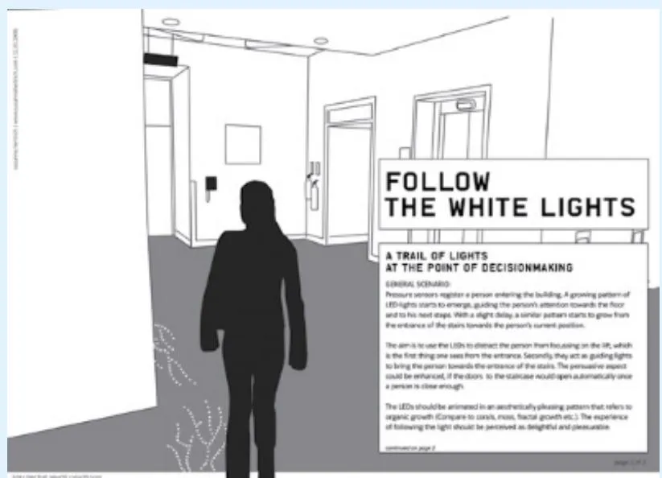  
Figure 3.4  The first page of a design concept for an ambient display

Many products are actually based on well-established conceptual models. For example, a conceptual model based on the core aspects of the customer experience when at a store underlies most online shopping websites. These include placing items that a customer wants to purchase into a shopping cart or basket and proceeding to checkout when they’re ready to make the purchase. Collections of patterns are now readily available to help design the interface for these core transactional processes, together with many other aspects of a user experience, meaning interaction designers do not have to start from scratch every time they design or redesign an application. Examples include patterns for online forms and navigation on mobile phones.

It is rare for completely new conceptual models to emerge that transform the way daily and work activities are carried out at an interface. Those that did fall into this category include the following three classics: the desktop (developed by Xerox in the late 1970s), the digital spreadsheet (developed by Dan Bricklin and Bob Frankston in the late 1970s), and the World Wide Web (developed by Tim Berners Lee in the late 1980s). All of these innovations made what was previously limited to a few skilled people accessible to all, while greatly expanding what is possible. The graphical desktop dramatically changed how office tasks could be performed (including  creating, editing, and  printing documents).  Performing these  tasks  using  the  computers prevalent at the time was significantly more arduous, having to learn and use a command language (such as DOS or UNIX). Digital spreadsheets made accounting highly flexible and easier to accomplish, enabling a diversity of new computations to be performed simply through filling in interactive boxes. The World Wide Web allowed anyone to browse a network of information remotely. Since then, e-readers and digital authoring tools have introduced new ways of reading documents and books online, supporting associated activities such as annotating, highlighting, linking, commenting, copying, and tracking. The web has also enabled and made many other kinds of activities much easier, such as browsing for news, weather, sports, and financial information, as well as banking, shopping, booking tickets, and learning online among other tasks. Importantly, all of these conceptual models were based on familiar activities.

# BOX 3.3

A Classic Conceptual Model: The Xerox Star

The Star interface, developed by Xerox in 1981 (see Figure 3.5), revolutionized the way that interfaces were designed for personal computing  (Smith et al., 1982;  Miller and  Johnson, 1996) and is viewed as the forerunner of today’s Mac and Windows desktop interfaces. Originally, it was designed as an office system, targeted at workers not interested in computing per se, and it was based on a conceptual model that included the familiar knowledge of an office. Paper, folders, filing cabinets, and mailboxes were represented as icons on the screen and were designed to possess some of the properties of their physical counterparts. Dragging a document icon across the  desktop screen was seen as equivalent to picking up a piece of paper in the physical world and moving it (but this, of course, is a very different action). Similarly, dragging a digital  document into a digital folder was seen as being analogous to placing a physical document into a physical cabinet. In addition, new concepts that were incorporated as part of the desktop metaphor were operations that could not be performed in the physical world. For example, digital files could be placed onto an icon of a printer on the desktop, resulting in the computer printing them out.

Figure 3.5  The Xerox Star   
  
Source: Used courtesy of Xerox

Video The history of the Xerox Star is at youtu.be/Cn4vC80Pv6Q.

# 3.4  Interface Metaphors

Metaphors are considered to be a central component of a conceptual model. They provide a structure that is similar in some way to aspects of a familiar entity (or entities), but they also have their own behaviors and properties. More specifically, an interface metaphor is one that is  instantiated  in  some  way  as  part  of  the  user  interface,  such  as  the  desktop  metaphor. Another well-known one is the search engine, originally coined in the early 1990s to refer to a  software  tool  that  indexed  and  retrieved  files  remotely  from  the  Internet  using  various algorithms to match terms selected by the user. The metaphor invites comparisons between a mechanical engine, which has several working  parts, and the everyday action of looking  in different places to find something. The functions supported by a search engine also include other features besides those belonging to an engine that searches, such as listing and prioritizing  the  results  of  a  search. It  also  does  these  actions in  quite  different  ways  from  how  a mechanical engine works or how a human being might search a library for books on a given topic. The similarities implied by the use of the term search engine, therefore, are at a general level. They are meant to conjure up the essence of the process of finding relevant information, enabling the user to link these to less familiar aspects of the functionality provided.

# ACTIVITY 3.2

Go to a few online stores and see how the interface has been designed to enable the customer to order and pay for an item. How many use the “add to shopping cart/basket”followed by the “checkout” metaphor? Does this make it straightforward and intuitive to make a purchase?

# Comment

Making a purchase online usually  involves spending money by inputting  one’s  credit/debit card details. People want to feel reassured that they are  doing this correctly and do not get frustrated with lots of forms  to fill in. Designing the interface to have a familiar metaphor (with an icon of a shopping cart/basket, not a cash register) makes it easier for people to know what to do at the different stages of making a purchase. Most important, placing an item in the basket does not commit the customer to purchase it there and then. It also enables them to browse further and select other items, as they might in a physical store.

Interface metaphors are intended to provide familiar entities that enable people readily to understand the underlying conceptual model and know what to do at the interface. However, they can also contravene people’s expectations about how things should be, such as the recycle bin (trash can) that used to sit on the desktop. Logically and culturally (meaning, in the physical world), it should be placed under the desk. But users would not have been able to see it because it would have been hidden by the desktop surface. So, it needed to go on the desktop. While some  people found this irksome, most did not find it to be a problem. Once they understood why the recycle bin icon was on the desktop, they simply accepted it being there.

An interface metaphor that has become a staple  in UX is the card. Many of the social media  apps,  such  as Twitter  and  Pinterest,  present their  content  on  digital  cards  that  are based on the idea behind most physical cards. They have a familiar form, having been around for a long time. Just think of how many kinds there are: playing cards, business cards, birthday cards, credit cards, and postcards to name a few. They have strong associations, providing an  intuitive way  of organizing  limited content  that is “card sized.” They  can easily  be flicked through, sorted, and themed. They structure content into meaningful chunks, similar to how paragraphs are used to chunk a set of related sentences into distinct sections (Babich, 2016). They have also become the standard interface model used in many self-ordering kiosks (see Figure 3.6).

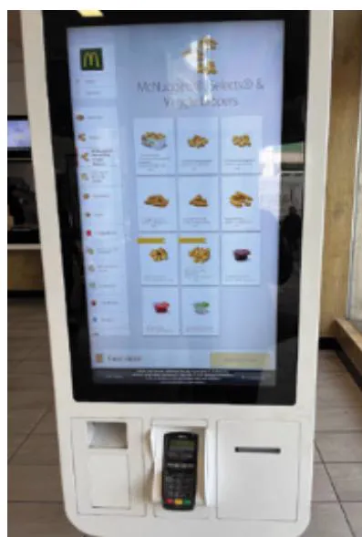  
Figure 3.6  A self-ordering kiosk found in many fast-food restaurants that uses a card metaphor as part of the interface. Each food or drink item is displayed on its own card with associated description and price. This enables the customer to easily select items they want to purchase from the category types in the card matrix while also going back and forth between the other high-level categories (e.g., burgers, vegan, cold drinks), shown down the left side of the display.

In  many  cases, metaphors become  integrated  into common  parlance,  as  witnessed  by the way  people talk about  them. For  example, parents  talk about  how  much screen  time children are allowed each day in the same way they talk more generally about spending time. It  can also  become  an everyday  term in its  own right, e.g., Googling.  Moreover, it  is hard not to use metaphorical terms when talking about technology  use, as they  have become so ingrained in the language that we use to express ourselves. Just ask yourself or someone else to describe Twitter or Instagram and how people use them. Then try doing it without using a single metaphor.

# BOX 3.4

# Why Are Metaphors So Popular?

People frequently use metaphors and analogies (here we use the terms interchangeably) as a source of inspiration for understanding and explaining to others what they are doing, or trying to do, in terms that are familiar to them. They are an integral part of human language (as originally explained by Lakoff and Johnson in their classic 1980 book Metaphors We Live $B y )$ ). Metaphors are commonly used to explain something that is unfamiliar or hard to grasp by way of comparison with something that is familiar and easy to grasp. For example, they are frequently employed in education, where teachers use them to introduce something new to students by comparing the new material with something they already understand. Consider the web and the Internet. How would you explain the difference between them to children? The BBC  on its BiteSize learning site (www.bbc.co.uk/newsround/47523993) distinguishes between them by describing the Internet as a network of connected computers that the web works on, which enables  emails, files, and streaming to move across it. To make this more concrete, they use the analogy of seeing the Internet as the roads that connect towns and cities together whereas the web contains the things that are built on roads like shops, houses, and schools. The vehicles on the roads are the data that moves around.

It is not surprising, therefore, to see how widely metaphors have been used in interaction design to conceptualize abstract, hard-to-imagine, and difficult-to-articulate computer-based concepts and interactions in more concrete and familiar terms and as graphical visualizations at the interface level. Metaphors and analogies are used in these three main ways:

•  As a way of conceptualizing what we are doing (for instance, live streaming)   
•  As a conceptual model instantiated at the interface level (for example, the card metaphor)   
•  As a way of visualizing an operation (such as an icon of a shopping cart into which items are placed that users want to purchase on an online shopping site)

However, the potential downside of using  interface metaphors is they don’t scale  very well, especially when trying to describe how complex systems work. Alan Cooper (2020) in a blog piece argues that we should abandon metaphors at the interface and explain the interface in terms of the concepts, function, and relationships underlying the system. He points out how difficult it can be to find a useful visual metaphor for many tasks conducted at the interface, such as buying a ticket or finding a reference. Do you agree with him?

# 3.5 Interaction Types

Another way of conceptualizing the design space is in terms of the interaction types that will underlie the user experience. Essentially, these are the ways a person interacts with a product or application. Originally, we identified four main types: instructing, conversing, manipulating, and exploring (Preece et al., 2002). A fifth type was proposed by Christopher Lueg et al. (2019) that we have added to ours, which they call responding. This refers to proactive systems  that  initiate  a request  in  situations to  which  a user  can  respond, for  example,  when Netflix pauses a person’s viewing to ask them whether they would like to continue watching.

Deciding upon which of the interaction types to use, and why, can help designers formulate a conceptual model before committing to a particular interface in which to implement them, such as speech-based, gesture-based, touch-based, menu-based, and so on. Note  that we are distinguishing here between interaction types (which we discuss in this section) and interface types (which are discussed in Chapter 7, “Interfaces”). While cost and other product constraints will often dictate which interface style can be used for a given application, considering the interaction type that will best support a user experience can highlight the potential trade-offs, dilemmas, and pros and cons.

Here, we describe in more detail each of the five types of interaction. It should be noted that they are not meant to be mutually exclusive (for example, someone can interact with a product based on different kinds of activities); nor are they meant to be definitive. Also, the label used for each type refers to the user’s action even though the product may be the active partner in initiating the interaction.

. Instructing: Where someone issues instructions to a system. This can be done in a number of ways, including typing in commands, selecting options from menus in a window environment  or on  a multitouch  screen, speaking  aloud commands, gesturing, pressing  buttons, or using a combination of function keys.   
• Conversing: Where a person has a dialogue with a system. They can speak via an interface or  type  in questions  to which the  system  replies  via text  or  speech  output. This is  often called a conversational user interface (CUI).   
? Manipulating: Where people interact with objects in a virtual or physical space by manipulating  them  (for  instance,  opening, holding,  closing,  and  placing). They  can  hone  their familiar knowledge of how to interact with objects.   
? Exploring: Where people move through a virtual environment or a physical space. Virtual environments  include  3D  worlds  comprising  augmented  or  virtual  reality. They  enable users to hone their familiar knowledge by physically moving around. Physical spaces that use  sensor-based technologies include smart rooms and ambient environments, also enabling people to capitalize on familiarity.   
• Responding: Where the system initiates the interaction and  the person chooses whether to respond. For example, proactive mobile location-based technology can alert people to points of interest. They can choose to look at the information popping up on their phone or ignore it.

Besides  these  core  activities  of  instructing,  conversing,  manipulating,  exploring,  and responding, it is possible to describe the specific domain- and context-based activities in which people  engage, such as learning,  working, socializing, playing,  browsing, writing, problemsolving, decision-making, and searching—just to name but a few. In the following sections we illustrate in more detail the five core interaction types and how to design applications for them.

# 3.5.1  Instructing

This type of interaction describes how someone carries out their tasks by telling the product what to do. Examples include giving instructions to a system to perform operations such as tell the time, print a file, and notify them of an appointment. A diverse range of products has been designed based on this model, including home entertainment systems, consumer electronics, and computers. The way in which a person issues instructions can vary from pressing buttons  to  giving  voice  commands.  Many  activities  are  readily  supported  by  giving instructions.

One of the main benefits of designing an interaction based on issuing instructions is that the  interaction is quick and efficient. It is particularly fitting where there is a frequent need to repeat actions performed on multiple objects. Examples include the repetitive actions of saving, deleting, and organizing files.

# ACTIVITY 3.3

There  are  many different  kinds of vending  machines in the  world. Each offers a range  of goods, requiring users to part with some of their money. Figure 3.7 shows photos of three different types of vending machines: one that provides soft drinks and the other two that deliver a range of snacks. Each machine uses an instructional mode of interaction. However, the way they do so is quite different.

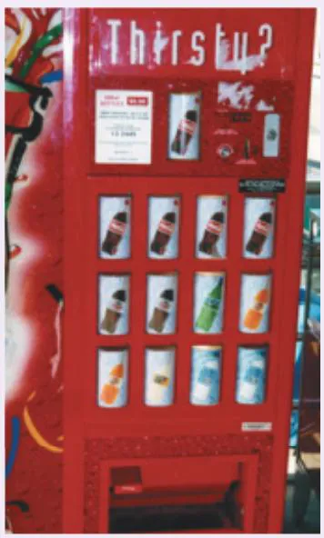


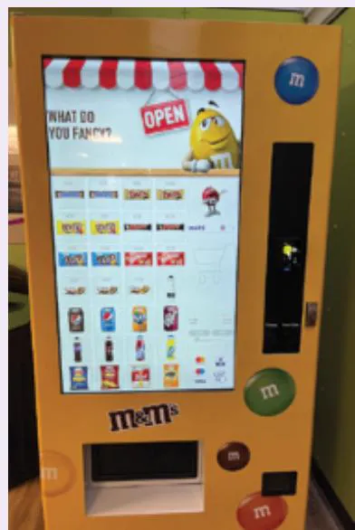  
Figure 3.7  Three different types of vending machine

What instructions must be issued to obtain a soda from the first machine, a bar of chocolate from the second, and a packet of chips from the third one? Why has it been necessary to design a more complex mode of interaction for the second vending machine? What problems can arise with this mode of interaction?

# Comment

The first vending machine has been designed using simple instructions. There is a small number of drinks from which to choose, and each is represented by a large button displaying the label of each drink. The person simply has to press one button, and this will have the effect of delivering the selected drink. The second machine is more complex, offering a wider range of snacks. The trade-off for providing more options, however, is that the person can no longer

(Continued)

instruct the machine using a simple one-press action but is required to follow a more complex process involving (1) reading off the code (for example, C12) under the item chosen, then (2) keying this into the number pad adjacent to the displayed items, and finally (3) checking the price of the selected option and ensuring that the amount of money inserted is the same or greater (depending on whether the  machine provides change). Problems that can arise from this type of interaction  are the customer misreading the code and/or incorrectly keying the code, resulting in the machine not issuing the snack or providing the wrong item.

The third vending machine has a large digital touch screen on the front. It provides the best of both worlds by providing a direct manipulation-style interface. The images that appear on the  display clearly show what the confectionary options are and beside each their price. The customer needs only to press the display of the object chosen and place their credit/debit phone on the card reader on the right. There is a much lower chance of error resulting from pressing the  wrong code or keys. The  interface is also flexible in being able to change the display to what products are available. This makes it easy to add a new product line when it comes out or change the price of a product. Another difference from the solely physical vending machines is that the digital display uses a visual metaphor of a candy store, with animated characters appearing on it—intended to lure passersby to stop and buy one of the displayed products. This can be very tempting.

# 3.5.2  Conversing

This form of interaction is based on the idea of a person having a conversation with a system, where  the  system  acts  as  a dialogue  partner. In  particular, the  system  is  often  designed to respond in  a way  that another  human  being might  when  having a  conversation. It  differs from the activity of instructing insofar as it encompasses a two-way communication process, with the system acting  like a partner rather than a machine  that obeys orders. It  has been most  commonly  used  for  applications  where  someone  needs to  find  out  specific kinds  of information  or  wants  to  discuss issues. Examples  include advisory  systems,  help  facilities, chatbots, and robots.

The  kinds  of  conversation  that  are  currently  supported  range  from  simple  voicerecognition,  menu-driven  systems  to  more  complex  natural  language–based  systems  that involve the system parsing and responding to queries typed in or spoken by the user. Examples of the former include banking, ticket booking, and train-time inquiries, where the user talks  to the  system  in single-word  phrases  and numbers, that  is,  yes, no,  three, and so  on, in response to prompts from the system. Examples of the latter include help systems, where the user types in a specific query, such as “How do I change the margin widths?” to which the  system  responds by  giving  various  answers. Advances  in  AI  during  the  last  few  years have resulted  in  a  significant  improvement in  speech  recognition  to  the extent  that many companies now routinely employ speech-based and chatbot-based interaction for their customer queries.

A  main  benefit  of  developing  a  conceptual model  that  uses  a  conversational  style  of interaction is that it allows people to interact with a system in a way that is familiar to them. For example, Apple’s speech system, Siri, lets you talk to it as if it were another person. You can  ask  it  to  do  tasks  for  you, such  as make  a  phone call,  schedule  a  meeting, or  send a

message. You can also ask it  indirect questions that  it knows how to answer, such as “Do I need an umbrella today?” It will look up the weather for where you are and then answer with something like, “It doesn’t look like it’s going to rain today” while also providing a weather forecast (see Figure 3.8).

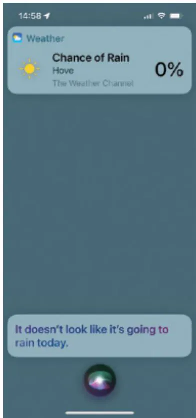  
Figure 3.8  Siri’s response to the question “Do I need an umbrella today?”

A problem that can arise from using a conversational-based interaction type is that certain kinds of tasks are transformed into cumbersome and one-sided interactions. This is especially true for automated phone-based systems that use auditory menus to advance the interaction. Users  have  to listen to a voice providing several options, then make a selection, and finally repeat through further layers of menus before accomplishing their goal, for example, reaching a real human or paying a bill. Here is the beginning of a dialogue between someone who wants to find out about car insurance and an insurance company’s phone reception system:

<user dials an insurance company>

“Welcome to St. Paul’s Insurance Company. Press 1 if you are a new customer; 2 if you are an existing customer.”

<user presses 1>

“Thank you for calling St. Paul’s Insurance  Company. If you require house insurance, say  1; car  insurance, say  2; travel insurance, say  3; health insurance, say  4; other, say 5.”

<user says $2 >$

“You have reached the  car insurance division. If you require  information about  fully comprehensive insurance, say 1; third-party insurance, say 2. . . .”


“If you’d like to press 1, press 3.

If you'd like to press 3,press 8.

If you'd like to press 8,press5..."

Source: © Glasbergen. Reproduced with permission of Glasbergen Cartoon Service

# 3.5.3  Manipulating

This form of interaction involves manipulating objects, and it capitalizes on people’s knowledge of how they do so in the physical world. For example, digital objects can be manipulated by moving, selecting, opening, and closing. Extensions to these actions include zooming in and out, stretching, and shrinking—actions that are  not possible with objects in the real world. Human actions can be imitated through the use of physical remotes (for example, VR controllers) or gestures made in the air, such as the gesture control technology now used in some cars. Physical toys and robots have also been embedded  with technology that enable them to act and react in ways depending on whether they are squeezed, touched, or moved. Tagged physical objects (such as balls, bricks, or blocks) that are manipulated in a physical world (for example, placed on a surface) can result in other physical and digital events occurring, such as a lever moving or a sound or animation being played.

A framework that has been highly influential (originating from the early days of HCI) in guiding the design of GUI applications is direct manipulation (Shneiderman, 1983). It proposes that digital objects in the interface can be designed so that they can be interacted with in ways that are analogous to how physical objects in the physical world are manipulated. In so doing, direct manipulation interfaces are assumed to enable users to feel that they are directly controlling the digital objects represented by the computer. The three core principles are as follows:

? Continuous representation of the objects and actions of interest   
•  Rapid reversible incremental actions with immediate feedback about the object of interest   
•  Physical actions and button pressing instead of issuing commands with complex syntax

According to these principles, an object on a screen remains visible while a user performs physical actions on it, and any actions performed on it are immediately visible. For example, they can move a file by dragging an icon that represents it from one part of the display into a folder. The benefits of direct manipulation include the following:

Helping beginners learn basic functionality rapidly   
Enabling experienced users to work rapidly on a wide range of tasks   
•  Allowing infrequent users to remember how to carry out operations over time   
. Preventing the need for error messages, except rarely   
Showing users immediately how their actions are furthering their goals

• Reducing users’ experiences of anxiety   
. Helping users gain confidence and mastery and feel in control

Many apps have been developed based on some form of direct manipulation, including word processors, video games, learning tools, and graphical and video editing tools. Scrolling using a finger on a touch screen and using a mouse with a laptop/PC display are also examples of direct manipulation.

# 3.5.4  Exploring

This mode of interaction involves people moving through virtual or physical environments. For example, they can explore aspects of a virtual 3D environment, such as the interior of a building. Physical environments can also be embedded with sensing technologies that, when they detect the presence of someone or certain body movements, respond by triggering certain digital or physical events. The basic idea is to enable people to explore and interact with an  environment, be it physical or digital, by exploiting  their knowledge of how they  move and navigate through existing spaces.

Many  3D virtual environments  have  been built  that comprise digital  worlds designed for people to move between various spaces to socialize in (e.g., Metaverse), to learn in (e.g., virtual conferences), or to play video games in (such as Fortnite). Many virtual landscapes depicting cities, parks, buildings, rooms, and datasets have also been built, both realistic and abstract, that enable users to fly over them and zoom in and out of different parts. Other augmented environments that have been developed are intended to be used in one’s living room, where hologram people or virtual animals can magically be made to appear (see Figure 3.9a). There are also virtual worlds that are larger than life, enabling people to move around them and experience things that are normally impossible or invisible to the eye. Architects create highly realistic VR representations of planned buildings and spaces that enable their clients and customers  to imagine how  they will use and move through them. 3D visualizations  of complex datasets have also been generated that enable scientists and researchers to immerse themselves in and manipulate the data points, using hand gestures (see Figure 3.9b).

  
(a)

  
(b)   
Figure 3.9  (a) A drop-in virtual lion appearing in someone’s living room created with Google 3D object; and (b) architects working together designing a 3D virtual model.

Source: (a) www.cnet.com/tech/services-and-software/google-3d-animals-how-to-use-cool-ar-feature-at-home-listof-objects (b) ME Image/Adobe Stock

# 3.5.5  Responding

This mode of interaction involves the system taking the initiative to alert, describe, or show a person something that it “thinks” is of interest or relevance to the context they are presently in. It can do this through detecting the location and/or presence of someone in a vicinity (for instance, a nearby coffee bar where friends are meeting) and notifying them about it on their phone or watch. Smartphones and wearable devices are becoming increasingly proactive in initiating  user  interaction  in  this  way, rather  than  waiting  for  the  user  to  ask,  command, explore, or manipulate. An example is a fitness tracker that notifies the wearer of a milestone they have reached for a given activity, for example, having walked 10,000 steps in a day. The fitness tracker does this automatically without any requests made by the wearer; the wearer can respond by looking at the notification on their screen or listening to an audio announcement that is made. Another example is when the system automatically provides some funny or useful information for the user, based on what it has learned from their repeated behaviors when carrying out particular actions in a given context. For example, after taking a photo of a friend’s cute dog in the park, Google Lens will automatically pop up information that identifies the breed of the dog (see Figure 3.10).

  
Figure 3.10 Google Lens in action, providing pop-up information about Pembroke Welsh Corgi having recognized the image as one

Source: https://lens.google.com

For  some  people, this kind  of system-initiated interaction—where additional  information is  provided that  has not been requested—might  get a bit tiresome or frustrating, especially if the system gets it wrong. The machine learning challenge is to decide when someone will find it useful and interesting and how much and what kind of contextual information to provide without overwhelming or annoying them. Also, it needs to know what to do when it gets it  wrong. For example, if it thinks the dog is a teddy  bear, will it apologize? Will the user be able to correct it and tell it what the photo actually is? Or will the system be given a second chance?

# 3.6 Paradigms, Visions, Challenges, Theories, Models, and Frameworks

Other sources of conceptual inspiration and knowledge that are used to inform design and guide research are paradigms, visions, challenges, theories, models, and frameworks. These vary in terms of their scale and specificity to a particular problem space. They are intended to help frame, guide, and scope a particular research or design project. A paradigm refers to a general approach that has been adopted by a community of researchers and designers for carrying  out  their work in terms of shared  assumptions, concepts, values, and practices. A challenge  is where researchers are tasked with addressing pressing and global issues facing society, such as improving sustainability and reducing poverty. A vision is a future scenario that frames research and development in interaction design—often depicted in the form of a film or a narrative. A theory is a well-substantiated explanation of some aspect of a phenomenon, for example, self-determination theory, which is a psychological theory of human motivation that has  been used to describe and analyze HCI research on games and play (Tyack and Mekler, 2020). A model is a simplification of some aspect of human-computer interaction intended  to make it easier for designers  to predict and evaluate alternative designs. A framework is a set of interrelated concepts and/or a set of specific questions that are intended to  inform  a  particular  domain  area  (for  example,  collaborative  learning)  or  an  analytic method (for instance, ethnographic studies).

# 3.6.1  Paradigms

Following a particular paradigm means adopting a set of practices upon which a community has agreed. These include the following:

. The questions to be asked and how they should be framed   
. The phenomena to be observed   
•  The way in which findings from studies are to be analyzed and interpreted (Kuhn, 1972)

Back  in  the  1980s,  when  GUIs  came  into  being,  the  prevailing  paradigm  in  interaction design was centered  around how  to design user-centered applications  for the desktop computer.  Questions  about  what  and  how  to  design  were  framed  in  terms  of  specifying the  requirements for  a  single  user  interacting  with a  screen-based  interface.  In the  1990s, a  paradigm  shift  occurred  with the  goal  of developing  ubiquitous computing. Many  HCI researchers  began to think  beyond the desktop and design mobile  and pervasive technologies. An array of technologies was developed that could extend what people could do in their everyday and working lives, such as smart glasses, tablets, and smartphones.

The next significant paradigm shift took place in the 2000s and was the emergence of Big Data and the Internet of Things (IoT). New and affordable sensor technologies enabled masses of data to be collected about people’s health, well-being, and real-time changes happening in the environment (for example, air quality, traffic congestion, and business). Smart buildings were also built, where an assortment of sensors were embedded and experimented with  in  homes,  hospitals,  and  other  public  buildings.  Data  science  and  machine-learning algorithms  were  developed  to  analyze  the  amassed  data  to  draw  new  inferences  about what actions to take on behalf of people to optimize and improve their lives. This included

introducing variable speed limits on highways, notifying people via apps of dangerous pollution levels, crowds at an airport, and so on. In addition, it became the norm for sensed data to be used to automate mundane operations and actions—such as turning lights or faucets on and off or flushing toilets automatically—replacing conventional knobs, buttons, and other physical controls.

The prevailing paradigm  in computing today is AI. Machine  learning (ML) is  increasingly being  used  at  the interface  to  help  with decision-making.  For  example, Spotify  uses machine learning models to suggest new tracks for the user to listen to based on all sorts of information about  them, such as  their playlists, listening  history, and how long they  listen and even the time of day. By analyzing all this information, systems like Spotify can personalize their recommendations to cater for different tastes in music.

Using ML models can also help people choose when there are a myriad of choices. For example, instead of having  to agonize over  which clothes to buy or vacation  to select, AIenabled personal assistants can help choose on your behalf. Another example of where ML is being used is to create personalized passenger experiences, based on customizing the right level of comfort (for example, see VW’s video).

Video VW’s vision of its future car can be seen in this video: youtu.be/AyihacflLto.

While there are many benefits of letting machines make decisions for us, it may come at a cost. We may feel a loss of control. Moreover, we may not understand why the AI system has chosen  to drive  the car along a particular route or why our voice-assisted  home robot keeps  ordering  too  much  milk.  There  are  increasing  expectations  that AI  should  be  able to explain the  rationale behind its  decisions. This need is often referred to as transparency and  accountability—which  we  discuss  further  in  Chapter  10,  “Data  at  Scale  and  Ethical Concerns.”

Since  the  early  2020s,  there  has  been  a  call  to  arms  for  making  AI  more  humancentered—with the goal that people should be augmented with AI tools rather than replaced with autonomous AI systems (e.g., Shneiderman, 2022). Stanford developed one of the first human-centered AI centers in 2020 (see the following video). The goal is to broaden the AI agenda from a largely technological perspective to one that is more human-centered, geared toward empowering humans. HCI’s role  in this paradigm shift is to collaborate more with AI  researchers and developers, generating new  dialogues, policies, framings, and questions about how to achieve this while also designing new kinds of user interfaces for AI systems.

Video  See  Stanford  university’s  video  on  HAI:  www.youtube.com/watch?v= 4W2kXBBFDw4&t=4s.

# 3.6.2  Visions

One of the most influential visions in computing was Mark Weiser’s (1991) who proposed that computers would become part  of the environment, embedded in a variety of everyday objects,  devices, and displays. He  envisioned a  world  of serenity, comfort, and  awareness, where  people were kept  perpetually informed  of  what  was happening around  them, what was  going to  happen, and what had  just  happened. Ubiquitous  computing devices  would enter a person’s center of attention when needed and move to the periphery of their attention when not, enabling  the person to switch calmly and effortlessly between  activities without having  to figure  out  how  to use  a computer  when  performing  their tasks. In  essence, the technology would be unobtrusive and largely disappear into the background. People would be able  to get on  with their everyday and working  lives, interacting with information  and communicating  and  collaborating with  others  without  being distracted  or becoming  frustrated  with  technology. This  vision  provided a  powerful driving  force  that  dominated the research and development that ensued in companies and universities, heavily influencing the computing community’s thinking, and inspiring them  especially regarding which technologies to develop and problems to research (Abowd, 2012).

However, as is often the case, what technologies materialized and how they changed society in the ensuing years has been quite different from the vision. Johannes Schöning (2019) has  even gone  so  far  as to write  about  the  failure  of the  field of  ubiquitous computing  to deliver on Mark Weiser’s vision, pointing out how instead it has created a world full of too many “dumb smart” technologies, where new  solutions may  look cool but  solve problems that do not exist.

Other visions about the future of technology and society have been portrayed through evocative videos, inviting audiences to imagine what life will be like in 10, 15, or 20 years’ time. One of the earliest was Apple’s 1987 Knowledge Navigator, which presented a scenario of a professor using a touchscreen tablet with a speech-based intelligent assistant reminding him of what he needed to do that day while answering the phone and helping him prepare his lectures. It was 25 years ahead of its time—set in 2011, the actual year that Apple launched its speech system, Siri. At the time, it was much viewed and discussed, inspiring widespread research into and development of future interfaces.

More recent visionary videos that have been produced have focused more on the application of artificial intelligence, such as for digital healthcare, future transport, homes, and cities. Likewise, an overarching goal  of these is  to inspire  R&D—but also as a way  of marketing their concept and future products.

Video You  can watch a video about the Apple Knowledge Navigator here:  youtu .be/HGYFEI6uLy0.

Science fiction has also become a source of inspiration in human-computer interaction (Jordan and Silva, 2021). By this, we mean in movies, writing, plays, and games that envision what role technology may play in the future. Dan Russell and Svetlana Yarosh (2018) discuss

the  pros and cons of using  different kinds of science fiction  for inspiration  in HCI  design, arguing that they can provide a good grounding for debate but are often not a great source of accurate predictions of future technologies. They point out how, although the visions can be  impressively futuristic, their embellishments  and  what they  actually  look like  are  often limited by the author’s ability to extend and build upon the ideas and the cultural expectations associated with the current era. For example, the holodeck portrayed in the classic Star Trek TV  series had 3D-bubble indicator lights and  push-button designs on its bridge with the sound of a teletype in the background. This is the case to such an extent that Russell and Yarosh even argue  that  the  priorities  and concerns  of the  author’s time  and  their cultural upbringing can bias the science fiction toward telling narratives from the perspective of the present, rather than providing new insights and paving the way to future designs.

In sum, visions provide concrete scenarios of how society can use the next generation of imagined technologies to make their lives more comfortable, safe, informative, and efficient. They  also  raise  questions  concerning  privacy, trust, and  what  we want  as  a  society. In so doing, they provide  much food for thought for researchers, policy-makers, and developers, challenging them to consider both positive and negative implications.

# 3.6.3  Challenges

While many technological challenges have been articulated through visions of the future (see, for example, Harper et al., 2008; Rogers, 2022), society itself is facing new challenges as the world  changes. These  include  grand  challenges  that  emphasize “a  difficult  but  important, systemic  and society-wide problem  with no ‘silver bullet’  solution” (Mazzucato  and Dibb, 2019). Examples include achieving zero hunger, quality education, gender equality, and sustainable cities and communities. What will it mean for HCI to become part of this challengeled agenda? How will their methods scale up to be able to make an impact?

HCI researchers are also addressing climate change, by challenging the values designed into  technologies  that  influence  society’s  practices  of  disposal,  recycling,  and  upcycling (e.g., Lechelt et al., 2020). Many of our devices, such as smartphones, laptops, and tablets, are  designed to have a short  lifespan. Users are  constantly  under pressure  to get the  latest model—by  instilling alternative  design values in  society, it  may be  possible  to support  the continuity of the material life of them for longer. This also requires the tech companies buying into alternative values, generating alternative business models and production cycles, and investing more in reusable materials.

# 3.6.4  Theories

Over the past 40 years, numerous theories have been imported into human-computer interaction, providing a means  of understanding  and informing the design  of user  interfaces and user experiences (Rogers, 2012). These  have been primarily  cognitive, social, affective, and organizational  in  origin. For  example, cognitive theories  about  human  memory  were  first used in the 1980s to determine the best ways of representing operations, given people’s memory limitations. One of the main benefits of applying such theories in interaction design is to help identify factors (cognitive, social, and affective) relevant to the design and evaluation of

interactive products. Others help us to frame and understand human behavior and the user experience. They serve a variety of roles including the following:

• Descriptive—providing concepts and models   
• Explanatory—explicating relationships and processes   
• Predictive—testing hypotheses about user performance   
• Prescriptive—providing guidance for design   
• Generative—creating something new   
. Informative—selecting knowledge to couch our understanding   
• Conceptual—developing high-level frameworks   
• Critical—critiquing interaction design

Some of  the  most  influential,  as  well  as more  recently  imported  theories  in HCI,  will be  covered  in  the next  three  chapters, including  cognitive, social, and  affective  aspects  of interaction.

# 3.6.5  Models

We discussed earlier why  a conceptual model  is important  and how to generate  one when designing a new product. The term model has also been used more generally in interaction design to describe, in a simplified way, some aspect of human behavior or human-computer interaction. Typically, it depicts how the core features and processes underlying a phenomenon are structured and related to one another. It is usually abstracted from a theory coming from a contributing discipline, like psychology. For example, Don Norman (1988) developed a number of models of user interaction based on early theories of cognitive processing, which were intended to explain the way users interacted with interactive technologies. These include the seven stages of action model that described how people move from their plans to executing physical actions that they need to perform to achieve them and to evaluating the outcome of their actions with respect to their goals. Since then, a number of user models have been developed  based on other theories about human behavior besides cognitive ones, including personality, emotions, and learning styles that are used to personalize the user interface and predict what different people would like in their digital interactions (e.g., a particular movie to watch).

# 3.6.6  Frameworks

Numerous  frameworks  have  been  introduced in  interaction design  to  help  designers  constrain and scope the user experience for which they are designing. In contrast to a model, a framework  offers advice to designers  as to what  to design or look for. This can come  in a variety  of  forms,  including  steps,  questions,  concepts,  challenges,  principles,  tactics,  and dimensions. Frameworks, like models, have traditionally been based on theories  of human behavior,  but  they  are increasingly  being developed  from  the experiences of  actual  design practice and the findings arising from user studies.

Many frameworks have been published in the HCI/interaction design literature, covering different aspects of the user experience and a diversity of application areas. For example, there are frameworks for helping designers think about how to conceptualize learning, working, socializing, fun, emotion, and so on, and others that focus on how to design particular kinds of technologies to evoke certain responses (see Chapter 6, “Emotional Interaction”).

# BOX 3.5

# Closing the Gap Between Conceptual and Design Models

A classic example of a conceptual framework that has been highly influential in HCI is Don Norman’s (1988) explanation of the relationship between the design of a conceptual model and a user’s understanding of it. The framework comprises three interacting components: the designer, the user, and the system. Behind each of these are the following:

Designer’s Model: The model the designer has of how the system should work

System Image: How the  system actually works, which is portrayed to the user through the interface, manuals, help facilities, and so on

User’s Model: How the user understands how the system works

The framework makes explicit the relationship between how a system should function, how it is presented to users, and how it is understood by them. In an ideal world, users should be able to carry out activities in the way intended by the designer by interacting with the system image that makes it obvious what to do. If the system image does not make the designer’s model clear to the users, it is likely that they will end up with an incorrect understanding of the system, which in turn will increase the likelihood of their using the system ineffectively and making errors. This has been found to happen often in the real world. By drawing attention to this potential discrepancy, designers can be made aware of the importance of trying to bridge the gap more effectively.

To summarize,  paradigms,  visions,  challenges,  theories,  models,  and  frameworks  are not mutually exclusive, but rather they overlap in their way of conceptualizing the problem and  design  space,  varying  in  their  level  of  rigor, abstraction,  and  purpose.  Paradigms  are overarching approaches that comprise a set of accepted practices and framing of questions and phenomena to observe; visions are scenarios of the future that set up  inspirations and questions  for interaction  design research  and technology  development;  challenges  provide societal  problems  that need  to  be  addressed;  theories  tend  to  be  comprehensive, explaining human-computer  interactions; models  are an  abstraction  that simplify  some  aspect of human-computer  interaction, providing a  basis for  designing and  evaluating  systems; and frameworks provide a set of core concepts, questions, or principles to consider when designing for a user experience or analyzing data from a user study.

# DILEMMA

# Who Is in Control?

A recurrent theme in interaction design, especially in the current era of AI-based systems, is who should be in control at the interface. The different interaction types vary in terms of how much control a person has and how much the computer has. While users are primarily in control for instructing direct manipulation interfaces, they are less so in responding to some types of interfaces, such as sensor-based and context-aware environments where the system takes the initiative to act. User-controlled interaction is based on the premise that people enjoy mastery and being in control. It assumes that people like to know what is going on, be involved in the action, and have a sense of power over the computer.

In contrast, autonomous and context-aware  control assumes  that having the  environment monitor, recognize, and detect deviations in a person’s behavior can enable timely, helpful, and even critical information to be provided when considered appropriate. For example, older people’s movements can be detected in the home and emergency or care services alerted if something untoward happens to them that might  otherwise go unnoticed, for instance, if they fall over and are unable to sound the alarm. But what happens if a person chooses to take a rest in an unexpected area (on the carpet), which the system detects as a fall? Will the emergency services be called out unnecessarily and cause care givers undue worry? Will the person who triggered the alarm be mortified at triggering a false alarm? And how will it affect their sense of privacy, knowing that their every move is constantly being monitored?

Another concern is what happens when the locus of control switches between user and system. For example, consider who is in control when using a GPS for vehicle navigation. At the beginning, the driver is very much in control, issuing instructions to the system as to where to go and what to include, such as highways, gas stations, and traffic alerts. However, once on the road, the system takes over and is in control. People often find themselves slavishly following what the GPS tells them to do, even though common sense suggests otherwise.

AI is also used in social media to control which posts appear in people’s feeds, with the goal of maximizing revenue from advertising and other sources. However, the user is given the  illusion of control  by being  allowed to determine  how  to scroll through  the  feed and when to quit.

To what extent do you need to be in control in your everyday and working life? Are you happy to let technology monitor and decide what you need or might be interested in knowing, or do you prefer to tell it what you want to do? What do you think of autonomous cars that drive for  you? While it might be safer  and more fuel-efficient, will it take the pleasure out of driving?

A tongue-in-cheek video made by Superflux, called Uninvited Guests, shows who is very much in control when a man is given lots of smart gadgets by his children for his birthday to help him live more healthily: vimeo.com/128873380.

# In-Depth Activity

The aim of this in-depth activity is for you to think about the appropriateness of different kinds of conceptual models that have been designed for similar physical and digital artifacts.

Compare the following:

•  A paperback book and an ebook   
•  A paper-based map and a smartphone map app

What are the main concepts and metaphors that have been used for each? (Think about the way time is conceptualized for each of them.) How do they differ? What aspects of the paper-based artifact have informed  the digital app? What is the new functionality? Are any aspects of the conceptual model confusing? What are the pros and cons?

# Summary

This chapter stressed throughout the need to be explicit about the claims and assumptions behind design decisions that are suggested. It described an approach to formulating a conceptual model and explained the evolution of interface metaphors that have been designed as part of the conceptual model. Finally, it considered other ways of conceptualizing interaction in terms of interaction types, paradigms, visions, challenges, theories, models, and frameworks.

# Key Points

•  A fundamental aspect of interaction design is to develop a conceptual model.   
•  A conceptual model is a high-level description of a product in terms of what users can do with it and the concepts they need to understand how to interact with it.   
•  Conceptualizing the problem space in this way helps designers specify what it is they are doing, why, and how it will support people in the way intended.   
•  Decisions about conceptual design should be made before commencing physical design (such as choosing menus, icons, dialog boxes).   
•  Interface metaphors are commonly used as part of a conceptual model.   
•  Interaction types (for example, conversing or instructing) provide a way of thinking about how best to support the activities users will be doing when using a product or service.   
•  Paradigms, visions, theories,  challenges, models, and  frameworks provide  different  ways of framing and informing design and research.

# Further Reading

Here we recommend a few seminal readings on interaction design and the user experience (in alphabetical order).

DOURISH, P. (2001) Where the Action Is. MIT Press. This classic book presents an approach for thinking about the design of user interfaces and user experiences based on the notion of embodied interaction. The idea of embodied interaction reflects a number of trends that have emerged in HCI, offering new sorts of metaphors.

JANLERT, L-E. and STOLTERMAN, E. (2017) Things That Keep Us Busy: The Elements of Interaction. MIT Press. This book provides an in-depth investigation of what interaction is and how the concept of the interface has changed over time. Through elucidating the concepts and models of the interface and interactivity, Janlert and Stolterman open up the debate about the future of our digital interactions.

JOHNSON, J. and HENDERSON, A.  (2012) Conceptual Models:  Core to  Good Design. Morgan and Claypool Publishers. This short book, in the form of a lecture, provides a comprehensive overview of what is a conceptual model using detailed examples. It outlines how to construct one and why it is necessary to do so. It is cogently argued and shows how and where this design activity can be integrated into interaction design.

LONG, J. (2021) Approaches and Frameworks for HCI Research. CUP. This book is intended for junior researchers starting  out. It surveys  research models and methods in use today. It also provides a general framework intended to bring together the disparate concepts that can be used to inform their own research frameworks and methods.


# INTERVIEW with Albrecht Schmidt

Albrecht  Schmidt  is  professor  of  humancentered ubiquitous media in the computer science  department  of  the  Ludwig-Maximilians-Universität München in Germany. He  studied  computer  science  in  Ulm  and Manchester and received a PhD from Lancaster  University,  United  Kingdom,  in 2003. He held several prior academic positions  at  different  universities,  including Stuttgart, Cambridge, Duisburg-Essen, and

Bonn.  He  also  worked  as  a  researcher  at the  Fraunhofer  Institute  for  Intelligent Analysis  and  Information  Systems  (IAIS) and at  Microsoft Research in Cambridge. In his research, he investigates the inherent complexity  of  human-computer  interaction  in  ubiquitous  computing  environments,  particularly  in  view  of  increasing computer intelligence  and system  autonomy.  Albrecht  has  actively  contributed  to

(Continued)

the scientific discourse in human-computer interaction  through  the  development, deployment, and  study  of functional  prototypes of interactive systems and interface technologies  in  different  real  world domains.  Most  recently, he  is  focused  on how  information  technology  can  provide cognitive  and  perceptual  support  to  amplify the human mind.

How do you think future visions inspire research in interaction design? Can  you give an example from your own work?

Envisioning the future is key to research in human-computer  interaction.  In  contrast to traditional fields that discover phenomena (such as physics or sociology), research in  interaction  design  is  constructive  and creates new things that potentially change our world. Research in  interaction design also analyzes the world and aims to understand  phenomena but  mainly  as  a  means to inspire  and guide innovations. A major aspect of research is then to create concrete designs,  build  concepts  and  prototypes, and evaluate them.

Future  visions  are  an  excellent  way  to describe the big picture  of a future where we still have to invent and implement the details. A vision enables us to communicate the overall goal for which we are aiming as well  as its  social  and  cultural embedding. In formulating the vision, we have to contextualize our ideas, link them to practices in  our  lives,  and  describe  the  anticipated impact  on  individuals  and  society. A  prerequisite for formulating a coherent future vision is a good understanding of the problems that we want to address. If formulated well, the vision shows a clear direction, but it leaves  room for researchers in  the community to  make their  own  interpretation. A well-formulated future vision also leaves room for individuals to align their research efforts with the goal or to criticize it funda-

mentally through their research.

We have proposed  the vision  of amplifying  human  perception  and  cognition through digital technologies (see Schmidt, 2017a,b).  This  vision  emerged  from  our various concrete research prototypes over the last 10 years. We realized that many of the prototypes and technologies we developed  were  pointed  in  a  similar  direction: enabling  superhuman  abilities  through devices and applications. At the same time, we  demonstrate  why  amplifying  human abilities is a timely endeavor, in particular, given the current advances in  artificial intelligence, in sensing  technologies, as well as  in  personal  display  devices.  For  our group  and  for  colleagues  with  whom  we work, this  vision has become  a means for inspiring new ideas, for investigating relevant areas for potential innovation systematically, and for assessing ideas early on.

Visions are also useful to discuss potentially risky  directions in research. In “The End  of  Serendipity:  Will  Artificial  Intelligence Remove Chance and  Choice in  Everyday  Life?”  I  have  formulated  aspects of  a  dystopian  vision  that  highlights  the challenges  when  humans  delegate  their decisions  to  intelligent  systems  (Schmidt, 2021). With this we want to create awareness  in  the  community  and  at  the  same time help to ground the discussion in realistic problems in the context of real people.

# Why do metaphors persist in HCI?

Good metaphors allow people to transfer their understanding and skills from another domain in the  real world to interaction with computers and data. Good metaphors are  abstract  enough  to  persist  over  time, but concrete enough to simplify the use of computers. Early metaphors included computers as an advanced typewriter and computers as intelligent  assistants. Such  metaphors help  in the design process to create

understandable  interaction  concepts  and user  interfaces. A  designer  can  take  their idea  for a user  interface  or  an interaction concept  and evaluate it in the light of the metaphor.  They  can  assess  if  the  interaction  is  understandable for people  familiar with the concept or technologies on which the  metaphor  is  based.  Metaphors  often suggest  interaction  styles  and  hence  can help to create interfaces that are more consistent and interaction designs that can be used  without  explanation  using  intuition (which  in  this  case  is  the  implicit  understanding of the metaphor).

Metaphors for which the underlying concept has disappeared  from everyday usage may  still  persist. In many cases, users  will not  know the  original concept  from their own experience (for example, a typewriter), but have grown up with technologies using the metaphor. For a metaphor to persist, it must remain conducive  and  helpful  over time for  new  users  as well as for  experienced ones. In the digital age, products and services change more rapidly in appearance and function. This is much faster than what we were used to from the physical world. A typewriter from 1950 and 1980 were very similar  in form and  function. Facebook in 2010 was vastly different from the current version. Moving more toward the  digital realm, we may  see  more digitally  inspired interface metaphors surface, such as an “activity stream” or a “calendar view.”

What  do  you  think  of  the  rise  of  AI  and automation?  Do you  think  there  is  a role for HCI, and if so, what?

Advancements  in  AI  and  in  automation are  exciting.  They  have  the  potential  to empower  humans  to  do  things,  to  think things, and to experience things we cannot

even imagine right now. However, the key to  unlocking  this  potential  is  to  create efficient ways for interacting with artificial intelligence.  Meaningful  automation  and intelligent systems always have boundaries and  intersections with  human action.  For example,  an  autonomous  car  will  transport a human, a drone will deliver a parcel to a person, an automated kitchen will prepare  a  meal  for  a  family,  and  large-scale data  analytics  in  companies  will  lead  to better  services  for  their  customers.  With intelligent  systems and smart services taking  a  more  active  role  through  artificial intelligence,  the way  in  which  interaction and  interfaces are designed  becomes  even more crucial. These interfaces between humans  and  embodied  artificial  intelligence will  impact  how  we  experience  the  real world. Here, embodiment ranges from mobile  devices  to  wearables, cars,  buildings, and  entire  cities.  Creating  a  positive  user experience in  the presence  of  artificial intelligence is a challenge where new visions and metaphors are required.

One  concept  that  we  suggested  is  the notion  of  intervention  user  interfaces (Schmidt  and  Herrmann,  2017). The  basic  expectation  is  that  in the  future  many intelligent  systems  in  our  environment will  work  just  fine,  without  any  human interaction.  However, to  stay  in  control and  to  tailor  the  system  to  current  and unforeseeable needs, as well as to customize  the  user  experience,  human  interventions  should  be  easily possible. Designing interaction concepts for interventions and user  interfaces  that  empower  humans  to make  the  most  of  a  system  driven  by  artificial  intelligence  is  a  huge  challenge and  includes  many  basic  research  questions.  Getting  the  interaction  with  AI

(Continued)

right,  basically  finding  ways  for  humans to harness  the  power of AI for what  they want to do, is  as important  as developing the underlying algorithms. One without the other  is  of  very  limited  value.  If  systems do  not  support  humans,  it  is  in  my  view unethical  to  spend  resources  on  building them. And if systems are beneficial to one group but have negative impact on another group, we should at least be aware of it.

# What do you  see are the challenges ahead for HCI at scale?

There  are  many  challenges  ahead  in  the context of autonomous systems and artificial intelligence as outlined earlier. Closely related  to  this  is  human  data  interaction beyond interactive visualization. How can we  empower  humans  to  work  with  big and unstructured data? Here is a concrete example: I  had a  discussion  with medical professionals  this  morning.  For  a  specific cancer  type,  there  are  several  thousand publications  readily  available.  Many  of them may have similar results, and others may have  conflicting ones.  Reading all of the publications in their current form is an intractable problem for a human reader, as it would take too long and would overload a  person’s working  memory.  The  simple question  that  resulted  from  the  discussion is: What would a system and interface look like that uses AI to preprocess 10,000 papers, allows  interactive  presentation  of relevant  content,  and  enables  humans  to make sense of the state of the art and come up  with  its  own  hypotheses?  Preferably, the interface would support  the person  to do this in a few hours, rather than in their entire lifetime.

Another challenge at the societal scale is to understand  the long-term  impact of interactive  systems  that  we  create.  How do  they  impact  the  mental  and  physical health  of  people  in  the  long  term?  How will  it  change  people’s  values?  Who  in society  will  benefit?  So  far, this  was  at best trial  and error  and often  completely outside of the design considerations. Providing  unlimited  and  easy-to-use  mass communication  to  individuals  without journalistic  training  has  changed  how we  read  news.  Personal  communication  devices  and  instant  messaging  have altered  communication  patterns  in  families and classrooms. Working in the office using a computer  in order to create texts is reducing our physical movements. The way  that  we  design  interactive  systems, the things  we  make  easy  or hard  to  use, and the modalities that we  choose in our interaction  design have  inevitably  resulted in  long-term  impacts on  people. With the  current  methods  and  tools  in  HCI, we  are  well  equipped  to  do  a  great  job in developing easy-to-use systems with an amazing  short-term  user  experience  for the  individual. A  concrete  question I  am interested in is: How would we design an interface  and  a  (digital)  workplace  that will support people’s productivity as well as their  health over  10, 20, or 30  years? Looking at  upcoming  major  innovations in  mobility  and  healthcare  technologies, the interfaces  we  design may  have  many more consequences. One major challenge at scale is to design for a longer-term user experience (months to years) on a societal scale. Here  we  still first  have  to  research and invent methods and tools.

# Chapter 4

# C O G N I T I V E  A S P E C T S

4.1  Introduction   
4.2  What Is Cognition?   
4.3  Cognitive Frameworks

# Objectives

The main goals of the chapter are to accomplish the following:

•  Explain what cognition is and why it is important for interaction design.   
•  Discuss what attention is and its effects on our ability to multitask.   
•  Describe how memory can be enhanced through technology aids.   
•  Show  the  difference  between  various  cognitive  frameworks  that  have  been  applied to HCI.   
•  Explain what mental models are.   
•  Be able to elicit a mental model and understand what it means.

# 4.1 Introduction

Imagine that it is getting late in the evening and you are sitting in front of your laptop. You have a report to complete by tomorrow morning, but you are not getting very far with it. You begin to panic and start biting your nails. You see several notifications flash up on your smartphone. You instantly abandon your report and cradle your smartphone to read them. One is  a message from your mother, and the other is a text from your friend asking if you want to  go out for a  drink. You  reply immediately  to both of  them. Before you  know it, you’re back on Instagram to see whether any of your friends have posted anything interesting lately. Your phone rings, and you see that it’s your dad calling. You answer it, and he asks if you have been watching the football game. You say that you are too busy working toward a deadline, and he tells you that your team has just scored. You  chat with him for a while and then  say you have to get back to work. You  realize  30 minutes have passed, and  you return your attention to your report. But before you realize it, you click your favorite sports site to check the latest score of the football game and discover that your team has just scored again. Your phone starts buzzing. More new WhatsApp messages are waiting for you. And

on it goes. You  glance at the time on  your laptop. It is midnight. You  really are in a panic now and finally close everything down except your word processor.

With the advent of smartphones and the Internet, it has become increasingly common for people to be switching their attention constantly among multiple tasks. The study of human cognition can help us understand the impact of multitasking on human behavior. It can also provide insights into other types of digital behaviors, such as decision-making, searching, and designing when using computer technologies by examining human abilities and limitations.

This chapter covers the cognitive aspects of interaction design. It considers what humans are good  and bad at, and it shows how this knowledge can inform the design of technologies  that both  extend  human  capabilities  and compensate  for human  weaknesses.  Finally, relevant cognitive  theories, which  have been  applied in  HCI to  inform  technology  design, are described. (Other ways of conceptualizing human behavior that focus on the social and emotional aspects of interaction are presented in the following two chapters.)

# 4.2 What Is Cognition?

There are many different kinds of cognition, such as thinking, remembering, learning, daydreaming,  decision-making,  seeing,  reading,  writing, and  talking.  A  classic  way  of  distinguishing  between  different  modes  of cognition  is  in  terms  of whether  it  is  experiential  or reflective (Norman, 1993). Experiential cognition is a state of mind where people perceive, act, and react to events around them intuitively and effortlessly. It requires reaching a certain level of expertise and engagement. Examples include driving a car, reading a book, having a conversation, and watching a video. In contrast, reflective cognition involves mental effort, attention,  judgment,  and  decision-making,  which  can  lead  to  new  ideas  and  creativity. Examples include designing, learning, and writing a report. Both modes are essential for everyday life. Another popular way of describing cognition is in terms of fast and slow thinking (Kahneman, 2011). Fast thinking is similar to Don Norman’s experiential mode insofar as it is instinctive, reflexive, and effortless, and it has no sense of voluntary control. Slow thinking, as the name suggests, takes more time and is considered to be more logical and demanding, and it requires greater concentration. The difference between the two modes is easy to see when asking someone to give answers to the following two arithmetic equations:

$$
\begin{array}{l} 2 + 2 = \\ 2 1 \times 1 9 = \\ \end{array}
$$

The former can be done by most adults in a split second without thinking, while the latter requires much mental effort; many people need to externalize the task to be able to complete it by writing it down on paper and using the long multiplication method. Nowadays, many people simply resort to fast thinking by typing the numbers to be added or multiplied into a calculator app on a smartphone or computer.

Other ways in which cognition has been couched in interaction design are in terms of the context in which it takes place, the tools that are employed, the artifacts and interfaces that are used, and the people involved (Rogers, 2012). Depending on  when, where, and how  it

happens, cognition can be distributed, situated, extended, and embodied. Cognition has also been described in terms of specific kinds of processes (Eysenck and Brysbaert, 2018). These include the following:

• Attention   
. Perception   
. Memory   
. Learning   
. Reading, speaking, and listening   
. Problem-solving, planning, reasoning, and decision-making

It is important to note that many of these cognitive processes are interdependent: Several may be involved for a given activity. It is rare for one to occur in isolation. For example, when reading a book, one has to attend to the text, perceive and recognize the letters and words, and try to make sense of the sentences that have been written.

In  the  following  sections  we  describe  the  main  kinds  of  cognitive  processes  in  more detail, followed  by  a summary  box highlighting  the core  design implications  of each. The most  relevant  for  interaction design  are  attention and  memory,  which  we  describe  in  the greatest detail.

# 4.2.1  Attention

Attention is central to everyday life. It enables us to cross the road without being hit by a car or bicycle, notice when someone is calling our name, and be able to text while at the same time  watching TV. It  involves selecting  things on  which to concentrate, at a point  in time, from the range of possibilities available, allowing us to focus on information that is relevant to what  we are  doing. The  extent to which  this process  is  easy or  difficult depends  on  (1) whether someone has clear goals and (2) whether the information they need is salient in the environment.

# Clear Goals

If someone knows exactly what they want to find out, they try to match this with the information that is  available. For example, when someone has  just landed  at an  airport after a long flight, which did not have Wi-Fi onboard, and they want to find out who won the World Cup, they might scan the headlines on their smartphone or look at breaking news on a public TV  display inside the airport. When someone is not sure exactly what they are looking for, they may browse through information, allowing it to guide their attention  to interesting or salient items. For example, when going to a restaurant, someone may have the general goal of eating a meal but only a vague idea of what they want to eat. They peruse the menu to find things  that whet  their appetite, letting their attention be  drawn  to the  imaginative  descriptions of various dishes. After scanning through the possibilities and imagining what each dish might be like, as well as considering other factors, such as cost, who they are with, what are the  specials, what  the  waiter recommends, and whether  they want  a  two- or  three-course meal, and so on, they then decide.

# Information Presentation

The way information is displayed can also greatly influence how easy or difficult it is to comprehend appropriate pieces of information. Look at Figure 4.1, and try the activity (based on Tullis, 1997). Here, the information-searching tasks are precise, requiring specific answers.

  
(a)

  
(b)   
Figure 4.1  Two different ways of structuring the same information at the interface level. One makes it much easier to find information than the other.

Source: Used courtesy of Dr. Tom Tullis

# ACTIVITY 4.1

Look at the top screen of Figure 4.1 and (1) find the price for a double room at the Quality Inn in Columbia, South Carolina, and (2) find the phone number of the Days Inn in Charleston, South Carolina. Then look at the bottom screen in Figure 4.1 and (1) find the price of a double room at the Holiday Inn in Bradley, Pennsylvania, and (2) find the phone number of the Quality Inn in Bedford, Pennsylvania. Which took longer to do?

In an initial study, Tullis found that the two screens produced quite different results: It took an average of 3.2 seconds to search the top screen, while it took an average of 5.5 seconds to find the same kind of information in the bottom screen. Why is this so, considering that both displays have the same density of information relative to the background?

# Comment

The primary reason for the disparity is the way that the information is grouped in the display. In the top screen, it is grouped into vertical categories (that is, place, type of accommodation, phone number, and rates), and this screen has space in between the columns. In the bottom screen, the information is bunched together, making it much more difficult to search. In addition, in the bottom screen, data field identifiers such as “Hotel/Motel” are embedded in every data row, adding to the amount of text a reader must sift through to find desired information. In the top screen, these field identifiers appear only in the top “header” row, making the top screen much less cluttered and therefore easier and faster to comprehend.

# Multitasking and Attention

As  mentioned  in  the introduction  to  this chapter, many people  now  multitask, frequently switching their attention among different tasks. There has been considerable research investigating  the pros and cons of multitasking and its occurrence among different  populations. Not surprisingly, it is most prevalent among young people. Karen Ettinger and Anat Cohen (2020), for example, found that teens engage in multitasking by switching between various combinations, such as listening to music, texting, and social networking.

A question that is often raised is whether it is possible to perform multiple tasks without one or more of them being detrimentally affected. The focus has been on the effects of multitasking on memory and attention (Burgess, 2015). A general finding is that it depends on the nature of the tasks and how much attention each demands. For example, listening to gentle music  while  working  can  help  people tune out  background  noise,  such as  traffic or  other people talking, and help them concentrate on what they are doing. However, if the music is loud, it can be distracting.

Individual  differences  have  also  been  found  between  light  and  heavy  multitaskers. A heavy multitasker is someone who switches frequently between different tasks using multiple media channels (e.g., the person described in the introduction of this chapter), whereas a light media multitasker is someone who focuses on their main task (e.g., writing an essay) and may switch tasks only infrequently, for example, to check their phone occasionally. Findings from a series of studies comparing heavy with light multitaskers have shown that heavy media multitaskers are more prone to being distracted by the multiple streams of media they

are viewing than those who infrequently multitask (Ophir et al., 2009). Light media multitaskers, on the other hand, were found to be better at allocating their attention when faced with competing distractions. This suggests that people who are heavy multitaskers are likely to be those who are easily distracted and find it difficult to filter out irrelevant information. It is not clear, however, whether people who are easily distracted are predisposed to becoming heavy multitaskers.

Hence, the main  reason why  multitasking is  thought to be detrimental for human performance is  that  it  overloads people’s capacity  to focus. Additional effort  is  required after switching attention  from  what someone  is  working  on to  another piece  of information  in order to get back into the other task and to remember where they were in the ongoing activity. Thus, the time to complete a task can be significantly increased. For example, a study of completion rates of coursework found that students who were involved in instant messaging took up to 50 percent longer to read a passage from a textbook compared with those who did not instant message while reading (Bowman et al., 2010). Multitasking can also result in people losing their train of thought, making errors, and needing to start over again.

Since this early research, the findings from more recent studies have been less clear-cut. A meta-review of the literature pointed out that while many studies continue to show heavy media multitaskers exhibiting poorer performance compared with light media multitaskers, several other  studies have not  found a relationship  between  multitaskers and performance (Uncapher  and Wagner, 2018). Instead, Danielle Lottridge  et  al. (2015)  proposed  that  the relationship may  be more complex. Interestingly, they  found that while heavy multitaskers are  easily  distracted, they  can  also  put  this  to  good  use  if  the  distracting  sources  are  relevant to the task in hand. They conducted a study that involved writing an essay under two conditions—with either relevant or irrelevant information. Their findings showed that if the information sources were relevant, they did not affect the essay writing of heavy multitaskers. In contrast, the condition where irrelevant information was provided was found to negatively impact task performance. In summary, they found that multitasking can be both good and bad—it depends on what you are distracted by and how relevant it is to the task at hand.

# BOX 4.1

# A Novel Kind of Notification That Helps People from Getting Distracted

To help people get back on track or prevent them being distracted in the first place, a diversity of apps and  tools have been developed. Many are  designed to block or limit the  distracting sources, such as notifications, newsfeeds, and  social media. For example, FocusMe (focusme.com) is an app that claims to “wall off online temptation” and, in so doing, help people improve their willpower so they can develop better digital habits. Other tools provide a weekly summary of the time someone has spent each week on different tasks, such as email or meetings. The aim of this kind of aggregate weekly visualization is to help people reflect on their stats and see whether they could improve upon how they spend their time.

Judith Borghouts, Duncan Brumby, and Anna Cox (2020) developed a design intervention called TimeToFocus, which is intended to provide people with awareness and feedback in real time about  their  distraction behavior. Essentially, it is a  browser extension  that asks a person to select a main task window to focus on (see Figure 4.2). If they get distracted by other online activities, such as email or browsing the web, it notifies them as to how much time they have switched away from their main task window. In a series of user studies investigating the effectiveness  of increasing awareness  of time spent  away from an allocated  task window, Borghouts  et al. found that their TimeToFocus  intervention enabled  participants to reflect more on their interruption behavior. In turn, this helped them change their working habits by reducing the number of irrelevant activities they partook in during their time away from the main task. Having a pop-up notification that reminds you of how long you have been away from your main task may just do the trick!

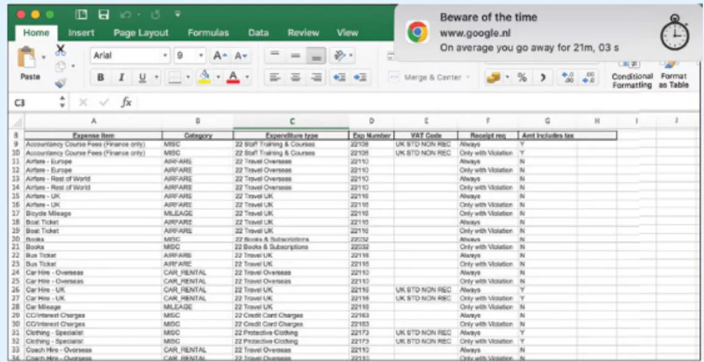  
Figure 4.2  The  TimeToFocus  browser  extension (in upper-right  corner)  that pops up to warn a person about how much time they have spent away from their main task window Source: Borghouts et al. (2020)

Many people are expected to multitask in the workplace nowadays, such as in hospitals, as  a  result  of  the  introduction  of  ever  more  technology  (for  example,  multiple  screens  in an  operating room). The technology  is  often introduced to provide new  kinds of real-time and changing information. Research into how  well clinicians  manage to switch and divide their attention  among different tasks in tech-rich environments  also suggests it is  complex, depending on a number of individual and contextual factors as to how effective they are at achieving this (Douglas et al., 2017). For example, a study of attention switching in a clinical setting showed that when there was a lot of attention switching—as indicated by logged

data from the electronic health records that were accessed—more wrong-patient errors were made (Lou  et al., 2022). By this is meant when a patient is identified incorrectly, regardless of whether the error translates into patient harm.

Managing the ever-increasing information load requires professionals, like clinicians, to develop new attention and scanning strategies, looking out for anomalies in data visualizations and listening for audio alarms alerting them to potential dangers. Interaction designers have tried to help by  including  the use of ambient displays that come on  when something needs attention—flashing  arrows to direct attention  to a particular type of data or  history logs of recent actions that can be quickly examined to refresh one’s memory of what has just happened on a given screen. In the future, other technologies, such as speech-based interfaces and augmented reality, may prove to be effective at alerting people to what needs attending to at a given time.

  
This project calls for real concentration. Are you still able tomonotask?

Source: Chris Wildt / Cartoon Stock

# DILEMMA

Is It OK to Use a Phone While Driving?

There has been considerable debate about whether drivers should be able to talk or text on their phones at the  same time as driving (see Figure 4.3). People talk on their phones while walking, so why not be able to do the same thing when driving? The main reasons are that driving is more demanding, drivers are more prone to being distracted, and there is a greater chance of causing accidents  (however, it is also the case that some pedestrians, when using their  phones, walk out  into a  road without  looking to see  whether any  cars are  coming). A meta-review of research that has investigated mobile phone use in cars has found that drivers’ reaction times to external events are longer when engaged in phone conversations (Caird et al., 2018).

Figure 4.3  How distracting is it to be texting on the phone while driving?   
  
Source: Tetra Images / Alamy Stock Photo

What might be the reasons for this deterioration in driving performance? Early research showed that drivers who use phones were much poorer at staying in their lane and maintaining the  correct speed (Stavrinos et al., 2013). It appears that drivers on a phone rely more on their expectations about  what is likely to happen next and, as a result, respond  much more slowly to unexpected events, such as the car  in front of them stopping (Briggs et al., 2018). Moreover,  phone  conversations  cause  the  driver visually to imagine  what is being talked about. The driver may also imagine the facial expression of the person to whom they are speaking. The visual imagery involved competes for the processing resources also needed to enable the driver to notice and react to what is in front of them on the road. The idea that using a hands-free device is safer than actually holding the phone to carry out a conversation is not true, as the same type of cognitive processing takes place both ways. And yet using a hands-free phone is legal in many countries. Research has shown how drivers rationalize to themselves why they can’t see a connection between talking on the phone when they are driving and the  risk of crashing (Wells et al, 2021). In particular, a common justification  is the perceived need to be always available should anyone need to contact them.

It has  also been found  that drivers who  engage in conversation with their passengers experienced similar negative effects. However, there is a difference between having a conversation with a passenger sitting next to the driver and one with a person located remotely. The driver and  front-seat passenger  can observe  jointly what is happening in front of them on the road and will moderate or cease their conversation in order to switch their full attention to a potential or actual hazard. Someone on the other end of a phone, however, is not privy to what the driver is seeing and will carry on the conversation. They might have just asked “Where did you leave the spare set of keys?” and caused the driver mentally to search for them

(Continued)

in their home, making it more difficult for them to switch their full attention back to what is happening on the road.

Because of these hazardous problems, many countries have now banned the use of mobile phones while driving. To help drivers  resist the temptation to answer a phone that rings or glance at an incoming notification that pings, smartphone device manufacturers have introduced a driver mode akin to the airplane mode that can automatically lock down a smartphone, preventing access to apps, while  disabling the  phone’s keyboard when it detects a person who is driving.

In several contexts, therefore, multitasking can be detrimental to performance, such as texting or speaking on the phone when driving. The cost of switching attention varies from person to person and which information resources are being switched between. When developing new technology to provide  more information for people in their work settings, it is important to consider how best to support them so that they can easily switch their attention back and forth among the multiple displays or devices and be able to return readily to what they were doing after an interruption (for instance, the phone ringing or people entering their space to ask questions).

# DESIGN IMPLICATIONS

# Attention

Consider context. Make information salient  when it requires attention  at a  given  stage of a task.   
Use techniques to achieve this when designing visual interfaces, such as animated graphics, color, underlining, ordering of items, sequencing of different  information, and  spacing of items.   
•  Avoid cluttering visual interfaces with too much information. This applies especially to the use of color and graphics: It is tempting to use lots of these attributes, which results in a mishmash of media that is distracting and annoying rather than helping the user attend to relevant information.   
Consider designing  different  ways of supporting effective switching  and  returning to a particular interface. This could be done subtly, such as the use of pulsing lights gradually getting brighter, or abruptly, such as the use of alerting sounds or voice. How much com peting visual information or ambient sound is present also needs to be considered.

# 4.2.2  Perception

Perception refers  to how  information  is  acquired  from  the environment  via  the five  sense organs (vision, hearing, taste, smell, and touch) and transformed into experiences of objects, events, sounds, and tastes (Roth, 1986). In addition, we have the sense of kinesthesia, which relates to the awareness of the position and movement of the parts of the body through internal

sensory  organs  (known  as proprioceptors) located  in the  muscles  and joints. Perception is complex, involving other cognitive processes such as memory, attention, and language. Vision is  the most  dominant  sense  for  sighted  individuals, followed  by  hearing  and  touch. With respect to interaction design, it is important to present information in a way that can be readily perceived in the manner it was intended.

As was demonstrated in Activity 4.1, grouping items together and leaving spaces between them can aid perception because it breaks up the information. Having chunks of information makes it easier to scan, rather than one long list of text that is all the same. In addition, many designers recommend using white space when grouping objects, as it helps users to perceive and locate items more easily and quickly (WordPress, 2022).

# DESIGN IMPLICATIONS

# Perception

Representations of information need to be designed to be perceptible and recognizable across different media.

Design icons  and  other  graphical  representations  so that users  can  readily  distinguish between them.   
Using white space  is an effective visual method for grouping information  that makes it easier to perceive and locate items.   
Design audio sounds to be readily distinguishable from one another so that users can perceive how they differ and remember what each one represents.   
Research color contrast techniques when designing an interface, especially when choosing a color for  text so that it stands out from the background. For example, it is OK to use yellow text on a black or blue background, but not on a white or green background. When choosing colors, also take into account color vision deficiency.   
Haptic feedback should be used judiciously. The kinds of haptics used should be easily distinguishable so that, for example, the sensation of squeezing is represented in a tactile form that is different from the sensation of pushing. Overuse of haptics can cause confusion.

# 4.2.3  Memory

Memory  involves recalling  various kinds of  knowledge that allow people to act appropriately. For example, it allows them to recognize someone’s face, remember someone’s name, recall when they last met them, and know what they said to them last.

It is not possible for us  to remember everything that we see, hear, taste, smell, or touch, nor  would we  want  to, as our  brains would  get overloaded. A  filtering process  is  used  to decide what information gets further processed and memorized. This filtering process, however,  is  not without its  problems.  Often, we forget  things that  we would like to remember and conversely remember things that we would like to forget. For example, we may find it

difficult to remember everyday things, like people’s names, or scientific knowledge such as mathematical formulae. On the other hand, we may effortlessly remember trivia or tunes that cycle endlessly through our heads.

A distinction is often made between  working memory and long-term memory. The former refers to our ability to recall a small amount of information from a recent time period, such as what someone said last during a conversation. Long-term memory, on the other hand, is the capacity to recall memories from a longer time ago, for example a tune someone heard from two decades ago.

How does the filtering process work in working and long-term memory? Initially, encoding takes place, determining which information is paid attention to in the environment and how it is interpreted. The extent to which it takes place affects people’s ability to recall that information later. The more attention that is paid to something and the more it is processed in terms  of thinking about  it  and comparing  it with other knowledge, the  more likely it  is to be  remembered. For  example, when  learning about  a  topic, it is  much better  to reflect on it, carry out exercises, have discussions with others about it, and write notes rather than passively reading a book or watching a video about it. Thus, how information is interpreted when it is encountered greatly affects how it is represented in memory and how easy it is to retrieve subsequently.

Another factor that affects the extent to which information can be subsequently retrieved is the  context in which it is encoded. One outcome is  that sometimes it can be  difficult for people to recall information that was encoded in a different context from  the one in which they are at present. Consider the following scenario:

You are on a train and someone comes up to you and says hello. You don’t recognize this person for a few moments, but then you realize it is one of your neighbors. You are only used to seeing them in the hallway of your apartment building, and seeing them out of context makes this person initially difficult to recognize.

Another well-known memory phenomenon is that people are much better at recognizing things than recalling things. Furthermore, certain kinds of information are easier to recognize than others. In particular, people are good at recognizing thousands of pictures even if they have seen them only briefly before. In contrast, people are not as good at remembering details about the things they photograph when visiting places, such as museums. It seems that they remember  less about  objects  when they  have photographed them  than  when they  observe them with the naked eye. An initial study investigating how much participants remember of what they see and take photos of demonstrated that they remember less about the details of the object being photographed and more  about framing the photo (Henkel, 2014). Consequently, people don’t process as much information about an object when taking photos of it compared with when they are actually looking at it; hence, they are unable to remember as much about it later. This phenomenon is known as the photo-taking impairment effect. As people know that their  smartphone is  capturing the moment  for them, they  don’t  pay full attention to it in a way that might help them remember it later.

The reasons why people take photos can also affect their subsequent memory of events. For example, Alixandra Barasch, Gal Zauberman, and Kristin Diehl (2018) found that when participants took photos of a given event with the intention to post them on  social media, they reported enjoying the event less than they did when they took photos to review later by

themselves. One reason for this seemingly counterintuitive finding is that some participants were more worried about what others might think about them when posting their photos to social media.

# ACTIVITY 4.2

Try to remember the birthdays of all the members  of your family and closest friends. How many can  you  remember? Then try  to describe the  image/graphic  of the  latest app  you downloaded.

# Comment

It is likely that you remembered the image, the colors, and the name of the app you downloaded much better than the birthdays of your family and friends—most people now rely on Facebook, an online calendar, or other online app to remind them about such special dates. People are  good at remembering visual cues about  things, for example, the  color of items, the location of objects (for example, a book being on the top shelf), and marks on an object (like a scratch on a watch, a chip on a cup, and so on). In contrast, people find other kinds of information persistently difficult to learn and remember, especially arbitrary material like phone numbers.

# Saving and Searching Files

The  number of documents  written, images  created, music  files recorded, videoclips downloaded, emails with attachments saved, URLs bookmarked, and so on, increases every day. Many  people now store their files in the cloud or on hard drives  with a view to accessing them later. This is  sometimes known as personal information management (PIM). A design challenge is deciding how to help people organize their digital content so that it can be easily found, for example, via folders, albums, or  lists. In particular, how  can they access specific files at a later date such as a photo they took of their dog spectacularly jumping into the sea to chase a seagull, which they believe was taken two or three years ago? It can be difficult to track down especially among thousands of photos of their dog. Do they start by homing in on a folder for a given year, looking for events or places, or do they type “dog at sea” in their photo album search box? Most people will try one or the other, or both, depending on the nature of what they are looking for, although there is a preference for scanning across and within folders  when looking  for something (Bergman and Whittaker, 2016). Either way, it can be time-consuming.

To help people find what they  are looking for, a number of search and find tools have been developed, such as Apple’s Spotlight. Spotlight enables someone to type a partial name or even the first letter of a file that it then searches for throughout the entire system, including the content inside documents, apps, games, emails, contacts, images, calendars, and applications. Figure 4.4 shows a partial list of files  that Spotlight  matched to the  word cognition, categorized in terms of documents, mail and text messages, PDF documents, and so on.

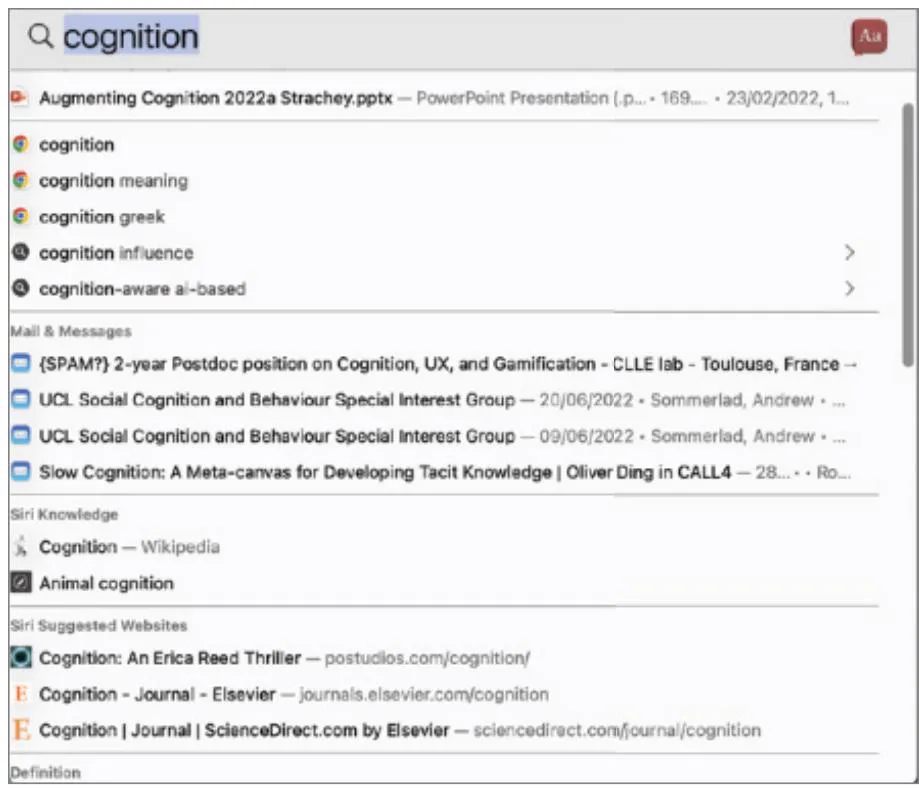  
Figure 4.4  Apple’s Spotlight search tool

Google  search  tools  have  also  developed  many  advanced  features,  which  are  geared toward making it easier for someone to find the information or image they are looking for, by analyzing their query or keywords and ranking potential relevant results. AI has also been added to the mix to help narrow down possible images that someone might be looking for. For example, the search tool QuikFynd uses ML algorithms to identify common objects such as cats, dogs, mountains, etc.

Despite these advances made to search tools, many people still prefer the old-fashioned way of using folders for storing their files and other digital content. One reason is that folders provide a powerful metaphor (see Chapter 3, “Conceptualizing Interaction”) that people can  readily  understand—placing  things  that have  something  in  common  into a  container. A folder that is often seen on people’s desktops is one simply labeled “stuff.” This is where documents, images, and so forth that don’t have an obvious place to go but that people still want to keep somewhere are often placed.

Ofer Bergman and Steve Whittaker (2016) suggest helping people manage their “digital stuff” better by deciding what personal information to keep, how to organize that information  when  storing  it, and  which  strategies  to  use  to  retrieve  it  later. They  suggest providing richer metadata tools, such as time stamping, categorizing, tagging, and attribution (for example color, text, icon, sound, or image). However, trying  to remember  which metadata was created some time back may also prove to be difficult! What strategy do you find works for you best?

# BOX 4.2

# The Problem with the Magical Number Seven, Plus or Minus Two

Perhaps  the  best-known finding  in psychology (certainly the  one  that nearly all  students remember many years after they have finished their studies) is George Miller’s (1956) theory that seven, plus or minus two, chunks of information can be held in short-term memory at any one time. However, it is also one that has been misapplied in interaction design because several designers assume that it means they should design user interfaces only to have seven, plus or minus two, widgets on a screen, such as menus. In fact, however, this is a misapplication of the phenomenon, as explained here.

By short-term memory, Miller meant a memory store in which information was assumed to be processed when first perceived. By chunks of information, Miller meant a range of items such as numbers, letters, or words.According to Miller’s theory, therefore, people’s immediate memory capacity is very limited. They are able to remember only a few words or numbers that they have heard or seen. If you are not familiar with this phenomenon, try the following exercise:

Read the first set of numbers here (or get someone to read them to you), cover it up, and then try to recall as many of the items as possible. Repeat this for the other sets.

•  3, 12, 6, 20, 9, 4, 0, 1, 19, 8, 97, 13, 84   
•  cat, house, paper, laugh, people, red, yes, number, shadow, broom, rain, plant, lamp, chocolate, radio, one, coin, jet   
•  t, k, s, y, r, q, x, p, a, z, l, b, m, e

How many did you correctly remember for each set? Between five and nine, as suggested by Miller’s theory?

Chunks of information can also be combined items that are meaningful. For example, it is possible to remember the same number of two-word phrases like hot chocolate, banana split, rock music, cheddar cheese, leather belt, laser printer, tree fern, fluffy duckling, or cold rain. When these are all jumbled up (that is, split belt, printer fern, banana laser, cheese music, cheddar tree, rain duckling, or hot rock), however, it is much harder to remember as many pairs. This is mainly because the first set contains all meaningful two-word phrases that have been heard before and that require less time to be processed in short-term memory, whereas the second set is made up of completely novel phrases. You need to spend time linking the two parts of the phrase together while trying to memorize them. This takes more time and effort to achieve. Of course, it is possible to do if you have time to spend rehearsing them, but if you are asked to do it having heard them only once in quick succession, it is most likely that you will remember only a few.

So, how might people’s ability to remember only $7 \pm 2$ chunks of information that they have just read or heard be usefully applied to interaction design? Some designers might be led to believe that it means having only seven options on a menu, displaying only seven options on a menu bar, or placing only seven items on a pull-down menu.

But  this interpretation would  be wrong as these are  all  items that can  be scanned  and rescanned on a graphical display and hence do not have to be recalled from short-term memory.

(Continued)

They don’t just flash up on the screen and disappear,requiring the user to remember them before deciding which one to select. If you were asked to find an item of food most people crave in the set of single words listed earlier, would you have any problem? No, you would just scan the list until you recognized the one (chocolate) that matched the task and then select it—just as people do when interacting with menus, lists, and  tabs,  regardless of whether  they consist  of 3  or 30 items. What users are required to do here is not remember as many items as possible, having only heard or seen them once in a sequence, but instead scan through a set of items until they recognize the one they want. This is a quite different task.

# Memory Load and Passwords

Phone, online, and mobile banking allow customers to carry out financial transactions, such as paying bills and checking the balance of their accounts, at their convenience. One of the problems confronting banks that provide these capabilities, however, is how to manage security concerns, especially preventing fraudulent transactions such as bank  spams where  customers are tricked into transferring money out of their accounts.

One  solution has  been to develop  rigorous security measures  whereby customers  must provide multiple pieces of information before gaining access to their accounts. The method requires a person to provide two or more pieces of evidence that only they know, such as the following:

• Their ZIP code or postal code   
. Their mother’s maiden name   
. Their birthplace   
• The last school they attended   
The first school they attended   
A password of between five and ten letters   
A memorable address (not their home)   
A memorable date (not their birthday)

Many  of these are relatively easy to remember and recall since they are familiar to the specific  user. But  consider  the  last two. How easy  is  it  for someone to come up  with such memorable information and then be able to recall it readily? Perhaps the customer can give the address  and  birthday  of another  member of  their family as  a memorable  address  and date.  But  what  about  the  request  for  a  password?  Suppose  a  customer  selects  the  word interaction as a password—fairly easy to remember, yes? The problem is that banks do not ask for the full password because of the danger that someone in the vicinity might overhear or oversee. Instead, they ask the customer to provide specific letters or numbers from it, like the seventh followed by the fifth. Certainly, such information does not spring readily to mind. Instead, it  requires  mentally  counting  each  alphanumeric  character  of the  password  until the desired one is reached. How long does it take you to determine the seventh letter of the password interaction? How did you do it?

To make things harder, banks also randomize the questions they ask. Again, this is to prevent someone else who is nearby from memorizing the sequence of information. However, it

also means that the customers themselves cannot learn the sequence of information required, meaning that they have to generate different information each time.

This requirement to remember and recall such information puts a big memory  load on customers. Some people find such a procedure quite  nerve-racking and are prone  to forget certain pieces of information. As a coping strategy, they write down their details on a sheet of paper. Having such an external representation at hand makes it much easier for them to read off the necessary information rather than having to recall it from memory. However, it also makes them vulnerable to the fraud the banks are trying to prevent should anyone else get hold of that piece of paper!

Multifactor authentication (MFA) has now become commonplace, especially for authorizing customer  payment  for online purchases. Essentially, it is  an  electronic authentication method whereby a person is granted access to a website to make a payment only after successfully presenting two or more credentials. Typically, a password is required first, and then a  code  is  sent  to  another  one  of  their  devices,  such  as a  mobile  phone, or  to  their  email account, and the code is valid for only a limited period of time (e.g., 20 minutes). The person then has  to submit the code via an online form. Asking someone to do this additional step can help decrease the likelihood of fraud. However, it also means more steps to take (and the need for two devices or email), which can be cumbersome, especially if they don’t have their devices readily to hand. The notion of usable security, i.e., security mechanisms that are also usable, is discussed further in Chapter 11, “Discovering Requirements.”

Software  companies have  also developed  password  managers  to help  reduce  memory load. An example is LastPass (www.lastpass.com), which is designed to remember all of your passwords, meaning that you have to remember only one main password.

# ACTIVITY 4.3

How can banks overcome the problem of providing a secure system while making the memory load easier for people wanting to use online and mobile phone banking?

# Comment

Advances in computer vision and  biometrics technology mean that it is now  possible to replace the need for passwords to be typed in each time. For example, facial and touch ID can be configured on newer smartphones and laptops to enable password-free mobile banking. Once these are set up, a user simply needs to put their face in front of their phone’s camera or their finger on the fingerprint sensor. These alternative approaches put the onus on the phone to recognize and authenticate the person rather than the person having to learn and remember a password. Tech companies have now begun to adopt the Fido protocol (2022) that uses public key cryptography techniques as part of the authentication process. A key difference from other forms of MFA is that the login information is stored directly on someone’s device and is uploaded only to the website when matched with their biometric authentication such as a selfie or fingerprint.

# BOX 4.3

# Digital Forgetting

Much of the research on memory and interaction design has focused on developing cognitive aids that help people to remember, for example, reminders, to-do lists, and digital photo collections. However, there are times when we want to forget a memory. For example, when someone breaks up with their partner, it can be emotionally painful to be reminded of them through shared digital images, videos, and Facebook friends. How can technology be designed to help people forget such memories? How could social media, such as Facebook, be designed to support this process?

Corina Sas and Steve Whittaker (2013) suggest designing new ways of harvesting digital materials connected to a broken relationship through using various automatic methods, such as facial recognition, which dispose of them without the person needing to go through them personally and be confronted with painful memories. They also suggest that during a separation, people could create a collage of their digital content connected to the ex, so as to transform them into something more abstract, thereby providing a means for closure and helping with the process of moving on.

Much research has been conducted into how to design technology to help people suffering from memory loss (for instance those with Alzheimer’s disease). An early example was the SenseCam, which was originally developed by Microsoft Research Labs in Cambridge (UK) to enable people to remember everyday events. The device they  developed  was a wearable camera that intermittently took photos, without any user intervention, while it was worn (see Figure 4.5). The camera could be set to take pictures at particular times, for example, every 30 seconds. The camera employed a fish-eye lens, enabling nearly everything in front of the wearer to be captured. The digital images  for each day were stored, providing a record of the events that a person experienced. Several studies were conducted on patients with various forms of memory loss using the device. For example, Steve Hodges et al. (2006) describe how a  patient, Mrs. B, who had amnesia was given  a SenseCam  to wear. The images  that were  collected  were  uploaded  to  a  computer  at  the  end  of  each  day. For  the  next  two weeks, Mrs. B and  her husband  looked through  these and  talked about  them. During this period, Mrs. B’s recall of an event nearly tripled, to a point where she could remember nearly everything about that event. Prior to using the SenseCam, Mrs. B would have typically forgotten the little that she could initially remember about an event within a few days.

Since this seminal research, a number of digital memory apps have been developed for people with dementia. For example, RemArc has been designed to trigger long-term memories  in  people with  dementia  using  BBC Archive  material such  as old  photos,  videos, and sound clips. The idea is based on the principle of reminiscence therapy, which aims to help people who have dementia interact and converse more by stimulating their long-term memory with material from the past (remarc.bbcrewind.co.uk).

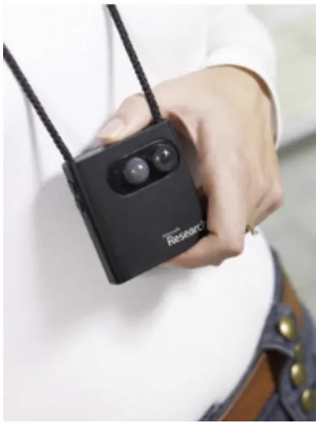

Figure 4.5  The SenseCam device and a digital image taken with it   
  
Source: Used courtesy of Microsoft Research Cambridge

Other technologies, such as intelligent  agents and  smart pill  boxes, have  been  developed as cognitive aids intended to remind people with dementia when to take their medication and whether they have taken it already. A novel approach is “earables,” which when connected with smart objects  can act  as memory  aids (Franklin et al., 2021). The idea is based on a cognitive model of memory disorder that focuses on the various errors people with  dementia  make  in  everyday  activities. A  common  problem  is  mixing  up  everyday routines, for example, picking up the salt shaker instead of the sugar shaker when wanting to add  sugar to a cup  of coffee. Franklin et al. suggest developing a technology guidance system that could detect these before they have been executed, letting the person know just in time, via the earable, for example, to tell them to pick up the sugar shaker instead. However, such a smart system is currently just a design concept. Research is needed to determine whether it  is possible to  design such  a guidance system  that is both  accurate and  useful. Questions like how often such auditory interventions are heeded will need to be addressed. In  particular, how will  people  with dementia take to being told by a  voice system of  the potential errors they might make?

Social media companies like Google and Meta now enable people to revisit their memories they may have forgotten about through providing app features such as “Year in Review.” These present a snapshot of some of a person’s top photos taken during the last year. Which photos  are selected might  seem random but  are likely to be based on  a number of factors, such  as which were most  viewed or liked. Recapping a year  in this way  can be a pleasant surprise  for many  people, reminding  them  of the  friends,  feelings, places, and  people  that mattered most.

# DESIGN IMPLICATIONS

# Memory

•  Reduce cognitive load by avoiding long and complicated procedures for carrying out tasks.   
Design interfaces that promote recognition rather than recall by using familiar interaction patterns, menus, icons, and consistently placed objects.   
Provide  users with a variety  of ways of labeling digital  information  (for example files, emails,  and  images)  to help them easily identify it again  through  the  use  of folders, categories, color, tagging, time stamping, and icons.

# 4.2.4  Learning

Learning is closely connected with memory. It involves the accumulation of skills and knowledge that would be impossible to achieve without memory. Likewise, people would not  be able to remember things unless they had learned them. Within cognitive psychology, learning is thought to be either incidental or intentional. Incidental learning occurs without any intention to learn. Examples include learning about the world  such as recognizing faces, streets, and objects, and what you did today. In contrast, intentional learning is goal-directed with the goal of  being able  to remember  it. Examples  include studying for an  exam, learning a foreign language, and learning to drive. This is much harder to achieve. Software developers, therefore, cannot assume that users will simply be able to learn how to use an app or a product. It often requires much conscious effort.

Moreover, it is well known that people find it hard to learn by reading a set of instructions in a manual. Instead, they much prefer to learn through doing. GUIs and direct manipulation interfaces are good  environments for supporting this kind of active learning by  supporting exploratory interaction and, importantly, allowing users to undo their actions, that is, return to a previous state if they make a mistake by clicking the wrong option.

There have been numerous attempts to harness the capabilities of different technologies to support intentional learning. Examples include online learning, AI tutors, and virtual reality. They are assumed to provide alternative ways of learning through interacting with information that  is  not  possible with traditional technologies, such  as books. In so  doing, they have the potential of offering learners the ability to explore ideas  and concepts in different ways. For example, interactive simulations, wearables, and augmented reality (see Chapter 7, “Interfaces”) have been designed to help teach abstract concepts (such as mathematical formulae, notations, laws of physics, biological processes) that students find difficult to grasp. An example is Su Cai et al.’s (2021) study that showed how integrating AR technology into physics classrooms enhanced students’ physics learning self-efficacy and their motivation to learn more  deeply. The AR was designed  to highlight and make more explicit aspects of a physics phenomenon by providing ideal light controls.

# DESIGN IMPLICATIONS

# Learning

•  Design interfaces that encourage exploration and tolerate mistakes.   
•  Design interfaces that constrain and guide users to select appropriate actions when initially learning.

# 4.2.5  Reading, Speaking, and Listening

Reading, speaking, and listening are three forms of language processing that have some similar and some different properties. One similarity is that the meaning of sentences or phrases is the same regardless of the mode in which it is conveyed. For example, the following sentence essentially has the same meaning whether one reads it, speaks it, or hears it: Computers are a wonderful invention. However, the ease with which  people can  read, listen, or speak differs depending on the person, task, and context. For example, many people find listening easier than reading. Specific differences between the three modes include the following:

? Written language is permanent while listening is transient. It is possible to re-read information if not understood the first time around. This is not possible with spoken information that is being broadcast unless it is recorded, although digital video recorders like TiVo enable rehearing of spoken information from broadcasts, allowing for dialogue to be replayed.   
• Reading can be quicker than speaking or listening, as written text can be rapidly scanned in ways not possible when listening to serially presented spoken words.   
• Listening requires less cognitive  effort than reading or speaking. Children often prefer to listen rather  than to  read  the equivalent text  online. The  popularity of  audiobooks and podcasts suggests adults also enjoy listening to novels, and so forth.   
. Written language tends  to be grammatical, while spoken language  is often  ungrammatical. For example, people often start talking and stop in midsentence, letting someone else start speaking.   
Dyslexics have difficulties understanding and recognizing written words, making it hard for them to write grammatical sentences and spell correctly.

Many applications have been developed either to capitalize on people’s reading, writing, and  listening  skills, or  to  support or  replace them  where they  lack  or  have  difficulty  with them. These include the following:

Interactive books and apps that help people to read or learn foreign languages.   
? Speech-recognition  systems  that  allow  people  to  interact  with  them  by  using  spoken commands using smartphones, tablets, and smart speakers (for example, Dragon Home, Google Voice Search, and home devices, such as Amazon Alexa, Google Home, and Home Aware that respond to vocalized requests).

• Speech-output  apps  that  use  artificially  generated  speech  (for  instance,  written  text-tospeech systems for the blind).   
Natural-language  interfaces  that  enable  people  to  type  in  questions  and  get  written responses (for example, chatbots).   
• Interactive apps  that  are  designed  to help  people  who  find  it  difficult to  read, write, or speak by reading text aloud and proofing written work (e.g., GhotitReal Writer).   
. Haptics that help people who are visually impaired to play video games (e.g., Microsoft’s haptic controllers).

# DESIGN IMPLICATIONS

Reading, Speaking, and Listening

Keep the  length of speech-based menus  and  instructions to a  minimum. Research has shown  that people find  it hard to follow spoken menus  with more than three or four options. Likewise, they are  bad  at remembering  sets of instructions and  directions that have more than a few parts.   
•  Accentuate the  intonation of artificially generated  speech voices,  as they are  harder to understand than human voices.

# 4.2.6  Problem-Solving, Planning, Reasoning, and Decision-Making

Problem-solving, planning, reasoning, and decision-making are processes involving reflective cognition. They include thinking about what to do, what the available options are, and what the consequences might be of carrying out a given action. They often involve conscious processes (being aware of what one is thinking about), discussion with others (or oneself), and the use of various kinds of artifacts (for example, maps, books, pens, and paper). Reasoning involves working through different scenarios and deciding which is the best option or solution to a given problem. For example, when deciding on where to go on a vacation, people may weigh the pros and cons of different locations, including cost, weather at the location, availability and type of accommodation, time of flights, proximity to a beach, the size of the local town, whether  there is nightlife, and so forth. When weighing all  of the  options, they reason through the advantages and disadvantages of each before deciding on the best one.

There  has been much interest in how people make decisions when confronted  with an abundance of choice, such as when shopping on the web or at a store (Todd et al., 2011). Do people stick to what they know, buying the same products, or are they tempted to try new ones, especially  if they  are on offer?  In  a summary  of research  on consumer  choice, Peter Todd (2017) pointed out how people tend to select the products they know and prefer when shopping. One possible explanation  for this behavior is that human minds have evolved to act quickly, making just good enough decisions by using fast and frugal heuristics (Gigerenzer et al., 1999). We typically ignore most of the available information and rely on only a few important cues, such as recognizing the name of a brand.

Another  explanation  derived  from  evolutionary  theory  suggests  that  searching  the shelves in a supermarket is akin to foraging for food in the wild (Todd, 2017). Animals like bears decide to remain in one berry patch, waiting until they have eaten most of the ripe berries before leaving and seeking a new, unexploited patch. Similarly, it is thought that shoppers stay with a familiar brand patch before exploring any others. The reason is that there can be costs to moving away from a familiar brand, such as the time needed to find an appropriate alternative or to get used to its newness.

This resistance to change poses a challenge to health and sustainability advocates who want  to  encourage  shoppers  to  switch to  healthier  options—as  they  may  not  take  notice of  new products. Given  this  proclivity to “not see,” how  might technology  be designed  to encourage  or  tempt  people  to  try  something  different?  One  possibility  is  to  design  novel forms of mobile augmented reality that draw someone’s attention to salient qualities in a new product. For example, it could highlight how healthy and tasty a new kind of vegan cheese is or how the packaging used is now 100 percent recycled. The intervention could use tantalizing  imagery, which  is minimalist so  as not to overload the  shopper. However, this requires developing AR apps that shoppers (or their family members) would be tempted to download and try out in the first place.

# DILEMMA

# Can You Make Up Your Mind Without an App?

When smartphone apps became mainstream, Howard Gardner and Katie Davis (2014) wrote a book about the so-called “app generation” who were brought up on a diet of apps. They suggested how young people at the time found it difficult to make their own decisions because they were becoming more and more risk averse. The reason for this was that they were relying on using an increasing number of mobile apps to help them in their decision-making, removing the risk of having to decide for themselves. Often, they would first read what others had said on social media sites, blogs, and recommender apps before choosing where to eat or go, what to do or listen to, and so on. However, relying on a multitude of apps meant that they were becoming increasingly unable to make decisions by themselves.

Is this still the same for today’s young generation? Many still face the same first big decision as previous generations: having to choose whether to go to college or university and, if so, which one. This can be an agonizing and prolonged experience where much uncertainty is involved. Many will read countless reviews, go on numerous visits to colleges and universities with their parents over several months, study university rankings that apply different measures, read up on what others say on social networking sites, and so on. In the end, however, they may finally  choose the  institution where their friends  attend or the  one they liked  the look of in the  first place. Do you  think today’s generation and beyond will experience the same, less, or more uncertainty when making big life-changing decisions?

# DESIGN IMPLICATIONS

Problem-Solving, Planning, Reasoning, and Decision-Making

Provide information pages that are easy to access for people who want to understand more about how to carry out an activity more effectively (for example, web searching).   
•  Use simple and memorable functions to support rapid decision-making and planning.   
•  Enable users to set or save their own criteria or preferences.

# 4.3 Cognitive Frameworks

A number of conceptual frameworks have been developed to explain and predict user behavior based on theories of cognition. In this section, we outline three that  focus primarily on mental processes and three others that explain how humans interact and use technologies in the context in which they occur. These are mental models, gulfs of execution and evaluation, information processing, distributed cognition, external cognition, and embodied interaction.

# 4.3.1  Mental Models

Mental models are used by people when needing to reason about a technology, in particular, to try to fathom what to do when something unexpected happens with it or when encountering unfamiliar products for the first time. The more someone learns about a product and how it functions, the more their mental model develops. For example, broadband engineers have a deep mental model of how Wi-Fi networks work that allows them to set them up and fix them. In contrast, an average citizen is likely to have a reasonably good mental model of how to use the Wi-Fi network in their home but a shallow mental model of how it works.

Within cognitive psychology, mental models have been postulated as internal constructions of some aspect of the external world  that are manipulated, enabling  predictions and inferences to be made (Craik, 1943). This process is thought to involve the fleshing out and the running of a mental  model (Johnson-Laird, 1983). This can involve both unconscious and conscious mental processes, where images and analogies are activated.

# ACTIVITY 4.4

To illustrate how we use mental models in our everyday reasoning, imagine the following two scenarios:

•  You arrive home from a vacation on a cold winter’s night to a cold house. You have a small baby, and you need to get the house warm as quickly as possible. Your house is centrally heated, but it does not have a smart thermostat that can be controlled remotely. Do you set the thermostat as high as possible or turn it to the desired temperature (for instance, $7 0 ^ { \circ } \mathrm { F }$ )?   
•  You arrive home after being out all night and you’re starving. You look in the freezer and

<!-- Chunk 3 End -->


<!-- Chunk 4 Start -->

find all that is left is a frozen pizza. The instructions on the package say heat the oven to $3 7 5 ^ { \circ } \mathrm { F }$ and then place the pizza in the oven for 20 minutes. Your oven is electric. How do you heat it up? Do you turn it to the specified temperature or higher?

# Comment

Most people when asked the first question imagine the scenario in terms of what they would do in their  own house and choose the first option. A typical explanation is that setting the temperature to be as high as possible increases the rate at which the room warms up. While many people may believe this, it is incorrect. Thermostats work by switching on the heat and keeping it going at a constant speed until the desired  set temperature is reached, at which point it cuts out. They cannot control the rate at which heat is given out from a heating system. Left at a given setting, thermostats will turn the heat on and off as necessary to maintain the desired temperature.

When asked the second question, most people say they would turn the oven to the specified temperature and put the  pizza in when they think it is at the right  temperature. Some people answer that they would turn the oven to a higher temperature in order to warm it up more quickly. Electric ovens work on the same principle as central heating, so turning the heat up higher will not warm it up any quicker. There is also the problem of the pizza burning if the oven is too hot!

Why do people use erroneous mental models? It seems that in the previous two scenarios, they are using a mental model based on a general valve theory of the way something works (Kempton, 1986). This assumes the underlying principle of more is more: The more you turn or  push something, the more it causes the desired effect. This principle holds for a range of physical devices, such as faucets, where the more you turn them, the more water that comes out. However, it does not hold for thermostats, which instead function based on the principle of an on-off switch. What seems to happen is that in everyday life, people develop a core set of abstractions about how things work and apply these to a range of devices, irrespective of whether they are appropriate.

Using  incorrect  mental  models  to  guide  behavior  is  surprisingly  common.  Just watch people at a pedestrian crossing or waiting for an elevator. How many times do they press the button? A lot of people will press it at least twice. When asked why, a common reason is that they think it will make the lights change faster or ensure the elevator arrives.

Many people’s understanding of how technologies and services—for instance, the Internet, wireless  networking, broadband, search  engines, computer  viruses, the cloud, or AI— work  is poor. It has  been known  for a long  time that mental  models are often  incomplete, easily confusable, and based on inappropriate analogies and superstition (Norman, 1983). As a consequence, people find it difficult to identify, describe, or solve a problem, and they lack the words or concepts to explain what is happening.

How can interfaces be developed that help people form better mental models? A major obstacle is that people are resistant to spending much time learning about how things work,

especially if it involves reading manuals or other documentation. An alternative approach is to provide the following:

• Clear and easy-to-follow instructions   
• Appropriate  online help, video tutorials, and context-sensitive guidance  for users  in  the form of online videos and chatbot windows, where people can ask how to do something   
•  Background information that can be accessed to let people know how something works   
•  Affordances of what actions an interface allows (for example, swiping, clicking, or selecting)   
•  Appropriate metaphors at the interface (see Chapter 2, “The Process of Interaction Design”)

# 4.3.2  Gulfs of Execution and Evaluation

An early  conceptual framework, which  was  influential  in HCI,  was known  as  the gulf of execution and the gulf of evaluation. It described the gaps that were assumed to exist between the user and the interface (Norman, 1986; Hutchins et al., 1986). The gulfs were intended to show how to design the latter to enable the user to cope with them. The first one, the gulf of execution, described the distance from the user to the physical system, while the second one, the gulf of evaluation, is the distance from the physical system to the user (see Figure 4.6). A challenge  for designers  is  to  find  ways  of bridging  the  gulfs  to reduce  the  cognitive  effort required to perform a task. In many ways the notions of gulfs provided a discourse by which to explore potential mappings and mismatches between how a system was designed to work and how a person understands how to do a task using it.

Figure 4.6  Bridging the gulfs of execution and evaluation   
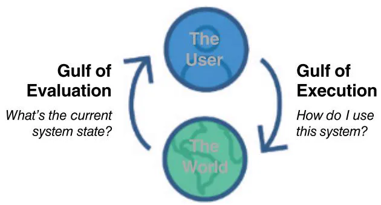  
Source: www.nngroup.com/articles/two-ux-gulfs-evaluation-execution. Used  courtesy  of the Nielsen Norman Group

# 4.3.3  Information Processing

Another approach to conceptualizing how the mind works has  been to use metaphors and analogies to describe cognitive processes. Numerous comparisons have been made, including conceptualizing the mind as a reservoir, a telephone network, a digital computer, and a deep learning network. A metaphor that was popular in the 1980s was the idea that the mind was an  information  processor. Information was  thought  to enter  and  exit the  mind  through a series of  ordered  processing stages  (see  Figure  4.7). Within  these  stages, various  processes were assumed to act upon mental representations. Processes include comparing and response selection. Mental representations  were assumed  to comprise  images, mental  models, rules, and other forms of knowledge.

Figure 4.7  Human information processing model   
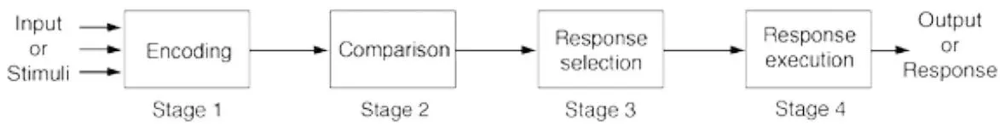  
Source: P.  Barber (1998). Applied Cognitive Psychology. London: Methuen. Used courtesy of Taylor & Francis

The  information  processing  model  provided  a  basis from  which  to  make  predictions about human performance. Hypotheses were made about how long someone would take to perceive and respond to a stimulus (also known as reaction time) and what bottlenecks might occur if a person was overloaded with too much information. One of the first HCI models to be derived from the information processing theory was the human processor model, which modeled  the cognitive processes of a user  interacting with a computer (Card  et al., 1983). Cognition  was conceptualized as a series of processing stages, where  perceptual, cognitive, and motor processors are organized in relation to one another. The model predicted which cognitive processes are involved when a user interacts with a computer, enabling calculations to be made of how long a user will take to carry out various tasks. In the 1980s, it was found to be a useful tool for comparing different word processors for a range of editing tasks. Nowadays, however, it is rarely used as other models of how the mind works have superseded it.

In particular, it has  become more  mainstream  to understand cognitive activities  in the context in which they occur, analyzing how we interact with technologies in the wild (Rogers, 2012). A  central goal has  been to look at how  structures in the environment  can both aid human cognition and reduce cognitive load. The three external approaches we consider next are distributed cognition, external cognition, and embodied cognition. All consider how external structures may support cognition.

# BOX 4.4

# Measuring Cognitive Load

The term cognitive  load refers to the mental effort required to learn new information. It is often assumed  that cognitive  capacity is inherently limited  by the  availability of working memory resources (Sweller et al., 1998) and that, therefore, designers try to keep cognitive load to a minimum, although this clearly depends on the context and activity at hand. The difficult part is working out how to measure cognitive load. A number of methods have been developed for this including surveys, behavioral data, and physiological measures. A popular method is the NASA Task Load Index (NASA-TLX; Hart and Staveland, 1988) that is a simple survey containing six question items that use Likert scales for the following dimensions: mental demand, physical demand, temporal demand, performance, effort, and frustration. It has been used mainly in human factor studies of aviation, healthcare, and other socio-technical domains, where it is critical to understand workload when designing complex systems.

# 4.3.4  Distributed Cognition

Most cognitive  activities involve  people interacting with  external kinds of representations, such  as  books,  documents,  and  computers  and  also with  each  other. For  example, when someone goes home from wherever they have been, they do not need to remember the details of the route because they rely on cues in the environment (for instance, they know to turn left at the red house, right when the road comes to a T-junction, and so on). Similarly, when they are at home, they do not have to remember where everything is because information is available as needed. They decide what to eat and drink by scanning the items in the fridge, look out the window to see whether it is raining or not, and so on. Likewise, people are always creating external representations for a number of reasons, not only to help reduce  memory load and the cognitive cost of computational tasks but also, importantly, to share information and knowledge with others and extend what they can do and allow them to think more powerfully (Kirsh, 2010).

The distributed cognition approach was first developed to study the nature of cognitive phenomena across individuals, artifacts, and internal and external representations (Hutchins, 1995). Typically, it involves describing a cognitive system, which entails interactions among people, the artifacts they use, and the environment in which they are working. An example of a cognitive  system  is an  airline cockpit, where the  top-level goal  is  to fly the  plane (see Figure 4.8). This involves all of the following:

The pilot, captain, and air traffic controller interacting with one another   
. The pilot and captain interacting with the instruments in the cockpit   
. The pilot and captain interacting with the environment in which the plane is flying (that is, the sky, runway, and so on)

A  primary objective of the distributed cognition approach  is to describe these  interactions in terms of how information is  propagated through different media. This means how information  is  represented  and  re-represented as  it  moves  across  people  and  through  the array of artifacts that are used (for example, maps, scribbles, spreadsheets, and spoken word) during activities. These  transformations of information are  referred to as changes in representational state. In the cockpit example, information is transformed through different media (over the radio, through the pilot, and via a change in the position of an instrument).

Analyzing  how  information  flows  through a  system  in this  way  can  be helpful  when redesigning an aspect of a cognitive system, such as a display or a socially mediated practice. It can  draw attention to the importance of any  new design needing to keep shared awareness and redundancy in the system so that both the pilot and the captain keep in sync with each other about the changes in altitude that are occurring. It is also the basis for the DiCOT analytic framework  that has  been  developed  specifically  for understanding  healthcare  settings and has also been used for software team interactions (see Chapter 9, “Data Analysis, Interpretation, and Presentation”).

# 4.3.5  External Cognition

People  interact  with  or  create  information  by  using  a  variety  of  external  representations, including  books,  web  pages,  sketches,  diagrams,  notes,  drawings,  photos,  and  so  on. Furthermore, an impressive range of tools has been developed throughout history to aid cognition, including pens, calculators, spreadsheets, and software workflows. The combination

of external representations and physical tools has  greatly extended and supported people’s ability to carry out cognitive activities. Indeed, they are such an integral part of our cognitive activities  that  it is  difficult to  imagine how we  would go about  much  of our  everyday life without them.

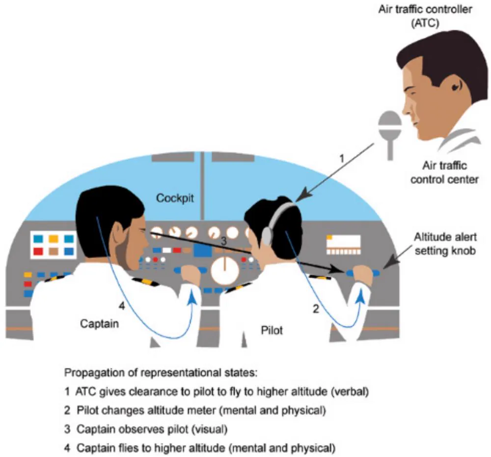  
Figure 4.8  A cognitive system in which information is propagated through different media

There have been various ways in which the relationship between humans and technology has been theorized. Most well-known are external cognition (Scaife and Rogers, 1996) and the extended mind (Clark and Chalmers, 1998). The extended mind was a philosophical account  of how new  digital technologies were becoming an  extension of our  minds, while the theory of external cognition was concerned with how we could design new kinds of technologies and interfaces that would empower our cognitive abilities while reducing cognitive effort. These include the following (each of which are explained later):

Cognitive offoading to reduce memory load   
• Computational offloading to reduce human cognitive effort when performing a task   
Annotating and cognitive tracing

# Cognitive Offloading

Numerous strategies have been developed  for transforming knowledge into external representations  to  reduce  memory  load. One  such  strategy  is  externalizing  things  that  we find difficult  to  remember,  such  as  birthdays,  appointments,  and  addresses.  Diaries,  personal reminders, and calendars are examples of cognitive artifacts that are commonly used for this purpose, acting as external reminders of what we need to do at a given time, such as buy a card for a relative’s birthday.

Other  kinds of  external representations that people frequently  employ are notes, such as sticky  notes,  shopping  lists, sending  emails/text  to oneself, and  to-do lists. Where  these are placed in the environment can also be crucial. For example, people often place notes in prominent positions, such as on walls, on the side of computer screens, by the front door, and sometimes even on their hands in a deliberate attempt to ensure that they do remind them of what needs to be done or remembered. People also place things in piles in their offices and by the front door, indicating what needs to be done urgently versus what can wait for a while. We also use each other, asking friends and spouses to remind us to do something.

Cognitive offloading, therefore, can empower people to trust that they will be reminded without having to remember themselves, thereby  reducing their memory  burden in the following ways:

•  Reminding them to do something (for example, get something for mother’s birthday)   
. Reminding them of what to do (such as buy a card)   
•  Reminding them of when to do something (for instance, send it by a certain date)

Evidence shows that cognitive offloading is a common strategy to prevent forgetting and also to avoid the effort of remembering. A key factor is  a person’s level of confidence: The less confident they are that they will remember, the more likely they are to offload, regardless of how good their memory actually is (Gilbert et al., 2022).

This is an obvious area where technology can be designed to help remind. Indeed, many apps have  been  developed  to  reduce  the burden  on  people to  remember  things,  including to-do  lists and  online  calendars  that  send  alerts. These  can  also  be  used  to help  improve people’s time management and work-life balance.

# Computational Offloading

Computational offloading is  when we use  a tool or device in conjunction with an external representation  to help  us carry out  a computation. An example  is  using  pen and paper to solve a math problem as mentioned in section 4.2 of the chapter where you were asked to multiply $2 1 \times 1 9$ in your head versus using a pen and paper. Now try doing the multiplication again but using roman numerals: $\mathrm { X X I } \times \mathrm { X V I I I }$ . It is much harder unless you are an expert in using roman numerals—even though the problem  is equivalent under both conditions. The reason  for this  is that  the  two different  representations transform  the  task into  one that  is easy and one that is more difficult, respectively. The kind of tool used also can change the nature of the task to being easier or more difficult.

# Annotating and Cognitive Tracing

Another way in which we externalize our cognition is by modifying representations to reflect changes that are taking place that we want to take notice of. For example, people often cross things  off  a to-do  list  to indicate  tasks  that  have been  completed. They  may  also  reorder

objects in the environment by creating different piles as the nature of the work to be done changes. These two types of modification are called annotating and cognitive tracing.

Annotating  involves  modifying  external  representations,  such  as  crossing  off  or  underlining items.   
• Cognitive tracing involves externally manipulating items into different orders or structures.

Annotating  is  often  used  when  people  go  shopping. People  usually  begin  their  shopping by planning what they are going to buy. This often involves looking in their cupboards and fridge to see what needs stocking up. However, many people are aware that they won’t remember  all this in their heads, so they often externalize  it as a written shopping list. The act of writing may also remind them of other items that they need to buy, which they may not have noticed when looking through the cupboards. When they actually go shopping at the  store, they  may cross  off items on the  shopping list as they  are placed  in the  shopping basket or cart. This provides them with an annotated externalization, allowing them to see at a glance what items are still left on the list that need to be bought.

There are a number of digital annotation tools that allow people to use pens, styluses, or their fingers to annotate documents, such as circling data or writing notes. The annotations can be  stored with the  document, enabling the users to revisit theirs or others’ externalizations at a later date.

Cognitive tracing is useful in conditions where the current situation is in a state of flux and  the  person  is  trying  to  optimize  their  position. This  typically  happens  when  playing games, such as the following:

. In  a  card  game,  when  the  continuous  rearrangement  of  a  hand  of  cards  into  suits,  in ascending order, or collecting  same  numbers  together helps  to  determine what  cards  to keep and which to play as the game progresses and tactics change   
• In Scrabble, where shuffling  letters around in the  tray  helps  a person work  out the  best word given the set of letters (Maglio et al., 1999)

Cognitive tracing has also been used as an interactive function, for example, letting students know what they have studied in an online learning package. An interactive diagram can be used to highlight all of the nodes visited, exercises completed, and units still to be studied.

A  general  cognitive  principle  for  interaction  design  based  on  the  external  cognition approach is to provide external representations in an interface that reduces memory load and cognitive effort. Different kinds of information visualizations can be developed that reduce the amount of effort required to make inferences about a given topic (for example, financial forecasting or identifying programming bugs). In so doing, they can extend or amplify cognition, allowing people to perceive and do activities that they couldn’t do otherwise. For example, information visualizations (discussed in Chapter 10) are used to represent data in a visual form that can make it easier to make cross-comparisons across dimensions and see patterns and anomalies. Workflow and contextual dialog boxes can also pop up at appropriate times to guide users through their interactions, especially where there are potentially hundreds and sometimes thousands of options available. This reduces memory load significantly and frees up more cognitive capacity for enabling people to complete desired tasks.

# 4.3.6  Embodied Interaction

Another way of describing our interactions with technology and the world is to conceive of it as embodied. This means the practical engagement with the social and physical environment (Dourish, 2001). This involves creating, manipulating, and making meaning through our engaged interaction with physical things, including mundane  objects such as cups and spoons, and technological devices, such as smartphones and robots. Artifacts and technologies that indicate how they are coupled to the world make it clear how they should be used. For example, a physical artifact, like a book when left opened on someone’s desk, can remind them to complete an unfinished task the next day (Marshall and Hornecker, 2013).

Eva Hornecker and colleagues (2017) further explain embodied interaction in terms of how our bodies and active experiences shape how we perceive, feel, and think. They describe how our ability to think abstractly is a result of our sensorimotor experiences with the world. This enables us to learn how to think and talk using abstract concepts, such as inside-outside, up-down, on top of, and behind. Our numerous experiences of moving through and manipulating the world since we were born (for example, climbing, walking, crawling, stepping into, holding, or placing) is what enables us to develop a sense of the world at both a concrete and abstract level.

Within  HCI,  the concept  of  embodied  interaction has  been  used  to  describe how  the body  mediates  our  various  interactions  with  technology  (Klemmer  et  al., 2006)  and  also our  emotional interactions (Höök, 2018). Barbara Tversky  (2019) argues how  movement is instrumental  in how our thoughts evolve, enabling us to draw meaning from our bodies and their actions in the world. She  claims that  our actions in physical space are  translated into  mental  actions  on  thought,  resulting  in  spatial  thinking,  which  helps  us  to  envision events and activities, such as assembling furniture and understanding the flow of people in urban settings.

Theorizing about  embodied interactions  in  these ways  has  helped researchers uncover problems that can arise in the use of existing technologies while also informing the design of new technologies in the context in which they will be used. For example, David Kirsh (2013) suggests that a theory of embodiment can provide HCI practitioners and theorists with new ideas about  interaction and new principles for better  designs. He explains how interacting with tools changes the way people think and perceive of their environments. He also argues that a lot of times we think with our bodies and not just with our brains. He studied choreographers and dancers and observed that they often partially model a dance (known as marking) through using abbreviated moves and small gestures rather than doing a full workout or mentally simulating the dance in their heads. This kind of marking was found to be a better method of practice than the other two methods. The reason for doing it this way is not that it is saving energy or preventing dancers from getting exhausted emotionally, but that it enables them to review and explore particular aspects of a phrase or movement without the mental complexity involved in a full work out. The implication of how people use  embodiment in their lives is that learning new procedures and skills might be better taught by a process like marking, where learners create little models of things or use their own bodies to act out. For example, rather than  developing  fully  fledged  virtual  reality simulations  for learning  golf, tennis, skiing, and so  on, it might be  better to teach sets of abbreviated  actions, using augmented reality, as a form of embodied marking.

# In-Depth Activity

The aim of this in-depth activity is for you to try to elicit mental models from people. In particular, the goal is for you to understand the nature of people’s knowledge about an interactive product in terms of how to use it and how it works.

1. First, elicit your own mental model. Write down how you think contactless cards work— where customers place their debit or credit card over a mobile card reader. If you are not familiar with contactless cards, do the same for a smartphone app like Apple Pay or Google Pay. Then answer the following questions:

•  What information is sent between the card/smartphone and the mobile card reader when it is placed in front of it?   
•  How does the mobile card reader work?   
•  What is the maximum amount you can pay for something using a contactless card, or Apple/Google Pay?   
•  Why is there an upper limit?   
•  How many times can you use a contactless card or Apple/Google Pay in a day?   
•  What happens when your contactless card is stolen and you report it to the bank?

Next, ask two other people the same set of questions.

2. Now analyze your answers. Do you get the same or different explanations? What do the findings indicate?  How accurate are  people’s mental models about  the  way contactless cards and smartphone Apple/Google Pay work?

# Summary

This chapter explained the importance of understanding the cognitive aspects of interaction. It described relevant findings and theories about how people carry out their everyday activities and how to learn from these to help in designing interactive products. It also presented a number of conceptual frameworks that allow ideas about cognition to be generalized across different situations.

# Key Points

•  Cognition comprises many processes, including thinking, attention, memory,  perception, learning, decision-making, planning, reading, speaking, and listening.   
•  The way in which an interface is designed can greatly affect how well people can perceive, attend, learn, and remember how to carry out their tasks.   
•  The main benefits of conceptual frameworks based on theories of cognition are that they can explain user interaction, inform design, and predict user performance.

# Further Reading

BEAUDOUIN-LAFON, M., BØDKER, S., and MACKAY, W. E. (2021). Generative Theories of  Interaction. ACM  Transactions on  Computer-Human  Interaction  28,  6, Article  45,  54 pages. This is an  extensive paper that draws insights  from research about human behavior that can be used to generate theories of interaction. It does this by defining specific concepts and  actionable  principles  that  provide  guidelines  for analyzing,  critiquing,  and  constructing new interfaces. The theory is illustrated by a number of case studies. It is one of the few attempts to develop an applied theory of interaction.

BERGMAN, O. and WHITTAKER, S. (2016). The Science of Managing Our Digital Stuff. MIT Press. This very readable book provides a fascinating account of how we manage all of our digital stuff that increases by the bucket load each day. It explains  why we persist with seemingly old-fashioned  methods  when there  are alternative, seemingly  better  approaches that have been designed by software companies.

EYSENCK, M. and BRYSBAERT, M. (2018) Fundamentals  of Cognition (3rd  ed.). Routledge. This  introductory  textbook about  cognition  provides  a  comprehensive  overview of the fundamentals of cognition. In particular, it describes the processes that allow us to make sense of the world around us and to enable us to make decisions about how to manage our everyday lives. It also covers how technology  can provide new  insights into how the mind works, for example, revealing how CAPTCHAs tell us more about perception.

GIGERENZER, G. (2008) Gut Feelings. Penguin. This provocative paperback is written by a psychologist and behavioral expert in decision-making. When confronted with choice in a variety of contexts, he explains how often “less is more.” He explains why this is so in terms of  how  people  rely  on  fast  and  frugal  heuristics  when  making  decisions, which  are  often unconscious rather  than rational. These  revelations have huge implications for  interaction design that are only just beginning to be explored.

KAHNEMAN, D. (2011) Thinking, Fast and Slow. Penguin. This bestseller presents an overview of how  the mind works,  drawing on aspects  of cognitive and social psychology. The focus is on how we make judgments and choices. It proposes that we use two ways of thinking: One that is quick and based on intuition, and one that is slow and more deliberate and challenging. The book explores the many facets of life and how and when we use each.

MURPHY PAUL, A. (2021) The Extended Mind: The Power of Thinking Outside the Brain. Houghton  Mifflin  Harcourt. This  accessible  book  brings  together  the  literature  from  different disciplines to explain how our mind works, drawing on theories about the extended, embodied, distributed, and situated mind. Her  central thesis is to posit how “we think outside of the brain” drawing from aspects of the environment, tools, and each other when doing our thinking. A provocative read.

# Chapter 5

# S O C I A L  I N T E R A C T I O N

5.1  Introduction   
5.2  Being Social   
5.3  Face-to-Face Conversations   
5.4  Remote Collaboration and Communication   
5.5  Co-Presence   
56  Social Games

# Objectives

The main goals of the chapter are to accomplish the following:

•  Explain what is meant by social interaction.   
•  Describe the social mechanisms that people use to communicate and collaborate.   
•  Illustrate how videoconferencing and other social media platforms evolved especially during COVID-19.   
•  Explain what social presence means.   
Give an overview of new technologies intended to facilitate collaboration and group participation.   
•  Discuss how technology can augment collaboration among people who are co-present.   
•  Outline aspects of online social games.

# 5.1 Introduction

People are  inherently  social: We live  together, work together, learn  together, play  together, interact  and talk with each other, and socialize. A diversity of technologies has  been developed  specifically  to  enable  us  to  persist  in  being  social  when  physically  apart  from  one another, many of  which have  now become  part  of  the fabric  of society. These  include the widespread  use  of  smartphones,  videoconferencing, social  media,  gaming, messaging, and telepresence. Each of these affords different ways of supporting how people connect.

There are many ways  to study what it means to be social. In this chapter, we focus on how  people communicate  and  collaborate  face-to-face and remotely  in  their social, work,

and  everyday lives—with  the  goal  of  providing  understandings, insights, and  guidance to inform  the design of  social technologies that can  better  support and  extend  them. Several communication  technologies  are  also examined  that  have  changed  the way  people  live— how they keep in touch, make friends, and coordinate their social and work networks. The conversation mechanisms that have conventionally been used in face-to-face interactions are described and discussed in relation to how they have been adapted for the various kinds of technology-based conversations that now take place remotely. Finally, we touch upon why social games have become increasingly popular as a genre for social interaction.

# 5.2  Being Social

A fundamental aspect of everyday life is being social, and that entails interacting with each other. People continually  update  each other  about  news, changes,  and developments  on  a given project, activity, person, or event. For example, friends and families  keep each other posted on what’s happening at work, at school, at a restaurant or club, next door, in reality shows, and in the news. Similarly, people who work together keep each other informed about their social  lives  and everyday  events, as  well  as  what  is  happening  at work,  for instance when a  project is  about  to be completed,  plans for a  new  project, problems  with meeting deadlines, rumors about closures, and so on.

While  face-to-face conversations  remain central to many social interactions, the use of social media has dramatically increased. People now spend several hours a day communicating with  others online—messaging, emailing,  tweeting, videoconferencing, and  so on.  It  is also common practice for people at  work to keep in touch with each other via WhatsApp groups and other workplace communication tools, such as Slack, Yammer, or Teams.

Before the COVID-19 pandemic, the almost universal adoption of social media in mainstream life resulted in most people being connected in multiple ways over time and space—in ways that were unimaginable 25 or even 10 years ago. For example, in 2019 adults averaged more than 300 Facebook friends. Nowadays, it is increasingly  common for people to have more than 1,000  connections on LinkedIn—many more than those  made through face-toface networking. Other social-based technologies (often referred to as social computing) that have had widespread adoption include shared calendars and collaboration tools (for example, Miro and Google Docs). In sum, since the widespread uptake of social media and social computing, the ways that people make contact, how they stay in touch, who they connect to, and how they maintain their social networks and family ties has irrevocably changed.

With the arrival of COVID-19 in early 2020, most people throughout the world were required where  possible  to  work from  home  (WFH), study from  home, and  socialize  at home. In practice, it meant not meeting with others in person or going out to any hospitality  venues  (which  were also  forced to  close). At  various times  during  the pandemic,  this policy changed in each country, depending on the government’s priorities and the level of the virus present in the population. For example, after a year into the pandemic, it was considered imperative in many countries that school children be allowed to return to school in order to prevent them from falling any further behind in their education. Social distancing was instigated in the schools to mitigate the risk of spreading the virus among the children and teachers. For example, in the United Kingdom, small groups of children were required to stay  within their own designated  school bubble and  not mix  with children outside of

it.  To help  manage  this  form  of  social  distancing,  school  starting  and  ending  times and lunch breaks  were  staggered, and  parents were asked  not  to socialize outside  the school gates. Similarly, social bubbles were created in many university halls of residence. Students residing in one hall were only able to mix with other students they came into contact with on their floor or hallway. Extended bubbles in the general population were permissible in some countries where each household was allowed to mix outdoors with one other household.  For  those  living  on  their  own, it  was  sometimes  possible  to  join  up  with  another household  to  make a  social  bubble. During this  time, not surprisingly, there was  a rapid and widespread uptake of videoconferencing software, notably Teams and Zoom, that enabled people to keep in touch with each other, study, and continue working. Within a matter of  a  few  weeks, the  way people  worked  or  studied was  transformed. For many, notably students, this meant setting up a makeshift office/study in their kitchen/living room, sitting in front of a screen, and partaking in back-to-back video conference meetings.

After  the  pandemic,  hybrid  working  became  more  common  in  many  settings,  where some  people are physically present together in an  office or classroom while others join via a videoconferencing platform. While offering workers more flexibility in how they schedule their work and home lives, the experience of those joining remotely to a meeting is often less than optimal compared with those who are doing things together at the meeting (e.g., socializing, eating, drinking) in the same physical space. It has also proven stressful for those trying to set up the technology in a classroom or meeting room to connect the remote people with them. Oftentimes, the technology  was simply  not fit for purpose. A common problem  was people in the room not being seen or heard when talking by those who were remote. Despite continued  improvements  being  made  to  collaborative  software  and  videoconferencing  to enable hybrid working to be more equitable, it is widely recognized that there is still a way to go for it to match the rich experience of meeting others in person.

Many  international  companies  operate  across  multiple  locations  and  time  zones. For example, it is  common for interaction designers in California  to work  with team members in distant countries such as the United Kingdom, India, and China. As well as the problems already mentioned, this kind of distributed team working is compounded by time zone discrepancies and language and cultural issues.

# BOX 5.1

# Zoom Parties: How We Adapted Our Socializing During COVID-19

During the pandemic a social phenomenon that emerged to compensate for not being able to meet up with others was Zoom parties. Friends, relatives, and colleagues began meeting online each week, chatting and playing games, often accompanied by eating and drinking separately but together while on the same video call. Figure 5.1 shows members of my family celebrating my birthday in 2020 where we all had our own cakes with lit candles on them. We then blew them out in unison. It was fun at the time, but the hardest part was not being able to hug them on first seeing them or later when saying goodbye.

(Continued)

  
Figure 5.1  A Zoom birthday party in full swing

# Source: Yvonne Rogers

Others organized Zoom parties where they paid for online magicians to come and entertain them. For a while, it also became popular to have a quiz night where friends and families met online for a few hours and competed against each other. Houseparty (now discontinued) became a popular social app where up to four friends joined each other in a grid to video chat on their smartphones. Such online social gatherings were novel at first, helping people to connect when not allowed to physically get together. However, after a while, most people got tired of them and longed to be able to meet each other again in person.

A  growing concern that is being raised  within society is  how much time people spend looking  at  their  phones—when  interacting  with  others,  playing  games,  tweeting,  and  so forth—and its consequences on people’s well-being (see Ali et al., 2018). A survey conducted in the United States  in 2021 showed  that more than  half the people who replied said they spend five to six hours on their phone on a daily basis, and that is not including work-related smartphone use (Ceci, 2022). Similar amounts were found for users in Brazil, Indonesia, and

South Korea (Wakefield, 2022). Even when sitting together, we often end up being in our own digital bubbles  (see Figure 5.2). Sherry Turkle in her  book called Reclaiming Conversation (2015)  bemoaned the negative impact  that this  trend is  having on  everyday life, especially how it is  affecting conversation. She pointed out that many people will admit to preferring texting to talking to others, as it  is easier, requires less effort, and is more convenient. Furthermore, her research has shown that when children hear adults talking less, they likewise talk less. This in turn reduces opportunities to learn how to empathize. She argues that while online communication has its place in society, it is time to reclaim conversation, where people put down their phones more often and (re)learn the art and joy of spontaneously talking to each other. Do you agree with her view?

  
Figure 5.2  A family sits together, but they are all in their own digital bubbles—including the dog! Source: Yvonne Rogers

On  the other hand, it should  be stressed that several  technologies have been  designed to encourage social interaction to good effect. For example, voice assistants that come with smart speakers,  such as Amazon’s Echo  devices, provide  a large number  of skills intended to support multiple users taking part at the same time, offering the  potential for families to play together. An example skill is Open the Magic Door, which enables families with young children to choose their path in a story e.g., saving monkeys on a tropical island, by selecting different options through the narrative. Social interaction may be further encouraged by the affordance of a smart speaker when placed on a surface in the home, such as a kitchen counter  or  mantelpiece.  In  particular, its  physical  presence  in  this  shared  location  affords

joint ownership and  use—similar  to other domestic  devices, such as the  radio  or TV.  This differs from other virtual voice assistants that are found on phones or  laptops that support individual use.

Another key concern is how the universal adoption of social media and other social computing tools in society has changed how people connect, work, and interact with one another. One way to consider this is to look at how the conventions, norms, and rules, established in face-to-face interactions to maintain social order, have changed. In particular, how have the established conversational rules and etiquette, whose function it is  to let people know how they  should behave  in social groups,  been adapted depending  on the kind  of social media being used?

During  the  pandemic  new  social  rules  emerged  for  how  to  behave  and  interact  with others when communicating via videoconferencing. This included muting yourself when not talking. When wanting to speak, it became the norm for people to raise their hand virtually by clicking the hand icon. Other emoji reactions became  commonly used to signify various forms of praise, emotions, and nonverbal feedback, for example, clicking the red heart and party  hat  icons  that  momentarily  appear  in  someone’s  window  and  then  disappear  after 10 seconds.

There  has  also  been  a  noticeable  difference  in  how  people  plan  and  coordinate their social activities. Whereas in the past people would usually call each other to arrange to meet, many now text each other or create a WhatsApp group if it is a group event. However, there can be a cost as conversations about what to do, where to meet, and who to invite multiply across people. Some people might get left off the WhatsApp or others might not reply, and much time can be spent to-ing and fro-ing across the different apps and threads. Also, some people may not  look at their notifications in a  timely manner, while  further developments in the group planning have evolved. This is compounded by the fact that often people don’t want to commit  until close  to the time  of the event, in case  an  invitation to do something from  another  friend  appears  that  is  more  interesting  to  them.  Teenagers, especially, often leave it until the last minute to micro-coordinate their arrangements with their friends before deciding on what to do. They will wait and see if a better offer comes their way rather than deciding for themselves a week in advance, say, to see a movie with a friend. This can make it  frustrating  for  those  who  initiate  the  planning  and  are  waiting  to  book  tickets  before they sell out.

# ACTIVITY 5.1

Think of a time where you enjoyed meeting up with friends to catch up in a café. Compare this social occasion with the experience that you have when texting with them on your smartphone. How are the two kinds of conversations different?

# Comment

The  nature of the conversations  is likely to be very different with pros and cons for  each. Face-to-face conversations ebb and flow unpredictably and spontaneously from one topic to the next. There can be much laughing, gesturing, and merriment among those taking part in

the conversation. Those present pay attention to the person speaking, and then when someone else starts talking, all eyes move to them. There can be much intimacy through eye contact, facial expressions, and body language, in contrast to when texters send intermittent messages back and forth in bursts of time. Texting is also more premeditated; people decide what to say and can review what they have written. They can edit their message or decide even not to send it, although sometimes people click the Send button without much thought about its impact on the interlocutor that can lead to regrets afterward.

Emojis,  animated GIFs, and  stickers are  commonly used now  as a form of nonverbal communication when sending texts. They enrich a message by adding humor and affection that may be difficult to express to someone in person. They are  often used in place of text as a form of shorthand like a thumbs-up when saying OK. However, while they can enrich a message by adding humor, affection, or a personal touch, they are nothing like a real smile or a wink shared at a key moment in a conversation.

# 5.3 Face-to-Face Conversations

Talking is something that is effortless and comes naturally to most people. And yet holding a conversation is a highly skilled collaborative achievement, having many of the qualities of a musical ensemble. In this section we examine what makes up a conversation. Understanding how  conversations  start, progress,  and finish is  useful  when  designing dialogues  that  take place with chatbots, voice assistants, and other communication tools. In particular, it helps researchers and developers understand how natural it is, how comfortable people are when conversing with digital agents, and the extent to which it is important to follow conversation mechanisms that are found in human conversations. We begin by examining what happens at the beginning.

A: Hi there.   
B: Hi!   
C: Hi.   
A: All right?   
C: Good. How’s it going?   
A: Fine, how are you?   
C: Good.   
B: OK. How’s life treating you?

Such mutual greetings are typical. A dialogue may then ensue in which the participants take turns asking questions, giving replies, and making statements. Then, when one or more of  the  participants  wants  to draw  the  conversation  to  a close, they  do  so  by  using  either implicit or  explicit cues. An example of an implicit cue is when a participant looks at their watch, signaling indirectly to the other participants that they want the conversation to draw to a close. The other participants may choose to acknowledge this cue or carry on and ignore it. Either way, the first participant may then offer an explicit signal, by saying, “Well, I have to go  now. I got  a lot  of work to do” or, “Oh dear, look at the  time. I  gotta run. I have to

meet someone.” Following  the acknowledgment  by  the other  participants  of such  implicit and explicit signals, the  conversation draws to a close, with a farewell ritual. The  different participants take turns saying, “Goodbye,” “Bye,” or “See you,” repeating themselves several times until they finally separate.

# ACTIVITY 5.2

How do you start and end a conversation when (1) talking on the phone and (2) chatting online? Do you use the  same conversational mechanisms that are used in face-to-face conversations?

# Comment

The person answering the call will initiate the conversation by saying hello or, more formally, the  name of their company/department. Most phones (landline  and smartphones) have the facility to display the name of the caller (Caller ID), so the receiver can be more personal when answering, for example,“Hello, John. How are you doing?” Phone conversations usually start with a mutual greeting and end with a mutual farewell. In contrast, conversations that take place when chatting online have evolved new conventions. The use of opening and  ending greetings when joining and  leaving is rare;  instead, most people simply start their  message with what they want to talk about and then stop when they have gotten an answer, as if in the middle of a conversation.

Many people are now overwhelmed by the number of emails they receive each day and find  it  difficult  to  reply  to them  all. This  has  raised  the  question  of which  conversational techniques to use to improve the chances of getting someone to reply. For example, can the way people compose their emails, especially the choice of opening and ending a conversation, increase the likelihood that the recipient will respond to it? A study by Boomerang (Brendan, 2017) of 300,000  emails taken from  mailing list archives of more  than 20 different online communities  examined  whether the  opening  or closing  phrase  that was  used  affected  the reply rate. They  found that the most  common opening phrase used— hey (64  percent), followed by hello (63 percent), and then hi (62 percent)—were the ones that got the highest rate of reply, in the region of 63–64 percent. This was found to be higher than emails that opened with more formal phrases, like Dear (57 percent) or Greetings (56 percent). The most popular form of sign-off was found to be thanks (66 percent), regards (63 percent), and cheers (58 percent), with best being used less (51 percent). Again, they found that emails that used closings with a form of thank you got the highest rate of responses. Hence, which conversational mechanism someone uses to address the recipient can determine whether they will reply to it.

Conversational  mechanisms  enable  people  to  coordinate  their  talk  with  one  another, allowing  them  to  know  how  to  start  and  stop.  Throughout  a  conversation,  further  turntaking rules are followed that enable people to know when to listen, when it is their cue to

speak, and when it is time for them to stop again to allow the others to speak. Sacks et al. (1978),  famous  for  their  work  on  conversation  analysis,  describe  these  in  terms  of  three basic rules:

Rule 1 The current speaker  chooses the next speaker by asking a question, inviting an opinion, or making a request.

Rule 2 Another person decides to start speaking.

Rule 3 The current speaker continues talking.

The rules are assumed to be applied in this order so that whenever there is an opportunity for a change of speaker to occur, for instance, someone comes to the end of a sentence, rule 1 is applied. If the listener to whom the question or request is addressed does not accept the offer to take the floor, rule 2 is applied, and someone else taking part in the conversation may  take up the opportunity and offer a view on the matter. If  this does not happen, then rule 3 is applied, and the current speaker continues talking. The rules are cycled through until someone speaks again.

To facilitate  rule  following,  people  use  various ways  of  indicating  how  long  they  are going  to talk and on  what topic. For example, a speaker  might  say right at  the beginning of his turn in the conversation that he has three things to say. A speaker may also explicitly request a change  in speaker by  saying to the listeners, OK, that’s all I  want to say  on that matter. So,  what do  you think? More  subtle  cues to let  others know  that  their turn  in the conversation is coming to an end include the lowering or raising of the voice to indicate the end of a question or the use of phrases like “You know what I mean?” or simply “OK?” Back channeling (uh-huh, mmm), body orientation (such as moving away from or closer to someone), gaze (staring straight at someone or glancing away), and gesturing (for example, raising of  arms) are  also  used  in different  combinations when  talking in order  to signal  to others when someone wants to hand over or take up a turn in the conversation.

Another way in which conversations are coordinated and given coherence is through the use of adjacency pairs (Schegloff and Sacks, 1973). Utterances are assumed to come in pairs in which the first part sets up an expectation of what is to come next and directs the way in which what does come next is heard. For example, A may ask a question to which B responds appropriately.

A: So, shall we meet at 8?

B: Um, can we make it a bit later, say 8:30?

Sometimes adjacency pairs get embedded in each other, so it may take some time for a person to get a reply to their initial request or statement.

A: So, shall we meet at 8?

B: Wow, look at them.

A: Yes, what a funny hairdo!

B: Um, can we make it a bit later, say 8:30?

For  the most  part, people are not  aware  of following  conversational mechanisms  and would  be  hard-pressed  to  articulate  how  they  can  carry  on  a conversation.  Furthermore, people don’t necessarily abide by the rules all the time. They may interrupt each other or talk over each other, even when the current speaker has clearly indicated a desire to hold the floor for the  next two  minutes to finish an  argument. Alternatively, a listener may not  take up a

cue from a speaker to answer a question or take over the conversation but instead continue to say  nothing even  though  the speaker  may  be making  it  glaringly obvious  that it is  the listener’s turn to say something. Oftentimes, a teacher will try to hand over the conversation to a student in a seminar by staring at them and asking a specific question, only to see the student look at the floor and say nothing. The outcome is an embarrassing silence, followed by either the teacher or another student picking up the conversation again.

Other kinds of breakdowns in conversation arise when someone says something that is ambiguous, and the interlocutor misinterprets it to mean something else. In such situations, the participants will collaborate to overcome the misunderstanding by using repair mechanisms. Consider the following snippet of conversation between two people:

A: Can you tell me the way to get to the Multiplex Ranger cinema?   
B: Yes, you go down here for two blocks and then take a right (pointing to the right); proceed until you get to the light, and then it’s on the left.   
A: Oh, so I go along here for a couple of blocks and then take a right, and the cinema is at the light (pointing ahead of him)?   
B: No, you go down this street for a couple of blocks (gesturing more vigorously than before to the street to the right of him while emphasizing the word this).   
A: Ahhhh! I thought you meant that one: so it’s this one (pointing in the same direction as the other person).   
B: Uh-hum, yes, that’s right: this one.

Detecting  breakdowns in conversation  requires that the speaker  and listener both pay attention to what  the other says  (or does  not say). Once they  have understood the nature of the failure, they can then go about repairing it. As shown in the previous example, when the  listener  misunderstands  what  has  been communicated,  the  speaker  repeats  what  they said earlier, using a  stronger voice  intonation  and more  exaggerated  gestures. This allows the  speaker  to repair  the  mistake and  be  more explicit  with  the  listener, allowing  them to understand and follow better what they are saying. Listeners may also signal when they don’t understand something or want further clarification by using various tokens, like “Huh?” or “What?” (Schegloff, 1981), together with giving a puzzled  look (usually frowning). This is especially the case when the speaker says something that is vague. For example, they might say  I  want it  to  their partner, without saying  what it  is  they  want. The  partner  may  reply using a token or, alternatively, explicitly ask, “What do  you mean by it?” Nonverbal communication also plays an important role in augmenting face-to-face conversation, involving the use  of facial expressions, back channeling, voice intonation, gesturing, and other kinds of body language.

Taking turns also provides opportunities for the listener to initiate repair or request clarification or  for the  speaker to detect that there is  a problem  and initiate repair. The listener will usually wait for the next turn in the conversation before interrupting the speaker in order to give the speaker the chance to clarify what is being said by completing the utterance.

Conversational  user  interfaces, such  as  chatbots,  are  becoming  more  sophisticated  in how they emulate the kind of turn-taking that takes place face to face. They do so by analyzing large numbers of conversational patterns using machine  learning models. For example, Replika,  which  is  an AI-based  companion  chatbot, was designed  to  simulate  human  conversation  through  encouraging turn-taking  with  the user.  Figure  5.3  shows  a snippet  of a conversation I had with Replika, where our conversation takes place through turn-taking.

  
Figure 5.3  A snippet of my conversation with Replika, a conversational companion, showing turn-taking

Source: Yvonne Rogers

Many chatbots are designed to answer customer queries, such as answering a question about  how to  obtain  a refund  on an  online  purchase. They  are  trained for  a  particular set of questions that they can answer well, but if the customer asks an unexpected question, they are unable to answer other than provide a stock phrase, such as “I am not sure about that.”

There is also ongoing research investigating more diverse uses than Q&A. For example, conversational  agents are being developed  to mediate work meetings  that are voice-based. A goal is to facilitate collaboration among groups carrying out tasks during their meetings. A key design decision is how proactive they should be and what kind of facilitation is useful. For example, if a group appears to be stuck during a decision-making activity, it might suggest a different course of action. Providing occasional context-specific prompts and probes has  been found to be effective  at steering a conversation in group settings (Reicherts  et al., 2022). If the conversational agent intervenes too much or appears too chatty, however, they can get annoying. Compared with companion chatbots, these kinds of virtual agents are not meant to be human-like conversationalists but are intended to prompt and steer the conversations between people who are in a meeting.

# DILEMMA

Is It OK to Talk with a Dead Person Using a Chatbot?

Eugenia Kuyda, an AI researcher (who was also the founder of Replika), lost a close friend in a car accident. He was only in his 20s. She did not want to lose his memory, so she gathered all of the texts he had sent over the course of his life and made a chatbot from them. The chatbot is programmed to respond automatically to text messages so that Eugenia can talk to her friend as if he were still alive. It responds to her questions using his own words.

Do you think this kind of interaction is creepy or comforting to someone who is grieving? Is it disrespectful of the dead, especially if the dead person has not given their consent (see Sisto, 2020)? What if the friend had agreed to having their texts mashed up in this way in a pre-death digital agreement? Would that be more socially acceptable?

# ACTIVITY 5.3

How  do people repair breakdowns when conversing via  email? Do they do the  same when texting?

# Comment

As people usually cannot see each other when communicating by email or text, they have to rely on other means of repairing the conversation when things are left unsaid or are unclear. For example, when someone proposes an ambiguous meeting time, where the date and day given don’t match up for the month, the person receiving the message may begin their reply by asking politely, “Did you mean this month or June?” rather than baldly stating the other person’s error, for example, “The 13th May is not a Wednesday!”

When someone does not reply to an email or text when the sender is expecting them to do so, it can put them in a quandary as to what to do next. If someone does not reply to an email within a few days, then the sender might send them a gentle nudge message that diminishes any blame, for example, “I am not sure if you got my last email as I was using a different account” rather than explicitly asking them why they have not answered the email they sent. When sending  a text, it depends  on whether it is a dating,  family, or business-related text that has been sent. When starting to date, some people will deliberately wait a while before replying to a text as a form of playing games and trying not to appear to be overly keen. If they don’t reply at all, it is a generally  accepted notion that they are not interested, and no further texts should be sent. The term used for this is ghosting, meaning abruptly cutting off all contact with someone (such as a former date) by no longer accepting or responding to their texts  or messages.  In contrast, in other  contexts, double-texting has become an acceptable social norm as a way of reminding someone, without sounding too rude, to reply. It implicitly implies that the  sender understands that the  recipient has overlooked the  first text because they were too busy or doing something else at the time, thereby saving face.

EmailsÂandÂtextsÂcanÂalsoÂappearÂambiguous,ÂespeciallyÂwhenÂthingsÂareÂleftÂunsaid.ÂFor example,ÂtheÂuseÂofÂanÂellipsisÂ(...)ÂatÂtheÂendÂofÂaÂsentenceÂcanÂmakeÂitÂdifficultÂtoÂworkÂout whatÂtheÂsenderÂintendedÂwhenÂusingÂit.ÂWasÂitÂtoÂindicateÂsomethingÂwasÂbestÂleftÂunsaid,Âthe senderÂisÂagreeingÂtoÂsomethingÂbutÂtheirÂheartÂisÂnotÂinÂit,ÂorÂsimplyÂthatÂtheÂsenderÂdidÂnot knowÂwhatÂtoÂsay?ÂThisÂemailÂorÂtextÂconventionÂputsÂtheÂonusÂonÂtheÂreceiverÂtoÂdecideÂwhat isÂmeantÂbyÂtheÂellipsisÂandÂnotÂonÂtheÂsenderÂtoÂexplainÂwhatÂtheyÂmeant.Â

# 5.4Â RemoteÂCollaborationÂandÂCommunicationÂ

AÂvarietyÂofÂsocialÂtechnologiesÂhaveÂbeenÂdevelopedÂtoÂsupportÂremoteÂcommunicationÂand collaboration—eitherbyÂÂemulatingÂwhatÂhappensÂinÂface-to-faceÂsettingsÂorÂbyÂextendingÂhow weÂcurrentlyÂconnectÂandÂinteract.ÂWeÂlookÂatÂhowÂtheyÂachieveÂthisÂinÂtheÂfollowingÂsections.Â

# 5.4.1Â VideoconferencingÂ

VideoconferencingÂisÂanÂonlineÂtechnologyÂthatÂenablesÂpeopleÂinÂdifferentÂlocationsÂtoÂcon- nectÂandÂmeetÂwithÂeachÂotherÂviaÂtheÂInternet.ÂMuchÂresearchÂwasÂconductedÂinÂtheÂ1980s andÂ1990sÂwhereÂnovelÂsystemsÂwereÂdevelopedÂtoÂenableÂpeopleÂtoÂtalkÂremotelyÂasÂifÂthey wereÂinÂtheÂsameÂphysicalÂroom.ÂAnÂearlyÂexampleÂwasÂtheÂVideoWindowÂ(FishÂetÂal.,Â1990) thatÂwasÂdesignedÂtoÂconnectÂtwoÂloungeÂareas,ÂwhichÂwereÂ50 milesapart, ÂviaÂaÂ3-footÂby 5-footÂpictureÂwindowÂontoÂwhichÂvideoÂimagesÂofÂeachÂlocationÂwereÂprojectedÂ(see Figure 5.4).The ÂlargeÂsizeÂenabledÂviewersÂtoÂseeÂaÂroomÂofÂpeopleÂroughlyÂtheÂsameÂsizeÂas themselves.ÂAÂstudyÂofÂitsÂuseÂshowedÂthatÂmanyÂofÂtheÂconversationsÂthatÂtookÂplaceÂbetween theÂremoteÂconversantsÂwereÂindeedÂindistinguishableÂfromÂsimilarÂface-to-faceÂinteractions, withÂtheÂdifferenceÂbeingÂthatÂtheyÂspokeÂaÂbitÂlouderÂandÂconstantlyÂtalkedÂaboutÂtheÂvideo systemÂ(KrautÂet al.,1990).  ÂOtherÂearlyÂresearchÂonÂhowÂpeopleÂinteractedÂwhenÂusingÂvide- oconferencingÂshowedÂhowÂtheyÂtendedÂtoÂprojectÂthemselvesÂmore,ÂtakeÂlongerÂconversa- tionalÂturns,ÂandÂinterruptÂeachÂotherÂlessÂ(O’Connaillet al.,1993). Â

  
Figure 5.4Diagram ÂofÂVideoWindowÂsystemÂinÂuseÂ

Since  then,  videoconferencing  has  advanced  significantly  and  become  adopted  worldwide  as  a  mainstream  communication  tool.  Software  was  developed  so  that  it could  run on  PCs,  smartphones,  or  tablets.  Most  people’s first  experience  of  videoconferencing  was using the free software, Skype. Then other free video apps came along such as FaceTime and WhatsApp. During the pandemic, Zoom and Teams became more widely  used. From being largely a means to chat with others online, these tools rapidly evolved to be more like virtual meeting rooms, providing a range of other functions that could support online activities. These included letting users choose from a variety of background screens, having a parallel window to chat in, assigning people to breakout rooms for smaller group discussions, and providing a range of emojis intended to be used in the moment as a form of expression. Other functions that became popular included the ability for people to share their screens, exchange files, and communicate via digital whiteboards. To indicate who has the floor, screen effects were also made available such as enlarging the person who was talking to take up most of the display window or highlighting their window portal in a different color when they were talking.

In many ways, the new  generation of videoconferencing software has greatly  extended how we communicate  while providing tools by  which to make is easier to switch between talking and working together. It was relatively easy for most people to adapt to communicating and collaborating in this way. However, while many discovered how efficient it was, they also found it was exhausting. The phenomenon of Zoom fatigue came into being (Bailenson, 2021). The reasons for this included excessive amounts of close-up eye gaze, intense cognitive load, increased self-evaluation from staring at a video of oneself, and physically being in the same place for hours on end.

# BOX 5.2

# Beyond Zoom

During the pandemic, students and  schoolchildren had  no alternative but to attend classes online via a videoconferencing platform. Many found it difficult to keep engaged staring at a screen all day. My experience of teaching in this way was that hardly anyone spoke up or asked questions. Occasionally, a student might use the chat facility to post a comment. The norm that quickly emerged was for students to keep their cameras turned off. Even though we asked them to turn them on, they declined. While they understood that having the camera turned off made the class less engaging, they were only too aware that turning their cameras on made them too self-conscious, especially knowing that if they spoke their face would be highlighted  and fill up the  whole display. For the teacher or professor, it was very trying— having no idea how engaged their students were or whether they were even there!

It also proved very difficult to socialize with other classmates during lesson breaks. Various 2D virtual spaces were developed to fill this gap. The aim was to offer scope for persistent engagement and  serendipitous  meetings and  to help create a sense  of community. Gather. Town (now Gather), for example, provided a virtual 2D space, which had a retro game-like appearance, where students could connect with others to hang out and chat. To take part in Gather, a user first creates their own avatar and then enters the virtual space. They can move their avatar around and check out who is there or just hang out in one of the visible virtual spaces so that others know they are around.

The virtual spaces could also be customized in a variety of ways, for example, as a school, a playground, or other fantasy social world. Another kind of virtual space that was used to support  teams  working  together is Sococo (see Figure 5.5).  It has  a  similar  rationale—to enable people to connect throughout the day as if they were in the same office building.

Figure 5.5  A Sococo virtual  space where different meeting and social spaces were developed by a research team at University College London. Each room was given a friendly name to give it character.   
  
Source: Kate Jones (kate.e.jones@ucl.ac.uk)

How best to represent the activity of online social interaction in virtual spaces has been the  subject  of much  research. A design principle  that has  been influential  is social  translucence (Erickson and Kellogg, 2000). This refers to the importance of designing communication systems to enable participants and their activities to be visible to one another. This idea was very  much behind the early communication tool, Babble, developed at  IBM by David Smith  (Erickson et  al., 1999), which  provided a  dynamic  visualization  of  the participants in  an  ongoing  chat  room. A  large  2D circle  was  depicted  using  colored  marbles  on  each user’s monitor. Marbles  inside  the  circle  conveyed  those  individuals  active  in  the  current

conversation. Marbles outside the circle showed users involved in other conversations. The more active a participant was in the conversation, the more the corresponding marble moved toward the  center of  the circle.  Conversely, the less  engaged a  person  was in  the ongoing conversation, the more the marble moved toward the periphery of the circle. More recent 2D and 3D spaces, like Sococo and Gather, provide social translucence in the form of showing via avatar icons who is online at any given time and in which space.

360 cameras have also started to be used with videoconferencing that capture  a panoramic view of a meeting room. Instead of having a webcam positioned to face only one direction, the 360 camera is typically placed in the middle of the group meeting on a table. This enables remote team members to see all those present during the meeting. Some systems, such as Meeting Owl, can even automatically  focus on  the person  who is  currently speaking in the room by detecting when they are talking and then zooming in on them. Figure 5.6 shows what they see—which is a split screen view of all the members present in the meeting and the person talking blown up beneath that.

Figure 5.6  The Meeting Owl setup being used in a hybrid meeting   
  
Source: https://meetingstore.co.uk/product/owl-labs-meeting-owl-pro

The benefits of working at home were found to be many, including a flexible schedule, the ability to wear  casual clothes, fewer distractions from colleagues, and zero commuting. People also  saved money  by  not  having  to  travel each  day. It  is  not  surprising, therefore, that after the pandemic many people wanted to continue working  from home and be able to come into work for one or two days a week. To accommodate this, hybrid working came into being. The idea was to get the best of both worlds, enabling people to still work at home for part of the week but also encouraging them to come into work on certain days in order to re-establish and create a sense of community. While some found it improved their work-life

balance, others found it emotionally exhausting and missed the chatter, small talk, and informal meetings that come with being in the same office.

However, hybrid working is still in its infancy. The experience for remote workers often feels like peering through a straw into a meeting room of pixelated and poorly framed webcam images of colleagues (Microsoft, 2022). Moreover, others, for personal reasons or with little  space  available to  work  in  at home,  preferred  coming back  to their  workplace  each day only to find themselves having back-to-back videoconferencing meetings with their colleagues who were at home.

To address this inequality, Microsoft has been conducting research into how to support more  equitable  hybrid meetings  with  a  focus  on  how  to  make  them  more  inclusive. This has involved them rethinking not just the physical meeting spaces but also the whole digital experience  of online  communication  and collaboration. To begin,  they  experimented  with where to place the video feeds of remote members on a shared screen. Instead of having them appear at the top, they placed them at the bottom (see Figure 5.7). The effect was to promote better eye gaze, which is at the same level as the participants in the room. In the rest of the display, documents are presented that can be annotated and changed in real time, in relation to what the team is working on.

Figure 5.7  A prototype of a technology-enhanced hybrid meeting (Microsoft)   
  
Source: www.microsoft.com/en-us/worklab/designing-the-new-hybrid-meeting-experience

# 5.4.2  Telepresence

Another approach to creating virtual spaces is through telepresence. This refers to a person’s perception of being present in a physical location with others who are there but where they are actually somewhere else (e.g., at home). Telepresence robots, for example, were built with this in mind to enable people to attend events and communicate with others by controlling them remotely. Instead of sitting in front of a screen from their location and seeing the remote place  solely through a fixed  camera at the other place, they could look around the remote place by controlling the camera’s eyes, which are placed on the robot and are physically moving it around. The idea was that it would enable them to feel more connected with the place and people in it.

Telepresence robots have also been used to enable people who have developmental difficulties to visit places remotely, such as museums. For example, Natalie Friedman and Alex Cabral (2018) conducted a study and found that providing a telepresence robot to children with developmental difficulties was able to increase their physical and social self-efficacy and well-being. Since then, telepresence technology has matured with the addition of AI technology. One example of an AI-enabled telepresence robot is Ava who is capable of autonomous navigation. Remote users simply have to specify a destination on their smartphone, to which Ava responds by automatically moving to it, while avoiding obstacles. While more efficient and potentially safer, the downside of automating the navigation in this way is that the user is no longer engaged in moving the robot. The act of steering their robot was what provided a form of embodiment and arguably a greater sense of presence. Watch the video below and see if you agree.

Video  Watch  Ava  the  telepresence  robot:  www.youtube.com/watch?v=PDTG yg1i6cM&t=48s.

# ACTIVITY 5.4

Social presence refers to the feeling of being there with a real person in virtual reality. It is based on the social psychology theory developed by Short et al. (1976) who conceptualized the realness of other people when using telecommunication tools. They argued that the type of communication media used would have a big effect on the degree of social presence. Today, the term is commonly used to refer to the degree of awareness, feeling, and reaction to other people who are virtually present in an online environment. It differs from telepresence, which refers to one  party being  virtually present with another party  who is present in a physical space, such as a meeting room (note that it is possible for more than one telepresence robot to be in the same physical space). What do you think are important design features to provide for social presence? Is it realism or something else?

# Comment

A recent experience I had of socializing in a 3D virtual world, via a desktop, was when giving a keynote at an online conference in 2020 at ISMAR (see Figure 5.8). The virtual conference was designed to be like a futuristic virtual campus, comprising lifelike university buildings and luscious outdoor spaces by the ocean (which was where the conference was meant to be held in Brazil). A wardrobe was provided to select clothes in which to dress one’s avatar. Diverse avatar actions were also provided to enable people at the virtual conference to connect, move around, and  interact. These  included different  kinds  of dancing (e.g., the  samba), waving, and  clapping. Sound effects could sometimes be heard, such as a clippy-cloppy  noise when moving your avatar—akin to the sound of feet walking on the ground. These avatar features

and actions all helped to provide a sense of connecting with others. They also helped with the virtual socializing, especially ice-breaking, but I wouldn’t say they provided real social presence. Other attempts to improve the sense of being there are being experimented with in the Metaverse, as described next.

  
Figure 5.8  Yvonne trying to dance after giving a keynote at a virtual conference Source: Yvonne Rogers

# BOX 5.3

# The Metaverse

The idea of the Metaverse has been around for 20–30 years. Essentially, it is a digital space inhabited by digital representations of people and things (Microsoft, 2021). Its earliest incarnation was in the form of virtual worlds, like Second Life, where people could join and create online spaces to socialize, learn, and hang out in. The virtual worlds were represented in 3D graphics that were navigated and experienced  on a desktop. People entering these were represented by digital avatars that they controlled via their computer keyboard. While fun to begin with, the experience was a bit clunky. People could fly around and even walk through walls by pressing certain keys on their keyboard, when moving from one place to another. In many ways, it was more like a fantasy world than following the rules of our physical world.

(Continued)

More recently,  Second Life has  become more commercial.  For  example, the  firstever Fashion Week took place in Second Life in early  2022 (www.youtube.com/watch?v= pa2HVUk5s5c&t=14s). Much of it resembled the events that take place in a physical fashion show, with a catwalk, audience, and models showing off new clothing ranges. However, if you watch the video, it looks like the human digital models are floating along the virtual catwalk rather than walking. To address this strangeness, some designers used cartoon cats instead of digital  human models to show off their  clothing (see Figure 5.9). One of the reasons for switching to cartoon characters is it avoids all the problems of trying to make a human model appear lifelike. After the virtual fashion show, the skins of the outfits that were modeled could be purchased by those attending. Once purchased, they could then dress up their own avatars in the skins and walk around parading them.

Figure 5.9  Dolce & Gabbana cat  model showing off a snazzy skin that people can purchase to wear on their own avatar in Second Life   
  
Source: coin3.net/the-first-ever-metaverse-fashion-week-digital-fashion-is-here-to-stay

Video A well-researched and personal account of the history of Second Life is presented by Bolly Coco (1999–2021): www.youtube.com/watch?v=8tEORJpmsCE.

In the early 2020s, Mark Zuckerberg (Meta) began talking up the Metaverse  as the next big thing (the term was first coined by Neal Stephenson in his 1992 novel, Snow Crash). Given the long history of social virtual worlds, such as Second Life, what else was he promising? One of his goals was to provide a richer, more immersive experience in the Metaverse, as if being there. Compared with how it feels being in social virtual worlds like Second Life, Zuckerberg proposed that Meta’s version of the Metaverse would be quite different. Instead of indirectly controlling one’s avatar through keyboard and mouse, people entering the Metaverse would do so by donning a VR headset and using the Oculus Quest’s VR touch controllers to move their avatar’s arms in real time. This more extensive form of embodiment is what provides the immersive experience.

Figure 5.10 shows  a  version  of Zuckerberg’s vision of the  Metaverse. Three  avatars are enjoying the outdoors, moving their arms and hands with the VR controllers, as if they are together, even though they are apart in the physical world. However, there is something slightly odd about the avatars. They don’t have any legs! The reason for this is largely down to technical limitations. In contrast to the VR hand controllers that can map onto arm movements relatively well in real time, the sensors and controllers that were available at the time that could be placed on someone’s legs were not able to represent leg and foot movements in VR very well. It is often the case that obstacles can get in the way (such as someone’s stomach), resulting in movements of the legs being obscured and not able to be detected accurately. Because of this, VR headsets, like Oculus, initially were not configured to capture the whole body of a person. Current research, however, is exploring how to overcome these kinds  of occlusion problems. In the future, we may see people putting on a whole body suit (like a Spiderman outfit), rather than just a VR headset when entering the Metaverse.

  
Figure 5.10 Meta’s vision of three  friends  socializing  in a  3D world  represented  as torso avatars

Source: Facebook www.cnet.com/tech/computing/ facebook-goes-meta-what-is-the-metaverse-and-why-is-big-tech-obsessed

(Continued)

But it is not just Meta creating the new Metaverse. Other tech and games companies are also developing new software and user experiences, including Microsoft, Epic Games, and Roblox. Some envision it being  much more than an immersive  virtual space  for people to socialize in—seeing it as the next Internet, even starting to call it Web3. Paradoxically, one idea being mooted is that it should be made more accessible so it can be experienced, not only in VR but also with other devices, such as smartphones and game consoles, just like Second Life. Others hope it will become more open so that it could become community-owned and community-governed and provide a freely interoperable version that ensures privacy by design (Boyle, 2022). Who knows what will emerge? Anything is possible!

# 5.4.3  Collaborative Tools

A number  of collaborative tools have become commonplace in our  everyday and working lives. These include the sharing of calendars, word processing, and design and project management tools. Some of these are intended for general use, such as Outlook and Google Docs. Others are intended to be used by office workers. An example is Slack, which has been used widely by software development teams (Lin et al., 2016). Slack has proven to be very versatile, supporting work and social communication among teammates as well as team management,  code  sharing,  and  software  deployments.  It  is  also  a  place  for  sharing  knowledge, where team  members can  find out  about new  tools, updates, etc., that can be useful when developing applications. Often developers will leave Slack open while they code, so they can drop quick lines to each other and check out availability for a quick chat.

Shared calendars like Google and Outlook are now indispensable for many people, who depend on them to plan, organize, and remind them of their meetings and events. Some people have multiple calendars that are color-coded for each person/group. It became the norm to  send  invitations  for  meetings  automatically  to  people’s online  calendars.  They  quickly got  filled  up with  pending invitations, which  required  accepting  or declining (or choosing maybe). Shared  calendars also became  a staple  for families who use  them  to schedule and organize  their  children’s upcoming  school  and  sports  events,  birthdays,  playdates,  etc.— making it easier for all to see and act upon a shared reminder.

Miro became a popular tool for supporting online learning during the pandemic. It provides  a  digital  canvas  together with  various  shared creative  tools, including  diagramming flowcharts, mind mapping, and videoconferencing. Many tutors and students alike found it easy and enjoyable to use, where the tools were ready to hand with which to create, comment on, and share documents  in the same space. Nic Marquardt at University College London, for example, uses it to teach a graduate course in interaction design each year, where the class of students (about 55) prepare posters about their design projects and then upload them to the Miro  board. They  are placed side by  side so that all  the students  can see  each other’s posters (as well  as those from  the year before) and can  zoom in and out on  each one (see Figure 5.11a and Figure 5.11b).

During a live session, class members move around the Miro canvas and are visible to the others by their different colored and named cursors. They read each other’s posters and afterward provide feedback using digital yellow sticky notes. Simultaneously, staff and teaching assistants give their feedback using orange sticky notes. To help them with this task, they are given a guide before the class about how to best provide constructive feedback. The students

in the course all commented afterward about how it created a greater awareness of others’ activities and a feeling of being at a place together.

  
(a)

  
(b)   
Figure 5.11 (a) A Miro board used in an online class on interaction design where students upload their posters and add comments using yellow post-it notes. The professor and teaching assistants also added theirs using orange ones. (b) A zoomed-in screen of two of the student posters.

Source: Nic Marquardt

# BOX 5.4

# People-in-a-Box

Instead of talking to a remote family member via videoconferencing, in the future it may be possible to talk to a  miniature-size (or  life-size) 3D image of them. Proto (formerly Portl), a startup company  set up by David Nussbaum in 2020, has been exploring this possibility through creating boxes where a 3D digital person appears in them. They look so lifelike they could almost be there (see Figure 5.12). The box works by being brightly lit with embedded LEDs above, below, and from the sides (see Figure 5.13). It also captures the person’s shadows as they move around the box to give them the appearance of volumetric depth. The recipient can interact with them almost in real time.

  
Figure 5.12 David Nussbaum demonstrating  how  they capture and present  the Proto person in a box

Source: Proto Inc.

Proto is also developing smaller, more affordable boxes for the domestic market, where the  person in the box can be recorded with more affordable technology, by simply using  a smartphone on a tripod. Do you think this way of communicating with others will be more engaging and immersive than current videoconferencing or the Metaverse? Will the size of the projected person matter? In particular, what will be the difference between having a life-size 3D person or a small 3D person appear in the box?

Figure 5.13 Talking with a 3D video of granny in a box (Proto M). The embedded camera at the top of the box faces the mother and child so that Granny can see and hear them in real time. They can also see and hear Granny.   
  
Source: www.portlhologram.com

# 5.5  Co-Presence

Another  concept  developed  in  human-computer  interaction  is  co-presence.  This  means designing social technologies to support people and augment their activities when interacting in the same physical space. The motivation is to enable co-located groups to collaborate more effectively when working, learning, and socializing. Various technologies have been built to support this kind of parallel interaction, including the use of multitouch, mid-air gesture and object recognition. To understand how effective they are, it is important to consider the coordination and awareness mechanisms already in use by people in face-to-face interactions and then to see how these have been adapted or replaced by the technology.

# 5.5.1  Physical Coordination

When  people are working  closely together, they  talk to each other, issuing  commands  and letting others know how they are progressing. For  example, when two or more people are collaborating, as when moving a piano, they shout instructions to each other, like “Down a bit,” “Left a touch,” “Now go forward,” to coordinate their actions. A lot of nonverbal communication is also used, including nods, shakes, winks, glances, and hand-raising in combination with such coordination talk in order to emphasize and sometimes replace it.

For  time-critical  and  routinized  collaborative  activities, especially  where  it  is  difficult to hear others because  of the physical conditions, people frequently use  gestures (although radio-controlled  communication systems  may  also be used). Various  types of hand  signals

have evolved, with their own set of standardized syntax and semantics. For example, the arm and baton movements of a conductor coordinate the different players in an orchestra, while the arm and orange baton movements of ground personnel at an airport signal to a pilot how to bring the plane into its assigned gate. Universal gestures, such as beckoning, waving, and halting hand movement, are also used by people in their everyday settings—although there are cultural differences as to what certain gestures mean.

The use of physical objects, such as wands and batons, can also facilitate coordination. Group members can use them as external thinking props to explain a principle, an idea, or a plan to the others (Brereton and McGarry, 2000). In particular, the act of waving or holding  up  a physical  object in  front  of others  is  very  effective  at  commanding attention. The persistence and ability to manipulate physical artifacts may also result in more options being explored  in a  group  setting  (Fernaeus and Tholander, 2006). They  can  help  collaborators gain a better overview of the group activity and increase awareness of others’ activities.

# 5.5.2  Awareness

Awareness was coined as a term to refer to knowing who is around, what is happening, and who is talking with whom (Dourish and Bly, 1992). For example, when attending  a party, people move around the physical space, observing what  is  going on and who is  talking to whom, and eavesdropping on others’ conversations. A specific kind of awareness is peripheral awareness. This refers to a person’s ability to maintain and constantly update a sense of what is  going on in the physical and social context, by  keeping an eye  and ear on what  is happening in the periphery of their vision. This might include noticing whether people are in a good or bad mood by the way they are talking, how fast the drink and food is being consumed, who has entered or left the room, how long someone has been absent, and whether the lonely person in the corner is finally talking to someone—all while we are having a conversation with someone else. The combination of direct observations and peripheral monitoring keeps people informed and updated on what is happening in the world.

Another  form of awareness that has been studied is situational awareness. This refers to being aware of what is happening around you in order to understand how information, events, and your own actions will affect ongoing and future events. Having good situational awareness is critical in technology-rich work domains, such as air traffic control or an operating theater, where it is necessary to keep abreast of complex and continuously changing information.

People who work closely together also develop various strategies for coordinating their work, based on an up-to-date awareness of what the others are doing. This is especially so for interdependent tasks, where the outcome of one person’s activity is needed for others to be able to carry out their tasks. For example, when putting on a show, the performers will constantly monitor what each other is doing in order to coordinate their performance efficiently. The metaphorical expression close-knit teams exemplifies this way of collaborating. People become highly skilled in reading and tracking what others are doing and the information to which they are paying attention.

A classic study of this phenomenon is of two controllers working together in a control room in  the London  Underground subway system (Heath  and Luff, 1992). An overriding observation was that the actions of one controller were tied closely to what  the other was doing. One of the controllers (controller A) was responsible for the movement of trains on the line, while the other (controller B) was responsible for providing information to passengers about  the current service. In many instances, it was found that controller B  overheard

what controller A was saying and doing and acted accordingly, even though controller A had not  said anything explicitly to him. For example, on  overhearing controller A discussing  a problem with a train  driver over the in-cab intercom system, controller B inferred from the conversation that there was going to be a disruption in the service and so started to announce this to the passengers on the platform before controller A had even finished talking with the train  driver.  At other  times, the  two  controllers kept  a lookout  for each other, monitoring the environment for actions and events that they might not have noticed but that could have been important for them to know about so that they could act appropriately.

# ACTIVITY 5.5

What do you think happens when one person in a close-knit team does not see or hear something, or misunderstands what has been said, while the others in the group assume that person has seen, heard, or understood what has been said?

# Comment

The person who has noticed that someone has not acted in the manner expected may use one of a number of subtle repair mechanisms, say coughing or glancing at something that needs to be attended to. If this doesn’t work, they may then resort to stating explicitly aloud what had  previously been signaled implicitly. Conversely,  the unaware  person may  wonder why the event hasn’t happened and, likewise, look over at the other team members, cough to get their attention, or explicitly ask them a question. The kind of repair mechanism employed at a given moment will depend on a number of factors, including the relationship among the participants, for  instance, whether one is more senior than the others. This determines who can ask what, the perceived fault or responsibility for the breakdown, and the severity of the outcome of not acting there and then on the new information.

# 5.5.3  Shareable Interfaces

Various technologies have been designed to capitalize on existing forms of coordination and awareness mechanisms. These include whiteboards, large touchscreens, and multitouch tables that enable groups of people to collaborate while interacting at the same time with content on the surfaces. Early research investigated whether different arrangements of shared technologies could help co-located people work better together (for example, see Müller-Tomfelde, 2010). An assumption was that shareable interfaces provide more opportunities for flexible kinds  of  collaboration  compared  with  single-user  interfaces,  through  enabling  co-located users to interact simultaneously with digital content. The use of fingers or pens as input on a public display is observable by others, increasing opportunities  for building situational and peripheral  awareness. The sharable  surfaces  are  also  considered  to  be more  natural  than other technologies, enticing people to touch them without feeling intimidated or embarrassed by  the consequences of their actions. For example, early research demonstrated how  small groups found it more comfortable working together around a tabletop compared with sitting in front of a PC or standing in a line in front of a vertical display (Rogers and Lindley, 2004).

# BOX 5.5

# Playing Together in the Same Place

Augmented reality (AR) sandboxes have been developed for museum visitors to interact with a landscape, consisting of mountains, valleys, and rivers. The sand is real, while the landscape is virtual. Visitors can sculpt the sand into different-shaped contours that change their appearance to look like a river or land, depending on the height of the sand piles. Figure 5.14 shows an AR sandbox that was installed at the V&A museum in London. On observing two young children playing at the sandbox, this author overheard one say to the other while flattening a pile of sand, “Let’s turn this land into sea.” The other replied, “OK, but let’s make an island on that.” They continued to talk about how and why they should change their landscape. It was a pleasure to watch this dovetailing of explaining and doing.

  
Figure 5.14 Visitors creating together using an augmented reality sandbox at the V&A Museum in London

Source: Yvonne Rogers

The physical properties of the sand, together with the real-time changing superimposed landscape, provided a space for children (and adults) to collaborate in creative ways.

Often in meetings, some people  dominate while others say very  little. While  this is  OK in certain settings, in others it  is considered more desirable for everyone to have a say. Is it possible to design shareable technologies so that people can participate around them more equally? Much research has been conducted to investigate whether this is possible. Of primary importance is whether the interface invites people to select, add, manipulate, or remove digital content from the displays and devices. A user study showed that a tabletop that allowed group  members to add digital content  by using  physical tokens resulted  in more equitable participation  than  if  only  digital  input  was  allowed  via touching  icons  and  menus  at  the tabletop  (Rogers et al., 2009). This suggests that it  was easier for people who are normally shy in groups to contribute to the task. Moreover, people who spoke the least were found to make the largest contribution to the design task at the tabletop, in terms of selecting, adding, moving, and removing options. This reveals how changing the way people can interact with a surface can affect group participation. It shows that it is possible for more reticent members to contribute without feeling under pressure to speak more.

Real-time feedback presented via ambient displays has also been shown to provide a form of awareness for co-located groups. LEDs glowing in tabletops and abstract visualizations on handheld and wall displays have been designed to represent how different group members are performing, such as turn-taking. An early prototype was the Reflect Table  that was designed to monitor and analyze ongoing conversations using embedded microphones in front of each person and represents this in the form of increasing numbers of colored LEDs, as shown in Figure 5.15 (Bachour et al., 2008). A study investigated whether students became more aware of how  much they  were speaking  during a group  meeting when their  relative levels  of talk were displayed in this manner and, if so, whether they regulated their levels of participation more effectively. In other words, would the girl in the bottom right reduce her contributions (as she clearly has been talking the most) while the boy in the bottom left increase his (as he has been  talking the least)? The findings were  mixed: Some participants  changed their level to match the levels of others, while others became frustrated and chose simply to ignore the LEDs. Specifically, those who spoke the most changed their behavior the most (that is, reduced their level), while those who spoke the least changed theirs the least (in other words, did not increase their level). Another finding was that participants who believed that it was beneficial to contribute equally to the conversation  took more notice of the  LEDs and regulated their conversation level accordingly. For example, one participant said that she refrained from talking to avoid having a lot more lights than the others (Bachour et al., 2010). Conversely, participants who thought it was not important took less notice. How do you think you would react?

Figure 5.15 The Reflect Table   
  
Source: Used courtesy of Pierre Dillenbourg

An  implication from  the various user  studies  on  co-located collaboration  around  tabletops is that designing shareable interfaces to encourage more equitable participation isn’t straightforward. Providing  explicit real-time  feedback  on  how  much someone  is  speaking in a group may be a good way of showing everyone who is talking too much, but it may be intimidating for those who are  talking too little. Allowing  discreet and accessible ways for adding and manipulating content to an ongoing collaborative task at a shareable surface may be more effective at encouraging greater participation from people who normally find it difficult or who are simply unable to contribute verbally to group settings (for example, those on the autistic spectrum, those who stutter, or those who are shy or are non-native speakers).

Most of the research on awareness has focused on developing technologies for augmenting visual awareness. But what about people who are blind or have low vision? How can we enhance their sense of the environment? Social interaction can be particularly challenging for them, especially trying to remember who is in a co-located social setting. To help address this situation, Cecily Morrison and colleagues (2021) developed PeopleLens (see Figure 5.16), a new wearable technology to help blind people make sense of and engage  with their immediate social surroundings. It comprises a head-mounted  augmented reality device that uses computer vision algorithms to locate, identify, track, and capture the gaze directions of people in the  vicinity. It  then presents this information to the wearer, when requested, through using spatialized audio so that it appears to come from the direction of the person.

  
Figure 5.16 PeopleLens:  a head-mounted device that enhances a blind child’s spatial awareness of those around them

Source: Cecily Morrison

When  the child looks  at someone, the head-mounted  display  reads aloud to  them the name of that person. This kind of audio cue can help them understand and remember both the relative position and distance of those  around them. The technology, in turn, indicates

to those who have been seen by the technology, providing a replacement for the eye contact that usually takes place between  people when they interact. Cecily Morrison and her team (2022)  at  Microsoft are investigating  whether these  kinds of technological social presence help people develop a richer mental map of those around them.

Video See PeopleLens in action: https://youtu.be/astmNfJHT4A.

# 5.6  Social Games

Social games are designed to facilitate social interaction. They can be played indoors or outdoors, with  and  without technology.  Examples include  board  games, tabletop games,  and video games. They are played by two or more players at the same time; the players can either cooperate with or compete against each other. Within a social game, each player is aware of other players’  presence, their actions, and how well they  are playing. In most  social games players are also able to interact with each other.

The most common are video games that have been designed to support  social interactions online, such as the very popular ones Fortnite, Roblox, and Minecraft, where players talk to each other as they play. The most popular platform used to communicate while playing  is Discord, which is a free chat service that  enables players to chat with others in their Discord group, through voice or text. Some games provide a whisper option, which enables players to speak directly to one another within a group chat. Other technologies have been designed  to enhance  or mediate  face-to-face social games. An example  is  the classic  Rock Paper  Scissors  game  played  as  an  Alexa  skill  (i.e.,  an  app). Alexa  vocalizes  its  hand  each round while members of a co-located family gesture theirs in person to each other. A more sophisticated version of this game is the Rock Paper Scissors Lizard Spock skill, where Alexa also  tells  who has  won  or lost,  while keeping  track  of who  has  won over  several  rounds. Much laughter and merriment can be had by those who are physically together, facilitating social cohesion and bonding (Beirl et al., 2019).

Social online games can also involve creating a community, where competition, collaboration, peer pressure, rebellion, jealousy, and so on are all played out in their various forms. Matt Richetti (2022), who is a social game designer, has proposed three heuristics by which to assess how community-based and social a game is.

Does the social game involve synchronous or asynchronous player interaction, where players either chat with each other or take turns?   
Is  the  social  interaction  symmetrical  or  asymmetrical;  in  other  words,  does  forming a relationship  require input  from  both parties,  or  can  they  be  formed  unilaterally by  a single party?   
. Does  the  social  relationship  involve  strong  or  weak  ties, meaning  will  the  relationships between players become deep and long lasting or are they transitory?

By asking these questions, game designers can think about the kinds of social interactions they want to support when designing the game. For example, when designing a synchronous game, it  is important  to think  about how  players with different  skill levels chat  with each other as they play. New players can use it to make initial contact and ask newbie questions about how to play while making new friends. More experienced players will chat with others to brag about their achievements in the game while also engaging in chitchat.

An  unconventional  social  game  is  Journey  developed  by  Jenova  Chen.  The  game  is designed so that each player controls a robed figure who moves through a vast desert, traveling toward a mountain in the distance. Players can encounter each other and try to help each other. However, the only way they can communicate is through a kind of musical chime. So they can’t  chat as  they do  in other games  but must  learn  how to  communicate in  chimes! This minimalist form of communication is meant to enable players to feel a connection with others playing through exploring with them, rather than talking to them or fighting them.

Watching others play video games and cheering them on in a parallel chat can also facilitate social interactions. Known as live streaming, it is a form of social media where a player simultaneously  broadcasts  themselves  and  their  activity  to  a  live  audience.  The  audience watches and listens to their favorite gamer (also called a streamer) on platforms like Twitch or YouTube. For example, the gamer streams their Minecraft designs and their battles with Fortnite monsters. One of the  most well-known streamers in 2022 was Ninja, who at that time had more than 17 million users on Twitch and more than 25 million users on YouTube! Over the last few years, many people have turned to this form of live streaming for entertainment, for socialization, and simply to be together (Taylor, 2018). The sense of community is made possible by enabling  the viewers  to communicate  with the streamer,  as well as other viewers, by posting their comments in the chat. This enables two-way communication where the streamers can directly respond to and acknowledge the viewers, and the viewers can participate and even dare the player to show off certain skills. The sense of community is most prevalent when there is a small number of viewers and those present can talk to each other and even make new friends. Some will turn up each day to watch a lesser-known streamer and enjoy  the smaller  community experience  of doing  so—a bit  like the  small number  of people who turn up every week to watch their children play community soccer on a Sunday afternoon in the park.

# BOX 5.6

# Leveraging Citizen Science and Engagement Through Technology

Citizen science involves a group of interested people coming together to work with professional scientists to plan a project, collect and analyze data, and report their findings. Participation in citizen science is booming. Reports of coral bleaching on the Great Barrier Reef, sea ice melting in Greenland and the Arctic, and deforestation in the Amazon alarm and stir people’s interest in science. The Internet, smartphones, and an array of mobile digital devices, apps, and social media have enabled people to work together on topics of interest or concern, even when they are geographically dispersed (Preece, 2016).

There are now thousands of citizen science projects involving millions of people, on many different topics. These include helping to archive old documents, transcribing early records of bird sightings, and identifying new galaxies. Zooniverse (www.zooniverse.org) and Scistarter (scistarter.org/citizen-science) are portals that provide information about hundreds of different citizen science projects that anyone can join.

Citizen science projects vary in size and scope. Some are small, like a project in Maryland in which local volunteers worked together to create and monitor rain gardens, collect garbage, and record the flora and fauna along the riverbanks (Preece et al., 2019). Others are distributed across the globe, such as iNaturalist where millions of people have been recording and documenting organisms  they have spotted (iNaturalist.org). Powered  by digital  technology, projects like iNaturalist scale participation through the process  of crowdsourcing to collect and  analyze  data. (Crowdsourcing was  mentioned in Chapter  2  and  is discussed  again in Chapter 14.) Using machine learning and machine vision, iNaturalist has also developed the SEEK app that is safe for children to learn about nature. When a child sees something of interest, they can point their smartphone camera at it, and the SEEK app will help them to identify what is in the picture by matching it against the millions of data items that were contributed by iNaturalist participants in similar locations.

Many projects have both a physical and a distributed component. Heather Killlen and her colleagues from the Natural History Museum in Washington, DC, worked with volunteers from across the United States to survey the distribution of ginkgo trees. They collected geolocation and other data digitally and physical samples of leaves that they sent by mail to the central team in Washington for analysis (Killen et al., 2022).

While the term citizen science is often used to describe any project that involves citizen volunteers, it is a controversial term because of the implication that a person has to be a legal citizen of a particular country, such as the United States, to participate. An article by Caren Cooper and colleagues (2021) discusses this issue in depth, and the video by Muki Haklay provides a broad introduction to the field of citizen science.

Video In this 30-minute video entitled Citizen Science: A Brief Introduction, Muki Haklay describes the history of citizen science, trends that explain its growth, an overview of today’s citizen science activities, and how and why people participate in citizen science: www.youtube.com/watch?v=zcoAtZdlPrc.

# In-Depth Activity

The goal of this activity is to analyze how collaboration, coordination, and communication are supported in online video games involving multiple players.

Play a social video game like Fortnite, and then answer the following questions.

1. Social issues

a.  What is the goal of the game?   
b. What kinds of conversations are supported?   
c.  How is awareness of the others in the game supported?   
d.  What kinds of social protocols and conventions are used?   
e.  What types of awareness information are provided?   
f.  Does the mode of communication and interaction seem natural or awkward?   
g.  How do players coordinate their actions in the game?

2. Interaction design issues

a.  What form of interaction and communication is supported, for instance, text, audio, and/or video?   
b. What other visualizations are included? What information do they convey?   
c.  How  do  users  switch  between  different  modes  of  interaction,  for  example, exploring and chatting? Is the switch seamless?   
d.  Are there any social phenomena that occur specific to the context of the game that wouldn’t happen in face-to-face settings?

3. Design issues

•  What other features might you include in the game to improve communication, coordination, and collaboration?

# Summary

Human beings are inherently social. People will always need to collaborate, coordinate, and communicate with one another, and the diverse range of applications, web-based services, and technologies that have emerged enable them to do so in more extensive and diverse ways. In this chapter, we looked at some core aspects of sociality, namely, communication and collaboration. We examined the main social mechanisms that people use in different conversational settings when interacting face-to-face and at a distance. A number of collaborative and telepresence technologies designed to support and extend these mechanisms were discussed, highlighting core interaction design concerns.

# Key Points

•  Social interaction is central to our everyday lives.   
•  Social mechanisms have evolved in face-to-face and remote contexts to facilitate conversation, coordination, and awareness.

•  Talk and the way it is managed are integral to coordinating social interaction.   
•  Many kinds of technologies have been developed to enable people to communicate remotely with one another.   
•  Keeping aware of what others are doing and letting others know what you are doing are important aspects of collaboration and socializing.   
•  The development of social technologies have brought about significant changes in the way people keep in touch and manage their social lives. For example, Teams and Zoom played a big role in enabling people to keep in contact, socialize, and work together during the COVID-19 pandemic.

# Further Reading

BALL,  M.  (2022)  The  Metaverse:  And  How  it  Will  Revolutionize  Everything. Liveright. This  book on  the Metaverse is  one of the first to extensively cover what  the extent of the Metaverse will mean for society, from business to government. It is written by a venture capitalist with a passion for future technology.

CRUMLISH, C. and MALONE, E. (2009) Designing Social Interfaces. O’Reilly. This is a collection of design patterns, principles, and advice for designing social websites, such as online communities.

TURKLE, S. (2016) Reclaiming Conversation: The Power of Talk in a Digital Age. Penguin. Sherry Turkle has written extensively about the positive and negative effects of digital technology on everyday lives—at work, at home, at school, and in relationships. This book is a very  persuasive  warning about  the negative impacts  of perpetual  use of  smartphones. Her main  premise  is  that  as  people—both  adults  and  children—become  increasingly  glued  to their phones instead of talking to one another, they lose the skill of empathy. She argues that we need to reclaim conversation to relearn empathy, friendship, and creativity.

ZHONG, B. (2021) Social Media Communication: Trends and Theories. Wiley. This extensive textbook on social media covers a broad range of topics including both the theoretical foundations of social media use and the application of research-based strategies for enhancing the use of social media in communication. Throughout it describes how digital media is changing human communication.

# Chapter 6

# E M O T I O N A L  I N T E R A C T I O N

6.1  Introduction   
6.2  Emotions and Behavior   
6.3  Expressive Interfaces: Aesthetic or Annoying?   
6.4  Affective Computing and Emotional AI   
6.5  Persuasive Technologies and Behavioral Change   
6.6  Anthropomorphism

# Objectives

The main goals of this chapter are to accomplish the following:

•  Explain how our emotions relate to behavior and the user experience.   
•  Explain what are expressive and annoying interfaces and the effects they can have on people.   
•  Introduce the area of emotion recognition and how it is used.   
•  Describe how technologies can be designed to change people’s behavior.   
• Provide an overview on how anthropomorphism has been applied in interaction design.

# 6.1 Introduction

When you receive some bad news, how does it affect you? Do you feel upset, sad, angry, or annoyed—or all of these? Does it put you in a bad mood for the rest of the day? How might technology help? Imagine a wearable technology that could detect how you were feeling and provide  suggestions geared  toward helping to improve  your mood, especially  if it detected that you were having a real downer of a day. Would you find such a device helpful, or would you find it unnerving that a machine was trying to cheer you up? Designing technology to detect and recognize someone’s emotions  automatically from sensing aspects of their facial expressions,  body  movements,  gestures, and  so  forth,  is  a growing  area  of  research  often

called emotional AI or affective computing. There are many potential applications for using automatic emotion sensing, other than those intended to cheer someone up, including health, retail, driving, and  education. These  can be used  to determine if someone  is happy, angry, bored, frustrated, and so on, in order to trigger an appropriate technology intervention, such as making a suggestion to them to stop and reflect or recommending a particular activity for them to do.

In addition, emotional design is a growing area relating to the design of technology that can engender desired emotional states, for example, apps that enable people to reflect on their emotions, moods, and feelings. The focus is on how to design interactive products to evoke certain kinds of emotional  responses in people. It also examines why  people become  emotionally attached to certain products (for instance, virtual pets), how social robots might help reduce loneliness, and how to change human behavior through the use of emotive feedback.

In this chapter, we include emotional design and affective computing using the broader term emotional interaction to cover both aspects. We begin by explaining what emotions are and how they shape behavior and everyday experiences. We then consider how and whether an interface’s appearance affects usability and the user experience. In particular, we look at how expressive and persuasive interfaces can change people’s emotions  or behaviors. How technology  can detect  human emotions  using  voice and facial  recognition is  then covered. Finally, the way anthropomorphism has been used in interaction design is discussed.

# 6.2 Emotions and Behavior

Consider the different emotions one experiences throughout a common everyday activity— shopping online for a product, such as a new laptop, a sofa, or a vacation. First, there is the realization of needing or wanting one and then the desire and anticipation of purchasing it. This is followed by the joy or frustration of finding out more about what products are available and deciding which to choose from potentially hundreds or even thousands of them by visiting numerous websites, such as comparison sites, reviews, recommendations, and social media sites. This entails matching what is available with what you like or need and whether you can afford it. The thrill of deciding on a purchase may be quickly followed by the shock of how much it costs and the disappointment that it is too expensive. The process of having to revise your decision may be accompanied by annoyance if you discover that nothing is as good as the first choice. It can become frustrating to keep looking and revisiting sites. Finally, when you make your decision, a sense of relief is often experienced. Then there is the process of clicking through the various options (such as color, size, warranty, and so forth) until the online payment form  pops up. This can be tedious, and the requirement to fill in the many details raises the possibility of making a mistake. Finally, when the order is complete, you can let out  a big sigh. However, doubts can  start to creep in—maybe  the other  one was better after all.

This rollercoaster set of emotions is what many of us experience when shopping online, especially for big-ticket items where there is a myriad of options from which to choose and where you want to be sure that you make the right choice.

# ACTIVITY 6.1

Have you seen one  of the terminals shown in Figure 6.1 at an airport after you have gone through security? Were you drawn toward it, and did you respond? If so, which smiley button did you press?

Figure 6.1  A Happyornot terminal located after security at Heathrow Airport   
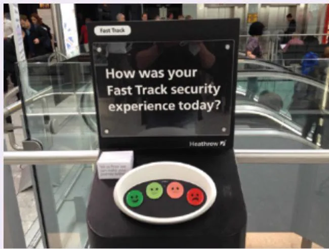  
Source: www.rsrresearch.com/research/why-metrics-matter. Used courtesy of Retail Systems Research

# Comment

The act of pressing one  of the buttons can be very satisfying—providing a moment for you to reflect upon your experience. It can even be pleasurable  to express how you feel in this physical manner. Happyornot designed the feedback terminals that have been used in many airports throughout the world. The affordances of the large, colorful, buttons laid out in a semicircle, with distinct smileys, makes it easy to know what is being asked of the passerby, enabling them to select among feeling happy, angry, or something in between. More recent designs use a flat tablet as the interface.

The data collected from the button presses provides statistics for an airport as to when and where people are happiest and angriest after going through security. Data from the beginning of 2022 when traveling was beginning to reach pre-pandemic levels showed that the best day of the week to fly is Wednesday while the worst is Sunday. The unhappiest times recorded are in the early hours of the morning, presumably because people are tired and grumpier.

Emotional interaction is  concerned with  what makes people feel  happy, sad, annoyed, anxious, frustrated, motivated, delirious, and so on, and then using this knowledge to inform the  design  of  different  aspects  of  the  user  experience. However, it  is  not  straightforward.

Should an interface be designed to try to keep a person happy when it detects that they are smiling, or should it try to change them from being in a negative mood to a positive one when it detects that they are scowling? Having detected an emotional  state, a decision has  to be made as to what or how to present information. Should it try to “smile” back through using various interface elements, such as emojis, feedback, and icons? How expressive should it be? It depends on whether a given emotional state is viewed as desirable for the user experience or the task at hand. A happy state of mind might be considered optimal for when someone goes to shop online if it is assumed that this will make them more willing to make a purchase.

Advertising agencies have developed a number of techniques to influence people’s emotions. Examples include showing a picture of a cute animal or a child with hungry, big eyes on a website that “pulls at the heartstrings.” The goal is to make people feel sad or upset at what they  observe and make them want to do something to help, such as making a donation. Figure 6.2, for example, shows a web page that has been designed to trigger a strong emotional response in the viewer.

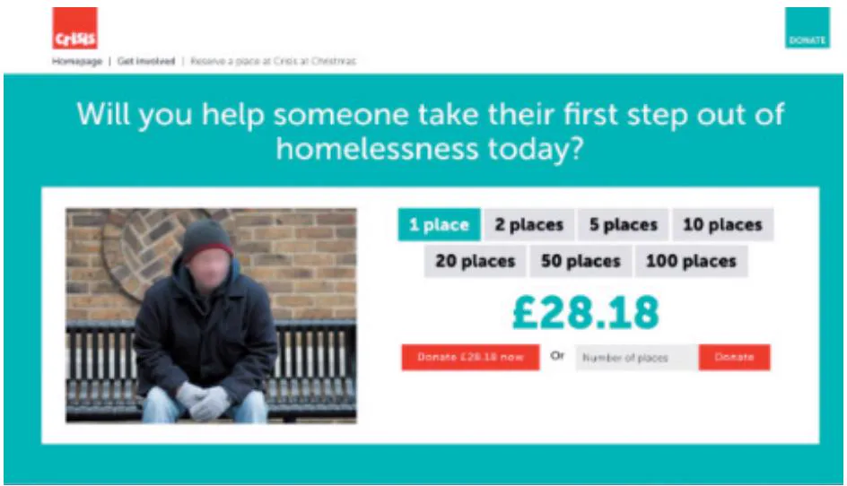  
Figure 6.2  A web page from Crisis (a UK homelessness charity)

Source: Crisis UK

Our  moods  and  feelings  are  also  continuously  changing, making  it  more  difficult  to predict  how  we  feel  at  different  times.  Sometimes,  an  emotion  can  descend  upon  us  but disappear shortly afterward. For example, we can become startled by a sudden, unexpected loud noise. At other times, an emotion can stay with us for a long time; for example, we can remain annoyed  for hours when staying in a  hotel room that has  a noisy air  conditioning unit. An emotion  like jealousy can  keep  simmering for a  long period  of time, manifesting itself on seeing or hearing something about the person or thing that triggered it.

The terms emotion, mood, and feeling are often used interchangeably. However, they can differ in temporality. Emotions tend to happen in the moment as a response (e.g., crying) to a trigger (e.g., becoming sad on hearing someone has died). A mood is more a frame of mind or disposition (e.g., they were in a good mood) that can develop and last for longer periods of time. Feelings can be either an expression of an emotion (e.g., he felt sad) or a mood (e.g., she felt grumpy).

<!-- Chunk 4 End -->


<!-- Chunk 5 Start -->

In a series of short videos, Kia Höök talks about affective computing, explaining how emotion is formed and why it is important to consider when designing user experiences with technology. See www.interaction-design.org/encyclopedia/ affective_computing.html.

A good  place  to start understanding  how  emotions affect  behavior and how  behavior affects emotions is to examine how people express themselves and read each other’s expressions.  This  includes  understanding  the  relationship  between  facial  expressions,  body  language, gestures, and tone of voice. For example, when people are happy, they typically smile, laugh, and relax their body posture. When they are angry, they might shout, gesticulate, tense their hands, and screw up their face. A person’s expressions can trigger emotional responses in others. When someone smiles, it can cause others to feel good and smile back.

Emotional skills, especially the ability to express and recognize emotions, are central to human communication. Most people are highly skilled at detecting when someone is angry, happy, sad, or bored by recognizing their facial expressions, way of speaking, and other body signals. They also usually know what emotions to express in a given situation. For example, when someone has just heard they have failed an exam, it is not a good time to smile and be happy for them. Instead, people try to empathize and show that they feel sad, too.

There is  an ongoing debate about  whether and how emotion causes certain behaviors. For  example, does being angry make us concentrate better? Or does being happy make us take  more  risks, such  as  spending  too  much  money, or  vice versa  or neither?  It  could  be that we  can just feel  happy, sad, or angry, and that this does  not affect our  behavior. Roy Baumeister et al. (2007) discuss how the role of emotion is more complicated than a simple cause-and-effect model, noting how it often depends on the context as to how and whether one  triggers  the other. Mayer Tamir  and Yochanan Bigman  (2017)  also suggest how emotions shape behavior depends partially on people’s expectations and the emotional state they are in. For example, in a series of experiments investigating the relationship between performance  and emotion they  found  that “excited” participants  were more  creative  when they were told that excitement could promote performance. Conversely, “calm” participants were more creative when they were told that calmness would promote performance.

Other theorists argue that emotions cause behavior, for example that fear brings about flight and that anger initiates the fight reaction. A widely accepted explanation, derived from evolutionary  psychology, is that when something makes someone frightened or angry, their emotional response is to focus on the problem at hand and try to overcome or resolve the perceived danger. The physiological responses that accompany this state usually include a rush of adrenalin through the body  and the tensing of muscles. While the physiological changes prepare people to fight or flee, they also give rise to unpleasant experiences, such as sweating, butterflies in the stomach, quick breathing, heart pounding, and even feelings of nausea.

Nervousness is  a state of being that is often  accompanied by several emotions, including apprehension  and  fear. For example, many people get worried, and  some feel  terrified before speaking at a public event or a live performance. There  is even a name for this kind

of nervousness— stage fright. Andreas Komninos (2017) suggests that it is the autonomous system “telling” people to avoid these kinds of potentially humiliating or embarrassing experiences.  But  performers  or  professors  can’t  simply  run  away.  They  have  to  cope  with the negative emotions  associated  with having  to  be in front  of  an audience.  Some are able  to turn their nervous state to their advantage, using the increase in adrenalin to help them focus on their performance. Others are only too glad when the performance is over and they can relax again.

As  mentioned  earlier, emotions  can  be  simple  and  short-lived  or  complex  and  longlasting. To distinguish between the two types of emotion, researchers have described them in terms of being either automatic  or conscious. Automatic emotions (also knowns as affect) happen  rapidly, typically  within  a fraction of a second  and, likewise, may  dissipate just as quickly. Conscious emotions, on the other hand, tend to be slow to develop and equally slow to dissipate, and they are often the result of a conscious cognitive behavior, such as weighing the odds, reflection, or contemplation.

# BOX 6.1

# How Does Emotion Affect Driving Behavior?

There  has been much research investigating the influence  of emotions on driving behavior (e.g., Pêcher et al., 2011; Zhang and Chan, 2022). One major finding is that when drivers are angry, their driving becomes more aggressive, they take more risks such as dangerous overtaking, and they are prone to making more errors. Driving performance has also been found to be negatively affected when drivers are anxious. People who are depressed are also more prone to accidents.

What are  the  effects  of listening to music  while driving? An early  study  by Christelle Pêcher et al. (2009) found that people slowed down while driving in a car simulator when they listened to either happy or sad music, as compared to neutral music. This effect is thought to be due to the drivers focusing their attention on the emotions and lyrics of the music. Listening to happy music was also found not only to slow drivers down, but to distract them more by reducing their ability  to stay in their lane. This did  not happen with the  sad music. More recently, research has shown how fast, loud, and rhythmic music can lead to riskier driving behavior (such  as driving  faster or overtaking)  when in demanding  urban  settings (Karageorghis et al., 2022). It seems it is preferable to listen to slow music when driving conditions are stressful!

  
“It's a very user-friendly model."   
Source: Jonny Hawkins / Cartoon Stock

Understanding how emotions work provides a way of considering how to design for user experiences that can trigger affect or reflection. For example, Don Norman (2005) suggests that being in a positive state of mind can enable people to be more creative as they are less focused. When someone is in a good mood, it is thought to help them make decisions more quickly. He suggests that when people are happy, they are more likely to overlook and cope with minor problems that they are experiencing with a device or interface. In contrast, when someone is anxious or angry, they are more likely to be less tolerant. When this is the case, the interface needs to be clearly visible with unambiguous feedback. The bottom line is “things intended to be used under stressful situations require a lot more care, with much more attention to detail” (Norman, 2005, p. 26).

Anthony Ortony, Don Norman, and William Revelle (2005) developed a classic model of emotion and behavior couched in terms of different “levels” of the brain. At the lowest level are parts of the brain that are prewired to respond automatically to events happening in the physical world. This is called the visceral level. At the next level are the brain processes that control everyday behavior. This is  called the behavioral level. At  the highest level are brain processes  involved in contemplating. This is  called  the reflective level (see Figure 6.3). The visceral level responds rapidly, making judgments about what is good or bad, safe or dangerous, pleasurable or abhorrent. It also triggers the emotional responses to stimuli (for instance fear, joy, anger, and sadness) that are expressed through a combination of physiological and behavioral responses. For example, many people will experience fear on seeing a very large hairy spider running across the floor of the bathroom, causing them to scream and run away. The  behavioral level  is  where most  human  activities  occur. Examples include  well-learned routine  operations such as  talking, typing, and swimming. The reflective level entails conscious thought where people generalize across events or step back from their daily routines. An example is switching between  thinking about the narrative structure and special effects used in a horror movie and becoming scared at the visceral level when watching the movie.

Figure 6.3  Anthony Ortony et al.’s (2005) model of emotional design showing three levels: visceral, behavioral, and reflective   
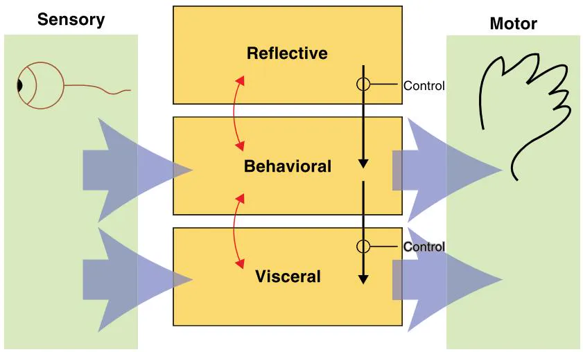  
Source: Adapted from Norman (2005), Figure 1.1

One  way of using the model is  to think about how  to design products in terms of the three levels. Visceral design refers to making products look, feel, and sound good. Behavioral design is about use and equates to the traditional values of usability. Reflective design is about considering the meaning and personal value of a product in a particular culture. For example, the design of a Swatch watch (see Figure 6.4) can be viewed in terms of the three levels. The  use  of cultural  images  and  graphical  elements  is  designed  to  appeal  to  certain people at the reflective  level; its affordances of use at the behavioral level, and the brilliant colors, wild designs, and art attract  their attention at the visceral  level. They are combined to create  the  distinctive  Swatch  trademark that  expresses  style  and personality. Designing to induce different levels of emotional responses, however, also requires understanding who the target audience is and what the context of use will be. Swatch customers are likely to be young and fashion conscious.

Another  model  that has  been used to  inform interaction design  is Plutchik’s Wheel of Emotions, originally developed in 1980  (Interaction Design  Foundation, 2021). Figure 6.5 shows how the wheel categorizes human emotions  into seven well-known emotions: anger, disgust, fear, sadness, anticipation, joy, and surprise. It  also includes trust as another one— which is not usually considered as an emotion. Alongside these typical responses are labels (optimism, love, submission, awe, disproval, remorse, contempt, aggressiveness). Other emotions are considered to be a combination of, or derived from, these. The colors used in the wheel reflect the intensity of an emotion: the darker the shade, the more intense the emotion is. Thus, the emotions in the middle of the wheel are seen as more intense; for example, rage is shown in the  middle of the circle as blood red, whereas anger is shown on the outside of the circle in light red. The wheel can be used as a “color palette” akin to a UX mood board. By selecting and blending  different emotions  from the wheel a designer can begin to think about  how to elicit different  kinds and levels of emotional  response. In essence, the wheel provides an initial way of exploring the possible effects of triggering different combinations of adjacent (e.g., serenity and pensiveness) and nonadjacent emotions for different stages of a user experience. It does not, however, instruct the designer on how to design for a selection of emotions.

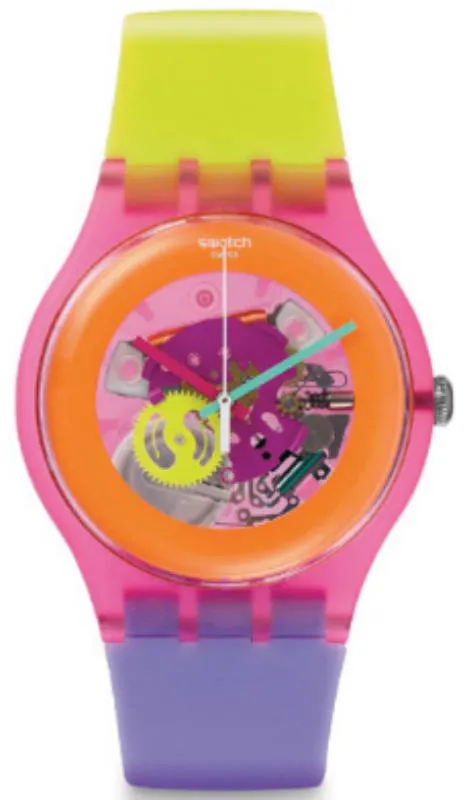  
Figure 6.4  A Swatch watch called Dip in Color Source: SWATCH AG

# ACTIVITY 6.2

How do Ortony et al.’s (2005) model of emotional design and Plutchik’s wheel of emotion differ? How helpful are they are when designing a new video game?

# Comment

Ortony et al.’s  model describes  emotions in terms of how  humans have different  levels of emotional responses depending on how they perceive and interact with a product, whereas Plutchik’s wheel depicts the range of human emotions and how they vary in level of intensity. Both are useful as conceptual tools for thinking about what kinds of behavior and emotions to design for. However, a games designer still has to make the leap in determining which specific game features to use to match to the desired emotional states, such as how much excitement and fear to incorporate into a new game. The palette metaphor used by the wheel can help designers consider different  aspects of a game: for example, highlighting the need to design specific mechanisms that can elicit anticipation and surprise at the beginning while avoiding boredom and distraction later.

Figure 6.5  Plutchik’s wheel of emotions   
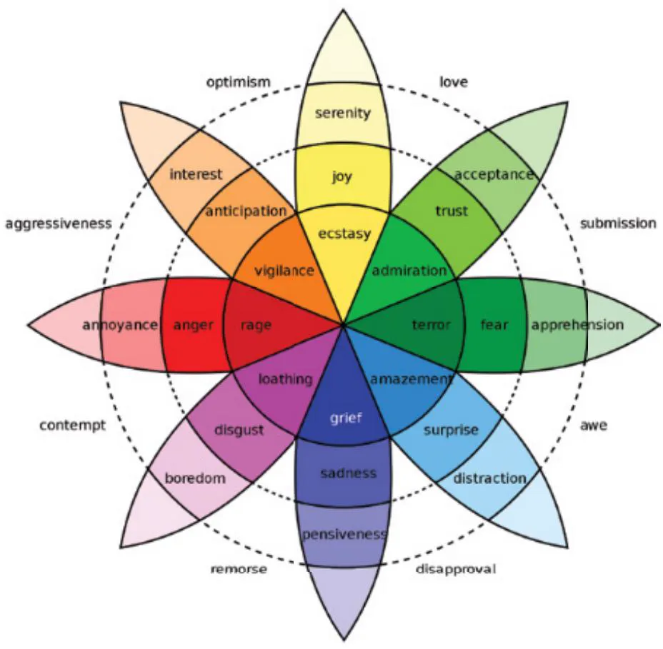  
Source: Machine Elf 1735 / Wikimedia / CC BY

# 6.3  Expressive Interfaces: Aesthetic or Annoying?

A number of features have been developed to make an interface expressive, including emojis, sounds, colors, shapes, icons, animations, videos, photos, and virtual  agents. Besides using visual  techniques, other  ways  of  conveying  expressivity  include “sonifications”  indicating actions and events (such as whoosh for a window closing, “schlook” for a file being dragged, or  ding  for  a  new  email  arriving)  and  vibrotactile  feedback  (such  as  distinct  smartphone buzzes that represent specific messages from friends or family). The motivation is often to (1) create an emotional connection or feeling with people for instance, warmth, or sadness, and/ or (2) elicit  certain kinds of emotional responses in people, such as feeling  at ease, comfort, and happiness.

Many websites, online shopping sites, and apps have been designed using a combination of these expressive features to good effect. Examples include retail sites like Nike and Levis, which have been creating aesthetic online shopping sites for many years using high-quality videos, emotive music, and striking images on their landing page (see Figure 6.6). They are very  enjoyable  and  engaging  to  watch, especially  by  the target  demographic,  eliciting  the

emotions  of anticipation,  joy, and excitement  as well  as capturing  the  current zeitgeist  of fashion, design, hipness, and youth.

Figure 6.6  An image used on the landing page of Levis.com (at the time of writing this chapter) conveying coolness, sustainable materials, a grungy background, and aesthetic fonts   
  
Source: LEVI STRAUSS & CO.

Sometimes expressive  features, however, can  turn  out  to  be more  annoying  than  aesthetic. Perhaps most well-known was Clippy, Microsoft’s paperclip that was designed to have human-like qualities to convey friendliness. It typically appeared at the bottom of a person’s screen whenever the system thought they needed help carrying out a particular task (see Figure 6.7a). Its expressiveness was depicted through googly eyes and eyebrows. At first, it was found  to be amusing  and perceived to be helpful. However, after popping up a  few times, many people started to find it annoying and intrusive, distracting them from their work. Its most common intervention was to appear and say, “It looks like you’re writing a letter” and offer to help the user. This might be OK if it happened to be the very first time someone was writing a letter, but not if it were all the other times. Some even found Clippy offensive. There has been much written in the media about the reasons for its failure, including being ahead of its time and its interface poorly designed. For example, The New Yorker (2015) reported that during a focus group that was held to probe why people hated Clippy so much, some of the women present commented on how they thought the character appeared to be too male.

Since then, many other kinds of virtual agents have been developed to help customers at the interface. They are often represented as avatars (see Anna in Figure 6.7b although now defunct) that have limited expressions (such as raising eyebrows  and blinking eyes). While they appear friendly and helpful, guiding customers to what they might be looking for, they, too  can become annoying  or intrusive, especially if the customer  already knows what they want. In this context, they can even appear like a pushy sales assistant.

How can virtual agents be designed to be friendly and helpful without being annoying? For one, they should appear at the interface only occasionally. They should also be designed

to  have  a  pleasant  demeaner  without  trying  to  be  too  human-like  or  overly  personable. Another question often asked is which gender should they have? Many have been portrayed as female. However, this can be seen as gender stereotyping. Instead, a cartoon character of an animal or robot that is gender-free may be preferable.

Figure 6.7  (a) Microsoft’s Clippy and (b) IKEA’s Anna   
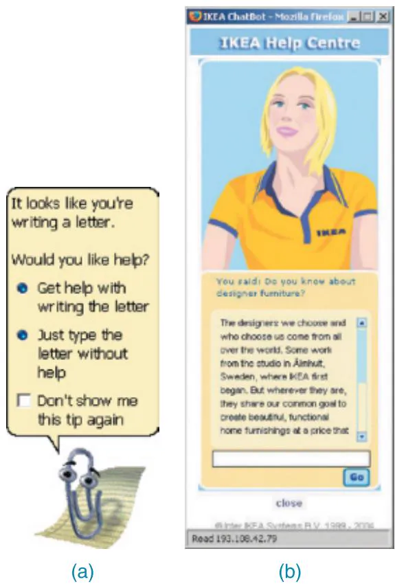  
Source: Microsoft Corporation

The  benefits  of  having  aesthetically  pleasing  interfaces  in  relation  to  their  impact  on usability  has  also been  researched.  Noam Tractinsky  (2013), for  example, has  repeatedly shown how the aesthetics of an interface can have a positive effect on people’s perception of the system’s usability. When the look and feel of an interface is pleasing and pleasurable—for example through beautiful graphics or a nice feel or the way that the elements have been put together—people are likely to be more tolerant and prepared to wait a few more seconds for a website to download. Furthermore, good-looking interfaces are generally more satisfying and pleasurable to use.

# ACTIVITY 6.3

Most people are familiar with the “404 error” message that pops up now and again when a web page does not load for the link they have clicked or when they have typed or pasted an incorrect URL into a browser. What does it mean and why the number 404? Is there a better way of letting people know when a link to a website is not working? Might it be better for the web browser to say that it was sorry rather than presenting an error message?

# Comment

The number 404 comes from the HTML language. The first 4 indicates a client error. The server is telling the user that they have done something wrong, such as misspelling the URL or requesting a page that no longer exists. The middle 0 refers to a general syntax error, such as a spelling mistake. The last 4 indicates the specific nature of the error. For the user, however, it is an arbitrary number. It might even suggest that there are 403 other errors they could make!

Seminal research by Byron Reeves and Clifford Nass (1996) suggested that computers should be courteous to users in the same way that people are to one another. They found that people are more forgiving and understanding when a computer says that it’s sorry after making a mistake. A number of companies now provide alternative and more humorous “error” landing pages that are intended to make light of the embarrassing situation and to take the blame away from the user. For example, Figure 6.8 shows a Lego man’s horrified expression that takes the sting away from a person stumbling on a page that does exist.

Figure 6.8  An alternative 404 error message   
  
Source: Future Publishing Limited Quay House

# DILEMMA

Should Voice Assistants Teach Kids Good Manners?

Many families now own a smart speaker, such as an Amazon Echo, with a voice assistant like Alexa running on it. One observation is that young children will often talk to Alexa as if she was their friend, asking her all sorts of personal questions, such as “Are you my friend?” and “What is your favorite music?” and “What is your middle name?” They also quickly learn that it is not necessary to say “please” when asking their questions or “thank you” on receiving a response, similar  to how they talk to other display-based voice assistants, such as Siri or Cortana. Some parents, however, are worried that this lack of etiquette could develop into a new social norm that could transfer over to how they talk to real human beings. Imagine the scenario where Aunt Emma and Uncle Liam come over to visit their young niece for her 5th birthday, and the first thing that they hear is, “Aunty Emma, get me my drink” or “Uncle Liam, where is my birthday present?” with hardly a “please” uttered. How would you feel if you were treated like that?

One would hope that parents would continue to teach their children good manners and that children know to treat humans differently compared with the way they talk to a voice assistant. To investigate this, Alexis Hiniker and  colleagues (2021) conducted  a study  that showed children do learn to transfer the way conversational agents speak to them but that they “mime” it in playful ways when talking with their parents as if it were an insider joke. In contrast, when they talked with the researcher, they did not talk in this way. This suggests children are selective in when and how they apply the new habits they pick up from talking to conversational agents.

# 6.4  Affective Computing and Emotional AI

Affective computing was first coined by Rosalind Picard (1997) to refer to how computers can be used to recognize and express emotions in the same way as humans do. This includes creating techniques to evaluate frustration, stress, and moods by analyzing people’s expressions  and conversations  and designing  novel wearable  sensors for people to  communicate their emotional states. More recently, affective computing has included exploring how affect influences personal health (Jacques et al., 2017). Another motivation is to design computers and robots that can respond appropriately to human emotions and moods and to know how and when to exhibit empathy (Schuller et al., 2021).

More  specifically,  emotional  AI  seeks  to  automate  the  measurement  of  feelings  and behaviors by using AI technologies that can analyze facial expressions and voice in order to infer emotions.

# 6.4.1  Measuring and Tracking Affect and Emotions

A number of sensing technologies are used in affective computing and emotional AI to measure and track physiological processes, and from the data collected, predict aspects of a person’s  behavior,  for  example, forecasting  what  someone  is  most  likely to  buy  online  when feeling sad, bored, or happy. The main techniques and technologies that have been used to do this are as follows:

• Cameras for measuring facial expressions   
• Biosensors placed on fingers or palms to measure galvanic skin response (which is used to infer how anxious or nervous someone is as indicated by an increase in their sweat)   
• Affective expression in speech (voice quality, intonation, pitch, loudness, and rhythm)   
. Body movement and gestures, as detected by motion capture systems or accelerometer sensors placed on various parts of the body

The use of automated facial coding has gained popularity in commercial settings, especially in marketing and ecommerce. For example, Affectiva media analytics software (www .affectiva.com) employs advanced computer vision and deep learning algorithms to catalog someone’s  emotional  reactions  to  digital content, as  captured  through a  webcam, to  analyze  how engaged the  user  is with  digital online  content, such  as movies,  online shopping sites, and advertisements. The fundamental emotions that are classified are anger, contempt, disgust,  fear,  joy, and  sadness. These  emotions  are  indicated  as  a percentage  of  what  was detected from someone’s facial expression and appear above the person’s face on a display. For  example, Figure 6.9 shows a  label of 100 percent happiness and  0 percent for all  the other categories above the woman’s head on the smartphone display. The white dots overlaying her face are the markers used by the app when modeling a face. They provide the data that determines the type of facial expression being shown, in terms of detecting the presence or absence of the following:

• Smiling   
. Eye widening   
. Brow raising   
. Brow furrowing   
. Raising a cheek   
Mouth opening   
. Upper-lip raising   
Wrinkling of the nose

If a person furrows their brow and wrinkles their nose (i.e., screws their face up) when an ad pops up, this suggests that they feel disgust, whereas if they start smiling, it suggests that they are feeling happy. The website can then adapt its ad, movie storyline, or content to what it perceives the person needs at that point in their emotional state.

Affectiva  also  analyzes  drivers’  facial  expressions  when on  the  road  with  the  goal  of improving  driver safety. The emotional AI  software perceives if a driver  is angry and  then suggests an intervention. For example, a virtual agent in the car might suggest to the driver to take a deep breath and play soothing music to help relax them. In addition to identifying particular emotions through facial expressions (for example, joy, anger, and surprise), Affectiva uses  particular markers to detect drowsiness. These are eye  closure, yawning, and blinking

rate. Again, upon detecting when a threshold has been reached for these facial expressions, the software might trigger an action, such as getting a virtual agent to suggest to the driver that they pull over where it is safe to do so.

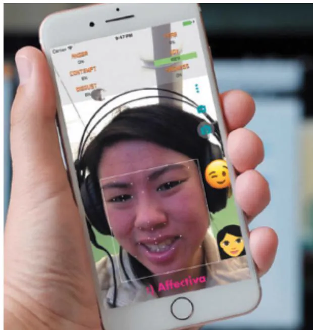  
Figure 6.9  Facial coding using Affectiva software Source: Affectiva, Inc.

Other  indirect methods that are used to reveal the emotional state of someone include eye-tracking, finger pulse, speech, and the words/phrases they use when tweeting or chatting online. The level of affect expressed by users, the language they use, and the frequency with which they  express themselves when using social media can  all indicate their mental  state, well-being, and aspects of their personality (for instance, whether  they are  an  extrovert or introvert, neurotic or calm, and  so on). Some companies may  try to use  a  combination of these  measures, such  as  facial expressions  and  the language  that people use  when online, while others may focus on just one aspect, such as the tone of their voice when answering questions  over the  phone. This  type  of  indirect  emotion  detection  is  used  to help  infer or predict someone’s behavior, for example, determining their suitability for a job or how they will vote in an election.

Biometric  data is  also used  in streaming video  games where  spectators  watch players, known as streamers, play video games. The most popular site is Twitch; millions of viewers visit it each day to watch others compete in games, such as Fortnite. The biggest streamers have become a new breed of celebrity, like YouTubers. Some have millions of dedicated fans. Various tools have been developed to enhance the viewers’ experience. One is called All the Feels, which provides an overlay of biometric and webcam-derived data of a streamer onto the  screen  interface  (Robinson  et  al.,  2017). A  dashboard  provides  a  visualization  of  the

streamer’s heart rate, skin conductance, and emotions. This additional layer of data has been found to enhance the spectator experience and improve the connection between the streamer and spectators. Figure 6.10 shows the  emotional state of a streamer using the All the Feels interface.

Figure 6.10 All the Feels app showing the biometric data of a streamer playing a video game   
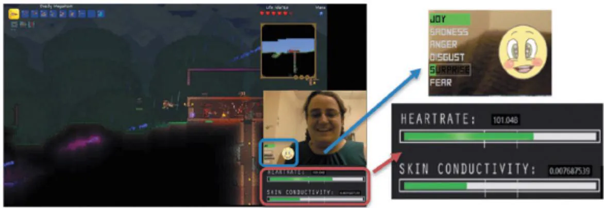  
Source: Courtesy of Katherine Isbister

# 6.4.2  Tracking and Reflecting on Moods

There has been much interest in how technology can be used to help people understand more about their moods and what lies behind their mood swings. We can be in a good mood one day and then a bad mood the next day. How does this happen and why? Whereas it is possible to use facial tracking software to detect a specific emotion (e.g., happy), it is not possible to do the same to detect different moods—as often they are not expressed through obvious physiological  responses. If someone  is in  a bad mood, say, they  may not  show it and may deliberately hide how they are feeling.

An alternative approach is to ask people to write down manually how they are feeling at a given point in time or to rate their mood and for them to reflect upon how they felt about themselves in the past. One of the first apps to support this kind of journaling digitally was called Echo; it asked people to type a subject line, rate their happiness at that moment, and add a description, photos, and/or videos if they wanted to (Isaacs et al., 2013). Sporadically, the  app then  asked  them  to  reflect on  previous  entries. An  assumption was  that  this type of technology-mediated reflection could increase well-being and happiness. Each reflection was shown as a stacked card with the time and a smiley happiness rating. People who used the Echo app reported  on the many positive  effects of doing so, including reliving positive experiences and overcoming negative experiences by writing them down. The double act of recording and reflecting enabled them to generalize from the positive experiences and draw positive lessons from them.

Since this early research, many commercial Mood tracker apps (e.g., Moodnotes, Daylio) have been developed that are intended to help people keep track of their moods and be able to reflect more on why they might be feeling gloomy or overly ecstatic. Understanding their moods in this way is assumed to help improve mental well-being.

# BOX 6.2

# Triggering ASMR Through Food Videos

Autonomous sensory meridian response (ASMR) is a tingling body sensation that starts on the scalp and then progresses down the back of the neck and spine. The sensation is often reported to be accompanied by feelings of relaxation and well-being. For some people, it can be triggered by listening to crunching, slurping, and other food-eating sounds. There are now many videos on TikTok and YouTube that are intended to induce ASMR in people. SamSeats, for example, has made a video of many tingling sounds associated with preparing a ratatouille dish (www.tiktok.com/@samseats/video/6968110778725485829?is_copy_url=1&is_from_ webapp=v1&lang=en). The sounds include ice cubes being dropped in a bowl, a knife slicing through an assortment of veggies, and the rapid and fine chopping of garlic cloves and sprigs of herbs. It is music to the ears and makes you want to watch and listen to the video again. Each time you do, you hear something new. On viewing it a second time, I heard the glugging sound of oil being poured from a bottle and the frying of onions. Do you think triggering ASMR in this way can improve your mood if you are feeling down?

Virtual  reality  has  also been  developed  to  enable people  to  explore  their  moods. For example, Nadine Wagener  and colleagues  (2022) developed Mood Worlds—a VR application that enables people to visualize their moods by creating their own virtual space using 3D digital tools (see Figure 6.11). The use of this kind of 3D digital painting to explore participants’ feelings was found to lead to increased happiness and positivity.

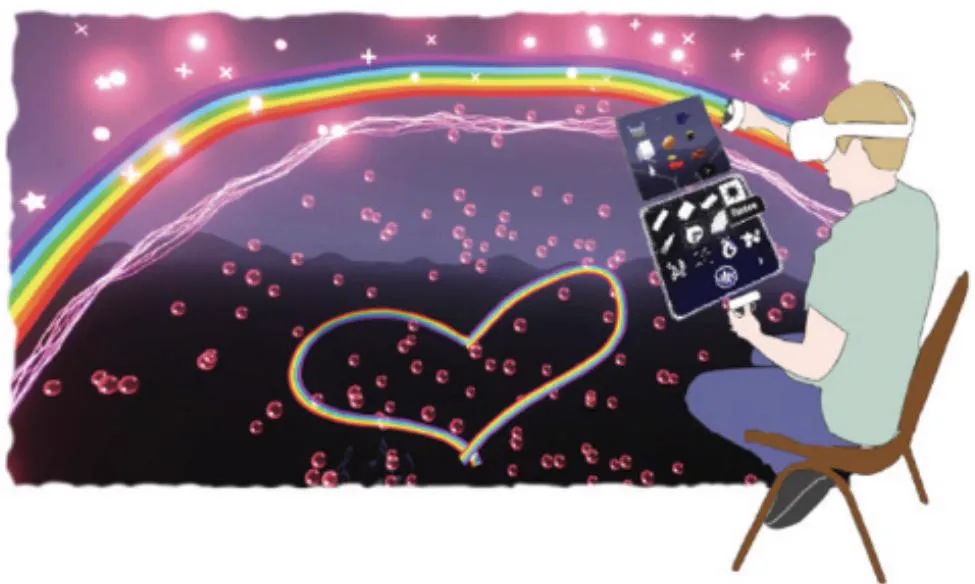  
Figure 6.11 A participant using the VR app Mood Worlds to visualize and explore their emotions Source: Wagener et al., 2022

# BOX 6.3

Is It OK for Technology to Work Out How You Are Feeling?

Do you think  it is ethical that technology is trying to read your emotions from your facial expressions or from what you write in your tweets and, based on its analysis, filter the online content that you are browsing, such as ads, news, or a movie to match your mood? Might some people think it is an invasion of their privacy?

Human beings will suggest things to each other, often based on what they think the other is feeling. For example, they might suggest a walk in the park to cheer them up. They might also suggest a book to read or a movie to watch. However, some people may not like the idea that an app can do the same, for example, suggesting what you should eat, watch, or do based on how it analyzes your facial expressions.

# 6.5  Persuasive Technologies and Behavioral Change

A diversity of techniques has been used at the interface to draw people’s attention to certain kinds of information in an attempt to change what they do  or think. Pop-up ads, warning messages, reminders, prompts, personalized messages, and recommendations are some of the methods that are deployed on a computer or smartphone. Examples include Amazon’s oneclick mechanism that makes it easy to buy something on its online store and recommender systems  that  suggest  specific  books,  hotels,  restaurants,  and  so  forth,  that  a  reader might want to try based on their previous purchases, choices, and taste. The various techniques that have been developed  have been referred to as persuasive design (Fogg, 2009). They include enticing, cajoling, or nudging someone into doing something through the use  of persuasive technology.

Technology interventions have also been developed to change people’s behaviors in other domains  besides commerce, including  safety, preventative healthcare, fitness, personal  relationships, sustainability,  and learning. Here  the  emphasis  is  on  changing someone’s habits or  doing something that  will improve  an  individual’s  well-being  through monitoring  their behavior. One of the earliest commercial examples was Nintendo’s Pokémon Pikachu device (see Figure 6.12) that was designed to motivate children into being more physically active on a consistent basis. The owner of the digital pet that lives in the device was required to walk, run, or jump each day to keep it alive. The wearer received credits for each step taken—the currency being watts that could be used to buy Pikachu presents. Twenty steps on the pedometer rewarded the player with 1 watt. If the owner did not exercise for a week, the virtual pet became angry and refused to play anymore. This use of positive rewarding and sulking can be a powerful means of persuasion, given that children often become emotionally attached to their virtual pets, especially when they start to care for them.

Figure 6.12 Nintendo’s Pokémon Pikachu device   
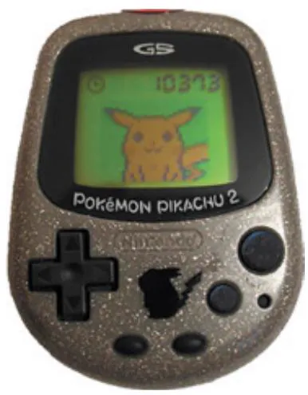  
Source: Nintendo

# ACTIVITY 6.4

Watch these two videos:

The Piano Staircase: youtu.be/2lXh2n0aPyw

The Outdoor Bin: youtu.be/cbEKAwCoCKw

Do you think that such playful methods are effective at changing people’s behavior?

# Comment

In 2009, Volkswagen sponsored an open competition, called the fun theory, asking people to transform mundane artifacts into novel enjoyable user experiences in an attempt to change people’s behavior for the better. The idea was to encourage a desired behavior by making it more fun. The Piano Staircase and the Outdoor Bin are the most well-known examples; the stairs sounded like piano keys being played as they were climbed, while the bin sounded like a well echoing when something was thrown into it. Research has shown that designing playful methods as part of a technology intervention is effective as they engage people more in enjoyable ways of changing their behavior (Seaborne et al., 2020).

Besides the mood tracking apps mentioned earlier, many other apps have been developed that are intended to help people monitor various behaviors and be able to change them based on the data collected and displayed back to them. These devices include fitness trackers, for example, Fitbit, and weight trackers, such as smart scales. They  are designed to encourage people to change their behavior by displaying dashboards of graphs showing how much exercise they have done or weight  they have lost over a day, week, or longer period, compared with what they  have done in the previous  day, week, or month. The results are compared,

through online leaderboards and charts, with how well they have done versus their peers and friends. Other techniques employed to encourage people to exercise more or to move when sedentary include goal setting, reminders, and rewards for good behavior.

The global concern about  climate change has  also led a number of HCI researchers to design and evaluate various energy-sensing devices that display real-time feedback. One goal is to find ways of helping people reduce their energy consumption, and it is part of a larger research  agenda  called  sustainable  HCI  (e.g.,  Mankoff  et  al., 2008;  DiSalvo  et  al., 2010; Hazas  et al., 2012;  Knowles et al., 2018). The focus is  to persuade people to  change their everyday habits with respect to environmental concerns, such as reducing their own carbon footprint, their community’s footprint (for example, a school or workplace), or an even larger organization’s carbon footprint (such as a street, town, or country).

Extensive  research  has  shown  that domestic  energy  use  can  be reduced  by  providing households  with feedback on their consumption (Froehlich  et al., 2010). The frequency of feedback is considered important; continuous or daily feedback on energy consumption has been  found  to  yield  higher  savings  results  than  monthly  feedback. The  type  of  graphical representation also has an effect. If the image used is too obvious and explicit (for instance, a finger pointing at the user), it may be perceived as too personal, blunt, or “in your face,” resulting in people objecting to it. In contrast, simple images (for example, an infographic or emoticon) that are more anonymous but striking and whose function is to get people’s attention may be more effective. They may encourage people to reflect more on their energy use and even promote public debate about what is represented and how it affects them. However, if  the image used is too  abstract and implicit, other meanings may be attributed  to it, such as simply  being an art piece  (such as an abstract painting with colored stripes that change in response to the amount of energy used), resulting in people ignoring it. The ideal may be somewhere in between. Peer pressure can also be effective, where peers, parents, or children chide or encourage one another to turn lights off, take a shower instead of a bath, and so on.

Another  influencing  factor  is  social  norms.  In  a classic  study by  Wesley Schultz  et  al. (2007), households were shown how their energy consumption compared with their neighborhood average. Households above the average tended to decrease their consumption, but those  using  less  electricity  than  average  tended  to  increase  their  consumption.  The  study found that this “boomerang” effect could be counteracted by providing households with an emoticon along with the numerical information about their energy usage: households using less energy than average continued to do so if they received a smiley icon; households using more than average decreased their consumption even more if they were given a sad icon.

In contrast to the Schultz study, where each household’s energy consumption was kept private,  the  Tidy Street  project  (Bird  and  Rogers,  2010)  that  was  run  in  Brighton  in  the United Kingdom created a large-scale visualization of the street’s electricity usage by spraying a stenciled display on the road surface using chalk (see Figure 6.13). The public display was updated each day to represent how the average electricity usage of the street compared to the city of Brighton’s average. The goal was to provide real-time feedback that all of the homeowners and the general public could see change each day over a period of three weeks. The street graph also proved to be very effective in getting people who lived on Tidy Street to talk to each other about their electricity consumption and habits. It also encouraged them to talk with the many passersby who walked up and down the street. The outcome was to reduce electricity consumption in the street by 15 percent, which was considerably more than other projects in this area have been able to achieve.

Figure 6.13 Aerial view of the Tidy Street public electricity graph   
  
Source: Yvonne Rogers

# BOX 6.4

# Scamming

Technology is increasingly being  used to deceive  people into parting  with their  personal details, which allows Internet fraudsters to access their bank accounts and draw money from them. Authentic-looking letters, appearing to be sent from eBay, PayPal, and various leading banks, are spammed across the world, ending up in people’s email inboxes with messages such as “During our regular verification of accounts, we couldn’t confirm your information. Please click here to update and verify your information.” Given that many people have an account with one of these corporations, there is a good chance that they will be misled and unwittingly believe what is being asked of them, only to discover a few days later that they are several thousand dollars worse off. Similarly, letters from supposedly super-rich individuals in faraway countries, offering a share of their assets if the email recipient provides them with their bank details, have persistently been spammed worldwide. Such scams are on the rise as fraudsters develop ever more sophisticated ways of putting their victims into an intense emotional state where common sense goes out of the window. Many of the scams seem plausible, meaning the targeted person has no reason to suspect they are being tricked. Internet fraudsters are constantly changing their tactics. While the art of deception is centuries old, the  increasing, pervasive, and often ingenious use of Internet scams to trick people into divulging personal information can have catastrophic effects on society as a whole.

# 6.6  Anthropomorphism

Anthropomorphism is the propensity people have to attribute human qualities to animals and objects. For example, people sometimes talk to their computers as if they were humans, treat their  robot cleaners as if they were their  pets, and  give all manner of cute names to their mobile devices,  routers, and  so on. Advertisers are well  aware of  this phenomenon and often create human-like and animal-like characters out of inanimate objects to promote

their products. For example, breakfast cereals, butter, and fruit drinks have all been transmogrified  into  characters with human qualities  (they move, talk, have  personalities, and show emotions), enticing the viewer to buy them. Children are especially susceptible to this kind of magic, as witnessed by their love of cartoons where all manner of inanimate objects are brought to life with human-like qualities.

The finding that people, especially children, have a propensity to accept and enjoy objects that have been given  human-like qualities has  led many designers  to capitalize on  it, most notably  in the design of virtual agents and interactive dolls, robots, and cuddly  toys. Early commercial products like ActiMates were designed to encourage children to learn by playing with  them. One of  the first—Barney (a dinosaur)—attempted  to motivate play  in children by using human-based speech and movement (Strommen, 1998). The toys were programmed to  react  to  the  child  and  make  comments  while  watching  TV  or  working  together  on  a computer-based task. In particular, Barney was programmed to congratulate the child whenever they produced a right answer and also to react to the content on-screen with appropriate emotions, for instance, cheering at good news and expressing concern at bad news. Interactive  dolls have  also been  designed to  talk, sense,  and understand  the world  around  them, using sensor-based technologies, speech recognition, and various mechanical servos embedded  in  their bodies. For  example,  the  interactive  doll Mealtime  Magic Mia  exhibits  facial expressions, such as blinking, smiling, and making baby cooing  noises in response to what she  is fed. She can make more than 70 sounds and phrases, blow raspberries, and stick her tongue out if she does not like what she has been fed.

Furnishing  technologies  with  personalities  and  other  human-like  attributes  can  make them  more enjoyable and fun to interact with. They can also motivate people to carry out various activities, such as learning. Being addressed in the first person (for instance, “Hello, Rowan! Nice to see you again. Welcome back. Now what were we doing last time? Oh yes, Exercise 5. Let’s start again.”) is more appealing than being addressed in the impersonal third person  (“User  24,  commence  Exercise 5.”),  especially  for  children. It  can  make  them  feel more at ease and reduce their anxiety. Similarly, interacting with screen characters like tutors and wizards can be more engaging than interacting with a dialog box.

# ACTIVITY 6.5

# A Robot or a Cuddly Pet?

Early robot pets, such as Sony’s AIBO, were made of hard materials that made them look shiny and clunky. Another approach has been to make them look and feel more like real pets by covering them up in fur and making them behave in more cute, pet-like ways. Two contrasting examples are presented in Figure 6.14a and Figure 6.14b. Which do you prefer and why?

(Continued)

  
(a)

(b)   
Figure 6.14 Robot pets: (a) Aibo and (b) The Haptic Creature   
  
Source: (a) Jennifer Preece (Author), (b) Courtesy of Steve Yohanan. Photo by Martin Dee

# Comment

Most people like stroking pets, so they may prefer a soft pet robot that they can also stroke, such as the  one  shown  in Figure 6.14b. A  motivation for  making robot pets cuddly is to enhance  the  emotional  experience people receive  through  using  their  sense  of touch. For example, the Haptic Creature on the right is a robot that mimics a pet that might sit in your lap, such as a cat or a rabbit (Yohanan and MacLean, 2008). It is made up of a body,head, and two ears, as well as mechanisms that simulate breathing, a vibrating purr, and the warmth of a living creature. The robot “detects” the way it is touched by means of an array of (roughly 60) touch sensors laid out across its entire body and an accelerometer. When the Haptic Creature is stroked, it responds accordingly, using the ears, breathing, and purring to communicate its emotional state through touch. On the other hand, the sensors are also used by the robot to detect the human’s emotional state through touch. Note how the robot has no eyes, nose, or mouth. Facial expressions are the most common way humans communicate emotional states. Since the Haptic Creature communicates and senses emotional states solely through touch, the face was deliberately left off to prevent people from trying to “read” emotion from it.

A  number  of  commercial physical  robots have  been developed  specifically  to  support care giving for older adults. Early ones were designed to be about 2 feet tall and were made from white plastic with colored parts that represented clothing or hair, often having big eyes and holding a tablet to display messages. There have been various attempts to use them to encourage  social interactions  with  residents in care  homes. The findings have been  mixed, with some residents joining in, others appearing bemused, while others find it a little demeaning. An example social robot is Stevie (see Figure 6.15) that was developed on a rolling base with short, moveable arms and a head that displays cartoon eyes and a mouth. In 2018–19, Stevie was trialed by Conor McGinn at a Retirement Community in Washington DC to learn from  staff and the residents how  it could improve their experiences (Savage, 2022). Stevie was programmed to entertain the residents, for example, calling bingo and leading a singalong. Feedback  from  the staff  and residents  was generally positive.  However, it was also pointed out how limited Stevie was in how it could entertain. While there is no harm in social

robots like Stevie playing an entertaining and motivating role alongside human caregivers, it should always be remembered that they can never match the human touch and warmth that patients need.

Figure 6.15 Stevie the robot entertaining residents while at a retirement home   
  
Source: www.nature.com/articles/d41586-022-00072-z

# In-Depth Activity

This in-depth activity requires you to try one of the emotion recognition apps available and to see  how well it fares in recognizing  different  people’s facial expressions. Download the AffdexMe app  or Age Emotion  Detector for Apple  or Android. Take a  photo  of yourself looking natural and see what emotion it suggests.

1. How many emotions does it recognize?   
2. Try to make a face for each of the following: sadness, anger, joy, fear, disgust, and surprise. After making a face for each, see how well the app detects the emotion you were expressing.   
3. Ask a couple of other people to try it. See whether you can find someone with a beard and ask  them to try, too. Does facial hair make it more difficult  for  the  app  to recognize an emotion?   
4. What other application areas do you think these kinds of apps could be used for besides advertising?   
5. What ethical issues does facial recognition raise? Has the app provided sufficient information as to what it does with the photos taken of people’s faces?   
6. How well would the recognition software work when used in a more natural setting where the user is not making a face for the camera?

# Summary

This chapter  described  the  different  ways that interactive products can  be designed (both deliberately and inadvertently) to make people respond in certain ways. The extent to which people will learn, buy a product online, quit a bad habit, or chat with others depends on the believability of the  interface, how comfortable they feel when using  a product, and/or how much they can  trust it. If the interactive product  is frustrating to use, annoying, or patronizing, people will easily become angry and despondent and often they stop using it. If, on the other hand, the product is pleasurable, is enjoyable to use, and makes them feel comfortable and at ease, then they will continue to use it, make a purchase, return to the website, or continue to learn.

This chapter also described various models of emotion and interaction mechanisms that can be used to elicit positive emotional responses and ways of avoiding negative ones. Furthermore, it described how new technology has been developed to detect emotional states.

# Key Points

•  Emotional aspects of interaction design are concerned with how to facilitate certain states (for example, pleasure) or avoid certain reactions (such as frustration) in user experiences.   
•  Well-designed interfaces can elicit good feelings in people.   
•  Aesthetically pleasing interfaces can be a pleasure to use.   
•  Expressive interfaces can  provide  reassuring feedback to users  as well as be informative an   
•  Badly designed interfaces often make people frustrated, annoyed, or angry.   
Emotional AI and affective computing use AI and sensor technology for detecting people’s emotions by analyzing their facial expressions and conversations.   
•  Emotional technologies can be designed to persuade people to change their behaviors or attitudes.   
•  Anthropomorphism is the attribution of human qualities to objects.   
•  Social robots are being used in a variety of settings, including households and retirement homes to entertain people.

# Further Reading

CALVO, R. A. and PETERS, D. (2014) Positive Computing. MIT. This book discusses how to design technology for well-being to make a happier and healthier world. As the title suggests, it is positive in its outlook. It covers the psychology of well-being, including empathy, mindfulness,  joy, compassion,  and  altruism.  It  also  describes  the  opportunities  and  challenges facing interaction designers who want  to develop technology  that can improve people’s well-being.

HÖÖK, K. (2018) Designing with the Body. MIT. This book proposes that interaction design should  consider the experiential, felt, and aesthetic stance that encompasses the design and use  cycle. The  approach  suggested  by  the author  is  called  soma  design,  where  body  and movements are viewed as very much part of the design process, and where a slow, thoughtful process is promoted that considers fundamental human values. It is argued that adopting this stance can yield better products and create healthier, more sustainable companies.

LEDOUX, J. E. (1998) The Emotional Brain: The Mysterious Underpinnings of Emotional Life. Simon & Schuster. This book explains what causes us to feel fear, love, hate, anger, and joy, and it explores whether we control our emotions versus them controlling us. The book also  covers  the  origins  of  human  emotions  and  explains  that  many  evolved  to  enable  us to survive.

NORMAN, D. (2005) Emotional Design: Why We Love (or Hate) Everyday Things. Basic Books. This book is an easy read while at the same time being thought-provoking. We get to see inside  Dan Norman’s kitchen and learn about  the design aesthetics  of his collection of teapots. The book also includes essays on the emotional aspects of robots, computer games, and a host of other pleasurable interfaces.

TIAN, L., OVIATT, S., and MUSZYNSKI, M. (2022) Applied Affective Computing. Morgan & Claypool. This book provides an overview of the state-of-the-art and emerging themes in affective computing, including existing approaches to affective computing systems and recent machine learning approaches. It also includes a chapter on emotion recognition in the wild. It covers what it takes for a robot to be emotionally aware.

WALTER,  A.  (2020)  A  Book  Apart:  Designing  for  Emotion.  Second  edition.  Zeldman, Jeffrey. This short book is targeted at web designers who want to understand how to design websites that users will enjoy and want to return to. It covers the classic literature on emotions, and it proposes practical approaches to emotional web design. In the second edition, new topics are introduced including privacy, representation, and safety.

# Chapter 7

# I N T E R F A C E S

7.1  Introduction  
7.2  Interface Types   
7.3  Natural User Interfaces and Beyond   
7.4  Which Interface?

# Objectives

The main goals of the chapter are to accomplish the following:

•  Provide an overview of the diversity of interfaces.   
•  Highlight the main design and research considerations for each of the interfaces.   
•  Discuss what is meant by a natural user interface.   
•  Consider which interface is best for a given application or activity.

# 7.1  Introduction

When  considering how to solve a user  problem, the default  solution that many developers choose to design is an app that can run on a smartphone. Making this easier still are many easy-to-use app developer tools that can be freely downloaded. It is hardly surprising, therefore, to see just how many apps there are in the world. In 2022, Apple had more than 2 million apps in its store while Google had more than 3 million!

Despite the immensity of the smartphone app industry, the web continues to proliferate in offering services, content, resources, and information. A central concern is how to design websites  that  deliver  services,  content, resources,  and  information  across  different  devices and browsers, which takes into  account the  varying form  factors of smart watches, smartphones, laptops, smart TVs, and computer screens. Besides the app and the web, many other kinds  of  interfaces  have  been  developed  and  researched,  including  voice  interfaces,  touch interfaces, gesture interfaces, and multimodal interfaces.

The proliferation of technological developments has encouraged different ways of thinking about interaction design and UX. For example, input can be via mice, touchpads, pens, remote  controllers, joysticks, RFID readers, gestures, and even brain-computer interaction.

Output is equally diverse, appearing in the form of graphical interfaces, speech, mixed realities, augmented realities, tangible interfaces, wearable computing, and more.

The goal of this chapter is to give you an overview of the diversity of interfaces that can be developed for different environments, people, places, and activities. We present a catalog of 22 interface types, starting with command-based and ending with holographic ones. For each interface, we present an  overview and outline the key research and design considerations. Some are only briefly touched upon, while others, which are more established in interaction design, are described in greater depth.

# NOTE

This chapter is not meant to be read from beginning to end; rather, it should be dipped into as needed to find out about a particular type of interface.

# 7.2 Interface Types

Numerous adjectives have been used to describe the different types of interfaces  that have been developed, including graphical, command, speech, multimodal, invisible, ambient, affective, mobile, intelligent, adaptive, smart, tangible, touchless, and natural. Some of the interface  types  are  primarily  concerned  with  a  function  (for  example,  to  be  intelligent, to  be adaptive, to be ambient, or to be smart), while others focus on the interaction style used (such as  command,  graphical,  or  multimedia),  the  input/output  device  used  (for  instance,  penbased,  speech-based,  or  gesture-based),  or  the  platform  being  designed  for  (for  example, tablet,  mobile,  PC,  or  wearable).  Some  apps  and  systems  use  increasingly  sophisticated machine learning algorithms that are intended to recognize faces, objects, and the like. Rather than cover every possible type that has been developed or described, we have chosen to select the main types of interfaces that have emerged over the past 45 years. The interface types are loosely ordered in terms of when they were developed. (See the following list for the complete set.) It should be noted, however, that this classification is for convenience of reference. The interface entries are not mutually exclusive since some products can appear in two or more categories. For example, a smartphone can be considered to be mobile, touch, or wearable.

The types of interfaces covered in this chapter include the following:

? Command   
Graphical   
Multimedia   
Virtual reality   
Web   
Mobile   
. Appliance   
• Voice   
Pen   
? Touch

• Touchless   
. Haptic   
. Multimodal   
• Shareable   
• Tangible   
. Augmented reality   
• Wearables   
. Robots and drones   
• Brain-computer   
. Smart   
. Shape-changing   
. Holographic

Here is a selection of classic HCI videos that demonstrate research into pioneering and future interfaces:

The  Sketchpad: Ivan Sutherland (1963) describes  the  first  interactive  graphical  interface: youtu.be/6orsmFndx_o

The  Dynabook: Alan Kaye (1968) describes  a  thin, light “children’s  computer” with a flatscreen display, drawing  stylus,  keyboard,  and  wireless connectivity:  www.youtube.com/ watch?v=r36NNGzNvjo

The  Mother of All  Demos: Douglas  Engelbart  (1968) describes  the  first  WIMP: youtu.be/yJDv-zdhzMY

Put  that there  (1979):  MIT  demonstrates the  first  speech and  gesture  interface: youtu.be/RyBEUyEtxQo

Unveiling  the  genius of multitouch interface  design:  Jeff Han  gives  a  TED  talk (2007): youtu.be/ac0E6deG4AU

Intel’s Future Technology Vision (2012): Futuristic video presenting a number of scenarios of technology use intended to improve people’s lives: youtu.be/g_cauM3kccI

CMU’s  Future Interfaces Group: The  Next Phase  of Computer-Human Interaction (2018): Introduces future interface prototypes that can make our lives more efficient and informed: www.youtube.com/watch?v=J_oPtEjiVuA

# 7.2.1  Command-Line Interfaces

Early interactive interfaces required the user to type in commands that were typically abbreviations (for example, ls) at the prompt symbol appearing on the computer display, to which the system responded (see Figure 7.1). Another way of issuing commands is by pressing certain  combinations  of keys  (such  as $\mathrm { C t r l } { + } \mathrm { V } _ { \cdot }$ ). Some  commands  are  also  a fixed  part  of the keyboard, such as delete, enter, and escape, while other function keys can be programmed by the user as specific commands (for instance, F11 commanding print action).

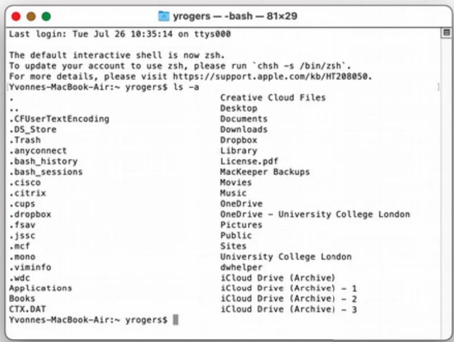  
Figure 7.1  A Unix terminal display showing directories listed alphabetically for the command ls -a Source: Yvonne Rogers

Command-line  interfaces  have  been  largely  superseded  by  graphical  interfaces  that incorporated commands such as menus, icons, keyboard shortcuts, and pop-up/predictable text commands  as part of an application. Where command-line interfaces continue to have an advantage is when people find them easier and faster to use than equivalent menu-based systems (Raskin, 2000). People also prefer command-line  interfaces for performing certain operations as part of a complex software package, such as for CAD environments (such as Rhino3D and AutoCAD), to allow expert designers to interact rapidly and precisely with the software. They also provide scripting for batch operations, and they are being increasingly used on the web, where the search bar acts as a general-purpose command-line facility, for example, www.yubnub.org.

System  administrators, programmers,  and power users often  find that  it  is much  more efficient and quicker to use command languages such as Microsoft’s PowerShell. For example, it is  much  easier to  delete  10,000  files in  one go  by  using  one  command rather  than scrolling through that number of files and highlighting those that need to be deleted.

# Research and Design Considerations

In the 1980s, much research investigated ways of optimizing command interfaces. The form of the commands (including use of abbreviations, full names, and familiar names), syntax (such as how best to combine different commands), and organization (for instance, how to structure options) are examples of some of the main areas that have been investigated (Shneiderman, 1998). A  further  concern  was  which command  names  would be the  easiest  to remember. A number of variables were tested, including how familiar users were with the chosen names. Findings from a number of studies, however, were inconclusive; some found specific names were better remembered than general ones (Barnard et al., 1982), others showed that names selected by users themselves were preferable (Ledgard et al., 1981; Scapin, 1981), while yet others demonstrated that high-frequency words were better remembered than low-frequency ones (Gunther et al., 1986).

The most relevant design principle is consistency  (see Chapter 1, “What Is Interaction Design?”). Therefore, the method used for labeling/naming the commands should be chosen to be as consistent as possible; for example, always use the first letters of the operation when using abbreviations.

# 7.2.2  Graphical User Interfaces

The Xerox Star interface (described in Chapter 3, “Conceptualizing Interaction”) led to the birth of the graphical user interface (GUI), opening up new possibilities for users to interact with a system and for information to be presented and represented within a graphical interface.  Specifically,  new  ways  of  visually  designing  the  interface  became  possible,  which included  the use  of color, typography,  and imagery (Mullet  and  Sano, 1995). The original GUI was called a WIMP (windows, icons, menus, pointer) and consisted of the following:

Windows: Sections of the screen that can be scrolled, stretched, overlapped, opened, closed, and moved using a mouse   
• Icons:  Pictograms  that  represent  applications,  objects,  commands,  and  tools  that  are opened or activated when clicked on   
. Menus: Lists of options that can be scrolled through and selected in the way a menu is used in a restaurant   
. Pointing device: A mouse controlling the cursor as a point of entry to the windows, menus, and icons on the screen

The first generation of WIMP interfaces were primarily boxy in design; user interaction took place through a combination of windows, scrollbars, check boxes, panels, palettes, and dialog boxes that appeared on the screen in various forms (see Figure 7.2). Developers were largely constrained by the set of widgets available to them, of which the dialog box was most

prominent.  (A  widget  is  a  standardized  display  representation  of a  control,  like  a  button or scrollbar, that can be manipulated by  the user.) Nowadays, GUIs have been adapted for mobile and touchscreens. Instead of using a mouse and keyboard as input, the default action for most users is to swipe and touch using a single finger when browsing and interacting with digital content. (For more on this subject, see sections 7.2.6 and 7.2.10.)

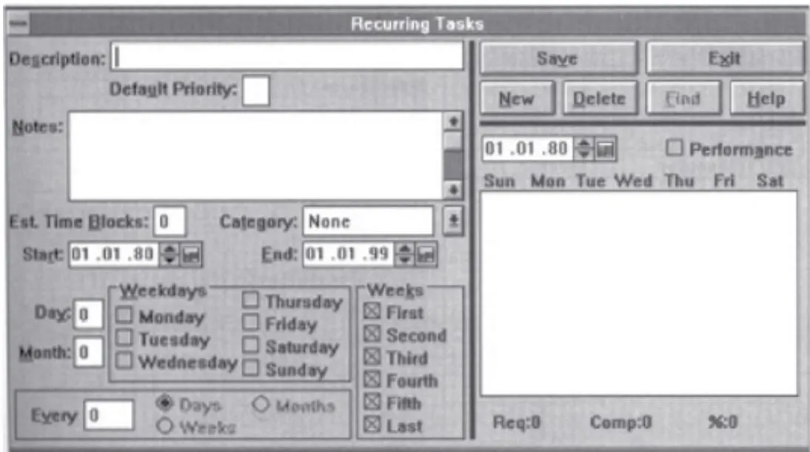  
Figure 7.2  The boxy look of the first generation of GUIs

The basic building blocks of the WIMP are still part of the modern GUI used as part of a display, but they have evolved into a number of different forms and types. For example, there are now many different types of icons and menus, including audio icons and audio menus, 3D animated icons, and even tiny icon-based menus that can fit onto a smartwatch screen. Apple has also introduced the “complication” display, which shows miniature symbols and snippets of information on the watch face, intended for the wearer to be able to view each time they raise their wrist (see Figure 7.3). The GUI elements include “circulars” and “inlines” that are used to show small snippets of information, date, time, current schedule, notifications, etc.

The basic building block on the desktop and laptop is the window in which apps, browsers, dialog boxes, interactive forms, feedback/error messages, etc., are presented. Other kinds of graphical elements that have been incorporated into the GUI include toolbars and docks (a  row or column  of available  applications  and icons  of  other  objects  such  as open  files) and rollovers (where text labels appear next to an icon or part of the screen as the cursor is rolled over it). Next, we give an overview of the design considerations for windows, menus, and icons.

Figure 7.3  An Apple watchOS complication display that includes the features “circulars” (three kinds shown in the bottom line) and “inlines” (shown in the middle and the upper right hand corner of the display)   
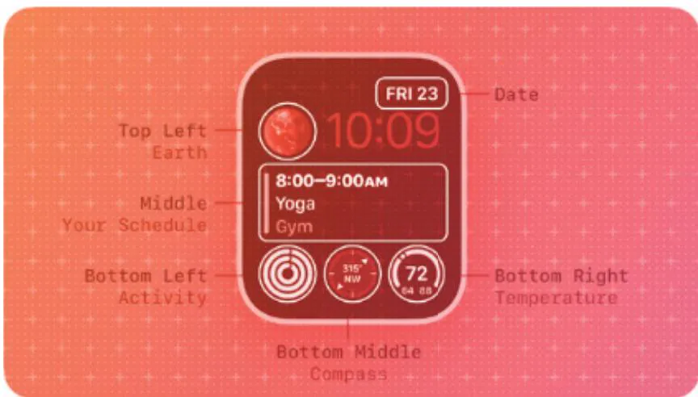  
Source: developer.apple.com/design/human-interface-guidelines/components/system-experiences/ complications

# Window Design

Windows were invented to overcome the physical constraints of a computer display, enabling more information to be viewed and tasks to be performed on the same screen. Multiple windows  can  be opened at  any  one time,  for example, web  browsers, word processing  documents, photos, and slideshows, enabling  the user  to switch between  them when needing to look  at  or  work  on  different  documents,  files,  and  apps. They  can  also  enable  multiple instances of one app to be opened, such as when using a web browser.

Scrolling bars within windows also enable more information to be viewed than is possible on  one screen. Scrollbars are placed vertically and horizontally in windows to enable upward, downward, and  sideway  movements  through  a document  and  can  be controlled using a touchpad, mouse, or arrow keys. Touch interfaces enable users to scroll content simply by swiping the screen to the left or right or up or down.

One of the problems of having multiple windows open is that it can be difficult to find specific ones. Various techniques have been developed to help users locate a particular window, a common one being to provide a list as part of an app menu. macOS also provides a function that shrinks all windows that are open for a given application so that they can be seen side by side on one screen. This provides a visual preview. Moving the cursor over each one brings up its name, e.g., the subject header of an email. This technique enables people to see at a glance what they have on their desktop. It allows them easily to select one to bring it forward. Another option is to display all of the windows open for a particular application, for example, Microsoft Word. Web browsers, like Google and Firefox, also show a selection of favicons of the top sites visited (see Figure 7.4).

# Google


Home


（6）Feed


All Documents


Royal Autom..


LogInIntera..


Interactive In..


Online Banking


Interaction D..


HUMAN INTE...

  
Figure 7.4  Part of the home page for my current Google browser showing favicons of top sites visited below the search bar

Add shortcut

Source: Yvonne Rogers

A  particular kind of window that is  commonly used  is the dialog box. Confirmations, error messages, checklists, and forms are presented through dialog boxes. Information in the dialog boxes is often designed to guide user interaction, with the user following the sequence of options provided. Examples include a sequenced series of forms (such as wizards) presenting the necessary and optional choices that need to be filled in when choosing a PowerPoint presentation or an Excel spreadsheet. A common problem with this style of interaction is that there is a tendency to cram too much information or data entry fields into one box, making the interface confusing, crowded, and difficult to read (Mullet and Sano, 1995).

# BOX 7.1

# The Joys of Filling In Forms Online

For many of us, shopping online is generally an enjoyable experience. For example, choosing a book on Amazon or flowers from Interflora can be done at our leisure and convenience.The part that we don’t enjoy, however, is filling in the online form to give the company the necessary details to pay for the selected items. This can often be a frustrating and time-consuming experience,  especially as there  is much variability  between  sites. It typically  requires creating an account and a new password although some sites do have a guest checkout enabled. However, if the site has a record of your email address in its database, it won’t allow you to then use the guest option. If you have forgotten your password, you need to reset it, and this requires switching from the form to your email account. Once past this hurdle, different kinds

of interactive forms pop up for you to enter your mailing address and credit card details. The form may provide the option of finding your address by allowing you to enter a postal or ZIP code. It may also have asterisks that denote fields that must be filled in.

Having so much inconsistency across online shopping sites can be frustrating. It is easy to overlook or miss a box that needs to be filled in, and after submitting the page, an error message may come back from the system saying it is incomplete. This may require having to enter sensitive information again, as it will have been removed in the  data processing stage (for example, the person’s credit card number and the three- or four-digit security code).

To add to the frustration, many online forms often accept only fixed data formats, meaning that, for some people whose information does not fit within its constraints, they are unable to complete the form. For example, one kind of form will accept only a certain type of mailing address format. The boxes are provided for address line 1 and address  line 2, providing no extra lines for addresses that have more than two lines; a line for the town/city; and a line for the ZIP code (if the site is based in the United States) or other postal code (if based in another country). The format for the codes is different, making it difficult for non-U.S. residents (and U.S. residents for other country sites) to fill in this part.

Another gripe about online registration forms is the country of residence box that opens up as a  never-ending menu, listing  all  of the  countries  in the  world  in alphabetical order. Instead of typing in the country in which they reside, people are required to select the  one they are from, which is fine if you happen to live in Australia or Austria but not if you live in Venezuela or Zambia (see Figure 7.5).

Figure 7.5  A scrolling menu of country names   
  
Source: www.jollyflorist.com

(Continued)

This is an example of where the design principle of recognition over recall (see Chapter 4, “Cognitive Aspects”) does not apply and where the converse is true. A better design is to have a predictive text option, where someone needs only to type in the first one or two letters of their country to cause a narrowed-down list of choices to appear from which they can select within the interface. Or,  one smart  option is for  the form to preselect the  user’s country of origin by using information shared from a person’s computer or stored in the cloud. Automating the filling in of online forms (through providing prestored information, for example, their address and credit card details) can obviously help reduce usability problems—provided they are OK with this.

# ACTIVITY 7.1

Go to the interflora.co.uk website, and hover over the international menu option at the top to reveal a list of 16 countries that flowers can  be sent to from the  United Kingdom. How are these countries ordered? Is it an improvement over the scrolling pop-up menu shown in Figure 7.5? Then click the option View All Countries and look at how they have been laid out.

# Comment

Earlier versions of the full list of countries to which flowers could be sent by interflora.co.uk listed eight countries at the top, starting with the United Kingdom and then the United States, France, Germany, Italy, Switzerland, Austria, and Spain. This was followed by the remaining set of countries listed in alphabetical order. The reason for having this particular ordering is likely to have been because the top eight are the countries that have the most customers, with the UK residents using the service the most. At the time of writing, the UK’s current version showed the “most popular international destinations” with a national flag for each country beside them in a table format, followed by a listing of all countries in alphabetical order using a row of letters and shaded blocks across the page (see Figure 7.6). Do you think this is an improvement over the use of a single scrolling list of country names shown in the Jollyflorist website in Figure 7.5? Does it make searching for a country quicker?

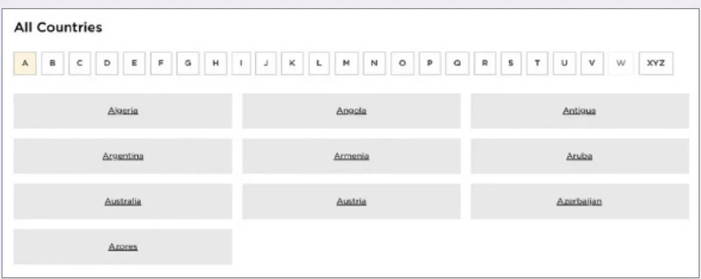  
Figure 7.6  An excerpt of the listing of countries in shaded blocks in alphabetical order below a row of letters of the alphabet

Source: www.interflora.co.uk

# Research and Design Considerations

A key research concern is window management—finding ways of enabling people to move fluidly between different windows (and displays) and to be able to switch their attention rapidly between windows to find the information they need or to work on the document/task within each window without getting distracted. Early research of how people use windows and multiple displays showed that window activation time (that is, the time a window is open and for which the user interacts with it) is relatively short—an average of 20 seconds—suggesting that people switch frequently between different windows and applications (Hutchings et al., 2004).

Keyboard shortcuts and taskbars are often used for switching between windows.Another technique is the use of tabs that appear at the top of the web browser that show the name and logo of the web pages that have been visited. This mechanism enables people to rapidly scan and switch among the web pages they have visited. However, the tabs can quickly multiply if they visit a number of sites. To accommodate new ones, the web browser reduces the size of the tabs by shortening the information that appears on each. The downside of doing this, however, is it can make it more difficult to read and recognize web pages when looking at the smaller tabs. It is possible to reverse this shrinking by removing unwanted tabs by clicking the delete icon for each one. This has the effect of making more space available for the remaining tabs.

(Continued)

Some browsers now  offer  a  menu of open tabs arranged vertically that can  be more easily browsed.

There  are  multiple ways that an online form can  be designed to obtain details  from someone. It is not surprising, therefore, that there are so many different types that are in use. Design guidelines are available to help decide which format and widgets are best to use (e.g., Silver, 2018). Another option is to automate form completion by asking people to store their personal details locally on their browser or in a company’s database, requiring them only to enter security information. However, many people are becoming leery of storing their personal data in this way—fearful  because  of the  number of data breaches that are  often reported in the news.

# Menu Design

Interface menus are typically ordered across the top row or down the side of a screen using category headers as part of a menu bar. The contents of the menus are also for the large part invisible, dropping down only when the header is selected or rolled over with a mouse. The various options under each menu are typically ordered from top to bottom in terms of most frequently used options and grouped in terms of their similarity with one another; for example, all formatting commands are placed together.

There are numerous menu interface styles, including flat lists, drop-down, pop-up, contextual, collapsible, mega, flyout, and expanding ones, such as cascading menus. Flat menus are good at displaying a small number of options at the same time or where the size of the display is small, for example on smartphones, cameras, and smartwatches. Expanding menus enable more options to be shown on a single screen than is possible with a single flat menu list. This makes navigation more flexible, allowing for the selection of options to be done in the same window. An example is  the cascading menu, which provides secondary  and even tertiary menus  to appear  alongside  the  primary  active  drop-down  menu, enabling  further related options to be selected, such as when selecting track changes from the tools menu leads to a secondary menu of three options by which to track changes in a Word document. The downside of using expanding menus, however, is that they require precise control. People can often end up making errors, namely, overshooting or selecting the wrong options. In particular, cascading menus require them to move their cursor over the menu item, while holding the mouse or touchpad down, and then to move their cursor over to the next menu list when the cascading menu appears and select the next desired option. This can result in someone underor overshooting a menu option, or sometimes accidentally closing the entire menu. Another example of an expandable menu is a mega menu, in which  many options can  be displayed using  a  2D drop-down  layout  (see  Figure  7.7). This  type  of menu  is  popular  with  online shopping sites, where lots of items can be viewed at a glance on the same screen without the need to scroll. Hovering, tapping, or clicking is used to reveal more details for a selected item.

Figure 7.7  A megamenu   
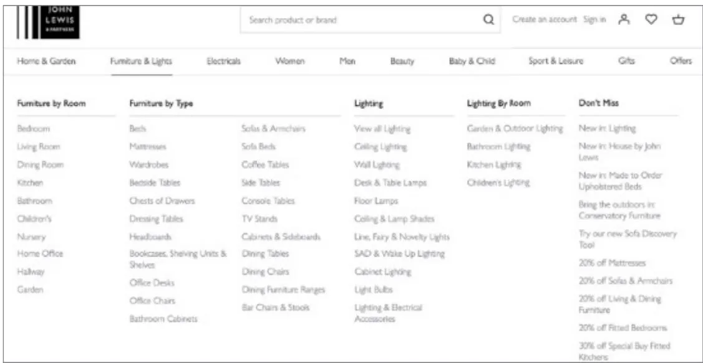  
Source: www.johnlewis.com

Collapsible  menus  provide  an  alternative  approach  to  expanding  menus  in  that they allow further options to be made visible by selecting a header. The headings appear adjacent to each other, providing the user with an overview of the content available (see Figure 7.8). This reduces the amount of scrolling needed. Contextual menus provide access to often-used commands associated with a particular item, for example, an icon. They provide appropriate commands that make sense in the context of a current task. They appear when the user rightclicks in Windows or presses the Control key while clicking an interface element in macOS. For example, right-clicking or clicking a photo on a website together with holding down the Ctrl key results in a small set of relevant menu options appearing in an overlapping window, such as open it in a new window, save it, or copy it. The advantage of contextual menus is that they provide a limited number of options associated with an interface element, overcoming some of the navigation problems associated with cascading and expanding menus.

Figure 7.8  A template for a collapsible menu   
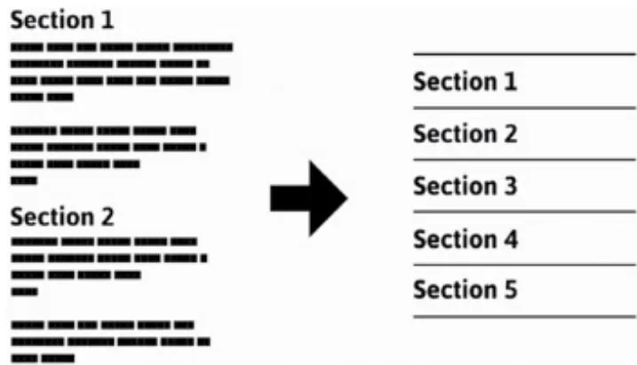  
Source: inclusive-components.design/collapsible-sections. Reproduced with permission of Smashing Magazine

# ACTIVITY 7.2

Open an application that you use frequently (for instance, a word processor, email client, or web browser) on a desktop PC, laptop, or tablet and look at the menu header names (but do not  open them just yet). For each menu header—File, Edit, Tools, and so on—write down what options you think are listed under each. Then look at the contents under each header. How many options were you able to remember, and how  many did you  put in the wrong category? Now try to select the correct menu header for the following options (assuming that they are included in the application): Replace, Save, Spelling, and Sort. Did you select the correct header each time, or did you have to browse through a number of them?

# Comment

Popular everyday applications, like word processors, have grown enormously in terms of the functions they offer. Microsoft Word, for example, currently has 10 menu headers and numerous toolbars. Under each menu header there are on average 15 options, some of which are hidden under subheadings and appear only when they are rolled over with the mouse. Likewise, for each toolbar, there is a set of tools available, be it for  Drawing, Formatting, web, Table, or Borders. Remembering the location of frequently used commands like Spelling and Replace is often achieved by remembering their spatial location. For infrequently used commands, like sorting a list of references into alphabetical order, users can spend time flicking through the menus to find the command Sort. It is difficult to remember that the command Sort should be under the Table heading, since what it is doing is not a table operation, but a tool to organize a section  of a  document. It would be more intuitive  if the command was under the Tool header along with similar tools like Spelling. What this example illustrates is just how difficult it can be to group menu options into clearly defined and obvious categories. Some fit into several  categories, while it can  be difficult to group others. The placement of options in menus can also change between different versions of an application as more functions are added.

# Research and Design Considerations

An important design consideration is to decide which terms to use for menu options. Short phrases like bring all to front can be more informative than single words like front. However, the space for listing menu items is often restricted, such that menu names need to be short. They also need to be distinguishable, that is, not easily confused with one another so that the user does not choose the wrong one by mistake. Operations such as Quit and Save should also be clearly separated to avoid the accidental loss of work.

The choice of which type of menu to use will often be determined by the application and type of device for which it is being designed. Which is best will also depend on the number of

menu options and the size of the display available in which to present them. Flat menus are best for displaying a small  number of options at one  time, while expanding and collapsible menus are good for showing a large number of options, such as those  available in file and document creation/editing applications. Usability testing comparing drop-down menus with mega menus has shown the latter to be more effective and easier to navigate. The main reason is that megamenus enable people to readily scan many items at a glance on the same page and in doing so find what they are looking for (Nielsen and Li, 2017).

# Icon Design

The appearance of icons in an interface came about following the Xerox Star project. They were used to represent objects as part of the desktop metaphor, namely, folders, documents, trashcans, inboxes, and outboxes. The assumption behind using icons instead of text labels is that they are easier to learn and remember, especially for nonexpert computer users. They can also be designed to be compact and variably positioned on a screen.

Icons have  become a  pervasive  feature of  the interface. They  now  populate every  app and operating system and are used for all manner of functions besides representing desktop objects. These include depicting tools (for example, Paint 3D), status (such as, Wi-Fi strength), categories of apps (for instance, health or personal finance), and a diversity of abstract operations  (including  cut, paste,  next, accept, and  change). They  have  also gone through  many changes in their look and feel—black and white, color, shadowing, photorealistic images, 3D rendering, and animation have all been used.

Whereas early icon  designers  were constrained by  the graphical  display technology  of the  day, current  interface  developers  have  much  more  flexibility. For  example, the use  of anti-aliasing techniques enables curves and nonrectilinear lines to be drawn, enabling more photo-illustrative styles to be developed (anti-aliasing means adding pixels around a jagged border of an object to smooth its outline visually). App icons are often designed to be both visually attractive and informative. The goal is to make them inviting, emotionally appealing, memorable, and distinctive.

Different graphical  genres have been used to group and identify different categories of icons. Figure 7.9 shows how colorful photorealistic images were used in the original Apple Aqua set from  2000, each slanting slightly to the left, for the category of user applications (such as email), whereas monochrome straight on and simple images were used for the class of utility applications (for instance, printer setup). The former has a fun feel to them, whereas the  latter  has  a more  serious  look  about  them. A  number  of other  styles  have since  been developed  that  have  a  distinct look  and  feel,  for example,  the  use  of  shadows,  simplified shapes, pop-art elements, and technocolors.

Icons can be designed to represent objects and operations in the interface using concrete objects  and/or abstract  symbols. The mapping  between  the icon  and  underlying object  or operation to which it refers can be similar (such as a picture of a file to represent the object file), analogical (for instance, a picture of a pair of scissors to represent cut), or arbitrary (for example, the use of an  X to represent  delete). The most  effective icons  are generally those that are from the first and second categories since they have a direct mapping between what

is being  represented  and how  it is represented. Many operations in an interface, however, are of actions to be performed on objects, making it more difficult  to represent  them using  direct mapping. Instead, a well-known technique is to use a combination of objects and symbols that capture the salient part of an action by using analogy, association, or convention (Rogers, 1989). For example, using a picture of a pair of scissors to represent cut in a word-processing application provides a sufficient clue as long as the person understands the convention of cut for deleting text.


  
Figure 7.9  Two styles of Apple icons used to represent different kinds of functions

Another approach that many smartphone designers use is flat 2D icons. These are simple and use strong colors and pictograms or symbols. The effect is to make them easily recognizable and distinctive. Examples shown in Figure 7.10a include the white ghost on a  yellow background (Snapchat), a white line  bubble with  a solid white phone handset  in a  speech bubble on a lime-green background (WhatsApp), and the sun next to a cloud (weather).

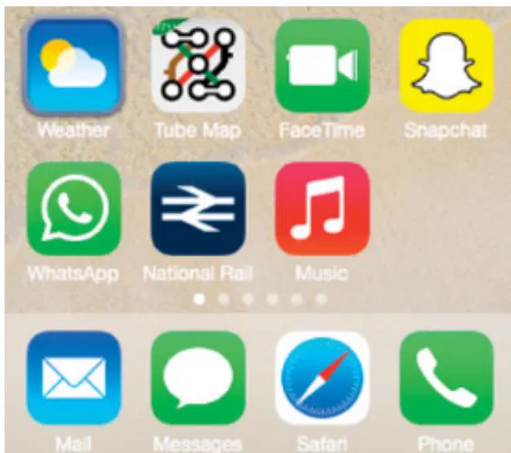  
(a)

(b)   
Figure 7.10 2D icons designed for (a) a smartphone and (b) a smartwatch   
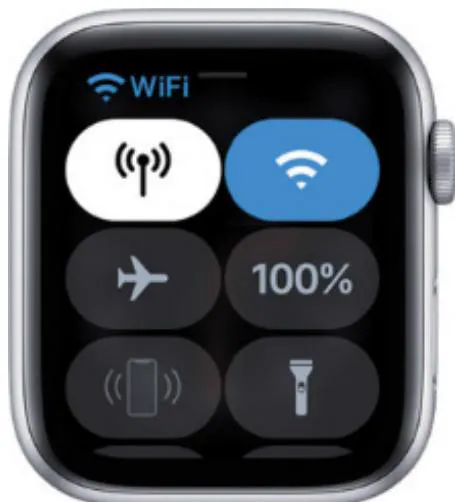  
Source: (a) Yvonne Rogers (b) support.apple.com/en-ca/HT205550

Icons that appear on toolbars or palettes as part of an application or presented on small device displays (such as digital cameras or smartwatches) have much less screen real estate available. Because of this, they have been designed to be simple, emphasizing the outline form of an object or symbol and using only grayscale or one or two colors (see Figure 7.10b). They

tend to convey the status, tool, or action using a concrete object (for example, the airplane symbol signaling whether the airplane mode is on or off) and abstract symbols (such as three waves that light up from none to all to convey the strength/power of the area’s Wi-Fi).

# ACTIVITY 7.3

Sketch simple icons to represent the following operations to appear on a digital camera screen:

•  Turn image 90-degrees sideways.   
•  Crop the image.   
•  Auto-enhance the image.

Show them to someone  else,  tell them that they are  icons  for  a  new  digital  camera intended to be really simple to use, and see whether they can understand what each represents.

# Comment

Figure 7.11 shows the basic Edit Photo icons on an iPhone that appear at the bottom of the screen when the edit function is selected. The box with extended lines and two arrows is the icon for cropping an image; the  three overlapping  translucent circles  represents “different lenses” that can be used; the wand above it means “auto-enhance”; the circle with plus and minus signs refers to exposure levels while the circle to the right of it with the simplified ying and yang symbol refers to brilliance levels.

  
Figure 7.11 The  two rows of basic Edit Photo icons  that appear at the bottom of an iPhone display

Source: Yvonne Rogers

# Research and Design Considerations

There are many icon libraries available that developers can download for free (for instance, thenounproject.com or fontawesome.com). Various  online tutorials  and  books  on how  to design icons are also available (see Hicks, 2012) together with sets of proprietary guidelines and  style  guides. For  example, Apple  provides its  developers with style  guides, explaining why certain designs are preferable to others and how to design icon sets. Style guides are also covered  in more depth in Chapter  13, “Interaction Design in Practice.” On its developers’ website  (developer.apple.com), advice is given  on how  and why  certain graphical elements should be used when developing different types of icon. Among the various guidelines, it suggests that different categories of application (for example, Business, Utilities, Entertainment, and so on) should be represented by a different genre, and it recommends displaying a tool to communicate the nature of a task, such as a magnifying glass for searching or a camera for a photo editing tool. Android and Microsoft also provide extensive guidance and step-by-step procedures on how to design icons for its applications on its website.

To help disambiguate the meaning of icons, text labels can be used under, above, or to the side of their icons. This method is effective for toolbars that have small icon sets, such as those appearing as part of a web browser, but it is not as good for applications that have large icon sets, for example, photo editing or word processing, since the screen can get cluttered, making it sometimes harder and longer to find an icon. To prevent text/icon clutter on the interface, a hover function can be used with a desktop/laptop interface where a text label appears adjacent to or above an icon after the cursor has been held over it for a second and it is kept there. This method allows identifying information to be temporarily displayed when needed.

# 7.2.3  Multimedia

Multimedia, as the name implies, combines different media within a single interface, namely, graphics, text, video, sound, and animation, and links them  together with various forms of interactivity. Clicking  a link in an image or text triggers another media element such as an animation or a video. The assumption is that a combination of media and interactivity can provide better ways of presenting information than can a single media, for example, just text or video alone. Another distinctive feature of multimedia is its ability to facilitate rapid access to  multiple  representations  of  information.  Many  multimedia  encyclopedias  and  digital libraries have been designed based on this multiplicity principle, providing an assortment of audio and visual materials on a given topic. For example, when looking to find information about the heart, a typical multimedia-based encyclopedia will provide the following:

? One or two video clips of a real live heart pumping and possibly a heart transplant operation   
. Audio recordings of the heart beating and perhaps an eminent physician talking about the cause of heart disease   
Static diagrams and animations of the circulatory system, sometimes with narration   
Text with links in it describing the structure and function of the heart

Hands-on  interactive  simulations  have  also  been  incorporated  as  part  of  multimedia learning environments. An early example was the Cardiac Tutor, developed to teach students about cardiac resuscitation. It required students to save patients by selecting the correct set of procedures  in the correct  order from  various options displayed  on the computer  screen (Eliot  and Woolf, 1994). Other  kinds  of multimedia  narratives and  games have  also been developed  to support  discovery learning by  encouraging children to explore different parts of the display by  noticing a hotspot or other kind of link. For example, KidsDiscover.com/ apps  has  many tablet  apps  that use  a  combination  of  animations,  photos,  interactive  3D models, and audio to teach kids about  science and social studies topics. Using swiping and touching, kids can reveal, scroll through, select audio narration, and watch video tours. Figure 7.12, for example, has a “slide” mechanism as part of a tablet interface that enables the child to do a side-by-side comparison  of what Roman ruins looks like now and in ancient Roman times.

Figure 7.12 An example of a multimedia learning app designed for tablets   
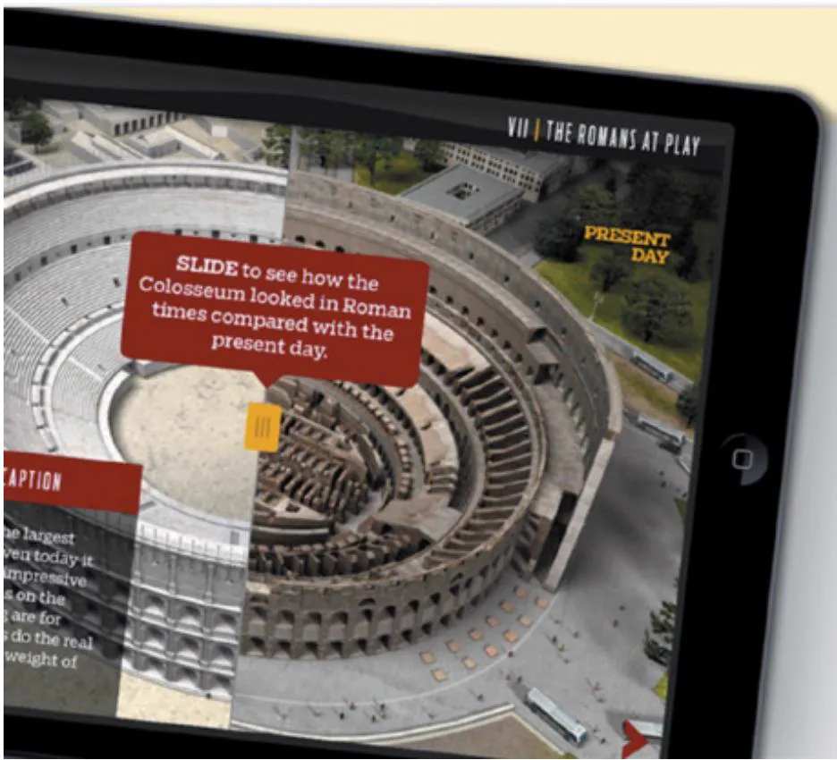  
Source: KidsDiscover app “Roman Empire for iPad”

Multimedia has largely been developed for training, educational, and entertainment purposes.  But  to  what  extent  is  the  assumption  that  learning  (such  as  reading  and  scientific inquiry skills)  and playing can be enhanced  through interacting with engaging multimedia interfaces true? What actually happens when people are given unlimited, easy access to multiple media and simulations? Do they systematically switch between the various media and

“read” all of the  multiple representations on a particular subject, or are they more selective in what they look at and listen to? Early research showed how multimedia can make learning online  more  engaging and  enjoyable  (Scaife  and Rogers,  1996). However, it  was  also found that there is a tendency to click videos and animations rather than read the text (see the “Research and Design Considerations” box below). Despite this, a recent review reported how multimedia is still an integral  part of teaching practice; a variety of multimedia tools, both stand-alone and web-based, are still commonly used (Abdulrahaman et al., 2020).

# ACTIVITY 7.4

Watch  this early video  of Don Norman appearing  in his first  multimedia CD-ROM book (1994), where he pops up every now and again in boxes or at the side of the page to illustrate the points being discussed on that page: vimeo.com/18687931.

How  do you  think  students used this kind of interactive  e-textbook?  Would  you do the same?

# Comment

Anyone who  has interacted with educational multimedia knows just how tempting it is to play the  video  clips  and  animations while  skimming through  accompanying text or static diagrams. The former is dynamic, easy, and enjoyable to watch, while the latter is viewed as static and difficult to read from the screen. In an evaluation of the original Voyager’s “First Person: Donald Norman, Defending Human Attributes in the Age of the Machine,” students consistently admitted to ignoring the text on the interface in search of clickable icons of the author, which when selected would present an animated video of him explaining some aspect of design (Rogers and  Aldrich, 1996). Given the  choice to explore  multimedia material in numerous ways, ironically, people tend to be highly selective  as to what they actually pay attention to, adopting a channel-hopping mode of interaction. While enabling people to select the information they want to view or features to explore for themselves, there is the danger that multimedia environments may in fact promote fragmented interactions where only part of the media is ever viewed.

Hence, online multimedia material may be good for supporting certain kinds of activities, such as browsing, but less optimal for others, for instance reading at length about a topic. One way to encourage more systematic and extensive interactions (when it is considered important for the activity at hand) is to require certain activities to be completed that entail the reading of accompanying text, before the person is allowed to move on to the next level or task.

# Research and Design Considerations

A  core research question is how  to encourage  someone  to interact with all aspects  of a multimedia app, especially given the  tendency to select videos to watch rather than text to read. One technique is to provide a diversity of hands-on interactivities and simulations that

require them to complete a task, solve a problem, or explore different aspects of a topic that involves reading  some accompanying text.  Specific  examples include  electronic notebooks that are integrated as part of the interface, where students can  type in their  own material; multiple-choice quizzes  that provide  feedback about  how well they have done;  interactive puzzles where they have to select and position different pieces in the right combination; and simulation-type games where they have to follow a set of procedures to achieve some goal for a given scenario. Another approach is to employ dynalinking, where information depicted in one window explicitly changes in relation to what happens in another (Scaife and Rogers, 1996). This can help people keep track of multiple representations and see the  relationship between them.

Specific guidelines are available that recommend how best to combine multiple media in relation to different kinds of tasks, for example, when to use audio with graphics, sound with animations, and so on, for different learning tasks. As a rule of thumb, audio is good for stimulating the imagination, movies for depicting action, text for conveying details, and diagrams for conveying ideas. From such generalizations, it is possible to devise a presentation strategy for online learning. This could be along the lines of the following:

1. Stimulate the imagination through playing an audio clip.   
2. Present an idea in diagrammatic form.   
3. Display further details about the concept through hypertext.

# 7.2.4  Virtual Reality

Virtual reality (VR) has been around since the 1970s when researchers first began developing computer-generated  graphical  simulations to create “the illusion of  participation in  a synthetic environment rather than external observation of such an environment” (Gigante, 1993, p. 3). The goal was to create user experiences that feel virtually real when interacting with an artificial  environment. Images are displayed stereoscopically to the users—most commonly through VR headsets—and  objects within the field of  vision can  be interacted with via an input device like a joystick.

The 3D graphics  can  be projected  onto Cave Automatic Virtual  Environment (CAVE) floor  and wall  surfaces,  desktops, 3D  TV,  headsets,  or  large  shared  displays,  for instance, IMAX screens. One of the main attractions of VR is that it can provide opportunities for new kinds of immersive experiences, enabling people to interact with digital objects and navigate in 3D space in ways  not possible in the physical world or a 2D graphical interface. Besides looking at and navigating through a 360-degree visual landscape, auditory and haptic feedback  can  be added  to  make  the  experience  feel  even  more  immersive.  The  resulting  user experience can be highly engaging; it can feel as if one really is flying around a virtual world. People can become completely absorbed by the experience. The sense of presence can make the virtual setting seem convincing. Presence, in this case, means “a state of consciousness, the (psychological) sense of being in the virtual environment” (Slater and Wilbur, 1997, p. 605), where someone behaves in a similar way to how they would if at an equivalent real event.

VR simulations of the world can be constructed to have a higher level of fidelity  with the  objects  they  represent  compared  to  other  forms  of  graphical  interfaces,  for  example, multimedia. The illusion afforded by the technology can make virtual objects appear to be

life-like and behave according to the laws of physics. For example, landing and take-off terrains developed for flight simulators can appear to be quite realistic. Moreover, it is assumed that learning and training applications can be improved through having a greater fidelity to the represented world.

Another distinguishing feature of VR is the different viewpoints it can offer. Players can have a first-person perspective, where their view of the game or environment is through their own eyes, or a third-person perspective, where they see the world through an avatar visually represented on  the screen. An  example  of a  first-person perspective  is  that experienced  in first-person shooter  games  such as DOOM,  where the player  moves through  the environment without seeing a representation of themselves. It requires the user to imagine what they might look like and decide how best to move around. A third-person perspective enables the player to see the virtual world above and behind their avatar. A person controls their avatar’s interactions with the environment by controlling their own movements, for example, jumping, running, or crouching. Avatars can be represented from behind or from the front. Firstperson perspectives are typically used for flying/driving simulations and games, for instance, car  racing, where it  is  important  to have direct  and  immediate control to steer  the  virtual vehicle. Third-person perspectives are more commonly used in games, learning environments, and simulations, where it is important to see a representation of self with respect to the environment and others in it. In some virtual environments, it  is possible to switch between  the two perspectives, enabling someone to experience different viewpoints on the same game or training environment.

In  the beginning,  head-mounted  displays were  used  to present VR  experiences.  However,  the visuals were  often clunky, the headset  uncomfortable  to wear, and the immersive experience sometimes resulting in motion sickness and disorientation. Since then, VR  technology  has  come  of  age  and  improved  greatly  with  new  techniques being  developed  that seek to reduce motion sickness. There are now many off-the-shelf VR headsets (for example, Meta Quest 2, HTC Vive, and Sony Play Station VR)  that are affordable and comfortable. They also have more accurate head tracking that allow developers to create more compelling games, movies, and virtual environments.

Another application area that has been explored is how VR can enrich the experience of reporting and witnessing current affairs and news, especially feelings of empathy and compassion to real-life experiences (Aronson-Rath et al., 2016). For example, the BBC together with Aardman Interactive and University College London researchers developed a VR experience called “We Wait,” where they put the viewer in a place that few foreign reporters have been, namely, on a boat with a group of refugees crossing the Mediterranean Sea (Steed et al., 2018). The goal  was to let news  reporters and other participants  experience how it felt to be there  on the boat with the refugees. They used a particular artistic polygon style rather than realism to create the characters sitting on the boat (see Figure 7.13). The characters had expressive eyes intended to convey human emotion in response to gaze interaction. The avatars were found  to generate  an empathic response from  participants. Other research investigating  the  benefits of immersive  storytelling has  also  found  similar empathetic  responses (Shin, 2018).

Figure 7.13 Snapshot of polygon  graphics used to represent  avatars  for  the  “We  Wait”  VR experience   
  
Source: Steed, Pan, Watson and Slater, www.frontiersin.org/articles/10.3389/frobt.2018.00112/full. Licensed Under CC-BY 4.0

Jakob Nielsen argues that VR is much harder to interact with and control compared with GUI interfaces. He claims that this is due partly because it has more degrees of freedom and partly because VR is new to many people who have less experience using it compared with GUIs. See www.youtube.com/ watch?v=f4GVG4C2BcE. Do you agree?

# Research and Design Considerations

VR has been developed to support learning and training for numerous skills. Researchers have designed apps to help people learn to drive a vehicle, fly a plane, and perform delicate surgical operations—where it is very expensive and potentially dangerous to start learning with the real thing. Others investigated whether people can learn to find their way around a real building/place before visiting it by first navigating a virtual representation of it (e.g., Gabrielli et al., 2000).

(Continued)

An early example of VR was the Virtual Zoo  project. Allison et al. (1997) found  that people were highly engaged and very much enjoyed the experience of adopting the role of a gorilla, navigating the environment, and watching other gorillas respond to their movements and  presence. Virtual  environments (VE) have also been designed to help people practice social and speaking skills and confront their social phobias; see Cobb et al. (2002) and Slater et al. (1999). An underlying assumption is that the  environment can be designed as a  safe place to help people gently overcome their fears (for example, spiders, talking in public, and so forth) by confronting them through different levels of closeness and unpleasantness (such as by seeing a small  virtual spider move far away, seeing a medium one sitting nearby, and then finally touching a large one). Studies have shown that people can readily suspend their disbelief, imagining a virtual spider to be a real one or a virtual audience to be a real audience. For example, Slater et al. (1999) found that people rated themselves as being less anxious after speaking to a virtual audience that was programmed to respond to them in a positive fashion than after speaking to virtual audiences programmed to respond to them negatively.

Since this early research, VR has  been developed to support  various kinds  of therapy for  treating mental health disorders, such as depression, paranoia, and  psychosis. The VR works by exposing individuals to situations that they find challenging, but with a high level of control (Brown et al, 2020). Nadine Wagener et al. (2022) have also developed a VR tool that enables people to visualize their moods by painting in 3D (see Figure 6.11 in Chapter 6, “Emotional Interaction”).

Core design considerations include the importance of having a virtual self-body as part of a VR experience to enhance the feeling of presence; how to prevent people from experiencing simulator sickness through  experimenting with galvanic stimulation; determining  the most effective ways of enabling people to navigate through them, for instance, first person versus third person; how to control their interactions and movements, for example, use of head and body movements; how best to enable people to interact with information in VR, for example, use of keypads, pointing, joystick buttons; and how to enable people to collaborate and communicate with others in virtual environments, like the Metaverse (see Chapter 5, “Social Interaction”). In 2022, “metaversities” came into being, offering students the chance to learn by donning VR headsets and meeting with their professor in a virtual classroom to discuss topics. All sorts of novel possibilities are afforded by being in such a virtual environment that students would not experience otherwise when in a physical classroom, such as walking into an erupting volcano or sitting on the  back of a larger-than-life virtual bee that flies into a flower to gather nectar. The idea of using VR in a virtual classroom is to bring learning alive and make it fun and more exciting.

A central concern in VR design is the level of realism to target. Is it necessary to design avatars and the environments that they inhabit to be life-like, using rich graphics, or can simpler and more abstract forms be used, but which nonetheless are equally capable of engendering a sense of presence? Do you need to provide a visual representation of the  arm and hands for holding objects for a self-avatar, or is it enough to have continuous movement of the  object? Research has shown that it is possible for objects  to appear to be moving with invisible hands as if they were present. This has been coined as the “tomato presence,” that

is, where presence is maintained using a stand-in object in VR (for instance, a tomato). (See owlchemylabs.com/tomatopresence.)

A diversity of 3D software toolkits is available that have made it easier for developers and researchers to get started when building virtual environments. One of the most popular is Unity. 3D worlds can be created using their APIs, libraries, and physics engines to run on multiple platforms, for example, mobile, desktop, console, TV, VR, AR, and the web. However, despite these developments, it is not straightforward  designing a VR user experience. There are  many challenges, as discussed  by Narges Ashtari  and  colleagues (2020), including  the speed at which VR hardware changes, meaning software developed for a particular headset can quickly become obsolete.

# 7.2.5  Website Design

Early websites  were largely text-based, providing hyperlinks to different  places or pages of text. Much of the design effort was concerned with the information architecture, that is, how best  to structure information at the interface level to enable users to navigate and access it easily and quickly. For example, Jakob Nielsen (2000) adapted his and Rolf Molich’s usability guidelines (Nielsen and Molich, 1990) to make them applicable to website design, focusing  on  simplicity,  feedback, speed, legibility, and ease  of  use. He also  stressed  how critical download time was to the success of a website. Simply, people who have to wait too long for a page to appear are likely to move on somewhere else.

Since then, the goal of web design has been to develop sites that are not only usable but also aesthetically pleasing. Getting the graphical design right, therefore, is critical. The use of graphical elements (such as background images, color, bold text, and icons) can make a website look distinctive, striking, and pleasurable for the user when they first view it and also to make it readily recognizable on their return. However, there is the danger that designers can get carried away with the appearance at the expense of making it difficult to find something and navigate through it.

Steve Krug (2014) discusses this usability versus attractiveness dilemma in terms  of the difference between  how designers create  websites and how visitors actually view them. He argues that many web designers create sites as if the visitor was going to pore over each page, reading the finely crafted text word for word; looking at the use of images, color, icons, and so forth; examining how the various items have been organized on the site; and then  contemplating their options before they finally select a link. People, however, often behave quite differently. They will glance at a new page, scan part of it, and click the first link that catches their interest or looks like it might lead them to what they want.

Much  of  the  content  on  a  web  page  is  not  read.  In  Krug’s words,  web  designers  are “thinking great literature” (or at least “product brochure”), while the viewer’s reality is much closer  to a “billboard going by at 60 miles  an hour” (Krug, 2014, p. 21). While somewhat of  a caricature, his  depiction  highlights the discrepancy  between the meticulous ways  that designers  create their websites and the rapid and less than systematic approach that people take to view them. To help navigate their way through the many choices that web developers have to make, Jason Beaird and James George (2014) have come up  with a number of

guidelines intended to help web developers achieve a balance between using color, layout and composition, texture, typography, and imagery. Other website  guidelines are mentioned in Chapter 16, “Evaluation: Inspections, Analytics, and Models.”

Web  designers  now have  a number  of languages  available to  design websites, such as Python.  HTML  and  web  development  tools,  such  as  JavaScript  and  CSS,  are  also  used. Libraries, such as React, and open  source toolkits, such as Bootstrap, enable developers to get started quickly when prototyping their ideas for a website. Such tools provide drag-anddrop editors and form builders, making it easy for someone to customize and build a website. Website builders such as Wix and WordPress, for example, which are very  popular nowadays, provide  hundreds  of templates to  get started  with when creating  a website. In addition, built-in optimization and mobile-ready themes are available. Customized web pages are available for smartphone browsers that  provide scrolling lists of articles, games, tunes, and so on, rather than hyperlinked pages.

Another  interface element  that is  an  integral  part  of any  website  is  breadcrumb  navigation. Breadcrumbs are category  labels that appear  on a web  page that enable visitors to peruse other pages without losing track of where they have come from (see Figure 7.14). The term comes from the way-finding technique that Hansel used in the Brothers Grimm fairy tale Hansel and Gretel. The metaphor conjures up the idea of leaving a path to follow back. Breadcrumbs are also used by search engine optimization tools that match up a user’s search terms with relevant web  pages using the breadcrumbs. Breadcrumbs also extol usability in a number of ways, including helping people know where they are relative to the rest of the website, enabling  one-click  access to higher site  levels, attracting first-time  visitors to continue to browse a website  after having  viewed the landing page (Mifsud, 2011). Therefore, using them is good practice for other web applications besides websites.

  
Figure 7.14 A breadcrumb trail on the Best Buy website showing three choices made by the user to get to Smart Lights

Source: www.bestbuy.ca

Many people browse the web from their smartphone or tablet. The touchscreen on these kinds of devices affords very different interactions compared with interacting with desktop or laptop displays using  a keyboard or mouse. The fonts, buttons, and menu tabs  that are standard on the latter are too small and awkward to select when using a finger on a touchscreen. Instead of double-clicking interface elements, as people do with a mouse or trackpad, tablet and smartphone screens involve tapping, swiping, and pinching methods.

Web  designers  have had to think about  how to design web  browsers and websites for smaller-sized displays. A commonly used approach is responsive website design—where the browser automatically resizes the layout and changes the graphic design, fonts, and appearance depending on the screen size (smartphone, tablet, or PC) on which it is being displayed. This includes presenting the content over more pages and menus. The effect of downsizing

<!-- Chunk 5 End -->


<!-- Chunk 6 Start -->

the content in this way, however, is that it can make it more time-consuming as more pages need to be loaded. It can also make it more fiddly navigating multiple pages and menus.

Another method that is commonly used is infinite scrolling where websites are designed to enable browsing through their content that is presented as essentially one long page. This avoids a visitor needing to wait for pages to load when clicking them. Navigation is largely done  by  swiping  across or  down the page until the end  is  reached. However, a  side effect of this method of viewing content is the tendency for people to glance more while scrolling without  focusing  on  individual  items. This  may  be  fine when using  social media  sites  like Instagram and TikTok, where there is endless content to skim through, but maybe not what advertisers would like when paying for their ads to appear on these sites.

Tips on designing websites for tablets versus mobile phones can be found here: css-tricks.com/a-couple-of-best-practices-for-tablet-friendly-design.

# BOX 7.2

# In-Your-Face Web Ads

Web advertising has become pervasive and invasive. Advertisers realized how effective flashing  and animated ads were for promoting their products, taking inspiration  from the  animated neon light advertisements used in city centers, such as London’s Piccadilly Circus. But since banner ads emerged in the 1990s, advertisers have become even more cunning in their tactics. In addition to designing even flashier banner ads, more intrusive kinds of web ads have begun  to appear on our  screens. Short  movies and  garish cartoon  animations, often with audio, now pop up in floating windows that zoom into view or are tagged on at the front end of an online newspaper or video clip. Moreover, this new breed of in-your-face, often personalized web ads frequently requires someone either to wait until they end or to find a check box to close the window down.

# Research and Design Considerations

There are numerous books on web design. Ones that take into account usability as being central include Steve Krug’s classic $2 ^ { \mathrm { n d } }$ edition Web Usability (2014) and Jason Beaird et al.’s 4th edition of Principles of Beautiful Web Design (2020). In addition, there are many good online sites offering guidelines and tips. For example, the BBC provides online guidance specifically for how to design responsive websites that include topics such as context, accessibility, and responsive web design. See www.bbc.co.uk/gel/guidelines/how-to-design-for-the-web. Key considerations for all websites are captured by three core questions proposed by Keith Instone (quoted in Veen, 2001) that are still integral to web design: Where am I? What’s here? Where can I go?

# ACTIVITY 7.5

Look at a fashion brand’s website, such as Nike, and describe the kind of interface used. How does it contravene the design principles outlined by Jeffrey Veen? Does it matter? For what type of user experience is it providing? What was your experience in engaging with it?

# Comment

Fashion companies’ sites, like Nike, are often designed to be more like a cinematic experience and use rich multimedia elements, including videos, sounds, music, animations, and interactivity. Branding is central. In this sense, it contravenes what are considered core usability guidelines. Specifically, the site has been designed to entice the visitor to enter the virtual store and watch  high-quality and  innovative movies that show cool dudes  wearing  their  products. Often, links are embedded in the sites to help the viewer move to other parts of the site, for example by clicking parts of an image or a video playing. Screen widgets are also provided, such as menus, skip over buttons, and  next buttons. It is easy to become immersed in the experience and forget that it is a commercial store. It is also easy to get lost and not to know— Where am I? What’s here? Where can I go? But this is precisely what companies such as Nike want its visitors to do and to enjoy: the experience.

# 7.2.6  Mobile Devices

Mobile devices have become pervasive, with people increasingly using them in all aspects of their everyday and working lives—including phones, fitness trackers, and watches. Customized mobile devices are also used by people in a diversity of work settings where they need access to  real-time data  or  information  while walking  around. For  example, they  are  now  commonly used in restaurants  to take  orders, at  car  rental agencies  to check  in car  returns, in supermarkets for checking stock, and on the streets for multiplayer gaming.

Larger-sized tablets are also used in mobile settings. For example, many airlines provide their flight attendants with one so  that they can use  their customized flight apps while airborne and at airports; sales and marketing professionals also use them to demonstrate their products or to collect public opinions. Tablets and smartphones are also commonly used in classrooms that can be stored in special “tabcabbies” provided by schools for safe keeping and recharging.

Smartphones and smartwatches have an assortment of sensors embedded in them, such as an  accelerometer to detect  movement, a thermometer to measure  temperature, and galvanic  skin  response  to  measure  changes  in  sweat level  on  one’s  skin. Other  apps may  be designed for fun. An example of an early app developed by magician Steve Sheraton simply for a moment  of pleasure  is  iBeer (see  Figure 7.15). Part  of its  success was  because of the ingenious use of the accelerometer inside the phone. It detects the tilting of the iPhone and uses  this  information  to mimic  a  glass of  beer  being consumed. The graphics  and  sounds are also very enticing;  the color of the beer  together with frothy bubbles  and accompanying sound effects gives the illusion of virtual beer being swished around a virtual glass. The beer  can be drained  if  the phone is  tilted  enough, followed by  a  belch sound  when  it has been finished. Since it first appeared in 2008, the iBeer app has been downloaded more than 90 million times!

  
hottrixdounload.co   
Figure 7.15 The iBeer smartphone app

Source: Hottrix

Smartphones can also be used to download contextual information by scanning barcodes in the physical world. Consumers can instantly download product information by scanning barcodes using their iPhone when walking around a supermarket, including allergens, such as nuts, gluten, and dairy. Another method that provides quick access to relevant information is the use of QR (quick response) codes that store URLs and look like black-and-white checkered squares. They work by a person focusing their camera phone over it for a few seconds that results in a notification appearing at the top or bottom of their screen. When this is tapped, it takes them to the website associated with the QR code.

This method  became  popular  during the COVID-19 pandemic  in cafes, bars, and  restaurants where  customers  selected their  menu choices by  first scanning the QR  code on  a card attached to their table (see Figure 7.16) and then scrolling through the available menu options on their phone. One of the main benefits of this approach was that it reduced human contact during service. Not only could customers view a digital menu, they could also use it to order and pay for their meal.

  
Figure 7.16 Connecting to an online menu by scanning a QR code adhered to a  table in a restaurant

Source: pos.toasttab.com/blog/restaurant-qr-code

Another  kind of mobile  app that has  appeared  is one that uses  customers’ online  purchasing data—that they have to give permission for it to be accessed—to make recommendations and provide feedback to them. An example is a carbon footprint calculator, such as the Goodside app, that is intended to show people the environmental impact of their purchases (see  www.joingoodside.com). After  buying  a sweater  from  a major  sportswear  brand, the Goodside app accesses information about the purchaser’s transaction to determine the spending category that the sweater falls under. It then accesses the clothing company’s sustainability information to calculate the  carbon emissions associated with that  product. This is then shown as part  of an  aggregate carbon footprint visualization on the customer’s phone (see Figure 7.17). They can see how well they are doing overall and what action they might want to take based on this.

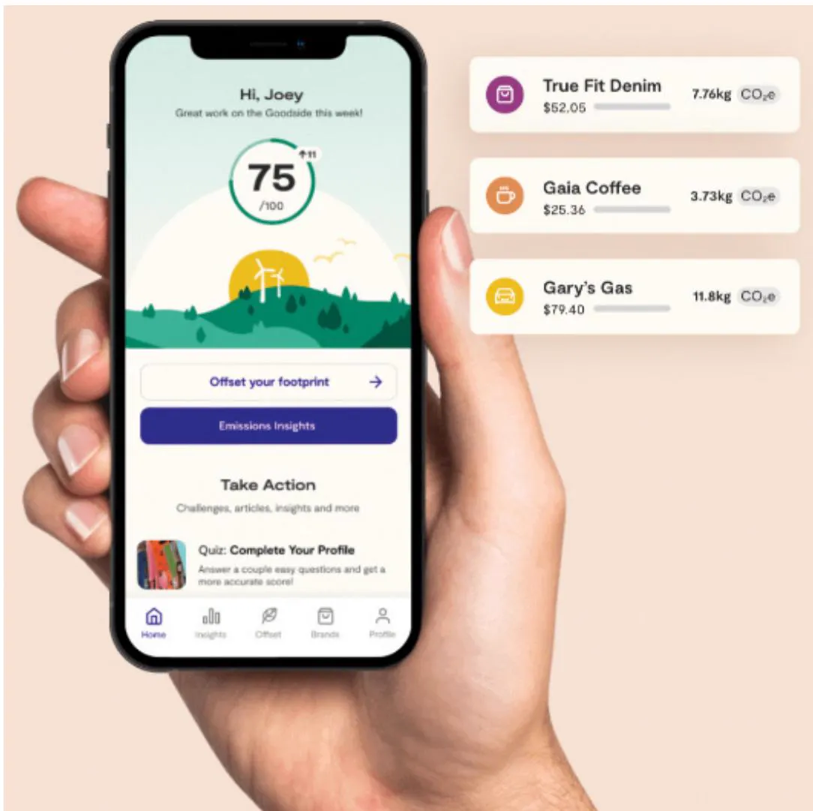  
Figure 7.17 The  Goodside app, designed to show people automatically  the  environmental impact of their purchases made through accessing their transactions using their online bank app

Source: www.joingoodside.com

# ACTIVITY 7.6

Smartwatches, such as those  made by Google, Apple, and Samsung, provide a multitude  of functions including fitness tracking, streaming music, texts, email, and the latest tweets. They are also context and location aware. For example, on detecting a person’s presence, promotional offers may be pinged at them from nearby stores, tempting them in to buy. How do you feel about this? Do you think it is the same or worse compared to the way advertisements appear on a user’s smartphone? Is this kind of context-based advertising ethical?

# Comment

Smartwatches are similar to smartphones in that they, too, get pinged with promotions and ads for nearby restaurants and stores. However, the main difference is that when worn on a wrist, smartwatches are ever-present; the user only needs to glance down at it to notice a new notification, whereas they have to take their phones out of their pockets and  purses to see what new item has been pinged (although some people hold their smartphone permanently in their hands). This means that their attention is always being given to the device, which could make them susceptible to responding to notifications and spending more money. While some people might like to get 10 percent off on coffee if they walk into the cafe that has just sent them a digital voucher, for others such notifications may be seen as annoying as they are constantly bombarded with promotions. Worse still, it could tempt children and vulnerable people who are  wearing such a watch to spend  money when perhaps they shouldn’t or to nag their parents or caretakers to buy it for them. However, smartwatch companies are aware of this potential problem, and they provide settings that the wearer can change in terms of the level and type of notifications they want to receive.

# Research and Design Considerations

Mobile interfaces typically have a small screen and limited control space. Designers have to think about what type of dedicated hardware controls to include, where to place them on the device, and then how to map them to the software. Apps designed for mobile interfaces need to take into account the ability to navigate through content when using a mobile display is constrained, whether using touch, pen, or keypad input. The use of infinite scrolling provides a rapid way of scanning though digital content.

Another key concern for mobile display design is the size of the area on the display that a person touches to make something happen, such as a key, icon, button, or app. The space needs to be big enough for “all fingers” to press accurately. If the space is too small, they may accidentally press the wrong key, which can be annoying. The average fingertip is between one and two centimeters wide, so target areas should be at least 7 mm to $1 0 \mathrm { ~ m m ~ s o ~ }$ that they can be accurately tapped with a fingertip. Fitts’ law  (see Chapter 16) is often used to help with

(Continued)

evaluating the  hit area. In their developer  design guidelines, Apple also suggests providing ample touch targets for interactive elements, with a minimum tappable area of 44 pts. $\times 4 4$ pts. for all controls.

A  number of other  guidelines exist providing  advice on how  to design interfaces for mobile devices (for instance, see Babich, 2018). An example is avoiding clutter by prioritizing one primary action per screen.

# 7.2.7  Appliances

Appliances include machines for everyday use in the home (for example, washing machines, microwave  ovens, refrigerators, toasters, bread makers, and  smoothie  makers). What  they have in common is that most people using them will be trying to get something specific done in a short period of time, such as starting  a wash, watching  a program, buying a ticket, or making a drink. They are unlikely to be interested in spending time exploring the interface or looking through a manual to see how to use the appliance. Many  of them now have LED displays that provide multiple functions and feedback about a process (such as temperature, minutes remaining, and so on). Some have begun to be connected to the Internet with companion devices, enabling them to be controlled by remote apps. An example is a coffee maker that can be controlled to come on at a certain time from an app running on a smartphone or controlled by voice.

# Research and Design Considerations

Alan Cooper et al. (2014) in their classic  book suggest that appliance interfaces require the designer to view them as transient interfaces, where  the interaction  is short. All  too  often, however, designers provide full-screen control panels or an unnecessary array of physical buttons that serve to frustrate and confuse the user where only a few, presented in a structured way, would be much better.  Here the  two fundamental  design principles of simplicity and visibility are paramount. Status information, such as what the photocopier is doing, what the ticket machine is doing, and how much longer the wash is going to take should be provided in a simple form and at a prominent place on the interface. A key design question is: as soft displays increasingly become part of an appliance interface, for example, LCD and touchscreens, what are the trade-offs with replacing the traditional physical controls, such as dials, buttons, and knobs, with these soft display controls?

# ACTIVITY 7.7

Look at the controls on your toaster (or the one in Figure 7.18 if you don’t have one nearby) and describe what each does. Consider how these might  be replaced with an LCD  screen. What would be gained and lost from changing the interface in this way?

Figure 7.18 A typical toaster with basic physical controls   
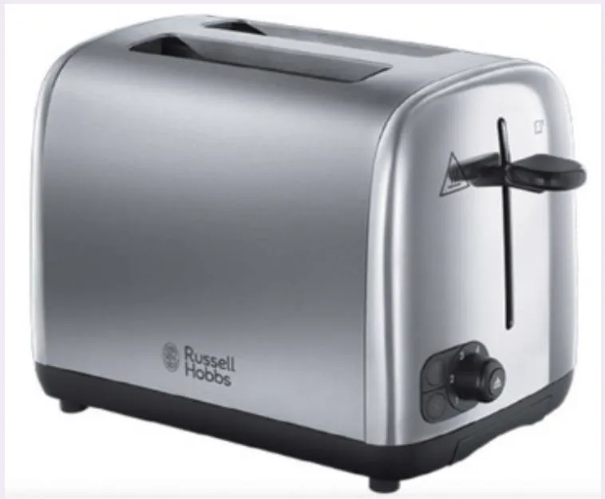  
Source: uk.russellhobbs.com/product/brushed-stainless-steel-toaster-2-slice

# Comment

Standard toasters have two main controls, the lever to press down to start the toasting and a knob to set the amount of time for the toasting. Many come with a small eject button that can be pressed if the toast starts to burn. Some also come with a range of settings for different ways of toasting (such as one side, frozen, and so forth), selected by moving a dial or pressing buttons.

Designing the controls to appear on an LCD screen would enable more information and options to be provided, for example, toast only one slice, keep the toast warm, or automatically pop up when the toast is burning. It would also allow precise timing of the toasting in minutes and seconds. However, it is likely to increase the complexity of what previously was a set of logical and very simple actions. This has happened in the evolution of microwaves, washing machines, and  tea kettles  that have digital  interfaces. They also offer  many more options for warming food up, washing clothes, or the temperature to heat water. The downside of increasing the number of choices, especially when the interface is not designed well to support this, is that it can make for a more difficult user experience for mundane tasks.

# 7.2.8  Voice

A  voice  interface involves  a person  talking  with  a spoken  language app,  such as  a search engine, a train  timetable, a travel  planner, or  a  chatbot. It  is commonly used  for inquiring about specific information (for instance, flight times or the weather) or issuing a command to a machine (such as asking a smart TV to select an action movie or asking a smart speaker to play some upbeat music). Voice interfaces use an interaction type of command or conversation  (see  Chapter  3),  where  a  person  speaks  and  listens  rather  than  clicks,  touches,  or points. Sometimes, the interaction style can involve the person responding where the system is proactive and initiates the conversation, for example, asking them if they would like to stop watching  a movie  or  listen  to the  latest breaking  news. Most  times the  system is  reactive, responding to the person’s queries.

The first generation of speech  systems earned a reputation for mishearing all too often what a person said (see cartoon). However, they are now much more sophisticated and have higher levels of recognition accuracy. Machine learning algorithms have been developed that continue to improve their ability to recognize what someone is saying. Synthetic speech has also advanced significantly to be more friendlier, convincing, and pleasant than the artificially sounding synthesized speech that was typically used in the early systems.

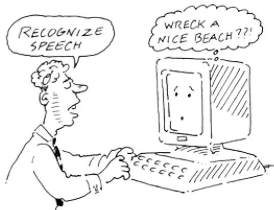  
Source: Reproduced with permission of King Features Syndicate

Watch Sonatics (2022) video entitled What’s Her Secret? at youtu.be/gS1m TIxEW0. How convincing do you think the artificial voice is? Is it distinguishable from a human voice?

Voice has become popular for a range of apps. Speech-to-text systems, such as Otter.io and Dragon, enable people to dictate rather than have to type, whether it is entering data into a spreadsheet, using a search engine, or writing a document. The words spoken appear on the screen. For some people, this mode of interaction is more efficient, especially when they are on  the move. Dragon claims on its  website that  it is  three times faster than typing and it is 99 percent accurate. Speech technology is also used by people with visual impairments,

including  speech  recognition  word  processors,  page  scanners,  web  readers, and  voice  for operating home control systems, including lights, TV, stereo, and other home appliances.

An increasingly widespread application of speech technology is call routing, where companies use an automated speech system to enable callers to reach one of their services during a phone call. They voice their needs in their own words, for example, “I’m having problems with my Wi-Fi router,” and in response are automatically forwarded to the appropriate service. This is useful for companies, as it can reduce operating costs. It can also increase revenue by reducing the number of lost calls. The callers may be happier, as their call can be routed to an available agent (real or virtual) rather than being lost or sent to voicemail. The  key is knowing when to hand over to a human operator when the virtual agent cannot answer their request or does not understand it.

In human conversations, people often interrupt each other, especially if they know what they want, rather than waiting for someone to go through a series of options. For example, they  may stop  the waitress at a  restaurant in midflow  when describing the  specials  if they know what they want, rather than let her go through the entire list. Similarly, speech technology has been designed with a feature called barge-in that allows callers to interrupt a system message and provide their request or response before the message has finished playing. This can be useful if the system has numerous options from which the caller may choose and the chooser knows already what they want.

There are several ways that a conversational dialogue can be structured. The most common is a directed dialogue where the system is in control of the conversation, asking specific questions and requiring specific responses, similar to filling in a form (Cohen et al., 2004):

System: Which city do you want to fly to?

Caller: London

System: Which airport: Gatwick, Heathrow, Luton, Stansted, or City?

Caller: Gatwick

System: What day do you want to depart?

Caller: Monday next week.

System: Is that Monday, May 5?

Caller: Yes

Other systems  are more  flexible, allowing  someone to take more initiative and specify more information in one sentence (for example, “I’d like to go to Paris next Monday for two weeks”). The  problem  with this  approach  is  that  there is  more  chance  for error, since  the caller might assume  that the system can follow all of their needs in one pass as a real travel agent would (for example, “I’d like to go to Paris next Monday for two weeks and would like the cheapest possible flight, preferably leaving from Gatwick airport and definitely with no stop-overs...”). The list is simply too long and would overwhelm the system’s parser. In addition, prompted responses enable the speech recognizer to look for a limited set of words, such as cities (in the first case) or London airports (second), which significantly improves accuracy. Guided prompts can be used to get callers back on track and help them speak appropriately (for instance, “Sorry, I did not get all that. Did you say you wanted to fly next Monday?”).

A number of speech-based phone apps exist that enable people to use them while mobile, making  them more convenient to use  than text-based entry. For example, people can voice queries into their phone using Google Voice or Apple Siri rather than entering text manually. Mobile translators allow people to communicate  in real time with others who speak a different language by letting a software app on their phone do the talking (for example, Google

Translate). People speak in their own language using their phone while the software translates what each person is saying into the language of the other one. Potentially, this means people from all over the world (there are more than 6,000 languages) can talk to one another without having to learn another language.

Voice assistants, like Amazon’s Alexa and Google Home, can be instructed by their owners to entertain in the home by telling jokes, playing music, keeping track of time, and enabling users to  play games. Alexa  also  offers a  range  of  skills, which are  voice-driven  capabilities intended to provide a more personalized experience. For example, “Open the Magic Door” is an interactive story skill that allows users to choose their path in a story by selecting different options through the narrative. Another one, “Kids Court,” allows families to settle arguments in an Alexa-run court while  learning about the law. Many of the skills are designed to support multiple people taking part at the same time, offering the potential for families  to play together. Social interaction is encouraged by  the smart speaker that houses Alexa or Home. Smart speakers sit in a common space  for all to  use (similar  to a toaster  or refrigerator). In contrast, handheld devices, such as a smartphone or tablet, support single use and ownership.

Despite big advances in speech recognition, conversational interaction is limited mainly to answering questions and responding to requests. Furthermore, it is still difficult for speechbased systems to recognize children’s speech, as it is not as articulate or developed as adults. As a result, many conversational agents frequently misunderstand children (Monarca et al., 2020). Also, voice assistants don’t always recognize who is talking in a group, such as a family, and always need to be called by their name each time someone wants to interact with it.

# Research and Design Considerations

Key research questions include what conversational mechanisms to use to structure the voice interface  and  how human-like they should be. Some researchers focus  on how to make it appear natural (that is, like human conversation), while others are concerned more with how to help people navigate efficiently through a menu system by enabling them to recover easily from errors (their own or the system’s), to be able to escape and go back to the main menu (similar to the undo button of a GUI), and to guide those who are vague or ambiguous in their requests for information or services using  prompts. The type of synthesized  voice or voice actor, male, female, neutral, or dialect, and form of pronunciation are also topics of research. Do people prefer to listen to and are more patient with a female or male voice? What about one that is jolly versus one that is serious? Interacting with voice or a chatbot also changes the  nature of the  interaction, especially in group  settings. Leon Reicherts et al. (2022), for example, investigated whether talking with an interface agent was more effective compared with interacting with a chatbot/text-based agent by teams of people working on a collaborative task in a meeting. They found that using voice resulted in more turn-taking in the team discussions and more questions being asked. The findings suggest that being prompted by a voice assistant may be preferable to using a chat-based interface in this kind of collaborative setting as it can be more effective at mediating human-human conversations.

Michael Cohen  et al. (2004) discuss the  pros and cons of using different  techniques for structuring  the dialogue and managing the  flow of voice  interactions, the  different  ways of expressing errors, and the  use of conversational etiquette—all still relevant for today’s voice

interfaces. A number of commercial guidelines are available for voice interfaces. For example, Cathy Pearl (2016) provides a number of voice interface design principles and topics, including which speech recognition engine to use, how to measure the performance of voice interfaces, and how to design them for different interfaces, for example, a mobile app, toy, or voice assistant.

# 7.2.9  Pen-Based

Pen-based  interfaces enable  people to write, draw,  select, and move objects on an  interface using light pens or styluses that capitalize on the well-honed drawing and writing skills. They have  been  used to interact with tablets and large displays, instead of mouse, touch, or keyboard  input,  for  selecting  items  and  supporting  freehand  sketching.  Smartpens,  like  the LiveScribe Echo 2 (see Figure 7.19), use a combination of an ink pen with a digital camera that digitally records everything written with the pen on special paper. The pen works by recognizing a special nonrepeating dot pattern that is printed on the paper. The nonrepeating nature of the pattern means that the pen is able to determine which page is being written on and where on the page the pen is pointing. When writing on digital paper with a smartpen, infrared light from the  pen illuminates  the dot pattern, which is then picked up by a tiny  sensor. The  pen decodes the dot pattern as the pen moves across the paper and stores the data temporarily in the pen. The digital pen can transfer data that has been stored in the pen via Bluetooth to a computer/tablet. Handwritten notes can also be converted and saved as standard typeface text that can then be edited and organized subsequently. This can be  useful for applications that require people to fill in paper-based forms and also for taking notes during meetings.

Figure 7.19 Livescribe Echo 2 Smartpen   
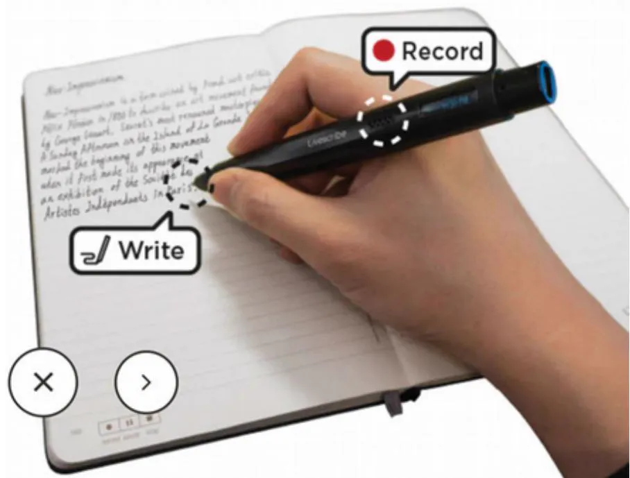  
Source: uk.livescribe.com/collections/smartpens/products/echo-2

Another advantage of pen-based interfaces is that they allow people to annotate existing documents, such as spreadsheets, presentations, and diagrams, quickly and easily in a similar way to how they would do this when using paper-based versions. This is particularly useful for a team who is working together and communicating with each other from different locations. They are also very  versatile; for example, the Apple  pencil  when used with the iPad enables people to write, sketch, annotate, draw, and paint directly onto it.

# BOX 7.3

# Electronic Ink

Digital ink is not to be confused with the  term electronic ink (or  e-ink). Electronic ink is a display  technology designed to mimic  the  appearance of ordinary ink  on paper  used in e-readers, such as the Kindle. The display used reflects light like ordinary paper.

# 7.2.10  Touchscreens

Single  touchscreens,  used  in  walk-up  kiosks  such  as  ticket  machines  or  museum  guides, ATMs,  and  cash  registers  (for instance,  restaurants),  have  been around  for  a  while. They work by detecting the presence and location of a person’s touch on the display; options are selected by tapping on the screen. Multitouch surfaces, on the other hand, support a much wider range of more dynamic fingertip actions, such as swiping, flicking, pinching, pushing, and  tapping.  They  do  this  by  registering  touches  at  multiple  locations  using  a  grid  (see Figure 7.20). This multitouch method enables devices, such as smartphones and tabletops, to recognize  and  respond  to  more  than  one  touch  at  the  same  time  supporting  a  variety  of actions, such as zooming in and out of maps, moving photos, selecting letters from a virtual keyboard when writing, and scrolling through lists. Two hands can also be used together to stretch and move objects on a tabletop surface, similar to how both hands are used to stretch an elastic band or scoop together a set of objects.

The flexibility of interacting with digital content afforded by finger gestures has resulted in many  ways  of experiencing  it. This  includes reading, scanning, zooming,  and searching interactive content on tablets, as well as creating new digital content.

# Research and Design Considerations

Touchscreens have become pervasive, increasingly becoming the  main interface  that many people use on a daily basis. However, they are different from GUIs, and a central design concern is what types of interaction techniques to use at the interface. For example, what is the optimal way to enable people to choose from options, find files, save documents, and so forth, when using a touch interface? Alternative conceptual models have been developed to carry out these actions at the interface, such as the use of cards, carousels, and infinite scrolling. The use

of these methods enables someone to swipe and move through digital content quickly. However, it is also easy to swipe too far when using a carousel. Typing on a virtual keyboard with two thumbs or one fingertip is also not as fast and efficient as using both hands when using a conventional keyboard, although many people have learned to be very adept at pecking at virtual keys on a smartphone. Predictive text can also be used to help people type faster.

Both hands may be used on multitouch tabletops to enable people to make digital objects larger and smaller or to rotate them. Dwelling touches (pressing and holding a finger down) can also be used to enable someone  to perform  dragging actions  and to bring  up pop-up menus. One or more fingers can also be used together with a dwell action to provide a wider range of gestures. However, these can be quite  arbitrary, requiring  someone to learn them rather than being  intuitive. Another limitation of touchscreens is that they do not  provide tactile feedback in the same way that keys or mice do when pressed. To compensate, visual, audio, and haptic feedback can be used. (See also the section on shareable interfaces (7.2.14) for more background on multitouch design considerations.)

Figure 7.20 A schematic of a multitouch interface   
  
Source: Willtron / CC BY 1.0

# 7.2.11  Touchless

Gestures involve moving arms and hands to communicate (for instance, waving to say goodbye or raising an arm to speak in class) or to provide information to someone (for example, holding two hands apart to show the size of something). There has been much interest in how technology  can be used  to capture and recognize  a person’s gestures for input by  tracking them using cameras and then analyzing them using machine learning algorithms.

David  Rose (2018)  created a video that depicts many sources of inspiration for where gesture is used in a variety of contexts, including those made by cricket umpires, live concert signers for the deaf, rappers, Charlie  Chaplin, mime artists, and Italians. His team at IDEO developed a gesture system to recognize a small set of gestures and used these to control a Philips HUE light set and a Spotify station. They found that gestures need to be sequential to be understood in the way a sentence  is composed  of a noun, then verb, and object plus operation. For example, for “speaker, on,” they used a gesture on one hand to designate the noun, and another on  the other hand to designate  the verb. So, to change the volume, the person needs to point to a speaker with their left hand while raising their right hand to signal turn the volume up.

Watch David Rose’s inspirations for gesture video at vimeo.com/224522900.

One  area  where gesture interaction has  been developed  is  in the operating  room. Surgeons need to keep their hands sterile during operations but also need to be able to look at X-rays and scans during an operation. However, after being scrubbed and gloved, they need to avoid  touching  any  keyboards, phones,  and other  nonsterile  surfaces. A  far from  ideal workaround is to pull their surgical gown over their hands and manipulate a mouse through the gown. As an alternative, Kenton O’Hara et al. (2013) developed a touchless gesture-based system, using Microsoft’s Kinect technology, which recognized a range of gestures that surgeons could use to interact with and manipulate MRI or CT images, including single-handed gestures  for  moving  forward  or  backward  through  images,  and  two-handed  gestures  for zooming and panning (see Figure 7.21).

Several car dashboards have a form of gesture control; for example, BMW’s iDrive enables drivers to control certain functions, such as turning up or down the audio volume, with the use of hand gestures that are captured by a 3D camera. For audio control, these comprise rotating the  index finger  clockwise (up) or  anti-clockwise  (down). Gesture control sensors that are positioned in the roof lining of the car, adjacent to the rearview mirror, are also used. To be recognized, the driver needs to make their gestures in front of the center console.

To ensure they are safe, the gestures were developed and tested in the iDrive system, by taking into account how focused the driver is when behind the wheel. More recently, Touchless Computing has emerged as a new  form of in-air gesture-based  interaction that anyone can  use  with  just  a  webcam  (see  www.intel.com/content/www/us/en/company-overview/ wonderful/motion-input-technology.html). The technique developed  is  called MotionInput, which provides a way of interacting with a PC without the need to touch a keyboard or the screen. Instead, a person interacts with the MotionInput software on their PC by making gestures with their hands, head, face, or full body. The software then analyzes their interactions and converts  them  into mouse, keyboard, and joypad  signals. The “multitouch in  the air” software was developed by computer  science undergraduate students at University  College London in  conjunction  with Intel, IBM, and  Microsoft. Compared  with the earlier Kinect gesture-based  systems, it doesn’t require any  specific equipment other than a webcam  and microphone, which most laptops already have.

Figure 7.21 Touchless gesturing in the operating theater   
  
Source: Used courtesy of Kenton O’Hara

# Research and Design Considerations

A key design concern for using gestural input is to consider how a computer system recognizes and delineates a person’s gestures. In particular, how does it determine the start and end points of a hand or arm movement, and how does it know the difference between a deictic gesture (a deliberate pointing movement) and hand waving (an unconscious gesticulation) that is used to emphasize what is being said verbally?

In addition to being used as a form of input, gestures can be represented as output to show real-time avatar movement or someone’s own arm movements. Smartphones, laptops, and some smart speakers (for example, Facebook’s Portal) have cameras  that can perceive three dimensions and record a depth for every pixel. This can be used to create a representation of someone in a scene, for example, how they are posing and moving, and also to respond to their gestures. One design question that this raises is the following: how realistic must the mirrored graphical representation of the person be in order for them to be believable and for the person to connect their gestures with what they are seeing on the screen?

# 7.2.12  Haptic Interfaces

Haptic  interfaces provide  tactile  feedback, by  applying  vibration and forces  to  the person using actuators that are embedded in their clothing or a device that they are carrying, such as a smartphone or smartwatch. Gaming consoles have also employed vibration to enrich the experience. For example, car steering wheels that are used with driving simulators can vibrate in various ways to provide the feel of the road. As the driver makes a turn, the steering wheel can be programmed to feel like it is resisting—in the way that a real steering wheel does. The steering wheel  in some cars like the  Tesla also  vibrate as a warning to the  driver if  the  car detects that it is drifting out of its lane.

Vibrotactile  feedback can also be used to  simulate the sense  of touch between  remote people who want to communicate. Actuators embedded  in clothing can be designed to recreate  the sensation  of  a hug  or a  squeeze  by  being  buzzed on  various  parts  of the body. Another  use  of  haptics  is  to  provide  real-time  feedback  to  guide  people when  learning  a musical instrument, such as a violin or drums. For example, the MusicJacket (van der Linden et al., 2011) was developed to help novice violin players learn how to hold their instrument correctly and develop good bowing action. Vibrotactile feedback was provided via the jacket to give nudges at key places on the arm and torso to inform the student when they were either holding their violin incorrectly or their bowing trajectory had deviated from a desired path (see Figure 7.22). A user study with novice players showed that they were able to react to the vibrotactile feedback and adjust their bowing or their posture in response.

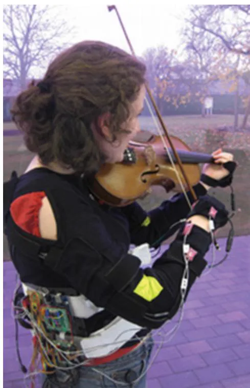  
Figure 7.22 The MusicJacket with embedded actuators that nudge the player to move their arm up to be in the correct position

Source: Yvonne Rogers

Another  form  of feedback is called  ultrahaptics, which creates  the illusion of touch in midair. It does this by using ultrasound to make three-dimensional shapes and textures that can  be felt  but  not  seen  by  the user  (www.ultrahaptics.com). This  technique  can  be  used to  create  the  illusion  of  having  buttons  and  sliders  that  appear  in  midair.  One  potential use  is  in the automotive industry to replace existing  physical buttons  and knobs or touchscreens. The ultra-haptic  buttons and  knobs  can  be designed  to appear  next  to the driver when  needed,  for example, when  detecting  the driver  wants  to turn  down  the volume  or change the radio station.

Haptics are also being embedded into clothing, sometimes called exoskeletons. Inspired by the “Techno Trousers” in the Wallace and Gromit movie The Wrong Trousers, Jonathan Rossiter and his team (2018) developed a new kind of exoskeleton that can help people stand up  and move  around using artificial  muscles  that  consist  of air bubbles  that  act as  haptic feedback that are activated using tiny electric motors (see Figure 7.23). They are stiffened or relaxed using grapheme parts to make the trousers move. One application area is to help people who have walking difficulties and those who need to exercise but find it difficult to do so.

Figure 7.23 Trousers with artificial muscles that use a new kind of bubble haptic feedback   
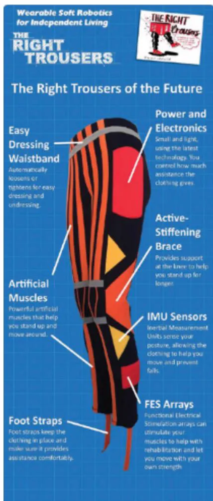  
Source: Used courtesy of The Right Trousers Project: Wearable Soft Robotics for Independent Living

# Research and Design Considerations

Haptics are used in gaming consoles, smartphones, and controllers to alert or heighten a user experience. Haptic feedback is also being  developed  in clothing and  other  wearables as a way of simulating being touched, stroked, prodded, or buzzed. A promising application area is sensory-motor skills, such as in sports training and learning to play a musical instrument. For example, patterns of vibrations have been placed across snowboarders’ bodies to indicate which moves to take while snowboarding. A study reported faster reaction times than when the  same instructions were given  verbally (Spelmezan et al., 2009). Other  uses are  posture trainers that buzz when a person slouches and fitness trackers that also buzz when they detect that their wearers have not taken enough steps in the past hour.

A key design question is where best to place the actuators on the body, whether to use a single or a sequence of touches, when to activate, and at what intensity and how often to use them to make the feeling of being touched convincing (e.g., Jones and Sarter, 2008). Providing continuous haptic feedback would be simply too annoying. People would also habituate too quickly to the feedback. Intermittent buzzes can be effective at key moments when a person needs to attend to something but not necessarily tell them what to do. For example, a study by Johnson et al. (2010) of a commercially available haptic device, intended to improve posture by giving people a vibrotactile buzz when they slouched, found that while the buzzing did not show them how to improve their posture, it did improve their body awareness.

Different kinds of buzzes can also be used to indicate different tactile experiences that map to events; for example, a smartphone could transmit feelings of slow tapping to feel like water  dropping, which is meant to indicate it is about to rain and transmit the sensation of heavy  tapping to indicate a thunderstorm is looming. Apple  iOS 16 (2022) recently added the option of being able to switch on their haptics when typing, enabling a user to feel a tiny vibration every time they press a key on their iPhone’s virtual keyboard. Haptics are also used in Apple watches, in the little "click" sensations that the wearer feels when they scroll using the digital crown. These kinds of haptic feedback can be reassuring and aid navigation.

# 7.2.13  Multimodal

Multimodal interfaces are intended to enrich user experiences by multiplying the way information is experienced and controlled at the interface through using different modalities, such as touch, sight, sound, and speech (Bouchet and Nigay, 2004). Interface techniques that have been combined for this purpose include speech and gesture, eye-gaze and gesture, haptic and audio output, and pen input and speech (Dumas et al., 2009). The assumption is that multimodal  interfaces  can  support  more  flexible,  efficient,  and  expressive  means  of  human– computer interaction that are more akin to the multimodal experiences that humans encounter in  the  physical world  (Oviatt, 2017). Different  input/outputs  may  be  used at  the  same time, for example, using  voice commands  and  gestures simultaneously to  move through a

virtual environment, or alternately using speech commands followed by gesturing. The most common  combination  of technologies used  for multimodal interfaces  is  speech  and vision processing (Deng and Huang, 2004). Multimodal interfaces can also be combined with multisensor  input to  enable other aspects of the human  body  to be tracked. For  example, eye gaze, facial expressions, and lip movements (as mentioned in section 7.2.11 on MotionInput software)  can  also  be detected  and tracked  to provide  data  about  someone’s attention  or intent. This kind of sensing can provide input for customizing user interfaces and experiences to the perceived need, desire, or level of interest.

A person’s body movement can also be tracked so that it can be represented back to them on a screen in the form of an avatar that appears to move just like them. For example, the Kinect was developed as a gesture and body movement gaming input system for the Xbox. Although  now  defunct  in the gaming industry,  it proved effective at  detecting multimodal input in real time. It consisted of an RGB camera for facial and gesture recognition, a depth sensor  (an  infrared projector  paired  with a  monochrome camera) for  movement tracking, and downward-facing  mics for voice recognition  (see Figure 7.24). On  finding a body, the Kinect locked onto  it and measured the three-dimensional  positioning  of the key joints  in their body. This information was converted into a graphical avatar of the user that could be programmed to move just like them. Many people readily saw themselves as the avatar and learned how to play games in this manner.

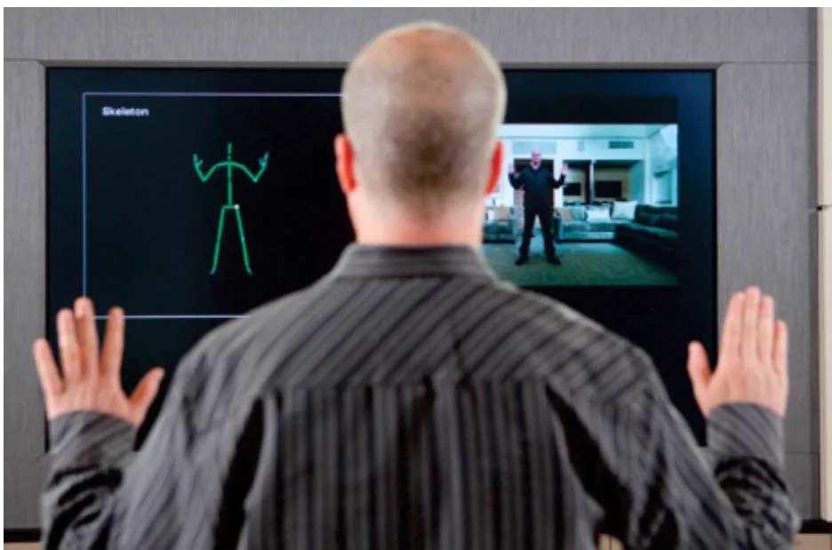  
Figure 7.24 Microsoft’s Xbox Kinect Source: Stephen Brashear / Invision for Microsoft / AP Images

# Research and Design Considerations

Multimodal systems rely on recognizing aspects of a person’s behavior, including handwriting, speech, gestures, eye movements, or other body movements. In many ways, this is much harder to accomplish and calibrate than single modality systems that are programmed to recognize one aspect of a user’s behavior. The most researched modes of interaction are speech, gesture, and eye-gaze tracking. A key research question is what is actually gained from combining different input and outputs and whether talking and gesturing as humans do with other humans is a natural way of interacting with a computer (see Chapter 4). Guidelines for multimodal design can be found in Oviatt et al. (2017).

# 7.2.14  Shareable

Shareable interfaces are designed for more than one person to use. Unlike PCs, laptops, and mobile devices, which are aimed at single users, shareable interfaces typically provide multiple inputs and sometimes allow simultaneous input by co-located groups. These include large wall displays, for example, SmartBoards (see Figure 7.25a), and interactive tabletops, where small groups can interact with information being displayed on the surface using their fingertips  (see  Figure  7.25b). An  early  example  of  an  interactive  tabletop  was  Circle  Twelve’s DiamondTouch (Dietz and Leigh, 2001). It was unique in that it could distinguish between different users touching the surface concurrently. An array of antennae was embedded in the touch surface, and each one transmitted a unique signal. Each person had their own receiver embedded in a mat on which they were standing or a chair in which they were sitting. When they touched the tabletop, very small signals were sent through their body to a receiver that identified which  antenna has  been touched and sent this to the computer. Multiple  people could interact simultaneously with the digital content using their fingertips. Sadly, the technology is no longer available, but a video of how it worked is available.

Check out the video of Circle Twelve’s demonstration of the DiamondTouch tabletop: youtu.be/S9QRdXlTndU.

An advantage of shareable interfaces is that they provide a large interactional space that can support flexible group working, enabling groups to create content together at the same time. Compared with a co-located group trying to work around a single-user PC or laptop, where typically  one  person takes  control, making  it  more difficult  for others to take  part, multiple users can interact with a large display. People can point to and touch the information  being  displayed,  while  simultaneously  viewing  the  interactions  and  having  the  same shared point of reference (Rogers et al., 2009). There are now a number of tabletop apps that have been developed for museums and galleries that enable visitors to learn  about various aspects of the environment (see Clegg et al., 2019).

  
(a)

(b)   
Figure 7.25 (a)  A SmartBoard in use  during a  meeting and  (b)  Mitsubishi’s interactive  tabletop interface   
  
Source: (a)  Used  courtesy  of  SMART  Technologies Inc.  (www.smarttech.com/en/business)  (b)  Mitsubishi Electric Research Labs

Another type of shareable interface is a software platform that enables groups of people to work together simultaneously even when geographically apart. Early examples included shared  editing  tools  developed  in  the  1980s  (for  example,  ShRedit).  Various  commercial products  now exist that enable multiple remote  people to work on  the same  document at the same time (such as Google Docs and Microsoft Excel). Some enable up to 50 people to edit the same document at the same time with more watching on. These software programs provide  various functions, such as  synchronous editing,  tracking changes, annotating, and commenting. Other collaborative tools include Miro (see Chapter 5) and the Balsamiq Wireframes  editor, which provides  a  range of shared functions, including  collaborative  editing, threaded comments with callouts, and project history.

# Research and Design Considerations

Early  research on shareable interfaces focused  largely on interactional issues, such as how to support electronically based handwriting and drawing, and the  selecting and  moving of objects  around the display (Elrod et al., 1992). The PARCTAB system (Schilit et al., 1993) investigated how  information  could  be communicated between  palm-sized, A4-sized,  and whiteboard-sized displays using shared software tools, such as Tivoli (Rønby-Pedersen et al., 1993). Another concern was how to develop fluid and direct styles of interaction with large displays, both wall-based and tabletop, involving freehand and pen-based gestures (see Shen et al., 2003). More recent research has been concerned  with how  to support  ecologies  of devices so that groups can share and create content and use apps across multiple devices, such as tabletops and wall displays (Brudy et al., 2016). A key design challenge is how to bridge across devices, applications, and time such that the peoples’ interactions are seamless (Brudy et al, 2020).

A key research issue is whether shareable surfaces can facilitate new and enhanced forms of collaborative interaction compared with what is possible when groups work together using their own devices, like laptops and PCs (see Chapter 5). One benefit is easier sharing and more equitable participation. For example, tabletops have been designed to support more effective joint browsing, sharing, and manipulation of images during decision-making and design activities (Shen et al., 2002; Yuill and Rogers, 2012). Core design concerns include whether size, orientation, and shape of the display have an effect on collaboration. User studies have shown that horizontal surfaces compared with vertical ones support more turn-taking and collaborative working in co-located groups (Rogers and Lindley, 2004), while providing larger-sized tabletops does not necessarily improve group working but can encourage a greater division of labor (Ryall et al., 2004).

The  need for both personal and  shared spaces has been investigated to see how  best to enable users  to move between  working on their  own  and  together as a  group. Several researchers have designed cross-device systems, where a variety of devices, such as tablets, smartphones, and  digital  pens can  be used in conjunction  with a  shareable  surface. For example, SurfaceConstellations  was  developed  for  linking  mobile devices  to create novel cross-device workspace environments (Marquardt et al., 2018). Design guidelines and summaries of empirical  research on tabletops  and multitouch devices can be found  in Müller-Tomfelde (2010).

# 7.2.15  Tangible

Tangible interfaces use sensor-based interaction, where physical objects, such as bricks, balls, and cubes, are coupled with digital representations (Ishii and Ullmer, 1997). When a person manipulates the physical object(s), it is detected by a computer system via the sensing mechanism embedded in the physical object, causing a digital effect to occur, such as a sound, animation, or vibration (Fishkin, 2004). The digital effects can take place in a number of media and  places,  or  they  can  be  embedded  in  the  physical  object  itself.  For  example,  Oren Zuckerman and  Mitchel  Resnick’s  (2005)  early Flow  Blocks  prototype depicted  changing numbers  and  lights  that  were  embedded  in  the  blocks,  depending  on  how  they  were

connected. The flow blocks were designed to simulate  real-life dynamic behavior and react when arranged in certain sequences.

Another  type  of tangible  interface  is  where  a  physical model,  for  example, a  puck, a piece of clay, or a model, is superimposed on a digital desktop. Moving one of the physical pieces  around  the tabletop causes digital  events to take  place  on  the tabletop. One  of the earliest  tangible  interfaces, Urp, was  built  to  facilitate urban  planning;  miniature  physical models of buildings could be moved around on the tabletop and used in combination with tokens for wind and shadow-generating tools, causing digital shadows surrounding them to change over time and visualizations of airflow to vary. Tangible interfaces differ from other approaches, such as mobile, insofar as the representations are artifacts in their own right that they can be directly acted upon, lifted up, rearranged, sorted, and manipulated.

The technologies that have been used to create tangibles include RFID tags and sensors embedded in physical objects and digital tabletops that sense the movements of objects and subsequently provide visualizations surrounding the physical objects. Many tangible systems have been built with the goal of encouraging learning, design activities, playfulness, and collaboration. These include planning tools for landscape and urban planning (see Hornecker, 2005; Underkoffler and Ishii, 1998). Another example is Tinkersheets, which combine tangible models of shelving with paper forms for exploring and solving warehouse logistics problems (Zufferey, et al., 2009). The underlying simulation allows students to set parameters by placing small magnets on the form.

Tangible computing has been described as having no single locus of control or interaction (Dourish, 2001). Instead of just one input device, such as a mouse, there is a coordinated interplay of different devices and objects. There is also no enforced sequencing of actions and no modal interaction. Moreover, the design of the interface objects exploits their affordances to guide the user in how to interact with them. A benefit of tangibility is that physical objects and digital representations can be positioned, combined, and explored in creative ways, enabling dynamic information to be presented in different ways. Physical objects can also be held in both hands  and combined and manipulated in  ways not  possible using other interfaces. This allows for more than one person to explore the interface together and for objects to be placed on top of each other, beside each other, and inside each other; the different configurations encourage different ways of representing and exploring a problem space. In so doing, people are able to see and understand situations differently, which can lead to greater insight, learning, and problem-solving than with other kinds of interfaces (Marshall et al., 2003).

A number of toolkits have been developed to encourage children to learn coding, electronics, and STEM subjects using physical computing toolkits. These include the following:

SAM Labs STEAM kit (youtu.be/DEiIqWXiffw)

MicroBit (microbit.org)

MagicCubes (uclmagiccube.weebly.com)

The toolkits provide children with opportunities to connect physical electronic components and sensors to make digital events happen. For example, the MagicCubes can be programmed to change color depending on the speed at which they are shaken; slow is blue, and very  fast is  multicolor. Research has  shown that the tangible toolkits provide many opportunities  for  discovery  learning,  exploration,  and  collaboration  (Lechelt  et  al.,  2020). The MagicCubes have also been found to encourage a diversity of children, between the ages of 6 and 16, and those with cognitive disabilities, to learn through collaborating, and frequently

showing and telling  each other and their instructors about their discoveries  (Lechelt et al., 2018). These moments are facilitated by the cube’s form factor, making it easy to show off to others, for example, by waving a cube in the air (see Figure 7.26).

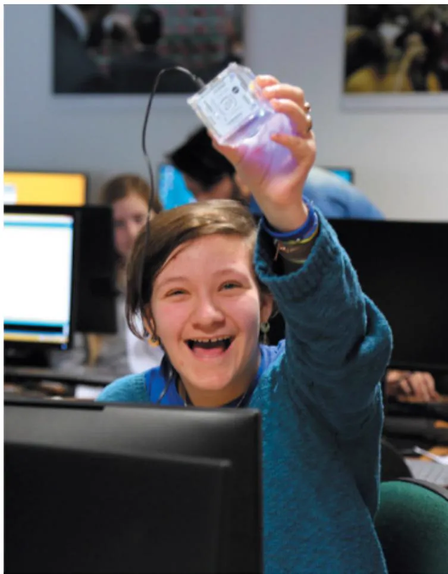  
Figure 7.26 Learning to code with the MagicCubes; sharing, showing, and telling Source: Elpida Makriyannis

Tangible toolkits have also been developed for the visually impaired. For example, Code Jumper was developed as a programming  language for teaching programming concepts to children aged 7–11, regardless of level of vision (Morrison et al., 2018). It consists of a set of pods that can be connected and manipulated to create physical strings of code that play stories or music.

# BOX 7.4

# VoxBox—A Tangible Questionnaire Machine

Traditional methods for gathering public opinions, such as surveys, involve approaching people in situ, but it can disrupt the positive experience they are having. VoxBox (see Figure 7.27) is a  tangible system designed to gather opinions on a range  of topics in situ at an event through playful and engaging interaction (Golsteijn et al., 2015). It was intended to encourage wider participation by grouping similar questions, encouraging completion, gathering answers to open and closed questions, and connecting answers and results. It was designed as a large physical system that provides a range of tangible input  mechanisms through  which people give their  opinions, instead of using, for example, text messages or social media input. The various input mechanisms include sliders, buttons, knobs, and spinners about which people are all familiar. In addition, the system has a transparent tube at the side that drops a ball stepby-step as sets of questions are completed to act as an incentive for completion and as a progress indicator. The results of the selections were aggregated and presented as simple digital visualizations on the other side (for example, 95 percent are engaged; 5 percent are bored). VoxBox was  used at a  number of events drawing in the  crowds, who  become completely absorbed in answering questions in this tangible format.

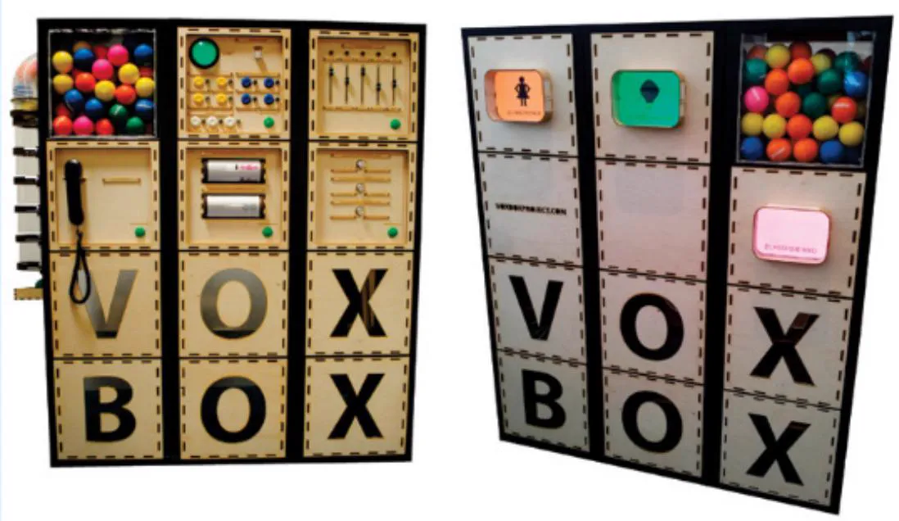  
Figure 7.27 VoxBox—front and back of the tangible machine questionnaire Source: Yvonne Rogers

# Research and Design Considerations

Researchers have developed conceptual frameworks that identify the novel and specific features of a tangible interface (for the classic ones, see Fishkin, 2004; Ullmar et al., 2005; Shaer and  Hornecker, 2010). A  key design concern is what kind of coupling to use  between the physical action and  digital  effect. This includes determining  where  the  digital  feedback is provided in relation to the physical artifact that has been manipulated. For example, should it appear on top of the object, beside it, or in some other place? The type and placement of the digital media will depend to a large extent on the purpose of using a tangible interface. If it is to support learning, then an explicit mapping between action and effect is critical. In contrast, if it is for entertainment purposes, for example, playing music or storytelling, then it may be better to design them to be more implicit and unexpected. Another key design question is what kind of physical artifact to use to enable the user to carry  out an activity in a natural way. Bricks, cubes, and other component sets are most commonly used because of their flexibility and simplicity, enabling people to hold them in both hands and to construct new structures that can be easily added to or changed. Sticky notes and cardboard tokens can also be used for placing material onto a surface that is transformed or attached to digital content (Klemmer et al., 2001; Rogers et al., 2006).

Another research question is the following: with which types of digital  outputs should tangible interfaces be combined? Overlaying physical objects  with graphical  feedback that changes in response to how the object is manipulated has been the main approach. In addition, audio and haptic feedback has been used. Tangibles can also be designed to be an integral part of a multimodal interface. For an extensive overview on the history and aspirations of tangible interaction, see Brygg Ullmer et al. (2022).

# 7.2.16  Augmented Reality

Augmented reality  (AR)  became  an  overnight  success with  the  arrival of  Pokémon  Go in 2016. The smartphone  app became an  instant hit worldwide. Using a player’s smartphone camera and  GPS  signal, the AR  game makes  it seem  as if  virtual Pokémon  characters are appearing in the real world—popping up all over the place, such as on buildings, on streets, and in parks. As players walk around a given place, they may be greeted with rustling bits of grass  that signal  a Pokémon  nearby. If  they  walk  closer, a Pokémon  may  pop up  on their smartphone screen, as if by magic, and look as if they are actually in front of them. For example, one might be spotted sitting on a branch of a tree or a garden fence.

AR works by superimposing digital elements, like Pokémons, onto physical devices and objects. Closely related to AR is the concept of mixed reality, where views of the real world are combined with views of a virtual environment (Drascic and Milgram, 1996). To begin, augmented reality was mostly  a subject of experimentation within medicine, where  virtual objects, for example X-rays and scans, were overlaid on part of a patient’s body to aid the physician’s understanding of what was being examined or operated on.

AR was then used to aid controllers and operators in rapid decision-making. One example is air traffic control, where controllers are provided with dynamic information about the aircraft in their section that is overlaid on a video screen showing real planes landing, taking off, and taxiing. The additional information enables the controllers to identify planes easily, which were difficult to make out—something  especially useful in poor weather conditions. Similarly, head-up  displays  (HUDs) are used in military and civil planes to aid pilots when landing during poor weather conditions. A HUD provides electronic directional markers on a fold-down display that appears directly in the field of view of the pilot. A number of cars provide AR windshield technology, where navigation directions can literally look like they are painted on the road ahead of the driver (see Chapter 2, “The Process of Interaction Design”).

As well as HUDs, augmented reality can be viewed through headsets, smartphones, and glasses (e.g., SnapChat’s AR spectacles). The most convenient device to use when viewing AR is a smartphone. Headsets can provide a more immersive experience, but the downside is they are cumbersome to wear and fiddly to calibrate. In the future, it is likely that more convenient and easy-to-wear AR glasses will become more popular, enabling people both to create and to share their digital AR content with others. To see how this can work, watch the Snap video Introducing the Next Generation of Spectacles at youtu.be/AuIw5Oe7z1I.

AR-based instructions for building or repairing complex equipment, such as photocopiers and car engines, have also been designed to replace paper-based manuals, where drawings are superimposed upon the machinery itself, telling the mechanic what to do and where to do it. There are also many AR apps available for a range of contexts, from education to car navigation, where digital content is overlaid on geographic  locations and objects. To reveal the digital information, users open  the AR app on  a smartphone or tablet and the content appears superimposed on what is viewed through the screen.

Other AR apps have been developed to aid people walking in a city or town. Directions (in  the form  of a pointing  hand  or arrow)  and local  information (for instance, the  nearest bakery)  are  overlaid  on  the  image  of  the  street  ahead  that  appears  on  someone’s  smartphone screen. These change as the person walks up the street. Virtual objects and information are also being combined  to make more complex  augmented  realities. Figure 7.28 shows  a weather alert with animated virtual lightning effects alongside information about  a nearby café and the price of properties for sale or rent on a street. Virtual people, cartoon characters, and other objects are also being introduced into AR environments that can appear to move and/or talk. For example, virtual tour guides are beginning to appear in museums, cities, and theme parks, which can appear to by moving, talking, or gesturing to visitors who are using an AR app.

The availability of mapping platforms, such as those provided by Niantics and Google, together with Apple’s ARKit, SparkAR Studio, and Google’s ARCore, has made it easier for developers  and  students  alike to  develop  new  kinds  of AR  games  and  AR  apps. Another popular AR game that has emerged since Pokémon Go is Jurassic World Alive, where players walk around in the real world to find as many virtual dinosaurs as they can. It is similar to Pokémon Go but with different gaming mechanisms. For example, players have to study the dinosaurs they  come across by collecting  their DNA and then re-creating it. Microsoft has also enabled new mixed reality user experiences to be created, enabling people wearing a Hololens headset to interact with virtual elements in their surroundings.

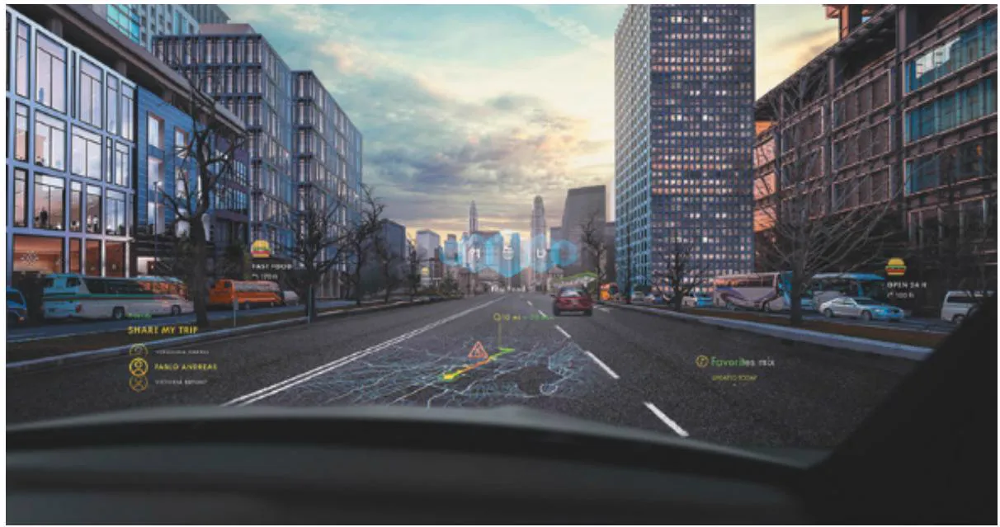  
Figure 7.28 Augmented reality overlay used on a car windshield

# Source: wayray.com

Most AR apps use the backward-facing camera on a smartphone or tablet to overlay the virtual content  onto the real world. Another  approach is to use the forward-facing camera (used for selfies) to superimpose digital content onto the user’s face or body. SnapChat and Zoom provide numerous filters with which people can experiment with plus the opportunity to create their own filters. Adding accessories  such as ears, hair,  moving lips, and headgear enables people to transform their physical appearance in all sorts of fun ways.

These kinds of virtual try-ons work by analyzing a person’s facial features and building a 2D or 3D model in real time. So, when they move their head, the make-up or accessories appear to move with them as if they are really on their face. Several AR mirrors now exist in retail that allow shoppers to try on sunglasses, jewelry, and make-up. The goal is to let them try on as many different products as they like to see how they look with them on. Clearly, there are advantages to virtual try-ons: it can be more convenient, engaging, and easier compared to trying on the real thing. There are disadvantages too, however, in that they only give an  impression of  what you  look like. For example, the person cannot  feel the weight  of a virtual accessory on their head or the texture of virtual make-up on their face.

The same technology can be used to enable people to step into historical, famous, film, or stage characters (for instance, David Bowie or Queen Victoria). For example, a virtual try-on app that was developed as part of a cultural experience was the MagicFace (Javornik, et al., 2017). The goal was to enable audiences to experience firsthand what it was like to try on the make-up of a character from an opera. The opera chosen was Philip Glass’s Akhnaten, set in ancient Egypt (see Figure 7.29a). The virtual make-up developed were for a Pharaoh and his wife. The app was developed by University College London researchers alongside the English National Opera and AR company, Holition. To provide a real-world context, the app was designed to run on a tablet display that was disguised as a real mirror and placed in an

actor’s dressing room (see Figure 7.29b). On encountering the mirror in situ, visiting school children were fascinated by the way the virtual make-up made them look like Akhnaten and his wife, Nefertiti. The singers and make-up artists who were in the production also tried it out and saw great potential for using the app to enhance their existing repertoire of rehearsal and make-up tools.

  
(a)

(b)   
Figure 7.29 (a) A principal singer trying on the virtual look of Akhnaten and (b) a framed AR mirror in the ENO dressing room   
  
Source: Used courtesy of Ana Javornik

# Research and Design Considerations

A key research concern when designing augmented reality is what form the digital augmentation should take and when and where it should appear in the physical environment (Schmalstieg and Hollerer, 2016). The information (such as navigation cues) needs to stand out but not distract the person from their ongoing activity in the physical world. It also needs to be simple and align with the real-world objects, taking into account that the user will be moving. Another concern is how much digital content to overlay on the physical world and how to attract the user’s attention to it. There is the  danger that the physical world  becomes overloaded with digital ads and information “polluting” it to the extent that people will turn the AR app off.

(Continued)

One of the limitations of current AR technology is that sometimes the modeling can be slightly off so that the overlaying of the digital information appears in the wrong place or is out of sync with what is being overlaid. This may not be critical for  fun applications, but it may be disconcerting if eye shadow appears on someone’s ear. It may also break the magic of the AR experience. Ambiguity and uncertainty may be exploited to good effect in mixedreality games, but it could be disastrous in a more serious context, such as in the military or a medical setting.

# 7.2.17  Wearables

Wearables are a broad category of devices that are worn on the body. These include smartwatches, fitness trackers, fashion tech, and smart glasses. Since the early experimental days of wearable computing, where Steve Mann (1997) donned head and eye cameras to enable him to record what he saw while also accessing digital information on the move, there have been many innovations and inventions.

New  flexible  display  technologies,  e-textiles,  and  physical  computing  (for  example, Arduino) provide opportunities to design wearables that people will actually want to wear. Jewelry, caps, glasses, shoes, and jackets have all been the subject of experimentation designed to provide the wearer with a means of interacting with digital information while on the move in the physical world. Early wearables focused on convenience, enabling people to carry out a  task  (for  example, selecting  music)  without  having  to  take  out  and  control  a  handheld device. Examples  included a  ski jacket  with  integrated  music  player  controls that enabled the wearer to simply touch a button on their arm with their glove to change a music track. More recent applications have focused on  how to combine textiles, electronics, and haptic technologies to promote new forms of communication. For example, CuteCircuit developed the KineticDress, which  was embedded with sensors that followed the body  of the wearer to capture their movements and interaction with others. These were then displayed through electroluminescent embroidery that covered the external skirt section of the dress. Depending on the amount and speed of the wearer’s movement, it changed patterns, displaying the wearer’s mood to the audience and creating a magic halo around her.

Exoskeleton clothing (see section 7.2.12) is also an area where fashion meets technology in order to augment  and assist people who have problems  with walking by  literally  walking  or  exercising  the  person  wearing  them.  In  this  way, it  combines  haptics  with  a wearable. Within the construction industry, exoskeleton suits have also been developed to provide additional power to workers—a bit like Superman—where metal frameworks are fitted with motorized muscles to multiply the  wearer’s strength. It can make lifting objects feel lighter and in doing so protect the worker from physical injuries.

# DILEMMA

# Google Glass: Seeing Too Much?

Google Glass was a  wearable that went on sale in 2014 in various fashion styles (see Figure 7.30). It was designed to look like a pair of glasses, but with one lens of the glass being an interactive display with an embedded camera that could be controlled with speech input. It allowed the wearer to take photos and videos on the move and look at digital content, such as email, texts, and maps. The wearer could also search the web using voice commands, and the results would appear on the screen. A number of applications were developed beyond those for everyday use, including WatchMeTalk, which provided live captions to help the hearingimpaired in their day-to-day conversations and Preview for Glass that enabled the wearer to watch a movie trailer the moment they looked at a movie poster.

Figure 7.30 Google Glass   
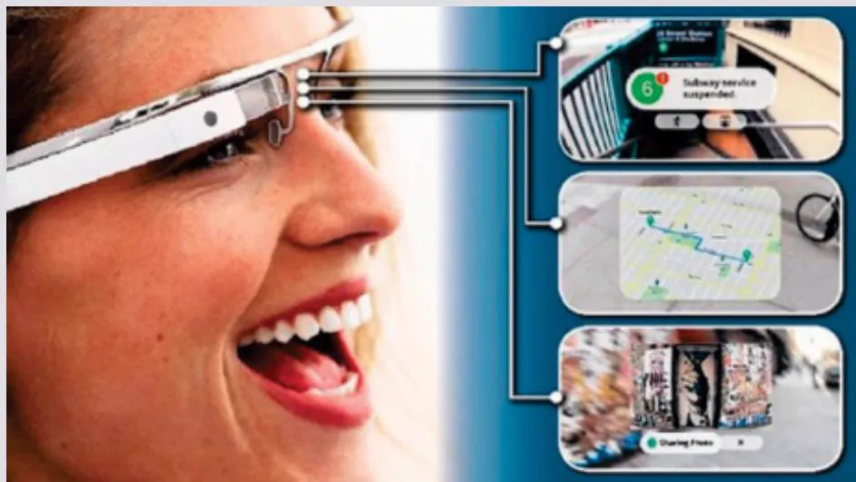  
Source: Google Inc.

However, being in the company of someone wearing a Google Glass was felt by many to be unnerving, as the wearer looked up and to the right to view what was on the glass screen rather than looking at you and  into your eyes. One of the criticisms of wearers of Google Glass was that it made them appear to be staring into the distance. Others were worried that those wearing Google Glass were recording everything that was happening in front of them. As a reaction, a few bars and restaurants in the United States implemented a “no Glass” policy to prevent customers from recording other patrons.

(Continued)

The original Google Glass was retired after a couple of years. Since then, other types of smart glasses have come onto the market that sync a user’s smartphone with the display and camera on the glasses via Bluetooth. These include Vuzic Blade, which has a camera onboard and voice control that is connected to Amazon Echo devices, along with the provision of turnby-turn navigation and location-based alerts; and Snap’s Spectacles (see previous section).

Another interesting design concept was the Talking Shoe, which talked to people in a humorous way when wearing them as they went about their everyday activities. See youtu.be/VcaSwxbRkcE.

# Research and Design Considerations

A core design concern specific to wearable interfaces is comfort. People need to feel comfortable wearing clothing that is embedded with technology. It needs to be light, small, not get in the  way, fashionable, and  (with  the  exception  of the  displays)  preferably hidden in the clothing. Another related issue  is hygiene. Is it possible to wash or clean  the  clothing once worn? How easy is it to remove the electronic gadgetry and replace it? Where are the batteries going to be placed, and how long is their lifetime? A key usability concern is how the person controls the devices that are embedded in their clothing. Are touch, speech, or more conventional buttons and dials preferable?

A number of technologies can be developed and combined to create wearables including LEDs, sensors, actuators, tangibles, and AR. There is much scope for thinking creatively about when and whether to make something wearable as opposed to mobile. In Chapter 1, we mentioned how assistive technology can be designed to be fashionable in order to overcome stigmas of having to wear a monitoring device (for instance, for glucose levels), substitution (for example, a prosthetic) or amplifying device (for example, hearing aids).

A key design concern for wearables is how best to present the information recorded from various  physiological senses (e.g., heart rate)  back to people wearing them, in a way that is meaningful and can be acted upon. Section 7.2.6 describes some of the visual methods that have been developed for  mobile displays. Other  techniques include using  haptic or multimodal forms of feedback that provide people with different kinds of sensations besides data visualizations.

# 7.2.18  Robots and Drones

Robots have been around for some time, most notably as characters in science-fiction movies, but they also play an important role as part of manufacturing assembly lines, as remote investigators  of hazardous  locations (for  example, nuclear power stations  and  bomb  disposal),

and as search and rescue helpers in disasters (for instance, in forest fires) or faraway  places (like Mars). Console interfaces have been developed to enable humans to control and navigate  robots  in  remote  terrains,  using  a  combination  of  joysticks  and  keyboard  controls together with cameras and sensor-based interactions (Baker et al., 2004). The focus has been on designing interfaces that enable people to steer and move a remote robot effectively with the aid of live video and dynamic maps.

Domestic robots that help with the cleaning and gardening have become popular. Robots are  also  being  developed  to  help  the  elderly  and  disabled  with  certain  activities, such  as picking up objects and cooking meals. Pet robots, in the guise of human companions, have been  commercialized.  Several  research teams  have  taken the “cute  and  cuddly” approach to  designing  robots,  signaling  to  humans  that  the  robots  are  more  pet-like  than  humanlike. For example, Mitsubishi developed Mel the penguin (Sidner and Lee, 2005) whose role was  to  host  events,  while the  Japanese  inventor  Takanori Shibata  first developed  Paro  in 2004, a baby  harp seal that looks like a cute  furry cartoon animal, and whose role was as a companion (see Figure 7.31). Sensors were embedded in the pet robots, enabling them to detect certain human behaviors and respond accordingly. For example, they can open, close, and move their eyes, giggle, and raise their flippers. The robots encourage being cuddled or spoken to, as if they were real pets or animals. The appeal of pet robots is thought to be partially due to their therapeutic qualities, being able to reduce stress and loneliness among the elderly and infirm (see Chapter 6 for more on cuddly robot pets). Paro has since been used to help patients with dementia  to make them feel more at ease and comforted both in care homes (Griffiths, 2014) and family homes (Inoue et al., 2021). It has been found to encourage social behavior among patients who often anthropomorphize it. For example, they might say as a joke “it’s farted on me!” which makes them and others around them laugh, leading to further laughter and joking. This form of encouraging of social interaction is thought to be therapeutic.

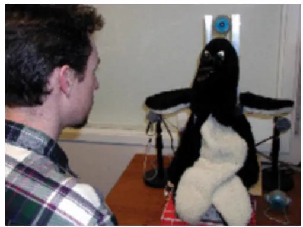

Figure 7.31 (a) Mel, the penguin robot, designed to host activities; (b) Japan’s Paro, an interactive seal, designed as a companion, primarily for the elderly and sick children   
  
Source: (a) Mitsubishi Electric Research Labs (b) Parorobots.com

Watch the video of Robot Pets of the Future at youtu.be/wBFws1lhuv0.

Drones  are  a form  of unmanned  aircraft that  are  controlled  remotely. They  were  first used by hobbyists and then by the military. Since then, they have become more affordable, accessible, and easier to fly. As a result, they have begun to be used in a wider range of contexts. These include entertainment, such as carrying drinks and food to people at festivals and parties. More recently, they have been used to drop medical supplies and all manner of groceries, from coffee to melons. People can order something on their phone and within minutes a parcel is released and lowered on a dangling piece of string in front of their house. Drones have also been used in the entertainment industry, for example, Firefly Drone Shows that are increasingly replacing conventional firework displays. They work by being preprogrammed, choreographed, and automated by a computer, and can even be recharged during shows.

Drones have also been used in the agricultural and construction industries, such as flying them over buildings or vineyards to collect data in the form of video footage  and photographs (see Figure 7.32). They have also been used to track poachers in wildlife  parks in Africa (Preece, 2016). Compared with other forms of data collection, they can fly low and stream photos to a ground station where the images can be stitched together into maps and then used to determine the health of a crop or when is the best time to harvest the crop.

  
Figure 7.32 A drone being used to survey the state of a vineyard Source: Drone inspecting vineyard / Shutterstock

Watch the video of a Firefly drone firework display at www.youtube.com/ watch?v=tcoIUd9Y3-w.

# Research and Design Considerations

An ethical  concern is whether it is acceptable to create robots that exhibit  behaviors  that humans will consider to be human- or animal-like. While this form of attribution also occurs for agent interfaces (see Chapter 3), having a physical embodiment—as robots do—can make people suspend their disbelief even more, viewing the robots as pets or humans.

This raises the moral question as to whether such anthropomorphism should be encouraged. Should robots be designed to be as human-like as possible, looking like us with human features, such as eyes and a mouth, behaving like us, communicating like us, and emotionally responding like us? Or, should they be designed to look like robots and behave like robots, for instance, vacuum cleaner  robots that serve a clearly  defined purpose? Likewise, should the interaction be designed to enable people to interact with the robot as if it were another human being, for example, by talking to it, gesturing at it, holding its hand, and smiling at it? Or, should the interaction be designed to be more like human–computer interaction, in other words, by pressing buttons, knobs, and dials to issue commands?

For many people, the cute pet approach to robotic interfaces seems preferable to one that seeks to design them to be more like fully fledged human beings. Humans know where they stand with pets and are less likely to be unnerved by them and, paradoxically, are more likely to suspend their disbelief in the companionship they provide.

Another ethical concern is the appropriation of drone technology. While there are many good uses that they have been used for, as mentioned earlier, they have also been used in more nefarious ways, such as spying on people (e.g., filming remotely inside people’s homes). More generally, there is the moral question of whether it is acceptable to use drones to take images or videos of fields, towns, and private property without permission or people knowing what is happening. Drones are also being used increasingly as lethal autonomous weapons (i.e., killer robots), which select and engage targets without any meaningful human  control. There  are many who oppose this development and think that they should be banned (for example, see Russell, 2022).

# 7.2.19  Brain–Computer Interfaces

Brain–computer  interfaces  (BCI)  provide  a  communication  pathway  between  a  person’s brain  waves  and an  external  device, such  as a  cursor on  a  screen or  a tangible  puck  that moves via airflow. The person is trained to concentrate on the task (for example, moving the cursor or the puck). Several research projects have investigated  how this  technique can be used to assist and augment human cognitive or sensory-motor functions. The way BCIs work is by detecting changes in the neural functioning of the brain. Our brains are filled with neurons that comprise individual nerve cells connected to one another by dendrites and axons. Every time we think, move, feel, or remember something, these neurons become active. Small electric signals rapidly move from neuron to neuron, which to a certain extent can be detected by electrodes that are placed on a person’s scalp. The electrodes are embedded in specialized headsets, hairnets, or caps.

BrainGate is a kind of BCI that has been developed to enable people who are paralyzed to control robots and be able  to move a cursor on a computer screen displaying  the letters of the alphabet (see Figure 7.33). A study found that after training participants were able to “point and click” on letters—similar to using a computer mouse—to type specific sentences (Pandarinath et al., 2017). On average, they could type nearly 8 words per minute.

  
Figure 7.33 A brain-computer interface being used by a woman who is paralyzed to select letters on a screen (Pandarinath et al., 2017)

Source: Brown University

Watch a video of a woman who is paralyzed moving a robot with her mind at youtu.be/ogBX18maUiM.

Brain–computer interfaces have also been developed for entertainment purposes, in particular, to control various games. For example, Brainball was developed as a game to be controlled by players’ brain waves in which they compete to control a ball’s movement across a table by becoming more relaxed and focused. Other possibilities include controlling a robot and being able to fly a virtual plane. Another development in the fields of neuroscience and bioengineering is to transfer neural signals from one person’s brain to another. This is called a brain-to-brain interface (BBI). Xiao Fang and colleagues (2021) have been exploring how this  way  of transferring  information  from  one  brain  to  another  could  be  used  in  playful experiences. To this end, they have developed a wearable headset that collects EEG data from one person’s brain that they then label and categorize into various states, before delivering it to another person’s brain, via a form of brain stimulation. The brain states are categorized

as “concentrating,” “focused,” “motor activity,” “stressed,” “excited,” “relaxed,” or “bored.” The goal is to see if they can literally transfer one person’s state of mind to someone else. If the  system detects, for example, that one person has a high level of concentration, it stimulates a specific part of another person’s cortex to try to increase their level of focused attention. Do you think this is possible and ethical?

To test this, Fang et al. ran a user study, where groups of three  participants were asked to play a card game together, wearing the BBI  system headsets that were all connected. They found that the participants would try to guess the cards each other had on receiving electrical stimulation  via the BBI. It was not clear whether they could change the  state of each other’s brains, but the study findings suggested that this kind of playful mind guessing can add a whole new dimension to playing games. Other researchers are also trying to develop technology that can read people’s minds. Neuralink, for example, is in the business of developing implantable brain–computer interfaces, with the goal of being able to determine what people are thinking.


Source: Tim Cordell / Cartoon Stock

# Research and Design Considerations

NextMind has developed a noninvasive brain-sensing device intended for the mass market to enable users to play games and control electronic and mobile devices in real time using just their thoughts. An ethical concern with these kinds of advancements in brain-computer interfaces, however, is whether it is socially accepted for a machine to be able to work out what someone is thinking. Our thoughts have always been private, and making them interpretable by machines, which in turn could be accessed and read by other people, raises new concerns. Trying to guess what someone is thinking in a simple card game is one thing, but being able to read your friend’s mind who is thinking how bored they are of being with you may be a step too far. There is also the concern with how accurate BCI is in what it infers to be someone’s thoughts. The system might infer you are  thinking one  thing when you are  thinking about something quite different.

Besides  playing games, much of the  research into brain–computer interfaces has been motivated by helping people who are paralyzed interact with the world. A design challenge is determining what is the best way to lay out letters and words on a digital screen so that the

(Continued)

target space for each letter is sufficiently wide enough to allow for it to be selected while still ensuring all the relevant letters appear on the screen. The use of AI and predictive text could also be used as part of the training so the BCI learns more about how the paralyzed person is trying to communicate.

# 7.2.20  Smart Interfaces

The  motivation  for many  new  technologies  is  to make them  smart, whether  it  is  a smartphone,  smartwatch,  smart  building,  smart  home,  or  smart  appliance  (for  example  smart lighting, smart speakers, or virtual assistants). The adjective is often used to suggest that the device has some intelligence and it is connected to the Internet. More generally, smart devices are designed to interact with other devices connected to a network, many of which are automated (Silverio-Fernández et al., 2018). The goal is to make them context-aware, that is, to understand what is happening around them and execute appropriate actions. To achieve this, some have been programmed with AI so that they can learn the context and a person’s behavior. Using  this intelligence, they  then  change  settings  or  switch  things  on  according to the person’s assumed preferences. An example is the smart Nest thermostat that was designed to learn from a householder’s behavior.

Smart buildings have been designed to be more energy efficient and cost effective. Architects are motivated to use state-of-the-art sensor technology to control building systems, such as ventilation, lighting, security, and heating. Often, the inhabitants of such buildings are considered to be the ones at fault for wasting energy, as they may leave the lights and heating on overnight when not needed, or they forget to lock a door or window. One benefit of having automated systems take control of building services is to reduce these  kinds of human errors—a phrase often used by engineers is to take the human “out of the loop.”While some smart buildings and homes have improved how they are managed and cut costs, they can also be frustrating to the inhabitants, who sometimes would like to be able to open a window to let fresh air in or raise a blind to let in natural lighting. Taking the human out of the loop means that these operations are no longer available. Windows are locked or sealed, and heating is controlled centrally.

Instead  of simply  introducing  ever  more  automation that takes  the human  out  of the loop further, an alternative perspective is to consider the needs of the inhabitants in conjunction with introducing smart technology.

# Research and Design Considerations

A  new approach to considering smart interfaces that focuses on humans is called human– building interaction (HBI). It is concerned with understanding and shaping people’s experiences with, and within, built environments (Alavi et al., 2019). Current research is concerned with human  values, needs, and priorities when addressing people’s interactions with smart environments.

James Landay (2019) argues that we need to be mindful of whether the smart interfaces we are designing amplify our actions and remain attentive to our goals or whether they are

geared towards  accomplishing tasks autonomously. In terms of research considerations, he argues that we will need new metaphors to make understanding and using smart interfaces easier, just as the desktop, windows, and icon metaphors did for the GUI. What might these be? Should they, likewise, be based on everyday objects and activities or should they be more aligned with human qualities? Giving a robot a particular personality type, such as an extrovert or introvert, can be engaging and make them more appealing to people (Whittaker et al., 2021). One  of the benefits  of imbuing smart technologies, like speakers and robots, in this way is that it can promote user trust and acceptance. As there are many kinds of personalities to choose from, a design question is how to represent different ones at the interface so people can readily understand and like them.

# 7.2.21  Shape Changing Interfaces

Shape-changing interfaces employ physical shape  change as input  and  output to systems. A well-known example is a physical 3D bar chart that is positioned in a grid where a matrix of 3D rods move up and down to convey changes in a digital dataset. This type of dynamic physical representation has been found to help people with visualization tasks, including annotation, filtering, organization, and navigation (Alexander et al., 2018). Shape-changing interfaces have also been developed as a form of dynamic  material to explore novel interaction possibilities. Figure 7.34, for example, has been programmed using inFORM to show the shape of a car that can be felt by placing a hand over it. These kinds of shape-changing interfaces provide a different way of interacting with content compared with reading and touching digital displays.

Figure 7.34 inFORM: A shape-changing interface that uses a series of motor-controlled pins to render digital content in the form of 3D rods; developed by MIT Media Group   
  
Source: trackr-media.tangiblemedia.org/publishedmedia/Projects/2013-inFORM/inFORM%20Collection/4676

Other examples of shape-changing interfaces include data sculptures, tactile cartographic maps,  and “physicalizations.” The  last  of  these  are  physical artifacts  that  are  designed  to encode data in specific materials. An example is Physikit (Houben et al., 2016), which is a physical-digital system comprising a set of physical cubes that convey digital properties and are programmed  to visualize  real-time environmental  data  in the  home, such as  moisture, $\mathrm { C O } _ { 2 }$ , or light levels. An example PhysiCube called PhysiMove has a rotating disk on the top of it that moves clockwise or counterclockwise, depending on the kind of data it receives as input. The  main  benefits of using  these kinds of physical instantiations  of data is  to make the data  more accessible and to enable people  to more readily connect with the context in which the data is being collected or is changing over time (Sauvé et al, 2022). For example, the PhysiCubes are intended to be located in a home setting, such as the living room, which helps with the  interpretation of  the data. Imagine a group  of people  is sitting in  the living room one evening watching the cup final on TV and halfway through the game a house plant based on the PhysiCube disk starts moving clockwise much more rapidly. This indicates high levels of carbon dioxide have been detected. The people in the room can then work out from the context that it is not that the game is boring, causing them to yawn, but that the spike in the $\mathrm { C O } _ { 2 }$ level data is caused by them cheering a lot and, in so doing, exhaling more.

# Research and Design Considerations

Shape-changing interfaces provide  new  opportunities for  experiencing and  exploring data using the sense of touch as well as sight. A research question this raises is, does this facilitate enhanced understanding and engagement with a dataset? In particular, does it give people a better sense of how healthy they are if they can see their step count or heart rate change in this way? Might this be more preferable than seeing 2D or 3D bar charts on a screen?

Design considerations include the optimal size for a grid of physical rods and the optimal  number of physical cubes to design in a set that people can learn and remember what they mean.

# 7.2.22  Holographic Interfaces

Holographic interfaces try to create the illusion of a 3D person being present through taking advantage of the human perceptual system. Advances in projection and display technology have enabled these kinds of digital representations to appear quite convincing. For example, David Nussbaum’s Proto system (see Box 5.4 in Chapter 5) is an innovative form of this kind of “holographic” illusion. The Proto system lets people beam themselves to a remote location and interact with the people there.

Another  form  of  perceptual illusion that makes  virtual avatars appear as  if they  were real  was created  for the  UK  show  Abba Voyage, first  launched in  2022. The  virtual concerts feature avatars (dubbed “ABBAtars”), depicting  the group  as they appeared  in 1977.

The technology used includes three 65-million-pixel screens (massive flat displays that make the  images  projected  look  as  if  they  were  real)  and  motion-capture  technology  (see  Figure 7.35). Many people who have gone to the show are completely blown over by how lifelike they appear.

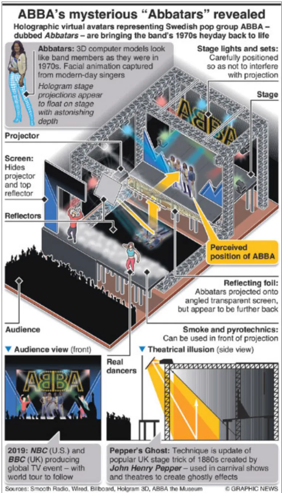  
Figure 7.35 An infographic showing how avatars of the band ABBA were created Source: www.graphicnews.com/en/pages/38425/entertainment-abbas-mysterious-abbatars-revealed-1

# Research and Design Considerations

There is currently much research being conducted in the tech industry exploring what is the best way to represent people in virtual spaces so that they feel comfortable, are engaging to interact with, feel natural, and do not appear creepy (see also discussion in Chapter 5).

Design considerations include what size the holographs should be and how people viewing them can interact and communicate with them being projected into their space.

# 7.3  Natural User Interfaces and Beyond

As we have seen, there are many kinds of interfaces that can be used to design for user experiences. The staple for many years was the GUI, then the mobile device interface, followed by touch, and now wearables and smart interfaces. In the near future, we could see more holographic  interfaces. Without  question,  they  have  been  able  to  support  all  manner  of  user activities. What comes next? Will other kinds of interfaces that are projected to be more natural become more mainstream?

A natural user interface (NUI) is designed to allow people to interact with a computer in the same way that they interact with the physical world—using their voice, hands, and bodies. Instead of using a keyboard, mouse, or touchpad (as is the case with GUIs), NUIs enable users to speak to machines, stroke their surfaces, gesture at them in the air, and smile at them to get a reaction, and so on. The naturalness refers to the use of everyday skills humans have developed and learned, such as talking, writing, gesturing, walking, and picking up objects. In theory, they should be easier to learn and map more readily onto how people interact with the world than compared with learning to use a GUI.

Instead of having to remember which function keys to press to open a file, a NUI means a person  only has  to raise their arm  or  say “open.” But  how natural are  NUIs? Is  it  more natural to say “open” than to flick a switch when you want to open a door? And is it more natural to raise both arms to change a channel on the TV than to press a button on a remote device or tell it what to do by speaking to it? Don Norman (2010) in his controversial paper on NUIs  argues that whether a NUI  is natural  depends on a  number of factors,  including how much learning is required, the complexity of the app or device’s interface, and whether accuracy and speed are needed. Sometimes a gesture is worth a thousand words. Other times, a word is worth a thousand gestures. It depends on how many functions the system supports.

Consider the sensor-based  faucets that were described in Chapter 1. The gesture-based interface works mostly (with the exception of people wearing black clothing that cannot be detected) because  there  are only  two  functions: (1)  turning on  the water by  waving one’s hands under  the tap, and (2) turning off the water by removing  them from  the sink. Now think about other functions that faucets usually provide, such as controlling water temperature and flow. What kind of a gesture would be most appropriate for changing the temperature and then the flow? Would one decide on the temperature first by raising one’s left arm and the flow by raising  one’s right arm?  How would someone know when to stop  raising their  arm to  get  the right  temperature? Would  they  need  to put  a  hand  under  the  tap  to

check? But if they put their right hand under the tap, might that have the effect of decreasing the flow? And when does the system know that the desired temperature and flow has been reached? Would it require having both arms suspended in midair for a few seconds to register that was the desired state? It is a difficult problem on how to provide these choices, and it is probably why sensor-based faucets in public bathrooms all have their temperature and flow set to a default.

Our overview of different  interface types in this chapter  has highlighted  how gestural, voice, and other kinds of interfaces have made controlling input and interacting with digital content easier and more enjoyable, even though sometimes they can be less than perfect. For example, using gestures and whole-body movements have proven to be highly enjoyable as a form of input for computer games and physical exercises. Furthermore, new kinds of gesture, voice, and touch interfaces have made the web and online tools more accessible to those who are visually impaired. For example, the iPhone’s VoiceOver control features have empowered visually  impaired individuals  to be able  to easily send email, use  the web, play music, and so  on, without  having  to buy an  expensive  customized phone  or screen  reader. Moreover, being  able to purchase a regular  phone means not being  singled out for special  treatment. And while some gestures may feel cumbersome for sighted people to learn and use, they may not be so for blind or visually impaired people. The iPhone VoiceOver press and guess feature that reads out what you tap on the screen (for example, “messages,” “calendar,” “mail: 5 new items”) can open up new ways of exploring an application while a three-finger tap can become a natural way to turn the screen off.

In contrast to many of the interfaces we have described, brain-computer interfaces are quite  unnatural as  humans  are  not  used  to  trying  to  control the  world  with  their  minds. Instead, they require considerable training to be used to do even very limited actions, such as selecting a letter appearing on a digital display.

Using brain, body, behavioral, and environmental sensors, it is now possible to capture subtle  changes  in people’s cognitive and emotional  states  in real  time. This opens  up  new doors  in  human–computer  interaction.  In particular,  it  allows for  information  to  be  used as  both continuous  and  discrete  input, potentially enabling  new  outputs  to  match  and be updated  with what  people might  want  and need  at any  given time. Adding AI to  the mix has also enabled new types of interface to emerge that go beyond simply being natural and smart—ones that allow people to work  synergistically with technology  to solve  ever-more complex problems and undertake unimaginable feats.

# 7.4  Which Interface?

This chapter presented an overview of the diversity of interfaces that is now available or currently being researched. There are many opportunities to design for user experiences that are a far cry from those originally developed using the command-based interfaces of the 1970s. An obvious question this raises is, which one and how do you design it? In many contexts, the  requirements  and  opportunities  for  the  user  experience  that  have  been  identified  will determine  what  kind  of interface  might  be  appropriate and  what  features  to include. For example, if a healthcare app is being developed  to enable patients to monitor their dietary intake, then a mobile device that has the ability to scan barcodes and/or take pictures of food items  that  can  be  compared  using  machine  learning  algorithms  with  a  database  of  food

images would be a good interface to use, enabling mobility, effective object recognition, and ease of use. If the goal is to design a work environment to support co-located group decisionmaking  activities,  then  combining shareable  technologies, conversational  agents, and  personal devices that enable people to move fluidly among them would be good to consider using.

But how to decide which interface is preferable for a given task or activity? For example, is multimedia better than tangible interfaces for learning?  Is voice effective as a commandbased interface? Is a multimodal interface more effective than a single media interface? Are wearable interfaces better than mobile interfaces for helping people find information in foreign  cities? How  does VR  differ from  AR, and  which is  the  ultimate  interface for playing games? In what way are tangible environments more challenging and captivating than virtual worlds? And  so  forth. In  practice, which  interface  is  most  appropriate,  most  useful,  most efficient, most engaging, most supportive, and so on, will depend on the interplay of a number of factors, including type of task, the people using the system, context, reliability, social acceptability, privacy, ethical, and location concerns.

# In-Depth Activity

Choose a game that you or someone you know plays a lot on a smartphone (for example, Candy  Crush Saga, Fortnite, or Minecraft). Consider how the  game could be played using different interfaces other than the smartphone’s. Select three different interfaces (for instance, tangible, wearable, and smart speaker) and  describe how the game could be redesigned for each of these, taking into account the user group being targeted. For example, the tangible game could be designed for children, the wearable interface for young adults, and the smart speaker for visually impaired people.

1. Go through the research and design considerations for each interface and consider whether they are relevant for the game setting and what considerations they raise.   
2. Describe a hypothetical scenario of how the game would be played for each of the three interfaces.   
3. Consider specific design issues that will need to be addressed. For example, how will the players interact with the game elements for each of the different interfaces—by using a pen, fingertips, voice, or other input device? How do you turn a single-player game into a multiple player one? What rules would you need to add?   
4. Compare the pros and cons of designing the game using the three different interfaces with respect to how it is played on the smartphone.

# Summary

This chapter provided an overview of the diversity of interfaces that can be designed, identifying key design issues and research questions that need to be addressed. It has highlighted the opportunities and challenges for designers  and researchers who are experimenting with and developing innovative interfaces. It also explained some of the assumptions behind the benefits of different  interfaces—some that are currently  supported  and  others that are still unsubstantiated. The chapter presented a number of interaction techniques that are particularly suited (or not) for a given interface type. It also discussed the dilemmas facing designers when using a particular kind of interface, for example, abstract versus realism, menu selection versus free-form text input, and human-like versus non-human-like. Finally, it presented pointers to specific design guidelines and exemplary systems that have been designed using a given interface.

# Key Points

•  Many interfaces have emerged  since  GUIs,  including  voice, wearable,  mobile,  tangible, brain-computer, smart, robots, drones, and now holographic.   
•  A range of design and research questions need to be considered when deciding which interface to use and what features to include.   
•  Natural user interfaces may not be as natural as graphical user interfaces—it depends on the task, person, and context.   
•  An important concern that underlies the design of any kind of interface is how information is represented to people (be it speech, multimedia, virtual reality, augmented reality) so that they can make sense of it with respect to their ongoing activity, for example, playing a game, shopping online, or interacting with a pet robot.   
•  Increasingly, new interfaces that are  context-aware or monitor people raise ethical issues concerned with what data is being collected and for what is it being used.

# Further Reading

Many practical books have been published on interface design. Some have been revised into second editions. Publishers like New Riders and O’Reilly frequently offer up-to-date books for a specific interface area (for example web or voice). Some are updated on a regular basis, while others are published when a new  area emerges. There  are also a number of excellent online resources, sets of guidelines, and thoughtful blogs and articles.

BERKUN, S.  (2020)  How  Design  Makes  the World. Berkun  Media  LLC. This  illustrated book is highly accessible covering all kinds of design, including appliances, city planning, and software engineering. It examines our everyday experiences such as going to work, shopping for food, and our use  of social media. It  is intended to get the  general public to ask  better questions about the things they buy, use, and make.

DASGUPTA, R.  (2019)  Voice  User Interface  Design:  Moving  from  GUI  to Mixed  Modal Interaction. Apress. This is a guide that covers the challenges of moving from GUI design to mixed-modal interactions. It describes how our interactions with devices are rapidly changing, illustrating this through a number of case studies and design principles of VUI design.

GOOGLE Material Design. material.io/design. This online resource provides a living online document  that  visually  illustrates essential  interface  design principles. It  is  beautifully laid out and very informative to click through all of the  interactive examples that it provides. It shows how to add some physical properties to the digital world to make it feel more intuitive to use across platforms.

KRISHNA, G.  (2015)  The  Best  Interfaces Are  No  Interfaces. New Riders. This  polemical and funny book challenges the reader to think beyond the screen when designing interfaces.

KRUG, S. (2014) Don’t Make  Me Think! (3rd ed.). New Riders Press. The third edition of this very accessible classic guide on web design presents up-to-date principles and examples on web  design with a focus on  mobile usability. It is  highly entertaining with  lots of great illustrations.

NORMAN, D. (2010) “Natural  interfaces  are not  natural,” interactions, May/June, 6–10. This is a thought-provoking essay by Don Norman about what is natural may not appear to be natural, which is still very relevant today.

ROWLAND, C., GOODMAN, E., CHARLIER, M., LIGHT,A., and LUI, A. (2015) Designing Connected Products. O’Reilly. This collection of chapters covers the challenges of designing connected products that go beyond the traditional scope of interaction design and software development. It provides a road map and covers a range of aspects, including pairing devices, new business models, and flow of data in products.

STAIANO, F.  (2022) Designing and Prototyping Interfaces with Figma: Learn essential UX/ UI design principles by creating interactive prototypes for mobile, tablet, and desktop. Birmingham Packt Publishing. This is a hands-on book for someone wanting to learn Figma and use it  to design responsive mobile applications for mobile, tablet and desktop interfaces. It covers the process of creating a complete design using the various Figma tools such as Components, Variants, Auto Layout.


# INTERVIEW with Leah Buechley

Leah Buechley is an associate professor in the  Department  of  Computer  Science  at the University  of New Mexico. Her work explores  the  intersection  of computer  science, art, design, and education. She has a PhD  in  computer science  and  a  degree in physics. She  began  her  studies  as a dance major and has also been deeply engaged in theater, art, and design over the years. She was the founder and director of the highlow tech group at the MIT media lab from 2009  to  2014.  She  has  always  blended the sciences and  the arts in her  education and her career, as witnessed by her current work, which consists of computer science, industrial  design,  interaction  design,  art, and electrical engineering.

# What is the focus of your work?

I’m most interested in changing the culture of  technology  and engineering to  make it more diverse and inclusive. To achieve that goal, I  blend computation  and electronics with a range of different materials and employ techniques drawn from art, craft, and design.  This  approach  leads  to  technologies and learning experiences that appeal to a diverse group of people.

# Can you give me some examples of how you mesh the digital with physical materials?

My creative focus  for  the  last several  years has been computational design—a process in which objects are designed via an algorithm and then constructed with a combination of fabrication and hand building. I’m especially excited  about  computational  ceramics and have been developing a set of tools and tech-

niques that enable people to integrate  programming and hand building with clay.

I also worked on a project called LilyPad Arduino (or LilyPad), which is a construction kit that enables people to embed computers and electronics into fabric. It’s a set of sewable electronic pieces, including microcontrollers, sensors, and LEDs, that are stitched together with conductive thread.  People can  use  the kit to make singing pillows, glow-in-the-dark handbags, and interactive ball gowns.

Another  example  is  the  work  my  former  students  and  I  have  done  in  paperbased  computing.  My  former  student  Jie Qi  developed  a  kit  called  Chibitronics circuit  stickers  that  lets  you  build  interactive  paper-based  projects. The kit  comprises  a set  of flexible  peel-and-stick electronic stickers. You  can connect ultra-thin LEDs,  microcontrollers, and  sensors  with conductive ink, tape, or thread to quickly make beautiful electronic sketches.

The  LilyPad  and  Chibitronics  kits  are now  used by people around  the world  to learn  computing and electronics. It’s been fascinating and exciting to see this research have a tangible impact.

# Why  would  anyone want to  wear a  computer in their clothing?

Computers open up new creative possibilities  for  designers.  Computers  are  simply a  new  tool,  albeit  an  especially  powerful one,  in  a  designer’s toolbox.  They  allow clothing  designers  to make  garments  that are dynamic and interactive. Clothing can, for  example, change  color  in  response  to pollution levels, sparkle when a loved one

calls you on the phone, or notify you when you blood pressure increases.

# How  do  you  involve  people  in  your research?

I engage with people in a few different ways. First, I design hardware and software tools to help people build new and different kinds of technology. The LilyPad is a good example of this kind of work. I hone these designs by teaching workshops to different groups of people. And once a tool is stable, I work hard to disseminate  it to users in the  real world. The LilyPad has been commercially available for many years, and it has  been fascinating and  exciting to see  how  a  group  of realworld  designers—who  are  predominantly female—is using it to build things like smart sportswear,  plush  video  game controllers, soft robots, and interactive embroideries.

I  also  strive  to  be  as  open  as  possible  with  my  own  design  and  engineering explorations.  I  document  and  publish  as much information as I can about the materials, tools, and processes I use. I apply an open source approach not only to the software  and hardware I  create  but, as  much

as  I  can,  to  the  entire  creative  process. I  develop  and  share  tutorials,  classroom and  workshop  curricula,  materials  references, and engineering techniques.

What excites you most about your work? I  am infatuated with materials. There  is nothing  more inspiring  than a  sheet  of heavy paper, a length of wool felt, a slab of clay, or a box  of old  motors. My thinking about  design and  technology is largely driven by explorations of materials  and their affordances. So, materials  are  always delightful. For example, the shape and surface pattern of the cup in Figure 7.36 were computationally  designed.  A  template of the  design was  then laser  cut  and  pressed into a flat sheet or “slab” of clay. Finally, the clay was  folded into shape  and  then fired and  glazed using  traditional  ceramic  techniques. But the real-world adoption of tools I’ve designed and the prospect this presents for changing technology culture is perhaps what’s most exciting. My most dearly held goal is to expand and diversify technology culture, and it’s tremendously rewarding to see evidence that my work is doing that.

Figure 7.36 An example of a computational cup   
  
Source: Used courtesy of Leah Buechley

# Chapter 8

# D A T A  G A T H E R I N G

8.1  Introduction   
8.2  Six Key Issues   
8.3  Capturing Data   
8.4  Interviews   
8.5  Questionnaires   
8.6  Observation   
8.7  Putting the Techniques to Work

# Objectives

The main goals of the chapter are to accomplish the following:

•  Discuss how to plan and run successful data gathering sessions.   
• Enable you to plan and run an interview.   
•  Enable you to design a simple questionnaire.   
• Enable you to plan and carry out an observation.

# 8.1  Introduction

Data  is everywhere. Indeed, it is common to hear people say that we are drowning in data because there is so much of it. So, what is data? Data can be numbers, words, measurements, descriptions, comments, photos, sketches, films, videos, or almost anything that is useful for understanding  a  particular design, stakeholders’ goals, and people’s behavior.  Data  can be quantitative or qualitative. For example, the time it takes someone to find information on a web page and the number of clicks to get to the information are forms of quantitative data. What someone says about the web page is a form of qualitative data. But what does it mean to collect these and other kinds of data? What techniques can be used, and how useful and reliable is the data that is collected?

This  chapter  presents  some  techniques  for data  gathering  that  are commonly  used  in interaction  design  activities.  In  particular,  data  gathering  is  a  central  part  of  discovering

requirements and evaluation. Within the requirements activity, data  gathering is conducted to collect enough information so that design can proceed. Within evaluation, data gathering captures participants’ reactions and their performance with a system or prototype. All of the techniques discussed in this chapter  can be used with little to no programming or technical skills. Techniques for managing huge amounts of data, such as those for scraping large volumes of data from online activities, like Twitter posts, and the implications of their use, are discussed in Chapter 10, “Data at Scale and Ethical Concerns.”

Three  main  techniques  for  gathering  data  are  introduced  in  this  chapter:  interviews, questionnaires, and observation. The next  chapter  discusses  how  to analyze  and  interpret the data collected. Interviews involve an interviewer asking one or more interviewees a set of questions, which may be highly structured or unstructured. Interviews are usually synchronous and are often face-to-face, but they  can be conducted  asynchronously, e.g., via email or  chat, and  are  commonly  conducted  remotely.  Questionnaires  are  a  series  of  questions designed  to be answered  asynchronously, that is, without  the presence  of the  investigator. These questionnaires may be online or paper-based. Observation may be direct or indirect. Direct observation involves observing participants’ activities as they happen. Indirect observation involves making a record of the participant’s activity as it happens, to be studied at a later date. All three techniques may be used to collect qualitative or quantitative data.

Although this is  a small set of basic techniques, they are flexible and can be combined and extended in many ways. Indeed, it is important not to focus on just one data gathering technique, if possible, but to use them in combination so as to avoid biases that are inherent in any one approach.

# 8.2  Six Key Issues

Six key issues require attention for any data gathering session to be successful: goal setting, identifying participants, the relationship  between  the data  collector and the data  provider, ethical considerations of collecting data, triangulation, and pilot studies.

# 8.2.1  Setting Goals

The main reason for gathering data is to glean information about people, their behavior, or their reaction to technology. Examples include understanding how technology fits into family life, identifying which of two  icons  representing “upload  file” is  easier  to understand, and finding out whether the planned redesign for a smart meter is more memorable than the previous design. There are many different reasons for gathering data. Setting specific goals for the study will inform the nature of data gathering sessions, the data gathering techniques to be used, and the analysis to be performed (Robson and McCartan, 2016).

These goals may be expressed more or less formally. For example, in online experiments such as A/B testing, mathematically expressed metrics usually underpin the experiment’s goal, i.e., to evaluate two (or more) design alternatives. Combining several metrics into one evaluation criterion is complex, as discussed by Ron Kohavi et al. (2020), so several metric values may form the basis of the goal. For example, the formula in Figure 8.1 is one of the organizational metrics used for monitoring the performance of Bing’s search engine.

<!-- Chunk 6 End -->


<!-- Chunk 7 Start -->

$$
\text {D i s t i n c t q u e r i e s p e r m o n t h} = n \frac {\text {U s e r s}}{\text {M o n t h}} \times \frac {\text {S e s s i o n s}}{\text {U s e r}} \times \frac {\text {D i s t i n c t q u e r i e s}}{\text {S e s s i o n}}
$$

Figure 8.1  An example organizational metric used in online experiments for Bing’s search engine. The second and third terms on the right side are computed over the month. A session begins with a user query and ends with 30 minutes of inactivity.

Source: Kohavi, R., Tang, D., and Ya, X. (2020) Trustworthy Online Controlled Experiments: a practical guide to A/B testing, Cambridge University Press

A less formal style of study goal may be sufficient for the purpose of testing initial ideas, or for other exploratory studies. For example, Abir Ghorayeb et al. (2021) designed and ran a study with the goal of understanding older people’s views of smart homes and how their experience can influence those views.

Whatever the format, goals for data gathering should be sufficiently well-defined so that it is clear when the goal has been met. How to recognize when a goal has been met will vary according to the technique used.

# 8.2.2  Identifying Participants

The  goals  developed  for the  data gathering  session  will  indicate the  types of  people from whom data is to be gathered. Those people who fit this profile are called the population or study  population. In some cases, these people may be clearly identifiable—perhaps because there  is  a small  group  of stakeholders  and access  to each one  is  easy.  However, it  is  more likely that participants need to be selected from a wider set, and this is called sampling. The situation where  all members  of the population  are  accessible is called  saturation sampling, but this is quite rare. Assuming that only a portion of the population will be involved in data gathering, then there are two options: probability sampling or nonprobability sampling. In the former case, the most commonly used approaches are simple random sampling and stratified sampling; in the latter case, the most common approaches are convenience sampling and volunteer panels.

Random sampling can be achieved by using a random number generator or by choosing every  nth person  in a list. Stratified  sampling relies  on being able  to divide the  population into groups (for example, classes in a secondary school) and then applying random sampling. Both convenience sampling and volunteer panels rely less on choosing the participants and more on the participants being prepared to take part. The term convenience sampling is used to describe a situation where the sample includes those who were available rather than those specifically selected. Another  form of convenience sampling is snowball sampling, in which a current participant finds another participant and that participant finds another, and so on. Much like a snowball adds more snow as it gets bigger, the population is gathered up as the study progresses.

The crucial  difference between  probability  and  nonprobability methods  is  that in  the former  you can apply statistical  tests and generalize to the whole population, while in the latter such generalizations are not robust. Using statistics also requires a sufficient number of participants. Vera Toepoel (2016) provides a more detailed treatment of sampling, particularly in relation to survey data.

Using crowdsourcing to identify participants allows access to a large number of potentially more diverse  participants and has been used to good effect in a range of studies (see Chapters 10 and 14, “Introducing Evaluation”). Specifying the profile of participants is still required; for example, Prolific (a platform for contacting and filtering potential participants) allows screening based on a wide range of characteristics including shopping and consumer habits,  work  situation,  handedness  (left-  or  right-handed),  hobbies,  and  beliefs  (including political and religious beliefs), as well as demographics.

For more information about how to use crowdsourcing in interaction design, see digital.gov/2014/12/09/can-you-crowdsource-your-user-experience-research.

For  more  information  on  the  advantages  and  limitations  of  collecting data  online,  see  researcher-help.prolific.co/hc/en-gb/articles/360009501473- What-are-the-advantages-and-limitations-of-an-online-sample-.

# BOX 8.1

# How Many Participants Are Needed?

A  common question is, how many participants are  needed for a study? In general, having more participants is better because they provide evidence from a wider population, and interpretations of statistical  test results can  be stated with higher confidence. What this means is that any  differences  found among conditions are  more likely to be caused by a genuine effect rather than being due to chance. But a small number of participants is appropriate for in-depth qualitative studies where statistical tests may not be appropriate.

There are many ways to determine how many participants are needed. Four of these are saturation, cost and feasibility analysis, guidelines, and prospective power analysis (Caine, 2016).

Saturation relies on data being collected until no new relevant information emerges, so it is not possible to know the number in advance of the saturation point being reached.   
Choosing the  number of participants based on cost and  feasibility constraints is a practical approach and is justifiable; this kind of pragmatic decision is common in industrial projects but rarely reported in academic research.   
Guidelines may  come from experts  or from “local standards,”  for  instance,  from an accepted norm in the field.   
Prospective power analysis is a rigorous method used in statistics that relies on existing quantitative data about the topic; in interaction design, this data is often unavailable, making this approach infeasible, such as when a new technology is being developed.

Kelly Caine (2016) investigated the sample size (number of participants) for papers published at the international Computer-Human Interaction (CHI) conference in 2014. She found that several factors affected the sample size, including the method being used and whether the data was collected in person or remotely. In this set of papers, the sample size varied from 1 to 916,000, with the most common size being 12. So, it is tempting to say that this suggests that a “local standard” for interaction design is 12, as a rule of thumb. However, this obscures the fact that the nature of the data gathering, its goals, target population, and stage of product development all affect the number of participants required.

# 8.2.3  Relationship with Participants

One significant aspect of any data gathering is the relationship between those doing the gathering and those providing the data. Having a clear and professional relationship and building rapport  with  participants increases  the  likelihood of  a successful study. In many  countries participants must be given sufficient information about the project, the data that will be collected, and how the data is to be used for them to make an  informed decision about  their participation. This informed consent may be given in written form by signing a document or orally via an audio or video recording. The key thing is that evidence of the participant being informed about the study and of them giving consent is captured. Figure 8.2 shows a typical example of a written informed consent form that might be used in the United States or United Kingdom. The details  of this form will vary, but it  usually asks the  participants to confirm that the purpose of the data gathering and how the data will be used has been explained to them and that they are willing to continue. It explains that their data will be private and kept in a secure place. It also often includes a statement that participants  may withdraw at any time  and that  in  this case  none  of  their data  will be  used  in the  study. If  subsequent  data gathering involves audio or video recording, consent may also be given orally. In some institutions, mandatory ethics training is required before approval from an ethics  board will be given to the researchers conducting the study.

The principle of informed  consent protects the interests of both the data gatherer and the data provider. The gatherer wants to know that the data they collect can be used in their analysis, presented to interested parties, and published in reports. The data provider wants reassurance  that  the  information  they  give  will  not  be  used  for  other  purposes  or  in  any context that would be detrimental to them. This is especially true when people with disabilities or  children are  participants. In these cases, parents  are asked to sign the  form. How to establish informed consent may need to be tailored depending on the group of participants. For example, when engaging with professional participants in a commercial setting, a nondisclosure agreement may also be required (Sharp et al., 2022). As with most ethical issues, the important thing is to consider the situation and make a judgment based on the specific circumstances.

Building rapport with participants encourages them to participate in a relaxed manner. Building  rapport  in  a remote  setting  has  particular  challenges, especially  if  the  communication  medium  is  limited, e.g.,  audio only  so  the participant  can’t  be seen. Some  of these challenges relate to missing body language and personal dynamics, and building trust takes longer if the people don’t already know each other (Dray and Siegel, 2004).

How to build rapport and gain acceptance by participant communities differs across situations. For example, Peter Kaulbach et al. (2021) describe the communication conventions adopted between research teams and the Donkerbos San community in Namibia for a number of ongoing projects. This includes communications before arrival at the community and communications during the visit that include a meeting with the local headman, community meetings to greet everyone and share progress related to ongoing projects, and a departure community meeting to review the visit. In their paper, they observe that this is important to build trust and also to understand differing sociocultural norms.

Incentives may be needed to encourage  sufficient numbers of participants to take  part, particularly if there is  no clear advantage  to the respondents. For  example, asking support sales executives to complete a questionnaire about a new app that will impact their activities day-to-day is  a different  proposition from asking school children to evaluate a new  game. Different motivations are at play in these two circumstances, and hence different incentives would be appropriate.

# INFORMED CONSENT FOR the Recycle Project

# Please highlight your choice by clicking inside the appropriate box:

<table><tr><td>I have read and understood the information sheet, or it has been read for me, and I have been able to ask questions about my participation and my questions have been answered to my satisfaction.</td><td>YES□</td><td>NO□</td></tr><tr><td>I consent to be a participant in this study and understand that participation is voluntary and that I will not be paid for my participation.</td><td>YES□</td><td>NO□</td></tr><tr><td>I understand that I can refuse to answer questions I am not comfortable with and that I may withdraw and discontinue participation at any time in this study, up to 2 months after data collection, without giving a reason.</td><td>YES□</td><td>NO□</td></tr><tr><td>I understand that taking part in the study involves being observed while performing given tasks using the RECYCLE app on a smartphone provided to me, and interviewed about its use both individually and in a group.</td><td>YES□</td><td>NO□</td></tr><tr><td>I agree to photos being taken during the observation sessions.</td><td>YES□</td><td>NO□</td></tr><tr><td>I agree to the interview/focus group being audio-recorded and/or written notes being taken.</td><td>YES□</td><td>NO□</td></tr><tr><td>I agree to my activity on the RECYCLE app being recorded and stored in a log file.</td><td>YES□</td><td>NO□</td></tr><tr><td>I understand that information I provide will be used for research and dissemination purposes only.</td><td>YES□</td><td>NO□</td></tr><tr><td>I understand that personal information collected about me that can identify me, such as my name or where I live, will not be shared beyond the study team.</td><td>YES□</td><td>NO□</td></tr><tr><td>I understand that my data will be stored on encrypted devices until the end of the project when it will be destroyed.</td><td>YES□</td><td>NO□</td></tr><tr><td>I understand that my participation will be anonymous and any details that might identify me will not be included in reports or other publications produced from the study.</td><td>YES□</td><td>NO□</td></tr><tr><td>I consent for anonymized quotations from my interview to be used in reports or other publications and presentations.</td><td>YES□</td><td>NO□</td></tr></table>

Name (PRINT):

Date:

Signature:

[Names and contact information for all team members involved in data gathering]

Figure 8.2  Example informed consent form for the Recycle Project, an investigation into the use of a new smartphone app for advising people how best to recycle their rubbish. Participants are also provided with a project information sheet that explains the project, the data gathering to be undertaken, and the use to which their data will be put.

# 8.2.4  Ethical Considerations of Data Collection and Storage

In addition to informed consent to take part in the study, there are various issues relating to data collection and storage that have ethical implications. Lightweight, high-quality recording equipment is readily available nowadays, e.g., through a smartphone, so capturing data is  very easy. People are used to taking photographs and videos in many social settings, and video conferencing systems can automatically take audio and video recordings, or even transcriptions. Screenshots may also be captured with the click of a button, and large amounts of data are available through online activity such as tweets and messaging. However, all data needs  to  be  stored  securely,  and  anyone  who  has  data  about  them  captured  has  to  give informed consent. This last point is straightforward when there’s only a few people involved in  the  sessions, but if  data  gathering takes  place  outside with lots of  people around, what happens  then?  Data  that is  collected  from  specific individuals  can  be  anonymized  before analysis, but  checking what  is in  the data  is important  to ensure  that  the  recordings don’t include unnecessary details that may cause embarrassment or harm if made public.

Where and how the data is stored also needs to be considered. Data must also be stored securely,  but many data storage systems  include facilities that may be physically anywhere in  the  world. The  regulations  covering  access to  this  data  will  depend on  the  jurisdiction where that machine is located, and different countries operate different rules regarding data security. For  example, the European  Union’s General  Data  Protection  Regulation  (GDPR) came  into force  in  May 2018. It  applies  to all  EU organizations  and  offers the individual unprecedented control over their personal data. Keeping a recording on the laptop used for data collection may be convenient, but is that laptop encrypted? What happens if it is left on the train?

Projects and organizations that collect personal data that can identify someone need to demonstrate that it is protected from unauthorized access. For example, they need to demonstrate that data is anonymized, names of participants  and their data are kept separately, physical records are kept in a locked cupboard, and digital media are encrypted. Data management plans are often written to prompt data gatherers to consider these issues, as well as whether and how data will be shared with other researchers and projects.

For more information about GDPR and data protection law in Europe and the United Kingdom, see ico.org.uk/for-organisations/ guide-to-the-general-data-protection-regulation-gdpr.

# 8.2.5  Triangulation

Triangulation is a term used to refer to the investigation of a phenomenon from (at least) two different  perspectives  (Denzin,  2006;  Jupp,  2006).  Four  types  of  triangulation  have  been defined (Jupp, 2006).

• Triangulation of data means that data is drawn from different sources at different times, in different places, or from different people (possibly by using a different sampling technique).   
Investigator triangulation means that different researchers (observers, interviewers, and so on) have been involved in collecting and interpreting the data.

• Triangulation of theories means the use of different theoretical frameworks through which to view the data or findings.   
•  Methodological triangulation means to employ different data gathering techniques.

The  last of these is  the most  common form of triangulation—to validate the  results of some inquiry by pointing to similar results yielded through different perspectives. However, validation  through true  triangulation is  difficult  to achieve. Different  data  gathering  techniques result in different kinds of data, which may or may not be compatible. Using different theoretical  frameworks  may  or  may  not  result  in  complementary  findings,  but  achieving theoretical triangulation requires the theories to  have similar philosophical  underpinnings. Using more than one data gathering technique, and more than one data analysis approach, is good practice because it leads to insights from the different approaches even though it may not be achieving true triangulation.

A different kind of triangulation emphasizes the verification and reliability of data. This is referred to as checking for “ground truth.” It is commonly used in studies involving large amounts  of  data  such  as  crowdsourcing  and  machine  learning  to  check  that  the  data  is authentic and reliable. But identifying ground truth is not straightforward. Self-reported (or human-labeled) data is  often regarded  as ground truth in some  domains, but the accuracy of human labeling is unclear. For example, Nan Gao et al. (2021) investigate the reliability of self-reported data for identifying a person’s mental state, as this is  often used as ground truth when building machine learning prediction models in this domain. Their findings indicate that  physiologically measured  engagement  and  perceived  engagement  are  not  always consistent.

For an example of methodological triangulation, see medium.com/ design-voices/the-power-of-triangulation-in-design-research-64a0957d47d2.

# 8.2.6  Pilot Studies

A pilot study is intended to test elements of the main study to identify potential problems in advance  so  that  they can  be corrected. A  pilot study is  often a small  trial run  of the  main study with a limited  number of participants. For example, the equipment and  instructions may be checked, the questions for an interview or in a questionnaire may be tested for clarity, and an  experimental procedure  may be confirmed. Checking that the expected data can be obtained from the study design is also a reason for running a pilot.

Pilot studies  are an  accepted part  of qualitative studies, but the  results  of pilot studies are often not reported (Malmqvist et al., 2019), so their use is sometimes obscured. In contrast, Omid Mohaddesi and Casper Harteveld (2020) present the results of their pilot study into the use of game-based systems to investigate human decision-making. This pilot study was  not just a limited version of the  main study; rather, it  focused on  the gaming  environment itself to see if it would form a suitable platform for subsequent experiments. They had specific questions to address through this pilot: whether disruption affected users’ behavior; whether providing  different  amounts  of  information affected  their  behavior;  and whether players interacted with all of the game’s interface elements.

If it is difficult to find participants or access to them is limited, asking colleagues or peers to participate may be an  alternative for a pilot study. Note that anyone involved in a pilot study cannot be involved in the main study itself. Why? Because they will know more about the study, and this can distort the results.

# BOX 8.2

# Data, Information, and Conclusions

There  is an important difference between  raw data, information, and  conclusions. Data is what you collect; this is then analyzed and interpreted and conclusions drawn. Information is gained from analyzing and interpreting the data, and conclusions represent the actions to be taken based on the information. For example, consider a study to determine whether a new screen layout for a local leisure center has improved the user’s experience when booking a swimming lesson. In this case, the data collected might include a set of times to complete the booking, comments regarding the  new screen layout, biometric readings of the  user’s heart rate while booking a lesson, and so on. At this stage, the data is raw. Information will emerge once this raw data has been analyzed and the results interpreted. For example, analyzing the data might  indicate that people who have been using the  leisure  center for more than five years find the  new layout frustrating and take longer to book, while those  who have been using it for less than two years find the new layout helpful and can book lessons more quickly. This indicates that the new layout is good for newcomers but not so good for long-term users of the leisure center; this is information. A conclusion from this might be that a more extensive help system is needed for more experienced users to become used to the changes.

# 8.3 Capturing Data

Some forms of data gathering, such as questionnaires, diaries, interaction logging, scraping, and collecting work artifacts, are self-documenting, and no further capturing is necessary. For other techniques, however, there is a choice in recording approaches. The most common of these  are taking  notes, photographs, recording  audio, and  recording  video. Often, several data  recording  approaches  are  used  together.  For  example,  an  interview  may  be  audio recorded, and then to help the interviewer in later analysis, a photograph of the interviewee or  their  surroundings  may  be  taken  to  remind  the  interviewer  about  the  context  of  the discussion.

Which data recording approaches are used will depend on the goal of the study and how the data will be used, the context, the time and resources available, and the sensitivity of the situation; the choice of data recording approach will affect the level of detail collected and how intrusive the data gathering will be. In most settings, audio recording, photographs, and notes will be sufficient. In others, it is essential to collect video data so as to record the details of activity and its context.

Capturing data is easy as recording devices are light and cheap, and digital technologies permeate every human activity. But focusing only on relevant data needs some thought and

planning. In addition, as informed consent for data gathering is required, accidentally capturing someone in the background of an interview session or taking a photograph that includes unnecessary details of someone’s context should be avoided. This can be particularly difficult in some cases such as an in-the-wild study in the home. Apart from the ethical issues of data capture and storage discussed previously, capturing more data than the study requires can be time-consuming and error-prone to sort through. Three common data recording approaches are discussed next.

# 8.3.1  Notes Plus Photographs

Taking notes (by hand or by typing) is the least technical and most flexible way of capturing data, even if it seems  old-fashioned. Handwritten notes  may be transcribed in whole or in part, and while this may seem tedious, it is usually the first step in analysis, and it gives the analyst a good overview of the quality and contents of the data collected. Tools exist for supporting data collection and analysis, but  the advantages of handwritten notes  include that using pen and paper can be less intrusive than typing and is more flexible, for example, for drawing  diagrams  of  work  layouts. Furthermore, researchers  often  comment  that  writing notes helps them to focus on what is important and starts them thinking about what the data is telling them. The disadvantages of notes include that it can be difficult to capture the right highlights, and it can be tiring to write and listen or observe at the same time. It is easy to lose concentration, biases creep in, handwriting can be difficult to decipher, and the speed of writing is limited. Working with a colleague can reduce some of these problems while also providing another perspective.

Photographs, screenshots, and short videos of artifacts, events, and the environment can supplement notes and hand-drawn sketches.

# 8.3.2  Audio Plus Photographs

Audio recording is a useful alternative to note-taking and is less intrusive than video. During observation, it allows observers to focus on the activity rather than on trying to capture every spoken word. In an interview, it  allows  the  interviewer to pay more  attention to the  interviewee rather than trying to take notes as well as listening. It isn’t always necessary to transcribe all of the data collected—often only sections are needed, depending on the goals of the study. Many studies do not need a great level of detail, and instead recordings are used as a reminder and as a source of anecdotes for reports. It is surprising how evocative audio recordings of people or places  from  the data session  can be, and those  memories provide  added context to the analysis. If audio recording is the main or only data collection technique, then the quality needs to be good. In practice, this means making sure that the recording device is located  away  from  any  loud  machinery  or  air  conditioning  unit  and,  if  data  gathering remotely, testing connections and acoustics. Many videoconferencing environments such as Zoom and Teams allow direct recording of a session, and some generate transcriptions, either as live captions that are displayed in a side panel or as a transcription from the recording. The accuracy of transcription varies between the live captions and later transcription but is pretty good at 80–90 percent. Accuracy is affected by background noise, and the clarity and volume of the speaker’s voice. This kind of automated captioning has made transcription much easier for researchers because they  don’t have to transcribe by hand  from audio anymore. Audio recordings are often supplemented with photographs.

# 8.3.3  Video

Smartphones can be used to collect short video clips of activity; they can be handheld  and create good-quality output. But sometimes a video is needed for long periods of time, e.g., in a lab study, or a researcher can’t be present in the space, e.g., in a trauma unit of a hospital. In these cases, a dedicated recording device may provide a wider range of recording options, and the researcher won’t have to concentrate on holding the phone. Several issues need to be considered  (Nassauer  and  Legewie,  2022;  Heath  et  al.,  2010)  when  choosing  and  placing a camera.

• Deciding which  camera(s)  to  use. There  are many  options  for  video  cameras including wearable body  cameras, 360-degree cameras, and  standard camcorders. How many and which combination is best depends on the focus of the study. Wearable cameras allow filming of the participant’s point of view, while a 360-degree camera captures the full context of activity.   
• Deciding whether to use  fixed  or flexible settings. A  camera may be in  a fixed  location with constant angle and zoom settings, or it may be more flexible with options to change the zoom  and  focus. This  decision also  depends on  whether  the  researcher  will  remain in  charge  of  the  camera  (physically  present  or  remotely)  or  if  it  will  be  left  to  record automatically.   
Deciding where to point the  camera(s) in order to capture what is required. This is a key decision, and it helps to plan the setup and camera locations in advance. If performing a study in the wild, it is beneficial to explore the likely activities and context for a short time before starting to video record in order to become familiar with the environment. Involving the participants themselves in deciding what and where to record also helps to capture relevant action and is particularly significant in some private settings such as the home.   
• Understanding the impact of the recording on participants. It is often assumed that video recording will have an impact on participants and their behavior. However, it is worth taking an empirical approach to this issue and examining the data itself to see whether there is  any  evidence  of  people  changing their  behavior  such  as  orienting themselves  toward the camera.

# ACTIVITY 8.1

Imagine that you are developing a new augmented reality garden planning tool to be used by amateur and professional garden designers. The goal is to find out how garden designers use an early prototype as they walk around their clients’ gardens asking the clients about what they like and how they and their families use the garden. What are the advantages and disadvantages of the data-capturing approaches (notes plus photographs, audio plus photographs, and video recording) in this environment?

# Comment

Handwritten notes and sketches do not require specialized equipment. Creating them is unobtrusive and flexible but difficult to do while walking around a garden. If it starts to rain, there

(Continued)

is no equipment to get wet, but notes may get soggy and difficult to read (and write!). Garden planning is a highly visual, aesthetic activity, so supplementing notes and sketches with photographs would be appropriate.

Video captures more information, for example, continuous panoramas of the landscape, where are garden ornaments and trees, what the designers are looking at, comments from the clients, and so on, and can be used by the designer as a reminder of the garden layout. But video capture is more intrusive and will also be affected by the weather. Short video sequences recorded on a smartphone may be sufficient as the video is not going to be analyzed in detail. Audio plus photographs may be a good compromise, but synchronizing audio with activities such as looking at sketches and other artifacts later can be tricky and error prone.

# 8.4 Interviews

Interviews can be thought of as a “conversation with a purpose” (Kahn and Cannell, 1957). How much like an ordinary conversation the interview will be depends on the type of interview. There are four main types of interviews: open-ended or unstructured, structured, semistructured, and  group interviews. The first three  types  are named according  to how much control  the  interviewer  imposes  on  the  conversation  by  following  a  predetermined  set  of questions. The fourth type, which is often called a focus group, involves a small group guided by a facilitator. The facilitation may be quite informal or follow a structured format.

The most appropriate approach to interviewing depends on the purpose of the interview, the questions to be addressed, and the interaction design activity. For example, if the goal is to gain impressions about people’s reactions to a new design concept, then an informal, openended interview is often the best approach. But if the goal is to get feedback about a particular design feature, such as the layout of a new web browser, then a structured interview or questionnaire is often better. This is because the goals and questions are more specific in the latter case. Interviewees are sometimes asked to bring items such as documents, photographs, or key objects to the interview, which are used to explain specific points.

# DILEMMA

# What They Say and What They Do

What users say isn’t always what they do. People sometimes give the answers that they think show them in the best light, they may have forgotten what happened, or they may want to please the  interviewer by answering  in the  way they think  will satisfy  them. This may  be problematic  when the  interviewer and  interviewee don’t  know each other, especially if the interview is being conducted remotely by Zoom, Cisco Webex, or another digital conferencing system.

For example, Yvonne Rogers et al. (2010) conducted a study to investigate whether a set of twinkly lights embedded in the floor of an office building could persuade people to take the  stairs rather than the  lift (or  elevator). In interviews, participants told the  researchers that they did not change their behavior, but logged data showed that their behavior did, in fact, change significantly. So, can interviewers believe all of the  responses they get? Are  the respondents telling the truth, or are they simply giving the answers that they think the interviewer wants to hear?

It isn’t possible to avoid this behavior, but an interviewer can be aware of it and reduce such biases by choosing questions carefully, by getting a large number of participants, or by using a combination of data gathering techniques.

# 8.4.1  Unstructured Interviews

Open-ended or unstructured  interviews are at one end of a spectrum of how much control the interviewer has over the interview process. They are exploratory and are similar to conversations;  they  often  go  into considerable depth. Questions  posed  by  the interviewer  are open, meaning that there is no particular expectation about the format or content of answers. For example, the first question asked of all participants might be: “What are the advantages and disadvantages of using a wearable?” Here, the interviewee is free to answer as fully or as briefly as they  want, and both the interviewer  and interviewee can steer the interview. For example, often the interviewer will say: “Can you tell me a bit more about.... ” This is referred to as probing.

Despite  being unstructured  and open, the interviewer  needs a plan  of the main  topics to be covered so that they can make sure that all of the topics are discussed. Going into an interview without a plan should not be confused with being open to hearing new ideas (see section 8.4.5, “Planning and Conducting an Interview”). One of the skills needed to conduct an unstructured interview is getting the balance right between obtaining answers to relevant questions and being prepared to follow unanticipated lines of inquiry.

A benefit of unstructured interviews is that they generate rich data that is often interrelated and complex, that is, data that provides a deep understanding of the topic. In addition, interviewees may  mention issues  that  the interviewer  has not  considered. A lot of unstructured  data is  generated, and the  interviews  will not  be  consistent  across participants  since each interview takes on its own format. Unstructured interviews can be time-consuming to analyze, but they can also produce rich insights. Themes can be identified across interviews using techniques from grounded theory and other analytic approaches, as discussed in Chapter 9, “Data Analysis, Interpretation, and Presentation.”

# 8.4.2  Structured Interviews

In structured interviews, the interviewer asks predetermined questions similar to those in a questionnaire (see section 8.5, “Questionnaires”), and the same questions are used with each participant  so  that  the  study  is  standardized.  The  questions  need  to  be  short  and  clearly worded, and they are typically closed questions,  which means that they require an  answer from a predetermined set of alternatives. (This may include an “other” option, but ideally this would not be chosen often.) Closed questions work well if the range of possible answers is

known or if participants don’t have much time. Structured interviews are useful only when the goals are clearly understood and specific questions can be identified. Example questions for a structured interview might be the following:

• “Which  of  the  following  apps  do  you  use  most  frequently:  Prime  Video,  GoogleTV, or Netflix?”   
• “How often do you watch streamed content: every day, once a week, once a month, less often than once a month?”   
“Do you ever purchase anything online: Yes/No? If your answer is Yes, approximately how often do you purchase things online: every day, once a week, once a month, less frequently than once a month?”

Questions  in a  structured interview  are worded  the same for each  participant and  are asked in the same order.

# 8.4.3  Semi-Structured Interviews

Semi-structured interviews  combine features of structured and unstructured interviews and use both closed and open questions. The interviewer has a basic script for guidance so that the same topics  are covered with each interviewee. The interviewer  starts with preplanned questions and then probes the interviewee to say more until no new relevant information is forthcoming. Here’s an example:

Interviewer: Which music websites do you visit most frequently?

Interviewee: Mentions several but stresses that they prefer hottestmusic.com.

Interviewer: Why?

Interviewee: Says that they like the site layout.

Interviewer: Tell me more about the site layout.

Interviewee: Silence, followed by an answer describing the site’s layout.

Interviewer: Anything else that you like about the site?

Interviewee: Describes the animations.

Interviewer: Thanks. Are there any other reasons for visiting this site so often that you haven’t mentioned?

It is important not to pre-empt an answer by phrasing a question to suggest that a particular answer is expected. For example, “You seemed to like this use  of color…” assumes that this is the case and will probably encourage the interviewee to answer that this is true so as not to offend the interviewer. Children are particularly prone to behave in this way. The body language of the interviewer, for example  whether they  are smiling, scowling, looking disapproving, and so forth, can have a strong influence on whether the interviewee will agree with a question, and the interviewee needs to have time to speak and not be rushed.

Probes are a useful device for getting more information, especially neutral probes such as “Do you want to tell me anything else?” and prompts that remind interviewees if they forget terms or names help to move the interview along. Semi-structured interviews are intended to be broadly replicable, so probing and prompting aim to move the interview along without introducing bias.

# 8.4.4  Focus Groups

Interviews are often conducted with one interviewer and one interviewee, but it is also common to interview people in groups. One form of group interview that is sometimes used in interaction  design activities is  the focus  group. Normally, three  to ten  people  are  involved, and the discussion is led by a trained facilitator. Participants are selected to provide a representative  sample of the target population. For example, in the evaluation of an  interactive university  campus map, a  group of  administrators, faculty, students, and  potential visitors may  form  three separate focus groups  because they  use the map  for different purposes. In requirements activities, a focus group may be held in order to identify conflicts in expectations or terminology from different stakeholders.

  
The focus group hated it.So he showed it toanout-of-focus group.   
Source: Mike Baldwin / Cartoon Stock

The benefit of a focus group is that it allows diverse viewpoints to be raised that might otherwise be missed, for example, in the requirements activity to understand multiple points within a collaborative process or to hear different user stories (Unger and Chandler, 2012). The technique is appropriate for investigating shared issues rather than individual ones, and participants are encouraged to put forward their own perspectives. A preset agenda is developed  to guide  the  discussion,  but  there  is  sufficient  flexibility  for  the  facilitator  to  follow unanticipated issues as they are raised. The facilitator guides and prompts discussion, encourages quiet people to participate, and stops verbose ones from dominating the discussion. The discussion  is usually recorded for later analysis, and participants may be invited to explain their comments more fully at a later date.

The downside of focus groups is that they require careful facilitation in order to keep on track, and they can suffer from “groupthink” where people get side-tracked by  one or two participants’ opinions. It  was recognized a long time ago  that they  should not  be the only source of information about user behavior (Nielsen, 1997).

The format  of focus groups  can  be adapted to the participants  and  their context. For example, in their study of older adults’ use of smart home technology, Abir Ghorayeb et al. (2021)  held  the focus  groups within  the smart home environment  to allow for  real-world

examples to be used in discussions. In another study, Elizabeth Warrick et al. (2016) adapted the focus  group  structure to work  with  the Mbeere  people of Kenya. The study  aimed to find out how water was being used, any plans for future irrigation systems, and the possible role of technology in water management. The researcher met with the elders from the community, and the focus group took the form of a traditional Kenyan “talking circle,” in which the  elders  sit  in a circle  and each person  gives  their opinions  in turn. The  researcher,  who was from the Mbeere community, knew that it was impolite to interrupt or suggest that the conversation needed to move along, because traditionally each person speaks for as long as they want.

# 8.4.5  Planning and Conducting an Interview

Planning an interview involves developing the set of questions or topics to be covered, collating any documentation to give to the interviewee (such as consent form and project description), checking that recording software and equipment works, structuring the interview, and organizing a  suitable  time and  location. If  the  interview  is  in-person, bringing  snacks  and drinks can help create a relaxed environment.

# Developing Interview Questions

The  following  guidelines  help  in  developing  interview  questions  (Robson  and  McCartan, 2016):

• Long  or  compound  questions  can  be  difficult  to  remember  or  confusing,  so split  them into separate questions. For  example, instead of “How do  you like this smartphone app compared with previous ones that you have used?” say, “How do you like this smartphone app?” “Have you used other smartphone apps?” If so, “How did you like them?” This is easier for the interviewee to respond to and easier for the interviewer to record.   
Interviewees may  not understand  jargon or complex language  and might  be too  embarrassed to admit it, so explain things to them in straightforward ways.   
• Try  to keep questions neutral, both when preparing the interview script and in conversation  during  the  interview  itself. For example,  if  you ask, “Why  do  you like this  style of interaction?” this question assumes that the person does like it and will discourage some interviewees from stating their real feelings.

# ACTIVITY 8.2

Several devices are available for reading ebooks, watching movies, and browsing photographs (see Figure 8.3). The design differs between makes and models, but they are all aimed at providing a comfortable user experience.

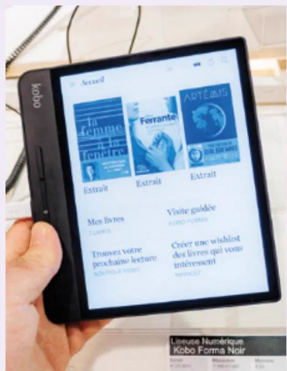  
(a)

  
(b)

  
(c)

(d)   
Figure 8.3  (a) Kobo’s eReader, (b) Amazon’s Kindle, (c) Apple’s iPad, and (d)  Samsung Galaxy phone   
  
Source: (a) Hadrian/Shutterstock, (b) Helen Sharp, (c) Mark Lennihan / AP Images, and (d) Helen Sharp

The developers of a new device for reading ebooks want to find out how appealing it will be to young people aged 14–16, so they have decided to conduct some interviews.

(Continued)

1. What is the goal of this data gathering session?   
2. Suggest ways of capturing the interview data.   
3. Suggest a set of questions for an unstructured interview that seeks to understand the appeal of reading ebooks to young people in the 14–16 year old age group.   
4. The results of the initial interviews indicate that an important acceptance factor is whether the  device can be handled  easily. The developers have designed an initial  prototype and want to conduct further interviews to evaluate how easy is the device to handle. Write a set of semi-structured interview questions for this evaluation. Run a pilot interview with two people and ask them to comment on the questions. Refine your questions based on their comments.

# Comment

1. The  goal is to understand what makes  devices  for reading  ebooks appealing  to people aged 14–16.   
2. Audio recording will be less cumbersome and  distracting than taking notes, and all the important points will be captured. Video recording is not needed in this initial interview as it isn’t necessary to capture any detailed interactions. However, it would be useful to take photographs of any devices referred to by the interviewee.   
3. Possible questions include  the  following: Why  do you  read ebooks?  Do you  ever read print-based  books? If so, what makes  you choose to read a digital  versus a print-based format? Do you find reading an ebook comfortable? What device do you usually use to read an ebook? Why do you use that device?   
4. Semi-structured  interview  questions  may  be open or closed-ended.  Some closed-ended questions that you might ask include the following:

•  Have you used any kind of device for reading ebooks before?   
•  Would you like to read an ebook using this device?   
•  In your opinion, is the device easy to handle?

Some open-ended questions, with follow-on probes, include the following:

•  What do you like most about the device? Why?   
•  What do you like least about the device? Why?   
•  Please give me an example  of where  the  device was  uncomfortable  or difficult  to handle.

It is helpful when collecting answers to closed-ended questions to list possible responses together with boxes  that can be checked. Here’s one way to convert  some of the questions from Activity 8.2:

1.  Have you used a device for reading ebooks before? (Explore previous knowledge.)

Interviewer checks box: □ Yes □ No □ Don’t remember/know

2.  Would you like to read an ebook using a device designed specifically for it? (Explore initial reaction; then explore the response.)

Interviewer checks box: □ Yes □ No □ Don’t know

3.  Why?

If response is “Yes” or “No,” interviewer asks, “Which of the following statements represents your feelings best?”

For “Yes,” interviewer checks one of these boxes:

■ I don’t like carrying heavy books.   
■ This is fun/cool.   
■ My friend told me they are great.   
■ It’s the way to read books nowadays.   
■ Another reason (interviewer notes the reason).

For “No,” interviewer checks one of these boxes:

■ I don’t like using gadgets if I can avoid it.   
■ I can’t read the screen clearly.   
■ I prefer the feel of paper.   
■ Another reason (interviewer notes the reason).

4.  In your opinion, is the device for reading ebooks easy to handle or cumbersome?

Interviewer checks one of these boxes:

■ Easy to handle   
■ Cumbersome   
■ Neither

# Running the Interview

Before starting the interview, it is important  to check that the interviewee has received and read any project information sheet and has completed the informed consent form. Interviewees must be given the chance to ask any questions they have regarding any aspect of the process. This can often be done through email exchange before the day of the interview but can also be confirmed at the start of the interview. During the interview, it’s important to listen more than to talk, to respond with sympathy but without bias, and to enjoy the exchange. The following is a common sequence for an interview (Robson and McCartan, 2016):

1.  An introduction in  which the interviewer  introduces themselves and  explains why they are doing the interview. Documentation for the interview is checked, and the interviewee is given a chance to ask questions and agree to being recorded. This should be exactly the same for each interviewee.   
2.  A warm-up session where straightforward questions come first. These may include questions about demographic information, such as “What area of the country do you live in?”   
3.  A main session in which the questions are presented in a logical sequence, with the more probing ones at the end. In a semi-structured interview, the order of questions may vary between participants, depending on the course of the conversation, how much probing is done, and what seems more natural.   
4.  A cooling-off period consisting of a few straightforward questions such as “Is there anything else you’d like to tell us?”   
5.  A closing session in which the interviewer thanks the interviewee and stops any recording, signaling that the interview has ended.

The following video highlights five common interviewing mistakes: www.nngroup .com/videos/interview-mistakes-to-avoid.

# 8.4.6  Doing Interviews Remotely

Conducting remote interviews has become common in recent years, and high-quality videoconferencing  systems make  remote interviewing  a good  alternative to  face-to-face interactions. Advantages of remote focus groups and interviews include the following:

. The participants are in their own environment and are more relaxed.   
•  Participants don’t have to travel or be concerned about any health or safety issues.   
. Participants don’t need to worry about what they wear.   
• For interviews involving sensitive issues, interviewees can remain anonymous, especially if audio-only channels are utilized.

In addition, participants can leave the conversation whenever they want to by just cutting the connection, which adds to their sense of security. From the interviewer’s perspective, a wider set of participants can be reached easily, but potential disadvantages include that the facilitator does not have a good  view of the interviewees’  body language, and participants may be tempted to multitask rather than focus on the session at hand.

For more information and helpful guidance on remote interviewing, see www .uxbooth.com/articles/remote-user-interviewing-basics.

# ACTIVITY 8.3

Conducting interviews remotely is different  from conducting them face-to-face, but  what are  those  differences? Take a look at the  guidance provided at www.uxbooth.com/articles/ remote-user-interviewing-basics, and  suggest how  you  would approach a  remote interview differently from a face-to-face session.

# Comment

Identifying participants and preparing the questions and documentation for the interview follows the same process as for face-to-face sessions. The additional issues to consider include:

•  The technology to be used. Will participants have suitable equipment and know how to use it? Does it support the interaction needed, e.g., playing video or sharing screens? Does it support data recording?   
•  Building rapport. Making a connection with the interviewee  is much harder through  an online medium unless people already know each other.   
Context. If the interviewee is in an environment with other people, a video recording of the interview may pick up others walking around in the background. This would be a potential breach of data protection rules. The interviewee may also be interrupted by others such as a delivery person ringing the doorbell during the interview.

Conducting  focus  groups  remotely  presents  further  challenges  because  of  the need  to manage participation with several people. Here a combination of digital technologies may be deployed to engage participants in different ways. For example, use a videoconferencing system combined with support for collaborative activities such as brainstorming, mindmapping, and diagramming. Tools commonly used in combination with Zoom or Teams include Miro, Mural, and Jamboard. Structuring the focus group around collaborative activities using these tools helps to create a dynamic environment. Facilitating this kind of online experience is tiring, however, so shorter sessions may be easier to handle.

# 8.4.7  Enriching the Interview Experience

Whether  conducted  in a  face-to-face  or remote  setting,  interviews  can  benefit  from  using artifacts relevant to the goal of the study as a focus for discussion. These props can provide context for the interviewer and interviewees and help to ground the data in concrete examples. Example props are personas, prototypes, or scenarios (examples of these are covered in Chapter  11,  “Discovering  Requirements,”  and  Chapter  12,  “Design,  Prototyping,  and Construction”). Figure 8.4 illustrates the use of personas in a focus group setting.

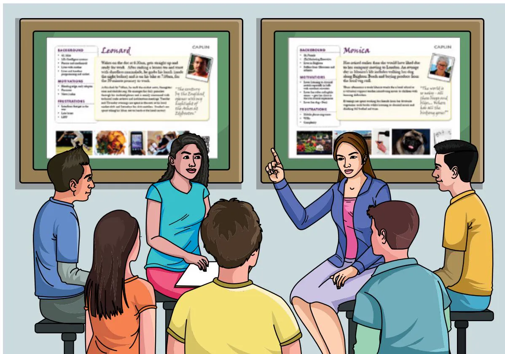  
Figure 8.4  Enriching a focus group with personas displayed on the wall for all participants to see

Almohannad Albastaki et al. (2020) investigated the feasibility of using a virtual experience  prototype  to  augment  remote  interviews. They  investigated  robotic  expressions  with design  experts using a  nonimmersive  virtual  reality simulation. In their  study, participants were  asked  to  explore  a  simulation  of  an  urban  robot  operating  in  an  alleyway  at  night

while providing think-aloud. The robot had 64 individual lighting components to present the expressions. Immediately afterward the participants were interviewed briefly (7–10 minutes) about their experience. The researchers identified several lessons about using virtual prototypes for remote evaluations. For example, they found that evaluations with such prototypes can  have  ecological  validity,  i.e.,  can  produce  results  that  are  similar  to  those  conducted with real robots, for some research questions, and that using a videoconferencing environment to record the participants’ activity reduced the amount of equipment required to capture the data.

# 8.5 Questionnaires

Questionnaires are a well-established technique for collecting demographic data and people’s opinions. Similarly to interviews, questions may be closed or open-ended. Once a questionnaire is  produced, it  can be  distributed to many  participants  without significant resources. Because of this, a larger set of data can be collected than would normally be possible in an interview study.

Questionnaire  questions and structured  interview questions  are similar, so which  technique is  used  when?  Essentially, the  difference  lies  in the  motivation  of the  respondent  to answer the questions. If their motivation is high enough to complete a questionnaire without any encouragement, then a questionnaire is more efficient. On the other hand, if the respondents need some  persuasion to answer the questions, a structured interview  format may get more responses. For example, structured interviews work better than questionnaires where people are on the move, such as at a train station  or while walking to their next  meeting. Another consideration is that an interviewer can choose which interviewees to approach and make sure they match the participant criteria.

However, interviews require ongoing researcher resource, but it can be harder to develop good  questionnaire  questions  compared  with  structured  interview  questions  because  the interviewer is not available to clarify any ambiguities.

# 8.5.1  Questionnaire Structure

Many questionnaires start by asking for demographic information such as gender, ethnicity, age, and details of relevant experience. Background information about a participant is useful for putting the questionnaire responses into context, provided it is relevant to the study goal. For  example,  a  conflict  between  two  responses  may  be  explained  by  different  levels  of experience—people using a banking app for the first time are likely to express different opinions  than others  with  many years’  experience of  such apps. However, a person’s height  is unlikely to be relevant to their responses about social media use.

Specific questions relating to the study’s goal usually come next. These questions may be subdivided into related topics to make it easier and more logical to complete.

The following is a checklist of general advice for designing a questionnaire:

•  Think  about  the ordering  of  questions. The  impact  of  a  question  can  be  influenced  by question order.   
Consider  whether  different  versions  of  the  questionnaire  are  needed  for  different populations.

• Provide  clear instructions  on  how  to complete  the questionnaire, for  example, whether answers  can  be  saved  and  completed  later. Aim  for  both  careful  wording  and  good typography.   
. Think about  the length  of the questionnaire, and avoid questions that don’t address  the study goals.   
• If the questionnaire has to be long, consider allowing respondents to opt out at different stages. It is usually better to get answers to some sections than no answers at all because of dropout.   
• Think about questionnaire layout and pacing; for instance, strike a balance between using white space, or individual web pages, and the need to keep the questionnaire as compact as possible.

# 8.5.2  Question and Response Format

There are different formats of question and response. Questionnaires are often constructed with closed-ended questions giving a range of answers, including a “no opinion” or “none of  these” option. Sometimes, it is better  to  ask for answers  within  a range. Selecting  the most appropriate question and response format makes it easier for respondents to answer clearly  and for analysis to  be focused. It’s also  important to use negatively phrased questions carefully and avoid double negatives as they can be confusing and may lead to false information.

# Ranges and Predefined Lists of Responses

Responses to some questions fall within a predictable range or list. Nationality, for example, has a finite number of alternatives, and asking respondents to choose from a predefined list makes  sense for  collecting this  information. A similar  approach  can  be  adopted  if  participants’ ages are needed, although respondents are often asked to specify their age as a range rather  than a specific number. For  other questions  several options  may  be chosen, such  as which news channels a participant listens to regularly. In online surveys, questions with a list of responses, where only one can be chosen conventionally, use  radio buttons  to select [see Figure $8 . 5 ( \mathrm { a } ) ]$ , while lists where several  can be chosen use  check boxes  [see Figure 8.5(b)]. Alternatively, options  may be displayed as a drop-down menu that appears when the question is clicked (Figure 8.5(c)).

A common design error arises when the ranges overlap. For example, specifying two age ranges as 15–20 and 20–25 will cause confusion; which box do people who are 20 years old choose? Making the ranges 15–19 and 20–24 avoids this problem.

A  frequently asked question  about  ranges is  whether the interval  must  be equal  in all cases. The answer is no—it depends on what you want to know. For example, people redesigning a mortgage advice website might be particularly interested in the opinions of adults under 26. The question could, therefore, have just three ranges: 17 and younger, 18–25, and 26 and older. In contrast, seeing how the population’s political views vary across generations might  require 10-year  cohort groups for people older than 21, in which case the following ranges would be appropriate: 20 and younger, 21–30, 31–40, and so forth.

What is your age?

$\textcircled{6}$ 20 and under   
$\bigcirc$ 21-30   
$\bigcirc$ 31-40   
$\bigcirc$ 41-50   
$\bigcirc$ 51 and over

(a)

Which news channels do you subscribe to?

Sky News   
✓ BBC News   
$\boxed { \checkmark }$ Al Jazeera   
$\boxed { \begin{array} { r l } \end{array} }$ Euro news   
CNN news   
□ Other. Please specify:

(b)

  
Figure 8.5  (a) Radio buttons are used when only one option can be selected. (b) Check boxes are used when several options can be selected. (c) A drop-down menu for currency.

(c)

Source: Microsoft Corporation

# Rating Scales

There  are  a  number  of  different  types  of  rating  scales,  each  with  its  own  purpose  (see Oppenheim, 2000). Two commonly used scales are the Likert and semantic differential scales. Their purpose  is  to elicit a  range of  responses to  a question  that  can  be  compared  across respondents. They are good for getting people to make judgments, such as how likely they are to recommend a product.

Likert  scales  rely  on  identifying  a  set  of  statements  representing  a  range  of  possible opinions, while semantic  differential  scales  rely on  choosing pairs  of words  that  represent the range of  possible opinions. Likert  scales are more  commonly used  because identifying

suitable  statements that  respondents will  understand consistently  is  easier  than identifying semantic pairs that respondents interpret as intended.

# Likert Scales

Likert scales are used for measuring opinions, attitudes, and beliefs, and consequently they are widely used for evaluating user satisfaction with products. For example, users’ opinions about the use of color in an interface could be evaluated with a Likert scale using a range of numbers, as in question 1 here, or with words, as in question 2:

1.  The use of color is excellent (where 5 represents strongly agree and 1 represents strongly disagree):

<table><tr><td>1</td><td>2</td><td>3</td><td>4</td><td>5</td></tr><tr><td>□</td><td>□</td><td>□</td><td>□</td><td>□</td></tr></table>

2.  The use of color is excellent:

<table><tr><td>Strongly disagree</td><td>Disagree</td><td>Undecided</td><td>Agree</td><td>Strongly agree</td></tr><tr><td>□</td><td>□</td><td>□</td><td>□</td><td>□</td></tr></table>

In both cases, respondents would be asked to tick one of the boxes, numbers, or phrases. Designing a Likert scale involves the following steps:

1.  Gather a pool of short statements about the subject to be investigated. Examples are “This control panel is clear” and “The procedure for checking credit rating is too complex.” A brainstorming session with peers is a good way to identify key aspects to be investigated.   
2.  Decide on the scale. There are three main issues to be addressed here: How many points does  the scale need? Should  the scale be discrete  or continuous? How  can  the scale be represented? See Box 8.3 What Scale to Use? for more on this.   
3.  Select items for the final questionnaire, and reword as necessary to make them clear.

# Semantic Differential Scales

Semantic differential scales explore a range of bipolar attitudes about a particular item, each of  which is  represented  as a pair  of  adjectives. The  participant  is  asked  to choose  a  point between the two extremes to indicate agreement with the poles, as shown in Figure 8.6. The score for the investigation is found by summing the  scores for each bipolar pair. Scores are then computed across groups of participants. Notice that in this example the poles are mixed so that good and bad features are distributed on the right and the left. In this example, there are seven positions on the scale.

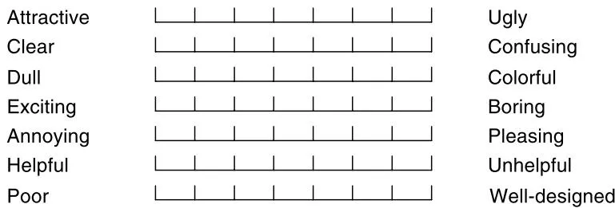  
Figure 8.6  An example of a semantic differential scale

# BOX 8.3

# What Scale to Use?

Questionnaire scales come in various sizes: three, five, seven, nine, or even 100-point scales. Advocates of long scales argue that they help to show discrimination. Rating features on an interface is more difficult  for most people than, say, selecting among different flavors of ice cream, and when the task is difficult, there is evidence to show that people “hedge their bets.” Rather than selecting  the  poles of the  scales, respondents  tend to select values nearer the center. The counterargument is that people cannot be expected to discern accurately among points on a large scale, so any scale of more than five points is unnecessarily difficult to use. Using an odd number of points provides a clear central point, while an even number forces participants to decide and prevents them from sitting on the fence.

James Lewis and Oğuzhan Erdinç (2017) investigated the properties of 7- and 11-point scales versus a continuous (visual analog or VAS) scale that asks respondents to place a mark on a line, and translates into a 101 point scale, i.e., 0–100. They concluded that there were no differences in reliability, concurrent validity, and sensitivity between the three scale types, so there aren’t any particular measurement advantages associated with using a 7-point, 11-point, or VAS scale.

When designing a scale, one rule of thumb is to use a small number, such as 3, when the possibilities are limited, as in Yes/No/Don’t know type answers, a medium-sized range, a 5 or 7, when making judgments that involve like/dislike or agree/disagree statements, and a longer range, such as 9 or 100, when asking respondents to make subtle judgments, such as “level of appeal” of a computer game character. Whatever size scale, capturing responses is best done by check boxes for discrete choices, and a continuous scale for finer judgments.

# ACTIVITY 8.4

Spot four poorly designed features in the excerpt from a questionnaire on the use of fitness trackers in Figure 8.7.

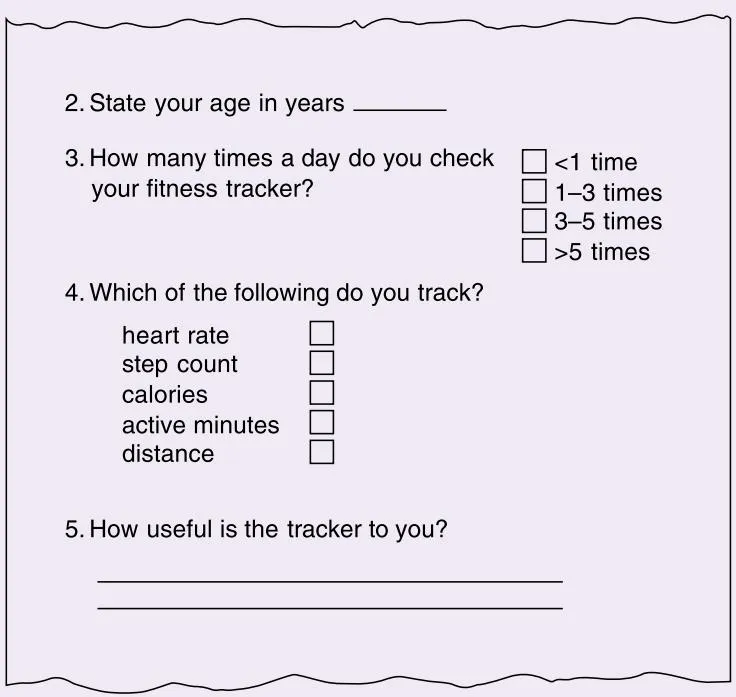  
Figure 8.7  A questionnaire with poorly designed features

# Comment

Some of the features that could be improved upon are as follows:

•  Question 2  requests an exact  age. Many people prefer not to give this information  and would rather position themselves within a range.   
•  In question 3, the number of times a day  the fitness tracker is checked is indicated with overlapping scales, that is, 1–3 and 3–5. How would someone answer if they check it three times a day?   
•  In question 3, the check box suggests that respondents can select several options.   
•  For question 4, the questionnaire doesn’t provide an “other” option.   
•  The final question 5 is open-ended but is also rather vague. This is likely to result in a number of disparate responses. A better open-ended question might be “What actions, if any, do you take in response to the fitness tracker’s measurements?” Alternatively, this question could be used with a Likert scale from “not useful” to “very useful.”

Many online survey tools prevent simple design errors such as overlapping scales, but not all do, and checking for these and other simple errors is good practice.

# 8.5.3  Administering Questionnaires

Reaching a representative sample of participants and ensuring a reasonable response rate are key to a successful study. For large surveys, potential respondents need to be selected using a sampling technique. However, interaction designers commonly use a small number of participants, often fewer than 20. Completion rates of 100 percent are often achieved with these small samples, but with larger or more remote populations, ensuring that surveys are returned

is a well-known problem. A 40 percent return is generally acceptable for many surveys, but much  lower rates  are common.  Depending on  the audience,  incentives  may  be needed  to secure a reasonable return rate (see section 8.2.3, “Relationship with Participants”).

While  questionnaires are most commonly online, paper questionnaires are still used in some  situations,  for  example,  if  the  context  of  data  collection  is  a  public  place  or  if  the study participants and researchers are co-located. Occasionally, short questionnaires are sent within the body of an email if, for example, the participant population is not able to access the online survey system. Other media can also be used to deliver questionnaires. For example, Saeed Safikhani  et  al. (2021) designed  and deployed  a questionnaire  relating  to a VR game within the VR  environment  itself, resulting  in a  combination  of digital and physical (VR) interactions being needed to complete it.

Online questionnaires are interactive and can include check boxes, radio buttons, pulldown and pop-up menus, help screens, graphics, or videos (see Figure 8.8). They can also provide immediate data validation; for example, the entry must be a number between 1 and 20 and automatically skip questions that are irrelevant to some respondents, such as questions aimed only at teenagers. Other advantages of online questionnaires include faster response rates and automatic transfer of responses into a database for analysis (Toepoel, 2016).

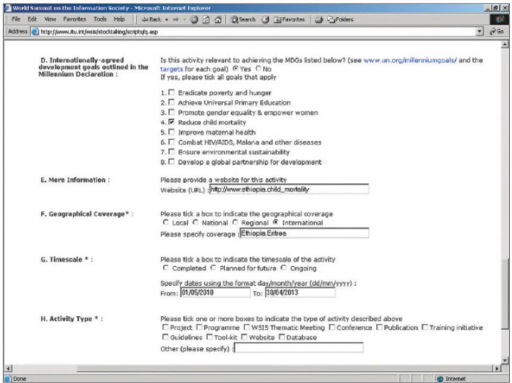  
Figure 8.8  An excerpt from a web-based questionnaire showing check boxes, radio buttons, and pull-down menus

Source: Microsoft Corporation

When using online questionnaires, it is difficult to obtain a random sample of respondents; online questionnaires usually rely on convenience sampling, and so claims of generalization are affected.

Deploying  an  online  questionnaire  involves  the  following  steps  (Toepoel,  2016, Chapter 10):

1.  Plan the survey timeline. If there is a deadline, work backward from the deadline and plan what needs to be done on a weekly basis.   
2.  Design the questionnaire offline. Using plain text is useful as this can then be copied more easily into the online survey tool.   
3.  Program  the  online  survey. How  long  this will  take  depends  on  the complexity  of  the design, for example, how  many navigational paths it contains  or if it has  many interactive features.   
4.  Test the survey, both to make sure that it behaves as envisioned and to check  the questions themselves. This includes getting feedback from content experts, survey experts, and potential respondents. This last group forms the basis of a pilot study.   
5.  Recruit respondents. Participants may have different reasons for taking part in the survey, but especially when respondents need to be encouraged, make the invitations intriguing, simple, friendly, respectful, trustworthy, motivating, interesting, informative, and short.

There are many online questionnaire templates available that provide a range of options, including  different  question  types (for  example open-ended, multiple choice), rating  scales (such as Likert, semantic differential), and answer types (for example, radio buttons, check boxes, drop-down menus).

These templates enable the questionnaire to be administered  widely and allow it to be segmented. For example, airline satisfaction questionnaires often have different sections for check-in, baggage handling, airport lounge, inflight movies, inflight food service, and so forth. If you didn’t use an airport lounge or check your baggage, you can skip those sections. Segmentation avoids respondents getting frustrated by having to go through questions that are not relevant to them. And for the researcher, it ensures that if a respondent opts out for lack of time or gets tired of answering the questions, the data that has been provided already can be used for analysis. The following activity asks you to make use of one of these templates.

# ACTIVITY 8.5

Go to questionpro.com, surveymonkey.com, or a similar survey site and  design your own questionnaire using the set of widgets that is available for a free trial period.

Create an online questionnaire for the set of questions that you developed for Activity 8.2. For each question, produce two different designs; for example, use radio buttons for one design and drop-down menus for the other, and provide a 10-point semantic differential scale for one design and a 5-point scale for the other.

What differences (if any) do you think the two designs will have on a respondent’s behavior? Ask a number of people to answer one or the other set of questions and see whether the answers differ for the two designs.

(Continued)

# Comment

Respondents may have used the response types in different ways. For example, they may select the end options more often from a drop-down menu than from a list of options that are chosen via radio buttons. Alternatively, you may find no difference and that people’s opinions are not affected by the widget style used. Some differences, of course, may be due to the variation between individual responses rather than being caused by features in the questionnaire design. To tease the effects apart, you would need to ask a large number of participants (for instance, in the range 50–100) to respond to the questions for each design.

# 8.6 Observation

Observation is useful at any stage during product development. Early in design, observation helps designers understand people’s context, tasks, and goals. Observation conducted later in development, for example, in evaluation, may be used to investigate how well a prototype supports these tasks and goals.

People may  be observed  directly by  the investigator  as they perform their activities or indirectly through records of the activity that are studied afterward (Bernard, 2017). Observation may also take place  in the wild or in a controlled  environment. In the former case, individuals are observed as they go about their day-to-day tasks in the natural setting. In the latter case, individuals are observed performing specified tasks within a controlled environment such as a usability laboratory.

# ACTIVITY 8.6

To appreciate the different merits of observation in the wild and observation in a controlled environment, read the following scenarios and answer the questions that appear after:

Scenario 1 A usability consultant joins a group of tourists who have each been given a wearable navigation device that fits onto a wrist strap to test on a visit to Stockholm. After sightseeing for the day, they use the device to find a list of restaurants within 2 kilometers of their current position. Several are listed, and they find the phone numbers of a few, call them to ask about their menus, select one, make a booking, and head off to the restaurant. The usability  consultant observes some difficulty operating the  devices, especially on the  move. Discussion with the group supports the evaluator’s impression that there are problems with the interface, but on balance the device is useful, and the group is pleased to get a table at a good restaurant nearby.

Scenario 2 A usability consultant observes how participants perform a preplanned task using the wearable navigation device in a usability laboratory. The task requires the participants to find the phone number of a restaurant called Matisse. It takes them several minutes

to do this, and they appear to have problems. The video recording and interaction log suggest that the interface is quirky and the audio interaction is of poor quality. This is supported by participants’ answers on a user satisfaction questionnaire.

1. What are the advantages and disadvantages of these two types of observation?   
2. When might each type of observation be useful?

# Comment

1. The advantages of observation in the wild are that the observer saw how the device could be used in a real situation to solve a real problem. The disadvantage is that the observer was an insider in the group, so how objective could they be? The data is qualitative, and while anecdotes can be very persuasive, how useful are they? Maybe the observer was having such a good time that their judgment was clouded and they missed participants’ negative comments. Another study could be done, but it is not possible to replicate the exact conditions of this study. The lab study is easier to replicate, so several users can perform the same task, specific usability problems can be identified, participants’ performance can be compared, and averages for such measures as the time it took to do a specific task and the number of errors can be calculated. The observer could also be more objective as an outsider. The disadvantage is that the study is artificial and says nothing about  how the device would be used in a natural setting.   
2. Both types of observation have merits, depending on the goals of the study. The lab study is useful for examining details of the interaction style to make sure that usability problems with the interface are diagnosed and corrected. The other study reveals how the navigation device is used in a natural setting and how it integrates with or changes people’s behavior. According to Kjeldskov and Skov (2014), there is no definitive answer to which kind of study is preferable for mobile devices. They suggest that the real question is when and how to engage with longitudinal, i.e., long-term, in-the-wild studies.

# 8.6.1  Direct Observation in the Wild

It  can  be difficult  for people  to explain  what  they  do  or to  describe accurately  how  they achieve  a task. It is unlikely that an interaction  designer will get a full and true  story using interviews or questionnaires. Observation in the wild can help fill in details about how people behave and use technology and nuances that are not elicited from other forms of investigation.  Understanding  the  context  provides  important  information  about  why  activities happen  the  way  that they  do.  However, observation in  the  wild  can  be  complicated  and harder to do well than as first appreciated. Observation can also result in a lot of data, some of which may be tedious to analyze and not very relevant.

All data gathering should have a clearly stated  goal, but  it is  particularly important  to have a focus for an observation session because there  is always so much going on. On the other hand, it is also important to be prepared to change the plan if circumstances change.

For example, the plan may be to spend one day observing an individual performing a task, but  an  unexpected  meeting  crops up,  which  is  relevant  to  the observation  goal  and  so  it makes sense to attend the meeting instead. In observation, there is a careful balance between being guided by goals and being open to modifying, shaping, or refocusing the study as more is learned  about  the  situation. Being able  to keep this balance  is a skill  that  develops with experience.

# Structuring Frameworks for Observation in the Wild

During an observation, events can be complex and rapidly changing. There is a lot for observers to think about, so many experts have a framework to structure and focus their observation. The framework can be quite simple. For example, this is a practitioner’s framework for use in evaluation studies that focuses on just three easy-to-remember items:

The person: Who is using the technology at any particular time?

The place: Where are they using it?

The thing: What are they doing with it?

Even  a simple framework such as this one can be surprisingly effective to help  observers keep their goals in sight. Experienced observers may prefer a more detailed framework, such as the following (Robson and McCarten, 2016, p. 328), which encourages them to pay greater attention to the context of the activity:

Space: What is the physical space like, and how is it laid out?

Actors: What are the names and relevant details of the people involved?

Activities: What are the actors doing, and why?

Objects: What physical objects are present, such as furniture?

Acts: What are specific individual actions?

Events: Is what you observe part of a special event?

Time: What is the sequence of events?

Goals: What are the actors trying to accomplish?

Feelings: What is the mood of the group and of individuals?

This framework was devised for any type of observation, so when used in the context of interaction design, it might need to be modified slightly. For example, if the focus is going to be on how some technology is used, the framework could be modified to ask the following:

Objects: What physical objects, in addition to the technology being studied, are present, and do they impact on the technology use?

Both of these frameworks are relatively general and could be used in a range of settings or to develop a new framework for a specific study. They also both assume that the observer is  physically co-located  with participants. See  Box 8.4  for  more information  about  online observation.

# ACTIVITY 8.7

1. Find a small group of people who are using any kind of technology, for example, smartphones, household appliances, or computer games, and try to answer the question, “What are  these  people doing?” Watch  for  three  to five minutes, and  write  down what you observe. When finished, note how it felt to be doing this and any reactions in the group of people observed.   
2. If you were to observe the group again, what would you do differently?   
3. Observe this group again for about 10 minutes using the detailed framework given earlier.

# Comment

1. What problems did this exercise highlight? Was it hard to watch everything and remember what happened? How did the people being watched feel? Did they know they were being watched? Perhaps some of them objected and walked away. If you didn’t tell them that they were being watched, should you have?   
2. The initial  goal of the observation, that is, to find out what the  people are  doing, was vague, and chances are that it was quite a frustrating experience not knowing what was significant and what could be ignored. The questions used to guide observation need to be more focused. For example, you might ask the following: What are the people doing with the  technology? Is everyone in the group  using  it? Are they looking pleased, frustrated, serious, happy? Does the technology appear to be central to their activity?   
3. Ideally, you will have felt more confident this second time, partly because it is the second time doing some observation and partly because the framework provided a structure for what to observe.

# Degree of Participation

The degree of observer participation within the study environment varies across a spectrum, varying from insider at one end and outsider at the other. Where a particular study falls along this  spectrum  depends  on  its  goal  and  on  the  practical  and  ethical  issues  that  constrain and shape it.

An observer who adopts an approach right at the outsider end of the spectrum is called a passive observer, and they will not take any part in the study environment at all. It is difficult to be a truly passive observer in the wild, simply because it’s not possible to avoid interacting with people and their activities. Passive observation is more appropriate in lab studies.

An observer who adopts an approach at the insider end of this spectrum is called a participant  observer. This means that they attempt, at various levels depending on the type of study, to become  a member of the group being studied. This can be a difficult role to play

since being an observer also requires a certain level of detachment, while being a participant assumes closer  engagement. As a participant  observer, it is important to keep the two  roles separate so that observation notes are objective while participation is also maintained. It may not be possible to take a full participant observer approach for a range of reasons. For example, the observer may not be skilled enough in the task  at hand, the organization or group may not be prepared for an outsider to take part in their activities, or the timescale may not provide sufficient opportunity to become familiar enough with the task to participate fully. Similarly, if observing activity in a private place such as the home, full participation may be difficult. Chandrika Cycil et al. (2013) overcame this issue in their study of in-car conversations between  parents and  children by  traveling with  the families  initially  for a  week and then asking family members to video relevant episodes of activity when they weren’t there. In this way, they had gained an understanding of the context and family dynamics and then collected more detailed data to study activity in depth.

# Planning and Conducting an Observation in the Wild

The frameworks introduced in  the previous section  are useful for providing  focus and for organizing  the  data  gathering  activity.  Other  decisions  include  the  level  of  participation to adopt, how to capture the data, how to gain acceptance in the group being studied, how to handle  sensitive  issues  such  as  cultural  differences  or  access  to  private  spaces,  and  how to gain different perspectives, e.g., from different people, activities, and roles.

One  way  to  achieve  different  perspectives  is  to  work  as  a  team.  This  can  have  several benefits.

. Each person can agree to focus on different people or different parts of the context, thereby covering more ground.   
Observation  and  reflection  can  be  interwoven  more  easily  when  there  is  more  than one observer.   
•  More reliable data is likely to be generated because observations can be compared.   
Results will reflect different perspectives and hence support triangulation.

Once in the throes of an observation, there are other issues that need to be considered. For example, it will be easier to relate to some people more than others, but attention needs to be paid to everyone in the group. Observation is a fluid activity, and the study will need to be refocused as it progresses in response to what is learned. Having observed for a while, interesting phenomena that seem relevant will start to emerge. Gradually, ideas will sharpen into questions that guide further observation.

Observing is also an intense and tiring activity, but checking notes and reviewing observations regularly, e.g., at the end of each day, allow the separation of personal opinion from observation, and the identification of issues for further investigation. If this is not done, then valuable information may be lost as the next day’s events override the previous day’s findings. Writing a diary or private blog is one way of achieving this. Any artifacts that are collected or copied (such as minutes of a meeting or discussion items) can be annotated, describing how

they are used during the observed activity. Where an observation lasts several days or weeks, time can be taken out of each day to go through notes and other records.

Checking observations and interpretations with an informant or members of the participant group for accuracy is good practice and is sometimes referred to as member checking. This  is  commonly  done  via retrospective  interviews,  that  is,  interviews  that  reflect  on  an activity in the recent past, or via summaries of observations in a team meeting.

# DILEMMA

# When to Stop Observing?

Knowing when to stop doing any type of data gathering can be difficult for novices, but it is particularly tricky in observational studies because there is no obvious ending. Schedules often dictate when your study ends. Otherwise, stop when nothing new is emerging. Two indications of having done enough are when similar patterns of behavior are being seen and when all of the  main stakeholder groups have been observed and a good understanding of their perspectives has been achieved.

# Ethnography

Ethnography has traditionally been used in the social sciences to uncover the organization of societies  and their  activities.  Since  the  early  1990s,  it  has  gained  credibility  in  interaction design, and particularly in the design of collaborative systems (Crabtree, 2003). A large part of most ethnographic studies is direct observation, but interviews, questionnaires, and studying artifacts used in the activities also feature in many ethnographic studies. Digital ethnography has become more popular within technology studies and can involve technology tours, where  a participant  gives the researcher  a  guided tour  of  the technology  in use  (Strengers et al., 2019). A distinguishing feature of ethnographic studies compared with other data gathering  is that  a situation is observed without imposing  any a priori  structure or framework upon it, and everything is viewed as “strange.” In this way, the aim is to capture and articulate the participants’ perspective of the situation under study.

Ethnography allows interaction designers to obtain a detailed and nuanced understanding of people’s behavior and their use  of technology that cannot be obtained by other data gathering techniques (Lazar et al., 2017). While there has been much discussion of how Big Data can address many design issues, Big Data is likely to be most powerful when combined with ethnography to explain how and why people do what they do (Churchill, 2018).

The observer  in  an  ethnographic  study adopts  a  participant  observer  (insider) role  as much as possible (Fetterman, 2020). Ethnographic data is based on what is available, what

is “ordinary,” what  it is  that people do, say, and how they work. The data  collected therefore has  many forms: documents, notes  taken by  the observer(s), photos, and room layout sketches. Notes may include snippets of conversations and descriptions of rooms, meetings, what someone did, or how people reacted to a situation. Data gathering is opportunistic, and observers make the most of opportunities as they present themselves. Interesting phenomena often  do  not  reveal  themselves  immediately  but  only  later, so  it  is  important  to  gather as much as possible within the framework of observation. Initially, spend time getting to know people in the participant group and bonding with them. Participants need to understand why the observers are there, what  they hope  to achieve, and  how long they  plan to be around. Going to lunch with them, buying coffee, and offering small gifts, for example, cookies, can greatly  help this  socialization process. Moreover, key  information  may be revealed  during one of these informal interactions.

It is important to show interest in the stories, gripes, and explanations that are provided and to  be  prepared  to step  back  if a  participant’s  phone  rings  or someone  else  enters the workspace. A good tactic is to explain to one of the participants during a quiet moment what you think is happening and then let  them correct any misunderstandings. However, asking too many questions, taking photos of everything, showing off your knowledge, and getting in their way can be very  off-putting. Recording conversations and taking photos of people doing things during the first session may not be a good idea as participants may feel nervous or self-conscious. Listening and watching while sitting on the sidelines and occasionally asking questions is a better approach.

The following is an illustrative list of materials that might be recorded and collected during an ethnographic study (adapted from Crabtree, 2003, p. 53):

. Activity or job descriptions   
Rules and procedures (and so on) that govern particular activities   
. Descriptions of activities observed   
• Recordings of the talk taking place between parties involved in observed activities   
•  Informal interviews with participants explaining the detail of observed activities   
Diagrams of the physical layout, including the position of artifacts   
Photographs of artifacts (documents, diagrams, forms, computers, and so on) used in the course of observed activities   
Videos of artifacts as used in the course of observed activities   
. Descriptions of artifacts used in the course of observed activities   
. Workflow diagrams showing the sequential order of tasks involved in observed activities   
• Process maps showing connections between activities

The previous  description  focuses on a  situation where  the activity being  studied takes place  in  a  physical  setting,  in  which  case  the  ethnographic  researcher  will  be  physically present. Where  the activity  takes  place  virtually, the  ethnographic  researcher  can  observe the activity online (see Box 8.4). Where activity takes place across both physical and online worlds, this requires a combined approach (Przybylski, 2020).

# BOX 8.4

# Doing Ethnography Online

As collaboration and social activity online have increased, ethnographers have adapted their approach to study  the  various forms  of computer-mediated activity (Rotman  et al., 2013; Bauwens and Genoud, 2014). This practice has various names: online ethnography (Rotman et al., 2012), virtual ethnography (Hine, 2008), netnography (Kozinets, 2020), mobile ethnography (Muskat, 2020) and digital ethnography (Pink et al., 2016). Whether online or offline techniques are used, or a combination of both, depends on the community or activity being studied. Since participant observation  is a hallmark of ethnography, it is not surprising that ethnography is increasingly used to understand people’s behavior in online social spaces both for its own sake and to inform the design of the technology that supports interaction online.

Why  is it necessary  to distinguish  between online and  face-to-face ethnography? It is important because interaction online is different from interaction in person (Winter and Lavis, 2019). For example, communication  in person is richer (through gesture, facial expression, tone of voice, and so on) than online communication, and participants may feel that anonymity is more easily achieved when communicating online. In addition, virtual worlds have a persistence, due to regular archiving, that does not typically occur in face-to-face situations. This makes characteristics of the  communication different, including how ethnographers behave and  how  they report their  findings. Ethical  issues need to be considered for  any  research involving humans and living organisms, but when working online, it can be easy to forget that people exist behind the textual comments and avatars being analyzed. It is therefore important to “listen” carefully, reflect, and remember ethical practices (Winter and Lavis, 2019).

For  observational  studies in large  social spaces, such as digital  libraries  or Facebook, there are different ethical issues to consider. For example, obtaining informed consent requires different tactics, and the presentation of results needs to be modified too. Instead of relying on individuals explicitly agreeing to take part in a study, the researcher must rely on implicit agreement by their continuing to take part. Quotes from participants in the community, even if anonymized in the  report, can easily be attributed by a simple search of the  community archive or the IP address of the sender, so care is needed to protect their privacy.

Special tools may be developed to support ethnographic data collection. Mobilab is an online collaborative platform that was developed for citizens living in Switzerland to report and discuss their daily mobility during an eight-week period using their mobile phones, tablets, and computers (Bauwens and Genoud, 2014). Mobilab enabled the researchers to more easily engage in discussion with participants on a variety of topics, including trucks parking on a bikeway.

# 8.6.2  Direct Observation in Controlled Environments

Controlled observation of participants  may occur within a purpose-built usability lab, or a portable lab. Observation in a controlled environment is more formal than observation in the wild, so it is a good idea to prepare a script to guide how the participants will be greeted, be

told about the goals of the study and how long it will last, and have their rights explained. Using  a script ensures that  each participant  is treated in the  same  way, which  brings more credibility to the results.

The same techniques for capturing data are used for direct observation in controlled settings and in the wild, i.e., photographs, taking notes, video, and audio, but the way in which these techniques are  used is  different. In controlled  settings, the  aim is to  collect details  of what individuals do, while in the wild  the context is  important, and capturing how people interact with each other, the technology, and their environment is key.

Because detail is important in a controlled setting, the arrangement of equipment relative to the participant will be different. For example, if capturing video, one camera might record facial  expressions,  another  might  focus  on  interface  activity,  and  another  might  record  a broad view of the participant to capture body language. The stream of data from the cameras can be fed into a video editing and analysis suite where it is coordinated and time-stamped, annotated, and partially edited.

# The Think-Aloud Technique

One of the problems with observation is that the observer doesn’t know what users are thinking and can only guess from what they see. Observation in the wild should not be intrusive, as this will disturb the context the study is trying to capture, which limits what questions can be asked of the participant. However, in a controlled environment, the observer can be a little more intrusive.

Imagine observing someone in a lab setting, who has  been asked to evaluate the interface of the web search engine Lycos.com. The participant is told to look for an ebike for a 10-year-old child. They are told to type www.lycos.com and then proceed however they think best. They type the URL and get a screen similar to the one in Figure 8.9.

Figure 8.9  Home page of Lycos search engine   
  
Source: Lycos

Next,  they  type  child's  ebike  in  the  search  box. They  get  a  screen  similar  to  the  one shown in Figure 8.10. They are silent. What is going on? What are they thinking? One way

around the problem of knowing what they are doing is to collect a think-aloud protocol, a technique developed by Anders Ericsson  and Herbert Simon (1984) for examining people’s problem-solving  strategies. The technique  requires  people to  say  out  loud  everything  that they are thinking and trying to do so that their thought processes are externalized.

  
Figure 8.10 The screen that appears in response to searching for “child’s ebike”

# LYCOS

child'sebike

SEARCHWEB

# 8 of the Best Electric Bikes for Kids (in 2022) IeBike Choices

# The13 BEST Electric Bikes for Kids[2022]

# 5 Best Electric Bikes For Kids In 2022 (7-14 Years Old)

# Childrens Ebike

# Amazon.co.uk: klds electrlc blke

# E-Bikes Kids l Bikester.co.uk

www.bikester.co.uk/bikes/chlldrens-youth-blkes/e-bilies-kids

# 9 Best Klds Electric Blkes For Toddlers To Teens - Rascal Rides

rgscalrides.com/kids-electric-bikes

Source: www.lycos.com

So, let’s imagine an action replay of the situation just described, as follows, but this time the participant has been instructed to think aloud:

“I’m typing in www.lycos.com, as you told me.” <types>

“Now I am typing child's ebike and then clicking the search button.

<pause and silence>

“It’s taking a few seconds to respond.”

“Oh! Now I have a choice of other websites to go to. Hmm, I wonder which one I should select. Well, I need some help in deciding, so perhaps I should start by looking at a review of ebikes for kids. This one has an up-to-date list of current ebikes. <He clicks on The 13 BEST Electric Bikes for Kids [2022]>

“Gosh, there’s a lot of models to select from, and I need to know what size wheels would suit a 10-year-old. I guess that depends on how long their legs are! Hmm, maybe some of them recommend ages in their specifications.”

<pauses and looks at the screen>

I guess I should scroll through them and identify those that might be appropriate.” <silence…>

Now  you  know  more  about  what  the  participant  is  trying  to  achieve,  but  they  are silent again. They are looking at the screen, but what are they thinking now? What are they looking at?

The  occurrence  of  these  silences  is  one  of  the  biggest  problems  with  the  think-aloud technique.

# ACTIVITY 8.8

Try  a think-aloud exercise yourself. For this exercise, repeat the previous example, but this time use the Google search engine, i.e., use Google to search for ebikes for a 10-year-old child. Think aloud as you try to find what you’re looking for, and notice how you feel and behave.

Afterward, reflect on the experience. Was it difficult to keep speaking all the way through the task? Did you feel awkward? Did you stop talking when you got stuck?

# Comment

Feeling self-conscious and awkward doing this is a common response, and some people say they feel really embarrassed. Many people forget to speak out loud and find it hard to keep going when the task requires concentration. In fact, you probably stopped speaking when the task became demanding, and that is exactly the time when an observer is most eager to hear what’s happening.

If a participant is silent during a think-aloud protocol, the observer could interrupt and remind them to think out loud, but that would be intrusive. Another solution is to have two people work together so that they talk to each other. Working  with another person (called constructive interaction  [Miyake, 1986]) is often more natural  and  revealing  because  participants talk in order to help each other along. This technique has proved to be particularly successful with children, and it also avoids possible cultural influences on concurrent verbalization (Clemmensen et al., 2008).

# 8.6.3  Indirect Observation: Tracking Users’ Activities

Sometimes direct observation is not possible because it is too intrusive, or observers cannot be present because of access restrictions or remote participation, and so activities are tracked indirectly. Diaries and interaction logs are two techniques for doing this.

# Diaries

Participants  are  asked to keep a diary of their activities on a regular basis, including what they did, when they did it, what they found hard or easy, and what their reactions were to the situation. For example, Junchao Lin et al. (2020) conducted a 30-day diary study to identify the security information needs of couples who share digital accounts. They asked 14 participants in a romantic relationship who share digital accounts to complete a diary entry every day. They  collected 382 diary  entries and  529 accounts of  sharing behavior. Through  this they found that sharing facilitates a healthy relationship by enabling joint routines, supporting  collaboration,  and  creating  a  shared information  space,  but  it also  caused  unwanted information sharing such as exposing how much money one partner spent on a product.

Diaries are useful when participants are scattered or unreachable in person, for example in  a hospital intensive care  ward; the  activity  is  private, such as in the  home; or  the  study relates to feelings, for instance, emotions or motivation. For example, Caroline Claisse et al. (2022) used paper diaries to capture self-care practice for seven adults living with HIV over a 12-month period. Their findings highlight how the mundane practices of self-care contribute  to a whole-person  view  on  caring and  may also  empower patient-involved  care. They also report on how the routine of completing a paper diary became part of one participant’s self-care.

Diaries  have several  advantages:  they  do  not  take  up  much  researcher  time to  collect data;  they  do not  necessarily require special  equipment or expertise;  and they are suitable for long-term studies. In addition, templates, like those used in open-ended online questionnaires, can be created online  to standardize the data  entry format  so that the data  can be entered  directly  into  a  database  for  analysis.  However, diary  studies  rely  on  participants remembering  to  complete  them  at  the  assigned  time  and  as  instructed,  so  incentives  and reminder alerts may be needed, and the process has to be straightforward.

Determining  how long to run a diary  study can be tricky. If the study goes on for too long, participants may lose interest and need incentives to continue. In contrast, if the study is too short, important data may be missed. For example, in a study of children’s experiences of a game, Elisa Mekler et al. (2014)  used diaries to collect data after each gaming session in a series. After the first few sessions, all of the children in the study showed loss of motivation for the game. However, by the end of  the study, those who completed  the game were more motivated than those who did not complete the game. Had the data been collected only once, the researchers may not have observed the impact of game completion on the children’s motivation.

Another  problem  is  that  the participants’  memories of  events  may  be  exaggerated  or detail is forgotten; for example, they may remember them as better or worse than they really were  or as taking more or  less time than they actually did take. One way of mitigating this problem is to collect other data in diaries that does not rely on memory, such as photographs, audio and video clips, and artifacts. For example, Helen Sharp et al. (2020) used video diaries  with  novice interaction designers  in Botswana  to understand  the sociocultural factors that were taken into account when designing technologies to support home-based patients. Thirteen categories of sociocultural factors were identified from these video-diaries, and the diaries showed how 10 of them were implemented in prototypes.

The experience sampling method (ESM) is similar to a diary in that it relies on participants recording  information about  their everyday activities. However, it  differs from more traditional diary studies because participants are prompted at random times via email, text

message, or  similar  means  to  answer  specific  questions  about  their  context, feelings, and actions (Hektner et al., 2006; Myin-Germeys and Kuppens, 2022). These prompts have the benefit of encouraging immediate data capture. For example, Mintra Ruensuk et al. (2022) used ESM to identify the emotional state of Instagram users; their notification was designed to arrive immediately they closed Instagram, and the invitation to respond was disabled after five minutes. Niels van Berkel et al. (2018) discuss a key aspect of ESM studies with mobile phones, i.e., when to ask participants questions. They report that scheduling questions when the phone is unlocked yielded a higher response rate and accuracy than other schedules.

# Interaction Logs, Web Analytics, and Data Scraping

Interaction logging uses  software to record people’s activity in a log that can  be examined later. A variety  of actions may  be recorded, such as key presses and mouse or other device movements, time spent playing a game, time spent looking at help systems, and device location. Key advantages of  logging activity are  that  it is  unobtrusive  provided system  performance is not affected, and large volumes of data can be logged automatically. Visualization tools are therefore helpful for exploring and analyzing this data quantitatively and qualitatively. Algorithmic and statistical methods may also be used.

Examining the trail of activity that people leave behind when they are active on websites, Twitter, or Facebook is also a form of indirect observation. You can see an example of this by looking at a Twitter feed to which you have access, for example, that of a friend, president, prime minister, or some other leader. These trails allow examination of discussion threads on a particular topic, such as climate change, or reactions to comments made by a public figure or to a topic that is trending  today. If there  are just a few posts, then it is  easy to see what is going on, but often the most interesting posts are those that generate a lot of comments.

Examining thousands, tens of thousands, and even millions of posts requires automated techniques, and indirect observation raises ethical concerns and informed  consent  issues if participants’ data is captured without their knowledge. Web analytics and data scraping are discussed further in Chapter 10.

# BOX 8.5

# Other Types of Data Gathering

As devices have appeared for collecting a wide variety of data, especially related to monitoring human health, such as heart rate, blood pressure, temperature, skin moisture, blood sugar, and  much more, Interaction designers  have used that data in the  design and  evaluation of digital products.

Researchers from the University of Sydney and MIT describe how data collected from wearable sensors and social media, when paired with smartphone apps, can be used to monitor  people’s mental state, promote interventions, and  prompt changes  in behavior (Calvo et al., 2016). Data from online forums provided input  for researchers to design technology to support people with conditions that do not have visible symptoms but that impact their performance at work, such as severe migraines and fibromyalgia (Ganesh and Lazar, 2021).

Chapters 15, “Evaluation Studies: from controlled to natural settings,” and 16, “Evaluation: inspections, analytics and models,” discuss how changes in skin moisture are used to monitor changes in participants’ stress levels in driving simulation tests and for  monitoring diabetic patients’ changes in blood sugar after consuming different types of food.

Tools  for monitoring and  testing the  environment also produce  a wide range of data, from seismic data to monitor earthquake zones to geolocation data collected by drones along with video, photographs, sound, social, and other data that is analyzed by scientists and citizen scientists when monitoring the United Nations’ sustainability goals (Fritz et al., 2019).

The variety and volume of different kinds of data that can be collected is huge. Much of this data is collected using tiny data gadgets embedded in sensor probes and wearables, but making sense of it is challenging. You will read more about data analysis in the next chapter, and Chapter 10 discusses how to manage data at scale.

# 8.7 Putting the Techniques to Work

The techniques introduced here may be used on their own, but it is more likely that they will be combined for any one project and may be adapted. Combining data gathering techniques into a single data gathering program is common practice, for example, when collecting case study data (see Box 8.6). The benefit of doing so is to provide multiple perspectives, e.g., to achieve triangulation, but also to provide data about different aspects of the activity or context under study.

# 8.7.1  Choosing Techniques

Choosing which data gathering techniques to use depends on a variety of factors related to the study goals. Table 8.1 provides an overview to help choose a set of techniques for a specific project. It lists the kind of information obtained (such as answers to specific questions) and the type of data (for example, mostly qualitative or mostly quantitative). It also includes some advantages and disadvantages for each technique. Note that different modalities can be used  for some  of these  techniques. For  example, interviews  and focus  groups  can be conducted face-to-face or remotely by phone or through teleconferencing, so when considering advantages and disadvantages of the techniques, this should also be taken into account.

<table><tr><td>Technique</td><td>Good For</td><td>Kind of Data</td><td>Advantages</td><td>Disadvantages</td></tr><tr><td>Interviews</td><td>Exploring issues</td><td>Some quantitative but mostly qualitative</td><td>Interviewer can guide interviewee if necessary.Encourages contact between researchers and participants.</td><td>If interview takes place away from participants’ own environment, it may seem artificial and they may be intimidated.</td></tr></table>

(Continued)

Table 8.1  Overview of Data Gathering Techniques and Their Use   

<table><tr><td>Technique</td><td>Good For</td><td>Kind of Data</td><td>Advantages</td><td>Disadvantages</td></tr><tr><td>Focus groups</td><td>Collecting multiple viewpoints</td><td>Some quantitative but mostly qualitative</td><td>Highlights areas of consensus and conflict. Encourages contact between researchers and participants.</td><td>Possibility of dominant characters and “groupthink.”</td></tr><tr><td>Questionnaires</td><td>Answering specific questions</td><td>Quantitative and qualitative</td><td>Can reach a wide range of people with low resource requirements.</td><td>Response rates may be low. Unless carefully designed, the responses may not provide suitable data.</td></tr><tr><td>Direct observation in the wild</td><td>Understanding context of activity</td><td>Mostly qualitative</td><td>Observing gives insights that other techniques don’t provide.</td><td>Very time-consuming. Huge amounts of data can be produced.</td></tr><tr><td>Direct observation in a controlled environment</td><td>Capturing the detail of what individuals do</td><td>Quantitative and qualitative</td><td>Can focus on the details of a task without interruption.</td><td>Results may have limited use in the natural setting because the conditions were artificial.</td></tr><tr><td>Indirect observation</td><td>Observing activity without researcher being present; data may be captured automatically or by participant.</td><td>Quantitative (logging) and qualitative (diary)</td><td>Participant isn’t distracted by the data gatherer; automatic recording means that it can extend over long periods of time.</td><td>A large amount of quantitative data needs tool support to analyze (logging); participants’ memories may exaggerate (diary).</td></tr></table>

In addition, technique choice is influenced by practical issues.

? The focus of the study. What kind of data will support the focus and goal of the study? This will be influenced by the interaction design activity and the level of maturity of the design.   
The participants involved. Characteristics of the participant group including their location and whether the data will be collected remotely.   
. The nature of the technique. Does the technique require specialist equipment or training, and do the investigators have the appropriate knowledge and experience?   
Available resources. Expertise, participants, tool support, time, and money.

# BOX 8.6

# Collecting Case Study Data

Case studies often use a combination of the methods commonly used in interaction design, for example, direct and indirect observations and interviews. Although people frequently use the term case study colloquially to refer to a case example, there is also a case study methodology that collects field study data over days, months, or even years. There is a body of literature that provides advice on how to do good case studies. Jonathan Lazar and his colleagues identify four reasons for  doing  HCI case studies: for  exploration, explanation, description, and demonstration (Lazar et al., 2017). Robert Yin (2013), who has written extensively about case study methodology, identifies these data collection sources: documentation, archival records, interviews, direct observations, participant observation, and physical artifacts. He points out that case studies are particularly suited to answering “how” and “why” questions (Yin, 2018), such as “How did they use the new trail-finding app when hiking in the Alps?” and “Why did they use that app rather than the other one?” Case studies are good for integrating multiple perspectives, for example, studying new technology in the wild, and for giving meaning to first impressions. The data gathering process  tends  to be intensive, concurrent, interactive, and iterative.

In a study of how local communities organize and adapt technology for managing their local rivers and streams, approaching it as a case study allowed a detailed contextual analysis of events and relationships that occurred over multiple groups of volunteers during a two-year period (Preece  et al., 2019). From this study, the researchers learned about  the  volunteers’ needs for highly flexible software to support the diverse groups of participants working on a wide range of water-related topics.

# 8.7.2  Adapting Techniques for Different Participants

Technology developers need to adapt their data gathering techniques to suit the participants with whom they work and the context of the study. For example, children think and react to situations differently than adults, so child-friendly methods are needed to make them feel at ease during data gathering. For example, Cynthia Putnam et al. (2020) created a visual Likert scale (see  Figure 8.11) in  their work with 7–11-year-olds. For  very young  children of prereading or early reading age, data gathering sessions need to rely on images, play, and joint activities  rather  than  written  instructions  or  questionnaires.  Similarly, Lucy  Simko  et  al. (2021) adapted the standard focus group structure to work with children by basing the discussion on “Would you rather” questions.

Laurianne Sitbon and Shanjana Farhin (2017) report a study with people with intellectual disabilities, where they involved caregivers who knew each participant  well and could appropriately make the researchers’ questions more concrete. This made it more understandable  for the  participants. An  example  of  this  was  when  the  interviewer  assumed  that  the participant understood the concept of a phone app to provide information about bus times.

The caregiver made their questions more concrete for the participant by relating the concept of the phone app to familiar people and circumstances and bringing in a personal example (for instance, “So you don’t have to ring your mom to say ‘Mom, I am lost’”).

Figure 8.11 Visual representation of a Likert scale   
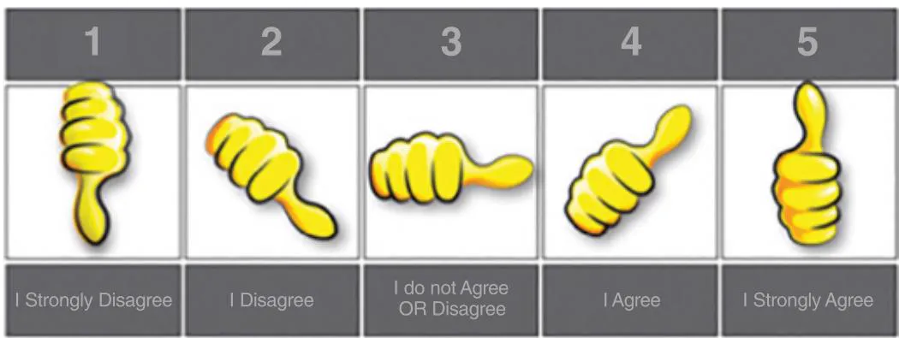  
Source: Cynthia Putnam, Melisa Puthenmadom, Marjorie Ann Cuerdo, Wanshu Wang, and Nathaniel Paul (2020) Adaptation of the System Usability Scale for User Testing with Children CHI’20 Extended Abstracts, April 25–30, 2020, doi.org/10.1145/3334480.3382840

A  different  group  of  technology  users  are  studied  by  the  field  of  Animal-Computer Interaction (Mancini et al, 2017). Data gathering with animals poses different challenges, a key one being that human researchers can’t easily interpret animal behavior, and techniques refined  for  human  participants  need  to  be adjusted.  For  example,  Luisa  Ruge  and  Clara Mancini  (2019)  developed  a method  to evaluate animal  usability and  re-interpreted existing interaction design principles and goals for animal users. They demonstrated this method through a usability evaluation of access controls with mobility assistance dogs.

Another challenge for data gathering is whether and how wearable devices may interfere with the wearers’  daily activities and even cause injuries. Wearable biotelemetry  is increasingly used  by scientists to remotely monitor the movement and behavior of animals in  the wild or in captivity, but these devices need to be carefully designed to avoid impacting negatively on their welfare and reducing the reliability of collected data. Patrizia Paci et al. (2017) presents a methodological approach to assessing the wearability of biotelemetry devices for cats. They performed observations with 13 cats to quantify and characterize the interference of two different GPS trackers (see Figure 8.12).


Figure 8.12 GPS tracker worn by a cat   
  
Source: Patrizia Paci, et.al., 2020 / ACM, Inc / CC BY 4.0

# 8.7.3  Gathering Data Remotely

Gathering data remotely may facilitate access to a more diverse set of participants than gathering  data  only  in a  face-to-face  situation. For  example, it  may  be appropriate  to engage participants  from  different countries, from  different age  groups, or  with different  abilities. Conducting remote sessions is growing in popularity although some situations may require a change of approach, for example from direct observation to indirect observation where participants’ activity is video-recorded and analyzed later rather than being observed synchronously by co-located researchers.

During  the  COVID-19 pandemic,  many  studies  needed  to  pivot  toward  remote  data gathering, and this experience has resulted in a number of outcomes. For example, researchers  have  realized  that remote  data  gathering  is  possible  even though  it  may  require some creative  thinking. Angela  Mastrianni  et  al  (2021)  discuss  their  experiences  of  conducting participatory design workshops, simulation sessions, usability evaluation, and interview and design walk-throughs remotely in the emergency medical field. Based on this experience, they suggest some best practices for remote user-centered design activities (see Table 8.2).

Table 8.2  Best Practices for Remote Data Gathering Activities   

<table><tr><td>Rapid Transitioning to Remote UCD Activities</td></tr><tr><td>1. Establish remote access for as many systems as possible.</td></tr><tr><td>2. Include remote access in IRB protocols.</td></tr><tr><td>3. Run pilot tests before conducting sessions with participants.</td></tr><tr><td>4. Have backup plan(s) in case of technological issues.</td></tr><tr><td>Interacting with Participants</td></tr><tr><td>5. Inform participants ahead of time about any technical requirements.</td></tr><tr><td>6. Use technologies that will be familiar and common to participants.</td></tr><tr><td>7. Use retrospective questioning if facing issues with the think-aloud method.</td></tr><tr><td>8. Gather information about the field site before running sessions.</td></tr><tr><td>Interacting with Other Researchers</td></tr><tr><td>9. Define the roles for each research member before the session.</td></tr><tr><td>10. Introduce the research team members and their various roles at the beginning of the session.</td></tr></table>

Source: Mastrianni, et al. (2021) Transitioning to Remote User-Centered Design Activities in the Emergency Medical Field During a Pandemic. In CHI Conference on Human Factors in Computing Systems Extended Abstracts (CHI ‘21 Extended Abstracts), ACM, New York, NY, USA, Article 41, pp. 1–8.

# ACTIVITY 8.9

For each of the following products, consider what kinds of data gathering would be appropriate and how to use the different techniques introduced earlier. Assume that product development is just starting and that there is sufficient time and resources to use any of the techniques.

1. A new software app to support a small organic produce shop. There is a system running already with which the customers are reasonably happy, but it is looking dated and needs upgrading.   
2. An innovative device for people living with diabetes to help them record and monitor their blood sugar levels.   
3. A social media channel that allows young people to exchange unwanted fashion clothing.

# Comment

1. As this is a small  shop, there won’t be many stakeholders. Some period of observation would be important to understand the context of the new and the old systems. Interviewing the shop’s main stakeholders, i.e., the staff and customers, to identify the positive and negative features of the existing system, will yield richer data than questionnaires. Interviewing all the  staff is likely to be appropriate because there aren’t very many of them. Organic produce is regulated by a variety of laws, so studying this documentation will help identify any legal constraints that have to be accounted for.   
2. In this case, the group of stakeholders is quite large and spread out geographically, so contacting all of them would not be feasible. However, interviewing a representative sample of them, possibly through an online forum or at a local diabetic clinic, is feasible. Observing current practices to monitor blood sugar levels will help to understand what is required, but may be too intrusive. Stakeholders who have used other products on the market can be questioned about their experience with these existing devices to identify improvements for the new device. A questionnaire sent to a wider group, or a focus group, could be used to check the findings from the interviews.   
3. The group of “young people” is quite large and spread out geographically. In fact, it is not very well-defined. Interviews combined with questionnaires and focus  groups would be appropriate. In this case, identifying similar or competing channels and evaluating them will help provide information for an improved product.

# In-Depth Activity

The aim  of this in-depth activity is to practice data gathering. Assume that you  have been employed to improve the experience of using an interactive product such as a smartphone app, a digital media player, a Blu-ray player, a fitness device, or some other type of technology. This existing product may be redesigned, or a completely new product may be created. To do the assignment, find a group of people or a single individual who might use the new or enhanced product. These could be your family, friends, peers, or people in a local community group.

For this assignment:

(a)  Clarify the basic goal of improving the product by considering what this means in your circumstances.   
(b)  Watch the group (or person) casually to get an understanding of any issues that might create challenges for this activity and any information to help refine the study goals.   
(c)  Explain how you would use each of the three data gathering techniques: interview, questionnaire, and observation in your data gathering program. Explain how your plan takes account of triangulation.   
(d)  Consideryourrelationship withthe participantsand decide how to ensure informedconsent.   
(e)  Plan your data gathering program in detail.

•  Decide what kind of interview to run and design a set of interview questions. Decide how to capture the data; then acquire and test any equipment needed and run a pilot study.   
•  Decide whether to include a questionnaire in your data gathering program, and design appropriate questions for it. Run a pilot study to check the questionnaire.   
Decide whether to use direct or indirect observation and where observers will be on the outsider/insider spectrum. Decide how to capture the data; then acquire and test any equipment needed and run a pilot study.

(f)  Carry out the study, but limit its scope. For example, interview only two or three people or plan only two half-hour observation periods.   
(g)  Reflect on this experience and suggest what you would do differently next time.

Keep the data gathered, as this will form the basis of the in-depth activity in Chapter 9.

# Summary

This chapter has introduced six key issues of data gathering that focus on goals, identifying participants, relationship with participants, data storage  considerations,  triangulation, and pilot studies. It has described the planning and execution of three main data gathering techniques that are commonly used in interaction design: interviews, questionnaires, and observation. In addition, capturing the data gathered was discussed.

(Continued)

# Key Points

•  All data gathering sessions should have clear goals.   
•  Depending on the study context, an informed consent form and other permissions may be needed to run the study.   
Capturing and storing participant data needs to be planned and managed to maintain confidentiality.   
•  Running a pilot study tests the feasibility of a planned data gathering session and associated instruments such as questions.   
•  Triangulation involves investigating a phenomenon from different perspectives.   
•  Data may be recorded using handwritten notes, audio or video recording, photographs, or combinations of these.   
•  There are three styles of interviews: structured, semi-structured, and unstructured.   
•  Questionnaires may be online, sent by email, or paper-based.   
Questions for an interview  or questionnaire  can be open or closed-ended. Closed-ended questions require  the  interviewee  to select from a  limited  range of options. Open-ended questions accept a free-range response.   
•  Observation may be direct or indirect.   
•  In direct observation, the observer may adopt different levels of participation, ranging from insider (participant observer) to outsider (passive observer).   
•  Choosing appropriate data gathering techniques depends on the focus of the study, participants involved, nature of the technique, and resources available.   
•  Remote data gathering  facilitates  access to a  wider  set  of participants,  and  standard approaches can be adapted for a range of remote situations.   
•  Data gathering techniques are commonly combined for any one project and may need to be adapted for participants and their context.

# Further Reading

FETTERMAN, D. M. (2020). Ethnography: Step by Step (4th ed.) Applied Social Research Methods Series, Vol. 17. Sage. This book introduces the theory and practice of ethnography, and it is an excellent guide for beginners. It covers both data gathering and data analysis in the ethnographic tradition.

NASSAUER, A. AND LEGEWIE, N. M. (2022) Video Data Analysis: How to Use $2 1 ^ { s t }$ Century  Video  in  the Social  Sciences. Sage. This  accessible  book  covers  the steps  involved  in designing and running a study that collects video data. The book also considers  the design choices and ethical decisions around using ready-made videos as well as custom-made videos.

OLSON, J. S. AND KELLOGG, W. A. (eds.) (2014) Ways of Knowing in HCI. Springer. This edited collection contains useful  chapters on a wide variety of data collection and analysis

techniques. Some topics that are particularly relevant to this chapter are ethnography, experimental design, log data collection and analysis, and ethics in research.

ROBSON, C. AND McCARTAN, K. (2016)  Real World Research (4th  ed.). John Wiley & Sons. This book provides comprehensive coverage of data gathering and analysis techniques and how to use them. Early books and related books by Robson also address topics discussed in this chapter.

TOEPOEL, V.  (2016) Doing Surveys Online. Sage. This book is a “hands-on guide” for preparing and conducting a wide range of surveys including surveys for mobile devices, opt-in surveys, panels, polls, and more. It also discusses details about sampling that can be applied to other data gathering techniques.

<!-- Chunk 7 End -->


<!-- Chunk 8 Start -->

# Chapter 9

# D A T A  A N A L Y S I S ,  I N T E R P R E T A T I O N , A N D  P R E S E N T A T I O N

9.1  Introduction   
9.2  Quantitative and Qualitative   
9.3  Basic Quantitative Analysis   
9.4  Basic Qualitative Analysis   
9.5  Analytical Frameworks   
9.6  Tools to Support Data Analysis   
9.7  Interpreting and Presenting the Findings

# Objectives

The main goals of this chapter are to accomplish the following:

•  Discuss the difference between qualitative and quantitative data and analysis.   
•  Enable you to analyze data gathered from questionnaires.   
•  Enable you to analyze data gathered from interviews.   
•  Enable you to analyze data gathered from observation studies.   
•  Make you aware of software packages that are available to help your analysis.   
•  Identify some of the common pitfalls in data analysis, interpretation, and presentation.   
•  Enable  you  to  interpret  and  present your  findings  in  a  meaningful  and  appropriate manner.

# 9.1 Introduction

The kind of analysis that can be performed on a set of data will be influenced by the goals identified  at  the  outset  and  the  data  gathered.  Broadly  speaking,  a  qualitative  analysis approach, a quantitative analysis approach, or a combination of qualitative and quantitative approaches may be taken. The last of these is very common, as it provides a more comprehensive account of the data.

Most analysis, whether it is quantitative or  qualitative, begins with the initial reactions or observations  from  the data. This  may involve identifying patterns or calculating simple

numerical values such as ratios, averages, or percentages. For  all data, but especially when dealing with large  volumes of data  (that  is, Big Data), it  is useful  to look over the  data to check for any anomalies that might be erroneous, such as people who are 999 years old. This process is known as data cleansing, and there are often digital tools to help with this process. This initial analysis is followed by more detailed work using structured frameworks or theories to frame the investigation.

Interpretation of the findings often proceeds in parallel with analysis, but there are different  ways  to  interpret  results, and  it  is  important  to  make  sure  that  the  data  supports any conclusions. Imagine that an initial  analysis of some customer  care questionnaires  has revealed a pattern of responses indicating that inquiries from customers routed through the Sydney office of an organization take longer to process than those routed through the Oslo office. This result can be interpreted in many different ways. For example, the customer care operatives in Sydney are less efficient, they provide more detailed responses, the technology supporting the inquiry process in Sydney needs to be updated, customers reaching the Sydney office demand a higher level of service, and so on. Which one is correct? To determine whether  any  of  these  potential  interpretations  is  accurate,  further  data  such  as  customer inquiry details and maybe staff interviews is needed. A common mistake is for the investigator’s existing beliefs or biases to influence the interpretation of results (see Box 9.1 on bias).

# BOX 9.1

# Beware of Bias in Analysis and Interpretation

Bias is an influence that can affect objective judgment and decision-making. Biases are formed because of the tendency of the brain to rapidly categorize new information and data connecting them with past experiences. It is natural to look for patterns and associations in the world so as to be prepared to act and behave accordingly, and this can lead to biases. They may be present in someone’s thinking, and they may  manifest in information or data. Some biases are  conscious, e.g., preferring to work with women  rather than with men, while others are unconscious. Biases influence how people interact with each other, how decisions are made, how people react to the design of an app or product, and how data is collected, analyzed, and interpreted.

Early  research by Amos Tversky  and  Daniel Kahneman (1974) describes  how  cognitive bias produces repeated, systematic errors in thinking caused by a person misinterpreting information that affects their judgment. There are many forms of cognitive bias. For example, familiarity bias is when a decision-maker sticks to what they know best, and self-attribution bias is when successes are attributed by a person to themselves and not to outside factors.

Chapter 8,“Data Gathering,” discussed the importance of designing neutral questions for data collection, as bias can be introduced in the way questions are phrased. But bias can also influence  the analysis and interpretation of data. A key cognitive  bias to be aware of in the context of interaction design is confirmation bias.

Confirmation bias leads people to discard  information  that contradicts  their  existing beliefs, even when there is evidence to the contrary. Jennifer Junge (2022), from the Nielsen Norman Group, points out that confirmation bias is a form of priming in which someone’s

prior beliefs influence how they react to new information that can distort their interpretation. This can have significant consequences for UX design and research because it can influence designers’, researchers’, and practitioners’ perspectives causing them to overlook alternative options. This might also show up as leading questions during data gathering, as discussed in Chapter 8.

Training courses can raise awareness of problems associated with bias, and design techniques, including visualizations, have also been successful at helping designers address different types of cognitive bias (Wall et al., 2019).

This YouTube video by Alita Joyce from the Nielsen Norman Group NN/g provides a broad overview of Confirmation Bias in UX Work, particularly in surveys: www .youtube.com/watch?v=YMMTFmIf3kk&t=1s.

Another common tendency is to make claims that go beyond what the data can support. This  is a matter  of interpretation and of presentation. Using  words such as many  or often or all  when reporting conclusions needs to be carefully considered. An investigator should remain as impartial  and objective as possible if the conclusions are to be trusted. Showing that the conclusions are supported by the results is an important skill to develop.

Finally, finding the best way to present findings is equally skilled, and it depends on the goals of the study but also on the audience for whom the study was performed. For example, a formal notation may be used to report the results for the requirements activity, while a summary  of problems  found, supported  by video clips  of people experiencing those  problems, may be better for presentation to a team of designers.

This  chapter  introduces  a  variety  of  methods, and  it  describes  in  more  detail  how  to approach  data  analysis  and  presentation using  some  of the  common approaches  taken  in interaction design.

# 9.2 Quantitative and Qualitative

Quantitative data is in the form of numbers, or data that can easily be translated into numbers. Examples  are the number  of  years’  experience  the interviewees have,  the number  of projects a department handles at a time, or the number of minutes it takes to perform a task. Qualitative data is in the form of words and images, and it includes descriptions, quotes from interviewees,  vignettes  of activity,  and  photos.  It  is  possible  to express  qualitative  data  in numerical form, but it is not always meaningful to do so (see Box 9.2).

It  is  sometimes assumed  that  certain forms  of data  gathering can  only  result in quantitative  data  and that  others can  only  result in qualitative  data. However, this  is a  fallacy. All forms of data gathering  discussed in the previous  chapter may produce qualitative and quantitative data. For example, on a questionnaire, the participant’s age or number of software apps they use in a day is quantitative data, while any comments are qualitative data. In

an observation, quantitative data may include the number of people involved in a project or how many hours someone spends sorting out a problem, while notes about feelings of frustration, or the nature of interactions between team members, are qualitative data.

Quantitative  analysis  uses  numerical methods  to ascertain  the magnitude, amount, or size of something;  for example,  the attributes, behavior,  or  strength of opinion of  the  participants. In describing a population, a quantitative analysis might conclude that the average person is 5 feet 11 inches tall, weighs 180 pounds, and is 45 years old. Qualitative analysis focuses on the nature of something and can be represented by themes, patterns, and stories. For example, in describing the same population, a qualitative analysis might  conclude that the average person is tall, thin, and middle-aged.

# BOX 9.2

# Use and Misuse of Numbers

Numbers are very malleable and can make a convincing argument, but it is important to justify the manipulation of quantitative data and be clear on how those manipulations may affect the potential interpretations of the data. Before adding a set of numbers together, finding an average, calculating a percentage, or performing any other kind of numerical translation, ask whether the operation is meaningful in the specific context.

Qualitative data can also be turned into a set of numbers. Translating non-numerical data into a numerical or ordered scale is appropriate at times, and this is a common approach in interaction design. However, this kind of translation also needs to be justified to ensure that it is meaningful in the given context. For example, assume you have collected a set of interviews from sales representatives about their use of a new app for reporting sales queries. One way of turning this data into a numerical form would be to count the number of words uttered by each interviewee. Conclusions might then be drawn about how strongly the sales representatives feel about the app; for example, the more they had to say about the product, the stronger they felt about it. But do you think  this is a good way to analyze the  data? Does it help to answer the study questions?

Other, less obvious, areas  where misunderstandings can  arise include translating  small population sizes into percentages. For example, saying that 50 percent of users take longer than 30 minutes to pay a bill through a banking app carries a different meaning than saying that two out of four users had the same problem. It is better not to use percentages unless the number of data points is at least 10, and even then it is appropriate to use both percentages and raw numbers to make sure that the claim is not misunderstood.

It is possible to perform legitimate statistical calculations on a set of data and still present misleading results by not making the context clear or by choosing the particular calculation that gives the most favorable result (Huff, 1991). In addition, choosing and applying the best statistical test requires care (Cairns, 2019), as using an inappropriate test can unintentionally misrepresent the data.

# 9.2.1  First Steps in Analyzing Data

Having collected the data, some initial processing is normally required  before data analysis can begin in earnest. For example, audio data may be transcribed by hand or using an automated  tool;  quantitative  data,  such  as  time  taken  or  errors  made, may  be  entered  into  a spreadsheet, like Excel. Table 9.1 summarizes initial analysis steps for data typically collected through interviews, questionnaires, and observation.

Table 9.1  Data Gathered and Typical  Initial Processing Steps for Interviews, Questionnaires, and Observation   

<table><tr><td></td><td>Raw Data</td><td>Example Qualitative Data</td><td>Example Quantitative Data</td><td>Initial Processing Steps</td></tr><tr><td>Interviews</td><td>Audio recordings. Interviewer notes. Video recordings.</td><td>Responses to open-ended questions. Video pictures. Respondent&#x27;s opinions.</td><td>Age, number of mobile devices owned, years of experience. Responses to closed-ended questions.</td><td>Transcription of recordings. Expansion of notes. Entry of answers to closed-ended questions into a spreadsheet.</td></tr><tr><td>Questionnaires</td><td>Participant responses. Online database.</td><td>Responses to open-ended questions. Responses in “further comments” fields. Respondent&#x27;s opinions.</td><td>Age, hours a week spent online, years of experience. Responses to closed-ended questions.</td><td>Clean up data. Filter into different datasets.</td></tr><tr><td>Observation</td><td>Observer&#x27;s notes. Photographs. Audio and video recordings. Data logs. Think-aloud. Diaries.</td><td>Records of behavior. Description of a task as it is undertaken. Copies of documents outlining procedures.</td><td>Demographics of participants. Time spent on a task. The number of people involved in an activity. How many different types of activity are undertaken.</td><td>Expansion of notes. Transcription of recordings. Synchronization between data recordings.</td></tr></table>

# Interviews

Interviewer notes need to be reviewed and clarified or expanded as soon as possible after the interview and before the interviewer starts to forget details. An audio or video recording may be  used  to help in  this process, or  a transcription may  be  used for more  detailed analysis.

Interviews may be  transcribed automatically, but if the  tool is  not trained to recognize  the interviewee’s accent,  this may  cause  difficulties, and manual  transcription may  be needed. However  manual transcription  takes significant effort. In this case,  it is  worth considering whether to transcribe the whole interview or just parts of it that are relevant. Deciding what is relevant, however, can be difficult. Revisiting the  goals of the study to see which sections address the research questions can guide this process.

Closed-ended questions are usually treated as quantitative data and analyzed using basic quantitative analysis (see Section 9.3, “Basic Quantitative Analysis”). For example, a question that asks for the respondent’s age range can easily be analyzed to find out the percentage of respondents in each. More complicated statistical techniques are needed to identify relationships between responses that can be generalized, such as whether there is an interaction between the condition being tested and a demographic. For example, do people of different ages use social media for different lengths of time when first logging on in the morning or at night before they go  to bed? Open-ended questions typically  result in qualitative data  that might be searched for categories or patterns of response.

# Questionnaires

Increasingly, questionnaire responses are provided using online surveys, and the data is automatically stored in a database. The data can be filtered according to respondent subpopulations (for instance, everyone under 16) or according to a particular question (for example, to understand  respondents’  reactions to  one  kind  of  robot  personality  rather  than  another). This allows analyses to be conducted on subsets of the data and hence to draw specific conclusions for  more targeted  goals. Conducting  this  kind of  analysis requires  sufficient  data from a large enough sample of participants.

# Observation

Observation can  result in  a  wide variety  of  data  including  notes,  photographs, data  logs, think-aloud recordings (often called protocols), video, and audio recordings. Taken together, these different types of data provide a rich picture of the observed activity. The difficult part is working out how to combine the different sources to create a coherent narrative; analytic frameworks,  discussed  in  Section  9.5, can  help  with  this.  Initial  data  processing  includes reviewing and expanding notes and transcribing elements of any recordings and think-aloud protocols. For observation in a controlled environment, initial processing might also include synchronizing different data recordings.

Transcriptions and the observer’s notes are most likely to be analyzed using qualitative approaches,  while  photographs  provide  contextual  information.  Data  logs  and  some  elements of the observer’s notes would probably be analyzed quantitatively.

# 9.3  Basic Quantitative Analysis

A  range of  statistics are  used within  interaction  design studies  (Cairns, 2019;  Dix, 2022). Here, we introduce two basic quantitative analysis techniques that can be used effectively in interaction design:  averages  and  percentages. Percentages are  useful  for  standardizing  the data, particularly to compare two or more large sets of responses.

Averages are fairly well-known numerical measures of central tendency. However, there are three  different types  of average, and  using the right one can  help communicate  results more  effectively. These  three  are  mean, median, and  mode. Mean refers  to the  commonly understood interpretation of average; that is, add together all  the figures and divide by the number of figures with which you started. Median and mode averages are less well-known but are very useful. The median is the middle value of the data when the numbers are ranked. The mode is  the most  commonly occurring number. For example, in a set of data (2, 3, 4, 6, 6, 7, 7, 7, 8), the  median  is 6  and the  mode  is  7, while the  mean is $5 0 / 9 = 5 . 5 6$ . In  this case, the difference between the different averages is not that great. However, consider the set (2, 2, 2, 2, 450). Now the median is 2, the mode is 2, and the mean is $4 5 8 / 5 = 9 1 . 6 !$ Which of these to use depends on the type of data and its distribution. The mode can be used for any type of data but is most effective for nominal and ordinal data such as level of anxiety or ethnicity; the median is only useful where the data can be ordered, e.g., reaction time or test score; and the mean is most meaningful where scores on a scale are equally spaced, such as  temperature. If  the  data has  a “normal” distribution, the  averages  will all  be  the  same; however, in a skewed distribution, mode and mean will be affected by outliers, so the median is the best measure.

  
Source: Mike Baldwin / Cartoon Stock

Before any analysis can take place, the data needs to be collated into analyzable datasets. Quantitative  data can usually be translated into rows  and columns, where one row equals one record, such as respondent or interviewee. If these are entered into a spreadsheet such as Excel, this makes simple  manipulations and dataset filtering easier. Before  entering data  in this way, it is important to decide how to represent the different possible answers. For example, “don’t know” represents a different response from no answer at all, and they need to be distinguished, perhaps with separate columns in the spreadsheet. Also, if dealing with options from  a closed-ended question, such as job role, there are two different possible approaches that affect the analysis. One approach is to have a column headed “Job role” and to enter the

job role as it is given by the respondent or interviewee. The alternative approach is to have a column for each possible answer. The latter approach lends itself more easily to automatic summaries, such as those provided when using a spreadsheet. Note, however, that this option will be open only if the original question was designed appropriately (see Box 9.3).

# BOX 9.3

# Question Design Affects Possible Analyses and Conclusions

Different  question designs affect the kinds of analyses that can be performed and the kinds of conclusions that can be drawn. To illustrate this, assume that some interviews have been conducted to evaluate a new app that lets you try on virtual clothes and see yourself in real time as a 3D holograph. This is similar to Memomi described at memorymirror.com.

Assume that one  of the  questions  asked is: “How do you  feel about  this new  app?” Responses to this will be varied and may include that it is cool, impressive, realistic, clunky, technically complex, and so on. There are many possibilities, and the responses would need to be treated qualitatively. This means that analysis of the data must consider each individual response.  If there  are  only 10 or so responses, then this may not  be too  bad, but if there are many more, it becomes harder to process the information and harder to summarize the findings. This is typical of open-ended questions; that is, answers are not likely to be homogeneous, so they will need to be treated individually. In contrast, answers to a closed-ended question, which gives respondents  a fixed set of alternatives from which  to choose, can be treated  quantitatively. So, for example, instead of asking “How do you feel about  this new app?” assume that you have asked “In your experience, are virtual try-on holographs realistic, clunky, or distorted?” This clearly reduces the number of options, and the responses would be recorded as “realistic,” “clunky,” or “distorted.”

When entered in a spreadsheet or a simple table, initial analysis of this data might look like the following:

<table><tr><td>Respondent</td><td>Realistic</td><td>Clunky</td><td>Distorted</td></tr><tr><td>A</td><td>1</td><td></td><td></td></tr><tr><td>B</td><td></td><td>1</td><td></td></tr><tr><td>C</td><td></td><td>1</td><td></td></tr><tr><td>...</td><td></td><td></td><td></td></tr><tr><td>Z</td><td></td><td></td><td>1</td></tr><tr><td>Total</td><td>14</td><td>5</td><td>7</td></tr></table>

Based on this, we can then say that 14 out of 26 (54 percent) of the respondents think virtual try-on holographs are realistic, 5 out of 26 (19 percent) think they are clunky, and 7 out of 26 (27 percent) think they are distorted. Note also that in the table, respondents’ names

are  replaced by letters  so that they are identifiable but anonymous  to any  onlookers. This strategy is important for protecting participants’ privacy.

Another alternative that might  be used in a questionnaire is to phrase the  question in terms of a Likert scale, such as the following one. This again alters the kind of data and hence the kind of conclusions that can be drawn.

Virtual try-on holographs are realistic:

Strongly agree

Agree

Neither

Disagree

Strongly disagree


The data could then be analyzed using a simple spreadsheet or table:

<table><tr><td>Respondent</td><td>Strongly agree</td><td>Agree</td><td>Neither</td><td>Disagree</td><td>Strongly disagree</td></tr><tr><td>A</td><td></td><td>1</td><td></td><td></td><td></td></tr><tr><td>B</td><td>1</td><td></td><td></td><td></td><td></td></tr><tr><td>C</td><td></td><td></td><td></td><td>1</td><td></td></tr><tr><td>...</td><td></td><td></td><td></td><td></td><td></td></tr><tr><td>Z</td><td></td><td></td><td></td><td></td><td>1</td></tr><tr><td>Total</td><td>5</td><td>7</td><td>10</td><td>1</td><td>3</td></tr></table>

In this case, the kind of data being collected has changed. Based on this second set, nothing can be said about whether respondents think the virtual try-on holographs are clunky or distorted, as that question has not been asked. We can only say that, for example, 4 out of 26 (15 percent) disagreed with the statement that virtual try-on holographs are realistic, and of those, 3 (11.5 percent) strongly disagreed.

For simple collation and analysis, spreadsheet software such as Excel or Google Sheets is often used as it is commonly available, is well understood, and offers a variety of numerical manipulations and graphical representations. Basic analysis might involve finding out averages and identifying outliers, in other words, values that are significantly different from the majority  and hence not common. Producing  a graphical  representation provides an overall view of the data and any patterns it contains. Other tools are available for performing specific statistical tests (see Box 9.4), such as online t-tests and A/B testing tools. Data visualization tools can create more sophisticated representations of the data such as heatmaps.

For example, consider the set of data shown in Table 9.2, which was collected during an evaluation of a new photo sharing app. This data shows peoples’experience of social media and the number of errors made while trying to complete a controlled task with the new app. It  was captured automatically, recorded in a spreadsheet, and the totals and averages were calculated. The  graphs  in  Figure  9.1  were  generated using  the  spreadsheet  package. They show an overall view of the dataset. In particular, it is easy to see that there are no significant outliers in the error rate data.

Table 9.2  Data Gathered During a Study of a Photo Sharing App   

<table><tr><td colspan="7">Social Media Use</td></tr><tr><td>User</td><td>More Than Once a Day</td><td>Once a Day</td><td>Once a Week</td><td>Two or Three Times a Week</td><td>Once a Month</td><td>Number of Errors Made</td></tr><tr><td>1</td><td></td><td>1</td><td></td><td></td><td></td><td>4</td></tr><tr><td>2</td><td>1</td><td></td><td></td><td></td><td></td><td>2</td></tr><tr><td>3</td><td></td><td></td><td>1</td><td></td><td></td><td>1</td></tr><tr><td>4</td><td>1</td><td></td><td></td><td></td><td></td><td>0</td></tr><tr><td>5</td><td></td><td></td><td></td><td>1</td><td></td><td>2</td></tr><tr><td>6</td><td></td><td>1</td><td></td><td></td><td></td><td>3</td></tr><tr><td>7</td><td>1</td><td></td><td></td><td></td><td></td><td>2</td></tr><tr><td>8</td><td></td><td>1</td><td></td><td></td><td></td><td>0</td></tr><tr><td>9</td><td></td><td></td><td></td><td></td><td>1</td><td>3</td></tr><tr><td>10</td><td>1</td><td></td><td></td><td></td><td></td><td>2</td></tr><tr><td>11</td><td></td><td></td><td></td><td>1</td><td></td><td>1</td></tr><tr><td>12</td><td></td><td></td><td>1</td><td></td><td></td><td>2</td></tr><tr><td>13</td><td></td><td>1</td><td></td><td></td><td></td><td>4</td></tr><tr><td>14</td><td></td><td>1</td><td></td><td></td><td></td><td>2</td></tr><tr><td>15</td><td></td><td></td><td></td><td></td><td>1</td><td>1</td></tr><tr><td>16</td><td></td><td></td><td></td><td>1</td><td></td><td>1</td></tr><tr><td>17</td><td></td><td>1</td><td></td><td></td><td></td><td>0</td></tr><tr><td>18</td><td></td><td>1</td><td></td><td></td><td></td><td>0</td></tr><tr><td>Totals</td><td>4</td><td>7</td><td>2</td><td>3</td><td>2</td><td>30</td></tr><tr><td></td><td></td><td></td><td></td><td></td><td>Mean</td><td>1.67</td></tr><tr><td></td><td></td><td></td><td></td><td></td><td colspan="2">(to 2 decimal places)</td></tr></table>

Adding one more user to Table 9.2 with an error rate of 9 and plotting the new data as a scatter graph (see Figure 9.2) illustrates how graphs can help to identify outliers. Outliers are usually removed from  the main dataset because they distort the general patterns. However, outliers may also be interesting cases to investigate further in case there are special circumstances surrounding those participants and their session.

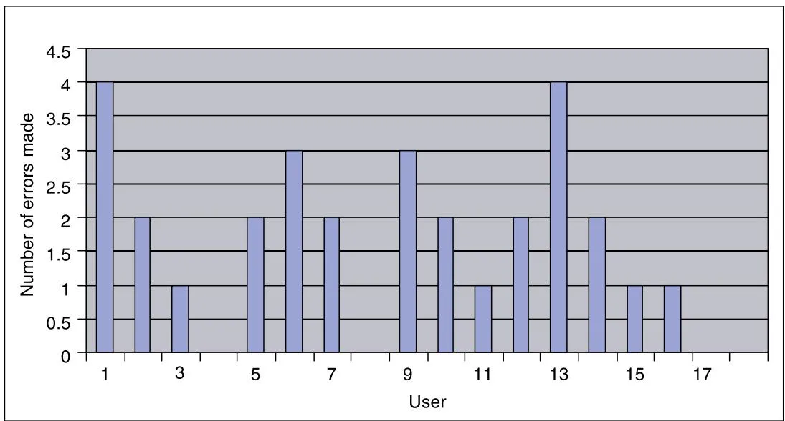  
(a)

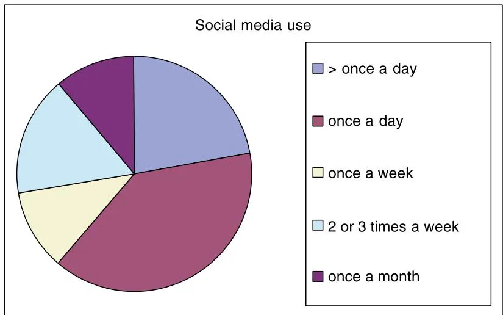  
(b)   
Figure 9.1  Graphical representations of the data in Table 9.2 (a) The distribution of errors made (take note of the scale used in these graphs, as seemingly large differences may be much smaller in reality). (b) The spread of social media experience within the participant group.

These initial investigations also help to identify other areas for further investigation. For example, is there something special about people with error rate 0 or something distinctive about the performance of those who use social media only once a month?

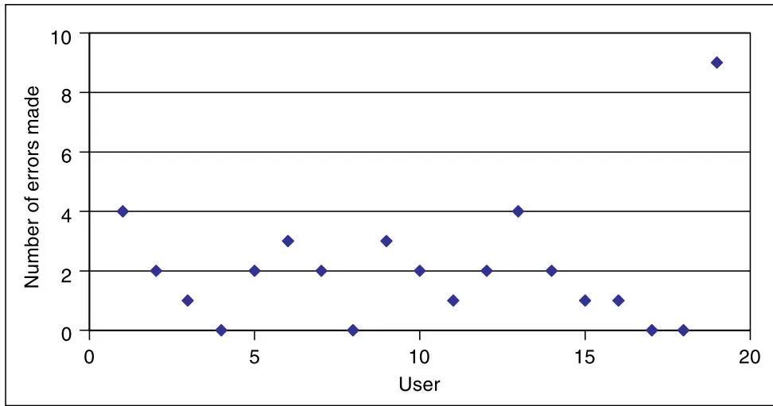  
Figure 9.2  Using a scatter diagram helps to identify outliers quite quickly.

# ACTIVITY 9.1

The data in the following table represents the time taken for study participants to select and invest in a fund using a new share trading app.

Using a spreadsheet application, generate a bar graph and a scatter diagram to provide an overall view of the data. From this representation, make two initial observations about the data that might form the basis of further investigation.

<table><tr><td>User</td><td>A</td><td>B</td><td>C</td><td>D</td><td>E</td><td>F</td><td>G</td><td>H</td><td>I</td><td>J</td><td>K</td><td>L</td><td>M</td><td>N</td><td>O</td><td>P</td><td>Q</td><td>R</td><td>S</td></tr><tr><td>Time to complete (mins)</td><td>15</td><td>10</td><td>12</td><td>10</td><td>14</td><td>13</td><td>11</td><td>18</td><td>14</td><td>17</td><td>20</td><td>15</td><td>18</td><td>24</td><td>12</td><td>16</td><td>18</td><td>20</td><td>26</td></tr></table>

# Comment

The bar graph and scatter diagram are shown here.

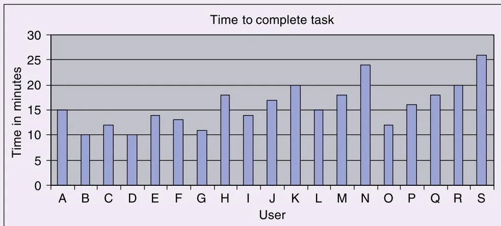

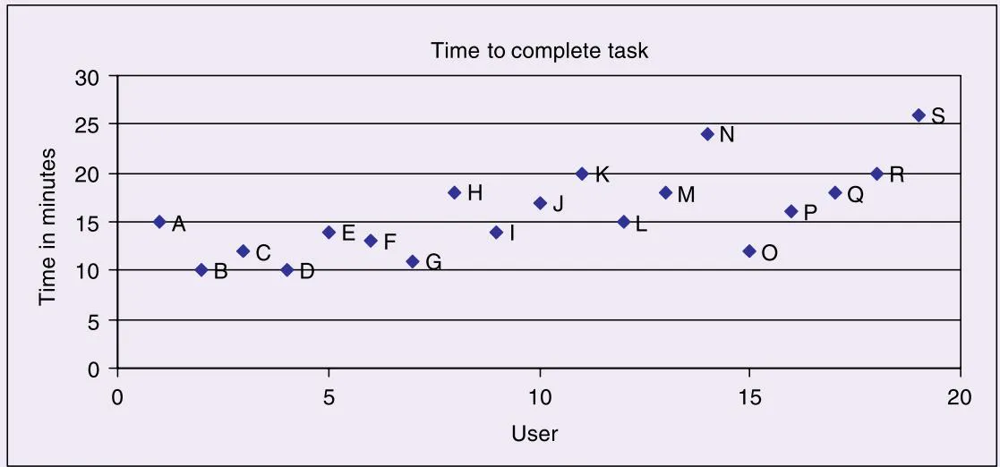

From these two diagrams, there are two areas for  further investigation. First, the values for user N (24) and user S (26) are higher than the others and could be looked at in more detail. In addition, there appears to be a trend that participants at the beginning of the testing time (particularly B, C, D, E, F,  and G) performed faster than those toward the end of the testing time. This is not a clear-cut situation, as O also performed well, and I, L, and P were almost as fast, but there may be something about this later testing time that has affected the results, and it is worth investigating further.

It is fairly straightforward to compare two sets of results  using these kinds of graphical representations of the data. Semantic differential data can also be analyzed in this way and used to identify trends, provided that the  format of the  question is appropriate.  For example,  the  following  question  was  asked  in  a questionnaire  to  evaluate  two  different  smartphone designs:

For each pair of adjectives, place a  cross at the  point  between  them that reflects the extent to which you believe the adjectives describe the smartphone design. Please place only one cross between the marks on each line.

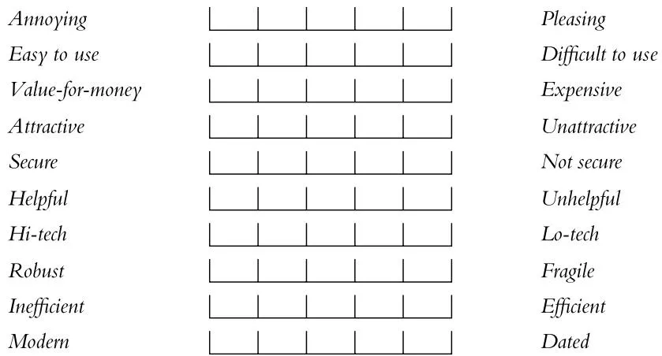

Table 9.3 and Table 9.4 show the tabulated results from 100 respondents. Note that the responses have been translated into five categories, numbered from  1 to 5, based on where the respondent marked the line between each pair of adjectives. It is possible that respondents may have intentionally put a cross closer to one side of the box than the other, but it is acceptable to lose this nuance in the data, provided that the original data is not lost, and any further analysis could refer to it.

Table 9.3  Phone 1   

<table><tr><td></td><td>1</td><td>2</td><td>3</td><td>4</td><td>5</td><td></td></tr><tr><td>Annoying</td><td>35</td><td>20</td><td>18</td><td>15</td><td>12</td><td>Pleasing</td></tr><tr><td>Easy to use</td><td>20</td><td>28</td><td>21</td><td>13</td><td>18</td><td>Difficult to use</td></tr><tr><td>Value-for-money</td><td>15</td><td>30</td><td>22</td><td>27</td><td>6</td><td>Expensive</td></tr><tr><td>Attractive</td><td>37</td><td>22</td><td>32</td><td>6</td><td>3</td><td>Unattractive</td></tr><tr><td>Secure</td><td>52</td><td>29</td><td>12</td><td>4</td><td>3</td><td>Not secure</td></tr><tr><td>Helpful</td><td>33</td><td>21</td><td>32</td><td>12</td><td>2</td><td>Unhelpful</td></tr><tr><td>Hi-tech</td><td>12</td><td>24</td><td>36</td><td>12</td><td>16</td><td>Lo-tech</td></tr><tr><td>Robust</td><td>44</td><td>13</td><td>15</td><td>16</td><td>12</td><td>Fragile</td></tr><tr><td>Inefficient</td><td>28</td><td>23</td><td>25</td><td>12</td><td>12</td><td>Efficient</td></tr><tr><td>Modern</td><td>35</td><td>27</td><td>20</td><td>11</td><td>7</td><td>Dated</td></tr></table>

<table><tr><td></td><td>1</td><td>2</td><td>3</td><td>4</td><td>5</td><td></td></tr><tr><td>Annoying</td><td>24</td><td>23</td><td>23</td><td>15</td><td>15</td><td>Pleasing</td></tr><tr><td>Easy to use</td><td>37</td><td>29</td><td>15</td><td>10</td><td>9</td><td>Difficult to use</td></tr><tr><td>Value-for-money</td><td>26</td><td>32</td><td>17</td><td>13</td><td>12</td><td>Expensive</td></tr><tr><td>Attractive</td><td>38</td><td>21</td><td>29</td><td>8</td><td>4</td><td>Unattractive</td></tr><tr><td>Secure</td><td>43</td><td>22</td><td>19</td><td>12</td><td>4</td><td>Not secure</td></tr><tr><td>Helpful</td><td>51</td><td>19</td><td>16</td><td>12</td><td>2</td><td>Unhelpful</td></tr><tr><td>Hi-tech</td><td>28</td><td>12</td><td>30</td><td>18</td><td>12</td><td>Lo-tech</td></tr><tr><td>Robust</td><td>46</td><td>23</td><td>10</td><td>11</td><td>10</td><td>Fragile</td></tr><tr><td>Inefficient</td><td>10</td><td>6</td><td>37</td><td>29</td><td>18</td><td>Efficient</td></tr><tr><td>Modern</td><td>3</td><td>10</td><td>45</td><td>27</td><td>15</td><td>Dated</td></tr></table>

# Table 9.4  Phone 2

The graph in Figure 9.3 shows how the two smartphone designs varied according to the respondents’ perceptions of how modern the design is. This graphical notation shows clearly how the two designs compare.

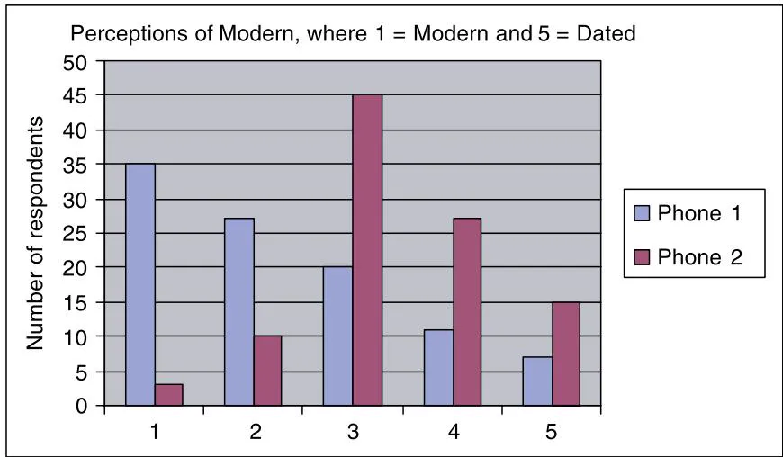  
Figure 9.3  A graphical comparison of two smartphone designs according to whether they are perceived as modern or dated

Data logs that  capture users’ interactions automatically, such as with a website or app, can also be analyzed and represented graphically, thus helping to identify patterns in behavior. Also, more sophisticated  manipulations  and graphical images  can be used  to highlight patterns in collected data.

# BOX 9.4

# Quantitative Analysis with R

R is a programming language that is used by data scientists, software engineers, and statisticians (among others) to perform statistical analyses. The R software environment is free and has grown in popularity since it first appeared in the early 1990s. Some of its advantages are that it is a powerful statistical language, it has a very good help system, and it produces highquality data visualizations. On the downside, it has a limited graphical user interface, and as it is a programming language, attention to syntax is of paramount importance. R may be used on its own, but using an environment such as RStudio helps to address those disadvantages.

The following introduction to R covers the whole analysis process. It is an hour long, but provides a useful primer: www.youtube.com/watch?v=eR-XRSKsuR4.

# 9.4  Basic Qualitative Analysis

Central to qualitative analysis is  the identification of concepts (referred to as codes) in the data, and  this  process is  often  referred to  as coding. Two  common ways  in  which  coding proceeds are in an inductive (bottom-up) fashion or a deductive (top-down) fashion. In the former case, codes arise from the data, and in the latter, a predetermined set of codes is identified, e.g., from a relevant theory, and the data is interpreted using that set. In practice, analysis is often performed iteratively, and it is common for codes identified inductively initially to then be defined and applied deductively to new  data, and for an initial, pre-existing  set of codes to be enhanced inductively when applied to a new situation or new data. One of the most challenging aspects of qualitative analysis is determining meaningful codes that do not overlap, that is, codes that can be clearly defined and consistently distinguished. Another is deciding on the appropriate granularity for them, for example at the word, phrase, sentence, or paragraph level.

Whether an inductive or deductive approach is used, the code definitions and their interpretation are captured in a coding scheme that helps researchers to interpret the data consistently and reliably. Anne Nassauer and Nicolas M. Legewie (2022) describe a coding scheme as a collection of concepts and their lower-level dimensions that become codes and explicit rules for how to use them. To quantify the coding scheme’s reliability, an inter-rater reliability score may  be calculated. This  is the percentage of  agreement between  the analyses of two researchers, defined as the number of items consistently coded, expressed as a percentage of the total number of items coded. An alternative measure of inter-rater reliability where two researchers have done the coding is Cohen’s kappa, (κ), which considers the possibility that agreement has occurred due to chance (Cohen, 1960). If there is a large discrepancy between the two analyses, the coding  scheme needs further  refinement. Calculating this  measure  is intended to determine the reliability of the coding scheme, i.e., how clear and distinct are the codes, rather than to check whether the analysis is correct.

The  first step in qualitative analysis is to gain an  overall impression of the  data and to start looking for interesting features, topics, repeated observations, or things that stand out. Some initial  impressions  and  possible patterns to look  for may  have emerged  during data gathering. For example, logged data of people visiting Tripadvisor.com may suggest that they often look for hotels that are rated “terrible” first. Or,  data from a survey  of bank customers  may  indicate that  answering  so many  security questions  when  logging into  a banking app is frustrating. But it is  important to confirm and reconfirm findings to make sure that initial impressions don’t bias the analysis. During this first pass, it is important to highlight common features  and record any  surprises rather  than attempt  to capture  all  the findings (Blandford et al., 2017).

For observations, the guiding framework used in data gathering will give some structure to the data. For example, the practitioner’s framework for observation introduced in Chapter 8 will have resulted in a focus on who, where, and what, while using the more detailed framework  will result in  patterns relating  to  physical objects, people’s goals,  sequences of events, and so on.

Three  basic  approaches  to  qualitative  analysis  are  discussed  in  this  section:  identifying themes  (an  example  of the  inductive  approach), categorizing data  (an  example  of the

deductive approach), and analyzing critical incidents (one way to sample the dataset). These three  basic  approaches  are not  mutually exclusive  and are often  used  in combination, for example, when analyzing video material, critical incidents may  first be identified and then a thematic analysis undertaken. Video analysis is  discussed further in Box 9.5. Using more sophisticated  analytical  frameworks  to  enhance and  structure the  use  of  these  basic  techniques can lead to additional insights. Section 9.5 introduces frameworks that are commonly used in interaction design.

# BOX 9.5

# Analyzing Video Material

A good way to start a video analysis is to watch what has been recorded all the way through while writing a high-level narrative of what happens, noting where in the video there are any potentially  interesting events. How to decide which is an interesting  event will depend on what is being observed. For example, in a study of the interruptions that occur in an open plan office, an event might be each time that a person takes a break from an ongoing activity, for instance, when a phone rings, someone walks into their cubicle, or email arrives. If it is a study of how pairs of students use an online collaborative learning tool, then activities such as turn-taking, speaking over one another, any exchanges in the chat, and periods when one or the other is distracted would be appropriate to record.

Chronological and video times can be used to index events. These may not be the same, since recordings can run at different speeds from real time and video can be edited. Video can be augmented with captured screens or logged data of people’s interactions with a product, and transcription. There are various logging and screen capture tools available for this purpose, which enable interactions to be played back as a movie, showing screen objects being opened, moved, selected, and so on. These  can then be played in parallel with the  video to provide different  perspectives on the talk, physical interactions, and  the system’s responses that occur. Having a combination of data streams can enable more detailed and fine-grained patterns of behavior to be interpreted (Heath et al., 2010).

Coding data using a coding scheme is integral to the analytic process. Anne Nassauer and Nicolas Legewie (2022) emphasize reliability as a guiding principle in analysis, meaning that the study is consistent in its procedure so that others can assess its research steps. They also emphasize the importance of considering alternative interpretations and provide some useful practical tips on video  analysis, including how to construct clear and  transparent concepts that enable reflection and critique, how to construct and apply a coding scheme, and how to overcome a range of challenges. For example, they highlight that coding decisions can be ambiguous, subjective, or incorrect. Even the best coding schemes can include codes that just don’t work unambiguously  all of the  time. Subjectivity leads  to different  coding decisions by different  researchers, and  coding decisions may  be incorrect  simply because  a  mistake was made. To help overcome these challenges, they suggest making coding a team effort and drawing in expert knowledge of the study area.

# 9.4.1  Identifying Themes

Thematic analysis is an umbrella term to cover a variety of different approaches to examining qualitative data. It  is a widely used analytical method  for developing, analyzing, and interpreting  patterns  across  a  qualitative  dataset  (Braun  and  Clarke,  2022).  More  formally,  a theme is  something  important  about the  data  in relation  to the  study goal.  It represents  a pattern of some  kind, perhaps  a particular topic  or  feature, found in the  dataset, which  is considered to be relevant and even unexpected with respect to the study goal. Themes may relate to a variety of aspects: behavior, a stakeholder group, events, places or situations where those events happen, and so on. For example, descriptions of typical users may be one outcome of data analysis that focuses on participant characteristics. The use of the term theme varies, and there are some key distinctions to be aware of, as discussed in Box 9.6.

# BOX 9.6

# So What Is a Theme? And Why Does It Matter?

Thematic analysis is a widely used term, but thematic analyses are not all the same, and use of the term theme varies. Virginia Braun et al. (2019) distinguish between themes as patterns of meaning and themes as data summaries. A key difference is whether the analysis is seeking to uncover the meaning behind the words or if it is seeking to summarize the diversity of responses across participants.

There isn’t a “correct” application of these ideas in analysis, but it is important that the approach used is designed deliberately. In particular, it is important to recognize the distinction between the following:

•  Identifying common themes as a kind of data summary, versus developing themes that reflect hidden or implicit meaning.   
Developing themes that arise from the data, versus using a pre-determined framework to analyze the data. In the former case, the key is to interpret the data to make meaning explicit while in the latter case the key is how to interpret the predetermined categories in the context of the study.   
A desire to find the “correct” coding versus a desire to ensure that codes are clearly defined and are interpreted consistently. Measures of inter-rater reliability can be used as a guide in either case.

After  an initial  pass through the  data, the  next step  is  to look more systematically for themes  across  the  data,  seeking  further  evidence  both  to  confirm  and  disconfirm  initial impressions and to find further themes that may not have been noticed the first time. Sometimes,  the  refined  themes  resulting  from  this  systematic  analysis  form  the  primary  set  of findings for the  analysis, and sometimes they are just the starting point. The coding scheme is developed iteratively and refined as the data is investigated further.

Once a number of themes have been identified, it is usual to step back from  the set of themes to  look at  the  bigger picture.  Is an  overall  narrative  starting  to emerge, or  are  the themes quite disparate? Do some seem to fit together with others? If so, is there an overarching theme? Can a meta-narrative, that is, an overall picture of the data be formed? In doing this, some of the original  themes may not seem  as relevant and can be removed. Are there some themes that contradict each other? Why might this be the case? This can be done individually, but more often this is applied in a group using brainstorming techniques.

Robert Gauthier and colleagues (2022) used thematic analysis to investigate how online communities  support addiction  recovery. They focused  on samples  from two Reddit  channels about recovering from addiction (r/stopdrinking and r/OpiatesRecovery) that consisted of 640 threads (640 submissions  and 7,828  comments). They  used inductive coding  rather than  existing  understandings  of  addiction  recovery,  which  allowed  them  to  focus  on  the content expressed in the Reddit channels. Codes were first identified in the threads, and then themes were developed from the codes and their context. The researchers then discussed the themes and supporting quotations and reviewed other threads within the Reddit channels to reach agreement with the themes identified. Table 9.5 shows example themes and subthemes. Through this they revealed that these Reddit communities use stories to engage in a range of discussions including relapse, body weight, personal finances, and legal trouble.

<table><tr><td>Theme</td><td>Sub-Themes</td><td>Paraphrased Example Quote</td></tr><tr><td>Sharing Experiences</td><td>Self Reflections</td><td>“Reading This Naked Mind and thinking about my feelings and what alcohol took from me has been enlightening. I was able to establish a critical perspective that showed me how warped my thoughts had subconsciously become.”</td></tr><tr><td></td><td>Sharing Failures Sharing Successes</td><td>“I remember how much I struggled at 4 months and how I couldn’t understand why it wasn’t getting easier to resist the cravings. Now that I’m at 6 months I am finally understanding why everyone means then they say the cravings don’t go away they just change. Thankfully now, despite it being a shitty week, I am not thinking about using as my first thought. Remember it does get easier, so don’t give up.”</td></tr><tr><td></td><td>Waking Up</td><td>“Still experiencing the occasional vivid dream of taking pills. I guess its because it was so prominent in my like for so long. What sucks most is that after these dreams the craving is so strong. At least I am starting to feel disappointed in the high even in the dream.”</td></tr><tr><td>Peer Support</td><td>Check-ins</td><td>“Day 5, Monday Night. Really wanted to drink but I resisted!”</td></tr><tr><td></td><td>Encouragement</td><td>“Exercise works wonders! Try different activities like yoga and working out. Keep up the good effort!”</td></tr><tr><td></td><td>Solidarity</td><td>“It’s great how our lives don’t have to be like that anymore!”</td></tr><tr><td>Consequences</td><td>Benefits of Recovery Costs of Recovery</td><td>“I am trying to find rehab or detox facilities in the southern US that will take my government issued insurance. Does anyone have any suggestions?”</td></tr><tr><td></td><td>Harm from Substance Use</td><td>“I saw in the newspaper that someone got picked up for their 5th DUI. This made me think about my own DUI from several years ago and realize how great it is to be free of both alcohol and the legal system.”</td></tr></table>

(Continued)

Table 9.5  Example themes that show diverse discussions related to addiction and recovery occurring on the subreddits. Includes themes identified and paraphrased example quotations from the subreddits.   

<table><tr><td>Theme</td><td>Sub-Themes</td><td>Paraphrased Example Quote</td></tr><tr><td>Substance Related Concerns</td><td>Pain Management</td><td>“I’m worried that visiting my doctor about my illness will end up with me continuing my normal scripts AND/OR I might end up on something else that is also addictive”</td></tr><tr><td></td><td>Socializing</td><td>“It’s super bowl season and while we aren’t huge into sorts my significant other and I do like the cultural aspect. What do people suggest as bars are clearly now off the table?”</td></tr></table>

A  common technique for identifying themes and looking  for an overall  narrative is to create an affinity diagram. Affinity diagrams are widely used in interaction design to organize large amounts of data and ideas (see Figure 9.4). Both digital and physical diagramming are popular, with differing opinions about which is preferable. For example, Christian Remy et al. (2021) investigated the challenges and opportunities of digital distributed affinity diagramming tools. Although they found that digital tools saved time, improved manipulation, and helped get an overview of the data, they also found that the digital tool reduced awareness of co-participant’s actions and provided fewer clues about ownership of the notes. On the other hand, students’ experience of the Miro collaborative canvas tool described in Chapter 5, “Social Interaction,” was very positive and referred to increased awareness!

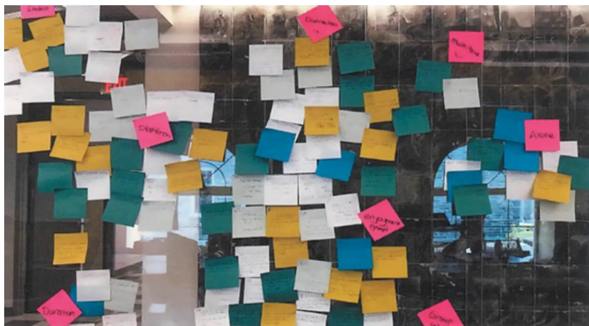  
Figure 9.4  Section of an affinity diagram built during the design of a web application Source: Courtesy of Madeline Smith

To read more about the use of affinity diagrams in interaction design, see

the following page: www.interaction-design.org/literature/article/

affinity-diagrams-learn-how-to-cluster-and-bundle-ideas-and-facts.

And  here is  a speeded-up  video  of an  affinity  diagramming session:  media

.nngroup.com/media/editor/2018/01/18/affinity_marriott_speedy.mp4.

# 9.4.2  Categorizing Data

Inductive analysis is appropriate when the study is exploratory or if it is important to let the themes emerge from the  data itself. Sometimes, a pre-existing set of categories is  chosen as the analysis frame. This is appropriate when an existing theory or previous analyses provide a useful lens on the study goals. In this case, analysis proceeds deductively. For example, in a study  of novice interaction designer behavior  in Botswana, Nicole  Lotz  et  al. (2014)  used Schön  (1983)’s design  and  reflection  cycle: naming, framing,  moving, and  reflecting. This allowed the researchers to identify detailed patterns in the designers’ behavior, from which they derived implications for education and support.

An early example of categorization from a set of studies looking at the use of different navigation aids in an online educational setting (Armitage, 2004)  illustrates this approach. These studies involved observing students working through some online educational material about  evaluation methods, using  the think-aloud technique. The think-aloud protocol  was recorded and then transcribed before being analyzed from various perspectives, one of which was to identify usability problems that the participants were having with the online environment. Figure 9.5 shows an excerpt from the transcription.

This excerpt was analyzed using a categorization scheme derived from a set of negative effects  of a system  on  a user  (van Rens, 1997)  and was iteratively extended to  accommodate the specific kinds of interaction observed in these studies. The categorization scheme is shown in Figure 9.6.

This scheme developed and evolved as the transcripts were analyzed and more categories were identified  inductively. Figure 9.7 shows the excerpt from  Figure 9.5 coded using  this categorization scheme. Note that the transcript is divided up using square brackets to indicate which element is being identified as showing a particular usability problem.

Having categorized the data, the results can be used to answer  the study goals. In the online  education  example, the  researchers  were  able  to  quantify  the  number  of  usability problems encountered overall by participants, the mean number of problems per participant for  each of the  test conditions, and  the number  of unique  problems  of each type  per  participant. This also  helped to identify patterns of behavior and recurring  usability problems. Having the think-aloud protocol meant that the overall view of the usability problems could take context into account.

I’m thinking that it’s just a lot of information to absorb from the screen. I  just I don’t concentrate very well when I’m looking at the screen. I have a very clear idea of what I’ve read so far…but it’s because of the headings I know OK this is another kind of evaluation now and before it was about evaluation which wasn’t anyone can test and here it’s about experts so it’s like it’s nice that I’m clicking every now and then coz it just sort of organizes the thoughts. But it would still be nice to see it on a piece of paper because it’s a lot of text to read.

Am I  supposed to, just one  question, am supposed to say  something about  what I’m reading and what I think about it the conditions as well or how I feel reading it from the screen, what is the best thing really?

Observer: What you think about the information that you are reading on the screen… you don’t need to give me comments…if you think this bit fits together.

There’s so much reference to all those previously said like I’m like I’ve already forgotten the name of the other evaluation so it said unlike the other evaluation this one like, there really is not much contrast with the other it just says what it is may be…so I think I think of…

Maybe it would be nice to have other  evaluations  listed to see other evaluations  you know here, to have the names of other evaluations other evaluations just to, because now when I click previous I have to click it several times so it would be nice to have this navigation, extra links.

Figure 9.5  Excerpt from a transcript of a think-aloud protocol when using an online educational environment. Note the prompt from the observer about halfway through.

Source: Armitage (2004). Used courtesy of Ursula Armitage

# ACTIVITY 9.2

The following is a think-aloud extract from the same study of users working through online educational material. Using the categorization scheme in Figure 9.6, code this extract for usability problems. It is useful to put brackets around the complete element of the extract being coded.

Well, looking at the map, again there’s no obvious start point, there should be something highlighted that says ‘start here.’

OK,  the next keyword that’s highlighted is  evaluating, but  I’m not sure  that’s where I  want to go straightaway, so I’m just going to go back to the introduction.

Yeah, so I probably want to read about usability problems before I start looking at evaluation. So, I, yeah. I would  have thought  that the links in each one of the pages would take you to the next logical point, but my logic might be different to other people’s. Just going to go and have a look at usability problems.

OK, again I’m going to flip back to the introduction. I’m just thinking if I was going to do this myself, I would still have a link back to the introduction, but I would take people through the logical sequence of each one of these bits that fans out, rather than expecting them to go back all the time.

Going  back…to the  introduction. Look  at the  types.  Observation, didn’t  really want  to go  there. What’s this bit [pointing to Types of UE on map]? Going straight to types of…

OK, right, yeah, I’ve already been  there before.  We’ve  already looked at usability problems,  yep, that’s OK, so we’ll have a look at these references.

I clicked on the map rather than going back via introduction; to be honest, I get fed up going back to introduction all the time.

# Comment

Coding  transcripts  takes  practice,  but  this  activity  illustrates  the  kinds  of  decisions  involved in applying categories. The coded extract is shown here:

[Well, looking at the map, again there’s no obvious start point UP 1.2, 2.2], [there should be something highlighted that says ‘start here’ UP 1.1, 1.10].

OK, the next keyword that’s highlighted  is evaluating, but  [I’m not sure  that’s where I  want to go straightaway UP 2.2], so I’m just going to go back to the introduction.

Yeah,  so  I  probably  want  to  read  about  usability  problems  before  I  start  looking  at  evaluation. So, I, yeah. [I would  have thought  that the links in each one of the pages would take you to  the next logical point, but my logic might be different to other people’s UP 1.3]. Just going to go and have a look at usability problems.

OK, again I’m going to flip back to the introduction. [I’m just thinking if I was going to do this myself, I would still have a link back to the introduction, but I would take people through the logical sequence of each one of these bits that fans out, rather than expecting them to go back all the time UP 1.10].

Going back…to  the introduction.  [Look at the types. Observation,  didn’t really  want to go  there. What’s this bit [pointing to Types of UE on map]? UP 2.2] Going straight to types of…

OK, right, yeah, I’ve already been  there before.  We’ve  already looked at usability problems,  yep, that’s OK, so we’ll have a look at these references.

I clicked on the map rather than going back via introduction; [to be honest, I get fed up going back to introduction all the time. UP 1.1].

# 9.4.3  Critical Incident Analysis

Data  gathering  sessions can  often  result in a  lot of  data. Analyzing  all  of this  data in  any detail  is  very  time-consuming  and  often  not  necessary. Critical  incident  analysis  is  one approach to identify significant subsets of the data for more detailed analysis. This technique emerged from work carried out in the United States Army Air Forces where the goal was to identify the critical requirements of good and bad performance by pilots (Flanagan, 1954). It has two basic principles: “(a) reporting facts regarding behavior is preferable to the collection of interpretations, ratings, and opinions based on general impressions;  (b) reporting should be limited to those behaviors which, according to competent observers, make a significant contribution to the activity” (Flanagan, 1954, p. 355). In the interaction design context, the use  of  well-planned  observation  sessions  satisfies  the  first  principle.  The  second  principle refers to critical incidents, that is, incidents that are significant or pivotal to the activity being observed, in either a desirable or an undesirable way.

# 1.  Interface Problems

1.1.  Verbalizations show evidence of dissatisfaction about an aspect of the interface.   
1.2. Verbalizations  show  evidence  of  confusion/uncertainty  about  an  aspect  of  the interface.   
1.3.  Verbalizations show evidence of confusion/surprise at the outcome of an action.   
1.4.  Verbalizations show evidence of physical discomfort.   
1.5.  Verbalizations show evidence of fatigue.   
1.6.  Verbalizations show evidence of difficulty in seeing particular aspects of the interface.   
1.7. Verbalizations show evidence  that they are  having  problems achieving  a goal that they have set themselves, or the overall task goal.   
1.8.  Verbalizations show evidence that the user has made an error.   
1.9. The  participant  is  unable  to  recover  from  error  without  external  help  from  the experimenter.   
1.10.  The participant suggests a redesign of the interface of the electronic texts.

# 2.  Content Problems

2.1.  Verbalizations show evidence of dissatisfaction about aspects of the content of the text.   
2.2.  Verbalizations show evidence of confusion/uncertainty about aspects  of the content of the text.   
2.3.  Verbalizations show evidence of a misunderstanding of the text content (the user may not have noticed this immediately).   
2.4.  The participant suggests re-writing the text content.

Identified problems should be coded as [UP, $< <$ problem no. >>].

# Figure 9.6  Criteria for identifying usability problems from verbal protocol transcriptions Source: Armitage (2004). Used courtesy of Ursula Armitage

In interaction design, critical incident analysis has been used in a variety of ways, but the main focus is to identify specific incidents that are significant and then to focus on these and analyze them in detail, using the rest of the data collected as context to inform interpretation. These may  be identified  by participants  during a retrospective  discussion of a recent event or by an observer either through studying video footage or in real time. For example, in an evaluation study, a critical incident may be signaled by  times when participants were obviously stuck—usually marked by a comment, silence, looks of puzzlement, and so on.

In a  study  of city dashboards,  Gareth Young  and  Rob  Kitchin  (2020) used a  critical incident technique  with concurrent think-aloud  to capture  details  of critically significant behaviors. Participants were asked  to explore  four city dashboards (Dublin, New  York, London, and Hawaii), and the results were used to derive design guidelines for building other city dashboards including  for  navigation and  visualizations. In another  study, Tuomas Kari et al. (2017) used the critical incident technique to identify the types of behavior change that playing the  location-based augmented  reality  game Pokémon  GO induced  in players. They distributed a survey through social media channels asking experienced players to identify and describe one outstanding positive or negative experience. The 262 valid responses were themed and  categorized  into eight  groups. Apart  from expected behavior change such as increased physical activity, they also found that players were more social, their routines more meaningful, they expressed more positive emotions, and were more motivated to explore their surroundings.

To read more on critical incident analysis in usability studies where the emphasis is on understanding the cause of problems, see www.usabilitybok.org/ critical-incident-technique.

[I’m thinking that it’s just a lot of information to absorb from the screen. UP 1.1][ I just I don’t concentrate very well when I’m looking at the screen UP 1.1]. I have a very clear idea of what I’ve read so far…[but it’s because of the headings UP 1.1] I know OK this is another kind of evaluation now and before it was about evaluation which wasn’t anyone can test and here it’s about experts so it’s like it’s nice that I’m clicking every now and then coz it just sort of organises the thoughts. [But it would still be nice to see it on a piece of paper UP 1.10] [because it’s a lot of text to read UP 1.1].

Am I supposed to, just one question, am supposed to say something about what I’m reading and what I think  about it the conditions as well or how I  feel reading  it from the screen, what is the best thing really?

Observer: What you think about the information that you are reading on the screen… you don’t need to give me comments…if you think this bit fits together.

[There’s so much reference to all those previously said UP 2.1] [like I’m like I’ve already forgotten the name of the other evaluation so it said unlike the other evaluation this one like, there really is not much contrast with the other it just says what it is may be…so I think I think of…UP 2.2]

[Maybe it would be nice to have other evaluations listed to see other  evaluations you know here, to have the names  of other evaluations other  evaluations UP 1.10]  just to, [because now when I click previous I have to click it several times UP 1.1, 1.7] [so it would be nice to have this navigation, extra links UP 1.10].

Figure 9.7  The excerpt in Figure 9.5 coded using the categorization scheme in Figure 9.6

Source: Armitage (2004). Used courtesy of Ursula Armitage

# ACTIVITY 9.3

Assign yourself or a friend the task of identifying the next available live music performance that you’d like to attend. As you perform this task, or watch your friend do it, make a note of critical incidents associated with the activity. Remember that a critical incident may be a positive or a negative event.

# Comment

Information about such performances may be available through a local noticeboard, searching ticket vendor apps, looking at social media to see what is recommended by friends, or contacting local bars, theaters, or clubs directly. When this author asked her daughter to attempt this task, several critical incidents emerged, including the following:

(Continued)

1. After checking her social media channels, nothing in the recommendations appealed to her, so she decided to check the local venues directly.   
2. She found that one of her favorite bands was playing at the local music venue for just one week, and tickets were still available.   
3. When trying to buy the  tickets, she discovered that she needed a credit card, which she didn’t have, so she had to ask me to complete the purchase!

# 9.5  Analytical Frameworks

There are several analytical frameworks that can be used to guide and extend the basic qualitative  analysis  techniques.  In  this  section,  six  different  approaches  are  outlined,  ordered roughly in terms of their granularity, that is, the level of detail involved. For example, conversation analysis has a fine level of granularity, and it allows the detailed examination of what is said and how  during a short  fragment of conversation, while  systems-based frameworks take a broader scope and have a coarser level of granularity, such as what happens when a new digital technology is introduced into  an organization, like a hospital. Conversation analysis may result in insights related to participants’ interactions through a collaboration technology, while  systems-based  analyses  may  result  in  insights  related  to  changes  in  work  practices, worker satisfaction, improvements in workflow, impact on an office culture, and so on.

# 9.5.1  Conversation Analysis

Conversation analysis (CA) examines the semantics of a conversation in fine detail, focusing on how  a conversation is  conducted (Jupp, 2006). This  technique is useful  to examine  the rules  of  conversation  such as  how  conversations  start, how  turn-taking is  structured, and how conversations differ in different settings. For example, it has been used to compare the kind of conversations  that take place  in face-to-face conversations versus  those conducted through social media, and to analyze  the conversations  that take  place with  voice-assisted technologies and chatbots.

Voice assistants (also called smart speakers), like Amazon Echo, provide a limited kind of conversational interaction, mainly by answering questions and responding to requests. But how do families orient and adapt to them? Does using this device change the way they talk, or do they talk to the device as if it was another human being?

Martin  Porcheron  et  al. (2018)  conducted  a  study  examining  how  such  devices were being used by families in their own homes, and they used conversation analysis with excerpts from  selected conversations. Figure 9.8 presents a sample fragment of a conversation  they analyzed. This uses a particular type of syntax for marking up the minutiae of interactions and speech that took place during an approximate 10-second period. Square parentheses are used to show overlapping talk, round parentheses to indicate a pause, and physical spacing to show temporal sequencing of what is said. This level of detail enables the analysis to reveal subtle cues and mechanisms that are used during the conversations.

In this fragment, Susan (who is the mother) announces to Liam (her son) and Carl (the father) her desire to play a particular game (called Beat the Intro) with their Amazon Echo. Liam does not want to play (expressed by his long “no” cry in response). Susan, however, has already called “Alexa” to wake  up the device. Carl  shows his support for her, as indicated

by his quick “yeah” during the pause after she says “Alexa.” Alexa, however, appears not to respond. At this point, Susan returns to the ongoing family conversation, telling Liam to keep eating  his “orange  stuff.” Carl also  chips in after her and says to Liam that  he  should also eat the “green stuff.” At  the same  time, Susan  has another go  at getting Alexa  to wake up. She calls out “Alexa” twice in a questioning voice. In the pause between Susan’s two calls to Alexa, Carl tells Liam to keep eating again, but this time the “brown stuff.” Having succeeded in waking up Alexa, Susan then asks it to play the game.

```txt
01 SUS i'd like to play beat the intro in a minute  
02 LIA [oh no:]  
03 SUS [alexa] [(1.1)] beat the in[tro]  
04 CAR [°yeah°;]  
05 LIA [°no:]:...°  
06 CAR (0.6) it' mother's day? (0.4)  
07 SUS it's ( ) yep (. ) listen (. ) you need to keep  
08 on eating your orange stuff (. ) liam  
09 (0.7)  
10 CAR and your green stuff  
11 SUS alexa (1.3) alexa (0.5) =  
12 CAR =°and your brown stuff  
13 SUS play beat the intro 
```

Figure 9.8  An extract  of the  conversation between  the  family and  Alexa, marked up for conversation analysis

Source: Porcheron et al. (2018), fragment 1. Reproduced with permission of ACM Publications

So, what insights does this fine level of analysis provide? Martin Porcheron et al. (2018) point out that it demonstrates how a family’s interaction with the Amazon Echo is seamlessly interwoven with other ongoing activities, in this case, the parents trying to get their child to eat his  food. At  a more general  level, it illustrates  how conversations  with each other  and voice-assisted technologies interleave in nuanced ways rather than being separate conversations between members of the family or the family and the device, which jump from one to another. They also show how their analysis led them to think that the term conversational interaction  fails  to  distinguish  between  the  interactional  embeddedness  of  voice-assisted interfaces and human conversation. Instead, they suggest that current voice-assisted technologies be designed using a conceptual model more akin to instructing rather than conversing.

# 9.5.2  Discourse Analysis

While  conversation analysis focuses  on the  structure  of the  conversation,  discourse  analysis focuses on dialogue itself, in other words, the meaning of what is said and how words are used to convey meaning. Discourse analysis is strongly interpretive, pays great attention to context (Diaz, 2020), and  views language not  only as reflecting psychological  and  social aspects but  also as constructing them (Coyle, 1995). An underlying assumption of discourse analysis is that there is no objective scientific truth. Language is a form of social reality that is open to interpretation from different perspectives. In this sense, the underlying philosophy of discourse analysis is similar to that of ethnography. Language is viewed as a constructive tool, and discourse analysis provides a way of focusing on how people use language to construct versions of their worlds (Fiske, 1994).

Small  changes  in  wording  can  change  meaning,  as  the  following  excerpts  indicate (Coyle, 1995):

Discourse analysis is what you  do when you are  saying that you are  doing discourse analysis…

According to Coyle, discourse analysis is what you do when you are saying that you are doing discourse analysis…

By adding just three words, “According to Coyle,” the sense of authority changes, depending on what the reader knows about Coyle’s work and reputation.

Discourse  analysis is  useful  when trying  to identify  subtle and  implicit  meaning being expressed; the data used can be in various formats and come from multiple data sources such as interviews, emails, blogs, photographs, and news  sites. For example, Anna Nagele et al. (2022)  investigated  the  discourse  surrounding  wearable  sleep-tracking  devices. To do  this they collected data from  three sources: academic  research papers, interviews with wearers, designers  and  developers  of sleep-trackers,  and  online  documents  such  as  websites, social media accounts, and adverts. Through this analysis  they identified  six personas relating to the  role that  sleep trackers play  in people’s lives:  teacher, informant,  companion, therapist, coach, and mediator.

Discourse  analysis  can  also  be  used  with  data  from  social  media  such  as  Facebook, Twitter, and WhatsApp. Carlos Roberto Teixeira et  al.  (2018)  analyzed  the tweets  posted during the political scandals in Brazil during 2016. Using discourse analysis and drawing on their understanding of the cultural background and technology adoption and use in Brazilian society, they were able to discern the hidden meaning of tweets by identifying the most dominant discourse characteristics. They identified five general themes: (1) “support” (tweets that  promote  either  side  of  the  political  dispute);  (2) “criticism  and  protest”  (tweets  that showed disapproval or an objection); (3) “humor” (tweets that were witty and had cartoons or jokes in them); (4) “news” (tweets that refer to the news that were neutral in tone); and (5) “neutral” (tweets that were indifferent or their position could not be inferred). Once classified, the data was analyzed using descriptive statistics and simple visualizations. They found that tweets in the criticism and protest theme were the most popular overall, followed by humor.

This kind of analysis is very time-consuming when done by hand, but there are software tools that can automatically process computer-mediated discourses (see Section 9.6). One advantage is that much larger datasets can be analyzed. The downside is that the analyst is no longer “handson” and loses touch with the surrounding context, meaning that different interpretations arise.

# 9.5.3  Content Analysis

Content analysis typically involves classifying the  data into categories and then studying the frequency  of category occurrences  (Krippendorff, 2013), although some content  analysis approaches emphasize frequency  counts more than others (Hsieh and  Shannon, 2005). The technique can be used for any text, where text refers to a range of media including video, newspapers, advertisements, survey responses, images, and sounds, and any online content, including the text of tweets, links, animated gifs, videos, and images. For example, Yolande Strengers et al. (2020) focused  on how visions  for the  smart home were being discussed  in consumer, news, and trade articles. They analyzed 270 articles, including 166 feature images, published between 2000 and 2016 to understand the lifestyle expectations they promoted. Their findings indicate that the visions promote an enhanced quality of life including effortless energy-saving but  also new  opportunities  to consume  energy.  Julia  Himmelsbach  et al.’s  (2019) study  of

diversity in HCI studies focused on frequency counts. Using predefined frameworks of diversity dimensions, they examined articles from CHI 2006, 2011, and 2016 to see how consideration of diversity in HCI studies has changed over this period. Their results showed that research still examined a limited number and set of dimensions, for example, the dimensions of Class and Education changed from 0.38 to 0.51 mean occurrences, and 1.46 to 1.33 mean occurrences, respectively, while sexual orientation increased from 0 to 0.07 mean occurrences.

Content analysis is often used in conjunction with other analysis techniques. For example, Zahra Razavi et al. (2022) analyzed dialogues between a conversational agent and participants. Using content analysis alongside sentiment analysis (see Chapter 10, “Data at Scale and  Ethical  Concerns”),  an  approach  that extracts  emotional  and  subjective  information from natural language, they observed that the participants were more engaged with the agent when talking about intimate and emotionally intense topics.

# 9.5.4  Interaction Analysis

Interaction analysis was developed by Brigitte Jordan and Austin Henderson (1995) as a way of  investigating  and  understanding  the interactions  of human  beings  with each  other  and artifacts and technologies, in their environment. The technique focuses on both talk and nonverbal interactions with these, and it is based on video recordings. An underlying assumption of this approach is that knowledge and action are fundamentally social. The goal is to derive generalizations  from  videos  of  naturally  occurring  activities,  focusing  on  how  the  people being observed make sense of each other’s actions and their collective achievements.

Interaction analysis is an inductive process, where teams of researchers suggest statements about  general  patterns from multiple examples of empirical  observations. Rather than individual researchers conducting separate analyses and then comparing their results for consistency, interaction analysis is conducted collaboratively; teams discuss their observations and interpretations of the videos as they watch them together. The first step involves creating a content log, comprising headings and rough summaries of what has been observed. Categories emerge from repeated playing and discussion of the video material. Hypotheses are also generated by group members about what they think is happening. This process includes suggesting the intentions, motivations, and understandings of the participants, based on their actions and not purely speculation. For example, if an analyst thinks someone’s motivation is to take control during a board meeting, they need to provide example extracts that demonstrate how the person is achieving this (for instance, presenting their own ideas for long periods of time, and excluding others).

The  videos  are  then  cannibalized,  as  it  is  called,  by  extracting  interesting  materials, reclassifying some of them in terms of what they represent, while removing others. Instances of a salient event are assembled and played one after another to determine whether a phenomenon is a robust theme or a one-off incident.

An example of interaction analysis being used in HCI is Naomi Polinsky et al.’s (2021) study of how parents and children collaborate when programming a robot to visit a series of  locations on  a  map. They  were interested  in how  parents and  children supported  each other through this form of communication. Specifically, they were interested in the symbols used and what elements of those symbols were most salient for their collaborative work. The pairs’  coding  interactions  were  recorded  through two  channels:  a  tablet that was  used  to program the robot, and a separate video recording of the pairs’ activities. For analysis, these recordings were synced. Following the steps of interaction analysis, Naomi Polinsky and her colleagues  generated  multi-modal  transcripts of  activity  from  the  two  recordings,  selected two  cases that  illustrated challenges due to parents’ and children’s different  interpretations

of symbols, and analyzed the recordings to provide insights about these differences and how the challenges  were overcome. One of their findings was that the physical representational tool  supported  collaboration  better  than  the  digital  tool. From  their  analysis  they  developed guidelines for codable robot design: to provide representational tools that invite shared meaning making; and that the representational  tools should support translation into robot instructions.

# 9.5.5  Grounded Theory

The goal of grounded theory is to develop theory from a systematic analysis and interpretation of empirical data; that is, the derived theory is grounded in the data. In this respect, it is an  inductive  approach  to  developing  theory.  The  approach  was  originally  developed  by Barney Glaser and Anselm Strauss (1967) and has been adopted by many researchers. Both of them have individually (and with others) developed grounded theory in slightly different ways. Barney Glaser (1992) provides further information about these differences and areas of controversy.

In this context, theory is: “a set of well-developed concepts related through statements of relationship, which together constitute an integrated framework that can be used to explain or predict  phenomena” (Strauss  and Corbin, 1998). Development  of a “grounded” theory progresses through alternating data collection and data analysis: First data is  collected and analyzed to identify themes, then that analysis may lead to further data collection and analysis  to  extend  and  refine  the  themes,  and  so  on.  During  this  cycle,  parts  of  the  data  may be reanalyzed in more  detail. Data  gathering and subsequent  analysis are hence driven  by the emerging  theory. This approach  continues until no  new insights emerge and the theory is well-developed. During this process, the researcher  seeks to maintain a balance  between objectivity  and  sensitivity. Objectivity  is  needed  to  maintain  accurate  and  impartial  interpretation  of  events;  sensitivity  is  required  to  notice  the  subtleties  in  the  data  and  identify relationships between concepts.

The  thrust  of  this  analysis  is  to  identify  and  define  the  properties  and  dimensions  of relevant themes called categories in grounded theory. According to Juliet Corbin and Anselm Strauss (2014),  this  coding  has three  aspects, which  are  iteratively  performed through  the cycle of data collection and analysis:

1.  Open coding  is  the process through  which  categories, their  properties, and dimensions are  discovered in the  data. This process  is  similar to thematic analysis  discussed earlier, including the question of granularity of coding (at the word, line, sentence, conversation level, and so on).   
2.  Axial coding is the process of systematically fleshing out categories and relating them to their subcategories.   
3.  Selective coding is the process of refining and integrating categories to form a larger theoretical scheme. The categories are organized around one central category that forms  the backbone of the theory. Initially, the theory will contain only an outline of the categories, but as more data is collected, they are refined and developed further.

Early books on grounded theory say little about what data collection techniques to use but  focus instead on  the analysis. However, Kathy  Charmaz (2014)  discusses interviewing

techniques  and  collection  and analysis  of  documents  for  grounded  theory analysis. When analyzing data, Juliet Corbin and Anselm Strauss (2014) encourage the use of written records of analysis and diagrammatic representations of categories (which they call memos and diagrams). These memos and diagrams evolve as data analysis progresses.

The following analytic tools are used to help stimulate the analyst’s thinking and identify and characterize relevant categories:

The  Use  of  Questioning:  In  this  context, this  refers  to  questioning  the  data,  not  the  participants. Questions  can help an analyst to generate ideas or consider different ways of looking at the data. It can be useful to ask questions when analysis appears to be in a rut. Analysis of a Word, Phrase, or Sentence: Considering in detail the meaning of an utterance can also help to trigger different perspectives on the data.

Further  Analysis  Through  Comparisons:  Comparisons  may  be  made  between  objects  or between abstract categories. In either case, comparing one with the other brings alternative interpretations.

Grounded theory uses reflexive thematic analysis. That is, themes are identified from the data, this analysis informs further data collection, new data is categorized according to the existing thematic set, and then the definitions of that set are evolved to accommodate new findings. There  are variations of grounded  theory, and several  papers and texts  have been written to support its application, but some misunderstandings persist. Roy Suddaby (2006) offered six misconceptions surrounding the use of grounded theory, including that it is not a routine application of a technique, while Tom Cole and Marco Gillies (2022) highlight areas of misunderstanding including that it is more than simply coding data and that data collection and analysis are interwoven.

# A Grounded Theory Example

Idle  games are  minimalist games that  require  little or  even  no interaction  in  order for the game to progress. For example, an idle game may involve repeating a simple action like clicking  an  icon  to accumulate  resources. Example  games  include  the Kittens  Game, which  is text-based; that is, it has no graphical user interface and involves managing a village of kittens. Cookie Clicker involves baking and selling cookies. An extreme example studied by Joe Cutting et al. (2019) is Neko Atsume, a game about collecting cats, in which progress can be made only if the game is switched off. Robinhood’s Forest is an example of a persuasive idle game  (Chaudhry  and  Kulkarni, 2022), which  is  designed  to  counteract the  inclination  of novice investors to over-trade and hence to make costly investment decisions. Robinhood’s Forest limits interactivity and hence encourages a long-term investment strategy. But because they are designed to be minimally interactive, existing game taxonomies and design principles are less applicable to this genre.

Sultan Alharthi et al. (2018) used grounded theory to examine 66 idle games and 10 nonidle games to identify what are the essential characteristics of idle games and how can they be designed. From this they developed a taxonomy of idle games, identified their unusual use of player attention, and suggested design implications for them.

The three stages of coding, open, axial, and selective are illustrated in Figure 9.9. Note that, in this case, the research started by the researchers playing each of the games under study.

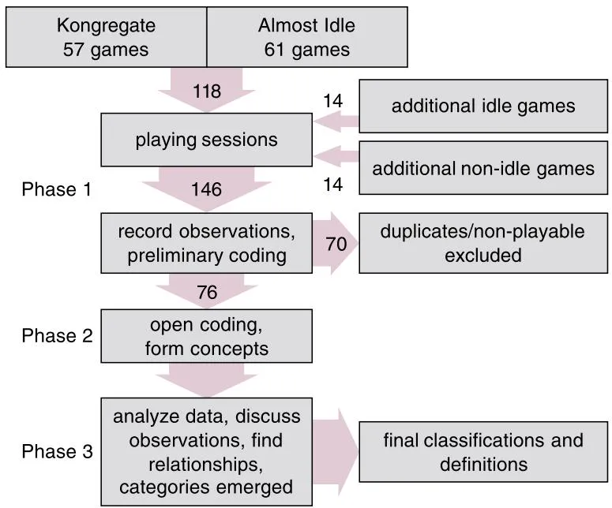  
Figure 9.9  The process used by Alharthi et al., showing Phase 2 and Phase 3 using the three stages of grounded theory coding

Each game was played by two researchers who recorded their observations in a spreadsheet. These observations focused on gameplay, game mechanics, rewards, interactivity, progress rate,  and game  interface.  Then  they  rated  the  games using  an  11-point  interactivity scale (0–10) where 0 meant that play progressed without any interaction of the player, while 10 meant that the game progressed only slowly without player interaction. Progress through the levels of the game were also rated on the same scale.

At the end of each game session and observation, the researchers wrote a brief overview of the game and conducted preliminary open coding  of their observations  (see Figure 9.10 for an example of preliminary open coding).

Axial  and  selective coding  progressed  iteratively. The  researchers  held  several  discussion sessions to explore the relationship between the codes, the emergent  concepts, and the initial categories. During this process, some of the  games were re-observed, and related literature was drawn upon to help refine the concepts. For example, existing literature on game taxonomies, prior  terms, and  definitions related  to  idle games  were  incorporated  into  the analysis. Based on this analysis, Sultan Alharthi et al. (2018) produced a taxonomy with two basic ways to characterize the games: one based on key features and one based on interactivity. From the former, they defined incremental games as idle games in which a player selects resources to generate, waits for them to accumulate, and spends  the resources to automate resource generation. Figure 9.11 illustrates the open  codes, resulting concepts, and categories developed for incremental games. This shows that four categories of incremental games emerge from this analysis: micromanagement, derivative, single-resource, and multi-player.

<table><tr><td>Game Feature</td><td>Observations</td></tr><tr><td>Game name</td><td>AdVenture Capitalist [G38]</td></tr><tr><td>Play description</td><td>You start CLICKING on a lemonade stand and collect money. Spend money to make upgrades, INCREASE PRODUCTION PER CLICK. Start hiring workers and INCREASE PRODUCTION PER SECOND. When you have enough money, you can buy new businesses, automate all your businesses to INIncrement more money, and leave the game progress.</td></tr><tr><td>Game mechanics</td><td>Click to gain money, AUTOMATE production, make upgrades to DAMAGE/SEC.</td></tr><tr><td>Rewards</td><td>ONE CURRENCY, which is money, is rewarded in return.</td></tr><tr><td>Interface</td><td>GRAPHICAL</td></tr><tr><td>Interactivity level</td><td>7</td></tr><tr><td>Progress rate</td><td>9</td></tr><tr><td>Overview</td><td>This is a SINGLE-PLAYER game, which requires LONG CYCLES OF Clicking at the start, and making a number of upgrades. Production rate reaches $390/sec in less than 10 minutes, and you gain 1M in cash making the game progress faster.</td></tr></table>

Figure 9.10 An illustration of preliminary open coding. Words in small capitals are identified by the researcher as potential codes.

Figure 9.11 The grounded theory process showing the development of open coding, through concepts to categories   
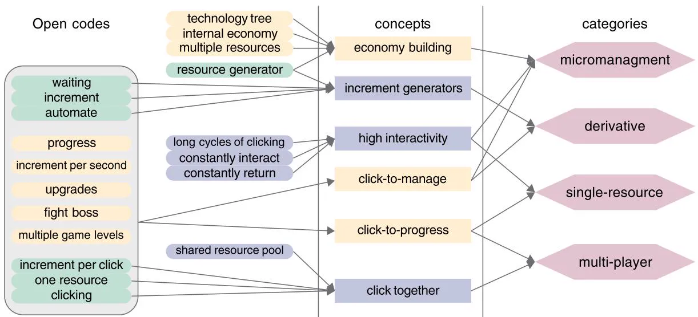  
The analysis process that developed the incremental games super-category (each category above is part of incremental games). The process started with open coding of observations on idle games: multiple codes are created. Concepts are discovered through analyzing the open codes and identifying common features. This is an iterative process, where new codes are added, combined, or deleted. Each code is connected to one or more games and can be combined to form new concepts. Concepts are analyzed to find common relationships, and, thus, categories emerge. In the diagram, coloration is only to aid in reading. The left grouping is to show that all contained codes are part of click-to-manage and click-to-progress.

Using grounded theory helped to develop a better understanding of idle games. In contrast to other gaming taxonomies that feature interactivity and interaction strategies, the idle games taxonomy is based on game rules and their basic underlying structure. But what makes idle games interesting? Idle games value and reward waiting, so game rules force players into an  idle state, during which  resources  accumulate and players  can think  about  their future choices. In fact, the longer they stay away from the game, the more options will be available when they  return,  although idling  for too  long  can  also  mean  that  opportunities  are  lost. Advantages of idle games are that they  can be interwoven between  other activities, during small windows of boredom; and since idling is playing, players don’t have to put time aside specifically to play!

# 9.5.6  Systems-Based Frameworks

For large projects where the researcher is interested in how best to introduce a new technology and what is its impact afterward, it is necessary to analyze many sources of data collected over a long period of time. Conducting analyses of small fragments of conversation or identifying themes from interviews may be useful for highlighting specific working practices, but understanding  how  a  whole  socio-technical  system  (for  example  a  hospital,  corporation, local  council, or  airport) works at  scale  requires a different  kind of analytical framework. Two such frameworks are introduced next: socio-technical systems theory (Eason, 1987) and distributed  cognition  (Hutchins,  1995),  as  applied  through  the  Distributed  Cognition  of Teamwork framework (Furniss and Blandford, 2006).

# Socio-technical Systems Theory

Socio-technical systems (STS) theory makes explicit the fact that the technology and the people in a work system are interdependent (Klein, 2014). Rather than trying to optimize either the technical subsystem  or the social subsystem  independently of each  other, STS suggests that this interdependency be recognized, and the “system” be treated as a whole. The ideas behind STS theory were first conceptualized around coal mining in the 1950s (see Trist and Bamford, 1951, for example), but it also has a long history of being applied in hospitals and healthcare  settings  (Waterson, 2014)  as  well  as  manufacturing  and  social  media  systems. Martin Maguire  (2014) highlighted  the importance  of the socio-technical perspective with the rise of virtual organizations. Ken Eason (2014) identified  five significant and enduring aspects of STS theory (Eason, 2014):

1.  Task interdependencies: If people are focused on one large task, then the division of subtasks between  them inevitably sets  up interdependencies that are critical to understand. Understanding these interdependencies is particularly useful for recognizing the implications of change.   
2.  Socio-technical  systems are “open systems”: STSs are influenced  by  environmental factors  including  physical  disturbances  and  financial,  market,  regulatory,  and  technical developments.   
3.  Heterogeneity of system  components: The overall  task  is  undertaken by  humans in  the social subsystem  using  technical  resources  in  the technical  subsystem. Both need  to  be resilient. Technical components can evolve while humans can learn, develop, and change the technical components to address challenges of the future.

4.  Practical contributions: STS theory is making practical contributions in analysis of existing  systems,  summative  evaluation  of  a  major  change,  through  potentially  predicting challenges  before  changes  are  made,  and  in  designing  socio-technical  systems  that  are co-optimized.   
5.  Fragmentation of design processes: In a complex socio-technical system, there are different  design processes,  and  these  can  result in  fragmentation. Flexibility  in specification, local focus in design, user-centered design, and system evolution will help overcome these.

STS is a philosophy rather than a concrete set of methods or analytical tools. It has been used as an analytical lens in a wide variety of settings and with a diverse set of data gathering techniques. For example, Michael Sony and Subhash Naik (2020) took an STS perspective to  understand  the  next-generation  manufacturing  (Industry  4.0)  system, how  to  integrate the parts, and how humans will interact with it. Nhi Truong et al. (2022) used STS theory to build  an explanatory  framework for understanding  consumption of raw materials, energy, goods, and services in cities. In both cases, STS provided a holistic perspective to address a challenge.

# Distributed Cognition of Teamwork

Distributed cognition and Distributed Cognition of Teamwork (DiCoT) were introduced in Chapter 4, “Cognitive Aspects,” as an approach to studying the nature of cognitive phenomena across individuals, artifacts, and internal and external representations. Investigating how information is propagated through different media is a key goal of this approach, and while distributed cognition provides a good theoretical framework for analyzing systems, it can be difficult to apply in practice. The DiCoT framework was developed as a method to support the application of distributed cognition. It provides a framework of models that can be constructed from  a set of collected data, for example  ethnographic, interview  transcripts, artifacts, photographs, and so on. Underlying each model is a set of principles distilled from the distributed cognition theory. The models are as follows:

An information  flow model that shows  how information  flows through  the system  and is transformed. This model captures the information channels and hubs together with the sequence of activities and communication between different team roles.   
A physical model that captures  how physical structures support communication between the team  roles and facilitates access to artifacts. This model helps to describe the factors that influence the performance of the system at a physical level.   
. An artifact model that captures how artifacts in this system support cognition. This model can be used to represent the key characteristics of an artifact and how its design, structure, and use can support team members.   
A social structure model that examines how cognition is socially distributed. This model maps the social  structures to the  goal structures, shows how  work is shared, and can be used to consider the robustness of the system.   
. A system evolution model that depicts how the system has evolved over time. This model provides some explanation for why the work is the way it is. Any design recommendations need to take this context into account.

While  the  form  of  the  models is  not  prescribed,  the  underlying principles  support the models’ development. For example, underlying the physical model are principles such as the following:

• Horizon of observation: What an individual can see or hear.   
• Perceptual: How spatial representations aid computation.   
• Arrangement  of  equipment:  How  the  physical  arrangement  of  the  environment  affects access to information.

DiCoT has been used to understand collaborative work in remote and co-located software development teams (Deshpande et al., 2016; Sharp et al. 2009), including the interactions between UX designers and software developers (Zaina et al., 2021; see Figure 9.12). It has also been found to be especially useful for studying how medical teams work and manage  with ever-changing technologies that are introduced into their work environment. For example, Atish Rajkomar and Ann  Blandford (2012)  examined the use of infusion pumps by nurses in an intensive care unit (ICU). Based on the results of this study, they were able to suggest changes that would improve the safety and efficiency of the nurses’ interactions with the infusion technology. Zhan  Zhang  et  al. (2021) focused  on  emergency medical  services teams. Using  three of the  DiCoT models (physical layout, information flow,  and artifacts), they identified opportunities  for technology to support rapid information acquisition, integration, and sharing in this time-critical, high-risk setting.

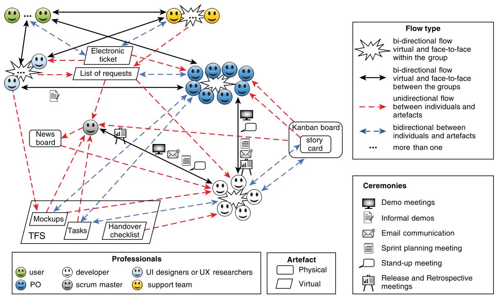  
Figure 9.12 An information flow diagram from a DiCoT analysis of a UX teams’ interaction with software developers, based on ethnographic data (Zaina et al., 2021)

# 9.5.7  Which Analytical Framework to Use?

Deciding which analytical framework to use for any one study can be daunting when reading about the diversity available. Table 9.6 is intended to help by listing the different approaches in terms of the main  types of data, focus, expected outcomes, and level of granularity. The data  column  helps  to determine the data  gathering techniques  to use, while  expected outcomes will help to match the framework with the goal of a study. For example, if the aim of the study is to assess whether conversational agents that have been designed to be proactive are helpful or annoying, then a conversational analysis would be a good choice. If the aim of the study is to investigate how people collaborate in a call center, then a systems-based framework would be suitable.

Table 9.6  Overview of Analytical Frameworks Used in Interaction Design   

<table><tr><td>Framework</td><td>Data</td><td>Focus</td><td>Expected Outcomes</td><td>Level of Granularity</td></tr><tr><td>Conversation analysis</td><td>Recordings of spoken conversations</td><td>How conversations are conducted</td><td>Insights into how conversations are managed and how they progress</td><td>Word-level, or finer, for instance, pauses and inflection</td></tr><tr><td>Discourse analysis</td><td>Recordings of speech or writing from individuals or several participants</td><td>How words are used to convey meaning</td><td>Implicit or hidden meanings in texts</td><td>Word, phrase, or sentence-level</td></tr><tr><td>Content analysis</td><td>Any form of “text” including written pieces, video and audio recordings, or photographs</td><td>How often something is featured or is spoken about</td><td>Frequency of items appearing in a text</td><td>A wide range of levels from words to feelings or attitudes to artifacts or people</td></tr><tr><td>Interaction analysis</td><td>Video recordings of a naturally occurring activity</td><td>Verbal and nonverbal interactions between people and artifacts</td><td>Insights about how knowledge and action are used within an activity</td><td>At the level of artifact, dialogue, and gesture</td></tr><tr><td>Grounded theory</td><td>Empirical data of any kind</td><td>Constructing a theory around the phenomenon of interest</td><td>A theory grounded in empirical data</td><td>Varying levels, depending on the phenomenon of interest</td></tr><tr><td>Systems-based frameworks</td><td>Large-scale and heterogeneous data</td><td>Large-scale involving people and technology, such as a hospital or airport</td><td>Insights about organizational effectiveness and efficiency</td><td>Macro level, organizational level</td></tr></table>

# 9.6  Tools to Support Data Analysis

While it  is  possible to perform  these  kinds of data  analysis using only  manual  techniques, most people would agree that it is quicker, easier, and more accurate to use a software tool of some  kind in  the  majority  of  cases. Using  a simple  spreadsheet  application is  surprisingly effective, but there are other more sophisticated tools available to support the organization, coding, and manipulation of data, and to perform statistical tests.

Tools  to  support  the  organization  of  data  include  facilities  for  categorization, themebased analysis, and quantitative analysis. These typically provide facilities to associate labels (categories, themes, and so on) with sections of data, search the data for keywords or phrases, investigate the relationships between different themes or categories, and help to develop the coding scheme further. Some tools can also generate graphical representations. In addition, some provide help  with techniques such as content  analysis and sometimes mechanisms to show the occurrence and co-occurrence of words or phrases. In addition, searching, coding, project management, writing and annotating, and report generation facilities are common.

Two well-known tools that support some of these data analysis activities are Nvivo and Dedoose. For  example, Nvivo  supports  the annotation and  coding of data  including PDF documents, photos, and video and audio files. Using Nvivo, field notes can be searched for keywords or phrases to support coding or content analysis; codes and data can be explored, merged, and manipulated in several ways. The information can also be printed in a variety of forms such as a list of every occasion a word or phrase is used in the data, and a tree structure showing the relationships  among codes. Like all  software packages, Nvivo has  advantages and  disadvantages, but  it  is  particularly  powerful  for  handling  large  sets  of data  and  can generate output for statistical packages.

Additional  tools  to  support  the  analysis  of  very  large  sets  of  data  are  discussed  in Chapter 10.

More information about software tools designed to support qualitative data analysis, including reviews of several popular ones, can be found through the CAQ-DAS Networking Project, based at the University of Surrey: www.surrey.ac.uk/ computer-assisted-qualitative-data-analysis.

# 9.7  Interpreting and Presenting the Findings

Previous sections in  this chapter have illustrated  a range of different ways  to present findings—as tables of numbers and text, through various graphical devices and diagrams, as a set of themes or categories, and so on. The reason for conducting a study at all is to communicate the findings to others, so how the results are presented is just as important as choosing the right analytical approach. Different formats highlight different aspects of the findings, so

as well as the data gathering and analysis undertaken, the format chosen also depends on the audience  and the  goals  of the  study. In some  situations, the  details  of data  collection  and analysis will be included, for example, when trying to convince an audience about a controversial conclusion. This detail may include snippets of data such as photographs of the context  of use or  videos of participants using the  product. In other situations, only the  salient trends,  headlines, and overall  implications  are needed,  so the style  of  presentation can  be leaner. Where possible, choose a set of complementary representations to clearly demonstrate the different aspects of the findings.

This  section  focuses on  three  kinds of  presentation  styles:  using  structured  notations, stories, and summarizing.

# ACTIVITY 9.4

Consumer organizations and  technology companies regularly conduct investigations about technology use. Find such a report online, and look to see how the results are presented. In particular, consider the following:

1. What kinds of presentation are used?   
2. What is left out of the report?   
3. What is the effect of presenting findings this way?

# Comment

We used a report from dscout published in 2016 investigating smartphone use, available at dscout.com/people-nerds/mobile-touches, and through a downloadable PDF report (Dscout, 2022). Although the results  are a little old, we chose this because it uses a combination of presentation styles: text, simple graphs,  tables, and  video. Note that the  website  and  PDF report use different styles:

1. Graphs and  pie  charts are  used to present  demographics and  app  use, along  with lists, tables,  and  typographic  styles to emphasize  certain  findings. The  report uses two other representations (see Figure 9.13): a bubble diagram to show the relative use of different apps; and a timeline to represent a “heavy user” and a “average user” and how their touches  are  spread across the  day. These  two  representations  illustrate that developing new (or modifying old) representations to communicate findings you want to highlight is acceptable.   
2. There is very little text or description in the PDF report and minimal details about the way in which the data was collected and analyzed. Further details are included on the web page, but not in the report, suggesting that the web page and the report are written for different audiences.   
3. The way in which the findings are presented in the report has quite an impact. The bold and  clear  graphical  images together with minimal  but  highlighted  text mean that the messages are  communicated in a  straightforward  fashion. Including  an edited video  of participants’ responses on the website adds authenticity to the presentation.

(Continued)

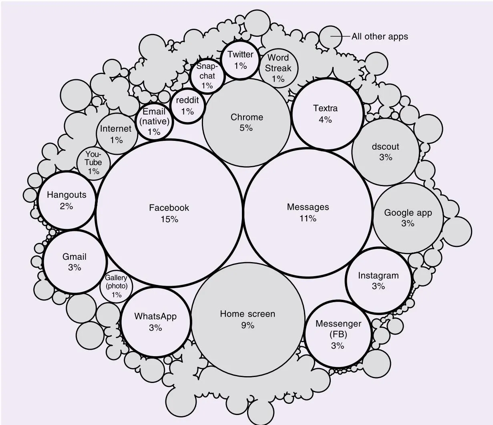  
(a)

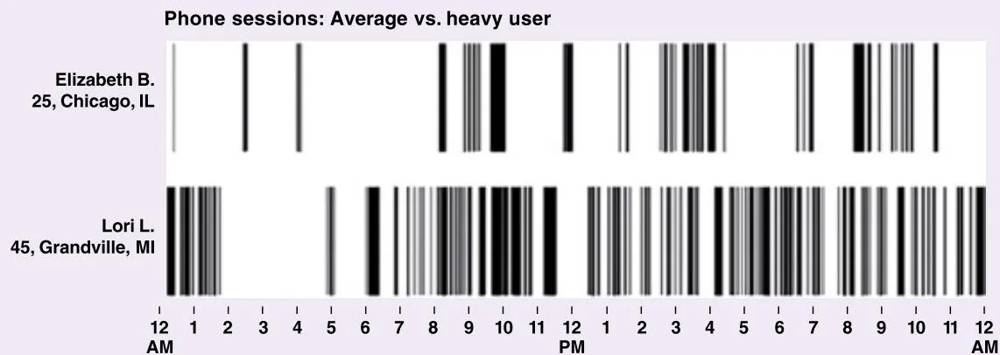  
(b)   
Figure 9.13 Results  representation styles used in Dscout’s report about  smartphone use: (a) a bubble diagram in which the size of the circle represents the number of uses and (b) a timeline across the day of touches from an average user and a heavy user

# 9.7.1  Structured Notations

A number of structured notations are used to analyze, capture, and present information for interaction design. These notations follow a clear syntax and semantics. Some arise from the application domain, such as with music applications, some from the analysis approach such as the notation used in conversation analysis (see Figure 9.8), and some have been developed to capture a holistic view, such as the work models promoted in contextual design (Holtzblatt and  Beyer, 2017). Tighter modeling  conventions  with more  precise  syntax are particularly appropriate  when  details  need  to  be  communicated.  For  example, notations  to  represent flow, decision-making, and dialog structure are used when designing chatbots and other conversational interfaces (Castle-Green et al., 2020). Filippos Ventirozos et al. (2021) discuss the use of an acyclic graph notation (behavior trees) and an algebraic model in the context of a kitchen containing a range of IoT devices. They compared these  notations in terms of how they capture users’ cooking flow.

Advantages of using a structured notation are that the meaning of different symbols is well-defined, and so it provides clear guidance on what to look for in the data and what to highlight  and that it enforces precision in expression. Disadvantages  include that by highlighting specific elements, it inevitably de-emphasizes or ignores other aspects, and the precision expressed by the notation may be lost on an audience if they don’t know the notation well. Producing  diagrams or expressions in these notations may  require further analysis of the  findings in order to identify the specific  characteristics and properties that the notation highlights. To overcome these disadvantages, structured notations are usually used in combination with stories or other more flexible formats.

# 9.7.2  Using Stories

Storytelling is an easy  and intuitive approach for people to communicate  ideas and experiences, so it is not surprising that stories (also called narratives) are used extensively in interaction design. They are used to communicate findings of investigative studies and as the basis for further development, such as product design or system enhancements.

Storytelling may be employed in three different ways. First, participants (such as interviewees, questionnaire respondents, and observed informants) may have told stories of their own  during data  gathering. These  stories can  be extracted, can be compared, and may  be used to communicate findings to others, for example, to illustrate points.

Second, stories (or narratives) based on observation, such as ethnographic field studies, may  be employed for further data gathering. For example, Valeria Righi et al. (2017)  used stories  as the  basis of co-design  workshops in their study to explore  the design and use  of technologies to support older  people. The scenarios  were developed on  the basis of ethnographic studies and previous co-design activities and were presented through storytelling to facilitate understanding.

Including  specific  stories  gives  authenticity  to the  findings, and  it  can  add to its  credibility  provided  the  conclusions  are  not  overstated. Making  a  multimedia  presentation  of the story by adding video or audio excerpts and photographs will illustrate the story further. This kind of approach can also be effective if presenting data from an evaluation study that involves observation, as it is hard to contest well-chosen video excerpts of people interacting with technology or extracts from interview transcripts.

Third, stories  may  be  constructed  from  smaller snippets  or  repeated episodes  that  are found in the  data. In this case,  stories provide  a way  of rationalizing and collating data to form a representative account of a product’s use  or a certain type of event. Mahsa Honary et al. (2018) describe their design of video stories to capture the lived experience of caregivers for people with severe mental illness. Their aim was to create a set of video-based stories that could be used in an online setting to provide support for caregivers. These stories were constructed around personas developed from interviews with caregivers, and using the experiences  described  by  the  interviewees. They  were  presented  by  actors  to  maintain privacy and to address the complex ethical issues surrounding severe mental illness. In this way, the stories were authentic yet anonymous.

Any  stories  collected  through data  gathering  may  be  used  as  the  basis  for  constructing scenarios that can then be used for requirements and design activities. See Chapters 11, “Discovering  Requirements,”  and  12,  “Design,  Prototyping  and  Construction,”  for  more information on scenarios.

# 9.7.3  Summarizing the Findings

Presentation styles will usually be used in combination to produce a summary of the findings; for instance, a story may  be expanded with graphical  representations of activity or demographics, and data  excerpts  from transcripts or  videos  may be  used to illustrate particular points. Tables of numerical data may be represented as graphs, diagrams, or rigorous notations, together with workflows or quotations.

Careful  interpretation  and  presentation  of  the  study results  is  important  so  that  findings are not over-emphasized, and evidence is not misrepresented. Over-generalizing results without good evidence is a common pitfall, especially with qualitative analyses; for example, think carefully before using words such as most, all, majority, and none, and be sure that the justifications  reflect the  data. As  discussed  in Box  9.1,  even statistical  results  can be  interpreted in a misleading way. For example, if 8 out of 10 users preferred design A over design B, this does not mean that design A is 80 percent more attractive than design B. If you found 800  out  of  1,000  users  preferred  design A,  then  you  have  more  evidence  to  suggest  that design A is better, but there are still other factors to consider.

# ACTIVITY 9.5

Consider each of the following findings and the associated summary statement about it. For each one, comment on whether the finding supports the statement.

1. Finding: Two out of four people who filled in the questionnaire checked the box that said they prefer not to use the ring-back facility on their smartphone.

Statement: Half of the users don’t use the ring-back facility.

2. Finding: One day, Joan who works in the design department was observed walking for 10 minutes to collect output from the high-quality 3D printer.

Statement: Significant time is wasted by designers  who have to walk a long distance to collect 3D printer output.

3. Finding: A  data log  of 1,000  hours of interaction  with a  trading  app  recorded during January, February, and March records eight hours spent looking at the help files.

Statement: The app’s help files were used less than 1 percent of the  time during the first quarter of the year.

# Comment

1. The questionnaire didn’t ask if they use the ring-back, just whether they preferred to use the ring-back facility. In addition, two users out of four is a very small number of participants, and it would be better to state the actual numbers.   
2. Observing one designer on one day having to walk to get output does not mean that this is a general problem. There may be other reasons why this happened on this day, and other information is needed to make a clear statement.   
3. This statement is justified as the log was recorded for a significant period of time and using percentages to represent this finding is appropriate as the numbers are large.

# In-Depth Activity

The goal of this in-depth activity is to practice data analysis and presentation. Assume that you are assigned to analyze and present the findings of your data gathering in-depth activity from Chapter 8 to a group of peers, for instance, via a seminar.

1. Review the data that you gathered and identify any qualitative data and any quantitative data in the dataset.   
2. Is there any qualitative data that could sensibly and helpfully be translated into quantitative measures? If so, do the translation and add this data to your quantitative set.   
3. Consider your quantitative data.

a. Decide how  best to  enter  it into spreadsheet software,  for example, how to handle answers to closed-ended questions. Then enter  the data  and generate some graphical representations. As the dataset is likely to be small, think carefully  about  what,  if  any, graphical  representations  will  provide  meaningful summaries of the findings.   
b. Is there any data for which simple measures, such as percentages or averages, will be helpful? If so, calculate the three different types of average.

4. Consider your qualitative data.

a. Based  on  your  refinement  of  the  study  question  “improving  the  product,” identify some themes in the qualitative data, for example, what features of the product cause people difficulties? Did any of the participants suggest alternative designs or solutions? Refine your themes and collate extracts of data that support the theme.   
b. Identify  any critical  incidents in  the  data. These  may  arise  from  interviews, questionnaire responses, or observation. Describe these incidents carefully and choose one or two to analyze in more depth, focusing on the context in which they occurred.

5. Collate your findings as a presentation and deliver them to a group of peers.   
6. Review the presentation and any questions from the audience. Consider how to improve the analysis and presentation.

# Summary

This chapter described in detail the difference between qualitative and quantitative data and between qualitative and quantitative analysis.

Quantitative and qualitative data can be analyzed for patterns and trends using simple techniques and graphical  representations. Qualitative data may  be analyzed inductively or deductively using a variety of approaches. Thematic analysis (an example of inductive analysis)  and  data categorization (an  example of deductive analysis)  are  common approaches. Analytical frameworks include  conversation analysis,  discourse  analysis,  content  analysis, interaction analysis, grounded theory, and systems-based approaches.

It was noted that presenting the results is just as important as analyzing the data; hence, it is important to make sure that any summary or claim arising from the analysis is carefully contextualized and that it can be justified by the data.

# Key Points

•  The kind of data analysis that can be done depends on the data gathering techniques used.   
•  Qualitative and quantitative data may  be collected from any  of the main data gathering techniques: interviews, questionnaires, and observation.   
Quantitative data analysis for interaction design usually involves calculating  percentages and averages.   
•  There are three different kinds of average: mean, mode, and median. Which is most appropriate depends on the characteristics of the dataset.   
•  Graphical representations of quantitative data help in identifying patterns, outliers, and the overall view of the data.   
•  Analysis of qualitative data analysis may be inductive, in which themes or categories are extracted from the data, or deductive, in which pre-existing concepts are used to interrogate the data.   
•  In practice, analysis often proceeds in iterative cycles combining inductive identification of themes and deductive application of categories and new themes.   
•  Which analysis technique to use is closely coupled to the data that is collected and depends on the goals of the study.   
•  Several analytical frameworks exist that can be used to guide and extend the basic qualitative techniques. They focus on different levels of granularity and emphasize different properties of the dataset.

# Further Reading

BLANDFORD, A., FURNISS, D., and MAKRI, S. (2017) Qualitative HCI Research: Going Behind  the  Scenes.  Morgan  Claypool  Publishers.  This  book  in  the  form  of  a  lecture  discusses the practical details behind qualitative analysis in HCI. Using the analogy of making

a documentary film, the authors point out that, as with movies, qualitative analysis is often presented as a finished product while the work “behind the scenes” is rarely discussed.

BRAUN, V. and CLARKE, V. (2022) Thematic Analysis: A Practical Guide. Sage. This book presents a  practical guide to  undertaking thematic  analysis. It explains concepts  and techniques clearly; highlights key terms, practical tips, concepts, and things to watch out for; and includes summaries of important topics.

CHARMAZ, K. (2014) Constructing Grounded Theory (2nd  ed.). Sage Publications. This popular book provides a useful account of how to do grounded theory.

DIX, A. (2022) Statistics for HCI: Making Sense of Quantitative Data. Springer. This book provides a clear account of how and why to use statistics in HCI. This will help the reader to not only design their own studies but also to assess others’ reports.

HUFF, D. (1991) How to Lie with Statistics. Penguin. This wonderful little book illustrates the many ways in which numbers can be misrepresented. Unlike some (many) books on statistics, the text is easy to read and amusing.

ROGERS, Y. (2012) HCI Theory: Classical, Modern, and Contemporary. Morgan and Claypool Publishers. This short book, in the form of a lecture, charts the theoretical developments in HCI, both past and present, reflecting on how they have shaped the field. It explains how theory has been conceptualized, the different uses it has in HCI, and which theory has made the most impact.

# Chapter 10

# D A T A  A T  S C A L E  A N D E T H I C A L  C O N C E R N S

10.1  Introduction   
10.2  Approaches for Collecting and Analyzing Data   
10.3  Visualizing and Exploring Data   
10.4  Ethical Design Concerns

# Objectives

The main goals of the chapter are to accomplish the following:

•  Provide an overview of some of the potential impacts of data at scale on both individuals and society.   
•  Introduce key methods for collecting data at scale.   
•  Discuss how data at scale is used in interaction design.   
•  Review key methods for visualizing and exploring data at scale.   
•  Introduce privacy and other ethical design concerns with data at scale and AI.

# 10.1 Introduction

What digital technologies do you use when you travel into the city for a day out with friends? Do  you plan  ahead  using  a  variety  of  resources?  Make  a reservation  for  a  restaurant  for lunch? Think about buying tickets in advance? Do you create a WhatsApp group to do the planning, for example, to decide where to meet up with your friends and at what time? Do you check when the new museum you all want to go to is open, and read reviews about the exhibition that is currently on there and how much it costs? Having done the initial planning, do you then purchase a train ticket on your mobile phone train app and then check to see if the train you are planning to catch is running on time? Do you think about what to wear and whether you need to take an umbrella? Do you maybe ask your personal assistant, like Alexa, “What is the weather today?”

Having made their plans, most people will then walk, cycle, or take a ride-share requested via an app to their train station, present their phone with the QR code on their digital train ticket  to the reader at the turnstile, and take a seat on the train. Most trains provide Wi-Fi, so people will often check their social media and newsfeeds or play a game on their phone.

They may also keep in touch with the friends they are meeting to see where they are, maybe tracking their locations using Google Maps. On reaching their destination, they exit the station by tapping their phone at the turnstile. They may need to use a smartphone map app to navigate to the museum and may also take selfies on the journey.

These are just a few of the things that many people do when visiting a city with friends. Several  of the  activities will  involve  creating, searching,  and  storing data  in  some  way  or another. People may know that this is happening, may suspect that it is happening, or may be totally unaware of the data that they are generating and how it is being used, as well as the data with which they are interacting.

There  is  also  increasing  concern  about  exactly  what  data  is  collected  about  people through  interacting  with  their  personal  assistants,  such  as  Amazon  Echo,  Google  Home, Cortana, and Siri, and from their social media conversations. Cities, such as New York and London, have an  extensive  network  of surveillance  cameras (CCTV) spread around, especially in busy  places such as subway  stations and shopping malls. The video footage  from these  sources is typically  kept  for two weeks or more.  Similarly, when people are checked in at a station ticket  barrier, their movements are  tracked. Their activities are also recorded through many of the apps on  our smartphones, such  as fitness trackers, payment systems, and social media.

What  happens  to  all  the  data  collected  about  them?  How  does  it  improve  the  services provided by society? Does it make traveling more efficient? Does it make the streets safer? Moreover, how much of the data collected from smartcards, smartphone Wi-Fi signals, social media, and CCTV footage can be tracked back to them and pieced together to reveal a  bigger picture of who  they are and  where they go? What  might that  data reveal about society?

Data at scale, or as it is often called Big Data, describes all kinds of data including databases of numbers, images of people, things  and places, footage of conversations recorded, videos, texts, and environmentally sensed data (such as air quality). It is also being collected at  a  tremendous  rate;  for  example,  500  hours  of  video  are  uploaded  to YouTube  every minute,  while  millions  of  messages  circulate  through  social  media.  Furthermore,  sensors placed in cities, homes, public transport, and parks collect enormous amounts of environmental data.

Data  at scale has huge potential for grounding  and elucidating problems, and it can be collected, used, and communicated in a wide variety of ways. For example, it is increasingly being used for improving a whole range of applications in healthcare, science, education, city planning, finance, world economics, and other areas. It can also provide new insights  into human  behavior, with  the  use  of  machine learning,  by analyzing  data  collected from people, such as  their facial expressions, movements, gait, and tone  of voice. This includes inferring people’s emotions, their intent, and well-being, which can then be used to inform technology interventions aimed at changing or improving people’s health and well-being. However, beyond  societal  benefits, data  can  also be used  in  potentially harmful  ways, such as  the  misuse of  data  collected that  has  detected  someone’s gender, race, approximate age,  where  and  how long  they  have been  looking  at  something, and in what emotional  state they are in  (Hill, 2020). This type of wide-reaching information

could be used mistakenly to identify someone as a criminal or to post inappropriate ads on  their  phone  or  computer. Another  nefarious  use  of  data  collected  from  individuals’ use  of social media, online  services, and apps is to then target people with fake news  to encourage them to vote in a particular way or scam them to divulge personal information about their finances.

As mentioned in Chapter 8, “Data Gathering,” and Chapter 9, “Data Analysis, Interpretation, and Presentation,” data can be either qualitative or quantitative. Some of the methods and  tools used  to collect, analyze, and communicate  data  can  be carried  out  manually  or using quite simple tools. What makes this chapter on data at scale different is that it considers how huge volumes of data can be analyzed, visualized, and used to inform new interventions. While having access to large volumes of data enables analysts, designers, and researchers to address large, important issues such as climate change and world economic issues, assuming that  there are  tools to do this, they  also raise a number of societal  concerns. These include whether  someone’s  privacy  is  being  violated  by  the  data  being  collected  about  them  and whether the data corpora being used to make decisions about people, such as the provision of insurance and loans, are fair and transparent.

Furthermore, the combination of vast amounts of data from many sources and the availability  of  increasingly  powerful  data  analytic  tools  to analyze  that  data  is  now  making  it possible to discover new information that is not available from any single data source. This is  enabling new  kinds of research to be conducted for understanding  human behavior and environmental problems.

# 10.2  Approaches for Collecting and Analyzing Data

Collecting  data has  never been easier. What is  challenging is  knowing how best to analyze, collate, and act upon the data in ways that are socially acceptable, beneficial to society, and ethically sound. Are there certain rules or policies in place for what to reveal about people or when certain patterns, anomalies, or thresholds are reached in a data stream? For example, if  people-tracking technology is  used at an airport, how is that  revealed to those at the airport? Is it enough only to show data that can help manage people flows and bottlenecks? For example, in an airport terminal showing a public display in which one section of the terminal is detected to be much busier than another (Figure 10.1), do travelers ever stop and wonder how this data is being collected? What else is being collected about them? Do they care?

Another technique for analyzing what people are doing on websites and social media is to examine  the trail  of activity that they  leave behind. You  can see this by  looking at your own Twitter feed or by  looking at someone else’s whom you are following, for example, a friend, a political leader, or a celebrity. You  can also examine discussions about a particular topic such as climate change, reactions to comments made by  comedians, or a topic that is trending on a particular day. If there are just a few posts, then it is easy to see what is going on,  but  often  the  most  interesting  posts  are  those  that  generate  lots  of  comments. When examining thousands or tens of thousands of posts, analysts use automated techniques to do this (e.g., Bostock et al., 2011; Hansen et al., 2019).

Figure 10.1 Heathrow Airport Terminal 5 Public Display in top-right corner of image showing the relative level of activity using an infographic of North vs. South Security   
  
Source: Marc Zakian / Alamy Stock Photo

# 10.2.1  Scraping and “Second Source” Data

One way to extract data is by “scraping” it from the web (assuming that  this is allowed by the application). Once the data is scraped, it can be entered into a spreadsheet for study and analyzed using data science tools. The focus from an  interaction design perspective  is how best  to interact  with that  data  and the  way  it  is  displayed  rather  than the  actual  scraping process per se so that it can be analyzed and sense can be made of it.

In addition, there are now many open  and publicly available data sources that provide rich secondary material for researchers to mine. This includes recordings of videoconferencing meetings, transcripts, social media comments, and Google search queries. Analysis of this kind of data can reveal insights about people’s concerns, desires, behaviors, and habits. For example, what people say on news forums and in social media about their health concerns and specific symptoms  provides many new  opportunities  for health researchers  to analyze and  glean  information  about  people’s health  on  a  scale  that would  have  previously  been unachievable (Ford et al., 2021). The Google Trends tool can also be used for exploring and examining the motivation behind what people ask when they type  something into Google Search. Seth  Stephens-Davidowitz (2018)  has used it extensively to reveal what  people are interested in finding out. From his analysis of Google Search data, he discovered that people type into the  search box all sorts of intimate questions, such as about their health. Moreover, his analysis of search data revealed things that people would not  freely admit  to when

<!-- Chunk 8 End -->


<!-- Chunk 9 Start -->

asked using other research methods, such as surveys and interviews. During the early days of the COVID-19 pandemic, Stephens-Davidowitz discovered that many people typed “Loss of  Smell” into  the  Google  Search  Engine. Tracking this  turned  out  to  be  a  good  way  of predicting  how the pandemic might or might not develop as 30–60 percent of people with COVID experience that particular symptom even when other symptoms may not be obvious (Stephens-Davidowitz, 2020).

In an  interview  with  one of  Google’s data  editors, Rani  Mola (2020)  mentioned  how his analysis of what people searched for during the pandemic showed that they asked both big questions about the virus (e.g., “Is there a vaccine yet?” or “What are the symptoms?”) together with more personal questions on topics, such as loneliness and depression. People also asked a range of practical questions, such as “How do I cut my own hair?” and “How do I bake bread?” and “How to ripen avocados?” The editor also stressed how data they collect from Google searches is anonymized so they never know what the age, gender, or other demographics are of the people who type in the searches.

Stephens-Davidowitz (2018) makes an important assertion: obtaining new insights from Big  Data  requires asking  the  right  questions of the  data. Furthermore, it  is  not how  much data  can  be collected  or  mined  but  what  is  done  with  the new  data  that  has  been  made available. Simply mining it because there is a tool available may yield surprising results, but well-honed questions that guide and are used to interpret the data that is found will be more valuable (see Chapter 8).

How do researchers know what are the  right questions to ask of this data? This is particularly pertinent for HCI researchers to understand, especially in terms of how people will relate to, trust, and confide in technologies, such as smart speakers.

# ACTIVITY 10.1

What insights do Google Trends searches provide about ourselves?

Go to Google Trends (trends.google.com) and type into the search box a statement such as “I feel sad.” See how many people have typed this into Google over the last week, month, and year. Then type in the comparison box the statement: “I feel happy.” How do the results compare? Which is asked more often? Then select the Worldwide option. Does that make a difference to the trends? Finally, type in your name and see what Google returns.

# Comment

It is surprising how many people confide personal statements in Google. Some people will tell it anything. Google Trends provides a  way of comparing  the  search data across time, country, and other topics. When you type in your name (unless you have the same name as a famous person), it often comes back with “Hmm, your search doesn’t have enough data to show here.”

# 10.2.2  Collecting Personal Data

Personal data collection started becoming popular through the quantified-self (QS) movement that surfaced in 2008 where monthly “show-and-tell” meetings were organized to enable people to come together to share and discuss their various self-tracking projects (Swan, 2013). Data tracked on a daily basis includes steps taken, calories consumed, water drunk, energy levels, mood changes, mental health, and sleep quality. It comprised both the collection of quantifiable metrics and the subjective experience of the impact of these  data on the person collecting it. Nowadays, many apps and wearable devices exist that people can buy off the shelf, which can collect all sorts of personal data and visualize it. These results can be matched against targets reached, and recommendations, hints, or tips can also be provided about how to act upon them. Many apps now come pre-bundled on a smartphone or smartwatch, including those that quantify health, screen time, and sleep. Some also allow group data from multiple quantified selves as self-trackers to be shared so that groups can  work collaboratively  with their data. Others allow multiple activities to be tracked, aggregated, and correlated. The most common types of apps are for physical and behavioral tracking. A motivation for many people tracking personal data over time is to see how well they are doing compared to a set threshold or level (that is, a set target, a comparison with the week before, and so on). The aggregate data may raise awareness and be revealing to the extent that they feel compelled to act upon it (for example, changing their sleeping habits, eating more healthily, or going to the gym more regularly).

Self-tracking  is also increasingly being used by  people who have a condition or disease as a form of self-care, such as monitoring blood glucose levels for those who have diabetes (O’Kaine et al., 2015), the occurrence of migraine triggers (Park and Chen, 2015), and older adults’ patterns of everyday activities (Kim  et al., 2022). This kind of self-care  monitoring has been found to help people engage in reflection when looking at their data and then learning to associate specific indicators with patterns of behavior. Making these connections can increase self-awareness and provide them with early warning signs of potential problems. It can also lead them to avoid certain events or adjust their behavior accordingly. Many people are  also  happy to share their tracked  data with  others in their social networks, which  has been found to enhance their motivation (Gui et al., 2017).

Quantified-self projects generate lots of data. New kinds of health data can now be collected by  mobile health monitors, such as heart  rate, generating masses of data per  person each month, which was simply unavailable previously. This raises questions as to how much data should be kept and for how long? Also, how can this data be used to best effect? Should it signal to the wearer when their heart rate deviates from normal levels? Given that so much data is being collected from many individuals, would it be useful for health clinicians and individuals alike to have access to all of this data in order to see trends and comparisons? How can this be made to be both informative and reassuring, without increasing someone’s anxiety about their health? Much thought needs to go into providing information in a way that will not cause unnecessary panic. Visualization and reflection tools can also be designed to enable people to customize or annotate their data to meet their specific needs (Ayobi et al., 2018).

# BOX 10.1

How Much Data Do Self-Monitoring Health Apps Need?

The advent of self-monitoring health apps offers much scope for empoweringpeople to become more involved in checking their health. Examples include smartphone self-examination apps (e.g., for skin cancer detection), capsule endoscopy (the use of tiny wireless cameras to take images of the digestive tract), and off-the-shelf medical devices (e.g., ECG readers for monitoring the heart). They make it easy for anyone to collect masses of personal medical data. A question this raises is how do we ensure they are safe to use and that the data is secure, perceived to be trustworthy, and importantly is understandable by the general public?

The  self-examination apps typically  use  the  microphones  and  cameras  embedded in smartphones to act  as sensors. SkinVision,  for  example, is a commercial app  that uses the smartphone camera to enable people to take images of their skin to check up on any strangelooking blemishes or moles. The recorded images are subsequently analyzed, with the help of machine learning, for potential lesions.

The information and data that are sent back to the person need to be as accurate as possible. Clearly, it is not acceptable for people to mistakenly think they have cancer or another serious illness when they don’t or to overlook a potential health problem, which goes undetected when using an app. One approach is to check for completeness before the data goes to the analysis component of the machine learning app (Mariakakis et al., 2019). However, to achieve this, needs more personal data to be collected, such as demographic, medical history, family history, and other risk factor information. How will people feel about divulging lots of personal information onto their smartphones for this purpose?

Some smartphone skin diagnostic apps may also not recognize rare or unusual cancers as they are not 100 percent accurate and consequently provide false reassurance to someone. In the absence of a positive diagnosis, they may think they are in the clear when in fact they may have cancer (Wise, 2018). How do we let the general public know this might be the case when using such apps? It is not enough simply to write something about “the results being as accurate as possible” in the small print. There needs to be more research to investigate how best to inform and educate people about how the AI works in these kinds of self-monitoring health apps. Having a third party at hand who has expertise in assessing skin lesions identified by the AI can help.

In addition, how will doctors and other medical specialists feel? Will their relationships with their patients change? Many doctors appreciate informed patients who have done some of their own medical research using reliable resources such as the NHS or MedlinePlus and carefully designed apps. Other doctors may feel that their skills are not being valued, or they may be frustrated by patients who fear they have all kinds of medical problems because of information that the patients have read on a poorly researched and designed app.

# 10.2.3  Crowdsourcing Data

Increasingly, people crowdsource information or work together using online technologies to collect and share data. The idea of a crowd  working together has  been taken one step further  in Crowd Research, where many researchers from all over the world come together to work on large problems, such as climate science (Vaish et al., 2017) and community-driven strategies that seek multiple voices for addressing government and civic problems (Reynante et al., 2021). The goal of this approach is potentially to enable hundreds, thousands, and millions of people to contribute to scientific research, through collecting data, ideating, and critiquing each other’s designs and research projects—very useful for addressing large problems, such as migration or climate change.

Many  citizen  science  and citizen  engagement  projects (see  Chapter  5, “Social  Interaction,” and  Chapter 14, “Introducing Evaluation”)  crowdsource  data at  scale and in  doing so amass billions of data points (photos, sensor readings, comments, and discussion), which are collected by many different people from across the world. An example of a project where masses of health data were collected rapidly was during the COVID-19 pandemic (Han et al., 2022). The aim of the research was to collect data to inform the diagnosis of COVID-19, by developing machine learning algorithms, and from  this to develop a smartphone  screening tool. Volunteers were  asked to  upload  short  recordings  of  their  coughing, breathing,  and voice samples and report symptoms they had of COVID-19 (see Figure 10.2). To obtain the data needed to train the algorithms, a large-scale, crowdsourced data collection project was conducted, with the help of a public media campaign run by  the researcher’s home university. The method proved to be very effective; in only a few months they collected data from 36,364 individual participants from all over the world. They then developed a deep learning model using some of this data and validated its predictive performance  on an independent population. Their  findings  showed  that  voice  signals  have  a  detectable  COVID-19 signature. However, it was more difficult to determine  if asymptomatic patients had COVID-19, who were often mistakenly classified as healthy participants. Their coughing  and breathing appeared  normal  even  though  they  had  tested  positive.  Overall, the  research  showed  the effectiveness of using crowdsourced human data to validate their models, and the value of developing an early-stage screening tool based on voice signals for disease diagnosis.

Another example of a large citizen science project is eBird.org, where naturalists collect data about bird sighting. These are amateurs ranging from beginning birders to highly experienced expert birders and professional scientists. The site was launched in 2002 as a collaborative effort  between  Cornell  University’s  Lab  of Ornithology  and  the National Audubon Society. A vast amount of bird data has been collected over the last 20 years, including bird species data, bird songs and calls, the abundance of each species, geolocation data indicating where observations are made, profiles of the people who contribute, comments, and discussion. As of 2021, there  were more  than one billion bird  observations recorded  in a global database. eBird feeds data into aggregator sites such as the Global Biodiversity Information Facility (GBIF) that is available for scientists.

Harnessing the power of the crowd enables a diversity of data to be collected, but crowd projects raise a number of issues as to who owns and manages it. This is especially pertinent when the data collected can be mined to unearth details about the people who contribute the data. For researchers and UX designers, there are important questions about how to balance making data available for education and research while protecting the privacy of those contributing the data, including the location where the data is collected. Box 10.2 discusses how one citizen science project, iNaturalist, tries to manage this balance.

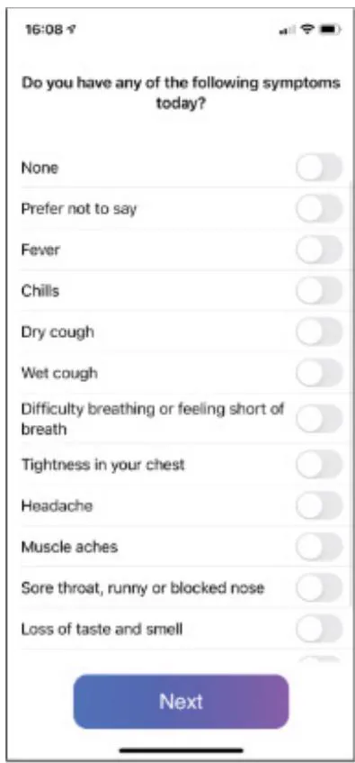  
(a) Symptoms

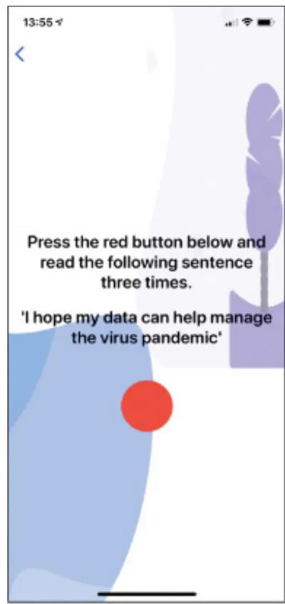  
(b) Voice Recording   
Figure 10.2 The smartphone COVID-19 Sounds app: (a) reporting symptoms using a simple survey and (b) recording voice samples (Han et al., 2022)

Source: Cecilia Mascolo

# BOX 10.2

# Citizen Science and UX Design for Privacy

Privacy is interpreted differently in different  types of crowdsourced projects, including citizen  science  (Bowser et al., 2017). Collecting and  sharing data using  smartphones is often easy and quick, but privacy concerns may  be overlooked,  as described by Yongfeng Wang and  colleagues, who  surveyed different  aspects  of privacy in mobile crowd sensing (Wang et al., 2020).

Birding  enthusiasts often like to share first sightings, for  instance, when the  first swallows appear in spring or the first snow geese arrive in winter. They may also want to check identifications with each other. The downside of this community interaction is that personal profile and location data can be used to identify particular contributors and their patterns of behavior. The latter can be problematic, as many participants visit the same places regularly.

It is, therefore, important to ask, how important is privacy in citizen science compared with the benefits of community engagement? How can citizen’s privacy be protected while supporting open engagement with each other?

Various digital tools and platforms have been developed, intended to manage the diverse community of participants by providing shared protocols for how to participate, while facilitating the exchange of data and different views (Preece, 2016). Other strategies involve making  images and locations fuzzy  so that they are not exact. This is also a good strategy for keeping the location of rare species’ observations confidential—especially important to prevent people from finding where  rare plants are  and taking them. For example, iNaturalist (www.inaturalist.org) has a geoprivacy setting that can be set to “open,” “obscure,” or “private.” Obscured observations are used to hide the  exact location of endangered species, as shown in Figure 10.3.

Figure 10.3 iNaturalist geoprivacy obscures the location of an observation.   
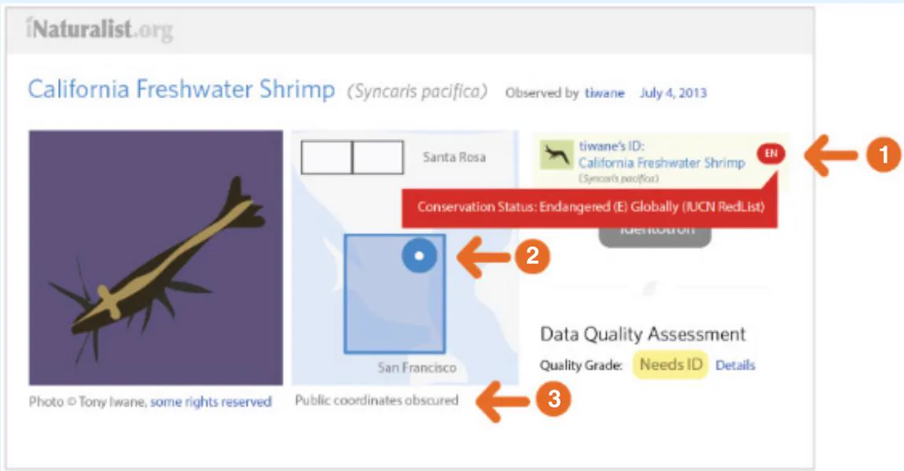  
In this example: 1. EN indicates  that the organism is endangered, so its location needs to be obscured. 2. This indicates that obscuring is done by randomly placing the marker for the location within the broader area. 3. This line allows the contributor to verify that this observation has been observed within iNaturalist. Source: www.inaturalist.org

# 10.2.4  Sentiment Analysis

Sentiment analysis is a technique that is used to infer the effect of what a group of people or a crowd is feeling or saying. The phrases that people post in social media and other forums are scored as indicating negative, positive, or neutral sentiments when offering their opinions or views. The scales used vary along a continuum from negative to positive, for example, –10 to $+ 1 0$ (where –10 is the most negative, 0 is neutral, and $+ 1 0$ is the most positive). Some sentiment  systems  provide  more  qualitative  measures  by  identifying  if the  positive  or  negative sentiment is associated with a specific feeling, for example anger, sadness, or  fear  (negative feelings) or happiness, joy, or enthusiasm (positive feelings). The phrases are extracted from

people’s tweets and texts, online reviews, and social media contributions. Their facial expressions (see Chapter 6, “Emotional Interaction”) when looking at ads, movies, and other digital content  and  customer’s voices  can  also  be  scored  and  classified  using  the  same  scales. Algorithms are then applied to the labeled data to identify and classify them in terms of the level of effect that has been expressed. There are a number of online tools that can be used to do this, such as DisplayR and CrowdFlower. See the following link for a tutorial.

MonkeyLearn provides a detailed tutorial with case studies on sentiment analysis: monkeylearn.com/sentiment-analysis.

Sentiment analysis is commonly used by marketing and advertising companies to decide on what types of ads to design and where to place them. In addition, it is increasingly being used in research to study social science phenomena. For example, Veronikha Effendy et al. (2018) used sentiment analysis to study people’s opinions about the use of public transportation from their tweets. In particular, she was interested in determining what were the positive and  negative opinions toward  it, which  could then  be used  as evidence  for making  a case about how to improve public transportation to increase its use in Indonesia, where there are huge traffic congestion problems.

However, sentiment analysis as a technique is not an exact science and should be viewed more as a heuristic than as an objective evaluation method. Giving a word a score from −10 to $+ 1 0$ is quite a crude measurement. To assess how good sentiment analysis is as a method, Nicole  Watson and  Henry Naish  (2018)  compared  human judgment  with computer-based sentiment  analysis for evaluating  positive  articles about the  U.S. economy. They found that the computer disagreed more often than it agreed with the articles compared with the human participants. Their analysis indicates that humans express their optimism about a topic more positively. Moreover, it also showed that by focusing on emotive words in phrases, sentiment analysis can miss the diversity of expressions that humans understand intuitively. For example, how would sentiment analysis score the phrase written by a teen in a text to their friends that said, “Your hair is always so on point!” The phrase is a slang expression meaning that something is very well done or perfect and is used mainly by teens to praise someone who has done something amazing. Sentiment analysis would probably give it a neutral score, whereas people in the know would give it a positive score. Humans also make more nuanced judgments.

# 10.2.5  Social Network Analysis

Social  network analysis  (SNA) is  a method based on  social network  theory (Wellman and Berkovitz,  1988; Hampton and Wellman, 2003)  for analyzing  and evaluating  the strength of social ties within a network. While understanding social ties has been a strong interest of sociologists for many years (for example, Hampton and Wellman, 2003; Putnam, 2000), as social media became increasingly successful, it also became a key interest for computer and information scientists (for example, Wasserman and Faust, 1994; Hansen et al., 2019). These researchers want to understand the relationships that form among people and groups within and across different social media platforms, and with offline social networks, too.

SNA  enables these relationships  to be  seen more clearly. It  helps to reveal who is  most active in a group, who belongs to which groups, and how the groups do or do not interact and relate to each  other. Analyses can also show  which topics  are hot  and throw  light on when, how, and why some topics go viral. Managers, marketing and advertising companies, and politicians are especially interested in how these activities can influence them, their companies, their clients, and their constituents.

So, how does SNA work? Broadly speaking, as the name suggests, a network is a collection of things and their relationships to each other. A social network is a network of people and groups with relationships to each other. At the individual level, SNA may be more about “who you know” than “what you know” or “who you are.” At the group level, it shows how each person’s individual  connections aggregate to  form connected  subgroups  (Hansen and Smith, 2014). Two main entities make up a social network. Nodes, which are also sometimes called entities or vertices, represent people and topics. The connections between the nodes are called edges, which are also known as links or ties. The edges show the connections among nodes, for example, the members of a family. They can show the direction of relationships; for instance, parents may have a line with an arrowhead that points to their children, indicating the direction of the relationship between the two nodes. Similarly, an arrow in the opposite direction indicates that children have parents. These are known as directed edges. Edges can also indicate relationships in both directions by having arrows at each end. Edges  that do not have an arrowhead are undirected; that is, the direction of the relationship between two nodes is not shown.

An integral part of social network analysis is the creation of maps, also called network graphs. These can help researchers understand at a higher level the connections among people represented by the nodes. For example, they have been used to show connections between people tweeting. Derek Hansen and Marc Smith (2014)  illustrate this point in Figure 10.4, which shows a social network created from the connections between people tweeting about “global warming.” The edges (gray lines) represent the following Twitter relationships:  Follow, Reply, or Mention. Thus, this can be thought of as a conversation network. The size of the  nodes  (circles)  is  based  on  the  number of Twitter  followers,  with bigger  nodes  having more total followers. The  map also helps identify groups, or  clusters (identified by different colors), of  people  who Follow, Reply, or  Mention  each  other. As  is  typical  of many  social networks, most people  are  connected to others either directly  or  indirectly in a large interconnected social network. Only a few pairs of people exist outside this large network (these are shown all along the bottom of the map by the series of connected small gray blobs). The network map can distinguish between those who are the key individuals leading the discussions (large circles) and identify different groups who talk among themselves, such as climate change deniers and those who are interested in climate science. They can also indicate which individuals influence or connect to different groups acting as bridge spanners.

There are other interesting relationships that can be teased out by experts in social network analysis, who also know more about the context of the discussion, perhaps by reading some of the tweets. Without that extra knowledge it can be hard to make a deeper interpretation of the network. For example, what might be going on at the bottom left of the network diagram, where  there are many edges (the gray  lines) joining a few orange  nodes, some of which are right at the bottom of the diagram  and some  of which are closer in  toward the central network?

Figure 10.4 A social network map showing people (represented by nodes) who have tweeted the word global warming and how they are connected to one another based on Follow, Reply, or Mention relationships (edges)   
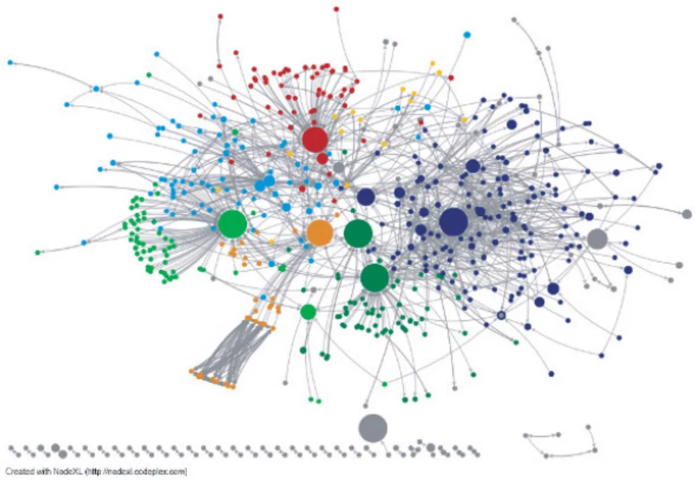  
Source: Hansen, D. L., and Smith, M. A. (2014) Social Network Analysis in HCI. In J. Olson and W. Kellogg (eds) Ways of Knowing in HCI. Springer, New York, NY. pp. 421–447

Some other topics that have been studied using social network analysis include communication during the 2016 flood in Louisiana, where Jooho Kim and Makarand Hastak (2018) examined  the role of  social media in  flood victims’  communication, both  with each  other and with emergency services. They found that Facebook was used effectively to disseminate information. Another study by Dinah Handel and her colleagues examined teachers’ tweets on Twitter (Handel et al., 2015). More recently, SNA has been used to examine people’s feelings about the COVID-19 pandemic on social media (Nemes and Kiss, 2021).

Although these social network graphs are revealing, using the tools effectively to separate and display clusters, outliers, and other network features takes practice. There are now various  tools available that enable beginners to do  straightforward analyses. Two  of the most well-known  social network  analysis  tools  are NodeXL  (Hansen  et  al., 2019), which  runs on Windows-based machines, and Gephi, which runs on both Windows and macOS. Many YouTube videos are available that describe how to use these tools.

This video is an introductory tutorial about Gephi by Jen Golbeck, professor at the University of Maryland. It is one of a series, so if you continue watching at the end of the video, the next one progresses to describe more advanced features of Gephi, including how to use color to highlight particular features of interest in the network graphs: www.youtube.com/watch?v=HJ4Hcq3YX4k.

In this YouTube video, Marc Smith, the director of the Social Media Foundation, shares how he has used NodeXL for social media network analysis and visualization: www.youtube.com/watch?v=Ftssu_5x7Zk.

# DILEMMA

# How to Probe People’s Reactions to Tracking

There is often a gulf between the benefits provided to society through tracking and the level of individual privacy that is being sacrificed. It is important, therefore, to have an open debate about the costs versus the benefits of using tracking and monitoring technologies. Ideally, this should take place before any deployment of the new technology. However, just asking people what they think about a tracking technology may not reveal the true extent of their concerns and feelings. What other methods could be used?

One  approach is to use  a  provocative  probe  (discussed in Chapter  11, “Discovering Requirements”). For example, a project called the Quantified Toilets (2014) did this by setting up a fake service in a public place to disrupt the accepted norms. The team was interested in how a community would react to having their urine analyzed in a public toilet with the goal of improving public health. They pretended to be a commercial company called the Quantified Toilets, which had created a new urine analysis technology infrastructure and installed it in the public toilets at a convention center. Signage was placed throughout the toilets explaining the rationale for the initiative (see Figure 10.5). In addition, the team created a website that presented fake real-time data feeds from each of the toilets in the convention center showing the results of the urine analysis, including details such as blood alcohol levels, drugs detected, pregnancy, and odor (see Figure 10.6). All sampled data were anonymized but also fake so not belonging to anyone. In addition, a link to a survey was added, and the general public was invited to give their feedback.


Quantified Toilets

Figure 10.5 Signage posted in the convention center   
  
Source: Courtesy of Quantified Toilets

Figure 10.6 The real-time data was provided on a fake website.   
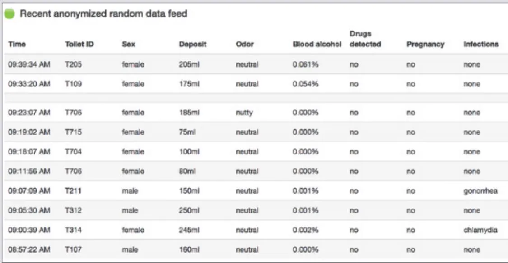  
Source: Courtesy of Quantified Toilets

The goal was to observe people’s reactions when coming across this new service. Would they mind or become upset, surprised, or outraged? Would they question the  reality of the situation and tell others?

So, what happened? A diverse range of responses were observed. These included disapproval (for example, “Health  advice? It does not get any  creepier.”); approval (“Privacy is important. But I would like to know if I was sick, and this is a good way to do so.”); concern (for instance, “Imagine if your employer could find out how hard you had partied last night.”); resignation (“I am sure the government has been collecting this data for years.”); voyeurism (“I just spent the last 10 minutes watching the pee-pee logs. Can’t stop watching them.”); and even humor, where some people tried to match people entering and exiting the toilets with the data appearing on the website.

(Continued)

Within an hour of the project going live, #quantifiedtoilets went viral on social media, triggering a  snowball of tweets and retweets. Many face-to-face discussions took place at the convention center, and articles and blogs were written, some appearing in magazines and newspapers. Some visitors were duped and tweeted how incensed they were. Arguably, this range of responses and level of discussion would never have happened if the researchers had just asked people in the street would they mind if their urine were analyzed in a public toilet.

What do you think of this type of study? Do you think it is a good way to open up debate about data tracking in society, or is it a step too far? Lorrie Faith Cranor (2021) reflects on how effective this kind of study is for opening up people’s eyes about privacy matters. Furthermore, she was inspired by the quantified toilet study to develop her own smart toilet project and now regularly uses it as a thought experiment in her teaching where she asks students to propose an approach to dealing with placing notices and obtaining people’s consent to having their urine tested when using a smart toilet in a public bathroom. The question of how to get consent from someone walking into a toilet is a tricky one as it can’t be assumed they will want to read and sign a form agreeing to their urine being analyzed. They want to go to the toilet! Not surprisingly, the responses Cranor gets are always animated, varied, and thoughtful. One suggestion is to have some toilets available with smart sensing and some without. But this then raises the question of how do you signal this to visitors? Will they read a sign if they are bursting to go to the loo? And what happens if someone is blind? How do they know? And so on. A range of ergonomic, ethical, and legal aspects are typically explored in relation to where to put notices and in what form, and how to enable people to give consent for their urine to be tested in this way. This kind of thought exercise is an excellent way to get people to think about the practicalities of privacy when collecting data. It helps them to realize that it is not a straightforward issue. If the same experiment was to be conducted again today, it is likely to result in different findings. Maybe more people would find it socially acceptable. Smart  toilet technology is now  being developed  in some countries  (see Park et al., 2020), while people’s attitudes have changed toward public health monitoring since the COVID-19 pandemic.

# 10.2.6  Combining Multiple Sources of Data

A  number of  researchers have  started collecting  data from  multiple sources by  combining automatic sensing and subjective reporting. The goal is to obtain a more comprehensive picture about a domain, such as a population’s mental health, than if only one or two sources of data were used (for instance, interviews or surveys). One of the first comprehensive studies to do this  was StudentLife (Harari  et al., 2017), which was concerned  with learning more about  students’ mental health. In particular, the research team  wanted to know why  some students do better  than others under times of stress, why some students  burn out, and still others drop out. They were also interested in the effect of stress, mood, workload, sociability, sleep, and mental health on the students’ academic performance. They wanted to know how the students’ moods change in response to their workload (such as their assignments, midterms, finals).

During  a 10-week  term,  the researchers  collected  data  about  a  cohort of  48  students studying at Dartmouth College in the United States. They developed an app that ran on the students’ phones, to measure the following, without the students needing to do anything:

. Wake-up time, bedtime, and sleep duration   
The number of conversations and duration of each conversation per day   
•  The kind and amount of physical activity (walking, sitting, running, standing, and so on)   
• Where they were located and how long they stayed there (that is, in the dorm, in class, at a party, in the gym, and so forth)   
•  The number of people around the student in a social group throughout the day   
. Student mobility outdoors and indoors (in campus buildings)   
• Their stress levels throughout the day, week, and term   
. Positive affects (how good they felt about themselves)   
. Eating habits (where and when they ate)   
• App usage   
. Their  comments  on  campus  about  national  events  (for  example, the  Boston  Marathon bombing, which was in the news at that time).

They also used a number of pre- and post-mental health surveys and collected the students’  grades. These  were used as ground truth for evaluating mental health and academic performance,  respectively. The  researchers  went  to  great  lengths  to  ensure  that  all  of  the data stored was anonymized in a dataset to protect the privacy of the participants. Having achieved this, the researchers then opened up the dataset for others to examine and use  to conduct further analyses (studentlife.cs.dartmouth.edu/dataset.html).

The researchers  were able to mine the data that they had collected automatically from the students’ smartphones and learn  several new things  about their behavior. In particular, they found that a number of the behavioral factors that had been tracked from their smartphones were correlated to their grades, including activity, conversational interaction, mobility, class attendance, studying, and partying.

Figure 10.7 shows a graph indicating the relationship between activity, assignment deadlines, attendance, and sleep. It shows that students are very active at the beginning of the term and get very little sleep. This suggests that  they are out partying  a lot. They  also have high attendance rates at the beginning of term. As the term progresses, however, their behavior changes. Toward the end of term, sleep, attendance, and activity all drop off dramatically!

Figure 10.7 Student’s activity, sleep, and attendance levels against deadlines during a term   
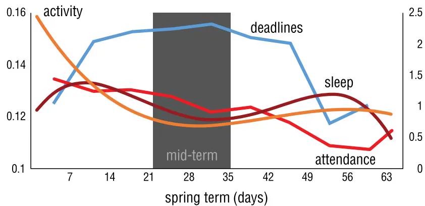  
Source: StudentLife Study

# ACTIVITY 10.2

From the two graphs shown in Figure 10.8, what can you say about the students’ activity, their stress levels, and their level of socializing in relation to deadlines over the course of the term?

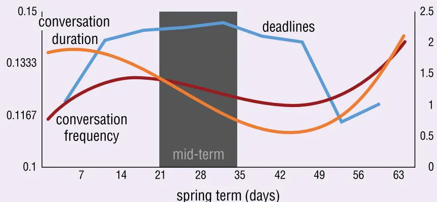

Figure 10.8 Student behavioral measures over the course of a term   
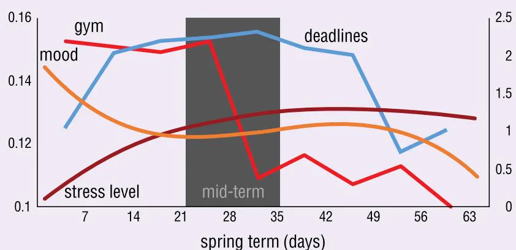  
Source: StudentLife Study

# Comment

The top figure shows that students start the term by having long social conversations. This begins to tail off as mid-term approaches. Students resort to having fewer and shorter conversations. After the  deadlines  have passed,  students switch back to having many more and longer conservations.The bottom figure shows students started out all upbeat, having returned from vacation feeling good about themselves. They appear relaxed (high mood level) and are active (going to the gym a lot). These attributes all start going downhill as the term comes to an end—presumably as their stress levels rise because of looming deadlines.

# 10.3 Visualizing and Exploring Data

Much of the data people interact with in their work and everyday lives is displayed visually, for example, road signs, maps, medical images, mathematical abstractions, tables of figures,

schematic diagrams, graphs, scatter plots. These representations are intended to help people make sense of the world, but for them to be useful, they have to be presented in ways that are understandable for the people who use them. Being able to take meaning from data involves being able to see it and being able to interpret it. What  kind of data is it? What is the data about? Why was it collected? Why was it analyzed and what does it mean? The skills needed to understand and interpret data visualizations are referred to as visual literacy. As with any skill, different people exhibit different levels of visual literacy, depending on their experience of using visual representations (Sarikaya et al., 2018).

# BOX 10.3

# A Community-Based Environmental Data Toolkit

There are a number of off-the-shelf sensor toolkits available now that can be placed in someone’s home or local community to measure air quality or other aspects of the environment. One of the earliest open platforms developed was the Smart Citizen Kit (Diez and Posada, 2013), which has been updated several times since it was first developed and can be downloaded from smartcitizen.me. This compact sensing device comprises a number of embedded sensors that measure nitrogen dioxide $\left( \mathrm { N O } _ { 2 } \right)$ , carbon monoxide (CO), sunlight, noise pollution, temperature, and humidity levels. The data being collected from the  platform is connected to a live website that can be accessed by anyone. The various data streams are presented via a dashboard using canonical types of visualizations, such as time-series graphs (see Figure 10.9). Data streams from other Smart Citizen devices, set up throughout the world, can also be viewed via the dashboard, making it easy to compare data collected from different locations.

Masses of environmental data have been collected over the years that have been used to inform the development of smart cities by enabling local communities to fabricate their own sensing tools, make sense of their environments, and  address pressing environmental problems, such as air pollution (Balestrini et al., 2015).

Figure 10.9 Smart Citizen dashboard and visualization   
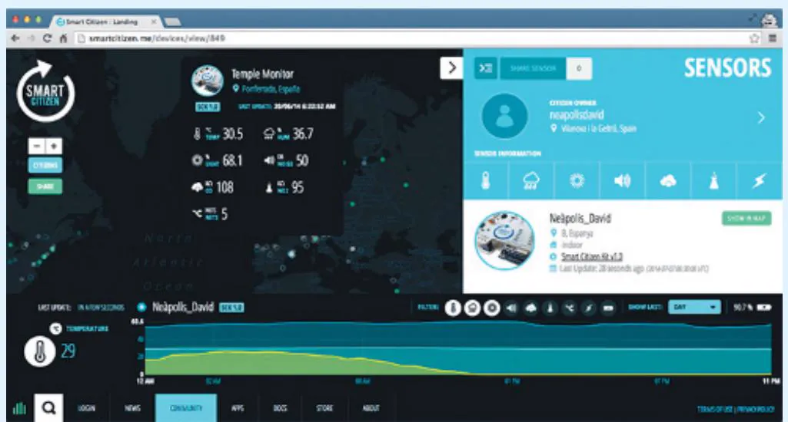  
Source: CitizenMe, www.citizenme.com

Even graphical representations of small amounts of data (for example 20–100 items) can be hard to interpret if the people trying to make sense of them don’t understand the way that the data is being displayed. Furthermore, sometimes representations, such as bar graphs, line graphs, and scatter plots (described in Chapter 9), are displayed in misleading ways. Danielle Szafir (2018), for example, asks, “How can we craft visualizations that effectively  communicate the right information  from our  data?” She  describes how  data displays can  mislead people when graphs have axes with truncated scales, or they show data in 3D bars making it hard to read exact values from the bar because it isn’t obvious which side of the 3D column is  the  place  to read. Interactive  visualizations  typically include  various  canonical forms  of representations (for instance, bar charts  or pie charts)  along with tree maps and advanced visualization techniques that enable people to interact with the data online by panning and zooming in and out of the displays. Interactive techniques like panning and zooming in and out help people to navigate and explore complex data visualizations. Different methods may be used for representing data visually on mobile devices, often referred to as mobile visualizations (Lee et al., 2022). For  example, the “complication” display described in Chapter 7, “Interfaces,” shows the kinds of miniature visualizations that have been developed specifically for using on a watch face, intended for the wearer to see at a glance.

As  Stuart  Card  and  his  colleagues  explained more  than  two  decades ago,  the goal  of data visualization tools is to amplify human cognition so that people can see patterns, trends, correlations, and anomalies in the data  that lead them  to gain  new insights and make new discoveries  (Card  et  al., 1999).  For  example,  millions  of  people  use  digital  maps  to  find their way, benefitting from their integration into car navigation and smartphone apps. Physicians and radiologists compare images from thousands  of patients, and financiers examine trends in the stocks of hundreds of companies. These data visualization tools enable people to explore the data and gain new insights. For example, they can zoom in and out of the data to see an overview or to get details. Ben Shneiderman (1996) summarizes this behavior in his mantra “overview first, zoom and filter, and then details on demand.”

A number of visualization tools have been developed for interacting with big volumes of data for larger displays used with PCs, laptops, and tablets (Whitney, 2012; Munzner, 2014; Makulec, 2022). Typically, they comprise the common techniques mentioned earlier (such as graphs  and  scatter  plots)  coupled  with  3D  interactive  maps  and  displays,  time-series  data, trees, heat maps, and networks. Sometimes, these visualizations were developed for uses other than those for which they are used today. For example, tree maps were originally developed to visualize file systems, enabling people to understand why they are running out of disk space on their hard drives by seeing how much space different applications and files were using (Shneiderman, 1992). They were then adopted by media and financial reporters for communicating changes in the stock market, and they became known as “market maps” (e.g., Figure 10.10). Similar to interactive maps, tree maps have become a general-purpose tool embedded in most widely used applications, such as Microsoft’s Excel (Shneiderman et al., 2016).

Other kinds of visualizations have also been developed for different kinds of data, such as using  spectrograms to  represent  audio. For  example, Figure  10.11  shows spectrograms that were used to visualize recorded sounds from birds and insects, collected by Jessie Oliver and her colleagues (2018). They show visually the signal strength, or “loudness,” of a sound over time at various frequencies present in a waveform, enabling scientists to get an overview and be able to see the  patterns in bird songs and animal noises. Oliver et al. wanted  to see how people investigated and annotated these kinds of visualizations and how they could be used to find and identify birds and other animals in the wild.

  
Figure 10.10  A market map of the S&P 500, which is a financial index for stocks. Green indicates stocks that increased in value, and red indicates stocks that decreased in value that day.

Source: Courtesy of FINVIZ

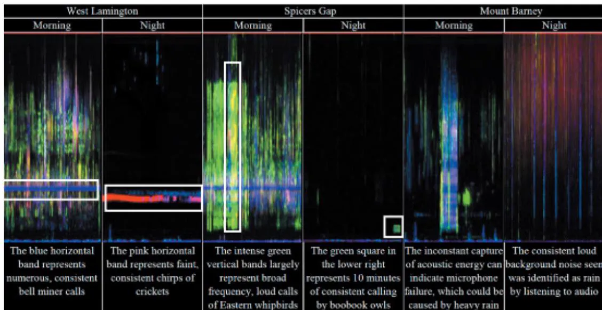  
Figure 10.11  Visualization  of different  sounds,  including  birds  and  insects, from three  areas of Australia that are displayed so they can be interpreted and compared

Source: Oliver et al. (2018) / Reproduced with permission of ACM Publications

This video describes how Jessie Oliver collected and used a combination of different types of data, including sound data: www.youtube.com/watch?v=2_WlTg-JmH0.

# ACTIVITY 10.3

This video by Jeff Heer (2017) gives an overview of different types of data visualizations and data visualization tools: www.youtube.com/watch?v=hsfWtPH2kDg.

Watch the video and then describe (1) some of the benefits of using interactive visualizations and (2) some of the UX challenges in designing interactive visualizations.

# Comment

1. By working with interactive visualizations, people can interact with data to explore aspects of interest by going deeper into particular parts of it. This is demonstrated in the visualization of airline  on-time performance in which someone can filter portions of the data to view which flights arrive late. From this exploration, they can discover that flight delays are  associated with it being late in the  day. As time goes by, the  actual arrival  times of flights tend to fall further behind the scheduled arrival times. Also, by being able to filter and  manipulate particular parts of the data, people can answer other  questions, such as what causes flights to arrive early?   
2. In the video, Heer talks about some of the human perceptual and cognitive issues that UX designers must be aware of when they create visualizations. For example, he mentions the importance of using color appropriately in a visualization of arteries. He also talks about the challenge of knowing how much detail to include in the visualization about the structure of the arteries.

In addition, Heer mentions the power of current tools for investigating many different variables, but he notes that using some of these tools proficiently requires programming and data analytics skills. UX visualization tool designers therefore need to find ways to support people who  may not have these skills. He describes  how some designers are tempted  to get  around this problem  by automating the  analyses, but a  careful balance is needed in deciding how much automation should be provided and how much control should be left in the hands of the people using these products.

Heer also points out that there is much more to analyzing data than to visualizing it. Data has to be cleaned and prepared, a task referred to as data wrangling, which can take up to 80 percent of a data scientist’s time. Issues of privacy also need to be considered.

A  number  of commercial  data  visualization  tools have  been  developed  for  businesses (Zhang et al., 2012; Sakr et al., 2015). Some examples include Tableau, Qlik, Datapine, Voyager 2, Power BI, Zoho, D3, Kyrix, and Observablehq. To use these tools effectively, business managers often  partner with analysts  who assist them  in  interactive explorations that  can lead to new insights. This may involve customizing the dashboard—an interactive panel of control widgets that contains sliders, check boxes, radio buttons, and coordinated multiple window displays of different kinds of graphical representations, such as bar and line graphs, heat maps, tree maps, infographics, word clouds, scatter plots, and other kinds of visualizations. All of the items in the dashboard are coordinated and draw from the same data selected to investigate particular questions of interest. In other words, the  components of the dashboard  are interactive  and linked  together so that they  are coordinated  (see  Figure  10.12).

This  enables  managers  to  see  the  data  displayed  in  different  ways  and  to  explore  how  it changes  at the interface using  different visualizations  as they  manipulate sliders and  other controls. The managers  can  also make  the same  dashboards  available to  other  employees across their company so everyone can see, discuss, and interact with the same data.

A  challenge  is  how  to  make these  ever  more  powerful  tools available  to  people who want to explore, such topics as personal finance and health data, but who are not trained as analysts and who do not want to employ or work with an analyst. Increasingly, AI techniques are incorporated in the tools that automate many data analytic tasks—making it easier for other people to use. Natural language interfaces have also been developed to make it easier for people to ask specific questions of the data. For example, Tableau’s Ask Data lets someone type a question in everyday language such as “show the total sales for the first quarter.” Tableau then automatically displays the relevant data visualizations.

Figure 10.12  A dashboard that was created to show changes in sales information   
  
Source: Zoho Corporation Pvt. Ltd, www.zoho.com/analytics/tour.html

The design of dashboards can vary a lot, and there is a tendency to cram lots of graphs and  other  visualizations  into  them. Alper  Sarikaya  and  colleagues  (2018)  argued  that  a deeper  understanding  is  needed about  how  the context  of use  can  impact  the usability  of dashboards. They challenge UX designers to develop dashboards for different types of uses and for a wide range of people. This work involved analyzing a range of dashboards, first by reviewing published papers written by other researchers. Then they carried out a qualitative study in which they classified the features of different dashboards and how they are used.

They  characterized  the  dashboards  according  to  their  design  goals,  levels  of  interaction, and the ways in which they are used. Figure 10.13 shows examples of the seven kinds of  dashboards  that they  identified.  Each  type  is  named  according to  how  it is  used:  strategic  decision-making, quantified  self,  static operational,  static organizational,  operational

decision-making, communication,  and dashboards  evolved, which  was a  catchall  category that included features that did not fit into other categories.

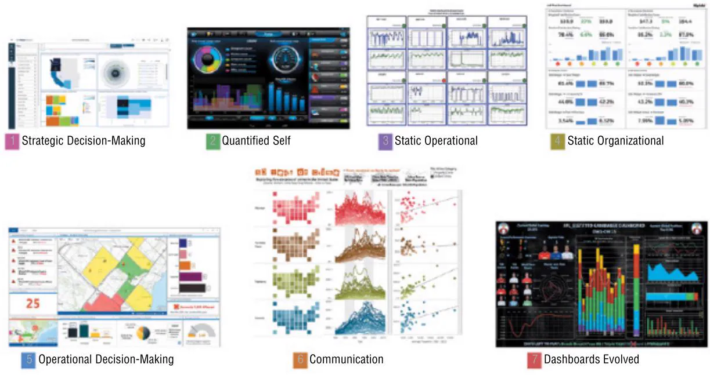  
Figure 10.13  Exemplar dashboards (Sarikaya et al., 2018). Dashboard 1 and Dashboard 5 specifically target decision-making, while Dashboard 3 and Dashboard 4 target consumer awareness. Dashboard 2 represents the quantified self (such as a smart home), while Dashboard 6 represents those dashboards targeting communication. Dashboard 7 captures some novel extensions of traditional dashboards.

Source: Sarikaya et al. (2018) / Reproduced with permission of IEEE

Sarikaya  et  al.  (2018)  also advocate ways  of  supporting people by  telling stories  that can help illustrate the context that the data visualizations represent. They point out the challenges that people encounter when interacting with visualizations such as enabling them to have more control over how they configure and use dashboards. A further challenge involves finding ways to support people in developing data, visual, and analytic literacy.

# ACTIVITY 10.4

Study Figure 10.14(a), which comes from the weather site www.wunderground.com.

It shows weather data for a day in December at Washington D.C. in the United States. Particularly take note of the temperature, precipitation, and wind data. What information do they provide? Now compare this visualization with that depicted in the “wundermap” (see Figure 10.14b). How do the two displays differ, and which do you prefer?


Figure 10.14  (a) Actual weather data and (b) a wundermap of the same area and time   
  
Source: TWC Product and Technology LLC, www.wunderground.com

# Comment

The first display in Figure 10.14(a) contains representations that are fairly standard for conveying weather information. The green ring shows the maximum and minimum temperatures

(Continued)

at that time and what it feels like. A diagram of a sun indicates that it is a sunny day  with some clouds, even though it is quite cold. It is also easy to see that the wind is from the south, and  presumably the  circle represents a compass and  the pointed  wedge indicates the  wind direction.

The display in Figure 10.14(b) provides similar data, but it is harder to get an overview of weather in the Washington D.C. area. It uses conventional meteorological symbols to show temperature and wind. It is easier to see local effects but harder to get an overview of weather of the entire area. (If you are able to access the website, try clicking Layer and selecting other options not shown in the figures.) Which display is preferable probably depends on how much detail you want—an overview or detail about a specific area in the Washington D.C. region— and  your tolerance  for clutter. It also depends  on your level  of experience and comfort  in interpreting the conventional meteorological symbols.

# BOX 10.4

# Visualizing the Same Sensor Data by Using Different Kinds of Representations for Environmentalists and the General Public

Queen  Elizabeth Park in London was  transformed into a “smart park.” A  number of sensors were placed throughout the  park to measure  its  health and  use. One  type of sensor deployed could detect bat calls. The goal was to ensure that the park’s bat conservation program was effective, as well as connecting visitors and residents to the wildlife around the park (naturesmartcities.com). Monitoring bat calls is also a technique that was used to assess the general health of the park.

The data collected was primarily provided to the scientists in the form of spectrograms (see Figure 10.15b), but it was also presented in a more accessible form to the public via an interactive display (see Figure 10.15a). As part of a public kiosk, a schematic map was provided  that showed where in the park the bat  call data had  been collected (Kaninsky  et al., 2018). A slider was provided to enable visitors to interact with the data: moving it to the left showed bat call data from the night before, while moving it to the right showed bat call data from the previous 10 nights. The LEDs on the map changed in color and intensity, representing the varying levels of bat calls. The total number was also shown in the digital display. The kiosk was deployed in the park, and many passersby stopped for a considerable length of time to learn about bats and interact with the data. The physical act of using the slider provided an engaging way  of exploring  the  data rather than just looking  at a  static visualization  or dashboard.

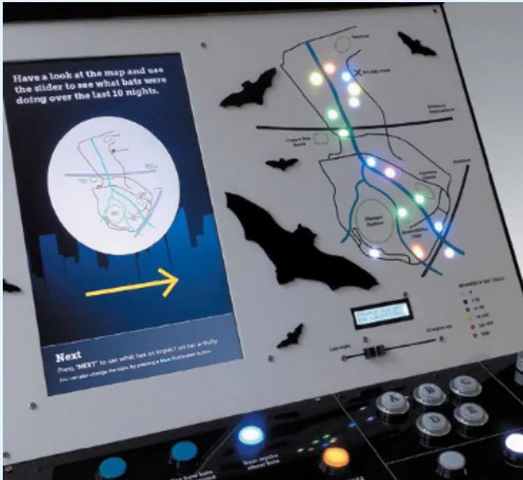  
(a)

(b)   
Figure 10.15  The same bat call data was made accessible (a) to the general public via an interactive visualization and (b) as a spectrogram intended for environmental scientists.   
  
Source: (a) Courtesy of Matej Kaninsky and (b) Courtesy of Sara Gallacher

Designing data visualizations when beginning a career can be daunting. Amanda Makulec (2022) describes her insightful journey of starting out in this area in her article Starting out in Data Visualization Today, in particular from being a newcomer to becoming an expert. In so doing, she offers helpful advice and pointers to other researchers along the way.

nightingaledvs.com/starting-out-in-data-visualization-today

# 10.4 Ethical Design Concerns

In the introduction to this chapter, we mentioned how a diversity  of data is now regularly being  collected  from  people for  a  variety  of  reasons, including  improving  public  services, reducing congestion, and enhancing security measures. It is usually anonymized and sometimes aggregated to make it publicly available, for example showing the energy consumption data  for a  given  space  such  as a  floor  of a  building. Figure  10.16  shows  a  floor-by-floor comparison for a University of Melbourne building, where the red bar shows that the basement is the worst performer in terms of energy usage, and the green bar shows level 1 is the best performer. The idea  is  to provide  feedback on  energy consumption  in the building to increase awareness among the inhabitants and encourage them  to reduce  their energy consumption. However, what if localized occupancy rates or energy consumption for each room were shown? It would not take much to figure out who was in that space. Would that be a step too far and an invasion of their privacy? Would people mind?

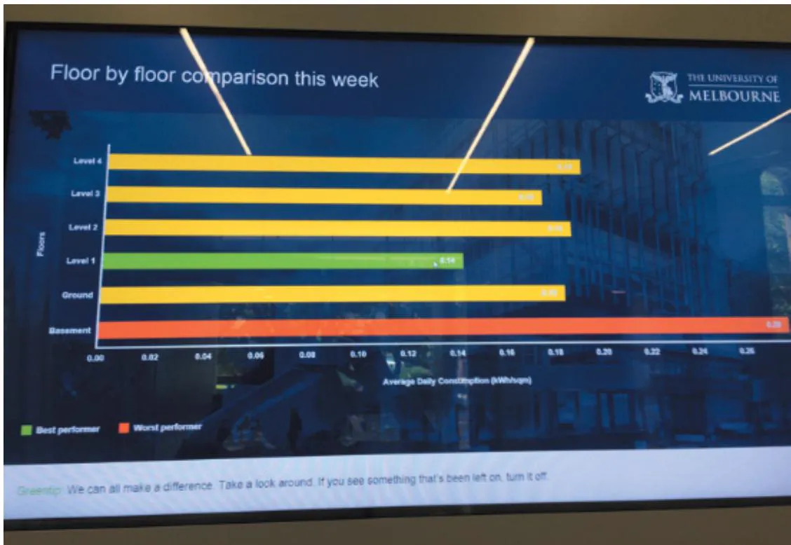  
Figure 10.16  Average daily energy consumption depicted on a public display for a building at the University of Melbourne. Green  is best performer, yellow is in the middle,  and  red  is the  worst performer.

# Source: Yvonne Rogers

When  deciding on how  to analyze and act upon data that has been automatically collected from different sensors, it is important to consider how ethical the data collection and storage processes are and how  the data analysis will be used. While  ethical considerations

of data collection and storage for individual projects were discussed in Chapter 8, they are more complex when considering Big Data and automatic collection. Ethics is generally taken to  mean “the  standards  of  conduct  that  distinguish  between  right  and  wrong,  good  and bad, and so on” (Singer, 2011, p. 14). By ethical design concerns we mean how HCI can be involved in designing and evaluating systems that use Big Data, through conducting research that  follows  human-centered  codes of  practice. Increasingly, this involves systems  that  use machine  learning, and so much of the focus nowadays  is on how to make the design of AI systems more human-centered (Shneiderman, 2022).

There are many codes of ethics available from official bodies that provide guidance. For example, the ACM (2018) and IEEE (2018) have both developed sets of ethics. In addition, most  tech  companies and organizations now  have their own AI ethics strategy that covers issues,  policies, and  concerns  while  providing  recommendations  for  how  to  avoid  ethical risks (see Jobin et al., 2019). Advait Deshpande and Helen Sharp  (2022) found  there were more  than  170 guidelines  on AI  ethics  and  responsible, trustworthy AI  in  circulation. For example, Microsoft published its Responsible AI Standard (2022), which is a playbook that is used by its researchers and developers to create AI systems, guiding how they design, build, and  test them.  It  also  incorporates  their earlier  set of  guidelines  for human-AI  interaction (Amershi et al., 2019).

There are also a number of public interest research centers, such  as Electronic  Privacy Information Center (EPIC), that seek to protect privacy, freedom of expression, and democratic values in the digital world. As mentioned in Chapter 8, the European Union (EU) has developed  a General Data  Protection Regulation (GDPR), which  is enforced by law. It  sets standards and guidelines for the collection and analysis of personal data from  people who reside in the EU. For example, it states that visitors to a website must be notified about the data  the  site  collects  from  them  and  asks  them  to  explicitly  consent  to  that  information gathering,  by clicking  an Agree  button. In 2021, the EU proposed  a new  legal framework to address the risks of specific uses of AI, categorizing them into four different levels: unacceptable risk, high risk, limited risk, and minimal risk. The regulation notes that while most AI systems pose limited to no risk and, importantly, can contribute to solving many societal challenges,  certain  AI  systems  create  risks that  need to  be  addressed  to avoid  undesirable outcomes that could impact people’s privacy in ways that could damage them. An example they  mention in the regulation is of an interactive toy  that uses  voice assistance to encourage dangerous behavior. Furthermore, GDPR proposes that AI systems be banned if they are considered to be a clear threat to people’s safety, livelihoods, and rights.

The guiding force behind all of the regulations, guidelines, and standards is on preventing AI systems from making unseemly mistakes and amoral decisions. Central to any ethical discussion  is  the  importance  of  protecting  fundamental  human  rights  and  respecting  the diversity of all cultures. This involves ensuring that the  personal data collected and used in an app or service is fair, honest, trustworthy, secure, and respectful of privacy.

The Open Data Institute (www.theodi.org) has  developed a framework called the data ethics canvas to help anyone who is collecting data to identify and manage ethical issues. It encourages researchers and developers to ask questions about why they are collecting data and what  they intend to use  it for. For example, some of the questions are about the positive and negative effects that a project can have on people. These questions include “Which individuals,  demographics,  and  organizations  will  be  positively  affected  by  the  project?” and “How is  positive impact being measured?” The negative questions  include “Could  the

manner  in which  the data is  collected, shared, and used  cause harm?” and “Could  people perceive it to be harmful?”

Another  move  is  toward conducting  more  responsible  research. In the  context  of  Big Data, it  entails  limiting  the  data  collected  to  what  is  necessary  in  the  first  place.  Rather than trying  to collect as much data  as possible, it has  been proposed  that researchers and data practitioners  follow  an  approach known  as privacy  by design  (Crabtree et  al.,  2021; Crowcroft et al., 2018). An example  is the  children’s code of practice that  aims to protect children in the digital world (ICO, 2021). That way, they can avoid collecting excessive data that might be sensitive but not needed (see also Chapter 8 and Chapter 14). Furthermore, it may be possible to collect and analyze the data on the device itself, rather than uploading it centrally (Lane and Georgiev, 2015).

# ACTIVITY 10.5

Shoplifting is on the rise; in 2019 it cost retail companies in the US $\$ 62$ billion. To help combat shoplifting, companies like FaceWatch and DeepCam have developed facial recognition systems that passively monitor people coming into a store by using CCTV video footage that identifies potential suspects (see Figure 10.17). To do this, they develop AI models that have algorithms trained on faces.

Various stores throughout the world have started using this kind of technology to help combat shoplifting. However, there is much public concern about adopting this practice. Matt Burgess (2020), for example, notes that while on the positive side this technology has acted as a deterrent and improved the safety of store staff, on the negative side, it is seen as being extremely intrusive, because shoppers’ faces are scanned without them knowing of the consequences, nor having had the choice to give or not give their consent. Do you think this practice is socially acceptable? What might be other privacy concerns?

Figure 10.17  DeepCam’s face-tracking software used in a store   
  
Source: DeepCAM, deepcamai.com

# Comment

To address privacy concerns, DeepCam’s facial recognition software was developed so that it does not identify customers or link them to any sensitive information such as name, address, or date of birth. It only recognizes faces and identifies patterns of behavior that potentially are worth investigating. The video footage  is indexed and structured similarly to how web pages are set up for quick searching. This enables store detectives to be able to notice potential threats in real time. Many people might find this form of data analysis creepy, knowing that their faces are being matched to a database each time they enter a store. Others might find it more socially acceptable because it has the potential to reduce crime.

In Chapter 1, “What Is Interaction Design?” we outlined a number of usability and UX design principles that were transformed into questions, criteria, and examples showing how to use them in the design process. Here, we introduce other principles that relate to the ethics of collecting and using data at scale and that are often talked about in the literature on ethics, data science, HCI, and AI (see Cramer et al., 2008; Molich et al., 2001; Crowcroft et al., 2018; Chuang and Pfeil, 2018; Dubber et al., 2020). Here we describe five core ones: privacy, fairness, accountability, transparency, and explainability.

Privacy has  been a fundamental  concern  within HCI for a  long time, with  a focus on trust, risk, its perception, and  its management (Ackerman  and Mainwairing, 2005). There are many ways of describing privacy, but fundamental to all definitions is the right to keep one’s personal matters and relationships to oneself and limiting access to information about oneself unless explicitly granting permission to others. However, it can depend on a person’s perspective  and  the  social  and  cultural  setting.  For  example,  while  parents  may  consider location-tracking  devices  or smartphone  apps  as a  way  of ensuring  their children’s safety, their  children may  perceive the  same  technology  as an  invasion  of  their privacy, checking up on them and preventing them from establishing their identity (Iachello and Hong, 2007). More recently, there  has been a move toward understanding how to design control of and access  to  personal  information  and  data  that  is  collected  about  users  in  order  to  protect their  privacy. For  example, the  Living  Room  of  the  Future  project  tried  to  develop  new ways of enabling people to have more control over the flow of their personal data at home (Chamberlain et al., 2018). An open-source platform, called the DataBox, was developed for experimenting  with different models of personal data processing  with the goal of enabling people to manage their own data and third-party access. Within the commercial world, “privacy UX” has materialized as a framework intended to help developers consider how best to design data collection and privacy interactions with users.

Fairness  refers  to impartial  and just  treatment  or  behavior  without  favoritism  or  discrimination. In the context of data analysis, it refers  to what the  impact will be from  using particular  datasets.  Sometimes,  a  dataset  is  biased  toward  a  particular  demographic  that results in unfair decisions being made, resulting in a group of people being disadvantaged, for example, women. An AI model is considered to be unfair if it rejects requests for a bank loan more often for women than men. A goal of ethical AI is to identify and be able to rectify potential biases (see also Chapter 9) while developing new algorithms that can make an AI system fairer.

Accountability refers to whether an intelligent or automated system that uses ML algorithms can explain its decisions in ways that enable people to believe they are accurate and correct. This  involves  making  clear  how  decisions  made  from  the  datasets  are  used,  i.e., by providing appropriate explanations of how a decision was made (explainability). It also considers who is responsible for when an AI model makes an error, for example, who should be responsible for when an autonomous car crashes into the side of another car. Is it the car maker, the insurance  company, the  company  that  made the  Light  Detection  and  Ranging (LIDAR) sensor technology used in the autonomous car, or the other car? The regulations are still being thrashed out, but in a joint report by the Law Commission of England and Wales and the Scottish Law Commission, Sergio Savaresi (2022)  notes how the legal responsibility is  shifting toward the technology, so  it is  not the  driver but the  company  that obtained authorization for the self-driving features used by the vehicle that  is at fault. Do you think this is the right approach?

Transparency refers to the extent  to which  a system makes its decisions and how they are made explicit (Maurya, 2018). There has been much debate about whether AI systems, which typically depend on large datasets when making a decision, should be designed to be more transparent (Brkan, 2017). Examples include medical decision-making systems that can diagnose types of cancer and media service providers (for instance, Netflix) that suggest new content for you to watch based on their machine learning algorithms. Many are like a black box in nature; that is, they come up with solutions and choices without any explanation as to how they were derived. Increasingly, this practice is considered unacceptable, especially as AI systems are given more responsibility to act on behalf of society, for example, deciding who goes to prison, who gets a loan, who gets the latest medical treatment, and so on.

Explainability refers to designing systems, which collect data and make decisions about people, in a way that they can provide explanations that laypeople can understand. What is a good explanation to provide has been the subject of much research, especially what form should  they take.  Early research  by  Brian Lim  et al. (2009)  investigated different  kinds of explanations  for  a  system  that  made  automated  decisions. They  found  that  explanations describing why a system behaved in a certain way resulted in participants developing stronger feelings of trust toward it. More recently, research has investigated the kinds of explanations that are appropriate and helpful for people using automated systems. For example, saliency maps have been developed as a visual explanation to depict how image classification models work. Essentially, these are a kind of heatmap that highlight the pixels of the input image that most caused  the image classification (see Figure 10.18 for an  example of how a particular image was classified as a dog). However, Ahmed Alqaraawi and colleagues (2020) found that this kind of explanation is quite limited in helping people understand how AI models work.

Within the context of HCI, Ashraf Abdul et al. (2018) have proposed an agenda for how HCI researchers can help to develop more accountable intelligent systems that are usable and useful to people. Following on from this, Upol Ehsan and colleagues (2021) have proposed an alternative approach to explainability, which is based on the concept of social transparency. Rather than try to visualize how an AI model works using a saliency map, they suggest instead that it is better to show users how other people’s interactions with the system impacts upon their trust and understanding of it. This kind of contextual knowledge is broken down into four core components: (1) who interacted with the AI system, (2) what they did, (3) when, and (4) why they did what they did. It is argued that this kind of socio-technical approach will more likely help explain to users better how AI systems make their decisions.

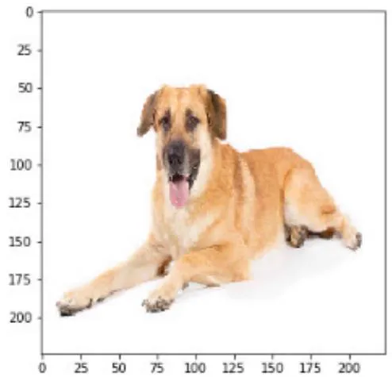

Figure 10.18  A saliency map on the right created as an explanation of how the image on the left was classified by a deep learning algorithm as a dog. The highlighted pixels in light blue are the ones that made the most contribution to the final score.   
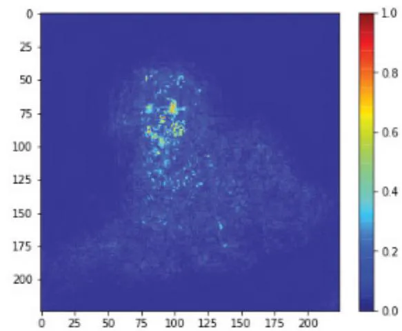  
Source: CNN, https://usmanr149.github.io/urmlblog/cnn/2020/05/01/Salincy-Maps.html

The consequences  of a system making  a decision for a human can  vary. This can help determine  whether an  explanation  is  needed  to support  a decision  made by  a  system  and what it should include. For example, if a decision is made to pop up an ad for slippers in a person’s browser, based on an analysis of their tracked online app usage (a common practice used in targeted  advertising), it  might  be mildly annoying, but  it is  unlikely to upset  them. However, if a decision is made to deny a loan or a visa based on the outcome of an automated algorithm, it may have more dire consequences for someone’s life, and they would want to know why  the particular decision was made. In the future, it will become  increasingly the case that humans and algorithms will need to work together.

# ACTIVITY 10.6

Watch the following TEDx talk by Jen Golbeck (where she discusses why social media “likes” say  more than you  think. The talk was  given  in 2013 and since  then has  had  more than 2.5 million views. Even though the TEDx talk is quite old, the issues raised in it are still relevant today. In particular, she discusses how people’s behavior online enables companies to predict what they like, what they might be interested in buying, and even their political views.

www.ted.com/talks/jennifer_golbeck_the_curly_fry_conundrum_why_social_media_ likes_say_more_than_you_might_think?language=en&utm_campaign $\ l =$ tedspread&utm_ medium=referral&utm_source=tedcomshare

What do you think the privacy issues are here?

(Continued)

# Comment

Jen Golbeck provides two compelling examples in her talk. The first is the well-known example of how a teenage girl’s pregnancy was predicted from her online purchases of things like vitamins. The second example was how data on liking crinkly fries coupled with a knowledge of the  theory of homophily was used to predict that a group of people have above average intelligence. By understanding that the theory of homophily explains that people who are similar tend to like the same things, trust each other, and seek out each other’s company, Jen Golbeck was able to look for relationships in data about “liking” crinkly fries. The crinkly fries example indicates that even though it is absurd that liking crinkly fries is a predictor of above average  intelligence,  in this particular example, the  person who created  the  post attracted “likes” from friends who were also of above average intelligence. It is an amusing example, but  the main point  is to illustrate that information  that people contribute in social media, often unknowingly, can be used to infer all kinds of things about them. In other examples this could include their ethnicity, age, gender, shopping behavior, and what they like or don’t like.

The concerns highlighted in the video are prescient for politicians and others looking for ways to protect the general public by controlling what social media companies can and cannot do with personal data.

# In-Depth Activity

Go to labinthewild.org/studies/privacy-iot. It should take you to the test “What is your privacy profile?” This test has been designed to tell you what you think about data privacy and how you compare to what others think about this topic. It should take about 10–15 minutes to complete. At the end of the test, it will provide you with your results and classify you in terms of whether you are not concerned, somewhat concerned, or very concerned.

1. Do you consider this to be an accurate reflection of how you view privacy?   
2. Did you think the video shown was effective at raising potential problems of what data is collected in a smart building? If not, what other scenario could be used in a video to ask people to consider privacy concerns?   
3. What impact do you think the context chosen for the scenario might have on your reactions? For example, if the scenario involved a  doctor’s surgery, might  you  have reacted differently and if so, why?   
4. What do you  think  of labinthewild.org as a platform for conducting large-scale  online experiments from volunteers?   
5. Did you find any other information on the website interesting?

# Summary

This chapter  described how data at scale  involves bringing together large volumes of data from different  sources that is then analyzed to address  new questions and  provide insights that could not be gained by analyzing data from a single source. The chapter explains techniques and tools for collecting and analyzing large volumes of data. It also raises some concerns about how data at scale is used, particularly as to the need for personal data privacy. Researchers and UX designers are encouraged to consider the impact of their designs on how data is used and how to ensure that it is used ethically. To help, a number of core principles are outlined for ethical design: privacy, fairness, accountability, transparency, and explainability.

# Key Points

•  Data at scale concerns very large volumes of data, which is also known as Big Data.   
•  A defining feature of data at scale is that it includes different types of data collected from different sources that are analyzed to address particular questions.   
•  Data at scale can be quantitative and qualitative; it consists of social media messages, sentiment and facial recognition data, documents, sensor, audio data, and video surveillance data.   
•  Analyzing data from different sources is powerful because it provides different perspectives on people’s behavior.   
•  Analyzing data at scale can have positive outcomes, such as understanding people’s health problems, but there are also dangers if personal data is revealed and then misused.   
•  Data at scale  is collected  and  analyzed in many different  ways including data scraping, monitoring oneself and others, crowdsourcing, and sentiment and social network analysis.   
•  Data visualization  provides tools  and  techniques for  representing,  understanding, and exploring data interactively.   
•  Ethical  design principles suggest  ways that designers  can  create designs  and  interaction processes that make clear how data is being used.   
•  Ensuring that AI systems are transparent, fair, and show how they make their decisions so that they are understood by people are important ethical design principles.

# Further Reading

DUBBER, M., PASQUALE, F. and DAS, S. (2020) The Oxford Handbook of Ethics of AI. Oxford  University  Press. This  edited  collection  provides  in-depth  articles  arranged  in  five sections: introduction and overview, frameworks and models, concepts and issues, perspectives and approaches, and cases and applications, written by key researchers from a range of different countries.

HANSEN, D., SHNEIDERMAN, B., SMITH, M. A., and HIMELBOIN, I. (2019) Analyzing Social Media Networks with NodeXL. Insights from a Connected World (2nd ed.). Morgan

Kaufmann. This  book  provides  an  introduction  to  social  network  analysis.  It  focuses  on NodeXL, but much of the discussion is helpful when using any social network analysis tool.   
LEE, B., DACHSELT, R., INSENBERG, P., and CHOE, E. K. (2022) Mobile Data Visualization. CRC  Press, Taylor and Francis Group. This edited collection offers  a useful  introduction, examples, and discussions of methods for mobile data viz.   
SARIKAYA, A., CORELL, M., BARTRAM, L., TOREY, M., and FISHER, D. (2018) What Do We Talk About  When  We Talk About  Dashboards?  IEEE Trans  Vis  Comput  Graph. This  paper  characterizes  dashboards,  and  it  reviews  and  critiques  their  design  and  how they are used.   
SCHAWBISH, J. (2021) Better Data Visualizations: A  Guide for Scholars, Researchers and Wonks. This  book provides  in-depth  coverage of the many different  kinds of data visualization and includes 500 examples. These include well-known ones such as histograms and lesser-known ones such as choropleth maps.   
SCHRAEFEL, M. C., GOMER, R., ALAN, A., GERDING, E., and MAPLE, C. (2017) The Internet of Things: Interaction Challenges to Meaningful Consent at Scale. Interactions, 24, 6, 26–33. This short article discusses how HCI researchers can be involved in helping users manage their privacy and personal data especially in the context of IoT.   
SHILTON, K. (2018) Values and Ethics in Human-Computer Interaction. Foundations and Trends in Human-Computer  Interaction: Vol. 12,  No. 2,  107–171. This  article provides  a good overview of issues being debated in HCI about ethics, data, and HCI.   
SZAFIR, D. (2018) The Good, the Bad, and the Biases: Five Ways Visualizations Can Mislead and How  to  Fix Them. Interactions. xxv.4. This article  discusses some  of  the well-known problems and design flaws with visualizations and suggests ways to fix them.

# Chapter 11

# D I S C O V E R I N G  R E Q U I R E M E N T S

11.1  Introduction   
11.2  What, How, and Why?   
11.3  What Are Requirements?   
11.4  Data Gathering for Requirements   
11.5  Bringing Requirements to Life: Personas and Scenarios   
11.6  Capturing Interaction with Use Cases

# Objectives

The main goals of the chapter are to accomplish the following:

•  Describe different kinds of requirements.   
•  Allow you to identify different kinds of requirements.   
• Explain additional data gathering techniques and how they  may be used to discover requirements.   
• Enable you to develop a persona and a scenario.   
•  Describe use cases as a way of capturing interaction in detail.

# 11.1 Introduction

Discovering requirements focuses on exploring the problem space and defining what will be developed. In the case of interaction design, this includes understanding people who may use the product and their capabilities;  how a new  product might  support people in their daily lives;  people’s current  tasks,  goals, and  contexts;  and constraints  on  the  product’s  performance.  This  understanding  forms  the  basis  of  the  product’s  requirements  and  underpins design and construction.

It may seem artificial to distinguish between requirements, design, and evaluation activities because they  are so closely  related, especially in an iterative development cycle like the one used for interaction design. In practice, they are all intertwined, with some design taking place while requirements are being discovered and the design is evolving through a series of evaluation–redesign cycles. With short, iterative development cycles, it’s easy to confuse the

purpose of different activities. However, each of them has a different emphasis and specific goals, and each of them is necessary to produce a quality product.

This chapter describes the requirements activity, and it introduces some techniques specifically used to explore  the problem space, define what  to build, and characterize the target audience.

# 11.2 What, How, and Why?

This section considers the purpose of the requirements activity, how to capture requirements, and why are they important.

# 11.2.1  What Is the Purpose of the Requirements Activity?

The requirements activity sits in the first two phases of the double diamond of design, introduced in Chapter 2, “The Process of Interaction Design.” These two phases involve exploring the problem  space to gain insights  about the problem  and establishing a description of the design  challenge  to  be  addressed. The  techniques  described  in  this  chapter  support  these activities, and they capture the outcomes in terms of requirements for the product plus any supporting artifacts.

Requirements  may  be  discovered  through  specific  requirements  activities,  or  during product evaluation, prototyping, design, and construction. Along with the wider interaction design lifecycle, requirements discovery is iterative, and the iterative cycles ensure that the lessons learned from any of these activities feed into each other. In practice, requirements evolve and develop  as the stakeholders interact  with designs and learn  what  is  possible and how features can be used. And, as shown in the interaction design lifecycle model in Chapter 2, the activity itself will be repeatedly revisited.

# 11.2.2  How Can Requirements Be Captured Once They Are Discovered?

Requirements  may  be  captured  in  several  different  forms  and  at  varying  levels  of  detail depending on the type of application. Interactive products span a wide range of domains with differing constraints and user expectations, and the notations used to capture requirements need to reflect this. For some products, such as an exercise monitoring app, it may be sufficient to develop a range of prototypes together with product descriptions. For others, such as a factory’s process control software, a more detailed understanding of the required behavior is needed before prototyping or construction begins, and a structured or rigorous  notation may be used.

There are also different kinds of requirements, each of which can be supported by different notations  that emphasize different characteristics. For example, requirements involving large and complex sets of data, such as for an air traffic control dashboard, will be captured using a notation that emphasizes data characteristics, while requirements involving  technical infrastructure, such as for a smart city, will be captured using a notation that emphasizes devices  and  their  interactions  (Koo  and  Kim,  2021). This  means  that  a  diversity  of  both physical and digital representations is used including prototypes, stories, diagrams, and photographs, as appropriate for the product under development.

In addition to capturing the requirements themselves, criteria that can be used to show when the  requirements have  been fulfilled  will also  be captured, for  example, measurable usability and user experience criteria.

# 11.2.3  Why Are Requirements Important?

One  of the goals of interaction design is to produce usable products that support the way people communicate and interact in their everyday and working lives. Discovering and communicating requirements helps to advance this goal, because defining what needs to be built supports  technical  developers  and  allows  stakeholders  to  contribute  more  effectively. In safety-critical domains such as aerospace, medical, or transport systems, the lack of clear and precise requirements has been one of the main sources of errors (Martins and Gorschek, 2020).

User-centered  design  with  repeated  iteration  and  evaluation  along  with  stakeholder involvement can help mitigate against misunderstandings. The process of discovering requirements also promotes communication between all parties and hence a common understanding. Miscommunication and misunderstanding can easily occur if requirements are assumed or are left implicit. This classic cartoon captures the problems that can occur very nicely!


# 11.3 What Are Requirements?

A requirement is a statement about a product that specifies what it is expected to do or how it will perform. For example, a requirement for a smartwatch GPS app might be that the time to  load a map is  less  than half a second. Requirements  may also be expressed at different levels of abstraction, so another, less precise requirement might be for teenagers to find the

smartwatch appealing. In the latter example, the requirements activity would involve exploring in more detail exactly what would make such a watch appealing to teenagers.

But  what  might  a  requirement  look  like?  The  example  requirement  shown  in  Figure 11.1(a) is expressed using a generic requirements structure called an atomic requirements shell (Volere, 2019);  Figure 11.1(b) describes  the  shell and its  fields. Note the  inclusion  of a “fit criterion,” which can be used to assess when the solution meets the requirement, and also  note  the  indications  of “customer  satisfaction,” “dissatisfaction,”  and “priority.” This shell indicates the  information  about a requirement  that  needs to be identified  in order to understand it. The shell is from a range of resources, collectively called Volere (www.volere .org), which is  a generic  requirements framework. Volere is  widely  used in  many different domains,  including  crowdsourcing  for  emergency  management  (Astarita  et  al.  2020)  and autonomous vehicles (Hallewell et al., 2022), and has been extended to include UX analytics (Porter et al., 2014).

An alternative way to capture  a product’s requirements is via user stories. User stories communicate  requirements between  stakeholders. Each  one represents  a unit of customervisible functionality and serves as a starting  point for a conversation to extend and clarify requirements. User stories may also be used to capture usability  and user  experience goals. User stories are  deliberately brief and are often written on physical cards that constrain the space  for  information  in  order  to  prompt  conversations  between  stakeholders.  However, digital support tools such as Jira (www.atlassian.com/software/jira) facilitate the attachment of other information to elaborate the user story such as detailed diagrams or screenshots.

A  user story represents  a small chunk of value that can be delivered during a sprint (a short  timebox of  development  activity,  often  about  two weeks  long),  and  a  common and simple structure for user stories is as follows:

• As a <role>, I want <behavior> so that <benefit>.

Example user stories for a travel organizer might be:

•  As a <traveler>, I  want <to save  my favorite  airline for all  my flights>  so that  <I  will be able to collect air miles>.   
. As a <travel agent>, I want <my special discount rates to be displayed to me> so that <I can offer my clients competitive rates>.

User stories are most prevalent when using an agile approach to product development. User stories  form the basis of planning for a sprint and are the  building blocks from which the product is  constructed. Once completed and ready for development, a story consists of a  description, an  estimate  of the  time it  will take  to  develop,  and an  acceptance  test  that determines how to measure when the requirement has been fulfilled. It is common for a user story such as the earlier ones to be decomposed further into smaller stories, often called tasks.

During the early stages of development, requirements may emerge in the form of epics. An epic is a user story  that may take weeks or months to implement. Epics will be broken down into smaller chunks of effort (user stories), before they are pulled into a sprint. Example epics for a travel organizer app might be the following:

•  As a <group traveler>, I want <to choose from a range of potential vacations that suit the group’s preferences> so that <the whole group can have a good time>.   
As a <group traveler>, I want <to know the visa restrictions for everyone in the group> so that <visas can be arranged for everyone in the group in plenty of time>.

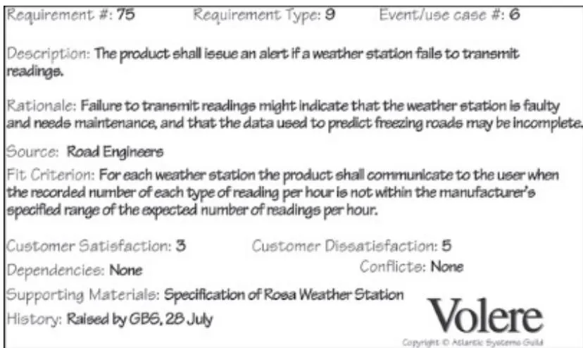  
(a)

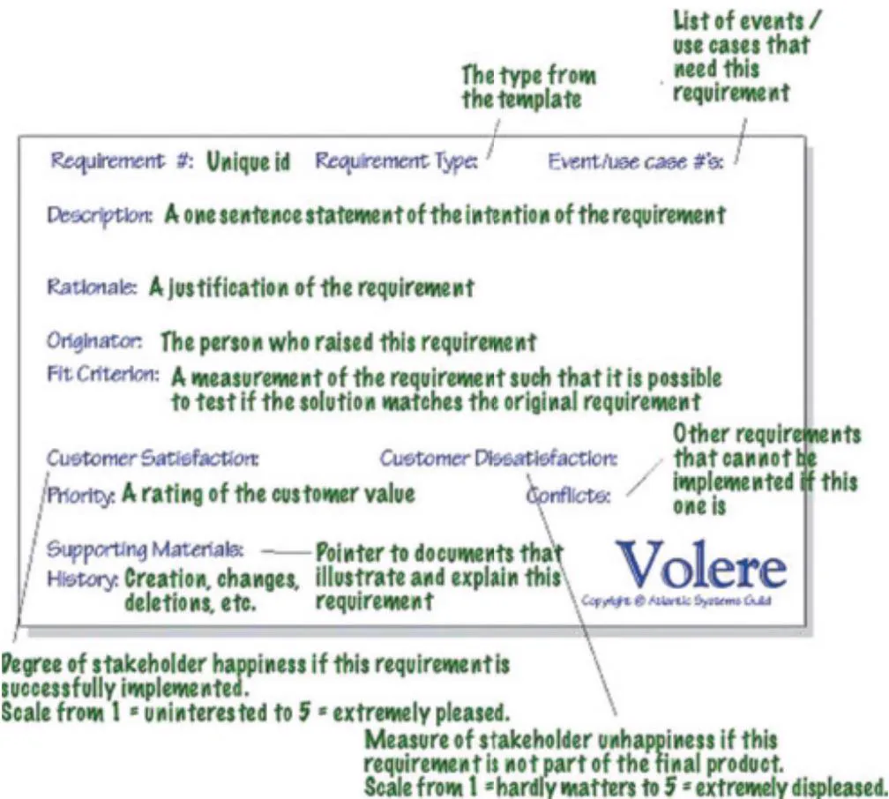  
(b)   
Figure 11.1 (a) An example requirement expressed using an atomic requirements shell from Volere (b) the structure of an atomic requirements shell

Source: Atlantic Systems Guild

• As a <group traveler>, I want <to know the vaccinations required to visit the chosen destination> so that <vaccinations can be arranged for everyone in the group in plenty of time>.   
. As a <travel agent>, I want <up-to-date information displayed> so that <my clients receive accurate information>.

User stories are sometimes referred to as user need statements. For more about user need statements and how to develop them, see www.nngroup.com/ articles/user-need-statements.

# 11.3.1  Different Kinds of Requirements

Requirements come from several sources: from the user community, from the business community, or as a result of the  technology to be applied. Two different  kinds of requirements have traditionally been identified: functional requirements, which describe what the product will do, and nonfunctional requirements, which describe the characteristics (sometimes called constraints)  of  the product.  For  example, a functional  requirement  for  a new  video  game might be that it  will be challenging for a range of abilities. This requirement might then be decomposed into more specific requirements detailing the structure of challenges in the game, for instance, levels of mastery, hidden tips and tricks, magical objects, and so on. A nonfunctional requirement for this same game might be that it can run on a variety of platforms, such as the Microsoft Xbox, Sony  PlayStation, and Nintendo Switch  game systems. Interaction design involves understanding both functional and nonfunctional requirements.

In this section, six of the most common types of requirements are discussed: functional, data, environment, user, usability, and user experience.

Functional  requirements capture  what  the product  will do.  For  example, a  functional requirement for an automated industrial assembly plant might be that an operator can program the assembly line to identify, manipulate, and weld together the correct pieces of metal accurately. Understanding the functional requirements is fundamental for all products.

Data  requirements capture  the type, volatility,  size/amount, persistence, accuracy, and value of the required data. All interactive products have to handle some data. For example, if an application for buying and selling stocks and shares is being developed, then the data must be up-to-date and accurate, and it is likely to change many times a day. In the personal banking domain, data must be accurate and persist over many months and probably years, and there will be plenty of it.

Environmental requirements, or context of use, refer to the circumstances in which the interactive product will operate. Four aspects of the environment  lead to different types of requirements. First is the physical environment, such as how much lighting, noise, movement, and dust is expected in the operational environment. Will workers need to wear  protective clothing, such as large gloves or headgear that might affect the choice of interface type? How crowded is the environment? For example, a ticket machine operates in a very public physical environment; thus using a speech interface is likely to be problematic.

The second aspect of the environment is the social environment. For example, will data need to be shared?  If so, does the sharing have to be synchronous  such as for  two people

viewing data at the same time, or asynchronous, such as when two people are authoring a report taking turns to edit it? Other factors include the number of people needing to interact at once, e.g., in a video game, and the locations of friends or colleagues. Additional relevant issues  regarding  the  social aspects  of  interaction  design  were  raised  in  Chapter  5, “Social Interaction.”

The third aspect is the support environment. For example, what kind of assistance will be needed to use the product and how easily can it be obtained, how much training or help will be readily available, and what level of help can be provided automatically? These issues need to be explored during the requirements activity, and there are user experience implications in choosing one solution or another, as discussed in the “Dilemma” box.

# DILEMMA

# Automated Help or Customer Service Support?

Several service providers such as energy companies and government offices have striven to improve their online presence to make it as comprehensive, clear, and streamlined as possible. Customers who encounter difficulties are encouraged to seek help through the various FAQs, online chatbots, and  support forums rather than to contact the  provider directly. Customers whose goal is to do something that is regarded as “standard” are well-supported, but as soon as their query steps outside of these dimensions, it can be hard for the system to find an answer. How good a user experience does this create? On the one hand, for those who are able to complete their goal quickly and easily, the system provides a good user experience, but for those with an issue that sits just outside the norm, this setup can be a poor experience. The dilemma comes in deciding how much to rely on online support and automated systems and how much to include human interaction.

Finally, the technical environment will need to be established. For example, what technologies  will  the  product  run  on  or  need  to  be  compatible  with,  and  what  technological limitations might be relevant?

User characteristics capture key attributes of potential users, such as their abilities and skills, and perhaps their educational background, preferences, personal circumstances, physical or mental disabilities, and so on. In addition, someone may be a novice, an expert, a casual user, or a frequent user. This affects the ways in which interaction is designed. For example, a novice user may prefer step-by-step guidance. An expert, on the other hand, may prefer a flexible interaction with more wide-ranging powers of control. The term user profile is used to refer to a  collection of user characteristics. Any  one product may  have several different user  profiles; for example  a client user profile and an agent user  profile may  be developed for a financial management portal, while profiles for a young parent with two children and a mature businessperson may be developed for a mobile library catalog interface.

Usability goals and user experience goals (see Chapter 1, “What Is Interaction Design?”) are  another  kind  of  requirement,  and  they  should  be captured  together  with  appropriate

measures. Chapter 2 briefly introduced usability engineering, an approach in which specific measures for the usability goals of the product are agreed upon early in the development process and are used to track progress as development proceeds. This both ensures that usability is given  due priority and facilitates progress  tracking. The same  is true  for user experience goals, although it is harder to identify quantifiable measures that track them.

Considering  each of  these  kinds of requirements  is  a starting  point  to discovering  the requirements for a particular product, but it  is a high-level perspective that  will need to be refined. For example, a telecare system designed to monitor someone’s movements and alert relevant care staff will have a range of environmental requirements including that the devices need to be light, small, fashionable, preferably hidden, and worn easily as people go  about their normal activities. The requirements activity will investigate what that means in detail. A desirable characteristic of both an online shopping site and a robotic companion is that they are  trustworthy, but  this would be interpreted  differently in each case. In the  former, security of information would be a priority, while in the latter behavioral norms would indicate trustworthiness.

A key requirement in many systems nowadays is that they be secure, but one of the challenges is to provide security that does not detract from the user experience, nor is undermined by the user experience. For examples of this, see Box 11.1, which introduces usable security.

# BOX 11.1

# Usable Security

Security is one  requirement that most users and  designers will agree  is important, to some degree or another, for all products. The wide range of security breaches, in particular of individuals’ private data, that have occurred in recent years has heightened everyone’s awareness of the need to be secure. But what does this mean for interaction design, and how can security measures be suitably robust, while not detracting from the user experience? As long ago as 1999, Anne Adams and Angela Sasse (1999) discussed the need to investigate the usability of security mechanisms and to take a user-centered approach to security. This included informing users about  how to choose a secure password, but it also highlighted that ignoring a usercentered perspective regarding security will result in users circumventing security mechanisms.

Since then, usable security and  the  role of users  in maintaining  secure practices  have become wide-ranging topics of concern (Lennartsson et al., 2020). While work on passwords continues to be relevant, other areas researched include whether and how to embed security mechanisms without affecting usability, how to encourage users to pay attention to security warnings and advice, and the effect of good design on security behavior.

For  example, Riccardo Focardi  et al.  (2019) investigated whether  embedding  cryptographic information in QR codes, in order to increase security, would affect the codes’ usability. Defining usability  as effectiveness, efficiency, and satisfaction, they found that it was possible for certain algorithms to be incorporated into QR codes and for them to remain usable. Distler et al. (2019) focused on a wider view of user experience than just usability. They used two versions of an e-voting application to compare the impact of showing security information versus keeping the information hidden and suggested recommendations for designing

technologies with security requirements. One of their  surprising results was that hiding the security mechanisms, and  hence making the  process of e-voting simpler and quicker, made some participants feel that the voting activity had become too “banal.” Encouraging users to pay attention to security advice and warnings was the focus of work by Otto Hans-Martin Lutz and colleagues (2020) and  Dezhi Wu et al. (2020). In the  former study, the researchers found that adding sounds to password feedback (sonification) could improve password strength and security awareness. Dezhi Wu and colleagues found that mobile security notifications that irritate users can negatively influence their perceptions of an app’s security.

Similarly, good design can also have an undesirable effect on security. For example, Milica Stojmenović and colleagues (2022) found that users rely on visual appeal when making security judgments about websites.  In their study, security and usability ratings  of websites were strongly influenced by visual appeal even where the web certificate status indicated that the site was not secure.

For a description of usable security and the relationship between usability and security, see www.ncsc.gov.uk/blog-post/security-and-usability-- you-can-have-it-all-.

# ACTIVITY 11.1

Suggest some key requirements in each category (functional, data, environmental, user characteristics, usability goals, and user experience goals) for each of the following situations:

1. An interactive product for navigating around a shopping center, to run on a smartphone   
2. A wearable interactive product to measure glucose levels for an individual with diabetes

# Comment

These are indicative answers. You may have come up with alternative suggestions.

1. Interactive product for navigating around a shopping center.

Functional The product will locate places in the shopping center and provide routes for the user to reach their destination.

Data The product needs access to GPS location data, maps of the shopping center, and locations of all the places in the center. It also requires knowledge about the terrain and pathways for people with different needs.

Environmental The product design needs to take into account several environmental aspects. Users may be in a rush, or they may be more relaxed and wandering about. The physical environment will be noisy and busy, and people may be talking with friends and colleagues while using the product. Support or help with using the product may not be readily available, but the user can probably ask a passerby for directions if the app fails to work.

(Continued)

User Characteristics Potential users are members of the population who have their own smartphone and for whom the center is accessible. This suggests quite a wide variety of people with different abilities and skills, a range of educational backgrounds and personal preferences, and different age groups.

Usability Goals The product needs to be easy to learn so that novices can use it immediately, and it should be memorable too. People won’t want to wade through unnecessary detail or a complicated presentation, so it needs to be efficient and safe to use; that is, it needs to be able to deal easily with any errors.

User Experience Goals Of the user experience goals listed in Chapter 1, those most likely to be relevant here are satisfying, helpful, and enhancing sociability. While some of the other goals may be appropriate, it is not essential for this product to, for example, be cognitively stimulating.

2. A wearable interactive product to measure glucose levels for an individual with diabetes.

Functional The product will be able to measure the user’s glucose levels.

Data The product will need to measure and display the glucose level—but possibly not store it permanently—and it may not need other data about the individual. These uncertainties would be explored during the requirements activity.

Environmental The physical environment could be anywhere the individual may be—at home, in hospital, visiting the park, and so on. The product needs to be able to cope with a wide range of conditions and situations and to be suitable for wearing.

User Characteristics People with diabetes could be of any age, nationality, ability, and so on, and may be novice or expert, depending on how long they have had diabetes. Most people will move rapidly from being a novice to becoming a regular user.

Usability Goals The product needs to exhibit all of the usability goals. You wouldn’t want a medical product being anything other than effective, efficient, safe, easy to learn and remember how to use, and with good utility. For example, outputs from the product, especially any warning signals and displays, must be clear and unambiguous.

User Experience Goals User experience goals that are relevant here include the device being comfortable, while being aesthetically pleasing or enjoyable may help encourage continued use  of the  product. Making the  product surprising, provocative, or challenging  is to be avoided, however.

These six types of requirements are key, but there are many other types, and there are different frameworks for discovering requirements. Two popular ones are shown in Figure 11.2 and Table 11.1, both of which subsume the six types of requirements introduced here. The seven product dimensions shown in Figure 11.2 are intended to be used as prompts to ask questions about the product from different perspectives: the customer, the business, and the technology. The Volere template shown in Table 11.1 has a more detailed framework including the Waiting Room. This is where solution ideas can be “parked” while divergent thinking continues.

The 7 Product Dimensions   

<table><tr><td>User</td><td>Interface</td><td>Action</td><td>Data</td><td>Control</td><td>Environment</td><td>Quality Attribute</td></tr><tr><td>Users interact with the product</td><td>The product connects to users, systems, and devices</td><td>The product provides capabilities for users</td><td>The product includes a repository of data and useful information</td><td>The product enforces constraints</td><td>The product conforms to physical properties and technology platforms</td><td>The product has certain properties that qualify its operation and development</td></tr></table>

Figure 11.2 The seven product dimensions

Source: Gottesdiener and Gorman (2012), p. 58. Used courtesy of Ellen Gottesdiener

To see how the seven product dimensions can be used to discover requirements, see www.youtube.com/watch?v=x9oIpZaXTDs.

<table><tr><td rowspan="2">Project Drivers</td><td>1. The Purpose of the Product</td></tr><tr><td>2. The Stakeholders</td></tr><tr><td rowspan="3">Project Constraints</td><td>3. Mandated Constraints</td></tr><tr><td>4. Naming Conventions and Terminology</td></tr><tr><td>5. Relevant Facts and Assumptions</td></tr><tr><td rowspan="4">Functional Requirements</td><td>6. The Scope of the Work</td></tr><tr><td>7. Business Data Model and Data Dictionary</td></tr><tr><td>8. The Scope of the Product</td></tr><tr><td>9. Functional Requirements</td></tr><tr><td rowspan="8">Nonfunctional Requirements</td><td>10. Look and Feel Requirements</td></tr><tr><td>11. Usability and Humanity Requirements</td></tr><tr><td>12. Performance Requirements</td></tr><tr><td>13. Operational and Environmental Requirements</td></tr><tr><td>14. Maintainability and Support Requirements</td></tr><tr><td>15. Security Requirements</td></tr><tr><td>16. Cultural Requirements</td></tr><tr><td>17. Compliance Requirements</td></tr></table>

(Continued)

Table 11.1 A comprehensive categorization of types of requirements   

<table><tr><td rowspan="10">Project Issues</td><td>18. Open Issues</td></tr><tr><td>19. Off-the-Shelf Solutions</td></tr><tr><td>20. New Problems</td></tr><tr><td>21. Tasks</td></tr><tr><td>22. Migration to the New Product</td></tr><tr><td>23. Risks</td></tr><tr><td>24. Costs</td></tr><tr><td>25. User Documentation and Training</td></tr><tr><td>26. Waiting Room</td></tr><tr><td>27. Ideas for Solutions</td></tr></table>

Source: Atlantic Systems Guild, Volere Requirements Specification Template, Edition 20 (2019)

# 11.4  Data Gathering for Requirements

Data gathering for requirements covers a wide spectrum of issues, including who might use the product, the activities in which they are currently engaged and their associated goals, the context in which the activities are performed, and the rationale for the way things are. The three  data  gathering  techniques  introduced  in  Chapter  8, “Data  Gathering”  (interviews, observation, and questionnaires), are commonly used throughout the interaction design lifecycle.  In  addition  to  these  techniques,  several  other  approaches  are  used  to  discover requirements.

For  example, documentation, such  as manuals, standards, or activity logs, are a  good source of  data about  prescribed  steps involved  in  an  activity,  any regulations  governing a task, or where records of activity are already kept for audit or safety-related purposes. Studying  documentation can  also  be good  for  gaining  background  information,  and  it  doesn’t involve stakeholder time. For example, Caitlin Woods and colleagues (2019) used documentation of maintenance procedures to extract requirements for an adaptive user interface for industrial equipment maintenance. Some high-level requirements identified this way were to provide warnings and encourage situational awareness and for it to be deployable on multiple devices. Researching other products can also help identify requirements. For example, Jens  Bornschein  and  Gerhard  Weber  (2017)  analyzed existing  nonvisual drawing  support packages to identify requirements for a digital drawing tool for blind users, while Xiangping Chen et  al. (2018)  proposed  a  recommender system  for  exploring existing  app stores  and extracting common user interface features to identify requirements for new systems.

It  is  usual for  more than  one data gathering  technique to  be used  in order  to provide different  perspectives. Examples are  observation to understand  the context  of the activity, interviews to target specific stakeholder groups, questionnaires to reach a wider population, and focus groups to build a consensus view. Many different combinations are used in practice, and Box 11.2 includes some examples.

# BOX 11.2

# Combining Data Gathering Techniques in Requirements Activities

The following examples illustrate the wide range of possibilities for combining different data gathering techniques to progress requirements activities, but there are many more!

Direct Observation in the Wild, Indirect Observation Through Log Files, Interviews, Diaries, and Surveys

Victoria Hollis et al. (2017) performed a study to inform the design of reflective systems that promote emotional well-being. Specifically, they wanted to explore the basis for future recommendations to improve a person’s well-being and the effects of reflecting on negative versus positive past events. They performed  two  direct observation  studies  in the  wild with 165 participants. In both studies, surveys were administered before and after the field study period to assess emotional well-being, behaviors, and self-awareness. The first study also performed interviews. In the first study of 60 participants over 3 weeks, they investigated the relationship between past mood data, emotional profiles, and  different  types of recommendations to improve future well-being. In the  second study  of 105  participants over 28 days,  using a  smartphone diary  application, they investigated the  effects  of reflection and  analysis of past negative and positive events on well-being. Together, these studies provided insights into requirements for systems to support the promotion  of emotional well-being. Figure 11.3(a) shows the visualization displayed to emotion-forecasting participants in week 3 of the first study. The leftmost two points in the line graph indicate average mood ratings on previous days, and  the  center point  is the  average rating for the immediate  day. The two  rightmost points indicate predicted mood for upcoming days.

In Figure 11.3(b), the left panel shows the home screen. Participants record a new experience by clicking the large plus sign $\left( + \right)$ in the upper left. The center panel shows a completed event record, which consists of a header, textual entry, emotion rating, and image. The right panel  shows participant  reflection by rating their  current  emotional  reaction to the  initial record and providing a new textual reappraisal.

# Diaries and Interviews

Tero Jokela et al. (2015) studied how people currently combine multiple information devices in their everyday lives to inform the design of future interfaces, technologies, and applications that better support multidevice use. For the purpose  of this study, an information device is any device that can be used to create or consume digital  information, including computers, smartphones, tablets, televisions, game consoles, cameras, music players, navigation devices, and  smartwatches. They collected diaries  over a  one-week period and  interviews from 14 participants. The study indicates that requirements for the technical environment needed to improve the user experience of multiple devices, including being able to access any  content with any device and improved reliability and performance for cloud storage.

(Continued)

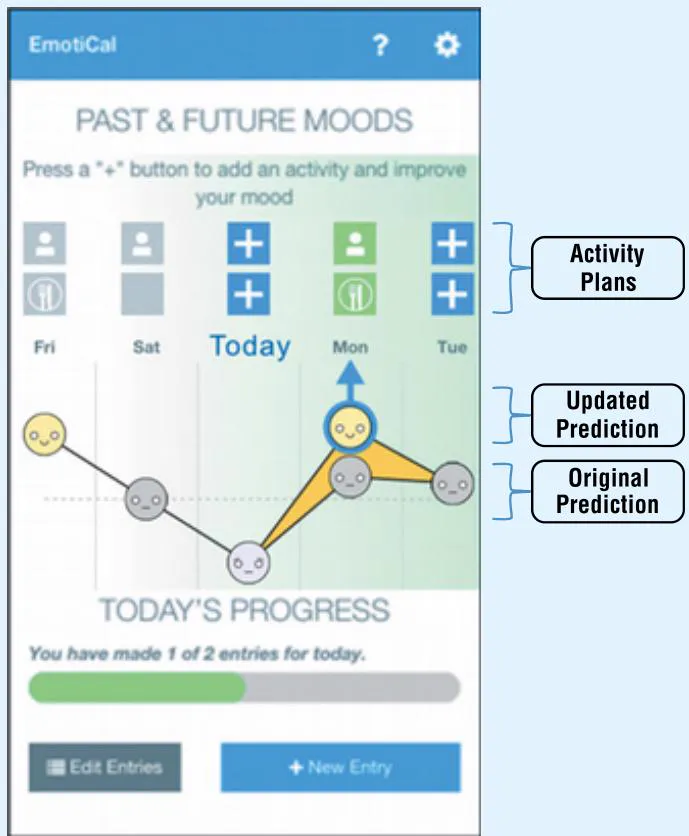

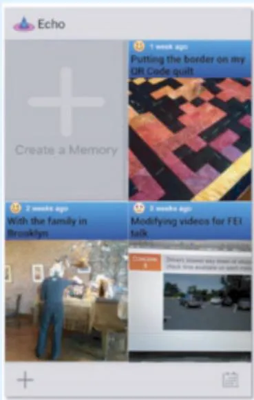

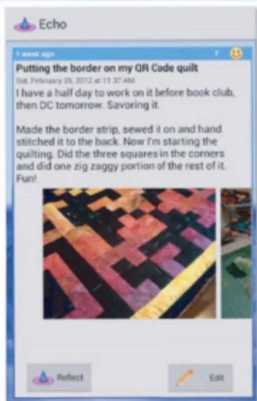

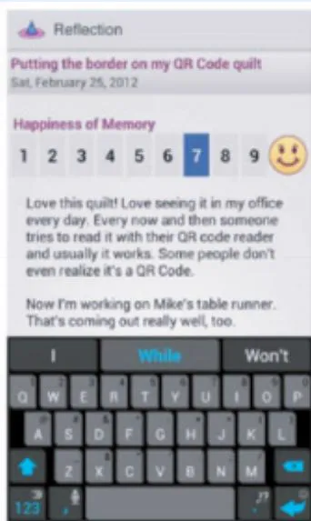  
(b)   
Figure 11.3 (a) The image shown to participants in the first study (b) the smartphone diary app for the second study

Source: Hollis et al. (2017) / Courtesy of Taylor & Francis, Figures 1 & 9

Interview, Think-Aloud Evaluation of Wireframe Mock-Up, Questionnaire, and Evaluation of Working Prototype

Carole Chang et al. (2018) developed a memory aid application for traumatic brain  injury (TBI) sufferers. They initially conducted interviews with 21 participants to explore memory impairments  after TBI. From these, they identified common themes in the  use  of external memory aids. They also learned that TBI sufferers do not want just another reminder system but something that helps them to remember and hence can also train their memory and that their technology requirements were for something simple, customizable, and discreet.

Studying Documentation, Evaluating Other Systems, User Observations, and Focus Groups Nicole Costa et al. (2017) describe their  ethnographic study of the  design team for  the user interface of a ship’s maneuvering system (called a conning display). The design team started by studying the accident and incident reports to identify requirements for things to avoid, such as mixing up turn-rate meter with rudder indicator. They used Nielsen’s heuristics (discussed further in Chapter 16, “Evaluation: Inspections, Analytics, and Models”) to evaluate other existing systems and specifically how to represent the vessel on the display. This oriented the team to see the display’s design from a user perspective and produced a list of parameters to evaluate for priority and usefulness. Once a suitable set of requirements had been discovered, sketching, prototyping, and evaluating with the help of users was used to produce the final design.

# Questionnaire, Focus Group, Design Probe, and User Study

Smart meters are designed to capture information about power consumption in the home and send it to third parties. There is a tension between the benefits of smart metering and potential risks of privacy violation. Timo Jakobi et al. (2019) investigated peoples’ perceptions of the impact of smart metering on privacy and trust aimed at informing the design of a usable privacy manager for smart meters. Their approach was ethnographically oriented in that they aimed to relate in-depth knowledge  of current  practice with assessing the  viability  of a  technological intervention. An open-ended questionnaire was distributed to 200 households in Siegen, Germany. These were analyzed thematically to identify salient aspects of privacy decision-making, which were then explored in four focus groups involving 17 participants in total. The focus groups explored the  perceived positive and negative consequences of disclosing smart  meter data. Using thematic analysis on the focus group data, a set of possible value-added services for smart metering were derived, together with their associated privacy risks. The researchers then developed  a design probe that instantiated these  services and risks. Specifically, the  app presented an interface through which the user could manage their privacy settings for the hypothetical services identified from the research so far. The probe was designed to raise awareness of privacy issues by making privacy risks visible.A user evaluation of the design probe was then conducted with 205 participants. The results suggest that connecting data disclosure with related privacy risks is a potential requirement for making privacy management systems more usable.

# 11.4.1  Using Probes to Engage with Stakeholders

Probes  come in  many forms  and are an  imaginative approach to data  gathering. They  are designed  to  prompt  participants  into  action,  specifically  by  interacting  with  the  probe  in some way, so that researchers and designers can learn more about them and their contexts. Probes  rely on some form  of logging to gather the data—either automatically  or manually depending on the kind of probe being used.

The idea of a probe was first developed during the Presence Project (Gaver et al., 1999), which was investigating novel interaction techniques to increase the presence of elderly people in their local community. Bill Gaver et al. wanted to avoid more traditional approaches, such as questionnaires, interviews, or ethnographic studies, and developed a technique called cultural probes. These probes consisted of a wallet containing eight  to ten postcards, about seven maps, a disposable camera, a photo album, and a media diary. Recipients were asked to answer questions associated with certain items in the wallet and then return them directly to the researchers. For example, on a map of the world, they were asked to mark places where they had been. Participants were also asked to use the camera to take photos of their home, what they were wearing today, the first person they saw that day, something desirable, and something boring.

Inspired by this original cultural probe idea, different forms of probes have been adapted and  adopted for  a range of purposes (Boehner et al., 2007). For  example, design probes are objects whose form relates specifically to a particular question and context. They are intended to gently encourage people to engage with and answer the question in their own context. Figure 11.4 illustrates another kind—a diary probe—used to explore how technology can support adolescents to document their experience of chronic conditions, such as cancer and lupus, so that they can be shared. By using this probe with 12 adolescent-parent pairs, Matthew Hong and colleagues (2020) suggested three areas for support: scaffolding to help patients learn about and represent their experiences; data sharing models to identify appropriate timing, types, and level of detail for sharing health-related information between family members; and artifacts that can bridge between traditional quantitative measures of tracking and more personal narratives.

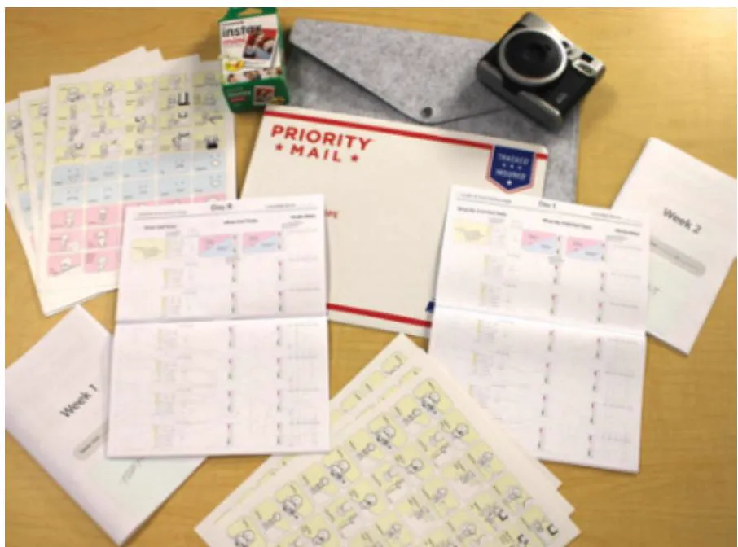  
Figure 11.4 Two  diary  probe kits were provided for each patient-parent pair, consisting of diary booklets, experience sticker sheets, markers and pencils, self-addressed stamped envelope, and an optional camera.

Source: Matthew Hong et al. (2020). Reproduced with permission of ACM Publications

Other types of probes include technology probes (Hutchinson et al., 2003) and provocative probes (Sethu-Jones et al., 2017). Examples of technology probes include mobile phone apps such as Pocketsong, a mobile music listening app (Kirk et al., 2016), and NkhukuProbe, a device that uses sensors to monitor temperature, humidity, and lighting to support poultry farming in sub-Saharan Africa (Chidziwisano et al., 2021). The last of these, NkhukuProbe, used  an Arduino microcontroller,  various  sensors, and a  solar battery  to transmit data  via a  mobile network. It was deployed in  15 rural households  in Malawi for  one month. The aim was to test the probe in the wild, explore how sensors could be used to control poultry environments, and inspire local poultry farmers to think of new ways to use sensors in their work. Several participants suggested ideas after their experiences, including using sensors to detect abnormal sounds that might indicate disease.

Provocative  probes  are designed to challenge  existing  norms and attitudes  to provoke discussion. For example, Anders Bruun et al. (2020) developed a design provocation called Pup-Lock to challenge families’ use of mobile technologies in the home and to explore how to  increase interaction between family members by  reducing  the use  of mobile  devices. To achieve  this, Pup-Lock allows  any family  member to lock  all  mobile  devices in  the home, preventing  them  from  being  used.  Three  families  took  part  in  the  study. Data  collection started with a three-week self-reporting diary study in which each family member was asked to capture  their mobile  device use and any family tensions around that use. Pup-Lock was deployed with the three families for up to two weeks each. During this time usage data was logged about when and how often mobile devices were locked or unlocked. Semi-structured interviews  were conducted before and after the diary study and before and after the probe study. Data  was analyzed  thematically. Their  findings showed  that all  families  were more attentive to family members during the time when Pup-Lock was in use, that participants felt relief at not being interrupted by their smartphones, and that it prompted parents to reflect more than usual on their mobile device use.

# 11.4.2  Contextual Inquiry

Contextual inquiry was originally developed in the 1990s (Holtzblatt and Jones, 1993) and has  been adapted  over time  to suit  different  technologies and the different  ways  in which technology  fits  into  daily  life.  Contextual  inquiry  is  the  core  field  research  process  for Contextual  Design (Holtzblatt and Beyer, 2017), which is a user-centered design approach that  explicitly  defines  how  to  gather,  interpret, and  model  data  about  how  people  live  in order to drive  design ideation. However, contextual inquiry is  also  used on its  own to discover requirements. For example, Hyunyoung Kim et al. (2018) used contextual inquiry to learn about unresolved usability problems related to devices for continuous parameter controls, such  as the  knobs  and sliders  used by  sound engineers  or  aircraft  pilots. From  their study, they  identified  six  needs:  fast  interaction, precise  interaction,  eyes-free  interaction, mobile  interaction,  and  retro-compatibility  (the  need  to  use  their  existing  expertise  with interfaces).

One-on-one field interviews (called contextual interviews) are undertaken by every member  of the  design  team, each  lasting about  one-and-a-half  to  two hours. These  interviews focus on matters of daily life (work and home) that are relevant for the project scope. Contextual inquiry uses a model of master/apprentice to structure data gathering, based on the idea  that the  interviewer (apprentice) is  immersed in the world  of the  participant (master), creating an attitude of sharing and learning on either side. Participants talk as they “do,” and

the apprentice learns by being part of the activity while also observing it, which has the same advantages  as observation and  ethnography. While  observing  and learning, the apprentice focuses on why, not just what.

The contextual interview has four parts: obtaining an overview, the transition, the main interview, and the wrap-up. The first part can be performed like a traditional interview, introducing each other and setting the context of the project. The second part is where the interaction changes as both parties get to know each other and the nature of the contextual interview engagement is set up. The third part is the core data gathering session when the participant continues  with  their  activities  and  the  interviewer  observes  them  and  learns.  Finally, the wrap-up involves sharing some of the patterns and observations the interviewer has made.

Four principles guide the contextual interview: context, partnership, interpretation, and focus.

The  context  principle emphasizes  the importance  of visiting  the participant, wherever they  are,  and  seeing  what  they  do  as  they  do  it. The  partnership  principle  creates  a  collaborative context in which the participant and interviewer can explore the participant’s life together. In a traditional interview situation, the  interviewer is in control, but in contextual inquiry, the spirit of partnership means that understanding is developed together.

Interpretation turns the observations into a form that can be the basis of a design hypothesis or idea. These interpretations are developed  collaboratively by the participant and the design team  member to  make sure  that they  are sound. For  example, imagine  that during a contextual interview  for an  exercise monitor, the participant  repeatedly checks  the data, specifically looking at the heart rate display. One interpretation of this is that the participant is very worried about their heart rate. Another  interpretation is that the  participant is concerned that the device is not measuring the heart rate effectively. Yet another interpretation might be that the device has failed to upload data recently, and the participant wants to make sure that the data is being saved. The only way to make sure to choose the correct interpretation is to ask the participant. It may be that, in fact, they don’t realize that they are doing this and that it has simply become a distracting habit.

The fourth principle, focus, is established to guide the interview setup and tells the interviewer what they need to pay attention to among all of the detail that will be unearthed. If all members of the team conduct interviews around the project focus, this will allow different aspects of the activity to surface and will lead to a richer set of data.

Together with these principles, the contextual interview is also guided by a set of seven “cool  concepts,” divided  into two  groups. The  joy  of  life  concepts  capture  how  products make our lives richer  and more fulfilling. These concepts  are accomplish (empower  users), connection (enhance real relationships), identity (support users’ sense of self), and sensation (pleasurable  moments). The  joy  of  use  concepts  describe the  impact  of  using  the product itself; they  are  direct  in action (provide  fulfillment of intent), the  hassle factor  (remove  all glitches  and  inconveniences),  and  the  learning  delta  (reduce  the  time  to  learn).  During  a contextual interview, cool  concepts are  identified as the participant  performs their activity, although often they emerge only retrospectively when reflecting on the session.

During the interview, data is collected in the form of notes, initial sketches, and perhaps audio and video recordings. Following  each contextual interview, the team  holds an  interpretation session  where the whole  team talks about their findings and establishes a shared understanding based on the data. Contextual Design suggests 10 different models that may be used to consolidate the understanding generated by this discussion. For more detail about contextual design models and how to generate them, see Holtzblatt and Beyer (2017).

<!-- Chunk 9 End -->


<!-- Chunk 10 Start -->

# ACTIVITY 11.2

How  does contextual inquiry  compare  with the  data gathering  techniques introduced in Chapter 8, specifically ethnography and interviews?

# Comment

Ethnography  involves observing  a  situation  without any  a priori structure  or framework; it may  include other data gathering techniques such as interviews. Contextual inquiry also involves observation with interviews, but it provides more structure, support, and guidance in the form of the apprenticeship model, the principles to guide the session, the cool concepts to look out for, and a set of models from Contextual Design to shape and present the data. Contextual inquiry also explicitly states that it is a team effort and that all members of the design team conduct contextual interviews.

Structured, unstructured, and semi-structured interviews were introduced in Chapter 8. Contextual inquiry could be viewed as a form of unstructured interview with props, but it has other characteristics as discussed earlier, which gives it added structure and focus. A contextual inquiry interview requires the interviewee to be going about their daily activities, which may also mean that the interview moves around—something unusual for a standard interview.

# 11.4.3  Brainstorming for Innovation

Requirements will be underpinned by the data gathered, but the requirements activity is also likely  to  involve  some  innovation. Brainstorming  is  a  generic  technique  used  to  generate, refine, and develop ideas. It is widely used in interaction design to explore the problem space and generate alternative designs or for suggesting new and better ideas to support people in their everyday and working lives.

The origins of brainstorming can be traced back to Alex Osborn in the late 1930s (Snyder, 2021), who introduced  it into his US  advertising  agency to  help his  employees generate creative ideas. Osborn suggested four rules for brainstorming, each of which reinforces the others.

Quantity over quality: This encourages divergent thinking. The more ideas that are generated, the more there are to consider merging, developing, and refining.   
. Criticisms should  be withheld: This encourages people to focus on  generating ideas  and not worry about coming up with anything “dumb.”   
Encourage out-of-the-box thinking: This encourages unorthodox ideas. Even if the ideas are  obviously  impractical  from  the  start,  they  may  trigger  other  thoughts  and  generate ideas that would not have been considered without that prompt.   
• Combine, refine, and improve ideas: This encourages convergent thinking. Ideas are considered, combined, modified, and fused to produce novel insights and even more ideas.

The fourth rule, to combine refine and improve ideas, is sometimes overlooked but this convergent step is important to discover concrete requirements.

Despite  its  seemingly free-form  character, brainstorming  sessions  need  careful facilitation,  planning, and  preparation. This  includes  setting  out  a  well-honed  focus  or  problem

definition, using  a range of catalysts or  prompts to help people  think from a different perspective  (this  can  be  a  physical  object(s)  or  a  random  word,  for  example), and  choosing between 5 and 12 participants who know who they are designing for and have a range of experience.

# 11.5 Bringing Requirements to Life: Personas and Scenarios

Using a format such as the Volere shell (see Figure 11.1) or user stories captures the essence of a requirement, but neither of them is sufficient on their own to express and communicate the product’s purpose and vision. Both can be augmented with other representations such as prototypes, working systems, screenshots, conversations, acceptance criteria, diagrams, documentation, and so on. Which of these is required, and how many of each, will be determined by the kind of system under  development. In some cases, capturing different aspects of the intended product in more formal or structured representations is appropriate. For example, when developing safety-critical  devices, the functionality, user  interface, and interaction of the system need to be specified unambiguously and precisely. Sapna Jaidka et al. (2017) suggest using the Z formal notation (a mathematically based specification language) and petri nets  (a  notation  for modeling  distributed  systems  based  on  directed graphs)  to  model  the interaction behavior of medical infusion pumps. Harold Thimbleby (2015) pointed out that using a formal expression of requirements for number entry user interfaces such as calculators, spreadsheets, and medical devices could avoid bugs and inconsistencies.

Two techniques that are commonly used together to augment basic requirements information and to bring requirements to life are personas and scenarios. A persona characterizes someone who might use the product while a scenario describes one use of a product or one example of achieving a goal. Some designers prefer to develop the personas first, and some prefer to write the scenarios first, but often they are developed in parallel. Developing distinctive personas and scenarios can be difficult at first, and it is common for initial narratives to conflate details of the person with details of the scenario. Thinking about the persona’s goal for the scenario helps to scope the scenario to one use of the product.

When  used in  combination, personas  and scenarios  complement each other  and bring realistic  detail that  allows  the  design  team  to explore  current  activities, future use  of  new products,  and  futuristic  visions  of  new  technologies.  Figure  11.5  depicts  the  relationship between them graphically.

This article by Jared Spool explains why personas on their own are not enough and why scenarios also need to be developed: medium.com/user-interface-22/when-it-comes-to-personas-thereal-value-is-in-the-scenarios-4405722dd55c.

Figure 11.5 The relationship between a scenario and its associated persona   
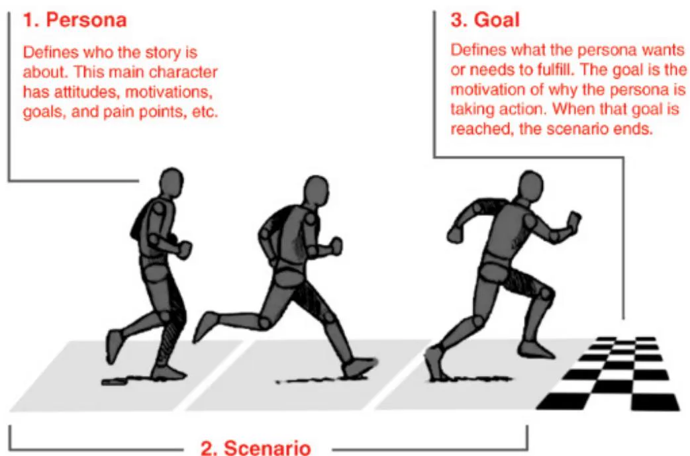

Source: www.smashingmagazine.com/2014/08/06/a-closer-look-at-personas-part-1. Reproduced with permission of Smashing Magazine

# 11.5.1  Personas

Personas (Cooper, 1999) describe typical users of the product under development on which the designers can focus and for which they can design products. Personas are a widely used and effective way to communicate user characteristics and goals to designers and developers and to remind them that users of their products may be unlike themselves. They don’t describe specific people but  represent a synthesis of a number of people who have been involved  in data gathering. Each persona is characterized by a unique set of goals relating to the product under  development  and  is not  a  job  description or  a simple demographic. This is  because goals often differ among people within the same job role or the same demographic.

In addition to their goals, a persona will include a description of relevant behavior, attitudes, activities, and environment. These items are all specified in some detail. For instance, instead of describing someone simply  as a competent sailor, the persona includes that they have completed a Day Skipper qualification, have more than 100 hours of sailing experience in and around European waters, and get irritated by other sailors who don’t follow the navigation rules. It is the addition of precise, credible, and relevant details that helps designers to see the personas as real people for whom they can design.

Madeline Hallewell et al. (2022) wanted to identify key requirements for a future autonomous taxi service. In particular, they wanted to explore how people will be supported to use such a service, when there is no driver to help. For example, previous research has found that automatic door opening is not as convenient for some people as having the driver open the door and help the passenger enter the vehicle (Kim et al. 2019).

The researchers  contacted people who use  taxis at least twice a year,  including  people from  a  range  of  ages, those  with  diverse  accessibility  requirements  including  hearing  and physical disability, and those who regularly travel with a dependent. Thirty-five interviews were conducted. Participants  completed a short  demographic questionnaire  and then took part in an hour-long interview. The interview was based around both positive and negative critical incidents of taxi  use and asked participants to talk through the process  of using the taxi. Participants were given key words to help identify stages of the process, e.g., booking and pickup, and they were prompted to think of tasks associated with the stages. Researchers made notes and audio-recorded the interviews. From these interviews and supported by relevant literature, a set of eight personas and 13 scenarios (see Section 11.5.2) were drafted together. This was achieved through a combination of task analysis and thematic analysis of the interview  data, enriched by  research papers. These  initial  personas and  scenarios were presented to the project partners, and comments were used to refine them. Figure 11.6 shows two of the personas derived from this work.

These personas and scenarios were then used as the basis for a workshop that extracted key requirements, captured in Volere shells (see Figure 11.1).

The style of personas varies, but commonly they include a name and photograph, plus key goals, user quotes, behaviors, and some background information. A product will usually require a set of personas rather than just one, but it may be helpful to choose a few, or maybe only one, primary persona.

The details included in a persona can be influential in the design process. For example, Joni Salminen et al (2022) investigated the effect of using happy or unhappy photographs in a persona. They  found that unhappy images increased participant’s  perceptions of the persona’s realism and severity of pain points, while personas with happy images were perceived as being more extroverted, agreeable, open, conscientious, and emotionally stable. In general, a good persona does the following:

•  Helps the designer make design decisions by understanding whether it will help or hinder someone using the product.   
? Supports the kind of reasoning that says, “What would Bill (persona 1) do in this situation with the product?” and “How would Clara (persona 2) respond  if the product  behaved this way?”   
• Contains only  information that is  pertinent to the product  being developed. It does  not attempt to capture the whole person but is only a lens to highlight relevant attitudes and specific  context  associated  with  the  focus  (Nielsen, 2019).  For  example, personas  for a shared travel organizer would focus on  travel-related behavior and attitudes rather than the newspapers the personas read or where they buy their clothes. On the other hand, personas for a shopping center navigation system might consider these aspects.

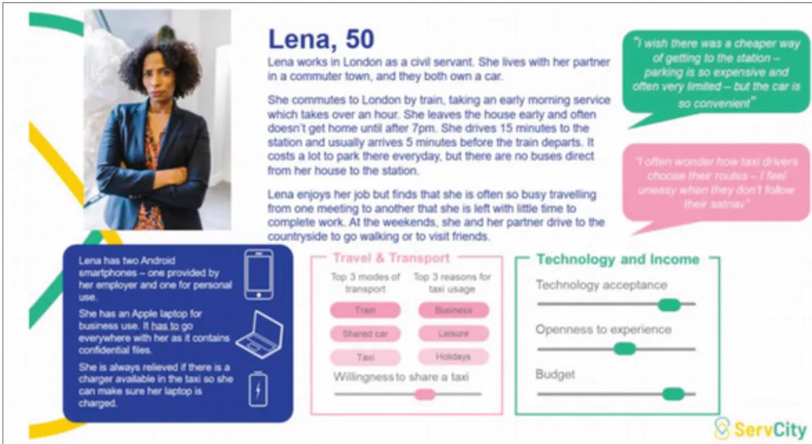  
Figure5.Examplepersona "Lena." Photo by RODNAEProductions from Pexels.

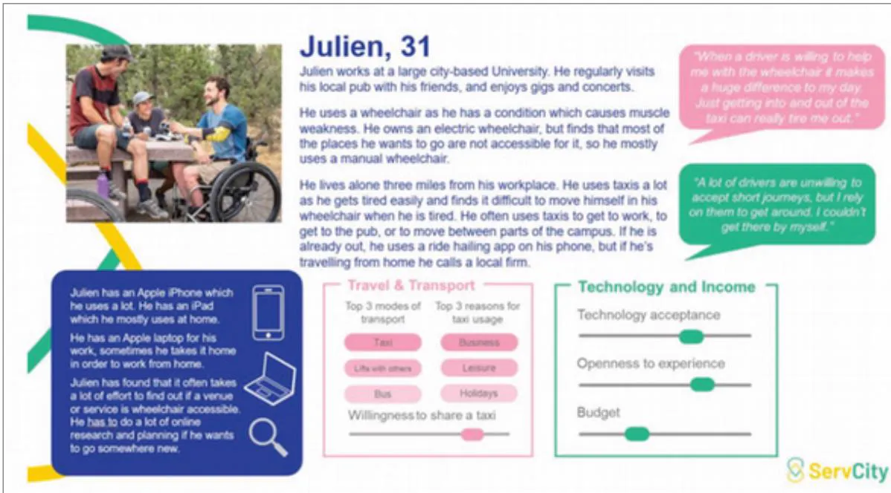  
Figure6.ExamplepersonaJulien.Photoby ELEVATE from Pexels.   
Figure 11.6 Two of the eight personas derived for the autonomous taxi service Source: Hallewell, et al. (2022) Deriving Personas to Inform HMI Design for Future Autonomous Taxis: A Case Study on User Requirement Elicitation, Journal of Usability Studies, 17(2), 41–64

Based  on their experiences  of  developing  three shopping  coupon  personas, Shazeeye Kirmani et al. (2019) propose a number of tips for developing personas within a business context. These  include  the  importance  of  using different  communication  documents  for different  audiences,  such  as  videos  for  senior  managers,  and  demographics,  needs,  and goals for marketing; and  using different data gathering methods to get  a holistic view of the personas.

This video discusses the scope of personas: www.youtube.com/watch?v=XVaiNayTi8U

# ACTIVITY 11.3

Develop  two  personas for  a group  travel organizer  app  that supports a  group  of people, perhaps a family, who are exploring vacation possibilities together. Use the common persona structure of a photo and name, plus key goals, user quotes, behaviors, and some background information. Personas are based on real people, so choose friends or relatives that you know well to construct them.

These can be drawn by hand, or they can be developed in PowerPoint, for example. There are also several tailorable persona templates available online that can be used instead.

# Comment

The personas shown in Figure 11.7 were developed for a father and his daughter using templates from xtensio.com/templates.

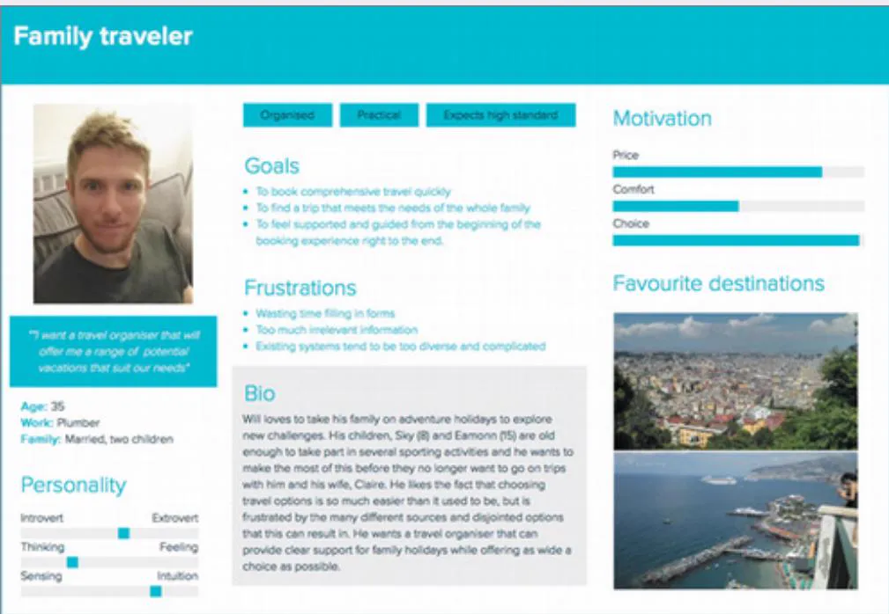

# Young traveler


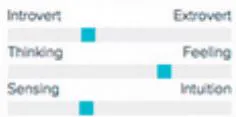

Energetic

Ingulsitive

Lkes noading

#

#

#

#

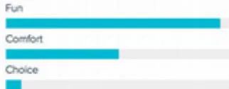

#


  
Figure 11.7 Two personas for the group travel organizer

# 11.5.2  Scenarios

A scenario is an “informal narrative description” (Carroll, 2000). It describes human activities or tasks in a story that allows exploration and discussion of contexts, needs, and requirements.  It  does  not  necessarily describe the  use  of software  or  other  technological  support used to achieve a goal. Using stakeholder vocabulary and phrasing means that scenarios can be understood by them, and they are able to participate fully in development. Telling stories is  a  natural  way  for  people  to  explain  what  they  are  doing, and  stakeholders  can  easily relate to them.

Scenarios  can  have a  relatively  simple  format, i.e., a  textual  description;  they  may  be short or long, and they may be more or less elaborate. The goal of the scenario, the narrative around reaching that goal (e.g., completing a task), and who the user is (e.g., which persona does it  relate  to) form the  core  of the  scenario. This core can  be fleshed out  with detail as needed for the design task at hand. An example of a simple textual scenario is shown next. Abraham Mhaidli and Florian Schaub (2021) proposed this scenario to explore the potential of manipulative extended reality (XR) advertisements and their harm.

A furniture company releases a new AR app that allows customers to place 3D renderings of furniture into their home, to see how the furniture would look like in their home. Unbeknownst to the consumer, the preview is altered in ways that make the photorealistic rendering of the furniture seem brighter and more colorful than real life, whilst still

seeming realistic. An unsuspecting customer uses the app to “try out” a new sofa in their living room; satisfied with how it looks, they buy the sofa, only to find that the actual sofa is much duller, uglier, and of vastly lower quality than the preview had suggested.

A  more  elaborate  scenario format  was used  by  Madeline Hallewell  et  al. (2022)  who also devised the personas Lena and Julien introduced in the previous section. These scenarios contain quite a lot of information including quotes from interviews, the stages of the journey, and the context for the journey. An example is  shown in Figure 11.8. Note that these scenarios capture existing behavior, before the autonomous service is introduced.

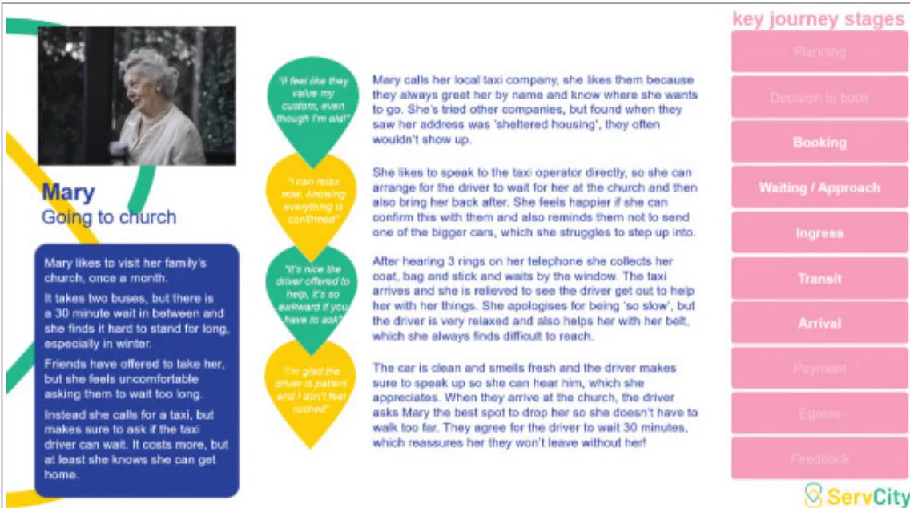  
Figure8. Example scenario "Mary:Going to Church." Photo by Andrea Piacquadiq from Pexels   
Figure 11.8 Scenario developed for persona Mary traveling to church. This scenario format includes a wide range of information to complement the central scenario story.

Source: Hallewell, et al. (2022) Deriving Personas to Inform HMI Design for Future Autonomous Taxis: A Case Study on User Requirement Elicitation, Journal of Usability Studies, 17(2), 41–64.

As illustrated, scenarios may describe existing behavior or future behavior. Starting with current  behavior allows  the  designer  to  identify  stakeholders  and  artifacts  involved  in  an activity. Understanding current behavior also allows the designer to explore the constraints, contexts, irritations, and so on, under which  people operate, as illustrated by  the  previous autonomous  taxi  example.  Building  scenarios  around  a  potential  new  technology allows designers to explore design options  creatively, using their imagination, as illustrated by  the XR example about selling furniture.

During the requirements activity, scenarios emphasize the context, the usability and user experience goals, and the activities in which people are engaged. Scenarios are often generated during workshop, interview, or brainstorming  sessions to help explain or discuss some aspect of the participant’s goals. They capture only one perspective, perhaps a single use of the product from one persona’s point of view, or one example of how a goal might be achieved.

# DILEMMA

# More or Less Detail: How Long Should a Scenario Be?

There are  advantages and disadvantages of developing scenarios that are long versus short and detailed versus abstract. Which is more appropriate depends on several issues including the stage of development and the type of design project. Early on in design, or when envisioning future activities, a short  text-based format may  be sufficient to explore possibilities. As design progresses, it may be more beneficial to add more detail. Similarly, detailed scenarios may be appropriate in a design project to update an existing app, while more abstract scenarios may be appropriate when designing a new technology. As with many design activities, there is a trade-off between how much time is spent developing and honing the presentation of the scenario versus progressing the design through other interaction design activities such as designing and building prototypes, for example.

A different reason for having more elaborate scenarios may be related to stakeholder communication, some of whom may engage more readily with a refined and elaborate scenario.

The following scenario for the group travel organizer introduced in Activity 11.3 describes how one function of the system might work—to identify potential vacation options. This scenario incorporates information about the two personas shown in Figure 11.7. The following is the kind of story that you might glean from a requirements interview:

The Thomson family enjoys outdoor activities and wants to try their hand at sailing this year. There are four family members: Sky (8 years old), Eamonn (15), Claire (32), and Will (35).

One evening after dinner, they decide to start exploring the possibilities. They want to discuss the options together, but Claire has to visit her elderly mother, so she will be joining the conversation from her mother’s house down the road. As a starting point, Will raises an idea they had been discussing over dinner—a sailing trip for four novices in the Mediterranean.

The travel organizer supports a group of people logging in from different locations using different devices so that all members of the family can interact easily and comfortably with it wherever they are. Its  initial suggestion is a flotilla, where several  crews  (with various levels of experience) sail together on separate boats.

Sky and Eamonn aren’t very happy at the idea of going on vacation with a group of other people, even though the  Thomsons would  have their own  boat. The travel organizer shows them descriptions of flotilla experiences from other children their ages, and they are all very positive, so eventually everyone agrees to explore flotilla opportunities.

Will confirms this recommendation and asks for detailed options. As it’s getting late, he asks for the details to be saved so that everyone can consider them tomorrow. The travel organizer messages them a summary of the different options available.

Developing a scenario that focuses on how a new product may be used helps to uncover implicit  assumptions, expectations, and  situations in  which  people  might  find  themselves, such as the need to plan travel when participants  are situated in different locations. These

in turn translate into requirements, in this case an environment requirement, which may be expressed as follows:

As a <group traveler>, I want <to be able to share vacation discussions when I am not co-located> so that <the whole group can discuss their choices together under  a wide range of circumstances>.

Futuristic  scenarios describe an  envisioned situation in the  future, perhaps  with a new technology and new  world view. Different kinds of future visions  were discussed  in Chapter 3, “Conceptualizing Interaction,” and one approach that is an extension of the scenario idea and that can be used to discover requirements is design fiction (see Box 11.3).

# BOX 11.3

# Design Fiction

Design fiction is a way to communicate a vision about the world in which a future technology is situated. The term was originally proposed in the early 2000s, and since then its use has become widespread (Baumer et al., 2020). In interaction design it is used to explore envisioned technologies and their uses without having to grapple with pragmatic challenges. In a fictional world, ethics, emotions, and context can be explored in detail and in depth without worrying about concrete constraints or implementations.

For example, Richmond Wong et al. (2017) adopted a design fiction approach to engage in issues of privacy and surveillance around futuristic sensing technologies. Their design fictions were inspired by a near-future science-fiction novel, The Circle by David Eggers (2013). Their design fictions are visual, and they take the form of a workbook containing conceptual designs. They draw on three technologies in the novel, such as SeeChange, a small camera about the size of a lollipop that wirelessly records and broadcasts live video. They also include a new prototyped technology designed to detect a user’s breathing pattern and heart rate (Adib et al., 2015).

The design fictions went through three design iterations. The first adapted the technologies from the novel, for  example, by adding concrete interfaces. As there  were no photos in The Circle, the  authors designed interfaces for these  technologies based  only on the  textual descriptions. The second iteration considered privacy concerns and placed the technologies in an extended world from the novel.The third iteration considered privacy concerns in situations that went beyond the novel and the designs they had created up to that point in time. Richmond Wong and colleagues (2017) suggest that their design fictions could help broaden the design space for people designing sensing technologies or be used as interview probes in further research. They also reflect that an existing fictional world is a good starting point from which to develop design fictions, and this helps to explore futures that might otherwise go unnoticed.

Other examples of design fiction include Eric Baumer et al.’s (2018) consideration of how design fiction can support the exploration of ethics and Renee Noortman et al.’s (2019) use of a design fiction probe to explore future dementia care.

What’s the difference between scenarios and design fiction? Mark Blythe (2017) uses the “basic plots” of literature to suggest that scenarios employ the plot of “overcoming the monster,” where the monster is some problem to be solved, while design fiction more frequently takes the form of a “voyage and return” or a “quest.”

# ACTIVITY 11.4

This activity illustrates how a scenario of an existing activity can help identify requirements for a future application to support the same goal.

Come up with a scenario of how you would go about choosing a new electric car. This should be a new car, not a secondhand car. Having written it down, think about the important aspects of the task, your priorities, and your preferences. Then imagine a new interactive product that supports this goal and takes account of these issues. Write a futuristic scenario showing how this product would support you.

# Comment

The following example is a fairly generic view of this process. Your scenario will be different, but you may have identified similar concerns and priorities.

The first  thing I  would do is to observe cars on the road, specifically electric ones, and identify those  whose looks  I find appealing. This may take several weeks. I would also try to identify any consumer reports that include an assessment of electric cars’  performance including how regularly  it needs charging. Ideally, these initial activities will result in identifying a likely car for me to buy.

The next stage will be to visit a car showroom and see firsthand what the car looks like and how comfortable it is to sit in. If I still feel positive about the car, then I’ll ask for a test-drive. Even a short test-drive helps me to understand how well the car handles, if the engine is noisy, how smooth is the ride, and so on. Once I’ve driven the car myself, I can usually tell whether I would like to own it or not.

From this scenario, it seems  that there  are  broadly  two  stages involved in the  task: researching  the  different  cars available and  gaining firsthand  experience of potential purchases. In the former, observing cars on the road and getting expert evaluations of them are highlighted. In the latter, the test-drive has quite a lot of significance.

For many people who are in the process of buying a new car, the smell and touch of the car’s exterior and interior and the driving experience itself are the most influential factors in choosing a particular model. Other attributes such as battery range, interior roominess, colors available, and price may rule out certain makes and models, but at the end of the day, cars are often chosen according to how easy they are to handle and how comfortable they are inside. This makes the test-drive a vital part of the process of choosing a new car.

Taking these comments into account, we’ve come up with the following scenario describing  how  an innovative “one-stop shop” for new electric cars might  operate. This product makes use of immersive virtual reality technology that is already in use by other applications, such as designing buildings and training bomb disposal experts.

I want to buy an electric car, so I go down the street to the local “one-stop car shop.” The shop has a number of booths in it, and when I enter, I’m directed to an empty booth. Inside, there’s a large seat that reminds me of a racing car seat, and in front of that there’s a large display screen.

(Continued)

As I sit down, the display screen jumps to life. It offers me the option of browsing through video clips of new cars that have been released in the last two years or of searching through video clips of cars by make, model, or year. I can choose as many of these as I like. I also have the option of searching through consumer reports that have been produced about the cars in which I’m interested.

I spend about an hour looking through materials and deciding that I’d like to experience the up-to-date models of a couple of vehicles that look promising. Of course, I can go away and come back later, but I’d like to have a go right now at some of the cars I’ve found. By flicking a switch in my armrest, I can call up the options for virtual reality simulations for any of the cars in which I’m interested. These are really great, as they allow me to take the car for a testdrive, simulating everything about  the  driving  experience in this car—from road holding to windshield display and foot pedal pressure to dashboard layout. It even re-creates the atmosphere of being inside the car.

Note that the product includes support for the two research activities mentioned in the original scenario, as well as the important  test-drive facility. This would  be only a first-cut scenario, which would then be refined through discussion and further investigation.

Scenarios  may also be constructed using audio or video. For example, Tommy  Nilsson et al. (2020) used animated positive and negative scenarios to consider the effects of passive and engaging solutions around food practices in a domestic setting, such as waste management  and  food monitoring.  They  developed  two  scenarios  that represent  different  values: one promoting an active and social lifestyle, and the other promoting convenience and calm computing (see Figure 11.9). These were shown to 28 people in 6 focus groups and a set of four design values emerged: convenience, trust, privacy, and choice.

Here are links to the animated scenarios described earlier: vimeo.com/238701035 vimeo.com/241688455

# 11.6  Capturing Interaction with Use Cases

A use  case captures  a product’s functional  requirements. Business use  cases focus  on highlevel business goals, while implementation use  cases focus on the product’s behavior when interacting with someone. Implementation use cases are often used in software development and so are one way in which software concerns interface with interaction design. In particular, implementation use cases focus on the details of the interaction in a way that emphasizes information  exchange  and the  structure of  a dialogue  between  a person  and  the product.

They may be used in design to think about the new interaction being designed, and they may also be used to capture  requirements—to think through details about what  people need to see, to  know  about, or  to  react  to in order  to reach their  goal. Use cases  define  a specific process because they are a step-by-step description. This is in contrast to a user story, which focuses on outcomes and goals. Capturing the  detail of this interaction  in terms  of steps is useful as a way to enhance a basic requirements statement. The style of use cases varies. Two styles are shown in this section.

(b)   

<table><tr><td>At home, Paula is notified by hersmart home system that some ofthe groceries in her fridge are approaching their use-by date. She is encouraged to either consume them or donate them to a local food bank.She chooses the latter.</td><td>Paul does not have to care aboutfood waste. Any food item that hasgone out of date is automaticallydisposed of by his personal assistant.</td></tr><tr><td>Once back at home, Paula manu-ally scans her newly acquired food items into her smart home system. This is to keep the system up to date on the available food and its use-by dates.</td><td>Every food item in Paul&#x27;s fridge isbeing monitored by cameras and sensors. Whenever a particularfood is running out, Paul is notifiedby an automated message and thefood gets automatically restocked.</td></tr></table>

(a)

Figure 11.9 (a) Two example scenarios and (b) screen captures of the animated scenarios used to explore the design of technologies around food practices at home   
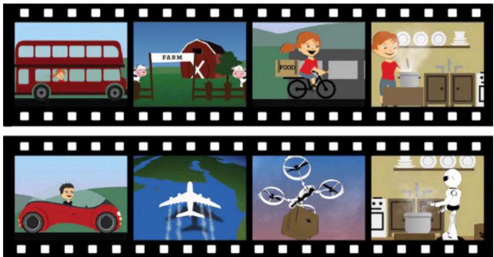  
Source: Tommy Nilsson, et al.  (2020). Visions, Values, and Videos: Revisiting Envisionings in Service of UbiComp Design for the Home, DIS ‘20: Proceedings of the 2020 ACM Designing Interactive Systems Conference, Pages 827– 839 doi-org.libezproxy.open.ac.uk/10.1145/3357236.3395476. Reproduced with permission of ACM Publication

The  first  style focuses  on  the  division  of tasks  between  the  product  and the  user.  For example, Figure 11.10 illustrates an example of this kind of use  case, focusing  on the visa requirements functionality of the group travel organizer. Note that nothing is said about how

the person might interact with the application, but instead it focuses on user intentions and product responsibilities. For example, the  second user  intention  simply states  that  the  user supplies the required  information, which could  be achieved  in a variety  of ways  including scanning a passport, accessing a database of personal information based on fingerprint recognition, and so on. This style of use case has been called an essential use case (Constantine and Lockwood, 1999).

# retrieveVisa

# USER INTENTION

Find visa requirements

Supply required information

Obtain a personal copy of visa information

Choose suitable format

# SYSTEM RESPONSIBILITY

Request destination and nationality

Obtain appropriate visa information

Offer information in different formats

Provide information in chosen format

Figure 11.10  An essential use case for “retrieve visa” that focuses on how the task is split between the product and the user

The second  style of use  cases  is  more detailed, and it captures  the person’s goal when interacting with the product. In this technique, the main use case describes the normal course, that is, the set of actions most commonly performed. Other possible sequences, called alternative courses, are then captured at the bottom of the use case. A use case for retrieving the visa requirements for the group travel organizer, with the normal course being that information about the visa requirements is available, might be as follows:

1.  The product asks for the name of the destination country.   
2.  The user provides the country’s name.   
3.  The product checks that the country is valid.   
4.  The product asks the user for their nationality.   
5.  The user provides their nationality.   
6.  The product  checks  the  visa  requirements of  that  country  for a  passport  holder of the user’s nationality.   
7.  The product provides the visa requirements.   
8.  The product asks whether the user wants to share the visa requirements on social media.   
9.  The user provides appropriate social media information.

# Alternative Courses

4.  If the country name is invalid:

4.1 The product provides an error message.   
4.2 The product returns to step 1.

6.  If the nationality is invalid:

6.1 The product provides an error message.   
6.2 The product returns to step 4.

7.  If no information about visa requirements is found:

7.1 The product provides a suitable message.   
7.2 The product returns to step 1.

Note that the number associated with the alternative course indicates the step in the normal course that is replaced by this action or set of actions. Also note how specific the use case is about how the person and the product will interact compared with the first style.

# In-Depth Activity

This activity is the first of five assignments that together go through the complete development lifecycle for an interactive product.

The goal is to design and evaluate an interactive product for booking tickets for events such as concerts, music  festivals, plays, and  sporting events. Most venues and events have booking websites or apps already, and there are many ticket agencies that also provide reduced tickets and exclusive options, so there are plenty of existing products to research first. Carry out the following activities to discover requirements for this product:

1. Identify and capture some requirements for this product. This could be done in a number of ways, for example, observing friends or family using ticket agents, thinking about your own experience of purchasing tickets, studying websites for booking tickets, interviewing friends and family about their experiences, and so on.   
2. Based on the information you glean, produce two personas and one main scenario for each, capturing how the person is expected to interact with the product.   
3. Using the data gathered in part 1 and your subsequent analysis, identify different kinds of requirements for the product, according to the headings introduced in section 11.3. Write up the  requirements using  a  format similar  to the  atomic requirements shell  shown in Figure 11.1 or in the style of user stories.

# Summary

This chapter examined the requirements activity in greater detail, including how to discover requirements and how to represent them. The data gathering techniques introduced in Chapter 8 are used to discover requirements in many different combinations, and this chapter has illustrated some of them. In addition, contextual inquiry, studying documentation, deploying probes, and researching similar products are commonly used techniques. Personas and scenarios help to bring data and  requirements to life and are  commonly used in combination

(Continued)

to explore the user experience and product functionality. There are many ways to represent requirements. Some are more structured such as the Volere shell, while others are more speculative and deliberately suggestive, such as probes. Others, such as use cases, try to pin down the  detail to enable designers to progress to the next stage more readily, e.g., by starting to create a design concept using a wire framing tool.

# Key Points

•  A requirement is a statement about an intended product that specifies what it is expected to do or how it will perform.   
•  Articulating requirements and defining what needs to be built avoids miscommunication and supports technical developers and allows stakeholders to contribute more effectively.   
There are different kinds of requirements. Six common ones are functional, data, environ mental (context of use), user characteristics, usability goals, and user experience goals.   
•  Scenarios provide a story-based narrative to explore existing behavior, potential use of new products under development, and futuristic visions of technology use.   
•  Personas capture  realistic profiles  of people who  might  use  the  product, based  on a set of characteristics  that are  relevant to the  product, and  are  synthesized  from data gathering sessions.   
•  Scenarios and personas together can be used throughout the product lifecycle.   
•  Use  cases  capture  details  about  an existing or imagined interaction  between  users  and the product.

# Further Reading

COHN,  M. (2004)  User Stories  Applied. Addison-Wesley. This  classic  book  is  a  practical guide to writing good user stories.

NIELSEN, L. (2019) Personas—User-Focused Design. (2nd ed.) Springer. This book provides a comprehensive coverage of personas: how to develop them and how to use them.

ROBERTSON, J., AND ROBERTSON, S. (2019) Business Analysis Agility. Addison Wesley. This book brings together experience of traditional requirements techniques (such as Volere) and an agile way of working. It includes treatment of interaction design but focuses on how to make sure the product being built is the right product from a business perspective.

SNYDER, P. I. (2021) The Art of Brainstorming. Dream Books. This book covers the history and evolution of brainstorming, together with practical techniques and methods to run both group and individual brainstorming sessions.

# Chapter 12

# D E S I G N ,  P R O T O T Y P I N G ,  A N D C O N S T R U C T I O N

12.1  Introduction   
12.2  Prototyping   
12.3  Conceptual Design   
12.4  Concrete Design   
12.5  Generating Prototypes   
12.6  Construction

# Objectives

The main goals of this chapter are to accomplish the following:

•  Describe prototyping and the different types of prototyping activities.   
•  Enable you to produce prototypes from the models developed during the requirements activity.   
•  Enable you to produce a conceptual model for a product and justify your choices.   
•  Explain the use of scenarios and prototypes in design.   
•  Introduce  physical  computing  kits  and  software  development  kits  and  their  role  in construction.

# 12.1 Introduction

Design, prototyping, and construction fall within the Develop phase of the double diamond of design, introduced in Chapter 2, “The Process of Interaction Design,” in which solutions or concepts are created, prototyped, tested, and iterated. The final product emerges iteratively through  repeated  design-evaluation-redesign  cycles  involving  a  range of  stakeholders, and prototypes facilitate this process. There are two aspects to design: a conceptual part, which focuses  on ideas  for  a product, and  the concrete  part, which focuses  on the details  of the design. The former involves developing a conceptual model that captures what the product will do and how it will behave, while the  latter is concerned with the details  of the design, such  as  menu  types,  haptic  feedback,  physical  widgets,  and  graphics. The  two  are  intertwined, as concrete design issues will require some consideration in order to prototype ideas, and prototyping ideas will lead to an evolution of the concept.

Designers  prototype their design ideas  so that people can  evaluate them  effectively. In the early stages of development, these prototypes may be made of paper and cardboard or be ready-made components pulled together to allow evaluation, while as the design progresses, they become more polished, tailored, and robust so that they resemble the final product.

This chapter presents the activities involved in progressing a set of requirements through the cycles of prototyping and construction. The next section explains the role and techniques of prototyping  and then  explores  how  prototypes may  be used in  the design process. The chapter ends by discussing physical computing and software development kits (SDKs), which provide a basis for construction.

# BOX 12.1

# Designing with or Designing for People?

The  importance of engaging a  range  of people in the  design process  was  emphasized in Chapter  2  and  throughout the  book. This includes users  and  other  stakeholders but  also extends beyond the product itself, into the wider community. But is this engagement one-way? Are  designers  designing  for  people or with people? Approaches that emphasize  designing with rather than designing for include co-design, participatory design, and community-based design. But many approaches to technology design include participation with stakeholders, so what’s the difference between them?

Co-design is a design approach that emphasizes creativity and mutual learning through design activities with stakeholders,  and  co-design  teams  are  often  multidisciplinary. Codesign has been discussed in the context of diabetes support (Ayobi et al., 2021) and has been adapted for designing with animals (Webber et al., 2020). Nick Bryan-Kinns and colleagues (2022) have devised a framework to support designers  and local communities in co-design activities in rural China. The framework combines existing local approaches to creative thinking with design thinking methodologies, and if the framework were to be used outside China, they emphasize the importance of building on local practices.

Participatory  design (PD) emerged in Scandinavia  in the 1970s. There  were two influences on this early work: the desire to be able to communicate information about complex systems and the labor union movement pushing for workers to have democratic control over changes in their work. New laws gave workers the right to have a say in how their working environment was changed. The idea that those who use information technology will play a critical role in its design, and in particular that they will engage in active and genuine participation with the design itself, is still central to participatory design (Simonsen and Robertson, 2012). But the approach has evolved in response to political, social, and technological changes (Bannon et al., 2018).

Focusing on the Scandinavian approach to participatory  design, Susanne Bodker et al. (2022) emphasize that people are  seen as design partners, rather than simply participants, and  that co-operative prototyping  is important, i.e., collaborative hands-on exploration of prototypes. The approach has four commitments: (i) democracy in the workplace and beyond; (ii) the empowerment of people through the processes of design; (iii) emancipatory practices

rooted in mutual learning between designers and people; and (iv) seeing human beings as skillful and resourceful in developing future technologies. A key aim is for a project’s achievements to be sustained or developed beyond the project.

Participatory design approaches have been used in diverse domains including youth mental  health (Orlowski  et al., 2019), food sustainability (Nichols and  Heitlinger, 2022), and maths teaching with visually impaired children (Pires et al., 2022).

But  there are  challenges around the  nature of participation, especially in current  globalized conditions (Kruger et al., 2019). For example, what happens in a community of several hundreds or thousands of people, or when the stakeholders are from different cultural backgrounds, and how can participation be scaled across geographical regions? Community-based design approaches have evolved to try to address  concerns around participation, including underserved populations (Harrington et al., 2019). Compared to co-design and participatory design, community-based design aims to address the issue of scale, in terms of both numbers and diversity of participants.

Building on the idea of participatory design but at an urban scale, Daniel Gooch et al. (2018) designed an approach to facilitate citizen engagement in a smart city project. They used an integrated approach of online and offline activities that was tailored to local contexts and showed how it is possible to engage citizens to address their current concerns. Edwin Blake and colleagues (2021) explore  how a single community-based  design success may be scaled to cover a region or nation. They used temporary “scaffolding” that enabled an individual to perform beyond their base expertise and support their learning.

# 12.2 Prototyping

Prototyping provides a concrete manifestation of an idea—whether it is a new product or a modification of an existing one—which allows designers to communicate their ideas and for others to try them out.

# 12.2.1  What Is a Prototype?

A prototype is one manifestation of a design that allows stakeholders to interact with it and to explore  its  suitability. It  is limited  in that  a prototype  will usually emphasize one  set of product characteristics and de-emphasize others (see Box 12.2). Prototypes take many forms, for example, a scale model of a building or a bridge, or a piece of software with limited capabilities. A prototype can also be a paper-based outline of a display, a collection of wires and ready-made  components, a digital picture, a video simulation, a complex  piece of software and hardware, or a three-dimensional mockup of a workstation.

In fact, a prototype can be anything from a paper-based storyboard to a complex piece of software and from a cardboard mockup to a molded or pressed piece of metal. For example, when the idea for the PalmPilot (a precursor to mobile and smartphones, introduced in 1992) was  being developed, Jeff  Hawkins  (founder of  the company)  carved  up  a piece  of  wood about the size and shape of the device he had imagined (see Figure 12.1).

Figure 12.1 The PalmPilot wooden prototype   
  
Source: Mark Richards / Computer History Museum

Jeff  Hawkins used  to carry  this piece  of wood around  with him and  pretend to  enter information  into  it, just  to see  what it  would be  like to  own such  a device  (Bergman and Haitani, 2000). This is an example of a simple (some might even say bizarre) prototype, but it  served  its  purpose  of  simulating  scenarios  of  use. Advances  in  3D  printer  technologies, coupled with reduced prices, have increased their use in design. It is now common practice to take a 3D model from a software package and print a prototype, or indeed a final product. Soft toys, prosthetics, chocolate, dresses, shoes, and whole houses may be “printed” in this way (see Figure 12.2). Advances in sustainable printing techniques have also been made. For example, the Soft Materials  Lab at  Linz  Institute of Technology have produced  a  gelatinbased “ink” that can be used in 3D printing and then dissolved and reused.

  
(a)

  
(b)

(c)   
Figure 12.2 Examples of 3D printing: (a) model jet engine, (b) Synapse Dress by Anouk Wipprecht: embedded with sensors, the wearer can control the dress’s lighting pattern, and (c) custom-made climbing shoes based on a scan of the wearer’s feet   
  
Source: (a) Catiav5ftw / MakerBot Industries, LLC / CC BY-NC 4.0, www.thingiverse.com/thing:392115. Licensed under CC-BY-3.0, (b) ANOUK WIPPRECHTSYNAPSE DRESS created for Intel in 2014, www.niccolocasas.com/ SYNAPSE-DRESS, and (c) Photo Credits: ATHOS

To see a wide range of useful objects that can be printed by 3D technology, visit this site: all3dp.com/1/useful-cool-things-3d-print-ideas-3d-printerprojects-stuff.

To see a robot with soft legs that has been created by 3D printing, go to www.youtube.com/watch?v=5MTLYhc-NKw. A gelatin-based reusable “ink” for sustainable 3D printing is illustrated here: www.youtube.com/ watch?v=nwrCtG4GW2s.

# 12.2.2  Why Prototype?

Prototypes are useful when discussing or evaluating ideas with stakeholders; they are a communication device among team members and an effective way for designers to explore design ideas. The activity of  building prototypes  encourages  reflection  in design,  as described  by Donald Schön (1983), and it is recognized by designers from many disciplines as an important aspect of design.

Prototypes  answer  questions  and  support  designers  in  choosing  between  alternatives. Hence, they  serve a  variety of purposes, for example, to test  the  technical feasibility of an idea, to clarify some vague requirements, to do some evaluation, or to check that a certain design direction is compatible with the rest of product development. Prototypes may also be deployed as probes, as described in Chapter 11, “Discovering Requirements,” and can be the focus for a wider exploration of future technologies. The prototype’s purpose will influence the kind of prototype to build. So, for example, to clarify how someone might perform a set of tasks and whether the proposed design would support them in doing this, a paper-based mockup  might be produced.  Figure  12.3  shows  an annotated  paper-based  prototype of  a handheld  device to help an autistic child communicate. This prototype shows the intended functions  and  buttons, their  positioning and  labeling, and the  overall shape of  the device, but none  of the buttons actually works. Note that the annotations have been added by the designer and don’t form part of the prototype for evaluation. This kind of prototype is sufficient to investigate scenarios of use and to decide, for example, whether the button images and labels are appropriate and the functions sufficient, but not to test whether the speech is loud enough or the response fast enough.

To read about IDEO’s reflections of prototyping, and some examples of the prototypes they have created, see www.ideou.com/blogs/inspiration/ all-prototypes-are-not-created-equal.

Figure 12.3 A paper-based prototype of a handheld device to support an autistic child   
  
Source: Used courtesy of Sigil Khwaja

# 12.2.3  Low-Fidelity Prototyping

A low-fidelity prototype does not look very much like the final product, nor does it provide the same  functionality. For example, it may  use very different materials, such as paper and cardboard rather than electronic screens and metal; it may perform only a limited set of functions; or it may only represent the functions and not perform any of them. The block of wood used to prototype the PalmPilot described earlier is a low-fidelity prototype.

Low-fidelity  prototypes  are  useful  because  they  tend  to  be  simple,  cheap,  and  quick to produce. This also means that they are simple, cheap, and quick to modify so that they support  the  exploration  of  alternative designs  and  ideas. This  is  particularly  important  in

theÂearlyÂstagesÂofÂproductÂdevelopment,ÂduringÂconceptualÂdesign,ÂforÂexample,Âbecause prototypesÂthatÂareÂusedÂforÂexploringÂideasÂshouldÂbeÂflexibleÂandÂencourageÂexploration andÂmodification.ÂLow-fidelityÂprototypesÂareÂnotÂmeantÂtoÂbeÂkeptÂandÂintegratedÂintoÂthe finalÂproduct.Â

Low-fidelityÂprototypingÂcomesÂinÂmanyÂforms.ÂWeÂexploreÂfourÂcommonÂtypesÂinÂthe followingÂsections,ÂandÂcombinationsÂorÂvariationsÂofÂtheseÂmayÂbeÂdevisedÂforÂaÂparticu- larÂproduct.ÂForÂexample,ÂJosÂGoudsmitÂandÂStevenÂVosÂ(2021)ÂexploredÂthreeÂlow-fidelity prototypesÂforÂwearablesÂintendedÂtoÂimproveÂsomeone’running s Âtechnique.ÂTheÂprototypes wereÂdesignedÂtoÂassessÂtheÂeffectsÂofÂfeedbackÂfrequency,ÂfeedbackÂmodeÂ(visualÂorÂauditory), andÂrunnerÂautonomy.ÂForÂeachÂprototype,ÂparticipantsÂworeÂaÂvarietyÂofÂsensorsÂandÂwere providedÂwithÂfeedbackÂandÂinstructionsÂtoÂimproveÂtheirÂrunningÂtechnique.ÂTheÂfeedback frequencyÂprototypeÂreliedÂonÂaÂsetÂofÂlaminatedÂinstructionÂcards,ÂwhichÂwereÂpresentedÂto theÂrunnerÂbeforeÂrunningÂandÂonce,Âtwice,ÂorÂfourÂtimesÂduringÂtheÂsessionÂ(thisÂisÂaÂformÂof card-basedÂprototype).ÂTheÂfeedbackÂmodeÂprototypeÂusedÂaÂsmartphoneÂvisualÂdisplayÂor auditoryÂfeedbackÂtoÂprovideÂinformationÂeveryÂminute.ÂTheÂautonomyÂprototypeÂincluded bothÂvisualÂandÂauditoryÂfeedbackÂandÂaÂvideo,ÂwhichÂparticipantsÂcouldÂaccessÂaccording toÂtheirÂownÂpreference.ÂAlthoughÂtechnologyÂwasÂusedÂinÂtheseÂprototypes,ÂtheyÂwere“low fidelityâ€because  ÂtheyÂdidÂnotÂrepresentÂtheÂfinalÂformÂofÂtheÂproduct.Â

# StoryboardingÂ

StoryboardingÂisÂoftenÂusedÂinÂconjunctionÂwithÂscenarios,ÂasÂdescribedÂinÂChapterÂ11. AÂstoryboardÂconsistsÂofÂaÂseriesÂofÂsketchesÂshowingÂhowÂsomeoneÂmightÂprogressÂthroughÂa taskÂusingÂtheÂproductÂunderÂdevelopment.ÂItÂcanÂbeÂaÂseriesÂofÂscreensÂorÂaÂseriesÂofÂscenesÂshow- ingÂhowÂsomeoneÂcanÂperformÂaÂtaskÂusingÂanÂinteractiveÂdevice.ÂWhenÂusedÂinÂconjunctionÂwith aÂscenario,ÂtheÂstoryboardÂprovidesÂmoreÂdetailÂandÂoffersÂstakeholdersÂaÂchanceÂtoÂrole-play withÂaÂprototype,ÂinteractingÂwithÂitÂbyÂsteppingÂthroughÂtheÂscenario.ÂTheÂexampleÂstoryboard shownÂin Figure 12.4depicts ÂsomeoneÂcalledÂChristinaÂusingÂaÂnewÂmobileÂdeviceÂforÂexploring historicalÂsites.ÂThisÂstoryboardÂcapturesÂtheÂcontextÂofÂuseÂandÂhowÂChristinaÂmightÂbeÂsup- portedÂinÂherÂsearchÂforÂinformationÂaboutÂtheÂpotteryÂtradeÂatÂtheÂAcropolisÂinÂancientÂGreece.Â

  
Christina walks up hill; the product gives her information about the site

  
Christina adjusts the preferences to find information about the pottery trade in ancient Greece

  
Christina scrambles to the highest point

  
Christina stores information about the pottery trader's way of life in ancient Greece

  
Christina takes a photogr aph of the location of the pottery market   
Figure 12.4An ÂexampleÂstoryboardÂforÂaÂmobileÂdeviceÂtoÂexploreÂancientÂsitesÂsuchÂasÂtheÂAcropolisÂ

# Sketching

There are many templates and free software  available to support the development of lowfidelity prototypes. But sometimes it’s just easier to sketch the idea using a pencil and paper. Many people find it difficult to engage in sketching, though, because they are inhibited by the quality of their drawing. For example, Charlie Ranscombe et al. (2020) note that their design students  preferred  to  use  visualization  tools  and  CAD  modeling  rather  than  sketching, because of inhibitions around their ability  to sketch. To encourage more  engagement with early design ideas, they introduced their students to designing with Lego, which triggered an increase in idea fluency, i.e., generating many ideas and producing substantially different ideas.

As  Saul  Greenberg  et  al. (2012)  comment, however, “Sketching  is  not  about  drawing. Rather,  it  is  about  design” (p.  7).  They further  point  out  how someone  can get  over their drawing inhibitions by devising their own symbols and icons and practicing them—referred to as a sketching vocabulary (p. 85). They stress how the drawings don’t have to be anything more than simple boxes, stick figures, and stars. Elements that might be required in a storyboard  sketch, for  example, include digital devices, people, emotions, tables, books, and so forth, and actions such as give, find, transfer, and write. When sketching an interface design, various icons, dialog boxes, and so on need to be drawn. Some simple examples for achieving this are shown in Figure 12.5. Mark Baskinger and William Bardel (2013)  provide further tips for those new to sketching. Activity 12.1 provides an opportunity to practice sketching some symbols, intended to be drawn simply.

  
Figure 12.5 Some simple sketches for low-fidelity prototyping

# ACTIVITY 12.1

Produce a storyboard that depicts something you do regularly such as filling a car with fuel, hiring a bike share, or paying for your groceries through a self-service machine in a supermarket. The goal of this activity is simply to start sketching.

# Comment

Figure 12.6 shows our attempt at a storyboard for hiring a bike share.


  
Figure 12.6 A storyboard showing how to hire a bike share

# Prototyping with Index Cards

Using index cards (small pieces of cardboard about $3 { \times } 5$ inches) or sticky notes is a successful and simple way to prototype an interaction, and it is used for developing a range of interactive products including websites and smartphone apps (see Figure 12.7). Each card represents one element of the interaction, perhaps a screen or just an icon, menu, or dialog exchange. In evaluation studies, the participant can step through the cards, pretending to perform the task while interacting with the cards. This is also referred to as paper prototyping. Section 12.5.2 provides a more detailed example of this kind of prototyping.

  
Figure 12.7 Card-based prototype developed for a phone interface

# Wizard of $O z$

Another  low-fidelity  prototyping  method  called  Wizard  of $O z$ assumes  that  you  have  a software-based prototype. With this technique, the participant interacts with the software as though interacting with the product. In fact, however, a human operator simulates the software’s response  to the  user  (see  Figure  12.8). The  method  takes  its  name from  the  classic story of the little girl who is swept away in a storm and finds herself in the Land of $\mathrm { O z }$ (Baum and Denslow, 1900). The Wizard  of Oz is  a small shy  man who  operates  a large artificial image of himself from behind a screen where no one can see him.

Using this  technique enables  researchers to  have control and  more flexibility  over  the design  of the  interaction when  conducting  experiments, without  having  to  program  them initially, for example, deciding  what a robot should say in response to participants’ queries and when to  intervene if the robot  is proactive. Many different  kinds of  responses can  be tested  this  way. This  style of  prototyping  is  used  successfully  to  evaluate  various  types  of application,  including  embodied  conversational  agents  (Trigo et  al.,  2021)  and  proactive conversational agents (Reicherts et al., 2022), and to study passengers’ experiences of robotaxis (Meurer et al., 2020). It is often used in studies of autonomous vehicles. For example, Keunwoo Kim and colleagues (2021) explored how a passenger may communicate their preferred driving style to an autonomous car driving agent. Using the Wizard of Oz approach allowed the  researchers to  conduct their  study on  real roads. Prototyping  AI  systems  also draws on this style of prototyping, where the designer sketches the AI for themselves, and as the design matures, implementations of the AI can take its place (van Allen, 2018).

To read more about five common low-fidelity prototypes (sketches, paper, Lego, digital, and Wizard of Oz) and how to use them, see this website: www .interaction-design.org/literature/article/prototyping-learn-eight-commonmethods-and-best-practices.

  
Figure 12.8 An early schematic for a Wizard of Oz study for a listening typewriter Source: Gould et al., 1983

# 12.2.4  High-Fidelity Prototyping

A high-fidelity prototype looks more like the final product and usually provides more functionality than a low-fidelity prototype. For example, a prototype of a software system developed in Python or other executable language is higher fidelity than a paper-based mock-up; a molded piece of plastic with a dummy keyboard would be a higher-fidelity prototype of the PalmPilot than the block of wood. A common strategy for developing a high-fidelity software prototype is to focus on the functions and not include any error handling, for example. There is a continuum between low- and high-fidelity, and prototypes used in the wild, for example, will have enough fidelity to be able to answer their design questions and to learn about interaction  or  technological  constraints  or  contextual  factors.  It  is  common  for  prototypes  to evolve  through  various  stages  of  fidelity,  within  the  design-evaluate-redesign  cycles.  For example, Yao Xie and colleagues (2020) designed a system that enables physicians to explore and  understand AI-enabled  chest X-ray  analysis. To do  this, they conducted  a survey with physicians and radiologists that identified eight key features, then co-designed a low-fidelity prototype with three physicians that embedded those features, and subsequently evaluated a high-fidelity  prototype  with  six  more  physicians.  This  high-fidelity  prototype  evaluation proved valuable in providing detailed summative recommendations for developing the medical AI imaging support further.

One of the consequences of high-fidelity prototypes is that the prototype can appear to be good enough to be the final product, and stakeholders may be less prepared to critique it, or may critique it only superficially. To avoid this, it is important to focus on questions that prompt feedback on specific aspects whenever showing prototypes to stakeholders. Another consequence may be that fewer alternatives are considered because the prototype works and users like it.

High-fidelity  prototypes  can  be  developed  by  modifying  and  integrating  existing components—both  hardware  and  software—which  are  widely  available  through  various developer kits and open  source software, for example. In robotics, this approach  has been called tinkering (Hendriks-Jansen, 1996), while in software development it has been referred to as Opportunistic System Development (Ncube et al., 2008). For example, Ali Al-Humairi et al. (2018) used existing hardware (Arduino) and open source software to build a prototype to test their idea of playing musical instruments automatically from a mobile phone.

# 12.2.5  Compromises in Prototyping

By their very nature, prototypes involve compromises: the intention is to produce something quickly to test an aspect of the product. An early characterization of prototyping  that provides more detail on the kind of aspects that prototypes may be designed to test is described in Box 12.2 (Lim et al., 2008). The kind of questions that any one prototype can answer is limited, and the prototype must be built with the key issues in mind. In low-fidelity prototyping, it is  fairly  clear  that  compromises have  been  made. For  example, with a  paper-based prototype, an  obvious  compromise  is  that  the device  doesn’t  actually  work.  For  physical prototypes or  software  prototypes, some  of  the  compromises will  still  be  fairly  clear. For example, the casing may not be very robust, the response speed may be slow, the look and feel may not be finalized, or only a limited amount of functionality may be available. Box 12.3 discusses the level of prototype fidelity and how to decide what is appropriate.

Two  common  properties  that  are  often  traded  off  against  each  other  are  breadth  of functionality versus depth. These two kinds of prototyping are called horizontal prototyping (providing a wide range of functions but with little detail) and vertical prototyping (providing a lot of detail for only a few functions).

# BOX 12.2

# The Anatomy of Prototyping: Filters and Manifestations

Prototypes act as filters, for example, to emphasize specific aspects of a product being explored by the prototype (and to de-emphasize or omit others), and as manifestations of designs, for example, to help designers develop their design ideas through external representations (Lim et al., 2008).

Three key principles underpin the anatomy of prototypes:

1. Fundamental prototyping principle: Prototyping is an activity with the purpose of creating a manifestation that, in its simplest form, filters the qualities in which designers are interested without distorting the understanding of the whole.   
2. Economic principle of prototyping: The best prototype  is one that, in the  simplest and the most efficient way, makes the possibilities and limitations of a design idea visible and measurable.   
3. Anatomy of prototypes: Prototypes are filters that traverse a design space, i.e., by building different prototypes that are constrained in different ways, a designer can consider a wide range of possibilities within the design space. Prototypes are also manifestations of specific design ideas that concretize and externalize conceptual ideas.

Several dimensions of filtering and of manifestation may be considered when developing a prototype. Table 12.1 shows the filtering dimensions (variables) that a prototype might be built to investigate such as its size, data privacy type, input behavior, and arrangement of information elements. Table 12.2, on the other  hand, illustrates  the different  manifestation dimensions, i.e., choices that might be made when building the prototype. Choices include, for example, whether to build it using paper or software, whether to use realistic or fake data, and what is its scope (vertical and horizontal prototyping discussed earlier  are another example of the scope dimension).

<table><tr><td>Filtering dimension</td><td>Example variables</td></tr><tr><td>Appearance</td><td>Size, color, shape, margin, form, weight, texture, proportion, hardness, transparency, gradation, haptic, sound</td></tr><tr><td>Data</td><td>Data size, data type (for example, number, string, media), data use, privacy type, hierarchy, organization</td></tr><tr><td>Functionality</td><td>System function, functionality needs</td></tr><tr><td>Interactivity</td><td>Input behavior, output behavior, feedback behavior, information behavior</td></tr><tr><td>Spatial structure</td><td>Arrangement of interface or information elements; relationship among interface or information elements, which can be either two- or three-dimensional, intangible or tangible, or mixed</td></tr></table>

Table 12.1 Example variables of each filtering dimension   
Table 12.2 The definition and variables of each manifestation dimension   

<table><tr><td>Manifestation dimension</td><td>Definition</td><td>Example variables</td></tr><tr><td>Material</td><td>Medium (either visible or invisible) used to form a prototype</td><td>Physical media, for example, paper, wood, and plastic; tools for manipulating physical matters, such as a knife, scissors, pen, and sandpaper; computational prototyping tools, for instance, Python; physical computing tools, such as Phidgets and Basic Stamps; available existing artifacts, such as a beeper to simulate a heart attack</td></tr><tr><td>Resolution</td><td>Level of detail or sophistication of what is manifested (corresponding to fidelity)</td><td>Accuracy of performance, for instance, feedback time responding to an input; appearance details; interactivity details; realistic versus faked data</td></tr><tr><td>Scope</td><td>Range of what is covered to be manifested</td><td>Level of contextualization, for example, website color scheme testing with only color scheme charts or color schemes placed in a website layout structure; book search navigation usability testing with only the book search related interface or the whole navigation interface</td></tr></table>

# BOX 12.3

# What Level of Prototype Fidelity Is Needed and How to Decide

The appropriate level of fidelity depends on the purpose of the prototype and the compromises being made. Component kits and pattern libraries (see section 12.6 and Chapter 13, “Interaction Design in Practice”) make it quite  easy to develop high-fidelity  prototypes quickly, and it can be tempting to view low-fidelity prototypes as inferior. But they aren’t. High- and low-fidelity prototypes are used in different circumstances, for different audiences, and with different purposes. For example, paper prototyping is commonly used to explore initial ideas and is a core practice in game design (Bond, 2022), and low-fidelity prototyping techniques such as sketching and physical modeling can be used with nontechnical stakeholders to help them engage actively with the design process. High-fidelity prototypes can provide more detail and a more authentic experience and are often used in later product iterations. Both high- and low-fidelity prototypes can provide useful feedback during evaluation and design iterations.

Deciding which kind of prototype  to use  when will be based on the  point  in product development (early iterations tend to involve low-fidelity prototypes), who will view or interact with the prototype (audience plays an important part in deciding the level of fidelity), and the purpose of the prototype (checking technical compatibility probably requires higher fidelity than checking outline design).

IDEO  (www.ideou.com/blogs/inspiration/why-everyone-should-prototype-not-justdesigners)  shares  a  story  about  designing  the  visitor  experience  for  the  United  States Holocaust Museum. They hypothesized  that an app would help visitors to engage with the  stories and  produced a prototype  app. However,  they discovered that  this reduced conversation between  visitors, so they introduced a physical  prototype and found  that engagement and discussion increased. Testing this early on avoided significant resources being put into an app that might have had a negative impact.

This article discusses the benefits of high- and low-fidelity prototyping and includes a checklist to help decide which to use: www.nngroup.com/articles/ ux-prototype-hi-lo-fidelity/?lm=aesthetic-usability-effect&pt=article.

  
"THEN IN HERE WE DOACLAYMOCK-UP OFTHE COMPUTERMODEL"

# Source: Reproduced with permission of Penwil Cartoons

Another common compromise is level of robustness versus degree of changeability. Making a prototype robust may lead to it being harder to change. This compromise may not be visible until something goes wrong. For example, the internal structure of a piece of software may  not  have  been carefully  designed,  or the  connections  between  electronic  components may be delicate.

Although prototypes may have undergone extensive evaluation, they may not have been built with good engineering principles, or been subjected to rigorous quality testing for other characteristics such  as security  and error-free  operation. Building  a product  to be used by thousands  or millions  of people running  on  various platforms and  under  a wide range  of circumstances  requires a different  construction and testing regime  than producing  a quick prototype to answer specific questions.

The next “Dilemma” box discusses two  different  development philosophies. In  evolutionary prototyping, a prototype evolves into the final product and is built with these engineering principles in mind. Throwaway prototyping uses  the prototypes as stepping  stones toward the final design. In this case, the prototypes are thrown away, and the final product is built from scratch. In an evolutionary prototyping approach, each stage will be subjected to rigorous testing; for throwaway prototyping, such testing is not necessary.

# DILEMMA

# Prototyping vs. Engineering

The  compromises made when developing low-fidelity prototypes are  evident, but compromises in high-fidelity prototypes are not so obvious. When a project is under pressure, it can become tempting to integrate a set of existing high-fidelity prototypes together to form the final product. Many hours will have been spent developing them, and evaluation with users has gone well. So, why throw it all away? Generating the final product this way will simply store up testing and maintenance problems for later (see Chapter 13’s Box 13.1 on technical debt in UX). In short, this is likely to compromise the quality of the product, unless the prototypes have been built with sound engineering principles from the start.

On the other hand, if the device is an innovation, then being first to market with a “good enough” product may be more important for securing market position than having a very high-quality product that reaches the market two months after a competitor’s product.

The  dilemma  arises in deciding how  to treat  high-fidelity  prototypes—engineer  them from the start or accept that they will be thrown away.

# 12.3 Conceptual Design

Conceptual  design  is  concerned  with  developing  a  conceptual  model;  conceptual  models were introduced in Chapter 3, “Conceptualizing Interaction.” The idea of a conceptual model can be difficult  to grasp because these  models take  many different  forms and  there isn’t a definitive detailed characterization of one. Instead, conceptual design is best understood by exploring and experiencing  different approaches to it, and this section provides  some concrete suggestions about how to do this.

A  conceptual  model  is  an  outline  of  what  people  can  do  with  a  product  and  which concepts are needed for them to understand how to interact with it. The former will emerge from an understanding of the problem space and the current functional requirements. Which concepts are needed to understand how to interact with the product depends on a variety of issues such as who will use it, what interaction type it will have, and what interface type will be used. These  will inform which terminology will be used, appropriate metaphors, and so on. The first step in developing a conceptual model is to become immersed in the data that has been collected. This will include information about people who might  use the product, their context, and their goals. Interaction design often suggests that designers empathize with the people they are designing for, but sometimes trying to empathize with others is not the right approach, as discussed in the following “Dilemma” box.

# DILEMMA

# Is It Possible to Empathize with Others?

Interaction design often refers to “empathizing” with users, but to what extent is that really possible? Empathizing with people who live in a different context is not easy, no matter how much data is collected. Interaction designers have tried several ways to achieve empathy with those  in situations that are  outside their  own experience. For example, Marion Buchenau and Jane Fulton Suri (2000) introduced experience prototyping. Experience prototyping  is a technique to help members of a design team appreciate what it might be like to use their product. In their example, they wanted to give a team designing a chest-implanted automatic defibrillator some insight into what it would be like to experience a defibrillator shock. To simulate the  random occurrence of a defibrillating shock, each team member was sent text messages at random times  over one  weekend. Each message simulated  the occurrence of a defibrillating shock, and team members were asked to record where they were, who they were with, what they were doing, and what they thought and felt knowing that this represented a shock. Example insights ranged from anxiety around everyday happenings, such as holding a child and operating power tools, to being in social situations and at a loss how to communicate to onlookers what was happening. This firsthand experience brought new insights to the design effort.

Using such techniques allows interaction designers to gain insights into situations that are outside of their experience, but they can have limitations. For example, Michelle Nario-Redmond et al. (2017) conducted experiments to investigate the impact of disability simulations. They found that they can have unexpected negative consequences, such as feelings of fear, apprehension, and pity toward those with disabilities, rather than any sense of empathy. In addition, experiencing the disability for only a short time does not take into account the various coping strategies and innovative techniques that individuals develop.

Karen  Holtzblatt and  Hugh Beyer’s  (2017) contextual design process, introduced in Chapter  11, takes a different  approach to evoking empathy  within the  design team. Their team-based approach aims to immerse the team members in the participants’ world through contextual interviews, interpretation sessions, and close engagement with the data.

But whatever techniques are used, the experience will never be the same as that of someone living in that situation day by day. Trying to empathize can only go so far and cannot replace the need to include a diverse set of people in the design process including those with relevant lived experience.

To read an overview of the disability simulation experiment results, see this article: blog.prototypr.io/why-i-wont-try-on-disability-to-build-empathy-in-thedesign-process-and-you-should-think-twice-7086ed6202aa.

Different creativity and brainstorming techniques can be used to explore ideas within the design team, together with scenarios and personas. Prototyping can also be used to test ideas. The availability of ready-made components increases the ease with which ideas can be prototyped, which also helps to explore different conceptual models and design ideas. Gradually, an image of the desired user experience will emerge and become more concrete through the conceptual model and concrete design.

Developing  scenarios  was  described  in  Chapter  11.  To help  explore  different  design ideas, Suzanne Bødker (2000) proposed plus and minus scenarios. These attempt to capture the most positive and the most negative consequences of a particular proposed design solution, thereby helping designers to gain a more comprehensive view of the proposal. This idea was extended by Clara Mancini et al. (2010) who used positive and negative video scenarios to explore futuristic technology. Their approach used video to represent  positive and negative consequences of a new product to help with diet and well-being, which was designed to explore privacy concerns and attitudes. The two videos (each with six scenes) focus on Peter, a businessman  with serious weight  problems who  has been advised  by  his doctor to  use a new product DietMon to help him lose weight. The product consists of glasses with a hidden camera, a microchip  in the  wrist, a central datastore, and a text  messaging  system to send messages to Peter’s mobile phone telling him the  calorific value of the food he is looking at and warning him when he is close to his daily limit (Price et al., 2010). Figure 12.9 shows the content of two scenes from the videos and the positive and negative reactions; Figure 12.10 is a snapshot from the negative video.

Tommy  Nilsson  et  al.  (2020)  draw  on  this  method  of  Contravision  in  their  exploration of domestic ubiquitous computing solutions (for a snapshot of the video scenarios, see Chapter 11) to provoke participants to explore their own values around future technologies. The scenarios they created communicate two contrasting sets of values: one that prioritizes an active lifestyle, and one that prioritizes convenience over everything else. These scenarios were presented to focus groups, and their reflections were analyzed thematically. They found that  embedding  the  contrasting  sets  of  values  in  Contravision  scenarios  enabled  them  to expose the values people draw on when considering technologies in their domestic life.

Read about how to create a mood board and the tools to help generate a mood board on the following web page: www.invisionapp.com/inside-design/ mood-board-examples.

Mood  boards  (traditionally used  in  fashion  and  interior  design)  may  also  be  used  to capture the desired feel of a new  product (see Figure 12.11). This is  informed by  any data gathering or evaluation activities and considered in the context of technological feasibility.

<table><tr><td colspan="2">Scene 2: breakfast at home</td></tr><tr><td>Peter starts preparing his breakfast with his new glasses on. His wife notices them and he keenly gives her a demonstration of what they are and how they work, and tells her about the microchip. She seems impressed and leaves the room to get ready for work. Peter opens the fridge to put away the butter and sees a pastry. He looks at it and gets a DietMon message telling him the calorie content of the pastry. He shows that to his wife, who is entering the kitchen and looks at him with a smile.</td><td>Peter prepares breakfast with his new glasses on. His wife notices them. While looking at his toast, he gets a text. His wife enquires what that is. He says it&#x27;s nothing and he does not feel like having toast after all. When she questions why he becomes tense and reluctantly tells her about DietMon. Skeptical, she leaves the room with a sarcastic comment. Peter opens the fridge and sees a pastry. As he gives in and takes a bite, he is caught by his wife, who is entering the kitchen and looks at him with a grin.</td></tr><tr><td colspan="2">Scene 3: birthday party at the office</td></tr><tr><td>Peter is working away at his desk when some colleagues invite him to a small birthday celebration. He tries to refuse but they insist. As he joins them, wearing his glasses, he greets the birthday-lady. His colleague Chris serves him a slice of cake. Peter looks at it and takes out his mobile. He gets a text, checks it and says the slice is too big, and asks Chris to cut it in a half. Chris is intrigued and asks for an explanation, so Peter gives his colleagues a keen demonstration of how the technology works. His audience is impressed, gathered around him.</td><td>Peter is working away at his desk when some colleagues invite him to a small birthday celebration. He tries to refuse but they insist. As he joins them, wearing his glasses, his colleague Chris gives him a slice of cake. He takes the plate and greets the birthday-lady. He gets a text and, pretending it&#x27;s an important phone call, moves away from the others with the cake. Turned away from them, he throws the cake in a bin and goes back pretending to have already finished it. Chris comments on how fast he ate. Peter excuses himself, saying he has a deadline to meet, and leaves.</td></tr></table>

Figure 12.9 How two scenes from the videos differ in terms of positive and negative reactions to the system. The positive version is on the left and the negative on the right

Source: Price et al. (2010)

# 12.3.1  Developing an Initial Conceptual Model

The core components of the conceptual model are metaphors and analogies, the concepts to which users are exposed, the relationship between those concepts, and the mappings between the concepts and user experience being supported (Chapter 3). Some of these will derive from the product’s requirements, such as the concepts involved in an  activity and their relationships, which may be captured through scenarios and use cases. Others such as suitable metaphors  and  analogies  will  be  informed  by  immersion  in  the  data  and  understanding  the application domain.


  
Figure 12.10  Peter being caught eating the pastry out of the fridge at breakfast (scene 2, negative reaction)

Source: Price et al. (2010) / Association for Computing Machinery

This section introduces approaches that help to produce an initial conceptual model. In particular, it considers the following:

•  How to choose interface metaphors that will help users understand the product?   
Which interaction type(s) would best support the users’ activities?   
. Do different interface types suggest alternative design insights or options?

All of these approaches provide  different ways of thinking  about the product and help generate potential conceptual models.

  
Figure 12.11  An example mood board developed for a personal safety product called Guard Llama Source: johnnyhuang.design/guardllama.html

# Interface Metaphors

Interface  metaphors combine  familiar  knowledge with  new  knowledge in  a way  that  will help people understand the product. Choosing suitable metaphors and combining new and familiar concepts requires a balance between utility and relevance, and it is based on understanding  users  and  their  context.  For  example,  consider  an  educational  system  to  teach 6-year-olds  mathematics. One possible metaphor is a classroom  with a teacher standing  at the front, but this may not appeal to all children in that age range. A metaphor that builds on something enjoyable for all 6-year-olds is more likely to keep them engaged, such as a ball game, the circus, a playroom, and so on.

Different approaches to identifying and choosing an interface metaphor have been tried, and different factors may be considered. For example, Dietrich Kammer et al. (2013) combined creativity methods to explore everyday objects, paper prototypes, and toolkits to support groups of students designing novel interface metaphors and gestures for mobile devices. They  found that using both concrete  everyday objects and more  abstract geometric shapes to develop metaphors improved the intuitiveness of the resulting  interface. Pranav  Khadpe et al. (2020) found that metaphors used for conversational AI agents can influence people’s perceptions  and use  of the agent. For example, an agent  may present as  a wry teenager, a toddler, or  an experienced  butler.  In particular, their results  suggest that  using a  metaphor that portrays an agent appearing to be highly competent may help attract new users. But that continuing use of a highly competent agent will decrease unless the agent changes to appear less competent. Why do you think that is?

Tom  Erickson (1990) suggests a three-step process for choosing a good interface metaphor. This classic approach continues to be remarkably useful with current technologies. The

first step is to understand what the system will do, that is, to identify functional requirements. Developing partial conceptual models and trying them may be part of the process. The second step is to understand which bits of the product are likely to cause users problems, that is, which tasks or subtasks cause problems, are complicated, or are critical. A metaphor is only a partial mapping between the product and the real thing upon which the metaphor is based. Understanding areas in which users are likely to have difficulties means that the metaphor can be chosen to support those aspects. The third step is to generate metaphors. Looking for metaphors in the users’ description of relevant activities, or identifying metaphors used in the application domain, is a good starting point.

When  suitable  metaphors  have  been  generated,  they  need  to  be  evaluated.  Erickson (1990) suggests five questions to ask:

• How much structure does the metaphor provide? A good metaphor will provide structure— preferably familiar structure.   
. How much of the metaphor is relevant to the problem? One of the difficulties of using metaphors is that users may think they understand more than they do and start applying inappropriate elements of the metaphor to the product, leading to confusion or false expectations.   
•  Is the interface metaphor easy to represent? A good metaphor will be associated with particular physical, visual, and audio elements, as well as words.   
Will your audience understand the metaphor?   
•  How extensible is the metaphor? Does it have extra aspects that may be useful later?

To illustrate  how  this  process  may  be  used,  consider  the  group  travel  organizer  app introduced in Chapter 11. Choosing a novel metaphor can help make this travel app different from existing travel websites and help think through the design. One potential metaphor that was prompted  by the quote from Sky in her persona is a family restaurant. In this setting, the family is all  together, each can choose what  they want, but the overall experience is  shared. Evaluating  this  metaphor using  the  previous  five  questions  listed  prompted  the following thoughts:

• Does it supply structure? Yes, it supplies structure, based on the familiar restaurant environment. Restaurants can be very different in their interior and the food they offer, but the structure includes having tables and a menu and people to serve the food. The experience of going to a restaurant involves arriving, sitting at a table, ordering food, being served the food, eating it, and then paying before leaving. From a different point of view, there is also structure around food preparation and how the kitchens are run.   
•  How much of the metaphor is relevant? Choosing a vacation involves seeing what is being offered and deciding what is most attractive, based on the preferences of everyone in the group. This is similar  to choosing a meal in a restaurant. For  example, a restaurant will have a menu, and visitors to the restaurant will sit  together and choose individual meals, but they all sit in the same restaurant and enjoy the environment. For a group vacation, it may be that some members of the group want to do different activities and come together for  some of  the  time,  so  this  is  similar. Information about  the  food such  as allergens  is available from the server or in the menu, reviews of restaurants are available, and photos or models of the food available are common. All of these characteristics are relevant to the group travel organizer app. One of the characteristics of a restaurant that may differ from a vacation is when payment is required. There may be a deposit required before the meal, or it may be paid for entirely after the meal, for example, whereas a holiday is usually paid

for entirely in advance. But even these differences prompt discussion and open possibilities for the new app.

. Is the metaphor easy to represent? There are  several options in this regard, but the basic structure of a restaurant can be represented. The key aspect of this conceptual model will be to identify potential vacations that suit everyone and choose one. In a restaurant, this process involves looking at menus, talking to the server, and ordering the food. Vacation information  including  photos  and videos  could be presented  in  a menu—maybe  as  one menu for adults and one for children. So, the main elements of the metaphor seem straightforward to represent.   
. Will your audience understand the metaphor? For this example, the target group has not yet been investigated in detail, but eating in a restaurant is common.   
How  extensible  is  the  metaphor?  There  are  several  different  types  of  restaurant  experiences—à la carte, fixed menu, serve yourself, all you can eat, and food courts, for example. Elements from these different types of restaurants may be used to expand initial ideas.

# ACTIVITY 12.2

One of the disadvantages of the restaurant metaphor is the need to have a shared experience when members of the group are in different locations.Another possible interface metaphor for the group travel organizer is the travel consultant. A travel consultant discusses the requirements with the traveler(s) and tailors the vacation accordingly, offering maybe two or three alternatives, but  making most of the  decisions on the  travelers’ behalf. Ask the  earlier five questions about this metaphor.

# Comment

1. Does the travel consultant metaphor supply structure?

Yes. The key characteristic of this metaphor is that the travelers specify what they want, and the consultant researches the options. It relies on the travelers giving the consultant sufficient information to search within a suitable range rather than leaving them to make key decisions.

2. How much of the metaphor is relevant?

The idea of handing over responsibility to someone else to search for suitable vacations may be appealing to some users, but it might feel uncomfortable to others. The level of responsibility given to the consultant can be adjusted, though, depending on user preferences. It is common for  individuals to put together vacations themselves based on web searches, but this can be time-consuming and diminish the excitement of planning a vacation. It would be attractive to some users if the initial searching and sifting is done for them.

3. Is the metaphor easy to represent?

Yes, it could be represented by a software agent or by having a sophisticated database entry and search facility. But the question is, would users like this approach?

4. Will your audience understand the metaphor?

Yes.

5. How extensible is the metaphor?

As a travel consultant is a person and people are often flexible, the metaphor is extensible. For example, the consultant could be asked to refine their vacation recommendations according to as many different criteria as the travelers require.

# Interaction Types

Chapter 3 introduced five different types of interaction: instructing, conversing, manipulating, exploring, and responding. Which type of interaction is best suited to the current design depends on the application domain and the kind of product being developed. For example, a computer game is  most likely to suit a manipulating  style, while a software application for drawing or drafting has aspects of instructing and conversing.

Most  conceptual models will include a combination of interaction types, and different parts  of the  interaction  will be  associated  with  different  types. For  example,  in  the  group travel organizer, one of the tasks is  to find out the visa  regulations for a particular destination. This will require an instructing approach to interaction as no dialog is necessary for the system to show the regulations. Instead, a predefined set of information needs to be entered, for instance, the country  issuing the  passport  and the  destination. On  the  other hand, trying to identify a vacation for a group of people may be conducted more like a conversation. For example, the interaction may begin by selecting some characteristics of the destination and some time constraints and preferences. Then the organizer will suggest several options, more information or preferences will be provided, revised suggestions will be made, and so on. Alternatively, for those who don’t have any clear requirements yet, they might prefer to explore  availability before asking for specific options. Responding could be used  when an option is chosen that has additional restrictions and the system asks if the traveler meets them.

# Interface Types

Considering different interfaces at this stage may seem premature, but it  has both a design and  a  practical  purpose. When  thinking  about  the  conceptual  model  for  a  product,  it  is important not to be unduly influenced by a predetermined interface type. Different interface types prompt and support different perspectives on potential user experiences and possible behaviors, hence prompting alternative design ideas.

In practical terms, prototyping the product will require an interface type, or at least candidate alternative interface types. Which ones to choose depends on the product constraints that arise from the requirements. For example, input  and output modes will be influenced by user and environmental requirements. Therefore, considering interfaces at this point also takes one step toward producing practical prototypes.

To illustrate this, we consider a subset of the interfaces introduced in Chapter 7, “Interfaces,” and the different perspectives they bring to the group travel organizer app.

• Shareable interface: The travel organizer has to be shareable, as it is intended to be used by  a group of people, and it should be exciting and fun. The design issues for shareable interfaces, which were introduced in Chapter 7, will need to be considered for this system. For example, how best (whether) to use the individuals’ own devices such as smartphones in conjunction with a shared interface. Allowing group members to interact at a distance suggests the need for multiple devices, so a combination of form factors is required.   
Tangible interface: Tangible interfaces are a kind of sensor-based interaction, where blocks or other physical objects are moved around. Thinking about a travel organizer in this way conjures up an interesting image of people collaborating, maybe with the physical objects

representing themselves  while  traveling, but  there  are  practical  problems  of having  this kind of interface, as the objects may be lost or damaged.

. Virtual reality: The travel organizer seems to be an ideal product for making use of a virtual reality interface, as it would  allow people to experience the destination  and maybe some of the activities available. Virtual reality would not be needed for the whole product, just for the elements where people want to experience the destination.

# ACTIVITY 12.3

Consider the new navigation app for a large shopping center introduced in Chapter 11.

1. Identify tasks associated with this product that would best be supported by each of the interaction types instructing, conversing, manipulating, exploring, and responding.   
2. Pick out two interface types from Chapter 7 that might provide different perspectives on the design.

# Comment

1. Here are some suggestions. You may have identified others.

•  Instructing: The user wants to see the location of a specific shop.   
Conversing: The user wants to find one particular branch out of several; the app might ask them to pick one from a list. Or, they might want to find a particular kind of shop, and the app will display a list from which to choose.   
•  Manipulating: The chosen route could be modified by dragging the path to encompass other shops or specific walkways.   
•  Exploring: The user might be able to walk around the shopping center virtually to see what shops are available.   
•  Responding: The app asks whether the user wants to visit their favorite snack bar on the way to the chosen shop.

2. Navigation apps tend to be smartphone-based, so it is worth exploring other styles to see what insights they may bring.We had the following thoughts, but you may have had others.

The navigation app needs to be mobile so that the user can move around to find the relevant shop. Using voice or gesture interfaces is one option, but this could still be delivered through a mobile device. Thinking more broadly, perhaps a haptic interface  that guides the  user to the required location might  suffice. Smart  interfaces, such as one  built  into the environment, are an alternative, but privacy issues may arise if an individual’s data is displayed for all to see.

# 12.3.2  Expanding the Initial Conceptual Model

The previous section discussed the core elements of a conceptual model. For prototyping or conducting evaluations, these ideas need some expansion. Examples include which functions the product will perform and which the user will perform, how those functions are related, and what information  is required to support them. Some of this will have been considered during the requirements activity and will evolve after prototyping and evaluation.

# What Functions Will the Product Perform?

This question is about whether the product or the user takes responsibility for different parts of the overall goal. For example, the travel organizer is intended to suggest specific vacation options for a group of people, but is that all it should do? It could automatically reserve the bookings. Or should it  wait until it  is given a preferred choice? In the  case of visa requirements,  will  the  travel  organizer  simply  provide  the  information  or  link  to  visa  services? Deciding what the system will do and what the user will do is sometimes called task allocation.  This  trade-off  has  cognitive  implications  (see  Chapter  4, “Cognitive  Aspects”)  and affects social  aspects of collaboration (see Chapter 5, “Social Interaction”). If the cognitive load is too high for the user, then the device may be too stressful to use. On the other hand, if the product has too much control and is too inflexible, then it may not be used at all.

Another  decision is  which  functions  to hardwire into the  product and  which to  leave under software control, thereby indirectly in the control of a person.

# How Are the Functions Related to Each Other?

Functions may be related temporally; for example, one must be performed before another, or two can be performed in parallel. They may also be related through any number of possible categorizations, for instance, all functions relating to privacy on a smartphone or all options for viewing photographs on  a social networking site. The relationships  between tasks  may constrain use or may indicate suitable task structures within the product. For example, if one task depends on another, the order in which tasks can be completed may need to be restricted. If  use  cases  or  other  detailed  analysis  of  the  tasks  have  been  generated,  these  will  help. Different styles of requirements (for example, stories or atomic requirements shell) provide different levels of detail, so some of this information will be available, and some will evolve as the design team explores and discusses the product.

# What Information Is Needed?

What data is required to perform a task? How is this data to be transformed by the system? Data  is one of  the categories of requirements identified  and captured through the requirements activity. During  conceptual design, these  requirements are considered to ensure that the model provides the information needed to perform the task. Detailed issues of structure and display, such as whether to use an analog display or a digital display, will more likely be dealt with during the concrete design activity, but implications arising from the type of data to be displayed may impact conceptual design issues.

For example, identifying potential vacations for a group of people using the travel organizer  requires the  following:  what  kind  of vacation  is  required, available  budget,  preferred destinations (if any), preferred dates and duration (if any), how many people it is for, and are there any special requirements (such as disability) within the group? To perform the function, the system needs this information and must have access to detailed vacation and destination descriptions, booking availability, facilities, restrictions, and so on.

Initial conceptual models may be captured in wireframes—a set of documents that show structure, content, and controls. Wireframes may be constructed at varying levels of abstraction, and they may  show part of the product or a complete overview. Chapter 13 includes more information.

# 12.4  Concrete Design

Conceptual design  and concrete design  are closely  related. The difference between  them is more a matter of changing emphasis: conceptual issues will sometimes be highlighted, while at other times concrete detail will be the focus. Producing a prototype inevitably means making some concrete decisions, albeit tentatively, and since interaction design is iterative, some detailed issues will come up during conceptual design, and vice versa.

Design involves balancing the range of environmental, user, data, usability, and user experience requirements with functional requirements. These are sometimes in conflict. For example, the functionality of a wearable interactive product may be constrained by the activities someone wants to perform while wearing it; a computer game may need to be learnable but also challenging. Concrete design of websites and other online media has also been found to affect their credibility (Lazar et al., 2007). Visual design (Stojmenović et al., 2022) and even how passwords are obscured have been found to have implications for security (Griswold-Steiner et al., 2021)

There are many aspects to the concrete design of interactive products: visual appearance such as colors and graphics, icon design, button or gestural design, navigation, layout, choice of interaction devices, and so on. Chapter 7 introduces several interface types, together with their associated design considerations, guidelines, principles, and rules, which help designers ensure that their products meet usability and user experience goals. These represent the kinds of decision that are made during concrete design.

As an example of concrete design decisions, Figure 12.12 shows the initial prototype of a new interface design for radio astronomy visualization software (Rampersad et al., 2017). This prototype illustrates aspects of concrete design including screen layout and icon design. In this study, the concrete design went through three iterations using prototypes of increasing levels of fidelity.

  
Figure 12.12  A paper prototype for the home view of an astronomy visualization package, illustrating some aspects of concrete design. On the left side is a large area for displaying the data, and on the right side there is an expanding side menu containing icons for additional functionality. In the middle is a list of data variables. The screen layout, relative sizes and locations of interface elements, and design of specific icons are all aspects of concrete design.

Two  aspects  that have drawn  particular attention for concrete  design  are accessibility and  inclusiveness. Accessibility  and inclusiveness  were introduced  in  Chapter  1, “What  is Interaction Design?” Accessibility refers to the extent to which a product is accessible to as many people as possible, while inclusiveness means being fair, open, and equal to everyone. The aim of inclusive design is to empower people in their everyday and working lives (Rogers and Marsden, 2013).

Accessibility considerations  in  concrete design  include input and  output modes. Apart from standard  keyboard, mouse, and touchscreen, there  are also different  pointing devices and keyboards, screen readers, refreshable Braille, voice, sensors, and cameras, among others. Interactive products must be flexible enough to work with these various devices. This is particularly important for accessibility as people with disabilities may be unable to use pointing devices or standard keyboards and may instead interact using a head or mouth stick, voice recognition, video with captions, audio transcripts, and so on.

Web Content Accessibility Guidelines (WCAG) are also available to help designers create accessible products and websites (see Box 16.2). By designing accessible interfaces, the aim is  to provide  flexibility for anyone  who uses  an  assistive technology  or needs information presented  differently. Accessible  interfaces  also  help  people  with  temporary  or  situational impairments, for example, a driver who is unable to look at a display screen or a train passenger watching a video without disturbing other passengers.

Interfaces that are not accessible can lead to various forms of societal discrimination. In the past, examples of pricing discrimination and employment discrimination due to inaccessible interfaces have been well-documented. More recently, Jonathan Lazar (2022) recorded interface and content accessibility barriers in online learning that occurred for faculty, staff, and students  with disabilities  at  universities during  the  COVID-19 pandemic.  Inaccessible COVID-19 vaccination bookings and informational websites have also led to discrimination and exclusion, as well as a series of legal settlements to remedy the situation.

For more information on legal cases related to inaccessible websites and COVID-19, see the following link: www.justice.gov/opa/pr/justice-departmentsecures-agreement-make-online-covid-19-vaccine-registration-accessible-1.

Inclusive design has a wider scope than accessible design because it covers aspects other than  disability,  including  cultural  background,  language,  gender,  and  economic  situation. But it is important to remember that being fair, equal, and open to anyone does not change the  need  to  consider  user  characteristics  (see  Chapter  11)  and  any  tailoring  that  specific characteristics may require. For example, experts such as scientific software developers commonly ask for interfaces that may seem complex to those who are novices. Francisco Queiroz  et  al.  (2017)  highlight  the  importance  of  different  input  and  output  modes  for  some scientific software, emphasizing that command-line  interfaces are just as valuable for these experts as a GUI.

Concrete  design  also  includes  consideration  of  localization  and  internationalization aspects for global audiences. These include translation to different languages but also issues

concerned  with icons,  navigation, content, metaphor, and visual  appearance. For  example, some ecommerce sites offer  the site to be translated into different languages, but the design remains  the  same,  while  others  have  different  designs  for  different  countries.  Marks  and Spencer  (marksandspencer.com)  offer  the  option  of  choosing  (some)  different  languages, while the designs for Pharmacyonline in the United Kingdom, Australia, and China have different structures. See Activity 12.4 and the subsequent link for more examples.

# ACTIVITY 12.4

Coca-Cola is sold in most countries around the world. Advertising for this brand varies across countries, and this is reflected  in the  concrete design of their  website. Visit the  website for Coca-Cola  worldwide  at coca-colacompany.com. From here you  can  explore  the  websites for different countries around the world. Choose two or three and identify some elements of concrete design that differ.

# Comment

The following comparison is based on the Coca-Cola  English-language sites for Botswana, Canada, and Honduras. The content varies, as one might expect, but so do the interface layouts and typefaces differ. For example:

•  The photographs show different contexts, different faces, and different activities.   
•  The news stories and highlighted company activities are locally relevant.   
•  FAQs are located in different places on the screen and are organized differently, or not there at all (Honduras).   
•  Screen layouts and typefaces are different.

Other global brands similarly vary their designs for different countries; e.g., see Pepsico .com. While it’s not possible to draw general conclusions from these observations about how designs should differ between countries, these differences reflect the importance of concrete design being tailored for local audiences.

For more examples and tips about localization, read the following interview: medium.com/demagsign/a-guide-to-cross-cultural-design-by-senongoapkem-368c90de1b76.

This article includes useful examples of inclusive design: www.nngroup.com/ articles/inclusive-design.

# BOX 12.4

# Research through Design (RtD)

Research through Design is an approach to conducting scholarly research that uses practices and methods from design with the aim of generating new knowledge (Zimmerman and Forlizzi, 2014). It emphasizes reflective design practice and  the  making of a series of physical objects  that embody the  design decisions made by designers (Gaver, 2012). An RtD project progresses iteratively through a series of designs that explore these decisions and their consequences. This approach originated in the Art and Design disciplines (Frayling, 1993) and has increasingly been used in interaction design. For example, Kunpeng Huang et al. (2021) used RtD to explore the potential of producing on-skin interfaces through weaving circuitry and yarns together to form on-skin systems that are wearable for day-to-day activities. As part of the project, they deployed a technology probe to test a product in the field. But, what is the difference between technology probes and RtD? An RtD project may use probes to evaluate designs in the context of use, but it doesn’t focus on producing a specific product; rather, it explores various design options and decisions.

One of the characteristics of RtD is its dynamic nature and the acceptance, indeed encouragement, for emergence (Gaver et al., 2022). In this approach, the focus of the project and the questions it will answer change along the way, and the particularity of design is in tension with the need to generalize for research (Bardzell et al., 2016).

The output of RtD is a series of designs (some of which are physical objects) and their documentation. RtD  outputs  can  be documented in workbooks  that capture  the  series of designs, materials, and options considered and any investigations that were undertaken. These may  be in the form of sketches, photographs, written text, annotated diagrams, and so on. Key questions include what to document and in what form, how to balance the importance of reflection with the  need to push the project  on, and how  to capture  a dynamic process (Bardzell et al., 2016).

An extension of this approach, called Research through Design and Craft (Zheng and Nitsche, 2017), has been used to generate enrichment ideas for elephants in captivity (French et al., 2020). Using this approach, Fiona French and colleagues hand-built multiple versions of enrichment objects such as tactile “buttons” with different textures that generated different sounds such as low-frequency sounds and classical music. This led to an appreciation of how elephants might  use their trunks to operate  enrichment devices and  the role that aesthetics plays in the elephants’ interactions.

# 12.5 Generating Prototypes

This section illustrates how prototypes may be used in design, and it demonstrates how prototypes may be generated from the output of the requirements activity—producing a storyboard from a scenario and an index card-based prototype from a use case. Both of these are low-fidelity prototypes.

# 12.5.1 Generating Storyboards

A  storyboard  represents  a  sequence of actions  or events  that the user  and  the product go through  to  achieve  a  goal. A  scenario  is  one  story  about  how  a  product  may  be  used  to achieve that goal. A  storyboard can be generated from a scenario by breaking the scenario into  a series of steps  that focus on interaction and creating one scene in the  storyboard for each step. The  purpose for doing  this is twofold: first  to produce a storyboard that  can be used to obtain feedback from stakeholders and second to prompt the design team to consider the scenario and the product’s use in more detail. For example, consider the scenario for the travel organizer developed in Chapter 11. This can be broken down into six main steps.

1.  Will, Sky, and Eamonn gather around the organizer, but Claire is at her mother’s house.   
2.  Will tells the organizer their initial idea of a sailing trip in the Mediterranean.   
3.  The  system’s initial suggestion  is that  they consider  a flotilla  trip, but  Sky and Eamonn aren’t happy.   
4.  The  travel  organizer  shows  them  some  descriptions  written  by  young  people  about flotilla trips.   
5.  Will confirms this recommendation and asks for details.   
6.  The travel organizer sends details of the different options.

Notice that the first step sets the context, and later steps focus more on the goal. Breaking the scenario into steps can be achieved in different ways. The purpose of working from the scenario is for the design team to think through the product and its use, so the steps are not as important as the thinking that happens through the process. Also, some of these events are focused solely on the travel organizer’s interface, and some are concerned with the environment. For example, the first one talks about  the family gathering around the organizer, while the fourth and sixth are focused on the travel organizer. Storyboards can focus on the screens or on the environment, or a mixture of both. Either way, sketching out the storyboard will prompt the design team to think about design issues.

For example, the scenario says nothing about the kinds of input and output devices that the  system  might  use, but  drawing  the organizer  forces  the designer to  think  about  these things. There is  some information in the scenario about  the environment within which the system will operate, but drawing the scene requires specifics about where the organizer will be  located and how  interaction will  continue. When focusing  on the  screens, the designer is  prompted to consider issues including what  information needs to be available and what information needs to be output. This all helps to explore design decisions and alternatives, but it is also made more explicit because of the drawing act.

The storyboard in Figure 12.13 includes elements of the environment and some of the screens. While drawing this, various questions came to mind such as how can the interaction be designed for all of the family? Will they sit or stand? How to handle remote participants? What kind of help needs to be available? What physical components does the travel organizer need?  How to enable all  of the  family to interact with the  system (notice that  the first scene uses voice input while other scenes have a keyboard option as well)? And so on. In this exercise, the questions it prompts are just as important as the end product.


  
Figure 12.13The  ÂstoryboardÂforÂtheÂtravelÂorganizerÂ

# ACTIVITYÂ12.5Â

ActivityÂ11.4 inChapter  11developed ÂaÂfuturisticÂscenarioÂforÂtheÂone-stopÂcarÂshop.ÂUsing thisÂscenario,ÂdevelopÂaÂstoryboardÂthatÂfocusesÂonÂtheÂenvironmentÂofÂuse.ÂAsÂyouÂdrawÂthis storyboard,ÂwriteÂdownÂtheÂdesignÂissuesÂthatÂitÂprompts.Â

# CommentÂ

TheÂfollowingÂisÂbasedÂonÂtheÂscenarioÂinÂtheÂcommentÂforÂActivityÂ11.4.ÂThisÂscenarioÂbreaks downÂintoÂfiveÂmainÂsteps.Â

1.ÂTheÂuserÂarrivesÂatÂtheÂone-stopÂcarÂshop.   
2.ÂTheÂuserÂisÂdirectedÂintoÂanÂemptyÂbooth.   
3.ÂTheÂuserÂsitsÂdownÂinÂtheÂracingÂcarÂseat,ÂandÂtheÂdisplayÂcomesÂalive.   
4.ÂTheÂuserÂcanÂviewÂreports.   
5.ÂTheÂuserÂcanÂtakeÂaÂvirtualÂrealityÂdriveÂinÂtheirÂchosenÂcar.Â

TheÂstoryboardÂisÂshownÂinÂFigure 12.14.Issues ÂthatÂaroseÂwhileÂdrawingÂthisÂstoryboard includedÂhowÂtoÂdisplayÂtheÂreports,ÂwhatÂkindÂofÂvirtualÂrealityÂequipmentÂisÂneeded,Âand whatÂinputÂdevicesÂareÂneeded—akeyboard ÂorÂtouchscreen,ÂaÂsteeringÂwheel,Âaccelerator,Âand brakeÂpedals?ÂHowÂmuchÂlikeÂactualÂcarÂcontrolsÂdoÂtheÂinputÂdevicesÂneedÂtoÂbe?ÂYouÂmay haveÂthoughtÂofÂotherÂissues.Â


  
Figure 12.14  The storyboard generated from the one-stop car shop scenario in Activity 11.4

# 12.5.2  Generating Card-Based Prototypes

Card-based prototypes are commonly used to capture and explore elements of an interaction, such as dialogue exchanges between the user and the product. The value of this kind of prototype lies in the fact that the interaction elements can be manipulated and moved around in order to simulate interaction or to explore a user’s end-to-end experience. This may be done as  part  of the  evaluation  or  in  conversations  within  the  design  team.  If  a storyboard  that focuses on pages or screens has been developed, this can be translated almost directly into a card-based prototype and used in this way. But a scenario represents only one path through the product, and card-based prototypes may capture multiple paths. Another way to produce a card-based prototype is to generate one from a use case output from the requirements activity.

For example, consider the use cases for the visa requirements aspect of the group travel organizer presented in Chapter 11. The first, less-detailed use case provides an overview of the interaction, while the second one is more detailed.

This second  use  case  can  be translated into cards as  follows. For  each  step in the use case,  the  travel  organizer  will  need to  have  an  interaction  component  to  deal  with  it, for example,  input  via  a  button,  menu  option, or  voice,  and  output  via  a  display  or  sound. By stepping  through the use case, a card-based prototype can be developed that covers the required behavior, and different designs can be considered. For example, Figure 12.15 shows six dialogue elements on six separate cards. The set on the left has been written in friendlier language, while the set on the right is more official. These cover steps 1, 2, 3, 4, and 5.

  
Figure 12.15  Cards 1–3 of a card-based prototype for the travel organizer

The alternative courses, for example those dealing with error messages, would also each have a card, and the tone and information contained in the error message could be evaluated with stakeholders. For example, step 7.1 might translate into a simple “No visa information is available,” or a more helpful, “I am not able to find visa information for you to visit your chosen destination. Please contact the <destination country>’s embassy.”

These cards can be shown to stakeholders or fellow designers to get informal feedback. In this case, we showed  these cards  to a colleague and, through  discussion of the application and  the cards,  concluded  that  although the  cards  represent  one  interpretation  of the use case, they focus too much on an interaction model that assumes a WIMP/GUI interface. Our  discussion was informed  by  several  things including  the storyboard  and the scenario. One  alternative would be to  have a map  of the  world through  which the  destination and nationality can be indicated by choosing one of the countries on the map; another might be based around national flags. These alternatives could be prototyped using cards and further feedback obtained. Cards can also be used to elaborate other aspects of the concrete design, such as icons and other interface elements. A set of card-based prototypes that cover a range of scenarios from beginning to end may be the basis of a more detailed prototype, or it may be used in conjunction with personas to explore the overall user experience.

<!-- Chunk 10 End -->


<!-- Chunk 11 Start -->

# ACTIVITY 12.6

Look at the storyboard in Figure 12.4. This storyboard shows Christina exploring the Acropolis in search of information  about  the  pottery trade. In the  second scene  in the  top row, Christina “adjusts the  preferences  to find information  about  the  pottery trade  in Ancient Greece.” Many interaction icons have become standardized, but there isn’t a standard one for “pottery trade.” Suggest two alternative icons to represent this and draw them on separate cards. Using the storyboard in Figure 12.4 and the two cards, try out the different icons with a friend or colleague to see what they understand by your two icons.

# Comment

Figure 12.16 shows the  two cards we drew. The first is simply an Ancient Greek pot, while the second attempts to capture the idea of a pottery seller in the market. When we stepped through the storyboard with a colleague and showed them these alternatives, both were found to require improvement. The pot on its own did not capture the pottery trade, and it wasn’t clear what the market seller represented, but there was  a preference for  the  latter, and  the feedback was useful.

  
Figure 12.16  Two icons to represent “pottery trade” for the new mobile device for exploring historic sites depicted in the storyboard of Figure 12.4

# 12.5.3  Mapping the Overall Experience

Prototyping different elements of the product helps to answer specific questions, but at some point it’s important to consider the complete user experience. This is achieved by creating a visual representation  of it. These representations have various names such as a design map (Adlin and Pruitt, 2010), a customer  journey map (Angrave, 2020), or an experience map. They illustrate a path or journey through the product or service and are usually created for a particular persona and based on a particular scenario, thereby giving the journey sufficient context and detail to bring the discussions to life. They support designers in considering the overall user experience when achieving a particular goal and are used to explore  and question the designed experience and to identify issues that have not been considered so far. They may  be  used  to  analyze  existing  products  and  to  collate  design  issues  or  as  part  of  the design process.

There are many different types of representation and of varying complexities. Two main ones are the wheel  and the timeline. The wheel  representation  is used when an  interaction phase is more important than an interaction point, such as for a flight (see Figure 12.17(a) for an example). The timeline is used where a service is being provided that has a recognizable beginning and end point, such as purchasing an item through a website. A range of templates and canvases for generating timelines are available online. Figure 12.17(b) illustrates one structure  and the kinds  of issues that may  be captured, such as  questions, comments, and ideas. Another  important element that is often included are pain points along the journey. These  may be uncovered through stakeholder evaluations or feedback from within the design team, and sometimes journeys are annotated  with smiley (and sad) faces to indicate pain points.

To generate one of these representations, take one persona and two or three scenarios. Draw a timeline for the scenario and identify the interaction points for the persona. Then use this as a discussion tool with colleagues and stakeholders to identify any issues, questions, or pain points. Note that the journey may extend beyond the use of the product and touch on the user’s relationship with the company or brand. Sometimes the focus will be on technical issues, and at other times this can be used to identify missing functionality or areas of underdesigned interaction.

This video illustrates the benefits of experience mapping using a timeline: youtu .be/eLT_Q8sRpyI.

User flows  are another  way to  capture the overall  user experience, focusing  on screen content and design. These are used particularly for mobile apps or websites and are similar to timeline customer journey maps because they capture the flow that someone may go through when using  the product.  User flows  come in  various forms  but  are usually  represented in a  flowchart  showing  different  options  and  decision points  through the  customer  journey. Generating a user flow helps determine the number of screens or pages needed to keep the user engaged, maps out the different paths through the product, and supports the design of individual screens.

  
(a)

  
(b)   
Figure 12.17  (a) An experience map using a wheel representation and (b) an example timeline illustrating how different issues may be captured

Source: (a) LEGO (b) Adlin and Pruitt (2010), p. 134. Used courtesy of Morgan Kaufmann

For more about user flows, see this article: careerfoundry.com/en/blog/ ux-design/what-are-user-flows.

For an overview of different mapping techniques used in UX design, see this article: www.nngroup.com/articles/ux-mapping-methods-study-guide.

# BOX 12.5

# Design Thinking

Design thinking refers to an approach to complex problem-solving  and innovative design. It is a human-centered approach that focuses on understanding what people want and what technology can do for them. Design thinking is often described in terms of a number of phases that together evolve a solution, but there are many variations. For example, Isabell Osann et al. (2020) suggest six phases in two clusters: the orientation cluster involves the three phases understand, observe, and synthesize, while the solution cluster involves ideate, prototype, and test. IDEO (www.ideou.com/pages/design-thinking) observes that although it teaches design thinking as a series of linear steps (see Figure 12.18), it is an iterative  process  that can  be adapted  to specific needs. IDEO emphasizes human  needs, empathy, and  collaboration by looking at a design challenge through three lenses: desirability, feasibility, and viability. On the other hand, Bon Ku and Ellen Lupton (2022) highlight two core principles of design thinking as embracing a human-centered perspective and applying a creative mindset. They identify three main phases: observe, imagine, and make.

  
Figure 12.18  IDEO’s design thinking steps

Source: Phases for the design thinking process. Intended to be iterative, not sequential

With such a  variety of descriptions at the  process level, what is design thinking? All of these  descriptions agree  that design thinking is a human-centered process that aims to encourage a creative mindset in the design team. Although the phases have different names,

they basically  cover  the idea of understanding people and  the  design challenge, generating ideas to address the design challenge, and implementing solutions that can be prototyped and evaluated.

Professional designers have been creating products for decades  without defining these design thinking phases. The move to define such phases has been prompted by the application of design thinking in areas that traditionally haven’t thought of themselves as “creative,” such as healthcare (Ku and Lupton 2022) and government. Defining a process divided into phases helps people apply the approach who are not used to approaching a problem from a design mindset. But this has caused some consternation among designers—see Activity 12.7.

Read more about design thinking in the context of user-centered design, and a different six-step process, at the following link: www.youtube.com/ watch?v=6lmvCqvmjfE.

# ACTIVITY 12.7

Design thinking resonates  strongly with interaction  design,  but  some have questioned the benefits and implications of its current characterization. This activity invites  you to decide for yourself.

Read the  following article and  do some investigation yourself around the  descriptions of design thinking. Based on what you find, what do you think about design thinking and its relationship to interaction design?

Read Jon Kolko’s article from 2018:

interactions.acm.org/archive/view/may-june-2018/the-divisiveness-of-design-thinking

# Comment

Design thinking is similar to the approaches espoused by user-centered design, and the notion of design thinking has been embraced by many designers and organizations. Nevertheless, the way in which it has been popularized has resulted in some criticism, too.

For example, Jon Kolko believes that this surge of interest in design thinking “will leave behind two benefits: validation of the design profession as real, intellectual, and valuable— and a very large need for designers who can make things.” He also points out that it has been popularized at a simplistic level of detail.

Design entails a creative activity supported by a number of techniques, tools, and processes. He argues that designing cannot be reduced to a particular process or set of techniques.

On the other hand, interaction design is a design activity but is often taught as a series of steps with particular techniques, as illustrated by this book. What do you think are the implications of characterizing design in this way?

# 12.6  Construction

As prototyping and building alternatives progresses, development will focus on higher-fidelity prototypes and  developing the final product. This  is  facilitated by  putting together readymade components, such as a set of alarms, sensors, and lights to make a physical product, or code libraries to generate a piece of software, or both. Whatever the final form, it is unlikely that anything will need to be developed from scratch, as there are many useful (in some cases essential) resources to support development. Here we introduce two kinds of resources: physical computing kits and software development kits (SDKs).

# 12.6.1  Physical Computing

Physical computing is concerned with how to build and code prototypes and devices using electronics. Specifically, it is the activity of “creating physical artifacts and giving them behaviors through a combination of building with physical materials, computer programming, and circuit  building” (Gubbels and Froehlich, 2014). Typically, it involves designing things using a printed circuit board (PCB), sensors  (for instance push buttons, accelerometers,  infrared,  or temperature  sensors) to detect states, and output devices (such as displays, motors, or buzzers) that cause some effect.

A number of physical computing toolkits have been developed for educational and prototyping purposes. One of the earliest was Arduino (see Banzi, 2009). The goal was to enable artists and designers to learn how to make and code physical prototypes using electronics in a couple of days, having attended a workshop. The toolkit is  composed of two main parts: the Arduino board  (see Figure 12.19), which is the piece of hardware that is used to build objects,  and  the Arduino  integrated  development  environment  (IDE), which  is  a  piece  of software that makes it easy to program and upload a sketch (Arduino’s name for a unit of code) to the board. A starter kit for Arduino typically includes various lights and sensors too.

The Arduino board is a small circuit that contains a tiny chip (the microcontroller). It has two rows of small electrical “sockets” that allow sensors and actuators  to be connected to its input and output pins. Sketches are written in the IDE using a simple processing language and then  translated into the $\mathrm { C } + +$ programming  language and  uploaded to the board. The Arduino board has been used in a multitude of projects around the world, and at the end of 2021, ten million of them  had been sold. Example products  made with Arduino include a plant watering system, a basement flood alert, light switches for remote or contactless operation, and even a robot bartender (see instructables.com).

Other toolkits have been developed from the basic Arduino kit. The most well-known is the LilyPad, which was co-developed by Leah Beuchley (see Figure 12.20 and her interview at the end of Chapter 7). LilyPad is a set of sewable electronic components for building fashionable clothing and other textiles. Other kits have been developed from these including for a smart home, various domestic and fun robots, and a range of educational projects. Starter packs are readily available for all of these Arduino-based toolkits.

Magic Cubes is a novel toolkit that is assembled from six sides that are slotted together to become an interactive cube that lights up in different colors, depending on how vigorously it is shaken. Intended to encourage children to learn, share, and fire their imagination to come up with new games and other uses, see it in action at uclmagiccube.weebly.com/video.html.

Figure 12.19  The Arduino board   
  
Source: Courtesy of Dr Nicolai Marquardt

Figure 12.20  The Lilypad Arduino kit   
  
Source: Courtesy of Leah Beuchley

Other kinds of easy-to-use and quick-to-get-started physical toolkits, intended to provide new  opportunities  for  people to be inventive and  creative, include electronics  kits (sphero .com), Raspberry Pi (www.raspberrypi.org), and Makey Makey (makeymakey.com).

Another  popular  physical  computing  system  is  the  BBC  micro:bit  (microbit.org;  see Figure 12.21). Like Arduino, the micro:bit  toolkit consists  of a physical  computing device that is used in conjunction with an IDE. However, unlike Arduino, the micro:bit board contains  a number of built-in sensors and a small display so that  it is possible to create simple physical computing systems without attaching any components or wires. If desired, external components can still be added, but rather than the small electrical sockets of the Arduino, the micro:bit has an “edge connector” for this purpose. This is formed from a row of connection points that run along one edge of the device and allow it to be “plugged into” a range of accessories including larger displays, Xbox-style game controllers, and small robots. The micro:bit IDE, which runs in a web browser with no installation or setup process, supports a graphical programming  experience based on visual “blocks” of code alongside text-based editing

using a variant of JavaScript. This means that the micro:bit provides a great experience for young students and other beginner programmers, while also supporting more sophisticated programming. As a result, micro:bit has been widely adopted in schools around the world.

Figure 12.21  The BBC micro:bit   
  
Source: Used Courtesy of Micro:bit Foundation

Physical  toolkits  are  readily  available  and  have  a  wide use  and  appeal. For  example, Wenn-Chieh Tsai et al. (2020) have developed a kit for use by IoT practitioners to investigate alternatives for emerging technologies, and Lee Jones et al. (2020) have developed a toolkit for  prototyping  e-textile  wearables. Toolkits are  often  used  by  children,  or  students  in  a formal educational setting, or by designers to enable them to start creating small electronic gadgets  and  digital tools. They  also  have a key  role  in widening  access  for  people to create useful and interesting projects and by engaging in the maker movement (see Box 12.6). Melissa Escamilla Perez et al. (2020) emphasize the benefits and opportunities for engaging families in play and collaboration through intergenerational making. They worked with five adults and seven children between 2 and 10 years old to identify the kind of interactions that take place while creating a personalized game.

# BOX 12.6

# The Maker Movement

The maker movement emerged in the mid-2000s. Following in the footsteps of the personal computer revolution and  the  Internet,  some viewed it as the  next big  transformation that would modernize manufacturing and production (Hatch, 2014). Whereas the explosion of the web was all about what could be done virtually, with a proliferation of apps, social media, and services, the maker movement has transformed how people make, buy, consume, and recycle

physical things, from houses to clothes and food to bicycles. At its core is a desire to collaboratively craft physical things using a diversity of machines, tools, and methods.

There  have always been hobbyists  making radios,  clocks, and  other  devices, but  the Maker Movement is very much about opening up the world of “making” to many more people. The availability of affordable, powerful, and easy-to-use tools, coupled with a renewed focus  on locally  sourced products and  community-based  activities, has  fueled this interest and made the movement feasible. The growing network of Fablabs (fabrication laboratories) and makerspaces has enabled the maker movement to become widespread and popularized worldwide.

For example, in 2022, there were more than 2,000 Fablabs in more than 120 countries (www.fablabs.io), an annual Fablab conference, and many resources online to learn and share. A Fablab offers access to electronics and manufacturing  equipment, including 3D printers, CNC milling machines, and laser cutters, and supports the sharing of knowledge and designs across borders and communities. Smaller makerspaces have also been established across the world, from Shanghai to rural India, again sharing  production facilities for  all  to use  and make. While some are small, for example sharing the use of a 3D printer, others are much larger and  well resourced, offering an array  of manufacturing  machines, tools, and  workspaces to make in.

The availability of e-textile kits has broadened the maker movement to include activities to build and program e-textiles using sewing machines and electronic thread. E-textiles comprise fabrics that are embedded with electronics, such as sensors, LEDs, and motors that are stitched together using conductive thread and conductive fabrics (Buechley and Qiu, 2014). Other e-textiles include interactive soft toys, wallpaper that sings when touched, and fashion clothing that reacts to the environment or events.

A central part of the maker movement involves tinkering (as discussed in section 12.2.4) and the sharing of knowledge, skills, know-how, and what you have made. The Instructables .com website  is for  anyone to explore, document, and  share  their  creations. Browse the Instructables website to see just how many different projects there are. How many of them are a combination of electronics, physical materials, and pure invention? Are they fun, useful, or “gadgety”? How are they presented? Do they inspire you to make?

Another site, etsy.com, is an online marketplace for people who make things to sell their crafts and other handmade items. It is designed to be easy for makers to use and to sell their goods across the world. Unlike corporate online sites, such as Amazon or eBay, Etsy is a place for craft makers to reach out to others and to show off their wares in ways that they feel best fit what they have made.

In essence, the Maker Movement aims to open up DIY making to the public and, in doing so, massively increase who can take part and how it is shared (Anderson, 2013). In his interview at the end of this chapter, Jon Froehlich explains more about the maker movement.

# 12.6.2  SDKs: Software Development Kits

A  software development kit is  a package of programming  tools and components  that supports the development of applications for a specific platform, for example, for iOS on iPhone and iPad and for Android on mobile phone and tablet apps. Typically, an SDK includes an

integrated  development  environment,  documentation,  drivers,  and  sample  programming code to illustrate how to use the SDK components. Some also include icons and buttons that can easily be incorporated into the design. While it is possible to develop applications without using an SDK, it is much easier using such a powerful resource, and so much more can be achieved.

For example, the availability of Amazon’s Alexa Skills SDK has facilitated the exploration and  development  of  a  range of  applications  for voice  interfaces, including  education (Melton and Fenwick, 2019), mental health (Quiroz et al., 2020), and fitness tracking (Luo et al., 2020).

An  SDK  will  include  a  set  of  application  programming  interfaces  (APIs)  that  allows control of  the components  without  the developer needing  to  know the intricacies  of how they work. In some cases, access to the API alone is sufficient to allow significant work to be undertaken, for instance, Eiji Hayashi et al. (2014) only needed access to the APIs. The difference between APIs and SDKs is explained in Box 12.7.

See the following websites to learn more about SDKs and their use:

Building voice-based services with Amazon’s Alexa Skills Kit:

developer.amazon.com/alexa-skills-kit.

Constructing augmented reality experiences with Apple’s ARKit:

developer.apple.com/arkit.

# BOX 12.7

# APIs and SDKs

SDKs consist of a set of programming tools and components, while an API is the set of inputs and outputs, that is, the technical interface to those components. To explain this further, an API allows different-shaped building blocks of a child’s puzzle to be joined together, while an SDK provides a workshop where all of the development tools are available to create whatever size and shape blocks you desire, rather than using preshaped building blocks. An API therefore allows the use of pre-existing building blocks, while an SDK removes this restriction and allows new blocks to be created or even to build something without blocks at all. An SDK for any platform will include all of the relevant APIs, but it adds programming tools, documentation, and other development support as well.

# In-Depth Activity

This in-depth activity builds upon the requirements activities related to the booking facility introduced at the end of Chapter 11.

1. Based on the information gleaned from the activity in Chapter 11, suggest three different conceptual models for this system. Consider each of the  aspects  of a  conceptual model discussed in this chapter: interface metaphor, interaction type, interface type, activities it will support, functions, relationships between functions, and information requirements. Of these  conceptual models, decide which  one  seems  most appropriate  and  articulate the reasons why.   
2. Using the scenarios generated for the online booking facility, produce a storyboard for the task of booking a ticket for one of the conceptual models in step 1. Show it to two or three other people and record some informal feedback.   
3. Considering  the  product’s  concrete design, sketch out  the  application’s  initial  interface. Consider the design issues introduced in Chapter 7 for the chosen interface type. Write one or two sentences explaining your choices and consider whether the  choice is a usability consideration or a user experience consideration.   
4. Sketch out an experience map for the product. Use the scenarios and personas you generated previously to explore the user’s experience. In particular, identify any new interaction issues that had  not  been considered previously,  and  suggest  what could  be done to address them.   
5. How does the product differ from applications that typically might emerge from the maker movement?  Do software development  kits have a  role?  If so,  what is that role?  If not, why not?

# Summary

This chapter explored the activities of design, prototyping, and construction. Prototyping and scenarios are used throughout the design process to test ideas for feasibility and evaluate them for feedback. We have looked at different forms of prototyping, and the activities have encouraged you to think about and apply prototyping techniques in the design process.

# Key points

•  Prototyping may be low fidelity (such as paper-based) or high fidelity (such as software-based).   
•  High-fidelity prototypes may be vertical or horizontal.   
•  Low-fidelity prototypes are quick and easy to produce and modify, and they are used in the early stages of design.

(Continued)

•  Ready-made software and hardware components support the creation of prototypes.   
•  There are two aspects to the design activity: conceptual design and concrete design.   
•  Conceptual design develops an outline of what people can do with a product and what concepts are needed to understand how to interact with it, while concrete design specifies the details of the design such as layout and navigation.   
•  We have explored three approaches to help you develop an initial conceptual model: interface metaphors, interaction styles, and interface styles.   
•  An initial conceptual model may be expanded by considering which functions the product will perform (and which the user will perform), how those functions are related, and what information is required to support them.   
•  Scenarios and prototypes can be used effectively in design to explore ideas.   
•  Physical computing kits and software development kits facilitate high-fidelity prototyping and the transition from design to construction.

# Further Reading

ANGRAVE, J. (2020) The Journey Mapping Playbook. DeGruyter. This is a practical book that supports journey mapping, including persuading others of its importance, planning the journey  mapping workshop, and what to do  after  the journey  map has been produced. It takes a customer experience viewpoint rather than focusing on interactive products, but the practical advice is transferable to this context.

BLUM, J. (2019) Exploring Arduino: Tools and Techniques for Engineering Wizardry (2nd ed.). Wiley. This is a good introduction to building things with Arduino, especially for those with little or no knowledge of electronics.

BØDKER,  S.,  DINDLER  C.,  IVERSEN,  O.S.,  and  SMITH,  R.  C.  (2022).  Participatory Design. Synthesis Lectures on Human-Centered Informatics. Springer, Cham. This book provides  an  accessible introduction  to  the Scandinavian  approach  to  Participatory  Design.  It explains how participatory design is distinct from and similar to other design approaches and provides practical support and examples for those wanting to apply it.

BRAND, W. (2021) My Icon Library: Build and Expand Your Own Visual Vocabulary. BIS Publishers. This book will expand your sketching vocabulary. It is packed with ideas for icons that represent all manner of concepts from network and stakeholders to media and interaction. Each page suggests a number of icons and explains how to draw them.

KU,  B., and  LUPTON,  E.  (2020)  Health  Design  Thinking $2 ^ { \mathrm { n d } }$ edition),  Cooper  Hewitt. Refreshing and clear approach to design thinking that focuses on technology for healthcare systems. This is full of examples and practical suggestions.

INTERACTIONS MAGAZINE  (2018)  Designing AI. ACM. This issue of  the Interactions magazine is all about design and different aspects of it including sketching, human-centered design  for  children, collaborative  art, design  capabilities,  and  the  special  topic  of  designing for AI.


# INTERVIEW

# with Jon Froehlich

Jon  Froehlich  is  an  associate  professor in the  Paul  G. Allen  School  of  Computer Science and Engineering  at  the University of Washington (UW) where he directs the Makeability  Lab  (makeabilitylab.io),  a cross-disciplinary  research  group  focused on applying computer science and HCI to high-value  social  domains.  He  has  published more than 80 peer-reviewed publications; 16 have been honored with awards, including  Best  Papers  at  ACM  CHI  and ASSETS  and  a  10-Year  Impact  Award  at UbiComp. Jon  is  a  father  of  two, and  he is increasingly  passionate about  CS4All— both as an educator and as a researcher.

Can you tell us a bit about  your research, what you do, and why you do it?

The  Makeability  Lab  has  a  broad, unifying mission: “to build and study interactive technology for  a social purpose.” Together with my students,  we collaborate  across disciplines with a focus on identifying longterm,  ambitious  research problems—such as mapping and assessing every sidewalk in the world for mobility barriers using crowd-

sourcing $^ +$ machine  learning (ML)—that can  also provide  immediate, practical utility. Typically, our research involves inventing  or reappropriating  methods  to sense physical or behavioral phenomena, leveraging techniques in computer vision (CV) and ML to interpret and characterize this data, and  then building and  evaluating interactive software or hardware tools  uniquely enabled by these approaches. Our research process  is human-centered and  iterative, often  consisting of formative  studies, and then designing  and  evaluating prototypes in controlled environments, before building and  deploying  systems  in the field such as Project Sidewalk, SoundWatch, and Thermporal.

What is the maker movement, and why are you so enthusiastic about it?

The  maker movement emerged in the mid-2000s as an informal collection of hobbyists, engineers, artists, coders,  and  craftspeople dedicated  to playful  creation,  self-learning, and  material design.  While  the  movement builds on longstanding hobbyist and  do-it-

(Continued)

yourself (DIY)  culture—for  example, in woodworking  and  electronics—the movement was  galvanized and  accelerated by a series of socio-technical developments, including  new, low-cost computational fabrication  tools  like CNC  mills  and  3D printers; the  emergence  of inexpensive and easy-to-use  microcontroller  platforms  like Arduino  and  Raspberry  Pi;  online marketplaces like Adafruit and Sparkfun that made it easy to find and purchase parts; and social networks like Instructables, YouTube, and Thingiverse, which  provided a  forum  for novices and  experts  alike  to share and  critique ideas, tutorials, and creations.

My enthusiasm for the maker movement stems  both  from  my  intrinsic  excitement as a technologist in observing the creativity  and  creations  of  “makers”  as  well  as from  my perspectives  as  an  educator  and mentor in wondering how we can borrow from and adapt elements of the movement into  formal  education.  While  the  maker movement  was  a  relatively  new  phenomenon, its historical  roots in education and learning  science  stretch  back  to  pioneering educational thinkers like  Maria Montessori, Jean  Piaget,  Seymour  Papert, Lev Vygotsky,  and  others,  all  who  emphasize the  importance  of  learning  through  creation  and  experimentation,  the  role  of peer  mentorship,  and  how  sharing  work and  soliciting  feedback  shapes  thinking. For  example,  Papert’s Constructionism learning theory places  a critical  focus not just on learning through making but on the social nature of design—that is, that ideas are shaped  by  the knowledge  of an  audience and the feedback provided by others.

I  have  tried  to  inject  this  philosophy into my undergrad and graduate teaching. As  one  example,  students  in  my  physical computing courses explore  the materiality of  interactive  computing  via  design

prompts  such as  making  a  new  input  device for a computer using low-fi materials like  conductive  clay  and  fabric, breaking and remaking  an  existing  electronic  technology to reformulate its  physical interaction, and  combining computer  vision and video  cameras to  create  whole-body,  gestural  input.  Students  share  and  critique each  other’s  work  but  also  design  outwardly  beyond  the  confines  of  the  classroom  by  sharing  their  results  and  design processes  publicly  (under  pseudonyms,  if preferred) via videos on YouTube, step-bystep  tutorials  on  Instructables.com,  and on  the  course  website.  Student-written Instructables in Tangible Interactive Computing, for example, have won awards and acquired  more  than  325,000  views  and 2,000 favorites. This is remarkable impact that extends beyond the confines of traditional classrooms.

Most  recently,  during  the  pandemic— with campus closed and equipment access limited—I co-led an international group of educators  in  rethinking  “maker”  courses for  virtual  environments  and  wrote  an “interactive  textbook”  website  to  allow self-paced learning, which consists of more than  50  interactive  lessons  with  videos, open-source  code,  and  animation.  See makeabilitylab.github.io/physcomp.

# What are the advantages and challenges of working with communities to design products?

Much  of  my  research  involves  designing and evaluating technologies for users who have  different  abilities,  perspectives,  and/ or experiences  from  me  and  my  research group—for  example,  early  elementary school  learners,  people  who  use  wheelchairs, or  people with visual impairments. Thus,  a  key  facet  of  our  research  and design process is employing methods from

participatory  design  (or  “co-design”), an  approach  to  design  that  attempts  to actively involve and empower target  users throughout  the  design  process  from  ideation  to  lo-fi  prototyping  to  summative evaluation.  For  example,  in  the  Maker-Wear project (Kazemitabaar et al., 2017)— a wearable construction kit for children— we worked with children to gather design ideas  and  solicit  critical  feedback,  to  test initial designs, and to help co-design toolkit behavior and the overall look and feel. Similarly, we  also  involved  professional STEM  educators  to  help  us  improve  our designs  and  think  about  corresponding learning activities. Finally, we ran  a series of pilot studies followed by workshops  in afterschool programs and a children’s museum  to  examine what and  how  children make  with  MakerWear, what  challenges arise,  and  how  their  designs  differ  from creations made with other toolkits (for example, in robotics).

This human-centered,  participatory  design approach offers many advantages, including  ensuring that  we  are  addressing real  user  problems,  helping  ground  our design  decisions  through  use  and  feedback  from  target  stakeholders,  and  empowering  our  users  to  have  a  real  voice in  shaping  outcomes  (from  which  our participants  of  all ages  seem to  gain satisfaction). There  are  trade-offs,  however. Soliciting  ideas  from  target  users  in  an unstructured  and  unprincipled  manner may lead to poorly defined outcomes and suboptimal  designs. When  working  with children,  we  often  follow  Druin’s  Cooperative Inquiry methodology (Guha et al., 2013), which provides a set of techniques and  guidelines  for  co-design  with  children that helps to channel and focus their creativity  and  ideas. A  second  challenge

is in  recruiting  and  supporting co-design sessions:  this  is  a resource-intensive  process  that  requires  time  and  effort  from both stakeholders  and the research team. To mitigate this challenge, we often work on  establishing  and  maintaining  longitudinal  relationships  with  community groups  like  local  schools  and  museums. Finally,  not  all  projects  are  amenable  to these methods (such as when timelines are particularly aggressive).

# Have you encountered any big surprises in your work?

The life of a researcher is full of surprises— one  must  get  comfortable  with  ambiguity  and  ending  a  research  journey  at  an unpredictable  location.  My  most  significant  surprises,  however, have  come  from people:  from  my students, from  my  mentors,  and  from  my  collaborators.  My  research methods  and  ideas  have been  profoundly influenced in unexpected ways by colleagues  like  Professor  Tamara Clegg who  made  me  rethink  how  we  can  personalize STEM learning through opportunities in everyday life  (what she calls “scientizing” life) and Professor Allison Druin who  introduced  me  to  and  immersed  me in  children-oriented  participatory  design methods.  (I  could hear the  excited shouts and joyful exclamations of Kidsteam from my  office,  and  I  couldn’t  resist  finding out  more,  which  fundamentally  changed how  I  did  research  in  STEM  education.) My  students  never  cease  to  surprise  me, from  3D-printing  gears  to  fix  an  aerial drone  to  developing  an  interactive  sandbox  that  traces  human  movement  using electro-mechanically controlled marbles to designing an e-textile shirt that senses and visualizes  the  wearer’s changing  physiology via integrated anatomical models.

(Continued)

# What are your hopes for the future?

As a graduate student, I recall being asked, “What  are  the  biggest  open  questions  in HCI,  and  how  does  your  research  work toward  addressing  them?”  I  found  this question  both  profoundly  interesting  and profoundly  startling because  it forced  me to  think  about  the  most  significant  open areas in my field and to (somewhat uncomfortably)  confront  the  relationship  between this answer and my research. At the risk of sounding overly ambitious, I would like  to  adapt  this  question,  which  serves as a guiding principle for my research but that I also hope will inspire others: “What

are the most significant societal challenges across the world? What role can computer science, HCI,  and design  play  in  addressing  those  challenges?  And  where  does your  research/work  fit?” As  computation pervades nearly  every  aspect  of  our  lives, I  believe  it  is  our  role  as  technologists, designers,  and  practitioners  to  ask  these questions of ourselves  and to think about the  political,  economic,  environmental, and social implications of our  work. As  a professor and educator, I am hopeful. This larger  worldview framing  of  CS seems  to resonate  with  younger  generations  and, I hope, will soon become the norm.

# Chapter 13

# I N T E R A C T I O N  D E S I G N  I N  P R A C T I C E

13.1  Introduction   
13.2  AgileUX   
13.3  Design Patterns   
13.4  Open Source Resources   
13.5  Tools for Interaction Design

# Objectives

The main goals of the chapter are to accomplish the following:

•  Describe some of the key trends in practice related to interaction design.   
•  Enable you to discuss the place of UX design in agile development projects.   
•  Enable you to identify and critique interaction design patterns.   
• Explain how open source and ready-made components can support interaction design.   
•  Explain how tools can support interaction design activities.

# 13.1 Introduction

When placed within the wider world of commerce and business, interaction designers face a range of  pressures, including  restricted  time and limited  resources, and  they need to  work with  people  in  a wide  range  of roles, apart  from  stakeholders. In addition,  the  principles, techniques, and approaches introduced in other chapters of this book need to be translated into practice, that is, into real situations with sets of real people, and this creates its own challenges.  As  our  interviewee  at the  end  of  Chapter  1, “What  is  Interaction  Design?”  Harry Brignull, remarked, “Research and design are naturally messy.” He goes on to say that interaction designers need to step into roles that may initially feel outside their comfort zone and to help others understand the user perspective. In other words, being an interaction designer in practice means dealing with a range of complexities, and keeping up with new techniques and developments is a constant goal.

Many  different  names  may  be  given  to  a  practitioner  conducting  interaction  design activities,  including  interface  designer, information  architect, experience  designer, usability

engineer, and user experience designer. In this chapter, we refer to user  experience designer and user experience design because these are most commonly found in industry to describe someone who performs the range of interaction design tasks  such as interface design, user evaluations, information architecture design, visual design, persona development, and prototyping. However, interaction design in practice varies across organizations. From their study of one software development company over two decades, Pariya Kashfi et al. (2019) point out that many companies need to transition from only developing GUIs to taking the wider UX perspective and that this transition has several pitfalls. Examples are not paying  attention to the characteristics of UX compared to usability  alone and power struggles between different groups who want to be in control of UX practices. They also found that companies have a greater awareness  of internal and external stakeholders and their expectations than they had in the past.

Other  chapters of this  book may  have given the impression that designers  create their designs with little or no help from anyone except stakeholders and immediate colleagues, but in practice, user experience designers draw on a range of support. Four main areas of support that impact the job of UX designers are described in this chapter.

• Working with software and product development teams operating an agile model of development  (introduced in Chapter 2, “The Process of Interaction  Design”) has led to  technique and process adaptation, resulting in agileUX approaches.   
Reusing existing designs and concepts is valuable and time-saving. Interaction design and UX  design patterns provide  the blueprint  for successful  designs, utilizing previous  work and saving time by avoiding “reinventing the wheel.”   
• Reusable components—from screen widgets and source code libraries to full systems, and from motors and sensors to complete robots—can be modified and integrated to generate prototypes or full  products. Design  patterns embody an  interaction idea, while  reusable components provide implemented chunks of code or widgets.   
• There  is  a  wide  range  of  tools  and  development  environments  available  to  support designers  in  developing  visual  designs, wireframes,  interface  sketches, interactive prototypes, and more.

Kara Pernice suggests three challenges for UX in practice in this video: www .nngroup.com/videos/why-ux-difficult.

Here is a concrete view of what a UX designer does in practice: www .interaction-design.org/literature/article/7-ux-deliverables-what-will-i-bemaking-as-a-ux-designer.

# BOX 13.1

# Technical Debt in UX

Technical debt is a term commonly used in software development, coined originally by Ward Cunningham in 1992. It relies on the financial metaphor that people borrow money for an immediate purchase and will pay interest on that loan to the lender, until the loan is paid off. The original idea of technical debt specifically arose from using an iterative software development process. Developing software iteratively supports the  early release of software and allows an understanding of what the product should be to evolve according to stakeholders’ feedback, but this has an impact on the code (Fairbanks, 2020). The term technical debt has been broadened from this original characterization and now usually refers to making technical compromises that are expedient in the short term but that create a technical context that can make a future change more costly or impossible (Kruchten et al., 2019). As with financial debt, technical debt is acceptable as a short-term approach to overcoming an immediate shortfall, provided that the debt will be repaid quickly. Leaving  a debt for longer results in significant extra costs. Technical debt can be incurred unintentionally, but pressures associated with time and complexity also lead to design trade-offs that may prove to be expensive in the longer term.

To address  technical debt, a discipline of refactoring is needed, that is, correcting any pragmatic trade-offs after the immediate pressure has receded. Significant difficulties arise if these trade-offs are not identified, understood, and corrected in a timely manner.

UX debt is created much like technical debt in the sense that trade-offs are made for the needs of the project. Two interrelated situations can lead to significant UX debt that is then extremely costly to correct.

•  If an organization did not, in the past, understand the value of good user experience design and  products or software systems  with poor user experiences  persist. This can  be particularly prevalent for internal systems and products, where the drive for a good user experience is less acute than for externally marketed products that face more competition from other providers.   
•  If an organization has a large portfolio of products, each of which was developed independently. This can be the result of acquisitions and mergers of companies, each with their own UX brand, leading to a proliferation of designs.

In severe cases, UX debt can lead to the revamping of infrastructure and complete renewal of products.

For a practical approach to UX debt, see this video: www.nngroup.com/ videos/ux-debt.

# 13.2 AgileUX

AgileUX is the collective label given to approaches that integrate techniques and processes from  interaction design with  those from  agile methods. While  agile software  development and UX design have some characteristics in common such as iteration, a focus on measurable completion criteria, and stakeholder involvement, agileUX presents some challenges to UX design activities and products.

In the early days of agile software development becoming popular, UX designers were concerned about the impact that it would have on their own work (Sharp et al., 2006), particularly because of agile’s short iterations, which are typically between one and four weeks long (different names are used to refer to an iteration, the most common being sprint, timebox, and cycle). Agile working has become widespread (Inal et al., 2020), and agility across the organization is also on the rise (Aghina et al., 2021). The potential danger for good user experience is that short iterations rush UX activities and that agility is used as an excuse for poor user experience. Advantages of an agile approach have also been recognized, however. For example, agile working supports the practice of regular retrospectives to discuss process and  agree  to  modify practices,  there  is  an  emphasis  on  conversations  and  collaborations, cross-functional teams involve a variety of disciplines, and getting feedback on design ideas is fundamental to agility.

Tiago Da Silva and colleagues (2018) reflect on the evolution of agileUX and conclude that integrating agile and UX requires mutual team understanding across three dimensions, and those dimensions are unevenly understood by practitioners and researchers: the “process and practice” dimension is  understood; the “people and social” dimension is nearly understood; but the “technology and artifact” dimension—that is, use of technology to coordinate teams’  activities  and  artifacts  to  mediate  teams’  communication—has  yet  to  be  properly understood. Even though the “process and practice” theme is understood, it doesn’t necessarily make it easy in practice. For example, Joelma Choma et al. (2022) find that startups with less than two years’ experience of agileUX struggled  to combine practices and suggest that startups adopt lightweight UX practices initially, such as lightweight usability testing (Krug, 2014). A key aspect is for agile development teams to understand that user experience design is not a role but is a discipline and mindset. A suitable balance is needed that preserves both the research and reflection needed for good UX design, as well as rapid iterations that incorporate feedback and allow technical alternatives to be tested.

For UX design activities and an agile workflow to be combined, these activities need to take  account of  the agile process characteristics such  as short  timeboxes, changing priorities, and minimal  documentation. Reprioritization  may happen as frequently  as every two weeks, at the beginning of each iterative cycle, which can cause problems  for UX activities that take time to arrange and conduct. All of the techniques and principles that UX designers use are just as relevant, but how much of each activity needs to be completed at what point in the iterative cycle  and how the results of those activities feed  into development need to be adjusted  in an agile context. This can be unsettling for designers, as the  design artifacts have traditionally been seen as their main deliverable and hence may be viewed as finished, whereas for agile software engineers, they are consumables and will need to change as product development progresses. As Greg  Nudelman (2019) points out, “UX is not  about your deliverables.... Today’s UX is about partnerships.”

Consider the group travel organizer app introduced in Chapter 11, “Discovering Requirements,” and assume that it is being developed using agileUX. Four epics (large user stories) for the product are identified in Chapter 11, as follows:

1.  As a <group traveler>, I want <to choose from a range of potential vacations that suit the group’s preferences> so that <the whole group can have a good time>.   
2.  As a <group traveler>, I want <to know the visa restrictions for everyone in the group> so that <visas can be arranged for everyone in the group in plenty of time>.   
3.  As a <group traveler>, I want <to know the vaccinations required to visit the chosen destination $>$ so that <vaccinations can be arranged for everyone in the group in plenty of time>.   
4.  As a <travel agent>, I want <up-to-date information displayed> so that <my clients receive accurate information>.

At the beginning of the project, these epics will be prioritized, and the central goal of the product (to identify potential vacations) will be the top priority. This will then initially be the focus of development activities. To allow people to choose a vacation, epic 4, supporting the travel agent to update travel details will also need to be implemented (otherwise travel details will be out-of-date), so this is also likely to be prioritized. Elaborating the other two areas will be postponed until after a product that allows people to choose a vacation has been delivered. Indeed, once this product  is delivered, it may be  decided that  offering help for vaccinations and  visas does not result in sufficient business value for  it to be  included at all. In this case, referring people to other, more authoritative sources of information may be preferable.

Conducting  UX  activities within an  agile  framework  requires a  flexible point of  view that focuses more on the end product as the deliverable than on the design artifacts as deliverables. It also requires cross-functional teams where specialists from a range of disciplines, including  UX design and engineering, work closely  together to evolve an understanding  of potential users and their context, as well as the technical capabilities and practicalities of the technology. For example, a UX designer and an engineer may collaborate jointly on a design task, engineers may attend user research sessions, and UX designers may join the daily team meetings (called stand-ups). In particular, agileUX requires attention to three practices, each of which is elaborated in the following sections:

• What user research to conduct, how much, and when   
How to align UX design and agile working practices   
. What documentation to produce, how much, and when

  
Source: Leo Cullum / Cartoon Stock

# 13.2.1  User Research

The term user research (sometimes called discovery research) refers to the program of data gathering and analysis activities conducted to characterize potential users, their tasks, and the context of use. User research is typically done before product development begins, but it is equally valuable  throughout  it. In an  agile  project, data  gathering  methods  that rely on  a significant elapsed  period of time such as ethnography do not  fit within  agile’s  short iterations, so technical development needs to be independent of any studies using that approach. More targeted activities that are focused on evaluating elements of the design, or clarifying requirements or task context, can be done alongside technical development, as illustrated by the dual tracks approach discussed next. Bob Thomas (2021) suggests using lean user research approaches, which hinge on involving technical and design members of the team taking part in usability tests and collecting their observations on sticky notes, which can be discussed and summarized in a matter of hours and days rather than weeks.

One approach is for user research to be conducted before the project begins. This initial period  is often  called iteration  zero, and it  is  used to achieve  a range of up-front activities including software architecture design as well as user research. If cycle 0 is the same length as other cycles, the time can still be too constrained depending on the research work to be done. Don Norman (2006) suggests that user research be done before the project is announced. He argues that it is better to be on the team that decides which project will be done at all, hence avoiding the constraints caused by limited timeboxes.

An alternative approach to conducting user research for each project is to have an ongoing program of user research that revises and refines a company’s knowledge of their users over a longer time span. In this case, the specific data gathering and analysis needed for one project would be conducted during iteration zero, but done in the context of a wider understanding of users and their goals. For example, both Microsoft and Google recruit people to take part in a range of user research activities, the results of which are used to inform product development.

# ACTIVITY 13.1

Consider the “one-stop car  shop” introduced in Activity 11.4. What kind of user research would be helpful to conduct before iterative development begins? Of these areas, which would be useful to conduct in an ongoing program?

# Comment

Characterizing car  drivers  and  the  electric driving  experience would  be appropriate  user research before iterative development begins. Although many people drive, the driving experience is different  depending on the  car itself and according  to the  individual’s capabilities and experiences. Collecting and analyzing suitable data to inform the product’s development is likely to take longer than the  timebox constraints would allow. Such user research could develop a set of personas (maybe one set for each class of car) and a deeper understanding of the electric driving experience.

Car performance and handling is constantly evolving, however, and so an understanding of the driving experience would benefit from ongoing user research.

For a further discussion on challenges for user research in an agile project and practical tips to overcome them, see this article: www.nngroup.com/articles/ user-research-agile.

Lean UX (see Box 13.2) takes a different approach to making sure products delight their users. Instead of  focusing on  user  research, Lean  UX  focuses on  getting products  into the market and capturing feedback on them. It has evolved over many years to adapt to a range of situations but is focused on designing and developing innovative products.

# BOX 13.2

# Lean UX (Adapted from Gothelf and Seiden [2021])

Lean UX is a  design approach that aims to develop  a  product  in a  collaborative, crossfunctional, and people-centered way. It prioritizes continuous learning to build evidence for design decisions and to create and deploy innovative products that meet business outcomes. It is linked to agileUX because agile software development is one of its underlying philosophies and it champions the importance of providing a good user experience. Lean UX builds upon UX design, design thinking, agile software development, and  the Lean Startup ideas (Ries, 2011). All four perspectives emphasize iterative development, collaboration between all stakeholders, and cross-functional teams.

Lean UX is based  on tight  iterations of build-measure-learn, a  concept central  to the lean startup idea, which in turn was inspired by the lean manufacturing process from Japan. It emphasizes waste reduction, the importance of experimentation to learn, and the need to articulate outcomes, assumptions, and hypotheses about a planned product. Moving the focus from outputs (for example, a new smartphone app) to outcomes (for example, more commercial activity through mobile channels) clarifies the aims of the  project and provides metrics for defining success. The importance of identifying assumptions was discussed in Chapter 3, “Conceptualizing Interaction.” An example assumption might be that young people would rather use a smartphone app to access local event information than any other media. Assumptions can be expressed  as hypotheses that can be put to the test more easily by building a minimum viable product (MVP) that can be released.

Testing hypotheses, and hence assumptions, is done through experimentation, but before undertaking an experiment, the evidence required to confirm or refute each assumption needs to be characterized. An MVP is the smallest product that can be built that allows assumptions to be tested by giving it to a group of people and seeing what happens. Experimentation and the evidence collected are therefore  based on actual use of the product, and this allows the team to learn something.

(Continued)

As an example, Jeff Gothelf and Josh Seiden (2016, pp. 76–77) describe an example of a company that wanted to launch a monthly newsletter. Their assumption was that a monthly newsletter would  be attractive to their customers. To test this assumption, they spent half a day designing and coding a sign-up form on their website and collected evidence in the form of the number of sign-ups received. This form was an MVP that allowed them to collect evidence to support or refute their assumption, that is, that a monthly newsletter would be attractive to their customers. Having collected enough data, they planned to continue their experiments with further MVPs that experimented with formats and content for the newsletter.

In the latest version of Lean UX, Gothelf and Seiden (2021) promote the use of a Lean UX canvas for organizing a Lean UX project. One  transition through  the canvas (through sections 1–8) is equivalent to one  build-measure-learn loop. The canvas layout is shown in Figure 13.1 and the titles and questions are replicated here, in the order that they should be conducted:

1. Business problem: What business have you identified that needs help?   
2. Business outcomes (changes in customer behavior): What changes in customer behavior will indicate you have solved a real problem in a way that adds value to your customers?   
3. Users and customers: What types of users and customers should you focus on first?   
4. User benefits: What are the goals your users are trying to achieve? What is motivating them to seek out your solution?   
5. Solution ideas: List product, feature, or enhancement ideas that help your target audience achieve the benefits they’re seeking.   
6. Hypotheses: Combine the assumptions from 2, 3, 4 and 5 into the following hypothesis statement: “We believe that [business outcome] will be achieved if [user] attains [benefit] with [feature].”   
7. What’s the  most important  thing  we need to learn  first? For  each hypothesis,  identify the  riskiest assumption. This is the  assumption that will cause the  entire idea to fail if it’s wrong.   
8. What’s the least amount of work we need to do to learn the next most important thing? Brainstorm the types of experiments you can run to learn whether your riskiest assumption is true or false.

# Lean UX Canvas

Title:

Date:

Iteration:

# Business Problem

What business haveyou identified that needshelp?

1

# Users & Customers

What types of users andcustomers should you focus on first?

3

# Hypotheses

Combine the assumptions from 2, 3, 4 & 5 into the following template hypothesis statement:

“We believe that [business outcome] will be achieved if [user]attains [benefit] with [feature].”

Each hypothesis should fo

# Solution ideas

List product, feature,or enhancement ideas that help yourtarget audience achieve the benefits they’re seeking.

5

# Business Outcomes

(Changes in customer behavior)

What changes incustomer behaviorwill indicate you have solved a real problemin a way that adds value to yourcustomers?

2

# User Benefits

What are the goals your usersare trying to achieve?What is motivating them to seek out yoursolution? (e.g., do better at my job OR get a promotion)

4

# What’s the most important thing we need to learn first?

For each hypothesis, identify theriskiest assumption This is the assumptionthatwill cause theentire idea to fail if it’s wrong.

# What’s the least amount of work we need to do to learn the next most important thing?

Brainstorm the typesof experimentsyou can run to learn whether your riskiest assumption is true or false.

8


Download this canvas at: www.jeffgothelf.com/blog/leanuxcanvas

Adapted from Jeff Patton’s Opportunity Canvas. Download at: http://jpattonassociates.com/opportunity-canvas

# Figure 13.1 The Lean UX canvas

Source: Gothelf and Seiden (2021). Used courtesy of O’Reilly Media

In this video, Jeff Gothelf explains the Lean UX canvas, looking at each of the boxes, including one further canvas to help prioritize hypotheses: www.youtube .com/watch?v=eYegxrqD0GE.

This longer  video with both Jeff Gothelf  and Josh  Seiden explains Lean UX, including  practical  examples  and  two  short  case  studies:  www.youtube.com/ watch?v=7iDTUis_-5A.

# DILEMMA

Quick, Quick, Slow?

One  of the  challenges for UX practice is how best to integrate with software and  product development conducted using an agile approach. Taking an agile approach is seen as beneficial for a range of reasons, including an emphasis on producing something of use, customer (and user) collaboration, rapid feedback, and minimal documentation—only areas of the product that are definitely going to be implemented are designed in detail. However, focusing on short timeboxes can lead to an impression that everything is being rushed. Creating an appropriate balance between short timeboxes and a reflective design process requires careful planning so that important aspects of UX design are not hurried.

Jeanette Falk and  Faith Young  (2022) discuss  the  impact on creativity of fast design thinking, particularly in the  context  of hackathons. They point  out  that the  need to meet strict deadlines has been found to be positive for focused idea generation yet also can reduce creativity (Amabile et al., 2002). While the role of reflection in design has been recognized for many years (Schön, 1983), the impact of design decision-making under pressure is less well understood.

The agile movement is here to stay, but the importance of taking time to reflect and think, when necessary, and not rushing to make decisions remains. The dilemma here is finding the right balance between rapid feedback to identify good solutions that work and providing the time to stop and reflect.

# 13.2.2  Aligning Work Practices

One of the interaction design principles introduced in Chapter 1 is consistency, but a related goal for UX design is coherence. While consistency can generally be achieved by following a style guide, coherence is a more holistic quality that requires a macro view of the whole product. When delivering in short iterations, it is easy for this macro view to be lost and for the coherence of a product  to be compromised. There  is  therefore a tendency for designers  to develop  complete  UX  designs  at  the  beginning  of  a  project  to  ensure  a  coherent  design throughout. In agile terms, this is  referred to as big  design up front (BDUF), and this is  an anathema  to  agile  working.  Agile  development  emphasizes  regular  delivery  of  working

software  through evolutionary development and the elaboration of requirements as implementation proceeds. In this context, BDUF leads to practical problems since reprioritization means that interaction elements (features, workflows, and options) may no longer be needed or may require redesigning. To avoid unnecessary work on detailed design, UX design activities  need to  be  conducted  alongside  and  around agile  iterations. The  challenge  is  how  to organize this so that a good user experience is achieved while maintaining the product vision (Kollman et al., 2009).

In  response  to  this  challenge,  Miller  (2006)  and  Sy  (2007)  proposed  the  classic  dual tracks approach. In the original version of this approach, UX design work is done one iteration ahead of development work (see Figure 13.2). The principle of dual tracks development is quite simple: that design activity  and data collection for Cycle $n { + 1 }$ are performed during Cycle $_ { n }$ . This enables the design work to be completed just ahead of development work, yet to be tightly coupled to it as the product evolves. Completing  it much sooner than this can result in wasted effort, as the product and understanding about its use evolves.

Figure 13.2 Cycle 0 and its relationship to later cycles   
  
Source: Sy (2017) / Association for Computing Machinery

Cycle 0 and cycle  1  are different from  subsequent  cycles  because, before evolutionary development can begin, the product vision needs to be created. This is handled in different ways  in different agile methods, but all agree that there  needs to be some kind of work up front  to understand the product, its scope, and its overall  design (both technical and UX). Some general data about customers and their behavior may have been collected before cycle 0, but the vision and overall design is completed for the current project by the end of cycle 0. The work required will depend on the nature of the product: whether it is a new version of an existing product, a new product, or a completely new experience. Cycle 0 can also be longer

than other cycles to accommodate differing needs, but producing pixel-perfect designs of the product before evolutionary  development starts is  not the aim for cycle  0. Cycle 1 usually involves technical setup activities in the developer track, which allows the UX designers to get started on the design and user activities for cycle 2. For subsequent cycles, the team gets into a rhythm of design and user activities in cycle n–1 and corresponding technical activity in cycle n.

When  this  way  of  working  was  introduced, interaction  designers  felt  that  there  were three big advantages to this process. First, no design time was wasted on features that would not be implemented. Second, usability testing (for one set of features) and contextual inquiry (for the next set) could be done on the same customer visit, thus saving time. Third, the interaction designers received timely feedback from  all sides—both  users and developers. More importantly, they had time to react to that feedback because of the agile way of working. For example, the schedule  could be changed if something was going to take  longer to develop than first thought, or a feature could be dropped if it became apparent from the users  that something else had higher priority.

These  advantages have been realized by others too, and this dual tracks  way of working has  become a popular way to implement agileUX. Sometimes, UX designers work two iterations ahead, depending on the work to be done, the length of the iteration, and external factors such as time required to obtain appropriate stakeholder input. Working in this way does not diminish the need for UX designers and other team members to collaborate closely together, and although the tracks are parallel, they should not be seen as separate processes.

In fact, these two tracks align to the double diamond process introduced in Chapter 2, where the design track focuses on “discovery” and the developer track focuses on “delivery.” Discovery helps to understand pain points, and designs move to delivery once they have been solved. Example activities in “discovery” are stakeholder interviews; user research to understand user issues; creating personas; and story mapping to prioritize features.

Since its introduction in early 2000s, this approach has been adopted in many situations and  evolved  so that  the two  tracks  are not  as  tightly coupled  as  Figure  13.2 implies  (see Figure 13.3). Rather than the discovery work being done directly before the next iteration, there may be a looser connection, and iterations in the design track may be of variable length. In addition, not all of the ideas considered in discovery make it to delivery at all, and some may  stay in  the design  track for  longer while  they  are refined. This  way  of  working  may be  better suited  to longer-term  projects with  more resources  than smaller teams  and short projects because there is a danger that roles will become overburdened trying to take on too many activities.

# ACTIVITY 13.2

Compare Lean UX, agileUX, and evolutionary prototyping (introduced in Chapter 12, “Design, Prototyping, and Construction”). In what ways are they similar, and how do they differ?

# Comment

Lean UX produces an MVP  to test assumptions by releasing it to the market as a finished product and  collecting evidence of people’s reactions. This evidence is then used to evolve

subsequent products based on the  results of this experimentation. In this sense, Lean UX is a form of evolutionary development, and  it has  similarities with evolutionary prototyping. However, not all the MVPs developed to test assumptions may be incorporated into the final product, just the results of the experiment.

AgileUX is an umbrella term for all efforts that focus on integrating UX design with agile development. Agile software development is an evolutionary approach to development, and hence agileUX is also evolutionary. Additionally, agileUX projects can employ prototyping to answer questions and test ideas, as described in Chapter 12.

  
Figure 13.3 Overview of the dual tracks development integrating discovery and development Source: www.jpattonassociates.com/dual-track-development

# 13.2.3  Documentation

The most common way for UX designers to capture and communicate their design has been through documentation, for instance, user  research results and  resulting personas, detailed interface sketches, and wireframes. Agile development encourages only minimal documentation so that more time can be spent on design, thus producing value to the stakeholders via a working product. Documentation is useful for many purposes including for legal reasons and maintenance  tasks  and  where abstractions  or tricky  design  decisions need to  be captured. Some documentation is  hence desirable in  most projects and minimal  documentation does not  mean “no documentation.” A  key principle  in agileUX, though, is  that documentation should not replace communication and collaboration.

A number of guidelines have been suggested to help people in agile projects to identify an appropriate level of documentation. For example, the following set of questions is commonly asked:

• How much time do you spend on documentation? If possible, decrease the amount of time spent on documentation and increase design time.   
. Who uses the documentation?   
What  is  the minimum  that readers  need  from  the documentation?  Try  to aim  for “just barely good enough” documentation. That doesn’t mean documentation of poor quality, but just enough to fulfill its purpose.   
How efficient is your sign-off process? How much time is spent waiting for documentation to be approved? What impact does this have on the project?   
• What evidence is there of document duplication? Are different parts of the business documenting the same things?   
• If documentation is only for the purpose of communication or development, how polished does it need to be? Perhaps finding better ways to communicate would be more effective.

The Disciplined Agile approach (PMI, 2022) suggests a formula for gauging the effectiveness of a document: CRUFT.

$\mathrm { C } =$ The percentage of content that is correct

$\mathrm { R } =$ The chance the document will be read

$\mathrm { U } =$ The chance that the content will be understood

$\mathrm { F } =$ The chance that the advice will be followed

$\mathrm { T } =$ The chance that the advice will be trusted

They point out that four of the five elements rely on the customer of the document and suggest that increased interaction with those for whom the document is produced will help determine its value and length.

Documentation in agile UX work is discussed in this article: www.nngroup.com/ articles/lean-agile-documentation.

# 13.3  Design Patterns

Design patterns capture design experience, but they have a different structure and a different philosophy from other forms of guidance or specific methods. One of the intentions of the patterns  community is  to create  a vocabulary  based on  the  names of  the  patterns, which designers  can  use  to communicate  with one  another  and with  stakeholders. Another  is  to produce literature in the field that documents experience in a compelling form.

The  idea  of  patterns  was  first proposed  by  the architect  Christopher  Alexander, who described patterns in architecture (Alexander,  1979). His hope  was to capture  the “quality without a name” that is recognizable in something when you know it is good.

But what is a design pattern? One simple definition is that it is a solution to a problem in a context; that is, a pattern describes a problem, a solution, and where this solution has been found to work. Users of the pattern can therefore not only see the problem and solution but can also understand the circumstances under which the idea has worked before and access a rationale for why it worked. A key characteristic of design patterns is that they are generative; that is, they can be instantiated or implemented in many different ways. The application of patterns to interaction design has grown steadily since the late 1990s (for instance, Borchers, 2001;  Crumlish  and  Malone, 2009)  and have  continued to be actively  developed  (for example, Tidwell et al., 2020; Zaina et al., 2022).

Pattern collections, libraries, and galleries relevant to interaction design are commonly used in practice, and they usually focus on user interface elements, e.g., icons, common functions, and menus. Patterns are attractive to designers because they are tried-and-tested design solutions  to  common  situations.  They  are  often  accompanied  by  code  snippets  available through open  source repositories such as GitHub (github.com), and where this is  the case, they can often be used with little modification. As they are common solutions, many people are already familiar with them, which is a great advantage for the user experience of a new app or product on the market. Box 13.3 discusses two example patterns regarding content delivery. Both of these have evolved over several years and are commonly used.

# BOX 13.3

# Pagination and Continuous Scrolling: Two Patterns for Accessing Content

Both of these patterns are used for displaying content that is too large to load or show all at once. Continuous scrolling (also called infinite scrolling) is commonly used to display content as one long stream of information, e.g., some email apps, web pages, and newspapers will do this. The pagination pattern is used to display information in “chunks.” For example, ecommerce sites will often provide items one page at a time.

The continuous scrolling pattern is used for content that cannot easily be separated into chunks for pages and to maintain the user’s attention on the content. As the user scrolls to the bottom of the page, more content is loaded so that it appears to be one long list. Figure 13.4 shows two examples. On the left is an example for buying clothes online; on the right is an email browser. In both cases, more items appear as the interface is scrolled.

The pagination pattern is used for content that can be ordered (often the user is able to choose between different criteria on which to order, e.g., date, size, price, etc.) and split into discrete chunks. It provides control to the user,  e.g., through  page numbers, and can communicate the  extent of the content  by displaying the  number of pages. Having the  content divided into pages provides the user with a natural break where they can decide whether to continue looking at the content. Unlike the continuous scrolling pattern, pagination takes the user’s attention away from the content to think about moving to the next page. This pattern can be instantiated in many different ways; see Figure 13.5. Note that in three of the examples the current page is indicated  by a change in color or by a box. Some have “previous” and “next” buttons.

(Continued)


  
自


  
自

  
(a)

  
(b)   
Figure 13.4 Two  examples of the  continuous scrolling  pattern  (a)  buying clothes  online, (b) in an email browser

Source: (a) next.co.uk, (b) yahoo.co.uk

  
Figure 13.5 Different instantiations of the pagination pattern

These patterns may not seem the most exciting design choices, but they are significant in terms of user interaction, and a designer will need to decide how the pattern is instantiated. In addition, implementing content  delivery is fairly straightforward  once the  design is chosen because  these options  have already been considered,  tried, and  tested,  and  there is implementable code to put them into practice.

This video introduces a number of sites where you can learn more about design patterns: www.youtube.com/watch?v=H1gB_Lx0M0c.

Patterns on their own are interesting, but they are not as powerful as a pattern language. A pattern language is a network of patterns that reference one another and work together to create a complete structure. While the phrase pattern language is not common in interaction design, design systems or design languages are commonly developed  and used, particularly by large corporations such as Airbnb, Salesforce, and Uber. A design system is a collection of core elements, reusable components, and guidelines for the visual and interactive design of a product or family of products. In essence, it is a structured collection of patterns and associated  components,  together with  guidelines for  use  that  provide  a coherent  and  consistent user experience. Design systems may include other sets of guidance such as brand guidelines and accessibility guidelines. Apart from supporting consistency across products, other advantages of design systems are that they reduce effort, support learning between designers, and increase cross-functional collaboration (Churchill, 2019).

Design languages or systems allow the reuse of larger chunks of design than simply user interface elements and may be supported by an associated collection of software components called a framework. Other reusable design elements that are commonly produced and shared include user flows. For example, overflow.io supports the production of playable user flow diagrams, while uxarchive.com contains a large number of reusable user flows.

To read about the differences between design systems and design languages and patterns, see this article: medium.com/swlh/whats-a-design-systemdesign-language-and-design-language-system-and-what-s-the-differencee157852d6ec0.

# ACTIVITY 13.3

One design pattern for mobile devices that has prompted discussion is the hamburger menu pattern. The hamburger is often displayed as three little lines, but there are other styles (see Figure 13.6). Commonly found in the top-right corner of a smartphone app, this menu signals that there are  several other actions  available. When clicked, the hamburger  displays a side menu with a list of options. Compared to a static menu, the hamburger saves screen space.

Figure 13.6 Different styles for the classic hamburger menu icon   
  
Source: alvarotrigo.com/blog/hamburger-menu-css

This design pattern has provoked different reactions  by different designers. Search for information on it using  your favorite browser  and read at least  two articles or blog posts about it. It may be that many of your own apps use one of these, but having read more about it, is this something you’d use when building your own app?

# Comment

We found several sites that present pros and cons of the hamburger, as well as ways in which the hamburger can be improved, two of which are listed at the end of this activity. Arguments in favor of this pattern include that it is clear, simple, and widely recognized. However, it is also argued that options in the hamburger are hidden and may appear to be less important; they also seem to have less engagement than other  menu styles and  require  more actions (clicks) to access.

To help overcome the disadvantages, the icon could be made more obvious or made eyecatching through animation or embellishment. Primary options can be displayed using other menu types such as an accordion menu, which also saves screen space.

The following are two sites that discuss the pros and cons of the hamburger menu pattern:

htmlburger.com/blog/hamburger-menu

www.invisionapp.com/inside-design/pros-and-cons-of-hamburger-menus

Design  patterns  are  a  distillation  of  previous  common  practice,  but  one  of  the  problems  with  common  practice  is  that  it  is  not  necessarily  good  practice.  Design  approaches that  represent  poor  practice are  referred  to as  anti-patterns. A classic  example  of an  antipattern is “click here,” also referred to as mystery navigation. This is an anti-pattern because it doesn’t signal to the user where they will be taken if they click the link, which is regarded as poor interaction design. The quality of interaction design and user  experience in general has improved immensely since the first edition of this book in 2002, so why are anti-patterns still a problem? It’s partly because technology is changing and design solutions that work on one platform don’t necessarily work on another. Also, the more patterns are used, the more is understood about their advantages and disadvantages, and sometimes patterns may start to be used in a way that wasn’t intended. The hamburger is one of those that started as a technique for one purpose (contextual menu) and ended up  being used for a different  purpose (saving screen space).

Another kind of pattern that was introduced in Chapter 1 (see Box 1.3 and Figure 1.9) is the dark pattern. Dark patterns are not necessarily poor design, but they have been designed carefully to trick people, championing value to the organization over user value, for instance. Some apparent dark patterns are just mistakes, in which case they will be corrected relatively quickly  once identified. However, when a UX  designer’s knowledge  of human  behavior is deliberately used to implement deceptive functionality that is not in the user’s best interests,

that is a dark pattern. Linda Di Geronimo et al. (2020) analyzed 240 mobile apps with 589 users and found that popular apps include on average at least seven types of deceiving interfaces. For  example, an option  is  preselected, there  is a small  close button  on an  advert, or double negatives are used in selection text.

# ACTIVITY 13.4

The following user interface design patterns site contains examples of “persuasive” patterns: ui-patterns.com/patterns. Take a look at the site and examine a few  examples of persuasive patterns. Do you think any of them might be dark patterns? If so, why? You may also find it helpful to review Box 1.3 in Chapter 1 and seek out recent examples of dark patterns, e.g., at www.deceptive.design/hall-of-shame/all.

# Comment

Several dark patterns we found online can easily be recognized as dark because they leave a clear sense of the user being tricked, e.g., putting items into a shopping basket automatically. However  some people may feel tricked  by a particular practice, while  others may just feel nudged. Nudging and persuasion are acceptable tactics in interaction design, for all sorts of reasons including ones designed to improve health and well-being. It also depends on what the persuasion is trying to achieve. For example, one of the patterns regarding rewards available on the ui-patterns site is Shaping, i.e., the practice of breaking down persuasion into smaller chunks. Using this pattern to encourage a positive behavior, such as overcoming social inhibitions, creates a different reaction than encouraging a less positive behavior such as buying something the user can’t afford. Perhaps, then, some patterns are not in themselves “dark,” but whether someone feels tricked or not depends on the chosen target behavior?

# 13.4 Open Source Resources

Open source software refers to source code for components, frameworks, or whole systems that  is  available  for  reuse  or  modification  free  of  charge.  Design  systems  are  commonly released in open source repositories for others to see and use, for example Microsoft’s Fluent Design System. Open source development is a community-driven endeavor in which people produce, maintain, and enhance code, which is then provided to the community through an open  source repository  for  further  development  and  use. The  community  of  open  source committers (that is, those who write and maintain this software) are mostly software developers who give their time for free, but increasingly companies are also releasing open source code. The components are available for (re)use under software licenses that allow anyone to use  and  modify  the  software  for  their  own  requirements  without  the  standard  copyright restrictions.

Many large pieces of software underlying our global digital infrastructure are powered by open source projects. For example, the operating system Linux, the development environment Eclipse, and the PHP development language are all open source software.

Perhaps  more  interesting  for  interaction  designers  is  that  there  is  a  growing  amount of open  source software  available for designing good  user  experiences. The design pattern implementation libraries introduced in section 13.3 are but one example of how open source software is affecting user experience design. Another example is the Bootstrap framework for front-end web development, released as open source in August 2011 and actively updated on a regular basis; see Figure 13.7 for an example of its use. This framework contains reusable code snippets, a screen layout grid that supports multiple screen sizes, and pattern libraries that include predefined sets of navigational patterns, typefaces, buttons, tabs, and so on. The framework  and  documentation are  available  through  the  GitHub  open  source repository (github.com/twbs/bootstrap#community).

Figure 13.7 An example website built using the Bootstrap framework   
  
Source: plazaclassic.com. Identified from bootstrapbay.com/blog/built-with-bootstrap

Open  source  resources  require  a  suitable  hosting  service, that  is,  somewhere  for  the source code to be stored and made accessible to others. More than this, the hosting service needs  to serve  a  huge number  of users  (GitHub  was reported  to  have 83  million  users  in

2022) who will want to build, review, modify, and extend software products. Managing this level of activity also requires version control, such as a mechanism that retains and can reinstate previous versions of the software. For example, GitHub is based on the version control system called Git. Communities form around these services, and submitting code requires an account. For example, each developer on GitHub can set up a profile that will keep track of their activity for others to see and comment upon.

Most hosting services support both public and private spaces. Submitting code to a public space means that anyone in the community can see and download the code, but in a private space the source will be “closed.” One of the advantages of releasing code as open source is that many eyes  can see, use, and modify your work—spotting security vulnerabilities or inefficient coding practices as well as contributing to, extending, or improving its functionality. Other popular open source repositories are BitBucket, SourceForge, and GitLab.

There are many open source options available, some of which are discussed in these articles: rewind.com/blog/github-alternatives-a-review-of-bitbucket-gitlaband-more speckyboy.com/open-source-front-end-ui-kits

Any open source service may look a little daunting for those who first come across it, but there is a community of developers behind it who are happy to help and support newcomers, as well as a choice of online tutorials.

# 13.5  Tools for Interaction Design

The variety and sophistication of digital tools to support UX designers in practice has grown significantly in recent years. The role of UX in business and the tooling landscape that supports UX  design are changing regularly (MacDonald et al., 2022). Available tools support creative  thinking  and collaboration, design  sketching,  prototyping, simulation, evaluation, pattern library search, mind mapping, and more. In fact, any aspect of the design process will have at least one associated support tool. For example, Miro and Mural support collaboration and brainstorming so that ideas can be generated and explored jointly, Sketch supports the creation of a wide range of drawings and screen layouts, Balsamiq supports wireframing, overflow.io supports the production of playable user flow diagrams, and uxarchive.com contains a large number of reusable user flows.

Along  with  the  increasing  popularity  of  design  systems,  several  tools  also  integrate  a range of different features in one place, including brainstorming, prototyping, wireframing, and UI design kits with code snippets and patterns. For example, Figma (figma.com) supports a wide variety of collaborative design tasks including generating wireframes and prototypes, and Adobe XD (www.adobe.com/products/xd) supports design, layout, animation and voice prototyping.

Some of the popular tools are available as open source or with free trials, and it is worth exploring the different features of each. Other commonly used tools are Balsamiq (balsamiq .com), Axure RP (www.axure.com), and Sketch (sketchapp.com).

Tools available for UX designers, many of which have free trial versions and tutorials, are discussed in these articles:

www.uxdesigninstitute.com/blog/ui-ux-design-tools careerfoundry.com/en/blog/ux-design/free-wireframing-tools

Elsewhere in  this book, we have emphasized the value of low-fidelity prototyping  and its  use  in  getting  user  feedback. As  with  any  prototype, however, paper-based  prototypes have their limitations, and they do not support user-driven interaction. In recognition of this, developing  interactive,  low-fidelity  prototypes  has  been  investigated  through  research  for many years (e.g., see Segura et al., 2012), the latest efforts being focused on neural networking approaches (Suleri et al., 2019). The idea  is  that mid- and high-fidelity  prototypes can be generated from low-fidelity sketches, drawing on existing patterns, frameworks, and user flows, for example.

Tooling  to  support  visual  and  interactive  products,  particularly apps  for  smartphone, desktop,  and mobile, is  well-developed. But  what about  tools to  support the development of other  interfaces as introduced in  Chapter 7, “Interfaces,” such as brain, holographic, or even virtual reality? For now, most of those that are available are still in the research lab. For example, George Mo et al. (2021) describe a tool to support the design of hand gesture recognizers for use with mixed reality applications. Despite a packed marketplace for UX design tools, there is plenty of scope for new developments that will impact UX design in practice.

This video presents a UX practitioner’s view of five areas that might impact on UX in the future. Take a look and see if you agree: www.youtube.com/ watch?v=aFJpdHEvR64.

# In-Depth Activity

This in-depth activity continues the work begun on the booking facility introduced at the end of Chapter 11.

1. Assume that you will produce the online booking facility using an agile approach.

a.  Suggest the type of user research to conduct before iteration cycles begin.   
b. Prioritize requirements for the product according to business value, in particular, which requirements are likely to provide the greatest business benefit, and sketch out the UX

design work you would expect to undertake during the first four iteration cycles, that is, cycle 0 and cycles 1 to 3.

2. Using one of the mock-up tools introduced, generate a mock-up of the  product’s initial interface, as developed in the assignment for Chapter 12.   
3. Using one of the patterns websites listed previously, identify suitable interaction patterns for elements of the product and develop a software-based prototype that incorporates all of the  feedback and  the  results  of the  user experience mapping  achieved at the  end  of Chapter 12. If you do not have experience in using any of these, create a few HTML web pages to represent the basic structure of the product.

# Summary

This chapter explored some of the issues faced when interaction design is carried out in practice. The  move toward agile development has led to a rethinking of how UX design techniques and methods may be integrated into and around agile’s tight iterations. The existence of pattern and code libraries, together with open source components and  automated tools, means  that interactive  prototypes with a  coherent and  consistent design can  be generated quickly and easily, ready for demonstration and evaluation.

# Key Points

•  AgileUX refers to approaches that integrate UX design activities with an agile approach to product development.   
•  A move to agileUX  requires a change in mindset because of repeated reprioritization of requirements and short timeboxed implementation, which seeks to avoid wasted effort.   
•  AgileUX requires a rethinking of UX design activities: when to perform them, how much detail to undertake and when, and how to feedback results into implementation cycles.   
•  Design patterns present a solution to a problem in a context, and there are many UX design pattern libraries available.   
•  Dark patterns are designed to trick users into making choices that have undesired consequences, for instance, by automatically signing them up for marketing newsletters.   
•  Open source resources, such as those on GitHub, make the development of standard applications and libraries with consistent interfaces easier, quicker, and less costly.   
•  A variety of digital tools to support interaction design in practice are available.

# Further Reading

BERLIN, D. (2021) 97 Things Every  UX Practitioner Should  Know. O’Reilly Media. This book collects together 97 items of advice from UX practitioners. The advice is grouped into five areas: career, strategy, design, content, and research.

GOTHELF, J., and SEIDEN, J. (2021) Lean UX: Designing Great Products with Agile Teams (3rd ed.). O’Reilly. This book focuses on the lean UX approach to development (see Box 13.2), but  it also includes a wide range of case  studies and experiences from  readers of previous editions of the book as to how agile development and UX design can work well together.

KRUCHTEN, P., NORD, R. L., and OZKAYA, I. (2012) “Technical Debt: From Metaphor to Theory and Practice,” IEEE Software, November/December, 29, pp. 18–21. This is the editors’ introduction to a special issue on technical debt. This topic has been largely discussed and written about  in the context of software development, but  these issues are relevant to interaction  design  practice  today, and  this  paper  provides  an  accessible  starting  point  to understand the metaphor and its implications.

MACDONALD, D. (2019) Practical UI Patterns for Design Systems. Apress, Berkeley, CA. This  book describes  patterns, dark and anti-patterns, design systems, and more, illustrated with examples.

RAYMOND, E. S. (2001) The Cathedral and the Bazaar. O’Reilly. This seminal book is a set of essays introducing the open source movement.


Luciana Zaina is an associate professor at the Department of Computing of the Federal  University  of  São  Carlos, Brazil.  She has  a  PhD  in  computer  engineering from the  University  of  São  Paulo  (USP,  Brazil) and a degree in computer science. She has experience  in  teaching  user  experience–

# INTERVIEW with Luciana Zaina

related disciplines in undergraduate courses  and  in  MBA  programs.  Her  expertise is  in  empirical  studies  in  both  HCI  and software  engineering  areas.  She  has  been principal investigator of research, development,  and  innovation  (R&D&I)  projects sponsored  by  Brazilian  research  agencies

(Continued)

(FAPESP and CNPq) and by Brazilian software companies. She has served on several committees for Brazilian research agencies (FAPESP, CNPq, and SEBRAE) to evaluate innovative industrial projects. Her  current research interests include user  experience, agile practices, software startups, and empirical  software  engineering,  working  in close  partnership  with  industry  in  Brazil. In  2020  she  received  the  CNPq  Fellow (tier DT-2)—an award received by  Brazilian researchers  who are  acknowledged  as outstanding leaders in the development of research applied to industry.

What is agileUX, and why is it a challenge? AgileUX  is  an  approach  that  combines agile  practices  and  UX  work.  UX  work involves the activities that allow data about the  end  user  to be  used  for different  purposes during the product or service design, for instance the  design of new  features or product prototyping. AgileUX is not a new topic in  academia or  industry;  I believe  it has  been investigated  for about  20  years. However, there  are  still  challenges  when combining these two areas.

Many proposals on how to synchronize or integrate the work of agile and UX have emerged  over the years. “UX up-front” is one  in  which  the  design  research  of  the product is conducted before the first agile cycle.  This  means  that  agile  practitioners can examine UX data in  advance. On the one hand, UX up-front can provide a good overview  of  who  is  the  user  group.  On the  other  hand,  it can  lead  to  a  waterfall approach to product development, and the UX  data may  be  out-of-date as  users’  interaction with the product, and their context, changes over time. Another challenge can  be  the  communication  between  agile and UX  areas. It  is  common today to  see companies that have UX teams  that carry

out  research  with  end  users,  but  there  is difficulty in making UX information more embedded in agile practices and visible as a cross-cutting quality characteristic. Some companies are used to having  meetings to present results of the UX work to the agile team, but there is no guarantee that this information will be  visible to the agile team during development,  and  their  awareness of  it  might  diminish.  Frequently,  the  artifacts  that  the  agile  practitioners  are  used to working  with  are  different  from  those that the UX professionals handle. This can introduce  a  dilemma  of  how  to  provide artifacts  that  satisfy  both  agile  and  UX perspectives.

From my empirical  work observing industry,  we  see  that  the  organizations  use UX  information  mostly  for  requirements specification  or  for  user  interface  prototyping, but the conversation about the user experience  gradually  disappears  throughout  product  development.  While  agile teams recognize  that  UX  is  important  for the development of products, they still face the challenge of how to make UX information more embedded in their daily work.

# What are the consequences  of these  challenges?

By not making UX present throughout the software  development,  the  company  may miss opportunities to build a product that actually  meets  the  users’  needs. The  perspective  of  seeing  UX  as  a  cross-cutting concern  enables  the  organization  to become more  reactive to the users’ needs. Agile  and  UX  practitioners  can  quickly make  decisions  together  by  taking  advantage  of the  UX  information  available. However, we often  see that UX  and  agile work are done in parallel, which introduces difficulties for the interchangeability of the information from  both. In companies that

have UX teams, many artifacts containing user  information  are  produced,  but  they end  up  being  overlooked  because  agile practitioners  have  difficulty  using  them. On  the  other  hand, agile teams  construct fewer  artifacts,  and  in  many  cases,  these are purely functional descriptions that lack connection  with  end-user  requirements. The main consequence is that although organizations  are  using  agile  and  UX,  they do so separately, when the goal should be to integrate them effectively.

# How  are  companies  integrating  agile working and UX?

Organizations,  in  general,  are  conscious that  they  need  to  be  tuned  in  to  users’ demands.  They  know  UX  information  is valuable  to  their  business  and  can  bring competitive advantages if they have access to it. To keep UX information at the forefront  of  developers’  minds,  companies have  adopted  strategies  focused  on  making  UX  professionals  more  present  in the developers’ world. One  of the actions has been the participation of UX professionals in  ceremonies  such  as daily meetings  and planning  meetings.  They  are  not  merely people in the room; they have active voices in  discussing  decisions  about  the  product. This way, the conversation about  UX becomes part of the agile daily work.

Another  strategy  I  have  seen  recently is  to  place  professionals  with  UX  expertise  in software development key  roles. In conversation  with  a  large  company  that develops for the financial area, they reported a change in their UX work strategy. The company has great maturity in conducting UX  activities such  as research  and design and has around 50 professionals working in  UX  positions. Although  they  have  this experience  in  conducting  different  UX

investigations,  they  decided  they  should make  the agile  teams  more  user-centered. So, some UX experts were invited to move from  their  positions  to  work  as  product owners  (POs).  The  idea  was  to  have  a mix of backgrounds with some POs  more user-centered  and  others  more  businesscentered.  This  experience  has  made  the UX  conversation  seem  natural  to  the  agile teams, and now it is integrated in both their meetings and their artifacts.

Yet  another  strategy  is  the  use  of  artifacts  to make  UX  more  visible in  the  agile  teams’  day-to-day  work.  In  this  strategy, the main idea is to leave traces of UX information  around  the  environment  so that these traces can be constantly seen by the teams. We investigated  UX  work in  a medium-sized startup six months ago. The startup  uses  Scrum  to  manage  teamwork with the support of a Kanban board (where the  status of ongoing  work is  tracked). In this organization, they add UX work tasks to their  physical Kanban  board  alongside technical user  stories. It  has a  single team with  six  agile  developers  and  one  UI  design  professional. The  startup  CEO  plays the UX researcher role making contact and collecting  data from  potential  users  without  using  any  formal UX  method. Based on  the  interaction  with  users,  the  CEO reports  the  findings  to  the  team  and  the UI designer, and they thus create UX work tasks that go on the Kanban  board. They use  visual  marks  to  identify  which  cards need  more  attention  with  regard  to  user issues, i.e., how severe they are.

# Do  you  think  that  attitudes  toward users and user-centered design have changed?

Yes, absolutely. Agile and UX practitioners have  become  more  conscious  about  the relevance  of  user-centered  approaches  to

(Continued)

product  quality. Initially, agile  and  UX practitioners  believed  their  integration would not be complex since agile practices are  premised  on  user/customer  involvement. However, they  noticed  that  adjusting the “timing” of work and the demands of  the  two  areas  have  some  obstacles. While  the  UX  professionals  often  spent time conducting data collection and analysis,  the  agile  team  aimed  to get  results  at a rapid  pace,  fitting  within the  increment timebox,  for  example.  The  orchestration of user-centered design activities with agile practices became complicated, and organizations  concentrated  more  on  the  usability attributes  of the  software. As a  consequence,  user-centered  design  took  place after the product features had been defined, in the prototyping and evaluation phases, for instance. Over  the  years, the  vision  of product usability has focused more on the user experience as a whole and introduces a more comprehensive view of UX, considering factors about feelings, acceptance of the  product,  and  others.  In  other  words, UX becomes a concern from the beginning of software development.

I  have  taught  UX-related  courses  in Innovation  and  IT  MBA  programs  since 2003. I  have noticed  that  interest in  usercentered  design  has  increased  in  the  last few years. Professionals have demonstrated an  interest  in  knowing  user-centered  design  techniques,  methods,  and  practices and  seeing  these  techniques  as  potential tools  to  stimulate  the  generation  of  new ideas for products. For me, the significant change is the perspective from which usercentered design  is seen  by  industry. Now-

adays,  user-centered  design  is  considered not  only  an  approach  that  supports  software  development,  but  also  can  help  the organization to introduce a strategic vision for product design and evolution.

What  do  you  see  as  the  future  in  this area—from a practitioner viewpoint—and how can academic researchers help?

From  an  industry  perspective,  I  see  a trend  in  the  adoption  of  continuous UX  design.  Usually,  UX  design  follows a  project-based approach, which  means that practitioners  conduct  UX  activities in  a  sequential  manner  considering  the project aim. On  the other hand, continuous  UX  design  is  product-based.  The main idea is not just continuous delivery or gathering data but learning from user experience  data  constantly.  Continuous UX  design  can  allow  organizations  to be proactive and anticipate users’ needs. If  continuous  UX  design  is  adopted  by agile  teams, should  we  consider  having continuous agileUX? How is the combination of UX and agile practices affected by  this  continuous  perspective?  What impact  will  this  have  on  user-centered approaches?  Academic  researchers  can help  practitioners  to  answer  these  and other related questions. Researchers can conduct  empirical  studies  with  and  for industry  to  help  address  existing  challenges, uncover new challenges, and identify useful research topics to be explored further.  In  addition,  researchers  can conduct studies to investigate the use of lightweight methods and techniques that support continuous UX design.

# Chapter 14

# I N T R O D U C I N G  E V A L U A T I O N

14.1  Introduction   
14.2  The Why, What, Where, and When of Evaluation   
14.3  Types of Evaluation   
14.4  Evaluation Case Studies   
14.5  What Did We Learn from the Case Studies?   
14.6  Other Issues to Consider When Doing Evaluation

# Objectives

The main goals of this chapter are to accomplish the following:

•  Explain the key concepts and terms used in evaluation.   
•  Introduce a range of different types of evaluation methods.   
•  Show  how  different  evaluation  methods  are  used for  different  purposes at  different stages of the design process and in different contexts of use.   
• Show how evaluation methods are mixed and modified to meet the demands of evaluating novel systems.   
Discuss  some  of the practical  challenges  of doing evaluation, including  the need  for remote evaluation.   
Illustrate through short case  studies how methods  discussed in more  depth in Chapter 8, “Data Gathering,” and Chapter 9, “Data Analysis, Interpretation, and Presentation,” are used in evaluation and describe some methods that are specific to evaluation.   
•  Provide an overview of methods that are discussed in detail in the next two chapters.

# 14.1  Introduction

Imagine that you designed an app for young people to share music, gossip, and photos. You prototyped your first design and implemented the core functionality. How would you find out whether it would appeal to them and whether they will use it? You would  need to evaluate it—but how? This chapter introduces the main types of evaluation and the methods that you can use to evaluate design prototypes and design concepts at different stages in the lifecycle.

Evaluation  is  integral  to  the design  process. It  involves collecting  and analyzing  data about users’ experiences when interacting with a sketch, prototype, or component of a system.

Evaluation can happen during design, before a product is  released, or even after a product is launched with the aim of improving or addressing a pain point reported by a customer. A central goal of evaluation is to improve its design. Evaluation focuses on both the usability of the product (that is, how easy it is to learn and to use) and on the users’ experiences when interacting with it (for example, how satisfying, enjoyable, or motivating the interaction is). Devices such  as smartphones, iPads, e-readers, and also mobile apps continue  to stimulate awareness about interaction design and usability. Evaluation enables designers to check that their design is appropriate and acceptable for the people who will use it.

There  are  many different  evaluation  methods. Which  to  use  depends  on  the  goals  of the evaluation. Evaluations can occur in a range of places such  as in labs, people’s homes, outdoors, work  settings, and remotely, using digital video conferencing  systems like Zoom or Teams, or via distributed design and evaluation systems (Ali et al., 2019, 2021). Product evaluations, such as the ranking and commenting systems that retailers use to get feedback about their products, can also be thought of as a kind of evaluation.

Evaluations used to focus primarily on observing participants and measuring their performance during  usability  testing, experiments, or  in  natural settings, increasingly  referred to  as  in-the-wild  studies  or  research  in  the  wild  (Chapter  2, “The  Process  of  Interaction Design,” Box 2.4), to evaluate the design or design concept. But evaluation has become much broader, encompassing a range of methods, some of which involve working with participants remotely via digital and other technology. Others do not concern participants directly, such as modeling  users’ behavior and analytics. Modeling users’ behavior  provides an  approximation of what  users might  do when interacting with an  interface; these  models are often done as a quick way of assessing the potential of different interface configurations. Analytics provide a way of examining the performance of an already existing product, such as a website, so that it can be improved. The  level of control on what is evaluated varies; sometimes there is none, such as in studies in the wild, and in others there is considerable control over which tasks are performed and the context, such as in experiments. The methods selected will depend on several factors including what the evaluators want to find out, the type of product, when in the design the evaluation occurs, and logistical constraints such as cost and time.

In  this  chapter, we  discuss  why  evaluation  is  important,  what  needs  to  be  evaluated, where  evaluation should  take  place,  and when  in the  lifecycle evaluation  is  needed. Some examples of different types of evaluation studies are then illustrated by short case studies.

# 14.2  The Why, What, Where, and When of Evaluation

Conducting  evaluations  involves understanding not only  why  evaluation  is important but also what aspects to evaluate, where evaluation should take place, and when to evaluate.

# 14.2.1  Why Evaluate?

User  experience involves  all  aspects of  the user’s interaction with  the product. Nowadays people  expect much  more  than  just  a  usable  product—they  also  look  for  a  pleasing  and engaging  experience  from  more  products.  Simplicity  and  elegance  are  valued  so  that  the product is  a joy  to own  and use. Privacy  is  also important,  especially for apps that record personal, health, and financial data.

From a business and marketing perspective, well-designed products sell. Hence, there are good reasons for companies to invest in evaluating the design of products and to assess how

popular the product is in the marketplace. Evaluation data enables designers to focus on real problems and the needs of different groups of people and make informed decisions about the design, rather than on debating what each other likes or dislikes. It also enables problems to be fixed before the product goes on sale or to be improved during its use.

  
"It's thelatest innovation in office safety. When your computer crashes,anair bag isactivated so you won't bang your head in frustration."

Source: © Glasbergen. Reproduced with permission of Glasbergen Cartoon Service

# ACTIVITY 14.1

Identify two adults and two teenagers prepared to talk with you about their social media usage (these may  be family members  or friends). Ask  them questions  such as these: Which  social media platform do you  use most often? How often do you use it each day? How many and what kind of photos do you post? Do you use Facebook? What kind of photo do you have as your profile picture? How often do you change it? What hobbies, interests, or music do you list? Are you a member of any groups?

# Comment

As you may know, teenagers tend to use different kinds of social media compared with most adults. While both use WhatsApp and Instagram, teenagers mostly use TikTok and SnapChat, whereas adults mainly use one or a combination of Facebook, LinkedIn, and Twitter. Fifteen years or so ago, more teenagers used Facebook, but as their parents started to join Facebook groups,  they moved to other  social media platforms. That’s not  to say  that you  won’t  find teenagers  still  on Facebook. Hence, social media usage by the  two  groups can both diverge and overlap.

In general, teenagers are  more likely to upload a lot of selfies and photos of themselves and of places they have just visited on sites such as Instagram or send them to friends on WhatsApp. Adults tend to spend time discussing news and their families. Privacy may be a concern to people in both groups.

After doing this activity, you should be aware that different kinds of people may opt to use different types of social media platforms, or they may use the same apps in different ways.

(Continued)

It is therefore important  to include a range of different types  of people in your evaluations. Involving different types of people also enables designers to tailor the interaction experience for different user groups.

# 14.2.2  What to Evaluate

What to evaluate ranges from  low-tech  prototypes to complete systems, from  a particular screen function to the whole workflow, and from aesthetic design to privacy, safety, and security features. Developers of a new web browser may want to know whether people can find relevant items faster using it. Developers of an ambient display may be interested in whether it changes people’s behavior. Game app developers will want to know how engaging and fun their games  are compared  with those  of their  competitors  and how  long  people will  play them. Government authorities may ask if an AI system for controlling traffic lights results in fewer accidents or if a website complies with the standards required for people with disabilities. Makers of a toy may ask whether 6-year-olds can manipulate the controls, whether they are engaged by its furry cover, and whether the toy is safe for children. A company that develops health trackers may want to know whether people from different age groups and living in different countries like the size, color, and shape of the device. A software company may want to assess market reaction to its new home page design. A developer of smartphone apps for promoting environmental sustainability in the home may want to know if their designs are enticing and whether people continue to use  their app after a period of time. Different types of evaluations will be needed depending on the type of product, the prototype or design concept, and the value of the evaluation to the designers, developers, and users. In the end, the main criteria are whether the design does what people need and want it to do and whether it is satisfying to use; that is, will they use it?

# ACTIVITY 14.2

What aspects would you want to evaluate for the following systems:

1. A personal well-being app?   
2. A website for selling vintage clothes?

# Comment

1. You would need to discover how well different people can select apps and websites that provide advice about topics that they are particularly interested in (e.g., mental health, relaxation, exercise, or diets for the well-being app, and the genre of vintage clothes). Other issues of concern may include how easy the app is to download and use, whether the onboarding support is useful, and how well people’s privacy is protected.   
2. People using  the personal well-being app  may want to find a particular topic of interest. People wanting to buy vintage clothes will want to move quickly among pages displaying clothes, comparing them, checking their provenance, maybe looking at the item on an avatar of themselves, and purchasing them. Other core aspects include how trustworthy and how secure the procedure is for collecting personal information and taking customer payment details. Navigation would also be a core concern for both examples.

# 14.2.3  Where to Evaluate

Where evaluation takes place depends on what is being evaluated. Some characteristics, such as web accessibility, may be evaluated in a lab because it provides the control necessary to investigate systematically  whether all  of the requirements are  met. This is also true for  design choices, such as choosing the size and layout of keys for a small handheld device for playing  games. Increasingly apps, websites, and social media platforms are evaluated remotely by users distributed across the Internet through the use of remote tracking. For example, websites can be evaluated with a group of people using remote data logging software, which can also be used to create analytics as discussed in Chapter 16, “Evaluation: Inspections, Analysis, and Models.” The cost of conducting evaluations in a lab is usually more expensive than remote testing. Similarly, logistical issues or ethical concerns may  mean conducting remote evaluations  is more feasible than running  lab-based  evaluations. During the COVID-19 pandemic, for example, social distancing regulations prevented typical labbased evaluations of virtual reality systems from being conducted in person (Siltanen et al., 2021).

However, despite advances being made in how to conduct remote evaluations, the user experience aspects, such as whether children enjoy playing with a new toy and for how long before they get bored, are still evaluated more effectively in natural settings, which are referred to as in-the-wild studies. Unlike a lab study, seeing children play in a natural setting will reveal how engaged they are when interacting with the toy and whether they play with it with their siblings or parents. In a lab study, the children are given instructions on what to do, which can guide and constrain their interactions with the toy. Of course, the researchers can ask the children whether they like it or not, but sometimes children will not say what they really think because they are afraid of causing offense.

Remote studies of online behavior can be conducted to evaluate the interactions of participants  with technology  in their normal context of use, for example, in their own homes, places of work, or other settings where the researcher is not present, using logging software, video  conferencing  (e.g., Teams),  participants’  own  video recording  (e.g.,  smartphone), or self-reflection tools, such as diaries. Some forms of user testing, expert evaluation, and collecting analytics can all be done remotely.

Living labs (see Box 14.1)  have also been created that are  a compromise between  the artificial,  controlled  context  of  a  lab  and  the  natural,  uncontrolled  nature  of  in-the-wild studies. They can provide the setting of a particular type of environment, such as the home, a workplace, or a gym, while also giving the ability to control, measure, and record activities through embedding technology in them.

# ACTIVITY 14.3

A  company is developing a new car  seat to monitor whether  a person is distracted or even starting to fall asleep while driving and to provide a wake-up call using olfactory and haptic feedback. Where would you evaluate it?

# Comment

It would be initially important to conduct lab-based experiments using a car simulator to see the effectiveness of the new type of feedback—in a safe setting, of course! You would need to find a way to distract the participant, perhaps by encouraging them to look at pictures on your smartphone. Once established as an effective mechanism, you would then need to evaluate it in a more natural setting, such as a race track, airfield, or safe training circuit for new drivers, which can be controlled by the experimenter using a dual-control car.

# 14.2.4  When to Evaluate

The stage in the lifecycle when evaluation takes place depends on the type of product and the development process being followed. For example, the product being developed could be a new concept, or it could be an upgrade to an existing product. It could also be a product in a rapidly changing market that needs to be evaluated to see how well the design meets current and predicted market needs. If the product is new, then considerable time may be invested in market research and discovering requirements. Once these requirements have been established, they  are  used  to  create  initial  sketches, a  storyboard, or  a  prototype of  the  design ideas. These  are then  evaluated  to see  whether the designers  have  interpreted  the requirements correctly and embodied them in their designs appropriately. The designs will be modified according to the evaluation feedback and new prototypes developed and subsequently evaluated.

When  evaluations  are  conducted  during  design  to  check  that  a  product  continues  to meet peoples’ needs, they are known as formative evaluations. Formative evaluations cover a broad range of design processes, from the development of early sketches and prototypes to tweaking and then perfecting a nearly finished design.

Evaluations that are carried out to assess the success of a finished product are known as summative evaluations. If the product is being upgraded, then the evaluation may not focus on discovering new requirements but may instead evaluate the existing product to ascertain what needs improving. Features are then often added, which can result in new usability problems. At  other  times, attention is  focused  on improving  specific aspects, such  as enhanced navigation or making the product more aesthetically pleasing.

As  discussed  in  earlier  chapters,  rapid  iterations  of  product  development  that  embed evaluations into short cycles of design, build, and test (evaluate) are common. In these cases, the evaluation effort may be almost continuous across the product’s development and deployment  lifetime. For  example, this  approach  is  sometimes  adopted for  government  websites that provide information about Social Security, pensions, and citizens’ voting rights.

Many  agencies, such  as the National Institute of Standards and Technology (NIST) in the United States, the International Standards Organization (ISO), and the British Standards Institute (BSI), set standards by which particular types of products, such as aircraft navigation systems and consumer products that have safety implications for users, have to be evaluated. The European Union has a set of standards governing product design that are created and managed by the European Standardization Committee (CEN). There are also standards for Web Content Accessibility Guidelines (WCAG), version 2.1, that describe how to design websites so that they are accessible to people with different physical, emotional, and cognitive needs. WCAG 2.1 is discussed in more detail in Box 16.2.

# 14.3 Types of Evaluation

We classify evaluations into three  broad categories, depending on the setting, participants’ involvement, and level of control. These are as follows:

Controlled settings directly involving participants (examples are usability labs and research labs): Participants’ activities are controlled to test hypotheses and measure or observe certain behaviors. The main methods are usability testing and experiments.

<!-- Chunk 11 End -->


<!-- Chunk 12 Start -->

• Natural settings involving people (examples are online communities and products that are used in public places): There is little or no control of peoples’ activities to determine how the product would be used in the real world. The main method used is in-the-wild studies.   
• Any settings not directly involving participants: Consultants and researchers critique, predict, and model aspects of participants’ interactions with the product to identify the most obvious usability problems. The range of methods includes inspections, heuristics, walkthroughs, models, and analytics.

There  are  pros  and  cons  of  each  evaluation  category.  For  example, lab-based  studies are good at revealing usability problems, but they are poor at capturing context of use; inthe-wild studies  are good  at  demonstrating  how people use  technologies  in their intended setting, but they are often time-consuming and more difficult to conduct (Rogers et al., 2013; Balestrini et al., 2020); and modeling and predicting approaches are relatively quick to perform, but they can miss unpredictable usability problems and subtle aspects of the user experience.  Similarly, analytics are  good for tracking  the  use  of a website but  are  not good  for finding out how users feel about a new color scheme or why they behave as they do.

Remote evaluation can be done with some of the studies in all three categories. Remote evaluation has a long history dating back to the 1990s. For example, Rex Hartson and his colleagues discuss how they had to do remote usability testing to overcome barriers associated  with  geographical  distance  and  working  across  different  time  zones  (Hartson  et  al., 1996). They  used the Internet as a bridge to take  interface evaluation to a broad  range of networked users, in their natural work settings. Some evaluators have also turned to remote evaluation to involve large numbers of participants. For example, Abhishek Pratap and his colleagues  describe findings from  eight digital health  studies involving  more than 100,000 participants  (Pratap et al., 2020). While the same conditions encourage remote evaluations today as in the 1990s, the COVID-19 pandemic triggered renewed interest in remote evaluation and development of tools to support it (Ali et al., 2019, 2021). (Remote evaluation is discussed further in the next two chapters.)

Deciding on which evaluation approach to use is determined by the goals of the project and on how much control is  needed to find out whether an  interface or device meets those goals. This includes finding out how people use it, whether they like it, and what problems they  experience  with  the functions. In  turn, this  requires determining  how  they  carry  out various tasks  using the interface operations. A  degree of control is  needed when designing the evaluation study to ensure  participants try all of the tasks and operations for which the app or system is designed.

# 14.3.1  Controlled Settings Involving Participants

Experiments and user tests are designed to control what participants do, when they do it, and for  how  long. They  are  designed  to reduce  outside influences  and distractions  that might affect the results, such as people talking or music playing in the background. The approach has been extensively and successfully used for many years to evaluate software applications running on laptops and other devices.

# Usability Testing

This approach to evaluating user interfaces involves collecting data using a combination of methods  in  a  controlled  setting, for  example,  experiments  that  follow  basic  experimental design, observation, interviews, and questionnaires. Often, usability testing  is conducted  in

labs, although increasingly interviews and other forms of data collection are being conducted remotely via phone and digital communication (for instance, through Teams or Zoom) or in natural settings. The primary goal is to determine whether an app or system is usable for the tasks  conducted by  the people for whom  it was designed. This  involves investigating  how typical users perform on typical tasks. By typical, we mean the people for whom the system is designed (for example, teenagers, adults, and so on) and the activities that it is designed for them to be able to do (such as, purchasing the latest gadgets). It often involves comparing the number and kinds of errors that are made between  versions and recording the time that it takes the people using it to complete  a task. As participants perform the tasks, they may be recorded on  video,  and their  interactions  may  also be recorded by  logging  software. User satisfaction questionnaires and interviews can also be used to elicit opinions about how they liked the experience of using the system. This data can  be supplemented by  observation at product sites to collect evidence about how the product is being used in the workplace or in other environments. Observing people’s reactions to an interactive product has helped developers reach an understanding of usability issues, which would be difficult for them to glean simply by reading reports or listening to presentations. The qualitative and quantitative data that is collected using these different techniques are used in conjunction with each other to form conclusions about how well a product meets the needs of its users.

Usability testing is an established, essential HCI process. For many years, usability testing has been a staple of companies, which is used in the development of standard products that go through many generations, such as word processing systems, databases, spreadsheets (Tullis and Albert, 2013; Johnson, 2014; Krug, 2014; Redish, 2012), personnel systems, and database management systems (Sherman, 2016). Tools are available for making usability and software testing easier  and faster. For example, TestRail offers management support to run automated tests and flexible templates to document tests with screenshots, etc. (guru99.com/ testing-tools.html). The  findings from  usability  testing  are often  summarized in  a usability specification  that  enables  developers  to  test  future  prototypes  or  versions  of  the  product against it. Optimal performance levels and minimal levels of acceptance are generally specified, and current levels are noted. Changes in the design can then be implemented, such as to a navigation structure, use of terms, and how the system responds to users. These changes can then be tracked.

While usability testing is  well established in UX design, it  has also gained more prominence  in other fields  such as digital healthcare  (Howe  et al., 2018),  particularly  as mobile devices  take  an  increasingly  central  role  (Schnall  et  al.,  2018)  in hospitals,  and for  monitoring one’s own health (Overdijkink et al., 2018) using Fitbit, Apple Watch, and so  forth. A trend reported by Kathryn Whitenton and Sarah Gibbons (2018) from the Nielsen Norman $\left( { \mathrm { N N } } / { \mathrm { g } } \right)$ Usability Consulting Group is that while usability guidelines have tended to be stable over time, audience expectations about the attractiveness of the visual design have evolved. However, Kate Moran  (2019) from  Nielsen Norman continues  to stress the importance of basic usability. People still need to be able to carry out their tasks effectively and efficiently.

Experiments formed the basis for early usability testing. They are still used in situations where two similar  designs that  differ in  small ways  need to be  compared, for example, to compare two different fonts on the home page of a website. Experiments are typically conducted in tightly controlled lab conditions or remotely.

Usability Testing 101 by Kate Moran (2019) describes how usability testing is done by the Nielsen Norman Group (www.nngroup.com). It starts by discussing the different components of usability testing (tasks, participants, methods) in face-to-face testing and goes on to describe how their method is modified for remote testing.

# ACTIVITY 14.4

Look at Figure 14.1, which shows two devices for recording activity and measuring heart rate: (a) Fitbit 2 Smartwatch and (b) Fitbit Lux. Assume that you are considering buying one  of these devices. What usability issues would you want to know about, and what aesthetic design issues would be important to you when deciding which one to purchase? What else might you want to consider when making a decision?

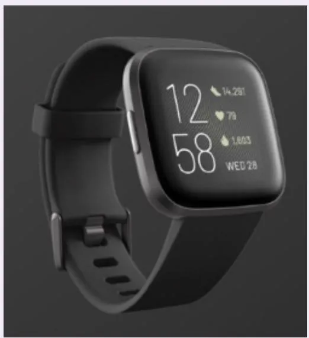  
(a)

(b)   
Figure 14.1 Devices for monitoring activity and heart rate (a) Fitbit 2 Smartwatch and (b) Fitbit Lux   
  
Source: Figure 14.1 (a) Fitbit 2 Smartwatch (b) Fitbit Lux

# Comment

There are several usability issues to consider. Some that you might be particularly interested in finding out about include how comfortable the device is to wear, how clearly the information

(Continued)

is presented, what other  information is presented  (for example, time), what other  features there are (for example, having Alexa built-in), how long the battery lasts before it needs to be recharged, and so forth. Most important of all might be how accurate the device is, particularly for recording heart rate if that is a concern for you.

Since these devices are worn on your wrist, they can be considered to be fashion items. Each offers at least four colors. Do you prefer a particular color  that is offered for  one of the  designs? How important  is it to have a watch  and to have Alexa  built  in?  Is it worth $\$ 32$ more? You might be interested in how bulky each is in case it rubs on your clothes and causes damage and whether the  devices are  discrete or clearly noticeable. Might privacy be important to you? If so, you would want to know about the personal data collection policies for both devices. You might also be interested in what other people think about the products. There are so many potential issues to consider, and the relative importance of each will vary between different people. What is important to you may not be important to a friend! Increasingly, people look at star ratings and comments before making a purchase. Do you consider these to be a form of evaluation?

# BOX 14.1

# Living Labs

Living labs have been created to evaluate people’s everyday lives, which would be simply too difficult to assess in usability labs, for example, to investigate people’s habits and routines over a period of several months in a smart home. An early example of a living lab was the Aware Home (Abowd et al., 2000) in which the house was embedded with a complex network of sensors and audio/video recording devices that recorded the occupants’ movements throughout the house and their use of technology. This enabled their behavior, for example, their routines and deviations, to be monitored and analyzed. An early motivation for such studies was to evaluate how real families would respond and adapt to such a setup over a period of several months (Hofte et al., 2009). However, it proved difficult to get families to agree to leave their own homes and live in a living lab home for that long.

Other  examples of living labs include  ambient-assisted homes  that have been developed where a network of sensors is embedded throughout someone’s home rather than in a special, customized building (Alavi et al., 2020). One rationale is to enable physically challenged people to lead safe and  independent lives  by providing  a  nonintrusive system that can remotely monitor and provide alerts to caregivers in the event of an accident, illness, or unusual activities (Fernández-Luque et al., 2009; Yasuoka et al, 2018). The term living lab is also used to describe innovation networks in which people gather in person and virtually to explore and form commercial research and development collaborations (Ley et al., 2015). Some living labs have become more like commercial enterprises, which offer facilities, infrastructure, and access to participating communities, developers, researchers, and other stakeholders (Verma et al., 2017). A range of methods and technology can be used to track peoples’

activities and reactions  such as eye trackers, motion detection systems, accelerometers, and even brain scanners.

Living labs can  be large  and  may  house  hundreds and  even thousands  of people,  a large array of technology, and other items. The Person-Environment-Activity Research Laboratory (PEARL)  is a  massive  space  of around 4000 square meters and  10 meters high (www.ucl.ac.uk/person-environment-activity-research-laboratory). It is used to study  user experiences in large installations of equipment for railways, high streets, town squares, theaters, etc., before they are deployed into the community. In this environment, researchers, developers, engineers, and other specialists work together to examine what people do, how they do it, and their emotional reactions. For example, they are able to test detailed differences in the environment such as the effects of space, color, lighting, and sound under controlled conditions. Projects have focused  on transport, cities and  communities, creative arts,  education, government, health, and more. Figure 14.2 shows (a) a railway installation and (b) a pop-up theater in which researchers were investigating the public’s reactions.


  
  
Figure 14.2 PEARL testing scenes: (a) a railway station and (b) a pop-up theater in which researchers investigate the publics’ interactions with the items being tested [a train and train station in (a), and the theater design in (b)] and their emotional responses.

Source: www.ucl.ac.uk/person-environment-activity-research-laboratory

# DILEMMA

Is a Living Lab Really a Lab?

The concept of a living lab differs from a traditional view of a lab insofar as it is trying to be both natural and experimental, and the goal is to bring the lab into the home, government, city center (or other natural setting), or online. The dilemma is how artificial to make the more natural setting; where does the balance lie in setting it up to enable the right level of control to conduct research and evaluation without losing the sense of it being natural?

# 14.3.2  In-the-Wild Studies

In-the-wild studies are a way of observing technology usage in natural settings with little or no evaluator  involvement or presence. In the early days  of usability evaluation, evaluators realized that they needed to understand how prototypes and other design products were used in natural settings outside of the lab by observing and talking with users. During the last 20 years, there has been a trend toward conducting in-the-wild studies in which evaluators had less  and less  control over  and  direct  involvement with  the  study  participants (Rogers  and Marshall, 2017). Since this approach is adopted in research as well as in evaluation, it is also called research in the wild (Chamberlain et al, 2012), as mentioned in Chapter 2.

The  goal of in-the-wild studies is to evaluate products with people in their natural settings, primarily to:

Help identify settings for new technologies   
•  Inform the requirements for a new technology design based on in situ observations   
Introduce new  technology  interventions or inform deployment  of existing  technology in new contexts   
. Enable extended engagement with the technology

Doing in-the-wild studies to evaluate a product can provide more ecological validity as they assess the fitness of a product for the intended audience in an everyday context while enabling unforeseen issues related to the environment of use to be revealed. In-the-wild studies  also  enable  usability  measures  (e.g.,  time  spent, features  explored) to  be  recorded  in a real-world setting, such as how social media is used by target audiences on their smartphones over a period of time.

Methods that are typically used for in-the-wild studies are observation, interviews, and interaction logging (see Chapters 8 and 9). The data takes the form of events and conversations that are  typically recorded  through  audio or video  recording, or by  the participants as diaries and notes. The goal of the evaluators is to be unobtrusive and not to affect what people do during the evaluation. However, it is inevitable that some methods will influence how people behave. For example, the use of cameras can make people feel self-conscious and change how they behave or choose to interact with the technology intervention.

In-the-wild studies involve looking at how new technologies or prototypes are deployed and used by people in various natural settings, such as outdoors, in public places, and in their homes. Sometimes, a prototype that is deployed is called a disruptive technology, because the aim is to discover how it displaces an existing technology or practice.

In moving into the wild, evaluators inevitably give up control over what is being evaluated in order to observe how people approach and use—or don’t use—technologies in their everyday lives. For example, an evaluator might be interested in observing how a new mobile navigation device will be used in urban environments. To conduct an in-the-wild study where a specific device is being introduced (e.g., a smart speaker), researchers need to recruit people who are willing to use the device for a few weeks or months in their natural surroundings. They might then tell the participants what they can do with the device. Other than that, it is up to the participants to decide how to use it and when, as they move among work or school, home, and other places.

The  downside of handing  over control is  that it makes it  difficult to anticipate what is going to happen and to be present when something interesting does happen. This approach

contrasts markedly with usability testing where there is always an investigator or camera at hand to record events. Instead, the evaluator has to rely on the participants allowing them to use an installed technology intervention.

In-the-wild  studies  can  also  be  run  virtually, where  observations  take  place  in  multiuser  games such  as  World  of Warcraft, Fortnite,  and Minecraft;  online  communities;  chat rooms; and so on. A main goal of this kind of in-the-wild study is to examine  the kinds of social processes that occur in them, such as collaboration, confrontation, and cooperation. The researcher typically becomes a participant and does not control the interactions. Virtual studies have also become popular in the geological and biological sciences because they can supplement studies in the field. Increasingly, online is partnered with a real-world experience so that researchers and students get the best of both situations (Cliffe, 2017; Elgersma, 2021).

# 14.3.3  Settings Not Involving Participants

Evaluations that take place without involving  participants are conducted in settings where the researcher has to imagine or model how an interface is likely to be used. Inspection methods  are  commonly  employed  to  predict  user  behavior  and  to  identify  usability  problems based on  knowledge of usability, users’ behavior, the contexts  in which the system  will be used, and the kinds of activities that people undertake. Examples include heuristic evaluation that applies  knowledge of  typical  users guided  by  rules of  thumb  and walk-throughs  that involve stepping through a scenario or answering a set of questions for a detailed prototype. Other techniques include analytics and models.

The original heuristic evaluation method  was developed in the early 1990s  for screenbased  applications  (Nielsen  and  Mack,  1994)  and  later  refined  and  adapted  for  other applications over the years (Nielsen and Tahir, 2002). There are now tailored heuristics for evaluating  most  product  types,  including  web-based  products, mobile  apps,  collaborative technologies, conversational  agents  (Langevin, 2021), computerized  toys, games (Tondello et al., 2016), information visualizations (Forsell and Johansson, 2010), and more. One of the problems with using heuristics is that designers can sometimes be led astray by finding that heuristic  evaluation is  not as accurate  as it  appeared  to be at  first. This  problem can  arise from  different sources, such as a lack  of experience and the biases  of UX researchers  who conduct the heuristic evaluations.

Cognitive walk-throughs involve simulating a user’s problem-solving process at each step in the human-computer dialogue and checking to see how users progress from step to step in these interactions (Wharton et al., 1994). During the last 20 years, cognitive walk-throughs have been used to evaluate smartphones (Jadhav et al., 2013), large displays, and other applications, such as public displays (Parker et al., 2017) and interface learnability (Salazar, 2022). A  key feature  of cognitive walk-throughs is  that they  focus on  evaluating designs for ease of learning.

Analytics  is  a  technique  for  logging  and analyzing  data  either  at  a  customer’s site  or remotely.  Web  analytics  is the  measurement, collection, analysis, and  reporting of  Internet data  to understand  and optimize  web  usage. Examples of  web  analytics include the  number of visitors to a website home page over a particular time period, the average time users spend on the home page, which other pages they visit, or whether they leave after visiting the home page. For example, Google provides a commonly used approach for collecting analytics data that is particularly useful for evaluating design features of a website (see Chapter 16,

“Evaluation: Inspections, Analytics and Models”). As part of the massive open online courses (MOOCs) and open educational resources (OERs) movement, learning analytics has evolved and gained prominence for assessing the learning that takes place in these environments. The Open University  in the  United  Kingdom, along with  others,  has  published  widely on  this topic, describing  how learning  analytics are useful for  guiding course  and program design and for evaluating the impact of pedagogical decision-making (Toetenel and Rienties, 2016). Christothea Herodotou and her colleagues (2020) have examined the use of learning analytics over five years, and from this they discuss how to implement predictive learning analytics in distance education at scale.

This web page provides information about learning analytics and learning design: iet.open.ac.uk/themes/learning-analytics-and-learning-design.

Models have been used primarily  for comparing the efficacy  of different interfaces for the same application, for example, the optimal arrangement and location of features. A wellknown approach, described in Scott MacKenzie’s seminal paper, uses Fitts’ law to predict the time it takes to reach a target using a pointing device (MacKenzie, 1995). Other uses of Fitts’ law include evaluating  the position and size of keys on a mobile device or game controller (Ramcharitar and Teather, 2017). Fitts’ law has also been adapted recently for assessing hand reactions to stimuli in virtual reality (Gunasekaran et al, 2021).

# 14.3.4  Selecting and Combining Methods

The three broad  categories identified  previously provide a general framework  to guide the selection of evaluation methods. Often, combinations of methods are used across the categories to obtain a richer understanding. For example, sometimes usability testing conducted in labs is combined with observations in natural settings to identify the range of usability problems and find out how users typically use a product.

There  are both pros and cons for controlled and uncontrolled settings. The benefits of controlled settings include being able to test hypotheses about specific features of the interface where the results can be generalized to the wider population. A benefit of uncontrolled settings  is that unexpected data  can be obtained that provides  quite different  insights  into people’s perceptions and their experiences of using, interacting, or communicating through the new technologies in the context of their everyday and working lives.

# 14.3.5  Opportunistic Evaluations

Evaluations may  be detailed, planned studies, or opportunistic. The latter explorations are generally done early in the design process to provide designers with feedback quickly about a design idea.  Getting this  kind of feedback is  important because  it  confirms whether  it  is worth proceeding to develop an idea into a prototype. Typically, these early evaluations are informal and do not require many resources. For example, the designers may recruit a few local people and ask their opinions. Getting feedback this early in design provides feedback when it is easier to make changes to an evolving design. Opportunistic evaluations with users

can also be conducted to hone the target audience so that subsequent evaluation studies can be more focused. Opportunistic evaluations can also be conducted in addition to more formal evaluations.

# 14.4  Evaluation Case Studies

Two  contrasting case studies are  described in this section to illustrate how evaluations can take  place in different settings  with different amounts of control over users’  activities. The first case study (section 14.4.1) describes a mixed methods approach to evaluating a system called DeepTake that is used to predict when drivers of automated cars will need to take over control of the car from the automated system (Pakdamanian et al., 2021).

The second  case  study (section 14.4.2)  describes an  ethnographic in-the-wild  study  in which a bot, known as Ethnobot, was developed to prompt participants to answer questions about their experiences while walking around a large outdoor show (Tallyn et al., 2018).

# 14.4.1  Case Study 1: DeepTake and Automated Vehicles

Automated  vehicles promise future drivers  the opportunity to focus  some of their time on tasks that are not related to driving, such as reading a book, texting, talking to friends, and playing games with children, which are known as non-driving-related tasks. But this vision requires carefully designed automated systems that can smoothly transfer control of the car to a human driver to manage dangerous situations.

DeepTake is designed to predict when a driver, who is engaged in a non-driving-related task, needs to take control of a car (Pakdamanian et al., 2021). At such times the driver gets a takeover request from DeepTake to get ready to take control of the car and to stop whatever other activity they are engaged in until it is safe for the car to return to driving automatically.

The prototype DeepTake system was created by Erfan Pakdamanian and his colleagues. They collected vast amounts of data about people’s driving behavior that was classified using machine learning and used to develop the deep neural network that powered DeepTake. The primary aim for these researchers was  to test how well their system predicted the  need for takeovers compared with other similar systems. Part of their research also involved performing a  user study  of DeepTake to test  the feasibility of predicting  takeover behavior, which the researchers defined as a driver’s intention to take over control of the vehicle, the time to complete the takeover, and how well the takeover was performed. The user study consisted of the following:

Study scenario: The participant drivers in the study had to take control of the vehicle to avoid an obstacle in the road.

Participants: Twenty subjects (11  females and  9 males) aged 18–30 years  (mean age  23.5) took part in the study. All participants were required to have normal or corrected normal vision and to have at least one year of driving experience and not  to be susceptible to simulator sickness (a well-known problem that some people experience).

Apparatus  and setup: A low-fidelity driving simulator was used that consisted of a steering wheel, accelerator, brake pedal, and gear shift, as shown in Figure 14.3. The simulator recorded driver control actions and the state of the vehicle (e.g., speed and position) 20 times  per  second. The  driving scenario  was displayed  to  the participant  on  a 30-inch

monitor, and  a pair of stereo  speakers generated  the noise associated  with the driving environment, including auditory requests to signal a takeover. An Apple iPad was positioned to the right  side of the driver to mimic the display that  the driver would use for non-driving-related tasks.

Drivers engage in non-driving tasks when the vehicle is in automated driving mode, so Tobii  Pro-Glasses  were used  to  sample  the  driver’s eye  movements  approximately  60 times per second. This data indicates the driver’s visual attention and readiness to take over  control  of the car. Biometric  data  was collected  via wearable devices. Heart  rate variability and skin signals were monitored at a rate of 267 times per second. This monitoring was done using devices that are not invasive and therefore don’t distract or make the driver uncomfortable. Collectively the data provides an indicator of the driver’s alertness, stress, and drowsiness. Galvanic skin response data also indicates emotional reactions. Sweaty hands may indicate stress!

Task scenarios: Four types of non-driving-related tasks were designed to vary task difficulty and therefore the amount of time and cognitive effort needed to perform the tasks.

• Conversation  with  passenger:  Interacting  with  the  experimenter  who  sat  close  to  the participant   
. Using a cellphone: Interacting with a smartphone for texting or browsing   
•  Reading articles: Reading three types of articles—easy, medium, and hard—on the iPad   
•  Solving problems: Answering three levels of arithmetic questions—easy, medium, and hard.

Study design: All the driver participants did the same set of tasks. This enabled a controlled evaluation of the takeover requests. To avoid the influence of the order of the non-driverrelated  tasks, the  order  was randomized. The  difficulty of the  tasks  and therefore the cognitive demand was varied.

Procedure:  Prior  to  starting  the  study  the  participants  were  told  about  what  they  would be asked to do, what data would be collected about them, and how their data would be used. Upon arriving in the lab, the participants signed an informed consent form (see section 14.6.1). They were reminded of their right to stop involvement in the study at any time, and they were each given $\$ 20$ US to compensate for their time spent on the study. They also completed a demographic and driving history questionnaire. They were briefed about the study and taught to use the simulator. Participants were told that if DeepTake detected a situation that it could not navigate, there would be an auditory request telling them to take over control of the vehicle. Participants were then invited to try out the simulator to get familiar with it and with the study procedure, the tasks, and the delivery of  takeover  requests. The eye-tracking  and other  devices for  collecting biometric  data were calibrated to ensure they worked correctly. When the participant felt familiar with the simulator and understood the procedure, the evaluation study was started.

The study consisted of three trials using the simulated driving setup, each containing 15 takeover requests. After each trial the participant was given two questionnaires consisting of tried and tested questions that were designed to assess the participants’ perceived reactions and psychological stress respectively. These tests used rating scales. A follow-up study  was  planned  to further  tap  into  the  participants’  thoughts,  feelings, and  overall experience. The total amount of time that each participant spent on the user study was approximately one hour.

Data  collection: The  pre-driving  survey completed  by  each  participant  before  starting  the study collected demographic information about the participants including their age, gender, and  driving  experience.  Data  was  collected  about  changes  in  the  simulated  car’s actions (e.g., change in lane position, steering angle, throttle and break) caused by each participant in response to a takeover request, and about the simulated vehicle’s behavior, such as speed and distance to  hazards on  the road. Data  was also collected about  the participant  driver’s non-driving  behavior (e.g.,  reading  from  a  tablet, responding  to  a prompt to take control of the car, etc.) and the participant’s eye movements, heart rate, and skin  moisture. This data  showed changes  in the driver’s neurological responses  to different driving situations. Figure 14.3 provides an overview of the study setup.

Data analysis and results: The results of the study showed that DeepTake reliably predicted the need for a driver to take over control of the simulated car 96 percent of the time. The data from the simulator study with users (i.e., the user study) indicated that participants completed the takeovers within an acceptable time 93 percent of the time and that 83 percent of the takeovers were of acceptable quality, which was a measure of how safely and accurately the participants  completed the takeovers. Because the primary focus of research on  DeepTake was testing  the feasibility  of predicting  takeovers by  collecting and analyzing quantitative measurements, the researchers did not collect data about how participants felt about their study experience. To cope with this limitation, the researchers planned a follow-up study to  collect qualitative  user experience data, which  is not reported  here, but Activity  14.5 encourages  you  to  think about  the kind  of data  that might be useful to collect. Interestingly, while the researchers’ work so far does not focus on the user interface of the system, it does provide an alternative way of putting users at the center of development.

Figure 14.3 User study setup. This custom driving simulator consists of a 30-inch monitor, a Logitech G29 steering wheel, and 10.5-inch Apple iPad Air on which the non-driving tasks are displayed. For switching between the automated and manual control of the vehicle, the participant needs to press the two blue buttons on the steering wheel simultaneously. The participant wore a pair of eye-tracking glasses and a wearable device with sensors for collecting skin.   
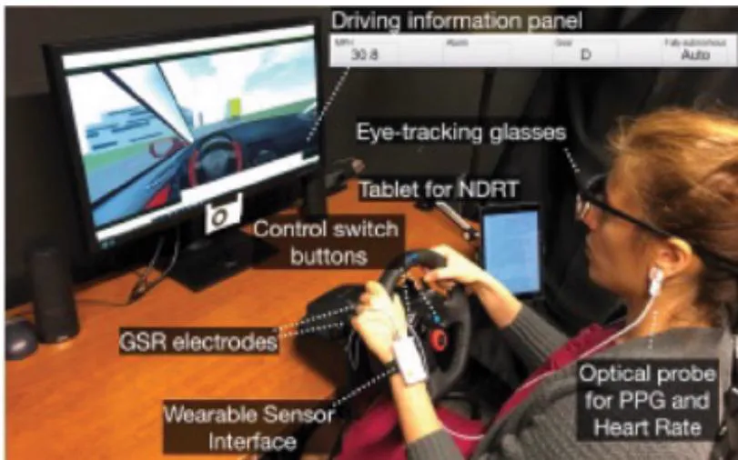  
Source: Pakdamanian et al., 2021. CHI’2021 https://dl.acm.org/doi/pdf/10.1145/3411764.3445563

# ACTIVITY 14.5

1. What kind of setting was used in the DeepTake user study?   
2. How much control did the researchers exert?   
3. Which types of data were collected?   
4. Which other types of data, not discussed in the case study, would you like to know about?

# Comment

1. The user study involved participants using a simulation of an automated car in a research lab, which is a controlled setting.   
2. The researchers took control of the user study. They designed the simulation, planned the pretest and post-test questionnaires, determined the tasks, and decided on the type of data collected.   
3. Quantitative data was  collected that included biometric data (eye-gaze  and  skin data), the  time to complete a takeover task under different test conditions, accuracy of driving the  car simulation, car position, and speed. Demographic data was collected about  each participant  from a  pretest questionnaire  as well as data about  driving  experience. The participants rated their experience of doing the  tasks in two  questionnaires comprising predefined questions after completing the study.   
4. Some questions that it would be interesting to know more about  include the following: Did participants feel confident using the simulation? Did the driving experience meet their expectations?  Would they like to drive  a real automated vehicle? Would  they feel safe? Semi-structured or open-ended interviews could be used to collect data that would help to answer these questions.

# 14.4.2  Case Study 2: Gathering Ethnographic Data at the Royal Highland Show

In-the-wild and ethnographic studies provide data about how people interact with technology in  their natural environments. Such  studies often  provide insights  not  available in  lab settings. However, it can be difficult to collect participants’ thoughts, feelings, and opinions as they move about in their everyday lives. Usually, it involves observations and asking them to reflect after an event, for example through interviews and diaries. In this case study, Ella Tallyn and her  colleagues  (2018)  carried  out  a novel  evaluation approach  in  which  a live chatbot was used to address this gap by collecting data about people’s experiences, impressions, and feelings as they visited and moved around the Royal Highland Show (RHS). The RHS is a large agricultural show that runs every June in  Scotland. The chatbot, known as Ethnobot, was designed as an  app that runs on  a smartphone. In particular, Ethnobot was programmed to ask participants pre-established questions as they wandered around the show and to prompt them to expand on their answers and take photos. It directed them to particular parts of the show that the researchers thought would interest the participants. This strategy  allowed  the  researchers  to collect  data from  all  of the  participants  in  the  same  place. Interviews were also conducted by human researchers to supplement the data collected online by the Ethnobot.

The overall purpose of the study was to find out about participants’ experiences of, and feelings about, using Ethnobot at the show. The researchers also wanted to compare the data collected by the Ethnobot with the interview data collected by the human researchers.

The study consisted of four data  collection sessions  using the Ethnobot  over two days and involved 13 participants, who ranged in age and came from diverse backgrounds. One session  occurred in the early afternoon and the other in the late afternoon on each  day of the study. Each session lasted several hours. To participate in the study, each participant was given a smartphone and shown how to use the Ethnobot app (Figure 14.4), which they could experience on their own or in groups as they wished.

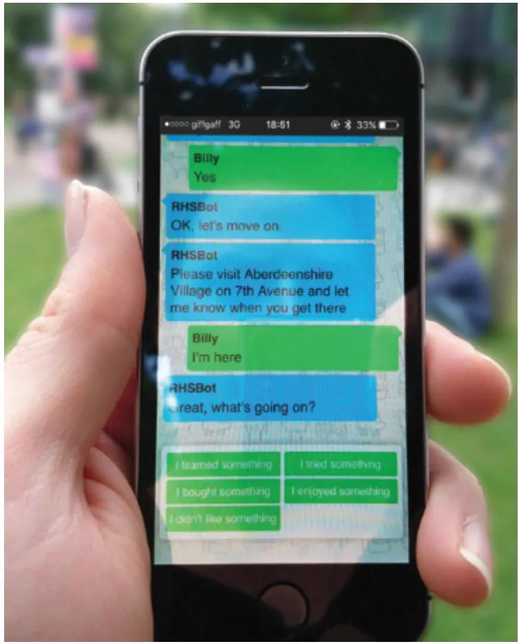  
Figure 14.4 The Ethnobot used at the Royal Highland Show in Scotland. Notice that the Ethnobot directed participant Billy to a particular place (that is, Aberdeenshire Village). Next, Ethnobot asks “. . . What’s going on?” and the screen shows five of the experience buttons from which Billy needs to select a response.

Source: Tallyn et al. (2018). Reproduced with permission of ACM Publications

Two main types of data were collected.

The  participants’  online  responses  to  a  short  list  of  pre-established  questions  that  they answered by selecting from a list of prewritten comments (for example, “I enjoyed something” or “I learned something”) presented by the Ethnobot in the form of buttons called

experience  buttons,  and  the  participants’  additional  open-ended, online  comments  and photos that they offered in response to prompts for more information from Ethnobot. The participants could contribute this data at any time during the session.

• The participants’ responses to researchers’ in-person interview questions. These questions focused on the participants’ experiences that were not recorded by the Ethnobot, and their reactions to using the Ethnobot.

A lot of data was collected that had to be analyzed. The pre-established comments collected in the Ethnobot chatlogs were analyzed quantitatively by counting the responses. The in-person  interviews  were audio-recorded  and  transcribed  for  analysis,  and  that  involved coding  them, which was done  by  two researchers  who cross-checked each  other’s analysis for consistency. The open-ended online comments were analyzed in a similar way to the inperson interview data.

Overall, the analyses revealed  that participants  spent an  average  of 120  minutes  with the Ethnobot on each session and recorded an average of 71 responses, while submitting an average of 12 photos. In general, participants responded well to prompting by the Ethnobot and were eager to add more information. For example, one participant said, “I really enjoyed going around and taking pictures and [to the question] ‘have you got something to add’ [said] yeah! I have, I always say ‘yes’. . . .” A total of 435 pre-established responses were collected, including 70 that were about what the participants did or experienced (see Figure 14.5). The most frequent  response was “I learned something” followed by “I tried something” and “I enjoyed something.” Some participants also supplied photos to illustrate their experiences.

Figure 14.5 The number of prewritten experience responses submitted by participants to the pre-established questions that Ethnobot asked them about their experiences   
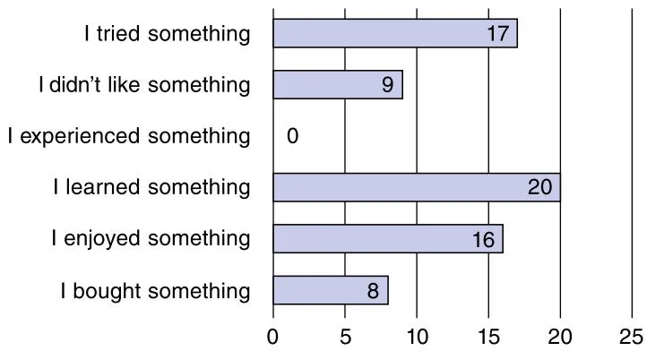  
Source: Tallyn et al., 2018 / ACM, Inc. / CC BY-4.0

When the researchers asked the participants about their reactions to selecting prewritten comments, eight participants remarked that they were rather restrictive and that they would like more flexibility to answer the questions. For example, one participant said, “Maybe there should have been more options, in terms of your reactions to the different parts of the show.” However, in general, participants enjoyed their experience of the RHS and of using Ethnobot.

When the researchers compared the data collected by Ethnobot with that from the interviews collected by  the human  researchers, they found  that the participants  provided more

detail about their experiences and feelings in response to the in-person interview questions than  to  those  presented  by  Ethnobot.  Nevertheless, the  researchers  concluded  that  while there are some challenges to using a bot to collect in-the-wild evaluation data, there are also advantages, particularly when researchers cannot be present as in the COVID-19 pandemic when people had to be distanced or when the study involves collecting data from participants on the move or in places that are hard for researchers to access. Collecting data with a bot and supplementing it with data collected by human researchers, either in person or remotely, appears to offer a good solution in circumstances such as these.

# ACTIVITY 14.6

1. What kind of setting was used in this evaluation?   
2. How much control did the researchers exert?   
3. Which types of data were collected?

# Comment

1. The evaluation took place in a natural outdoor setting at the RHS.   
2. The researchers imposed less control on the participants than in the previous case study, but the Ethnobot was programmed to ask specific questions, and a range of responses was provided from which participants selected. The Ethnobot was also programmed to request additional information and photos. In addition, the Ethnobot was programmed to guide the participants to particular areas of the show,  although some participants ignored this guidance and went where they pleased.   
3. The Ethnobot collected answers to a specific set of predetermined questions (closed questions) and prompted participants for additional information and photographs. In addition, participants were interviewed by the researchers using semi-structured, open-ended interviews. The data collected was qualitative but counts of the response categories produced quantitative data (see Figure 14.5). Some demographic  data was  also quantitative (for instance, participants’ ages, gender, and so forth), which is provided in the full paper (Tallyn et al., 2018).

# BOX 14.2

# Crowdsourcing

Crowdsourcing involves a group of participants in collecting data, exchanging ideas, or contributing to a common cause. The Internet makes  it possible to gain access to hundreds of thousands of people who will perform tasks or provide feedback on a design or experimental task quickly and almost immediately. Amazon’s Mechanical Turk has thousands of people registered (known as Turkers), who  have volunteered to take part by performing various activities online, known  as human intelligence tasks (HITs), for  a small payment. HITs are submitted by researchers or companies that pay a few cents for simple tasks (such as tagging

(Continued)

pictures) to a few dollars (for taking part in an experiment). In 2022 Turkers typically earned between $\$ 1$ and $\$ 6$ per hour. Some individual requesters paid an average of $\$ 12$ per hour for more demanding tasks. Advantages of using crowdsourcing in HCI is that it is more flexible, relatively inexpensive, and often much quicker to enroll participants than with traditional lab studies. Another benefit is that many more participants can be recruited.

Early  in the  history  of online crowdsourcing, Jeff Heer and  Michael  Bostock  (2010) investigated how reliable it was to ask random people over the Internet to take part in an experiment. Using Mechanical Turk, they asked the Turkers to perform a series of perception tasks using different visual display techniques. A large number agreed, enabling them to analyze their results statistically and to generalize from their findings. They found that while the results from their study using Turkers showed wider variance than in the lab study, the overall results across the studies were the same. They also found that the total cost of their experiment with Turkers was one-sixth the cost of a typical lab study involving the same number of people. While these results are important, online crowdsourcing studies have raised ethical questions  about  whether Turkers, like other  gig workers  (e.g., Uber drivers, pizza delivery workers), are being fairly rewarded and acknowledged (Williamson, 2016).

Since  Jeff Heer and  Michael  Bostock’s  2010 classic  study, crowdsourcing  has  become increasingly popular and has been used in a wide range of applications including collecting design ideas  for  developing a citizen  science  app  (Maher et al., 2014); design and  evaluation (Birch et al., 2018); managing volunteers for disaster relief (Ludwig et al., 2016); delivering packages (Kim, 2015); collecting citizen science data using specially developed apps such as iNaturalist (Preece, 2017); and  volunteering for  various environmental projects (NOAA, 2021). Both the number and diversity of useful contributions and ideas generated make crowdsourcing particularly attractive for getting timely feedback from the public. For example, in a study to collect and improve the design of a street intersection, a system called CommunityCrit was used to collect opinions from members of the community and to draw on their skills and availability (Mahyar et al., 2018). Those who contributed were empowered by getting to see the planning process. In an online study David Birch and his colleagues designed and ran variants of multiple visualization designs in the cloud so that large numbers of participants could explore and evaluate subtle design trade-offs using crowdsourcing (Birch et al., 2018).

Abdullah Ali, Meredith Morris, and Jake Wobbrock (2019) developed a system for crowdsourcing design ideas. Then, three years later, during the COVID-19 pandemic, which drastically restricted any kind of lab studies, they modified their system to be used for what they call “distributed evaluation,” where participants were invited to take part online (Ali et al., 2021). They discovered that an advantage of this kind of methodology was that they could reach far more people worldwide. In particular, through using their system, it was possible to overcome the lack of access and user representation that is often found in lab-based studies. Hence, this is an example of where being forced to do evaluations online proved to be highly effective to the point it turned out to be more beneficial than when conducted previously in the lab.

These  examples illustrate how  crowdsourcing  can  be a  powerful tool for  improving, enhancing, and  scaling up a  wide range of tasks, including  design and  evaluation. Crowdsourcing makes it possible to recruit participants to generate a large pool of potential ideas, collect data, and make other useful inputs that would be difficult to achieve in other ways. Increasingly companies, including Google and IDEO, use crowdsourcing to try ideas and to gather evaluation feedback about designs.

# 14.5  What Did We Learn from the Case Studies?

The case studies along with Box 14.1 and Box 14.2 provide examples of how different evaluation methods are  used in different physical settings that  involve users  in different  ways to answer various kinds of questions. They demonstrate how researchers exercise different levels of control in different settings. The case studies also show how it is necessary to be creative  when working  with  innovative systems  and when  dealing with constraints  created by the evaluation setting (for example, online, distributed, or outdoors where people are on the move  as  in the  Ethnobot  study)  and the  technology  being  evaluated may  not  be optimal. The DeepTake user study is an example of how a group of researchers designed an ML-based system and evaluated it with participants in the  lab using a car simulation. In addition, the case studies and boxes illustrate how to do the following:

• Observe users in labs, in living labs, and in natural settings, known as in the wild.   
Develop different data collection and analysis techniques to evaluate user experience goals, such as interacting with a simulation in a lab and engaging with people on the move at an outdoor show.   
• Run experiments on the Internet using crowdsourcing, thereby reaching many more participants while being straightforward to run.   
. Recruit a large number of participants  who contribute  to a wide range of projects  with different goals using crowdsourcing.

# BOX 14.3

# The Language of Evaluation

Sometimes terms describing evaluation are used interchangeably and have different meanings. To avoid this confusion, we define some of these terms here in alphabetical order. (You may find that other books use different terms or use the same terms in slightly different ways.)

Analytics Data analytics refers to examining large volumes of raw data with the purpose of drawing inferences about a situation or a design. Web analytics are commonly used to measure website traffic through analyzing users’ click data, and learning analytics analyze learners’ activities.

Analytical evaluation This type of evaluation models and predicts user behavior. This term has been used to refer to heuristic evaluation, walk-throughs, modeling, and analytics.

Bias The results of an evaluation are distorted. This can happen for several reasons. For example, selecting a population of users who have already had experience with the new system and describing their performance as if they were new users.

Controlled experiment This is a study that is conducted to test hypotheses about some aspect of an interface or other dimension. Aspects that are controlled typically include the task that participants are asked to perform, the amount of time available to complete the tasks, and the environment in which the evaluation study occurs.

Crowdsourcing Crowdsourcing is the process of involving people (i.e., the crowd) in collecting data or contributing to an activity. Crowdsourcing can be done in person (as was typical in citizen science  for  decades) or online via  the  web  and  mobile apps. Crowdsourcing also

(Continued)

provides the opportunity for hundreds, thousands, or even millions of people to take part in the design and or evaluation of a product or a user study. The crowd may be asked to perform a particular evaluation task using a new product or to rate or comment on the product.

Distributed evaluation This is a form of online crowdsourcing where many people from different locations can participate in a user study without being physically present together.

Ecological validity This is a particular kind of validity that concerns how the environment in which an evaluation is conducted influences or even distorts the results.

Expert review or crit (short for critique) This is an evaluation method in which someone (or several people) with usability  expertise and  knowledge of the  user population reviews  a product looking for potential problems.

Field  study This is the  term used to describe an evaluation study  that is done in a  natural environment such as in a person’s home or in a work or leisure place. Such studies are often called in the wild or research in the wild in HCI and interaction design.

Formative evaluation This type of evaluation is done during design to check that the product fulfills requirements and continues to meet users’ needs.

Heuristic  evaluation This is an evaluation method in which  knowledge  of typical  users is applied, often guided by heuristics, to identify usability problems.

In the wild This form of evaluation involves observing what people do when using technology in natural settings, with little or no intervention by evaluators.

Informed consent form This form describes what a participant in an evaluation study will be asked to do,  what will happen to the  data collected about  them, and  their rights while involved in the study.

Living lab This place is configured to measure and  record people’s everyday activities in a natural setting, such as in the home, work place, theater, or other type of public place.

Pain points These are the hurdles that customers experience with a product or service.

Predictive evaluation This type of evaluation is where theoretically based models are used to predict users’ performance.

Reliability The reliability or consistency of a method is how well it produces the same results on separate occasions under the same circumstances.

Remote evaluation Remote evaluation uses the Internet, phone, or other digital device to collect data without evaluators being present in the lab or natural setting.

Research in-the-wild studies This approach focuses on discovering how people use and react to new technology interventions in their everyday settings, both indoors and outdoors.

Scope This refers to how much the findings from an evaluation can be generalized.

Summative evaluation This evaluation is done when the design is complete.

Usability lab This is a specially designed lab or modified space for usability testing.

Usability testing This involves measuring how well a design supports users’ performance on various tasks.

User studies This generic term covers a range of evaluations involving users, often including experiments and in-the-wild studies.

Users or participants In this context, these terms are used interchangeably to refer to the people who take part in evaluation studies. The term people is now used more commonly to describe all kinds of users.

Validity The validity of a study is concerned with whether the evaluation method measures what it is intended to measure.

# 14.6  Other Issues to Consider When Doing Evaluation

Reading the case studies may have raised other issues, such as the importance of asking good questions to focus the evaluation. A good question is important because it helps to focus the evaluation and decide on the best approach and methods to use. Another issue is how to find suitable participants and, having found them, how to approach them. Can you just ask children  in a café  to participate, or  do  you need permission  from  their parents? What  if  your participants are remote? How should you approach them? What do you have to tell participants, and what if they decide partway through the study that they don’t want to continue to the  end? Can  they  stop, or  do they  have  to continue? The following  are additional  issues to consider:

• Informing  participants  about  their  rights,  including  how  their  data  will  be  managed and stored   
• Making  sure  you  take  into  account  biases  and  other  influences  that  impact  how  you describe your evaluation findings

# 14.6.1  Informing Participants About Their Rights and Getting Their Consent

Most  professional  societies,  universities,  government,  and  other  research  offices  require researchers and those performing evaluation studies to provide information about activities in which human participants will be involved. They do this to protect participants by ensuring that they are not endangered physically or emotionally and that their right to privacy is protected,  particularly  the  details  about  how  participants’  data  is collected  and  will  be treated. Drawing up such an agreement is mandatory in many universities and major organizations.  Indeed, special  review  boards  generally  prescribe  the format  required, and  many provide a detailed form that must  be completed. Some even require researchers to undergo specific  training  before  completing  the  form.  Once  the  details  entered  on  the  form  are accepted,  the  review  board  checks  periodically  to  oversee  compliance.  For  example,  in American universities, these are known as institutional review boards (IRBs).

Institutions in other countries use different names, forms, and processes to protect users, and some countries have different laws that govern areas such as users’ privacy, mentioned in Chapter 8. For example, the General Data Protection Regulation (GDPR) was introduced in 2018 to strengthen data protection and privacy for all individuals living within the European Union. Such laws influence not just the countries directly involved but also people in other countries  who  collaborate with EU countries  on  research projects  or commercial software development.

Over  the  years,  IRB  forms  have  become  increasingly  detailed,  particularly  now  that much research involves the Internet and people’s interaction via social media and other communications technologies. IRB reviews are especially stringent when a research or evaluation study involves people who could be considered vulnerable (such as children, older adults, and people with disabilities).

Several lawsuits at prominent universities have heightened attention to IRB and similar compliance  laws  and  standards  to  the extent  that  it sometimes  takes  several  months  and multiple amendments  to  get IRB acceptance. Not only are IRB  reviewers interested  in the more obvious issues of how participants will be treated and what they will be asked to do;

they also want to know how the data will be analyzed and stored. For example, data about participants must be stored securely and coded to prevent linking participants’ names with that data.

Participants must be told what they will be asked to do, the conditions under which data will be collected, and what will happen to their data when they finish the task. Participants must also  be  told their rights, for instance, that  they may  withdraw from the  study at any time  if  they  want.  This  information  is  usually  presented  to  participants  on  a  form,  often referred to as a consent form, that each participant reads and signs before the  study starts. When new  laws come into existence, it is  particularly important  to be aware  of how such laws will be enacted and their potential impact on research and evaluation studies.

Some companies have “boilerplate” templates that UX researchers and designers can use that describe how participants will be treated and how the data collected will be used so that new documents do not have to be created for each evaluation study. Many companies also ask the evaluation participants to sign a nondisclosure agreement, which requires that they do not talk about the product and their experience of evaluating it with anyone after completing the evaluation. Companies  require this because they do not  want their competitors and the public to know about the product before it is launched or modified.

# DILEMMA

When  Is  a  Person  Considered  Vulnerable,  and  How  Might  This Affect Them?

Who is vulnerable? The answer is all  of us at various  times and stages in our  lives. At any particular time, however, some people are more vulnerable than others (for example, children and people with emotional and certain physical disabilities). Furthermore, definitions of people who are vulnerable vary from country to country, state to state, and policy to policy, so the following scenarios are broad categories to get you thinking about this important issue. At what age can children read and sign their own consent forms? Is it when they are considered to be old enough to understand what they are being asked to do? This could be 12 years of age, or at other times and places 16 or even 18 or 21. It also depends on the kind of study. In some parts of the world, a 17-year-old can get married but may need their parents to sign a form saying that they can take part in an evaluation study to rate the realism of a social robot’s expressions. What is the balance here between seeking reasonable consent and respecting individuals’ rights to privacy for themselves and their families?

# 14.6.2  Issues That Influence the Choice of Method and How the Data Is Interpreted

Decisions have to be made about what data is needed to answer the study questions, how the data will be analyzed, and how the findings will be presented (see Chapters 8 and 9). To a great extent, the method used determines the type of data collected, but there are still some choices. For example, should  the data be treated statistically? Some general questions  also

need to be asked. Is the method reliable? Has the method produced the kind of data intended? Is the evaluation study ecologically valid, or is the fundamental nature of the process being changed by studying it? Are biases creeping in that will distort the results? Will the results be generalizable; that is, what is their scope?

# Reliability

The reliability or consistency of a method is how well it produces the same results on separate occasions under the same circumstances. Another  evaluator or researcher who follows the same  procedure should  get similar results. Different evaluation methods have different degrees of reliability. For example, a carefully controlled experiment will have high reliability, whereas observing people in their natural setting will be variable. An unstructured interview will have low reliability—it would be difficult if  not impossible to repeat exactly the same discussion.

# Validity

Validity is  concerned with  whether the evaluation method  measures  what it is intended  to measure. This  encompasses  both  the  method  itself  and  the  way  it  is  implemented.  If,  for example, the goal of an evaluation study is to find out how people use a new product in their homes, then it is not appropriate to plan a lab experiment. An ethnographic study in participants’ homes would be more appropriate. If the goal is to find average performance times for completing  a task, then  a method  that recorded only  the number  of user  errors  would be invalid. These examples are deliberately extreme, but subtler mistakes can be made, and it’s good to consider these questions for each study.

# Ecological Validity

Ecological  validity  is  a  particular  kind  of validity  that  concerns  how  the  environment  in which  an  evaluation is  conducted  influences or even  distorts  the results. For example, lab experiments are controlled, so what the participants do and how they behave is quite different from what happens naturally in their workplace, at home, or in leisure environments. Lab experiments therefore have low ecological validity because the results are unlikely to represent  what  happens in  the real  world. In contrast, ethnographic  studies  do  not  impact  the participants or the study location as much, so they have high ecological validity.

Ecological validity is also affected when participants are aware of being studied. This is sometimes called the  Hawthorne effect after a series of experiments at the Western Electric Company’s  Hawthorne  factory  in  the  United  States  in  the  1920s  and  1930s.  The studies investigated changes in length of working day, heating, lighting, and so on; however, eventually it was discovered that the  workers were reacting positively to being given special treatment  rather  than just  to the  experimental  conditions. Similar findings  sometimes occur  in medical trials. Patients given the placebo dose (a false dose in which no drug is administered) show improvement that is due to receiving extra attention that makes them feel good.

# Bias

Bias occurs when the results are distorted. For example, expert evaluators performing a heuristic evaluation may be more sensitive to certain kinds of design flaws than others, and this will be reflected in the results. When collecting observational data, researchers may consistently fail to notice certain types of behavior because they do not deem them important. Put

another way, they may selectively gather data that they think is important. Interviewers may subconsciously  influence  responses  from  interviewees  by  their  tone  of  voice,  their  facial expressions, or the way questions are phrased, so it is important to be sensitive to the possibility of biases.

# Scope

The scope of  an  evaluation study  refers to how  much its findings  can  be generalized. For example, some modeling methods, like Fitts’ law (also discussed in Chapter 16, “Evaluation: Inspections, Analytics, and Models”), which is  used to evaluate keypad design, have a narrow, precise  scope.  (The  problems  of  overstating  or  generalizing  results  are  discussed  in Chapter 9, “Data Analysis, Interpretation, and Presentation.”)

# In-Depth Activity

In this activity, think about the case studies and reflect on the evaluation methods used.

1. For the two case studies discussed in this chapter, think about the role of evaluation in the design of the system and note what was being evaluated: When during the design were they evaluated, which methods were used, and what was learned from the evaluations? Note any issues of particular interest. You may find that constructing a table like the one shown here is a helpful approach.

Name of the study or system/app evaluated

When during the design the evaluation occurred?

How controlled was the study, and what role did users have?

Which methods were used?

What kind of data was collected, and how was it analyzed?

What was  Notable learned issues from the study?

2. What were the main constraints that influenced the evaluations?   
3. How  did  the  use  of different  methods  build on and  complement each other  to give a broader picture of the evaluations?   
4. Which parts of the evaluations were directed at usability goals and which at user experience goals?

# Summary

The goal of this chapter was to introduce the main approaches to evaluation and the methods typically used. These will be revisited in greater depth in the next two chapters. This chapter stressed how  evaluation is done throughout design by collecting information  about  users’ or potential  users’ experiences  when interacting  with a  prototype, a  computer system,  a

component of a computer system, an app, or part of a design (such  as a screen sketch)  to improve its design.

The  pros and  cons of running  lab-based evaluations  were compared with in-the-wild studies in terms of participant reach, cost, effort, constraints, and the types of results that can be elicited. Choosing which approach to use will depend on the goals of the evaluation, the researcher’s or evaluator’s expectations and expertise, and the  resources available to them. Remote evaluation was  also discussed  as it has  become increasingly popular, particularly prompted by the need for people to distance from each other, and because advances in technology make it easier and less costly than having evaluators present.

Crowdsourcing was presented as a creative way of involving a wide range of people with different  ideas and skills who may be widely distributed  geographically. Finally, we briefly mentioned the  ethical  issues relating to how  evaluation participants are  treated  and  their rights to privacy. We also raised questions about data interpretation including the need to be aware of biases, reliability, data and ecological validity, and the scope of the study.

# Key Points

•  Evaluation and design are closely integrated.   
•  Some of the same data gathering methods are used in evaluation as for discovering requirements, for instance, observation, interviews, and questionnaires.   
•  Evaluations can  be done in controlled settings such as labs, less-controlled living lab settings, in the wild, and remotely where users are not present.   
•  Usability testing and experiments involve a high level of control over both what users do and what is tested, whereas in-the-wild evaluations typically impose little or no control on participants.   
•  Different methods are  usually combined to provide different perspectives within a study; they are often generically referred to as user studies.   
•  Participants need to be made aware of their rights. This is often done through  informed consent forms.   
•  It is important not to over-generalize findings from an evaluation.

# Further Reading

BALESTRINI, M., GALLACHER, S., ROGERS, Y. (2020) “Moving HCI Outdoors: Lessons Learned from Conducting Research in the Wild.” In: McCrickard D.S., Jones M., Stelter T.L. (eds) HCI Outdoors: Theory, Design, Methods and Applications. Human–Computer Interaction  Series. Springer, Cham., Switzerland, https://doi.org/10.1007/978-3-030-45289-6_4. This  chapter  explores  the  pros  and cons  of  in-the-wild  evaluation  studies,  particularly  in relation to moving HCI outside. It builds on and extends the 2017 book by Yvonne Rogers and Paul Marshall that discusses the basics of in-the-wild studies.

KRUGE, S.  (2014) Don’t Make  Me Think: A  Common  Sense Approach to Web  Usability (3rd  ed.).  New  Riders.  This  book  provides  a  useful  introduction  to  usability  with  many practical examples of usability problems and how best to avoid them.

LAZAR,  J.,  FENG,  J. H.  and  HOCHHEISER, H.  (2017)  Research  Methods  in  Human– Computer  Interaction  (2nd  ed.).  Cambridge,  MA:  Elsevier/Morgan  Kaufmann  Publishers. This  book  provides an  overview of qualitative  and quantitative  methods. Chapter 15, “Working with  Human  Subjects,” discusses  ethical  issues  of  working  with  human  participants.  PowerPoint  slides  are  also  available  at  www.elsevier.com/books-and-journals/ book-companion/9780128053904.   
SHNEIDERMAN,  B.,  PLAISANT,  C.,  COHEN,  M.,  JACOBS,  S.,  ELMQUIST,  N.  and DIAKOPOULOS, N. (2016) Designing  the User Interface: Strategies for Effective Human-Computer Interaction (6th ed.). Addison-Wesley, Pearson. Chapter 5 provides an alternative way of categorizing evaluation methods and offers a useful overview.

# Chapter 15

# E V A L U A T I O N  S T U D I E S :  F R $\mathbf { o }$ M C O N T R O L L E D  T O  N A T U R A L  S E T T I N G S

15.1  Introduction   
15.2  Usability Testing   
15.3  Conducting Experiments   
15.4  In-the-Wild Studies

# Objectives

The main goals of the chapter are to accomplish the following:

•  Explain how to do usability testing.   
•  Describe how different types of studies are being done remotely.   
•  Outline the basics of experimental design.   
•  Describe how to do in-the-wild studies.

# 15.1 Introduction

Imagine that you have designed a new app to allow school children ages 9 or 10 years old and their parents to share caring for the class hamster over the school holidays. The app will schedule which children are responsible for the hamster and when, and it will record when it is fed. The app will also provide detailed instructions about when the hamster is scheduled to go to another family and the arrangements about when and where it will be handed over. In addition, both teachers and parents will be able to access the schedule and send and leave messages for each other. How would you find out whether the children, their teacher, and their parents can use the app effectively and whether it is satisfying to use? What evaluation methods would you employ?

In this chapter, we describe evaluation studies that take place in a spectrum of settings, from controlled laboratories to in-the-wild studies (sometimes referred to as natural settings or field studies), and from face-to-face situations to remote settings using digital technologies.

Increasingly, elements of usability testing, experiments, and in-the-wild studies are  conducted remotely using tracking software to record participants’ interactions and using social media for communication with participants. As mentioned in Chapter 14, “Introducing Evaluation,” remote usability started in the 1990s (e.g., Hartson et al., 1998) and became a key

alternative during the COVID-19 pandemic when social distancing was necessary to protect people from  catching  the  virus (Gov.UK, 2021;  Center  for Digital  Public  Services,  2021). In  addition  to  keeping  both  participants  and  evaluators  safe,  remote  testing  is  attractive because it saves time traveling to distant locations and the need to schedule and pay for lab time. Therefore, remote testing  tends to be  less expensive than  in-person testing. But  there are also some drawbacks to be aware of (Moran, 2021). For example, remote testing may require more careful advance planning as it will be more difficult for the evaluator to address problems. Developing a relationship with remote participants may also be more difficult and take longer.

Within this range of user testing approaches we focus on the following:

•  Usability testing, which takes place in usability labs and other controlled lab-like settings   
• Remote studies, in which evaluators may interact with participants synchronously, asynchronously, or not at all   
•  Experiments, which usually take place in research labs but can sometimes be done remotely   
In-the-wild studies, which take place in natural settings, such as people’s homes, schools, work, and leisure environments

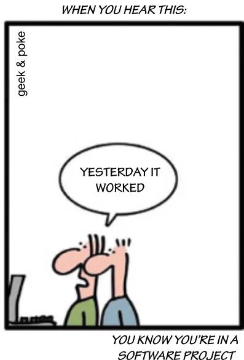  
Source: geek-and-poke.com. Licensed under CC-BY 3.0

# 15.2 Usability Testing

Traditionally the usability of products was tested in laboratories or other controlled settings. Initially, usability testing focused on desktop applications, such as websites, word processors, and search tools. Now it is also important to test the usability of apps and other digital products. Performing  usability  testing  in  a  laboratory,  or  in  a  temporarily  assigned  controlled environment, enables designers to control what participants do and also to control the environmental and social influences that might impact the participants’ performance. The goal is to test whether the product being developed is usable by the intended participants to achieve the tasks for which it was designed and whether participants are satisfied with their experience.

For  some  products, such  as games,  designers  also want  to know  whether their  product is enjoyable  and fun  to use;  this is  an  important  business  goal. Increasingly, aesthetic  design has  become  important,  especially  for  websites  designed  to  sell  products  (Whiteton  and Gibbons, 2018).

# 15.2.1  Methods, Tasks, and Users

Collecting  data about  people’s performance on  predefined tasks has  always been a central component  of  usability  testing  as  described  in  some  early  texts  (e.g.,  Shneiderman, 1986; Preece et al., 1994). As mentioned in Chapter 14, a combination of methods is used to collect data, which usually includes logged keystrokes, mouse and other movements, such as swiping,  pointing,  and  dragging  objects,  and  video  recordings  of  participants,  including  their facial  expressions.  Sometimes, participants  are  asked  to  describe  out  loud  what  they  are thinking and doing (the “think-aloud” technique) while carrying out tasks. In addition, participants complete a user satisfaction questionnaire about their reactions to using the product using rating  scales and answering questions. Structured and semistructured interviews may also be used to collect information about what the participants liked and did not like about the product. Evaluators may also observe and collect data about how the product is used in natural settings such as offices, hotels, people’s homes, etc.

Examples of the tasks that are typically given to participants include searching for information,  comparing  different  icons,  navigating  through different  menus, and  downloading apps. Performance times and the number and type of actions performed by participants are the two main  performance measures. Obtaining these two measures involves recording the time it  takes typical users to complete a task, such as finding a topic on a website, and the number  of errors  that users  make, such as when selecting incorrect menu options  or links. The following quantitative performance measures were identified in the late 1990s, and they are still used as a baseline for collecting user performance data (Wixon and Wilson, 1997):

. Number of people completing a task successfully   
. Time to complete a task   
Time to complete a task after a specified time away from the product   
. Number and type of errors per task   
. Number of errors per unit of time   
Number of times people navigate to an item such as online help   
. Number of people making the same or similar errors

A key concern when doing usability testing is the number of participants that should be involved: Early research suggests that 5 to 12 is an acceptable number (Dumas and Redish, 1999), though more is  often regarded as being better  because the results represent a larger and  often  broader  selection  of  the  participant  population.  However, sometimes  it  is  reasonable  to involve fewer participants  when there are budget  and schedule constraints. For instance, quick feedback about a design idea, such as the initial placement of a logo on a website, can be obtained from only two or three participants reporting on how quickly they spot the logo and whether they like its design. Sometimes, more participants can be involved early on by distributing an initial questionnaire online to collect information about their concerns. The main concerns can then be examined in more detail in a follow-up lab-based study with a small number of typical participants. (See Box 15.3 for further discussion of this topic.)

This link provides an alternative practical introduction that describes what usability is, how usability fits with UX, the relationship with accessibility, and more: careerfoundry.com/en/blog/ux-design/what-is-usability.

# 15.2.2  Labs and Equipment

Large companies, such as Microsoft, Google, and Apple, and some government agencies test their products in usability labs that  consist of a main testing lab  with recording equipment and an observation room where the evaluators can watch what is going on and how the data collected is being analyzed. There may also be a reception area where participants can wait, a storage area, and a  viewing room where  observers such as  designers, product managers, and others can watch. These lab spaces can vary and can be arranged to mimic features of the real world superficially. For example, when testing an office product or a product for use in a hotel reception area, the lab can be set up to resemble those environments. Soundproofing and lack of windows, co-workers, and other workplace and social distractions are eliminated so that participants can concentrate on the tasks that have been set up for them to perform. While controlled  environments like  these enable researchers  to capture data  about participants’ uninterrupted performance, the impact that real-world interruptions can have on usability is not captured. Furthermore, purpose-built labs are expensive for small organizations to maintain.

Typically, large  company  labs contain  two  to  three  wall-mounted  video  cameras  that record the participants’ behavior, such as hand movements, facial expressions, and general body language. Microphones are placed near where the participants will be sitting to record their comments. Video and other data are fed through to monitors in the observation room.

Figure  15.1  shows  a  typical  arrangement  in  which  designers  in  an  observation room  are watching a usability test through a one-way mirror.

Figure 15.1 Diagram of the usability lab used by the U.S. Health and Human Services government department   
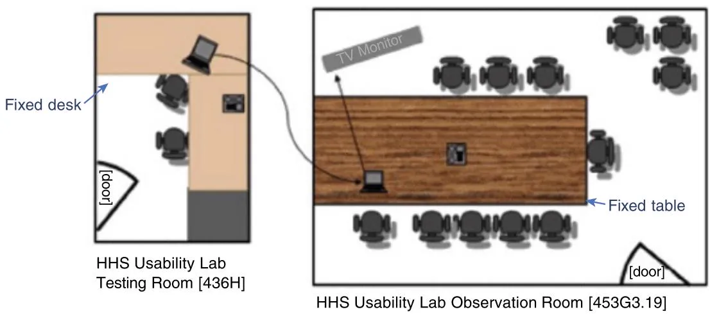  
Source: HHS Usability Lab / U.S. General Services Administration / Public domain

This link to the U.S. Health and Human Services (HHS) government department website describes the HHS usability processes lab: www.usability.gov/ how-to-and-tools/guidance/hhs-usability-lab.html.

Because  usability  labs can  be expensive  and  labor-intensive to  run  and  maintain, less expensive  and more versatile alternatives started  to become popular  in the early and mid-1990s. The development of mobile and remote usability testing equipment also corresponded with the need to do more testing in small companies and in other venues. Mobile usability equipment typically includes video cameras, laptops, eye-tracking devices, and other measuring equipment that can be set up temporarily in an office or other space, converting it into a makeshift usability laboratory. An advantage of this approach is that it enables testing to be done on-site, which makes it less artificial and more convenient for the participants.

A number of products are specifically designed for performing mobile evaluations. Some are referred to as lab-in-a-box or lab-in-a-suitcase because they pack away neatly into a convenient carrying case. The portable lab equipment typically consists of off-the-shelf components that plug into a laptop or connect remotely and can record video directly to hard disk, eye-trackers  (some  of which take  the  form  of glasses  for recording  the  participant’s  gaze), and facial recognition systems for recording changes in the participant’s emotional responses. Increasingly, software is being developed that converts the cameras on computers into mobile webcams and eye-tracking cameras.

An example of a study  in which eye-tracking glasses  were used  to record the eye-gaze of people in a shopping mall is reported  by Nick  Dalton and his colleagues (Dalton et al., 2015). The goal of this study was to find out whether shoppers pay attention to large-format plasma screen displays when wandering around a large shopping mall in London. The displays  varied in size, and some  contained information about directions to different parts  of the mall, while others contained advertisements. Twenty-two participants (10 males and 12 females, aged 19 to 73 years old) took part in the study in which they were asked to carry out  a typical  shopping task  while  wearing  the Tobii  Glasses  Mobile Eye  Tracking glasses shown in  Figure 15.2(a). [Newer models  are now  available such as the one  shown in Figure 15.2(b).] These participants were told that the researchers were investigating what people look at while shopping; no mention was made of the displays. Each participant was paid $\mathcal { E } 1 0$ to participate in the study. They were also told that there would be a prize drawing after the study  and that participants who  won would receive  a gift of up $\mathcal { E } 1 0 0$ in  value. Their task was to find one or more items that they would purchase if they won the prize drawing. The researchers did this so that the study was an ecologically valid in-the-wild shopping task, in which the participants focused on shopping for items that they wanted.

As  the participants  moved  around the  mall, their  gaze  was  recorded and  analyzed  to determine the percentage of time that they were looking at different things. This was done by using software that converted eye-gaze movements so that they could be overlaid on a video of the scene. The researchers  then coded the participants’ gazes based on where  they were looking,  for instance, at  the  architecture  of the  mall, products,  people, signage, large  text, or  displays.  Several  other  quantitative  and  qualitative  analyses  were  also  performed.

The  findings  from  these analyses  revealed that  participants  looked at  displays, particularly large plasma screens, more than had been previously reported in earlier studies by other researchers. Since  Nick Dalton and  his  colleagues reported this study  in 2015, equipment for  doing usability testing has become smaller and less cumbersome as discussed briefly in Box 15.1.

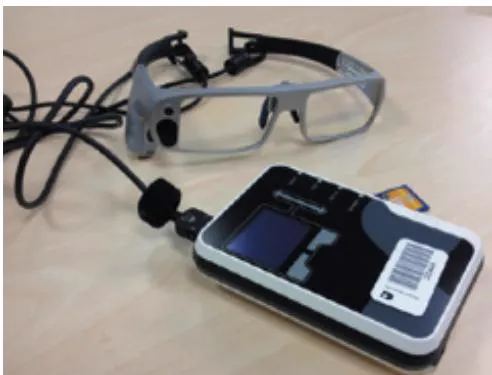  
(a)

(b)   
Figure 15.2 (a) The Tobii Glasses Mobile Eye-Tracking System (b) Tobii Mobile Eye-Tracking glasses on sale in 2022   
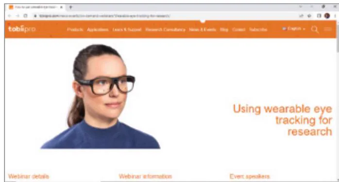  
Source: (a) Dalton et al.  (2015), p. 3891.  Reproduced with permission of  ACM Publications. (b)  www.tobiipro .com/news-events/on-demand-webinars/Wearable-eye-tracking-for-research

# BOX 15.1

# Equipment Is Getting Smaller and Smaller!

The  trend  toward remote usability  testing  and  in-the-wild studies is made possible by the development of smaller, light-weight equipment. For example, newer models of eye-tracking glasses such as those shown in Figure 15.2(b) are now available that are lighter and less cumbersome than the ones worn by participants in Dalton et al.’s (2015) study. These  new eyetracking glasses are more like ordinary glasses. Cameras have also dramatically decreased in size while at the same time becoming more powerful in terms of the kind and quality of pictures  that can  be recorded. For example, photographs and  video are  often  recorded using smartphones rather than with the bulky cameras that required mounting on a tripod to steady them. Even when recording needs to occur over a period of time, small cameras and microphones are discretely mounted in the vicinity of the study.

In  remote  usability  testing, participants  carry  out  tasks  with  a  product  in  their  own setting, communicating  with  evaluators  digitally  via  Zoom, Teams, or  other  digital  communication systems, while their interactions are logged remotely. The COVID-19 pandemic provided  additional  stimulus  to  develop  and  refine  remote  testing  techniques  and  equipment (Moran, 2021; Siltanen et al., 2021). Remote testing can be done synchronously with

both the participant and the evaluator involved at the same time (Madathil and Greenstein, 2011) or asynchronously in which participants interact with the product being tested at different  times (Moran, 2021). An advantage  of remote testing, especially asynchronous testing, is that many  participants can be tested at the  same time in real-world settings  that are geographically  distributed, and the logged click data,  counts, and  video recordings can  be automatically compiled for data analysis (Siltanen et al., 2021). Remote usability testing can be moderated by an evaluator  or assistant  who oversees communications and ensures that participants follow the testing procedures specified by the evaluators. Unmodified usability testing, as the name suggests, does not have a moderator to oversee participants’ interactions with the technology.

Remote testing  may make it easier for some  people with disabilities to be  involved, as they can work from their own homes (Petrie et al., 2006), which is helpful for including people who might otherwise be excluded, such as those with dementia (Wood et al., 2021). The downsides of remote testing include not having an evaluator present if something goes wrong with the technology, and the possibility that the participant and evaluator would have a different  type of interpersonal interaction than when both are co-present. The following links provide  an in-depth  description of the  practical issues  involved  in remote usability testing, what to prepare for, and the potential problems that might occur.

This two-part video produced by the Nielsen Norman Group NN/g describes how to run remote usability testing:

www.nngroup.com/videos/remote-usability-test-part-1

www.nngroup.com/videos/remote-usability-test-part-2

Two  case studies  follow. The  first  is a classic usability  study of a prerelease  version of Apple’s iPad that focuses on how to do usability testing when faced with time and other constraints. The second case study focuses on how to test complex products remotely using VR. This case study also addresses the precautions that were necessary to protect participants and evaluators from COVID-19 during the early days of the pandemic.

# 15.2.3  Case Study 1: Testing the iPad Usability

When Apple’s iPad first came onto the market, usability specialists Raluca Budiu and Jakob Nielsen from the Nielsen Norman Group conducted user tests to evaluate participants’ interactions with websites and apps specifically designed for the iPad (Budiu and Nielsen, 2010). This classic study illustrates how usability tests are carried out and the types of modifications that are made to accommodate real-world constraints, such as having a limited amount of time  to  evaluate  the  iPad  as it  came  onto  the  market. Completing  the  study  quickly  was important  because Raluca Budiu  and Jakob Nielsen  wanted to get feedback to third-party developers, who were creating apps and websites for the iPad. These developers were designing products with little or no contact with the iPad developers at Apple, who needed to keep details about the design of the iPad secret until it was launched. There was also considerable “hype” among the general public and others before the launch, so many people were eager to know if the iPad would really live up to expectations. Because of the need for a quick first

study and to make the results public around the time of the iPad launch, a second study was carried out in 2011, a year later, to examine some additional usability issues (see link at the end of this case study).

For  the first  user testing study Budiu  and Nielsen  (Budiu and Nielsen, 2010) used two evaluation methods: usability testing with think-aloud in which participants said what they were doing and thinking  as they did  it (discussed  earlier in Chapter 8, “Data Gathering”), and an expert review, which is a method discussed in Chapter 16, “Evaluation: Inspections, Analytics and Models.” A key question the researchers asked was about whether the participants’ expectations were different for the iPad as compared to the iPhone. They focused on this issue because a previous study of the iPhone showed that people preferred using apps to browsing the web because the latter was slow and cumbersome at that time. The researchers wondered whether this would be the same for the iPad, where the screen was larger and web pages were more  similar  to how  they appeared  on  the laptops or  desktop computers  that most people were accustomed to using at the time.

The usability testing was carried out in two cities in the United States: Fremont, California, and Chicago, Illinois. The test sessions were similar: The goal of both was to understand the typical usability issues that participants encounter when using applications and accessing websites on  the iPad. Seven participants  were recruited. All were experienced iPhone  users who had owned their phones for at least three months and who had used a variety of apps.

One  reason for selecting participants  who used  iPhones was because  they would have had previous experience in using apps and the web with a similar interaction style as the iPad.

The participants were considered to be typical users who represented the range of those who might purchase an iPad. Two participants were in their 20s, three were in their 30s, one was in their 50s, and one was in their 60s. Three were males, and four were females.

Before  taking part, the participants  were asked to read  and  sign an  informed  consent form agreeing to the terms and conditions of the study. This form described the following:

. What the participant would be asked to do   
. The length of time needed for the study   
. The compensation that would be offered for participating in the study   
The participants’ right to withdraw from the study at any time   
A promise that the person’s identity would not be disclosed   
? An  agreement  that  the data  collected  from  each  participant  would  be  confidential  and would not be made available to marketers or anyone other than the researchers

# The Tests

The session  started  with  participants  being  invited  to  explore  any  application  they  found interesting on the iPad. They were asked to comment on what they were looking for or reading, what they liked and disliked about a site, and what made it easy or difficult for them to carry out  a task. A moderator  sat next to each  participant, observed, and took notes. The sessions were video-recorded, and they lasted about 90 minutes each. Participants worked on their own.

After exploring the iPad, the participants were asked by the researchers to open specific apps or websites, explore  them, and then carry out  one or more tasks  as they would have if  they were  on  their own. Each  participant  was  assigned the  tasks  in a random  order. All of the apps that were  tested were  designed specifically for the iPad, but for some tasks  the

participants were asked to do the same task on a website that was not specifically designed for the iPad. For these tasks, the researchers took care to balance the presentation order so that the app  would be the first presented for some  participants  and the website  would be first presented for others. More than 60 tasks were chosen from more than 32 different sites. Examples are shown in Table 15.1.

Table 15.1 Examples of some of the user tests used in the iPad evaluation (adapted from Budiu and Nielsen, 2010)   

<table><tr><td>App or website</td><td>Task</td></tr><tr><td>iBook</td><td>Download a free copy of Alice&#x27;s Adventures in Wonderland and read through the first few pages.</td></tr><tr><td>Craiglist</td><td>Find some free mulch for your garden.</td></tr><tr><td>Time Magazine</td><td>Browse through the magazine, and find the best pictures of the week.</td></tr><tr><td>Epicurious</td><td>You want to make an apple pie tonight. Find a recipe and see what you need to buy in order to prepare it.</td></tr><tr><td>Kayak</td><td>You are planning a trip to Death Valley in May this year. Find a hotel located in the park or close to the park.</td></tr></table>

Source: www.nngroup.com/reports/ipad-app-and-website-usability. Used courtesy of the Nielsen Norman Group

# ACTIVITY 15.1

1. What was the main purpose of this study?   
2. What aspects  are considered to be important for good usability  and  user experience in this study?   
3. How representative do you  consider the tasks outlined in Table 15.1 to be for a typical iPad user?

# Comment

1. The main purpose of the study was to find out how participants interacted with the iPad by examining how they interacted with the apps and websites that they used on the iPad. The findings were intended to help designers and developers determine whether specific features would need to be developed for the websites and apps to run on the iPad.   
2. The definition of usability in Chapter 1, “What is Interaction Design?” suggests that the iPad should be efficient, effective, safe, easy to learn, easy to remember, provide a satisfying user experience, and have good utility (that is, good usability). The definition of user experience suggests that it should also support creativity and be motivating and helpful. The iPad is designed for the general public, so the range of users is broad in terms of age and experience with technology.   
3. The tasks are a small sample of the total set prepared by the researchers. They cover shopping, reading, planning, and  finding  a  recipe, which are  common activities that people engage in during their everyday lives.

# The Equipment

The  testing  was  done  using  a  setup  (see  Figure  15.3)  similar  to  the  mobile  usability  kit described earlier. A camera recorded the participant’s interactions  and gestures when using the iPad and streamed the recording to a laptop computer. A webcam was also used to record the expressions on the participants’ faces and their think-aloud commentary. The laptop ran software called  Morae, which  synchronized these  two data streams. Up to three  observers (including the moderator sitting next to the participant) watched the video streams on their laptops situated  on  the table so that they  did  not  invade the participants’  personal space, rather than observing the participants directly.

Figure 15.3 The setup used in the Chicago usability testing sessions   
  
Source: www.nngroup.com/reports/ ipad-app-and-website-usability.  Used courtesy  of  the  Nielsen Norman Group

# Usability Problems

The main  findings from  the study showed  that the participants were able  to interact  with websites on the iPad but that it was not optimal. For example, links on the pages were often too small to tap on reliably, and the fonts were sometimes difficult to read. The various usability problems identified in the study were classified according to a number of well-known interaction design principles and concepts, including mental  models, navigation, quality of images, problems of using a touchscreen with small target areas, lack of affordances, getting lost  in  the  application,  effects  of  changing  orientations,  working  memory,  and  feedback received.

Getting  lost in an  application is  an old  but important  problem  for designers of digital products, and some participants got lost because they tapped the iPad too much so could not find a back button and could not get back to the home page. One participant said “...I like having everything  there [on  the home page]. That’s just how my brain works” (Budiu and Nielsen, 2010,  p. 58). Other  problems  arose because  apps appeared  differently in the two views possible on the iPad: portrait and landscape.

# Interpreting and Presenting the Data

Based on the findings of their study, Budiu and Nielsen made a number of recommendations, including  supporting  standard  navigation. The  results  of  the  study  were  written  up  as  a report that was made publicly available to app developers and the general public. It provided a summary of key findings for the  general public as well as specific details of the problems the participants had with the iPad so that developers could decide whether to make specific websites and apps for the iPad.

While revealing how usable websites and apps are on the iPad, this user testing did not address how the iPad would be used in people’s everyday lives. This required a study where observations were made of how people use iPads in their own homes, at school, in the gym, and when traveling, but this did not happen because of lack of time.

# ACTIVITY 15.2

1. Was the selection of participants for the iPad study appropriate? Justify your comments.   
2. What might have been some of the problems with asking participants to think out loud as they completed the tasks?   
3. How do you think testing a new version of the iPad now would be different from the testing done by Budiu and Nielsen almost 15 years ago?

# Comments

1. The researchers tried to get a representative set of participants across an age and gender range with similar skill levels, that is, participants who had already used an iPhone. Ideally, it would have been good to have had additional participants to see whether the findings were more generalizable across the broad range of users for whom the iPad was designed. However, it was important to do the  study as quickly  as possible and get  the results  to developers and to the general public.   
2. If a person is concentrating hard on a task, it can be difficult to talk at the same time. This can be overcome by asking participants to work in pairs so that they talk to each other about the problems that they encounter.   
3. There would likely be several differences. It would certainly be easier to find suitable participants as many more people have experienced iPads and iPhones so the mode of interaction would be more familiar to more people. There  would likely be more emphasis on testing  a range  of different  apps,  including  Siri, interactive maps,  online food ordering services, and social media. Plus, many designers are now much more familiar with designing for a range of different sized tablets and other mobile devices.

Reports of both the first and second usability studies conducted by the Nielsen Norman Group NN/g can be found here: www.nngroup.com/reports/ ipad-app-and-website-usability.

This classic video illustrates the usability problems that a woman had when navigating a website to find the best deal for renting a car in her neighborhood. It illustrates how usability testing can be done in person by a designer sitting with a participant. The video is called Rocket Surgery Made Easy by Steve Krug, and you can view it here: www.youtube.com/watch?v $\ " =$ QckIzHC99Xc.

# 15.2.4  Case Study 2: Remote Testing with Extended Virtual Reality Systems

Sanni Siltanen and her colleagues from KONE Corporation (Finland) were involved in developing new immersive experiences in XR (an extended reality form of virtual reality that can include other immersive components, such as sensory input) at the time the COVID-19 pandemic struck (Siltanen et al., 2021). They needed to find a different way  of doing usability testing during the pandemic that was safe for their participants and evaluators. The problem they faced was how to test their target users who were all expert users and KONE company employees. The restrictions imposed by social distancing and social isolation meant they had effectively to stop conducting any in-lab user studies, which had up until then accounted for most of their user testing. Like so many other companies, they needed to work out how to conduct their user testing remotely. In their case, it was made much harder, first, because they could only test  their employees and, second, they  needed quite  a sophisticated setup to  be able to test the collaborative extended reality (XR) platforms they were working on  at the time (e.g., expert teams who plan complex machine rooms), which made testing much more difficult to achieve remotely.

Despite the known benefits of remote testing (e.g., Hartson et al, 1998), particularly for enabling a wider range of people to participate (Dray and Seigel, 2004), there was little guidance on  how to actually do  remote testing with company  employees in  industrial settings. Most of the advice that  was being published about  remote virtual reality (VR)  testing was aimed  at academic  researchers—where  it is  possible  to recruit novice  volunteers who  had their own VR headsets and who wanted to take part in remote studies. To this end, Siltanen et al. developed their own remote testing setup that was configured across multiple locations. This involved sending VR or XR headsets to their experts so that they could experience collaborative software simulations of the specific environments they wanted to evaluate.

Siltanen et al. conducted 22 remote usability tests in this way with experts spanning eight countries—Finland, India, China,  Germany, Indonesia, Malaysia, the  USA, and  the United Arab Emirates. This required ingenuity and special procedures to ensure that the tests were safe during the Covid  pandemic. Some tests  were conducted on  the participants’ premises where special disinfecting routines had to be implemented, others were conducted remotely using VR technology, and some were a hybrid. In this case study we discuss only the first of five different testing examples discussed in Siltanen’s and her colleagues’ paper, in which the researchers investigated  the  benefits  of a multiuser virtual  reality setup  for a collaborative review of a product. Figure 15.4 shows a participant wearing a VR headset, holding two paddles to initiate and control movement in the VR environment during testing.

Figure 15.4 A participant in a test session   
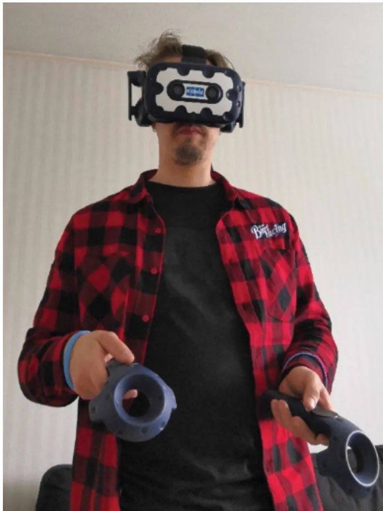  
Source: Siltanen et al. (2021) MDPI / CC BY 4.0

The difficult part was working out how to test remote collaboration where the participants and observers were all in different locations. The way they  did this was to link them up  in the different locations using the VR software  environment DesignSpace. Figure 15.5 shows screen shots from one of the setups using this software. As shown, the participants and observers are represented virtually in different spaces; the participant on the left is operating machinery, and a team of observers is in the space on the right.

Figure 15.6 shows a schematic of the complete setup used in the first testing case study, which took place across four different locations. A remote facilitator wearing a head-mounted display (HMD) was in the first location, and an observer with an HMD and tech support person were in the second location. One participant with an HMD was in a third location, and two participants were in a fourth location, one of whom was wearing an HMD, and the other was using a desktop computer. There was also an on-site assistant in the fourth location.


Figure 15.5 Screenshots from the DesignSpace VR environments   
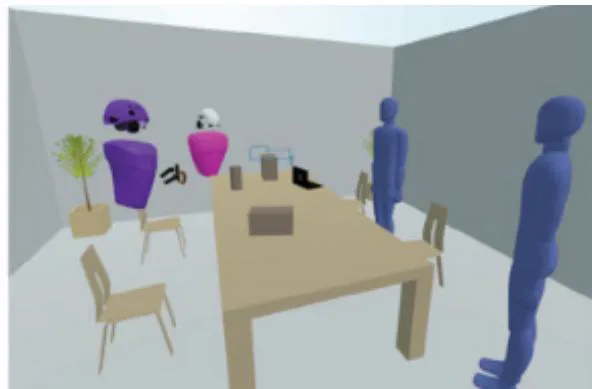  
Source: Siltanen et al. (2021) MDPI / CC BY 4.0

Figure 15.6 The testing setup used with the DesignSpace environment   
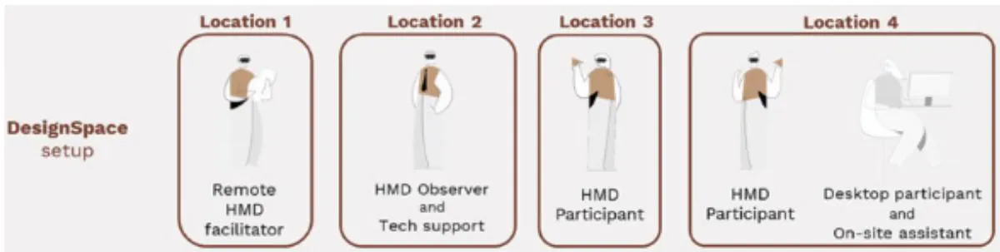  
Source: Siltanen, S. 2021 / MDPI / CC BY 4.0

Because of social distancing and the need to disinfect equipment, facilitators could not help participants put on equipment, and the instructions telling the participants what to do had to be presented  on  large screens rather  than face-to-face. Traveling  between  sites was not  allowed either  or was limited. Furthermore, as conditions  changed due  to COVID, so did the test setup. Collecting data became trickier. For example, facial masks resulted in participants’ comments  being muffled, and facial expressions, which are important  data, were hard to gauge.

Microsoft’s Teams was used for communication between everyone involved in the tests across all the sites. A mixed-methods approach was used for data collection in which notes, pictures, and  videos  were  collected  of participants’  interactions  with  each  other and  with the technology. The data was analyzed using the affinity diagramming technique to identify related  concepts. Insights  that  were  reported  from  this  remote  user  testing  setup  included that Teams or a similar collaboration tool was useful for organizing the remote user testing arrangements using VR. The authors also recommend that it is advisable to record the test session for later reference, and they recommend using a camera that films the whole test site. Sometimes the test participant was alone at a test location, so the researchers advise having an assistant located nearby in case there are problems. When facilitation is done remotely, the setup needs to be managed very carefully; there needs to be a dress rehearsal to ensure that

all the equipment is working correctly and the participant knows what to expect and what to do. Some of these issues are also important for in-person testing, but they are especially so for remote testing. Siltanen et al.’s situation was particularly tricky as they were trying to achieve remote testing of complex systems with experts in XR, where people were in multiple remote locations and different spaces, whereas prior to the pandemic they were all in the lab with a sophisticated usability lab setup. Here they had to reconfigure the tech in ways to simulate this setup, which was a remarkable achievement.

# ACTIVITY 15.3

1. What might have been some of the problems that the researchers encountered when they switched to remote user testing with XR?   
2. How might the  precautions around ensuring people’s safety during the  COVID-19 pandemic have contributed to the complexity of this remote testing?

# Comments

1. There are  many potential technical and social problems that the researchers might have encountered. On the technical side these included that the research team needed to ensure they had sufficient head-mounted displays and a reliable way to send them to the experts who would participate in the tests. On the social side, some of the experts may have had limited  experience with XR even though they were experts in dealing with the  systems being tested. No one  likes to be seen struggling to use unfamiliar equipment, and some experts may have been nervous about stepping outside of their normal comfort zone to participate in remote testing using XR. You may have thought of other potential problems.   
2. An added complexity was the need to ensure that all the equipment and the testing vicinity was sanitized after every participant and that social distancing was maintained in order to keep participants, on-site assistants, and tech support people safe.

For more information about the different cases and the way Sanni Siltanen and her colleagues adjusted their test procedures due to COVID-19 restrictions, see the article “There’s always a way: Organizing VR tests with remote and hybrid setups during a pandemic - learning from five case studies” at doi.org/10.3390/ mti5100062.

For  another example  of  usability  testing,  see  the  report  “Case  Study: Iterative Design and Prototype Testing of the NN/g Homepage” by Kathryn Whitenton and  Sarah  Gibbons  from  the  Nielsen  Norman  Group  (August  26,  2018), which  describes  how  user  testing  with  prototypes  may  be  integrated  into  the design  process.  You  can  view  this  report  at  www.nngroup.com/articles/ case-study-iterative-design-prototyping.

# 15.3 Conducting Experiments

When conducting experiments in research contexts, specific hypotheses are tested that make a prediction about the way people will perform with an interface. The benefits are more rigor and confidence that one interface feature is easier to understand or faster to use than another. An example of a hypothesis is that context menus (that is, menus that provide options related to the context  determined by  the users’ previous choices) are easier to select from  as compared to cascading menus.

Hypotheses are  often  based  on a theory,  such as Fitts’  law (see Chapter 16), or previous research findings. Specific measurements provide a way of testing the hypothesis. In the example mentioned earlier, the ease of selecting menu options could be compared by measuring the amount of time taken by participants when selecting from each menu type. Counting the number of errors made would indicate the accuracy of selection.

# 15.3.1  Hypotheses Testing

Typically, a hypothesis involves examining a relationship between  two things, called variables.  Variables  can  be  independent  or  dependent.  An  independent  variable  is  what  the researcher manipulates (that is, selects), and in the previous example, it is the different menu types. The other variable is called the dependent variable, and in our example this is the time taken to select an option. It is a measure of user performance and, if our hypothesis is correct, will vary depending on the different types of menus.

When  setting  up  a  hypothesis  to  test  the  effect  of  the  independent  variable(s)  on  the dependent variable, it is normal to derive a null hypothesis and an alternative one. The null hypothesis in our example would state that there is no difference in the time it takes participants to find items (that is, the selection time) between  context and  cascading menus. The alternative hypothesis would state that there is a difference between the two regarding selection time. When a difference is specified but not how they will differ, it is called a two-tailed hypothesis. This  is because  it  can  be  interpreted  in two  ways:  It  is  faster  to select  options either from the context menu or from the cascading menu. Alternatively, the hypothesis can be stated in terms of one effect. This is called a one-tailed hypothesis, and it would state that “it  is  faster  to select  options  from  context  menus,” or  vice  versa. A  one-tailed  hypothesis would be  preferred  if  there  was  a  strong reason  to  believe  it  to  be  the  case. A  two-tailed hypothesis would be chosen if there was no reason or theory that could be used to support the case that the predicted effect would go one way or the other.

You might ask why you need a null hypothesis, since it seems to be the opposite of what the experimenter wants to find out. It is put forward so that the data can reject a statement without necessarily supporting the opposite statement. If the experimental data shows a big difference between selection times for the two menu types, then the null hypothesis that the menu type has no effect on selection time can be rejected, which is different from confirming the alternative hypothesis. Conversely, if there is no difference between the two, then the null hypothesis cannot be rejected (that is, the claim that it is faster to select options from context menus is not supported).

To test  a  hypothesis,  the  researcher  has  to  set  up  the  conditions  and  find  ways  to keep other variables constant  to prevent them  from influencing  the findings. This is  called

experimental design. Examples of other variables that need to be kept constant for both types of menus might include size and screen resolution. For example, if the text is in 10-point font size in one condition and 14-point font size in the other, then it could be this difference that causes the effect (that is, differences in selection speed are due to font size). More than one condition can also be compared with the control, for example Condition $1 =$ Context menu; Condition $2 =$ Cascading menu; and Condition $3 =$ Scrolling.

Sometimes, a researcher  might  want to  investigate the relationship  between  two independent variables, for example, age and educational background. A hypothesis might be that young people are faster at searching the web than older people and that those with a scientific background are more effective at searching the web. An experiment would be set up to measure  the time it takes to complete the task and the number of searches carried out. The analysis of the data would focus on the effects of the main variables (age and background) and also look for any interactions among them.

Hypothesis testing can also be extended to include even more variables, but it makes the experimental design more complex. An example is testing the effects of age and educational background  on  participant  performance  for  two  methods  of  web  searching:  one  using  a search engine and the other manually navigating through links on a website. Again, the goal is to test the effects of the main variables (age, educational background, and web searching method) and to look for any interactions among them. However, as the number of variables increases in an experimental design, it makes it more  difficult to work out  what is causing the results from the data.

# 15.3.2  Experimental Design

A  concern  in experimental  design is  to determine which  participants  to involve for which conditions in an experiment. The experience of participating in one condition will affect the performance of those participants if asked to participate in another condition. For example, having learned about the way the heart works by watching a YouTube video, if one group of participants  was exposed  to the same  learning material via another  medium, for instance, virtual reality, and another group of participants was not, the participants who had the additional exposure to the material would have an unfair advantage. Furthermore, it would create bias if the participants in one condition within the same experiment had seen the content and the others had not. The reason for this is that those who had the additional exposure to the content would have had more time to learn about the topic, and this would increase their chances of answering more questions correctly. In some experimental designs, however, it is possible to use the same participants for all conditions without letting such training effects bias the results.

The  names  given  for  the  different  designs  are  different-participant  design,  sameparticipant design, and matched-pairs design. In different-participant design, a single group of participants is allocated randomly to each of the experimental conditions so that different participants perform in different conditions. Another term used for this experimental design is  between-participants design  (also  called  between-subjects  design). An advantage  is  that there are no ordering or training effects caused by the influence of participants’ experience on one set of tasks to their performance on the next set, as each participant only ever performs under one condition. A disadvantage is that large numbers of participants are needed so that the effect of any individual differences among participants, such as differences in experience

and expertise, is minimized. Randomly allocating the participants and pretesting to identify any participants that differ strongly from the others can help.

In same-participant design (also called within participant design or same subjects design), all  participants  perform  in  all  conditions  so  that  only  half  the  number  of  participants  is needed; the main reason for this design is to lessen the impact of individual differences and to see how performance varies across conditions for each participant. It is important to ensure that the order in which participants perform tasks for this setup does not bias the results. For example, if there are two tasks, A and B, half the participants should do task A followed by task B, and the other half should do task B followed by task A. This is known as counterbalancing. Counterbalancing  neutralizes possible unfair  effects of learning from  the first  task, known as the order effect.

In matched-participant design (also known as pair-wise design), participants are matched in pairs based on certain user characteristics such as expertise and gender. Each pair is then randomly  allocated  to  each  experimental  condition. A  problem  with  this  arrangement  is that other important variables that have not been considered may influence the results. For example, experience  in  using  the  web  could  influence  the  results  of  tests  to  evaluate  the navigability of a website. Therefore, web expertise would be a good criterion for matching participants. The advantages and disadvantages of using different experimental designs are summarized in Table 15.2.

Table 15.2 The advantages and disadvantages of different allocations of participants to conditions   

<table><tr><td>Design</td><td>Advantages</td><td>Disadvantages</td></tr><tr><td>Different participants(between-participants design)</td><td>No order effects.</td><td>Many participants are needed.
Individual differences among 
participants are a problem, which 
can be offset to some extent by 
randomly assigning to groups.</td></tr><tr><td>Same participants(within-participants design)</td><td>Eliminates individual 
differences between 
experimental conditions.</td><td>Need to counterbalance to avoid 
ordering effects.</td></tr><tr><td>Matched participants(pairo-wise design)</td><td>No order effects. The effects 
of individual differences 
are reduced.</td><td>Can never be sure that participants 
are matched across variables that 
might affect performance.</td></tr></table>

The data collected to measure  participants’ performance on the tasks set  in an experiment usually includes response times for subtasks, total times to complete a task, and number of errors  per  task. Analyzing  the data  involves comparing  the performance  data  obtained across the  different  conditions. The  response  times, errors, and  so  on, are  averaged across conditions to see  whether there are  any  marked  differences. Statistical  tests are  then used, such as $t$ -tests that  statistically compare the differences between  the conditions, to reveal  if these  are  significant. For  example, a $t { \cdot }$ -test  will reveal  whether  it  is  faster  to select  options from context or cascading menus.

# 15.3.3  Statistics: $\scriptstyle { \mathbf { \pmb { t } } }$ -tests

There are many types of statistics that can be used to test the probability of a result occurring by chance, but $t$ -tests are one of the most widely used statistical test in HCI and related fields, such as psychology. The scores, for example, time taken for each participant to select items from a menu in each condition (that is, context and cascading menus), are used to compute the means $( { \overline { { x } } } )$ and standard deviations (SDs). The standard deviation is a statistical measure of  the spread or variability  around the mean. The $t$ -test uses  a simple  equation to  test the significance  of the difference between the  means for the  two  conditions. If  they are significantly different from each other, we can reject the null hypothesis. A typical $t$ -test result that compared menu  selection times  for two groups  with  9 and 12  participants  each might  be as follows:

$$
\mathrm {t} = 4. 5 3, \mathrm {p} <   0. 0 5, \mathrm {d f} = 1 9
$$

The $t$ -value of 4.53 is the score derived from applying the $t$ -test; df stands for degrees of freedom, which represents the number of values in the conditions that are free to vary. This is a complex concept that we will not explain here other than to mention how it is derived and that it is always written as part of the result of a $t { \cdot }$ -test. The df values are calculated by summing  the number  of participants  in one condition minus 1 and the number of participants in the  other condition minus 1. It is calculated as $\mathrm { d f } = \left( N _ { a } - 1 \right) + \left( N _ { b } - 1 \right)$ , where $N _ { a }$ is the number  of participants  in one condition and $N _ { b }$ is  the  number of participants in the  other condition.  In  our  example, $\operatorname { d f } = { \big ( } 9 - 1 { \big ) } + { \big ( } 1 2 - { \overset { \circ } { 1 } } { \big ) } = 1 9$ , $\boldsymbol { p }$ is  the  probability  that  the  effect found did not occur by chance. So, when $\textstyle p < 0 . 0 5$ , it means that the effect found is probably not  due to chance  and that there is  only a 5 percent possibility that it could be by  chance. In other words, there most likely is a difference between the two conditions. Typically, a value of $\textstyle p < 0 . 0 5$ is considered good enough to reject the null hypothesis, although lower levels of $\boldsymbol { p }$ are more convincing; for instance, $ { p } < 0 . 0 1$ where the effect found is even less likely to be due to chance, there being only a 1 percent chance of that being the case.

This video is a plenary talk given by danah boyd in which she discusses her research about the use of statistics for the U.S. Census. It illustrates how using statistics responsibly is much harder than we might imagine, but which is important in science and politics. You can see an interview with danah at the end of this chapter.

www.youtube.com/watch?v=kSdGG6wEE9k

# 15.4  In-the-Wild Studies

Increasingly, more evaluation studies are being done in natural settings, which have traditionally been known as field studies. During the  last 20 or so years, evaluators and researchers have  organized  studies  in  which  they  exert  little  or  no  control  on  participants’  activities. These  studies  are  more  aptly referred  to as in-the-wild  (Rogers  and Marshall, 2017). This

change is largely a response to technologies being developed for use outside of office settings. For example, mobile, ambient, IoT, and other technologies are now available for use in the home, outdoors, and in public places. Typically, in-the-wild studies are conducted to evaluate people’s experiences with technology  wherever  it is going to  be used, as  in the case of  the Ethnobot study (Tallyn et al., 2018) discussed in Chapter 14.

In contrast to studies in controlled environments, studies in the wild tend to be “messy” in the sense that activities often overlap and may be constantly interrupted by events that are not predicted or controlled such as phone calls, texts, rain if the study is outside, and different people coming and going. This is typical of the way that people interact with products in their everyday worlds. Evaluating how people think about, interact with, and integrate products within the settings in which they will be used, gives a better sense of how successful the products will be when used in the real world. The trade-off is that, compared with studies in a lab, it is harder to test specific hypotheses about an interface because many environmental factors that influence the interaction are not controlled. This makes it more difficult to determine what causes a particular type of behavior or what is problematic about the usability or user experience of a product.

In-the-wild  studies  can  range  in  time  from  a  few  minutes  to  several  months  or  even years and can involve just a few  people or several hundred. In the clinical trials  of an app called Mobile Diabetes Detective, conducted by Lina Mamykina and her colleagues, patients track their own blood glucose levels to self-monitor their diabetes (Mamykina et al., 2021). Patients take  readings of  their blood glucose at  set times, such as when  they wake, before or after meals, etc. They can decide exactly when they do their tests as long as they stick to the same routine so that the readings can be compared and patterns identified. For example, if a patient’s reading is high after a particular meal, the  patient will be encouraged to make changes to their diet. This study lasted  for five years, but each patient participated for just one year. In another study, Bill Gaver and his colleagues gave nature enthusiasts information about how to make their own cameras for tracking wildlife. The researchers examined what the participants  did, how they used the cameras, and their opinions about  their experience (Gaver et al., 2019). More than 1,000  people participated. The researchers  did not  report the study as an in-the-wild study, but the lack of control over what participants did with the cameras and the prolonged period of uninterrupted observation by the researchers are characteristic of in-the-wild studies.

Data  collected for in-the-wild  studies  primarily consists  of observing and interviewing people, such as by collecting video, audio, field notes, and photos to record what occurs in the chosen setting. Usage data can also be automatically logged from the technologies they are  using  (e.g.,  ambient  displays,  mobile  devices).  In  addition,  participants  may  be  asked to  fill  out  paper-based  or  electronic  diaries, which  run  on  smartphones,  tablets, or  other handheld  devices, at particular  points during the  day. The kinds  of reports that  can be of interest to researchers include when participants are interrupted during an ongoing activity or when they encounter a problem  when interacting with a product  or when they are in a particular location, as well as how, when, and if they return to the task that was interrupted. This approach is based on the experience sampling method (ESM), discussed  in Chapter 8, which is often used in healthcare (Price et al., 2018). Data about the frequency and patterns of  certain  daily  activities,  such as  the  monitoring  of eating  and  drinking  habits,  or  social interactions like phone and face-to-face conversations, are often recorded. Software running

on a smartphone may trigger messages, like those used in the Painpad study discussed in a moment, alerting  participants  at certain  intervals,  requesting them  to  answer questions  or fill out  dynamic forms and checklists. These might  include recording what  the participants are doing, what they are feeling like at a particular time, where they are, or how many conversations  they have had  in the  last hour. The  findings from  studies in natural settings  are typically reported  in the  form of vignettes, excerpts, critical incidents, patterns of behavior, and narratives to show how the products are being used, adopted, and integrated into their surroundings.

As in any kind of evaluation, when conducting in-the-wild studies, deciding whether to tell the people involved that they are being studied and how long  the study or session will last is  more difficult than in a laboratory situation. In some studies, like the diabetes study (Mamykina et al., 2021) and other health studies, patients expect their behavior to be monitored, but in other studies monitoring may be less obvious. For example, if people are using a smartphone street map app while walking in a city, their interactions may take only a few seconds, so informing them that they are being studied may disrupt their behavior. It is also important  to  ensure  the  privacy  of  participants,  especially  for  studies  in  the  home  where people may not want their behavior to be recorded all the time. For these in-the-wild studies, evaluators will need to work out and agree with the participants what part of the activity is to be recorded and how. If evaluators want to set up cameras, they need to be situated unobtrusively, and participants need to be informed in advance about where the cameras will be and when they will be recording their activities. There also needs to be a plan to determine what happens if equipment breaks down or there is some other unforeseen event such as a family member in the study becoming unwell. Security arrangements will need to be made if expensive or precious equipment is being evaluated in a public place. Other practical issues may also need to be considered depending on the location, product being evaluated, and the participants in the study. For example, if the study is outdoors, what happens if it rains?

Instead of developing solutions that fit in with existing practices and settings, researchers often explore new technological possibilities that can change and even disrupt participants’ behavior (Rogers, 2011). Opportunities are created, interventions are installed, and different ways of behaving are encouraged. A key concern is how people react, change, and integrate the technology into their everyday lives. The outcome of conducting in-the-wild studies for different  periods  and at  different  intervals  can  be  revealing, demonstrating  quite  different results  from those arising out of lab studies. Comparisons  of findings from lab  studies and in-the-wild  studies  have  revealed  that  while  many  usability  issues  can  be  uncovered  in  a lab study, the way  the technology is  actually used can  be difficult to discern. These  aspects include how participants  approach the new technology, the kinds of benefits  that they can derive from it, how they use it in everyday contexts, and its sustained use over time (Rogers et al, 2013; Kjeldskov and Skov, 2014; Harjuniemi and Häkkila, 2018).

The case study in 15.4.1 describes how researchers evaluated a pain-monitoring device in the natural setting of a hospital with patients who had just had surgery. Box 15.2 discusses situations in which evaluation of visualization tools for use by experts needs to be done over a period of several days, weeks, or months in order for the experts to learn to use the tools. Box  15.3  addresses  the  tricky  question  of  how  many  participants  should  be  involved  in different types of user studies.

# 15.4.1  Case Study: An In-the-Wild Study of a Pain Monitoring Device

Monitoring patients’ pain and ensuring that the amount of pain experienced by them after surgery is  tolerable is  an  important  part  of helping patients to  recover. However, accurate pain monitoring  is a  known problem  among physicians, nurses, and caregivers. Collecting scheduled pain readings takes time, and it can be difficult because patients may be asleep or may not want to be bothered. Typically, pain is managed in hospitals by nurses asking patients to rate their pain on a 1–10 scale, which is then recorded by the nurse in the patients’ records.

Before  launching  this  study, Blaine  Price  and  his  colleagues  (Price  et  al.,  2018)  had already spent a considerable amount of time observing patients in hospitals and talking with nurses. They had also carried out usability tests to ensure that the design of Painpad, a painmonitoring tangible device for patients to report their pain levels, was functioning properly. For example, they checked the usability of the display and appropriateness of the case covering the device for use in a hospital environment and whether the LED display was working and was readable. In other words, they ensured that they had a well-functioning prototype for the study that they planned to carry out.

The goal of their in-the-wild study was to evaluate the use of Painpad by patients recovering from ambulatory surgery (total hip or knee replacement) in the natural environments of two UK hospitals. Painpad (see Figure 15.7) enables patients to monitor their own pain levels by pressing the keys on the pad to record their pain rating. The researchers were interested in many  aspects related  to how  patients  interacted with Painpad, particularly  how robust and easy  it was to use  in the hospital environments. They  also wanted to see whether the patients rated their pain every two hours as they were asked to do and how the patients’ ratings using Painpad compared with the ratings that the nurses collected. They wanted to look for insights about the preferences and needs of the older patients who used Painpad and for design insights around visibility, customizability, ease  of operation, and the contextual factors that affected its usability in hospital environments.

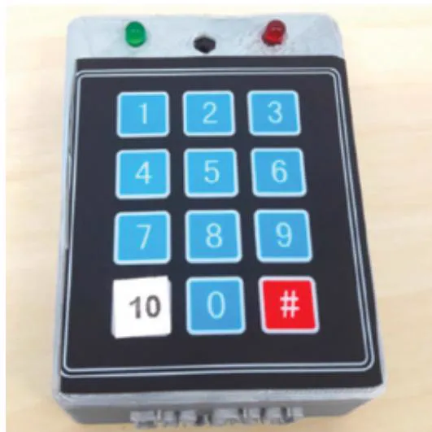  
Figure 15.7 Painpad, a tangible device for inpatient self-logging of pain Source: Price et al. (2018). Reproduced with permission of ACM Publications / CC BY 4.0

# Data Collection and Participants

Two  studies were conducted that involved 54  people (31 in  one study and 23 in  another). Data screening excluded participants who did not provide data using Painpad or for whom the nurses did not collect data that could be compared with the Painpad data. Because of the confidential nature of the study, ethical considerations were carefully applied to ensure that the  data  was  stored  securely  and  that  the  patients’  privacy  was  assured. Thirteen  of  the patients were male, and 41 were female. They ranged in age from 32–88 years old, with mean and median ages of 64.6 and 64.5. The time they spent in the hospital ranged from 1–7 days, with an average stay of 2–3 days.

After returning from surgery, the patients were each given a Painpad that stayed by the side of their bed. Patients were encouraged to use it at their earliest convenience. The Painpad was  programmed to  prompt  the  patients to  report their pain  levels every  two  hours. This two-hour interval was based on the hospital’s desired clinical target for collecting pain data. Each time a pain rating was due, alternating red and green lights flashed on the Painpad for up to five minutes, and an audio notification of a few seconds sounded. The patients’ pain rating  was automatically time-stamped by  the Painpad and stored in a secure database. In addition  to the pain scores collected using Painpad, the nurses collected verbal pain scores from  the patients every two hours. These scores were entered into the patients’  charts and later entered into a database by a senior staff nurse and made available to the researchers for comparison with the Painpad data.

When the patients were ready to leave the second hospital mentioned, they were given a short questionnaire that asked whether Painpad was easy to use, how often they made mistakes using it, and whether they noticed the flashing light and sound notifications. They were also asked to rate how satisfied they were with Painpad on a 1–5 Likert rating scale and to make any other comments that they wanted to share about their experience in a free text field.

# Data Analysis and Presentation

Three types of data analysis were used by the researchers. They examined how satisfied the patients were with Painpad based on the questionnaire responses, how the patients complied with the bi-hourly requests to rate their pain on Painpad, and how the data collected with Painpad compared with the data collected by the nurses.

Nineteen  fully  completed  patient  satisfaction  questionnaires  were  collected  that  indicated that Painpad was well received and easy to use (mean rating 4.63 on a scale 1–5, where 5 was the highest rating) and that it was easy to remember to use it. Sixteen of the respondents commented that they never made an error entering their pain ratings, the aesthetics of Painpad were rated as “good,” and participants were “mostly satisfied” with it. Responses to the  flashing lights  to draw patients’ attention  to Painpad  were  polarized. Most  patients noticed the lights most of the time, while others noticed the lights only sometimes, and three patients said they did not  notice them at all. The effectiveness of the sound alert received a middle rating; some patients thought it was “too loud and annoying,” and others thought it was too soft. More nuanced reactions and ideas were collected from  the free-text response box  on  the  questionnaire.  For  example,  one  patient  (P49)  wrote, “I  think  it  is  useful  for monitoring the pattern of pain over the day, which can be changeable.”Another patient (P52) commented, “A day-to-day chart might be helpful.” Some patients, who had limited dexterity or other challenges, reported how their ability to use Painpad was compromised because Painpad was sometimes hard to reach or to hear.

After  removing  duplicate  entries, there  were 824  pain scores  provided by  the patients using  Painpad  compared with  645  scores  collected  by  the nurses. This  indicated  that  the patients  recorded  more  pain  scores  than  would  typically  be  collected  in  the  hospital  by nurses. To examine how the patients complied with using Painpad every two hours compared with the scores collected by the nurses, the researchers had to define acceptable time ranges of compliance. For example, they accepted all of the time scores that were submitted 15 minutes before and 15 minutes  after the bi-hourly time schedule for reporting time scores. This analysis showed  that the Painpad scores indicated  stronger compliance  with the two-hour schedule than with scores collected by the nurses.

Overall, the evaluation of Painpad indicated that it was a successful device for collecting patients’ pain  scores in hospitals. Of course, there  are  still more questions  for Blaine  Price and his team  to investigate. An obvious  one is  this: “Why  did the patients  give more pain scores and adhere  more strongly to the scheduled pain  recording times with Painpad than with the nurses?”

# ACTIVITY 15.4

1. Why do you think Painpad was evaluated in-the-wild (i.e., in the natural hospital setting) rather than in a controlled laboratory setting?   
2. Two types of data were collected in the study: pain ratings and patient satisfaction questionnaires. What does each type contribute to our understanding of the design of Painpad?

# Comment

1. The researchers wanted to find out how Painpad would be used by patients who had just had ambulatory surgery in hospital settings. They wanted to know whether the patients liked using Painpad and whether they liked its design and what problems they experienced when using it over a period of several days. During the early development of Painpad, the researchers carried out several usability evaluations to check that it was suitable for testing in hospital environments. It is not possible to do the kind of study described in a laboratory because it would be difficult, if not impossible, to create realistic and often unpredictable events that happen in hospitals (for example, visitors coming into the ward, conversations with doctors and nurses, and so forth). Furthermore, the kind of pain that patients experience after surgery does not usually occur outside of a hospital, nor can it be simulated in participants in lab studies. The researchers had already evaluated Painpad’s usability, and in this study they wanted to see how it was used in hospitals.

2. Two kinds of data were collected. Pain data was logged on Painpad and recorded independently by the nurses every  two hours. This data enabled the researchers to compare the pain data recorded using Painpad with the data collected by the nurses. A patient satisfaction questionnaire was also given to some of the patients. The patients answered questions by selecting a rating from a Likert scale. The patients were also invited to give comments and suggestions in a free text box. These comments helped the researchers to get a more nuanced  view of the  patients’  needs, likes, and  dislikes. For  example, they learned that some patients were hampered from taking full advantage  of Painpad  because  of other problems, such as poor hearing and restricted movement.

# BOX 15.2

# Long-Term Studies

Some studies require researchers to leave their designs with participants for extended periods of time so that the participants have time to learn how to use the product. Ben Shneiderman and Catherine Plaisant adopted this approach when evaluating a visualization tool designed for use by experts (Shneiderman and Plaisant, 2006). To evaluate the efficacy of such tools, participants are  best studied  in realistic  settings in their  own  workplaces so they can  use their  own  data and  set their  own agendas  for  extracting insights relevant to their  professional projects.

Shneiderman’s and Plaisant’s long-term evaluation studies typically started with an initial interview in which the  researchers checked that the participant has a problem to work on, available data, and a schedule for completion. Then the participant undertook an introductory training session with the tool, followed by 2–4 weeks of novice usage, followed by 2–4 weeks of mature usage, leading to a semi-structured exit interview. More data, such as daily diaries, automated logs of usage, structured questionnaires, and interviews can also be collected to provide a multidimensional understanding of the weaknesses and strengths of the tool.

Because of the complexity of some visualization tools, it can be difficult to find suitably skilled people to participate in these evaluations, so the number of participants is often small, sometimes fewer than five. Other evaluators have reported that evaluating complex visualization tools designed to run on mobile devices and smartphones can be difficult for participants because of the small screen size, so participants may need extra time to familiarize themselves with the  product before the evaluation study begins, which extends  the  overall study  time (Bentley et al., 2021).

# BOX 15.3

# How Many Participants Are Needed When Carrying Out an Evaluation Study?

The  answer to this question depends  on the  goal of the  study, the  type of study  (such  as usability, experiment,  in-the-wild  or another  type), and  the  constraints  encountered  (for instance, schedules, budgets, recruiting representative participants, and the facilities available). Chapter 8, discussed this question more broadly. The focus here is on the main types of evaluation studies discussed in this chapter: usability studies, experiments, and in-the-wild studies.

# Usability Studies

Many professional usability  consultants  used to recommend 5–12 participants for studies conducted in controlled or partially controlled settings. However, as the  study of the  iPad illustrates, six participants generated a lot of useful data. While more participants might have

(Continued)

been preferable, Radiu Budiu and Jakob Nielsen (2010) were constrained in that they needed to complete their study  and  release their  results quickly. Budiu and  Nielsen  (2012) subsequently commented that “If you want a single number, the answer is simple: test five users in a usability study. Testing with five people lets you find almost as many usability problems as you’d find using many more test participants.” Others say that as soon as the same kinds of problems start being revealed and there is nothing new, it is time to stop.

# Experiments

Knowing how many participants are needed in an experiment depends on the type of experimental design, the number of dependent variables being examined, and the kinds of statistical tests that will be used. For example, if different participants are being used to test two conditions, more participants will be needed than if the same participants test both conditions. These kinds of differences in experimental design influence the type of statistics used and the number of participants needed. Therefore, consulting with a statistician or referring to books and articles such as those by Caine (2016) and Cairns (2019) is advisable. Fifteen participants are suggested as the minimum for many experiments (Cairns, 2019).

# In-the-Wild Studies

The number of participants in an in-the-wild study will vary, depending on what is of interest: it may be a family at home, a software team in an engineering firm, children in a playground, a whole community in a living lab, or even tens of thousands of people online. Although inthe-wild studies may not be representative of how other groups would act, the detailed findings gleaned from these studies about how participants learn to use a technology and adapt to it over time can be very revealing.

# In-Depth Activity

This in-depth activity continues work on the online booking facility introduced at the end of Chapter 11, “Discovering Requirements,” and continued in Chapter 12, “Design, Prototyping and Construction.” Using any of the prototypes that you have developed to represent the basic structure of your product, follow these instructions to evaluate it:

1. Based on your knowledge of the requirements for this application, develop a standard task (for instance, booking two seats for a particular performance).   
2. Consider the relationship between yourself and your participants. Do you need to use an informed consent form? If so, prepare a suitable informed consent form. Justify your decision and the contents of the form.   
3. Select three typical participants, who can be friends or colleagues, and ask them to do the task using your prototype.   
4. Note the problems that each participant encounters. If possible, time how long they take to complete the task. (If you happen to have a camera or a smartphone with a camera, you could film each participant.)

<!-- Chunk 12 End -->


<!-- Chunk 13 Start -->

5. Since the application is not actually implemented, you cannot study it in typical settings of use. However, imagine that you are planning a controlled usability study and an in-thewild study in a natural setting. How would you do it? What kinds of things would you need to take into account? What sort of data would you  collect, and  how would  you analyze it?   
6. What are the main benefits and problems with doing a controlled study versus studying this prototype in-the-wild?

# Summary

This chapter described evaluation studies in different settings. It focused on experiments conducted as controlled laboratory studies  and in-the-wild  studies situated in natural settings. A study of the iPad when it first came out was presented as an example of usability testing. A second case study focused on the strategies needed to remotely evaluate products with experts using VR. These studies occurred across different locations and were very complex. Because of the COVID-19 pandemic, there was the added problem of how to keep evaluators and participants safe, which involved using Teams—a  group chat software for communication—so participants and evaluators could be distanced from each other.

Experimental design was then discussed that involves testing a hypothesis in a controlled research lab. The chapter ended with a discussion of in-the-wild studies in which participants use prototypes and new technologies in natural settings. The Painpad example involved evaluating how  patients in two hospitals, who  were recovering from surgery, used the  mobile Painpad device designed to enable them to self-monitor their pain levels throughout the day.

Key differences between usability testing and in-the-wild studies include the location of the  study—usability lab  or makeshift  usability lab, living lab or online distributed remote, research lab, or natural, in-the-wild situation—and how much control is imposed by evaluators and researchers. At one end of the spectrum are experiments and laboratory testing, and at the other are in-the-wild studies. Most studies use a combination of different methods, and designers often have to adapt their methods to cope with unusual new circumstances created when evaluating a new design concept, device, or app.

# Key Points

•  Usability testing usually takes  place in usability  labs or temporary makeshift labs. These labs enable designers and researchers to control the test setting. Versions of usability testing are also conducted remotely, online, and in living labs.   
•  Usability testing focuses on performance measures, such as how long and how many errors are made, when completing a set of predefined tasks. Direct and indirect observation (video and keystroke logging) is conducted and supplemented by participant satisfaction questionnaires and interviews.

•  Mobile and remote testing systems have been developed that are more portable and affordable than usability labs. Many contain mobile eye-tracking and face recognition systems and  other  devices, some of which  are available  in off-the-shelf laptop computers. Many companies continue to use usability labs because they provide a venue for the whole team to come together to observe  and discuss how  participants are  responding to the systems being developed.   
•  Remote usability testing has increased during the last 10 years, especially during the pandemic, stimulated by the need to protect the safety of evaluators and participants. At the same time there have been improvements in technology and  recording and  communication systems.   
•  While remote testing tends to be less expensive than laboratory testing, developing relationships with participants may be more difficult. In addition, body language, especially facial expressions, which are an important data source, may be harder to discern.   
•  In remote testing there may also be issues concerning what can be tested; for example, an app can be downloaded by participants, whereas a device will need to be shipped to them.   
•  Experiments  seek to test a  hypothesis by manipulating certain  variables  while  keeping others constant.   
•  The researcher controls independent variable(s) to measure dependent variable(s).   
•  In-the-wild studies  are carried  out in natural settings. They seek to discover how people interact with a given technology in the real world.   
•  Sometimes the findings of an in-the-wild study are unexpected, especially if the goal is to explore how a novel technology is being used by participants in their own homes, places of work and leisure, or outside.

# Further Reading

CAINE,  K. (2016). Local  Standards  for  Sample  Size  at  CHI.  Chi4good,  CHI  2016,  May 7–12, 2016, San Jose, CA, USA DOI: doi.org/10.1145/2858036.2858498. In this paper, Kelly Caine points out that the CHI community is composed of researchers from a wide range of disciplines (also mentioned in Chapter 1), who use a variety of methods. Furthermore, CHI researchers often deal with constraints (for instance, access to participants for an accessibility study). Therefore, the number of participants involved in a study may be different from the number suggested in standard statistics texts. The discussion in this paper is based on an analysis of papers accepted at the CHI 2014 conference.

CAIRNS,  P.  (2019). Doing  Better  Statistics  in  Human-Computer  Interaction,  Cambridge University Press. This practical book is primarily for HCI researchers when planning or completing the analysis of their data.

CRABTREE,  A.,  CHAMBERLAIN,  A.,  GRINTER,  R.,  JONES,  M.,  RODDEN,  T.,  and ROGERS, Y.  (2013).  Introduction  to  the  special  issue  of “The  Turn to  The Wild.” ACM

Transactions on Computer-Human  Interaction (TOCHI), 20 (3). This collection of articles provides in-depth case studies of projects that were conducted in the wild over many years, from the widespread uptake of children’s storytelling mobile apps to the adoption of online community technologies.

LAZAR. J., FENG, H. J., and HOCHHEISER, H. Research Methods in Human–Computer Interaction. (2nd  ed.).  Cambridge,  MA:  Elsevier/Morgan  Kaufmann  Publishers.  Chapters 2–4 describe how to design experiments and how to perform basic statistical tests.

NIELSEN, J. and BUDIU, R. Mobile Usability. New Riders Press. This classic book asks and attempts to answer the question of how we create usability and a satisfying participant experience on smartphones, tablets, and other mobile devices. There is also a wide range of recent papers available on the NN/G website: nngroup.com.

ROBSON, C. Experiment, Design and Statistics in Psychology (3rd ed.). Penguin UK. This is a classic that provides a useful introduction to experimental design and basic statistics. A more recent book by COLIN ROBSON and  KIERAN McCARTAN (2016)  entitled Real World Research (4th  ed.), published by  John Wiley  &  Sons, is  a valuable  resource for those who want to do research in applied settings. In addition to describing how to collect and analyze data, there is a chapter about ethical and political considerations.


# INTERVIEW with danah boyd

Source: Courtesy of Danah Boyd

danah  boyd  is  a  partner  researcher  at Microsoft  Research,  the  founder  and president of the Data & Society Research Institute, and a distinguished visiting professor  at  Georgetown  University.  In  her research,  danah  examines  the  intersection  of  technology  and  society  with  an eye  to  limiting  how  technology  can  be abused to reinforce inequity. danah wrote

It’s Complicated:  The  Social  Lives  of Networked  Teens  (Yale  University  Press, 2014), which examines teens’ engagement with  social  media.  In  more  recent  work, danah carried out  an ethnographic study of  the  2020  U.S.  Census.  She  blogs  at www.zephoria.org/thoughts and tweets at @zephoria.

(Continued)

danah,  can  you  tell  us  a  bit  about  your research and what motivates you?

I am  an  ethnographer  who  examines  the interplay between  technology  and society. My  work  often  requires  moving  between disciplines, sectors, and frames to get at the complexity  of  our  sociotechnical  world. Fundamentally,  I’m  a  social  scientist  invested  in  understanding  the  social world. Technology shapes  social  dynamics,  providing a fascinating vantage point for understanding cultural practices.

During the 2000s, I researched different aspects of social media, most notably how American teens integrate social media into their  daily  practices.  Because  of  this, I’ve followed  the  rise  of  many  popular  social media services—MySpace, Facebook, You-Tube, Twitter, Instagram, Snapchat, and so on. I examined what teens do on these services, but I also considered how these technologies fit into teens’ lives more generally. Thus, I spent a lot of time driving around the United States talking to teens and their parents,  educators  and  youth  ministers, law enforcement, and social workers, trying to get a sense of what teens’ lives look like and where technology fits in.

During  the  2010s,  I  focused  on  how data-driven technologies are playing a central  role  in  many  facets  of  society. Techniques  like  machine  learning  and  other forms  of  artificial  intelligence  rely  heavily  on  data  infrastructure.  But  what  happens  when  data  is  manipulated,  abused, or biased? My goal was to examine sociotechnical vulnerabilities and imagine ways of minimizing how technology can be used to  reinforce  inequities  or  cause  harm. As Melvin Kranzberg once said, “Technology is neither good nor bad; nor is it  neutral.” This also led me to look at how algorithms get  manipulated  for  different  agendas—

and how  this  shapes  our  politics,  society, and interpersonal interactions.

Starting  in  2018,  I  began  looking  at  a critical  piece  of  data  infrastructure,  one that  plays  a  central  role  in  democracy, combating  discrimination,  and  allocating  resources:  the  U.S.  Census.  I  wanted to understand how data is  made, how  it’s secured,  and  how  it  is  contested.  In  the process, I became interested in how organizations and data infrastructures  are made brittle by various political actors intentionally and unintentionally. I am working on a  book  about  “statistical  imaginaries”  to unpack my findings.

How would you characterize good ethnography?

Ethnography  is  about  mapping  cultural logics and practices. To do this successfully, it’s important  to dive deep into  the everyday  practices  of  a  particular  community and try to understand  them on  their own terms.  It’s important  to  understand  how networks of people and practices intersect, as well  as the  role that  organizations  and institutions and technologies play in shaping  those  communities.  The  next  stage  is to  try  to  ground  what  one  observes  in  a broader  discourse  of  theory  and  ideas  to provide  a  framework  for  understanding cultural dynamics.

Almost  all of my projects involve “networked  field  sites.”  This  means  that  I’m moving between digital contexts and physical ones, interviewing people from different vantage  points,  and  trying  to  understand how networks  of people and practices are structured.

Many  people  ask  me  why  I  bothered driving  around  the  United  States, talking to teens  when I  could  see everything  that they  did  online.  What’s visible  online  is

only  a  small  fraction  of  what  people  do, and it’s easy to misinterpret why teens  do something simply  by looking at the traces of their actions. The  same is true  for government officials; their documents tell one story, but  observing  them  in  various contexts  tells  another. Getting  into  people’s lives, understanding their logics, and seeing how technology connects with daily practice is  critically important. Our sociotechnical worlds are entangled, and it’s critical to make sense of those tangled hairballs to understand phenomena, even when pulling on  a  string  might  unravel  the  hairball  in unexpected ways.

Of  course,  this  is  just  the  data  collection  process. I’m  also  a  firm  believer that analysis is iterative and that it’s important to include  other stakeholders  in  that  process.  I  believe  in  member-checking.  For two  decades,  I  blogged  my  “in-process thinking”  in  part  to  enable  a  powerful feedback loop that I’ve deeply relished. Engaging with government  officials, I’ve had to take a different tactic; given the political context  in which  I was working, it  wasn’t possible for me to blog what I was observing. However, my commitment to iterative and participatory research continues; I regularly “workshop my papers and analyses” with my informants as part of my research process.

I  know  you  have encountered  some surprises—or  maybe  even a  revelation— in your work on  Facebook and MySpace. Would you tell us about it, please?

From 2006–2007, I was talking with teens in  different  parts  of  the  country, and  I started  noticing  that  some  teens  were talking  about  MySpace,  and  some  teens were  talking  about  Facebook.  In  Massachusetts,  I  met  a  young  woman  who uncomfortably told me that the Black kids

in her school were on MySpace, while the white kids were on Facebook. She described MySpace  as  “like  ghetto.” I  didn’t enter into this project expecting to analyze race and  class  dynamics  in  the  United  States, but,  after her  comments, I  couldn’t  avoid them.  I  started  diving  into  my  data,  realizing that race and class could explain the difference  between  which  teens  preferred which  sites.  Uncomfortable  with  this  and totally afar from my intellectual strengths, I wrote a really awkward blog post about what I was observing. For better or worse, the BBC picked this up as a “formal report from  UC  Berkeley,” and  I  received  more than 10,000 messages over the next week. Some  were  hugely  critical,  with  some making  assumptions  about  me  and  my intentions. But the teens who wrote consistently agreed. And  then two  teens  started pointing  out  to  me  that  it  wasn’t  just  an issue of choice but an  issue of movement, with  some  teens  moving  from  MySpace to  Facebook  because  MySpace  was  less desirable  and  Facebook  was “safe.” Anyhow, recognizing  the  racist  and  classist roots  of  this,  I  spent  a  lot  of  time  trying to unpack the different language that teens used  when  talking  about  these  sites  in  a paper  called “White  Flight  in  Networked Publics?  How  Race  and  Class  Shaped American Teen Engagement with MySpace and Facebook.”

This  might  all  seem  antiquated  these days,  but  the  patterns  I  witnessed  in MySpace and Facebook continue to repeat themselves.  The  tensions  between  Snapchat  and Instagram  have similar patterns, as does WhatsApp versus iMessage. Moreover, the network  dynamics that underpin all adoption and usage of social media are increasingly  being  manipulated  to  reinforce social divisions within society. I never imagined  that  the  teens  that  I  watched

(Continued)

trying  to  hack  the  attention  economy  in 2004  would  create  a  template  that  could be used to  undermine democratic  conversations  around  the  world  only  a  decade later.

I know you are doing a lot of work on Big Data  and that some of  that is  focused on social media. What  are you  learning,  and what are your concerns for the future?

To be honest, what concerns me the most about  social  media  and  data  analytics  is that  these  technologies  operate  within  a particular formation  of financialized capitalism  that  prioritizes  short-term  profits and cancerous levels of growth over other social values, including democracy, climate sustainability,  and  community  cohesion. Even  when  data-analytics  projects  start from ideal places, it’s hard for those ideals to stay intact as companies grow and face different  kinds of  financial  pressure. As  a result,  the  same  technologies  that  could leverage  data  to  empower  communities are quickly used for exploitative purposes. I  genuinely  struggle  to  balance  my  love of technology with my concern that these tools  will  be  used  to  magnify  inequality, spread  disinformation,  increase  climate risks, and polarize society for political purposes.

I  watched  your plenary  talk  on  “Statistical  Imaginaries:  An  Ode  to  Responsible Data  Science,”  in  which  you  talk  about your current research with the U.S. Census Bureau. Would you please give us a quick overview so  that  students  have an  introduction to the use and misuse of statistics and data privacy in this sociotechnical, political context?

Like  many  governments  around  the world, the United States has a rich official statistics program. The federal government

collects a  wide range of  data  that  inform economic  policy,  public  health,  research, and  the  allocation  of  resources.  Perhaps most famously, the United  States has conducted  a  census  since  1790  to  distribute political power  through a  process known as apportionment.  I’ve spent  the  last four years trying to understand how census data are made. In the process, I’ve come to realize that the public imagination of how censuses are done  is  shockingly disconnected from  the  statistical  work  that  underpins those critical data. The knocking on doors part of the census is a tiny piece of a much larger process designed  to ensure that the government can produce the best possible data  to  reflect  the  population. There  are hundreds  of procedures  involved  in  making those data.

Once those data are produced, the Census  Bureau  wants  to  make  census  data publicly  available  for  use  by  data  users. At  the  same  time,  the  bureau  is  legally, morally, and  procedurally  required  to ensure  statistical  confidentiality.  For decades, the  Census  Bureau  has  engaged in  a  practice  known  as  disclosure  avoidance,  where  the  bureau  chooses  how  to protect  vulnerable  data.  Some  methods involve not publishing certain data; others involve rounding (e.g., 5386 to 5400). Still others involve adding noise to the data to make  it  hard  to  reconstruct  exact  information.  This  latter  set  of  techniques  has proven  quite  controversial,  in  no  small part because it bursts the illusion that the published data are the best possible data.

Census data are never perfect. Even the best laid attempts to count everyone “once and  only  once  and  in  the right  location” tend  to  go  haywire  in  some  places.  Census data are also never neutral. Significant politics  shape  what  is  collected  and  how it’s collected.  And  census  data  can  never

be objective; the methods used to produce these data are rooted in forms of expertise that are not universally valued. At the same time, there  is a  politically  salient “statistical  imaginary” that presumes  that census data can  be neutral and objective, a nearperfect count of everyone. Part of why I’m studying the making of census data is that this  statistical  imaginary  is  coming  undone, revealing  the  politics of  data  along the way.

One  of  the  most  important  things  for students  of data science to understand is

that  all  data  have  uncertainty,  politics, and  illusions  surrounding  them.  Rather  than  ignoring  the  limits  of  data,  it  is better  to  understand  them.  Rather  than pretending  that  data  can  be  neutral  or objective, it’s better to grapple with how society  and  politics  shape  those  data. When we build technical systems (or political  ones!)  that  depend  on  those  data, we carry those uncertainties and illusions forward.  Ensuring  responsible  data  science requires intentionally engaging with these issues.

# Chapter 16

# E V A L U A T I O N :  I N S P E C T I O N S , A N A L Y T I C S ,  A N D  M O D E L S

16.1  Introduction   
16.2  Inspections: Heuristic Evaluation and Walk-Throughs   
16.3  Analytics and A/B Testing   
16.4  Predictive Models

# Objectives

The main goals of this chapter are to accomplish the following:

•  Describe the key concepts associated with inspection methods.   
• Explain how to do heuristic evaluation and walk-throughs.   
•  Explain the role of analytics in evaluation.   
•  Describe how A/B testing is used in evaluation.   
•  Describe how to use Fitts’ law—a predictive model.

# 16.1 Introduction

Most of the evaluation methods described in this book so far have involved interaction with, or direct observation of, users. In this chapter, we introduce methods that are based on understanding users through one of the following:

. Knowledge codified in heuristics   
Data collected remotely   
. Models that predict people’s performance

None of these methods requires users  to be present during the evaluation, so they can be conducted remotely, synchronously or asynchronously. Inspection methods often involve a researcher, sometimes known as an expert, role-playing the users for whom the product is designed, analyzing aspects of an interface, and identifying potential usability problems. The most  well-known  methods  are  heuristic  evaluation  and walk-throughs. Analytics  involves interaction logging, and A/B testing is an experimental method that uses data collected about people’s behavior. Both analytics and A/B testing are usually carried out remotely. Predictive modeling  involves analyzing the various physical and mental operations that are needed to

perform  particular  tasks  and  operationalizing  them  as  quantitative  measures. One  of  the most commonly used predictive models is Fitts’ law.

# 16.2 Inspections: Heuristic Evaluation and Walk-Throughs

Sometimes, it is not  practical to involve participants in an  evaluation because they are not available, there  is  insufficient  time, or  it  is  difficult  to  find  people. In  such  circumstances, other  people, often  referred  to as  experts  or researchers, can  provide  feedback. These  are people  who  are  knowledgeable  about  both  interaction  design  and  the  needs  and  typical behavior  of users. Various  inspection  methods  were developed  as alternatives  to  usability testing in the early 1990s, drawing on software engineering practice where code and other types of inspections are commonly used. Inspection methods for interaction design include heuristic  evaluations and walk-throughs,  in which  researchers examine  the interface  of an interactive product, often role-playing typical users, and suggest problems that people would likely have when interacting with the product. One of the attractions of these methods is that they can be used at any stage of a design project. They can also be used to complement other types of usability testing.

# 16.2.1  Heuristic Evaluation

In heuristic evaluation, evaluators, guided by a set of usability principles known as heuristics, evaluate whether user-interface elements, such as menus, navigation structure, sound, online help, conversational agents, and so on, conform to tried-and-tested principles. These heuristics closely resemble high-level design principles (such as making designs consistent, reducing memory load, and using terms that users understand). Heuristic evaluation was developed by Jakob  Nielsen  and  his  colleagues  (Nielsen  and  Mohlich,  1990;  Nielsen, 1994a)  and  later modified by other researchers to evaluate other types of systems (Hollingshead and Novick, 2007; Pinelle et al., 2009; Harley, 2018a, 2018b, 2018c). In addition, many researchers and practitioners have converted design guidelines into heuristics that are then applied in heuristic evaluation.

The original set of heuristics for HCI evaluation were empirically derived from the analysis  of  249  usability  problems  (Nielsen,  1994b);  an  early  revised  version  of  these  heuristics follows:

Visibility  of System  Status:  The  system  should  always  keep  users  informed  about  what  is going on, through appropriate feedback and within a reasonable time.

Match Between System  and the Real World: The system  should speak the users’ language, with words, phrases, and concepts familiar to the user, rather than system-oriented terms. It  should  follow  real-world conventions, making  information  appear  in a  natural and logical order.

User Control and Freedom: Users often choose system functions by mistake and will need a clearly marked emergency exit to leave the unwanted state without having to go through an extended dialog. The system should support undo and redo.

Consistency and Standards: Users should not have to wonder whether different words, situations, or actions mean the same thing. The system should follow platform conventions.

Error Prevention: Rather than just good error messages, the system should incorporate careful  design  that  prevents  a  problem  from  occurring  in  the  first  place.  Either  eliminate error-prone conditions or check for them and present users with a confirmation option before they commit to the action.

Recognition  Rather  Than  Recall:  Minimize  the  user’s memory  load  by  making  objects, actions, and options  visible. The user  should not  have to  remember  information from one part of the dialog to another. Instructions for use of the system should be visible or easily retrievable whenever appropriate.

Flexibility and Efficiency of Use: Accelerators—unseen by the novice user—may often speed up the  interaction  for the  expert user such  that the  system  can cater  to both inexperienced and experienced users. Allow users to tailor frequent actions.

Aesthetic  and Minimalist Design:  Dialogs should not contain information that is  irrelevant or rarely needed. Every extra unit of information in a dialog competes with the relevant units of information and diminishes their relative visibility.

Help  Users  Recognize,  Diagnose,  and  Recover  from  Errors:  Error  messages  should  be expressed in  plain  language (not  codes), precisely  indicate the problem, and constructively suggest a solution.

Help  and Documentation: Even though it is better if the system can be used without documentation, it may be necessary to provide help and documentation. Any such information  should  be  easy  to  search,  be  focused  on  the  user’s task,  list concrete  steps  to  be carried out, and not be too large.

A slightly modified version was produced by Jakob Nielsen (2020), this time with examples, figures, and videos to help readers understand how to use the heuristics. There is even a free poster that you can download!

To view Jakob Nielsen’s updated list of heuristics, see www.nngroup.com/ articles/ten-usability-heuristics.

This site shows how a researcher, Wendy Bravo (2017), used heuristics to evaluate two travel websites, Travelocity and Expedia: medium.com/@WendyBravo/ heuristic-evaluation-of-two-travel-websites-13f830cf0111.

Designers and researchers evaluate aspects of the interface against the appropriate heuristics.  For  example,  if  a  new  social  media  system  is  being  evaluated,  the  designer  might consider  how  people  would  add  friends  to  their  networks. This  might  involve  modifying Nielsen’s heuristics (Harley, 2018a) or even adding new ones to ensure that “adding friends”

gets evaluated. The researchers doing the heuristic evaluation go through the interface several times,  inspecting  the  various  interaction  elements  and  comparing  them  with  the  usability heuristics. During  each  iteration, usability  problems  will  be  identified,  and ways  of  fixing them may be suggested.

Although many heuristics apply to most products (for example, be consistent and provide meaningful feedback), some are too general for evaluating products that have come onto the market  more  recently, such  as  digital  toys, ambient devices,  web  design  (Budd,  2007; Krawiec  and Dudycz, 2019), virtual reality (VR)  (Joyce,  2019), games (Joyce,  2021), conversational agents (Langevin et al., 2021), mobile apps (Da Costa et al., 2019), and IoT—to name  just a  few. Designers  and  researchers  have  therefore developed  their  own  heuristics by tailoring  Nielsen’s heuristics with other  design guidelines, market research, results  from research studies, and requirements documents.

For more information about how the 10 heuristics are applied to evaluate VR systems check out www.nngroup.com/articles/usability-heuristics-virtual-reality.

And for video games, check out www.nngroup.com/articles/usability-heuristicsapplied-video-games.

An example of how Nielsen’s heuristics can be adapted is illustrated by Raina Langevin and her colleagues who used them to evaluate the design of different conversational agents (Langevin  et  al.,  2021). These  researchers  tested  their  heuristics  on  two  different  types  of conversational agents, a chatbot and a voice-based personal assistant. They found that when evaluators used  the adapted heuristics, they  were able  to identify  more usability  problems than when using Nielsen’s generic set of heuristics.

Exactly which heuristics are appropriate and how many are needed for different products is debatable and depends on the goals of the evaluation. However, most sets have between 5 and 10 items. This number provides a good range of usability criteria by which to judge the various aspects of a product’s design. More than 10 items becomes difficult for those doing the evaluation to manage, while fewer than 5 items tends not to be sufficiently discriminating.

Another concern is the number of researchers needed to carry out a heuristic evaluation that identifies the majority of usability problems. Empirical tests were conducted suggesting that  three  to  five  researchers  can typically  identify  up  to 75  percent  of  the  total  usability problems, as shown in Figure 16.1 (Nielsen, 1994a). However, employing several researchers can be resource  intensive. Therefore, the overall  conclusion is  that while more  researchers might  be better, fewer can  be used—especially  if they  are experienced  and knowledgeable about the product and the people for whom it is designed.

Figure 16.1 Curve  showing  the  proportion of usability  problems in an interface  found  by heuristic evaluation using various numbers of evaluators   
  
Source: Nielsen and Mack (1994). Used courtesy of John Wiley & Sons, Inc.

# Heuristic Evaluation for Websites

Ensuring that websites are designed so that those using them  can find what  they need and have a pleasant experience has been important since the early days of the web, especially as websites have become more elaborate and interactive. A number of different heuristic sets for evaluating  websites  have been developed  based on  Nielsen’s  original 10  heuristics. One  of these was developed by Andy Budd (2007) after discovering that Nielsen’s heuristics did not address the problems of the continuously evolving web. He also found that there was overlap between several of the heuristics and that they varied widely in terms of their scope and specificity, which made them difficult to use. The extract from Budd’s heuristics shown in Box 16.1 highlights  issues  that  are  fundamental  for  good  website  design.  Notice  that  a  difference between these and Nielsen’s original heuristics is that Budd’s place more emphasis on information content.

Websites vary  according  to  the  purpose  for  which  they  are  designed.  For  example, Łukasz Krawiec and Helena Dudycz (2019) carried out a survey of Polish public administration websites  with the aim of identifying the most  common usability problems. They  used Nielsen’s  heuristics to evaluate 60 websites, and then  they grouped the problems  that they identified according to severity. The most serious problems were concerned with navigation; these  included  unintuitive menu layout with too  many options, navigation between  pages, and dead links. Navigating websites to find what one is looking for is a general problem, but particularly for people who need essential information from government websites.

# BOX 16.1

Extract from the Heuristics Developed by Budd (2007) That Emphasize Web Design Issues

# Clarity

Make the system as clear, concise, and meaningful as possible for the intended audience.

•  Write clear, concise copy.   
•  Only use technical language for a technical audience.   
•  Write clear and meaningful labels.   
•  Use meaningful icons.

# Minimize Unnecessary Complexity and Cognitive Load

Make the system as simple as possible for people to accomplish their tasks.

•  Remove unnecessary functionality, process steps, and visual clutter.   
•  Use progressive disclosure to hide advanced features.   
•  Break down complicated processes into multiple steps.   
•  Prioritize using size, shape, color, alignment, and proximity.

# Provide Context

Interfaces should provide people with a sense of context in time and space.

•  Provide a clear site name and purpose.   
•  Highlight the current section in the navigation.   
•  Provide a breadcrumb trail, or add entries to the browser history list (that is, show where the person has been in a website).   
•  Use appropriate feedback messages.   
•  Show the number of steps in a process.   
•  Reduce perception  of latency  by  providing  visual  cues  (for instance,  a progress indicator) or by allowing people to complete other tasks while waiting.

# Promote a Pleasurable and Positive Experience

People should be treated  with respect, and  the design should be aesthetically pleasing and promote a pleasurable and rewarding experience.

•  Create a pleasurable and attractive design.   
•  Provide easily attainable goals.   
•  Provide rewards for usage and progression.

A  similar approach  to Budd’s is also taken by Leigh Howells in her  article entitled “A guide to heuristic website reviews” (Howells, 2011). In this article and in a more recent one by Toni Granollers (2018), techniques for making  the results of  heuristic evaluation  more

objective are proposed. This can be done either to show the occurrence of different heuristics from an evaluation or to compare the results of different researchers’ evaluations, as shown in  Figure  16.2. First, a calculation  is  done  to find  the  mean number  of usability problems identified by each researcher, which is then displayed around the diagram (in this case there were seven researchers). Then a single value representing the mean of all of the researchers’ individual means is calculated and displayed in the center of the diagram. In addition to being able to compare the relative performance of different experts and the overall usability of the design, a version of this procedure can be used to compare the usability of different prototypes or for comparisons with competitors’ products.

Figure 16.2 Radar diagram showing the mean number of problems identified by each of the seven researchers and the overall mean of all the researchers, which is shown in the center of the diagram   
  
Source: Granollers (2018). Used courtesy of Springer Nature

# ACTIVITY 16.1

1. Use  some of Budd’s heuristics (Box 16.1) to evaluate a website  that you visit  regularly. Do these heuristics help you  to identify important usability  and  user experience issues? If so, how?   
2. How does being aware of the heuristics influence how you interact with the website?   
3. Was it difficult to use these heuristics?

(Continued)

# Comment

1. The heuristics focus on key usability criteria, such as whether the website seems unnecessarily complex and how color is used. Budd’s heuristics also encourage consideration of how people feel about the experience of interacting with a website.   
2. Being aware of the heuristics may lead to a stronger focus on the design and interaction, and it can raise awareness about what the person is trying to do and how the website is responding.   
3. When applied at a  high level, these guidelines can be tricky to use. For example, what exactly does “clarity” mean in regard to a website? Although the detailed list (write clear, concise copy;  only use technical language for a technical audience, and  so on) provides some guidance,  making the  evaluation task a  bit easier, it may  still seem quite difficult, particularly for those not used to doing heuristic evaluations.

# Doing Heuristic Evaluations

The process of doing heuristic evaluation can be broken down into three main stages (Nielsen and Mack, 1994; Muniz, 2016).

A briefing  session, in which  the researcher  is briefed about  the goal  of the  evaluation. If there is more than one researcher, a prepared script may be used to ensure that each person receives the same briefing.   
The evaluation period, in which the researchers typically spend one to two hours independently inspecting the product, using the heuristics for guidance.

Typically, each  researcher will  take at  least two passes  through the  app, website, or product. The first pass gives a feel for the flow of the interaction and the product’s scope. The second pass allows them to focus on specific interface elements in the context of the whole product and to identify potential usability problems.

If the evaluation is for a functioning product, the researchers will typically have some specific tasks in mind so that their exploration is focused. Suggesting tasks may be helpful, but many UX researchers suggest their own tasks. However, this approach is more difficult if the evaluation is done early in design when there are only screen mock-ups or a specification. Therefore, the approach needs to be adapted for the evaluation circumstances. While working through the product, specification, or mock-ups, different researchers may focus on  different things:  One may  record the problems  while the other researcher  may think aloud, which can be video recorded.

The  debriefing  session,  in  which the  researchers  come together  to discuss  their findings with designers and to prioritize the problems they found and give suggestions for solutions.

The  heuristics  focus the  researchers’  attention  on  particular issues, so  selecting  appropriate  heuristics  is  critically  important.  Even  so, sometimes  there  is  disagreement  among researchers, as discussed in the following “Dilemma.”

# DILEMMA

# Classic Problems or False Alarms?

Some researchers and designers may have the impression that heuristic evaluation is a panacea that can reveal all that is wrong with a design with little demand on a design team’s resources. However, in addition to being quite difficult to carry out as just discussed, heuristic evaluation has other problems, such as sometimes missing key problems that would likely be found by testing the product with real users.

Shortly after heuristic evaluation was developed, several independent studies compared it with other methods, particularly user testing. They found that the different approaches often identify different  problems and that sometimes heuristic evaluation misses severe problems (Karat, 1994). In addition, its efficacy can be influenced both by the number of experts and by the nature of the problems, as mentioned earlier (Cockton and Woolrych, 2001; Woolrych and Cockton, 2001). Heuristic evaluation, therefore, should not be viewed as a replacement for user testing.

Another issue concerns researchers reporting problems that don’t exist. In other words, some of the researchers’ predictions are wrong. Bill Bailey (2001) cites analyses from three published sources showing that about 33 percent of the problems reported were real usability problems, some of which were serious, while  others were trivial. However, the researchers missed about  21 percent of the  problems. Furthermore, about  43 percent of the  problems identified were not problems at all; they were false alarms. This means that only about half of the problems identified were true problems.

How can the number of false alarms or missed serious problems be reduced? Checking that researchers really have the  expertise that is required could help, particularly that they have a good understanding of the target user population. But how can this be done? One way to overcome these problems is to have several people involved. This helps to reduce the impact of one researcher’s experience or poor performance. Using heuristic evaluation along with user testing and other methods is also a good idea. Providing support for researchers and designers to use heuristics effectively is yet another way to reduce these shortcomings. For example, Bruce Tognazzini (2014) includes short case studies  to illustrate some of the principles that he advocates using as heuristics. Analyzing the  meaning of each heuristic  and developing a set of questions can be helpful. A study by Mohd Kamal Othman and his colleagues (2022) identified some differences between researchers who were experienced in detecting usability problems and  those  who were novices. In an evaluation of a  smartphone app  for cultural heritage, the  experienced  interaction  design researchers  identified more usability  problems than the novices, 19 to 14, respectively. The experienced researchers also identified usability problems that were more severe.

Accessibility is a usability issue for people who are sight (Mankoff et al., 2005) and hearing (Yeratziotis and Zaphiris, 2018) challenged (Mankoff et al., 2019; BBC, 2021). Heuristics

can help designers ensure that their designs are accessible. For example, Alexandros Yeratziotis and Panayiotis Zaphiris (2018) created a method comprising 12 heuristics for evaluating deaf users’ experiences with websites. Increasingly, governments around the world are trying to ensure that their websites are usable and accessible. For example, Surjit Paul and Saini Das carried out an analysis of 65 Indian e-government websites (Paul and Das, 2020). They found that web content was often difficult to access, particularly diagrams and other graphics.

Box  16.2  discusses  Web  Content  Accessibility  Guidelines,  which  were  created  to help  ensure  that designers,  developers, companies,  and governments  take  account  of  web accessibility.

# BOX 16.2

# Evaluating for Accessibility Using the Web Content Accessibility Guidelines

Web  Content Accessibility  Guidelines (WCAG) are  a  detailed set of standards  about  how to ensure that web page content is accessible for users with various disabilities (Lazar et al., 2015). While  heuristics such as Ben  Shneiderman’s  eight  golden rules  (Shneiderman et al., 2016) and Nielsen and Mohlich’s heuristic evaluation are well-known within the HCI community, the WCAG is the best-known set of guidelines outside of the HCI community. Why? Because many countries around the world have laws that require that government websites, and websites of public accommodations (such as hotels, libraries, and retail stores), are accessible for people with disabilities. A majority of those laws, including the Disability Discrimination Act in Australia, Stanca Act in Italy, Equality Act in the United Kingdom, and Section 508 of the Rehabilitation Act in the United States, as well as policies such as Canada’s Policy on Communications and  Federal Identity and India’s Guidelines for Indian Government Websites, use WCAG as the benchmark for web accessibility.

The concept of web accessibility is as old as the  web itself. Tim Berners-Lee said, “The power of the web is in its universality. Access by everyone, regardless of disability, is an essential aspect” (www.w3.org/Press/IPO-announce). To fulfill this mission, the WCAG were created, approved, and released in 1999. The WCAG were created by committee members from 475 member organizations, including leading tech companies such as Microsoft, Google, and Apple. The process for developing them was transparent and open, and all of the stakeholders, including  many members of the  HCI community, were encouraged to contribute and  comment. WCAG 2.0 was released in 2008. WCAG 2.1 was released in 2018, with a modification to improve accessibility further for low-vision users and for web content presented on mobile devices. When designers follow these guidelines, there are often benefits for all users, such as improved readability and search results that are presented in more meaningful ways.

While all of the various WCAG documents online would add up to hundreds of printed pages, the key concepts and core requirements are summarized in “WCAG 2.1 at a Glance” (www.w3.org/WAI/standards-guidelines/wcag/glance), a document that could be considered to be a set of HCI heuristics.

The key concepts of web accessibility, according to WCAG, are summarized as POUR— Perceivable, Operable, Understandable, and Robust.

# 1.  Perceivable

1.1  Provide text alternatives for non-text content.   
1.2  Provide captions and other alternatives for multimedia.   
1.3 Create content that can be presented in different ways, including by assistive technologies, without losing meaning.   
1.4  Make it easier for users to see and hear content.

# 2.  Operable

2.1  Make all functionality available from a keyboard.   
2.2  Give users enough time to read and use content.   
2.3  Do not use content that causes seizures or physical reactions.   
2.4  Help users navigate and find content.   
2.5  Make it easy to use inputs other than keyboard.

# 3.  Understandable

3.1  Make text readable and understandable.   
3.2  Make content appear and operate in predictable ways.   
3.3  Help users avoid and correct mistakes.

# 4.  Robust

4.1  Maximize compatibility with current and future user tools.

Source: www.w3.org/WAI/standards-guidelines/wcag/glance

These guidelines can be used as heuristics to evaluate basic  web page accessibility. For example, they can be converted into specific questions  such as the following:  Is there ALT text on graphics? Is the entire page usable if a pointing device cannot be used? Is there any flashing content that will trigger seizures? Is there captioning on videos? While some of these issues can be addressed directly by designers, captioning is typically contracted out to organizations that specialize in developing and inserting captions. Governments and large organizations have to make their websites accessible to avoid possible legal action in the United States and in some other countries throughout the world (Stein and Lazar, 2021). However, tools and  advice that help  small  companies and  individuals  develop  appropriate captions  make captioning more  universal. Some companies, such as Gartner (2021)  and the Nielsen  Norman Group (www.nngroup.com/reports/topic/accessibility), have guides and digital tools for testing accessibility to help both developers and venders of digital products.

When WCAG is updated, it is intended to be easier for designers and the public to understand;  include more  needs of people with cognitive disabilities; and address different types of web content, apps, tools, and organizations. A working draft of WCAG 3 is available at www.w3.org/TR/wcag-3.0.

For more information about the web accessibility guidelines, laws, and policies, see www.w3.org/WAI.

# Turning Design Guidelines, Principles, and Golden Rules into Heuristics

An approach to developing heuristics for evaluating the many different types of digital technologies is to convert design guidelines into heuristics. Often this is done by just using guidelines  as  though  they  are  heuristics,  so  guidelines  and  heuristics  are  assumed  to  be interchangeable. A more principled approach is for designers and researchers to translate the design guidelines into questions (Väänänen-Vainio-Mattila and Wäljas, 2009). Toni Granollers suggests first converting the heuristics into principles and then identifying pertinent questions to ground the principles so that they are useful. For example, consider the heuristic “visibility and system state,” which is a composite between Nielsen’s early 1994 and Tognazzini’s 2014 heuristics. Granollers suggests the following questions:

Does the application include a visible title page, section or site? Does the user always know where they are located? Does the user always know what the system or application is doing? Are the links clearly defined? Can all actions be visualized directly (i.e., no other actions are required)?

Granollers, 2018, p. 62

Each heuristic is therefore decomposed into a set of questions like these, which could be further adapted for evaluating specific products.

Other  examples  of  developing  heuristics  based  on  guidelines or  rules,  include  shared groupware (Baker et al., 2002), video games (Pinelle et al., 2008), multi-player games (Pinelle et al., 2009), online communities (Preece and Shneiderman, 2009), information visualization (Forsell  and  Johansson,  2010), captchas  (Reynaga  et  al., 2015), ecommerce  sites  (Harley, 2018b), and  quality  assessment  for mobile  applications  on  smartphones  (Da  Costa  et  al., 2019). David Travis (2016), a  consultant, compiled  247 guidelines that are used  in evaluations. These  include 20 guidelines for home page usability, 20 for search usability, 29 for navigation and information architecture, 23 for trust and credibility, and more.

To access more information about these guidelines, check out David Travis’s website at www.userfocus.co.uk/resources/guidelines.html.

In the mid-1980s Ben Shneiderman also proposed “eight golden rules,” which are design guidelines  that  have  been  modified  and  are  frequently  used  as  heuristics  for  evaluation (Shneiderman et al., 2016):

1.  Strive for consistency.   
2.  Seek universal usability.   
3.  Offer informative feedback.   
4.  Design dialogs to yield closure.   
5.  Prevent errors.   
6.  Permit easy reversal of actions.

7.  Keep users in control.   
8.  Reduce short-term memory load.

# ACTIVITY 16.2

# COMPARING HEURISTICS

1. Which guidelines should you use? Compare Nielsen’s original or modified usability heuristics with Shneiderman’s eight golden rules. Which are similar, and which are different?   
2. Then select another set of heuristics or guidelines for evaluating a system in which you are particularly interested and add them to the comparison.

# Comment

1. A few heuristics and golden rules nearly match, for instance, Nielsen’s guidelines for “consistency and standards,” “error prevention,” and “user control and freedom” match up with Shneiderman’s rules of “striving for consistency,”“prevent errors,” and “keep users in control.” It is harder to find heuristics and golden rules that are unique to each researcher’s set; “aesthetic and minimalist design” appears only in Nielsen’s list, whereas “seek universal usability” appears only in Shneiderman’s list. In the end, perhaps the best way forward is for researchers to select the set of heuristics that seem most appropriate for their own evaluation context.   
2. We selected the web accessibility guidelines listed in Box 16.2. These guidelines specifically target the accessibility of websites for users with disabilities. The ones under “perceivable,” “operable,” and “robust” do not appear in either of the other  two  lists. The guidelines listed for “understandable” are more like those in Nielsen’s and Shneiderman’s lists. They focus on reminding designers to make content appear in consistent and predictable ways and to help users to avoid making mistakes.

# 16.2.2  Walk-Throughs

Walk-throughs  offer  an  alternative  approach  to  heuristic  evaluation  for  predicting  users’ problems  without doing user testing. As the name suggests, walk-throughs involve walking through a task with the product and noting problematic usability features. While most walkthrough methods  do not  involve users, others, such as pluralistic walk-throughs, involve a team that may include users as participants, as well as developers and usability specialists.

In  this  section,  we  consider  cognitive  and  pluralistic  walk-throughs.  Both  were  originally developed for evaluating desktop systems, but, as with heuristic evaluation, they can be adapted for other kinds of systems and circumstances.

# Cognitive Walk-Throughs

Cognitive walk-throughs involve simulating how  people go about problem-solving  at each step in a human-computer interaction. A cognitive walk-through, as the name implies, takes a  cognitive perspective in which  the focus is  on evaluating  designs for ease  of learning—a focus that is motivated by observations that people learn by exploration. This well-established method (Wharton et al., 1994) is often integrated with a range of other evaluation and design processes  (Salazar,  2022). A  key  feature  of  cognitive  walk-throughs  is  that  they  focus  on evaluating designs for ease of learning (Salazar, 2022).

The main steps involved in cognitive walk-throughs (Wharton et al., 1994) are as follows:

1.  The characteristics of typical users are identified and documented, and sample tasks are developed that focus on the aspects of the design to be evaluated. A description, mock-up, or prototype of the app or system  to be developed  is  also produced, along with a clear sequence of the actions needed for people to complete the task.   
2.  A designer and one or more UX researchers come together to do the analysis.   
3.  The UX researchers walk through the action sequences for each task, placing it within the context of a typical scenario. As they do this, they try to answer the following questions:

a. Will the correct action be sufficiently evident to the user?

(Will they know what to do to achieve the task?)   
b. Will the user notice that the correct action is available?

(Can they see the button or menu item that they should use for the next action? Is it apparent when it is needed?)   
c.  Will the user associate and interpret the response from the action correctly?

(Will they know from the feedback that they have made a correct or incorrect choice of action?)

In other words, will users know what to do, see how to do it, and understand from feedback whether the action was completed correctly or not?

4.  As the walk-through is being done, a record of critical information is compiled.

a.  The assumptions about what would cause problems and why are identified.   
b. Notes about side issues and design changes are made.   
c.  A summary of the results is compiled.

5.  The design is then revised to fix the problems presented. Before making the fixes, insights derived from the walk-through are often checked by testing them with real users.

When doing a cognitive walk-through, it is important to document the process, keeping account of what works and what doesn’t. A standardized feedback form can be used in which answers are recorded to each question. Any negative answers are carefully documented on a separate form, along with details of the product, its version number, and the date of the evaluation. It is also useful to document the severity of the problems. For example, this includes how likely a problem is to occur and how serious it will be for users. The form can also be used to record the process details outlined in steps 1–4.

Cognitive walk-throughs  have been adapted to evaluate other products such as smartphones  (Jadhav  et  al., 2013),  large  public  displays  (Parker  et  al., 2017),  and  a  system  to manufacture electric scooters (Thorvald et al., 2015). The method for doing cognitive walkthroughs has  also been adapted for different  circumstances. For  example, Brad Dalrymple (2018) describes doing  a walk-through with himself as the  user that takes only three steps, which are a bit different from those previously listed.

1.  Identify the goal you want to examine.   
2.  Identify the tasks you must complete to accomplish that goal.   
3.  Document the experience while completing the tasks.

Dalrymple provides  an example of the actions that he needs to go through to create a Spotify playlist (the task) of music for guests who will attend his dinner party (the goal).

Check out this link for the Dalrymple cognitive walk-through to create a Spotify playlist: medium.com/user-research/cognitive-walk-throughs-b84c4f0a14d4.

In  another  example,  Kim  Salazar  (2022)  describes  evaluating  a  tablet  interface  for patients visiting a health clinic who needed  to check  in for their first visit  and for patients who need to update their personal information. When a new patient arrives at the clinic, the receptionist asks them to check in using the application on a tablet, as shown in Figure 16.3.

Figure 16.3 The first screen that the evaluators see   
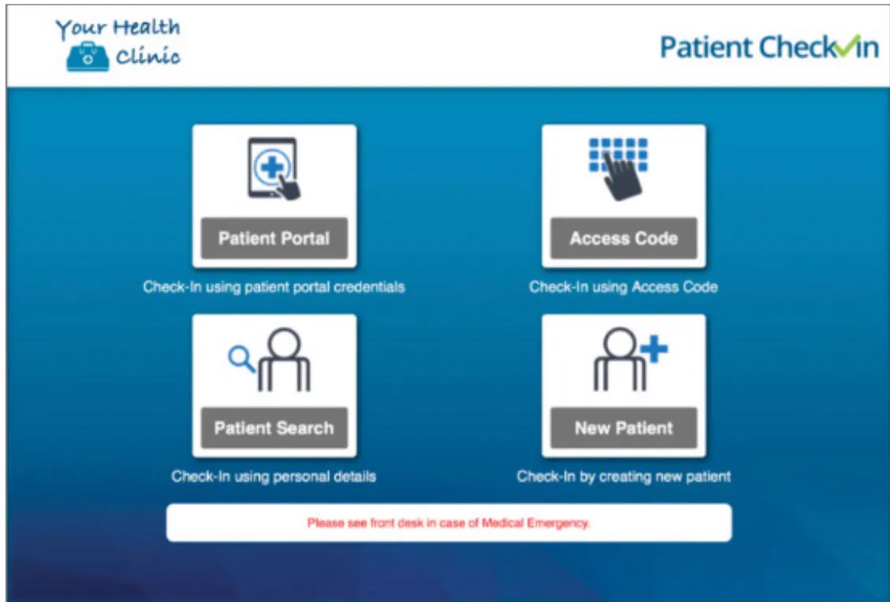  
Source: From Nielsen Norman Group,Kim Salazar (2022) Evaluate Interface Learnability withCognitive Walkthroughs www.nngroup.com/articles/cognitive-walkthroughs/?utm_source=Alertbox&utm_campaign=8df358360e-EMAIL_CAMPAIGN_2020_11_12_08_52_COPY_01&utm_medium $| =$ email&utm_term=0_7f29a2b335- 8df358360e-40509353

During  the cognitive  walk-through  of  the check-in  procedure, the evaluators  start  by looking  at the first screen that the new  patient would encounter (Figure 16.3)  to check in. The correct  action for the new  patient  would be to tap  on the square in the bottom-right corner of Figure 16.3. The evaluators then address the four analysis questions that have been

adapted from the original list by Wharton et al. (1994). These questions and the evaluators’ responses are shown in Table 16.1. (Notice  how, as in the Dalrymple example, evaluators adapt questions to fit their own needs.) After completing this part of the walk-through, the evaluators repeat the process for other tasks, such as how a returning patient would respond to the receptionist’s request to review and update their patient history. For each evaluation the evaluators need to decide on how detailed—that is, fine-grained—to make the analysis.

Compared  with  heuristic  evaluation, walk-throughs  focus  more closely  on  identifying specific  problems  at  a  detailed  level. For  example,  a  walk-through  that  is  used  in  Brazil, known as semiotic engineering, focuses on analyzing the signs and symbols used in the interactions between people and digital devices (de Souza et al., 2016).

Table 16.1 Four Questions Used in the Analysis of the Patient Check-In System and the Evaluators’ Responses   

<table><tr><td>Analysis Question</td><td>Group Determination</td></tr><tr><td rowspan="2">1. Will users try to achieve the right result?</td><td>Yes: patients will be directed by a receptionist upon entry to check in for their appointment, and the application includes the phrase Patient Check in in the header.</td></tr><tr><td>Note: Group discusses that there may be instances where the receptionist is away from the desk. Although the phrase Patient Check in, is shown in the app, its placement in the top right corner could be perceived as branding, causing it to be overlooked. They agree to further look for design solutions for this situation.</td></tr><tr><td>2. Will users notice that the correct action is available?</td><td>Yes: all action buttons are positioned within the body of the page using a highly salient visual styling that effectively communicates tapability.</td></tr><tr><td rowspan="2">3. Will users associate the correct action with the result they&#x27;re trying to achieve?</td><td>No: the group discusses that selecting from the four options provided on the screen requires a lot of cognitive effort for new patients, because they must assess and eliminate the incorrect options before determining the correct one, New Patient. Some patients may assume they have a patient record because they have an appointment. Others may simply see the Patient Search option first and take action before assessing the New Patient option.</td></tr><tr><td>The group agrees to further seek ways to simplify the design by first asking whether the patient is a new or existing patient and then providing returning visitors various record-lookup options.</td></tr><tr><td>4. After the action is performed, will users see that progress is made toward the goal?</td><td>Yes: the page changes and a form with the heading Enter your personal information is displayed.</td></tr></table>

Source: From Nielsen Norman Group, Kim Salazar (2022) Evaluate Interface Learnability with Cognitive Walkthroughs www.nngroup.com/articles/cognitive-walkthroughs/?utm_source=Alertbox&utm campaign=8df358360e-EMAIL_CAMPAIGN_2020_11_12_08_52_COPY_01&utm_medium=email&utm_ term=0_7f29a2b335-8df358360e-40509353

For more information about how to conduct a cognitive walk-through, see the following article by Kim Salazar (2022a): www.nngroup.com/articles/ cognitive-walkthrough-workshop.

# ACTIVITY 16.3

Conduct a cognitive walk-through of typical users who want to buy a copy of this book as an ebook at www.amazon.com or www.wiley.com. Follow the steps outlined earlier by Cathleen Wharton (Wharton et al., 1994), which you may modify slightly.

# Comment

# Step 1

Typical users: Students and professional designers who use the web regularly.

Task:  To buy  an  ebook  version  of  this  book  from  www.amazon.com  or www.wiley.com.

# Step 2

You will play the role of the evaluator.

# Step 3

(Note  that the  interface  for  www.amazon.com or www.wiley.com  may  have changed since the authors did this evaluation.)

The first action will probably be to select the search box on the home page of the website selected and then type in the title of the book or names of the author(s) of the book.

Q: Will users know what to do?

A:  Yes. They  know  that  they  must  find  books,  and  the  search  box  is  a  good place to start.

Q: Will they see how to do it?

A: Yes. They have seen a search box before, will type in the appropriate term, and will click the Go or Search icon.

Q: Will they  understand  from  the feedback provided whether  the action was correct or not?

A: Yes. Their action should  take them to a page that shows them the cover of this book. They need to click this or a Buy icon next to the cover of the book.

Q: Will they  understand  from  the feedback provided whether  the action was correct or not?

A: Yes. They  have probably done  this before, and they  will be able  to continue to purchase the book.

# ACTIVITY 16.4

From your experience of reading about and trying a heuristic evaluation and cognitive walkthrough, how do you think they compare for evaluating a website in terms of the following?

1. The time typically needed to do each kind of evaluation   
2. The suitability of each method for evaluating a whole website

# Comment

1. A cognitive walk-through would usually take longer because it is a more detailed process than a heuristic evaluation.   
2. A cognitive walk-through would typically not be used to evaluate a whole website unless it was a small one because it is a detailed process, whereas a heuristic evaluation is more holistic.

Another variation of a cognitive walk-through was developed by Rick Spencer  (2000) to overcome some problems that he encountered when using the original form of a cognitive walk-through  for a  design  team. The first  problem  was that  answering  the  questions  and discussing  the  answers took  too  long.  Second, the designers  tended  to  be defensive, often invoking long  explanations of  cognitive theory to justify their designs. To cope with  these problems, Rick Spencer adapted the method by asking fewer detailed questions and curtailing discussion. This meant that the analysis was more coarse-grained but could normally be completed in about 2.5 hours. He also identified a leader and set strong ground rules for the session, including a ban on defending a design, debating cognitive theory, or doing designs on the fly.

Valentina Grigoreanu and Manal Mohanna (2013) modified the cognitive walk-through so that it could be used effectively within an agile design process in which a quick turnaround in  design-evaluate-design  cycles  is  needed.  Their  method  involved  an  informal,  simplified streamlined cognitive walk-through (SCW) followed by an informal pluralistic walk-through (discussed next). When compared to a traditional user study on the same user interface, they found that approximately 80 percent of the findings from the user study were also revealed by the SCW.

A discussion by David Travis of the value of the cognitive walk-through method and the four questions to ask when evaluating various apps and devices can be found at www.userfocus.co.uk/articles/cogwalk.html.

# Pluralistic Walk-Throughs

Pluralistic walk-throughs are a well-established walk-through in which developers and usability researchers work together to step through a task scenario. As they do this, they discuss usability issues associated with dialog elements involved in the  scenario steps  (Nielsen and

Mack, 1994). In a pluralistic walk-through, each person is asked to assume the role of a typical user. Scenarios of use, consisting of a few prototype screens, are given to each person who writes down the sequence of actions that they would take to move from one screen to another, without  conferring  with  each  other. Then  they  all  discuss  the actions  they  each  suggested before moving  on to the next round of screens. This process continues until all of the scenarios have been evaluated (Bias, 1994).

Pluralistic walk-throughs  focus strongly on the detailed steps involved  in completing a task, which can be beneficial for designing safety-critical systems, where a usability problem identified for a single step could be critical to its safety or efficiency. The approach lends itself well to participatory design practices, as discussed in Chapter 12, “Design, Prototyping, and Construction,” by involving a multidisciplinary team in which users play a key role. Furthermore,  the researchers bring  a variety  of expertise and opinions  for interpreting  each stage of the interaction. The limitations with this approach include having to get the researchers together at one time and then proceed at the rate of the slowest. Time constraints may also result in using a limited number of scenarios, and hence only a few paths through the system can usually be explored.

For an overview of walk-throughs and an example of a cognitive walk-through of iTunes, see the following site: team17-cs3240.blogspot.com/2012/03/ cognitive-walkthrough-and-pluralistic.html.

Note: The link to pluralistic walk-throughs may not work correctly on all browsers.

# 16.3 Analytics and A/B Testing

People’s actions can be automatically recorded by software, including key presses, mouse or other pointing device movements, sound, video, time spent searching a web page, looking at help systems, and task flow through software modules. A key advantage of logging activity automatically is that it is unobtrusive provided the system’s performance is not affected, but it also raises ethical concerns about observing participants if this is done without their knowledge, as discussed in Chapter 10, “Data at Scale and Ethical Concerns.” Another advantage is  that large volumes of data can be logged automatically and then  explored and analyzed using visualization and other tools, though the downside of this can be that evaluators may feel overwhelmed and lost in their data.

# 16.3.1  Web Analytics

Web  analytics is a form of interaction logging that was specifically created to analyze  peoples’ activity  on websites so  that  designers could modify their designs to attract and retain customers. For example, if a website promises information about how to plant a wildflower garden  but  the home  page  is  unattractive  and  it only  shows  gardens  in  arid  and tropical regions, then people from more temperate zones will not look any further because the information they see isn’t relevant to them. These people become one-time visitors and leave to

look for other websites that contain the information they need to create their gardens. If the website is used by thousands of people and a small number of them do not return, this loss may not be noticed by the web designers and web owners unless they track their activities.

Using web analytics, web  designers and developers can trace  the activity of the people who visit their website. They can see how many people came to the site, how many stayed and for  how  long, and  which  pages they  visited. They  can  also find out  about  where the people came from and much more. Web analytics is therefore a powerful evaluation tool for web designers that can be used on its own or in conjunction with other types of evaluations, particularly user  testing. For instance, web  analytics  can provide  a “big-picture” overview of interaction on a website, whereas  user  testing with a few typical participants  can reveal details about UX design problems that need to be fixed.

Because the goal of using web analytics is to enable designers to optimize people’s usage of the website, web analytics is especially valued by businesses and market research organizations. For example, web analytics can  be used to evaluate the effectiveness of a print or media advertising campaign by  showing how traffic  to a website  changes during and after the campaign.

Web analytics are also used for information and entertainment websites, including hobbies, music, games, blogs, and personal websites (Sleeper et al., 2014), and for learning. When analytics are  used in learning, they  are often  referred to as learning analytics (LA) (Oviatt et al., 2013; Buckingham Shum, 2014; Educause, 2016). Learning analytics play a strong role in evaluating  learners’ activities  in massive open  online  courses (MOOCs)  and with Open Education Resources (OERs). The designers of these systems are interested in questions such as at what point do learners tend to drop out and why?

Learning that involves social interaction can also be evaluated using social learning analytics (SLA) (Buckingham  Shum, 2014; Buckingham  Shum et  al., 2019; Wise et  al., 2021; Rogers et al., 2022). This generally involves the collection and measurement of students’ digital artifacts and online interactions in formal and informal social settings in order to analyze their activities, social behavior, and knowledge creation (Buckingham Shum, 2014 in Rogers et al., 2022). The important  difference between LA and SLA is  the emphasis on the role of social and cultural influences. In addition, SLA  is strongly focused  on the learning process and how to support learning within the social context.

Other  types of specialist analytics have also been developed  that can  be used in evaluation studies, such as visual analytics in which thousands and often millions of data points are displayed and can be manipulated visually, as in social network analysis (Hansen et al., 2019). Many different types of tools support  visual analysis of large volumes of data. One of these, called ReLive, combines an immersive view of visual analytics with a synchronized non-immersive visual desktop view for analyzing mixed reality studies (Hubenschmid et al., 2022). These kinds of tools are discussed in Chapter 10.

# Using Web Analytics

Web analytics involve the collection, analysis, and reporting of data that reveals activity on the web. Web analytics are collected on all kinds of websites, from small personal websites to  those  of  businesses  of  all  sizes,  government,  and  large  tech  companies  like  Google, Microsoft, and Apple. Web analytics can be used by web owners to measure visitor behavior or  by  companies  that  offer  services  to  evaluate  and  promote  a  website.  Marketing  and advertising companies rely strongly on web analytics to understand how their websites and

those  of  their  competitors  are  performing. There  are  different  kinds  of  web  analytics  as shown  in  Box  16.3.  In  this  book  we  focus  on  Google Analytics  as  one  example of  how analytics may be used.

# BOX 16.3

# Other Analytics Tools

In addition to Google Analytics, other tools continue to emerge that provide additional layers of information, good access control options, and raw and real-time data collection.

Moz Analytics: Tracks search marketing, social media marketing, brand activity, links, and content  marketing, and  it is particularly useful for  link management and  analysis: www.moz.com.

TrueSocialMetrics: Tracks social media metrics, and it helps calculate social media marketing return on investment: www.truesocialmetrics.com.

Clicky:  Comprehensive  and  real-time  analytics  tool that provides privacy-friendly website analytics. It shows individual visitors and the actions they take, and it helps define what people from different demographics find interesting: www.clicky.com.

Crazy Egg: Tracks visitor clicks based on where they are specifically clicking, and it creates click heat maps useful for website design, usability, and conversion: www.crazyegg.com.

Contentsquare: Records website visitor actions and uses meta-statistics to create visual heat map reports on customer mouse movement, scrolling, and other visitor behaviors. It also focuses on mobile apps: contentsquare.com/clicktale.

# Google Analytics

Google launched Google Analytics in  November 2005, and even as early as 2012, Google Analytics was the most widely used on-site web analytics and statistics service. More than 50 percent  of  the  10,000  most  popular  websites  at  that  time  (Empson,  2012)  used  Google Analytics, and its popularity continues to soar. According to Wikipedia, Google Analytics is the most widely used analytics on the web (Wikipedia, accessed June, 2022). Data from other sources suggests that Google Analytics is used by 56 percent of all sites and that more than 85  percent  of  sites  that  use  any  kind  of  analytics  use  Google  Analytics  (w3techs.com/ technologies/overview/traffic_analysis  accessed  July 2022). There  is  also Google Analytics for Mobile Apps for collecting usage data on iOS and Android devices.

Figure 16.4 shows parts of the Google Analytics dashboard for the accompanying website for the  previous edition of this book, id-book.com, during October 2022. The first segment  (a)  shows  information  about  who  accessed  the  site  and  how  long  they  stayed,  the second segment (b) shows the devices used to view the website and the pages visited, and the third segment (c) shows the languages spoken by the users. Box 16.4 contains a case study about using Google Analytics for evaluating a community website for air monitoring.

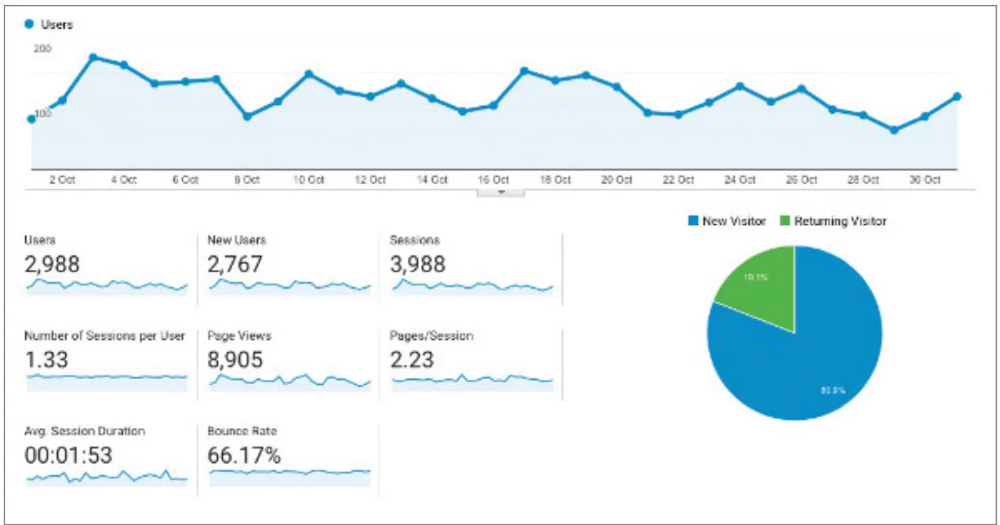  
(a)

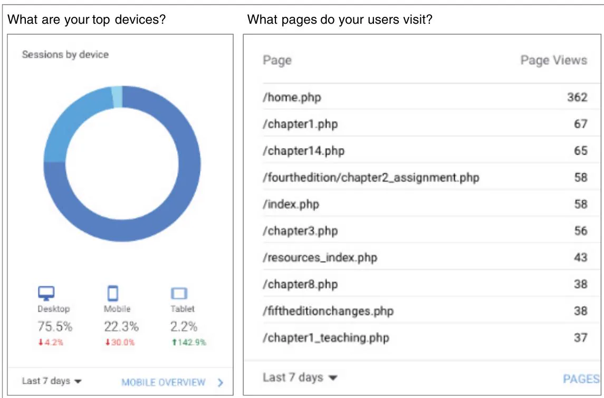  
(b)   
Figure 16.4 Segments of the Google Analytics dashboard for id-book.com during October 2022: (a) audience overview, (b) the devices used to access the site, and (c) the languages of the users

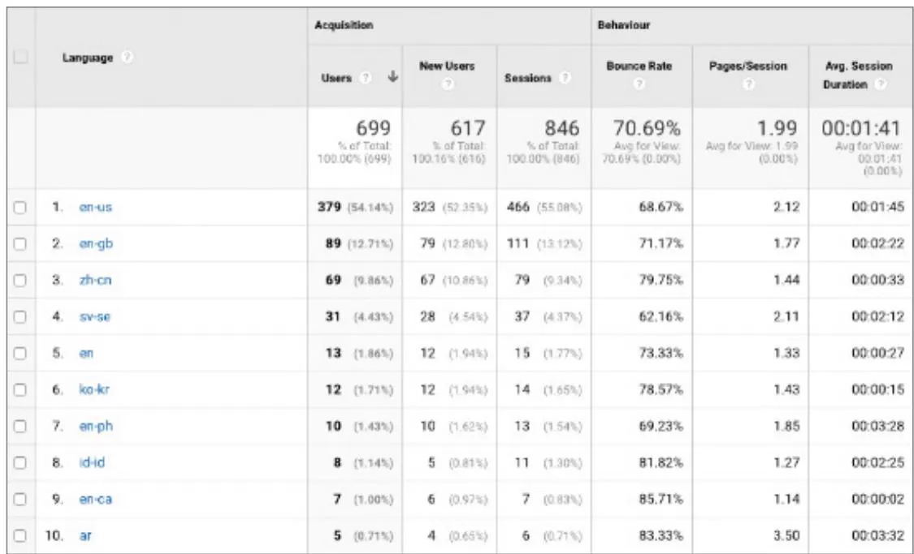  
(c)   
Figure 16.4 Continued

# ACTIVITY 16.5

Consider the three screenshot segments shown in Figure 16.4 from the Google Analytics for id-book.com, and then answer the following questions.

1. How many people visited the site during this period?   
2. What do you think someone might look at in 1 minute, 53 seconds (the average time they spent on the site)?   
3. Bounce rate refers to the percentage of visitors who view just one page of your site. What is the bounce rate for this book, and why do you think  this might be a useful metric to capture for any website?   
4. Which devices are being used to access the site?   
5. Which were the  three largest language groups during the period, and what can you say about the bounce rate for each of them?

# Comment

1. 2,988 users visited the site over this period of which 2,767 were new users, possibly taking HCI and ID classes for the first time. Notice that some users must have had more than one session  since the number of users is not the same as the  number of sessions, which was 3,988.

(Continued)

2. The number of pages viewed per session on average is 2.23. This suggests that a user probably won’t have played any of the videos on the site nor read any of the case studies in any great detail. From Figure 16.4(b), it appears that they did check out some of the chapters, resources, and slides.   
3. The bounce rate is 66.17 percent. This is a useful metric because it represents a simple but significant characteristic of user behavior, which is that after visiting one page, they did not go anywhere else on the site. Typical bounce rates are 40–60 percent, while greater than 65 percent is high and less than 35 percent is low. If the bounce rate is high, it merits further investigation to see whether there is a problem with the website.   
4. 75.5 percent of users accessed the site using a desktop, 22.3 percent used a mobile device, and 2.2 percent used a tablet. Compared to the previous week, the number of mobile users decreased by 30 percent.   
5. American English speakers were the largest  group (379, or 54.14  percent), followed by British  English speakers (89, or 12.71 percent), and then Chinese speakers (69, or 9.86 percent). The bounce rate for the Chinese visitors was the highest of these three at 79.75 percent, compared with 68.67 percent for the Americans and 71.17 percent for the British visitors.

There are many websites and YouTube videos to help you use Google Analytics. The following are some that may be useful.

You can learn about analytics from Google’s online free courses at analytics .google.com/analytics/academy.

Ian Lurie’s Google Analytics Tutorial—Install video explains how to install and use Google Analytics on your website. This video can be found at youtu.be/ P_l4oc6tbYk.

Scott Bradley’s Google Analytics Tutorial Step-by-Step video describes the statistics included in Google Analytics, and it provides insight into how the analytics may be used to improve user traffic. This video can be found at youtu.be/ mm78xlsADgc.

For an overview of different dashboards that can be customized in Google Analytics, see Ned Poulter’s website (2013) 6 Google Analytics Custom Dashboards to Save You Time NOW! at www.stateofdigital.com/google-analytics-dashboards.

# BOX 16.4

# Using Google Analytics for Monitoring an Air Quality Website

Many parts of the world suffer from poor air quality caused by pollution from industry, traffic congestion, and forest fires (Hsu and Nourbakhsh, 2020). More recently, fires in California, the northwest United States, Canada, and parts of Europe have created severe air quality problems. Consequently, communities are developing devices to crowdsource air quality readings for monitoring the quality of the air that they breathe. In one of these community-empowered air quality monitoring projects, Yen-Chia Hsu and her colleagues (2017, 2020) developed a website that integrates animated smoke images, data from sensors, and crowdsourced smell reports and wind data.

Having enabled the community to monitor its own air quality and to collect reliable data to advocate for change, these researchers were eager to track users’ activity on their website. They carried out a Google Analytics evaluation of the website from August 2015 to July 2016, which showed that there were 542 unique users who visited the website on 1,480 occasions for an average of 3 minutes each.

This study was innovative because, like many other local communities, this community was  not  technically  savvy. Furthermore, developing information  technology to democratize scientific knowledge  and support citizen empowerment is a challenging task. However, Google Analytics, along with user testing, enabled these researchers to modify the design of the website and the associated system so that it was easier for the community to use.

# 16.3.2  A/B Testing

Another way to evaluate a website, part of a website, an application, or an app running on a mobile device is by carrying out a large-scale experiment to evaluate how two groups of users perform using two different designs—one of which acts as the control and the other as the experimental condition, that is, the new design being tested. This approach was mentioned in Chapter 2, “The Process of Interaction Design,” and it is known as A/B testing. This is basically a controlled experiment but one that often involves hundreds or thousands of participants.  Like  the  experimental  design  discussed  in  Chapter  15, “Evaluation  Studies:  From Controlled to Natural Settings,” A/B testing involves a “between participants” experimental design in which two similar groups of participants are randomly selected from a single large

participant population (Kohavi and Longbotham, 2015; Kohavi et al., 2020), for instance, from  participants  of social  media sites  such as Twitter, Facebook, Instagram, or  Telegram. The main differences between A/B testing and the experiments discussed in Chapter 15 is one of scale and that typically A/B testing is done  online. Another difference is that users  don’t necessarily know they are in an experiment, nor which version they are looking at. This could be an ethical dilemma, except that typically none of the users are identified.

To do A/B testing, a variable of interest  is identified, such as the design of an advertisement. Group A is served design A, the existing design, and group B is served design B, the new design. A dependent measure is then identified, such as how many times participants in each group, A and B, click the advertisement that they are presented with over a particular period of time, such as a day, week, or a month. More than one new  variant of the design can be tested, and this is known as A/B/n testing (Kohavi et al., 2022), but this makes the experiment more complex. Because this is  a controlled  experiment, the results can be analyzed statistically to establish the probability that if a difference is observed, it is because of the treatment (in this case, the design) and not because of chance.

As  Ron Kohavi and his colleagues  mention (Kohavi et al., 2022), A/B testing provides a valuable  data-driven approach  for evaluating  the impact of  small or large differences in the designs of web and social media sites. From front-end user-interface changes to backend algorithms, from search engines (such as Google, Bing, and Yahoo!) to retailers (for example, Amazon, eBay,  and  Etsy)  to  social  networking services  (such  as  Facebook, LinkedIn, Telegram, and Twitter) to travel services (for instance, Expedia, Airbnb, and Booking.com) to many startups, online controlled experiments are now utilized to make data-driven decisions at a wide range of companies (Deng et al., 2017).

To get the most benefit from running an online A/B test, Kohavi and Longbotham (2015) recommend first running an A/A test. This is a test in which both populations of participants see the same design and should have the same experience. The results of the A/A test are then examined, and they should show no statistically significant difference. Following this procedure ensures that the algorithm used for splitting the populations is working as expected and that the conditions under which the experiment is running are indeed similar. This is important because  the  Internet  is  complex,  and  people’s interactions  can  be influenced  in  ways that researchers do not expect (for example by bots or the way browsers refresh or redirect), which could reduce the value of the A/B test, possibly even invalidating it.

Powerful  though  A/B  testing  may  be, researchers  are  advised  to  check  their  plans  in detail  to  ensure  that  they  are  testing  what  they  expect  to  test.  For  example,  Kohavi  and Longbotham (2015) carried out an A/B test on two versions of a design for early versions of the Microsoft Office 2007  home page. The idea  was to test the effectiveness of a new and more  modern-looking  home page  with  the primary  objective of  increasing  the number  of download clicks. However, instead of the number of download clicks going up as expected, it actually decreased by 64 percent. The researchers wondered what caused such an unexpected result. Upon closer examination of the two designs, they noticed the words in the new design were “Buy now” with a $\$ 149.95$ price, whereas the old design said, “Try 2007 for free” and “Buy now.” The impact of being asked to pay $\$ 149.95$ immediately distorted the experiment, even though the new design might have provided a more satisfying user experience.

In another example, an employee working for Microsoft’s Bing search engine suggested changing  how  advertisement  headlines  appear.  This  involved  lengthening  the  headline  by

combining it with the first line below the title, as shown in Figure 16.5 in which the original title is shown at the top and the revised design is shown below (Kohavi et al., 2022). No one thought this small change would have an effect, but the results of the A/B test were astonishing and very profitable for the company. Revenue from sales increased by 12 percent, which was  more  than $\$ 1000$ US.  Because  the  results  seemed  unbelievable, the  experiment  was repeated several times, and the results were found to be the same.

Figure 16.5 Original ad title for buying flowers (top) and suggested new title design (below)   
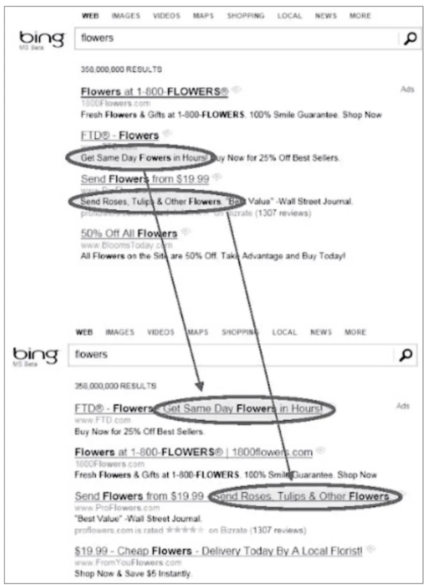  
Source: Kohavi et al. (2022), Cambridge University Press

The results of both of these experiments demonstrate that small changes can have a big effect. However, care is needed when setting up A/B testing to ensure that it is actually testing

the intended  design features  because  other design  features, such as  ones that  involve payments (in the first example), can have unexpected consequences.

This seminal talk by Ron Kohavi entitled “Controlled Experiments: Lessons from Running A/B Tests for 12 Years” provides more depth about A/B and A/B/n tests that include more variables: www.youtube.com/watch?v=qtboCGd_hTA.

# ACTIVITY 16.6

From your knowledge of web analytics and A/B testing:

1. What would you be able to find out by using each method to evaluate a website?   
2. What skills would you need to use each successfully?

# Comment

1. Analytics would most likely be used to get an overview of how people are using the website. It would show who is using the website, when and for how long, where the people’s IP addresses are located, bounce rates, and more. In contrast, A/B testing is a controlled experiment that enables researchers to evaluate and compare the impact of two or more UX designs. Typically, A/B testing  is used to look at one  or two  features rather than a whole website.   
2. There  are  many tools  for  evaluating websites using  analytics. These  tools  are  typically fairly straightforward to use, and with just a little knowledge designers can embed prewritten code into their designs to obtain analytics. Alternatively, there are many consultancy companies that can be hired to perform this service. In contrast, knowledge of experimental design and statistics is needed to do A/B testing.

# 16.4  Predictive Models

Like inspection methods and analytics, predictive models can be used to evaluate a product without the people who will use it being present. Rather than researchers being involved in role-playing during inspections, or tracking online behavior using analytics, predictive models  use  formulas  to derive  various measures  of peoples’  performance. Predictive  modeling provides estimates of the efficiency of different systems for various kinds of tasks. For example, a smartphone designer may choose to use a predictive model because it enables them to determine  accurately,  which  is  the  optimal  sequence  of  keys  for  performing  a  particular operation.

# 16.4.1  Fitts’ Law

One  kind  of  predictive model  that has  been  influential  in  HCI and  interaction design  for many  years is  Fitts’  law  (1954), which  predicts the  time it  takes  to reach  a target  using  a pointing  device. It  was originally used in human factors research to model the relationship between speed and accuracy when moving toward a target on a display. In interaction design, it  has  been used  to model  the time it  takes to point  at a target (for example, an  icon on  a screen),  based  on  the size  of  the object  and the  distance  to the  object  (Mackenzie, 1992; 2018). One of its main benefits is that it can help designers decide where to locate physical or digital buttons, what size to make them, and how close together to put them on a touch display  or  a  physical  device.  In  the  early  days,  it  was  most  useful  for  designing  physical laptop/PC  keyboard layouts and the placement of physical keys on mobile devices, such as smartphones, watches, and remote controls. It has also been used for designing the layout of digital displays for input on touchscreen interfaces, such as smartphones.

Fitts’ law states

$$
T = k \log_ {2} (D / S + 1. 0)
$$

where

$\begin{array} { r l } { T } & { { } = } \end{array}$ time to move the pointer to a target

$\begin{array} { r l } { D } & { { } = } \end{array}$ distance between the pointer and the target

$\begin{array} { r l } { S } & { { } = } \end{array}$ size of the target

k  =  a constant of approximately 200 ms/bit

In a nutshell, the  bigger the  target, the  easier and quicker  it  is to  reach it. This  is why interfaces that have big buttons are easier to use than interfaces that present lots of tiny buttons crammed together. Fitts’ law also predicts that the targets accessed most quickly on any computer  display are  positioned  at the  four  corners  of the  screen. This is  because  of their pinning action; in other words, the sides of the display constrain the user from over-stepping the target, though this may not be true for all kinds of interaction devices.

Fitts’ law can be useful for evaluating systems where the time to locate an object physically  is  critical  to the  task  at  hand. In  particular, it  can help  designers  think about  where to locate objects on the screen in relation to each other. This is especially useful for mobile devices, where there is limited space for placing icons and buttons (MacKenzie, 2018). In an early study carried out by Nokia, Fitts’ law was also used to predict text entry rates for several input methods on a 12-key cell phone keypad (Silfverberg et al., 2000). The study helped the  designers  make  decisions  involving  trade-offs about  the  size of keys,  their positioning, and the sequences of keypresses to perform common tasks.

Scott MacKenzie and Robert Teather (2012) used Fitts’ law in several studies including one  designed  to  evaluate  tilt  as an  input method  for devices  with  built-in  accelerometers, such as touchscreen phones and tablet computers. It was also used to examine the effect of the size of the physical gap between displays and the proximity of targets in multiple-display environments (Hutchings, 2012). In addition, it has been used to compare eye-tracking input

with manual input for visual  targets (Vertegaal, 2008); different ways of mapping Chinese characters  to  the  keypad  of  cell  phones  (Liu  and  Räihä, 2010);  and  gestural,  touch, and mouse interaction (Sambrooks and Wilkinson, 2013).

Fitts’ law has been useful for considering the effectiveness of new forms of input such as different game  controllers (Ramcharitar and Teather, 2017), cursor positions  for 3D  selections in VR  (Li et al., 2018), and gaze input on large displays with touch and mouse input (Rajanna and Hammond, 2018), as well as for assessing the effect of finger width for pointing and touch devices (Ko et al., 2021). Another use of Fitts’ law is to evaluate the efficacy of simulating users with motor impairments interacting with a head-controlled mouse pointer system (Rizvi et al., 2018). This application was  especially useful because it can be difficult to recruit participants with motor impairments to take part in user tests.

This short video entitled Using Fitts’ Law to Make Links and Buttons Easier to Click by Kathryn Whitenton from the Nielsen Norman Group summarizes the basic uses: www.nngroup.com/videos/fittss-law-links-buttons.

# ACTIVITY 16.7

Microsoft toolbars used to provide people with the option of displaying a label below each tool. Give a reason why labeled tools may be accessed more quickly. (Assume that the participant knows the tool and does not need the label to identify it.)

# Comment

The label becomes part of the target, and hence the target gets bigger. As mentioned earlier, bigger targets can be accessed more quickly.

Furthermore, tool icons that don’t have labels are likely to be placed closer together so that they are more crowded. Spreading the icons farther apart creates buffer zones of space around the icons  so that if people accidentally go past the target, they will be less likely to select the wrong icon. When the icons are crowded together, people are at greater risk of accidentally overshooting and selecting the wrong icon. The same is true of menus where the items are closely bunched together.

# In-Depth Activity

This in-depth activity continues the work you did on the new interactive product for booking tickets at the end of Chapters 11, 12, and 15. The goal of this assignment is to evaluate the prototypes produced in the assignment from Chapter 12 by using heuristic evaluation.

1. Decide on an appropriate set of heuristics and perform a heuristic evaluation of one of the prototypes that you designed in Chapter 12.   
2. Based  on this evaluation,  redesign the  prototype  to overcome the  problems that you encountered.   
3. Compare  the  findings from this evaluation with those  from the  usability  testing in the previous chapter. What differences do you observe? Which evaluation approach do you prefer and why?

# Summary

This chapter presented inspection evaluation methods, focusing on heuristic evaluation and walk-throughs, which  are  usually  done by UX specialists (often referred to as researchers or experts), who role-play peoples’ interactions with designs, prototypes, and specifications. They use their knowledge of the kinds of problems that people typically encounter, and then they offer their opinions. Heuristic evaluation and walk-throughs offer  a structure to guide the evaluation process.

Analytics, in which people’s interactions are logged, are often performed remotely and without the  people using  the product being aware that their interactions are being tracked. Large volumes of data are collected, anonymized, and  statistically  analyzed using specially developed  software services, such as Google Analytics. The  analysis provides information about how a product is used, for instance, how different versions of a website or prototype perform, or which  parts of a  website  are seldom used—possibly because of poor usability design or lack of appeal. Data are often presented visually so that it is easier to see trends and interpret the results.

A/B testing is another form of remote testing. Fundamentally, A/B testing is a controlled experiment in which two or more dependent variables are investigated using large numbers of participants who are randomly allocated to the  different experimental conditions. Small differences in the UX design of a home page can, for example, be tested using A/B testing. For sites with very large populations of users, such as popular social media sites, even small differences in design can strongly impact the number of users who use the application.

Fitts’ law is an example of an evaluation method that can be used to predict  a user’s performance with a product by determining whether a proposed interface design or keypad layout will be optimal. Typically, it is used to compare different design layouts for virtual or physical objects, such as buttons on a device or screen.

(Continued)

Designers and researchers often find that they have to modify these methods, as they do for those described in the previous chapters, for use with the wide range of products that have come onto the market since they were originally developed.

# Key Points

•  Inspections can be used for evaluating a range of representations including requirements, mockups, prototypes, or products.   
•  User testing and heuristic evaluation often reveal different usability problems.   
•  Other types of inspections used in UX design include cognitive and pluralistic walk-throughs.   
•  Walk-throughs  are  fine-grained, focused  methods  that are  suitable for  evaluating small parts of a product.   
•  Analytics involve collecting data about user interactions to identify how users use a website or product and which parts are underused.   
•  When applied to websites, analytics are often referred to as web analytics. Similarly, when applied to learning systems, they are referred to as learning analytics.   
•  A/B testing is an experimental method used to compare two or more different designs.   
•  Fitts’ law is a predictive model that has been used in HCI to evaluate keypress sequences for handheld devices.

# Further Reading

BUDIU, R. AND NIELSEN, J. (2012) Mobile Usability. New Riders Press. This classic book discusses why designing for mobile  devices is different than designing  for other systems. It describes  how  to  evaluate  these  systems,  including  doing  expert  reviews,  and  it  provides many examples.

KOHAVI, R., TANG, D., AND XU, T. (2022) Trustworthy Online Controlled Experiments: A Practical  Guide to A/B Testing. Cambridge  University Press, Cambridge:  UK. This book offers a detailed description of how to do A/B and A/B/n testing.

MACKENZIE, I. S. (2018) Fitts’ Law in The Wiley Handbook of Human Computer Interaction, Volume 1, First  Edition. Edited  by  Kent  L. Norman  and  Jurek  Kirakowski. Pages 349–370. This  chapter  provides  a  detailed  description  of  Fitts’  law  with  many  examples about the way it has been used.

# Epilogue

The first edition of our textbook came out more than 20 years ago in 2002. Glancing through the covers makes us realize just how much interaction design and human-computer interaction have changed—the number of topics covered and the many approaches, methods, and techniques  now  used  has  grown enormously.  The amount  of  research  that has  been  conducted  has  also expanded exponentially. When  writing the first edition, it was possible  to read all the papers published in the proceedings of the ACM’s CHI conference—which was printed as a physical book. When writing the $6 ^ { \mathrm { { t h } } }$ edition, the proceedings from 2022 had just come out but were available only in digital form, comprising a massive 637 papers. While we read quite a few of these to keep abreast of recent developments and trends, we certainly did not manage to read them all!

So, what does the future hold for ID and HCI? A good place to get a feel is to look at the ACM CHI Student Design brief, intended for students from all over the world to demonstrate their skills in interaction design and user experience. In 2023 the challenge set was to “contribute to one (or several) of the 17 Sustainable Development Goals (SDGs) identified by the United Nations” (see chi2023.acm.org/for-authors/student-design-competition). These include global societal problems, such as no poverty, zero hunger, climate action, and affordable  and clean energy. That is  broad! Where  does a student begin? What can they hope  to achieve? For example, how do they contemplate designing a technology intervention that can reduce hunger among billions of people? This is very different from the CHI student design brief in 2004. Then, it was relatively easy to get started. It was based on a specific, identified problem, which was to improve the scoring system used at the Olympic Games to overcome the controversy at the time associated with how various sporting events, such as diving, gymnastics, and ice-skating, were scored. It had been reported that the judges were often unfair and biased. The brief was to work out how to change this with a straightforward goal: to design a reliable, flexible, and highly usable system for collecting spectators’ scores through developing an innovative form of audience participation. Students relished the challenge, but for 2023 it’s much more open-ended, making it difficult to know where to begin.

The latest design brief does try to help teams of students get started by providing guidance on which methods to use. These include participatory design, co-creation and co-design, service  design, design for social innovation, and inclusive design (some  of which we  cover in our  textbook). It also suggests that they can  use any of the following technologies: “3D printing, digital fabrication, citizen sensing, Big Data, social networks, IoT, gamification, new sensors and actuators, and augmented/virtual reality amongst all the others.” Wow! So much choice over which method and which technology intervention to use. It all seems rather overwhelming as to which to choose since all have their merits and potential.

What this broadening out of the CHI design brief reflects, more generally, is that the field is  at a juncture, asking  its researchers and developers to step  up to the plate  in all sorts  of new directions. In the future, the raison d’être of the field will have moved on from designing usable systems to solve specific problems to tackling big and pressing global challenges, such as the SDGs mentioned earlier. There is, however, no silver bullet we have in our armory to

address these. Instead, it will mean thinking out of the box, thinking big, and thinking new. At the very least it will mean joining forces with other researchers who are  also concerning themselves with addressing societal challenges.

All of this may sound daunting, especially working at scale. Joining a team of 10 people is hard enough. Imagine what it will be like to collaborate with a network of thousands of researchers from all over the world. How do you manage a gigantic project and make progress? Will co-design be enough?  How do  you keep on  top of all the ethical concerns that surface? And how will the work get disseminated? Will it make sense to publish a paper with 1,000-plus authors?

# Current Challenges

The COVID-19 pandemic  created a  topsy-turvy world that challenged  us to think differently. The pandemic changed the way we work, socialize, travel, and think about ourselves. Just as the pandemic seemed to be getting under control, extreme weather events happened across the world: very high temperatures across Europe and the Middle East, droughts in the southern United States, and floods in Australia and Pakistan. These were just a few of the events that hit news headlines during 2022 while we were working on this book. Many questions started  to  be asked, such  as what  caused  the  pandemic, and  why  are  there so many extreme weather events? What causes extreme weather, and, more important, what can we do to be better prepared to respond to future catastrophes? What role should technology play, and how can ID and HCI contribute?

For many years people have collected data to address local issues such as “Why is our stream covered with green slime?” One example of a local citizen collecting data involved the famous American author, Henry David Thoreau. Thoreau enjoyed walking around Walden Pond in Massachusetts every day. On his walks he noted when several species of spring flowers came into bloom each year. He kept these records for many years. After his death, his data was discovered and donated to a local museum. Years later Professor Richard Primack and his students from Boston University decided to collect the same kind of data as Thoreau had collected at the same time in spring each year to see how their data compared with his data. They did so over several years. Their analysis showed that the first flowers appeared earlier than in Thoreau’s day suggesting that spring occurs earlier now than 150 years ago and that this might be a sign that the climate has changed in this part of North America.

Since then, science and technology innovations have provided many useful tools for collecting and analyzing data. Coupled with the power of the Internet, mobile devices and sensors now make it possible for many more people to collect and share data and engage in designing products based  on it. This development raises many questions: How can we coordinate  the activities of thousands, millions, and potentially billions of people so that their contributions are noticed, acted upon, and they feel appreciated? How can machine learning and AI support pattern matching on a vast scale to help identify and curate images and compare data across different regions and countries? How should we recognize and encourage the many successful projects that already exist to collaborate, and share their findings? These questions not only pose technical and design challenges but also pose enormous social and economic challenges.

Researchers working on smart cities, digital government, citizen science, and other kinds of community participation projects are already working to scale up their efforts. They realize

that  for large-scale projects  to be successful, ordinary  citizens need to be  included  in finding and identifying problems, like slimy streams, as well as in collecting data and generating design solutions. There needs to be a bottom-up approach as well as top-down approaches. But  what  would  a  bottom-up  approach  be like  in  which  any  citizen  could  participate  in design? Putting small groups who live in the same area in contact is technically easy, though it can be socially tricky. What about  putting them in contact with others across the world? There would be all kinds of issues to consider: scientific, cultural, linguistic, economic, legal, technical, and social. Partnering will be essential, and ID and HCI will need to be flexible in finding niches where different people’s skills are needed and valued.

Throughout this book we have taken a process-oriented perspective, emphasizing a practical  view  of what  interaction  design entails. We have introduced  specific  techniques  and methods for performing interaction design, but to be effective they need to sit within a process, so we have also introduced a number of design processes commonly in use today. And there are many of them, such as double diamond, Research through Design, research in the wild, design thinking, and Lean UX.

Both  detailed  techniques  and design  processes  have  evolved  over  time,  and  the  interdisciplinary  nature  of  interaction  design  has  led  to  the  adoption  and  cross-fertilization of  approaches  within  an  interaction  design  context. Techniques and  processes  have  been adapted, used in combination, and re-invented to suit the needs of new technologies, communities, and challenges. In the future, processes, methods, and techniques will continue to adapt, integrate, and evolve. But how might these changes unfold?

The  interaction  design  processes  introduced  in  this  book  illustrate  a  number  of dimensions:

•  They balance divergence (getting lots of ideas) and convergence (choosing one idea to explore further).   
•  They have a tighter focus on producing a solution or on understanding the design problem but need to cater for both.   
•  They emphasize stakeholder involvement but do so in a range of different ways.   
•  They rely on prototypes or minimal versions that can be used to test and evaluate ideas in context and at scale, but the way in which assessment is done varies.

# Looking to the Future

The balance between these dimensions is fluid, so as to respond to different contexts and different technologies. Will they ever lose this fluidity and converge? It seems unlikely because agility is gaining more attention in business and technology sectors, and design processes and techniques will also need increased agility and responsiveness.

The  nature  of  interactive  products  is  also  changing.  Not  only  are  design  challenges becoming more  complex, interactive products such as apps, devices, and infrastructure are also becoming more interconnected, and interaction designers are being asked to address new aspects such as usable security and UX debt. Interaction design processes will need a holistic

point of view to take account of this trend. It’s no longer about an individual’s perspective; designing for societal challenges requires a balance between the wider view and the individuals’ needs. And what about AI and automation that are increasing in many spheres of life? How will these impact the interaction design process?

We have  also  highlighted  in  the book  the  democratization  of  design  and  production and the need to involve a wide spectrum of stakeholders and communities. For example, the Maker Movement has encouraged many people across the globe to actively engage in generating ideas and products. What impact will this have on design processes and practices? What will be the role of nonspecialists? Democratization means working more across boundaries, more collaboratively, and in a more interdisciplinary fashion. Design thinking is being used to address  challenges in a range of industries and contexts that have not traditionally been viewed through a design lens. What will we learn from this cross-fertilization between different domains, and how can that inform interaction design?

Looking to the  future, will the earlier dimensions still be relevant, i.e., convergence and divergence, design problem and solution, stakeholder involvement, and prototyping to assess design ideas? Currently there is an increased emphasis on the design challenge rather than the solution, working with many different types of stakeholders, involving stakeholders as partners, recognizing that stakeholders are designers and makers, too, and taking into account wider societal  and planetary  concerns.  How  will  these  balances  shift  in  the future? What might we learn from the application of design processes to new types of challenges such as the SDGs mentioned in the 2023 CHI student design challenge?

It  will  mean  doing  things  differently:  imagining  how  future  technologies  can  still  be exciting, empowering, and engaging but also considering how to design and create them to be more sustainable, more impactful, and more accountable for society.

# References

Abdul, A., Vermeulen, J., Wang, D., Lim, B. Y., and Kankanhalli, M. (2018) Trends and Trajectories for  Explainable, Accountable  and Intelligible Systems: An  HCI Research Agenda. In  Proceedings  of  the  2018  CHI  Conference  on  Human  Factors  in  Computing  Systems (CHI ’18). ACM, New York, NY, Paper 582, 18 pages.   
Abdulrahaman, M. D., Faruk, N., Oloyede, A. A., Surajudeen-Bakinde, N. T., Olawoyin, L. A., Mejabi, O. V.  Imam-Fulani, Y.  O., Fahm, A. O., and Azeez, A. L. (2020) Multimedia tools in the teaching and learning processes: A systematic review, Heliyon, 6(11).   
Abelein, U., Sharp, H., and Paech, B. (2013) Does Involving Users in Software Development Really Influence System Success?, IEEE Software, Nov/Dec 2013, 13–19.   
Abowd, G. D. (2012) What Next, Ubicomp?: Celebrating an Intellectual Disappearing Act. In Proceedings of the 2012 ACM Conference on Ubiquitous Computing (UbiComp’12). ACM, New York, NY, pp. 31–40.   
Abowd,  G. D., Atkeson, C. G., Bobick, A. F., Essa, I. A., MacIntyre, B., Mynatt, E. D.,  and Starner, T.  E. (2000)  Living Laboratories:  The  Future Computing  Environments Group  at the Georgia Institute of Technology. In Proceedings of the 33rd Annual ACM Conference on Human Factors in Computing Systems (CHI ’00). ACM, New York, NY, pp. 215–216.   
Ackerman, M. S., and Mainwaring, S. D. (2005) Privacy Issues and Human-Computer Interaction. In L. F.  Cranor, and S. Garfinkel (eds.) Usability and Security. O’Reilly.   
ACM  (2018) Code  of Ethics and  Professional Conduct. Downloaded from www.acm.org/ code-of-ethics.   
Adams,  A., and  Sasses, M. A. (1999)  Users  Are  Not The  Enemy. Communications  of  the ACM, 42(12), 41–46.   
Adib,  F.,  Mao,  H.,  Kabelac  Z.,  Katabi,  D.,  and  Miller,  R.  C.  (2015)  Smart  Homes  That Monitor Breathing and Heart Rate. In Proceedings of the 33rd Annual ACM Conference on Human Factors in Computing Systems (CHI ’15). ACM, New York, NY, pp. 837–846.   
Adlin, T., and Pruitt, J. (2010) The Essential Persona Lifecycle: Your Guide to Building and Using Personas. Morgan Kaufmann.   
Aghina,  W.,  Handscomb,  C.,  Salo,  O.,  and  Thaker,  S.  (2021)  The  Impact  of  Agility: How  to  Shape  Your Organization  to  Compete.  McKinsey.  Accessed  Sept  2022.  www .mckinsey.com/business-functions/people-and-organizational-performance/our-insights/ the-impact-of-agility-how-to-shape-your-organization-to-compete.   
Alavi,  H.  S.,  Churchill,  E.  F.,  Wiberg,  M.,  Lalanne,  D.,  Dalsgaard,  P.,  Schieck, A.  F.,  and Rogers, Y. (2019) Introduction to Human-Building Interaction (HBI)—Interfacing HCI with Architecture and Urban Design, ToCHI, 26(2), Article 6, 10 pages.   
Alavi, H. S., Lalanne, D., and Rogers, Y. (2020). The Five Strands of Living Lab: A Literature Study of the Evolution of Living Lab Concepts in HCI. ACM Trans. Comput.-Hum. Interact., 27(2), Article 10.

Albastaki, A., Robinson, F.  A., Hoggenmueller, M., and Hespanhol, L. (2020) Augmenting Remote  Interviews  through Virtual  Experience  Prototypes.  In Proceedings  of  OzCHI  ’20, Sydney, NSW, Australia, pp. 78–86.   
Alexander, C. (1979) A Pattern Language: Towns, Buildings, Construction. Oxford University Press, UK.   
Alexander, J., Roudaut, A., Steimle, J., Hornbæk, K., Alonso, M. B., Follmer, S., and Merritt, T. (2018) Grand Challenges in Shape-Changing Interface Research. In Proceedings of the 2018 CHI Conference on Human Factors in Computing Systems (CHI ’18). ACM, New York, NY, USA, Paper 299, 1–14.   
Alharthi, S. A., Alsaedi, O., Toups, Z. O., Tanenbaum, T. J., and Hammer, J. (2018) Playing to Wait: A Taxonomy of Idle Games. In Proceedings of CHI 2018, Paper 621, pp. 1–15.   
Al-Humairi, A., Al-Kindi,  O.,  and  Jabeur,  N.  (2018)  Automated  Musical  Instruments.  In Proceedings  of  ICMRE  2018  Proceedings  of  the  2018  4th  International  Conference  on Mechatronics and Robotics Engineering, pp. 163–169.   
Ali,  A.,  Morris,  M.,  and  Wobbrock,  J. (2021)  Distributed  interaction  design:  Designing human-centered interactions in a time of social distancing. Interactions, XXVIII.2 April 2021.   
Ali, A. X., Morris, M. R., and Wobbrock, J. O.  (2019) Crowdlicit: A system for conducting distributed end-user elicitation and identification studies. In Proc. of the 2019 CHI Conference on Human Factors in Computing Systems. ACM, New York, Paper 255, pp. 1–12.   
Ali,  R.,  Arden-Close,  E.,  and  McAlaney,  J. (2018)  Digital  Addiction:  How  Technology  Keeps  Us  Hooked.  The  Conversation.  Downloaded  from  theconversation.com/ digital-addiction-how-technology-keeps-us-hooked-97499.   
Allanwood, G., and Beare, P.  (2014) User Experience Design. Fairchild Books.   
Allison, D., Wills, B., Bowman, D., Wineman, J., and Hodges, L. (1997) The Virtual Reality Gorilla Exhibit, IEEE Computer Graphics and Applications, 30–38.   
Alqaraawi, A., Schuessler, M., Weiß, P., Costanza, E., and Berthouze, N. (2020) Evaluating saliency map explanations for convolutional neural networks: a user study. In Proceedings of the 25th International Conference on Intelligent User Interfaces (IUI ’20). ACM, NY. 275–285.   
Amabile, T., Hadley, C. N., and Kramer, S. J. (2002) Creativity under the gun, Harvard Business Review, 80, 52–63.   
Amershi, A., Weld, D., Vorvoreanu, M., Fourney, A., Nushi, B., Collisson, P.,  Suh, J., Iqbal, S., Bennett, P.N., Inkpen, K., Teevan, J., Kikin-Gil, R., and Horvitz. E. (2019) Guidelines for Human-AI Interaction. In Proc. CHI ’19. ACM, NY Paper 3, 1–13.   
Anderson, C. (2013) Makers. Random House Business Books.   
Anderson, D. J. (2010) Kanban: Successful Evolutionary Change for Your Technology Business. Blue Hole Press.   
Angrave, J. (2020) The Journey Mapping Playbook. DeGruyter.   
Antle, A. N., Corness, G., and Droumeva, M. (2009) Human–Computer-Intuition? Exploring the Cognitive Basis for Intuition in Embodied Interaction. International Journal of Arts and Technology, 2, 3, 235–254.   
Ardito,  C.,  Buono,  P.,  Costabile,  D.  C.  M.  F.,  and  Lanzilotti,  R.  (2014)  Investigating  and Promoting UX Practice in Industry: An Experimental Study. International Journal of Human-Computer Studies, 72, 542–551.

Armitage, U. (2004) Navigation and Learning in Electronic Texts. PhD thesis, Centre for HCI Design, City University London.   
Aronson-Rath,  R., Milward,  J.,  Owen, T.,  and  Pitt,  F.  (2016).  Virtual  Reality  Journalism. New York, NY: Columbia Journalism School.   
Ashtari, N., Bunt, A., McGrenere, J., Nebeling, M., and Chilana, P. K. (2020) Creating Augmented and Virtual Reality Applications: Current Practices, Challenges, and Opportunities. In Proceedings of the 2020 CHI Conference on Human Factors in Computing Systems. Association for Computing Machinery, New York, NY, USA, 1–13.   
Assi, M., Hassan, S., Tian, Y., and Zou, Y. (2021) FeatCompare: Feature comparison for competing mobile apps leveraging user reviews, Empirical Software Engineering 26, Article 94.   
Astarita, V.,  Giofrè, V.P.,  Guido, G.,  Stefano, G.,  and  Vitale, A.  (2020) Mobile  Computing for  Disaster Emergency  Management:  Empirical Requirements Analysis  for a  Cooperative Crowdsourced System for Emergency Management Operation. Smart Cities, 3, 31–47.   
Ayobi, A., Sonne, T., Marshall, P., and Cox, A. L. (2018) Flexible and Mindful Self-Tracking: Design Implications from Paper Bullet Journals. In Proceedings of the 2018 CHI Conference on Human Factors in Computing Systems (CHI ’18). ACM, New York, NY, Paper 28, 14 pages.   
Ayobi, A., Stawarz, K., Katz, D., Marshall, P., Yamagata, T., Santos-Rodriguez, R., Flach P., and  O’Kane, A. A. (2021)  Co-Designing Personal  Health? Multidisciplinary Benefits  and Challenges in  Informing  Diabetes Self-Care  Technologies. In Proceedings  of  the ACM  on Human-Computer Interaction, 5(CSCW2), Article 457, 26 pages.   
Babich,  N.  (2016)  Designing  Card-Based  User  Interfaces.  Downloaded  from  www .smashingmagazine.com/2016/10/designing-card-based-user-interfaces.   
Babich, N. (2018) The Do’s and  Don’ts of Mobile  UX Design. Downloaded from theblog .adobe.com/10-dos-donts-mobile-ux-design.   
Bachour, K., Kaplan, F., and Dillenbourg, P.  (2008) Reflect: An Interactive Table for Regulating  Face-to-Face  Collaborative  Learning. In  Proceedings  of  the 3rd  European  Conference on  Technology Enhanced Learning: Times  of  Convergence: Technologies  Across  Learning Contexts. In P.  Dillenbourg and M. Specht (eds.) Lecture Notes in Computer Science, 5192. Springer-Verlag, Berlin, Heidelberg, pp. 39–48.   
Bachour, K., Seiied Alavi, H., Kaplan, F.,  and Dillenbourg, P.  (2010) Low-Resolution Ambient Awareness Tools for Educational Support. In Proceedings of CHI 2010 Workshop: The Future of HCI and Education.   
Bailenson,  J. N.  (2021)  Nonverbal  Overload:  A  Theoretical  Argument  for  the  Causes  of Zoom Fatigue, Technology, Mind, and Behavior, 2(1).   
Bailey, R. W. (2001) Insights from Human Factors International Inc. (HFI). Providing Consulting and Training in Software Ergonomics. January (www.humanfactors.com/home).   
Bainbridge, D.  (2014)  Information Technology and  Intellectual Property  Law. 6 th  edition. Bloomsbury Professional.   
Baker, K., Greenberg, S., and Gutwin, C. (2002) Empirical Development of a Heuristic Evaluation  Methodology for Shared  Workspace Groupware. In ACM  Proceedings  of CSCW’02 Conference.   
Baker, M., Casey, R., Keyes, B., and Yanco, H. A. (2004) Improved Interfaces for Human– Robot Interaction in Urban Search  and Rescue. In Proceedings of the IEEE Conference on Systems, Man and Cybernetics, October.

Balakrishnan,  A.  D.,  Kiesler, S.,  Cummings,  J. N.,  and  Zadeh,  R.  (2011)  Research  Team Integration: What it is and Why it Matters. In Proceedings of the ACM 2011 Conference on Computer Supported Cooperative Work, ACM Press, pp. 523–532.   
Balestrini, M., Diez, T., Marshall, P., Gluhak, A., and Rogers. Y. (2015) IoT Community Technologies: Leaving Users to Their Own Devices or Orchestration of Engagement? In Endorsed Transactions on Internet of Things, EAI, 15(1).   
Balestrini M., Gallacher S., and Rogers Y. (2020)  Moving HCI Outdoors: Lessons Learned from  Conducting  Research  in the Wild.  In D.  S. McCrickard, M. Jones, T.  L. Stelter (eds.) HCI Outdoors: Theory, Design, Methods and Applications. Human–Computer Interaction Series. Springer, Cham.   
Bano, M., and Zowghi, D. (2015) A  Systematic Review on  the Relationship Between  User Involvement and System Success, Information and Software Technology, 58, 148–169.   
Bano,  M.,  Zowghi,  D.,  and  Rimini,  F.  (2017)  User  Satisfaction  and  System  Success:  An Empirical Exploration  of  User Involvement in  Software Development. Empirical  Software Engineering, 22, 2339–2372.   
Bannon, L., Bardzell, J.,  and Bødker,  S. (2018)  Reimagining  Participatory Design,  Interactions, Jan-Feb, 26–32.   
Banzi, M. (2009) Getting Started with Arduino. O’Reilly Media Inc.   
Barasch, A., Zauberman, G., and Diehl, K. (2018) How the Intention to Share Can Undermine Enjoyment: Photo-Taking Goals and Evaluation of Experiences. Journal of Consumer Research, 44(6), 1220–1237.   
Bardzell, J., Bardzell, S., Dalsgaard, P.  Gross, S., and  Halskov, H. (2016)  Documenting  the Research Through Design Process. In Proceedings of the 2016 ACM Conference on Designing Interactive Systems (DIS ’16), pp. 96–107.   
Barnard, P. J., Hammond, N., Maclean, A., and Morten, J. (1982) Learning and Remembering Interactive  Commands in  a Text Editing Task,  Behavior and Information  Technology, 1, 347–358.   
Baskinger, M., and Bardel, W.  (2013)  Drawing Ideas: A Hand-Drawn Approach for Better Design, Watson-Guptill Publications Inc.   
Bastos, J. A. D. M., Afonso, L. M., and de Souza, C. S. (2017) Metacommunication Between Programmers Through an Application Programming Interface: A Semiotic Analysis of Date and Time APIs, in IEEE Symposium on Visual Languages and Human-Centric Computing (VL/HCC), 213–221.   
Baum, F. L., and Denslow, W. (1900) The Wizard of $O z$ . Random House, New York.   
Baumeister,  R. F.  Vohs, K.D.,  DeWall, C. N., and  Zhang, L. (2007)  How  Emotion  Shapes Behavior: Feedback, Anticipation, and Reflection, Rather than Direct Causation. Personality and Social Psychology Review, 11(2), 167–203.   
Baumer,  E.P.S.,  and  Thomlinson,  B.  (2011)  Comparing  Activity  Theory  with  Distributed Cognition  for  Video  Analysis:  Beyond  Kicking  the  Tyres. In  ACM  Proceedings  of  CHI ’11, 133–142.   
Baumer, E. P.  S., Berrill, T., Botwinick, S. C., Gonzales, J. L., Ho, K., Kundrik, A., Kwon, L., LaRowe, T., Nguyen, C. P.,  Ramirez, F.,  Schaedler, P.,  Ulrich, W., Wallace, A., Wan, Y., and

Weinfeld, B. (2018) What Would You  Do? Design Fiction and Ethics. In Proceedings of the 2018 ACM  Conference on  Supporting Groupwork  (GROUP ’18). ACM, New  York, NY, pp. 244–256.   
Baumer, E.P.S., Blythe, M., and Tanenbaum, T. J. (2020) Evaluating Design Fiction: The Right Tool for the Job. In Proceedings of DIS ’20, pp. 1901–1913.   
Bauwens,  V.,  and  Genoud,  P.  (2014)  Lessons  Learned:  Online  Ethnography.  A  Tool for Creative Dialogue Between State and Citizens, Interactions, 60–65.   
BBC  (2021)  Guidance:  Visually impaired  and  hearing  impaired  audiences.  Accessed July, 2022. Available from  www.bbc.com/editorialguidelines/guidance/visually-and-hearingimpaired-audiences.   
Beaird, J., and George, J. (2014) The Principles of Beautiful Web Design. 3 rd edition. SitePoint.   
Beaird,  J., Walker, A., and  George, J. (2020)  The  Principles  of Beautiful  Web  Design, 4th Edition. SitePoint.   
Beck,  K., and  Andres, C. (2005)  Extreme  Programming  Explained:  Embrace  Change. 2 nd edition. Addison-Wesley.   
Becker, C. R. (2020) Learn Human-Computer Interaction: Solve human problems and focus on rapid prototyping and validating solutions through user testing (Kindle Edition).   
Beirl, D., Rogers, Y.,  and Yuill, N. (2019)  Using voice  assistant skills in family  life.  In  Proceedings of the 13th International Conference on Computer Supported Collaborative Learning  -  A  Wide  Lens:  Combining  Embodied,  Enactive,  Extended,  and  Embedded  Learning in  Collaborative  Settings,  CSCL  2019, pp.  96–103,  International  Society  of  the  Learning Sciences, Inc.: Lyon, France.   
Bentley,  F., Choe, E.K., Mamykina, L., Stasko, J.,  and  Irani, P.  (2021)  Evaluating Mobile Visualizations. In Mobile Data Visualization, pp. 177–208, Chapman and Hall/CRC.   
Bergman,  E.,  and  Haitani, R.  (2000)  Designing  the  PalmPilot:  A  Conversation  with  Rob Haitani. In Information Appliances. Morgan Kaufmann, San Francisco.   
Bergman, O., and Whittaker, S. (2016) The Science of Managing Our Digital Stuff. MIT Press.   
Bergstrom,  J.,  Dalsgaard,  T-S.,  Alexander, J.,  and  Hornbaek,  K.  (2021)  How  to  Evaluate Object  Selection  and  Manipulation  in VR?  Guidelines  from  20  Years  of  Studies. In  Proceedings  of  CHI  ’21:  CHI  Conference  on  Human  Factors  in  Computing  Systems, ACM, Paper 533.   
Bernard, H. R. (2017) Direct and Indirect Observation. Chapter 14 in Research Methods in Anthropology: Qualitative and Quantitative Approaches. 6 th edition. Rowman & Littlefield Publishers.   
Bias,  R.  G.  (1994)  The  Pluralistic  Usability  Walk-Through  –  Coordinated  Empathies. In  J. Nielsen  and  R.  L.  Mack  (eds.)  Usability  Inspection  Methods.  John  Wiley  &  Sons Inc., New York.   
Birch,  D.,  Simondetti,  A.,  and  Guo, Y.  (2018)  Crowdsourcing  with  online  quantitative design analysis. Advanced Engineering Informatics, Science Direct, Elsevier, 38, 242–251.   
Bird,  J., and  Rogers, Y.  (2010) The  Pulse  of Tidy Street:  Measuring  and  Publicly Displaying Domestic  Electricity Consumption.  Workshop on Energy Awareness and Conservation through  Pervasive  Applications,  Pervasive  2010  Conference.  Retrieved  September  2014. Downloaded from www.changeproject.info/projects.html.

Blake, E., Mbinge, U., Winschiers-Theophilus, H., Maasz, D., Stanley, C., Muashekele, C., and Kapuire, G. K. (2021) Going Beyond Empowered Design by Scaffolding Inter-community Engagement. In C&T ’21: Proceedings of the 10th International Conference on Communities & Technologies – Wicked Problems in the Age of Tech, 10 pages.   
Blandford, A., and Furniss, D. (2006) DiCoT: A Methodology for Applying Distributed Cognition to  the  Design of Team Working Systems. In  S. W.  Gilroy  and  M. D.  Harrison  (eds.) Interactive Systems: 12th International Workshop, DSVIS 2005, Lecture Notes in Computer Science, 3941 Springer-Verlag, Berlin, Heidelberg, pp. 26–38.   
Blandford, A., Furniss, D., and Makri, S. (2017) Qualitative HCI Research: Going Behind the Scenes. Morgan Claypool Publishers.   
Blythe, M. (2017) Research Fiction: Storytelling, Plot and Design. In Proceedings of Conference on Human Factors in Computing Systems (CHI ’17). ACM, New York, NY, pp. 5400–5411.   
Bødker, S. (2000) Scenarios  in User-Centered  Design—Setting  the Stage  for Reflection and Action, Interacting with Computers, 13 (1), 61–76.   
Bødker, S., Dindler C., Iversen, O. S., and Smith, R. C. (2022). Participatory Design. Synthesis Lectures on Human-Centered Informatics. Springer, Cham.   
Boehm, B., and Basili, V. R. (2001) Software Defect Reduction Top 10 List, IEEE Computer, 34 (1), 135–137.   
Boehner, K. Vertesi, J., Sengers, P.,  and Dourish, P.  (2007)  How HCI Interprets the  Probes. In Proceedings of Conference on  Human Factors  in Computing Systems (CHI  ’07). ACM, New York, NY, pp. 1077–1086.   
Bojinov, I.,  Saint-Jacques,  G.,  and  Tingley, M.  (2020)  Avoid  the  Pitfalls  of  A/B  Testing: Make sure your experiments recognize customers’ varying needs. Harvard Business Review, March–April.   
Bond, J. G. (2022) Introduction to Game Design, Prototyping, and Development: From Concept to Playable Game with Unity and C#. Addison-Wesley.   
Borchers, J. (2001) A Pattern Approach to Interaction Design. Wiley. Borghouts,  J.,  Brumby,  D.,  and  Cox,  A.  (2020)  TimeToFocus: Feedback  on  Interruption Durations Discourages Distractions and Shortens Interruptions. ACM Trans. Comput.-Hum. Interact. 27(5) Article 32, 31 pages.   
Bornschein,  J.,  and Weber, G.  (2017)  Digital  Drawing  Tools  for  Blind  Users:  A  State-ofthe-Art and Requirement Analysis. In Proceedings of the 10th International Conference on Pervasive  Technologies  Related  to Assistive  Environments  (PETRA’17), ACM, New  York, NY, pp. 21–28.   
Bostock, M., Ogievetsky, V., and Heer, J. (2011) D3: Data-Driven Documents. IEEE Transactions on Visualization and Computer Graphics, 17(12), 2301–2309.   
Bouchet, J., and Nigay, L. (2004) ICARE: A Component-Based Approach for the Design and Development of Multimodal Interfaces. In Proceedings of CHI 2004. ACM, New York, NY, pp. 1325–1328.   
Bowman, L.L., Levine, L.E., Waite, B.M., and Gendron, M. (2010) Can Students Really Multitask? An Experimental Study of Instant Messaging while Reading. Computers and Education 54(4), 927–931.

<!-- Chunk 13 End -->


<!-- Chunk 14 Start -->

Bowser, A., Shilton, K., Preece, J., and Warrick, E. (2017) Accounting  for Privacy in Citizen Science:  Ethical  Research  in  a  Context  of  Openness.  In  Proceedings  of  CSCW’17, ACM, New York, NY, pp. 2124–2136.   
Boyd, D. (2014) It’s Complicated: The Social Lives of Networked Teens. Yale.   
Boyle,  K.  (2022)  Metaverse  and  money. Decrypting  the  Future.  Citi  GPS Report.  Downloaded  from  fintech-alliance.com/index.php/knowledge-bank/white-papers/ citi-metaverse-and-money-decrypting-the-future.   
Braun, V., and Clarke, V. (2006) Using Thematic Analysis in Psychology. Qualitative Research in Psychology, 3(2), pp. 77–101, ISSN1478–0887.   
Braun,  V.,  and  Clarke,  V.  (2019)  Reflecting  on  reflexive  thematic  analysis,  Qualitative Research in Sport, Exercise and Health, 11(4), 589–597.   
Braun, V., and Clarke, V. (2022) Thematic Analysis: a practical guide. Sage.   
Braun, V., Clarke, V., Hayfield, N., and Terry, G. (2019) Thematic Analysis. In P. Liamputtong (ed.), Handbook of Research Methods in Health Social Sciences, pp. 843–860.   
Brendan, G. (2017) Forget “Best” or “Sincerely,” This Email Closing Gets the Most Replies. Downloaded from blog.boomerangapp.com/author/brendan.   
Brereton,  M.,  and  McGarry, B. (2000)  An  Observational  Study  of  How  Objects  Support Engineering  Design Thinking and Communication: Implications for the Design of Tangible Media. In Proceedings of CHI 2000. ACM, New York, NY, pp. 217–224.   
Briggs, G. F., Hole, G. J., and Turner, J. A. J. (2018) The  Impact of Attentional Set and Situational Awareness on Dual-task Driving Performance. Transportation Research Part F: Traffic Psychology and Behaviour, 57, 36–47.   
Brignull, H., and Rogers, Y. (2003) Enticing People to Interact with Large Public Displays in Public Spaces. In Proceedings of INTERACT 2003, Zurich, pp. 17–24.   
Brkan, M. (2017) AI-Supported Decision-Making Under the General Data Protection Regulation. In Proceedings of the 16th Edition of the International Conference on Artificial Intelligence and Law (ICAIL ’17). ACM, New York, NY, pp. 3–8.   
Brown, P., Waite, F., Rovira, A., Nickless, A., and Freeman, D. (2020) Virtual reality clinicalexperimental tests of compassion treatment techniques to reduce paranoia, Sci Rep 10, 8547.   
Brudy, F.,  Houben, S., Marquardt, N., and Rogers, Y.  (2016) CurationSpace:  Cross-Device Content  Curation Using Instrumental Interaction. In Proceedings  of the 2016 ACM  International  Conference  on  Interactive  Surfaces  and  Spaces  (ISS  ’16). ACM, New  York,  NY, pp. 159–168.   
Brudy, F.,  Ledo,  D.,  Pahud, M., Riche, N.  H., Holz, C., Waghmare, A., Surale, H.  B., Peinado, M., Zhang, X., Joyner, S., Chandramouli, B., Minhas, U.F., Goldstein, J., Buxton, W., and Hinckley, K. (2020)  SurfaceFleet: Exploring Distributed Interactions  Unbounded from Device, Application, User, and Time. In Proceedings of the 33rd Annual ACM Symposium on User Interface Software and Technology. ACM, New York, NY, USA, pp. 7–21.   
Bruun, A., Jensen, R. H., Kjeldskov, J., Paay, J., Hansen, C. M., Sakácová, K. L., and Larsen, M. H.  (2020)  Exploring  the Non-Use  of Mobile  Devices  in  Families through  Provocative Design. In DIS ’20: Proceedings of the 2020 ACM Designing Interactive Systems Conference, pp. 813–826.

Bryan-Kinns, N, Wang, W., and Ji, T. (2022) Qi2He: A co-design framework inspired by eastern epistemology. International Journal of Human-Computer Studies, 160, article 102773.   
Buchenau, M., and Suri, J. F.  (2000)  Experience  Prototyping. In Proceedings of DIS 2000, Design Interactive Systems: Processes, Practices, Methods, Techniques, pp. 17–19.   
Buckingham  Shum,  S.  (2014)  Learning  Analytics:  welcome  to  the  future  of  assessment?,  Keynote  at  EdMedia  2014,  available  from  simon.buckinghamshum.net/2014/06/ edmedia2014-keynote.   
Buckingham Shum, S., Ferguson, R., and Martinez-Maldonado, R. (2019) Human-Centred Learning Analytics. Journal of Learning Analytics, 6(2) pp. 1–9.   
Budd, A. (2007)  Web  Heuristics. Accessed  September  2010. Available  at:  www.andybudd .com/archives/2007/01/heuristics_for_modern_web_application_development.   
Budiu, R., and Nielsen, J. (2010) Usability of iPad Apps and Websites. First Research Findings.  Nielsen  Norman  Group.  Retrieved  August  2010.  Downloaded  from  www.nngroup .com/reports/mobile/ipad.   
Budiu, R., and Nielsen, J. (2012) Mobile Usability. New Riders Press.   
Buechley, L., and Qiu, K. (2014) Sew Electric. A Collection of DIY Projects that Combine Fabric, Electronics, and Programming. HLT Press.   
Burgess, M. (2020) Co-op is using facial recognition tech to scan and track shoppers. Downloaded from www.wired.co.uk/article/coop-facial-recognition.   
Burgess, P. W. (2015) Serial Versus Concurrent Multitasking: From Lab to Life. In J. M. Fawcett, E. F. Risko and A. Kingstone (eds.) The Handbook of Attention. 443–462. Cambridge, MA: The MIT Press.   
Burnay, C., Horkoff, J., and Maiden, N. (2016) Stimulating Stakeholders’ Imagination: New Creativity Triggers for Eliciting Novel Requirements. In Proceedings of IEEE 24th International Requirements Engineering Conference (RE), pp. 36–45.   
Cai, S., Liu,  C., Wang, T.,  Liu, E., and Liang, J-C. (2021)  Effects  of learning physics using Augmented Reality on students’ self-efficacy and conceptions of learning. British Journal of Educational Technology, 52, 235–251.   
Caine, K. (2016) Local Standards for Sample Size at CHI. In Proceedings of Conference on Human Factors in Computing Systems (CHI ’16). ACM, New York, NY, pp. 981–992.   
Caird, J. K., Simmons, S. M., Wiley, K., Johnston, K. A., and Horrey, W. J. (2018) Does Talking on a Cell Phone, With a Passenger, or Dialing Affect Driving Performance? An Updated Systematic Review and Meta-Analysis of Experimental Studies. Human Factors: The Journal of the Human Factors and Ergonomics Society, 60(1).   
Cairns, P.  (2019)  Doing Better Statistics in Human-Computer Interaction: Short Essays on Some Common Questions. Oxford University Press: Oxford, UK.   
Calvo, R.A., Picard, R., Dinakar, K., and Maes, P.  (2016)  Computing in Mental Health. In Proceedings of CHI ’16 Extended Abstracts, pp. 3438–3445.   
Campbell, J. L., Brown. J. L., Graving, J. S., Richard, C. M., Lichty, M. G., Sanquist, T., . . . and Morgan, J. L. (2016, December). Human Factors Design Guidance for Driver-Vehicle Interfaces. Report No. DOT HS 812 360. Washington.   
Card, S. K., Mackinley, J. D.,  and Shneiderman,  B. (eds.) (1999)  Readings  in  Information Visualization: Using Vision to Think. Morgan Kaufmann, San Francisco.

Card, S. K., Moran, T. P., and Newell, A. (1983) The Psychology of Human–Computer Interaction. Lawrence Earlbaum Associates, Hillsdale, NJ.   
Carroll, J. M. (2000)  Introduction to the Special Issue on Scenario-Based Systems Development, Interacting with Computers, 13(1), 41–42.   
Carroll, J. M. (2004) Beyond Fun, Interactions, 11(5), 38–40.   
Carroll, J. M. (ed.) (2003) HCI Models, Theories and Frameworks: Towards a Multidisciplinary Science. Morgan Kaufmann, San Francisco.   
Castle-Green,  T.,  Reeves,  S.,  Fischer,  J. E.,  and  Koleva,  B.  (2020)  Decision  Trees  as Sociotechnical Objects in Chatbot Design. In Proceedings of CUI ’20, Article 27, pp. 1–3.   
Ceci, L. (2022) Average time spent daily on a smartphone in the United States 2021, Downloaded from www.statista.com/statistics/1224510/time-spent-per-day-on-smartphone-us.   
Centre  for  Digital  Public  Services  (2021)  Usability  testing  during  COVID-19  –  how  we conducted  remote  representative  usability  testing  for  adult  social  services,  available  from digitalpublicservices.gov.wales/usability-testing-during-covid-19.   
Chamberlain, A., Crabtree, A., Haddadi, H., and Mortier, R. (2018) Special theme on privacy and the Internet of things, Pers Ubiquit Comput, 22(2), 289–292.   
Chamberlain, A., Crabtree, A., Rodden, T., Jones, M., and Rogers. Y. (2012). Research in the wild: understanding ‘in the wild’ approaches to design and development. In Proceedings of the Designing Interactive Systems Conference (DIS ’12). Association for Computing Machinery, New York, NY, USA, pp. 795–796.   
Chang, C., Hinze, A., Bowen, J., Gilbert, L., and Starkey, N. (2018)  Mymemory: A Mobile Memory Assistant for People with Traumatic Brain Injury. International Journal of Human-Computer Studies, 117, 4–19.   
Charmaz, K. (2014) Constructing Grounded Theory. $2 ^ { \mathrm { n d } }$ edition. SAGE Publications.   
Chaudhry, S., and Kulkarni, C. (2022) Robinhood’s Forest: A Persuasive Idle Game to Improve Investing Behavior. In Proceedings of Intelligent User Interfaces, IUI ’22, pp. 594–603.   
Chen S., Zhou, L., Song, Y., Xu, Q., Wang, P., Wang, K., Ge, Y., and Janies, D. (2021) A Novel Machine Learning Framework for Comparison of Viral COVID-19–Related Sina Weibo and Twitter Posts: Workflow Development and Content Analysis, J Med Internet Res 23(1).   
Chen, X., Zou, Q., Fan, B, Zheng, Z., and Luo, X. (2018) Recommending Software Features for  Mobile Applications  Based  on  User  Interface  Comparison, Requirements  Engineering, 24, 545–559.   
Chidziwisano, G.H., Mariakakis, A., Wyche, S., Mafeni, V., and Banda, E. G. (2021) Nkhuku-Probe:  Using  a  Sensor-Based  Technology Probe  to  Support  Poultry  Farming  Activities  in Malawi. In Proceedings of ACM SIGCAS Conference on Computing and Sustainable Societies (COMPASS ’21), ACM, pp. 275–287.   
Choma, J., Guerra, E.M., Alvaro, A., Pereira, R., and Zaina, L. (2022) Influences of UX factors in the Agile UX context of software startups, Information and Software Technology, 152.   
Chuang, L. L., and Pfeil, U. (2018). Transparency and Openness Promotion Guidelines for HCI. In Extended Abstracts  of the CHI Conference on  Human Factors in Computing Systems (CHI EA ’18). ACM, New York, NY, Paper SIG04, 4 pages.   
Churchill, E. (2018) Data, Design, and Ethnography, Interactions, January $^ +$ February 22–23.

Churchill, E. F.  (2019) Scaling UX with Design Systems, Interactions, Sept–Oct, pp. 22–23.   
Claisse, C., Kasadha, B., Stumpf, S., and Durrant, A. C. (2022) Investigating Daily Practices of Self-care to Inform the Design of Supportive Health Technologies for Living and Ageing Well with  HIV. In CHI  Conference  on  Human  Factors  in  Computing Systems  (CHI  ’22), Article 524, 19 pages.   
Clark, A., and Chambers, D. (1998) The Extended Mind. Analysis, 58(1), 7–19. Oxford University Press, UK.   
Clegg, T., Preece, J., Warrick, E., Pauw, D., Boston, C., and Cameron, J. (2019). Community-Driven  Informal Adult Environmental Learning:  Using Theory as  a Lens  to Identify  Steps Toward Concientización, Journal of Environmental Education, 51, 55–71.   
Clemmensen, T.,  Hertzum, M., Hornbaek, K., Shi, Q., and Yammiyavar, P.  (2008)  Cultural Cognition in the Thinking-Aloud  Method for Usability Evaluation. In Proceedings of $2 9 t b$ International Conference on Information Systems. Paris, 2008, Paper 189.   
Cliffe, A.  D.  (2017)  A  Review  of  the  Benefits  and  Drawbacks  to Virtual  Field  Guides  in Today’s  Geoscience  Higher  Education  Environment.  International  Journal  of  Educational Technology in Higher Education. 14, 28.   
Cline, D. H. (2012) Six Degrees of Alexander: Social Network Analysis as a Tool for Ancient History. AHB, 26, 59–70.   
Cobb, S., Beardon,  L., Eastgate, R., Glover, T., Kerr, S., Neale,  H., Parsons, S., Benford, S., Hopkins, E., Mitchell, P., Reynard, G., and Wilson, J. (2002) Applied Virtual Environments to Support Learning of Social Interaction Skills in Users with Asperger’s Syndrome, Digital Creativity, 13 (1), N-22.   
Cockton, G., and Woolrych, A. (2001) Understanding Inspection Methods: Lessons from an Assessment of Heuristic Evaluation. In A. Blandford and J. Vanderdonckt (eds.), People and Computers XV. Springer-Verlag, Berlin, pp. 171–191.   
Coeckelbergh, M. (2020) AI Ethics. MIT Press.   
Cohen, J. (1960) A Coefficient of Agreement  for Nominal Scales. Educational and Psychological Measurement, 20(1), 37–46.   
Cohen, M.,  Giangola,  J. P.,  and  Balogh,  J. (2004)  Voice  User  Interface  Design.  Addison-Wesley, Harlow, Essex.   
Cole, T.,  and Gillies, M. (2022) More than a bit of coding: (un-)Grounded (non-)Theory in HCI. In CHI EA ’22: Extended Abstracts of the 2022 CHI Conference on Human Factors in Computing Systems, Article 11, pp. 1–11.   
Constantine, L. L., and Lockwood, L. A. D. (1999) Software for Use. Addison-Wesley, Harlow, Essex.   
Cooper, A. (1999) The Inmates are Running the Asylum. SAMS, Indianapolis.   
Cooper,  A.  (2018)  When  Companies  Question  the  Value  of  Design.  Downloaded  from medium.com/s/story/whats-the-roi-of-ux-c47defb033d2.   
Cooper,  A.  (2020)  The  Myth  of  Metaphor:  The  band  aid  of  UX.  Downloaded  from mralancooper.medium.com/the-myth-of-metaphor-de16bfa1cbbe.   
Cooper, A., Reimann, R., and Cronin, D.  (2014)  About Face: the Essentials of  Interaction Design. Wiley.

Cooper, C.B., Hawn, C.L., Larson, L.R., Parrish, J.K., Bowser, G., Cavalier, D., Dunn, R.R., Haklay, M., Ka, K.K., Na’Taki G., Jelks, O., Johnson, V.A., Katti, M., Leggett, Z., Wilson, O. R., and Wilson, S. (2021) Inclusion in citizen science: The conundrum of rebranding, Science 372 (6549), 1386–1388.   
Corbin, J. M., and Strauss, A. (2014) Basics of Qualitative Research: Techniques and Procedures for Developing Grounded Theory. SAGE Publications.   
Costa, N.A., Holder, E., and MacKinnon, S. N. (2017) Implementing Human Centred Design in the Context of a Graphical User Interface Redesign for Ship Manoeuvring. International Journal of Human-Computer Studies, 100, 55–65.   
Coyle, A. (1995)  Discourse Analysis. In G. M. Breakwell, S. Hammond  and C. Fife-Schaw (eds.) Research Methods in Psychology. SAGE, London.   
Crabtree, A. (2003)  Designing  Collaborative  Systems:  A  Practical  Guide  to  Ethnography. Springer-Verlag, Berlin.   
Crabtree, A., Haddadi, H., and Mortier, R. (eds.) (2021) Privacy by Design for the Internet of Things: Building accountability and security. The IET.   
Craik, K. J. W. (1943) The Nature of Explanation. Cambridge University Press, Cambridge.   
Cramer,  H.,  Evers,  V.,  Ramlal,  S.,  Someren,  M.,  Rutledge,  L.,  Stash,  N.,  Aroyo,  L.,  and Wielinga, B. (2008) The Effects of Transparency on Trust in and Acceptance of a Content-Based Art Recommender. User Model User-Adap Inter, 18, 455.   
Cranor, L. F.  (2021) Lessons From the Loo. Communications of the ACM, 64(7), 27–29.   
Crowcroft, J., Haddadi, H., and Henderson, T.  (2018) Responsible Research on Social Networks:  Dilemmas  and Solutions. In  B. Foucault Welles and  S.  González-Bailón (eds.)  The Oxford Handbook of Networked Communication. Oxford Handbooks online.   
Crumlish,  C., and  Malone, E. (2009)  Designing  Social  Interfaces: Principles, Patterns and Practices for Improving the User Experience, O’Reilly.   
Csikszentmihalyi,  M. (1996)  Go  with  the  flow.  Wired  Interview.  Retrieved  May 6,  2005. www.wired.com/wired/archive/4.09/czik.html.   
Csikszentmihalyi, M. (1997) Finding Flow: The Psychology of Engagement with Everyday Life. Basic Books, New York.   
Cutting, J., Gundry, D., and Cairns, P.  (2019) Busy Doing Nothing? What Do Players Do in Idle Games? International Journal of Human-Computer Studies, 122, 133–144.   
Cycil, C., Perry, M., Laurier, E., and Taylor, A. (2013) ‘Eyes Free’ In-Car Assistance: Parent and  Child Passenger Collaboration During Phone Calls. In Proceedings of MobileHCI’13, ACM Press, pp. 332–341.   
Da Costa, R. P., Canedo, E. D., De Souza, R. T., Albuquerque, R. D. O., and Villalba, L. J. G. (2019) Set of Usability Heuristics for Quality Assessment of Mobile Applications on Smartphones, IEEE Access, 7, 116145–116161.   
Da Silva, T., Silveira, M. S., Maurer, F., and Silveria, F. F. (2018) The Evolution of Agile UXD. Information and Software Technology, 102, 1–5.   
Dabrowski, J., Letier,  E., Perini, A., and Susi, A. (2022) Analysing app reviews for software engineering: a systematic literature review, Empirical Software Engineering, 27, Article 43.

Dalrymple,  B. (2018)  Cognitive  Walkthroughs. medium.com/user-research/cognitive-walkthroughs-b84c4f0a14d4.   
Dalton, N.S., Collins, E., and Marshall, P.  (2015) Display Blindness?: Looking Again at the Visibility of Situated Displays Using Eye-Tracking. In Proceedings of the 33rd Annual ACM Conference on Human Factors in Computing Systems (CHI ’15). ACM, New York, NY, pp. 3889–3898.   
de Souza, C.S., Cerqueira, R., Afonso, L., Brandão, R., and Ferreira, J. (2016) Software Developers as Users: Semiotic Investigations in Human-Centered Software Development. Springer.   
Deng, A., and Shi, X. (2016) Data-Driven Metric Development for Online Controlled Experiments: Seven Lessons Learned. In Proceedings of 22nd ACM SIGKDD International Conference on Knowledge Discovery and Data Mining (KDD ’16), pp. 77–86.   
Deng, A., Dmitriev, P., Gupta, S., Raff, R. K. P., and Vermeer, L. (2017) A/B Testing at Scale: Accelerating Software Innovation. In Proceedings of Special Interest Group on Information Retrieval ’17, pp. 1397–1397.   
Deng, L., and Huang, X. (2004) Challenges in Adopting Speech  Recognition, Communications of the ACM, 47(1), 69–75.   
Denzin, N. (2006) Sociological Methods: A Sourcebook. Aldine Transaction (5th edn), ISBN 9780–202308401.   
Denzin,  N.  K., and  Lincoln, Y.  S.  (2011)  The  SAGE Handbook  of  Qualitative  Research. SAGE Publications.   
Deshpande, A., and  Sharp, H. (2022)  Responsible AI  Systems: Who  are the Stakeholders? In Proceedings of the 2022 AAAI/ACM  Conference on AI, Ethics, and Society (AIES ’22). ACM, NY, 227–236.   
Deshpande, A., Sharp, H., Barroca, L., and Gregory, A. J. (2016) Remote Working and Collaboration in Agile Teams. In Proceedings of International Conference on Information Systems, pp. 4543–4559.   
Díaz, G. A. M. (2020) Discourse Analysis, Crossroads, 27(1), 38–41.   
Dietz, P.  H.,  and  Leigh, D.  L. (2001)  DiamondTouch: A  Multi-User  Touch Technology. In Symposium  on  User  Interface  Software  and  Technology (UIST).  ACM, New  York,  NY, pp. 219–226.   
Diez, T.,  and  Posada, A. (2013)  The  Fab  and  the  Smart  City: The  Use  of  Machines  and Technology for the City Production by Its Citizens. In Proceedings of the 7th International Conference on Tangible, Embedded and Embodied Interaction, ACM Press, pp. 447–454.   
Di Geronimo, L., Braz, L., Fregnan, E., Palomba, F., and Bacchelli, A. (2020) UI Dark Patterns and Where to Find Them: A Study on Mobile Applications and User Perception. In Proceedings of the 2020 CHI Conference on Human Factors in Computing Systems (CHI ’20). Association for Computing Machinery, New York, NY, USA, pp. 1–14.   
DiSalvo, C., Sengers, P., and Brynjarsdottir, H. (2010) Mapping the Landscape of Sustainable HCI. In Proceedings of CHI 2010. ACM, New York, NY, pp. 1975–1984.   
Distler, V., Zollinger, M.-L., Lallemand, C., Roenne, P.B., Ryan, P. Y. A., and Koenig, V.  (2019) Security - Visible, Yet  Unseen? How Displaying Security Mechanisms Impacts User Experience and Perceived Security. In Proceedings of CHI 2019, Paper 605, pp. 1–13.   
Dix, A. (2022) Statistics for HCI: making sense of quantitative data. Springer.

Douglas,  H.E.,  Raban,  M.  Z., Walter,  S.  R.,  and  Westbrook.  J. I.  (2017)  Improving  Our Understanding of Multi-Tasking in Healthcare: Drawing Together the Cognitive Psychology and Healthcare Literature. Applied Ergonomics, Volume 59, Part A, 45–55.   
Dourish,  P.  (2001)  Where  the Action  Is: The  Foundations  of Embodied  Interaction. MIT Press, Cambridge, MA.   
Dourish, P., and Bly, S. (1992) Portholes: Supporting Awareness in a Distributed Work Group. In Proceedings of CHI ’92. ACM, New York, NY, pp. 541–547.   
Drascic, D., and Milgram, P.  (1996) Perceptual Issues in Augmented Reality. In M. T.  Bolas, S. S. Fisher,  and J. O.  Merritt (eds.)  SPIE Volume 2653: Stereoscopic  Displays  and Virtual Reality Systems III. SPIE, San Jose, CA, pp. 123–134.   
Dray,  S.,  and  Siegel,  D.  (2004)  Remote  Possibilities?  International  usability  testing  at  a distance. Interactions, 11, 10–17.   
DScout (2022) Mobile Touches. Accessed 6th  July 2022. Available from  pages.dscout.com/ mobile-touches-download-form.   
DSDM (2014) The DSDM Agile Project Framework Handbook, DSDM Consortium, Kent, UK, ISBN 978–0-9544832–9-6.   
Dubber, M., Pasquale, F., and Dunit, S. (2020) The Oxford Handbook of Ethics of AI. Oxford University Press, UK.   
Dumas, B., Lalanne, D., and Oviatt, S. (2009) Multimodal Interfaces: A Survey of Principles, Models and Frameworks. Human Machine Interaction Lecture Notes in Computer Science, 5440, 3–26.   
Dumas, J. S., and Redish, J. C. (1999) A Practical Guide to Usability Testing (rev. edn). Intellect, Exeter.   
Eason,  K. (1987)  Information Technology and  Organizational  Change. Taylor and  Francis, London.   
Eason, K. (2014) Afterword: The Past, Present, and Future of Sociotechnical Systems Theory. Applied Ergonomics, 45, 213–220.   
Eckert, C., and Stacey M. (2000) Sources of Inspiration: a language of design, Design Studies, 21(5), 523–538.   
Educause (2016) The 2016 Horizon Report. Downloaded from library.educause.edu/topics/ teaching-and-learning/learning-analytics.   
Effendy, V., Novantirani, A., and Sabariah, M. K. (2018) Sentiment analysis on Twitter about the  use  of  city  public  transportation  using  support  vector  machine  method,  Intl.  J. ICT, 2(1), 57–66.   
Eggers, D. (2013) The Circle. Knopf.   
Ehsan, U., Liao, Q.V., Muller, M., Riedl, M. O., and Weisz. J. D. (2021) Expanding Explainability:  Towards  Social  Transparency  in  AI  systems.  In  Proc.  CHI  ’21.  ACM, NY,  Article 82, 1–19.   
Eleftherios, T., and Shivin, L. (2021) The Challenges in Modeling Human Performance in 3D Space with Fitts’ Law. In Proceedings of CHI EA ’21: Extended Abstracts of the 2021 CHI Conference on Human Factors in Computing Systems, pp. 1–9.   
Elgersma, C. (2021) Virtual Field Trips Full of Learning Potential, www.commonsense.org/ education/articles/virtual-field-trips-full-of-learning-potential.

Eliot, C., and Woolf, B. (1994) Reasoning about the User Within a Simulation-Based Real-Time Training System. In  Proceedings of  4th International  Conference on  User Modeling, Mitre Corp., Bedford, MA.   
Elrod, S., Bruce, R., Gold, R., Goldberg, D., Halasz, F., Janssen, W., Lee, D., McCall, K., Pedersen, E., Pier, K., Tang, J., and Welch, B. (1992) Liveboard: A Large Interactive Display Supporting Group Meetings, Presentations and Remote Collaboration. In Proceedings of CHI ’92. ACM, New York, NY, pp. 599–607.   
Empson, R. (2012)  Google  Biz  Chief:  Over  10M Websites  Now  Using  Google Analytics. Retrieved from techcrunch.com/2012/04/12/google-analytics-officially-at-10m.   
Erickson,  T.,  and  Kellogg, W.  A.  (2000)  Social  Translucence:  An  Approach  to  Designing Systems  that  Support  Social  Processes,  Transactions of  Computer-Human  Interaction,  7 (1), 59–83.   
Erickson, T.  D.  (1990)  Working  with  Interface  Metaphors.  In  B. Laurel  (ed.)  The  Art  of Human–Computer Interface Design. Addison-Wesley, Boston.   
Erickson, T. D., Smith, D. N., Kellogg, W. A., Laff, M., Richards, J. T., and Bradner, E. (1999) Socially Translucent Systems: Social Proxies, Persistent Conversation and the Design of ‘Babble’. In Proceedings of CHI ’99, pp. 72–79.   
Ericsson,  K.A.,  &  Simon,  H.  A.  (1984)  Protocol  analysis:  Verbal reports  as  data.  The MIT Press.   
Ettinger, K., and Cohen, A. (2020) Patterns of multitasking behaviours of adolescents in digital environments. Educ Inf Technol 25, 623–645.   
Eysenck, M., and Brysbaert, M. (2018) Fundamentals of Cognition. $3 ^ { \mathrm { r d } }$ edition. Routledge.   
Fairbanks,  G.  (2020)  The  Pragmatic  Designer:  Ur-Technical Debt,  IEEE  Software,  July– August, 37(4).   
Falk,  J.,  and Young, F.  (2022)  Supporting  Fast  Design:  The  Potential  of  Hackathons  for Co-Creative Systems. In Creativity and Cognition (C&C ’22), ACM, New York, NY,  USA, pp. 515–519.   
Fang,  X.,  Semertzidis,  N.,  Scary, M., Wang,  X.,  Andres,  J.,  Zambetta,  F.,  and  Mueller, F. (2021)  Telepathic Play: Towards  Playful  Experiences  Based  on  Brain-to-brain  Interfacing. In Extended Abstracts of the 2021 Annual Symposium on Computer-Human Interaction in Play (CHI PLAY ’21). ACM, New York, NY, USA, pp. 268–273.   
Fernaeus, Y., and Tholander, J. (2006) Finding Design Qualities in a Tangible Programming Space. In Proceedings of CHI 2006. ACM, New York, NY, pp. 447–456.   
Fernández-Luque, F., Zapata, J., Ruiz, R., and Iborra, E. (2009) A Wireless Sensor Network for Assisted Living  at Home of Elderly  People, Lecture  Notes in  Computer Science, 5602. Springer-Verlag, Berlin, Heidelberg, pp. 65–74.   
Ferreira, J.,  Sharp, H.,  and  Robinson, H.  (2012)  Agile  Development and  User  Experience Design Integration  as an On-going Achievement in Practice. In Proceedings of Agile 2012, Dallas, Texas.   
Ferreira, J., Sharp, H., and Robinson, H. M. (2011) User Experience Design and Agile Development: Managing Cooperation Through Articulation Work. In Software Practice and Experience, 41(9), 963–974.

Fetterman, D.  M.  (2020)  Ethnography:  Step  by Step. 4 th  edition.  Applied  Social  Research Methods Series, Vol. 17. SAGE.   
Fialho, P., and Coheur, L. (2015) ChatWoz: Chatting through a Wizard of Oz. In Proceedings of  the  17th  International  ACM  SIGACCESS  Conference  on  Computers  and  Accessibility (ASSETS ’15). ACM, New York, NY, pp. 423–424.   
Fido  Alliance  (2022)  Apple,  Google  and  Microsoft  Commit  to  Expanded  Support  for FIDO  Standard  to  Accelerate  Availability  of  Passwordless Sign-Ins.  Downloaded  from fidoalliance.org/apple-google-and-microsoft-commit-to-expanded-support-for-fidostandard-to-accelerate-availability-of-passwordless-sign-ins.   
Fischer, B., Peine, A., and Östlund, B. (2020) The Importance of User Involvement: A Systematic Review of Involving Older Users in Technology Design. Gerontologist, 60(7), e513–e523.   
Fish, R. S., Kraut, R. E., and Chalfonte, B. L. (1990) The VideoWindow system in informal communication. In Proceedings of CSCW ’90. ACM, New York, 1–11.   
Fishkin, K. P. (2004) A Taxonomy for and Analysis of Tangible Interfaces, Personal and Ubiquitous Computing, 8, 347–358.   
Fiske, J. (1994) Audiencing: Cultural Practice and Cultural Studies. In N. K. Denzin and Y.  S. Lincoln (eds.) Handbook of Qualitative Research. SAGE, Thousand Oaks, CA, pp. 189–198.   
Fitts,  P.  M. (1954) The Information  Capacity of the  Human  Motor  System  in Controlling Amplitude of Movement, Journal of Experimental Psychology, 47, 381–391.   
Flanagan, J. C. (1954) The Critical Incident Technique, Psychological Bulletin, 51, 327–358.   
Focardi, R., Luccio, F. L., and Wahsheh, H. A. M. (2019) Usable security for QR code, Journal of Information Security and Applications, 48, 102369.   
Fogg, B. J. (2009) A Behavior Model for Persuasive Design. In Proceedings of the 4th International Conference on Persuasive Technology (Persuasive ’09). ACM, New York, NY, Article 40, 7 pages.   
Follmer, S.,  Leithinger,  D.,  Olwal, A., Hogge, A., and  Ishii, H.  (2013)  inFORM:  Dynamic Physical  Affordances  and  Constraints  through  Shape  and  Object  Actuation.  In  Proceedings of the 26th annual ACM symposium on User interface software and technology. ACM, New York, NY, USA, pp. 417–426.   
Folmer,  E., Yuan,  B.,  Carr,  D.,  and  Sapre, M.  (2009)  TextSL:  A  Command-Based  Virtual World Interface for the Visually Impaired. In Proceedings 11th international ACM SIGAC-CESS Conference on Computers and Accessibility, pp. 59–66.   
Fontana, A., and Frey, J. H. (2005). The Interview: From Neutral Stance to Political Involvement. In N. K. Denzin and Y. S. Lincoln (eds.) The SAGE Handbook of Qualitative Research. 3rd edition, pp. 695–727. Thousand Oaks, CA: SAGE.   
Foong, E., Gergle, D., and Gerber, E. M. (2017) Novice and Expert Sensemaking of Crowdsourced  Feedback.  In  Proceedings  of  the  ACM  on  Human-Computer  Interaction,  1,  2, Article 45.   
Ford, E., Shepherd, S., Jones, K., and Hassan, L. (2021) Toward an Ethical Framework for the Text Mining of  Social  Media for Health  Research: A  Systematic Review.  Front. Digit. Health, 2, 592237.

Forsell, C., and Johansson, J. (2010) An Heuristic Set for Evaluation in Information Visualization. In Proceedings of the International Conference on Advanced Visual Interfaces (AVI ${ } ^ { , 1 0 , }$ ), Giuseppe Santucci (ed.). ACM, New York, NY, pp. 199–206.   
Franklin, M., Lagnado, D., Min, C., Mathur, A., and Kawsar, F.  (2021) Designing Memory Aids for Dementia Patients using Earables. In Adjunct Proceedings of the 2021 ACM International Joint Conference on Pervasive and Ubiquitous Computing and Proceedings of the 2021 ACM International Symposium on Wearable Computers (UbiComp ’21). Association for Computing Machinery, New York, NY, USA, 152–157.   
Frayling. C. (1993) Research in Art and Design, Royal College of Art Research Papers series, 1(1), 1–5.   
Freeman, R. E. (1984). Strategic management: A stakeholder approach. Boston: Pitman.   
French,  F.,  Mancini, C., and  Sharp,  H.  (2020)  More Than  Human Aesthetics:  Interactive Enrichment for Elephants. In Proceedings  of the 2020 ACM Designing Interactive Systems Conference (DIS ’20), pp. 1661–1672.   
Friedman, N., and  Cabral, A. (2018) Using a Telepresence Robot to  Improve Self-Efficacy of People with  Developmental Disabilities. In  Proceedings of  the 20th International ACM SIGACCESS Conference on Computers and Accessibility (ASSETS ’18). ACM, New York, NY. 489–491.   
Fritz, S., See, L., Carlson, T., Haklay, M., Oliver, J.L., Faraisl, D., Mondardini, R., Brocklehurst, M., Shanley, L.A., Schade, S., When, U., Abrate, T., Anstee, J. Arnold, S., Billot, M., Campbell, J., Espey, J., Gold, M., Hager, G., He, S., Hepburn, L., Hsu, A., Long, D., Masó, J., McCullum, I., Muniafu, M., Moorty,  I., Obersteiner, M., Parker, A., Weisspflug, M., and West, S. (2019) Citizen science and the United Nations Sustainable Development Goals, Nature Sustainability, 2, 922–930.   
Froehlich, J., Findlater, L., and Landay, J. (2010) The Design of Eco-Feedback Technology. In Proceedings of CHI ’10, ACM, New York, NY, pp. 1999–2008.   
Furniss, D., and Blandford, A. (2006)  Understanding Emergency  Dispatch in Terms of Distributed Cognition: A Case Study, Ergonomics, 49(12/13), October, pp. 1174–1203.   
Gabrielli,  S.,  Rogers,  Y.,  and  Scaife,  M.  (2000)  Young  Children’s Spatial  Representations Developed Through Exploration of a Desktop Virtual Reality Scene, Education and Information Technologies, 5 (4), 251–262.   
Gallo, A. (2017) A Refresher on A/B Testing, Harvard Business  Review. Downloaded  from hbr.org/2017/06/a-refresher-on-ab-testing.   
Ganesh, K., and Lazar, A. (2021) The Work of Workplace Disclosure: Invisible Chronic Conditions  and  Opportunities  for  Design.  In  Proceedings  of  the ACM  on  Human-Computer Interaction, 5(CSCW1), Article 73, pp. 1–26.   
Gao, C., Zheng, W., Deng, Y., Lo, D., Zeng, J., Lyu, M. R., and King, I. (2019) Emerging App Issue  Identification from  User  Feedback:  Experience  on WeChat.  In Proceedings  of IEEE/ ACM 41st International Conference on Software Engineering: Software Engineering in Practice (ICSE- SEIP), pp. 279–288.   
Gao,  N.,  Rahaman, M.  S., Shao, W.,  and  Salim, F.  D.  (2021)  Investigating  the  Reliability of  Self-report Data  in  the  Wild:  The  Quest  for Ground  Truth. In Adjunct  Proceedings  of the 2021 ACM International Joint Conference on Pervasive and Ubiquitous Computing and

Proceedings of the 2021 ACM International Symposium on Wearable Computers (UbiComp-ISWC ’21 Adjunct), pp. 237–242.   
Gardner, H., and Davis, K. (2014) The App Generation: How Today’s Youth Navigate Identity, intimacy, and Imagination in a Digital World. Yale University Press.   
Garrett, J. J. (2010) The Elements of User Experience: User-Centered Design for the Web and Beyond. 2 nd  edition. New Riders Press.   
Gartner  (2021)  Gartner  Market  Guide For  Digital Accessibility. learn.essentialaccessibility .com.   
Gauthier, R. P., Costello, M. J., and Wallace, J. R. (2022) “I Will Not Drink With You Today”: A Topic-Guided Thematic Analysis of Addiction Recovery on Reddit. In Proceedings of CHI Conference on Human Factors in Computing Systems (CHI ’22), Article 20, pp. 1–17.   
Gaver, B., Dunne, T.,  and Pacenti, E. (1999) Cultural  Probes, ACM  Interactions Magazine, January/February, 21–29.   
Gaver, W.  (2012) What should we expect from research through design? In Proceedings of the SIGCHI Conference on Human Factors in Computing Systems (CHI ’12), pp. 937–946.   
Gaver, W.,  Boucher, A., Vanis, M., Sheen,  A., Brown,  D.,  Ovalle, L., Matsuda,  N., Abbas-Nazari, A., and Phillips, R. (2019) My Naturewatch Camera: Disseminating Practice Research with a Cheap and Easy DIY Design. In Proceedings of CHI 2019, Paper 302, pp. 1–13.   
Gaver, W.,  Krogh,  P.G.,  Boucher, A.,  and  Chatting,  D.  (2022)  Emergence  as  a  Feature  of Practice-based  Design  Research.  In  Designing  Interactive  Systems  Conference  (DIS  ’22), pp. 517–526.   
Ghorayeb, A.,  Comber,  R., and  Gooberman-Hill,  R. (2021)  Older  adults’  perspectives  of smart home technology: Are we developing the technology that older people want? International Journal of Human-Computer Studies, 147, Article 102571.   
Gigante,  M.  A.  (1993)  Virtual  Reality:  Enabling  Technologies.  In  R.  A.  Earnshaw,  M.  A. Gigante, and H. Jones (eds.) Virtual Reality Systems. Academic Press, London, pp. 15–25.   
Gigerenzer, G., Todd, P., and the ABC Research Group (1999) Simple Heuristics That Make Us Smart. Oxford University Press, New York.   
Gilbert, S. J., Boldt, A., Sachdeva, C., Scarampi, C., and Tsai, P. C. (2022) Outsourcing memory to external tools: A review of ‘intention offloading’. Psychonomic Bulletin & Review, online.   
Glaser, B. G. (1992) Basics of Grounded Theory: Emergence vs Forcing. Sociology Press. Glaser, B. G., and Strauss, A. (1967) Discovery of Grounded Theory. Aldine, London.   
Golsteijn,  C.,  Gallacher, S.,  Koeman,  L., Wall,  L., Andberg,  S.,  Rogers,  Y.,  and  Capra,  L. (2015)  VoxBox: a Tangible Machine That Gathers Opinions  from  the Public at Events. In Proc. of TEI 2015. ACM.   
Gooch,  D.,  Barker,  M.,  Hudson, L.  Kelly, R., Kortuem,  G.,  van  der  Linden,  J.,  Petre,  M., Brown,  R.,  Klis-Davies,  A.,  Forbes,  H.,  Mackinnon,  J.,  Macpherson,  R.,  and  Walton,  C. (2018) Amplifying Quiet Voices: Challenges and Opportunities for Participatory Design  at an Urban Scale. ACM Transactions on Computer-Human Interaction. 25(1), 2.   
Gothelf, J., and Seiden, J. (2016) Lean UX: Designing Great Products with Agile Teams. 2 nd edition. O’Reilly.

Gothelf, J., and Seiden, J. (2021) Lean UX: Designing Great Products with Agile Teams 3rd edition. O’Reilly.   
Gottesdiener, E., and Gorman, M. (2012) Discover to Deliver: Product Planning and Analysis. EBG Consulting, Inc.   
Goudsmit, J., and Vos, S. (2021) Exploring Feedback and Instruction Modalities using Low Fidelity Prototypes for Running: Towards Designing a Wearable System. In Proceedings of European Conference on Cognitive Ergonomics 2021 (ECCE 2021), Article 37, 7 pages.   
Gould, J., Conti, J., and Hovanyecz, T. (1983) Composing Letters with a Simulated Listening Typewriter. Communications of the ACM, 26(4), 295–308.   
Gould,  J. D.,  and  Lewis,  C.  H.  (1985)  Designing  for  Usability:  Key  Principles  and What Designers Think, Communications of the ACM, 28(3), 300–311.   
Gov.UK (2021) Doing user research during coronavirus (COVID-19): Choosing face to face or  remote  research.  www.gov.uk/service-manual/user-research/doing-user-research-duringcoronavirus-covid-19-choosing-face-to-face-or-remote-research.   
Granollers, T.  (2018)  Usability  Evaluation  with  Heuristics, Beyond  Nielsen’s  list.  In  Proceedings of the 8th International Conference on Advances in Human Computer Interaction. pp. 60–65.   
Greenberg, S., Carpendale, S., Marquardt, N., and Buxton, B. (2012) Sketching User Experiences. Morgan Kaufmann.   
Griffiths,A. (2014) How Paro the Robot Seal is Being Used to Help UK Dementia Patients. Downloaded  from  www.theguardian.com/society/2014/jul/08/paro-robot-seal-dementia-patientsnhs-japan.   
Grigoreanu, V., and Mohanna, M. (2013) Informal Cognitive Walkthroughs (ICW): Paring Down  and Pairing Up  for an Agile World. In  Proceedings of  the SIGCHI Conference  on Human Factors in Computing Systems (CHI ’13). ACM, New York, NY, pp. 3093–3096.   
Griswold-Steiner, I., Diarrassouba, N., Arangath, S., and Serwadda, A. (2021)  User Perceptions of Defensive Techniques Against Keystroke Timing Attacks During Password Entry. In Extended Abstracts of the 2021 CHI Conference on Human Factors in Computing Systems (CHI EA ’21). Article 244, pp. 1–6.   
Gubbels, M., and Froehlich, J. (2014)  Physically Computing  Physical Computing:  Creative Tools for Building with Physical Materials and Computation. IDC ’14 Extended Abstracts.   
Guha, M. L., Druin, A., and Fails, J. A. (2013) Cooperative Inquiry Revisited: Reflections of the Past and Guidelines for the Future of Intergenerational Co-Design. International Journal of Child-Computer Interaction, 1 (1), 14–23.   
Gui, X.,  Chen, Y.,  Caldeira, C., Xiao, D.,  and Chen, Y.  (2017)  When Fitness  Meets  Social Networks:  Investigating  Fitness  Tracking and  Social  Practices  on  WeRun. In  Proceedings of the 2017  CHI Conference  on Human  Factors  in Computing  Systems (CHI  ’17). ACM, New York, NY, pp. 1647–1659.   
Gun, R. J. A., and Billinghurst, L. M. (2016) A Comparative Study of Simulated Augmented Reality Displays for Vehicle Navigation. In Proceedings of the 28th Australian Conference on Computer-Human Interaction $( O z C H I ^ { \prime } 1 6 )$ . ACM, New York, NY, pp. 40–48.   
Gunasekaran, T.S.,  Haajika, R., Haigh, C.D.S.Y.,  Pai, Y.S.,  Lottridge,  D.,  and  Billinghurst, M. (2021) Adapting Fitts’ Law and N-Back to Assess Hand Proprioception. In CHI EA ’21

Extended Abstracts of the 2021 CHI Conference on Human Factors in Computing Systems, Article 245, pp. 1–7.   
Gunther, V. A., Burns, D. J., and Payne, D. J. (1986) Text Editing Performance as a Function of Training with Command Terms of Differing Lengths and Frequencies, SIGCHI Bulletin, 18, 57–59.   
Hallewell,  M.  J.,  Hughes,  N.,  Large,  D.  R.,  Harvey,  C., Springthorpe,  J.,  and  Burnett,  G. (2022)  Deriving  Personas  to  Inform  HMI  Design  for  Future Autonomous  Taxis: A  Case Study on User Requirement Elicitation, Journal of Usability Studies, 17(2), 41–64.   
Hampton, K., and Wellman, B. (2003) Neighboring in Netville: How the Internet Supports Community and Social Capital in a Wired Suburb. City and Community, 2(4), 277–311.   
Han, J., Xia, T.,  Spathis, D., Bondareva, E., Brown, C., Chauhan, J., Dang, T., Grammenos, A., Hasthanasombat, A., Floto, A., Cicuta, P., and Mascolo, C. (2022) Sounds of COVID-19: exploring realistic performance of audio-based digital testing, npj Digit. Med., 5, Article 16. Handel, D., Hochman, J., and Santo, D. (2015) Visualizing Teacher Tweets: Finding  Professional Learning Networks in Topical Networks. ASIST, 2015, 1–3.   
Hansen, D., Shneiderman, B., Smith, M. A., and Himelboim, I. (2019) Analyzing Social Media Networks with NodeXL: Insights from a Connected World. 2 nd  edition. Elsevier Publishers.   
Hansen, D.  L., and Smith, M. A. (2014) Social Network Analysis in HCI. In J. Olson and W. Kellogg (eds.) Ways of Knowing in HCI. Springer, New York, NY. pp. 421–447.   
Harari, G. M., Gosling, S. D., Wang, R., Chen, F., Chen, Z., and Campbell, A. T. (2017) Patterns of Behavior Change in Students Over an Academic Term: A Preliminary Study of Activity  and  Sociability  Behaviors  Using  Smartphone  Sensing  Methods,  Computers  in  Human Behavior, 67, 129–138.   
Harjuniemi E., and Häkkilä, J. (2018) Smart Handbag for Remembering Keys. In Proceedings of the 22nd International Academic Mindtrek Conference (MindTrek 2018). New York, NY: ACM Press, pp. 244–247.   
Harley, A. (2018a) Visibility of System Status. Downloaded from www.nngroup.com/articles/ visibility-system-status.   
Harley,  A.  (2018b)  UX  Guidelines  for  Ecommerce  Homepages,  Category  Pages, and  Product  Listing  Pages.  Downloaded  from  www.nngroup.com/articles/ ecommerce-homepages-listing-pages.   
Harley,  A.  (2018c)  UX  Expert  Reviews:  Downloaded  from  www.nngroup.com/articles/ ux-expert-reviews.   
Harman, M., Jia, Y., and  Zhang, Y.  (2012) App  Store Mining and Analysis: MSR  for App Stores. In Proceedings of the 9th IEEE Working Conference on Mining Software Repositories (MSR 12),108–111.   
Harper, R., Rodden, T., Rogers, Y., and Sellen, A. (2008) Being Human: HCI in the Year 2020. Microsoft (free copies from research.microsoft.com/en-us/um/cambridge/projects/hci2020).   
Harrington, C., Erete, S., and Piper, A. M. (2019) Deconstructing Community-Based Collaborative Design: Towards More Equitable Participatory Design Engagements. In Proc. ACM Hum.-Comput. Interact. 3, CSCW, Article 216, 25 pages.   
Hart,  S. G., and  Staveland,  L. E. (1988)  Development  of  NASA-TLX  (Task  Load  Index): results of empirical and theoretical research. Adv. Psychol. 52, 139–183.

Hartson, H.R., Castillo, J.C., Kelso, J., and Neale, W. C. (1996) Remote evaluation: the network as an extension of the usability laboratory. In Proceedings of CHI ’96 Conference on Human Factors in Computing Systems, pp. 228–235.   
Hartson, H. R., and Hix, D. (1989) Toward Empirically Derived Methodologies and Tools for Human–Computer Interface Development, International Journal of Man–Machine Studies, 31, 477–494.   
Hatch, M. (2014) The Maker Movement Manifesto. McGraw Hill.   
Hassenzahl, M., Burmester, M., and Koller, F.  (2021) User Experience Is All There Is: Twenty Years of Designing Positive Experiences and Meaningful Technology, i-com, 20 (3), 197–213. Hayashi, E., Maas, M., and Hong, J. I. (2014) Wave to Me: User Identification  Using Body Lengths and Natural Gestures, In Proceedings of CHI 14, pp. 3453–3462.   
Hayes, G. R. (2011) The Relationship of Action Research to Human-Computer Interaction. ACM Transactions on Human-Computer Interaction, 18(3), Article 15, 20 pages.   
Hazas, M., Bernheim Brush, A. J., and Scott, J. (2012) Sustainability Does not Begin with the Individual, Interactions, 19(5), 14–17.   
Hazlewood, W., Dalton, N. S., Rogers, Y., Marshall, P., and Hertrich, S. (2010) Bricolage and Consultation: A Case Study to Inform the Development of Large-Scale Prototypes for HCI Research. In Proceedings of Designing Interactive Systems, DIS 2010. ACM, New York, NY, pp. 380–388.   
Heath, C., and  Luff, P.  (1992) Collaboration and  Control: Crisis Management and Multimedia Technology in  London Underground Line  Control Rooms. In Computer  Supported Cooperative Work, 1(1&2), 69–94.   
Heath, C., Hindmarsh, J., and Luff, P. (2010) Video in Qualitative Research. SAGE.   
Heer, J., and  Bostock, M. (2010)  Crowdsourcing Graphical  Perception: Using  Mechanical Turk to Assess Visualization  Design. In  Proceedings  of CHI  2010. ACM, New  York, NY, pp. 203–212.   
Hektner, J. M., Schmidt, J. A., and Csikszentmihalyi, M. (2006) Experience Sampling Method: Measuring the Quality of Everyday Life. SAGE.   
Hendriks-Jansen,  H.  (1996)  Catching  Ourselves  in  the  Act:  Situated  Activity,  Interactive Emergence, Evolution, and Human Thought. MIT Press, Cambridge, MA.   
Henkel, L. A. (2014) Point-and-Shoot Memories The Influence of Taking Photos on Memory for a Museum Tour. Psychological science, 25(2), 396–402.   
Herodotou, C., Rienties, B., Hlosta, M., Boroowa, A., Mangafa, C., and Zdrahal, S. (2020) The scalable implementation of predictive learning analytics at a distance learning university: Insights from a longitudinal case study, Internet and Higher Education, 45, Article 100725.   
Hicks, J. (2012) The Icon Handbook. Five Simple Steps Publishing Ltd.   
Hill,  K.  (2020)  The  Secretive  Company  That  Might  End  Privacy  as  We Know  It. The  New  York Times  (Jan.  2020).  www.nytimes.com/2020/01/18/technology/ clearview-privacy-facial-recognition.html.   
Himmelsbach, J., Schwarz, S., Gerdenitsch, C., Wais-Zechmann, B., Bobeth, J., and Tscheligi, T.  (2019) Do We Care About Diversity in Human Computer Interaction: A Comprehensive Content Analysis on Diversity Dimensions in Research. In Proceedings of CHI 2019, Article 490, pp. 1–16.

Hine, C.  (2008)  Virtual  Ethnography:  Modes, Varieties, Affordances. In  Fielding, N.,  Lee, R.M., and Blank, G. The SAGE Handbook of Online Research Methods, 257–70.   
Hiniker, A., Wang, A., Tran, J., Zhang, M. R., Radesky, J., Sobel, K., and Hong, S. R. (2021) Can  Conversational  Agents  Change  the Way  Children  Talk to  People?  In  Proceedings  of ACM Interaction Design and Children (IDC ’21), pp. 338–349.   
Hodges, S. Hartmann, B., Gellersen, H., and Schmidt, A. (2014) A Revolution in the Making [Guest editors’ introduction]. IEEE Pervasive Computing, 13(3), 18–21.   
Hodges, S., Williams, L., Berry, E., Izadi, S., Srinivasan, J., Butler, A., Smyth, G., Kapur, N., and Wood, K. (2006) SenseCam: A Retrospective Memory Aid. In P. Dourish and A. Friday (eds.) Ubicomp 2006, LNCS 4206. Springer-Verlag, pp. 177–193.   
Hofte H. T., Jensen, K. L., Nurmi, P., and Froehlich, J. (2009) Mobile Living Labs 09: Methods and Tools for Evaluation in the Wild. In In Proceedings of the 11th International Conference on Human-Computer Interaction  with Mobile Devices and Services (MobileHCI ’09). ACM, New York, NY, Article 107, 2 pages.   
Hollingshead, T., and Novick, D. G. (2007) Usability Inspection Methods After 15 Years of Research and Practice. SIGDOC 2007, pp. 249–255.   
Hollis, V., Konrad, A., Springer, A., Antoun, M., Antoun, C., Martin, R., and Whittaker, S. (2017) What Does All This Data Mean for My Future Mood? Actionable Analytics and Targeted Reflection for Emotional Well Being. Human–Computer Interaction, 32 (5–6), 208–267. Holloway, C., and Barbareschi, G. (2022) Disability Interactions: Creating Inclusive Innovations. Morgan & Claypool Publishers.   
Holloway, C., and Dawes, H. (2016) Disrupting the World of Disability: The Next Generation of Assistive Technologies and Rehabilitation  Practices. Healthcare Technology Letters, 3 (4), 254–256.   
Holtzblatt,  K., and Beyer, H. (2017)  Contextual  Design:  Design  for life.  2 nd  edition. Morgan Kaufmann.   
Holtzblatt,  K.,  and  Jones,  S.  (1993)  Contextual  Inquiry:  A  Participatory  Technique  for Systems  Design. In D.  Schuler and A. Namioka (eds.) Participatory  Design:  Principles and practice. Lawrence Earlbaum Associates, Hillsdale, NJ, pp. 177–210.   
Honary, M., McNaney, R., and Lobban, F.  (2018) Designing Video Stories Around the Lived Experience of Severe Mental Illness. In Proceedings of NordiCHI ’18, pp. 25–38.   
Hong, M.K., Lakshmi, U., Do, K., Prahalad, S. MD, Olson, T. MD, Arriaga, R. I., and Wilcox, L. G. (2020) Using Diaries to Probe the Illness Experiences of Adolescent Patients and Parental Caregivers. In Proceedings of CHI ’20, Paper 299, pp. 1–16.   
Höök, K. (2018) Designing with the Body: Somaesthetic Interaction Design. MIT.   
Hornbæk,  K.,  and  Hertzum,  M.  (2017)  Technology Acceptance  and  User  Experience:  A Review of the Experiential Component in HCI. Transactions on Human-Computer Interaction, 24, 5, Article 33, 30 pages.   
Hornecker, E. (2005) A  Design Theme  for Tangible Interaction:  Embodied  Facilitation. In Proceedings  of  the 9th  European Conference  on  Computer  Supported Cooperative  Work, ECSCW ’05, 18–22 September, Paris. Kluwer/Springer, pp. 23–43.

Hornecker, E.  Marshall, P.,  and  Jörn  Hurtienne,  J. (2017)  Locating  Theories  of  Embodiment Along Three Axes: 1st–3d Person, Body-Context, Practice-Cognition. Workshop position paper for CHI 2017 workshop on Soma-Based Design Theory. Downloaded from www .ehornecker.de/Papers/SomaestheticWS-embodimentshortie.pdf.   
Horton, S. (2005) Access by Design: A Guide to Universal Usability for Web Designers. New Riders Press, Indianapolis, IN.   
Houben, M., Brankaert, R., and Wouters, E. (2020) Stakeholder Perspectives on Design Interventions in Dementia Care. In Companion Publication of the 2020 ACM Designing Interactive Systems Conference (DIS ’20 Companion), pp. 43–47.   
Houben, S., Golsteijn, C.,  Gallacher, S.,  Johnson, R.,  Bakker,  S., Marquardt, N.,  Capra, L., and Rogers, Y.  (2016) Physikit: Data  Engagement Through Physical Ambient Visualizations in  the Home. In Proceedings  of the 2016 CHI  Conference on Human Factors  in Computing Systems (CHI ’16). ACM, New York, NY, pp. 1608–1619.   
Howe, J.L., Adams, K.T., Hettinger, A.  Z., and  Ratwanai, R. M. (2018)  Electronic  Health Record  Usability  Issues  and  Potential  Contribution  to  Patient  Harm.  JAMA,  319(12), 1276–1278.   
Howells, L. (2011). A  Guide  to  Heuristic  Website  Reviews. Accessed  August 2014.  www .smashingmagazine.com/2011/12/16/a-guide-to-heuristic-website-reviews.   
Hsieh, H.-F., and Shannon, S. E. (2005) Three Approaches to Qualitative Content Analysis, Qualitative Health Research, 15(9) 1277–1288.   
Hsu, Y.,  Dille, P.,  Cross, J.,  Dias, B., Sargent, R., and Nourbakhsh,  I.  (2017)  Community-Empowered Air  Quality  Monitoring System.  In Proceedings  of  the 2017  CHI Conference on Human Factors in Computing Systems (CHI ’17). ACM, New York, NY, pp. 1607–1619. Hsu, Y.-C., and Nourbakhsh, I. (2020) When human-computer interaction meets community citizen science. Communications for the ACM, 63(2), 31–34.   
Huang, K., Sun, R., Zhang, X., Molla, Md.T.I., Dunne, M., Guimbretiere, F., and Kao, C.H.-L. (2021)  WovenProbe:  Probing  Possibilities  for  Weaving  Fully-Integrated  On-Skin  Systems Deployable  in  the  Field.  In  Designing  Interactive  Systems  Conference  2021  (DIS  ’21), pp. 1143–1158.   
Hubenschmid, S., Wieland J., Fink, D.I., Batch, A., Zagermann, J., Elmqvist, N., and Reiterer, H. (2022) ReLive: Bridging In-Situ and Ex-Situ Visual Analytics for Analyzing Mixed Reality User Studies. In CHI Conference on Human Factors in Computing Systems (CHI ’22), Article 24, pp. 1–21.   
Huff, D. (1991) How to Lie with Statistics. Penguin.   
Hutchings, D.  (2012) An Investigation of Fitts’ Law in a Multiple-Display Environment. In ACM Proceedings of CHI ’12, pp. 3181–3184.   
Hutchings,  D.,  Smith,  G.,  Meyers,  B., Czerwinski,  M.,  and  Robertson, G.  (2004)  Display Space Usage  and Window  Management Operation  Comparisons Between  Single  Monitor and Multiple Monitor Users. In Proceedings of the Working Conference on Advanced Visual Interfaces, AVI  2004, pp. 32–39.   
Hutchins, E. (1995) Cognition in the Wild. MIT Press, Cambridge, MA.

Hutchins, E., Holan, J. D., and Norman, D. (1986) Direct manipulation interfaces. In D. Norman and S. W.  Draper (eds.) User Centered System Design. Lawrence Earlbaum Associates, Hillsdale, NJ, pp. 87–124.   
Hutchinson,  H.,  Mackay,  W.,  Westerlund,  B.,  Bederson,  B.  B.,  Druin,  A.,  Plaisant,  C., Beaudouin-Lafon, M., Conversy, S., Evans, H., Hansen, H., Roussel, N., and Eiderbäck, B. (2003)  Technology Probes:  Inspiring  Design  for  and  with  Families, In  Proceedings  of  the SIGCHI Conference on Human Factors in Computing Systems (CHI ’03). ACM, New York, NY, pp. 17–24.   
Iachello, G., and Hong, J. (2007) End-User Privacy in Human–Computer Interaction. Foundations and Trends in Human–Computer Interaction, 1(1), 1–137.   
ICO  (2021)  Privacy  by Design:  Designing  with  children’s privacy  in  mind.  Down loaded from ico.org.uk/about-the-ico/media-centre/events-and-webinars/ privacy-by-design-designing-with-children-s-privacy-in-mind.   
IEEE Code of Ethics. Downloaded from www.ieee.org/about/corporate/governance.   
IEEE Ethically Aligned Design (2018), Downloaded from ethicsinaction.ieee.org.   
Inal, Y., Clemmensen, T., Rajanen, D., Iivari, N., Rizvangolu, K., and Sivaji, A. (2020) Positive developments but challenges still ahead: a survey study on UX professionals’ work practices, Journal of Usability Studies, 15(4), 210–246.   
Inoue, K., Wada, K., and Shibata, T.  (2021) Exploring the applicability of  the robotic seal PARO to support caring for older persons with dementia within the home context. Palliative Care and Social Practice, 15.   
Interaction  design  foundation  (2021)  Putting  some  emotion  into  your  design.  Plutchik’s wheel  of  emotions.  Downloaded  from  www.interaction-design.org/literature/article/ putting-some-emotion-into-your-design-plutchik-s-wheel-of-emotions.   
Isaacs, E., Konrad, A., Walendowski, A., Lennig, T., Hollis, V., and Whittaker, S. (2013) Echoes  from the Past: How Technology Mediated Reflection Improves Well-Being. In Proceedings of CHI ’13, ACM, 1071–1080.   
Ishii, H., and Ullmer, B. (1997) Tangible Bits: Towards Seamless Interfaces Between People, Bits and Atoms. In Proceedings of CHI 1997. ACM, New York, NY, pp. 234–241.   
Ishii, H., Kobayashi, M., and Grudin, J. (1993) Integration of Interpersonal Space and Shared Work-Space:  Clearboard  Design  and  Experiments.  ACM  Transactions on  Information Systems, 11(4), 349–375.   
Jadhav, D., Bhutkar, G., and Mehta, V. (2013) Usability Evaluation of Messenger Applications for Android Phones Using Cognitive Walkthrough. In Proceedings of APCHI ’2013, pp. 9–18. Jaidka, S., Reeves, S., and Bowen, J. (2017) Modelling Safety-Critical Devices: Coloured Petri Nets and Z. In Proceedings of ECIS, the ACM SIGCHI Symposium on Engineering Interactive Computing Systems, pp. 51–56.   
Jakobi, T., Patil, S., Randall, D., Stevens, G., and Wulf, V. (2019) It Is About What They Could Do with the Data: A User Perspective on Privacy in Smart Metering. ACM Trans. Comput.- Hum. Interact. 26(1), Article 2, 44 pages.

Jang, J., Zhao, D., Hong, W., Park, Y.,  and Yong Yi, M. (2016) Uncovering the Underlying Factors of Smart TV UX over Time: A Multi-study, Mixed-method Approach, In Proceedings of the ACM International Conference on Interactive Experiences for TV and Online Video (TVX ’16). ACM, New York, NY, pp. 3–12.   
Jaques, N., Rudovic, O., Taylor,  S., Sano, A., and Picard, R. (2017) Predicting Tomorrow’s Mood, Health, and Stress Level using Personalized Multitask Learning and Domain Adaptation. In Proceedings of Machine Learning Research, 48, 17–33.   
Javornik, A., Freeman, R., and Moutinho, A. (2017)  Retail Experience With Face Application. Free to download from www.amazon.co.uk/dp/B076C41L31/ref=rdr_ext_sb:ti_hist_2.   
Javornik, A.,  Rogers, Y.,  Gander, D.,  and  Moutinho, A.  (2017)  MagicFace:  Stepping  into Character through an Augmented Reality Mirror. In Proceedings of the CHI Conference on Human Factors in Computing Systems (CHI ’17). ACM, New York, NY, pp. 4838–4849.   
Jobin, A., Ienca, M., and Vayena, E. (2019) The global landscape of AI ethics guidelines. Nat Mach Intell. 1, 389–399.   
Johnson, J. (2014) Designing with the Mind in Mind: Simple Guide to Understanding User Interface Design Rules. Morgan Kaufmann.   
Johnson, J.,  and  Henderson, A.  (2002)  Conceptual  Models:  Begin  by  Designing What  to Design, Interactions January/February, 25–32.   
Johnson, J., and Henderson, A. (2012) Conceptual Models: Core to Good Design. Morgan & Claypool Publishers.   
Johnson, J., and Finn, K. (2017) Designing User Interfaces for an Aging Population: Towards Universal Design. Morgan Kaufmann.   
Johnson, R., Van  der Linden, J., and Rogers, Y. (2010). To Buzz or Not to Buzz: Improving Awareness of Posture Through Vibrotactile Feedback. In Whole Body Interaction Workshop, CHI 2010. ACM.   
Johnson-Laird, P. N. (1983) Mental Models. Cambridge University Press, Cambridge.   
Jokela, T., Ojala, J., and Olsson, T.  (2015) A Diary  Study on Combining Multiple Information Devices  in  Everyday  Activities  and Tasks. In  Proceedings  of  the  CHI  Conference  on Human Factors in Computing Systems (CHI ’15). ACM, New York, NY, pp. 3–12.   
Jones, L., Nabil, S., McLeod, A., and Girouard, A. (2020) Wearable Bits: Scaffolding Creativity with a Prototyping Toolkit for Wearable E-textiles. In Proceedings of the Fourteenth International  Conference  on  Tangible,  Embedded,  and  Embodied  Interaction  (TEI  ’20), pp. 165–177.   
Jones, L. A., and Sarter, N. B. (2008) Tactile Displays: Guidance for their Design and Application, Human Factors: The Journal of the Human Factors and Ergonomics Society 50, 90–111.   
Joonhwan, L., Forlizzi, J., and Hudson, S. E. (2005)  Studying  the Effectiveness of MOVE: A  Contextually  Optimized  In-Vehicle Navigation  System.  In  Proceedings  of  the  SIGCHI Conference  on  Human  Factors  in  Computing  Systems  (CHI  ’05). ACM, New  York, NY, pp. 571–580.   
Jordan, B., and Henderson, A. (1995) Interaction Analysis: Foundations and Practice. Journal of the Learning Sciences, 4(1), 39–103.

Jordan,  P.,  and  Silva,  P.  A.  (2021)  Science  Fiction—An  Untapped  Opportunity  in  HCI Research and Education. In M. M. Soares, E. Rosenzweig, and A. Marcus (eds.) Design, User Experience, and Usability: UX Research and Design. HCII 2021. Lecture Notes in Computer Science, Vol. 12779. Springer, Cham.   
Jose, R., Lee, G. A., and Billinghurst, M. (2016) A comparative study of simulated augmented reality displays for vehicle navigation. In Proceedings of the 28th Australian Conference on Computer-Human Interaction $( O z C H I ^ { \prime } 1 6 )$ . ACM, New York, pp. 40–48.   
Joyce A. (2019)  10 usability  heuristics applies to video  games. www.nngroup.com/articles/ usability-heuristics-applied-video-games.   
Joyce A. (2021) 10 usability heuristics applied to virtual reality. www.nngroup.com/articles/ usability-heuristics-virtual-reality.   
Junge,  J. (2022)  Confirmation  Bias  in  UX,  available  from  www.nngroup.com/articles/ confirmation-bias-ux.   
Jupp, V. (ed.) (2006) The SAGE Dictionary of Social Research Methods. SAGE.   
Kahn,  R.,  and  Cannell,  C.  (1957)  The  Dynamics  of  Interviewing.  John  Wiley  &  Sons Inc., New York.   
Kahneman, D. (2011) Thinking, Fast and Slow. Penguin.   
Kammer, D., Schmidt, D., Keck, M., and Groh, R. (2013) Developing Mobile Interface Metaphors and Gestures. In Proceedings of MobileHCI, ACM Press, pp. 516–521.   
Kaninsky, M., Gallacher, S., and Rogers. Y.  (2018)  Confronting People’s Fears about  Bats: Combining  Multi-modal and Environmentally Sensed Data to Promote  Curiosity and Discovery.  In  Proceedings  of  the  2018  Designing  Interactive  Systems  Conference  (DIS  ’18). ACM, New York, NY, pp. 931–943.   
Karageorghis,  C.I.,  Kuan, G.,  Mouchlianitis, E.,  Payre, W.,  Howard,  L.W.,  Reed,  N.,  and Parkes, A.  M. (2022)  Interactive  effects  of  task  load  and  music  tempo  on  psychological, psychophysiological,  and  behavioural  outcomes  during  simulated  driving.  Ergonomics, 65(7), 915–932.   
Karat, C.-M. (1994) A Comparison of User Interface Evaluation Methods. In J. Nielsen and R. L. Mack (eds.) Usability Inspection Methods. John Wiley & Sons Inc., New York.   
Kari, T., Arjoranta, J., and Salo, M. (2017)  Behavior Change Types with Pokémon  GO. In Proceedings  of  the  12th  International  Conference  on  the  Foundations  of  Digital  Games (FDG ’17). ACM, New York, NY, Article 33, 10 pages.   
Kashfi, P., Feldt, R., and Nilsson, A. (2019) Integrating UX principles and practices into software development organizations: A case study of influencing events, Journal of Systems and Software, 154, 37–58.   
Kaulbach, P., Afrikaner, H., Stichel, B., and Winschiers-Theophilus, H. (2021) Crafting Communication Protocols with a San Community in Namibia. In 3rd African Human-Computer Interaction Conference (AfriCHI 2021), ACM, New York, NY, USA, pp. 170–173.   
Kawa, L. (2018) Two Major Apple Shareholders Push for Study of iPhone Addiction in Children. Available at www.bloomberg.com/news/articles/2018–01–08/jana-calpers-push-appleto-study-iphone-addiction-in-children.

Kazemitabaar, M., McPeak, J., Jiao, A., He, L., Outing, T., and Froehlich, J. E. (2017) MakerWear: A Tangible Approach to Interactive Wearable Creation for Children. In Proceedings of the 2017  CHI Conference  on Human  Factors  in Computing Systems  (CHI ’17). ACM, New York, NY, pp. 133–145.   
Kempton, W.  (1986) Two Theories of Home Heat Control, Cognitive Science 10, 75–90.   
Khadpe,  P.,  Krishna,  R., Fei-Fei,  L.,  Hancock, J. T.,  and  Bernstein,  M.  S. (2020)  Conceptual Metaphors Impact Perceptions of Human-AI Collaboration. Proc. ACM Hum.-Comput. Interact. 4(CSCW2), Article 163, 26 pages.   
Killen,  H.,  Chang,  L.,  Soul,  L.,  and  Barclay, R.  (2022)  Combining  Physical  and  Digital Data Collection for Citizen Science Climate Research. Citizen Science: Theory and Practice, 7(1), p.10.   
Kim, H., Coutrix, C., and Roudaut, A. (2018) KnobSlider: Design of a Shape-Changing UI for Parameter Control. In Proceedings  of the 2018  CHI Conference on Human  Factors in Computing Systems (CHI ’18). ACM, New York, NY, Paper 339, 13 pages.   
Kim,  J., and  Hastak M. (2018)  Social  Network  Analysis:  Characteristics of  Online  Social Networks after a Disaster. International Journal of Information Management, 38, 86–96.   
Kim,  K., Park, M., and  Lim, Y.-K.  (2021)  Guiding  Preferred  Driving  Style  Using  Voice  in Autonomous Vehicles: An On-Road Wizard-of-Oz Study. In Designing  Interactive Systems Conference 2021 (DIS ’21), pp. 352–364.   
Kim,  S.  (1990)  Interdisciplinary  Cooperation.  In  B.  Laurel  (ed.)  The  Art  of  Human– Computer Interface Design. Addison-Wesley, Reading, MA.   
Kim, S., Chang, J. J. E., Park, H. H., Song, S. U., Cha, C. B., Kim, J. W., and Kang, N. (2019) Autonomous  taxi  service  design  and  user  experience,  International  Journal  of  Human– Computer Interaction, 36(5), 429–448.   
Kim, Y.  (2015)  Libero: On-the-Go Crowdsourcing  for Package Delivery. In Proceedings of the  33rd Annual ACM  Conference  Extended  Abstracts on  Human  Factors  in  Computing Systems (CHI EA ’15). ACM, New York, NY, pp. 121–126.   
Kim, Y.-H., Chou, D., Lee, B., Danilovich, M., Lazar, A., Conroy, D. E., Kacorri, H., and Cho, E K. (2022) MyMove: Facilitating Older Adults to Collect In-Situ Activity Labels on a Smartwatch with Speech. In Proc. of CHI ’22, ACM, Article 416, pages 1–21.   
Kinshumann, K., Glerum,  K., Greenberg, S., Aul, G.,  Orgovan, V.,  Nichols,  G., Grant,  D., Loihle, G., and Hunt, G. (2011) Debugging in the (Very) Large: Ten Years of Implementation and Experience, CACM, 54(7), 111–116.   
Kirk, D.S.,  Durrant, A., Wood,  G.,  Leong, T.W.,  and Wright,  P.  (2016)  Understanding  the Sociality  of Experience in  Mobile Music Listening  with  Pocketsong. In Proceedings of  the 2016 ACM  Conference on  Designing Interactive Systems (DIS ’16). ACM, New York, NY, pp. 50–61.   
Kirmani, S.,  Gupta, B., Vansover,  H., Arellano,  J. G.,  and Zhu,  Z.  (2019)  Designing  with Personas, Journal of Usability Studies, 15(1), 23–46.   
Kirsh,  D. (2010)  Thinking  with  External  Representations,  AI  &  Society. Online  version.  Retrieved  May  1,  2010.  Downloaded  from  www.springerlink.com/content/ 5913082573146k68.   
Kirsh, D. (2013) Embodied  Cognition and the Magical Future of Interaction Design, ACM Transactions on Computer-Human Interaction, 20(1), Article 3, 30 pages.

Kjeldskov, J.,  and  Skov,  M. (2014)  Was  it  Worth  the  Hassle?  Ten  Years  of  Mobile  HCI Research  Discussions on  Lab  and  Field Evaluations. In ACM  Proceedings  of MobileHCI. Toronto, Canada, pp. 43–52.   
Klein, L. (2014) What Do We Actually Mean by ‘Sociotechnical’? On Values, Boundaries and the Problems of Language. Applied Ergonomics, 45, 137–142.   
Klemmer, S. R., Hartmann, B., and Takayama, L. (2006) How Bodies Matter: Five Themes for  Interaction  Design.  In  Proceedings  of  the  6th  Conference  on  Designing  Interactive Systems, DIS 2006. ACM, New York, NY, pp. 140–149.   
Klemmer, S. R., Newman,  M. W.,  Farrell, R., Bilezikjian, M., and Landay, J. A. (2001)  The Designer’s Outpost: A Tangible Interface  for Collaborative Website Design. In Symposium on User Interface Software and Technology. ACM, New York, NY, pp. 1–10.   
Knapp, J. with Zeratsky, J., and Kowitz, B. (2016)  Sprint: How to Solve Big Problems and Test New Ideas in Just Five Days. Bantam Press, UK.   
Knowles, B., Bates, O., and Håkansson, M. (2018) This Changes  Sustainable HCI. In Proceedings of the 2018 CHI Conference on Human Factors in Computing Systems (CHI ’18). ACM, Paper 471, pp. 1–12.   
Knowles,  B., and  Hanson, V.  L. (2018) The Wisdom of Older  Technology (Non-Users). In Communications of the ACM, 61(3), 72–77.   
Knowles, B., Hanson, V.  L., Rogers, Y.,  Piper, A. M., Waycott, J., Davies,  N., Ambe, A. H., Brewer, R. N., Chattopadhyay, D., Dee, M., Frohlich, D., Gutierrez-Lopez, M., Jelen, B., Lazar, A., Nielek, R., Barros Pena, B., Roper, A., Schlager, M., Schulte, B., and Ye Yuan, I. (2021) The harm in conflating aging with accessibility, Communications of the ACM, 64(7), 66–71.   
Ko, Y.-J., Zhao, H.,  Ramakrishnan, I., Zhai, S.,  and Bi, X. (2021)  Issues  Related  to Using Finger-Fitts law  to Model One-Dimensional Touch  Pointing Tasks. Chinese Chi 2021: The Ninth International Symposium, pp. 41–49.   
Kohavi, R. (2012)  Online Controlled Experiments: Introduction, Learnings, and Humbling Statistics. In Proceedings of the 6th ACM conference on Recommender systems (RecSys ’12). ACM, New York, NY, pp. 1–2.   
Kohavi, R., and Longbotham, R. (2015)  Unexpected Results in  Online Controlled Experiments. SIGKDD Explorations, 12(2), 31–35.   
Kohavi,  R.,  Tang,  D.,  and  Ya,  X.  (2020)  Trustworthy  Online  Controlled  Experiments:  a practical guide to A/B testing, Cambridge University Press.   
Kolko, J. (2011) Thoughts on Interaction Design. 2 nd edition. Morgan Kaufmann.   
Kollman, J., Sharp, H., and Blandford, A. (2009) The Importance of Identity and Vision To User Experience Designers On Agile Projects. In Proceedings of the 2009 Agile Conference, IEEE Computer Society, Washington DC.   
Kombarova, I. (2022) The first-ever Metaverse Fashion Week: Digital fashion is here to stay. Downloaded  from  cointelegraph.com/news/the-first-ever-metaverse-fashion-week-digitalfashion-is-here-to-stay.   
Komninos,  A.  (2017)  How  Emotions  Impact  Cognition.  Downloaded  from  www .interaction-design.org/literature/article/how-emotions-impact-cognition.   
Koo, J., and Kim, Y.-G. (2021) Interoperability Requirements for a smart city. In Proceedings of Symposium on Applied Computing (SAC ’21), pp. 690–698.

Kozinets, V. (2020) Netnography. $3 ^ { \mathrm { r d } }$ edition. SAGE.   
Kramer,  L. F.  (2021)  Lessons  from  the  loo.  Illustrating  privacy  concepts  with  potty  talk. Comms of the ACM, 64(7), 27–29.   
Kraut, R., Fish, R., Root, R., and Chalfonte, B. (1990) Informal Communications in Organizations: Form, Function and Technology. In S. Oskamp and S. Krug (eds.) Don’t Make  Me Think. New Riders/Peachpit.   
Krawiec, L., and Dudycz, H. (2019)  Identification of Heuristics for Assessing the Usability of Websites of Public Administration Units. In Proceedings of the Federated Conference on Computer Science and Information Systems, 18, 651–657.   
Krippendorff, K. (2013) Content Analysis: An Introduction to Its Methodology. $3 ^ { \mathrm { r d } }$ edition. SAGE Publications.   
Kruchten, P., Nord, R., and Ozkaya, I. (2019) Managing Technical Debt: reducing friction in software development, SEI.   
Krug, S. (2014) Don’t Make Me Think, Revisited: A Common Sense Approach to Web Usability. $3 ^ { \mathrm { r d } }$ edition. Pearson.   
Krüger, M., Duarte, A. B., Weibert, A., Aal, K, Talhouk, R., and Metatla, O. (2019) What  is Participation? Emerging challenges for participatory design in globalized conditions, Interactions, May-June, pp. 50–54.   
Ku, B., and Lupton, E. (2020) Health Design Thinking $2 ^ { \mathrm { n d } }$ edition), Cooper Hewitt.   
Kuhn, T.  S. (1972/1962)  The Structure  of Scientific  Revolutions. $2 ^ { \mathrm { n d } }$ edition. University  of Chicago Press, Chicago.   
Kushniruk A., Monkman  H., Borycki  E., and  Kannry  J. (2015) User-Centered  Design and Evaluation of Clinical Information Systems: A Usability Engineering Perspective. In V. Patel, T.  Kannampallil,  and  D.  Kaufman  (eds.)  Cognitive  Informatics  for  Biomedicine.  Health Informatics. Springer.   
Lakoff,  G.,  and  Johnson,  M.  (1980)  Metaphors  We Live  By.  University  of  Chicago Press, Chicago.   
Landay, J. (2019) Smart Interfaces for Human-Centered AI. Downloaded from hai.stanford .edu/news/smart-interfaces-human-centered-ai.   
Lane, N. D., and Georgiev, P.  (2015). Can Deep Learning Revolutionize Mobile Sensing? In Proceedings of the 16th International Workshop on Mobile Computing Systems and Application. ACM, New York, NY, pp. 117–122.   
Langevin, R. L., Avrahami, R. J., Cowaan, T., Hirsch, B. R., and Gary, H. T. (2021) Heuristic Evaluation of Conversational Agents. In CHI ’21: Proceedings of the 2021 CHI Conference on Human Factors in Computing Systems, Article 632, pp. 1–15.   
Law, E. L., Roto, V., Hassenzahl, M., Vermeeren, A. P.,  and Kort, J. (2009) Understanding, Scoping and Defining User Experience: A Survey Approach. In Proceedings of the 27th International Conference on Human Factors in Computing Systems, CHI 2009. ACM, New York, NY, pp. 719–728.   
Lazar, J. (2022)  Managing  digital  accessibility  at  universities  during  the  COVID-19 pandemic. Universal Access in the Information Society 21, 749–765.   
Lazar, J.,  Feng, H.  J., and  Hochheiser,  H. (2017)  Research  Methods  in  Human-Computer Interaction. 2 nd edition. Cambridge, MA: Elsevier/Morgan Kaufmann Publishers.

Lazar, J., Goldstein, D., and Taylor, A. (2015) Ensuring Digital Accessibility Through Process and Policy. Waltham, MA: Elsevier/Morgan Kaufmann Publishers.   
Lazar, J.,  Meiselwitz,  G.,  and  Feng,  J. (2007)  Understanding  Web  Credibility:  A  Synthesis  of  the  Research Literature,  Foundations  and Trends in  Human-Computer  Interaction, 1(2), 139–202.   
Lechelt, S., Gorkovenko, K., Soares, L., Speed, C., Thorp, J., and Stead, M. (2020) Designing for the End of Life of IoT Objects. In Companion Publication of the 2020 ACM Designing Interactive Systems Conference (DIS ’20 Companion). Association for Computing Machinery, New York, NY, USA, pp. 417–420.   
Lechelt, S., Rogers, Y., and Marquardt. N. (2020a) Coming  to your senses: promoting critical thinking about  sensors through playful interaction in classrooms. In Proceedings of the Interaction Design and Children Conference (IDC ’20). ACM, New York, NY, pp. 11–22.   
Lechelt, Z., Rogers, Y., Yuill, N., Nagl, L., Ragone, G., and Marquardt, N. (2018) Inclusive Computing in Special Needs Classrooms: Designing for All. In Proceedings of the 2018 CHI Conference  on  Human  Factors  in  Computing  Systems  (CHI  ’18). ACM, New  York,  NY, Paper 517, 12 pages.   
Ledgard, H., Singer, A., and Whiteside, J. (1981) Directions in Human  Factors  for Interactive Systems. In G. Goos and J. Hartmanis (eds.) Lecture Notes  in Computer Science, 103. Springer-Verlag, Berlin.   
Lee, B., Dachselt, R., Insenberg, P., and Choe, E. K. (2022) Mobile Data Visualization. CRC Press. Taylor and Francis Group.̈   
Leiva,  G.,  Maudet,  N.,  Mackay,  W.,  and  Beaudouin-Lafon,  M.  (2019)  Enact:  Reducing Designer–Developer Breakdowns When Prototyping Custom Interactions. ACM Trans. Comput. Hum. Interact. 26(3), Article 19, 48 pages.   
Lennartsson, M., Ka vrestad,   J., and Nohlberg, M. (2020) Exploring the Meaning of “Usable Security.” In N. Clarke and S. Furnell (eds.) HAISA 2020, IFIP AICT, 593, pp. 247–258.   
Lewis, J. R., and Erdinç, O. (2017) User Experience Rating Scales with 7, 11, or 101 Points: Does It Matter? In Journal of Usability Studies, 12(2), 73–91.   
Ley, B.,  Ogonowski1,  C.,  Jan  Hess, M.  M.,  Race, N.,  Randall,  D.,  Rouncefield,  M.,  and Wulf, V. (2015) At Home with Users: A Comparative View of Living Labs. Interacting with Computers, 27(1), pp. 21–35.   
Li, J., Cho, I., and Wartell I. (2018) Evaluation of Cursor Offset on 3D Selection in VR. In Proceedings of the Symposium on Spatial User Interaction (SUV ’18), pp. 120–129.   
Lim, B.Y., Dey, A. K., and Avrahami, D. (2009) Why and Why Not Explanations Improve the Intelligibility of Context-Aware Intelligent Systems. In Proceedings of the SIGCHI Conference on Human Factors in Computing Systems (CHI ’09). ACM, New York, NY, pp. 2119–2128.   
Lim, Y.-K., Stolterman, E., and Tenenburg, J. (2008) The Anatomy of Prototypes: Prototypes as  Filters, Prototypes as Manifestations  of Design Ideas,  ACM Transactions on Computer-Human Interaction, 15(2).   
Lin, J., Yu, I., Hong, J., and Dabbish, L. (2020) “Am I Overwhelmed with this Information?”: A Diary Study of Couples’ Everyday Account Sharing. In CSCW ’20 Companion: Conference Companion Publication of the 2020 on Computer Supported Cooperative Work and Social Computing, pp. 311–315.

Lin, B., Zagalsky, A., Storey, M., and Serebrenik. A (2016) Why Developers Are Slacking Off: Understanding How Software Teams Use Slack. In Proceedings of the 19th ACM  Conference on Computer Supported  Cooperative Work and Social Computing Companion  (CSCW ’16 Companion). Association for Computing Machinery, New York, NY, USA, 333–336.   
Liu, Y., and Räihä, K.-J. (2010) Predicting Chinese Text Entry Speeds on Mobile Phones. In Proceedings of CHI 2010: HCI in China, April 10–15, Atlanta, GA, pp. 2183–2192.   
Loma, N. (2018) WTF is Dark Pattern Design? Downloaded from techcrunch.com/2018/07/01/ wtf-is-dark-pattern-design.   
Loranger, H., and Laubheimer, P.  (2017) The State of UX Agile Development. Downloaded from www.nngroup.com/articles/state-ux-agile-development.   
Lottridge, D. M., Rosakranse, C., Oh, C. S., Westwood, S. J., Baldoni, K. A., Mann, A. S., and Nass, C. I. (2015) The Effects of Chronic Multitasking on Analytical Writing. In Proceedings of the 33rd Annual ACM Conference on Human Factors in Computing Systems (CHI ’15). ACM, New York, NY, pp. 2967–2970.   
Lotz,  N.,  Sharp,  H.,  Woodroffe, M.,  Blyth.,  Rajah,  D.,  and  Ranganai, T.  (2014)  Framing Behaviours  in  Novice  Interaction  Designers,  In  Proceedings  of  DRS  2014  Design’s Big Debates. pp. 1178–1190.   
Lou, S. S., Kim, S., Harford, D., Warner, B. C., Payne, P. R. O., Abraham, J., and Kannampallil, T.  (2022)  Effect of clinician attention  switching on workload and wrong-patient errors. British Journal of Anasthesia, 129(1), e22-e24.   
Lowden, T.  (2014)  User  Experience  (UX)  vs. Customer  Experience  (CX): What’s the  Dif? Downloaded  from  digital.gov/2014/07/07/user-experience-ux-vs-customer-experience-cxwhats-the-dif.   
Ludwig, T., Kotthaus, C., and Pipek, V. (2016) Situated and Ubiquitous Crowdsourcing with Volunteers During  Disasters. In  Proceedings of the 2016 ACM  International Joint  Conference on  Pervasive and Ubiquitous Computing: Adjunct  (UbiComp ’16). ACM, New York, NY, pp. 1441–1447.   
Lueg, C., Banks, B., Michalek, J., Dimsey, J., and Oswin, D. (2019) Close Encounters of the $5 ^ { \mathrm { t h } }$ Kind: Recognizing System-Initiated Engagement as Interaction Type. JASIST. 70(6), 634–637. Luo, Y., Lee, B., and Choe, E. K. (2020) TandemTrack: Shaping Consistent Exercise Experience by Complementing a Mobile App with a Smart Speaker. In Proceedings of the 2020 CHI Conference on Human Factors in Computing Systems (CHI ’20). Association for Computing Machinery, New York, NY, USA, pp. 1–13.   
Lutz, O. H.-M., Kröger, J. L., Schneiderbauer, M., Kopankiewicz, J. M., Hauswirth, M., and Hermann,  T.  (2020)  That  Password  Doesn’t  Sound  Right:  Interactive  Password  Strength Sonification. In  Proceedings of  the 15th International Audio  Mostly Conference (AM’20), pp. 206–213.   
MacDonald, C. M., Rose, E. J., and Putnam, C. (2022) An Industry in flux: where does UX go from here?, Interactions, March-April, pp. 54–58.   
Mackay, W., and Fayard, A.-L. (1997)  HCI, Natural Science and Design: A Framework for Triangulation Across Disciplines. In Proceedings of the 2nd Conference on Designing Interactive Systems: Processes, Practices, Methods, and Techniques (DIS’97) pp. 223–234.

MacKenzie, I. S. (1992) Fitts’ Law as a Research and Design Tool in Human–Computer Interaction, Human–Computer Interaction 7, 91–139.   
MacKenzie, I. S. (1995). Movement Time Prediction in Human-Computer Interfaces. In R. M. Baecker, W. A. S. Buxton, J. Grudin, and S. Greenberg (eds.) Readings in Human-Computer Interaction. $2 ^ { \mathrm { n d } }$ edition. pp. 483–493. Los Altos, CA: Kaufmann.   
MacKenzie, I. S. (2018) Fitts’ Law in The Wiley Handbook of Human Computer Interaction, Volume 1, First Edition. Edited by  Kent L. Norman  and Jurek Kirakowski. John Wiley  & Sons Ltd. 349–370.   
MacKenzie, I. S., and Teather, R. (2012) FittsTilt:  the application of  Fitts’ law to  tilt-based interaction. In Proceedings of the 7th Nordic Conference on Human-Computer Interaction, pp. 568–577.   
Madathil,  K. C., and Greenstein, J. S. (2011)  Synchronous remote  usability  testing: a new approach facilitated by virtual worlds. CHI ’11: Proceedings of the SIGCHI Conference on Human Factors in Computing Systems, 2225–2234.   
Maglio, P.  P., Matlock, T., Raphaely, D., Chernicky, B., and Kirsh, D. (1999) Interactive Skill in  Scrabble.  In  Proceedings  of  Twenty-first Annual  Conference  of  the  Cognitive  Science Society. Lawrence Earlbaum Associates, Mahwah, NJ.   
Maguire,  M. (2014)  Socio-Technical  Systems  and Interaction  Design—21st  Century Relevance. Applied Ergonomics, 45, 162–170.   
Maher, M.L., Preece, J., Yeh, T., Boston, C., Grace, K., Pasupuleti, A., and Stangl, A. (2014) NatureNet: A Model for Crowdsourcing the Design of Citizen Science Systems. In Proceedings of the Companion Publication of the 17th ACM Conference on Computer Supported Cooperative Work and Social Computing (CSCW Companion ’14) pp. 201–204. New York: ACM.   
Mahyar,  N., James, M.  R., Ng, M. M., Wu, R. A., and Dow, S. P.  (2018)  CommunityCrit: Inviting  the Public  to Improve  and Evaluate Urban Design Ideas  through Micro-Activities. In Proceedings of the 2018 CHI Conference on Human Factors in Computing Systems (CHI ’18). ACM, New York, NY, Paper 195, 14 pages.   
Makulec, A. (2022) Starting out in Data Visualization Today. Nightingale Journal of the Data Visualization Society. nightingaledvs.com/starting-out-in-data-visualization-today.   
Malmqvist, J., Hellberg, K., Möllås G., Rose, R., and Shevlin, M. (2019) Conducting the Pilot Study: A Neglected Part of the Research Process?  Methodological Findings  Supporting the Importance of Piloting in Qualitative Research Studies. International Journal of Qualitative Methods, 18, 1–11.   
Mamykina, L., Smaldone, A. M., Bakken,  S. R., Elhadad,  N., Mitchell, E. G., Desai, P.  M., Levine,  M. E., Tobin, J. N.,  Cassells,  A., Davidson,  P.  G.,  Albers, D.  J., and  Hripcsak,  G. (2021)  Scaling Up HCI  Research: from Clinical Trials to Deployment in the Wild.  In CHI ’21 Extended Abstracts: CHI Conference on Human Factors in Computing Systems, Article 50, pp. 1–6.   
Mancini, C., Lawson, S., and  Juhlin, O. (2017) Animal-Computer Interaction: the  Emergence of a Discipline. International Journal of Human Computer Studies, 98, 129–134.   
Mancini, C., Rogers, Y., Bandara, A. K., Coe, T., Joinson, A. N., Jedrzejczyk, L. Price, B. A. Thomas, K., and Nuseibeh, B. (2010) ContraVision: Exploring Users’ Reactions to Futuristic Technology. In Proceedings of the CHI Conference on Human Factors in Computing Systems (CHI ’10). ACM, New York, NY, pp. 153–162.

Mancini, C., Thomas, K., Rogers, Y., Price, B. A., Jedrzejczyk, L., Bandara, A. K., Joinson, A. N., and Nuseibeh, B. (2009)  From Spaces to Places: Emerging Contexts in Mobile Privacy, UbiComp 2009, September 30–October 3.   
Mankoff, J., Fait, H., and Tran, T. (2005) Is Your Web Page Accessible? a Comparative Study of Methods for Assessing Web Page Accessibility for the Blind. In Proceedings of CHI 2003. ACM, New York, NY, pp. 41–50.   
Mankoff, J., Hofmann, M., Chen, X., Hudson, S. E., Hurst, A., and Kim, J. (2019) Consumer-Grade Fabrication and Its  Potential to Revolutionize Accessibility, Communications of  the ACM, 62(10), 64–75.   
Mankoff, J., Kravets, R., and Blevis, E. (2008) Some Computer Science Issues in Creating a Sustainable World, Computer, 41(8), 102–105.   
Mann, S. (1997) An Historical Account of the ‘WearComp’ and ‘WearCam’ Inventions Developed for Applications in Personal Imaging. In The First International Symposium on Wearable Computers: Digest of Papers. IEEE Computer Society, pp. 66–73.   
Mariakakis, A., Wang, E., Patel, S., and Goel, M. (2019) Challenges in Realizing Smartphone-Based Health Sensing. IEEE Pervasive Computing, 18(2), 76–84.   
Marquardt, N., Brudy, F.,  Liu, C., Bengler, B., and Holz. C. (2018) SurfaceConstellations: A Modular Hardware Platform for Ad-Hoc Reconfigurable Cross-Device Workspaces. In Proceedings of the 2018 CHI Conference on Human Factors in Computing Systems (CHI ’18). ACM, New York, NY, Paper 354, 14 pages.   
Marshall, P., and Hornecker, E. (2013) Theories of Embodiment in HCI. In The SAGE Handbook of Digital Technology Research. 144–158.   
Marshall, P., Price, S., and Rogers, Y. (2003) Conceptualizing Tangibles to Support Learning. In Proceedings of Interaction Design and Children, IDC 2003. ACM, New York, p. 101–109.   
Martin, A., Biddle, R., and Noble, J. (2009) XP Customer Practice: A Grounded Theory. In Proceedings of the 2009 Agile Conference, IEEE Computer Society, Washington DC.   
Martins, L.E.G., and Gorschek, T.  (2020) Requirements Engineering for Safety-Critical Systems: An Interview Study with Industry Practitioners, IEEE Transactions on Software Engineering, 46(4), 346–361.   
Mason, B. (2017) Virtual Reality has a Motion Sickness Problem. Downloaded from www .sciencenews.org/article/virtual-reality-has-motion-sickness-problem.   
Mastrianni,  A., Kulp, L.,  and  Sarcevic, A.  (2021)  Transitioning  to  Remote  User-Centered Design Activities in the Emergency Medical Field During a Pandemic. In CHI Conference on Human  Factors in Computing  Systems Extended Abstracts  (CHI ’21  Extended Abstracts), ACM, New York, NY, USA, Article 41, pp. 1–8.   
Maurya, A.  (2018)  IEEE  Big  Data  2017  Panel  Discussion  on  Bias  and  Transparency.  AI Matters, 4(2).   
Mazzucato, M., and Dibb, G. (2019) Missions: A Beginner’s Guide. UCL Institute for Innovation and Public Purpose. UCL Press.   
McCarthy, J., and Wright, P.  (2004) Technology as Experience. MIT Press, Cambridge, MA. Mekler, E. D., Tuch, A.  N., Martig, A. L., and Opwis, K. (2014)  A Diary  Study  Exploring Game Completion and Player Experience. In Proceedings of the First ACM SIGGHI Annual

Symposium  on Computer-Human Interaction In  Play (CHI PLAY ’14). ACM, New York, NY, pp. 433–434.   
Melton M., and Fenwick, J. (2019) Alexa skill voice interface for the moodle learning management system, J. Comput. Sci. Coll. 35(4), 26–35.   
Meurer, J., Pakusch, C., Stevens, G., Randall, D., and Wulf, V.  (2020) A Wizard of Oz Study on  Passengers’ Experiences of a Robo-Taxi Service in Real-Life  Settings. In Proceedings of DIS 2020, pp. 1365–1377.   
Meyer, R.  (2015)  Even  Early  Focus  Groups  Hated  Clippy.  Downloaded  from  www .theatlantic.com/technology/archive/2015/06/clippy-the-microsoft-office-assistant-is-thepatriarchys-fault/396653.   
Mezouar, M. El, Zhang, F., and Zou, Y.  (2018) Are tweets useful in the bug fixing process? An empirical study on Firefox and Chrome, Empirical Software Engineering, 23, 1704–1742.   
Mhaidli, A., and Schaub, F.  (2021) Identifying Manipulative Advertising Techniques in XR Through  Scenario  Construction. In Proceedings of  CHI Conference  on Human  Factors  in Computing Systems (CHI ’21), Article 296, pp. 1–18.   
Microsoft (2019) Guidelines for Human-AI Interaction. Downloaded from www.microsoft .com/en-us/research/project/guidelines-for-human-ai-interaction.   
Microsoft (2021) What Is Microsoft’s Metaverse? YouTube Video, 2:10.   
Microsoft (2022) Vision of the Future of Hybrid Work. Downloaded from www.microsoft .com/en-us/worklab/designing-the-new-hybrid-meeting-experience.   
Mifsud, J. (2011) 12 Effective Guidelines for Breadcrumb Usability and SEO. Downloaded from usabilitygeek.com/12-effective-guidelines-for-breadcrumb-usability-and-seo.   
Miller,  G. (1956)  The  Magical  Number  Seven, Plus  or  Minus Two: Some  Limits  on  Our Capacity for Processing Information, Psychological Review 63, 81–97.   
Miller, L. (2006) Interaction Designers and Agile Development: A Partnership. In Proceedings of UPA 2006. Denver/Broomfield: Usability Professionals’ Association.   
Miller, L. H., and Johnson, J. (1996) The Xerox Star: An Influential User Interface Design. In M. Rudisill, C. Lewis, P.  G. Polson and T.  D. McKay (eds.) Human–Computer Interface Design. Morgan Kaufmann, San Francisco.   
Miyake,  N.  (1986)  Constructive  Interaction  and  the  Iterative  Process  of  Understanding, Cognitive Science, 10(2) pp. 151–177.   
Mo, G.B., Dudley, J. J., and Kristensson, P. O. (2021) Gesture Knitter: A Hand Gesture Design Tool for Head-Mounted Mixed Reality Applications. In CHI Conference on Human Factors in Computing Systems (CHI ’21), ACM, New York, NY, USA, 13 pages.   
Mohaddesi,  O.,  and  Harteveld,  C.  (2020)  The  Importance  of  Pilot  Studies  for  Gamified Research:  Pre-Testing  Gametes  to  Study  Supply  Chain  Decisions.  In  Proceedings  of  CHI PLAY ’20 Extended Abstracts, pp. 316–320.   
Mola, R. (2020) What Google searches  tell us about our coronavirus thoughts and fears. www.vox.com/recode/2020/5/5/21243854/google-trends-search-coronavirus-simon-rogers. Molich, R., Laurel, B., Snyder, C., Quesenbery, W., and Wilson, C. E. (2001)  Ethics in HCI, In CHI ’01 Extended Abstracts on Human Factors in Computing Systems. ACM, New York, NY, pp. 217–218.

Monarca, I., Cibrian, F.L., Mendoza, A., Hayes, G., and Tentori, M. (2020) Why doesn’t the conversational agent understand me? a language analysis of children speech. In Adjunct Proceedings of  the  2020 ACM  International Joint  Conference  on  Pervasive  and  Ubiquitous Computing and Proceedings of the 2020 ACM International Symposium on Wearable Computers (UbiComp-ISWC ’20). ACM, New York, NY, USA, pp. 90–93.   
Moran,  K.  (2019)  Usability  101.  NN/g.  Updated  February  2022,  and  accessed  February 2022. Available from www.nngroup.com/articles/usability-testing-101.   
Moran,  K. (2021)  Remote  Usability testing:  Study  Guide. NN/g Nielsen  Norman  Group. Available from www.nngroup.com/articles/remote-usability-testing-study-guide.   
Morrison, C., Cutrell, E., Grayson, M., Roumen, G., Faia Marques, R., Thieme, A., Taylor, A., and Sellen, A. (2021) PeopleLens. Interactions, 28(3), 10–13.   
Morrison,  C.,  Jones,  K.,  Grayson,  M.,  and  Cutrell,  E.,  and  Roumen,  G.,  (2022) PeopleLens:  Using  AI  to  support  social  interaction  between  children  who  are blind  and  their  peers.  Downloaded  from  www.microsoft.com/en-us/research/blog/ peoplelens-using-ai-to-support-social-interaction-between-children-who-are-blind-andtheir-peers.   
Morrison, C., Villar, N., Thieme, A., Ashktorab, Z., Taysom, E., Salandin, O., Cletheroe, D., Saul, G., Blackwell, A. F.,  Edge, D., Grayson, M., and Zhang. H. (2018) Torino: A Tangible Programming  Language  Inclusive  of  Children  with  Visual Disabilities.  Human-Computer Interaction, 1–49.   
Morville, P. (2005) Ambient Findability. O’Reilly Media Inc.   
Mühlbauer, A., and  Nissen, K. (2013)  Involve  the users  to  increase  their acceptance  - An experience report. In Proceedings of the ${ 9 } ^ { t b }$ International Symposium on Open Collaboration (WikiSym ’13), Article 42, pp. 1–7.   
Müller, J., Oulasvirta, A., and Murray-Smith, R. (2017) Control Theoretic Models of Pointing. ACM Transactions on Computer-Human Interaction, 24(4), Article 27, 36 pages. Müller-Tomfelde, C. (ed.) (2010) Tabletops: Horizontal Interactive Displays. Springer.   
Mullet, K., and Sano, D. (1995) Designing Visual Interfaces. Prentice Hall, Mountain View, CA. Muniz, F.  (2016) An Introduction to Heuristic Evaluation. Downloaded from usabilitygeek .com/heuristic-evaluation-introduction.   
Munzner, T. (2014) Visual Analysis and Design, CRC Press. Taylor & Francis Group.   
Muskat, B. (2020) Online Ethnography and Social Phenomena on the Move. In R. V. Kozinets and R. Gambetti (eds.), Netnography Unlimited. Routledge.   
Myin-Germeys, I., and Kuppens, P.  (eds.) (2022) The Open Handbook of Experience Sampling  Methodology:  A  step-by-step  guide  to  designing,  conducting,  and  analyzing  ESM studies. $2 ^ { \mathrm { n d } }$ edition. Google Books.   
Nagele,  A.  N.,  Hough,  J.,  and  Dinnen,  Z.  (2022)  The  Subjectivities  of  Wearable Sleep-Trackers -  A  Discourse Analysis.  In  Proceedings  of  CHI  ’22  Extended  Abstracts,  Article 385, pp. 1–8.   
Nario-Redmond, M. R., Gospodinov, D., and  Cobb, A. (2017) Crip for  a Day: The Unintended  Negative  Consequences  of  Disability  Simulations.  Rehabilitation  Psychology, 62(3), 324–333.

Nassauer, A., and Legewie, N. M. (2022) Video Data Analysis: how to use $2 1 ^ { s t }$ century video in the social sciences. Sage.   
Ncube,  C., Oberndorf,  P.,  and  Kark,  A. W.  (2008)  Opportunistic  Software  Development: Making Systems from What’s Available, IEEE Software, 25(6), 38–41.   
Nemes, L., and Kiss, A. (2021) Social Media Sentiment Analysis based on Covid-19. Journal of Information and Telecommunications, 5(1).   
Nevo, D., and Wade, M. R. (2007) How to avoid Disappointment by Design, Communications of the ACM, 50(4), 43–48.   
Nichols, P., and Heitlinger, S. (2022) Farm Lab: Ten Years of Participatory Design Research with Spitalfields City Farm, Interactions January-February, 16–19.   
Nielsen, J. (1993) Usability Engineering. Morgan Kaufmann, San Francisco.   
Nielsen, J. (1994a) Heuristic Evaluation. In J. Nielsen and R. L. Mack (eds.) Usability Inspection Methods. John Wiley & Sons Inc., New York.   
Nielsen, J. (1994b) Enhancing the Explanatory Power of Usability Heuristics. In Proceedings of CHI ’94. ACM, New York, NY, pp. 152–158.   
Nielsen, J. (1999) Designing Web Usability: The Practice of Simplicity. New Riders Publishing Thousand Oaks, CA.   
Nielsen, J. (2000) Designing Web Usability. New Riders Press, Indianapolis, IN.   
Nielsen,  J. (2020)  10  Usability  Heuristics  for  User  Interface  Design.  www.nngroup.com/ articles/ten-usability-heuristics.   
Nielsen, J., and Li, A. (2017) Mega Menus Work Well for Site Navigation. Downloaded from www.nngroup.com/articles/mega-menus-work-well.   
Nielsen, J., and Loranger, H. (2006) Prioritizing Web Usability. New Riders Press.   
Nielsen, J., and Mack, R. L. (eds.) (1994) Usability Inspection Methods. John Wiley & Sons Inc., New York.   
Nielsen, J., and Mohlich, R. (1990) Heuristic  Evaluation of User Interfaces. In Proceedings of CHI ’90. ACM, New York.   
Nielsen, J., and Norman, D. (2014) The Definition of User Experience. Accessed July 2, 2014. www.nngroup.com/articles/definition-user-experience.   
Nielsen,  J.,  and Tahir, M. (2002)  Homepage  Usability:  50  Websites Deconstructed.  New Riders Press.   
Nielsen, L. (2019) Personas – User-Focused Design. $2 ^ { \mathrm { n d } }$ edition. Springer.   
Nilsson,  T.,  Fischer, J. E.,  Crabtree, A., Goulden,  M., Spence,  J.,  and  Costanza,  E. (2020) Visions, Values, and Videos: Revisiting Envisionings  in Service of UbiComp Design for the Home. In DIS ‘20: Proceedings of the 2020 ACM Designing Interactive Systems Conference, pp. 827–839.   
NOAA (2021) Citizen Science and Crowdsourcing. Accessed February 2022. www.noaa.gov/ office-education/citizen-science-crowdsourcing.   
Noortman, R., Schulte, B., Marshall, P., Bakker, S., and Cox, A. (2019) HawkEye - Deploying a Design Fiction Probe. In 2019 CHI Conference on Human Factors in Computing Systems Proceedings (CHI 2019), Paper 422, pp. 1–14.

Norman, D. (1983) Some Observations on Mental Models. In D. Gentner and A. L. Stevens (eds.) Mental Models. Lawrence Earlbaum Associates, Hillsdale, NJ.   
Norman, D. (1986) Cognitive Engineering. In D. Norman and S. W.  Draper (eds.) User Centered System Design. Lawrence Earlbaum Associates, Hillsdale, NJ, pp. 31–62.   
Norman, D. (1988) The Design of Everyday Things. Basic Books, New York.   
Norman, D. (1993) Things That Make Us Smart. Addison-Wesley, Reading, MA.   
Norman,  D.  (1999)  Affordances,  Conventions  and  Design,  ACM  Interactions  Magazine, May/June, 38–42.   
Norman, D. (2004) Beauty, Goodness, and Usability/Change Blindness. Human–Computer Interaction, 19(4), 311–318.   
Norman,  D.  (2005)  Emotional  Design:  Why  We Love  (or  Hate)  Everyday Things.  Basic Books, New York.   
Norman, D. (2006) Why Doing User Observations First is Wrong, Interactions, July/Aug, 50.   
Norman, D. (2010) Natural Interfaces are Not Natural, Interactions, May/June, 6–10.   
Norman,  D.  (2013)  The  Design  of  Everyday  Things.  The  MIT  Press,  Cambridge,  Massachusetts.   
Norman, D. (2018) People-centered (not tech-driven) design. In T.  Pappas (ed.) Encyclopaedia Britannica, Anniversary Edition. Chicago: Encyclopaedia Britannica, pp. 640–641.   
Nudelman, G. (2019) #ItsNotAboutYou, Interactions, May-June, pp. 24–26.   
O’Connaill,  B.,  Whittaker, S.,  and  Wilbur,  S.  (1993)  Conversations  Over  Video  Conferences: An Evaluation of the Spoken Aspects of Video-Mediated Communication, Human– Computer Interaction 8, 389–428.   
O’Hara,  K.,  Gonzalez,  G.,  Sellen,  A.,  Penney,  G.,  Varnavas,  A.  Mentis,  H.,  Criminisi,  A., Corish, R., Rouncefield, M., Dastur, N., and Carrell, T.  (2013) Touchless Interaction in Surgery, Communications of the ACM, 57(1), 70–77.   
O’Kaine, A.A.,  Rogers, Y.,  and  Blandford, A.  E.  (2015)  Concealing  or  Revealing  Mobile Medical Devices?  Designing for Onstage  and  Offstage Presentation. In Proceedings  of the 33rd Annual ACM Conference on Human Factors in Computing Systems (CHI ‘15). ACM, New York, NY, pp. 1689–1698.   
Oliveira, N., Jun,  E., and Reinecke, K. (2017) Citizen  Science Opportunities  in Volunteer-Based Online Experiments. In Proceedings of the 2017 CHI Conference on Human Factors in Computing Systems (CHI ‘17). ACM, New York, NY, pp. 6800–6812.   
Oliver, J. L., Brereton, M., Watson, D. M., and Roe, P. (2018) Visualisations Elicit Knowledge to Refine Citizen Science Technology Design: Spectrograms Resonate  with Birders. In Proceedings of the 30th Australian Conference on Computer-Human Interaction (OzCHI ‘18). ACM, New York, NY, pp. 133–144.   
Ophir, E., Nass, C. I., and Wagner, A. D.  (2009)  Cognitive Control in Media  Multitaskers, Proceedings of the National Academy of Sciences USA 106:15583–15587.   
Oppenheim, A. N. (2000)  Questionnaire  Design, Interviewing  and Attitude Measurement. $2 ^ { \mathrm { n d } }$ edition. Pinter Publishers.

Orlowski,  S., Ben  Matthews, Lawn, S., Jones, G., Bidargaddi, N., and Venning, A. (2019) Designing for practice: understanding technology use in rural community-based youth mental health contexts, Codesign, 15(2) 163–184.   
Ortony, A., Norman, D. A., and Revelle, W.  (2005) Affect and proto-affect in effective functioning. In J. M. Fellous and M. A. Arbib (eds.) Who Needs Emotions? The Brain Meets the Machine. New York: Oxford University Press, UK, pp. 173–202.   
Osann, I., Mayer, L., and Wiele, I. (2020) The Design Thinking Quick Start Guide, Wiley. Othman, M.K., Ong,  L. W.,  and Aman,  S. (2022)  Expert  vs novice  collaborative heuristic evaluation (CHE) of a smartphone app for cultural heritage sites, Multimed Tools Appl 81, 6923–6942.   
Overdijkink,  S.  B.,  Velu,  A.  V.,  Rosman,  A.  N.,  van  Beukering,  M.  Dm.,  Kok,  M.,  and Steegers-Theunissen,  R.  Pm.  (2018)  The  Usability  and  Effectiveness  of  Mobile  Health technology-Based  Lifestyle and  Medical Intervention Apps Supporting Health  Care During Pregnancy: Systematic Review, JMIR Mhealth Uhealth, 6(4), Article e109.   
Oviatt, S., Cohen, A., and Weibel, N. (2013) Multimodal Learning Analytics: Description of Math Data  Corpus of ICMI Grand Challenge Workshop. ICMI ’13: In Proceedings of the 15th ACM International Conference on Multimodal Interaction.   
Oviatt, S., Schuller, B., Cohen, P. R., Sonntag, D., Potamianos, G., and Krüger, A. (eds.) (2017) The  Handbook  of  Multimodal-Multisensor  Interfaces:  Foundations,  User  Modeling,  and Common  Modality Combinations—Volume  1. Association for Computing  Machinery and Morgan & Claypool, New York, NY.   
Paci, P., Mancini, C., and Price, B. (2017) The Role of Ethological Observation for Measuring Animal Reactions  to Biotelemetry  Devices. In  Proceedings of  International Conference on Animal-Computer Interaction, ACI2017, ACM, Article 5, pp. 1–12.   
Pakdamanian, E., Shili, S., Sonia, B., Seongkook,H., Sarit, K., and Lu, F. (2021). DeepTake: Prediction  of  Driver Takeover  Behavior  using  Multimodal  Data. In  CHI  Conference  on Human Factors in Computing Systems (CHI ’21), ACM, Article 103, pp. 1–14.   
Pandarinath, C., Nuyujukian, P., Blabe, C.H., Sorice, B.L., Saab, J., Willett, F.R., Hochberg, L.R., Krishna, V., Shenoy, K. V., and Henderson, J. M. (2017) High performance communication by people with paralysis using an intracortical brain–computer interface. eLife 6, e18554. Park, S. Y., and Chen, Y. (2015) Individual and Social Recognition: Challenges and Opportunities in Migraine Management. In Proceedings of the 18th ACM Conference on Computer Supported Cooperative Work and Social Computing (CSCW ’15). ACM, New York, NY, pp. 1540–1551.   
Park,  Sm., Won, D.D.,  Lee,  B. J. et  al.  (2020)  A  mountable  toilet  system  for  personalized health monitoring via the analysis of excreta. Nat Biomed Eng, 4, 624–635.   
Parker, C., Fredericks, J., Tomitsch, M., and Yoo, S. (2017) Towards Adaptive Height-Aware Public  Interactive Displays. In Adjunct  Publication of  the 25th Conference  on  User Modeling, Adaptation and Personalization (UMAP ’17), ACM, New York, NY, pp. 257–260.   
Paterson,  B.,  Winschiers-Theophilus,  H.,  Dunne,  T.  T.,  Schinzel,  B.,  and  Underhill,  L.  G. (2011)  Interpretation  of a Cross-Cultural Usability  Evaluation—A Case Study Based  on  a Hypermedia System for Rare Species Management in Namibia. Interacting with Computers, 23(3), 239–246.

Paul, S., and Das, S. (2020) Accessibility and usability analysis of Indian e-government websites. Univ Access Inf Soc 19, 949–957.   
Pearl, C. (2016) Designing Voice User Interfaces. O’Reilly.   
Peatt,  K.  (2014)  Off  the  Beaten  Canvas:  Exploring  the  Potential  of  the  Off-Canvas Pattern.  Sept  2014.  Downloaded  from  www.smashingmagazine.com/2014/02/24/ off-the-beaten-canvas-exploring-the-potential-of-the-off-canvas-pattern.   
Pêcher,  C., Lemercier, C.,  and  Cellier, J.-M.  (2009)  Emotions  Drive Attention:  Effects  on Driver’s Behavior. Safety Science, 47, 1254–1259.   
Pêcher, C., Lemercier, C., and  Cellier, J.-M.  (2011)  The  Influence  of  Emotions  on  Driving Behavior. In Traffic  Psychology: An International Perspective. Chapter IX. Publisher: Nova Science Publishers, Editors: Dwight Hennessy.   
Perez, M. E., Jones, S. T., Lee, S. P., and Worsley, M. (2020)  Intergenerational Making with Young Children. In Proceedings of Fablearn conference (Fablearn 2020). Fablearn, New York, NY, USA, 6 pages.   
Perterer,  N.,  Sundström,  P.,  Meschtscherjakov,  A., Wilfinger, D.,  and  Tscheligi, M.  (2013) Come  Drive with Me: An Ethnographic  Study of  Driver-Passenger  Pairs to Inform  Future In-Car  Assistance.  In  Proceedings  of  the  Conference  on  Computer  supported  cooperative work (CSCW ’13). ACM, New York, NY, pp. 1539–1548.   
Petrie, H., Hamilton, F.,  King, N., and Pavan, P.  (2006) Remote Usability Evaluations with Disabled People. In Proceedings of the SIGCHI Conference on Human Factors in Computing Systems (CHI ’06), ACM, New York, NY, pp. 1133–1141.   
Picard, R. W. (1998) Affective Computing. MIT Press, Cambridge, MA.   
Pinelle, D., Wong, N., and Stach, T.  (2008) Heuristic Evaluation for Games: Usability Principles for Video Games. In Proceedings of SIGCHI 2008, Florence, Italy, pp. 1453–1462.   
Pinelle, D., Wong,  N., Stach, T., and Gutwin, C. (2009) Usability Heuristics  for Networked Multiplayer Games. In ACM Proceedings of GROUP’09.   
Pink, S., Horst, H., Postill, J., Hjorth, L., Lewis, T., and Tacchi, J. (2016) Digital Ethnography: principles and practice. SAGE.   
Pires, A. C.,  Bakala, E.,  González-Perilli, F.,  Sansone,  G.,  Fleischer, B.  Marichal,  S., and Guerreiro,  T.  (2022)  Learning  maths  with  a  tangible  user  interface:  Lessons  learned through participatory  design with children  with visual impairments and  their educators, International Journal of Child-Computer Interaction, 32, article 100382.   
PMI  (2022)  Agile  Documentation  Strategies.  Accessed  Sept  2022.  www.pmi.org/ disciplined-agile/agile/documentation.   
Polinsky, N., Andrus, B., Horn, M., and Uttal, D. (2021) Symbolic Relations in Collaborative Coding: How Children and Parents Map Across Symbol Systems While  Coding Robots. In Proceedings of Interaction Design and Children (IDC ’21), pp. 294–304.   
Porcheron, M., Fischer J. E., Reeves, S., and Sharples, S. (2018) Voice Interfaces in Everyday Life. In Proceedings of the 2018 CHI Conference on Human Factors in Computing Systems (CHI ’18). ACM, New York, NY, Paper 640, 12 pages.   
Porter, C., Letier, E., and  Sasse, M. A. (2014)  Building a  National E-Service  Using  Sentire: Experience Report on the Use of Sentire: A Volere-Based  Requirements Framework Driven by Calibrated Personas and Simulated User Feedback. In Proceedings of RE ’2014, 374–383.

Poulter, N. (2013) 6 Google Analytics Custom Dashboards to Save You Time NOW! Retrieved from www.stateofdigital.com/google-analytics-dashboards.   
Pratap, A., Neto, E.C., Snyder, P., Stepnowsky, C., Elhadad, N., Grant, D., Mohebbi, M.H., Mooney, S., Suver, C., Wilbanks, J., Mangravite, L., Heagerty, PJ., Areán, P., and Omberg, L. (2020) Indicators  of retention in remote digital health studies: a cross-study  evaluation of 100,000 participants. NPJ digital medicine, 3(1), 1–10.   
Preece, J. (2016) Citizen Science: New Research Challenges in HCI. International Journal of Human-Computer Interaction, 32, 8, 585–612.   
Preece,  J. (2017)  How Two  Billion  Smartphone Users  Can  Save  Species, Interactions. Vol. XXIV.2, 27–33.   
Preece,  J.,  and  Shneiderman,  B.  (2009)  The  Reader  to  Leader  Framework:  Motivating Technology-Mediated Social Participation, AIS Transactions on Human–Computer Interaction, 1 (1), 13–32.   
Preece, J., Pauw, D., and Clegg, T. (2018) Interaction Design of Community-Driven Environmental  Projects (CDEPs): A Case Study from  the Anacostia Watershed. Proceedings of the National Academy of Sciences, USA.   
Preece, J., Pauw, D., and Clegg, T.  (2019) Interaction  design of community-driven environmental projects (CDEPs): A case study from the Anacostia Watershed. In Proceedings of the National Academy of Sciences, 116(6), 18886–1893.   
Preece,  J.,  Rogers, Y.,  and  Sharp, H.  (2002)  Interaction  Design:  beyond  human-computer interaction. Wiley.   
Preece,  J.,  Rogers,  Y.,  Sharp,  H.,  Benyon,  D.,  Holland,  S.,  and  Carey, T.  (1994)  Human-Computer Interaction. Addison-Wesley, Woking UK.   
Pressman, R. S., and Maxim, B. R. (2019) Software Engineering: A Practitioner’s Approach (9th Ed). McGraw-Hill Education.   
Price, B., Kelly, R., Mehta, V., McCormick, C., Ahmed, H., and Pearce, O. (2018)  Feel My Pain;  Design  and  Evaluation of  Painpad, a Tangible Device  for Supporting  Inpatient  Self-Logging of  Pain. In Proceedings of the CHI  Conference on Human  Factors in  Computing Systems (CHI ’18). ACM, New York, NY, Paper 169, 13 pages.   
Price, B.,  Mancini,  C., Rogers, Y.,  Bandara, A.  K., Coe, T.,  Joinson,  A. N.,  Lay, J. A., and Nuseibeh,  B. (2010)  ContraVision: presenting  contrasting  visions  of future  technology.  In Proceedings  of the CHI  Conference on  Human  Factors in  Computing Systems  (CHI ’10). ACM, New York, NY, pp. 4759–4764.   
Primak, R. (2014) Walden Warming: Climate Change Comes to Thoreau’s Woods. University of Chicago Press.   
Prohaska, T.R., Anderson, L.A., and Binstock, R. H. (2012) Public Health for an Aging Society. JHU Press. 249–252.   
Przybylski, L. (2020) Hybrid ethnography: online offline and in between. Sage.   
Putnam, C., Puthenmadom M., Cuerdo, M. A., Wang, W., and Paul, N. (2020) Adaptation of the System Usability Scale for User Testing with Children. In Proceedings of CHI EA ’20: Extended Abstracts of the 2020 CHI Conference, pp. 1–7.   
Putnam, R. D. (2000) Bowling Alone: The Collapse and Revival of American Community. New York: Simon & Schuster.

Qiu, S., An, P., Kang, K., Hu, J., Han, T., and Rauterberg, M. (2022) A Review of Data Gathering Methods for Evaluating Socially Assistive Systems. Sensors, 22(1), 82.   
Queiroz, F., Silva, R., Miller, J., Brockhauser, S., and Fangohr, H. (2017) Good Usability Practices in Scientific Software Development, paper arXiv 1709.00111.   
Quiroz, J.C., Bongolan, T., and Ijaz, K. (2020) Alexa depression and anxiety self-tests: a preliminary analysis  of user experience and trust. In Adjunct Proceedings  of UbiComp-ISWC ‘20, Association for Computing Machinery, pp. 494–496.   
Rae, I., Mutlu, B., Olson, G. M., Olson, J. S., Takayama,  L., and Venolia, G. (2015) Everyday Telepresence: Emerging Practices and Future Research Directions. In Proceedings of the 33rd Annual ACM Conference Extended Abstracts on Human Factors in Computing Systems (CHI EA ’15). ACM, New York. pp. 2409–2412.   
Rajanna, V., and Hammond, T. (2018) A Fitts’ law evaluation of gaze input on large displays compared to touch and mouse inputs. In Proceedings of the Workshop on Communication by Gaze Interaction (COGAIN ’18). ACM, New York, NY, Article 8, 5 pages.   
Rajkomar, A., and Blandford, A. (2012) Understanding Infusion Administration in the ICU Through Distributed Cognition. Journal of Biomedical Informatics, 45(3), 580–590.   
Rajkomar, A., Mayer, A., and  Blandford, A.  (2015)  Understanding  Safety-Critical  Interactions with A Home Medical Device Through Distributed Cognition. Journal of Biomedical Informatics, 56, 179–194.   
Ramcharitar, A., and Teather, R. J. (2017) A Fitts’ Law Evaluation of Video Game Controllers: Thumbstick, Touchpad and Gyrosensor. In Proceedings of the CHI Conference Extended Abstracts on Human Factors in Computing Systems. ACM, New York, NY, pp. 2860–2866.   
Rampersad,  L., Blyth,  S.,  Elson, E.,  and  Kuttel, M.  M.  (2017)  Improving  the  usability  of scientific  software  with  participatory  design:  a  new  interface  design  for  radio  astronomy visualisation software. In Proceedings of SAICSIT ’17, Article 29, pp. 1–9.   
Ranscombe, C., Bissett-Johnson, K., Mathias, D., Eisenbart, B., and Hicks, B. (2020) Designing with LEGO: exploring low fidelity visualization as a trigger for student behavior change toward idea fluency. Int J Technol Des Educ 30, 367–388.   
Raskin, J. (2000) The Humane Interface. Addison-Wesley, Harlow, Essex.   
Ratcliffe, L., and M. McNeill (2012) Agile Experience Design. New Riders.   
Razavi, S. Z., Schubert, L. K., van Orden, K., Ali, M. R., Kane, B., and Hoque, E. (2022) Discourse Behavior of Older Adults Interacting With a Dialogue Agent Competent in Multiple Topics, ACM Transactions on Interactive Intelligent Systems, 12(2), Article 14, 1–21.   
Redish, G. (2012) Letting Go of the Words: Writing Web  Content That Works. 2 nd  edition. Morgan Kaufmann.   
Reeves, B., and Nass, C. (1996) The Media Equation: How People Treat Computers, Television, and New Media Like Real People and Places. Cambridge University Press, Cambridge.   
Reicherts, L., Rogers, Y.,  Capra, L., Wood,  E., Duong, T.,  and Sebire,  N. (2022)  It’s Good to Talk: A Comparison of Using Voice Versus Screen-Based Interactions for Agent-Assisted Tasks, ACM Trans. Comput.-Hum. Interact. 29(3), Article 25, 41 pages.   
Remy, C., Harboe, G., Frich, J., Biskjaer, M. M., and Dalsgaard, P.  (2021) Challenges and Opportunities in the Design of Digital  Distributed Affinity Diagramming Tools. In European Conference on Cognitive Ergonomics 2021 (ECCE 2021), Article 11, pp. 1–5.

Reynaga, G., Chiasson, S., and van Oorschot, P.  C. (2015) Heuristics for the Evaluation of Captchas on Smartphones. In Proceedings of the 2015 British HCI Conference (British HCI ’15). ACM, New York, NY, 126–135.   
Reynante, B., Dow, S. P., and Mahyar, N. (2021) A Framework for Open Civic Design: Integrating Public Participation, Crowdsourcing, and Design Thinking. Digit. Gov.: Res. Pract. 2(4), Article 31, 22 pages.   
Richard, P.,  Burkhardt, J-M., and Lubart, T.  (2014). Users’ Participation to Creative Design of New Solutions for Mobility: An Exploratory Study. In Proceedings of the 2014 European Conference on Cognitive Ergonomics (ECCE ’14). ACM, New York, NY, Article 21, 7 pages.   
Richetti,  M.  (2022)  What  Really  Makes  Social  Games  “Social”?  Demystifying  Social Mechanics  in  Online  Multiplayer  Games,  from  MMOs  to  Farming  Sims.  Available  from www.gdcvault.com/play/1015724/What-Really-Makes-Social-Games.   
Rideout, V.J., Foehr, U.G., and Roberts, D. F.  (2010) Generation M2: Media in the Lives of 8- to 18-year-Olds. Menlo Park, CA: Henry J Kaiser Family Foundation.   
Ries, E. (2011)  The Lean  Startup: How  Constant  Innovation Creates  Radically Successful Businesses. Portfolio Penguin.   
Righi, V., Sayagob S., and Blat, J. (2017) When We Talk about Older People in HCI, Who Are We Talking About? Towards A ‘Turn To Community’ In The Design of Technologies For a Growing Aging Population. International Journal of Human-Computer Studies, 108, Issue C, 15–31.   
Rizvi, S. A., Tuson, E., Desrochers, B., and Magee, J. (2018) Simulation of Motor Impairment in Head-Controlled Pointer Fitts’ Law Task. In Proceedings of the 20th International ACM SIGACCESS Conference on Computers  and Accessibility (ASSETS ’18). ACM, New York, NY, pp. 376–378.   
Robertson,  S.,  and  Robertson,  J. (2013)  Mastering  the  Requirements  Process. $3 ^ { \mathrm { r d } }$ edition. Pearson Education, New Jersey.   
Robinson, R., Rubin, Z., Segura, E. M., and Isbister, K. (2017) All the Feels: Designing A Tool that Reveals Streamers’ Biometrics to Spectators. In Proceedings of the 12th International Conference on the Foundations of Digital Games (FDG ’17). ACM, New York, NY, Article 36, 6 pages. Robson, C., and McCartan, K. (2016) Real World Research. John Wiley & Sons.   
Rodden, K., Hutchinson, H., and Fu, X. (2010) Measuring the User Experience  on a Large Scale:  User-Centered  Metrics  for  Web  Applications,  In  Proceedings  of  the  SIGCHI  Conference  on  Human  Factors  in  Computing  Systems  (CHI  ’10). ACM, New  York,  NY,  pp. 2395–2398.   
Roettgers, J. (2019) One in Five Consumers Uses Voice to Interact With Their TVs. Downloaded from variety.com/2019/digital/news/tv-voice-control-usage-1203178496.   
Rogers,  K., Rienties,  B., Mørch,  A.  I., and  Kluge,  A.  (2022).  Social  Learning Analytics  in Computer-Supported Collaborative Learning Environments: A Systematic Review of Empirical Studies. Computers and Education Open, 3, Article 100073.   
Rogers,  Y.  (1989)  Icons  at  The  Interface:  Their  Usefulness,  Interacting  with  Computers, 1(1), 105–117.   
Rogers, Y. (2006) Moving on from Weiser’s Vision of Calm Computing: Engaging UbiComp Experiences. In Proceedings of UbiComp 2006, LNCS 4206, Springer-Verlag, Berlin, Heidelberg, pp. 404–421.

Rogers,  Y.  (2011)  Interaction  Design  Gone  Wild:  Striving  for  Wild  Theory,  Interactions, 18(4), 58–62.   
Rogers, Y. (2012) HCI Theory: Classical, Modern and Contemporary. Morgan & Claypool.   
Rogers. Y. (2014) Secrets of Creative People. PDF available from www.id-book.com.   
Rogers, Y. (2022) The Four Phases of Pervasive Computing: From Vision-inspired to Societal-Challenged, Special Issue of IEEE Pervasive Computing.   
Rogers, Y., and Aldrich, F. (1996) In Search of Clickable Dons: Learning About HCI Through Interacting with Norman’s CD-ROM, SIGCHI Bulletin, 28(3).   
Rogers, Y., and Lindley, S. (2004) Collaborating Around Vertical and Horizontal  Displays: Which Way is Best? Interacting With Computers 16, N33–N52.   
Rogers, Y., and Marsden, G. (2013)  Does He Take Sugar? Moving Beyond  the Rhetoric of Compassion, Interactions XX.4 July–August 2013.   
Rogers, Y., and Marshall, P. (2017) Research in the Wild. Morgan & Claypool.   
Rogers, Y., Hazlewood, W., Marshall, P., Dalton, N. S., and Hertrich, S. (2010) Ambient Influence: Can Twinkly Lights Lure and Abstract Representations Trigger Behavioral Change? In Proceedings of Ubicomp 2010, pp. 261–270.   
Rogers, Y.,  Lim, Y.,  and  Hazlewood, W.  (2006)  Extending  Tabletops  to  Support  Flexible Collaborative  Interactions. In  Proceedings  of Tabletop  2006, Adelaide, Australia, January 5–7. IEEE, pp. 71–78.   
Rogers, Y., Lim, Y. Hazlewood, W., and Marshall, P.  (2009) Equal Opportunities: Do Shareable  Interfaces  Promote  More  Group  Participation  than  Single  Users  Displays?  Human– Computer Interaction, 24(2), 79–116.   
Rogers, Y., Paay, J., Brereton, M., Vaisutis, K., Marsden, G., and Vetere, F. (2014) Never Too Old: Engaging Retired People Inventing the Future with MaKey MaKey. In Proceedings of CHI 2014, ACM, 2675–2684.   
Rogers, Y.,  Payne,  S., and  Todd,  P.  (2010b)  Projecting  Instant  Information  in  Situ: Can  it Help  us Make  More  Informed  Decisions? In  Ubiprojection 2010:  Workshop Proceedings, Pervasive 2010.   
Rogers, Y.,  Price,  S.,  Randell,  C.,  Fraser,  D.S.,  Weal,  M.,  and  Fitzpatrick,  G.  (2005)  Ubi-Learning  Integrates  Indoor  and  Outdoor  Experiences,  Communications  of  the  ACM, 48(1), 55–59.   
Rogers, Y., Yuill, N., and Marshall, P.  (2013) Contrasting  Lab-Based and in-the-wild Studies for Evaluating Multi-User Technologies. In S. Price, C. Jewitt, and B. Brown (eds.) SAGE Handbook of Technology Research. 359–173.   
Rønby-Pedersen,  E.,  McCall,  K., Moran,  T.  P.,  and  Halasz,  F.  G.  (1993)  Tivoli: An  Electronic  Whiteboard  for  Informal  Workgroup  Meetings. In  Proceedings  of  CHI  ’93. ACM, New York, NY, pp. 391–398.   
Rose, D. (2018) Why Gesture is the Next Big Thing in Design. Downloaded from www.ideo .com/blog/why-gesture-is-the-next-big-thing-in-design.   
Rossiter, D. G. (2018) Past, Present and Future of Information Technology in Pedometrics. Geoderma, 324, 131–137.

Roth, I. (1986) An Introduction to Object Perception. In I. Roth and J. B. Frisby (eds.) Perception  and  Representation:  A  Cognitive  Approach.  The  Open  University  Press,  Milton Keynes, UK.   
Rotman, D., He, Y., Preece, J., and Druin, A. (2013) Understanding Large Scale Online Environments with Qualitative Methods. iConference, February 2012, Texas.   
Rotman, D., Preece, J., He, Y.,  and Druin, A. (2012)  Extreme Ethnography: Challenges for Research in Large Scale Online Environments iConference, February 7–10, 2012, Toronto, Ontario, Canada.   
Ruensuk, M., Kim, T.,  Hong, H.,  and Oakley, I. (2022)  Sad  or  just jealous? Using  Experience  Sampling  to Understand and  Detect Negative Affective  Experiences on  Instagram, In Proceedings of CHI ’22: CHI Conference on Human Factors in Computing Systems, Article 147, pp. 1–18.   
Ruge, L., and Mancini, C. (2019) Method for Evaluating Animal Usability (MEAU). In Proceedings  of  International  Conference  on  Animal-Computer  Interaction,  ACI2019,  ACM Digital Library, Article 14, pp. 1–12.   
Russell,  D. M.,  and Yarosh,  S. (2018). Can We Look  to  Science Fiction  for Innovation  in HCI? Interactions 25, 2, 36–40.   
Russell,  S. (2022)  Banning Lethal Autonomous Weapons: An Education. Issues  in  Science and Technology, 38(3), Downloaded from issues.org/issue/38–3.   
Ryall, K., Forlines, C., Shen, C., and Ringel-Morris, M. (2004) Exploring the Effects of Group Size and Table  Size on Interactions  with Tabletop Shared-Display  Groupware. In Proceedings of Conference on Computer Supported Cooperative Work (CSCW). ACM, New York, pp. 284–293.   
Sacks, H., Schegloff, E., and Jefferson, G. (1978) A Simplest Systematics for the Organization of Turn-taking for Conversation, Language 50, 696–735.   
Saffer, D. (2010) Designing for Interaction: Creating Smart Applications and Clever Devices. $2 ^ { \mathrm { n d } }$ edition. New Riders Press, Indianapolis, IN.   
Saffer, D. (2014) Microinteractions: Designing with Details. O’Reilly.   
Safikhani, S., Holly, M., Kainz, A., and Pirker, J. (2021) The Influence of in-VR Questionnaire Design on the User Experience. In Proceedings of the 27th ACM Symposium on Virtual Reality Software and Technology, Article 12, pp. 1–8.   
Sakr, S., Bajaber, F., Barnawi, A., Altalhi, A., Elshawi, R., and Batarfi, O. (2015) Big Data Processing Systems: State-of-the-Art and Open Challenges. In Proceedings of ICCC 2015, pp. 1–8.   
Salazar, K. (2022)  Evaluate  Interface  Learnability with  Cognitive Walkthroughs. Accessed Sept 2022. Available at www.nngroup.com/articles/cognitive-walkthroughs.   
Salazar, K. (2022a)  How  to  Conduct  a  Cognitive Walkthrough  Workshop. Accessed  Sept 2022. Available at www.nngroup.com/articles/cognitive-walkthrough-workshop.   
Salminen,  J.,  Şengün,  S.,  Santos,  J. M.,  Jung, S.-G.,  and  Jansen,  B. (2022)  Can  Unhappy Pictures  Enhance  the Effect  of Personas? A  User Experiment. ACM Trans. Comput.-Hum. Interact. 29(2), Article 14, 59 pages.   
Sambrooks, L., and Wilkinson, B. (2013) Comparison of Gestural, Touch, and Mouse Interaction  With  Fitts’  Law. In  Proceedings  of  the  25th Australian  Computer-Human  Interaction Conference: Augmentation, Application, Innovation, Collaboration (OzCHI ’13), ACM, New York, NY, pp. 119–122.

Sarikaya, A., Correll, M.,  Bartram, L., Tory,  M.,  and Fisher,  D.  (2018)  What  Do  We Talk About When We Talk About Dashboards? IEEE Trans Vis Comput. Graph, 25(1), 682–692.   
Sas,  C.,  and Whittaker, S. (2013)  Design  for  Forgetting:  Disposing  of  Digital  Possessions After a Breakup. In Proceedings of CHI ’13. ACM, pp. 1823–1832.   
Sauvé, K., Sturdee, M., and  Houben, S. (2022) Physecology: A  Conceptual Framework to describe Data Physicalizations in their Real-World Context. ACM Transactions on Computer-Human Interaction (TOCHI), 29(3), 1–33.   
Savage, N. (2022) Robots rise  to meet the challenge  of caring  for old people. Nature 601, S8-S10. Available at www.nature.com/articles/d41586–022–00072-z.   
Savaresi, S. M. (2022) Self-driving car crashes: who should be held responsible? Downloaded from  www.fleetpoint.org/autonomous-vehicles/self-driving-vehicles/self-driving-car-crasheswho-should-be-held-responsible.   
Scaife, M., and Rogers, Y.  (1996)  External Cognition: How Do Graphical Representations Work? International Journal of Human–Computer Studies 45, 185–213.   
Scapin, D. L. (1981) Computer Commands in Restricted Natural Language: Some aspects of Memory of Experience, Human Factors 23, 365–375.   
Schaffer, E. (2009) Beyond Usability: Designing Web Sites for Persuasion, Emotion and Trust. Retrieved  March  8,  2019.  Downloaded  from  www.uxmatters.com/mt/archives/2009/01/ beyond-usability-designing-web-sites-for-persuasion-emotion-and-trust.php.   
Schank, R. C. (1982) Dynamic Memory: A Theory of Learning in  Computers and People. Cambridge University Press, Cambridge.   
Schegloff, E. (1981) Discourse as an Interactional Achievement: Some Uses of ‘Uh-Huh’ and Other Things that Come Between  Sentences. In D. Tannen (ed.) Analyzing Discourse: Text and talk. University Press, Georgetown.   
Schegloff, E. A., and Sacks, H. (1973) Opening Up Closings, Semiotica, 7, 289–327.   
Schilit, B., Adams, N., Gold, R., Tso, M., and Want, R. (1993) The PARCTAB Mobile Computing  System.  In  Proceedings  of  Fourth  Workshop on  Workstation  Operating  Systems, WWOS-IV. IEEE, pp. 34–39.   
Schmalstieg,  D.,  and  Hollerer,  T.  (2016)  Augmented  Reality:  Principles  and  Practice. Addison-Wesley.   
Schmidt, A. (2017a) Technologies to Amplify the Mind. IEEE Computer, 50(10), 102–106.   
Schmidt, A. (2017b) Augmenting Human Intellect and Amplifying Perception and Cognition, IEEE Pervasive Computing, 16(1), 6–10.   
Schmidt, A. (2021) The End of Serendipity: Will Artificial Intelligence Remove Chance and Choice in Everyday Life? In CHItaly 2021: 14th Biannual Conference of the Italian SIGCHI Chapter  (CHItaly  ’21).  Association  for  Computing  Machinery, New  York,  NY,  USA, Article 1, 1–4.   
Schmidt,  A.,  and  Herrmann,  T.  (2017)  Intervention  User  Interfaces:  A  New  Interaction Paradigm for Automated Systems, Interactions, 24(5), 40–45.   
Schmitz, K., Mahapatra, R., and Nerur, S. (2018) User Engagement in the Era of Hybrid Agile Methodology. IEEE Software (early access).

Schnall, R., Cho,  H., and  Liu, J. (2018)  Health  Information Technology Usability Evaluation Scale (Health-ITUES) for Usability Assessment of Mobile Health Technology: Validation Study. JMIR Mhealth Uhealth., 6(1), e4.   
Schön,  D.  (1983)  The  Reflective  Practitioner:  How  Professionals  Think  in  Action.  Basic Books, New York.   
Schöning.  J. (2019)  Finsterworlds:  bringing  light  into  technological  forests  through  user empowerment. Interactions, 26(6), 6–7.   
Schuller, B.W., Picard, R., André, E., Gratch, J., and Tao, J. (2021) Intelligent Signal Processing for Affective Computing, in IEEE Signal Processing Magazine, 38(6), 9–11.   
Schultz, P. W., Nolan, J. M., Cialdini, R. B., Goldstein, N. J., and Griskevicius, V.  (2007) The Constructive, Destructive, and Reconstructive Power of Social Norms, Psychological Science, 18(5), 429–434.   
Schwaber, K., and Beedle, M. (2002) Agile Software Development with Scrum. Prentice Hall, Englewood Cliffs, NJ.   
Seaborn, K., Mähönen, J., and Rogers, Y. (2020) Scaling Up to Tackle Low Levels of Urban Food Waste Recycling. In Proceedings of DIS ’20, pp. 1327–1340.   
Seffah, A., Gulliksen, J., and Desmarais, M. C. (2005) Human-Centered Software Engineering. Springer.   
Segura, V.C.B., Barbosa, S. D. J., and Simões, F. P. (2012) UISKEI: A Sketch-Based Prototyping Tool for Defining and Evaluating User Interface Behavior. In Proceedings of the International Working Conference on Advanced Visual Interfaces, 18–25.   
Sethu-Jones,  G.R.,  Rogers, Y.,  and  Marquardt,  N.  (2017)  Data  in  the  Garden:  A  Framework for Exploring Provocative Prototypes as Part of Research in the Wild. In Proceedings of  the  29th Australian  Conference  on  Computer-Human  Interaction $( O z C H I ~ ^ { , } 1 7 )$ , ACM, New York, NY, pp. 318–327.   
Shaer, O., and Hornecker, E. (2010) Tangible User Interfaces: Past, Present and Future Directions, Foundations and Trends in HCI (FnT in HCI) 3 (1–2), 1–138.   
Sharp, H., Biddle, R., Gray, P.G., Miller, L., and Patton, J. (2006) Agile Development: Opportunity or Fad? Addendum to Proceedings of CHI 2006, Montreal.   
Sharp, H., Galal, G. H. Finkelstein, A. (1999) Stakeholder Identification in the Requirements Engineering Process. In Proceedings of the Database and Expert System Applications Workshop (DEXA), pp. 387–391.   
Sharp, H., Lopez, T., and Wermelinger, M. (2022) Informed consent and Participant recruitment  in  studies  of  software  practice.  In Proceedings  of  RoPES workshop, available  from ropes-workshops.github.io/ropes22.   
Sharp,  H.,  Lotz,  N.,  Mbayi-Kwelagobe,  L., Woodroffe,  M.,  Rajah,  D.,  and  Turugare,  R. (2020) Socio-cultural factors and Interaction Design in Botswana: results of a video diary study. International Journal of Human-Computer Studies, 135, Article 102375.   
Sharp, H., Robinson, H. M., and Petre, M. (2009) The Role of Physical Artefacts in Agile Software  Development:  Two  Complementary  Perspectives,  Interacting  with  Computers, 21(1–2) 108–116.   
Shen, C., Everitt, K., and Ryall, K. (2003)  UbiTable: Impromptu Face-to-Face  Collaboration on Horizontal Interactive Surfaces. In Proceedings of Ubicomp 2003, pp. 281–288.

Shen, C., Lesh, N. B., Vernier, F., Forlines, C., and Frost, J. (2002) Building and Sharing Digital Group Histories. In Proceedings CSCW 2002. ACM, New York, NY, pp. 324–333.   
Sherman, P.  (Ed.) (2016) Usability Success Stories: How Organizations Improve by Making Easier-to-Use Software and Websites. Routledge.   
Shilton,  K.  (2018)  Values and  Ethics  in  Human-Computer  Interaction,  Foundations  and Trends in Human-Computer Interaction, 12(2), 107–171.   
Shin, D. (2018)  Empathy and embodied experience in virtual environment: To what extent can  virtual  reality  stimulate  empathy  and  embodied  experience?  Computers  in  Human Behavior, 78, 64–73.   
Shneiderman, B. (1983) Direct Manipulation: A Step Beyond Programming Languages, IEEE Computer, 16(8), 57–69.   
Shneiderman, B. (1986) Designing the User Interface: Strategies for effective human-computer interaction. Addison-Wesley, Reading: MA.   
Shneiderman,  B.  (1992)  Tree Visualization  with  Tree-Maps:  2-d  Space-Filling  Approach. ACM Transactions on Graphics, 11(1), 92–99.   
Shneiderman, B. (1996) The Eyes Have It: A Task by Data Type Taxonomy for Information Visualizations. In Proceedings of the IEEE Symposium on Visual Languages, pages 336–343, Washington. IEEE Computer Society Press.   
Shneiderman,  B.  (1998)  Designing  the  User  Interface:  Strategies  for  Effective  Human– Computer Interaction. 3 rd  edition. Addison-Wesley, Reading, MA.   
Shneiderman, B. (2022) Human-Centred AI. Oxford University Press, UK.   
Shneiderman,  B., and  Plaisant,  C. (2006)  Strategies  for  Evaluating  Information Visualization Tools: Multi-Dimensional  In-Depth  Long-Term  Case Studies.  In  Proceedings  Beyond Time and Errors: Novel Evaluation Methods for Information Visualization. Workshop of the Advanced Visual Interfaces Conference.   
Shneiderman, B., Plaisant, C., Cohen, M., Jacobs, S., and Elmqvist, N. (2016) Designing the User Interface: Strategies for Effective Human-Computer Interaction. 6 th  edition. Pearson.   
Short,  J.,  Williams,  E.,  and  Christie,  B.  (1976)  The  social  psychology  of  telecommunications. Wiley.   
Siangliulue, P., Arnold, K.C., Gajos, K. Z., and Dow, S. P.  (2015) Toward collaborative ideation  at  scale:  Leveraging  ideas  from  others  to  generate  more  creative  and  diverse  ideas. In Proceedings of the 18th ACM Conference on Computer Supported Cooperative Work & Social Computing, CSCW ’15, pp. 937–945.   
Sidner, C., and Lee, C. (2005) Robots as Laboratory Hosts, Interactions 12, 24–26.   
Siek, K. A., Rogers, Y.,  and  Connelly,  K. H. (2005) Fat  Finger Worries: How  Older  and Younger Users Physically Interact with PDAs. In Proceedings of INTERACT ’05, Rome.   
Siltanen, S., Heinonen, H., Burova, A., Palma, B. P., Truong, P., Opas. V., and Turunen, M. (2021) There is always a way: Organizing VR user tests with remote and hybrid setups during a pandemic – learning from five case studies. Multimodal Technol. Interact. 5(10), 62.   
Silver,  A.  (2018)  Form  Design  Patterns.  www.smashingmagazine.com/printed-books/ form-design-patterns.

Silver, J., and Rosenbaum, E. (2012). Makey Makey: Improvising Tangible and Nature-Based User Interfaces. In Adjunct Proceedings of TEI’12.   
Silverberg, M., MacKenzie,  I. S., and  Korhonen, P.  (2000)  Predicting Text Entry Speed  on Mobile Phones. In Proceedings of CHI 2000. ACM, New York, NY, pp. 9–16.   
Silverio-Fernández, M., Renukappa S., and Suresh, S. (2018) What is  a  Smart Device?—A Conceptualisation  within  the  Paradigm  of  the  Internet  of  Things.  Visualization  in  Engineering, 6(3).   
Sim, G., Horton, M., and McKnight, L. (2016)  iPad  vs Paper Prototypes:  Does Form Factor Affect Children’s Ratings of a Game Concept. In Proceedings of Interaction Design and Children (IDC ’16), pp. 190–195.   
Simko, L., Chin, B., Na, S., Saluja, H.K., Zhu, T.Q., Kohno, T., Hiniker, A., Yip, J., and Cobb, C. (2021) Would You Rather: A Focus Group Method for Eliciting and Discussing Formative Design Insights with Children. In Proceedings of IDC 21 Interaction Design and Children, pp. 131–146.   
Simon,  M. (2021)  Peanut  the Waiter Robot  Is  Proof That Your Job  Is  Safe. Wired  magazine.  Downloaded  from  www.wired.com/story/peanut-the-waiter-robot-is-proof-that-yourjob-is-safe.   
Simonsen,  J.,  and  Robertson,  T.  (2012)  Routledge  Handbook  of  Participatory  Design. Routledge, London.   
Singer,  P.  (2011)  The  Expanding  Circle  Ethics,  Evolution, and  Moral  Progress. Princeton University Press.   
Sisto, S. (2020) Online Afterlives. MIT   
Sitbon,  L.,  and  Farhin, S.  (2017)  Co-Designing  Interactive Applications  with  Adults  with Intellectual  Disability: A Case Study. In Proceedings  of the 29th Australian Conference on Computer-Human Interaction (OzCHI ’17). ACM, New York, NY, pp. 487–491.   
Slater, M., and Wilbur, S. (1997) A Framework for Immersive Virtual Environments (FIVE): Speculations on the Role of Presence  in Virtual Environments, Presence: Teleoperators and Virtual Environments, 6, 603–616.   
Slater, M., Pertaub, D.,  and Steed, A. (1999)  Public Speaking in Virtual  Reality: Facing an Audience of Avatars. IEEE Computer Graphics and Applications, 19(2), 6–9.   
Sleeper, M., Consolvo, S., and  Staddon, J. (2014) Exploring  the Benefits and  Uses of Web Analytics Tools for Non-Transactional Websites. In ACM  Proceedings of the 2014 Conference on Designing Interactive Systems (DIS).   
Smith, D., Irby, C., Kimball, R., Verplank, B., and Harslem, E. (1982) Designing the Star User Interface, Byte, 7(4), 242–282.   
Smith, M.E., Ascenzi, L. Qin, Y.,  and Wetsman, R. (2018)  Designing a Video Co-Watching Web  App  to Support  Interpersonal Relationship  Maintenance. In Proceedings  of GROUP ’18, 162–165.   
Snyder, P. I. (2021) The Art of Brainstorming. Dream Books.   
Sony M., and Nai, S. (2020) Industry 4.0 integration with socio-technical systems theory: A systematic review and proposed theoretical model, Technology in Society, 61, 101248.

Spelmezan, D., Jacobs, M., Hilgers, A., and Borchers, J. (2009) Tactile  Motion Instructions for  Physical  Activities.  In  Proceedings  of  the  27th  International  Conference  on  Human Factors in Computing Systems, CHI 2009. ACM, New York, NY, pp. 2243–2252.   
Spencer, R. (2000) The Streamlined Cognitive Walkthrough Method: Working Around Social Constraints Encountered in a Software Development Company. In Proceedings of CHI 2000. ACM, New York, NY, pp. 253–359.   
Spool, J. (2018) Accessed December 2018. medium.com/@jmspool.   
Starbird, K., Palen, L., Hughes, A. L., and Vieweg, S. (2010) Chatter on the Red: What Hazards Threat Reveals about  the Social Life of Microblogged Information. In Proceedings of the 2010 ACM Conference on Computer Supported Cooperative Work, CSCW 2010. ACM, New York, NY, pp. 241–250.   
Stavrinos, D., Jones, J. L., Garner, A. A., Griffin, R., Franklin, C. A., Ball, D., Welburn, S. C., Ball. K. K., Sisiopiku, V.  P., and Fine, P. R. (2013) Impact of Distracted Driving on Safety and Traffic Flow. Accident Analysis and Prevention, 61, 63–70.   
Steed, A., Ye,  P.,  Zillah, W.,  and  Slater,  M. (2018) “We  Wait”—The  Impact  of  Character Responsiveness and Self Embodiment on Presence and Interest in an Immersive News Experience. Frontiers in Robotics and AI, 5, 112.   
Stein, M. A., and Lazar, J. (2021) Accessible Technology and the Developing World. Oxford University Press, UK.   
Stel, M., and Vonk, R. (2010) Mimicry in Social Interaction: Benefits for Mimickers, Mimickees, and their Interaction. British Journal of Psychology, 101(2), 311–323.   
Stephens-Davidowitz, S. (2018) Everybody Lies: Big Data, New Data, and What the Internet Can Tell Us about Who We Really Are. Penguin.   
Stephens-Davidowitz,  S.  (2020)  Google  Searches  Can  Help  Us  Find  Emerging  Covid-19 Outbreaks. The New York Times, April 5.   
Stojmenović,  M.,  Spero,  E.,  Stojmenović,  M., and  Biddle,  R.  (2022)  What  is  Beautiful  is Secure, ACM Trans. Priv. Secur. 25(4), Article 30, 30 pages.   
Strauss, A., and Corbin, J. (1998) Basics of Qualitative Research: Techniques and Procedures for Developing Grounded Theory. 2 nd edition. SAGE, London.   
Strengers, Y., Hazas, M., Nicholls, L., Kjeldskov, J., and B. Skov, M. B. (2020) Pursuing pleasance:  Interrogating  energy-intensive  visions  for  the  smart  home,  International  Journal  of Human-Computer Studies, 136, 102379.   
Strengers, Y., Kennedy, J., Arcari, P., Nicholls, L., and Gregg, M. (2019) Protection, Productivity and Pleasure in the Smart Home: Emerging Expectations and Gendered Insights from Australian Early Adopters. In Proceedings of the 2019 CHI Conference on Human Factors in Computing Systems (CHI ’19). ACM, Paper 645, 1–13.   
Strommen, E. (1998) When the Interface is a Talking Dinosaur: Learning Across Media with ActiMates Barney. In Proceedings of CHI ’98. ACM, New York, NY, pp. 288–295.   
Suddaby, R. (2006) What Grounded Theory Is Not, The Academy of Management Journal, 49(4), 633–642.   
Suleri, S., Pandian, V.P.S., Shishkovets, S., and Jarke, M. (2019) Eve: A Sketch-based Software Prototyping  Workbench. In  Extended  Abstracts  of  the  2019  CHI  Conference  on  Human Factors in Computing Systems (CHI EA ’19). Association for Computing Machinery, Paper LBW1410, 1–6.

Swallow, E. (2013) The U. S. Senate More Divided Than Ever Data Shows, Forbes, Downloaded  from  www.forbes.com/sites/ericaswallow/2013/11/17/senate-voting-relationshipsdata/#335036bf4031.   
Swan, M. (2013) The Quantified Self: Fundamental Disruption in Big Data Science and Biological Discovery. Big Data, 1(2).   
Sweller, J., van Merrienboer, J. J., and Paas, F.  G. (1998) Cognitive architecture and instructional design. Educ. Psychol. Rev. 10, 251–296.   
Sy, D. (2007) Adapting Usability Investigations for Development, Journal of Usability Studies, 2(3), May, 112–130.   
Szafir, D. (2018) The Good, the Bad and The Biases: Five Ways Visualizations Can Mislead and How to Fix Them, Interactions, Xxv.4.   
Tallyn,  E., Fried, H., Gianni,  R., Isard, A., and Speed,  C. (2018) The  Ethnobot:  Gathering Ethnographies  in  the Age of  IoT. In Proceedings  of the 2018  CHI Conference  on Human Factors in Computing Systems (CHI ’18). ACM, New York, NY, Paper 604, 13 pages.   
Tamir, M., and Bigman, Y.  E. (2018) Expectations influence how emotions shape behavior. Emotion, 18(1), 15–25.   
Tanenbaum, J. (2014) Design  Fictional Interactions: Why HCI Should Care About Stories, Interactions, XXI.5, 22–23.   
Taylor, T.  L. (2018)  Watch  me play: Twitch and the rise of game live  streaming. Princeton University Press.   
Teixeira,  C.  R.  G.,  Kurtz,  G.,  Leuck,  L.  P.,  Tietzmann,  R.,  Souza,  D.  R.,  Lerina,  J. M.  F., Manssour, I. H., and Silveira, M. S. (2018) Humor, Support, and Criticism: A Taxonomy for Discourse Analysis About Political Crisis on Twitter. In Proceedings of the 19th Annual International Conference on Digital Government Research: Governance in the Data Age. ACM, New York, NY, Article 68, 6 pages.   
Thimbleby, H. (1990) User Interface Design. Addison-Wesley, Harlow, Essex.   
Thimbleby, H. (2015) Safer User Interfaces: A Case Study in Improving Number Entry. IEEE Transactions on Software Engineering 41(7), 711–729.   
Thomas, B. (2021) Bring Rapid User Research Methods to Agile Teams, in 97 things every UX practitioner should know, Daniel Berlin (ed), O’Reilly Media.   
Thorvald,  P.,  Lindblom,  J.,  and  Schmitz,  S.  (2015)  Modified  Pluralistic  Walkthrough  for Method Evaluation in Manufacturing. Procedia Manufacturing. Elsevier, 3, 5139–5146.   
Tidwell,  J.,  Brewer,  C., and  Valencia-Brooks,  A.  (2020)  Designing  Interfaces:  Patterns for Effective Interaction Design. $3 ^ { \mathrm { r d } }$ edition. O’Reilly Media Inc.   
Todd, P.  (2017) Shoppers like what they know, Nature, 541, 294–295.   
Todd,  P.  M.,  Rogers, Y.,  and Payne, S. J. (2011)  Nudging  the Trolley  in  the Supermarket: How to Deliver the Right Information to Shoppers. International Journal of Mobile HCI, 3 (2), 20–34.   
Toepoel, V. (2016) Doing Surveys Online. SAGE Publications Ltd.   
Toetenel,  L.,  and  Rienties,  B.  (2016)  Analyzing  157  Learning  Designs  Using  Learning Analytic  Approaches as a  Means to Evaluate  the Impact of Pedagogical  Decision-Making. British Journal of Educational Technology, 4 (5), 981–992.

Tognazzini, B. (2014) First Principles of HCI Design, Revised and Expanded. Downloaded from asktog.com/atc/principles-of-interaction-design.   
Tondello,  G.  F.,  Kappen,  D.  L.,  Mekler,  E.  D.,  Ganaba,  M.,  and  Nacke,  L.  (2016) Heuristic Evaluation for Gameful Design. In CHI PLAY Companion ’16: Proceedings of the 2016 Annual  Symposium on Computer-Human Interaction  in Play  Companion Extended Abstracts, pp. 315–323.   
Towey, M., Zhang, L., Cottman-Fields, M., Wimmer, J., Zhang, J., and Roe, P.  (2014) Visualization  of  Long  Duration  Acoustic  Recordings  of  the Environment.  Procedia  Computer Science, 29, 703–712.   
Tractinsky,  N.  (2013)  Replicating  and  Extending  Research  on  Relations  between  Visual Aesthetics and Usability. In ReplicaCHI 2013.   
Travis, D.  (2016)  247  Web Usability Guidelines.  Downloaded from  www.userfocus.co.uk/ resources/guidelines.html.   
Trigo, M. J. G., Porcheron, M., Egede, J., Fischer, J. E., Hazzard, A., Greenhalgh, C., Bodiaj, E., and Valstar, M. (2021) ALTCAI: Enabling the Use of Embodied Conversational Agents to  Deliver  Informal  Health Advice  during Wizard  of  Oz  Studies. In  3rd  Conference  on Conversational User Interfaces (CUI ’21), Article 26, 5 pages.   
Trist, E. L., and Bamforth, K. W. (1951) Some Social and Psychological Consequences of the Longwall Method of Coal Getting. Human Relations, 4, 3–38.   
Truong,  N.,  Trencher,  G.,  and  Matsubae,  K.  (2022)  How  Does  Socio-Technical  Lock-In Cause Unsustainable Consumption in Cities? A Framework and Case Study on Mobility in Bangkok, Frontiers in Sustainable Cities, 4, 770984.   
Tsai, W.-C., Kong, B., Chung, D.,  Huang, C.-C., Liu, M., and Liang, R.-H. (2020)  Designing  a  Speculative  Kit  for  Technology Imagination  with  Makers.  In  CHI  ’20  Extended Abstracts, pp. 1–8.   
Tullis, T., and Albert, B. (2013) Measuring the User Experience. 2 nd edition. Morgan Kaufmann. Tullis, T. S. (1997) Screen Design. In M. Helander, T. K. Landauer, and P. Trabhu (eds.) Handbook of Human–Computer Interaction. 2 nd edition. Elsevier, New York, pp. 377–411.   
Turkle, S. (2015) Reclaiming Conversation: The Power of Talk in a Digital Age. Penguin.   
Tversky, A., and Kahneman, D. (1974) Judgment under Uncertainty: Heuristics  and Biases, Science, New Series, 185(4157), 1124–1131.   
Tversky, B. (2019) Mind in Motion: How Action Shapes Thought. Basic Books.   
Tyack, A., and Mekler, E. (2020) Self-Determination Theory in HCI Games Research: Current Uses and Open Questions. In ACM Proceedings of the 2020 CHI Conference on Human Factors in Computing Systems (CHI ’20), pp. 1–22.   
Ullmar, B., Ishii, H., and Jacob, R. J. K. (2005) Token $^ +$ Constraint Systems for Tangible Interaction with Digital Information. TOCHI, 12 (1), 81–N8.   
Ullmer, B., Shaer, O., Mazalek, A., and Hummels, C. (2022) Weaving Fire into Form: Aspirations for Tangible and Embodied Interaction (1st. ed.). ACM, New York, NY, USA.   
Uncapher, M., and Wagner, A. D. (2018) Minds and brains of media multitaskers: Current findings and future directions, PNAS, 115(40), 9889–9896.

Underkoffler, J., and Ishii, H. (1998) Illuminating Light: An Optical Design Tool with a Luminous–Tangible  Interface.  In  Conference  In  Proceedings  on  Human  Factors  in  Computing Systems. ACM Press/Addison-Wesley, pp. 542–549.   
Unger, R., and Chandler, C. (2012) A Project Guide to UX Design. New Riders, Berkeley, CA. Väänänen-Vainio-Mattila, K., and Waljas, M. (2009) Development of Evaluation Heurisitcs for Web  Service User Experience. CHI 2009 Spotlight on Works in Progress, Session 1, pp. 3679–3684.   
Vaish, R.,  Snehalkumar, S.,  Gaikwad,  N.,  Kovacs,  G.,  Veit,  A.,  Krishna,  R.,  Ibarra,  I.A., Simoiu, C., Wilber, M., Belongie, S., Goel, S. Davis, J., and Bernstein, M. S. (2017)  Crowd Research:  Open  and Scalable  University  Laboratories.  In  Proceedings  of the  30th Annual ACM Symposium on User Interface Software and Technology (UIST ’17). ACM, New York, NY, pp. 829–843.   
van Allen, P. (2018) Ways of Prototyping AI, Interactions, 47–51.   
van Berkel, N., Ferreira, D., and Kostakos, V.  (2018) The Experience Sampling  Method on Mobile Devices. ACM Computing Surveys, 50(6), Article 93, 1–40.   
van den Hoven, P.,  Pieter E. Vermaas, P.  E., and van de Poel, I. (eds.) (2015) Handbook  of Ethics, Values, and Technological Design. Springer.   
van  der  Linden,  J.,  Schoonderwaldt,  E.,  Bird,  J.,  and  Johnson,  R.  (2011)  MusicJacket– Combining  Motion  Capture  and  Vibrotactile  Feedback  to  Teach  Violin Bowing.  IEEE Transactions on Instrumentation and Measurement, 60 (1), pp. 104–113.   
van  Rens, L.  S. (1997)  Usability  Problem  Classifier.  Unpublished  master’s thesis, Virginia Polytechnic Institute and State University, Blacksburg, VA.   
Veen, J. (2001) The Art and Science of Web Design. New Riders Press, Indianapolis, IN.   
Ventirozos, F., Batista-Navarro, R., Clinch, S., and Arellanes, D. (2021) IoT Cooking Workflows for End-Users: A Comparison Between Behaviour Trees and the DX-MAN Model. In Proceedings  of  ACM/IEEE  International  Conference  on  Model  Driven  Engineering  Languages and Systems Companion (MODELS-C), pp. 341–350.   
Verma, H., Alavi, H. S., and Lalanne, D. (2017) Studying Space Use: Bringing HCI Tools to Architectural Projects. In Proceedings of the CHI Conference on Human Factors in Computing Systems (CHI 2017). ACM, New York, pp. 3856–3866.   
Veronikha. E. (2016) Sentiment Analysis on Twitter about the Use of City Public Transportation  Using Support  Vector Machine  Method. International  Journal  on  Information  and Communication Technology (IJoICT), 2, 57.   
Vertegaal, R. (2008) A  Fitts’ Law  Comparison of  Eye Tracking  and Manual Input  in  the Selection of Visual Targets, ICMI 2008, October 20–22, Chania, Crete, Greece, pp. 241–248. Villar, N., Scott, J., Hodges, S., Hammil, K., and  Miller, C. (2012), NET Gadgeteer: A Platform for Custom Devices. Pervasive, 216–233.   
Volere (2019) Accessed July 27, 2022, www.volere.org/atomic-requirement-download.   
Wagener, N., Niess, J., Rogers, Y., and Schöning, J. (2022) Mood Worlds: A Virtual Environment  for Autonomous Emotional Expression. In Proceedings of the 2022 CHI Conference on Human Factors in Computing Systems (CHI ’22). Association for Computing Machinery, New York, NY, USA, Article 22, 1–16.

Wakefield, J. (2022) People devote third of waking time to mobile apps. Downloaded from www.bbc.co.uk/news/technology-59952557.   
Wall, E., Stasko, J., and Endert, A. (2019) Toward a Design Space for Mitigating Cognitive Bias in Vis. In Proceedings of IEEE Visualization Conference (VIS), pp. 111–115.   
Wang, Y., Yan, Z., Feng, W., and Kium S. (2020) Privacy protection in mobile crowd sensing: a survey, World Wide Web, 23, 421–452.   
Warrick, E., Preece, J.,  Kibutu,  J., and  Sihanya, B.  (2016)  Social  Media as  an  Indigenized Information  World  for  Environmental  Stewardship.  In  Proceedings  of  the  First  African Conference on Human Computer Interaction (AfriCHI), pp. 126–137.   
Wasserman, S.,  and Faust, K. (1994)  Social  Network Analysis:  Methods and Applications. Cambridge University Press, Cambridge, UK.   
Waterson, P.  (2014) Health  Information Technology and Sociotechnical  Systems: A Report on Recent Developments within the UK National Health Service (NHS), Applied Ergonomics, 45, 150–161.   
Watson,  N.,  and  Naish,  H.  (2018)  Can  Computers  Understand  Human  Emotions? A  Sentiment  Analysis  of  Economic  News.  Downloaded  from  blogs.ucl.ac.uk/ippr/ can-computers-understand-human-emotions-a-sentiment-analysis-of-economic-news.   
Webber,  S.,  Carter,  M.,  Smith,  W.,  and  Vetere,  F.  (2020)  Co-Designing  with  Orangutans: Enhancing the Design of Enrichment for Animals. In Proceedings of the 2020 ACM Designing Interactive Systems Conference (DIS ’20), pp. 1713–1725.   
Weiser, M. (1991) The Computer for the 21st Century, Scientific American, 94–104. Wellman, B., and Berkovitz, S. D. (1988) Social Structures: A Network Approach. Cambridge University Press, Cambridge, UK.   
Wells, H.,  Briggs,  G.,  and  Savigar-Shaw,  L. (2021) The  Inconvenient  Truth  About  Mobile Phone Distraction: Understanding the Means, Motive and Opportunity for Driver Resistance to Legal and Safety Messages, The British Journal of Criminology, 61(6), 1503–1520.   
Wharton,  C.,  Rieman,  J.,  Lewis,  C.,  and  Polson,  P.  (1994)  The  Cognitive  Walkthrough Method: A  Practitioner’s  Guide.  In  J. Nielsen  and  R.  L. Mack  (eds.) Usability  Inspection Methods. John Wiley & Sons Inc., New York.   
Whitenton,  K. (2018) The  Two  UX  Gulfs:  Evaluation  and  Execution. Downloaded  from www.nngroup.com/articles/two-ux-gulfs-evaluation-execution.   
Whitenton,  K.,  and  Gibbons,  S.  (2018)  Case  Study:  Iterative  Design  and  Prototype Testing  of  the $\mathrm { N N } / \mathrm { g }$ Homepage.  Downloaded  from  www.nngroup.com/articles/ case-study-iterative-design-prototyping.   
Whiteside, J., Bennett, J., and Holtzblatt,  K. (1988) Usability Engineering:  Our  Experience and Evolution. In H. Helander (ed.) Handbook of Human–Computer Interaction. Elsevier Science Publishers, Amsterdam, pp. 791–817.   
Whitney, H. (2012) Data Insights: New Ways to Visualize and Make Sense of Data. Morgan Kaufmann Publ., San Francisco, CA.   
Whittaker, S., Rogers, Y.,  Petrovskaya, E., and  Zhuang, H. (2021)  Designing  Personas for Expressive Robots: Personality in the New Breed of Moving, Speaking, and Colorful Social Home Robots. J. Hum.-Robot Interact. 10(1), Article 8, 25 pages.

Williamson, V.  (2016) Can Crowdsourcing  Be Ethical? Downloaded  from www.brookings .edu/blog/techtank/2016/02/03/can-crowdsourcing-be-ethical-2.   
Wilson, C., Hargreaves, T., and Hauxwell-Baldwin, R. (2015) Smart Homes and their Users: A Systematic Analysis and Key Challenges, Personal and Ubiquitous Computing, 19, 463–476. Winograd, T.  (1997) From Computing Machinery to Interaction Design. In P.  Denning and R. Metcalfe (eds.) Beyond Calculation: The Next Fifty Years of Computing. Springer-Verlag, Amsterdam, pp. 149–162.   
Winschiers-Theophilus,  H.,  Bidwell,  N.  J.,  and  Blake,  E.  (2012)  Community  Consensus: Design Beyond Participation, Design Issues, 28(3) Summer 2012, 89–100.   
Winter,  R., and  Lavis, A. (2019)  Looking, but  not  Listening?  Theorizing the  Practice  and Ethics  of Online  Ethnography. Journal  of  Empirical Research  on Human  Research  Ethics, 15(1–2), 55–62.   
Wise, A. F., Knight, S., and Buckingham Shum, S. (2021). Collaborative Learning Analytics. In U. Cress, C. Rosé, A. F. Wise, and J. Oshima (eds.) International Handbook of Computer-Supported Collaborative Learning. Computer-Supported Collaborative Learning Series, Vol. 19. Springer, Cham.   
Wise, J. (2018) Skin cancer: smartphone diagnostic apps may offer false reassurance, warn dermatologists. The British Medical Journal, 362, k2999.   
Wixon, D., and Wilson, C. (1997) The Usability Engineering Framework for Product Design and  Evaluation. In  M. G.  Helander, T.  K. Landauer,  and P.  V.  Prabju  (eds.) Handbook  of Human–Computer Interaction. Elsevier, Amsterdam, pp. 653–688.   
Wong, R.Y., Van Wyk, E., and Pierce, J. (2017) Real-Fictional Entanglements: Using Science Fiction and Design Fiction to Interrogate Sensing Technologies. In Proceedings of DIS 2017. ACM, New York, NY, pp. 567–579.   
Woods, C., Hodkiewicz, M., and French, T. (2019) Requirements for Adaptive User Interfaces for Industrial Maintenance Procedures: A discussion of context, requirements and research opportunities. In $3 1 ^ { s t }$ Australian Conference on Human-Computer-Interaction (OZCHI ’19), pp. 322–326.   
Wood, R., Dixon, E., Elsayed-Ali, S., Shokeen, E., Lazar, A., and Lazar, J. (2021) Investigating Best Practices for Remote Summative Usability Testing with People with Mild to Moderate Dementia. ACM Transactions on Accessible Computing, 14(3), Article 11.   
Woolrych, A., and Cockton, G. (2001) Why and When Five Test Users Aren’t Enough. In Proceedings of IHM-HCI 2001 Conference, Vol. 2. Cépadèus Éditions, Toulouse, pp. 105–108. WordPress (2022) Tutorial: Why Use White Space In Web Design & All The Best Practices, available from essential-addons.com/elementor/white-space-in-web-design.   
Wu, D., Moody, G.D., Zhang, J., and Lowry, P. B. (2020) Effects of the design of mobile security notifications and mobile app usability on users’ security perceptions and continued use intention, Information & Management, 57, 103235.   
Xie, Y., Chen, M., Kao, D., Gao, G., and Chen, X. (2020) CheXplain: Enabling Physicians to Explore and Understand Data-Driven, AI-Enabled Medical Imaging Analysis. In Proceedings of the 2020 CHI Conference on Human Factors in Computing Systems (CHI ’20), ACM, pp. 1–13.

Yasuoka, M., Kimura, A., Akasaka, F.,  and Ihara, M. (2018). From closed to open: Living labs as an ecosystem for supporting people with dementia. In Proceedings of Dementia Lab 2018, Paper 8.   
Yeratziotis, A., and Zaphiris, P. (2018) A Heuristic Evaluation for Deaf Web User Experience (HEADWUX). International Journal of Human–Computer Interaction, 34(3), 195–217.   
Yin R. K. (2013) Case Study Research. SAGE Publications.   
Yin, R. K. (2018) Case Study Research and Applications: Design and Methods. 6 th  edition. SAGE publications, Inc. Thousand Oaks, CA.   
Yohanan, S., and MacLean, K. E. (2008) The Haptic Creature Project: Social Human-Robot Interaction Through Affective Touch. In Proceedings of the AISB 2008 Symposium on  the Reign of Catz and Dogs: The Second AISB Symposium on the Role of Virtual Creatures in a Computerized Society. 1, 7–11.   
Young, G. W., and  Kitchin, R. (2020) Creating design guidelines for building city dashboards from a user’s perspectives, International Journal of Human-Computer Studies, 140, 102429.   
Yu, L., Kittur, A., and Kraut, R. E. (2016) Encouraging “Outside-the-box” Thinking in Crowd Innovation Through Identifying Domains of Expertise. In Proceedings of CSCW ’16. ACM, New York, NY, pp. 1214–1222.   
Yuill, N., and Rogers, Y.  (2012)  Mechanisms for  Collaboration: A Design  and  Evaluation Framework for Multi-User Interfaces. ACM Transactions on Computer-Human Interaction, 19(1), Article 1, 25 pages.   
Zaina, L. A. M., Fortes, R. P.  M., Casadei, V., Nozaki, L. S., and Paiva, D. M. B. (2022) Preventing  accessibility  barriers:  Guidelines for using  user interface  design patterns in  mobile applications, Journal of Systems and Software, 186, 111213.   
Zaina,  L. A.  M., Sharp,  H.,  and Barroca,  L. (2021)  UX  information  in  the  daily  work of an agile team: A distributed cognition analysis, International Journal  of Human-Computer Studies, 147, 102574.   
Zhai, W., and Thill, J-C. (2017) Social Media Discourse in Disaster Situations: A Study of the Deadly. In Proceedings of EM-GIS ’17 Proceedings of the 3rd ACM SIGSPATIAL Workshop on Emergency Management, Article 3.   
Zhang. L., Stoffel, A., Behrisch, M., Mittelstadt, S., Schreck, T., Pompl, R., Weber, S., Last, H., and Keim, D. (2012) Visual Analytics for The Big Data Era—A Comparative Review of Stateof-The-Art  Commercial  Systems.  In  Proceedings  of  the 2012  IEEE  Conference  on  Visual Analytics Science and Technology (VAST) (VAST ’12). IEEE Computer Society, Washington, DC, pp. 173–182.   
Zhang, T., and Chan, A. H. S. (2011) The Association Between Driving Anger and Driving Outcomes: A Meta-Analysis of Evidence from the Past Twenty Years. Accident Analysis and Prevention, 90, 50–62.   
Zhang, Q., Qu, W., and Ge, Y. (2022) The effect of anger on pedestrian avoidance in a simulated driving task, Accident Analysis & Prevention, 171, 106664.   
Zhang, Z., Joy, K., Upadhyayula, P., Ozkaynak, M., Harris, R., and Adelgais, K. (2021) Data Work and Decision  Making in  Emergency  Medical Services: A  Distributed Cognition  Perspective. In Proceedings of the ACM on Human-Computer  Interaction, 5(CSCW2), Article 356, 32 pages.

Zhao, S., Ramos, J., Tao, J., Jiang, Z., Li, S., Wu, Z., Pan, G., and Dey, A. K. (2016) Discovering  Different Kinds of Smartphone Users Through Their Application Usage  Behaviors. In Proceedings of the 2016 ACM International Joint Conference on Pervasive and Ubiquitous Computing (UbiComp ’16). ACM, New York, NY, pp. 498–509.   
Zheng, C., and Nitsche, M. (2017) Combining practices in craft and design. In Proceedings of the Eleventh International Conference on Tangible, Embedded, and Embodied Interaction, pp. 331–340.   
Zimmerman, J., and Forlizzi, J. (2014) Research Through Design in HCI. In J. S. Olson and W. A. Kellogg (eds.), Ways of Knowing in HCI, pp. 167–189, Springer.   
Zuckerman, O., and Resnick, M. (2005) Extending Tangible Interfaces for Education: Digital Montessori-Inspired Manipulatives. In Proceedings of Conference on Human Factors in Computing Systems. ACM, New York, NY, pp. 859–868.   
Zufferey, G., Jermann, P.,  Lucchi, A., and Dillenbourg, P.  (2009) TinkerSheets: Using Paper Forms  to  Control  and  Visualize  Tangible Simulations.  In  Proceedings  of  TEI09.  ACM, New York, NY, pp. 377–384.

<!-- Chunk 14 End -->


<!-- Chunk 15 Start -->

# Index

404 error interface, 183

# A

A/B testing, 61–62, 583, 607–610

accessibility, 17–19

accountability, ethics, 402

activity-centered design, 42

Affectiva, 185

affective computing, 172

affect, 176

measuring and tracking, 185–187

ASMR (autonomous sensory meridian response), 188

emotional AI and, 184

affect, measuring and tracking, 185–187

biosensors, 185

body movement, 185

emotions, measuring and tracking, 185–187

facial coding, automated, 185

facial expressions, 185

moods, tracking and reflecting on, 187–188

speech, 185

VR (virtual reality), 188

affordance, 30–31

agile, Manifesto for Agile Software Development, 64

agileUX, 494

BDUF (big design up front), 500–503

discovery research, 496–500

documentation, 503–504

user research, 496–500

iteration zero, 496

aging people, 16–17

AI (artificial intelligence)

emotional AI, 172

ML (machine learning), 90

alternative hypothesis, 564

alternative design, 50–51

generating, 57–59

selecting, 61–62

analogies. See interface metaphors

analysis. See data analysis

analytical frameworks

CA (conversation analysis), 350–351, 361

voice assistants, 350

content analysis, 352–353, 361

discourse analysis, 351–352, 361

grounded theory, 354, 361

axial coding, 354

example, 355–358

open coding, 354

selective coding, 354

interaction analysis, 353–354, 361

selecting, 361

systems-based, 361

DiCoT (Distributed Cognition of Teamwork), 359–360

STS (socio-technical systems), 358–359

analytics, 541, 583

Google Analytics, 603–607

web analytics, 601–603

anthropomorphism, 192–193

robot pets, 193–194

Apple, VoiceOver, 17–18

appliances, 230–231

AR (augmented reality), 162, 250–254

HUDs (head-up displays), 251

interfaces, 250–254

mapping platforms, 251

ASMR (autonomous sensory meridian response), 188

assumptions, 72–74

attention

FocusMe app, 106

goals, 103

information presentation, 104

multitasking and attention, 105–108

TimeToFocus app, 107

audio, data capture, photographs and, 282

automatic emotions, 176

axial coding, grounded theory, 354

# B

basic activities. See lifecycle model

BBI (brain-to-brain interface), 260–261

BCI (brain-computer interfaces), 259–262

BDUF (big design up front), 500–503

behavioral level of emotion and behavior, 177–178

between-participants design, 565

between-subjects design, 565

bias

in analysis, 326–327

in evaluation, 541

Big Data, 89, 372

Boyd, Danah, 577–581

BrainGate, 260

brainstorming, innovation and, 425–426

Brignull, Harry, 34–36

Buechley, Leah, 271–272

# C

CA (conversation analysis), 350–351, 361

calendars, shared, 156–157

card-based prototypes, 473–475

cascading menus, 210

challenges, 92

chatbots, 145

citizen engagement, 46

citizen science, 166–167

privacy, design for, 379–380

Smart Citizen Kit, 389

claims, 72–74

Clippy interface, 181

clues, 30

co-creative design, 46. See also participatory design

co-design, 46, 442

co-operative design, 46. See also participatory design

Code Jumper, 248

cognition

attention and

FocusMe app, 106

goals, 103

information presentation, 104

multitasking and attention, 105–108

phone use while driving, 108–110

TimeToFocus app, 107

decision-making, 122–123

experiential, 102

learning, 120

listening, 121–122

memory, 111–113

passwords, 116–120

PIM (personal information management), 113–116

perception, 110–111

planning, 122–123

problem-solving, 122–123

reading, 121–122

reasoning, 122–123

reflective, 102

speaking, 121–122

cognitive load, 127–128

cognitive walk-throughs, 595–600

collaboration, 39

remote

chatbots, 145

collaborative tools, 156–159

telepresence, 151–156

video conferencing, 147–151

collaborative tools, 156–159

collapsible menus, 210, 211

collecting data. See data collection

color blindness, 18

command-line interfaces, 201–203

communication, 39

community-based design, 443

conceptual design, 456

conceptual frameworks

distributed cognition, 128

embodied interaction, 132

external cognition, 128–129

annotation, 130–131

cognitive offloading, 130

cognitive tracing, 130–131

computational offloading, 130

gulf of evaluation, 126

gulf of execution, 126

information processing, 126–127

mental models, 124–126

conceptual models, 75–78, 456

developing, 459–465

initial, expanding, 465

functions, 466

information needed, 466

interaction types, 464

interface metaphors, 461–465

interfaces

shareable, 464

tangible, 464–465

virtual reality, 465

Xerox Star, 78

conceptual theories, 93

conceptualization

design concepts, 76–77

interaction, 72–75

proof of concept, 69

robot server and, 70–71

concrete design, 467

accessibility, 468

inclusiveness, 468

RtD (Research through Design), 470

WCAG (Web Content Accessibility

Guidelines), 468

conscious emotions, 176

consistency, 30

constraints, 29–30

construction, 441

physical computing, 480–483

SDKs (software development

kits), 483–484

consultants, 13–14

content analysis, 352–353, 361

contextual interviews, 423–424

context principle, 424

focus, 424

interpretation, 424

joy of life concepts, 424

partnership principle, 424

contextual menus, 210

controlled experiments, 541

convenience sampling, data gathering, 275

convergent thinking, 38

conversing, 82, 84–86

copying, legalities, 60–61

counterbalancing, 566

COVID-19

data collection, 378

social interaction and, 136

Zoom parties, 137–138

critical theories, 93

cross-fertilization, alternative

designs, 57–59

crowdsourcing, 541

crowdsourcing data, 378–380, 539–540

CSAT (Customer Satisfaction Score), 23

cultural differences in people, 17

CX (customer experience) design, 2, 3

# D

dark patterns, 25–26

data analysis, 325–326

bias in, 326–327

findings, 362–364

storytelling, 365–366

structured notations, 365

summarizing, 366

frameworks

CA (conversation analysis), 350–351

content analysis, 352–353

discourse analysis, 351–352

grounded theory, 354–358

interaction analysis, 353–354

selecting, 361

systems-based, 358–360

interviews, 329–330

numbers, 328

observation, 329, 330

qualitative analysis, 328

categorization, 345–347

coding, 340–341

critical incident analysis, 347–350

thematic analysis, 342–345

think-aloud technique, 346

qualitative data, 327

quantitative analysis, 328, 330

averages, 331

data logs, 339

graphs, 334–336

mean, 331

median, 331

mode, 331

outliers, 333

R, 339

quantitative data, 327

questionnaires, 329, 330

tools, 362

video, 341

data at scale, 372–373. See also Big Data

data capture, 281–282

audio, plus photographs, 282

notes, plus photographs, 282

video, 283

data cleansing, 326

data collection

crowdsourcing, 378–380

personal data, 376–377

scraping, 374–375

second source data, 374–375

sentiment analysis, 380–381

SNA (social network analysis), 381–386

sources, combining, 386–388

user reactions, 384–386

data ethics canvas, 399–400

data gathering

ethical considerations, 279

goal setting, 274–275

interviews, 284, 329–330

developing questions, 288–291

experience enrichment, 293–294

focus groups, 287–288

remote, 292

running, 291–292

semi-structured, 286

structured, 285–286

unstructured, 285

observation, 302–303, 329, 330

direct, 303–312

indirect, activity tracking, 312–315

participants

relationships, 277–278

sampling, 275

study population, 275

pilot studies, 280–281

questionnaires, 329, 330

administering, 299–302

response format, 295–299

structure of, 294–295

remote, 319–320

requirements, 420–421

brainstorming, 425–426

contextual inquiry, 423–425

probes, 421–423

techniques, 419–421

techniques

adapting, 317–318

selecting, 315–317

triangulation, 279–280

data requirements, 412

data scraping, data gathering, 314–315

data visualization, 389–397

commercial tools, 392–393

dashboards, 393–394

interactive visualization, 390

mobile visualizations, 390

spectrograms, 390

visual literacy, 389

decision-making, 122–123

deep neural networks, 533

dependent variables, hypotheses testing, 564

descriptive theories, 93

design, 441

affordance, 30–31

alternative

generating, 57–59

selecting, 61–62

co-design, 442

community-based, 443

consistency, 30

constraints, 29–30

CX (customer experience), 2, 3

feedback, 27, 29

findability, 27

human-centered, 2

ideas for design, 56–57

interactive system design, 3

iterative, 48, 49

IxD (interaction design), 3

navigability, 27

PD (participatory design), 442

people and

aging, 16–17

cultural differences, 17

people-centered, 2, 3, 14–16, 38–39

persuasion and, 25–26

persuasive design, 189–192

product, 2

RITW studies, 54–55

software, 2

UI (user interface), 2

user-centered, 2

UX (user experience), 2

web, 2

design concepts, 76–77

design fiction, 434

design patterns, 504–505

anti-patterns, 509

continuous scrolling, 505–506

dark patterns, 509–510

design languages, 507–509

design systems, 507

infinite scrolling, 505–506

pattern language, 507

design sprints, 52–53

design team, lingua franca, 76

design thinking, 478–479

designers, 12

DiamondTouch, 244

digital interaction

parking payment, 6–7

ticket purchase, 7–8

Discord, 165

discourse analysis, 351–352, 361

discovery research, 496–500

disruptive technology, 530

distributed cognition, 128

distributed evaluation, 542

divergent thinking, 38

DIX (disability interactions), 19

documentation, agileUX, 503–504

drones, 257–259

drop-down menus, 210

DSDM (Dynamic Systems Development Method), 64

E

ecological validity, 542

effectiveness, usability and, 20–21

efficiency, usability and, 21

embodied interaction, 132

emotional AI, 171–172

affective computing and, 172, 184

biosensors, 185

body movement, 185

facial coding, automated, 185

facial expressions, 185

moods, tracking and reflecting

on, 187–188

speech, 185

VR (virtual reality), 188

anthropomorphism, 192–195

ASMR (autonomous sensory meridian response), 188

emotional design, 172

Happyornot terminal, 173

interfaces, 180–181

404 error, 183

Clippy, 181

virtual agents, 181–182

voice assistants, 184

persuasive design, 189–192

Wheel of Emotions, 178–180

emotional design, 172

emotional skills, 175

emotions

affect, 176

and behavior, 172–180

behavioral level, 177–178

conscious, 176

and driving behavior, 176

feeling, 174

measuring and tracking, 185–187

mood, 174

reflective level, 177–178

stage fright, 176

visceral level, 177–178

empathizing, 457

empirical measurement, 48

energy-sensing devices, 191

engineering, usability engineering, 62

entertainment system remote controls, 4–6

environmental requirements

physical, 412

social, 412–413

support, 413

technical, 413

usability engineering, 414

usability goals, 413–414

user characteristics, 413

user experience goals, 413–414

epics, user story, 410–411

ERSs (error reporting systems), 47

ethics, 398

accountability, 402

codes, 399

data ethics canvas, 399–400

data gathering, 279

explainability, 402

privacy and, 401

privacy by design, 400

public interest research centers, 399

responsible research, 400

transparency, 402

evaluation, 50, 51, 519–520

A/B testing, 583, 607–610

analytics, 541, 583

Google Analytics, 603–607

web analytics, 601–603

bias, 541, 545–546

case studies, 541–542

automated vehicles, 533–536

DeepTake, 533–536

ethnographic data, Royal Highland Show, 536–540

controlled experiments, 541

controlled settings, 524

usability testing, 525–529

crowdsourcing, 541

data interpretation, 544–546

distributed evaluation, 542

ecological validity, 542, 545

expert review or edit, 542

field study, 542

formative, 524

formative evaluation, 542

heuristic evaluation, 542, 583–587

briefing session, 590

comparing, 595

debriefing session, 590

design guidelines and, 594–595

evaluation period, 590

Golden Rules and, 594–595

principles and, 594–595

WCAG (Web Content Accessibility Guidelines), 592–593

websites, 587–590

in-the-wild studies, 530–531, 542

informed consent form, 542, 543–544

living lab, 542

living labs, 528–529

method choices, 544–546

methods, combining, 532

models, predictive models, 610–612

natural settings, 525

opportunistic, 532–533

pain points, 542

participants, 542

predictive evaluation, 542

predictive modeling, 583–584

reasons for, 520–521

reliability, 542, 545

remote, 525, 542

scope, 542, 546

settings not involving participants, 525

analytics, 531

cognitive walk-throughs, 531

learning analytics, 532

models, 532

web analytics, 531

summative, 524, 542

usability lab, 542

usability testing, 542

user studies, 542

users, 542

validity, 542, 545

walk-throughs, 583

cognitive, 595–600

pluralistic, 600–601

what to evaluate, 522

where to evaluate, 523

evaluation studies, 549–550

experiments, 550

experimental design, 565–566

hypotheses testing, 564–565

statistics, 567

$t$ -tests, 567

in-the-wild studies, 550, 567–569

pain monitoring device, 570–574

remote studies, 550

usability testing

equipment, 552–555

iPad usability, 555–560

labs, 552–555

methods, 551

tasks, 551

users, 551

XR (extended reality) remote testing, 560–563

evolutionary prototyping, 455

exoskeletons, haptic interfaces, 241, 254

expectation management, 44

experiential cognition, 102

experimental design

between-participants design, 565

between-subjects design, 565

counterbalancing, 566

matched-participant design, 566

pair-wise design, 566

within participant design, 566

same subjects design, 566

same-participant design, 566

experiments, 550

experimental design

between-participants design, 565

between-subjects design, 565

counterbalancing, 566

different-participant design, 565

matched-participant design, 566

pair-wise design, 566

within participant design, 566

same subjects design, 566

same-participant design, 566

hypotheses testing, 564–565

statistics, 567

$t { \cdot }$ -tests, 567

expert review or edit, 542

explainability, ethics, 402

explanatory theories, 93

exploring, 82, 87

external cognition, 128–129

annotation, 130–131

cognitive offloading, 130

cognitive tracing, 130–131

computational offloading, 130

eXtreme Programming. See XP (eXtreme Programming)

# F

fairness, ethics and, 401

faucets, automatic, 28

feedback, 27, 29

haptic interfaces, 240–243

post-product release, 47

vibrotactile, 240

field study, 542

findability, 27

fitness trackers, 190–191

Fitts’ law, predictive modeling, 611–612

flat list menus, 210

Flow Blocks, 246–247

flyout menus, 210

focus groups, data gathering, 287–288

focus on users and tasks, 48

FocusMe app, 106

formative evaluations, 524, 542

Fortnite, 165

frameworks, 93–94

requirements, 416–418

Froehlich, Jon, 487–490

functional requirements, 412

# G

gaming, social online games, 165–167

GDPR (General Data Protection Regulation), 279, 543

generative theories, 93

genius design, 42

goals, attention and, 103

good design, 3–6

Google Analytics, 603–607

Google Glass, 255

grounded theory, 361

axial coding, 354

example, 355–358

open coding, 354

selective coding, 354

GUI (graphical user interfaces)

icon design, 213–216

menu design, 210–213

user applications, 213

utility applications, 213

widgets, 203–204

WIMP (windows, icons, menus, pointer), 203–204

window design, 205–210

gulf of evaluation, 126

gulf of execution, 126

# H

Happyornot terminal, 173

haptic interfaces, 240–243

exoskeletons, 241

ultrahaptics, 241

HBI (human-building interaction), 262–263

HCI (human-computer interaction), 10

challenges, 92

disabilities, 19

frameworks, 93–94

models, 93

paradigms, 89–90

principles, 48

theories, 92–93

visions, 91–92

heuristic evaluation, 542, 583–587

briefing session, 590

comparing, 595

debriefing session, 590

design guidelines and, 594–595

evaluation period, 590

Golden Rules and, 594–595

principles and, 594–595

WCAG (Web Content Accessibility Guidelines), 592–593

websites, 587–590

high-fidelity prototypes, 451–452

HITs (human intelligence tasks), 539–540

HMD (head-mounted display) virtual reality, 561

holographic interfaces, 264–266

horizontal prototyping, 452

HUDs (head-up displays), 251

human-centered design, 2

hypotheses testing

experimental design, 565

variables, 564

# I

icons, 213–216

ID (interaction design)

activity-centered, 42

collaboration, 39

communication, 39

components, 10–11

definition, 38

delivery, 38

development, 38

discovery, 38

double diamond process, 38–41

genius, 42

HCI (human-computer interaction), 10

interaction optimization, 9–10

iteration, 39

rapid expert design, 42

systems, 42

user-centered, 42

ideas for design, 56–57

idle games, 355

in situ studies, RITW studies, 54–55

in-the-wild studies, 520, 530–531, 542, 550, 567–569

pain monitoring device, 570–574

incidental learning, 120

independent variables, hypotheses testing, 564

index cards, prototyping and, 449

infinite scrolling, 225

information presentation, attention and, 104

information processing model, 126–127

informative theories, 93

informed consent

data gathering, 277–278

form, 542

instructing, 82

intentional learning, 120

interaction, conceptualizing, 72–75

interaction analysis, 353–354, 361

interaction design. See ID (interaction design)

tools, 512–513

interaction optimization, 9–10

interaction types, 81–82

conversing, 82, 84–86

exploring, 82, 87

instructing, 82

manipulating, 82, 86–87

responding, 81–82, 88

interactive products, everyday use, 1–2

interactive simulations, 217

interactive system design, 3

interface metaphors, 79–81

interfaces, 8–9

aesthetics, 180–181

404 error, 183

Clippy, 181

virtual agents, 181–182

voice assistants, 184

appliances, 230–231

AR (augmented reality), 250–254

BBI (brain-to-brain interface), 260–261

BCI (brain-computer interfaces), 259–262

command-line, 201–203

conceptual models

shareable, 464

tangible, 464–465

virtual reality, 465

drones, 257–259

GUI (graphical user interfaces), 203–216

haptic, 240–242

holographic, 264–266

mobile devices, 226–230

multimedia, 216–219

multimodal, 242–244

NUI (natural user interface), 266–267

pen-based, 235–236

robots, 257–259

selecting, 267

shape changing, 263–264

shareable, 244–246

co-presence and, 161–165

smart interfaces, 262–263

tangible, 246–250

touchless, 237–239

touchscreens, 236–237

types, 200–201

voice, 232–235

VR (virtual reality), 219–223

wearables, 254–256

website design, 223–226

interviews

Boyd, Danah, 577–581

Brignull, Harry, 34–36

Buechley, Leah, 271–272

contextual, 423–424

data analysis, 329–330

data gathering, 284

developing questions, 288–291

experience enrichment, 293–294

focus groups, 287–288

remote, 292

running, 291–292

semi-structured, 286

structured, 285–286

unstructured, 285

Froehlich, Jon, 487–490

Schmidt, Albrecht, 97–100

Zaina, Luciana, 515–518

IoT (Internet of Things), 9, 89

iPods, 14–15

IRBs (institutional review boards), 543

iteration, 39

iteration zero, 496

iterative design, 48, 49

IxD (interaction design), 3

J–K

Journey, 166

Kanban, 64

L

Lean UX, 497–498

learnability, usability and, 21–22

learning, 120

lifecycle model, 49–51, 63–64

listening, 121–122

live streaming, 166

living lab, 542

living labs, 528–529

long-term memory, 112

low-fidelity prototypes, 446–447

index cards and, 449

paper prototyping, 449

sketching, 448–449

storyboarding, 447

Wizard of Oz, 450–451

# M

MagicCubes, 247

Manifesto for Agile Software

Development, 64

manipulating, 82, 86–87

matched-participant design, 566

measurement, empirical, 48

mega menus, 210

memorability, usability and, 22–23

memory, 111–113

digital forgetting, 118

long-term, 112

passwords, 116–120

PIM (personal information management), 113–116

recognition versus recall, 112

short-term, 115

working, 112

mental models, 124–126

menu design, 210–213

metaphors. See interface metaphors

Metaverse, 153–154

MFA (multifactor authentication), 117

MicroBit, 247

Minecraft, 165

mixed reality, 250

ML (machine learning), 90

mobile devices, interfaces, 226–230

models, 93

predictive models, 610–612

MOOCs (massive open online

courses), 532

mood boards, 458

multimedia interfaces, 216–219

multimodal interfaces, 242–244

multitasking, attention and, 105–108

MVP (minimum viable product), 497

# N

navigability, 27

needs of users, 55–56

nonfunctional requirements, 412

notes, data capture, photographs and, 282

NUI (natural user interface), 266–267

null hypothesis, 564

# O

observation

data analysis, 329, 330

data gathering, 302–303

direct, 303–304, 309–312, 530

direct, in the wild

conducting, 306–307

ethnography, 307–309

frameworks, 304–305

participation levels, 305–306

planning, 306–307

indirect, 312

data scraping, 314–315

diaries, 313–314

interaction logs, 314–315

web analytics, 314–315

OERs (open educational resources), 532

OFE (online feedback exchange) systems, 46

one-tailed hypothesis, 564

online crashing analysis, 47

online forms, 206–208

open coding, grounded theory, 354

open source software, 510–511

ownership, 44

# P

pain points, 542

pair-wise design, 566

paper prototyping, 449

paradigms, 89–90

PARCTAB system, 246

participants, 542

participatory design, 46. See also cocreative design; co-design; cooperative design

passwords, 116–120

PD (participatory design), 442

pen-based interfaces, 235–236

people, understanding aging, 16–17

cultural differences, 17

people-centered design, 2, 3, 14–16, 38–39

perception, 110–111

personal data, collecting, 376–377

personas, requirements and, 426, 427–431

persuasion, 25–26

persuasive design, 189

energy-sensing devices, 191

fitness trackers, 190–191

scams and, 192

social norms and, 191

petri nets, 426

Physikit, 264

pilot studies, data gathering, 280–281

PIM (personal information management), 113–116

planning, 122–123

pluralistic walk-throughs, 600–601

Pokemon Pikachu, 189–190

poor design, 3–6

pop-up menus, 210

predictive evaluation, 542

predictive modeling, 583–584, 610–612

predictive theories, 93

privacy, 379–380

by design, 400

ethics and, 401

probes, data gathering, 421

cultural, 422

design, 422

provocative, 423

problem-solving, 122–123

process model. See lifecycle model

product design, 2

product owner, 44

product release, feedback, 47

proof of concept, 69

proprioceptors, 111

Proto, 158–159

prototyping, 50, 51, 441

card-based prototypes, 473–475

customer journey map, 476

design thinking, 478–479

disruptive technology, 530

evolutionary, 455

filters, 452–453

high-fidelity prototypes, 451–452

horizontal prototyping, 452

low-fidelity prototypes, 446–447

index cards and, 449

paper prototyping, 449

sketching, 448–449

storyboarding, 447, 471–473

Wizard of Oz, 450–451

manifestations, 452–453

prototypes, 443–444

reasons, 445–446

throwaway, 455

user flows, 476

vertical prototyping, 452

# Q

qualitative analysis, 328

categorization, 340, 345–347

coding, 340

critical incident analysis, 341, 347–350

thematic analysis, 340, 342–344

think-aloud technique, 346

qualitative data, 327

quantitative analysis, 328, 330

averages, 331

data logs, 339

graphs, 334–336

mean, 331

median, 331

mode, 331

outliers, 333

R, 339

quantitative data, 327

question design, 332

questionnaires

data analysis, 329, 330

data gathering

administering, 299–302

Likert scales, 297

ranges, 295

rating scales, 296–297

response list, 295

semantic differential scales, 297–299

structure of, 294–295

# R

random sampling, data gathering, 275

rapid expert design, 42

reading, 121–122

reasoning, 122–123

refactoring, 493

reflective cognition, 102

reflective level of emotion and behavior, 177–178

reliability, evaluation and, 542, 545

remote collaboration

chatbots, 145

collaborative tools, 156–159

telepresence, 151–156

video conferencing, 147–151

remote controls, entertainment systems, 4

remote evaluation, 542

remote studies, 550

requirements, 51, 409–410

atomic requirements shell, 410

capturing, 408

data, 412

data gathering, 420–421

brainstorming, 425–426

contextual inquiry, 423–425

probes, 421–423

techniques, 419–421

discovering, 50

environmental

physical, 412

social, 412–413

support, 413

technical, 413

usability engineering, 414

usability goals, 413–414

user characteristics, 413

user experience goals, 413–414

frameworks, 416–418

functional, 412

importance of, 409

nonfunctional, 412

personas, 426, 427–431

purpose, 408

scenarios, 426, 431–436

user stories, 410

epics, 410–411

Volere, 410

responding, 81–82, 88

responsive website design, 224–225

RITW (research in the wild), 54–55, 530, 542. See also in-the-wild studies

Roblox, 165

robot server, 70–71

robots, 256–259

routing, speech technology, 233

RtD (Research through Design), 470

# S

safety, usability and, 21

SAM Labs STEAM kit, 247

same subjects design, 566

same-participant design, 566

sampling for data gathering

convenience sampling, 275

random sampling, 275

saturation sampling, 275

snowball sampling, 275

stratified sampling, 275

volunteer panels, 275

satisfaction, usability and, 23

saturation sampling, data gathering, 275

SCAMPER technique, 58

scams, 192

scenarios, requirements and, 426, 431–436

Schmidt, Albrecht, 97–100

Scistarter, 167

scope, evaluation, 542, 546

scraping data, 374–375

Scrum, 64

SD (standard deviation), 567

SDKs (software development kits), 483–484

search engine, 79

second source data, 374–375

selective coding, grounded theory, 354

self-monitoring health apps, 376–377

sentiment analysis, 353, 380–381

shape changing interfaces, 263–264

shareable interfaces, 244–246

short-term memory, 115

sketching, 448–449

smart interfaces, 262–263

HBI (human-building interaction), 262–263

smart TV interaction, 5–6

SmartBoards, 244

SNA (social network analysis), 381–386

edges, 382

entities, 382

network graphs, 382

nodes, 382

vertices, 382

snowball sampling, data gathering, 275

social interaction, 136–137

chatbots, 145

co-presence

coordination, 159–161

shareable interfaces, 161–165

collaborative tools, 156–159

COVID-19 and, 136

emails, 142

face-to-face conversations, 141–147

Proto, 158–159

social games, 165–167

telepresence, 151–156

via phone, 138–139

video conferencing, 147–151

Zoom parties, 137–138

social networks, 382

social norms, persuasive design and, 191

social presence, 152–153

social translucence, 149

Sococo, 148–149

software design, 2

Soma Design, 16

speaking, 121–122

spectrograms, 390

speech-to-text systems, 232–233

stage fright, 176

stakeholders, 42–44

stand-ups, 495

storyboarding, 447

generating storyboard, 471–473

stratified sampling, data gathering, 275

streamers, 166

biometric data, 186

summative evaluation, 542

summative evaluations, 524

synthetic speech, 232–233

systems design, 42

systems-based analytical frameworks, 361

DiCoT (Distributed Cognition of

Teamwork), 359–360

STS (socio-technical systems), 358–359

# T

t-tests, 567

tangible interfaces, 246–250

technical debt, 493

technology, RITW studies, 54–55

Technology as Experience, 16

telepresence, 151–156

theories, 92–93

theory, RITW studies, 54–55

throwaway prototyping, 455

TimeToFocus app, 107

TiVo remote control, 4

tools, interaction design, 512–513

touchless interfaces, 237–239

touchscreens, 236–237

transparency, ethics, 402

triangulation, data gathering, 279–280

two-tailed hypothesis, 564

# U

ubiquitous computing devices, 91

UI (user interface), 2

ultrahaptics, 241

usability

effectiveness, 20–21

efficiency, 21

learnability, 21–22

memorability, 22–23

safety, 21

satisfaction, 23

utility, 21

usability engineering, 62

usability lab, 542

usability testing, 525–529, 542, 550–551

equipment, 552–555

iPad usability, 555–556

equipment used, 558

interpretation and presentation of data, 559

tests performed, 556–557

usability problems, 558

lab-in-a-box, 553

lab-in-a-suitcase, 553

labs, 552–555

tasks, 551

users, 551

XR (extended reality) remote testing, 560–563

use cases, 436–438

alternative course, 438

normal course, 438

user experience, 3

user involvement, 45–46

user needs, 55–56

user research, 496–500

user stories, 410

epics, 410–411

user studies, 542

user-centered design, 2, 42

user’s needs, 3

users, 542. See also stakeholders

communities, 43

involving, 44

product owner, 44

utility, usability and, 21

UX (user experience)

design, 2, 492

desirable aspects, 23

undesirable aspects, 23–24

designer, 492

Lean UX, 497–498

UX debt, 493

V

validity, 542

variables, hypotheses testing, 564

vertical prototyping, 452

vibrotactile feedback, 240

video, data capture and, 283

video conferencing, 147–151

VideoWindow, 147

virtual agents, expressive interfaces, 181–182

visceral level of emotion and behavior, 177–178

visions, 91–92

visual literacy, 389

voice assistants, 184

voice interfaces, 232–235

speech technology, 233

voice assistants, 234

volunteer panels, data gathering, 275

VoxBox, 249

VR (virtual reality)

CAVE (Cave Automatic Virtual

Environment), 219

emotional AI and, 188

HMD (head-mounted display), 561

IMAX screens, 219

interfaces, 219–223

mixed reality, 250

presence, 219

viewpoints, 220

W

walk-throughs, 583

cognitive, 595–600

pluralistic, 600–601

WCAG (Web Content Accessibility

Guidelines), 468

wearables, 254–256

personal data collection, 376

self-monitoring health apps,

376–377

web analytics, 601–603

data gathering, 314–315

website design, 2, 223–226

infinite scrolling, 225

interfaces, 223–226

responsive design, 224–225

Wheel of Emotions, 178–180

window design, 205

dialog boxes, 206

management, 209–210

online forms, 206–208

within participant design, 566

Wizard of Oz, prototyping and, 450–451

working memory, 112

# X–Y–Z

XP (eXtreme Programming), 64

Z formal notation, 426

Zaina, Luciana, 515–518

Zoom fatigue, 148

Zoom parties, 137–138

Zooniverse, 167

# WILEY END USER LICENSE AGREEMENT

Go to www.wiley.com/go/eula to access Wiley’s ebook EULA.

<!-- Chunk 15 End -->

