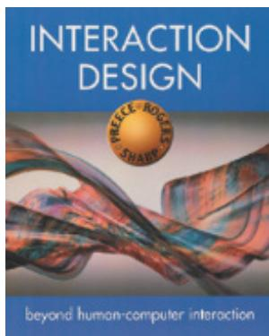
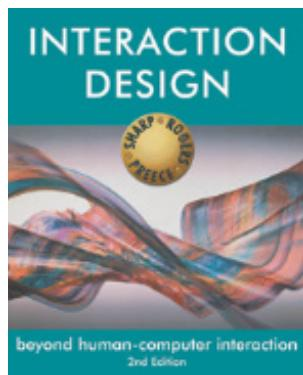
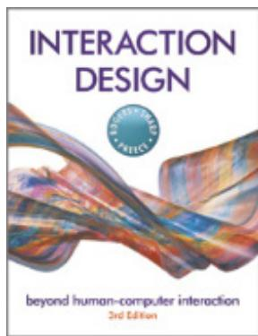
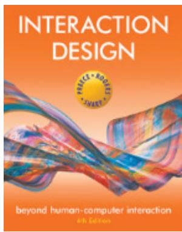
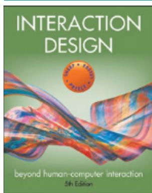
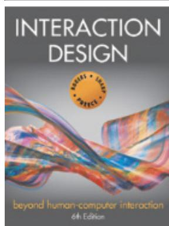

# Contents

# What’s Inside xix

# 1 WHAT IS INTERACTION DESIGN? 1

1.1  Introduction 1   
1.2  Good and Poor Design 3  
1.3  Switching to Digital 6   
1.4  What to Design 8   
1.5  What Is Interaction Design? 10   
1.6  People-Centered Design 14   
1.7  Understanding People 16   
1.8  Accessibility and Inclusiveness 17   
1.9  Usability and User Experience Goals 20

Further Reading 32

Interview with Harry Brignull 34

# 2  THE PROCESS OF INTERACTION DESIGN 37

2.1  Introduction 37   
2.2  What Is Involved in Interaction Design? 38   
2.3  Some Practical Issues 55   
Further Reading 66

# 3 CONCEPTUALIZING INTERACTION 69

3.1  Introduction 69   
3.2  Conceptualizing Interaction 72   
3.3  Conceptual Models 75   
3.4  Interface Metaphors 79   
3.5  Interaction Types 81   
3.6  Paradigms, Visions, Challenges, Theories, Models, and Frameworks 89

Further Reading 96

Interview with Albrecht Schmidt 97

# 4 COGNITIVE ASPECTS 101

4.1  Introduction 101   
4.2  What Is Cognition? 102   
4.3  Cognitive Frameworks 124

Further Reading 134

# 5 SOCIAL INTERACTION 135

5.1  Introduction 135   
5.2  Being Social 136   
5.3  Face-to-Face Conversations 141   
5.4  Remote Collaboration and Communication 147   
5.5  Co-Presence 159   
5.6  Social Games 165

Further Reading 169

# 6 EMOTIONAL INTERACTION 171

6.1  Introduction 171   
6.2  Emotions and Behavior 172   
6.3  Expressive Interfaces: Aesthetic or Annoying? 180   
6.4  Affective Computing and Emotional AI 184   
6.5  Persuasive Technologies and Behavioral Change 189   
6.6  Anthropomorphism 192

Further Reading 196

# 7 INTERFACES 199

7.1  Introduction 199  
7.2  Interface Types 200   
7.3  Natural User Interfaces and Beyond 266   
7.4  Which Interface? 267

Further Reading 269

Interview with Leah Buechley 271

# 8 DATA GATHERING 273

8.1  Introduction 273   
8.2  Six Key Issues 274   
8.3  Capturing Data 281   
8.4  Interviews 284   
8.5  Questionnaires 294   
8.6  Observation 302   
8.7  Putting the Techniques to Work 315

Further Reading 322

# 9 DATA ANALYSIS, INTERPRETATION, AND PRESENTATION 325

9.1  Introduction 325   
9.2  Quantitative and Qualitative 327   
9.3  Basic Quantitative Analysis 330

9.4  Basic Qualitative Analysis 340   
9.5  Analytical Frameworks 350   
9.6  Tools to Support Data Analysis 362   
9.7  Interpreting and Presenting the Findings 362

Further Reading 368

# 10  DATA AT SCALE AND ETHICAL CONCERNS 371

10.1  Introduction 371   
10.2  Approaches for Collecting and Analyzing Data 373   
10.3  Visualizing and Exploring Data 388   
10.4  Ethical Design Concerns 398

Further Reading 405

# 11  DISCOVERING REQUIREMENTS 407

11.1  Introduction 407   
11.2  What, How, and Why? 408   
11.3  What Are Requirements? 409   
11.4  Data Gathering for Requirements 418   
115.  Bringing Requirements to Life: Personas and Scenarios 426   
11.6  Capturing Interaction with Use Cases 436

Further Reading 440

# 12  DESIGN, PROTOTYPING, AND CONSTRUCTION 441

12.1  Introduction 441   
12.2  Prototyping 443   
12.3  Conceptual Design 456   
12.4  Concrete Design 467   
12.5  Generating Prototypes 470   
12.6  Construction 480

Further Reading 486

Interview with Jon Froehlich 487

# 13  INTERACTION DESIGN IN PRACTICE 491

13.1  Introduction 491   
13.2  AgileUX 494   
13.3  Design Patterns 504   
13.4  Open Source Resources 510   
13.5  Tools for Interaction Design 512

Further Reading 514

Interview with Luciana Zaina 515

# 14  INTRODUCING EVALUATION 519

14.1  Introduction 519   
14.2  The Why, What, Where, and When of Evaluation 520   
14.3  Types of Evaluation 524   
14.4  Evaluation Case Studies 533   
14.5  What Did We Learn from the Case Studies? 541   
14.6  Other Issues to Consider When Doing Evaluation 543

Further Reading 547

# 15  EVALUATION STUDIES: FROM CONTROLLED TO NATURAL SETTINGS 549

15.1  Introduction 549   
15.2  Usability Testing 550   
15.3  Conducting Experiments 564   
15.4  In-the-Wild Studies 567

Further Reading 576

Interview with danah boyd 577

# 16  EVALUATION: INSPECTIONS, ANALYTICS, AND MODELS 583

16.1  Introduction 583   
16.2  Inspections: Heuristic Evaluation and Walk-Throughs 584   
16.3  Analytics and A/B Testing 601   
16.4  Predictive Models 610

Further Reading 614

# Epilogue 615

# References 619

# Index 675

# What’s Inside?

Welcome  to the sixth edition of Interaction Design:  Beyond Human-Computer Interaction and  our  interactive website  at www.id-book.com.  Building  on  the success  of the previous editions, we have substantially  updated and streamlined the material in all the chapters  to provide  a  comprehensive  introduction  to  the  fast-growing  and  multidisciplinary  field  of interaction  design. We have also  added an  epilogue  where we  discuss  our  views of future directions  for the field. Rather than  let  the book expand, however, we have again made  a conscious effort to keep it the same length.

Our textbook is  aimed at undergraduate and graduate students from a range of backgrounds  studying  introductory  classes  in  human-computer  interaction, interaction  design, information  and  communications  technology,  web  design,  software  engineering,  digital media,  information  systems,  and  information  studies.  It  will  also  appeal  to  practitioners, designers, and researchers who want to discover what is new in the field or to learn about a specific design approach, method, interface, or topic. It is written in an accessible way and so will appeal to a general audience interested in design and technology.

It  is  called  Interaction  Design: Beyond  Human-Computer  Interaction because interaction design is concerned with a broader scope of issues, topics, and methods than was originally  the  scope  of  human-computer  interaction  (HCI)—although  nowadays,  the  two increasingly align in scope and coverage of topics. Throughout the book, we have balanced coverage and discussion of foundational concepts with current, state-of-the-art research that builds on them. We include research in the field and beyond, both current and classic studies, sometimes dating back to when HCI emerged in the 1970s and ’80s.

We define interaction design as follows:

Designing interactive products to support the way people communicate and interact in their everyday and working lives.

Interaction design requires an understanding of the capabilities and desires of people and the kinds of technology that are available. Interaction designers  use this knowledge to discover  requirements  and  to develop  and  manage  them  to  produce  a design.  Our  textbook provides  an introduction to all of these areas. It teaches practical techniques to support all stages of design and development as well as discussing possible technologies and design alternatives.

The number of different types of interface and applications available to today’s interaction designers continues to increase steadily, so our textbook, likewise, has been expanded to cover these new technologies. For example, we discuss and provide examples of brain, smart, robotic, wearable, shareable, augmented reality, and multimodal interfaces, as well as more traditional desktop, multimedia, and web-based interfaces. Interaction design in practice is changing fast, so we cover a range of processes, issues, and examples throughout the book.

The book has 16 chapters, and it includes discussion of the different design approaches in common use; how cognitive, social, and affective issues apply to interaction design; and

how to gather, analyze, and present data for interaction design. A central theme is that design and evaluation are interwoven, highly iterative processes, with some roots in theory but that rely strongly on good practice to create usable products. The book has a hands-on orientation and explains how to carry out a variety of techniques used to design and evaluate the wide range of new applications coming onto the market. It has a strong pedagogical design and includes many activities (with detailed comments) and more complex, in-depth activities that can form  the basis for student projects. There  are also “Dilemmas,” which  encourage readers to weigh  the  pros  and cons of controversial  issues. Each chapter  contains  links  to videos and recommends additional readings for those who want to go further into a particular topic.

# TASTERS

We address topics and questions about the what, why, and how of interaction design. These include the following:

•  Why some interfaces are good and others are poor   
•  Whether people can really multitask   
•  How technology is transforming the way people communicate with one another   
•  How we can design products that support people’s lives   
•  How interfaces can be designed to change people’s behavior   
How to choose between the many different kinds of interactions that are now available (for example, talking, touching, and wearing)   
•  What it means to design accessible and inclusive interfaces   
•  Why carry out studies in the lab versus in the wild   
•  When to use qualitative and quantitative methods   
•  How to construct informed consent forms   
•  How the type of interview questions posed affects the conclusions that can be drawn from the answers given   
•  How to move from a set of scenarios and personas to initial low-fidelity prototypes   
•  What is design thinking and what is its relationship with interaction design   
•  How to visualize the results of data analysis effectively   
•  How to collect, analyze, and interpret data at scale   
•  Why do people do something different from what they say   
•  How to ensure the monitoring and recording of people’s activities is ethical   
•  What are Agile UX and Lean UX and how do they relate to interaction design   
•  How to collect and interpret analytics to compare different design

The style of writing throughout the book is intended to be accessible to a range of readers. It  is  largely  conversational  in  nature and  includes anecdotes, cartoons,  and examples. Many of the illustrations are intended to relate to readers’ own experiences. The book and the associated website are also intended to encourage readers to be active when reading and

to think about seminal issues. The goal is for readers to understand that much of interaction design requires consideration of the issues and that it is important to learn to weigh the pros and  cons  and  be  prepared  to  make  trade-offs.  There  is  rarely  a  right  or  wrong  answer, although there is a world of difference between a good design and a poor design.

This book is accompanied by a website (www.id-book.com), which provides a variety of resources,  including  slides  for  each  chapter, comments  on  chapter  activities,  and  other resources written by researchers and designers. There are video interviews with a wide range of experts from the field, including professional interaction designers and university professors. We selected people to interview who cover different topics, and we deliberately selected a range of people, from gurus in the field to newly established researchers and professionals. Pointers to respected blogs, online tutorials, YouTube videos, and other useful materials are also provided.

# INTERACTION DESIGN

