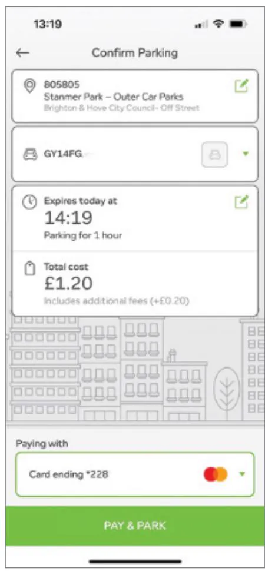
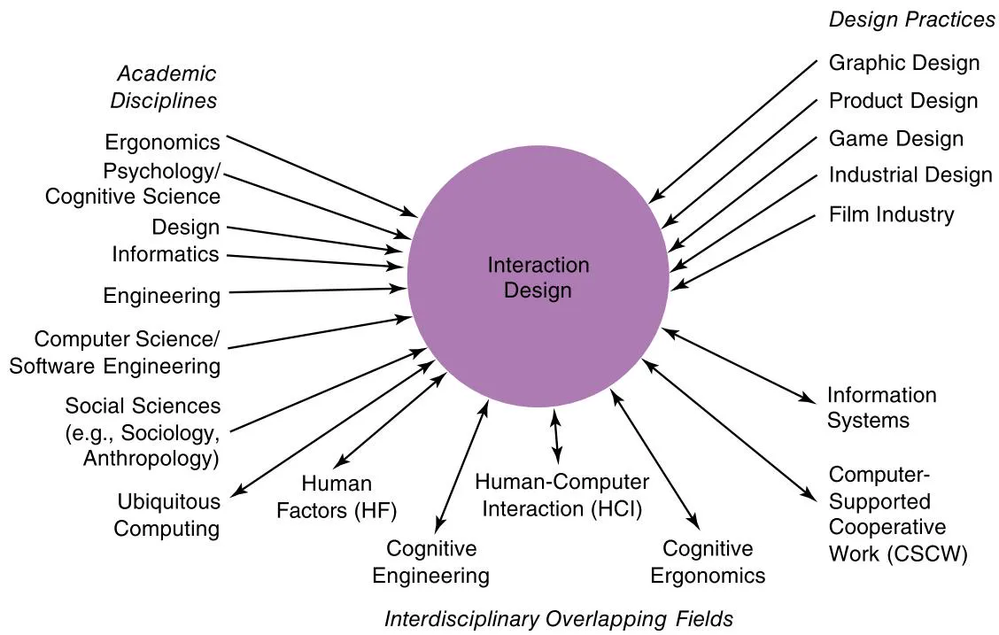
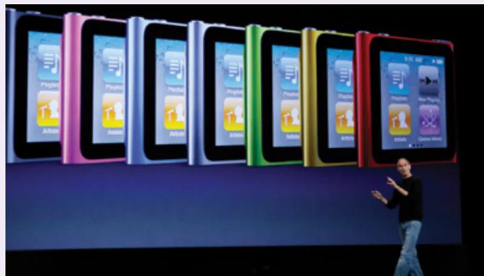
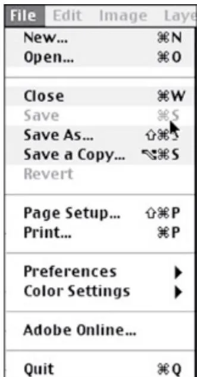
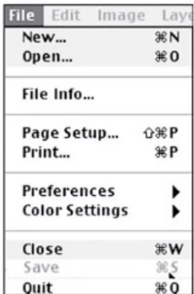
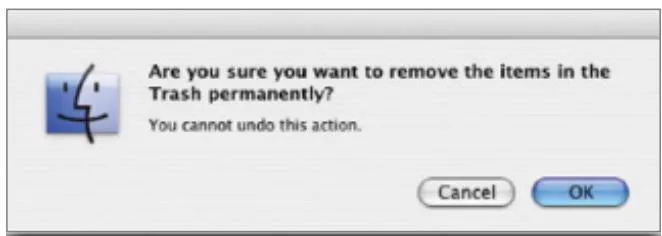
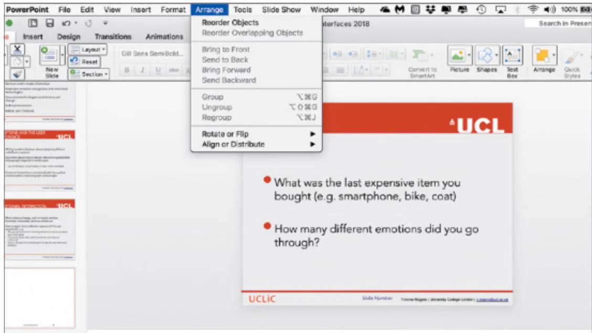

# Chapter 1

# W H A T  I S  I N T E R A C T I O N  D E S I G N ?

1.1  Introduction   
1.2  Good and Poor Design  
1.3  Switching to Digital   
1.4  What to Design   
1.5  What Is Interaction Design?   
1.6  People-Centered Design   
1.7  Understanding People   
1.8  Accessibility and Inclusiveness   
1.9  Usability and User Experience Goals

# Objectives

The main goals of this chapter are to accomplish the following:

•  Explain the difference between good and poor interaction design.   
•  Consider the pros and cons of transforming activities to become digital.   
•  Describe what interaction design is and how it relates to human-computer interaction and other fields.   
•  Explain the relationship between the user experience and usability.   
Introduce  what  is  meant  by  accessibility  and  inclusiveness  in  relation  to  humancomputer interaction.   
•  Describe what and who is involved in the process of interaction design.   
•  Outline the different forms of guidance used in interaction design.   
Enable you to evaluate an interactive product and explain what is good and bad about it in terms of the goals and core principles of interaction design.

# 1.1 Introduction

How many interactive products are there in everyday use? Think for a minute about what you use in a typical day: a smartphone, tablet, smartwatch, laptop, remote control, coffee machine, printer, smoothie maker, e-reader, smart TV, alarm clock, electric toothbrush, radio, bathroom

scales, fitness tracker, game console. Then think of which apps and social media you use…the list is endless. Now think for a minute about how usable they are. How many are actually easy, effortless, and enjoyable to use? Some, like a tablet, are a joy to use, where tapping an app and flicking through photos is simple, smooth, and enjoyable. Others, like buying a train ticket from a ticket machine that does not recognize your credit card after completing a number of steps and then makes you start again from scratch, can be very frustrating. Why is there a difference?

Many products that require users to interact with them, such as smartphones and fitness trackers, have been designed primarily with users’ needs in mind. They are generally easy and enjoyable to use. Others have not necessarily been designed with the person in mind; rather, they have been engineered primarily as software systems to perform set functions. An example is setting the time of day on a stove, such as when setting it up or after a power failure, that requires a combination of button presses that are not obvious as to which ones to press together or separately. While they may work effectively, it can be at the expense of how easily they will be learned and remembered and therefore used in a real-world context.

Alan Cooper (2018), a well-known user experience guru, bemoans the fact that much of today’s software suffers from the same interaction errors that were around 25 years ago. Why is this still the case, given that interaction design has been in existence for more than 30 years and given that there are far more designers now in industry than ever before? He points out how many interfaces of new products do not adhere to the interaction design principles validated in the 1990s. For example, he notes that many apps do not follow even the most basic of user experience design principles, such as offering an “undo” option. He exclaims that it is “inexplicable and unforgivable that these violations continue to resurface in new products today.”

How can we rectify this situation so that the norm is that all new products are designed to provide good user experiences? To achieve this, we need to be able to understand how to reduce the negative aspects (such as frustration and annoyance) while enhancing the positive ones (for example, enjoyment and efficacy). This entails developing interactive products that are easy to learn, effective, and pleasurable to use from a user’s perspective.

In this chapter, we begin by examining the basics of interaction design. We look at the difference between good and poor design, highlighting how products can differ radically in how usable and enjoyable they are. We consider what is gained and lost from transforming activities to be digital when previously they were done  through using physical artifacts. We then describe what and who is involved in the process of interaction design. The user experience, which is a central concern of interaction design, is then introduced. Finally, we outline how to characterize this in terms of usability goals, user experience  goals, and design principles. An in-depth activity is presented at the end of the chapter in which you have the opportunity to put into practice what you have read by evaluating the design of an interactive product.

# BOX 1.1

What’s in a name? User, people, human, or customer?

Several terms have been used to emphasize different aspects of what is being designed, including user interface design (UI), software design, user-centered design, human-centered design, people-centered  design, product design, web design, user experience (UX) design, customer

experience (CX) design,  and  interactive  system design.  Interaction  design (IxD)  is generally used as the  overarching term to describe the  field, including its methods, theories, and approaches. Since about 2010, UX design has been the most widely used term in industry to refer to the profession. However, the terms have been used interchangeably. Also, it depends on each company’s ethos and brand.

As the field has matured, Don Norman (2018) has argued for using the more encompassing term people-centered design and referring to people instead of users where it seems more appropriate. Sometimes, continuing to use the term user makes sense, however, if it is specifically about how a technology is to be used for or by someone. Likewise, continuing to refer to user’s needs and the user experience can be preferable when considering how to design a specific product. More generally, however, much of what interaction design is about is understanding and augmenting people. In this context, using the term people is better, because it is broader, being able to refer to a single person, a group of people, or even whole societies, which is appropriate when describing large social media systems. Here, in the new edition of our textbook, we have changed primarily to using people-centered design but have continued to use the term user-centered when referring specifically to using an interface.

Customer experience (CX), on the other hand, refers to all of the interactions someone has with a company’s offering, including the overall experience, the probability they will continue to use it, and the likelihood they will recommend it to others. In this sense, the UX is part of the wider CX, but the CX covers other aspects that the UX has traditionally not covered (Lowden, 2014).

Video Don Norman explains why adopting a people-centered approach is the way forward: interaction-design.org/literature/topics/people-centered-design.

# 1.2  Good and Poor Design

A central concern of interaction design is to develop interactive products that are usable. By this we mean products that are generally easy to learn, effective to use, and provide an enjoyable experience for the intended people. A good place to start thinking about how to design usable  interactive  products  is  to  compare  examples  of  well-designed  and  poorly  designed ones. Through identifying the specific weaknesses and strengths of different interactive products, we can begin to understand what it means for something to be usable or not. Here, we describe  an  example  of  a  poorly  designed  product  that has  persisted  over  the  years—the ubiquitous  remote  control—and  contrast  this  with  a  well-designed  example  of  the  same product that performs the same function.

Every  home  entertainment  system,  be  it  the  smart  TV,  streaming  video  player,  home theater  system,  and so  forth, comes  with  its  own  remote control.  Each  one  is  different  in

terms of how it looks and works. Many have been designed with a dizzying array of small, multicolored, and double-labeled buttons (one on the button and one above or below it) that often seem arbitrarily positioned in relation to one another. Many viewers, especially when sitting in their living rooms, find it difficult to locate the right buttons, even for the simplest of tasks, such as pausing or finding the main menu. It can be especially frustrating for those who need to put on their reading glasses each time to read the buttons. The remote control appears to have been put together very much as an afterthought.

In contrast, much effort and thought went into the design of the classic TiVo remote control with the viewer in mind (see Figure 1.1). TiVo is a digital video recorder that was originally developed to enable the viewer to record TV shows. The remote control was designed with  large buttons  that  were clearly labeled  and  logically  arranged,  making  them  easy  to locate and  use in  conjunction with  the menu interface that appeared  on the TV  screen. In terms of its physical form, the remote device was designed to fit into the palm of a hand, having a peanut shape. It also has a playful look and feel about it: Colorful buttons and cartoon icons are used that are distinctive, making it easy to identify them.

Figure 1.1  The TiVo remote control   
  
Source: business.tivo.com

How was it possible to create such a usable and appealing remote device where so many others have failed? The answer is simple: TiVo invested the time and effort to follow a peoplecentered design process. Specifically, TiVo’s director of product design at the time involved

potential users  in the design process, getting  their feedback on everything  from the feel  of the device in the hand to where best to place the batteries, making them easy to replace but not  prone  to  falling out.  He  and  his  design team  also  resisted  the  trap  of “buttonitis” to which so many other remote controls have fallen victim; that is one where buttons breed like rabbits—a button for every new function. They did this by restricting the number of control buttons embedded in the device to the essential ones. Other functions were then represented as part of the menu options and dialog boxes displayed on the TV screen, which could then be selected via the core set of physical control buttons. The result was a highly usable and pleasing device that has received much praise and numerous design awards.

# DILEMMA

What Is the Best Way to Interact with a Smart TV?

A challenge facing smart TV providers is how to enable people to interact with online content. Viewers can select a whole range of content via their TV screens, but it involves scrolling through lots of menus and screens. In many ways, the TV interface, which once consisted of simply choosing from among a few channels, has become more like a computer interface. This raises the question of whether the remote control is the best input device to use for someone who sits on a sofa or chair that is some distance from the TV screen. Smart TV developers have addressed this challenge in a number of ways.

An early approach was to provide an on-screen keyboard and numeric keypad that presented a grid of alphanumeric characters (see Figure 1.2a), which were selected by pressing a button repeatedly on a remote control. However, entering the name of a movie or an email address and password using this method can be painstakingly slow; it is also easy to overshoot and select the wrong letter or number when holding a button down on the remote to reach a target character. Other systems have tried alternatives, such as different arrangements of the alphanumeric characters on-screen; using the numeral keys with their telephone-style associated letters; and sliding a small, physical keyboard from the underside of the remote control. None of these has proven perfect.

More recent remote controls, such as those provided by Apple TV, incorporate a touchpad to enable swiping akin to the control commonly found on laptops. While this form of touch control expedites skipping through a set of letters displayed on a TV screen, it does not make it any easier to type in an email address and password. Each letter, number, or special character still  has to be selected. Swiping  is also prone  to overshooting when aiming for a target letter, number, or character. Instead of providing a grid, the Apple TV interface displays two single lines of letters, numbers, and special characters to swipe across (see Figure 1.2b). While this can make it quicker for someone to reach a character, it is still tedious to select a sequence of characters in this way. For example, if you select a Y and the next letter is an A, you have to swipe all the way back to the beginning of the alphabet.

(Continued)

(b)   
Figure 1.2  Typing on a TV screen (a) by selecting  letters  and  numbers  from a square matrix and (b) by swiping along a single line of letters and numbers   
  
Source: (b) support.apple.com/en-us/HT200107

Might there be a better way to interact with a smart TV while sitting on the sofa? Firestick TV has pared down the number of buttons on its remote controllers  to a core set of basic navigation ones (e.g., up, down) needed to interact with its streaming media players. An alternative is to use voice control. Most remote controls have a speech button that when pressed allows viewers to ask for movies by name or more generally by category, for instance, “What are the best sci-fi movies on Netflix?” Smart speakers, such as Amazon Echo, can also be connected to a smart TV via an HDMI port, and, similarly, a person can ask for something general or more specific, for example, “Alexa, play Big Bang Theory, Season 6, Episode 5, on the TV.” On recognizing the  command, the Echo will switch on the TV,  switch to the right HDMI channel, open Netflix, and begin streaming the specific episode. A recent survey found voice input is becoming ever more popular; one in five TV users now use voice input to find movies, shows, or videos; change the channels; change the volume; or turn the TV on or off (Roettgers, 2019). Some TV content, however, requires the viewer to say that they are older than a certain age by checking a box on the TV display. If the TV could ask the viewer and check that they are 18 or older, then that would be really smart! Also, if the TV needs the viewer to provide a password to access on-demand content, they won’t want to say it aloud, character by character, especially in front of others who might also be in the room with them. The use of biometrics, then, may be the answer.

# 1.3  Switching to Digital

Many activities that used to be done via a physical artifact have gone digital. Instead of walking up to a machine and buying a ticket or an ATM to withdraw cash, many of us now do such transactions digitally using an app on our smartphone or tablet. Mostly, this has made the tasks easier, quicker, and more convenient. An example is being able to pay for parking via a mobile phone app. Twentieth-century parking meters required drivers to insert coins to rent a parking

space, which meant drivers who didn’t have the correct coins couldn’t legally park. Now, instead of fumbling around trying to find the right change for the time wanted and slotting this into a physical meter, we can fill in an online form in advance with our details and then pay each time we want to park using a credit card or digital pay app. Our details can then be stored ready for the next time we need to pay for parking, meaning even fewer steps to complete subsequently (see Figure 1.3). It just needs us to type in the parking location number where we plan to park, and the rest is filled in for us by the app. Some apps will even notify us on our phone when the time we have paid for is nearly up, asking if we would like to add time. All we need to do is press a button from our phone. Not only does this form of digital prompting prevent us from risking a fine if we exceed the time limit, but it also provides more revenue for the parking company!

  
Figure 1.3  The  form used for a parking app in the United Kingdom. It takes five seconds to complete and can be done while sitting in the car.

Many  previous  physical  transactions  have  been  digitalized  like  this.  Other  examples include buying tickets from an entertainment site (e.g., a movie, a concert, a play) or booking a ticket to go somewhere (e.g., a train, a bus, an airline). An added benefit is not having to wait in line before being able to buy a physical ticket. The customer can also check various

preferences for which kind of ticket they want, which can all be stored and accessed again at a later date. Furthermore, a QR or barcode is usually part of the digital ticket, making it easy to gain entrance through the ticket barrier by swiping their smartphone or watch across it. Another  advantage of booking tickets online is  having the option of choosing where to sit  and, in some situations, ordering  food or  drinks in advance. Digital tickets  can  also  be stored in digital wallets, which keep a record of all the digital tickets someone has bought.

There are, however, disadvantages of switching over to digital. First, it requires a person to possess a smartphone that is capable of downloading and storing the digital tickets. Second, some people still prefer to use older phones, which the apps won’t work on, while others prefer to have paper-based tickets. Third, it can also be stressful and cumbersome to some people— especially if they do not have much battery power left on their phone or they need to fumble around trying to find their glasses to see the apps on their phone. There is of course the option of printing out a digital ticket onto paper, but that assumes someone has access to a printer. A further problem is if the person is entitled to a discount (e.g., student, senior, disabled), it may require them to show a card in person to the ticket collector, which can mean having to switch between apps, which can be cumbersome. People who are disabled using certain assistive technologies might be unable to use a digital ticket, which could lead to legal and ethical issues as well as emotional distress. Another disadvantage is that some people don’t like to divulge their personal details online and would prefer to buy a ticket anonymously and pay by cash.

# 1.4 What to Design

Designing interactive products requires considering who is going to be using them, how they are going to be used, and when and where they are going to be used. Another key concern is to understand the kind of activities people are doing when interacting with these products. The appropriateness of different kinds of interfaces and arrangements of input and output devices depends on what kinds of activities are to be supported. For example, if the activity is to enable people to bank online, then an interface that is secure, trustworthy, and easy to navigate is essential. In addition, an interface that allows a customer to find out information about new services offered by their bank without it being intrusive would be useful.

There are many types of interfaces and interactive devices available now, including multitouch displays, speech-based systems, mobile devices, and wearables. There are also many ways  of designing  how  people can  interact with  them, for instance, via the use  of  menus, commands, forms, icons,  gestures, and so  on. Ever  more innovative  everyday artifacts are being created using novel materials, such as e-textiles. Wearable glasses that look like fashionable shades have also started to appear, such as Snap Spectacles, that let the wearer experience augmented reality (see Figure 1.4).

The interfaces for everyday consumer items, such as cameras, microwave ovens, toasters, and washing machines, have become  predominantly digitally-based.  Self-checkouts at  grocery stores and libraries have become the norm, where customers check out their own goods or books  themselves, and at airports,  where passengers check  in their own  luggage. More recently, smart supermarkets have appeared that do not require the shopper to even have to check out the goods they want to purchase. A sophisticated network of AI-enabled cameras in the  ceiling, together with  shelves  embedded with  weight  sensors, can determine what  a customer picks up and puts in their bag/pocket, billing them as soon as they leave the store.

The smarts are in how the computer vision, sensor fusion, and deep learning are combined to track customers and what they took from or replaced on a shelf. Amazon Go pioneered this type of store, with other supermarkets now testing their own versions.

Figure 1.4  The digital world overlaying the physical experienced when wearing Snap AR Spectacles   
  
Source: www.techeblog.com/new-snapchat-spectacles-augmented-reality

The advent of the Internet of Things (IoT), where data is collected from sensors and travels via the Internet to other devices, has been embedded into several of our household products. For example, a popular household IoT-enabled product is home security, where people can keep an eye on their home from the data relayed to their smartphone via a combination of sensors placed in their home. These include motion detectors, glass breaking detectors, and smart object detectors. A video camera can be attached to someone’s doorbell  and relayed to a smartphone app so the owner can check up on who has rung it—even though they may be  on vacation.  Some  home-based security  cameras  also use  machine  learning that  recognizes whether an intruder is trying to break into the house through using facial recognition. Machine learning is also being used in a range of other home-based products, such as automated thermostats  like the Nest, which optimizes the temperature settings for a household where the algorithms analyze its energy consumption over time.

A key question for interaction design is this: “How do you optimize a person’s interactions with a system, environment, or product so that they support their activities in effective, useful, usable, and pleasurable ways?” Another question that is of growing concern to interaction design is how safe and private is the data being collected? Many decisions need to be made based on an understanding of people including the following:

Considering what people are good and bad at   
. Considering what might help people with the way they currently do things   
. Thinking through what might provide quality experiences

• Considering a person’s privacy concerns if data is being collected about them   
Listening to what people want and getting them involved in the design   
Using people-centered techniques during the design process

The  aim  of this  book  is  to  cover  these  aspects  with the  goal  of showing  you how  to carry out interaction design. In particular, it focuses on how to identify a user’s needs and the context of their activities. From this understanding, we move on to consider how to design usable, useful, safe, and pleasurable interactive products.

# 1.5 What Is Interaction Design?

By interaction design, we mean the following: designing interactive products to support the way people communicate and interact in their everyday and working lives. Put another way, it is about creating experiences that enhance and augment the way people work, communicate, and interact. More generally, Terry Winograd originally described it as “designing spaces for human communication and interaction” (1997, p. 160).

# BOX 1.2

Is Interaction Design Beyond HCI?

We see the main difference between interaction design (ID) and human-computer interaction as one of scope. Historically, HCI had a narrow focus on the design and usability of computing systems, while  ID was  seen as being broader, concerned  with the theory, research, and practice of designing user experiences for all manner of technologies, systems, and products. That is one of the reasons why we chose to call our book Interaction Design: Beyond Human-Computer Interaction, to reflect this wider range.

# 1.5.1  The Components of Interaction Design

We view interaction design as fundamental to many disciplines, fields, and approaches that are concerned with researching and designing computer-based systems for people. Figure 1.5 presents  the  core  ones  along  with  interdisciplinary  fields  that  comprise  one  or  more  of these, such as cognitive ergonomics. It can be confusing to try to work out the differences between them as  many overlap. The main differences between interaction design and the other approaches  referred to in the figure come largely down to which methods, philosophies, and lenses they use to study, analyze, and design products. Another way they vary is in terms of the scope and problems they address. For example, information systems is concerned with the application of computing technology in domains such as business, health, and education, whereas ubiquitous computing is concerned with the design, development, and  deployment  of  pervasive  computing  technologies  (for  example,  IoT)  and  how they facilitate social interactions and human experiences.

  
Figure 1.5  Relationship among contributing academic disciplines, design practices, and interdisciplinary fields concerned with interaction design (double-headed arrows mean overlapping)

# ACTIVITY 1.1

Since we first  created Figure 1.5, many other  computer-related fields have emerged where the user is considered central. These  include cybersecurity, digital  humanities, data science, and digital healthcare. For some fields, there has also been a shift toward being more peopleoriented, for example, human-centered AI. Would it make sense to add these, and, if so, how?

# Comment

We could add a further  section that identifies where interaction  design has informed other fields, for example, those where software tools have been developed for scientists/researchers/ clinicians to use as part of their methodology. These include the built environment, bioinformatics, medicine, marketing, computational biology, and computational design. We could also try to add a number of other fields and practices that have begun to inform interaction design, including behavioral economics, ethics, accessibility, and AI. Feminism, critical theory, queer theory, post-colonial and political activism have also come to the fore providing alternative lenses by which to examine and explore  societal challenges within the scope of interaction design. However, rather than try to add all of these to the diagram—which would make it unwieldy—we have decided to keep it as is, comprising the  core disciplines, practices, and overlapping fields.

# 1.5.2  Who Is Involved in Interaction Design?

Figure 1.5 also shows that many people are involved in performing interaction design, ranging from  social scientists to movie-makers. This is not surprising given that  technology has become  such  a  pervasive  part  of  our  lives.  But  it  can  all  seem  rather  bewildering  to  the onlooker. How does the mix of players work together?

Designers need to know many different things about people, technologies, and the interactions among them to create effective experiences. At the least, they need to understand how people act and react to events and how they communicate and interact with each other. To be able to create engaging experiences, they also need to understand how emotions work, what is meant by aesthetics, desirability, and the role of narrative in human experience. They also need to understand the business side, technical side, manufacturing side, and marketing side. Recently, there has been more emphasis on understanding  the ethical aspects, especially for technologies that are collecting ever-increasing  amounts  of personal data, such as smart speakers and personal healthcare devices. Questions raised include how do we ensure the new technology or product is safe, secure, perceived to be trustworthy and valued, and understandable by the general public?

Clearly, it is difficult for one person to be well versed in all of these diverse areas and also know how to apply the different forms  of knowledge to the process of interaction design. Interaction  design is  ideally  carried  out  by  multidisciplinary  teams,  where the  skill  sets of engineers,  designers,  programmers,  psychologists,  anthropologists,  sociologists,  marketing people, artists,  toy  makers, product  managers, and others  are  drawn  upon. It  is  rarely the case, however, that  a design  team  would have  all  of these  professionals  working  together. Who to include in a team will depend on a number of factors, including a company’s design philosophy, size, purpose, and product line.

One of the benefits of bringing together people with different backgrounds and training is the potential of many more ideas being generated, new methods developed, and more creative and original designs being produced. However, the downside is the costs involved. The more people there are with different backgrounds in a design team, the more difficult it can be to communicate and make progress with the designs being generated. Why? People with different backgrounds have different perspectives and ways of seeing and talking about the world. What one person values as important others may not even see (Kim, 1990). Similarly, a computer scientist’s understanding of the term representation  is often very different from that of a graphic designer, media specialist, or psychologist.

What  this means  in practice  is  that confusion, misunderstanding, and communication breakdowns  can  surface  in  a  team. The  various  team  members  may  have  different  ways of talking about  design and may use  the same terms to mean quite different  things. Other problems can arise when a group of people who have not previously worked as a team  are thrown together. For example, Aruna Balakrishnan et al. (2011) found that integration across different disciplines and expertise is  difficult in many  projects, especially  when it comes to agreeing on and sharing tasks. The more disparate  the team members—in terms of culture, background, and organizational structures—the more complex this is likely to be.

# ACTIVITY 1.2

In practice, the  makeup of a given  design team depends on the kind of interactive product being built. Who do you think should be involved in developing:

•  A public kiosk providing information about the exhibits available in a science museum?   
•  An interactive educational website to accompany a TV series?

# Comment

Ideally, each team will have a number of different people with different skill sets. For example, the first interactive product would include the following individuals:

•  Graphic and interaction designers, museum curators, educational advisers, software engineers, software designers, and ergonomists   
The second project would include these types of individuals:   
•  TV producers, graphic and interaction designers, teachers, screenwriters, information architects, UX researchers, video experts, software engineers, and software designers   
In addition, as both systems are being developed for use by the general public, representative users, such as school children and parents, should be involved.

In practice, design teams often end up being quite large, especially if they are working on a big project to meet a fixed deadline. For example, it is common to find teams of 15 or more people working on a new product like a health app. This means that a number of people from each area of expertise are likely to be working as part of the project team.

# 1.5.3  Interaction Design Consultancies

Interaction  design  is now  widespread  in product  and services  development. In  particular, UX  consultants  and  the  computing  industries  have  realized  its  pivotal  role  in  successful interactive products. But it is not just IT companies that are realizing the benefits of having interaction designers. Financial services, retail, governments, marketing, video and film producers, and the public sector have realized its value, too. The presence or absence of good interaction design can make or break a company. Getting noticed in the highly competitive field of smartphone apps requires standing out. Being able to demonstrate that your product is easy, effective, and engaging to use is seen as central to this. Marketing departments focus on how the branding, the number of engagements, the customer return rate, and customer satisfaction are greatly affected by the usability of a website. Many now have their own toolkits for testing the different aspects of a website, for example, using A/B testing to determine  the  effect  of  different  UI  designs  on  metrics  such  as  sales  or  the  number  of repeat visitors.

There  are  many interaction design  consultancies  now. These  include established  companies, such as Nielsen  Norman Group and IDEO, and more recent ones that specialize in

a  particular area,  such  as  job  board  software  (for  example,  Madgex), digital  media  (e.g., Cogapp), or mobile design (such as CXpartners). Smaller  consultancies, such as Bunnyfoot and  Dovetailed,  promote  diversity, interdisciplinarity,  and  scientific  research,  having  psychologists,  researchers,  interaction  designers,  usability, and  customer  experience  specialists on board.

Many  consultancies have impressive websites, providing case  studies, tools, and blogs. For example, Holition publishes highly engaging case studies and tantalizing videos of their in-house research, intended for the wider community, with a focus on  the implications for commercial and cultural aspects. This sharing of knowledge enables them to contribute to the discussion about the role of technology in human experience.

# 1.6  People-Centered Design

People-centered design  involves understanding  how  people feel  about  a product  and their pleasure and satisfaction when using it, looking at it, holding it, and opening or closing it. It includes their overall impression  of how  good it  is to use, right  down  to the sensual effect small details have on them, such as how smoothly a switch rotates or the sound of a click and the touch of a button when pressing it. An important aspect is the quality of the experience someone has, be it a quick one, such as taking a photo; a leisurely one, such as playing with an interactive toy; or an integrated one, such as visiting a museum (Law et al., 2009). As Don Norman (2004) stressed earlier, “It is not enough that we build products that function, that are understandable and usable, we also need to build joy and excitement, pleasure and fun, and yes, beauty to people’s lives.”

# ACTIVITY 1.3

# The Classic iPod Phenomenon

Apple’s classic (and subsequent) generations of portable music players, called iPods, including the iPod Touch, Nano, and Shuffle, released during the early 2000s were a phenomenal success. They were very popular at the time. Then the smartphone came into being in 2007, which enabled music to be played on it. Playing music via a smartphone became the norm, superseding the need for a separate device. Apple stopped production of their last remaining iPod—the iPod Touch—in 2022. Why do you think the iPod was such a huge success when it came into being? What other products have since been received with so much acclaim?

# Comment

Apple realized early on that successful interaction design involves creating interactive products that provide not just usable but also enjoyable experiences. The sleek appearance of the iPod music player (see Figure 1.6), its simplicity of use, its elegance in style, its distinct family of rainbow colors, a novel interaction style that many people discovered was a sheer pleasure

to learn  and use, and the  catchy naming of its product and content  (iTunes, iPod), among many other design features, led to it becoming one of the  greatest products of its kind and a must-have  fashion item for teenagers, students, and adults alike. While there were many competing players on the market at the time—some with more powerful functionality, others that were cheaper and easier to use, or still others with bigger screens, more memory, and so forth—the quality of the overall experience paled in comparison to that provided by the iPod. In addition, Apple provided a whole ecosystem to accompany the iPod, including the iTunes store app where millions of licensed music tracks could be bought for less than a dollar each.

Figure 1.6  The iPod Nano   
  
Source: Paul Sakuma / AP Photo

Apple has continued to design products that are both beautiful and usable, most notable are the iPad and the range of iPhones. It even designed what was at the time a completely new customer experience for buying technology in the form of the Apple Store, from how it draws people in and what they do when browsing, discovering, and purchasing goods in the store. There  are  no checkouts to pay  for goods—just roaming Apple  employees  holding  mobile devices that they interact with to make an order for a customer, take payment, and email them a receipt. Apple now has a new kind of retail space, akin to being more like a town square, where everyone is welcome, and various community activities take place weekly, like learning to code.

There are many aspects of the user experience that can be considered and many ways of taking them into account when designing interactive products. Of central importance are the usability, functionality, aesthetics, content, look and feel, and emotional appeal. In addition, Jack Carroll (2004) stresses other wide-reaching aspects, including fun, health, social capital (the social resources that develop and are maintained through social networks, shared values,

goals, and norms), and cultural identity, such as age, ethnicity, race, disability, family status, occupation, and education.

Several researchers have attempted to describe the experiential aspect of people-centered design. Kasper Hornbæk  and  Morten Hertzum  (2017) note how  the  user experience is often  described in terms of the way that people perceive a product, such as whether a smartwatch is seen as sleek, cool, or chunky, and their emotional reaction to it, such as whether people have a positive experience when using  it. Marc Hassenzahl, Michael Burmester, and Frank Keller (2021) reflect on the  way the user experience has evolved over the last 20 years, noting how there has been a growing interest in designing for hedonic aspects in relation to well-being. By hedonic, it is meant how evocative and stimulating the interaction is to them. In addition to a person’s perceptions of a product, John McCarthy and Peter Wright (2004) discuss the importance of someone’s expectations and the way they make sense of their experiences when using technology. Their Technology as Experience framework accounts for the experience largely in terms of how it feels to someone. Kia Höök (2018) has extended the idea of the felt experience even further, proposing Soma Design, which considers how technology can make people more aware of the experience of their felt bodily sensations and movements.

How does one go about designing quality experiences for people? There is no secret sauce or magical formula that can be readily applied by interaction designers. However, there are numerous conceptual frameworks, tried and tested design methods, guidelines, and relevant research findings, which are described throughout the book.

# 1.7 Understanding People

A main reason for  having a better understanding of people  in the contexts in  which they live, work,  and  learn  is that  it  can  help  designers  understand  how  to  design  interactive products that augment humans and match their needs at the time and place of use. A collaborative  planning  tool  for  a  space  mission,  intended  to  be  used  by  teams  of  scientists working in different parts of the world, will have quite different needs from one targeted at customer and sales agents, to be used in a furniture store to draw up kitchen layout plans. Understanding individual differences can also help designers appreciate that one size does not  fit all;  what works  for one group of people may  be totally inappropriate for another. For example, children have different expectations than adults about how they want to learn or  play.  They  may  find  having  interactive  quizzes  and  cartoon  characters helping  them along to  be highly motivating, whereas most adults find  them annoying. Teenagers  enjoy short videos such as the ones they watch and upload to TikTok and YouTube. Conversely, adults often like podcast discussions about topics, which children and teenagers may find boring. Just as everyday objects like clothes, food, and games are designed differently for children, teenagers, and adults, so too should interactive products be designed for different kinds of people.

Learning  more  about  people  and what  they  do  can  also  reveal  incorrect assumptions that designers may have about particular groups and what they need. For example, it is often assumed that because of deteriorating vision  and dexterity, older people want things  to be big—be it text or graphical elements appearing on a screen or the physical controls, like dials and switches, used to control devices. This  may be true for some  older people, but  studies have shown that many people in their 70s, 80s, and older are perfectly capable of interacting with standard-size information and even small interfaces, for example, smartphones, just as well as those in their teens and 20s, even though, initially, some might think they will find it

difficult (Siek et al., 2005). It is increasingly the case that as people get older, they do not like to consider themselves as getting older, associated with lacking in cognitive and manual skills. Being aware of people’s sensitivities, such as aging, is as important as knowing how to design for their capabilities (Johnson and Finn, 2017). In particular, while many older adults now feel comfortable with and use a range of technologies (for instance, email, online shopping, online  games, or social media), they  may resist  adopting new  technologies (Knowles et al, 2021). This is not because they don’t perceive them as being useful to their lives but because they  don’t  want  to  waste  their  time  getting  caught  up  by  the  distractions  that  digital  life brings (Knowles and Hanson, 2018), for example, not wanting to be “glued to one’s mobile phone” like younger generations.

Being aware of cultural differences is also an important concern for interaction design, particularly  for  products  intended  for a  diverse  range  of groups  from  different  countries. A  seemingly trivial  but  important  example  of  a  cultural  difference  is  the  dates  and  times used in different countries. In the  United States, for example, the date  is written as month, day, year (05/21/23), whereas in other countries, it is written in the sequence of day, month, year  (21/05/23).  This  can  cause  problems  for  designers  when  deciding  on  the  format  of online forms, especially if intended for global use. It is also a concern for products that have time  as a function, such as  operating systems,  digital clocks, or car  dashboards. To which cultural group do they give preference? How do they alert someone to the format that is set as default? This  raises the question of how  easily an interface  designed for one  group can be used and accepted by another. Why is it that certain products, like a fitness tracker, are universally accepted  by  people from all  parts  of the world, whereas  websites are designed differently and reacted to differently by people from different cultures? How does the design and  use  of  social  media  platforms  differ across  cultures,  such as Weibo  and Twitter? The former  is  used  primarily  in  China by  more  than  500  million  people, whereas the  latter  is used worldwide by more than 200 million people. A number of cross-cultural studies have been conducted showing significant differences in the microblogging behaviors across these two platforms. For example, a recent analysis by Shi Chen et al. (2021) during the COVID-19  pandemic  found  that  Weibo  users  were  more  likely  to focus  on  the  disease  itself  and other  health  aspects,  whereas  Twitter  users  talked  more  about  policy, politics,  and  other societal issues.

To understand more about people, we have included three chapters (Chapters 4–6) that explain in detail how people act and interact with one another, with information, and with various  technologies, together  with describing  their  abilities, emotions, needs, desires,  and what  causes them  to get annoyed,  frustrated, lose patience, and get bored. We draw upon relevant psychological theory and social science research. Such knowledge enables designers to determine which solutions to choose from the many design alternatives available and how to develop and test these further.

# 1.8  Accessibility and Inclusiveness

Accessibility  refers  to  the  extent to  which  an  interactive product  is  accessible by  as  many people as possible. Companies like Google and Apple  provide tools for their developers to promote this. The focus is on people with disabilities. For example, Android OS provides a range  of tools  for those  with  disabilities, such  as  hearing  aid  compatibility  and a  built-in screen reader, while Apple VoiceOver lets the person know what’s happening on its devices

so they can  easily navigate and even know who  is in a selfie  just taken by  listening to the phone. Inclusiveness  means being  fair, open, and  equal to  everyone. Inclusive design  is  an overarching approach where designers strive to make their products and services accommodate  the widest  possible  number  of people. An example  is  ensuring  that smartphones  are being designed for all and made available to everyone—regardless of their disability, education, age, or income.

The  degree to  which  a  person  is  considered  to be  disabled can  change  over  time, for example  decreasing as  recovery  from  an  accident progresses. In addition, the severity  and impact  of an  impairment can  vary  over the course  of a  day or in  different  environmental conditions.  Inability  to  use  a  product  can  result  because  technologies  are  often  designed in such a way  as to necessitate a certain type of interaction that is  impossible for someone with a disability. Such an inability is viewed as the result of poor interaction design between a  person  and  the technology,  not  the  impairment alone. Accessibility, on  the  other  hand, opens up experiences so that they are accessible to all. Technologies that are now mainstream once started out as solutions to accessibility challenges. For example, SMS was designed for hearing-impaired people before it became a mainstream technology. Furthermore, designing for accessibility inherently results in inclusive design for all.

Accessibility can be achieved in two ways: first, through the inclusive design of technology, and second, through the design of assistive technology. When designing for accessibility, it is essential to understand the types of impairments that can lead to disability as they come in many forms. They are often classified by the type of impairment, for example:

Sensory impairment (such as loss of vision or hearing)   
Physical impairment (having loss of functions to one or more parts of the body, for example, after a stroke or spinal cord injury)   
Cognitive (for instance, learning impairment or loss of memory/cognitive function due to a condition such as Alzheimer’s disease)

Within  each type  is  a  complex  mix of  people and capabilities.  For  example, a  person might have only peripheral vision, be color blind, or have no light perception (and be registered blind). All are forms of visual impairment, and all require different design approaches. Color  blindness  can  be  overcome  by  an  inclusive  design  approach.  Designers  can  choose colors  that  will  appear  as separate  colors  to everyone. However, peripheral  vision  loss or complete blindness will often need an assistive technology to be designed.

Impairment can also be categorized as follows:

. Permanent (for example, long-term wheelchair user)   
. Temporary (such as after an accident or illness)   
Situational (for instance, a noisy environment means a person can’t hear)

The number of people living with permanent disability increases with age. Fewer than 20 percent of people are born with a disability, whereas 80 percent of people will have a disability once they reach 85. As people age, their functional abilities diminish. For example, as people get older, they find it more difficult to hear conversations in rooms with hard surfaces and lots of background noise.

People  with  permanent  disabilities  often  use  assistive  technology  in  their  everyday life, which  they  consider to  be life-essential  and an  extension of their  self (Holloway and Dawes, 2016). Examples include wheelchairs (people now refer to “wearing their wheels,” rather  than  “using  a  wheelchair”)  and  augmented  and  alternative  communication  aids. Much  current  HCI  research  into  disability explores  how  new  technologies,  such  as  IoT, wearables, and virtual reality, can be used to improve upon existing assistive technologies. A  recent  approach  is  to  consider  disability  interactions  (DIX)  that  combines  crossdisciplinary methods from HCI and disability studies to co-create new technologies, experiences, and ways of working with disabled people (Holloway and Barbareschi, 2022). There has also been a push toward designing accessible technology in the developing world (Stein and Lazar, 2022).

Aimee Mullens is an athlete, actor, and fashion model who has shown how prosthetics can be designed to move beyond being purely functional (and often ugly) to being desirable and highly fashionable. She became a bilateral amputee when her legs were amputated below the knee as a one-year-old. She has  done much to blur the boundary between disabled and nondisabled people, and she uses fashion as a tool to achieve this. Several prosthetic companies now incorporate fashion design into their products, including striking leg covers that are affordable by all (see Figure 1.7).

Figure 1.7  Fashionable leg cover designed by Alleles Design Studio   
  
Source: alleles.ca. Used courtesy of Alison Andersen

# 1.9 Usability and User Experience Goals

Part  of  the  process  of understanding  people  is  to  be  clear  about  the  primary  objective of developing an interactive product for them. Is it to design an efficient system that will allow them to be highly productive in their work? Is it to design a learning tool that will be challenging and motivating? Or, is it something else? To help identify the objectives, we suggest classifying them in terms of usability and user experience goals. Traditionally, usability goals are concerned with meeting specific usability criteria, such as efficiency, whereas user experience goals are concerned with explicating the nature of the user experience, for instance, to be  aesthetically pleasing. It  is important  to note, however, that  the  distinction between  the two types of goals is not clear-cut since  usability is often fundamental to the quality of the user experience and, conversely, aspects of the user experience, such as how it feels and looks, are inextricably linked with how usable the product is. We distinguish between them here to help clarify their roles but stress the importance of considering them together when designing for an  experience. Also, historically HCI was  concerned primarily with usability, but it  has since become concerned with understanding, designing for, and evaluating a wider range of user experience aspects.

# 1.9.1  Usability Goals

Usability refers to ensuring that interactive products are  easy to learn, effective  to use, and enjoyable from the person’s perspective. It involves optimizing the interactions people have with interactive products to enable them to carry out their activities at work, at school, and in their everyday lives. More specifically, usability is broken down into the following goals:

Effective to use (effectiveness)   
Efficient to use (efficiency)   
Safe to use (safety)   
. Having good utility (utility)   
Easy to learn (learnability)   
Easy to remember how to use (memorability)   
Enjoyable to use (satisfaction)

Usability goals are typically stated as questions. The purpose is to provide the interaction designer with a concrete means of assessing various aspects of an interactive product and the user experience. Through answering the questions, designers can be alerted very early on in the design process to potential design problems and conflicts that they might not have considered. However, simply asking “Is the system easy to learn?” is not going to be very helpful. Asking about  the usability  of a product in a more detailed  way—for example, “How long will it take someone to figure out how to use the most basic functions for a new smartwatch; how much can they capitalize on  from their prior experience; and how long would it take them to learn the whole set of functions?”—will elicit far more useful information.

The following are descriptions of the usability goals and a question for each one:

(1) Effectiveness is a general goal, and it refers to how good a product is at doing what it is supposed to do.

Question: Is the product capable of allowing people to carry out their work efficiently, access the information that they need, or buy the goods that they want?

(2)  Efficiency refers  to the  way  a product supports  people  in carrying  out their tasks. The example mentioned earlier of buying tickets online using stored personal details on the app is considered efficient. Once people have entered all of the necessary personal details in an online form to make a purchase, they can let the website/app save all of their personal details. Then, if they want to make another purchase at that site, they don’t have to re-enter all of their personal details. A highly successful mechanism patented by Amazon is  the one-click option, which  requires people  to click only  a  single button  when they want to make another purchase.

Question: How many steps does it take to complete a task? How does storing a person’s personal details make it more efficient?

(3)  Safety involves protecting a person from dangerous conditions and undesirable situations. In relation to the first ergonomic aspect, it refers to the external conditions where people work. For example, where there are hazardous conditions—such as X-ray  machines or toxic chemicals—operators should  be able to interact with and control computer-based systems  remotely. The second  aspect  refers to  helping anyone in  any  kind of  situation to avoid the dangers of carrying out unwanted actions accidentally. It also refers to the perceived fears that someone might have of the consequences of making errors and how this affects their behavior. Making interactive products safer in this sense involves (1) preventing the user from making serious errors by reducing the risk of wrong keys/buttons being mistakenly activated (an  example  is  not placing  the quit or delete-file command right next to the save command on a menu), and (2) providing people with various means of recovery should they make errors, such as an undo function. Safe interactive systems should engender confidence and give people the opportunity to explore the interface to try  new  operations  (see  Figure  1.8a).  Another  safety  mechanism  is  confirming  dialog boxes that give users another chance to consider their intentions (a well-known example is the appearance of a dialog box after issuing the command to delete everything in the trash, saying: “Are you sure you want to remove the items in the Trash permanently?”) (see Figure 1.8b).

Question:  What  is  the  range  of  errors  that  are  possible  using  the  product,  and  what measures are there to permit someone to recover easily from them?

(4) Utility refers to the extent to which the product provides the right kind of functionality so that users can do what they need or want to do. An example of a product with high utility is an accounting software package that provides a powerful computational tool that accountants can use to work out tax returns. An example of a product with low utility is a software drawing tool that does not allow users  to draw freehand but forces them to use a mouse to create their drawings, using only polygon shapes.

Question: Does the product provide an appropriate set of functions that will enable them to carry out all of their tasks in the way they want to do them?

(5)  Learnability refers to  how  easy a  product  is to  learn  to  use. Generally, people  want to get  started right away and become competent  at carrying  out basic  tasks without too much effort. This is true for  both interactive products intended for everyday use (for  example,  social  media)  and  those  used  only  infrequently  (for  instance,  online tax forms). Learning may continue over  the lifetime  of someone’s interaction  with a product so that basic use eventually becomes mastery. To a certain extent, people are prepared to spend a longer time learning more complex systems that provide a wider range of functionality, such as web authoring tools. In these situations, pop-up tutorials

can help by providing contextualized step-by-step material with hands-on exercises. A key concern is determining how much time someone is prepared to spend learning a product. Question: Is it possible for someone to work out basic use of the  product by exploring the interface and trying certain actions? How hard will it be to master the product in this way? Are additional learning tools needed?

  
(a)

  
(b)   
Figure 1.8  (a)  A  safe and  unsafe menu.  Which  is which  and  why? (b)  A  warning  dialog box on macOS

(6) Memorability  refers  to  how  easy  a  product is  to remember  how  to use,  once  learned. This is especially important for tasks and interactive products that are used infrequently. If someone hasn’t used an operation for a few months or longer, they should be able to remember  or  at least  rapidly be  reminded how  to  use  it. They  shouldn’t have  to keep relearning  how to carry out tasks. Unfortunately, this tends to happen when the operations required to be learned are obscure, illogical, or poorly sequenced. People need to be helped to remember how to do tasks. There are many ways of designing the interaction to support this. For example, users can be helped to remember the sequence of operations at different stages of a task through contextualized icons, meaningful command names, and menu options. Also, structuring options and icons so that they are placed in relevant categories of options—for example, placing all of the drawing tools in the same place on

the screen—can help a user remember where to look to find a particular tool at a given stage of a task.

Question: What types of interface support have been provided to help someone remember how to carry out tasks, especially for ones they use infrequently?

(7)  Satisfaction generally refers  to how acceptable a product is when being used. It is most often  used  to  measure  a  customer’s experience. Various  satisfaction  scales  have  been developed for this  purpose, for example, asking customers  to give a score from  1–5 to indicate how satisfied they are after using a product. The most well-known one is called the Customer Satisfaction Score (CSAT).

Question: What are the mean, median, and mode values on the CSAT scale? What proportion of users say they are highly satisfied with the product? How many people are still satisfied after using the product for six months?

In addition to couching usability goals in terms of specific questions, they are turned into usability criteria. These are specific objectives that enable the usability of a product to be assessed in terms of how it can improve (or not improve) human performance. Examples of commonly used usability criteria are time to complete a task (efficiency), time to learn a task (learnability), and the number of errors made when carrying out a given task over time (memorability). These can provide quantitative indicators of the extent to which productivity has increased, or how work, training, or learning have been improved. They can be compared with target values to determine whether a product  under development is usable enough to be released. However, they do not address the overall quality of the user experience, which is where user experience goals come into play.

# 1.9.2  User Experience Goals

A diversity of user experience goals have been articulated in interaction design, which covers a range of emotions and felt experiences. These include desirable and undesirable aspects, as shown in Table 1.1.

Table 1.1  Desirable and undesirable aspects of the user experience   

<table><tr><td colspan="3">Desirable aspects</td></tr><tr><td>Satisfying</td><td>Helpful</td><td>Fun</td></tr><tr><td>Enjoyable</td><td>Motivating</td><td>Provocative</td></tr><tr><td>Engaging</td><td>Challenging</td><td>Surprising</td></tr><tr><td>Pleasurable</td><td>Enhancing sociability</td><td>Rewarding</td></tr><tr><td>Exciting</td><td>Supporting creativity</td><td>Emotionally fulfilling</td></tr><tr><td>Entertaining</td><td>Cognitively stimulating</td><td>Experiencing flow</td></tr><tr><td colspan="3">Undesirable aspects</td></tr><tr><td>Boring</td><td>Unpleasant</td><td>Creepy</td></tr><tr><td>Frustrating</td><td>Patronizing</td><td>Intrusive</td></tr><tr><td>Making one feel guilty</td><td>Making one feel stupid</td><td>Invasive</td></tr><tr><td>Annoying</td><td>Cutesy</td><td>Deceptive</td></tr><tr><td>Childish</td><td>Gimmicky</td><td>Annoying</td></tr></table>

Many  of these  are  subjective  qualities  and  are  concerned  with  how  a  system  feels  to someone. They differ from the more objective usability goals in that they are concerned with how people experience an interactive product from  their perspective, rather than assessing how useful  or productive a system  is from  its  own perspective. Whereas  the terms  used to describe usability goals comprise  a small distinct set, many more terms are used to describe the multifaceted nature of the user experience. They also overlap with what they  are referring to. In so doing, they offer subtly different options for expressing the way an experience varies for the same activity over time, technology, and place. For example, we may describe listening to music  in the shower as highly pleasurable but  consider it  more apt to describe listening to music in the car as enjoyable. Similarly, listening to music on a high-end powerful music system may invoke exciting and emotionally fulfilling feelings, while listening to it on a smartphone that has a shuffle mode may be serendipitously enjoyable, especially not knowing what tune is next. The process of selecting terms that best convey a person’s feelings, state of being, emotions, sensations, and so forth when using or interacting with a product at a given time and place can help designers understand the multifaceted and changing nature of the user experience.

The  concepts  can  be  further  defined  in  terms  of  elements  that  contribute  to  making a  user experience  pleasurable, fun, exciting, and  so on. They include  attention, pace, play,  interactivity,  conscious  and  unconscious  control,  style  of  narrative,  and  flow.  The concept  of  flow (Csikszentmihalyi,  1997)  continues  to  be  popular  in  interaction  design for informing the design of user experiences for websites, video games, and other interactive products. It refers  to a state of intense emotional involvement  that comes from being completely  involved  in  an  activity,  like  playing  music,  and  where  time  flies.  Instead  of designing websites to cater to visitors who know what they want, they can be designed to induce  a state of  flow, leading  the visitor to  some unexpected  place, where  they become completely absorbed.

The quality of the user  experience may  also be affected by single actions performed at an interface. For example, people  can get much pleasure from  turning a knob  that has  the perfect level of gliding resistance; they may enjoy flicking their finger from the  bottom of a smartphone screen to reveal a new menu, with the effect that it appears by magic, or enjoy the sound of trash being emptied from the trashcan on a screen. These one-off actions can be performed  infrequently  or several  times  a day—which  the  person  never tires  of  doing. Dan Saffer (2014) has  described these as microinteractions and argues that designing these moments of interaction at the interface—despite being small—can have a big impact on the user experience.

# ACTIVITY 1.4

There are many aspects of the user experience listed in Table 1.1. Should you consider all of these when designing a product? What other ones might you include?

# Comment

The two lists we have come up with are not meant to be exhaustive. There  are likely to be more—both desirable and undesirable—as new products surface.

<!-- Chunk 1 End -->

<!-- Chunk 2 Start -->

Not all usability and user experience goals will be relevant to the design and evaluation of an interactive product being developed. Some combinations will also be incompatible. For example, it may not be possible or desirable to design a process  control system that is both safe and fun. Recognizing and understanding the nature of the relationship between usability and user experience goals is central to interaction design. It enables designers to become aware of the consequences of pursuing different combinations when designing products and highlighting potential trade-offs and conflicts. As suggested by Jack Carroll (2004), articulating the interactions of the various components of the user experience can lead to a deeper and more significant interpretation of the role of each component.

# BOX 1.3

# Beyond Usability: Designing to Persuade

Eric Schaffer (2009) argued that we should be focusing more on the user experience and less on usability. He pointed out how many websites are designed to persuade or influence rather than enable people to perform their tasks in an efficient manner. For example, many online shopping sites are in the business of selling services and products, where a core strategy is to entice people to buy what they might not have thought they needed. Online shopping experiences are  increasingly about  persuading people to buy rather than being designed to make shopping easy. This involves designing for persuasion, emotion, and trust, which may or may not be compatible with usability goals.

This entails determining what customers will do, whether it is to buy a product or renew a membership, and it involves encouraging, suggesting, or reminding them of things that they might like or need. Many online travel sites try to lure visitors to purchase additional items (such as hotels, insurance, car rental, car parking, or day trips) besides the flight they originally wanted to book, and they will add a list full of tempting graphics to the visitor’s booking form, which then has to be scrolled through  before being able to complete the transaction. These opportunities need to be designed to be eye-catching and enjoyable, in the same way that an array of products are attractively laid out in the aisles of a grocery store that one is required to walk past before reaching one’s desired product.

Some online sites, however, have gone too far, for example, adding items to the customer’s shopping basket (for example, insurance, special delivery,  and care and  handling) that the shopper has to deselect if not desired or start all over again. This sneaky add-on approach can often result in a negative experience. More generally, this deceptive approach is known as dark patterns, a term first coined by Harry Brignull (see darkpatterns.org). Shoppers often become annoyed if they notice decisions that add cost to their purchase have been made on their behalf without even being  asked. For example, on clicking the  unsubscribe button on the website of a car rental company, as indicated in Figure 1.9, the user is taken to another page where they have to uncheck additional boxes and then Update. They are then taken to

(Continued)

yet another  page where  they are  asked for their reason. The  next screen says “Your email preferences have been updated. Do you need to hire a vehicle?” without letting the user know whether they have been unsubscribed from that mailing list.

# Email preferences

区 y.rogers@ucl.ac.uk

Uncheck the emails you do not want to receive

□ Newsletters UK

□ NiftyCars Partners offers

□ About your rental

* required fields

Update

# Email preferences

We’d love to get some feedback on why you’re unsubscribing.

Emails were too frequent   
Emails were not relevant   
I am no longer interested in this content   
I never signed up for newsletters from NiftyCars

Update

Figure 1.9  Dark pattern for a car rental company

Nudging people can be an acceptable mechanism to use at the interface if it is transparent and users are able to understand and feel comfortable with it. An example is encouraging people to exercise more through using emoji nudges, like badges and hands cheering. However, the use of nudging at the interface can also be insidious. Natasha Loma (2018) points out how it can take on the form of a dark pattern, encompassing “deception and dishonesty by design.” She mentions how many kinds of dark patterns are now used to deceive people. A well-known example that most of us have experienced is unsubscribing from a marketing

mailing list. Many sites go to great lengths to make it difficult for you to leave; you think you have unsubscribed, but then you discover that you need to type in your email address  and click several more buttons to reaffirm that you really want to quit. Then, just when you think you are safe, they post a survey asking you to answer a few questions about why you want to leave. Similar to Harry Brignull, she argues that companies should adopt fair and ethical design where people have to opt in to any actions that benefit the company at the expense of their interests.

Another technique that is often used is asking users to rate products by clicking Like or 1–5 stars and  adding comments about  the  product. These can then nudge others to buy  a particular product. How many times have you chosen a product over another one, based on it having been mainly rated with five stars versus having more one-to-three star ratings? Do you think this practice is OK?

Video Watch Alita Joyce explain the difference between dark patterns and persuasive techniques: nngroup.com/videos/what-makes-a-dark-ui-pattern.

# 1.9.3  Design Principles

Design principles are used by interaction designers to aid their thinking when designing for the user experience. These are generalizable abstractions intended to orient designers toward thinking about different aspects of their designs. A well-known example is feedback: Products should be designed to provide adequate feedback about what has already been done so that users  know  what  to  do  next in  the  interface. Another  one  that  is  important  is  findability (Morville, 2005). This refers to the degree to which a particular object is easy to discover or locate—be it navigating a website, moving through a  building, or finding the delete image option on a digital camera. Related to this is the principle of navigability: Is it obvious what to do and where to go in an interface; are the menus structured in a way that allows a user to move smoothly through them to reach the option they want?

Design  principles are derived from  a  mix of theory-based  knowledge, experience, and common  sense.  They  tend  to  be written  in  a  prescriptive  manner, suggesting  to  designers what to provide and what to avoid at the interface—if you like, the dos and don’ts of interaction design. More specifically, they are intended to help designers explain and improve their designs (Thimbleby, 1990). However, they are not intended to specify how to design an actual interface, for instance, telling the designer how to design a particular icon or how to structure a web portal, but to act more like triggers for designers, ensuring that they provide certain features in an interface.

Several design principles have been promoted. The best known are concerned with how to determine what  people should  see and do when carrying out  their tasks  using an  interactive  product.  Here  we  briefly describe the  most  common ones:  visibility, feedback,  constraints, consistency, and affordance.

# Visibility

Visibility refers to how an interface is designed to show what someone needs to do next to progress with their task. Don Norman (1988) describes the controls of a car to emphasize this point. The controls for different operations are clearly visible, such as indicators, headlights, horn, and hazard warning lights, indicating what can be done. The relationship between the way the controls have been positioned in the car and what they do made it easy for the driver to find the appropriate control for the task at hand. Newer electric cars, however, have been designed so that the controls are activated from a touchscreen next to the steering wheel.While easier to design and update from an engineering perspective, it can make it harder for the driver to know where to find them.

In  contrast, when  functions are  out  of sight, it  makes them  more  difficult to find  and to know how to use. For example, devices and environments that have become automated through the use of sensor technology (usually for hygiene and energy-saving reasons)—like faucets, elevators, and lights—can sometimes be more difficult for people to know how to control, especially how to activate or deactivate them. This can result in people getting caught short and  frustrated. Figure 1.10  shows a sign that explains how to use  the automatically controlled  faucet for what  is normally  an  everyday and well-learned  activity. It  also states that the faucets cannot be operated if wearing black clothing. It does not explain, however, what to do if you are wearing black clothing! Increasingly, highly visible controlling devices, such as knobs, buttons, and switches, which are intuitive to use, have been replaced by invisible and ambiguous activating zones where people have to guess where to move their hands, bodies, or feet—on, into, or in front of—to make them work.

Figure 1.10 A sign in the restrooms at the Cincinnati airport   
  
Source: Yvonne Rogers

# Feedback

Related to the concept of visibility is feedback. This is best illustrated by an analogy to what everyday  life  would be  like without  it. Imagine trying  to play  a guitar,  slice bread  using  a knife, or write  using a pen  if none  of the  actions  produced any  effect for several  seconds. There would be an unbearable delay before the music was produced, the bread was cut, or the words  appeared  on  the paper, making  it almost  impossible for the person  to  continue with the next strum, cut, or stroke.

Feedback involves sending back information about what action has been done and what has  been accomplished, allowing  the person to continue with the activity. Various  kinds of feedback are available for interaction design—audio, tactile, verbal, visual, and combinations of these. Deciding which  combinations are appropriate for different types  of activities and interactivities is central. Using feedback in the right way can also provide the necessary visibility for user interaction.

# Constraints

The design concept of constraining refers to determining ways of restricting the kinds of user interaction that can take place at a given moment. There  are various ways that this can be achieved. A common design practice in graphical user interfaces is to deactivate certain menu options by shading them gray, thereby restricting which actions are permissible at that stage of the activity (see Figure 1.11). One of the advantages of this form of constraining is that it prevents incorrect options being selected and thereby reduces the chance of making a mistake.

  
Figure 1.11 A menu showing restricted availability of options as an example of logical constraining. Gray text indicates deactivated options.

# Source: Yvonne Rogers

The  use  of  different  kinds  of  graphical  representations  can  also  constrain  a  person’s interpretation  of a problem or information space. For example, flow  chart diagrams  show

which objects are related to which, thereby  constraining the way that the information can be perceived. The physical design of a device can also constrain how it is used; for example, most door locks are designed to allow keys to be inserted one way only.

# Consistency

This refers to designing interfaces to have similar operations and use similar elements for achieving similar tasks. In particular, a consistent interface is one that follows rules, such as using the same operation to select all objects. For example, a consistent operation is using the same input action to highlight any graphical object on the interface, such as always clicking the left mouse button. Inconsistent interfaces, on the other  hand, allow exceptions to a rule. An example is where certain graphical objects (for example, email messages presented in a table) can be highlighted only by using the right mouse button, while all other operations are highlighted using the left mouse button. The problem with this kind of inconsistency is that it is quite arbitrary, making it difficult for users to remember and making its use more prone to mistakes.

One  of the benefits of consistent interfaces, therefore, is that they are easier to learn  and use, requiring learning about a single mode of operation that is applicable to all objects. This principle works well for simple interfaces with limited operations, such as a portable radio with a small number of operations mapped onto separate buttons. Here, all that is needed is to learn what each button represents and  select accordingly. However, it can be more problematic to apply the concept of consistency to more complex interfaces, especially when many different operations need to be designed. For example, consider how to design an interface for an application that offers hundreds of operations, such as a word-processing application. There is simply not enough space for a thousand buttons, each of which maps to an individual operation. Even if there were, it would be extremely difficult and time-consuming for someone to search through all of them to find the desired operation. A much more effective design solution is to create categories of commands that can be mapped into subsets of operations that can be displayed at the interface, for instance, via menus. This solution is both consistent and highly learnable.

# Affordance

This is a term used to refer to an attribute of an object that allows people to know how to use it. For example,a mouse button invites pushing (in so doing,activating clicking) by the way it is physically constrained in its plastic shell. At a simple level, to afford means “to give a clue”’ (Norman, 1988). When the affordances of a physical object are perceptually obvious, it is easy to know how to interact with it. For example, a door handle affords pulling, a cup handle affords grasping, and a mouse button affords pushing. The term has since been much popularized in interaction design, being used to describe how interfaces should make it obvious as to what can be done when using them. For example, graphical elements like buttons, icons, links, and scrollbars are discussed with respect to how to make it appear obvious how they should be used: Icons should be designed to afford clicking, scrollbars to afford moving up and down, and buttons to afford pushing.

Don Norman (1999) suggests that there are two kinds of affordance: perceived and real. Physical objects are said to have real affordances, like grasping, that are perceptually obvious and do not have  to be learned. In contrast, user interfaces  that are  screen-based are  virtual and do not have these kinds of real affordances. Using this distinction, he argues that it does not make sense to try to design for real affordances at the interface, except when designing physical devices, like control consoles, where affordances like pulling and pressing are helpful in guiding the user to know what to do. Alternatively, screen-based interfaces  are better conceptualized as perceived affordances, which are essentially learned conventions. However,

watching a one-year-old swiping smartphone screens, zooming in and out on images with their finger and thumb, and touching menu options suggests that kind of learning comes naturally.

# ACTIVITY 1.5

One of the main design principles for website design is simplicity. Jakob Nielsen (1999) originally proposed that designers go through all of their design elements and remove them one by one. If a design works just as well without an element, then remove it. Do you think this is a good design principle these days? If you have your own website, try doing this and seeing what happens. At what point does the interaction break down?

# Comment

Simplicity is certainly an important design principle. Many designers try to cram too much into a screenful of space, making it unwieldy for people to find the information in which they are interested. Removing design elements to see what can be discarded without affecting the overall function of the website can be a salutary lesson. Unnecessary icons, buttons, boxes, lines, graphics,  shading, and  text can  be stripped, leaving  a  cleaner, crisper, and  easier-tonavigate website. However, graphics, shading, coloring, branding and formatting can make a site aesthetically pleasing and enjoyable to use. Good interaction design involves getting the right balance between aesthetic appeal and the optimal amount and kind of information.

# In-Depth Activity

This activity is intended for you to put into practice what you have studied in this chapter. Specifically, the objective is to enable you to define usability and user experience goals and to transform these and other design principles into specific questions to help evaluate an interactive product.

Find an everyday handheld device, for example, a  remote control or smartwatch,  and examine how it has been designed, paying particular attention to how a user is meant to interact with it.

1. From your first  impressions, write  down what is good and  bad  about  the  way  the device works.   
2. Give a description of the user experience resulting from interacting with it.   
3. Outline some of the core microinteractions that are supported by it. Are they pleasurable, easy, and obvious?   
4. Based on your reading of this chapter and any other material you have comeacross about interaction design, compile a set of usability and user experience goals that you think will be most relevant in evaluating the device. Decide which are the most important ones and explain why.   
5. Translate each of your sets of usability and user experience goals into two or three specific questions. Then use them to assess how well your device fares.   
6. Repeat steps (3) and (4), but this time use the design principles outlined in the chapter.   
7. Finally, discuss possible improvements to the interface  based on the  answers obtained in steps (4) and (5).

# Summary

In this chapter, we have looked at what interaction design is and its importance when developing apps, products, services, and systems. To begin, good and bad designs were contrasted for a device to illustrate how interaction design can make a difference. The pros and cons of transforming everyday activities into being digital was discussed. We described who and what is involved in interaction design and the need to understand accessibility and inclusiveness. We noted how there has been a shift toward embracing people-centered design in place of user-centered design and referring to people as a term of reference rather than the user where it seems more appropriate.We explained in detail what usability and user experience are, how they have been characterized, and how to operationalize them to assess the quality of a user experience resulting from interacting  with an interactive product. A number of core design principles were also introduced that provide guidance for helping to inform the interaction design process.

# Key Points

•  Interaction  design is concerned  with designing  interactive  products to support the  way people communicate and interact in their everyday and working lives.   
•  Interaction design is multidisciplinary, involving many inputs from wide-ranging disciplines and fields.   
•  There  is a  growing  shift  toward replacing  the  term user-centered  design with peoplecentered design.   
•  Optimizing the interaction between people and interactive products requires consideration of a  number of interdependent factors, including context of use, types of activity, design goals, accessibility, cultural differences, and user groups.   
•  Identifying and specifying relevant usability and user experience goals can help lead to the design of good interactive products.   
•  Design principles, such as feedback and simplicity, are useful heuristics for informing, analyzing, and evaluating aspects of an interactive product.

# Further Reading

Here we recommend a few seminal readings on interaction design and the user experience (in alphabetical order).

COOPER, A., REIMANN, R., CRONIN, D. AND NOESSEL, C. (2014) About Face: The Essentials  of Interaction  Design  (4th  ed.).  John  Wiley  &  Sons  Inc. This  fourth edition  of About Face provides an overview of what is involved in interaction design, and it is written in a personable style that appeals to practitioners and students alike.

GARRETT,  J. J. (2010)  The  Elements of User  Experience: User- Centered Design for  the Web  and  Beyond (2nd  ed.). New  Riders Press. Even  though this  second  edition  is more than 10 years old, it is still highly relevant to the challenges facing interaction design today. It  focuses on how to  ask the  right  questions when  designing  for a  human experience. It emphasizes the  importance  of understanding how products work on the  outside, that is, when a person comes into contact with those products and tries to work with them. It also considers a business perspective.

HOLLOWAY,  C. AND BARBARESCHI, G. (2022) Disability Interactions: Creating Inclusive  Innovations. Morgan &  Claypool  Publishers. This  lecture  series book  outlines  a new approach to co-creating new technologies, experiences, and ways of working with disabled people, illustrated with many illuminating case studies written by those who have conducted the research.

LIDWELL, W., HOLDEN, K. AND BUTLER, J. (2010) Revised and Updated: 125 Ways to Enhance Usability, Influence Perception, Increase Appeal, Make Better Design Decisions  and Teach Through Design. Rockport  Publishers, Inc. This book presents classic design  principles  such  as  consistency,  accessibility,  and  visibility  in  addition  to  some lesser-known ones, such as constancy, chunking, and symmetry. They are alphabetically ordered  (for  easy  reference)  with  a  diversity of  examples  to  illustrate  how  they work and can be used.

NORMAN, D.A. (2013) The Design of Everyday Things: Revised  and Expanded Edition. MIT Press. This book  was first published  in 1988 and became  an international  best seller, introducing the world  of technology  to the importance of design and psychology. It covers the design of everyday things, such as refrigerators and thermostats, providing much food for thought in relation to how to design interfaces. This latest edition is comprehensively revised showing  how principles from  psychology apply to a diversity of old and new technologies. The book is highly accessible with many illustrative examples.

SAFFER, D. (2014)  Microinteractions: Designing with Details. O’Reilly. This highly accessible book provides many examples of the small things in interaction design that make a big difference between a pleasant experience and a nightmare one. Dan Saffer describes how to design them to be efficient, understandable, and enjoyable user actions. He goes into detail about their structure and the different kinds, including many  examples with lots of illustrations. The book is a joy to dip into and enables you to understand right away why and how it is important to get the microinteractions right.

STEIN, M.A., and LAZAR, J. (2022) Accessible Technology and the Developing World. Oxford University Press. This book is concerned with accessible technology in the developing  world. It sits at  the  intersection of  human-computer interaction,  policy, law, and development, and is concerned primarily with the accessibility innovations taking place in the Global South and the need to ensure that technology  and legal  infrastructures in the  Global South  that  are currently  being  built  do  not  present barriers to  people  with disabilities.

  
Source: Harry Brignull

# INTERVIEW with Harry Brignull

Harry  Brignull is  a design  director  and  a user  experience  expert. He  has  a  PhD  in cognitive  science,  and  his  work involves helping  companies  deliver  better  experiences  for  users  by blending  research  and interaction design. In his work, Harry has consulted for companies including Spotify, Smart Pension, The Telegraph, British Airways,  Vodafone,  and  many  others.  In  his spare  time,  Harry  runs  darkpatterns.org and  is  an  expert  witness—campaigning against  deceptive  design  and  working  on class action lawsuits and other legal cases to help stamp it out.

# What are  the  characteristics of a good interaction designer?

I think  of  interaction design,  user experience  design,  service  design,  and  user  research as a combined group of disciplines that are tricky to tease apart. Every company  has  slightly  different  terminology, processes, and approaches. I’ll let you into a secret, though. They’re all making it up as they go along. When you see a company portraying  its  design  and  research  publicly, they’re  showing  you  a  fictionalized

view of  it  for recruitment  and marketing purposes. The reality  of  the  work  is  usually  very  different.  Research  and  design are naturally messy. There’s a lot of waste, false  assumptions,  and  blind  alleys  you have  to  go  down  before  you  can  define and understand a problem well enough to solve it. Accepting that is a key part of being good at your job. Don’t be reluctant to change your mind or throw things away.

A  good  interaction  designer  has  skills that work like expanding foam. You  need to  fill  the  gaps  and  glue  together  all  the work  from  your  team  members.  If  you don’t  have  a  writer  present,  you  need  to be able to step up and do it yourself. If you don’t have a researcher, you’ll need to step up  and do  that  too  sometimes. The same goes  for  developing  prototypes,  planning the user  journeys, and  so on. You’ll soon learn  to become  used  to working  outside of your  comfort  zone  and  relish  the  new challenges that each project brings. A lot of your work also involves helping people understand  your  perspective  regarding  user needs, problem definition, and the strategy you’re trying to use  to solve the  problem.

You  can’t  expect all  of  your stakeholders to  understand  the  basics  of  interaction design—you’ll  need  to  teach them  on  the job.

# How has interaction design changed in the past few years?

If I think back to the early days of my career around 2000–2005, there was a lot of techno-optimism with the  rise of the  web, smartphones,  and  social  media.  They  all seemed  such  wonderful  enabling  things. Most of us  didn’t realize  that there would be downsides too, nor that it would become our jobs to fight against those downsides.

If  we  think  specifically  about  interaction  design  practice  in  industry,  what’s changed  most  is  how  much  employers now  understand  the relationship  between design  decisions  and  profit.  If  you  make the sign-up journey easier, revenue goes up. Great—everyone’s happy! But what about hiding  pricing  information  until  the  last step? Everyone hates that—apart from the business  owners  and  shareholders,  who like the extra revenue it delivers.

Don’t  believe  me?  In  2020,  some researchers  worked  with  a  large-ticket sales website to look at the effect of hidden fees  versus  upfront  fees  (“Price  Salience and Product Choice” by Blake et al., 2020). The  experiment  included  several  million users.  It’s the  largest  test  of dark patterns that’s ever been published.

The users who weren’t shown the ticket fees up front spent about 21 percent more money and were 14 percent more likely to complete  a  purchase. That  is  a  huge  impact.  Imagine  if  you  ran  a  business,  and you could press  a button to get your customers  to  spend  21  percent  more.  This is  what  we’re  up  against  as  interaction designers.  In  some  companies,  it  will  be seen as your job to enable cold, hard profit

seeking at any  cost. Be  careful  where you end  up  working—over  the  years  it  will change who you are.

# What projects are you working on now?

I’m  currently  head  of  UX  at  a  fintech startup  called  Smart  Pension  in  London. Pensions  pose  a  really  fascinating  usercentered  design  challenge.  Consumers hate  thinking  about  pensions,  but  they desperately  need  them.  In  a  recent  research  session,  one  of  the  participants said something that really stuck with  me: “Planning  your  pension  is  like  planning for your own funeral.” Humans are pretty terrible at long-term  planning over multiple decades. Nobody likes to  think about their  own  mortality.  But  this  is  exactly what you need to do if you want to have a happy retirement.

I  really like working in finance because it’s a regulated environment. This is something  that  most  people  moan  about,  but hear  me out—a  lot  of the  regulations  are about  protecting  end  users  from  unscrupulous  service  providers.  Our  regulatory compliance  officers  spend  their  time thinking  about  user  needs  and  stopping misleading or confusing design. That’s like an  interaction  designer,  but  with  added clout because if the  business doesn’t listen to  them,  they’re  at  risk  of  getting  fined! Take my  advice,  make  friends  with  your compliance team if you have one. They’re on your side.

“Master  Trust” pension  schemes  also have a board of trustees. They have a number of responsibilities, but part of their job is to  make  sure  the scheme  members  (i.e., the  end  users)  get  looked  after  properly. Lots  of  the  things  that  my  team  designs have to get approved by the trustees and the compliance  officers  before  they  go  live.  It slows things down a bit, but in finance you

(Continued)

really don’t want to “move fast and break things.” It’s a bit like healthcare. These are people’s lives we’re  talking  about. I sometimes  wonder  if we  should  have  similar structures in tech and social media.

What would you  say are the biggest challenges  facing  you  and  other  consultants doing interaction design these days?

A  career  in  interaction  design  is  one  of continual education and training. The biggest challenge  is to keep  this going.  Even if you feel that you’re at the peak of your skills,  the  technology  landscape  will  be shifting under your feet, and you need  to keep an eye on what’s coming next so you don’t get left behind. In fact, things move so quickly in interaction design that by the time you read this interview, it will already be dated.

If you ever find yourself in a “comfortable” role doing the same thing every day, then beware—you’re doing yourself a disservice.  Get  out  there,  stretch  yourself,

and make sure you spend some time every week outside your comfort zone.

If you’re asked to evaluate a prototype service or product and you discover it is really bad, how do you break the news?

It depends what your goal is. If you want to just deliver the bad news and leave, then by  all  means  be  totally  brutal  and  don’t pull any punches. But if you want to build a relationship with the client, you’re going to  need  to  help  them  work  out  how  to move forward.

Remember, when you deliver bad news to a  client, you’re  basically  explaining  to them  that  they’re  in  a  bad  place  and  it’s their  fault.  It  can  be  quite  embarrassing and  depressing.  It  can  drive  stakeholders apart when really you need to bring them together and give them a shared vision  to work toward. Discovering bad design is an opportunity for improvement. Always pair the bad  news  with  a  recommendation  of what to do next.

# NOTE

We use the term interactive products generically to refer to all classes of interactive systems, technologies, environments, tools, applications, services, and devices.

