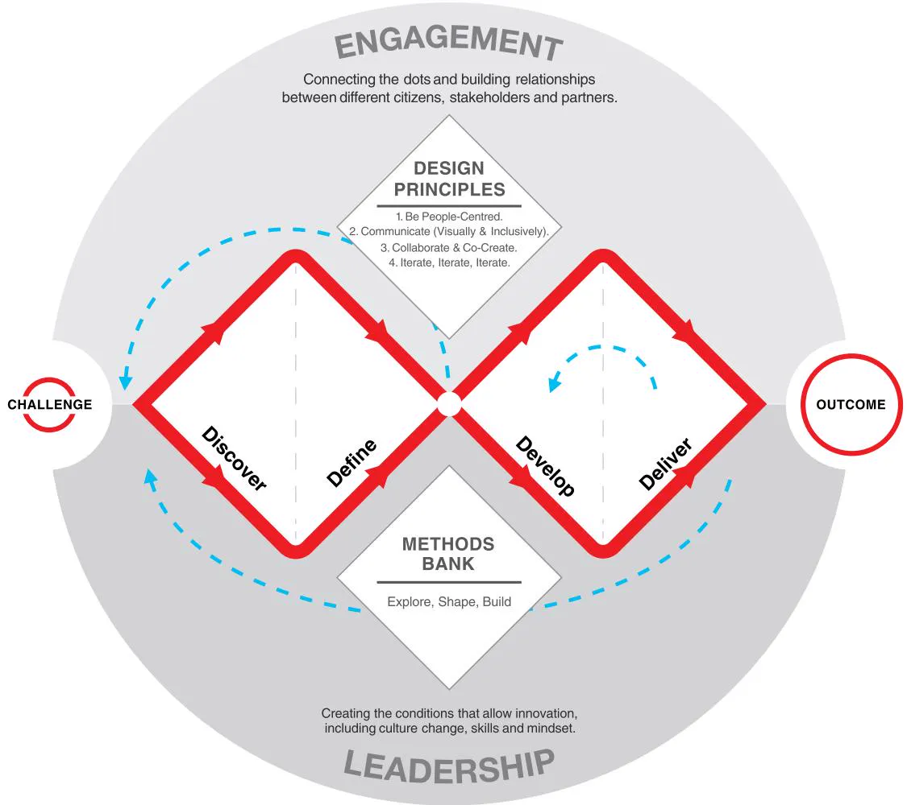
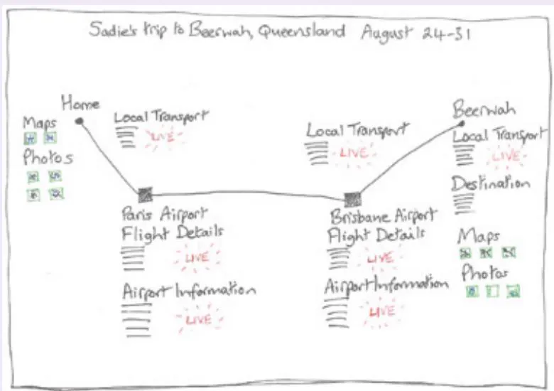
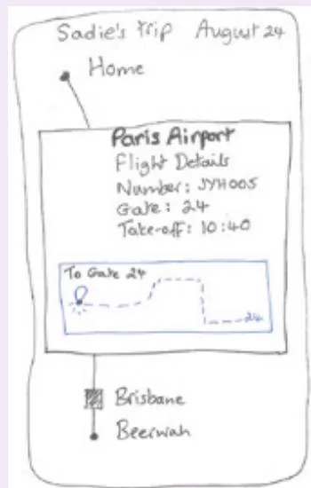
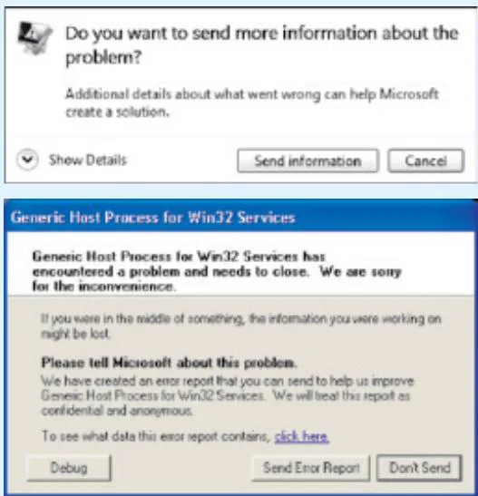
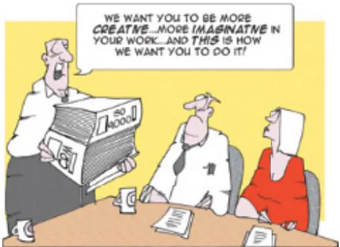
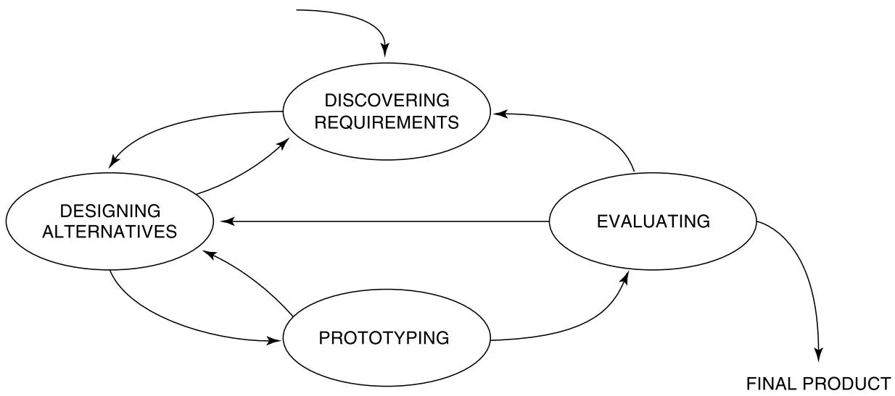
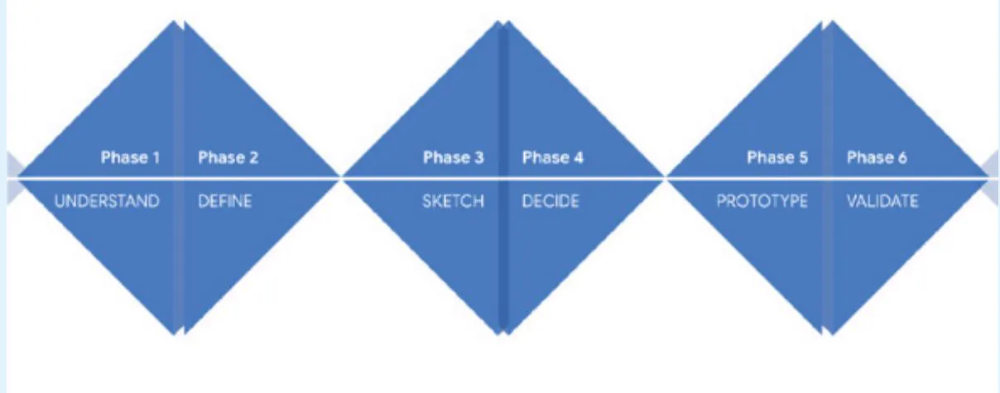
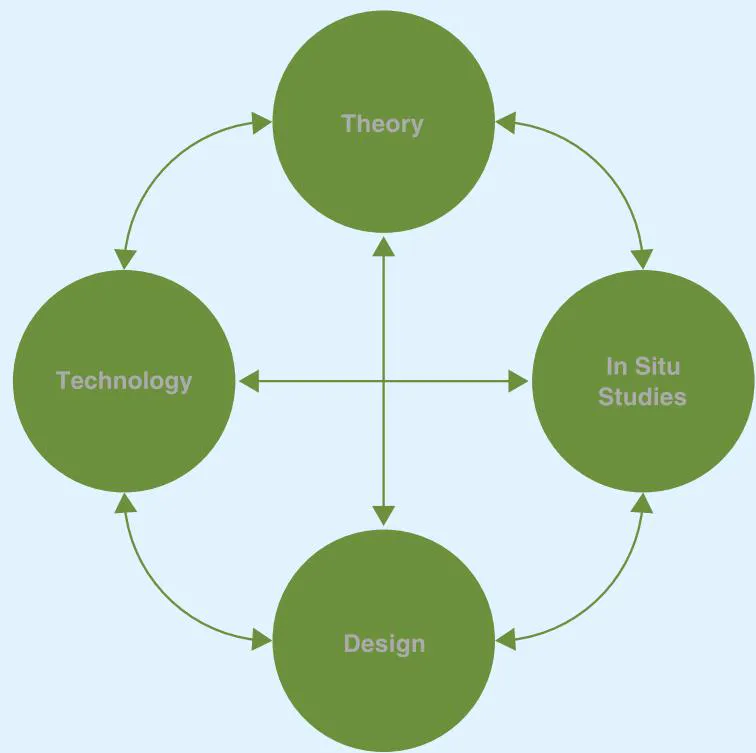

# Chapter 2

# T H E  P R O C E S S O F  I N T E R A C T I O N  D E S I G N

# 2.1  Introduction

2.2  What Is Involved in Interaction Design?   
2.3  Some Practical Issues

# Objectives

The main goals of this chapter are to accomplish the following:

•  Reflect on what interaction design involves.   
Explain some of the advantages of involving a range of people as participants in the interaction design process.   
•  Explain the main principles of a people-centered approach.   
•  Introduce the four basic activities of interaction design and how they are related in a simple lifecycle model.   
•  Consider some practical questions about the interaction design process.   
Consider how  interaction design activities may be integrated  into other development lifecycles.

# 2.1 Introduction

Imagine that you have been asked to design a cloud-based service to enable people to share and curate their photos, movies, music, chats, documents, and so on, in an efficient, safe, and enjoyable way. What would you do? How would you start? Would you begin by sketching how the interface might look, work out how the system architecture should be structured, or just start coding? Or, would you start by asking people about their current experiences with sharing files and examine  the existing tools, for example, Dropbox and Google Drive, and based  on this  begin thinking  about  how  you were  going to design  the new  service? What would you do next? This chapter discusses the process of interaction design, that is, how to design an interactive product.

Interaction  design includes  specific  activities focused on  discovering requirements  for the product, designing something to fulfill those requirements, and producing prototypes for evaluation. It aims to develop interactive products to support the way people communicate

and  interact, and  so  identifying, understanding,  and  engaging  a  range  of  stakeholders  in product development is fundamental. This means that product development is directed  by people-centered  concerns rather  than  just  technical  concerns.  But  what  kind  of  products are needed, and  how  do  we  know? What  is a “stakeholder,” how  can  they be identified, and how can they be involved in development? Will they know what they want or need if we just  ask them?  From  where  do  interaction  designers get  their ideas, and  how  do  they generate designs?

Interaction design is a design activity and so is about trade-offs—about balancing conflicting requirements. For example, one common form of trade-off when developing an interactive system  is deciding  how much choice is given  to the user  and how much direction is offered by the system. But how do you make that choice? Generating alternatives is  also a key principle in interaction design. Generating lots of ideas is not necessarily hard, but how do you choose which of them to pursue?

In this chapter, we consider these kinds of questions, discuss people-centered design, and explore the four basic activities of the interaction design process. We also introduce a lifecycle model of interaction design that captures these activities and the relationships among them.

# 2.2  What Is Involved in Interaction Design?

There  are  many  fields  of  design,  such  as  graphic  design,  architectural  design,  industrial design, and software design. Each discipline has its own approach to design, but there are commonalities. The  Design Council  of the  United  Kingdom captures  these  in  the double diamond of design, shown in Figure 2.1. This process has four phases divided into two parts. The  left  side  of  each  diamond  represents  divergent  thinking  (considering  the  problem widely), and the right side  represents convergent thinking  (focusing down on  a particular response).

Discover: Designers understand  the problem  rather than  make assumptions about it, by talking to people who are affected by it.   
• Define:  Based  on  the  insights  gained  through  the  Discover  phase,  designers  define  the design challenge in a different way.   
Develop:  Different  responses  to  the  design  challenge  are  created,  seeking  inspiration from a range of sources including designs of competing products, insights from the Discover  and  Define  stages,  and  brainstorming.  Responses  are  co-designed  with a  range of people.   
Deliver:  Different  solutions  are  tested  at small  scale  and either  rejected  or  evolved  into better solutions.

As indicated  by the arrows in Figure 2.1, the process is  not linear, and the phases may be iterated several times to progress from the Challenge to the Outcome, but as pointed out by  the Design  Council, “in  an  ever-changing and  digital world, no idea  is  ever ‘finished.’” In the framework  for innovation, the core double diamond process is supported  by design principles, a  method  bank, and two  characteristics  of organizational  culture  (engagement and leadership). The four design principles that support the double diamond focus on people,

  
Figure 2.1  The  Design Council’s  framework  for  innovation with the  double diamond  of design at its heart

Source: 2019,  Design Council  www.designcouncil.org.uk/news-opinion/what-framework-innovation-designcouncils-evolved-double-diamond last accessed by 20 May 2022

communication, collaboration, and iteration. These are concepts that resonate very well with the ethos of interaction design, and many of the techniques in the methods bank underpinning the double diamond appear in this book. Engaging different stakeholders in design and creating the conditions for innovation are also goals of a people-centered approach to design. Note that the double diamond is equally applicable to the evolution of an existing product and to totally new problem areas.

To find out more about the double diamond of design, visit www.designcouncil.org.uk/news-opinion/what-framework-innovationdesign-councils-evolved-double-diamond.

# ACTIVITY 2.1

This activity asks you to produce the  design for an innovative interactive product for your own use, using the double diamond of design as a guide.

Imagine that you want to design a product that helps you organize a trip. This might be for a business or vacation trip, to visit relatives halfway around the world, or for a bike ride on the weekend—whatever kind of trip you like. In addition to planning the route or booking tickets, the product may help to check visa and medical requirements, arrange guided tours, investigate the facilities at a location, and so on.

1. Using the  phases of the  double diamond of design as a guide, produce  an initial  design using a sketch or two, showing its main functionality and its general look and feel. Remember  that the  first phase  of each diamond represents divergent  thinking, and  the  second represents convergent thinking.   
2. Now reflect on how the double diamond supported your design process. Did it help, or was it constraining? What was your instinct to do first? Did you base your design on any particular artifacts or experiences?

# Comment

1. The first phase focuses on understanding the problem, by talking to people affected by it. As well as the main user, you, who else is affected? Family and friends maybe, but what about  the  various travel resources  you may draw upon:  agents, travel advisor websites, health and  vaccination guides, and  travel companies, for example? While you  probably can’t talk to all of these, thinking about the product from these perspectives may prompt different insights. A key insight from my own reflection is that although those who provide travel information and advice want to be helpful, I just find it overwhelming! This is especially true of business trips when I am usually alone.

The second phase is about defining the design challenge from different perspectives. In response to these insights, the experience of travel would be improved if the  product could collate and tailor advice from the many possible sources of information. In addition, supporting a lone traveler during the trip itself would be very welcome. This results in two scenarios of use—during the initial planning stage and once on the move.

The third phase focuses on developing solutions, which in this case is a design sketch or two. Figure 2.2  shows my initial design, which has two versions of the product—one to display on a large screen and one as an app for a handheld device. The idea underlying these two is that I would normally plan the details of the trip at my desk, but while traveling I would want updates and local information on my smartphone. The mobile app has a simple interaction style that is easy to use on the go, while the larger-screen version is more sophisticated and shows a lot of information and the various choices available.

The  final phase of the  double diamond involves evaluating the  sketches produced. Later chapters will explore different  approaches to this, but for now one approach is to step through a recent experience of organizing a trip.

2. Thinking about  the  problem from different  perspectives helped me to understand why a new product in this space may be beneficial, especially for complex business trips and when I am traveling alone. Starting by thinking through the problem space may not seem

intuitive, but it is a very valuable step. The second phase guided me toward thinking about reducing the complexity of information sources through customization to my own preferences and  circumstances, and to think  about the  support I would appreciate during the trip itself.

Developing solutions (the third phase) led me to consider how to interact with the product—seeing detail on a large screen would be useful, and a summary to carry with me on a  mobile device would support my travel. The  type of support  also depends  on where the meeting is being held. Planning a trip abroad requires both a high-level view to check visas, vaccinations, and travel advice, as well as a detailed view about the proximity of accommodation to the meeting venue and specific flight times. Planning a local trip is much less complicated. In terms of testing the design, I  found myself thinking about  the design as I went along, modifying it in response to my assessment. If the product was to be used for others, then I would not rely solely on my own assessment but would involve others too.

  
(a)

  
(b)   
Figure 2.2  Initial sketches of the trip organizer showing (a) a large screen covering the entire journey from home to Beerwah in Australia and (b) the smartphone screen available for the leg of the journey at Paris (Charles de Gaulle) airport

Activity 2.1 illustrated a simple use of the double diamond approach to guide the design of an interactive product. It also illustrated the  process  of generating and  making choices between  alternatives, exploring requirements in detail, and refining ideas about what the product will do. The exact steps taken  to create a  product will vary from designer to designer, from product  to product, and  from organization to organization (see Box 2.1).  Capturing  concrete ideas, through  sketches or written descriptions, helps to focus the mind on what is being designed, the context of the design, and what user experience is to be expected. The sketches can capture only some elements of the design, however, and other formats are needed to capture everything intended.

# BOX 2.1

# Four Approaches to Interaction Design

Dan Saffer (2010) suggests four main approaches to interaction design, each of which is based on a distinct underlying philosophy: user-centered  design, activity-centered design, systems design, and genius design.

Saffer acknowledges that the purest form of any  of these approaches is unlikely to be realized, and he takes an extreme view of each in order to distinguish among them. In usercentered design, the user knows best and is the guide to the designer; the designer’s role is to translate the users’ needs and goals into a design solution.

Activity-centered design focuses on the behavior surrounding particular tasks. Users still play a significant role, but it is their behavior rather than their goals and needs that is important. Systems design is a structured, rigorous, and holistic design approach that focuses on context  and  is particularly appropriate  for  complex  problems. In systems  design,  it is the system (that is, the people, computers, objects, devices, and so on) at the center of attention, while the users’ role is to set the goals of the system.

Finally, genius design is different from the other three approaches because it relies largely on the experience and creative flair  of a designer. Jim Leftwich, an experienced interaction designer interviewed by Dan Saffer (2010, pp. 44–45), prefers the term rapid expert design. In this approach, the users’ role is to validate ideas generated by the designer, and users are not involved during the design process itself.

Different design problems lend themselves more easily to different approaches, and different designers will tend to gravitate toward using the approach that suits them best. Although an individual designer may prefer a particular approach, it is important that the approach for any one design problem is chosen with that design problem in mind.

# 2.2.1  Who to Involve in the Design Process

There is a surprisingly wide collection of people who have a stake in the development of a successful product. These people are called stakeholders. They  are the individuals or groups who can influence or be influenced by the success or failure of an endeavor such as a project, organization, or product. Stakeholder analysis has been studied for many years (Freeman, 1984). The involvement of stakeholders in interaction design has received increasing attention more recently. For example, Maarten Houben et al. (2020) ran workshops for stakeholders to explore requirements for an interactive sound cushion to be used in a dementia care home. Although some of their stakeholders were also potential users of the cushion, others were not. Their stakeholders included a care manager, professional caregiver, policymaker, and activity supervisor.

The group of stakeholders for a particular product will be larger than the group of users. It will include customers who pay for it; users who interact directly with it; developers who design, build, and maintain it; executives responsible for any income derived from it; legislators who impose rules on the development and operation of it; and people whose lives may be affected by its introduction. The net can be very wide (Sharp et al., 1999). Asking who is interested in the project, who has influence or control over it, and who will be affected by its introduction is a good way to start identifying stakeholders.

# ACTIVITY 2.2

Self-driving delivery trucks are  increasingly being  deployed across the  globe. These  trucks still  require  human  drivers  to monitor their  behavior, and  some include  the  capability for software upgrades “over the air” as well as optimizing fuel use. Who are the stakeholders for these vehicles?

# Comment

First, there are the truck drivers who will be driving the vehicles. Their stake in its success and usability is fairly clear and direct, both positively in terms of increased safety and comfort but also negatively in case fewer drivers or less skilled drivers are needed in future. Truck drivers want to make sure that their role is clear and that controls for the autonomous vehicle are straightforward. Family members of the  truck  drivers are  also stakeholders, wanting  their loved  ones to be safe and satisfied  with their jobs. Then there  are the people who design and build the software and physical components. They make sure that the driving capability is installed correctly and that it continues to work effectively. Installers and maintainers want the software and hardware to be straightforward to install and to be robust and reliable. Outside of these groups are the companies whose goods may be delivered using these trucks, who want to provide an effective and efficient service that is competitive. They also don’t want to lose customers and money because the trucks run late or end up in the wrong place. Other people who will be affected by the introduction of these trucks include vehicle manufacturers who don’t have an autonomous capability, other road users and pedestrians, anyone interested in reducing carbon emissions (as the autonomous trucks are designed to be fuel efficient), and  government departments  that set  regulations  for drivers’ hours  and work time.

It may not be necessary or practical to actively involve all stakeholders in design as participants, but generating a list of stakeholders helps to decide who to involve and to what degree. Potential users and those affected by the product’s introduction are primary candidates for close involvement. Identifying these may seem like a straightforward activity, but it can be more complicated than you think. For example, Sha Zhao et al. (2016) found a more diverse set of users for smartphones than most manufacturers recognize. Based on an analysis of one month’s smartphone app usage, they discovered 382 distinct types of users, including Screen Checkers and Young Parents.

Some products (such  as a system to schedule work shifts)  have defined  user communities, for example, a  specific role (shop  assistant) within a  particular industrial sector (retail).  In this case, although there is a range of users with different roles who relate to the product in different ways, the list is constrained. Apart from direct users (shop assistant and scheduler), indirect users include those who manage direct users, those who receive outputs from the system, and those who test the system. Those affected by the product include the customers of the shop, who want the right level of service, and family members of the staff.

Having identified and consulted the list of stakeholders, engaging the right groups may still prove to be difficult. Katie Seaborn et al. (2020) discuss a number of challenges in engaging the user community in a large urban food waste recycling project, despite partnering with a range of stakeholders.

Having tried a number of tactics to involve residents including word of mouth, residents’ association meetings, cold calling, and sticking up posters, the researchers chose the unusual approach of observing the contents of the existing bins to build up a picture of food waste habits.

# 2.2.2  The Importance of Involving Users

Chapter 1, “What Is Interaction Design?” stressed the importance of understanding people and their activities when designing interactive products. This involves considering users or potential users in  the design process, not just to understand  them and their  activities but also  to  test  and  evaluate  candidate  designs  in  their  context.  Both  aspects  are  necessary because  it is the  best  way to  ensure that  the end  product  is usable  and  provides a good experience so that it will be used.

In commercial projects, a role called the product owner is common. The product owner’s job is to filter user and customer input to the development cycle and to prioritize requirements or features. This person is usually someone with business and technical knowledge and is often called upon to assess designs. Although they have close engagement with the product and customer needs, they are only able to represent a limited view of the product’s use and cannot predict how customers will respond to a given design at any useful level of detail. The best way to ensure that the product is usable is to involve potential users across all stages of development.

Two other aspects are equally important if the product is to be usable and used: expectation management and ownership.

Expectation  management  is  the  process  of  making  sure  that expectations  of  the  new product are realistic. Its purpose is to ensure that there are no surprises when the product is released. If  people feel the product has  been misrepresented, then this will cause resistance and even rejection, although avoiding disappointment in design may be particularly difficult to achieve with a large and complex system (Nevo and Wade, 2007).

Involving  potential users  and  those impacted  by the  new product  at  different stages during development helps with expectation management because they can see the product’s capabilities from an early stage. They will also understand better how it will support their activities, how it will affect their jobs and lives, and why the features are designed that way. Adequate and timely training is another technique for managing expectations. Having the chance to see a prerelease video, or work with a hands-on prototype or early version, will create a better understanding of what to expect when the final product is available.

A  feeling of ownership is  another reason for involving  potential users. Those who  are involved and feel that they have contributed to a product’s development are more likely to feel a sense of ownership toward it and support its use (Bano et al., 2017). When developing tools to support Wikipedia contributors, Angelika Muhlbauer and Kai Nissen (2013) found that early involvement of members of the Wikipedia community led to higher acceptance of their innovations.

How to involve potential users, in what roles, and for how long, needs planning, as discussed in the next “Dilemma” box.

Video To see a practical example of changing the ATM experience by focusing on people who use it, go to www.youtube.com/watch?v=x-DLQp9xb20.

# DILEMMA

# Too Much of a Good Thing?

Involving potential users in development is a good thing, but what evidence is there that it is productive? How much should users be involved and in what role(s)? Is it appropriate for users to lead a technical development project, or is it more beneficial for them to focus  on evaluating prototypes?

Uli Abelein et al. (2013) performed a detailed review of the literature in this area and concluded that, overall, the evidence indicates that user involvement has a positive effect on user satisfaction and system use. However, they also found that even though the data clearly indicates this positive effect, some links have a large variation, suggesting that there is still no clear way to measure the effects consistently. In addition, they found that most studies with negative correlations involving users and system success were published more than 10 years previously.

The kind of product being developed, the kind of user involvement possible, the activities in which they are involved, and the application domain all have an impact on the effectiveness of user input  (Bano and  Zowghi, 2015). Peter Richard et al.  (2014) investigated the  effect of user involvement  in transport  design projects. They found  that involving  users  at later stages of development mainly resulted in suggestions for service improvement, whereas users involved at earlier stages of innovation suggested more creative ideas.

Recent moves  toward an agile way  of working  (see Chapter  13, “Interaction Design in Practice”) has emphasized the need for feedback from customers and users, but this also has its challenges. Kurt Schmitz et al. (2018) suggests that in tailoring their methods, teams consider the distinction between frequent participation in activities and effective engagement.

Björn Fischer et al. (2020) reviewed the literature on involving older people during technology design and asked whether it matters in design practice, and if so in what ways? They identified three main consequences of involving older people: learning about older peoples’ lives, adjusting designs based on older peoples’ input, and increased sense of participation and feelings of ownership. But their findings also highlight that the empirical papers they surveyed were unclear on the impact that involving users had on acceptance and adoption.

Involving people as participants at different stages of the process is without a doubt beneficial. But the key is knowing who, when, where, and how.

# 2.2.3  Degrees of User Involvement

Different degrees of user involvement are possible, ranging from fully engaged throughout all iterations of the development process to targeted participation in specific activities and from small groups of individual users in face-to-face contexts to hundreds of thousands of people online.  Occasionally,  individuals  may  be  co-opted  onto  the  design  team  so  that  they  are major contributors to the development. On the downside, full-time involvement may mean that they become out of touch with their own community and context of use, while part-time involvement  might result  in  a  high workload  for  them. On  the upside, having someone

co-opted to the design team full- or part-time means that their input is available continually. More commonly, individuals may take part in specific activities to inform the development or to evaluate designs once they are available. Where user involvement is limited, there  are techniques to keep users’ concerns uppermost in designers’ and developers’ minds, such as through personas (see Chapter 11, “Discovering Requirements”).

User participation may take the form of small groups or individuals taking part in faceto-face information-gathering design or evaluation sessions, but increasingly online sessions are used, leading to many thousands of potential users  being able  to contribute to product development. There is still a place for face-to-face user involvement and in situ studies, but there  is now  a wider  range of  possibilities  than in  the  past. One  example  of this is  online feedback exchange (OFE) systems, which are increasingly used to test design concepts with millions of target users before going to market (Foong et al., 2017).

In fact, design is becoming increasingly participative through crowdsourcing design ideas and examples, for instance (Yu  et al., 2016). Where  crowdsourcing is  used, a range of different people are encouraged to contribute. This wide participation helps to bring different perspectives to the process, which enhances the design itself, produces more satisfaction with the final product, and engenders a sense of ownership.

Another  example of involving users  at scale is citizen engagement, the goal of which is to engage a population with the aim of promoting empowerment through technology. The underlying aim is to involve  members of a community  in changing their lives  where  technology is viewed as an  integral part of the process. For example, Rajan Vaish et al. (2017) describe crowd research. Their goal was to increase global upward mobility within the scientific community  by making  research experiences  accessible worldwide. They  report  that more than 1,500 people from 62 countries have participated over 2 years and have produced top-tier  computer science articles. This  project illustrates how community engagement  can increase inclusivity and widen opportunities. Offering meaningful ways for the general public to engage in community design projects can be challenging. Brandon Reynante et al. (2021) suggest a framework  to provide  a structured process of engagement, support inclusive and sustained participation, and promote effective management of large-scale participation. Further examples of community engagement and the use of crowdsourcing in design and evaluation are described in Chapter 14, “Introducing Evaluation,” Box 14.2.

Participatory  design,  also  sometimes  referred  to  as  co-creative  design,  co-operative design, or co-design, is an overarching design philosophy that places those  for whom systems,  technologies,  and  services  are  being  designed  as  central  actors  in  creation  activities. The  idea is  that instead  of being  passive  receivers of  new  technological  or industrial artifacts,  end  users  and  other  stakeholders  are  active  participants  in  the  design  process. Chapter  12, “Design, Prototyping,  and  Construction,” provides  more  information  about these approaches.

The individual circumstances of the project affect what is realistic and appropriate. If the user groups are identifiable, for example, the product is for a particular company, then it is easier to involve them continually. If, however, the product is intended for the open market, it is unlikely that potential users will be available to join the design team. It is also likely that customer  experience  design issues, i.e.,  the experience  users  have when  interacting with  a brand, not just a product, will become relevant. Box 2.2 outlines an alternative way to obtain user input from an existing product, and Box 2.5 discusses A/B testing, which draws on user feedback to choose between alternative designs.

# BOX 2.2

# Continued Feedback After Product Release

Once a product has been released, a different kind of user involvement is possible—one that captures user feedback based on day-to-day use of the product. This can be achieved in several ways including collecting and analyzing data that tracks user behavior (see Chapter 10, “Data at Scale and Ethical Concerns”) and analyzing customer reviews and error reporting systems. Customer reviews significantly affect the popularity and success of a product (Harman et al., 2012) and provide useful and far-ranging user feedback. App reviews are particularly plentiful in this regard, but analyzing  them can be time-consuming. Mining app reviews  for concrete improvements and organizing the information efficiently is being widely researched (Dabrowski et al., 2022),and several approaches use machine learning techniques. For example, Maram Assi et al. (2021) suggest a neural network-based approach to identifying high-level features from reviews, while  Cuiyan Gao et al. (2019) apply topic modeling to reviews posted on WeChat. Twitter has also been suggested as a good source of app reviews (Mezouar et al., 2018).

Error reporting systems (ERSs, also called online crashing analysis) automatically collect information from users that is used to improve applications in the longer term. This is done with users’ permission, but with a minimal reporting burden. Figure 2.3 shows two dialog boxes for the Windows error reporting system that is built into Microsoft operating systems. This kind of reporting can have a significant effect on the quality of applications. For example, 29 percent of the errors fixed by the Windows XP (Service Pack 1) team were based on information collected through their ERS (Kinshumann et al., 2011). While Windows XP is no longer being  supported, this statistic illustrates the impact ERSs can have. The system uses a sophisticated approach to error reporting based on five strategies: automatic aggregation of error reports; progressive data collection so that the data collected (such as abbreviated or full stack and memory dumps) varies depending on the level of data needed to diagnose the error; minimal user interaction; preserving user privacy; and providing solutions directly to users where possible. By using these strategies, plus statistical analysis, effort can be focused on the bugs that have the highest impact on the most users.

  
Figure 2.3  Two typical dialog boxes from the Windows error reporting system

# 2.2.4  What Is a People-Centered Approach?

Several decades ago, when the field of human-computer interaction (HCI) was being established, John Gould and Clayton Lewis (1985) laid down three principles that they believed would lead to a “useful and easy to use computer system.” These principles are as follows:

• Early  focus on users and tasks. This means first understanding  who the  users will be  by directly studying their cognitive, behavioral, anthropomorphic, and attitudinal characteristics. This requires observing users doing their normal tasks, studying the nature of those tasks, and then involving users in the design process.   
• Empirical measurement. Early in development, the reactions and performance of intended users  to  printed  scenarios,  manuals,  and  so  forth,  are  observed  and  measured.  Later, users  interact with simulations and prototypes, and their performance  and reactions are observed, recorded, and analyzed.   
• Iterative  design. When  problems are found  in user  testing, they are fixed, and then more tests and observations are carried out to see the effects of the fixes. This means that design and development are iterative, with cycles of design-test-measure-redesign being repeated as often as necessary.

These  three principles are generally accepted as the basis for a user-centered approach, but when they were first presented, they were not widely applied or understood. In a peoplecentered approach, these principles form the basis for designing with people, communities, and other stakeholders and are expanded through the following further principles:

People’s tasks and goals are the driving force behind the development.

While technology will inform design options and choices, it is not the driving force. Instead of looking at how the new technology can be deployed, ask what technologies are available to provide better support for people’s goals.

People’s behavior and context of use are studied, and the system is designed to support them. This is not just about capturing people’s tasks and goals. How people perform their tasks is also significant. Understanding behavior highlights priorities, preferences, and implicit intentions.   
. People’s characteristics are captured and designed for.

When  things  go  wrong  with  technology,  people  often  think  it  is  their fault.  People  are prone to making errors and have certain limitations, both cognitive and physical. Products designed to support people take these limitations into account and are designed to prevent mistakes from being made. Cognitive aspects, such as attention, memory, and perception issues, are introduced in Chapter 4, “Cognitive Aspects.” Physical aspects include height, mobility,  and  strength. Some  characteristics  are  general, such  as  color  blindness,  which affects about 4.5 percent of the population, but some characteristics are associated with a particular job or task. In addition to general characteristics, those traits specific to potential user groups are relevant.

Users and other stakeholders are consulted throughout development from earliest phases to the latest.

As discussed earlier, there are different levels of user involvement, and there are different ways in which to consult users.

•  All  design  decisions  are  taken  within  the  context  of  use,  people’s activities,  and  their environment.

This may mean that users are actively involved in design decisions, and co-creation is one approach to this.

# ACTIVITY 2.3

Assume you are involved in developing a novel online experience for buying garden plants. Although many websites exist for buying plants online, you want to produce a distinct experience to increase the organization’s market share. Suggest ways of applying these five principles in this task.

# Comment

To address the first  three principles, you would  need to find out about  the tasks and goals, behavior, and characteristics of potential customers of the new experience, together with any different contexts of use. Studying the use  of existing online plant  shops will provide  some information, and it will also identify some challenges to be addressed in the new experience. However, as you want to increase the organization’s market share, consulting existing users alone would  not be enough. Alternative  avenues of investigation include  physical shopping situations—for example, shopping at the market, in the local corner shop, and so on, and local gardening clubs, radio programs, or podcasts. These alternatives will help to find the advantages and disadvantages of buying plants in different settings, and will uncover different behaviors. By looking at these options, a new set of potential users and contexts can be identified.

For the fourth principle, people who are interested in gardening and buying plants online can be involved from the beginning. Workshops or evaluation sessions could be run in various shopping environments such as the market. The last principle could be supported through the creation of a project (or “war”) room, a room where the results of user-focused sessions and emerging designs are on display. Here the development team can generate design ideas and create prototypes surrounded by information about users, their context, and the product’s goals.

. Specific usability and user experience goals are identified, clearly documented, and agreed upon at the beginning of the project.

They can help designers choose between alternative designs and check on progress as the product is developed. Identifying specific, measurable goals up front means that the product can be empirically evaluated at regular stages throughout development.

. Iteration through data gathering, idea and design generation, and evaluation.

Iteration allows for feedback and refinement. As stakeholders and designers start to discuss requirements, needs, hopes, and  aspirations,  then different  insights  into  what  is  needed, what will help, and what is feasible will emerge. This leads to a need for iteration and for the activities to inform each other and to be repeated, which is particularly true when trying to innovate. Innovation rarely emerges whole and ready to go. It takes time, evolution, trial and error, and a great deal of patience. Iteration is inevitable because designers never get the solution right the first time (Gould and Lewis, 1985).

# 2.2.5  Four Basic Activities of Interaction Design

The four basic activities for interaction design are as follows:

Discovering requirements for the interactive product   
. Designing alternatives that meet those requirements

Prototyping the alternative designs so that they can be communicated and assessed   
•  Evaluating the product and the user experience it offers throughout the process

# Discovering Requirements

This activity covers the left side of the double diamond of design, and it is focused on discovering  something new  about the world  and defining what  will be developed. In  the case  of interaction design, this includes understanding the target users and the support an interactive product could usefully  provide. This understanding  is gleaned  through data  gathering and analysis, which are  discussed in Chapters 8–10. It forms the  basis of the product’s requirements and underpins subsequent design and development. The requirements activity is discussed further in Chapter 11.

# Designing Alternatives

This is the core activity of designing and is part of the Develop phase of the double diamond: proposing  ideas  for meeting  the  requirements.  For  interaction  design,  this  activity  can  be viewed  as  two  subactivities:  conceptual  design  and  concrete  design.  Conceptual  design involves producing the conceptual model for the product, and a conceptual model describes an abstraction outlining what people can do with a product and what concepts are needed to understand how to interact with it. Concrete design considers the detail of the product including  the  colors,  sounds,  terminology, and  images  to  use;  menu  design;  and  icon  design. Alternatives are considered at every point. Conceptual design is discussed in Chapter 3, and more design issues for specific interface types are  in Chapter 7; more details  about how to design an interactive product are in Chapter 12.

# Prototyping

Prototyping is also part of the Develop phase of the double diamond. Interaction design involves designing both the behavior of interactive products and their appearance. The most effective way  for  people to evaluate such designs  is to interact with them, and  this can be achieved through prototyping. This does not necessarily mean that a piece of software is required. There are different prototyping techniques, not all of which require a working piece of software. For example, paper-based prototypes are quick and cheap to build and are effective for identifying problems in the early stages of design, and through role-playing, people can get a real sense of what it will be like to interact with the product. Prototyping is covered in Chapter 12.

# Evaluating

Evaluating relates to the Deliver phase of the  double diamond, in terms of testing solutions at a small scale. It is the process of determining the usability and acceptability of the product or design measured in terms of a variety of usability and user-experience criteria. Evaluation does not replace activities concerned with quality assurance and testing to make sure that the final  product  is  fit  for  its  intended  purpose,  but  it  complements  and  enhances  them. Chapters 14–16 cover evaluation.

The activities to discover requirements, design alternatives, build prototypes, and evaluate them are intertwined: Alternatives are evaluated through the prototypes, and the results are  fed  back  into  further  design or  to  identify alternative  requirements. In Figure  2.1 (the double diamond), this feedback is indicated by  dashed-line arrows; in Figure 2.4 (a simple lifecycle), it is indicated by solid-line arrows.

# 2.2.6  A Simple Lifecycle Model for Interaction Design

Understanding what activities are involved in interaction design is the first step to being able to do it, but it is also important to consider how the activities are related to one another. The term lifecycle  model (or process model)  is used to represent  a model that captures  a set of activities and how they are related. Existing models have varying levels of sophistication and complexity  and  are  often  not  prescriptive.  For  projects  involving  only  a  few  experienced developers, a simple process is adequate. However, for larger systems involving tens or hundreds of developers, a simple process just isn’t enough to provide the management structure and discipline necessary to engineer a usable product.

  
Source: Fran / Cartoon Stock

Many  lifecycle models  have  been proposed  in  fields  related to  interaction design. For example, software engineering  lifecycle models include the waterfall, spiral, and V  models (for more information about these models, see Pressman and Maxim [2019]). HCI has been less  associated  with  lifecycle models, but  two  well-known  ones  are  the  Star  (Hartson  and Hix, 1989) and an international standard model ISO 9241-210. Rather than explaining the details  of these  models, we  focus  on the  simple  lifecycle model  shown  in  Figure  2.4. This model shows how the four activities of interaction design are related, and it incorporates the principles of people-centered design discussed earlier.

  
Figure 2.4  A simple interaction design lifecycle model

Many projects start by discovering requirements from which alternative designs are generated. Prototype versions of the designs are developed and then evaluated. During prototyping or based on feedback from evaluations, the team may need to refine the requirements or to redesign. One or more  alternative designs  may follow this  iterative cycle in parallel. Implicit in this cycle is that the final product will emerge  in an evolutionary fashion from an initial idea through to the finished product or from limited functionality to sophisticated functionality. Exactly how this evolution happens varies from project to project. However many times the product goes through the cycle, development ends with an evaluation activity  that ensures  that  the final  product meets  the prescribed  user experience and  usability criteria. This evolutionary production relates to the right side of the double diamond, but note that in this interaction design process, discovering requirements may also be revisited.

In recent  years, a wide range of lifecycle models has emerged, all of which  encompass these  activities  but  with  different  emphases  on  activities,  relationships,  and  outputs.  For example, design sprints (Box 2.3) emphasize rapid problem investigation, solution development, and testing. This does not result in a robust final product, but it  does make sure that the solution idea is acceptable to customers. The in-the-wild approach (Box 2.4) emphasizes the development of novel technologies that are not necessarily designed for specific needs but to augment people, places, and settings. Further models are discussed in Chapter 13.

# BOX 2.3

# Design Sprints

The design sprint is a flexible framework and set of methods to solve problems through an iterative process of designing, prototyping, and  rapid testing with low  investment and in a realistic environment. The methodology can be used to support a range of design goals and organizational cultures and aims to align teams under a shared vision.

The design sprint follows six phases and lasts between one and five days (see Figure 2.5). Every sprint starts with planning.

Pre-sprint (Planning): Write a sprint brief, choose the right design challenge, assemble the right team, and organize the time and space to run the sprint.

Phase 1 (Understand): Experts from across the business articulate the problem space.

Phase 2 (Define): Evaluate what was learned in Phase 1 and identify a focus for the sprint.

Phase 3 (Sketch): Generate many ideas and alternative solutions; then work as a team to identify a single well-developed solution per team member.

Phase 4 (Decide): Choose the single idea to be progressed through the design sprint.

Phase 5 (Prototype): Develop a prototype for the chosen solution that is just real enough to validate and covers only the aspects you want to test. We discuss prototyping further in Chapter 12.

Phase 6 (Validate): Gather feedback on the prototype from users and other stakeholders. At the end of this phase your chosen solution will be validated, or not!

A key aspect of design sprints is that they are timeboxed: enough time to test ideas and keep the energy high but not so much time that ideas become overwhelmed by detail. This is similar to the idea of “sprint” used in the agile method Scrum (Schwaber and Beedle, 2002), but while a design sprint aims to solve a problem, a Scrum sprint aims to produce working program code.

This design sprint approach has been picked up by many organizations and tailored to their own particular circumstances. One of the earliest design sprints was developed by Google Ventures and optimized for startups (Knapp et al., 2016). Its sprint is divided into planning, followed by five phases, and each phase  is completed in a day. In this sprint, the  first two phases (Understand and Define) are combined into one called Unpack. Teams are encouraged to iterate  on the  last two  phases (Prototype and  Validate)  and  to develop  and  re-test prototypes.

Figure 2.5  The six phases of the design sprint   
  
Source: https://designsprintkit.withgoogle.com/methodology/overview last accessed by 20 May 2022

To see a more detailed description of the design sprint approach and a set of resources to plan and run a design sprint, go to designsprintkit.withgoogle .com/methodology/overview.

To see an alternative structure for a design sprint, visit designsprint.academy/ design-sprint-3-0.

And to see a case study of a design sprint run semi-remotely, visit uxplanet .org/from-idea-to-appstore-a-design-sprint-case-study-a7781093de8d.

# BOX 2.4

# Research in the Wild (Adapted from Rogers and Marshall [2017])

Research in the  wild (RITW) develops technology solutions in everyday living by creating and  evaluating new technologies and  experiences in situ. The approach supports designing prototypes in which researchers  often experiment with new technological possibilities  that can change and even disrupt behavior, rather than ones that fit in with existing practices. The results of RITW studies can be used to challenge assumptions about technology and human behavior in the real world  and to inform the re-thinking  of HCI  theories. The  perspective taken by RITW studies is to observe how people react to technology and how they change and integrate it into their everyday lives.

Figure 2.6 shows the framework for RITW studies. In terms of the four activities introduced  in section  2.2.5, this framework  focuses  on designing, prototyping, and  evaluating technology and ideas and is one way in which requirements may be discovered. It also considers relevant theory since often the purpose of an RITW study is to investigate a theory, idea, concept, or observation. Any one RITW study may emphasize the elements of the framework to a different degree.

Figure 2.6  A  framework  for research in the wild (RITW) studies illustrating that all of the study elements connect to each other   
  
Source: Rogers and Marshall (2017), p. 6. Used courtesy of Morgan & Claypool

Technology: Concerned with appropriating existing infrastructures/devices (e.g., Internet of Things toolkit, mobile app) in situ or developing new ones for a given setting (e.g., a novel public display)

Design: Covers the design space of an experience (e.g., iteratively creating a collaborative travel  planning  tool  for  families  to  use  or  an  augmented  reality  game  for  playing outdoors)

In situ study: Concerned  with evaluating in situ an existing device/tool/service  or novel research-based prototype when placed in various settings or given to someone to use over a period of time

Theory:  Investigating  a theory, idea,  concept, or observation about  a  behavior,  setting, or other  phenomenon;  using  existing ones;  or developing a  new  one, or extending  an existing one

# 2.3  Some Practical Issues

The discussion so far has highlighted some issues about the practical application of peoplecentered design and the simple lifecycle of interaction design introduced earlier. These issues are listed here:

. How to find out what people need   
• How to decide what to design   
. How to generate alternative designs   
. How to choose among alternatives   
. How to integrate interaction design activities with other lifecycle models

# 2.3.1  How to Find Out What People Need

If you had asked someone in the street in the late 1990s what they needed, their answer probably  wouldn’t have included  a smart TV,  a ski jacket  with an  integrated smartphone,  or a robot pet. If you presented the same person with these possibilities and asked whether they would  buy  them  if  they  were  available,  then  the  answer  may  have  been  more  positive. Determining what product to build is not simply a question of asking people “What do you need?” and then supplying it, because people don’t necessarily know what is possible. Suzanne and James Robertson (2013) refer to “un-dreamed-of” needs, which are those that people are unaware they might have. Instead of asking people, this is approached by exploring the problem space; investigating potential users, their context, and their activities to see what can be improved; or trying out ideas to see what would make a difference. In practice, a mixture of these  approaches is  often taken—trying ideas in order to discover requirements and decide what  to build, based on knowledge of the problem  space, potential users  and other stakeholders, and their activities.

In the wild, studies or rapid design sprints that provide authentic user feedback on early ideas  are  particularly valuable  when  the product  is  a new  invention.  Rather  than imagining  who  might  want  to use  a product  and  what  they  might  want  to do  with  it, it’s more

effective to put it out there and find out—the results might be surprising! Several practitioners and commentators have observed that it’s an “eye-opening experience” when developers or designers see a user struggling  to complete a task that seemed so  clear to them (Ratcliffe and McNeill, 2012, p. 125).

Focusing on people’s goals, usability goals, and user experience goals is a more promising approach to interaction design than simply expecting stakeholders to be able to articulate the requirements for a product.

Design company IDEO has evolved its approach to designing over the last 10 years. In this collection of 10 case studies, they reflect on the value of exploring human needs and motivations, engaging with communities and the impact that this approach to design can have: impact.ideo.org.

# 2.3.2  How to Decide What to Design

Deciding what to design is key. Exploring the problem space is one way in which to decide, but it can be overlooked by those new to interaction design. When creating or modifying an interactive product, it can be tempting to begin at the nuts and bolts level of design. By this we mean focusing on the design of the physical interface and the technologies and interaction styles used. The problems with starting here are that potential users and their context can be misunderstood, problems  with  the existing  product  can  be missed, and usability  and  user experience goals can be overlooked, all of which were discussed in Chapter 1.

For  example, consider  the augmented  reality displays and holographic  navigation systems that are available in some cars nowadays (see Figure 2.7). They are the result of decades of research into human factors of information displays (for instance, Campbell et al., 2016), the driving experience itself (Perterer et al., 2013, and the suitability of different technologies (for example, Jose et al., 2016), as well as improvements in technology. Understanding the problem space has been critical in arriving at workable solutions that are safe and trusted.

While it is necessary at some point to choose which technology to employ and decide how to design the physical aspects, it is better to make these decisions after articulating the nature of the problem space. By this we mean understanding what is currently the user experience or the product, why a change is needed, and how this change will improve the user experience. In the previous example, this involves finding out what is problematic with existing support for navigating while driving. An example is ensuring that drivers can continue to drive safely without being distracted when  looking at  a small GPS  display mounted on the dashboard to figure out on which road it is asking them to “turn left.” Even when designing for a new interactive experience, understanding the context in which it will be used is still key.

The process of articulating the problem space is typically done as a team effort, and team members  will have differing  perspectives on it. For  example, a project manager is likely to be concerned about  a proposed  solution in  terms of budgets, timelines, and staffing  costs, whereas a software engineer will be thinking about breaking it down into specific technical concepts. The implications of pursuing each perspective need to be considered in relation to

one another. Although time-consuming and sometimes resulting in disagreements among the design team, the benefits of this process can far outweigh the associated costs: There will be much less  chance  of incorrect assumptions and unsupported  claims creeping  into a design solution  that later  turns out  to be unusable or unwanted. Spending  time enumerating  and reflecting upon ideas during the early stages of the design process enables more options and possibilities to be considered. Furthermore, designers are increasingly expected to justify their choice of problems and to be able to present clearly and convincingly their rationale in business as well as design language. Being able to think and analyze, present, and argue is valued as much as the ability to create a product (Kolko, 2011).

  
(a)

  
(b)   
Figure 2.7  (a) An example immersive holographic display that shows information about the vehicle, navigation, infotainment, and surroundings at different distances, and (b) an augmented reality navigation system available in some cars today

Sources: (a) Used courtesy of WayRay, (b) Used courtesy of Muhammad Saad

# 2.3.3  How to Generate Alternative Designs

A common human tendency is to stick with something that works. While recognizing that a better  solution may  exist, it is easy  to accept the one  that works  as being “good enough.” Settling  for  a solution that is  good  enough may be undesirable  because better  alternatives may never be considered, and considering alternative solutions is a crucial step in the process of design. But where do these alternative ideas come from?

One answer to this question is that they come from the individual designer’s flair and creativity (the genius design described in Box 2.1). Although it is certainly true that some people are able to produce wonderfully inspired designs while others struggle to come up with any ideas at all, very little in this world is completely new. Referring to sources of inspiration is

an  acknowledged  technique  for generating  ideas  in  design  (Eckert and  Stacey,  2000), and Pao Siangliulue et al. (2015) show that people presented  with creative examples generated more creative ideas than those presented with a random set of ideas. Innovations often arise through cross-fertilization of ideas from different perspectives, individuals, and contexts; the evolution of an existing product through use and observation; or straightforward copying of other, similar products.

Cross-fertilization results  from presenting ideas and discussing them within  a multidisciplinary  team, with  other designers, and  through workshops  with  a wide range of  stakeholders. As  an  example  of  evolution, consider  the  early  versions of the  cell  phone and  its descendant, the smartphone. The capabilities of the smartphone have increased enormously through  cross-fertilization  from  the  time  they  first  appeared.  Initially, the  cell  phone  was designed to simply make and receive phone calls and texts, but now the smartphone supports a myriad of interactions, for example, taking photographs, streaming news and movies, paying for goods, learning a language, playing music and games, capturing your exercise routine, and many more.

Creativity  and  invention  are  often  wrapped  in  mystique,  but  a  lot  has  been  uncovered  about  the  process and  how  creativity  can  be  enhanced  or inspired  (for  example, see Rogers, 2014). For instance, browsing a collection of designs will inspire  designers to consider alternative perspectives and hence alternative solutions. As Roger Schank (1982, p. 22) put it many years ago, “An expert is someone who gets reminded of just the right prior experience to help him in processing his current experiences.” And while those experiences may be the designer’s own, they can equally well be others’.

Using  prompts  to  provoke  a  different  way  of  thinking  is  another  popular  approach. Prompts  can  be  used  in  a  range  of  settings  such  as  co-design  workshops  or  brainstorming sessions and take many forms including ideation techniques, method cards, or physical materials. Ideation  techniques  may, for  example,  suggest  different  perspectives  or  session structures. SCAMPER is  one technique that is particularly useful for improving an existing product or  idea. It invites  designers  to try each of the  following to see what impact it  has: Swap one element of the product with something else; Combine, Adapt, or Modify aspects of the product; Put the product to different uses; Eliminate existing elements; and Rearrange or reverse elements. In interaction design, this might involve changing assumptions about the product’s context of use, generating a minimum viable product (Gothelf and Seiden, 2021), or considering the product from the viewpoint of a five-year-old. Creativity triggers are a set of lightweight prompts (Burnay et al., 2016) to inspire novel requirements. These are derived from  practitioner  experience and  are  captured in  a standard form:  title, short description, guidelines, an example, and a visual. Figure 2.8 illustrates two examples.

There is a wide range of creativity cards available to help teams generate alternative designs. To start your exploration of the different sets available, go to methodkit.com/research-method-cards.

There are  numerous ideation  techniques. To learn more about these, start at www.interaction-design.org/literature/article/introduction-to-the-essentialideation-techniques-which-are-the-heart-of-design-thinking.

# Entertaining

Extend your solution with a feature that makesit fun or captivating

...ad an unusual

engaging to use

# Durable

solutiondurable,long-lasting

permanent, endless solution

add itrobust,sollid

Figure 2.8  Two creativity triggers   
  
Source: Burnay et al. (2016)

<table><tr><td>Name</td><td>Description</td><td>Guideline 1</td><td>Guideline 2</td><td>Example</td></tr><tr><td>Entertaining</td><td>Extend your solution with a feature that makes it fun or captivating</td><td>...add an unusual feature that no competitor&#x27;s solution has</td><td>... find a feature for your solution that makes it witty and engaging to use</td><td>Google regularly provides diverting content on a regular basis to its users, under the form of interactive Doodles focusing on a specific theme.</td></tr><tr><td>Durable</td><td>Find a feature that makes your solution durable, long-lasting</td><td>... think about your solution as a permanent, end-less, solution</td><td>... add a component to your solution that makes it robust, solid</td><td>A rechargeable battery can be used and recharged more than a hundred times with the same power quality, making it a durable product.</td></tr></table>

A more pragmatic answer to this question, then, is that alternatives come from seeking different perspectives and looking at other designs. The process of inspiration and creativity can be enhanced by prompting a designer’s own experience and studying others’ ideas  and suggestions. Deliberately seeking out sources of inspiration is a valuable step in any design process. These sources may be very close to the intended new product, such as competitors’ products; they may be earlier versions of similar systems; or they may be from a completely different domain.

Under some circumstances, the scope to consider alternative designs is limited. Design is a process of balancing constraints and trading off one set of requirements with another, and the constraints may mean that there are few viable alternatives available. For example, when designing  an app to run  on an Android smartphone, designers are encouraged to conform to Android’s look and feel with the intention of making new apps consistent with the existing brand. When producing an upgrade to an existing system, keeping familiar elements of it to retain the same user experience may be prioritized, although there is a design choice to make as to whether a completely new conceptual model, for example, may result in a better product.

# ACTIVITY 2.4

Consider the product introduced in Activity 2.1.Reflecting on the process again, what inspired your initial design? Are there any innovative aspects to it?

# Comment

For our design, existing sources of information and their flaws were influential. For example, there is so much information available about travel, destinations, hotel comparisons, and so forth, that it can be overwhelming. However, travel blogs contain useful and practical insights, and  websites that compare alternative options are informative. We were also influenced by some favorite apps such as the United Kingdom’s National Rail smartphone app for its realtime updating, and by the Airbnb website for its mixture of simplicity and detail.

Perhaps you were inspired by something that you use regularly, like a particularly enjoyable game or a device that you like to use? I’m not sure how innovative our ideas were, but the main goal was for the application to tailor its advice for the user’s preferences.There are probably other aspects that make your design unique and that may be innovative to a greater or lesser degree.

# DILEMMA

Copying for Inspiration: Is It Legal?

Designers draw on their experience of design when approaching a new project. This includes the use of previous designs that they know work—both designs that they have created themselves and those that others have created. Others’ creations often spark inspiration that also leads to new ideas and innovation. This is well known and understood. However, the expression of an idea is protected by copyright, and people who infringe on that copyright can be taken to court and prosecuted. Note that copyright covers the expression of an idea and not the idea itself. This means, for example, that while there are numerous smartphones all with similar functionality, this does not represent an infringement of copyright as the idea has been expressed  in different  ways, and  it is the  expression that has  been copyrighted. Copyright is free and is automatically  invested in the  author, for  instance, the  writer of a  book or a programmer who develops a program, unless they sign the copyright over to someone else. Employment contracts often include a statement that the copyright relating to anything produced in the course of that employment is automatically assigned to the employer and does not remain with the employee.

Patenting is an alternative to copyright that does protect the idea rather than the expression of the idea. There are various forms of patenting, each of which is designed to allow the inventor to capitalize on their idea. For example, Amazon patented its one-click purchasing process, which allows regular users simply to choose a purchase and buy it with one mouse click (US Patent No. 5960411, September 29, 1999). This is possible because the system stores its customers’ details and recognizes them when they access the Amazon site again.

In recent years, the creative commons community (creativecommons.org) has suggested more flexible licensing arrangements that allow others to reuse and extend a piece of created work, thereby supporting collaboration. In the open source software development movement, for example, software code is freely distributed and can be modified, incorporated into other software, and redistributed under the same open source conditions. No royalty fees are payable on any use of open source code. These movements do not replace copyright or patent law, but they help overcome legal obstacles to the dissemination of ideas.

So the dilemma comes in knowing when it is OK to use someone else’s work as a source of inspiration and when you are infringing copyright or patent law. The issues are complex and detailed and well beyond the scope of this book, but Bainbridge (2014) is a good resource to understand this area better.

# 2.3.4  How to Choose Among Alternative Designs

Choosing among alternatives is mostly about making design decisions: Will there be a physical keyboard or a touchscreen? Will the app automatically save your data or not? These decisions will be informed by the information gathered about users and their tasks, by the technical feasibility of an idea, and by relevant regulations, e.g., for security and privacy. Broadly speaking, though, the decisions fall into two categories: those that are about externally visible and measurable features and those that are about characteristics internal to the system that cannot be observed or measured without dissecting it. For example, in a printer, externally visible and measurable factors include the physical size of the machine, the speed and quality of copying, the  different sizes of paper it can  use, and  so on. Underlying each of these factors  are other considerations that cannot be observed or studied without dissecting the machine. For example, the choice of materials used in a printer may depend on its friction rating and how much it deforms under certain conditions. In interaction design, the user experience is the driving force behind the design and so externally visible and measurable behavior is the main focus. Detailed internal workings are important only to the extent that they affect external behavior or features.

One answer to this question is that choosing between alternative designs is informed by letting stakeholders interact with them and by discussing their experiences, preferences, and suggestions for improvement. To do this, the designs must be in a form that can be evaluated by users, not in technical jargon or notation that seems impenetrable to them. Documentation  is  one  way  to  communicate  a design,  for example, a  diagram  showing  the  product’s components or a description of how it works. But a static description cannot easily capture the dynamics of behavior, and for an interactive product this needs to be communicated so that users can see what it will be like to operate it.

Prototyping is often used to overcome potential client misunderstandings and to test the technical feasibility of a suggested design and its production. It involves producing a limited version  of the  product  with the  purpose  of answering specific  questions about the  design’s feasibility or appropriateness. Prototypes give a better impression of the user experience than simple descriptions; different kinds of prototyping are suitable for different stages of development and for eliciting different kinds of feedback. When a deployable version of the product is available, another way to choose between alternative designs is to deploy two different variations and collect data from actual use that is then used to inform the choice. This is called A/B testing, and it is often used for alternative website designs (see Box 2.5 and Chapter 16).

Another basis on how to choose between alternatives is quality, but that requires a clear understanding  of  what  quality  means, and  people’s views of  quality  vary. Everyone  has  a notion of the level of quality that is  expected, wanted, or needed from a product. Whether this is expressed formally, informally, or not at all, it exists and informs the choice between alternatives. For  example, one smartphone  design  might  make it easy  to  access  a popular music  channel  but  restrict  sound  settings,  while  another  requires  more  complicated  key sequences to access the channel but  has a range of sophisticated sound settings. One user’s view of quality may lean  toward ease  of use, while another may lean toward sophisticated sound settings.

Most projects involve a range of different stakeholder groups, and it is common for each of them to define quality differently and to have different acceptable limits for it. For example, although all stakeholders may agree on goals for a video game such as “characters will be appealing” or “graphics will be realistic,” the meaning of these statements can vary between different  groups.  Disputes  will  arise  if, later  in  development,  it  transpires  that  “realistic” to a stakeholder group of teenage  players is different from “realistic” to a group  of parent stakeholders or to developers. Capturing these different views clearly clarifies expectations, provides a benchmark against which products and prototypes can be compared, and forms a basis on which to choose among alternatives.

The process of writing down formal, verifiable, and hence measurable usability criteria is a key characteristic of an approach to interaction design called usability engineering. This field has emerged over many years  and with various proponents (Whiteside et al., 1988; Nielsen, 1993). Most recently, it is often applied in health informatics (for example, see Kushniruk et al., 2015). Usability engineering involves specifying quantifiable measures of product performance, documenting them in a usability specification, and assessing the product against them.

# BOX 2.5

# A/B Testing

A/B  testing  is an online method to inform the  choice between two  alternatives. It is most commonly used for comparing  different  versions of web pages  or apps,  but the  principles and mathematics behind it came about in the 1920s (Gallo, 2017). In an interaction design context, different versions of web pages or apps are released for use by users performing their everyday tasks. Typically, users are unaware that they are contributing to an evaluation. This is a powerful way to involve users in choosing between alternatives because a huge number of users can be involved and the situations are authentic.

On the one hand, it’s a simple idea—give one set of users one version and a second set the other version, and see which set scores more highly against the success criteria. But dividing up the sets, choosing the success criteria, and working out the metrics to use are nontrivial (for example, see Deng and Shi, 2016). Iavor Bojinov et al. (2020) identify further pitfalls to avoid: focusing on the mean value of relevant business metrics but missing the impact on real customers; forgetting that customers are connected; and focusing on the short term. Pushing this idea further, it is common to have “multivariate” testing in which several options are tried at once, so you end up doing A/B/C testing or even A/B/C/D testing.

# ACTIVITY 2.5

Consider your product from Activity 2.1. Suggest some usability criteria that could be applied to determine its quality. Use the usability goals introduced in Chapter 1—effectiveness, efficiency, safety, utility, learnability, memorability, and satisfaction.  Be as specific as possible. Check the criteria by considering exactly what to measure and how to measure its performance.

Then try  to do the  same thing  for  some of the  user experience goals  introduced in Chapter 1. (These relate to whether a system is satisfying, enjoyable, motivating, rewarding, and so on.)

# Comment

Finding measurable characteristics for some of these is not easy. Here are some suggestions, but there are others. Where possible, criteria that are measurable and specific are preferable.

Effectiveness: Identifying measurable criteria for this goal is particularly difficult since it is a combination of the other goals. For example, does the system support travel organization, choosing transport routes, booking accommodation, and so on? In other words, is the product used?   
•  Efficiency: Is it clear how to ask for recommendations from the product? How quickly does it identify a suitable route or destination details?   
•  Safety: How often does data get lost or is the wrong option chosen? This may be measured, for example, as the number of times this happens per trip.   
•  Utility: How many functions offered are used for every trip, how many every other trip, and how many are not used at all? How many tasks are difficult to complete in a reasonable time because functionality is missing or the right subtasks aren’t supported?   
•  Learnability: How long does it take for a novice user to be able to do a series of set tasks, for example, to book a hotel room in Paris near the meeting venue for the meeting dates, identify appropriate flights from Sydney to Wellington, or find out whether a visa is needed to go to China?   
•  Memorability:  If the  product  isn’t  used for  a  month, how  many functions  can  the  user remember how to perform? How long does it take to remember how to perform the most frequent task?   
•  Satisfaction: How satisfied are users after booking a trip? How satisfied are they after going on a trip with the handheld version? This could be measured using one of the customer satisfaction scales mentioned in Chapter 1.

Finding measurable characteristics for the user experience criteria is harder. How do you measure fun, motivation, or aesthetics? What is entertaining to one person may be boring to another; these kinds of criteria are subjective and so cannot be measured as objectively.

# 2.3.5  How to Integrate Interaction Design Activities Within Other Lifecycle Models

As  illustrated  in  Chapter  1  (Figure  1.5),  many  other  disciplines  contribute  to  interaction design, and some of these disciplines have lifecycles of their own. Prominent among them are those  associated  with  software  development,  and  integrating  interaction  design  activities

within software development has been discussed for many years; for example, see Carmelo Ardito  et  al. (2014)  and  Ahmed  Seffah  et  al. (2005). More  recently, Germán  Leiva  et  al. (2019) highlight the ongoing issues where designer-developer communication breaks down when transitioning from design to implementation.

The latest attempts to integrate these practices focus on agile software development. Agile  methods  began  to  emerge  in  the  late 1990s. The  most  well-known  of these  are eXtreme Programming  (Beck and Andres, 2005), Scrum (Schwaber  and Beedle, 2002), and  Kanban (Anderson,  2010). The  Dynamic Systems  Development  Method  (DSDM) (DSDM, 2014), although established before the current agile movement, also belongs to the agile family as  it adheres  to the agile manifesto. These  methods differ, but  they all stress the importance of iteration, early and repeated user feedback, being able to handle emergent requirements, and  striking a  good  balance between  flexibility  and structure. They  also  all  emphasize  collaboration,  face-to-face  communication, streamlined  processes to avoid unnecessary activities, and the importance of practice over process, that is, of getting work done.

The opening statement for the Manifesto for Agile Software Development (agilemanifesto .org) reads as follows:

We are uncovering better ways of developing software by doing it and helping others do it. Through this work we have come to value:

•  Individuals and interactions over processes and tools   
•  Working software over comprehensive documentation   
•  Customer collaboration over contract negotiation   
•  Responding to change over following a plan

This manifesto is underpinned by a series of principles, which range from communication with the business to excellence of coding and maximizing the amount of work done. The agile approach to development is particularly interesting from the point of view of interaction design because it incorporates tight iterations and feedback and collaboration with the customer. For example, in Scrum, each sprint is between one and four weeks, with a product of value being delivered at the end of each sprint. Also, eXtreme 1 Programming (XP) stipulates that  the  customer should  be  on-site with  developers. In practice, the  customer  role  is usually taken by a team rather than by one person (Martin et al., 2009), and integration is far from straightforward (Ferreira et al., 2012). Many companies have integrated agile methods with interaction design practices to produce a better user experience and business value (Loranger and Laubheimer, 2017), but it is not necessarily easy, as discussed in Chapter 13, “Interaction Design in Practice.”

# In-Depth Activity

These days, timepieces (such as smartphones, clocks, wristwatches, digital timers, and so on) have a variety of functions. Not only do they tell the time and date, but they can speak to you, remind you when it’s time to do something, and record your exercise habits among other things. The interface for these devices, however, shows the time in one of two basic ways: as a digital number such as 11:40 or through an analog display with two or three hands—one to represent the hour, one for the minutes, and one for the seconds.

This in-depth activity is to design an innovative timepiece. This could be in the form of a wristwatch, a mantelpiece clock, a sculpture for a garden or balcony, or any other kind of timepiece you prefer. The goal is to be inventive and exploratory by following these steps:

(a)  Think about the interactive product that you are designing: What do you want it to do? Find three  to five  potential users, and  talk to them about  how  they might  use  a new timepiece. Write  down some initial  goals, and  suggest some usability  criteria and user experience criteria based on the definitions in Chapter  1. (Note  that a  more thorough exploration of the problem space and people’s needs would be undertaken if the timepiece were to be developed further.)   
(b)  Look around for similar devices, and seek out other sources of inspiration that you might find helpful. Make a note of any findings that are interesting, useful, or insightful.   
(c)  Sketch some initial designs for the timepiece. Try to develop at least two distinct alternatives that meet your set of requirements.   
(d)  Evaluate the two designs by using your usability criteria and by role-playing an interaction with your sketches. Involve potential users in the evaluation, if possible. Does it do what you want? Is the time or other information being displayed always clear? Design is iterative, so you may want to return to earlier elements of the process before you choose one of your alternatives.

# Summary

In this chapter, we looked at people-centered design and the  process of interaction design. That is, what is people-centered  design, what activities are  required in order to design an interactive product, and how are these activities related? A simple interaction design lifecycle model consisting of four activities was introduced, and  issues surrounding the involvement and identification of users, generating alternative designs, evaluating designs, and integrating people-centered concerns with other lifecycles were discussed.

# Key Points

•  Different design disciplines follow different approaches, but they have commonalities that are captured in the double diamond of design.

(Continued)

•  It is important  to have a  good understanding  of the  problem  space  before trying to build anything.   
•  The interaction  design process  consists of four basic activities: discovering requirements, designing alternatives that meet those requirements, prototyping the  designs so that they can be communicated and assessed, and evaluating them.   
•  People-centered design rests on three principles: early focus on users and tasks, empirical measurement, and iterative design. These principles are key for interaction design.   
•  Involving users  and other  stakeholders as participants in the  design process  assists  with expectation management and feelings of ownership, but how and  when to involve  users requires careful planning.   
•  Looking at others’ designs and involving other people in design provides useful inspiration and encourages designers to consider alternative design solutions, which is key to effective design.   
•  Usability criteria, technical feasibility, and users’ feedback on prototypes can all be used to choose among alternatives.   
•  Prototyping is a useful technique for facilitating user feedback on designs at all stages.   
•  Interaction design activities are becoming better integrated with lifecycle models from other related disciplines such as software engineering.

# Further Reading

ASHMORE, S. and RUNYAN, K. (2015) Introduction to Agile  Methods, Addison Wesley. This book introduces the basics  of agile software  development and the most popular agile methods  in  an  accessible  way. It  touches  on  usability  issues and  the relationship  between agile and marketing. It is a good place to start for someone new to the agile way of working.

KELLEY, T., with LITTMAN, J. (2016) The Art of Innovation, Profile Books. Tom Kelley is a partner at IDEO. In this book, Kelley explains some of the innovative techniques used at IDEO, but more importantly he talks about  the culture and philosophy underlying IDEO’s success. There are some useful practical hints  in here as well as an informative story  about building and maintaining a successful design company.

KOHAVI, R., TANG, D., and YA, X. (2020) Trustworthy Online Controlled Experiments: a practical guide to A/B testing, Cambridge University Press. This book was written by  three experienced practitioners who have been running online experiments, also referred to as A/B testing, at scale for many years. It is readable and accessible to a wide range of readers and provides valuable detail backed up with specific examples that show the impact that applying this approach successfully can have.

PRESSMAN, R.S. and MAXIM, B.R. (2019) Software Engineering: A Practitioner’s Approach (9th Ed), McGraw-Hill Education. If you are interested in pursuing the software engineering aspects of the lifecycle models section, then this book provides a useful overview of the main models and their purpose.

ROGERS. Y.  (2014) Secrets of Creative People (PDF available from www.id-book.com). This short book summarizes the findings from a two-year research project into creativity. It emphasizes the importance of different perspectives to creativity and describes how successful creativity arises from sharing, constraining, narrating, connecting, and even sparring with others.

