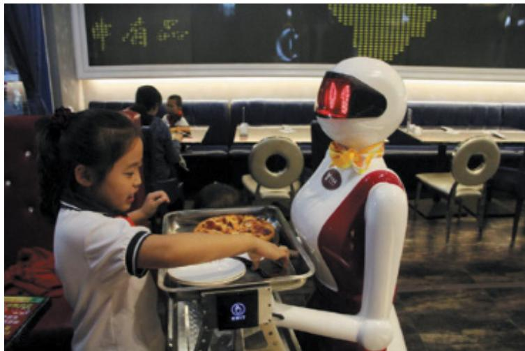
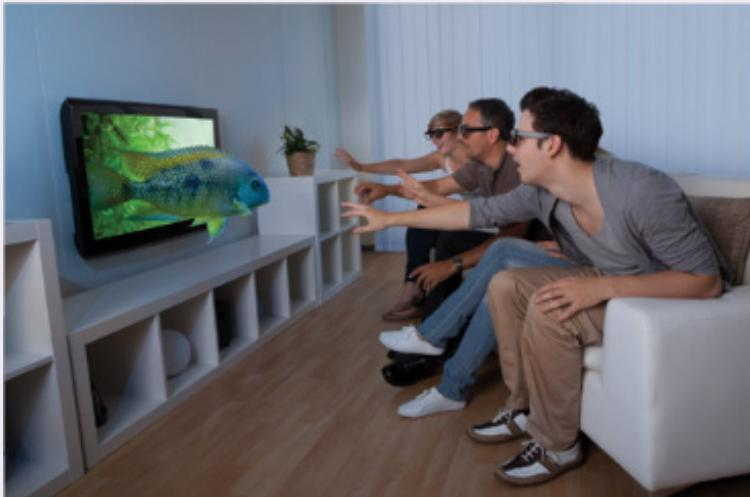
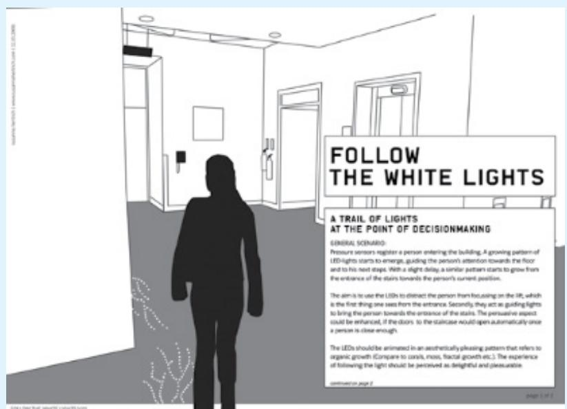
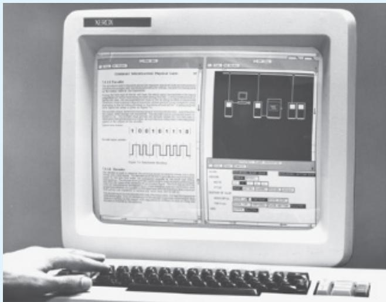
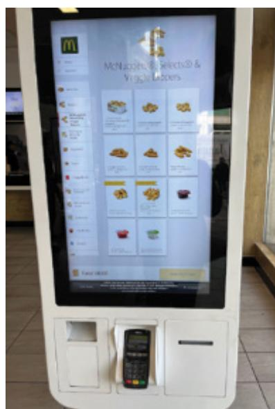
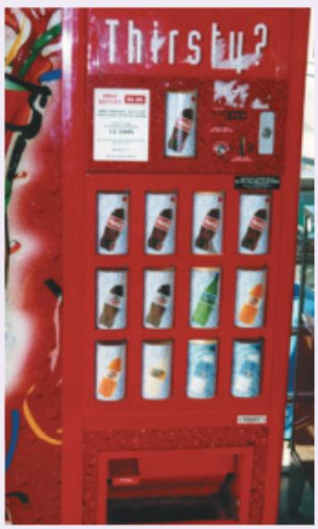
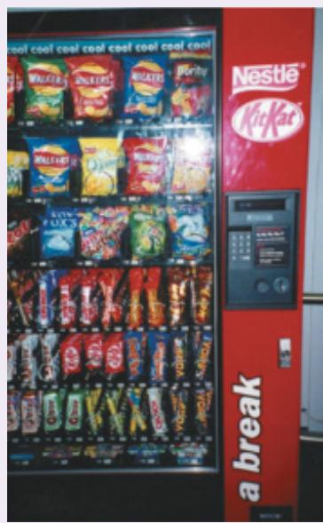
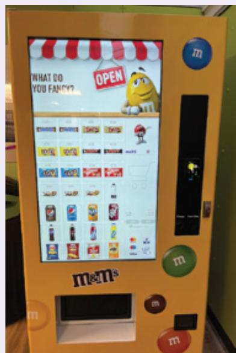
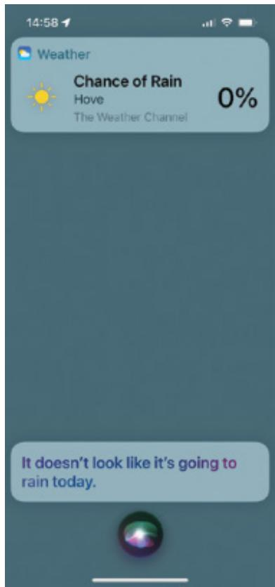
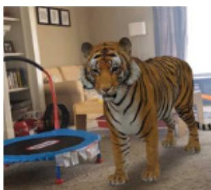

# Chapter 3

# C O N C E P T U A L I Z I N G  I N T E R A C T I O N

3.1  Introduction   
3.2  Conceptualizing Interaction   
3.3  Conceptual Models   
3.4  Interface Metaphors   
3.5  Interaction Types   
3.6  Paradigms, Visions, Challenges, Theories, Models, and Frameworks

The main goals of this chapter are to accomplish the following:

•  Explain how to conceptualize interaction.   
•  Describe what a conceptual model is and how to begin to formulate one.   
•  Discuss the use of interface metaphors as part of a conceptual model.   
•  Outline  the  core  interaction  types  for  informing  the  development  of  a  conceptual model.   
•  Introduce paradigms, visions, challenges, theories, models, and frameworks informing interaction design.

# 3.1 Introduction

When coming up with new ideas as part of a design project, it is important to conceptualize them in terms of what the proposed product will do. Sometimes, this is referred to as creating a proof of concept. In relation to the double diamond framework described in Chapter 2, it can be viewed as an initial pass to help define the area and also when developing responses to  the  design  challenge  and  then  testing  different  solutions  at  small  scale. In particular,  it comes out of the “discover” phase (left side of the left diamond) and progresses through the define phase (right side of the left diamond). One reason for needing to do this is as a reality check where  fuzzy ideas  and assumptions about  the benefits of  the proposed product  and user experience are scrutinized in terms of their feasibility: How realistic is it to develop what has  been suggested, and how desirable and useful  will it actually be? Another reason is  to enable designers to begin articulating what the basic building blocks will be (e.g., software components, user model) when developing the product. From a user experience perspective, it  can  lead  to better  clarity, forcing  designers  to  explain  how  users  will  understand, learn about, and interact with the product.

For  example, consider  the idea  that a designer has  of creating  a voice-assisted  mobile robot  that  can  help  waiters  in  a  restaurant  take  orders  and  deliver  meals  to  customers (see Figure 3.1). The first  question to ask is: Why? What  problem would this address? The designer might say that the robot could help take orders and entertain customers by having a conversation with them at the table. They could also make recommendations  that can be customized to different customers, such as restless children or fussy eaters. However, none of these addresses an actual problem. Rather, they are couched in terms of the putative benefits of the  new solution. In contrast, an actual problem identified might be the following: “It is difficult to recruit good waiters who provide the level of customer service to which we have become accustomed.”

  
Figure 3.1  A nonspeaking robot waiter in Shanghai. Imagine what would be gained if it could also have a conversation with customers.

Source: ZUMA Press / Alamy Stock Photo

Having worked through a problem space, it is important  to generate a set of questions that need to be addressed, when considering how to design a robot voice interface to wait on customers. These might  include the following: How intelligent does it have to be? How would it need to move to appear to be talking? What would the customers think of it? Would they  think it  is  too gimmicky  and get easily tired of  it? Or,  would it  always be  a  pleasure for them to try to have a conversation  with the robot, not  knowing what it would say  on each new visit  to the restaurant? Could it be designed to be a grumpy extrovert or a funny waiter?  What  if  it  mishears  and  gets  the  order  wrong?  What  might  be  the  limitations  of this approach?

Now look at a different kind of robot server in Figure 3.2. Instead of trying to be humanlike, it appears more machine-like, looking a bit like a bookshelf, with four trays. At the top is a touchscreen. The robot has been designed to serve and, in so doing, help waiters with their work. It does not talk and might seem weird or even creepy if it did.

These  kinds of robot servers first appeared  after the  pandemic when it  was difficult to find  people who wanted to be waiters. In contrast to the  idea  of a waiter robot, the robot server addressed a real-world problem  (Simon, 2021). The waiter robot works by  assisting

in the kitchen; the cooks load up the trays on its shelves and then send it to a preset area of the dining room to deliver the food. The customers or the human waiter removes the food and drinks from the robot server. After the customers finish their meal, the waiters then load the dirty dishes back onto the tray. In this sense, the robot server is like a tool, there to save waiters’ time rather than replacing them.

Figure 3.2  A robot server with a set of trays that orders are placed onto   
  
Source: www.richtechrobotics.com

Video To see one in action, visit www.richtechrobotics.com/matradee.

Many unknowns need to be considered in the initial stages of a design project, especially if it is a new product that is being proposed. As part of this process, it can be useful to show where  your  novel  ideas  came  from.  What  sources  of  inspiration  were  used?  Is  there  any theory or research that can be used to inform and support the nascent ideas?

Asking questions, reconsidering assumptions, and articulating concerns and standpoints are central aspects of the early ideation process. Expressing ideas as a set of concepts greatly helps to transform blue-sky and wishful thinking into more concrete models of how a product will work, what design features to include, and the amount of functionality that is needed. In  this chapter, we describe how  to achieve this through considering  the different ways  of conceptualizing interaction.

# 3.2 Conceptualizing Interaction

When beginning a design project, it is important  to be clear about the underlying assumptions and  claims. By  an  assumption, we  mean  taking something  for  granted  that requires further investigation; for example, people want fully automated cars that drive themselves. By  a  claim,  we  mean  stating  something  to  be  true  when  it  is  still  open  to  question.  For instance, people will feel safe and enjoy being driven by a vehicle rather than driving it themselves. The  difference  between  the  two  is  that  an  assumption  is  about  current  problems, conditions, or opportunities, while a claim is about what would happen in the future if some action were taken or product was introduced.

Writing down your assumptions and claims and then trying to defend and support them can highlight those that are vague or wanting. In so doing, poorly constructed design ideas can be reformulated. In many projects, this process involves identifying human activities that are problematic and working out how they might be improved through being supported with a different set of functions. In others, it can be more speculative, requiring thinking through how to design for an engaging user experience that does not exist.

Box 3.1 presents a hypothetical scenario of a team working through their assumptions and claims; this shows how, in so doing, problems are explained and explored by the team.

# BOX 3.1

# Working Through Assumptions and Claims

This is a hypothetical scenario of early design highlighting the assumptions and claims (italicized) made by different members of a design team.

A large software company  has decided that it needs to develop an upgrade  of its web browser for smartphones because its marketing team has discovered that many of the company’s customers have switched over to using another mobile browser. The marketing people assume that something is wrong with their browser and that their rivals have a better product. But they don’t know what the problem is with their browser.

The design team put  in charge of this project  assumes  that they need to improve the usability of a number of the browser’s functions. They claim that this will win back customers by making features of the interface simpler, more attractive, and more flexible to use.

The user researchers on the design team conduct an initial user study investigating how people use the company’s web browser on a variety of smartphones. They also look at other mobile web  browsers on the  market and  compare  their  functionality  and  usability. They observe and talk to many different users. They discover several things about the usability of their web browser, some of which they were not expecting. One revelation is that many of their customers have never actually used the bookmarking tool. They present their findings to the rest of the team and have a long discussion about why each of them thinks it is not being used.

One team member claims that the web browser’s function for organizing bookmarks is tricky and error-prone, and she assumes that this is the reason why many users do not use it. Another member backs her up, saying how awkward it is to use this method when wanting to move bookmarks  between  folders. One  of the  user experience architects agrees, noting how several of the users with whom he spoke mentioned how difficult and time-consuming

they found it when trying to move bookmarks between folders and how they often ended up accidentally putting them into the wrong folders.

A  software engineer reflects on what has  been said, and  he makes  the  claim that the bookmark function is no longer needed since he assumes that most people do what he does, which is to revisit a website by flicking through its history of previously visited pages. Another member of the team disagrees with him, claiming that many users do not like to leave a trail of the sites they have visited and would prefer to be able to save only the sites that they think they might want to revisit. The bookmark function provides them with this option. Another option discussed is whether to include most frequently visited sites as thumbnail images or as tabs. The software engineer agrees that providing all of the options could be a solution but worries about how this might clutter a smartphone screen interface.

After much discussion on the pros and cons of bookmarking versus history lists, the team decides to investigate further how to support effectively the saving, ordering, and retrieving of websites using a mobile web browser. All agree, based on the user research, that the format of the existing web browser’s structure is too rigid and that one of their priorities is to see how they can create a simpler way of revisiting websites on a smartphone.

Explaining people’s assumptions and claims about why they think something might be a good idea (or not) enables the design team as a whole to view multiple perspectives of the problem  space  and,  in  so  doing,  reveals  conflicting  and  problematic  ones.  The  following framework is intended to provide a set of core questions to aid design teams in this process:

•  Are there problems with an existing product or user experience? If so, what are they?   
•  Why do you think there are problems?   
•  What evidence do you have to support the existence of these problems?   
•  How do you think your proposed design ideas might overcome these problems?

# ACTIVITY 3.1

Use the framework in the previous list to guess what the main assumptions and claims were behind 3D TV. Then do the same for a curved TV, which was designed to be bendy so as to make the viewing experience more immersive. Are the assumptions similar? Why were they problematic?

# Comment

There was much hype and fanfare about  the enhanced user experience 3D and curved TVs would offer, especially when watching movies, sports events, and  dramas (see Figure 3.3). However, both never really took off. Why was this? One assumption for the 3D TV was that people would not mind wearing the glasses that were needed to see in 3D, nor would they mind paying a lot more for a new 3D-enabled TV screen. A claim was that people would really enjoy the enhanced clarity and color detail provided by 3D, based on the favorable feedback

(Continued)

received worldwide when viewing 3D films at a cinema. Similarly, an assumption made about curved TV was that it would provide  more flexibility for viewers  to optimize the viewing angles in someone’s living room.

Figure 3.3  A family watching 3D TV   
  
Source: Andrey Popov/Shutterstock

The unanswered question for both concepts was this: Could the enhanced cinema viewing experience that both claimed become an actual desired living room experience? There was no existing problem to overcome—what was being proposed was a new way of experiencing TV. The problem they might have assumed existed was that the experience of viewing TV at home was inferior to that of the  cinema. The claim could have been that people would be prepared to pay more for a better-quality viewing experience more akin to that of the cinema.

But were people prepared to pay extra for a new TV because of this enhancement? Some did. However, a fundamental usability problem was overlooked—many people complained of motion sickness when watching 3D TV. The glasses were also easily lost. Moreover, wearing them made it difficult to do other things such as flicking through multiple channels, texting, and tweeting. (Many people simultaneously use additional devices, such as smartphones and tablets while watching TV.) Most people who bought 3D TVs stopped watching them after a while because of these usability problems. While curved TV didn’t require viewers to wear special glasses, it also failed because the actual benefits were not that significant relative to the cost. While for some the curve provided a cool aesthetic look and an improved viewing angle, for others it was simply an inconvenience.

Nowadays, TV companies are creating ever more sophisticated display technologies, giving each a new acronym that it is simply known by, for example, QD-OLED, QDEL, and QNED. They comprise Mini LEDs, Quantum Dot,and NanoCell technologies. Each new technology that is promoted is assumed to be better than the last one, in terms of offering an even greater set of dazzling colors and deeper blacks that results in sharper and brighter images—much more than we see in real life with the naked eye. But to what extent does each new technological display development make a difference to the quality of the user experience? How many viewers know the difference between a QDEL or a QNED? In many ways it has become more about providing new levels of hyper-reality rather than focusing on the quality of the viewing experience.

<!-- Chunk 2 End -->

<!-- Chunk 3 Start -->

Making clear  what one’s  assumptions are  about an  identified  problem  or new  opportunity  and the claims being  made about potential solutions should be carried out  early on and  throughout a  project. Design teams  also need  to work  out how  best to conceptualize the design space. Primarily, this involves articulating the proposed solution as a conceptual model with respect to the user experience.

# 3.3 Conceptual Models

A model is a simplified description of a system or process that helps describe how it works. In this section, we look at a particular kind of model used in interaction design intended to articulate the problem and design space—the conceptual model. In a later section, we describe more generally how models have been developed to explain phenomena in human-computer interaction.

Jeff  Johnson  and Austin  Henderson  (2002)  first  defined  a  conceptual  model  as “a high-level  description of  how a  system is organized and operates” (p. 26). A key benefit of  conceptualizing  a  design  at  this  level  is  that  it  enables “designers  to  straighten  out their thinking before they start laying out their widgets” (p. 28). Subsequently, they wrote a  handbook  about conceptual  models, where  they  elaborated  the  methodology  further, detailing  the  steps  for  producing  a  conceptual  model  and how  to  use  one  to  progress through the design process (Johnson and Henderson, 2012). This involved outlining what people can do with a product and what concepts are needed to understand how to interact with it.

In a nutshell, a conceptual model provides a working strategy and a framework of general concepts and their interrelations. The core components are as follows:

. Metaphors and analogies that convey to people how to understand what a product is used for and how to use it for an activity (for example, browsing and bookmarking)   
. The concepts to which people are exposed through the product, including the task-domain objects they  create and  manipulate, their attributes, and the operations  that can  be performed on them (such as saving, revisiting, and organizing)   
The  relationships  between  those  concepts  (for  instance,  whether  one  object  contains another, such as a folder containing files)   
The mappings between  the concepts  and the user  experience  the product is  designed  to support or invoke (for example, one can revisit a page through looking at a list of visited sites, most-frequently visited, or saved websites)

How the various metaphors, concepts, and their relationships are organized determines the  user  experience.  By  explaining  these, the  design  team  can  debate  the  merits  of  each method of interacting and how they support the main concepts, for example, saving, revisiting, categorizing, and reorganizing web pages, and their mapping to the task domain. They can also begin discussing whether a new overall metaphor may be preferable that combines the activities of browsing, searching, and revisiting. In turn, this can lead the design team to articulate the kinds of relationships between them, such as containership. For example, what is the best way to sort and revisit saved pages, and how many and what types of containers should be used (for example, folders, bars, windows)? The same enumeration of concepts can

be repeated for other functions of the web browser—both current and new. In so doing, the design team can begin to work out systematically what will be the simplest and most effective and memorable way of supporting people while browsing the Internet.

The  best  conceptual models are  often those that  appear obvious  and  simple; that  is, the operations they support are intuitive to use. However, sometimes applications can end up being based on overly complex  conceptual models, especially if they are  the result of a  series of  upgrades,  where more  and  more  functions and  ways  of  doing  something are added to the original conceptual model. While tech companies often provide videos showing what  new features are  included in  an upgrade, users may not pay  much  attention to them or skip them entirely. Furthermore, many people prefer to stick to the methods they have always  used and  trusted and, not surprisingly, become annoyed when  they find one or more have been removed or changed. For example, when Facebook initially rolled out a revised newsfeed, many users at the time were very unhappy, as evidenced by their postings and tweets, preferring the old interface that they had gotten used to. A  challenge for software companies, therefore, is how best to introduce new features that they have added to an upgrade—and explain their assumed benefits to users—while also justifying why they removed others.

Once formulated and agreed upon, a conceptual model can then become a shared blueprint leading to a testable proof of concept. It can be represented as a textual description and/ or in a diagrammatic form, depending on the preferred lingua franca used by the design team. It can be used not just by user experience designers but also to communicate ideas to business, engineering, finance, product, and marketing units. The conceptual model is used by the design team as the basis from which they can develop more detailed and concrete aspects of the design. In doing so, design teams can produce simpler designs that match up with users’ tasks, allow for faster development time, result in improved customer uptake, and need less training and customer support.

# BOX 3.2

# Design Concept

Another term that is sometimes used is a design concept. Essentially, it is a set of ideas for a design. Typically, it is composed of scenarios, images, storyboards, mood boards, or text-based documents. For example, Figure 3.4 shows the first page of a design concept developed for an ambient display that was aimed at changing people’s behavior in a building, that is, to take the stairs instead of the elevator. Part of the design concept was envisioned as an animated pattern of twinkly lights that would be embedded in the carpet near the entrance of the building with the intention of luring people toward the stairs (Hazlewood et al., 2010 / ACM, Inc.).

  
Figure 3.4  The first page of a design concept for an ambient display

Many products are actually based on well-established conceptual models. For example, a conceptual model based on the core aspects of the customer experience when at a store underlies most online shopping websites. These include placing items that a customer wants to purchase into a shopping cart or basket and proceeding to checkout when they’re ready to make the purchase. Collections of patterns are now readily available to help design the interface for these core transactional processes, together with many other aspects of a user experience, meaning interaction designers do not have to start from scratch every time they design or redesign an application. Examples include patterns for online forms and navigation on mobile phones.

It is rare for completely new conceptual models to emerge that transform the way daily and work activities are carried out at an interface. Those that did fall into this category include the following three classics: the desktop (developed by Xerox in the late 1970s), the digital spreadsheet (developed by Dan Bricklin and Bob Frankston in the late 1970s), and the World Wide Web (developed by Tim Berners Lee in the late 1980s). All of these innovations made what was previously limited to a few skilled people accessible to all, while greatly expanding what is possible. The graphical desktop dramatically changed how office tasks could be performed (including  creating, editing, and  printing documents).  Performing these  tasks  using  the  computers prevalent at the time was significantly more arduous, having to learn and use a command language (such as DOS or UNIX). Digital spreadsheets made accounting highly flexible and easier to accomplish, enabling a diversity of new computations to be performed simply through filling in interactive boxes. The World Wide Web allowed anyone to browse a network of information remotely. Since then, e-readers and digital authoring tools have introduced new ways of reading documents and books online, supporting associated activities such as annotating, highlighting, linking, commenting, copying, and tracking. The web has also enabled and made many other kinds of activities much easier, such as browsing for news, weather, sports, and financial information, as well as banking, shopping, booking tickets, and learning online among other tasks. Importantly, all of these conceptual models were based on familiar activities.

# BOX 3.3

A Classic Conceptual Model: The Xerox Star

The Star interface, developed by Xerox in 1981 (see Figure 3.5), revolutionized the way that interfaces were designed for personal computing  (Smith et al., 1982;  Miller and  Johnson, 1996) and is viewed as the forerunner of today’s Mac and Windows desktop interfaces. Originally, it was designed as an office system, targeted at workers not interested in computing per se, and it was based on a conceptual model that included the familiar knowledge of an office. Paper, folders, filing cabinets, and mailboxes were represented as icons on the screen and were designed to possess some of the properties of their physical counterparts. Dragging a document icon across the  desktop screen was seen as equivalent to picking up a piece of paper in the physical world and moving it (but this, of course, is a very different action). Similarly, dragging a digital  document into a digital folder was seen as being analogous to placing a physical document into a physical cabinet. In addition, new concepts that were incorporated as part of the desktop metaphor were operations that could not be performed in the physical world. For example, digital files could be placed onto an icon of a printer on the desktop, resulting in the computer printing them out.

Figure 3.5  The Xerox Star   
  
Source: Used courtesy of Xerox

Video The history of the Xerox Star is at youtu.be/Cn4vC80Pv6Q.

# 3.4  Interface Metaphors

Metaphors are considered to be a central component of a conceptual model. They provide a structure that is similar in some way to aspects of a familiar entity (or entities), but they also have their own behaviors and properties. More specifically, an interface metaphor is one that is  instantiated  in  some  way  as  part  of  the  user  interface,  such  as  the  desktop  metaphor. Another well-known one is the search engine, originally coined in the early 1990s to refer to a  software  tool  that  indexed  and  retrieved  files  remotely  from  the  Internet  using  various algorithms to match terms selected by the user. The metaphor invites comparisons between a mechanical engine, which has several working  parts, and the everyday action of looking  in different places to find something. The functions supported by a search engine also include other features besides those belonging to an engine that searches, such as listing and prioritizing  the  results  of  a  search. It  also  does  these  actions in  quite  different  ways  from  how  a mechanical engine works or how a human being might search a library for books on a given topic. The similarities implied by the use of the term search engine, therefore, are at a general level. They are meant to conjure up the essence of the process of finding relevant information, enabling the user to link these to less familiar aspects of the functionality provided.

# ACTIVITY 3.2

Go to a few online stores and see how the interface has been designed to enable the customer to order and pay for an item. How many use the “add to shopping cart/basket”followed by the “checkout” metaphor? Does this make it straightforward and intuitive to make a purchase?

# Comment

Making a purchase online usually  involves spending money by inputting  one’s  credit/debit card details. People want to feel reassured that they are  doing this correctly and do not get frustrated with lots of forms  to fill in. Designing the interface to have a familiar metaphor (with an icon of a shopping cart/basket, not a cash register) makes it easier for people to know what to do at the different stages of making a purchase. Most important, placing an item in the basket does not commit the customer to purchase it there and then. It also enables them to browse further and select other items, as they might in a physical store.

Interface metaphors are intended to provide familiar entities that enable people readily to understand the underlying conceptual model and know what to do at the interface. However, they can also contravene people’s expectations about how things should be, such as the recycle bin (trash can) that used to sit on the desktop. Logically and culturally (meaning, in the physical world), it should be placed under the desk. But users would not have been able to see it because it would have been hidden by the desktop surface. So, it needed to go on the desktop. While some  people found this irksome, most did not find it to be a problem. Once they understood why the recycle bin icon was on the desktop, they simply accepted it being there.

An interface metaphor that has become a staple  in UX is the card. Many of the social media  apps,  such  as Twitter  and  Pinterest,  present their  content  on  digital  cards  that  are based on the idea behind most physical cards. They have a familiar form, having been around for a long time. Just think of how many kinds there are: playing cards, business cards, birthday cards, credit cards, and postcards to name a few. They have strong associations, providing an  intuitive way  of organizing  limited content  that is “card sized.” They  can easily  be flicked through, sorted, and themed. They structure content into meaningful chunks, similar to how paragraphs are used to chunk a set of related sentences into distinct sections (Babich, 2016). They have also become the standard interface model used in many self-ordering kiosks (see Figure 3.6).

  
Figure 3.6  A self-ordering kiosk found in many fast-food restaurants that uses a card metaphor as part of the interface. Each food or drink item is displayed on its own card with associated description and price. This enables the customer to easily select items they want to purchase from the category types in the card matrix while also going back and forth between the other high-level categories (e.g., burgers, vegan, cold drinks), shown down the left side of the display.

In  many  cases, metaphors become  integrated  into common  parlance,  as  witnessed  by the way  people talk about  them. For  example, parents  talk about  how  much screen  time children are allowed each day in the same way they talk more generally about spending time. It  can also  become  an everyday  term in its  own right, e.g., Googling.  Moreover, it  is hard not to use metaphorical terms when talking about technology  use, as they  have become so ingrained in the language that we use to express ourselves. Just ask yourself or someone else to describe Twitter or Instagram and how people use them. Then try doing it without using a single metaphor.

# BOX 3.4

# Why Are Metaphors So Popular?

People frequently use metaphors and analogies (here we use the terms interchangeably) as a source of inspiration for understanding and explaining to others what they are doing, or trying to do, in terms that are familiar to them. They are an integral part of human language (as originally explained by Lakoff and Johnson in their classic 1980 book Metaphors We Live $B y )$ ). Metaphors are commonly used to explain something that is unfamiliar or hard to grasp by way of comparison with something that is familiar and easy to grasp. For example, they are frequently employed in education, where teachers use them to introduce something new to students by comparing the new material with something they already understand. Consider the web and the Internet. How would you explain the difference between them to children? The BBC  on its BiteSize learning site (www.bbc.co.uk/newsround/47523993) distinguishes between them by describing the Internet as a network of connected computers that the web works on, which enables  emails, files, and streaming to move across it. To make this more concrete, they use the analogy of seeing the Internet as the roads that connect towns and cities together whereas the web contains the things that are built on roads like shops, houses, and schools. The vehicles on the roads are the data that moves around.

It is not surprising, therefore, to see how widely metaphors have been used in interaction design to conceptualize abstract, hard-to-imagine, and difficult-to-articulate computer-based concepts and interactions in more concrete and familiar terms and as graphical visualizations at the interface level. Metaphors and analogies are used in these three main ways:

•  As a way of conceptualizing what we are doing (for instance, live streaming)   
•  As a conceptual model instantiated at the interface level (for example, the card metaphor)   
•  As a way of visualizing an operation (such as an icon of a shopping cart into which items are placed that users want to purchase on an online shopping site)

However, the potential downside of using  interface metaphors is they don’t scale  very well, especially when trying to describe how complex systems work. Alan Cooper (2020) in a blog piece argues that we should abandon metaphors at the interface and explain the interface in terms of the concepts, function, and relationships underlying the system. He points out how difficult it can be to find a useful visual metaphor for many tasks conducted at the interface, such as buying a ticket or finding a reference. Do you agree with him?

# 3.5 Interaction Types

Another way of conceptualizing the design space is in terms of the interaction types that will underlie the user experience. Essentially, these are the ways a person interacts with a product or application. Originally, we identified four main types: instructing, conversing, manipulating, and exploring (Preece et al., 2002). A fifth type was proposed by Christopher Lueg et al. (2019) that we have added to ours, which they call responding. This refers to proactive systems  that  initiate  a request  in  situations to  which  a user  can  respond, for  example,  when Netflix pauses a person’s viewing to ask them whether they would like to continue watching.

Deciding upon which of the interaction types to use, and why, can help designers formulate a conceptual model before committing to a particular interface in which to implement them, such as speech-based, gesture-based, touch-based, menu-based, and so on. Note  that we are distinguishing here between interaction types (which we discuss in this section) and interface types (which are discussed in Chapter 7, “Interfaces”). While cost and other product constraints will often dictate which interface style can be used for a given application, considering the interaction type that will best support a user experience can highlight the potential trade-offs, dilemmas, and pros and cons.

Here, we describe in more detail each of the five types of interaction. It should be noted that they are not meant to be mutually exclusive (for example, someone can interact with a product based on different kinds of activities); nor are they meant to be definitive. Also, the label used for each type refers to the user’s action even though the product may be the active partner in initiating the interaction.

. Instructing: Where someone issues instructions to a system. This can be done in a number of ways, including typing in commands, selecting options from menus in a window environment  or on  a multitouch  screen, speaking  aloud commands, gesturing, pressing  buttons, or using a combination of function keys.   
• Conversing: Where a person has a dialogue with a system. They can speak via an interface or  type  in questions  to which the  system  replies  via text  or  speech  output. This is  often called a conversational user interface (CUI).   
? Manipulating: Where people interact with objects in a virtual or physical space by manipulating  them  (for  instance,  opening, holding,  closing,  and  placing). They  can  hone  their familiar knowledge of how to interact with objects.   
? Exploring: Where people move through a virtual environment or a physical space. Virtual environments  include  3D  worlds  comprising  augmented  or  virtual  reality. They  enable users to hone their familiar knowledge by physically moving around. Physical spaces that use  sensor-based technologies include smart rooms and ambient environments, also enabling people to capitalize on familiarity.   
• Responding: Where the system initiates the interaction and  the person chooses whether to respond. For example, proactive mobile location-based technology can alert people to points of interest. They can choose to look at the information popping up on their phone or ignore it.

Besides  these  core  activities  of  instructing,  conversing,  manipulating,  exploring,  and responding, it is possible to describe the specific domain- and context-based activities in which people  engage, such as learning,  working, socializing, playing,  browsing, writing, problemsolving, decision-making, and searching—just to name but a few. In the following sections we illustrate in more detail the five core interaction types and how to design applications for them.

# 3.5.1  Instructing

This type of interaction describes how someone carries out their tasks by telling the product what to do. Examples include giving instructions to a system to perform operations such as tell the time, print a file, and notify them of an appointment. A diverse range of products has been designed based on this model, including home entertainment systems, consumer electronics, and computers. The way in which a person issues instructions can vary from pressing buttons  to  giving  voice  commands.  Many  activities  are  readily  supported  by  giving instructions.

One of the main benefits of designing an interaction based on issuing instructions is that the  interaction is quick and efficient. It is particularly fitting where there is a frequent need to repeat actions performed on multiple objects. Examples include the repetitive actions of saving, deleting, and organizing files.

# ACTIVITY 3.3

There  are  many different  kinds of vending  machines in the  world. Each offers a range  of goods, requiring users to part with some of their money. Figure 3.7 shows photos of three different types of vending machines: one that provides soft drinks and the other two that deliver a range of snacks. Each machine uses an instructional mode of interaction. However, the way they do so is quite different.

  
Figure 3.7  Three different types of vending machine

What instructions must be issued to obtain a soda from the first machine, a bar of chocolate from the second, and a packet of chips from the third one? Why has it been necessary to design a more complex mode of interaction for the second vending machine? What problems can arise with this mode of interaction?

# Comment

The first vending machine has been designed using simple instructions. There is a small number of drinks from which to choose, and each is represented by a large button displaying the label of each drink. The person simply has to press one button, and this will have the effect of delivering the selected drink. The second machine is more complex, offering a wider range of snacks. The trade-off for providing more options, however, is that the person can no longer

(Continued)

instruct the machine using a simple one-press action but is required to follow a more complex process involving (1) reading off the code (for example, C12) under the item chosen, then (2) keying this into the number pad adjacent to the displayed items, and finally (3) checking the price of the selected option and ensuring that the amount of money inserted is the same or greater (depending on whether the  machine provides change). Problems that can arise from this type of interaction  are the customer misreading the code and/or incorrectly keying the code, resulting in the machine not issuing the snack or providing the wrong item.

The third vending machine has a large digital touch screen on the front. It provides the best of both worlds by providing a direct manipulation-style interface. The images that appear on the  display clearly show what the confectionary options are and beside each their price. The customer needs only to press the display of the object chosen and place their credit/debit phone on the card reader on the right. There is a much lower chance of error resulting from pressing the  wrong code or keys. The  interface is also flexible in being able to change the display to what products are available. This makes it easy to add a new product line when it comes out or change the price of a product. Another difference from the solely physical vending machines is that the digital display uses a visual metaphor of a candy store, with animated characters appearing on it—intended to lure passersby to stop and buy one of the displayed products. This can be very tempting.

# 3.5.2  Conversing

This form of interaction is based on the idea of a person having a conversation with a system, where  the  system  acts  as  a dialogue  partner. In  particular, the  system  is  often  designed to respond in  a way  that another  human  being might  when  having a  conversation. It  differs from the activity of instructing insofar as it encompasses a two-way communication process, with the system acting  like a partner rather than a machine  that obeys orders. It  has been most  commonly  used  for  applications  where  someone  needs to  find  out  specific kinds  of information  or  wants  to  discuss issues. Examples  include advisory  systems,  help  facilities, chatbots, and robots.

The  kinds  of  conversation  that  are  currently  supported  range  from  simple  voicerecognition,  menu-driven  systems  to  more  complex  natural  language–based  systems  that involve the system parsing and responding to queries typed in or spoken by the user. Examples of the former include banking, ticket booking, and train-time inquiries, where the user talks  to the  system  in single-word  phrases  and numbers, that  is,  yes, no,  three, and so  on, in response to prompts from the system. Examples of the latter include help systems, where the user types in a specific query, such as “How do I change the margin widths?” to which the  system  responds by  giving  various  answers. Advances  in  AI  during  the  last  few  years have resulted  in  a  significant  improvement in  speech  recognition  to  the extent  that many companies now routinely employ speech-based and chatbot-based interaction for their customer queries.

A  main  benefit  of  developing  a  conceptual model  that  uses  a  conversational  style  of interaction is that it allows people to interact with a system in a way that is familiar to them. For example, Apple’s speech system, Siri, lets you talk to it as if it were another person. You can  ask  it  to  do  tasks  for  you, such  as make  a  phone call,  schedule  a  meeting, or  send a

message. You can also ask it  indirect questions that  it knows how to answer, such as “Do I need an umbrella today?” It will look up the weather for where you are and then answer with something like, “It doesn’t look like it’s going to rain today” while also providing a weather forecast (see Figure 3.8).

  
Figure 3.8  Siri’s response to the question “Do I need an umbrella today?”

A problem that can arise from using a conversational-based interaction type is that certain kinds of tasks are transformed into cumbersome and one-sided interactions. This is especially true for automated phone-based systems that use auditory menus to advance the interaction. Users  have  to listen to a voice providing several options, then make a selection, and finally repeat through further layers of menus before accomplishing their goal, for example, reaching a real human or paying a bill. Here is the beginning of a dialogue between someone who wants to find out about car insurance and an insurance company’s phone reception system:

<user dials an insurance company>

“Welcome to St. Paul’s Insurance Company. Press 1 if you are a new customer; 2 if you are an existing customer.”

<user presses 1>

“Thank you for calling St. Paul’s Insurance  Company. If you require house insurance, say  1; car  insurance, say  2; travel insurance, say  3; health insurance, say  4; other, say 5.”

<user says $2 >$

“You have reached the  car insurance division. If you require  information about  fully comprehensive insurance, say 1; third-party insurance, say 2. . . .”

“If you’d like to press 1, press 3.

If you'd like to press 3,press 8.

If you'd like to press 8,press5..."

Source: © Glasbergen. Reproduced with permission of Glasbergen Cartoon Service

# 3.5.3  Manipulating

This form of interaction involves manipulating objects, and it capitalizes on people’s knowledge of how they do so in the physical world. For example, digital objects can be manipulated by moving, selecting, opening, and closing. Extensions to these actions include zooming in and out, stretching, and shrinking—actions that are  not possible with objects in the real world. Human actions can be imitated through the use of physical remotes (for example, VR controllers) or gestures made in the air, such as the gesture control technology now used in some cars. Physical toys and robots have also been embedded  with technology that enable them to act and react in ways depending on whether they are squeezed, touched, or moved. Tagged physical objects (such as balls, bricks, or blocks) that are manipulated in a physical world (for example, placed on a surface) can result in other physical and digital events occurring, such as a lever moving or a sound or animation being played.

A framework that has been highly influential (originating from the early days of HCI) in guiding the design of GUI applications is direct manipulation (Shneiderman, 1983). It proposes that digital objects in the interface can be designed so that they can be interacted with in ways that are analogous to how physical objects in the physical world are manipulated. In so doing, direct manipulation interfaces are assumed to enable users to feel that they are directly controlling the digital objects represented by the computer. The three core principles are as follows:

? Continuous representation of the objects and actions of interest   
•  Rapid reversible incremental actions with immediate feedback about the object of interest   
•  Physical actions and button pressing instead of issuing commands with complex syntax

According to these principles, an object on a screen remains visible while a user performs physical actions on it, and any actions performed on it are immediately visible. For example, they can move a file by dragging an icon that represents it from one part of the display into a folder. The benefits of direct manipulation include the following:

Helping beginners learn basic functionality rapidly   
Enabling experienced users to work rapidly on a wide range of tasks   
•  Allowing infrequent users to remember how to carry out operations over time   
. Preventing the need for error messages, except rarely   
Showing users immediately how their actions are furthering their goals

• Reducing users’ experiences of anxiety   
. Helping users gain confidence and mastery and feel in control

Many apps have been developed based on some form of direct manipulation, including word processors, video games, learning tools, and graphical and video editing tools. Scrolling using a finger on a touch screen and using a mouse with a laptop/PC display are also examples of direct manipulation.

# 3.5.4  Exploring

This mode of interaction involves people moving through virtual or physical environments. For example, they can explore aspects of a virtual 3D environment, such as the interior of a building. Physical environments can also be embedded with sensing technologies that, when they detect the presence of someone or certain body movements, respond by triggering certain digital or physical events. The basic idea is to enable people to explore and interact with an  environment, be it physical or digital, by exploiting  their knowledge of how they  move and navigate through existing spaces.

Many  3D virtual environments  have  been built  that comprise digital  worlds designed for people to move between various spaces to socialize in (e.g., Metaverse), to learn in (e.g., virtual conferences), or to play video games in (such as Fortnite). Many virtual landscapes depicting cities, parks, buildings, rooms, and datasets have also been built, both realistic and abstract, that enable users to fly over them and zoom in and out of different parts. Other augmented environments that have been developed are intended to be used in one’s living room, where hologram people or virtual animals can magically be made to appear (see Figure 3.9a). There are also virtual worlds that are larger than life, enabling people to move around them and experience things that are normally impossible or invisible to the eye. Architects create highly realistic VR representations of planned buildings and spaces that enable their clients and customers  to imagine how  they will use and move through them. 3D visualizations  of complex datasets have also been generated that enable scientists and researchers to immerse themselves in and manipulate the data points, using hand gestures (see Figure 3.9b).

  
(a)

  
(b)   
Figure 3.9  (a) A drop-in virtual lion appearing in someone’s living room created with Google 3D object; and (b) architects working together designing a 3D virtual model.

Source: (a) www.cnet.com/tech/services-and-software/google-3d-animals-how-to-use-cool-ar-feature-at-home-listof-objects (b) ME Image/Adobe Stock

# 3.5.5  Responding

This mode of interaction involves the system taking the initiative to alert, describe, or show a person something that it “thinks” is of interest or relevance to the context they are presently in. It can do this through detecting the location and/or presence of someone in a vicinity (for instance, a nearby coffee bar where friends are meeting) and notifying them about it on their phone or watch. Smartphones and wearable devices are becoming increasingly proactive in initiating  user  interaction  in  this  way, rather  than  waiting  for  the  user  to  ask,  command, explore, or manipulate. An example is a fitness tracker that notifies the wearer of a milestone they have reached for a given activity, for example, having walked 10,000 steps in a day. The fitness tracker does this automatically without any requests made by the wearer; the wearer can respond by looking at the notification on their screen or listening to an audio announcement that is made. Another example is when the system automatically provides some funny or useful information for the user, based on what it has learned from their repeated behaviors when carrying out particular actions in a given context. For example, after taking a photo of a friend’s cute dog in the park, Google Lens will automatically pop up information that identifies the breed of the dog (see Figure 3.10).

  
Figure 3.10 Google Lens in action, providing pop-up information about Pembroke Welsh Corgi having recognized the image as one

Source: https://lens.google.com

For  some  people, this kind  of system-initiated interaction—where additional  information is  provided that  has not been requested—might  get a bit tiresome or frustrating, especially if the system gets it wrong. The machine learning challenge is to decide when someone will find it useful and interesting and how much and what kind of contextual information to provide without overwhelming or annoying them. Also, it needs to know what to do when it gets it  wrong. For example, if it thinks the dog is a teddy  bear, will it apologize? Will the user be able to correct it and tell it what the photo actually is? Or will the system be given a second chance?

# 3.6 Paradigms, Visions, Challenges, Theories, Models, and Frameworks

Other sources of conceptual inspiration and knowledge that are used to inform design and guide research are paradigms, visions, challenges, theories, models, and frameworks. These vary in terms of their scale and specificity to a particular problem space. They are intended to help frame, guide, and scope a particular research or design project. A paradigm refers to a general approach that has been adopted by a community of researchers and designers for carrying  out  their work in terms of shared  assumptions, concepts, values, and practices. A challenge  is where researchers are tasked with addressing pressing and global issues facing society, such as improving sustainability and reducing poverty. A vision is a future scenario that frames research and development in interaction design—often depicted in the form of a film or a narrative. A theory is a well-substantiated explanation of some aspect of a phenomenon, for example, self-determination theory, which is a psychological theory of human motivation that has  been used to describe and analyze HCI research on games and play (Tyack and Mekler, 2020). A model is a simplification of some aspect of human-computer interaction intended  to make it easier for designers  to predict and evaluate alternative designs. A framework is a set of interrelated concepts and/or a set of specific questions that are intended to  inform  a  particular  domain  area  (for  example,  collaborative  learning)  or  an  analytic method (for instance, ethnographic studies).

# 3.6.1  Paradigms

Following a particular paradigm means adopting a set of practices upon which a community has agreed. These include the following:

. The questions to be asked and how they should be framed   
. The phenomena to be observed   
•  The way in which findings from studies are to be analyzed and interpreted (Kuhn, 1972)

Back  in  the  1980s,  when  GUIs  came  into  being,  the  prevailing  paradigm  in  interaction design was centered  around how  to design user-centered applications  for the desktop computer.  Questions  about  what  and  how  to  design  were  framed  in  terms  of  specifying the  requirements for  a  single  user  interacting  with a  screen-based  interface.  In the  1990s, a  paradigm  shift  occurred  with the  goal  of developing  ubiquitous computing. Many  HCI researchers  began to think  beyond the desktop and design mobile  and pervasive technologies. An array of technologies was developed that could extend what people could do in their everyday and working lives, such as smart glasses, tablets, and smartphones.

The next significant paradigm shift took place in the 2000s and was the emergence of Big Data and the Internet of Things (IoT). New and affordable sensor technologies enabled masses of data to be collected about people’s health, well-being, and real-time changes happening in the environment (for example, air quality, traffic congestion, and business). Smart buildings were also built, where an assortment of sensors were embedded and experimented with  in  homes,  hospitals,  and  other  public  buildings.  Data  science  and  machine-learning algorithms  were  developed  to  analyze  the  amassed  data  to  draw  new  inferences  about what actions to take on behalf of people to optimize and improve their lives. This included

introducing variable speed limits on highways, notifying people via apps of dangerous pollution levels, crowds at an airport, and so on. In addition, it became the norm for sensed data to be used to automate mundane operations and actions—such as turning lights or faucets on and off or flushing toilets automatically—replacing conventional knobs, buttons, and other physical controls.

The prevailing paradigm  in computing today is AI. Machine  learning (ML) is  increasingly being  used  at  the interface  to  help  with decision-making.  For  example, Spotify  uses machine learning models to suggest new tracks for the user to listen to based on all sorts of information about  them, such as  their playlists, listening  history, and how long they  listen and even the time of day. By analyzing all this information, systems like Spotify can personalize their recommendations to cater for different tastes in music.

Using ML models can also help people choose when there are a myriad of choices. For example, instead of having  to agonize over  which clothes to buy or vacation  to select, AIenabled personal assistants can help choose on your behalf. Another example of where ML is being used is to create personalized passenger experiences, based on customizing the right level of comfort (for example, see VW’s video).

Video VW’s vision of its future car can be seen in this video: youtu.be/AyihacflLto.

While there are many benefits of letting machines make decisions for us, it may come at a cost. We may feel a loss of control. Moreover, we may not understand why the AI system has chosen  to drive  the car along a particular route or why our voice-assisted  home robot keeps  ordering  too  much  milk.  There  are  increasing  expectations  that AI  should  be  able to explain the  rationale behind its  decisions. This need is often referred to as transparency and  accountability—which  we  discuss  further  in  Chapter  10,  “Data  at  Scale  and  Ethical Concerns.”

Since  the  early  2020s,  there  has  been  a  call  to  arms  for  making  AI  more  humancentered—with the goal that people should be augmented with AI tools rather than replaced with autonomous AI systems (e.g., Shneiderman, 2022). Stanford developed one of the first human-centered AI centers in 2020 (see the following video). The goal is to broaden the AI agenda from a largely technological perspective to one that is more human-centered, geared toward empowering humans. HCI’s role  in this paradigm shift is to collaborate more with AI  researchers and developers, generating new  dialogues, policies, framings, and questions about how to achieve this while also designing new kinds of user interfaces for AI systems.

Video  See  Stanford  university’s  video  on  HAI:  www.youtube.com/watch?v= 4W2kXBBFDw4&t=4s.

# 3.6.2  Visions

One of the most influential visions in computing was Mark Weiser’s (1991) who proposed that computers would become part  of the environment, embedded in a variety of everyday objects,  devices, and displays. He  envisioned a  world  of serenity, comfort, and  awareness, where  people were kept  perpetually informed  of  what  was happening around  them, what was  going to  happen, and what had  just  happened. Ubiquitous  computing devices  would enter a person’s center of attention when needed and move to the periphery of their attention when not, enabling  the person to switch calmly and effortlessly between  activities without having  to figure  out  how  to use  a computer  when  performing  their tasks. In  essence, the technology would be unobtrusive and largely disappear into the background. People would be able  to get on  with their everyday and working  lives, interacting with information  and communicating  and  collaborating with  others  without  being distracted  or becoming  frustrated  with  technology. This  vision  provided a  powerful driving  force  that  dominated the research and development that ensued in companies and universities, heavily influencing the computing community’s thinking, and inspiring them  especially regarding which technologies to develop and problems to research (Abowd, 2012).

However, as is often the case, what technologies materialized and how they changed society in the ensuing years has been quite different from the vision. Johannes Schöning (2019) has  even gone  so  far  as to write  about  the  failure  of the  field of  ubiquitous computing  to deliver on Mark Weiser’s vision, pointing out how instead it has created a world full of too many “dumb smart” technologies, where new  solutions may  look cool but  solve problems that do not exist.

Other visions about the future of technology and society have been portrayed through evocative videos, inviting audiences to imagine what life will be like in 10, 15, or 20 years’ time. One of the earliest was Apple’s 1987 Knowledge Navigator, which presented a scenario of a professor using a touchscreen tablet with a speech-based intelligent assistant reminding him of what he needed to do that day while answering the phone and helping him prepare his lectures. It was 25 years ahead of its time—set in 2011, the actual year that Apple launched its speech system, Siri. At the time, it was much viewed and discussed, inspiring widespread research into and development of future interfaces.

More recent visionary videos that have been produced have focused more on the application of artificial intelligence, such as for digital healthcare, future transport, homes, and cities. Likewise, an overarching goal  of these is  to inspire  R&D—but also as a way  of marketing their concept and future products.

Video You  can watch a video about the Apple Knowledge Navigator here:  youtu .be/HGYFEI6uLy0.

Science fiction has also become a source of inspiration in human-computer interaction (Jordan and Silva, 2021). By this, we mean in movies, writing, plays, and games that envision what role technology may play in the future. Dan Russell and Svetlana Yarosh (2018) discuss

the  pros and cons of using  different kinds of science fiction  for inspiration  in HCI  design, arguing that they can provide a good grounding for debate but are often not a great source of accurate predictions of future technologies. They point out how, although the visions can be  impressively futuristic, their embellishments  and  what they  actually  look like  are  often limited by the author’s ability to extend and build upon the ideas and the cultural expectations associated with the current era. For example, the holodeck portrayed in the classic Star Trek TV  series had 3D-bubble indicator lights and  push-button designs on its bridge with the sound of a teletype in the background. This is the case to such an extent that Russell and Yarosh even argue  that  the  priorities  and concerns  of the  author’s time  and  their cultural upbringing can bias the science fiction toward telling narratives from the perspective of the present, rather than providing new insights and paving the way to future designs.

In sum, visions provide concrete scenarios of how society can use the next generation of imagined technologies to make their lives more comfortable, safe, informative, and efficient. They  also  raise  questions  concerning  privacy, trust, and  what  we want  as  a  society. In so doing, they provide  much food for thought for researchers, policy-makers, and developers, challenging them to consider both positive and negative implications.

# 3.6.3  Challenges

While many technological challenges have been articulated through visions of the future (see, for example, Harper et al., 2008; Rogers, 2022), society itself is facing new challenges as the world  changes. These  include  grand  challenges  that  emphasize “a  difficult  but  important, systemic  and society-wide problem  with no ‘silver bullet’  solution” (Mazzucato  and Dibb, 2019). Examples include achieving zero hunger, quality education, gender equality, and sustainable cities and communities. What will it mean for HCI to become part of this challengeled agenda? How will their methods scale up to be able to make an impact?

HCI researchers are also addressing climate change, by challenging the values designed into  technologies  that  influence  society’s  practices  of  disposal,  recycling,  and  upcycling (e.g., Lechelt et al., 2020). Many of our devices, such as smartphones, laptops, and tablets, are  designed to have a short  lifespan. Users are  constantly  under pressure  to get the  latest model—by  instilling alternative  design values in  society, it  may be  possible  to support  the continuity of the material life of them for longer. This also requires the tech companies buying into alternative values, generating alternative business models and production cycles, and investing more in reusable materials.

# 3.6.4  Theories

Over the past 40 years, numerous theories have been imported into human-computer interaction, providing a means  of understanding  and informing the design  of user  interfaces and user experiences (Rogers, 2012). These  have been primarily  cognitive, social, affective, and organizational  in  origin. For  example, cognitive theories  about  human  memory  were  first used in the 1980s to determine the best ways of representing operations, given people’s memory limitations. One of the main benefits of applying such theories in interaction design is to help identify factors (cognitive, social, and affective) relevant to the design and evaluation of

interactive products. Others help us to frame and understand human behavior and the user experience. They serve a variety of roles including the following:

• Descriptive—providing concepts and models   
• Explanatory—explicating relationships and processes   
• Predictive—testing hypotheses about user performance   
• Prescriptive—providing guidance for design   
• Generative—creating something new   
. Informative—selecting knowledge to couch our understanding   
• Conceptual—developing high-level frameworks   
• Critical—critiquing interaction design

Some of  the  most  influential,  as  well  as more  recently  imported  theories  in HCI,  will be  covered  in  the next  three  chapters, including  cognitive, social, and  affective  aspects  of interaction.

# 3.6.5  Models

We discussed earlier why  a conceptual model  is important  and how to generate  one when designing a new product. The term model has also been used more generally in interaction design to describe, in a simplified way, some aspect of human behavior or human-computer interaction. Typically, it depicts how the core features and processes underlying a phenomenon are structured and related to one another. It is usually abstracted from a theory coming from a contributing discipline, like psychology. For example, Don Norman (1988) developed a number of models of user interaction based on early theories of cognitive processing, which were intended to explain the way users interacted with interactive technologies. These include the seven stages of action model that described how people move from their plans to executing physical actions that they need to perform to achieve them and to evaluating the outcome of their actions with respect to their goals. Since then, a number of user models have been developed  based on other theories about human behavior besides cognitive ones, including personality, emotions, and learning styles that are used to personalize the user interface and predict what different people would like in their digital interactions (e.g., a particular movie to watch).

# 3.6.6  Frameworks

Numerous  frameworks  have  been  introduced in  interaction design  to  help  designers  constrain and scope the user experience for which they are designing. In contrast to a model, a framework  offers advice to designers  as to what  to design or look for. This can come  in a variety  of  forms,  including  steps,  questions,  concepts,  challenges,  principles,  tactics,  and dimensions. Frameworks, like models, have traditionally been based on theories  of human behavior,  but  they  are increasingly  being developed  from  the experiences of  actual  design practice and the findings arising from user studies.

Many frameworks have been published in the HCI/interaction design literature, covering different aspects of the user experience and a diversity of application areas. For example, there are frameworks for helping designers think about how to conceptualize learning, working, socializing, fun, emotion, and so on, and others that focus on how to design particular kinds of technologies to evoke certain responses (see Chapter 6, “Emotional Interaction”).

# BOX 3.5

# Closing the Gap Between Conceptual and Design Models

A classic example of a conceptual framework that has been highly influential in HCI is Don Norman’s (1988) explanation of the relationship between the design of a conceptual model and a user’s understanding of it. The framework comprises three interacting components: the designer, the user, and the system. Behind each of these are the following:

Designer’s Model: The model the designer has of how the system should work

System Image: How the  system actually works, which is portrayed to the user through the interface, manuals, help facilities, and so on

User’s Model: How the user understands how the system works

The framework makes explicit the relationship between how a system should function, how it is presented to users, and how it is understood by them. In an ideal world, users should be able to carry out activities in the way intended by the designer by interacting with the system image that makes it obvious what to do. If the system image does not make the designer’s model clear to the users, it is likely that they will end up with an incorrect understanding of the system, which in turn will increase the likelihood of their using the system ineffectively and making errors. This has been found to happen often in the real world. By drawing attention to this potential discrepancy, designers can be made aware of the importance of trying to bridge the gap more effectively.

To summarize,  paradigms,  visions,  challenges,  theories,  models,  and  frameworks  are not mutually exclusive, but rather they overlap in their way of conceptualizing the problem and  design  space,  varying  in  their  level  of  rigor, abstraction,  and  purpose.  Paradigms  are overarching approaches that comprise a set of accepted practices and framing of questions and phenomena to observe; visions are scenarios of the future that set up  inspirations and questions  for interaction  design research  and technology  development;  challenges  provide societal  problems  that need  to  be  addressed;  theories  tend  to  be  comprehensive, explaining human-computer  interactions; models  are an  abstraction  that simplify  some  aspect of human-computer  interaction, providing a  basis for  designing and  evaluating  systems; and frameworks provide a set of core concepts, questions, or principles to consider when designing for a user experience or analyzing data from a user study.

# DILEMMA

# Who Is in Control?

A recurrent theme in interaction design, especially in the current era of AI-based systems, is who should be in control at the interface. The different interaction types vary in terms of how much control a person has and how much the computer has. While users are primarily in control for instructing direct manipulation interfaces, they are less so in responding to some types of interfaces, such as sensor-based and context-aware environments where the system takes the initiative to act. User-controlled interaction is based on the premise that people enjoy mastery and being in control. It assumes that people like to know what is going on, be involved in the action, and have a sense of power over the computer.

In contrast, autonomous and context-aware  control assumes  that having the  environment monitor, recognize, and detect deviations in a person’s behavior can enable timely, helpful, and even critical information to be provided when considered appropriate. For example, older people’s movements can be detected in the home and emergency or care services alerted if something untoward happens to them that might  otherwise go unnoticed, for instance, if they fall over and are unable to sound the alarm. But what happens if a person chooses to take a rest in an unexpected area (on the carpet), which the system detects as a fall? Will the emergency services be called out unnecessarily and cause care givers undue worry? Will the person who triggered the alarm be mortified at triggering a false alarm? And how will it affect their sense of privacy, knowing that their every move is constantly being monitored?

Another concern is what happens when the locus of control switches between user and system. For example, consider who is in control when using a GPS for vehicle navigation. At the beginning, the driver is very much in control, issuing instructions to the system as to where to go and what to include, such as highways, gas stations, and traffic alerts. However, once on the road, the system takes over and is in control. People often find themselves slavishly following what the GPS tells them to do, even though common sense suggests otherwise.

AI is also used in social media to control which posts appear in people’s feeds, with the goal of maximizing revenue from advertising and other sources. However, the user is given the  illusion of control  by being  allowed to determine  how  to scroll through  the  feed and when to quit.

To what extent do you need to be in control in your everyday and working life? Are you happy to let technology monitor and decide what you need or might be interested in knowing, or do you prefer to tell it what you want to do? What do you think of autonomous cars that drive for  you? While it might be safer  and more fuel-efficient, will it take the pleasure out of driving?

A tongue-in-cheek video made by Superflux, called Uninvited Guests, shows who is very much in control when a man is given lots of smart gadgets by his children for his birthday to help him live more healthily: vimeo.com/128873380.

# In-Depth Activity

The aim of this in-depth activity is for you to think about the appropriateness of different kinds of conceptual models that have been designed for similar physical and digital artifacts.

Compare the following:

•  A paperback book and an ebook   
•  A paper-based map and a smartphone map app

What are the main concepts and metaphors that have been used for each? (Think about the way time is conceptualized for each of them.) How do they differ? What aspects of the paper-based artifact have informed  the digital app? What is the new functionality? Are any aspects of the conceptual model confusing? What are the pros and cons?

# Summary

This chapter stressed throughout the need to be explicit about the claims and assumptions behind design decisions that are suggested. It described an approach to formulating a conceptual model and explained the evolution of interface metaphors that have been designed as part of the conceptual model. Finally, it considered other ways of conceptualizing interaction in terms of interaction types, paradigms, visions, challenges, theories, models, and frameworks.

# Key Points

•  A fundamental aspect of interaction design is to develop a conceptual model.   
•  A conceptual model is a high-level description of a product in terms of what users can do with it and the concepts they need to understand how to interact with it.   
•  Conceptualizing the problem space in this way helps designers specify what it is they are doing, why, and how it will support people in the way intended.   
•  Decisions about conceptual design should be made before commencing physical design (such as choosing menus, icons, dialog boxes).   
•  Interface metaphors are commonly used as part of a conceptual model.   
•  Interaction types (for example, conversing or instructing) provide a way of thinking about how best to support the activities users will be doing when using a product or service.   
•  Paradigms, visions, theories,  challenges, models, and  frameworks provide  different  ways of framing and informing design and research.

# Further Reading

Here we recommend a few seminal readings on interaction design and the user experience (in alphabetical order).

DOURISH, P. (2001) Where the Action Is. MIT Press. This classic book presents an approach for thinking about the design of user interfaces and user experiences based on the notion of embodied interaction. The idea of embodied interaction reflects a number of trends that have emerged in HCI, offering new sorts of metaphors.

JANLERT, L-E. and STOLTERMAN, E. (2017) Things That Keep Us Busy: The Elements of Interaction. MIT Press. This book provides an in-depth investigation of what interaction is and how the concept of the interface has changed over time. Through elucidating the concepts and models of the interface and interactivity, Janlert and Stolterman open up the debate about the future of our digital interactions.

JOHNSON, J. and HENDERSON, A.  (2012) Conceptual Models:  Core to  Good Design. Morgan and Claypool Publishers. This short book, in the form of a lecture, provides a comprehensive overview of what is a conceptual model using detailed examples. It outlines how to construct one and why it is necessary to do so. It is cogently argued and shows how and where this design activity can be integrated into interaction design.

LONG, J. (2021) Approaches and Frameworks for HCI Research. CUP. This book is intended for junior researchers starting  out. It surveys  research models and methods in use today. It also provides a general framework intended to bring together the disparate concepts that can be used to inform their own research frameworks and methods.

# INTERVIEW with Albrecht Schmidt

Albrecht  Schmidt  is  professor  of  humancentered ubiquitous media in the computer science  department  of  the  Ludwig-Maximilians-Universität München in Germany. He  studied  computer  science  in  Ulm  and Manchester and received a PhD from Lancaster  University,  United  Kingdom,  in 2003. He held several prior academic positions  at  different  universities,  including Stuttgart, Cambridge, Duisburg-Essen, and

Bonn.  He  also  worked  as  a  researcher  at the  Fraunhofer  Institute  for  Intelligent Analysis  and  Information  Systems  (IAIS) and at  Microsoft Research in Cambridge. In his research, he investigates the inherent complexity  of  human-computer  interaction  in  ubiquitous  computing  environments,  particularly  in  view  of  increasing computer intelligence  and system  autonomy.  Albrecht  has  actively  contributed  to

(Continued)

the scientific discourse in human-computer interaction  through  the  development, deployment, and  study  of functional  prototypes of interactive systems and interface technologies  in  different  real  world domains.  Most  recently, he  is  focused  on how  information  technology  can  provide cognitive  and  perceptual  support  to  amplify the human mind.

How do you think future visions inspire research in interaction design? Can  you give an example from your own work?

Envisioning the future is key to research in human-computer  interaction.  In  contrast to traditional fields that discover phenomena (such as physics or sociology), research in  interaction  design  is  constructive  and creates new things that potentially change our world. Research in  interaction design also analyzes the world and aims to understand  phenomena but  mainly  as  a  means to inspire  and guide innovations. A major aspect of research is then to create concrete designs,  build  concepts  and  prototypes, and evaluate them.

Future  visions  are  an  excellent  way  to describe the big picture  of a future where we still have to invent and implement the details. A vision enables us to communicate the overall goal for which we are aiming as well  as its  social  and  cultural embedding. In formulating the vision, we have to contextualize our ideas, link them to practices in  our  lives,  and  describe  the  anticipated impact  on  individuals  and  society. A  prerequisite for formulating a coherent future vision is a good understanding of the problems that we want to address. If formulated well, the vision shows a clear direction, but it leaves  room for researchers in  the community to  make their  own  interpretation. A well-formulated future vision also leaves room for individuals to align their research efforts with the goal or to criticize it funda-

mentally through their research.

We have proposed  the vision  of amplifying  human  perception  and  cognition through digital technologies (see Schmidt, 2017a,b).  This  vision  emerged  from  our various concrete research prototypes over the last 10 years. We realized that many of the prototypes and technologies we developed  were  pointed  in  a  similar  direction: enabling  superhuman  abilities  through devices and applications. At the same time, we  demonstrate  why  amplifying  human abilities is a timely endeavor, in particular, given the current advances in  artificial intelligence, in sensing  technologies, as well as  in  personal  display  devices.  For  our group  and  for  colleagues  with  whom  we work, this  vision has become  a means for inspiring new ideas, for investigating relevant areas for potential innovation systematically, and for assessing ideas early on.

Visions are also useful to discuss potentially risky  directions in research. In “The End  of  Serendipity:  Will  Artificial  Intelligence Remove Chance and  Choice in  Everyday  Life?”  I  have  formulated  aspects of  a  dystopian  vision  that  highlights  the challenges  when  humans  delegate  their decisions  to  intelligent  systems  (Schmidt, 2021). With this we want to create awareness  in  the  community  and  at  the  same time help to ground the discussion in realistic problems in the context of real people.

# Why do metaphors persist in HCI?

Good metaphors allow people to transfer their understanding and skills from another domain in the  real world to interaction with computers and data. Good metaphors are  abstract  enough  to  persist  over  time, but concrete enough to simplify the use of computers. Early metaphors included computers as an advanced typewriter and computers as intelligent  assistants. Such  metaphors help  in the design process to create

understandable  interaction  concepts  and user  interfaces. A  designer  can  take  their idea  for a user  interface  or  an interaction concept  and evaluate it in the light of the metaphor.  They  can  assess  if  the  interaction  is  understandable for people  familiar with the concept or technologies on which the  metaphor  is  based.  Metaphors  often suggest  interaction  styles  and  hence  can help to create interfaces that are more consistent and interaction designs that can be used  without  explanation  using  intuition (which  in  this  case  is  the  implicit  understanding of the metaphor).

Metaphors for which the underlying concept has disappeared  from everyday usage may  still  persist. In many cases, users  will not  know the  original concept  from their own experience (for example, a typewriter), but have grown up with technologies using the metaphor. For a metaphor to persist, it must remain conducive  and  helpful  over time for  new  users  as well as for  experienced ones. In the digital age, products and services change more rapidly in appearance and function. This is much faster than what we were used to from the physical world. A typewriter from 1950 and 1980 were very similar  in form and  function. Facebook in 2010 was vastly different from the current version. Moving more toward the  digital realm, we may  see  more digitally  inspired interface metaphors surface, such as an “activity stream” or a “calendar view.”

What  do  you  think  of  the  rise  of  AI  and automation?  Do you  think  there  is  a role for HCI, and if so, what?

Advancements  in  AI  and  in  automation are  exciting.  They  have  the  potential  to empower  humans  to  do  things,  to  think things, and to experience things we cannot

even imagine right now. However, the key to  unlocking  this  potential  is  to  create efficient ways for interacting with artificial intelligence.  Meaningful  automation  and intelligent systems always have boundaries and  intersections with  human action.  For example,  an  autonomous  car  will  transport a human, a drone will deliver a parcel to a person, an automated kitchen will prepare  a  meal  for  a  family,  and  large-scale data  analytics  in  companies  will  lead  to better  services  for  their  customers.  With intelligent  systems and smart services taking  a  more  active  role  through  artificial intelligence,  the way  in  which  interaction and  interfaces are designed  becomes  even more crucial. These interfaces between humans  and  embodied  artificial  intelligence will  impact  how  we  experience  the  real world. Here, embodiment ranges from mobile  devices  to  wearables, cars,  buildings, and  entire  cities.  Creating  a  positive  user experience in  the presence  of  artificial intelligence is a challenge where new visions and metaphors are required.

One  concept  that  we  suggested  is  the notion  of  intervention  user  interfaces (Schmidt  and  Herrmann,  2017). The  basic  expectation  is  that  in the  future  many intelligent  systems  in  our  environment will  work  just  fine,  without  any  human interaction.  However, to  stay  in  control and  to  tailor  the  system  to  current  and unforeseeable needs, as well as to customize  the  user  experience,  human  interventions  should  be  easily possible. Designing interaction concepts for interventions and user  interfaces  that  empower  humans  to make  the  most  of  a  system  driven  by  artificial  intelligence  is  a  huge  challenge and  includes  many  basic  research  questions.  Getting  the  interaction  with  AI

(Continued)

right,  basically  finding  ways  for  humans to harness  the  power of AI for what  they want to do, is  as important  as developing the underlying algorithms. One without the other  is  of  very  limited  value.  If  systems do  not  support  humans,  it  is  in  my  view unethical  to  spend  resources  on  building them. And if systems are beneficial to one group but have negative impact on another group, we should at least be aware of it.

# What do you  see are the challenges ahead for HCI at scale?

There  are  many  challenges  ahead  in  the context of autonomous systems and artificial intelligence as outlined earlier. Closely related  to  this  is  human  data  interaction beyond interactive visualization. How can we  empower  humans  to  work  with  big and unstructured data? Here is a concrete example: I  had a  discussion  with medical professionals  this  morning.  For  a  specific cancer  type,  there  are  several  thousand publications  readily  available.  Many  of them may have similar results, and others may have  conflicting ones.  Reading all of the publications in their current form is an intractable problem for a human reader, as it would take too long and would overload a  person’s working  memory.  The  simple question  that  resulted  from  the  discussion is: What would a system and interface look like that uses AI to preprocess 10,000 papers, allows  interactive  presentation  of relevant  content,  and  enables  humans  to make sense of the state of the art and come up  with  its  own  hypotheses?  Preferably, the interface would support  the person  to do this in a few hours, rather than in their entire lifetime.

Another challenge at the societal scale is to understand  the long-term  impact of interactive  systems  that  we  create.  How do  they  impact  the  mental  and  physical health  of  people  in  the  long  term?  How will  it  change  people’s  values?  Who  in society  will  benefit?  So  far, this  was  at best trial  and error  and often  completely outside of the design considerations. Providing  unlimited  and  easy-to-use  mass communication  to  individuals  without journalistic  training  has  changed  how we  read  news.  Personal  communication  devices  and  instant  messaging  have altered  communication  patterns  in  families and classrooms. Working in the office using a computer  in order to create texts is reducing our physical movements. The way  that  we  design  interactive  systems, the things  we  make  easy  or hard  to  use, and the modalities that we  choose in our interaction  design have  inevitably  resulted in  long-term  impacts on  people. With the  current  methods  and  tools  in  HCI, we  are  well  equipped  to  do  a  great  job in developing easy-to-use systems with an amazing  short-term  user  experience  for the  individual. A  concrete  question I  am interested in is: How would we design an interface  and  a  (digital)  workplace  that will support people’s productivity as well as their  health over  10, 20, or 30  years? Looking at  upcoming  major  innovations in  mobility  and  healthcare  technologies, the interfaces  we  design may  have  many more consequences. One major challenge at scale is to design for a longer-term user experience (months to years) on a societal scale. Here  we  still first  have  to  research and invent methods and tools.

