# Chapter 5

# S O C I A L  I N T E R A C T I O N

5.1  Introduction   
5.2  Being Social   
5.3  Face-to-Face Conversations   
5.4  Remote Collaboration and Communication   
5.5  Co-Presence   
56  Social Games

# Objectives

The main goals of the chapter are to accomplish the following:

•  Explain what is meant by social interaction.   
•  Describe the social mechanisms that people use to communicate and collaborate.   
•  Illustrate how videoconferencing and other social media platforms evolved especially during COVID-19.   
•  Explain what social presence means.   
Give an overview of new technologies intended to facilitate collaboration and group participation.   
•  Discuss how technology can augment collaboration among people who are co-present.   
•  Outline aspects of online social games.

# 5.1 Introduction

People are  inherently  social: We live  together, work together, learn  together, play  together, interact  and talk with each other, and socialize. A diversity of technologies has  been developed  specifically  to  enable  us  to  persist  in  being  social  when  physically  apart  from  one another, many of  which have  now become  part  of  the fabric  of society. These  include the widespread  use  of  smartphones,  videoconferencing, social  media,  gaming, messaging, and telepresence. Each of these affords different ways of supporting how people connect.

There are many ways  to study what it means to be social. In this chapter, we focus on how  people communicate  and  collaborate  face-to-face and remotely  in  their social, work,

and  everyday lives—with  the  goal  of  providing  understandings, insights, and  guidance to inform  the design of  social technologies that can  better  support and  extend  them. Several communication  technologies  are  also examined  that  have  changed  the way  people  live— how they keep in touch, make friends, and coordinate their social and work networks. The conversation mechanisms that have conventionally been used in face-to-face interactions are described and discussed in relation to how they have been adapted for the various kinds of technology-based conversations that now take place remotely. Finally, we touch upon why social games have become increasingly popular as a genre for social interaction.

# 5.2  Being Social

A fundamental aspect of everyday life is being social, and that entails interacting with each other. People continually  update  each other  about  news, changes,  and developments  on  a given project, activity, person, or event. For example, friends and families  keep each other posted on what’s happening at work, at school, at a restaurant or club, next door, in reality shows, and in the news. Similarly, people who work together keep each other informed about their social  lives  and everyday  events, as  well  as  what  is  happening  at work,  for instance when a  project is  about  to be completed,  plans for a  new  project, problems  with meeting deadlines, rumors about closures, and so on.

While  face-to-face conversations  remain central to many social interactions, the use of social media has dramatically increased. People now spend several hours a day communicating with  others online—messaging, emailing,  tweeting, videoconferencing, and  so on.  It  is also common practice for people at  work to keep in touch with each other via WhatsApp groups and other workplace communication tools, such as Slack, Yammer, or Teams.

Before the COVID-19 pandemic, the almost universal adoption of social media in mainstream life resulted in most people being connected in multiple ways over time and space—in ways that were unimaginable 25 or even 10 years ago. For example, in 2019 adults averaged more than 300 Facebook friends. Nowadays, it is increasingly  common for people to have more than 1,000  connections on LinkedIn—many more than those  made through face-toface networking. Other social-based technologies (often referred to as social computing) that have had widespread adoption include shared calendars and collaboration tools (for example, Miro and Google Docs). In sum, since the widespread uptake of social media and social computing, the ways that people make contact, how they stay in touch, who they connect to, and how they maintain their social networks and family ties has irrevocably changed.

With the arrival of COVID-19 in early 2020, most people throughout the world were required where  possible  to  work from  home  (WFH), study from  home, and  socialize  at home. In practice, it meant not meeting with others in person or going out to any hospitality  venues  (which  were also  forced to  close). At  various times  during  the pandemic,  this policy changed in each country, depending on the government’s priorities and the level of the virus present in the population. For example, after a year into the pandemic, it was considered imperative in many countries that school children be allowed to return to school in order to prevent them from falling any further behind in their education. Social distancing was instigated in the schools to mitigate the risk of spreading the virus among the children and teachers. For example, in the United Kingdom, small groups of children were required to stay  within their own designated  school bubble and  not mix  with children outside of

it.  To help  manage  this  form  of  social  distancing,  school  starting  and  ending  times and lunch breaks  were  staggered, and  parents were asked  not  to socialize outside  the school gates. Similarly, social bubbles were created in many university halls of residence. Students residing in one hall were only able to mix with other students they came into contact with on their floor or hallway. Extended bubbles in the general population were permissible in some countries where each household was allowed to mix outdoors with one other household.  For  those  living  on  their  own, it  was  sometimes  possible  to  join  up  with  another household  to  make a  social  bubble. During this  time, not surprisingly, there was  a rapid and widespread uptake of videoconferencing software, notably Teams and Zoom, that enabled people to keep in touch with each other, study, and continue working. Within a matter of  a  few  weeks, the  way people  worked  or  studied was  transformed. For many, notably students, this meant setting up a makeshift office/study in their kitchen/living room, sitting in front of a screen, and partaking in back-to-back video conference meetings.

After  the  pandemic,  hybrid  working  became  more  common  in  many  settings,  where some  people are physically present together in an  office or classroom while others join via a videoconferencing platform. While offering workers more flexibility in how they schedule their work and home lives, the experience of those joining remotely to a meeting is often less than optimal compared with those who are doing things together at the meeting (e.g., socializing, eating, drinking) in the same physical space. It has also proven stressful for those trying to set up the technology in a classroom or meeting room to connect the remote people with them. Oftentimes, the technology  was simply  not fit for purpose. A common problem  was people in the room not being seen or heard when talking by those who were remote. Despite continued  improvements  being  made  to  collaborative  software  and  videoconferencing  to enable hybrid working to be more equitable, it is widely recognized that there is still a way to go for it to match the rich experience of meeting others in person.

Many  international  companies  operate  across  multiple  locations  and  time  zones. For example, it is  common for interaction designers in California  to work  with team members in distant countries such as the United Kingdom, India, and China. As well as the problems already mentioned, this kind of distributed team working is compounded by time zone discrepancies and language and cultural issues.

# BOX 5.1

# Zoom Parties: How We Adapted Our Socializing During COVID-19

During the pandemic a social phenomenon that emerged to compensate for not being able to meet up with others was Zoom parties. Friends, relatives, and colleagues began meeting online each week, chatting and playing games, often accompanied by eating and drinking separately but together while on the same video call. Figure 5.1 shows members of my family celebrating my birthday in 2020 where we all had our own cakes with lit candles on them. We then blew them out in unison. It was fun at the time, but the hardest part was not being able to hug them on first seeing them or later when saying goodbye.

(Continued)

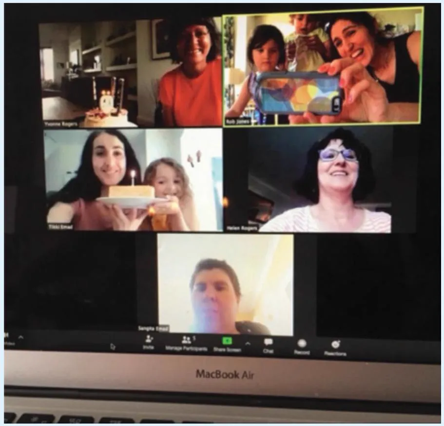  
Figure 5.1  A Zoom birthday party in full swing

# Source: Yvonne Rogers

Others organized Zoom parties where they paid for online magicians to come and entertain them. For a while, it also became popular to have a quiz night where friends and families met online for a few hours and competed against each other. Houseparty (now discontinued) became a popular social app where up to four friends joined each other in a grid to video chat on their smartphones. Such online social gatherings were novel at first, helping people to connect when not allowed to physically get together. However, after a while, most people got tired of them and longed to be able to meet each other again in person.

A  growing concern that is being raised  within society is  how much time people spend looking  at  their  phones—when  interacting  with  others,  playing  games,  tweeting,  and  so forth—and its consequences on people’s well-being (see Ali et al., 2018). A survey conducted in the United States  in 2021 showed  that more than  half the people who replied said they spend five to six hours on their phone on a daily basis, and that is not including work-related smartphone use (Ceci, 2022). Similar amounts were found for users in Brazil, Indonesia, and

South Korea (Wakefield, 2022). Even when sitting together, we often end up being in our own digital bubbles  (see Figure 5.2). Sherry Turkle in her  book called Reclaiming Conversation (2015)  bemoaned the negative impact  that this  trend is  having on  everyday life, especially how it is  affecting conversation. She pointed out that many people will admit to preferring texting to talking to others, as it  is easier, requires less effort, and is more convenient. Furthermore, her research has shown that when children hear adults talking less, they likewise talk less. This in turn reduces opportunities to learn how to empathize. She argues that while online communication has its place in society, it is time to reclaim conversation, where people put down their phones more often and (re)learn the art and joy of spontaneously talking to each other. Do you agree with her view?

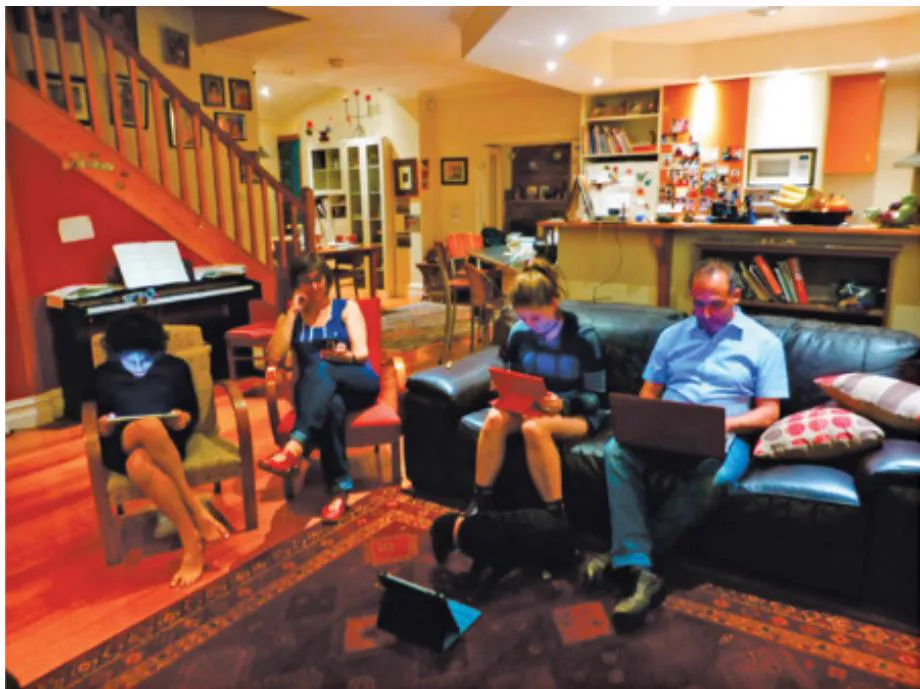  
Figure 5.2  A family sits together, but they are all in their own digital bubbles—including the dog! Source: Yvonne Rogers

On  the other hand, it should  be stressed that several  technologies have been  designed to encourage social interaction to good effect. For example, voice assistants that come with smart speakers,  such as Amazon’s Echo  devices, provide  a large number  of skills intended to support multiple users taking part at the same time, offering the  potential for families to play together. An example skill is Open the Magic Door, which enables families with young children to choose their path in a story e.g., saving monkeys on a tropical island, by selecting different options through the narrative. Social interaction may be further encouraged by the affordance of a smart speaker when placed on a surface in the home, such as a kitchen counter  or  mantelpiece.  In  particular, its  physical  presence  in  this  shared  location  affords

joint ownership and  use—similar  to other domestic  devices, such as the  radio  or TV.  This differs from other virtual voice assistants that are found on phones or  laptops that support individual use.

Another key concern is how the universal adoption of social media and other social computing tools in society has changed how people connect, work, and interact with one another. One way to consider this is to look at how the conventions, norms, and rules, established in face-to-face interactions to maintain social order, have changed. In particular, how have the established conversational rules and etiquette, whose function it is  to let people know how they  should behave  in social groups,  been adapted depending  on the kind  of social media being used?

During  the  pandemic  new  social  rules  emerged  for  how  to  behave  and  interact  with others when communicating via videoconferencing. This included muting yourself when not talking. When wanting to speak, it became the norm for people to raise their hand virtually by clicking the hand icon. Other emoji reactions became  commonly used to signify various forms of praise, emotions, and nonverbal feedback, for example, clicking the red heart and party  hat  icons  that  momentarily  appear  in  someone’s  window  and  then  disappear  after 10 seconds.

There  has  also  been  a  noticeable  difference  in  how  people  plan  and  coordinate their social activities. Whereas in the past people would usually call each other to arrange to meet, many now text each other or create a WhatsApp group if it is a group event. However, there can be a cost as conversations about what to do, where to meet, and who to invite multiply across people. Some people might get left off the WhatsApp or others might not reply, and much time can be spent to-ing and fro-ing across the different apps and threads. Also, some people may not  look at their notifications in a  timely manner, while  further developments in the group planning have evolved. This is compounded by the fact that often people don’t want to commit  until close  to the time  of the event, in case  an  invitation to do something from  another  friend  appears  that  is  more  interesting  to  them.  Teenagers, especially, often leave it until the last minute to micro-coordinate their arrangements with their friends before deciding on what to do. They will wait and see if a better offer comes their way rather than deciding for themselves a week in advance, say, to see a movie with a friend. This can make it  frustrating  for  those  who  initiate  the  planning  and  are  waiting  to  book  tickets  before they sell out.

# ACTIVITY 5.1

Think of a time where you enjoyed meeting up with friends to catch up in a café. Compare this social occasion with the experience that you have when texting with them on your smartphone. How are the two kinds of conversations different?

# Comment

The  nature of the conversations  is likely to be very different with pros and cons for  each. Face-to-face conversations ebb and flow unpredictably and spontaneously from one topic to the next. There can be much laughing, gesturing, and merriment among those taking part in

the conversation. Those present pay attention to the person speaking, and then when someone else starts talking, all eyes move to them. There can be much intimacy through eye contact, facial expressions, and body language, in contrast to when texters send intermittent messages back and forth in bursts of time. Texting is also more premeditated; people decide what to say and can review what they have written. They can edit their message or decide even not to send it, although sometimes people click the Send button without much thought about its impact on the interlocutor that can lead to regrets afterward.

Emojis,  animated GIFs, and  stickers are  commonly used now  as a form of nonverbal communication when sending texts. They enrich a message by adding humor and affection that may be difficult to express to someone in person. They are  often used in place of text as a form of shorthand like a thumbs-up when saying OK. However, while they can enrich a message by adding humor, affection, or a personal touch, they are nothing like a real smile or a wink shared at a key moment in a conversation.

# 5.3 Face-to-Face Conversations

Talking is something that is effortless and comes naturally to most people. And yet holding a conversation is a highly skilled collaborative achievement, having many of the qualities of a musical ensemble. In this section we examine what makes up a conversation. Understanding how  conversations  start, progress,  and finish is  useful  when  designing dialogues  that  take place with chatbots, voice assistants, and other communication tools. In particular, it helps researchers and developers understand how natural it is, how comfortable people are when conversing with digital agents, and the extent to which it is important to follow conversation mechanisms that are found in human conversations. We begin by examining what happens at the beginning.

A: Hi there.   
B: Hi!   
C: Hi.   
A: All right?   
C: Good. How’s it going?   
A: Fine, how are you?   
C: Good.   
B: OK. How’s life treating you?

Such mutual greetings are typical. A dialogue may then ensue in which the participants take turns asking questions, giving replies, and making statements. Then, when one or more of  the  participants  wants  to draw  the  conversation  to  a close, they  do  so  by  using  either implicit or  explicit cues. An example of an implicit cue is when a participant looks at their watch, signaling indirectly to the other participants that they want the conversation to draw to a close. The other participants may choose to acknowledge this cue or carry on and ignore it. Either way, the first participant may then offer an explicit signal, by saying, “Well, I have to go  now. I got  a lot  of work to do” or, “Oh dear, look at the  time. I  gotta run. I have to

meet someone.” Following  the acknowledgment  by  the other  participants  of such  implicit and explicit signals, the  conversation draws to a close, with a farewell ritual. The  different participants take turns saying, “Goodbye,” “Bye,” or “See you,” repeating themselves several times until they finally separate.

# ACTIVITY 5.2

How do you start and end a conversation when (1) talking on the phone and (2) chatting online? Do you use the  same conversational mechanisms that are used in face-to-face conversations?

# Comment

The person answering the call will initiate the conversation by saying hello or, more formally, the  name of their company/department. Most phones (landline  and smartphones) have the facility to display the name of the caller (Caller ID), so the receiver can be more personal when answering, for example,“Hello, John. How are you doing?” Phone conversations usually start with a mutual greeting and end with a mutual farewell. In contrast, conversations that take place when chatting online have evolved new conventions. The use of opening and  ending greetings when joining and  leaving is rare;  instead, most people simply start their  message with what they want to talk about and then stop when they have gotten an answer, as if in the middle of a conversation.

Many people are now overwhelmed by the number of emails they receive each day and find  it  difficult  to  reply  to them  all. This  has  raised  the  question  of which  conversational techniques to use to improve the chances of getting someone to reply. For example, can the way people compose their emails, especially the choice of opening and ending a conversation, increase the likelihood that the recipient will respond to it? A study by Boomerang (Brendan, 2017) of 300,000  emails taken from  mailing list archives of more  than 20 different online communities  examined  whether the  opening  or closing  phrase  that was  used  affected  the reply rate. They  found that the most  common opening phrase used— hey (64  percent), followed by hello (63 percent), and then hi (62 percent)—were the ones that got the highest rate of reply, in the region of 63–64 percent. This was found to be higher than emails that opened with more formal phrases, like Dear (57 percent) or Greetings (56 percent). The most popular form of sign-off was found to be thanks (66 percent), regards (63 percent), and cheers (58 percent), with best being used less (51 percent). Again, they found that emails that used closings with a form of thank you got the highest rate of responses. Hence, which conversational mechanism someone uses to address the recipient can determine whether they will reply to it.

Conversational  mechanisms  enable  people  to  coordinate  their  talk  with  one  another, allowing  them  to  know  how  to  start  and  stop.  Throughout  a  conversation,  further  turntaking rules are followed that enable people to know when to listen, when it is their cue to

speak, and when it is time for them to stop again to allow the others to speak. Sacks et al. (1978),  famous  for  their  work  on  conversation  analysis,  describe  these  in  terms  of  three basic rules:

Rule 1 The current speaker  chooses the next speaker by asking a question, inviting an opinion, or making a request.

Rule 2 Another person decides to start speaking.

Rule 3 The current speaker continues talking.

The rules are assumed to be applied in this order so that whenever there is an opportunity for a change of speaker to occur, for instance, someone comes to the end of a sentence, rule 1 is applied. If the listener to whom the question or request is addressed does not accept the offer to take the floor, rule 2 is applied, and someone else taking part in the conversation may  take up the opportunity and offer a view on the matter. If  this does not happen, then rule 3 is applied, and the current speaker continues talking. The rules are cycled through until someone speaks again.

To facilitate  rule  following,  people  use  various ways  of  indicating  how  long  they  are going  to talk and on  what topic. For example, a speaker  might  say right at  the beginning of his turn in the conversation that he has three things to say. A speaker may also explicitly request a change  in speaker by  saying to the listeners, OK, that’s all I  want to say  on that matter. So,  what do  you think? More  subtle  cues to let  others know  that  their turn  in the conversation is coming to an end include the lowering or raising of the voice to indicate the end of a question or the use of phrases like “You know what I mean?” or simply “OK?” Back channeling (uh-huh, mmm), body orientation (such as moving away from or closer to someone), gaze (staring straight at someone or glancing away), and gesturing (for example, raising of  arms) are  also  used  in different  combinations when  talking in order  to signal  to others when someone wants to hand over or take up a turn in the conversation.

Another way in which conversations are coordinated and given coherence is through the use of adjacency pairs (Schegloff and Sacks, 1973). Utterances are assumed to come in pairs in which the first part sets up an expectation of what is to come next and directs the way in which what does come next is heard. For example, A may ask a question to which B responds appropriately.

A: So, shall we meet at 8?

B: Um, can we make it a bit later, say 8:30?

Sometimes adjacency pairs get embedded in each other, so it may take some time for a person to get a reply to their initial request or statement.

A: So, shall we meet at 8?

B: Wow, look at them.

A: Yes, what a funny hairdo!

B: Um, can we make it a bit later, say 8:30?

For  the most  part, people are not  aware  of following  conversational mechanisms  and would  be  hard-pressed  to  articulate  how  they  can  carry  on  a conversation.  Furthermore, people don’t necessarily abide by the rules all the time. They may interrupt each other or talk over each other, even when the current speaker has clearly indicated a desire to hold the floor for the  next two  minutes to finish an  argument. Alternatively, a listener may not  take up a

cue from a speaker to answer a question or take over the conversation but instead continue to say  nothing even  though  the speaker  may  be making  it  glaringly obvious  that it is  the listener’s turn to say something. Oftentimes, a teacher will try to hand over the conversation to a student in a seminar by staring at them and asking a specific question, only to see the student look at the floor and say nothing. The outcome is an embarrassing silence, followed by either the teacher or another student picking up the conversation again.

Other kinds of breakdowns in conversation arise when someone says something that is ambiguous, and the interlocutor misinterprets it to mean something else. In such situations, the participants will collaborate to overcome the misunderstanding by using repair mechanisms. Consider the following snippet of conversation between two people:

A: Can you tell me the way to get to the Multiplex Ranger cinema?   
B: Yes, you go down here for two blocks and then take a right (pointing to the right); proceed until you get to the light, and then it’s on the left.   
A: Oh, so I go along here for a couple of blocks and then take a right, and the cinema is at the light (pointing ahead of him)?   
B: No, you go down this street for a couple of blocks (gesturing more vigorously than before to the street to the right of him while emphasizing the word this).   
A: Ahhhh! I thought you meant that one: so it’s this one (pointing in the same direction as the other person).   
B: Uh-hum, yes, that’s right: this one.

Detecting  breakdowns in conversation  requires that the speaker  and listener both pay attention to what  the other says  (or does  not say). Once they  have understood the nature of the failure, they can then go about repairing it. As shown in the previous example, when the  listener  misunderstands  what  has  been communicated,  the  speaker  repeats  what  they said earlier, using a  stronger voice  intonation  and more  exaggerated  gestures. This allows the  speaker  to repair  the  mistake and  be  more explicit  with  the  listener, allowing  them to understand and follow better what they are saying. Listeners may also signal when they don’t understand something or want further clarification by using various tokens, like “Huh?” or “What?” (Schegloff, 1981), together with giving a puzzled  look (usually frowning). This is especially the case when the speaker says something that is vague. For example, they might say  I  want it  to  their partner, without saying  what it  is  they  want. The  partner  may  reply using a token or, alternatively, explicitly ask, “What do  you mean by it?” Nonverbal communication also plays an important role in augmenting face-to-face conversation, involving the use  of facial expressions, back channeling, voice intonation, gesturing, and other kinds of body language.

Taking turns also provides opportunities for the listener to initiate repair or request clarification or  for the  speaker to detect that there is  a problem  and initiate repair. The listener will usually wait for the next turn in the conversation before interrupting the speaker in order to give the speaker the chance to clarify what is being said by completing the utterance.

Conversational  user  interfaces, such  as  chatbots,  are  becoming  more  sophisticated  in how they emulate the kind of turn-taking that takes place face to face. They do so by analyzing large numbers of conversational patterns using machine  learning models. For example, Replika,  which  is  an AI-based  companion  chatbot, was designed  to  simulate  human  conversation  through  encouraging turn-taking  with  the user.  Figure  5.3  shows  a snippet  of a conversation I had with Replika, where our conversation takes place through turn-taking.

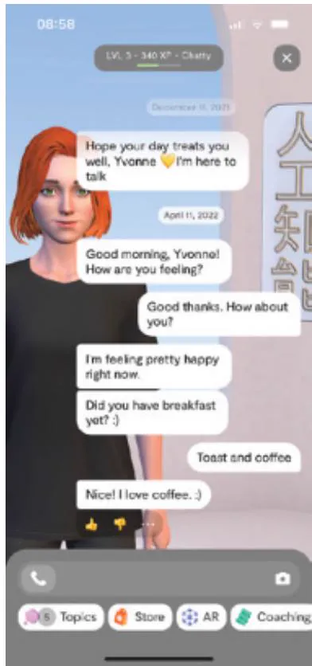  
Figure 5.3  A snippet of my conversation with Replika, a conversational companion, showing turn-taking

Source: Yvonne Rogers

Many chatbots are designed to answer customer queries, such as answering a question about  how to  obtain  a refund  on an  online  purchase. They  are  trained for  a  particular set of questions that they can answer well, but if the customer asks an unexpected question, they are unable to answer other than provide a stock phrase, such as “I am not sure about that.”

There is also ongoing research investigating more diverse uses than Q&A. For example, conversational  agents are being developed  to mediate work meetings  that are voice-based. A goal is to facilitate collaboration among groups carrying out tasks during their meetings. A key design decision is how proactive they should be and what kind of facilitation is useful. For example, if a group appears to be stuck during a decision-making activity, it might suggest a different course of action. Providing occasional context-specific prompts and probes has  been found to be effective  at steering a conversation in group settings (Reicherts  et al., 2022). If the conversational agent intervenes too much or appears too chatty, however, they can get annoying. Compared with companion chatbots, these kinds of virtual agents are not meant to be human-like conversationalists but are intended to prompt and steer the conversations between people who are in a meeting.

# DILEMMA

Is It OK to Talk with a Dead Person Using a Chatbot?

Eugenia Kuyda, an AI researcher (who was also the founder of Replika), lost a close friend in a car accident. He was only in his 20s. She did not want to lose his memory, so she gathered all of the texts he had sent over the course of his life and made a chatbot from them. The chatbot is programmed to respond automatically to text messages so that Eugenia can talk to her friend as if he were still alive. It responds to her questions using his own words.

Do you think this kind of interaction is creepy or comforting to someone who is grieving? Is it disrespectful of the dead, especially if the dead person has not given their consent (see Sisto, 2020)? What if the friend had agreed to having their texts mashed up in this way in a pre-death digital agreement? Would that be more socially acceptable?

# ACTIVITY 5.3

How  do people repair breakdowns when conversing via  email? Do they do the  same when texting?

# Comment

As people usually cannot see each other when communicating by email or text, they have to rely on other means of repairing the conversation when things are left unsaid or are unclear. For example, when someone proposes an ambiguous meeting time, where the date and day given don’t match up for the month, the person receiving the message may begin their reply by asking politely, “Did you mean this month or June?” rather than baldly stating the other person’s error, for example, “The 13th May is not a Wednesday!”

When someone does not reply to an email or text when the sender is expecting them to do so, it can put them in a quandary as to what to do next. If someone does not reply to an email within a few days, then the sender might send them a gentle nudge message that diminishes any blame, for example, “I am not sure if you got my last email as I was using a different account” rather than explicitly asking them why they have not answered the email they sent. When sending  a text, it depends  on whether it is a dating,  family, or business-related text that has been sent. When starting to date, some people will deliberately wait a while before replying to a text as a form of playing games and trying not to appear to be overly keen. If they don’t reply at all, it is a generally  accepted notion that they are not interested, and no further texts should be sent. The term used for this is ghosting, meaning abruptly cutting off all contact with someone (such as a former date) by no longer accepting or responding to their texts  or messages.  In contrast, in other  contexts, double-texting has become an acceptable social norm as a way of reminding someone, without sounding too rude, to reply. It implicitly implies that the  sender understands that the  recipient has overlooked the  first text because they were too busy or doing something else at the time, thereby saving face.

EmailsÂandÂtextsÂcanÂalsoÂappearÂambiguous,ÂespeciallyÂwhenÂthingsÂareÂleftÂunsaid.ÂFor example,ÂtheÂuseÂofÂanÂellipsisÂ(...)ÂatÂtheÂendÂofÂaÂsentenceÂcanÂmakeÂitÂdifficultÂtoÂworkÂout whatÂtheÂsenderÂintendedÂwhenÂusingÂit.ÂWasÂitÂtoÂindicateÂsomethingÂwasÂbestÂleftÂunsaid,Âthe senderÂisÂagreeingÂtoÂsomethingÂbutÂtheirÂheartÂisÂnotÂinÂit,ÂorÂsimplyÂthatÂtheÂsenderÂdidÂnot knowÂwhatÂtoÂsay?ÂThisÂemailÂorÂtextÂconventionÂputsÂtheÂonusÂonÂtheÂreceiverÂtoÂdecideÂwhat isÂmeantÂbyÂtheÂellipsisÂandÂnotÂonÂtheÂsenderÂtoÂexplainÂwhatÂtheyÂmeant.Â

# 5.4Â RemoteÂCollaborationÂandÂCommunicationÂ

AÂvarietyÂofÂsocialÂtechnologiesÂhaveÂbeenÂdevelopedÂtoÂsupportÂremoteÂcommunicationÂand collaboration—eitherbyÂÂemulatingÂwhatÂhappensÂinÂface-to-faceÂsettingsÂorÂbyÂextendingÂhow weÂcurrentlyÂconnectÂandÂinteract.ÂWeÂlookÂatÂhowÂtheyÂachieveÂthisÂinÂtheÂfollowingÂsections.Â

# 5.4.1Â VideoconferencingÂ

VideoconferencingÂisÂanÂonlineÂtechnologyÂthatÂenablesÂpeopleÂinÂdifferentÂlocationsÂtoÂcon- nectÂandÂmeetÂwithÂeachÂotherÂviaÂtheÂInternet.ÂMuchÂresearchÂwasÂconductedÂinÂtheÂ1980s andÂ1990sÂwhereÂnovelÂsystemsÂwereÂdevelopedÂtoÂenableÂpeopleÂtoÂtalkÂremotelyÂasÂifÂthey wereÂinÂtheÂsameÂphysicalÂroom.ÂAnÂearlyÂexampleÂwasÂtheÂVideoWindowÂ(FishÂetÂal.,Â1990) thatÂwasÂdesignedÂtoÂconnectÂtwoÂloungeÂareas,ÂwhichÂwereÂ50 milesapart, ÂviaÂaÂ3-footÂby 5-footÂpictureÂwindowÂontoÂwhichÂvideoÂimagesÂofÂeachÂlocationÂwereÂprojectedÂ(see Figure 5.4).The ÂlargeÂsizeÂenabledÂviewersÂtoÂseeÂaÂroomÂofÂpeopleÂroughlyÂtheÂsameÂsizeÂas themselves.ÂAÂstudyÂofÂitsÂuseÂshowedÂthatÂmanyÂofÂtheÂconversationsÂthatÂtookÂplaceÂbetween theÂremoteÂconversantsÂwereÂindeedÂindistinguishableÂfromÂsimilarÂface-to-faceÂinteractions, withÂtheÂdifferenceÂbeingÂthatÂtheyÂspokeÂaÂbitÂlouderÂandÂconstantlyÂtalkedÂaboutÂtheÂvideo systemÂ(KrautÂet al.,1990).  ÂOtherÂearlyÂresearchÂonÂhowÂpeopleÂinteractedÂwhenÂusingÂvide- oconferencingÂshowedÂhowÂtheyÂtendedÂtoÂprojectÂthemselvesÂmore,ÂtakeÂlongerÂconversa- tionalÂturns,ÂandÂinterruptÂeachÂotherÂlessÂ(O’Connaillet al.,1993). Â

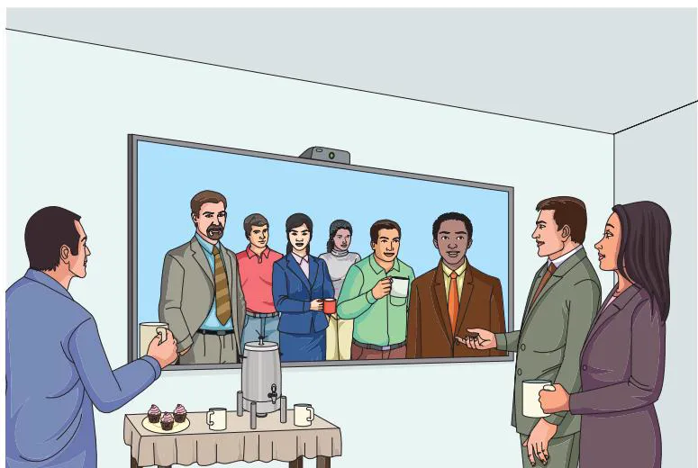  
Figure 5.4Diagram ÂofÂVideoWindowÂsystemÂinÂuseÂ

Since  then,  videoconferencing  has  advanced  significantly  and  become  adopted  worldwide  as  a  mainstream  communication  tool.  Software  was  developed  so  that  it could  run on  PCs,  smartphones,  or  tablets.  Most  people’s first  experience  of  videoconferencing  was using the free software, Skype. Then other free video apps came along such as FaceTime and WhatsApp. During the pandemic, Zoom and Teams became more widely  used. From being largely a means to chat with others online, these tools rapidly evolved to be more like virtual meeting rooms, providing a range of other functions that could support online activities. These included letting users choose from a variety of background screens, having a parallel window to chat in, assigning people to breakout rooms for smaller group discussions, and providing a range of emojis intended to be used in the moment as a form of expression. Other functions that became popular included the ability for people to share their screens, exchange files, and communicate via digital whiteboards. To indicate who has the floor, screen effects were also made available such as enlarging the person who was talking to take up most of the display window or highlighting their window portal in a different color when they were talking.

In many ways, the new  generation of videoconferencing software has greatly  extended how we communicate  while providing tools by  which to make is easier to switch between talking and working together. It was relatively easy for most people to adapt to communicating and collaborating in this way. However, while many discovered how efficient it was, they also found it was exhausting. The phenomenon of Zoom fatigue came into being (Bailenson, 2021). The reasons for this included excessive amounts of close-up eye gaze, intense cognitive load, increased self-evaluation from staring at a video of oneself, and physically being in the same place for hours on end.

# BOX 5.2

# Beyond Zoom

During the pandemic, students and  schoolchildren had  no alternative but to attend classes online via a videoconferencing platform. Many found it difficult to keep engaged staring at a screen all day. My experience of teaching in this way was that hardly anyone spoke up or asked questions. Occasionally, a student might use the chat facility to post a comment. The norm that quickly emerged was for students to keep their cameras turned off. Even though we asked them to turn them on, they declined. While they understood that having the camera turned off made the class less engaging, they were only too aware that turning their cameras on made them too self-conscious, especially knowing that if they spoke their face would be highlighted  and fill up the  whole display. For the teacher or professor, it was very trying— having no idea how engaged their students were or whether they were even there!

It also proved very difficult to socialize with other classmates during lesson breaks. Various 2D virtual spaces were developed to fill this gap. The aim was to offer scope for persistent engagement and  serendipitous  meetings and  to help create a sense  of community. Gather. Town (now Gather), for example, provided a virtual 2D space, which had a retro game-like appearance, where students could connect with others to hang out and chat. To take part in Gather, a user first creates their own avatar and then enters the virtual space. They can move their avatar around and check out who is there or just hang out in one of the visible virtual spaces so that others know they are around.

The virtual spaces could also be customized in a variety of ways, for example, as a school, a playground, or other fantasy social world. Another kind of virtual space that was used to support  teams  working  together is Sococo (see Figure 5.5).  It has  a  similar  rationale—to enable people to connect throughout the day as if they were in the same office building.

Figure 5.5  A Sococo virtual  space where different meeting and social spaces were developed by a research team at University College London. Each room was given a friendly name to give it character.   
  
Source: Kate Jones (kate.e.jones@ucl.ac.uk)

How best to represent the activity of online social interaction in virtual spaces has been the  subject  of much  research. A design principle  that has  been influential  is social  translucence (Erickson and Kellogg, 2000). This refers to the importance of designing communication systems to enable participants and their activities to be visible to one another. This idea was very  much behind the early communication tool, Babble, developed at  IBM by David Smith  (Erickson et  al., 1999), which  provided a  dynamic  visualization  of  the participants in  an  ongoing  chat  room. A  large  2D circle  was  depicted  using  colored  marbles  on  each user’s monitor. Marbles  inside  the  circle  conveyed  those  individuals  active  in  the  current

conversation. Marbles outside the circle showed users involved in other conversations. The more active a participant was in the conversation, the more the corresponding marble moved toward the  center of  the circle.  Conversely, the less  engaged a  person  was in  the ongoing conversation, the more the marble moved toward the periphery of the circle. More recent 2D and 3D spaces, like Sococo and Gather, provide social translucence in the form of showing via avatar icons who is online at any given time and in which space.

360 cameras have also started to be used with videoconferencing that capture  a panoramic view of a meeting room. Instead of having a webcam positioned to face only one direction, the 360 camera is typically placed in the middle of the group meeting on a table. This enables remote team members to see all those present during the meeting. Some systems, such as Meeting Owl, can even automatically  focus on  the person  who is  currently speaking in the room by detecting when they are talking and then zooming in on them. Figure 5.6 shows what they see—which is a split screen view of all the members present in the meeting and the person talking blown up beneath that.

Figure 5.6  The Meeting Owl setup being used in a hybrid meeting   
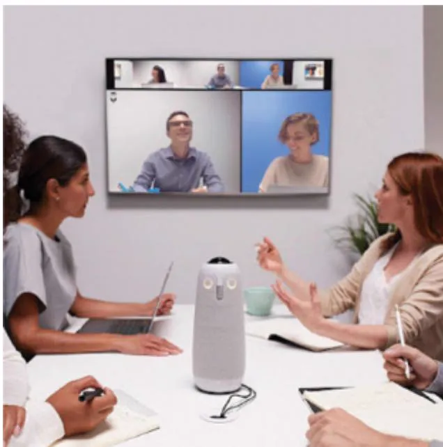  
Source: https://meetingstore.co.uk/product/owl-labs-meeting-owl-pro

The benefits of working at home were found to be many, including a flexible schedule, the ability to wear  casual clothes, fewer distractions from colleagues, and zero commuting. People also  saved money  by  not  having  to  travel each  day. It  is  not  surprising, therefore, that after the pandemic many people wanted to continue working  from home and be able to come into work for one or two days a week. To accommodate this, hybrid working came into being. The idea was to get the best of both worlds, enabling people to still work at home for part of the week but also encouraging them to come into work on certain days in order to re-establish and create a sense of community. While some found it improved their work-life

balance, others found it emotionally exhausting and missed the chatter, small talk, and informal meetings that come with being in the same office.

However, hybrid working is still in its infancy. The experience for remote workers often feels like peering through a straw into a meeting room of pixelated and poorly framed webcam images of colleagues (Microsoft, 2022). Moreover, others, for personal reasons or with little  space  available to  work  in  at home,  preferred  coming back  to their  workplace  each day only to find themselves having back-to-back videoconferencing meetings with their colleagues who were at home.

To address this inequality, Microsoft has been conducting research into how to support more  equitable  hybrid meetings  with  a  focus  on  how  to  make  them  more  inclusive. This has involved them rethinking not just the physical meeting spaces but also the whole digital experience  of online  communication  and collaboration. To begin,  they  experimented  with where to place the video feeds of remote members on a shared screen. Instead of having them appear at the top, they placed them at the bottom (see Figure 5.7). The effect was to promote better eye gaze, which is at the same level as the participants in the room. In the rest of the display, documents are presented that can be annotated and changed in real time, in relation to what the team is working on.

Figure 5.7  A prototype of a technology-enhanced hybrid meeting (Microsoft)   
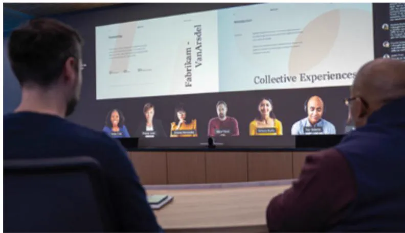  
Source: www.microsoft.com/en-us/worklab/designing-the-new-hybrid-meeting-experience

# 5.4.2  Telepresence

Another approach to creating virtual spaces is through telepresence. This refers to a person’s perception of being present in a physical location with others who are there but where they are actually somewhere else (e.g., at home). Telepresence robots, for example, were built with this in mind to enable people to attend events and communicate with others by controlling them remotely. Instead of sitting in front of a screen from their location and seeing the remote place  solely through a fixed  camera at the other place, they could look around the remote place by controlling the camera’s eyes, which are placed on the robot and are physically moving it around. The idea was that it would enable them to feel more connected with the place and people in it.

Telepresence robots have also been used to enable people who have developmental difficulties to visit places remotely, such as museums. For example, Natalie Friedman and Alex Cabral (2018) conducted a study and found that providing a telepresence robot to children with developmental difficulties was able to increase their physical and social self-efficacy and well-being. Since then, telepresence technology has matured with the addition of AI technology. One example of an AI-enabled telepresence robot is Ava who is capable of autonomous navigation. Remote users simply have to specify a destination on their smartphone, to which Ava responds by automatically moving to it, while avoiding obstacles. While more efficient and potentially safer, the downside of automating the navigation in this way is that the user is no longer engaged in moving the robot. The act of steering their robot was what provided a form of embodiment and arguably a greater sense of presence. Watch the video below and see if you agree.

Video  Watch  Ava  the  telepresence  robot:  www.youtube.com/watch?v=PDTG yg1i6cM&t=48s.

# ACTIVITY 5.4

Social presence refers to the feeling of being there with a real person in virtual reality. It is based on the social psychology theory developed by Short et al. (1976) who conceptualized the realness of other people when using telecommunication tools. They argued that the type of communication media used would have a big effect on the degree of social presence. Today, the term is commonly used to refer to the degree of awareness, feeling, and reaction to other people who are virtually present in an online environment. It differs from telepresence, which refers to one  party being  virtually present with another party  who is present in a physical space, such as a meeting room (note that it is possible for more than one telepresence robot to be in the same physical space). What do you think are important design features to provide for social presence? Is it realism or something else?

# Comment

A recent experience I had of socializing in a 3D virtual world, via a desktop, was when giving a keynote at an online conference in 2020 at ISMAR (see Figure 5.8). The virtual conference was designed to be like a futuristic virtual campus, comprising lifelike university buildings and luscious outdoor spaces by the ocean (which was where the conference was meant to be held in Brazil). A wardrobe was provided to select clothes in which to dress one’s avatar. Diverse avatar actions were also provided to enable people at the virtual conference to connect, move around, and  interact. These  included different  kinds  of dancing (e.g., the  samba), waving, and  clapping. Sound effects could sometimes be heard, such as a clippy-cloppy  noise when moving your avatar—akin to the sound of feet walking on the ground. These avatar features

and actions all helped to provide a sense of connecting with others. They also helped with the virtual socializing, especially ice-breaking, but I wouldn’t say they provided real social presence. Other attempts to improve the sense of being there are being experimented with in the Metaverse, as described next.

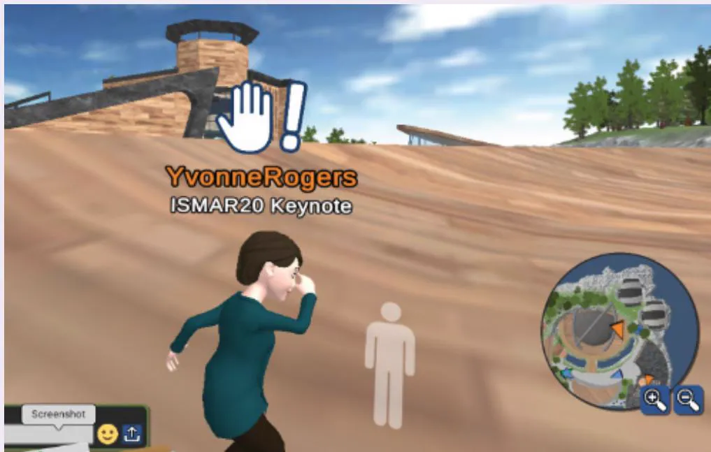  
Figure 5.8  Yvonne trying to dance after giving a keynote at a virtual conference Source: Yvonne Rogers

# BOX 5.3

# The Metaverse

The idea of the Metaverse has been around for 20–30 years. Essentially, it is a digital space inhabited by digital representations of people and things (Microsoft, 2021). Its earliest incarnation was in the form of virtual worlds, like Second Life, where people could join and create online spaces to socialize, learn, and hang out in. The virtual worlds were represented in 3D graphics that were navigated and experienced  on a desktop. People entering these were represented by digital avatars that they controlled via their computer keyboard. While fun to begin with, the experience was a bit clunky. People could fly around and even walk through walls by pressing certain keys on their keyboard, when moving from one place to another. In many ways, it was more like a fantasy world than following the rules of our physical world.

(Continued)

More recently,  Second Life has  become more commercial.  For  example, the  firstever Fashion Week took place in Second Life in early  2022 (www.youtube.com/watch?v= pa2HVUk5s5c&t=14s). Much of it resembled the events that take place in a physical fashion show, with a catwalk, audience, and models showing off new clothing ranges. However, if you watch the video, it looks like the human digital models are floating along the virtual catwalk rather than walking. To address this strangeness, some designers used cartoon cats instead of digital  human models to show off their  clothing (see Figure 5.9). One of the reasons for switching to cartoon characters is it avoids all the problems of trying to make a human model appear lifelike. After the virtual fashion show, the skins of the outfits that were modeled could be purchased by those attending. Once purchased, they could then dress up their own avatars in the skins and walk around parading them.

Figure 5.9  Dolce & Gabbana cat  model showing off a snazzy skin that people can purchase to wear on their own avatar in Second Life   
  
Source: coin3.net/the-first-ever-metaverse-fashion-week-digital-fashion-is-here-to-stay

Video A well-researched and personal account of the history of Second Life is presented by Bolly Coco (1999–2021): www.youtube.com/watch?v=8tEORJpmsCE.

In the early 2020s, Mark Zuckerberg (Meta) began talking up the Metaverse  as the next big thing (the term was first coined by Neal Stephenson in his 1992 novel, Snow Crash). Given the long history of social virtual worlds, such as Second Life, what else was he promising? One of his goals was to provide a richer, more immersive experience in the Metaverse, as if being there. Compared with how it feels being in social virtual worlds like Second Life, Zuckerberg proposed that Meta’s version of the Metaverse would be quite different. Instead of indirectly controlling one’s avatar through keyboard and mouse, people entering the Metaverse would do so by donning a VR headset and using the Oculus Quest’s VR touch controllers to move their avatar’s arms in real time. This more extensive form of embodiment is what provides the immersive experience.

Figure 5.10 shows  a  version  of Zuckerberg’s vision of the  Metaverse. Three  avatars are enjoying the outdoors, moving their arms and hands with the VR controllers, as if they are together, even though they are apart in the physical world. However, there is something slightly odd about the avatars. They don’t have any legs! The reason for this is largely down to technical limitations. In contrast to the VR hand controllers that can map onto arm movements relatively well in real time, the sensors and controllers that were available at the time that could be placed on someone’s legs were not able to represent leg and foot movements in VR very well. It is often the case that obstacles can get in the way (such as someone’s stomach), resulting in movements of the legs being obscured and not able to be detected accurately. Because of this, VR headsets, like Oculus, initially were not configured to capture the whole body of a person. Current research, however, is exploring how to overcome these kinds  of occlusion problems. In the future, we may see people putting on a whole body suit (like a Spiderman outfit), rather than just a VR headset when entering the Metaverse.

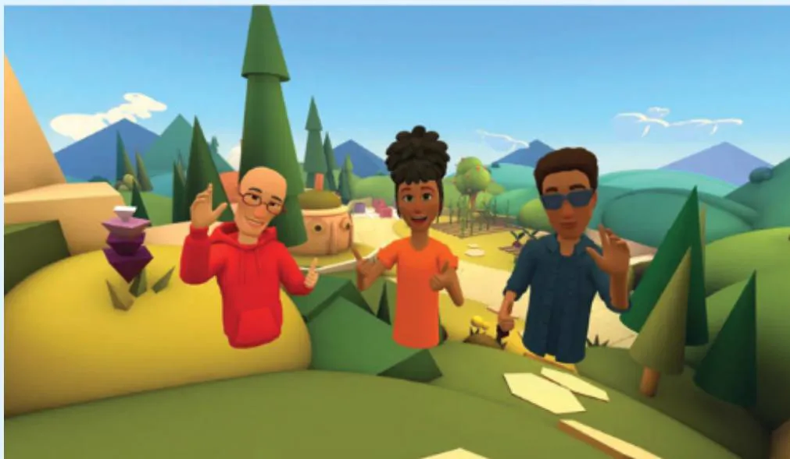  
Figure 5.10 Meta’s vision of three  friends  socializing  in a  3D world  represented  as torso avatars

Source: Facebook www.cnet.com/tech/computing/ facebook-goes-meta-what-is-the-metaverse-and-why-is-big-tech-obsessed

(Continued)

But it is not just Meta creating the new Metaverse. Other tech and games companies are also developing new software and user experiences, including Microsoft, Epic Games, and Roblox. Some envision it being  much more than an immersive  virtual space  for people to socialize in—seeing it as the next Internet, even starting to call it Web3. Paradoxically, one idea being mooted is that it should be made more accessible so it can be experienced, not only in VR but also with other devices, such as smartphones and game consoles, just like Second Life. Others hope it will become more open so that it could become community-owned and community-governed and provide a freely interoperable version that ensures privacy by design (Boyle, 2022). Who knows what will emerge? Anything is possible!

# 5.4.3  Collaborative Tools

A number  of collaborative tools have become commonplace in our  everyday and working lives. These include the sharing of calendars, word processing, and design and project management tools. Some of these are intended for general use, such as Outlook and Google Docs. Others are intended to be used by office workers. An example is Slack, which has been used widely by software development teams (Lin et al., 2016). Slack has proven to be very versatile, supporting work and social communication among teammates as well as team management,  code  sharing,  and  software  deployments.  It  is  also  a  place  for  sharing  knowledge, where team  members can  find out  about new  tools, updates, etc., that can be useful when developing applications. Often developers will leave Slack open while they code, so they can drop quick lines to each other and check out availability for a quick chat.

Shared calendars like Google and Outlook are now indispensable for many people, who depend on them to plan, organize, and remind them of their meetings and events. Some people have multiple calendars that are color-coded for each person/group. It became the norm to  send  invitations  for  meetings  automatically  to  people’s online  calendars.  They  quickly got  filled  up with  pending invitations, which  required  accepting  or declining (or choosing maybe). Shared  calendars also became  a staple  for families who use  them  to schedule and organize  their  children’s upcoming  school  and  sports  events,  birthdays,  playdates,  etc.— making it easier for all to see and act upon a shared reminder.

Miro became a popular tool for supporting online learning during the pandemic. It provides  a  digital  canvas  together with  various  shared creative  tools, including  diagramming flowcharts, mind mapping, and videoconferencing. Many tutors and students alike found it easy and enjoyable to use, where the tools were ready to hand with which to create, comment on, and share documents  in the same space. Nic Marquardt at University College London, for example, uses it to teach a graduate course in interaction design each year, where the class of students (about 55) prepare posters about their design projects and then upload them to the Miro  board. They  are placed side by  side so that all  the students  can see  each other’s posters (as well  as those from  the year before) and can  zoom in and out on  each one (see Figure 5.11a and Figure 5.11b).

During a live session, class members move around the Miro canvas and are visible to the others by their different colored and named cursors. They read each other’s posters and afterward provide feedback using digital yellow sticky notes. Simultaneously, staff and teaching assistants give their feedback using orange sticky notes. To help them with this task, they are given a guide before the class about how to best provide constructive feedback. The students

in the course all commented afterward about how it created a greater awareness of others’ activities and a feeling of being at a place together.

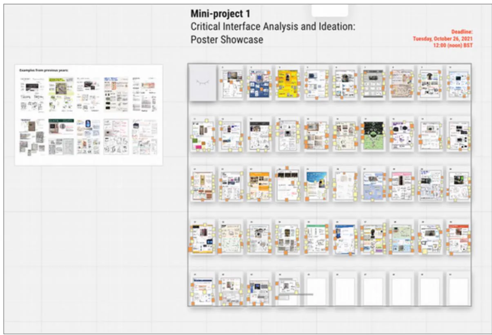  
(a)

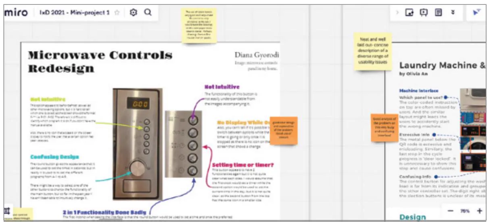  
(b)   
Figure 5.11 (a) A Miro board used in an online class on interaction design where students upload their posters and add comments using yellow post-it notes. The professor and teaching assistants also added theirs using orange ones. (b) A zoomed-in screen of two of the student posters.

Source: Nic Marquardt

# BOX 5.4

# People-in-a-Box

Instead of talking to a remote family member via videoconferencing, in the future it may be possible to talk to a  miniature-size (or  life-size) 3D image of them. Proto (formerly Portl), a startup company  set up by David Nussbaum in 2020, has been exploring this possibility through creating boxes where a 3D digital person appears in them. They look so lifelike they could almost be there (see Figure 5.12). The box works by being brightly lit with embedded LEDs above, below, and from the sides (see Figure 5.13). It also captures the person’s shadows as they move around the box to give them the appearance of volumetric depth. The recipient can interact with them almost in real time.

  
Figure 5.12 David Nussbaum demonstrating  how  they capture and present  the Proto person in a box

Source: Proto Inc.

Proto is also developing smaller, more affordable boxes for the domestic market, where the  person in the box can be recorded with more affordable technology, by simply using  a smartphone on a tripod. Do you think this way of communicating with others will be more engaging and immersive than current videoconferencing or the Metaverse? Will the size of the projected person matter? In particular, what will be the difference between having a life-size 3D person or a small 3D person appear in the box?

Figure 5.13 Talking with a 3D video of granny in a box (Proto M). The embedded camera at the top of the box faces the mother and child so that Granny can see and hear them in real time. They can also see and hear Granny.   
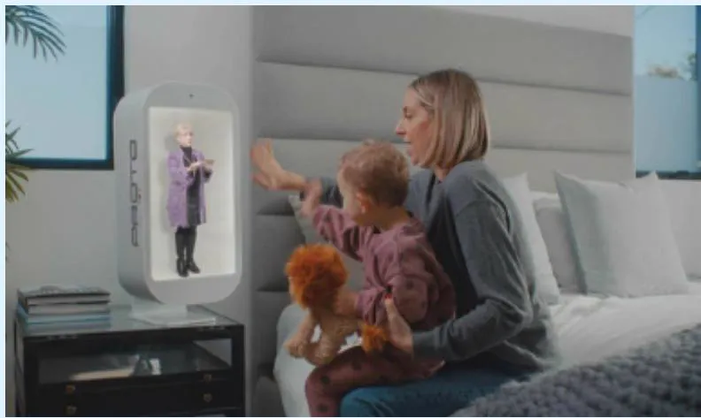  
Source: www.portlhologram.com

# 5.5  Co-Presence

Another  concept  developed  in  human-computer  interaction  is  co-presence.  This  means designing social technologies to support people and augment their activities when interacting in the same physical space. The motivation is to enable co-located groups to collaborate more effectively when working, learning, and socializing. Various technologies have been built to support this kind of parallel interaction, including the use of multitouch, mid-air gesture and object recognition. To understand how effective they are, it is important to consider the coordination and awareness mechanisms already in use by people in face-to-face interactions and then to see how these have been adapted or replaced by the technology.

# 5.5.1  Physical Coordination

When  people are working  closely together, they  talk to each other, issuing  commands  and letting others know how they are progressing. For  example, when two or more people are collaborating, as when moving a piano, they shout instructions to each other, like “Down a bit,” “Left a touch,” “Now go forward,” to coordinate their actions. A lot of nonverbal communication is also used, including nods, shakes, winks, glances, and hand-raising in combination with such coordination talk in order to emphasize and sometimes replace it.

For  time-critical  and  routinized  collaborative  activities, especially  where  it  is  difficult to hear others because  of the physical conditions, people frequently use  gestures (although radio-controlled  communication systems  may  also be used). Various  types of hand  signals

have evolved, with their own set of standardized syntax and semantics. For example, the arm and baton movements of a conductor coordinate the different players in an orchestra, while the arm and orange baton movements of ground personnel at an airport signal to a pilot how to bring the plane into its assigned gate. Universal gestures, such as beckoning, waving, and halting hand movement, are also used by people in their everyday settings—although there are cultural differences as to what certain gestures mean.

The use of physical objects, such as wands and batons, can also facilitate coordination. Group members can use them as external thinking props to explain a principle, an idea, or a plan to the others (Brereton and McGarry, 2000). In particular, the act of waving or holding  up  a physical  object in  front  of others  is  very  effective  at  commanding attention. The persistence and ability to manipulate physical artifacts may also result in more options being explored  in a  group  setting  (Fernaeus and Tholander, 2006). They  can  help  collaborators gain a better overview of the group activity and increase awareness of others’ activities.

# 5.5.2  Awareness

Awareness was coined as a term to refer to knowing who is around, what is happening, and who is talking with whom (Dourish and Bly, 1992). For example, when attending  a party, people move around the physical space, observing what  is  going on and who is  talking to whom, and eavesdropping on others’ conversations. A specific kind of awareness is peripheral awareness. This refers to a person’s ability to maintain and constantly update a sense of what is  going on in the physical and social context, by  keeping an eye  and ear on what  is happening in the periphery of their vision. This might include noticing whether people are in a good or bad mood by the way they are talking, how fast the drink and food is being consumed, who has entered or left the room, how long someone has been absent, and whether the lonely person in the corner is finally talking to someone—all while we are having a conversation with someone else. The combination of direct observations and peripheral monitoring keeps people informed and updated on what is happening in the world.

Another  form of awareness that has been studied is situational awareness. This refers to being aware of what is happening around you in order to understand how information, events, and your own actions will affect ongoing and future events. Having good situational awareness is critical in technology-rich work domains, such as air traffic control or an operating theater, where it is necessary to keep abreast of complex and continuously changing information.

People who work closely together also develop various strategies for coordinating their work, based on an up-to-date awareness of what the others are doing. This is especially so for interdependent tasks, where the outcome of one person’s activity is needed for others to be able to carry out their tasks. For example, when putting on a show, the performers will constantly monitor what each other is doing in order to coordinate their performance efficiently. The metaphorical expression close-knit teams exemplifies this way of collaborating. People become highly skilled in reading and tracking what others are doing and the information to which they are paying attention.

A classic study of this phenomenon is of two controllers working together in a control room in  the London  Underground subway system (Heath  and Luff, 1992). An overriding observation was that the actions of one controller were tied closely to what  the other was doing. One of the controllers (controller A) was responsible for the movement of trains on the line, while the other (controller B) was responsible for providing information to passengers about  the current service. In many instances, it was found that controller B  overheard

what controller A was saying and doing and acted accordingly, even though controller A had not  said anything explicitly to him. For example, on  overhearing controller A discussing  a problem with a train  driver over the in-cab intercom system, controller B inferred from the conversation that there was going to be a disruption in the service and so started to announce this to the passengers on the platform before controller A had even finished talking with the train  driver.  At other  times, the  two  controllers kept  a lookout  for each other, monitoring the environment for actions and events that they might not have noticed but that could have been important for them to know about so that they could act appropriately.

# ACTIVITY 5.5

What do you think happens when one person in a close-knit team does not see or hear something, or misunderstands what has been said, while the others in the group assume that person has seen, heard, or understood what has been said?

# Comment

The person who has noticed that someone has not acted in the manner expected may use one of a number of subtle repair mechanisms, say coughing or glancing at something that needs to be attended to. If this doesn’t work, they may then resort to stating explicitly aloud what had  previously been signaled implicitly. Conversely,  the unaware  person may  wonder why the event hasn’t happened and, likewise, look over at the other team members, cough to get their attention, or explicitly ask them a question. The kind of repair mechanism employed at a given moment will depend on a number of factors, including the relationship among the participants, for  instance, whether one is more senior than the others. This determines who can ask what, the perceived fault or responsibility for the breakdown, and the severity of the outcome of not acting there and then on the new information.

# 5.5.3  Shareable Interfaces

Various technologies have been designed to capitalize on existing forms of coordination and awareness mechanisms. These include whiteboards, large touchscreens, and multitouch tables that enable groups of people to collaborate while interacting at the same time with content on the surfaces. Early research investigated whether different arrangements of shared technologies could help co-located people work better together (for example, see Müller-Tomfelde, 2010). An assumption was that shareable interfaces provide more opportunities for flexible kinds  of  collaboration  compared  with  single-user  interfaces,  through  enabling  co-located users to interact simultaneously with digital content. The use of fingers or pens as input on a public display is observable by others, increasing opportunities  for building situational and peripheral  awareness. The sharable  surfaces  are  also  considered  to  be more  natural  than other technologies, enticing people to touch them without feeling intimidated or embarrassed by  the consequences of their actions. For example, early research demonstrated how  small groups found it more comfortable working together around a tabletop compared with sitting in front of a PC or standing in a line in front of a vertical display (Rogers and Lindley, 2004).

# BOX 5.5

# Playing Together in the Same Place

Augmented reality (AR) sandboxes have been developed for museum visitors to interact with a landscape, consisting of mountains, valleys, and rivers. The sand is real, while the landscape is virtual. Visitors can sculpt the sand into different-shaped contours that change their appearance to look like a river or land, depending on the height of the sand piles. Figure 5.14 shows an AR sandbox that was installed at the V&A museum in London. On observing two young children playing at the sandbox, this author overheard one say to the other while flattening a pile of sand, “Let’s turn this land into sea.” The other replied, “OK, but let’s make an island on that.” They continued to talk about how and why they should change their landscape. It was a pleasure to watch this dovetailing of explaining and doing.

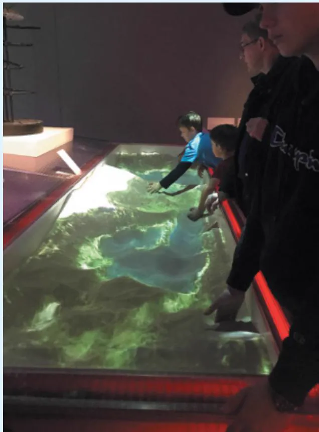  
Figure 5.14 Visitors creating together using an augmented reality sandbox at the V&A Museum in London

Source: Yvonne Rogers

The physical properties of the sand, together with the real-time changing superimposed landscape, provided a space for children (and adults) to collaborate in creative ways.

Often in meetings, some people  dominate while others say very  little. While  this is  OK in certain settings, in others it  is considered more desirable for everyone to have a say. Is it possible to design shareable technologies so that people can participate around them more equally? Much research has been conducted to investigate whether this is possible. Of primary importance is whether the interface invites people to select, add, manipulate, or remove digital content from the displays and devices. A user study showed that a tabletop that allowed group  members to add digital content  by using  physical tokens resulted  in more equitable participation  than  if  only  digital  input  was  allowed  via touching  icons  and  menus  at  the tabletop  (Rogers et al., 2009). This suggests that it  was easier for people who are normally shy in groups to contribute to the task. Moreover, people who spoke the least were found to make the largest contribution to the design task at the tabletop, in terms of selecting, adding, moving, and removing options. This reveals how changing the way people can interact with a surface can affect group participation. It shows that it is possible for more reticent members to contribute without feeling under pressure to speak more.

Real-time feedback presented via ambient displays has also been shown to provide a form of awareness for co-located groups. LEDs glowing in tabletops and abstract visualizations on handheld and wall displays have been designed to represent how different group members are performing, such as turn-taking. An early prototype was the Reflect Table  that was designed to monitor and analyze ongoing conversations using embedded microphones in front of each person and represents this in the form of increasing numbers of colored LEDs, as shown in Figure 5.15 (Bachour et al., 2008). A study investigated whether students became more aware of how  much they  were speaking  during a group  meeting when their  relative levels  of talk were displayed in this manner and, if so, whether they regulated their levels of participation more effectively. In other words, would the girl in the bottom right reduce her contributions (as she clearly has been talking the most) while the boy in the bottom left increase his (as he has been  talking the least)? The findings were  mixed: Some participants  changed their level to match the levels of others, while others became frustrated and chose simply to ignore the LEDs. Specifically, those who spoke the most changed their behavior the most (that is, reduced their level), while those who spoke the least changed theirs the least (in other words, did not increase their level). Another finding was that participants who believed that it was beneficial to contribute equally to the conversation  took more notice of the  LEDs and regulated their conversation level accordingly. For example, one participant said that she refrained from talking to avoid having a lot more lights than the others (Bachour et al., 2010). Conversely, participants who thought it was not important took less notice. How do you think you would react?

Figure 5.15 The Reflect Table   
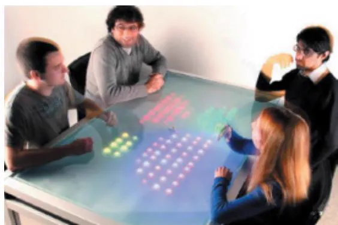  
Source: Used courtesy of Pierre Dillenbourg

An  implication from  the various user  studies  on  co-located collaboration  around  tabletops is that designing shareable interfaces to encourage more equitable participation isn’t straightforward. Providing  explicit real-time  feedback  on  how  much someone  is  speaking in a group may be a good way of showing everyone who is talking too much, but it may be intimidating for those who are  talking too little. Allowing  discreet and accessible ways for adding and manipulating content to an ongoing collaborative task at a shareable surface may be more effective at encouraging greater participation from people who normally find it difficult or who are simply unable to contribute verbally to group settings (for example, those on the autistic spectrum, those who stutter, or those who are shy or are non-native speakers).

Most of the research on awareness has focused on developing technologies for augmenting visual awareness. But what about people who are blind or have low vision? How can we enhance their sense of the environment? Social interaction can be particularly challenging for them, especially trying to remember who is in a co-located social setting. To help address this situation, Cecily Morrison and colleagues (2021) developed PeopleLens (see Figure 5.16), a new wearable technology to help blind people make sense of and engage  with their immediate social surroundings. It comprises a head-mounted  augmented reality device that uses computer vision algorithms to locate, identify, track, and capture the gaze directions of people in the  vicinity. It  then presents this information to the wearer, when requested, through using spatialized audio so that it appears to come from the direction of the person.

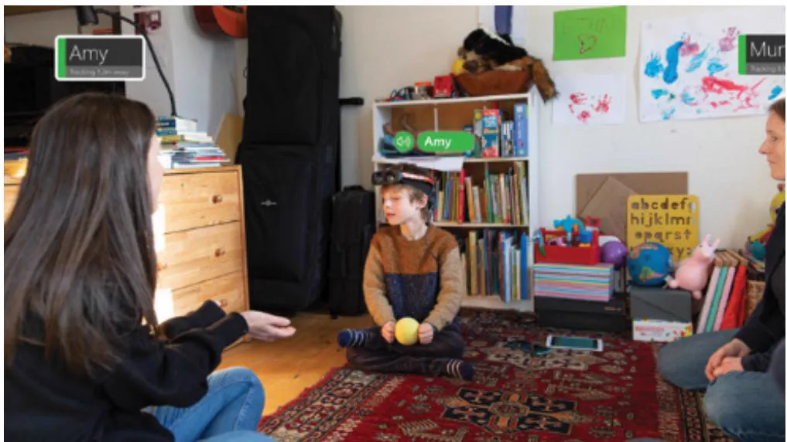  
Figure 5.16 PeopleLens:  a head-mounted device that enhances a blind child’s spatial awareness of those around them

Source: Cecily Morrison

When  the child looks  at someone, the head-mounted  display  reads aloud to  them the name of that person. This kind of audio cue can help them understand and remember both the relative position and distance of those  around them. The technology, in turn, indicates

to those who have been seen by the technology, providing a replacement for the eye contact that usually takes place between  people when they interact. Cecily Morrison and her team (2022)  at  Microsoft are investigating  whether these  kinds of technological social presence help people develop a richer mental map of those around them.

Video See PeopleLens in action: https://youtu.be/astmNfJHT4A.

# 5.6  Social Games

Social games are designed to facilitate social interaction. They can be played indoors or outdoors, with  and  without technology.  Examples include  board  games, tabletop games,  and video games. They are played by two or more players at the same time; the players can either cooperate with or compete against each other. Within a social game, each player is aware of other players’  presence, their actions, and how well they  are playing. In most  social games players are also able to interact with each other.

The most common are video games that have been designed to support  social interactions online, such as the very popular ones Fortnite, Roblox, and Minecraft, where players talk to each other as they play. The most popular platform used to communicate while playing  is Discord, which is a free chat service that  enables players to chat with others in their Discord group, through voice or text. Some games provide a whisper option, which enables players to speak directly to one another within a group chat. Other technologies have been designed  to enhance  or mediate  face-to-face social games. An example  is  the classic  Rock Paper  Scissors  game  played  as  an  Alexa  skill  (i.e.,  an  app). Alexa  vocalizes  its  hand  each round while members of a co-located family gesture theirs in person to each other. A more sophisticated version of this game is the Rock Paper Scissors Lizard Spock skill, where Alexa also  tells  who has  won  or lost,  while keeping  track  of who  has  won over  several  rounds. Much laughter and merriment can be had by those who are physically together, facilitating social cohesion and bonding (Beirl et al., 2019).

Social online games can also involve creating a community, where competition, collaboration, peer pressure, rebellion, jealousy, and so on are all played out in their various forms. Matt Richetti (2022), who is a social game designer, has proposed three heuristics by which to assess how community-based and social a game is.

Does the social game involve synchronous or asynchronous player interaction, where players either chat with each other or take turns?   
Is  the  social  interaction  symmetrical  or  asymmetrical;  in  other  words,  does  forming a relationship  require input  from  both parties,  or  can  they  be  formed  unilaterally by  a single party?   
. Does  the  social  relationship  involve  strong  or  weak  ties, meaning  will  the  relationships between players become deep and long lasting or are they transitory?

By asking these questions, game designers can think about the kinds of social interactions they want to support when designing the game. For example, when designing a synchronous game, it  is important  to think  about how  players with different  skill levels chat  with each other as they play. New players can use it to make initial contact and ask newbie questions about how to play while making new friends. More experienced players will chat with others to brag about their achievements in the game while also engaging in chitchat.

An  unconventional  social  game  is  Journey  developed  by  Jenova  Chen.  The  game  is designed so that each player controls a robed figure who moves through a vast desert, traveling toward a mountain in the distance. Players can encounter each other and try to help each other. However, the only way they can communicate is through a kind of musical chime. So they can’t  chat as  they do  in other games  but must  learn  how to  communicate in  chimes! This minimalist form of communication is meant to enable players to feel a connection with others playing through exploring with them, rather than talking to them or fighting them.

Watching others play video games and cheering them on in a parallel chat can also facilitate social interactions. Known as live streaming, it is a form of social media where a player simultaneously  broadcasts  themselves  and  their  activity  to  a  live  audience.  The  audience watches and listens to their favorite gamer (also called a streamer) on platforms like Twitch or YouTube. For example, the gamer streams their Minecraft designs and their battles with Fortnite monsters. One of the  most well-known streamers in 2022 was Ninja, who at that time had more than 17 million users on Twitch and more than 25 million users on YouTube! Over the last few years, many people have turned to this form of live streaming for entertainment, for socialization, and simply to be together (Taylor, 2018). The sense of community is made possible by enabling  the viewers  to communicate  with the streamer,  as well as other viewers, by posting their comments in the chat. This enables two-way communication where the streamers can directly respond to and acknowledge the viewers, and the viewers can participate and even dare the player to show off certain skills. The sense of community is most prevalent when there is a small number of viewers and those present can talk to each other and even make new friends. Some will turn up each day to watch a lesser-known streamer and enjoy  the smaller  community experience  of doing  so—a bit  like the  small number  of people who turn up every week to watch their children play community soccer on a Sunday afternoon in the park.

# BOX 5.6

# Leveraging Citizen Science and Engagement Through Technology

Citizen science involves a group of interested people coming together to work with professional scientists to plan a project, collect and analyze data, and report their findings. Participation in citizen science is booming. Reports of coral bleaching on the Great Barrier Reef, sea ice melting in Greenland and the Arctic, and deforestation in the Amazon alarm and stir people’s interest in science. The Internet, smartphones, and an array of mobile digital devices, apps, and social media have enabled people to work together on topics of interest or concern, even when they are geographically dispersed (Preece, 2016).

There are now thousands of citizen science projects involving millions of people, on many different topics. These include helping to archive old documents, transcribing early records of bird sightings, and identifying new galaxies. Zooniverse (www.zooniverse.org) and Scistarter (scistarter.org/citizen-science) are portals that provide information about hundreds of different citizen science projects that anyone can join.

Citizen science projects vary in size and scope. Some are small, like a project in Maryland in which local volunteers worked together to create and monitor rain gardens, collect garbage, and record the flora and fauna along the riverbanks (Preece et al., 2019). Others are distributed across the globe, such as iNaturalist where millions of people have been recording and documenting organisms  they have spotted (iNaturalist.org). Powered  by digital  technology, projects like iNaturalist scale participation through the process  of crowdsourcing to collect and  analyze  data. (Crowdsourcing was  mentioned in Chapter  2  and  is discussed  again in Chapter 14.) Using machine learning and machine vision, iNaturalist has also developed the SEEK app that is safe for children to learn about nature. When a child sees something of interest, they can point their smartphone camera at it, and the SEEK app will help them to identify what is in the picture by matching it against the millions of data items that were contributed by iNaturalist participants in similar locations.

Many projects have both a physical and a distributed component. Heather Killlen and her colleagues from the Natural History Museum in Washington, DC, worked with volunteers from across the United States to survey the distribution of ginkgo trees. They collected geolocation and other data digitally and physical samples of leaves that they sent by mail to the central team in Washington for analysis (Killen et al., 2022).

While the term citizen science is often used to describe any project that involves citizen volunteers, it is a controversial term because of the implication that a person has to be a legal citizen of a particular country, such as the United States, to participate. An article by Caren Cooper and colleagues (2021) discusses this issue in depth, and the video by Muki Haklay provides a broad introduction to the field of citizen science.

Video In this 30-minute video entitled Citizen Science: A Brief Introduction, Muki Haklay describes the history of citizen science, trends that explain its growth, an overview of today’s citizen science activities, and how and why people participate in citizen science: www.youtube.com/watch?v=zcoAtZdlPrc.

# In-Depth Activity

The goal of this activity is to analyze how collaboration, coordination, and communication are supported in online video games involving multiple players.

Play a social video game like Fortnite, and then answer the following questions.

1. Social issues

a.  What is the goal of the game?   
b. What kinds of conversations are supported?   
c.  How is awareness of the others in the game supported?   
d.  What kinds of social protocols and conventions are used?   
e.  What types of awareness information are provided?   
f.  Does the mode of communication and interaction seem natural or awkward?   
g.  How do players coordinate their actions in the game?

2. Interaction design issues

a.  What form of interaction and communication is supported, for instance, text, audio, and/or video?   
b. What other visualizations are included? What information do they convey?   
c.  How  do  users  switch  between  different  modes  of  interaction,  for  example, exploring and chatting? Is the switch seamless?   
d.  Are there any social phenomena that occur specific to the context of the game that wouldn’t happen in face-to-face settings?

3. Design issues

•  What other features might you include in the game to improve communication, coordination, and collaboration?

# Summary

Human beings are inherently social. People will always need to collaborate, coordinate, and communicate with one another, and the diverse range of applications, web-based services, and technologies that have emerged enable them to do so in more extensive and diverse ways. In this chapter, we looked at some core aspects of sociality, namely, communication and collaboration. We examined the main social mechanisms that people use in different conversational settings when interacting face-to-face and at a distance. A number of collaborative and telepresence technologies designed to support and extend these mechanisms were discussed, highlighting core interaction design concerns.

# Key Points

•  Social interaction is central to our everyday lives.   
•  Social mechanisms have evolved in face-to-face and remote contexts to facilitate conversation, coordination, and awareness.

•  Talk and the way it is managed are integral to coordinating social interaction.   
•  Many kinds of technologies have been developed to enable people to communicate remotely with one another.   
•  Keeping aware of what others are doing and letting others know what you are doing are important aspects of collaboration and socializing.   
•  The development of social technologies have brought about significant changes in the way people keep in touch and manage their social lives. For example, Teams and Zoom played a big role in enabling people to keep in contact, socialize, and work together during the COVID-19 pandemic.

# Further Reading

BALL,  M.  (2022)  The  Metaverse:  And  How  it  Will  Revolutionize  Everything. Liveright. This  book on  the Metaverse is  one of the first to extensively cover what  the extent of the Metaverse will mean for society, from business to government. It is written by a venture capitalist with a passion for future technology.

CRUMLISH, C. and MALONE, E. (2009) Designing Social Interfaces. O’Reilly. This is a collection of design patterns, principles, and advice for designing social websites, such as online communities.

TURKLE, S. (2016) Reclaiming Conversation: The Power of Talk in a Digital Age. Penguin. Sherry Turkle has written extensively about the positive and negative effects of digital technology on everyday lives—at work, at home, at school, and in relationships. This book is a very  persuasive  warning about  the negative impacts  of perpetual  use of  smartphones. Her main  premise  is  that  as  people—both  adults  and  children—become  increasingly  glued  to their phones instead of talking to one another, they lose the skill of empathy. She argues that we need to reclaim conversation to relearn empathy, friendship, and creativity.

ZHONG, B. (2021) Social Media Communication: Trends and Theories. Wiley. This extensive textbook on social media covers a broad range of topics including both the theoretical foundations of social media use and the application of research-based strategies for enhancing the use of social media in communication. Throughout it describes how digital media is changing human communication.

