# Chapter 6

# E M O T I O N A L  I N T E R A C T I O N

6.1  Introduction   
6.2  Emotions and Behavior   
6.3  Expressive Interfaces: Aesthetic or Annoying?   
6.4  Affective Computing and Emotional AI   
6.5  Persuasive Technologies and Behavioral Change   
6.6  Anthropomorphism

# Objectives

The main goals of this chapter are to accomplish the following:

•  Explain how our emotions relate to behavior and the user experience.   
•  Explain what are expressive and annoying interfaces and the effects they can have on people.   
•  Introduce the area of emotion recognition and how it is used.   
•  Describe how technologies can be designed to change people’s behavior.   
• Provide an overview on how anthropomorphism has been applied in interaction design.

# 6.1 Introduction

When you receive some bad news, how does it affect you? Do you feel upset, sad, angry, or annoyed—or all of these? Does it put you in a bad mood for the rest of the day? How might technology help? Imagine a wearable technology that could detect how you were feeling and provide  suggestions geared  toward helping to improve  your mood, especially  if it detected that you were having a real downer of a day. Would you find such a device helpful, or would you find it unnerving that a machine was trying to cheer you up? Designing technology to detect and recognize someone’s emotions  automatically from sensing aspects of their facial expressions,  body  movements,  gestures, and  so  forth,  is  a growing  area  of  research  often

called emotional AI or affective computing. There are many potential applications for using automatic emotion sensing, other than those intended to cheer someone up, including health, retail, driving, and  education. These  can be used  to determine if someone  is happy, angry, bored, frustrated, and so on, in order to trigger an appropriate technology intervention, such as making a suggestion to them to stop and reflect or recommending a particular activity for them to do.

In addition, emotional design is a growing area relating to the design of technology that can engender desired emotional states, for example, apps that enable people to reflect on their emotions, moods, and feelings. The focus is on how to design interactive products to evoke certain kinds of emotional  responses in people. It also examines why  people become  emotionally attached to certain products (for instance, virtual pets), how social robots might help reduce loneliness, and how to change human behavior through the use of emotive feedback.

In this chapter, we include emotional design and affective computing using the broader term emotional interaction to cover both aspects. We begin by explaining what emotions are and how they shape behavior and everyday experiences. We then consider how and whether an interface’s appearance affects usability and the user experience. In particular, we look at how expressive and persuasive interfaces can change people’s emotions  or behaviors. How technology  can detect  human emotions  using  voice and facial  recognition is  then covered. Finally, the way anthropomorphism has been used in interaction design is discussed.

# 6.2 Emotions and Behavior

Consider the different emotions one experiences throughout a common everyday activity— shopping online for a product, such as a new laptop, a sofa, or a vacation. First, there is the realization of needing or wanting one and then the desire and anticipation of purchasing it. This is followed by the joy or frustration of finding out more about what products are available and deciding which to choose from potentially hundreds or even thousands of them by visiting numerous websites, such as comparison sites, reviews, recommendations, and social media sites. This entails matching what is available with what you like or need and whether you can afford it. The thrill of deciding on a purchase may be quickly followed by the shock of how much it costs and the disappointment that it is too expensive. The process of having to revise your decision may be accompanied by annoyance if you discover that nothing is as good as the first choice. It can become frustrating to keep looking and revisiting sites. Finally, when you make your decision, a sense of relief is often experienced. Then there is the process of clicking through the various options (such as color, size, warranty, and so forth) until the online payment form  pops up. This can be tedious, and the requirement to fill in the many details raises the possibility of making a mistake. Finally, when the order is complete, you can let out  a big sigh. However, doubts can  start to creep in—maybe  the other  one was better after all.

This rollercoaster set of emotions is what many of us experience when shopping online, especially for big-ticket items where there is a myriad of options from which to choose and where you want to be sure that you make the right choice.

# ACTIVITY 6.1

Have you seen one  of the terminals shown in Figure 6.1 at an airport after you have gone through security? Were you drawn toward it, and did you respond? If so, which smiley button did you press?

Figure 6.1  A Happyornot terminal located after security at Heathrow Airport   
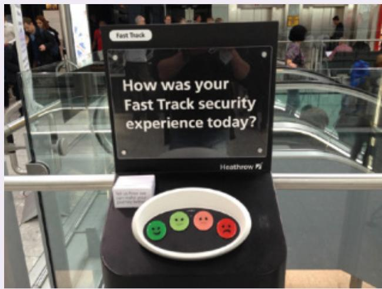  
Source: www.rsrresearch.com/research/why-metrics-matter. Used courtesy of Retail Systems Research

# Comment

The act of pressing one  of the buttons can be very satisfying—providing a moment for you to reflect upon your experience. It can even be pleasurable  to express how you feel in this physical manner. Happyornot designed the feedback terminals that have been used in many airports throughout the world. The affordances of the large, colorful, buttons laid out in a semicircle, with distinct smileys, makes it easy to know what is being asked of the passerby, enabling them to select among feeling happy, angry, or something in between. More recent designs use a flat tablet as the interface.

The data collected from the button presses provides statistics for an airport as to when and where people are happiest and angriest after going through security. Data from the beginning of 2022 when traveling was beginning to reach pre-pandemic levels showed that the best day of the week to fly is Wednesday while the worst is Sunday. The unhappiest times recorded are in the early hours of the morning, presumably because people are tired and grumpier.

Emotional interaction is  concerned with  what makes people feel  happy, sad, annoyed, anxious, frustrated, motivated, delirious, and so on, and then using this knowledge to inform the  design  of  different  aspects  of  the  user  experience. However, it  is  not  straightforward.

Should an interface be designed to try to keep a person happy when it detects that they are smiling, or should it try to change them from being in a negative mood to a positive one when it detects that they are scowling? Having detected an emotional  state, a decision has  to be made as to what or how to present information. Should it try to “smile” back through using various interface elements, such as emojis, feedback, and icons? How expressive should it be? It depends on whether a given emotional state is viewed as desirable for the user experience or the task at hand. A happy state of mind might be considered optimal for when someone goes to shop online if it is assumed that this will make them more willing to make a purchase.

Advertising agencies have developed a number of techniques to influence people’s emotions. Examples include showing a picture of a cute animal or a child with hungry, big eyes on a website that “pulls at the heartstrings.” The goal is to make people feel sad or upset at what they  observe and make them want to do something to help, such as making a donation. Figure 6.2, for example, shows a web page that has been designed to trigger a strong emotional response in the viewer.

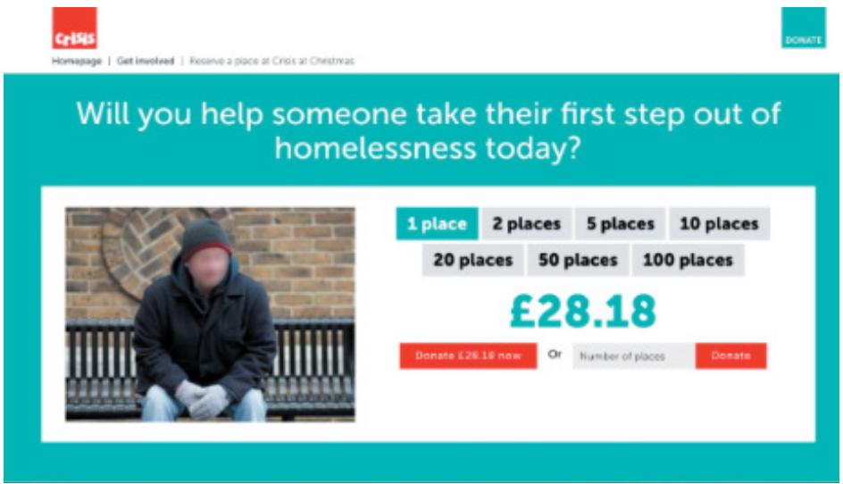  
Figure 6.2  A web page from Crisis (a UK homelessness charity)

Source: Crisis UK

Our  moods  and  feelings  are  also  continuously  changing, making  it  more  difficult  to predict  how  we  feel  at  different  times.  Sometimes,  an  emotion  can  descend  upon  us  but disappear shortly afterward. For example, we can become startled by a sudden, unexpected loud noise. At other times, an emotion can stay with us for a long time; for example, we can remain annoyed  for hours when staying in a  hotel room that has  a noisy air  conditioning unit. An emotion  like jealousy can  keep  simmering for a  long period  of time, manifesting itself on seeing or hearing something about the person or thing that triggered it.

The terms emotion, mood, and feeling are often used interchangeably. However, they can differ in temporality. Emotions tend to happen in the moment as a response (e.g., crying) to a trigger (e.g., becoming sad on hearing someone has died). A mood is more a frame of mind or disposition (e.g., they were in a good mood) that can develop and last for longer periods of time. Feelings can be either an expression of an emotion (e.g., he felt sad) or a mood (e.g., she felt grumpy).

<!-- Chunk 4 End -->

<!-- Chunk 5 Start -->

In a series of short videos, Kia Höök talks about affective computing, explaining how emotion is formed and why it is important to consider when designing user experiences with technology. See www.interaction-design.org/encyclopedia/ affective_computing.html.

A good  place  to start understanding  how  emotions affect  behavior and how  behavior affects emotions is to examine how people express themselves and read each other’s expressions.  This  includes  understanding  the  relationship  between  facial  expressions,  body  language, gestures, and tone of voice. For example, when people are happy, they typically smile, laugh, and relax their body posture. When they are angry, they might shout, gesticulate, tense their hands, and screw up their face. A person’s expressions can trigger emotional responses in others. When someone smiles, it can cause others to feel good and smile back.

Emotional skills, especially the ability to express and recognize emotions, are central to human communication. Most people are highly skilled at detecting when someone is angry, happy, sad, or bored by recognizing their facial expressions, way of speaking, and other body signals. They also usually know what emotions to express in a given situation. For example, when someone has just heard they have failed an exam, it is not a good time to smile and be happy for them. Instead, people try to empathize and show that they feel sad, too.

There is  an ongoing debate about  whether and how emotion causes certain behaviors. For  example, does being angry make us concentrate better? Or does being happy make us take  more  risks, such  as  spending  too  much  money, or  vice versa  or neither?  It  could  be that we  can just feel  happy, sad, or angry, and that this does  not affect our  behavior. Roy Baumeister et al. (2007) discuss how the role of emotion is more complicated than a simple cause-and-effect model, noting how it often depends on the context as to how and whether one  triggers  the other. Mayer Tamir  and Yochanan Bigman  (2017)  also suggest how emotions shape behavior depends partially on people’s expectations and the emotional state they are in. For example, in a series of experiments investigating the relationship between performance  and emotion they  found  that “excited” participants  were more  creative  when they were told that excitement could promote performance. Conversely, “calm” participants were more creative when they were told that calmness would promote performance.

Other theorists argue that emotions cause behavior, for example that fear brings about flight and that anger initiates the fight reaction. A widely accepted explanation, derived from evolutionary  psychology, is that when something makes someone frightened or angry, their emotional response is to focus on the problem at hand and try to overcome or resolve the perceived danger. The physiological responses that accompany this state usually include a rush of adrenalin through the body  and the tensing of muscles. While the physiological changes prepare people to fight or flee, they also give rise to unpleasant experiences, such as sweating, butterflies in the stomach, quick breathing, heart pounding, and even feelings of nausea.

Nervousness is  a state of being that is often  accompanied by several emotions, including apprehension  and  fear. For example, many people get worried, and  some feel  terrified before speaking at a public event or a live performance. There  is even a name for this kind

of nervousness— stage fright. Andreas Komninos (2017) suggests that it is the autonomous system “telling” people to avoid these kinds of potentially humiliating or embarrassing experiences.  But  performers  or  professors  can’t  simply  run  away.  They  have  to  cope  with the negative emotions  associated  with having  to  be in front  of  an audience.  Some are able  to turn their nervous state to their advantage, using the increase in adrenalin to help them focus on their performance. Others are only too glad when the performance is over and they can relax again.

As  mentioned  earlier, emotions  can  be  simple  and  short-lived  or  complex  and  longlasting. To distinguish between the two types of emotion, researchers have described them in terms of being either automatic  or conscious. Automatic emotions (also knowns as affect) happen  rapidly, typically  within  a fraction of a second  and, likewise, may  dissipate just as quickly. Conscious emotions, on the other hand, tend to be slow to develop and equally slow to dissipate, and they are often the result of a conscious cognitive behavior, such as weighing the odds, reflection, or contemplation.

# BOX 6.1

# How Does Emotion Affect Driving Behavior?

There  has been much research investigating the influence  of emotions on driving behavior (e.g., Pêcher et al., 2011; Zhang and Chan, 2022). One major finding is that when drivers are angry, their driving becomes more aggressive, they take more risks such as dangerous overtaking, and they are prone to making more errors. Driving performance has also been found to be negatively affected when drivers are anxious. People who are depressed are also more prone to accidents.

What are  the  effects  of listening to music  while driving? An early  study  by Christelle Pêcher et al. (2009) found that people slowed down while driving in a car simulator when they listened to either happy or sad music, as compared to neutral music. This effect is thought to be due to the drivers focusing their attention on the emotions and lyrics of the music. Listening to happy music was also found not only to slow drivers down, but to distract them more by reducing their ability  to stay in their lane. This did  not happen with the  sad music. More recently, research has shown how fast, loud, and rhythmic music can lead to riskier driving behavior (such  as driving  faster or overtaking)  when in demanding  urban  settings (Karageorghis et al., 2022). It seems it is preferable to listen to slow music when driving conditions are stressful!

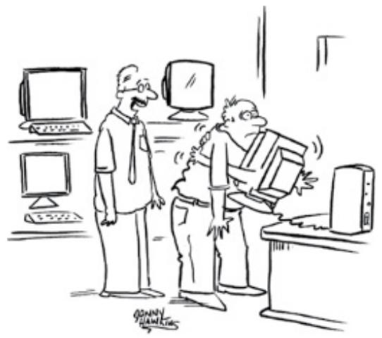  
“It's a very user-friendly model."   
Source: Jonny Hawkins / Cartoon Stock

Understanding how emotions work provides a way of considering how to design for user experiences that can trigger affect or reflection. For example, Don Norman (2005) suggests that being in a positive state of mind can enable people to be more creative as they are less focused. When someone is in a good mood, it is thought to help them make decisions more quickly. He suggests that when people are happy, they are more likely to overlook and cope with minor problems that they are experiencing with a device or interface. In contrast, when someone is anxious or angry, they are more likely to be less tolerant. When this is the case, the interface needs to be clearly visible with unambiguous feedback. The bottom line is “things intended to be used under stressful situations require a lot more care, with much more attention to detail” (Norman, 2005, p. 26).

Anthony Ortony, Don Norman, and William Revelle (2005) developed a classic model of emotion and behavior couched in terms of different “levels” of the brain. At the lowest level are parts of the brain that are prewired to respond automatically to events happening in the physical world. This is called the visceral level. At the next level are the brain processes that control everyday behavior. This is  called the behavioral level. At  the highest level are brain processes  involved in contemplating. This is  called  the reflective level (see Figure 6.3). The visceral level responds rapidly, making judgments about what is good or bad, safe or dangerous, pleasurable or abhorrent. It also triggers the emotional responses to stimuli (for instance fear, joy, anger, and sadness) that are expressed through a combination of physiological and behavioral responses. For example, many people will experience fear on seeing a very large hairy spider running across the floor of the bathroom, causing them to scream and run away. The  behavioral level  is  where most  human  activities  occur. Examples include  well-learned routine  operations such as  talking, typing, and swimming. The reflective level entails conscious thought where people generalize across events or step back from their daily routines. An example is switching between  thinking about the narrative structure and special effects used in a horror movie and becoming scared at the visceral level when watching the movie.

Figure 6.3  Anthony Ortony et al.’s (2005) model of emotional design showing three levels: visceral, behavioral, and reflective   
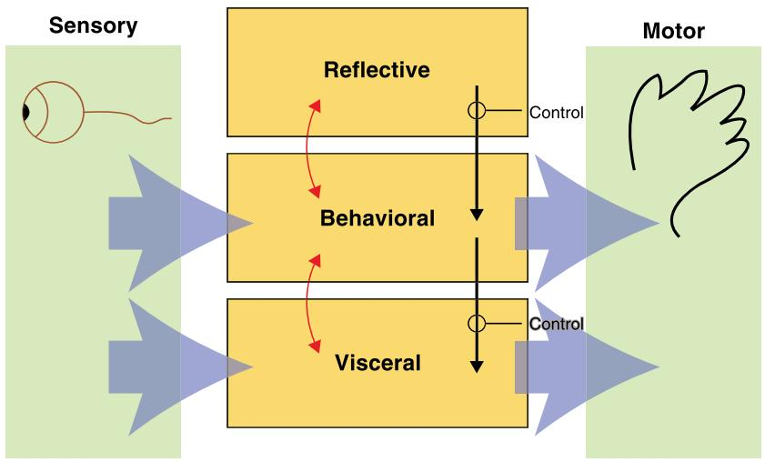  
Source: Adapted from Norman (2005), Figure 1.1

One  way of using the model is  to think about how  to design products in terms of the three levels. Visceral design refers to making products look, feel, and sound good. Behavioral design is about use and equates to the traditional values of usability. Reflective design is about considering the meaning and personal value of a product in a particular culture. For example, the design of a Swatch watch (see Figure 6.4) can be viewed in terms of the three levels. The  use  of cultural  images  and  graphical  elements  is  designed  to  appeal  to  certain people at the reflective  level; its affordances of use at the behavioral level, and the brilliant colors, wild designs, and art attract  their attention at the visceral  level. They are combined to create  the  distinctive  Swatch  trademark that  expresses  style  and personality. Designing to induce different levels of emotional responses, however, also requires understanding who the target audience is and what the context of use will be. Swatch customers are likely to be young and fashion conscious.

Another  model  that has  been used to  inform interaction design  is Plutchik’s Wheel of Emotions, originally developed in 1980  (Interaction Design  Foundation, 2021). Figure 6.5 shows how the wheel categorizes human emotions  into seven well-known emotions: anger, disgust, fear, sadness, anticipation, joy, and surprise. It  also includes trust as another one— which is not usually considered as an emotion. Alongside these typical responses are labels (optimism, love, submission, awe, disproval, remorse, contempt, aggressiveness). Other emotions are considered to be a combination of, or derived from, these. The colors used in the wheel reflect the intensity of an emotion: the darker the shade, the more intense the emotion is. Thus, the emotions in the middle of the wheel are seen as more intense; for example, rage is shown in the  middle of the circle as blood red, whereas anger is shown on the outside of the circle in light red. The wheel can be used as a “color palette” akin to a UX mood board. By selecting and blending  different emotions  from the wheel a designer can begin to think about  how to elicit different  kinds and levels of emotional  response. In essence, the wheel provides an initial way of exploring the possible effects of triggering different combinations of adjacent (e.g., serenity and pensiveness) and nonadjacent emotions for different stages of a user experience. It does not, however, instruct the designer on how to design for a selection of emotions.

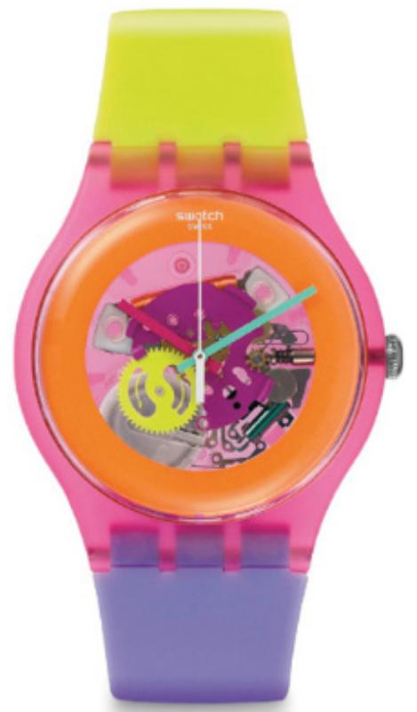  
Figure 6.4  A Swatch watch called Dip in Color Source: SWATCH AG

# ACTIVITY 6.2

How do Ortony et al.’s (2005) model of emotional design and Plutchik’s wheel of emotion differ? How helpful are they are when designing a new video game?

# Comment

Ortony et al.’s  model describes  emotions in terms of how  humans have different  levels of emotional responses depending on how they perceive and interact with a product, whereas Plutchik’s wheel depicts the range of human emotions and how they vary in level of intensity. Both are useful as conceptual tools for thinking about what kinds of behavior and emotions to design for. However, a games designer still has to make the leap in determining which specific game features to use to match to the desired emotional states, such as how much excitement and fear to incorporate into a new game. The palette metaphor used by the wheel can help designers consider different  aspects of a game: for example, highlighting the need to design specific mechanisms that can elicit anticipation and surprise at the beginning while avoiding boredom and distraction later.

Figure 6.5  Plutchik’s wheel of emotions   
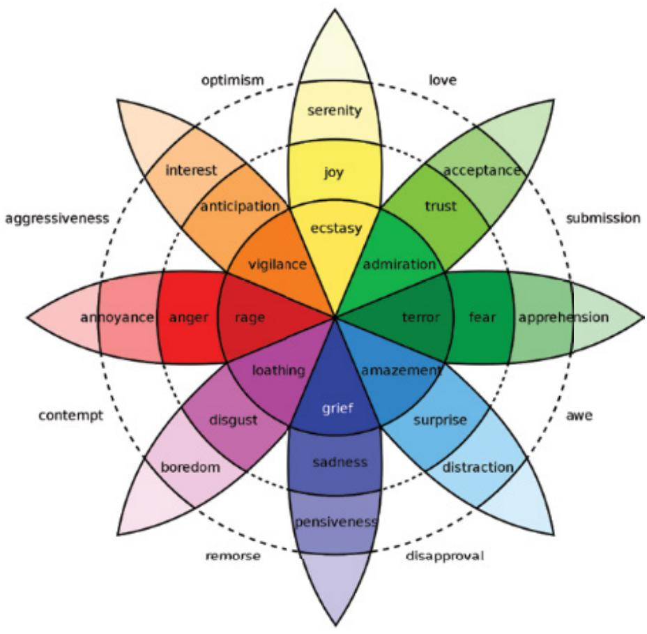  
Source: Machine Elf 1735 / Wikimedia / CC BY

# 6.3  Expressive Interfaces: Aesthetic or Annoying?

A number of features have been developed to make an interface expressive, including emojis, sounds, colors, shapes, icons, animations, videos, photos, and virtual  agents. Besides using visual  techniques, other  ways  of  conveying  expressivity  include “sonifications”  indicating actions and events (such as whoosh for a window closing, “schlook” for a file being dragged, or  ding  for  a  new  email  arriving)  and  vibrotactile  feedback  (such  as  distinct  smartphone buzzes that represent specific messages from friends or family). The motivation is often to (1) create an emotional connection or feeling with people for instance, warmth, or sadness, and/ or (2) elicit  certain kinds of emotional responses in people, such as feeling  at ease, comfort, and happiness.

Many websites, online shopping sites, and apps have been designed using a combination of these expressive features to good effect. Examples include retail sites like Nike and Levis, which have been creating aesthetic online shopping sites for many years using high-quality videos, emotive music, and striking images on their landing page (see Figure 6.6). They are very  enjoyable  and  engaging  to  watch, especially  by  the target  demographic,  eliciting  the

emotions  of anticipation,  joy, and excitement  as well  as capturing  the  current zeitgeist  of fashion, design, hipness, and youth.

Figure 6.6  An image used on the landing page of Levis.com (at the time of writing this chapter) conveying coolness, sustainable materials, a grungy background, and aesthetic fonts   
  
Source: LEVI STRAUSS & CO.

Sometimes expressive  features, however, can  turn  out  to  be more  annoying  than  aesthetic. Perhaps most well-known was Clippy, Microsoft’s paperclip that was designed to have human-like qualities to convey friendliness. It typically appeared at the bottom of a person’s screen whenever the system thought they needed help carrying out a particular task (see Figure 6.7a). Its expressiveness was depicted through googly eyes and eyebrows. At first, it was found  to be amusing  and perceived to be helpful. However, after popping up a  few times, many people started to find it annoying and intrusive, distracting them from their work. Its most common intervention was to appear and say, “It looks like you’re writing a letter” and offer to help the user. This might be OK if it happened to be the very first time someone was writing a letter, but not if it were all the other times. Some even found Clippy offensive. There has been much written in the media about the reasons for its failure, including being ahead of its time and its interface poorly designed. For example, The New Yorker (2015) reported that during a focus group that was held to probe why people hated Clippy so much, some of the women present commented on how they thought the character appeared to be too male.

Since then, many other kinds of virtual agents have been developed to help customers at the interface. They are often represented as avatars (see Anna in Figure 6.7b although now defunct) that have limited expressions (such as raising eyebrows  and blinking eyes). While they appear friendly and helpful, guiding customers to what they might be looking for, they, too  can become annoying  or intrusive, especially if the customer  already knows what they want. In this context, they can even appear like a pushy sales assistant.

How can virtual agents be designed to be friendly and helpful without being annoying? For one, they should appear at the interface only occasionally. They should also be designed

to  have  a  pleasant  demeaner  without  trying  to  be  too  human-like  or  overly  personable. Another question often asked is which gender should they have? Many have been portrayed as female. However, this can be seen as gender stereotyping. Instead, a cartoon character of an animal or robot that is gender-free may be preferable.

Figure 6.7  (a) Microsoft’s Clippy and (b) IKEA’s Anna   
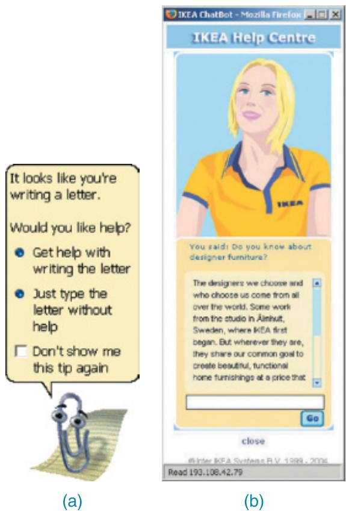  
Source: Microsoft Corporation

The  benefits  of  having  aesthetically  pleasing  interfaces  in  relation  to  their  impact  on usability  has  also been  researched.  Noam Tractinsky  (2013), for  example, has  repeatedly shown how the aesthetics of an interface can have a positive effect on people’s perception of the system’s usability. When the look and feel of an interface is pleasing and pleasurable—for example through beautiful graphics or a nice feel or the way that the elements have been put together—people are likely to be more tolerant and prepared to wait a few more seconds for a website to download. Furthermore, good-looking interfaces are generally more satisfying and pleasurable to use.

# ACTIVITY 6.3

Most people are familiar with the “404 error” message that pops up now and again when a web page does not load for the link they have clicked or when they have typed or pasted an incorrect URL into a browser. What does it mean and why the number 404? Is there a better way of letting people know when a link to a website is not working? Might it be better for the web browser to say that it was sorry rather than presenting an error message?

# Comment

The number 404 comes from the HTML language. The first 4 indicates a client error. The server is telling the user that they have done something wrong, such as misspelling the URL or requesting a page that no longer exists. The middle 0 refers to a general syntax error, such as a spelling mistake. The last 4 indicates the specific nature of the error. For the user, however, it is an arbitrary number. It might even suggest that there are 403 other errors they could make!

Seminal research by Byron Reeves and Clifford Nass (1996) suggested that computers should be courteous to users in the same way that people are to one another. They found that people are more forgiving and understanding when a computer says that it’s sorry after making a mistake. A number of companies now provide alternative and more humorous “error” landing pages that are intended to make light of the embarrassing situation and to take the blame away from the user. For example, Figure 6.8 shows a Lego man’s horrified expression that takes the sting away from a person stumbling on a page that does exist.

Figure 6.8  An alternative 404 error message   
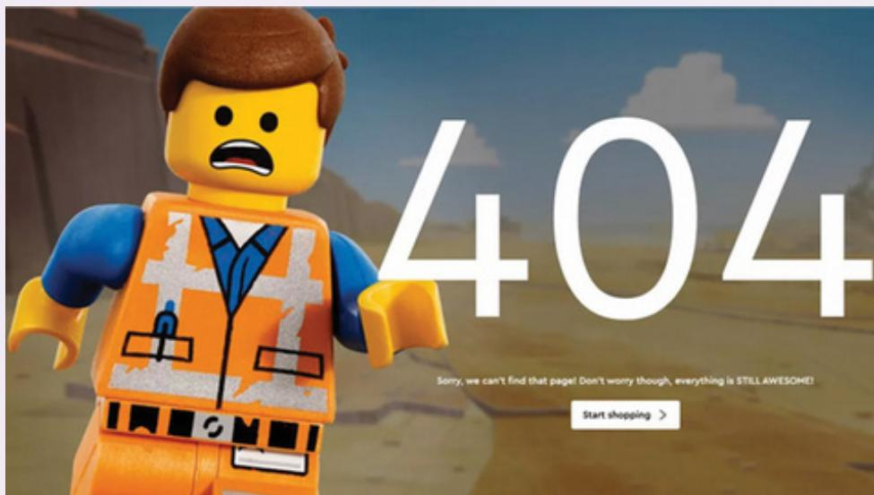  
Source: Future Publishing Limited Quay House

# DILEMMA

Should Voice Assistants Teach Kids Good Manners?

Many families now own a smart speaker, such as an Amazon Echo, with a voice assistant like Alexa running on it. One observation is that young children will often talk to Alexa as if she was their friend, asking her all sorts of personal questions, such as “Are you my friend?” and “What is your favorite music?” and “What is your middle name?” They also quickly learn that it is not necessary to say “please” when asking their questions or “thank you” on receiving a response, similar  to how they talk to other display-based voice assistants, such as Siri or Cortana. Some parents, however, are worried that this lack of etiquette could develop into a new social norm that could transfer over to how they talk to real human beings. Imagine the scenario where Aunt Emma and Uncle Liam come over to visit their young niece for her 5th birthday, and the first thing that they hear is, “Aunty Emma, get me my drink” or “Uncle Liam, where is my birthday present?” with hardly a “please” uttered. How would you feel if you were treated like that?

One would hope that parents would continue to teach their children good manners and that children know to treat humans differently compared with the way they talk to a voice assistant. To investigate this, Alexis Hiniker and  colleagues (2021) conducted  a study  that showed children do learn to transfer the way conversational agents speak to them but that they “mime” it in playful ways when talking with their parents as if it were an insider joke. In contrast, when they talked with the researcher, they did not talk in this way. This suggests children are selective in when and how they apply the new habits they pick up from talking to conversational agents.

# 6.4  Affective Computing and Emotional AI

Affective computing was first coined by Rosalind Picard (1997) to refer to how computers can be used to recognize and express emotions in the same way as humans do. This includes creating techniques to evaluate frustration, stress, and moods by analyzing people’s expressions  and conversations  and designing  novel wearable  sensors for people to  communicate their emotional states. More recently, affective computing has included exploring how affect influences personal health (Jacques et al., 2017). Another motivation is to design computers and robots that can respond appropriately to human emotions and moods and to know how and when to exhibit empathy (Schuller et al., 2021).

More  specifically,  emotional  AI  seeks  to  automate  the  measurement  of  feelings  and behaviors by using AI technologies that can analyze facial expressions and voice in order to infer emotions.

# 6.4.1  Measuring and Tracking Affect and Emotions

A number of sensing technologies are used in affective computing and emotional AI to measure and track physiological processes, and from the data collected, predict aspects of a person’s  behavior,  for  example, forecasting  what  someone  is  most  likely to  buy  online  when feeling sad, bored, or happy. The main techniques and technologies that have been used to do this are as follows:

• Cameras for measuring facial expressions   
• Biosensors placed on fingers or palms to measure galvanic skin response (which is used to infer how anxious or nervous someone is as indicated by an increase in their sweat)   
• Affective expression in speech (voice quality, intonation, pitch, loudness, and rhythm)   
. Body movement and gestures, as detected by motion capture systems or accelerometer sensors placed on various parts of the body

The use of automated facial coding has gained popularity in commercial settings, especially in marketing and ecommerce. For example, Affectiva media analytics software (www .affectiva.com) employs advanced computer vision and deep learning algorithms to catalog someone’s  emotional  reactions  to  digital content, as  captured  through a  webcam, to  analyze  how engaged the  user  is with  digital online  content, such  as movies,  online shopping sites, and advertisements. The fundamental emotions that are classified are anger, contempt, disgust,  fear,  joy, and  sadness. These  emotions  are  indicated  as  a percentage  of  what  was detected from someone’s facial expression and appear above the person’s face on a display. For  example, Figure 6.9 shows a  label of 100 percent happiness and  0 percent for all  the other categories above the woman’s head on the smartphone display. The white dots overlaying her face are the markers used by the app when modeling a face. They provide the data that determines the type of facial expression being shown, in terms of detecting the presence or absence of the following:

• Smiling   
. Eye widening   
. Brow raising   
. Brow furrowing   
. Raising a cheek   
Mouth opening   
. Upper-lip raising   
Wrinkling of the nose

If a person furrows their brow and wrinkles their nose (i.e., screws their face up) when an ad pops up, this suggests that they feel disgust, whereas if they start smiling, it suggests that they are feeling happy. The website can then adapt its ad, movie storyline, or content to what it perceives the person needs at that point in their emotional state.

Affectiva  also  analyzes  drivers’  facial  expressions  when on  the  road  with  the  goal  of improving  driver safety. The emotional AI  software perceives if a driver  is angry and  then suggests an intervention. For example, a virtual agent in the car might suggest to the driver to take a deep breath and play soothing music to help relax them. In addition to identifying particular emotions through facial expressions (for example, joy, anger, and surprise), Affectiva uses  particular markers to detect drowsiness. These are eye  closure, yawning, and blinking

rate. Again, upon detecting when a threshold has been reached for these facial expressions, the software might trigger an action, such as getting a virtual agent to suggest to the driver that they pull over where it is safe to do so.

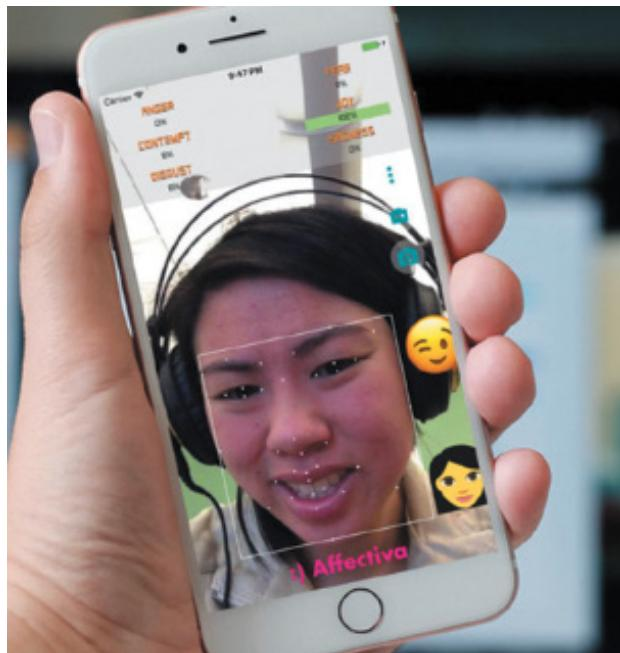  
Figure 6.9  Facial coding using Affectiva software Source: Affectiva, Inc.

Other  indirect methods that are used to reveal the emotional state of someone include eye-tracking, finger pulse, speech, and the words/phrases they use when tweeting or chatting online. The level of affect expressed by users, the language they use, and the frequency with which they  express themselves when using social media can  all indicate their mental  state, well-being, and aspects of their personality (for instance, whether  they are  an  extrovert or introvert, neurotic or calm, and  so on). Some companies may  try to use  a  combination of these  measures, such  as  facial expressions  and  the language  that people use  when online, while others may focus on just one aspect, such as the tone of their voice when answering questions  over the  phone. This  type  of  indirect  emotion  detection  is  used  to help  infer or predict someone’s behavior, for example, determining their suitability for a job or how they will vote in an election.

Biometric  data is  also used  in streaming video  games where  spectators  watch players, known as streamers, play video games. The most popular site is Twitch; millions of viewers visit it each day to watch others compete in games, such as Fortnite. The biggest streamers have become a new breed of celebrity, like YouTubers. Some have millions of dedicated fans. Various tools have been developed to enhance the viewers’ experience. One is called All the Feels, which provides an overlay of biometric and webcam-derived data of a streamer onto the  screen  interface  (Robinson  et  al.,  2017). A  dashboard  provides  a  visualization  of  the

streamer’s heart rate, skin conductance, and emotions. This additional layer of data has been found to enhance the spectator experience and improve the connection between the streamer and spectators. Figure 6.10 shows the  emotional state of a streamer using the All the Feels interface.

Figure 6.10 All the Feels app showing the biometric data of a streamer playing a video game   
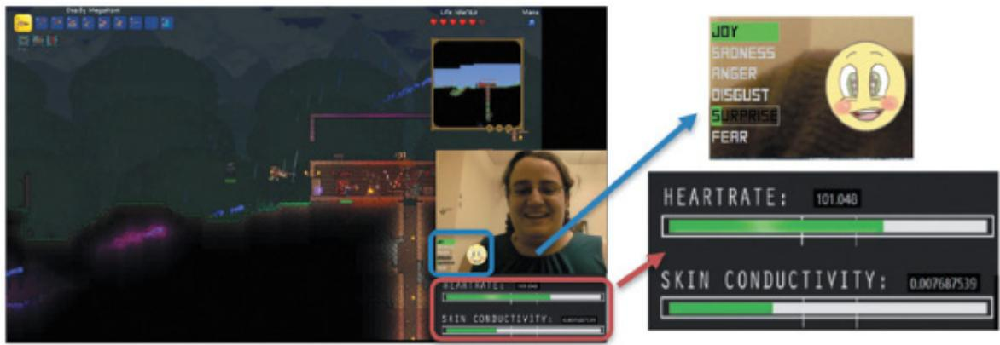  
Source: Courtesy of Katherine Isbister

# 6.4.2  Tracking and Reflecting on Moods

There has been much interest in how technology can be used to help people understand more about their moods and what lies behind their mood swings. We can be in a good mood one day and then a bad mood the next day. How does this happen and why? Whereas it is possible to use facial tracking software to detect a specific emotion (e.g., happy), it is not possible to do the same to detect different moods—as often they are not expressed through obvious physiological  responses. If someone  is in  a bad mood, say, they  may not  show it and may deliberately hide how they are feeling.

An alternative approach is to ask people to write down manually how they are feeling at a given point in time or to rate their mood and for them to reflect upon how they felt about themselves in the past. One of the first apps to support this kind of journaling digitally was called Echo; it asked people to type a subject line, rate their happiness at that moment, and add a description, photos, and/or videos if they wanted to (Isaacs et al., 2013). Sporadically, the  app then  asked  them  to  reflect on  previous  entries. An  assumption was  that  this type of technology-mediated reflection could increase well-being and happiness. Each reflection was shown as a stacked card with the time and a smiley happiness rating. People who used the Echo app reported  on the many positive  effects of doing so, including reliving positive experiences and overcoming negative experiences by writing them down. The double act of recording and reflecting enabled them to generalize from the positive experiences and draw positive lessons from them.

Since this early research, many commercial Mood tracker apps (e.g., Moodnotes, Daylio) have been developed that are intended to help people keep track of their moods and be able to reflect more on why they might be feeling gloomy or overly ecstatic. Understanding their moods in this way is assumed to help improve mental well-being.

# BOX 6.2

# Triggering ASMR Through Food Videos

Autonomous sensory meridian response (ASMR) is a tingling body sensation that starts on the scalp and then progresses down the back of the neck and spine. The sensation is often reported to be accompanied by feelings of relaxation and well-being. For some people, it can be triggered by listening to crunching, slurping, and other food-eating sounds. There are now many videos on TikTok and YouTube that are intended to induce ASMR in people. SamSeats, for example, has made a video of many tingling sounds associated with preparing a ratatouille dish (www.tiktok.com/@samseats/video/6968110778725485829?is_copy_url=1&is_from_ webapp=v1&lang=en). The sounds include ice cubes being dropped in a bowl, a knife slicing through an assortment of veggies, and the rapid and fine chopping of garlic cloves and sprigs of herbs. It is music to the ears and makes you want to watch and listen to the video again. Each time you do, you hear something new. On viewing it a second time, I heard the glugging sound of oil being poured from a bottle and the frying of onions. Do you think triggering ASMR in this way can improve your mood if you are feeling down?

Virtual  reality  has  also been  developed  to  enable people  to  explore  their  moods. For example, Nadine Wagener  and colleagues  (2022) developed Mood Worlds—a VR application that enables people to visualize their moods by creating their own virtual space using 3D digital tools (see Figure 6.11). The use of this kind of 3D digital painting to explore participants’ feelings was found to lead to increased happiness and positivity.

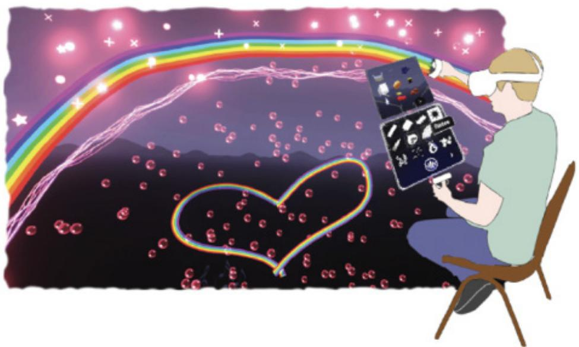  
Figure 6.11 A participant using the VR app Mood Worlds to visualize and explore their emotions Source: Wagener et al., 2022

# BOX 6.3

Is It OK for Technology to Work Out How You Are Feeling?

Do you think  it is ethical that technology is trying to read your emotions from your facial expressions or from what you write in your tweets and, based on its analysis, filter the online content that you are browsing, such as ads, news, or a movie to match your mood? Might some people think it is an invasion of their privacy?

Human beings will suggest things to each other, often based on what they think the other is feeling. For example, they might suggest a walk in the park to cheer them up. They might also suggest a book to read or a movie to watch. However, some people may not like the idea that an app can do the same, for example, suggesting what you should eat, watch, or do based on how it analyzes your facial expressions.

# 6.5  Persuasive Technologies and Behavioral Change

A diversity of techniques has been used at the interface to draw people’s attention to certain kinds of information in an attempt to change what they do  or think. Pop-up ads, warning messages, reminders, prompts, personalized messages, and recommendations are some of the methods that are deployed on a computer or smartphone. Examples include Amazon’s oneclick mechanism that makes it easy to buy something on its online store and recommender systems  that  suggest  specific  books,  hotels,  restaurants,  and  so  forth,  that  a  reader might want to try based on their previous purchases, choices, and taste. The various techniques that have been developed  have been referred to as persuasive design (Fogg, 2009). They include enticing, cajoling, or nudging someone into doing something through the use  of persuasive technology.

Technology interventions have also been developed to change people’s behaviors in other domains  besides commerce, including  safety, preventative healthcare, fitness, personal  relationships, sustainability,  and learning. Here  the  emphasis  is  on  changing someone’s habits or  doing something that  will improve  an  individual’s  well-being  through monitoring  their behavior. One of the earliest commercial examples was Nintendo’s Pokémon Pikachu device (see Figure 6.12) that was designed to motivate children into being more physically active on a consistent basis. The owner of the digital pet that lives in the device was required to walk, run, or jump each day to keep it alive. The wearer received credits for each step taken—the currency being watts that could be used to buy Pikachu presents. Twenty steps on the pedometer rewarded the player with 1 watt. If the owner did not exercise for a week, the virtual pet became angry and refused to play anymore. This use of positive rewarding and sulking can be a powerful means of persuasion, given that children often become emotionally attached to their virtual pets, especially when they start to care for them.

Figure 6.12 Nintendo’s Pokémon Pikachu device   
  
Source: Nintendo

# ACTIVITY 6.4

Watch these two videos:

The Piano Staircase: youtu.be/2lXh2n0aPyw

The Outdoor Bin: youtu.be/cbEKAwCoCKw

Do you think that such playful methods are effective at changing people’s behavior?

# Comment

In 2009, Volkswagen sponsored an open competition, called the fun theory, asking people to transform mundane artifacts into novel enjoyable user experiences in an attempt to change people’s behavior for the better. The idea was to encourage a desired behavior by making it more fun. The Piano Staircase and the Outdoor Bin are the most well-known examples; the stairs sounded like piano keys being played as they were climbed, while the bin sounded like a well echoing when something was thrown into it. Research has shown that designing playful methods as part of a technology intervention is effective as they engage people more in enjoyable ways of changing their behavior (Seaborne et al., 2020).

Besides the mood tracking apps mentioned earlier, many other apps have been developed that are intended to help people monitor various behaviors and be able to change them based on the data collected and displayed back to them. These devices include fitness trackers, for example, Fitbit, and weight trackers, such as smart scales. They  are designed to encourage people to change their behavior by displaying dashboards of graphs showing how much exercise they have done or weight  they have lost over a day, week, or longer period, compared with what they  have done in the previous  day, week, or month. The results are compared,

through online leaderboards and charts, with how well they have done versus their peers and friends. Other techniques employed to encourage people to exercise more or to move when sedentary include goal setting, reminders, and rewards for good behavior.

The global concern about  climate change has  also led a number of HCI researchers to design and evaluate various energy-sensing devices that display real-time feedback. One goal is to find ways of helping people reduce their energy consumption, and it is part of a larger research  agenda  called  sustainable  HCI  (e.g.,  Mankoff  et  al., 2008;  DiSalvo  et  al., 2010; Hazas  et al., 2012;  Knowles et al., 2018). The focus is  to persuade people to  change their everyday habits with respect to environmental concerns, such as reducing their own carbon footprint, their community’s footprint (for example, a school or workplace), or an even larger organization’s carbon footprint (such as a street, town, or country).

Extensive  research  has  shown  that domestic  energy  use  can  be reduced  by  providing households  with feedback on their consumption (Froehlich  et al., 2010). The frequency of feedback is considered important; continuous or daily feedback on energy consumption has been  found  to  yield  higher  savings  results  than  monthly  feedback. The  type  of  graphical representation also has an effect. If the image used is too obvious and explicit (for instance, a finger pointing at the user), it may be perceived as too personal, blunt, or “in your face,” resulting in people objecting to it. In contrast, simple images (for example, an infographic or emoticon) that are more anonymous but striking and whose function is to get people’s attention may be more effective. They may encourage people to reflect more on their energy use and even promote public debate about what is represented and how it affects them. However, if  the image used is too  abstract and implicit, other meanings may be attributed  to it, such as simply  being an art piece  (such as an abstract painting with colored stripes that change in response to the amount of energy used), resulting in people ignoring it. The ideal may be somewhere in between. Peer pressure can also be effective, where peers, parents, or children chide or encourage one another to turn lights off, take a shower instead of a bath, and so on.

Another  influencing  factor  is  social  norms.  In  a classic  study by  Wesley Schultz  et  al. (2007), households were shown how their energy consumption compared with their neighborhood average. Households above the average tended to decrease their consumption, but those  using  less  electricity  than  average  tended  to  increase  their  consumption.  The  study found that this “boomerang” effect could be counteracted by providing households with an emoticon along with the numerical information about their energy usage: households using less energy than average continued to do so if they received a smiley icon; households using more than average decreased their consumption even more if they were given a sad icon.

In contrast to the Schultz study, where each household’s energy consumption was kept private,  the  Tidy Street  project  (Bird  and  Rogers,  2010)  that  was  run  in  Brighton  in  the United Kingdom created a large-scale visualization of the street’s electricity usage by spraying a stenciled display on the road surface using chalk (see Figure 6.13). The public display was updated each day to represent how the average electricity usage of the street compared to the city of Brighton’s average. The goal was to provide real-time feedback that all of the homeowners and the general public could see change each day over a period of three weeks. The street graph also proved to be very effective in getting people who lived on Tidy Street to talk to each other about their electricity consumption and habits. It also encouraged them to talk with the many passersby who walked up and down the street. The outcome was to reduce electricity consumption in the street by 15 percent, which was considerably more than other projects in this area have been able to achieve.

Figure 6.13 Aerial view of the Tidy Street public electricity graph   
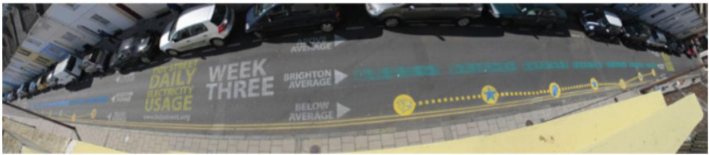  
Source: Yvonne Rogers

# BOX 6.4

# Scamming

Technology is increasingly being  used to deceive  people into parting  with their  personal details, which allows Internet fraudsters to access their bank accounts and draw money from them. Authentic-looking letters, appearing to be sent from eBay, PayPal, and various leading banks, are spammed across the world, ending up in people’s email inboxes with messages such as “During our regular verification of accounts, we couldn’t confirm your information. Please click here to update and verify your information.” Given that many people have an account with one of these corporations, there is a good chance that they will be misled and unwittingly believe what is being asked of them, only to discover a few days later that they are several thousand dollars worse off. Similarly, letters from supposedly super-rich individuals in faraway countries, offering a share of their assets if the email recipient provides them with their bank details, have persistently been spammed worldwide. Such scams are on the rise as fraudsters develop ever more sophisticated ways of putting their victims into an intense emotional state where common sense goes out of the window. Many of the scams seem plausible, meaning the targeted person has no reason to suspect they are being tricked. Internet fraudsters are constantly changing their tactics. While the art of deception is centuries old, the  increasing, pervasive, and often ingenious use of Internet scams to trick people into divulging personal information can have catastrophic effects on society as a whole.

# 6.6  Anthropomorphism

Anthropomorphism is the propensity people have to attribute human qualities to animals and objects. For example, people sometimes talk to their computers as if they were humans, treat their  robot cleaners as if they were their  pets, and  give all manner of cute names to their mobile devices,  routers, and  so on. Advertisers are well  aware of  this phenomenon and often create human-like and animal-like characters out of inanimate objects to promote

their products. For example, breakfast cereals, butter, and fruit drinks have all been transmogrified  into  characters with human qualities  (they move, talk, have  personalities, and show emotions), enticing the viewer to buy them. Children are especially susceptible to this kind of magic, as witnessed by their love of cartoons where all manner of inanimate objects are brought to life with human-like qualities.

The finding that people, especially children, have a propensity to accept and enjoy objects that have been given  human-like qualities has  led many designers  to capitalize on  it, most notably  in the design of virtual agents and interactive dolls, robots, and cuddly  toys. Early commercial products like ActiMates were designed to encourage children to learn by playing with  them. One of  the first—Barney (a dinosaur)—attempted  to motivate play  in children by using human-based speech and movement (Strommen, 1998). The toys were programmed to  react  to  the  child  and  make  comments  while  watching  TV  or  working  together  on  a computer-based task. In particular, Barney was programmed to congratulate the child whenever they produced a right answer and also to react to the content on-screen with appropriate emotions, for instance, cheering at good news and expressing concern at bad news. Interactive  dolls have  also been  designed to  talk, sense,  and understand  the world  around  them, using sensor-based technologies, speech recognition, and various mechanical servos embedded  in  their bodies. For  example,  the  interactive  doll Mealtime  Magic Mia  exhibits  facial expressions, such as blinking, smiling, and making baby cooing  noises in response to what she  is fed. She can make more than 70 sounds and phrases, blow raspberries, and stick her tongue out if she does not like what she has been fed.

Furnishing  technologies  with  personalities  and  other  human-like  attributes  can  make them  more enjoyable and fun to interact with. They can also motivate people to carry out various activities, such as learning. Being addressed in the first person (for instance, “Hello, Rowan! Nice to see you again. Welcome back. Now what were we doing last time? Oh yes, Exercise 5. Let’s start again.”) is more appealing than being addressed in the impersonal third person  (“User  24,  commence  Exercise 5.”),  especially  for  children. It  can  make  them  feel more at ease and reduce their anxiety. Similarly, interacting with screen characters like tutors and wizards can be more engaging than interacting with a dialog box.

# ACTIVITY 6.5

# A Robot or a Cuddly Pet?

Early robot pets, such as Sony’s AIBO, were made of hard materials that made them look shiny and clunky. Another approach has been to make them look and feel more like real pets by covering them up in fur and making them behave in more cute, pet-like ways. Two contrasting examples are presented in Figure 6.14a and Figure 6.14b. Which do you prefer and why?

(Continued)

  
(a)

(b)   
Figure 6.14 Robot pets: (a) Aibo and (b) The Haptic Creature   
  
Source: (a) Jennifer Preece (Author), (b) Courtesy of Steve Yohanan. Photo by Martin Dee

# Comment

Most people like stroking pets, so they may prefer a soft pet robot that they can also stroke, such as the  one  shown  in Figure 6.14b. A  motivation for  making robot pets cuddly is to enhance  the  emotional  experience people receive  through  using  their  sense  of touch. For example, the Haptic Creature on the right is a robot that mimics a pet that might sit in your lap, such as a cat or a rabbit (Yohanan and MacLean, 2008). It is made up of a body,head, and two ears, as well as mechanisms that simulate breathing, a vibrating purr, and the warmth of a living creature. The robot “detects” the way it is touched by means of an array of (roughly 60) touch sensors laid out across its entire body and an accelerometer. When the Haptic Creature is stroked, it responds accordingly, using the ears, breathing, and purring to communicate its emotional state through touch. On the other hand, the sensors are also used by the robot to detect the human’s emotional state through touch. Note how the robot has no eyes, nose, or mouth. Facial expressions are the most common way humans communicate emotional states. Since the Haptic Creature communicates and senses emotional states solely through touch, the face was deliberately left off to prevent people from trying to “read” emotion from it.

A  number  of  commercial physical  robots have  been developed  specifically  to  support care giving for older adults. Early ones were designed to be about 2 feet tall and were made from white plastic with colored parts that represented clothing or hair, often having big eyes and holding a tablet to display messages. There have been various attempts to use them to encourage  social interactions  with  residents in care  homes. The findings have been  mixed, with some residents joining in, others appearing bemused, while others find it a little demeaning. An example social robot is Stevie (see Figure 6.15) that was developed on a rolling base with short, moveable arms and a head that displays cartoon eyes and a mouth. In 2018–19, Stevie was trialed by Conor McGinn at a Retirement Community in Washington DC to learn from  staff and the residents how  it could improve their experiences (Savage, 2022). Stevie was programmed to entertain the residents, for example, calling bingo and leading a singalong. Feedback  from  the staff  and residents  was generally positive.  However, it was also pointed out how limited Stevie was in how it could entertain. While there is no harm in social

robots like Stevie playing an entertaining and motivating role alongside human caregivers, it should always be remembered that they can never match the human touch and warmth that patients need.

Figure 6.15 Stevie the robot entertaining residents while at a retirement home   
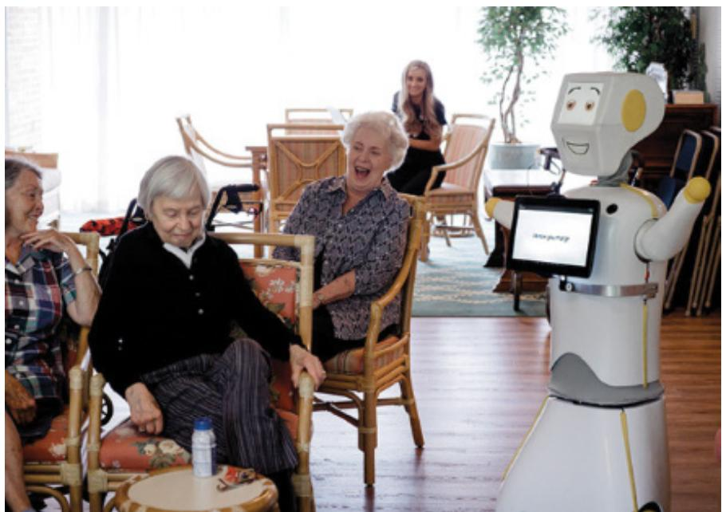  
Source: www.nature.com/articles/d41586-022-00072-z

# In-Depth Activity

This in-depth activity requires you to try one of the emotion recognition apps available and to see  how well it fares in recognizing  different  people’s facial expressions. Download the AffdexMe app  or Age Emotion  Detector for Apple  or Android. Take a  photo  of yourself looking natural and see what emotion it suggests.

1. How many emotions does it recognize?   
2. Try to make a face for each of the following: sadness, anger, joy, fear, disgust, and surprise. After making a face for each, see how well the app detects the emotion you were expressing.   
3. Ask a couple of other people to try it. See whether you can find someone with a beard and ask  them to try, too. Does facial hair make it more difficult  for  the  app  to recognize an emotion?   
4. What other application areas do you think these kinds of apps could be used for besides advertising?   
5. What ethical issues does facial recognition raise? Has the app provided sufficient information as to what it does with the photos taken of people’s faces?   
6. How well would the recognition software work when used in a more natural setting where the user is not making a face for the camera?

# Summary

This chapter  described  the  different  ways that interactive products can  be designed (both deliberately and inadvertently) to make people respond in certain ways. The extent to which people will learn, buy a product online, quit a bad habit, or chat with others depends on the believability of the  interface, how comfortable they feel when using  a product, and/or how much they can  trust it. If the interactive product  is frustrating to use, annoying, or patronizing, people will easily become angry and despondent and often they stop using it. If, on the other hand, the product is pleasurable, is enjoyable to use, and makes them feel comfortable and at ease, then they will continue to use it, make a purchase, return to the website, or continue to learn.

This chapter also described various models of emotion and interaction mechanisms that can be used to elicit positive emotional responses and ways of avoiding negative ones. Furthermore, it described how new technology has been developed to detect emotional states.

# Key Points

•  Emotional aspects of interaction design are concerned with how to facilitate certain states (for example, pleasure) or avoid certain reactions (such as frustration) in user experiences.   
•  Well-designed interfaces can elicit good feelings in people.   
•  Aesthetically pleasing interfaces can be a pleasure to use.   
•  Expressive interfaces can  provide  reassuring feedback to users  as well as be informative an   
•  Badly designed interfaces often make people frustrated, annoyed, or angry.   
Emotional AI and affective computing use AI and sensor technology for detecting people’s emotions by analyzing their facial expressions and conversations.   
•  Emotional technologies can be designed to persuade people to change their behaviors or attitudes.   
•  Anthropomorphism is the attribution of human qualities to objects.   
•  Social robots are being used in a variety of settings, including households and retirement homes to entertain people.

# Further Reading

CALVO, R. A. and PETERS, D. (2014) Positive Computing. MIT. This book discusses how to design technology for well-being to make a happier and healthier world. As the title suggests, it is positive in its outlook. It covers the psychology of well-being, including empathy, mindfulness,  joy, compassion,  and  altruism.  It  also  describes  the  opportunities  and  challenges facing interaction designers who want  to develop technology  that can improve people’s well-being.

HÖÖK, K. (2018) Designing with the Body. MIT. This book proposes that interaction design should  consider the experiential, felt, and aesthetic stance that encompasses the design and use  cycle. The  approach  suggested  by  the author  is  called  soma  design,  where  body  and movements are viewed as very much part of the design process, and where a slow, thoughtful process is promoted that considers fundamental human values. It is argued that adopting this stance can yield better products and create healthier, more sustainable companies.

LEDOUX, J. E. (1998) The Emotional Brain: The Mysterious Underpinnings of Emotional Life. Simon & Schuster. This book explains what causes us to feel fear, love, hate, anger, and joy, and it explores whether we control our emotions versus them controlling us. The book also  covers  the  origins  of  human  emotions  and  explains  that  many  evolved  to  enable  us to survive.

NORMAN, D. (2005) Emotional Design: Why We Love (or Hate) Everyday Things. Basic Books. This book is an easy read while at the same time being thought-provoking. We get to see inside  Dan Norman’s kitchen and learn about  the design aesthetics  of his collection of teapots. The book also includes essays on the emotional aspects of robots, computer games, and a host of other pleasurable interfaces.

TIAN, L., OVIATT, S., and MUSZYNSKI, M. (2022) Applied Affective Computing. Morgan & Claypool. This book provides an overview of the state-of-the-art and emerging themes in affective computing, including existing approaches to affective computing systems and recent machine learning approaches. It also includes a chapter on emotion recognition in the wild. It covers what it takes for a robot to be emotionally aware.

WALTER,  A.  (2020)  A  Book  Apart:  Designing  for  Emotion.  Second  edition.  Zeldman, Jeffrey. This short book is targeted at web designers who want to understand how to design websites that users will enjoy and want to return to. It covers the classic literature on emotions, and it proposes practical approaches to emotional web design. In the second edition, new topics are introduced including privacy, representation, and safety.

