# Chapter 7

# I N T E R F A C E S

7.1  Introduction  
7.2  Interface Types   
7.3  Natural User Interfaces and Beyond   
7.4  Which Interface?

# Objectives

The main goals of the chapter are to accomplish the following:

•  Provide an overview of the diversity of interfaces.   
•  Highlight the main design and research considerations for each of the interfaces.   
•  Discuss what is meant by a natural user interface.   
•  Consider which interface is best for a given application or activity.

# 7.1  Introduction

When  considering how to solve a user  problem, the default  solution that many developers choose to design is an app that can run on a smartphone. Making this easier still are many easy-to-use app developer tools that can be freely downloaded. It is hardly surprising, therefore, to see just how many apps there are in the world. In 2022, Apple had more than 2 million apps in its store while Google had more than 3 million!

Despite the immensity of the smartphone app industry, the web continues to proliferate in offering services, content, resources, and information. A central concern is how to design websites  that  deliver  services,  content, resources,  and  information  across  different  devices and browsers, which takes into  account the  varying form  factors of smart watches, smartphones, laptops, smart TVs, and computer screens. Besides the app and the web, many other kinds  of  interfaces  have  been  developed  and  researched,  including  voice  interfaces,  touch interfaces, gesture interfaces, and multimodal interfaces.

The proliferation of technological developments has encouraged different ways of thinking about interaction design and UX. For example, input can be via mice, touchpads, pens, remote  controllers, joysticks, RFID readers, gestures, and even brain-computer interaction.

Output is equally diverse, appearing in the form of graphical interfaces, speech, mixed realities, augmented realities, tangible interfaces, wearable computing, and more.

The goal of this chapter is to give you an overview of the diversity of interfaces that can be developed for different environments, people, places, and activities. We present a catalog of 22 interface types, starting with command-based and ending with holographic ones. For each interface, we present an  overview and outline the key research and design considerations. Some are only briefly touched upon, while others, which are more established in interaction design, are described in greater depth.

# NOTE

This chapter is not meant to be read from beginning to end; rather, it should be dipped into as needed to find out about a particular type of interface.

# 7.2 Interface Types

Numerous adjectives have been used to describe the different types of interfaces  that have been developed, including graphical, command, speech, multimodal, invisible, ambient, affective, mobile, intelligent, adaptive, smart, tangible, touchless, and natural. Some of the interface  types  are  primarily  concerned  with  a  function  (for  example,  to  be  intelligent, to  be adaptive, to be ambient, or to be smart), while others focus on the interaction style used (such as  command,  graphical,  or  multimedia),  the  input/output  device  used  (for  instance,  penbased,  speech-based,  or  gesture-based),  or  the  platform  being  designed  for  (for  example, tablet,  mobile,  PC,  or  wearable).  Some  apps  and  systems  use  increasingly  sophisticated machine learning algorithms that are intended to recognize faces, objects, and the like. Rather than cover every possible type that has been developed or described, we have chosen to select the main types of interfaces that have emerged over the past 45 years. The interface types are loosely ordered in terms of when they were developed. (See the following list for the complete set.) It should be noted, however, that this classification is for convenience of reference. The interface entries are not mutually exclusive since some products can appear in two or more categories. For example, a smartphone can be considered to be mobile, touch, or wearable.

The types of interfaces covered in this chapter include the following:

? Command   
Graphical   
Multimedia   
Virtual reality   
Web   
Mobile   
. Appliance   
• Voice   
Pen   
? Touch

• Touchless   
. Haptic   
. Multimodal   
• Shareable   
• Tangible   
. Augmented reality   
• Wearables   
. Robots and drones   
• Brain-computer   
. Smart   
. Shape-changing   
. Holographic

Here is a selection of classic HCI videos that demonstrate research into pioneering and future interfaces:

The  Sketchpad: Ivan Sutherland (1963) describes  the  first  interactive  graphical  interface: youtu.be/6orsmFndx_o

The  Dynabook: Alan Kaye (1968) describes  a  thin, light “children’s  computer” with a flatscreen display, drawing  stylus,  keyboard,  and  wireless connectivity:  www.youtube.com/ watch?v=r36NNGzNvjo

The  Mother of All  Demos: Douglas  Engelbart  (1968) describes  the  first  WIMP: youtu.be/yJDv-zdhzMY

Put  that there  (1979):  MIT  demonstrates the  first  speech and  gesture  interface: youtu.be/RyBEUyEtxQo

Unveiling  the  genius of multitouch interface  design:  Jeff Han  gives  a  TED  talk (2007): youtu.be/ac0E6deG4AU

Intel’s Future Technology Vision (2012): Futuristic video presenting a number of scenarios of technology use intended to improve people’s lives: youtu.be/g_cauM3kccI

CMU’s  Future Interfaces Group: The  Next Phase  of Computer-Human Interaction (2018): Introduces future interface prototypes that can make our lives more efficient and informed: www.youtube.com/watch?v=J_oPtEjiVuA

# 7.2.1  Command-Line Interfaces

Early interactive interfaces required the user to type in commands that were typically abbreviations (for example, ls) at the prompt symbol appearing on the computer display, to which the system responded (see Figure 7.1). Another way of issuing commands is by pressing certain  combinations  of keys  (such  as $\mathrm { C t r l } { + } \mathrm { V } _ { \cdot }$ ). Some  commands  are  also  a fixed  part  of the keyboard, such as delete, enter, and escape, while other function keys can be programmed by the user as specific commands (for instance, F11 commanding print action).

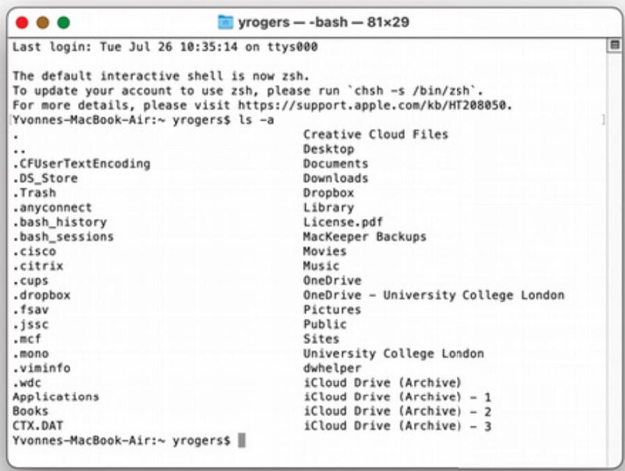  
Figure 7.1  A Unix terminal display showing directories listed alphabetically for the command ls -a Source: Yvonne Rogers

Command-line  interfaces  have  been  largely  superseded  by  graphical  interfaces  that incorporated commands such as menus, icons, keyboard shortcuts, and pop-up/predictable text commands  as part of an application. Where command-line interfaces continue to have an advantage is when people find them easier and faster to use than equivalent menu-based systems (Raskin, 2000). People also prefer command-line  interfaces for performing certain operations as part of a complex software package, such as for CAD environments (such as Rhino3D and AutoCAD), to allow expert designers to interact rapidly and precisely with the software. They also provide scripting for batch operations, and they are being increasingly used on the web, where the search bar acts as a general-purpose command-line facility, for example, www.yubnub.org.

System  administrators, programmers,  and power users often  find that  it  is much  more efficient and quicker to use command languages such as Microsoft’s PowerShell. For example, it is  much  easier to  delete  10,000  files in  one go  by  using  one  command rather  than scrolling through that number of files and highlighting those that need to be deleted.

# Research and Design Considerations

In the 1980s, much research investigated ways of optimizing command interfaces. The form of the commands (including use of abbreviations, full names, and familiar names), syntax (such as how best to combine different commands), and organization (for instance, how to structure options) are examples of some of the main areas that have been investigated (Shneiderman, 1998). A  further  concern  was  which command  names  would be the  easiest  to remember. A number of variables were tested, including how familiar users were with the chosen names. Findings from a number of studies, however, were inconclusive; some found specific names were better remembered than general ones (Barnard et al., 1982), others showed that names selected by users themselves were preferable (Ledgard et al., 1981; Scapin, 1981), while yet others demonstrated that high-frequency words were better remembered than low-frequency ones (Gunther et al., 1986).

The most relevant design principle is consistency  (see Chapter 1, “What Is Interaction Design?”). Therefore, the method used for labeling/naming the commands should be chosen to be as consistent as possible; for example, always use the first letters of the operation when using abbreviations.

# 7.2.2  Graphical User Interfaces

The Xerox Star interface (described in Chapter 3, “Conceptualizing Interaction”) led to the birth of the graphical user interface (GUI), opening up new possibilities for users to interact with a system and for information to be presented and represented within a graphical interface.  Specifically,  new  ways  of  visually  designing  the  interface  became  possible,  which included  the use  of color, typography,  and imagery (Mullet  and  Sano, 1995). The original GUI was called a WIMP (windows, icons, menus, pointer) and consisted of the following:

Windows: Sections of the screen that can be scrolled, stretched, overlapped, opened, closed, and moved using a mouse   
• Icons:  Pictograms  that  represent  applications,  objects,  commands,  and  tools  that  are opened or activated when clicked on   
. Menus: Lists of options that can be scrolled through and selected in the way a menu is used in a restaurant   
. Pointing device: A mouse controlling the cursor as a point of entry to the windows, menus, and icons on the screen

The first generation of WIMP interfaces were primarily boxy in design; user interaction took place through a combination of windows, scrollbars, check boxes, panels, palettes, and dialog boxes that appeared on the screen in various forms (see Figure 7.2). Developers were largely constrained by the set of widgets available to them, of which the dialog box was most

prominent.  (A  widget  is  a  standardized  display  representation  of a  control,  like  a  button or scrollbar, that can be manipulated by  the user.) Nowadays, GUIs have been adapted for mobile and touchscreens. Instead of using a mouse and keyboard as input, the default action for most users is to swipe and touch using a single finger when browsing and interacting with digital content. (For more on this subject, see sections 7.2.6 and 7.2.10.)

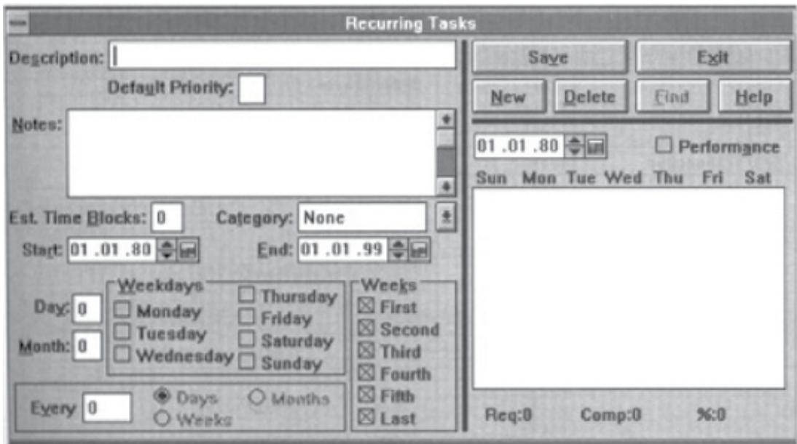  
Figure 7.2  The boxy look of the first generation of GUIs

The basic building blocks of the WIMP are still part of the modern GUI used as part of a display, but they have evolved into a number of different forms and types. For example, there are now many different types of icons and menus, including audio icons and audio menus, 3D animated icons, and even tiny icon-based menus that can fit onto a smartwatch screen. Apple has also introduced the “complication” display, which shows miniature symbols and snippets of information on the watch face, intended for the wearer to be able to view each time they raise their wrist (see Figure 7.3). The GUI elements include “circulars” and “inlines” that are used to show small snippets of information, date, time, current schedule, notifications, etc.

The basic building block on the desktop and laptop is the window in which apps, browsers, dialog boxes, interactive forms, feedback/error messages, etc., are presented. Other kinds of graphical elements that have been incorporated into the GUI include toolbars and docks (a  row or column  of available  applications  and icons  of  other  objects  such  as open  files) and rollovers (where text labels appear next to an icon or part of the screen as the cursor is rolled over it). Next, we give an overview of the design considerations for windows, menus, and icons.

Figure 7.3  An Apple watchOS complication display that includes the features “circulars” (three kinds shown in the bottom line) and “inlines” (shown in the middle and the upper right hand corner of the display)   
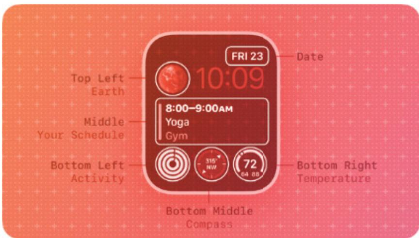  
Source: developer.apple.com/design/human-interface-guidelines/components/system-experiences/ complications

# Window Design

Windows were invented to overcome the physical constraints of a computer display, enabling more information to be viewed and tasks to be performed on the same screen. Multiple windows  can  be opened at  any  one time,  for example, web  browsers, word processing  documents, photos, and slideshows, enabling  the user  to switch between  them when needing to look  at  or  work  on  different  documents,  files,  and  apps. They  can  also  enable  multiple instances of one app to be opened, such as when using a web browser.

Scrolling bars within windows also enable more information to be viewed than is possible on  one screen. Scrollbars are placed vertically and horizontally in windows to enable upward, downward, and  sideway  movements  through  a document  and  can  be controlled using a touchpad, mouse, or arrow keys. Touch interfaces enable users to scroll content simply by swiping the screen to the left or right or up or down.

One of the problems of having multiple windows open is that it can be difficult to find specific ones. Various techniques have been developed to help users locate a particular window, a common one being to provide a list as part of an app menu. macOS also provides a function that shrinks all windows that are open for a given application so that they can be seen side by side on one screen. This provides a visual preview. Moving the cursor over each one brings up its name, e.g., the subject header of an email. This technique enables people to see at a glance what they have on their desktop. It allows them easily to select one to bring it forward. Another option is to display all of the windows open for a particular application, for example, Microsoft Word. Web browsers, like Google and Firefox, also show a selection of favicons of the top sites visited (see Figure 7.4).

# Google

Home

（6）Feed

All Documents

Royal Autom..

LogInIntera..

Interactive In..

Online Banking

Interaction D..

HUMAN INTE...

  
Figure 7.4  Part of the home page for my current Google browser showing favicons of top sites visited below the search bar

Add shortcut

Source: Yvonne Rogers

A  particular kind of window that is  commonly used  is the dialog box. Confirmations, error messages, checklists, and forms are presented through dialog boxes. Information in the dialog boxes is often designed to guide user interaction, with the user following the sequence of options provided. Examples include a sequenced series of forms (such as wizards) presenting the necessary and optional choices that need to be filled in when choosing a PowerPoint presentation or an Excel spreadsheet. A common problem with this style of interaction is that there is a tendency to cram too much information or data entry fields into one box, making the interface confusing, crowded, and difficult to read (Mullet and Sano, 1995).

# BOX 7.1

# The Joys of Filling In Forms Online

For many of us, shopping online is generally an enjoyable experience. For example, choosing a book on Amazon or flowers from Interflora can be done at our leisure and convenience.The part that we don’t enjoy, however, is filling in the online form to give the company the necessary details to pay for the selected items. This can often be a frustrating and time-consuming experience,  especially as there  is much variability  between  sites. It typically  requires creating an account and a new password although some sites do have a guest checkout enabled. However, if the site has a record of your email address in its database, it won’t allow you to then use the guest option. If you have forgotten your password, you need to reset it, and this requires switching from the form to your email account. Once past this hurdle, different kinds

of interactive forms pop up for you to enter your mailing address and credit card details. The form may provide the option of finding your address by allowing you to enter a postal or ZIP code. It may also have asterisks that denote fields that must be filled in.

Having so much inconsistency across online shopping sites can be frustrating. It is easy to overlook or miss a box that needs to be filled in, and after submitting the page, an error message may come back from the system saying it is incomplete. This may require having to enter sensitive information again, as it will have been removed in the  data processing stage (for example, the person’s credit card number and the three- or four-digit security code).

To add to the frustration, many online forms often accept only fixed data formats, meaning that, for some people whose information does not fit within its constraints, they are unable to complete the form. For example, one kind of form will accept only a certain type of mailing address format. The boxes are provided for address line 1 and address  line 2, providing no extra lines for addresses that have more than two lines; a line for the town/city; and a line for the ZIP code (if the site is based in the United States) or other postal code (if based in another country). The format for the codes is different, making it difficult for non-U.S. residents (and U.S. residents for other country sites) to fill in this part.

Another gripe about online registration forms is the country of residence box that opens up as a  never-ending menu, listing  all  of the  countries  in the  world  in alphabetical order. Instead of typing in the country in which they reside, people are required to select the  one they are from, which is fine if you happen to live in Australia or Austria but not if you live in Venezuela or Zambia (see Figure 7.5).

Figure 7.5  A scrolling menu of country names   
  
Source: www.jollyflorist.com

(Continued)

This is an example of where the design principle of recognition over recall (see Chapter 4, “Cognitive Aspects”) does not apply and where the converse is true. A better design is to have a predictive text option, where someone needs only to type in the first one or two letters of their country to cause a narrowed-down list of choices to appear from which they can select within the interface. Or,  one smart  option is for  the form to preselect the  user’s country of origin by using information shared from a person’s computer or stored in the cloud. Automating the filling in of online forms (through providing prestored information, for example, their address and credit card details) can obviously help reduce usability problems—provided they are OK with this.

# ACTIVITY 7.1

Go to the interflora.co.uk website, and hover over the international menu option at the top to reveal a list of 16 countries that flowers can  be sent to from the  United Kingdom. How are these countries ordered? Is it an improvement over the scrolling pop-up menu shown in Figure 7.5? Then click the option View All Countries and look at how they have been laid out.

# Comment

Earlier versions of the full list of countries to which flowers could be sent by interflora.co.uk listed eight countries at the top, starting with the United Kingdom and then the United States, France, Germany, Italy, Switzerland, Austria, and Spain. This was followed by the remaining set of countries listed in alphabetical order. The reason for having this particular ordering is likely to have been because the top eight are the countries that have the most customers, with the UK residents using the service the most. At the time of writing, the UK’s current version showed the “most popular international destinations” with a national flag for each country beside them in a table format, followed by a listing of all countries in alphabetical order using a row of letters and shaded blocks across the page (see Figure 7.6). Do you think this is an improvement over the use of a single scrolling list of country names shown in the Jollyflorist website in Figure 7.5? Does it make searching for a country quicker?

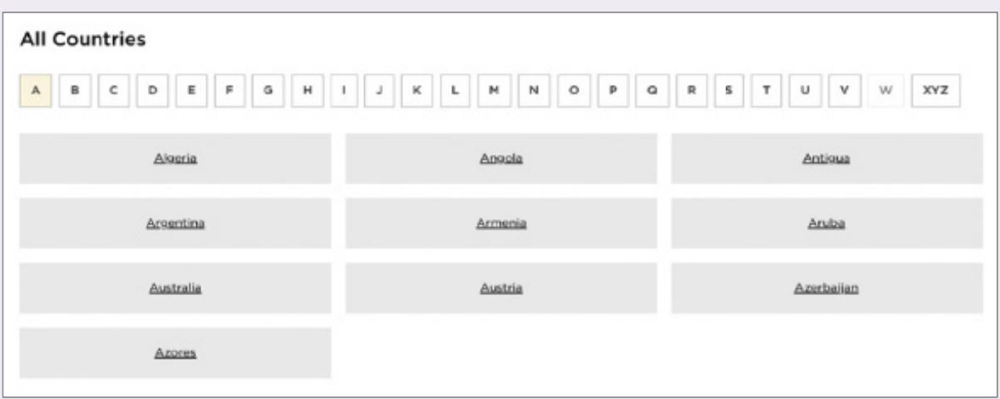  
Figure 7.6  An excerpt of the listing of countries in shaded blocks in alphabetical order below a row of letters of the alphabet

Source: www.interflora.co.uk

# Research and Design Considerations

A key research concern is window management—finding ways of enabling people to move fluidly between different windows (and displays) and to be able to switch their attention rapidly between windows to find the information they need or to work on the document/task within each window without getting distracted. Early research of how people use windows and multiple displays showed that window activation time (that is, the time a window is open and for which the user interacts with it) is relatively short—an average of 20 seconds—suggesting that people switch frequently between different windows and applications (Hutchings et al., 2004).

Keyboard shortcuts and taskbars are often used for switching between windows.Another technique is the use of tabs that appear at the top of the web browser that show the name and logo of the web pages that have been visited. This mechanism enables people to rapidly scan and switch among the web pages they have visited. However, the tabs can quickly multiply if they visit a number of sites. To accommodate new ones, the web browser reduces the size of the tabs by shortening the information that appears on each. The downside of doing this, however, is it can make it more difficult to read and recognize web pages when looking at the smaller tabs. It is possible to reverse this shrinking by removing unwanted tabs by clicking the delete icon for each one. This has the effect of making more space available for the remaining tabs.

(Continued)

Some browsers now  offer  a  menu of open tabs arranged vertically that can  be more easily browsed.

There  are  multiple ways that an online form can  be designed to obtain details  from someone. It is not surprising, therefore, that there are so many different types that are in use. Design guidelines are available to help decide which format and widgets are best to use (e.g., Silver, 2018). Another option is to automate form completion by asking people to store their personal details locally on their browser or in a company’s database, requiring them only to enter security information. However, many people are becoming leery of storing their personal data in this way—fearful  because  of the  number of data breaches that are  often reported in the news.

# Menu Design

Interface menus are typically ordered across the top row or down the side of a screen using category headers as part of a menu bar. The contents of the menus are also for the large part invisible, dropping down only when the header is selected or rolled over with a mouse. The various options under each menu are typically ordered from top to bottom in terms of most frequently used options and grouped in terms of their similarity with one another; for example, all formatting commands are placed together.

There are numerous menu interface styles, including flat lists, drop-down, pop-up, contextual, collapsible, mega, flyout, and expanding ones, such as cascading menus. Flat menus are good at displaying a small number of options at the same time or where the size of the display is small, for example on smartphones, cameras, and smartwatches. Expanding menus enable more options to be shown on a single screen than is possible with a single flat menu list. This makes navigation more flexible, allowing for the selection of options to be done in the same window. An example is  the cascading menu, which provides secondary  and even tertiary menus  to appear  alongside  the  primary  active  drop-down  menu, enabling  further related options to be selected, such as when selecting track changes from the tools menu leads to a secondary menu of three options by which to track changes in a Word document. The downside of using expanding menus, however, is that they require precise control. People can often end up making errors, namely, overshooting or selecting the wrong options. In particular, cascading menus require them to move their cursor over the menu item, while holding the mouse or touchpad down, and then to move their cursor over to the next menu list when the cascading menu appears and select the next desired option. This can result in someone underor overshooting a menu option, or sometimes accidentally closing the entire menu. Another example of an expandable menu is a mega menu, in which  many options can  be displayed using  a  2D drop-down  layout  (see  Figure  7.7). This  type  of menu  is  popular  with  online shopping sites, where lots of items can be viewed at a glance on the same screen without the need to scroll. Hovering, tapping, or clicking is used to reveal more details for a selected item.

Figure 7.7  A megamenu   
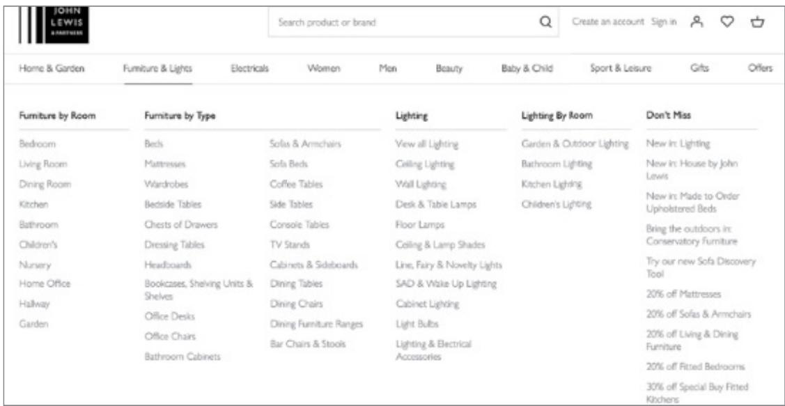  
Source: www.johnlewis.com

Collapsible  menus  provide  an  alternative  approach  to  expanding  menus  in  that they allow further options to be made visible by selecting a header. The headings appear adjacent to each other, providing the user with an overview of the content available (see Figure 7.8). This reduces the amount of scrolling needed. Contextual menus provide access to often-used commands associated with a particular item, for example, an icon. They provide appropriate commands that make sense in the context of a current task. They appear when the user rightclicks in Windows or presses the Control key while clicking an interface element in macOS. For example, right-clicking or clicking a photo on a website together with holding down the Ctrl key results in a small set of relevant menu options appearing in an overlapping window, such as open it in a new window, save it, or copy it. The advantage of contextual menus is that they provide a limited number of options associated with an interface element, overcoming some of the navigation problems associated with cascading and expanding menus.

Figure 7.8  A template for a collapsible menu   
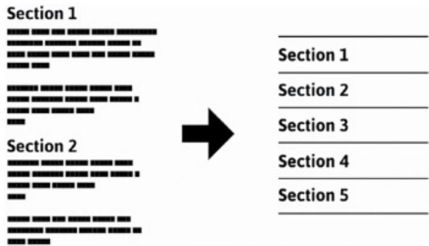  
Source: inclusive-components.design/collapsible-sections. Reproduced with permission of Smashing Magazine

# ACTIVITY 7.2

Open an application that you use frequently (for instance, a word processor, email client, or web browser) on a desktop PC, laptop, or tablet and look at the menu header names (but do not  open them just yet). For each menu header—File, Edit, Tools, and so on—write down what options you think are listed under each. Then look at the contents under each header. How many options were you able to remember, and how  many did you  put in the wrong category? Now try to select the correct menu header for the following options (assuming that they are included in the application): Replace, Save, Spelling, and Sort. Did you select the correct header each time, or did you have to browse through a number of them?

# Comment

Popular everyday applications, like word processors, have grown enormously in terms of the functions they offer. Microsoft Word, for example, currently has 10 menu headers and numerous toolbars. Under each menu header there are on average 15 options, some of which are hidden under subheadings and appear only when they are rolled over with the mouse. Likewise, for each toolbar, there is a set of tools available, be it for  Drawing, Formatting, web, Table, or Borders. Remembering the location of frequently used commands like Spelling and Replace is often achieved by remembering their spatial location. For infrequently used commands, like sorting a list of references into alphabetical order, users can spend time flicking through the menus to find the command Sort. It is difficult to remember that the command Sort should be under the Table heading, since what it is doing is not a table operation, but a tool to organize a section  of a  document. It would be more intuitive  if the command was under the Tool header along with similar tools like Spelling. What this example illustrates is just how difficult it can be to group menu options into clearly defined and obvious categories. Some fit into several  categories, while it can  be difficult to group others. The placement of options in menus can also change between different versions of an application as more functions are added.

# Research and Design Considerations

An important design consideration is to decide which terms to use for menu options. Short phrases like bring all to front can be more informative than single words like front. However, the space for listing menu items is often restricted, such that menu names need to be short. They also need to be distinguishable, that is, not easily confused with one another so that the user does not choose the wrong one by mistake. Operations such as Quit and Save should also be clearly separated to avoid the accidental loss of work.

The choice of which type of menu to use will often be determined by the application and type of device for which it is being designed. Which is best will also depend on the number of

menu options and the size of the display available in which to present them. Flat menus are best for displaying a small  number of options at one  time, while expanding and collapsible menus are good for showing a large number of options, such as those  available in file and document creation/editing applications. Usability testing comparing drop-down menus with mega menus has shown the latter to be more effective and easier to navigate. The main reason is that megamenus enable people to readily scan many items at a glance on the same page and in doing so find what they are looking for (Nielsen and Li, 2017).

# Icon Design

The appearance of icons in an interface came about following the Xerox Star project. They were used to represent objects as part of the desktop metaphor, namely, folders, documents, trashcans, inboxes, and outboxes. The assumption behind using icons instead of text labels is that they are easier to learn and remember, especially for nonexpert computer users. They can also be designed to be compact and variably positioned on a screen.

Icons have  become a  pervasive  feature of  the interface. They  now  populate every  app and operating system and are used for all manner of functions besides representing desktop objects. These include depicting tools (for example, Paint 3D), status (such as, Wi-Fi strength), categories of apps (for instance, health or personal finance), and a diversity of abstract operations  (including  cut, paste,  next, accept, and  change). They  have  also gone through  many changes in their look and feel—black and white, color, shadowing, photorealistic images, 3D rendering, and animation have all been used.

Whereas early icon  designers  were constrained by  the graphical  display technology  of the  day, current  interface  developers  have  much  more  flexibility. For  example, the use  of anti-aliasing techniques enables curves and nonrectilinear lines to be drawn, enabling more photo-illustrative styles to be developed (anti-aliasing means adding pixels around a jagged border of an object to smooth its outline visually). App icons are often designed to be both visually attractive and informative. The goal is to make them inviting, emotionally appealing, memorable, and distinctive.

Different graphical  genres have been used to group and identify different categories of icons. Figure 7.9 shows how colorful photorealistic images were used in the original Apple Aqua set from  2000, each slanting slightly to the left, for the category of user applications (such as email), whereas monochrome straight on and simple images were used for the class of utility applications (for instance, printer setup). The former has a fun feel to them, whereas the  latter  has  a more  serious  look  about  them. A  number  of other  styles  have since  been developed  that  have  a  distinct look  and  feel,  for example,  the  use  of  shadows,  simplified shapes, pop-art elements, and technocolors.

Icons can be designed to represent objects and operations in the interface using concrete objects  and/or abstract  symbols. The mapping  between  the icon  and  underlying object  or operation to which it refers can be similar (such as a picture of a file to represent the object file), analogical (for instance, a picture of a pair of scissors to represent cut), or arbitrary (for example, the use of an  X to represent  delete). The most  effective icons  are generally those that are from the first and second categories since they have a direct mapping between what

is being  represented  and how  it is represented. Many operations in an interface, however, are of actions to be performed on objects, making it more difficult  to represent  them using  direct mapping. Instead, a well-known technique is to use a combination of objects and symbols that capture the salient part of an action by using analogy, association, or convention (Rogers, 1989). For example, using a picture of a pair of scissors to represent cut in a word-processing application provides a sufficient clue as long as the person understands the convention of cut for deleting text.

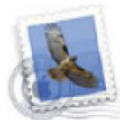

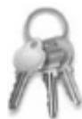

  
Figure 7.9  Two styles of Apple icons used to represent different kinds of functions

Another approach that many smartphone designers use is flat 2D icons. These are simple and use strong colors and pictograms or symbols. The effect is to make them easily recognizable and distinctive. Examples shown in Figure 7.10a include the white ghost on a  yellow background (Snapchat), a white line  bubble with  a solid white phone handset  in a  speech bubble on a lime-green background (WhatsApp), and the sun next to a cloud (weather).

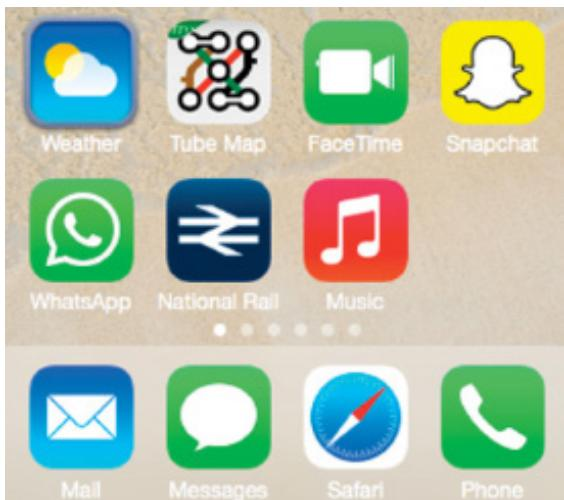  
(a)

(b)   
Figure 7.10 2D icons designed for (a) a smartphone and (b) a smartwatch   
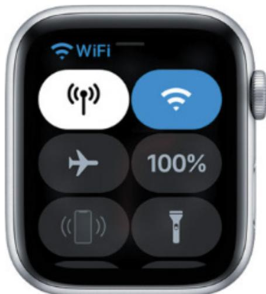  
Source: (a) Yvonne Rogers (b) support.apple.com/en-ca/HT205550

Icons that appear on toolbars or palettes as part of an application or presented on small device displays (such as digital cameras or smartwatches) have much less screen real estate available. Because of this, they have been designed to be simple, emphasizing the outline form of an object or symbol and using only grayscale or one or two colors (see Figure 7.10b). They

tend to convey the status, tool, or action using a concrete object (for example, the airplane symbol signaling whether the airplane mode is on or off) and abstract symbols (such as three waves that light up from none to all to convey the strength/power of the area’s Wi-Fi).

# ACTIVITY 7.3

Sketch simple icons to represent the following operations to appear on a digital camera screen:

•  Turn image 90-degrees sideways.   
•  Crop the image.   
•  Auto-enhance the image.

Show them to someone  else,  tell them that they are  icons  for  a  new  digital  camera intended to be really simple to use, and see whether they can understand what each represents.

# Comment

Figure 7.11 shows the basic Edit Photo icons on an iPhone that appear at the bottom of the screen when the edit function is selected. The box with extended lines and two arrows is the icon for cropping an image; the  three overlapping  translucent circles  represents “different lenses” that can be used; the wand above it means “auto-enhance”; the circle with plus and minus signs refers to exposure levels while the circle to the right of it with the simplified ying and yang symbol refers to brilliance levels.

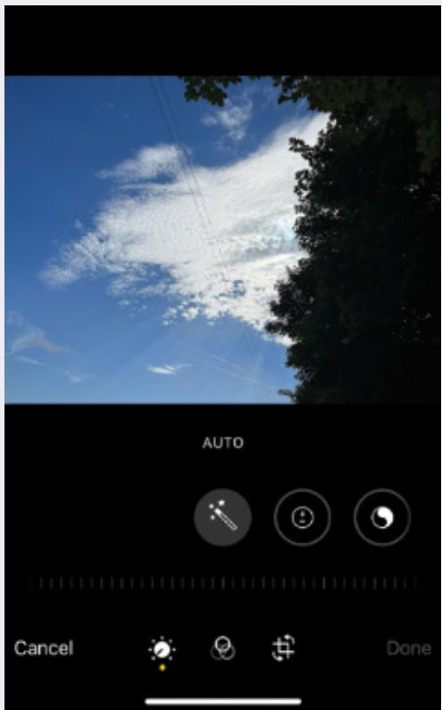  
Figure 7.11 The  two rows of basic Edit Photo icons  that appear at the bottom of an iPhone display

Source: Yvonne Rogers

# Research and Design Considerations

There are many icon libraries available that developers can download for free (for instance, thenounproject.com or fontawesome.com). Various  online tutorials  and  books  on how  to design icons are also available (see Hicks, 2012) together with sets of proprietary guidelines and  style  guides. For  example, Apple  provides its  developers with style  guides, explaining why certain designs are preferable to others and how to design icon sets. Style guides are also covered  in more depth in Chapter  13, “Interaction Design in Practice.” On its developers’ website  (developer.apple.com), advice is given  on how  and why  certain graphical elements should be used when developing different types of icon. Among the various guidelines, it suggests that different categories of application (for example, Business, Utilities, Entertainment, and so on) should be represented by a different genre, and it recommends displaying a tool to communicate the nature of a task, such as a magnifying glass for searching or a camera for a photo editing tool. Android and Microsoft also provide extensive guidance and step-by-step procedures on how to design icons for its applications on its website.

To help disambiguate the meaning of icons, text labels can be used under, above, or to the side of their icons. This method is effective for toolbars that have small icon sets, such as those appearing as part of a web browser, but it is not as good for applications that have large icon sets, for example, photo editing or word processing, since the screen can get cluttered, making it sometimes harder and longer to find an icon. To prevent text/icon clutter on the interface, a hover function can be used with a desktop/laptop interface where a text label appears adjacent to or above an icon after the cursor has been held over it for a second and it is kept there. This method allows identifying information to be temporarily displayed when needed.

# 7.2.3  Multimedia

Multimedia, as the name implies, combines different media within a single interface, namely, graphics, text, video, sound, and animation, and links them  together with various forms of interactivity. Clicking  a link in an image or text triggers another media element such as an animation or a video. The assumption is that a combination of media and interactivity can provide better ways of presenting information than can a single media, for example, just text or video alone. Another distinctive feature of multimedia is its ability to facilitate rapid access to  multiple  representations  of  information.  Many  multimedia  encyclopedias  and  digital libraries have been designed based on this multiplicity principle, providing an assortment of audio and visual materials on a given topic. For example, when looking to find information about the heart, a typical multimedia-based encyclopedia will provide the following:

? One or two video clips of a real live heart pumping and possibly a heart transplant operation   
. Audio recordings of the heart beating and perhaps an eminent physician talking about the cause of heart disease   
Static diagrams and animations of the circulatory system, sometimes with narration   
Text with links in it describing the structure and function of the heart

Hands-on  interactive  simulations  have  also  been  incorporated  as  part  of  multimedia learning environments. An early example was the Cardiac Tutor, developed to teach students about cardiac resuscitation. It required students to save patients by selecting the correct set of procedures  in the correct  order from  various options displayed  on the computer  screen (Eliot  and Woolf, 1994). Other  kinds  of multimedia  narratives and  games have  also been developed  to support  discovery learning by  encouraging children to explore different parts of the display by  noticing a hotspot or other kind of link. For example, KidsDiscover.com/ apps  has  many tablet  apps  that use  a  combination  of  animations,  photos,  interactive  3D models, and audio to teach kids about  science and social studies topics. Using swiping and touching, kids can reveal, scroll through, select audio narration, and watch video tours. Figure 7.12, for example, has a “slide” mechanism as part of a tablet interface that enables the child to do a side-by-side comparison  of what Roman ruins looks like now and in ancient Roman times.

Figure 7.12 An example of a multimedia learning app designed for tablets   
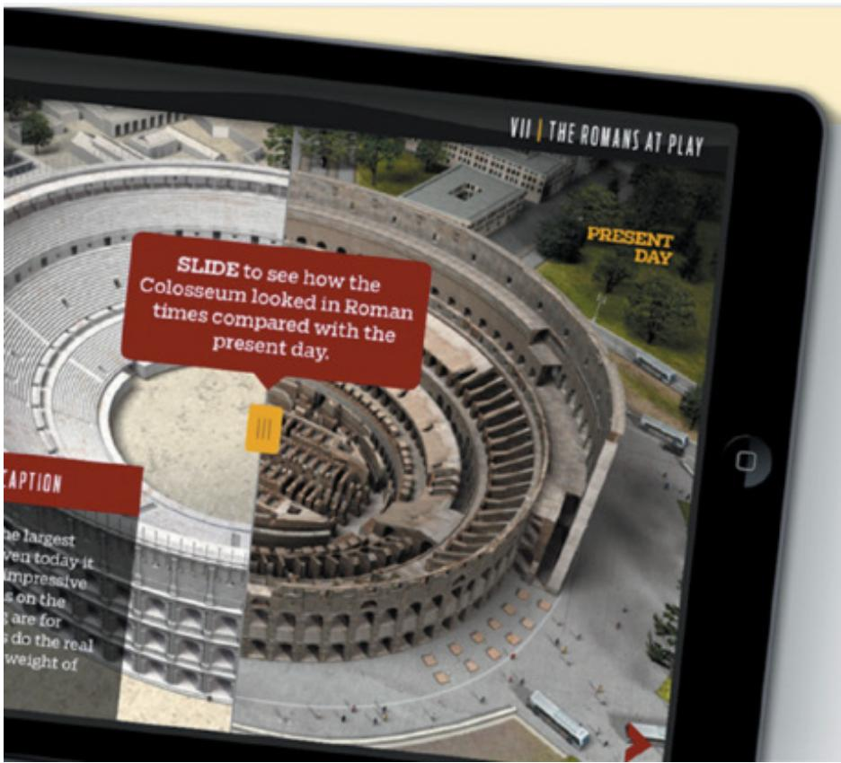  
Source: KidsDiscover app “Roman Empire for iPad”

Multimedia has largely been developed for training, educational, and entertainment purposes.  But  to  what  extent  is  the  assumption  that  learning  (such  as  reading  and  scientific inquiry skills)  and playing can be enhanced  through interacting with engaging multimedia interfaces true? What actually happens when people are given unlimited, easy access to multiple media and simulations? Do they systematically switch between the various media and

“read” all of the  multiple representations on a particular subject, or are they more selective in what they look at and listen to? Early research showed how multimedia can make learning online  more  engaging and  enjoyable  (Scaife  and Rogers,  1996). However, it  was  also found that there is a tendency to click videos and animations rather than read the text (see the “Research and Design Considerations” box below). Despite this, a recent review reported how multimedia is still an integral  part of teaching practice; a variety of multimedia tools, both stand-alone and web-based, are still commonly used (Abdulrahaman et al., 2020).

# ACTIVITY 7.4

Watch  this early video  of Don Norman appearing  in his first  multimedia CD-ROM book (1994), where he pops up every now and again in boxes or at the side of the page to illustrate the points being discussed on that page: vimeo.com/18687931.

How  do you  think  students used this kind of interactive  e-textbook?  Would  you do the same?

# Comment

Anyone who  has interacted with educational multimedia knows just how tempting it is to play the  video  clips  and  animations while  skimming through  accompanying text or static diagrams. The former is dynamic, easy, and enjoyable to watch, while the latter is viewed as static and difficult to read from the screen. In an evaluation of the original Voyager’s “First Person: Donald Norman, Defending Human Attributes in the Age of the Machine,” students consistently admitted to ignoring the text on the interface in search of clickable icons of the author, which when selected would present an animated video of him explaining some aspect of design (Rogers and  Aldrich, 1996). Given the  choice to explore  multimedia material in numerous ways, ironically, people tend to be highly selective  as to what they actually pay attention to, adopting a channel-hopping mode of interaction. While enabling people to select the information they want to view or features to explore for themselves, there is the danger that multimedia environments may in fact promote fragmented interactions where only part of the media is ever viewed.

Hence, online multimedia material may be good for supporting certain kinds of activities, such as browsing, but less optimal for others, for instance reading at length about a topic. One way to encourage more systematic and extensive interactions (when it is considered important for the activity at hand) is to require certain activities to be completed that entail the reading of accompanying text, before the person is allowed to move on to the next level or task.

# Research and Design Considerations

A  core research question is how  to encourage  someone  to interact with all aspects  of a multimedia app, especially given the  tendency to select videos to watch rather than text to read. One technique is to provide a diversity of hands-on interactivities and simulations that

require them to complete a task, solve a problem, or explore different aspects of a topic that involves reading  some accompanying text.  Specific  examples include  electronic notebooks that are integrated as part of the interface, where students can  type in their  own material; multiple-choice quizzes  that provide  feedback about  how well they have done;  interactive puzzles where they have to select and position different pieces in the right combination; and simulation-type games where they have to follow a set of procedures to achieve some goal for a given scenario. Another approach is to employ dynalinking, where information depicted in one window explicitly changes in relation to what happens in another (Scaife and Rogers, 1996). This can help people keep track of multiple representations and see the  relationship between them.

Specific guidelines are available that recommend how best to combine multiple media in relation to different kinds of tasks, for example, when to use audio with graphics, sound with animations, and so on, for different learning tasks. As a rule of thumb, audio is good for stimulating the imagination, movies for depicting action, text for conveying details, and diagrams for conveying ideas. From such generalizations, it is possible to devise a presentation strategy for online learning. This could be along the lines of the following:

1. Stimulate the imagination through playing an audio clip.   
2. Present an idea in diagrammatic form.   
3. Display further details about the concept through hypertext.

# 7.2.4  Virtual Reality

Virtual reality (VR) has been around since the 1970s when researchers first began developing computer-generated  graphical  simulations to create “the illusion of  participation in  a synthetic environment rather than external observation of such an environment” (Gigante, 1993, p. 3). The goal was to create user experiences that feel virtually real when interacting with an artificial  environment. Images are displayed stereoscopically to the users—most commonly through VR headsets—and  objects within the field of  vision can  be interacted with via an input device like a joystick.

The 3D graphics  can  be projected  onto Cave Automatic Virtual  Environment (CAVE) floor  and wall  surfaces,  desktops, 3D  TV,  headsets,  or  large  shared  displays,  for instance, IMAX screens. One of the main attractions of VR is that it can provide opportunities for new kinds of immersive experiences, enabling people to interact with digital objects and navigate in 3D space in ways  not possible in the physical world or a 2D graphical interface. Besides looking at and navigating through a 360-degree visual landscape, auditory and haptic feedback  can  be added  to  make  the  experience  feel  even  more  immersive.  The  resulting  user experience can be highly engaging; it can feel as if one really is flying around a virtual world. People can become completely absorbed by the experience. The sense of presence can make the virtual setting seem convincing. Presence, in this case, means “a state of consciousness, the (psychological) sense of being in the virtual environment” (Slater and Wilbur, 1997, p. 605), where someone behaves in a similar way to how they would if at an equivalent real event.

VR simulations of the world can be constructed to have a higher level of fidelity  with the  objects  they  represent  compared  to  other  forms  of  graphical  interfaces,  for  example, multimedia. The illusion afforded by the technology can make virtual objects appear to be

life-like and behave according to the laws of physics. For example, landing and take-off terrains developed for flight simulators can appear to be quite realistic. Moreover, it is assumed that learning and training applications can be improved through having a greater fidelity to the represented world.

Another distinguishing feature of VR is the different viewpoints it can offer. Players can have a first-person perspective, where their view of the game or environment is through their own eyes, or a third-person perspective, where they see the world through an avatar visually represented on  the screen. An  example  of a  first-person perspective  is  that experienced  in first-person shooter  games  such as DOOM,  where the player  moves through  the environment without seeing a representation of themselves. It requires the user to imagine what they might look like and decide how best to move around. A third-person perspective enables the player to see the virtual world above and behind their avatar. A person controls their avatar’s interactions with the environment by controlling their own movements, for example, jumping, running, or crouching. Avatars can be represented from behind or from the front. Firstperson perspectives are typically used for flying/driving simulations and games, for instance, car  racing, where it  is  important  to have direct  and  immediate control to steer  the  virtual vehicle. Third-person perspectives are more commonly used in games, learning environments, and simulations, where it is important to see a representation of self with respect to the environment and others in it. In some virtual environments, it  is possible to switch between  the two perspectives, enabling someone to experience different viewpoints on the same game or training environment.

In  the beginning,  head-mounted  displays were  used  to present VR  experiences.  However,  the visuals were  often clunky, the headset  uncomfortable  to wear, and the immersive experience sometimes resulting in motion sickness and disorientation. Since then, VR  technology  has  come  of  age  and  improved  greatly  with  new  techniques being  developed  that seek to reduce motion sickness. There are now many off-the-shelf VR headsets (for example, Meta Quest 2, HTC Vive, and Sony Play Station VR)  that are affordable and comfortable. They also have more accurate head tracking that allow developers to create more compelling games, movies, and virtual environments.

Another application area that has been explored is how VR can enrich the experience of reporting and witnessing current affairs and news, especially feelings of empathy and compassion to real-life experiences (Aronson-Rath et al., 2016). For example, the BBC together with Aardman Interactive and University College London researchers developed a VR experience called “We Wait,” where they put the viewer in a place that few foreign reporters have been, namely, on a boat with a group of refugees crossing the Mediterranean Sea (Steed et al., 2018). The goal  was to let news  reporters and other participants  experience how it felt to be there  on the boat with the refugees. They used a particular artistic polygon style rather than realism to create the characters sitting on the boat (see Figure 7.13). The characters had expressive eyes intended to convey human emotion in response to gaze interaction. The avatars were found  to generate  an empathic response from  participants. Other research investigating  the  benefits of immersive  storytelling has  also  found  similar empathetic  responses (Shin, 2018).

Figure 7.13 Snapshot of polygon  graphics used to represent  avatars  for  the  “We  Wait”  VR experience   
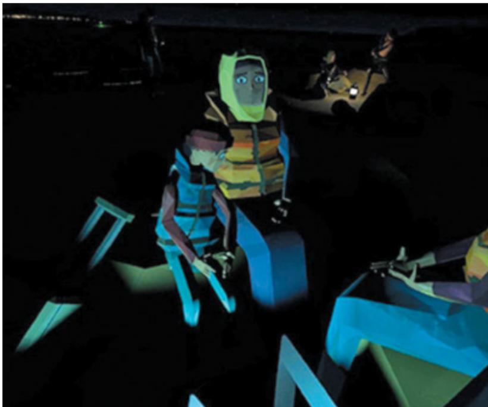  
Source: Steed, Pan, Watson and Slater, www.frontiersin.org/articles/10.3389/frobt.2018.00112/full. Licensed Under CC-BY 4.0

Jakob Nielsen argues that VR is much harder to interact with and control compared with GUI interfaces. He claims that this is due partly because it has more degrees of freedom and partly because VR is new to many people who have less experience using it compared with GUIs. See www.youtube.com/ watch?v=f4GVG4C2BcE. Do you agree?

# Research and Design Considerations

VR has been developed to support learning and training for numerous skills. Researchers have designed apps to help people learn to drive a vehicle, fly a plane, and perform delicate surgical operations—where it is very expensive and potentially dangerous to start learning with the real thing. Others investigated whether people can learn to find their way around a real building/place before visiting it by first navigating a virtual representation of it (e.g., Gabrielli et al., 2000).

(Continued)

An early example of VR was the Virtual Zoo  project. Allison et al. (1997) found  that people were highly engaged and very much enjoyed the experience of adopting the role of a gorilla, navigating the environment, and watching other gorillas respond to their movements and  presence. Virtual  environments (VE) have also been designed to help people practice social and speaking skills and confront their social phobias; see Cobb et al. (2002) and Slater et al. (1999). An underlying assumption is that the  environment can be designed as a  safe place to help people gently overcome their fears (for example, spiders, talking in public, and so forth) by confronting them through different levels of closeness and unpleasantness (such as by seeing a small  virtual spider move far away, seeing a medium one sitting nearby, and then finally touching a large one). Studies have shown that people can readily suspend their disbelief, imagining a virtual spider to be a real one or a virtual audience to be a real audience. For example, Slater et al. (1999) found that people rated themselves as being less anxious after speaking to a virtual audience that was programmed to respond to them in a positive fashion than after speaking to virtual audiences programmed to respond to them negatively.

Since this early research, VR has  been developed to support  various kinds  of therapy for  treating mental health disorders, such as depression, paranoia, and  psychosis. The VR works by exposing individuals to situations that they find challenging, but with a high level of control (Brown et al, 2020). Nadine Wagener et al. (2022) have also developed a VR tool that enables people to visualize their moods by painting in 3D (see Figure 6.11 in Chapter 6, “Emotional Interaction”).

Core design considerations include the importance of having a virtual self-body as part of a VR experience to enhance the feeling of presence; how to prevent people from experiencing simulator sickness through  experimenting with galvanic stimulation; determining  the most effective ways of enabling people to navigate through them, for instance, first person versus third person; how to control their interactions and movements, for example, use of head and body movements; how best to enable people to interact with information in VR, for example, use of keypads, pointing, joystick buttons; and how to enable people to collaborate and communicate with others in virtual environments, like the Metaverse (see Chapter 5, “Social Interaction”). In 2022, “metaversities” came into being, offering students the chance to learn by donning VR headsets and meeting with their professor in a virtual classroom to discuss topics. All sorts of novel possibilities are afforded by being in such a virtual environment that students would not experience otherwise when in a physical classroom, such as walking into an erupting volcano or sitting on the  back of a larger-than-life virtual bee that flies into a flower to gather nectar. The idea of using VR in a virtual classroom is to bring learning alive and make it fun and more exciting.

A central concern in VR design is the level of realism to target. Is it necessary to design avatars and the environments that they inhabit to be life-like, using rich graphics, or can simpler and more abstract forms be used, but which nonetheless are equally capable of engendering a sense of presence? Do you need to provide a visual representation of the  arm and hands for holding objects for a self-avatar, or is it enough to have continuous movement of the  object? Research has shown that it is possible for objects  to appear to be moving with invisible hands as if they were present. This has been coined as the “tomato presence,” that

is, where presence is maintained using a stand-in object in VR (for instance, a tomato). (See owlchemylabs.com/tomatopresence.)

A diversity of 3D software toolkits is available that have made it easier for developers and researchers to get started when building virtual environments. One of the most popular is Unity. 3D worlds can be created using their APIs, libraries, and physics engines to run on multiple platforms, for example, mobile, desktop, console, TV, VR, AR, and the web. However, despite these developments, it is not straightforward  designing a VR user experience. There are  many challenges, as discussed  by Narges Ashtari  and  colleagues (2020), including  the speed at which VR hardware changes, meaning software developed for a particular headset can quickly become obsolete.

# 7.2.5  Website Design

Early websites  were largely text-based, providing hyperlinks to different  places or pages of text. Much of the design effort was concerned with the information architecture, that is, how best  to structure information at the interface level to enable users to navigate and access it easily and quickly. For example, Jakob Nielsen (2000) adapted his and Rolf Molich’s usability guidelines (Nielsen and Molich, 1990) to make them applicable to website design, focusing  on  simplicity,  feedback, speed, legibility, and ease  of  use. He also  stressed  how critical download time was to the success of a website. Simply, people who have to wait too long for a page to appear are likely to move on somewhere else.

Since then, the goal of web design has been to develop sites that are not only usable but also aesthetically pleasing. Getting the graphical design right, therefore, is critical. The use of graphical elements (such as background images, color, bold text, and icons) can make a website look distinctive, striking, and pleasurable for the user when they first view it and also to make it readily recognizable on their return. However, there is the danger that designers can get carried away with the appearance at the expense of making it difficult to find something and navigate through it.

Steve Krug (2014) discusses this usability versus attractiveness dilemma in terms  of the difference between  how designers create  websites and how visitors actually view them. He argues that many web designers create sites as if the visitor was going to pore over each page, reading the finely crafted text word for word; looking at the use of images, color, icons, and so forth; examining how the various items have been organized on the site; and then  contemplating their options before they finally select a link. People, however, often behave quite differently. They will glance at a new page, scan part of it, and click the first link that catches their interest or looks like it might lead them to what they want.

Much  of  the  content  on  a  web  page  is  not  read.  In  Krug’s words,  web  designers  are “thinking great literature” (or at least “product brochure”), while the viewer’s reality is much closer  to a “billboard going by at 60 miles  an hour” (Krug, 2014, p. 21). While somewhat of  a caricature, his  depiction  highlights the discrepancy  between the meticulous ways  that designers  create their websites and the rapid and less than systematic approach that people take to view them. To help navigate their way through the many choices that web developers have to make, Jason Beaird and James George (2014) have come up  with a number of

guidelines intended to help web developers achieve a balance between using color, layout and composition, texture, typography, and imagery. Other website  guidelines are mentioned in Chapter 16, “Evaluation: Inspections, Analytics, and Models.”

Web  designers  now have  a number  of languages  available to  design websites, such as Python.  HTML  and  web  development  tools,  such  as  JavaScript  and  CSS,  are  also  used. Libraries, such as React, and open  source toolkits, such as Bootstrap, enable developers to get started quickly when prototyping their ideas for a website. Such tools provide drag-anddrop editors and form builders, making it easy for someone to customize and build a website. Website builders such as Wix and WordPress, for example, which are very  popular nowadays, provide  hundreds  of templates to  get started  with when creating  a website. In addition, built-in optimization and mobile-ready themes are available. Customized web pages are available for smartphone browsers that  provide scrolling lists of articles, games, tunes, and so on, rather than hyperlinked pages.

Another  interface element  that is  an  integral  part  of any  website  is  breadcrumb  navigation. Breadcrumbs are category  labels that appear  on a web  page that enable visitors to peruse other pages without losing track of where they have come from (see Figure 7.14). The term comes from the way-finding technique that Hansel used in the Brothers Grimm fairy tale Hansel and Gretel. The metaphor conjures up the idea of leaving a path to follow back. Breadcrumbs are also used by search engine optimization tools that match up a user’s search terms with relevant web  pages using the breadcrumbs. Breadcrumbs also extol usability in a number of ways, including helping people know where they are relative to the rest of the website, enabling  one-click  access to higher site  levels, attracting first-time  visitors to continue to browse a website  after having  viewed the landing page (Mifsud, 2011). Therefore, using them is good practice for other web applications besides websites.

  
Figure 7.14 A breadcrumb trail on the Best Buy website showing three choices made by the user to get to Smart Lights

Source: www.bestbuy.ca

Many people browse the web from their smartphone or tablet. The touchscreen on these kinds of devices affords very different interactions compared with interacting with desktop or laptop displays using  a keyboard or mouse. The fonts, buttons, and menu tabs  that are standard on the latter are too small and awkward to select when using a finger on a touchscreen. Instead of double-clicking interface elements, as people do with a mouse or trackpad, tablet and smartphone screens involve tapping, swiping, and pinching methods.

Web  designers  have had to think about  how to design web  browsers and websites for smaller-sized displays. A commonly used approach is responsive website design—where the browser automatically resizes the layout and changes the graphic design, fonts, and appearance depending on the screen size (smartphone, tablet, or PC) on which it is being displayed. This includes presenting the content over more pages and menus. The effect of downsizing

<!-- Chunk 5 End -->

<!-- Chunk 6 Start -->

the content in this way, however, is that it can make it more time-consuming as more pages need to be loaded. It can also make it more fiddly navigating multiple pages and menus.

Another method that is commonly used is infinite scrolling where websites are designed to enable browsing through their content that is presented as essentially one long page. This avoids a visitor needing to wait for pages to load when clicking them. Navigation is largely done  by  swiping  across or  down the page until the end  is  reached. However, a  side effect of this method of viewing content is the tendency for people to glance more while scrolling without  focusing  on  individual  items. This  may  be  fine when using  social media  sites  like Instagram and TikTok, where there is endless content to skim through, but maybe not what advertisers would like when paying for their ads to appear on these sites.

Tips on designing websites for tablets versus mobile phones can be found here: css-tricks.com/a-couple-of-best-practices-for-tablet-friendly-design.

# BOX 7.2

# In-Your-Face Web Ads

Web advertising has become pervasive and invasive. Advertisers realized how effective flashing  and animated ads were for promoting their products, taking inspiration  from the  animated neon light advertisements used in city centers, such as London’s Piccadilly Circus. But since banner ads emerged in the 1990s, advertisers have become even more cunning in their tactics. In addition to designing even flashier banner ads, more intrusive kinds of web ads have begun  to appear on our  screens. Short  movies and  garish cartoon  animations, often with audio, now pop up in floating windows that zoom into view or are tagged on at the front end of an online newspaper or video clip. Moreover, this new breed of in-your-face, often personalized web ads frequently requires someone either to wait until they end or to find a check box to close the window down.

# Research and Design Considerations

There are numerous books on web design. Ones that take into account usability as being central include Steve Krug’s classic $2 ^ { \mathrm { n d } }$ edition Web Usability (2014) and Jason Beaird et al.’s 4th edition of Principles of Beautiful Web Design (2020). In addition, there are many good online sites offering guidelines and tips. For example, the BBC provides online guidance specifically for how to design responsive websites that include topics such as context, accessibility, and responsive web design. See www.bbc.co.uk/gel/guidelines/how-to-design-for-the-web. Key considerations for all websites are captured by three core questions proposed by Keith Instone (quoted in Veen, 2001) that are still integral to web design: Where am I? What’s here? Where can I go?

# ACTIVITY 7.5

Look at a fashion brand’s website, such as Nike, and describe the kind of interface used. How does it contravene the design principles outlined by Jeffrey Veen? Does it matter? For what type of user experience is it providing? What was your experience in engaging with it?

# Comment

Fashion companies’ sites, like Nike, are often designed to be more like a cinematic experience and use rich multimedia elements, including videos, sounds, music, animations, and interactivity. Branding is central. In this sense, it contravenes what are considered core usability guidelines. Specifically, the site has been designed to entice the visitor to enter the virtual store and watch  high-quality and  innovative movies that show cool dudes  wearing  their  products. Often, links are embedded in the sites to help the viewer move to other parts of the site, for example by clicking parts of an image or a video playing. Screen widgets are also provided, such as menus, skip over buttons, and  next buttons. It is easy to become immersed in the experience and forget that it is a commercial store. It is also easy to get lost and not to know— Where am I? What’s here? Where can I go? But this is precisely what companies such as Nike want its visitors to do and to enjoy: the experience.

# 7.2.6  Mobile Devices

Mobile devices have become pervasive, with people increasingly using them in all aspects of their everyday and working lives—including phones, fitness trackers, and watches. Customized mobile devices are also used by people in a diversity of work settings where they need access to  real-time data  or  information  while walking  around. For  example, they  are  now  commonly used in restaurants  to take  orders, at  car  rental agencies  to check  in car  returns, in supermarkets for checking stock, and on the streets for multiplayer gaming.

Larger-sized tablets are also used in mobile settings. For example, many airlines provide their flight attendants with one so  that they can use  their customized flight apps while airborne and at airports; sales and marketing professionals also use them to demonstrate their products or to collect public opinions. Tablets and smartphones are also commonly used in classrooms that can be stored in special “tabcabbies” provided by schools for safe keeping and recharging.

Smartphones and smartwatches have an assortment of sensors embedded in them, such as an  accelerometer to detect  movement, a thermometer to measure  temperature, and galvanic  skin  response  to  measure  changes  in  sweat level  on  one’s  skin. Other  apps may  be designed for fun. An example of an early app developed by magician Steve Sheraton simply for a moment  of pleasure  is  iBeer (see  Figure 7.15). Part  of its  success was  because of the ingenious use of the accelerometer inside the phone. It detects the tilting of the iPhone and uses  this  information  to mimic  a  glass of  beer  being consumed. The graphics  and  sounds are also very enticing;  the color of the beer  together with frothy bubbles  and accompanying sound effects gives the illusion of virtual beer being swished around a virtual glass. The beer  can be drained  if  the phone is  tilted  enough, followed by  a  belch sound  when  it has been finished. Since it first appeared in 2008, the iBeer app has been downloaded more than 90 million times!

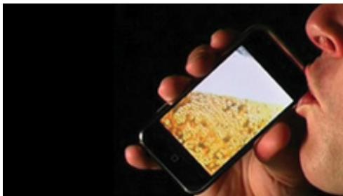  
hottrixdounload.co   
Figure 7.15 The iBeer smartphone app

Source: Hottrix

Smartphones can also be used to download contextual information by scanning barcodes in the physical world. Consumers can instantly download product information by scanning barcodes using their iPhone when walking around a supermarket, including allergens, such as nuts, gluten, and dairy. Another method that provides quick access to relevant information is the use of QR (quick response) codes that store URLs and look like black-and-white checkered squares. They work by a person focusing their camera phone over it for a few seconds that results in a notification appearing at the top or bottom of their screen. When this is tapped, it takes them to the website associated with the QR code.

This method  became  popular  during the COVID-19 pandemic  in cafes, bars, and  restaurants where  customers  selected their  menu choices by  first scanning the QR  code on  a card attached to their table (see Figure 7.16) and then scrolling through the available menu options on their phone. One of the main benefits of this approach was that it reduced human contact during service. Not only could customers view a digital menu, they could also use it to order and pay for their meal.

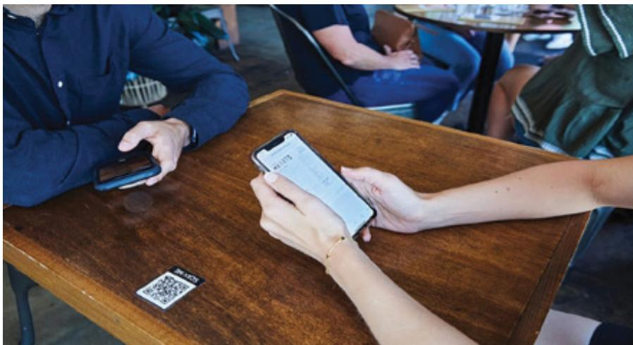  
Figure 7.16 Connecting to an online menu by scanning a QR code adhered to a  table in a restaurant

Source: pos.toasttab.com/blog/restaurant-qr-code

Another  kind of mobile  app that has  appeared  is one that uses  customers’ online  purchasing data—that they have to give permission for it to be accessed—to make recommendations and provide feedback to them. An example is a carbon footprint calculator, such as the Goodside app, that is intended to show people the environmental impact of their purchases (see  www.joingoodside.com). After  buying  a sweater  from  a major  sportswear  brand, the Goodside app accesses information about the purchaser’s transaction to determine the spending category that the sweater falls under. It then accesses the clothing company’s sustainability information to calculate the  carbon emissions associated with that  product. This is then shown as part  of an  aggregate carbon footprint visualization on the customer’s phone (see Figure 7.17). They can see how well they are doing overall and what action they might want to take based on this.

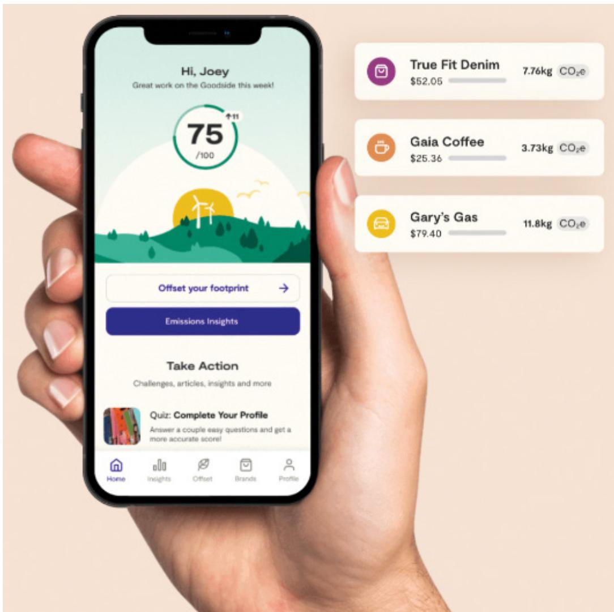  
Figure 7.17 The  Goodside app, designed to show people automatically  the  environmental impact of their purchases made through accessing their transactions using their online bank app

Source: www.joingoodside.com

# ACTIVITY 7.6

Smartwatches, such as those  made by Google, Apple, and Samsung, provide a multitude  of functions including fitness tracking, streaming music, texts, email, and the latest tweets. They are also context and location aware. For example, on detecting a person’s presence, promotional offers may be pinged at them from nearby stores, tempting them in to buy. How do you feel about this? Do you think it is the same or worse compared to the way advertisements appear on a user’s smartphone? Is this kind of context-based advertising ethical?

# Comment

Smartwatches are similar to smartphones in that they, too, get pinged with promotions and ads for nearby restaurants and stores. However, the main difference is that when worn on a wrist, smartwatches are ever-present; the user only needs to glance down at it to notice a new notification, whereas they have to take their phones out of their pockets and  purses to see what new item has been pinged (although some people hold their smartphone permanently in their hands). This means that their attention is always being given to the device, which could make them susceptible to responding to notifications and spending more money. While some people might like to get 10 percent off on coffee if they walk into the cafe that has just sent them a digital voucher, for others such notifications may be seen as annoying as they are constantly bombarded with promotions. Worse still, it could tempt children and vulnerable people who are  wearing such a watch to spend  money when perhaps they shouldn’t or to nag their parents or caretakers to buy it for them. However, smartwatch companies are aware of this potential problem, and they provide settings that the wearer can change in terms of the level and type of notifications they want to receive.

# Research and Design Considerations

Mobile interfaces typically have a small screen and limited control space. Designers have to think about what type of dedicated hardware controls to include, where to place them on the device, and then how to map them to the software. Apps designed for mobile interfaces need to take into account the ability to navigate through content when using a mobile display is constrained, whether using touch, pen, or keypad input. The use of infinite scrolling provides a rapid way of scanning though digital content.

Another key concern for mobile display design is the size of the area on the display that a person touches to make something happen, such as a key, icon, button, or app. The space needs to be big enough for “all fingers” to press accurately. If the space is too small, they may accidentally press the wrong key, which can be annoying. The average fingertip is between one and two centimeters wide, so target areas should be at least 7 mm to $1 0 \mathrm { ~ m m ~ s o ~ }$ that they can be accurately tapped with a fingertip. Fitts’ law  (see Chapter 16) is often used to help with

(Continued)

evaluating the  hit area. In their developer  design guidelines, Apple also suggests providing ample touch targets for interactive elements, with a minimum tappable area of 44 pts. $\times 4 4$ pts. for all controls.

A  number of other  guidelines exist providing  advice on how  to design interfaces for mobile devices (for instance, see Babich, 2018). An example is avoiding clutter by prioritizing one primary action per screen.

# 7.2.7  Appliances

Appliances include machines for everyday use in the home (for example, washing machines, microwave  ovens, refrigerators, toasters, bread makers, and  smoothie  makers). What  they have in common is that most people using them will be trying to get something specific done in a short period of time, such as starting  a wash, watching  a program, buying a ticket, or making a drink. They are unlikely to be interested in spending time exploring the interface or looking through a manual to see how to use the appliance. Many  of them now have LED displays that provide multiple functions and feedback about a process (such as temperature, minutes remaining, and so on). Some have begun to be connected to the Internet with companion devices, enabling them to be controlled by remote apps. An example is a coffee maker that can be controlled to come on at a certain time from an app running on a smartphone or controlled by voice.

# Research and Design Considerations

Alan Cooper et al. (2014) in their classic  book suggest that appliance interfaces require the designer to view them as transient interfaces, where  the interaction  is short. All  too  often, however, designers provide full-screen control panels or an unnecessary array of physical buttons that serve to frustrate and confuse the user where only a few, presented in a structured way, would be much better.  Here the  two fundamental  design principles of simplicity and visibility are paramount. Status information, such as what the photocopier is doing, what the ticket machine is doing, and how much longer the wash is going to take should be provided in a simple form and at a prominent place on the interface. A key design question is: as soft displays increasingly become part of an appliance interface, for example, LCD and touchscreens, what are the trade-offs with replacing the traditional physical controls, such as dials, buttons, and knobs, with these soft display controls?

# ACTIVITY 7.7

Look at the controls on your toaster (or the one in Figure 7.18 if you don’t have one nearby) and describe what each does. Consider how these might  be replaced with an LCD  screen. What would be gained and lost from changing the interface in this way?

Figure 7.18 A typical toaster with basic physical controls   
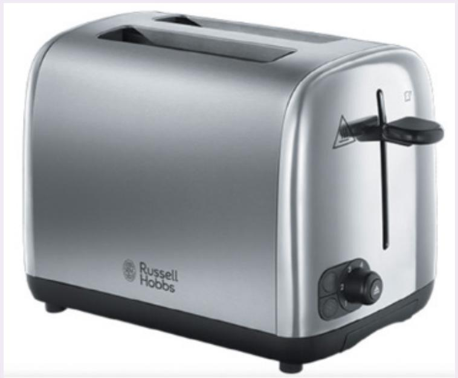  
Source: uk.russellhobbs.com/product/brushed-stainless-steel-toaster-2-slice

# Comment

Standard toasters have two main controls, the lever to press down to start the toasting and a knob to set the amount of time for the toasting. Many come with a small eject button that can be pressed if the toast starts to burn. Some also come with a range of settings for different ways of toasting (such as one side, frozen, and so forth), selected by moving a dial or pressing buttons.

Designing the controls to appear on an LCD screen would enable more information and options to be provided, for example, toast only one slice, keep the toast warm, or automatically pop up when the toast is burning. It would also allow precise timing of the toasting in minutes and seconds. However, it is likely to increase the complexity of what previously was a set of logical and very simple actions. This has happened in the evolution of microwaves, washing machines, and  tea kettles  that have digital  interfaces. They also offer  many more options for warming food up, washing clothes, or the temperature to heat water. The downside of increasing the number of choices, especially when the interface is not designed well to support this, is that it can make for a more difficult user experience for mundane tasks.

# 7.2.8  Voice

A  voice  interface involves  a person  talking  with  a spoken  language app,  such as  a search engine, a train  timetable, a travel  planner, or  a  chatbot. It  is commonly used  for inquiring about specific information (for instance, flight times or the weather) or issuing a command to a machine (such as asking a smart TV to select an action movie or asking a smart speaker to play some upbeat music). Voice interfaces use an interaction type of command or conversation  (see  Chapter  3),  where  a  person  speaks  and  listens  rather  than  clicks,  touches,  or points. Sometimes, the interaction style can involve the person responding where the system is proactive and initiates the conversation, for example, asking them if they would like to stop watching  a movie  or  listen  to the  latest breaking  news. Most  times the  system is  reactive, responding to the person’s queries.

The first generation of speech  systems earned a reputation for mishearing all too often what a person said (see cartoon). However, they are now much more sophisticated and have higher levels of recognition accuracy. Machine learning algorithms have been developed that continue to improve their ability to recognize what someone is saying. Synthetic speech has also advanced significantly to be more friendlier, convincing, and pleasant than the artificially sounding synthesized speech that was typically used in the early systems.

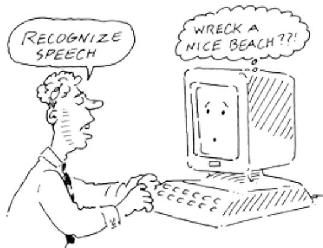  
Source: Reproduced with permission of King Features Syndicate

Watch Sonatics (2022) video entitled What’s Her Secret? at youtu.be/gS1m TIxEW0. How convincing do you think the artificial voice is? Is it distinguishable from a human voice?

Voice has become popular for a range of apps. Speech-to-text systems, such as Otter.io and Dragon, enable people to dictate rather than have to type, whether it is entering data into a spreadsheet, using a search engine, or writing a document. The words spoken appear on the screen. For some people, this mode of interaction is more efficient, especially when they are on  the move. Dragon claims on its  website that  it is  three times faster than typing and it is 99 percent accurate. Speech technology is also used by people with visual impairments,

including  speech  recognition  word  processors,  page  scanners,  web  readers, and  voice  for operating home control systems, including lights, TV, stereo, and other home appliances.

An increasingly widespread application of speech technology is call routing, where companies use an automated speech system to enable callers to reach one of their services during a phone call. They voice their needs in their own words, for example, “I’m having problems with my Wi-Fi router,” and in response are automatically forwarded to the appropriate service. This is useful for companies, as it can reduce operating costs. It can also increase revenue by reducing the number of lost calls. The callers may be happier, as their call can be routed to an available agent (real or virtual) rather than being lost or sent to voicemail. The  key is knowing when to hand over to a human operator when the virtual agent cannot answer their request or does not understand it.

In human conversations, people often interrupt each other, especially if they know what they want, rather than waiting for someone to go through a series of options. For example, they  may stop  the waitress at a  restaurant in midflow  when describing the  specials  if they know what they want, rather than let her go through the entire list. Similarly, speech technology has been designed with a feature called barge-in that allows callers to interrupt a system message and provide their request or response before the message has finished playing. This can be useful if the system has numerous options from which the caller may choose and the chooser knows already what they want.

There are several ways that a conversational dialogue can be structured. The most common is a directed dialogue where the system is in control of the conversation, asking specific questions and requiring specific responses, similar to filling in a form (Cohen et al., 2004):

System: Which city do you want to fly to?

Caller: London

System: Which airport: Gatwick, Heathrow, Luton, Stansted, or City?

Caller: Gatwick

System: What day do you want to depart?

Caller: Monday next week.

System: Is that Monday, May 5?

Caller: Yes

Other systems  are more  flexible, allowing  someone to take more initiative and specify more information in one sentence (for example, “I’d like to go to Paris next Monday for two weeks”). The  problem  with this  approach  is  that  there is  more  chance  for error, since  the caller might assume  that the system can follow all of their needs in one pass as a real travel agent would (for example, “I’d like to go to Paris next Monday for two weeks and would like the cheapest possible flight, preferably leaving from Gatwick airport and definitely with no stop-overs...”). The list is simply too long and would overwhelm the system’s parser. In addition, prompted responses enable the speech recognizer to look for a limited set of words, such as cities (in the first case) or London airports (second), which significantly improves accuracy. Guided prompts can be used to get callers back on track and help them speak appropriately (for instance, “Sorry, I did not get all that. Did you say you wanted to fly next Monday?”).

A number of speech-based phone apps exist that enable people to use them while mobile, making  them more convenient to use  than text-based entry. For example, people can voice queries into their phone using Google Voice or Apple Siri rather than entering text manually. Mobile translators allow people to communicate  in real time with others who speak a different language by letting a software app on their phone do the talking (for example, Google

Translate). People speak in their own language using their phone while the software translates what each person is saying into the language of the other one. Potentially, this means people from all over the world (there are more than 6,000 languages) can talk to one another without having to learn another language.

Voice assistants, like Amazon’s Alexa and Google Home, can be instructed by their owners to entertain in the home by telling jokes, playing music, keeping track of time, and enabling users to  play games. Alexa  also  offers a  range  of  skills, which are  voice-driven  capabilities intended to provide a more personalized experience. For example, “Open the Magic Door” is an interactive story skill that allows users to choose their path in a story by selecting different options through the narrative. Another one, “Kids Court,” allows families to settle arguments in an Alexa-run court while  learning about the law. Many of the skills are designed to support multiple people taking part at the same time, offering the potential for families  to play together. Social interaction is encouraged by  the smart speaker that houses Alexa or Home. Smart speakers sit in a common space  for all to  use (similar  to a toaster  or refrigerator). In contrast, handheld devices, such as a smartphone or tablet, support single use and ownership.

Despite big advances in speech recognition, conversational interaction is limited mainly to answering questions and responding to requests. Furthermore, it is still difficult for speechbased systems to recognize children’s speech, as it is not as articulate or developed as adults. As a result, many conversational agents frequently misunderstand children (Monarca et al., 2020). Also, voice assistants don’t always recognize who is talking in a group, such as a family, and always need to be called by their name each time someone wants to interact with it.

# Research and Design Considerations

Key research questions include what conversational mechanisms to use to structure the voice interface  and  how human-like they should be. Some researchers focus  on how to make it appear natural (that is, like human conversation), while others are concerned more with how to help people navigate efficiently through a menu system by enabling them to recover easily from errors (their own or the system’s), to be able to escape and go back to the main menu (similar to the undo button of a GUI), and to guide those who are vague or ambiguous in their requests for information or services using  prompts. The type of synthesized  voice or voice actor, male, female, neutral, or dialect, and form of pronunciation are also topics of research. Do people prefer to listen to and are more patient with a female or male voice? What about one that is jolly versus one that is serious? Interacting with voice or a chatbot also changes the  nature of the  interaction, especially in group  settings. Leon Reicherts et al. (2022), for example, investigated whether talking with an interface agent was more effective compared with interacting with a chatbot/text-based agent by teams of people working on a collaborative task in a meeting. They found that using voice resulted in more turn-taking in the team discussions and more questions being asked. The findings suggest that being prompted by a voice assistant may be preferable to using a chat-based interface in this kind of collaborative setting as it can be more effective at mediating human-human conversations.

Michael Cohen  et al. (2004) discuss the  pros and cons of using different  techniques for structuring  the dialogue and managing the  flow of voice  interactions, the  different  ways of expressing errors, and the  use of conversational etiquette—all still relevant for today’s voice

interfaces. A number of commercial guidelines are available for voice interfaces. For example, Cathy Pearl (2016) provides a number of voice interface design principles and topics, including which speech recognition engine to use, how to measure the performance of voice interfaces, and how to design them for different interfaces, for example, a mobile app, toy, or voice assistant.

# 7.2.9  Pen-Based

Pen-based  interfaces enable  people to write, draw,  select, and move objects on an  interface using light pens or styluses that capitalize on the well-honed drawing and writing skills. They have  been  used to interact with tablets and large displays, instead of mouse, touch, or keyboard  input,  for  selecting  items  and  supporting  freehand  sketching.  Smartpens,  like  the LiveScribe Echo 2 (see Figure 7.19), use a combination of an ink pen with a digital camera that digitally records everything written with the pen on special paper. The pen works by recognizing a special nonrepeating dot pattern that is printed on the paper. The nonrepeating nature of the pattern means that the pen is able to determine which page is being written on and where on the page the pen is pointing. When writing on digital paper with a smartpen, infrared light from the  pen illuminates  the dot pattern, which is then picked up by a tiny  sensor. The  pen decodes the dot pattern as the pen moves across the paper and stores the data temporarily in the pen. The digital pen can transfer data that has been stored in the pen via Bluetooth to a computer/tablet. Handwritten notes can also be converted and saved as standard typeface text that can then be edited and organized subsequently. This can be  useful for applications that require people to fill in paper-based forms and also for taking notes during meetings.

Figure 7.19 Livescribe Echo 2 Smartpen   
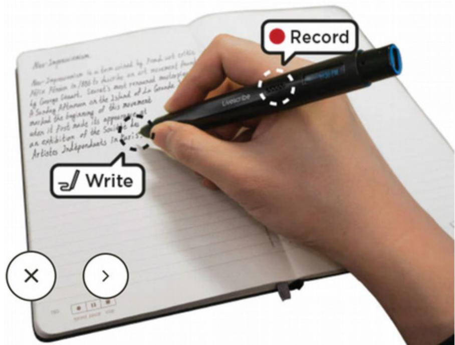  
Source: uk.livescribe.com/collections/smartpens/products/echo-2

Another advantage of pen-based interfaces is that they allow people to annotate existing documents, such as spreadsheets, presentations, and diagrams, quickly and easily in a similar way to how they would do this when using paper-based versions. This is particularly useful for a team who is working together and communicating with each other from different locations. They are also very  versatile; for example, the Apple  pencil  when used with the iPad enables people to write, sketch, annotate, draw, and paint directly onto it.

# BOX 7.3

# Electronic Ink

Digital ink is not to be confused with the  term electronic ink (or  e-ink). Electronic ink is a display  technology designed to mimic  the  appearance of ordinary ink  on paper  used in e-readers, such as the Kindle. The display used reflects light like ordinary paper.

# 7.2.10  Touchscreens

Single  touchscreens,  used  in  walk-up  kiosks  such  as  ticket  machines  or  museum  guides, ATMs,  and  cash  registers  (for instance,  restaurants),  have  been around  for  a  while. They work by detecting the presence and location of a person’s touch on the display; options are selected by tapping on the screen. Multitouch surfaces, on the other hand, support a much wider range of more dynamic fingertip actions, such as swiping, flicking, pinching, pushing, and  tapping.  They  do  this  by  registering  touches  at  multiple  locations  using  a  grid  (see Figure 7.20). This multitouch method enables devices, such as smartphones and tabletops, to recognize  and  respond  to  more  than  one  touch  at  the  same  time  supporting  a  variety  of actions, such as zooming in and out of maps, moving photos, selecting letters from a virtual keyboard when writing, and scrolling through lists. Two hands can also be used together to stretch and move objects on a tabletop surface, similar to how both hands are used to stretch an elastic band or scoop together a set of objects.

The flexibility of interacting with digital content afforded by finger gestures has resulted in many  ways  of experiencing  it. This  includes reading, scanning, zooming,  and searching interactive content on tablets, as well as creating new digital content.

# Research and Design Considerations

Touchscreens have become pervasive, increasingly becoming the  main interface  that many people use on a daily basis. However, they are different from GUIs, and a central design concern is what types of interaction techniques to use at the interface. For example, what is the optimal way to enable people to choose from options, find files, save documents, and so forth, when using a touch interface? Alternative conceptual models have been developed to carry out these actions at the interface, such as the use of cards, carousels, and infinite scrolling. The use

of these methods enables someone to swipe and move through digital content quickly. However, it is also easy to swipe too far when using a carousel. Typing on a virtual keyboard with two thumbs or one fingertip is also not as fast and efficient as using both hands when using a conventional keyboard, although many people have learned to be very adept at pecking at virtual keys on a smartphone. Predictive text can also be used to help people type faster.

Both hands may be used on multitouch tabletops to enable people to make digital objects larger and smaller or to rotate them. Dwelling touches (pressing and holding a finger down) can also be used to enable someone  to perform  dragging actions  and to bring  up pop-up menus. One or more fingers can also be used together with a dwell action to provide a wider range of gestures. However, these can be quite  arbitrary, requiring  someone to learn them rather than being  intuitive. Another limitation of touchscreens is that they do not  provide tactile feedback in the same way that keys or mice do when pressed. To compensate, visual, audio, and haptic feedback can be used. (See also the section on shareable interfaces (7.2.14) for more background on multitouch design considerations.)

Figure 7.20 A schematic of a multitouch interface   
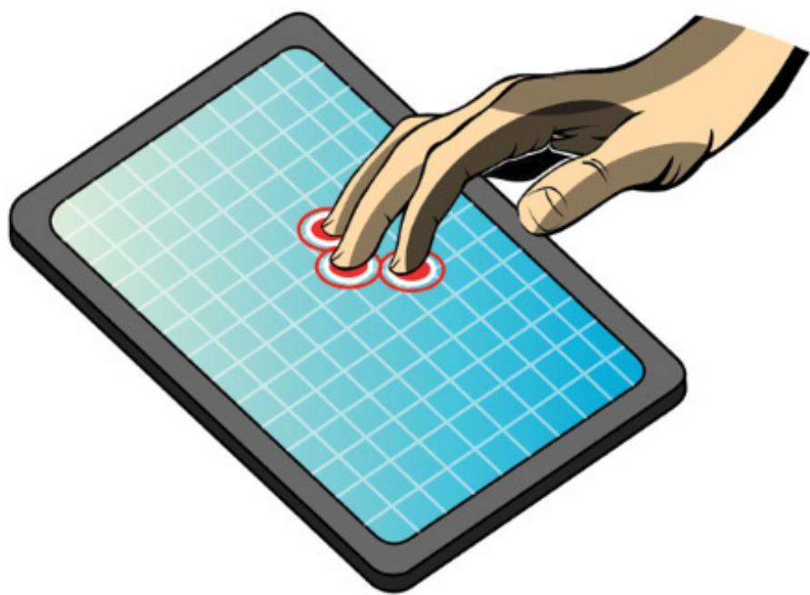  
Source: Willtron / CC BY 1.0

# 7.2.11  Touchless

Gestures involve moving arms and hands to communicate (for instance, waving to say goodbye or raising an arm to speak in class) or to provide information to someone (for example, holding two hands apart to show the size of something). There has been much interest in how technology  can be used  to capture and recognize  a person’s gestures for input by  tracking them using cameras and then analyzing them using machine learning algorithms.

David  Rose (2018)  created a video that depicts many sources of inspiration for where gesture is used in a variety of contexts, including those made by cricket umpires, live concert signers for the deaf, rappers, Charlie  Chaplin, mime artists, and Italians. His team at IDEO developed a gesture system to recognize a small set of gestures and used these to control a Philips HUE light set and a Spotify station. They found that gestures need to be sequential to be understood in the way a sentence  is composed  of a noun, then verb, and object plus operation. For example, for “speaker, on,” they used a gesture on one hand to designate the noun, and another on  the other hand to designate  the verb. So, to change the volume, the person needs to point to a speaker with their left hand while raising their right hand to signal turn the volume up.

Watch David Rose’s inspirations for gesture video at vimeo.com/224522900.

One  area  where gesture interaction has  been developed  is  in the operating  room. Surgeons need to keep their hands sterile during operations but also need to be able to look at X-rays and scans during an operation. However, after being scrubbed and gloved, they need to avoid  touching  any  keyboards, phones,  and other  nonsterile  surfaces. A  far from  ideal workaround is to pull their surgical gown over their hands and manipulate a mouse through the gown. As an alternative, Kenton O’Hara et al. (2013) developed a touchless gesture-based system, using Microsoft’s Kinect technology, which recognized a range of gestures that surgeons could use to interact with and manipulate MRI or CT images, including single-handed gestures  for  moving  forward  or  backward  through  images,  and  two-handed  gestures  for zooming and panning (see Figure 7.21).

Several car dashboards have a form of gesture control; for example, BMW’s iDrive enables drivers to control certain functions, such as turning up or down the audio volume, with the use of hand gestures that are captured by a 3D camera. For audio control, these comprise rotating the  index finger  clockwise (up) or  anti-clockwise  (down). Gesture control sensors that are positioned in the roof lining of the car, adjacent to the rearview mirror, are also used. To be recognized, the driver needs to make their gestures in front of the center console.

To ensure they are safe, the gestures were developed and tested in the iDrive system, by taking into account how focused the driver is when behind the wheel. More recently, Touchless Computing has emerged as a new  form of in-air gesture-based  interaction that anyone can  use  with  just  a  webcam  (see  www.intel.com/content/www/us/en/company-overview/ wonderful/motion-input-technology.html). The technique developed  is  called MotionInput, which provides a way of interacting with a PC without the need to touch a keyboard or the screen. Instead, a person interacts with the MotionInput software on their PC by making gestures with their hands, head, face, or full body. The software then analyzes their interactions and converts  them  into mouse, keyboard, and joypad  signals. The “multitouch in  the air” software was developed by computer  science undergraduate students at University  College London in  conjunction  with Intel, IBM, and  Microsoft. Compared  with the earlier Kinect gesture-based  systems, it doesn’t require any  specific equipment other than a webcam  and microphone, which most laptops already have.

Figure 7.21 Touchless gesturing in the operating theater   
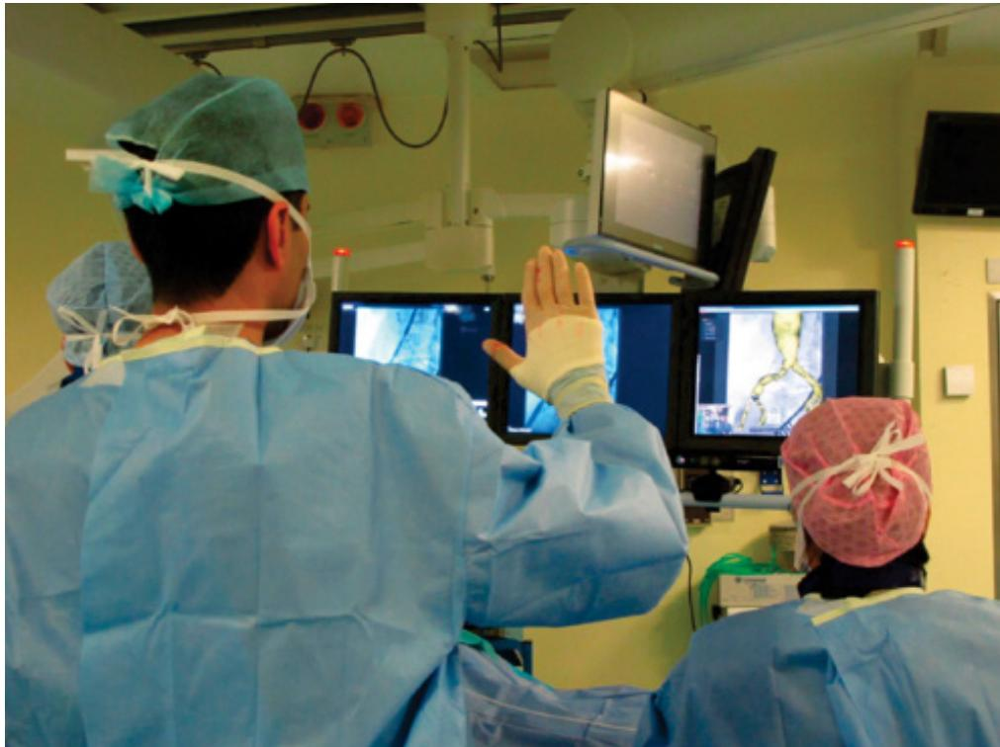  
Source: Used courtesy of Kenton O’Hara

# Research and Design Considerations

A key design concern for using gestural input is to consider how a computer system recognizes and delineates a person’s gestures. In particular, how does it determine the start and end points of a hand or arm movement, and how does it know the difference between a deictic gesture (a deliberate pointing movement) and hand waving (an unconscious gesticulation) that is used to emphasize what is being said verbally?

In addition to being used as a form of input, gestures can be represented as output to show real-time avatar movement or someone’s own arm movements. Smartphones, laptops, and some smart speakers (for example, Facebook’s Portal) have cameras  that can perceive three dimensions and record a depth for every pixel. This can be used to create a representation of someone in a scene, for example, how they are posing and moving, and also to respond to their gestures. One design question that this raises is the following: how realistic must the mirrored graphical representation of the person be in order for them to be believable and for the person to connect their gestures with what they are seeing on the screen?

# 7.2.12  Haptic Interfaces

Haptic  interfaces provide  tactile  feedback, by  applying  vibration and forces  to  the person using actuators that are embedded in their clothing or a device that they are carrying, such as a smartphone or smartwatch. Gaming consoles have also employed vibration to enrich the experience. For example, car steering wheels that are used with driving simulators can vibrate in various ways to provide the feel of the road. As the driver makes a turn, the steering wheel can be programmed to feel like it is resisting—in the way that a real steering wheel does. The steering wheel  in some cars like the  Tesla also  vibrate as a warning to the  driver if  the  car detects that it is drifting out of its lane.

Vibrotactile  feedback can also be used to  simulate the sense  of touch between  remote people who want to communicate. Actuators embedded  in clothing can be designed to recreate  the sensation  of  a hug  or a  squeeze  by  being  buzzed on  various  parts  of the body. Another  use  of  haptics  is  to  provide  real-time  feedback  to  guide  people when  learning  a musical instrument, such as a violin or drums. For example, the MusicJacket (van der Linden et al., 2011) was developed to help novice violin players learn how to hold their instrument correctly and develop good bowing action. Vibrotactile feedback was provided via the jacket to give nudges at key places on the arm and torso to inform the student when they were either holding their violin incorrectly or their bowing trajectory had deviated from a desired path (see Figure 7.22). A user study with novice players showed that they were able to react to the vibrotactile feedback and adjust their bowing or their posture in response.

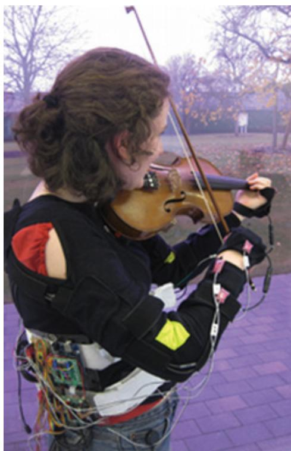  
Figure 7.22 The MusicJacket with embedded actuators that nudge the player to move their arm up to be in the correct position

Source: Yvonne Rogers

Another  form  of feedback is called  ultrahaptics, which creates  the illusion of touch in midair. It does this by using ultrasound to make three-dimensional shapes and textures that can  be felt  but  not  seen  by  the user  (www.ultrahaptics.com). This  technique  can  be  used to  create  the  illusion  of  having  buttons  and  sliders  that  appear  in  midair.  One  potential use  is  in the automotive industry to replace existing  physical buttons  and knobs or touchscreens. The ultra-haptic  buttons and  knobs  can  be designed  to appear  next  to the driver when  needed,  for example, when  detecting  the driver  wants  to turn  down  the volume  or change the radio station.

Haptics are also being embedded into clothing, sometimes called exoskeletons. Inspired by the “Techno Trousers” in the Wallace and Gromit movie The Wrong Trousers, Jonathan Rossiter and his team (2018) developed a new kind of exoskeleton that can help people stand up  and move  around using artificial  muscles  that  consist  of air bubbles  that  act as  haptic feedback that are activated using tiny electric motors (see Figure 7.23). They are stiffened or relaxed using grapheme parts to make the trousers move. One application area is to help people who have walking difficulties and those who need to exercise but find it difficult to do so.

Figure 7.23 Trousers with artificial muscles that use a new kind of bubble haptic feedback   
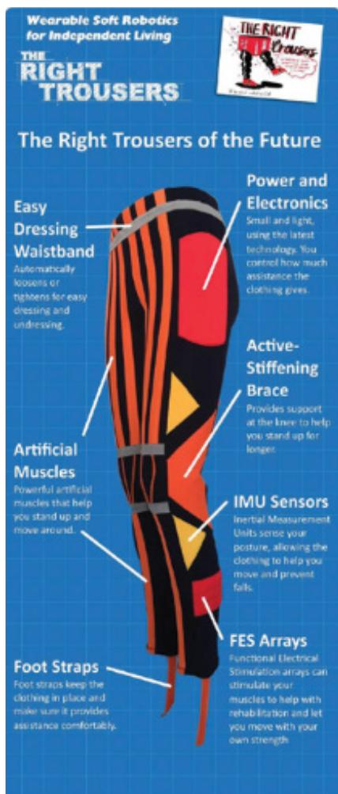  
Source: Used courtesy of The Right Trousers Project: Wearable Soft Robotics for Independent Living

# Research and Design Considerations

Haptics are used in gaming consoles, smartphones, and controllers to alert or heighten a user experience. Haptic feedback is also being  developed  in clothing and  other  wearables as a way of simulating being touched, stroked, prodded, or buzzed. A promising application area is sensory-motor skills, such as in sports training and learning to play a musical instrument. For example, patterns of vibrations have been placed across snowboarders’ bodies to indicate which moves to take while snowboarding. A study reported faster reaction times than when the  same instructions were given  verbally (Spelmezan et al., 2009). Other  uses are  posture trainers that buzz when a person slouches and fitness trackers that also buzz when they detect that their wearers have not taken enough steps in the past hour.

A key design question is where best to place the actuators on the body, whether to use a single or a sequence of touches, when to activate, and at what intensity and how often to use them to make the feeling of being touched convincing (e.g., Jones and Sarter, 2008). Providing continuous haptic feedback would be simply too annoying. People would also habituate too quickly to the feedback. Intermittent buzzes can be effective at key moments when a person needs to attend to something but not necessarily tell them what to do. For example, a study by Johnson et al. (2010) of a commercially available haptic device, intended to improve posture by giving people a vibrotactile buzz when they slouched, found that while the buzzing did not show them how to improve their posture, it did improve their body awareness.

Different kinds of buzzes can also be used to indicate different tactile experiences that map to events; for example, a smartphone could transmit feelings of slow tapping to feel like water  dropping, which is meant to indicate it is about to rain and transmit the sensation of heavy  tapping to indicate a thunderstorm is looming. Apple  iOS 16 (2022) recently added the option of being able to switch on their haptics when typing, enabling a user to feel a tiny vibration every time they press a key on their iPhone’s virtual keyboard. Haptics are also used in Apple watches, in the little "click" sensations that the wearer feels when they scroll using the digital crown. These kinds of haptic feedback can be reassuring and aid navigation.

# 7.2.13  Multimodal

Multimodal interfaces are intended to enrich user experiences by multiplying the way information is experienced and controlled at the interface through using different modalities, such as touch, sight, sound, and speech (Bouchet and Nigay, 2004). Interface techniques that have been combined for this purpose include speech and gesture, eye-gaze and gesture, haptic and audio output, and pen input and speech (Dumas et al., 2009). The assumption is that multimodal  interfaces  can  support  more  flexible,  efficient,  and  expressive  means  of  human– computer interaction that are more akin to the multimodal experiences that humans encounter in  the  physical world  (Oviatt, 2017). Different  input/outputs  may  be  used at  the  same time, for example, using  voice commands  and  gestures simultaneously to  move through a

virtual environment, or alternately using speech commands followed by gesturing. The most common  combination  of technologies used  for multimodal interfaces  is  speech  and vision processing (Deng and Huang, 2004). Multimodal interfaces can also be combined with multisensor  input to  enable other aspects of the human  body  to be tracked. For  example, eye gaze, facial expressions, and lip movements (as mentioned in section 7.2.11 on MotionInput software)  can  also  be detected  and tracked  to provide  data  about  someone’s attention  or intent. This kind of sensing can provide input for customizing user interfaces and experiences to the perceived need, desire, or level of interest.

A person’s body movement can also be tracked so that it can be represented back to them on a screen in the form of an avatar that appears to move just like them. For example, the Kinect was developed as a gesture and body movement gaming input system for the Xbox. Although  now  defunct  in the gaming industry,  it proved effective at  detecting multimodal input in real time. It consisted of an RGB camera for facial and gesture recognition, a depth sensor  (an  infrared projector  paired  with a  monochrome camera) for  movement tracking, and downward-facing  mics for voice recognition  (see Figure 7.24). On  finding a body, the Kinect locked onto  it and measured the three-dimensional  positioning  of the key joints  in their body. This information was converted into a graphical avatar of the user that could be programmed to move just like them. Many people readily saw themselves as the avatar and learned how to play games in this manner.

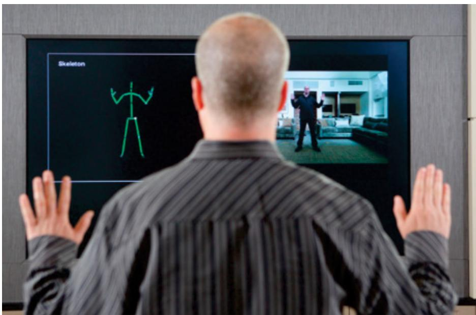  
Figure 7.24 Microsoft’s Xbox Kinect Source: Stephen Brashear / Invision for Microsoft / AP Images

# Research and Design Considerations

Multimodal systems rely on recognizing aspects of a person’s behavior, including handwriting, speech, gestures, eye movements, or other body movements. In many ways, this is much harder to accomplish and calibrate than single modality systems that are programmed to recognize one aspect of a user’s behavior. The most researched modes of interaction are speech, gesture, and eye-gaze tracking. A key research question is what is actually gained from combining different input and outputs and whether talking and gesturing as humans do with other humans is a natural way of interacting with a computer (see Chapter 4). Guidelines for multimodal design can be found in Oviatt et al. (2017).

# 7.2.14  Shareable

Shareable interfaces are designed for more than one person to use. Unlike PCs, laptops, and mobile devices, which are aimed at single users, shareable interfaces typically provide multiple inputs and sometimes allow simultaneous input by co-located groups. These include large wall displays, for example, SmartBoards (see Figure 7.25a), and interactive tabletops, where small groups can interact with information being displayed on the surface using their fingertips  (see  Figure  7.25b). An  early  example  of  an  interactive  tabletop  was  Circle  Twelve’s DiamondTouch (Dietz and Leigh, 2001). It was unique in that it could distinguish between different users touching the surface concurrently. An array of antennae was embedded in the touch surface, and each one transmitted a unique signal. Each person had their own receiver embedded in a mat on which they were standing or a chair in which they were sitting. When they touched the tabletop, very small signals were sent through their body to a receiver that identified which  antenna has  been touched and sent this to the computer. Multiple  people could interact simultaneously with the digital content using their fingertips. Sadly, the technology is no longer available, but a video of how it worked is available.

Check out the video of Circle Twelve’s demonstration of the DiamondTouch tabletop: youtu.be/S9QRdXlTndU.

An advantage of shareable interfaces is that they provide a large interactional space that can support flexible group working, enabling groups to create content together at the same time. Compared with a co-located group trying to work around a single-user PC or laptop, where typically  one  person takes  control, making  it  more difficult  for others to take  part, multiple users can interact with a large display. People can point to and touch the information  being  displayed,  while  simultaneously  viewing  the  interactions  and  having  the  same shared point of reference (Rogers et al., 2009). There are now a number of tabletop apps that have been developed for museums and galleries that enable visitors to learn  about various aspects of the environment (see Clegg et al., 2019).

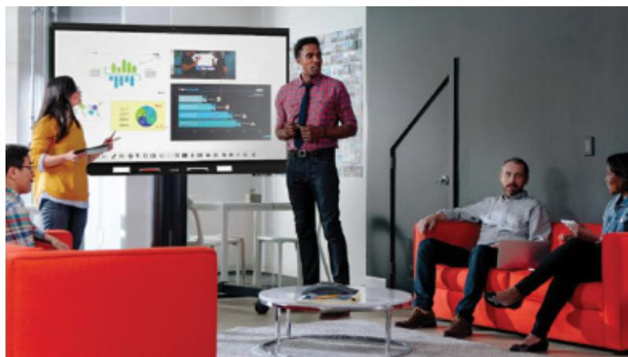  
(a)

(b)   
Figure 7.25 (a)  A SmartBoard in use  during a  meeting and  (b)  Mitsubishi’s interactive  tabletop interface   
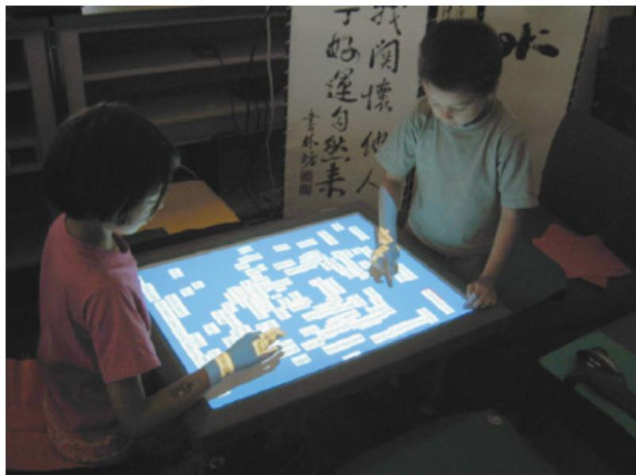  
Source: (a)  Used  courtesy  of  SMART  Technologies Inc.  (www.smarttech.com/en/business)  (b)  Mitsubishi Electric Research Labs

Another type of shareable interface is a software platform that enables groups of people to work together simultaneously even when geographically apart. Early examples included shared  editing  tools  developed  in  the  1980s  (for  example,  ShRedit).  Various  commercial products  now exist that enable multiple remote  people to work on  the same  document at the same time (such as Google Docs and Microsoft Excel). Some enable up to 50 people to edit the same document at the same time with more watching on. These software programs provide  various functions, such as  synchronous editing,  tracking changes, annotating, and commenting. Other collaborative tools include Miro (see Chapter 5) and the Balsamiq Wireframes  editor, which provides  a  range of shared functions, including  collaborative  editing, threaded comments with callouts, and project history.

# Research and Design Considerations

Early  research on shareable interfaces focused  largely on interactional issues, such as how to support electronically based handwriting and drawing, and the  selecting and  moving of objects  around the display (Elrod et al., 1992). The PARCTAB system (Schilit et al., 1993) investigated how  information  could  be communicated between  palm-sized, A4-sized,  and whiteboard-sized displays using shared software tools, such as Tivoli (Rønby-Pedersen et al., 1993). Another concern was how to develop fluid and direct styles of interaction with large displays, both wall-based and tabletop, involving freehand and pen-based gestures (see Shen et al., 2003). More recent research has been concerned  with how  to support  ecologies  of devices so that groups can share and create content and use apps across multiple devices, such as tabletops and wall displays (Brudy et al., 2016). A key design challenge is how to bridge across devices, applications, and time such that the peoples’ interactions are seamless (Brudy et al, 2020).

A key research issue is whether shareable surfaces can facilitate new and enhanced forms of collaborative interaction compared with what is possible when groups work together using their own devices, like laptops and PCs (see Chapter 5). One benefit is easier sharing and more equitable participation. For example, tabletops have been designed to support more effective joint browsing, sharing, and manipulation of images during decision-making and design activities (Shen et al., 2002; Yuill and Rogers, 2012). Core design concerns include whether size, orientation, and shape of the display have an effect on collaboration. User studies have shown that horizontal surfaces compared with vertical ones support more turn-taking and collaborative working in co-located groups (Rogers and Lindley, 2004), while providing larger-sized tabletops does not necessarily improve group working but can encourage a greater division of labor (Ryall et al., 2004).

The  need for both personal and  shared spaces has been investigated to see how  best to enable users  to move between  working on their  own  and  together as a  group. Several researchers have designed cross-device systems, where a variety of devices, such as tablets, smartphones, and  digital  pens can  be used in conjunction  with a  shareable  surface. For example, SurfaceConstellations  was  developed  for  linking  mobile devices  to create novel cross-device workspace environments (Marquardt et al., 2018). Design guidelines and summaries of empirical  research on tabletops  and multitouch devices can be found  in Müller-Tomfelde (2010).

# 7.2.15  Tangible

Tangible interfaces use sensor-based interaction, where physical objects, such as bricks, balls, and cubes, are coupled with digital representations (Ishii and Ullmer, 1997). When a person manipulates the physical object(s), it is detected by a computer system via the sensing mechanism embedded in the physical object, causing a digital effect to occur, such as a sound, animation, or vibration (Fishkin, 2004). The digital effects can take place in a number of media and  places,  or  they  can  be  embedded  in  the  physical  object  itself.  For  example,  Oren Zuckerman and  Mitchel  Resnick’s  (2005)  early Flow  Blocks  prototype depicted  changing numbers  and  lights  that  were  embedded  in  the  blocks,  depending  on  how  they  were

connected. The flow blocks were designed to simulate  real-life dynamic behavior and react when arranged in certain sequences.

Another  type  of tangible  interface  is  where  a  physical model,  for  example, a  puck, a piece of clay, or a model, is superimposed on a digital desktop. Moving one of the physical pieces  around  the tabletop causes digital  events to take  place  on  the tabletop. One  of the earliest  tangible  interfaces, Urp, was  built  to  facilitate urban  planning;  miniature  physical models of buildings could be moved around on the tabletop and used in combination with tokens for wind and shadow-generating tools, causing digital shadows surrounding them to change over time and visualizations of airflow to vary. Tangible interfaces differ from other approaches, such as mobile, insofar as the representations are artifacts in their own right that they can be directly acted upon, lifted up, rearranged, sorted, and manipulated.

The technologies that have been used to create tangibles include RFID tags and sensors embedded in physical objects and digital tabletops that sense the movements of objects and subsequently provide visualizations surrounding the physical objects. Many tangible systems have been built with the goal of encouraging learning, design activities, playfulness, and collaboration. These include planning tools for landscape and urban planning (see Hornecker, 2005; Underkoffler and Ishii, 1998). Another example is Tinkersheets, which combine tangible models of shelving with paper forms for exploring and solving warehouse logistics problems (Zufferey, et al., 2009). The underlying simulation allows students to set parameters by placing small magnets on the form.

Tangible computing has been described as having no single locus of control or interaction (Dourish, 2001). Instead of just one input device, such as a mouse, there is a coordinated interplay of different devices and objects. There is also no enforced sequencing of actions and no modal interaction. Moreover, the design of the interface objects exploits their affordances to guide the user in how to interact with them. A benefit of tangibility is that physical objects and digital representations can be positioned, combined, and explored in creative ways, enabling dynamic information to be presented in different ways. Physical objects can also be held in both hands  and combined and manipulated in  ways not  possible using other interfaces. This allows for more than one person to explore the interface together and for objects to be placed on top of each other, beside each other, and inside each other; the different configurations encourage different ways of representing and exploring a problem space. In so doing, people are able to see and understand situations differently, which can lead to greater insight, learning, and problem-solving than with other kinds of interfaces (Marshall et al., 2003).

A number of toolkits have been developed to encourage children to learn coding, electronics, and STEM subjects using physical computing toolkits. These include the following:

SAM Labs STEAM kit (youtu.be/DEiIqWXiffw)

MicroBit (microbit.org)

MagicCubes (uclmagiccube.weebly.com)

The toolkits provide children with opportunities to connect physical electronic components and sensors to make digital events happen. For example, the MagicCubes can be programmed to change color depending on the speed at which they are shaken; slow is blue, and very  fast is  multicolor. Research has  shown that the tangible toolkits provide many opportunities  for  discovery  learning,  exploration,  and  collaboration  (Lechelt  et  al.,  2020). The MagicCubes have also been found to encourage a diversity of children, between the ages of 6 and 16, and those with cognitive disabilities, to learn through collaborating, and frequently

showing and telling  each other and their instructors about their discoveries  (Lechelt et al., 2018). These moments are facilitated by the cube’s form factor, making it easy to show off to others, for example, by waving a cube in the air (see Figure 7.26).

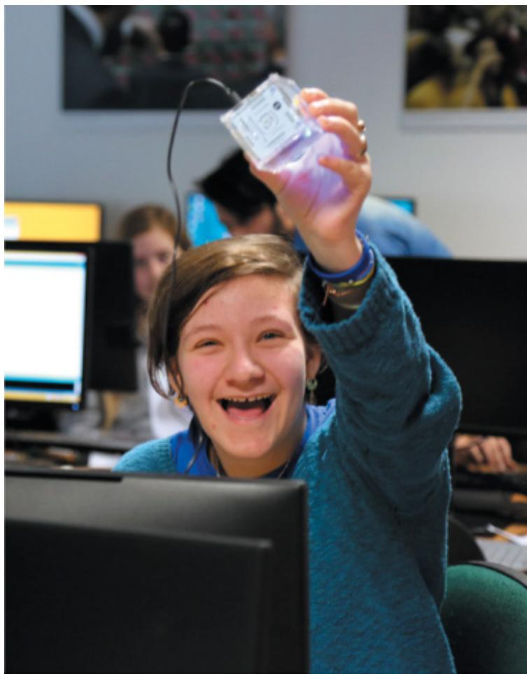  
Figure 7.26 Learning to code with the MagicCubes; sharing, showing, and telling Source: Elpida Makriyannis

Tangible toolkits have also been developed for the visually impaired. For example, Code Jumper was developed as a programming  language for teaching programming concepts to children aged 7–11, regardless of level of vision (Morrison et al., 2018). It consists of a set of pods that can be connected and manipulated to create physical strings of code that play stories or music.

# BOX 7.4

# VoxBox—A Tangible Questionnaire Machine

Traditional methods for gathering public opinions, such as surveys, involve approaching people in situ, but it can disrupt the positive experience they are having. VoxBox (see Figure 7.27) is a  tangible system designed to gather opinions on a range  of topics in situ at an event through playful and engaging interaction (Golsteijn et al., 2015). It was intended to encourage wider participation by grouping similar questions, encouraging completion, gathering answers to open and closed questions, and connecting answers and results. It was designed as a large physical system that provides a range of tangible input  mechanisms through  which people give their  opinions, instead of using, for example, text messages or social media input. The various input mechanisms include sliders, buttons, knobs, and spinners about which people are all familiar. In addition, the system has a transparent tube at the side that drops a ball stepby-step as sets of questions are completed to act as an incentive for completion and as a progress indicator. The results of the selections were aggregated and presented as simple digital visualizations on the other side (for example, 95 percent are engaged; 5 percent are bored). VoxBox was  used at a  number of events drawing in the  crowds, who  become completely absorbed in answering questions in this tangible format.

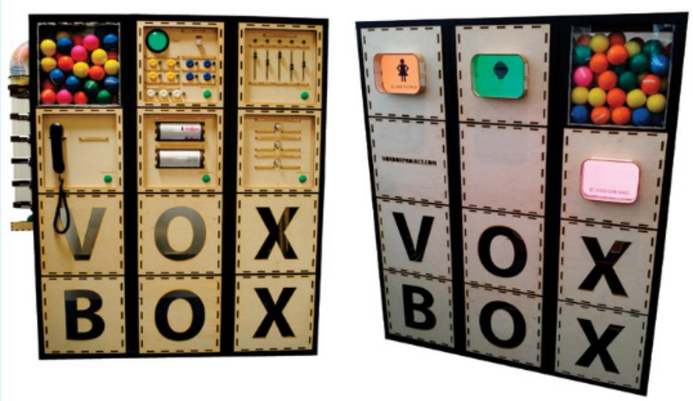  
Figure 7.27 VoxBox—front and back of the tangible machine questionnaire Source: Yvonne Rogers

# Research and Design Considerations

Researchers have developed conceptual frameworks that identify the novel and specific features of a tangible interface (for the classic ones, see Fishkin, 2004; Ullmar et al., 2005; Shaer and  Hornecker, 2010). A  key design concern is what kind of coupling to use  between the physical action and  digital  effect. This includes determining  where  the  digital  feedback is provided in relation to the physical artifact that has been manipulated. For example, should it appear on top of the object, beside it, or in some other place? The type and placement of the digital media will depend to a large extent on the purpose of using a tangible interface. If it is to support learning, then an explicit mapping between action and effect is critical. In contrast, if it is for entertainment purposes, for example, playing music or storytelling, then it may be better to design them to be more implicit and unexpected. Another key design question is what kind of physical artifact to use to enable the user to carry  out an activity in a natural way. Bricks, cubes, and other component sets are most commonly used because of their flexibility and simplicity, enabling people to hold them in both hands and to construct new structures that can be easily added to or changed. Sticky notes and cardboard tokens can also be used for placing material onto a surface that is transformed or attached to digital content (Klemmer et al., 2001; Rogers et al., 2006).

Another research question is the following: with which types of digital  outputs should tangible interfaces be combined? Overlaying physical objects  with graphical  feedback that changes in response to how the object is manipulated has been the main approach. In addition, audio and haptic feedback has been used. Tangibles can also be designed to be an integral part of a multimodal interface. For an extensive overview on the history and aspirations of tangible interaction, see Brygg Ullmer et al. (2022).

# 7.2.16  Augmented Reality

Augmented reality  (AR)  became  an  overnight  success with  the  arrival of  Pokémon  Go in 2016. The smartphone  app became an  instant hit worldwide. Using a player’s smartphone camera and  GPS  signal, the AR  game makes  it seem  as if  virtual Pokémon  characters are appearing in the real world—popping up all over the place, such as on buildings, on streets, and in parks. As players walk around a given place, they may be greeted with rustling bits of grass  that signal  a Pokémon  nearby. If  they  walk  closer, a Pokémon  may  pop up  on their smartphone screen, as if by magic, and look as if they are actually in front of them. For example, one might be spotted sitting on a branch of a tree or a garden fence.

AR works by superimposing digital elements, like Pokémons, onto physical devices and objects. Closely related to AR is the concept of mixed reality, where views of the real world are combined with views of a virtual environment (Drascic and Milgram, 1996). To begin, augmented reality was mostly  a subject of experimentation within medicine, where  virtual objects, for example X-rays and scans, were overlaid on part of a patient’s body to aid the physician’s understanding of what was being examined or operated on.

AR was then used to aid controllers and operators in rapid decision-making. One example is air traffic control, where controllers are provided with dynamic information about the aircraft in their section that is overlaid on a video screen showing real planes landing, taking off, and taxiing. The additional information enables the controllers to identify planes easily, which were difficult to make out—something  especially useful in poor weather conditions. Similarly, head-up  displays  (HUDs) are used in military and civil planes to aid pilots when landing during poor weather conditions. A HUD provides electronic directional markers on a fold-down display that appears directly in the field of view of the pilot. A number of cars provide AR windshield technology, where navigation directions can literally look like they are painted on the road ahead of the driver (see Chapter 2, “The Process of Interaction Design”).

As well as HUDs, augmented reality can be viewed through headsets, smartphones, and glasses (e.g., SnapChat’s AR spectacles). The most convenient device to use when viewing AR is a smartphone. Headsets can provide a more immersive experience, but the downside is they are cumbersome to wear and fiddly to calibrate. In the future, it is likely that more convenient and easy-to-wear AR glasses will become more popular, enabling people both to create and to share their digital AR content with others. To see how this can work, watch the Snap video Introducing the Next Generation of Spectacles at youtu.be/AuIw5Oe7z1I.

AR-based instructions for building or repairing complex equipment, such as photocopiers and car engines, have also been designed to replace paper-based manuals, where drawings are superimposed upon the machinery itself, telling the mechanic what to do and where to do it. There are also many AR apps available for a range of contexts, from education to car navigation, where digital content is overlaid on geographic  locations and objects. To reveal the digital information, users open  the AR app on  a smartphone or tablet and the content appears superimposed on what is viewed through the screen.

Other AR apps have been developed to aid people walking in a city or town. Directions (in  the form  of a pointing  hand  or arrow)  and local  information (for instance, the  nearest bakery)  are  overlaid  on  the  image  of  the  street  ahead  that  appears  on  someone’s  smartphone screen. These change as the person walks up the street. Virtual objects and information are also being combined  to make more complex  augmented  realities. Figure 7.28 shows  a weather alert with animated virtual lightning effects alongside information about  a nearby café and the price of properties for sale or rent on a street. Virtual people, cartoon characters, and other objects are also being introduced into AR environments that can appear to move and/or talk. For example, virtual tour guides are beginning to appear in museums, cities, and theme parks, which can appear to by moving, talking, or gesturing to visitors who are using an AR app.

The availability of mapping platforms, such as those provided by Niantics and Google, together with Apple’s ARKit, SparkAR Studio, and Google’s ARCore, has made it easier for developers  and  students  alike to  develop  new  kinds  of AR  games  and  AR  apps. Another popular AR game that has emerged since Pokémon Go is Jurassic World Alive, where players walk around in the real world to find as many virtual dinosaurs as they can. It is similar to Pokémon Go but with different gaming mechanisms. For example, players have to study the dinosaurs they  come across by collecting  their DNA and then re-creating it. Microsoft has also enabled new mixed reality user experiences to be created, enabling people wearing a Hololens headset to interact with virtual elements in their surroundings.

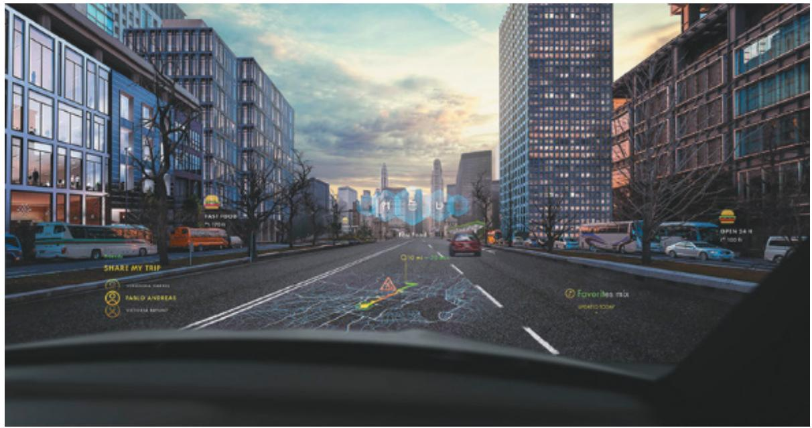  
Figure 7.28 Augmented reality overlay used on a car windshield

# Source: wayray.com

Most AR apps use the backward-facing camera on a smartphone or tablet to overlay the virtual content  onto the real world. Another  approach is to use the forward-facing camera (used for selfies) to superimpose digital content onto the user’s face or body. SnapChat and Zoom provide numerous filters with which people can experiment with plus the opportunity to create their own filters. Adding accessories  such as ears, hair,  moving lips, and headgear enables people to transform their physical appearance in all sorts of fun ways.

These kinds of virtual try-ons work by analyzing a person’s facial features and building a 2D or 3D model in real time. So, when they move their head, the make-up or accessories appear to move with them as if they are really on their face. Several AR mirrors now exist in retail that allow shoppers to try on sunglasses, jewelry, and make-up. The goal is to let them try on as many different products as they like to see how they look with them on. Clearly, there are advantages to virtual try-ons: it can be more convenient, engaging, and easier compared to trying on the real thing. There are disadvantages too, however, in that they only give an  impression of  what you  look like. For example, the person cannot  feel the weight  of a virtual accessory on their head or the texture of virtual make-up on their face.

The same technology can be used to enable people to step into historical, famous, film, or stage characters (for instance, David Bowie or Queen Victoria). For example, a virtual try-on app that was developed as part of a cultural experience was the MagicFace (Javornik, et al., 2017). The goal was to enable audiences to experience firsthand what it was like to try on the make-up of a character from an opera. The opera chosen was Philip Glass’s Akhnaten, set in ancient Egypt (see Figure 7.29a). The virtual make-up developed were for a Pharaoh and his wife. The app was developed by University College London researchers alongside the English National Opera and AR company, Holition. To provide a real-world context, the app was designed to run on a tablet display that was disguised as a real mirror and placed in an

actor’s dressing room (see Figure 7.29b). On encountering the mirror in situ, visiting school children were fascinated by the way the virtual make-up made them look like Akhnaten and his wife, Nefertiti. The singers and make-up artists who were in the production also tried it out and saw great potential for using the app to enhance their existing repertoire of rehearsal and make-up tools.

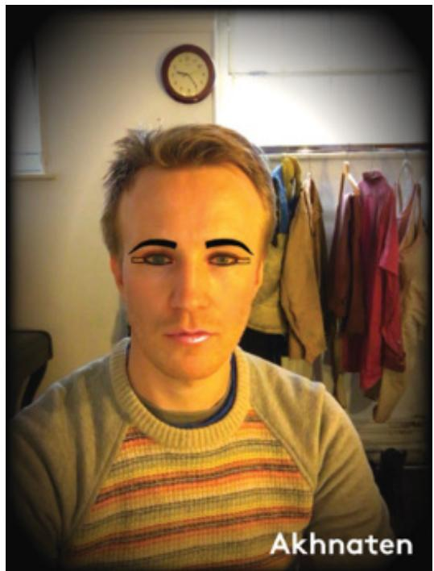  
(a)

(b)   
Figure 7.29 (a) A principal singer trying on the virtual look of Akhnaten and (b) a framed AR mirror in the ENO dressing room   
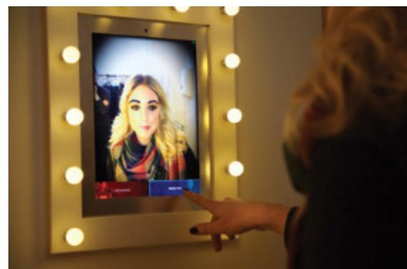  
Source: Used courtesy of Ana Javornik

# Research and Design Considerations

A key research concern when designing augmented reality is what form the digital augmentation should take and when and where it should appear in the physical environment (Schmalstieg and Hollerer, 2016). The information (such as navigation cues) needs to stand out but not distract the person from their ongoing activity in the physical world. It also needs to be simple and align with the real-world objects, taking into account that the user will be moving. Another concern is how much digital content to overlay on the physical world and how to attract the user’s attention to it. There is the  danger that the physical world  becomes overloaded with digital ads and information “polluting” it to the extent that people will turn the AR app off.

(Continued)

One of the limitations of current AR technology is that sometimes the modeling can be slightly off so that the overlaying of the digital information appears in the wrong place or is out of sync with what is being overlaid. This may not be critical for  fun applications, but it may be disconcerting if eye shadow appears on someone’s ear. It may also break the magic of the AR experience. Ambiguity and uncertainty may be exploited to good effect in mixedreality games, but it could be disastrous in a more serious context, such as in the military or a medical setting.

# 7.2.17  Wearables

Wearables are a broad category of devices that are worn on the body. These include smartwatches, fitness trackers, fashion tech, and smart glasses. Since the early experimental days of wearable computing, where Steve Mann (1997) donned head and eye cameras to enable him to record what he saw while also accessing digital information on the move, there have been many innovations and inventions.

New  flexible  display  technologies,  e-textiles,  and  physical  computing  (for  example, Arduino) provide opportunities to design wearables that people will actually want to wear. Jewelry, caps, glasses, shoes, and jackets have all been the subject of experimentation designed to provide the wearer with a means of interacting with digital information while on the move in the physical world. Early wearables focused on convenience, enabling people to carry out a  task  (for  example, selecting  music)  without  having  to  take  out  and  control  a  handheld device. Examples  included a  ski jacket  with  integrated  music  player  controls that enabled the wearer to simply touch a button on their arm with their glove to change a music track. More recent applications have focused on  how to combine textiles, electronics, and haptic technologies to promote new forms of communication. For example, CuteCircuit developed the KineticDress, which  was embedded with sensors that followed the body  of the wearer to capture their movements and interaction with others. These were then displayed through electroluminescent embroidery that covered the external skirt section of the dress. Depending on the amount and speed of the wearer’s movement, it changed patterns, displaying the wearer’s mood to the audience and creating a magic halo around her.

Exoskeleton clothing (see section 7.2.12) is also an area where fashion meets technology in order to augment  and assist people who have problems  with walking by  literally  walking  or  exercising  the  person  wearing  them.  In  this  way, it  combines  haptics  with  a wearable. Within the construction industry, exoskeleton suits have also been developed to provide additional power to workers—a bit like Superman—where metal frameworks are fitted with motorized muscles to multiply the  wearer’s strength. It can make lifting objects feel lighter and in doing so protect the worker from physical injuries.

# DILEMMA

# Google Glass: Seeing Too Much?

Google Glass was a  wearable that went on sale in 2014 in various fashion styles (see Figure 7.30). It was designed to look like a pair of glasses, but with one lens of the glass being an interactive display with an embedded camera that could be controlled with speech input. It allowed the wearer to take photos and videos on the move and look at digital content, such as email, texts, and maps. The wearer could also search the web using voice commands, and the results would appear on the screen. A number of applications were developed beyond those for everyday use, including WatchMeTalk, which provided live captions to help the hearingimpaired in their day-to-day conversations and Preview for Glass that enabled the wearer to watch a movie trailer the moment they looked at a movie poster.

Figure 7.30 Google Glass   
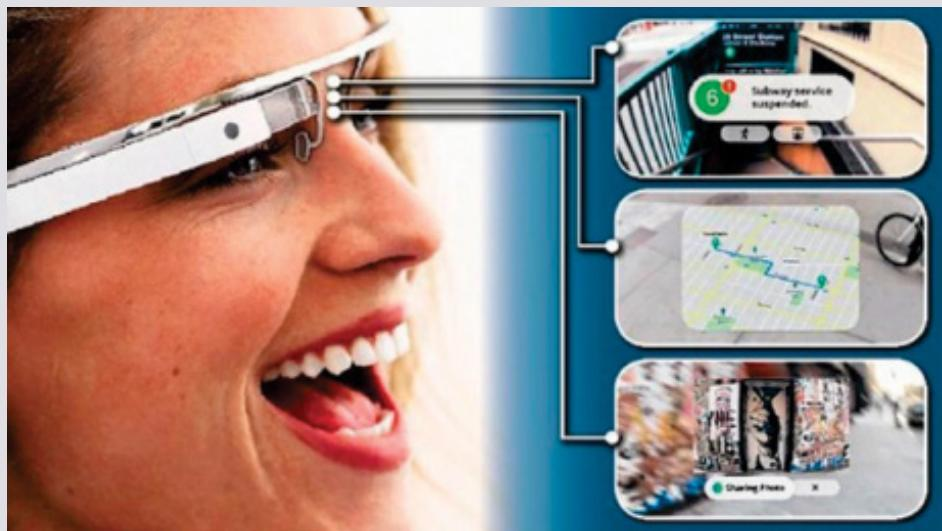  
Source: Google Inc.

However, being in the company of someone wearing a Google Glass was felt by many to be unnerving, as the wearer looked up and to the right to view what was on the glass screen rather than looking at you and  into your eyes. One of the criticisms of wearers of Google Glass was that it made them appear to be staring into the distance. Others were worried that those wearing Google Glass were recording everything that was happening in front of them. As a reaction, a few bars and restaurants in the United States implemented a “no Glass” policy to prevent customers from recording other patrons.

(Continued)

The original Google Glass was retired after a couple of years. Since then, other types of smart glasses have come onto the market that sync a user’s smartphone with the display and camera on the glasses via Bluetooth. These include Vuzic Blade, which has a camera onboard and voice control that is connected to Amazon Echo devices, along with the provision of turnby-turn navigation and location-based alerts; and Snap’s Spectacles (see previous section).

Another interesting design concept was the Talking Shoe, which talked to people in a humorous way when wearing them as they went about their everyday activities. See youtu.be/VcaSwxbRkcE.

# Research and Design Considerations

A core design concern specific to wearable interfaces is comfort. People need to feel comfortable wearing clothing that is embedded with technology. It needs to be light, small, not get in the  way, fashionable, and  (with  the  exception  of the  displays)  preferably hidden in the clothing. Another related issue  is hygiene. Is it possible to wash or clean  the  clothing once worn? How easy is it to remove the electronic gadgetry and replace it? Where are the batteries going to be placed, and how long is their lifetime? A key usability concern is how the person controls the devices that are embedded in their clothing. Are touch, speech, or more conventional buttons and dials preferable?

A number of technologies can be developed and combined to create wearables including LEDs, sensors, actuators, tangibles, and AR. There is much scope for thinking creatively about when and whether to make something wearable as opposed to mobile. In Chapter 1, we mentioned how assistive technology can be designed to be fashionable in order to overcome stigmas of having to wear a monitoring device (for instance, for glucose levels), substitution (for example, a prosthetic) or amplifying device (for example, hearing aids).

A key design concern for wearables is how best to present the information recorded from various  physiological senses (e.g., heart rate)  back to people wearing them, in a way that is meaningful and can be acted upon. Section 7.2.6 describes some of the visual methods that have been developed for  mobile displays. Other  techniques include using  haptic or multimodal forms of feedback that provide people with different kinds of sensations besides data visualizations.

# 7.2.18  Robots and Drones

Robots have been around for some time, most notably as characters in science-fiction movies, but they also play an important role as part of manufacturing assembly lines, as remote investigators  of hazardous  locations (for  example, nuclear power stations  and  bomb  disposal),

and as search and rescue helpers in disasters (for instance, in forest fires) or faraway  places (like Mars). Console interfaces have been developed to enable humans to control and navigate  robots  in  remote  terrains,  using  a  combination  of  joysticks  and  keyboard  controls together with cameras and sensor-based interactions (Baker et al., 2004). The focus has been on designing interfaces that enable people to steer and move a remote robot effectively with the aid of live video and dynamic maps.

Domestic robots that help with the cleaning and gardening have become popular. Robots are  also  being  developed  to  help  the  elderly  and  disabled  with  certain  activities, such  as picking up objects and cooking meals. Pet robots, in the guise of human companions, have been  commercialized.  Several  research teams  have  taken the “cute  and  cuddly” approach to  designing  robots,  signaling  to  humans  that  the  robots  are  more  pet-like  than  humanlike. For example, Mitsubishi developed Mel the penguin (Sidner and Lee, 2005) whose role was  to  host  events,  while the  Japanese  inventor  Takanori Shibata  first developed  Paro  in 2004, a baby  harp seal that looks like a cute  furry cartoon animal, and whose role was as a companion (see Figure 7.31). Sensors were embedded in the pet robots, enabling them to detect certain human behaviors and respond accordingly. For example, they can open, close, and move their eyes, giggle, and raise their flippers. The robots encourage being cuddled or spoken to, as if they were real pets or animals. The appeal of pet robots is thought to be partially due to their therapeutic qualities, being able to reduce stress and loneliness among the elderly and infirm (see Chapter 6 for more on cuddly robot pets). Paro has since been used to help patients with dementia  to make them feel more at ease and comforted both in care homes (Griffiths, 2014) and family homes (Inoue et al., 2021). It has been found to encourage social behavior among patients who often anthropomorphize it. For example, they might say as a joke “it’s farted on me!” which makes them and others around them laugh, leading to further laughter and joking. This form of encouraging of social interaction is thought to be therapeutic.

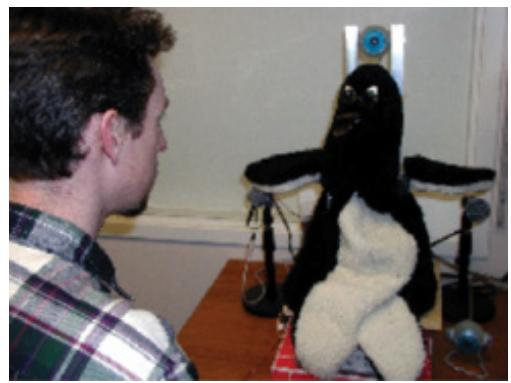

Figure 7.31 (a) Mel, the penguin robot, designed to host activities; (b) Japan’s Paro, an interactive seal, designed as a companion, primarily for the elderly and sick children   
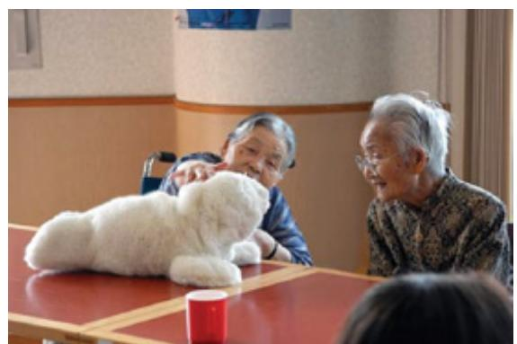  
Source: (a) Mitsubishi Electric Research Labs (b) Parorobots.com

Watch the video of Robot Pets of the Future at youtu.be/wBFws1lhuv0.

Drones  are  a form  of unmanned  aircraft that  are  controlled  remotely. They  were  first used by hobbyists and then by the military. Since then, they have become more affordable, accessible, and easier to fly. As a result, they have begun to be used in a wider range of contexts. These include entertainment, such as carrying drinks and food to people at festivals and parties. More recently, they have been used to drop medical supplies and all manner of groceries, from coffee to melons. People can order something on their phone and within minutes a parcel is released and lowered on a dangling piece of string in front of their house. Drones have also been used in the entertainment industry, for example, Firefly Drone Shows that are increasingly replacing conventional firework displays. They work by being preprogrammed, choreographed, and automated by a computer, and can even be recharged during shows.

Drones have also been used in the agricultural and construction industries, such as flying them over buildings or vineyards to collect data in the form of video footage  and photographs (see Figure 7.32). They have also been used to track poachers in wildlife  parks in Africa (Preece, 2016). Compared with other forms of data collection, they can fly low and stream photos to a ground station where the images can be stitched together into maps and then used to determine the health of a crop or when is the best time to harvest the crop.

  
Figure 7.32 A drone being used to survey the state of a vineyard Source: Drone inspecting vineyard / Shutterstock

Watch the video of a Firefly drone firework display at www.youtube.com/ watch?v=tcoIUd9Y3-w.

# Research and Design Considerations

An ethical  concern is whether it is acceptable to create robots that exhibit  behaviors  that humans will consider to be human- or animal-like. While this form of attribution also occurs for agent interfaces (see Chapter 3), having a physical embodiment—as robots do—can make people suspend their disbelief even more, viewing the robots as pets or humans.

This raises the moral question as to whether such anthropomorphism should be encouraged. Should robots be designed to be as human-like as possible, looking like us with human features, such as eyes and a mouth, behaving like us, communicating like us, and emotionally responding like us? Or, should they be designed to look like robots and behave like robots, for instance, vacuum cleaner  robots that serve a clearly  defined purpose? Likewise, should the interaction be designed to enable people to interact with the robot as if it were another human being, for example, by talking to it, gesturing at it, holding its hand, and smiling at it? Or, should the interaction be designed to be more like human–computer interaction, in other words, by pressing buttons, knobs, and dials to issue commands?

For many people, the cute pet approach to robotic interfaces seems preferable to one that seeks to design them to be more like fully fledged human beings. Humans know where they stand with pets and are less likely to be unnerved by them and, paradoxically, are more likely to suspend their disbelief in the companionship they provide.

Another ethical concern is the appropriation of drone technology. While there are many good uses that they have been used for, as mentioned earlier, they have also been used in more nefarious ways, such as spying on people (e.g., filming remotely inside people’s homes). More generally, there is the moral question of whether it is acceptable to use drones to take images or videos of fields, towns, and private property without permission or people knowing what is happening. Drones are also being used increasingly as lethal autonomous weapons (i.e., killer robots), which select and engage targets without any meaningful human  control. There  are many who oppose this development and think that they should be banned (for example, see Russell, 2022).

# 7.2.19  Brain–Computer Interfaces

Brain–computer  interfaces  (BCI)  provide  a  communication  pathway  between  a  person’s brain  waves  and an  external  device, such  as a  cursor on  a  screen or  a tangible  puck  that moves via airflow. The person is trained to concentrate on the task (for example, moving the cursor or the puck). Several research projects have investigated  how this  technique can be used to assist and augment human cognitive or sensory-motor functions. The way BCIs work is by detecting changes in the neural functioning of the brain. Our brains are filled with neurons that comprise individual nerve cells connected to one another by dendrites and axons. Every time we think, move, feel, or remember something, these neurons become active. Small electric signals rapidly move from neuron to neuron, which to a certain extent can be detected by electrodes that are placed on a person’s scalp. The electrodes are embedded in specialized headsets, hairnets, or caps.

BrainGate is a kind of BCI that has been developed to enable people who are paralyzed to control robots and be able  to move a cursor on a computer screen displaying  the letters of the alphabet (see Figure 7.33). A study found that after training participants were able to “point and click” on letters—similar to using a computer mouse—to type specific sentences (Pandarinath et al., 2017). On average, they could type nearly 8 words per minute.

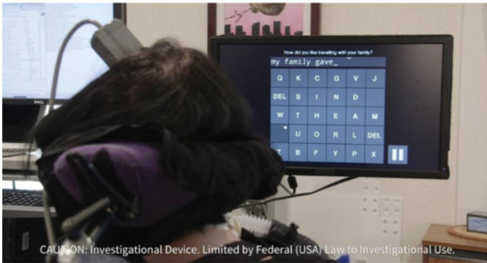  
Figure 7.33 A brain-computer interface being used by a woman who is paralyzed to select letters on a screen (Pandarinath et al., 2017)

Source: Brown University

Watch a video of a woman who is paralyzed moving a robot with her mind at youtu.be/ogBX18maUiM.

Brain–computer interfaces have also been developed for entertainment purposes, in particular, to control various games. For example, Brainball was developed as a game to be controlled by players’ brain waves in which they compete to control a ball’s movement across a table by becoming more relaxed and focused. Other possibilities include controlling a robot and being able to fly a virtual plane. Another development in the fields of neuroscience and bioengineering is to transfer neural signals from one person’s brain to another. This is called a brain-to-brain interface (BBI). Xiao Fang and colleagues (2021) have been exploring how this  way  of transferring  information  from  one  brain  to  another  could  be  used  in  playful experiences. To this end, they have developed a wearable headset that collects EEG data from one person’s brain that they then label and categorize into various states, before delivering it to another person’s brain, via a form of brain stimulation. The brain states are categorized

as “concentrating,” “focused,” “motor activity,” “stressed,” “excited,” “relaxed,” or “bored.” The goal is to see if they can literally transfer one person’s state of mind to someone else. If the  system detects, for example, that one person has a high level of concentration, it stimulates a specific part of another person’s cortex to try to increase their level of focused attention. Do you think this is possible and ethical?

To test this, Fang et al. ran a user study, where groups of three  participants were asked to play a card game together, wearing the BBI  system headsets that were all connected. They found that the participants would try to guess the cards each other had on receiving electrical stimulation  via the BBI. It was not clear whether they could change the  state of each other’s brains, but the study findings suggested that this kind of playful mind guessing can add a whole new dimension to playing games. Other researchers are also trying to develop technology that can read people’s minds. Neuralink, for example, is in the business of developing implantable brain–computer interfaces, with the goal of being able to determine what people are thinking.

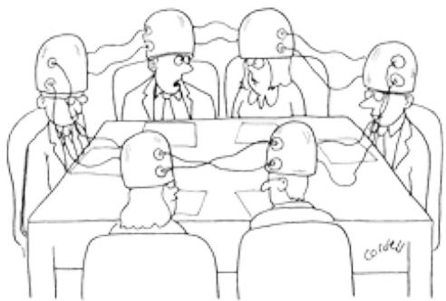

Source: Tim Cordell / Cartoon Stock

# Research and Design Considerations

NextMind has developed a noninvasive brain-sensing device intended for the mass market to enable users to play games and control electronic and mobile devices in real time using just their thoughts. An ethical concern with these kinds of advancements in brain-computer interfaces, however, is whether it is socially accepted for a machine to be able to work out what someone is thinking. Our thoughts have always been private, and making them interpretable by machines, which in turn could be accessed and read by other people, raises new concerns. Trying to guess what someone is thinking in a simple card game is one thing, but being able to read your friend’s mind who is thinking how bored they are of being with you may be a step too far. There is also the concern with how accurate BCI is in what it infers to be someone’s thoughts. The system might infer you are  thinking one  thing when you are  thinking about something quite different.

Besides  playing games, much of the  research into brain–computer interfaces has been motivated by helping people who are paralyzed interact with the world. A design challenge is determining what is the best way to lay out letters and words on a digital screen so that the

(Continued)

target space for each letter is sufficiently wide enough to allow for it to be selected while still ensuring all the relevant letters appear on the screen. The use of AI and predictive text could also be used as part of the training so the BCI learns more about how the paralyzed person is trying to communicate.

# 7.2.20  Smart Interfaces

The  motivation  for many  new  technologies  is  to make them  smart, whether  it  is  a smartphone,  smartwatch,  smart  building,  smart  home,  or  smart  appliance  (for  example  smart lighting, smart speakers, or virtual assistants). The adjective is often used to suggest that the device has some intelligence and it is connected to the Internet. More generally, smart devices are designed to interact with other devices connected to a network, many of which are automated (Silverio-Fernández et al., 2018). The goal is to make them context-aware, that is, to understand what is happening around them and execute appropriate actions. To achieve this, some have been programmed with AI so that they can learn the context and a person’s behavior. Using  this intelligence, they  then  change  settings  or  switch  things  on  according to the person’s assumed preferences. An example is the smart Nest thermostat that was designed to learn from a householder’s behavior.

Smart buildings have been designed to be more energy efficient and cost effective. Architects are motivated to use state-of-the-art sensor technology to control building systems, such as ventilation, lighting, security, and heating. Often, the inhabitants of such buildings are considered to be the ones at fault for wasting energy, as they may leave the lights and heating on overnight when not needed, or they forget to lock a door or window. One benefit of having automated systems take control of building services is to reduce these  kinds of human errors—a phrase often used by engineers is to take the human “out of the loop.”While some smart buildings and homes have improved how they are managed and cut costs, they can also be frustrating to the inhabitants, who sometimes would like to be able to open a window to let fresh air in or raise a blind to let in natural lighting. Taking the human out of the loop means that these operations are no longer available. Windows are locked or sealed, and heating is controlled centrally.

Instead  of simply  introducing  ever  more  automation that takes  the human  out  of the loop further, an alternative perspective is to consider the needs of the inhabitants in conjunction with introducing smart technology.

# Research and Design Considerations

A  new approach to considering smart interfaces that focuses on humans is called human– building interaction (HBI). It is concerned with understanding and shaping people’s experiences with, and within, built environments (Alavi et al., 2019). Current research is concerned with human  values, needs, and priorities when addressing people’s interactions with smart environments.

James Landay (2019) argues that we need to be mindful of whether the smart interfaces we are designing amplify our actions and remain attentive to our goals or whether they are

geared towards  accomplishing tasks autonomously. In terms of research considerations, he argues that we will need new metaphors to make understanding and using smart interfaces easier, just as the desktop, windows, and icon metaphors did for the GUI. What might these be? Should they, likewise, be based on everyday objects and activities or should they be more aligned with human qualities? Giving a robot a particular personality type, such as an extrovert or introvert, can be engaging and make them more appealing to people (Whittaker et al., 2021). One  of the benefits  of imbuing smart technologies, like speakers and robots, in this way is that it can promote user trust and acceptance. As there are many kinds of personalities to choose from, a design question is how to represent different ones at the interface so people can readily understand and like them.

# 7.2.21  Shape Changing Interfaces

Shape-changing interfaces employ physical shape  change as input  and  output to systems. A well-known example is a physical 3D bar chart that is positioned in a grid where a matrix of 3D rods move up and down to convey changes in a digital dataset. This type of dynamic physical representation has been found to help people with visualization tasks, including annotation, filtering, organization, and navigation (Alexander et al., 2018). Shape-changing interfaces have also been developed as a form of dynamic  material to explore novel interaction possibilities. Figure 7.34, for example, has been programmed using inFORM to show the shape of a car that can be felt by placing a hand over it. These kinds of shape-changing interfaces provide a different way of interacting with content compared with reading and touching digital displays.

Figure 7.34 inFORM: A shape-changing interface that uses a series of motor-controlled pins to render digital content in the form of 3D rods; developed by MIT Media Group   
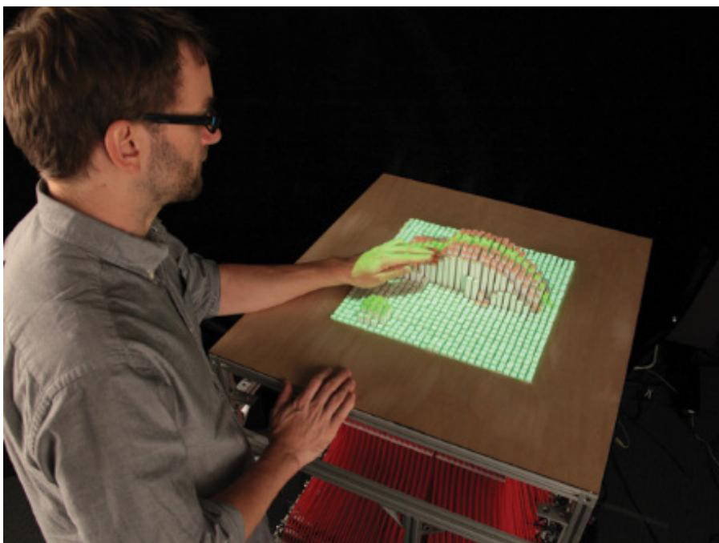  
Source: trackr-media.tangiblemedia.org/publishedmedia/Projects/2013-inFORM/inFORM%20Collection/4676

Other examples of shape-changing interfaces include data sculptures, tactile cartographic maps,  and “physicalizations.” The  last  of  these  are  physical artifacts  that  are  designed  to encode data in specific materials. An example is Physikit (Houben et al., 2016), which is a physical-digital system comprising a set of physical cubes that convey digital properties and are programmed  to visualize  real-time environmental  data  in the  home, such as  moisture, $\mathrm { C O } _ { 2 }$ , or light levels. An example PhysiCube called PhysiMove has a rotating disk on the top of it that moves clockwise or counterclockwise, depending on the kind of data it receives as input. The  main  benefits of using  these kinds of physical instantiations  of data is  to make the data  more accessible and to enable people  to more readily connect with the context in which the data is being collected or is changing over time (Sauvé et al, 2022). For example, the PhysiCubes are intended to be located in a home setting, such as the living room, which helps with the  interpretation of  the data. Imagine a group  of people  is sitting in  the living room one evening watching the cup final on TV and halfway through the game a house plant based on the PhysiCube disk starts moving clockwise much more rapidly. This indicates high levels of carbon dioxide have been detected. The people in the room can then work out from the context that it is not that the game is boring, causing them to yawn, but that the spike in the $\mathrm { C O } _ { 2 }$ level data is caused by them cheering a lot and, in so doing, exhaling more.

# Research and Design Considerations

Shape-changing interfaces provide  new  opportunities for  experiencing and  exploring data using the sense of touch as well as sight. A research question this raises is, does this facilitate enhanced understanding and engagement with a dataset? In particular, does it give people a better sense of how healthy they are if they can see their step count or heart rate change in this way? Might this be more preferable than seeing 2D or 3D bar charts on a screen?

Design considerations include the optimal size for a grid of physical rods and the optimal  number of physical cubes to design in a set that people can learn and remember what they mean.

# 7.2.22  Holographic Interfaces

Holographic interfaces try to create the illusion of a 3D person being present through taking advantage of the human perceptual system. Advances in projection and display technology have enabled these kinds of digital representations to appear quite convincing. For example, David Nussbaum’s Proto system (see Box 5.4 in Chapter 5) is an innovative form of this kind of “holographic” illusion. The Proto system lets people beam themselves to a remote location and interact with the people there.

Another  form  of  perceptual illusion that makes  virtual avatars appear as  if they  were real  was created  for the  UK  show  Abba Voyage, first  launched in  2022. The  virtual concerts feature avatars (dubbed “ABBAtars”), depicting  the group  as they appeared  in 1977.

The technology used includes three 65-million-pixel screens (massive flat displays that make the  images  projected  look  as  if  they  were  real)  and  motion-capture  technology  (see  Figure 7.35). Many people who have gone to the show are completely blown over by how lifelike they appear.

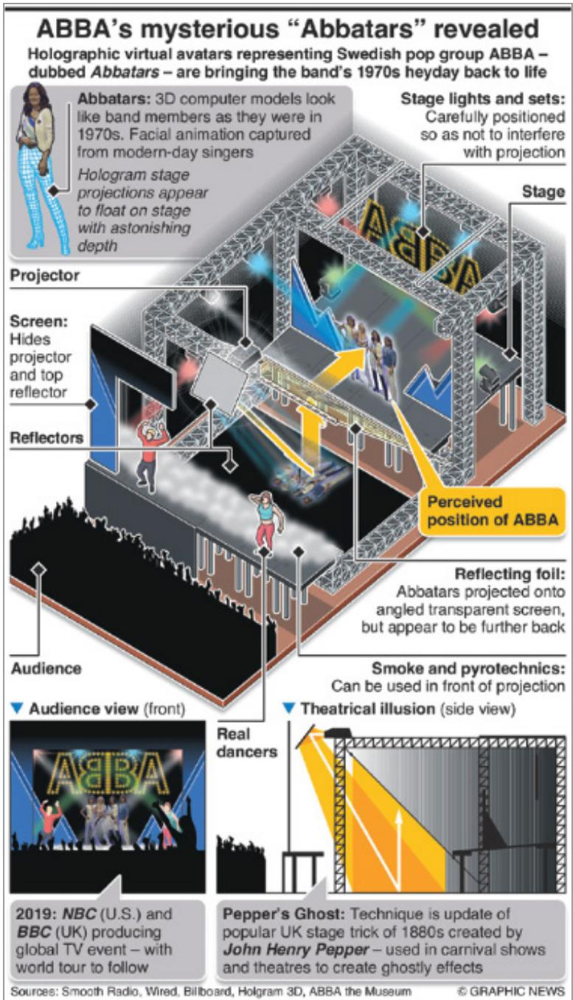  
Figure 7.35 An infographic showing how avatars of the band ABBA were created Source: www.graphicnews.com/en/pages/38425/entertainment-abbas-mysterious-abbatars-revealed-1

# Research and Design Considerations

There is currently much research being conducted in the tech industry exploring what is the best way to represent people in virtual spaces so that they feel comfortable, are engaging to interact with, feel natural, and do not appear creepy (see also discussion in Chapter 5).

Design considerations include what size the holographs should be and how people viewing them can interact and communicate with them being projected into their space.

# 7.3  Natural User Interfaces and Beyond

As we have seen, there are many kinds of interfaces that can be used to design for user experiences. The staple for many years was the GUI, then the mobile device interface, followed by touch, and now wearables and smart interfaces. In the near future, we could see more holographic  interfaces. Without  question,  they  have  been  able  to  support  all  manner  of  user activities. What comes next? Will other kinds of interfaces that are projected to be more natural become more mainstream?

A natural user interface (NUI) is designed to allow people to interact with a computer in the same way that they interact with the physical world—using their voice, hands, and bodies. Instead of using a keyboard, mouse, or touchpad (as is the case with GUIs), NUIs enable users to speak to machines, stroke their surfaces, gesture at them in the air, and smile at them to get a reaction, and so on. The naturalness refers to the use of everyday skills humans have developed and learned, such as talking, writing, gesturing, walking, and picking up objects. In theory, they should be easier to learn and map more readily onto how people interact with the world than compared with learning to use a GUI.

Instead of having to remember which function keys to press to open a file, a NUI means a person  only has  to raise their arm  or  say “open.” But  how natural are  NUIs? Is  it  more natural to say “open” than to flick a switch when you want to open a door? And is it more natural to raise both arms to change a channel on the TV than to press a button on a remote device or tell it what to do by speaking to it? Don Norman (2010) in his controversial paper on NUIs  argues that whether a NUI  is natural  depends on a  number of factors,  including how much learning is required, the complexity of the app or device’s interface, and whether accuracy and speed are needed. Sometimes a gesture is worth a thousand words. Other times, a word is worth a thousand gestures. It depends on how many functions the system supports.

Consider the sensor-based  faucets that were described in Chapter 1. The gesture-based interface works mostly (with the exception of people wearing black clothing that cannot be detected) because  there  are only  two  functions: (1)  turning on  the water by  waving one’s hands under  the tap, and (2) turning off the water by removing  them from  the sink. Now think about other functions that faucets usually provide, such as controlling water temperature and flow. What kind of a gesture would be most appropriate for changing the temperature and then the flow? Would one decide on the temperature first by raising one’s left arm and the flow by raising  one’s right arm?  How would someone know when to stop  raising their  arm to  get  the right  temperature? Would  they  need  to put  a  hand  under  the  tap  to

check? But if they put their right hand under the tap, might that have the effect of decreasing the flow? And when does the system know that the desired temperature and flow has been reached? Would it require having both arms suspended in midair for a few seconds to register that was the desired state? It is a difficult problem on how to provide these choices, and it is probably why sensor-based faucets in public bathrooms all have their temperature and flow set to a default.

Our overview of different  interface types in this chapter  has highlighted  how gestural, voice, and other kinds of interfaces have made controlling input and interacting with digital content easier and more enjoyable, even though sometimes they can be less than perfect. For example, using gestures and whole-body movements have proven to be highly enjoyable as a form of input for computer games and physical exercises. Furthermore, new kinds of gesture, voice, and touch interfaces have made the web and online tools more accessible to those who are visually impaired. For example, the iPhone’s VoiceOver control features have empowered visually  impaired individuals  to be able  to easily send email, use  the web, play music, and so  on, without  having  to buy an  expensive  customized phone  or screen  reader. Moreover, being  able to purchase a regular  phone means not being  singled out for special  treatment. And while some gestures may feel cumbersome for sighted people to learn and use, they may not be so for blind or visually impaired people. The iPhone VoiceOver press and guess feature that reads out what you tap on the screen (for example, “messages,” “calendar,” “mail: 5 new items”) can open up new ways of exploring an application while a three-finger tap can become a natural way to turn the screen off.

In contrast to many of the interfaces we have described, brain-computer interfaces are quite  unnatural as  humans  are  not  used  to  trying  to  control the  world  with  their  minds. Instead, they require considerable training to be used to do even very limited actions, such as selecting a letter appearing on a digital display.

Using brain, body, behavioral, and environmental sensors, it is now possible to capture subtle  changes  in people’s cognitive and emotional  states  in real  time. This opens  up  new doors  in  human–computer  interaction.  In particular,  it  allows for  information  to  be  used as  both continuous  and  discrete  input, potentially enabling  new  outputs  to  match  and be updated  with what  people might  want  and need  at any  given time. Adding AI to  the mix has also enabled new types of interface to emerge that go beyond simply being natural and smart—ones that allow people to work  synergistically with technology  to solve  ever-more complex problems and undertake unimaginable feats.

# 7.4  Which Interface?

This chapter presented an overview of the diversity of interfaces that is now available or currently being researched. There are many opportunities to design for user experiences that are a far cry from those originally developed using the command-based interfaces of the 1970s. An obvious question this raises is, which one and how do you design it? In many contexts, the  requirements  and  opportunities  for  the  user  experience  that  have  been  identified  will determine  what  kind  of interface  might  be  appropriate and  what  features  to include. For example, if a healthcare app is being developed  to enable patients to monitor their dietary intake, then a mobile device that has the ability to scan barcodes and/or take pictures of food items  that  can  be  compared  using  machine  learning  algorithms  with  a  database  of  food

images would be a good interface to use, enabling mobility, effective object recognition, and ease of use. If the goal is to design a work environment to support co-located group decisionmaking  activities,  then  combining shareable  technologies, conversational  agents, and  personal devices that enable people to move fluidly among them would be good to consider using.

But how to decide which interface is preferable for a given task or activity? For example, is multimedia better than tangible interfaces for learning?  Is voice effective as a commandbased interface? Is a multimodal interface more effective than a single media interface? Are wearable interfaces better than mobile interfaces for helping people find information in foreign  cities? How  does VR  differ from  AR, and  which is  the  ultimate  interface for playing games? In what way are tangible environments more challenging and captivating than virtual worlds? And  so  forth. In  practice, which  interface  is  most  appropriate,  most  useful,  most efficient, most engaging, most supportive, and so on, will depend on the interplay of a number of factors, including type of task, the people using the system, context, reliability, social acceptability, privacy, ethical, and location concerns.

# In-Depth Activity

Choose a game that you or someone you know plays a lot on a smartphone (for example, Candy  Crush Saga, Fortnite, or Minecraft). Consider how the  game could be played using different interfaces other than the smartphone’s. Select three different interfaces (for instance, tangible, wearable, and smart speaker) and  describe how the game could be redesigned for each of these, taking into account the user group being targeted. For example, the tangible game could be designed for children, the wearable interface for young adults, and the smart speaker for visually impaired people.

1. Go through the research and design considerations for each interface and consider whether they are relevant for the game setting and what considerations they raise.   
2. Describe a hypothetical scenario of how the game would be played for each of the three interfaces.   
3. Consider specific design issues that will need to be addressed. For example, how will the players interact with the game elements for each of the different interfaces—by using a pen, fingertips, voice, or other input device? How do you turn a single-player game into a multiple player one? What rules would you need to add?   
4. Compare the pros and cons of designing the game using the three different interfaces with respect to how it is played on the smartphone.

# Summary

This chapter provided an overview of the diversity of interfaces that can be designed, identifying key design issues and research questions that need to be addressed. It has highlighted the opportunities and challenges for designers  and researchers who are experimenting with and developing innovative interfaces. It also explained some of the assumptions behind the benefits of different  interfaces—some that are currently  supported  and  others that are still unsubstantiated. The chapter presented a number of interaction techniques that are particularly suited (or not) for a given interface type. It also discussed the dilemmas facing designers when using a particular kind of interface, for example, abstract versus realism, menu selection versus free-form text input, and human-like versus non-human-like. Finally, it presented pointers to specific design guidelines and exemplary systems that have been designed using a given interface.

# Key Points

•  Many interfaces have emerged  since  GUIs,  including  voice, wearable,  mobile,  tangible, brain-computer, smart, robots, drones, and now holographic.   
•  A range of design and research questions need to be considered when deciding which interface to use and what features to include.   
•  Natural user interfaces may not be as natural as graphical user interfaces—it depends on the task, person, and context.   
•  An important concern that underlies the design of any kind of interface is how information is represented to people (be it speech, multimedia, virtual reality, augmented reality) so that they can make sense of it with respect to their ongoing activity, for example, playing a game, shopping online, or interacting with a pet robot.   
•  Increasingly, new interfaces that are  context-aware or monitor people raise ethical issues concerned with what data is being collected and for what is it being used.

# Further Reading

Many practical books have been published on interface design. Some have been revised into second editions. Publishers like New Riders and O’Reilly frequently offer up-to-date books for a specific interface area (for example web or voice). Some are updated on a regular basis, while others are published when a new  area emerges. There  are also a number of excellent online resources, sets of guidelines, and thoughtful blogs and articles.

BERKUN, S.  (2020)  How  Design  Makes  the World. Berkun  Media  LLC. This  illustrated book is highly accessible covering all kinds of design, including appliances, city planning, and software engineering. It examines our everyday experiences such as going to work, shopping for food, and our use  of social media. It  is intended to get the  general public to ask  better questions about the things they buy, use, and make.

DASGUPTA, R.  (2019)  Voice  User Interface  Design:  Moving  from  GUI  to Mixed  Modal Interaction. Apress. This is a guide that covers the challenges of moving from GUI design to mixed-modal interactions. It describes how our interactions with devices are rapidly changing, illustrating this through a number of case studies and design principles of VUI design.

GOOGLE Material Design. material.io/design. This online resource provides a living online document  that  visually  illustrates essential  interface  design principles. It  is  beautifully laid out and very informative to click through all of the  interactive examples that it provides. It shows how to add some physical properties to the digital world to make it feel more intuitive to use across platforms.

KRISHNA, G.  (2015)  The  Best  Interfaces Are  No  Interfaces. New Riders. This  polemical and funny book challenges the reader to think beyond the screen when designing interfaces.

KRUG, S. (2014) Don’t Make  Me Think! (3rd ed.). New Riders Press. The third edition of this very accessible classic guide on web design presents up-to-date principles and examples on web  design with a focus on  mobile usability. It is  highly entertaining with  lots of great illustrations.

NORMAN, D. (2010) “Natural  interfaces  are not  natural,” interactions, May/June, 6–10. This is a thought-provoking essay by Don Norman about what is natural may not appear to be natural, which is still very relevant today.

ROWLAND, C., GOODMAN, E., CHARLIER, M., LIGHT,A., and LUI, A. (2015) Designing Connected Products. O’Reilly. This collection of chapters covers the challenges of designing connected products that go beyond the traditional scope of interaction design and software development. It provides a road map and covers a range of aspects, including pairing devices, new business models, and flow of data in products.

STAIANO, F.  (2022) Designing and Prototyping Interfaces with Figma: Learn essential UX/ UI design principles by creating interactive prototypes for mobile, tablet, and desktop. Birmingham Packt Publishing. This is a hands-on book for someone wanting to learn Figma and use it  to design responsive mobile applications for mobile, tablet and desktop interfaces. It covers the process of creating a complete design using the various Figma tools such as Components, Variants, Auto Layout.

# INTERVIEW with Leah Buechley

Leah Buechley is an associate professor in the  Department  of  Computer  Science  at the University  of New Mexico. Her work explores  the  intersection  of computer  science, art, design, and education. She has a PhD  in  computer science  and  a  degree in physics. She  began  her  studies  as a dance major and has also been deeply engaged in theater, art, and design over the years. She was the founder and director of the highlow tech group at the MIT media lab from 2009  to  2014.  She  has  always  blended the sciences and  the arts in her  education and her career, as witnessed by her current work, which consists of computer science, industrial  design,  interaction  design,  art, and electrical engineering.

# What is the focus of your work?

I’m most interested in changing the culture of  technology  and engineering to  make it more diverse and inclusive. To achieve that goal, I  blend computation  and electronics with a range of different materials and employ techniques drawn from art, craft, and design.  This  approach  leads  to  technologies and learning experiences that appeal to a diverse group of people.

# Can you give me some examples of how you mesh the digital with physical materials?

My creative focus  for  the  last several  years has been computational design—a process in which objects are designed via an algorithm and then constructed with a combination of fabrication and hand building. I’m especially excited  about  computational  ceramics and have been developing a set of tools and tech-

niques that enable people to integrate  programming and hand building with clay.

I also worked on a project called LilyPad Arduino (or LilyPad), which is a construction kit that enables people to embed computers and electronics into fabric. It’s a set of sewable electronic pieces, including microcontrollers, sensors, and LEDs, that are stitched together with conductive thread.  People can  use  the kit to make singing pillows, glow-in-the-dark handbags, and interactive ball gowns.

Another  example  is  the  work  my  former  students  and  I  have  done  in  paperbased  computing.  My  former  student  Jie Qi  developed  a  kit  called  Chibitronics circuit  stickers  that  lets  you  build  interactive  paper-based  projects. The kit  comprises  a set  of flexible  peel-and-stick electronic stickers. You  can connect ultra-thin LEDs,  microcontrollers, and  sensors  with conductive ink, tape, or thread to quickly make beautiful electronic sketches.

The  LilyPad  and  Chibitronics  kits  are now  used by people around  the world  to learn  computing and electronics. It’s been fascinating and exciting to see this research have a tangible impact.

# Why  would  anyone want to  wear a  computer in their clothing?

Computers open up new creative possibilities  for  designers.  Computers  are  simply a  new  tool,  albeit  an  especially  powerful one,  in  a  designer’s toolbox.  They  allow clothing  designers  to make  garments  that are dynamic and interactive. Clothing can, for  example, change  color  in  response  to pollution levels, sparkle when a loved one

calls you on the phone, or notify you when you blood pressure increases.

# How  do  you  involve  people  in  your research?

I engage with people in a few different ways. First, I design hardware and software tools to help people build new and different kinds of technology. The LilyPad is a good example of this kind of work. I hone these designs by teaching workshops to different groups of people. And once a tool is stable, I work hard to disseminate  it to users in the  real world. The LilyPad has been commercially available for many years, and it has  been fascinating and  exciting to see  how  a  group  of realworld  designers—who  are  predominantly female—is using it to build things like smart sportswear,  plush  video  game controllers, soft robots, and interactive embroideries.

I  also  strive  to  be  as  open  as  possible  with  my  own  design  and  engineering explorations.  I  document  and  publish  as much information as I can about the materials, tools, and processes I use. I apply an open source approach not only to the software  and hardware I  create  but, as  much

as  I  can,  to  the  entire  creative  process. I  develop  and  share  tutorials,  classroom and  workshop  curricula,  materials  references, and engineering techniques.

What excites you most about your work? I  am infatuated with materials. There  is nothing  more inspiring  than a  sheet  of heavy paper, a length of wool felt, a slab of clay, or a box  of old  motors. My thinking about  design and  technology is largely driven by explorations of materials  and their affordances. So, materials  are  always delightful. For example, the shape and surface pattern of the cup in Figure 7.36 were computationally  designed.  A  template of the  design was  then laser  cut  and  pressed into a flat sheet or “slab” of clay. Finally, the clay was  folded into shape  and  then fired and  glazed using  traditional  ceramic  techniques. But the real-world adoption of tools I’ve designed and the prospect this presents for changing technology culture is perhaps what’s most exciting. My most dearly held goal is to expand and diversify technology culture, and it’s tremendously rewarding to see evidence that my work is doing that.

Figure 7.36 An example of a computational cup   
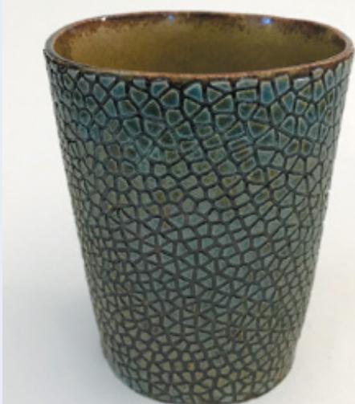  
Source: Used courtesy of Leah Buechley

