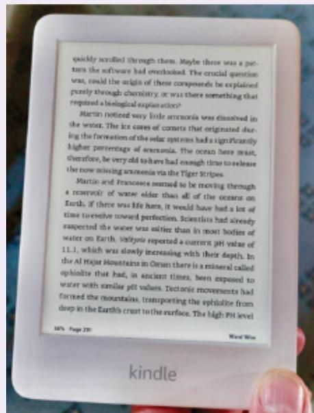
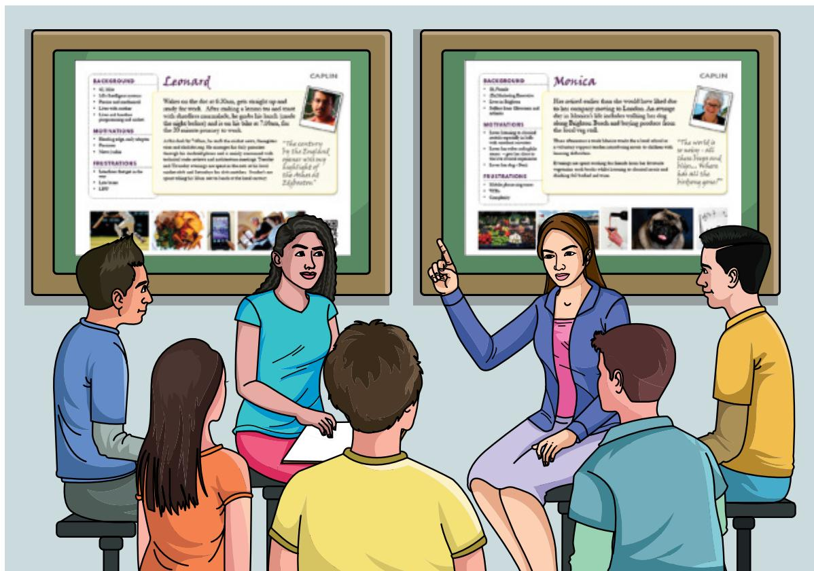
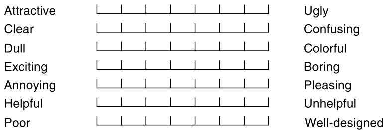
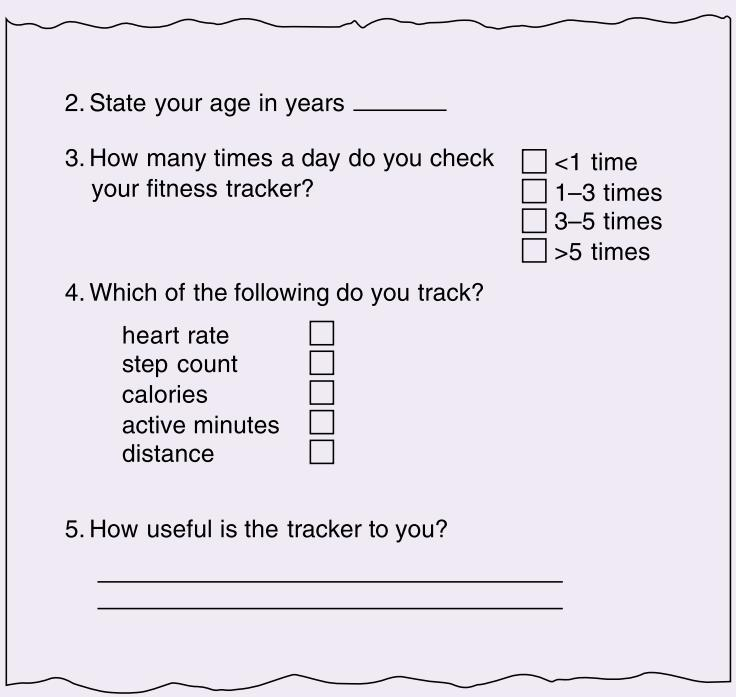
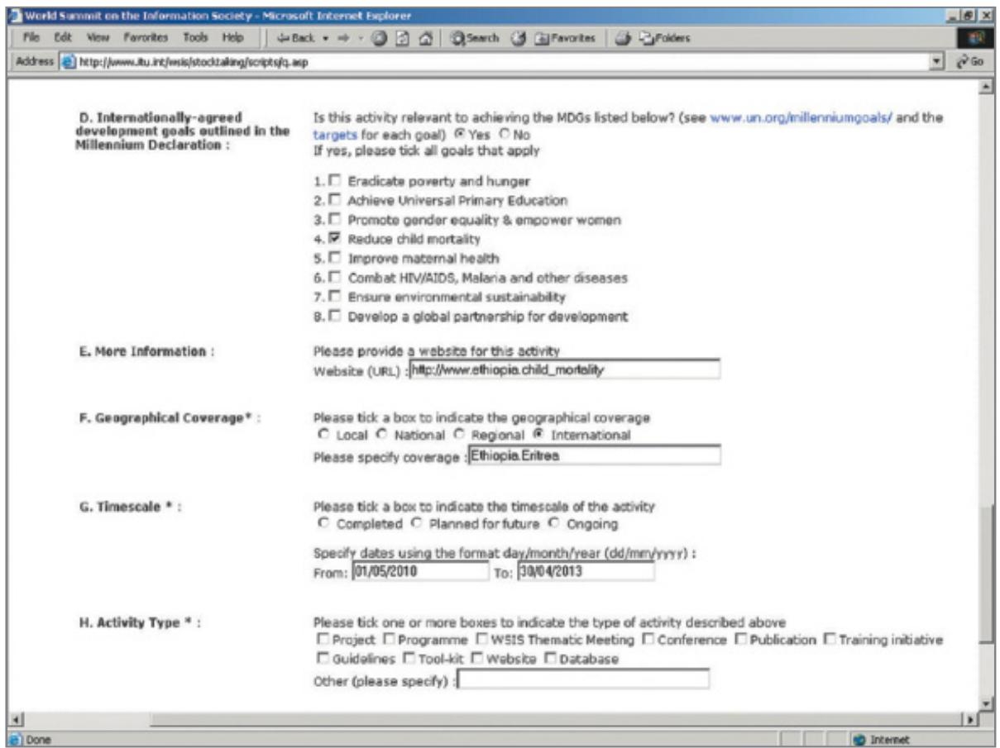

# Chapter 8

# D A T A  G A T H E R I N G

8.1  Introduction   
8.2  Six Key Issues   
8.3  Capturing Data   
8.4  Interviews   
8.5  Questionnaires   
8.6  Observation   
8.7  Putting the Techniques to Work

# Objectives

The main goals of the chapter are to accomplish the following:

•  Discuss how to plan and run successful data gathering sessions.   
• Enable you to plan and run an interview.   
•  Enable you to design a simple questionnaire.   
• Enable you to plan and carry out an observation.

# 8.1  Introduction

Data  is everywhere. Indeed, it is common to hear people say that we are drowning in data because there is so much of it. So, what is data? Data can be numbers, words, measurements, descriptions, comments, photos, sketches, films, videos, or almost anything that is useful for understanding  a  particular design, stakeholders’ goals, and people’s behavior.  Data  can be quantitative or qualitative. For example, the time it takes someone to find information on a web page and the number of clicks to get to the information are forms of quantitative data. What someone says about the web page is a form of qualitative data. But what does it mean to collect these and other kinds of data? What techniques can be used, and how useful and reliable is the data that is collected?

This  chapter  presents  some  techniques  for data  gathering  that  are commonly  used  in interaction  design  activities.  In  particular,  data  gathering  is  a  central  part  of  discovering

requirements and evaluation. Within the requirements activity, data  gathering is conducted to collect enough information so that design can proceed. Within evaluation, data gathering captures participants’ reactions and their performance with a system or prototype. All of the techniques discussed in this chapter  can be used with little to no programming or technical skills. Techniques for managing huge amounts of data, such as those for scraping large volumes of data from online activities, like Twitter posts, and the implications of their use, are discussed in Chapter 10, “Data at Scale and Ethical Concerns.”

Three  main  techniques  for  gathering  data  are  introduced  in  this  chapter:  interviews, questionnaires, and observation. The next  chapter  discusses  how  to analyze  and  interpret the data collected. Interviews involve an interviewer asking one or more interviewees a set of questions, which may be highly structured or unstructured. Interviews are usually synchronous and are often face-to-face, but they  can be conducted  asynchronously, e.g., via email or  chat, and  are  commonly  conducted  remotely.  Questionnaires  are  a  series  of  questions designed  to be answered  asynchronously, that is, without  the presence  of the  investigator. These questionnaires may be online or paper-based. Observation may be direct or indirect. Direct observation involves observing participants’ activities as they happen. Indirect observation involves making a record of the participant’s activity as it happens, to be studied at a later date. All three techniques may be used to collect qualitative or quantitative data.

Although this is  a small set of basic techniques, they are flexible and can be combined and extended in many ways. Indeed, it is important not to focus on just one data gathering technique, if possible, but to use them in combination so as to avoid biases that are inherent in any one approach.

# 8.2  Six Key Issues

Six key issues require attention for any data gathering session to be successful: goal setting, identifying participants, the relationship  between  the data  collector and the data  provider, ethical considerations of collecting data, triangulation, and pilot studies.

# 8.2.1  Setting Goals

The main reason for gathering data is to glean information about people, their behavior, or their reaction to technology. Examples include understanding how technology fits into family life, identifying which of two  icons  representing “upload  file” is  easier  to understand, and finding out whether the planned redesign for a smart meter is more memorable than the previous design. There are many different reasons for gathering data. Setting specific goals for the study will inform the nature of data gathering sessions, the data gathering techniques to be used, and the analysis to be performed (Robson and McCartan, 2016).

These goals may be expressed more or less formally. For example, in online experiments such as A/B testing, mathematically expressed metrics usually underpin the experiment’s goal, i.e., to evaluate two (or more) design alternatives. Combining several metrics into one evaluation criterion is complex, as discussed by Ron Kohavi et al. (2020), so several metric values may form the basis of the goal. For example, the formula in Figure 8.1 is one of the organizational metrics used for monitoring the performance of Bing’s search engine.

<!-- Chunk 6 End -->

<!-- Chunk 7 Start -->

$$
\text {D i s t i n c t q u e r i e s p e r m o n t h} = n \frac {\text {U s e r s}}{\text {M o n t h}} \times \frac {\text {S e s s i o n s}}{\text {U s e r}} \times \frac {\text {D i s t i n c t q u e r i e s}}{\text {S e s s i o n}}
$$

Figure 8.1  An example organizational metric used in online experiments for Bing’s search engine. The second and third terms on the right side are computed over the month. A session begins with a user query and ends with 30 minutes of inactivity.

Source: Kohavi, R., Tang, D., and Ya, X. (2020) Trustworthy Online Controlled Experiments: a practical guide to A/B testing, Cambridge University Press

A less formal style of study goal may be sufficient for the purpose of testing initial ideas, or for other exploratory studies. For example, Abir Ghorayeb et al. (2021) designed and ran a study with the goal of understanding older people’s views of smart homes and how their experience can influence those views.

Whatever the format, goals for data gathering should be sufficiently well-defined so that it is clear when the goal has been met. How to recognize when a goal has been met will vary according to the technique used.

# 8.2.2  Identifying Participants

The  goals  developed  for the  data gathering  session  will  indicate the  types of  people from whom data is to be gathered. Those people who fit this profile are called the population or study  population. In some cases, these people may be clearly identifiable—perhaps because there  is  a small  group  of stakeholders  and access  to each one  is  easy.  However, it  is  more likely that participants need to be selected from a wider set, and this is called sampling. The situation where  all members  of the population  are  accessible is called  saturation sampling, but this is quite rare. Assuming that only a portion of the population will be involved in data gathering, then there are two options: probability sampling or nonprobability sampling. In the former case, the most commonly used approaches are simple random sampling and stratified sampling; in the latter case, the most common approaches are convenience sampling and volunteer panels.

Random sampling can be achieved by using a random number generator or by choosing every  nth person  in a list. Stratified  sampling relies  on being able  to divide the  population into groups (for example, classes in a secondary school) and then applying random sampling. Both convenience sampling and volunteer panels rely less on choosing the participants and more on the participants being prepared to take part. The term convenience sampling is used to describe a situation where the sample includes those who were available rather than those specifically selected. Another  form of convenience sampling is snowball sampling, in which a current participant finds another participant and that participant finds another, and so on. Much like a snowball adds more snow as it gets bigger, the population is gathered up as the study progresses.

The crucial  difference between  probability  and  nonprobability methods  is  that in  the former  you can apply statistical  tests and generalize to the whole population, while in the latter such generalizations are not robust. Using statistics also requires a sufficient number of participants. Vera Toepoel (2016) provides a more detailed treatment of sampling, particularly in relation to survey data.

Using crowdsourcing to identify participants allows access to a large number of potentially more diverse  participants and has been used to good effect in a range of studies (see Chapters 10 and 14, “Introducing Evaluation”). Specifying the profile of participants is still required; for example, Prolific (a platform for contacting and filtering potential participants) allows screening based on a wide range of characteristics including shopping and consumer habits,  work  situation,  handedness  (left-  or  right-handed),  hobbies,  and  beliefs  (including political and religious beliefs), as well as demographics.

For more information about how to use crowdsourcing in interaction design, see digital.gov/2014/12/09/can-you-crowdsource-your-user-experience-research.

For  more  information  on  the  advantages  and  limitations  of  collecting data  online,  see  researcher-help.prolific.co/hc/en-gb/articles/360009501473- What-are-the-advantages-and-limitations-of-an-online-sample-.

# BOX 8.1

# How Many Participants Are Needed?

A  common question is, how many participants are  needed for a study? In general, having more participants is better because they provide evidence from a wider population, and interpretations of statistical  test results can  be stated with higher confidence. What this means is that any  differences  found among conditions are  more likely to be caused by a genuine effect rather than being due to chance. But a small number of participants is appropriate for in-depth qualitative studies where statistical tests may not be appropriate.

There are many ways to determine how many participants are needed. Four of these are saturation, cost and feasibility analysis, guidelines, and prospective power analysis (Caine, 2016).

Saturation relies on data being collected until no new relevant information emerges, so it is not possible to know the number in advance of the saturation point being reached.   
Choosing the  number of participants based on cost and  feasibility constraints is a practical approach and is justifiable; this kind of pragmatic decision is common in industrial projects but rarely reported in academic research.   
Guidelines may  come from experts  or from “local standards,”  for  instance,  from an accepted norm in the field.   
Prospective power analysis is a rigorous method used in statistics that relies on existing quantitative data about the topic; in interaction design, this data is often unavailable, making this approach infeasible, such as when a new technology is being developed.

Kelly Caine (2016) investigated the sample size (number of participants) for papers published at the international Computer-Human Interaction (CHI) conference in 2014. She found that several factors affected the sample size, including the method being used and whether the data was collected in person or remotely. In this set of papers, the sample size varied from 1 to 916,000, with the most common size being 12. So, it is tempting to say that this suggests that a “local standard” for interaction design is 12, as a rule of thumb. However, this obscures the fact that the nature of the data gathering, its goals, target population, and stage of product development all affect the number of participants required.

# 8.2.3  Relationship with Participants

One significant aspect of any data gathering is the relationship between those doing the gathering and those providing the data. Having a clear and professional relationship and building rapport  with  participants increases  the  likelihood of  a successful study. In many  countries participants must be given sufficient information about the project, the data that will be collected, and how the data is to be used for them to make an  informed decision about  their participation. This informed consent may be given in written form by signing a document or orally via an audio or video recording. The key thing is that evidence of the participant being informed about the study and of them giving consent is captured. Figure 8.2 shows a typical example of a written informed consent form that might be used in the United States or United Kingdom. The details  of this form will vary, but it  usually asks the  participants to confirm that the purpose of the data gathering and how the data will be used has been explained to them and that they are willing to continue. It explains that their data will be private and kept in a secure place. It also often includes a statement that participants  may withdraw at any time  and that  in  this case  none  of  their data  will be  used  in the  study. If  subsequent  data gathering involves audio or video recording, consent may also be given orally. In some institutions, mandatory ethics training is required before approval from an ethics  board will be given to the researchers conducting the study.

The principle of informed  consent protects the interests of both the data gatherer and the data provider. The gatherer wants to know that the data they collect can be used in their analysis, presented to interested parties, and published in reports. The data provider wants reassurance  that  the  information  they  give  will  not  be  used  for  other  purposes  or  in  any context that would be detrimental to them. This is especially true when people with disabilities or  children are  participants. In these cases, parents  are asked to sign the  form. How to establish informed consent may need to be tailored depending on the group of participants. For example, when engaging with professional participants in a commercial setting, a nondisclosure agreement may also be required (Sharp et al., 2022). As with most ethical issues, the important thing is to consider the situation and make a judgment based on the specific circumstances.

Building rapport with participants encourages them to participate in a relaxed manner. Building  rapport  in  a remote  setting  has  particular  challenges, especially  if  the  communication  medium  is  limited, e.g.,  audio only  so  the participant  can’t  be seen. Some  of these challenges relate to missing body language and personal dynamics, and building trust takes longer if the people don’t already know each other (Dray and Siegel, 2004).

How to build rapport and gain acceptance by participant communities differs across situations. For example, Peter Kaulbach et al. (2021) describe the communication conventions adopted between research teams and the Donkerbos San community in Namibia for a number of ongoing projects. This includes communications before arrival at the community and communications during the visit that include a meeting with the local headman, community meetings to greet everyone and share progress related to ongoing projects, and a departure community meeting to review the visit. In their paper, they observe that this is important to build trust and also to understand differing sociocultural norms.

Incentives may be needed to encourage  sufficient numbers of participants to take  part, particularly if there is  no clear advantage  to the respondents. For  example, asking support sales executives to complete a questionnaire about a new app that will impact their activities day-to-day is  a different  proposition from asking school children to evaluate a new  game. Different motivations are at play in these two circumstances, and hence different incentives would be appropriate.

# INFORMED CONSENT FOR the Recycle Project

# Please highlight your choice by clicking inside the appropriate box:

<table><tr><td>I have read and understood the information sheet, or it has been read for me, and I have been able to ask questions about my participation and my questions have been answered to my satisfaction.</td><td>YES□</td><td>NO□</td></tr><tr><td>I consent to be a participant in this study and understand that participation is voluntary and that I will not be paid for my participation.</td><td>YES□</td><td>NO□</td></tr><tr><td>I understand that I can refuse to answer questions I am not comfortable with and that I may withdraw and discontinue participation at any time in this study, up to 2 months after data collection, without giving a reason.</td><td>YES□</td><td>NO□</td></tr><tr><td>I understand that taking part in the study involves being observed while performing given tasks using the RECYCLE app on a smartphone provided to me, and interviewed about its use both individually and in a group.</td><td>YES□</td><td>NO□</td></tr><tr><td>I agree to photos being taken during the observation sessions.</td><td>YES□</td><td>NO□</td></tr><tr><td>I agree to the interview/focus group being audio-recorded and/or written notes being taken.</td><td>YES□</td><td>NO□</td></tr><tr><td>I agree to my activity on the RECYCLE app being recorded and stored in a log file.</td><td>YES□</td><td>NO□</td></tr><tr><td>I understand that information I provide will be used for research and dissemination purposes only.</td><td>YES□</td><td>NO□</td></tr><tr><td>I understand that personal information collected about me that can identify me, such as my name or where I live, will not be shared beyond the study team.</td><td>YES□</td><td>NO□</td></tr><tr><td>I understand that my data will be stored on encrypted devices until the end of the project when it will be destroyed.</td><td>YES□</td><td>NO□</td></tr><tr><td>I understand that my participation will be anonymous and any details that might identify me will not be included in reports or other publications produced from the study.</td><td>YES□</td><td>NO□</td></tr><tr><td>I consent for anonymized quotations from my interview to be used in reports or other publications and presentations.</td><td>YES□</td><td>NO□</td></tr></table>

Name (PRINT):

Date:

Signature:

[Names and contact information for all team members involved in data gathering]

Figure 8.2  Example informed consent form for the Recycle Project, an investigation into the use of a new smartphone app for advising people how best to recycle their rubbish. Participants are also provided with a project information sheet that explains the project, the data gathering to be undertaken, and the use to which their data will be put.

# 8.2.4  Ethical Considerations of Data Collection and Storage

In addition to informed consent to take part in the study, there are various issues relating to data collection and storage that have ethical implications. Lightweight, high-quality recording equipment is readily available nowadays, e.g., through a smartphone, so capturing data is  very easy. People are used to taking photographs and videos in many social settings, and video conferencing systems can automatically take audio and video recordings, or even transcriptions. Screenshots may also be captured with the click of a button, and large amounts of data are available through online activity such as tweets and messaging. However, all data needs  to  be  stored  securely,  and  anyone  who  has  data  about  them  captured  has  to  give informed consent. This last point is straightforward when there’s only a few people involved in  the  sessions, but if  data  gathering takes  place  outside with lots of  people around, what happens  then?  Data  that is  collected  from  specific individuals  can  be  anonymized  before analysis, but  checking what  is in  the data  is important  to ensure  that  the  recordings don’t include unnecessary details that may cause embarrassment or harm if made public.

Where and how the data is stored also needs to be considered. Data must also be stored securely,  but many data storage systems  include facilities that may be physically anywhere in  the  world. The  regulations  covering  access to  this  data  will  depend on  the  jurisdiction where that machine is located, and different countries operate different rules regarding data security. For  example, the European  Union’s General  Data  Protection  Regulation  (GDPR) came  into force  in  May 2018. It  applies  to all  EU organizations  and  offers the individual unprecedented control over their personal data. Keeping a recording on the laptop used for data collection may be convenient, but is that laptop encrypted? What happens if it is left on the train?

Projects and organizations that collect personal data that can identify someone need to demonstrate that it is protected from unauthorized access. For example, they need to demonstrate that data is anonymized, names of participants  and their data are kept separately, physical records are kept in a locked cupboard, and digital media are encrypted. Data management plans are often written to prompt data gatherers to consider these issues, as well as whether and how data will be shared with other researchers and projects.

For more information about GDPR and data protection law in Europe and the United Kingdom, see ico.org.uk/for-organisations/ guide-to-the-general-data-protection-regulation-gdpr.

# 8.2.5  Triangulation

Triangulation is a term used to refer to the investigation of a phenomenon from (at least) two different  perspectives  (Denzin,  2006;  Jupp,  2006).  Four  types  of  triangulation  have  been defined (Jupp, 2006).

• Triangulation of data means that data is drawn from different sources at different times, in different places, or from different people (possibly by using a different sampling technique).   
Investigator triangulation means that different researchers (observers, interviewers, and so on) have been involved in collecting and interpreting the data.

• Triangulation of theories means the use of different theoretical frameworks through which to view the data or findings.   
•  Methodological triangulation means to employ different data gathering techniques.

The  last of these is  the most  common form of triangulation—to validate the  results of some inquiry by pointing to similar results yielded through different perspectives. However, validation  through true  triangulation is  difficult  to achieve. Different  data  gathering  techniques result in different kinds of data, which may or may not be compatible. Using different theoretical  frameworks  may  or  may  not  result  in  complementary  findings,  but  achieving theoretical triangulation requires the theories to  have similar philosophical  underpinnings. Using more than one data gathering technique, and more than one data analysis approach, is good practice because it leads to insights from the different approaches even though it may not be achieving true triangulation.

A different kind of triangulation emphasizes the verification and reliability of data. This is referred to as checking for “ground truth.” It is commonly used in studies involving large amounts  of  data  such  as  crowdsourcing  and  machine  learning  to  check  that  the  data  is authentic and reliable. But identifying ground truth is not straightforward. Self-reported (or human-labeled) data is  often regarded  as ground truth in some  domains, but the accuracy of human labeling is unclear. For example, Nan Gao et al. (2021) investigate the reliability of self-reported data for identifying a person’s mental state, as this is  often used as ground truth when building machine learning prediction models in this domain. Their findings indicate that  physiologically measured  engagement  and  perceived  engagement  are  not  always consistent.

For an example of methodological triangulation, see medium.com/ design-voices/the-power-of-triangulation-in-design-research-64a0957d47d2.

# 8.2.6  Pilot Studies

A pilot study is intended to test elements of the main study to identify potential problems in advance  so  that  they can  be corrected. A  pilot study is  often a small  trial run  of the  main study with a limited  number of participants. For example, the equipment and  instructions may be checked, the questions for an interview or in a questionnaire may be tested for clarity, and an  experimental procedure  may be confirmed. Checking that the expected data can be obtained from the study design is also a reason for running a pilot.

Pilot studies  are an  accepted part  of qualitative studies, but the  results  of pilot studies are often not reported (Malmqvist et al., 2019), so their use is sometimes obscured. In contrast, Omid Mohaddesi and Casper Harteveld (2020) present the results of their pilot study into the use of game-based systems to investigate human decision-making. This pilot study was  not just a limited version of the  main study; rather, it  focused on  the gaming  environment itself to see if it would form a suitable platform for subsequent experiments. They had specific questions to address through this pilot: whether disruption affected users’ behavior; whether providing  different  amounts  of  information affected  their  behavior;  and whether players interacted with all of the game’s interface elements.

If it is difficult to find participants or access to them is limited, asking colleagues or peers to participate may be an  alternative for a pilot study. Note that anyone involved in a pilot study cannot be involved in the main study itself. Why? Because they will know more about the study, and this can distort the results.

# BOX 8.2

# Data, Information, and Conclusions

There  is an important difference between  raw data, information, and  conclusions. Data is what you collect; this is then analyzed and interpreted and conclusions drawn. Information is gained from analyzing and interpreting the data, and conclusions represent the actions to be taken based on the information. For example, consider a study to determine whether a new screen layout for a local leisure center has improved the user’s experience when booking a swimming lesson. In this case, the data collected might include a set of times to complete the booking, comments regarding the  new screen layout, biometric readings of the  user’s heart rate while booking a lesson, and so on. At this stage, the data is raw. Information will emerge once this raw data has been analyzed and the results interpreted. For example, analyzing the data might  indicate that people who have been using the  leisure  center for more than five years find the  new layout frustrating and take longer to book, while those  who have been using it for less than two years find the new layout helpful and can book lessons more quickly. This indicates that the new layout is good for newcomers but not so good for long-term users of the leisure center; this is information. A conclusion from this might be that a more extensive help system is needed for more experienced users to become used to the changes.

# 8.3 Capturing Data

Some forms of data gathering, such as questionnaires, diaries, interaction logging, scraping, and collecting work artifacts, are self-documenting, and no further capturing is necessary. For other techniques, however, there is a choice in recording approaches. The most common of these  are taking  notes, photographs, recording  audio, and  recording  video. Often, several data  recording  approaches  are  used  together.  For  example,  an  interview  may  be  audio recorded, and then to help the interviewer in later analysis, a photograph of the interviewee or  their  surroundings  may  be  taken  to  remind  the  interviewer  about  the  context  of  the discussion.

Which data recording approaches are used will depend on the goal of the study and how the data will be used, the context, the time and resources available, and the sensitivity of the situation; the choice of data recording approach will affect the level of detail collected and how intrusive the data gathering will be. In most settings, audio recording, photographs, and notes will be sufficient. In others, it is essential to collect video data so as to record the details of activity and its context.

Capturing data is easy as recording devices are light and cheap, and digital technologies permeate every human activity. But focusing only on relevant data needs some thought and

planning. In addition, as informed consent for data gathering is required, accidentally capturing someone in the background of an interview session or taking a photograph that includes unnecessary details of someone’s context should be avoided. This can be particularly difficult in some cases such as an in-the-wild study in the home. Apart from the ethical issues of data capture and storage discussed previously, capturing more data than the study requires can be time-consuming and error-prone to sort through. Three common data recording approaches are discussed next.

# 8.3.1  Notes Plus Photographs

Taking notes (by hand or by typing) is the least technical and most flexible way of capturing data, even if it seems  old-fashioned. Handwritten notes  may be transcribed in whole or in part, and while this may seem tedious, it is usually the first step in analysis, and it gives the analyst a good overview of the quality and contents of the data collected. Tools exist for supporting data collection and analysis, but  the advantages of handwritten notes  include that using pen and paper can be less intrusive than typing and is more flexible, for example, for drawing  diagrams  of  work  layouts. Furthermore, researchers  often  comment  that  writing notes helps them to focus on what is important and starts them thinking about what the data is telling them. The disadvantages of notes include that it can be difficult to capture the right highlights, and it can be tiring to write and listen or observe at the same time. It is easy to lose concentration, biases creep in, handwriting can be difficult to decipher, and the speed of writing is limited. Working with a colleague can reduce some of these problems while also providing another perspective.

Photographs, screenshots, and short videos of artifacts, events, and the environment can supplement notes and hand-drawn sketches.

# 8.3.2  Audio Plus Photographs

Audio recording is a useful alternative to note-taking and is less intrusive than video. During observation, it allows observers to focus on the activity rather than on trying to capture every spoken word. In an interview, it  allows  the  interviewer to pay more  attention to the  interviewee rather than trying to take notes as well as listening. It isn’t always necessary to transcribe all of the data collected—often only sections are needed, depending on the goals of the study. Many studies do not need a great level of detail, and instead recordings are used as a reminder and as a source of anecdotes for reports. It is surprising how evocative audio recordings of people or places  from  the data session  can be, and those  memories provide  added context to the analysis. If audio recording is the main or only data collection technique, then the quality needs to be good. In practice, this means making sure that the recording device is located  away  from  any  loud  machinery  or  air  conditioning  unit  and,  if  data  gathering remotely, testing connections and acoustics. Many videoconferencing environments such as Zoom and Teams allow direct recording of a session, and some generate transcriptions, either as live captions that are displayed in a side panel or as a transcription from the recording. The accuracy of transcription varies between the live captions and later transcription but is pretty good at 80–90 percent. Accuracy is affected by background noise, and the clarity and volume of the speaker’s voice. This kind of automated captioning has made transcription much easier for researchers because they  don’t have to transcribe by hand  from audio anymore. Audio recordings are often supplemented with photographs.

# 8.3.3  Video

Smartphones can be used to collect short video clips of activity; they can be handheld  and create good-quality output. But sometimes a video is needed for long periods of time, e.g., in a lab study, or a researcher can’t be present in the space, e.g., in a trauma unit of a hospital. In these cases, a dedicated recording device may provide a wider range of recording options, and the researcher won’t have to concentrate on holding the phone. Several issues need to be considered  (Nassauer  and  Legewie,  2022;  Heath  et  al.,  2010)  when  choosing  and  placing a camera.

• Deciding which  camera(s)  to  use. There  are many  options  for  video  cameras including wearable body  cameras, 360-degree cameras, and  standard camcorders. How many and which combination is best depends on the focus of the study. Wearable cameras allow filming of the participant’s point of view, while a 360-degree camera captures the full context of activity.   
• Deciding whether to use  fixed  or flexible settings. A  camera may be in  a fixed  location with constant angle and zoom settings, or it may be more flexible with options to change the zoom  and  focus. This  decision also  depends on  whether  the  researcher  will  remain in  charge  of  the  camera  (physically  present  or  remotely)  or  if  it  will  be  left  to  record automatically.   
Deciding where to point the  camera(s) in order to capture what is required. This is a key decision, and it helps to plan the setup and camera locations in advance. If performing a study in the wild, it is beneficial to explore the likely activities and context for a short time before starting to video record in order to become familiar with the environment. Involving the participants themselves in deciding what and where to record also helps to capture relevant action and is particularly significant in some private settings such as the home.   
• Understanding the impact of the recording on participants. It is often assumed that video recording will have an impact on participants and their behavior. However, it is worth taking an empirical approach to this issue and examining the data itself to see whether there is  any  evidence  of  people  changing their  behavior  such  as  orienting themselves  toward the camera.

# ACTIVITY 8.1

Imagine that you are developing a new augmented reality garden planning tool to be used by amateur and professional garden designers. The goal is to find out how garden designers use an early prototype as they walk around their clients’ gardens asking the clients about what they like and how they and their families use the garden. What are the advantages and disadvantages of the data-capturing approaches (notes plus photographs, audio plus photographs, and video recording) in this environment?

# Comment

Handwritten notes and sketches do not require specialized equipment. Creating them is unobtrusive and flexible but difficult to do while walking around a garden. If it starts to rain, there

(Continued)

is no equipment to get wet, but notes may get soggy and difficult to read (and write!). Garden planning is a highly visual, aesthetic activity, so supplementing notes and sketches with photographs would be appropriate.

Video captures more information, for example, continuous panoramas of the landscape, where are garden ornaments and trees, what the designers are looking at, comments from the clients, and so on, and can be used by the designer as a reminder of the garden layout. But video capture is more intrusive and will also be affected by the weather. Short video sequences recorded on a smartphone may be sufficient as the video is not going to be analyzed in detail. Audio plus photographs may be a good compromise, but synchronizing audio with activities such as looking at sketches and other artifacts later can be tricky and error prone.

# 8.4 Interviews

Interviews can be thought of as a “conversation with a purpose” (Kahn and Cannell, 1957). How much like an ordinary conversation the interview will be depends on the type of interview. There are four main types of interviews: open-ended or unstructured, structured, semistructured, and  group interviews. The first three  types  are named according  to how much control  the  interviewer  imposes  on  the  conversation  by  following  a  predetermined  set  of questions. The fourth type, which is often called a focus group, involves a small group guided by a facilitator. The facilitation may be quite informal or follow a structured format.

The most appropriate approach to interviewing depends on the purpose of the interview, the questions to be addressed, and the interaction design activity. For example, if the goal is to gain impressions about people’s reactions to a new design concept, then an informal, openended interview is often the best approach. But if the goal is to get feedback about a particular design feature, such as the layout of a new web browser, then a structured interview or questionnaire is often better. This is because the goals and questions are more specific in the latter case. Interviewees are sometimes asked to bring items such as documents, photographs, or key objects to the interview, which are used to explain specific points.

# DILEMMA

# What They Say and What They Do

What users say isn’t always what they do. People sometimes give the answers that they think show them in the best light, they may have forgotten what happened, or they may want to please the  interviewer by answering  in the  way they think  will satisfy  them. This may  be problematic  when the  interviewer and  interviewee don’t  know each other, especially if the interview is being conducted remotely by Zoom, Cisco Webex, or another digital conferencing system.

For example, Yvonne Rogers et al. (2010) conducted a study to investigate whether a set of twinkly lights embedded in the floor of an office building could persuade people to take the  stairs rather than the  lift (or  elevator). In interviews, participants told the  researchers that they did not change their behavior, but logged data showed that their behavior did, in fact, change significantly. So, can interviewers believe all of the  responses they get? Are  the respondents telling the truth, or are they simply giving the answers that they think the interviewer wants to hear?

It isn’t possible to avoid this behavior, but an interviewer can be aware of it and reduce such biases by choosing questions carefully, by getting a large number of participants, or by using a combination of data gathering techniques.

# 8.4.1  Unstructured Interviews

Open-ended or unstructured  interviews are at one end of a spectrum of how much control the interviewer has over the interview process. They are exploratory and are similar to conversations;  they  often  go  into considerable depth. Questions  posed  by  the interviewer  are open, meaning that there is no particular expectation about the format or content of answers. For example, the first question asked of all participants might be: “What are the advantages and disadvantages of using a wearable?” Here, the interviewee is free to answer as fully or as briefly as they  want, and both the interviewer  and interviewee can steer the interview. For example, often the interviewer will say: “Can you tell me a bit more about.... ” This is referred to as probing.

Despite  being unstructured  and open, the interviewer  needs a plan  of the main  topics to be covered so that they can make sure that all of the topics are discussed. Going into an interview without a plan should not be confused with being open to hearing new ideas (see section 8.4.5, “Planning and Conducting an Interview”). One of the skills needed to conduct an unstructured interview is getting the balance right between obtaining answers to relevant questions and being prepared to follow unanticipated lines of inquiry.

A benefit of unstructured interviews is that they generate rich data that is often interrelated and complex, that is, data that provides a deep understanding of the topic. In addition, interviewees may  mention issues  that  the interviewer  has not  considered. A lot of unstructured  data is  generated, and the  interviews  will not  be  consistent  across participants  since each interview takes on its own format. Unstructured interviews can be time-consuming to analyze, but they can also produce rich insights. Themes can be identified across interviews using techniques from grounded theory and other analytic approaches, as discussed in Chapter 9, “Data Analysis, Interpretation, and Presentation.”

# 8.4.2  Structured Interviews

In structured interviews, the interviewer asks predetermined questions similar to those in a questionnaire (see section 8.5, “Questionnaires”), and the same questions are used with each participant  so  that  the  study  is  standardized.  The  questions  need  to  be  short  and  clearly worded, and they are typically closed questions,  which means that they require an  answer from a predetermined set of alternatives. (This may include an “other” option, but ideally this would not be chosen often.) Closed questions work well if the range of possible answers is

known or if participants don’t have much time. Structured interviews are useful only when the goals are clearly understood and specific questions can be identified. Example questions for a structured interview might be the following:

• “Which  of  the  following  apps  do  you  use  most  frequently:  Prime  Video,  GoogleTV, or Netflix?”   
• “How often do you watch streamed content: every day, once a week, once a month, less often than once a month?”   
“Do you ever purchase anything online: Yes/No? If your answer is Yes, approximately how often do you purchase things online: every day, once a week, once a month, less frequently than once a month?”

Questions  in a  structured interview  are worded  the same for each  participant and  are asked in the same order.

# 8.4.3  Semi-Structured Interviews

Semi-structured interviews  combine features of structured and unstructured interviews and use both closed and open questions. The interviewer has a basic script for guidance so that the same topics  are covered with each interviewee. The interviewer  starts with preplanned questions and then probes the interviewee to say more until no new relevant information is forthcoming. Here’s an example:

Interviewer: Which music websites do you visit most frequently?

Interviewee: Mentions several but stresses that they prefer hottestmusic.com.

Interviewer: Why?

Interviewee: Says that they like the site layout.

Interviewer: Tell me more about the site layout.

Interviewee: Silence, followed by an answer describing the site’s layout.

Interviewer: Anything else that you like about the site?

Interviewee: Describes the animations.

Interviewer: Thanks. Are there any other reasons for visiting this site so often that you haven’t mentioned?

It is important not to pre-empt an answer by phrasing a question to suggest that a particular answer is expected. For example, “You seemed to like this use  of color…” assumes that this is the case and will probably encourage the interviewee to answer that this is true so as not to offend the interviewer. Children are particularly prone to behave in this way. The body language of the interviewer, for example  whether they  are smiling, scowling, looking disapproving, and so forth, can have a strong influence on whether the interviewee will agree with a question, and the interviewee needs to have time to speak and not be rushed.

Probes are a useful device for getting more information, especially neutral probes such as “Do you want to tell me anything else?” and prompts that remind interviewees if they forget terms or names help to move the interview along. Semi-structured interviews are intended to be broadly replicable, so probing and prompting aim to move the interview along without introducing bias.

# 8.4.4  Focus Groups

Interviews are often conducted with one interviewer and one interviewee, but it is also common to interview people in groups. One form of group interview that is sometimes used in interaction  design activities is  the focus  group. Normally, three  to ten  people  are  involved, and the discussion is led by a trained facilitator. Participants are selected to provide a representative  sample of the target population. For example, in the evaluation of an  interactive university  campus map, a  group of  administrators, faculty, students, and  potential visitors may  form  three separate focus groups  because they  use the map  for different purposes. In requirements activities, a focus group may be held in order to identify conflicts in expectations or terminology from different stakeholders.

  
The focus group hated it.So he showed it toanout-of-focus group.   
Source: Mike Baldwin / Cartoon Stock

The benefit of a focus group is that it allows diverse viewpoints to be raised that might otherwise be missed, for example, in the requirements activity to understand multiple points within a collaborative process or to hear different user stories (Unger and Chandler, 2012). The technique is appropriate for investigating shared issues rather than individual ones, and participants are encouraged to put forward their own perspectives. A preset agenda is developed  to guide  the  discussion,  but  there  is  sufficient  flexibility  for  the  facilitator  to  follow unanticipated issues as they are raised. The facilitator guides and prompts discussion, encourages quiet people to participate, and stops verbose ones from dominating the discussion. The discussion  is usually recorded for later analysis, and participants may be invited to explain their comments more fully at a later date.

The downside of focus groups is that they require careful facilitation in order to keep on track, and they can suffer from “groupthink” where people get side-tracked by  one or two participants’ opinions. It  was recognized a long time ago  that they  should not  be the only source of information about user behavior (Nielsen, 1997).

The format  of focus groups  can  be adapted to the participants  and  their context. For example, in their study of older adults’ use of smart home technology, Abir Ghorayeb et al. (2021)  held  the focus  groups within  the smart home environment  to allow for  real-world

examples to be used in discussions. In another study, Elizabeth Warrick et al. (2016) adapted the focus  group  structure to work  with  the Mbeere  people of Kenya. The study  aimed to find out how water was being used, any plans for future irrigation systems, and the possible role of technology in water management. The researcher met with the elders from the community, and the focus group took the form of a traditional Kenyan “talking circle,” in which the  elders  sit  in a circle  and each person  gives  their opinions  in turn. The  researcher,  who was from the Mbeere community, knew that it was impolite to interrupt or suggest that the conversation needed to move along, because traditionally each person speaks for as long as they want.

# 8.4.5  Planning and Conducting an Interview

Planning an interview involves developing the set of questions or topics to be covered, collating any documentation to give to the interviewee (such as consent form and project description), checking that recording software and equipment works, structuring the interview, and organizing a  suitable  time and  location. If  the  interview  is  in-person, bringing  snacks  and drinks can help create a relaxed environment.

# Developing Interview Questions

The  following  guidelines  help  in  developing  interview  questions  (Robson  and  McCartan, 2016):

• Long  or  compound  questions  can  be  difficult  to  remember  or  confusing,  so split  them into separate questions. For  example, instead of “How do  you like this smartphone app compared with previous ones that you have used?” say, “How do you like this smartphone app?” “Have you used other smartphone apps?” If so, “How did you like them?” This is easier for the interviewee to respond to and easier for the interviewer to record.   
Interviewees may  not understand  jargon or complex language  and might  be too  embarrassed to admit it, so explain things to them in straightforward ways.   
• Try  to keep questions neutral, both when preparing the interview script and in conversation  during  the  interview  itself. For example,  if  you ask, “Why  do  you like this  style of interaction?” this question assumes that the person does like it and will discourage some interviewees from stating their real feelings.

# ACTIVITY 8.2

Several devices are available for reading ebooks, watching movies, and browsing photographs (see Figure 8.3). The design differs between makes and models, but they are all aimed at providing a comfortable user experience.

  
(a)

  
(b)

  
(c)

(d)   
Figure 8.3  (a) Kobo’s eReader, (b) Amazon’s Kindle, (c) Apple’s iPad, and (d)  Samsung Galaxy phone   
  
Source: (a) Hadrian/Shutterstock, (b) Helen Sharp, (c) Mark Lennihan / AP Images, and (d) Helen Sharp

The developers of a new device for reading ebooks want to find out how appealing it will be to young people aged 14–16, so they have decided to conduct some interviews.

(Continued)

1. What is the goal of this data gathering session?   
2. Suggest ways of capturing the interview data.   
3. Suggest a set of questions for an unstructured interview that seeks to understand the appeal of reading ebooks to young people in the 14–16 year old age group.   
4. The results of the initial interviews indicate that an important acceptance factor is whether the  device can be handled  easily. The developers have designed an initial  prototype and want to conduct further interviews to evaluate how easy is the device to handle. Write a set of semi-structured interview questions for this evaluation. Run a pilot interview with two people and ask them to comment on the questions. Refine your questions based on their comments.

# Comment

1. The  goal is to understand what makes  devices  for reading  ebooks appealing  to people aged 14–16.   
2. Audio recording will be less cumbersome and  distracting than taking notes, and all the important points will be captured. Video recording is not needed in this initial interview as it isn’t necessary to capture any detailed interactions. However, it would be useful to take photographs of any devices referred to by the interviewee.   
3. Possible questions include  the  following: Why  do you  read ebooks?  Do you  ever read print-based  books? If so, what makes  you choose to read a digital  versus a print-based format? Do you find reading an ebook comfortable? What device do you usually use to read an ebook? Why do you use that device?   
4. Semi-structured  interview  questions  may  be open or closed-ended.  Some closed-ended questions that you might ask include the following:

•  Have you used any kind of device for reading ebooks before?   
•  Would you like to read an ebook using this device?   
•  In your opinion, is the device easy to handle?

Some open-ended questions, with follow-on probes, include the following:

•  What do you like most about the device? Why?   
•  What do you like least about the device? Why?   
•  Please give me an example  of where  the  device was  uncomfortable  or difficult  to handle.

It is helpful when collecting answers to closed-ended questions to list possible responses together with boxes  that can be checked. Here’s one way to convert  some of the questions from Activity 8.2:

1.  Have you used a device for reading ebooks before? (Explore previous knowledge.)

Interviewer checks box: □ Yes □ No □ Don’t remember/know

2.  Would you like to read an ebook using a device designed specifically for it? (Explore initial reaction; then explore the response.)

Interviewer checks box: □ Yes □ No □ Don’t know

3.  Why?

If response is “Yes” or “No,” interviewer asks, “Which of the following statements represents your feelings best?”

For “Yes,” interviewer checks one of these boxes:

■ I don’t like carrying heavy books.   
■ This is fun/cool.   
■ My friend told me they are great.   
■ It’s the way to read books nowadays.   
■ Another reason (interviewer notes the reason).

For “No,” interviewer checks one of these boxes:

■ I don’t like using gadgets if I can avoid it.   
■ I can’t read the screen clearly.   
■ I prefer the feel of paper.   
■ Another reason (interviewer notes the reason).

4.  In your opinion, is the device for reading ebooks easy to handle or cumbersome?

Interviewer checks one of these boxes:

■ Easy to handle   
■ Cumbersome   
■ Neither

# Running the Interview

Before starting the interview, it is important  to check that the interviewee has received and read any project information sheet and has completed the informed consent form. Interviewees must be given the chance to ask any questions they have regarding any aspect of the process. This can often be done through email exchange before the day of the interview but can also be confirmed at the start of the interview. During the interview, it’s important to listen more than to talk, to respond with sympathy but without bias, and to enjoy the exchange. The following is a common sequence for an interview (Robson and McCartan, 2016):

1.  An introduction in  which the interviewer  introduces themselves and  explains why they are doing the interview. Documentation for the interview is checked, and the interviewee is given a chance to ask questions and agree to being recorded. This should be exactly the same for each interviewee.   
2.  A warm-up session where straightforward questions come first. These may include questions about demographic information, such as “What area of the country do you live in?”   
3.  A main session in which the questions are presented in a logical sequence, with the more probing ones at the end. In a semi-structured interview, the order of questions may vary between participants, depending on the course of the conversation, how much probing is done, and what seems more natural.   
4.  A cooling-off period consisting of a few straightforward questions such as “Is there anything else you’d like to tell us?”   
5.  A closing session in which the interviewer thanks the interviewee and stops any recording, signaling that the interview has ended.

The following video highlights five common interviewing mistakes: www.nngroup .com/videos/interview-mistakes-to-avoid.

# 8.4.6  Doing Interviews Remotely

Conducting remote interviews has become common in recent years, and high-quality videoconferencing  systems make  remote interviewing  a good  alternative to  face-to-face interactions. Advantages of remote focus groups and interviews include the following:

. The participants are in their own environment and are more relaxed.   
•  Participants don’t have to travel or be concerned about any health or safety issues.   
. Participants don’t need to worry about what they wear.   
• For interviews involving sensitive issues, interviewees can remain anonymous, especially if audio-only channels are utilized.

In addition, participants can leave the conversation whenever they want to by just cutting the connection, which adds to their sense of security. From the interviewer’s perspective, a wider set of participants can be reached easily, but potential disadvantages include that the facilitator does not have a good  view of the interviewees’  body language, and participants may be tempted to multitask rather than focus on the session at hand.

For more information and helpful guidance on remote interviewing, see www .uxbooth.com/articles/remote-user-interviewing-basics.

# ACTIVITY 8.3

Conducting interviews remotely is different  from conducting them face-to-face, but  what are  those  differences? Take a look at the  guidance provided at www.uxbooth.com/articles/ remote-user-interviewing-basics, and  suggest how  you  would approach a  remote interview differently from a face-to-face session.

# Comment

Identifying participants and preparing the questions and documentation for the interview follows the same process as for face-to-face sessions. The additional issues to consider include:

•  The technology to be used. Will participants have suitable equipment and know how to use it? Does it support the interaction needed, e.g., playing video or sharing screens? Does it support data recording?   
•  Building rapport. Making a connection with the interviewee  is much harder through  an online medium unless people already know each other.   
Context. If the interviewee is in an environment with other people, a video recording of the interview may pick up others walking around in the background. This would be a potential breach of data protection rules. The interviewee may also be interrupted by others such as a delivery person ringing the doorbell during the interview.

Conducting  focus  groups  remotely  presents  further  challenges  because  of  the need  to manage participation with several people. Here a combination of digital technologies may be deployed to engage participants in different ways. For example, use a videoconferencing system combined with support for collaborative activities such as brainstorming, mindmapping, and diagramming. Tools commonly used in combination with Zoom or Teams include Miro, Mural, and Jamboard. Structuring the focus group around collaborative activities using these tools helps to create a dynamic environment. Facilitating this kind of online experience is tiring, however, so shorter sessions may be easier to handle.

# 8.4.7  Enriching the Interview Experience

Whether  conducted  in a  face-to-face  or remote  setting,  interviews  can  benefit  from  using artifacts relevant to the goal of the study as a focus for discussion. These props can provide context for the interviewer and interviewees and help to ground the data in concrete examples. Example props are personas, prototypes, or scenarios (examples of these are covered in Chapter  11,  “Discovering  Requirements,”  and  Chapter  12,  “Design,  Prototyping,  and Construction”). Figure 8.4 illustrates the use of personas in a focus group setting.

  
Figure 8.4  Enriching a focus group with personas displayed on the wall for all participants to see

Almohannad Albastaki et al. (2020) investigated the feasibility of using a virtual experience  prototype  to  augment  remote  interviews. They  investigated  robotic  expressions  with design  experts using a  nonimmersive  virtual  reality simulation. In their  study, participants were  asked  to  explore  a  simulation  of  an  urban  robot  operating  in  an  alleyway  at  night

while providing think-aloud. The robot had 64 individual lighting components to present the expressions. Immediately afterward the participants were interviewed briefly (7–10 minutes) about their experience. The researchers identified several lessons about using virtual prototypes for remote evaluations. For example, they found that evaluations with such prototypes can  have  ecological  validity,  i.e.,  can  produce  results  that  are  similar  to  those  conducted with real robots, for some research questions, and that using a videoconferencing environment to record the participants’ activity reduced the amount of equipment required to capture the data.

# 8.5 Questionnaires

Questionnaires are a well-established technique for collecting demographic data and people’s opinions. Similarly to interviews, questions may be closed or open-ended. Once a questionnaire is  produced, it  can be  distributed to many  participants  without significant resources. Because of this, a larger set of data can be collected than would normally be possible in an interview study.

Questionnaire  questions and structured  interview questions  are similar, so which  technique is  used  when?  Essentially, the  difference  lies  in the  motivation  of the  respondent  to answer the questions. If their motivation is high enough to complete a questionnaire without any encouragement, then a questionnaire is more efficient. On the other hand, if the respondents need some  persuasion to answer the questions, a structured interview  format may get more responses. For example, structured interviews work better than questionnaires where people are on the move, such as at a train station  or while walking to their next  meeting. Another consideration is that an interviewer can choose which interviewees to approach and make sure they match the participant criteria.

However, interviews require ongoing researcher resource, but it can be harder to develop good  questionnaire  questions  compared  with  structured  interview  questions  because  the interviewer is not available to clarify any ambiguities.

# 8.5.1  Questionnaire Structure

Many questionnaires start by asking for demographic information such as gender, ethnicity, age, and details of relevant experience. Background information about a participant is useful for putting the questionnaire responses into context, provided it is relevant to the study goal. For  example,  a  conflict  between  two  responses  may  be  explained  by  different  levels  of experience—people using a banking app for the first time are likely to express different opinions  than others  with  many years’  experience of  such apps. However, a person’s height  is unlikely to be relevant to their responses about social media use.

Specific questions relating to the study’s goal usually come next. These questions may be subdivided into related topics to make it easier and more logical to complete.

The following is a checklist of general advice for designing a questionnaire:

•  Think  about  the ordering  of  questions. The  impact  of  a  question  can  be  influenced  by question order.   
Consider  whether  different  versions  of  the  questionnaire  are  needed  for  different populations.

• Provide  clear instructions  on  how  to complete  the questionnaire, for  example, whether answers  can  be  saved  and  completed  later. Aim  for  both  careful  wording  and  good typography.   
. Think about  the length  of the questionnaire, and avoid questions that don’t address  the study goals.   
• If the questionnaire has to be long, consider allowing respondents to opt out at different stages. It is usually better to get answers to some sections than no answers at all because of dropout.   
• Think about questionnaire layout and pacing; for instance, strike a balance between using white space, or individual web pages, and the need to keep the questionnaire as compact as possible.

# 8.5.2  Question and Response Format

There are different formats of question and response. Questionnaires are often constructed with closed-ended questions giving a range of answers, including a “no opinion” or “none of  these” option. Sometimes, it is better  to  ask for answers  within  a range. Selecting  the most appropriate question and response format makes it easier for respondents to answer clearly  and for analysis to  be focused. It’s also  important to use negatively phrased questions carefully and avoid double negatives as they can be confusing and may lead to false information.

# Ranges and Predefined Lists of Responses

Responses to some questions fall within a predictable range or list. Nationality, for example, has a finite number of alternatives, and asking respondents to choose from a predefined list makes  sense for  collecting this  information. A similar  approach  can  be  adopted  if  participants’ ages are needed, although respondents are often asked to specify their age as a range rather  than a specific number. For  other questions  several options  may  be chosen, such  as which news channels a participant listens to regularly. In online surveys, questions with a list of responses, where only one can be chosen conventionally, use  radio buttons  to select [see Figure $8 . 5 ( \mathrm { a } ) ]$ , while lists where several  can be chosen use  check boxes  [see Figure 8.5(b)]. Alternatively, options  may be displayed as a drop-down menu that appears when the question is clicked (Figure 8.5(c)).

A common design error arises when the ranges overlap. For example, specifying two age ranges as 15–20 and 20–25 will cause confusion; which box do people who are 20 years old choose? Making the ranges 15–19 and 20–24 avoids this problem.

A  frequently asked question  about  ranges is  whether the interval  must  be equal  in all cases. The answer is no—it depends on what you want to know. For example, people redesigning a mortgage advice website might be particularly interested in the opinions of adults under 26. The question could, therefore, have just three ranges: 17 and younger, 18–25, and 26 and older. In contrast, seeing how the population’s political views vary across generations might  require 10-year  cohort groups for people older than 21, in which case the following ranges would be appropriate: 20 and younger, 21–30, 31–40, and so forth.

What is your age?

$\textcircled{6}$ 20 and under   
$\bigcirc$ 21-30   
$\bigcirc$ 31-40   
$\bigcirc$ 41-50   
$\bigcirc$ 51 and over

(a)

Which news channels do you subscribe to?

Sky News   
✓ BBC News   
$\boxed { \checkmark }$ Al Jazeera   
$\boxed { \begin{array} { r l } \end{array} }$ Euro news   
CNN news   
□ Other. Please specify:

(b)

  
Figure 8.5  (a) Radio buttons are used when only one option can be selected. (b) Check boxes are used when several options can be selected. (c) A drop-down menu for currency.

(c)

Source: Microsoft Corporation

# Rating Scales

There  are  a  number  of  different  types  of  rating  scales,  each  with  its  own  purpose  (see Oppenheim, 2000). Two commonly used scales are the Likert and semantic differential scales. Their purpose  is  to elicit a  range of  responses to  a question  that  can  be  compared  across respondents. They are good for getting people to make judgments, such as how likely they are to recommend a product.

Likert  scales  rely  on  identifying  a  set  of  statements  representing  a  range  of  possible opinions, while semantic  differential  scales  rely on  choosing pairs  of words  that  represent the range of  possible opinions. Likert  scales are more  commonly used  because identifying

suitable  statements that  respondents will  understand consistently  is  easier  than identifying semantic pairs that respondents interpret as intended.

# Likert Scales

Likert scales are used for measuring opinions, attitudes, and beliefs, and consequently they are widely used for evaluating user satisfaction with products. For example, users’ opinions about the use of color in an interface could be evaluated with a Likert scale using a range of numbers, as in question 1 here, or with words, as in question 2:

1.  The use of color is excellent (where 5 represents strongly agree and 1 represents strongly disagree):

<table><tr><td>1</td><td>2</td><td>3</td><td>4</td><td>5</td></tr><tr><td>□</td><td>□</td><td>□</td><td>□</td><td>□</td></tr></table>

2.  The use of color is excellent:

<table><tr><td>Strongly disagree</td><td>Disagree</td><td>Undecided</td><td>Agree</td><td>Strongly agree</td></tr><tr><td>□</td><td>□</td><td>□</td><td>□</td><td>□</td></tr></table>

In both cases, respondents would be asked to tick one of the boxes, numbers, or phrases. Designing a Likert scale involves the following steps:

1.  Gather a pool of short statements about the subject to be investigated. Examples are “This control panel is clear” and “The procedure for checking credit rating is too complex.” A brainstorming session with peers is a good way to identify key aspects to be investigated.   
2.  Decide on the scale. There are three main issues to be addressed here: How many points does  the scale need? Should  the scale be discrete  or continuous? How  can  the scale be represented? See Box 8.3 What Scale to Use? for more on this.   
3.  Select items for the final questionnaire, and reword as necessary to make them clear.

# Semantic Differential Scales

Semantic differential scales explore a range of bipolar attitudes about a particular item, each of  which is  represented  as a pair  of  adjectives. The  participant  is  asked  to choose  a  point between the two extremes to indicate agreement with the poles, as shown in Figure 8.6. The score for the investigation is found by summing the  scores for each bipolar pair. Scores are then computed across groups of participants. Notice that in this example the poles are mixed so that good and bad features are distributed on the right and the left. In this example, there are seven positions on the scale.

  
Figure 8.6  An example of a semantic differential scale

# BOX 8.3

# What Scale to Use?

Questionnaire scales come in various sizes: three, five, seven, nine, or even 100-point scales. Advocates of long scales argue that they help to show discrimination. Rating features on an interface is more difficult  for most people than, say, selecting among different flavors of ice cream, and when the task is difficult, there is evidence to show that people “hedge their bets.” Rather than selecting  the  poles of the  scales, respondents  tend to select values nearer the center. The counterargument is that people cannot be expected to discern accurately among points on a large scale, so any scale of more than five points is unnecessarily difficult to use. Using an odd number of points provides a clear central point, while an even number forces participants to decide and prevents them from sitting on the fence.

James Lewis and Oğuzhan Erdinç (2017) investigated the properties of 7- and 11-point scales versus a continuous (visual analog or VAS) scale that asks respondents to place a mark on a line, and translates into a 101 point scale, i.e., 0–100. They concluded that there were no differences in reliability, concurrent validity, and sensitivity between the three scale types, so there aren’t any particular measurement advantages associated with using a 7-point, 11-point, or VAS scale.

When designing a scale, one rule of thumb is to use a small number, such as 3, when the possibilities are limited, as in Yes/No/Don’t know type answers, a medium-sized range, a 5 or 7, when making judgments that involve like/dislike or agree/disagree statements, and a longer range, such as 9 or 100, when asking respondents to make subtle judgments, such as “level of appeal” of a computer game character. Whatever size scale, capturing responses is best done by check boxes for discrete choices, and a continuous scale for finer judgments.

# ACTIVITY 8.4

Spot four poorly designed features in the excerpt from a questionnaire on the use of fitness trackers in Figure 8.7.

  
Figure 8.7  A questionnaire with poorly designed features

# Comment

Some of the features that could be improved upon are as follows:

•  Question 2  requests an exact  age. Many people prefer not to give this information  and would rather position themselves within a range.   
•  In question 3, the number of times a day  the fitness tracker is checked is indicated with overlapping scales, that is, 1–3 and 3–5. How would someone answer if they check it three times a day?   
•  In question 3, the check box suggests that respondents can select several options.   
•  For question 4, the questionnaire doesn’t provide an “other” option.   
•  The final question 5 is open-ended but is also rather vague. This is likely to result in a number of disparate responses. A better open-ended question might be “What actions, if any, do you take in response to the fitness tracker’s measurements?” Alternatively, this question could be used with a Likert scale from “not useful” to “very useful.”

Many online survey tools prevent simple design errors such as overlapping scales, but not all do, and checking for these and other simple errors is good practice.

# 8.5.3  Administering Questionnaires

Reaching a representative sample of participants and ensuring a reasonable response rate are key to a successful study. For large surveys, potential respondents need to be selected using a sampling technique. However, interaction designers commonly use a small number of participants, often fewer than 20. Completion rates of 100 percent are often achieved with these small samples, but with larger or more remote populations, ensuring that surveys are returned

is a well-known problem. A 40 percent return is generally acceptable for many surveys, but much  lower rates  are common.  Depending on  the audience,  incentives  may  be needed  to secure a reasonable return rate (see section 8.2.3, “Relationship with Participants”).

While  questionnaires are most commonly online, paper questionnaires are still used in some  situations,  for  example,  if  the  context  of  data  collection  is  a  public  place  or  if  the study participants and researchers are co-located. Occasionally, short questionnaires are sent within the body of an email if, for example, the participant population is not able to access the online survey system. Other media can also be used to deliver questionnaires. For example, Saeed Safikhani  et  al. (2021) designed  and deployed  a questionnaire  relating  to a VR game within the VR  environment  itself, resulting  in a  combination  of digital and physical (VR) interactions being needed to complete it.

Online questionnaires are interactive and can include check boxes, radio buttons, pulldown and pop-up menus, help screens, graphics, or videos (see Figure 8.8). They can also provide immediate data validation; for example, the entry must be a number between 1 and 20 and automatically skip questions that are irrelevant to some respondents, such as questions aimed only at teenagers. Other advantages of online questionnaires include faster response rates and automatic transfer of responses into a database for analysis (Toepoel, 2016).

  
Figure 8.8  An excerpt from a web-based questionnaire showing check boxes, radio buttons, and pull-down menus

Source: Microsoft Corporation

When using online questionnaires, it is difficult to obtain a random sample of respondents; online questionnaires usually rely on convenience sampling, and so claims of generalization are affected.

Deploying  an  online  questionnaire  involves  the  following  steps  (Toepoel,  2016, Chapter 10):

1.  Plan the survey timeline. If there is a deadline, work backward from the deadline and plan what needs to be done on a weekly basis.   
2.  Design the questionnaire offline. Using plain text is useful as this can then be copied more easily into the online survey tool.   
3.  Program  the  online  survey. How  long  this will  take  depends  on  the complexity  of  the design, for example, how  many navigational paths it contains  or if it has  many interactive features.   
4.  Test the survey, both to make sure that it behaves as envisioned and to check  the questions themselves. This includes getting feedback from content experts, survey experts, and potential respondents. This last group forms the basis of a pilot study.   
5.  Recruit respondents. Participants may have different reasons for taking part in the survey, but especially when respondents need to be encouraged, make the invitations intriguing, simple, friendly, respectful, trustworthy, motivating, interesting, informative, and short.

There are many online questionnaire templates available that provide a range of options, including  different  question  types (for  example open-ended, multiple choice), rating  scales (such as Likert, semantic differential), and answer types (for example, radio buttons, check boxes, drop-down menus).

These templates enable the questionnaire to be administered  widely and allow it to be segmented. For example, airline satisfaction questionnaires often have different sections for check-in, baggage handling, airport lounge, inflight movies, inflight food service, and so forth. If you didn’t use an airport lounge or check your baggage, you can skip those sections. Segmentation avoids respondents getting frustrated by having to go through questions that are not relevant to them. And for the researcher, it ensures that if a respondent opts out for lack of time or gets tired of answering the questions, the data that has been provided already can be used for analysis. The following activity asks you to make use of one of these templates.

# ACTIVITY 8.5

Go to questionpro.com, surveymonkey.com, or a similar survey site and  design your own questionnaire using the set of widgets that is available for a free trial period.

Create an online questionnaire for the set of questions that you developed for Activity 8.2. For each question, produce two different designs; for example, use radio buttons for one design and drop-down menus for the other, and provide a 10-point semantic differential scale for one design and a 5-point scale for the other.

What differences (if any) do you think the two designs will have on a respondent’s behavior? Ask a number of people to answer one or the other set of questions and see whether the answers differ for the two designs.

(Continued)

# Comment

Respondents may have used the response types in different ways. For example, they may select the end options more often from a drop-down menu than from a list of options that are chosen via radio buttons. Alternatively, you may find no difference and that people’s opinions are not affected by the widget style used. Some differences, of course, may be due to the variation between individual responses rather than being caused by features in the questionnaire design. To tease the effects apart, you would need to ask a large number of participants (for instance, in the range 50–100) to respond to the questions for each design.

# 8.6 Observation

Observation is useful at any stage during product development. Early in design, observation helps designers understand people’s context, tasks, and goals. Observation conducted later in development, for example, in evaluation, may be used to investigate how well a prototype supports these tasks and goals.

People may  be observed  directly by  the investigator  as they perform their activities or indirectly through records of the activity that are studied afterward (Bernard, 2017). Observation may also take place  in the wild or in a controlled  environment. In the former case, individuals are observed as they go about their day-to-day tasks in the natural setting. In the latter case, individuals are observed performing specified tasks within a controlled environment such as a usability laboratory.

# ACTIVITY 8.6

To appreciate the different merits of observation in the wild and observation in a controlled environment, read the following scenarios and answer the questions that appear after:

Scenario 1 A usability consultant joins a group of tourists who have each been given a wearable navigation device that fits onto a wrist strap to test on a visit to Stockholm. After sightseeing for the day, they use the device to find a list of restaurants within 2 kilometers of their current position. Several are listed, and they find the phone numbers of a few, call them to ask about their menus, select one, make a booking, and head off to the restaurant. The usability  consultant observes some difficulty operating the  devices, especially on the  move. Discussion with the group supports the evaluator’s impression that there are problems with the interface, but on balance the device is useful, and the group is pleased to get a table at a good restaurant nearby.

Scenario 2 A usability consultant observes how participants perform a preplanned task using the wearable navigation device in a usability laboratory. The task requires the participants to find the phone number of a restaurant called Matisse. It takes them several minutes

to do this, and they appear to have problems. The video recording and interaction log suggest that the interface is quirky and the audio interaction is of poor quality. This is supported by participants’ answers on a user satisfaction questionnaire.

1. What are the advantages and disadvantages of these two types of observation?   
2. When might each type of observation be useful?

# Comment

1. The advantages of observation in the wild are that the observer saw how the device could be used in a real situation to solve a real problem. The disadvantage is that the observer was an insider in the group, so how objective could they be? The data is qualitative, and while anecdotes can be very persuasive, how useful are they? Maybe the observer was having such a good time that their judgment was clouded and they missed participants’ negative comments. Another study could be done, but it is not possible to replicate the exact conditions of this study. The lab study is easier to replicate, so several users can perform the same task, specific usability problems can be identified, participants’ performance can be compared, and averages for such measures as the time it took to do a specific task and the number of errors can be calculated. The observer could also be more objective as an outsider. The disadvantage is that the study is artificial and says nothing about  how the device would be used in a natural setting.   
2. Both types of observation have merits, depending on the goals of the study. The lab study is useful for examining details of the interaction style to make sure that usability problems with the interface are diagnosed and corrected. The other study reveals how the navigation device is used in a natural setting and how it integrates with or changes people’s behavior. According to Kjeldskov and Skov (2014), there is no definitive answer to which kind of study is preferable for mobile devices. They suggest that the real question is when and how to engage with longitudinal, i.e., long-term, in-the-wild studies.

# 8.6.1  Direct Observation in the Wild

It  can  be difficult  for people  to explain  what  they  do  or to  describe accurately  how  they achieve  a task. It is unlikely that an interaction  designer will get a full and true  story using interviews or questionnaires. Observation in the wild can help fill in details about how people behave and use technology and nuances that are not elicited from other forms of investigation.  Understanding  the  context  provides  important  information  about  why  activities happen  the  way  that they  do.  However, observation in  the  wild  can  be  complicated  and harder to do well than as first appreciated. Observation can also result in a lot of data, some of which may be tedious to analyze and not very relevant.

All data gathering should have a clearly stated  goal, but  it is  particularly important  to have a focus for an observation session because there  is always so much going on. On the other hand, it is also important to be prepared to change the plan if circumstances change.

For example, the plan may be to spend one day observing an individual performing a task, but  an  unexpected  meeting  crops up,  which  is  relevant  to  the observation  goal  and  so  it makes sense to attend the meeting instead. In observation, there is a careful balance between being guided by goals and being open to modifying, shaping, or refocusing the study as more is learned  about  the  situation. Being able  to keep this balance  is a skill  that  develops with experience.

# Structuring Frameworks for Observation in the Wild

During an observation, events can be complex and rapidly changing. There is a lot for observers to think about, so many experts have a framework to structure and focus their observation. The framework can be quite simple. For example, this is a practitioner’s framework for use in evaluation studies that focuses on just three easy-to-remember items:

The person: Who is using the technology at any particular time?

The place: Where are they using it?

The thing: What are they doing with it?

Even  a simple framework such as this one can be surprisingly effective to help  observers keep their goals in sight. Experienced observers may prefer a more detailed framework, such as the following (Robson and McCarten, 2016, p. 328), which encourages them to pay greater attention to the context of the activity:

Space: What is the physical space like, and how is it laid out?

Actors: What are the names and relevant details of the people involved?

Activities: What are the actors doing, and why?

Objects: What physical objects are present, such as furniture?

Acts: What are specific individual actions?

Events: Is what you observe part of a special event?

Time: What is the sequence of events?

Goals: What are the actors trying to accomplish?

Feelings: What is the mood of the group and of individuals?

This framework was devised for any type of observation, so when used in the context of interaction design, it might need to be modified slightly. For example, if the focus is going to be on how some technology is used, the framework could be modified to ask the following:

Objects: What physical objects, in addition to the technology being studied, are present, and do they impact on the technology use?

Both of these frameworks are relatively general and could be used in a range of settings or to develop a new framework for a specific study. They also both assume that the observer is  physically co-located  with participants. See  Box 8.4  for  more information  about  online observation.

# ACTIVITY 8.7

1. Find a small group of people who are using any kind of technology, for example, smartphones, household appliances, or computer games, and try to answer the question, “What are  these  people doing?” Watch  for  three  to five minutes, and  write  down what you observe. When finished, note how it felt to be doing this and any reactions in the group of people observed.   
2. If you were to observe the group again, what would you do differently?   
3. Observe this group again for about 10 minutes using the detailed framework given earlier.

# Comment

1. What problems did this exercise highlight? Was it hard to watch everything and remember what happened? How did the people being watched feel? Did they know they were being watched? Perhaps some of them objected and walked away. If you didn’t tell them that they were being watched, should you have?   
2. The initial  goal of the observation, that is, to find out what the  people are  doing, was vague, and chances are that it was quite a frustrating experience not knowing what was significant and what could be ignored. The questions used to guide observation need to be more focused. For example, you might ask the following: What are the people doing with the  technology? Is everyone in the group  using  it? Are they looking pleased, frustrated, serious, happy? Does the technology appear to be central to their activity?   
3. Ideally, you will have felt more confident this second time, partly because it is the second time doing some observation and partly because the framework provided a structure for what to observe.

# Degree of Participation

The degree of observer participation within the study environment varies across a spectrum, varying from insider at one end and outsider at the other. Where a particular study falls along this  spectrum  depends  on  its  goal  and  on  the  practical  and  ethical  issues  that  constrain and shape it.

An observer who adopts an approach right at the outsider end of the spectrum is called a passive observer, and they will not take any part in the study environment at all. It is difficult to be a truly passive observer in the wild, simply because it’s not possible to avoid interacting with people and their activities. Passive observation is more appropriate in lab studies.

An observer who adopts an approach at the insider end of this spectrum is called a participant  observer. This means that they attempt, at various levels depending on the type of study, to become  a member of the group being studied. This can be a difficult role to play

since being an observer also requires a certain level of detachment, while being a participant assumes closer  engagement. As a participant  observer, it is important to keep the two  roles separate so that observation notes are objective while participation is also maintained. It may not be possible to take a full participant observer approach for a range of reasons. For example, the observer may not be skilled enough in the task  at hand, the organization or group may not be prepared for an outsider to take part in their activities, or the timescale may not provide sufficient opportunity to become familiar enough with the task to participate fully. Similarly, if observing activity in a private place such as the home, full participation may be difficult. Chandrika Cycil et al. (2013) overcame this issue in their study of in-car conversations between  parents and  children by  traveling with  the families  initially  for a  week and then asking family members to video relevant episodes of activity when they weren’t there. In this way, they had gained an understanding of the context and family dynamics and then collected more detailed data to study activity in depth.

# Planning and Conducting an Observation in the Wild

The frameworks introduced in  the previous section  are useful for providing  focus and for organizing  the  data  gathering  activity.  Other  decisions  include  the  level  of  participation to adopt, how to capture the data, how to gain acceptance in the group being studied, how to handle  sensitive  issues  such  as  cultural  differences  or  access  to  private  spaces,  and  how to gain different perspectives, e.g., from different people, activities, and roles.

One  way  to  achieve  different  perspectives  is  to  work  as  a  team.  This  can  have  several benefits.

. Each person can agree to focus on different people or different parts of the context, thereby covering more ground.   
Observation  and  reflection  can  be  interwoven  more  easily  when  there  is  more  than one observer.   
•  More reliable data is likely to be generated because observations can be compared.   
Results will reflect different perspectives and hence support triangulation.

Once in the throes of an observation, there are other issues that need to be considered. For example, it will be easier to relate to some people more than others, but attention needs to be paid to everyone in the group. Observation is a fluid activity, and the study will need to be refocused as it progresses in response to what is learned. Having observed for a while, interesting phenomena that seem relevant will start to emerge. Gradually, ideas will sharpen into questions that guide further observation.

Observing is also an intense and tiring activity, but checking notes and reviewing observations regularly, e.g., at the end of each day, allow the separation of personal opinion from observation, and the identification of issues for further investigation. If this is not done, then valuable information may be lost as the next day’s events override the previous day’s findings. Writing a diary or private blog is one way of achieving this. Any artifacts that are collected or copied (such as minutes of a meeting or discussion items) can be annotated, describing how

they are used during the observed activity. Where an observation lasts several days or weeks, time can be taken out of each day to go through notes and other records.

Checking observations and interpretations with an informant or members of the participant group for accuracy is good practice and is sometimes referred to as member checking. This  is  commonly  done  via retrospective  interviews,  that  is,  interviews  that  reflect  on  an activity in the recent past, or via summaries of observations in a team meeting.

# DILEMMA

# When to Stop Observing?

Knowing when to stop doing any type of data gathering can be difficult for novices, but it is particularly tricky in observational studies because there is no obvious ending. Schedules often dictate when your study ends. Otherwise, stop when nothing new is emerging. Two indications of having done enough are when similar patterns of behavior are being seen and when all of the  main stakeholder groups have been observed and a good understanding of their perspectives has been achieved.

# Ethnography

Ethnography has traditionally been used in the social sciences to uncover the organization of societies  and their  activities.  Since  the  early  1990s,  it  has  gained  credibility  in  interaction design, and particularly in the design of collaborative systems (Crabtree, 2003). A large part of most ethnographic studies is direct observation, but interviews, questionnaires, and studying artifacts used in the activities also feature in many ethnographic studies. Digital ethnography has become more popular within technology studies and can involve technology tours, where  a participant  gives the researcher  a  guided tour  of  the technology  in use  (Strengers et al., 2019). A distinguishing feature of ethnographic studies compared with other data gathering  is that  a situation is observed without imposing  any a priori  structure or framework upon it, and everything is viewed as “strange.” In this way, the aim is to capture and articulate the participants’ perspective of the situation under study.

Ethnography allows interaction designers to obtain a detailed and nuanced understanding of people’s behavior and their use  of technology that cannot be obtained by other data gathering techniques (Lazar et al., 2017). While there has been much discussion of how Big Data can address many design issues, Big Data is likely to be most powerful when combined with ethnography to explain how and why people do what they do (Churchill, 2018).

The observer  in  an  ethnographic  study adopts  a  participant  observer  (insider) role  as much as possible (Fetterman, 2020). Ethnographic data is based on what is available, what

is “ordinary,” what  it is  that people do, say, and how they work. The data  collected therefore has  many forms: documents, notes  taken by  the observer(s), photos, and room layout sketches. Notes may include snippets of conversations and descriptions of rooms, meetings, what someone did, or how people reacted to a situation. Data gathering is opportunistic, and observers make the most of opportunities as they present themselves. Interesting phenomena often  do  not  reveal  themselves  immediately  but  only  later, so  it  is  important  to  gather as much as possible within the framework of observation. Initially, spend time getting to know people in the participant group and bonding with them. Participants need to understand why the observers are there, what  they hope  to achieve, and  how long they  plan to be around. Going to lunch with them, buying coffee, and offering small gifts, for example, cookies, can greatly  help this  socialization process. Moreover, key  information  may be revealed  during one of these informal interactions.

It is important to show interest in the stories, gripes, and explanations that are provided and to  be  prepared  to step  back  if a  participant’s  phone  rings  or someone  else  enters the workspace. A good tactic is to explain to one of the participants during a quiet moment what you think is happening and then let  them correct any misunderstandings. However, asking too many questions, taking photos of everything, showing off your knowledge, and getting in their way can be very  off-putting. Recording conversations and taking photos of people doing things during the first session may not be a good idea as participants may feel nervous or self-conscious. Listening and watching while sitting on the sidelines and occasionally asking questions is a better approach.

The following is an illustrative list of materials that might be recorded and collected during an ethnographic study (adapted from Crabtree, 2003, p. 53):

. Activity or job descriptions   
Rules and procedures (and so on) that govern particular activities   
. Descriptions of activities observed   
• Recordings of the talk taking place between parties involved in observed activities   
•  Informal interviews with participants explaining the detail of observed activities   
Diagrams of the physical layout, including the position of artifacts   
Photographs of artifacts (documents, diagrams, forms, computers, and so on) used in the course of observed activities   
Videos of artifacts as used in the course of observed activities   
. Descriptions of artifacts used in the course of observed activities   
. Workflow diagrams showing the sequential order of tasks involved in observed activities   
• Process maps showing connections between activities

The previous  description  focuses on a  situation where  the activity being  studied takes place  in  a  physical  setting,  in  which  case  the  ethnographic  researcher  will  be  physically present. Where  the activity  takes  place  virtually, the  ethnographic  researcher  can  observe the activity online (see Box 8.4). Where activity takes place across both physical and online worlds, this requires a combined approach (Przybylski, 2020).

# BOX 8.4

# Doing Ethnography Online

As collaboration and social activity online have increased, ethnographers have adapted their approach to study  the  various forms  of computer-mediated activity (Rotman  et al., 2013; Bauwens and Genoud, 2014). This practice has various names: online ethnography (Rotman et al., 2012), virtual ethnography (Hine, 2008), netnography (Kozinets, 2020), mobile ethnography (Muskat, 2020) and digital ethnography (Pink et al., 2016). Whether online or offline techniques are used, or a combination of both, depends on the community or activity being studied. Since participant observation  is a hallmark of ethnography, it is not surprising that ethnography is increasingly used to understand people’s behavior in online social spaces both for its own sake and to inform the design of the technology that supports interaction online.

Why  is it necessary  to distinguish  between online and  face-to-face ethnography? It is important because interaction online is different from interaction in person (Winter and Lavis, 2019). For example, communication  in person is richer (through gesture, facial expression, tone of voice, and so on) than online communication, and participants may feel that anonymity is more easily achieved when communicating online. In addition, virtual worlds have a persistence, due to regular archiving, that does not typically occur in face-to-face situations. This makes characteristics of the  communication different, including how ethnographers behave and  how  they report their  findings. Ethical  issues need to be considered for  any  research involving humans and living organisms, but when working online, it can be easy to forget that people exist behind the textual comments and avatars being analyzed. It is therefore important to “listen” carefully, reflect, and remember ethical practices (Winter and Lavis, 2019).

For  observational  studies in large  social spaces, such as digital  libraries  or Facebook, there are different ethical issues to consider. For example, obtaining informed consent requires different tactics, and the presentation of results needs to be modified too. Instead of relying on individuals explicitly agreeing to take part in a study, the researcher must rely on implicit agreement by their continuing to take part. Quotes from participants in the community, even if anonymized in the  report, can easily be attributed by a simple search of the  community archive or the IP address of the sender, so care is needed to protect their privacy.

Special tools may be developed to support ethnographic data collection. Mobilab is an online collaborative platform that was developed for citizens living in Switzerland to report and discuss their daily mobility during an eight-week period using their mobile phones, tablets, and computers (Bauwens and Genoud, 2014). Mobilab enabled the researchers to more easily engage in discussion with participants on a variety of topics, including trucks parking on a bikeway.

# 8.6.2  Direct Observation in Controlled Environments

Controlled observation of participants  may occur within a purpose-built usability lab, or a portable lab. Observation in a controlled environment is more formal than observation in the wild, so it is a good idea to prepare a script to guide how the participants will be greeted, be

told about the goals of the study and how long it will last, and have their rights explained. Using  a script ensures that  each participant  is treated in the  same  way, which  brings more credibility to the results.

The same techniques for capturing data are used for direct observation in controlled settings and in the wild, i.e., photographs, taking notes, video, and audio, but the way in which these techniques are  used is  different. In controlled  settings, the  aim is to  collect details  of what individuals do, while in the wild  the context is  important, and capturing how people interact with each other, the technology, and their environment is key.

Because detail is important in a controlled setting, the arrangement of equipment relative to the participant will be different. For example, if capturing video, one camera might record facial  expressions,  another  might  focus  on  interface  activity,  and  another  might  record  a broad view of the participant to capture body language. The stream of data from the cameras can be fed into a video editing and analysis suite where it is coordinated and time-stamped, annotated, and partially edited.

# The Think-Aloud Technique

One of the problems with observation is that the observer doesn’t know what users are thinking and can only guess from what they see. Observation in the wild should not be intrusive, as this will disturb the context the study is trying to capture, which limits what questions can be asked of the participant. However, in a controlled environment, the observer can be a little more intrusive.

Imagine observing someone in a lab setting, who has  been asked to evaluate the interface of the web search engine Lycos.com. The participant is told to look for an ebike for a 10-year-old child. They are told to type www.lycos.com and then proceed however they think best. They type the URL and get a screen similar to the one in Figure 8.9.

Figure 8.9  Home page of Lycos search engine   
  
Source: Lycos

Next,  they  type  child's  ebike  in  the  search  box. They  get  a  screen  similar  to  the  one shown in Figure 8.10. They are silent. What is going on? What are they thinking? One way

around the problem of knowing what they are doing is to collect a think-aloud protocol, a technique developed by Anders Ericsson  and Herbert Simon (1984) for examining people’s problem-solving  strategies. The technique  requires  people to  say  out  loud  everything  that they are thinking and trying to do so that their thought processes are externalized.

  
Figure 8.10 The screen that appears in response to searching for “child’s ebike”

# LYCOS

child'sebike

SEARCHWEB

