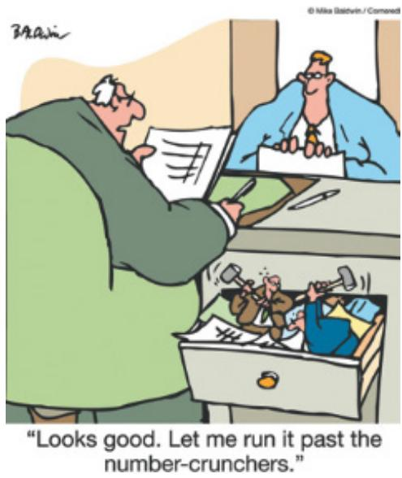
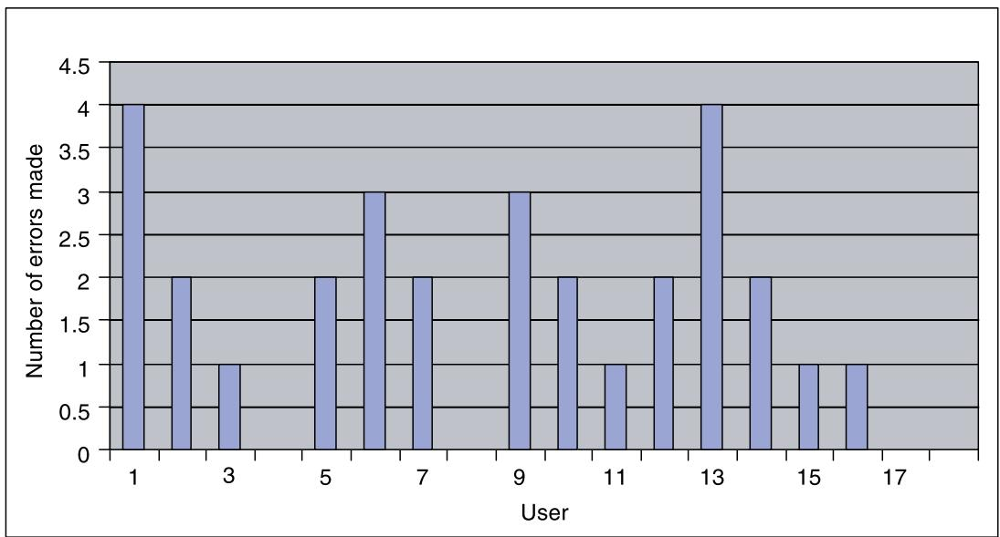
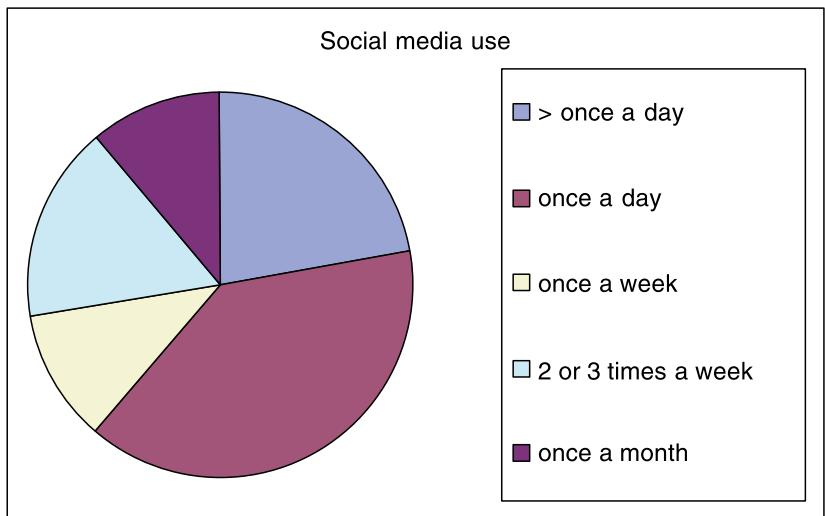
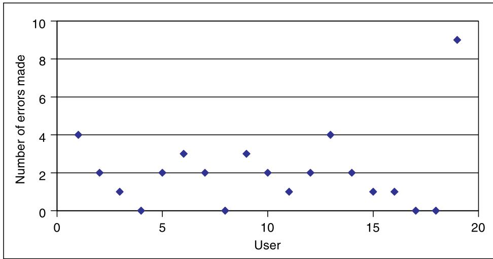
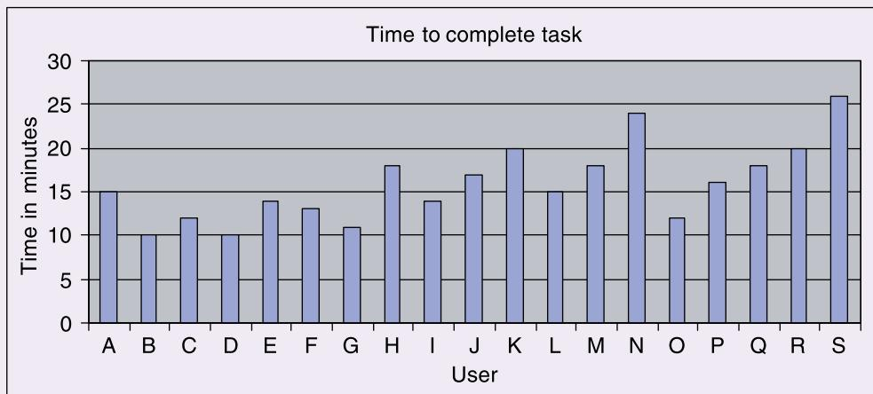
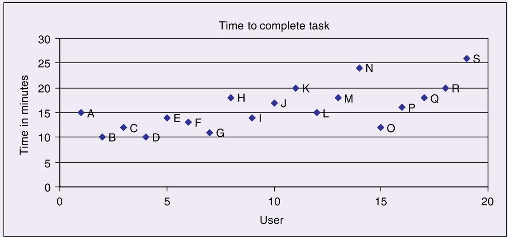
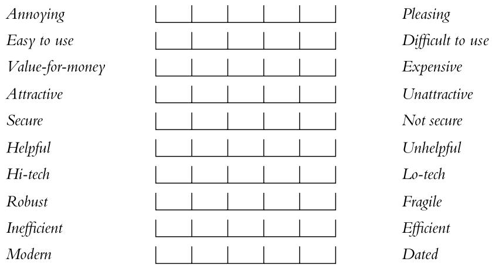
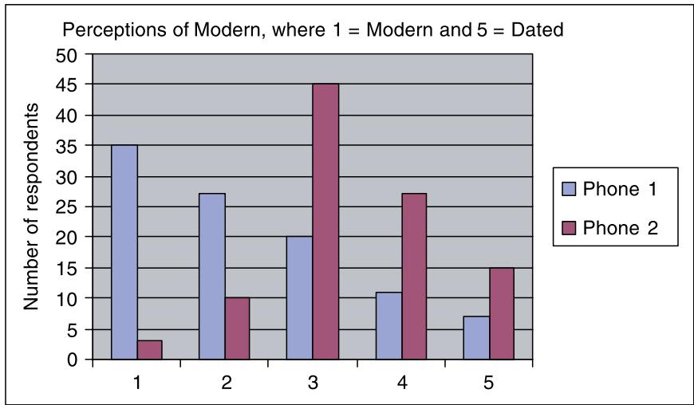

# Chapter 9

# D A T A  A N A L Y S I S ,  I N T E R P R E T A T I O N , A N D  P R E S E N T A T I O N

9.1  Introduction   
9.2  Quantitative and Qualitative   
9.3  Basic Quantitative Analysis   
9.4  Basic Qualitative Analysis   
9.5  Analytical Frameworks   
9.6  Tools to Support Data Analysis   
9.7  Interpreting and Presenting the Findings

# Objectives

The main goals of this chapter are to accomplish the following:

•  Discuss the difference between qualitative and quantitative data and analysis.   
•  Enable you to analyze data gathered from questionnaires.   
•  Enable you to analyze data gathered from interviews.   
•  Enable you to analyze data gathered from observation studies.   
•  Make you aware of software packages that are available to help your analysis.   
•  Identify some of the common pitfalls in data analysis, interpretation, and presentation.   
•  Enable  you  to  interpret  and  present your  findings  in  a  meaningful  and  appropriate manner.

# 9.1 Introduction

The kind of analysis that can be performed on a set of data will be influenced by the goals identified  at  the  outset  and  the  data  gathered.  Broadly  speaking,  a  qualitative  analysis approach, a quantitative analysis approach, or a combination of qualitative and quantitative approaches may be taken. The last of these is very common, as it provides a more comprehensive account of the data.

Most analysis, whether it is quantitative or  qualitative, begins with the initial reactions or observations  from  the data. This  may involve identifying patterns or calculating simple

numerical values such as ratios, averages, or percentages. For  all data, but especially when dealing with large  volumes of data  (that  is, Big Data), it  is useful  to look over the  data to check for any anomalies that might be erroneous, such as people who are 999 years old. This process is known as data cleansing, and there are often digital tools to help with this process. This initial analysis is followed by more detailed work using structured frameworks or theories to frame the investigation.

Interpretation of the findings often proceeds in parallel with analysis, but there are different  ways  to  interpret  results, and  it  is  important  to  make  sure  that  the  data  supports any conclusions. Imagine that an initial  analysis of some customer  care questionnaires  has revealed a pattern of responses indicating that inquiries from customers routed through the Sydney office of an organization take longer to process than those routed through the Oslo office. This result can be interpreted in many different ways. For example, the customer care operatives in Sydney are less efficient, they provide more detailed responses, the technology supporting the inquiry process in Sydney needs to be updated, customers reaching the Sydney office demand a higher level of service, and so on. Which one is correct? To determine whether  any  of  these  potential  interpretations  is  accurate,  further  data  such  as  customer inquiry details and maybe staff interviews is needed. A common mistake is for the investigator’s existing beliefs or biases to influence the interpretation of results (see Box 9.1 on bias).

# BOX 9.1

# Beware of Bias in Analysis and Interpretation

Bias is an influence that can affect objective judgment and decision-making. Biases are formed because of the tendency of the brain to rapidly categorize new information and data connecting them with past experiences. It is natural to look for patterns and associations in the world so as to be prepared to act and behave accordingly, and this can lead to biases. They may be present in someone’s thinking, and they may  manifest in information or data. Some biases are  conscious, e.g., preferring to work with women  rather than with men, while others are unconscious. Biases influence how people interact with each other, how decisions are made, how people react to the design of an app or product, and how data is collected, analyzed, and interpreted.

Early  research by Amos Tversky  and  Daniel Kahneman (1974) describes  how  cognitive bias produces repeated, systematic errors in thinking caused by a person misinterpreting information that affects their judgment. There are many forms of cognitive bias. For example, familiarity bias is when a decision-maker sticks to what they know best, and self-attribution bias is when successes are attributed by a person to themselves and not to outside factors.

Chapter 8,“Data Gathering,” discussed the importance of designing neutral questions for data collection, as bias can be introduced in the way questions are phrased. But bias can also influence  the analysis and interpretation of data. A key cognitive  bias to be aware of in the context of interaction design is confirmation bias.

Confirmation bias leads people to discard  information  that contradicts  their  existing beliefs, even when there is evidence to the contrary. Jennifer Junge (2022), from the Nielsen Norman Group, points out that confirmation bias is a form of priming in which someone’s

prior beliefs influence how they react to new information that can distort their interpretation. This can have significant consequences for UX design and research because it can influence designers’, researchers’, and practitioners’ perspectives causing them to overlook alternative options. This might also show up as leading questions during data gathering, as discussed in Chapter 8.

Training courses can raise awareness of problems associated with bias, and design techniques, including visualizations, have also been successful at helping designers address different types of cognitive bias (Wall et al., 2019).

This YouTube video by Alita Joyce from the Nielsen Norman Group NN/g provides a broad overview of Confirmation Bias in UX Work, particularly in surveys: www .youtube.com/watch?v=YMMTFmIf3kk&t=1s.

Another common tendency is to make claims that go beyond what the data can support. This  is a matter  of interpretation and of presentation. Using  words such as many  or often or all  when reporting conclusions needs to be carefully considered. An investigator should remain as impartial  and objective as possible if the conclusions are to be trusted. Showing that the conclusions are supported by the results is an important skill to develop.

Finally, finding the best way to present findings is equally skilled, and it depends on the goals of the study but also on the audience for whom the study was performed. For example, a formal notation may be used to report the results for the requirements activity, while a summary  of problems  found, supported  by video clips  of people experiencing those  problems, may be better for presentation to a team of designers.

This  chapter  introduces  a  variety  of  methods, and  it  describes  in  more  detail  how  to approach  data  analysis  and  presentation using  some  of the  common approaches  taken  in interaction design.

# 9.2 Quantitative and Qualitative

Quantitative data is in the form of numbers, or data that can easily be translated into numbers. Examples  are the number  of  years’  experience  the interviewees have,  the number  of projects a department handles at a time, or the number of minutes it takes to perform a task. Qualitative data is in the form of words and images, and it includes descriptions, quotes from interviewees,  vignettes  of activity,  and  photos.  It  is  possible  to express  qualitative  data  in numerical form, but it is not always meaningful to do so (see Box 9.2).

It  is  sometimes assumed  that  certain forms  of data  gathering can  only  result in quantitative  data  and that  others can  only  result in qualitative  data. However, this  is a  fallacy. All forms of data gathering  discussed in the previous  chapter may produce qualitative and quantitative data. For example, on a questionnaire, the participant’s age or number of software apps they use in a day is quantitative data, while any comments are qualitative data. In

an observation, quantitative data may include the number of people involved in a project or how many hours someone spends sorting out a problem, while notes about feelings of frustration, or the nature of interactions between team members, are qualitative data.

Quantitative  analysis  uses  numerical methods  to ascertain  the magnitude, amount, or size of something;  for example,  the attributes, behavior,  or  strength of opinion of  the  participants. In describing a population, a quantitative analysis might conclude that the average person is 5 feet 11 inches tall, weighs 180 pounds, and is 45 years old. Qualitative analysis focuses on the nature of something and can be represented by themes, patterns, and stories. For example, in describing the same population, a qualitative analysis might  conclude that the average person is tall, thin, and middle-aged.

# BOX 9.2

# Use and Misuse of Numbers

Numbers are very malleable and can make a convincing argument, but it is important to justify the manipulation of quantitative data and be clear on how those manipulations may affect the potential interpretations of the data. Before adding a set of numbers together, finding an average, calculating a percentage, or performing any other kind of numerical translation, ask whether the operation is meaningful in the specific context.

Qualitative data can also be turned into a set of numbers. Translating non-numerical data into a numerical or ordered scale is appropriate at times, and this is a common approach in interaction design. However, this kind of translation also needs to be justified to ensure that it is meaningful in the given context. For example, assume you have collected a set of interviews from sales representatives about their use of a new app for reporting sales queries. One way of turning this data into a numerical form would be to count the number of words uttered by each interviewee. Conclusions might then be drawn about how strongly the sales representatives feel about the app; for example, the more they had to say about the product, the stronger they felt about it. But do you think  this is a good way to analyze the  data? Does it help to answer the study questions?

Other, less obvious, areas  where misunderstandings can  arise include translating  small population sizes into percentages. For example, saying that 50 percent of users take longer than 30 minutes to pay a bill through a banking app carries a different meaning than saying that two out of four users had the same problem. It is better not to use percentages unless the number of data points is at least 10, and even then it is appropriate to use both percentages and raw numbers to make sure that the claim is not misunderstood.

It is possible to perform legitimate statistical calculations on a set of data and still present misleading results by not making the context clear or by choosing the particular calculation that gives the most favorable result (Huff, 1991). In addition, choosing and applying the best statistical test requires care (Cairns, 2019), as using an inappropriate test can unintentionally misrepresent the data.

# 9.2.1  First Steps in Analyzing Data

Having collected the data, some initial processing is normally required  before data analysis can begin in earnest. For example, audio data may be transcribed by hand or using an automated  tool;  quantitative  data,  such  as  time  taken  or  errors  made, may  be  entered  into  a spreadsheet, like Excel. Table 9.1 summarizes initial analysis steps for data typically collected through interviews, questionnaires, and observation.

Table 9.1  Data Gathered and Typical  Initial Processing Steps for Interviews, Questionnaires, and Observation   

<table><tr><td></td><td>Raw Data</td><td>Example Qualitative Data</td><td>Example Quantitative Data</td><td>Initial Processing Steps</td></tr><tr><td>Interviews</td><td>Audio recordings. Interviewer notes. Video recordings.</td><td>Responses to open-ended questions. Video pictures. Respondent&#x27;s opinions.</td><td>Age, number of mobile devices owned, years of experience. Responses to closed-ended questions.</td><td>Transcription of recordings. Expansion of notes. Entry of answers to closed-ended questions into a spreadsheet.</td></tr><tr><td>Questionnaires</td><td>Participant responses. Online database.</td><td>Responses to open-ended questions. Responses in “further comments” fields. Respondent&#x27;s opinions.</td><td>Age, hours a week spent online, years of experience. Responses to closed-ended questions.</td><td>Clean up data. Filter into different datasets.</td></tr><tr><td>Observation</td><td>Observer&#x27;s notes. Photographs. Audio and video recordings. Data logs. Think-aloud. Diaries.</td><td>Records of behavior. Description of a task as it is undertaken. Copies of documents outlining procedures.</td><td>Demographics of participants. Time spent on a task. The number of people involved in an activity. How many different types of activity are undertaken.</td><td>Expansion of notes. Transcription of recordings. Synchronization between data recordings.</td></tr></table>

# Interviews

Interviewer notes need to be reviewed and clarified or expanded as soon as possible after the interview and before the interviewer starts to forget details. An audio or video recording may be  used  to help in  this process, or  a transcription may  be  used for more  detailed analysis.

Interviews may be  transcribed automatically, but if the  tool is  not trained to recognize  the interviewee’s accent,  this may  cause  difficulties, and manual  transcription may  be needed. However  manual transcription  takes significant effort. In this case,  it is  worth considering whether to transcribe the whole interview or just parts of it that are relevant. Deciding what is relevant, however, can be difficult. Revisiting the  goals of the study to see which sections address the research questions can guide this process.

Closed-ended questions are usually treated as quantitative data and analyzed using basic quantitative analysis (see Section 9.3, “Basic Quantitative Analysis”). For example, a question that asks for the respondent’s age range can easily be analyzed to find out the percentage of respondents in each. More complicated statistical techniques are needed to identify relationships between responses that can be generalized, such as whether there is an interaction between the condition being tested and a demographic. For example, do people of different ages use social media for different lengths of time when first logging on in the morning or at night before they go  to bed? Open-ended questions typically  result in qualitative data  that might be searched for categories or patterns of response.

# Questionnaires

Increasingly, questionnaire responses are provided using online surveys, and the data is automatically stored in a database. The data can be filtered according to respondent subpopulations (for instance, everyone under 16) or according to a particular question (for example, to understand  respondents’  reactions to  one  kind  of  robot  personality  rather  than  another). This allows analyses to be conducted on subsets of the data and hence to draw specific conclusions for  more targeted  goals. Conducting  this  kind of  analysis requires  sufficient  data from a large enough sample of participants.

# Observation

Observation can  result in  a  wide variety  of  data  including  notes,  photographs, data  logs, think-aloud recordings (often called protocols), video, and audio recordings. Taken together, these different types of data provide a rich picture of the observed activity. The difficult part is working out how to combine the different sources to create a coherent narrative; analytic frameworks,  discussed  in  Section  9.5, can  help  with  this.  Initial  data  processing  includes reviewing and expanding notes and transcribing elements of any recordings and think-aloud protocols. For observation in a controlled environment, initial processing might also include synchronizing different data recordings.

Transcriptions and the observer’s notes are most likely to be analyzed using qualitative approaches,  while  photographs  provide  contextual  information.  Data  logs  and  some  elements of the observer’s notes would probably be analyzed quantitatively.

# 9.3  Basic Quantitative Analysis

A  range of  statistics are  used within  interaction  design studies  (Cairns, 2019;  Dix, 2022). Here, we introduce two basic quantitative analysis techniques that can be used effectively in interaction design:  averages  and  percentages. Percentages are  useful  for  standardizing  the data, particularly to compare two or more large sets of responses.

Averages are fairly well-known numerical measures of central tendency. However, there are three  different types  of average, and  using the right one can  help communicate  results more  effectively. These  three  are  mean, median, and  mode. Mean refers  to the  commonly understood interpretation of average; that is, add together all  the figures and divide by the number of figures with which you started. Median and mode averages are less well-known but are very useful. The median is the middle value of the data when the numbers are ranked. The mode is  the most  commonly occurring number. For example, in a set of data (2, 3, 4, 6, 6, 7, 7, 7, 8), the  median  is 6  and the  mode  is  7, while the  mean is $5 0 / 9 = 5 . 5 6$ . In  this case, the difference between the different averages is not that great. However, consider the set (2, 2, 2, 2, 450). Now the median is 2, the mode is 2, and the mean is $4 5 8 / 5 = 9 1 . 6 !$ Which of these to use depends on the type of data and its distribution. The mode can be used for any type of data but is most effective for nominal and ordinal data such as level of anxiety or ethnicity; the median is only useful where the data can be ordered, e.g., reaction time or test score; and the mean is most meaningful where scores on a scale are equally spaced, such as  temperature. If  the  data has  a “normal” distribution, the  averages  will all  be  the  same; however, in a skewed distribution, mode and mean will be affected by outliers, so the median is the best measure.

  
Source: Mike Baldwin / Cartoon Stock

Before any analysis can take place, the data needs to be collated into analyzable datasets. Quantitative  data can usually be translated into rows  and columns, where one row equals one record, such as respondent or interviewee. If these are entered into a spreadsheet such as Excel, this makes simple  manipulations and dataset filtering easier. Before  entering data  in this way, it is important to decide how to represent the different possible answers. For example, “don’t know” represents a different response from no answer at all, and they need to be distinguished, perhaps with separate columns in the spreadsheet. Also, if dealing with options from  a closed-ended question, such as job role, there are two different possible approaches that affect the analysis. One approach is to have a column headed “Job role” and to enter the

job role as it is given by the respondent or interviewee. The alternative approach is to have a column for each possible answer. The latter approach lends itself more easily to automatic summaries, such as those provided when using a spreadsheet. Note, however, that this option will be open only if the original question was designed appropriately (see Box 9.3).

# BOX 9.3

# Question Design Affects Possible Analyses and Conclusions

Different  question designs affect the kinds of analyses that can be performed and the kinds of conclusions that can be drawn. To illustrate this, assume that some interviews have been conducted to evaluate a new app that lets you try on virtual clothes and see yourself in real time as a 3D holograph. This is similar to Memomi described at memorymirror.com.

Assume that one  of the  questions  asked is: “How do you  feel about  this new  app?” Responses to this will be varied and may include that it is cool, impressive, realistic, clunky, technically complex, and so on. There are many possibilities, and the responses would need to be treated qualitatively. This means that analysis of the data must consider each individual response.  If there  are  only 10 or so responses, then this may not  be too  bad, but if there are many more, it becomes harder to process the information and harder to summarize the findings. This is typical of open-ended questions; that is, answers are not likely to be homogeneous, so they will need to be treated individually. In contrast, answers to a closed-ended question, which gives respondents  a fixed set of alternatives from which  to choose, can be treated  quantitatively. So, for example, instead of asking “How do you feel about  this new app?” assume that you have asked “In your experience, are virtual try-on holographs realistic, clunky, or distorted?” This clearly reduces the number of options, and the responses would be recorded as “realistic,” “clunky,” or “distorted.”

When entered in a spreadsheet or a simple table, initial analysis of this data might look like the following:

<table><tr><td>Respondent</td><td>Realistic</td><td>Clunky</td><td>Distorted</td></tr><tr><td>A</td><td>1</td><td></td><td></td></tr><tr><td>B</td><td></td><td>1</td><td></td></tr><tr><td>C</td><td></td><td>1</td><td></td></tr><tr><td>...</td><td></td><td></td><td></td></tr><tr><td>Z</td><td></td><td></td><td>1</td></tr><tr><td>Total</td><td>14</td><td>5</td><td>7</td></tr></table>

Based on this, we can then say that 14 out of 26 (54 percent) of the respondents think virtual try-on holographs are realistic, 5 out of 26 (19 percent) think they are clunky, and 7 out of 26 (27 percent) think they are distorted. Note also that in the table, respondents’ names

are  replaced by letters  so that they are identifiable but anonymous  to any  onlookers. This strategy is important for protecting participants’ privacy.

Another alternative that might  be used in a questionnaire is to phrase the  question in terms of a Likert scale, such as the following one. This again alters the kind of data and hence the kind of conclusions that can be drawn.

Virtual try-on holographs are realistic:

Strongly agree

Agree

Neither

Disagree

Strongly disagree

The data could then be analyzed using a simple spreadsheet or table:

<table><tr><td>Respondent</td><td>Strongly agree</td><td>Agree</td><td>Neither</td><td>Disagree</td><td>Strongly disagree</td></tr><tr><td>A</td><td></td><td>1</td><td></td><td></td><td></td></tr><tr><td>B</td><td>1</td><td></td><td></td><td></td><td></td></tr><tr><td>C</td><td></td><td></td><td></td><td>1</td><td></td></tr><tr><td>...</td><td></td><td></td><td></td><td></td><td></td></tr><tr><td>Z</td><td></td><td></td><td></td><td></td><td>1</td></tr><tr><td>Total</td><td>5</td><td>7</td><td>10</td><td>1</td><td>3</td></tr></table>

In this case, the kind of data being collected has changed. Based on this second set, nothing can be said about whether respondents think the virtual try-on holographs are clunky or distorted, as that question has not been asked. We can only say that, for example, 4 out of 26 (15 percent) disagreed with the statement that virtual try-on holographs are realistic, and of those, 3 (11.5 percent) strongly disagreed.

For simple collation and analysis, spreadsheet software such as Excel or Google Sheets is often used as it is commonly available, is well understood, and offers a variety of numerical manipulations and graphical representations. Basic analysis might involve finding out averages and identifying outliers, in other words, values that are significantly different from the majority  and hence not common. Producing  a graphical  representation provides an overall view of the data and any patterns it contains. Other tools are available for performing specific statistical tests (see Box 9.4), such as online t-tests and A/B testing tools. Data visualization tools can create more sophisticated representations of the data such as heatmaps.

For example, consider the set of data shown in Table 9.2, which was collected during an evaluation of a new photo sharing app. This data shows peoples’experience of social media and the number of errors made while trying to complete a controlled task with the new app. It  was captured automatically, recorded in a spreadsheet, and the totals and averages were calculated. The  graphs  in  Figure  9.1  were  generated using  the  spreadsheet  package. They show an overall view of the dataset. In particular, it is easy to see that there are no significant outliers in the error rate data.

Table 9.2  Data Gathered During a Study of a Photo Sharing App   

<table><tr><td colspan="7">Social Media Use</td></tr><tr><td>User</td><td>More Than Once a Day</td><td>Once a Day</td><td>Once a Week</td><td>Two or Three Times a Week</td><td>Once a Month</td><td>Number of Errors Made</td></tr><tr><td>1</td><td></td><td>1</td><td></td><td></td><td></td><td>4</td></tr><tr><td>2</td><td>1</td><td></td><td></td><td></td><td></td><td>2</td></tr><tr><td>3</td><td></td><td></td><td>1</td><td></td><td></td><td>1</td></tr><tr><td>4</td><td>1</td><td></td><td></td><td></td><td></td><td>0</td></tr><tr><td>5</td><td></td><td></td><td></td><td>1</td><td></td><td>2</td></tr><tr><td>6</td><td></td><td>1</td><td></td><td></td><td></td><td>3</td></tr><tr><td>7</td><td>1</td><td></td><td></td><td></td><td></td><td>2</td></tr><tr><td>8</td><td></td><td>1</td><td></td><td></td><td></td><td>0</td></tr><tr><td>9</td><td></td><td></td><td></td><td></td><td>1</td><td>3</td></tr><tr><td>10</td><td>1</td><td></td><td></td><td></td><td></td><td>2</td></tr><tr><td>11</td><td></td><td></td><td></td><td>1</td><td></td><td>1</td></tr><tr><td>12</td><td></td><td></td><td>1</td><td></td><td></td><td>2</td></tr><tr><td>13</td><td></td><td>1</td><td></td><td></td><td></td><td>4</td></tr><tr><td>14</td><td></td><td>1</td><td></td><td></td><td></td><td>2</td></tr><tr><td>15</td><td></td><td></td><td></td><td></td><td>1</td><td>1</td></tr><tr><td>16</td><td></td><td></td><td></td><td>1</td><td></td><td>1</td></tr><tr><td>17</td><td></td><td>1</td><td></td><td></td><td></td><td>0</td></tr><tr><td>18</td><td></td><td>1</td><td></td><td></td><td></td><td>0</td></tr><tr><td>Totals</td><td>4</td><td>7</td><td>2</td><td>3</td><td>2</td><td>30</td></tr><tr><td></td><td></td><td></td><td></td><td></td><td>Mean</td><td>1.67</td></tr><tr><td></td><td></td><td></td><td></td><td></td><td colspan="2">(to 2 decimal places)</td></tr></table>

Adding one more user to Table 9.2 with an error rate of 9 and plotting the new data as a scatter graph (see Figure 9.2) illustrates how graphs can help to identify outliers. Outliers are usually removed from  the main dataset because they distort the general patterns. However, outliers may also be interesting cases to investigate further in case there are special circumstances surrounding those participants and their session.

  
(a)

  
(b)   
Figure 9.1  Graphical representations of the data in Table 9.2 (a) The distribution of errors made (take note of the scale used in these graphs, as seemingly large differences may be much smaller in reality). (b) The spread of social media experience within the participant group.

These initial investigations also help to identify other areas for further investigation. For example, is there something special about people with error rate 0 or something distinctive about the performance of those who use social media only once a month?

  
Figure 9.2  Using a scatter diagram helps to identify outliers quite quickly.

# ACTIVITY 9.1

The data in the following table represents the time taken for study participants to select and invest in a fund using a new share trading app.

Using a spreadsheet application, generate a bar graph and a scatter diagram to provide an overall view of the data. From this representation, make two initial observations about the data that might form the basis of further investigation.

<table><tr><td>User</td><td>A</td><td>B</td><td>C</td><td>D</td><td>E</td><td>F</td><td>G</td><td>H</td><td>I</td><td>J</td><td>K</td><td>L</td><td>M</td><td>N</td><td>O</td><td>P</td><td>Q</td><td>R</td><td>S</td></tr><tr><td>Time to complete (mins)</td><td>15</td><td>10</td><td>12</td><td>10</td><td>14</td><td>13</td><td>11</td><td>18</td><td>14</td><td>17</td><td>20</td><td>15</td><td>18</td><td>24</td><td>12</td><td>16</td><td>18</td><td>20</td><td>26</td></tr></table>

# Comment

The bar graph and scatter diagram are shown here.

From these two diagrams, there are two areas for  further investigation. First, the values for user N (24) and user S (26) are higher than the others and could be looked at in more detail. In addition, there appears to be a trend that participants at the beginning of the testing time (particularly B, C, D, E, F,  and G) performed faster than those toward the end of the testing time. This is not a clear-cut situation, as O also performed well, and I, L, and P were almost as fast, but there may be something about this later testing time that has affected the results, and it is worth investigating further.

It is fairly straightforward to compare two sets of results  using these kinds of graphical representations of the data. Semantic differential data can also be analyzed in this way and used to identify trends, provided that the  format of the  question is appropriate.  For example,  the  following  question  was  asked  in  a questionnaire  to  evaluate  two  different  smartphone designs:

For each pair of adjectives, place a  cross at the  point  between  them that reflects the extent to which you believe the adjectives describe the smartphone design. Please place only one cross between the marks on each line.

Table 9.3 and Table 9.4 show the tabulated results from 100 respondents. Note that the responses have been translated into five categories, numbered from  1 to 5, based on where the respondent marked the line between each pair of adjectives. It is possible that respondents may have intentionally put a cross closer to one side of the box than the other, but it is acceptable to lose this nuance in the data, provided that the original data is not lost, and any further analysis could refer to it.

Table 9.3  Phone 1   

<table><tr><td></td><td>1</td><td>2</td><td>3</td><td>4</td><td>5</td><td></td></tr><tr><td>Annoying</td><td>35</td><td>20</td><td>18</td><td>15</td><td>12</td><td>Pleasing</td></tr><tr><td>Easy to use</td><td>20</td><td>28</td><td>21</td><td>13</td><td>18</td><td>Difficult to use</td></tr><tr><td>Value-for-money</td><td>15</td><td>30</td><td>22</td><td>27</td><td>6</td><td>Expensive</td></tr><tr><td>Attractive</td><td>37</td><td>22</td><td>32</td><td>6</td><td>3</td><td>Unattractive</td></tr><tr><td>Secure</td><td>52</td><td>29</td><td>12</td><td>4</td><td>3</td><td>Not secure</td></tr><tr><td>Helpful</td><td>33</td><td>21</td><td>32</td><td>12</td><td>2</td><td>Unhelpful</td></tr><tr><td>Hi-tech</td><td>12</td><td>24</td><td>36</td><td>12</td><td>16</td><td>Lo-tech</td></tr><tr><td>Robust</td><td>44</td><td>13</td><td>15</td><td>16</td><td>12</td><td>Fragile</td></tr><tr><td>Inefficient</td><td>28</td><td>23</td><td>25</td><td>12</td><td>12</td><td>Efficient</td></tr><tr><td>Modern</td><td>35</td><td>27</td><td>20</td><td>11</td><td>7</td><td>Dated</td></tr></table>

<table><tr><td></td><td>1</td><td>2</td><td>3</td><td>4</td><td>5</td><td></td></tr><tr><td>Annoying</td><td>24</td><td>23</td><td>23</td><td>15</td><td>15</td><td>Pleasing</td></tr><tr><td>Easy to use</td><td>37</td><td>29</td><td>15</td><td>10</td><td>9</td><td>Difficult to use</td></tr><tr><td>Value-for-money</td><td>26</td><td>32</td><td>17</td><td>13</td><td>12</td><td>Expensive</td></tr><tr><td>Attractive</td><td>38</td><td>21</td><td>29</td><td>8</td><td>4</td><td>Unattractive</td></tr><tr><td>Secure</td><td>43</td><td>22</td><td>19</td><td>12</td><td>4</td><td>Not secure</td></tr><tr><td>Helpful</td><td>51</td><td>19</td><td>16</td><td>12</td><td>2</td><td>Unhelpful</td></tr><tr><td>Hi-tech</td><td>28</td><td>12</td><td>30</td><td>18</td><td>12</td><td>Lo-tech</td></tr><tr><td>Robust</td><td>46</td><td>23</td><td>10</td><td>11</td><td>10</td><td>Fragile</td></tr><tr><td>Inefficient</td><td>10</td><td>6</td><td>37</td><td>29</td><td>18</td><td>Efficient</td></tr><tr><td>Modern</td><td>3</td><td>10</td><td>45</td><td>27</td><td>15</td><td>Dated</td></tr></table>

# Table 9.4  Phone 2

The graph in Figure 9.3 shows how the two smartphone designs varied according to the respondents’ perceptions of how modern the design is. This graphical notation shows clearly how the two designs compare.

  
Figure 9.3  A graphical comparison of two smartphone designs according to whether they are perceived as modern or dated

Data logs that  capture users’ interactions automatically, such as with a website or app, can also be analyzed and represented graphically, thus helping to identify patterns in behavior. Also, more sophisticated  manipulations  and graphical images  can be used  to highlight patterns in collected data.

# BOX 9.4

# Quantitative Analysis with R

R is a programming language that is used by data scientists, software engineers, and statisticians (among others) to perform statistical analyses. The R software environment is free and has grown in popularity since it first appeared in the early 1990s. Some of its advantages are that it is a powerful statistical language, it has a very good help system, and it produces highquality data visualizations. On the downside, it has a limited graphical user interface, and as it is a programming language, attention to syntax is of paramount importance. R may be used on its own, but using an environment such as RStudio helps to address those disadvantages.

The following introduction to R covers the whole analysis process. It is an hour long, but provides a useful primer: www.youtube.com/watch?v=eR-XRSKsuR4.

# 9.4  Basic Qualitative Analysis

Central to qualitative analysis is  the identification of concepts (referred to as codes) in the data, and  this  process is  often  referred to  as coding. Two  common ways  in  which  coding proceeds are in an inductive (bottom-up) fashion or a deductive (top-down) fashion. In the former case, codes arise from the data, and in the latter, a predetermined set of codes is identified, e.g., from a relevant theory, and the data is interpreted using that set. In practice, analysis is often performed iteratively, and it is common for codes identified inductively initially to then be defined and applied deductively to new  data, and for an initial, pre-existing  set of codes to be enhanced inductively when applied to a new situation or new data. One of the most challenging aspects of qualitative analysis is determining meaningful codes that do not overlap, that is, codes that can be clearly defined and consistently distinguished. Another is deciding on the appropriate granularity for them, for example at the word, phrase, sentence, or paragraph level.

Whether an inductive or deductive approach is used, the code definitions and their interpretation are captured in a coding scheme that helps researchers to interpret the data consistently and reliably. Anne Nassauer and Nicolas M. Legewie (2022) describe a coding scheme as a collection of concepts and their lower-level dimensions that become codes and explicit rules for how to use them. To quantify the coding scheme’s reliability, an inter-rater reliability score may  be calculated. This  is the percentage of  agreement between  the analyses of two researchers, defined as the number of items consistently coded, expressed as a percentage of the total number of items coded. An alternative measure of inter-rater reliability where two researchers have done the coding is Cohen’s kappa, (κ), which considers the possibility that agreement has occurred due to chance (Cohen, 1960). If there is a large discrepancy between the two analyses, the coding  scheme needs further  refinement. Calculating this  measure  is intended to determine the reliability of the coding scheme, i.e., how clear and distinct are the codes, rather than to check whether the analysis is correct.

The  first step in qualitative analysis is to gain an  overall impression of the  data and to start looking for interesting features, topics, repeated observations, or things that stand out. Some initial  impressions  and  possible patterns to look  for may  have emerged  during data gathering. For example, logged data of people visiting Tripadvisor.com may suggest that they often look for hotels that are rated “terrible” first. Or,  data from a survey  of bank customers  may  indicate that  answering  so many  security questions  when  logging into  a banking app is frustrating. But it is  important to confirm and reconfirm findings to make sure that initial impressions don’t bias the analysis. During this first pass, it is important to highlight common features  and record any  surprises rather  than attempt  to capture  all  the findings (Blandford et al., 2017).

For observations, the guiding framework used in data gathering will give some structure to the data. For example, the practitioner’s framework for observation introduced in Chapter 8 will have resulted in a focus on who, where, and what, while using the more detailed framework  will result in  patterns relating  to  physical objects, people’s goals,  sequences of events, and so on.

Three  basic  approaches  to  qualitative  analysis  are  discussed  in  this  section:  identifying themes  (an  example  of the  inductive  approach), categorizing data  (an  example  of the

deductive approach), and analyzing critical incidents (one way to sample the dataset). These three  basic  approaches  are not  mutually exclusive  and are often  used  in combination, for example, when analyzing video material, critical incidents may  first be identified and then a thematic analysis undertaken. Video analysis is  discussed further in Box 9.5. Using more sophisticated  analytical  frameworks  to  enhance and  structure the  use  of  these  basic  techniques can lead to additional insights. Section 9.5 introduces frameworks that are commonly used in interaction design.

# BOX 9.5

# Analyzing Video Material

A good way to start a video analysis is to watch what has been recorded all the way through while writing a high-level narrative of what happens, noting where in the video there are any potentially  interesting events. How to decide which is an interesting  event will depend on what is being observed. For example, in a study of the interruptions that occur in an open plan office, an event might be each time that a person takes a break from an ongoing activity, for instance, when a phone rings, someone walks into their cubicle, or email arrives. If it is a study of how pairs of students use an online collaborative learning tool, then activities such as turn-taking, speaking over one another, any exchanges in the chat, and periods when one or the other is distracted would be appropriate to record.

Chronological and video times can be used to index events. These may not be the same, since recordings can run at different speeds from real time and video can be edited. Video can be augmented with captured screens or logged data of people’s interactions with a product, and transcription. There are various logging and screen capture tools available for this purpose, which enable interactions to be played back as a movie, showing screen objects being opened, moved, selected, and so on. These  can then be played in parallel with the  video to provide different  perspectives on the talk, physical interactions, and  the system’s responses that occur. Having a combination of data streams can enable more detailed and fine-grained patterns of behavior to be interpreted (Heath et al., 2010).

Coding data using a coding scheme is integral to the analytic process. Anne Nassauer and Nicolas Legewie (2022) emphasize reliability as a guiding principle in analysis, meaning that the study is consistent in its procedure so that others can assess its research steps. They also emphasize the importance of considering alternative interpretations and provide some useful practical tips on video  analysis, including how to construct clear and  transparent concepts that enable reflection and critique, how to construct and apply a coding scheme, and how to overcome a range of challenges. For example, they highlight that coding decisions can be ambiguous, subjective, or incorrect. Even the best coding schemes can include codes that just don’t work unambiguously  all of the  time. Subjectivity leads  to different  coding decisions by different  researchers, and  coding decisions may  be incorrect  simply because  a  mistake was made. To help overcome these challenges, they suggest making coding a team effort and drawing in expert knowledge of the study area.

# 9.4.1  Identifying Themes

Thematic analysis is an umbrella term to cover a variety of different approaches to examining qualitative data. It  is a widely used analytical method  for developing, analyzing, and interpreting  patterns  across  a  qualitative  dataset  (Braun  and  Clarke,  2022).  More  formally,  a theme is  something  important  about the  data  in relation  to the  study goal.  It represents  a pattern of some  kind, perhaps  a particular topic  or  feature, found in the  dataset, which  is considered to be relevant and even unexpected with respect to the study goal. Themes may relate to a variety of aspects: behavior, a stakeholder group, events, places or situations where those events happen, and so on. For example, descriptions of typical users may be one outcome of data analysis that focuses on participant characteristics. The use of the term theme varies, and there are some key distinctions to be aware of, as discussed in Box 9.6.

# BOX 9.6

# So What Is a Theme? And Why Does It Matter?

Thematic analysis is a widely used term, but thematic analyses are not all the same, and use of the term theme varies. Virginia Braun et al. (2019) distinguish between themes as patterns of meaning and themes as data summaries. A key difference is whether the analysis is seeking to uncover the meaning behind the words or if it is seeking to summarize the diversity of responses across participants.

There isn’t a “correct” application of these ideas in analysis, but it is important that the approach used is designed deliberately. In particular, it is important to recognize the distinction between the following:

•  Identifying common themes as a kind of data summary, versus developing themes that reflect hidden or implicit meaning.   
Developing themes that arise from the data, versus using a pre-determined framework to analyze the data. In the former case, the key is to interpret the data to make meaning explicit while in the latter case the key is how to interpret the predetermined categories in the context of the study.   
A desire to find the “correct” coding versus a desire to ensure that codes are clearly defined and are interpreted consistently. Measures of inter-rater reliability can be used as a guide in either case.

After  an initial  pass through the  data, the  next step  is  to look more systematically for themes  across  the  data,  seeking  further  evidence  both  to  confirm  and  disconfirm  initial impressions and to find further themes that may not have been noticed the first time. Sometimes,  the  refined  themes  resulting  from  this  systematic  analysis  form  the  primary  set  of findings for the  analysis, and sometimes they are just the starting point. The coding scheme is developed iteratively and refined as the data is investigated further.

Once a number of themes have been identified, it is usual to step back from  the set of themes to  look at  the  bigger picture.  Is an  overall  narrative  starting  to emerge, or  are  the themes quite disparate? Do some seem to fit together with others? If so, is there an overarching theme? Can a meta-narrative, that is, an overall picture of the data be formed? In doing this, some of the original  themes may not seem  as relevant and can be removed. Are there some themes that contradict each other? Why might this be the case? This can be done individually, but more often this is applied in a group using brainstorming techniques.

Robert Gauthier and colleagues (2022) used thematic analysis to investigate how online communities  support addiction  recovery. They focused  on samples  from two Reddit  channels about recovering from addiction (r/stopdrinking and r/OpiatesRecovery) that consisted of 640 threads (640 submissions  and 7,828  comments). They  used inductive coding  rather than  existing  understandings  of  addiction  recovery,  which  allowed  them  to  focus  on  the content expressed in the Reddit channels. Codes were first identified in the threads, and then themes were developed from the codes and their context. The researchers then discussed the themes and supporting quotations and reviewed other threads within the Reddit channels to reach agreement with the themes identified. Table 9.5 shows example themes and subthemes. Through this they revealed that these Reddit communities use stories to engage in a range of discussions including relapse, body weight, personal finances, and legal trouble.

<table><tr><td>Theme</td><td>Sub-Themes</td><td>Paraphrased Example Quote</td></tr><tr><td>Sharing Experiences</td><td>Self Reflections</td><td>“Reading This Naked Mind and thinking about my feelings and what alcohol took from me has been enlightening. I was able to establish a critical perspective that showed me how warped my thoughts had subconsciously become.”</td></tr><tr><td></td><td>Sharing Failures Sharing Successes</td><td>“I remember how much I struggled at 4 months and how I couldn’t understand why it wasn’t getting easier to resist the cravings. Now that I’m at 6 months I am finally understanding why everyone means then they say the cravings don’t go away they just change. Thankfully now, despite it being a shitty week, I am not thinking about using as my first thought. Remember it does get easier, so don’t give up.”</td></tr><tr><td></td><td>Waking Up</td><td>“Still experiencing the occasional vivid dream of taking pills. I guess its because it was so prominent in my like for so long. What sucks most is that after these dreams the craving is so strong. At least I am starting to feel disappointed in the high even in the dream.”</td></tr><tr><td>Peer Support</td><td>Check-ins</td><td>“Day 5, Monday Night. Really wanted to drink but I resisted!”</td></tr><tr><td></td><td>Encouragement</td><td>“Exercise works wonders! Try different activities like yoga and working out. Keep up the good effort!”</td></tr><tr><td></td><td>Solidarity</td><td>“It’s great how our lives don’t have to be like that anymore!”</td></tr><tr><td>Consequences</td><td>Benefits of Recovery Costs of Recovery</td><td>“I am trying to find rehab or detox facilities in the southern US that will take my government issued insurance. Does anyone have any suggestions?”</td></tr><tr><td></td><td>Harm from Substance Use</td><td>“I saw in the newspaper that someone got picked up for their 5th DUI. This made me think about my own DUI from several years ago and realize how great it is to be free of both alcohol and the legal system.”</td></tr></table>

(Continued)

Table 9.5  Example themes that show diverse discussions related to addiction and recovery occurring on the subreddits. Includes themes identified and paraphrased example quotations from the subreddits.   

<table><tr><td>Theme</td><td>Sub-Themes</td><td>Paraphrased Example Quote</td></tr><tr><td>Substance Related Concerns</td><td>Pain Management</td><td>“I’m worried that visiting my doctor about my illness will end up with me continuing my normal scripts AND/OR I might end up on something else that is also addictive”</td></tr><tr><td></td><td>Socializing</td><td>“It’s super bowl season and while we aren’t huge into sorts my significant other and I do like the cultural aspect. What do people suggest as bars are clearly now off the table?”</td></tr></table>

A  common technique for identifying themes and looking  for an overall  narrative is to create an affinity diagram. Affinity diagrams are widely used in interaction design to organize large amounts of data and ideas (see Figure 9.4). Both digital and physical diagramming are popular, with differing opinions about which is preferable. For example, Christian Remy et al. (2021) investigated the challenges and opportunities of digital distributed affinity diagramming tools. Although they found that digital tools saved time, improved manipulation, and helped get an overview of the data, they also found that the digital tool reduced awareness of co-participant’s actions and provided fewer clues about ownership of the notes. On the other hand, students’ experience of the Miro collaborative canvas tool described in Chapter 5, “Social Interaction,” was very positive and referred to increased awareness!

  
Figure 9.4  Section of an affinity diagram built during the design of a web application Source: Courtesy of Madeline Smith

To read more about the use of affinity diagrams in interaction design, see

the following page: www.interaction-design.org/literature/article/

affinity-diagrams-learn-how-to-cluster-and-bundle-ideas-and-facts.

And  here is  a speeded-up  video  of an  affinity  diagramming session:  media

.nngroup.com/media/editor/2018/01/18/affinity_marriott_speedy.mp4.

# 9.4.2  Categorizing Data

Inductive analysis is appropriate when the study is exploratory or if it is important to let the themes emerge from the  data itself. Sometimes, a pre-existing set of categories is  chosen as the analysis frame. This is appropriate when an existing theory or previous analyses provide a useful lens on the study goals. In this case, analysis proceeds deductively. For example, in a study  of novice interaction designer behavior  in Botswana, Nicole  Lotz  et  al. (2014)  used Schön  (1983)’s design  and  reflection  cycle: naming, framing,  moving, and  reflecting. This allowed the researchers to identify detailed patterns in the designers’ behavior, from which they derived implications for education and support.

An early example of categorization from a set of studies looking at the use of different navigation aids in an online educational setting (Armitage, 2004)  illustrates this approach. These studies involved observing students working through some online educational material about  evaluation methods, using  the think-aloud technique. The think-aloud protocol  was recorded and then transcribed before being analyzed from various perspectives, one of which was to identify usability problems that the participants were having with the online environment. Figure 9.5 shows an excerpt from the transcription.

This excerpt was analyzed using a categorization scheme derived from a set of negative effects  of a system  on  a user  (van Rens, 1997)  and was iteratively extended to  accommodate the specific kinds of interaction observed in these studies. The categorization scheme is shown in Figure 9.6.

This scheme developed and evolved as the transcripts were analyzed and more categories were identified  inductively. Figure 9.7 shows the excerpt from  Figure 9.5 coded using  this categorization scheme. Note that the transcript is divided up using square brackets to indicate which element is being identified as showing a particular usability problem.

Having categorized the data, the results can be used to answer  the study goals. In the online  education  example, the  researchers  were  able  to  quantify  the  number  of  usability problems encountered overall by participants, the mean number of problems per participant for  each of the  test conditions, and  the number  of unique  problems  of each type  per  participant. This also  helped to identify patterns of behavior and recurring  usability problems. Having the think-aloud protocol meant that the overall view of the usability problems could take context into account.

I’m thinking that it’s just a lot of information to absorb from the screen. I  just I don’t concentrate very well when I’m looking at the screen. I have a very clear idea of what I’ve read so far…but it’s because of the headings I know OK this is another kind of evaluation now and before it was about evaluation which wasn’t anyone can test and here it’s about experts so it’s like it’s nice that I’m clicking every now and then coz it just sort of organizes the thoughts. But it would still be nice to see it on a piece of paper because it’s a lot of text to read.

Am I  supposed to, just one  question, am supposed to say  something about  what I’m reading and what I think about it the conditions as well or how I feel reading it from the screen, what is the best thing really?

Observer: What you think about the information that you are reading on the screen… you don’t need to give me comments…if you think this bit fits together.

There’s so much reference to all those previously said like I’m like I’ve already forgotten the name of the other evaluation so it said unlike the other evaluation this one like, there really is not much contrast with the other it just says what it is may be…so I think I think of…

Maybe it would be nice to have other  evaluations  listed to see other evaluations  you know here, to have the names of other evaluations other evaluations just to, because now when I click previous I have to click it several times so it would be nice to have this navigation, extra links.

Figure 9.5  Excerpt from a transcript of a think-aloud protocol when using an online educational environment. Note the prompt from the observer about halfway through.

Source: Armitage (2004). Used courtesy of Ursula Armitage

# ACTIVITY 9.2

The following is a think-aloud extract from the same study of users working through online educational material. Using the categorization scheme in Figure 9.6, code this extract for usability problems. It is useful to put brackets around the complete element of the extract being coded.

Well, looking at the map, again there’s no obvious start point, there should be something highlighted that says ‘start here.’

OK,  the next keyword that’s highlighted is  evaluating, but  I’m not sure  that’s where I  want to go straightaway, so I’m just going to go back to the introduction.

Yeah, so I probably want to read about usability problems before I start looking at evaluation. So, I, yeah. I would  have thought  that the links in each one of the pages would take you to the next logical point, but my logic might be different to other people’s. Just going to go and have a look at usability problems.

OK, again I’m going to flip back to the introduction. I’m just thinking if I was going to do this myself, I would still have a link back to the introduction, but I would take people through the logical sequence of each one of these bits that fans out, rather than expecting them to go back all the time.

Going  back…to the  introduction. Look  at the  types.  Observation, didn’t  really want  to go  there. What’s this bit [pointing to Types of UE on map]? Going straight to types of…

OK, right, yeah, I’ve already been  there before.  We’ve  already looked at usability problems,  yep, that’s OK, so we’ll have a look at these references.

I clicked on the map rather than going back via introduction; to be honest, I get fed up going back to introduction all the time.

# Comment

Coding  transcripts  takes  practice,  but  this  activity  illustrates  the  kinds  of  decisions  involved in applying categories. The coded extract is shown here:

[Well, looking at the map, again there’s no obvious start point UP 1.2, 2.2], [there should be something highlighted that says ‘start here’ UP 1.1, 1.10].

OK, the next keyword that’s highlighted  is evaluating, but  [I’m not sure  that’s where I  want to go straightaway UP 2.2], so I’m just going to go back to the introduction.

Yeah,  so  I  probably  want  to  read  about  usability  problems  before  I  start  looking  at  evaluation. So, I, yeah. [I would  have thought  that the links in each one of the pages would take you to  the next logical point, but my logic might be different to other people’s UP 1.3]. Just going to go and have a look at usability problems.

OK, again I’m going to flip back to the introduction. [I’m just thinking if I was going to do this myself, I would still have a link back to the introduction, but I would take people through the logical sequence of each one of these bits that fans out, rather than expecting them to go back all the time UP 1.10].

Going back…to  the introduction.  [Look at the types. Observation,  didn’t really  want to go  there. What’s this bit [pointing to Types of UE on map]? UP 2.2] Going straight to types of…

OK, right, yeah, I’ve already been  there before.  We’ve  already looked at usability problems,  yep, that’s OK, so we’ll have a look at these references.

I clicked on the map rather than going back via introduction; [to be honest, I get fed up going back to introduction all the time. UP 1.1].

# 9.4.3  Critical Incident Analysis

Data  gathering  sessions can  often  result in a  lot of  data. Analyzing  all  of this  data in  any detail  is  very  time-consuming  and  often  not  necessary. Critical  incident  analysis  is  one approach to identify significant subsets of the data for more detailed analysis. This technique emerged from work carried out in the United States Army Air Forces where the goal was to identify the critical requirements of good and bad performance by pilots (Flanagan, 1954). It has two basic principles: “(a) reporting facts regarding behavior is preferable to the collection of interpretations, ratings, and opinions based on general impressions;  (b) reporting should be limited to those behaviors which, according to competent observers, make a significant contribution to the activity” (Flanagan, 1954, p. 355). In the interaction design context, the use  of  well-planned  observation  sessions  satisfies  the  first  principle.  The  second  principle refers to critical incidents, that is, incidents that are significant or pivotal to the activity being observed, in either a desirable or an undesirable way.

