# Chapter 10

# D A T A  A T  S C A L E  A N D E T H I C A L  C O N C E R N S

10.1  Introduction   
10.2  Approaches for Collecting and Analyzing Data   
10.3  Visualizing and Exploring Data   
10.4  Ethical Design Concerns

# Objectives

The main goals of the chapter are to accomplish the following:

•  Provide an overview of some of the potential impacts of data at scale on both individuals and society.   
•  Introduce key methods for collecting data at scale.   
•  Discuss how data at scale is used in interaction design.   
•  Review key methods for visualizing and exploring data at scale.   
•  Introduce privacy and other ethical design concerns with data at scale and AI.

# 10.1 Introduction

What digital technologies do you use when you travel into the city for a day out with friends? Do  you plan  ahead  using  a  variety  of  resources?  Make  a reservation  for  a  restaurant  for lunch? Think about buying tickets in advance? Do you create a WhatsApp group to do the planning, for example, to decide where to meet up with your friends and at what time? Do you check when the new museum you all want to go to is open, and read reviews about the exhibition that is currently on there and how much it costs? Having done the initial planning, do you then purchase a train ticket on your mobile phone train app and then check to see if the train you are planning to catch is running on time? Do you think about what to wear and whether you need to take an umbrella? Do you maybe ask your personal assistant, like Alexa, “What is the weather today?”

Having made their plans, most people will then walk, cycle, or take a ride-share requested via an app to their train station, present their phone with the QR code on their digital train ticket  to the reader at the turnstile, and take a seat on the train. Most trains provide Wi-Fi, so people will often check their social media and newsfeeds or play a game on their phone.

They may also keep in touch with the friends they are meeting to see where they are, maybe tracking their locations using Google Maps. On reaching their destination, they exit the station by tapping their phone at the turnstile. They may need to use a smartphone map app to navigate to the museum and may also take selfies on the journey.

These are just a few of the things that many people do when visiting a city with friends. Several  of the  activities will  involve  creating, searching,  and  storing data  in  some  way  or another. People may know that this is happening, may suspect that it is happening, or may be totally unaware of the data that they are generating and how it is being used, as well as the data with which they are interacting.

There  is  also  increasing  concern  about  exactly  what  data  is  collected  about  people through  interacting  with  their  personal  assistants,  such  as  Amazon  Echo,  Google  Home, Cortana, and Siri, and from their social media conversations. Cities, such as New York and London, have an  extensive  network  of surveillance  cameras (CCTV) spread around, especially in busy  places such as subway  stations and shopping malls. The video footage  from these  sources is typically  kept  for two weeks or more.  Similarly, when people are checked in at a station ticket  barrier, their movements are  tracked. Their activities are also recorded through many of the apps on  our smartphones, such  as fitness trackers, payment systems, and social media.

What  happens  to  all  the  data  collected  about  them?  How  does  it  improve  the  services provided by society? Does it make traveling more efficient? Does it make the streets safer? Moreover, how much of the data collected from smartcards, smartphone Wi-Fi signals, social media, and CCTV footage can be tracked back to them and pieced together to reveal a  bigger picture of who  they are and  where they go? What  might that  data reveal about society?

Data at scale, or as it is often called Big Data, describes all kinds of data including databases of numbers, images of people, things  and places, footage of conversations recorded, videos, texts, and environmentally sensed data (such as air quality). It is also being collected at  a  tremendous  rate;  for  example,  500  hours  of  video  are  uploaded  to YouTube  every minute,  while  millions  of  messages  circulate  through  social  media.  Furthermore,  sensors placed in cities, homes, public transport, and parks collect enormous amounts of environmental data.

Data  at scale has huge potential for grounding  and elucidating problems, and it can be collected, used, and communicated in a wide variety of ways. For example, it is increasingly being used for improving a whole range of applications in healthcare, science, education, city planning, finance, world economics, and other areas. It can also provide new insights  into human  behavior, with  the  use  of  machine learning,  by analyzing  data  collected from people, such as  their facial expressions, movements, gait, and tone  of voice. This includes inferring people’s emotions, their intent, and well-being, which can then be used to inform technology interventions aimed at changing or improving people’s health and well-being. However, beyond  societal  benefits, data  can  also be used  in  potentially harmful  ways, such as  the  misuse of  data  collected that  has  detected  someone’s gender, race, approximate age,  where  and  how long  they  have been  looking  at  something, and in what emotional  state they are in  (Hill, 2020). This type of wide-reaching information

could be used mistakenly to identify someone as a criminal or to post inappropriate ads on  their  phone  or  computer. Another  nefarious  use  of  data  collected  from  individuals’ use  of social media, online  services, and apps is to then target people with fake news  to encourage them to vote in a particular way or scam them to divulge personal information about their finances.

As mentioned in Chapter 8, “Data Gathering,” and Chapter 9, “Data Analysis, Interpretation, and Presentation,” data can be either qualitative or quantitative. Some of the methods and  tools used  to collect, analyze, and communicate  data  can  be carried  out  manually  or using quite simple tools. What makes this chapter on data at scale different is that it considers how huge volumes of data can be analyzed, visualized, and used to inform new interventions. While having access to large volumes of data enables analysts, designers, and researchers to address large, important issues such as climate change and world economic issues, assuming that  there are  tools to do this, they  also raise a number of societal  concerns. These include whether  someone’s  privacy  is  being  violated  by  the  data  being  collected  about  them  and whether the data corpora being used to make decisions about people, such as the provision of insurance and loans, are fair and transparent.

Furthermore, the combination of vast amounts of data from many sources and the availability  of  increasingly  powerful  data  analytic  tools  to analyze  that  data  is  now  making  it possible to discover new information that is not available from any single data source. This is  enabling new  kinds of research to be conducted for understanding  human behavior and environmental problems.

# 10.2  Approaches for Collecting and Analyzing Data

Collecting  data has  never been easier. What is  challenging is  knowing how best to analyze, collate, and act upon the data in ways that are socially acceptable, beneficial to society, and ethically sound. Are there certain rules or policies in place for what to reveal about people or when certain patterns, anomalies, or thresholds are reached in a data stream? For example, if  people-tracking technology is  used at an airport, how is that  revealed to those at the airport? Is it enough only to show data that can help manage people flows and bottlenecks? For example, in an airport terminal showing a public display in which one section of the terminal is detected to be much busier than another (Figure 10.1), do travelers ever stop and wonder how this data is being collected? What else is being collected about them? Do they care?

Another technique for analyzing what people are doing on websites and social media is to examine  the trail  of activity that they  leave behind. You  can see this by  looking at your own Twitter feed or by  looking at someone else’s whom you are following, for example, a friend, a political leader, or a celebrity. You  can also examine discussions about a particular topic such as climate change, reactions to comments made by  comedians, or a topic that is trending on a particular day. If there are just a few posts, then it is easy to see what is going on,  but  often  the  most  interesting  posts  are  those  that  generate  lots  of  comments. When examining thousands or tens of thousands of posts, analysts use automated techniques to do this (e.g., Bostock et al., 2011; Hansen et al., 2019).

Figure 10.1 Heathrow Airport Terminal 5 Public Display in top-right corner of image showing the relative level of activity using an infographic of North vs. South Security   
  
Source: Marc Zakian / Alamy Stock Photo

# 10.2.1  Scraping and “Second Source” Data

One way to extract data is by “scraping” it from the web (assuming that  this is allowed by the application). Once the data is scraped, it can be entered into a spreadsheet for study and analyzed using data science tools. The focus from an  interaction design perspective  is how best  to interact  with that  data  and the  way  it  is  displayed  rather  than the  actual  scraping process per se so that it can be analyzed and sense can be made of it.

In addition, there are now many open  and publicly available data sources that provide rich secondary material for researchers to mine. This includes recordings of videoconferencing meetings, transcripts, social media comments, and Google search queries. Analysis of this kind of data can reveal insights about people’s concerns, desires, behaviors, and habits. For example, what people say on news forums and in social media about their health concerns and specific symptoms  provides many new  opportunities  for health researchers  to analyze and  glean  information  about  people’s health  on  a  scale  that would  have  previously  been unachievable (Ford et al., 2021). The Google Trends tool can also be used for exploring and examining the motivation behind what people ask when they type  something into Google Search. Seth  Stephens-Davidowitz (2018)  has used it extensively to reveal what  people are interested in finding out. From his analysis of Google Search data, he discovered that people type into the  search box all sorts of intimate questions, such as about their health. Moreover, his analysis of search data revealed things that people would not  freely admit  to when

<!-- Chunk 8 End -->

<!-- Chunk 9 Start -->

asked using other research methods, such as surveys and interviews. During the early days of the COVID-19 pandemic, Stephens-Davidowitz discovered that many people typed “Loss of  Smell” into  the  Google  Search  Engine. Tracking this  turned  out  to  be  a  good  way  of predicting  how the pandemic might or might not develop as 30–60 percent of people with COVID experience that particular symptom even when other symptoms may not be obvious (Stephens-Davidowitz, 2020).

In an  interview  with  one of  Google’s data  editors, Rani  Mola (2020)  mentioned  how his analysis of what people searched for during the pandemic showed that they asked both big questions about the virus (e.g., “Is there a vaccine yet?” or “What are the symptoms?”) together with more personal questions on topics, such as loneliness and depression. People also asked a range of practical questions, such as “How do I cut my own hair?” and “How do I bake bread?” and “How to ripen avocados?” The editor also stressed how data they collect from Google searches is anonymized so they never know what the age, gender, or other demographics are of the people who type in the searches.

Stephens-Davidowitz (2018) makes an important assertion: obtaining new insights from Big  Data  requires asking  the  right  questions of the  data. Furthermore, it  is  not how  much data  can  be collected  or  mined  but  what  is  done  with  the new  data  that  has  been  made available. Simply mining it because there is a tool available may yield surprising results, but well-honed questions that guide and are used to interpret the data that is found will be more valuable (see Chapter 8).

How do researchers know what are the  right questions to ask of this data? This is particularly pertinent for HCI researchers to understand, especially in terms of how people will relate to, trust, and confide in technologies, such as smart speakers.

# ACTIVITY 10.1

What insights do Google Trends searches provide about ourselves?

Go to Google Trends (trends.google.com) and type into the search box a statement such as “I feel sad.” See how many people have typed this into Google over the last week, month, and year. Then type in the comparison box the statement: “I feel happy.” How do the results compare? Which is asked more often? Then select the Worldwide option. Does that make a difference to the trends? Finally, type in your name and see what Google returns.

# Comment

It is surprising how many people confide personal statements in Google. Some people will tell it anything. Google Trends provides a  way of comparing  the  search data across time, country, and other topics. When you type in your name (unless you have the same name as a famous person), it often comes back with “Hmm, your search doesn’t have enough data to show here.”

# 10.2.2  Collecting Personal Data

Personal data collection started becoming popular through the quantified-self (QS) movement that surfaced in 2008 where monthly “show-and-tell” meetings were organized to enable people to come together to share and discuss their various self-tracking projects (Swan, 2013). Data tracked on a daily basis includes steps taken, calories consumed, water drunk, energy levels, mood changes, mental health, and sleep quality. It comprised both the collection of quantifiable metrics and the subjective experience of the impact of these  data on the person collecting it. Nowadays, many apps and wearable devices exist that people can buy off the shelf, which can collect all sorts of personal data and visualize it. These results can be matched against targets reached, and recommendations, hints, or tips can also be provided about how to act upon them. Many apps now come pre-bundled on a smartphone or smartwatch, including those that quantify health, screen time, and sleep. Some also allow group data from multiple quantified selves as self-trackers to be shared so that groups can  work collaboratively  with their data. Others allow multiple activities to be tracked, aggregated, and correlated. The most common types of apps are for physical and behavioral tracking. A motivation for many people tracking personal data over time is to see how well they are doing compared to a set threshold or level (that is, a set target, a comparison with the week before, and so on). The aggregate data may raise awareness and be revealing to the extent that they feel compelled to act upon it (for example, changing their sleeping habits, eating more healthily, or going to the gym more regularly).

Self-tracking  is also increasingly being used by  people who have a condition or disease as a form of self-care, such as monitoring blood glucose levels for those who have diabetes (O’Kaine et al., 2015), the occurrence of migraine triggers (Park and Chen, 2015), and older adults’ patterns of everyday activities (Kim  et al., 2022). This kind of self-care  monitoring has been found to help people engage in reflection when looking at their data and then learning to associate specific indicators with patterns of behavior. Making these connections can increase self-awareness and provide them with early warning signs of potential problems. It can also lead them to avoid certain events or adjust their behavior accordingly. Many people are  also  happy to share their tracked  data with  others in their social networks, which  has been found to enhance their motivation (Gui et al., 2017).

Quantified-self projects generate lots of data. New kinds of health data can now be collected by  mobile health monitors, such as heart  rate, generating masses of data per  person each month, which was simply unavailable previously. This raises questions as to how much data should be kept and for how long? Also, how can this data be used to best effect? Should it signal to the wearer when their heart rate deviates from normal levels? Given that so much data is being collected from many individuals, would it be useful for health clinicians and individuals alike to have access to all of this data in order to see trends and comparisons? How can this be made to be both informative and reassuring, without increasing someone’s anxiety about their health? Much thought needs to go into providing information in a way that will not cause unnecessary panic. Visualization and reflection tools can also be designed to enable people to customize or annotate their data to meet their specific needs (Ayobi et al., 2018).

# BOX 10.1

How Much Data Do Self-Monitoring Health Apps Need?

The advent of self-monitoring health apps offers much scope for empoweringpeople to become more involved in checking their health. Examples include smartphone self-examination apps (e.g., for skin cancer detection), capsule endoscopy (the use of tiny wireless cameras to take images of the digestive tract), and off-the-shelf medical devices (e.g., ECG readers for monitoring the heart). They make it easy for anyone to collect masses of personal medical data. A question this raises is how do we ensure they are safe to use and that the data is secure, perceived to be trustworthy, and importantly is understandable by the general public?

The  self-examination apps typically  use  the  microphones  and  cameras  embedded in smartphones to act  as sensors. SkinVision,  for  example, is a commercial app  that uses the smartphone camera to enable people to take images of their skin to check up on any strangelooking blemishes or moles. The recorded images are subsequently analyzed, with the help of machine learning, for potential lesions.

The information and data that are sent back to the person need to be as accurate as possible. Clearly, it is not acceptable for people to mistakenly think they have cancer or another serious illness when they don’t or to overlook a potential health problem, which goes undetected when using an app. One approach is to check for completeness before the data goes to the analysis component of the machine learning app (Mariakakis et al., 2019). However, to achieve this, needs more personal data to be collected, such as demographic, medical history, family history, and other risk factor information. How will people feel about divulging lots of personal information onto their smartphones for this purpose?

Some smartphone skin diagnostic apps may also not recognize rare or unusual cancers as they are not 100 percent accurate and consequently provide false reassurance to someone. In the absence of a positive diagnosis, they may think they are in the clear when in fact they may have cancer (Wise, 2018). How do we let the general public know this might be the case when using such apps? It is not enough simply to write something about “the results being as accurate as possible” in the small print. There needs to be more research to investigate how best to inform and educate people about how the AI works in these kinds of self-monitoring health apps. Having a third party at hand who has expertise in assessing skin lesions identified by the AI can help.

In addition, how will doctors and other medical specialists feel? Will their relationships with their patients change? Many doctors appreciate informed patients who have done some of their own medical research using reliable resources such as the NHS or MedlinePlus and carefully designed apps. Other doctors may feel that their skills are not being valued, or they may be frustrated by patients who fear they have all kinds of medical problems because of information that the patients have read on a poorly researched and designed app.

# 10.2.3  Crowdsourcing Data

Increasingly, people crowdsource information or work together using online technologies to collect and share data. The idea of a crowd  working together has  been taken one step further  in Crowd Research, where many researchers from all over the world come together to work on large problems, such as climate science (Vaish et al., 2017) and community-driven strategies that seek multiple voices for addressing government and civic problems (Reynante et al., 2021). The goal of this approach is potentially to enable hundreds, thousands, and millions of people to contribute to scientific research, through collecting data, ideating, and critiquing each other’s designs and research projects—very useful for addressing large problems, such as migration or climate change.

Many  citizen  science  and citizen  engagement  projects (see  Chapter  5, “Social  Interaction,” and  Chapter 14, “Introducing Evaluation”)  crowdsource  data at  scale and in  doing so amass billions of data points (photos, sensor readings, comments, and discussion), which are collected by many different people from across the world. An example of a project where masses of health data were collected rapidly was during the COVID-19 pandemic (Han et al., 2022). The aim of the research was to collect data to inform the diagnosis of COVID-19, by developing machine learning algorithms, and from  this to develop a smartphone  screening tool. Volunteers were  asked to  upload  short  recordings  of  their  coughing, breathing,  and voice samples and report symptoms they had of COVID-19 (see Figure 10.2). To obtain the data needed to train the algorithms, a large-scale, crowdsourced data collection project was conducted, with the help of a public media campaign run by  the researcher’s home university. The method proved to be very effective; in only a few months they collected data from 36,364 individual participants from all over the world. They then developed a deep learning model using some of this data and validated its predictive performance  on an independent population. Their  findings  showed  that  voice  signals  have  a  detectable  COVID-19 signature. However, it was more difficult to determine  if asymptomatic patients had COVID-19, who were often mistakenly classified as healthy participants. Their coughing  and breathing appeared  normal  even  though  they  had  tested  positive.  Overall, the  research  showed  the effectiveness of using crowdsourced human data to validate their models, and the value of developing an early-stage screening tool based on voice signals for disease diagnosis.

Another example of a large citizen science project is eBird.org, where naturalists collect data about bird sighting. These are amateurs ranging from beginning birders to highly experienced expert birders and professional scientists. The site was launched in 2002 as a collaborative effort  between  Cornell  University’s  Lab  of Ornithology  and  the National Audubon Society. A vast amount of bird data has been collected over the last 20 years, including bird species data, bird songs and calls, the abundance of each species, geolocation data indicating where observations are made, profiles of the people who contribute, comments, and discussion. As of 2021, there  were more  than one billion bird  observations recorded  in a global database. eBird feeds data into aggregator sites such as the Global Biodiversity Information Facility (GBIF) that is available for scientists.

Harnessing the power of the crowd enables a diversity of data to be collected, but crowd projects raise a number of issues as to who owns and manages it. This is especially pertinent when the data collected can be mined to unearth details about the people who contribute the data. For researchers and UX designers, there are important questions about how to balance making data available for education and research while protecting the privacy of those contributing the data, including the location where the data is collected. Box 10.2 discusses how one citizen science project, iNaturalist, tries to manage this balance.

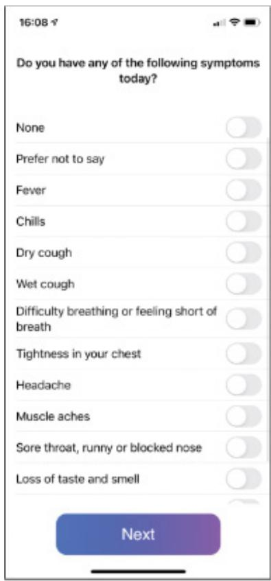  
(a) Symptoms

  
(b) Voice Recording   
Figure 10.2 The smartphone COVID-19 Sounds app: (a) reporting symptoms using a simple survey and (b) recording voice samples (Han et al., 2022)

Source: Cecilia Mascolo

# BOX 10.2

# Citizen Science and UX Design for Privacy

Privacy is interpreted differently in different  types of crowdsourced projects, including citizen  science  (Bowser et al., 2017). Collecting and  sharing data using  smartphones is often easy and quick, but privacy concerns may  be overlooked,  as described by Yongfeng Wang and  colleagues, who  surveyed different  aspects  of privacy in mobile crowd sensing (Wang et al., 2020).

Birding  enthusiasts often like to share first sightings, for  instance, when the  first swallows appear in spring or the first snow geese arrive in winter. They may also want to check identifications with each other. The downside of this community interaction is that personal profile and location data can be used to identify particular contributors and their patterns of behavior. The latter can be problematic, as many participants visit the same places regularly.

It is, therefore, important to ask, how important is privacy in citizen science compared with the benefits of community engagement? How can citizen’s privacy be protected while supporting open engagement with each other?

Various digital tools and platforms have been developed, intended to manage the diverse community of participants by providing shared protocols for how to participate, while facilitating the exchange of data and different views (Preece, 2016). Other strategies involve making  images and locations fuzzy  so that they are not exact. This is also a good strategy for keeping the location of rare species’ observations confidential—especially important to prevent people from finding where  rare plants are  and taking them. For example, iNaturalist (www.inaturalist.org) has a geoprivacy setting that can be set to “open,” “obscure,” or “private.” Obscured observations are used to hide the  exact location of endangered species, as shown in Figure 10.3.

Figure 10.3 iNaturalist geoprivacy obscures the location of an observation.   
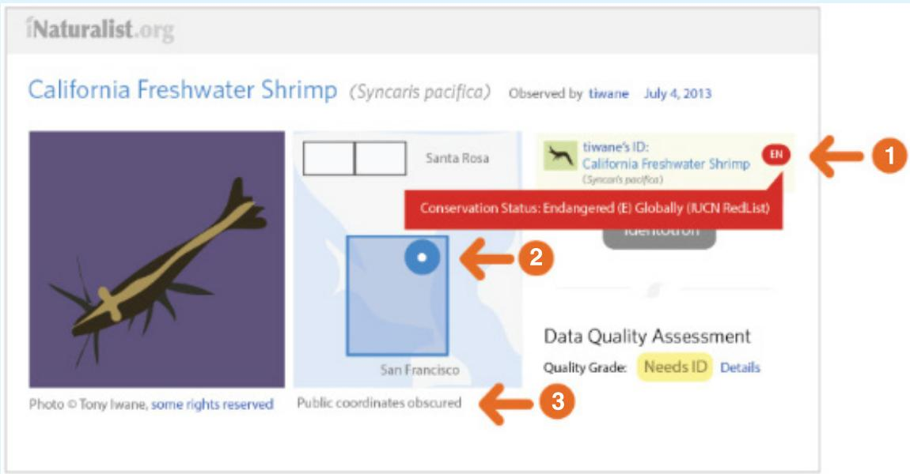  
In this example: 1. EN indicates  that the organism is endangered, so its location needs to be obscured. 2. This indicates that obscuring is done by randomly placing the marker for the location within the broader area. 3. This line allows the contributor to verify that this observation has been observed within iNaturalist. Source: www.inaturalist.org

# 10.2.4  Sentiment Analysis

Sentiment analysis is a technique that is used to infer the effect of what a group of people or a crowd is feeling or saying. The phrases that people post in social media and other forums are scored as indicating negative, positive, or neutral sentiments when offering their opinions or views. The scales used vary along a continuum from negative to positive, for example, –10 to $+ 1 0$ (where –10 is the most negative, 0 is neutral, and $+ 1 0$ is the most positive). Some sentiment  systems  provide  more  qualitative  measures  by  identifying  if the  positive  or  negative sentiment is associated with a specific feeling, for example anger, sadness, or  fear  (negative feelings) or happiness, joy, or enthusiasm (positive feelings). The phrases are extracted from

people’s tweets and texts, online reviews, and social media contributions. Their facial expressions (see Chapter 6, “Emotional Interaction”) when looking at ads, movies, and other digital content  and  customer’s voices  can  also  be  scored  and  classified  using  the  same  scales. Algorithms are then applied to the labeled data to identify and classify them in terms of the level of effect that has been expressed. There are a number of online tools that can be used to do this, such as DisplayR and CrowdFlower. See the following link for a tutorial.

MonkeyLearn provides a detailed tutorial with case studies on sentiment analysis: monkeylearn.com/sentiment-analysis.

Sentiment analysis is commonly used by marketing and advertising companies to decide on what types of ads to design and where to place them. In addition, it is increasingly being used in research to study social science phenomena. For example, Veronikha Effendy et al. (2018) used sentiment analysis to study people’s opinions about the use of public transportation from their tweets. In particular, she was interested in determining what were the positive and  negative opinions toward  it, which  could then  be used  as evidence  for making  a case about how to improve public transportation to increase its use in Indonesia, where there are huge traffic congestion problems.

However, sentiment analysis as a technique is not an exact science and should be viewed more as a heuristic than as an objective evaluation method. Giving a word a score from −10 to $+ 1 0$ is quite a crude measurement. To assess how good sentiment analysis is as a method, Nicole  Watson and  Henry Naish  (2018)  compared  human judgment  with computer-based sentiment  analysis for evaluating  positive  articles about the  U.S. economy. They found that the computer disagreed more often than it agreed with the articles compared with the human participants. Their analysis indicates that humans express their optimism about a topic more positively. Moreover, it also showed that by focusing on emotive words in phrases, sentiment analysis can miss the diversity of expressions that humans understand intuitively. For example, how would sentiment analysis score the phrase written by a teen in a text to their friends that said, “Your hair is always so on point!” The phrase is a slang expression meaning that something is very well done or perfect and is used mainly by teens to praise someone who has done something amazing. Sentiment analysis would probably give it a neutral score, whereas people in the know would give it a positive score. Humans also make more nuanced judgments.

# 10.2.5  Social Network Analysis

Social  network analysis  (SNA) is  a method based on  social network  theory (Wellman and Berkovitz,  1988; Hampton and Wellman, 2003)  for analyzing  and evaluating  the strength of social ties within a network. While understanding social ties has been a strong interest of sociologists for many years (for example, Hampton and Wellman, 2003; Putnam, 2000), as social media became increasingly successful, it also became a key interest for computer and information scientists (for example, Wasserman and Faust, 1994; Hansen et al., 2019). These researchers want to understand the relationships that form among people and groups within and across different social media platforms, and with offline social networks, too.

SNA  enables these relationships  to be  seen more clearly. It  helps to reveal who is  most active in a group, who belongs to which groups, and how the groups do or do not interact and relate to each  other. Analyses can also show  which topics  are hot  and throw  light on when, how, and why some topics go viral. Managers, marketing and advertising companies, and politicians are especially interested in how these activities can influence them, their companies, their clients, and their constituents.

So, how does SNA work? Broadly speaking, as the name suggests, a network is a collection of things and their relationships to each other. A social network is a network of people and groups with relationships to each other. At the individual level, SNA may be more about “who you know” than “what you know” or “who you are.” At the group level, it shows how each person’s individual  connections aggregate to  form connected  subgroups  (Hansen and Smith, 2014). Two main entities make up a social network. Nodes, which are also sometimes called entities or vertices, represent people and topics. The connections between the nodes are called edges, which are also known as links or ties. The edges show the connections among nodes, for example, the members of a family. They can show the direction of relationships; for instance, parents may have a line with an arrowhead that points to their children, indicating the direction of the relationship between the two nodes. Similarly, an arrow in the opposite direction indicates that children have parents. These are known as directed edges. Edges can also indicate relationships in both directions by having arrows at each end. Edges  that do not have an arrowhead are undirected; that is, the direction of the relationship between two nodes is not shown.

An integral part of social network analysis is the creation of maps, also called network graphs. These can help researchers understand at a higher level the connections among people represented by the nodes. For example, they have been used to show connections between people tweeting. Derek Hansen and Marc Smith (2014)  illustrate this point in Figure 10.4, which shows a social network created from the connections between people tweeting about “global warming.” The edges (gray lines) represent the following Twitter relationships:  Follow, Reply, or Mention. Thus, this can be thought of as a conversation network. The size of the  nodes  (circles)  is  based  on  the  number of Twitter  followers,  with bigger  nodes  having more total followers. The  map also helps identify groups, or  clusters (identified by different colors), of  people  who Follow, Reply, or  Mention  each  other. As  is  typical  of many  social networks, most people  are  connected to others either directly  or  indirectly in a large interconnected social network. Only a few pairs of people exist outside this large network (these are shown all along the bottom of the map by the series of connected small gray blobs). The network map can distinguish between those who are the key individuals leading the discussions (large circles) and identify different groups who talk among themselves, such as climate change deniers and those who are interested in climate science. They can also indicate which individuals influence or connect to different groups acting as bridge spanners.

There are other interesting relationships that can be teased out by experts in social network analysis, who also know more about the context of the discussion, perhaps by reading some of the tweets. Without that extra knowledge it can be hard to make a deeper interpretation of the network. For example, what might be going on at the bottom left of the network diagram, where  there are many edges (the gray  lines) joining a few orange  nodes, some of which are right at the bottom of the diagram  and some  of which are closer in  toward the central network?

Figure 10.4 A social network map showing people (represented by nodes) who have tweeted the word global warming and how they are connected to one another based on Follow, Reply, or Mention relationships (edges)   
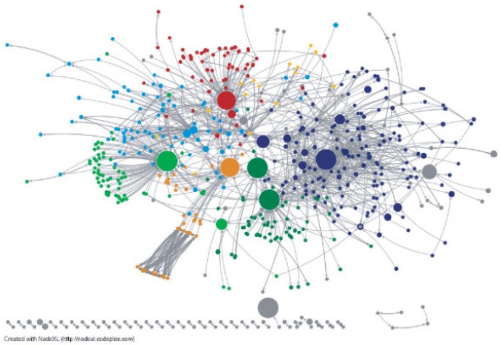  
Source: Hansen, D. L., and Smith, M. A. (2014) Social Network Analysis in HCI. In J. Olson and W. Kellogg (eds) Ways of Knowing in HCI. Springer, New York, NY. pp. 421–447

Some other topics that have been studied using social network analysis include communication during the 2016 flood in Louisiana, where Jooho Kim and Makarand Hastak (2018) examined  the role of  social media in  flood victims’  communication, both  with each  other and with emergency services. They found that Facebook was used effectively to disseminate information. Another study by Dinah Handel and her colleagues examined teachers’ tweets on Twitter (Handel et al., 2015). More recently, SNA has been used to examine people’s feelings about the COVID-19 pandemic on social media (Nemes and Kiss, 2021).

Although these social network graphs are revealing, using the tools effectively to separate and display clusters, outliers, and other network features takes practice. There are now various  tools available that enable beginners to do  straightforward analyses. Two  of the most well-known  social network  analysis  tools  are NodeXL  (Hansen  et  al., 2019), which  runs on Windows-based machines, and Gephi, which runs on both Windows and macOS. Many YouTube videos are available that describe how to use these tools.

This video is an introductory tutorial about Gephi by Jen Golbeck, professor at the University of Maryland. It is one of a series, so if you continue watching at the end of the video, the next one progresses to describe more advanced features of Gephi, including how to use color to highlight particular features of interest in the network graphs: www.youtube.com/watch?v=HJ4Hcq3YX4k.

In this YouTube video, Marc Smith, the director of the Social Media Foundation, shares how he has used NodeXL for social media network analysis and visualization: www.youtube.com/watch?v=Ftssu_5x7Zk.

# DILEMMA

# How to Probe People’s Reactions to Tracking

There is often a gulf between the benefits provided to society through tracking and the level of individual privacy that is being sacrificed. It is important, therefore, to have an open debate about the costs versus the benefits of using tracking and monitoring technologies. Ideally, this should take place before any deployment of the new technology. However, just asking people what they think about a tracking technology may not reveal the true extent of their concerns and feelings. What other methods could be used?

One  approach is to use  a  provocative  probe  (discussed in Chapter  11, “Discovering Requirements”). For example, a project called the Quantified Toilets (2014) did this by setting up a fake service in a public place to disrupt the accepted norms. The team was interested in how a community would react to having their urine analyzed in a public toilet with the goal of improving public health. They pretended to be a commercial company called the Quantified Toilets, which had created a new urine analysis technology infrastructure and installed it in the public toilets at a convention center. Signage was placed throughout the toilets explaining the rationale for the initiative (see Figure 10.5). In addition, the team created a website that presented fake real-time data feeds from each of the toilets in the convention center showing the results of the urine analysis, including details such as blood alcohol levels, drugs detected, pregnancy, and odor (see Figure 10.6). All sampled data were anonymized but also fake so not belonging to anyone. In addition, a link to a survey was added, and the general public was invited to give their feedback.

Quantified Toilets

Figure 10.5 Signage posted in the convention center   
  
Source: Courtesy of Quantified Toilets

Figure 10.6 The real-time data was provided on a fake website.   
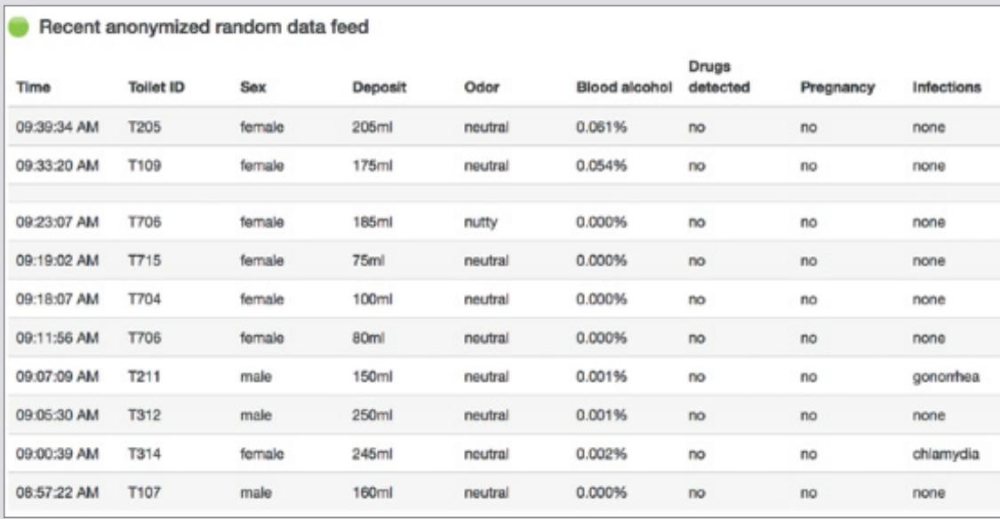  
Source: Courtesy of Quantified Toilets

The goal was to observe people’s reactions when coming across this new service. Would they mind or become upset, surprised, or outraged? Would they question the  reality of the situation and tell others?

So, what happened? A diverse range of responses were observed. These included disapproval (for example, “Health  advice? It does not get any  creepier.”); approval (“Privacy is important. But I would like to know if I was sick, and this is a good way to do so.”); concern (for instance, “Imagine if your employer could find out how hard you had partied last night.”); resignation (“I am sure the government has been collecting this data for years.”); voyeurism (“I just spent the last 10 minutes watching the pee-pee logs. Can’t stop watching them.”); and even humor, where some people tried to match people entering and exiting the toilets with the data appearing on the website.

(Continued)

Within an hour of the project going live, #quantifiedtoilets went viral on social media, triggering a  snowball of tweets and retweets. Many face-to-face discussions took place at the convention center, and articles and blogs were written, some appearing in magazines and newspapers. Some visitors were duped and tweeted how incensed they were. Arguably, this range of responses and level of discussion would never have happened if the researchers had just asked people in the street would they mind if their urine were analyzed in a public toilet.

What do you think of this type of study? Do you think it is a good way to open up debate about data tracking in society, or is it a step too far? Lorrie Faith Cranor (2021) reflects on how effective this kind of study is for opening up people’s eyes about privacy matters. Furthermore, she was inspired by the quantified toilet study to develop her own smart toilet project and now regularly uses it as a thought experiment in her teaching where she asks students to propose an approach to dealing with placing notices and obtaining people’s consent to having their urine tested when using a smart toilet in a public bathroom. The question of how to get consent from someone walking into a toilet is a tricky one as it can’t be assumed they will want to read and sign a form agreeing to their urine being analyzed. They want to go to the toilet! Not surprisingly, the responses Cranor gets are always animated, varied, and thoughtful. One suggestion is to have some toilets available with smart sensing and some without. But this then raises the question of how do you signal this to visitors? Will they read a sign if they are bursting to go to the loo? And what happens if someone is blind? How do they know? And so on. A range of ergonomic, ethical, and legal aspects are typically explored in relation to where to put notices and in what form, and how to enable people to give consent for their urine to be tested in this way. This kind of thought exercise is an excellent way to get people to think about the practicalities of privacy when collecting data. It helps them to realize that it is not a straightforward issue. If the same experiment was to be conducted again today, it is likely to result in different findings. Maybe more people would find it socially acceptable. Smart  toilet technology is now  being developed  in some countries  (see Park et al., 2020), while people’s attitudes have changed toward public health monitoring since the COVID-19 pandemic.

# 10.2.6  Combining Multiple Sources of Data

A  number of  researchers have  started collecting  data from  multiple sources by  combining automatic sensing and subjective reporting. The goal is to obtain a more comprehensive picture about a domain, such as a population’s mental health, than if only one or two sources of data were used (for instance, interviews or surveys). One of the first comprehensive studies to do this  was StudentLife (Harari  et al., 2017), which was concerned  with learning more about  students’ mental health. In particular, the research team  wanted to know why  some students do better  than others under times of stress, why some students  burn out, and still others drop out. They were also interested in the effect of stress, mood, workload, sociability, sleep, and mental health on the students’ academic performance. They wanted to know how the students’ moods change in response to their workload (such as their assignments, midterms, finals).

During  a 10-week  term,  the researchers  collected  data  about  a  cohort of  48  students studying at Dartmouth College in the United States. They developed an app that ran on the students’ phones, to measure the following, without the students needing to do anything:

. Wake-up time, bedtime, and sleep duration   
The number of conversations and duration of each conversation per day   
•  The kind and amount of physical activity (walking, sitting, running, standing, and so on)   
• Where they were located and how long they stayed there (that is, in the dorm, in class, at a party, in the gym, and so forth)   
•  The number of people around the student in a social group throughout the day   
. Student mobility outdoors and indoors (in campus buildings)   
• Their stress levels throughout the day, week, and term   
. Positive affects (how good they felt about themselves)   
. Eating habits (where and when they ate)   
• App usage   
. Their  comments  on  campus  about  national  events  (for  example, the  Boston  Marathon bombing, which was in the news at that time).

They also used a number of pre- and post-mental health surveys and collected the students’  grades. These  were used as ground truth for evaluating mental health and academic performance,  respectively. The  researchers  went  to  great  lengths  to  ensure  that  all  of  the data stored was anonymized in a dataset to protect the privacy of the participants. Having achieved this, the researchers then opened up the dataset for others to examine and use  to conduct further analyses (studentlife.cs.dartmouth.edu/dataset.html).

The researchers  were able to mine the data that they had collected automatically from the students’ smartphones and learn  several new things  about their behavior. In particular, they found that a number of the behavioral factors that had been tracked from their smartphones were correlated to their grades, including activity, conversational interaction, mobility, class attendance, studying, and partying.

Figure 10.7 shows a graph indicating the relationship between activity, assignment deadlines, attendance, and sleep. It shows that students are very active at the beginning of the term and get very little sleep. This suggests that  they are out partying  a lot. They  also have high attendance rates at the beginning of term. As the term progresses, however, their behavior changes. Toward the end of term, sleep, attendance, and activity all drop off dramatically!

Figure 10.7 Student’s activity, sleep, and attendance levels against deadlines during a term   
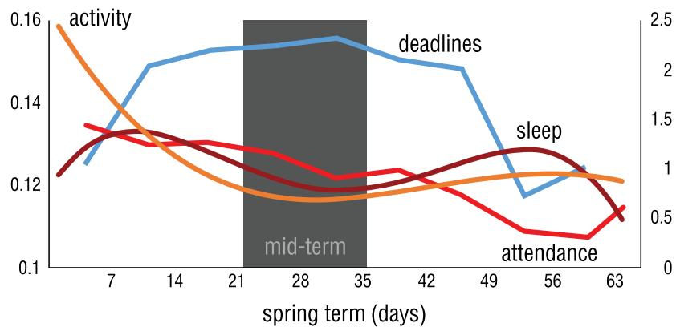  
Source: StudentLife Study

# ACTIVITY 10.2

From the two graphs shown in Figure 10.8, what can you say about the students’ activity, their stress levels, and their level of socializing in relation to deadlines over the course of the term?

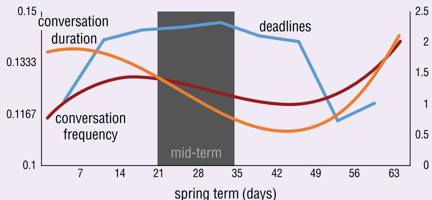

Figure 10.8 Student behavioral measures over the course of a term   
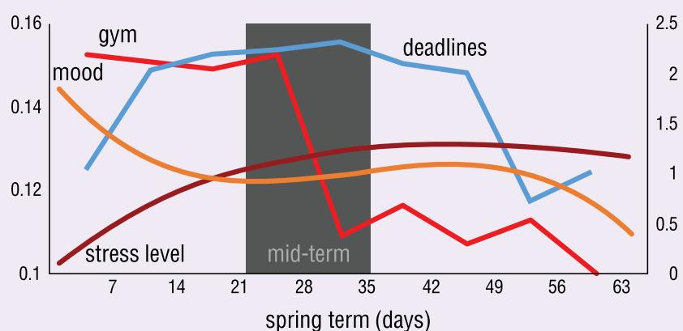  
Source: StudentLife Study

# Comment

The top figure shows that students start the term by having long social conversations. This begins to tail off as mid-term approaches. Students resort to having fewer and shorter conversations. After the  deadlines  have passed,  students switch back to having many more and longer conservations.The bottom figure shows students started out all upbeat, having returned from vacation feeling good about themselves. They appear relaxed (high mood level) and are active (going to the gym a lot). These attributes all start going downhill as the term comes to an end—presumably as their stress levels rise because of looming deadlines.

# 10.3 Visualizing and Exploring Data

Much of the data people interact with in their work and everyday lives is displayed visually, for example, road signs, maps, medical images, mathematical abstractions, tables of figures,

schematic diagrams, graphs, scatter plots. These representations are intended to help people make sense of the world, but for them to be useful, they have to be presented in ways that are understandable for the people who use them. Being able to take meaning from data involves being able to see it and being able to interpret it. What  kind of data is it? What is the data about? Why was it collected? Why was it analyzed and what does it mean? The skills needed to understand and interpret data visualizations are referred to as visual literacy. As with any skill, different people exhibit different levels of visual literacy, depending on their experience of using visual representations (Sarikaya et al., 2018).

# BOX 10.3

# A Community-Based Environmental Data Toolkit

There are a number of off-the-shelf sensor toolkits available now that can be placed in someone’s home or local community to measure air quality or other aspects of the environment. One of the earliest open platforms developed was the Smart Citizen Kit (Diez and Posada, 2013), which has been updated several times since it was first developed and can be downloaded from smartcitizen.me. This compact sensing device comprises a number of embedded sensors that measure nitrogen dioxide $\left( \mathrm { N O } _ { 2 } \right)$ , carbon monoxide (CO), sunlight, noise pollution, temperature, and humidity levels. The data being collected from the  platform is connected to a live website that can be accessed by anyone. The various data streams are presented via a dashboard using canonical types of visualizations, such as time-series graphs (see Figure 10.9). Data streams from other Smart Citizen devices, set up throughout the world, can also be viewed via the dashboard, making it easy to compare data collected from different locations.

Masses of environmental data have been collected over the years that have been used to inform the development of smart cities by enabling local communities to fabricate their own sensing tools, make sense of their environments, and  address pressing environmental problems, such as air pollution (Balestrini et al., 2015).

Figure 10.9 Smart Citizen dashboard and visualization   
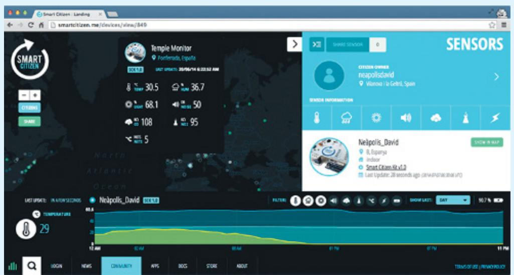  
Source: CitizenMe, www.citizenme.com

Even graphical representations of small amounts of data (for example 20–100 items) can be hard to interpret if the people trying to make sense of them don’t understand the way that the data is being displayed. Furthermore, sometimes representations, such as bar graphs, line graphs, and scatter plots (described in Chapter 9), are displayed in misleading ways. Danielle Szafir (2018), for example, asks, “How can we craft visualizations that effectively  communicate the right information  from our  data?” She  describes how  data displays can  mislead people when graphs have axes with truncated scales, or they show data in 3D bars making it hard to read exact values from the bar because it isn’t obvious which side of the 3D column is  the  place  to read. Interactive  visualizations  typically include  various  canonical forms  of representations (for instance, bar charts  or pie charts)  along with tree maps and advanced visualization techniques that enable people to interact with the data online by panning and zooming in and out of the displays. Interactive techniques like panning and zooming in and out help people to navigate and explore complex data visualizations. Different methods may be used for representing data visually on mobile devices, often referred to as mobile visualizations (Lee et al., 2022). For  example, the “complication” display described in Chapter 7, “Interfaces,” shows the kinds of miniature visualizations that have been developed specifically for using on a watch face, intended for the wearer to see at a glance.

As  Stuart  Card  and  his  colleagues  explained more  than  two  decades ago,  the goal  of data visualization tools is to amplify human cognition so that people can see patterns, trends, correlations, and anomalies in the data  that lead them  to gain  new insights and make new discoveries  (Card  et  al., 1999).  For  example,  millions  of  people  use  digital  maps  to  find their way, benefitting from their integration into car navigation and smartphone apps. Physicians and radiologists compare images from thousands  of patients, and financiers examine trends in the stocks of hundreds of companies. These data visualization tools enable people to explore the data and gain new insights. For example, they can zoom in and out of the data to see an overview or to get details. Ben Shneiderman (1996) summarizes this behavior in his mantra “overview first, zoom and filter, and then details on demand.”

A number of visualization tools have been developed for interacting with big volumes of data for larger displays used with PCs, laptops, and tablets (Whitney, 2012; Munzner, 2014; Makulec, 2022). Typically, they comprise the common techniques mentioned earlier (such as graphs  and  scatter  plots)  coupled  with  3D  interactive  maps  and  displays,  time-series  data, trees, heat maps, and networks. Sometimes, these visualizations were developed for uses other than those for which they are used today. For example, tree maps were originally developed to visualize file systems, enabling people to understand why they are running out of disk space on their hard drives by seeing how much space different applications and files were using (Shneiderman, 1992). They were then adopted by media and financial reporters for communicating changes in the stock market, and they became known as “market maps” (e.g., Figure 10.10). Similar to interactive maps, tree maps have become a general-purpose tool embedded in most widely used applications, such as Microsoft’s Excel (Shneiderman et al., 2016).

Other kinds of visualizations have also been developed for different kinds of data, such as using  spectrograms to  represent  audio. For  example, Figure  10.11  shows spectrograms that were used to visualize recorded sounds from birds and insects, collected by Jessie Oliver and her colleagues (2018). They show visually the signal strength, or “loudness,” of a sound over time at various frequencies present in a waveform, enabling scientists to get an overview and be able to see the  patterns in bird songs and animal noises. Oliver et al. wanted  to see how people investigated and annotated these kinds of visualizations and how they could be used to find and identify birds and other animals in the wild.

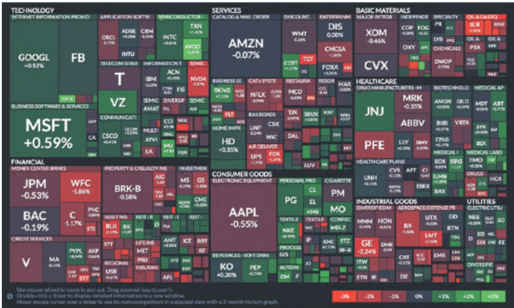  
Figure 10.10  A market map of the S&P 500, which is a financial index for stocks. Green indicates stocks that increased in value, and red indicates stocks that decreased in value that day.

Source: Courtesy of FINVIZ

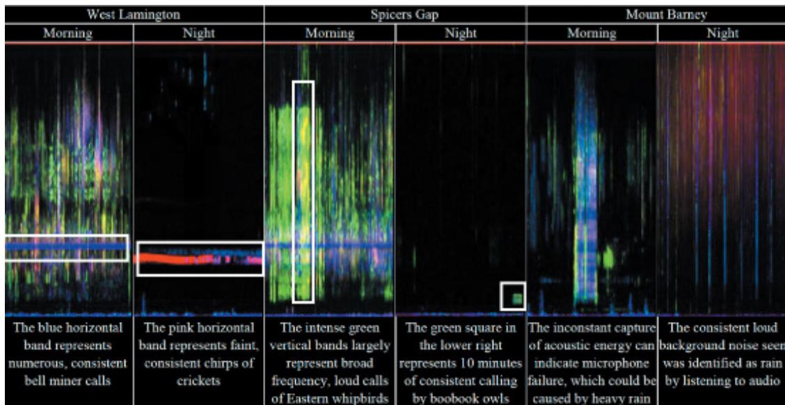  
Figure 10.11  Visualization  of different  sounds,  including  birds  and  insects, from three  areas of Australia that are displayed so they can be interpreted and compared

Source: Oliver et al. (2018) / Reproduced with permission of ACM Publications

This video describes how Jessie Oliver collected and used a combination of different types of data, including sound data: www.youtube.com/watch?v=2_WlTg-JmH0.

# ACTIVITY 10.3

This video by Jeff Heer (2017) gives an overview of different types of data visualizations and data visualization tools: www.youtube.com/watch?v=hsfWtPH2kDg.

Watch the video and then describe (1) some of the benefits of using interactive visualizations and (2) some of the UX challenges in designing interactive visualizations.

# Comment

1. By working with interactive visualizations, people can interact with data to explore aspects of interest by going deeper into particular parts of it. This is demonstrated in the visualization of airline  on-time performance in which someone can filter portions of the data to view which flights arrive late. From this exploration, they can discover that flight delays are  associated with it being late in the  day. As time goes by, the  actual arrival  times of flights tend to fall further behind the scheduled arrival times. Also, by being able to filter and  manipulate particular parts of the data, people can answer other  questions, such as what causes flights to arrive early?   
2. In the video, Heer talks about some of the human perceptual and cognitive issues that UX designers must be aware of when they create visualizations. For example, he mentions the importance of using color appropriately in a visualization of arteries. He also talks about the challenge of knowing how much detail to include in the visualization about the structure of the arteries.

In addition, Heer mentions the power of current tools for investigating many different variables, but he notes that using some of these tools proficiently requires programming and data analytics skills. UX visualization tool designers therefore need to find ways to support people who  may not have these skills. He describes  how some designers are tempted  to get  around this problem  by automating the  analyses, but a  careful balance is needed in deciding how much automation should be provided and how much control should be left in the hands of the people using these products.

Heer also points out that there is much more to analyzing data than to visualizing it. Data has to be cleaned and prepared, a task referred to as data wrangling, which can take up to 80 percent of a data scientist’s time. Issues of privacy also need to be considered.

A  number  of commercial  data  visualization  tools have  been  developed  for  businesses (Zhang et al., 2012; Sakr et al., 2015). Some examples include Tableau, Qlik, Datapine, Voyager 2, Power BI, Zoho, D3, Kyrix, and Observablehq. To use these tools effectively, business managers often  partner with analysts  who assist them  in  interactive explorations that  can lead to new insights. This may involve customizing the dashboard—an interactive panel of control widgets that contains sliders, check boxes, radio buttons, and coordinated multiple window displays of different kinds of graphical representations, such as bar and line graphs, heat maps, tree maps, infographics, word clouds, scatter plots, and other kinds of visualizations. All of the items in the dashboard are coordinated and draw from the same data selected to investigate particular questions of interest. In other words, the  components of the dashboard  are interactive  and linked  together so that they  are coordinated  (see  Figure  10.12).

This  enables  managers  to  see  the  data  displayed  in  different  ways  and  to  explore  how  it changes  at the interface using  different visualizations  as they  manipulate sliders and  other controls. The managers  can  also make  the same  dashboards  available to  other  employees across their company so everyone can see, discuss, and interact with the same data.

A  challenge  is  how  to  make these  ever  more  powerful  tools available  to  people who want to explore, such topics as personal finance and health data, but who are not trained as analysts and who do not want to employ or work with an analyst. Increasingly, AI techniques are incorporated in the tools that automate many data analytic tasks—making it easier for other people to use. Natural language interfaces have also been developed to make it easier for people to ask specific questions of the data. For example, Tableau’s Ask Data lets someone type a question in everyday language such as “show the total sales for the first quarter.” Tableau then automatically displays the relevant data visualizations.

Figure 10.12  A dashboard that was created to show changes in sales information   
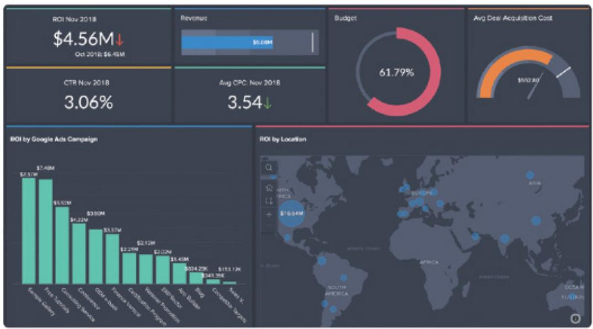  
Source: Zoho Corporation Pvt. Ltd, www.zoho.com/analytics/tour.html

The design of dashboards can vary a lot, and there is a tendency to cram lots of graphs and  other  visualizations  into  them. Alper  Sarikaya  and  colleagues  (2018)  argued  that  a deeper  understanding  is  needed about  how  the context  of use  can  impact  the usability  of dashboards. They challenge UX designers to develop dashboards for different types of uses and for a wide range of people. This work involved analyzing a range of dashboards, first by reviewing published papers written by other researchers. Then they carried out a qualitative study in which they classified the features of different dashboards and how they are used.

They  characterized  the  dashboards  according  to  their  design  goals,  levels  of  interaction, and the ways in which they are used. Figure 10.13 shows examples of the seven kinds of  dashboards  that they  identified.  Each  type  is  named  according to  how  it is  used:  strategic  decision-making, quantified  self,  static operational,  static organizational,  operational

decision-making, communication,  and dashboards  evolved, which  was a  catchall  category that included features that did not fit into other categories.

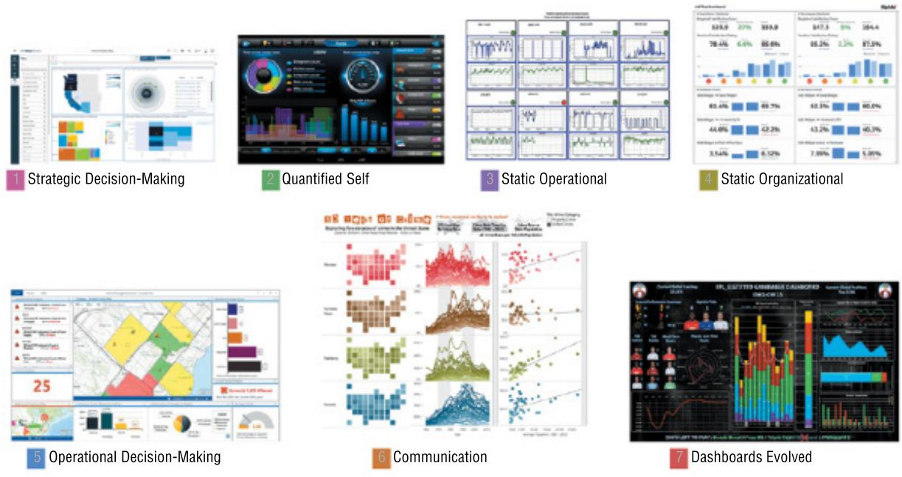  
Figure 10.13  Exemplar dashboards (Sarikaya et al., 2018). Dashboard 1 and Dashboard 5 specifically target decision-making, while Dashboard 3 and Dashboard 4 target consumer awareness. Dashboard 2 represents the quantified self (such as a smart home), while Dashboard 6 represents those dashboards targeting communication. Dashboard 7 captures some novel extensions of traditional dashboards.

Source: Sarikaya et al. (2018) / Reproduced with permission of IEEE

Sarikaya  et  al.  (2018)  also advocate ways  of  supporting people by  telling stories  that can help illustrate the context that the data visualizations represent. They point out the challenges that people encounter when interacting with visualizations such as enabling them to have more control over how they configure and use dashboards. A further challenge involves finding ways to support people in developing data, visual, and analytic literacy.

# ACTIVITY 10.4

Study Figure 10.14(a), which comes from the weather site www.wunderground.com.

It shows weather data for a day in December at Washington D.C. in the United States. Particularly take note of the temperature, precipitation, and wind data. What information do they provide? Now compare this visualization with that depicted in the “wundermap” (see Figure 10.14b). How do the two displays differ, and which do you prefer?

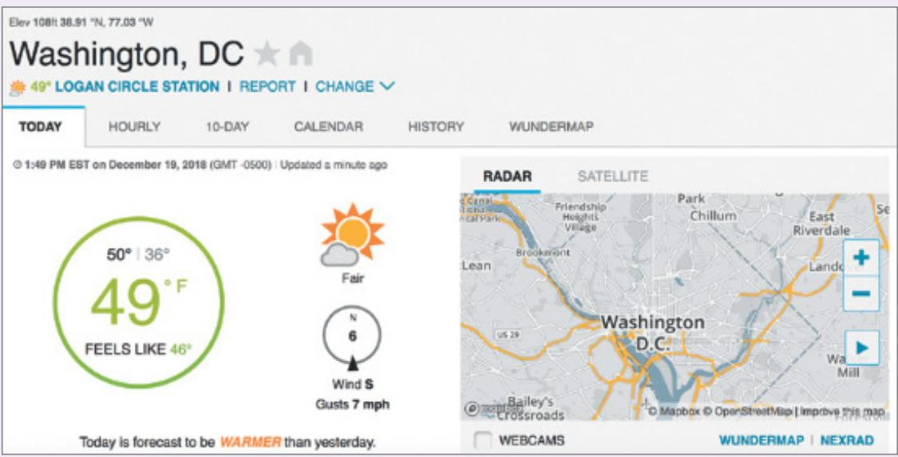

Figure 10.14  (a) Actual weather data and (b) a wundermap of the same area and time   
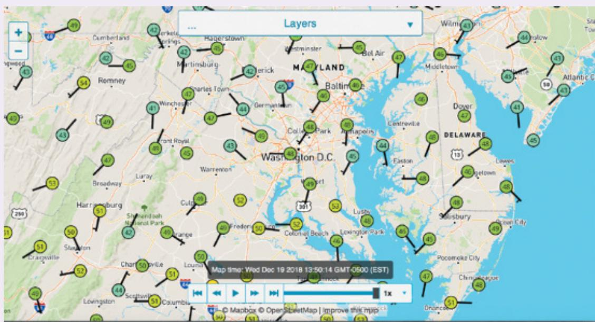  
Source: TWC Product and Technology LLC, www.wunderground.com

# Comment

The first display in Figure 10.14(a) contains representations that are fairly standard for conveying weather information. The green ring shows the maximum and minimum temperatures

(Continued)

at that time and what it feels like. A diagram of a sun indicates that it is a sunny day  with some clouds, even though it is quite cold. It is also easy to see that the wind is from the south, and  presumably the  circle represents a compass and  the pointed  wedge indicates the  wind direction.

The display in Figure 10.14(b) provides similar data, but it is harder to get an overview of weather in the Washington D.C. area. It uses conventional meteorological symbols to show temperature and wind. It is easier to see local effects but harder to get an overview of weather of the entire area. (If you are able to access the website, try clicking Layer and selecting other options not shown in the figures.) Which display is preferable probably depends on how much detail you want—an overview or detail about a specific area in the Washington D.C. region— and  your tolerance  for clutter. It also depends  on your level  of experience and comfort  in interpreting the conventional meteorological symbols.

# BOX 10.4

# Visualizing the Same Sensor Data by Using Different Kinds of Representations for Environmentalists and the General Public

Queen  Elizabeth Park in London was  transformed into a “smart park.” A  number of sensors were placed throughout the  park to measure  its  health and  use. One  type of sensor deployed could detect bat calls. The goal was to ensure that the park’s bat conservation program was effective, as well as connecting visitors and residents to the wildlife around the park (naturesmartcities.com). Monitoring bat calls is also a technique that was used to assess the general health of the park.

The data collected was primarily provided to the scientists in the form of spectrograms (see Figure 10.15b), but it was also presented in a more accessible form to the public via an interactive display (see Figure 10.15a). As part of a public kiosk, a schematic map was provided  that showed where in the park the bat  call data had  been collected (Kaninsky  et al., 2018). A slider was provided to enable visitors to interact with the data: moving it to the left showed bat call data from the night before, while moving it to the right showed bat call data from the previous 10 nights. The LEDs on the map changed in color and intensity, representing the varying levels of bat calls. The total number was also shown in the digital display. The kiosk was deployed in the park, and many passersby stopped for a considerable length of time to learn about bats and interact with the data. The physical act of using the slider provided an engaging way  of exploring  the  data rather than just looking  at a  static visualization  or dashboard.

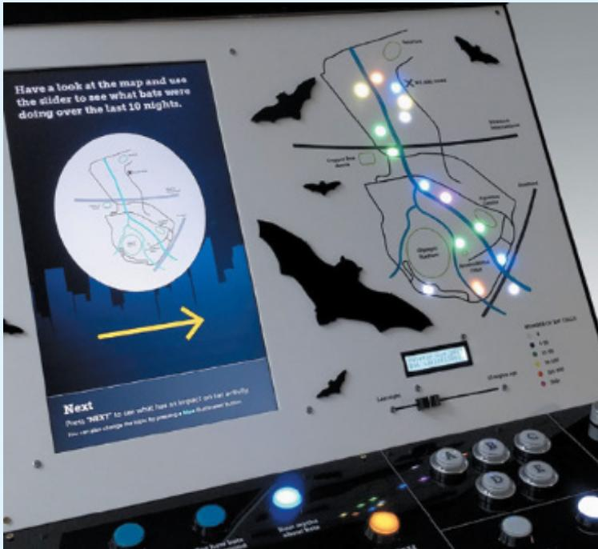  
(a)

(b)   
Figure 10.15  The same bat call data was made accessible (a) to the general public via an interactive visualization and (b) as a spectrogram intended for environmental scientists.   
  
Source: (a) Courtesy of Matej Kaninsky and (b) Courtesy of Sara Gallacher

Designing data visualizations when beginning a career can be daunting. Amanda Makulec (2022) describes her insightful journey of starting out in this area in her article Starting out in Data Visualization Today, in particular from being a newcomer to becoming an expert. In so doing, she offers helpful advice and pointers to other researchers along the way.

nightingaledvs.com/starting-out-in-data-visualization-today

# 10.4 Ethical Design Concerns

In the introduction to this chapter, we mentioned how a diversity  of data is now regularly being  collected  from  people for  a  variety  of  reasons, including  improving  public  services, reducing congestion, and enhancing security measures. It is usually anonymized and sometimes aggregated to make it publicly available, for example showing the energy consumption data  for a  given  space  such  as a  floor  of a  building. Figure  10.16  shows  a  floor-by-floor comparison for a University of Melbourne building, where the red bar shows that the basement is the worst performer in terms of energy usage, and the green bar shows level 1 is the best performer. The idea  is  to provide  feedback on  energy consumption  in the building to increase awareness among the inhabitants and encourage them  to reduce  their energy consumption. However, what if localized occupancy rates or energy consumption for each room were shown? It would not take much to figure out who was in that space. Would that be a step too far and an invasion of their privacy? Would people mind?

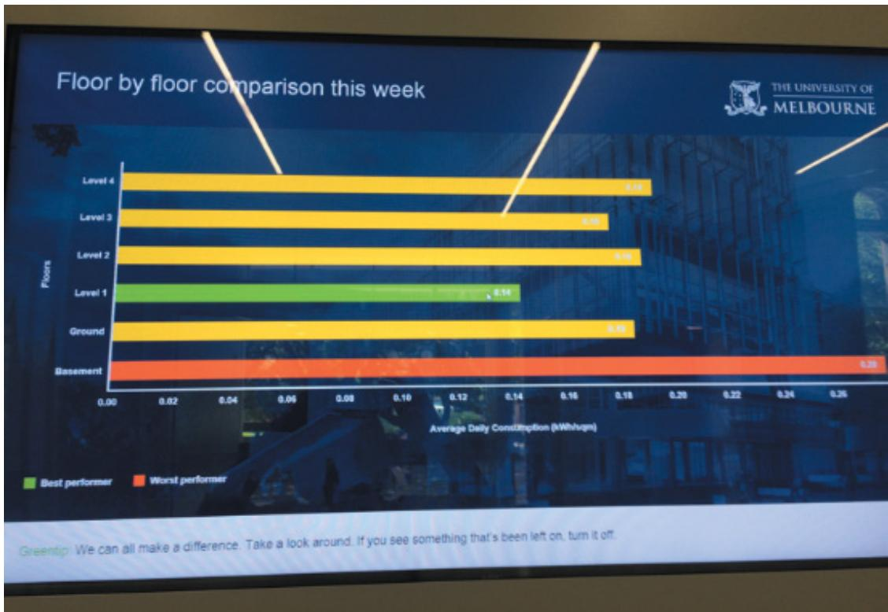  
Figure 10.16  Average daily energy consumption depicted on a public display for a building at the University of Melbourne. Green  is best performer, yellow is in the middle,  and  red  is the  worst performer.

# Source: Yvonne Rogers

When  deciding on how  to analyze and act upon data that has been automatically collected from different sensors, it is important to consider how ethical the data collection and storage processes are and how  the data analysis will be used. While  ethical considerations

of data collection and storage for individual projects were discussed in Chapter 8, they are more complex when considering Big Data and automatic collection. Ethics is generally taken to  mean “the  standards  of  conduct  that  distinguish  between  right  and  wrong,  good  and bad, and so on” (Singer, 2011, p. 14). By ethical design concerns we mean how HCI can be involved in designing and evaluating systems that use Big Data, through conducting research that  follows  human-centered  codes of  practice. Increasingly, this involves systems  that  use machine  learning, and so much of the focus nowadays  is on how to make the design of AI systems more human-centered (Shneiderman, 2022).

There are many codes of ethics available from official bodies that provide guidance. For example, the ACM (2018) and IEEE (2018) have both developed sets of ethics. In addition, most  tech  companies and organizations now  have their own AI ethics strategy that covers issues,  policies, and  concerns  while  providing  recommendations  for  how  to  avoid  ethical risks (see Jobin et al., 2019). Advait Deshpande and Helen Sharp  (2022) found  there were more  than  170 guidelines  on AI  ethics  and  responsible, trustworthy AI  in  circulation. For example, Microsoft published its Responsible AI Standard (2022), which is a playbook that is used by its researchers and developers to create AI systems, guiding how they design, build, and  test them.  It  also  incorporates  their earlier  set of  guidelines  for human-AI  interaction (Amershi et al., 2019).

There are also a number of public interest research centers, such  as Electronic  Privacy Information Center (EPIC), that seek to protect privacy, freedom of expression, and democratic values in the digital world. As mentioned in Chapter 8, the European Union (EU) has developed  a General Data  Protection Regulation (GDPR), which  is enforced by law. It  sets standards and guidelines for the collection and analysis of personal data from  people who reside in the EU. For example, it states that visitors to a website must be notified about the data  the  site  collects  from  them  and  asks  them  to  explicitly  consent  to  that  information gathering,  by clicking  an Agree  button. In 2021, the EU proposed  a new  legal framework to address the risks of specific uses of AI, categorizing them into four different levels: unacceptable risk, high risk, limited risk, and minimal risk. The regulation notes that while most AI systems pose limited to no risk and, importantly, can contribute to solving many societal challenges,  certain  AI  systems  create  risks that  need to  be  addressed  to avoid  undesirable outcomes that could impact people’s privacy in ways that could damage them. An example they  mention in the regulation is of an interactive toy  that uses  voice assistance to encourage dangerous behavior. Furthermore, GDPR proposes that AI systems be banned if they are considered to be a clear threat to people’s safety, livelihoods, and rights.

The guiding force behind all of the regulations, guidelines, and standards is on preventing AI systems from making unseemly mistakes and amoral decisions. Central to any ethical discussion  is  the  importance  of  protecting  fundamental  human  rights  and  respecting  the diversity of all cultures. This involves ensuring that the  personal data collected and used in an app or service is fair, honest, trustworthy, secure, and respectful of privacy.

The Open Data Institute (www.theodi.org) has  developed a framework called the data ethics canvas to help anyone who is collecting data to identify and manage ethical issues. It encourages researchers and developers to ask questions about why they are collecting data and what  they intend to use  it for. For example, some of the questions are about the positive and negative effects that a project can have on people. These questions include “Which individuals,  demographics,  and  organizations  will  be  positively  affected  by  the  project?” and “How is  positive impact being measured?” The negative questions  include “Could  the

manner  in which  the data is  collected, shared, and used  cause harm?” and “Could  people perceive it to be harmful?”

Another  move  is  toward conducting  more  responsible  research. In the  context  of  Big Data, it  entails  limiting  the  data  collected  to  what  is  necessary  in  the  first  place.  Rather than trying  to collect as much data  as possible, it has  been proposed  that researchers and data practitioners  follow  an  approach known  as privacy  by design  (Crabtree et  al.,  2021; Crowcroft et al., 2018). An example  is the  children’s code of practice that  aims to protect children in the digital world (ICO, 2021). That way, they can avoid collecting excessive data that might be sensitive but not needed (see also Chapter 8 and Chapter 14). Furthermore, it may be possible to collect and analyze the data on the device itself, rather than uploading it centrally (Lane and Georgiev, 2015).

# ACTIVITY 10.5

Shoplifting is on the rise; in 2019 it cost retail companies in the US $\$ 62$ billion. To help combat shoplifting, companies like FaceWatch and DeepCam have developed facial recognition systems that passively monitor people coming into a store by using CCTV video footage that identifies potential suspects (see Figure 10.17). To do this, they develop AI models that have algorithms trained on faces.

Various stores throughout the world have started using this kind of technology to help combat shoplifting. However, there is much public concern about adopting this practice. Matt Burgess (2020), for example, notes that while on the positive side this technology has acted as a deterrent and improved the safety of store staff, on the negative side, it is seen as being extremely intrusive, because shoppers’ faces are scanned without them knowing of the consequences, nor having had the choice to give or not give their consent. Do you think this practice is socially acceptable? What might be other privacy concerns?

Figure 10.17  DeepCam’s face-tracking software used in a store   
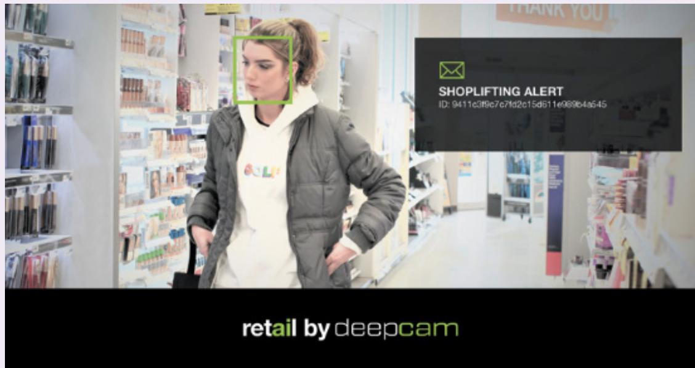  
Source: DeepCAM, deepcamai.com

# Comment

To address privacy concerns, DeepCam’s facial recognition software was developed so that it does not identify customers or link them to any sensitive information such as name, address, or date of birth. It only recognizes faces and identifies patterns of behavior that potentially are worth investigating. The video footage  is indexed and structured similarly to how web pages are set up for quick searching. This enables store detectives to be able to notice potential threats in real time. Many people might find this form of data analysis creepy, knowing that their faces are being matched to a database each time they enter a store. Others might find it more socially acceptable because it has the potential to reduce crime.

In Chapter 1, “What Is Interaction Design?” we outlined a number of usability and UX design principles that were transformed into questions, criteria, and examples showing how to use them in the design process. Here, we introduce other principles that relate to the ethics of collecting and using data at scale and that are often talked about in the literature on ethics, data science, HCI, and AI (see Cramer et al., 2008; Molich et al., 2001; Crowcroft et al., 2018; Chuang and Pfeil, 2018; Dubber et al., 2020). Here we describe five core ones: privacy, fairness, accountability, transparency, and explainability.

Privacy has  been a fundamental  concern  within HCI for a  long time, with  a focus on trust, risk, its perception, and  its management (Ackerman  and Mainwairing, 2005). There are many ways of describing privacy, but fundamental to all definitions is the right to keep one’s personal matters and relationships to oneself and limiting access to information about oneself unless explicitly granting permission to others. However, it can depend on a person’s perspective  and  the  social  and  cultural  setting.  For  example,  while  parents  may  consider location-tracking  devices  or smartphone  apps  as a  way  of ensuring  their children’s safety, their  children may  perceive the  same  technology  as an  invasion  of  their privacy, checking up on them and preventing them from establishing their identity (Iachello and Hong, 2007). More recently, there  has been a move toward understanding how to design control of and access  to  personal  information  and  data  that  is  collected  about  users  in  order  to  protect their  privacy. For  example, the  Living  Room  of  the  Future  project  tried  to  develop  new ways of enabling people to have more control over the flow of their personal data at home (Chamberlain et al., 2018). An open-source platform, called the DataBox, was developed for experimenting  with different models of personal data processing  with the goal of enabling people to manage their own data and third-party access. Within the commercial world, “privacy UX” has materialized as a framework intended to help developers consider how best to design data collection and privacy interactions with users.

Fairness  refers  to impartial  and just  treatment  or  behavior  without  favoritism  or  discrimination. In the context of data analysis, it refers  to what the  impact will be from  using particular  datasets.  Sometimes,  a  dataset  is  biased  toward  a  particular  demographic  that results in unfair decisions being made, resulting in a group of people being disadvantaged, for example, women. An AI model is considered to be unfair if it rejects requests for a bank loan more often for women than men. A goal of ethical AI is to identify and be able to rectify potential biases (see also Chapter 9) while developing new algorithms that can make an AI system fairer.

Accountability refers to whether an intelligent or automated system that uses ML algorithms can explain its decisions in ways that enable people to believe they are accurate and correct. This  involves  making  clear  how  decisions  made  from  the  datasets  are  used,  i.e., by providing appropriate explanations of how a decision was made (explainability). It also considers who is responsible for when an AI model makes an error, for example, who should be responsible for when an autonomous car crashes into the side of another car. Is it the car maker, the insurance  company, the  company  that  made the  Light  Detection  and  Ranging (LIDAR) sensor technology used in the autonomous car, or the other car? The regulations are still being thrashed out, but in a joint report by the Law Commission of England and Wales and the Scottish Law Commission, Sergio Savaresi (2022)  notes how the legal responsibility is  shifting toward the technology, so  it is  not the  driver but the  company  that obtained authorization for the self-driving features used by the vehicle that  is at fault. Do you think this is the right approach?

Transparency refers to the extent  to which  a system makes its decisions and how they are made explicit (Maurya, 2018). There has been much debate about whether AI systems, which typically depend on large datasets when making a decision, should be designed to be more transparent (Brkan, 2017). Examples include medical decision-making systems that can diagnose types of cancer and media service providers (for instance, Netflix) that suggest new content for you to watch based on their machine learning algorithms. Many are like a black box in nature; that is, they come up with solutions and choices without any explanation as to how they were derived. Increasingly, this practice is considered unacceptable, especially as AI systems are given more responsibility to act on behalf of society, for example, deciding who goes to prison, who gets a loan, who gets the latest medical treatment, and so on.

Explainability refers to designing systems, which collect data and make decisions about people, in a way that they can provide explanations that laypeople can understand. What is a good explanation to provide has been the subject of much research, especially what form should  they take.  Early research  by  Brian Lim  et al. (2009)  investigated different  kinds of explanations  for  a  system  that  made  automated  decisions. They  found  that  explanations describing why a system behaved in a certain way resulted in participants developing stronger feelings of trust toward it. More recently, research has investigated the kinds of explanations that are appropriate and helpful for people using automated systems. For example, saliency maps have been developed as a visual explanation to depict how image classification models work. Essentially, these are a kind of heatmap that highlight the pixels of the input image that most caused  the image classification (see Figure 10.18 for an  example of how a particular image was classified as a dog). However, Ahmed Alqaraawi and colleagues (2020) found that this kind of explanation is quite limited in helping people understand how AI models work.

Within the context of HCI, Ashraf Abdul et al. (2018) have proposed an agenda for how HCI researchers can help to develop more accountable intelligent systems that are usable and useful to people. Following on from this, Upol Ehsan and colleagues (2021) have proposed an alternative approach to explainability, which is based on the concept of social transparency. Rather than try to visualize how an AI model works using a saliency map, they suggest instead that it is better to show users how other people’s interactions with the system impacts upon their trust and understanding of it. This kind of contextual knowledge is broken down into four core components: (1) who interacted with the AI system, (2) what they did, (3) when, and (4) why they did what they did. It is argued that this kind of socio-technical approach will more likely help explain to users better how AI systems make their decisions.

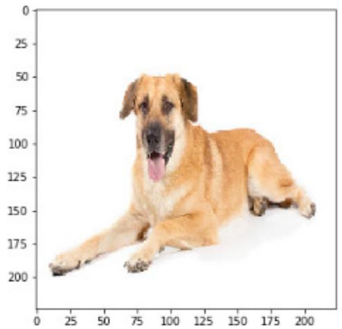

Figure 10.18  A saliency map on the right created as an explanation of how the image on the left was classified by a deep learning algorithm as a dog. The highlighted pixels in light blue are the ones that made the most contribution to the final score.   
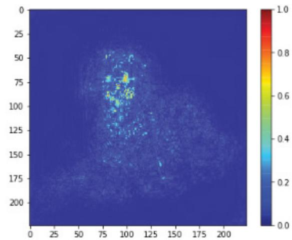  
Source: CNN, https://usmanr149.github.io/urmlblog/cnn/2020/05/01/Salincy-Maps.html

The consequences  of a system making  a decision for a human can  vary. This can help determine  whether an  explanation  is  needed  to support  a decision  made by  a  system  and what it should include. For example, if a decision is made to pop up an ad for slippers in a person’s browser, based on an analysis of their tracked online app usage (a common practice used in targeted  advertising), it  might  be mildly annoying, but  it is  unlikely to upset  them. However, if a decision is made to deny a loan or a visa based on the outcome of an automated algorithm, it may have more dire consequences for someone’s life, and they would want to know why  the particular decision was made. In the future, it will become  increasingly the case that humans and algorithms will need to work together.

# ACTIVITY 10.6

Watch the following TEDx talk by Jen Golbeck (where she discusses why social media “likes” say  more than you  think. The talk was  given  in 2013 and since  then has  had  more than 2.5 million views. Even though the TEDx talk is quite old, the issues raised in it are still relevant today. In particular, she discusses how people’s behavior online enables companies to predict what they like, what they might be interested in buying, and even their political views.

www.ted.com/talks/jennifer_golbeck_the_curly_fry_conundrum_why_social_media_ likes_say_more_than_you_might_think?language=en&utm_campaign $\ l =$ tedspread&utm_ medium=referral&utm_source=tedcomshare

What do you think the privacy issues are here?

(Continued)

# Comment

Jen Golbeck provides two compelling examples in her talk. The first is the well-known example of how a teenage girl’s pregnancy was predicted from her online purchases of things like vitamins. The second example was how data on liking crinkly fries coupled with a knowledge of the  theory of homophily was used to predict that a group of people have above average intelligence. By understanding that the theory of homophily explains that people who are similar tend to like the same things, trust each other, and seek out each other’s company, Jen Golbeck was able to look for relationships in data about “liking” crinkly fries. The crinkly fries example indicates that even though it is absurd that liking crinkly fries is a predictor of above average  intelligence,  in this particular example, the  person who created  the  post attracted “likes” from friends who were also of above average intelligence. It is an amusing example, but  the main point  is to illustrate that information  that people contribute in social media, often unknowingly, can be used to infer all kinds of things about them. In other examples this could include their ethnicity, age, gender, shopping behavior, and what they like or don’t like.

The concerns highlighted in the video are prescient for politicians and others looking for ways to protect the general public by controlling what social media companies can and cannot do with personal data.

# In-Depth Activity

Go to labinthewild.org/studies/privacy-iot. It should take you to the test “What is your privacy profile?” This test has been designed to tell you what you think about data privacy and how you compare to what others think about this topic. It should take about 10–15 minutes to complete. At the end of the test, it will provide you with your results and classify you in terms of whether you are not concerned, somewhat concerned, or very concerned.

1. Do you consider this to be an accurate reflection of how you view privacy?   
2. Did you think the video shown was effective at raising potential problems of what data is collected in a smart building? If not, what other scenario could be used in a video to ask people to consider privacy concerns?   
3. What impact do you think the context chosen for the scenario might have on your reactions? For example, if the scenario involved a  doctor’s surgery, might  you  have reacted differently and if so, why?   
4. What do you  think  of labinthewild.org as a platform for conducting large-scale  online experiments from volunteers?   
5. Did you find any other information on the website interesting?

# Summary

This chapter  described how data at scale  involves bringing together large volumes of data from different  sources that is then analyzed to address  new questions and  provide insights that could not be gained by analyzing data from a single source. The chapter explains techniques and tools for collecting and analyzing large volumes of data. It also raises some concerns about how data at scale is used, particularly as to the need for personal data privacy. Researchers and UX designers are encouraged to consider the impact of their designs on how data is used and how to ensure that it is used ethically. To help, a number of core principles are outlined for ethical design: privacy, fairness, accountability, transparency, and explainability.

# Key Points

•  Data at scale concerns very large volumes of data, which is also known as Big Data.   
•  A defining feature of data at scale is that it includes different types of data collected from different sources that are analyzed to address particular questions.   
•  Data at scale can be quantitative and qualitative; it consists of social media messages, sentiment and facial recognition data, documents, sensor, audio data, and video surveillance data.   
•  Analyzing data from different sources is powerful because it provides different perspectives on people’s behavior.   
•  Analyzing data at scale can have positive outcomes, such as understanding people’s health problems, but there are also dangers if personal data is revealed and then misused.   
•  Data at scale  is collected  and  analyzed in many different  ways including data scraping, monitoring oneself and others, crowdsourcing, and sentiment and social network analysis.   
•  Data visualization  provides tools  and  techniques for  representing,  understanding, and exploring data interactively.   
•  Ethical  design principles suggest  ways that designers  can  create designs  and  interaction processes that make clear how data is being used.   
•  Ensuring that AI systems are transparent, fair, and show how they make their decisions so that they are understood by people are important ethical design principles.

# Further Reading

DUBBER, M., PASQUALE, F. and DAS, S. (2020) The Oxford Handbook of Ethics of AI. Oxford  University  Press. This  edited  collection  provides  in-depth  articles  arranged  in  five sections: introduction and overview, frameworks and models, concepts and issues, perspectives and approaches, and cases and applications, written by key researchers from a range of different countries.

HANSEN, D., SHNEIDERMAN, B., SMITH, M. A., and HIMELBOIN, I. (2019) Analyzing Social Media Networks with NodeXL. Insights from a Connected World (2nd ed.). Morgan

Kaufmann. This  book  provides  an  introduction  to  social  network  analysis.  It  focuses  on NodeXL, but much of the discussion is helpful when using any social network analysis tool.   
LEE, B., DACHSELT, R., INSENBERG, P., and CHOE, E. K. (2022) Mobile Data Visualization. CRC  Press, Taylor and Francis Group. This edited collection offers  a useful  introduction, examples, and discussions of methods for mobile data viz.   
SARIKAYA, A., CORELL, M., BARTRAM, L., TOREY, M., and FISHER, D. (2018) What Do We Talk About  When  We Talk About  Dashboards?  IEEE Trans  Vis  Comput  Graph. This  paper  characterizes  dashboards,  and  it  reviews  and  critiques  their  design  and  how they are used.   
SCHAWBISH, J. (2021) Better Data Visualizations: A  Guide for Scholars, Researchers and Wonks. This  book provides  in-depth  coverage of the many different  kinds of data visualization and includes 500 examples. These include well-known ones such as histograms and lesser-known ones such as choropleth maps.   
SCHRAEFEL, M. C., GOMER, R., ALAN, A., GERDING, E., and MAPLE, C. (2017) The Internet of Things: Interaction Challenges to Meaningful Consent at Scale. Interactions, 24, 6, 26–33. This short article discusses how HCI researchers can be involved in helping users manage their privacy and personal data especially in the context of IoT.   
SHILTON, K. (2018) Values and Ethics in Human-Computer Interaction. Foundations and Trends in Human-Computer  Interaction: Vol. 12,  No. 2,  107–171. This  article provides  a good overview of issues being debated in HCI about ethics, data, and HCI.   
SZAFIR, D. (2018) The Good, the Bad, and the Biases: Five Ways Visualizations Can Mislead and How  to  Fix Them. Interactions. xxv.4. This article  discusses some  of  the well-known problems and design flaws with visualizations and suggests ways to fix them.

