# Chapter 11

# D I S C O V E R I N G  R E Q U I R E M E N T S

11.1  Introduction   
11.2  What, How, and Why?   
11.3  What Are Requirements?   
11.4  Data Gathering for Requirements   
11.5  Bringing Requirements to Life: Personas and Scenarios   
11.6  Capturing Interaction with Use Cases

# Objectives

The main goals of the chapter are to accomplish the following:

•  Describe different kinds of requirements.   
•  Allow you to identify different kinds of requirements.   
• Explain additional data gathering techniques and how they  may be used to discover requirements.   
• Enable you to develop a persona and a scenario.   
•  Describe use cases as a way of capturing interaction in detail.

# 11.1 Introduction

Discovering requirements focuses on exploring the problem space and defining what will be developed. In the case of interaction design, this includes understanding people who may use the product and their capabilities;  how a new  product might  support people in their daily lives;  people’s current  tasks,  goals, and  contexts;  and constraints  on  the  product’s  performance.  This  understanding  forms  the  basis  of  the  product’s  requirements  and  underpins design and construction.

It may seem artificial to distinguish between requirements, design, and evaluation activities because they  are so closely  related, especially in an iterative development cycle like the one used for interaction design. In practice, they are all intertwined, with some design taking place while requirements are being discovered and the design is evolving through a series of evaluation–redesign cycles. With short, iterative development cycles, it’s easy to confuse the

purpose of different activities. However, each of them has a different emphasis and specific goals, and each of them is necessary to produce a quality product.

This chapter describes the requirements activity, and it introduces some techniques specifically used to explore  the problem space, define what  to build, and characterize the target audience.

# 11.2 What, How, and Why?

This section considers the purpose of the requirements activity, how to capture requirements, and why are they important.

# 11.2.1  What Is the Purpose of the Requirements Activity?

The requirements activity sits in the first two phases of the double diamond of design, introduced in Chapter 2, “The Process of Interaction Design.” These two phases involve exploring the problem  space to gain insights  about the problem  and establishing a description of the design  challenge  to  be  addressed. The  techniques  described  in  this  chapter  support  these activities, and they capture the outcomes in terms of requirements for the product plus any supporting artifacts.

Requirements  may  be  discovered  through  specific  requirements  activities,  or  during product evaluation, prototyping, design, and construction. Along with the wider interaction design lifecycle, requirements discovery is iterative, and the iterative cycles ensure that the lessons learned from any of these activities feed into each other. In practice, requirements evolve and develop  as the stakeholders interact  with designs and learn  what  is  possible and how features can be used. And, as shown in the interaction design lifecycle model in Chapter 2, the activity itself will be repeatedly revisited.

# 11.2.2  How Can Requirements Be Captured Once They Are Discovered?

Requirements  may  be  captured  in  several  different  forms  and  at  varying  levels  of  detail depending on the type of application. Interactive products span a wide range of domains with differing constraints and user expectations, and the notations used to capture requirements need to reflect this. For some products, such as an exercise monitoring app, it may be sufficient to develop a range of prototypes together with product descriptions. For others, such as a factory’s process control software, a more detailed understanding of the required behavior is needed before prototyping or construction begins, and a structured or rigorous  notation may be used.

There are also different kinds of requirements, each of which can be supported by different notations  that emphasize different characteristics. For example, requirements involving large and complex sets of data, such as for an air traffic control dashboard, will be captured using a notation that emphasizes data characteristics, while requirements involving  technical infrastructure, such as for a smart city, will be captured using a notation that emphasizes devices  and  their  interactions  (Koo  and  Kim,  2021). This  means  that  a  diversity  of  both physical and digital representations is used including prototypes, stories, diagrams, and photographs, as appropriate for the product under development.

In addition to capturing the requirements themselves, criteria that can be used to show when the  requirements have  been fulfilled  will also  be captured, for  example, measurable usability and user experience criteria.

# 11.2.3  Why Are Requirements Important?

One  of the goals of interaction design is to produce usable products that support the way people communicate and interact in their everyday and working lives. Discovering and communicating requirements helps to advance this goal, because defining what needs to be built supports  technical  developers  and  allows  stakeholders  to  contribute  more  effectively. In safety-critical domains such as aerospace, medical, or transport systems, the lack of clear and precise requirements has been one of the main sources of errors (Martins and Gorschek, 2020).

User-centered  design  with  repeated  iteration  and  evaluation  along  with  stakeholder involvement can help mitigate against misunderstandings. The process of discovering requirements also promotes communication between all parties and hence a common understanding. Miscommunication and misunderstanding can easily occur if requirements are assumed or are left implicit. This classic cartoon captures the problems that can occur very nicely!

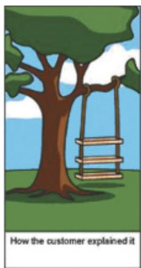

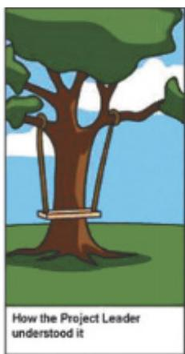

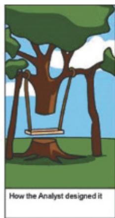

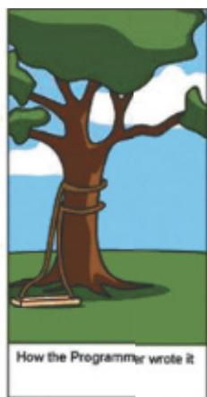

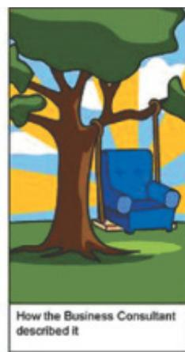

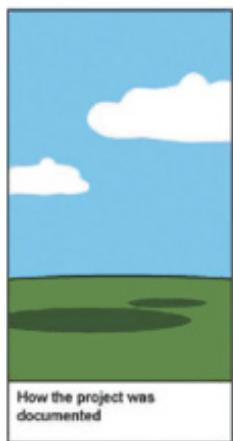

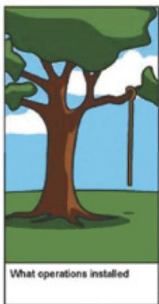

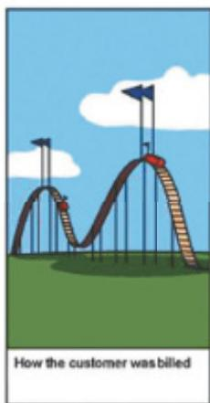

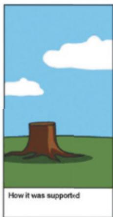

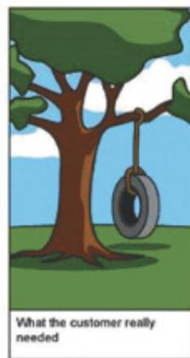

# 11.3 What Are Requirements?

A requirement is a statement about a product that specifies what it is expected to do or how it will perform. For example, a requirement for a smartwatch GPS app might be that the time to  load a map is  less  than half a second. Requirements  may also be expressed at different levels of abstraction, so another, less precise requirement might be for teenagers to find the

smartwatch appealing. In the latter example, the requirements activity would involve exploring in more detail exactly what would make such a watch appealing to teenagers.

But  what  might  a  requirement  look  like?  The  example  requirement  shown  in  Figure 11.1(a) is expressed using a generic requirements structure called an atomic requirements shell (Volere, 2019);  Figure 11.1(b) describes  the  shell and its  fields. Note the  inclusion  of a “fit criterion,” which can be used to assess when the solution meets the requirement, and also  note  the  indications  of “customer  satisfaction,” “dissatisfaction,”  and “priority.” This shell indicates the  information  about a requirement  that  needs to be identified  in order to understand it. The shell is from a range of resources, collectively called Volere (www.volere .org), which is  a generic  requirements framework. Volere is  widely  used in  many different domains,  including  crowdsourcing  for  emergency  management  (Astarita  et  al.  2020)  and autonomous vehicles (Hallewell et al., 2022), and has been extended to include UX analytics (Porter et al., 2014).

An alternative way to capture  a product’s requirements is via user stories. User stories communicate  requirements between  stakeholders. Each  one represents  a unit of customervisible functionality and serves as a starting  point for a conversation to extend and clarify requirements. User stories may also be used to capture usability  and user  experience goals. User stories are  deliberately brief and are often written on physical cards that constrain the space  for  information  in  order  to  prompt  conversations  between  stakeholders.  However, digital support tools such as Jira (www.atlassian.com/software/jira) facilitate the attachment of other information to elaborate the user story such as detailed diagrams or screenshots.

A  user story represents  a small chunk of value that can be delivered during a sprint (a short  timebox of  development  activity,  often  about  two weeks  long),  and  a  common and simple structure for user stories is as follows:

• As a <role>, I want <behavior> so that <benefit>.

Example user stories for a travel organizer might be:

•  As a <traveler>, I  want <to save  my favorite  airline for all  my flights>  so that  <I  will be able to collect air miles>.   
. As a <travel agent>, I want <my special discount rates to be displayed to me> so that <I can offer my clients competitive rates>.

User stories are most prevalent when using an agile approach to product development. User stories  form the basis of planning for a sprint and are the  building blocks from which the product is  constructed. Once completed and ready for development, a story consists of a  description, an  estimate  of the  time it  will take  to  develop,  and an  acceptance  test  that determines how to measure when the requirement has been fulfilled. It is common for a user story such as the earlier ones to be decomposed further into smaller stories, often called tasks.

During the early stages of development, requirements may emerge in the form of epics. An epic is a user story  that may take weeks or months to implement. Epics will be broken down into smaller chunks of effort (user stories), before they are pulled into a sprint. Example epics for a travel organizer app might be the following:

•  As a <group traveler>, I want <to choose from a range of potential vacations that suit the group’s preferences> so that <the whole group can have a good time>.   
As a <group traveler>, I want <to know the visa restrictions for everyone in the group> so that <visas can be arranged for everyone in the group in plenty of time>.

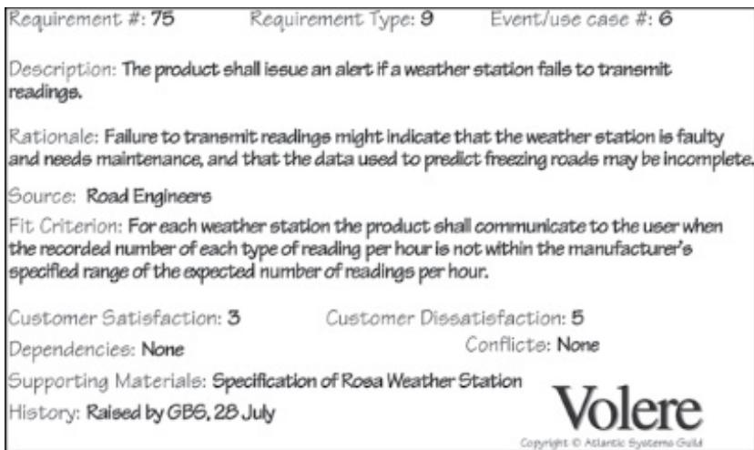  
(a)

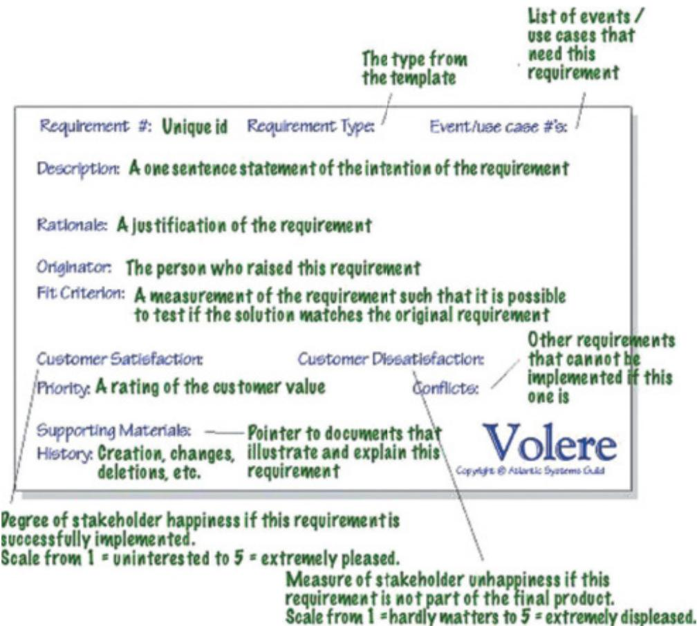  
(b)   
Figure 11.1 (a) An example requirement expressed using an atomic requirements shell from Volere (b) the structure of an atomic requirements shell

Source: Atlantic Systems Guild

• As a <group traveler>, I want <to know the vaccinations required to visit the chosen destination> so that <vaccinations can be arranged for everyone in the group in plenty of time>.   
. As a <travel agent>, I want <up-to-date information displayed> so that <my clients receive accurate information>.

User stories are sometimes referred to as user need statements. For more about user need statements and how to develop them, see www.nngroup.com/ articles/user-need-statements.

# 11.3.1  Different Kinds of Requirements

Requirements come from several sources: from the user community, from the business community, or as a result of the  technology to be applied. Two different  kinds of requirements have traditionally been identified: functional requirements, which describe what the product will do, and nonfunctional requirements, which describe the characteristics (sometimes called constraints)  of  the product.  For  example, a functional  requirement  for  a new  video  game might be that it  will be challenging for a range of abilities. This requirement might then be decomposed into more specific requirements detailing the structure of challenges in the game, for instance, levels of mastery, hidden tips and tricks, magical objects, and so on. A nonfunctional requirement for this same game might be that it can run on a variety of platforms, such as the Microsoft Xbox, Sony  PlayStation, and Nintendo Switch  game systems. Interaction design involves understanding both functional and nonfunctional requirements.

In this section, six of the most common types of requirements are discussed: functional, data, environment, user, usability, and user experience.

Functional  requirements capture  what  the product  will do.  For  example, a  functional requirement for an automated industrial assembly plant might be that an operator can program the assembly line to identify, manipulate, and weld together the correct pieces of metal accurately. Understanding the functional requirements is fundamental for all products.

Data  requirements capture  the type, volatility,  size/amount, persistence, accuracy, and value of the required data. All interactive products have to handle some data. For example, if an application for buying and selling stocks and shares is being developed, then the data must be up-to-date and accurate, and it is likely to change many times a day. In the personal banking domain, data must be accurate and persist over many months and probably years, and there will be plenty of it.

Environmental requirements, or context of use, refer to the circumstances in which the interactive product will operate. Four aspects of the environment  lead to different types of requirements. First is the physical environment, such as how much lighting, noise, movement, and dust is expected in the operational environment. Will workers need to wear  protective clothing, such as large gloves or headgear that might affect the choice of interface type? How crowded is the environment? For example, a ticket machine operates in a very public physical environment; thus using a speech interface is likely to be problematic.

The second aspect of the environment is the social environment. For example, will data need to be shared?  If so, does the sharing have to be synchronous  such as for  two people

viewing data at the same time, or asynchronous, such as when two people are authoring a report taking turns to edit it? Other factors include the number of people needing to interact at once, e.g., in a video game, and the locations of friends or colleagues. Additional relevant issues  regarding  the  social aspects  of  interaction  design  were  raised  in  Chapter  5, “Social Interaction.”

The third aspect is the support environment. For example, what kind of assistance will be needed to use the product and how easily can it be obtained, how much training or help will be readily available, and what level of help can be provided automatically? These issues need to be explored during the requirements activity, and there are user experience implications in choosing one solution or another, as discussed in the “Dilemma” box.

# DILEMMA

# Automated Help or Customer Service Support?

Several service providers such as energy companies and government offices have striven to improve their online presence to make it as comprehensive, clear, and streamlined as possible. Customers who encounter difficulties are encouraged to seek help through the various FAQs, online chatbots, and  support forums rather than to contact the  provider directly. Customers whose goal is to do something that is regarded as “standard” are well-supported, but as soon as their query steps outside of these dimensions, it can be hard for the system to find an answer. How good a user experience does this create? On the one hand, for those who are able to complete their goal quickly and easily, the system provides a good user experience, but for those with an issue that sits just outside the norm, this setup can be a poor experience. The dilemma comes in deciding how much to rely on online support and automated systems and how much to include human interaction.

Finally, the technical environment will need to be established. For example, what technologies  will  the  product  run  on  or  need  to  be  compatible  with,  and  what  technological limitations might be relevant?

User characteristics capture key attributes of potential users, such as their abilities and skills, and perhaps their educational background, preferences, personal circumstances, physical or mental disabilities, and so on. In addition, someone may be a novice, an expert, a casual user, or a frequent user. This affects the ways in which interaction is designed. For example, a novice user may prefer step-by-step guidance. An expert, on the other hand, may prefer a flexible interaction with more wide-ranging powers of control. The term user profile is used to refer to a  collection of user characteristics. Any  one product may  have several different user  profiles; for example  a client user profile and an agent user  profile may  be developed for a financial management portal, while profiles for a young parent with two children and a mature businessperson may be developed for a mobile library catalog interface.

Usability goals and user experience goals (see Chapter 1, “What Is Interaction Design?”) are  another  kind  of  requirement,  and  they  should  be captured  together  with  appropriate

measures. Chapter 2 briefly introduced usability engineering, an approach in which specific measures for the usability goals of the product are agreed upon early in the development process and are used to track progress as development proceeds. This both ensures that usability is given  due priority and facilitates progress  tracking. The same  is true  for user experience goals, although it is harder to identify quantifiable measures that track them.

Considering  each of  these  kinds of requirements  is  a starting  point  to discovering  the requirements for a particular product, but it  is a high-level perspective that  will need to be refined. For example, a telecare system designed to monitor someone’s movements and alert relevant care staff will have a range of environmental requirements including that the devices need to be light, small, fashionable, preferably hidden, and worn easily as people go  about their normal activities. The requirements activity will investigate what that means in detail. A desirable characteristic of both an online shopping site and a robotic companion is that they are  trustworthy, but  this would be interpreted  differently in each case. In the  former, security of information would be a priority, while in the latter behavioral norms would indicate trustworthiness.

A key requirement in many systems nowadays is that they be secure, but one of the challenges is to provide security that does not detract from the user experience, nor is undermined by the user experience. For examples of this, see Box 11.1, which introduces usable security.

# BOX 11.1

# Usable Security

Security is one  requirement that most users and  designers will agree  is important, to some degree or another, for all products. The wide range of security breaches, in particular of individuals’ private data, that have occurred in recent years has heightened everyone’s awareness of the need to be secure. But what does this mean for interaction design, and how can security measures be suitably robust, while not detracting from the user experience? As long ago as 1999, Anne Adams and Angela Sasse (1999) discussed the need to investigate the usability of security mechanisms and to take a user-centered approach to security. This included informing users about  how to choose a secure password, but it also highlighted that ignoring a usercentered perspective regarding security will result in users circumventing security mechanisms.

Since then, usable security and  the  role of users  in maintaining  secure practices  have become wide-ranging topics of concern (Lennartsson et al., 2020). While work on passwords continues to be relevant, other areas researched include whether and how to embed security mechanisms without affecting usability, how to encourage users to pay attention to security warnings and advice, and the effect of good design on security behavior.

For  example, Riccardo Focardi  et al.  (2019) investigated whether  embedding  cryptographic information in QR codes, in order to increase security, would affect the codes’ usability. Defining usability  as effectiveness, efficiency, and satisfaction, they found that it was possible for certain algorithms to be incorporated into QR codes and for them to remain usable. Distler et al. (2019) focused on a wider view of user experience than just usability. They used two versions of an e-voting application to compare the impact of showing security information versus keeping the information hidden and suggested recommendations for designing

technologies with security requirements. One of their  surprising results was that hiding the security mechanisms, and  hence making the  process of e-voting simpler and quicker, made some participants feel that the voting activity had become too “banal.” Encouraging users to pay attention to security advice and warnings was the focus of work by Otto Hans-Martin Lutz and colleagues (2020) and  Dezhi Wu et al. (2020). In the  former study, the researchers found that adding sounds to password feedback (sonification) could improve password strength and security awareness. Dezhi Wu and colleagues found that mobile security notifications that irritate users can negatively influence their perceptions of an app’s security.

Similarly, good design can also have an undesirable effect on security. For example, Milica Stojmenović and colleagues (2022) found that users rely on visual appeal when making security judgments about websites.  In their study, security and usability ratings  of websites were strongly influenced by visual appeal even where the web certificate status indicated that the site was not secure.

For a description of usable security and the relationship between usability and security, see www.ncsc.gov.uk/blog-post/security-and-usability-- you-can-have-it-all-.

# ACTIVITY 11.1

Suggest some key requirements in each category (functional, data, environmental, user characteristics, usability goals, and user experience goals) for each of the following situations:

1. An interactive product for navigating around a shopping center, to run on a smartphone   
2. A wearable interactive product to measure glucose levels for an individual with diabetes

# Comment

These are indicative answers. You may have come up with alternative suggestions.

1. Interactive product for navigating around a shopping center.

Functional The product will locate places in the shopping center and provide routes for the user to reach their destination.

Data The product needs access to GPS location data, maps of the shopping center, and locations of all the places in the center. It also requires knowledge about the terrain and pathways for people with different needs.

Environmental The product design needs to take into account several environmental aspects. Users may be in a rush, or they may be more relaxed and wandering about. The physical environment will be noisy and busy, and people may be talking with friends and colleagues while using the product. Support or help with using the product may not be readily available, but the user can probably ask a passerby for directions if the app fails to work.

(Continued)

User Characteristics Potential users are members of the population who have their own smartphone and for whom the center is accessible. This suggests quite a wide variety of people with different abilities and skills, a range of educational backgrounds and personal preferences, and different age groups.

Usability Goals The product needs to be easy to learn so that novices can use it immediately, and it should be memorable too. People won’t want to wade through unnecessary detail or a complicated presentation, so it needs to be efficient and safe to use; that is, it needs to be able to deal easily with any errors.

User Experience Goals Of the user experience goals listed in Chapter 1, those most likely to be relevant here are satisfying, helpful, and enhancing sociability. While some of the other goals may be appropriate, it is not essential for this product to, for example, be cognitively stimulating.

2. A wearable interactive product to measure glucose levels for an individual with diabetes.

Functional The product will be able to measure the user’s glucose levels.

Data The product will need to measure and display the glucose level—but possibly not store it permanently—and it may not need other data about the individual. These uncertainties would be explored during the requirements activity.

Environmental The physical environment could be anywhere the individual may be—at home, in hospital, visiting the park, and so on. The product needs to be able to cope with a wide range of conditions and situations and to be suitable for wearing.

User Characteristics People with diabetes could be of any age, nationality, ability, and so on, and may be novice or expert, depending on how long they have had diabetes. Most people will move rapidly from being a novice to becoming a regular user.

Usability Goals The product needs to exhibit all of the usability goals. You wouldn’t want a medical product being anything other than effective, efficient, safe, easy to learn and remember how to use, and with good utility. For example, outputs from the product, especially any warning signals and displays, must be clear and unambiguous.

User Experience Goals User experience goals that are relevant here include the device being comfortable, while being aesthetically pleasing or enjoyable may help encourage continued use  of the  product. Making the  product surprising, provocative, or challenging  is to be avoided, however.

These six types of requirements are key, but there are many other types, and there are different frameworks for discovering requirements. Two popular ones are shown in Figure 11.2 and Table 11.1, both of which subsume the six types of requirements introduced here. The seven product dimensions shown in Figure 11.2 are intended to be used as prompts to ask questions about the product from different perspectives: the customer, the business, and the technology. The Volere template shown in Table 11.1 has a more detailed framework including the Waiting Room. This is where solution ideas can be “parked” while divergent thinking continues.

The 7 Product Dimensions   

<table><tr><td>User</td><td>Interface</td><td>Action</td><td>Data</td><td>Control</td><td>Environment</td><td>Quality Attribute</td></tr><tr><td>Users interact with the product</td><td>The product connects to users, systems, and devices</td><td>The product provides capabilities for users</td><td>The product includes a repository of data and useful information</td><td>The product enforces constraints</td><td>The product conforms to physical properties and technology platforms</td><td>The product has certain properties that qualify its operation and development</td></tr></table>

Figure 11.2 The seven product dimensions

Source: Gottesdiener and Gorman (2012), p. 58. Used courtesy of Ellen Gottesdiener

To see how the seven product dimensions can be used to discover requirements, see www.youtube.com/watch?v=x9oIpZaXTDs.

<table><tr><td rowspan="2">Project Drivers</td><td>1. The Purpose of the Product</td></tr><tr><td>2. The Stakeholders</td></tr><tr><td rowspan="3">Project Constraints</td><td>3. Mandated Constraints</td></tr><tr><td>4. Naming Conventions and Terminology</td></tr><tr><td>5. Relevant Facts and Assumptions</td></tr><tr><td rowspan="4">Functional Requirements</td><td>6. The Scope of the Work</td></tr><tr><td>7. Business Data Model and Data Dictionary</td></tr><tr><td>8. The Scope of the Product</td></tr><tr><td>9. Functional Requirements</td></tr><tr><td rowspan="8">Nonfunctional Requirements</td><td>10. Look and Feel Requirements</td></tr><tr><td>11. Usability and Humanity Requirements</td></tr><tr><td>12. Performance Requirements</td></tr><tr><td>13. Operational and Environmental Requirements</td></tr><tr><td>14. Maintainability and Support Requirements</td></tr><tr><td>15. Security Requirements</td></tr><tr><td>16. Cultural Requirements</td></tr><tr><td>17. Compliance Requirements</td></tr></table>

(Continued)

Table 11.1 A comprehensive categorization of types of requirements   

<table><tr><td rowspan="10">Project Issues</td><td>18. Open Issues</td></tr><tr><td>19. Off-the-Shelf Solutions</td></tr><tr><td>20. New Problems</td></tr><tr><td>21. Tasks</td></tr><tr><td>22. Migration to the New Product</td></tr><tr><td>23. Risks</td></tr><tr><td>24. Costs</td></tr><tr><td>25. User Documentation and Training</td></tr><tr><td>26. Waiting Room</td></tr><tr><td>27. Ideas for Solutions</td></tr></table>

Source: Atlantic Systems Guild, Volere Requirements Specification Template, Edition 20 (2019)

# 11.4  Data Gathering for Requirements

Data gathering for requirements covers a wide spectrum of issues, including who might use the product, the activities in which they are currently engaged and their associated goals, the context in which the activities are performed, and the rationale for the way things are. The three  data  gathering  techniques  introduced  in  Chapter  8, “Data  Gathering”  (interviews, observation, and questionnaires), are commonly used throughout the interaction design lifecycle.  In  addition  to  these  techniques,  several  other  approaches  are  used  to  discover requirements.

For  example, documentation, such  as manuals, standards, or activity logs, are a  good source of  data about  prescribed  steps involved  in  an  activity,  any regulations  governing a task, or where records of activity are already kept for audit or safety-related purposes. Studying  documentation can  also  be good  for  gaining  background  information,  and  it  doesn’t involve stakeholder time. For example, Caitlin Woods and colleagues (2019) used documentation of maintenance procedures to extract requirements for an adaptive user interface for industrial equipment maintenance. Some high-level requirements identified this way were to provide warnings and encourage situational awareness and for it to be deployable on multiple devices. Researching other products can also help identify requirements. For example, Jens  Bornschein  and  Gerhard  Weber  (2017)  analyzed existing  nonvisual drawing  support packages to identify requirements for a digital drawing tool for blind users, while Xiangping Chen et  al. (2018)  proposed  a  recommender system  for  exploring existing  app stores  and extracting common user interface features to identify requirements for new systems.

It  is  usual for  more than  one data gathering  technique to  be used  in order  to provide different  perspectives. Examples are  observation to understand  the context  of the activity, interviews to target specific stakeholder groups, questionnaires to reach a wider population, and focus groups to build a consensus view. Many different combinations are used in practice, and Box 11.2 includes some examples.

# BOX 11.2

# Combining Data Gathering Techniques in Requirements Activities

The following examples illustrate the wide range of possibilities for combining different data gathering techniques to progress requirements activities, but there are many more!

Direct Observation in the Wild, Indirect Observation Through Log Files, Interviews, Diaries, and Surveys

Victoria Hollis et al. (2017) performed a study to inform the design of reflective systems that promote emotional well-being. Specifically, they wanted to explore the basis for future recommendations to improve a person’s well-being and the effects of reflecting on negative versus positive past events. They performed  two  direct observation  studies  in the  wild with 165 participants. In both studies, surveys were administered before and after the field study period to assess emotional well-being, behaviors, and self-awareness. The first study also performed interviews. In the first study of 60 participants over 3 weeks, they investigated the relationship between past mood data, emotional profiles, and  different  types of recommendations to improve future well-being. In the  second study  of 105  participants over 28 days,  using a  smartphone diary  application, they investigated the  effects  of reflection and  analysis of past negative and positive events on well-being. Together, these studies provided insights into requirements for systems to support the promotion  of emotional well-being. Figure 11.3(a) shows the visualization displayed to emotion-forecasting participants in week 3 of the first study. The leftmost two points in the line graph indicate average mood ratings on previous days, and  the  center point  is the  average rating for the immediate  day. The two  rightmost points indicate predicted mood for upcoming days.

In Figure 11.3(b), the left panel shows the home screen. Participants record a new experience by clicking the large plus sign $\left( + \right)$ in the upper left. The center panel shows a completed event record, which consists of a header, textual entry, emotion rating, and image. The right panel  shows participant  reflection by rating their  current  emotional  reaction to the  initial record and providing a new textual reappraisal.

# Diaries and Interviews

Tero Jokela et al. (2015) studied how people currently combine multiple information devices in their everyday lives to inform the design of future interfaces, technologies, and applications that better support multidevice use. For the purpose  of this study, an information device is any device that can be used to create or consume digital  information, including computers, smartphones, tablets, televisions, game consoles, cameras, music players, navigation devices, and  smartwatches. They collected diaries  over a  one-week period and  interviews from 14 participants. The study indicates that requirements for the technical environment needed to improve the user experience of multiple devices, including being able to access any  content with any device and improved reliability and performance for cloud storage.

(Continued)

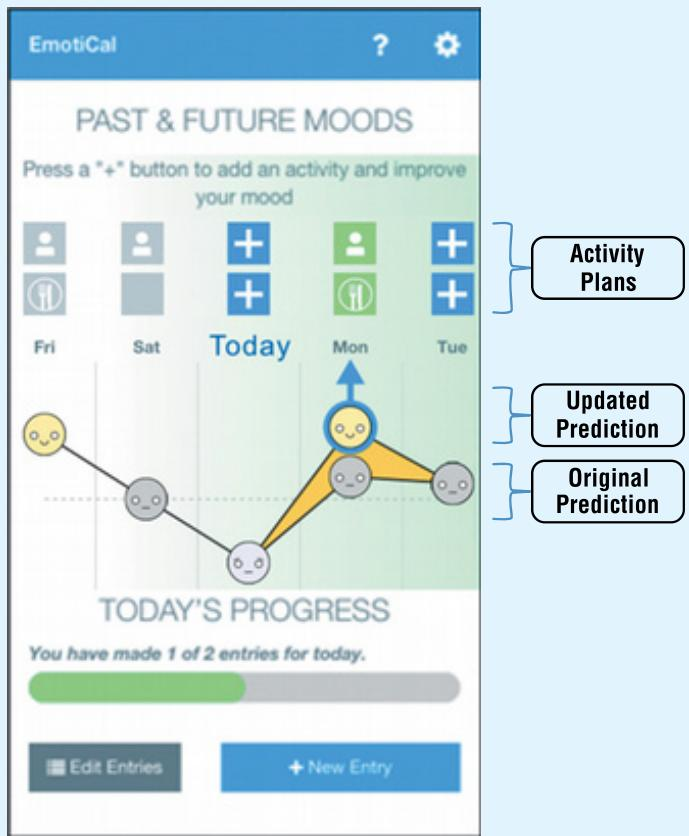

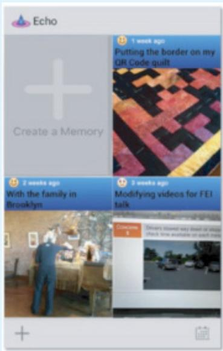

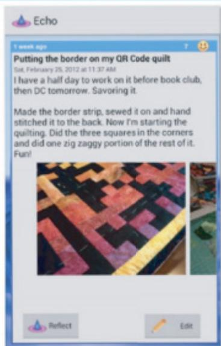

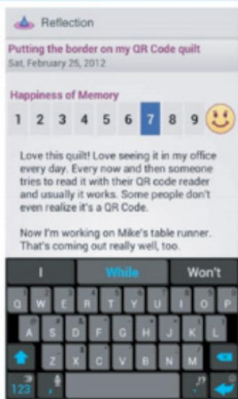  
(b)   
Figure 11.3 (a) The image shown to participants in the first study (b) the smartphone diary app for the second study

Source: Hollis et al. (2017) / Courtesy of Taylor & Francis, Figures 1 & 9

Interview, Think-Aloud Evaluation of Wireframe Mock-Up, Questionnaire, and Evaluation of Working Prototype

Carole Chang et al. (2018) developed a memory aid application for traumatic brain  injury (TBI) sufferers. They initially conducted interviews with 21 participants to explore memory impairments  after TBI. From these, they identified common themes in the  use  of external memory aids. They also learned that TBI sufferers do not want just another reminder system but something that helps them to remember and hence can also train their memory and that their technology requirements were for something simple, customizable, and discreet.

Studying Documentation, Evaluating Other Systems, User Observations, and Focus Groups Nicole Costa et al. (2017) describe their  ethnographic study of the  design team for  the user interface of a ship’s maneuvering system (called a conning display). The design team started by studying the accident and incident reports to identify requirements for things to avoid, such as mixing up turn-rate meter with rudder indicator. They used Nielsen’s heuristics (discussed further in Chapter 16, “Evaluation: Inspections, Analytics, and Models”) to evaluate other existing systems and specifically how to represent the vessel on the display. This oriented the team to see the display’s design from a user perspective and produced a list of parameters to evaluate for priority and usefulness. Once a suitable set of requirements had been discovered, sketching, prototyping, and evaluating with the help of users was used to produce the final design.

# Questionnaire, Focus Group, Design Probe, and User Study

Smart meters are designed to capture information about power consumption in the home and send it to third parties. There is a tension between the benefits of smart metering and potential risks of privacy violation. Timo Jakobi et al. (2019) investigated peoples’ perceptions of the impact of smart metering on privacy and trust aimed at informing the design of a usable privacy manager for smart meters. Their approach was ethnographically oriented in that they aimed to relate in-depth knowledge  of current  practice with assessing the  viability  of a  technological intervention. An open-ended questionnaire was distributed to 200 households in Siegen, Germany. These were analyzed thematically to identify salient aspects of privacy decision-making, which were then explored in four focus groups involving 17 participants in total. The focus groups explored the  perceived positive and negative consequences of disclosing smart  meter data. Using thematic analysis on the focus group data, a set of possible value-added services for smart metering were derived, together with their associated privacy risks. The researchers then developed  a design probe that instantiated these  services and risks. Specifically, the  app presented an interface through which the user could manage their privacy settings for the hypothetical services identified from the research so far. The probe was designed to raise awareness of privacy issues by making privacy risks visible.A user evaluation of the design probe was then conducted with 205 participants. The results suggest that connecting data disclosure with related privacy risks is a potential requirement for making privacy management systems more usable.

# 11.4.1  Using Probes to Engage with Stakeholders

Probes  come in  many forms  and are an  imaginative approach to data  gathering. They  are designed  to  prompt  participants  into  action,  specifically  by  interacting  with  the  probe  in some way, so that researchers and designers can learn more about them and their contexts. Probes  rely on some form  of logging to gather the data—either automatically  or manually depending on the kind of probe being used.

The idea of a probe was first developed during the Presence Project (Gaver et al., 1999), which was investigating novel interaction techniques to increase the presence of elderly people in their local community. Bill Gaver et al. wanted to avoid more traditional approaches, such as questionnaires, interviews, or ethnographic studies, and developed a technique called cultural probes. These probes consisted of a wallet containing eight  to ten postcards, about seven maps, a disposable camera, a photo album, and a media diary. Recipients were asked to answer questions associated with certain items in the wallet and then return them directly to the researchers. For example, on a map of the world, they were asked to mark places where they had been. Participants were also asked to use the camera to take photos of their home, what they were wearing today, the first person they saw that day, something desirable, and something boring.

Inspired by this original cultural probe idea, different forms of probes have been adapted and  adopted for  a range of purposes (Boehner et al., 2007). For  example, design probes are objects whose form relates specifically to a particular question and context. They are intended to gently encourage people to engage with and answer the question in their own context. Figure 11.4 illustrates another kind—a diary probe—used to explore how technology can support adolescents to document their experience of chronic conditions, such as cancer and lupus, so that they can be shared. By using this probe with 12 adolescent-parent pairs, Matthew Hong and colleagues (2020) suggested three areas for support: scaffolding to help patients learn about and represent their experiences; data sharing models to identify appropriate timing, types, and level of detail for sharing health-related information between family members; and artifacts that can bridge between traditional quantitative measures of tracking and more personal narratives.

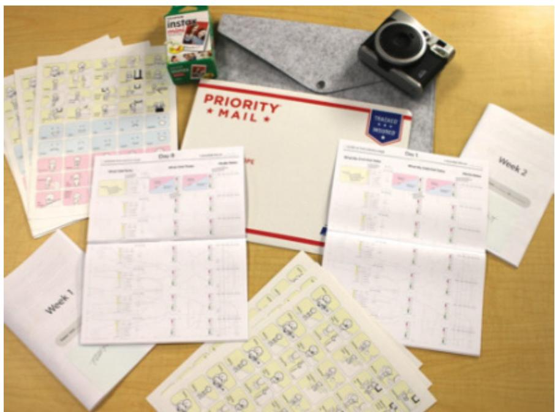  
Figure 11.4 Two  diary  probe kits were provided for each patient-parent pair, consisting of diary booklets, experience sticker sheets, markers and pencils, self-addressed stamped envelope, and an optional camera.

Source: Matthew Hong et al. (2020). Reproduced with permission of ACM Publications

Other types of probes include technology probes (Hutchinson et al., 2003) and provocative probes (Sethu-Jones et al., 2017). Examples of technology probes include mobile phone apps such as Pocketsong, a mobile music listening app (Kirk et al., 2016), and NkhukuProbe, a device that uses sensors to monitor temperature, humidity, and lighting to support poultry farming in sub-Saharan Africa (Chidziwisano et al., 2021). The last of these, NkhukuProbe, used  an Arduino microcontroller,  various  sensors, and a  solar battery  to transmit data  via a  mobile network. It was deployed in  15 rural households  in Malawi for  one month. The aim was to test the probe in the wild, explore how sensors could be used to control poultry environments, and inspire local poultry farmers to think of new ways to use sensors in their work. Several participants suggested ideas after their experiences, including using sensors to detect abnormal sounds that might indicate disease.

Provocative  probes  are designed to challenge  existing  norms and attitudes  to provoke discussion. For example, Anders Bruun et al. (2020) developed a design provocation called Pup-Lock to challenge families’ use of mobile technologies in the home and to explore how to  increase interaction between family members by  reducing  the use  of mobile  devices. To achieve  this, Pup-Lock allows  any family  member to lock  all  mobile  devices in  the home, preventing  them  from  being  used.  Three  families  took  part  in  the  study. Data  collection started with a three-week self-reporting diary study in which each family member was asked to capture  their mobile  device use and any family tensions around that use. Pup-Lock was deployed with the three families for up to two weeks each. During this time usage data was logged about when and how often mobile devices were locked or unlocked. Semi-structured interviews  were conducted before and after the diary study and before and after the probe study. Data  was analyzed  thematically. Their  findings showed  that all  families  were more attentive to family members during the time when Pup-Lock was in use, that participants felt relief at not being interrupted by their smartphones, and that it prompted parents to reflect more than usual on their mobile device use.

# 11.4.2  Contextual Inquiry

Contextual inquiry was originally developed in the 1990s (Holtzblatt and Jones, 1993) and has  been adapted  over time  to suit  different  technologies and the different  ways  in which technology  fits  into  daily  life.  Contextual  inquiry  is  the  core  field  research  process  for Contextual  Design (Holtzblatt and Beyer, 2017), which is a user-centered design approach that  explicitly  defines  how  to  gather,  interpret, and  model  data  about  how  people  live  in order to drive  design ideation. However, contextual inquiry is  also  used on its  own to discover requirements. For example, Hyunyoung Kim et al. (2018) used contextual inquiry to learn about unresolved usability problems related to devices for continuous parameter controls, such  as the  knobs  and sliders  used by  sound engineers  or  aircraft  pilots. From  their study, they  identified  six  needs:  fast  interaction, precise  interaction,  eyes-free  interaction, mobile  interaction,  and  retro-compatibility  (the  need  to  use  their  existing  expertise  with interfaces).

One-on-one field interviews (called contextual interviews) are undertaken by every member  of the  design  team, each  lasting about  one-and-a-half  to  two hours. These  interviews focus on matters of daily life (work and home) that are relevant for the project scope. Contextual inquiry uses a model of master/apprentice to structure data gathering, based on the idea  that the  interviewer (apprentice) is  immersed in the world  of the  participant (master), creating an attitude of sharing and learning on either side. Participants talk as they “do,” and

the apprentice learns by being part of the activity while also observing it, which has the same advantages  as observation and  ethnography. While  observing  and learning, the apprentice focuses on why, not just what.

The contextual interview has four parts: obtaining an overview, the transition, the main interview, and the wrap-up. The first part can be performed like a traditional interview, introducing each other and setting the context of the project. The second part is where the interaction changes as both parties get to know each other and the nature of the contextual interview engagement is set up. The third part is the core data gathering session when the participant continues  with  their  activities  and  the  interviewer  observes  them  and  learns.  Finally, the wrap-up involves sharing some of the patterns and observations the interviewer has made.

Four principles guide the contextual interview: context, partnership, interpretation, and focus.

The  context  principle emphasizes  the importance  of visiting  the participant, wherever they  are,  and  seeing  what  they  do  as  they  do  it. The  partnership  principle  creates  a  collaborative context in which the participant and interviewer can explore the participant’s life together. In a traditional interview situation, the  interviewer is in control, but in contextual inquiry, the spirit of partnership means that understanding is developed together.

Interpretation turns the observations into a form that can be the basis of a design hypothesis or idea. These interpretations are developed  collaboratively by the participant and the design team  member to  make sure  that they  are sound. For  example, imagine  that during a contextual interview  for an  exercise monitor, the participant  repeatedly checks  the data, specifically looking at the heart rate display. One interpretation of this is that the participant is very worried about their heart rate. Another  interpretation is that the  participant is concerned that the device is not measuring the heart rate effectively. Yet another interpretation might be that the device has failed to upload data recently, and the participant wants to make sure that the data is being saved. The only way to make sure to choose the correct interpretation is to ask the participant. It may be that, in fact, they don’t realize that they are doing this and that it has simply become a distracting habit.

The fourth principle, focus, is established to guide the interview setup and tells the interviewer what they need to pay attention to among all of the detail that will be unearthed. If all members of the team conduct interviews around the project focus, this will allow different aspects of the activity to surface and will lead to a richer set of data.

Together with these principles, the contextual interview is also guided by a set of seven “cool  concepts,” divided  into two  groups. The  joy  of  life  concepts  capture  how  products make our lives richer  and more fulfilling. These concepts  are accomplish (empower  users), connection (enhance real relationships), identity (support users’ sense of self), and sensation (pleasurable  moments). The  joy  of  use  concepts  describe the  impact  of  using  the product itself; they  are  direct  in action (provide  fulfillment of intent), the  hassle factor  (remove  all glitches  and  inconveniences),  and  the  learning  delta  (reduce  the  time  to  learn).  During  a contextual interview, cool  concepts are  identified as the participant  performs their activity, although often they emerge only retrospectively when reflecting on the session.

During the interview, data is collected in the form of notes, initial sketches, and perhaps audio and video recordings. Following  each contextual interview, the team  holds an  interpretation session  where the whole  team talks about their findings and establishes a shared understanding based on the data. Contextual Design suggests 10 different models that may be used to consolidate the understanding generated by this discussion. For more detail about contextual design models and how to generate them, see Holtzblatt and Beyer (2017).

<!-- Chunk 9 End -->

<!-- Chunk 10 Start -->

# ACTIVITY 11.2

How  does contextual inquiry  compare  with the  data gathering  techniques introduced in Chapter 8, specifically ethnography and interviews?

# Comment

Ethnography  involves observing  a  situation  without any  a priori structure  or framework; it may  include other data gathering techniques such as interviews. Contextual inquiry also involves observation with interviews, but it provides more structure, support, and guidance in the form of the apprenticeship model, the principles to guide the session, the cool concepts to look out for, and a set of models from Contextual Design to shape and present the data. Contextual inquiry also explicitly states that it is a team effort and that all members of the design team conduct contextual interviews.

Structured, unstructured, and semi-structured interviews were introduced in Chapter 8. Contextual inquiry could be viewed as a form of unstructured interview with props, but it has other characteristics as discussed earlier, which gives it added structure and focus. A contextual inquiry interview requires the interviewee to be going about their daily activities, which may also mean that the interview moves around—something unusual for a standard interview.

# 11.4.3  Brainstorming for Innovation

Requirements will be underpinned by the data gathered, but the requirements activity is also likely  to  involve  some  innovation. Brainstorming  is  a  generic  technique  used  to  generate, refine, and develop ideas. It is widely used in interaction design to explore the problem space and generate alternative designs or for suggesting new and better ideas to support people in their everyday and working lives.

The origins of brainstorming can be traced back to Alex Osborn in the late 1930s (Snyder, 2021), who introduced  it into his US  advertising  agency to  help his  employees generate creative ideas. Osborn suggested four rules for brainstorming, each of which reinforces the others.

Quantity over quality: This encourages divergent thinking. The more ideas that are generated, the more there are to consider merging, developing, and refining.   
. Criticisms should  be withheld: This encourages people to focus on  generating ideas  and not worry about coming up with anything “dumb.”   
Encourage out-of-the-box thinking: This encourages unorthodox ideas. Even if the ideas are  obviously  impractical  from  the  start,  they  may  trigger  other  thoughts  and  generate ideas that would not have been considered without that prompt.   
• Combine, refine, and improve ideas: This encourages convergent thinking. Ideas are considered, combined, modified, and fused to produce novel insights and even more ideas.

The fourth rule, to combine refine and improve ideas, is sometimes overlooked but this convergent step is important to discover concrete requirements.

Despite  its  seemingly free-form  character, brainstorming  sessions  need  careful facilitation,  planning, and  preparation. This  includes  setting  out  a  well-honed  focus  or  problem

definition, using  a range of catalysts or  prompts to help people  think from a different perspective  (this  can  be  a  physical  object(s)  or  a  random  word,  for  example), and  choosing between 5 and 12 participants who know who they are designing for and have a range of experience.

# 11.5 Bringing Requirements to Life: Personas and Scenarios

Using a format such as the Volere shell (see Figure 11.1) or user stories captures the essence of a requirement, but neither of them is sufficient on their own to express and communicate the product’s purpose and vision. Both can be augmented with other representations such as prototypes, working systems, screenshots, conversations, acceptance criteria, diagrams, documentation, and so on. Which of these is required, and how many of each, will be determined by the kind of system under  development. In some cases, capturing different aspects of the intended product in more formal or structured representations is appropriate. For example, when developing safety-critical  devices, the functionality, user  interface, and interaction of the system need to be specified unambiguously and precisely. Sapna Jaidka et al. (2017) suggest using the Z formal notation (a mathematically based specification language) and petri nets  (a  notation  for modeling  distributed  systems  based  on  directed graphs)  to  model  the interaction behavior of medical infusion pumps. Harold Thimbleby (2015) pointed out that using a formal expression of requirements for number entry user interfaces such as calculators, spreadsheets, and medical devices could avoid bugs and inconsistencies.

Two techniques that are commonly used together to augment basic requirements information and to bring requirements to life are personas and scenarios. A persona characterizes someone who might use the product while a scenario describes one use of a product or one example of achieving a goal. Some designers prefer to develop the personas first, and some prefer to write the scenarios first, but often they are developed in parallel. Developing distinctive personas and scenarios can be difficult at first, and it is common for initial narratives to conflate details of the person with details of the scenario. Thinking about the persona’s goal for the scenario helps to scope the scenario to one use of the product.

When  used in  combination, personas  and scenarios  complement each other  and bring realistic  detail that  allows  the  design  team  to explore  current  activities, future use  of  new products,  and  futuristic  visions  of  new  technologies.  Figure  11.5  depicts  the  relationship between them graphically.

This article by Jared Spool explains why personas on their own are not enough and why scenarios also need to be developed: medium.com/user-interface-22/when-it-comes-to-personas-thereal-value-is-in-the-scenarios-4405722dd55c.

Figure 11.5 The relationship between a scenario and its associated persona   
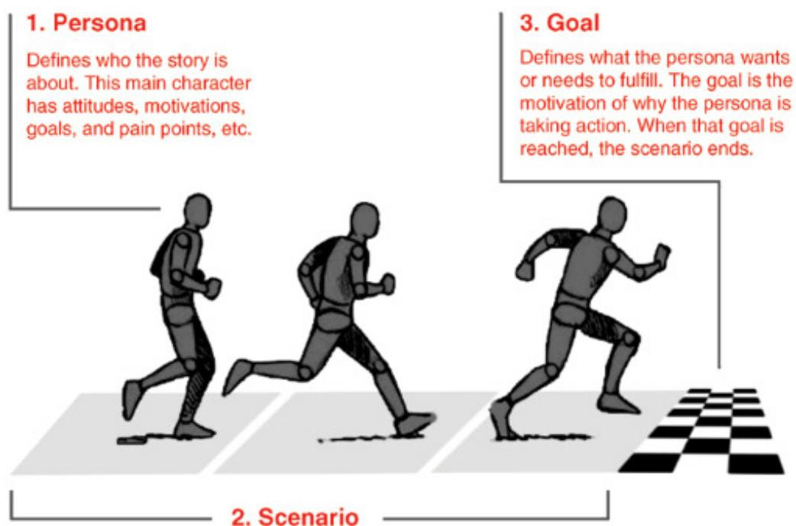

Source: www.smashingmagazine.com/2014/08/06/a-closer-look-at-personas-part-1. Reproduced with permission of Smashing Magazine

# 11.5.1  Personas

Personas (Cooper, 1999) describe typical users of the product under development on which the designers can focus and for which they can design products. Personas are a widely used and effective way to communicate user characteristics and goals to designers and developers and to remind them that users of their products may be unlike themselves. They don’t describe specific people but  represent a synthesis of a number of people who have been involved  in data gathering. Each persona is characterized by a unique set of goals relating to the product under  development  and  is not  a  job  description or  a simple demographic. This is  because goals often differ among people within the same job role or the same demographic.

In addition to their goals, a persona will include a description of relevant behavior, attitudes, activities, and environment. These items are all specified in some detail. For instance, instead of describing someone simply  as a competent sailor, the persona includes that they have completed a Day Skipper qualification, have more than 100 hours of sailing experience in and around European waters, and get irritated by other sailors who don’t follow the navigation rules. It is the addition of precise, credible, and relevant details that helps designers to see the personas as real people for whom they can design.

Madeline Hallewell et al. (2022) wanted to identify key requirements for a future autonomous taxi service. In particular, they wanted to explore how people will be supported to use such a service, when there is no driver to help. For example, previous research has found that automatic door opening is not as convenient for some people as having the driver open the door and help the passenger enter the vehicle (Kim et al. 2019).

The researchers  contacted people who use  taxis at least twice a year,  including  people from  a  range  of  ages, those  with  diverse  accessibility  requirements  including  hearing  and physical disability, and those who regularly travel with a dependent. Thirty-five interviews were conducted. Participants  completed a short  demographic questionnaire  and then took part in an hour-long interview. The interview was based around both positive and negative critical incidents of taxi  use and asked participants to talk through the process  of using the taxi. Participants were given key words to help identify stages of the process, e.g., booking and pickup, and they were prompted to think of tasks associated with the stages. Researchers made notes and audio-recorded the interviews. From these interviews and supported by relevant literature, a set of eight personas and 13 scenarios (see Section 11.5.2) were drafted together. This was achieved through a combination of task analysis and thematic analysis of the interview  data, enriched by  research papers. These  initial  personas and  scenarios were presented to the project partners, and comments were used to refine them. Figure 11.6 shows two of the personas derived from this work.

These personas and scenarios were then used as the basis for a workshop that extracted key requirements, captured in Volere shells (see Figure 11.1).

The style of personas varies, but commonly they include a name and photograph, plus key goals, user quotes, behaviors, and some background information. A product will usually require a set of personas rather than just one, but it may be helpful to choose a few, or maybe only one, primary persona.

The details included in a persona can be influential in the design process. For example, Joni Salminen et al (2022) investigated the effect of using happy or unhappy photographs in a persona. They  found that unhappy images increased participant’s  perceptions of the persona’s realism and severity of pain points, while personas with happy images were perceived as being more extroverted, agreeable, open, conscientious, and emotionally stable. In general, a good persona does the following:

•  Helps the designer make design decisions by understanding whether it will help or hinder someone using the product.   
? Supports the kind of reasoning that says, “What would Bill (persona 1) do in this situation with the product?” and “How would Clara (persona 2) respond  if the product  behaved this way?”   
• Contains only  information that is  pertinent to the product  being developed. It does  not attempt to capture the whole person but is only a lens to highlight relevant attitudes and specific  context  associated  with  the  focus  (Nielsen, 2019).  For  example, personas  for a shared travel organizer would focus on  travel-related behavior and attitudes rather than the newspapers the personas read or where they buy their clothes. On the other hand, personas for a shopping center navigation system might consider these aspects.

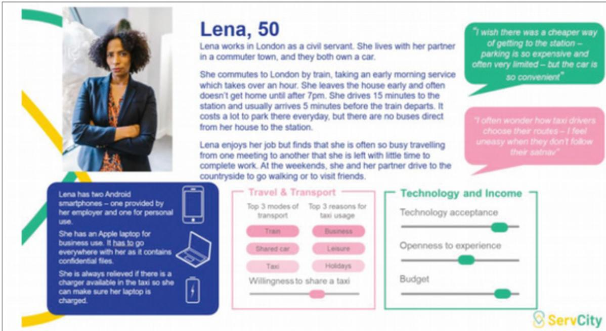  
Figure5.Examplepersona "Lena." Photo by RODNAEProductions from Pexels.

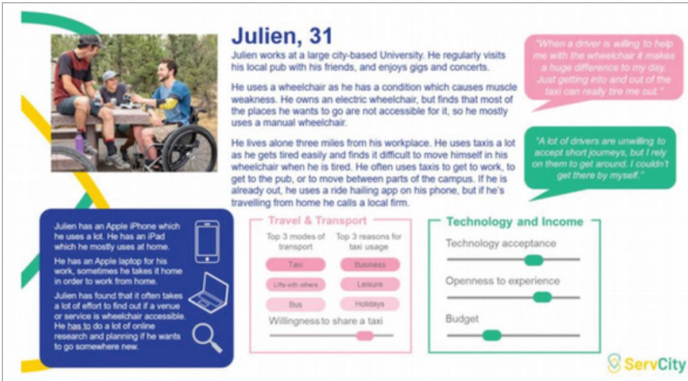  
Figure6.ExamplepersonaJulien.Photoby ELEVATE from Pexels.   
Figure 11.6 Two of the eight personas derived for the autonomous taxi service Source: Hallewell, et al. (2022) Deriving Personas to Inform HMI Design for Future Autonomous Taxis: A Case Study on User Requirement Elicitation, Journal of Usability Studies, 17(2), 41–64

Based  on their experiences  of  developing  three shopping  coupon  personas, Shazeeye Kirmani et al. (2019) propose a number of tips for developing personas within a business context. These  include  the  importance  of  using different  communication  documents  for different  audiences,  such  as  videos  for  senior  managers,  and  demographics,  needs,  and goals for marketing; and  using different data gathering methods to get  a holistic view of the personas.

This video discusses the scope of personas: www.youtube.com/watch?v=XVaiNayTi8U

# ACTIVITY 11.3

Develop  two  personas for  a group  travel organizer  app  that supports a  group  of people, perhaps a family, who are exploring vacation possibilities together. Use the common persona structure of a photo and name, plus key goals, user quotes, behaviors, and some background information. Personas are based on real people, so choose friends or relatives that you know well to construct them.

These can be drawn by hand, or they can be developed in PowerPoint, for example. There are also several tailorable persona templates available online that can be used instead.

# Comment

The personas shown in Figure 11.7 were developed for a father and his daughter using templates from xtensio.com/templates.

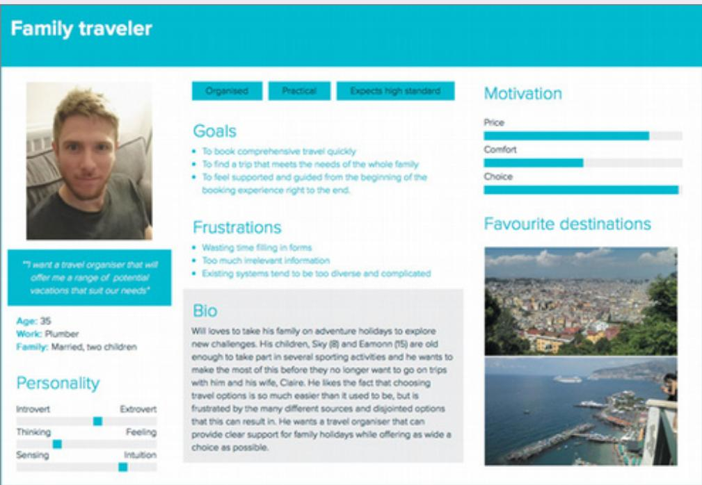

# Young traveler

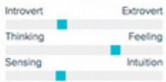

Energetic

Ingulsitive

Lkes noading

#

#

#

#

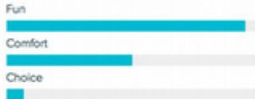

#

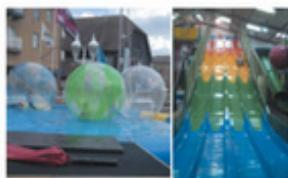

  
Figure 11.7 Two personas for the group travel organizer

# 11.5.2  Scenarios

A scenario is an “informal narrative description” (Carroll, 2000). It describes human activities or tasks in a story that allows exploration and discussion of contexts, needs, and requirements.  It  does  not  necessarily describe the  use  of software  or  other  technological  support used to achieve a goal. Using stakeholder vocabulary and phrasing means that scenarios can be understood by them, and they are able to participate fully in development. Telling stories is  a  natural  way  for  people  to  explain  what  they  are  doing, and  stakeholders  can  easily relate to them.

Scenarios  can  have a  relatively  simple  format, i.e., a  textual  description;  they  may  be short or long, and they may be more or less elaborate. The goal of the scenario, the narrative around reaching that goal (e.g., completing a task), and who the user is (e.g., which persona does it  relate  to) form the  core  of the  scenario. This core can  be fleshed out  with detail as needed for the design task at hand. An example of a simple textual scenario is shown next. Abraham Mhaidli and Florian Schaub (2021) proposed this scenario to explore the potential of manipulative extended reality (XR) advertisements and their harm.

A furniture company releases a new AR app that allows customers to place 3D renderings of furniture into their home, to see how the furniture would look like in their home. Unbeknownst to the consumer, the preview is altered in ways that make the photorealistic rendering of the furniture seem brighter and more colorful than real life, whilst still

seeming realistic. An unsuspecting customer uses the app to “try out” a new sofa in their living room; satisfied with how it looks, they buy the sofa, only to find that the actual sofa is much duller, uglier, and of vastly lower quality than the preview had suggested.

A  more  elaborate  scenario format  was used  by  Madeline Hallewell  et  al. (2022)  who also devised the personas Lena and Julien introduced in the previous section. These scenarios contain quite a lot of information including quotes from interviews, the stages of the journey, and the context for the journey. An example is  shown in Figure 11.8. Note that these scenarios capture existing behavior, before the autonomous service is introduced.

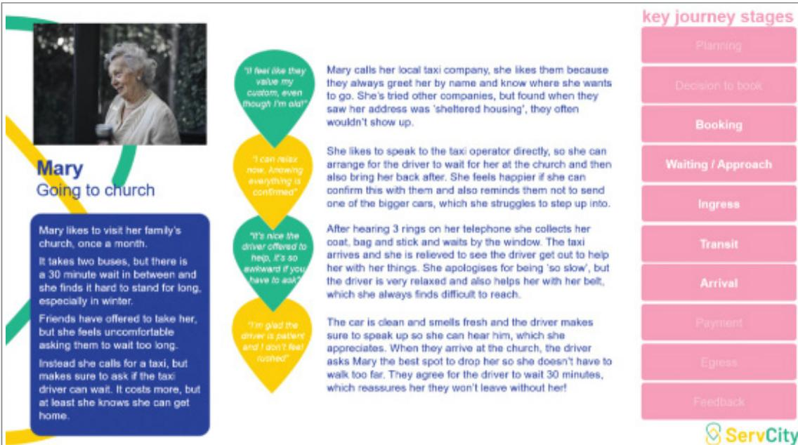  
Figure8. Example scenario "Mary:Going to Church." Photo by Andrea Piacquadiq from Pexels   
Figure 11.8 Scenario developed for persona Mary traveling to church. This scenario format includes a wide range of information to complement the central scenario story.

Source: Hallewell, et al. (2022) Deriving Personas to Inform HMI Design for Future Autonomous Taxis: A Case Study on User Requirement Elicitation, Journal of Usability Studies, 17(2), 41–64.

As illustrated, scenarios may describe existing behavior or future behavior. Starting with current  behavior allows  the  designer  to  identify  stakeholders  and  artifacts  involved  in  an activity. Understanding current behavior also allows the designer to explore the constraints, contexts, irritations, and so on, under which  people operate, as illustrated by  the  previous autonomous  taxi  example.  Building  scenarios  around  a  potential  new  technology allows designers to explore design options  creatively, using their imagination, as illustrated by  the XR example about selling furniture.

During the requirements activity, scenarios emphasize the context, the usability and user experience goals, and the activities in which people are engaged. Scenarios are often generated during workshop, interview, or brainstorming  sessions to help explain or discuss some aspect of the participant’s goals. They capture only one perspective, perhaps a single use of the product from one persona’s point of view, or one example of how a goal might be achieved.

# DILEMMA

# More or Less Detail: How Long Should a Scenario Be?

There are  advantages and disadvantages of developing scenarios that are long versus short and detailed versus abstract. Which is more appropriate depends on several issues including the stage of development and the type of design project. Early on in design, or when envisioning future activities, a short  text-based format may  be sufficient to explore possibilities. As design progresses, it may be more beneficial to add more detail. Similarly, detailed scenarios may be appropriate in a design project to update an existing app, while more abstract scenarios may be appropriate when designing a new technology. As with many design activities, there is a trade-off between how much time is spent developing and honing the presentation of the scenario versus progressing the design through other interaction design activities such as designing and building prototypes, for example.

A different reason for having more elaborate scenarios may be related to stakeholder communication, some of whom may engage more readily with a refined and elaborate scenario.

The following scenario for the group travel organizer introduced in Activity 11.3 describes how one function of the system might work—to identify potential vacation options. This scenario incorporates information about the two personas shown in Figure 11.7. The following is the kind of story that you might glean from a requirements interview:

The Thomson family enjoys outdoor activities and wants to try their hand at sailing this year. There are four family members: Sky (8 years old), Eamonn (15), Claire (32), and Will (35).

One evening after dinner, they decide to start exploring the possibilities. They want to discuss the options together, but Claire has to visit her elderly mother, so she will be joining the conversation from her mother’s house down the road. As a starting point, Will raises an idea they had been discussing over dinner—a sailing trip for four novices in the Mediterranean.

The travel organizer supports a group of people logging in from different locations using different devices so that all members of the family can interact easily and comfortably with it wherever they are. Its  initial suggestion is a flotilla, where several  crews  (with various levels of experience) sail together on separate boats.

Sky and Eamonn aren’t very happy at the idea of going on vacation with a group of other people, even though the  Thomsons would  have their own  boat. The travel organizer shows them descriptions of flotilla experiences from other children their ages, and they are all very positive, so eventually everyone agrees to explore flotilla opportunities.

Will confirms this recommendation and asks for detailed options. As it’s getting late, he asks for the details to be saved so that everyone can consider them tomorrow. The travel organizer messages them a summary of the different options available.

Developing a scenario that focuses on how a new product may be used helps to uncover implicit  assumptions, expectations, and  situations in  which  people  might  find  themselves, such as the need to plan travel when participants  are situated in different locations. These

in turn translate into requirements, in this case an environment requirement, which may be expressed as follows:

As a <group traveler>, I want <to be able to share vacation discussions when I am not co-located> so that <the whole group can discuss their choices together under  a wide range of circumstances>.

Futuristic  scenarios describe an  envisioned situation in the  future, perhaps  with a new technology and new  world view. Different kinds of future visions  were discussed  in Chapter 3, “Conceptualizing Interaction,” and one approach that is an extension of the scenario idea and that can be used to discover requirements is design fiction (see Box 11.3).

# BOX 11.3

# Design Fiction

Design fiction is a way to communicate a vision about the world in which a future technology is situated. The term was originally proposed in the early 2000s, and since then its use has become widespread (Baumer et al., 2020). In interaction design it is used to explore envisioned technologies and their uses without having to grapple with pragmatic challenges. In a fictional world, ethics, emotions, and context can be explored in detail and in depth without worrying about concrete constraints or implementations.

For example, Richmond Wong et al. (2017) adopted a design fiction approach to engage in issues of privacy and surveillance around futuristic sensing technologies. Their design fictions were inspired by a near-future science-fiction novel, The Circle by David Eggers (2013). Their design fictions are visual, and they take the form of a workbook containing conceptual designs. They draw on three technologies in the novel, such as SeeChange, a small camera about the size of a lollipop that wirelessly records and broadcasts live video. They also include a new prototyped technology designed to detect a user’s breathing pattern and heart rate (Adib et al., 2015).

The design fictions went through three design iterations. The first adapted the technologies from the novel, for  example, by adding concrete interfaces. As there  were no photos in The Circle, the  authors designed interfaces for these  technologies based  only on the  textual descriptions. The second iteration considered privacy concerns and placed the technologies in an extended world from the novel.The third iteration considered privacy concerns in situations that went beyond the novel and the designs they had created up to that point in time. Richmond Wong and colleagues (2017) suggest that their design fictions could help broaden the design space for people designing sensing technologies or be used as interview probes in further research. They also reflect that an existing fictional world is a good starting point from which to develop design fictions, and this helps to explore futures that might otherwise go unnoticed.

Other examples of design fiction include Eric Baumer et al.’s (2018) consideration of how design fiction can support the exploration of ethics and Renee Noortman et al.’s (2019) use of a design fiction probe to explore future dementia care.

What’s the difference between scenarios and design fiction? Mark Blythe (2017) uses the “basic plots” of literature to suggest that scenarios employ the plot of “overcoming the monster,” where the monster is some problem to be solved, while design fiction more frequently takes the form of a “voyage and return” or a “quest.”

# ACTIVITY 11.4

This activity illustrates how a scenario of an existing activity can help identify requirements for a future application to support the same goal.

Come up with a scenario of how you would go about choosing a new electric car. This should be a new car, not a secondhand car. Having written it down, think about the important aspects of the task, your priorities, and your preferences. Then imagine a new interactive product that supports this goal and takes account of these issues. Write a futuristic scenario showing how this product would support you.

# Comment

The following example is a fairly generic view of this process. Your scenario will be different, but you may have identified similar concerns and priorities.

The first  thing I  would do is to observe cars on the road, specifically electric ones, and identify those  whose looks  I find appealing. This may take several weeks. I would also try to identify any consumer reports that include an assessment of electric cars’  performance including how regularly  it needs charging. Ideally, these initial activities will result in identifying a likely car for me to buy.

The next stage will be to visit a car showroom and see firsthand what the car looks like and how comfortable it is to sit in. If I still feel positive about the car, then I’ll ask for a test-drive. Even a short test-drive helps me to understand how well the car handles, if the engine is noisy, how smooth is the ride, and so on. Once I’ve driven the car myself, I can usually tell whether I would like to own it or not.

From this scenario, it seems  that there  are  broadly  two  stages involved in the  task: researching  the  different  cars available and  gaining firsthand  experience of potential purchases. In the former, observing cars on the road and getting expert evaluations of them are highlighted. In the latter, the test-drive has quite a lot of significance.

For many people who are in the process of buying a new car, the smell and touch of the car’s exterior and interior and the driving experience itself are the most influential factors in choosing a particular model. Other attributes such as battery range, interior roominess, colors available, and price may rule out certain makes and models, but at the end of the day, cars are often chosen according to how easy they are to handle and how comfortable they are inside. This makes the test-drive a vital part of the process of choosing a new car.

Taking these comments into account, we’ve come up with the following scenario describing  how  an innovative “one-stop shop” for new electric cars might  operate. This product makes use of immersive virtual reality technology that is already in use by other applications, such as designing buildings and training bomb disposal experts.

I want to buy an electric car, so I go down the street to the local “one-stop car shop.” The shop has a number of booths in it, and when I enter, I’m directed to an empty booth. Inside, there’s a large seat that reminds me of a racing car seat, and in front of that there’s a large display screen.

(Continued)

As I sit down, the display screen jumps to life. It offers me the option of browsing through video clips of new cars that have been released in the last two years or of searching through video clips of cars by make, model, or year. I can choose as many of these as I like. I also have the option of searching through consumer reports that have been produced about the cars in which I’m interested.

I spend about an hour looking through materials and deciding that I’d like to experience the up-to-date models of a couple of vehicles that look promising. Of course, I can go away and come back later, but I’d like to have a go right now at some of the cars I’ve found. By flicking a switch in my armrest, I can call up the options for virtual reality simulations for any of the cars in which I’m interested. These are really great, as they allow me to take the car for a testdrive, simulating everything about  the  driving  experience in this car—from road holding to windshield display and foot pedal pressure to dashboard layout. It even re-creates the atmosphere of being inside the car.

Note that the product includes support for the two research activities mentioned in the original scenario, as well as the important  test-drive facility. This would  be only a first-cut scenario, which would then be refined through discussion and further investigation.

Scenarios  may also be constructed using audio or video. For example, Tommy  Nilsson et al. (2020) used animated positive and negative scenarios to consider the effects of passive and engaging solutions around food practices in a domestic setting, such as waste management  and  food monitoring.  They  developed  two  scenarios  that represent  different  values: one promoting an active and social lifestyle, and the other promoting convenience and calm computing (see Figure 11.9). These were shown to 28 people in 6 focus groups and a set of four design values emerged: convenience, trust, privacy, and choice.

Here are links to the animated scenarios described earlier: vimeo.com/238701035 vimeo.com/241688455

# 11.6  Capturing Interaction with Use Cases

A use  case captures  a product’s functional  requirements. Business use  cases focus  on highlevel business goals, while implementation use  cases focus on the product’s behavior when interacting with someone. Implementation use cases are often used in software development and so are one way in which software concerns interface with interaction design. In particular, implementation use cases focus on the details of the interaction in a way that emphasizes information  exchange  and the  structure of  a dialogue  between  a person  and  the product.

They may be used in design to think about the new interaction being designed, and they may also be used to capture  requirements—to think through details about what  people need to see, to  know  about, or  to  react  to in order  to reach their  goal. Use cases  define  a specific process because they are a step-by-step description. This is in contrast to a user story, which focuses on outcomes and goals. Capturing the  detail of this interaction  in terms  of steps is useful as a way to enhance a basic requirements statement. The style of use cases varies. Two styles are shown in this section.

(b)   

<table><tr><td>At home, Paula is notified by hersmart home system that some ofthe groceries in her fridge are approaching their use-by date. She is encouraged to either consume them or donate them to a local food bank.She chooses the latter.</td><td>Paul does not have to care aboutfood waste. Any food item that hasgone out of date is automaticallydisposed of by his personal assistant.</td></tr><tr><td>Once back at home, Paula manu-ally scans her newly acquired food items into her smart home system. This is to keep the system up to date on the available food and its use-by dates.</td><td>Every food item in Paul&#x27;s fridge isbeing monitored by cameras and sensors. Whenever a particularfood is running out, Paul is notifiedby an automated message and thefood gets automatically restocked.</td></tr></table>

(a)

Figure 11.9 (a) Two example scenarios and (b) screen captures of the animated scenarios used to explore the design of technologies around food practices at home   
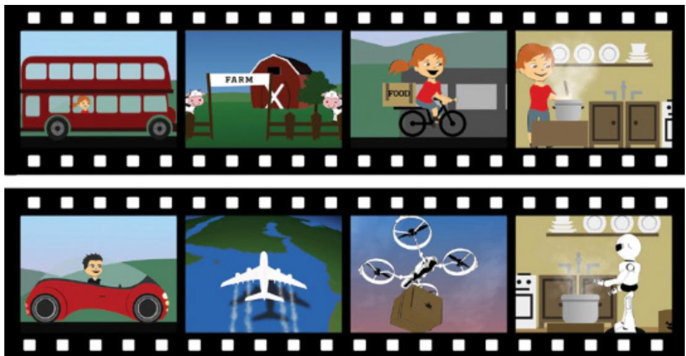  
Source: Tommy Nilsson, et al.  (2020). Visions, Values, and Videos: Revisiting Envisionings in Service of UbiComp Design for the Home, DIS ‘20: Proceedings of the 2020 ACM Designing Interactive Systems Conference, Pages 827– 839 doi-org.libezproxy.open.ac.uk/10.1145/3357236.3395476. Reproduced with permission of ACM Publication

The  first  style focuses  on  the  division  of tasks  between  the  product  and the  user.  For example, Figure 11.10 illustrates an example of this kind of use  case, focusing  on the visa requirements functionality of the group travel organizer. Note that nothing is said about how

the person might interact with the application, but instead it focuses on user intentions and product responsibilities. For example, the  second user  intention  simply states  that  the  user supplies the required  information, which could  be achieved  in a variety  of ways  including scanning a passport, accessing a database of personal information based on fingerprint recognition, and so on. This style of use case has been called an essential use case (Constantine and Lockwood, 1999).

# retrieveVisa

# USER INTENTION

Find visa requirements

Supply required information

Obtain a personal copy of visa information

Choose suitable format

# SYSTEM RESPONSIBILITY

Request destination and nationality

Obtain appropriate visa information

Offer information in different formats

Provide information in chosen format

Figure 11.10  An essential use case for “retrieve visa” that focuses on how the task is split between the product and the user

The second  style of use  cases  is  more detailed, and it captures  the person’s goal when interacting with the product. In this technique, the main use case describes the normal course, that is, the set of actions most commonly performed. Other possible sequences, called alternative courses, are then captured at the bottom of the use case. A use case for retrieving the visa requirements for the group travel organizer, with the normal course being that information about the visa requirements is available, might be as follows:

1.  The product asks for the name of the destination country.   
2.  The user provides the country’s name.   
3.  The product checks that the country is valid.   
4.  The product asks the user for their nationality.   
5.  The user provides their nationality.   
6.  The product  checks  the  visa  requirements of  that  country  for a  passport  holder of the user’s nationality.   
7.  The product provides the visa requirements.   
8.  The product asks whether the user wants to share the visa requirements on social media.   
9.  The user provides appropriate social media information.

# Alternative Courses

4.  If the country name is invalid:

4.1 The product provides an error message.   
4.2 The product returns to step 1.

6.  If the nationality is invalid:

6.1 The product provides an error message.   
6.2 The product returns to step 4.

7.  If no information about visa requirements is found:

7.1 The product provides a suitable message.   
7.2 The product returns to step 1.

Note that the number associated with the alternative course indicates the step in the normal course that is replaced by this action or set of actions. Also note how specific the use case is about how the person and the product will interact compared with the first style.

# In-Depth Activity

This activity is the first of five assignments that together go through the complete development lifecycle for an interactive product.

The goal is to design and evaluate an interactive product for booking tickets for events such as concerts, music  festivals, plays, and  sporting events. Most venues and events have booking websites or apps already, and there are many ticket agencies that also provide reduced tickets and exclusive options, so there are plenty of existing products to research first. Carry out the following activities to discover requirements for this product:

1. Identify and capture some requirements for this product. This could be done in a number of ways, for example, observing friends or family using ticket agents, thinking about your own experience of purchasing tickets, studying websites for booking tickets, interviewing friends and family about their experiences, and so on.   
2. Based on the information you glean, produce two personas and one main scenario for each, capturing how the person is expected to interact with the product.   
3. Using the data gathered in part 1 and your subsequent analysis, identify different kinds of requirements for the product, according to the headings introduced in section 11.3. Write up the  requirements using  a  format similar  to the  atomic requirements shell  shown in Figure 11.1 or in the style of user stories.

# Summary

This chapter examined the requirements activity in greater detail, including how to discover requirements and how to represent them. The data gathering techniques introduced in Chapter 8 are used to discover requirements in many different combinations, and this chapter has illustrated some of them. In addition, contextual inquiry, studying documentation, deploying probes, and researching similar products are commonly used techniques. Personas and scenarios help to bring data and  requirements to life and are  commonly used in combination

(Continued)

to explore the user experience and product functionality. There are many ways to represent requirements. Some are more structured such as the Volere shell, while others are more speculative and deliberately suggestive, such as probes. Others, such as use cases, try to pin down the  detail to enable designers to progress to the next stage more readily, e.g., by starting to create a design concept using a wire framing tool.

# Key Points

•  A requirement is a statement about an intended product that specifies what it is expected to do or how it will perform.   
•  Articulating requirements and defining what needs to be built avoids miscommunication and supports technical developers and allows stakeholders to contribute more effectively.   
There are different kinds of requirements. Six common ones are functional, data, environ mental (context of use), user characteristics, usability goals, and user experience goals.   
•  Scenarios provide a story-based narrative to explore existing behavior, potential use of new products under development, and futuristic visions of technology use.   
•  Personas capture  realistic profiles  of people who  might  use  the  product, based  on a set of characteristics  that are  relevant to the  product, and  are  synthesized  from data gathering sessions.   
•  Scenarios and personas together can be used throughout the product lifecycle.   
•  Use  cases  capture  details  about  an existing or imagined interaction  between  users  and the product.

# Further Reading

COHN,  M. (2004)  User Stories  Applied. Addison-Wesley. This  classic  book  is  a  practical guide to writing good user stories.

NIELSEN, L. (2019) Personas—User-Focused Design. (2nd ed.) Springer. This book provides a comprehensive coverage of personas: how to develop them and how to use them.

ROBERTSON, J., AND ROBERTSON, S. (2019) Business Analysis Agility. Addison Wesley. This book brings together experience of traditional requirements techniques (such as Volere) and an agile way of working. It includes treatment of interaction design but focuses on how to make sure the product being built is the right product from a business perspective.

SNYDER, P. I. (2021) The Art of Brainstorming. Dream Books. This book covers the history and evolution of brainstorming, together with practical techniques and methods to run both group and individual brainstorming sessions.

