# Chapter 12

# D E S I G N ,  P R O T O T Y P I N G ,  A N D C O N S T R U C T I O N

12.1  Introduction   
12.2  Prototyping   
12.3  Conceptual Design   
12.4  Concrete Design   
12.5  Generating Prototypes   
12.6  Construction

# Objectives

The main goals of this chapter are to accomplish the following:

•  Describe prototyping and the different types of prototyping activities.   
•  Enable you to produce prototypes from the models developed during the requirements activity.   
•  Enable you to produce a conceptual model for a product and justify your choices.   
•  Explain the use of scenarios and prototypes in design.   
•  Introduce  physical  computing  kits  and  software  development  kits  and  their  role  in construction.

# 12.1 Introduction

Design, prototyping, and construction fall within the Develop phase of the double diamond of design, introduced in Chapter 2, “The Process of Interaction Design,” in which solutions or concepts are created, prototyped, tested, and iterated. The final product emerges iteratively through  repeated  design-evaluation-redesign  cycles  involving  a  range of  stakeholders, and prototypes facilitate this process. There are two aspects to design: a conceptual part, which focuses  on ideas  for  a product, and  the concrete  part, which focuses  on the details  of the design. The former involves developing a conceptual model that captures what the product will do and how it will behave, while the  latter is concerned with the details  of the design, such  as  menu  types,  haptic  feedback,  physical  widgets,  and  graphics. The  two  are  intertwined, as concrete design issues will require some consideration in order to prototype ideas, and prototyping ideas will lead to an evolution of the concept.

Designers  prototype their design ideas  so that people can  evaluate them  effectively. In the early stages of development, these prototypes may be made of paper and cardboard or be ready-made components pulled together to allow evaluation, while as the design progresses, they become more polished, tailored, and robust so that they resemble the final product.

This chapter presents the activities involved in progressing a set of requirements through the cycles of prototyping and construction. The next section explains the role and techniques of prototyping  and then  explores  how  prototypes may  be used in  the design process. The chapter ends by discussing physical computing and software development kits (SDKs), which provide a basis for construction.

# BOX 12.1

# Designing with or Designing for People?

The  importance of engaging a  range  of people in the  design process  was  emphasized in Chapter  2  and  throughout the  book. This includes users  and  other  stakeholders but  also extends beyond the product itself, into the wider community. But is this engagement one-way? Are  designers  designing  for  people or with people? Approaches that emphasize  designing with rather than designing for include co-design, participatory design, and community-based design. But many approaches to technology design include participation with stakeholders, so what’s the difference between them?

Co-design is a design approach that emphasizes creativity and mutual learning through design activities with stakeholders,  and  co-design  teams  are  often  multidisciplinary. Codesign has been discussed in the context of diabetes support (Ayobi et al., 2021) and has been adapted for designing with animals (Webber et al., 2020). Nick Bryan-Kinns and colleagues (2022) have devised a framework to support designers  and local communities in co-design activities in rural China. The framework combines existing local approaches to creative thinking with design thinking methodologies, and if the framework were to be used outside China, they emphasize the importance of building on local practices.

Participatory  design (PD) emerged in Scandinavia  in the 1970s. There  were two influences on this early work: the desire to be able to communicate information about complex systems and the labor union movement pushing for workers to have democratic control over changes in their work. New laws gave workers the right to have a say in how their working environment was changed. The idea that those who use information technology will play a critical role in its design, and in particular that they will engage in active and genuine participation with the design itself, is still central to participatory design (Simonsen and Robertson, 2012). But the approach has evolved in response to political, social, and technological changes (Bannon et al., 2018).

Focusing on the Scandinavian approach to participatory  design, Susanne Bodker et al. (2022) emphasize that people are  seen as design partners, rather than simply participants, and  that co-operative prototyping  is important, i.e., collaborative hands-on exploration of prototypes. The approach has four commitments: (i) democracy in the workplace and beyond; (ii) the empowerment of people through the processes of design; (iii) emancipatory practices

rooted in mutual learning between designers and people; and (iv) seeing human beings as skillful and resourceful in developing future technologies. A key aim is for a project’s achievements to be sustained or developed beyond the project.

Participatory design approaches have been used in diverse domains including youth mental  health (Orlowski  et al., 2019), food sustainability (Nichols and  Heitlinger, 2022), and maths teaching with visually impaired children (Pires et al., 2022).

But  there are  challenges around the  nature of participation, especially in current  globalized conditions (Kruger et al., 2019). For example, what happens in a community of several hundreds or thousands of people, or when the stakeholders are from different cultural backgrounds, and how can participation be scaled across geographical regions? Community-based design approaches have evolved to try to address  concerns around participation, including underserved populations (Harrington et al., 2019). Compared to co-design and participatory design, community-based design aims to address the issue of scale, in terms of both numbers and diversity of participants.

Building on the idea of participatory design but at an urban scale, Daniel Gooch et al. (2018) designed an approach to facilitate citizen engagement in a smart city project. They used an integrated approach of online and offline activities that was tailored to local contexts and showed how it is possible to engage citizens to address their current concerns. Edwin Blake and colleagues (2021) explore  how a single community-based  design success may be scaled to cover a region or nation. They used temporary “scaffolding” that enabled an individual to perform beyond their base expertise and support their learning.

# 12.2 Prototyping

Prototyping provides a concrete manifestation of an idea—whether it is a new product or a modification of an existing one—which allows designers to communicate their ideas and for others to try them out.

# 12.2.1  What Is a Prototype?

A prototype is one manifestation of a design that allows stakeholders to interact with it and to explore  its  suitability. It  is limited  in that  a prototype  will usually emphasize one  set of product characteristics and de-emphasize others (see Box 12.2). Prototypes take many forms, for example, a scale model of a building or a bridge, or a piece of software with limited capabilities. A prototype can also be a paper-based outline of a display, a collection of wires and ready-made  components, a digital picture, a video simulation, a complex  piece of software and hardware, or a three-dimensional mockup of a workstation.

In fact, a prototype can be anything from a paper-based storyboard to a complex piece of software and from a cardboard mockup to a molded or pressed piece of metal. For example, when the idea for the PalmPilot (a precursor to mobile and smartphones, introduced in 1992) was  being developed, Jeff  Hawkins  (founder of  the company)  carved  up  a piece  of  wood about the size and shape of the device he had imagined (see Figure 12.1).

Figure 12.1 The PalmPilot wooden prototype   
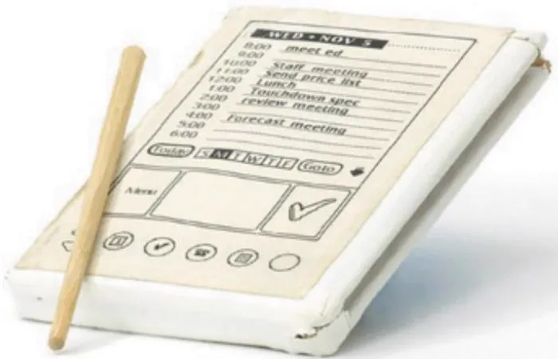  
Source: Mark Richards / Computer History Museum

Jeff  Hawkins used  to carry  this piece  of wood around  with him and  pretend to  enter information  into  it, just  to see  what it  would be  like to  own such  a device  (Bergman and Haitani, 2000). This is an example of a simple (some might even say bizarre) prototype, but it  served  its  purpose  of  simulating  scenarios  of  use. Advances  in  3D  printer  technologies, coupled with reduced prices, have increased their use in design. It is now common practice to take a 3D model from a software package and print a prototype, or indeed a final product. Soft toys, prosthetics, chocolate, dresses, shoes, and whole houses may be “printed” in this way (see Figure 12.2). Advances in sustainable printing techniques have also been made. For example, the Soft Materials  Lab at  Linz  Institute of Technology have produced  a  gelatinbased “ink” that can be used in 3D printing and then dissolved and reused.

  
(a)

  
(b)

(c)   
Figure 12.2 Examples of 3D printing: (a) model jet engine, (b) Synapse Dress by Anouk Wipprecht: embedded with sensors, the wearer can control the dress’s lighting pattern, and (c) custom-made climbing shoes based on a scan of the wearer’s feet   
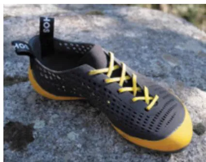  
Source: (a) Catiav5ftw / MakerBot Industries, LLC / CC BY-NC 4.0, www.thingiverse.com/thing:392115. Licensed under CC-BY-3.0, (b) ANOUK WIPPRECHTSYNAPSE DRESS created for Intel in 2014, www.niccolocasas.com/ SYNAPSE-DRESS, and (c) Photo Credits: ATHOS

To see a wide range of useful objects that can be printed by 3D technology, visit this site: all3dp.com/1/useful-cool-things-3d-print-ideas-3d-printerprojects-stuff.

To see a robot with soft legs that has been created by 3D printing, go to www.youtube.com/watch?v=5MTLYhc-NKw. A gelatin-based reusable “ink” for sustainable 3D printing is illustrated here: www.youtube.com/ watch?v=nwrCtG4GW2s.

# 12.2.2  Why Prototype?

Prototypes are useful when discussing or evaluating ideas with stakeholders; they are a communication device among team members and an effective way for designers to explore design ideas. The activity of  building prototypes  encourages  reflection  in design,  as described  by Donald Schön (1983), and it is recognized by designers from many disciplines as an important aspect of design.

Prototypes  answer  questions  and  support  designers  in  choosing  between  alternatives. Hence, they  serve a  variety of purposes, for example, to test  the  technical feasibility of an idea, to clarify some vague requirements, to do some evaluation, or to check that a certain design direction is compatible with the rest of product development. Prototypes may also be deployed as probes, as described in Chapter 11, “Discovering Requirements,” and can be the focus for a wider exploration of future technologies. The prototype’s purpose will influence the kind of prototype to build. So, for example, to clarify how someone might perform a set of tasks and whether the proposed design would support them in doing this, a paper-based mockup  might be produced.  Figure  12.3  shows  an annotated  paper-based  prototype of  a handheld  device to help an autistic child communicate. This prototype shows the intended functions  and  buttons, their  positioning and  labeling, and the  overall shape of  the device, but none  of the buttons actually works. Note that the annotations have been added by the designer and don’t form part of the prototype for evaluation. This kind of prototype is sufficient to investigate scenarios of use and to decide, for example, whether the button images and labels are appropriate and the functions sufficient, but not to test whether the speech is loud enough or the response fast enough.

To read about IDEO’s reflections of prototyping, and some examples of the prototypes they have created, see www.ideou.com/blogs/inspiration/ all-prototypes-are-not-created-equal.

Figure 12.3 A paper-based prototype of a handheld device to support an autistic child   
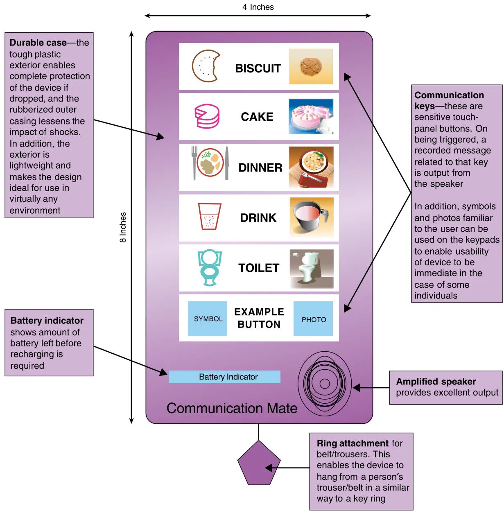  
Source: Used courtesy of Sigil Khwaja

# 12.2.3  Low-Fidelity Prototyping

A low-fidelity prototype does not look very much like the final product, nor does it provide the same  functionality. For example, it may  use very different materials, such as paper and cardboard rather than electronic screens and metal; it may perform only a limited set of functions; or it may only represent the functions and not perform any of them. The block of wood used to prototype the PalmPilot described earlier is a low-fidelity prototype.

Low-fidelity  prototypes  are  useful  because  they  tend  to  be  simple,  cheap,  and  quick to produce. This also means that they are simple, cheap, and quick to modify so that they support  the  exploration  of  alternative designs  and  ideas. This  is  particularly  important  in

theÂearlyÂstagesÂofÂproductÂdevelopment,ÂduringÂconceptualÂdesign,ÂforÂexample,Âbecause prototypesÂthatÂareÂusedÂforÂexploringÂideasÂshouldÂbeÂflexibleÂandÂencourageÂexploration andÂmodification.ÂLow-fidelityÂprototypesÂareÂnotÂmeantÂtoÂbeÂkeptÂandÂintegratedÂintoÂthe finalÂproduct.Â

Low-fidelityÂprototypingÂcomesÂinÂmanyÂforms.ÂWeÂexploreÂfourÂcommonÂtypesÂinÂthe followingÂsections,ÂandÂcombinationsÂorÂvariationsÂofÂtheseÂmayÂbeÂdevisedÂforÂaÂparticu- larÂproduct.ÂForÂexample,ÂJosÂGoudsmitÂandÂStevenÂVosÂ(2021)ÂexploredÂthreeÂlow-fidelity prototypesÂforÂwearablesÂintendedÂtoÂimproveÂsomeone’running s Âtechnique.ÂTheÂprototypes wereÂdesignedÂtoÂassessÂtheÂeffectsÂofÂfeedbackÂfrequency,ÂfeedbackÂmodeÂ(visualÂorÂauditory), andÂrunnerÂautonomy.ÂForÂeachÂprototype,ÂparticipantsÂworeÂaÂvarietyÂofÂsensorsÂandÂwere providedÂwithÂfeedbackÂandÂinstructionsÂtoÂimproveÂtheirÂrunningÂtechnique.ÂTheÂfeedback frequencyÂprototypeÂreliedÂonÂaÂsetÂofÂlaminatedÂinstructionÂcards,ÂwhichÂwereÂpresentedÂto theÂrunnerÂbeforeÂrunningÂandÂonce,Âtwice,ÂorÂfourÂtimesÂduringÂtheÂsessionÂ(thisÂisÂaÂformÂof card-basedÂprototype).ÂTheÂfeedbackÂmodeÂprototypeÂusedÂaÂsmartphoneÂvisualÂdisplayÂor auditoryÂfeedbackÂtoÂprovideÂinformationÂeveryÂminute.ÂTheÂautonomyÂprototypeÂincluded bothÂvisualÂandÂauditoryÂfeedbackÂandÂaÂvideo,ÂwhichÂparticipantsÂcouldÂaccessÂaccording toÂtheirÂownÂpreference.ÂAlthoughÂtechnologyÂwasÂusedÂinÂtheseÂprototypes,ÂtheyÂwere“low fidelityâ€because  ÂtheyÂdidÂnotÂrepresentÂtheÂfinalÂformÂofÂtheÂproduct.Â

# StoryboardingÂ

StoryboardingÂisÂoftenÂusedÂinÂconjunctionÂwithÂscenarios,ÂasÂdescribedÂinÂChapterÂ11. AÂstoryboardÂconsistsÂofÂaÂseriesÂofÂsketchesÂshowingÂhowÂsomeoneÂmightÂprogressÂthroughÂa taskÂusingÂtheÂproductÂunderÂdevelopment.ÂItÂcanÂbeÂaÂseriesÂofÂscreensÂorÂaÂseriesÂofÂscenesÂshow- ingÂhowÂsomeoneÂcanÂperformÂaÂtaskÂusingÂanÂinteractiveÂdevice.ÂWhenÂusedÂinÂconjunctionÂwith aÂscenario,ÂtheÂstoryboardÂprovidesÂmoreÂdetailÂandÂoffersÂstakeholdersÂaÂchanceÂtoÂrole-play withÂaÂprototype,ÂinteractingÂwithÂitÂbyÂsteppingÂthroughÂtheÂscenario.ÂTheÂexampleÂstoryboard shownÂin Figure 12.4depicts ÂsomeoneÂcalledÂChristinaÂusingÂaÂnewÂmobileÂdeviceÂforÂexploring historicalÂsites.ÂThisÂstoryboardÂcapturesÂtheÂcontextÂofÂuseÂandÂhowÂChristinaÂmightÂbeÂsup- portedÂinÂherÂsearchÂforÂinformationÂaboutÂtheÂpotteryÂtradeÂatÂtheÂAcropolisÂinÂancientÂGreece.Â

  
Christina walks up hill; the product gives her information about the site

  
Christina adjusts the preferences to find information about the pottery trade in ancient Greece

  
Christina scrambles to the highest point

  
Christina stores information about the pottery trader's way of life in ancient Greece

  
Christina takes a photogr aph of the location of the pottery market   
Figure 12.4An ÂexampleÂstoryboardÂforÂaÂmobileÂdeviceÂtoÂexploreÂancientÂsitesÂsuchÂasÂtheÂAcropolisÂ

# Sketching

There are many templates and free software  available to support the development of lowfidelity prototypes. But sometimes it’s just easier to sketch the idea using a pencil and paper. Many people find it difficult to engage in sketching, though, because they are inhibited by the quality of their drawing. For example, Charlie Ranscombe et al. (2020) note that their design students  preferred  to  use  visualization  tools  and  CAD  modeling  rather  than  sketching, because of inhibitions around their ability  to sketch. To encourage more  engagement with early design ideas, they introduced their students to designing with Lego, which triggered an increase in idea fluency, i.e., generating many ideas and producing substantially different ideas.

As  Saul  Greenberg  et  al. (2012)  comment, however, “Sketching  is  not  about  drawing. Rather,  it  is  about  design” (p.  7).  They further  point  out  how someone  can get  over their drawing inhibitions by devising their own symbols and icons and practicing them—referred to as a sketching vocabulary (p. 85). They stress how the drawings don’t have to be anything more than simple boxes, stick figures, and stars. Elements that might be required in a storyboard  sketch, for  example, include digital devices, people, emotions, tables, books, and so forth, and actions such as give, find, transfer, and write. When sketching an interface design, various icons, dialog boxes, and so on need to be drawn. Some simple examples for achieving this are shown in Figure 12.5. Mark Baskinger and William Bardel (2013)  provide further tips for those new to sketching. Activity 12.1 provides an opportunity to practice sketching some symbols, intended to be drawn simply.

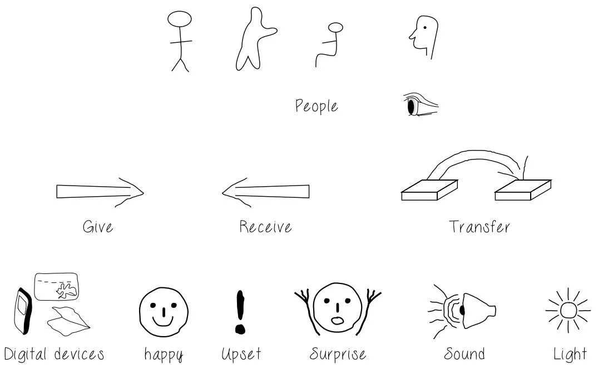  
Figure 12.5 Some simple sketches for low-fidelity prototyping

# ACTIVITY 12.1

Produce a storyboard that depicts something you do regularly such as filling a car with fuel, hiring a bike share, or paying for your groceries through a self-service machine in a supermarket. The goal of this activity is simply to start sketching.

# Comment

Figure 12.6 shows our attempt at a storyboard for hiring a bike share.

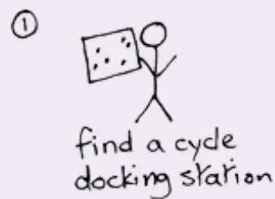

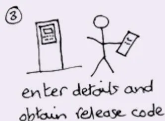

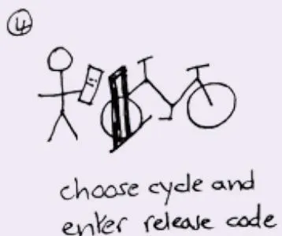

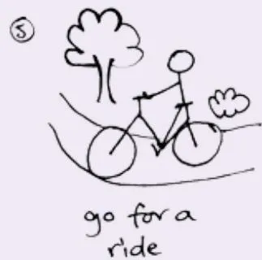

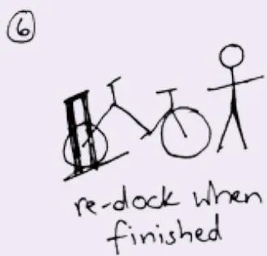  
Figure 12.6 A storyboard showing how to hire a bike share

# Prototyping with Index Cards

Using index cards (small pieces of cardboard about $3 { \times } 5$ inches) or sticky notes is a successful and simple way to prototype an interaction, and it is used for developing a range of interactive products including websites and smartphone apps (see Figure 12.7). Each card represents one element of the interaction, perhaps a screen or just an icon, menu, or dialog exchange. In evaluation studies, the participant can step through the cards, pretending to perform the task while interacting with the cards. This is also referred to as paper prototyping. Section 12.5.2 provides a more detailed example of this kind of prototyping.

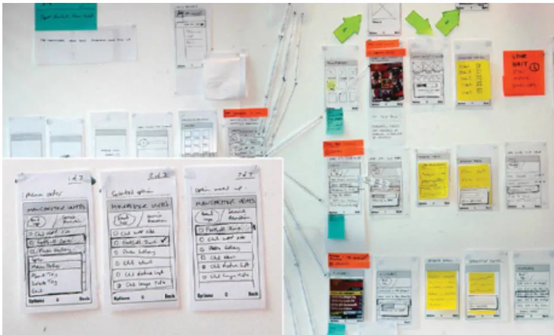  
Figure 12.7 Card-based prototype developed for a phone interface

# Wizard of $O z$

Another  low-fidelity  prototyping  method  called  Wizard  of $O z$ assumes  that  you  have  a software-based prototype. With this technique, the participant interacts with the software as though interacting with the product. In fact, however, a human operator simulates the software’s response  to the  user  (see  Figure  12.8). The  method  takes  its  name from  the  classic story of the little girl who is swept away in a storm and finds herself in the Land of $\mathrm { O z }$ (Baum and Denslow, 1900). The Wizard  of Oz is  a small shy  man who  operates  a large artificial image of himself from behind a screen where no one can see him.

Using this  technique enables  researchers to  have control and  more flexibility  over  the design  of the  interaction when  conducting  experiments, without  having  to  program  them initially, for example, deciding  what a robot should say in response to participants’ queries and when to  intervene if the robot  is proactive. Many different  kinds of  responses can  be tested  this  way. This  style of  prototyping  is  used  successfully  to  evaluate  various  types  of application,  including  embodied  conversational  agents  (Trigo et  al.,  2021)  and  proactive conversational agents (Reicherts et al., 2022), and to study passengers’ experiences of robotaxis (Meurer et al., 2020). It is often used in studies of autonomous vehicles. For example, Keunwoo Kim and colleagues (2021) explored how a passenger may communicate their preferred driving style to an autonomous car driving agent. Using the Wizard of Oz approach allowed the  researchers to  conduct their  study on  real roads. Prototyping  AI  systems  also draws on this style of prototyping, where the designer sketches the AI for themselves, and as the design matures, implementations of the AI can take its place (van Allen, 2018).

To read more about five common low-fidelity prototypes (sketches, paper, Lego, digital, and Wizard of Oz) and how to use them, see this website: www .interaction-design.org/literature/article/prototyping-learn-eight-commonmethods-and-best-practices.

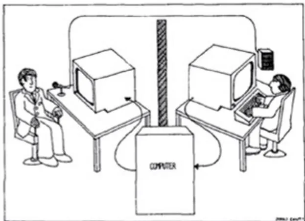  
Figure 12.8 An early schematic for a Wizard of Oz study for a listening typewriter Source: Gould et al., 1983

# 12.2.4  High-Fidelity Prototyping

A high-fidelity prototype looks more like the final product and usually provides more functionality than a low-fidelity prototype. For example, a prototype of a software system developed in Python or other executable language is higher fidelity than a paper-based mock-up; a molded piece of plastic with a dummy keyboard would be a higher-fidelity prototype of the PalmPilot than the block of wood. A common strategy for developing a high-fidelity software prototype is to focus on the functions and not include any error handling, for example. There is a continuum between low- and high-fidelity, and prototypes used in the wild, for example, will have enough fidelity to be able to answer their design questions and to learn about interaction  or  technological  constraints  or  contextual  factors.  It  is  common  for  prototypes  to evolve  through  various  stages  of  fidelity,  within  the  design-evaluate-redesign  cycles.  For example, Yao Xie and colleagues (2020) designed a system that enables physicians to explore and  understand AI-enabled  chest X-ray  analysis. To do  this, they conducted  a survey with physicians and radiologists that identified eight key features, then co-designed a low-fidelity prototype with three physicians that embedded those features, and subsequently evaluated a high-fidelity  prototype  with  six  more  physicians.  This  high-fidelity  prototype  evaluation proved valuable in providing detailed summative recommendations for developing the medical AI imaging support further.

One of the consequences of high-fidelity prototypes is that the prototype can appear to be good enough to be the final product, and stakeholders may be less prepared to critique it, or may critique it only superficially. To avoid this, it is important to focus on questions that prompt feedback on specific aspects whenever showing prototypes to stakeholders. Another consequence may be that fewer alternatives are considered because the prototype works and users like it.

High-fidelity  prototypes  can  be  developed  by  modifying  and  integrating  existing components—both  hardware  and  software—which  are  widely  available  through  various developer kits and open  source software, for example. In robotics, this approach  has been called tinkering (Hendriks-Jansen, 1996), while in software development it has been referred to as Opportunistic System Development (Ncube et al., 2008). For example, Ali Al-Humairi et al. (2018) used existing hardware (Arduino) and open source software to build a prototype to test their idea of playing musical instruments automatically from a mobile phone.

# 12.2.5  Compromises in Prototyping

By their very nature, prototypes involve compromises: the intention is to produce something quickly to test an aspect of the product. An early characterization of prototyping  that provides more detail on the kind of aspects that prototypes may be designed to test is described in Box 12.2 (Lim et al., 2008). The kind of questions that any one prototype can answer is limited, and the prototype must be built with the key issues in mind. In low-fidelity prototyping, it is  fairly  clear  that  compromises have  been  made. For  example, with a  paper-based prototype, an  obvious  compromise  is  that  the device  doesn’t  actually  work.  For  physical prototypes or  software  prototypes, some  of  the  compromises will  still  be  fairly  clear. For example, the casing may not be very robust, the response speed may be slow, the look and feel may not be finalized, or only a limited amount of functionality may be available. Box 12.3 discusses the level of prototype fidelity and how to decide what is appropriate.

Two  common  properties  that  are  often  traded  off  against  each  other  are  breadth  of functionality versus depth. These two kinds of prototyping are called horizontal prototyping (providing a wide range of functions but with little detail) and vertical prototyping (providing a lot of detail for only a few functions).

# BOX 12.2

# The Anatomy of Prototyping: Filters and Manifestations

Prototypes act as filters, for example, to emphasize specific aspects of a product being explored by the prototype (and to de-emphasize or omit others), and as manifestations of designs, for example, to help designers develop their design ideas through external representations (Lim et al., 2008).

Three key principles underpin the anatomy of prototypes:

1. Fundamental prototyping principle: Prototyping is an activity with the purpose of creating a manifestation that, in its simplest form, filters the qualities in which designers are interested without distorting the understanding of the whole.   
2. Economic principle of prototyping: The best prototype  is one that, in the  simplest and the most efficient way, makes the possibilities and limitations of a design idea visible and measurable.   
3. Anatomy of prototypes: Prototypes are filters that traverse a design space, i.e., by building different prototypes that are constrained in different ways, a designer can consider a wide range of possibilities within the design space. Prototypes are also manifestations of specific design ideas that concretize and externalize conceptual ideas.

Several dimensions of filtering and of manifestation may be considered when developing a prototype. Table 12.1 shows the filtering dimensions (variables) that a prototype might be built to investigate such as its size, data privacy type, input behavior, and arrangement of information elements. Table 12.2, on the other  hand, illustrates  the different  manifestation dimensions, i.e., choices that might be made when building the prototype. Choices include, for example, whether to build it using paper or software, whether to use realistic or fake data, and what is its scope (vertical and horizontal prototyping discussed earlier  are another example of the scope dimension).

<table><tr><td>Filtering dimension</td><td>Example variables</td></tr><tr><td>Appearance</td><td>Size, color, shape, margin, form, weight, texture, proportion, hardness, transparency, gradation, haptic, sound</td></tr><tr><td>Data</td><td>Data size, data type (for example, number, string, media), data use, privacy type, hierarchy, organization</td></tr><tr><td>Functionality</td><td>System function, functionality needs</td></tr><tr><td>Interactivity</td><td>Input behavior, output behavior, feedback behavior, information behavior</td></tr><tr><td>Spatial structure</td><td>Arrangement of interface or information elements; relationship among interface or information elements, which can be either two- or three-dimensional, intangible or tangible, or mixed</td></tr></table>

Table 12.1 Example variables of each filtering dimension   
Table 12.2 The definition and variables of each manifestation dimension   

<table><tr><td>Manifestation dimension</td><td>Definition</td><td>Example variables</td></tr><tr><td>Material</td><td>Medium (either visible or invisible) used to form a prototype</td><td>Physical media, for example, paper, wood, and plastic; tools for manipulating physical matters, such as a knife, scissors, pen, and sandpaper; computational prototyping tools, for instance, Python; physical computing tools, such as Phidgets and Basic Stamps; available existing artifacts, such as a beeper to simulate a heart attack</td></tr><tr><td>Resolution</td><td>Level of detail or sophistication of what is manifested (corresponding to fidelity)</td><td>Accuracy of performance, for instance, feedback time responding to an input; appearance details; interactivity details; realistic versus faked data</td></tr><tr><td>Scope</td><td>Range of what is covered to be manifested</td><td>Level of contextualization, for example, website color scheme testing with only color scheme charts or color schemes placed in a website layout structure; book search navigation usability testing with only the book search related interface or the whole navigation interface</td></tr></table>

# BOX 12.3

# What Level of Prototype Fidelity Is Needed and How to Decide

The appropriate level of fidelity depends on the purpose of the prototype and the compromises being made. Component kits and pattern libraries (see section 12.6 and Chapter 13, “Interaction Design in Practice”) make it quite  easy to develop high-fidelity  prototypes quickly, and it can be tempting to view low-fidelity prototypes as inferior. But they aren’t. High- and low-fidelity prototypes are used in different circumstances, for different audiences, and with different purposes. For example, paper prototyping is commonly used to explore initial ideas and is a core practice in game design (Bond, 2022), and low-fidelity prototyping techniques such as sketching and physical modeling can be used with nontechnical stakeholders to help them engage actively with the design process. High-fidelity prototypes can provide more detail and a more authentic experience and are often used in later product iterations. Both high- and low-fidelity prototypes can provide useful feedback during evaluation and design iterations.

Deciding which kind of prototype  to use  when will be based on the  point  in product development (early iterations tend to involve low-fidelity prototypes), who will view or interact with the prototype (audience plays an important part in deciding the level of fidelity), and the purpose of the prototype (checking technical compatibility probably requires higher fidelity than checking outline design).

IDEO  (www.ideou.com/blogs/inspiration/why-everyone-should-prototype-not-justdesigners)  shares  a  story  about  designing  the  visitor  experience  for  the  United  States Holocaust Museum. They hypothesized  that an app would help visitors to engage with the  stories and  produced a prototype  app. However,  they discovered that  this reduced conversation between  visitors, so they introduced a physical  prototype and found  that engagement and discussion increased. Testing this early on avoided significant resources being put into an app that might have had a negative impact.

This article discusses the benefits of high- and low-fidelity prototyping and includes a checklist to help decide which to use: www.nngroup.com/articles/ ux-prototype-hi-lo-fidelity/?lm=aesthetic-usability-effect&pt=article.

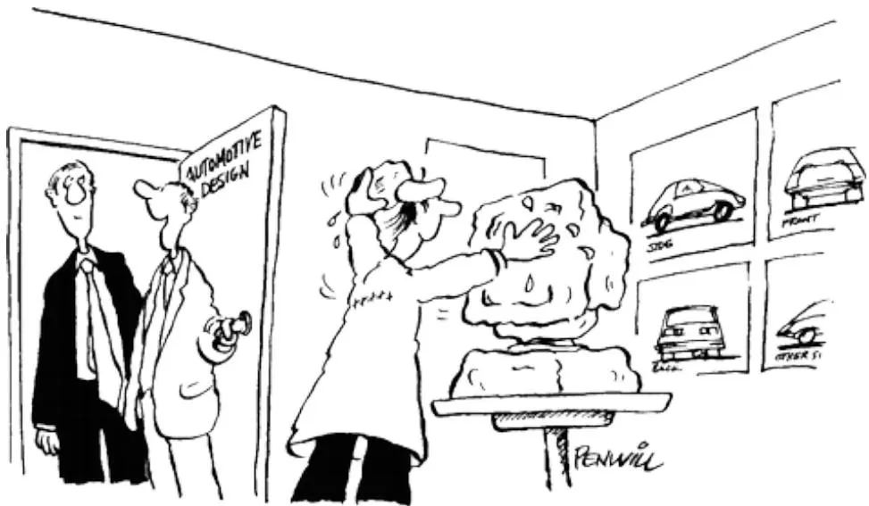  
"THEN IN HERE WE DOACLAYMOCK-UP OFTHE COMPUTERMODEL"

# Source: Reproduced with permission of Penwil Cartoons

Another common compromise is level of robustness versus degree of changeability. Making a prototype robust may lead to it being harder to change. This compromise may not be visible until something goes wrong. For example, the internal structure of a piece of software may  not  have  been carefully  designed,  or the  connections  between  electronic  components may be delicate.

Although prototypes may have undergone extensive evaluation, they may not have been built with good engineering principles, or been subjected to rigorous quality testing for other characteristics such  as security  and error-free  operation. Building  a product  to be used by thousands  or millions  of people running  on  various platforms and  under  a wide range  of circumstances  requires a different  construction and testing regime  than producing  a quick prototype to answer specific questions.

The next “Dilemma” box discusses two  different  development philosophies. In  evolutionary prototyping, a prototype evolves into the final product and is built with these engineering principles in mind. Throwaway prototyping uses  the prototypes as stepping  stones toward the final design. In this case, the prototypes are thrown away, and the final product is built from scratch. In an evolutionary prototyping approach, each stage will be subjected to rigorous testing; for throwaway prototyping, such testing is not necessary.

# DILEMMA

# Prototyping vs. Engineering

The  compromises made when developing low-fidelity prototypes are  evident, but compromises in high-fidelity prototypes are not so obvious. When a project is under pressure, it can become tempting to integrate a set of existing high-fidelity prototypes together to form the final product. Many hours will have been spent developing them, and evaluation with users has gone well. So, why throw it all away? Generating the final product this way will simply store up testing and maintenance problems for later (see Chapter 13’s Box 13.1 on technical debt in UX). In short, this is likely to compromise the quality of the product, unless the prototypes have been built with sound engineering principles from the start.

On the other hand, if the device is an innovation, then being first to market with a “good enough” product may be more important for securing market position than having a very high-quality product that reaches the market two months after a competitor’s product.

The  dilemma  arises in deciding how  to treat  high-fidelity  prototypes—engineer  them from the start or accept that they will be thrown away.

# 12.3 Conceptual Design

Conceptual  design  is  concerned  with  developing  a  conceptual  model;  conceptual  models were introduced in Chapter 3, “Conceptualizing Interaction.” The idea of a conceptual model can be difficult  to grasp because these  models take  many different  forms and  there isn’t a definitive detailed characterization of one. Instead, conceptual design is best understood by exploring and experiencing  different approaches to it, and this section provides  some concrete suggestions about how to do this.

A  conceptual  model  is  an  outline  of  what  people  can  do  with  a  product  and  which concepts are needed for them to understand how to interact with it. The former will emerge from an understanding of the problem space and the current functional requirements. Which concepts are needed to understand how to interact with the product depends on a variety of issues such as who will use it, what interaction type it will have, and what interface type will be used. These  will inform which terminology will be used, appropriate metaphors, and so on. The first step in developing a conceptual model is to become immersed in the data that has been collected. This will include information about people who might  use the product, their context, and their goals. Interaction design often suggests that designers empathize with the people they are designing for, but sometimes trying to empathize with others is not the right approach, as discussed in the following “Dilemma” box.

# DILEMMA

# Is It Possible to Empathize with Others?

Interaction design often refers to “empathizing” with users, but to what extent is that really possible? Empathizing with people who live in a different context is not easy, no matter how much data is collected. Interaction designers have tried several ways to achieve empathy with those  in situations that are  outside their  own experience. For example, Marion Buchenau and Jane Fulton Suri (2000) introduced experience prototyping. Experience prototyping  is a technique to help members of a design team appreciate what it might be like to use their product. In their example, they wanted to give a team designing a chest-implanted automatic defibrillator some insight into what it would be like to experience a defibrillator shock. To simulate the  random occurrence of a defibrillating shock, each team member was sent text messages at random times  over one  weekend. Each message simulated  the occurrence of a defibrillating shock, and team members were asked to record where they were, who they were with, what they were doing, and what they thought and felt knowing that this represented a shock. Example insights ranged from anxiety around everyday happenings, such as holding a child and operating power tools, to being in social situations and at a loss how to communicate to onlookers what was happening. This firsthand experience brought new insights to the design effort.

Using such techniques allows interaction designers to gain insights into situations that are outside of their experience, but they can have limitations. For example, Michelle Nario-Redmond et al. (2017) conducted experiments to investigate the impact of disability simulations. They found that they can have unexpected negative consequences, such as feelings of fear, apprehension, and pity toward those with disabilities, rather than any sense of empathy. In addition, experiencing the disability for only a short time does not take into account the various coping strategies and innovative techniques that individuals develop.

Karen  Holtzblatt and  Hugh Beyer’s  (2017) contextual design process, introduced in Chapter  11, takes a different  approach to evoking empathy  within the  design team. Their team-based approach aims to immerse the team members in the participants’ world through contextual interviews, interpretation sessions, and close engagement with the data.

But whatever techniques are used, the experience will never be the same as that of someone living in that situation day by day. Trying to empathize can only go so far and cannot replace the need to include a diverse set of people in the design process including those with relevant lived experience.

To read an overview of the disability simulation experiment results, see this article: blog.prototypr.io/why-i-wont-try-on-disability-to-build-empathy-in-thedesign-process-and-you-should-think-twice-7086ed6202aa.

Different creativity and brainstorming techniques can be used to explore ideas within the design team, together with scenarios and personas. Prototyping can also be used to test ideas. The availability of ready-made components increases the ease with which ideas can be prototyped, which also helps to explore different conceptual models and design ideas. Gradually, an image of the desired user experience will emerge and become more concrete through the conceptual model and concrete design.

Developing  scenarios  was  described  in  Chapter  11.  To help  explore  different  design ideas, Suzanne Bødker (2000) proposed plus and minus scenarios. These attempt to capture the most positive and the most negative consequences of a particular proposed design solution, thereby helping designers to gain a more comprehensive view of the proposal. This idea was extended by Clara Mancini et al. (2010) who used positive and negative video scenarios to explore futuristic technology. Their approach used video to represent  positive and negative consequences of a new product to help with diet and well-being, which was designed to explore privacy concerns and attitudes. The two videos (each with six scenes) focus on Peter, a businessman  with serious weight  problems who  has been advised  by  his doctor to  use a new product DietMon to help him lose weight. The product consists of glasses with a hidden camera, a microchip  in the  wrist, a central datastore, and a text  messaging  system to send messages to Peter’s mobile phone telling him the  calorific value of the food he is looking at and warning him when he is close to his daily limit (Price et al., 2010). Figure 12.9 shows the content of two scenes from the videos and the positive and negative reactions; Figure 12.10 is a snapshot from the negative video.

Tommy  Nilsson  et  al.  (2020)  draw  on  this  method  of  Contravision  in  their  exploration of domestic ubiquitous computing solutions (for a snapshot of the video scenarios, see Chapter 11) to provoke participants to explore their own values around future technologies. The scenarios they created communicate two contrasting sets of values: one that prioritizes an active lifestyle, and one that prioritizes convenience over everything else. These scenarios were presented to focus groups, and their reflections were analyzed thematically. They found that  embedding  the  contrasting  sets  of  values  in  Contravision  scenarios  enabled  them  to expose the values people draw on when considering technologies in their domestic life.

Read about how to create a mood board and the tools to help generate a mood board on the following web page: www.invisionapp.com/inside-design/ mood-board-examples.

Mood  boards  (traditionally used  in  fashion  and  interior  design)  may  also  be  used  to capture the desired feel of a new  product (see Figure 12.11). This is  informed by  any data gathering or evaluation activities and considered in the context of technological feasibility.

<table><tr><td colspan="2">Scene 2: breakfast at home</td></tr><tr><td>Peter starts preparing his breakfast with his new glasses on. His wife notices them and he keenly gives her a demonstration of what they are and how they work, and tells her about the microchip. She seems impressed and leaves the room to get ready for work. Peter opens the fridge to put away the butter and sees a pastry. He looks at it and gets a DietMon message telling him the calorie content of the pastry. He shows that to his wife, who is entering the kitchen and looks at him with a smile.</td><td>Peter prepares breakfast with his new glasses on. His wife notices them. While looking at his toast, he gets a text. His wife enquires what that is. He says it&#x27;s nothing and he does not feel like having toast after all. When she questions why he becomes tense and reluctantly tells her about DietMon. Skeptical, she leaves the room with a sarcastic comment. Peter opens the fridge and sees a pastry. As he gives in and takes a bite, he is caught by his wife, who is entering the kitchen and looks at him with a grin.</td></tr><tr><td colspan="2">Scene 3: birthday party at the office</td></tr><tr><td>Peter is working away at his desk when some colleagues invite him to a small birthday celebration. He tries to refuse but they insist. As he joins them, wearing his glasses, he greets the birthday-lady. His colleague Chris serves him a slice of cake. Peter looks at it and takes out his mobile. He gets a text, checks it and says the slice is too big, and asks Chris to cut it in a half. Chris is intrigued and asks for an explanation, so Peter gives his colleagues a keen demonstration of how the technology works. His audience is impressed, gathered around him.</td><td>Peter is working away at his desk when some colleagues invite him to a small birthday celebration. He tries to refuse but they insist. As he joins them, wearing his glasses, his colleague Chris gives him a slice of cake. He takes the plate and greets the birthday-lady. He gets a text and, pretending it&#x27;s an important phone call, moves away from the others with the cake. Turned away from them, he throws the cake in a bin and goes back pretending to have already finished it. Chris comments on how fast he ate. Peter excuses himself, saying he has a deadline to meet, and leaves.</td></tr></table>

Figure 12.9 How two scenes from the videos differ in terms of positive and negative reactions to the system. The positive version is on the left and the negative on the right

Source: Price et al. (2010)

# 12.3.1  Developing an Initial Conceptual Model

The core components of the conceptual model are metaphors and analogies, the concepts to which users are exposed, the relationship between those concepts, and the mappings between the concepts and user experience being supported (Chapter 3). Some of these will derive from the product’s requirements, such as the concepts involved in an  activity and their relationships, which may be captured through scenarios and use cases. Others such as suitable metaphors  and  analogies  will  be  informed  by  immersion  in  the  data  and  understanding  the application domain.

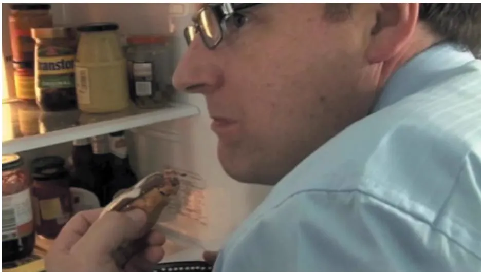

  
Figure 12.10  Peter being caught eating the pastry out of the fridge at breakfast (scene 2, negative reaction)

Source: Price et al. (2010) / Association for Computing Machinery

This section introduces approaches that help to produce an initial conceptual model. In particular, it considers the following:

•  How to choose interface metaphors that will help users understand the product?   
Which interaction type(s) would best support the users’ activities?   
. Do different interface types suggest alternative design insights or options?

All of these approaches provide  different ways of thinking  about the product and help generate potential conceptual models.

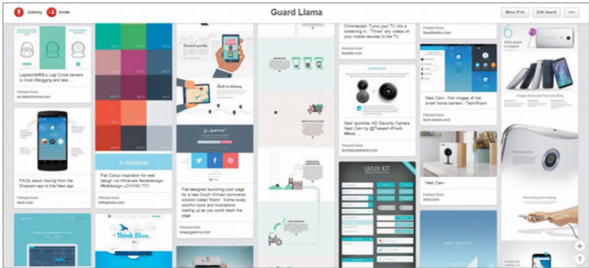  
Figure 12.11  An example mood board developed for a personal safety product called Guard Llama Source: johnnyhuang.design/guardllama.html

# Interface Metaphors

Interface  metaphors combine  familiar  knowledge with  new  knowledge in  a way  that  will help people understand the product. Choosing suitable metaphors and combining new and familiar concepts requires a balance between utility and relevance, and it is based on understanding  users  and  their  context.  For  example,  consider  an  educational  system  to  teach 6-year-olds  mathematics. One possible metaphor is a classroom  with a teacher standing  at the front, but this may not appeal to all children in that age range. A metaphor that builds on something enjoyable for all 6-year-olds is more likely to keep them engaged, such as a ball game, the circus, a playroom, and so on.

Different approaches to identifying and choosing an interface metaphor have been tried, and different factors may be considered. For example, Dietrich Kammer et al. (2013) combined creativity methods to explore everyday objects, paper prototypes, and toolkits to support groups of students designing novel interface metaphors and gestures for mobile devices. They  found that using both concrete  everyday objects and more  abstract geometric shapes to develop metaphors improved the intuitiveness of the resulting  interface. Pranav  Khadpe et al. (2020) found that metaphors used for conversational AI agents can influence people’s perceptions  and use  of the agent. For example, an agent  may present as  a wry teenager, a toddler, or  an experienced  butler.  In particular, their results  suggest that  using a  metaphor that portrays an agent appearing to be highly competent may help attract new users. But that continuing use of a highly competent agent will decrease unless the agent changes to appear less competent. Why do you think that is?

Tom  Erickson (1990) suggests a three-step process for choosing a good interface metaphor. This classic approach continues to be remarkably useful with current technologies. The

first step is to understand what the system will do, that is, to identify functional requirements. Developing partial conceptual models and trying them may be part of the process. The second step is to understand which bits of the product are likely to cause users problems, that is, which tasks or subtasks cause problems, are complicated, or are critical. A metaphor is only a partial mapping between the product and the real thing upon which the metaphor is based. Understanding areas in which users are likely to have difficulties means that the metaphor can be chosen to support those aspects. The third step is to generate metaphors. Looking for metaphors in the users’ description of relevant activities, or identifying metaphors used in the application domain, is a good starting point.

When  suitable  metaphors  have  been  generated,  they  need  to  be  evaluated.  Erickson (1990) suggests five questions to ask:

• How much structure does the metaphor provide? A good metaphor will provide structure— preferably familiar structure.   
. How much of the metaphor is relevant to the problem? One of the difficulties of using metaphors is that users may think they understand more than they do and start applying inappropriate elements of the metaphor to the product, leading to confusion or false expectations.   
•  Is the interface metaphor easy to represent? A good metaphor will be associated with particular physical, visual, and audio elements, as well as words.   
Will your audience understand the metaphor?   
•  How extensible is the metaphor? Does it have extra aspects that may be useful later?

To illustrate  how  this  process  may  be  used,  consider  the  group  travel  organizer  app introduced in Chapter 11. Choosing a novel metaphor can help make this travel app different from existing travel websites and help think through the design. One potential metaphor that was prompted  by the quote from Sky in her persona is a family restaurant. In this setting, the family is all  together, each can choose what  they want, but the overall experience is  shared. Evaluating  this  metaphor using  the  previous  five  questions  listed  prompted  the following thoughts:

• Does it supply structure? Yes, it supplies structure, based on the familiar restaurant environment. Restaurants can be very different in their interior and the food they offer, but the structure includes having tables and a menu and people to serve the food. The experience of going to a restaurant involves arriving, sitting at a table, ordering food, being served the food, eating it, and then paying before leaving. From a different point of view, there is also structure around food preparation and how the kitchens are run.   
•  How much of the metaphor is relevant? Choosing a vacation involves seeing what is being offered and deciding what is most attractive, based on the preferences of everyone in the group. This is similar  to choosing a meal in a restaurant. For  example, a restaurant will have a menu, and visitors to the restaurant will sit  together and choose individual meals, but they all sit in the same restaurant and enjoy the environment. For a group vacation, it may be that some members of the group want to do different activities and come together for  some of  the  time,  so  this  is  similar. Information about  the  food such  as allergens  is available from the server or in the menu, reviews of restaurants are available, and photos or models of the food available are common. All of these characteristics are relevant to the group travel organizer app. One of the characteristics of a restaurant that may differ from a vacation is when payment is required. There may be a deposit required before the meal, or it may be paid for entirely after the meal, for example, whereas a holiday is usually paid

for entirely in advance. But even these differences prompt discussion and open possibilities for the new app.

. Is the metaphor easy to represent? There are  several options in this regard, but the basic structure of a restaurant can be represented. The key aspect of this conceptual model will be to identify potential vacations that suit everyone and choose one. In a restaurant, this process involves looking at menus, talking to the server, and ordering the food. Vacation information  including  photos  and videos  could be presented  in  a menu—maybe  as  one menu for adults and one for children. So, the main elements of the metaphor seem straightforward to represent.   
. Will your audience understand the metaphor? For this example, the target group has not yet been investigated in detail, but eating in a restaurant is common.   
How  extensible  is  the  metaphor?  There  are  several  different  types  of  restaurant  experiences—à la carte, fixed menu, serve yourself, all you can eat, and food courts, for example. Elements from these different types of restaurants may be used to expand initial ideas.

# ACTIVITY 12.2

One of the disadvantages of the restaurant metaphor is the need to have a shared experience when members of the group are in different locations.Another possible interface metaphor for the group travel organizer is the travel consultant. A travel consultant discusses the requirements with the traveler(s) and tailors the vacation accordingly, offering maybe two or three alternatives, but  making most of the  decisions on the  travelers’ behalf. Ask the  earlier five questions about this metaphor.

# Comment

1. Does the travel consultant metaphor supply structure?

Yes. The key characteristic of this metaphor is that the travelers specify what they want, and the consultant researches the options. It relies on the travelers giving the consultant sufficient information to search within a suitable range rather than leaving them to make key decisions.

2. How much of the metaphor is relevant?

The idea of handing over responsibility to someone else to search for suitable vacations may be appealing to some users, but it might feel uncomfortable to others. The level of responsibility given to the consultant can be adjusted, though, depending on user preferences. It is common for  individuals to put together vacations themselves based on web searches, but this can be time-consuming and diminish the excitement of planning a vacation. It would be attractive to some users if the initial searching and sifting is done for them.

3. Is the metaphor easy to represent?

Yes, it could be represented by a software agent or by having a sophisticated database entry and search facility. But the question is, would users like this approach?

4. Will your audience understand the metaphor?

Yes.

5. How extensible is the metaphor?

As a travel consultant is a person and people are often flexible, the metaphor is extensible. For example, the consultant could be asked to refine their vacation recommendations according to as many different criteria as the travelers require.

# Interaction Types

Chapter 3 introduced five different types of interaction: instructing, conversing, manipulating, exploring, and responding. Which type of interaction is best suited to the current design depends on the application domain and the kind of product being developed. For example, a computer game is  most likely to suit a manipulating  style, while a software application for drawing or drafting has aspects of instructing and conversing.

Most  conceptual models will include a combination of interaction types, and different parts  of the  interaction  will be  associated  with  different  types. For  example,  in  the  group travel organizer, one of the tasks is  to find out the visa  regulations for a particular destination. This will require an instructing approach to interaction as no dialog is necessary for the system to show the regulations. Instead, a predefined set of information needs to be entered, for instance, the country  issuing the  passport  and the  destination. On  the  other hand, trying to identify a vacation for a group of people may be conducted more like a conversation. For example, the interaction may begin by selecting some characteristics of the destination and some time constraints and preferences. Then the organizer will suggest several options, more information or preferences will be provided, revised suggestions will be made, and so on. Alternatively, for those who don’t have any clear requirements yet, they might prefer to explore  availability before asking for specific options. Responding could be used  when an option is chosen that has additional restrictions and the system asks if the traveler meets them.

# Interface Types

Considering different interfaces at this stage may seem premature, but it  has both a design and  a  practical  purpose. When  thinking  about  the  conceptual  model  for  a  product,  it  is important not to be unduly influenced by a predetermined interface type. Different interface types prompt and support different perspectives on potential user experiences and possible behaviors, hence prompting alternative design ideas.

In practical terms, prototyping the product will require an interface type, or at least candidate alternative interface types. Which ones to choose depends on the product constraints that arise from the requirements. For example, input  and output modes will be influenced by user and environmental requirements. Therefore, considering interfaces at this point also takes one step toward producing practical prototypes.

To illustrate this, we consider a subset of the interfaces introduced in Chapter 7, “Interfaces,” and the different perspectives they bring to the group travel organizer app.

• Shareable interface: The travel organizer has to be shareable, as it is intended to be used by  a group of people, and it should be exciting and fun. The design issues for shareable interfaces, which were introduced in Chapter 7, will need to be considered for this system. For example, how best (whether) to use the individuals’ own devices such as smartphones in conjunction with a shared interface. Allowing group members to interact at a distance suggests the need for multiple devices, so a combination of form factors is required.   
Tangible interface: Tangible interfaces are a kind of sensor-based interaction, where blocks or other physical objects are moved around. Thinking about a travel organizer in this way conjures up an interesting image of people collaborating, maybe with the physical objects

representing themselves  while  traveling, but  there  are  practical  problems  of having  this kind of interface, as the objects may be lost or damaged.

. Virtual reality: The travel organizer seems to be an ideal product for making use of a virtual reality interface, as it would  allow people to experience the destination  and maybe some of the activities available. Virtual reality would not be needed for the whole product, just for the elements where people want to experience the destination.

# ACTIVITY 12.3

Consider the new navigation app for a large shopping center introduced in Chapter 11.

1. Identify tasks associated with this product that would best be supported by each of the interaction types instructing, conversing, manipulating, exploring, and responding.   
2. Pick out two interface types from Chapter 7 that might provide different perspectives on the design.

# Comment

1. Here are some suggestions. You may have identified others.

•  Instructing: The user wants to see the location of a specific shop.   
Conversing: The user wants to find one particular branch out of several; the app might ask them to pick one from a list. Or, they might want to find a particular kind of shop, and the app will display a list from which to choose.   
•  Manipulating: The chosen route could be modified by dragging the path to encompass other shops or specific walkways.   
•  Exploring: The user might be able to walk around the shopping center virtually to see what shops are available.   
•  Responding: The app asks whether the user wants to visit their favorite snack bar on the way to the chosen shop.

2. Navigation apps tend to be smartphone-based, so it is worth exploring other styles to see what insights they may bring.We had the following thoughts, but you may have had others.

The navigation app needs to be mobile so that the user can move around to find the relevant shop. Using voice or gesture interfaces is one option, but this could still be delivered through a mobile device. Thinking more broadly, perhaps a haptic interface  that guides the  user to the required location might  suffice. Smart  interfaces, such as one  built  into the environment, are an alternative, but privacy issues may arise if an individual’s data is displayed for all to see.

# 12.3.2  Expanding the Initial Conceptual Model

The previous section discussed the core elements of a conceptual model. For prototyping or conducting evaluations, these ideas need some expansion. Examples include which functions the product will perform and which the user will perform, how those functions are related, and what information  is required to support them. Some of this will have been considered during the requirements activity and will evolve after prototyping and evaluation.

# What Functions Will the Product Perform?

This question is about whether the product or the user takes responsibility for different parts of the overall goal. For example, the travel organizer is intended to suggest specific vacation options for a group of people, but is that all it should do? It could automatically reserve the bookings. Or should it  wait until it  is given a preferred choice? In the  case of visa requirements,  will  the  travel  organizer  simply  provide  the  information  or  link  to  visa  services? Deciding what the system will do and what the user will do is sometimes called task allocation.  This  trade-off  has  cognitive  implications  (see  Chapter  4, “Cognitive  Aspects”)  and affects social  aspects of collaboration (see Chapter 5, “Social Interaction”). If the cognitive load is too high for the user, then the device may be too stressful to use. On the other hand, if the product has too much control and is too inflexible, then it may not be used at all.

Another  decision is  which  functions  to hardwire into the  product and  which to  leave under software control, thereby indirectly in the control of a person.

# How Are the Functions Related to Each Other?

Functions may be related temporally; for example, one must be performed before another, or two can be performed in parallel. They may also be related through any number of possible categorizations, for instance, all functions relating to privacy on a smartphone or all options for viewing photographs on  a social networking site. The relationships  between tasks  may constrain use or may indicate suitable task structures within the product. For example, if one task depends on another, the order in which tasks can be completed may need to be restricted. If  use  cases  or  other  detailed  analysis  of  the  tasks  have  been  generated,  these  will  help. Different styles of requirements (for example, stories or atomic requirements shell) provide different levels of detail, so some of this information will be available, and some will evolve as the design team explores and discusses the product.

# What Information Is Needed?

What data is required to perform a task? How is this data to be transformed by the system? Data  is one of  the categories of requirements identified  and captured through the requirements activity. During  conceptual design, these  requirements are considered to ensure that the model provides the information needed to perform the task. Detailed issues of structure and display, such as whether to use an analog display or a digital display, will more likely be dealt with during the concrete design activity, but implications arising from the type of data to be displayed may impact conceptual design issues.

For example, identifying potential vacations for a group of people using the travel organizer  requires the  following:  what  kind  of vacation  is  required, available  budget,  preferred destinations (if any), preferred dates and duration (if any), how many people it is for, and are there any special requirements (such as disability) within the group? To perform the function, the system needs this information and must have access to detailed vacation and destination descriptions, booking availability, facilities, restrictions, and so on.

Initial conceptual models may be captured in wireframes—a set of documents that show structure, content, and controls. Wireframes may be constructed at varying levels of abstraction, and they may  show part of the product or a complete overview. Chapter 13 includes more information.

# 12.4  Concrete Design

Conceptual design  and concrete design  are closely  related. The difference between  them is more a matter of changing emphasis: conceptual issues will sometimes be highlighted, while at other times concrete detail will be the focus. Producing a prototype inevitably means making some concrete decisions, albeit tentatively, and since interaction design is iterative, some detailed issues will come up during conceptual design, and vice versa.

Design involves balancing the range of environmental, user, data, usability, and user experience requirements with functional requirements. These are sometimes in conflict. For example, the functionality of a wearable interactive product may be constrained by the activities someone wants to perform while wearing it; a computer game may need to be learnable but also challenging. Concrete design of websites and other online media has also been found to affect their credibility (Lazar et al., 2007). Visual design (Stojmenović et al., 2022) and even how passwords are obscured have been found to have implications for security (Griswold-Steiner et al., 2021)

There are many aspects to the concrete design of interactive products: visual appearance such as colors and graphics, icon design, button or gestural design, navigation, layout, choice of interaction devices, and so on. Chapter 7 introduces several interface types, together with their associated design considerations, guidelines, principles, and rules, which help designers ensure that their products meet usability and user experience goals. These represent the kinds of decision that are made during concrete design.

As an example of concrete design decisions, Figure 12.12 shows the initial prototype of a new interface design for radio astronomy visualization software (Rampersad et al., 2017). This prototype illustrates aspects of concrete design including screen layout and icon design. In this study, the concrete design went through three iterations using prototypes of increasing levels of fidelity.

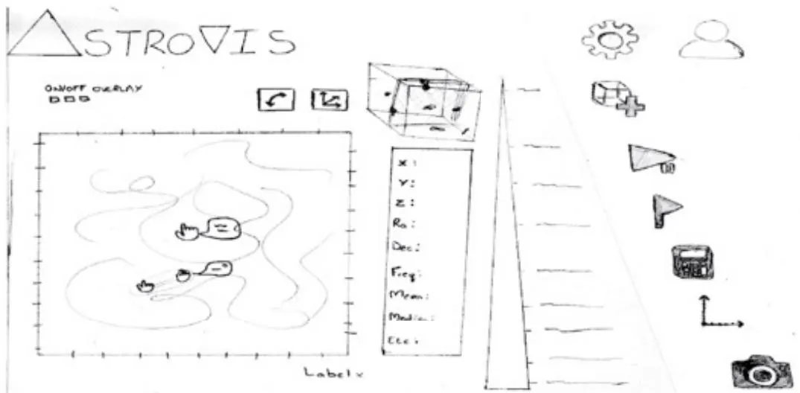  
Figure 12.12  A paper prototype for the home view of an astronomy visualization package, illustrating some aspects of concrete design. On the left side is a large area for displaying the data, and on the right side there is an expanding side menu containing icons for additional functionality. In the middle is a list of data variables. The screen layout, relative sizes and locations of interface elements, and design of specific icons are all aspects of concrete design.

Two  aspects  that have drawn  particular attention for concrete  design  are accessibility and  inclusiveness. Accessibility  and inclusiveness  were introduced  in  Chapter  1, “What  is Interaction Design?” Accessibility refers to the extent to which a product is accessible to as many people as possible, while inclusiveness means being fair, open, and equal to everyone. The aim of inclusive design is to empower people in their everyday and working lives (Rogers and Marsden, 2013).

Accessibility considerations  in  concrete design  include input and  output modes. Apart from standard  keyboard, mouse, and touchscreen, there  are also different  pointing devices and keyboards, screen readers, refreshable Braille, voice, sensors, and cameras, among others. Interactive products must be flexible enough to work with these various devices. This is particularly important for accessibility as people with disabilities may be unable to use pointing devices or standard keyboards and may instead interact using a head or mouth stick, voice recognition, video with captions, audio transcripts, and so on.

Web Content Accessibility Guidelines (WCAG) are also available to help designers create accessible products and websites (see Box 16.2). By designing accessible interfaces, the aim is  to provide  flexibility for anyone  who uses  an  assistive technology  or needs information presented  differently. Accessible  interfaces  also  help  people  with  temporary  or  situational impairments, for example, a driver who is unable to look at a display screen or a train passenger watching a video without disturbing other passengers.

Interfaces that are not accessible can lead to various forms of societal discrimination. In the past, examples of pricing discrimination and employment discrimination due to inaccessible interfaces have been well-documented. More recently, Jonathan Lazar (2022) recorded interface and content accessibility barriers in online learning that occurred for faculty, staff, and students  with disabilities  at  universities during  the  COVID-19 pandemic.  Inaccessible COVID-19 vaccination bookings and informational websites have also led to discrimination and exclusion, as well as a series of legal settlements to remedy the situation.

For more information on legal cases related to inaccessible websites and COVID-19, see the following link: www.justice.gov/opa/pr/justice-departmentsecures-agreement-make-online-covid-19-vaccine-registration-accessible-1.

Inclusive design has a wider scope than accessible design because it covers aspects other than  disability,  including  cultural  background,  language,  gender,  and  economic  situation. But it is important to remember that being fair, equal, and open to anyone does not change the  need  to  consider  user  characteristics  (see  Chapter  11)  and  any  tailoring  that  specific characteristics may require. For example, experts such as scientific software developers commonly ask for interfaces that may seem complex to those who are novices. Francisco Queiroz  et  al.  (2017)  highlight  the  importance  of  different  input  and  output  modes  for  some scientific software, emphasizing that command-line  interfaces are just as valuable for these experts as a GUI.

Concrete  design  also  includes  consideration  of  localization  and  internationalization aspects for global audiences. These include translation to different languages but also issues

concerned  with icons,  navigation, content, metaphor, and visual  appearance. For  example, some ecommerce sites offer  the site to be translated into different languages, but the design remains  the  same,  while  others  have  different  designs  for  different  countries.  Marks  and Spencer  (marksandspencer.com)  offer  the  option  of  choosing  (some)  different  languages, while the designs for Pharmacyonline in the United Kingdom, Australia, and China have different structures. See Activity 12.4 and the subsequent link for more examples.

# ACTIVITY 12.4

Coca-Cola is sold in most countries around the world. Advertising for this brand varies across countries, and this is reflected  in the  concrete design of their  website. Visit the  website for Coca-Cola  worldwide  at coca-colacompany.com. From here you  can  explore  the  websites for different countries around the world. Choose two or three and identify some elements of concrete design that differ.

# Comment

The following comparison is based on the Coca-Cola  English-language sites for Botswana, Canada, and Honduras. The content varies, as one might expect, but so do the interface layouts and typefaces differ. For example:

•  The photographs show different contexts, different faces, and different activities.   
•  The news stories and highlighted company activities are locally relevant.   
•  FAQs are located in different places on the screen and are organized differently, or not there at all (Honduras).   
•  Screen layouts and typefaces are different.

Other global brands similarly vary their designs for different countries; e.g., see Pepsico .com. While it’s not possible to draw general conclusions from these observations about how designs should differ between countries, these differences reflect the importance of concrete design being tailored for local audiences.

For more examples and tips about localization, read the following interview: medium.com/demagsign/a-guide-to-cross-cultural-design-by-senongoapkem-368c90de1b76.

This article includes useful examples of inclusive design: www.nngroup.com/ articles/inclusive-design.

# BOX 12.4

# Research through Design (RtD)

Research through Design is an approach to conducting scholarly research that uses practices and methods from design with the aim of generating new knowledge (Zimmerman and Forlizzi, 2014). It emphasizes reflective design practice and  the  making of a series of physical objects  that embody the  design decisions made by designers (Gaver, 2012). An RtD project progresses iteratively through a series of designs that explore these decisions and their consequences. This approach originated in the Art and Design disciplines (Frayling, 1993) and has increasingly been used in interaction design. For example, Kunpeng Huang et al. (2021) used RtD to explore the potential of producing on-skin interfaces through weaving circuitry and yarns together to form on-skin systems that are wearable for day-to-day activities. As part of the project, they deployed a technology probe to test a product in the field. But, what is the difference between technology probes and RtD? An RtD project may use probes to evaluate designs in the context of use, but it doesn’t focus on producing a specific product; rather, it explores various design options and decisions.

One of the characteristics of RtD is its dynamic nature and the acceptance, indeed encouragement, for emergence (Gaver et al., 2022). In this approach, the focus of the project and the questions it will answer change along the way, and the particularity of design is in tension with the need to generalize for research (Bardzell et al., 2016).

The output of RtD is a series of designs (some of which are physical objects) and their documentation. RtD  outputs  can  be documented in workbooks  that capture  the  series of designs, materials, and options considered and any investigations that were undertaken. These may  be in the form of sketches, photographs, written text, annotated diagrams, and so on. Key questions include what to document and in what form, how to balance the importance of reflection with the  need to push the project  on, and how  to capture  a dynamic process (Bardzell et al., 2016).

An extension of this approach, called Research through Design and Craft (Zheng and Nitsche, 2017), has been used to generate enrichment ideas for elephants in captivity (French et al., 2020). Using this approach, Fiona French and colleagues hand-built multiple versions of enrichment objects such as tactile “buttons” with different textures that generated different sounds such as low-frequency sounds and classical music. This led to an appreciation of how elephants might  use their trunks to operate  enrichment devices and  the role that aesthetics plays in the elephants’ interactions.

# 12.5 Generating Prototypes

This section illustrates how prototypes may be used in design, and it demonstrates how prototypes may be generated from the output of the requirements activity—producing a storyboard from a scenario and an index card-based prototype from a use case. Both of these are low-fidelity prototypes.

# 12.5.1 Generating Storyboards

A  storyboard  represents  a  sequence of actions  or events  that the user  and  the product go through  to  achieve  a  goal. A  scenario  is  one  story  about  how  a  product  may  be  used  to achieve that goal. A  storyboard can be generated from a scenario by breaking the scenario into  a series of steps  that focus on interaction and creating one scene in the  storyboard for each step. The  purpose for doing  this is twofold: first  to produce a storyboard that  can be used to obtain feedback from stakeholders and second to prompt the design team to consider the scenario and the product’s use in more detail. For example, consider the scenario for the travel organizer developed in Chapter 11. This can be broken down into six main steps.

1.  Will, Sky, and Eamonn gather around the organizer, but Claire is at her mother’s house.   
2.  Will tells the organizer their initial idea of a sailing trip in the Mediterranean.   
3.  The  system’s initial suggestion  is that  they consider  a flotilla  trip, but  Sky and Eamonn aren’t happy.   
4.  The  travel  organizer  shows  them  some  descriptions  written  by  young  people  about flotilla trips.   
5.  Will confirms this recommendation and asks for details.   
6.  The travel organizer sends details of the different options.

Notice that the first step sets the context, and later steps focus more on the goal. Breaking the scenario into steps can be achieved in different ways. The purpose of working from the scenario is for the design team to think through the product and its use, so the steps are not as important as the thinking that happens through the process. Also, some of these events are focused solely on the travel organizer’s interface, and some are concerned with the environment. For example, the first one talks about  the family gathering around the organizer, while the fourth and sixth are focused on the travel organizer. Storyboards can focus on the screens or on the environment, or a mixture of both. Either way, sketching out the storyboard will prompt the design team to think about design issues.

For example, the scenario says nothing about the kinds of input and output devices that the  system  might  use, but  drawing  the organizer  forces  the designer to  think  about  these things. There is  some information in the scenario about  the environment within which the system will operate, but drawing the scene requires specifics about where the organizer will be  located and how  interaction will  continue. When focusing  on the  screens, the designer is  prompted to consider issues including what  information needs to be available and what information needs to be output. This all helps to explore design decisions and alternatives, but it is also made more explicit because of the drawing act.

The storyboard in Figure 12.13 includes elements of the environment and some of the screens. While drawing this, various questions came to mind such as how can the interaction be designed for all of the family? Will they sit or stand? How to handle remote participants? What kind of help needs to be available? What physical components does the travel organizer need?  How to enable all  of the  family to interact with the  system (notice that  the first scene uses voice input while other scenes have a keyboard option as well)? And so on. In this exercise, the questions it prompts are just as important as the end product.

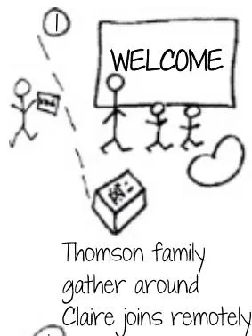

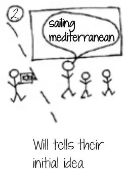

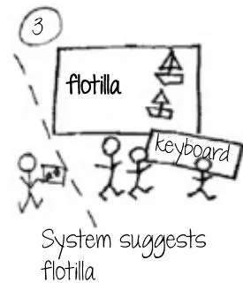

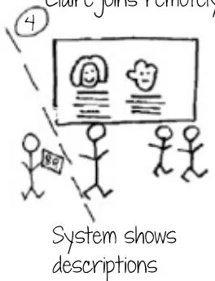

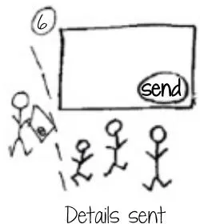  
Figure 12.13The  ÂstoryboardÂforÂtheÂtravelÂorganizerÂ

# ACTIVITYÂ12.5Â

ActivityÂ11.4 inChapter  11developed ÂaÂfuturisticÂscenarioÂforÂtheÂone-stopÂcarÂshop.ÂUsing thisÂscenario,ÂdevelopÂaÂstoryboardÂthatÂfocusesÂonÂtheÂenvironmentÂofÂuse.ÂAsÂyouÂdrawÂthis storyboard,ÂwriteÂdownÂtheÂdesignÂissuesÂthatÂitÂprompts.Â

# CommentÂ

TheÂfollowingÂisÂbasedÂonÂtheÂscenarioÂinÂtheÂcommentÂforÂActivityÂ11.4.ÂThisÂscenarioÂbreaks downÂintoÂfiveÂmainÂsteps.Â

1.ÂTheÂuserÂarrivesÂatÂtheÂone-stopÂcarÂshop.   
2.ÂTheÂuserÂisÂdirectedÂintoÂanÂemptyÂbooth.   
3.ÂTheÂuserÂsitsÂdownÂinÂtheÂracingÂcarÂseat,ÂandÂtheÂdisplayÂcomesÂalive.   
4.ÂTheÂuserÂcanÂviewÂreports.   
5.ÂTheÂuserÂcanÂtakeÂaÂvirtualÂrealityÂdriveÂinÂtheirÂchosenÂcar.Â

TheÂstoryboardÂisÂshownÂinÂFigure 12.14.Issues ÂthatÂaroseÂwhileÂdrawingÂthisÂstoryboard includedÂhowÂtoÂdisplayÂtheÂreports,ÂwhatÂkindÂofÂvirtualÂrealityÂequipmentÂisÂneeded,Âand whatÂinputÂdevicesÂareÂneeded—akeyboard ÂorÂtouchscreen,ÂaÂsteeringÂwheel,Âaccelerator,Âand brakeÂpedals?ÂHowÂmuchÂlikeÂactualÂcarÂcontrolsÂdoÂtheÂinputÂdevicesÂneedÂtoÂbe?ÂYouÂmay haveÂthoughtÂofÂotherÂissues.Â

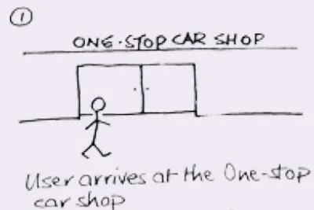

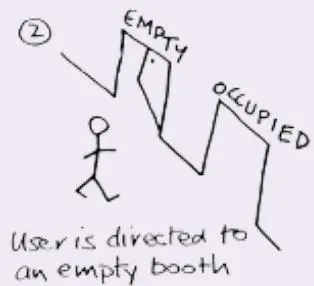

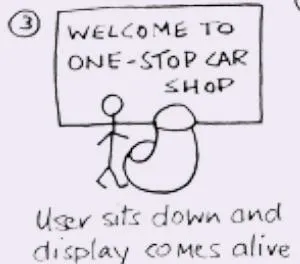

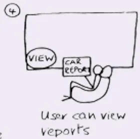

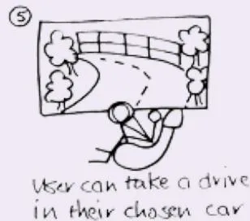  
Figure 12.14  The storyboard generated from the one-stop car shop scenario in Activity 11.4

# 12.5.2  Generating Card-Based Prototypes

Card-based prototypes are commonly used to capture and explore elements of an interaction, such as dialogue exchanges between the user and the product. The value of this kind of prototype lies in the fact that the interaction elements can be manipulated and moved around in order to simulate interaction or to explore a user’s end-to-end experience. This may be done as  part  of the  evaluation  or  in  conversations  within  the  design  team.  If  a storyboard  that focuses on pages or screens has been developed, this can be translated almost directly into a card-based prototype and used in this way. But a scenario represents only one path through the product, and card-based prototypes may capture multiple paths. Another way to produce a card-based prototype is to generate one from a use case output from the requirements activity.

For example, consider the use cases for the visa requirements aspect of the group travel organizer presented in Chapter 11. The first, less-detailed use case provides an overview of the interaction, while the second one is more detailed.

This second  use  case  can  be translated into cards as  follows. For  each  step in the use case,  the  travel  organizer  will  need to  have  an  interaction  component  to  deal  with  it, for example,  input  via  a  button,  menu  option, or  voice,  and  output  via  a  display  or  sound. By stepping  through the use case, a card-based prototype can be developed that covers the required behavior, and different designs can be considered. For example, Figure 12.15 shows six dialogue elements on six separate cards. The set on the left has been written in friendlier language, while the set on the right is more official. These cover steps 1, 2, 3, 4, and 5.

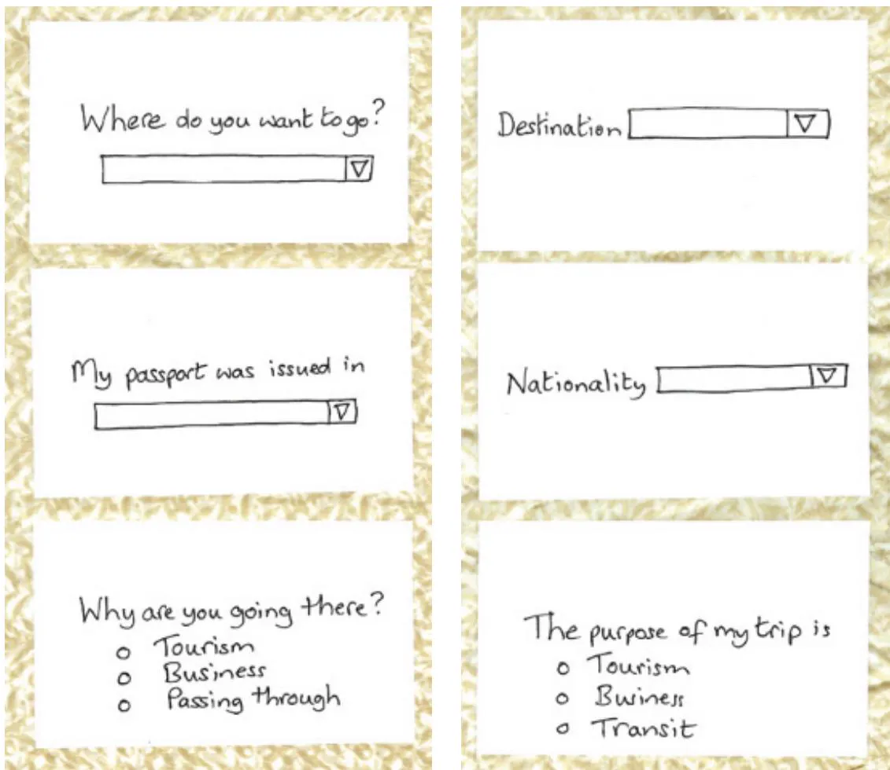  
Figure 12.15  Cards 1–3 of a card-based prototype for the travel organizer

The alternative courses, for example those dealing with error messages, would also each have a card, and the tone and information contained in the error message could be evaluated with stakeholders. For example, step 7.1 might translate into a simple “No visa information is available,” or a more helpful, “I am not able to find visa information for you to visit your chosen destination. Please contact the <destination country>’s embassy.”

These cards can be shown to stakeholders or fellow designers to get informal feedback. In this case, we showed  these cards  to a colleague and, through  discussion of the application and  the cards,  concluded  that  although the  cards  represent  one  interpretation  of the use case, they focus too much on an interaction model that assumes a WIMP/GUI interface. Our  discussion was informed  by  several  things including  the storyboard  and the scenario. One  alternative would be to  have a map  of the  world through  which the  destination and nationality can be indicated by choosing one of the countries on the map; another might be based around national flags. These alternatives could be prototyped using cards and further feedback obtained. Cards can also be used to elaborate other aspects of the concrete design, such as icons and other interface elements. A set of card-based prototypes that cover a range of scenarios from beginning to end may be the basis of a more detailed prototype, or it may be used in conjunction with personas to explore the overall user experience.

<!-- Chunk 10 End -->

<!-- Chunk 11 Start -->

# ACTIVITY 12.6

Look at the storyboard in Figure 12.4. This storyboard shows Christina exploring the Acropolis in search of information  about  the  pottery trade. In the  second scene  in the  top row, Christina “adjusts the  preferences  to find information  about  the  pottery trade  in Ancient Greece.” Many interaction icons have become standardized, but there isn’t a standard one for “pottery trade.” Suggest two alternative icons to represent this and draw them on separate cards. Using the storyboard in Figure 12.4 and the two cards, try out the different icons with a friend or colleague to see what they understand by your two icons.

# Comment

Figure 12.16 shows the  two cards we drew. The first is simply an Ancient Greek pot, while the second attempts to capture the idea of a pottery seller in the market. When we stepped through the storyboard with a colleague and showed them these alternatives, both were found to require improvement. The pot on its own did not capture the pottery trade, and it wasn’t clear what the market seller represented, but there was  a preference for  the  latter, and  the feedback was useful.

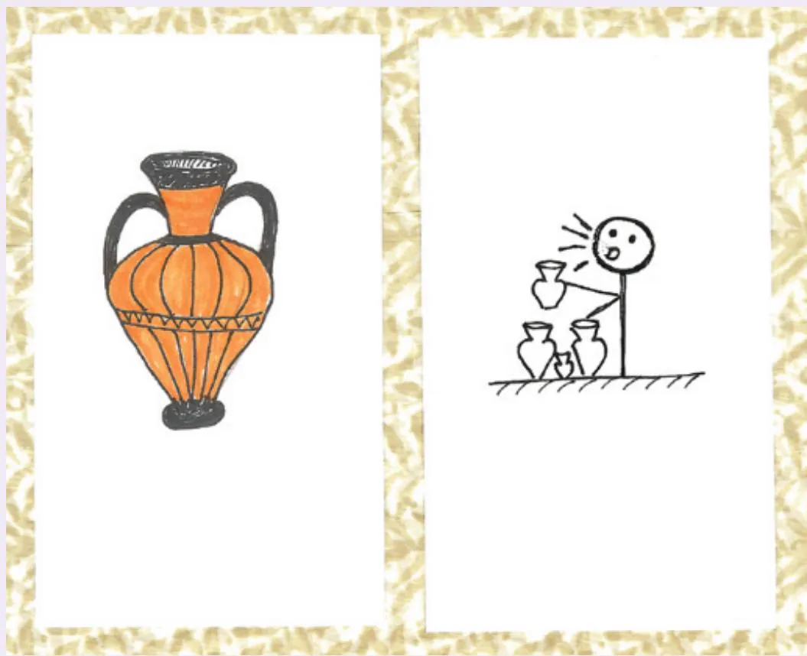  
Figure 12.16  Two icons to represent “pottery trade” for the new mobile device for exploring historic sites depicted in the storyboard of Figure 12.4

# 12.5.3  Mapping the Overall Experience

Prototyping different elements of the product helps to answer specific questions, but at some point it’s important to consider the complete user experience. This is achieved by creating a visual representation  of it. These representations have various names such as a design map (Adlin and Pruitt, 2010), a customer  journey map (Angrave, 2020), or an experience map. They illustrate a path or journey through the product or service and are usually created for a particular persona and based on a particular scenario, thereby giving the journey sufficient context and detail to bring the discussions to life. They support designers in considering the overall user experience when achieving a particular goal and are used to explore  and question the designed experience and to identify issues that have not been considered so far. They may  be  used  to  analyze  existing  products  and  to  collate  design  issues  or  as  part  of  the design process.

There are many different types of representation and of varying complexities. Two main ones are the wheel  and the timeline. The wheel  representation  is used when an  interaction phase is more important than an interaction point, such as for a flight (see Figure 12.17(a) for an example). The timeline is used where a service is being provided that has a recognizable beginning and end point, such as purchasing an item through a website. A range of templates and canvases for generating timelines are available online. Figure 12.17(b) illustrates one structure  and the kinds  of issues that may  be captured, such as  questions, comments, and ideas. Another  important element that is often included are pain points along the journey. These  may be uncovered through stakeholder evaluations or feedback from within the design team, and sometimes journeys are annotated  with smiley (and sad) faces to indicate pain points.

To generate one of these representations, take one persona and two or three scenarios. Draw a timeline for the scenario and identify the interaction points for the persona. Then use this as a discussion tool with colleagues and stakeholders to identify any issues, questions, or pain points. Note that the journey may extend beyond the use of the product and touch on the user’s relationship with the company or brand. Sometimes the focus will be on technical issues, and at other times this can be used to identify missing functionality or areas of underdesigned interaction.

This video illustrates the benefits of experience mapping using a timeline: youtu .be/eLT_Q8sRpyI.

User flows  are another  way to  capture the overall  user experience, focusing  on screen content and design. These are used particularly for mobile apps or websites and are similar to timeline customer journey maps because they capture the flow that someone may go through when using  the product.  User flows  come in  various forms  but  are usually  represented in a  flowchart  showing  different  options  and  decision points  through the  customer  journey. Generating a user flow helps determine the number of screens or pages needed to keep the user engaged, maps out the different paths through the product, and supports the design of individual screens.

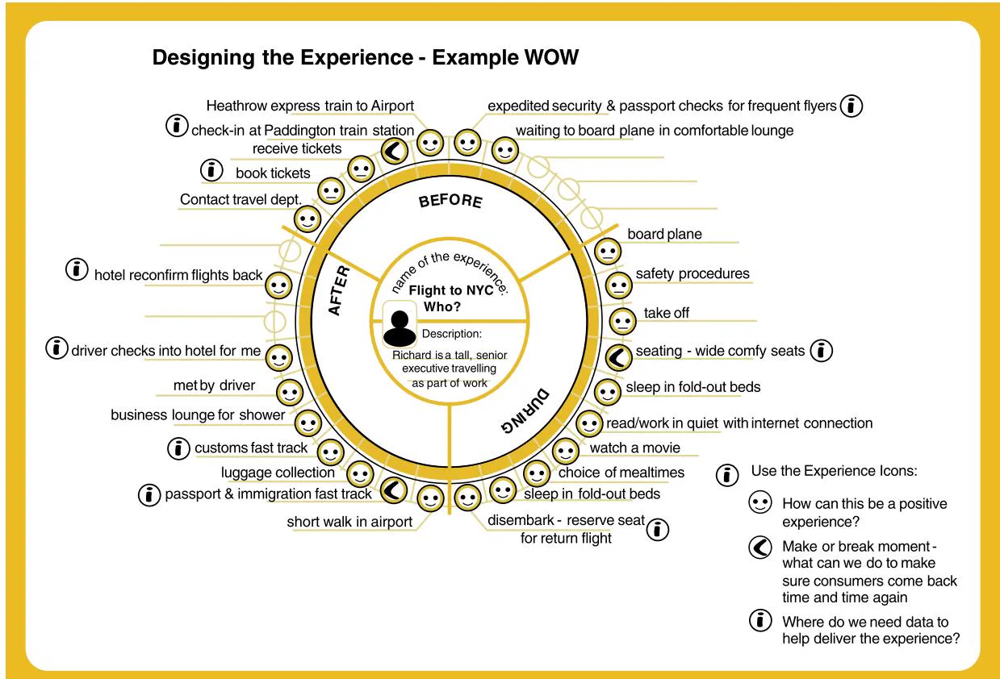  
(a)

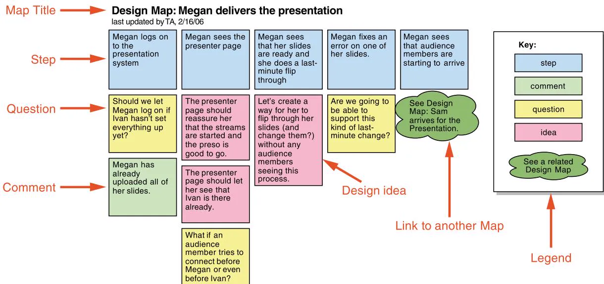  
(b)   
Figure 12.17  (a) An experience map using a wheel representation and (b) an example timeline illustrating how different issues may be captured

Source: (a) LEGO (b) Adlin and Pruitt (2010), p. 134. Used courtesy of Morgan Kaufmann

For more about user flows, see this article: careerfoundry.com/en/blog/ ux-design/what-are-user-flows.

For an overview of different mapping techniques used in UX design, see this article: www.nngroup.com/articles/ux-mapping-methods-study-guide.

# BOX 12.5

# Design Thinking

Design thinking refers to an approach to complex problem-solving  and innovative design. It is a human-centered approach that focuses on understanding what people want and what technology can do for them. Design thinking is often described in terms of a number of phases that together evolve a solution, but there are many variations. For example, Isabell Osann et al. (2020) suggest six phases in two clusters: the orientation cluster involves the three phases understand, observe, and synthesize, while the solution cluster involves ideate, prototype, and test. IDEO (www.ideou.com/pages/design-thinking) observes that although it teaches design thinking as a series of linear steps (see Figure 12.18), it is an iterative  process  that can  be adapted  to specific needs. IDEO emphasizes human  needs, empathy, and  collaboration by looking at a design challenge through three lenses: desirability, feasibility, and viability. On the other hand, Bon Ku and Ellen Lupton (2022) highlight two core principles of design thinking as embracing a human-centered perspective and applying a creative mindset. They identify three main phases: observe, imagine, and make.

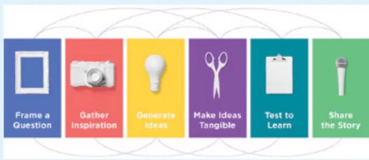  
Figure 12.18  IDEO’s design thinking steps

Source: Phases for the design thinking process. Intended to be iterative, not sequential

With such a  variety of descriptions at the  process level, what is design thinking? All of these  descriptions agree  that design thinking is a human-centered process that aims to encourage a creative mindset in the design team. Although the phases have different names,

they basically  cover  the idea of understanding people and  the  design challenge, generating ideas to address the design challenge, and implementing solutions that can be prototyped and evaluated.

Professional designers have been creating products for decades  without defining these design thinking phases. The move to define such phases has been prompted by the application of design thinking in areas that traditionally haven’t thought of themselves as “creative,” such as healthcare (Ku and Lupton 2022) and government. Defining a process divided into phases helps people apply the approach who are not used to approaching a problem from a design mindset. But this has caused some consternation among designers—see Activity 12.7.

Read more about design thinking in the context of user-centered design, and a different six-step process, at the following link: www.youtube.com/ watch?v=6lmvCqvmjfE.

# ACTIVITY 12.7

Design thinking resonates  strongly with interaction  design,  but  some have questioned the benefits and implications of its current characterization. This activity invites  you to decide for yourself.

Read the  following article and  do some investigation yourself around the  descriptions of design thinking. Based on what you find, what do you think about design thinking and its relationship to interaction design?

Read Jon Kolko’s article from 2018:

interactions.acm.org/archive/view/may-june-2018/the-divisiveness-of-design-thinking

# Comment

Design thinking is similar to the approaches espoused by user-centered design, and the notion of design thinking has been embraced by many designers and organizations. Nevertheless, the way in which it has been popularized has resulted in some criticism, too.

For example, Jon Kolko believes that this surge of interest in design thinking “will leave behind two benefits: validation of the design profession as real, intellectual, and valuable— and a very large need for designers who can make things.” He also points out that it has been popularized at a simplistic level of detail.

Design entails a creative activity supported by a number of techniques, tools, and processes. He argues that designing cannot be reduced to a particular process or set of techniques.

On the other hand, interaction design is a design activity but is often taught as a series of steps with particular techniques, as illustrated by this book. What do you think are the implications of characterizing design in this way?

# 12.6  Construction

As prototyping and building alternatives progresses, development will focus on higher-fidelity prototypes and  developing the final product. This  is  facilitated by  putting together readymade components, such as a set of alarms, sensors, and lights to make a physical product, or code libraries to generate a piece of software, or both. Whatever the final form, it is unlikely that anything will need to be developed from scratch, as there are many useful (in some cases essential) resources to support development. Here we introduce two kinds of resources: physical computing kits and software development kits (SDKs).

# 12.6.1  Physical Computing

Physical computing is concerned with how to build and code prototypes and devices using electronics. Specifically, it is the activity of “creating physical artifacts and giving them behaviors through a combination of building with physical materials, computer programming, and circuit  building” (Gubbels and Froehlich, 2014). Typically, it involves designing things using a printed circuit board (PCB), sensors  (for instance push buttons, accelerometers,  infrared,  or temperature  sensors) to detect states, and output devices (such as displays, motors, or buzzers) that cause some effect.

A number of physical computing toolkits have been developed for educational and prototyping purposes. One of the earliest was Arduino (see Banzi, 2009). The goal was to enable artists and designers to learn how to make and code physical prototypes using electronics in a couple of days, having attended a workshop. The toolkit is  composed of two main parts: the Arduino board  (see Figure 12.19), which is the piece of hardware that is used to build objects,  and  the Arduino  integrated  development  environment  (IDE), which  is  a  piece  of software that makes it easy to program and upload a sketch (Arduino’s name for a unit of code) to the board. A starter kit for Arduino typically includes various lights and sensors too.

The Arduino board is a small circuit that contains a tiny chip (the microcontroller). It has two rows of small electrical “sockets” that allow sensors and actuators  to be connected to its input and output pins. Sketches are written in the IDE using a simple processing language and then  translated into the $\mathrm { C } + +$ programming  language and  uploaded to the board. The Arduino board has been used in a multitude of projects around the world, and at the end of 2021, ten million of them  had been sold. Example products  made with Arduino include a plant watering system, a basement flood alert, light switches for remote or contactless operation, and even a robot bartender (see instructables.com).

Other toolkits have been developed from the basic Arduino kit. The most well-known is the LilyPad, which was co-developed by Leah Beuchley (see Figure 12.20 and her interview at the end of Chapter 7). LilyPad is a set of sewable electronic components for building fashionable clothing and other textiles. Other kits have been developed from these including for a smart home, various domestic and fun robots, and a range of educational projects. Starter packs are readily available for all of these Arduino-based toolkits.

Magic Cubes is a novel toolkit that is assembled from six sides that are slotted together to become an interactive cube that lights up in different colors, depending on how vigorously it is shaken. Intended to encourage children to learn, share, and fire their imagination to come up with new games and other uses, see it in action at uclmagiccube.weebly.com/video.html.

Figure 12.19  The Arduino board   
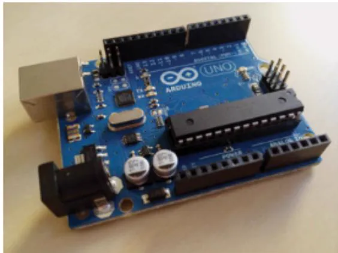  
Source: Courtesy of Dr Nicolai Marquardt

Figure 12.20  The Lilypad Arduino kit   
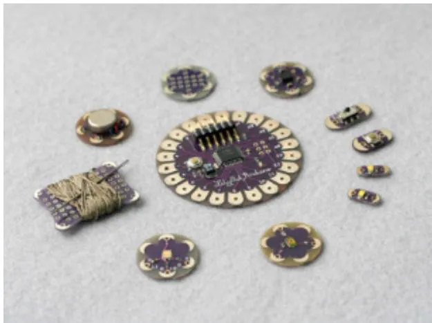  
Source: Courtesy of Leah Beuchley

Other kinds of easy-to-use and quick-to-get-started physical toolkits, intended to provide new  opportunities  for  people to be inventive and  creative, include electronics  kits (sphero .com), Raspberry Pi (www.raspberrypi.org), and Makey Makey (makeymakey.com).

Another  popular  physical  computing  system  is  the  BBC  micro:bit  (microbit.org;  see Figure 12.21). Like Arduino, the micro:bit  toolkit consists  of a physical  computing device that is used in conjunction with an IDE. However, unlike Arduino, the micro:bit board contains  a number of built-in sensors and a small display so that  it is possible to create simple physical computing systems without attaching any components or wires. If desired, external components can still be added, but rather than the small electrical sockets of the Arduino, the micro:bit has an “edge connector” for this purpose. This is formed from a row of connection points that run along one edge of the device and allow it to be “plugged into” a range of accessories including larger displays, Xbox-style game controllers, and small robots. The micro:bit IDE, which runs in a web browser with no installation or setup process, supports a graphical programming  experience based on visual “blocks” of code alongside text-based editing

using a variant of JavaScript. This means that the micro:bit provides a great experience for young students and other beginner programmers, while also supporting more sophisticated programming. As a result, micro:bit has been widely adopted in schools around the world.

Figure 12.21  The BBC micro:bit   
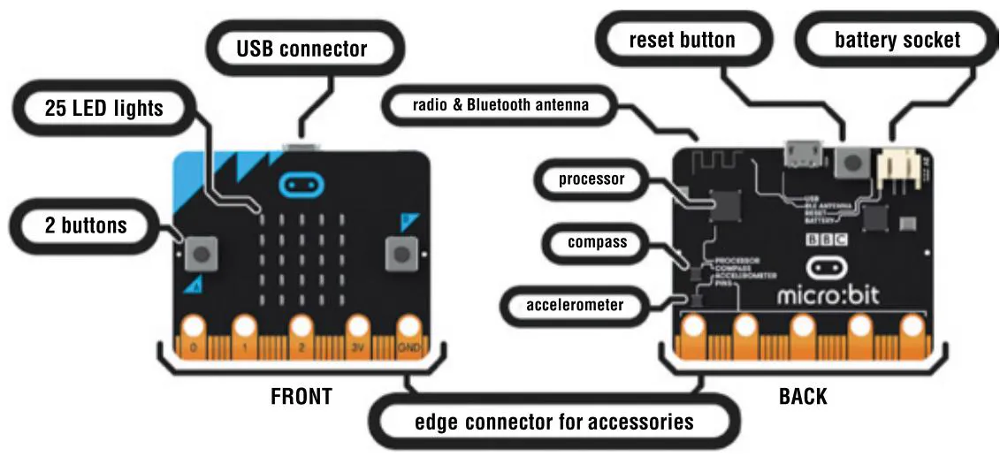  
Source: Used Courtesy of Micro:bit Foundation

Physical  toolkits  are  readily  available  and  have  a  wide use  and  appeal. For  example, Wenn-Chieh Tsai et al. (2020) have developed a kit for use by IoT practitioners to investigate alternatives for emerging technologies, and Lee Jones et al. (2020) have developed a toolkit for  prototyping  e-textile  wearables. Toolkits are  often  used  by  children,  or  students  in  a formal educational setting, or by designers to enable them to start creating small electronic gadgets  and  digital tools. They  also  have a key  role  in widening  access  for  people to create useful and interesting projects and by engaging in the maker movement (see Box 12.6). Melissa Escamilla Perez et al. (2020) emphasize the benefits and opportunities for engaging families in play and collaboration through intergenerational making. They worked with five adults and seven children between 2 and 10 years old to identify the kind of interactions that take place while creating a personalized game.

# BOX 12.6

# The Maker Movement

The maker movement emerged in the mid-2000s. Following in the footsteps of the personal computer revolution and  the  Internet,  some viewed it as the  next big  transformation that would modernize manufacturing and production (Hatch, 2014). Whereas the explosion of the web was all about what could be done virtually, with a proliferation of apps, social media, and services, the maker movement has transformed how people make, buy, consume, and recycle

physical things, from houses to clothes and food to bicycles. At its core is a desire to collaboratively craft physical things using a diversity of machines, tools, and methods.

There  have always been hobbyists  making radios,  clocks, and  other  devices, but  the Maker Movement is very much about opening up the world of “making” to many more people. The availability of affordable, powerful, and easy-to-use tools, coupled with a renewed focus  on locally  sourced products and  community-based  activities, has  fueled this interest and made the movement feasible. The growing network of Fablabs (fabrication laboratories) and makerspaces has enabled the maker movement to become widespread and popularized worldwide.

For example, in 2022, there were more than 2,000 Fablabs in more than 120 countries (www.fablabs.io), an annual Fablab conference, and many resources online to learn and share. A Fablab offers access to electronics and manufacturing  equipment, including 3D printers, CNC milling machines, and laser cutters, and supports the sharing of knowledge and designs across borders and communities. Smaller makerspaces have also been established across the world, from Shanghai to rural India, again sharing  production facilities for  all  to use  and make. While some are small, for example sharing the use of a 3D printer, others are much larger and  well resourced, offering an array  of manufacturing  machines, tools, and  workspaces to make in.

The availability of e-textile kits has broadened the maker movement to include activities to build and program e-textiles using sewing machines and electronic thread. E-textiles comprise fabrics that are embedded with electronics, such as sensors, LEDs, and motors that are stitched together using conductive thread and conductive fabrics (Buechley and Qiu, 2014). Other e-textiles include interactive soft toys, wallpaper that sings when touched, and fashion clothing that reacts to the environment or events.

A central part of the maker movement involves tinkering (as discussed in section 12.2.4) and the sharing of knowledge, skills, know-how, and what you have made. The Instructables .com website  is for  anyone to explore, document, and  share  their  creations. Browse the Instructables website to see just how many different projects there are. How many of them are a combination of electronics, physical materials, and pure invention? Are they fun, useful, or “gadgety”? How are they presented? Do they inspire you to make?

Another site, etsy.com, is an online marketplace for people who make things to sell their crafts and other handmade items. It is designed to be easy for makers to use and to sell their goods across the world. Unlike corporate online sites, such as Amazon or eBay, Etsy is a place for craft makers to reach out to others and to show off their wares in ways that they feel best fit what they have made.

In essence, the Maker Movement aims to open up DIY making to the public and, in doing so, massively increase who can take part and how it is shared (Anderson, 2013). In his interview at the end of this chapter, Jon Froehlich explains more about the maker movement.

# 12.6.2  SDKs: Software Development Kits

A  software development kit is  a package of programming  tools and components  that supports the development of applications for a specific platform, for example, for iOS on iPhone and iPad and for Android on mobile phone and tablet apps. Typically, an SDK includes an

integrated  development  environment,  documentation,  drivers,  and  sample  programming code to illustrate how to use the SDK components. Some also include icons and buttons that can easily be incorporated into the design. While it is possible to develop applications without using an SDK, it is much easier using such a powerful resource, and so much more can be achieved.

For example, the availability of Amazon’s Alexa Skills SDK has facilitated the exploration and  development  of  a  range of  applications  for voice  interfaces, including  education (Melton and Fenwick, 2019), mental health (Quiroz et al., 2020), and fitness tracking (Luo et al., 2020).

An  SDK  will  include  a  set  of  application  programming  interfaces  (APIs)  that  allows control of  the components  without  the developer needing  to  know the intricacies  of how they work. In some cases, access to the API alone is sufficient to allow significant work to be undertaken, for instance, Eiji Hayashi et al. (2014) only needed access to the APIs. The difference between APIs and SDKs is explained in Box 12.7.

See the following websites to learn more about SDKs and their use:

Building voice-based services with Amazon’s Alexa Skills Kit:

developer.amazon.com/alexa-skills-kit.

Constructing augmented reality experiences with Apple’s ARKit:

developer.apple.com/arkit.

# BOX 12.7

# APIs and SDKs

SDKs consist of a set of programming tools and components, while an API is the set of inputs and outputs, that is, the technical interface to those components. To explain this further, an API allows different-shaped building blocks of a child’s puzzle to be joined together, while an SDK provides a workshop where all of the development tools are available to create whatever size and shape blocks you desire, rather than using preshaped building blocks. An API therefore allows the use of pre-existing building blocks, while an SDK removes this restriction and allows new blocks to be created or even to build something without blocks at all. An SDK for any platform will include all of the relevant APIs, but it adds programming tools, documentation, and other development support as well.

# In-Depth Activity

This in-depth activity builds upon the requirements activities related to the booking facility introduced at the end of Chapter 11.

1. Based on the information gleaned from the activity in Chapter 11, suggest three different conceptual models for this system. Consider each of the  aspects  of a  conceptual model discussed in this chapter: interface metaphor, interaction type, interface type, activities it will support, functions, relationships between functions, and information requirements. Of these  conceptual models, decide which  one  seems  most appropriate  and  articulate the reasons why.   
2. Using the scenarios generated for the online booking facility, produce a storyboard for the task of booking a ticket for one of the conceptual models in step 1. Show it to two or three other people and record some informal feedback.   
3. Considering  the  product’s  concrete design, sketch out  the  application’s  initial  interface. Consider the design issues introduced in Chapter 7 for the chosen interface type. Write one or two sentences explaining your choices and consider whether the  choice is a usability consideration or a user experience consideration.   
4. Sketch out an experience map for the product. Use the scenarios and personas you generated previously to explore the user’s experience. In particular, identify any new interaction issues that had  not  been considered previously,  and  suggest  what could  be done to address them.   
5. How does the product differ from applications that typically might emerge from the maker movement?  Do software development  kits have a  role?  If so,  what is that role?  If not, why not?

# Summary

This chapter explored the activities of design, prototyping, and construction. Prototyping and scenarios are used throughout the design process to test ideas for feasibility and evaluate them for feedback. We have looked at different forms of prototyping, and the activities have encouraged you to think about and apply prototyping techniques in the design process.

# Key points

•  Prototyping may be low fidelity (such as paper-based) or high fidelity (such as software-based).   
•  High-fidelity prototypes may be vertical or horizontal.   
•  Low-fidelity prototypes are quick and easy to produce and modify, and they are used in the early stages of design.

(Continued)

•  Ready-made software and hardware components support the creation of prototypes.   
•  There are two aspects to the design activity: conceptual design and concrete design.   
•  Conceptual design develops an outline of what people can do with a product and what concepts are needed to understand how to interact with it, while concrete design specifies the details of the design such as layout and navigation.   
•  We have explored three approaches to help you develop an initial conceptual model: interface metaphors, interaction styles, and interface styles.   
•  An initial conceptual model may be expanded by considering which functions the product will perform (and which the user will perform), how those functions are related, and what information is required to support them.   
•  Scenarios and prototypes can be used effectively in design to explore ideas.   
•  Physical computing kits and software development kits facilitate high-fidelity prototyping and the transition from design to construction.

# Further Reading

ANGRAVE, J. (2020) The Journey Mapping Playbook. DeGruyter. This is a practical book that supports journey mapping, including persuading others of its importance, planning the journey  mapping workshop, and what to do  after  the journey  map has been produced. It takes a customer experience viewpoint rather than focusing on interactive products, but the practical advice is transferable to this context.

BLUM, J. (2019) Exploring Arduino: Tools and Techniques for Engineering Wizardry (2nd ed.). Wiley. This is a good introduction to building things with Arduino, especially for those with little or no knowledge of electronics.

BØDKER,  S.,  DINDLER  C.,  IVERSEN,  O.S.,  and  SMITH,  R.  C.  (2022).  Participatory Design. Synthesis Lectures on Human-Centered Informatics. Springer, Cham. This book provides  an  accessible introduction  to  the Scandinavian  approach  to  Participatory  Design.  It explains how participatory design is distinct from and similar to other design approaches and provides practical support and examples for those wanting to apply it.

BRAND, W. (2021) My Icon Library: Build and Expand Your Own Visual Vocabulary. BIS Publishers. This book will expand your sketching vocabulary. It is packed with ideas for icons that represent all manner of concepts from network and stakeholders to media and interaction. Each page suggests a number of icons and explains how to draw them.

KU,  B., and  LUPTON,  E.  (2020)  Health  Design  Thinking $2 ^ { \mathrm { n d } }$ edition),  Cooper  Hewitt. Refreshing and clear approach to design thinking that focuses on technology for healthcare systems. This is full of examples and practical suggestions.

INTERACTIONS MAGAZINE  (2018)  Designing AI. ACM. This issue of  the Interactions magazine is all about design and different aspects of it including sketching, human-centered design  for  children, collaborative  art, design  capabilities,  and  the  special  topic  of  designing for AI.

# INTERVIEW

# with Jon Froehlich

Jon  Froehlich  is  an  associate  professor in the  Paul  G. Allen  School  of  Computer Science and Engineering  at  the University of Washington (UW) where he directs the Makeability  Lab  (makeabilitylab.io),  a cross-disciplinary  research  group  focused on applying computer science and HCI to high-value  social  domains.  He  has  published more than 80 peer-reviewed publications; 16 have been honored with awards, including  Best  Papers  at  ACM  CHI  and ASSETS  and  a  10-Year  Impact  Award  at UbiComp. Jon  is  a  father  of  two, and  he is increasingly  passionate about  CS4All— both as an educator and as a researcher.

Can you tell us a bit about  your research, what you do, and why you do it?

The  Makeability  Lab  has  a  broad, unifying mission: “to build and study interactive technology for  a social purpose.” Together with my students,  we collaborate  across disciplines with a focus on identifying longterm,  ambitious  research problems—such as mapping and assessing every sidewalk in the world for mobility barriers using crowd-

sourcing $^ +$ machine  learning (ML)—that can  also provide  immediate, practical utility. Typically, our research involves inventing  or reappropriating  methods  to sense physical or behavioral phenomena, leveraging techniques in computer vision (CV) and ML to interpret and characterize this data, and  then building and  evaluating interactive software or hardware tools  uniquely enabled by these approaches. Our research process  is human-centered and  iterative, often  consisting of formative  studies, and then designing  and  evaluating prototypes in controlled environments, before building and  deploying  systems  in the field such as Project Sidewalk, SoundWatch, and Thermporal.

What is the maker movement, and why are you so enthusiastic about it?

The  maker movement emerged in the mid-2000s as an informal collection of hobbyists, engineers, artists, coders,  and  craftspeople dedicated  to playful  creation,  self-learning, and  material design.  While  the  movement builds on longstanding hobbyist and  do-it-

(Continued)

yourself (DIY)  culture—for  example, in woodworking  and  electronics—the movement was  galvanized and  accelerated by a series of socio-technical developments, including  new, low-cost computational fabrication  tools  like CNC  mills  and  3D printers; the  emergence  of inexpensive and easy-to-use  microcontroller  platforms  like Arduino  and  Raspberry  Pi;  online marketplaces like Adafruit and Sparkfun that made it easy to find and purchase parts; and social networks like Instructables, YouTube, and Thingiverse, which  provided a  forum  for novices and  experts  alike  to share and  critique ideas, tutorials, and creations.

My enthusiasm for the maker movement stems  both  from  my  intrinsic  excitement as a technologist in observing the creativity  and  creations  of  “makers”  as  well  as from  my perspectives  as  an  educator  and mentor in wondering how we can borrow from and adapt elements of the movement into  formal  education.  While  the  maker movement  was  a  relatively  new  phenomenon, its historical  roots in education and learning  science  stretch  back  to  pioneering educational thinkers like  Maria Montessori, Jean  Piaget,  Seymour  Papert, Lev Vygotsky,  and  others,  all  who  emphasize the  importance  of  learning  through  creation  and  experimentation,  the  role  of peer  mentorship,  and  how  sharing  work and  soliciting  feedback  shapes  thinking. For  example,  Papert’s Constructionism learning theory places  a critical  focus not just on learning through making but on the social nature of design—that is, that ideas are shaped  by  the knowledge  of an  audience and the feedback provided by others.

I  have  tried  to  inject  this  philosophy into my undergrad and graduate teaching. As  one  example,  students  in  my  physical computing courses explore  the materiality of  interactive  computing  via  design

prompts  such as  making  a  new  input  device for a computer using low-fi materials like  conductive  clay  and  fabric, breaking and remaking  an  existing  electronic  technology to reformulate its  physical interaction, and  combining computer  vision and video  cameras to  create  whole-body,  gestural  input.  Students  share  and  critique each  other’s  work  but  also  design  outwardly  beyond  the  confines  of  the  classroom  by  sharing  their  results  and  design processes  publicly  (under  pseudonyms,  if preferred) via videos on YouTube, step-bystep  tutorials  on  Instructables.com,  and on  the  course  website.  Student-written Instructables in Tangible Interactive Computing, for example, have won awards and acquired  more  than  325,000  views  and 2,000 favorites. This is remarkable impact that extends beyond the confines of traditional classrooms.

Most  recently,  during  the  pandemic— with campus closed and equipment access limited—I co-led an international group of educators  in  rethinking  “maker”  courses for  virtual  environments  and  wrote  an “interactive  textbook”  website  to  allow self-paced learning, which consists of more than  50  interactive  lessons  with  videos, open-source  code,  and  animation.  See makeabilitylab.github.io/physcomp.

# What are the advantages and challenges of working with communities to design products?

Much  of  my  research  involves  designing and evaluating technologies for users who have  different  abilities,  perspectives,  and/ or experiences  from  me  and  my  research group—for  example,  early  elementary school  learners,  people  who  use  wheelchairs, or  people with visual impairments. Thus,  a  key  facet  of  our  research  and design process is employing methods from

participatory  design  (or  “co-design”), an  approach  to  design  that  attempts  to actively involve and empower target  users throughout  the  design  process  from  ideation  to  lo-fi  prototyping  to  summative evaluation.  For  example,  in  the  Maker-Wear project (Kazemitabaar et al., 2017)— a wearable construction kit for children— we worked with children to gather design ideas  and  solicit  critical  feedback,  to  test initial designs, and to help co-design toolkit behavior and the overall look and feel. Similarly, we  also  involved  professional STEM  educators  to  help  us  improve  our designs  and  think  about  corresponding learning activities. Finally, we ran  a series of pilot studies followed by workshops  in afterschool programs and a children’s museum  to  examine what and  how  children make  with  MakerWear, what  challenges arise,  and  how  their  designs  differ  from creations made with other toolkits (for example, in robotics).

This human-centered,  participatory  design approach offers many advantages, including  ensuring that  we  are  addressing real  user  problems,  helping  ground  our design  decisions  through  use  and  feedback  from  target  stakeholders,  and  empowering  our  users  to  have  a  real  voice in  shaping  outcomes  (from  which  our participants  of  all ages  seem to  gain satisfaction). There  are  trade-offs,  however. Soliciting  ideas  from  target  users  in  an unstructured  and  unprincipled  manner may lead to poorly defined outcomes and suboptimal  designs. When  working  with children,  we  often  follow  Druin’s  Cooperative Inquiry methodology (Guha et al., 2013), which provides a set of techniques and  guidelines  for  co-design  with  children that helps to channel and focus their creativity  and  ideas. A  second  challenge

is in  recruiting  and  supporting co-design sessions:  this  is  a resource-intensive  process  that  requires  time  and  effort  from both stakeholders  and the research team. To mitigate this challenge, we often work on  establishing  and  maintaining  longitudinal  relationships  with  community groups  like  local  schools  and  museums. Finally,  not  all  projects  are  amenable  to these methods (such as when timelines are particularly aggressive).

# Have you encountered any big surprises in your work?

The life of a researcher is full of surprises— one  must  get  comfortable  with  ambiguity  and  ending  a  research  journey  at  an unpredictable  location.  My  most  significant  surprises,  however, have  come  from people:  from  my students, from  my  mentors,  and  from  my  collaborators.  My  research methods  and  ideas  have been  profoundly influenced in unexpected ways by colleagues  like  Professor  Tamara Clegg who  made  me  rethink  how  we  can  personalize STEM learning through opportunities in everyday life  (what she calls “scientizing” life) and Professor Allison Druin who  introduced  me  to  and  immersed  me in  children-oriented  participatory  design methods.  (I  could hear the  excited shouts and joyful exclamations of Kidsteam from my  office,  and  I  couldn’t  resist  finding out  more,  which  fundamentally  changed how  I  did  research  in  STEM  education.) My  students  never  cease  to  surprise  me, from  3D-printing  gears  to  fix  an  aerial drone  to  developing  an  interactive  sandbox  that  traces  human  movement  using electro-mechanically controlled marbles to designing an e-textile shirt that senses and visualizes  the  wearer’s changing  physiology via integrated anatomical models.

(Continued)

# What are your hopes for the future?

As a graduate student, I recall being asked, “What  are  the  biggest  open  questions  in HCI,  and  how  does  your  research  work toward  addressing  them?”  I  found  this question  both  profoundly  interesting  and profoundly  startling because  it forced  me to  think  about  the  most  significant  open areas in my field and to (somewhat uncomfortably)  confront  the  relationship  between this answer and my research. At the risk of sounding overly ambitious, I would like  to  adapt  this  question,  which  serves as a guiding principle for my research but that I also hope will inspire others: “What

are the most significant societal challenges across the world? What role can computer science, HCI,  and design  play  in  addressing  those  challenges?  And  where  does your  research/work  fit?” As  computation pervades nearly  every  aspect  of  our  lives, I  believe  it  is  our  role  as  technologists, designers,  and  practitioners  to  ask  these questions of ourselves  and to think about the  political,  economic,  environmental, and social implications of our  work. As  a professor and educator, I am hopeful. This larger  worldview framing  of  CS seems  to resonate  with  younger  generations  and, I hope, will soon become the norm.

