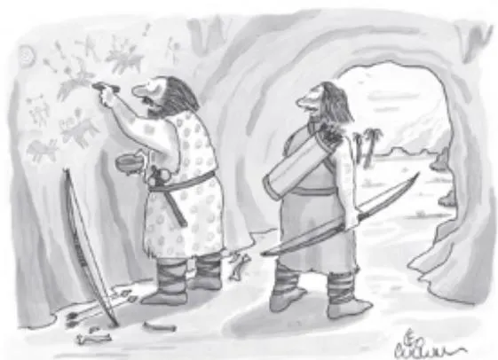
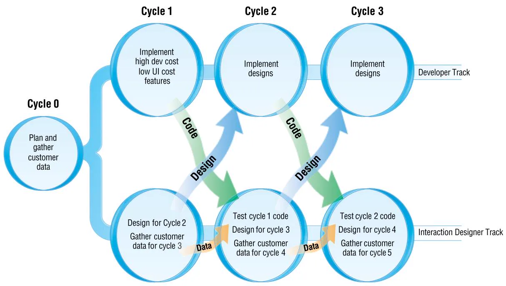
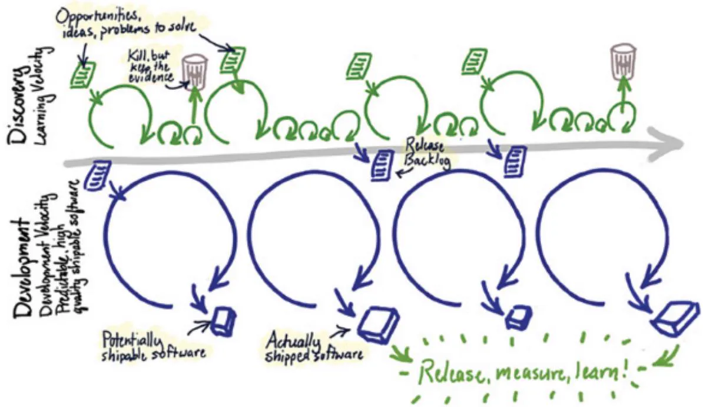
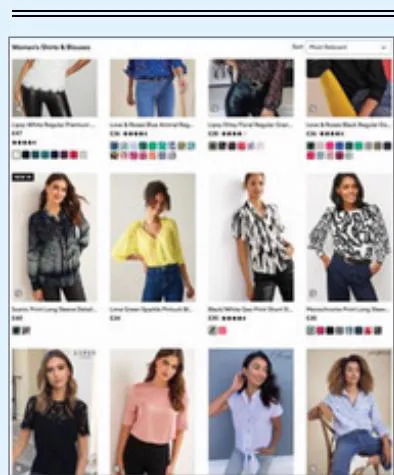
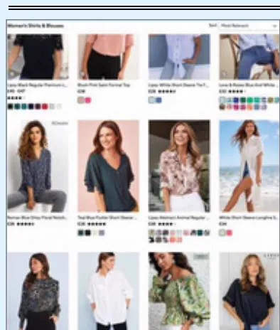
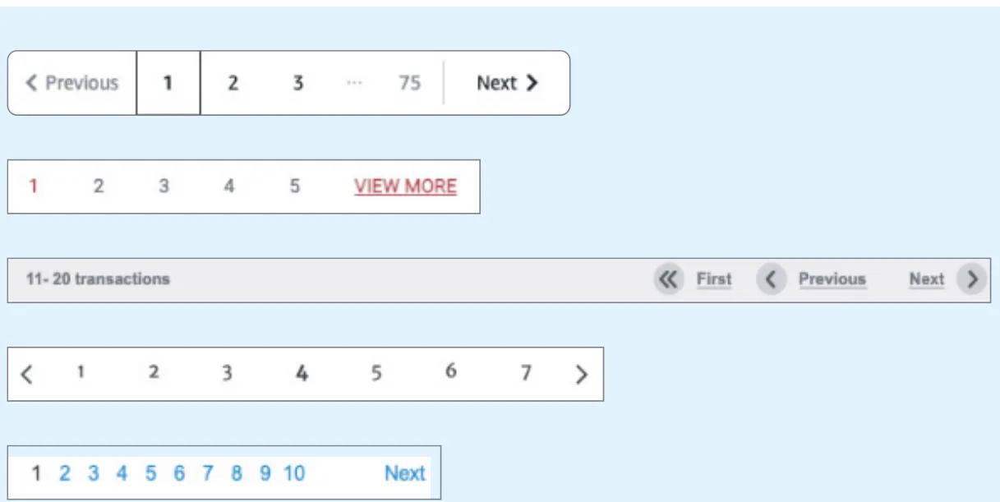
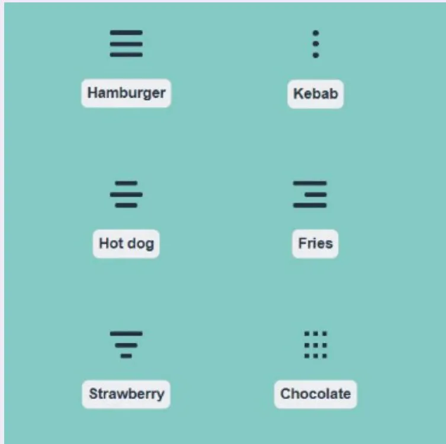

# Chapter 13

# I N T E R A C T I O N  D E S I G N  I N  P R A C T I C E

13.1  Introduction   
13.2  AgileUX   
13.3  Design Patterns   
13.4  Open Source Resources   
13.5  Tools for Interaction Design

# Objectives

The main goals of the chapter are to accomplish the following:

•  Describe some of the key trends in practice related to interaction design.   
•  Enable you to discuss the place of UX design in agile development projects.   
•  Enable you to identify and critique interaction design patterns.   
• Explain how open source and ready-made components can support interaction design.   
•  Explain how tools can support interaction design activities.

# 13.1 Introduction

When placed within the wider world of commerce and business, interaction designers face a range of  pressures, including  restricted  time and limited  resources, and  they need to  work with  people  in  a wide  range  of roles, apart  from  stakeholders. In addition,  the  principles, techniques, and approaches introduced in other chapters of this book need to be translated into practice, that is, into real situations with sets of real people, and this creates its own challenges.  As  our  interviewee  at the  end  of  Chapter  1, “What  is  Interaction  Design?”  Harry Brignull, remarked, “Research and design are naturally messy.” He goes on to say that interaction designers need to step into roles that may initially feel outside their comfort zone and to help others understand the user perspective. In other words, being an interaction designer in practice means dealing with a range of complexities, and keeping up with new techniques and developments is a constant goal.

Many  different  names  may  be  given  to  a  practitioner  conducting  interaction  design activities,  including  interface  designer, information  architect, experience  designer, usability

engineer, and user experience designer. In this chapter, we refer to user  experience designer and user experience design because these are most commonly found in industry to describe someone who performs the range of interaction design tasks  such as interface design, user evaluations, information architecture design, visual design, persona development, and prototyping. However, interaction design in practice varies across organizations. From their study of one software development company over two decades, Pariya Kashfi et al. (2019) point out that many companies need to transition from only developing GUIs to taking the wider UX perspective and that this transition has several pitfalls. Examples are not paying  attention to the characteristics of UX compared to usability  alone and power struggles between different groups who want to be in control of UX practices. They also found that companies have a greater awareness  of internal and external stakeholders and their expectations than they had in the past.

Other  chapters of this  book may  have given the impression that designers  create their designs with little or no help from anyone except stakeholders and immediate colleagues, but in practice, user experience designers draw on a range of support. Four main areas of support that impact the job of UX designers are described in this chapter.

• Working with software and product development teams operating an agile model of development  (introduced in Chapter 2, “The Process of Interaction  Design”) has led to  technique and process adaptation, resulting in agileUX approaches.   
Reusing existing designs and concepts is valuable and time-saving. Interaction design and UX  design patterns provide  the blueprint  for successful  designs, utilizing previous  work and saving time by avoiding “reinventing the wheel.”   
• Reusable components—from screen widgets and source code libraries to full systems, and from motors and sensors to complete robots—can be modified and integrated to generate prototypes or full  products. Design  patterns embody an  interaction idea, while  reusable components provide implemented chunks of code or widgets.   
• There  is  a  wide  range  of  tools  and  development  environments  available  to  support designers  in  developing  visual  designs, wireframes,  interface  sketches, interactive prototypes, and more.

Kara Pernice suggests three challenges for UX in practice in this video: www .nngroup.com/videos/why-ux-difficult.

Here is a concrete view of what a UX designer does in practice: www .interaction-design.org/literature/article/7-ux-deliverables-what-will-i-bemaking-as-a-ux-designer.

# BOX 13.1

# Technical Debt in UX

Technical debt is a term commonly used in software development, coined originally by Ward Cunningham in 1992. It relies on the financial metaphor that people borrow money for an immediate purchase and will pay interest on that loan to the lender, until the loan is paid off. The original idea of technical debt specifically arose from using an iterative software development process. Developing software iteratively supports the  early release of software and allows an understanding of what the product should be to evolve according to stakeholders’ feedback, but this has an impact on the code (Fairbanks, 2020). The term technical debt has been broadened from this original characterization and now usually refers to making technical compromises that are expedient in the short term but that create a technical context that can make a future change more costly or impossible (Kruchten et al., 2019). As with financial debt, technical debt is acceptable as a short-term approach to overcoming an immediate shortfall, provided that the debt will be repaid quickly. Leaving  a debt for longer results in significant extra costs. Technical debt can be incurred unintentionally, but pressures associated with time and complexity also lead to design trade-offs that may prove to be expensive in the longer term.

To address  technical debt, a discipline of refactoring is needed, that is, correcting any pragmatic trade-offs after the immediate pressure has receded. Significant difficulties arise if these trade-offs are not identified, understood, and corrected in a timely manner.

UX debt is created much like technical debt in the sense that trade-offs are made for the needs of the project. Two interrelated situations can lead to significant UX debt that is then extremely costly to correct.

•  If an organization did not, in the past, understand the value of good user experience design and  products or software systems  with poor user experiences  persist. This can  be particularly prevalent for internal systems and products, where the drive for a good user experience is less acute than for externally marketed products that face more competition from other providers.   
•  If an organization has a large portfolio of products, each of which was developed independently. This can be the result of acquisitions and mergers of companies, each with their own UX brand, leading to a proliferation of designs.

In severe cases, UX debt can lead to the revamping of infrastructure and complete renewal of products.

For a practical approach to UX debt, see this video: www.nngroup.com/ videos/ux-debt.

# 13.2 AgileUX

AgileUX is the collective label given to approaches that integrate techniques and processes from  interaction design with  those from  agile methods. While  agile software  development and UX design have some characteristics in common such as iteration, a focus on measurable completion criteria, and stakeholder involvement, agileUX presents some challenges to UX design activities and products.

In the early days of agile software development becoming popular, UX designers were concerned about the impact that it would have on their own work (Sharp et al., 2006), particularly because of agile’s short iterations, which are typically between one and four weeks long (different names are used to refer to an iteration, the most common being sprint, timebox, and cycle). Agile working has become widespread (Inal et al., 2020), and agility across the organization is also on the rise (Aghina et al., 2021). The potential danger for good user experience is that short iterations rush UX activities and that agility is used as an excuse for poor user experience. Advantages of an agile approach have also been recognized, however. For example, agile working supports the practice of regular retrospectives to discuss process and  agree  to  modify practices,  there  is  an  emphasis  on  conversations  and  collaborations, cross-functional teams involve a variety of disciplines, and getting feedback on design ideas is fundamental to agility.

Tiago Da Silva and colleagues (2018) reflect on the evolution of agileUX and conclude that integrating agile and UX requires mutual team understanding across three dimensions, and those dimensions are unevenly understood by practitioners and researchers: the “process and practice” dimension is  understood; the “people and social” dimension is nearly understood; but the “technology and artifact” dimension—that is, use of technology to coordinate teams’  activities  and  artifacts  to  mediate  teams’  communication—has  yet  to  be  properly understood. Even though the “process and practice” theme is understood, it doesn’t necessarily make it easy in practice. For example, Joelma Choma et al. (2022) find that startups with less than two years’ experience of agileUX struggled  to combine practices and suggest that startups adopt lightweight UX practices initially, such as lightweight usability testing (Krug, 2014). A key aspect is for agile development teams to understand that user experience design is not a role but is a discipline and mindset. A suitable balance is needed that preserves both the research and reflection needed for good UX design, as well as rapid iterations that incorporate feedback and allow technical alternatives to be tested.

For UX design activities and an agile workflow to be combined, these activities need to take  account of  the agile process characteristics such  as short  timeboxes, changing priorities, and minimal  documentation. Reprioritization  may happen as frequently  as every two weeks, at the beginning of each iterative cycle, which can cause problems  for UX activities that take time to arrange and conduct. All of the techniques and principles that UX designers use are just as relevant, but how much of each activity needs to be completed at what point in the iterative cycle  and how the results of those activities feed  into development need to be adjusted  in an agile context. This can be unsettling for designers, as the  design artifacts have traditionally been seen as their main deliverable and hence may be viewed as finished, whereas for agile software engineers, they are consumables and will need to change as product development progresses. As Greg  Nudelman (2019) points out, “UX is not  about your deliverables.... Today’s UX is about partnerships.”

Consider the group travel organizer app introduced in Chapter 11, “Discovering Requirements,” and assume that it is being developed using agileUX. Four epics (large user stories) for the product are identified in Chapter 11, as follows:

1.  As a <group traveler>, I want <to choose from a range of potential vacations that suit the group’s preferences> so that <the whole group can have a good time>.   
2.  As a <group traveler>, I want <to know the visa restrictions for everyone in the group> so that <visas can be arranged for everyone in the group in plenty of time>.   
3.  As a <group traveler>, I want <to know the vaccinations required to visit the chosen destination $>$ so that <vaccinations can be arranged for everyone in the group in plenty of time>.   
4.  As a <travel agent>, I want <up-to-date information displayed> so that <my clients receive accurate information>.

At the beginning of the project, these epics will be prioritized, and the central goal of the product (to identify potential vacations) will be the top priority. This will then initially be the focus of development activities. To allow people to choose a vacation, epic 4, supporting the travel agent to update travel details will also need to be implemented (otherwise travel details will be out-of-date), so this is also likely to be prioritized. Elaborating the other two areas will be postponed until after a product that allows people to choose a vacation has been delivered. Indeed, once this product  is delivered, it may be  decided that  offering help for vaccinations and  visas does not result in sufficient business value for  it to be  included at all. In this case, referring people to other, more authoritative sources of information may be preferable.

Conducting  UX  activities within an  agile  framework  requires a  flexible point of  view that focuses more on the end product as the deliverable than on the design artifacts as deliverables. It also requires cross-functional teams where specialists from a range of disciplines, including  UX design and engineering, work closely  together to evolve an understanding  of potential users and their context, as well as the technical capabilities and practicalities of the technology. For example, a UX designer and an engineer may collaborate jointly on a design task, engineers may attend user research sessions, and UX designers may join the daily team meetings (called stand-ups). In particular, agileUX requires attention to three practices, each of which is elaborated in the following sections:

• What user research to conduct, how much, and when   
How to align UX design and agile working practices   
. What documentation to produce, how much, and when

  
Source: Leo Cullum / Cartoon Stock

# 13.2.1  User Research

The term user research (sometimes called discovery research) refers to the program of data gathering and analysis activities conducted to characterize potential users, their tasks, and the context of use. User research is typically done before product development begins, but it is equally valuable  throughout  it. In an  agile  project, data  gathering  methods  that rely on  a significant elapsed  period of time such as ethnography do not  fit within  agile’s  short iterations, so technical development needs to be independent of any studies using that approach. More targeted activities that are focused on evaluating elements of the design, or clarifying requirements or task context, can be done alongside technical development, as illustrated by the dual tracks approach discussed next. Bob Thomas (2021) suggests using lean user research approaches, which hinge on involving technical and design members of the team taking part in usability tests and collecting their observations on sticky notes, which can be discussed and summarized in a matter of hours and days rather than weeks.

One approach is for user research to be conducted before the project begins. This initial period  is often  called iteration  zero, and it  is  used to achieve  a range of up-front activities including software architecture design as well as user research. If cycle 0 is the same length as other cycles, the time can still be too constrained depending on the research work to be done. Don Norman (2006) suggests that user research be done before the project is announced. He argues that it is better to be on the team that decides which project will be done at all, hence avoiding the constraints caused by limited timeboxes.

An alternative approach to conducting user research for each project is to have an ongoing program of user research that revises and refines a company’s knowledge of their users over a longer time span. In this case, the specific data gathering and analysis needed for one project would be conducted during iteration zero, but done in the context of a wider understanding of users and their goals. For example, both Microsoft and Google recruit people to take part in a range of user research activities, the results of which are used to inform product development.

# ACTIVITY 13.1

Consider the “one-stop car  shop” introduced in Activity 11.4. What kind of user research would be helpful to conduct before iterative development begins? Of these areas, which would be useful to conduct in an ongoing program?

# Comment

Characterizing car  drivers  and  the  electric driving  experience would  be appropriate  user research before iterative development begins. Although many people drive, the driving experience is different  depending on the  car itself and according  to the  individual’s capabilities and experiences. Collecting and analyzing suitable data to inform the product’s development is likely to take longer than the  timebox constraints would allow. Such user research could develop a set of personas (maybe one set for each class of car) and a deeper understanding of the electric driving experience.

Car performance and handling is constantly evolving, however, and so an understanding of the driving experience would benefit from ongoing user research.

For a further discussion on challenges for user research in an agile project and practical tips to overcome them, see this article: www.nngroup.com/articles/ user-research-agile.

Lean UX (see Box 13.2) takes a different approach to making sure products delight their users. Instead of  focusing on  user  research, Lean  UX  focuses on  getting products  into the market and capturing feedback on them. It has evolved over many years to adapt to a range of situations but is focused on designing and developing innovative products.

# BOX 13.2

# Lean UX (Adapted from Gothelf and Seiden [2021])

Lean UX is a  design approach that aims to develop  a  product  in a  collaborative, crossfunctional, and people-centered way. It prioritizes continuous learning to build evidence for design decisions and to create and deploy innovative products that meet business outcomes. It is linked to agileUX because agile software development is one of its underlying philosophies and it champions the importance of providing a good user experience. Lean UX builds upon UX design, design thinking, agile software development, and  the Lean Startup ideas (Ries, 2011). All four perspectives emphasize iterative development, collaboration between all stakeholders, and cross-functional teams.

Lean UX is based  on tight  iterations of build-measure-learn, a  concept central  to the lean startup idea, which in turn was inspired by the lean manufacturing process from Japan. It emphasizes waste reduction, the importance of experimentation to learn, and the need to articulate outcomes, assumptions, and hypotheses about a planned product. Moving the focus from outputs (for example, a new smartphone app) to outcomes (for example, more commercial activity through mobile channels) clarifies the aims of the  project and provides metrics for defining success. The importance of identifying assumptions was discussed in Chapter 3, “Conceptualizing Interaction.” An example assumption might be that young people would rather use a smartphone app to access local event information than any other media. Assumptions can be expressed  as hypotheses that can be put to the test more easily by building a minimum viable product (MVP) that can be released.

Testing hypotheses, and hence assumptions, is done through experimentation, but before undertaking an experiment, the evidence required to confirm or refute each assumption needs to be characterized. An MVP is the smallest product that can be built that allows assumptions to be tested by giving it to a group of people and seeing what happens. Experimentation and the evidence collected are therefore  based on actual use of the product, and this allows the team to learn something.

(Continued)

As an example, Jeff Gothelf and Josh Seiden (2016, pp. 76–77) describe an example of a company that wanted to launch a monthly newsletter. Their assumption was that a monthly newsletter would  be attractive to their customers. To test this assumption, they spent half a day designing and coding a sign-up form on their website and collected evidence in the form of the number of sign-ups received. This form was an MVP that allowed them to collect evidence to support or refute their assumption, that is, that a monthly newsletter would be attractive to their customers. Having collected enough data, they planned to continue their experiments with further MVPs that experimented with formats and content for the newsletter.

In the latest version of Lean UX, Gothelf and Seiden (2021) promote the use of a Lean UX canvas for organizing a Lean UX project. One  transition through  the canvas (through sections 1–8) is equivalent to one  build-measure-learn loop. The canvas layout is shown in Figure 13.1 and the titles and questions are replicated here, in the order that they should be conducted:

1. Business problem: What business have you identified that needs help?   
2. Business outcomes (changes in customer behavior): What changes in customer behavior will indicate you have solved a real problem in a way that adds value to your customers?   
3. Users and customers: What types of users and customers should you focus on first?   
4. User benefits: What are the goals your users are trying to achieve? What is motivating them to seek out your solution?   
5. Solution ideas: List product, feature, or enhancement ideas that help your target audience achieve the benefits they’re seeking.   
6. Hypotheses: Combine the assumptions from 2, 3, 4 and 5 into the following hypothesis statement: “We believe that [business outcome] will be achieved if [user] attains [benefit] with [feature].”   
7. What’s the  most important  thing  we need to learn  first? For  each hypothesis,  identify the  riskiest assumption. This is the  assumption that will cause the  entire idea to fail if it’s wrong.   
8. What’s the least amount of work we need to do to learn the next most important thing? Brainstorm the types of experiments you can run to learn whether your riskiest assumption is true or false.

# Lean UX Canvas

Title:

Date:

Iteration:

# Business Problem

What business haveyou identified that needshelp?

1

# Users & Customers

What types of users andcustomers should you focus on first?

3

# Hypotheses

Combine the assumptions from 2, 3, 4 & 5 into the following template hypothesis statement:

“We believe that [business outcome] will be achieved if [user]attains [benefit] with [feature].”

Each hypothesis should fo

# Solution ideas

List product, feature,or enhancement ideas that help yourtarget audience achieve the benefits they’re seeking.

5

# Business Outcomes

(Changes in customer behavior)

What changes incustomer behaviorwill indicate you have solved a real problemin a way that adds value to yourcustomers?

2

# User Benefits

What are the goals your usersare trying to achieve?What is motivating them to seek out yoursolution? (e.g., do better at my job OR get a promotion)

4

# What’s the most important thing we need to learn first?

For each hypothesis, identify theriskiest assumption This is the assumptionthatwill cause theentire idea to fail if it’s wrong.

# What’s the least amount of work we need to do to learn the next most important thing?

Brainstorm the typesof experimentsyou can run to learn whether your riskiest assumption is true or false.

8

Download this canvas at: www.jeffgothelf.com/blog/leanuxcanvas

Adapted from Jeff Patton’s Opportunity Canvas. Download at: http://jpattonassociates.com/opportunity-canvas

# Figure 13.1 The Lean UX canvas

Source: Gothelf and Seiden (2021). Used courtesy of O’Reilly Media

In this video, Jeff Gothelf explains the Lean UX canvas, looking at each of the boxes, including one further canvas to help prioritize hypotheses: www.youtube .com/watch?v=eYegxrqD0GE.

This longer  video with both Jeff Gothelf  and Josh  Seiden explains Lean UX, including  practical  examples  and  two  short  case  studies:  www.youtube.com/ watch?v=7iDTUis_-5A.

# DILEMMA

Quick, Quick, Slow?

One  of the  challenges for UX practice is how best to integrate with software and  product development conducted using an agile approach. Taking an agile approach is seen as beneficial for a range of reasons, including an emphasis on producing something of use, customer (and user) collaboration, rapid feedback, and minimal documentation—only areas of the product that are definitely going to be implemented are designed in detail. However, focusing on short timeboxes can lead to an impression that everything is being rushed. Creating an appropriate balance between short timeboxes and a reflective design process requires careful planning so that important aspects of UX design are not hurried.

Jeanette Falk and  Faith Young  (2022) discuss  the  impact on creativity of fast design thinking, particularly in the  context  of hackathons. They point  out  that the  need to meet strict deadlines has been found to be positive for focused idea generation yet also can reduce creativity (Amabile et al., 2002). While the role of reflection in design has been recognized for many years (Schön, 1983), the impact of design decision-making under pressure is less well understood.

The agile movement is here to stay, but the importance of taking time to reflect and think, when necessary, and not rushing to make decisions remains. The dilemma here is finding the right balance between rapid feedback to identify good solutions that work and providing the time to stop and reflect.

# 13.2.2  Aligning Work Practices

One of the interaction design principles introduced in Chapter 1 is consistency, but a related goal for UX design is coherence. While consistency can generally be achieved by following a style guide, coherence is a more holistic quality that requires a macro view of the whole product. When delivering in short iterations, it is easy for this macro view to be lost and for the coherence of a product  to be compromised. There  is  therefore a tendency for designers  to develop  complete  UX  designs  at  the  beginning  of  a  project  to  ensure  a  coherent  design throughout. In agile terms, this is  referred to as big  design up front (BDUF), and this is  an anathema  to  agile  working.  Agile  development  emphasizes  regular  delivery  of  working

software  through evolutionary development and the elaboration of requirements as implementation proceeds. In this context, BDUF leads to practical problems since reprioritization means that interaction elements (features, workflows, and options) may no longer be needed or may require redesigning. To avoid unnecessary work on detailed design, UX design activities  need to  be  conducted  alongside  and  around agile  iterations. The  challenge  is  how  to organize this so that a good user experience is achieved while maintaining the product vision (Kollman et al., 2009).

In  response  to  this  challenge,  Miller  (2006)  and  Sy  (2007)  proposed  the  classic  dual tracks approach. In the original version of this approach, UX design work is done one iteration ahead of development work (see Figure 13.2). The principle of dual tracks development is quite simple: that design activity  and data collection for Cycle $n { + 1 }$ are performed during Cycle $_ { n }$ . This enables the design work to be completed just ahead of development work, yet to be tightly coupled to it as the product evolves. Completing  it much sooner than this can result in wasted effort, as the product and understanding about its use evolves.

Figure 13.2 Cycle 0 and its relationship to later cycles   
  
Source: Sy (2017) / Association for Computing Machinery

Cycle 0 and cycle  1  are different from  subsequent  cycles  because, before evolutionary development can begin, the product vision needs to be created. This is handled in different ways  in different agile methods, but all agree that there  needs to be some kind of work up front  to understand the product, its scope, and its overall  design (both technical and UX). Some general data about customers and their behavior may have been collected before cycle 0, but the vision and overall design is completed for the current project by the end of cycle 0. The work required will depend on the nature of the product: whether it is a new version of an existing product, a new product, or a completely new experience. Cycle 0 can also be longer

than other cycles to accommodate differing needs, but producing pixel-perfect designs of the product before evolutionary  development starts is  not the aim for cycle  0. Cycle 1 usually involves technical setup activities in the developer track, which allows the UX designers to get started on the design and user activities for cycle 2. For subsequent cycles, the team gets into a rhythm of design and user activities in cycle n–1 and corresponding technical activity in cycle n.

When  this  way  of  working  was  introduced, interaction  designers  felt  that  there  were three big advantages to this process. First, no design time was wasted on features that would not be implemented. Second, usability testing (for one set of features) and contextual inquiry (for the next set) could be done on the same customer visit, thus saving time. Third, the interaction designers received timely feedback from  all sides—both  users and developers. More importantly, they had time to react to that feedback because of the agile way of working. For example, the schedule  could be changed if something was going to take  longer to develop than first thought, or a feature could be dropped if it became apparent from the users  that something else had higher priority.

These  advantages have been realized by others too, and this dual tracks  way of working has  become a popular way to implement agileUX. Sometimes, UX designers work two iterations ahead, depending on the work to be done, the length of the iteration, and external factors such as time required to obtain appropriate stakeholder input. Working in this way does not diminish the need for UX designers and other team members to collaborate closely together, and although the tracks are parallel, they should not be seen as separate processes.

In fact, these two tracks align to the double diamond process introduced in Chapter 2, where the design track focuses on “discovery” and the developer track focuses on “delivery.” Discovery helps to understand pain points, and designs move to delivery once they have been solved. Example activities in “discovery” are stakeholder interviews; user research to understand user issues; creating personas; and story mapping to prioritize features.

Since its introduction in early 2000s, this approach has been adopted in many situations and  evolved  so that  the two  tracks  are not  as  tightly coupled  as  Figure  13.2 implies  (see Figure 13.3). Rather than the discovery work being done directly before the next iteration, there may be a looser connection, and iterations in the design track may be of variable length. In addition, not all of the ideas considered in discovery make it to delivery at all, and some may  stay in  the design  track for  longer while  they  are refined. This  way  of  working  may be  better suited  to longer-term  projects with  more resources  than smaller teams  and short projects because there is a danger that roles will become overburdened trying to take on too many activities.

# ACTIVITY 13.2

Compare Lean UX, agileUX, and evolutionary prototyping (introduced in Chapter 12, “Design, Prototyping, and Construction”). In what ways are they similar, and how do they differ?

# Comment

Lean UX produces an MVP  to test assumptions by releasing it to the market as a finished product and  collecting evidence of people’s reactions. This evidence is then used to evolve

subsequent products based on the  results of this experimentation. In this sense, Lean UX is a form of evolutionary development, and  it has  similarities with evolutionary prototyping. However, not all the MVPs developed to test assumptions may be incorporated into the final product, just the results of the experiment.

AgileUX is an umbrella term for all efforts that focus on integrating UX design with agile development. Agile software development is an evolutionary approach to development, and hence agileUX is also evolutionary. Additionally, agileUX projects can employ prototyping to answer questions and test ideas, as described in Chapter 12.

  
Figure 13.3 Overview of the dual tracks development integrating discovery and development Source: www.jpattonassociates.com/dual-track-development

# 13.2.3  Documentation

The most common way for UX designers to capture and communicate their design has been through documentation, for instance, user  research results and  resulting personas, detailed interface sketches, and wireframes. Agile development encourages only minimal documentation so that more time can be spent on design, thus producing value to the stakeholders via a working product. Documentation is useful for many purposes including for legal reasons and maintenance  tasks  and  where abstractions  or tricky  design  decisions need to  be captured. Some documentation is  hence desirable in  most projects and minimal  documentation does not  mean “no documentation.” A  key principle  in agileUX, though, is  that documentation should not replace communication and collaboration.

A number of guidelines have been suggested to help people in agile projects to identify an appropriate level of documentation. For example, the following set of questions is commonly asked:

• How much time do you spend on documentation? If possible, decrease the amount of time spent on documentation and increase design time.   
. Who uses the documentation?   
What  is  the minimum  that readers  need  from  the documentation?  Try  to aim  for “just barely good enough” documentation. That doesn’t mean documentation of poor quality, but just enough to fulfill its purpose.   
How efficient is your sign-off process? How much time is spent waiting for documentation to be approved? What impact does this have on the project?   
• What evidence is there of document duplication? Are different parts of the business documenting the same things?   
• If documentation is only for the purpose of communication or development, how polished does it need to be? Perhaps finding better ways to communicate would be more effective.

The Disciplined Agile approach (PMI, 2022) suggests a formula for gauging the effectiveness of a document: CRUFT.

$\mathrm { C } =$ The percentage of content that is correct

$\mathrm { R } =$ The chance the document will be read

$\mathrm { U } =$ The chance that the content will be understood

$\mathrm { F } =$ The chance that the advice will be followed

$\mathrm { T } =$ The chance that the advice will be trusted

They point out that four of the five elements rely on the customer of the document and suggest that increased interaction with those for whom the document is produced will help determine its value and length.

Documentation in agile UX work is discussed in this article: www.nngroup.com/ articles/lean-agile-documentation.

# 13.3  Design Patterns

Design patterns capture design experience, but they have a different structure and a different philosophy from other forms of guidance or specific methods. One of the intentions of the patterns  community is  to create  a vocabulary  based on  the  names of  the  patterns, which designers  can  use  to communicate  with one  another  and with  stakeholders. Another  is  to produce literature in the field that documents experience in a compelling form.

The  idea  of  patterns  was  first proposed  by  the architect  Christopher  Alexander, who described patterns in architecture (Alexander,  1979). His hope  was to capture  the “quality without a name” that is recognizable in something when you know it is good.

But what is a design pattern? One simple definition is that it is a solution to a problem in a context; that is, a pattern describes a problem, a solution, and where this solution has been found to work. Users of the pattern can therefore not only see the problem and solution but can also understand the circumstances under which the idea has worked before and access a rationale for why it worked. A key characteristic of design patterns is that they are generative; that is, they can be instantiated or implemented in many different ways. The application of patterns to interaction design has grown steadily since the late 1990s (for instance, Borchers, 2001;  Crumlish  and  Malone, 2009)  and have  continued to be actively  developed  (for example, Tidwell et al., 2020; Zaina et al., 2022).

Pattern collections, libraries, and galleries relevant to interaction design are commonly used in practice, and they usually focus on user interface elements, e.g., icons, common functions, and menus. Patterns are attractive to designers because they are tried-and-tested design solutions  to  common  situations.  They  are  often  accompanied  by  code  snippets  available through open  source repositories such as GitHub (github.com), and where this is  the case, they can often be used with little modification. As they are common solutions, many people are already familiar with them, which is a great advantage for the user experience of a new app or product on the market. Box 13.3 discusses two example patterns regarding content delivery. Both of these have evolved over several years and are commonly used.

# BOX 13.3

# Pagination and Continuous Scrolling: Two Patterns for Accessing Content

Both of these patterns are used for displaying content that is too large to load or show all at once. Continuous scrolling (also called infinite scrolling) is commonly used to display content as one long stream of information, e.g., some email apps, web pages, and newspapers will do this. The pagination pattern is used to display information in “chunks.” For example, ecommerce sites will often provide items one page at a time.

The continuous scrolling pattern is used for content that cannot easily be separated into chunks for pages and to maintain the user’s attention on the content. As the user scrolls to the bottom of the page, more content is loaded so that it appears to be one long list. Figure 13.4 shows two examples. On the left is an example for buying clothes online; on the right is an email browser. In both cases, more items appear as the interface is scrolled.

The pagination pattern is used for content that can be ordered (often the user is able to choose between different criteria on which to order, e.g., date, size, price, etc.) and split into discrete chunks. It provides control to the user,  e.g., through  page numbers, and can communicate the  extent of the content  by displaying the  number of pages. Having the  content divided into pages provides the user with a natural break where they can decide whether to continue looking at the content. Unlike the continuous scrolling pattern, pagination takes the user’s attention away from the content to think about moving to the next page. This pattern can be instantiated in many different ways; see Figure 13.5. Note that in three of the examples the current page is indicated  by a change in color or by a box. Some have “previous” and “next” buttons.

(Continued)

  
自

  
自

  
(a)

  
(b)   
Figure 13.4 Two  examples of the  continuous scrolling  pattern  (a)  buying clothes  online, (b) in an email browser

Source: (a) next.co.uk, (b) yahoo.co.uk

  
Figure 13.5 Different instantiations of the pagination pattern

These patterns may not seem the most exciting design choices, but they are significant in terms of user interaction, and a designer will need to decide how the pattern is instantiated. In addition, implementing content  delivery is fairly straightforward  once the  design is chosen because  these options  have already been considered,  tried, and  tested,  and  there is implementable code to put them into practice.

This video introduces a number of sites where you can learn more about design patterns: www.youtube.com/watch?v=H1gB_Lx0M0c.

Patterns on their own are interesting, but they are not as powerful as a pattern language. A pattern language is a network of patterns that reference one another and work together to create a complete structure. While the phrase pattern language is not common in interaction design, design systems or design languages are commonly developed  and used, particularly by large corporations such as Airbnb, Salesforce, and Uber. A design system is a collection of core elements, reusable components, and guidelines for the visual and interactive design of a product or family of products. In essence, it is a structured collection of patterns and associated  components,  together with  guidelines for  use  that  provide  a coherent  and  consistent user experience. Design systems may include other sets of guidance such as brand guidelines and accessibility guidelines. Apart from supporting consistency across products, other advantages of design systems are that they reduce effort, support learning between designers, and increase cross-functional collaboration (Churchill, 2019).

Design languages or systems allow the reuse of larger chunks of design than simply user interface elements and may be supported by an associated collection of software components called a framework. Other reusable design elements that are commonly produced and shared include user flows. For example, overflow.io supports the production of playable user flow diagrams, while uxarchive.com contains a large number of reusable user flows.

To read about the differences between design systems and design languages and patterns, see this article: medium.com/swlh/whats-a-design-systemdesign-language-and-design-language-system-and-what-s-the-differencee157852d6ec0.

# ACTIVITY 13.3

One design pattern for mobile devices that has prompted discussion is the hamburger menu pattern. The hamburger is often displayed as three little lines, but there are other styles (see Figure 13.6). Commonly found in the top-right corner of a smartphone app, this menu signals that there are  several other actions  available. When clicked, the hamburger  displays a side menu with a list of options. Compared to a static menu, the hamburger saves screen space.

Figure 13.6 Different styles for the classic hamburger menu icon   
  
Source: alvarotrigo.com/blog/hamburger-menu-css

This design pattern has provoked different reactions  by different designers. Search for information on it using  your favorite browser  and read at least  two articles or blog posts about it. It may be that many of your own apps use one of these, but having read more about it, is this something you’d use when building your own app?

# Comment

We found several sites that present pros and cons of the hamburger, as well as ways in which the hamburger can be improved, two of which are listed at the end of this activity. Arguments in favor of this pattern include that it is clear, simple, and widely recognized. However, it is also argued that options in the hamburger are hidden and may appear to be less important; they also seem to have less engagement than other  menu styles and  require  more actions (clicks) to access.

To help overcome the disadvantages, the icon could be made more obvious or made eyecatching through animation or embellishment. Primary options can be displayed using other menu types such as an accordion menu, which also saves screen space.

The following are two sites that discuss the pros and cons of the hamburger menu pattern:

htmlburger.com/blog/hamburger-menu

www.invisionapp.com/inside-design/pros-and-cons-of-hamburger-menus

Design  patterns  are  a  distillation  of  previous  common  practice,  but  one  of  the  problems  with  common  practice  is  that  it  is  not  necessarily  good  practice.  Design  approaches that  represent  poor  practice are  referred  to as  anti-patterns. A classic  example  of an  antipattern is “click here,” also referred to as mystery navigation. This is an anti-pattern because it doesn’t signal to the user where they will be taken if they click the link, which is regarded as poor interaction design. The quality of interaction design and user  experience in general has improved immensely since the first edition of this book in 2002, so why are anti-patterns still a problem? It’s partly because technology is changing and design solutions that work on one platform don’t necessarily work on another. Also, the more patterns are used, the more is understood about their advantages and disadvantages, and sometimes patterns may start to be used in a way that wasn’t intended. The hamburger is one of those that started as a technique for one purpose (contextual menu) and ended up  being used for a different  purpose (saving screen space).

Another kind of pattern that was introduced in Chapter 1 (see Box 1.3 and Figure 1.9) is the dark pattern. Dark patterns are not necessarily poor design, but they have been designed carefully to trick people, championing value to the organization over user value, for instance. Some apparent dark patterns are just mistakes, in which case they will be corrected relatively quickly  once identified. However, when a UX  designer’s knowledge  of human  behavior is deliberately used to implement deceptive functionality that is not in the user’s best interests,

that is a dark pattern. Linda Di Geronimo et al. (2020) analyzed 240 mobile apps with 589 users and found that popular apps include on average at least seven types of deceiving interfaces. For  example, an option  is  preselected, there  is a small  close button  on an  advert, or double negatives are used in selection text.

# ACTIVITY 13.4

The following user interface design patterns site contains examples of “persuasive” patterns: ui-patterns.com/patterns. Take a look at the site and examine a few  examples of persuasive patterns. Do you think any of them might be dark patterns? If so, why? You may also find it helpful to review Box 1.3 in Chapter 1 and seek out recent examples of dark patterns, e.g., at www.deceptive.design/hall-of-shame/all.

# Comment

Several dark patterns we found online can easily be recognized as dark because they leave a clear sense of the user being tricked, e.g., putting items into a shopping basket automatically. However  some people may feel tricked  by a particular practice, while  others may just feel nudged. Nudging and persuasion are acceptable tactics in interaction design, for all sorts of reasons including ones designed to improve health and well-being. It also depends on what the persuasion is trying to achieve. For example, one of the patterns regarding rewards available on the ui-patterns site is Shaping, i.e., the practice of breaking down persuasion into smaller chunks. Using this pattern to encourage a positive behavior, such as overcoming social inhibitions, creates a different reaction than encouraging a less positive behavior such as buying something the user can’t afford. Perhaps, then, some patterns are not in themselves “dark,” but whether someone feels tricked or not depends on the chosen target behavior?

# 13.4 Open Source Resources

Open source software refers to source code for components, frameworks, or whole systems that  is  available  for  reuse  or  modification  free  of  charge.  Design  systems  are  commonly released in open source repositories for others to see and use, for example Microsoft’s Fluent Design System. Open source development is a community-driven endeavor in which people produce, maintain, and enhance code, which is then provided to the community through an open  source repository  for  further  development  and  use. The  community  of  open  source committers (that is, those who write and maintain this software) are mostly software developers who give their time for free, but increasingly companies are also releasing open source code. The components are available for (re)use under software licenses that allow anyone to use  and  modify  the  software  for  their  own  requirements  without  the  standard  copyright restrictions.

Many large pieces of software underlying our global digital infrastructure are powered by open source projects. For example, the operating system Linux, the development environment Eclipse, and the PHP development language are all open source software.

Perhaps  more  interesting  for  interaction  designers  is  that  there  is  a  growing  amount of open  source software  available for designing good  user  experiences. The design pattern implementation libraries introduced in section 13.3 are but one example of how open source software is affecting user experience design. Another example is the Bootstrap framework for front-end web development, released as open source in August 2011 and actively updated on a regular basis; see Figure 13.7 for an example of its use. This framework contains reusable code snippets, a screen layout grid that supports multiple screen sizes, and pattern libraries that include predefined sets of navigational patterns, typefaces, buttons, tabs, and so on. The framework  and  documentation are  available  through  the  GitHub  open  source repository (github.com/twbs/bootstrap#community).

Figure 13.7 An example website built using the Bootstrap framework   
  
Source: plazaclassic.com. Identified from bootstrapbay.com/blog/built-with-bootstrap

Open  source  resources  require  a  suitable  hosting  service, that  is,  somewhere  for  the source code to be stored and made accessible to others. More than this, the hosting service needs  to serve  a  huge number  of users  (GitHub  was reported  to  have 83  million  users  in

2022) who will want to build, review, modify, and extend software products. Managing this level of activity also requires version control, such as a mechanism that retains and can reinstate previous versions of the software. For example, GitHub is based on the version control system called Git. Communities form around these services, and submitting code requires an account. For example, each developer on GitHub can set up a profile that will keep track of their activity for others to see and comment upon.

Most hosting services support both public and private spaces. Submitting code to a public space means that anyone in the community can see and download the code, but in a private space the source will be “closed.” One of the advantages of releasing code as open source is that many eyes  can see, use, and modify your work—spotting security vulnerabilities or inefficient coding practices as well as contributing to, extending, or improving its functionality. Other popular open source repositories are BitBucket, SourceForge, and GitLab.

There are many open source options available, some of which are discussed in these articles: rewind.com/blog/github-alternatives-a-review-of-bitbucket-gitlaband-more speckyboy.com/open-source-front-end-ui-kits

Any open source service may look a little daunting for those who first come across it, but there is a community of developers behind it who are happy to help and support newcomers, as well as a choice of online tutorials.

# 13.5  Tools for Interaction Design

The variety and sophistication of digital tools to support UX designers in practice has grown significantly in recent years. The role of UX in business and the tooling landscape that supports UX  design are changing regularly (MacDonald et al., 2022). Available tools support creative  thinking  and collaboration, design  sketching,  prototyping, simulation, evaluation, pattern library search, mind mapping, and more. In fact, any aspect of the design process will have at least one associated support tool. For example, Miro and Mural support collaboration and brainstorming so that ideas can be generated and explored jointly, Sketch supports the creation of a wide range of drawings and screen layouts, Balsamiq supports wireframing, overflow.io supports the production of playable user flow diagrams, and uxarchive.com contains a large number of reusable user flows.

Along  with  the  increasing  popularity  of  design  systems,  several  tools  also  integrate  a range of different features in one place, including brainstorming, prototyping, wireframing, and UI design kits with code snippets and patterns. For example, Figma (figma.com) supports a wide variety of collaborative design tasks including generating wireframes and prototypes, and Adobe XD (www.adobe.com/products/xd) supports design, layout, animation and voice prototyping.

Some of the popular tools are available as open source or with free trials, and it is worth exploring the different features of each. Other commonly used tools are Balsamiq (balsamiq .com), Axure RP (www.axure.com), and Sketch (sketchapp.com).

Tools available for UX designers, many of which have free trial versions and tutorials, are discussed in these articles:

www.uxdesigninstitute.com/blog/ui-ux-design-tools careerfoundry.com/en/blog/ux-design/free-wireframing-tools

Elsewhere in  this book, we have emphasized the value of low-fidelity prototyping  and its  use  in  getting  user  feedback. As  with  any  prototype, however, paper-based  prototypes have their limitations, and they do not support user-driven interaction. In recognition of this, developing  interactive,  low-fidelity  prototypes  has  been  investigated  through  research  for many years (e.g., see Segura et al., 2012), the latest efforts being focused on neural networking approaches (Suleri et al., 2019). The idea  is  that mid- and high-fidelity  prototypes can be generated from low-fidelity sketches, drawing on existing patterns, frameworks, and user flows, for example.

Tooling  to  support  visual  and  interactive  products,  particularly apps  for  smartphone, desktop,  and mobile, is  well-developed. But  what about  tools to  support the development of other  interfaces as introduced in  Chapter 7, “Interfaces,” such as brain, holographic, or even virtual reality? For now, most of those that are available are still in the research lab. For example, George Mo et al. (2021) describe a tool to support the design of hand gesture recognizers for use with mixed reality applications. Despite a packed marketplace for UX design tools, there is plenty of scope for new developments that will impact UX design in practice.

This video presents a UX practitioner’s view of five areas that might impact on UX in the future. Take a look and see if you agree: www.youtube.com/ watch?v=aFJpdHEvR64.

# In-Depth Activity

This in-depth activity continues the work begun on the booking facility introduced at the end of Chapter 11.

1. Assume that you will produce the online booking facility using an agile approach.

a.  Suggest the type of user research to conduct before iteration cycles begin.   
b. Prioritize requirements for the product according to business value, in particular, which requirements are likely to provide the greatest business benefit, and sketch out the UX

design work you would expect to undertake during the first four iteration cycles, that is, cycle 0 and cycles 1 to 3.

2. Using one of the mock-up tools introduced, generate a mock-up of the  product’s initial interface, as developed in the assignment for Chapter 12.   
3. Using one of the patterns websites listed previously, identify suitable interaction patterns for elements of the product and develop a software-based prototype that incorporates all of the  feedback and  the  results  of the  user experience mapping  achieved at the  end  of Chapter 12. If you do not have experience in using any of these, create a few HTML web pages to represent the basic structure of the product.

# Summary

This chapter explored some of the issues faced when interaction design is carried out in practice. The  move toward agile development has led to a rethinking of how UX design techniques and methods may be integrated into and around agile’s tight iterations. The existence of pattern and code libraries, together with open source components and  automated tools, means  that interactive  prototypes with a  coherent and  consistent design can  be generated quickly and easily, ready for demonstration and evaluation.

# Key Points

•  AgileUX refers to approaches that integrate UX design activities with an agile approach to product development.   
•  A move to agileUX  requires a change in mindset because of repeated reprioritization of requirements and short timeboxed implementation, which seeks to avoid wasted effort.   
•  AgileUX requires a rethinking of UX design activities: when to perform them, how much detail to undertake and when, and how to feedback results into implementation cycles.   
•  Design patterns present a solution to a problem in a context, and there are many UX design pattern libraries available.   
•  Dark patterns are designed to trick users into making choices that have undesired consequences, for instance, by automatically signing them up for marketing newsletters.   
•  Open source resources, such as those on GitHub, make the development of standard applications and libraries with consistent interfaces easier, quicker, and less costly.   
•  A variety of digital tools to support interaction design in practice are available.

# Further Reading

BERLIN, D. (2021) 97 Things Every  UX Practitioner Should  Know. O’Reilly Media. This book collects together 97 items of advice from UX practitioners. The advice is grouped into five areas: career, strategy, design, content, and research.

GOTHELF, J., and SEIDEN, J. (2021) Lean UX: Designing Great Products with Agile Teams (3rd ed.). O’Reilly. This book focuses on the lean UX approach to development (see Box 13.2), but  it also includes a wide range of case  studies and experiences from  readers of previous editions of the book as to how agile development and UX design can work well together.

KRUCHTEN, P., NORD, R. L., and OZKAYA, I. (2012) “Technical Debt: From Metaphor to Theory and Practice,” IEEE Software, November/December, 29, pp. 18–21. This is the editors’ introduction to a special issue on technical debt. This topic has been largely discussed and written about  in the context of software development, but  these issues are relevant to interaction  design  practice  today, and  this  paper  provides  an  accessible  starting  point  to understand the metaphor and its implications.

MACDONALD, D. (2019) Practical UI Patterns for Design Systems. Apress, Berkeley, CA. This  book describes  patterns, dark and anti-patterns, design systems, and more, illustrated with examples.

RAYMOND, E. S. (2001) The Cathedral and the Bazaar. O’Reilly. This seminal book is a set of essays introducing the open source movement.

Luciana Zaina is an associate professor at the Department of Computing of the Federal  University  of  São  Carlos, Brazil.  She has  a  PhD  in  computer  engineering from the  University  of  São  Paulo  (USP,  Brazil) and a degree in computer science. She has experience  in  teaching  user  experience–

# INTERVIEW with Luciana Zaina

related disciplines in undergraduate courses  and  in  MBA  programs.  Her  expertise is  in  empirical  studies  in  both  HCI  and software  engineering  areas.  She  has  been principal investigator of research, development,  and  innovation  (R&D&I)  projects sponsored  by  Brazilian  research  agencies

(Continued)

(FAPESP and CNPq) and by Brazilian software companies. She has served on several committees for Brazilian research agencies (FAPESP, CNPq, and SEBRAE) to evaluate innovative industrial projects. Her  current research interests include user  experience, agile practices, software startups, and empirical  software  engineering,  working  in close  partnership  with  industry  in  Brazil. In  2020  she  received  the  CNPq  Fellow (tier DT-2)—an award received by  Brazilian researchers  who are  acknowledged  as outstanding leaders in the development of research applied to industry.

What is agileUX, and why is it a challenge? AgileUX  is  an  approach  that  combines agile  practices  and  UX  work.  UX  work involves the activities that allow data about the  end  user  to be  used  for different  purposes during the product or service design, for instance the  design of new  features or product prototyping. AgileUX is not a new topic in  academia or  industry;  I believe  it has  been investigated  for about  20  years. However, there  are  still  challenges  when combining these two areas.

Many proposals on how to synchronize or integrate the work of agile and UX have emerged  over the years. “UX up-front” is one  in  which  the  design  research  of  the product is conducted before the first agile cycle.  This  means  that  agile  practitioners can examine UX data in  advance. On the one hand, UX up-front can provide a good overview  of  who  is  the  user  group.  On the  other  hand,  it can  lead  to  a  waterfall approach to product development, and the UX  data may  be  out-of-date as  users’  interaction with the product, and their context, changes over time. Another challenge can  be  the  communication  between  agile and UX  areas. It  is  common today to  see companies that have UX teams  that carry

out  research  with  end  users,  but  there  is difficulty in making UX information more embedded in agile practices and visible as a cross-cutting quality characteristic. Some companies are used to having  meetings to present results of the UX work to the agile team, but there is no guarantee that this information will be  visible to the agile team during development,  and  their  awareness of  it  might  diminish.  Frequently,  the  artifacts  that  the  agile  practitioners  are  used to working  with  are  different  from  those that the UX professionals handle. This can introduce  a  dilemma  of  how  to  provide artifacts  that  satisfy  both  agile  and  UX perspectives.

From my empirical  work observing industry,  we  see  that  the  organizations  use UX  information  mostly  for  requirements specification  or  for  user  interface  prototyping, but the conversation about the user experience  gradually  disappears  throughout  product  development.  While  agile teams recognize  that  UX  is  important  for the development of products, they still face the challenge of how to make UX information more embedded in their daily work.

# What are the consequences  of these  challenges?

By not making UX present throughout the software  development,  the  company  may miss opportunities to build a product that actually  meets  the  users’  needs. The  perspective  of  seeing  UX  as  a  cross-cutting concern  enables  the  organization  to become more  reactive to the users’ needs. Agile  and  UX  practitioners  can  quickly make  decisions  together  by  taking  advantage  of the  UX  information  available. However, we often  see that UX  and  agile work are done in parallel, which introduces difficulties for the interchangeability of the information from  both. In companies that

have UX teams, many artifacts containing user  information  are  produced,  but  they end  up  being  overlooked  because  agile practitioners  have  difficulty  using  them. On  the  other  hand, agile teams  construct fewer  artifacts,  and  in  many  cases,  these are purely functional descriptions that lack connection  with  end-user  requirements. The main consequence is that although organizations  are  using  agile  and  UX,  they do so separately, when the goal should be to integrate them effectively.

# How  are  companies  integrating  agile working and UX?

Organizations,  in  general,  are  conscious that  they  need  to  be  tuned  in  to  users’ demands.  They  know  UX  information  is valuable  to  their  business  and  can  bring competitive advantages if they have access to it. To keep UX information at the forefront  of  developers’  minds,  companies have  adopted  strategies  focused  on  making  UX  professionals  more  present  in the developers’ world. One  of the actions has been the participation of UX professionals in  ceremonies  such  as daily meetings  and planning  meetings.  They  are  not  merely people in the room; they have active voices in  discussing  decisions  about  the  product. This way, the conversation about  UX becomes part of the agile daily work.

Another  strategy  I  have  seen  recently is  to  place  professionals  with  UX  expertise  in software development key  roles. In conversation  with  a  large  company  that develops for the financial area, they reported a change in their UX work strategy. The company has great maturity in conducting UX  activities such  as research  and design and has around 50 professionals working in  UX  positions. Although  they  have  this experience  in  conducting  different  UX

investigations,  they  decided  they  should make  the agile  teams  more  user-centered. So, some UX experts were invited to move from  their  positions  to  work  as  product owners  (POs).  The  idea  was  to  have  a mix of backgrounds with some POs  more user-centered  and  others  more  businesscentered.  This  experience  has  made  the UX  conversation  seem  natural  to  the  agile teams, and now it is integrated in both their meetings and their artifacts.

Yet  another  strategy  is  the  use  of  artifacts  to make  UX  more  visible in  the  agile  teams’  day-to-day  work.  In  this  strategy, the main idea is to leave traces of UX information  around  the  environment  so that these traces can be constantly seen by the teams. We investigated  UX  work in  a medium-sized startup six months ago. The startup  uses  Scrum  to  manage  teamwork with the support of a Kanban board (where the  status of ongoing  work is  tracked). In this organization, they add UX work tasks to their  physical Kanban  board  alongside technical user  stories. It  has a  single team with  six  agile  developers  and  one  UI  design  professional. The  startup  CEO  plays the UX researcher role making contact and collecting  data from  potential  users  without  using  any  formal UX  method. Based on  the  interaction  with  users,  the  CEO reports  the  findings  to  the  team  and  the UI designer, and they thus create UX work tasks that go on the Kanban  board. They use  visual  marks  to  identify  which  cards need  more  attention  with  regard  to  user issues, i.e., how severe they are.

# Do  you  think  that  attitudes  toward users and user-centered design have changed?

Yes, absolutely. Agile and UX practitioners have  become  more  conscious  about  the relevance  of  user-centered  approaches  to

(Continued)

product  quality. Initially, agile  and  UX practitioners  believed  their  integration would not be complex since agile practices are  premised  on  user/customer  involvement. However, they  noticed  that  adjusting the “timing” of work and the demands of  the  two  areas  have  some  obstacles. While  the  UX  professionals  often  spent time conducting data collection and analysis,  the  agile  team  aimed  to get  results  at a rapid  pace,  fitting  within the  increment timebox,  for  example.  The  orchestration of user-centered design activities with agile practices became complicated, and organizations  concentrated  more  on  the  usability attributes  of the  software. As a  consequence,  user-centered  design  took  place after the product features had been defined, in the prototyping and evaluation phases, for instance. Over  the  years, the  vision  of product usability has focused more on the user experience as a whole and introduces a more comprehensive view of UX, considering factors about feelings, acceptance of the  product,  and  others.  In  other  words, UX becomes a concern from the beginning of software development.

I  have  taught  UX-related  courses  in Innovation  and  IT  MBA  programs  since 2003. I  have noticed  that  interest in  usercentered  design  has  increased  in  the  last few years. Professionals have demonstrated an  interest  in  knowing  user-centered  design  techniques,  methods,  and  practices and  seeing  these  techniques  as  potential tools  to  stimulate  the  generation  of  new ideas for products. For me, the significant change is the perspective from which usercentered design  is seen  by  industry. Now-

adays,  user-centered  design  is  considered not  only  an  approach  that  supports  software  development,  but  also  can  help  the organization to introduce a strategic vision for product design and evolution.

What  do  you  see  as  the  future  in  this area—from a practitioner viewpoint—and how can academic researchers help?

From  an  industry  perspective,  I  see  a trend  in  the  adoption  of  continuous UX  design.  Usually,  UX  design  follows a  project-based approach, which  means that practitioners  conduct  UX  activities in  a  sequential  manner  considering  the project aim. On  the other hand, continuous  UX  design  is  product-based.  The main idea is not just continuous delivery or gathering data but learning from user experience  data  constantly.  Continuous UX  design  can  allow  organizations  to be proactive and anticipate users’ needs. If  continuous  UX  design  is  adopted  by agile  teams, should  we  consider  having continuous agileUX? How is the combination of UX and agile practices affected by  this  continuous  perspective?  What impact  will  this  have  on  user-centered approaches?  Academic  researchers  can help  practitioners  to  answer  these  and other related questions. Researchers can conduct  empirical  studies  with  and  for industry  to  help  address  existing  challenges, uncover new challenges, and identify useful research topics to be explored further.  In  addition,  researchers  can conduct studies to investigate the use of lightweight methods and techniques that support continuous UX design.

