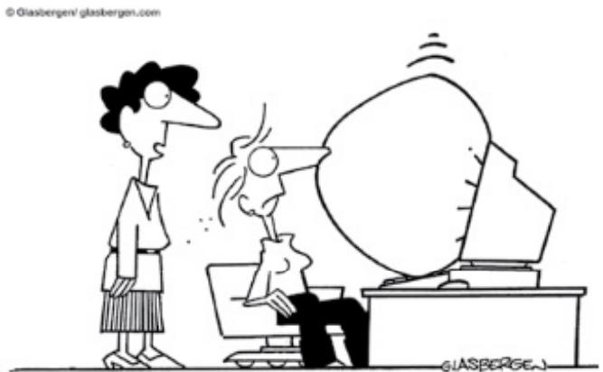
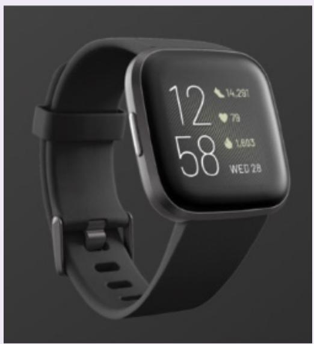
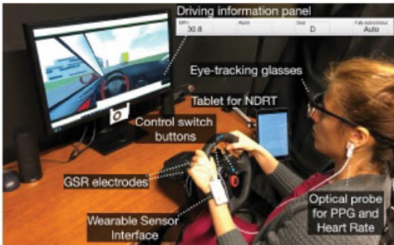
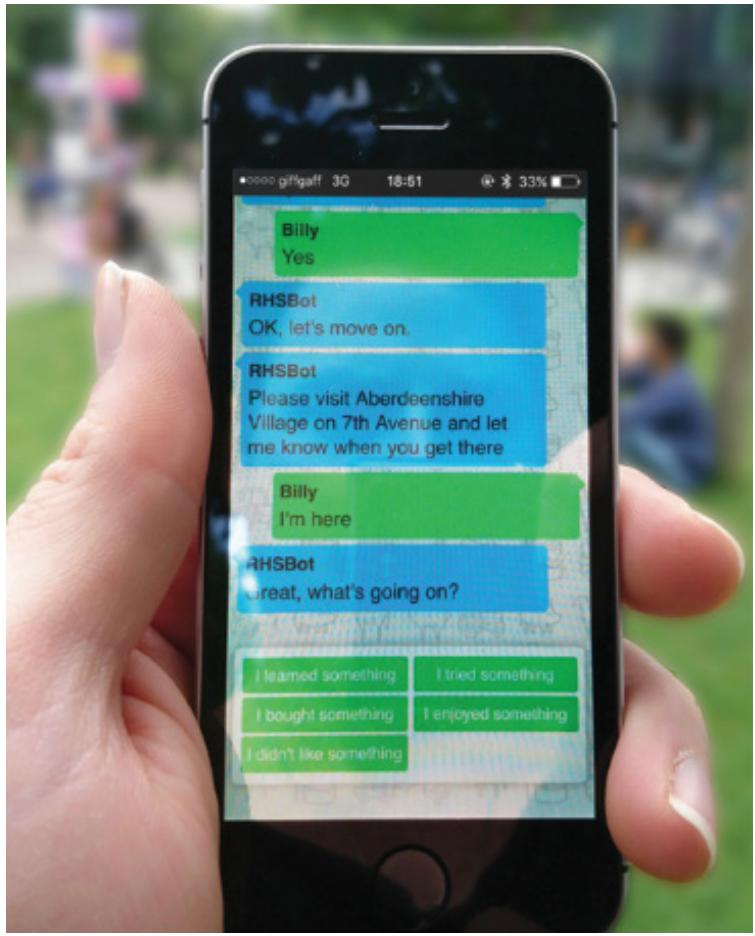
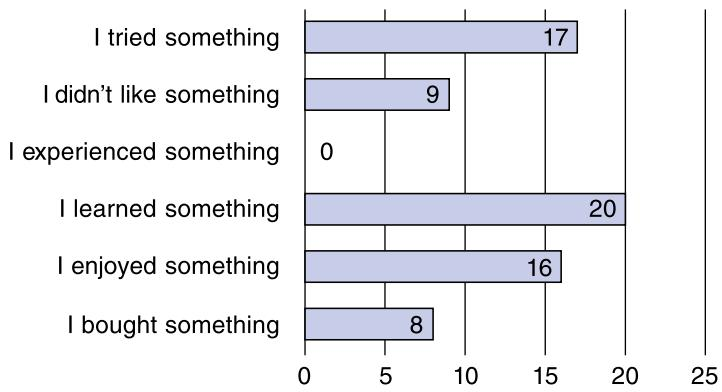

# Chapter 14

# I N T R O D U C I N G  E V A L U A T I O N

14.1  Introduction   
14.2  The Why, What, Where, and When of Evaluation   
14.3  Types of Evaluation   
14.4  Evaluation Case Studies   
14.5  What Did We Learn from the Case Studies?   
14.6  Other Issues to Consider When Doing Evaluation

# Objectives

The main goals of this chapter are to accomplish the following:

•  Explain the key concepts and terms used in evaluation.   
•  Introduce a range of different types of evaluation methods.   
•  Show  how  different  evaluation  methods  are  used for  different  purposes at  different stages of the design process and in different contexts of use.   
• Show how evaluation methods are mixed and modified to meet the demands of evaluating novel systems.   
Discuss  some  of the practical  challenges  of doing evaluation, including  the need  for remote evaluation.   
Illustrate through short case  studies how methods  discussed in more  depth in Chapter 8, “Data Gathering,” and Chapter 9, “Data Analysis, Interpretation, and Presentation,” are used in evaluation and describe some methods that are specific to evaluation.   
•  Provide an overview of methods that are discussed in detail in the next two chapters.

# 14.1  Introduction

Imagine that you designed an app for young people to share music, gossip, and photos. You prototyped your first design and implemented the core functionality. How would you find out whether it would appeal to them and whether they will use it? You would  need to evaluate it—but how? This chapter introduces the main types of evaluation and the methods that you can use to evaluate design prototypes and design concepts at different stages in the lifecycle.

Evaluation  is  integral  to  the design  process. It  involves collecting  and analyzing  data about users’ experiences when interacting with a sketch, prototype, or component of a system.

Evaluation can happen during design, before a product is  released, or even after a product is launched with the aim of improving or addressing a pain point reported by a customer. A central goal of evaluation is to improve its design. Evaluation focuses on both the usability of the product (that is, how easy it is to learn and to use) and on the users’ experiences when interacting with it (for example, how satisfying, enjoyable, or motivating the interaction is). Devices such  as smartphones, iPads, e-readers, and also mobile apps continue  to stimulate awareness about interaction design and usability. Evaluation enables designers to check that their design is appropriate and acceptable for the people who will use it.

There  are  many different  evaluation  methods. Which  to  use  depends  on  the  goals  of the evaluation. Evaluations can occur in a range of places such  as in labs, people’s homes, outdoors, work  settings, and remotely, using digital video conferencing  systems like Zoom or Teams, or via distributed design and evaluation systems (Ali et al., 2019, 2021). Product evaluations, such as the ranking and commenting systems that retailers use to get feedback about their products, can also be thought of as a kind of evaluation.

Evaluations used to focus primarily on observing participants and measuring their performance during  usability  testing, experiments, or  in  natural settings, increasingly  referred to  as  in-the-wild  studies  or  research  in  the  wild  (Chapter  2, “The  Process  of  Interaction Design,” Box 2.4), to evaluate the design or design concept. But evaluation has become much broader, encompassing a range of methods, some of which involve working with participants remotely via digital and other technology. Others do not concern participants directly, such as modeling  users’ behavior and analytics. Modeling users’ behavior  provides an  approximation of what  users might  do when interacting with an  interface; these  models are often done as a quick way of assessing the potential of different interface configurations. Analytics provide a way of examining the performance of an already existing product, such as a website, so that it can be improved. The  level of control on what is evaluated varies; sometimes there is none, such as in studies in the wild, and in others there is considerable control over which tasks are performed and the context, such as in experiments. The methods selected will depend on several factors including what the evaluators want to find out, the type of product, when in the design the evaluation occurs, and logistical constraints such as cost and time.

In  this  chapter, we  discuss  why  evaluation  is  important,  what  needs  to  be  evaluated, where  evaluation should  take  place,  and when  in the  lifecycle evaluation  is  needed. Some examples of different types of evaluation studies are then illustrated by short case studies.

# 14.2  The Why, What, Where, and When of Evaluation

Conducting  evaluations  involves understanding not only  why  evaluation  is important but also what aspects to evaluate, where evaluation should take place, and when to evaluate.

# 14.2.1  Why Evaluate?

User  experience involves  all  aspects of  the user’s interaction with  the product. Nowadays people  expect much  more  than  just  a  usable  product—they  also  look  for  a  pleasing  and engaging  experience  from  more  products.  Simplicity  and  elegance  are  valued  so  that  the product is  a joy  to own  and use. Privacy  is  also important,  especially for apps that record personal, health, and financial data.

From a business and marketing perspective, well-designed products sell. Hence, there are good reasons for companies to invest in evaluating the design of products and to assess how

popular the product is in the marketplace. Evaluation data enables designers to focus on real problems and the needs of different groups of people and make informed decisions about the design, rather than on debating what each other likes or dislikes. It also enables problems to be fixed before the product goes on sale or to be improved during its use.

  
"It's thelatest innovation in office safety. When your computer crashes,anair bag isactivated so you won't bang your head in frustration."

Source: © Glasbergen. Reproduced with permission of Glasbergen Cartoon Service

# ACTIVITY 14.1

Identify two adults and two teenagers prepared to talk with you about their social media usage (these may  be family members  or friends). Ask  them questions  such as these: Which  social media platform do you  use most often? How often do you use it each day? How many and what kind of photos do you post? Do you use Facebook? What kind of photo do you have as your profile picture? How often do you change it? What hobbies, interests, or music do you list? Are you a member of any groups?

# Comment

As you may know, teenagers tend to use different kinds of social media compared with most adults. While both use WhatsApp and Instagram, teenagers mostly use TikTok and SnapChat, whereas adults mainly use one or a combination of Facebook, LinkedIn, and Twitter. Fifteen years or so ago, more teenagers used Facebook, but as their parents started to join Facebook groups,  they moved to other  social media platforms. That’s not  to say  that you  won’t  find teenagers  still  on Facebook. Hence, social media usage by the  two  groups can both diverge and overlap.

In general, teenagers are  more likely to upload a lot of selfies and photos of themselves and of places they have just visited on sites such as Instagram or send them to friends on WhatsApp. Adults tend to spend time discussing news and their families. Privacy may be a concern to people in both groups.

After doing this activity, you should be aware that different kinds of people may opt to use different types of social media platforms, or they may use the same apps in different ways.

(Continued)

It is therefore important  to include a range of different types  of people in your evaluations. Involving different types of people also enables designers to tailor the interaction experience for different user groups.

# 14.2.2  What to Evaluate

What to evaluate ranges from  low-tech  prototypes to complete systems, from  a particular screen function to the whole workflow, and from aesthetic design to privacy, safety, and security features. Developers of a new web browser may want to know whether people can find relevant items faster using it. Developers of an ambient display may be interested in whether it changes people’s behavior. Game app developers will want to know how engaging and fun their games  are compared  with those  of their  competitors  and how  long  people will  play them. Government authorities may ask if an AI system for controlling traffic lights results in fewer accidents or if a website complies with the standards required for people with disabilities. Makers of a toy may ask whether 6-year-olds can manipulate the controls, whether they are engaged by its furry cover, and whether the toy is safe for children. A company that develops health trackers may want to know whether people from different age groups and living in different countries like the size, color, and shape of the device. A software company may want to assess market reaction to its new home page design. A developer of smartphone apps for promoting environmental sustainability in the home may want to know if their designs are enticing and whether people continue to use  their app after a period of time. Different types of evaluations will be needed depending on the type of product, the prototype or design concept, and the value of the evaluation to the designers, developers, and users. In the end, the main criteria are whether the design does what people need and want it to do and whether it is satisfying to use; that is, will they use it?

# ACTIVITY 14.2

What aspects would you want to evaluate for the following systems:

1. A personal well-being app?   
2. A website for selling vintage clothes?

# Comment

1. You would need to discover how well different people can select apps and websites that provide advice about topics that they are particularly interested in (e.g., mental health, relaxation, exercise, or diets for the well-being app, and the genre of vintage clothes). Other issues of concern may include how easy the app is to download and use, whether the onboarding support is useful, and how well people’s privacy is protected.   
2. People using  the personal well-being app  may want to find a particular topic of interest. People wanting to buy vintage clothes will want to move quickly among pages displaying clothes, comparing them, checking their provenance, maybe looking at the item on an avatar of themselves, and purchasing them. Other core aspects include how trustworthy and how secure the procedure is for collecting personal information and taking customer payment details. Navigation would also be a core concern for both examples.

# 14.2.3  Where to Evaluate

Where evaluation takes place depends on what is being evaluated. Some characteristics, such as web accessibility, may be evaluated in a lab because it provides the control necessary to investigate systematically  whether all  of the requirements are  met. This is also true for  design choices, such as choosing the size and layout of keys for a small handheld device for playing  games. Increasingly apps, websites, and social media platforms are evaluated remotely by users distributed across the Internet through the use of remote tracking. For example, websites can be evaluated with a group of people using remote data logging software, which can also be used to create analytics as discussed in Chapter 16, “Evaluation: Inspections, Analysis, and Models.” The cost of conducting evaluations in a lab is usually more expensive than remote testing. Similarly, logistical issues or ethical concerns may  mean conducting remote evaluations  is more feasible than running  lab-based  evaluations. During the COVID-19 pandemic, for example, social distancing regulations prevented typical labbased evaluations of virtual reality systems from being conducted in person (Siltanen et al., 2021).

However, despite advances being made in how to conduct remote evaluations, the user experience aspects, such as whether children enjoy playing with a new toy and for how long before they get bored, are still evaluated more effectively in natural settings, which are referred to as in-the-wild studies. Unlike a lab study, seeing children play in a natural setting will reveal how engaged they are when interacting with the toy and whether they play with it with their siblings or parents. In a lab study, the children are given instructions on what to do, which can guide and constrain their interactions with the toy. Of course, the researchers can ask the children whether they like it or not, but sometimes children will not say what they really think because they are afraid of causing offense.

Remote studies of online behavior can be conducted to evaluate the interactions of participants  with technology  in their normal context of use, for example, in their own homes, places of work, or other settings where the researcher is not present, using logging software, video  conferencing  (e.g., Teams),  participants’  own  video recording  (e.g.,  smartphone), or self-reflection tools, such as diaries. Some forms of user testing, expert evaluation, and collecting analytics can all be done remotely.

Living labs (see Box 14.1)  have also been created that are  a compromise between  the artificial,  controlled  context  of  a  lab  and  the  natural,  uncontrolled  nature  of  in-the-wild studies. They can provide the setting of a particular type of environment, such as the home, a workplace, or a gym, while also giving the ability to control, measure, and record activities through embedding technology in them.

# ACTIVITY 14.3

A  company is developing a new car  seat to monitor whether  a person is distracted or even starting to fall asleep while driving and to provide a wake-up call using olfactory and haptic feedback. Where would you evaluate it?

# Comment

It would be initially important to conduct lab-based experiments using a car simulator to see the effectiveness of the new type of feedback—in a safe setting, of course! You would need to find a way to distract the participant, perhaps by encouraging them to look at pictures on your smartphone. Once established as an effective mechanism, you would then need to evaluate it in a more natural setting, such as a race track, airfield, or safe training circuit for new drivers, which can be controlled by the experimenter using a dual-control car.

# 14.2.4  When to Evaluate

The stage in the lifecycle when evaluation takes place depends on the type of product and the development process being followed. For example, the product being developed could be a new concept, or it could be an upgrade to an existing product. It could also be a product in a rapidly changing market that needs to be evaluated to see how well the design meets current and predicted market needs. If the product is new, then considerable time may be invested in market research and discovering requirements. Once these requirements have been established, they  are  used  to  create  initial  sketches, a  storyboard, or  a  prototype of  the  design ideas. These  are then  evaluated  to see  whether the designers  have  interpreted  the requirements correctly and embodied them in their designs appropriately. The designs will be modified according to the evaluation feedback and new prototypes developed and subsequently evaluated.

When  evaluations  are  conducted  during  design  to  check  that  a  product  continues  to meet peoples’ needs, they are known as formative evaluations. Formative evaluations cover a broad range of design processes, from the development of early sketches and prototypes to tweaking and then perfecting a nearly finished design.

Evaluations that are carried out to assess the success of a finished product are known as summative evaluations. If the product is being upgraded, then the evaluation may not focus on discovering new requirements but may instead evaluate the existing product to ascertain what needs improving. Features are then often added, which can result in new usability problems. At  other  times, attention is  focused  on improving  specific aspects, such  as enhanced navigation or making the product more aesthetically pleasing.

As  discussed  in  earlier  chapters,  rapid  iterations  of  product  development  that  embed evaluations into short cycles of design, build, and test (evaluate) are common. In these cases, the evaluation effort may be almost continuous across the product’s development and deployment  lifetime. For  example, this  approach  is  sometimes  adopted for  government  websites that provide information about Social Security, pensions, and citizens’ voting rights.

Many  agencies, such  as the National Institute of Standards and Technology (NIST) in the United States, the International Standards Organization (ISO), and the British Standards Institute (BSI), set standards by which particular types of products, such as aircraft navigation systems and consumer products that have safety implications for users, have to be evaluated. The European Union has a set of standards governing product design that are created and managed by the European Standardization Committee (CEN). There are also standards for Web Content Accessibility Guidelines (WCAG), version 2.1, that describe how to design websites so that they are accessible to people with different physical, emotional, and cognitive needs. WCAG 2.1 is discussed in more detail in Box 16.2.

# 14.3 Types of Evaluation

We classify evaluations into three  broad categories, depending on the setting, participants’ involvement, and level of control. These are as follows:

Controlled settings directly involving participants (examples are usability labs and research labs): Participants’ activities are controlled to test hypotheses and measure or observe certain behaviors. The main methods are usability testing and experiments.

<!-- Chunk 11 End -->

<!-- Chunk 12 Start -->

• Natural settings involving people (examples are online communities and products that are used in public places): There is little or no control of peoples’ activities to determine how the product would be used in the real world. The main method used is in-the-wild studies.   
• Any settings not directly involving participants: Consultants and researchers critique, predict, and model aspects of participants’ interactions with the product to identify the most obvious usability problems. The range of methods includes inspections, heuristics, walkthroughs, models, and analytics.

There  are  pros  and  cons  of  each  evaluation  category.  For  example, lab-based  studies are good at revealing usability problems, but they are poor at capturing context of use; inthe-wild studies  are good  at  demonstrating  how people use  technologies  in their intended setting, but they are often time-consuming and more difficult to conduct (Rogers et al., 2013; Balestrini et al., 2020); and modeling and predicting approaches are relatively quick to perform, but they can miss unpredictable usability problems and subtle aspects of the user experience.  Similarly, analytics are  good for tracking  the  use  of a website but  are  not good  for finding out how users feel about a new color scheme or why they behave as they do.

Remote evaluation can be done with some of the studies in all three categories. Remote evaluation has a long history dating back to the 1990s. For example, Rex Hartson and his colleagues discuss how they had to do remote usability testing to overcome barriers associated  with  geographical  distance  and  working  across  different  time  zones  (Hartson  et  al., 1996). They  used the Internet as a bridge to take  interface evaluation to a broad  range of networked users, in their natural work settings. Some evaluators have also turned to remote evaluation to involve large numbers of participants. For example, Abhishek Pratap and his colleagues  describe findings from  eight digital health  studies involving  more than 100,000 participants  (Pratap et al., 2020). While the same conditions encourage remote evaluations today as in the 1990s, the COVID-19 pandemic triggered renewed interest in remote evaluation and development of tools to support it (Ali et al., 2019, 2021). (Remote evaluation is discussed further in the next two chapters.)

Deciding on which evaluation approach to use is determined by the goals of the project and on how much control is  needed to find out whether an  interface or device meets those goals. This includes finding out how people use it, whether they like it, and what problems they  experience  with  the functions. In  turn, this  requires determining  how  they  carry  out various tasks  using the interface operations. A  degree of control is  needed when designing the evaluation study to ensure  participants try all of the tasks and operations for which the app or system is designed.

# 14.3.1  Controlled Settings Involving Participants

Experiments and user tests are designed to control what participants do, when they do it, and for  how  long. They  are  designed  to reduce  outside influences  and distractions  that might affect the results, such as people talking or music playing in the background. The approach has been extensively and successfully used for many years to evaluate software applications running on laptops and other devices.

# Usability Testing

This approach to evaluating user interfaces involves collecting data using a combination of methods  in  a  controlled  setting, for  example,  experiments  that  follow  basic  experimental design, observation, interviews, and questionnaires. Often, usability testing  is conducted  in

labs, although increasingly interviews and other forms of data collection are being conducted remotely via phone and digital communication (for instance, through Teams or Zoom) or in natural settings. The primary goal is to determine whether an app or system is usable for the tasks  conducted by  the people for whom  it was designed. This  involves investigating  how typical users perform on typical tasks. By typical, we mean the people for whom the system is designed (for example, teenagers, adults, and so on) and the activities that it is designed for them to be able to do (such as, purchasing the latest gadgets). It often involves comparing the number and kinds of errors that are made between  versions and recording the time that it takes the people using it to complete  a task. As participants perform the tasks, they may be recorded on  video,  and their  interactions  may  also be recorded by  logging  software. User satisfaction questionnaires and interviews can also be used to elicit opinions about how they liked the experience of using the system. This data can  be supplemented by  observation at product sites to collect evidence about how the product is being used in the workplace or in other environments. Observing people’s reactions to an interactive product has helped developers reach an understanding of usability issues, which would be difficult for them to glean simply by reading reports or listening to presentations. The qualitative and quantitative data that is collected using these different techniques are used in conjunction with each other to form conclusions about how well a product meets the needs of its users.

Usability testing is an established, essential HCI process. For many years, usability testing has been a staple of companies, which is used in the development of standard products that go through many generations, such as word processing systems, databases, spreadsheets (Tullis and Albert, 2013; Johnson, 2014; Krug, 2014; Redish, 2012), personnel systems, and database management systems (Sherman, 2016). Tools are available for making usability and software testing easier  and faster. For example, TestRail offers management support to run automated tests and flexible templates to document tests with screenshots, etc. (guru99.com/ testing-tools.html). The  findings from  usability  testing  are often  summarized in  a usability specification  that  enables  developers  to  test  future  prototypes  or  versions  of  the  product against it. Optimal performance levels and minimal levels of acceptance are generally specified, and current levels are noted. Changes in the design can then be implemented, such as to a navigation structure, use of terms, and how the system responds to users. These changes can then be tracked.

While usability testing is  well established in UX design, it  has also gained more prominence  in other fields  such as digital healthcare  (Howe  et al., 2018),  particularly  as mobile devices  take  an  increasingly  central  role  (Schnall  et  al.,  2018)  in hospitals,  and for  monitoring one’s own health (Overdijkink et al., 2018) using Fitbit, Apple Watch, and so  forth. A trend reported by Kathryn Whitenton and Sarah Gibbons (2018) from the Nielsen Norman $\left( { \mathrm { N N } } / { \mathrm { g } } \right)$ Usability Consulting Group is that while usability guidelines have tended to be stable over time, audience expectations about the attractiveness of the visual design have evolved. However, Kate Moran  (2019) from  Nielsen Norman continues  to stress the importance of basic usability. People still need to be able to carry out their tasks effectively and efficiently.

Experiments formed the basis for early usability testing. They are still used in situations where two similar  designs that  differ in  small ways  need to be  compared, for example, to compare two different fonts on the home page of a website. Experiments are typically conducted in tightly controlled lab conditions or remotely.

Usability Testing 101 by Kate Moran (2019) describes how usability testing is done by the Nielsen Norman Group (www.nngroup.com). It starts by discussing the different components of usability testing (tasks, participants, methods) in face-to-face testing and goes on to describe how their method is modified for remote testing.

# ACTIVITY 14.4

Look at Figure 14.1, which shows two devices for recording activity and measuring heart rate: (a) Fitbit 2 Smartwatch and (b) Fitbit Lux. Assume that you are considering buying one  of these devices. What usability issues would you want to know about, and what aesthetic design issues would be important to you when deciding which one to purchase? What else might you want to consider when making a decision?

  
(a)

(b)   
Figure 14.1 Devices for monitoring activity and heart rate (a) Fitbit 2 Smartwatch and (b) Fitbit Lux   
  
Source: Figure 14.1 (a) Fitbit 2 Smartwatch (b) Fitbit Lux

# Comment

There are several usability issues to consider. Some that you might be particularly interested in finding out about include how comfortable the device is to wear, how clearly the information

(Continued)

is presented, what other  information is presented  (for example, time), what other  features there are (for example, having Alexa built-in), how long the battery lasts before it needs to be recharged, and so forth. Most important of all might be how accurate the device is, particularly for recording heart rate if that is a concern for you.

Since these devices are worn on your wrist, they can be considered to be fashion items. Each offers at least four colors. Do you prefer a particular color  that is offered for  one of the  designs? How important  is it to have a watch  and to have Alexa  built  in?  Is it worth $\$ 32$ more? You might be interested in how bulky each is in case it rubs on your clothes and causes damage and whether the  devices are  discrete or clearly noticeable. Might privacy be important to you? If so, you would want to know about the personal data collection policies for both devices. You might also be interested in what other people think about the products. There are so many potential issues to consider, and the relative importance of each will vary between different people. What is important to you may not be important to a friend! Increasingly, people look at star ratings and comments before making a purchase. Do you consider these to be a form of evaluation?

# BOX 14.1

# Living Labs

Living labs have been created to evaluate people’s everyday lives, which would be simply too difficult to assess in usability labs, for example, to investigate people’s habits and routines over a period of several months in a smart home. An early example of a living lab was the Aware Home (Abowd et al., 2000) in which the house was embedded with a complex network of sensors and audio/video recording devices that recorded the occupants’ movements throughout the house and their use of technology. This enabled their behavior, for example, their routines and deviations, to be monitored and analyzed. An early motivation for such studies was to evaluate how real families would respond and adapt to such a setup over a period of several months (Hofte et al., 2009). However, it proved difficult to get families to agree to leave their own homes and live in a living lab home for that long.

Other  examples of living labs include  ambient-assisted homes  that have been developed where a network of sensors is embedded throughout someone’s home rather than in a special, customized building (Alavi et al., 2020). One rationale is to enable physically challenged people to lead safe and  independent lives  by providing  a  nonintrusive system that can remotely monitor and provide alerts to caregivers in the event of an accident, illness, or unusual activities (Fernández-Luque et al., 2009; Yasuoka et al, 2018). The term living lab is also used to describe innovation networks in which people gather in person and virtually to explore and form commercial research and development collaborations (Ley et al., 2015). Some living labs have become more like commercial enterprises, which offer facilities, infrastructure, and access to participating communities, developers, researchers, and other stakeholders (Verma et al., 2017). A range of methods and technology can be used to track peoples’

activities and reactions  such as eye trackers, motion detection systems, accelerometers, and even brain scanners.

Living labs can  be large  and  may  house  hundreds and  even thousands  of people,  a large array of technology, and other items. The Person-Environment-Activity Research Laboratory (PEARL)  is a  massive  space  of around 4000 square meters and  10 meters high (www.ucl.ac.uk/person-environment-activity-research-laboratory). It is used to study  user experiences in large installations of equipment for railways, high streets, town squares, theaters, etc., before they are deployed into the community. In this environment, researchers, developers, engineers, and other specialists work together to examine what people do, how they do it, and their emotional reactions. For example, they are able to test detailed differences in the environment such as the effects of space, color, lighting, and sound under controlled conditions. Projects have focused  on transport, cities and  communities, creative arts,  education, government, health, and more. Figure 14.2 shows (a) a railway installation and (b) a pop-up theater in which researchers were investigating the public’s reactions.

  
  
Figure 14.2 PEARL testing scenes: (a) a railway station and (b) a pop-up theater in which researchers investigate the publics’ interactions with the items being tested [a train and train station in (a), and the theater design in (b)] and their emotional responses.

Source: www.ucl.ac.uk/person-environment-activity-research-laboratory

# DILEMMA

Is a Living Lab Really a Lab?

The concept of a living lab differs from a traditional view of a lab insofar as it is trying to be both natural and experimental, and the goal is to bring the lab into the home, government, city center (or other natural setting), or online. The dilemma is how artificial to make the more natural setting; where does the balance lie in setting it up to enable the right level of control to conduct research and evaluation without losing the sense of it being natural?

# 14.3.2  In-the-Wild Studies

In-the-wild studies are a way of observing technology usage in natural settings with little or no evaluator  involvement or presence. In the early days  of usability evaluation, evaluators realized that they needed to understand how prototypes and other design products were used in natural settings outside of the lab by observing and talking with users. During the last 20 years, there has been a trend toward conducting in-the-wild studies in which evaluators had less  and less  control over  and  direct  involvement with  the  study  participants (Rogers  and Marshall, 2017). Since this approach is adopted in research as well as in evaluation, it is also called research in the wild (Chamberlain et al, 2012), as mentioned in Chapter 2.

The  goal of in-the-wild studies is to evaluate products with people in their natural settings, primarily to:

Help identify settings for new technologies   
•  Inform the requirements for a new technology design based on in situ observations   
Introduce new  technology  interventions or inform deployment  of existing  technology in new contexts   
. Enable extended engagement with the technology

Doing in-the-wild studies to evaluate a product can provide more ecological validity as they assess the fitness of a product for the intended audience in an everyday context while enabling unforeseen issues related to the environment of use to be revealed. In-the-wild studies  also  enable  usability  measures  (e.g.,  time  spent, features  explored) to  be  recorded  in a real-world setting, such as how social media is used by target audiences on their smartphones over a period of time.

Methods that are typically used for in-the-wild studies are observation, interviews, and interaction logging (see Chapters 8 and 9). The data takes the form of events and conversations that are  typically recorded  through  audio or video  recording, or by  the participants as diaries and notes. The goal of the evaluators is to be unobtrusive and not to affect what people do during the evaluation. However, it is inevitable that some methods will influence how people behave. For example, the use of cameras can make people feel self-conscious and change how they behave or choose to interact with the technology intervention.

In-the-wild studies involve looking at how new technologies or prototypes are deployed and used by people in various natural settings, such as outdoors, in public places, and in their homes. Sometimes, a prototype that is deployed is called a disruptive technology, because the aim is to discover how it displaces an existing technology or practice.

In moving into the wild, evaluators inevitably give up control over what is being evaluated in order to observe how people approach and use—or don’t use—technologies in their everyday lives. For example, an evaluator might be interested in observing how a new mobile navigation device will be used in urban environments. To conduct an in-the-wild study where a specific device is being introduced (e.g., a smart speaker), researchers need to recruit people who are willing to use the device for a few weeks or months in their natural surroundings. They might then tell the participants what they can do with the device. Other than that, it is up to the participants to decide how to use it and when, as they move among work or school, home, and other places.

The  downside of handing  over control is  that it makes it  difficult to anticipate what is going to happen and to be present when something interesting does happen. This approach

contrasts markedly with usability testing where there is always an investigator or camera at hand to record events. Instead, the evaluator has to rely on the participants allowing them to use an installed technology intervention.

In-the-wild  studies  can  also  be  run  virtually, where  observations  take  place  in  multiuser  games such  as  World  of Warcraft, Fortnite,  and Minecraft;  online  communities;  chat rooms; and so on. A main goal of this kind of in-the-wild study is to examine  the kinds of social processes that occur in them, such as collaboration, confrontation, and cooperation. The researcher typically becomes a participant and does not control the interactions. Virtual studies have also become popular in the geological and biological sciences because they can supplement studies in the field. Increasingly, online is partnered with a real-world experience so that researchers and students get the best of both situations (Cliffe, 2017; Elgersma, 2021).

# 14.3.3  Settings Not Involving Participants

Evaluations that take place without involving  participants are conducted in settings where the researcher has to imagine or model how an interface is likely to be used. Inspection methods  are  commonly  employed  to  predict  user  behavior  and  to  identify  usability  problems based on  knowledge of usability, users’ behavior, the contexts  in which the system  will be used, and the kinds of activities that people undertake. Examples include heuristic evaluation that applies  knowledge of  typical  users guided  by  rules of  thumb  and walk-throughs  that involve stepping through a scenario or answering a set of questions for a detailed prototype. Other techniques include analytics and models.

The original heuristic evaluation method  was developed in the early 1990s  for screenbased  applications  (Nielsen  and  Mack,  1994)  and  later  refined  and  adapted  for  other applications over the years (Nielsen and Tahir, 2002). There are now tailored heuristics for evaluating  most  product  types,  including  web-based  products, mobile  apps,  collaborative technologies, conversational  agents  (Langevin, 2021), computerized  toys, games (Tondello et al., 2016), information visualizations (Forsell and Johansson, 2010), and more. One of the problems with using heuristics is that designers can sometimes be led astray by finding that heuristic  evaluation is  not as accurate  as it  appeared  to be at  first. This  problem can  arise from  different sources, such as a lack  of experience and the biases  of UX researchers  who conduct the heuristic evaluations.

Cognitive walk-throughs involve simulating a user’s problem-solving process at each step in the human-computer dialogue and checking to see how users progress from step to step in these interactions (Wharton et al., 1994). During the last 20 years, cognitive walk-throughs have been used to evaluate smartphones (Jadhav et al., 2013), large displays, and other applications, such as public displays (Parker et al., 2017) and interface learnability (Salazar, 2022). A  key feature  of cognitive walk-throughs is  that they  focus on  evaluating designs for ease of learning.

Analytics  is  a  technique  for  logging  and analyzing  data  either  at  a  customer’s site  or remotely.  Web  analytics  is the  measurement, collection, analysis, and  reporting of  Internet data  to understand  and optimize  web  usage. Examples of  web  analytics include the  number of visitors to a website home page over a particular time period, the average time users spend on the home page, which other pages they visit, or whether they leave after visiting the home page. For example, Google provides a commonly used approach for collecting analytics data that is particularly useful for evaluating design features of a website (see Chapter 16,

“Evaluation: Inspections, Analytics and Models”). As part of the massive open online courses (MOOCs) and open educational resources (OERs) movement, learning analytics has evolved and gained prominence for assessing the learning that takes place in these environments. The Open University  in the  United  Kingdom, along with  others,  has  published  widely on  this topic, describing  how learning  analytics are useful for  guiding course  and program design and for evaluating the impact of pedagogical decision-making (Toetenel and Rienties, 2016). Christothea Herodotou and her colleagues (2020) have examined the use of learning analytics over five years, and from this they discuss how to implement predictive learning analytics in distance education at scale.

This web page provides information about learning analytics and learning design: iet.open.ac.uk/themes/learning-analytics-and-learning-design.

Models have been used primarily  for comparing the efficacy  of different interfaces for the same application, for example, the optimal arrangement and location of features. A wellknown approach, described in Scott MacKenzie’s seminal paper, uses Fitts’ law to predict the time it takes to reach a target using a pointing device (MacKenzie, 1995). Other uses of Fitts’ law include evaluating  the position and size of keys on a mobile device or game controller (Ramcharitar and Teather, 2017). Fitts’ law has also been adapted recently for assessing hand reactions to stimuli in virtual reality (Gunasekaran et al, 2021).

# 14.3.4  Selecting and Combining Methods

The three broad  categories identified  previously provide a general framework  to guide the selection of evaluation methods. Often, combinations of methods are used across the categories to obtain a richer understanding. For example, sometimes usability testing conducted in labs is combined with observations in natural settings to identify the range of usability problems and find out how users typically use a product.

There  are both pros and cons for controlled and uncontrolled settings. The benefits of controlled settings include being able to test hypotheses about specific features of the interface where the results can be generalized to the wider population. A benefit of uncontrolled settings  is that unexpected data  can be obtained that provides  quite different  insights  into people’s perceptions and their experiences of using, interacting, or communicating through the new technologies in the context of their everyday and working lives.

# 14.3.5  Opportunistic Evaluations

Evaluations may  be detailed, planned studies, or opportunistic. The latter explorations are generally done early in the design process to provide designers with feedback quickly about a design idea.  Getting this  kind of feedback is  important because  it  confirms whether  it  is worth proceeding to develop an idea into a prototype. Typically, these early evaluations are informal and do not require many resources. For example, the designers may recruit a few local people and ask their opinions. Getting feedback this early in design provides feedback when it is easier to make changes to an evolving design. Opportunistic evaluations with users

can also be conducted to hone the target audience so that subsequent evaluation studies can be more focused. Opportunistic evaluations can also be conducted in addition to more formal evaluations.

# 14.4  Evaluation Case Studies

Two  contrasting case studies are  described in this section to illustrate how evaluations can take  place in different settings  with different amounts of control over users’  activities. The first case study (section 14.4.1) describes a mixed methods approach to evaluating a system called DeepTake that is used to predict when drivers of automated cars will need to take over control of the car from the automated system (Pakdamanian et al., 2021).

The second  case  study (section 14.4.2)  describes an  ethnographic in-the-wild  study  in which a bot, known as Ethnobot, was developed to prompt participants to answer questions about their experiences while walking around a large outdoor show (Tallyn et al., 2018).

# 14.4.1  Case Study 1: DeepTake and Automated Vehicles

Automated  vehicles promise future drivers  the opportunity to focus  some of their time on tasks that are not related to driving, such as reading a book, texting, talking to friends, and playing games with children, which are known as non-driving-related tasks. But this vision requires carefully designed automated systems that can smoothly transfer control of the car to a human driver to manage dangerous situations.

DeepTake is designed to predict when a driver, who is engaged in a non-driving-related task, needs to take control of a car (Pakdamanian et al., 2021). At such times the driver gets a takeover request from DeepTake to get ready to take control of the car and to stop whatever other activity they are engaged in until it is safe for the car to return to driving automatically.

The prototype DeepTake system was created by Erfan Pakdamanian and his colleagues. They collected vast amounts of data about people’s driving behavior that was classified using machine learning and used to develop the deep neural network that powered DeepTake. The primary aim for these researchers was  to test how well their system predicted the  need for takeovers compared with other similar systems. Part of their research also involved performing a  user study  of DeepTake to test  the feasibility of predicting  takeover behavior, which the researchers defined as a driver’s intention to take over control of the vehicle, the time to complete the takeover, and how well the takeover was performed. The user study consisted of the following:

Study scenario: The participant drivers in the study had to take control of the vehicle to avoid an obstacle in the road.

Participants: Twenty subjects (11  females and  9 males) aged 18–30 years  (mean age  23.5) took part in the study. All participants were required to have normal or corrected normal vision and to have at least one year of driving experience and not  to be susceptible to simulator sickness (a well-known problem that some people experience).

Apparatus  and setup: A low-fidelity driving simulator was used that consisted of a steering wheel, accelerator, brake pedal, and gear shift, as shown in Figure 14.3. The simulator recorded driver control actions and the state of the vehicle (e.g., speed and position) 20 times  per  second. The  driving scenario  was displayed  to  the participant  on  a 30-inch

monitor, and  a pair of stereo  speakers generated  the noise associated  with the driving environment, including auditory requests to signal a takeover. An Apple iPad was positioned to the right  side of the driver to mimic the display that  the driver would use for non-driving-related tasks.

Drivers engage in non-driving tasks when the vehicle is in automated driving mode, so Tobii  Pro-Glasses  were used  to  sample  the  driver’s eye  movements  approximately  60 times per second. This data indicates the driver’s visual attention and readiness to take over  control  of the car. Biometric  data  was collected  via wearable devices. Heart  rate variability and skin signals were monitored at a rate of 267 times per second. This monitoring was done using devices that are not invasive and therefore don’t distract or make the driver uncomfortable. Collectively the data provides an indicator of the driver’s alertness, stress, and drowsiness. Galvanic skin response data also indicates emotional reactions. Sweaty hands may indicate stress!

Task scenarios: Four types of non-driving-related tasks were designed to vary task difficulty and therefore the amount of time and cognitive effort needed to perform the tasks.

• Conversation  with  passenger:  Interacting  with  the  experimenter  who  sat  close  to  the participant   
. Using a cellphone: Interacting with a smartphone for texting or browsing   
•  Reading articles: Reading three types of articles—easy, medium, and hard—on the iPad   
•  Solving problems: Answering three levels of arithmetic questions—easy, medium, and hard.

Study design: All the driver participants did the same set of tasks. This enabled a controlled evaluation of the takeover requests. To avoid the influence of the order of the non-driverrelated  tasks, the  order  was randomized. The  difficulty of the  tasks  and therefore the cognitive demand was varied.

Procedure:  Prior  to  starting  the  study  the  participants  were  told  about  what  they  would be asked to do, what data would be collected about them, and how their data would be used. Upon arriving in the lab, the participants signed an informed consent form (see section 14.6.1). They were reminded of their right to stop involvement in the study at any time, and they were each given $\$ 20$ US to compensate for their time spent on the study. They also completed a demographic and driving history questionnaire. They were briefed about the study and taught to use the simulator. Participants were told that if DeepTake detected a situation that it could not navigate, there would be an auditory request telling them to take over control of the vehicle. Participants were then invited to try out the simulator to get familiar with it and with the study procedure, the tasks, and the delivery of  takeover  requests. The eye-tracking  and other  devices for  collecting biometric  data were calibrated to ensure they worked correctly. When the participant felt familiar with the simulator and understood the procedure, the evaluation study was started.

The study consisted of three trials using the simulated driving setup, each containing 15 takeover requests. After each trial the participant was given two questionnaires consisting of tried and tested questions that were designed to assess the participants’ perceived reactions and psychological stress respectively. These tests used rating scales. A follow-up study  was  planned  to further  tap  into  the  participants’  thoughts,  feelings, and  overall experience. The total amount of time that each participant spent on the user study was approximately one hour.

Data  collection: The  pre-driving  survey completed  by  each  participant  before  starting  the study collected demographic information about the participants including their age, gender, and  driving  experience.  Data  was  collected  about  changes  in  the  simulated  car’s actions (e.g., change in lane position, steering angle, throttle and break) caused by each participant in response to a takeover request, and about the simulated vehicle’s behavior, such as speed and distance to  hazards on  the road. Data  was also collected about  the participant  driver’s non-driving  behavior (e.g.,  reading  from  a  tablet, responding  to  a prompt to take control of the car, etc.) and the participant’s eye movements, heart rate, and skin  moisture. This data  showed changes  in the driver’s neurological responses  to different driving situations. Figure 14.3 provides an overview of the study setup.

Data analysis and results: The results of the study showed that DeepTake reliably predicted the need for a driver to take over control of the simulated car 96 percent of the time. The data from the simulator study with users (i.e., the user study) indicated that participants completed the takeovers within an acceptable time 93 percent of the time and that 83 percent of the takeovers were of acceptable quality, which was a measure of how safely and accurately the participants  completed the takeovers. Because the primary focus of research on  DeepTake was testing  the feasibility  of predicting  takeovers by  collecting and analyzing quantitative measurements, the researchers did not collect data about how participants felt about their study experience. To cope with this limitation, the researchers planned a follow-up study to  collect qualitative  user experience data, which  is not reported  here, but Activity  14.5 encourages  you  to  think about  the kind  of data  that might be useful to collect. Interestingly, while the researchers’ work so far does not focus on the user interface of the system, it does provide an alternative way of putting users at the center of development.

Figure 14.3 User study setup. This custom driving simulator consists of a 30-inch monitor, a Logitech G29 steering wheel, and 10.5-inch Apple iPad Air on which the non-driving tasks are displayed. For switching between the automated and manual control of the vehicle, the participant needs to press the two blue buttons on the steering wheel simultaneously. The participant wore a pair of eye-tracking glasses and a wearable device with sensors for collecting skin.   
  
Source: Pakdamanian et al., 2021. CHI’2021 https://dl.acm.org/doi/pdf/10.1145/3411764.3445563

# ACTIVITY 14.5

1. What kind of setting was used in the DeepTake user study?   
2. How much control did the researchers exert?   
3. Which types of data were collected?   
4. Which other types of data, not discussed in the case study, would you like to know about?

# Comment

1. The user study involved participants using a simulation of an automated car in a research lab, which is a controlled setting.   
2. The researchers took control of the user study. They designed the simulation, planned the pretest and post-test questionnaires, determined the tasks, and decided on the type of data collected.   
3. Quantitative data was  collected that included biometric data (eye-gaze  and  skin data), the  time to complete a takeover task under different test conditions, accuracy of driving the  car simulation, car position, and speed. Demographic data was collected about  each participant  from a  pretest questionnaire  as well as data about  driving  experience. The participants rated their experience of doing the  tasks in two  questionnaires comprising predefined questions after completing the study.   
4. Some questions that it would be interesting to know more about  include the following: Did participants feel confident using the simulation? Did the driving experience meet their expectations?  Would they like to drive  a real automated vehicle? Would  they feel safe? Semi-structured or open-ended interviews could be used to collect data that would help to answer these questions.

# 14.4.2  Case Study 2: Gathering Ethnographic Data at the Royal Highland Show

In-the-wild and ethnographic studies provide data about how people interact with technology in  their natural environments. Such  studies often  provide insights  not  available in  lab settings. However, it can be difficult to collect participants’ thoughts, feelings, and opinions as they move about in their everyday lives. Usually, it involves observations and asking them to reflect after an event, for example through interviews and diaries. In this case study, Ella Tallyn and her  colleagues  (2018)  carried  out  a novel  evaluation approach  in  which  a live chatbot was used to address this gap by collecting data about people’s experiences, impressions, and feelings as they visited and moved around the Royal Highland Show (RHS). The RHS is a large agricultural show that runs every June in  Scotland. The chatbot, known as Ethnobot, was designed as an  app that runs on  a smartphone. In particular, Ethnobot was programmed to ask participants pre-established questions as they wandered around the show and to prompt them to expand on their answers and take photos. It directed them to particular parts of the show that the researchers thought would interest the participants. This strategy  allowed  the  researchers  to collect  data from  all  of the  participants  in  the  same  place. Interviews were also conducted by human researchers to supplement the data collected online by the Ethnobot.

The overall purpose of the study was to find out about participants’ experiences of, and feelings about, using Ethnobot at the show. The researchers also wanted to compare the data collected by the Ethnobot with the interview data collected by the human researchers.

The study consisted of four data  collection sessions  using the Ethnobot  over two days and involved 13 participants, who ranged in age and came from diverse backgrounds. One session  occurred in the early afternoon and the other in the late afternoon on each  day of the study. Each session lasted several hours. To participate in the study, each participant was given a smartphone and shown how to use the Ethnobot app (Figure 14.4), which they could experience on their own or in groups as they wished.

  
Figure 14.4 The Ethnobot used at the Royal Highland Show in Scotland. Notice that the Ethnobot directed participant Billy to a particular place (that is, Aberdeenshire Village). Next, Ethnobot asks “. . . What’s going on?” and the screen shows five of the experience buttons from which Billy needs to select a response.

Source: Tallyn et al. (2018). Reproduced with permission of ACM Publications

Two main types of data were collected.

The  participants’  online  responses  to  a  short  list  of  pre-established  questions  that  they answered by selecting from a list of prewritten comments (for example, “I enjoyed something” or “I learned something”) presented by the Ethnobot in the form of buttons called

experience  buttons,  and  the  participants’  additional  open-ended, online  comments  and photos that they offered in response to prompts for more information from Ethnobot. The participants could contribute this data at any time during the session.

• The participants’ responses to researchers’ in-person interview questions. These questions focused on the participants’ experiences that were not recorded by the Ethnobot, and their reactions to using the Ethnobot.

A lot of data was collected that had to be analyzed. The pre-established comments collected in the Ethnobot chatlogs were analyzed quantitatively by counting the responses. The in-person  interviews  were audio-recorded  and  transcribed  for  analysis,  and  that  involved coding  them, which was done  by  two researchers  who cross-checked each  other’s analysis for consistency. The open-ended online comments were analyzed in a similar way to the inperson interview data.

Overall, the analyses revealed  that participants  spent an  average  of 120  minutes  with the Ethnobot on each session and recorded an average of 71 responses, while submitting an average of 12 photos. In general, participants responded well to prompting by the Ethnobot and were eager to add more information. For example, one participant said, “I really enjoyed going around and taking pictures and [to the question] ‘have you got something to add’ [said] yeah! I have, I always say ‘yes’. . . .” A total of 435 pre-established responses were collected, including 70 that were about what the participants did or experienced (see Figure 14.5). The most frequent  response was “I learned something” followed by “I tried something” and “I enjoyed something.” Some participants also supplied photos to illustrate their experiences.

Figure 14.5 The number of prewritten experience responses submitted by participants to the pre-established questions that Ethnobot asked them about their experiences   
  
Source: Tallyn et al., 2018 / ACM, Inc. / CC BY-4.0

When the researchers asked the participants about their reactions to selecting prewritten comments, eight participants remarked that they were rather restrictive and that they would like more flexibility to answer the questions. For example, one participant said, “Maybe there should have been more options, in terms of your reactions to the different parts of the show.” However, in general, participants enjoyed their experience of the RHS and of using Ethnobot.

When the researchers compared the data collected by Ethnobot with that from the interviews collected by  the human  researchers, they found  that the participants  provided more

detail about their experiences and feelings in response to the in-person interview questions than  to  those  presented  by  Ethnobot.  Nevertheless, the  researchers  concluded  that  while there are some challenges to using a bot to collect in-the-wild evaluation data, there are also advantages, particularly when researchers cannot be present as in the COVID-19 pandemic when people had to be distanced or when the study involves collecting data from participants on the move or in places that are hard for researchers to access. Collecting data with a bot and supplementing it with data collected by human researchers, either in person or remotely, appears to offer a good solution in circumstances such as these.

# ACTIVITY 14.6

1. What kind of setting was used in this evaluation?   
2. How much control did the researchers exert?   
3. Which types of data were collected?

# Comment

1. The evaluation took place in a natural outdoor setting at the RHS.   
2. The researchers imposed less control on the participants than in the previous case study, but the Ethnobot was programmed to ask specific questions, and a range of responses was provided from which participants selected. The Ethnobot was also programmed to request additional information and photos. In addition, the Ethnobot was programmed to guide the participants to particular areas of the show,  although some participants ignored this guidance and went where they pleased.   
3. The Ethnobot collected answers to a specific set of predetermined questions (closed questions) and prompted participants for additional information and photographs. In addition, participants were interviewed by the researchers using semi-structured, open-ended interviews. The data collected was qualitative but counts of the response categories produced quantitative data (see Figure 14.5). Some demographic  data was  also quantitative (for instance, participants’ ages, gender, and so forth), which is provided in the full paper (Tallyn et al., 2018).

# BOX 14.2

# Crowdsourcing

Crowdsourcing involves a group of participants in collecting data, exchanging ideas, or contributing to a common cause. The Internet makes  it possible to gain access to hundreds of thousands of people who will perform tasks or provide feedback on a design or experimental task quickly and almost immediately. Amazon’s Mechanical Turk has thousands of people registered (known as Turkers), who  have volunteered to take part by performing various activities online, known  as human intelligence tasks (HITs), for  a small payment. HITs are submitted by researchers or companies that pay a few cents for simple tasks (such as tagging

(Continued)

pictures) to a few dollars (for taking part in an experiment). In 2022 Turkers typically earned between $\$ 1$ and $\$ 6$ per hour. Some individual requesters paid an average of $\$ 12$ per hour for more demanding tasks. Advantages of using crowdsourcing in HCI is that it is more flexible, relatively inexpensive, and often much quicker to enroll participants than with traditional lab studies. Another benefit is that many more participants can be recruited.

Early  in the  history  of online crowdsourcing, Jeff Heer and  Michael  Bostock  (2010) investigated how reliable it was to ask random people over the Internet to take part in an experiment. Using Mechanical Turk, they asked the Turkers to perform a series of perception tasks using different visual display techniques. A large number agreed, enabling them to analyze their results statistically and to generalize from their findings. They found that while the results from their study using Turkers showed wider variance than in the lab study, the overall results across the studies were the same. They also found that the total cost of their experiment with Turkers was one-sixth the cost of a typical lab study involving the same number of people. While these results are important, online crowdsourcing studies have raised ethical questions  about  whether Turkers, like other  gig workers  (e.g., Uber drivers, pizza delivery workers), are being fairly rewarded and acknowledged (Williamson, 2016).

Since  Jeff Heer and  Michael  Bostock’s  2010 classic  study, crowdsourcing  has  become increasingly popular and has been used in a wide range of applications including collecting design ideas  for  developing a citizen  science  app  (Maher et al., 2014); design and  evaluation (Birch et al., 2018); managing volunteers for disaster relief (Ludwig et al., 2016); delivering packages (Kim, 2015); collecting citizen science data using specially developed apps such as iNaturalist (Preece, 2017); and  volunteering for  various environmental projects (NOAA, 2021). Both the number and diversity of useful contributions and ideas generated make crowdsourcing particularly attractive for getting timely feedback from the public. For example, in a study to collect and improve the design of a street intersection, a system called CommunityCrit was used to collect opinions from members of the community and to draw on their skills and availability (Mahyar et al., 2018). Those who contributed were empowered by getting to see the planning process. In an online study David Birch and his colleagues designed and ran variants of multiple visualization designs in the cloud so that large numbers of participants could explore and evaluate subtle design trade-offs using crowdsourcing (Birch et al., 2018).

Abdullah Ali, Meredith Morris, and Jake Wobbrock (2019) developed a system for crowdsourcing design ideas. Then, three years later, during the COVID-19 pandemic, which drastically restricted any kind of lab studies, they modified their system to be used for what they call “distributed evaluation,” where participants were invited to take part online (Ali et al., 2021). They discovered that an advantage of this kind of methodology was that they could reach far more people worldwide. In particular, through using their system, it was possible to overcome the lack of access and user representation that is often found in lab-based studies. Hence, this is an example of where being forced to do evaluations online proved to be highly effective to the point it turned out to be more beneficial than when conducted previously in the lab.

These  examples illustrate how  crowdsourcing  can  be a  powerful tool for  improving, enhancing, and  scaling up a  wide range of tasks, including  design and  evaluation. Crowdsourcing makes it possible to recruit participants to generate a large pool of potential ideas, collect data, and make other useful inputs that would be difficult to achieve in other ways. Increasingly companies, including Google and IDEO, use crowdsourcing to try ideas and to gather evaluation feedback about designs.

# 14.5  What Did We Learn from the Case Studies?

The case studies along with Box 14.1 and Box 14.2 provide examples of how different evaluation methods are  used in different physical settings that  involve users  in different  ways to answer various kinds of questions. They demonstrate how researchers exercise different levels of control in different settings. The case studies also show how it is necessary to be creative  when working  with  innovative systems  and when  dealing with constraints  created by the evaluation setting (for example, online, distributed, or outdoors where people are on the move  as  in the  Ethnobot  study)  and the  technology  being  evaluated may  not  be optimal. The DeepTake user study is an example of how a group of researchers designed an ML-based system and evaluated it with participants in the  lab using a car simulation. In addition, the case studies and boxes illustrate how to do the following:

• Observe users in labs, in living labs, and in natural settings, known as in the wild.   
Develop different data collection and analysis techniques to evaluate user experience goals, such as interacting with a simulation in a lab and engaging with people on the move at an outdoor show.   
• Run experiments on the Internet using crowdsourcing, thereby reaching many more participants while being straightforward to run.   
. Recruit a large number of participants  who contribute  to a wide range of projects  with different goals using crowdsourcing.

# BOX 14.3

# The Language of Evaluation

Sometimes terms describing evaluation are used interchangeably and have different meanings. To avoid this confusion, we define some of these terms here in alphabetical order. (You may find that other books use different terms or use the same terms in slightly different ways.)

Analytics Data analytics refers to examining large volumes of raw data with the purpose of drawing inferences about a situation or a design. Web analytics are commonly used to measure website traffic through analyzing users’ click data, and learning analytics analyze learners’ activities.

Analytical evaluation This type of evaluation models and predicts user behavior. This term has been used to refer to heuristic evaluation, walk-throughs, modeling, and analytics.

Bias The results of an evaluation are distorted. This can happen for several reasons. For example, selecting a population of users who have already had experience with the new system and describing their performance as if they were new users.

Controlled experiment This is a study that is conducted to test hypotheses about some aspect of an interface or other dimension. Aspects that are controlled typically include the task that participants are asked to perform, the amount of time available to complete the tasks, and the environment in which the evaluation study occurs.

Crowdsourcing Crowdsourcing is the process of involving people (i.e., the crowd) in collecting data or contributing to an activity. Crowdsourcing can be done in person (as was typical in citizen science  for  decades) or online via  the  web  and  mobile apps. Crowdsourcing also

(Continued)

provides the opportunity for hundreds, thousands, or even millions of people to take part in the design and or evaluation of a product or a user study. The crowd may be asked to perform a particular evaluation task using a new product or to rate or comment on the product.

Distributed evaluation This is a form of online crowdsourcing where many people from different locations can participate in a user study without being physically present together.

Ecological validity This is a particular kind of validity that concerns how the environment in which an evaluation is conducted influences or even distorts the results.

Expert review or crit (short for critique) This is an evaluation method in which someone (or several people) with usability  expertise and  knowledge of the  user population reviews  a product looking for potential problems.

Field  study This is the  term used to describe an evaluation study  that is done in a  natural environment such as in a person’s home or in a work or leisure place. Such studies are often called in the wild or research in the wild in HCI and interaction design.

Formative evaluation This type of evaluation is done during design to check that the product fulfills requirements and continues to meet users’ needs.

Heuristic  evaluation This is an evaluation method in which  knowledge  of typical  users is applied, often guided by heuristics, to identify usability problems.

In the wild This form of evaluation involves observing what people do when using technology in natural settings, with little or no intervention by evaluators.

Informed consent form This form describes what a participant in an evaluation study will be asked to do,  what will happen to the  data collected about  them, and  their rights while involved in the study.

Living lab This place is configured to measure and  record people’s everyday activities in a natural setting, such as in the home, work place, theater, or other type of public place.

Pain points These are the hurdles that customers experience with a product or service.

Predictive evaluation This type of evaluation is where theoretically based models are used to predict users’ performance.

Reliability The reliability or consistency of a method is how well it produces the same results on separate occasions under the same circumstances.

Remote evaluation Remote evaluation uses the Internet, phone, or other digital device to collect data without evaluators being present in the lab or natural setting.

Research in-the-wild studies This approach focuses on discovering how people use and react to new technology interventions in their everyday settings, both indoors and outdoors.

Scope This refers to how much the findings from an evaluation can be generalized.

Summative evaluation This evaluation is done when the design is complete.

Usability lab This is a specially designed lab or modified space for usability testing.

Usability testing This involves measuring how well a design supports users’ performance on various tasks.

User studies This generic term covers a range of evaluations involving users, often including experiments and in-the-wild studies.

Users or participants In this context, these terms are used interchangeably to refer to the people who take part in evaluation studies. The term people is now used more commonly to describe all kinds of users.

Validity The validity of a study is concerned with whether the evaluation method measures what it is intended to measure.

# 14.6  Other Issues to Consider When Doing Evaluation

Reading the case studies may have raised other issues, such as the importance of asking good questions to focus the evaluation. A good question is important because it helps to focus the evaluation and decide on the best approach and methods to use. Another issue is how to find suitable participants and, having found them, how to approach them. Can you just ask children  in a café  to participate, or  do  you need permission  from  their parents? What  if  your participants are remote? How should you approach them? What do you have to tell participants, and what if they decide partway through the study that they don’t want to continue to the  end? Can  they  stop, or  do they  have  to continue? The following  are additional  issues to consider:

• Informing  participants  about  their  rights,  including  how  their  data  will  be  managed and stored   
• Making  sure  you  take  into  account  biases  and  other  influences  that  impact  how  you describe your evaluation findings

# 14.6.1  Informing Participants About Their Rights and Getting Their Consent

Most  professional  societies,  universities,  government,  and  other  research  offices  require researchers and those performing evaluation studies to provide information about activities in which human participants will be involved. They do this to protect participants by ensuring that they are not endangered physically or emotionally and that their right to privacy is protected,  particularly  the  details  about  how  participants’  data  is collected  and  will  be treated. Drawing up such an agreement is mandatory in many universities and major organizations.  Indeed, special  review  boards  generally  prescribe  the format  required, and  many provide a detailed form that must  be completed. Some even require researchers to undergo specific  training  before  completing  the  form.  Once  the  details  entered  on  the  form  are accepted,  the  review  board  checks  periodically  to  oversee  compliance.  For  example,  in American universities, these are known as institutional review boards (IRBs).

Institutions in other countries use different names, forms, and processes to protect users, and some countries have different laws that govern areas such as users’ privacy, mentioned in Chapter 8. For example, the General Data Protection Regulation (GDPR) was introduced in 2018 to strengthen data protection and privacy for all individuals living within the European Union. Such laws influence not just the countries directly involved but also people in other countries  who  collaborate with EU countries  on  research projects  or commercial software development.

Over  the  years,  IRB  forms  have  become  increasingly  detailed,  particularly  now  that much research involves the Internet and people’s interaction via social media and other communications technologies. IRB reviews are especially stringent when a research or evaluation study involves people who could be considered vulnerable (such as children, older adults, and people with disabilities).

Several lawsuits at prominent universities have heightened attention to IRB and similar compliance  laws  and  standards  to  the extent  that  it sometimes  takes  several  months  and multiple amendments  to  get IRB acceptance. Not only are IRB  reviewers interested  in the more obvious issues of how participants will be treated and what they will be asked to do;

they also want to know how the data will be analyzed and stored. For example, data about participants must be stored securely and coded to prevent linking participants’ names with that data.

Participants must be told what they will be asked to do, the conditions under which data will be collected, and what will happen to their data when they finish the task. Participants must also  be  told their rights, for instance, that  they may  withdraw from the  study at any time  if  they  want.  This  information  is  usually  presented  to  participants  on  a  form,  often referred to as a consent form, that each participant reads and signs before the  study starts. When new  laws come into existence, it is  particularly important  to be aware  of how such laws will be enacted and their potential impact on research and evaluation studies.

Some companies have “boilerplate” templates that UX researchers and designers can use that describe how participants will be treated and how the data collected will be used so that new documents do not have to be created for each evaluation study. Many companies also ask the evaluation participants to sign a nondisclosure agreement, which requires that they do not talk about the product and their experience of evaluating it with anyone after completing the evaluation. Companies  require this because they do not  want their competitors and the public to know about the product before it is launched or modified.

# DILEMMA

When  Is  a  Person  Considered  Vulnerable,  and  How  Might  This Affect Them?

Who is vulnerable? The answer is all  of us at various  times and stages in our  lives. At any particular time, however, some people are more vulnerable than others (for example, children and people with emotional and certain physical disabilities). Furthermore, definitions of people who are vulnerable vary from country to country, state to state, and policy to policy, so the following scenarios are broad categories to get you thinking about this important issue. At what age can children read and sign their own consent forms? Is it when they are considered to be old enough to understand what they are being asked to do? This could be 12 years of age, or at other times and places 16 or even 18 or 21. It also depends on the kind of study. In some parts of the world, a 17-year-old can get married but may need their parents to sign a form saying that they can take part in an evaluation study to rate the realism of a social robot’s expressions. What is the balance here between seeking reasonable consent and respecting individuals’ rights to privacy for themselves and their families?

# 14.6.2  Issues That Influence the Choice of Method and How the Data Is Interpreted

Decisions have to be made about what data is needed to answer the study questions, how the data will be analyzed, and how the findings will be presented (see Chapters 8 and 9). To a great extent, the method used determines the type of data collected, but there are still some choices. For example, should  the data be treated statistically? Some general questions  also

need to be asked. Is the method reliable? Has the method produced the kind of data intended? Is the evaluation study ecologically valid, or is the fundamental nature of the process being changed by studying it? Are biases creeping in that will distort the results? Will the results be generalizable; that is, what is their scope?

# Reliability

The reliability or consistency of a method is how well it produces the same results on separate occasions under the same circumstances. Another  evaluator or researcher who follows the same  procedure should  get similar results. Different evaluation methods have different degrees of reliability. For example, a carefully controlled experiment will have high reliability, whereas observing people in their natural setting will be variable. An unstructured interview will have low reliability—it would be difficult if  not impossible to repeat exactly the same discussion.

# Validity

Validity is  concerned with  whether the evaluation method  measures  what it is intended  to measure. This  encompasses  both  the  method  itself  and  the  way  it  is  implemented.  If,  for example, the goal of an evaluation study is to find out how people use a new product in their homes, then it is not appropriate to plan a lab experiment. An ethnographic study in participants’ homes would be more appropriate. If the goal is to find average performance times for completing  a task, then  a method  that recorded only  the number  of user  errors  would be invalid. These examples are deliberately extreme, but subtler mistakes can be made, and it’s good to consider these questions for each study.

# Ecological Validity

Ecological  validity  is  a  particular  kind  of validity  that  concerns  how  the  environment  in which  an  evaluation is  conducted  influences or even  distorts  the results. For example, lab experiments are controlled, so what the participants do and how they behave is quite different from what happens naturally in their workplace, at home, or in leisure environments. Lab experiments therefore have low ecological validity because the results are unlikely to represent  what  happens in  the real  world. In contrast, ethnographic  studies  do  not  impact  the participants or the study location as much, so they have high ecological validity.

Ecological validity is also affected when participants are aware of being studied. This is sometimes called the  Hawthorne effect after a series of experiments at the Western Electric Company’s  Hawthorne  factory  in  the  United  States  in  the  1920s  and  1930s.  The studies investigated changes in length of working day, heating, lighting, and so on; however, eventually it was discovered that the  workers were reacting positively to being given special treatment  rather  than just  to the  experimental  conditions. Similar findings  sometimes occur  in medical trials. Patients given the placebo dose (a false dose in which no drug is administered) show improvement that is due to receiving extra attention that makes them feel good.

# Bias

Bias occurs when the results are distorted. For example, expert evaluators performing a heuristic evaluation may be more sensitive to certain kinds of design flaws than others, and this will be reflected in the results. When collecting observational data, researchers may consistently fail to notice certain types of behavior because they do not deem them important. Put

another way, they may selectively gather data that they think is important. Interviewers may subconsciously  influence  responses  from  interviewees  by  their  tone  of  voice,  their  facial expressions, or the way questions are phrased, so it is important to be sensitive to the possibility of biases.

# Scope

The scope of  an  evaluation study  refers to how  much its findings  can  be generalized. For example, some modeling methods, like Fitts’ law (also discussed in Chapter 16, “Evaluation: Inspections, Analytics, and Models”), which is  used to evaluate keypad design, have a narrow, precise  scope.  (The  problems  of  overstating  or  generalizing  results  are  discussed  in Chapter 9, “Data Analysis, Interpretation, and Presentation.”)

# In-Depth Activity

In this activity, think about the case studies and reflect on the evaluation methods used.

1. For the two case studies discussed in this chapter, think about the role of evaluation in the design of the system and note what was being evaluated: When during the design were they evaluated, which methods were used, and what was learned from the evaluations? Note any issues of particular interest. You may find that constructing a table like the one shown here is a helpful approach.

Name of the study or system/app evaluated

When during the design the evaluation occurred?

How controlled was the study, and what role did users have?

Which methods were used?

What kind of data was collected, and how was it analyzed?

What was  Notable learned issues from the study?

2. What were the main constraints that influenced the evaluations?   
3. How  did  the  use  of different  methods  build on and  complement each other  to give a broader picture of the evaluations?   
4. Which parts of the evaluations were directed at usability goals and which at user experience goals?

# Summary

The goal of this chapter was to introduce the main approaches to evaluation and the methods typically used. These will be revisited in greater depth in the next two chapters. This chapter stressed how  evaluation is done throughout design by collecting information  about  users’ or potential  users’ experiences  when interacting  with a  prototype, a  computer system,  a

component of a computer system, an app, or part of a design (such  as a screen sketch)  to improve its design.

The  pros and  cons of running  lab-based evaluations  were compared with in-the-wild studies in terms of participant reach, cost, effort, constraints, and the types of results that can be elicited. Choosing which approach to use will depend on the goals of the evaluation, the researcher’s or evaluator’s expectations and expertise, and the  resources available to them. Remote evaluation was  also discussed  as it has  become increasingly popular, particularly prompted by the need for people to distance from each other, and because advances in technology make it easier and less costly than having evaluators present.

Crowdsourcing was presented as a creative way of involving a wide range of people with different  ideas and skills who may be widely distributed  geographically. Finally, we briefly mentioned the  ethical  issues relating to how  evaluation participants are  treated  and  their rights to privacy. We also raised questions about data interpretation including the need to be aware of biases, reliability, data and ecological validity, and the scope of the study.

# Key Points

•  Evaluation and design are closely integrated.   
•  Some of the same data gathering methods are used in evaluation as for discovering requirements, for instance, observation, interviews, and questionnaires.   
•  Evaluations can  be done in controlled settings such as labs, less-controlled living lab settings, in the wild, and remotely where users are not present.   
•  Usability testing and experiments involve a high level of control over both what users do and what is tested, whereas in-the-wild evaluations typically impose little or no control on participants.   
•  Different methods are  usually combined to provide different perspectives within a study; they are often generically referred to as user studies.   
•  Participants need to be made aware of their rights. This is often done through  informed consent forms.   
•  It is important not to over-generalize findings from an evaluation.

# Further Reading

BALESTRINI, M., GALLACHER, S., ROGERS, Y. (2020) “Moving HCI Outdoors: Lessons Learned from Conducting Research in the Wild.” In: McCrickard D.S., Jones M., Stelter T.L. (eds) HCI Outdoors: Theory, Design, Methods and Applications. Human–Computer Interaction  Series. Springer, Cham., Switzerland, https://doi.org/10.1007/978-3-030-45289-6_4. This  chapter  explores  the  pros  and cons  of  in-the-wild  evaluation  studies,  particularly  in relation to moving HCI outside. It builds on and extends the 2017 book by Yvonne Rogers and Paul Marshall that discusses the basics of in-the-wild studies.

KRUGE, S.  (2014) Don’t Make  Me Think: A  Common  Sense Approach to Web  Usability (3rd  ed.).  New  Riders.  This  book  provides  a  useful  introduction  to  usability  with  many practical examples of usability problems and how best to avoid them.

LAZAR,  J.,  FENG,  J. H.  and  HOCHHEISER, H.  (2017)  Research  Methods  in  Human– Computer  Interaction  (2nd  ed.).  Cambridge,  MA:  Elsevier/Morgan  Kaufmann  Publishers. This  book  provides an  overview of qualitative  and quantitative  methods. Chapter 15, “Working with  Human  Subjects,” discusses  ethical  issues  of  working  with  human  participants.  PowerPoint  slides  are  also  available  at  www.elsevier.com/books-and-journals/ book-companion/9780128053904.   
SHNEIDERMAN,  B.,  PLAISANT,  C.,  COHEN,  M.,  JACOBS,  S.,  ELMQUIST,  N.  and DIAKOPOULOS, N. (2016) Designing  the User Interface: Strategies for Effective Human-Computer Interaction (6th ed.). Addison-Wesley, Pearson. Chapter 5 provides an alternative way of categorizing evaluation methods and offers a useful overview.

