# Chapter 15

# E V A L U A T I O N  S T U D I E S :  F R $\mathbf { o }$ M C O N T R O L L E D  T O  N A T U R A L  S E T T I N G S

15.1  Introduction   
15.2  Usability Testing   
15.3  Conducting Experiments   
15.4  In-the-Wild Studies

# Objectives

The main goals of the chapter are to accomplish the following:

•  Explain how to do usability testing.   
•  Describe how different types of studies are being done remotely.   
•  Outline the basics of experimental design.   
•  Describe how to do in-the-wild studies.

# 15.1 Introduction

Imagine that you have designed a new app to allow school children ages 9 or 10 years old and their parents to share caring for the class hamster over the school holidays. The app will schedule which children are responsible for the hamster and when, and it will record when it is fed. The app will also provide detailed instructions about when the hamster is scheduled to go to another family and the arrangements about when and where it will be handed over. In addition, both teachers and parents will be able to access the schedule and send and leave messages for each other. How would you find out whether the children, their teacher, and their parents can use the app effectively and whether it is satisfying to use? What evaluation methods would you employ?

In this chapter, we describe evaluation studies that take place in a spectrum of settings, from controlled laboratories to in-the-wild studies (sometimes referred to as natural settings or field studies), and from face-to-face situations to remote settings using digital technologies.

Increasingly, elements of usability testing, experiments, and in-the-wild studies are  conducted remotely using tracking software to record participants’ interactions and using social media for communication with participants. As mentioned in Chapter 14, “Introducing Evaluation,” remote usability started in the 1990s (e.g., Hartson et al., 1998) and became a key

alternative during the COVID-19 pandemic when social distancing was necessary to protect people from  catching  the  virus (Gov.UK, 2021;  Center  for Digital  Public  Services,  2021). In  addition  to  keeping  both  participants  and  evaluators  safe,  remote  testing  is  attractive because it saves time traveling to distant locations and the need to schedule and pay for lab time. Therefore, remote testing  tends to be  less expensive than  in-person testing. But  there are also some drawbacks to be aware of (Moran, 2021). For example, remote testing may require more careful advance planning as it will be more difficult for the evaluator to address problems. Developing a relationship with remote participants may also be more difficult and take longer.

Within this range of user testing approaches we focus on the following:

•  Usability testing, which takes place in usability labs and other controlled lab-like settings   
• Remote studies, in which evaluators may interact with participants synchronously, asynchronously, or not at all   
•  Experiments, which usually take place in research labs but can sometimes be done remotely   
In-the-wild studies, which take place in natural settings, such as people’s homes, schools, work, and leisure environments

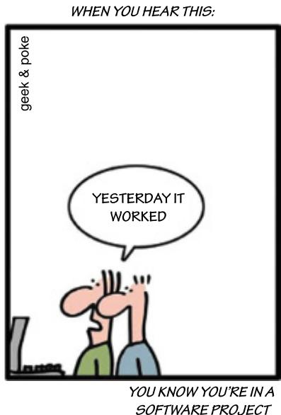  
Source: geek-and-poke.com. Licensed under CC-BY 3.0

# 15.2 Usability Testing

Traditionally the usability of products was tested in laboratories or other controlled settings. Initially, usability testing focused on desktop applications, such as websites, word processors, and search tools. Now it is also important to test the usability of apps and other digital products. Performing  usability  testing  in  a  laboratory,  or  in  a  temporarily  assigned  controlled environment, enables designers to control what participants do and also to control the environmental and social influences that might impact the participants’ performance. The goal is to test whether the product being developed is usable by the intended participants to achieve the tasks for which it was designed and whether participants are satisfied with their experience.

For  some  products, such  as games,  designers  also want  to know  whether their  product is enjoyable  and fun  to use;  this is  an  important  business  goal. Increasingly, aesthetic  design has  become  important,  especially  for  websites  designed  to  sell  products  (Whiteton  and Gibbons, 2018).

# 15.2.1  Methods, Tasks, and Users

Collecting  data about  people’s performance on  predefined tasks has  always been a central component  of  usability  testing  as  described  in  some  early  texts  (e.g.,  Shneiderman, 1986; Preece et al., 1994). As mentioned in Chapter 14, a combination of methods is used to collect data, which usually includes logged keystrokes, mouse and other movements, such as swiping,  pointing,  and  dragging  objects,  and  video  recordings  of  participants,  including  their facial  expressions.  Sometimes, participants  are  asked  to  describe  out  loud  what  they  are thinking and doing (the “think-aloud” technique) while carrying out tasks. In addition, participants complete a user satisfaction questionnaire about their reactions to using the product using rating  scales and answering questions. Structured and semistructured interviews may also be used to collect information about what the participants liked and did not like about the product. Evaluators may also observe and collect data about how the product is used in natural settings such as offices, hotels, people’s homes, etc.

Examples of the tasks that are typically given to participants include searching for information,  comparing  different  icons,  navigating  through different  menus, and  downloading apps. Performance times and the number and type of actions performed by participants are the two main  performance measures. Obtaining these two measures involves recording the time it  takes typical users to complete a task, such as finding a topic on a website, and the number  of errors  that users  make, such as when selecting incorrect menu options  or links. The following quantitative performance measures were identified in the late 1990s, and they are still used as a baseline for collecting user performance data (Wixon and Wilson, 1997):

. Number of people completing a task successfully   
. Time to complete a task   
Time to complete a task after a specified time away from the product   
. Number and type of errors per task   
. Number of errors per unit of time   
Number of times people navigate to an item such as online help   
. Number of people making the same or similar errors

A key concern when doing usability testing is the number of participants that should be involved: Early research suggests that 5 to 12 is an acceptable number (Dumas and Redish, 1999), though more is  often regarded as being better  because the results represent a larger and  often  broader  selection  of  the  participant  population.  However, sometimes  it  is  reasonable  to involve fewer participants  when there are budget  and schedule constraints. For instance, quick feedback about a design idea, such as the initial placement of a logo on a website, can be obtained from only two or three participants reporting on how quickly they spot the logo and whether they like its design. Sometimes, more participants can be involved early on by distributing an initial questionnaire online to collect information about their concerns. The main concerns can then be examined in more detail in a follow-up lab-based study with a small number of typical participants. (See Box 15.3 for further discussion of this topic.)

This link provides an alternative practical introduction that describes what usability is, how usability fits with UX, the relationship with accessibility, and more: careerfoundry.com/en/blog/ux-design/what-is-usability.

# 15.2.2  Labs and Equipment

Large companies, such as Microsoft, Google, and Apple, and some government agencies test their products in usability labs that  consist of a main testing lab  with recording equipment and an observation room where the evaluators can watch what is going on and how the data collected is being analyzed. There may also be a reception area where participants can wait, a storage area, and a  viewing room where  observers such as  designers, product managers, and others can watch. These lab spaces can vary and can be arranged to mimic features of the real world superficially. For example, when testing an office product or a product for use in a hotel reception area, the lab can be set up to resemble those environments. Soundproofing and lack of windows, co-workers, and other workplace and social distractions are eliminated so that participants can concentrate on the tasks that have been set up for them to perform. While controlled  environments like  these enable researchers  to capture data  about participants’ uninterrupted performance, the impact that real-world interruptions can have on usability is not captured. Furthermore, purpose-built labs are expensive for small organizations to maintain.

Typically, large  company  labs contain  two  to  three  wall-mounted  video  cameras  that record the participants’ behavior, such as hand movements, facial expressions, and general body language. Microphones are placed near where the participants will be sitting to record their comments. Video and other data are fed through to monitors in the observation room.

Figure  15.1  shows  a  typical  arrangement  in  which  designers  in  an  observation room  are watching a usability test through a one-way mirror.

Figure 15.1 Diagram of the usability lab used by the U.S. Health and Human Services government department   
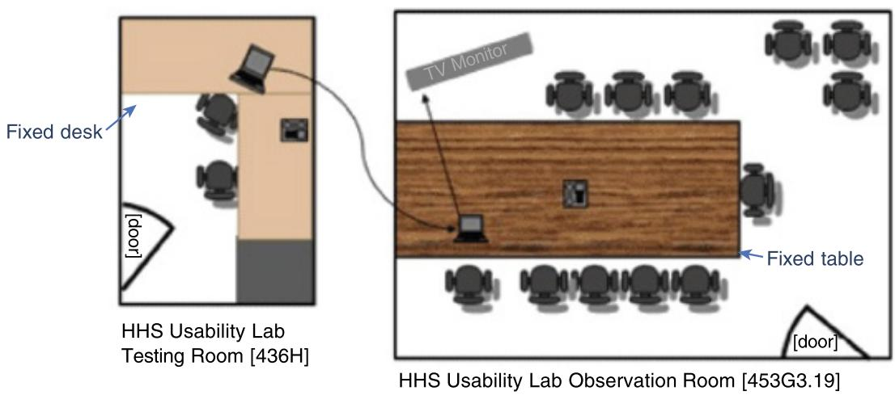  
Source: HHS Usability Lab / U.S. General Services Administration / Public domain

This link to the U.S. Health and Human Services (HHS) government department website describes the HHS usability processes lab: www.usability.gov/ how-to-and-tools/guidance/hhs-usability-lab.html.

Because  usability  labs can  be expensive  and  labor-intensive to  run  and  maintain, less expensive  and more versatile alternatives started  to become popular  in the early and mid-1990s. The development of mobile and remote usability testing equipment also corresponded with the need to do more testing in small companies and in other venues. Mobile usability equipment typically includes video cameras, laptops, eye-tracking devices, and other measuring equipment that can be set up temporarily in an office or other space, converting it into a makeshift usability laboratory. An advantage of this approach is that it enables testing to be done on-site, which makes it less artificial and more convenient for the participants.

A number of products are specifically designed for performing mobile evaluations. Some are referred to as lab-in-a-box or lab-in-a-suitcase because they pack away neatly into a convenient carrying case. The portable lab equipment typically consists of off-the-shelf components that plug into a laptop or connect remotely and can record video directly to hard disk, eye-trackers  (some  of which take  the  form  of glasses  for recording  the  participant’s  gaze), and facial recognition systems for recording changes in the participant’s emotional responses. Increasingly, software is being developed that converts the cameras on computers into mobile webcams and eye-tracking cameras.

An example of a study  in which eye-tracking glasses  were used  to record the eye-gaze of people in a shopping mall is reported  by Nick  Dalton and his colleagues (Dalton et al., 2015). The goal of this study was to find out whether shoppers pay attention to large-format plasma screen displays when wandering around a large shopping mall in London. The displays  varied in size, and some  contained information about directions to different parts  of the mall, while others contained advertisements. Twenty-two participants (10 males and 12 females, aged 19 to 73 years old) took part in the study in which they were asked to carry out  a typical  shopping task  while  wearing  the Tobii  Glasses  Mobile Eye  Tracking glasses shown in  Figure 15.2(a). [Newer models  are now  available such as the one  shown in Figure 15.2(b).] These participants were told that the researchers were investigating what people look at while shopping; no mention was made of the displays. Each participant was paid $\mathcal { E } 1 0$ to participate in the study. They were also told that there would be a prize drawing after the study  and that participants who  won would receive  a gift of up $\mathcal { E } 1 0 0$ in  value. Their task was to find one or more items that they would purchase if they won the prize drawing. The researchers did this so that the study was an ecologically valid in-the-wild shopping task, in which the participants focused on shopping for items that they wanted.

As  the participants  moved  around the  mall, their  gaze  was  recorded and  analyzed  to determine the percentage of time that they were looking at different things. This was done by using software that converted eye-gaze movements so that they could be overlaid on a video of the scene. The researchers  then coded the participants’ gazes based on where  they were looking,  for instance, at  the  architecture  of the  mall, products,  people, signage, large  text, or  displays.  Several  other  quantitative  and  qualitative  analyses  were  also  performed.

The  findings  from  these analyses  revealed that  participants  looked at  displays, particularly large plasma screens, more than had been previously reported in earlier studies by other researchers. Since  Nick Dalton and  his  colleagues reported this study  in 2015, equipment for  doing usability testing has become smaller and less cumbersome as discussed briefly in Box 15.1.

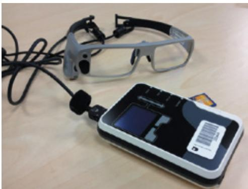  
(a)

(b)   
Figure 15.2 (a) The Tobii Glasses Mobile Eye-Tracking System (b) Tobii Mobile Eye-Tracking glasses on sale in 2022   
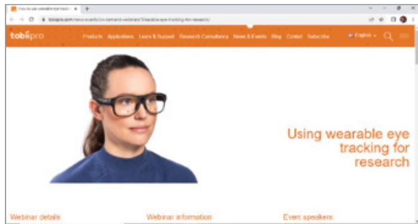  
Source: (a) Dalton et al.  (2015), p. 3891.  Reproduced with permission of  ACM Publications. (b)  www.tobiipro .com/news-events/on-demand-webinars/Wearable-eye-tracking-for-research

# BOX 15.1

# Equipment Is Getting Smaller and Smaller!

The  trend  toward remote usability  testing  and  in-the-wild studies is made possible by the development of smaller, light-weight equipment. For example, newer models of eye-tracking glasses such as those shown in Figure 15.2(b) are now available that are lighter and less cumbersome than the ones worn by participants in Dalton et al.’s (2015) study. These  new eyetracking glasses are more like ordinary glasses. Cameras have also dramatically decreased in size while at the same time becoming more powerful in terms of the kind and quality of pictures  that can  be recorded. For example, photographs and  video are  often  recorded using smartphones rather than with the bulky cameras that required mounting on a tripod to steady them. Even when recording needs to occur over a period of time, small cameras and microphones are discretely mounted in the vicinity of the study.

In  remote  usability  testing, participants  carry  out  tasks  with  a  product  in  their  own setting, communicating  with  evaluators  digitally  via  Zoom, Teams, or  other  digital  communication systems, while their interactions are logged remotely. The COVID-19 pandemic provided  additional  stimulus  to  develop  and  refine  remote  testing  techniques  and  equipment (Moran, 2021; Siltanen et al., 2021). Remote testing can be done synchronously with

both the participant and the evaluator involved at the same time (Madathil and Greenstein, 2011) or asynchronously in which participants interact with the product being tested at different  times (Moran, 2021). An advantage  of remote testing, especially asynchronous testing, is that many  participants can be tested at the  same time in real-world settings  that are geographically  distributed, and the logged click data,  counts, and  video recordings can  be automatically compiled for data analysis (Siltanen et al., 2021). Remote usability testing can be moderated by an evaluator  or assistant  who oversees communications and ensures that participants follow the testing procedures specified by the evaluators. Unmodified usability testing, as the name suggests, does not have a moderator to oversee participants’ interactions with the technology.

Remote testing  may make it easier for some  people with disabilities to be  involved, as they can work from their own homes (Petrie et al., 2006), which is helpful for including people who might otherwise be excluded, such as those with dementia (Wood et al., 2021). The downsides of remote testing include not having an evaluator present if something goes wrong with the technology, and the possibility that the participant and evaluator would have a different  type of interpersonal interaction than when both are co-present. The following links provide  an in-depth  description of the  practical issues  involved  in remote usability testing, what to prepare for, and the potential problems that might occur.

This two-part video produced by the Nielsen Norman Group NN/g describes how to run remote usability testing:

www.nngroup.com/videos/remote-usability-test-part-1

www.nngroup.com/videos/remote-usability-test-part-2

Two  case studies  follow. The  first  is a classic usability  study of a prerelease  version of Apple’s iPad that focuses on how to do usability testing when faced with time and other constraints. The second case study focuses on how to test complex products remotely using VR. This case study also addresses the precautions that were necessary to protect participants and evaluators from COVID-19 during the early days of the pandemic.

# 15.2.3  Case Study 1: Testing the iPad Usability

When Apple’s iPad first came onto the market, usability specialists Raluca Budiu and Jakob Nielsen from the Nielsen Norman Group conducted user tests to evaluate participants’ interactions with websites and apps specifically designed for the iPad (Budiu and Nielsen, 2010). This classic study illustrates how usability tests are carried out and the types of modifications that are made to accommodate real-world constraints, such as having a limited amount of time  to  evaluate  the  iPad  as it  came  onto  the  market. Completing  the  study  quickly  was important  because Raluca Budiu  and Jakob Nielsen  wanted to get feedback to third-party developers, who were creating apps and websites for the iPad. These developers were designing products with little or no contact with the iPad developers at Apple, who needed to keep details about the design of the iPad secret until it was launched. There was also considerable “hype” among the general public and others before the launch, so many people were eager to know if the iPad would really live up to expectations. Because of the need for a quick first

study and to make the results public around the time of the iPad launch, a second study was carried out in 2011, a year later, to examine some additional usability issues (see link at the end of this case study).

For  the first  user testing study Budiu  and Nielsen  (Budiu and Nielsen, 2010) used two evaluation methods: usability testing with think-aloud in which participants said what they were doing and thinking  as they did  it (discussed  earlier in Chapter 8, “Data Gathering”), and an expert review, which is a method discussed in Chapter 16, “Evaluation: Inspections, Analytics and Models.” A key question the researchers asked was about whether the participants’ expectations were different for the iPad as compared to the iPhone. They focused on this issue because a previous study of the iPhone showed that people preferred using apps to browsing the web because the latter was slow and cumbersome at that time. The researchers wondered whether this would be the same for the iPad, where the screen was larger and web pages were more  similar  to how  they appeared  on  the laptops or  desktop computers  that most people were accustomed to using at the time.

The usability testing was carried out in two cities in the United States: Fremont, California, and Chicago, Illinois. The test sessions were similar: The goal of both was to understand the typical usability issues that participants encounter when using applications and accessing websites on  the iPad. Seven participants  were recruited. All were experienced iPhone  users who had owned their phones for at least three months and who had used a variety of apps.

One  reason for selecting participants  who used  iPhones was because  they would have had previous experience in using apps and the web with a similar interaction style as the iPad.

The participants were considered to be typical users who represented the range of those who might purchase an iPad. Two participants were in their 20s, three were in their 30s, one was in their 50s, and one was in their 60s. Three were males, and four were females.

Before  taking part, the participants  were asked to read  and  sign an  informed  consent form agreeing to the terms and conditions of the study. This form described the following:

. What the participant would be asked to do   
. The length of time needed for the study   
. The compensation that would be offered for participating in the study   
The participants’ right to withdraw from the study at any time   
A promise that the person’s identity would not be disclosed   
? An  agreement  that  the data  collected  from  each  participant  would  be  confidential  and would not be made available to marketers or anyone other than the researchers

# The Tests

The session  started  with  participants  being  invited  to  explore  any  application  they  found interesting on the iPad. They were asked to comment on what they were looking for or reading, what they liked and disliked about a site, and what made it easy or difficult for them to carry out  a task. A moderator  sat next to each  participant, observed, and took notes. The sessions were video-recorded, and they lasted about 90 minutes each. Participants worked on their own.

After exploring the iPad, the participants were asked by the researchers to open specific apps or websites, explore  them, and then carry out  one or more tasks  as they would have if  they were  on  their own. Each  participant  was  assigned the  tasks  in a random  order. All of the apps that were  tested were  designed specifically for the iPad, but for some tasks  the

participants were asked to do the same task on a website that was not specifically designed for the iPad. For these tasks, the researchers took care to balance the presentation order so that the app  would be the first presented for some  participants  and the website  would be first presented for others. More than 60 tasks were chosen from more than 32 different sites. Examples are shown in Table 15.1.

Table 15.1 Examples of some of the user tests used in the iPad evaluation (adapted from Budiu and Nielsen, 2010)   

<table><tr><td>App or website</td><td>Task</td></tr><tr><td>iBook</td><td>Download a free copy of Alice&#x27;s Adventures in Wonderland and read through the first few pages.</td></tr><tr><td>Craiglist</td><td>Find some free mulch for your garden.</td></tr><tr><td>Time Magazine</td><td>Browse through the magazine, and find the best pictures of the week.</td></tr><tr><td>Epicurious</td><td>You want to make an apple pie tonight. Find a recipe and see what you need to buy in order to prepare it.</td></tr><tr><td>Kayak</td><td>You are planning a trip to Death Valley in May this year. Find a hotel located in the park or close to the park.</td></tr></table>

Source: www.nngroup.com/reports/ipad-app-and-website-usability. Used courtesy of the Nielsen Norman Group

# ACTIVITY 15.1

1. What was the main purpose of this study?   
2. What aspects  are considered to be important for good usability  and  user experience in this study?   
3. How representative do you  consider the tasks outlined in Table 15.1 to be for a typical iPad user?

# Comment

1. The main purpose of the study was to find out how participants interacted with the iPad by examining how they interacted with the apps and websites that they used on the iPad. The findings were intended to help designers and developers determine whether specific features would need to be developed for the websites and apps to run on the iPad.   
2. The definition of usability in Chapter 1, “What is Interaction Design?” suggests that the iPad should be efficient, effective, safe, easy to learn, easy to remember, provide a satisfying user experience, and have good utility (that is, good usability). The definition of user experience suggests that it should also support creativity and be motivating and helpful. The iPad is designed for the general public, so the range of users is broad in terms of age and experience with technology.   
3. The tasks are a small sample of the total set prepared by the researchers. They cover shopping, reading, planning, and  finding  a  recipe, which are  common activities that people engage in during their everyday lives.

# The Equipment

The  testing  was  done  using  a  setup  (see  Figure  15.3)  similar  to  the  mobile  usability  kit described earlier. A camera recorded the participant’s interactions  and gestures when using the iPad and streamed the recording to a laptop computer. A webcam was also used to record the expressions on the participants’ faces and their think-aloud commentary. The laptop ran software called  Morae, which  synchronized these  two data streams. Up to three  observers (including the moderator sitting next to the participant) watched the video streams on their laptops situated  on  the table so that they  did  not  invade the participants’  personal space, rather than observing the participants directly.

Figure 15.3 The setup used in the Chicago usability testing sessions   
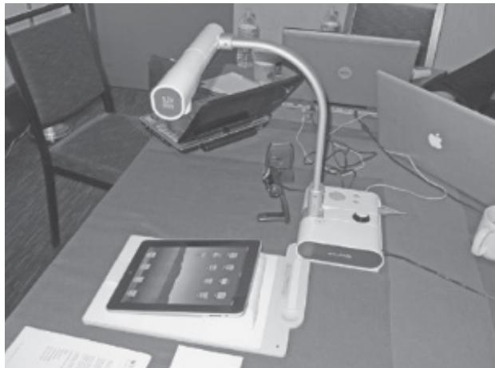  
Source: www.nngroup.com/reports/ ipad-app-and-website-usability.  Used courtesy  of  the  Nielsen Norman Group

# Usability Problems

The main  findings from  the study showed  that the participants were able  to interact  with websites on the iPad but that it was not optimal. For example, links on the pages were often too small to tap on reliably, and the fonts were sometimes difficult to read. The various usability problems identified in the study were classified according to a number of well-known interaction design principles and concepts, including mental  models, navigation, quality of images, problems of using a touchscreen with small target areas, lack of affordances, getting lost  in  the  application,  effects  of  changing  orientations,  working  memory,  and  feedback received.

Getting  lost in an  application is  an old  but important  problem  for designers of digital products, and some participants got lost because they tapped the iPad too much so could not find a back button and could not get back to the home page. One participant said “...I like having everything  there [on  the home page]. That’s just how my brain works” (Budiu and Nielsen, 2010,  p. 58). Other  problems  arose because  apps appeared  differently in the two views possible on the iPad: portrait and landscape.

# Interpreting and Presenting the Data

Based on the findings of their study, Budiu and Nielsen made a number of recommendations, including  supporting  standard  navigation. The  results  of  the  study  were  written  up  as  a report that was made publicly available to app developers and the general public. It provided a summary of key findings for the  general public as well as specific details of the problems the participants had with the iPad so that developers could decide whether to make specific websites and apps for the iPad.

While revealing how usable websites and apps are on the iPad, this user testing did not address how the iPad would be used in people’s everyday lives. This required a study where observations were made of how people use iPads in their own homes, at school, in the gym, and when traveling, but this did not happen because of lack of time.

# ACTIVITY 15.2

1. Was the selection of participants for the iPad study appropriate? Justify your comments.   
2. What might have been some of the problems with asking participants to think out loud as they completed the tasks?   
3. How do you think testing a new version of the iPad now would be different from the testing done by Budiu and Nielsen almost 15 years ago?

# Comments

1. The researchers tried to get a representative set of participants across an age and gender range with similar skill levels, that is, participants who had already used an iPhone. Ideally, it would have been good to have had additional participants to see whether the findings were more generalizable across the broad range of users for whom the iPad was designed. However, it was important to do the  study as quickly  as possible and get  the results  to developers and to the general public.   
2. If a person is concentrating hard on a task, it can be difficult to talk at the same time. This can be overcome by asking participants to work in pairs so that they talk to each other about the problems that they encounter.   
3. There would likely be several differences. It would certainly be easier to find suitable participants as many more people have experienced iPads and iPhones so the mode of interaction would be more familiar to more people. There  would likely be more emphasis on testing  a range  of different  apps,  including  Siri, interactive maps,  online food ordering services, and social media. Plus, many designers are now much more familiar with designing for a range of different sized tablets and other mobile devices.

Reports of both the first and second usability studies conducted by the Nielsen Norman Group NN/g can be found here: www.nngroup.com/reports/ ipad-app-and-website-usability.

This classic video illustrates the usability problems that a woman had when navigating a website to find the best deal for renting a car in her neighborhood. It illustrates how usability testing can be done in person by a designer sitting with a participant. The video is called Rocket Surgery Made Easy by Steve Krug, and you can view it here: www.youtube.com/watch?v $\ " =$ QckIzHC99Xc.

# 15.2.4  Case Study 2: Remote Testing with Extended Virtual Reality Systems

Sanni Siltanen and her colleagues from KONE Corporation (Finland) were involved in developing new immersive experiences in XR (an extended reality form of virtual reality that can include other immersive components, such as sensory input) at the time the COVID-19 pandemic struck (Siltanen et al., 2021). They needed to find a different way  of doing usability testing during the pandemic that was safe for their participants and evaluators. The problem they faced was how to test their target users who were all expert users and KONE company employees. The restrictions imposed by social distancing and social isolation meant they had effectively to stop conducting any in-lab user studies, which had up until then accounted for most of their user testing. Like so many other companies, they needed to work out how to conduct their user testing remotely. In their case, it was made much harder, first, because they could only test  their employees and, second, they  needed quite  a sophisticated setup to  be able to test the collaborative extended reality (XR) platforms they were working on  at the time (e.g., expert teams who plan complex machine rooms), which made testing much more difficult to achieve remotely.

Despite the known benefits of remote testing (e.g., Hartson et al, 1998), particularly for enabling a wider range of people to participate (Dray and Seigel, 2004), there was little guidance on  how to actually do  remote testing with company  employees in  industrial settings. Most of the advice that  was being published about  remote virtual reality (VR)  testing was aimed  at academic  researchers—where  it is  possible  to recruit novice  volunteers who  had their own VR headsets and who wanted to take part in remote studies. To this end, Siltanen et al. developed their own remote testing setup that was configured across multiple locations. This involved sending VR or XR headsets to their experts so that they could experience collaborative software simulations of the specific environments they wanted to evaluate.

Siltanen et al. conducted 22 remote usability tests in this way with experts spanning eight countries—Finland, India, China,  Germany, Indonesia, Malaysia, the  USA, and  the United Arab Emirates. This required ingenuity and special procedures to ensure that the tests were safe during the Covid  pandemic. Some tests  were conducted on  the participants’ premises where special disinfecting routines had to be implemented, others were conducted remotely using VR technology, and some were a hybrid. In this case study we discuss only the first of five different testing examples discussed in Siltanen’s and her colleagues’ paper, in which the researchers investigated  the  benefits  of a multiuser virtual  reality setup  for a collaborative review of a product. Figure 15.4 shows a participant wearing a VR headset, holding two paddles to initiate and control movement in the VR environment during testing.

Figure 15.4 A participant in a test session   
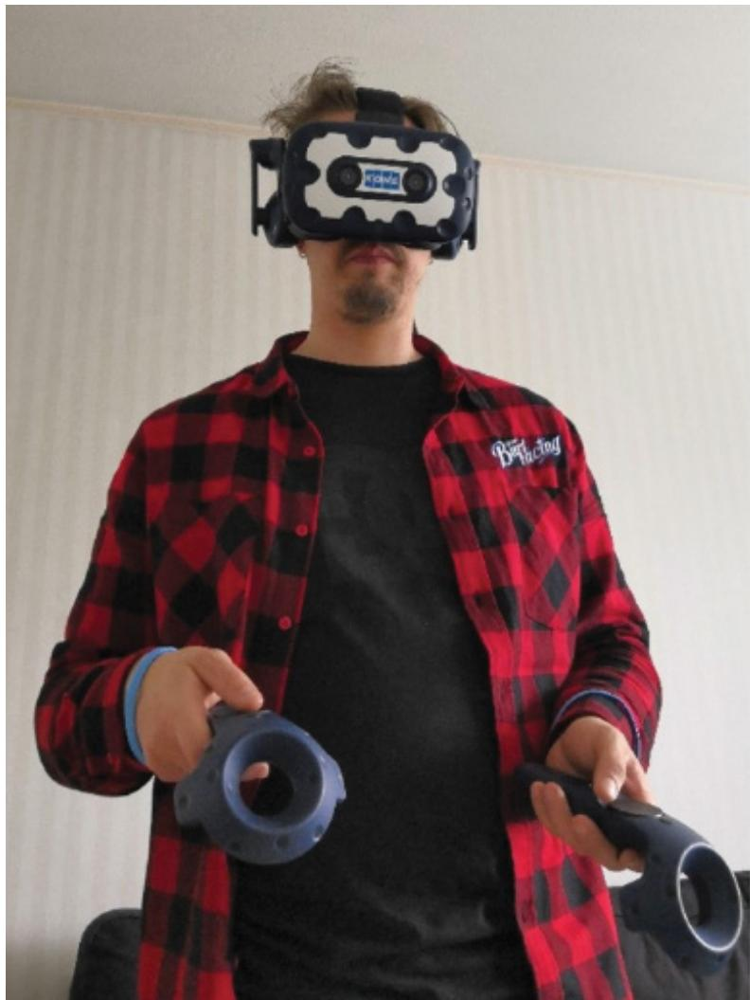  
Source: Siltanen et al. (2021) MDPI / CC BY 4.0

The difficult part was working out how to test remote collaboration where the participants and observers were all in different locations. The way they  did this was to link them up  in the different locations using the VR software  environment DesignSpace. Figure 15.5 shows screen shots from one of the setups using this software. As shown, the participants and observers are represented virtually in different spaces; the participant on the left is operating machinery, and a team of observers is in the space on the right.

Figure 15.6 shows a schematic of the complete setup used in the first testing case study, which took place across four different locations. A remote facilitator wearing a head-mounted display (HMD) was in the first location, and an observer with an HMD and tech support person were in the second location. One participant with an HMD was in a third location, and two participants were in a fourth location, one of whom was wearing an HMD, and the other was using a desktop computer. There was also an on-site assistant in the fourth location.

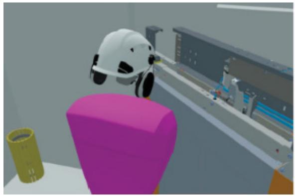

Figure 15.5 Screenshots from the DesignSpace VR environments   
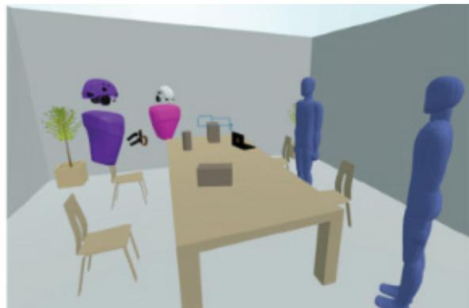  
Source: Siltanen et al. (2021) MDPI / CC BY 4.0

Figure 15.6 The testing setup used with the DesignSpace environment   
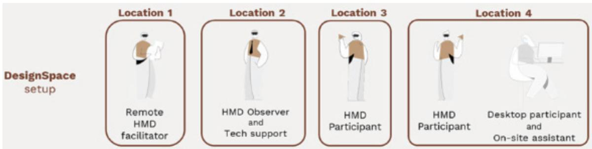  
Source: Siltanen, S. 2021 / MDPI / CC BY 4.0

Because of social distancing and the need to disinfect equipment, facilitators could not help participants put on equipment, and the instructions telling the participants what to do had to be presented  on  large screens rather  than face-to-face. Traveling  between  sites was not  allowed either  or was limited. Furthermore, as conditions  changed due  to COVID, so did the test setup. Collecting data became trickier. For example, facial masks resulted in participants’ comments  being muffled, and facial expressions, which are important  data, were hard to gauge.

Microsoft’s Teams was used for communication between everyone involved in the tests across all the sites. A mixed-methods approach was used for data collection in which notes, pictures, and  videos  were  collected  of participants’  interactions  with  each  other and  with the technology. The data was analyzed using the affinity diagramming technique to identify related  concepts. Insights  that  were  reported  from  this  remote  user  testing  setup  included that Teams or a similar collaboration tool was useful for organizing the remote user testing arrangements using VR. The authors also recommend that it is advisable to record the test session for later reference, and they recommend using a camera that films the whole test site. Sometimes the test participant was alone at a test location, so the researchers advise having an assistant located nearby in case there are problems. When facilitation is done remotely, the setup needs to be managed very carefully; there needs to be a dress rehearsal to ensure that

all the equipment is working correctly and the participant knows what to expect and what to do. Some of these issues are also important for in-person testing, but they are especially so for remote testing. Siltanen et al.’s situation was particularly tricky as they were trying to achieve remote testing of complex systems with experts in XR, where people were in multiple remote locations and different spaces, whereas prior to the pandemic they were all in the lab with a sophisticated usability lab setup. Here they had to reconfigure the tech in ways to simulate this setup, which was a remarkable achievement.

# ACTIVITY 15.3

1. What might have been some of the problems that the researchers encountered when they switched to remote user testing with XR?   
2. How might the  precautions around ensuring people’s safety during the  COVID-19 pandemic have contributed to the complexity of this remote testing?

# Comments

1. There are  many potential technical and social problems that the researchers might have encountered. On the technical side these included that the research team needed to ensure they had sufficient head-mounted displays and a reliable way to send them to the experts who would participate in the tests. On the social side, some of the experts may have had limited  experience with XR even though they were experts in dealing with the  systems being tested. No one  likes to be seen struggling to use unfamiliar equipment, and some experts may have been nervous about stepping outside of their normal comfort zone to participate in remote testing using XR. You may have thought of other potential problems.   
2. An added complexity was the need to ensure that all the equipment and the testing vicinity was sanitized after every participant and that social distancing was maintained in order to keep participants, on-site assistants, and tech support people safe.

For more information about the different cases and the way Sanni Siltanen and her colleagues adjusted their test procedures due to COVID-19 restrictions, see the article “There’s always a way: Organizing VR tests with remote and hybrid setups during a pandemic - learning from five case studies” at doi.org/10.3390/ mti5100062.

For  another example  of  usability  testing,  see  the  report  “Case  Study: Iterative Design and Prototype Testing of the NN/g Homepage” by Kathryn Whitenton and  Sarah  Gibbons  from  the  Nielsen  Norman  Group  (August  26,  2018), which  describes  how  user  testing  with  prototypes  may  be  integrated  into  the design  process.  You  can  view  this  report  at  www.nngroup.com/articles/ case-study-iterative-design-prototyping.

# 15.3 Conducting Experiments

When conducting experiments in research contexts, specific hypotheses are tested that make a prediction about the way people will perform with an interface. The benefits are more rigor and confidence that one interface feature is easier to understand or faster to use than another. An example of a hypothesis is that context menus (that is, menus that provide options related to the context  determined by  the users’ previous choices) are easier to select from  as compared to cascading menus.

Hypotheses are  often  based  on a theory,  such as Fitts’  law (see Chapter 16), or previous research findings. Specific measurements provide a way of testing the hypothesis. In the example mentioned earlier, the ease of selecting menu options could be compared by measuring the amount of time taken by participants when selecting from each menu type. Counting the number of errors made would indicate the accuracy of selection.

# 15.3.1  Hypotheses Testing

Typically, a hypothesis involves examining a relationship between  two things, called variables.  Variables  can  be  independent  or  dependent.  An  independent  variable  is  what  the researcher manipulates (that is, selects), and in the previous example, it is the different menu types. The other variable is called the dependent variable, and in our example this is the time taken to select an option. It is a measure of user performance and, if our hypothesis is correct, will vary depending on the different types of menus.

When  setting  up  a  hypothesis  to  test  the  effect  of  the  independent  variable(s)  on  the dependent variable, it is normal to derive a null hypothesis and an alternative one. The null hypothesis in our example would state that there is no difference in the time it takes participants to find items (that is, the selection time) between  context and  cascading menus. The alternative hypothesis would state that there is a difference between the two regarding selection time. When a difference is specified but not how they will differ, it is called a two-tailed hypothesis. This  is because  it  can  be  interpreted  in two  ways:  It  is  faster  to select  options either from the context menu or from the cascading menu. Alternatively, the hypothesis can be stated in terms of one effect. This is called a one-tailed hypothesis, and it would state that “it  is  faster  to select  options  from  context  menus,” or  vice  versa. A  one-tailed  hypothesis would be  preferred  if  there  was  a  strong reason  to  believe  it  to  be  the  case. A  two-tailed hypothesis would be chosen if there was no reason or theory that could be used to support the case that the predicted effect would go one way or the other.

You might ask why you need a null hypothesis, since it seems to be the opposite of what the experimenter wants to find out. It is put forward so that the data can reject a statement without necessarily supporting the opposite statement. If the experimental data shows a big difference between selection times for the two menu types, then the null hypothesis that the menu type has no effect on selection time can be rejected, which is different from confirming the alternative hypothesis. Conversely, if there is no difference between the two, then the null hypothesis cannot be rejected (that is, the claim that it is faster to select options from context menus is not supported).

To test  a  hypothesis,  the  researcher  has  to  set  up  the  conditions  and  find  ways  to keep other variables constant  to prevent them  from influencing  the findings. This is  called

experimental design. Examples of other variables that need to be kept constant for both types of menus might include size and screen resolution. For example, if the text is in 10-point font size in one condition and 14-point font size in the other, then it could be this difference that causes the effect (that is, differences in selection speed are due to font size). More than one condition can also be compared with the control, for example Condition $1 =$ Context menu; Condition $2 =$ Cascading menu; and Condition $3 =$ Scrolling.

Sometimes, a researcher  might  want to  investigate the relationship  between  two independent variables, for example, age and educational background. A hypothesis might be that young people are faster at searching the web than older people and that those with a scientific background are more effective at searching the web. An experiment would be set up to measure  the time it takes to complete the task and the number of searches carried out. The analysis of the data would focus on the effects of the main variables (age and background) and also look for any interactions among them.

Hypothesis testing can also be extended to include even more variables, but it makes the experimental design more complex. An example is testing the effects of age and educational background  on  participant  performance  for  two  methods  of  web  searching:  one  using  a search engine and the other manually navigating through links on a website. Again, the goal is to test the effects of the main variables (age, educational background, and web searching method) and to look for any interactions among them. However, as the number of variables increases in an experimental design, it makes it more  difficult to work out  what is causing the results from the data.

# 15.3.2  Experimental Design

A  concern  in experimental  design is  to determine which  participants  to involve for which conditions in an experiment. The experience of participating in one condition will affect the performance of those participants if asked to participate in another condition. For example, having learned about the way the heart works by watching a YouTube video, if one group of participants  was exposed  to the same  learning material via another  medium, for instance, virtual reality, and another group of participants was not, the participants who had the additional exposure to the material would have an unfair advantage. Furthermore, it would create bias if the participants in one condition within the same experiment had seen the content and the others had not. The reason for this is that those who had the additional exposure to the content would have had more time to learn about the topic, and this would increase their chances of answering more questions correctly. In some experimental designs, however, it is possible to use the same participants for all conditions without letting such training effects bias the results.

The  names  given  for  the  different  designs  are  different-participant  design,  sameparticipant design, and matched-pairs design. In different-participant design, a single group of participants is allocated randomly to each of the experimental conditions so that different participants perform in different conditions. Another term used for this experimental design is  between-participants design  (also  called  between-subjects  design). An advantage  is  that there are no ordering or training effects caused by the influence of participants’ experience on one set of tasks to their performance on the next set, as each participant only ever performs under one condition. A disadvantage is that large numbers of participants are needed so that the effect of any individual differences among participants, such as differences in experience

and expertise, is minimized. Randomly allocating the participants and pretesting to identify any participants that differ strongly from the others can help.

In same-participant design (also called within participant design or same subjects design), all  participants  perform  in  all  conditions  so  that  only  half  the  number  of  participants  is needed; the main reason for this design is to lessen the impact of individual differences and to see how performance varies across conditions for each participant. It is important to ensure that the order in which participants perform tasks for this setup does not bias the results. For example, if there are two tasks, A and B, half the participants should do task A followed by task B, and the other half should do task B followed by task A. This is known as counterbalancing. Counterbalancing  neutralizes possible unfair  effects of learning from  the first  task, known as the order effect.

In matched-participant design (also known as pair-wise design), participants are matched in pairs based on certain user characteristics such as expertise and gender. Each pair is then randomly  allocated  to  each  experimental  condition. A  problem  with  this  arrangement  is that other important variables that have not been considered may influence the results. For example, experience  in  using  the  web  could  influence  the  results  of  tests  to  evaluate  the navigability of a website. Therefore, web expertise would be a good criterion for matching participants. The advantages and disadvantages of using different experimental designs are summarized in Table 15.2.

Table 15.2 The advantages and disadvantages of different allocations of participants to conditions   

<table><tr><td>Design</td><td>Advantages</td><td>Disadvantages</td></tr><tr><td>Different participants(between-participants design)</td><td>No order effects.</td><td>Many participants are needed.
Individual differences among 
participants are a problem, which 
can be offset to some extent by 
randomly assigning to groups.</td></tr><tr><td>Same participants(within-participants design)</td><td>Eliminates individual 
differences between 
experimental conditions.</td><td>Need to counterbalance to avoid 
ordering effects.</td></tr><tr><td>Matched participants(pairo-wise design)</td><td>No order effects. The effects 
of individual differences 
are reduced.</td><td>Can never be sure that participants 
are matched across variables that 
might affect performance.</td></tr></table>

The data collected to measure  participants’ performance on the tasks set  in an experiment usually includes response times for subtasks, total times to complete a task, and number of errors  per  task. Analyzing  the data  involves comparing  the performance  data  obtained across the  different  conditions. The  response  times, errors, and  so  on, are  averaged across conditions to see  whether there are  any  marked  differences. Statistical  tests are  then used, such as $t$ -tests that  statistically compare the differences between  the conditions, to reveal  if these  are  significant. For  example, a $t { \cdot }$ -test  will reveal  whether  it  is  faster  to select  options from context or cascading menus.

# 15.3.3  Statistics: $\scriptstyle { \mathbf { \pmb { t } } }$ -tests

There are many types of statistics that can be used to test the probability of a result occurring by chance, but $t$ -tests are one of the most widely used statistical test in HCI and related fields, such as psychology. The scores, for example, time taken for each participant to select items from a menu in each condition (that is, context and cascading menus), are used to compute the means $( { \overline { { x } } } )$ and standard deviations (SDs). The standard deviation is a statistical measure of  the spread or variability  around the mean. The $t$ -test uses  a simple  equation to  test the significance  of the difference between the  means for the  two  conditions. If  they are significantly different from each other, we can reject the null hypothesis. A typical $t$ -test result that compared menu  selection times  for two groups  with  9 and 12  participants  each might  be as follows:

$$
\mathrm {t} = 4. 5 3, \mathrm {p} <   0. 0 5, \mathrm {d f} = 1 9
$$

The $t$ -value of 4.53 is the score derived from applying the $t$ -test; df stands for degrees of freedom, which represents the number of values in the conditions that are free to vary. This is a complex concept that we will not explain here other than to mention how it is derived and that it is always written as part of the result of a $t { \cdot }$ -test. The df values are calculated by summing  the number  of participants  in one condition minus 1 and the number of participants in the  other condition minus 1. It is calculated as $\mathrm { d f } = \left( N _ { a } - 1 \right) + \left( N _ { b } - 1 \right)$ , where $N _ { a }$ is the number  of participants  in one condition and $N _ { b }$ is  the  number of participants in the  other condition.  In  our  example, $\operatorname { d f } = { \big ( } 9 - 1 { \big ) } + { \big ( } 1 2 - { \overset { \circ } { 1 } } { \big ) } = 1 9$ , $\boldsymbol { p }$ is  the  probability  that  the  effect found did not occur by chance. So, when $\textstyle p < 0 . 0 5$ , it means that the effect found is probably not  due to chance  and that there is  only a 5 percent possibility that it could be by  chance. In other words, there most likely is a difference between the two conditions. Typically, a value of $\textstyle p < 0 . 0 5$ is considered good enough to reject the null hypothesis, although lower levels of $\boldsymbol { p }$ are more convincing; for instance, $ { p } < 0 . 0 1$ where the effect found is even less likely to be due to chance, there being only a 1 percent chance of that being the case.

This video is a plenary talk given by danah boyd in which she discusses her research about the use of statistics for the U.S. Census. It illustrates how using statistics responsibly is much harder than we might imagine, but which is important in science and politics. You can see an interview with danah at the end of this chapter.

www.youtube.com/watch?v=kSdGG6wEE9k

# 15.4  In-the-Wild Studies

Increasingly, more evaluation studies are being done in natural settings, which have traditionally been known as field studies. During the  last 20 or so years, evaluators and researchers have  organized  studies  in  which  they  exert  little  or  no  control  on  participants’  activities. These  studies  are  more  aptly referred  to as in-the-wild  (Rogers  and Marshall, 2017). This

change is largely a response to technologies being developed for use outside of office settings. For example, mobile, ambient, IoT, and other technologies are now available for use in the home, outdoors, and in public places. Typically, in-the-wild studies are conducted to evaluate people’s experiences with technology  wherever  it is going to  be used, as  in the case of  the Ethnobot study (Tallyn et al., 2018) discussed in Chapter 14.

In contrast to studies in controlled environments, studies in the wild tend to be “messy” in the sense that activities often overlap and may be constantly interrupted by events that are not predicted or controlled such as phone calls, texts, rain if the study is outside, and different people coming and going. This is typical of the way that people interact with products in their everyday worlds. Evaluating how people think about, interact with, and integrate products within the settings in which they will be used, gives a better sense of how successful the products will be when used in the real world. The trade-off is that, compared with studies in a lab, it is harder to test specific hypotheses about an interface because many environmental factors that influence the interaction are not controlled. This makes it more difficult to determine what causes a particular type of behavior or what is problematic about the usability or user experience of a product.

In-the-wild  studies  can  range  in  time  from  a  few  minutes  to  several  months  or  even years and can involve just a few  people or several hundred. In the clinical trials  of an app called Mobile Diabetes Detective, conducted by Lina Mamykina and her colleagues, patients track their own blood glucose levels to self-monitor their diabetes (Mamykina et al., 2021). Patients take  readings of  their blood glucose at  set times, such as when  they wake, before or after meals, etc. They can decide exactly when they do their tests as long as they stick to the same routine so that the readings can be compared and patterns identified. For example, if a patient’s reading is high after a particular meal, the  patient will be encouraged to make changes to their diet. This study lasted  for five years, but each patient participated for just one year. In another study, Bill Gaver and his colleagues gave nature enthusiasts information about how to make their own cameras for tracking wildlife. The researchers examined what the participants  did, how they used the cameras, and their opinions about  their experience (Gaver et al., 2019). More than 1,000  people participated. The researchers  did not  report the study as an in-the-wild study, but the lack of control over what participants did with the cameras and the prolonged period of uninterrupted observation by the researchers are characteristic of in-the-wild studies.

Data  collected for in-the-wild  studies  primarily consists  of observing and interviewing people, such as by collecting video, audio, field notes, and photos to record what occurs in the chosen setting. Usage data can also be automatically logged from the technologies they are  using  (e.g.,  ambient  displays,  mobile  devices).  In  addition,  participants  may  be  asked to  fill  out  paper-based  or  electronic  diaries, which  run  on  smartphones,  tablets, or  other handheld  devices, at particular  points during the  day. The kinds  of reports that  can be of interest to researchers include when participants are interrupted during an ongoing activity or when they encounter a problem  when interacting with a product  or when they are in a particular location, as well as how, when, and if they return to the task that was interrupted. This approach is based on the experience sampling method (ESM), discussed  in Chapter 8, which is often used in healthcare (Price et al., 2018). Data about the frequency and patterns of  certain  daily  activities,  such as  the  monitoring  of eating  and  drinking  habits,  or  social interactions like phone and face-to-face conversations, are often recorded. Software running

on a smartphone may trigger messages, like those used in the Painpad study discussed in a moment, alerting  participants  at certain  intervals,  requesting them  to  answer questions  or fill out  dynamic forms and checklists. These might  include recording what  the participants are doing, what they are feeling like at a particular time, where they are, or how many conversations  they have had  in the  last hour. The  findings from  studies in natural settings  are typically reported  in the  form of vignettes, excerpts, critical incidents, patterns of behavior, and narratives to show how the products are being used, adopted, and integrated into their surroundings.

As in any kind of evaluation, when conducting in-the-wild studies, deciding whether to tell the people involved that they are being studied and how long  the study or session will last is  more difficult than in a laboratory situation. In some studies, like the diabetes study (Mamykina et al., 2021) and other health studies, patients expect their behavior to be monitored, but in other studies monitoring may be less obvious. For example, if people are using a smartphone street map app while walking in a city, their interactions may take only a few seconds, so informing them that they are being studied may disrupt their behavior. It is also important  to  ensure  the  privacy  of  participants,  especially  for  studies  in  the  home  where people may not want their behavior to be recorded all the time. For these in-the-wild studies, evaluators will need to work out and agree with the participants what part of the activity is to be recorded and how. If evaluators want to set up cameras, they need to be situated unobtrusively, and participants need to be informed in advance about where the cameras will be and when they will be recording their activities. There also needs to be a plan to determine what happens if equipment breaks down or there is some other unforeseen event such as a family member in the study becoming unwell. Security arrangements will need to be made if expensive or precious equipment is being evaluated in a public place. Other practical issues may also need to be considered depending on the location, product being evaluated, and the participants in the study. For example, if the study is outdoors, what happens if it rains?

Instead of developing solutions that fit in with existing practices and settings, researchers often explore new technological possibilities that can change and even disrupt participants’ behavior (Rogers, 2011). Opportunities are created, interventions are installed, and different ways of behaving are encouraged. A key concern is how people react, change, and integrate the technology into their everyday lives. The outcome of conducting in-the-wild studies for different  periods  and at  different  intervals  can  be  revealing, demonstrating  quite  different results  from those arising out of lab studies. Comparisons  of findings from lab  studies and in-the-wild  studies  have  revealed  that  while  many  usability  issues  can  be  uncovered  in  a lab study, the way  the technology is  actually used can  be difficult to discern. These  aspects include how participants  approach the new technology, the kinds of benefits  that they can derive from it, how they use it in everyday contexts, and its sustained use over time (Rogers et al, 2013; Kjeldskov and Skov, 2014; Harjuniemi and Häkkila, 2018).

The case study in 15.4.1 describes how researchers evaluated a pain-monitoring device in the natural setting of a hospital with patients who had just had surgery. Box 15.2 discusses situations in which evaluation of visualization tools for use by experts needs to be done over a period of several days, weeks, or months in order for the experts to learn to use the tools. Box  15.3  addresses  the  tricky  question  of  how  many  participants  should  be  involved  in different types of user studies.

# 15.4.1  Case Study: An In-the-Wild Study of a Pain Monitoring Device

Monitoring patients’ pain and ensuring that the amount of pain experienced by them after surgery is  tolerable is  an  important  part  of helping patients to  recover. However, accurate pain monitoring  is a  known problem  among physicians, nurses, and caregivers. Collecting scheduled pain readings takes time, and it can be difficult because patients may be asleep or may not want to be bothered. Typically, pain is managed in hospitals by nurses asking patients to rate their pain on a 1–10 scale, which is then recorded by the nurse in the patients’ records.

Before  launching  this  study, Blaine  Price  and  his  colleagues  (Price  et  al.,  2018)  had already spent a considerable amount of time observing patients in hospitals and talking with nurses. They had also carried out usability tests to ensure that the design of Painpad, a painmonitoring tangible device for patients to report their pain levels, was functioning properly. For example, they checked the usability of the display and appropriateness of the case covering the device for use in a hospital environment and whether the LED display was working and was readable. In other words, they ensured that they had a well-functioning prototype for the study that they planned to carry out.

The goal of their in-the-wild study was to evaluate the use of Painpad by patients recovering from ambulatory surgery (total hip or knee replacement) in the natural environments of two UK hospitals. Painpad (see Figure 15.7) enables patients to monitor their own pain levels by pressing the keys on the pad to record their pain rating. The researchers were interested in many  aspects related  to how  patients  interacted with Painpad, particularly  how robust and easy  it was to use  in the hospital environments. They  also wanted to see whether the patients rated their pain every two hours as they were asked to do and how the patients’ ratings using Painpad compared with the ratings that the nurses collected. They wanted to look for insights about the preferences and needs of the older patients who used Painpad and for design insights around visibility, customizability, ease  of operation, and the contextual factors that affected its usability in hospital environments.

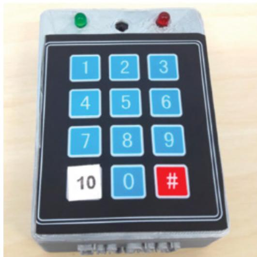  
Figure 15.7 Painpad, a tangible device for inpatient self-logging of pain Source: Price et al. (2018). Reproduced with permission of ACM Publications / CC BY 4.0

# Data Collection and Participants

Two  studies were conducted that involved 54  people (31 in  one study and 23 in  another). Data screening excluded participants who did not provide data using Painpad or for whom the nurses did not collect data that could be compared with the Painpad data. Because of the confidential nature of the study, ethical considerations were carefully applied to ensure that the  data  was  stored  securely  and  that  the  patients’  privacy  was  assured. Thirteen  of  the patients were male, and 41 were female. They ranged in age from 32–88 years old, with mean and median ages of 64.6 and 64.5. The time they spent in the hospital ranged from 1–7 days, with an average stay of 2–3 days.

After returning from surgery, the patients were each given a Painpad that stayed by the side of their bed. Patients were encouraged to use it at their earliest convenience. The Painpad was  programmed to  prompt  the  patients to  report their pain  levels every  two  hours. This two-hour interval was based on the hospital’s desired clinical target for collecting pain data. Each time a pain rating was due, alternating red and green lights flashed on the Painpad for up to five minutes, and an audio notification of a few seconds sounded. The patients’ pain rating  was automatically time-stamped by  the Painpad and stored in a secure database. In addition  to the pain scores collected using Painpad, the nurses collected verbal pain scores from  the patients every two hours. These scores were entered into the patients’  charts and later entered into a database by a senior staff nurse and made available to the researchers for comparison with the Painpad data.

When the patients were ready to leave the second hospital mentioned, they were given a short questionnaire that asked whether Painpad was easy to use, how often they made mistakes using it, and whether they noticed the flashing light and sound notifications. They were also asked to rate how satisfied they were with Painpad on a 1–5 Likert rating scale and to make any other comments that they wanted to share about their experience in a free text field.

# Data Analysis and Presentation

Three types of data analysis were used by the researchers. They examined how satisfied the patients were with Painpad based on the questionnaire responses, how the patients complied with the bi-hourly requests to rate their pain on Painpad, and how the data collected with Painpad compared with the data collected by the nurses.

Nineteen  fully  completed  patient  satisfaction  questionnaires  were  collected  that  indicated that Painpad was well received and easy to use (mean rating 4.63 on a scale 1–5, where 5 was the highest rating) and that it was easy to remember to use it. Sixteen of the respondents commented that they never made an error entering their pain ratings, the aesthetics of Painpad were rated as “good,” and participants were “mostly satisfied” with it. Responses to the  flashing lights  to draw patients’ attention  to Painpad  were  polarized. Most  patients noticed the lights most of the time, while others noticed the lights only sometimes, and three patients said they did not  notice them at all. The effectiveness of the sound alert received a middle rating; some patients thought it was “too loud and annoying,” and others thought it was too soft. More nuanced reactions and ideas were collected from  the free-text response box  on  the  questionnaire.  For  example,  one  patient  (P49)  wrote, “I  think  it  is  useful  for monitoring the pattern of pain over the day, which can be changeable.”Another patient (P52) commented, “A day-to-day chart might be helpful.” Some patients, who had limited dexterity or other challenges, reported how their ability to use Painpad was compromised because Painpad was sometimes hard to reach or to hear.

After  removing  duplicate  entries, there  were 824  pain scores  provided by  the patients using  Painpad  compared with  645  scores  collected  by  the nurses. This  indicated  that  the patients  recorded  more  pain  scores  than  would  typically  be  collected  in  the  hospital  by nurses. To examine how the patients complied with using Painpad every two hours compared with the scores collected by the nurses, the researchers had to define acceptable time ranges of compliance. For example, they accepted all of the time scores that were submitted 15 minutes before and 15 minutes  after the bi-hourly time schedule for reporting time scores. This analysis showed  that the Painpad scores indicated  stronger compliance  with the two-hour schedule than with scores collected by the nurses.

Overall, the evaluation of Painpad indicated that it was a successful device for collecting patients’ pain  scores in hospitals. Of course, there  are  still more questions  for Blaine  Price and his team  to investigate. An obvious  one is  this: “Why  did the patients  give more pain scores and adhere  more strongly to the scheduled pain  recording times with Painpad than with the nurses?”

# ACTIVITY 15.4

1. Why do you think Painpad was evaluated in-the-wild (i.e., in the natural hospital setting) rather than in a controlled laboratory setting?   
2. Two types of data were collected in the study: pain ratings and patient satisfaction questionnaires. What does each type contribute to our understanding of the design of Painpad?

# Comment

1. The researchers wanted to find out how Painpad would be used by patients who had just had ambulatory surgery in hospital settings. They wanted to know whether the patients liked using Painpad and whether they liked its design and what problems they experienced when using it over a period of several days. During the early development of Painpad, the researchers carried out several usability evaluations to check that it was suitable for testing in hospital environments. It is not possible to do the kind of study described in a laboratory because it would be difficult, if not impossible, to create realistic and often unpredictable events that happen in hospitals (for example, visitors coming into the ward, conversations with doctors and nurses, and so forth). Furthermore, the kind of pain that patients experience after surgery does not usually occur outside of a hospital, nor can it be simulated in participants in lab studies. The researchers had already evaluated Painpad’s usability, and in this study they wanted to see how it was used in hospitals.

2. Two kinds of data were collected. Pain data was logged on Painpad and recorded independently by the nurses every  two hours. This data enabled the researchers to compare the pain data recorded using Painpad with the data collected by the nurses. A patient satisfaction questionnaire was also given to some of the patients. The patients answered questions by selecting a rating from a Likert scale. The patients were also invited to give comments and suggestions in a free text box. These comments helped the researchers to get a more nuanced  view of the  patients’  needs, likes, and  dislikes. For  example, they learned that some patients were hampered from taking full advantage  of Painpad  because  of other problems, such as poor hearing and restricted movement.

# BOX 15.2

# Long-Term Studies

Some studies require researchers to leave their designs with participants for extended periods of time so that the participants have time to learn how to use the product. Ben Shneiderman and Catherine Plaisant adopted this approach when evaluating a visualization tool designed for use by experts (Shneiderman and Plaisant, 2006). To evaluate the efficacy of such tools, participants are  best studied  in realistic  settings in their  own  workplaces so they can  use their  own  data and  set their  own agendas  for  extracting insights relevant to their  professional projects.

Shneiderman’s and Plaisant’s long-term evaluation studies typically started with an initial interview in which the  researchers checked that the participant has a problem to work on, available data, and a schedule for completion. Then the participant undertook an introductory training session with the tool, followed by 2–4 weeks of novice usage, followed by 2–4 weeks of mature usage, leading to a semi-structured exit interview. More data, such as daily diaries, automated logs of usage, structured questionnaires, and interviews can also be collected to provide a multidimensional understanding of the weaknesses and strengths of the tool.

Because of the complexity of some visualization tools, it can be difficult to find suitably skilled people to participate in these evaluations, so the number of participants is often small, sometimes fewer than five. Other evaluators have reported that evaluating complex visualization tools designed to run on mobile devices and smartphones can be difficult for participants because of the small screen size, so participants may need extra time to familiarize themselves with the  product before the evaluation study begins, which extends  the  overall study  time (Bentley et al., 2021).

# BOX 15.3

# How Many Participants Are Needed When Carrying Out an Evaluation Study?

The  answer to this question depends  on the  goal of the  study, the  type of study  (such  as usability, experiment,  in-the-wild  or another  type), and  the  constraints  encountered  (for instance, schedules, budgets, recruiting representative participants, and the facilities available). Chapter 8, discussed this question more broadly. The focus here is on the main types of evaluation studies discussed in this chapter: usability studies, experiments, and in-the-wild studies.

# Usability Studies

Many professional usability  consultants  used to recommend 5–12 participants for studies conducted in controlled or partially controlled settings. However, as the  study of the  iPad illustrates, six participants generated a lot of useful data. While more participants might have

(Continued)

been preferable, Radiu Budiu and Jakob Nielsen (2010) were constrained in that they needed to complete their study  and  release their  results quickly. Budiu and  Nielsen  (2012) subsequently commented that “If you want a single number, the answer is simple: test five users in a usability study. Testing with five people lets you find almost as many usability problems as you’d find using many more test participants.” Others say that as soon as the same kinds of problems start being revealed and there is nothing new, it is time to stop.

# Experiments

Knowing how many participants are needed in an experiment depends on the type of experimental design, the number of dependent variables being examined, and the kinds of statistical tests that will be used. For example, if different participants are being used to test two conditions, more participants will be needed than if the same participants test both conditions. These kinds of differences in experimental design influence the type of statistics used and the number of participants needed. Therefore, consulting with a statistician or referring to books and articles such as those by Caine (2016) and Cairns (2019) is advisable. Fifteen participants are suggested as the minimum for many experiments (Cairns, 2019).

# In-the-Wild Studies

The number of participants in an in-the-wild study will vary, depending on what is of interest: it may be a family at home, a software team in an engineering firm, children in a playground, a whole community in a living lab, or even tens of thousands of people online. Although inthe-wild studies may not be representative of how other groups would act, the detailed findings gleaned from these studies about how participants learn to use a technology and adapt to it over time can be very revealing.

# In-Depth Activity

This in-depth activity continues work on the online booking facility introduced at the end of Chapter 11, “Discovering Requirements,” and continued in Chapter 12, “Design, Prototyping and Construction.” Using any of the prototypes that you have developed to represent the basic structure of your product, follow these instructions to evaluate it:

1. Based on your knowledge of the requirements for this application, develop a standard task (for instance, booking two seats for a particular performance).   
2. Consider the relationship between yourself and your participants. Do you need to use an informed consent form? If so, prepare a suitable informed consent form. Justify your decision and the contents of the form.   
3. Select three typical participants, who can be friends or colleagues, and ask them to do the task using your prototype.   
4. Note the problems that each participant encounters. If possible, time how long they take to complete the task. (If you happen to have a camera or a smartphone with a camera, you could film each participant.)

<!-- Chunk 12 End -->

<!-- Chunk 13 Start -->

5. Since the application is not actually implemented, you cannot study it in typical settings of use. However, imagine that you are planning a controlled usability study and an in-thewild study in a natural setting. How would you do it? What kinds of things would you need to take into account? What sort of data would you  collect, and  how would  you analyze it?   
6. What are the main benefits and problems with doing a controlled study versus studying this prototype in-the-wild?

# Summary

This chapter described evaluation studies in different settings. It focused on experiments conducted as controlled laboratory studies  and in-the-wild  studies situated in natural settings. A study of the iPad when it first came out was presented as an example of usability testing. A second case study focused on the strategies needed to remotely evaluate products with experts using VR. These studies occurred across different locations and were very complex. Because of the COVID-19 pandemic, there was the added problem of how to keep evaluators and participants safe, which involved using Teams—a  group chat software for communication—so participants and evaluators could be distanced from each other.

Experimental design was then discussed that involves testing a hypothesis in a controlled research lab. The chapter ended with a discussion of in-the-wild studies in which participants use prototypes and new technologies in natural settings. The Painpad example involved evaluating how  patients in two hospitals, who  were recovering from surgery, used the  mobile Painpad device designed to enable them to self-monitor their pain levels throughout the day.

Key differences between usability testing and in-the-wild studies include the location of the  study—usability lab  or makeshift  usability lab, living lab or online distributed remote, research lab, or natural, in-the-wild situation—and how much control is imposed by evaluators and researchers. At one end of the spectrum are experiments and laboratory testing, and at the other are in-the-wild studies. Most studies use a combination of different methods, and designers often have to adapt their methods to cope with unusual new circumstances created when evaluating a new design concept, device, or app.

# Key Points

•  Usability testing usually takes  place in usability  labs or temporary makeshift labs. These labs enable designers and researchers to control the test setting. Versions of usability testing are also conducted remotely, online, and in living labs.   
•  Usability testing focuses on performance measures, such as how long and how many errors are made, when completing a set of predefined tasks. Direct and indirect observation (video and keystroke logging) is conducted and supplemented by participant satisfaction questionnaires and interviews.

•  Mobile and remote testing systems have been developed that are more portable and affordable than usability labs. Many contain mobile eye-tracking and face recognition systems and  other  devices, some of which  are available  in off-the-shelf laptop computers. Many companies continue to use usability labs because they provide a venue for the whole team to come together to observe  and discuss how  participants are  responding to the systems being developed.   
•  Remote usability testing has increased during the last 10 years, especially during the pandemic, stimulated by the need to protect the safety of evaluators and participants. At the same time there have been improvements in technology and  recording and  communication systems.   
•  While remote testing tends to be less expensive than laboratory testing, developing relationships with participants may be more difficult. In addition, body language, especially facial expressions, which are an important data source, may be harder to discern.   
•  In remote testing there may also be issues concerning what can be tested; for example, an app can be downloaded by participants, whereas a device will need to be shipped to them.   
•  Experiments  seek to test a  hypothesis by manipulating certain  variables  while  keeping others constant.   
•  The researcher controls independent variable(s) to measure dependent variable(s).   
•  In-the-wild studies  are carried  out in natural settings. They seek to discover how people interact with a given technology in the real world.   
•  Sometimes the findings of an in-the-wild study are unexpected, especially if the goal is to explore how a novel technology is being used by participants in their own homes, places of work and leisure, or outside.

# Further Reading

CAINE,  K. (2016). Local  Standards  for  Sample  Size  at  CHI.  Chi4good,  CHI  2016,  May 7–12, 2016, San Jose, CA, USA DOI: doi.org/10.1145/2858036.2858498. In this paper, Kelly Caine points out that the CHI community is composed of researchers from a wide range of disciplines (also mentioned in Chapter 1), who use a variety of methods. Furthermore, CHI researchers often deal with constraints (for instance, access to participants for an accessibility study). Therefore, the number of participants involved in a study may be different from the number suggested in standard statistics texts. The discussion in this paper is based on an analysis of papers accepted at the CHI 2014 conference.

CAIRNS,  P.  (2019). Doing  Better  Statistics  in  Human-Computer  Interaction,  Cambridge University Press. This practical book is primarily for HCI researchers when planning or completing the analysis of their data.

CRABTREE,  A.,  CHAMBERLAIN,  A.,  GRINTER,  R.,  JONES,  M.,  RODDEN,  T.,  and ROGERS, Y.  (2013).  Introduction  to  the  special  issue  of “The  Turn to  The Wild.” ACM

Transactions on Computer-Human  Interaction (TOCHI), 20 (3). This collection of articles provides in-depth case studies of projects that were conducted in the wild over many years, from the widespread uptake of children’s storytelling mobile apps to the adoption of online community technologies.

LAZAR. J., FENG, H. J., and HOCHHEISER, H. Research Methods in Human–Computer Interaction. (2nd  ed.).  Cambridge,  MA:  Elsevier/Morgan  Kaufmann  Publishers.  Chapters 2–4 describe how to design experiments and how to perform basic statistical tests.

NIELSEN, J. and BUDIU, R. Mobile Usability. New Riders Press. This classic book asks and attempts to answer the question of how we create usability and a satisfying participant experience on smartphones, tablets, and other mobile devices. There is also a wide range of recent papers available on the NN/G website: nngroup.com.

ROBSON, C. Experiment, Design and Statistics in Psychology (3rd ed.). Penguin UK. This is a classic that provides a useful introduction to experimental design and basic statistics. A more recent book by COLIN ROBSON and  KIERAN McCARTAN (2016)  entitled Real World Research (4th  ed.), published by  John Wiley  &  Sons, is  a valuable  resource for those who want to do research in applied settings. In addition to describing how to collect and analyze data, there is a chapter about ethical and political considerations.

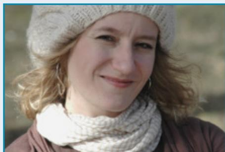

# INTERVIEW with danah boyd

Source: Courtesy of Danah Boyd

danah  boyd  is  a  partner  researcher  at Microsoft  Research,  the  founder  and president of the Data & Society Research Institute, and a distinguished visiting professor  at  Georgetown  University.  In  her research,  danah  examines  the  intersection  of  technology  and  society  with  an eye  to  limiting  how  technology  can  be abused to reinforce inequity. danah wrote

It’s Complicated:  The  Social  Lives  of Networked  Teens  (Yale  University  Press, 2014), which examines teens’ engagement with  social  media.  In  more  recent  work, danah carried out  an ethnographic study of  the  2020  U.S.  Census.  She  blogs  at www.zephoria.org/thoughts and tweets at @zephoria.

(Continued)

danah,  can  you  tell  us  a  bit  about  your research and what motivates you?

I am  an  ethnographer  who  examines  the interplay between  technology  and society. My  work  often  requires  moving  between disciplines, sectors, and frames to get at the complexity  of  our  sociotechnical  world. Fundamentally,  I’m  a  social  scientist  invested  in  understanding  the  social world. Technology shapes  social  dynamics,  providing a fascinating vantage point for understanding cultural practices.

During the 2000s, I researched different aspects of social media, most notably how American teens integrate social media into their  daily  practices.  Because  of  this, I’ve followed  the  rise  of  many  popular  social media services—MySpace, Facebook, You-Tube, Twitter, Instagram, Snapchat, and so on. I examined what teens do on these services, but I also considered how these technologies fit into teens’ lives more generally. Thus, I spent a lot of time driving around the United States talking to teens and their parents,  educators  and  youth  ministers, law enforcement, and social workers, trying to get a sense of what teens’ lives look like and where technology fits in.

During  the  2010s,  I  focused  on  how data-driven technologies are playing a central  role  in  many  facets  of  society. Techniques  like  machine  learning  and  other forms  of  artificial  intelligence  rely  heavily  on  data  infrastructure.  But  what  happens  when  data  is  manipulated,  abused, or biased? My goal was to examine sociotechnical vulnerabilities and imagine ways of minimizing how technology can be used to  reinforce  inequities  or  cause  harm. As Melvin Kranzberg once said, “Technology is neither good nor bad; nor is it  neutral.” This also led me to look at how algorithms get  manipulated  for  different  agendas—

and how  this  shapes  our  politics,  society, and interpersonal interactions.

Starting  in  2018,  I  began  looking  at  a critical  piece  of  data  infrastructure,  one that  plays  a  central  role  in  democracy, combating  discrimination,  and  allocating  resources:  the  U.S.  Census.  I  wanted to understand how data is  made, how  it’s secured,  and  how  it  is  contested.  In  the process, I became interested in how organizations and data infrastructures  are made brittle by various political actors intentionally and unintentionally. I am working on a  book  about  “statistical  imaginaries”  to unpack my findings.

How would you characterize good ethnography?

Ethnography  is  about  mapping  cultural logics and practices. To do this successfully, it’s important  to dive deep into  the everyday  practices  of  a  particular  community and try to understand  them on  their own terms.  It’s important  to  understand  how networks of people and practices intersect, as well  as the  role that  organizations  and institutions and technologies play in shaping  those  communities.  The  next  stage  is to  try  to  ground  what  one  observes  in  a broader  discourse  of  theory  and  ideas  to provide  a  framework  for  understanding cultural dynamics.

Almost  all of my projects involve “networked  field  sites.”  This  means  that  I’m moving between digital contexts and physical ones, interviewing people from different vantage  points,  and  trying  to  understand how networks  of people and practices are structured.

Many  people  ask  me  why  I  bothered driving  around  the  United  States, talking to teens  when I  could  see everything  that they  did  online.  What’s visible  online  is

only  a  small  fraction  of  what  people  do, and it’s easy to misinterpret why teens  do something simply  by looking at the traces of their actions. The  same is true  for government officials; their documents tell one story, but  observing  them  in  various contexts  tells  another. Getting  into  people’s lives, understanding their logics, and seeing how technology connects with daily practice is  critically important. Our sociotechnical worlds are entangled, and it’s critical to make sense of those tangled hairballs to understand phenomena, even when pulling on  a  string  might  unravel  the  hairball  in unexpected ways.

Of  course,  this  is  just  the  data  collection  process. I’m  also  a  firm  believer that analysis is iterative and that it’s important to include  other stakeholders  in  that  process.  I  believe  in  member-checking.  For two  decades,  I  blogged  my  “in-process thinking”  in  part  to  enable  a  powerful feedback loop that I’ve deeply relished. Engaging with government  officials, I’ve had to take a different tactic; given the political context  in which  I was working, it  wasn’t possible for me to blog what I was observing. However, my commitment to iterative and participatory research continues; I regularly “workshop my papers and analyses” with my informants as part of my research process.

I  know  you  have encountered  some surprises—or  maybe  even a  revelation— in your work on  Facebook and MySpace. Would you tell us about it, please?

From 2006–2007, I was talking with teens in  different  parts  of  the  country, and  I started  noticing  that  some  teens  were talking  about  MySpace,  and  some  teens were  talking  about  Facebook.  In  Massachusetts,  I  met  a  young  woman  who uncomfortably told me that the Black kids

in her school were on MySpace, while the white kids were on Facebook. She described MySpace  as  “like  ghetto.” I  didn’t enter into this project expecting to analyze race and  class  dynamics  in  the  United  States, but,  after her  comments, I  couldn’t  avoid them.  I  started  diving  into  my  data,  realizing that race and class could explain the difference  between  which  teens  preferred which  sites.  Uncomfortable  with  this  and totally afar from my intellectual strengths, I wrote a really awkward blog post about what I was observing. For better or worse, the BBC picked this up as a “formal report from  UC  Berkeley,” and  I  received  more than 10,000 messages over the next week. Some  were  hugely  critical,  with  some making  assumptions  about  me  and  my intentions. But the teens who wrote consistently agreed. And  then two  teens  started pointing  out  to  me  that  it  wasn’t  just  an issue of choice but an  issue of movement, with  some  teens  moving  from  MySpace to  Facebook  because  MySpace  was  less desirable  and  Facebook  was “safe.” Anyhow, recognizing  the  racist  and  classist roots  of  this,  I  spent  a  lot  of  time  trying to unpack the different language that teens used  when  talking  about  these  sites  in  a paper  called “White  Flight  in  Networked Publics?  How  Race  and  Class  Shaped American Teen Engagement with MySpace and Facebook.”

This  might  all  seem  antiquated  these days,  but  the  patterns  I  witnessed  in MySpace and Facebook continue to repeat themselves.  The  tensions  between  Snapchat  and Instagram  have similar patterns, as does WhatsApp versus iMessage. Moreover, the network  dynamics that underpin all adoption and usage of social media are increasingly  being  manipulated  to  reinforce social divisions within society. I never imagined  that  the  teens  that  I  watched

(Continued)

trying  to  hack  the  attention  economy  in 2004  would  create  a  template  that  could be used to  undermine democratic  conversations  around  the  world  only  a  decade later.

I know you are doing a lot of work on Big Data  and that some of  that is  focused on social media. What  are you  learning,  and what are your concerns for the future?

To be honest, what concerns me the most about  social  media  and  data  analytics  is that  these  technologies  operate  within  a particular formation  of financialized capitalism  that  prioritizes  short-term  profits and cancerous levels of growth over other social values, including democracy, climate sustainability,  and  community  cohesion. Even  when  data-analytics  projects  start from ideal places, it’s hard for those ideals to stay intact as companies grow and face different  kinds of  financial  pressure. As  a result,  the  same  technologies  that  could leverage  data  to  empower  communities are quickly used for exploitative purposes. I  genuinely  struggle  to  balance  my  love of technology with my concern that these tools  will  be  used  to  magnify  inequality, spread  disinformation,  increase  climate risks, and polarize society for political purposes.

I  watched  your plenary  talk  on  “Statistical  Imaginaries:  An  Ode  to  Responsible Data  Science,”  in  which  you  talk  about your current research with the U.S. Census Bureau. Would you please give us a quick overview so  that  students  have an  introduction to the use and misuse of statistics and data privacy in this sociotechnical, political context?

Like  many  governments  around  the world, the United States has a rich official statistics program. The federal government

collects a  wide range of  data  that  inform economic  policy,  public  health,  research, and  the  allocation  of  resources.  Perhaps most famously, the United  States has conducted  a  census  since  1790  to  distribute political power  through a  process known as apportionment.  I’ve spent  the  last four years trying to understand how census data are made. In the process, I’ve come to realize that the public imagination of how censuses are done  is  shockingly disconnected from  the  statistical  work  that  underpins those critical data. The knocking on doors part of the census is a tiny piece of a much larger process designed  to ensure that the government can produce the best possible data  to  reflect  the  population. There  are hundreds  of procedures  involved  in  making those data.

Once those data are produced, the Census  Bureau  wants  to  make  census  data publicly  available  for  use  by  data  users. At  the  same  time,  the  bureau  is  legally, morally, and  procedurally  required  to ensure  statistical  confidentiality.  For decades, the  Census  Bureau  has  engaged in  a  practice  known  as  disclosure  avoidance,  where  the  bureau  chooses  how  to protect  vulnerable  data.  Some  methods involve not publishing certain data; others involve rounding (e.g., 5386 to 5400). Still others involve adding noise to the data to make  it  hard  to  reconstruct  exact  information.  This  latter  set  of  techniques  has proven  quite  controversial,  in  no  small part because it bursts the illusion that the published data are the best possible data.

Census data are never perfect. Even the best laid attempts to count everyone “once and  only  once  and  in  the right  location” tend  to  go  haywire  in  some  places.  Census data are also never neutral. Significant politics  shape  what  is  collected  and  how it’s collected.  And  census  data  can  never

be objective; the methods used to produce these data are rooted in forms of expertise that are not universally valued. At the same time, there  is a  politically  salient “statistical  imaginary” that presumes  that census data can  be neutral and objective, a nearperfect count of everyone. Part of why I’m studying the making of census data is that this  statistical  imaginary  is  coming  undone, revealing  the  politics of  data  along the way.

One  of  the  most  important  things  for students  of data science to understand is

that  all  data  have  uncertainty,  politics, and  illusions  surrounding  them.  Rather  than  ignoring  the  limits  of  data,  it  is better  to  understand  them.  Rather  than pretending  that  data  can  be  neutral  or objective, it’s better to grapple with how society  and  politics  shape  those  data. When we build technical systems (or political  ones!)  that  depend  on  those  data, we carry those uncertainties and illusions forward.  Ensuring  responsible  data  science requires intentionally engaging with these issues.

