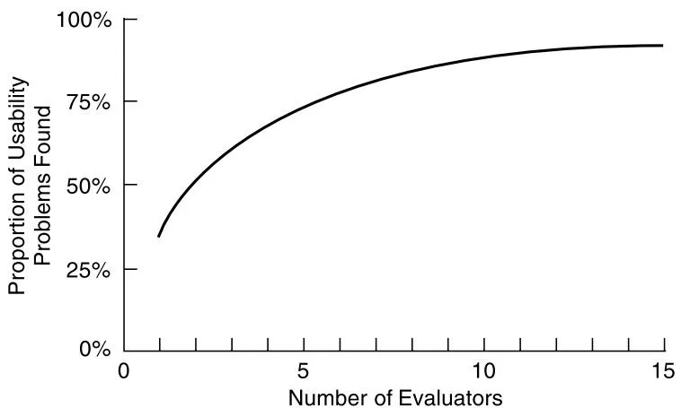
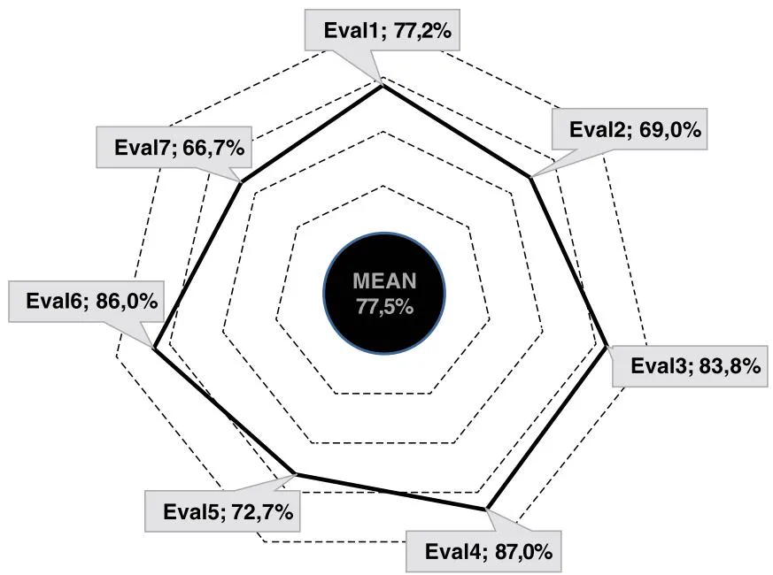

# Chapter 16

# E V A L U A T I O N :  I N S P E C T I O N S , A N A L Y T I C S ,  A N D  M O D E L S

16.1  Introduction   
16.2  Inspections: Heuristic Evaluation and Walk-Throughs   
16.3  Analytics and A/B Testing   
16.4  Predictive Models

# Objectives

The main goals of this chapter are to accomplish the following:

•  Describe the key concepts associated with inspection methods.   
• Explain how to do heuristic evaluation and walk-throughs.   
•  Explain the role of analytics in evaluation.   
•  Describe how A/B testing is used in evaluation.   
•  Describe how to use Fitts’ law—a predictive model.

# 16.1 Introduction

Most of the evaluation methods described in this book so far have involved interaction with, or direct observation of, users. In this chapter, we introduce methods that are based on understanding users through one of the following:

. Knowledge codified in heuristics   
Data collected remotely   
. Models that predict people’s performance

None of these methods requires users  to be present during the evaluation, so they can be conducted remotely, synchronously or asynchronously. Inspection methods often involve a researcher, sometimes known as an expert, role-playing the users for whom the product is designed, analyzing aspects of an interface, and identifying potential usability problems. The most  well-known  methods  are  heuristic  evaluation  and walk-throughs. Analytics  involves interaction logging, and A/B testing is an experimental method that uses data collected about people’s behavior. Both analytics and A/B testing are usually carried out remotely. Predictive modeling  involves analyzing the various physical and mental operations that are needed to

perform  particular  tasks  and  operationalizing  them  as  quantitative  measures. One  of  the most commonly used predictive models is Fitts’ law.

# 16.2 Inspections: Heuristic Evaluation and Walk-Throughs

Sometimes, it is not  practical to involve participants in an  evaluation because they are not available, there  is  insufficient  time, or  it  is  difficult  to  find  people. In  such  circumstances, other  people, often  referred  to as  experts  or researchers, can  provide  feedback. These  are people  who  are  knowledgeable  about  both  interaction  design  and  the  needs  and  typical behavior  of users. Various  inspection  methods  were developed  as alternatives  to  usability testing in the early 1990s, drawing on software engineering practice where code and other types of inspections are commonly used. Inspection methods for interaction design include heuristic  evaluations and walk-throughs,  in which  researchers examine  the interface  of an interactive product, often role-playing typical users, and suggest problems that people would likely have when interacting with the product. One of the attractions of these methods is that they can be used at any stage of a design project. They can also be used to complement other types of usability testing.

# 16.2.1  Heuristic Evaluation

In heuristic evaluation, evaluators, guided by a set of usability principles known as heuristics, evaluate whether user-interface elements, such as menus, navigation structure, sound, online help, conversational agents, and so on, conform to tried-and-tested principles. These heuristics closely resemble high-level design principles (such as making designs consistent, reducing memory load, and using terms that users understand). Heuristic evaluation was developed by Jakob  Nielsen  and  his  colleagues  (Nielsen  and  Mohlich,  1990;  Nielsen, 1994a)  and  later modified by other researchers to evaluate other types of systems (Hollingshead and Novick, 2007; Pinelle et al., 2009; Harley, 2018a, 2018b, 2018c). In addition, many researchers and practitioners have converted design guidelines into heuristics that are then applied in heuristic evaluation.

The original set of heuristics for HCI evaluation were empirically derived from the analysis  of  249  usability  problems  (Nielsen,  1994b);  an  early  revised  version  of  these  heuristics follows:

Visibility  of System  Status:  The  system  should  always  keep  users  informed  about  what  is going on, through appropriate feedback and within a reasonable time.

Match Between System  and the Real World: The system  should speak the users’ language, with words, phrases, and concepts familiar to the user, rather than system-oriented terms. It  should  follow  real-world conventions, making  information  appear  in a  natural and logical order.

User Control and Freedom: Users often choose system functions by mistake and will need a clearly marked emergency exit to leave the unwanted state without having to go through an extended dialog. The system should support undo and redo.

Consistency and Standards: Users should not have to wonder whether different words, situations, or actions mean the same thing. The system should follow platform conventions.

Error Prevention: Rather than just good error messages, the system should incorporate careful  design  that  prevents  a  problem  from  occurring  in  the  first  place.  Either  eliminate error-prone conditions or check for them and present users with a confirmation option before they commit to the action.

Recognition  Rather  Than  Recall:  Minimize  the  user’s memory  load  by  making  objects, actions, and options  visible. The user  should not  have to  remember  information from one part of the dialog to another. Instructions for use of the system should be visible or easily retrievable whenever appropriate.

Flexibility and Efficiency of Use: Accelerators—unseen by the novice user—may often speed up the  interaction  for the  expert user such  that the  system  can cater  to both inexperienced and experienced users. Allow users to tailor frequent actions.

Aesthetic  and Minimalist Design:  Dialogs should not contain information that is  irrelevant or rarely needed. Every extra unit of information in a dialog competes with the relevant units of information and diminishes their relative visibility.

Help  Users  Recognize,  Diagnose,  and  Recover  from  Errors:  Error  messages  should  be expressed in  plain  language (not  codes), precisely  indicate the problem, and constructively suggest a solution.

Help  and Documentation: Even though it is better if the system can be used without documentation, it may be necessary to provide help and documentation. Any such information  should  be  easy  to  search,  be  focused  on  the  user’s task,  list concrete  steps  to  be carried out, and not be too large.

A slightly modified version was produced by Jakob Nielsen (2020), this time with examples, figures, and videos to help readers understand how to use the heuristics. There is even a free poster that you can download!

To view Jakob Nielsen’s updated list of heuristics, see www.nngroup.com/ articles/ten-usability-heuristics.

This site shows how a researcher, Wendy Bravo (2017), used heuristics to evaluate two travel websites, Travelocity and Expedia: medium.com/@WendyBravo/ heuristic-evaluation-of-two-travel-websites-13f830cf0111.

Designers and researchers evaluate aspects of the interface against the appropriate heuristics.  For  example,  if  a  new  social  media  system  is  being  evaluated,  the  designer  might consider  how  people  would  add  friends  to  their  networks. This  might  involve  modifying Nielsen’s heuristics (Harley, 2018a) or even adding new ones to ensure that “adding friends”

gets evaluated. The researchers doing the heuristic evaluation go through the interface several times,  inspecting  the  various  interaction  elements  and  comparing  them  with  the  usability heuristics. During  each  iteration, usability  problems  will  be  identified,  and ways  of  fixing them may be suggested.

Although many heuristics apply to most products (for example, be consistent and provide meaningful feedback), some are too general for evaluating products that have come onto the market  more  recently, such  as  digital  toys, ambient devices,  web  design  (Budd,  2007; Krawiec  and Dudycz, 2019), virtual reality (VR)  (Joyce,  2019), games (Joyce,  2021), conversational agents (Langevin et al., 2021), mobile apps (Da Costa et al., 2019), and IoT—to name  just a  few. Designers  and  researchers  have  therefore developed  their  own  heuristics by tailoring  Nielsen’s heuristics with other  design guidelines, market research, results  from research studies, and requirements documents.

For more information about how the 10 heuristics are applied to evaluate VR systems check out www.nngroup.com/articles/usability-heuristics-virtual-reality.

And for video games, check out www.nngroup.com/articles/usability-heuristicsapplied-video-games.

An example of how Nielsen’s heuristics can be adapted is illustrated by Raina Langevin and her colleagues who used them to evaluate the design of different conversational agents (Langevin  et  al.,  2021). These  researchers  tested  their  heuristics  on  two  different  types  of conversational agents, a chatbot and a voice-based personal assistant. They found that when evaluators used  the adapted heuristics, they  were able  to identify  more usability  problems than when using Nielsen’s generic set of heuristics.

Exactly which heuristics are appropriate and how many are needed for different products is debatable and depends on the goals of the evaluation. However, most sets have between 5 and 10 items. This number provides a good range of usability criteria by which to judge the various aspects of a product’s design. More than 10 items becomes difficult for those doing the evaluation to manage, while fewer than 5 items tends not to be sufficiently discriminating.

Another concern is the number of researchers needed to carry out a heuristic evaluation that identifies the majority of usability problems. Empirical tests were conducted suggesting that  three  to  five  researchers  can typically  identify  up  to 75  percent  of  the  total  usability problems, as shown in Figure 16.1 (Nielsen, 1994a). However, employing several researchers can be resource  intensive. Therefore, the overall  conclusion is  that while more  researchers might  be better, fewer can  be used—especially  if they  are experienced  and knowledgeable about the product and the people for whom it is designed.

Figure 16.1 Curve  showing  the  proportion of usability  problems in an interface  found  by heuristic evaluation using various numbers of evaluators   
  
Source: Nielsen and Mack (1994). Used courtesy of John Wiley & Sons, Inc.

# Heuristic Evaluation for Websites

Ensuring that websites are designed so that those using them  can find what  they need and have a pleasant experience has been important since the early days of the web, especially as websites have become more elaborate and interactive. A number of different heuristic sets for evaluating  websites  have been developed  based on  Nielsen’s  original 10  heuristics. One  of these was developed by Andy Budd (2007) after discovering that Nielsen’s heuristics did not address the problems of the continuously evolving web. He also found that there was overlap between several of the heuristics and that they varied widely in terms of their scope and specificity, which made them difficult to use. The extract from Budd’s heuristics shown in Box 16.1 highlights  issues  that  are  fundamental  for  good  website  design.  Notice  that  a  difference between these and Nielsen’s original heuristics is that Budd’s place more emphasis on information content.

Websites vary  according  to  the  purpose  for  which  they  are  designed.  For  example, Łukasz Krawiec and Helena Dudycz (2019) carried out a survey of Polish public administration websites  with the aim of identifying the most  common usability problems. They  used Nielsen’s  heuristics to evaluate 60 websites, and then  they grouped the problems  that they identified according to severity. The most serious problems were concerned with navigation; these  included  unintuitive menu layout with too  many options, navigation between  pages, and dead links. Navigating websites to find what one is looking for is a general problem, but particularly for people who need essential information from government websites.

# BOX 16.1

Extract from the Heuristics Developed by Budd (2007) That Emphasize Web Design Issues

# Clarity

Make the system as clear, concise, and meaningful as possible for the intended audience.

•  Write clear, concise copy.   
•  Only use technical language for a technical audience.   
•  Write clear and meaningful labels.   
•  Use meaningful icons.

# Minimize Unnecessary Complexity and Cognitive Load

Make the system as simple as possible for people to accomplish their tasks.

•  Remove unnecessary functionality, process steps, and visual clutter.   
•  Use progressive disclosure to hide advanced features.   
•  Break down complicated processes into multiple steps.   
•  Prioritize using size, shape, color, alignment, and proximity.

# Provide Context

Interfaces should provide people with a sense of context in time and space.

•  Provide a clear site name and purpose.   
•  Highlight the current section in the navigation.   
•  Provide a breadcrumb trail, or add entries to the browser history list (that is, show where the person has been in a website).   
•  Use appropriate feedback messages.   
•  Show the number of steps in a process.   
•  Reduce perception  of latency  by  providing  visual  cues  (for instance,  a progress indicator) or by allowing people to complete other tasks while waiting.

# Promote a Pleasurable and Positive Experience

People should be treated  with respect, and  the design should be aesthetically pleasing and promote a pleasurable and rewarding experience.

•  Create a pleasurable and attractive design.   
•  Provide easily attainable goals.   
•  Provide rewards for usage and progression.

A  similar approach  to Budd’s is also taken by Leigh Howells in her  article entitled “A guide to heuristic website reviews” (Howells, 2011). In this article and in a more recent one by Toni Granollers (2018), techniques for making  the results of  heuristic evaluation  more

objective are proposed. This can be done either to show the occurrence of different heuristics from an evaluation or to compare the results of different researchers’ evaluations, as shown in  Figure  16.2. First, a calculation  is  done  to find  the  mean number  of usability problems identified by each researcher, which is then displayed around the diagram (in this case there were seven researchers). Then a single value representing the mean of all of the researchers’ individual means is calculated and displayed in the center of the diagram. In addition to being able to compare the relative performance of different experts and the overall usability of the design, a version of this procedure can be used to compare the usability of different prototypes or for comparisons with competitors’ products.

Figure 16.2 Radar diagram showing the mean number of problems identified by each of the seven researchers and the overall mean of all the researchers, which is shown in the center of the diagram   
  
Source: Granollers (2018). Used courtesy of Springer Nature

# ACTIVITY 16.1

1. Use  some of Budd’s heuristics (Box 16.1) to evaluate a website  that you visit  regularly. Do these heuristics help you  to identify important usability  and  user experience issues? If so, how?   
2. How does being aware of the heuristics influence how you interact with the website?   
3. Was it difficult to use these heuristics?

(Continued)

# Comment

1. The heuristics focus on key usability criteria, such as whether the website seems unnecessarily complex and how color is used. Budd’s heuristics also encourage consideration of how people feel about the experience of interacting with a website.   
2. Being aware of the heuristics may lead to a stronger focus on the design and interaction, and it can raise awareness about what the person is trying to do and how the website is responding.   
3. When applied at a  high level, these guidelines can be tricky to use. For example, what exactly does “clarity” mean in regard to a website? Although the detailed list (write clear, concise copy;  only use technical language for a technical audience, and  so on) provides some guidance,  making the  evaluation task a  bit easier, it may  still seem quite difficult, particularly for those not used to doing heuristic evaluations.

# Doing Heuristic Evaluations

The process of doing heuristic evaluation can be broken down into three main stages (Nielsen and Mack, 1994; Muniz, 2016).

A briefing  session, in which  the researcher  is briefed about  the goal  of the  evaluation. If there is more than one researcher, a prepared script may be used to ensure that each person receives the same briefing.   
The evaluation period, in which the researchers typically spend one to two hours independently inspecting the product, using the heuristics for guidance.

Typically, each  researcher will  take at  least two passes  through the  app, website, or product. The first pass gives a feel for the flow of the interaction and the product’s scope. The second pass allows them to focus on specific interface elements in the context of the whole product and to identify potential usability problems.

If the evaluation is for a functioning product, the researchers will typically have some specific tasks in mind so that their exploration is focused. Suggesting tasks may be helpful, but many UX researchers suggest their own tasks. However, this approach is more difficult if the evaluation is done early in design when there are only screen mock-ups or a specification. Therefore, the approach needs to be adapted for the evaluation circumstances. While working through the product, specification, or mock-ups, different researchers may focus on  different things:  One may  record the problems  while the other researcher  may think aloud, which can be video recorded.

The  debriefing  session,  in  which the  researchers  come together  to discuss  their findings with designers and to prioritize the problems they found and give suggestions for solutions.

The  heuristics  focus the  researchers’  attention  on  particular issues, so  selecting  appropriate  heuristics  is  critically  important.  Even  so, sometimes  there  is  disagreement  among researchers, as discussed in the following “Dilemma.”

# DILEMMA

# Classic Problems or False Alarms?

Some researchers and designers may have the impression that heuristic evaluation is a panacea that can reveal all that is wrong with a design with little demand on a design team’s resources. However, in addition to being quite difficult to carry out as just discussed, heuristic evaluation has other problems, such as sometimes missing key problems that would likely be found by testing the product with real users.

Shortly after heuristic evaluation was developed, several independent studies compared it with other methods, particularly user testing. They found that the different approaches often identify different  problems and that sometimes heuristic evaluation misses severe problems (Karat, 1994). In addition, its efficacy can be influenced both by the number of experts and by the nature of the problems, as mentioned earlier (Cockton and Woolrych, 2001; Woolrych and Cockton, 2001). Heuristic evaluation, therefore, should not be viewed as a replacement for user testing.

Another issue concerns researchers reporting problems that don’t exist. In other words, some of the researchers’ predictions are wrong. Bill Bailey (2001) cites analyses from three published sources showing that about 33 percent of the problems reported were real usability problems, some of which were serious, while  others were trivial. However, the researchers missed about  21 percent of the  problems. Furthermore, about  43 percent of the  problems identified were not problems at all; they were false alarms. This means that only about half of the problems identified were true problems.

How can the number of false alarms or missed serious problems be reduced? Checking that researchers really have the  expertise that is required could help, particularly that they have a good understanding of the target user population. But how can this be done? One way to overcome these problems is to have several people involved. This helps to reduce the impact of one researcher’s experience or poor performance. Using heuristic evaluation along with user testing and other methods is also a good idea. Providing support for researchers and designers to use heuristics effectively is yet another way to reduce these shortcomings. For example, Bruce Tognazzini (2014) includes short case studies  to illustrate some of the principles that he advocates using as heuristics. Analyzing the  meaning of each heuristic  and developing a set of questions can be helpful. A study by Mohd Kamal Othman and his colleagues (2022) identified some differences between researchers who were experienced in detecting usability problems and  those  who were novices. In an evaluation of a  smartphone app  for cultural heritage, the  experienced  interaction  design researchers  identified more usability  problems than the novices, 19 to 14, respectively. The experienced researchers also identified usability problems that were more severe.

Accessibility is a usability issue for people who are sight (Mankoff et al., 2005) and hearing (Yeratziotis and Zaphiris, 2018) challenged (Mankoff et al., 2019; BBC, 2021). Heuristics

can help designers ensure that their designs are accessible. For example, Alexandros Yeratziotis and Panayiotis Zaphiris (2018) created a method comprising 12 heuristics for evaluating deaf users’ experiences with websites. Increasingly, governments around the world are trying to ensure that their websites are usable and accessible. For example, Surjit Paul and Saini Das carried out an analysis of 65 Indian e-government websites (Paul and Das, 2020). They found that web content was often difficult to access, particularly diagrams and other graphics.

Box  16.2  discusses  Web  Content  Accessibility  Guidelines,  which  were  created  to help  ensure  that designers,  developers, companies,  and governments  take  account  of  web accessibility.

# BOX 16.2

# Evaluating for Accessibility Using the Web Content Accessibility Guidelines

Web  Content Accessibility  Guidelines (WCAG) are  a  detailed set of standards  about  how to ensure that web page content is accessible for users with various disabilities (Lazar et al., 2015). While  heuristics such as Ben  Shneiderman’s  eight  golden rules  (Shneiderman et al., 2016) and Nielsen and Mohlich’s heuristic evaluation are well-known within the HCI community, the WCAG is the best-known set of guidelines outside of the HCI community. Why? Because many countries around the world have laws that require that government websites, and websites of public accommodations (such as hotels, libraries, and retail stores), are accessible for people with disabilities. A majority of those laws, including the Disability Discrimination Act in Australia, Stanca Act in Italy, Equality Act in the United Kingdom, and Section 508 of the Rehabilitation Act in the United States, as well as policies such as Canada’s Policy on Communications and  Federal Identity and India’s Guidelines for Indian Government Websites, use WCAG as the benchmark for web accessibility.

The concept of web accessibility is as old as the  web itself. Tim Berners-Lee said, “The power of the web is in its universality. Access by everyone, regardless of disability, is an essential aspect” (www.w3.org/Press/IPO-announce). To fulfill this mission, the WCAG were created, approved, and released in 1999. The WCAG were created by committee members from 475 member organizations, including leading tech companies such as Microsoft, Google, and Apple. The process for developing them was transparent and open, and all of the stakeholders, including  many members of the  HCI community, were encouraged to contribute and  comment. WCAG 2.0 was released in 2008. WCAG 2.1 was released in 2018, with a modification to improve accessibility further for low-vision users and for web content presented on mobile devices. When designers follow these guidelines, there are often benefits for all users, such as improved readability and search results that are presented in more meaningful ways.

While all of the various WCAG documents online would add up to hundreds of printed pages, the key concepts and core requirements are summarized in “WCAG 2.1 at a Glance” (www.w3.org/WAI/standards-guidelines/wcag/glance), a document that could be considered to be a set of HCI heuristics.

The key concepts of web accessibility, according to WCAG, are summarized as POUR— Perceivable, Operable, Understandable, and Robust.

