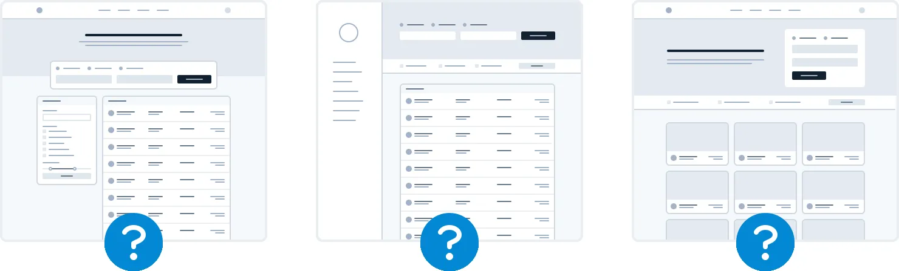
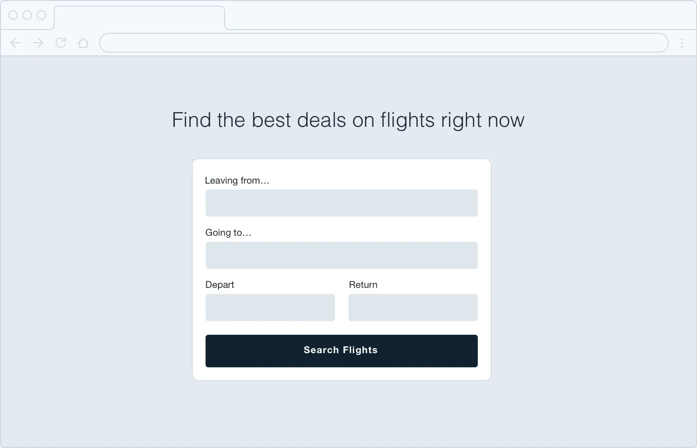
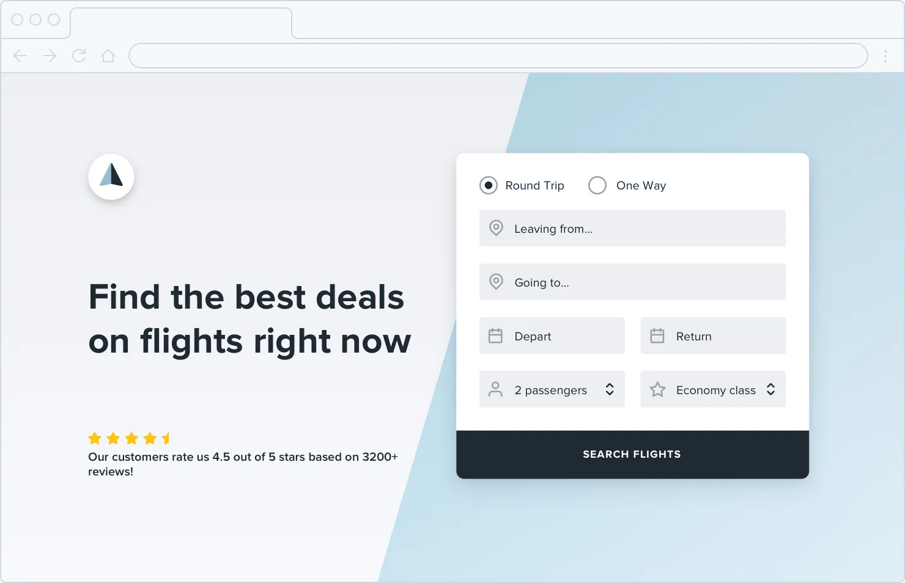
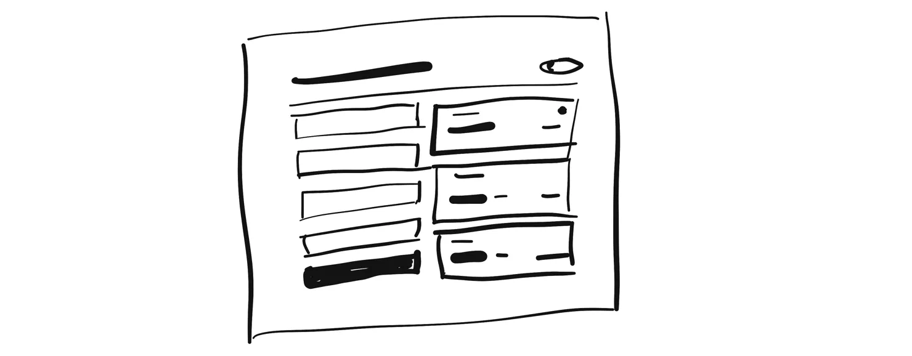

**Starting from Scratch**

**Start with a feature, not a layout**

When you start the design for a new app idea, what do you design first?
If it’s the navigation bar at the top of the page, you’re making a
mistake.

The easiest way to find yourself frustrated and stuck when working on a
new design is to start by trying to “design the app.” When most people
think about “designing the app”, they’re thinking about the *shell*.

*Should it have a top nav, or a sidebar?*

*Should the navigation items be on the left, or on the right?*

*Should the page content be in a container, or should it be full-width?*

*Where should the logo go?*

The thing is, an “app” is actually a collection of *features*. Before
you’ve designed a few features, you don’t even have the information you
need to make a decision about how the navigation should work. No wonder
it’s frustrating!

9

Start with a feature, not a layout

Instead of starting with the shell, start with a piece of actual
functionality.

For example, say you’re building a flight booking service. You could
start with a feature like “searching for a flight”.

Your interface will need:

• A field for the departure city

• A field for the destination city

• A field for the departure date

• A field for the return date

• A button to perform the search

Start with that.

Start with a feature, not a layout

10

Hell, you might not even need that other stuff anyways — it worked for
Google.

11

Start with a feature, not a layout

