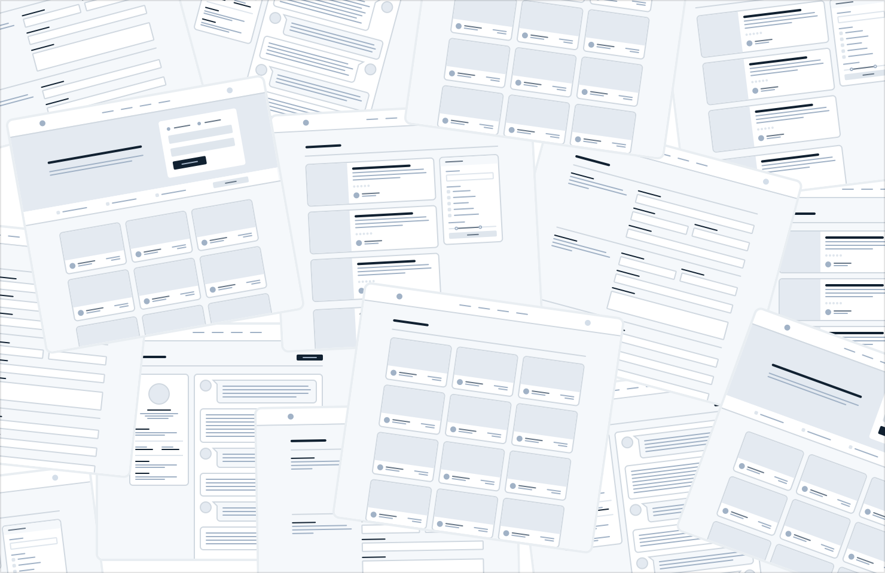

**Detail comes later**

In the earliest stages of designing a new feature, it’s important that
you don’t get hung up making low-level decisions about things like
typefaces, shadows, icons, etc.

That stuff will all matter eventually, but it doesn’t matter right now.

If you have trouble ignoring the details when working in a high fidelity
environment like the browser or your favorite design tool, one trick
Jason Fried of Basecamp likes to use is to design on paper using a thick
Sharpie.

Obsessing over little details just isn’t possible with a Sharpie, so it
can be a great way to quickly explore a bunch of different layout ideas.

**Hold the color**

Even when you’re ready to refine an idea in higher fidelity, resist the
temptation to introduce color right away.

13

Detail comes later

By designing in grayscale, you’re forced to use spacing, contrast, and
size to do all of the heavy lifting.

It’s a little more challenging, but you’ll end up with a clearer
interface with a strong hierarchy that’s easy to enhance with color
later.

Detail comes later

14

**Don’t over-invest**

The whole point of designing in low-fidelity is to be able to move fast,
so you can start building the real thing as soon as possible.

Sketches and wireframes are disposable — users can’t do anything with
static mockups. Use them to explore your ideas, and leave them behind
when you’ve made a decision.

15

Detail comes later

