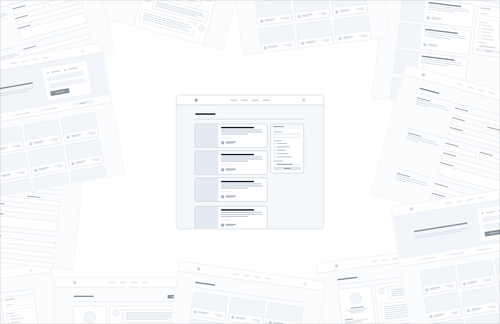
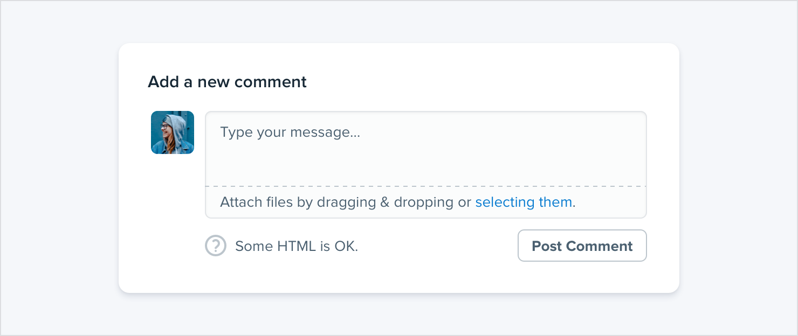
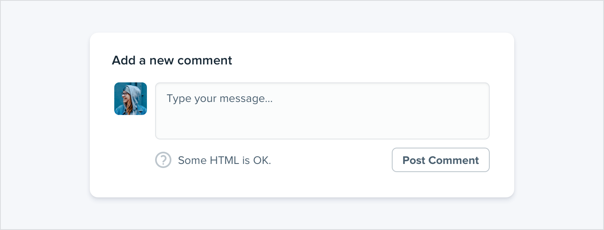
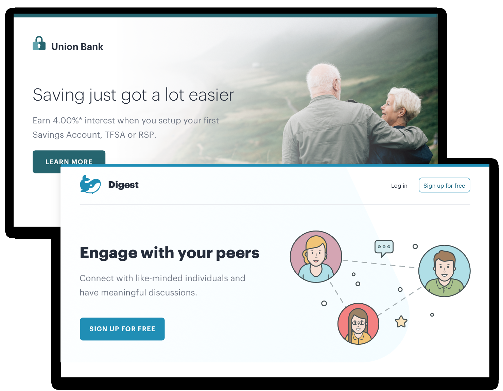

**Don’t design too much**

You don’t need to design every single feature in an app before you move
on to implementation; in fact, it’s better if you don’t.

Figuring out how every feature in a product should interact and how
every edge case should look is really hard, especially in the abstract.

*How should this screen look if the user has 2000 contacts?*

*Where should the error message go in this form?*

*How should this calendar look when there are two events scheduled at
the* *same time?*

17

Don’t design too much

You’re setting yourself up for frustration by trying to figure this
stuff out using only a design tool and your imagination.

**Work in cycles**

Instead of designing everything up front, work in short cycles. Start by
designing a simple version of the next feature you want to build.

Once you’re happy with the basic design, *make it real*.

You’ll probably run into some unexpected complexity along the way, but
that’s the point — it’s a lot easier to fix design problems in an
interface you can actually use than it is to imagine every edge case in
advance.

Iterate on the working design until there are no more problems left to
solve,

Don’t design too much

18

then jump back into design mode and start working on the next feature.

Don’t get overwhelmed working in the abstract. Build the real thing as
early as possible so your imagination doesn’t have to do all the heavy
lifting.

**Be a pessimist**

Don’t imply functionality in your designs that you aren’t ready to
build.

For example, say you’re working on a comment system for a project
management tool. You know that one day, you’d like users to be able to
attach files to their comments, so you include an attachments section in
your design.

19

Don’t design too much

You get deep into implementation only to discover that supporting
attachments is going to be *a lot* more work than you anticipated.
There’s no way you have time to finish it right now, so the whole
commenting system sits on the backburner while you take care of other
priorities.

The thing is, a comment system with no attachments would still have been
better than no comment system at all, but because you planned to include
it from day one you’ve got nothing you can ship.

When you’re designing a new feature, **expect it to be hard to build.**

Designing the smallest useful version you can ship reduces that risk
considerably.

If part of a feature is a “nice-to-have”, **design it later**. Build the
simple version first and you’ll always have something to fall back on.

