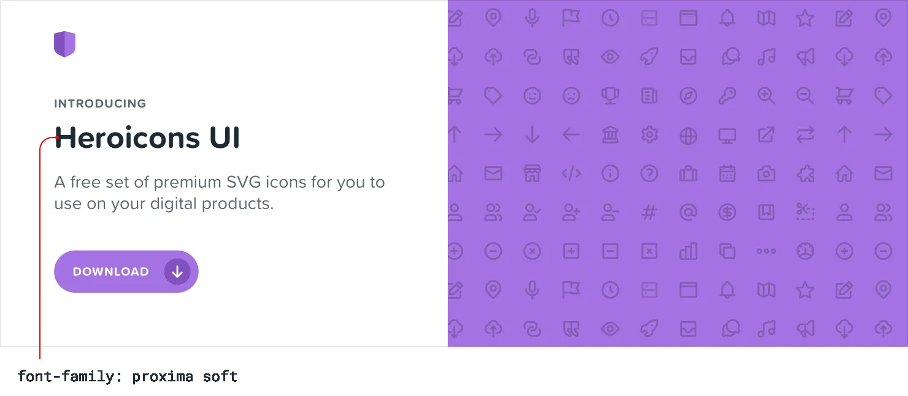
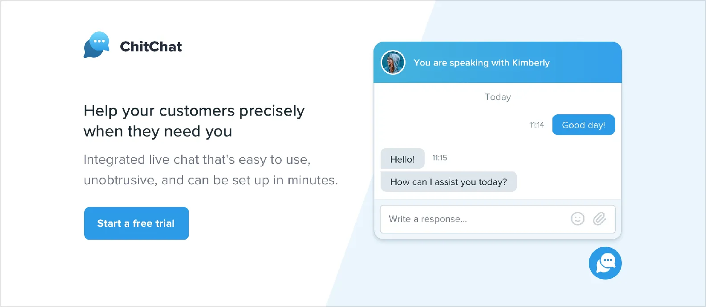
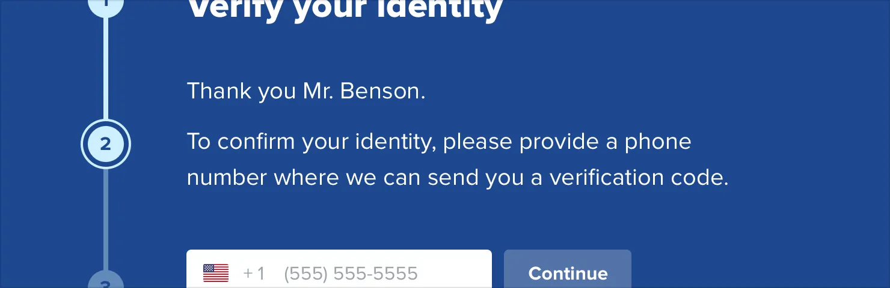
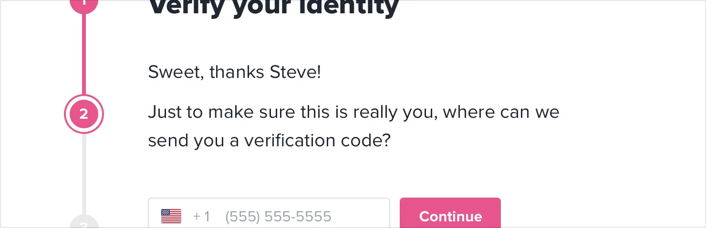

**Choose a personality**

Every design has some sort of personality. A banking site might try to
communicate *secure* and *professional*, while a trendy new startup
might have a design that feels *fun* and *playful*.

On the surface, giving a design a particular personality might sound
abstract and handwavy, but a lot of it is determined by a few solid,
concrete factors.

21

Choose a personality

**Font choice**

Typography plays a huge part in determining how a design feels.

If you want an elegant or classic look, you might want to incorporate a
serif typeface in your design:

For a playful look, you could use a rounded sans serif:

Choose a personality

22

If you’re going for a plainer look, or want to rely on other elements to
provide the personality, a neutral sans serif works great:

**Color**

There’s a lot of science out there on the psychology of color, but in
practice, you really just need to pay attention to how different colors
feel to you.

Blue is safe and familiar — nobody ever complains about blue:

23

Choose a personality

Gold might say “expensive” and “sophisticated”:

Pink is a bit more fun, and not so serious:

While trying to choose colors using *only* psychology isn’t super
practical — a lot of it is just about what looks good to you — it can be
helpful to think about when you’re trying to understand *why* you think
a color is the right fit.

Choose a personality

24

**Border radius**

As small of a detail as it sounds, if and how much you round the corners
in your design can have a big impact on the overall feel.

A small border radius is pretty neutral, and doesn’t really communicate
much of a personality on its own:

A large border radius starts to feel more playful:

25

Choose a personality

…while no border radius at all feels a lot more serious or formal:
Whatever you choose, it’s important to stay consistent. Mixing square
corners with rounded corners in the same interface almost always looks
worse than sticking with one or the other.

**Language**

While not a visual design technique per se, the words you use in an
interface have a massive influence on the overall personality.

Using a less personal tone might feel more official or professional:

Choose a personality

26

…while using friendlier, more casual language makes a site feel, well,
friendlier:

Words are everywhere in a user interface, and choosing the right ones is
just as (if not more) important than choosing the right color or
typeface.

**Deciding what you actually want**

A lot of the time you’ll probably just have a gut feeling for the
personality you’re going for. But if you don’t, a great way to simplify
the decision is to take a look at other sites used by the people who
want to reach.

If they are mostly pretty “serious business”, maybe that’s how your site
should look too. If they are more playful with a bit of humor, maybe
that’s a better direction to take.

Just try not to borrow too much from direct competitors, you don’t want
to look like a second-rate version of something else.

27

Choose a personality

